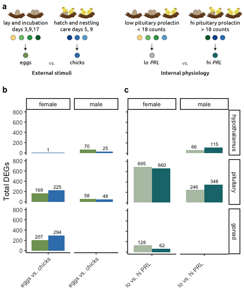

# Characterizing the neurogenomics of parental care in the rock dove

## Overview

This repository contains the data and analysis for a collaboration between Drs. Rebecca Calisi and Matt MacManes that focuses on one characterizing the neurogenomocs of parental care in the rock dove.

## Organization

These repositories is broken down into the following sub-repositories, each with their own unique purpose and structure.

- analysis: where the .Rmd script and the .md outputs live. The prefix corresponds to the order of operation. 
- figures: where figure generated by the scripts live. The prefix correspond to the script prefix that created the files
- metadata: contains files that describe the sample variables and a rosseta stone for transcripts to gene ids. 
- results: where data generated by the scripts live. The prefix correspond to the script prefix that created the files

There are two hidden directories, `kallisto_mappings` and `mapping`, which contain the results of the kallisto and salmon algorithms that transform read counts into gene counts.  

## Tables

### Supplementary table 1

<table>
 <thead>
  <tr>
   <th style="text-align:left;"> sex </th>
   <th style="text-align:left;"> tissue </th>
   <th style="text-align:left;"> control_bldg </th>
   <th style="text-align:left;"> inc.d9_inc.d17 </th>
   <th style="text-align:left;"> hatch_n5 </th>
  </tr>
 </thead>
<tbody>
  <tr>
   <td style="text-align:left;"> female </td>
   <td style="text-align:left;"> hypothalamus </td>
   <td style="text-align:left;"> DRD1 AR PRLR PRL CYP19A1 POMC AGRP </td>
   <td style="text-align:left;"> NA </td>
   <td style="text-align:left;"> DRD1 CYP19A1 POMC </td>
  </tr>
  <tr>
   <td style="text-align:left;"> male </td>
   <td style="text-align:left;"> hypothalamus </td>
   <td style="text-align:left;"> CRH AR AVPR2 CYP19A1 PRL GNRH1 AGRP POMC </td>
   <td style="text-align:left;"> AR </td>
   <td style="text-align:left;"> NA </td>
  </tr>
</tbody>
</table>

## Working figures

## Related documentation.

Another website <http://www.dovelovegenomics.org/>

Another GitHub repository <https://github.com/macmanes-lab/RockDove> 

A talk from 2020 <https://speakerdeck.com/raynamharris/peaks-and-valleys-of-prolactin-driven-gene-expression-during-parental-care>

An poster from 2019

See also <https://macmanes-lab.github.io/DoveParentsRNAseq/> for a more user-friendly way to read the information on the poster. The bulk of the analysis for the SBN poster were created using the script [analysis/04_DESeq2_sexes.Rmd](https://github.com/macmanes-lab/DoveParentsRNAseq/blob/master/analysis/04_DESeq2_sexes.Rmd), which really needs a different name. 