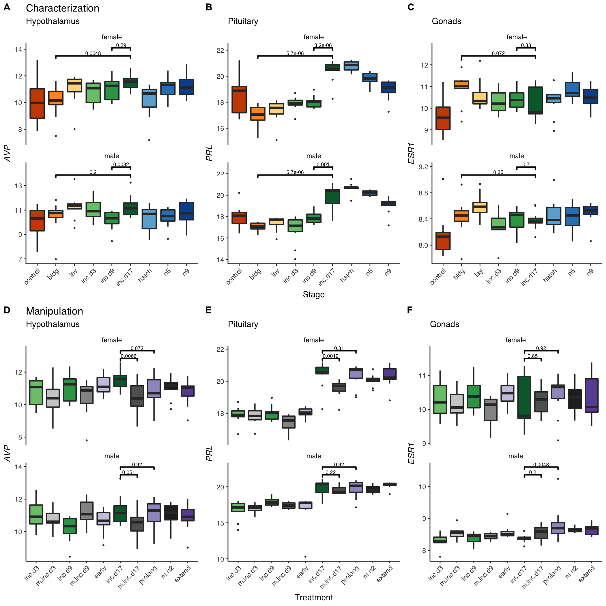
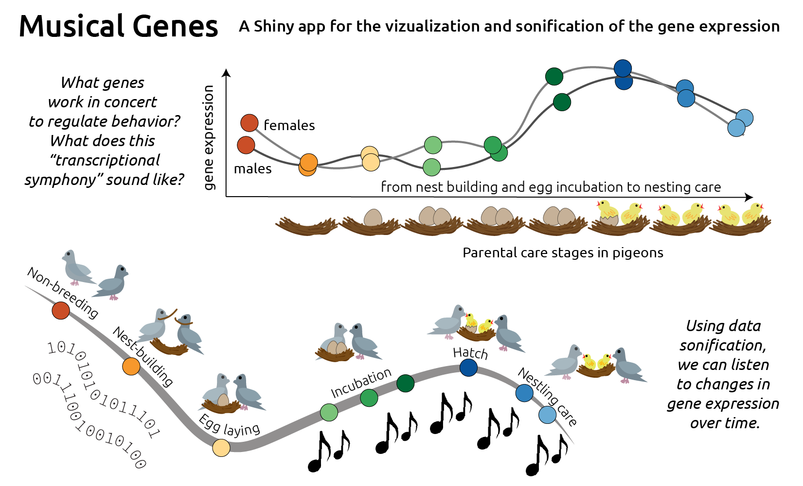
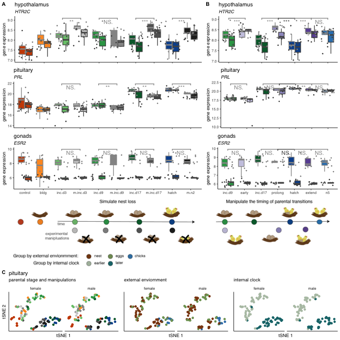
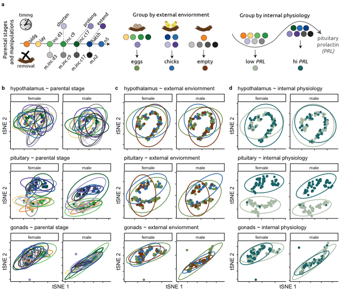
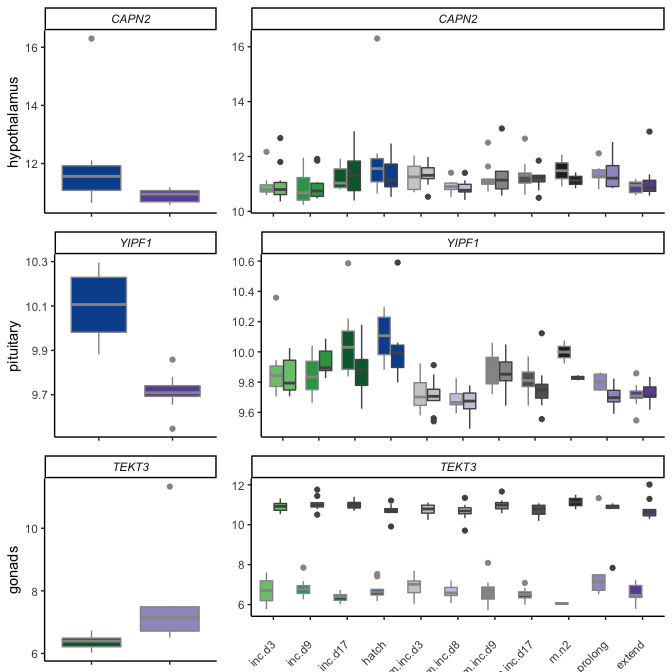

# Characterizing the neurogenomics of parental care in the rock dove

## Overview

This repository contains the data and analysis for a collaboration between Drs. Rebecca Calisi and Matt MacManes that focuses on one characterizing the neurogenomocs of parental care in the rock dove.

## Organization

These repositories is broken down into the following sub-repositories, each with their own unique purpose and structure.

- analysis: where the .Rmd script and the .md outputs live. The prefix corresponds to the order of operation. 
- figures: where figure generated by the scripts live. The prefix correspond to the script prefix that created the files
- metadata: contains files that describe the sample variables and a rosseta stone for transcripts to gene ids. 
- results: where data generated by the scripts live. The prefix correspond to the script prefix that created the files

There are two hidden directories, `kallisto_mappings` and `mapping`, which contain the results of the kallisto and salmon algorithms that transform read counts into gene counts.  

## Figure 1 

## Figure 2 

## Figure 3 (placeholders) 

## Figure 4

## Figure 5

## Figure 6

## Table 1

|  | gene | control_bldg | bldg_lay | lay_inc.d3 | inc.d3_inc.d9 | inc.d9_inc.d17 | hatch_n5 | n5_n9 | Literature | GO | NCBI |
|----|--------|-------------------------|----------|------------|---------------|----------------|----------|-------|------------|----|----------------|
| 1 | AVPR1A | FG+ |  | FG+ | FG- |  |  |  | X | X | NP_001103908.1 |
| 2 | CREBRF | MG- | FG+ | FG- |  |  |  |  |  | X | XP_001231574.1 |
| 3 | CRHBP | FH+ FG- |  |  |  |  | FH+ |  | X |  | XP_003643006.2 |
| 4 | CRHR2 | FG- MG- |  |  |  |  | FH+ |  | X |  | NP_989785.1 |
| 5 | DRD1 | FH+ FP+ |  |  |  |  | FH+ |  | X | X | NP_001138320.1 |
| 6 | ESR1 | FH+ MH+ FG+ MG+ | FP+ | FP- |  |  |  |  | X |  | XP_015139536.1 |
| 7 | FOS | FP- |  | FG+ |  |  |  |  | X |  | NP_990839.1 |
| 8 | GNAQ | FH+ MH+ FP+ MP+ FG+ MG- |  | FG- |  |  | FH+ |  |  | X | NP_001026598.1 |
| 9 | HTR2C | FH+ FG- |  |  |  |  | FH+ |  | X |  | XP_004940707.1 |
| 10 | MEST | FG+ |  |  |  | FP+ | FP- |  | X |  | XP_015142671.1 |
| 11 | NR3C1 | FH+ MH+ FP+ MP+ FG+ MG+ |  | FG- |  |  |  |  | X | X | XP_015149519.1 |
| 12 | OPRK1 | FH+ FG- |  |  |  |  | FH+ |  |  | X | XP_426087.2 |
| 13 | OPRM1 | FH+ MH+ MP+ FG+ | FG- |  |  |  |  | FG+ | X |  | XP_003641008.2 |
| 14 | PGR | FG+ |  |  |  |  | FH+ |  | X |  | NP_990593.1 |
| 15 | PRL | FH- MH- FP- MP- MG- |  |  |  | FP+ MP+ | FP- |  | X | X | NP_990797.2 |
| 16 | PRLR | FH- FP- MP- MG- |  | FG- |  |  |  |  | X |  | XP_015132722.1 |
| 17 | PTEN | FH+ FP+ MP+ FG+ MG- |  | FP- |  |  |  |  |  | X | XP_015134187.1 |
| 18 | ADRA2A | FH+ FP+ |  |  |  |  |  |  | X |  | XP_004942333.2 |
| 19 | AVP | FP- MP- |  |  |  |  |  |  | X | X | NP_990516.1 |
| 20 | BRINP1 | FH- MP- FG- |  |  |  |  |  |  |  | X | NP_989780.1 |
| 21 | COMT | FH- MH- MP- |  |  |  |  |  |  | X |  | XP_001233014.1 |
| 22 | CRH | MH+ |  |  |  |  |  |  | X |  | NP_001116503.1 |
| 23 | CRHR1 | FG- |  |  |  |  |  |  | X |  | NP_989652.1 |
| 24 | DBH | FG+ |  |  |  |  |  |  |  | X | XP_415429.5 |
| 25 | DRD4 | FH- FP- MP- |  |  |  |  |  |  | X |  | NP_001136321.1 |
| 26 | ESR2 | FG- |  |  |  |  |  |  | X |  | NP_990125.1 |
| 27 | KALRN | FH+ |  |  |  |  |  |  |  | X | XP_015145468.1 |
| 28 | MBD2 | FP+ |  |  |  |  |  |  |  | X | NP_001012403.1 |
| 29 | NPAS3 | FH- MP- FG- MG- |  |  |  |  |  |  |  | X | XP_015143131.1 |
| 30 | NPAS3 | FH- MP- FG- MG- |  |  |  |  |  |  |  | X | XP_015143132.1 |
| 31 | OXT | FP- MP- |  |  |  |  |  |  | X | X | XP_004936337.1 |
| 32 | SLC6A4 | FP+ |  |  |  |  |  |  | X |  | XP_015151186.1 |
| 33 | ZFX | FP- MP- MG- |  |  |  |  |  |  |  | X | XP_015127980.1 |

## Related documentation 

Another website <http://www.dovelovegenomics.org/>.

Another GitHub repository <https://github.com/macmanes-lab/RockDove>. 

A talk from 2020 <https://speakerdeck.com/raynamharris/peaks-and-valleys-of-prolactin-driven-gene-expression-during-parental-care>.

See also <https://macmanes-lab.github.io/DoveParentsRNAseq/> for a more user-friendly way to read the information on the poster. The bulk of the analysis for the SBN poster were created using the script [analysis/04_DESeq2_sexes.Rmd](https://github.com/macmanes-lab/DoveParentsRNAseq/blob/master/analysis/04_DESeq2_sexes.Rmd), which really needs a different name. 