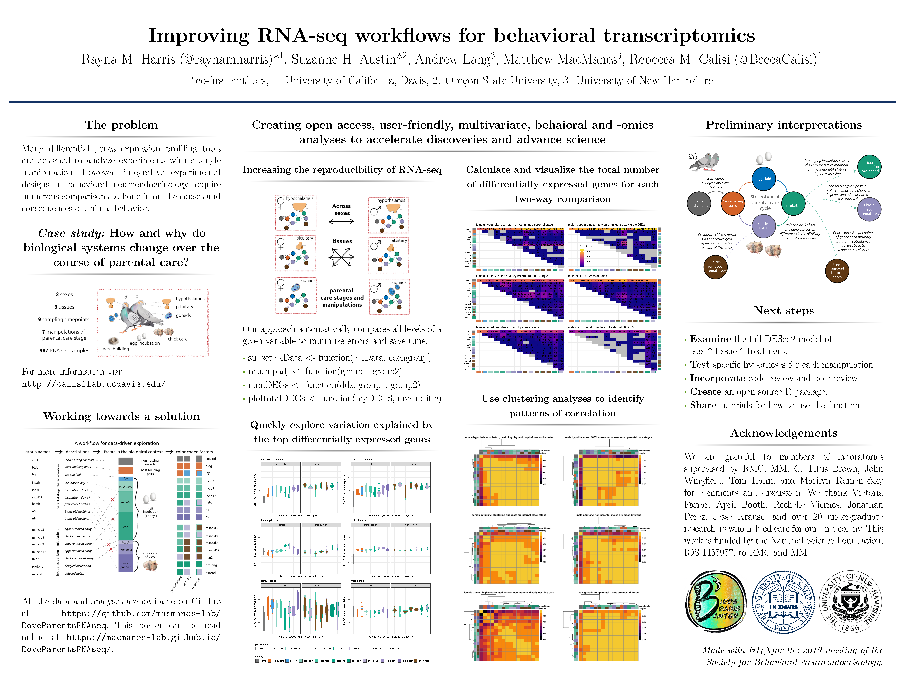

# Characterizing the neurogenomics of parental care in the rock dove

## Overview

This repository contains the data and analysis for a collaboration between Drs. Rebecca Calisi and Matt MacManes that focuses on one characterizing the neurogenomocs of parental care in the rock dove.

## Organization

These repositories is broken down into the following sub-repositories, each with their own unique purpose and structure.

- analysis: where the .Rmd script and the .md outputs live. The prefix corresponds to the order of operation. 
- figures: where figure generated by the scripts live. The prefix correspond to the script prefix that created the files
- metadata: contains files that describe the sample variables and a rosseta stone for transcripts to gene ids. 
- results: where data generated by the scripts live. The prefix correspond to the script prefix that created the files

There are two hidden directories, `kallisto_mappings` and `mapping`, which contain the results of the kallisto and salmon algorithms that transform read counts into gene counts.  

## Figures and Tables

## Table 1: Candidate gene DEGs

<table>
 <thead>
  <tr>
   <th style="text-align:left;"> sex </th>
   <th style="text-align:left;"> tissue </th>
   <th style="text-align:left;"> control_bldg </th>
   <th style="text-align:left;"> bldg_lay </th>
   <th style="text-align:left;"> lay_inc.d3 </th>
   <th style="text-align:left;"> inc.d3_inc.d9 </th>
   <th style="text-align:left;"> inc.d9_inc.d17 </th>
   <th style="text-align:left;"> hatch_n5 </th>
  </tr>
 </thead>
<tbody>
  <tr>
   <td style="text-align:left;"> female </td>
   <td style="text-align:left;"> hypothalamus </td>
   <td style="text-align:left;"> AR+ CYP19A1- DRD1+ ESR1+ GNRHR- JUN- PRL- PRLR- VIP- </td>
   <td style="text-align:left;"> NA </td>
   <td style="text-align:left;"> NA </td>
   <td style="text-align:left;"> NA </td>
   <td style="text-align:left;"> NA </td>
   <td style="text-align:left;"> BDNF- CYP19A1+ DRD1+ EGR1+ </td>
  </tr>
  <tr>
   <td style="text-align:left;"> male </td>
   <td style="text-align:left;"> hypothalamus </td>
   <td style="text-align:left;"> AR+ AVPR2- CYP19A1- EGR1+ ESR1+ GNRH1- GNRHR- PRL- VIP- </td>
   <td style="text-align:left;"> NA </td>
   <td style="text-align:left;"> NA </td>
   <td style="text-align:left;"> NA </td>
   <td style="text-align:left;"> AR+ </td>
   <td style="text-align:left;"> NA </td>
  </tr>
  <tr>
   <td style="text-align:left;"> female </td>
   <td style="text-align:left;"> pituitary </td>
   <td style="text-align:left;"> AR+ AVP- AVPR2+ BDNF+ CYP19A1- DRD1+ FOS- LBH- OXT- PRL- PRLR- </td>
   <td style="text-align:left;"> ESR1+ GNRHR- </td>
   <td style="text-align:left;"> ESR1- GNRHR+ </td>
   <td style="text-align:left;"> NA </td>
   <td style="text-align:left;"> LBH+ PRL+ </td>
   <td style="text-align:left;"> AVPR2+ LBH- PRL- </td>
  </tr>
  <tr>
   <td style="text-align:left;"> male </td>
   <td style="text-align:left;"> pituitary </td>
   <td style="text-align:left;"> AR+ AVP- AVPR1B+ AVPR2+ BDNF+ CYP19A1- OXT- PRL- PRLR- </td>
   <td style="text-align:left;"> NA </td>
   <td style="text-align:left;"> NA </td>
   <td style="text-align:left;"> NA </td>
   <td style="text-align:left;"> LBH+ PRL+ VIP+ </td>
   <td style="text-align:left;"> NA </td>
  </tr>
  <tr>
   <td style="text-align:left;"> female </td>
   <td style="text-align:left;"> gonad </td>
   <td style="text-align:left;"> AR+ AVPR1A+ CYP19A1- EGR1- ESR1+ ESR2- LBH- </td>
   <td style="text-align:left;"> NA </td>
   <td style="text-align:left;"> AVPR1A+ EGR1+ FOS+ PRLR- </td>
   <td style="text-align:left;"> AVPR1A- </td>
   <td style="text-align:left;"> NA </td>
   <td style="text-align:left;"> NA </td>
  </tr>
  <tr>
   <td style="text-align:left;"> male </td>
   <td style="text-align:left;"> gonad </td>
   <td style="text-align:left;"> AR+ ESR1+ PRL- PRLR- </td>
   <td style="text-align:left;"> NA </td>
   <td style="text-align:left;"> NA </td>
   <td style="text-align:left;"> NA </td>
   <td style="text-align:left;"> NA </td>
   <td style="text-align:left;"> NA </td>
  </tr>
</tbody>
</table>

## Figure 1: Overall pattern of gene expression

## Figure 2: Sequential differential gene expression in the HPG

## Figure 3: Prolactin gene expression in the pituitary explains most of the variation in the whole data set and is correlated with circulating prolactin. In the pituitary, more chagnes gene expression are due to changes in internal _PRL_ expression (high versus lo) than the external enviornment (eggs versus chicks)

## Figure 5: manipualations, work in progess...

## Related documentation.

Another website <http://www.dovelovegenomics.org/>

Another GitHub repository <https://github.com/macmanes-lab/RockDove> 

A talk from 2020 <https://speakerdeck.com/raynamharris/peaks-and-valleys-of-prolactin-driven-gene-expression-during-parental-care>

An poster from 2019

See also <https://macmanes-lab.github.io/DoveParentsRNAseq/> for a more user-friendly way to read the information on the poster. The bulk of the analysis for the SBN poster were created using the script [analysis/04_DESeq2_sexes.Rmd](https://github.com/macmanes-lab/DoveParentsRNAseq/blob/master/analysis/04_DESeq2_sexes.Rmd), which really needs a different name. 