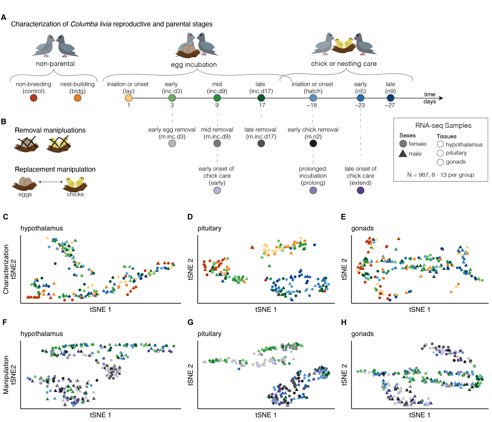

<!---

--->

# Characterizing the neurogenomics of parental care in the rock dove

## Overview

This repository contains the data and analysis for a collaboration between Drs. Rebecca Calisi and Matt MacManes that focuses on one characterizing the neurogenomocs of parental care in the rock dove.

 To quickly explore the data in an internet browser, use [our R Shiny app](https://raynamharris.shinyapps.io/musicalgenes/). 

## Organization

These repositories is broken down into the following sub-repositories, each with their own unique purpose and structure.

- [analysis](https://github.com/macmanes-lab/DoveParentsRNAseq/tree/master/analysis): where the .Rmd script and the .md outputs live. The prefix corresponds to the order of operation. 
- [figures](https://github.com/macmanes-lab/DoveParentsRNAseq/tree/master/figures): where figure generated by the scripts live. The prefix correspond to the script prefix that created the files
- [metadata](https://github.com/macmanes-lab/DoveParentsRNAseq/tree/master/metadata): contains files that describe the sample variables and a rosseta stone for transcripts to gene ids. 
- [results](https://github.com/macmanes-lab/DoveParentsRNAseq/tree/master/results): where data generated by the scripts live. The prefix correspond to the script prefix that created the files

There are two hidden directories, `kallisto_mappings` and `mapping`, which contain the results of the kallisto and salmon algorithms that transform read counts into gene counts.  

## Results

- [Table 1](https://github.com/macmanes-lab/DoveParentsRNAseq/blob/master/results/table1.csv)
- [Table 2](https://github.com/macmanes-lab/DoveParentsRNAseq/blob/master/results/table2.csv)
- [Suppl Table 1](https://github.com/macmanes-lab/DoveParentsRNAseq/blob/master/results/suppltable1.csv)
- [Suppl Table 2](https://github.com/macmanes-lab/DoveParentsRNAseq/blob/master/results/suppltable2.csv)
- [All differentially expressed genes](https://github.com/macmanes-lab/DoveParentsRNAseq/blob/master/results/03_allDEG.csv)

**_[High quality PDFs of all figures are available here](https://github.com/macmanes-lab/DoveParentsRNAseq/tree/master/figures)_**

### Figure 1 

### Figure 1 Supplement 1

### Figure 2 

### Figure 3 

### Figure 3 supplement 1

## Related documentation 

- Dove Genomics Project website <http://www.dovelovegenomics.org/>
- Shiny app for Data exploration <https://raynamharris.shinyapps.io/musicalgenes/>
- A talk from the Society for Integrative and Comparative Biology 2020 
<https://speakerdeck.com/raynamharris/peaks-and-valleys-of-prolactin-driven-gene-expression-during-parental-care>.
