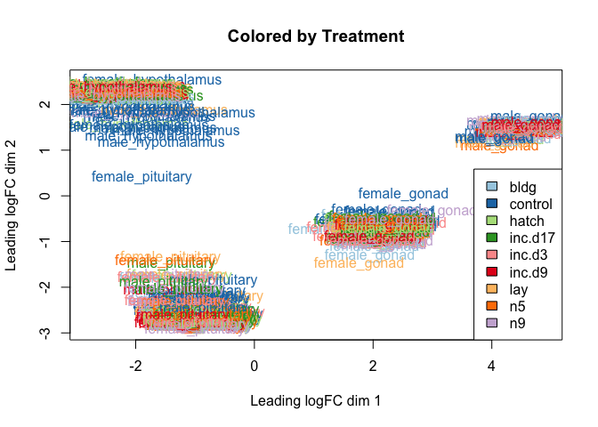

DESeq2 is *not* recommended for experiments with more than 100 samples
([see Mike Love’s
post](https://mikelove.wordpress.com/2016/09/28/deseq2-or-edger/)), so I
decided to try the limma package. I followed [this
tutorial](https://www.bioconductor.org/packages/devel/workflows/vignettes/RNAseq123/inst/doc/limmaWorkflow.html).

    library(limma)
    library(Glimma)
    library(edgeR)
    library(kableExtra)
    library(cowplot)

    ## Loading required package: ggplot2

    ## 
    ## Attaching package: 'cowplot'

    ## The following object is masked from 'package:ggplot2':
    ## 
    ##     ggsave

    knitr::opts_chunk$set(fig.path = '../figures/',cache=TRUE)

First, I read in the data I processed in 00\_datawrangling.Rmd.

    # import "colData" which contains sample information and "countData" which contains read counts
    colData <- read.csv("../metadata/00_colData_characterization.csv", header = T, row.names = 1)
    countData <- read.csv("../results/00_countData_characterization.csv", header = T, row.names = 1)
    head(colData)

    ##                                                                            V1
    ## L.Blu13_male_gonad_control.NYNO               L.Blu13_male_gonad_control.NYNO
    ## L.Blu13_male_hypothalamus_control.NYNO L.Blu13_male_hypothalamus_control.NYNO
    ## L.Blu13_male_pituitary_control.NYNO       L.Blu13_male_pituitary_control.NYNO
    ## L.G107_male_gonad_control                           L.G107_male_gonad_control
    ## L.G107_male_hypothalamus_control             L.G107_male_hypothalamus_control
    ## L.G107_male_pituitary_control                   L.G107_male_pituitary_control
    ##                                           bird  sex       tissue treatment
    ## L.Blu13_male_gonad_control.NYNO        L.Blu13 male        gonad   control
    ## L.Blu13_male_hypothalamus_control.NYNO L.Blu13 male hypothalamus   control
    ## L.Blu13_male_pituitary_control.NYNO    L.Blu13 male    pituitary   control
    ## L.G107_male_gonad_control               L.G107 male        gonad   control
    ## L.G107_male_hypothalamus_control        L.G107 male hypothalamus   control
    ## L.G107_male_pituitary_control           L.G107 male    pituitary   control
    ##                                                            group
    ## L.Blu13_male_gonad_control.NYNO               male.gonad.control
    ## L.Blu13_male_hypothalamus_control.NYNO male.hypothalamus.control
    ## L.Blu13_male_pituitary_control.NYNO       male.pituitary.control
    ## L.G107_male_gonad_control                     male.gonad.control
    ## L.G107_male_hypothalamus_control       male.hypothalamus.control
    ## L.G107_male_pituitary_control             male.pituitary.control
    ##                                                  study
    ## L.Blu13_male_gonad_control.NYNO        charcterization
    ## L.Blu13_male_hypothalamus_control.NYNO charcterization
    ## L.Blu13_male_pituitary_control.NYNO    charcterization
    ## L.G107_male_gonad_control              charcterization
    ## L.G107_male_hypothalamus_control       charcterization
    ## L.G107_male_pituitary_control          charcterization

    geneinfo <- read.csv("../metadata/00_geneinfo.csv", row.names = 1)

Then, I followed the steps from
<a href="https://github.com/macmanes-lab/RockDove/blob/master/parental_care/parental_analysis.Rmd" class="uri">https://github.com/macmanes-lab/RockDove/blob/master/parental_care/parental_analysis.Rmd</a>.

    # create a large DGEList with 3 elements
    parentalobject <- DGEList(counts=countData, genes=geneinfo, group=colData$group)

    # transform raw counts to countspermillion
    cpms <- cpm(parentalobject)

    # calculate number of lowly lowly expressed genes and remove them
    table(rowSums(parentalobject$counts==0)==10)

    ## 
    ## FALSE  TRUE 
    ## 14859    78

    keep_genes <- rowSums(cpms >= 1) >= 10
    dge <- parentalobject[keep_genes, ]

    # specific the design
    parentaldesign <- model.matrix(~ colData$group )
    colnames(parentaldesign) <- levels(colData$group)

    # The TMM normalization
    parentalobject <- calcNormFactors(parentalobject)
    parentalobject <- estimateCommonDisp(parentalobject)
    parentalobject <- estimateTagwiseDisp(parentalobject)
    parentalobject <- estimateDisp(parentalobject, parentaldesign)
    parentalobject <- estimateGLMCommonDisp(parentalobject, parentaldesign, verbose=TRUE)

    ## Disp = 0.09703 , BCV = 0.3115

    parentalobject <- estimateGLMTrendedDisp(parentalobject, parentaldesign)
    parentalobject <- estimateGLMTagwiseDisp(parentalobject, parentaldesign)

    # find and print data
    names(parentalobject)

    ##  [1] "counts"             "samples"            "genes"             
    ##  [4] "common.dispersion"  "pseudo.counts"      "pseudo.lib.size"   
    ##  [7] "AveLogCPM"          "prior.df"           "prior.n"           
    ## [10] "tagwise.dispersion" "span"               "design"            
    ## [13] "trended.dispersion" "trend.method"

    #head(countData)
    #head(parentalobject$counts)
    #head(parentalobject$pseudo.counts)

    write.csv(parentalobject$pseudo.counts, "../results/01_pseudo.counts.csv")

    #  perform likelihood ratio test and thresholded testing
    fit <- glmFit( parentalobject, parentaldesign, robust=T)
    tr <- glmTreat(fit, lfc = 1)
    topTags(tr)

    ## Coefficient:  male.pituitary.n9 
    ##                row.names      Name geneid       entrezid     logFC
    ## XP_015140384.1    421887     GFRAL 421887 XP_015140384.1 11.132003
    ## XP_015145574.1    424201 LOC424201 424201 XP_015145574.1  5.531309
    ## XP_015140826.1    422411      GLRB 422411 XP_015140826.1  6.844887
    ## NP_001001746.1    414796   ST8SIA3 414796 NP_001001746.1  7.256344
    ## XP_004941161.1    422592    MAPK10 422592 XP_004941161.1  6.033716
    ## NP_001264950.1    421829       CGA 421829 NP_001264950.1  7.100488
    ## XP_004937135.1    426889     CELF4 426889 XP_004937135.1  7.529798
    ## XP_003640402.1    417775     GPR85 417775 XP_003640402.1  5.631320
    ## XP_015139313.1    378786      SIX3 378786 XP_015139313.1 10.975733
    ## XP_004940563.2    421915     MYT1L 421915 XP_004940563.2  5.732502
    ##                unshrunk.logFC    logCPM        PValue           FDR
    ## XP_015140384.1      11.248145  6.909062  0.000000e+00  0.000000e+00
    ## XP_015145574.1       5.532457  9.074983 1.461272e-271 1.091351e-267
    ## XP_015140826.1       6.881400  6.174467 6.996707e-251 3.483661e-247
    ## NP_001001746.1       7.268885  7.382926 6.208129e-218 2.318271e-214
    ## XP_004941161.1       6.039651  7.697728 3.980571e-207 1.189156e-203
    ## NP_001264950.1       7.100877 11.092435 9.223536e-201 2.296199e-197
    ## XP_004937135.1       7.584323  5.450445 6.218019e-197 1.326836e-193
    ## XP_003640402.1       5.650628  5.530233 9.525202e-197 1.778474e-193
    ## XP_015139313.1      11.076432  6.769563 2.590629e-181 4.299580e-178
    ## XP_004940563.2       5.740125  6.762354 8.457366e-166 1.263277e-162

    tr$table

    ##                        logFC unshrunk.logFC        logCPM        PValue
    ## NP_001001127.1  1.423021e+00   1.424884e+00  3.906877e+00  6.851987e-03
    ## NP_001001129.1 -4.356342e-01  -4.364483e-01  1.726886e+00  7.321802e-01
    ## NP_001001189.1 -2.565786e-01  -2.566494e-01  5.803335e+00  9.999989e-01
    ## NP_001001194.1 -9.441401e+00  -1.442695e+08  5.346475e-01  1.149593e-10
    ## NP_001001195.1 -2.971787e-01  -3.227890e-01 -1.412842e+00  7.336495e-01
    ## NP_001001201.1  3.990486e-01   3.995552e-01  3.526643e+00  9.888771e-01
    ## NP_001001203.1 -7.112403e-01  -7.240597e-01 -3.420887e-01  4.314916e-01
    ## NP_001001291.2 -9.804236e-01  -9.973171e-01  3.630969e+00  2.519770e-01
    ## NP_001001292.1  6.565977e-01   6.608543e-01  5.242988e+00  5.423833e-01
    ## NP_001001294.1  1.642331e+00   1.668760e+00  9.750254e-01  4.981763e-03
    ## NP_001001296.1 -1.021966e+00  -1.025025e+00  1.931339e+00  2.427677e-01
    ## NP_001001298.1  6.006665e+00   6.226548e+00  1.840799e+00  3.096809e-37
    ## NP_001001299.2 -2.084182e+00  -2.092817e+00  2.662382e+00  7.404057e-04
    ## NP_001001300.1  1.596461e-01   1.596588e-01  7.217175e+00  1.000000e+00
    ## NP_001001301.1 -4.392704e+00  -4.420540e+00  3.084575e+00  2.338506e-13
    ## NP_001001304.2 -2.477599e-01  -2.489277e-01  1.456188e+00  9.241389e-01
    ## NP_001001305.1  5.564772e-01   5.564992e-01  8.085399e+00  9.987075e-01
    ## NP_001001310.2 -4.848522e+00  -1.442695e+08 -9.478810e-01  5.083724e-05
    ## NP_001001311.2 -2.725783e-01  -2.726824e-01  4.039131e+00  9.062685e-01
    ## NP_001001328.1 -1.612564e-01  -1.613156e-01  5.681127e+00  1.000000e+00
    ## NP_001001337.1 -2.970459e+00  -2.973625e+00  3.678494e+00  3.469218e-42
    ## NP_001001460.1 -1.644938e+00  -1.654854e+00  1.807116e+00  1.866121e-03
    ## NP_001001461.1  5.671074e+00   5.695141e+00  4.119129e+00  1.432612e-34
    ## NP_001001462.1 -1.742496e+00  -1.742737e+00  7.582438e+00  3.910374e-06
    ## NP_001001463.1  5.345713e-01   5.347868e-01  5.305019e+00  9.997408e-01
    ## NP_001001466.1  4.037450e+00   4.038293e+00  9.066371e+00  1.132018e-67
    ## NP_001001467.1  2.887356e+00   2.887618e+00  7.536754e+00  7.001189e-56
    ## NP_001001468.1 -3.287451e-01  -3.288527e-01  5.844223e+00  9.999966e-01
    ## NP_001001470.1 -6.001769e+00  -6.100737e+00  1.102598e+00  7.050802e-14
    ## NP_001001471.1 -1.700787e+00  -1.701112e+00  6.084871e+00  6.302569e-06
    ## NP_001001472.2 -1.139965e+00  -1.140482e+00  4.456797e+00  4.909613e-02
    ## NP_001001529.1 -8.715160e-01  -8.717625e-01  4.792575e+00  5.302269e-01
    ## NP_001001530.1 -1.908578e+00  -1.909633e+00  4.111725e+00  7.219212e-05
    ## NP_001001531.1  8.352214e-01   8.352729e-01  7.350382e+00  5.558553e-01
    ## NP_001001603.1  9.180441e-01   9.209967e-01  3.807396e+00  3.445807e-01
    ## NP_001001604.1  2.729723e+00   2.731669e+00  4.940852e+00  1.654296e-21
    ## NP_001001607.2 -1.007263e+01  -1.050759e+01  2.653242e+00  1.947494e-36
    ## NP_001001608.2 -4.680799e+00  -5.222992e+00  1.960813e+00  4.244729e-05
    ## NP_001001609.1 -8.576754e+00  -1.442695e+08  2.762718e+00  4.037366e-09
    ## NP_001001611.1 -1.002240e+00  -1.442695e+08 -1.184658e+00  1.902348e-01
    ## NP_001001612.1  7.398577e-01   7.407334e-01  3.504224e+00  5.448508e-01
    ## NP_001001613.1 -2.124246e+00  -2.124423e+00  6.941435e+00  6.079026e-06
    ## NP_001001614.1  7.136338e-01   7.196421e-01  9.089509e-01  6.185164e-01
    ## NP_001001733.1  2.835484e+00   2.846947e+00  2.556751e+00  2.623497e-11
    ## NP_001001741.1  1.627455e+00   1.705500e+00  5.256213e+00  7.861464e-02
    ## NP_001001742.1 -1.919069e+00  -2.081517e+00  5.315021e-01  1.424275e-02
    ## NP_001001744.1 -6.921712e-01  -7.233131e-01 -1.267819e+00  4.269465e-01
    ## NP_001001745.1 -3.823671e+00  -3.882896e+00  8.687698e-02  1.257591e-06
    ## NP_001001746.1  7.256344e+00   7.268885e+00  7.382926e+00 6.208129e-218
    ## NP_001001748.1 -4.932860e-01  -4.933454e-01  6.411217e+00  9.959923e-01
    ## NP_001001751.1 -5.782926e+00  -5.935638e+00  2.194437e-01  3.658690e-15
    ## NP_001001752.1 -3.394998e+00  -4.583593e+00 -1.961777e+00  5.355001e-04
    ## NP_001001753.1 -4.082147e+00  -1.442695e+08 -1.807926e+00  8.553636e-05
    ## NP_001001755.1 -1.997508e+00  -2.017387e+00  8.573280e-01  1.015584e-04
    ## NP_001001756.1 -3.064534e+00  -3.065645e+00  4.126020e+00  8.683799e-09
    ## NP_001001757.1  1.170254e-01   1.170649e-01  4.700327e+00  9.527804e-01
    ## NP_001001758.1  2.270104e+00   2.277959e+00  3.944378e+00  3.115398e-09
    ## NP_001001759.1 -2.769504e+00  -2.848974e+00  3.711572e-01  2.677435e-05
    ## NP_001001761.2 -3.460951e+00  -3.463778e+00  4.948025e+00  9.003297e-16
    ## NP_001001763.1 -3.804628e-01  -4.059500e-01  1.638508e+00  6.618328e-01
    ## NP_001001764.1 -3.536329e+00  -3.539023e+00  4.382573e+00  3.956578e-26
    ## NP_001001765.1  7.299438e-02   7.300780e-02  5.859276e+00  1.000000e+00
    ## NP_001001767.2 -1.967194e-01  -1.967501e-01  6.191759e+00  1.000000e+00
    ## NP_001001772.1  6.773908e+00   1.442695e+08  6.361790e-01  9.284032e-19
    ## NP_001001773.1 -1.469899e+00  -2.016041e+00 -1.110246e+00  1.078610e-01
    ## NP_001001776.1  2.076638e-01   2.076840e-01  7.095449e+00  9.963723e-01
    ## NP_001001777.1  2.967332e-01   3.015017e-01  1.378970e+00  7.497183e-01
    ## NP_001001778.2 -1.434862e+00  -1.436082e+00  3.596614e+00  1.283144e-03
    ## NP_001001779.1 -1.042018e+01  -1.118976e+01  9.750257e-01  8.594552e-11
    ## NP_001001783.1 -1.084924e+00  -1.085007e+00  7.020474e+00  1.460305e-01
    ## NP_001001784.1 -8.248545e-01  -8.899824e-01 -1.257934e+00  3.463710e-01
    ## NP_001001785.1  1.959781e+00   2.411523e+00 -1.964009e+00  6.722046e-02
    ## NP_001001858.1 -1.875303e+00  -1.875462e+00  9.187593e+00  6.244291e-08
    ## NP_001001879.1  5.216541e-01   5.221364e-01  3.649136e+00  9.289109e-01
    ## NP_001001901.1 -1.005240e+01  -1.008656e+01  5.955546e+00  4.298620e-51
    ## NP_001002242.1  4.908765e-02   4.909246e-02  7.094386e+00  1.000000e+00
    ## NP_001003797.1 -7.048533e-01  -7.049857e-01  5.236262e+00  6.747433e-01
    ## NP_001004369.1  8.288872e-01   8.290356e-01  6.021624e+00  5.747253e-01
    ## NP_001004370.1 -2.693169e+00  -3.175992e+00 -9.716287e-01  3.361565e-03
    ## NP_001004372.1 -3.387298e-01  -3.391160e-01  3.907465e+00  9.883441e-01
    ## NP_001004373.1 -2.073744e+00  -2.093108e+00  1.660908e+00  1.366448e-04
    ## NP_001004374.1  6.437380e-01   1.090669e+00 -7.199367e-01  5.109130e-01
    ## NP_001004375.1 -1.224772e+00  -2.078603e+00  3.259709e-01  2.108393e-01
    ## NP_001004376.1  2.616722e-01   2.616777e-01  9.386715e+00  8.672400e-01
    ## NP_001004377.1 -5.380890e-01  -5.384754e-01  4.288543e+00  9.831548e-01
    ## NP_001004378.1 -1.059091e+00  -1.059118e+00  8.594496e+00  1.585514e-01
    ## NP_001004379.1 -1.186577e+00  -1.186606e+00  8.583521e+00  3.625304e-02
    ## NP_001004380.1 -6.552910e-01  -6.553421e-01  7.446885e+00  9.301452e-01
    ## NP_001004382.1 -1.053357e+00  -1.442695e+08 -1.498418e+00  1.889812e-01
    ## NP_001004384.1 -4.025300e+00  -4.049556e+00  2.802740e+00  3.469337e-19
    ## NP_001004387.1  6.027643e-02   6.038375e-02  3.915259e+00  9.913087e-01
    ## NP_001004389.2 -5.941053e-01  -5.941499e-01  7.569338e+00  9.994815e-01
    ## NP_001004391.1  5.059602e-01   5.059911e-01  7.879349e+00  9.999105e-01
    ## NP_001004392.2  1.524222e+00   1.535839e+00  5.748804e-01  2.967219e-02
    ## NP_001004393.1  5.590190e+00   5.593347e+00  8.888479e+00 3.373481e-136
    ## NP_001004395.1  1.185118e+00   1.192441e+00  5.006362e+00  1.187923e-01
    ## NP_001004396.1  3.659622e-01   3.662401e-01  4.282923e+00  9.999834e-01
    ## NP_001004397.1 -2.406878e-01  -2.407399e-01  5.806779e+00  9.999983e-01
    ## NP_001004399.1 -2.371626e+00  -2.372397e+00  5.616336e+00  1.735407e-09
    ## NP_001004400.1 -1.068199e+00  -1.068213e+00  1.134035e+01  1.137598e-01
    ## NP_001004401.1  1.430998e+00   1.432105e+00  4.422797e+00  1.385234e-03
    ## NP_001004402.1 -1.226160e-01  -1.226246e-01  7.506215e+00  1.000000e+00
    ## NP_001004403.1 -4.764372e+00  -4.774455e+00  5.468943e+00  3.179695e-50
    ## NP_001004405.2 -1.417624e+00  -1.424637e+00  1.842494e+00  3.343502e-02
    ## NP_001004406.1 -1.121922e+00  -1.122128e+00  6.632373e+00  6.208200e-02
    ## NP_001004407.1  3.766310e-01   3.770443e-01  3.247696e+00  9.711917e-01
    ## NP_001004408.1 -6.722515e+00  -7.153325e+00  9.757686e-01  3.651642e-22
    ## NP_001004409.1  1.670344e+00   1.670541e+00  7.358944e+00  2.484267e-13
    ## NP_001004410.1 -1.972671e-02  -1.973109e-02  6.486628e+00  1.000000e+00
    ## NP_001004412.1 -2.297386e-01  -2.298460e-01  5.082727e+00  9.993694e-01
    ## NP_001004413.2  3.867296e-01   3.867883e-01  6.257279e+00  1.000000e+00
    ## NP_001004414.2  9.543296e-01   1.035314e+00 -1.404508e+00  2.538079e-01
    ## NP_001004767.1  7.625665e-01   7.626774e-01  6.505678e+00  9.318773e-01
    ## NP_001004768.1 -1.714233e+00  -1.714377e+00  6.719570e+00  1.694473e-06
    ## NP_001005345.2 -1.639053e+00  -1.639920e+00  3.902126e+00  9.488268e-05
    ## NP_001005346.1  1.036907e+00   1.039729e+00  2.634060e+00  2.046037e-01
    ## NP_001005347.1 -3.219886e-01  -3.221303e-01  4.708116e+00  1.000000e+00
    ## NP_001005427.1 -1.202904e+00  -1.204889e+00  3.391035e+00  5.087466e-02
    ## NP_001005431.1  1.065296e+00   1.065343e+00  7.397192e+00  1.694088e-01
    ## NP_001005571.1  0.000000e+00   0.000000e+00 -2.310040e+00  1.000000e+00
    ## NP_001005618.1 -1.662010e-01  -1.662348e-01  5.566545e+00  9.984861e-01
    ## NP_001005791.1  2.363745e-01   2.366434e-01  3.796959e+00  9.999516e-01
    ## NP_001005796.1 -3.338473e-01  -3.338962e-01  6.409070e+00  9.999991e-01
    ## NP_001005798.1 -2.725384e-01  -2.725739e-01  6.517893e+00  9.999523e-01
    ## NP_001005800.1 -5.526096e-01  -5.527571e-01  5.568001e+00  9.975378e-01
    ## NP_001005802.1 -1.085167e+00  -1.085794e+00  4.699695e+00  9.672402e-02
    ## NP_001005813.1 -6.016000e-02  -6.016550e-02  6.662476e+00  1.000000e+00
    ## NP_001005819.1  6.287796e-01   6.288844e-01  6.265761e+00  9.975498e-01
    ## NP_001005821.1  2.676387e+00   2.841676e+00 -9.975555e-01  3.036545e-04
    ## NP_001005823.1 -5.820134e-01  -5.823367e-01  4.798004e+00  9.975387e-01
    ## NP_001005825.1  4.024331e-01   4.025715e-01  5.264862e+00  1.000000e+00
    ## NP_001005827.1  1.244232e-01   1.244333e-01  7.378254e+00  1.000000e+00
    ## NP_001005830.1  1.006000e+00   1.006092e+00  7.443001e+00  2.349940e-01
    ## NP_001005833.1 -9.027224e-01  -9.028438e-01  6.549446e+00  5.686303e-01
    ## NP_001005834.2 -3.195747e-01  -3.196166e-01  6.683655e+00  9.999997e-01
    ## NP_001005835.1 -4.796888e-02  -4.798864e-02  5.277273e+00  1.000000e+00
    ## NP_001005839.1 -1.902440e-01  -1.902774e-01  6.500446e+00  1.000000e+00
    ## NP_001005840.1  2.521644e+00   2.521877e+00  8.325254e+00  2.096381e-60
    ## NP_001005841.1 -2.449455e-01  -2.449668e-01  7.443845e+00  1.000000e+00
    ## NP_001005842.1 -8.637016e-02  -8.637701e-02  7.589907e+00  1.000000e+00
    ## NP_001005843.1 -6.223878e-01  -6.224987e-01  6.505257e+00  9.573403e-01
    ## NP_001005848.1 -1.155567e-01  -1.156223e-01  4.026425e+00  9.999434e-01
    ## NP_001006128.1  1.207370e-01   1.207454e-01  8.502282e+00  1.000000e+00
    ## NP_001006130.1  1.714382e-01   1.714659e-01  6.567619e+00  1.000000e+00
    ## NP_001006131.1 -1.827190e+00  -1.829313e+00  3.531793e+00  7.960669e-04
    ## NP_001006134.1  3.717360e-01   3.717939e-01  6.308932e+00  1.000000e+00
    ## NP_001006135.1  1.406006e-01   1.406122e-01  7.496992e+00  1.000000e+00
    ## NP_001006136.1  2.675653e-01   2.676219e-01  5.966672e+00  1.000000e+00
    ## NP_001006137.1 -4.921833e-01  -4.922984e-01  5.714845e+00  9.998989e-01
    ## NP_001006138.1 -8.853906e-01  -8.855308e-01  6.716944e+00  6.462021e-01
    ## NP_001006140.2 -2.053393e-01  -2.054582e-01  4.586371e+00  1.000000e+00
    ## NP_001006141.1 -2.919192e-01  -2.919517e-01  6.266113e+00  9.998048e-01
    ## NP_001006142.1 -6.617663e-01  -6.618534e-01  6.548755e+00  9.909592e-01
    ## NP_001006143.1 -1.120640e+00  -1.120810e+00  5.712647e+00  7.312024e-02
    ## NP_001006144.1  2.348695e-01   2.349069e-01  6.429132e+00  9.999998e-01
    ## NP_001006145.1  5.742125e-01   5.742612e-01  7.223650e+00  9.974664e-01
    ## NP_001006146.1  7.104550e-01   7.105375e-01  6.984382e+00  9.906731e-01
    ## NP_001006147.1 -9.457528e-02  -9.458026e-02  8.019953e+00  1.000000e+00
    ## NP_001006148.1  5.691139e-01   5.691799e-01  6.711120e+00  9.999967e-01
    ## NP_001006149.1 -1.997574e+00  -2.118664e+00 -9.849024e-01  1.073300e-02
    ## NP_001006150.1 -4.327233e-01  -4.327566e-01  7.087838e+00  1.000000e+00
    ## NP_001006151.1 -2.706798e-02  -2.707343e-02  6.190693e+00  1.000000e+00
    ## NP_001006152.1  4.105579e-01   4.105823e-01  8.054250e+00  1.000000e+00
    ## NP_001006153.1  4.378915e-01   4.379032e-01  9.396003e+00  9.999245e-01
    ## NP_001006154.2 -6.484363e-01  -6.485270e-01  6.257480e+00  9.834590e-01
    ## NP_001006156.1  3.241376e-01   3.242264e-01  5.423689e+00  9.999986e-01
    ## NP_001006158.1  2.081596e-01   2.081776e-01  7.064930e+00  1.000000e+00
    ## NP_001006160.2 -1.259939e-01  -1.262164e-01  3.150755e+00  9.999546e-01
    ## NP_001006161.2 -1.557990e-01  -1.559828e-01  3.252955e+00  9.987769e-01
    ## NP_001006162.1  4.152129e-01   4.152815e-01  6.488321e+00  1.000000e+00
    ## NP_001006163.1 -2.822890e-01  -2.823594e-01  6.717965e+00  1.000000e+00
    ## NP_001006164.1  7.473677e-01   7.475016e-01  6.320711e+00  9.617357e-01
    ## NP_001006166.1 -4.748720e-01  -4.750379e-01  5.760971e+00  9.999982e-01
    ## NP_001006167.2 -1.156107e+00  -1.156656e+00  5.287214e+00  4.031159e-02
    ## NP_001006169.1 -2.307129e+00  -2.310032e+00  5.379533e+00  1.126734e-15
    ## NP_001006170.1 -7.222863e-01  -7.225597e-01  5.177339e+00  8.827988e-01
    ## NP_001006171.1  3.438252e-01   3.438460e-01  8.158829e+00  9.999900e-01
    ## NP_001006172.1 -7.310527e-01  -7.313902e-01  4.699230e+00  9.285277e-01
    ## NP_001006174.1  5.379827e-01   5.381267e-01  5.818235e+00  9.942907e-01
    ## NP_001006175.1 -3.540040e-01  -3.540539e-01  6.559612e+00  9.999997e-01
    ## NP_001006176.1  9.865844e-01   9.875095e-01  4.164790e+00  2.679211e-01
    ## NP_001006177.1  3.784645e-01   3.785489e-01  6.387814e+00  9.999999e-01
    ## NP_001006179.1 -3.656915e-01  -3.657174e-01  7.415693e+00  1.000000e+00
    ## NP_001006180.1 -2.589740e-01  -2.590006e-01  7.162377e+00  9.999999e-01
    ## NP_001006181.1 -5.909774e-02  -5.911251e-02  5.520177e+00  1.000000e+00
    ## NP_001006182.1 -5.209419e-01  -5.209776e-01  7.317782e+00  9.998837e-01
    ## NP_001006183.1 -5.355082e-01  -5.356220e-01  6.150858e+00  9.982589e-01
    ## NP_001006184.1 -9.811867e-01  -9.813235e-01  7.656353e+00  2.960947e-01
    ## NP_001006185.1  8.249288e-02   8.254127e-02  4.415000e+00  1.000000e+00
    ## NP_001006186.1  6.002528e-02   6.002901e-02  7.347537e+00  1.000000e+00
    ## NP_001006187.1  2.283866e-01   2.284439e-01  5.580252e+00  1.000000e+00
    ## NP_001006189.1 -2.232674e-01  -2.233187e-01  5.415676e+00  9.999958e-01
    ## NP_001006190.1  1.017599e+00   1.038925e+00 -2.944969e-01  2.242807e-01
    ## NP_001006191.2 -1.422697e-01  -1.424210e-01  3.903054e+00  9.998052e-01
    ## NP_001006192.2  4.933325e-01   4.933843e-01  6.373312e+00  9.645112e-01
    ## NP_001006193.1 -1.107276e-02  -1.107576e-02  5.545165e+00  1.000000e+00
    ## NP_001006195.1  2.610565e-01   2.611201e-01  5.665581e+00  1.000000e+00
    ## NP_001006197.1 -1.520073e-01  -1.520490e-01  5.508457e+00  1.000000e+00
    ## NP_001006198.1 -7.854235e-01  -7.856395e-01  5.594804e+00  9.092183e-01
    ## NP_001006199.1 -1.836488e-01  -1.836931e-01  5.417141e+00  1.000000e+00
    ## NP_001006200.1  6.597966e-02   6.599476e-02  5.962102e+00  1.000000e+00
    ## NP_001006201.1 -8.557582e-01  -8.560878e-01  5.000136e+00  7.803770e-01
    ## NP_001006202.1 -4.718518e-01  -4.719722e-01  5.806820e+00  1.000000e+00
    ## NP_001006203.1 -1.211978e+00  -1.212121e+00  6.918755e+00  8.410166e-03
    ## NP_001006204.1  3.114961e-01   3.115294e-01  6.842154e+00  1.000000e+00
    ## NP_001006205.1  1.395992e-01   1.396124e-01  7.006089e+00  1.000000e+00
    ## NP_001006206.1  5.376699e-01   5.377219e-01  7.289437e+00  1.000000e+00
    ## NP_001006207.2 -2.900824e-01  -2.902360e-01  4.500956e+00  1.000000e+00
    ## NP_001006208.1 -3.791288e-01  -3.792113e-01  5.948810e+00  1.000000e+00
    ## NP_001006210.1 -3.679111e-02  -3.680153e-02  5.539659e+00  1.000000e+00
    ## NP_001006211.1  4.034672e-01   4.035433e-01  6.470178e+00  9.999136e-01
    ## NP_001006212.1 -1.144437e-01  -1.145100e-01  4.583043e+00  1.000000e+00
    ## NP_001006214.1 -1.435718e+00  -1.436948e+00  3.557001e+00  4.948588e-02
    ## NP_001006215.2  1.096054e-01   1.096241e-01  6.430124e+00  1.000000e+00
    ## NP_001006216.1 -3.459972e-01  -3.460142e-01  8.376322e+00  1.000000e+00
    ## NP_001006219.1  3.419424e-01   3.419512e-01  9.131864e+00  1.000000e+00
    ## NP_001006221.1  5.193632e-01   5.194038e-01  7.263719e+00  9.999977e-01
    ## NP_001006224.1  2.486962e-02   2.487156e-02  7.305674e+00  1.000000e+00
    ## NP_001006225.1  1.240260e-02   1.240454e-02  7.231233e+00  1.000000e+00
    ## NP_001006226.1  3.115545e-01   3.116961e-01  4.921119e+00  9.999996e-01
    ## NP_001006227.1 -1.346271e-01  -1.346872e-01  4.395431e+00  9.998180e-01
    ## NP_001006229.2 -1.220981e+00  -1.556862e+00 -1.816768e+00  2.210155e-01
    ## NP_001006230.1 -6.935978e-01  -6.937545e-01  5.961849e+00  9.260011e-01
    ## NP_001006231.1 -1.003605e-02  -1.003775e-02  5.954760e+00  1.000000e+00
    ## NP_001006232.1 -4.796117e-01  -4.799680e-01  4.516342e+00  9.997125e-01
    ## NP_001006233.1 -3.338770e-01  -3.339372e-01  6.030995e+00  9.999999e-01
    ## NP_001006234.1 -1.075377e+00  -1.075495e+00  6.605804e+00  9.674141e-02
    ## NP_001006235.1 -4.626098e-01  -4.626638e-01  6.669993e+00  9.997453e-01
    ## NP_001006238.1 -2.106400e-01  -2.107016e-01  5.551083e+00  1.000000e+00
    ## NP_001006239.2  4.329162e-01   4.334911e-01  3.985462e+00  9.973896e-01
    ## NP_001006240.2  1.621678e-01   1.622161e-01  5.011166e+00  1.000000e+00
    ## NP_001006241.1 -9.985142e-01  -9.985353e-01  8.801450e+00  2.528271e-01
    ## NP_001006242.1 -1.951656e+00  -1.952199e+00  5.512861e+00  6.022292e-10
    ## NP_001006243.1 -1.952765e+00  -1.953754e+00  4.480768e+00  3.734371e-09
    ## NP_001006245.1  3.042474e-02   3.043307e-02  5.399359e+00  1.000000e+00
    ## NP_001006246.1  1.004265e+00   1.004407e+00  7.746082e+00  2.397375e-01
    ## NP_001006247.2 -1.304241e-01  -1.304459e-01  6.428552e+00  1.000000e+00
    ## NP_001006248.1 -1.094343e+00  -1.094800e+00  5.189007e+00  1.036616e-01
    ## NP_001006250.1  3.712830e-02   3.713012e-02  8.233245e+00  1.000000e+00
    ## NP_001006251.1  4.250405e-01   4.251941e-01  5.525282e+00  9.999999e-01
    ## NP_001006252.1 -3.435384e-01  -3.436072e-01  5.878303e+00  9.999806e-01
    ## NP_001006253.1  5.725786e-01   5.726332e-01  7.244413e+00  9.994217e-01
    ## NP_001006255.2 -5.671370e+00  -5.684727e+00  5.550462e+00  1.967205e-37
    ## NP_001006256.2 -5.529447e-01  -5.537054e-01  2.966446e+00  8.544023e-01
    ## NP_001006258.1 -1.439990e+00  -1.440216e+00  6.457842e+00  2.538261e-04
    ## NP_001006259.1 -1.278855e-01  -1.278987e-01  7.321246e+00  1.000000e+00
    ## NP_001006260.1 -5.102750e-01  -5.103261e-01  7.185085e+00  9.999834e-01
    ## NP_001006263.1  7.367965e-01   7.369306e-01  6.523126e+00  8.740524e-01
    ## NP_001006265.2 -4.364383e-01  -4.365787e-01  5.405689e+00  9.999975e-01
    ## NP_001006266.2  8.593970e-02   8.596551e-02  6.023273e+00  1.000000e+00
    ## NP_001006267.1  1.094848e+00   1.094898e+00  8.222382e+00  1.025025e-01
    ## NP_001006268.1  1.420751e-02   1.421253e-02  5.696756e+00  1.000000e+00
    ## NP_001006270.1 -3.797075e-01  -3.799296e-01  4.354558e+00  9.999983e-01
    ## NP_001006271.2  7.620973e-02   7.622034e-02  6.856641e+00  1.000000e+00
    ## NP_001006273.1 -1.668267e-01  -1.668870e-01  6.159522e+00  1.000000e+00
    ## NP_001006274.1 -5.601092e+00  -5.608507e+00  6.747402e+00  4.010940e-44
    ## NP_001006276.1 -1.157004e+00  -1.157475e+00  5.686547e+00  3.898416e-02
    ## NP_001006277.1  7.857665e-02   7.859645e-02  5.489312e+00  1.000000e+00
    ## NP_001006278.1 -2.692056e+00  -3.365574e+00 -1.409249e+00  1.069485e-02
    ## NP_001006279.2  1.158045e+00   1.158598e+00  4.603715e+00  8.690978e-02
    ## NP_001006280.1 -1.504595e-01  -1.504906e-01  5.902479e+00  1.000000e+00
    ## NP_001006281.1 -8.604854e-01  -8.607241e-01  5.996502e+00  6.505876e-01
    ## NP_001006284.2  1.676886e-01   1.677321e-01  6.071147e+00  1.000000e+00
    ## NP_001006285.1 -1.523930e-02  -1.524202e-02  5.429011e+00  1.000000e+00
    ## NP_001006286.1 -1.787608e-02  -1.787832e-02  6.714878e+00  1.000000e+00
    ## NP_001006289.1 -2.648079e-01  -2.648192e-01  8.788582e+00  1.000000e+00
    ## NP_001006290.1 -4.246065e+00  -4.248860e+00  5.037541e+00  2.541008e-75
    ## NP_001006291.1 -3.628193e-01  -3.628436e-01  7.729688e+00  1.000000e+00
    ## NP_001006293.1 -3.357823e-01  -3.358543e-01  5.767068e+00  1.000000e+00
    ## NP_001006294.1  1.608663e+00   1.675049e+00 -1.035805e+00  3.511347e-02
    ## NP_001006296.1 -7.634659e-02  -7.635210e-02  7.651032e+00  1.000000e+00
    ## NP_001006297.2  9.744613e-02   9.745391e-02  7.365390e+00  1.000000e+00
    ## NP_001006298.1 -7.835895e-01  -7.838285e-01  5.036698e+00  8.029118e-01
    ## NP_001006299.2 -1.166004e+00  -1.167074e+00  3.956482e+00  4.180293e-02
    ## NP_001006300.1 -4.934589e-01  -4.935388e-01  6.349494e+00  9.998121e-01
    ## NP_001006301.1  4.633457e-01   4.633804e-01  7.266576e+00  1.000000e+00
    ## NP_001006302.1  5.873401e-01   5.873962e-01  7.007535e+00  9.999921e-01
    ## NP_001006303.1  3.185046e-01   3.185569e-01  6.633100e+00  9.999998e-01
    ## NP_001006304.1 -1.461729e-01  -1.463305e-01  4.537534e+00  9.999997e-01
    ## NP_001006305.2  3.179214e-01   3.179662e-01  6.837832e+00  9.999635e-01
    ## NP_001006306.1 -3.303919e-01  -3.304349e-01  7.005329e+00  1.000000e+00
    ## NP_001006307.1 -8.442836e-01  -8.448954e-01  3.888833e+00  5.310580e-01
    ## NP_001006308.1 -4.528484e-01  -4.530783e-01  4.539102e+00  9.999515e-01
    ## NP_001006310.2  2.395392e-01   2.409460e-01  1.241617e+00  8.014892e-01
    ## NP_001006311.1 -3.819271e-01  -3.819657e-01  7.054512e+00  1.000000e+00
    ## NP_001006312.1  3.284448e-01   3.285709e-01  5.019305e+00  1.000000e+00
    ## NP_001006313.2 -3.370798e-01  -3.372790e-01  4.591185e+00  1.000000e+00
    ## NP_001006316.2 -6.160609e-01  -6.161687e-01  6.099591e+00  9.958343e-01
    ## NP_001006317.2  1.000249e+00   1.000288e+00  8.963723e+00  2.495040e-01
    ## NP_001006318.1 -3.707616e-01  -3.711275e-01  3.972985e+00  9.947999e-01
    ## NP_001006320.1 -4.029375e-01  -4.031014e-01  4.994214e+00  9.997789e-01
    ## NP_001006321.1 -3.041491e-01  -3.041805e-01  7.004179e+00  9.999866e-01
    ## NP_001006322.2 -8.119774e-01  -8.124358e-01  5.030471e+00  7.443730e-01
    ## NP_001006323.1 -1.424071e+00  -1.424715e+00  6.614626e+00  6.312234e-03
    ## NP_001006324.2  1.317565e+00   1.319208e+00  3.243245e+00  1.805572e-02
    ## NP_001006327.1 -5.799903e-01  -5.802585e-01  4.768544e+00  9.582759e-01
    ## NP_001006328.2 -6.927350e-01  -7.018504e-01 -6.086393e-01  4.824160e-01
    ## NP_001006329.1 -1.683907e-01  -1.686873e-01  2.941251e+00  9.969503e-01
    ## NP_001006330.2 -1.556234e+00  -1.557832e+00  3.582068e+00  5.531923e-04
    ## NP_001006332.1 -5.208736e-01  -5.210216e-01  5.560755e+00  9.999848e-01
    ## NP_001006333.1 -2.696136e-01  -2.697729e-01  4.370287e+00  9.997133e-01
    ## NP_001006334.1 -5.120664e-01  -5.123196e-01  5.286075e+00  9.946462e-01
    ## NP_001006335.2 -5.648637e-01  -5.649353e-01  6.442098e+00  9.992993e-01
    ## NP_001006337.1 -1.349537e+00  -1.350079e+00  4.845622e+00  3.277541e-04
    ## NP_001006338.2 -7.576925e-01  -7.579426e-01  5.570010e+00  8.427796e-01
    ## NP_001006339.1 -2.429829e-01  -2.430126e-01  6.636328e+00  9.999999e-01
    ## NP_001006340.1 -1.735502e+00  -1.736942e+00  3.505767e+00  3.887584e-04
    ## NP_001006341.2  8.849162e-02   8.850687e-02  5.919511e+00  1.000000e+00
    ## NP_001006342.1 -3.708392e-01  -3.708822e-01  6.262030e+00  9.998199e-01
    ## NP_001006345.1 -1.211998e+00  -1.212033e+00  8.393703e+00  4.799938e-02
    ## NP_001006346.1 -3.396779e+00  -3.400254e+00  5.849850e+00  1.556344e-13
    ## NP_001006347.1 -3.518133e-01  -3.519021e-01  5.713919e+00  9.999856e-01
    ## NP_001006348.1 -8.429392e-01  -8.434359e-01  4.798758e+00  7.048466e-01
    ## NP_001006349.1 -5.594013e-01  -5.594397e-01  7.639626e+00  9.967934e-01
    ## NP_001006350.1 -2.025899e-01  -2.026041e-01  7.252847e+00  1.000000e+00
    ## NP_001006351.2  1.063563e+00   1.405622e+00 -1.956604e+00  4.656780e-01
    ## NP_001006352.1 -1.974251e-01  -1.974299e-01  8.898259e+00  1.000000e+00
    ## NP_001006354.1 -6.560799e-01  -6.561524e-01  6.767538e+00  9.495760e-01
    ## NP_001006355.1 -1.605874e-01  -1.606067e-01  6.778777e+00  1.000000e+00
    ## NP_001006357.2 -6.017994e-01  -6.030835e-01  2.738420e+00  8.653133e-01
    ## NP_001006358.2 -5.833130e-01  -5.833840e-01  6.888905e+00  9.979647e-01
    ## NP_001006359.1 -8.901007e-01  -8.910565e-01  3.669477e+00  3.947619e-01
    ## NP_001006360.1  6.118681e-01   6.118988e-01  7.890102e+00  9.862801e-01
    ## NP_001006361.1 -1.818926e+00  -1.820382e+00  4.140902e+00  4.612028e-02
    ## NP_001006362.1  3.656192e-01   3.657934e-01  5.029914e+00  1.000000e+00
    ## NP_001006363.1  6.080788e-02   6.081705e-02  6.705790e+00  1.000000e+00
    ## NP_001006364.1 -6.603040e-01  -6.605286e-01  5.162969e+00  9.781243e-01
    ## NP_001006366.1 -2.879637e-01  -2.880077e-01  6.543299e+00  1.000000e+00
    ## NP_001006367.1  3.977048e-01   3.978182e-01  5.411286e+00  9.999998e-01
    ## NP_001006368.1 -3.723531e+00  -3.797209e+00  1.482238e+00  5.288114e-07
    ## NP_001006369.1  2.737191e-02   2.738188e-02  5.451709e+00  1.000000e+00
    ## NP_001006371.2 -8.342800e-02  -8.343204e-02  8.091052e+00  1.000000e+00
    ## NP_001006372.1  1.501409e+00   1.501831e+00  5.695223e+00  6.064620e-06
    ## NP_001006373.1 -4.694022e-01  -4.695071e-01  6.199263e+00  9.999833e-01
    ## NP_001006376.2  1.570658e-01   1.570937e-01  6.643605e+00  1.000000e+00
    ## NP_001006377.1 -1.199315e+00  -1.199437e+00  6.306866e+00  6.334439e-02
    ## NP_001006378.2  9.101249e-02   9.102265e-02  6.758194e+00  1.000000e+00
    ## NP_001006381.1  1.019480e-02   1.019554e-02  6.775913e+00  1.000000e+00
    ## NP_001006382.1 -7.775266e-01  -7.777183e-01  6.279842e+00  8.540017e-01
    ## NP_001006385.1 -2.183926e+00  -2.184223e+00  6.747792e+00  3.253910e-17
    ## NP_001006387.1 -4.947697e-01  -4.948873e-01  5.543995e+00  9.999970e-01
    ## NP_001006388.1 -7.601976e-01  -7.603402e-01  6.292581e+00  9.349066e-01
    ## NP_001006389.1 -7.176974e-01  -7.180291e-01  4.700605e+00  9.536355e-01
    ## NP_001006391.1  7.506649e-02   7.507418e-02  6.782030e+00  1.000000e+00
    ## NP_001006394.1  2.411930e+00   2.419236e+00  2.336032e+00  1.698263e-03
    ## NP_001006396.1 -5.100044e-01  -5.101110e-01  5.961433e+00  9.999956e-01
    ## NP_001006397.1 -1.866277e-01  -1.866568e-01  6.301105e+00  1.000000e+00
    ## NP_001006398.1  3.094681e-01   3.094856e-01  8.118294e+00  1.000000e+00
    ## NP_001006399.1  2.672228e-03   2.671202e-03  4.954292e+00  1.000000e+00
    ## NP_001006400.1  1.323324e+00   1.323423e+00  7.494517e+00  2.702474e-03
    ## NP_001006401.1 -2.508432e+00  -2.513582e+00  4.474663e+00  2.425942e-11
    ## NP_001006402.1  2.416486e-01   2.417104e-01  6.574223e+00  9.981454e-01
    ## NP_001006403.2 -6.891933e-01  -6.894116e-01  5.557645e+00  9.916558e-01
    ## NP_001006404.1  5.341048e-02   5.342043e-02  5.587668e+00  1.000000e+00
    ## NP_001006405.1 -4.670392e-01  -4.670843e-01  7.267374e+00  9.999995e-01
    ## NP_001006406.1 -1.049062e+00  -1.049182e+00  6.602647e+00  1.650481e-01
    ## NP_001006407.1 -3.417717e-01  -3.418899e-01  5.542004e+00  1.000000e+00
    ## NP_001006408.1 -1.451279e+00  -1.451486e+00  6.832163e+00  1.735944e-05
    ## NP_001006409.1 -1.090390e+00  -1.090680e+00  5.700734e+00  7.202079e-02
    ## NP_001006410.1  2.845826e-02   2.846377e-02  6.094671e+00  1.000000e+00
    ## NP_001006412.1  8.933690e-02   8.934567e-02  6.785366e+00  1.000000e+00
    ## NP_001006413.1 -9.175476e-01  -9.177632e-01  5.853895e+00  4.274581e-01
    ## NP_001006414.1  9.809199e-01   9.810479e-01  7.092148e+00  3.115438e-01
    ## NP_001006415.1  1.891733e-01   1.891773e-01  9.508401e+00  1.000000e+00
    ## NP_001006417.1 -8.281721e-01  -8.286763e-01  4.476585e+00  6.347931e-01
    ## NP_001006419.1 -7.343746e-01  -7.347679e-01  4.567732e+00  7.985928e-01
    ## NP_001006421.1  4.899020e-02   4.899894e-02  5.639815e+00  9.999983e-01
    ## NP_001006422.2 -1.716677e+00  -1.717771e+00  5.765207e+00  3.029761e-08
    ## NP_001006424.1 -2.980146e+00  -2.981418e+00  4.951495e+00  6.921538e-23
    ## NP_001006425.1 -1.745790e+00  -1.745932e+00  8.422391e+00  1.396831e-12
    ## NP_001006426.2  1.799227e-01   1.799483e-01  6.343466e+00  1.000000e+00
    ## NP_001006428.1 -1.021948e-01  -1.022073e-01  6.832111e+00  1.000000e+00
    ## NP_001006430.1  4.776929e-01   4.779390e-01  5.047370e+00  9.999786e-01
    ## NP_001006434.1 -4.608736e-01  -4.609895e-01  5.464589e+00  9.999845e-01
    ## NP_001006435.1  5.642868e-02   5.643510e-02  6.361020e+00  1.000000e+00
    ## NP_001006436.1  1.732205e-01   1.732580e-01  5.950736e+00  1.000000e+00
    ## NP_001006437.1 -4.217416e-01  -4.217954e-01  6.447753e+00  9.998128e-01
    ## NP_001006438.1  1.089715e-01   1.089929e-01  6.502457e+00  9.999976e-01
    ## NP_001006440.1 -3.024007e-01  -3.024257e-01  7.162563e+00  1.000000e+00
    ## NP_001006441.1  2.033635e-01   2.034098e-01  5.850719e+00  1.000000e+00
    ## NP_001006442.1 -6.323216e-01  -6.324238e-01  6.133426e+00  9.179556e-01
    ## NP_001006444.1 -2.247367e+00  -2.257850e+00  2.471165e+00  2.243611e-05
    ## NP_001006445.1  1.389914e+00   1.390079e+00  6.663600e+00  3.088357e-03
    ## NP_001006446.1 -9.461933e-01  -9.467025e-01  4.955424e+00  4.073479e-01
    ## NP_001006447.1  8.400879e-02   8.402041e-02  6.966916e+00  1.000000e+00
    ## NP_001006448.1  4.890262e-01   4.890916e-01  6.753096e+00  1.000000e+00
    ## NP_001006449.1 -1.645005e-01  -1.645237e-01  6.499220e+00  1.000000e+00
    ## NP_001006450.1 -1.236384e-01  -1.236938e-01  4.591225e+00  9.948391e-01
    ## NP_001006451.1 -7.888034e-01  -7.890852e-01  5.146940e+00  7.809052e-01
    ## NP_001006452.1 -2.431526e-01  -2.431863e-01  6.315675e+00  1.000000e+00
    ## NP_001006453.1  1.367870e+00   1.368550e+00  4.959966e+00  1.072065e-02
    ## NP_001006454.1 -3.379531e-02  -3.380096e-02  5.900206e+00  1.000000e+00
    ## NP_001006458.1 -3.623474e-01  -3.628353e-01  3.467971e+00  9.732469e-01
    ## NP_001006459.1  3.523850e-02   3.523604e-02  2.483146e+00  9.998633e-01
    ## NP_001006461.2  3.814613e-02   3.814857e-02  7.926116e+00  1.000000e+00
    ## NP_001006462.1  3.298535e+00   3.403570e+00  8.855732e-02  5.308988e-09
    ## NP_001006464.1 -9.003244e-01  -9.006648e-01  4.865763e+00  4.336409e-01
    ## NP_001006465.1  5.888500e-01   5.890372e-01  5.179103e+00  9.984138e-01
    ## NP_001006466.1 -8.706609e-01  -8.708334e-01  5.939552e+00  6.803315e-01
    ## NP_001006467.1  1.360583e-02   1.360690e-02  7.062077e+00  1.000000e+00
    ## NP_001006470.1 -2.341786e-01  -2.343527e-01  3.897430e+00  9.628578e-01
    ## NP_001006472.1 -3.425727e-01  -3.425896e-01  8.255196e+00  9.999310e-01
    ## NP_001006473.1  3.320412e+00   3.340638e+00  1.833717e+00  1.550658e-03
    ## NP_001006474.1  6.707996e-02   6.708574e-02  7.400067e+00  1.000000e+00
    ## NP_001006475.1 -4.973273e-01  -4.973989e-01  6.893147e+00  9.977140e-01
    ## NP_001006476.2  1.544621e-01   1.544709e-01  7.676763e+00  1.000000e+00
    ## NP_001006477.1 -4.153549e-01  -4.154263e-01  6.592962e+00  9.999976e-01
    ## NP_001006478.1 -1.419474e-01  -1.419680e-01  6.493934e+00  1.000000e+00
    ## NP_001006481.1 -2.750894e-01  -2.751302e-01  6.480627e+00  1.000000e+00
    ## NP_001006482.1 -5.502889e-02  -5.503069e-02  8.379994e+00  1.000000e+00
    ## NP_001006483.1  7.046834e-01   7.048077e-01  6.334921e+00  9.724822e-01
    ## NP_001006484.2 -1.742979e-01  -1.743502e-01  5.863099e+00  1.000000e+00
    ## NP_001006485.1 -7.055275e-01  -7.057970e-01  5.189189e+00  9.222374e-01
    ## NP_001006486.1  2.214158e-01   2.214630e-01  6.032218e+00  1.000000e+00
    ## NP_001006488.1 -3.126205e-01  -3.126338e-01  8.686028e+00  1.000000e+00
    ## NP_001006489.1 -3.067538e-01  -3.075902e-01  2.980843e+00  9.985034e-01
    ## NP_001006490.1 -6.941451e-01  -6.943522e-01  5.378244e+00  9.248790e-01
    ## NP_001006491.1 -3.298402e-01  -3.298973e-01  6.395869e+00  9.999979e-01
    ## NP_001006492.1  7.680588e-01   7.681711e-01  6.949210e+00  9.100763e-01
    ## NP_001006493.1  4.422615e-01   4.425061e-01  4.904695e+00  9.749141e-01
    ## NP_001006494.1  3.210778e-01   3.211350e-01  6.333501e+00  9.999981e-01
    ## NP_001006496.1  5.355122e-02   5.356080e-02  6.084289e+00  1.000000e+00
    ## NP_001006498.1 -5.394787e-01  -5.396191e-01  6.008593e+00  9.999294e-01
    ## NP_001006499.1  5.297742e-01   5.308915e-01  2.675530e+00  9.440274e-01
    ## NP_001006500.1  2.706388e-01   2.707017e-01  6.238843e+00  1.000000e+00
    ## NP_001006501.1 -2.771858e-01  -2.772390e-01  6.211566e+00  9.999994e-01
    ## NP_001006502.1 -3.057634e-01  -3.058505e-01  5.664757e+00  9.999129e-01
    ## NP_001006506.1 -9.206829e-01  -9.208514e-01  6.135282e+00  4.661765e-01
    ## NP_001006510.1 -6.280868e-01  -6.281444e-01  7.134885e+00  9.908090e-01
    ## NP_001006511.1 -2.055961e-01  -2.056176e-01  6.807667e+00  1.000000e+00
    ## NP_001006512.1  2.388192e-01   2.389324e-01  5.356176e+00  9.999998e-01
    ## NP_001006514.2 -9.823160e-01  -9.827441e-01  5.189761e+00  2.832582e-01
    ## NP_001006515.1  1.238193e+00   1.238579e+00  5.886037e+00  2.441123e-03
    ## NP_001006516.1 -9.454873e-01  -9.455577e-01  7.713827e+00  4.300945e-01
    ## NP_001006517.1 -4.953119e-01  -4.955880e-01  4.356440e+00  9.999682e-01
    ## NP_001006518.1 -5.077244e-02  -5.077822e-02  7.440677e+00  1.000000e+00
    ## NP_001006519.2  1.542192e+00   1.543563e+00  4.248164e+00  4.980705e-04
    ## NP_001006520.1 -8.198776e-01  -8.203178e-01  4.417252e+00  7.783127e-01
    ## NP_001006521.2 -1.213853e+00  -1.214143e+00  5.824373e+00  6.028725e-03
    ## NP_001006522.1 -6.724250e-01  -6.726746e-01  5.719668e+00  9.398493e-01
    ## NP_001006523.2 -6.810827e-02  -6.817250e-02  4.478230e+00  9.999997e-01
    ## NP_001006525.1 -9.594207e-01  -9.599576e-01  3.951083e+00  3.288917e-01
    ## NP_001006526.1  1.467963e-01   1.468739e-01  5.680491e+00  1.000000e+00
    ## NP_001006527.2 -7.837264e-02  -7.839868e-02  5.442215e+00  1.000000e+00
    ## NP_001006528.1  1.285123e-02   1.285398e-02  5.906548e+00  1.000000e+00
    ## NP_001006529.1  4.081294e-01   4.085880e-01  3.976255e+00  9.847833e-01
    ## NP_001006531.1 -2.957497e-01  -2.958230e-01  5.609362e+00  1.000000e+00
    ## NP_001006532.1 -1.278189e+00  -1.278400e+00  7.098593e+00  4.106626e-03
    ## NP_001006533.2  7.162184e-01   7.163336e-01  6.652430e+00  9.684804e-01
    ## NP_001006534.1 -1.194898e+00  -1.195147e+00  6.486393e+00  6.476014e-03
    ## NP_001006536.1 -5.814219e+00  -5.829810e+00  4.827603e+00  1.645110e-71
    ## NP_001006537.1  7.450009e-01   7.451213e-01  6.491517e+00  8.747657e-01
    ## NP_001006538.1 -3.101301e-01  -3.104679e-01  3.648089e+00  9.995521e-01
    ## NP_001006540.1  3.906714e-01   3.907226e-01  6.762396e+00  1.000000e+00
    ## NP_001006541.1  1.025641e-01   1.025703e-01  7.932643e+00  1.000000e+00
    ## NP_001006542.1  4.275856e-01   4.276725e-01  5.487850e+00  9.985544e-01
    ## NP_001006543.1  1.693881e-01   1.694227e-01  6.414709e+00  1.000000e+00
    ## NP_001006544.1 -3.391825e-01  -3.392984e-01  5.260242e+00  9.999802e-01
    ## NP_001006545.1 -9.661537e-02  -9.664249e-02  4.984360e+00  9.996460e-01
    ## NP_001006546.1 -1.549207e-01  -1.553569e-01  2.111548e+00  9.981145e-01
    ## NP_001006547.2 -9.313999e-01  -9.315481e-01  7.518542e+00  4.398113e-01
    ## NP_001006549.1 -8.641099e-01  -8.643725e-01  5.498460e+00  6.989560e-01
    ## NP_001006551.1  3.392597e-01   3.393415e-01  6.186033e+00  1.000000e+00
    ## NP_001006552.1  1.133406e+00   1.134069e+00  4.315431e+00  1.256809e-01
    ## NP_001006553.1 -5.762782e-01  -5.763791e-01  6.403935e+00  9.709532e-01
    ## NP_001006554.1 -3.779951e-01  -3.780670e-01  6.035073e+00  9.999971e-01
    ## NP_001006557.3  6.159184e-02   6.159741e-02  7.433795e+00  1.000000e+00
    ## NP_001006558.1 -7.014162e-02  -7.014995e-02  6.900646e+00  1.000000e+00
    ## NP_001006559.1 -6.741440e-02  -6.742900e-02  6.171830e+00  1.000000e+00
    ## NP_001006561.1 -2.263445e-01  -2.263676e-01  6.548971e+00  9.999470e-01
    ## NP_001006562.1 -3.620796e-01  -3.621378e-01  7.155885e+00  9.999996e-01
    ## NP_001006564.2 -2.696649e-01  -2.696838e-01  7.630079e+00  1.000000e+00
    ## NP_001006565.1  1.392562e+00   1.392952e+00  6.050004e+00  3.828255e-03
    ## NP_001006566.1  2.365632e+00   2.366124e+00  6.522061e+00  2.336321e-28
    ## NP_001006567.1  1.544803e-01   1.544965e-01  7.603339e+00  9.999970e-01
    ## NP_001006568.1  2.219121e-01   2.219363e-01  6.523315e+00  1.000000e+00
    ## NP_001006569.2 -2.975045e+00  -2.980293e+00  4.220604e+00  2.947070e-15
    ## NP_001006570.1 -5.672234e-01  -5.673872e-01  5.336222e+00  9.931171e-01
    ## NP_001006571.1 -1.076113e+00  -1.076261e+00  6.121601e+00  8.531731e-02
    ## NP_001006572.1  2.526979e-01   2.527144e-01  7.759741e+00  1.000000e+00
    ## NP_001006573.1  3.614224e-01   3.615875e-01  4.734981e+00  9.996756e-01
    ## NP_001006574.1 -7.602820e-01  -7.604739e-01  5.376072e+00  8.133824e-01
    ## NP_001006575.1 -1.269938e-01  -1.270088e-01  7.051713e+00  1.000000e+00
    ## NP_001006576.1 -5.420284e+00  -5.472669e+00  2.812290e+00  6.526986e-46
    ## NP_001006578.2  1.241474e+00   1.241600e+00  7.426182e+00  1.746574e-02
    ## NP_001006579.1 -8.298491e-02  -8.299857e-02  5.913881e+00  9.999880e-01
    ## NP_001006580.1  1.191989e+00   1.227559e+00  1.919401e-01  1.399399e-01
    ## NP_001006581.2  1.154344e+00   1.154712e+00  5.682977e+00  4.402092e-02
    ## NP_001006582.1  1.970490e+00   1.973266e+00  3.336743e+00  2.121468e-05
    ## NP_001006583.1  2.637303e-01   2.639777e-01  5.047912e+00  9.998952e-01
    ## NP_001006584.2  1.225508e+00   1.225925e+00  5.291552e+00  2.362608e-02
    ## NP_001006586.1  9.659478e-02   9.663564e-02  5.646680e+00  9.999992e-01
    ## NP_001006589.2 -9.536729e+00  -1.442695e+08  1.110218e+00  5.278274e-29
    ## NP_001006590.1 -5.172703e+00  -5.523083e+00 -8.022737e-01  9.935079e-11
    ## NP_001006686.1 -2.059036e-01  -2.059056e-01  1.061707e+01  1.000000e+00
    ## NP_001007081.1 -5.052635e-01  -5.074218e-01  3.074727e+00  8.505111e-01
    ## NP_001007082.1 -6.482333e-01  -6.493275e-01  4.499955e+00  9.217759e-01
    ## NP_001007087.1  3.547768e-01   3.549196e-01  5.083017e+00  9.726235e-01
    ## NP_001007088.2 -1.105965e+00  -1.106703e+00  4.184901e+00  8.703813e-02
    ## NP_001007474.1 -2.795862e-01  -2.796525e-01  5.523409e+00  9.976481e-01
    ## NP_001007480.1 -9.078358e-01  -9.078545e-01  8.864906e+00  5.198248e-01
    ## NP_001007489.4 -6.966983e-01  -8.372538e-01 -1.891778e+00  4.697879e-01
    ## NP_001007491.1  8.475955e-02   8.477977e-02  5.976481e+00  1.000000e+00
    ## NP_001007595.1 -6.739837e+00  -7.169564e+00  4.672687e-01  2.990349e-19
    ## NP_001007822.1 -4.918199e+00  -5.004045e+00  8.896504e-01  4.223926e-25
    ## NP_001007823.1 -3.226394e-01  -3.226745e-01  6.907472e+00  9.999999e-01
    ## NP_001007824.1 -1.479565e+00  -1.479600e+00  8.659445e+00  1.729692e-04
    ## NP_001007826.1 -1.693809e-01  -1.694329e-01  5.517003e+00  1.000000e+00
    ## NP_001007827.1 -7.346206e-01  -7.347971e-01  5.519850e+00  9.768142e-01
    ## NP_001007828.1 -2.553987e-01  -2.561878e-01  3.234235e+00  9.470508e-01
    ## NP_001007829.1  7.957383e-02   7.958015e-02  7.234033e+00  1.000000e+00
    ## NP_001007830.1  6.784886e-01   6.791590e-01  4.144088e+00  6.669798e-01
    ## NP_001007831.1  3.897394e-01   3.898466e-01  5.688441e+00  9.999979e-01
    ## NP_001007832.1  1.095076e+00   1.095183e+00  7.387750e+00  4.250279e-02
    ## NP_001007833.1  6.952838e-01   6.953273e-01  7.750170e+00  9.961307e-01
    ## NP_001007834.1 -9.317492e-01  -9.327015e-01  3.402513e+00  4.090925e-01
    ## NP_001007835.1  2.938333e+00   2.939405e+00  7.588673e+00  3.733319e-44
    ## NP_001007837.1  3.951493e+00   3.953401e+00  6.472156e+00  1.753833e-39
    ## NP_001007838.1 -2.554814e-01  -2.555372e-01  5.922863e+00  1.000000e+00
    ## NP_001007839.1  1.440016e-01   1.440277e-01  6.406332e+00  1.000000e+00
    ## NP_001007840.1  5.731132e-01   5.731490e-01  9.030703e+00  9.984912e-01
    ## NP_001007842.1  1.996089e+00   1.996292e+00  7.506588e+00  5.783218e-26
    ## NP_001007844.1 -7.428872e-01  -7.431183e-01  5.692028e+00  6.740649e-01
    ## NP_001007845.1 -6.275841e-01  -6.277063e-01  6.023199e+00  9.998133e-01
    ## NP_001007846.1  7.579036e-01   7.579299e-01  8.843201e+00  9.691704e-01
    ## NP_001007847.1  4.519050e-01   4.519651e-01  6.551299e+00  9.999997e-01
    ## NP_001007848.1  1.189812e+00   1.190019e+00  6.615727e+00  1.220288e-02
    ## NP_001007850.1  1.808659e-01   1.809156e-01  5.362870e+00  1.000000e+00
    ## NP_001007851.1  5.373311e-01   5.374524e-01  6.820343e+00  9.951922e-01
    ## NP_001007853.1 -3.856511e-01  -3.856828e-01  7.326875e+00  1.000000e+00
    ## NP_001007854.1 -5.243920e-01  -5.245477e-01  5.763051e+00  9.999984e-01
    ## NP_001007855.1 -3.485840e-01  -3.486614e-01  5.899256e+00  9.997179e-01
    ## NP_001007856.1 -4.017797e-02  -4.018386e-02  6.448268e+00  1.000000e+00
    ## NP_001007859.1  2.834358e-01   2.834640e-01  6.936659e+00  1.000000e+00
    ## NP_001007870.1 -1.371324e+00  -1.371599e+00  5.409871e+00  1.308624e-03
    ## NP_001007872.1  2.718575e-01   2.718864e-01  6.912402e+00  1.000000e+00
    ## NP_001007874.1 -3.136223e-01  -3.137266e-01  5.518844e+00  1.000000e+00
    ## NP_001007876.1  1.624797e-01   1.625036e-01  6.313201e+00  1.000000e+00
    ## NP_001007878.1 -2.866952e-01  -2.867534e-01  6.157140e+00  1.000000e+00
    ## NP_001007882.1 -4.103061e+00  -4.634104e+00 -5.092832e-01  3.790747e-08
    ## NP_001007885.1 -2.969594e-01  -2.971144e-01  4.746088e+00  9.999956e-01
    ## NP_001007887.1  3.731589e-01   3.732125e-01  6.716869e+00  1.000000e+00
    ## NP_001007889.1  2.801302e-01   2.801925e-01  6.297009e+00  1.000000e+00
    ## NP_001007893.1 -9.504221e-01  -9.509762e-01  4.202358e+00  3.358129e-01
    ## NP_001007895.1  4.198953e-01   4.203255e-01  3.174510e+00  9.869384e-01
    ## NP_001007901.1  1.163501e+00   1.163569e+00  7.849136e+00  8.881183e-03
    ## NP_001007906.1 -5.666415e-01  -5.667106e-01  6.846328e+00  9.977409e-01
    ## NP_001007914.1  5.026363e-01   5.026734e-01  8.022155e+00  1.000000e+00
    ## NP_001007918.1 -5.425106e-02  -5.427242e-02  5.838240e+00  9.999998e-01
    ## NP_001007924.1 -8.115806e-01  -9.281818e-01 -1.748704e+00  3.584488e-01
    ## NP_001007926.1  5.919782e-01   5.920527e-01  7.333592e+00  9.990299e-01
    ## NP_001007931.1 -1.347758e+00  -1.347887e+00  7.159799e+00  3.144286e-05
    ## NP_001007934.1  1.610329e-01   1.610537e-01  6.511681e+00  1.000000e+00
    ## NP_001007936.1  2.119950e-01   2.120642e-01  5.454136e+00  1.000000e+00
    ## NP_001007938.1  1.229414e+00   1.229698e+00  6.401559e+00  1.724428e-03
    ## NP_001007945.1  9.195812e-01   9.196982e-01  6.725296e+00  5.184551e-01
    ## NP_001007947.1 -1.001728e+00  -1.001858e+00  6.438080e+00  2.455070e-01
    ## NP_001007949.1  8.014046e-01   8.014504e-01  8.174585e+00  9.819877e-01
    ## NP_001007954.1 -3.968060e-01  -3.968805e-01  6.121628e+00  9.425053e-01
    ## NP_001007957.1 -6.950199e-01  -6.950977e-01  6.783207e+00  9.911002e-01
    ## NP_001007961.1 -3.363574e-02  -3.364059e-02  6.972246e+00  1.000000e+00
    ## NP_001007964.1 -6.061554e-01  -6.061838e-01  8.790128e+00  9.999656e-01
    ## NP_001007966.1 -6.704514e-02  -6.705977e-02  5.663377e+00  9.999999e-01
    ## NP_001007968.1 -1.311206e+00  -1.311305e+00  7.349333e+00  1.324871e-02
    ## NP_001007971.1 -4.232174e-01  -4.233939e-01  5.884698e+00  9.999969e-01
    ## NP_001007973.1 -2.487937e+00  -2.490038e+00  4.521569e+00  9.909339e-09
    ## NP_001007976.1  1.227335e+00   1.227534e+00  6.091925e+00  1.114102e-02
    ## NP_001007978.1 -3.649662e+00  -3.653195e+00  4.235520e+00  6.304739e-17
    ## NP_001007980.1  1.310727e+00   1.310946e+00  6.628086e+00  4.589499e-04
    ## NP_001007983.1  6.189574e-01   6.194154e-01  4.351957e+00  9.633376e-01
    ## NP_001007986.1  2.733157e+00   3.013849e+00  3.583491e-01  3.068755e-03
    ## NP_001008440.1 -1.083721e+00  -1.084242e+00  4.790352e+00  1.472229e-01
    ## NP_001008442.1  4.818998e-01   4.820222e-01  5.837419e+00  9.999678e-01
    ## NP_001008446.1  1.749492e-01   1.750492e-01  4.256947e+00  1.000000e+00
    ## NP_001008448.1  6.723805e-02   6.724470e-02  7.027609e+00  1.000000e+00
    ## NP_001008450.1 -1.849170e-01  -1.850094e-01  4.861730e+00  9.990050e-01
    ## NP_001008451.1  2.815797e-01   2.816134e-01  6.824207e+00  1.000000e+00
    ## NP_001008453.1 -2.324701e+00  -2.334021e+00  2.107723e+00  3.980250e-09
    ## NP_001008454.1  2.662902e-01   2.663483e-01  5.975110e+00  1.000000e+00
    ## NP_001008455.1 -6.504901e+00  -7.063118e+00  2.920021e-02  3.991112e-11
    ## NP_001008456.1  7.319088e-01   7.323713e-01  4.830197e+00  9.492083e-01
    ## NP_001008458.1  9.965644e-01   9.967329e-01  6.469716e+00  2.595063e-01
    ## NP_001008459.1  4.584107e-01   4.585328e-01  6.143036e+00  9.999999e-01
    ## NP_001008460.1  9.860846e-02   9.862029e-02  6.130891e+00  1.000000e+00
    ## NP_001008462.1  1.704792e+00   1.705458e+00  7.330010e+00  6.099548e-06
    ## NP_001008464.1 -1.537257e+00  -1.579852e+00  3.476287e+00  2.064653e-02
    ## NP_001008465.1 -5.651947e-01  -5.653774e-01  5.211298e+00  9.977112e-01
    ## NP_001008466.1  9.799557e-01   9.802164e-01  6.036820e+00  3.077966e-01
    ## NP_001008467.1 -7.888280e-01  -7.899815e-01  3.349059e+00  7.287256e-01
    ## NP_001008468.1 -3.589451e-02  -3.590699e-02  6.164629e+00  1.000000e+00
    ## NP_001008469.1 -6.546597e-01  -6.560682e-01  3.793915e+00  8.080919e-01
    ## NP_001008470.1 -1.543624e+00  -1.543803e+00  6.699664e+00  1.091969e-07
    ## NP_001008471.1  5.089544e-02   5.090657e-02  5.337377e+00  1.000000e+00
    ## NP_001008472.1  6.166452e-01   6.167315e-01  6.600646e+00  9.863110e-01
    ## NP_001008473.1  5.139420e-01   5.141881e-01  5.193989e+00  9.986364e-01
    ## NP_001008475.1 -7.990134e-02  -7.993128e-02  4.889623e+00  9.999999e-01
    ## NP_001008476.1 -2.059662e+00  -2.072183e+00  1.564448e+00  1.229589e-05
    ## NP_001008477.1 -5.546414e-01  -5.547165e-01  6.858113e+00  9.985340e-01
    ## NP_001008478.1 -8.246238e-02  -8.247345e-02  7.002919e+00  1.000000e+00
    ## NP_001008479.1  4.937596e-01   4.938306e-01  7.275393e+00  9.980042e-01
    ## NP_001008480.1 -6.366657e+00  -6.486652e+00  5.687091e+00  2.701064e-26
    ## NP_001008674.1 -1.406868e+00  -1.407914e+00  5.091128e+00  5.268922e-04
    ## NP_001008675.1 -3.069541e-01  -3.070221e-01  6.084892e+00  9.999961e-01
    ## NP_001008676.1 -5.953284e-01  -5.955185e-01  5.074992e+00  9.855694e-01
    ## NP_001008678.1  2.465731e-01   2.466304e-01  5.762533e+00  9.999998e-01
    ## NP_001008679.1 -1.665655e+00  -1.681983e+00  7.149976e-01  3.288088e-03
    ## NP_001008680.1 -7.552967e-01  -7.554158e-01  5.610266e+00  8.298492e-01
    ## NP_001008681.1 -4.737766e-01  -4.740654e-01  4.349818e+00  9.999673e-01
    ## NP_001008682.1 -5.270882e-01  -5.272008e-01  5.742862e+00  9.999598e-01
    ## NP_001008683.1 -1.082509e-01  -1.082891e-01  5.234237e+00  1.000000e+00
    ## NP_001008729.1  5.208721e-01   5.209083e-01  7.712679e+00  9.999814e-01
    ## NP_001008746.1  7.693653e-01   7.698652e-01  4.811430e+00  7.298551e-01
    ## NP_001008786.1  3.224377e-01   3.324758e-01  1.964534e+00  7.730730e-01
    ## NP_001008788.1  4.054595e-01   4.055154e-01  6.072057e+00  9.998289e-01
    ## NP_001008789.1 -7.810641e-01  -7.816711e-01  5.367203e+00  5.275689e-01
    ## NP_001009928.1 -7.688042e-01  -7.691412e-01  5.100922e+00  7.840563e-01
    ## NP_001010842.2 -5.564355e+00  -5.647714e+00  2.552357e+00  8.309084e-24
    ## NP_001010843.1  4.242654e-01   4.243784e-01  5.786763e+00  9.649352e-01
    ## NP_001011688.1 -1.456889e+00  -1.469481e+00  1.218898e+00  2.477205e-02
    ## NP_001011689.1  6.289526e-01   6.293663e-01  4.156103e+00  8.895009e-01
    ## NP_001011690.1 -6.194950e-01  -6.205589e-01  2.210181e+00  7.806228e-01
    ## NP_001011691.3  1.859212e-01   1.860098e-01  4.434270e+00  9.997945e-01
    ## NP_001011692.1 -2.711999e-01  -2.737429e-01  5.938164e+00  7.700446e-01
    ## NP_001012290.1 -9.549593e-01  -9.585658e-01  1.327884e+00  2.939843e-01
    ## NP_001012291.1  6.775238e-01   6.775726e-01  7.001120e+00  9.377455e-01
    ## NP_001012292.1 -4.697899e-01  -4.702773e-01  3.133100e+00  9.547535e-01
    ## NP_001012293.1 -7.297395e+00  -8.566231e+00 -9.080526e-01  2.874526e-09
    ## NP_001012294.1  1.265779e+00   1.266485e+00  5.915439e+00  1.966791e-03
    ## NP_001012318.1 -3.956276e+00  -3.967035e+00  3.559475e+00  1.363187e-28
    ## NP_001012403.1  2.231688e-01   2.233146e-01  3.699551e+00  9.999960e-01
    ## NP_001012404.1  1.734076e-01   1.734233e-01  7.379481e+00  1.000000e+00
    ## NP_001012405.2 -4.773555e-01  -4.777057e-01  3.775755e+00  9.757325e-01
    ## NP_001012540.1  1.175642e+00   1.176218e+00  4.512136e+00  6.883306e-02
    ## NP_001012542.2  5.364077e-01   5.365489e-01  5.485831e+00  9.988356e-01
    ## NP_001012543.1 -3.269627e+00  -3.308879e+00  2.737454e-01  5.052839e-08
    ## NP_001012544.2 -1.006094e+00  -1.006400e+00  5.670580e+00  2.319694e-01
    ## NP_001012545.1 -8.643466e-01  -8.644452e-01  7.211108e+00  7.556252e-01
    ## NP_001012546.2  1.153789e-02   1.153843e-02  6.301013e+00  1.000000e+00
    ## NP_001012547.1  7.449927e-01   7.452385e-01  6.045457e+00  7.527013e-01
    ## NP_001012549.1 -1.950792e-01  -1.951228e-01  5.523595e+00  1.000000e+00
    ## NP_001012551.1 -8.204999e-01  -8.205701e-01  7.637641e+00  7.930845e-01
    ## NP_001012552.1 -1.094061e+00  -1.094172e+00  6.485346e+00  7.154061e-02
    ## NP_001012553.1 -5.261972e-01  -5.262379e-01  7.378752e+00  9.999751e-01
    ## NP_001012554.1 -6.541660e-02  -6.543843e-02  5.649396e+00  1.000000e+00
    ## NP_001012555.2 -5.377550e-01  -5.378294e-01  6.672633e+00  9.999941e-01
    ## NP_001012558.1 -6.936165e-01  -6.937025e-01  6.200746e+00  9.950981e-01
    ## NP_001012559.1 -8.736221e-01  -8.737036e-01  6.938393e+00  7.505794e-01
    ## NP_001012560.1 -2.196770e-01  -2.197311e-01  5.272870e+00  1.000000e+00
    ## NP_001012561.1 -3.628320e-01  -3.629600e-01  5.489178e+00  9.999997e-01
    ## NP_001012564.1  4.631363e+00   4.634944e+00  6.125549e+00  1.481559e-66
    ## NP_001012567.1  2.611924e-02   2.612691e-02  5.311212e+00  1.000000e+00
    ## NP_001012568.1 -3.130100e-02  -3.130631e-02  6.670297e+00  1.000000e+00
    ## NP_001012569.1  3.067970e-01   3.068101e-01  8.766501e+00  1.000000e+00
    ## NP_001012570.2  4.971037e-01   4.975928e-01  3.278021e+00  9.552900e-01
    ## NP_001012573.2 -6.558765e-01  -6.560858e-01  4.654003e+00  9.543395e-01
    ## NP_001012574.1 -1.438639e-01  -1.438712e-01  8.352571e+00  1.000000e+00
    ## NP_001012576.1 -5.490721e-01  -5.491106e-01  8.034951e+00  9.983706e-01
    ## NP_001012578.1 -4.940249e-01  -4.940961e-01  5.997457e+00  9.998240e-01
    ## NP_001012579.1 -1.338820e+00  -1.338919e+00  6.605057e+00  3.098434e-04
    ## NP_001012580.1  1.138933e+00   1.139299e+00  5.686305e+00  5.015723e-02
    ## NP_001012581.1 -3.927521e-01  -3.927840e-01  7.786204e+00  9.999975e-01
    ## NP_001012582.1 -2.422549e+00  -2.422794e+00  6.212872e+00  7.704023e-13
    ## NP_001012583.1 -1.326783e+00  -1.326989e+00  6.946260e+00  4.479461e-03
    ## NP_001012584.1  6.190554e-01   6.191711e-01  6.010838e+00  9.856834e-01
    ## NP_001012585.1 -1.094679e+00  -1.095520e+00  5.188499e+00  9.792944e-02
    ## NP_001012586.1  1.736935e-02   1.737502e-02  6.012600e+00  1.000000e+00
    ## NP_001012587.1 -8.851254e-01  -8.851982e-01  7.602577e+00  5.697823e-01
    ## NP_001012589.1  6.060410e-01   6.060497e-01  9.785597e+00  9.830783e-01
    ## NP_001012590.2 -1.461472e+00  -1.461729e+00  6.273458e+00  8.827314e-07
    ## NP_001012591.2  2.915502e-01   2.916507e-01  4.948264e+00  9.999807e-01
    ## NP_001012592.1  7.201264e-01   7.201514e-01  8.506599e+00  9.640482e-01
    ## NP_001012593.1 -1.734208e+00  -1.734382e+00  6.520670e+00  6.579544e-09
    ## NP_001012594.1  1.265625e-01   1.274340e-01  1.469338e+00  9.191823e-01
    ## NP_001012595.1 -4.771222e-01  -4.773433e-01  4.795301e+00  9.998719e-01
    ## NP_001012596.1  1.251827e-01   1.253445e-01  3.548176e+00  9.413076e-01
    ## NP_001012597.1  4.819172e-01   4.820179e-01  8.118666e+00  9.975493e-01
    ## NP_001012599.1 -4.705151e-01  -4.706082e-01  5.602546e+00  9.999713e-01
    ## NP_001012600.1  4.652374e-01   4.653228e-01  5.819136e+00  9.996237e-01
    ## NP_001012604.1  2.372020e-01   2.372630e-01  6.608952e+00  1.000000e+00
    ## NP_001012605.1  6.392724e-01   6.394169e-01  6.400303e+00  9.930273e-01
    ## NP_001012606.1 -1.110401e+00  -1.110519e+00  7.123663e+00  6.649128e-02
    ## NP_001012607.1 -4.953966e-01  -4.954248e-01  7.893408e+00  9.999942e-01
    ## NP_001012608.1  1.056968e+00   1.057131e+00  6.858600e+00  1.044422e-01
    ## NP_001012612.1 -9.391528e-02  -9.392434e-02  6.947768e+00  1.000000e+00
    ## NP_001012613.3  4.154302e-01   4.155011e-01  6.754083e+00  9.999999e-01
    ## NP_001012615.1  5.114639e-01   5.115015e-01  7.220315e+00  9.999991e-01
    ## NP_001012617.1  5.436513e-01   5.437248e-01  7.032921e+00  9.999414e-01
    ## NP_001012618.2  2.120465e-01   2.120648e-01  7.264204e+00  1.000000e+00
    ## NP_001012620.1 -2.828552e-01  -2.828727e-01  7.714127e+00  9.999996e-01
    ## NP_001012621.1 -2.293182e+00  -2.296900e+00  3.072496e+00  7.364156e-14
    ## NP_001012623.1  7.886253e-03   7.886446e-03  8.174593e+00  1.000000e+00
    ## NP_001012624.1  6.578496e-01   6.583019e-01  4.125115e+00  9.231094e-01
    ## NP_001012626.1 -1.946477e+00  -1.947488e+00  3.893592e+00  8.673963e-07
    ## NP_001012627.1  3.885402e+00   3.893715e+00  3.163573e+00  5.014936e-18
    ## NP_001012629.1 -4.438405e+00  -4.606281e+00  1.044017e+00  1.119122e-11
    ## NP_001012630.1 -2.458667e+00  -2.459054e+00  5.784190e+00  2.271617e-10
    ## NP_001012640.1 -4.914627e-01  -4.916217e-01  5.098325e+00  9.998830e-01
    ## NP_001012671.1 -6.142533e-01  -6.147791e-01  4.401041e+00  9.187027e-01
    ## NP_001012708.1 -2.105502e-01  -2.108330e-01  3.129607e+00  8.196379e-01
    ## NP_001012709.1 -2.147254e-01  -2.147744e-01  6.022615e+00  1.000000e+00
    ## NP_001012716.1 -9.032665e-01  -9.038144e-01  4.420166e+00  4.693092e-01
    ## NP_001012717.1  1.634065e+00   1.634713e+00  5.552218e+00  1.247418e-06
    ## NP_001012748.1  2.983700e-01   2.984413e-01  6.625086e+00  1.000000e+00
    ## NP_001012785.1 -5.501354e+00  -5.567969e+00  1.627501e+00  9.476356e-27
    ## NP_001012787.1 -5.855068e-02  -5.855418e-02  7.184623e+00  1.000000e+00
    ## NP_001012788.1 -7.727201e-01  -7.730204e-01  4.812718e+00  8.627412e-01
    ## NP_001012790.1  2.678333e-01   2.678973e-01  6.293966e+00  1.000000e+00
    ## NP_001012792.1 -1.372481e+00  -1.373562e+00  3.380685e+00  4.042830e-03
    ## NP_001012794.1  3.570962e-01   3.571991e-01  5.487252e+00  9.999973e-01
    ## NP_001012795.2  6.375457e-01   6.376551e-01  6.480138e+00  9.475095e-01
    ## NP_001012796.1  1.767623e-01   1.767793e-01  6.939558e+00  1.000000e+00
    ## NP_001012799.1  6.039407e-01   6.040440e-01  6.309171e+00  9.972140e-01
    ## NP_001012800.1 -2.307155e-01  -2.307751e-01  5.530399e+00  9.999995e-01
    ## NP_001012801.1 -3.130876e+00  -3.132201e+00  5.785853e+00  9.994064e-23
    ## NP_001012802.1  3.371124e-01   3.371806e-01  5.864316e+00  1.000000e+00
    ## NP_001012804.1  2.976538e-01   2.977072e-01  6.064744e+00  1.000000e+00
    ## NP_001012805.2 -5.042715e-01  -5.044257e-01  4.932489e+00  9.985263e-01
    ## NP_001012807.1 -1.677702e+00  -1.677958e+00  7.174144e+00  6.282010e-09
    ## NP_001012810.2  4.647373e-01   4.648301e-01  6.136694e+00  9.985777e-01
    ## NP_001012814.1  3.585620e-01   3.585869e-01  7.669211e+00  1.000000e+00
    ## NP_001012815.1 -2.200506e-01  -2.200900e-01  6.375127e+00  1.000000e+00
    ## NP_001012816.2 -5.229326e-01  -5.232608e-01  4.517742e+00  9.999313e-01
    ## NP_001012818.1  8.874416e-01   8.875214e-01  7.464043e+00  5.648441e-01
    ## NP_001012823.1  7.349389e-01   7.351258e-01  5.595643e+00  9.870237e-01
    ## NP_001012824.1  4.153585e-01   4.154220e-01  6.288355e+00  1.000000e+00
    ## NP_001012825.2  5.759732e-01   5.764257e-01  4.102979e+00  9.977071e-01
    ## NP_001012826.1 -4.614784e-01  -4.615753e-01  5.889978e+00  9.999671e-01
    ## NP_001012827.1 -4.618389e-02  -4.619348e-02  6.208352e+00  1.000000e+00
    ## NP_001012828.1 -1.540989e-01  -1.541141e-01  7.494370e+00  1.000000e+00
    ## NP_001012830.1  1.114570e+00   1.114872e+00  6.627207e+00  5.230044e-02
    ## NP_001012832.1 -1.855361e-01  -1.855535e-01  6.944100e+00  1.000000e+00
    ## NP_001012833.1 -1.763820e+00  -1.786677e+00  3.610642e-01  2.673495e-03
    ## NP_001012836.1 -1.789773e-01  -1.790125e-01  5.910188e+00  1.000000e+00
    ## NP_001012837.1  1.170700e+00   1.173017e+00  3.339008e+00  1.364000e-01
    ## NP_001012838.1  2.646258e-01   2.647144e-01  5.949875e+00  9.999999e-01
    ## NP_001012839.1  2.426283e-01   2.428858e-01  3.259827e+00  1.000000e+00
    ## NP_001012842.1 -8.841377e-01  -8.853261e-01  3.640047e+00  4.914944e-01
    ## NP_001012845.2  1.313653e+00   1.350520e+00  3.032532e-01  7.898907e-02
    ## NP_001012846.2  1.744954e-01   1.746204e-01  4.392106e+00  9.999799e-01
    ## NP_001012847.1  1.112651e+00   1.112786e+00  7.401439e+00  7.497437e-02
    ## NP_001012849.1  1.915245e-01   1.915444e-01  7.497065e+00  1.000000e+00
    ## NP_001012851.1  1.265801e-01   1.266019e-01  6.089305e+00  1.000000e+00
    ## NP_001012852.1  2.037286e+00   2.045798e+00  2.459008e+00  7.157829e-03
    ## NP_001012853.2  4.071330e-01   4.071395e-01  9.820777e+00  1.000000e+00
    ## NP_001012854.1 -4.762664e-02  -4.763286e-02  6.892813e+00  1.000000e+00
    ## NP_001012855.1 -6.095827e-01  -6.097046e-01  6.048595e+00  9.950378e-01
    ## NP_001012856.1  4.048397e-01   4.049038e-01  6.226453e+00  9.999993e-01
    ## NP_001012857.1 -4.469902e-01  -4.471260e-01  4.955585e+00  9.999966e-01
    ## NP_001012860.1  2.119007e-01   2.119380e-01  6.046870e+00  9.999997e-01
    ## NP_001012861.1 -3.999136e+00  -4.012507e+00  2.786477e+00  1.100490e-24
    ## NP_001012865.1  5.955880e-01   5.957430e-01  5.357151e+00  9.196751e-01
    ## NP_001012866.1 -7.941360e-01  -7.949647e-01  4.041931e+00  6.877375e-01
    ## NP_001012873.2  1.023929e+00   1.024329e+00  5.143605e+00  2.185234e-01
    ## NP_001012875.1 -3.632784e-01  -3.633104e-01  7.296946e+00  9.999837e-01
    ## NP_001012876.1 -1.317820e+00  -1.319770e+00  3.426844e+00  2.424179e-02
    ## NP_001012878.2 -5.095240e-01  -5.096539e-01  5.797117e+00  9.955468e-01
    ## NP_001012879.1 -1.054496e+00  -1.056636e+00  2.646598e+00  2.093111e-01
    ## NP_001012880.1  2.567903e+00   2.568067e+00  8.625684e+00  4.162751e-28
    ## NP_001012882.2  6.701670e-01   6.702485e-01  6.884348e+00  9.973740e-01
    ## NP_001012884.1  1.801146e+00   1.801814e+00  4.879502e+00  5.475895e-06
    ## NP_001012886.1 -2.628964e-01  -2.629087e-01  8.471749e+00  1.000000e+00
    ## NP_001012888.1 -5.124579e+00  -5.143508e+00  5.042086e+00  4.852395e-43
    ## NP_001012889.1 -1.222380e+00  -1.222573e+00  6.627332e+00  3.801257e-03
    ## NP_001012891.1 -1.930157e-01  -1.930427e-01  6.725588e+00  1.000000e+00
    ## NP_001012892.2 -8.895157e-02  -8.897000e-02  5.632957e+00  1.000000e+00
    ## NP_001012893.1  3.867004e-01   3.867409e-01  7.622819e+00  9.998314e-01
    ## NP_001012896.1  3.538135e-01   3.538404e-01  7.621244e+00  9.999996e-01
    ## NP_001012897.1  9.456032e-01   9.456444e-01  8.547899e+00  4.524782e-01
    ## NP_001012898.1 -7.569267e-01  -7.573008e-01  5.768414e+00  8.088886e-01
    ## NP_001012902.2 -8.262443e-02  -8.263233e-02  6.812705e+00  1.000000e+00
    ## NP_001012904.1  9.906285e-01   9.913323e-01  4.262703e+00  2.657309e-01
    ## NP_001012905.2  1.218883e-01   1.219199e-01  5.851692e+00  1.000000e+00
    ## NP_001012906.1  6.933764e-01   6.935792e-01  5.684852e+00  9.864164e-01
    ## NP_001012907.1  3.035337e-01   3.035694e-01  6.876043e+00  1.000000e+00
    ## NP_001012908.1  1.385915e-01   1.386004e-01  7.362845e+00  1.000000e+00
    ## NP_001012910.1 -2.267055e-01  -2.267381e-01  6.735578e+00  1.000000e+00
    ## NP_001012911.1  1.363891e+00   1.368527e+00  2.093366e+00  1.838504e-02
    ## NP_001012912.1 -1.368960e-01  -1.370093e-01  4.290599e+00  9.999999e-01
    ## NP_001012913.2  1.247567e-01   1.248054e-01  5.559615e+00  9.743746e-01
    ## NP_001012915.1  1.574890e-01   1.575518e-01  4.753225e+00  1.000000e+00
    ## NP_001012916.1  2.417177e-01   2.417504e-01  7.068419e+00  9.999986e-01
    ## NP_001012918.1 -2.431913e-01  -2.434203e-01  4.625976e+00  9.999141e-01
    ## NP_001012920.1 -1.334330e+00  -1.364419e+00  5.726827e-01  5.509461e-01
    ## NP_001012921.2 -3.878133e-01  -3.878686e-01  5.947737e+00  9.997958e-01
    ## NP_001012922.1  1.200495e+00   1.200770e+00  5.940063e+00  1.576296e-03
    ## NP_001012924.1  2.037972e-01   2.038354e-01  6.465972e+00  1.000000e+00
    ## NP_001012926.1 -6.986471e-02  -6.987618e-02  6.201849e+00  1.000000e+00
    ## NP_001012927.1 -2.082160e+00  -2.085372e+00  5.264463e+00  1.430141e-08
    ## NP_001012930.1 -5.940453e-01  -5.942199e-01  5.220641e+00  9.999660e-01
    ## NP_001012931.1 -8.101453e-01  -8.102216e-01  6.990221e+00  6.882616e-01
    ## NP_001012934.1 -9.671813e-01  -9.672387e-01  7.717746e+00  3.488505e-01
    ## NP_001012935.1 -1.260488e+00  -1.270791e+00  6.109415e-01  7.413089e-02
    ## NP_001012937.1  4.020004e-01   4.020813e-01  5.755678e+00  9.999881e-01
    ## NP_001012938.2 -2.968974e-01  -2.969399e-01  6.466966e+00  1.000000e+00
    ## NP_001012939.1  7.763469e-01   7.782870e-01  2.693779e+00  5.148594e-01
    ## NP_001012940.1  4.591180e-01   4.592214e-01  5.835743e+00  9.927475e-01
    ## NP_001012941.1  1.942044e-01   1.943440e-01  5.446961e+00  9.998450e-01
    ## NP_001012944.2  4.455111e-01   4.455433e-01  7.251729e+00  9.929682e-01
    ## NP_001012947.1 -3.550721e-01  -3.551201e-01  6.961821e+00  9.999992e-01
    ## NP_001012950.2  3.899159e-01   3.900369e-01  5.612393e+00  9.966594e-01
    ## NP_001012951.2  2.049128e+00   2.054363e+00  2.647734e+00  1.909659e-02
    ## NP_001012952.1  2.266751e-01   2.266964e-01  7.063872e+00  9.999974e-01
    ## NP_001012953.1  2.111885e-01   2.112438e-01  5.491874e+00  1.000000e+00
    ## NP_001012954.2 -7.348514e-01  -7.351299e-01  5.133221e+00  6.657080e-01
    ## NP_001012957.1  4.475678e-01   4.476216e-01  6.988145e+00  9.999999e-01
    ## NP_001012958.1  2.267817e-01   2.269243e-01  5.246622e+00  1.000000e+00
    ## NP_001012959.1 -1.054956e+00  -1.056153e+00  3.987001e+00  1.749816e-01
    ## NP_001012960.1  1.101418e+00   1.102282e+00  3.819946e+00  1.414605e-01
    ## NP_001012961.1  3.965370e-01   3.966679e-01  5.958126e+00  9.996298e-01
    ## NP_001012962.1  6.968352e-01   7.233969e-01 -8.551847e-01  4.319112e-01
    ## NP_001012963.1  8.444325e-01   8.444801e-01  7.949814e+00  7.475685e-01
    ## NP_001012965.1  6.241104e-02   6.246542e-02  3.733930e+00  9.998164e-01
    ## NP_001012966.1 -2.811786e-01  -2.812307e-01  6.732066e+00  1.000000e+00
    ## NP_001012967.1 -3.184833e-01  -3.185272e-01  7.293791e+00  1.000000e+00
    ## NP_001012970.1  1.268361e+00   1.268640e+00  7.583696e+00  3.180550e-03
    ## NP_001012972.1 -3.727242e-02  -3.728422e-02  6.347968e+00  1.000000e+00
    ## NP_001013014.1 -8.374433e-01  -8.378300e-01  4.039067e+00  5.546650e-01
    ## NP_001013015.1 -3.490452e-01  -3.563183e-01 -2.334180e-01  7.704791e-01
    ## NP_001013412.1 -5.275840e-01  -5.277952e-01  5.161461e+00  9.996666e-01
    ## NP_001013413.1 -3.801985e-01  -3.802796e-01  5.334159e+00  9.229630e-01
    ## NP_001013414.1  7.342933e-01   1.442695e+08 -2.158870e+00  3.306153e-01
    ## NP_001013629.1 -2.551237e+00  -2.551710e+00  5.267566e+00  1.152946e-17
    ## NP_001014970.1 -4.124859e-01  -4.129414e-01  4.322235e+00  8.715585e-01
    ## NP_001017412.1 -1.997199e+00  -3.043041e+00 -1.352570e+00  6.534484e-02
    ## NP_001017413.1 -1.051150e+00  -1.167191e+00 -9.179584e-01  2.035431e-01
    ## NP_001018012.1 -1.556254e+00  -1.556520e+00  5.873103e+00  2.060267e-07
    ## NP_001019627.1  1.116225e+00   1.116337e+00  8.481257e+00  7.022221e-02
    ## NP_001019746.1 -4.628896e-01  -5.173889e-01 -2.552869e-01  5.816283e-01
    ## NP_001019749.1 -3.867811e+00  -4.016928e+00 -9.094803e-01  4.682265e-10
    ## NP_001019751.1 -3.264665e+00  -3.305697e+00  3.633407e+00  7.649412e-10
    ## NP_001019754.1  1.420930e-01   1.416718e-01  2.113979e-01  9.044340e-01
    ## NP_001019755.1 -8.524154e-02  -8.465429e-02  2.420364e+00  9.817950e-01
    ## NP_001019757.1  3.930258e-01   3.935502e-01  5.115074e+00  9.944785e-01
    ## NP_001019862.1  3.834490e-01   3.843746e-01  2.785446e+00  9.960701e-01
    ## NP_001019865.1 -3.060531e+00  -3.454422e+00  1.698598e+00  1.555371e-03
    ## NP_001019905.1  4.311721e-01   4.312348e-01  6.418660e+00  9.999559e-01
    ## NP_001019997.1 -1.299786e+00  -1.342651e+00  3.858667e-02  7.765736e-02
    ## NP_001019998.1  2.158829e-01   2.159094e-01  6.676303e+00  9.999514e-01
    ## NP_001019999.2 -2.578586e+00  -2.602532e+00  1.755125e+00  1.631801e-07
    ## NP_001020000.1 -1.202579e+00  -1.205506e+00  2.527571e+00  6.123109e-02
    ## NP_001020001.2 -8.534550e+00  -1.442695e+08 -1.826342e-01  1.142138e-12
    ## NP_001020002.2  1.056141e-01   1.056331e-01  6.028483e+00  9.999998e-01
    ## NP_001020003.1  8.724461e-01   8.726047e-01  5.985682e+00  5.484506e-01
    ## NP_001020004.1  8.845142e-01   8.993924e-01 -1.107704e-01  3.282182e-01
    ## NP_001020005.1  1.444844e+00   1.447614e+00  3.041394e+00  2.393119e-02
    ## NP_001020006.1  0.000000e+00   0.000000e+00 -2.025185e+00  1.000000e+00
    ## NP_001020475.1 -4.547380e-01  -4.547910e-01  6.494928e+00  9.996954e-01
    ## NP_001020525.2 -1.668840e-02  -1.668927e-02  5.441067e+00  1.000000e+00
    ## NP_001020526.1 -9.241799e+00  -1.442695e+08  1.534962e-01  2.305509e-28
    ## NP_001020611.1  7.071371e-02   7.072619e-02  5.955706e+00  1.000000e+00
    ## NP_001020612.1  4.876051e-01   4.878480e-01  5.670755e+00  9.577238e-01
    ## NP_001020749.1 -4.671067e-01  -4.672750e-01  5.773595e+00  9.999992e-01
    ## NP_001020780.1  5.625598e-01   5.626805e-01  6.543860e+00  9.999268e-01
    ## NP_001020782.1 -1.927374e+00  -1.931808e+00  1.749654e+00  6.449139e-05
    ## NP_001025179.1 -1.424893e+00  -1.425593e+00  4.088161e+00  3.952665e-03
    ## NP_001025506.1  9.927593e+00   9.947595e+00  8.122624e+00  7.047551e-56
    ## NP_001025507.1 -4.122410e-01  -5.560615e-01  4.895517e-01  6.943784e-01
    ## NP_001025508.1  3.769053e-01   3.769773e-01  5.526183e+00  9.970353e-01
    ## NP_001025510.2  2.552798e-01   2.552860e-01  8.977382e+00  9.999893e-01
    ## NP_001025511.1  9.724333e-01   9.728951e-01  5.349908e+00  2.987592e-01
    ## NP_001025512.2 -9.990554e-01  -9.990785e-01  8.556746e+00  2.516463e-01
    ## NP_001025514.1  2.884256e+00   2.887793e+00  3.980478e+00  1.760929e-04
    ## NP_001025516.1  4.298074e+00   4.318801e+00  3.043580e+00  3.325206e-26
    ## NP_001025517.1 -5.958569e+00  -6.008268e+00  1.864830e+00  1.267254e-32
    ## NP_001025518.1 -4.487741e+00  -4.654931e+00  1.717782e+00  5.888622e-15
    ## NP_001025538.1  1.577943e+00   1.585586e+00  1.705695e+00  3.372457e-03
    ## NP_001025541.2 -1.629271e+00  -1.690598e+00 -8.944198e-01  2.779183e-02
    ## NP_001025546.2  1.353933e+00   1.362631e+00  1.815213e+00  7.497653e-02
    ## NP_001025549.1  2.467168e+00   2.487264e+00  1.802952e+00  7.738571e-09
    ## NP_001025551.2 -1.497495e+00  -1.602947e+00  5.637240e+00  5.014394e-02
    ## NP_001025554.1 -1.497818e+00  -1.524515e+00  2.749257e+00  4.144190e-02
    ## NP_001025558.1  2.937891e-01   2.938203e-01  7.547926e+00  1.000000e+00
    ## NP_001025561.1  3.032179e+00   3.032558e+00  7.147525e+00  4.851557e-35
    ## NP_001025563.1  1.539428e+00   1.567410e+00  4.564312e-01  3.032789e-02
    ## NP_001025707.1 -3.923879e-01  -3.924184e-01  7.371479e+00  1.000000e+00
    ## NP_001025708.1 -5.180697e+00  -5.478086e+00 -1.523573e-01  9.690946e-15
    ## NP_001025709.2  6.440621e-01   6.442467e-01  5.501922e+00  9.656266e-01
    ## NP_001025710.1 -3.315075e+00  -3.362789e+00  2.646972e+00  5.527058e-10
    ## NP_001025716.1  1.564103e-01   1.564507e-01  5.614093e+00  1.000000e+00
    ## NP_001025717.1  1.322694e-01   1.322973e-01  5.875902e+00  1.000000e+00
    ## NP_001025719.1 -2.634316e+00  -2.746165e+00  2.019715e-01  2.652459e-05
    ## NP_001025720.1 -1.783808e-01  -1.783989e-01  7.898078e+00  1.000000e+00
    ## NP_001025721.1 -5.458021e-01  -5.458196e-01  8.571199e+00  9.831823e-01
    ## NP_001025722.2 -7.908105e-01  -7.909270e-01  6.468594e+00  8.874510e-01
    ## NP_001025724.1  2.078611e-02   2.079369e-02  5.573743e+00  1.000000e+00
    ## NP_001025726.1 -1.024950e+00  -1.034025e+00  7.713418e-01  2.242700e-01
    ## NP_001025728.1 -2.221487e-01  -2.222520e-01  4.722049e+00  9.999988e-01
    ## NP_001025730.2 -8.481280e-01  -8.482845e-01  7.413948e+00  7.589448e-01
    ## NP_001025732.1  7.441825e-01   7.483569e-01  6.421767e+00  4.212472e-01
    ## NP_001025733.2  5.016120e-02   5.016737e-02  6.676792e+00  1.000000e+00
    ## NP_001025734.3 -1.015711e+00  -1.017556e+00  2.197490e+00  2.257387e-01
    ## NP_001025735.1 -3.636213e-01  -3.637599e-01  5.053894e+00  9.999935e-01
    ## NP_001025736.1  3.767561e-01   3.768817e-01  5.829824e+00  9.999529e-01
    ## NP_001025739.2 -4.142378e-01  -4.146840e-01  5.177123e+00  9.949202e-01
    ## NP_001025740.1 -1.741893e-01  -1.742705e-01  4.888072e+00  1.000000e+00
    ## NP_001025741.1 -4.220437e-01  -4.222593e-01  4.500766e+00  9.999997e-01
    ## NP_001025743.1 -9.986483e-01  -1.000053e+00  3.369443e+00  2.499011e-01
    ## NP_001025744.1  6.391241e-01   6.392073e-01  7.134907e+00  9.955301e-01
    ## NP_001025745.2  7.368800e-01   7.370859e-01  5.410289e+00  9.899591e-01
    ## NP_001025746.1 -1.499555e-01  -1.500263e-01  4.302472e+00  9.999996e-01
    ## NP_001025747.2 -2.634086e+00  -3.765768e+00 -2.032444e+00  9.849423e-03
    ## NP_001025748.1 -1.232440e+00  -1.232543e+00  7.553192e+00  4.673891e-02
    ## NP_001025749.1  5.183808e-01   5.185763e-01  5.642555e+00  9.998499e-01
    ## NP_001025750.2  1.702951e+00   1.703207e+00  7.208585e+00  2.974684e-04
    ## NP_001025752.1 -7.342426e-01  -7.343692e-01  5.975369e+00  9.126423e-01
    ## NP_001025753.1 -2.595613e-01  -2.596010e-01  6.572803e+00  9.999997e-01
    ## NP_001025754.1 -4.320469e-01  -4.320946e-01  6.754910e+00  9.999996e-01
    ## NP_001025756.1 -4.278588e-02  -4.279947e-02  4.703466e+00  9.999994e-01
    ## NP_001025757.1 -2.815938e+00  -2.821233e+00  4.457650e+00  5.228153e-13
    ## NP_001025759.2  1.169424e-01   1.169788e-01  5.493614e+00  1.000000e+00
    ## NP_001025760.1 -3.777212e-01  -3.778538e-01  5.166934e+00  9.999989e-01
    ## NP_001025761.1  1.159807e-01   1.160035e-01  5.904863e+00  1.000000e+00
    ## NP_001025763.1  2.174224e-01   2.175797e-01  4.482122e+00  9.999999e-01
    ## NP_001025764.2 -5.940791e-01  -5.942094e-01  5.789778e+00  9.994513e-01
    ## NP_001025767.2 -2.595667e-02  -2.596074e-02  6.484705e+00  1.000000e+00
    ## NP_001025768.1  7.355611e-02   7.355983e-02  7.986569e+00  1.000000e+00
    ## NP_001025769.1 -5.181400e-02  -5.182074e-02  6.603484e+00  1.000000e+00
    ## NP_001025770.2  2.800712e-02   2.801163e-02  5.971518e+00  1.000000e+00
    ## NP_001025771.2  1.244341e+00   1.244512e+00  6.524536e+00  2.807672e-02
    ## NP_001025772.1 -3.583617e-01  -3.584211e-01  6.272988e+00  1.000000e+00
    ## NP_001025774.1 -5.009108e-02  -5.011793e-02  4.909241e+00  9.999998e-01
    ## NP_001025777.1  1.932857e+00   1.965758e+00 -2.589687e-01  1.084341e-02
    ## NP_001025778.1 -1.422132e-01  -1.422382e-01  6.256715e+00  1.000000e+00
    ## NP_001025780.2 -7.044689e-01  -7.044967e-01  7.532254e+00  6.775809e-01
    ## NP_001025782.2 -9.177596e-01  -9.180626e-01  5.614553e+00  4.721116e-01
    ## NP_001025783.2 -1.147567e+01  -1.182954e+01  3.795386e+00  7.557598e-31
    ## NP_001025784.2 -5.733859e-01  -5.735257e-01  6.443647e+00  9.918993e-01
    ## NP_001025786.1 -1.618342e-01  -1.618497e-01  6.762620e+00  1.000000e+00
    ## NP_001025787.1 -7.004188e-01  -7.011257e-01  3.569299e+00  9.006146e-01
    ## NP_001025789.1 -9.878002e-02  -9.881085e-02  6.330503e+00  1.000000e+00
    ## NP_001025790.1 -1.051748e+00  -1.051808e+00  7.467839e+00  1.898773e-01
    ## NP_001025791.2  8.205055e-01   8.205332e-01  8.584135e+00  8.348138e-01
    ## NP_001025794.2 -2.117299e-01  -2.118730e-01  4.168509e+00  9.998034e-01
    ## NP_001025795.1  1.243201e+00   1.268759e+00  1.078859e-01  8.730743e-02
    ## NP_001025796.1  6.713449e-01   6.718362e-01  4.134514e+00  6.942912e-01
    ## NP_001025797.1  7.833519e-01   7.834688e-01  6.381731e+00  9.709008e-01
    ## NP_001025798.1  3.395329e-01   3.399005e-01  3.852555e+00  9.999280e-01
    ## NP_001025803.1 -2.779379e+00  -2.785076e+00  4.129546e+00  8.114741e-17
    ## NP_001025804.1 -2.042808e+00  -2.043611e+00  4.995523e+00  3.355919e-16
    ## NP_001025805.1 -1.674694e-01  -1.675001e-01  6.243485e+00  1.000000e+00
    ## NP_001025806.1 -4.267911e-01  -4.268702e-01  5.841691e+00  9.994675e-01
    ## NP_001025807.1  1.075294e-01   1.075845e-01  4.104173e+00  1.000000e+00
    ## NP_001025808.1 -2.003294e+00  -2.005102e+00  3.662171e+00  2.406944e-09
    ## NP_001025809.1 -5.379739e-02  -5.381166e-02  5.411807e+00  1.000000e+00
    ## NP_001025810.1 -5.121917e+00  -5.133830e+00  4.664515e+00  5.829301e-55
    ## NP_001025811.1 -3.058934e+00  -3.064007e+00  3.249821e+00  5.531812e-15
    ## NP_001025812.2 -1.309567e+00  -1.310315e+00  4.613850e+00  5.930899e-03
    ## NP_001025813.1 -1.194924e+00  -1.195572e+00  4.246104e+00  4.037010e-02
    ## NP_001025814.2  6.363735e-01   6.365758e-01  5.620423e+00  9.827779e-01
    ## NP_001025815.1 -5.054031e-01  -5.055231e-01  5.610282e+00  9.993983e-01
    ## NP_001025816.1  1.157428e-01   1.158096e-01  4.581799e+00  1.000000e+00
    ## NP_001025817.1  7.167227e-01   7.169671e-01  4.896128e+00  8.409647e-01
    ## NP_001025818.1  3.999263e-01   3.999743e-01  6.748120e+00  1.000000e+00
    ## NP_001025820.1 -1.173397e-02  -1.173586e-02  6.712142e+00  1.000000e+00
    ## NP_001025823.1 -6.997426e-01  -6.998571e-01  6.448743e+00  9.925285e-01
    ## NP_001025824.1 -4.793712e-01  -4.795230e-01  5.245529e+00  1.000000e+00
    ## NP_001025825.2  1.868106e+00   1.870559e+00  7.185370e+00  3.333698e-04
    ## NP_001025826.1  5.158999e-01   5.160186e-01  5.633200e+00  9.987072e-01
    ## NP_001025829.1 -1.728086e+00  -1.730151e+00  3.178332e+00  1.352606e-07
    ## NP_001025832.1  5.027442e-01   5.029262e-01  5.060265e+00  9.937556e-01
    ## NP_001025835.2 -7.733644e-01  -7.735075e-01  5.957143e+00  8.963633e-01
    ## NP_001025836.1  7.518301e-01   7.520974e-01  5.098357e+00  9.767179e-01
    ## NP_001025838.1 -2.482806e-01  -2.483249e-01  7.102549e+00  9.999997e-01
    ## NP_001025839.2 -1.342746e+00  -1.355123e+00  5.985046e-01  3.895274e-02
    ## NP_001025840.1 -4.861412e-02  -4.862526e-02  5.826011e+00  1.000000e+00
    ## NP_001025847.1  1.811068e+00   1.811475e+00  7.059568e+00  3.590294e-11
    ## NP_001025849.1 -1.293392e-02  -1.293132e-02  5.713239e+00  1.000000e+00
    ## NP_001025851.1  1.050455e+00   1.059429e+00  3.278796e+00  1.954629e-01
    ## NP_001025852.1  1.369544e+00   1.370042e+00  5.496944e+00  6.508693e-03
    ## NP_001025853.1 -4.091087e-01  -4.092198e-01  5.424510e+00  9.998721e-01
    ## NP_001025854.1 -1.849184e+00  -1.865418e+00  1.233573e+00  4.622873e-04
    ## NP_001025855.1  2.974151e-01   2.976988e-01  3.571099e+00  8.185802e-01
    ## NP_001025857.1 -5.730263e-01  -5.730926e-01  6.646437e+00  9.995696e-01
    ## NP_001025858.1 -4.716283e-02  -4.717344e-02  5.581248e+00  1.000000e+00
    ## NP_001025859.1 -7.351874e-01  -7.356552e-01  4.089939e+00  9.194615e-01
    ## NP_001025860.2 -6.600183e-01  -6.603227e-01  4.892882e+00  9.260090e-01
    ## NP_001025861.1  6.573563e-02   6.574470e-02  6.537587e+00  1.000000e+00
    ## NP_001025862.2 -2.666953e-01  -2.667078e-01  7.894908e+00  1.000000e+00
    ## NP_001025863.2 -4.904342e-01  -4.911050e-01  3.482624e+00  9.981248e-01
    ## NP_001025864.1 -4.944240e-01  -5.152404e-01 -4.645360e-01  6.222366e-01
    ## NP_001025865.1 -5.654968e-01  -5.656109e-01  5.655191e+00  9.983009e-01
    ## NP_001025868.1 -3.806212e+00  -3.832740e+00  1.579689e+00  1.078488e-19
    ## NP_001025869.1 -6.084159e-01  -6.086502e-01  4.906076e+00  9.690663e-01
    ## NP_001025870.1 -3.538867e-01  -3.539627e-01  6.036528e+00  9.999971e-01
    ## NP_001025871.1 -2.833300e-01  -2.834427e-01  4.721973e+00  1.000000e+00
    ## NP_001025873.1 -8.114885e+00  -8.130839e+00  4.467902e+00  8.008460e-20
    ## NP_001025874.1 -3.778303e-01  -3.778863e-01  6.671204e+00  9.999055e-01
    ## NP_001025875.1 -1.367903e+00  -1.367985e+00  9.148450e+00  3.391260e-03
    ## NP_001025877.1  1.719931e-01   1.720269e-01  6.339489e+00  1.000000e+00
    ## NP_001025878.2  3.341333e-02   3.342048e-02  5.289532e+00  1.000000e+00
    ## NP_001025880.1 -7.820916e-01  -9.453954e-01 -1.819893e+00  3.712295e-01
    ## NP_001025882.1 -4.267832e-01  -4.269298e-01  5.407229e+00  9.999662e-01
    ## NP_001025884.1  1.028567e-01   1.028680e-01  7.212892e+00  1.000000e+00
    ## NP_001025887.2  4.484899e-01   4.501258e-01  1.776945e+00  9.762718e-01
    ## NP_001025892.1 -7.287866e-02  -7.289367e-02  5.553210e+00  1.000000e+00
    ## NP_001025893.1 -2.646377e-01  -2.646619e-01  6.940379e+00  1.000000e+00
    ## NP_001025894.1 -4.628686e-02  -4.629574e-02  6.906899e+00  1.000000e+00
    ## NP_001025895.1 -2.520223e-01  -2.521285e-01  4.956761e+00  1.000000e+00
    ## NP_001025896.1  1.514586e-02   1.514791e-02  4.882602e+00  1.000000e+00
    ## NP_001025897.1  5.272276e-01   5.274663e-01  4.800483e+00  9.912625e-01
    ## NP_001025898.1 -1.858199e-01  -1.858388e-01  7.119160e+00  1.000000e+00
    ## NP_001025899.1 -8.181444e-01  -8.182625e-01  6.635533e+00  8.254801e-01
    ## NP_001025900.1 -6.492260e-01  -6.497264e-01  4.398957e+00  9.211007e-01
    ## NP_001025901.1  4.396705e-01   4.397548e-01  6.905502e+00  9.999100e-01
    ## NP_001025902.1 -2.266385e+00  -2.269938e+00  5.568880e+00  2.395512e-06
    ## NP_001025904.2 -2.009655e-01  -2.010729e-01  4.787496e+00  1.000000e+00
    ## NP_001025905.1  1.939159e-01   1.940263e-01  4.596900e+00  9.999947e-01
    ## NP_001025906.1  7.118178e-01   7.119226e-01  6.425636e+00  8.886439e-01
    ## NP_001025907.1  4.470323e-01   4.473039e-01  4.140630e+00  9.886162e-01
    ## NP_001025911.1  2.500768e+00   2.500847e+00  9.511879e+00  8.004640e-18
    ## NP_001025916.1  4.522207e-01   4.523231e-01  6.848854e+00  9.999996e-01
    ## NP_001025917.1 -1.964135e+00  -2.572657e+00 -1.545031e+00  5.411262e-02
    ## NP_001025918.1 -2.297055e+00  -2.297249e+00  6.861547e+00  4.496927e-08
    ## NP_001025919.1 -9.080119e-01  -9.092241e-01  3.242646e+00  4.723753e-01
    ## NP_001025920.1 -3.986754e-01  -3.989728e-01  3.847451e+00  9.992124e-01
    ## NP_001025923.1 -4.196663e-01  -4.197287e-01  6.234882e+00  9.999924e-01
    ## NP_001025924.1  1.207813e+00   1.207992e+00  7.405902e+00  1.559915e-02
    ## NP_001025925.1 -1.636155e+00  -1.637075e+00  4.789971e+00  3.526922e-07
    ## NP_001025926.1  4.224607e-01   4.225088e-01  6.719989e+00  9.999491e-01
    ## NP_001025927.1  5.402084e-01   5.402512e-01  7.202349e+00  9.998904e-01
    ## NP_001025928.1 -1.052317e+00  -1.052373e+00  8.408872e+00  1.229273e-01
    ## NP_001025933.2 -1.166948e+00  -1.167308e+00  5.198822e+00  4.791390e-02
    ## NP_001025934.2 -5.693002e+00  -5.862441e+00  2.185492e+00  7.950241e-19
    ## NP_001025936.1  1.708122e+00   1.758196e+00  2.287669e+00  9.796148e-03
    ## NP_001025938.1 -3.754728e+00  -3.761312e+00  2.721895e+00  7.037299e-19
    ## NP_001025940.1 -1.134441e+00  -1.161135e+00 -9.116261e-02  1.541339e-01
    ## NP_001025943.1 -1.416330e-01  -1.418303e-01  3.387351e+00  9.997766e-01
    ## NP_001025944.1 -1.040874e+00  -1.041181e+00  6.092476e+00  1.416691e-01
    ## NP_001025945.1  2.516161e-03   2.517485e-03  6.099573e+00  1.000000e+00
    ## NP_001025946.1 -1.639897e-01  -1.640163e-01  6.218075e+00  1.000000e+00
    ## NP_001025948.1 -4.628967e-01  -4.645383e-01  1.940499e+00  8.120531e-01
    ## NP_001025950.1 -1.074396e+00  -1.074720e+00  5.038668e+00  9.924821e-02
    ## NP_001025951.2  6.214802e-01   6.217012e-01  5.667510e+00  9.931166e-01
    ## NP_001025956.1 -2.477379e+00  -2.478692e+00  5.212598e+00  4.209077e-17
    ## NP_001025958.1 -4.832343e-01  -4.840663e-01  2.972583e+00  9.395641e-01
    ## NP_001025960.1 -2.001741e+00  -2.021810e+00  1.218627e+00  5.246770e-05
    ## NP_001025962.1  1.807991e-01   1.808582e-01  5.402904e+00  1.000000e+00
    ## NP_001025963.1  2.961250e+00   2.961327e+00  9.566171e+00  2.200686e-36
    ## NP_001025964.2  6.574637e-01   6.580655e-01  4.588435e+00  8.253202e-01
    ## NP_001025968.1 -1.162911e+00  -1.247420e+00 -7.861791e-01  1.431312e-01
    ## NP_001025969.1 -2.457755e-01  -2.458061e-01  6.789305e+00  1.000000e+00
    ## NP_001025970.1 -2.220317e-01  -2.222764e-01  4.345276e+00  8.588670e-01
    ## NP_001025972.2  1.098146e+00   1.098226e+00  7.879682e+00  5.908860e-02
    ## NP_001025974.1 -1.085840e+00  -1.085956e+00  6.967544e+00  1.140673e-01
    ## NP_001025975.1  8.054735e-02   8.055480e-02  7.372342e+00  1.000000e+00
    ## NP_001025976.1 -1.121464e+00  -1.121788e+00  6.711749e+00  4.743113e-02
    ## NP_001025979.1  6.748174e-01   6.750680e-01  5.061661e+00  9.512204e-01
    ## NP_001025980.1 -3.415791e-01  -3.416661e-01  5.833933e+00  1.000000e+00
    ## NP_001025982.2  6.319394e-02   6.321475e-02  5.809263e+00  1.000000e+00
    ## NP_001025983.1 -1.332389e+00  -1.332719e+00  5.566477e+00  5.925306e-04
    ## NP_001025984.1  2.927882e-01   2.929631e-01  4.784104e+00  9.999958e-01
    ## NP_001025985.1  4.935724e-02   4.936476e-02  5.722207e+00  1.000000e+00
    ## NP_001025986.1  2.146120e-01   2.146572e-01  5.800947e+00  9.980976e-01
    ## NP_001025987.1  3.525669e-01   3.528467e-01  4.290440e+00  9.999986e-01
    ## NP_001025990.1 -1.813035e-01  -1.813900e-01  4.822025e+00  9.999996e-01
    ## NP_001025991.1  3.152677e-01   3.153112e-01  6.891037e+00  9.908599e-01
    ## NP_001025992.1 -8.966417e-01  -1.006450e+00 -1.448681e+00  3.029906e-01
    ## NP_001025993.1  1.266938e-01   1.267114e-01  6.292425e+00  1.000000e+00
    ## NP_001025994.2 -7.036016e-01  -7.037642e-01  6.501013e+00  9.890642e-01
    ## NP_001025995.1 -1.291405e-01  -1.291585e-01  6.536943e+00  9.999995e-01
    ## NP_001025996.2 -1.303066e+00  -1.303605e+00  4.807086e+00  2.544488e-03
    ## NP_001025998.1 -2.567690e-02  -2.567956e-02  6.411030e+00  9.999999e-01
    ## NP_001025999.1  1.288743e+00   1.290155e+00  4.871297e+00  5.748720e-02
    ## NP_001026001.2  9.990891e-01   9.992820e-01  6.010185e+00  2.514800e-01
    ## NP_001026002.1 -4.227401e-01  -4.229441e-01  5.071821e+00  9.999973e-01
    ## NP_001026003.1  1.866170e-01   1.866390e-01  6.927578e+00  1.000000e+00
    ## NP_001026004.1 -1.682032e+00  -1.682247e+00  6.514055e+00  3.790491e-04
    ## NP_001026006.1  3.689545e-01   3.692097e-01  4.286215e+00  9.999976e-01
    ## NP_001026007.1 -1.194747e+00  -1.194786e+00  8.209825e+00  4.272011e-02
    ## NP_001026008.1 -1.118665e+00  -1.119057e+00  5.143708e+00  8.253855e-02
    ## NP_001026009.1 -8.597449e-02  -8.599168e-02  5.461958e+00  9.999956e-01
    ## NP_001026010.1 -2.443842e-01  -2.444630e-01  5.469893e+00  1.000000e+00
    ## NP_001026012.1  6.157962e-03   6.160445e-03  6.158769e+00  1.000000e+00
    ## NP_001026013.1 -3.259350e+00  -3.262802e+00  3.940438e+00  3.340859e-21
    ## NP_001026014.1  2.754310e-01   2.754459e-01  7.591198e+00  9.999982e-01
    ## NP_001026015.1  8.050922e-02   8.054828e-02  4.981939e+00  1.000000e+00
    ## NP_001026016.1 -1.022514e+00  -1.022679e+00  5.769347e+00  2.056345e-01
    ## NP_001026018.1  4.228559e-01   4.229074e-01  6.709203e+00  9.797298e-01
    ## NP_001026019.1 -4.757162e-01  -4.758226e-01  5.708230e+00  9.999964e-01
    ## NP_001026021.1 -2.876886e+00  -2.908063e+00  3.036783e+00  5.478509e-10
    ## NP_001026022.1 -2.798251e-01  -2.799374e-01  5.950327e+00  9.990773e-01
    ## NP_001026023.1 -3.235425e+00  -3.237783e+00  5.178605e+00  1.509470e-25
    ## NP_001026024.1  5.653854e-01   5.654529e-01  6.999101e+00  9.999827e-01
    ## NP_001026026.1 -3.040422e+00  -3.047732e+00  2.555798e+00  4.725984e-14
    ## NP_001026028.1  4.480357e-01   4.481793e-01  5.553501e+00  9.169063e-01
    ## NP_001026029.1 -8.280430e-01  -8.283997e-01  5.157158e+00  5.342283e-01
    ## NP_001026030.1  9.628879e-02   9.631325e-02  5.622452e+00  1.000000e+00
    ## NP_001026032.1 -5.003438e+00  -5.224826e+00 -5.331631e-02  6.015543e-06
    ## NP_001026033.1  3.497077e-01   3.497489e-01  6.416680e+00  1.000000e+00
    ## NP_001026036.1  2.294300e+00   2.294893e+00  6.194989e+00  1.468509e-13
    ## NP_001026037.1 -1.080248e-01  -1.080573e-01  6.463571e+00  1.000000e+00
    ## NP_001026038.1  4.675695e-01   4.676195e-01  7.091067e+00  9.999947e-01
    ## NP_001026040.1 -7.190830e-01  -7.197677e-01  3.762462e+00  8.469645e-01
    ## NP_001026043.1 -8.250047e-01  -8.253295e-01  5.227751e+00  7.467550e-01
    ## NP_001026045.1 -2.534880e+00  -2.603262e+00  1.414384e-02  4.982091e-05
    ## NP_001026047.1 -2.899672e-02  -2.900594e-02  5.452175e+00  1.000000e+00
    ## NP_001026049.1  5.728949e-01   5.730165e-01  5.871190e+00  9.997806e-01
    ## NP_001026051.1 -5.365699e-01  -5.367548e-01  4.941208e+00  9.993024e-01
    ## NP_001026054.1 -2.031683e+00  -2.047199e+00  8.655130e-01  6.778780e-06
    ## NP_001026055.1 -2.012492e+00  -2.018486e+00  5.409714e+00  2.388460e-04
    ## NP_001026056.2  1.172344e+00   1.172423e+00  7.740321e+00  6.921697e-03
    ## NP_001026057.1 -2.337313e+00  -2.425824e+00 -4.942019e-01  6.033478e-04
    ## NP_001026060.1 -2.342140e+00  -2.344432e+00  4.496677e+00  4.945008e-09
    ## NP_001026061.1 -7.281182e-01  -7.288916e-01  2.987430e+00  8.005727e-01
    ## NP_001026062.2  4.542114e-01   4.542534e-01  7.125303e+00  1.000000e+00
    ## NP_001026063.1  3.653086e-03   3.655145e-03  5.001563e+00  1.000000e+00
    ## NP_001026066.2  1.336688e-01   1.336936e-01  5.912460e+00  1.000000e+00
    ## NP_001026067.1  4.800665e-01   4.801870e-01  5.671617e+00  1.000000e+00
    ## NP_001026068.1  7.334396e-01   7.335346e-01  6.375323e+00  9.818666e-01
    ## NP_001026071.1  5.672445e-01   5.681928e-01  2.844526e+00  8.301667e-01
    ## NP_001026072.1 -4.053721e-01  -4.057841e-01  3.495880e+00  9.999647e-01
    ## NP_001026073.1 -8.463489e-01  -8.464663e-01  6.503795e+00  6.194373e-01
    ## NP_001026074.1 -1.274898e+00  -1.275329e+00  5.720100e+00  4.122771e-03
    ## NP_001026076.1  6.586574e-01   6.589772e-01  5.403683e+00  9.787070e-01
    ## NP_001026077.1 -4.514581e-01  -4.515046e-01  6.850476e+00  1.000000e+00
    ## NP_001026078.1  2.235811e-01   2.236123e-01  6.423828e+00  1.000000e+00
    ## NP_001026079.1 -3.155734e-01  -3.157877e-01  4.123957e+00  9.997987e-01
    ## NP_001026080.1  2.207752e+00   2.228369e+00  6.312752e-01  5.428145e-03
    ## NP_001026081.1  4.871782e-01   4.872157e-01  7.575627e+00  9.997578e-01
    ## NP_001026082.2  6.430953e-02   6.431383e-02  7.638932e+00  1.000000e+00
    ## NP_001026084.1  5.223861e-01   5.224215e-01  8.198418e+00  9.986391e-01
    ## NP_001026085.1  3.940359e-01   3.941248e-01  5.639211e+00  9.999995e-01
    ## NP_001026086.1 -3.683856e-01  -3.685602e-01  4.813370e+00  9.999103e-01
    ## NP_001026087.1 -8.731778e-01  -8.734204e-01  5.286253e+00  6.834956e-01
    ## NP_001026088.1  3.234087e-01   3.235035e-01  5.051581e+00  1.000000e+00
    ## NP_001026090.1 -4.083216e-01  -4.083606e-01  6.945803e+00  9.999973e-01
    ## NP_001026091.1 -2.959682e-02  -2.963494e-02  3.482824e+00  9.999986e-01
    ## NP_001026092.1 -6.823505e-01  -6.824836e-01  6.156272e+00  9.366444e-01
    ## NP_001026093.1  9.222822e-01   9.231913e-01  3.443186e+00  4.121455e-01
    ## NP_001026097.1  6.463378e-01   6.464144e-01  6.879187e+00  9.999927e-01
    ## NP_001026099.1 -5.073916e+00  -5.113327e+00  4.182316e+00  8.018499e-41
    ## NP_001026100.1 -7.698508e-01  -7.698932e-01  7.499948e+00  7.718390e-01
    ## NP_001026101.1 -3.831782e-01  -3.833424e-01  4.407872e+00  9.999920e-01
    ## NP_001026103.1 -2.289808e-02  -2.303668e-02  3.081219e+00  9.974227e-01
    ## NP_001026104.1  7.195184e-02   7.197541e-02  4.794902e+00  1.000000e+00
    ## NP_001026107.1 -1.197433e+00  -1.199432e+00  2.625926e+00  3.197754e-02
    ## NP_001026110.1  8.529271e-01   8.564627e-01  2.009061e+00  3.499714e-01
    ## NP_001026111.1 -9.640416e-01  -9.643186e-01  5.961610e+00  3.637436e-01
    ## NP_001026113.1  8.056655e-01   8.059920e-01  4.691488e+00  5.680268e-01
    ## NP_001026114.1 -1.472794e-02  -1.473855e-02  4.091241e+00  1.000000e+00
    ## NP_001026115.1  6.293795e-01   6.295273e-01  5.887329e+00  9.982534e-01
    ## NP_001026119.1 -2.784631e-01  -2.785027e-01  6.453518e+00  1.000000e+00
    ## NP_001026120.2 -5.966066e-01  -5.967618e-01  5.860275e+00  9.942007e-01
    ## NP_001026121.1  1.255056e-01   1.255129e-01  7.683584e+00  1.000000e+00
    ## NP_001026122.1 -3.661151e-01  -3.661405e-01  7.428045e+00  9.999994e-01
    ## NP_001026123.1 -3.496974e+00  -3.501373e+00  3.580314e+00  1.562018e-28
    ## NP_001026127.1 -3.304380e-01  -3.305808e-01  4.870827e+00  9.860797e-01
    ## NP_001026128.1 -5.021699e-01  -5.022636e-01  6.635864e+00  9.892490e-01
    ## NP_001026129.2 -1.038878e+00  -1.039647e+00  4.520351e+00  2.006726e-01
    ## NP_001026133.2 -1.210776e+00  -1.211257e+00  4.442841e+00  1.620490e-02
    ## NP_001026134.1 -1.503578e+00  -1.504387e+00  4.465794e+00  3.993457e-05
    ## NP_001026135.1  9.069662e-02   9.071218e-02  6.652523e+00  1.000000e+00
    ## NP_001026137.1 -1.155759e+00  -1.156188e+00  5.407909e+00  5.088438e-02
    ## NP_001026138.1  6.429427e-01   6.430461e-01  6.913425e+00  9.997904e-01
    ## NP_001026140.1  3.258828e-01   3.261087e-01  4.817562e+00  9.985517e-01
    ## NP_001026142.1  2.531818e-01   2.532276e-01  6.387505e+00  9.999997e-01
    ## NP_001026144.2  3.313696e-01   3.314429e-01  6.233217e+00  9.999998e-01
    ## NP_001026145.1  1.084450e-01   1.085286e-01  3.972975e+00  9.999681e-01
    ## NP_001026146.1  1.030445e-01   1.030683e-01  6.034456e+00  1.000000e+00
    ## NP_001026150.1  3.795779e-01   3.796569e-01  6.075407e+00  9.999999e-01
    ## NP_001026153.2 -1.556183e+00  -1.557281e+00  3.770832e+00  6.235108e-05
    ## NP_001026155.1  2.712287e-01   2.716316e-01  3.951367e+00  9.533152e-01
    ## NP_001026157.1  1.314720e+00   1.315075e+00  5.577310e+00  7.670903e-03
    ## NP_001026158.1 -7.009414e+00  -7.562514e+00  3.230852e-01  1.793069e-41
    ## NP_001026159.1  3.474525e-01   3.475437e-01  5.868975e+00  9.999594e-01
    ## NP_001026160.2  8.308716e-01   8.310042e-01  6.730427e+00  8.591391e-01
    ## NP_001026164.1  3.587186e-01   3.587373e-01  7.664410e+00  1.000000e+00
    ## NP_001026166.1 -5.401032e-01  -5.402022e-01  6.883852e+00  9.873052e-01
    ## NP_001026169.1 -3.742146e-01  -3.743751e-01  6.433829e+00  9.990334e-01
    ## NP_001026170.1 -1.769073e-01  -1.769836e-01  5.015337e+00  1.000000e+00
    ## NP_001026172.1 -1.150022e+01  -1.150419e+01  1.038624e+01  1.656266e-06
    ## NP_001026174.1 -4.447560e-01  -4.447933e-01  6.724005e+00  9.995203e-01
    ## NP_001026175.1  3.076527e-01   3.077367e-01  5.872181e+00  1.000000e+00
    ## NP_001026178.1 -1.661101e+00  -1.664144e+00  3.748043e+00  4.471738e-04
    ## NP_001026182.1  8.347895e-01   8.350054e-01  6.088132e+00  7.447310e-01
    ## NP_001026185.1 -7.961434e-01  -7.966850e-01  4.716686e+00  7.404735e-01
    ## NP_001026186.1 -1.542656e-01  -1.575505e-01  1.726757e+00  9.559934e-01
    ## NP_001026187.1  2.111740e+00   2.113070e+00  6.635907e+00  5.515628e-15
    ## NP_001026190.1  5.709628e-01   5.710056e-01  7.231125e+00  9.956520e-01
    ## NP_001026192.1  5.440104e-01   5.441575e-01  5.405763e+00  9.987773e-01
    ## NP_001026193.1 -5.356140e-01  -5.358500e-01  4.657909e+00  8.609509e-01
    ## NP_001026194.1 -1.881646e-01  -1.882881e-01  5.726674e+00  9.999997e-01
    ## NP_001026195.1 -7.119315e-01  -7.119814e-01  7.363317e+00  9.525425e-01
    ## NP_001026199.1 -1.086137e-01  -3.468994e-01 -2.089748e+00  8.852837e-01
    ## NP_001026202.1  9.787471e-01   9.802098e-01  3.300910e+00  2.766206e-01
    ## NP_001026203.2  8.901488e-01   8.910614e-01  3.684577e+00  5.414648e-01
    ## NP_001026204.1  2.346445e-01   2.346720e-01  6.283815e+00  1.000000e+00
    ## NP_001026205.1  1.539467e+00   1.543095e+00  2.821147e+00  7.008676e-04
    ## NP_001026207.2 -9.092286e-01  -9.100344e-01  4.402212e+00  4.289393e-01
    ## NP_001026209.1 -1.052377e+00  -1.052522e+00  6.669693e+00  1.770979e-01
    ## NP_001026211.1 -1.775887e+00  -1.775972e+00  8.731970e+00  8.211897e-09
    ## NP_001026212.2  4.373939e-01   4.375319e-01  5.526683e+00  9.999685e-01
    ## NP_001026214.1  3.837964e-02   3.838392e-02  6.367047e+00  1.000000e+00
    ## NP_001026215.1 -7.787611e-01  -7.790535e-01  4.969976e+00  6.628893e-01
    ## NP_001026217.1 -1.173326e+00  -1.173607e+00  5.847388e+00  1.024308e-02
    ## NP_001026219.1 -4.386968e+00  -4.394792e+00  4.697334e+00  2.155922e-45
    ## NP_001026220.1  8.668751e-01   8.669763e-01  6.836784e+00  6.778172e-01
    ## NP_001026221.1 -4.367873e+00  -4.388995e+00  3.932972e+00  2.254665e-15
    ## NP_001026223.1  3.535410e-01   3.535835e-01  7.085681e+00  1.000000e+00
    ## NP_001026225.1 -4.490457e-01  -4.491472e-01  5.874559e+00  9.990288e-01
    ## NP_001026226.1 -1.999312e-02  -2.000238e-02  3.990124e+00  9.999949e-01
    ## NP_001026227.1 -9.271146e-02  -9.274569e-02  5.072054e+00  1.000000e+00
    ## NP_001026229.1 -2.249620e-01  -2.249980e-01  6.231698e+00  1.000000e+00
    ## NP_001026230.2  2.851842e-01   2.853483e-01  4.438295e+00  1.000000e+00
    ## NP_001026231.1  5.194895e-01   5.195819e-01  6.086576e+00  9.999736e-01
    ## NP_001026235.1 -1.071780e+00  -1.072372e+00  6.600372e+00  1.090293e-01
    ## NP_001026237.1 -2.291636e-01  -2.292207e-01  6.215796e+00  9.999994e-01
    ## NP_001026240.1 -1.789638e+00  -1.790490e+00  4.108646e+00  3.435240e-05
    ## NP_001026242.2  1.329040e+00   1.329837e+00  5.448664e+00  8.616815e-03
    ## NP_001026245.1  1.592859e+00   1.592926e+00  9.133391e+00  7.086154e-09
    ## NP_001026246.2 -7.031777e-01  -7.032944e-01  6.163677e+00  9.089434e-01
    ## NP_001026248.1  6.880886e-01   6.881865e-01  6.588342e+00  9.872922e-01
    ## NP_001026250.1  1.295071e+00   1.296993e+00  3.483078e+00  4.838769e-02
    ## NP_001026258.2  4.675923e-01   4.676876e-01  6.358800e+00  9.999648e-01
    ## NP_001026260.1 -8.085130e-01  -8.087165e-01  6.015199e+00  6.960337e-01
    ## NP_001026261.1  2.159288e-01   2.160782e-01  5.554704e+00  9.999254e-01
    ## NP_001026262.2 -1.386792e+00  -1.388412e+00  3.613032e+00  5.540485e-03
    ## NP_001026263.1 -5.713800e-01  -5.714059e-01  8.005433e+00  9.862503e-01
    ## NP_001026264.1  1.159692e+00   1.159943e+00  6.536041e+00  1.215671e-02
    ## NP_001026267.1  4.511295e-01   4.533394e-01  1.083496e+00  8.892394e-01
    ## NP_001026268.1  1.059532e-01   1.059762e-01  6.046607e+00  9.999996e-01
    ## NP_001026269.1  1.114087e+01   1.122958e+01  7.561112e+00  1.734780e-39
    ## NP_001026270.1 -2.486735e+00  -2.497434e+00  3.296828e+00  3.036249e-12
    ## NP_001026271.1  5.346901e-01   5.349343e-01  6.006068e+00  9.995715e-01
    ## NP_001026273.1  1.087065e+00   1.087510e+00  5.280787e+00  6.903957e-02
    ## NP_001026274.1  6.573365e-01   6.574050e-01  7.811034e+00  9.579698e-01
    ## NP_001026279.1  5.311047e-01   5.312307e-01  5.920518e+00  9.998434e-01
    ## NP_001026280.2 -1.186626e+00  -1.186964e+00  5.557184e+00  2.323983e-02
    ## NP_001026281.1 -8.091503e-01  -8.295813e-01 -8.016746e-01  3.885411e-01
    ## NP_001026285.1 -1.349635e+00  -1.350595e+00  3.905343e+00  1.137746e-02
    ## NP_001026286.1 -1.003739e+00  -1.003958e+00  5.505827e+00  2.377743e-01
    ## NP_001026287.1 -2.193348e-01  -2.193804e-01  6.534307e+00  1.000000e+00
    ## NP_001026288.1  6.491640e-01   6.492122e-01  7.354637e+00  9.959451e-01
    ## NP_001026289.1  8.799438e-01   8.800339e-01  6.817598e+00  6.369669e-01
    ## NP_001026290.1  9.579289e-01   9.581368e-01  6.333823e+00  3.885735e-01
    ## NP_001026291.1  1.494339e+00   1.494774e+00  5.887098e+00  8.653358e-07
    ## NP_001026292.1 -6.121748e-01  -6.122585e-01  7.147146e+00  9.998561e-01
    ## NP_001026293.1  4.408027e-02   4.409359e-02  5.106552e+00  1.000000e+00
    ## NP_001026295.1 -3.997868e-02  -3.999599e-02  4.787440e+00  1.000000e+00
    ## NP_001026297.1 -7.126516e-01  -7.130279e-01  4.798098e+00  8.492659e-01
    ## NP_001026298.1  4.318151e-01   4.319021e-01  6.239279e+00  9.999995e-01
    ## NP_001026299.1 -2.211522e+00  -2.217140e+00  3.434252e+00  2.119071e-06
    ## NP_001026300.1  2.590220e+00   2.591068e+00  5.742664e+00  3.851902e-08
    ## NP_001026303.1  6.344035e-02   6.348681e-02  4.624970e+00  1.000000e+00
    ## NP_001026306.1 -3.866697e-01  -3.868458e-01  4.487992e+00  8.196014e-01
    ## NP_001026308.1  3.815902e-01   3.821499e-01  3.134106e+00  9.638544e-01
    ## NP_001026311.1  4.578717e-01   4.579347e-01  6.196364e+00  9.997976e-01
    ## NP_001026313.1  1.003657e+00   1.003691e+00  8.549177e+00  2.419080e-01
    ## NP_001026315.2  1.010822e+00   1.011422e+00  4.822658e+00  2.286018e-01
    ## NP_001026316.1  2.699929e-01   2.700607e-01  5.669826e+00  1.000000e+00
    ## NP_001026318.2  3.672999e-01   3.673672e-01  6.535446e+00  9.999998e-01
    ## NP_001026319.1  1.236704e+00   1.236999e+00  6.026582e+00  1.117559e-02
    ## NP_001026321.1  6.858654e-01   6.860416e-01  6.917612e+00  9.911132e-01
    ## NP_001026322.1 -8.144391e-02  -8.146949e-02  5.618847e+00  1.000000e+00
    ## NP_001026323.1 -6.492814e-01  -6.493846e-01  6.232923e+00  9.854509e-01
    ## NP_001026328.1  5.202236e-01   5.203045e-01  6.475186e+00  9.985177e-01
    ## NP_001026329.1  1.187769e-01   1.188103e-01  5.280757e+00  1.000000e+00
    ## NP_001026330.1  4.981280e-01   4.981662e-01  7.394559e+00  9.999998e-01
    ## NP_001026332.2 -8.238817e-02  -8.240842e-02  5.524333e+00  1.000000e+00
    ## NP_001026338.1 -6.915842e-02  -6.916515e-02  6.966171e+00  1.000000e+00
    ## NP_001026339.1 -6.755743e-01  -6.764170e-01  3.417052e+00  9.601257e-01
    ## NP_001026340.1  4.024316e-01   4.025259e-01  5.874065e+00  9.999999e-01
    ## NP_001026341.1 -8.581124e-01  -8.582949e-01  5.720188e+00  6.571332e-01
    ## NP_001026343.1  1.644593e-02   1.644955e-02  4.995789e+00  9.999999e-01
    ## NP_001026344.2  4.238339e-01   4.239493e-01  5.727388e+00  9.995294e-01
    ## NP_001026345.1 -3.327443e-02  -3.328605e-02  5.671468e+00  1.000000e+00
    ## NP_001026346.2  1.112640e+00   1.113938e+00  3.264574e+00  9.414369e-02
    ## NP_001026348.1  5.607543e-01   5.608066e-01  7.146637e+00  9.994337e-01
    ## NP_001026350.1 -5.184050e-01  -5.184501e-01  7.106698e+00  9.999868e-01
    ## NP_001026351.1 -1.041421e+00  -1.041678e+00  7.057944e+00  1.755128e-01
    ## NP_001026352.2 -2.150387e+00  -2.151664e+00  6.712082e+00  5.230465e-10
    ## NP_001026353.1  1.703784e+00   1.704333e+00  6.887590e+00  1.160130e-10
    ## NP_001026357.1 -6.413269e-01  -6.416636e-01  4.999051e+00  9.393498e-01
    ## NP_001026358.1 -1.088628e-01  -1.088826e-01  6.133783e+00  1.000000e+00
    ## NP_001026359.1  2.237830e+00   2.573253e+00 -8.555103e-01  1.054181e-02
    ## NP_001026361.1 -7.595440e-02  -7.596570e-02  6.946089e+00  1.000000e+00
    ## NP_001026363.1 -3.525598e-01  -3.526135e-01  5.954126e+00  9.998341e-01
    ## NP_001026364.1 -2.596259e+00  -2.603646e+00  3.978557e+00  9.367177e-07
    ## NP_001026365.1  6.409982e-01   6.410973e-01  6.370086e+00  9.967388e-01
    ## NP_001026366.2  9.807878e-01   9.810358e-01  5.902362e+00  3.031503e-01
    ## NP_001026367.1 -6.430599e-01  -6.438620e-01  2.969770e+00  9.269172e-01
    ## NP_001026373.1  9.574906e-01   9.576235e-01  6.918489e+00  3.492367e-01
    ## NP_001026374.1  1.952232e+00   1.952353e+00  7.853566e+00  1.535649e-08
    ## NP_001026375.2 -9.636626e-01  -9.638470e-01  6.645523e+00  3.275628e-01
    ## NP_001026378.2  4.495753e-01   4.496304e-01  7.040680e+00  9.999658e-01
    ## NP_001026380.1  1.021784e-01   1.022025e-01  5.873663e+00  9.999985e-01
    ## NP_001026381.1  1.005106e-01   1.005274e-01  6.357384e+00  1.000000e+00
    ## NP_001026382.1  8.719090e-01   8.720864e-01  6.472820e+00  6.510741e-01
    ## NP_001026385.1 -4.746267e-01  -4.746793e-01  6.968317e+00  9.999836e-01
    ## NP_001026386.2 -6.628470e-01  -6.628838e-01  7.813104e+00  9.790787e-01
    ## NP_001026387.1 -5.078444e+00  -6.325819e+00 -6.186205e-01  6.027883e-10
    ## NP_001026388.2  3.924838e-01   3.924977e-01  8.893790e+00  1.000000e+00
    ## NP_001026389.1  1.522960e-01   1.523721e-01  4.275700e+00  1.000000e+00
    ## NP_001026392.1  5.563214e-01   5.563929e-01  6.626404e+00  9.998855e-01
    ## NP_001026393.1 -5.830015e-01  -5.831196e-01  5.398830e+00  9.052458e-01
    ## NP_001026394.2 -1.034591e+00  -1.034910e+00  5.615609e+00  1.582340e-01
    ## NP_001026395.1  8.331488e-01   8.332871e-01  6.228808e+00  8.894557e-01
    ## NP_001026396.2 -9.745445e-01  -9.750991e-01  3.806887e+00  2.779385e-01
    ## NP_001026397.1 -2.683089e+00  -2.684427e+00  5.804764e+00  1.861096e-20
    ## NP_001026401.1 -2.638425e+00  -2.639670e+00  5.320090e+00  1.885999e-27
    ## NP_001026404.1  2.620336e-01   2.620935e-01  5.499822e+00  1.000000e+00
    ## NP_001026406.1  4.910428e-02   4.911177e-02  4.838262e+00  1.000000e+00
    ## NP_001026408.1 -1.638740e+00  -1.638902e+00  6.954073e+00  1.404747e-08
    ## NP_001026409.1 -2.069736e+00  -2.076072e+00  2.695290e+00  2.896214e-03
    ## NP_001026410.2 -1.191100e-01  -1.191524e-01  5.475611e+00  1.000000e+00
    ## NP_001026411.1  4.212626e-01   4.213635e-01  6.094023e+00  9.999555e-01
    ## NP_001026413.1 -4.709366e-01  -4.710752e-01  5.155059e+00  9.993780e-01
    ## NP_001026414.1  3.988332e-01   3.988923e-01  6.710439e+00  1.000000e+00
    ## NP_001026416.2  7.530169e-01   7.531012e-01  7.809759e+00  9.477094e-01
    ## NP_001026417.1 -2.199578e+00  -2.201823e+00  4.348111e+00  3.235368e-11
    ## NP_001026418.1 -4.683539e-01  -4.684086e-01  7.144403e+00  9.999969e-01
    ## NP_001026421.2 -1.037977e+00  -1.038163e+00  6.004734e+00  1.663465e-01
    ## NP_001026422.1  2.296231e-01   2.296730e-01  5.830395e+00  1.000000e+00
    ## NP_001026423.1  2.807098e-01   2.807862e-01  5.385456e+00  1.000000e+00
    ## NP_001026425.1 -7.090688e-01  -7.092433e-01  5.916679e+00  9.868063e-01
    ## NP_001026426.2 -1.899695e+00  -2.235707e+00  9.863013e-03  3.950558e-02
    ## NP_001026427.2 -1.412250e-01  -1.413582e-01  4.295872e+00  9.946321e-01
    ## NP_001026429.2  1.769472e+00   1.779521e+00  1.241241e+00  4.757589e-03
    ## NP_001026431.1 -1.616310e+00  -1.617203e+00  4.447831e+00  8.439842e-09
    ## NP_001026433.1 -1.773197e-01  -1.773831e-01  5.562007e+00  1.000000e+00
    ## NP_001026435.1  8.244040e-01   8.244801e-01  7.176109e+00  7.819809e-01
    ## NP_001026436.1  2.152002e-01   2.152653e-01  5.366051e+00  1.000000e+00
    ## NP_001026437.1  1.029230e-01   1.029498e-01  5.368841e+00  1.000000e+00
    ## NP_001026442.1  2.892323e-01   2.907139e-01  4.340913e+00  9.881494e-01
    ## NP_001026444.1 -1.542958e+00  -1.543641e+00  5.007059e+00  1.313294e-05
    ## NP_001026447.1 -1.045446e+00  -1.049129e+00  1.804819e+00  2.019200e-01
    ## NP_001026448.1  2.712702e+00   3.597936e+00 -1.311989e-01  7.772850e-03
    ## NP_001026449.1  1.302742e+00   1.302962e+00  6.520280e+00  5.689410e-04
    ## NP_001026452.1  9.471398e-01   9.479405e-01  4.423770e+00  3.963945e-01
    ## NP_001026454.1  2.693429e-01   2.694115e-01  5.523849e+00  9.892388e-01
    ## NP_001026455.1  5.341827e-01   5.342242e-01  8.466269e+00  9.999998e-01
    ## NP_001026458.2  4.345010e-01   4.346278e-01  5.592568e+00  9.999993e-01
    ## NP_001026459.1  2.069886e+00   2.070066e+00  7.441982e+00  1.193390e-16
    ## NP_001026460.1 -2.107424e+00  -2.107792e+00  6.140634e+00  4.648974e-13
    ## NP_001026461.1 -4.811704e-01  -4.812825e-01  5.893507e+00  1.000000e+00
    ## NP_001026463.1  5.518544e-01   5.519983e-01  5.340093e+00  9.997538e-01
    ## NP_001026464.1  2.035535e-01   2.035616e-01  8.279707e+00  1.000000e+00
    ## NP_001026465.1  5.191404e-01   5.191708e-01  7.808805e+00  9.949614e-01
    ## NP_001026466.1 -4.289416e-01  -4.291716e-01  4.748862e+00  9.909009e-01
    ## NP_001026467.1  8.924348e-01   8.925080e-01  6.956172e+00  4.491727e-01
    ## NP_001026468.1  9.672699e-01   9.673615e-01  7.199849e+00  3.560092e-01
    ## NP_001026469.1  8.937525e-01   8.943651e-01  4.626141e+00  4.406191e-01
    ## NP_001026470.1  1.646818e+00   1.657742e+00  1.406851e+00  6.678873e-03
    ## NP_001026472.1  1.857452e-01   1.857979e-01  5.370632e+00  1.000000e+00
    ## NP_001026473.1  3.737352e-01   3.737567e-01  8.299322e+00  1.000000e+00
    ## NP_001026474.2 -1.268811e+00  -1.274330e+00  1.666941e+00  3.358000e-02
    ## NP_001026476.1  1.776698e+00   1.782896e+00  1.914004e+00  9.600831e-05
    ## NP_001026477.1 -3.051341e-01  -3.052113e-01  5.422929e+00  9.999367e-01
    ## NP_001026478.1  9.991419e-01   9.996033e-01  5.788657e+00  2.507854e-01
    ## NP_001026481.1 -1.061148e+00  -1.061229e+00  7.200200e+00  1.262093e-01
    ## NP_001026482.1 -1.679679e-01  -1.679967e-01  7.164734e+00  1.000000e+00
    ## NP_001026483.1  1.060652e+00   1.112807e+00 -1.360819e+00  2.283152e-01
    ## NP_001026484.1  8.546838e-01   9.480925e-01  8.079941e-01  3.479593e-01
    ## NP_001026485.1 -9.935694e-01  -9.938665e-01  4.755814e+00  2.576104e-01
    ## NP_001026486.1 -4.630989e-01  -4.631658e-01  6.123553e+00  9.994681e-01
    ## NP_001026489.1  1.268356e-01   1.268651e-01  5.604717e+00  1.000000e+00
    ## NP_001026494.1 -3.480537e-01  -3.481480e-01  5.897232e+00  9.999998e-01
    ## NP_001026495.1  1.286500e-01   1.286742e-01  5.774365e+00  1.000000e+00
    ## NP_001026498.2  4.371239e-01   4.371825e-01  7.176354e+00  9.805305e-01
    ## NP_001026500.1 -7.612427e-01  -7.614355e-01  5.630119e+00  9.005248e-01
    ## NP_001026503.1 -5.133618e+00  -5.147767e+00  4.604982e+00  1.137712e-09
    ## NP_001026504.1  5.750547e-01   5.753816e-01  5.483294e+00  9.240961e-01
    ## NP_001026505.1  2.116743e-01   2.117201e-01  5.972333e+00  1.000000e+00
    ## NP_001026506.1  1.536646e-01   1.538513e-01  3.847306e+00  9.996412e-01
    ## NP_001026507.1 -6.112271e-01  -6.114130e-01  5.208811e+00  9.988263e-01
    ## NP_001026508.2  4.277434e-01   4.278284e-01  5.556984e+00  9.998789e-01
    ## NP_001026512.1  3.250148e-01   3.250563e-01  7.230107e+00  1.000000e+00
    ## NP_001026514.1 -4.372751e-01  -4.373061e-01  8.463062e+00  9.999064e-01
    ## NP_001026515.1 -8.499886e-01  -8.504993e-01  4.055417e+00  6.285301e-01
    ## NP_001026518.1  1.102178e+00   1.102195e+00  9.625191e+00  8.201418e-02
    ## NP_001026519.1 -5.070710e-01  -5.072085e-01  5.637832e+00  9.966920e-01
    ## NP_001026522.1  1.063250e+00   1.063835e+00  4.668746e+00  1.167888e-01
    ## NP_001026523.2  5.076034e-01   5.076413e-01  7.855859e+00  9.995906e-01
    ## NP_001026525.2 -1.308838e-01  -1.309101e-01  5.789288e+00  1.000000e+00
    ## NP_001026526.1 -9.644331e-01  -9.662296e-01  2.273260e+00  2.906448e-01
    ## NP_001026529.1 -9.919394e-01  -9.924678e-01  4.506889e+00  2.679547e-01
    ## NP_001026530.2 -8.545045e-01  -8.546847e-01  5.680116e+00  6.512402e-01
    ## NP_001026531.1 -6.175255e-01  -6.177225e-01  5.433141e+00  9.673270e-01
    ## NP_001026532.1 -2.489113e+00  -2.557485e+00 -6.311370e-02  7.642637e-05
    ## NP_001026533.1 -5.115915e-01  -5.116637e-01  6.278896e+00  9.975046e-01
    ## NP_001026534.1 -6.795814e-02  -6.798426e-02  4.967925e+00  1.000000e+00
    ## NP_001026536.1 -1.806958e-01  -1.807018e-01  8.813560e+00  1.000000e+00
    ## NP_001026541.1  1.276751e-01   1.277075e-01  5.733395e+00  1.000000e+00
    ## NP_001026542.1  2.892494e-01   2.893142e-01  6.194239e+00  9.999744e-01
    ## NP_001026543.1 -2.589310e-01  -2.593774e-01  2.502606e+00  9.323598e-01
    ## NP_001026544.1  1.201395e-01   1.201547e-01  6.641376e+00  1.000000e+00
    ## NP_001026546.2  1.208362e+00   1.208631e+00  6.537443e+00  2.018354e-03
    ## NP_001026547.1  3.430654e-01   3.431570e-01  5.516642e+00  9.999706e-01
    ## NP_001026548.1 -1.019390e-01  -1.019900e-01  4.812128e+00  1.000000e+00
    ## NP_001026549.1 -6.075623e+00  -6.107305e+00  3.672071e+00  4.149464e-40
    ## NP_001026552.1 -2.239499e+00  -2.242858e+00  2.533693e+00  5.169770e-11
    ## NP_001026553.1 -5.458574e-02  -5.459600e-02  5.753021e+00  9.999681e-01
    ## NP_001026554.1 -9.363728e-01  -9.365729e-01  7.083577e+00  4.169200e-01
    ## NP_001026555.1  3.852553e-01   3.853175e-01  6.096069e+00  9.995181e-01
    ## NP_001026557.1  1.351800e-01   1.352184e-01  5.690613e+00  1.000000e+00
    ## NP_001026558.1 -1.418237e-01  -1.418542e-01  6.379098e+00  9.999991e-01
    ## NP_001026559.1 -5.065340e-01  -5.066636e-01  5.080022e+00  9.877615e-01
    ## NP_001026560.1 -7.720467e-01  -7.727304e-01  3.547715e+00  6.965571e-01
    ## NP_001026561.1 -2.391863e-01  -2.392309e-01  5.951114e+00  1.000000e+00
    ## NP_001026562.2 -7.584380e-01  -7.584573e-01  9.023091e+00  8.731386e-01
    ## NP_001026563.1  4.919382e-01   4.920124e-01  6.407142e+00  9.975438e-01
    ## NP_001026564.1 -4.833614e+00  -4.844573e+00  7.014746e+00  3.568133e-40
    ## NP_001026565.1  2.572873e-01   2.574540e-01  4.395929e+00  9.999983e-01
    ## NP_001026566.1 -7.237677e-01  -7.239106e-01  6.037332e+00  9.513882e-01
    ## NP_001026567.2  1.736451e-01   1.736848e-01  5.853896e+00  1.000000e+00
    ## NP_001026569.1  7.065649e-01   7.066705e-01  7.345577e+00  9.678571e-01
    ## NP_001026570.1 -8.559973e-02  -8.560815e-02  6.535361e+00  1.000000e+00
    ## NP_001026571.1 -5.324804e-01  -5.325368e-01  6.979187e+00  9.999628e-01
    ## NP_001026574.1 -1.526355e-01  -1.526499e-01  7.276843e+00  1.000000e+00
    ## NP_001026576.1  8.405336e-01   8.405600e-01  8.373848e+00  8.661542e-01
    ## NP_001026577.1  5.183212e-01   5.183956e-01  6.471086e+00  9.999805e-01
    ## NP_001026578.1 -8.866442e-01  -8.868415e-01  5.705302e+00  5.421853e-01
    ## NP_001026579.1 -5.486773e-02  -5.487528e-02  6.721057e+00  1.000000e+00
    ## NP_001026582.2 -5.090506e-01  -5.090943e-01  7.188505e+00  9.999979e-01
    ## NP_001026583.1 -6.345721e-01  -6.347681e-01  5.576407e+00  9.600193e-01
    ## NP_001026584.1 -1.237220e+00  -1.238435e+00  3.468101e+00  6.037185e-02
    ## NP_001026585.1  3.127621e-01   3.128547e-01  5.378244e+00  9.999999e-01
    ## NP_001026586.1  2.396048e+00   2.398717e+00  4.348676e+00  7.967777e-09
    ## NP_001026588.1 -5.113807e-01  -5.115576e-01  4.518105e+00  8.299505e-01
    ## NP_001026589.1  1.010523e+00   1.010842e+00  6.839478e+00  2.251514e-01
    ## NP_001026590.2 -8.701815e-02  -8.703953e-02  5.506306e+00  1.000000e+00
    ## NP_001026592.1  2.202452e-01   2.203848e-01  4.802920e+00  9.999705e-01
    ## NP_001026594.1  3.616811e-01   3.618526e-01  5.373290e+00  9.964221e-01
    ## NP_001026597.2  3.748895e-01   3.749917e-01  5.494644e+00  9.999702e-01
    ## NP_001026598.1  8.637783e-01   8.639903e-01  6.044946e+00  6.477624e-01
    ## NP_001026599.1  2.934070e-01   2.934416e-01  6.921725e+00  9.999992e-01
    ## NP_001026601.1 -1.397537e+00  -1.419676e+00  3.830178e-01  3.660401e-02
    ## NP_001026603.2  1.204263e+00   1.204454e+00  6.463648e+00  2.124141e-02
    ## NP_001026604.1  1.515119e+00   1.515870e+00  4.989778e+00  1.632692e-05
    ## NP_001026606.1 -1.351867e+00  -1.354904e+00  3.699184e+00  3.574110e-02
    ## NP_001026607.1  1.305070e+00   1.307367e+00  2.828424e+00  8.978443e-02
    ## NP_001026609.1  7.629532e-01   7.637045e-01  3.946699e+00  7.589658e-01
    ## NP_001026611.1  2.652790e-01   2.653112e-01  6.774566e+00  1.000000e+00
    ## NP_001026612.1 -1.905530e+00  -1.910555e+00  2.456617e+00  7.323301e-08
    ## NP_001026613.1  3.849490e-01   3.851515e-01  3.975354e+00  9.979121e-01
    ## NP_001026616.1  1.733411e+00   1.733878e+00  6.299284e+00  3.018452e-09
    ## NP_001026618.1 -2.340217e-01  -2.340443e-01  6.842580e+00  1.000000e+00
    ## NP_001026619.1  1.616473e+00   1.617729e+00  4.027343e+00  8.647322e-07
    ## NP_001026620.1 -3.088477e-02  -3.090920e-02  4.282687e+00  1.000000e+00
    ## NP_001026622.1 -2.539230e+00  -2.562820e+00  8.289869e-01  1.062712e-08
    ## NP_001026623.2  1.855224e+00   1.855768e+00  6.294243e+00  5.475819e-15
    ## NP_001026625.1  3.038314e-01   3.039625e-01  5.149907e+00  9.990188e-01
    ## NP_001026628.1 -1.015508e+01  -1.018548e+01  5.372201e+00  2.794244e-13
    ## NP_001026629.1  1.116528e+00   1.117305e+00  4.901139e+00  9.872098e-02
    ## NP_001026630.1 -3.245265e+00  -3.249930e+00  3.599450e+00  9.248381e-17
    ## NP_001026632.1  1.120957e+00   1.121041e+00  7.658237e+00  3.063686e-02
    ## NP_001026634.1 -2.893235e+00  -3.013502e+00 -9.154772e-01  8.962501e-06
    ## NP_001026635.1 -2.379413e-01  -2.379696e-01  7.309258e+00  1.000000e+00
    ## NP_001026636.1  1.134154e-01   1.134381e-01  6.166364e+00  1.000000e+00
    ## NP_001026637.1 -8.978062e-01  -8.984687e-01  4.069557e+00  5.341255e-01
    ## NP_001026638.1 -2.071295e-01  -2.073593e-01  3.465934e+00  9.998338e-01
    ## NP_001026639.1 -3.704758e-02  -3.705421e-02  5.543168e+00  1.000000e+00
    ## NP_001026642.1  9.005491e-02   9.006294e-02  7.141966e+00  1.000000e+00
    ## NP_001026643.2 -1.357680e-01  -1.357798e-01  6.968483e+00  1.000000e+00
    ## NP_001026645.1 -1.006442e-01  -1.006617e-01  6.547976e+00  1.000000e+00
    ## NP_001026646.1  4.778367e-02   4.779226e-02  5.010272e+00  1.000000e+00
    ## NP_001026650.1  9.557155e+00   1.014371e+01  3.840746e+00  3.657653e-57
    ## NP_001026653.2  1.412212e-01   1.412241e-01  9.408936e+00  1.000000e+00
    ## NP_001026654.1  1.857710e+00   1.858268e+00  5.785689e+00  1.359119e-11
    ## NP_001026655.1 -7.134399e-01  -7.136703e-01  4.840389e+00  8.082370e-01
    ## NP_001026656.1 -9.006414e-01  -9.008790e-01  5.312018e+00  5.744325e-01
    ## NP_001026657.1 -1.768073e+00  -1.768414e+00  5.887337e+00  8.027426e-09
    ## NP_001026658.1 -2.057692e+00  -2.058378e+00  4.263475e+00  2.736729e-06
    ## NP_001026661.1 -4.140605e-01  -4.141887e-01  6.038802e+00  9.999933e-01
    ## NP_001026663.1 -1.623520e+00  -1.624844e+00  4.283986e+00  7.370185e-06
    ## NP_001026666.1 -3.713253e-01  -3.715158e-01  4.501501e+00  9.999467e-01
    ## NP_001026669.1  1.123923e+01   1.224137e+01  3.901974e+00  6.271262e-54
    ## NP_001026670.1 -3.650922e-01  -3.652493e-01  5.058097e+00  9.999989e-01
    ## NP_001026671.3 -2.744353e+00  -2.764029e+00  1.152381e+00  8.686003e-11
    ## NP_001026672.1 -7.700927e-02  -7.701907e-02  6.650947e+00  1.000000e+00
    ## NP_001026673.2 -2.614377e-01  -2.614770e-01  6.788249e+00  1.000000e+00
    ## NP_001026674.1 -1.304319e+00  -1.304506e+00  6.162299e+00  8.899539e-04
    ## NP_001026675.1  9.151250e-02   9.156196e-02  4.580220e+00  1.000000e+00
    ## NP_001026676.1  1.051407e+00   1.051528e+00  7.060454e+00  1.206802e-01
    ## NP_001026677.1  5.749299e-01   5.751242e-01  5.643560e+00  9.989340e-01
    ## NP_001026680.1 -1.638110e+00  -1.641029e+00  4.145586e+00  3.280253e-04
    ## NP_001026683.1 -2.575045e-01  -2.575144e-01  8.709095e+00  1.000000e+00
    ## NP_001026684.1  1.145266e+00   1.145301e+00  8.443541e+00  2.788689e-02
    ## NP_001026685.1  1.606207e+00   1.679970e+00  1.934414e+00  5.530094e-02
    ## NP_001026687.1 -6.656679e+00  -6.759130e+00  2.337056e+00  2.220712e-26
    ## NP_001026688.2 -1.163036e-01  -1.164997e-01  4.447502e+00  9.999817e-01
    ## NP_001026689.1  3.979041e+00   4.122795e+00  1.926435e+00  1.647669e-15
    ## NP_001026692.1  5.259601e-02   5.260367e-02  6.565340e+00  1.000000e+00
    ## NP_001026693.2  7.770813e-01   7.773931e-01  4.669488e+00  8.900638e-01
    ## NP_001026694.1 -3.255948e-01  -3.257143e-01  5.484223e+00  9.993793e-01
    ## NP_001026695.1 -2.081231e+00  -2.081631e+00  6.730200e+00  1.534753e-13
    ## NP_001026697.1  1.189922e+00   1.210877e+00  5.394673e+00  1.858273e-01
    ## NP_001026699.2 -6.620532e-01  -6.623444e-01  4.985401e+00  9.809310e-01
    ## NP_001026700.1 -5.760734e-01  -5.763900e-01  4.295961e+00  9.847090e-01
    ## NP_001026702.1 -1.463361e-01  -1.464212e-01  5.464557e+00  1.000000e+00
    ## NP_001026704.1 -3.818851e-01  -3.819210e-01  7.255788e+00  9.999942e-01
    ## NP_001026706.1 -1.640561e+00  -1.659809e+00  1.322034e+00  1.256024e-02
    ## NP_001026707.1 -2.676006e-01  -2.676571e-01  6.193545e+00  1.000000e+00
    ## NP_001026708.1 -1.998642e+00  -1.999939e+00  4.796486e+00  8.011465e-08
    ## NP_001026709.1 -1.175197e+00  -1.175206e+00  1.062846e+01  1.592701e-01
    ## NP_001026710.1 -9.330653e-02  -9.333065e-02  5.498224e+00  9.999958e-01
    ## NP_001026711.1  4.192878e-01   4.193288e-01  7.464000e+00  1.000000e+00
    ## NP_001026712.2 -3.266176e-01  -3.266454e-01  7.500747e+00  9.999869e-01
    ## NP_001026714.1 -8.775719e+00  -1.442695e+08  5.556134e-01  1.536755e-13
    ## NP_001026718.1  1.956315e-01   1.956663e-01  6.303901e+00  1.000000e+00
    ## NP_001026719.1  6.314531e-01   6.316422e-01  5.623378e+00  9.308630e-01
    ## NP_001026720.2  6.727669e-01   6.729321e-01  6.284708e+00  9.994627e-01
    ## NP_001026722.1  8.556591e-01   8.558148e-01  6.059963e+00  4.812660e-01
    ## NP_001026723.1  2.600266e-01   2.602201e-01  4.168174e+00  9.999993e-01
    ## NP_001026726.1 -3.325394e+00  -4.506818e+00 -1.512013e+00  3.978546e-04
    ## NP_001026727.1 -2.319162e-01  -2.319316e-01  8.126369e+00  9.999963e-01
    ## NP_001026728.2  2.648598e-01   2.648955e-01  6.568734e+00  1.000000e+00
    ## NP_001026732.1  5.921828e-01   5.922780e-01  6.178598e+00  9.904712e-01
    ## NP_001026733.1  3.115317e-01   3.116122e-01  5.853541e+00  1.000000e+00
    ## NP_001026734.1 -3.186470e+00  -3.189089e+00  4.369723e+00  1.634158e-11
    ## NP_001026735.1 -7.065967e-01  -7.066743e-01  7.106461e+00  9.831133e-01
    ## NP_001026737.1  6.090020e-02   6.092291e-02  5.374782e+00  1.000000e+00
    ## NP_001026738.1 -2.388760e+00  -2.392747e+00  2.813059e+00  1.992647e-08
    ## NP_001026744.1  1.482428e-02   1.482601e-02  6.858681e+00  1.000000e+00
    ## NP_001026745.1 -1.830146e+00  -1.866264e+00 -1.631187e-01  3.632000e-03
    ## NP_001026747.1 -1.219755e+00  -1.257827e+00 -8.473869e-01  1.103466e-01
    ## NP_001026748.1  1.818555e+00   1.823952e+00  2.553998e+00  8.967634e-06
    ## NP_001026749.1 -4.115615e-03  -4.118035e-03  3.883894e+00  1.000000e+00
    ## NP_001026751.1  1.066768e+00   1.067771e+00  3.701761e+00  1.345705e-01
    ## NP_001026753.1  5.476874e-01   5.477594e-01  6.191347e+00  9.991821e-01
    ## NP_001026754.1 -3.905204e-01  -3.905805e-01  6.267765e+00  9.690139e-01
    ## NP_001026755.1 -5.212434e+00  -5.966504e+00 -1.268577e+00  1.065130e-08
    ## NP_001026756.1 -1.986935e+00  -1.987421e+00  5.604082e+00  1.348126e-18
    ## NP_001026757.1 -1.532956e-02  -1.534117e-02  3.047750e+00  9.994033e-01
    ## NP_001026758.1 -2.232968e+00  -2.293428e+00 -6.986049e-01  5.048517e-04
    ## NP_001026759.1 -1.076158e-01  -1.076800e-01  4.501810e+00  9.919006e-01
    ## NP_001026760.1  5.926075e-01   5.927960e-01  5.174135e+00  9.823311e-01
    ## NP_001026763.1  4.479473e-01   4.481973e-01  4.813707e+00  9.999987e-01
    ## NP_001026764.1  2.165810e+00   2.176623e+00  2.091356e+00  1.690326e-02
    ## NP_001026765.1  1.720419e+00   1.721439e+00  4.988452e+00  6.200834e-08
    ## NP_001026766.1  5.828269e-01   5.830107e-01  5.925856e+00  9.996808e-01
    ## NP_001026768.1 -1.239857e+00  -1.239870e+00  9.913136e+00  1.798991e-02
    ## NP_001026770.1 -2.309065e+00  -2.309682e+00  5.693102e+00  3.013288e-24
    ## NP_001026771.2  1.086108e+00   1.086190e+00  7.323968e+00  7.035195e-02
    ## NP_001026773.1  2.053800e-01   2.054317e-01  6.321926e+00  1.000000e+00
    ## NP_001026775.2  2.073697e+00   2.074283e+00  5.890057e+00  2.119584e-17
    ## NP_001026776.1  4.459429e-01   4.472606e-01  2.761506e+00  9.838839e-01
    ## NP_001026779.1  1.724879e+00   1.726570e+00  5.269751e+00  1.692010e-05
    ## NP_001026780.2  1.979316e+00   1.979475e+00  7.673931e+00  4.570254e-14
    ## NP_001026781.2  1.181938e+00   1.182065e+00  7.459008e+00  1.908318e-02
    ## NP_001026782.2  1.576679e+00   1.577470e+00  4.855533e+00  2.275724e-08
    ## NP_001026783.1  1.595985e+00   1.597649e+00  3.926812e+00  1.014783e-05
    ## NP_001026943.1 -2.384234e+00  -2.385304e+00  5.936245e+00  4.791090e-18
    ## NP_001027533.1 -4.231522e-01  -4.232645e-01  6.176424e+00  9.998861e-01
    ## NP_001027562.2  1.280276e+00   1.341203e+00 -1.229455e+00  1.468742e-01
    ## NP_001028178.1  3.926245e-01   3.926722e-01  6.593231e+00  9.999993e-01
    ## NP_001028230.1 -1.090930e+00  -1.091901e+00  4.321129e+00  1.180856e-01
    ## NP_001028813.1  4.532014e-01   4.536319e-01  4.048032e+00  9.832161e-01
    ## NP_001028814.1 -6.271245e+00  -6.298207e+00  3.039855e+00  3.236401e-16
    ## NP_001028815.1 -4.097208e-01  -4.099033e-01  4.310709e+00  9.983890e-01
    ## NP_001028817.1 -4.702269e-01  -4.706253e-01  3.127606e+00  9.482906e-01
    ## NP_001029041.1 -4.210309e-01  -4.211272e-01  7.771048e+00  9.999887e-01
    ## NP_001029043.2 -9.696783e-01  -9.699187e-01  5.537624e+00  3.442625e-01
    ## NP_001029113.1  2.426441e-01   2.427508e-01  4.907181e+00  9.998471e-01
    ## NP_001029985.1  1.262369e+00   1.266323e+00  5.438221e+00  4.828401e-02
    ## NP_001029986.2  1.673502e+00   1.692540e+00 -4.972337e-02  1.224450e-02
    ## NP_001029987.1  1.017174e-01   1.020203e-01  2.048417e+00  9.628696e-01
    ## NP_001029990.1 -1.442757e-01  -1.450831e-01  1.498749e+00  9.891377e-01
    ## NP_001029992.1 -7.564215e-01  -7.648457e-01 -4.528289e-03  4.410031e-01
    ## NP_001029994.1 -4.393659e+00  -4.487335e+00  1.944866e+00  1.845595e-17
    ## NP_001029996.1 -3.871056e+00  -3.984750e+00  1.329750e+00  5.765019e-12
    ## NP_001029997.2  2.339870e+00   2.394157e+00  1.051333e-01  3.458507e-04
    ## NP_001029999.1 -1.350010e-01  -1.350643e-01  4.450769e+00  9.999997e-01
    ## NP_001030000.1 -6.023299e-02  -6.024539e-02  5.900309e+00  1.000000e+00
    ## NP_001032250.1  4.895786e-01   4.910503e-01  2.212289e+00  8.701972e-01
    ## NP_001032253.1 -4.135589e-01  -4.135782e-01  8.135187e+00  9.999930e-01
    ## NP_001032351.1 -2.468095e+00  -2.720570e+00 -1.097990e+00  4.454848e-03
    ## NP_001032352.2 -3.820442e+00  -3.836122e+00  2.071909e+00  2.568535e-18
    ## NP_001032913.1  2.949751e-01   3.435852e-01 -3.905614e-01  7.021206e-01
    ## NP_001032918.2 -9.711500e-01  -9.714908e-01  6.241610e+00  3.054066e-01
    ## NP_001032919.1  4.186006e-01   4.187484e-01  5.116198e+00  9.998039e-01
    ## NP_001032921.1 -1.191634e+00  -1.206851e+00  7.715218e-01  1.223215e-01
    ## NP_001032923.1  1.159823e+01   1.162291e+01  9.667078e+00  1.205363e-56
    ## NP_001032924.1  1.974274e+00   1.997311e+00  1.067286e+00  3.574725e-04
    ## NP_001032926.2 -1.562605e+00  -1.568610e+00  1.904746e+00  7.751669e-03
    ## NP_001032928.1 -1.526871e+00  -1.556714e+00 -2.328432e-01  2.469179e-02
    ## NP_001032932.1 -5.313133e-01  -5.316669e-01  3.880102e+00  7.713203e-01
    ## NP_001033585.1 -2.478996e-01  -2.479125e-01  7.738349e+00  1.000000e+00
    ## NP_001033586.2 -1.223493e-01  -1.224079e-01  4.067371e+00  9.882696e-01
    ## NP_001033782.2  7.330279e-01   7.331379e-01  6.668833e+00  9.916120e-01
    ## NP_001034186.1  4.153885e+00   4.268772e+00  3.448110e+00  1.481888e-05
    ## NP_001034187.1 -9.359234e+00  -9.432217e+00  5.654829e+00  3.731288e-40
    ## NP_001034343.2 -7.536323e-01  -7.536824e-01  7.224038e+00  9.498128e-01
    ## NP_001034344.1 -4.077347e-01  -4.078083e-01  6.239960e+00  1.000000e+00
    ## NP_001034345.2 -1.575599e-01  -1.576156e-01  5.326633e+00  1.000000e+00
    ## NP_001034347.2 -3.470778e+00  -3.471567e+00  5.007567e+00  4.039271e-19
    ## NP_001034350.2 -2.712520e+00  -2.717689e+00  4.152587e+00  4.057247e-14
    ## NP_001034352.2 -1.604590e+00  -1.605024e+00  5.941449e+00  2.469962e-10
    ## NP_001034353.2 -1.126405e-01  -1.126684e-01  5.345090e+00  9.999996e-01
    ## NP_001034357.2 -3.934293e-01  -3.935713e-01  5.131935e+00  9.999995e-01
    ## NP_001034358.1  2.249348e+00   2.250869e+00  5.245802e+00  2.803566e-22
    ## NP_001034359.2 -2.048415e-01  -2.048662e-01  6.571240e+00  1.000000e+00
    ## NP_001034361.1 -1.300755e+00  -1.310027e+00  1.702607e+00  4.752904e-02
    ## NP_001034362.1 -8.562239e-01  -9.017346e-01  7.124102e+00  3.351408e-01
    ## NP_001034364.1  9.108224e-02   9.111251e-02  5.414453e+00  1.000000e+00
    ## NP_001034366.1  8.644296e-01   8.644793e-01  7.563178e+00  5.579834e-01
    ## NP_001034371.2 -3.725845e-01  -3.726635e-01  5.829096e+00  9.999943e-01
    ## NP_001034372.1 -6.189604e-01  -6.192445e-01  4.380258e+00  9.400372e-01
    ## NP_001034373.2  4.614222e-01   4.616022e-01  5.170490e+00  9.994045e-01
    ## NP_001034376.2 -6.964734e-01  -6.968157e-01  5.628139e+00  9.288194e-01
    ## NP_001034377.1  3.227510e+00   3.228001e+00  7.471352e+00  3.158495e-09
    ## NP_001034378.1  7.111356e-01   7.112365e-01  6.814790e+00  9.843153e-01
    ## NP_001034380.1 -3.701309e-01  -3.701744e-01  7.258894e+00  9.999994e-01
    ## NP_001034382.1 -3.748687e-02  -3.750889e-02  4.919976e+00  1.000000e+00
    ## NP_001034383.1 -1.466307e+00  -1.466569e+00  6.296881e+00  6.308325e-05
    ## NP_001034384.1 -3.142742e+00  -3.216177e+00 -2.560137e-01  8.024884e-07
    ## NP_001034385.1  3.879263e-02   3.879408e-02  8.373373e+00  1.000000e+00
    ## NP_001034389.1 -1.917549e+00  -2.148454e+00 -3.544696e-01  1.645523e-02
    ## NP_001034391.1  2.019334e-01   2.020596e-01  4.476542e+00  1.000000e+00
    ## NP_001034395.2 -8.228511e-03  -8.493666e-03  2.312334e+00  9.998922e-01
    ## NP_001034396.1 -1.238120e+00  -1.238507e+00  4.922927e+00  1.924468e-02
    ## NP_001034400.1 -3.669725e-01  -3.670653e-01  6.767408e+00  1.000000e+00
    ## NP_001034402.1  3.837001e-01   3.837940e-01  5.561494e+00  7.635794e-01
    ## NP_001034403.1  6.370150e-01   6.371147e-01  6.856016e+00  9.880419e-01
    ## NP_001034405.1  2.206974e-01   2.207832e-01  5.346909e+00  1.000000e+00
    ## NP_001034406.1 -1.747551e-01  -1.747760e-01  6.963491e+00  1.000000e+00
    ## NP_001034408.1 -4.197523e-01  -4.199054e-01  5.131788e+00  9.982122e-01
    ## NP_001034409.1 -7.079118e-01  -7.085015e-01  3.801980e+00  8.168021e-01
    ## NP_001034410.1  7.860478e-01   7.861052e-01  7.568735e+00  8.910648e-01
    ## NP_001034413.1 -4.396152e+00  -1.442695e+08 -1.753930e+00  2.998322e-06
    ## NP_001034415.1 -7.186682e+00  -7.243257e+00  2.265335e+00  1.998178e-38
    ## NP_001034418.1 -1.279802e+00  -1.279889e+00  7.650362e+00  2.149298e-03
    ## NP_001034420.2 -2.473898e-01  -2.474221e-01  6.791908e+00  9.999938e-01
    ## NP_001034421.1 -1.807244e-01  -1.807914e-01  4.954962e+00  1.000000e+00
    ## NP_001034424.2  1.270261e+00   1.270644e+00  6.497141e+00  1.015598e-02
    ## NP_001034542.1 -5.773167e+00  -5.777350e+00  6.292128e+00  1.381371e-38
    ## NP_001034575.1 -2.322879e-01  -2.325044e-01  6.178169e+00  9.979565e-01
    ## NP_001034578.1 -5.886615e-01  -5.890652e-01  4.231788e+00  9.820706e-01
    ## NP_001034580.1 -5.338680e-01  -5.339386e-01  6.341826e+00  9.815661e-01
    ## NP_001034653.1 -1.586118e+00  -1.720445e+00 -1.638786e+00  7.719021e-02
    ## NP_001034685.1 -5.602055e-02  -5.610828e-02  3.259366e+00  9.999999e-01
    ## NP_001034686.1  1.631805e+00   1.651408e+00 -1.140452e-01  5.957362e-03
    ## NP_001034687.1 -1.596951e+00  -1.597883e+00  4.640637e+00  2.825975e-04
    ## NP_001034688.1 -1.656937e+00  -1.660528e+00  4.303176e+00  1.412451e-03
    ## NP_001034689.1 -1.101154e-01  -1.101397e-01  5.057150e+00  9.999994e-01
    ## NP_001034690.1 -6.682827e-01  -6.685837e-01  4.376231e+00  5.896243e-01
    ## NP_001034691.1 -3.403161e-01  -3.405998e-01  6.460511e+00  9.937721e-01
    ## NP_001034692.1  5.135043e-01   5.135619e-01  6.622855e+00  9.999593e-01
    ## NP_001034693.1  3.191205e-01   3.212729e-01  6.197700e-01  8.680491e-01
    ## NP_001034694.1  1.026516e+00   1.027943e+00  3.329017e+00  2.165916e-01
    ## NP_001035000.1 -7.191951e-01  -7.199966e-01  3.295834e+00  8.385662e-01
    ## NP_001035001.1  8.532214e-01   8.533510e-01  6.097665e+00  7.827163e-01
    ## NP_001035002.1 -7.220217e-01  -7.223000e-01  5.165998e+00  7.860197e-01
    ## NP_001035107.1 -3.081351e+00  -3.087496e+00  2.375267e+00  4.057354e-14
    ## NP_001035179.1 -1.258332e-01  -1.258622e-01  5.325225e+00  9.987523e-01
    ## NP_001035180.1 -2.529414e+00  -1.442695e+08 -2.083451e+00  1.443835e-02
    ## NP_001035209.1  6.207531e-01   6.208184e-01  7.149822e+00  9.996456e-01
    ## NP_001035318.1 -3.113389e-01  -3.113822e-01  6.739535e+00  1.000000e+00
    ## NP_001035503.1 -9.588898e-01  -9.601326e-01  3.667302e+00  3.155922e-01
    ## NP_001035553.1 -7.654873e+00  -8.913026e+00  1.225717e+00  2.158804e-13
    ## NP_001035554.1  2.494003e+00   2.511798e+00  4.131357e+00  1.851256e-04
    ## NP_001035555.1  3.654492e-01   3.654966e-01  6.627123e+00  9.999988e-01
    ## NP_001035556.2 -8.884635e+00  -9.075426e+00  4.174639e+00  5.132510e-39
    ## NP_001035557.1  2.057309e+00   2.066069e+00  4.365266e+00  6.804416e-06
    ## NP_001035558.1  2.964826e-01   2.965458e-01  6.024470e+00  9.561725e-01
    ## NP_001035732.1 -2.610293e-01  -2.610916e-01  5.175189e+00  9.956367e-01
    ## NP_001035734.1 -1.795784e+00  -1.806858e+00  4.001977e+00  1.180783e-03
    ## NP_001035797.1 -3.467190e-01  -3.468309e-01  5.141989e+00  9.989759e-01
    ## NP_001038099.1  8.888743e-01   8.890577e-01  6.377537e+00  5.230856e-01
    ## NP_001038100.1 -1.793002e+00  -1.815990e+00  9.508361e-01  1.559566e-01
    ## NP_001038101.1  3.316576e+00   3.317223e+00  6.831739e+00  8.857846e-16
    ## NP_001038102.1  2.509025e-03   2.508961e-03  7.531035e+00  1.000000e+00
    ## NP_001038103.1 -3.713921e+00  -3.715301e+00  6.779521e+00  1.037443e-53
    ## NP_001038104.2 -5.706726e-01  -6.043332e-01 -5.767798e-01  5.091754e-01
    ## NP_001038106.1 -1.958331e-01  -1.963055e-01  2.182931e+00  9.742184e-01
    ## NP_001038107.1 -3.080951e-01  -3.082175e-01  5.158045e+00  9.999930e-01
    ## NP_001038108.1 -6.927590e-02  -6.929127e-02  5.689510e+00  9.999973e-01
    ## NP_001038109.1 -6.882196e+00  -6.972103e+00  2.105609e+00  6.375724e-12
    ## NP_001038111.1  3.878244e-01   3.879371e-01  5.656358e+00  9.999912e-01
    ## NP_001038114.1 -2.120701e+00  -2.121765e+00  4.758516e+00  1.053510e-12
    ## NP_001038116.1 -1.960511e+00  -2.001437e+00  1.601326e+00  2.024588e-03
    ## NP_001038118.1 -3.102237e+00  -3.196327e+00 -1.389560e-01  5.275472e-06
    ## NP_001038119.1  1.894416e+00   1.918536e+00  1.643974e+00  6.627643e-04
    ## NP_001038121.1 -1.040901e-01  -1.041180e-01  5.872252e+00  9.999981e-01
    ## NP_001038123.1 -5.699778e-01  -5.703914e-01  5.007048e+00  9.791204e-01
    ## NP_001038124.1  4.408807e+00   4.516393e+00  2.112954e+00  1.762087e-11
    ## NP_001038125.1 -3.745474e-01  -3.754142e-01  3.343430e+00  7.563884e-01
    ## NP_001038126.1 -2.262349e+00  -2.297736e+00 -1.095343e-01  2.931184e-05
    ## NP_001038129.1 -8.920049e-02  -8.920487e-02  8.118522e+00  1.000000e+00
    ## NP_001038131.1  5.575403e-01   5.577091e-01  4.450942e+00  8.658637e-01
    ## NP_001038132.1 -1.222823e+00  -1.227259e+00  6.308716e+00  1.492304e-01
    ## NP_001038135.1 -2.772280e+00  -2.776638e+00  4.427764e+00  1.315725e-21
    ## NP_001038136.1 -8.728351e-01  -8.732495e-01  4.586302e+00  4.729054e-01
    ## NP_001038137.1  3.170434e-01   3.171572e-01  4.985312e+00  9.906058e-01
    ## NP_001038138.1  3.293333e-01   3.297266e-01  3.571064e+00  8.826557e-01
    ## NP_001038140.1 -9.696421e-01  -9.718381e-01  1.719707e+00  2.804913e-01
    ## NP_001038141.1 -8.282801e-01  -8.293147e-01  3.465252e+00  4.862545e-01
    ## NP_001038142.1 -1.944243e+00  -1.945450e+00  4.498012e+00  1.331059e-08
    ## NP_001038143.1  2.722636e-03   2.716358e-03  3.719537e+00  9.999981e-01
    ## NP_001038146.1 -1.302357e+00  -1.487327e+00 -9.939753e-01  1.424646e-01
    ## NP_001038148.2 -1.040082e+00  -1.040115e+00  7.534252e+00  2.151484e-01
    ## NP_001038150.1  2.857745e+00   2.859367e+00  4.640140e+00  1.167394e-11
    ## NP_001038152.1 -2.094221e+00  -2.160753e+00  2.802756e+00  3.960080e-03
    ## NP_001038153.1  6.558279e-01   6.560434e-01  5.474537e+00  9.727943e-01
    ## NP_001038154.1 -1.243391e-01  -1.246018e-01  2.776802e+00  9.874543e-01
    ## NP_001038155.1 -2.153957e+00  -2.156096e+00  4.444696e+00  4.538839e-04
    ## NP_001038157.1  8.880247e-01   8.883515e-01  5.292526e+00  4.864960e-01
    ## NP_001038158.1 -4.958343e-01  -4.965384e-01  2.655954e+00  9.891461e-01
    ## NP_001038160.1  9.240248e+00   9.268845e+00  7.099908e+00 9.667216e-122
    ## NP_001039292.1  2.224291e-01   2.226026e-01  4.932440e+00  9.962556e-01
    ## NP_001039293.1 -7.384543e-02  -7.385679e-02  6.871273e+00  1.000000e+00
    ## NP_001039294.1 -9.269012e-01  -9.275408e-01  4.925849e+00  4.162296e-01
    ## NP_001039297.1 -2.847574e+00  -2.896302e+00 -4.762499e-01  2.521610e-04
    ## NP_001039298.1 -9.581274e-02  -9.583897e-02  5.311257e+00  1.000000e+00
    ## NP_001039301.1 -1.180727e+00  -1.182932e+00  2.475295e+00  1.088299e-01
    ## NP_001039304.2 -4.986097e-01  -4.987754e-01  6.195946e+00  9.727319e-01
    ## NP_001039307.2  2.475995e+00   2.498548e+00  3.141749e+00  3.013719e-08
    ## NP_001041541.1 -3.468226e+00  -3.468522e+00  8.090556e+00  1.920156e-25
    ## NP_001041543.1 -4.333514e+00  -4.354066e+00  1.143251e+00  7.926248e-17
    ## NP_001041731.2 -8.448131e-01  -8.451910e-01  4.580979e+00  6.291870e-01
    ## NP_001070700.1 -2.278126e+00  -2.282851e+00  2.862142e+00  7.860263e-09
    ## NP_001070702.1 -6.668294e-01  -6.669698e-01  6.085388e+00  8.923115e-01
    ## NP_001071054.1  1.278280e+00   1.281663e+00  2.384920e+00  6.819569e-02
    ## NP_001072943.1 -3.407684e-01  -3.413940e-01  3.245957e+00  9.276522e-01
    ## NP_001072944.1 -2.490581e+00  -2.499050e+00  2.283130e+00  1.310313e-10
    ## NP_001072945.1  8.556176e-02   8.558551e-02  5.230917e+00  9.999999e-01
    ## NP_001072946.1 -9.218301e-01  -9.219675e-01  7.068484e+00  4.404878e-01
    ## NP_001072952.1 -6.520203e-02  -6.541284e-02  1.869758e+00  9.858245e-01
    ## NP_001072953.1 -1.066836e+00  -1.066899e+00  7.917920e+00  1.147010e-01
    ## NP_001072954.1 -2.309803e+00  -2.310576e+00  5.201595e+00  9.935765e-10
    ## NP_001072955.1  2.119310e+00   2.121505e+00  5.270760e+00  4.399815e-07
    ## NP_001072957.1 -3.076705e-02  -3.081657e-02  4.047819e+00  1.000000e+00
    ## NP_001072958.1 -7.879516e-01  -7.930490e-01  2.250163e+00  4.337047e-01
    ## NP_001072959.1 -3.672284e-01  -3.673476e-01  5.405502e+00  9.998205e-01
    ## NP_001072960.1 -3.318081e-01  -3.320436e-01  3.827955e+00  9.967868e-01
    ## NP_001072961.1  5.630856e-01   5.714535e-01 -3.183319e-01  6.810039e-01
    ## NP_001072962.1  6.617562e-01   6.617754e-01  9.216324e+00  9.698176e-01
    ## NP_001072963.1 -5.097218e-01  -5.097737e-01  6.781730e+00  9.999968e-01
    ## NP_001072964.1  4.639438e-01   4.641789e-01  4.741816e+00  9.998947e-01
    ## NP_001072966.1  1.047584e-02   1.047629e-02  8.496151e+00  1.000000e+00
    ## NP_001072967.1 -2.323242e-01  -2.323406e-01  7.219962e+00  1.000000e+00
    ## NP_001072968.1 -3.278374e+00  -3.285133e+00  3.454359e+00  3.449839e-22
    ## NP_001072969.1 -4.393476e-01  -4.395557e-01  4.785413e+00  9.836664e-01
    ## NP_001072970.1 -1.048957e+00  -1.058573e+00  2.008963e+00  2.128669e-01
    ## NP_001072971.1 -5.245851e-01  -5.248593e-01  4.464566e+00  9.946237e-01
    ## NP_001072972.1 -3.349298e-02  -3.349689e-02  7.080702e+00  1.000000e+00
    ## NP_001073043.1 -1.010733e+00  -1.013054e+00  2.579705e+00  2.325003e-01
    ## NP_001073182.2 -4.011138e+00  -4.011450e+00  7.697081e+00  1.601233e-22
    ## NP_001073185.1  9.739708e-02   9.741154e-02  6.085598e+00  1.000000e+00
    ## NP_001073186.1 -5.637202e-01  -5.638657e-01  6.026303e+00  9.949282e-01
    ## NP_001073187.2 -8.607420e-01  -8.609265e-01  5.918669e+00  7.486521e-01
    ## NP_001073188.1 -5.992876e-01  -5.999607e-01  5.182085e+00  8.766084e-01
    ## NP_001073190.1  1.770248e-01   1.770482e-01  7.638442e+00  1.000000e+00
    ## NP_001073191.1 -6.331709e-01  -6.334942e-01  5.370530e+00  9.410473e-01
    ## NP_001073192.1 -5.437365e+00  -1.442695e+08 -1.119820e+00  2.419113e-08
    ## NP_001073193.1 -2.400493e-02  -2.400951e-02  5.659703e+00  9.999999e-01
    ## NP_001073194.1 -1.373466e+00  -1.374948e+00  3.390472e+00  1.062590e-03
    ## NP_001073198.2  5.995387e-01   5.995771e-01  8.372936e+00  9.994099e-01
    ## NP_001073199.1  6.698227e-01   6.704522e-01  4.289254e+00  9.547356e-01
    ## NP_001073200.1 -2.325119e-01  -2.326079e-01  4.394918e+00  9.999976e-01
    ## NP_001073202.1  8.976181e-01   8.980300e-01  4.448941e+00  3.713120e-01
    ## NP_001073203.1  3.481514e-01   3.512699e-01  8.991316e-01  8.466939e-01
    ## NP_001073205.1 -7.585453e-02  -7.588199e-02  5.155098e+00  1.000000e+00
    ## NP_001073206.1  3.347463e-01   3.362262e-01  1.638103e+00  8.365255e-01
    ## NP_001073207.1 -1.445725e+00  -1.554323e+00 -1.263214e+00  7.451071e-02
    ## NP_001073208.1  1.830718e+00   1.938716e+00 -3.491910e-01  2.925281e-02
    ## NP_001073210.1  2.428101e+00   2.429562e+00  5.420774e+00  6.379037e-21
    ## NP_001073215.1 -2.337661e-01  -2.338327e-01  5.394699e+00  9.999996e-01
    ## NP_001073217.1  9.318922e-01   9.321680e-01  5.334045e+00  4.261886e-01
    ## NP_001073220.2 -1.395018e+00  -1.395407e+00  5.546470e+00  1.618767e-04
    ## NP_001073221.1 -4.157015e+00  -4.178435e+00  2.437562e+00  8.780623e-06
    ## NP_001073224.1  2.308672e-01   2.309498e-01  5.591236e+00  1.000000e+00
    ## NP_001073225.1 -3.347937e-01  -3.348407e-01  6.562673e+00  1.000000e+00
    ## NP_001073226.1  1.093053e+00   1.093235e+00  6.619618e+00  7.064373e-02
    ## NP_001073228.1 -1.159256e-02  -1.159309e-02  8.273070e+00  1.000000e+00
    ## NP_001073229.1 -7.846346e-01  -8.172003e-01  1.671795e-01  4.082986e-01
    ## NP_001073230.2 -1.463767e-01  -1.463900e-01  7.061651e+00  1.000000e+00
    ## NP_001073233.1  2.848344e-01   2.849553e-01  4.714691e+00  9.990942e-01
    ## NP_001073570.1  1.547944e+00   1.556247e+00  1.804814e+00  3.985383e-02
    ## NP_001073571.2  6.744244e-01   6.745139e-01  7.151604e+00  8.997481e-01
    ## NP_001073572.1 -9.793465e-01  -9.799441e-01  4.910668e+00  2.915588e-01
    ## NP_001073573.1 -3.195705e+00  -1.442695e+08 -2.027951e+00  1.816060e-03
    ## NP_001073574.1 -9.927648e-01  -9.941799e-01  2.352224e+00  2.565420e-01
    ## NP_001073575.1 -5.585528e-01  -5.910738e-01 -1.296018e+00  5.198460e-01
    ## NP_001073576.1  6.720031e-01   6.721602e-01  5.746908e+00  8.854649e-01
    ## NP_001073680.1 -1.438771e+00  -1.450884e+00  2.645942e+00  2.157466e-02
    ## NP_001073681.1 -1.885390e+00  -1.885525e+00  8.753235e+00  1.327087e-05
    ## NP_001074187.1 -2.280369e+00  -2.280855e+00  7.240330e+00  2.519362e-11
    ## NP_001074188.1 -1.150932e+00  -1.442695e+08 -2.144044e+00  1.913371e-01
    ## NP_001074329.2 -1.419360e+00  -1.421526e+00  2.817243e+00  1.404464e-01
    ## NP_001074330.1  3.618102e-01   3.618842e-01  6.204922e+00  9.983088e-01
    ## NP_001074332.2  2.855139e-01   2.856127e-01  5.225446e+00  1.000000e+00
    ## NP_001074333.2 -2.375414e-01  -2.375959e-01  5.642045e+00  1.000000e+00
    ## NP_001074334.1 -6.490138e-02  -6.491026e-02  6.662645e+00  1.000000e+00
    ## NP_001074335.1 -3.149938e-01  -3.150778e-01  5.370194e+00  9.999953e-01
    ## NP_001074338.1  6.848050e-02   6.848639e-02  7.626473e+00  1.000000e+00
    ## NP_001074339.1 -1.685411e+00  -1.699022e+00  1.027956e+00  7.003113e-03
    ## NP_001074341.1 -8.041887e-01  -8.044295e-01  4.637215e+00  6.694257e-01
    ## NP_001074342.1 -8.528841e-01  -1.442695e+08 -2.185965e+00  2.362259e-01
    ## NP_001074346.1 -1.197337e+00  -1.296870e+00  2.707293e+00  1.642492e-01
    ## NP_001074347.1 -4.925260e-03  -4.922168e-03  4.386326e+00  1.000000e+00
    ## NP_001074348.1 -1.463585e+00  -1.463836e+00  7.293850e+00  5.437086e-03
    ## NP_001074352.1 -3.375153e-01  -3.375529e-01  6.773826e+00  1.000000e+00
    ## NP_001074353.1 -2.298053e+00  -2.315182e+00  2.118386e+00  1.054688e-04
    ## NP_001074354.1 -2.305668e-01  -2.305799e-01  7.598707e+00  1.000000e+00
    ## NP_001074356.1 -1.181505e+00  -1.182506e+00  3.471021e+00  9.164235e-02
    ## NP_001074357.1 -7.737203e-02  -7.738553e-02  5.924262e+00  1.000000e+00
    ## NP_001074358.1 -2.366390e+00  -2.383638e+00  1.636578e-01  1.481992e-04
    ## NP_001074360.1 -3.290906e-01  -3.291967e-01  5.334426e+00  9.999895e-01
    ## NP_001074365.1 -2.082549e+00  -2.124125e+00 -3.682686e-01  5.490034e-04
    ## NP_001074963.1  6.154869e-02   6.155633e-02  6.907006e+00  1.000000e+00
    ## NP_001074970.1 -2.275434e+00  -2.737549e+00  4.732343e-01  5.625286e-03
    ## NP_001074972.1 -6.082177e-01  -6.103193e-01  1.594970e+00  7.786034e-01
    ## NP_001074974.1  1.484222e-01   1.484393e-01  6.783692e+00  1.000000e+00
    ## NP_001074975.1  4.223198e-01   4.255486e-01  2.966478e-01  9.384560e-01
    ## NP_001075165.1  2.585398e+00   3.089889e+00 -5.236954e-01  3.353538e-03
    ## NP_001075166.1  1.765767e+00   1.772594e+00  2.069679e+00  1.538890e-04
    ## NP_001075168.1 -4.432158e+00  -4.467335e+00  3.547505e+00  7.691104e-14
    ## NP_001075169.1  5.470890e-01   5.475531e-01  5.271957e+00  8.520877e-01
    ## NP_001075170.1  1.364190e-01   1.364919e-01  4.838108e+00  9.999899e-01
    ## NP_001075174.1 -1.302826e+00  -1.303012e+00  6.278920e+00  3.539306e-06
    ## NP_001075175.2  6.232579e+00   1.442695e+08  5.007619e+00  2.444886e-06
    ## NP_001075176.1  3.512451e-01   3.512743e-01  7.752678e+00  1.000000e+00
    ## NP_001075177.1 -2.894019e-01  -2.894907e-01  5.503629e+00  9.999579e-01
    ## NP_001075178.3 -9.579642e-01  -9.645321e-01  7.622836e-01  2.832367e-01
    ## NP_001075886.1 -9.146537e-01  -9.146650e-01  9.596239e+00  4.150257e-01
    ## NP_001075888.1 -4.342574e-01  -4.973620e-01 -8.759713e-01  6.518165e-01
    ## NP_001076828.1 -3.554291e+00  -3.648092e+00 -5.917904e-01  1.444836e-09
    ## NP_001076829.1 -4.463354e+00  -4.550379e+00  1.715678e-01  1.491236e-18
    ## NP_001076832.1 -1.713644e+00  -1.802301e+00 -1.455439e+00  3.997319e-02
    ## NP_001076833.2 -5.572366e-01  -5.748438e-01 -1.031720e+00  5.584607e-01
    ## NP_001076834.1 -3.359325e+00  -3.447987e+00 -1.712725e-01  2.206450e-09
    ## NP_001078828.1 -1.433146e+00  -1.433690e+00  4.820645e+00  1.591959e-02
    ## NP_001078908.1 -8.656144e-01  -8.659373e-01  5.241294e+00  5.707097e-01
    ## NP_001090992.1  4.414692e+00   4.426230e+00  3.467140e+00  4.458011e-32
    ## NP_001090993.1  2.424842e-01   2.425898e-01  4.814740e+00  1.000000e+00
    ## NP_001090995.1 -4.792573e+00  -5.086028e+00  1.421516e+00  1.268485e-09
    ## NP_001090997.1  2.499765e+00   2.500559e+00  6.788952e+00  8.752493e-32
    ## NP_001091000.1 -8.421462e-01  -8.422161e-01  7.344261e+00  8.021398e-01
    ## NP_001091001.1 -5.310069e-01  -5.310591e-01  6.870557e+00  9.695964e-01
    ## NP_001091002.1  7.513563e-01   7.515710e-01  6.154494e+00  7.749945e-01
    ## NP_001091003.1  1.237203e+00   1.237308e+00  7.558667e+00  4.063324e-02
    ## NP_001091004.1  3.408426e-01   3.408941e-01  7.036527e+00  9.997897e-01
    ## NP_001091005.1  3.625494e-01   3.625731e-01  7.489040e+00  1.000000e+00
    ## NP_001091006.1 -3.511990e+00  -1.442695e+08 -2.132090e+00  8.114787e-03
    ## NP_001091008.1  2.238854e+00   2.239739e+00  6.630601e+00  3.007296e-13
    ## NP_001091009.1 -6.827081e-01  -6.828034e-01  6.267556e+00  8.402145e-01
    ## NP_001091083.1 -2.433660e+00  -3.079717e+00 -1.009613e+00  1.135940e-02
    ## NP_001091106.1  3.650112e-01   3.650952e-01  6.315938e+00  9.937561e-01
    ## NP_001091114.1 -6.855871e-01  -6.856820e-01  6.368247e+00  9.068927e-01
    ## NP_001091115.1 -4.349305e-01  -4.350060e-01  7.065567e+00  9.999917e-01
    ## NP_001091708.1 -8.791190e-01  -8.793393e-01  5.495684e+00  5.917465e-01
    ## NP_001092009.1  1.193848e+00   1.194195e+00  6.763240e+00  2.929109e-02
    ## NP_001092077.1  1.381342e+00   1.384854e+00  3.295356e+00  1.832696e-02
    ## NP_001092079.1 -4.834248e+00  -4.968925e+00  2.416826e+00  5.434596e-17
    ## NP_001092080.1  6.338554e-01   6.340658e-01  5.050912e+00  9.361487e-01
    ## NP_001092081.1 -2.076944e+00  -2.109938e+00  1.938643e-01  3.019574e-03
    ## NP_001092322.1 -4.291854e+00  -4.300205e+00  7.177527e+00  8.843170e-36
    ## NP_001092821.2  1.962954e+00   1.442695e+08 -1.570262e+00  4.611858e-02
    ## NP_001092822.1 -5.540925e-01  -5.578194e-01  5.079196e-01  6.995705e-01
    ## NP_001092823.1 -2.710320e+00  -2.715447e+00  2.474196e+00  1.161891e-08
    ## NP_001092824.1  5.450390e-01   5.451328e-01  6.153059e+00  9.730846e-01
    ## NP_001093330.1 -5.020604e-02  -5.020648e-02  1.050640e+01  1.000000e+00
    ## NP_001093756.1 -1.605761e+00  -1.608561e+00  3.348904e+00  2.416516e-03
    ## NP_001093757.1 -8.016583e-01  -8.126379e-01  4.413448e+00  3.743471e-01
    ## NP_001093758.1 -2.655905e+00  -2.782396e+00 -9.079762e-01  6.686611e-05
    ## NP_001094381.1 -5.011025e+00  -5.111509e+00  2.870387e+00  5.929109e-25
    ## NP_001094504.1 -3.803978e-01  -3.805894e-01  4.290682e+00  9.999908e-01
    ## NP_001094505.1 -1.952242e+00  -2.071355e+00 -5.148698e-01  9.737984e-03
    ## NP_001095119.1  1.044567e+00   1.045349e+00  4.698987e+00  1.730293e-01
    ## NP_001095200.1 -5.484618e+00  -5.497750e+00  6.945801e+00  1.499828e-19
    ## NP_001095300.1  1.116400e+00   1.147161e+00 -1.063296e+00  1.765531e-01
    ## NP_001095301.1 -4.183628e+00  -4.478764e+00  4.183144e+00  4.527076e-08
    ## NP_001096671.1  6.213862e-01   6.214940e-01  6.482422e+00  9.933791e-01
    ## NP_001096672.1 -8.888662e-01  -1.159711e+00 -2.131125e+00  4.396457e-01
    ## NP_001098428.1  2.517960e-01   4.836663e-01 -1.388533e+00  7.863901e-01
    ## NP_001098534.1  1.048659e-01   1.049015e-01  5.162559e+00  9.999976e-01
    ## NP_001098785.1 -7.902403e-01  -7.962685e-01  2.017518e+00  5.212180e-01
    ## NP_001098788.1 -4.918023e+00  -6.158712e+00  3.627197e+00  4.477257e-07
    ## NP_001098789.1 -1.477330e+00  -1.484119e+00  2.586707e+00  2.476999e-02
    ## NP_001099080.1 -7.952865e-01  -7.967279e-01  2.772227e+00  5.522583e-01
    ## NP_001099134.1 -2.986066e+00  -2.989171e+00  3.734541e+00  1.256771e-15
    ## NP_001099142.1  8.218125e-01   8.250048e-01  1.640052e+00  4.441113e-01
    ## NP_001099145.1 -3.987713e-01  -3.989066e-01  5.560552e+00  9.999986e-01
    ## NP_001103149.1  1.328688e+00   1.406175e+00 -7.091704e-01  8.944145e-02
    ## NP_001103162.1  2.129003e-01   2.130991e-01  4.007284e+00  9.998492e-01
    ## NP_001103225.1  5.847033e-01   5.847897e-01  6.736358e+00  9.999717e-01
    ## NP_001103232.1 -8.457060e-01  -8.563295e-01  3.579405e-01  3.878549e-01
    ## NP_001103241.1 -4.576765e-01  -4.592711e-01  1.350649e+00  7.768761e-01
    ## NP_001103254.2 -3.649715e-01  -3.653701e-01  3.961980e+00  9.866808e-01
    ## NP_001103255.1  5.666282e-01   5.666310e-01  1.175033e+01  9.899229e-01
    ## NP_001103257.1  0.000000e+00   0.000000e+00 -2.307302e+00  1.000000e+00
    ## NP_001103409.1 -1.220946e-01  -1.221407e-01  4.980857e+00  9.999921e-01
    ## NP_001103457.1 -5.843612e-02  -5.927008e-02  2.575028e+00  9.737502e-01
    ## NP_001103529.2  1.318576e+00   1.318846e+00  5.497477e+00  1.040698e-02
    ## NP_001103647.1  1.639207e+00   1.639493e+00  6.459924e+00  3.300938e-08
    ## NP_001103834.1  6.288519e-01   6.288572e-01  1.142043e+01  9.908079e-01
    ## NP_001103908.1  3.333518e+00   3.335696e+00  5.193158e+00  1.261430e-12
    ## NP_001104544.1 -4.321044e-01  -4.321178e-01  8.177740e+00  9.999901e-01
    ## NP_001104598.1  1.679601e+00   1.741223e+00 -6.463942e-01  1.721181e-02
    ## NP_001104599.1  2.849074e+00   2.864162e+00  1.684753e+00  1.532391e-07
    ## NP_001104600.1  2.867737e+00   3.000058e+00 -2.693207e-01  4.521590e-06
    ## NP_001104601.1  3.815214e+00   3.827404e+00  3.810928e+00  1.522125e-41
    ## NP_001104603.1  2.250984e+00   2.253102e+00  4.008300e+00  8.688859e-07
    ## NP_001104729.1  8.582337e-02   9.071456e-02  1.264220e+00  9.173768e-01
    ## NP_001104816.1 -3.056951e+00  -3.064006e+00  3.039574e+00  6.902689e-12
    ## NP_001106132.1 -1.316508e+01  -1.361889e+01  4.541262e+00  3.102043e-14
    ## NP_001106277.1 -4.076694e+00  -4.084292e+00  4.765100e+00  7.762633e-29
    ## NP_001106280.1  3.487693e-01   3.488151e-01  6.907195e+00  9.999999e-01
    ## NP_001106638.1  1.975292e+00   1.980746e+00  4.874093e+00  2.210236e-05
    ## NP_001106671.1 -4.938344e+00  -4.983468e+00  5.141042e+00  4.725351e-17
    ## NP_001106762.1  4.231977e-01   4.236185e-01  3.941931e+00  9.570426e-01
    ## NP_001106763.1 -3.109500e-01  -3.177409e-01 -2.341777e-01  8.420045e-01
    ## NP_001106925.1  6.932750e-01   6.933634e-01  6.850280e+00  8.810390e-01
    ## NP_001107043.1 -7.445347e-01  -7.449575e-01  4.502811e+00  8.780681e-01
    ## NP_001107180.1 -6.795167e+00  -6.880727e+00  2.892967e+00  4.555281e-22
    ## NP_001107181.1 -9.654470e-01  -9.680045e-01  2.920828e+00  2.771909e-01
    ## NP_001107182.1 -6.123483e+00  -6.177815e+00  2.539851e+00  8.861098e-41
    ## NP_001107213.1  1.361809e+00   1.361859e+00  8.583966e+00  4.126972e-06
    ## NP_001107216.1  2.745286e-02   2.747737e-02  3.913401e+00  1.000000e+00
    ## NP_001107231.1 -4.533907e-01  -4.537465e-01  4.144670e+00  9.990615e-01
    ## NP_001107233.1 -3.495945e+00  -3.498732e+00  5.427212e+00  3.684846e-47
    ## NP_001107553.1 -3.635045e+00  -4.153495e+00 -1.911991e+00  3.938857e-04
    ## NP_001107598.1  9.239882e-01   9.285683e-01  1.432769e+00  3.194316e-01
    ## NP_001108095.1  1.145300e+00   1.145678e+00  5.450578e+00  2.592717e-02
    ## NP_001108101.1 -4.069200e-02  -4.069573e-02  6.750443e+00  9.999980e-01
    ## NP_001108110.1  6.861880e-01   6.867618e-01  4.332752e+00  9.205168e-01
    ## NP_001108131.1  7.411136e-01   7.413753e-01  5.237693e+00  7.761987e-01
    ## NP_001108323.1 -1.123748e+00  -1.124541e+00  5.110184e+00  8.977205e-02
    ## NP_001108324.1  1.397026e+00   1.398174e+00  4.969266e+00  6.128056e-02
    ## NP_001108444.1  4.407333e-01   4.407823e-01  6.286278e+00  9.997293e-01
    ## NP_001108489.1  8.205609e-02   8.212722e-02  3.559834e+00  1.000000e+00
    ## NP_001108551.1 -1.080107e+00  -1.213128e+00 -1.234476e+00  1.897213e-01
    ## NP_001108553.2 -9.425460e-01  -9.434113e-01  3.345775e+00  3.898500e-01
    ## NP_001108554.1  1.609285e+00   1.610423e+00  5.456464e+00  1.000592e-03
    ## NP_001116120.1 -6.205366e+00  -6.233909e+00  3.097766e+00  7.651680e-15
    ## NP_001116163.1 -9.340830e-01  -9.344769e-01  5.272946e+00  4.472269e-01
    ## NP_001116235.1 -5.992443e-01  -5.992750e-01  7.847790e+00  8.246374e-01
    ## NP_001116249.1  6.646111e-01   6.647159e-01  6.485621e+00  9.489258e-01
    ## NP_001116503.1  1.407183e+00   1.803761e+00  8.942104e-01  1.199089e-01
    ## NP_001120642.1 -1.708552e+00  -1.711360e+00  4.961364e+00  8.873189e-04
    ## NP_001120784.1  1.390704e-01   1.391717e-01  3.999536e+00  1.000000e+00
    ## NP_001120786.1  1.004910e+00   1.005206e+00  5.844422e+00  2.365289e-01
    ## NP_001120911.1 -2.032992e+00  -2.469397e+00 -1.710296e+00  8.092200e-02
    ## NP_001121533.1 -1.773363e-01  -1.992490e-01 -4.709912e-01  8.400183e-01
    ## NP_001121534.1  4.892614e-01   4.924876e-01  2.367123e+00  8.435647e-01
    ## NP_001121535.1 -1.893651e+00  -2.305785e+00 -1.347277e+00  3.759000e-02
    ## NP_001121574.1 -1.058429e+00  -1.058571e+00  6.249651e+00  1.417745e-01
    ## NP_001122109.1 -3.818459e+00  -3.828871e+00  2.059618e+00  1.222998e-18
    ## NP_001122300.2  9.010488e-01   9.011679e-01  8.219799e+00  4.569105e-01
    ## NP_001123859.1  2.510770e-01   2.511733e-01  5.403508e+00  9.999998e-01
    ## NP_001123960.1 -2.758973e-01  -2.762176e-01  4.629264e+00  9.968665e-01
    ## NP_001124057.1 -3.574322e+00  -3.680480e+00  1.414826e+00  1.582138e-12
    ## NP_001124209.1  1.576044e-01   1.576216e-01  7.017315e+00  1.000000e+00
    ## NP_001124210.1  9.890208e-01   9.892024e-01  6.624436e+00  2.761453e-01
    ## NP_001124211.1 -1.812026e+00  -1.815779e+00  2.319393e+00  3.247987e-05
    ## NP_001124213.1 -3.878375e+00  -3.900830e+00  3.520099e+00  5.606926e-10
    ## NP_001128447.2  1.269863e+00   1.408498e+00 -3.737376e-01  1.220316e-01
    ## NP_001128594.1 -2.503894e-03  -2.473583e-03  1.277955e+00  9.990266e-01
    ## NP_001128637.1 -7.911253e+00  -8.465867e+00  4.846157e+00  1.865469e-52
    ## NP_001128638.1 -2.758153e+00  -2.768554e+00  1.201715e+00  1.963469e-06
    ## NP_001129022.1 -1.618584e+00  -1.619230e+00  5.271319e+00  4.067097e-04
    ## NP_001129023.1  2.802068e+00   2.811729e+00  2.651266e+00  6.764328e-11
    ## NP_001129030.1  1.378656e-02   1.379523e-02  4.328171e+00  1.000000e+00
    ## NP_001129044.1 -4.828735e-02  -4.833296e-02  4.080071e+00  9.982790e-01
    ## NP_001129149.1  5.939608e-02   5.940042e-02  7.023170e+00  1.000000e+00
    ## NP_001129151.1  1.938028e+00   2.258338e+00 -3.196642e-01  4.505173e-02
    ## NP_001129257.1  6.860888e-01   8.191047e-01 -2.206531e-01  4.382428e-01
    ## NP_001129258.1  4.873916e-01   4.875313e-01  5.358535e+00  9.947897e-01
    ## NP_001129654.1  8.673607e-02   8.682976e-02  3.057694e+00  9.866439e-01
    ## NP_001131120.1 -1.873565e+00  -1.880940e+00  1.596493e+00  3.294430e-06
    ## NP_001131122.1 -6.992287e-01  -6.993554e-01  5.713819e+00  7.783234e-01
    ## NP_001131123.1  3.616583e-01   3.617783e-01  5.392953e+00  9.998099e-01
    ## NP_001135726.1  1.431989e+00   1.438314e+00  4.514658e+00  3.647362e-02
    ## NP_001135728.1 -1.052990e+00  -1.054073e+00  3.024957e+00  1.763067e-01
    ## NP_001135862.1 -2.611874e-01  -2.612590e-01  5.845036e+00  9.999729e-01
    ## NP_001135912.1  2.539227e-01   2.539640e-01  6.143501e+00  1.000000e+00
    ## NP_001136319.1 -2.681331e+00  -2.684354e+00  2.895397e+00  1.612079e-06
    ## NP_001136320.1 -3.963798e-02  -3.994457e-02  4.048350e+00  9.993964e-01
    ## NP_001136321.1 -6.651059e-02  -6.657447e-02  3.357563e+00  9.944363e-01
    ## NP_001136334.1 -5.708007e-01  -5.708978e-01  6.408535e+00  9.984121e-01
    ## NP_001136344.1  5.678890e-01   5.687003e-01  3.170741e+00  6.764727e-01
    ## NP_001137142.1  2.858849e-01   2.859407e-01  6.411832e+00  9.999999e-01
    ## NP_001137403.1 -8.386885e-01  -8.391057e-01  4.288876e+00  5.077025e-01
    ## NP_001137441.1 -1.328208e-01  -1.328673e-01  5.248187e+00  1.000000e+00
    ## NP_001138320.1  1.584539e+00   1.587257e+00  4.172093e+00  6.694226e-03
    ## NP_001138321.1 -2.709486e+00  -2.752367e+00  1.848277e-02  9.950671e-06
    ## NP_001138445.1 -1.377928e+00  -1.379243e+00  4.551403e+00  5.153115e-03
    ## NP_001138514.1  5.459513e-01   5.463040e-01  3.779926e+00  8.522475e-01
    ## NP_001138665.1  3.675201e+00   3.702414e+00  1.613901e+00  1.573027e-18
    ## NP_001138672.1 -1.928390e+00  -1.933897e+00  3.065548e+00  8.833903e-05
    ## NP_001138697.2 -5.959112e-01  -6.002168e-01  3.962845e-01  6.835803e-01
    ## NP_001138698.2 -1.386134e+00  -1.419867e+00 -5.807305e-01  6.335082e-02
    ## NP_001138699.1  1.397775e+00   1.397950e+00  7.076318e+00  1.003048e-02
    ## NP_001138701.1 -3.373709e+00  -3.491080e+00  7.717010e-01  3.284025e-08
    ## NP_001138861.1 -2.100455e+00  -2.110992e+00  1.872612e+00  4.776685e-03
    ## NP_001138902.1 -5.664862e-01  -5.669314e-01  4.086838e+00  9.727818e-01
    ## NP_001138961.1 -3.018084e-01  -3.092249e-01  2.529239e+00  8.875036e-01
    ## NP_001138964.1  1.002012e-01   1.008539e-01  2.594713e+00  9.935593e-01
    ## NP_001139386.1  3.077574e-01   3.081522e-01  3.354402e+00  9.999220e-01
    ## NP_001139462.1 -6.213652e+00  -1.442695e+08 -1.382023e+00  2.145451e-07
    ## NP_001139605.1 -9.064237e-01  -9.529244e-01 -1.005182e+00  2.797510e-01
    ## NP_001139614.1 -5.906054e+00  -6.024062e+00  1.189981e+00  1.072648e-15
    ## NP_001139804.1 -9.060992e-01  -9.063037e-01  6.104149e+00  4.610594e-01
    ## NP_001152787.1 -3.535097e+00  -3.748203e+00  5.519844e+00  2.562447e-06
    ## NP_001152842.1  3.263640e-01   3.264470e-01  5.328503e+00  9.937385e-01
    ## NP_001152843.1 -5.315069e-02  -5.315605e-02  6.904290e+00  9.976727e-01
    ## NP_001152897.1 -3.083426e-01  -3.084105e-01  5.946067e+00  9.999973e-01
    ## NP_001152983.1  1.058532e+00   1.058646e+00  7.304986e+00  1.261489e-01
    ## NP_001153170.1  1.317734e-01   1.317768e-01  9.611218e+00  1.000000e+00
    ## NP_001153187.1 -4.841785e-01  -4.842093e-01  7.119806e+00  9.974284e-01
    ## NP_001153226.1  6.113491e-01   6.114647e-01  6.367927e+00  9.992900e-01
    ## NP_001153454.1  9.891127e-01   9.894633e-01  5.047661e+00  2.734088e-01
    ## NP_001153543.1 -8.733257e-01  -8.736429e-01  4.986421e+00  5.761949e-01
    ## NP_001153900.1  1.390633e+00   1.390693e+00  9.403462e+00  1.021581e-03
    ## NP_001155273.1 -6.617898e-01  -6.619037e-01  7.003917e+00  9.872650e-01
    ## NP_001155844.1  1.388061e-01   1.388396e-01  5.403375e+00  1.000000e+00
    ## NP_001155848.1 -2.759334e-01  -2.761712e-01  4.268248e+00  9.999930e-01
    ## NP_001155854.1 -6.252803e-01  -6.254307e-01  5.603782e+00  9.866741e-01
    ## NP_001155862.1 -1.759939e-01  -1.760744e-01  4.695155e+00  9.184962e-01
    ## NP_001155865.1  7.958729e-01   7.960501e-01  5.987184e+00  4.858594e-01
    ## NP_001155877.1  3.527354e-01   3.579855e-01  2.633001e+00  8.847460e-01
    ## NP_001155878.1 -1.588571e+00  -1.589511e+00  5.639498e+00  1.998625e-03
    ## NP_001156364.1  0.000000e+00   0.000000e+00 -1.357582e+00  1.000000e+00
    ## NP_001156379.1  2.486036e-01   2.488223e-01  3.411463e+00  9.999994e-01
    ## NP_001156475.1 -1.351831e+00  -1.352511e+00  4.147922e+00  2.156853e-03
    ## NP_001156704.1 -4.684339e-01  -4.684588e-01  7.962462e+00  8.844550e-01
    ## NP_001156717.1 -7.579184e-01  -7.598463e-01  2.132917e+00  5.442363e-01
    ## NP_001156720.1  1.297918e+00   1.351869e+00 -3.893496e-01  9.083730e-02
    ## NP_001156796.1  7.876539e-01   7.877729e-01  6.285491e+00  7.090902e-01
    ## NP_001156798.1 -1.938964e-01  -1.939312e-01  5.996351e+00  9.882058e-01
    ## NP_001156811.1  2.990539e-01   2.993411e-01  3.571013e+00  9.334760e-01
    ## NP_001157122.1 -4.513544e-01  -4.516167e-01  5.480834e+00  9.976517e-01
    ## NP_001157123.1 -4.464651e-01  -4.466876e-01  4.966493e+00  9.954299e-01
    ## NP_001157272.1  2.996990e-01   2.997369e-01  7.029112e+00  1.000000e+00
    ## NP_001157556.1  4.397373e-01   4.398594e-01  5.308538e+00  9.999909e-01
    ## NP_001157812.1 -1.029181e+00  -1.030766e+00  2.861244e+00  1.996837e-01
    ## NP_001157822.1 -5.439420e-01  -5.440500e-01  5.995975e+00  9.929599e-01
    ## NP_001157867.1 -8.358182e-01  -8.358727e-01  7.393634e+00  6.846716e-01
    ## NP_001158008.1 -1.518061e+00  -1.523033e+00  3.009656e+00  2.271623e-03
    ## NP_001159384.1  1.325338e+00   1.461727e+00  5.297290e-01  1.185687e-01
    ## NP_001159385.1 -9.204874e+00  -9.208261e+00  9.604210e+00  8.270617e-33
    ## NP_001159797.1 -8.488417e-01  -8.489022e-01  7.648010e+00  6.527105e-01
    ## NP_001159798.1 -1.999706e-01  -1.999759e-01  8.762361e+00  9.999971e-01
    ## NP_001159799.1  1.524391e-01   1.524604e-01  6.683172e+00  9.998054e-01
    ## NP_001161155.1 -1.531802e+00  -1.442695e+08 -1.388881e+00  7.233173e-02
    ## NP_001161175.1 -2.620912e+00  -2.648800e+00  3.634957e+00  1.395688e-06
    ## NP_001161190.1 -3.927304e-01  -3.933323e-01  3.302607e+00  9.754494e-01
    ## NP_001161198.1 -1.491875e+00  -1.492361e+00  4.629743e+00  2.759130e-05
    ## NP_001161200.1  9.478165e-01   9.480514e-01  5.448066e+00  3.730730e-01
    ## NP_001161201.1  1.937420e-01   1.937870e-01  6.206017e+00  9.998456e-01
    ## NP_001161203.1 -1.208167e+00  -1.208560e+00  5.088228e+00  2.364296e-02
    ## NP_001161204.1 -4.836192e+00  -4.979830e+00  1.168902e+00  6.042145e-21
    ## NP_001161207.1  9.314385e-01   9.315440e-01  7.978297e+00  4.474687e-01
    ## NP_001161209.1  3.703543e-01   3.704027e-01  6.999551e+00  1.000000e+00
    ## NP_001161216.1  1.245377e+00   1.250516e+00  2.382643e+00  7.694315e-02
    ## NP_001161224.1 -1.300067e+00  -1.437998e+00 -9.092081e-01  2.520404e-01
    ## NP_001161230.1 -6.333872e-02  -6.340415e-02  3.578369e+00  1.000000e+00
    ## NP_001161233.1 -1.056512e+01  -1.079334e+01  4.315847e+00  4.264435e-23
    ## NP_001161234.1 -1.651128e+00  -1.652299e+00  4.534237e+00  4.105407e-05
    ## NP_001161236.1 -2.741505e-02  -2.741749e-02  7.073248e+00  1.000000e+00
    ## NP_001161237.1  2.409480e-01   2.409976e-01  5.950363e+00  9.999999e-01
    ## NP_001161238.1 -9.512027e-01  -9.513231e-01  6.395830e+00  3.864722e-01
    ## NP_001161476.1  2.949948e-01   2.950418e-01  5.733674e+00  9.999197e-01
    ## NP_001161477.1  1.490155e-01   1.492319e-01  4.632837e+00  9.972424e-01
    ## NP_001161478.1 -1.662223e+00  -1.703106e+00  1.600505e+00  2.122441e-02
    ## NP_001161480.1 -8.731845e-02  -8.732539e-02  6.968764e+00  9.999998e-01
    ## NP_001161481.1 -3.289814e-02  -3.290016e-02  7.848437e+00  1.000000e+00
    ## NP_001162176.1  7.555868e-01   7.556801e-01  6.474056e+00  9.758185e-01
    ## NP_001162180.1 -5.340787e+00  -5.406767e+00  1.683344e+00  9.801748e-19
    ## NP_001163998.1  1.346232e+00   1.406360e+00 -4.366217e-01  8.859989e-02
    ## NP_001163999.1 -2.049119e+00  -2.126455e+00  1.610901e+00  7.698779e-04
    ## NP_001164635.1 -1.138201e+00  -1.184548e+00 -1.025205e-01  2.652051e-01
    ## NP_001165013.1 -2.387539e+00  -2.408616e+00  1.168291e+00  8.341092e-04
    ## NP_001165115.1 -9.097301e-01  -9.101721e-01  5.830929e+00  4.403899e-01
    ## NP_001165148.1 -1.471700e+00  -1.471941e+00  5.899819e+00  2.897471e-02
    ## NP_001165209.1  1.119876e-02   1.119978e-02  6.234463e+00  1.000000e+00
    ## NP_001165239.1 -1.165059e+00  -1.166680e+00  5.394942e+00  1.267885e-01
    ## NP_001165240.1  3.912881e-01   5.430629e-01 -1.113570e+00  6.877716e-01
    ## NP_001165357.1 -5.583002e-01  -5.584780e-01  5.217643e+00  6.726648e-01
    ## NP_001165845.2  4.526048e-01   4.764984e-01 -4.016223e-01  6.304008e-01
    ## NP_001166064.1 -1.324006e+00  -1.355931e+00  1.522560e+00  8.081413e-02
    ## NP_001166133.1  1.260298e-01   1.261107e-01  4.294276e+00  9.999975e-01
    ## NP_001166252.1  3.306191e+00   3.312550e+00  5.195769e+00  3.167956e-22
    ## NP_001166911.1 -1.499296e+00  -1.574133e+00  1.948060e-01  4.788484e-02
    ## NP_001166993.1  1.484531e+00   1.508087e+00  1.168095e+00  2.795243e-02
    ## NP_001167000.1  1.044332e-01   1.044409e-01  7.474633e+00  1.000000e+00
    ## NP_001167017.1  7.094358e-01   7.096566e-01  4.924712e+00  8.508752e-01
    ## NP_001170780.1 -1.875898e-01  -1.894557e-01  3.033957e+00  8.372291e-01
    ## NP_001170793.2  3.488641e+00   3.489631e+00  7.006943e+00  7.160820e-30
    ## NP_001170886.1  6.256661e+00   1.442695e+08 -3.741832e-01  1.903928e-13
    ## NP_001170988.1 -2.810887e-01  -2.811531e-01  6.364260e+00  9.999791e-01
    ## NP_001171046.1 -2.469139e+00  -2.528983e+00  3.803795e-02  3.669163e-05
    ## NP_001171206.1 -1.103182e+00  -1.103333e+00  6.496398e+00  6.243888e-02
    ## NP_001171207.1 -5.152281e-01  -5.153337e-01  5.960330e+00  9.796627e-01
    ## NP_001171208.1  1.303982e+00   1.304534e+00  5.554473e+00  1.381730e-03
    ## NP_001171209.1  1.253231e+00   1.383468e+00  1.033689e+00  1.263982e-01
    ## NP_001171210.1 -2.484086e+00  -2.524912e+00  4.434974e-01  1.035836e-05
    ## NP_001171603.1  3.761764e-01   3.762368e-01  6.990890e+00  9.710970e-01
    ## NP_001171614.1 -4.880028e+00  -1.442695e+08 -1.925619e+00  3.516082e-04
    ## NP_001171615.1 -1.053356e+00  -1.054922e+00  3.540812e+00  1.696846e-01
    ## NP_001171642.1 -5.326099e-01  -5.342977e-01  3.364308e+00  8.546177e-01
    ## NP_001171686.1  1.390205e+00   1.394004e+00  2.446901e+00  2.648913e-02
    ## NP_001171687.1 -1.381148e+00  -1.381596e+00  5.730112e+00  7.201525e-03
    ## NP_001172076.1 -1.076620e+00  -1.078350e+00  3.682287e+00  1.433543e-01
    ## NP_001177094.1  7.691020e-01   1.442695e+08 -1.257832e+00  2.999081e-01
    ## NP_001177406.1  9.681759e-01   9.822309e-01  1.875454e+00  2.632418e-01
    ## NP_001177731.1 -6.223044e-01  -6.225082e-01  5.820135e+00  8.494227e-01
    ## NP_001177853.1 -4.736966e+00  -4.838090e+00  1.320179e+00  8.354008e-12
    ## NP_001180192.1  3.537017e+00   3.538064e+00  8.310106e+00  2.741893e-45
    ## NP_001180447.1  2.423715e-03   2.425077e-03  6.634080e+00  1.000000e+00
    ## NP_001180514.1  2.787422e-02   2.788145e-02  6.347255e+00  9.999998e-01
    ## NP_001180517.1  1.117481e+00   1.136728e+00  1.340954e+00  1.979010e-01
    ## NP_001180524.1  6.197134e-02   6.198071e-02  6.714320e+00  1.000000e+00
    ## NP_001180567.1 -6.482601e-01  -6.485819e-01  4.322059e+00  9.182267e-01
    ## NP_001180568.1 -1.901822e+00  -1.903454e+00  5.118982e+00  2.703508e-04
    ## NP_001181856.1  6.525431e-01   6.527261e-01  5.974601e+00  9.286649e-01
    ## NP_001181912.1 -5.616754e-01  -5.618402e-01  4.814027e+00  8.634268e-01
    ## NP_001181925.1  1.125479e+00   1.125845e+00  5.329581e+00  5.182957e-02
    ## NP_001182051.1 -3.458513e+00  -3.498098e+00  1.147534e+00  2.608431e-15
    ## NP_001182052.1 -9.824207e-01  -9.834291e-01  3.720499e+00  2.666070e-01
    ## NP_001182086.1 -1.391958e-01  -1.747846e-01  3.391342e+00  8.858833e-01
    ## NP_001182205.1  5.968896e-01   5.976103e-01  4.180876e+00  8.147181e-01
    ## NP_001182330.1 -1.686873e+00  -1.688095e+00  4.050264e+00  1.910687e-06
    ## NP_001182352.1  4.182990e-01   4.184054e-01  5.753811e+00  9.999999e-01
    ## NP_001182353.1  5.902079e-01   5.902889e-01  6.765476e+00  9.995465e-01
    ## NP_001182367.1 -1.088549e+00  -1.537016e+00 -1.455034e+00  2.618894e-01
    ## NP_001182398.1  5.823050e-03   5.817303e-03  3.848354e+00  1.000000e+00
    ## NP_001182406.1  1.608578e+00   1.618660e+00  4.569987e+00  7.101588e-03
    ## NP_001182479.1  8.194503e-03   8.196304e-03  5.692174e+00  1.000000e+00
    ## NP_001182480.1  1.101248e+00   1.101466e+00  6.008901e+00  6.588028e-02
    ## NP_001182483.1  8.479670e-01   8.480212e-01  7.458251e+00  6.503469e-01
    ## NP_001182486.1 -1.532117e+00  -1.533130e+00  4.154663e+00  5.252303e-02
    ## NP_001182490.1 -2.567551e-01  -2.739671e-01 -1.173737e+00  8.134465e-01
    ## NP_001182491.1 -1.435313e+00  -1.828514e+00 -9.613196e-01  1.085801e-01
    ## NP_001182523.1 -1.289289e+00  -1.289948e+00  4.542108e+00  3.330845e-04
    ## NP_001182524.1 -7.333919e-01  -7.347279e-01  3.782843e+00  5.711791e-01
    ## NP_001182529.1  9.073059e-02   9.076929e-02  4.669126e+00  9.990789e-01
    ## NP_001182532.1  9.409032e-01   9.410669e-01  6.447214e+00  4.335042e-01
    ## NP_001182618.1  7.559172e-01   7.562670e-01  5.454817e+00  5.963602e-01
    ## NP_001182714.1 -2.741609e+00  -2.742099e+00  6.913763e+00  2.557325e-10
    ## NP_001182724.1 -3.028697e+00  -3.193760e+00  2.964944e-01  1.153085e-04
    ## NP_001182725.1 -8.291151e-01  -8.292547e-01  5.908863e+00  7.005732e-01
    ## NP_001183963.1  4.424729e-01   4.427583e-01  5.144227e+00  9.999864e-01
    ## NP_001183965.1  3.893751e-01   3.894274e-01  6.123253e+00  9.999832e-01
    ## NP_001183966.1 -3.319255e-01  -3.319794e-01  6.318629e+00  9.921750e-01
    ## NP_001183985.1  4.203481e-01   4.207742e-01  3.760941e+00  9.992012e-01
    ## NP_001183986.1  4.724760e-01   4.727894e-01  4.639765e+00  9.994111e-01
    ## NP_001184063.1  5.462591e-01   5.467063e-01  4.399452e+00  9.955933e-01
    ## NP_001184073.1 -5.325905e-01  -5.328430e-01  4.838828e+00  9.989869e-01
    ## NP_001184165.1 -2.198671e+00  -2.222282e+00  1.332848e+00  3.131318e-04
    ## NP_001184174.1  1.040051e-01   1.040446e-01  5.101864e+00  1.000000e+00
    ## NP_001184217.1  2.456253e-01   2.456606e-01  6.525258e+00  1.000000e+00
    ## NP_001184237.1  4.317504e+00   4.348036e+00  5.164194e+00  5.430081e-46
    ## NP_001184238.1  1.151297e+00   1.151740e+00  5.569573e+00  2.654944e-02
    ## NP_001184239.1 -1.559711e+00  -1.560660e+00  3.800480e+00  6.843044e-05
    ## NP_001184255.1  6.682574e-01   6.683592e-01  7.475243e+00  9.923098e-01
    ## NP_001185466.1  2.086734e+00   2.086841e+00  8.624050e+00  1.086633e-30
    ## NP_001185469.1 -1.314527e+00  -1.317081e+00  3.283623e+00  1.326526e-02
    ## NP_001185529.1 -4.324728e+00  -4.329284e+00  4.176265e+00  4.494250e-33
    ## NP_001185530.1  1.069200e+00   1.079546e+00  6.098657e-01  1.835456e-01
    ## NP_001185531.1 -4.947157e-01  -4.947801e-01  6.680896e+00  9.999683e-01
    ## NP_001185532.1 -5.407160e-01  -5.408702e-01  5.588928e+00  9.999616e-01
    ## NP_001185534.1 -3.308771e-01  -3.310431e-01  4.574347e+00  9.994238e-01
    ## NP_001185536.1 -4.321994e-01  -4.323282e-01  5.931094e+00  9.999797e-01
    ## NP_001185541.1 -4.886792e-01  -4.887689e-01  6.217722e+00  9.989939e-01
    ## NP_001185549.1  1.209545e-01   1.209716e-01  7.072086e+00  1.000000e+00
    ## NP_001185566.1 -3.189227e-01  -3.189517e-01  7.045867e+00  1.000000e+00
    ## NP_001185568.1 -2.834429e-01  -2.835163e-01  5.692088e+00  1.000000e+00
    ## NP_001185570.1  1.763546e-01   1.763969e-01  5.591666e+00  1.000000e+00
    ## NP_001185571.1  9.854149e-01   9.854551e-01  8.640509e+00  2.791090e-01
    ## NP_001185572.1 -2.939547e+00  -2.991341e+00  1.977800e+00  5.575110e-05
    ## NP_001185575.1 -1.594612e+00  -1.595357e+00  4.361767e+00  7.841179e-05
    ## NP_001185576.1 -6.535603e-02  -6.536974e-02  5.970820e+00  1.000000e+00
    ## NP_001185577.1 -2.823376e-01  -2.823737e-01  6.632510e+00  9.996234e-01
    ## NP_001185578.1  1.657579e-01   1.658468e-01  4.298942e+00  9.999973e-01
    ## NP_001185579.1 -5.808855e-01  -5.810585e-01  5.543741e+00  9.848111e-01
    ## NP_001185580.1 -1.815702e+00  -1.816349e+00  4.663826e+00  2.422026e-05
    ## NP_001185581.1 -5.452543e-01  -5.453774e-01  4.956025e+00  9.975937e-01
    ## NP_001185583.1 -1.022095e-01  -1.022680e-01  4.715508e+00  1.000000e+00
    ## NP_001185586.1 -6.897909e-01  -6.898957e-01  6.716629e+00  8.040493e-01
    ## NP_001185591.1  1.206159e+00   1.206358e+00  8.056803e+00  4.554321e-02
    ## NP_001185597.1 -7.424004e-01  -7.424712e-01  6.949762e+00  9.927017e-01
    ## NP_001185609.1  5.425508e-02   5.427258e-02  5.794703e+00  1.000000e+00
    ## NP_001185639.2 -9.870658e-01  -9.870939e-01  8.231549e+00  2.809946e-01
    ## NP_001185641.1  8.817129e-01   8.817276e-01  9.300799e+00  4.079514e-01
    ## NP_001185643.1 -1.485659e-01  -1.486076e-01  5.217713e+00  1.000000e+00
    ## NP_001185660.1  1.011659e+00   1.012293e+00  5.448901e+00  2.377998e-01
    ## NP_001185664.1  1.529755e-01   1.529914e-01  6.987949e+00  1.000000e+00
    ## NP_001185681.1 -8.744462e-01  -8.928716e-01 -6.125703e-01  3.312429e-01
    ## NP_001185711.1 -1.002332e+00  -1.010703e+00  2.687699e+00  2.402657e-01
    ## NP_001185750.1 -1.938476e-01  -1.939027e-01  5.392657e+00  9.935270e-01
    ## NP_001185813.1 -8.388554e-01  -8.392280e-01  4.504501e+00  4.180664e-01
    ## NP_001185817.1  4.253996e-01   4.257317e-01  4.769981e+00  9.983733e-01
    ## NP_001185836.1 -4.827719e-01  -4.830239e-01  4.769937e+00  9.880652e-01
    ## NP_001185919.1  1.396188e+00   1.397642e+00  3.400407e+00  1.441658e-02
    ## NP_001185921.1 -3.920362e-01  -3.920508e-01  8.008986e+00  9.983542e-01
    ## NP_001185929.1  1.356516e+00   1.356691e+00  6.647990e+00  4.015919e-03
    ## NP_001186031.1  1.237639e+00   1.327594e+00 -1.057099e+00  1.199354e-01
    ## NP_001186037.1 -1.354743e+00  -1.356079e+00  3.543265e+00  2.219640e-04
    ## NP_001186039.1 -5.516348e-01  -5.645317e-01  1.435150e+00  5.614921e-01
    ## NP_001186062.1  1.137555e+00   1.246091e+00 -6.688068e-01  1.909868e-01
    ## NP_001186093.1 -7.650618e-01  -7.656137e-01  4.896086e+00  8.315845e-01
    ## NP_001186095.1 -4.719288e-01  -4.719855e-01  6.492262e+00  9.999782e-01
    ## NP_001186099.1 -6.246626e-01  -6.250384e-01  4.755816e+00  9.015554e-01
    ## NP_001186100.1  6.543908e-02   6.548633e-02  4.580329e+00  9.999246e-01
    ## NP_001186149.1  9.683406e-02   9.684331e-02  6.761258e+00  1.000000e+00
    ## NP_001186150.1 -1.284279e-02  -1.284847e-02  5.971876e+00  1.000000e+00
    ## NP_001186159.1  8.275220e-01   8.278965e-01  4.974944e+00  6.226677e-01
    ## NP_001186160.1 -1.394003e+00  -1.394250e+00  6.149203e+00  1.847193e-04
    ## NP_001186179.1  5.644069e-02   5.645965e-02  5.327162e+00  9.999951e-01
    ## NP_001186202.1 -9.001320e-01  -9.005872e-01  4.296094e+00  5.176113e-01
    ## NP_001186218.1 -3.746813e+00  -3.943505e+00  2.653642e-01  2.461335e-09
    ## NP_001186223.1  6.798648e-01   6.801447e-01  5.084655e+00  9.830917e-01
    ## NP_001186243.1  6.426288e-01   6.476453e-01  5.440160e-01  4.844013e-01
    ## NP_001186249.1  7.914863e-01   7.916337e-01  6.193190e+00  8.850374e-01
    ## NP_001186254.1 -5.366879e-01  -5.367797e-01  6.399621e+00  9.986381e-01
    ## NP_001186255.1  5.750100e+00   6.009296e+00  3.694128e+00  4.254011e-22
    ## NP_001186313.1 -8.088028e-01  -8.088526e-01  7.514827e+00  7.303045e-01
    ## NP_001186314.1 -1.963381e+00  -1.964338e+00  5.153767e+00  1.649055e-09
    ## NP_001186315.1 -2.763922e-01  -2.764397e-01  6.086081e+00  9.999887e-01
    ## NP_001186316.1 -4.456583e-01  -4.458760e-01  4.955203e+00  9.996562e-01
    ## NP_001186319.1 -7.523211e-01  -7.525288e-01  5.956294e+00  9.031508e-01
    ## NP_001186320.1 -4.773867e+00  -4.792722e+00  3.225303e+00  2.815186e-32
    ## NP_001186321.1 -3.016363e-01  -3.016630e-01  6.897371e+00  1.000000e+00
    ## NP_001186322.1 -1.147662e-01  -1.148698e-01  7.617221e+00  9.999997e-01
    ## NP_001186323.1 -4.793491e-02  -4.841261e-02  1.978893e+00  9.967884e-01
    ## NP_001186324.1  4.674438e-01   4.674920e-01  7.179262e+00  9.999981e-01
    ## NP_001186330.1 -2.690294e-01  -2.692967e-01  3.887190e+00  9.999883e-01
    ## NP_001186331.1  2.780064e-01   2.780725e-01  5.777073e+00  1.000000e+00
    ## NP_001186333.1 -3.306311e+00  -3.516246e+00  9.684895e-02  1.061948e-05
    ## NP_001186334.1  9.904756e-01   9.905360e-01  7.334008e+00  2.775439e-01
    ## NP_001186335.1 -5.459587e+00  -5.490920e+00  3.300376e+00  9.483631e-42
    ## NP_001186336.1  1.530651e+00   1.531173e+00  6.980952e+00  7.708722e-05
    ## NP_001186337.1  1.638103e-03   1.639765e-03  5.626809e+00  1.000000e+00
    ## NP_001186339.1 -5.238931e-02  -5.240370e-02  6.330298e+00  1.000000e+00
    ## NP_001186341.1 -1.376904e+00  -1.379269e+00  4.292576e+00  7.174370e-03
    ## NP_001186342.1 -8.809669e-01  -8.811381e-01  6.336693e+00  6.159045e-01
    ## NP_001186344.1 -6.879818e-01  -6.893457e-01  2.386100e+00  8.027057e-01
    ## NP_001186345.1  1.075033e+00   1.075367e+00  5.792223e+00  1.648646e-01
    ## NP_001186347.2  9.648400e-01   9.651584e-01  5.254715e+00  3.101240e-01
    ## NP_001186348.1 -1.186687e+00  -1.187864e+00  3.843836e+00  5.527082e-02
    ## NP_001186349.1  4.625141e-01   4.628696e-01  4.461763e+00  9.796783e-01
    ## NP_001186350.1  6.824885e-02   6.826068e-02  6.154236e+00  1.000000e+00
    ## NP_001186352.1 -4.862985e-01  -4.866011e-01  4.609117e+00  8.903646e-01
    ## NP_001186353.1 -1.195797e-01  -1.196166e-01  5.444095e+00  1.000000e+00
    ## NP_001186354.1  9.718358e-01   9.718579e-01  9.853145e+00  3.242661e-01
    ## NP_001186355.1 -4.452213e+00  -4.457350e+00  5.394612e+00  1.738663e-52
    ## NP_001186358.1  8.421497e-01   8.424012e-01  5.932753e+00  7.100767e-01
    ## NP_001186359.1  8.490456e-01   8.493150e-01  6.421469e+00  5.603520e-01
    ## NP_001186364.1 -2.740407e-01  -3.043191e-01 -1.036601e+00  7.577043e-01
    ## NP_001186366.1 -8.763695e-01  -8.771196e-01  4.471119e+00  5.859496e-01
    ## NP_001186367.1  7.996059e-02   1.288759e-01 -1.781185e+00  9.108789e-01
    ## NP_001186368.1  1.145052e+00   1.145200e+00  6.902832e+00  4.957184e-02
    ## NP_001186370.1  9.405318e-01   9.407455e-01  5.889461e+00  4.818972e-01
    ## NP_001186371.2  8.238868e-01   8.293295e-01  1.354021e+00  4.215855e-01
    ## NP_001186373.1 -9.265636e+00  -9.567158e+00  1.904673e+00  2.208280e-20
    ## NP_001186374.1  3.183777e-02   3.184257e-02  5.291609e+00  1.000000e+00
    ## NP_001186376.1 -4.148577e-01  -4.240939e-01 -9.758159e-03  7.393815e-01
    ## NP_001186377.1 -3.796323e-01  -3.796522e-01  7.843237e+00  1.000000e+00
    ## NP_001186378.1  7.241492e-01   7.243902e-01  5.312560e+00  8.468806e-01
    ## NP_001186379.1  2.737379e-01   2.738492e-01  4.803600e+00  9.999968e-01
    ## NP_001186380.1 -9.208480e-01  -9.286066e-01  4.046853e-01  3.216148e-01
    ## NP_001186381.1 -2.529031e-01  -2.547912e-01  3.370184e+00  9.865199e-01
    ## NP_001186382.1 -2.388693e+00  -2.389727e+00  5.218987e+00  4.294747e-10
    ## NP_001186387.1 -9.420840e+00  -9.610709e+00  4.532082e+00  6.676265e-35
    ## NP_001186389.1 -2.826060e-01  -2.828504e-01  4.895608e+00  9.999203e-01
    ## NP_001186399.1 -2.588679e+00  -2.628152e+00  1.092977e+00  1.151170e-06
    ## NP_001186400.1 -1.251976e+00  -1.252458e+00  5.550854e+00  6.049337e-03
    ## NP_001186401.1 -1.313477e-01  -1.313893e-01  5.517736e+00  1.000000e+00
    ## NP_001186402.1 -3.809220e-01  -3.811367e-01  5.323381e+00  9.913838e-01
    ## NP_001186404.1  1.464053e+00   1.464634e+00  4.623879e+00  1.090370e-03
    ## NP_001186405.1  4.507670e+00   4.931249e+00  1.451837e+00  3.886352e-04
    ## NP_001186406.1 -1.226088e+00  -1.227010e+00  4.069969e+00  1.695044e-02
    ## NP_001186410.1  1.426261e-01   1.426559e-01  6.268102e+00  1.000000e+00
    ## NP_001186415.1  4.668629e-01   5.195273e-01 -1.508794e+00  5.816206e-01
    ## NP_001186416.1 -2.368390e-01  -2.370473e-01  3.345532e+00  9.852023e-01
    ## NP_001186417.1  5.834144e-03   5.830024e-03  5.413802e+00  1.000000e+00
    ## NP_001186419.1  1.554542e+00   1.554920e+00  5.704753e+00  4.525990e-04
    ## NP_001186422.1 -2.536949e-01  -2.539918e-01  3.363109e+00  9.947021e-01
    ## NP_001186426.2  1.574622e-01   1.574768e-01  6.687128e+00  9.999776e-01
    ## NP_001186427.1 -5.226864e-01  -6.054404e-01 -1.936264e+00  6.382878e-01
    ## NP_001186429.2  6.277919e-02   6.278691e-02  6.498768e+00  1.000000e+00
    ## NP_001186430.1 -8.709829e-01  -9.249396e-01 -1.249821e+00  3.008030e-01
    ## NP_001186431.1 -2.594362e-01  -2.594953e-01  5.247363e+00  9.999996e-01
    ## NP_001186432.2 -3.319411e-01  -3.320213e-01  6.861200e+00  9.999997e-01
    ## NP_001186433.1  2.560019e+00   2.560625e+00  8.105836e+00  1.016274e-23
    ## NP_001186436.1 -1.221531e+00  -1.221808e+00  5.490165e+00  1.314898e-02
    ## NP_001186437.1  5.490400e-01   5.491057e-01  7.277392e+00  9.966682e-01
    ## NP_001186441.1  4.154816e+00   4.164910e+00  3.984554e+00  7.250975e-32
    ## NP_001186445.1 -3.448515e+00  -3.525728e+00  9.920435e-01  1.852917e-07
    ## NP_001186447.1 -7.727221e-01  -7.730507e-01  4.669253e+00  7.611938e-01
    ## NP_001186448.1 -1.689628e+00  -1.691314e+00  3.264856e+00  1.294171e-03
    ## NP_001186451.1 -2.601450e+00  -2.641695e+00  1.205434e+00  1.227504e-05
    ## NP_001186453.1 -2.744120e-01  -2.745889e-01  4.693058e+00  9.992774e-01
    ## NP_001186454.1  1.340867e+00   1.344348e+00  3.011905e+00  3.772823e-02
    ## NP_001186458.1 -1.071733e-01  -1.071827e-01  8.020265e+00  1.000000e+00
    ## NP_001186459.1  2.961624e+00   2.964248e+00  5.496403e+00  1.157510e-22
    ## NP_001186460.1  1.891329e-01   1.892313e-01  4.728654e+00  9.744246e-01
    ## NP_001186461.1  9.140986e-01   9.142293e-01  6.610533e+00  4.106390e-01
    ## NP_001186462.1 -1.450326e-01  -1.451085e-01  5.141519e+00  1.000000e+00
    ## NP_001186465.1  9.122529e-02   9.139777e-02  3.722576e+00  9.960370e-01
    ## NP_001186467.1  1.082664e+00   1.082926e+00  6.097549e+00  8.245586e-02
    ## NP_001186468.1 -1.638158e-01  -1.639179e-01  4.160440e+00  9.999999e-01
    ## NP_001186469.2  2.031223e+00   2.032640e+00  6.010435e+00  3.031778e-15
    ## NP_001186470.1 -7.941862e-01  -7.944817e-01  4.834285e+00  7.595692e-01
    ## NP_001186472.1  8.355930e-02   8.359123e-02  4.518408e+00  9.999999e-01
    ## NP_001186474.1  1.741378e+00   1.753405e+00  4.114383e+00  1.919788e-03
    ## NP_001186476.1  1.120230e+00   1.121100e+00  4.840867e+00  4.738720e-02
    ## NP_001186477.1  2.519083e+00   2.528385e+00  3.922247e+00  7.487275e-07
    ## NP_001186478.1 -2.507384e+00  -2.597873e+00  1.389338e+00  2.832596e-03
    ## NP_001186479.1  2.002279e+00   2.003193e+00  5.505472e+00  1.259393e-06
    ## NP_001186483.1 -3.966362e-01  -3.967758e-01  5.171361e+00  9.999388e-01
    ## NP_001186484.1 -1.484836e+00  -1.610237e+00 -1.277280e+00  2.583941e-01
    ## NP_001186486.1  9.625048e-01   9.628770e-01  5.392280e+00  3.464423e-01
    ## NP_001186488.1 -1.225946e-01  -1.225999e-01  8.108696e+00  9.999815e-01
    ## NP_001186490.1  2.728990e-01   2.729467e-01  6.205511e+00  1.000000e+00
    ## NP_001186501.1 -5.702530e+00  -5.732077e+00  3.626616e+00  3.672118e-50
    ## NP_001186503.1 -1.372786e+00  -1.374399e+00  3.503319e+00  5.889038e-03
    ## NP_001186505.1 -1.456324e+00  -1.479581e+00  1.716381e+00  4.663717e-02
    ## NP_001186507.1 -1.161892e+00  -1.162276e+00  4.915606e+00  8.295092e-02
    ## NP_001186510.1 -1.965927e+00  -1.967915e+00  5.982179e+00  4.682732e-05
    ## NP_001186513.1  3.879937e-01   3.881072e-01  5.247958e+00  9.999936e-01
    ## NP_001186514.1  4.504235e-01   4.506548e-01  4.824425e+00  9.883746e-01
    ## NP_001186515.1 -1.632997e+00  -1.633395e+00  5.963876e+00  6.057469e-04
    ## NP_001186516.1 -4.209549e+00  -4.229802e+00  2.683267e+00  1.230301e-21
    ## NP_001186519.1  8.969857e-02   8.985934e-02  3.165686e+00  9.999982e-01
    ## NP_001186520.1 -2.785410e-01  -2.786135e-01  5.376890e+00  1.000000e+00
    ## NP_001186521.1  4.017960e-02   4.018709e-02  6.215398e+00  1.000000e+00
    ## NP_001186523.1 -8.650587e-01  -8.651588e-01  6.367503e+00  6.756123e-01
    ## NP_001186524.1 -4.387261e-01  -4.389766e-01  4.021822e+00  9.672440e-01
    ## NP_001186525.1  2.616206e+00   2.618984e+00  6.654421e+00  4.115587e-17
    ## NP_001186527.1 -1.663086e+00  -1.668719e+00  2.814514e+00  1.563976e-02
    ## NP_001186532.1  3.537620e-01   3.548450e-01  7.382149e+00  9.677427e-01
    ## NP_001186533.1 -9.685110e-01  -9.709671e-01  4.109532e+00  2.898014e-01
    ## NP_001186535.1  1.922406e-01   1.922549e-01  7.420179e+00  1.000000e+00
    ## NP_001186536.2  5.501623e-01   5.503086e-01  5.325240e+00  6.586829e-01
    ## NP_001186537.1  4.953628e-01   4.954224e-01  6.892774e+00  9.999708e-01
    ## NP_001186541.1  2.310804e-01   2.310908e-01  7.627200e+00  9.996683e-01
    ## NP_001186542.1  5.649998e-01   5.651393e-01  5.081141e+00  5.840314e-01
    ## NP_001186543.1 -2.224992e-01  -3.319887e-01 -2.184309e+00  8.488824e-01
    ## NP_001186544.1 -1.638964e+00  -1.641015e+00  3.512120e+00  1.011096e-05
    ## NP_001186545.1 -7.090606e-02  -7.093597e-02  5.495354e+00  1.000000e+00
    ## NP_001186546.1 -1.148928e+00  -1.149391e+00  5.923081e+00  7.752704e-02
    ## NP_001186547.1 -3.780287e-01  -3.782108e-01  5.212988e+00  9.999970e-01
    ## NP_001186553.1  1.041418e+00   1.042035e+00  5.628001e+00  1.631076e-01
    ## NP_001186554.1 -2.901862e+00  -2.907637e+00  2.504311e+00  2.643939e-09
    ## NP_001186555.1 -5.198183e-01  -5.199326e-01  5.758346e+00  9.990181e-01
    ## NP_001186557.1  8.641741e-02   8.645947e-02  4.759626e+00  9.990872e-01
    ## NP_001186559.1 -4.233341e+00  -1.442695e+08 -1.844611e+00  1.009593e-05
    ## NP_001186563.1  1.157672e-01   1.158211e-01  4.827806e+00  1.000000e+00
    ## NP_001186568.1 -1.188804e+00  -1.188989e+00  6.206349e+00  1.136251e-02
    ## NP_001186572.2  1.023775e+00   1.024258e+00  6.891116e+00  2.167048e-01
    ## NP_001186575.1  2.887458e-02   2.887653e-02  8.560415e+00  1.000000e+00
    ## NP_001186576.1 -3.865884e+00  -4.060274e+00  9.435953e-01  2.788342e-07
    ## NP_001186577.1 -5.235713e+00  -5.258063e+00  4.672257e+00  6.586867e-39
    ## NP_001186579.1 -8.084630e+00  -8.199338e+00  2.623353e+00  8.728272e-26
    ## NP_001186580.1 -2.201008e+00  -2.201685e+00  4.874661e+00  4.629492e-22
    ## NP_001186581.1 -3.311131e-01  -3.313869e-01  4.064396e+00  9.949974e-01
    ## NP_001186584.1 -3.870428e-01  -3.871466e-01  6.178366e+00  9.999999e-01
    ## NP_001186586.1  3.130513e-01   3.131453e-01  5.260335e+00  1.000000e+00
    ## NP_001186587.1 -1.882009e+00  -1.883134e+00  4.911167e+00  3.339214e-09
    ## NP_001186594.1  1.361861e+00   1.361940e+00  7.544041e+00  3.800543e-04
    ## NP_001186595.1 -1.610208e+00  -1.610612e+00  5.629325e+00  1.880916e-08
    ## NP_001186596.1 -1.311328e+00  -1.311960e+00  4.394112e+00  4.138829e-03
    ## NP_001186597.1 -9.770653e-01  -9.774363e-01  5.639988e+00  2.986211e-01
    ## NP_001186598.1  1.438026e+00   1.707779e+00 -1.474891e+00  1.010741e-01
    ## NP_001186607.1  3.319335e-01   3.320267e-01  5.143221e+00  9.994642e-01
    ## NP_001186610.1  3.498941e-01   3.582525e-01 -1.000753e-01  7.955200e-01
    ## NP_001186613.1 -2.695270e-01  -2.695299e-01  1.023693e+01  1.000000e+00
    ## NP_001186615.1  7.355549e-02   7.358066e-02  5.083830e+00  1.000000e+00
    ## NP_001186619.1 -6.773945e-02  -6.774412e-02  8.065948e+00  1.000000e+00
    ## NP_001186629.1  8.320654e-01   8.327577e-01  4.276848e+00  7.736589e-01
    ## NP_001186630.1  2.388489e-02   2.393021e-02  3.036443e+00  9.998749e-01
    ## NP_001186631.1  6.742405e-01   6.743791e-01  6.820449e+00  9.955964e-01
    ## NP_001186632.1 -3.761552e+00  -3.766634e+00  2.765996e+00  2.449931e-22
    ## NP_001186633.1 -4.572221e-02  -4.573328e-02  6.586999e+00  1.000000e+00
    ## NP_001186634.1  7.327027e-02   7.328206e-02  6.156094e+00  1.000000e+00
    ## NP_001186638.1  6.102001e-01   6.106562e-01  5.509929e+00  9.962368e-01
    ## NP_001186641.1  1.412922e+00   1.414404e+00  5.103988e+00  5.967510e-04
    ## NP_001186643.1  6.552413e-01   6.553727e-01  6.189872e+00  9.907725e-01
    ## NP_001186644.2  7.647396e-01   9.586546e-01 -1.698991e+00  4.747908e-01
    ## NP_001186677.1 -5.984906e-01  -5.987644e-01  4.865108e+00  9.827632e-01
    ## NP_001186678.1 -7.733260e-01  -7.735592e-01  5.662461e+00  7.672121e-01
    ## NP_001186735.1 -2.504878e-01  -2.505223e-01  6.315585e+00  9.989836e-01
    ## NP_001186754.1 -2.811544e-01  -2.812784e-01  5.164395e+00  1.000000e+00
    ## NP_001186777.1  1.856182e-01   1.856657e-01  5.532637e+00  9.999988e-01
    ## NP_001186786.1 -2.103448e+00  -2.105611e+00  3.244260e+00  1.176502e-09
    ## NP_001186838.1 -2.244566e+00  -2.248322e+00  4.311788e+00  7.283471e-07
    ## NP_001186839.1 -2.220408e+00  -2.221028e+00  6.529412e+00  3.792811e-15
    ## NP_001186972.1  2.916181e+00   2.920362e+00  3.807685e+00  3.919608e-07
    ## NP_001188315.1 -1.174406e+00  -1.180513e+00  8.219405e-01  1.480180e-01
    ## NP_001188316.1 -2.235649e+00  -2.886032e+00 -9.422528e-01  1.026438e-02
    ## NP_001188317.1 -4.348824e-01  -4.373176e-01  4.433746e+00  8.467389e-01
    ## NP_001188328.1 -6.395275e+00  -6.481936e+00  1.255513e+00  1.137852e-09
    ## NP_001188374.1 -2.969110e-01  -2.974706e-01  2.915417e+00  9.984521e-01
    ## NP_001188376.1  4.476983e-01   4.477662e-01  6.531385e+00  1.000000e+00
    ## NP_001188384.1  2.421360e-01   2.421666e-01  6.555748e+00  1.000000e+00
    ## NP_001188397.1 -6.972988e-01  -6.978438e-01  5.545415e+00  6.068074e-01
    ## NP_001188416.2 -1.245650e+00  -1.246168e+00  4.569406e+00  4.901253e-03
    ## NP_001191318.1  2.347442e-01   2.349355e-01  3.676781e+00  9.999995e-01
    ## NP_001191690.1 -9.786598e-03  -9.787099e-03  7.586605e+00  9.999998e-01
    ## NP_001191744.1 -3.761976e-01  -3.765883e-01  3.134385e+00  9.848813e-01
    ## NP_001191745.1  6.868396e-01   6.881395e-01  2.545224e+00  7.124696e-01
    ## NP_001191794.2  8.328925e-01   8.332707e-01  4.992650e+00  6.293382e-01
    ## NP_001191795.1 -3.313567e+00  -3.395568e+00  1.028143e+00  4.615478e-03
    ## NP_001191861.1 -1.728056e+00  -1.729165e+00  4.889229e+00  5.879625e-06
    ## NP_001191934.1  8.460004e-01   8.461039e-01  6.484257e+00  4.976167e-01
    ## NP_001191995.1 -3.143038e-01  -3.144492e-01  4.620451e+00  9.979339e-01
    ## NP_001192029.1 -9.047627e-01  -9.049684e-01  5.931106e+00  5.221498e-01
    ## NP_001193425.1  6.822811e-01   6.823058e-01  9.281845e+00  8.070141e-01
    ## NP_001230151.1 -3.920652e+00  -1.442695e+08  3.359980e-01  1.073414e-05
    ## NP_001230653.1 -1.720435e+00  -1.756978e+00  4.915265e-01  1.606122e-02
    ## NP_001231522.1  5.952459e-01   5.953858e-01  5.417021e+00  8.207084e-01
    ## NP_001231834.1 -1.279065e+00  -1.280360e+00  3.879044e+00  1.614551e-02
    ## NP_001231990.1 -2.748873e+00  -2.750237e+00  4.209348e+00  2.335769e-07
    ## NP_001232910.1 -3.798070e+00  -4.323187e+00  3.300683e+00  7.281241e-08
    ## NP_001232911.1 -2.873125e+00  -2.888147e+00  4.570189e+00  5.802779e-10
    ## NP_001238945.1 -2.195419e-01  -2.225027e-01  1.611360e+00  9.228822e-01
    ## NP_001238956.1  1.203075e+00   1.203445e+00  5.788020e+00  8.520336e-02
    ## NP_001238958.1 -1.477063e-01  -1.477537e-01  5.640110e+00  9.998642e-01
    ## NP_001238960.1  1.007734e+00   1.008154e+00  4.712489e+00  2.352677e-01
    ## NP_001238962.1 -8.191214e-01  -8.195426e-01  4.839477e+00  7.069773e-01
    ## NP_001238995.2  1.430742e-01   1.431304e-01  4.972062e+00  9.999997e-01
    ## NP_001238997.1 -6.744342e-01  -6.745603e-01  6.832903e+00  9.804062e-01
    ## NP_001239006.1  8.659258e-01   8.659591e-01  8.429356e+00  5.279553e-01
    ## NP_001239017.1 -9.018635e-01  -9.033894e-01  3.139049e+00  3.110950e-01
    ## NP_001239028.1 -2.212265e-02  -2.218293e-02  2.484500e+00  9.997831e-01
    ## NP_001239033.1 -7.840906e-01  -7.842499e-01  6.422324e+00  7.356392e-01
    ## NP_001239052.1 -5.722726e-01  -5.727478e-01  4.476066e+00  9.109110e-01
    ## NP_001239054.1 -1.117958e+00  -1.442695e+08 -2.167894e+00  1.928451e-01
    ## NP_001239055.1 -1.165180e+00  -1.165200e+00  9.233312e+00  6.879846e-02
    ## NP_001239059.1  4.618501e-01   4.661531e-01  1.038844e+00  8.434265e-01
    ## NP_001239069.1  7.706799e-01   7.707412e-01  7.699602e+00  8.865303e-01
    ## NP_001239070.1 -9.134812e-01  -9.137096e-01  5.374384e+00  4.646782e-01
    ## NP_001239073.1 -2.149156e+00  -2.151205e+00  4.398667e+00  4.303199e-05
    ## NP_001239083.1 -1.003627e+00  -1.004249e+00  4.415158e+00  2.419188e-01
    ## NP_001239087.1  1.816965e+00   1.817137e+00  8.063103e+00  1.052997e-09
    ## NP_001239089.1 -2.922969e-01  -2.924258e-01  5.417423e+00  9.999979e-01
    ## NP_001239091.1 -2.652986e+00  -2.656341e+00  5.761525e+00  1.325231e-17
    ## NP_001239092.1 -5.639738e-01  -5.640913e-01  5.893072e+00  9.999996e-01
    ## NP_001239150.1  5.143930e+00   5.146652e+00  6.640891e+00  4.278580e-76
    ## NP_001239184.1 -1.301833e+00  -1.301887e+00  7.946833e+00  1.903487e-02
    ## NP_001239185.1  2.295222e+00   2.356800e+00  5.848303e-03  3.205655e-04
    ## NP_001239209.1  1.346143e-02   1.351727e-02  2.622357e+00  1.000000e+00
    ## NP_001239214.1 -2.789874e-01  -2.790306e-01  5.534850e+00  9.970041e-01
    ## NP_001239238.1  3.950902e-01   3.951197e-01  7.359124e+00  9.999933e-01
    ## NP_001239240.1 -1.091156e-01  -1.091537e-01  5.567668e+00  1.000000e+00
    ## NP_001239253.1  1.918306e-01   1.918580e-01  6.246186e+00  1.000000e+00
    ## NP_001239258.1  7.516436e-01   7.517433e-01  6.639696e+00  9.888269e-01
    ## NP_001239305.1  1.293794e+00   1.293867e+00  8.444161e+00  8.762303e-04
    ## NP_001239327.1 -1.498578e-01  -1.499096e-01  4.762733e+00  9.889224e-01
    ## NP_001239535.1  6.069873e-01   6.073598e-01  4.975050e+00  9.909636e-01
    ## NP_001239540.1 -1.254778e-01  -1.255001e-01  5.640185e+00  9.999983e-01
    ## NP_001243067.1 -1.615483e+00  -1.708038e+00 -8.254730e-01  3.774084e-02
    ## NP_001243080.1 -4.437503e-01  -4.440062e-01  4.869218e+00  9.991131e-01
    ## NP_001243081.1  1.951397e+00   2.761738e+00 -1.539670e+00  4.846669e-02
    ## NP_001243086.1 -4.845116e-01  -4.847617e-01  4.391946e+00  9.771406e-01
    ## NP_001243428.1  5.370324e-01   5.371047e-01  6.394349e+00  9.992587e-01
    ## NP_001243435.1 -8.650170e-01  -8.658953e-01  3.762990e+00  5.993944e-01
    ## NP_001243730.1  1.297603e+00   1.298734e+00  3.543250e+00  2.643736e-02
    ## NP_001243736.1  6.705062e-01   6.706514e-01  6.023766e+00  9.869387e-01
    ## NP_001243877.1 -6.288239e-02  -6.290214e-02  5.461208e+00  1.000000e+00
    ## NP_001243892.1 -5.488572e-01  -5.492437e-01  4.115932e+00  9.539103e-01
    ## NP_001244129.1 -8.938835e-01  -8.940680e-01  6.723186e+00  5.667288e-01
    ## NP_001244132.1 -2.227483e-01  -2.228209e-01  5.183712e+00  1.000000e+00
    ## NP_001244186.1  1.615662e+00   1.615923e+00  8.485671e+00  9.867454e-08
    ## NP_001244188.1 -9.434087e-01  -9.435120e-01  7.289004e+00  3.756425e-01
    ## NP_001244194.1 -1.588314e-01  -1.588521e-01  6.825820e+00  9.999986e-01
    ## NP_001244196.1 -2.147194e-01  -2.147554e-01  6.222389e+00  9.999997e-01
    ## NP_001244198.1  1.073184e-01   1.073274e-01  7.736322e+00  1.000000e+00
    ## NP_001244208.1 -6.070072e-01  -6.076531e-01  4.628793e+00  8.015345e-01
    ## NP_001244212.1 -4.037054e-01  -4.052200e-01  1.294470e+00  6.616873e-01
    ## NP_001244213.1 -9.500452e-01  -9.502887e-01  5.532763e+00  3.525101e-01
    ## NP_001244215.1 -7.435333e-01  -7.437252e-01  5.856827e+00  7.613463e-01
    ## NP_001244218.1  4.820531e-01   4.821068e-01  6.003207e+00  8.756682e-01
    ## NP_001244219.1 -2.213515e-01  -2.214222e-01  5.440219e+00  1.000000e+00
    ## NP_001244223.1 -1.234179e-01  -1.234402e-01  6.068187e+00  9.999998e-01
    ## NP_001244224.1  1.287611e-01   1.287847e-01  6.007514e+00  1.000000e+00
    ## NP_001244225.1  3.486571e-01   3.490422e-01  3.461990e+00  9.995084e-01
    ## NP_001244226.1 -1.051260e+00  -1.051310e+00  7.667608e+00  1.761357e-01
    ## NP_001244227.1  8.221397e-01   8.223455e-01  6.405989e+00  9.099211e-01
    ## NP_001244228.1  2.039647e+00   2.040537e+00  6.432523e+00  1.054996e-12
    ## NP_001244242.1 -2.290863e+00  -2.295334e+00  3.604690e+00  6.999173e-12
    ## NP_001244247.1 -1.616024e-01  -1.616542e-01  5.260213e+00  1.000000e+00
    ## NP_001244256.1 -1.370214e+00  -1.372662e+00  3.205986e+00  2.127900e-02
    ## NP_001244262.1 -1.149182e+00  -1.149211e+00  8.783263e+00  7.250666e-02
    ## NP_001244270.1  4.356913e-01   4.358057e-01  5.622854e+00  1.000000e+00
    ## NP_001244298.1 -2.361518e-01  -2.362805e-01  4.593723e+00  9.865620e-01
    ## NP_001244300.1  5.093496e-02   5.096847e-02  5.355047e+00  9.999263e-01
    ## NP_001244301.1  4.269260e-01   4.270133e-01  5.774890e+00  9.534794e-01
    ## NP_001244302.1 -1.395073e-01  -1.396373e-01  3.524858e+00  9.963813e-01
    ## NP_001244317.1 -4.693475e+00  -5.045364e+00 -6.658589e-01  1.269549e-08
    ## NP_001254004.1  2.500654e+00   2.500896e+00  7.713967e+00  2.217640e-25
    ## NP_001254482.1 -1.834657e-01  -1.834695e-01  9.234103e+00  1.000000e+00
    ## NP_001254502.1  1.813127e-01   1.834406e-01  9.720862e-01  9.462153e-01
    ## NP_001254504.1 -4.076436e-01  -4.079811e-01  4.229254e+00  9.976047e-01
    ## NP_001254740.1  5.107370e-01   6.218058e-01 -1.802622e+00  5.761934e-01
    ## NP_001254748.1  3.341910e+00   3.480053e+00  8.064045e-01  3.772792e-08
    ## NP_001257464.1 -4.341003e+00  -4.757592e+00 -1.093557e+00  1.274431e-09
    ## NP_001257486.3  8.330041e-01   8.333183e-01  4.842045e+00  6.738287e-01
    ## NP_001257506.1  1.840938e+00   1.843232e+00  3.734461e+00  4.320709e-09
    ## NP_001257591.1 -9.335304e-02  -9.335544e-02  8.866847e+00  1.000000e+00
    ## NP_001257654.1 -7.205485e-01  -7.210110e-01  4.194659e+00  8.862870e-01
    ## NP_001257745.1  4.203627e-01   4.225510e-01  1.176140e+00  7.600829e-01
    ## NP_001257807.1 -2.732340e+00  -2.733850e+00  3.919307e+00  6.224423e-12
    ## NP_001257896.1  1.609216e+00   1.609462e+00  7.753861e+00  2.265806e-07
    ## NP_001257923.1  9.311208e-01   9.312879e-01  6.583808e+00  4.408313e-01
    ## NP_001258070.1 -1.466771e+00  -1.473339e+00  2.419050e+00  1.426380e-02
    ## NP_001258073.1  1.521294e+00   1.525685e+00  2.264582e+00  7.645428e-03
    ## NP_001258079.1 -2.833174e-02  -2.833997e-02  5.367208e+00  9.999999e-01
    ## NP_001258083.1 -9.530339e-01  -9.541091e-01  3.823173e+00  3.503317e-01
    ## NP_001258086.1 -7.422670e-01  -7.426630e-01  4.696502e+00  6.595612e-01
    ## NP_001258088.1 -1.514956e+00  -1.516034e+00  4.556778e+00  9.580891e-04
    ## NP_001258457.1  5.385566e-01   5.386538e-01  6.641426e+00  9.814398e-01
    ## NP_001258541.1 -2.064850e-01  -2.065958e-01  4.789224e+00  9.999831e-01
    ## NP_001258821.1 -2.361129e-01  -2.362100e-01  4.981439e+00  1.000000e+00
    ## NP_001258830.1 -1.223958e+00  -1.228702e+00  1.921211e+00  6.556119e-02
    ## NP_001258840.1  0.000000e+00   0.000000e+00 -2.179840e+00  1.000000e+00
    ## NP_001258859.1 -3.417221e-01  -3.419477e-01  4.760920e+00  9.999467e-01
    ## NP_001258860.1  1.997706e-01   1.998027e-01  5.966474e+00  1.000000e+00
    ## NP_001258861.1 -1.165600e-04  -1.165642e-04  9.649180e+00  9.999614e-01
    ## NP_001258865.1  6.363665e-01   6.364499e-01  7.448963e+00  9.639699e-01
    ## NP_001258868.1  3.838907e-02   3.839247e-02  7.395331e+00  1.000000e+00
    ## NP_001258869.1  1.511365e+00   1.512416e+00  4.740434e+00  1.172482e-03
    ## NP_001258876.1  1.630063e+00   1.631382e+00  4.861097e+00  6.960738e-04
    ## NP_001258895.1 -2.363574e+00  -2.555167e+00  8.695009e-01  7.039928e-03
    ## NP_001258902.1 -2.104735e-01  -2.126559e-01 -4.410652e-02  8.583321e-01
    ## NP_001258911.1 -1.760050e+00  -1.760798e+00  5.831003e+00  9.747411e-07
    ## NP_001258915.1  9.139260e-01   9.142868e-01  5.130184e+00  5.569534e-01
    ## NP_001258917.1 -1.040503e+00  -1.058700e+00  2.088461e+00  2.109145e-01
    ## NP_001258920.1 -9.189002e-01  -9.192031e-01  4.977565e+00  4.075861e-01
    ## NP_001258947.1 -2.187862e+00  -2.195032e+00  1.362852e+00  8.311839e-05
    ## NP_001263212.1 -3.376035e+00  -3.379559e+00  4.018289e+00  2.619583e-21
    ## NP_001263229.1 -1.723707e-01  -1.724323e-01  5.112908e+00  9.999939e-01
    ## NP_001263232.1 -8.166121e-01  -8.166836e-01  7.103727e+00  7.042064e-01
    ## NP_001263235.1  4.809812e-01   4.816060e-01  5.642204e+00  6.133370e-01
    ## NP_001263242.1 -9.610677e-01  -9.612505e-01  5.840138e+00  3.723588e-01
    ## NP_001263253.1 -6.156458e-02  -6.156928e-02  7.487021e+00  1.000000e+00
    ## NP_001263267.1 -6.140359e+00  -6.186171e+00  3.366960e+00  1.617898e-24
    ## NP_001263283.1  8.657141e-01   8.687466e-01  4.188766e+00  4.230840e-01
    ## NP_001263286.1 -1.050839e+00  -1.050962e+00  5.602985e+00  2.114768e-01
    ## NP_001263291.1  2.999174e-01   2.999363e-01  9.014228e+00  9.860015e-01
    ## NP_001263292.1  4.021845e-01   4.023456e-01  5.261039e+00  9.992628e-01
    ## NP_001263293.1 -6.627271e-01  -6.632802e-01  4.325138e+00  8.337713e-01
    ## NP_001263313.1 -3.183789e-02  -3.185001e-02  5.077990e+00  1.000000e+00
    ## NP_001263315.1 -1.010842e+01  -1.048298e+01  3.807395e+00  2.365283e-05
    ## NP_001263317.1 -1.039989e+00  -1.041796e+00  3.297401e+00  1.833142e-01
    ## NP_001264000.1 -1.225275e+00  -1.225929e+00  4.612637e+00  6.865895e-02
    ## NP_001264027.1 -8.806203e-01  -8.806532e-01  8.167093e+00  4.786511e-01
    ## NP_001264036.1  1.857320e-01   1.858433e-01  4.762400e+00  1.000000e+00
    ## NP_001264039.1 -2.535268e+00  -2.535704e+00  6.471288e+00  5.504549e-13
    ## NP_001264041.1 -8.415919e-01  -8.420311e-01  4.760715e+00  6.561478e-01
    ## NP_001264047.1 -1.125260e+00  -1.125995e+00  3.986512e+00  7.747889e-02
    ## NP_001264054.1 -7.510056e-01  -7.514065e-01  4.202411e+00  6.429036e-01
    ## NP_001264062.1  2.067893e-01   2.067991e-01  8.019562e+00  1.000000e+00
    ## NP_001264066.1  2.522118e+00   2.530483e+00  2.848087e+00  6.446393e-16
    ## NP_001264068.1 -2.686955e-01  -2.688833e-01  4.620601e+00  9.812994e-01
    ## NP_001264070.1  9.131670e-01   9.134180e-01  6.549364e+00  4.780875e-01
    ## NP_001264075.1 -9.362446e-01  -9.368236e-01  4.812143e+00  3.409578e-01
    ## NP_001264079.1 -4.808597e-01  -4.809256e-01  6.587911e+00  9.999948e-01
    ## NP_001264080.1 -4.637470e-01  -4.640858e-01  3.726876e+00  9.947366e-01
    ## NP_001264093.1 -1.147163e+00  -1.147189e+00  8.756480e+00  5.210978e-02
    ## NP_001264098.1 -9.717281e-01  -9.726036e-01  4.329989e+00  3.052465e-01
    ## NP_001264101.1 -5.563096e-01  -5.565781e-01  4.861566e+00  9.803262e-01
    ## NP_001264183.1 -1.938864e+00  -1.957180e+00  2.520019e+00  5.141691e-05
    ## NP_001264203.1  8.397514e-01   8.439562e-01  2.383007e+00  4.697147e-01
    ## NP_001264204.1 -1.495707e-01  -1.496260e-01  5.144589e+00  1.000000e+00
    ## NP_001264205.1 -3.751403e-01  -3.752538e-01  5.144611e+00  9.990115e-01
    ## NP_001264206.1 -1.917945e+00  -1.919845e+00  3.587067e+00  1.184036e-09
    ## NP_001264211.1 -8.196798e+00  -1.442695e+08  2.684900e-01  1.563215e-31
    ## NP_001264227.1  4.919616e-01   5.108415e-01  6.660713e+00  6.001429e-01
    ## NP_001264265.1 -1.205337e+00  -1.214796e+00  3.538431e+00  1.211502e-01
    ## NP_001264266.1 -3.149850e-01  -3.151831e-01  4.451517e+00  8.654589e-01
    ## NP_001264267.1  1.064521e+00   1.064991e+00  5.249697e+00  1.243444e-01
    ## NP_001264272.1 -9.737127e-01  -9.737654e-01  7.800978e+00  2.994973e-01
    ## NP_001264276.1  6.669878e-01   6.670806e-01  6.272586e+00  9.720619e-01
    ## NP_001264279.1  2.526297e-01   2.526754e-01  6.724463e+00  1.000000e+00
    ## NP_001264281.1 -5.870447e-01  -5.872305e-01  6.037923e+00  9.968512e-01
    ## NP_001264283.1  7.033800e-01   7.053925e-01  1.517080e+00  5.882057e-01
    ## NP_001264284.1 -8.769138e-01  -8.783113e-01  3.618983e+00  4.595028e-01
    ## NP_001264285.1  1.079217e+00   1.082696e+00  3.550245e+00  1.507848e-01
    ## NP_001264287.1 -3.917089e-02  -3.918371e-02  5.754970e+00  9.999944e-01
    ## NP_001264289.1  1.744594e+00   1.747982e+00  6.591205e+00  4.252961e-03
    ## NP_001264291.1 -7.828227e-01  -7.832320e-01  5.103376e+00  7.472735e-01
    ## NP_001264292.1 -4.553817e+00  -4.615119e+00  1.120343e+00  2.725530e-20
    ## NP_001264293.1  1.782197e+00   1.782593e+00  6.683528e+00  7.549419e-06
    ## NP_001264295.1 -8.038165e-01  -8.041635e-01  5.788877e+00  6.273327e-01
    ## NP_001264298.1  5.009118e-01   5.010834e-01  5.271309e+00  9.999942e-01
    ## NP_001264299.1 -4.893308e+00  -4.932958e+00  1.698859e+00  4.973680e-30
    ## NP_001264300.1 -6.022070e-01  -6.026770e-01  4.030292e+00  9.664247e-01
    ## NP_001264302.1 -5.368484e-01  -5.372324e-01  3.766238e+00  9.995533e-01
    ## NP_001264303.1 -6.016547e-01  -6.018504e-01  5.178162e+00  9.885729e-01
    ## NP_001264304.1 -6.190993e-01  -6.192397e-01  6.462714e+00  9.733557e-01
    ## NP_001264305.1 -7.161224e-01  -7.162624e-01  6.540311e+00  9.983037e-01
    ## NP_001264308.1 -5.678010e+00  -5.753619e+00  1.882503e+00  5.260782e-27
    ## NP_001264309.1  1.977152e+00   1.997524e+00  9.350117e-01  2.277566e-04
    ## NP_001264310.1  5.885405e-01   5.886340e-01  6.660175e+00  9.769916e-01
    ## NP_001264311.1 -4.518438e+00  -4.650112e+00  9.571533e-01  4.932340e-08
    ## NP_001264312.2 -1.376196e+00  -1.379038e+00  3.501956e+00  2.634014e-03
    ## NP_001264313.1 -5.821132e-01  -5.822134e-01  6.453077e+00  9.993517e-01
    ## NP_001264314.1 -1.970340e+00  -2.032073e+00 -9.564023e-01  8.620623e-03
    ## NP_001264316.1  1.830012e+00   1.830806e+00  6.371996e+00  3.742003e-08
    ## NP_001264321.1 -7.416781e-01  -7.420464e-01  4.796963e+00  9.015024e-01
    ## NP_001264322.1 -6.000969e+00  -6.018449e+00  4.062444e+00  6.137657e-46
    ## NP_001264324.1 -1.572726e+00  -1.573527e+00  5.019195e+00  1.096641e-04
    ## NP_001264327.1 -3.602550e-01  -3.602837e-01  8.054271e+00  1.000000e+00
    ## NP_001264328.1 -2.167848e-01  -2.168093e-01  6.777975e+00  1.000000e+00
    ## NP_001264330.1  1.042824e-01   1.043454e-01  4.631192e+00  9.999987e-01
    ## NP_001264331.1  3.980140e-01   3.981079e-01  5.882417e+00  9.999999e-01
    ## NP_001264334.1  5.929919e-01   5.983536e-01  5.786371e-01  5.457250e-01
    ## NP_001264336.1 -1.209110e-01  -1.209703e-01  5.445643e+00  1.000000e+00
    ## NP_001264337.1  2.075594e+00   2.138856e+00 -2.615205e-01  2.497493e-03
    ## NP_001264338.1 -6.326080e-02  -6.329276e-02  4.930939e+00  1.000000e+00
    ## NP_001264339.1  6.540988e-01   6.606702e-01  8.779377e-01  5.033113e-01
    ## NP_001264340.1  3.737107e+00   3.913833e+00  2.909919e-01  7.284742e-08
    ## NP_001264341.1 -8.931373e-02  -8.935561e-02  4.587456e+00  9.999999e-01
    ## NP_001264342.1 -3.035448e+00  -3.054556e+00  5.566612e+00  5.844611e-06
    ## NP_001264343.1 -1.081952e+00  -1.082499e+00  4.721567e+00  8.942304e-02
    ## NP_001264344.1  2.777918e-02   2.778433e-02  6.352031e+00  1.000000e+00
    ## NP_001264345.1  9.145891e-01   9.243975e-01  5.013791e-01  3.134239e-01
    ## NP_001264346.1 -9.645260e-02  -1.197892e-01 -1.652702e+00  9.140766e-01
    ## NP_001264347.1  4.247997e+00   4.248923e+00  8.734498e+00  4.003250e-76
    ## NP_001264348.1  6.487340e-01   6.488511e-01  6.070465e+00  9.989639e-01
    ## NP_001264349.1 -1.759029e+00  -1.759627e+00  5.443727e+00  1.010121e-11
    ## NP_001264353.1 -1.248532e+00  -1.249059e+00  5.456562e+00  4.390705e-02
    ## NP_001264355.1 -4.453328e+00  -4.992544e+00  3.916756e-01  1.687293e-06
    ## NP_001264357.1 -3.116939e-01  -3.117529e-01  6.735985e+00  9.999916e-01
    ## NP_001264360.1  7.497883e-01   7.590220e-01  6.314926e-01  4.114972e-01
    ## NP_001264361.1 -1.589488e-01  -1.590289e-01  4.930206e+00  9.998506e-01
    ## NP_001264364.1 -5.352786e-02  -5.950801e-02 -1.404767e+00  9.525439e-01
    ## NP_001264365.1 -8.216309e-01  -8.220193e-01  4.953407e+00  6.950240e-01
    ## NP_001264366.1 -2.157399e+00  -2.164947e+00  1.712006e+00  6.568415e-07
    ## NP_001264368.1  2.795778e-01   2.796035e-01  7.802346e+00  9.999991e-01
    ## NP_001264372.1 -9.781690e-01  -9.783628e-01  6.028952e+00  3.124319e-01
    ## NP_001264374.1 -2.953893e+00  -3.036317e+00  2.348309e-01  9.841920e-07
    ## NP_001264377.1 -7.003717e-01  -7.006705e-01  4.423291e+00  9.173573e-01
    ## NP_001264378.1 -1.025092e+00  -1.025376e+00  5.781109e+00  1.816705e-01
    ## NP_001264385.1 -7.797984e-01  -7.803099e-01  4.250165e+00  5.065923e-01
    ## NP_001264386.1 -1.492246e+00  -1.492520e+00  6.160190e+00  6.277637e-03
    ## NP_001264387.1 -2.552777e-01  -2.553346e-01  5.788267e+00  1.000000e+00
    ## NP_001264388.1  1.021805e+00   1.028303e+00  2.711534e+00  2.261105e-01
    ## NP_001264389.1 -9.299300e-01  -9.299799e-01  7.627960e+00  3.610984e-01
    ## NP_001264391.1 -4.665168e-01  -4.669146e-01  4.000809e+00  9.962069e-01
    ## NP_001264392.1 -6.392990e-01  -6.398083e-01  5.196078e+00  8.965581e-01
    ## NP_001264394.1 -1.156616e+00  -1.157556e+00  3.648228e+00  6.126146e-02
    ## NP_001264400.1 -7.784460e-01  -7.787275e-01  5.249124e+00  7.453270e-01
    ## NP_001264401.1  3.554456e-01   3.560971e-01  2.552572e+00  8.780821e-01
    ## NP_001264402.1 -6.613653e-01  -7.055710e-01 -1.082890e+00  4.405067e-01
    ## NP_001264403.1 -3.258158e+00  -3.266794e+00  2.644586e+00  6.500319e-23
    ## NP_001264404.1 -3.611222e-01  -3.611627e-01  6.482429e+00  9.999788e-01
    ## NP_001264405.1  2.907630e+00   2.907965e+00  7.293417e+00  1.563613e-18
    ## NP_001264407.1 -3.086381e+00  -3.216602e+00  6.925773e-01  7.873315e-03
    ## NP_001264409.1 -1.330561e-01  -1.330841e-01  6.135197e+00  1.000000e+00
    ## NP_001264411.1  5.902643e-02   5.907324e-02  4.952466e+00  1.000000e+00
    ## NP_001264412.1 -3.862213e-01  -3.866562e-01  3.432029e+00  9.865347e-01
    ## NP_001264415.1  1.757015e-02   1.757335e-02  6.586200e+00  1.000000e+00
    ## NP_001264417.1 -2.818425e-01  -2.820416e-01  3.450094e+00  9.998996e-01
    ## NP_001264418.1 -1.139777e+00  -1.140851e+00  3.807708e+00  8.942829e-02
    ## NP_001264419.1  4.480871e-02   4.482030e-02  4.116236e+00  9.999734e-01
    ## NP_001264420.1 -1.902600e+00  -2.103744e+00  1.420974e+00  1.684427e-02
    ## NP_001264421.1 -2.175058e+00  -2.189482e+00  9.099805e-01  1.711650e-04
    ## NP_001264423.1  1.526644e+00   1.529462e+00  4.190225e+00  1.318307e-04
    ## NP_001264424.1 -1.233367e-01  -1.233522e-01  7.407809e+00  1.000000e+00
    ## NP_001264426.1 -1.144626e-01  -1.146779e-01  3.078331e+00  9.999988e-01
    ## NP_001264427.1 -2.177929e-01  -2.179124e-01  4.247378e+00  1.000000e+00
    ## NP_001264432.1 -6.551479e-01  -6.560095e-01  3.549045e+00  8.855393e-01
    ## NP_001264434.1 -8.281848e+00  -1.442695e+08  4.495053e+00  2.100018e-20
    ## NP_001264435.1 -1.335318e+00  -1.337134e+00  3.701517e+00  4.492370e-03
    ## NP_001264437.1 -9.731296e-01  -9.741540e-01  3.986640e+00  2.925659e-01
    ## NP_001264438.1 -5.051519e-01  -5.052183e-01  6.740690e+00  9.631918e-01
    ## NP_001264440.1 -7.836564e-01  -7.845726e-01  3.653405e+00  5.700100e-01
    ## NP_001264443.1 -2.631413e-01  -2.634917e-01  3.488347e+00  9.981186e-01
    ## NP_001264444.1  1.163772e-01   1.164492e-01  4.371967e+00  9.999997e-01
    ## NP_001264445.1 -2.170237e+00  -3.256415e+00 -1.843989e+00  3.886792e-02
    ## NP_001264446.1 -1.322194e+00  -1.323305e+00  3.502585e+00  2.696381e-03
    ## NP_001264447.1  6.844631e-01   6.846099e-01  6.204254e+00  8.007296e-01
    ## NP_001264448.1  1.230268e-01   1.230934e-01  4.739224e+00  1.000000e+00
    ## NP_001264449.1 -5.979431e-02  -5.982345e-02  4.768965e+00  1.000000e+00
    ## NP_001264451.1 -3.244902e-01  -3.245367e-01  6.683397e+00  9.999791e-01
    ## NP_001264454.1 -2.373570e-01  -2.374514e-01  4.899910e+00  9.997848e-01
    ## NP_001264456.1 -3.224198e+00  -3.271284e+00  9.721567e-01  6.287889e-03
    ## NP_001264458.1 -2.712380e+00  -2.714670e+00  3.725115e+00  9.000337e-27
    ## NP_001264459.1  4.086766e+00   4.093477e+00  5.973916e+00  1.144322e-76
    ## NP_001264462.1 -2.047575e+00  -2.049557e+00  4.354998e+00  9.020675e-11
    ## NP_001264464.1 -2.885275e+00  -2.890130e+00  2.946488e+00  1.136050e-19
    ## NP_001264468.1 -2.010837e-01  -2.012249e-01  4.514392e+00  9.995986e-01
    ## NP_001264469.1  9.356812e-01   9.358452e-01  6.244355e+00  5.243625e-01
    ## NP_001264470.1 -1.514557e-01  -1.514856e-01  6.590788e+00  1.000000e+00
    ## NP_001264473.1  5.292743e+00   5.307465e+00  4.888673e+00  3.844894e-25
    ## NP_001264474.1 -9.698293e-01  -9.722518e-01  2.343972e+00  3.008088e-01
    ## NP_001264476.1 -4.198046e-01  -4.205233e-01  3.878913e+00  9.998222e-01
    ## NP_001264478.1 -1.935802e-01  -1.936745e-01  4.690557e+00  9.999971e-01
    ## NP_001264479.1  2.694190e+00   2.695672e+00  6.672046e+00  2.697109e-15
    ## NP_001264480.1 -3.746102e-01  -3.747452e-01  4.856877e+00  1.000000e+00
    ## NP_001264481.1 -3.439672e+00  -3.448824e+00  3.015291e+00  2.797698e-19
    ## NP_001264483.1  4.939087e-01   4.941156e-01  5.601416e+00  9.994745e-01
    ## NP_001264484.1 -3.116365e-01  -3.117221e-01  5.829490e+00  1.000000e+00
    ## NP_001264485.1  9.267102e-01   9.279974e-01  3.465939e+00  4.193727e-01
    ## NP_001264487.1  3.906969e-01   3.907404e-01  6.767702e+00  1.000000e+00
    ## NP_001264489.1  1.088664e+00   1.089703e+00  3.950880e+00  1.231479e-01
    ## NP_001264490.1 -7.272793e-01  -7.278512e-01  3.999020e+00  7.861554e-01
    ## NP_001264491.1  2.148202e+00   2.175462e+00  2.117187e+00  3.265972e-02
    ## NP_001264492.1 -4.435889e+00  -4.450114e+00  4.315012e+00  7.972996e-14
    ## NP_001264493.1  3.186319e-01   3.186986e-01  5.813054e+00  1.000000e+00
    ## NP_001264495.1  5.465639e-01   5.466743e-01  6.240762e+00  9.999078e-01
    ## NP_001264496.1 -8.424234e-01  -8.430991e-01  3.801566e+00  6.386446e-01
    ## NP_001264497.1 -6.962473e-01  -6.965904e-01  4.858267e+00  9.430836e-01
    ## NP_001264498.1  5.761430e-01   5.763375e-01  4.906000e+00  9.841554e-01
    ## NP_001264499.1 -8.578986e-01  -8.590094e-01  3.023012e+00  4.715672e-01
    ## NP_001264500.1  2.472061e-01   2.472932e-01  4.943899e+00  9.997151e-01
    ## NP_001264501.1  3.684833e-01   3.685726e-01  6.271372e+00  9.990312e-01
    ## NP_001264502.1 -6.014660e-01  -6.019451e-01  3.733146e+00  9.836113e-01
    ## NP_001264503.1  3.602361e+00   3.603488e+00  7.545244e+00  3.108704e-46
    ## NP_001264505.1 -4.128295e-01  -4.130864e-01  6.351315e+00  9.961468e-01
    ## NP_001264509.1 -4.635334e-01  -4.637656e-01  4.718949e+00  9.998773e-01
    ## NP_001264512.1 -4.154241e-01  -4.154685e-01  6.668468e+00  1.000000e+00
    ## NP_001264513.1 -7.784492e+00  -1.442695e+08 -2.456955e-01  1.239206e-12
    ## NP_001264514.1  1.365198e-02   1.365807e-02  4.484112e+00  1.000000e+00
    ## NP_001264515.1 -3.110959e-01  -3.111729e-01  5.824984e+00  9.999953e-01
    ## NP_001264516.1 -6.481244e-01  -6.483574e-01  5.481313e+00  9.917541e-01
    ## NP_001264518.1  2.342854e-01   2.344520e-01  4.082762e+00  9.999974e-01
    ## NP_001264519.1 -5.264697e+00  -5.269109e+00  4.064759e+00  5.160974e-13
    ## NP_001264520.1  4.850616e-02   4.852669e-02  5.329772e+00  1.000000e+00
    ## NP_001264521.1 -2.164076e+00  -2.167023e+00  2.896189e+00  3.851934e-03
    ## NP_001264522.1 -3.755583e+00  -3.765133e+00  1.968899e+00  1.738613e-07
    ## NP_001264523.1  1.161343e+00   1.161956e+00  5.187882e+00  1.188397e-01
    ## NP_001264524.1 -8.562472e+00  -8.997649e+00  2.720015e+00  2.961368e-29
    ## NP_001264525.1  1.244009e-01   1.244799e-01  4.718203e+00  9.999982e-01
    ## NP_001264526.1 -4.704346e-01  -4.706800e-01  4.824640e+00  9.998844e-01
    ## NP_001264528.1 -1.989744e+00  -1.998554e+00  2.090657e+00  2.822587e-05
    ## NP_001264532.1  4.627780e-01   4.628925e-01  5.500348e+00  9.954650e-01
    ## NP_001264533.1 -2.117297e+00  -2.118793e+00  5.470620e+00  2.723307e-07
    ## NP_001264534.1 -1.920680e+00  -1.926079e+00  2.399161e+00  3.046783e-06
    ## NP_001264535.1 -3.171280e+00  -3.181732e+00  2.875882e+00  4.467954e-16
    ## NP_001264536.1  9.831744e-02   9.833454e-02  6.308991e+00  1.000000e+00
    ## NP_001264542.1 -6.573316e-01  -6.575963e-01  5.535204e+00  9.871836e-01
    ## NP_001264543.1 -2.108562e-01  -2.121545e-01  1.350641e+00  9.948652e-01
    ## NP_001264544.1 -1.029031e+00  -1.029558e+00  5.392282e+00  2.120557e-01
    ## NP_001264545.1 -2.118332e+00  -2.120690e+00  3.528558e+00  4.842320e-10
    ## NP_001264546.1 -1.041158e+00  -1.041418e+00  6.291805e+00  1.829264e-01
    ## NP_001264547.1  1.540103e+00   1.636458e+00  3.628035e-01  8.670463e-02
    ## NP_001264552.1 -1.274243e-01  -1.274617e-01  5.901539e+00  1.000000e+00
    ## NP_001264557.1  3.715503e-01   3.717204e-01  4.851388e+00  9.999996e-01
    ## NP_001264558.1  1.023161e+00   1.025115e+00  2.631439e+00  2.273384e-01
    ## NP_001264559.1 -7.686076e-01  -7.690549e-01  4.474116e+00  8.946877e-01
    ## NP_001264561.1 -5.651571e-01  -5.654497e-01  4.355228e+00  9.602578e-01
    ## NP_001264563.1  3.648044e+00   3.649974e+00  6.524405e+00  7.274015e-59
    ## NP_001264564.1 -9.078676e-01  -9.087432e-01  4.026451e+00  4.540537e-01
    ## NP_001264565.1 -1.502571e+00  -1.442695e+08 -2.094501e+00  9.109916e-02
    ## NP_001264566.1 -3.742360e-01  -3.743804e-01  4.822977e+00  9.999062e-01
    ## NP_001264567.1 -1.573062e+00  -1.574518e+00  3.693267e+00  2.137668e-03
    ## NP_001264568.1  1.527472e-01   1.528064e-01  5.087227e+00  1.000000e+00
    ## NP_001264570.1  7.127683e-01   7.130829e-01  5.067730e+00  9.851304e-01
    ## NP_001264571.1  6.256520e-01   6.259016e-01  5.413945e+00  9.594091e-01
    ## NP_001264576.1 -3.988483e-01  -3.990044e-01  4.668660e+00  8.533641e-01
    ## NP_001264577.1 -1.055492e+00  -1.055658e+00  5.974792e+00  1.483530e-01
    ## NP_001264580.1  1.093045e+00   1.241065e+00 -1.406851e+00  2.671917e-01
    ## NP_001264582.1 -1.488440e+00  -1.566396e+00  2.845519e+00  1.966045e-01
    ## NP_001264583.2 -3.815510e-02  -3.816772e-02  5.015431e+00  9.996333e-01
    ## NP_001264584.1 -8.904045e-01  -8.906489e-01  5.825216e+00  4.640341e-01
    ## NP_001264586.1  4.050282e-01   4.051591e-01  5.103411e+00  9.974579e-01
    ## NP_001264589.1 -1.657373e+00  -1.658335e+00  3.943650e+00  5.543941e-06
    ## NP_001264590.1  4.410867e-01   4.411897e-01  6.035401e+00  9.997690e-01
    ## NP_001264592.1 -8.969007e-01  -8.969444e-01  7.581123e+00  3.315377e-01
    ## NP_001264593.1  4.040566e-01   4.041552e-01  5.831731e+00  9.999558e-01
    ## NP_001264594.1 -1.005064e+00  -1.027257e+00  8.614474e-01  2.318646e-01
    ## NP_001264596.1 -6.589898e-02  -6.590824e-02  6.242789e+00  1.000000e+00
    ## NP_001264598.1  1.581421e+00   1.584817e+00  2.197096e+00  3.156150e-02
    ## NP_001264601.1 -2.464383e+00  -2.465964e+00  4.490034e+00  2.364638e-11
    ## NP_001264602.1 -9.657607e-01  -9.659098e-01  6.519085e+00  2.988016e-01
    ## NP_001264603.1 -1.038486e+00  -1.038758e+00  5.593561e+00  1.669928e-01
    ## NP_001264604.1 -1.900233e-01  -1.902058e-01  3.520626e+00  9.999896e-01
    ## NP_001264606.1  6.225647e-01   6.226470e-01  7.527530e+00  9.660969e-01
    ## NP_001264607.1 -5.857732e+00  -5.953467e+00  1.664785e+00  2.783255e-18
    ## NP_001264608.1 -1.172629e+00  -1.172719e+00  6.962756e+00  6.427588e-02
    ## NP_001264611.1 -5.177153e-01  -5.181475e-01  3.829545e+00  9.269917e-01
    ## NP_001264612.1  3.488613e-01   3.578132e-01  7.535314e-01  7.993357e-01
    ## NP_001264615.1 -3.478397e-01  -3.480891e-01  4.024916e+00  9.999409e-01
    ## NP_001264617.1 -9.207442e-01  -9.213819e-01  4.982476e+00  3.948472e-01
    ## NP_001264621.1 -5.696732e-01  -5.700288e-01  4.333960e+00  9.197248e-01
    ## NP_001264624.1 -2.433074e+00  -2.627985e+00 -1.647087e+00  3.739154e-03
    ## NP_001264625.1  2.371207e+00   2.373531e+00  6.423202e+00  1.263715e-11
    ## NP_001264626.1 -8.131381e-01  -1.025010e+00  1.333569e+00  3.434701e-01
    ## NP_001264627.1 -1.937827e-01  -4.606810e-01 -1.951343e+00  8.363111e-01
    ## NP_001264628.1 -7.565666e-01  -7.568324e-01  5.085717e+00  8.527292e-01
    ## NP_001264632.1 -3.246438e+00  -3.949173e+00 -9.485679e-01  7.014843e-04
    ## NP_001264633.1 -5.678832e+00  -5.687048e+00  4.407672e+00  9.842764e-33
    ## NP_001264634.1 -1.688895e-01  -1.689400e-01  5.966750e+00  9.999911e-01
    ## NP_001264635.1 -3.562216e+00  -4.286380e+00 -1.054126e+00  1.650442e-03
    ## NP_001264636.1 -3.377383e+00  -3.443644e+00  5.196795e+00  3.912722e-04
    ## NP_001264638.1  4.659990e-01   4.660686e-01  6.306837e+00  9.999455e-01
    ## NP_001264640.1 -5.697795e+00  -5.750862e+00  2.551329e+00  1.562133e-30
    ## NP_001264641.1  5.105104e-01   5.106415e-01  5.401385e+00  9.549623e-01
    ## NP_001264642.1  2.725747e-01   2.728300e-01  3.644790e+00  9.990405e-01
    ## NP_001264644.1 -5.075022e-01  -5.085409e-01  2.396802e+00  8.502763e-01
    ## NP_001264646.1 -6.278857e-01  -6.279626e-01  6.453474e+00  8.846984e-01
    ## NP_001264647.1  7.007942e+00   7.108444e+00  3.531257e+00  1.133282e-50
    ## NP_001264649.1 -2.440780e+00  -2.446656e+00  2.973634e+00  7.473915e-15
    ## NP_001264650.1 -6.399034e+00  -7.659555e+00  1.764324e+00  3.376310e-18
    ## NP_001264651.1 -1.524586e-01  -1.525081e-01  5.352860e+00  1.000000e+00
    ## NP_001264652.1 -8.059241e-01  -8.084228e-01  2.387482e+00  5.246325e-01
    ## NP_001264655.1  2.518182e-01   2.530385e-01  2.442242e+00  8.090247e-01
    ## NP_001264656.1 -6.766925e-01  -6.770119e-01  5.168918e+00  8.842231e-01
    ## NP_001264657.1 -1.527537e+00  -1.527579e+00  8.497747e+00  1.108369e-04
    ## NP_001264658.1  3.340916e-01   3.344122e-01  3.665630e+00  9.994466e-01
    ## NP_001264662.1 -1.750372e+00  -1.751117e+00  5.422160e+00  1.356084e-05
    ## NP_001264663.1 -8.300849e-01  -8.302912e-01  6.393089e+00  7.342583e-01
    ## NP_001264664.1  1.966503e+00   1.966533e+00  9.060959e+00  6.007444e-05
    ## NP_001264666.1 -2.630734e-01  -2.631557e-01  5.309366e+00  1.000000e+00
    ## NP_001264667.1  2.180750e+00   2.258123e+00  6.638073e-01  2.548034e-03
    ## NP_001264668.1 -1.127673e+00  -1.147482e+00 -2.732670e-01  1.674985e-01
    ## NP_001264669.1 -5.203389e+00  -5.208879e+00  5.449229e+00  7.204940e-79
    ## NP_001264672.1  1.953021e+00   1.953788e+00  7.706133e+00  2.048490e-16
    ## NP_001264674.1  6.789890e-01   6.790436e-01  7.638174e+00  9.984663e-01
    ## NP_001264678.1 -4.893462e+00  -4.905638e+00  4.416146e+00  8.528102e-45
    ## NP_001264679.1 -1.376091e+00  -1.376414e+00  7.532756e+00  2.516404e-03
    ## NP_001264681.1 -9.150790e-01  -9.162177e-01  2.907693e+00  4.278234e-01
    ## NP_001264682.1 -2.585815e-01  -2.588461e-01  3.757232e+00  9.999998e-01
    ## NP_001264683.1  9.941281e-01   9.958858e-01  4.341685e+00  2.582835e-01
    ## NP_001264684.1 -1.001223e+00  -1.001291e+00  7.363403e+00  2.482658e-01
    ## NP_001264686.1 -4.461147e-01  -4.462983e-01  5.044579e+00  9.934804e-01
    ## NP_001264691.1  4.017001e-01   4.022945e-01  4.069051e+00  9.912378e-01
    ## NP_001264694.1  1.253582e+00   1.254024e+00  7.497196e+00  4.274883e-02
    ## NP_001264695.1  1.912580e-01   1.912656e-01  8.109233e+00  1.000000e+00
    ## NP_001264696.1 -7.775667e+00  -7.805278e+00  3.647745e+00  2.833505e-27
    ## NP_001264703.1  4.702949e-01   4.704028e-01  5.896167e+00  7.012685e-01
    ## NP_001264704.1 -2.806220e-01  -2.806471e-01  7.016457e+00  9.999994e-01
    ## NP_001264705.1  3.273582e-01   3.277523e-01  4.220409e+00  9.994553e-01
    ## NP_001264708.1 -5.036173e-01  -5.036958e-01  6.564967e+00  9.999596e-01
    ## NP_001264713.1  9.405081e-01   9.415786e-01  3.209037e+00  3.202168e-01
    ## NP_001264714.1 -8.871409e-01  -8.873691e-01  6.121636e+00  4.486751e-01
    ## NP_001264717.1 -1.956713e-01  -1.957955e-01  4.025721e+00  9.999824e-01
    ## NP_001264719.1 -2.445960e+00  -2.484163e+00  4.126104e+00  1.018592e-05
    ## NP_001264720.1 -7.087257e-01  -7.088665e-01  5.894417e+00  9.181193e-01
    ## NP_001264723.1  7.038672e-01   7.040555e-01  5.483344e+00  9.382199e-01
    ## NP_001264725.1  1.561267e-01   1.561976e-01  4.782092e+00  1.000000e+00
    ## NP_001264726.1  7.177150e-01   7.206266e-01  2.093734e+00  4.327258e-01
    ## NP_001264728.1 -4.472258e-01  -4.475538e-01  4.125549e+00  9.923205e-01
    ## NP_001264731.2 -1.582447e+00  -1.587655e+00  2.862303e+00  7.787469e-05
    ## NP_001264739.1 -2.853372e+00  -2.854332e+00  5.134448e+00  8.526830e-41
    ## NP_001264740.1 -1.603510e+00  -1.604124e+00  5.381632e+00  1.334700e-03
    ## NP_001264741.1 -1.369765e-01  -1.371001e-01  4.247066e+00  9.733575e-01
    ## NP_001264748.1 -1.460838e+00  -1.466273e+00  2.661824e+00  6.339314e-03
    ## NP_001264749.1 -1.669220e-01  -1.669467e-01  7.043201e+00  9.999684e-01
    ## NP_001264750.1 -3.579236e-01  -3.580987e-01  5.337218e+00  9.970900e-01
    ## NP_001264751.1  0.000000e+00   0.000000e+00 -2.089938e+00  1.000000e+00
    ## NP_001264752.1 -2.769830e-01  -2.770307e-01  6.400458e+00  9.999880e-01
    ## NP_001264754.1  8.157293e-01   8.158715e-01  6.235162e+00  6.670165e-01
    ## NP_001264755.1 -2.814452e+00  -2.815515e+00  5.532658e+00  3.259926e-21
    ## NP_001264756.1 -2.368108e+00  -2.432342e+00 -2.517043e-01  1.499816e-03
    ## NP_001264757.1  1.014182e-02   1.014488e-02  6.019099e+00  1.000000e+00
    ## NP_001264758.1  1.264979e-01   1.265486e-01  5.246416e+00  9.999937e-01
    ## NP_001264759.1 -1.793043e+00  -2.816209e+00 -2.215839e+00  2.590713e-01
    ## NP_001264763.1  1.626327e+00   1.650683e+00  3.882337e+00  5.914810e-03
    ## NP_001264765.1  3.575492e-01   3.575772e-01  7.662322e+00  9.998954e-01
    ## NP_001264766.1  4.205184e-01   4.208974e-01  3.035969e+00  8.451520e-01
    ## NP_001264769.1 -8.526039e-01  -8.527472e-01  6.334539e+00  6.092498e-01
    ## NP_001264770.1 -3.697605e-01  -3.698059e-01  6.233681e+00  1.000000e+00
    ## NP_001264773.1 -1.292615e+00  -1.294998e+00  4.045338e+00  3.354214e-02
    ## NP_001264782.1 -1.382695e+00  -1.442695e+08 -1.091592e+00  1.856028e-01
    ## NP_001264783.1 -3.992384e+00  -4.009345e+00  1.037438e+00  1.648117e-10
    ## NP_001264784.1 -7.553894e-01  -7.554823e-01  6.741630e+00  8.297746e-01
    ## NP_001264786.1 -2.891277e+00  -2.894339e+00  4.994307e+00  4.129101e-21
    ## NP_001264788.1 -2.288639e-01  -2.289060e-01  5.883278e+00  9.992657e-01
    ## NP_001264791.1 -1.436621e+00  -1.437885e+00  3.857367e+00  2.380591e-03
    ## NP_001264794.1 -3.844219e-01  -3.875682e-01  2.989077e-02  7.015997e-01
    ## NP_001264795.1 -3.418406e-01  -3.419874e-01  4.916927e+00  9.997150e-01
    ## NP_001264797.1 -3.179835e-01  -3.180759e-01  5.955725e+00  9.998885e-01
    ## NP_001264800.1 -6.313116e-03  -6.313129e-03  5.940866e+00  1.000000e+00
    ## NP_001264801.1 -8.275184e-01  -8.283051e-01  4.196719e+00  5.341345e-01
    ## NP_001264802.1  2.702052e+00   2.704553e+00  4.356505e+00  5.329533e-13
    ## NP_001264806.1  9.116570e-01   9.127885e-01  3.702000e+00  3.433148e-01
    ## NP_001264807.1 -3.153987e-02  -3.157185e-02  4.268981e+00  1.000000e+00
    ## NP_001264808.1 -1.938637e-01  -1.938745e-01  8.138183e+00  9.999998e-01
    ## NP_001264809.1 -1.045253e+00  -1.045324e+00  7.564084e+00  1.902107e-01
    ## NP_001264810.1  1.934537e+00   1.941569e+00  2.968350e+00  2.332031e-05
    ## NP_001264811.1 -2.833153e-01  -2.837659e-01  2.692864e+00  9.999080e-01
    ## NP_001264812.1  3.187855e-01   3.190301e-01  3.706742e+00  9.955052e-01
    ## NP_001264815.1  2.278692e-01   2.279271e-01  5.800941e+00  1.000000e+00
    ## NP_001264816.1 -2.690825e+00  -2.695562e+00  2.863191e+00  1.756894e-22
    ## NP_001264818.1 -1.328160e-02  -1.320171e-02  4.178732e+00  9.997095e-01
    ## NP_001264819.1 -4.143868e-01  -4.147446e-01  4.005737e+00  8.993129e-01
    ## NP_001264823.1 -1.162615e+00  -1.163296e+00  5.393372e+00  3.906040e-02
    ## NP_001264825.1 -6.457066e-02  -6.458719e-02  5.605329e+00  9.999398e-01
    ## NP_001264826.1 -5.285816e-01  -5.286575e-01  6.137787e+00  9.998641e-01
    ## NP_001264828.1  9.638908e-01   9.639342e-01  8.206985e+00  3.162060e-01
    ## NP_001264829.1 -1.261665e+00  -1.265837e+00  3.439399e+00  9.772223e-02
    ## NP_001264830.1  2.568081e+00   2.593992e+00  5.255151e+00  2.302834e-06
    ## NP_001264831.1  6.637044e-01   6.650417e-01  3.265528e+00  7.470171e-01
    ## NP_001264834.1 -3.737441e-01  -3.738188e-01  6.183811e+00  9.998760e-01
    ## NP_001264835.1  6.991216e-02   6.992669e-02  5.950819e+00  1.000000e+00
    ## NP_001264836.1 -9.171325e-01  -9.175622e-01  4.584107e+00  4.032399e-01
    ## NP_001264839.1  1.985673e+00   1.985835e+00  7.351845e+00  8.585468e-15
    ## NP_001264841.1  4.836569e-02   4.838223e-02  5.192989e+00  1.000000e+00
    ## NP_001264842.1  1.668219e+00   1.670070e+00  3.814745e+00  4.679464e-07
    ## NP_001264843.1 -2.587640e-01  -5.267373e-01 -6.756327e-01  8.124003e-01
    ## NP_001264844.1  5.959751e-01   5.963161e-01  4.470031e+00  9.878792e-01
    ## NP_001264845.1 -8.938316e-01  -8.943193e-01  4.376154e+00  4.605078e-01
    ## NP_001264847.1  1.075876e-01   1.076175e-01  5.368847e+00  9.999998e-01
    ## NP_001264849.1  2.877305e-01   2.877474e-01  7.833324e+00  9.999987e-01
    ## NP_001264850.1  1.523086e-01   1.770703e-01  1.257725e+00  8.481776e-01
    ## NP_001264852.1  1.683404e-01   1.684575e-01  4.453746e+00  9.404035e-01
    ## NP_001264864.1 -6.659562e+00  -1.442695e+08 -7.638469e-01  2.536584e-09
    ## NP_001264895.1 -1.728062e+00  -1.442695e+08 -2.120485e+00  8.136859e-02
    ## NP_001264896.1 -7.815671e-01  -7.822220e-01  3.704933e+00  4.957454e-01
    ## NP_001264910.1 -9.915736e-01  -1.804786e+00 -1.756029e+00  3.956089e-01
    ## NP_001264913.1 -3.292804e+00  -3.701176e+00 -9.720608e-01  1.828093e-02
    ## NP_001264922.1  2.010445e+00   2.011031e+00  6.555018e+00  5.095626e-17
    ## NP_001264923.1 -1.416739e+00  -1.432812e+00  6.650799e+00  1.020584e-01
    ## NP_001264924.1  1.642344e-01   1.647708e-01  3.096892e+00  9.956222e-01
    ## NP_001264925.1 -3.825633e-03  -3.808398e-03  2.265452e+00  9.995819e-01
    ## NP_001264927.1 -8.580256e-01  -8.581769e-01  6.483256e+00  5.824142e-01
    ## NP_001264928.1 -6.076799e+00  -6.101881e+00  5.484220e+00  4.750679e-47
    ## NP_001264930.1 -5.779434e-01  -5.782435e-01  4.829716e+00  9.914046e-01
    ## NP_001264931.1 -1.300755e+00  -1.301505e+00  3.773459e+00  7.772917e-03
    ## NP_001264933.1  2.158025e+00   2.218233e+00 -5.214571e-01  8.135518e-03
    ## NP_001264934.1 -2.701303e-01  -2.703372e-01  3.930803e+00  1.000000e+00
    ## NP_001264935.1  7.753724e-01   1.442695e+08 -1.912696e+00  3.133331e-01
    ## NP_001264936.1 -7.736719e-01  -7.742123e-01  4.198994e+00  7.876438e-01
    ## NP_001264937.1  1.239130e+00   1.239211e+00  8.509334e+00  7.200949e-03
    ## NP_001264939.1  1.146943e+00   1.147308e+00  5.515730e+00  4.233750e-02
    ## NP_001264940.1 -5.546208e-01  -5.563104e-01  2.809631e+00  8.596817e-01
    ## NP_001264941.1 -7.020892e-01  -7.021524e-01  7.279550e+00  7.456738e-01
    ## NP_001264943.1 -4.414804e-01  -4.415756e-01  5.750347e+00  9.999753e-01
    ## NP_001264944.1 -6.449540e-01  -6.452396e-01  5.404067e+00  9.079698e-01
    ## NP_001264945.1  5.566369e-01   5.572288e-01  3.691364e+00  9.809402e-01
    ## NP_001264946.2  5.407890e-01   5.408840e-01  5.877217e+00  9.992722e-01
    ## NP_001264947.1  1.395490e+00   1.395680e+00  7.568531e+00  1.316310e-06
    ## NP_001264948.1 -2.361789e-02  -2.369698e-02  4.210474e+00  9.999144e-01
    ## NP_001264949.1 -5.780144e-01  -5.788802e-01  4.116981e+00  7.543877e-01
    ## NP_001264950.1  7.100488e+00   7.100877e+00  1.109244e+01 9.223536e-201
    ## NP_001264951.1 -1.194472e+00  -1.195983e+00  3.831654e+00  3.995093e-02
    ## NP_001264952.1 -1.761623e+00  -2.093018e+00 -3.429563e-02  4.457908e-02
    ## NP_001264953.1  5.959092e-01   5.959454e-01  8.409921e+00  9.877497e-01
    ## NP_001264954.1 -5.344723e-01  -8.470051e-01 -1.881991e+00  6.887660e-01
    ## NP_001264955.1 -4.025722e-01  -4.027719e-01  4.147558e+00  9.564979e-01
    ## NP_001264958.1 -2.413797e-01  -2.417822e-01  3.090226e+00  9.919477e-01
    ## NP_001264959.1 -4.733717e-01  -4.734578e-01  6.098736e+00  9.999974e-01
    ## NP_001264962.1 -1.844241e+00  -1.847149e+00  2.982134e+00  2.995142e-09
    ## NP_001264964.1  4.236709e-01   4.238582e-01  4.904464e+00  9.999279e-01
    ## NP_001264968.1 -1.164172e+00  -1.164380e+00  6.363740e+00  2.260430e-02
    ## NP_001264969.1 -4.379124e-01  -4.380885e-01  4.164206e+00  9.605839e-01
    ## NP_001264971.1 -5.326835e-01  -5.329483e-01  4.702636e+00  9.869837e-01
    ## NP_001264975.1  0.000000e+00   0.000000e+00 -1.113159e+00  1.000000e+00
    ## NP_001264977.1  2.757242e+00   2.759337e+00  4.353882e+00  6.260186e-16
    ## NP_001264978.1 -6.252391e-01  -6.257906e-01  4.540255e+00  9.399913e-01
    ## NP_001264979.1  9.051130e-01   9.073165e-01  3.141337e+00  3.878288e-01
    ## NP_001264986.1 -8.902224e-01  -8.906869e-01  4.719767e+00  5.089004e-01
    ## NP_001264987.1  4.434255e-01   4.440988e-01  2.548021e+00  9.953742e-01
    ## NP_001264989.2  3.705878e-02   3.707506e-02  4.145232e+00  1.000000e+00
    ## NP_001264990.1 -5.592907e-02  -5.594937e-02  5.029403e+00  1.000000e+00
    ## NP_001264998.1 -6.747400e-01  -6.750683e-01  4.610594e+00  9.663875e-01
    ## NP_001264999.1 -7.152840e-01  -7.154215e-01  5.998913e+00  9.381040e-01
    ## NP_001265000.1 -2.976227e-01  -2.977976e-01  5.163166e+00  9.999961e-01
    ## NP_001265002.1 -1.733341e+00  -1.829842e+00 -1.277508e+00  2.800704e-02
    ## NP_001265005.1  2.126976e-01   2.128518e-01  4.240394e+00  9.999589e-01
    ## NP_001265008.1  5.915255e-01   6.098119e-01 -3.200444e-01  5.826188e-01
    ## NP_001265012.1  1.913546e-02   1.914395e-02  4.942455e+00  1.000000e+00
    ## NP_001265013.1  1.157835e+00   1.158182e+00  7.160720e+00  5.910817e-02
    ## NP_001265015.1 -3.402565e+00  -3.424279e+00  3.676728e+00  4.154539e-12
    ## NP_001265017.1  5.758868e-01   5.761362e-01  4.718099e+00  9.736398e-01
    ## NP_001265018.1 -7.875183e+00  -7.996732e+00  4.495487e+00  9.544617e-26
    ## NP_001265020.1  2.881203e-02   2.882194e-02  5.259282e+00  1.000000e+00
    ## NP_001265024.1 -5.538292e-01  -5.538729e-01  6.705656e+00  9.944581e-01
    ## NP_001265025.1 -5.824261e-01  -5.824920e-01  7.439583e+00  9.905633e-01
    ## NP_001265029.1  1.994544e-01   1.995146e-01  5.735800e+00  9.999998e-01
    ## NP_001265030.1  1.997165e+00   2.008223e+00  1.964612e+00  2.041054e-04
    ## NP_001265034.1 -1.106845e+00  -1.107506e+00  4.250279e+00  9.044512e-02
    ## NP_001265037.1 -5.361964e-01  -5.362981e-01  6.494263e+00  9.434808e-01
    ## NP_001265039.1  6.434376e-01   6.435472e-01  6.301209e+00  9.982741e-01
    ## NP_001265041.1 -1.534915e+00  -1.536058e+00  3.899960e+00  3.143565e-04
    ## NP_001265046.1 -1.772591e-01  -1.773088e-01  5.475290e+00  1.000000e+00
    ## NP_001265047.1 -6.112495e-01  -8.429882e-01  4.533068e+00  5.003096e-01
    ## NP_001265049.1  1.378877e-01   1.379240e-01  5.505495e+00  1.000000e+00
    ## NP_001265052.1 -8.340868e+00  -8.450327e+00  4.204565e+00  2.778547e-69
    ## NP_001265053.1 -6.306802e-01  -6.308898e-01  6.484916e+00  9.590457e-01
    ## NP_001265057.1  1.353904e+00   1.392803e+00  1.036906e+00  8.624207e-02
    ## NP_001265061.1  4.940840e-01   4.946504e-01  3.760860e+00  7.245842e-01
    ## NP_001265064.1 -1.730310e+00  -1.737072e+00  5.403406e+00  1.386000e-04
    ## NP_001265065.1 -5.124458e+00  -5.153829e+00  3.413459e+00  4.492100e-27
    ## NP_001265069.1  5.850231e-01   5.866412e-01  3.752055e+00  8.579931e-01
    ## NP_001265073.1 -1.410736e+00  -1.420951e+00  1.258513e+00  2.862896e-02
    ## NP_001265074.1  8.689289e-01   8.691487e-01  5.645582e+00  6.596625e-01
    ## NP_001265075.1 -1.450140e-01  -1.452264e-01  3.955281e+00  8.958053e-01
    ## NP_001265076.1  7.664339e-01   7.665150e-01  6.627888e+00  8.698091e-01
    ## NP_001265077.1  1.088581e+00   1.088844e+00  7.007916e+00  1.621042e-01
    ## NP_001265078.1 -7.808868e-01  -7.816373e-01  3.941195e+00  6.542770e-01
    ## NP_001265079.1 -5.473243e-01  -5.473994e-01  6.323328e+00  9.999834e-01
    ## NP_001265080.1 -1.076609e+00  -1.078376e+00  4.333612e+00  1.557166e-01
    ## NP_001265081.1 -3.026154e+00  -3.057709e+00  3.990859e+00  1.697627e-09
    ## NP_001265082.1 -6.260785e-01  -6.265566e-01  4.013259e+00  9.089049e-01
    ## NP_001265083.1  6.841517e-02   6.843586e-02  5.388233e+00  1.000000e+00
    ## NP_001265084.1  6.676769e-01   6.678929e-01  5.731430e+00  9.963544e-01
    ## NP_001265085.1 -1.053951e+00  -1.054679e+00  3.901316e+00  1.220635e-01
    ## NP_001265279.1 -5.676597e-01  -5.685127e-01  2.876923e+00  8.948650e-01
    ## NP_001265383.1  1.081555e+00   1.083763e+00  2.795964e+00  2.068307e-01
    ## NP_001265384.1  1.568467e+00   1.670591e+00 -9.985046e-01  4.566553e-02
    ## NP_001265654.1  5.577235e-01   5.588780e-01  3.108574e+00  8.746307e-01
    ## NP_001265655.1  3.800480e-01   3.802202e-01  4.683881e+00  9.980973e-01
    ## NP_001268415.1 -3.046513e-01  -3.047406e-01  5.248439e+00  9.999543e-01
    ## NP_001268417.1 -1.216592e+00  -1.226544e+00  6.356494e-03  1.144094e-01
    ## NP_001268429.1 -1.487653e+00  -1.487738e+00  7.675737e+00  4.099508e-03
    ## NP_001268444.1  1.848407e+00   1.859652e+00  1.731242e+00  9.165427e-06
    ## NP_001268672.1  1.194957e+00   1.195221e+00  6.410576e+00  1.301778e-02
    ## NP_001268736.1  5.104658e-01   5.108358e-01  4.448196e+00  9.960514e-01
    ## NP_001268866.1 -1.907327e+00  -1.909009e+00  3.905039e+00  8.881742e-11
    ## NP_001268976.1  1.139593e+00   1.139640e+00  8.472163e+00  9.837379e-03
    ## NP_001269006.1  1.190997e+00   1.191154e+00  7.313733e+00  5.183891e-02
    ## NP_001269088.1 -3.457980e-01  -3.458727e-01  5.797325e+00  1.000000e+00
    ## NP_001269107.1  5.829369e-02   5.831898e-02  6.553467e+00  1.000000e+00
    ## NP_001269123.1 -1.214133e-02  -1.215005e-02  4.837633e+00  1.000000e+00
    ## NP_001269129.1 -3.479240e-01  -3.480097e-01  5.884948e+00  9.989370e-01
    ## NP_001269146.1  1.837810e+00   1.848425e+00  1.067407e+00  4.809961e-04
    ## NP_001269159.1  2.491054e-01   2.491444e-01  6.292629e+00  9.991021e-01
    ## NP_001269164.1  1.305459e+00   1.306299e+00  4.308244e+00  5.628613e-03
    ## NP_001269168.1 -4.720818e-01  -4.721869e-01  5.986025e+00  9.979831e-01
    ## NP_001269206.1 -1.087024e+00  -1.087058e+00  8.202998e+00  1.199347e-01
    ## NP_001269218.2  9.658597e-02   9.660194e-02  5.981085e+00  1.000000e+00
    ## NP_001269223.1  1.414396e+00   1.415107e+00  4.958192e+00  1.784012e-04
    ## NP_001269224.1 -1.777786e-01  -1.778111e-01  5.745590e+00  1.000000e+00
    ## NP_001269225.1  3.881784e-01   3.884512e-01  4.163160e+00  9.999826e-01
    ## NP_001269249.1 -3.038341e-01  -3.040237e-01  4.676015e+00  9.999995e-01
    ## NP_001269258.1  2.558934e-01   2.560231e-01  5.325804e+00  9.999983e-01
    ## NP_001269259.1  3.922826e-01   3.955489e-01  4.646994e-01  8.872726e-01
    ## NP_001269260.1 -5.002376e-01  -5.006681e-01  3.845325e+00  9.993595e-01
    ## NP_001269270.1  3.899419e-01   3.899828e-01  6.915207e+00  9.999995e-01
    ## NP_001269277.1  4.352198e-01   4.353343e-01  5.343611e+00  1.000000e+00
    ## NP_001269306.1  8.568975e-01   8.571933e-01  5.342593e+00  6.433988e-01
    ## NP_001269310.1  5.920136e-01   5.920338e-01  8.694516e+00  9.953078e-01
    ## NP_001269324.1  1.815479e-01   1.816080e-01  6.106121e+00  1.000000e+00
    ## NP_001269336.1 -1.109488e+00  -1.114029e+00  1.822114e+00  1.381177e-01
    ## NP_001269361.1 -1.004154e-01  -1.012499e-01 -1.537940e+00  9.285511e-01
    ## NP_001269451.1  5.814342e-01   5.815995e-01  5.970325e+00  9.931472e-01
    ## NP_001272428.1  1.143805e-01   1.143999e-01  5.602771e+00  9.999934e-01
    ## NP_001272430.1 -3.861883e-01  -3.886888e-01  4.641749e-02  8.767616e-01
    ## NP_001272798.1 -2.668890e+00  -2.669926e+00  5.286953e+00  1.028047e-18
    ## NP_001272812.1 -4.929273e-01  -5.137314e-01 -5.990883e-01  5.891206e-01
    ## NP_001272855.1  6.126033e-01   6.128690e-01  4.697387e+00  9.828133e-01
    ## NP_001272864.1 -2.701240e+00  -2.701669e+00  5.209909e+00  1.281401e-05
    ## NP_001272908.1  3.591927e-01   3.593044e-01  6.077263e+00  9.999561e-01
    ## NP_001273092.1 -4.239233e-01  -4.241437e-01  4.969452e+00  9.999682e-01
    ## NP_001273098.1  3.088821e-01   3.089237e-01  6.414784e+00  1.000000e+00
    ## NP_001273153.1  1.826836e+00   1.828735e+00  6.026174e+00  1.984666e-06
    ## NP_001273154.1  3.582829e-01   3.584020e-01  5.928306e+00  9.996122e-01
    ## NP_001273297.1 -1.344993e-01  -1.345677e-01  5.721202e+00  9.999909e-01
    ## NP_001274104.1 -4.140301e-01  -4.146346e-01  3.185775e+00  9.255591e-01
    ## NP_001274131.1 -7.050597e-01  -7.062232e-01  2.765047e+00  8.495969e-01
    ## NP_001274134.1 -2.502420e-01  -2.512907e-01  1.470558e+00  9.097018e-01
    ## NP_001276708.1  1.769960e+00   1.770428e+00  5.712567e+00  1.054310e-07
    ## NP_001276816.1 -1.530555e-01  -1.532229e-01  3.974593e+00  9.998251e-01
    ## NP_001276817.1  7.399669e-01   7.401886e-01  5.475870e+00  9.205647e-01
    ## NP_001277063.1 -1.467147e-02  -1.467248e-02  7.751199e+00  1.000000e+00
    ## NP_001277409.1  1.183260e+00   1.183514e+00  6.281938e+00  5.266830e-02
    ## NP_001277476.1 -5.488875e-01  -5.547209e-01  1.565018e+00  7.083252e-01
    ## NP_001278335.1 -1.234138e+00  -1.234915e+00  4.187858e+00  2.561855e-02
    ## NP_001278581.1 -1.684604e+00  -1.685186e+00  5.668969e+00  1.627919e-04
    ## NP_001278663.1 -9.529574e-01  -9.532898e-01  5.444033e+00  3.364378e-01
    ## NP_001278685.1  1.095286e+00   1.095539e+00  6.339791e+00  9.616522e-02
    ## NP_001278687.1  5.624294e+00   5.626041e+00  8.712700e+00 9.774996e-151
    ## NP_001278710.1 -2.080134e+00  -2.081883e+00  3.784085e+00  1.496141e-04
    ## NP_001278895.1  5.641822e-01   5.643431e-01  5.856617e+00  9.940493e-01
    ## NP_001278900.1  1.644209e-01   1.645613e-01  3.818406e+00  9.999917e-01
    ## NP_001278993.1  1.829556e+00   1.956435e+00  4.042527e+00  3.090455e-02
    ## NP_001278998.1  3.363952e-03   3.364452e-03  6.258512e+00  1.000000e+00
    ## NP_001279000.1 -5.508233e-01  -5.510995e-01  4.388019e+00  8.513947e-01
    ## NP_001279001.1 -2.249063e+00  -2.259859e+00  1.162812e+00  5.009307e-04
    ## NP_001279014.1 -4.692062e-02  -4.692969e-02  5.808313e+00  1.000000e+00
    ## NP_001279015.1  2.857606e-01   2.858125e-01  5.999275e+00  1.000000e+00
    ## NP_001280003.1  8.115679e-01   8.136100e-01  2.790029e+00  3.746087e-01
    ## NP_001280019.1 -6.058667e+00  -6.187732e+00  3.501518e+00  7.337668e-09
    ## NP_001280022.1 -1.889163e-01  -1.892434e-01  3.302974e+00  9.919624e-01
    ## NP_001280023.1 -1.534234e+00  -1.535846e+00  4.805077e+00  5.915321e-03
    ## NP_001280024.1  3.925054e-01   3.926853e-01  4.640966e+00  9.867963e-01
    ## NP_001280027.1 -1.037716e+00  -1.046096e+00  4.347862e-01  2.112657e-01
    ## NP_001280036.1 -1.433241e+00  -1.436650e+00  2.062034e+00  2.439250e-02
    ## NP_001280037.1 -1.317483e+00  -1.346804e+00 -2.790395e-01  6.768283e-02
    ## NP_001280063.1 -1.949631e+00  -1.952653e+00  3.506989e+00  1.118085e-04
    ## NP_001280095.1  2.368761e-01   2.369550e-01  5.098984e+00  9.999997e-01
    ## NP_001280098.1 -1.992201e+00  -1.994199e+00  4.979248e+00  3.895287e-08
    ## NP_001280102.1  2.852073e+00   2.852514e+00  7.280539e+00  2.248921e-21
    ## NP_001280105.1 -5.794648e+00  -7.048115e+00 -5.939040e-01  6.410234e-07
    ## NP_001280113.1  6.298130e-01   6.377396e-01  2.690532e-01  4.889120e-01
    ## NP_001280114.1  6.795695e-01   6.797869e-01  5.391509e+00  9.605720e-01
    ## NP_001280117.1  5.445238e-01   5.449901e-01  4.446232e+00  9.161830e-01
    ## NP_001280131.1  2.865970e+00   2.869459e+00  3.704266e+00  7.430014e-12
    ## NP_001280132.1 -1.225618e+00  -1.226810e+00  4.207148e+00  1.994457e-02
    ## NP_001280135.1  2.181794e+00   2.183675e+00  4.670690e+00  1.229974e-19
    ## NP_001280136.1  5.216807e+00   5.239896e+00  4.381288e+00  3.365911e-76
    ## NP_001280138.1  5.678636e-01   5.772489e-01  3.776125e-01  5.733320e-01
    ## NP_001280139.1 -3.671802e-01  -3.673070e-01  5.397895e+00  9.999999e-01
    ## NP_001280140.1 -1.913495e-01  -1.914816e-01  5.418977e+00  1.000000e+00
    ## NP_001280147.1  6.837097e-02   6.841197e-02  4.524293e+00  9.999996e-01
    ## NP_001280149.1 -1.729799e+00  -1.732761e+00  5.091884e+00  1.324816e-01
    ## NP_001280151.1  1.356445e+00   1.357301e+00  4.377455e+00  2.870366e-02
    ## NP_001280155.1  4.143507e-01   4.146442e-01  4.225956e+00  9.999824e-01
    ## NP_001280159.1  1.335634e+00   1.335785e+00  7.360909e+00  4.233556e-04
    ## NP_001280167.1  3.496806e+00   3.502360e+00  4.939425e+00  1.290394e-36
    ## NP_001280170.1  7.748419e-01   7.748866e-01  8.778273e+00  9.006431e-01
    ## NP_001280171.1  2.911412e+00   2.912047e+00  7.140992e+00  1.310173e-54
    ## NP_001280172.1  2.910423e-01   2.911259e-01  5.770206e+00  1.000000e+00
    ## NP_001280206.1  6.098592e+00   6.099226e+00  9.484618e+00 1.407358e-148
    ## NP_001280212.1  1.084733e+00   1.085092e+00  5.668439e+00  7.960676e-02
    ## NP_001280217.1  8.409254e-01   8.472895e-01  9.414270e-01  4.336588e-01
    ## NP_001280221.1 -3.134528e-01  -3.135580e-01  4.921528e+00  1.000000e+00
    ## NP_001280226.1  6.056064e-01   6.056646e-01  6.584997e+00  9.607822e-01
    ## NP_001280228.1 -4.146231e-02  -4.146945e-02  5.922432e+00  1.000000e+00
    ## NP_001280231.1 -1.149128e-01  -1.149346e-01  6.073535e+00  1.000000e+00
    ## NP_001280234.1  6.484195e-01   6.484562e-01  8.828079e+00  9.999462e-01
    ## NP_001280238.1 -3.745139e+00  -3.844719e+00 -2.996051e-02  9.573774e-08
    ## NP_001280239.1 -1.311663e+00  -1.312719e+00  6.624293e+00  3.532546e-02
    ## NP_001280240.1  5.022095e-01   5.022552e-01  7.977664e+00  9.976948e-01
    ## NP_001280243.1 -1.811575e-02  -1.812027e-02  5.757628e+00  1.000000e+00
    ## NP_001280244.1 -6.401570e-01  -6.414762e-01  2.140634e+00  6.903189e-01
    ## NP_001280248.1  1.509999e-01   1.510677e-01  4.725424e+00  1.000000e+00
    ## NP_001280250.1 -1.731630e+00  -1.748689e+00  6.163382e-01  2.767975e-03
    ## NP_001280251.1  1.386391e-01   1.386720e-01  6.097179e+00  1.000000e+00
    ## NP_001288615.1  8.554397e-01   8.558582e-01  4.644130e+00  4.821098e-01
    ## NP_001288716.1 -5.914842e-01  -9.263227e-01 -1.885981e+00  5.788786e-01
    ## NP_001289021.1 -1.009433e+00  -1.010050e+00  4.545118e+00  2.388347e-01
    ## NP_001289022.1 -8.507983e-01  -8.536681e-01  1.839320e+00  3.834301e-01
    ## NP_001289025.1 -1.050140e+00  -1.050498e+00  5.559384e+00  1.496618e-01
    ## NP_001289035.1 -3.436330e-02  -3.437460e-02  5.420369e+00  1.000000e+00
    ## NP_001289036.1 -1.510937e+00  -1.511224e+00  7.227254e+00  8.034444e-05
    ## NP_001289037.1  6.425984e-01   6.735443e-01 -5.255874e-01  4.577365e-01
    ## NP_001289039.1 -1.953849e+00  -1.955175e+00  4.415155e+00  8.976462e-13
    ## NP_001289041.1 -4.471025e-01  -4.477809e-01  5.267355e+00  6.755639e-01
    ## NP_001289043.1 -8.793975e-01  -8.900373e-01  2.298478e+00  3.591945e-01
    ## NP_001289044.1 -6.521403e-02  -6.523718e-02  4.882919e+00  9.994069e-01
    ## NP_001289046.1  9.281500e-02   9.282360e-02  7.057548e+00  1.000000e+00
    ## NP_001289047.1 -2.669248e+00  -2.672233e+00  5.735959e+00  3.650605e-14
    ## NP_001289053.1 -7.437058e-01  -7.443866e-01  4.476835e+00  6.838373e-01
    ## NP_001289062.1  3.727316e-01   3.728581e-01  5.361541e+00  9.995519e-01
    ## NP_001289063.1 -1.222822e+00  -1.224421e+00  3.700665e+00  5.947511e-02
    ## NP_001289064.1 -2.440428e+00  -2.441736e+00  4.149768e+00  5.770671e-16
    ## NP_001289065.1 -5.829340e-01  -5.831377e-01  6.026141e+00  9.332621e-01
    ## NP_001289066.1 -3.621905e-01  -3.623292e-01  4.944646e+00  9.507382e-01
    ## NP_001289068.1 -2.296553e-01  -2.297824e-01  4.568259e+00  9.999815e-01
    ## NP_001289071.1  1.549571e+00   1.558642e+00  5.669158e+00  4.443275e-02
    ## NP_001289073.1  3.176351e+00   3.177974e+00  5.591789e+00  8.696782e-62
    ## NP_001289075.1 -7.257195e-01  -7.260607e-01  4.990307e+00  5.207634e-01
    ## NP_001289078.1 -8.124484e-01  -8.127113e-01  5.839613e+00  5.393234e-01
    ## NP_001289079.1  2.230962e+00   2.231757e+00  5.740496e+00  6.223051e-12
    ## NP_001289084.1  5.181430e-01   5.187501e-01  5.993329e+00  8.090584e-01
    ## NP_001289086.1 -4.451503e-01  -4.457780e-01  2.975821e+00  8.332481e-01
    ## NP_001289087.1  1.314810e+00   1.315272e+00  5.616328e+00  8.530397e-04
    ## NP_001289088.1 -2.343443e-01  -2.343786e-01  6.050289e+00  9.998546e-01
    ## NP_001289094.1  3.134955e-01   3.135348e-01  6.214282e+00  9.998531e-01
    ## NP_001289095.1  5.259434e-01   5.262667e-01  4.296314e+00  9.971761e-01
    ## NP_001289096.1 -9.266651e-01  -9.270766e-01  5.230510e+00  3.751558e-01
    ## NP_001289098.1 -1.872661e-01  -1.873297e-01  6.352162e+00  9.998132e-01
    ## NP_001289099.1 -8.820472e-02  -8.821430e-02  6.685728e+00  1.000000e+00
    ## NP_001289101.1 -9.284452e-01  -9.287777e-01  5.326616e+00  3.812841e-01
    ## NP_001289102.1  6.431725e+00   6.450496e+00  5.137273e+00  1.753821e-36
    ## NP_001289103.1  4.327289e-02   4.328532e-02  5.718443e+00  1.000000e+00
    ## NP_001289104.1 -9.055515e-02  -9.065670e-02  4.460261e+00  9.980470e-01
    ## NP_001289105.1 -1.402868e+00  -1.403885e+00  3.808548e+00  1.237211e-03
    ## NP_001289106.1 -1.225144e+00  -1.225297e+00  6.562109e+00  8.801983e-02
    ## NP_001289107.1 -7.506235e-01  -8.357479e-01  2.598824e+00  3.830123e-01
    ## NP_001289109.1  9.668366e-02   9.670677e-02  5.936364e+00  9.999853e-01
    ## NP_001289110.1 -2.587120e-01  -2.589191e-01  4.124973e+00  9.999899e-01
    ## NP_001289111.1 -6.029065e-03  -5.938761e-03  4.029988e-01  9.941819e-01
    ## NP_001289113.1  2.202691e+00   2.205865e+00  3.133358e+00  1.806831e-03
    ## NP_001289114.1  1.038628e-01   1.038984e-01  6.033140e+00  1.000000e+00
    ## NP_001289115.1 -4.457452e-01  -4.460287e-01  4.463669e+00  9.525008e-01
    ## NP_001289116.1 -1.299977e+00  -1.776266e+00 -2.034878e+00  2.664917e-01
    ## NP_001289117.1 -5.387345e-01  -5.389471e-01  4.584972e+00  8.859894e-01
    ## NP_001289119.1  9.355146e-02   1.664216e-01 -1.535601e+00  9.069008e-01
    ## NP_001289120.1 -1.560180e+00  -1.561688e+00  5.099186e+00  1.908786e-03
    ## NP_001289121.1  1.564887e+00   1.565154e+00  7.112105e+00  1.511057e-04
    ## NP_001289124.1 -3.991919e-01  -3.997354e-01  2.891280e+00  9.539381e-01
    ## NP_001289125.1 -2.947770e-01  -2.949072e-01  4.702080e+00  9.998608e-01
    ## NP_001289126.1  3.327561e-01   3.341746e-01  2.171448e+00  9.403473e-01
    ## NP_001289128.1 -2.572536e+00  -2.574098e+00  4.237582e+00  5.318029e-09
    ## NP_001289129.1 -7.366092e+00  -7.450588e+00  1.979631e+00  2.646399e-24
    ## NP_001289131.1 -5.251601e-01  -5.257629e-01  3.268877e+00  8.390329e-01
    ## NP_001289729.1 -2.201976e+00  -2.204359e+00  3.106504e+00  8.841798e-06
    ## NP_001289965.1 -3.178965e+00  -3.182004e+00  4.134241e+00  9.333546e-27
    ## NP_001290361.1 -2.153231e+00  -2.157446e+00  3.007657e+00  2.552109e-08
    ## NP_001290382.1 -2.341786e-01  -2.342312e-01  5.543674e+00  1.000000e+00
    ## NP_001291963.1 -8.122198e-01  -8.175300e-01  1.890106e+00  4.974637e-01
    ## NP_001291970.1 -3.361215e-01  -3.362117e-01  5.478246e+00  1.000000e+00
    ## NP_001291983.1  2.248965e+00   2.254290e+00  6.641234e+00  5.250032e-06
    ## NP_001291984.1 -1.613018e+00  -1.614158e+00  4.483427e+00  2.990524e-05
    ## NP_001291986.1 -2.317211e+00  -2.422198e+00  2.048255e+00  3.909937e-05
    ## NP_001291989.1 -6.185911e-01  -6.189853e-01  4.846092e+00  9.040151e-01
    ## NP_001291993.1  2.492670e-01   2.492940e-01  6.916745e+00  9.996235e-01
    ## NP_001291994.1 -1.156999e+00  -1.157601e+00  3.804765e+00  7.449141e-02
    ## NP_001292004.1 -5.410842e-01  -5.411621e-01  6.367835e+00  9.746451e-01
    ## NP_001292019.1 -4.637086e+00  -4.860777e+00 -6.888779e-01  2.991158e-09
    ## NP_001292020.1  1.202376e-01   1.202553e-01  6.461380e+00  9.999999e-01
    ## NP_001292021.1  1.943957e-01   1.945200e-01  4.015934e+00  9.995120e-01
    ## NP_001292022.1 -2.272458e+00  -2.273081e+00  4.890731e+00  9.324943e-16
    ## NP_001292028.1 -2.904765e+00  -2.919017e+00  2.795504e+00  1.375391e-10
    ## NP_001292029.1 -3.778652e+00  -3.792748e+00  2.945354e+00  3.181573e-18
    ## NP_001292032.1  2.022926e+00   2.047844e+00  1.562692e+00  6.414074e-04
    ## NP_001292033.1  6.351464e-01   6.354418e-01  6.999572e+00  9.976275e-01
    ## NP_001292036.1  1.242210e+00   1.242675e+00  7.192901e+00  5.924726e-03
    ## NP_001292042.1 -3.157665e+00  -3.864132e+00 -6.822597e-01  1.793453e-04
    ## NP_001292043.1 -1.192880e-01  -1.193250e-01  5.926489e+00  1.000000e+00
    ## NP_001292052.1 -2.679777e-01  -2.681375e-01  6.613083e+00  9.664259e-01
    ## NP_001292058.1  7.703922e+00   1.442695e+08  5.368982e-01  3.500917e-13
    ## NP_001292060.1 -5.207535e-01  -5.217137e-01  2.937265e+00  9.910514e-01
    ## NP_001292064.1  7.837382e-02   7.838742e-02  5.853165e+00  1.000000e+00
    ## NP_001292075.1 -3.975478e-01  -3.977214e-01  4.938333e+00  9.998021e-01
    ## NP_001292076.1  0.000000e+00   0.000000e+00 -2.310040e+00  1.000000e+00
    ## NP_001292078.1  9.537248e-01   9.539239e-01  6.126549e+00  4.007321e-01
    ## NP_001292079.1 -1.148526e+00  -1.149725e+00  4.178781e+00  1.071025e-01
    ## NP_001292080.1 -4.529756e+00  -4.574572e+00  9.908063e-01  2.975518e-10
    ## NP_001292081.1 -7.359842e-01  -7.447790e-01 -1.973897e-01  4.179644e-01
    ## NP_001292090.1  8.725476e-02   8.726702e-02  6.786962e+00  1.000000e+00
    ## NP_001292091.1  3.469605e-01   3.470127e-01  6.685132e+00  1.000000e+00
    ## NP_001292094.1 -1.036342e+00  -1.036383e+00  7.903145e+00  1.894175e-01
    ## NP_001292097.1 -2.489510e+00  -2.489867e+00  6.371591e+00  3.850015e-12
    ## NP_001292112.1  1.036132e+00   1.037503e+00  3.722302e+00  2.111362e-01
    ## NP_001292117.1 -1.244582e+00  -1.244643e+00  7.791274e+00  2.567903e-02
    ## NP_001292120.1  8.899023e-02   8.901005e-02  5.761886e+00  1.000000e+00
    ## NP_001292129.1 -7.466317e-02  -7.466725e-02  7.889535e+00  1.000000e+00
    ## NP_001292131.1 -2.686548e+00  -2.687125e+00  5.524454e+00  8.797462e-11
    ## NP_001292138.1 -3.516387e+00  -3.518829e+00  4.958926e+00  5.492582e-32
    ## NP_001292140.1  1.947285e-01   1.947416e-01  7.483751e+00  1.000000e+00
    ## NP_001292143.1 -1.371147e+00  -1.493156e+00 -1.345219e+00  7.982865e-02
    ## NP_001292174.1 -1.342727e+00  -1.386135e+00 -6.106547e-01  7.124985e-02
    ## NP_001292185.1 -4.155083e-01  -4.156654e-01  5.013697e+00  9.993100e-01
    ## NP_001292186.1  3.837425e-01   3.840868e-01  3.978503e+00  9.165557e-01
    ## NP_001292189.1 -6.308924e+00  -6.857886e+00  3.863238e-01  3.975638e-18
    ## NP_001292201.1 -1.114135e+00  -1.114150e+00  1.085630e+01  1.050224e-01
    ## NP_001292327.1 -3.581666e-01  -3.582851e-01  5.505322e+00  9.999999e-01
    ## NP_001292351.1  2.353879e-01   2.354299e-01  5.974054e+00  1.000000e+00
    ## NP_001292367.1  2.157302e-01   2.157517e-01  7.040128e+00  1.000000e+00
    ## NP_001292368.1  6.777179e-01   6.777481e-01  8.207034e+00  9.139240e-01
    ## NP_001292373.1 -2.706564e+00  -3.842437e+00 -2.042392e+00  1.170115e-02
    ## NP_001292388.1 -3.873072e+00  -3.878067e+00  4.142988e+00  3.649717e-41
    ## NP_001292394.1  5.199747e-01   5.200879e-01  6.319272e+00  9.964108e-01
    ## NP_001292399.1 -1.317937e-01  -1.318108e-01  7.001154e+00  1.000000e+00
    ## NP_001292401.1 -8.079058e-01  -1.093464e+00  1.099532e+00  3.814333e-01
    ## NP_001292487.1  1.406440e+00   1.407055e+00  5.078118e+00  4.746441e-04
    ## NP_001292495.1 -1.568262e-01  -1.568413e-01  7.269295e+00  1.000000e+00
    ## NP_001292505.1 -3.756358e-01  -3.757358e-01  6.788402e+00  9.859012e-01
    ## NP_001292544.1 -3.552556e-01  -3.553709e-01  5.376522e+00  1.000000e+00
    ## NP_001292573.1  8.752448e-01   8.754664e-01  6.014619e+00  6.370584e-01
    ## NP_001292577.1  2.338394e+00   2.346007e+00  2.488147e+00  5.214637e-08
    ## NP_001292580.2  4.536793e-02   4.537527e-02  6.774922e+00  1.000000e+00
    ## NP_001292588.1 -5.287276e-01  -5.288049e-01  6.301556e+00  9.999608e-01
    ## NP_001292594.1  6.279596e-01   6.279811e-01  8.306712e+00  9.942104e-01
    ## NP_001292598.1 -6.091002e-02  -6.098866e-02  2.784718e+00  9.997397e-01
    ## NP_001292599.2 -1.261802e+00  -1.264890e+00  2.560119e+00  6.523701e-02
    ## NP_001292608.1  3.135016e+00   3.136740e+00  6.879289e+00  1.063305e-51
    ## NP_001292609.1 -6.332272e-02  -6.333099e-02  7.188596e+00  1.000000e+00
    ## NP_001292610.1 -7.432943e-01  -7.439516e-01  3.812094e+00  7.774713e-01
    ## NP_001292725.1 -5.475288e-01  -5.478042e-01  5.171764e+00  9.842773e-01
    ## NP_001294930.1 -4.125773e+00  -4.348009e+00  3.767812e-01  2.418383e-08
    ## NP_001295027.1 -4.958886e-01  -4.960232e-01  5.530050e+00  9.990996e-01
    ## NP_001296301.1 -6.976953e+00  -7.334069e+00  1.114996e+00  2.702041e-26
    ## NP_001297016.1 -6.924556e-02  -6.927247e-02  4.822828e+00  9.441868e-01
    ## NP_001299590.1 -1.523826e+00  -1.530308e+00  1.788108e+00  1.498044e-02
    ## NP_001299607.1 -1.631005e+00  -1.632028e+00  3.561284e+00  2.647615e-04
    ## NP_001299812.1 -3.642041e+00  -3.651356e+00  2.788100e+00  4.967288e-20
    ## NP_001303820.1  2.150396e-01   2.150514e-01  9.045787e+00  9.999998e-01
    ## NP_001304017.1 -9.596750e-01  -9.600482e-01  4.739137e+00  3.169095e-01
    ## NP_001304141.1  8.690570e-01   8.691163e-01  7.595732e+00  7.258220e-01
    ## NP_001304268.1 -1.450024e+01  -1.463338e+01  7.156144e+00  2.238814e-14
    ## NP_001304285.1 -3.587257e-01  -3.587804e-01  6.735858e+00  1.000000e+00
    ## NP_001304329.1 -2.155814e+00  -2.321272e+00 -1.203467e+00  4.837571e-03
    ## NP_001304330.1 -1.594392e+00  -1.846130e+00 -1.786187e+00  6.112171e-02
    ## NP_001304665.1 -4.412085e-01  -4.547509e-01 -5.048678e-01  6.713558e-01
    ## NP_001304756.1 -2.380618e+00  -2.381982e+00  8.799382e+00  1.692733e-04
    ## NP_006915.1     5.642932e-01   5.643033e-01  1.074660e+01  7.901773e-01
    ## NP_006917.1     7.055434e-01   7.055438e-01  1.536685e+01  8.135685e-01
    ## NP_006918.1     5.903432e-01   5.903513e-01  1.089826e+01  7.060338e-01
    ## NP_006920.1     7.459428e-02   7.461240e-02  6.495714e+00  9.439356e-01
    ## NP_006921.2     2.062356e-01   2.062361e-01  1.297950e+01  9.920773e-01
    ## NP_006922.1     5.571880e-01   5.624803e-01  2.852827e+00  5.470457e-01
    ## NP_006926.1     7.540508e-01   7.540533e-01  1.281504e+01  6.168286e-01
    ## NP_006927.1    -8.799790e-01  -8.804886e-01  5.207924e+00  3.717724e-01
    ## NP_989429.1    -9.233235e-01  -9.246450e-01  2.954650e+00  3.362093e-01
    ## NP_989430.1    -3.621338e-01  -3.622854e-01  4.811011e+00  9.977050e-01
    ## NP_989431.1     3.411019e-01   3.411642e-01  5.891010e+00  1.000000e+00
    ## NP_989432.1    -5.338192e-01  -5.347838e-01  2.965235e+00  7.896628e-01
    ## NP_989433.2    -2.217858e-01  -2.218553e-01  6.314989e+00  1.000000e+00
    ## NP_989436.2    -2.418381e-02  -2.419421e-02  4.736761e+00  9.999288e-01
    ## NP_989437.1    -6.491361e+00  -6.651409e+00  1.571819e+00  1.258383e-15
    ## NP_989438.1     1.056092e+00   1.065640e+00  9.478820e-01  2.021244e-01
    ## NP_989439.1    -1.005619e+00  -1.059704e+00 -4.326347e-01  2.239180e-01
    ## NP_989440.2    -2.688826e+00  -2.689524e+00  5.694263e+00  9.961469e-21
    ## NP_989441.1     5.702477e-01   5.702578e-01  8.942858e+00  9.906082e-01
    ## NP_989442.2    -5.818124e-01  -5.818649e-01  7.112542e+00  9.895739e-01
    ## NP_989443.1     3.077899e+00   3.078206e+00  7.578221e+00  8.063828e-71
    ## NP_989444.1    -1.087815e+00  -1.442695e+08 -2.029674e+00  1.893631e-01
    ## NP_989445.2     5.100141e-01   5.101162e-01  5.273417e+00  8.054954e-01
    ## NP_989446.2    -2.403300e+00  -2.424676e+00  4.588939e-01  1.150123e-07
    ## NP_989447.1     4.204262e-01   4.204621e-01  8.140501e+00  9.617726e-01
    ## NP_989449.2     2.733626e-01   2.734175e-01  5.886632e+00  9.998569e-01
    ## NP_989450.1    -3.344168e+00  -3.346458e+00  4.637339e+00  8.783779e-25
    ## NP_989451.1    -6.315437e-01  -6.318930e-01  4.196763e+00  6.058540e-01
    ## NP_989453.2     3.335434e+00   3.341083e+00  5.428584e+00  5.582034e-20
    ## NP_989454.1    -3.113736e-01  -3.125756e-01  2.400002e+00  9.718977e-01
    ## NP_989455.1     2.042100e-01   2.042727e-01  6.152270e+00  1.000000e+00
    ## NP_989456.1    -1.394837e+00  -1.395139e+00  5.654683e+00  9.669152e-03
    ## NP_989457.2     6.618985e-02   6.629876e-02  1.705286e+00  9.842288e-01
    ## NP_989459.1    -1.030958e-01  -1.046994e-01  4.902971e-03  9.446842e-01
    ## NP_989460.1     1.243084e+00   1.254961e+00  7.993268e-01  1.481387e-01
    ## NP_989461.2    -1.121201e+00  -1.121502e+00  5.745422e+00  4.402952e-02
    ## NP_989462.1     2.990933e-01   2.992471e-01  4.448710e+00  9.987312e-01
    ## NP_989463.1     1.373009e+00   1.436282e+00  3.276195e+00  6.904645e-02
    ## NP_989464.1     6.290787e-01   6.292064e-01  6.110029e+00  8.814518e-01
    ## NP_989465.1    -1.347195e+00  -1.360230e+00  3.209088e+00  3.958842e-02
    ## NP_989466.1    -3.959696e-01  -3.960231e-01  6.376463e+00  1.000000e+00
    ## NP_989467.2     1.896765e+00   1.897060e+00  6.712409e+00  1.242417e-03
    ## NP_989471.1    -1.070038e+00  -1.070126e+00  6.981893e+00  1.551056e-01
    ## NP_989472.1    -1.149350e+00  -1.149475e+00  6.657085e+00  7.227287e-02
    ## NP_989473.1    -1.502829e+00  -1.505567e+00  3.062100e+00  1.022852e-02
    ## NP_989475.1     1.468271e-01   1.470713e-01  1.963219e+00  9.487945e-01
    ## NP_989476.1     5.941336e-01   5.941740e-01  7.242465e+00  9.810703e-01
    ## NP_989477.1    -3.109555e-01  -3.110085e-01  5.628741e+00  9.990708e-01
    ## NP_989478.1     5.401822e-01   5.401984e-01  9.077831e+00  1.000000e+00
    ## NP_989479.1    -2.127159e+00  -1.442695e+08 -2.263500e+00  3.330568e-01
    ## NP_989480.2    -3.995464e+00  -3.997456e+00  5.107254e+00  3.115850e-46
    ## NP_989481.1    -1.139016e-01  -1.139094e-01  8.071255e+00  1.000000e+00
    ## NP_989482.2    -8.375864e-01  -8.798192e-01 -6.331147e-01  3.251667e-01
    ## NP_989483.1    -1.090098e+00  -1.090132e+00  8.341894e+00  1.220367e-01
    ## NP_989486.1    -2.644902e+00  -2.718019e+00  1.990639e+00  1.663350e-04
    ## NP_989487.1    -1.256069e-01  -1.256146e-01  7.406574e+00  1.000000e+00
    ## NP_989488.2    -5.234178e-01  -5.234189e-01  1.220307e+01  9.993391e-01
    ## NP_989489.1    -1.933429e+00  -1.934313e+00  4.356943e+00  3.184577e-06
    ## NP_989490.1    -6.140143e+00  -6.205631e+00  2.783006e+00  5.558670e-19
    ## NP_989494.2     1.229053e+00   1.420681e+00 -1.405409e+00  1.600735e-01
    ## NP_989495.1    -1.511050e-01  -1.511183e-01  6.589292e+00  9.999977e-01
    ## NP_989496.1    -1.680861e+00  -1.681378e+00  5.475648e+00  7.304762e-05
    ## NP_989497.1     1.151792e+00   1.152006e+00  5.447001e+00  9.917754e-02
    ## NP_989498.1    -1.929874e+00  -1.931018e+00  3.935137e+00  2.116279e-04
    ## NP_989500.1    -3.414429e+00  -3.418053e+00  4.638805e+00  3.996971e-14
    ## NP_989501.1    -4.573829e-01  -4.574451e-01  6.925271e+00  9.997010e-01
    ## NP_989502.1    -8.692385e-02  -8.694595e-02  5.366214e+00  9.996798e-01
    ## NP_989503.1     2.076813e-01   2.077080e-01  6.742457e+00  1.000000e+00
    ## NP_989504.1    -4.774454e+00  -4.820344e+00  1.578356e+00  2.948377e-18
    ## NP_989506.1    -5.412970e+00  -5.471805e+00  1.720183e+00  1.147226e-24
    ## NP_989507.1    -3.006355e+00  -3.158874e+00 -7.695706e-01  3.190567e-05
    ## NP_989508.1    -3.290366e+00  -3.293726e+00  5.652702e+00  2.895686e-22
    ## NP_989510.1     7.911537e+00   7.970832e+00  4.758361e+00  1.013692e-74
    ## NP_989511.1     1.333021e+00   1.372015e+00  1.490627e-01  6.318763e-02
    ## NP_989512.2     2.784246e+00   2.785499e+00  5.707787e+00  1.071691e-26
    ## NP_989513.1     1.391932e+00   1.392872e+00  6.114810e+00  3.565665e-02
    ## NP_989515.1    -1.679121e+00  -1.442695e+08 -2.098814e+00  8.592107e-02
    ## NP_989516.1    -2.351583e+00  -2.363345e+00  3.039972e+00  2.308226e-05
    ## NP_989517.1    -4.360954e-01  -4.361148e-01  7.730313e+00  9.921750e-01
    ## NP_989518.2     2.913410e+00   2.915034e+00  5.565524e+00  5.806007e-19
    ## NP_989519.1    -9.369807e-01  -9.370546e-01  7.859661e+00  4.796827e-01
    ## NP_989523.1    -2.073128e+00  -1.442695e+08 -1.979309e+00  3.610853e-02
    ## NP_989525.1    -4.270437e-01  -4.271428e-01  5.169164e+00  9.927991e-01
    ## NP_989527.1    -7.230860e-01  -7.232915e-01  5.935031e+00  8.598451e-01
    ## NP_989529.1     1.545160e+00   1.545817e+00  5.193308e+00  7.667624e-06
    ## NP_989530.1     1.029561e+00   1.030275e+00  4.465242e+00  2.010089e-01
    ## NP_989532.1    -1.659713e+00  -1.664669e+00  2.384444e+00  2.755223e-03
    ## NP_989533.1    -1.974574e+00  -1.975236e+00  3.998430e+00  1.868028e-03
    ## NP_989534.1     2.212962e+00   2.218831e+00  2.529376e+00  3.928393e-06
    ## NP_989535.1    -2.372660e+00  -2.373810e+00  7.308933e+00  1.743807e-07
    ## NP_989536.1     4.463457e-01   4.464054e-01  6.333916e+00  9.996903e-01
    ## NP_989538.1    -1.456134e+00  -1.456605e+00  5.753547e+00  5.148655e-05
    ## NP_989539.1    -5.783235e-02  -5.784365e-02  6.237682e+00  1.000000e+00
    ## NP_989540.1    -6.130329e-01  -6.131393e-01  5.906332e+00  7.306949e-01
    ## NP_989542.1     6.603419e-01   6.604439e-01  6.674157e+00  9.233835e-01
    ## NP_989543.1     4.238595e-01   4.238780e-01  8.496577e+00  9.999954e-01
    ## NP_989544.1    -7.528577e-01  -7.536433e-01  3.019658e+00  6.821607e-01
    ## NP_989545.2    -1.156134e+00  -1.175680e+00 -6.791454e-02  1.590732e-01
    ## NP_989547.1    -1.899709e-01  -1.899884e-01  7.106088e+00  1.000000e+00
    ## NP_989548.1    -1.190757e+00  -1.190816e+00  7.691922e+00  5.758714e-02
    ## NP_989549.1    -5.587551e+00  -6.130488e+00  1.001373e+00  8.050976e-08
    ## NP_989550.1    -6.572404e-01  -6.573931e-01  5.699618e+00  8.626876e-01
    ## NP_989552.1    -2.501816e+00  -2.511328e+00  1.939017e+00  9.464796e-13
    ## NP_989554.3    -7.299334e-02  -7.456877e-02  4.681949e-02  9.629618e-01
    ## NP_989556.1    -1.111255e+00  -1.111553e+00  4.933098e+00  1.009475e-01
    ## NP_989557.1     1.219796e-01   1.223251e-01  2.023143e+00  9.980427e-01
    ## NP_989560.1    -3.406868e-02  -3.416594e-02  3.305788e+00  9.999960e-01
    ## NP_989561.1     8.646927e-01   8.648195e-01  6.611942e+00  7.704779e-01
    ## NP_989563.2    -4.256237e-01  -4.257137e-01  6.067304e+00  1.000000e+00
    ## NP_989565.1     1.069483e+00   1.069552e+00  7.637032e+00  8.744278e-02
    ## NP_989567.1    -3.637851e-01  -3.638264e-01  6.779270e+00  1.000000e+00
    ## NP_989570.2    -2.263088e-01  -2.264154e-01  4.641316e+00  9.999332e-01
    ## NP_989572.1    -3.841391e+00  -1.442695e+08  3.112336e-01  6.950238e-05
    ## NP_989573.1    -1.058249e+00  -1.068638e+00  2.776924e+00  2.003207e-01
    ## NP_989575.1     6.223817e-01   6.224613e-01  6.729216e+00  9.993652e-01
    ## NP_989576.1     8.005967e-01   8.007017e-01  7.042409e+00  9.381658e-01
    ## NP_989577.1     1.205031e+00   1.205170e+00  6.774471e+00  5.147786e-03
    ## NP_989579.1    -8.043543e-01  -8.056296e-01  2.571303e+00  6.613648e-01
    ## NP_989581.1     2.852588e+00   2.961450e+00  6.759919e-01  1.124150e-05
    ## NP_989582.1     6.679674e-01   6.680780e-01  6.047691e+00  9.860798e-01
    ## NP_989583.1    -2.235813e-01  -2.236957e-01  4.946309e+00  9.999284e-01
    ## NP_989584.1    -2.032931e+00  -2.062659e+00 -4.390808e-01  1.611657e-03
    ## NP_989585.1     3.019013e+00   1.442695e+08  2.502105e+00  2.621719e-03
    ## NP_989587.1     6.062688e-02   6.064311e-02  5.570574e+00  1.000000e+00
    ## NP_989588.1     7.250609e+00   7.260296e+00  8.025660e+00  7.601955e-21
    ## NP_989589.1    -7.568216e-02  -7.574986e-02  3.690035e+00  9.999612e-01
    ## NP_989590.1    -4.764079e-01  -4.768900e-01  6.288174e+00  6.741785e-01
    ## NP_989591.2     1.326930e-02   1.327198e-02  5.629072e+00  1.000000e+00
    ## NP_989592.2    -2.857639e-01  -2.858081e-01  6.533360e+00  1.000000e+00
    ## NP_989594.1    -7.000398e+00  -7.006491e+00  5.820446e+00  6.029290e-15
    ## NP_989595.1     3.180690e-01   3.180956e-01  7.209808e+00  1.000000e+00
    ## NP_989596.1     6.929875e-02   6.930658e-02  6.985888e+00  1.000000e+00
    ## NP_989597.1     1.051028e+00   1.061773e+00  8.570749e-01  2.058928e-01
    ## NP_989598.1    -1.888715e+00  -1.889430e+00  4.610039e+00  2.282787e-10
    ## NP_989599.1     1.336957e-01   1.337126e-01  6.605196e+00  1.000000e+00
    ## NP_989600.1    -7.261032e+00  -7.815007e+00  9.180588e-01  9.404561e-20
    ## NP_989601.2    -1.376786e+00  -1.408505e+00  1.683130e-01  4.247897e-02
    ## NP_989603.1    -1.301237e+00  -1.301321e+00  7.422565e+00  1.180440e-02
    ## NP_989604.1    -1.235207e+00  -1.235275e+00  7.559550e+00  2.971797e-02
    ## NP_989605.1    -3.507450e+00  -3.508987e+00  6.187727e+00  5.548276e-18
    ## NP_989606.1     1.401698e+00   1.408123e+00  1.707398e+00  4.605678e-02
    ## NP_989607.2    -1.901538e+00  -1.902974e+00  4.921931e+00  1.585997e-06
    ## NP_989608.1    -1.468639e-01  -1.469200e-01  5.156619e+00  1.000000e+00
    ## NP_989609.1    -2.086872e+00  -2.101673e+00  1.420912e+00  1.145203e-05
    ## NP_989612.1     2.262222e-01   2.265353e-01  3.753589e+00  9.952749e-01
    ## NP_989613.1    -7.818868e-01  -7.827010e-01  5.275988e+00  5.723451e-01
    ## NP_989614.1    -3.616698e-02  -3.656952e-02  1.452398e+00  9.992532e-01
    ## NP_989615.1    -1.330645e+00  -1.346351e+00  7.296903e-01  5.029996e-02
    ## NP_989616.1     4.218466e-01   4.220372e-01  4.513580e+00  9.999707e-01
    ## NP_989620.1    -2.492112e-01  -2.492143e-01  9.815347e+00  9.999999e-01
    ## NP_989621.1    -7.475347e+00  -7.666508e+00  2.737763e+00  2.246448e-15
    ## NP_989622.1    -3.360682e-01  -3.361899e-01  4.596593e+00  9.990914e-01
    ## NP_989623.1    -5.131234e+00  -5.208138e+00  3.133467e+00  9.542495e-18
    ## NP_989627.1     4.911665e-01   4.912197e-01  6.831870e+00  9.999872e-01
    ## NP_989628.1     5.972894e-01   5.973604e-01  6.806961e+00  9.896467e-01
    ## NP_989629.1     1.118609e+00   1.118700e+00  7.558111e+00  1.028056e-01
    ## NP_989631.1    -4.599383e-01  -4.599965e-01  6.734652e+00  9.998409e-01
    ## NP_989632.1     3.469562e-01   3.470133e-01  6.665196e+00  9.999997e-01
    ## NP_989633.2     6.263031e-01   6.265348e-01  5.492109e+00  9.589543e-01
    ## NP_989636.1     1.923427e-01   1.923446e-01  1.088451e+01  9.999990e-01
    ## NP_989637.1    -1.795137e+00  -1.796186e+00  5.110729e+00  5.275653e-09
    ## NP_989638.1    -7.448848e-01  -7.449351e-01  7.628615e+00  9.712198e-01
    ## NP_989640.1    -1.631657e-01  -1.633924e-01  3.082197e+00  9.996483e-01
    ## NP_989643.1     2.509814e-01   2.509969e-01  7.848200e+00  9.999861e-01
    ## NP_989646.1     1.752311e+00   1.752927e+00  4.661950e+00  6.066134e-03
    ## NP_989647.3    -4.368991e+00  -4.711310e+00  4.523594e-01  8.167606e-11
    ## NP_989648.1     2.145507e-01   2.188302e-01  1.158984e-01  9.238268e-01
    ## NP_989649.1     1.138454e+00   1.139170e+00  7.521692e+00  9.899540e-02
    ## NP_989650.1     1.246975e+01   1.442695e+08  4.819624e+00 1.152096e-127
    ## NP_989651.1     1.958788e+00   2.283184e+00 -1.390749e+00  3.573194e-02
    ## NP_989652.1     5.182846e+00   5.185589e+00  6.074674e+00  4.275845e-56
    ## NP_989654.1     2.719248e+00   2.720916e+00  4.957494e+00  1.046519e-07
    ## NP_989655.1     6.081634e-01   6.081893e-01  8.806079e+00  9.999967e-01
    ## NP_989658.1    -1.982632e+00  -1.987455e+00  1.686590e+00  2.169322e-04
    ## NP_989659.1     8.161966e-01   8.164540e-01  5.745326e+00  7.141361e-01
    ## NP_989661.1     4.010515e-01   4.010807e-01  7.929697e+00  9.999177e-01
    ## NP_989662.1     2.944592e-01   2.946072e-01  4.799916e+00  9.998897e-01
    ## NP_989663.1     2.805115e-01   2.805983e-01  5.161625e+00  9.999799e-01
    ## NP_989665.1    -4.126127e+00  -4.151998e+00  3.967626e-01  2.537593e-10
    ## NP_989668.1    -1.429025e-01  -1.429643e-01  5.033323e+00  9.999853e-01
    ## NP_989670.1     1.206194e-01   1.206377e-01  5.759971e+00  9.998603e-01
    ## NP_989671.1     1.958243e+00   1.981927e+00  3.184513e+00  4.029344e-03
    ## NP_989672.1     4.320088e-01   4.320271e-01  8.555285e+00  1.000000e+00
    ## NP_989676.1    -1.113432e+00  -1.116340e+00  1.998071e+00  1.111396e-01
    ## NP_989677.1     1.279980e+00   1.281686e+00  3.378419e+00  2.513968e-02
    ## NP_989678.1     3.639602e-01   3.640728e-01  5.042191e+00  9.990493e-01
    ## NP_989680.2     6.701490e-01   6.917048e-01  1.381980e-01  4.667374e-01
    ## NP_989684.1    -1.672805e-01  -1.673581e-01  4.332502e+00  9.979841e-01
    ## NP_989685.1    -2.162557e+00  -2.164815e+00  4.227867e+00  2.258561e-13
    ## NP_989686.1    -4.546987e-01  -4.547295e-01  7.097264e+00  9.999990e-01
    ## NP_989688.1     1.943367e-01   1.943725e-01  6.455647e+00  1.000000e+00
    ## NP_989690.1     6.976678e+00   6.976915e+00  1.168290e+01  5.950835e-51
    ## NP_989691.1     4.531930e-01   4.533976e-01  4.942499e+00  9.504571e-01
    ## NP_989692.1     1.101561e+00   1.102134e+00  5.007613e+00  1.244495e-01
    ## NP_989693.1     1.085243e+00   1.101005e+00  1.540519e+00  1.648459e-01
    ## NP_989694.1     5.472775e+00   1.442695e+08  3.476118e+00  9.216645e-07
    ## NP_989696.1    -3.918230e+00  -3.929732e+00  2.615043e+00  1.410178e-14
    ## NP_989699.1     1.409339e-01   1.409856e-01  5.037301e+00  1.000000e+00
    ## NP_989700.1    -3.990541e-01  -3.995131e-01  3.058403e+00  9.837740e-01
    ## NP_989701.2    -7.849501e-01  -1.442695e+08 -2.187440e+00  2.780776e-01
    ## NP_989702.1    -5.237866e+00  -5.325164e+00  1.799571e+00  1.196498e-12
    ## NP_989704.1    -1.507907e+00  -1.511219e+00  2.726177e+00  3.778944e-03
    ## NP_989705.1    -1.302080e+00  -1.302306e+00  6.391655e+00  1.091831e-03
    ## NP_989706.1     4.755659e-01   4.756842e-01  5.649526e+00  9.990191e-01
    ## NP_989707.1     7.106174e-01   7.106860e-01  8.187074e+00  9.621631e-01
    ## NP_989708.3     1.481467e-01   1.481674e-01  6.582265e+00  1.000000e+00
    ## NP_989710.2    -1.690913e+00  -1.691406e+00  5.036070e+00  1.471203e-04
    ## NP_989712.2     4.491529e-01   4.495241e-01  7.958445e+00  8.480128e-01
    ## NP_989713.1    -9.752154e-02  -9.752937e-02  7.695224e+00  9.999984e-01
    ## NP_989714.1     7.325917e-01   7.328737e-01  4.482603e+00  8.022215e-01
    ## NP_989716.1    -1.315979e+00  -1.316811e+00  6.890248e+00  2.216957e-02
    ## NP_989717.1    -4.962710e+00  -4.993765e+00  2.667581e+00  2.011256e-21
    ## NP_989720.3    -6.605787e+00  -6.641731e+00  2.944168e+00  3.303108e-19
    ## NP_989721.2     2.961995e-01   2.962975e-01  4.977254e+00  9.999999e-01
    ## NP_989723.1    -5.612676e-01  -5.612982e-01  8.039543e+00  9.978939e-01
    ## NP_989724.1     5.480058e-01   5.482039e-01  5.312537e+00  9.971714e-01
    ## NP_989725.1     3.979659e+00   4.190821e+00  3.050502e-01  4.939298e-10
    ## NP_989726.1    -6.009653e-02  -6.010237e-02  6.023705e+00  9.991702e-01
    ## NP_989727.1    -3.776221e+00  -3.780111e+00  4.314434e+00  1.256930e-22
    ## NP_989728.1    -6.959012e-01  -6.959873e-01  6.767020e+00  9.209934e-01
    ## NP_989729.1     1.416315e+00   1.417199e+00  4.096985e+00  1.385395e-03
    ## NP_989730.1     9.312392e-01   9.318519e-01  4.369313e+00  3.738562e-01
    ## NP_989731.1    -5.075510e-01  -5.075757e-01  7.688792e+00  9.997193e-01
    ## NP_989732.2     7.621514e-01   7.623229e-01  5.773007e+00  8.707525e-01
    ## NP_989734.2    -1.482547e+00  -1.482938e+00  6.151618e+00  6.967460e-04
    ## NP_989735.1    -1.886108e+00  -1.900655e+00  8.131222e-01  1.191978e-03
    ## NP_989736.1    -1.587357e-01  -1.614174e-01  7.376407e-01  9.318698e-01
    ## NP_989737.1     4.695419e-01   5.324116e-01  2.790479e+00  5.712523e-01
    ## NP_989738.1     4.254991e-01   4.372480e-01  1.029468e+00  7.169222e-01
    ## NP_989739.1     1.391996e+00   1.408709e+00  1.398013e-01  8.641628e-02
    ## NP_989740.1    -5.440003e-01  -5.926831e-01  9.234943e-01  5.507667e-01
    ## NP_989741.1    -8.731038e-01  -8.731227e-01  9.291531e+00  4.778837e-01
    ## NP_989743.1     8.994496e-01   9.021395e-01  1.664430e+00  3.620308e-01
    ## NP_989744.1     6.421300e-02   6.423127e-02  4.855991e+00  1.000000e+00
    ## NP_989745.1    -1.358315e+00  -1.358348e+00  1.000974e+01  3.012127e-04
    ## NP_989746.1    -1.206202e+00  -1.207665e+00  3.224193e+00  8.171190e-02
    ## NP_989747.1     3.520615e+00   3.523442e+00  4.602271e+00  9.342376e-11
    ## NP_989748.2    -1.103817e+00  -1.104377e+00  4.440222e+00  1.116385e-01
    ## NP_989749.1     4.824387e+00   5.038913e+00  2.599981e-01  2.902721e-14
    ## NP_989750.1    -6.097909e-01  -6.098856e-01  6.467896e+00  9.945782e-01
    ## NP_989751.1    -1.479826e+00  -1.480077e+00  6.086742e+00  5.371907e-03
    ## NP_989752.1    -4.068268e-01  -4.069901e-01  5.615303e+00  9.837094e-01
    ## NP_989753.1    -2.296324e+00  -2.341268e+00 -3.615558e-01  1.233352e-03
    ## NP_989754.1     9.469613e-01   9.469695e-01  1.160178e+01  3.113512e-01
    ## NP_989755.1     1.616793e-01   2.190383e-01  1.370525e+00  8.420301e-01
    ## NP_989756.1     1.010238e+00   1.010428e+00  6.382736e+00  2.251587e-01
    ## NP_989757.1    -2.086628e+00  -2.150580e+00 -1.023492e-01  1.110759e-03
    ## NP_989758.1    -1.080066e-01  -1.080293e-01  5.401486e+00  1.000000e+00
    ## NP_989759.1    -4.545563e-01  -4.549073e-01  3.923887e+00  9.999286e-01
    ## NP_989761.2     0.000000e+00   0.000000e+00 -2.310040e+00  1.000000e+00
    ## NP_989762.1    -2.251980e+00  -2.253166e+00  4.334451e+00  3.632793e-08
    ## NP_989766.1    -5.243147e-01  -5.248171e-01  3.881023e+00  9.979849e-01
    ## NP_989769.1    -7.432256e-01  -8.113163e-01 -1.359507e+00  4.022858e-01
    ## NP_989774.1    -1.075366e+00  -1.076439e+00  3.915280e+00  1.148208e-01
    ## NP_989775.1     1.840908e-01   1.842672e-01  3.508922e+00  9.807318e-01
    ## NP_989777.1     3.226292e+00   3.228334e+00  6.983229e+00  4.390467e-39
    ## NP_989780.1     1.843809e+00   1.844764e+00  5.937805e+00  3.161635e-06
    ## NP_989781.1     1.151850e+00   1.152022e+00  6.346879e+00  1.716821e-02
    ## NP_989784.2    -4.470567e-01  -4.530952e-01  2.210197e+00  8.354063e-01
    ## NP_989785.1     3.742684e+00   3.752820e+00  4.522495e+00  6.645144e-34
    ## NP_989786.1     1.159555e+00   1.244245e+00  2.234249e+00  1.613417e-01
    ## NP_989787.1    -1.340586e+00  -1.342537e+00  2.717975e+00  1.630468e-02
    ## NP_989789.1    -4.392943e-01  -4.394645e-01  6.205509e+00  9.998535e-01
    ## NP_989791.1    -1.710480e+00  -1.442695e+08 -2.066061e+00  5.437673e-02
    ## NP_989793.1    -4.687593e-01  -4.776341e-01  3.053928e+00  7.100048e-01
    ## NP_989794.1     4.888967e+00   4.916264e+00  5.203528e+00  7.862996e-78
    ## NP_989795.1     4.415020e-02   4.467552e-02  7.169470e-01  9.780836e-01
    ## NP_989796.2     2.470117e-02   2.470342e-02  6.705614e+00  1.000000e+00
    ## NP_989797.1    -3.711848e-02  -3.712244e-02  6.210728e+00  1.000000e+00
    ## NP_989798.1     1.244918e-01   1.248393e-01  3.563775e+00  9.891600e-01
    ## NP_989799.1     6.461615e-02   6.465359e-02  4.509388e+00  1.000000e+00
    ## NP_989800.1     7.366652e-01   7.369196e-01  5.061212e+00  9.181272e-01
    ## NP_989801.2     6.018913e-01   6.019179e-01  7.752328e+00  9.274555e-01
    ## NP_989802.1     4.596368e-01   4.596706e-01  7.954679e+00  1.000000e+00
    ## NP_989805.1    -3.953867e+00  -4.016136e+00  1.855475e+00  1.316291e-13
    ## NP_989807.1    -4.089096e-01  -4.091757e-01  4.994176e+00  9.905972e-01
    ## NP_989808.2    -4.265961e+00  -4.273115e+00  5.295134e+00  1.305707e-44
    ## NP_989809.2    -6.652716e+00  -6.674820e+00  5.195444e+00  1.596425e-42
    ## NP_989812.1    -6.723558e-01  -6.743655e-01  2.854416e+00  5.548297e-01
    ## NP_989813.1     1.973708e-02   1.973955e-02  5.346729e+00  1.000000e+00
    ## NP_989814.1    -1.696695e+00  -1.697177e+00  5.903615e+00  2.301265e-06
    ## NP_989815.2    -3.318870e-01  -3.323725e-01  2.532167e+00  9.517191e-01
    ## NP_989819.1     1.210016e+00   1.210167e+00  7.096360e+00  4.735939e-02
    ## NP_989820.1    -5.327874e-01  -5.329436e-01  5.544001e+00  9.734467e-01
    ## NP_989821.1     2.053367e+00   2.054320e+00  5.541324e+00  3.693623e-25
    ## NP_989822.1    -7.877569e-01  -7.880596e-01  5.099064e+00  8.432986e-01
    ## NP_989824.1     2.401683e+00   2.431562e+00  1.739880e+00  1.087228e-05
    ## NP_989825.1    -3.497181e+00  -3.534582e+00  1.041214e+00  1.850573e-12
    ## NP_989827.1     2.640021e-01   2.640098e-01  8.642674e+00  1.000000e+00
    ## NP_989828.2    -3.737227e-02  -3.738130e-02  5.381771e+00  1.000000e+00
    ## NP_989829.1     2.534286e+00   2.541271e+00  4.384189e+00  2.223211e-08
    ## NP_989831.1    -3.739338e-01  -3.740247e-01  5.504780e+00  9.983127e-01
    ## NP_989832.1    -8.089599e-01  -8.096110e-01  3.576396e+00  5.383686e-01
    ## NP_989835.1    -6.521338e+00  -6.729445e+00  1.855983e+00  1.473097e-27
    ## NP_989836.1     1.861182e+00   1.863268e+00  4.553987e+00  2.737659e-11
    ## NP_989837.1    -8.178759e-01  -8.181154e-01  5.612062e+00  7.326056e-01
    ## NP_989838.1    -1.588128e+00  -1.653762e+00 -6.297332e-01  4.938405e-02
    ## NP_989840.2    -2.487369e-01  -2.488708e-01  4.548321e+00  9.999902e-01
    ## NP_989843.1     7.687268e-01   8.226786e-01 -9.687309e-01  4.222914e-01
    ## NP_989844.1     2.465132e+00   2.465899e+00  5.748907e+00  1.709474e-17
    ## NP_989845.2    -1.024362e+00  -1.024507e+00  5.943854e+00  2.038834e-01
    ## NP_989846.1     2.621575e+00   2.622551e+00  5.489945e+00  3.839405e-30
    ## NP_989848.1     4.833187e-01   4.833524e-01  7.811036e+00  1.000000e+00
    ## NP_989849.2    -1.323324e+00  -1.323674e+00  5.456588e+00  2.115057e-03
    ## NP_989850.1    -3.737279e+00  -3.875850e+00 -7.465649e-01  3.366225e-09
    ## NP_989851.2    -3.669797e+00  -3.753297e+00  1.325676e+00  2.253426e-07
    ## NP_989853.1    -6.604386e-01  -6.605628e-01  6.281056e+00  9.707509e-01
    ## NP_989855.1    -5.223914e-01  -5.634220e-01 -4.990704e-01  5.407451e-01
    ## NP_989856.1    -1.302386e+00  -1.302526e+00  6.749791e+00  1.702866e-03
    ## NP_989857.1     1.503370e+00   1.520268e+00  8.584374e-01  3.880248e-02
    ## NP_989859.1     9.455110e-01   9.457857e-01  5.935528e+00  4.208102e-01
    ## NP_989860.1     2.788294e-01   2.788918e-01  6.032864e+00  9.991518e-01
    ## NP_989861.1     1.254149e+00   1.255974e+00  6.181910e+00  5.906802e-02
    ## NP_989863.1    -7.020792e+00  -7.045068e+00  5.076524e+00  7.258388e-61
    ## NP_989865.1     2.662339e+00   2.663600e+00  5.099311e+00  3.439092e-17
    ## NP_989866.1    -3.210962e+00  -3.223105e+00  2.872273e+00  1.954772e-04
    ## NP_989868.2     8.212650e-01   8.221740e-01  3.915872e+00  5.713598e-01
    ## NP_989869.2     2.257708e+00   2.279752e+00  2.328950e+00  3.519377e-06
    ## NP_989870.1     3.657741e-01   3.662359e-01  4.030019e+00  9.768064e-01
    ## NP_989871.1     1.033011e+00   1.033785e+00  4.588108e+00  2.031252e-01
    ## NP_989872.1    -1.229667e+01  -1.286834e+01  3.496355e+00  1.463557e-08
    ## NP_989873.1    -2.752469e-01  -2.752744e-01  6.909355e+00  1.000000e+00
    ## NP_989874.2    -4.491150e-01  -4.492224e-01  5.591082e+00  9.999955e-01
    ## NP_989877.2     4.887180e+00   4.890161e+00  6.219494e+00  1.993872e-67
    ## NP_989878.1    -1.407243e+00  -1.416063e+00  2.228968e-01  1.968327e-02
    ## NP_989879.1    -6.786051e+00  -7.218263e+00  2.450244e-01  5.467276e-32
    ## NP_989880.1     4.330333e-01   4.330371e-01  1.037130e+01  9.999276e-01
    ## NP_989881.1     8.588214e-01   8.588988e-01  7.480447e+00  5.731991e-01
    ## NP_989884.2    -1.374799e+00  -1.378225e+00  1.903835e+00  4.781311e-02
    ## NP_989885.1    -1.629588e+00  -1.630456e+00  3.772670e+00  3.980042e-04
    ## NP_989886.1     2.798577e+00   2.801884e+00  5.095611e+00  2.041131e-12
    ## NP_989887.1    -1.882494e+00  -1.887607e+00  2.068182e+00  1.875159e-04
    ## NP_989888.1    -2.431604e+00  -2.433242e+00  7.439270e+00  5.075454e-08
    ## NP_989889.1    -1.682477e+00  -1.689334e+00  1.161101e+00  1.350351e-03
    ## NP_989890.1    -6.329192e+00  -6.357889e+00  2.345448e+00  1.461330e-17
    ## NP_989892.1     8.767401e-01   8.768162e-01  7.135651e+00  7.315137e-01
    ## NP_989894.1     3.417727e-01   3.417998e-01  7.606070e+00  1.000000e+00
    ## NP_989898.1     1.820246e+00   1.823336e+00  3.653763e+00  1.418451e-04
    ## NP_989899.2    -9.299288e-01  -9.308098e-01  3.619344e+00  3.495290e-01
    ## NP_989901.2    -1.079936e+00  -1.080231e+00  5.397361e+00  1.021189e-01
    ## NP_989902.1    -2.621812e+00  -2.671031e+00 -5.309787e-01  1.529311e-05
    ## NP_989903.1     6.746724e-01   6.774173e-01  2.023412e+00  7.228733e-01
    ## NP_989906.1    -1.036453e-01  -1.037111e-01  5.129351e+00  9.987809e-01
    ## NP_989907.1    -6.288156e-01  -6.289131e-01  6.837833e+00  8.730271e-01
    ## NP_989909.2     8.130586e-02   8.142847e-02  2.977885e+00  9.779352e-01
    ## NP_989912.1    -1.131880e+00  -1.131900e+00  9.021346e+00  7.583272e-02
    ## NP_989913.1     5.371042e+00   5.493630e+00  2.144199e+00  6.056837e-26
    ## NP_989917.1    -2.604864e+00  -2.605351e+00  8.066893e+00  3.985187e-17
    ## NP_989919.1     3.592749e-01   3.593270e-01  6.118108e+00  9.977045e-01
    ## NP_989920.1    -2.566583e+00  -2.567516e+00  4.627844e+00  5.734878e-15
    ## NP_989921.1    -3.006781e+00  -3.015863e+00  2.428477e+00  3.064595e-14
    ## NP_989922.1    -1.490168e+00  -1.491113e+00  4.524374e+00  4.468493e-04
    ## NP_989924.1     3.587244e+00   3.607664e+00  2.505469e+00  1.505763e-18
    ## NP_989927.1    -1.389860e+00  -1.421561e+00 -3.356988e-01  7.752162e-02
    ## NP_989928.1    -9.208282e-01  -9.209209e-01  7.177889e+00  4.695591e-01
    ## NP_989930.1    -6.300991e-01  -6.302811e-01  5.195309e+00  9.476374e-01
    ## NP_989932.1     1.882908e+00   1.898915e+00  1.153524e+00  3.856590e-02
    ## NP_989933.1    -6.363289e+00  -6.409660e+00  3.046994e+00  4.107045e-35
    ## NP_989934.1     1.832718e-01   1.833077e-01  5.948516e+00  1.000000e+00
    ## NP_989935.1    -4.371383e-01  -4.372578e-01  4.922869e+00  9.920084e-01
    ## NP_989936.1    -1.290890e+00  -1.346320e+00 -5.511388e-01  9.846918e-02
    ## NP_989937.1     2.363422e+00   2.374991e+00  1.788373e+00  1.120219e-02
    ## NP_989938.1    -7.844495e-02  -7.855850e-02  3.353292e+00  9.999434e-01
    ## NP_989940.1    -2.144022e-01  -2.144602e-01  4.999345e+00  8.657927e-01
    ## NP_989944.1    -7.682922e-01  -7.684208e-01  6.508717e+00  7.722821e-01
    ## NP_989945.1    -1.227466e+00  -1.728830e+00  2.396492e-01  1.980816e-01
    ## NP_989948.2     1.237181e+00   1.238697e+00  4.100352e+00  5.393862e-02
    ## NP_989949.1    -5.794129e-02  -5.795651e-02  6.073108e+00  1.000000e+00
    ## NP_989950.1    -6.149142e+00  -1.442695e+08 -1.432431e+00  1.739860e-10
    ## NP_989951.1    -6.366688e+00  -1.442695e+08 -1.673492e+00  4.662304e-05
    ## NP_989952.1    -1.350655e-01  -1.350928e-01  5.984672e+00  9.999999e-01
    ## NP_989953.1    -2.654802e-01  -2.655234e-01  6.329368e+00  1.000000e+00
    ## NP_989954.1    -2.555279e+00  -2.556048e+00  4.971512e+00  1.107907e-28
    ## NP_989955.1    -3.571318e+00  -3.584767e+00  3.564669e+00  2.449503e-18
    ## NP_989956.2    -1.534752e+00  -1.920917e+00  8.631590e-01  8.901916e-02
    ## NP_989957.1     7.189803e-01   7.192242e-01  5.350214e+00  7.251110e-01
    ## NP_989958.1    -1.573145e-01  -1.573507e-01  7.119692e+00  1.000000e+00
    ## NP_989959.1    -5.427460e+00  -1.442695e+08 -1.894783e+00  4.429838e-05
    ## NP_989961.2     1.010259e+00   1.010494e+00  6.095959e+00  2.322786e-01
    ## NP_989962.2     6.230608e-01   6.231314e-01  6.881132e+00  9.922067e-01
    ## NP_989963.1    -3.399536e+00  -3.477267e+00 -2.684200e-01  7.177614e-06
    ## NP_989964.1     5.440007e-01   5.440262e-01  8.116443e+00  9.998942e-01
    ## NP_989965.1    -2.501692e+00  -3.171277e+00 -1.852597e+00  2.845994e-02
    ## NP_989966.1    -6.111147e-02  -6.116618e-02  3.860773e+00  9.999998e-01
    ## NP_989967.1    -1.336805e+00  -1.337336e+00  4.840993e+00  1.031854e-02
    ## NP_989968.1     4.886532e-01   4.887615e-01  6.151066e+00  9.994031e-01
    ## NP_989969.2    -1.296915e+00  -1.296991e+00  7.498261e+00  5.054307e-03
    ## NP_989971.1     3.683821e-01   3.708415e-01  3.524959e+00  9.029169e-01
    ## NP_989972.1     4.195459e-01   4.196583e-01  5.992053e+00  9.956020e-01
    ## NP_989973.1     2.947079e-01   2.948550e-01  4.943004e+00  9.999946e-01
    ## NP_989975.1     8.596725e-01   8.598228e-01  6.388555e+00  6.194350e-01
    ## NP_989978.1     2.370660e+00   2.371629e+00  5.687817e+00  5.389632e-21
    ## NP_989979.1    -6.711997e-01  -6.714453e-01  5.325502e+00  9.943708e-01
    ## NP_989982.1     4.923561e-02   4.924666e-02  5.934462e+00  1.000000e+00
    ## NP_989984.1    -9.452860e-01  -1.165041e+00 -1.643477e+00  3.368021e-01
    ## NP_989986.2     1.869905e-01   1.870071e-01  7.225995e+00  1.000000e+00
    ## NP_989987.1     3.719482e-01   3.720752e-01  5.588793e+00  9.996396e-01
    ## NP_989988.1     4.974329e-01   4.975123e-01  6.664150e+00  9.996861e-01
    ## NP_989989.2    -4.123973e-01  -4.124926e-01  5.600810e+00  9.993457e-01
    ## NP_989991.1    -2.772895e-01  -2.779006e-01  4.804066e+00  9.586839e-01
    ## NP_989992.1    -9.564925e+00  -9.599952e+00  5.553442e+00  5.126758e-19
    ## NP_989993.1     2.322386e+00   2.402732e+00 -2.150860e-01  1.238693e-04
    ## NP_989994.1    -1.711856e-02  -1.711192e-02  3.519021e+00  9.999993e-01
    ## NP_989995.1     9.190075e-01   9.191198e-01  6.407976e+00  4.594160e-01
    ## NP_989996.1     8.174284e-01   8.202755e-01  1.650369e+00  5.470681e-01
    ## NP_989997.1    -1.727786e+00  -1.728152e+00  6.119194e+00  3.463062e-04
    ## NP_989998.1    -9.704419e-01  -9.707176e-01  5.643352e+00  2.862336e-01
    ## NP_989999.1    -2.912139e-01  -3.103462e-01 -1.054150e+00  7.428005e-01
    ## NP_990000.1    -3.422351e+00  -3.424901e+00  4.733686e+00  9.908756e-28
    ## NP_990002.1     2.258121e+00   2.260318e+00  6.342225e+00  2.795167e-13
    ## NP_990003.1     4.848285e-01   4.856286e-01  6.886365e+00  7.075945e-01
    ## NP_990004.1     6.577059e-02   6.614342e-02  6.288349e+00  9.880249e-01
    ## NP_990005.2    -7.143574e+00  -1.442695e+08 -6.524901e-01  5.747964e-16
    ## NP_990008.1     1.093801e+00   1.094139e+00  5.067823e+00  1.564154e-01
    ## NP_990009.1     4.655769e-01   4.656125e-01  7.101511e+00  9.997010e-01
    ## NP_990010.1    -2.471647e+00  -2.480718e+00  1.710782e+00  4.820628e-08
    ## NP_990011.1     4.296921e-02   4.298853e-02  4.557265e+00  1.000000e+00
    ## NP_990012.1    -2.976556e+00  -3.007104e+00 -2.245531e-01  1.360833e-09
    ## NP_990013.1     2.520686e+00   2.521652e+00  6.047347e+00  5.285732e-13
    ## NP_990016.1    -1.780140e+00  -1.785098e+00  2.132951e+00  1.474780e-03
    ## NP_990017.1    -4.202739e+00  -4.205706e+00  4.007878e+00  2.052472e-22
    ## NP_990018.1     3.317215e+00   3.325141e+00  6.163055e+00  1.058538e-16
    ## NP_990020.1     1.033378e+00   1.033688e+00  6.165908e+00  1.957861e-01
    ## NP_990023.1    -2.009304e+00  -2.015564e+00  1.288757e+00  1.410173e-04
    ## NP_990024.1     4.744275e-01   4.746494e-01  4.637079e+00  9.949790e-01
    ## NP_990025.1     3.119914e-01   3.120181e-01  7.232830e+00  9.999742e-01
    ## NP_990026.1    -4.207119e-01  -5.161946e-01  3.558877e-01  6.445195e-01
    ## NP_990027.1     1.544120e+00   1.545746e+00  3.458904e+00  4.140831e-04
    ## NP_990028.1    -4.619480e+00  -4.875322e+00  8.526379e-01  1.680385e-12
    ## NP_990029.1     1.129888e-01   1.130736e-01  3.889282e+00  1.000000e+00
    ## NP_990031.1    -7.965971e+00  -1.442695e+08  9.192615e-02  6.490455e-20
    ## NP_990032.1    -1.624360e+00  -1.627027e+00  3.070159e+00  1.244863e-03
    ## NP_990035.1    -3.378728e-01  -3.378812e-01  9.060211e+00  9.999950e-01
    ## NP_990036.1    -4.167671e-01  -4.168788e-01  6.672318e+00  9.965725e-01
    ## NP_990037.1    -1.636684e+00  -1.638358e+00  3.899976e+00  1.321764e-04
    ## NP_990038.1     1.816240e-01   1.816410e-01  6.871742e+00  9.999996e-01
    ## NP_990039.2    -3.425594e+00  -3.430691e+00  7.426448e+00  1.538912e-09
    ## NP_990040.1    -7.222130e-01  -7.225801e-01  4.172244e+00  8.154200e-01
    ## NP_990041.1    -5.045742e-01  -5.052613e-01  4.307558e+00  9.646373e-01
    ## NP_990043.1    -6.022960e-01  -6.043310e-01  5.183828e+00  6.027416e-01
    ## NP_990044.1     1.862809e+00   2.660412e+00 -1.652292e+00  1.035213e-01
    ## NP_990045.1     3.108067e+00   3.120347e+00  2.863347e+00  8.493117e-19
    ## NP_990046.1    -1.063342e-01  -1.063594e-01  5.490909e+00  9.999996e-01
    ## NP_990047.1     1.890528e-01   1.897587e-01  1.084612e+00  9.177653e-01
    ## NP_990049.1    -1.597351e+00  -1.598668e+00  4.284809e+00  1.633072e-03
    ## NP_990050.1    -3.114487e+00  -3.141093e+00  4.251678e+00  3.789816e-09
    ## NP_990051.1    -1.280066e+00  -1.322060e+00 -2.711477e-01  1.145414e-01
    ## NP_990052.1    -2.618039e-01  -2.619086e-01  4.753659e+00  9.999091e-01
    ## NP_990053.1    -5.325637e-01  -5.327720e-01  4.418507e+00  9.612095e-01
    ## NP_990056.1     3.128117e-01   3.129129e-01  5.578490e+00  9.999989e-01
    ## NP_990057.1    -2.288660e+00  -2.294108e+00  1.877492e+00  8.332131e-06
    ## NP_990062.1    -1.442241e+00  -1.444897e+00  5.271529e+00  1.714683e-02
    ## NP_990063.1     1.816197e+00   1.917366e+00  4.807233e-01  1.271746e-02
    ## NP_990064.1    -1.436469e+00  -1.464855e+00 -5.880814e-01  5.639581e-02
    ## NP_990065.1    -3.739247e-01  -3.740930e-01  4.745869e+00  9.979831e-01
    ## NP_990066.1     2.208972e+00   2.209186e+00  7.412811e+00  3.488516e-19
    ## NP_990067.1    -2.020008e+00  -2.022043e+00  3.455442e+00  2.095655e-03
    ## NP_990068.1    -1.287100e+00  -1.287718e+00  5.063621e+00  5.786028e-03
    ## NP_990069.1     8.790072e-01   8.790507e-01  8.775547e+00  7.516287e-01
    ## NP_990070.1    -3.466753e+00  -4.655799e+00 -1.893766e+00  3.262725e-04
    ## NP_990071.1     1.247882e+00   1.280869e+00  4.244778e+00  1.433478e-01
    ## NP_990072.1    -4.268394e-01  -4.268621e-01  8.610065e+00  9.999975e-01
    ## NP_990074.2    -6.297596e+00  -1.442695e+08 -1.236980e+00  3.073564e-14
    ## NP_990076.1    -2.770105e+00  -2.908968e+00  3.575444e-01  6.976798e-05
    ## NP_990077.1     3.220985e-01   3.221343e-01  6.719699e+00  9.999884e-01
    ## NP_990078.1    -9.720876e-01  -9.723445e-01  5.588142e+00  3.311496e-01
    ## NP_990079.1    -9.468590e-01  -9.490293e-01  3.962963e+00  3.225695e-01
    ## NP_990080.2    -1.996832e+00  -1.997957e+00  5.985905e+00  1.653031e-05
    ## NP_990081.1    -2.357780e-01  -2.358583e-01  5.244743e+00  1.000000e+00
    ## NP_990082.1    -1.306395e+00  -1.306504e+00  7.186797e+00  2.563847e-04
    ## NP_990086.1    -5.136491e-01  -5.137782e-01  6.235224e+00  9.999552e-01
    ## NP_990087.1    -5.595936e-01  -5.597759e-01  5.304912e+00  9.992138e-01
    ## NP_990088.1    -1.976099e+00  -1.977691e+00  3.999167e+00  1.477541e-09
    ## NP_990090.1    -7.396575e+00  -1.442695e+08 -8.316562e-01  1.238075e-09
    ## NP_990091.1    -4.071580e+00  -4.103836e+00  2.142639e+00  7.123724e-13
    ## NP_990092.1    -4.238198e+00  -4.344370e+00  2.332967e-01  8.692869e-09
    ## NP_990093.1    -4.337400e+00  -4.338927e+00  6.322900e+00  1.652239e-31
    ## NP_990094.2     1.088835e+00   1.089355e+00  5.050252e+00  9.882328e-02
    ## NP_990095.2    -1.053920e+00  -1.501713e+00 -1.320352e+00  2.657682e-01
    ## NP_990096.1    -2.472835e+00  -3.571679e+00 -2.177763e+00  4.864784e-02
    ## NP_990097.1    -1.359445e+00  -1.367454e+00  1.296842e+00  5.679968e-02
    ## NP_990098.1     3.728845e+00   3.729547e+00  7.941126e+00  7.261031e-50
    ## NP_990100.1    -4.962731e+00  -5.142675e+00  2.600357e-01  2.518136e-10
    ## NP_990101.1    -8.871397e+00  -9.632929e+00  6.194476e-01  1.635689e-15
    ## NP_990103.1    -9.350569e-01  -9.351576e-01  6.405524e+00  3.920332e-01
    ## NP_990104.1     1.485586e+00   1.486472e+00  4.093076e+00  3.249635e-03
    ## NP_990105.1     1.179835e+00   1.192547e+00  4.528973e-01  1.149319e-01
    ## NP_990106.1    -2.954165e+00  -2.954316e+00  8.695729e+00  1.852378e-30
    ## NP_990111.1    -8.328885e-01  -8.330184e-01  6.272820e+00  5.967440e-01
    ## NP_990114.1    -3.773664e+00  -3.783431e+00  3.277108e+00  2.717906e-17
    ## NP_990115.1    -4.915799e+00  -5.016180e+00  1.243355e+00  2.023836e-17
    ## NP_990119.1    -8.349106e-02  -8.357300e-02  3.558018e+00  9.916928e-01
    ## NP_990120.1     4.276824e+00   4.277952e+00  7.035447e+00  6.390472e-20
    ## NP_990121.2     1.999734e+00   2.066214e+00  3.821643e-02  5.685482e-03
    ## NP_990122.1    -4.354057e-02  -4.354274e-02  8.555050e+00  1.000000e+00
    ## NP_990123.1    -1.160210e+00  -1.179460e+00  4.862739e+00  1.660040e-01
    ## NP_990125.1    -4.661569e-01  -4.665428e-01  3.673555e+00  8.530508e-01
    ## NP_990126.1     1.013489e+00   1.013923e+00  4.836945e+00  2.238852e-01
    ## NP_990127.1    -5.672589e+00  -6.219976e+00  1.166131e+00  1.210581e-16
    ## NP_990129.1     2.099210e+00   2.101938e+00  3.773271e+00  2.519316e-16
    ## NP_990130.2    -3.241286e-01  -3.797951e-01  4.845032e-01  6.909799e-01
    ## NP_990131.1    -8.414181e-01  -8.422509e-01  3.989496e+00  6.470615e-01
    ## NP_990132.1    -4.022412e-01  -4.025418e-01  3.726653e+00  9.966700e-01
    ## NP_990133.1     1.802492e-01   1.802824e-01  6.441022e+00  1.000000e+00
    ## NP_990136.1     5.982289e-01   5.989052e-01  2.452244e+00  5.202478e-01
    ## NP_990137.2    -3.248607e+00  -3.264722e+00  1.510224e+00  1.062374e-17
    ## NP_990138.1     2.861540e+00   2.861732e+00  8.363444e+00  1.093033e-46
    ## NP_990139.1    -1.712072e+00  -1.712383e+00  5.493902e+00  2.282890e-06
    ## NP_990140.2    -6.175032e-01  -6.180480e-01  3.763524e+00  8.529853e-01
    ## NP_990141.1    -3.126744e+00  -3.214656e+00  8.405294e-01  1.742845e-06
    ## NP_990142.1     3.002555e-01   3.002587e-01  1.088079e+01  9.999801e-01
    ## NP_990144.1     3.984228e+00   3.995271e+00  5.083395e+00  1.282599e-43
    ## NP_990145.1     2.297257e-01   2.299650e-01  4.199808e+00  9.519790e-01
    ## NP_990147.1     2.761725e+00   2.766810e+00  3.190137e+00  2.926295e-09
    ## NP_990149.1     5.102734e-01   5.106227e-01  3.605349e+00  7.922882e-01
    ## NP_990150.1     2.299150e+00   2.306412e+00  2.247789e+00  1.430601e-04
    ## NP_990152.1    -3.275379e-01  -3.282917e-01  2.234557e+00  8.365439e-01
    ## NP_990153.1     9.933400e-01   1.017039e+00 -3.974721e-01  2.405898e-01
    ## NP_990154.1     2.477303e-02   2.478041e-02  2.655065e+00  9.946085e-01
    ## NP_990155.1    -3.332588e-02  -3.333174e-02  5.541477e+00  9.999972e-01
    ## NP_990156.1     2.020885e-02   2.021436e-02  5.621522e+00  9.999975e-01
    ## NP_990157.1    -4.443311e-01  -4.445486e-01  4.837760e+00  9.999850e-01
    ## NP_990160.1     5.917819e-01   5.922552e-01  4.992656e+00  9.488667e-01
    ## NP_990164.1     2.661546e-01   2.661768e-01  7.203056e+00  1.000000e+00
    ## NP_990167.1    -3.943490e+00  -5.165931e+00 -1.725239e+00  3.560436e-05
    ## NP_990168.1    -6.809917e+00  -6.905507e+00  3.236620e+00  9.593524e-12
    ## NP_990169.1    -1.629475e+00  -1.633404e+00  2.774594e+00  3.761952e-04
    ## NP_990170.1    -9.776399e-01  -9.777617e-01  5.887017e+00  2.920661e-01
    ## NP_990172.1     4.851801e+00   4.904853e+00  3.415761e+00  4.170922e-46
    ## NP_990173.1     2.186569e+00   2.219254e+00  2.741108e+00  2.687695e-05
    ## NP_990174.1     3.885776e+00   3.899312e+00  3.533681e+00  5.622957e-52
    ## NP_990175.2     2.150507e-01   2.151597e-01  4.564413e+00  9.995837e-01
    ## NP_990178.2    -4.509248e-01  -4.509708e-01  6.591602e+00  9.981660e-01
    ## NP_990179.1     3.820875e-02   3.821781e-02  6.405079e+00  1.000000e+00
    ## NP_990180.1    -3.134265e+00  -3.156891e+00  1.384627e+00  1.545034e-18
    ## NP_990182.1    -1.521947e+00  -1.522580e+00  7.252467e+00  1.012823e-02
    ## NP_990183.1    -2.450356e-01  -2.450503e-01  7.749791e+00  1.000000e+00
    ## NP_990184.2     1.887055e+00   1.887622e+00  5.508955e+00  4.197156e-08
    ## NP_990187.1     3.889050e+00   3.890062e+00  7.452822e+00  1.088210e-73
    ## NP_990189.1    -2.698928e-01  -2.699609e-01  5.587565e+00  9.993013e-01
    ## NP_990190.1    -5.750631e-01  -5.759778e-01  3.387659e+00  6.568772e-01
    ## NP_990191.2    -2.195544e+00  -2.199776e+00  2.404871e+00  3.000613e-04
    ## NP_990192.1    -3.268030e+00  -3.270492e+00  4.865648e+00  2.348276e-24
    ## NP_990194.1    -7.872491e-02  -7.875010e-02  5.407914e+00  9.999412e-01
    ## NP_990196.1     2.771590e-01   2.771796e-01  7.516484e+00  1.000000e+00
    ## NP_990197.1    -1.587641e+00  -1.651662e+00 -6.163315e-01  3.066059e-02
    ## NP_990198.2    -7.409242e-01  -7.411803e-01  5.350446e+00  8.536530e-01
    ## NP_990199.1    -2.006675e+00  -2.085338e+00  9.948022e-01  2.435837e-03
    ## NP_990200.1    -5.597484e+00  -5.611574e+00  4.168317e+00  4.044436e-25
    ## NP_990202.1     1.126410e+00   1.126503e+00  7.387259e+00  3.198853e-02
    ## NP_990203.1     1.891925e+00   1.901268e+00  1.862203e+00  4.084274e-05
    ## NP_990205.1     1.256331e+00   1.256498e+00  7.988142e+00  1.157386e-02
    ## NP_990207.1     1.444840e+00   1.445732e+00  8.228337e+00  9.827519e-03
    ## NP_990210.1    -9.241561e+00  -9.388492e+00  4.354172e+00  3.957234e-38
    ## NP_990211.1    -7.136360e-02  -7.136692e-02  7.740165e+00  1.000000e+00
    ## NP_990212.1    -3.111141e+00  -3.113312e+00  5.633380e+00  1.501597e-31
    ## NP_990213.1     9.179142e-01   9.379979e-01  1.810015e-01  2.892556e-01
    ## NP_990215.1    -7.435477e-02  -8.402149e-02  1.772858e+00  9.325050e-01
    ## NP_990216.1    -4.946600e-01  -4.946754e-01  8.414175e+00  9.999995e-01
    ## NP_990217.1     2.368332e-01   2.368418e-01  8.521472e+00  1.000000e+00
    ## NP_990218.1     1.070347e+00   1.071178e+00  3.883971e+00  1.643395e-01
    ## NP_990220.1    -2.593006e+00  -2.623846e+00  2.206199e+00  1.720596e-07
    ## NP_990221.1     1.336045e+00   1.336211e+00  8.023479e+00  5.231319e-03
    ## NP_990222.1    -2.011823e-01  -2.011879e-01  9.086580e+00  1.000000e+00
    ## NP_990224.1    -7.363919e+00  -1.442695e+08 -1.814050e-01  5.712104e-21
    ## NP_990226.1    -5.555061e-02  -5.839607e-02 -4.540982e-01  9.532257e-01
    ## NP_990227.1    -4.670670e-01  -4.673829e-01  4.159049e+00  9.490612e-01
    ## NP_990228.1    -3.032101e+00  -3.043706e+00  2.084871e+00  5.861449e-07
    ## NP_990229.1    -3.046403e+00  -3.049212e+00  4.333662e+00  2.014159e-16
    ## NP_990230.2     8.415533e-01   8.445781e-01  3.833629e+00  4.705503e-01
    ## NP_990233.1    -2.221525e-02  -2.221607e-02  8.465766e+00  1.000000e+00
    ## NP_990234.1    -4.154306e+00  -5.379304e+00 -8.704703e-01  1.325595e-06
    ## NP_990235.1     4.217963e-01   4.218418e-01  6.950286e+00  1.000000e+00
    ## NP_990236.1     1.107625e+00   1.107912e+00  7.248807e+00  9.426799e-02
    ## NP_990237.1    -1.594385e+00  -1.597056e+00  5.352596e+00  6.783728e-03
    ## NP_990239.1    -5.460052e-02  -5.464570e-02  3.328222e+00  9.643307e-01
    ## NP_990240.1    -1.980489e+00  -1.980808e+00  6.885059e+00  5.252328e-08
    ## NP_990241.1     7.027082e-01   7.049652e-01  2.670201e+00  4.624058e-01
    ## NP_990242.1    -7.324171e+00  -1.442695e+08  7.873028e-02  8.238138e-18
    ## NP_990243.2    -5.548936e+00  -6.097699e+00 -1.034098e+00  1.986657e-11
    ## NP_990244.1     1.656518e+00   1.660658e+00  6.857399e+00  2.529185e-03
    ## NP_990245.1     5.234086e-01   6.039104e-01  5.075916e+00  5.340820e-01
    ## NP_990247.1     6.547381e-01   6.547517e-01  9.768445e+00  9.428320e-01
    ## NP_990248.1     3.207521e+00   3.208053e+00  7.143257e+00  2.876688e-58
    ## NP_990250.1     4.778491e+00   4.801288e+00  4.623244e+00  2.082974e-38
    ## NP_990251.1     4.591748e+00   4.594237e+00  6.182340e+00  2.596792e-76
    ## NP_990258.2    -2.049881e-01  -2.050707e-01  5.810994e+00  1.000000e+00
    ## NP_990259.1    -3.955886e+00  -4.005328e+00  9.604117e-01  8.278594e-13
    ## NP_990261.1     9.621499e+00   9.844477e+00  4.685058e+00  2.428151e-90
    ## NP_990262.1     2.340429e+00   2.341524e+00  5.404492e+00  1.951012e-11
    ## NP_990263.1    -3.698699e+00  -3.700220e+00  4.720449e+00  1.559369e-41
    ## NP_990265.1     1.040217e+00   1.040288e+00  7.588131e+00  1.859249e-01
    ## NP_990266.1    -1.272311e-02  -1.392000e-02  1.486313e+00  9.941017e-01
    ## NP_990267.1    -8.106780e+00  -8.226797e+00  3.682761e+00  3.621904e-50
    ## NP_990271.2    -2.336877e+00  -2.358170e+00  3.054832e+00  6.272263e-05
    ## NP_990272.1     4.112769e-01   4.112988e-01  7.927673e+00  1.000000e+00
    ## NP_990274.1     5.884050e-01   5.884462e-01  7.072025e+00  9.793959e-01
    ## NP_990277.1     3.005610e-01   3.319552e-01 -1.708012e+00  7.335647e-01
    ## NP_990278.1     3.024235e-01   3.024607e-01  6.480475e+00  1.000000e+00
    ## NP_990279.1    -1.030481e+00  -1.030836e+00  5.480511e+00  2.052497e-01
    ## NP_990281.1     6.724099e+00   6.765576e+00  3.628483e+00  7.304303e-51
    ## NP_990282.1    -4.735323e+00  -1.442695e+08 -8.774952e-01  2.345292e-07
    ## NP_990285.2    -2.435381e+00  -2.440786e+00  4.575446e+00  4.309505e-10
    ## NP_990289.1    -2.803140e-01  -2.803546e-01  6.551428e+00  1.000000e+00
    ## NP_990290.2    -1.916930e-01  -1.982053e-01  1.498485e+00  8.674558e-01
    ## NP_990291.2     1.849996e+00   1.851705e+00  4.541041e+00  2.023123e-10
    ## NP_990292.1    -5.362211e-01  -5.369762e-01  3.622509e+00  8.657527e-01
    ## NP_990293.1     5.318894e-01   5.320275e-01  6.160343e+00  9.988686e-01
    ## NP_990294.1    -1.734397e+00  -1.735140e+00  4.433929e+00  3.930841e-05
    ## NP_990297.1    -3.989342e+00  -4.026708e+00  2.724814e-01  9.894307e-08
    ## NP_990298.1    -4.729180e+00  -4.760775e+00  2.382246e+00  8.726736e-21
    ## NP_990299.1     2.096926e-01   2.097159e-01  6.891712e+00  1.000000e+00
    ## NP_990301.1    -5.586839e-01  -5.587316e-01  7.199142e+00  9.975402e-01
    ## NP_990302.2    -1.527123e+00  -1.529023e+00  3.244301e+00  1.404991e-02
    ## NP_990303.2    -7.509982e-01  -7.510735e-01  6.661954e+00  8.204187e-01
    ## NP_990304.1    -5.126646e-01  -5.133517e-01  3.239030e+00  9.437042e-01
    ## NP_990307.2     5.034792e-01   5.070780e-01  2.229916e+00  6.383626e-01
    ## NP_990308.2    -7.273072e-01  -7.276193e-01  5.691727e+00  7.313123e-01
    ## NP_990309.1    -1.450203e+00  -1.480881e+00  1.644749e+00  4.305352e-02
    ## NP_990311.2    -3.078259e+00  -3.151443e+00  6.888239e-01  3.838787e-11
    ## NP_990312.2    -2.823905e+00  -2.834766e+00  1.786674e+00  4.133061e-11
    ## NP_990315.1    -7.440187e-01  -7.442059e-01  5.296526e+00  9.376401e-01
    ## NP_990316.1     8.965057e-02   8.965553e-02  8.198442e+00  1.000000e+00
    ## NP_990317.1    -2.999674e+00  -3.073190e+00  1.612651e+00  6.852002e-07
    ## NP_990318.1    -9.676408e-01  -9.676583e-01  9.066944e+00  3.108053e-01
    ## NP_990319.1    -2.389373e+00  -2.393605e+00  3.173065e+00  1.127288e-11
    ## NP_990320.2    -4.220611e+00  -4.635110e+00  2.913847e-01  1.234711e-07
    ## NP_990322.1     6.949831e+00   6.957731e+00  6.807068e+00  1.405965e-99
    ## NP_990325.1     6.891754e+00   7.010579e+00  2.794464e+00  3.955019e-20
    ## NP_990326.1     2.406939e+00   2.407459e+00  6.204932e+00  3.711121e-10
    ## NP_990327.2    -1.270055e+00  -1.296135e+00 -4.765143e-01  9.480050e-02
    ## NP_990328.1     1.331987e-01   1.350542e-01 -9.922762e-01  8.801039e-01
    ## NP_990329.1    -3.954656e-01  -3.955606e-01  6.041646e+00  1.000000e+00
    ## NP_990330.1    -1.355575e+00  -1.355626e+00  7.994296e+00  5.016757e-03
    ## NP_990331.1    -4.353508e+00  -4.491382e+00 -1.551139e-01  1.496594e-07
    ## NP_990332.1    -2.158173e+00  -2.220130e+00 -1.066719e+00  1.535581e-03
    ## NP_990333.1    -1.223888e+00  -1.224469e+00  4.820141e+00  5.003911e-02
    ## NP_990334.1     1.212997e+00   1.215224e+00  2.655786e+00  9.149535e-02
    ## NP_990335.1     3.369453e-01   3.369615e-01  8.251664e+00  1.000000e+00
    ## NP_990336.1     9.962102e-01   9.999916e-01  1.868968e+00  2.500093e-01
    ## NP_990337.1     3.266218e+00   3.271882e+00  4.849033e+00  1.122071e-12
    ## NP_990338.1     1.559218e+00   1.559484e+00  6.692578e+00  7.727299e-07
    ## NP_990339.1     1.016777e+00   1.020700e+00  3.163005e+00  2.272993e-01
    ## NP_990340.2    -3.741196e+00  -3.742744e+00  4.393895e+00  2.750396e-11
    ## NP_990341.1     6.262261e+00   6.274491e+00  5.391632e+00  2.141411e-26
    ## NP_990342.1    -5.955010e+00  -6.028472e+00  2.436014e+00  1.615311e-13
    ## NP_990343.2    -1.000400e+00  -1.004489e+00  1.739771e+00  2.456372e-01
    ## NP_990346.1    -3.134903e+00  -3.464135e+00 -1.557481e+00  4.894910e-04
    ## NP_990347.1    -4.853587e-02  -4.853775e-02  8.301518e+00  1.000000e+00
    ## NP_990349.1    -6.208691e+00  -6.756502e+00 -6.610992e-01  8.024561e-11
    ## NP_990350.1    -7.567681e-01  -7.821406e-01 -7.782975e-01  3.867523e-01
    ## NP_990351.1    -7.740388e-01  -7.741864e-01  6.461726e+00  8.193402e-01
    ## NP_990353.1    -4.463713e-01  -4.499254e-01  5.935643e-01  8.158642e-01
    ## NP_990356.1     5.149216e-01   5.152120e-01  3.817678e+00  7.653475e-01
    ## NP_990358.1     6.743836e-01   6.752986e-01  5.031187e+00  6.798054e-01
    ## NP_990361.1    -4.668487e+00  -4.670210e+00  5.926073e+00  4.467461e-27
    ## NP_990363.1     4.268833e-01   4.269478e-01  6.290068e+00  9.950549e-01
    ## NP_990364.2    -3.384248e+00  -3.430317e+00  1.769960e+00  6.502726e-08
    ## NP_990366.1     3.141421e-01   3.142515e-01  4.786248e+00  9.995870e-01
    ## NP_990367.1    -5.374106e-01  -5.375591e-01  5.234938e+00  8.708227e-01
    ## NP_990369.1     2.281057e-01   2.415788e-01 -1.526423e+00  8.294124e-01
    ## NP_990370.1     2.861820e-02   2.879417e-02  7.404678e-01  9.961683e-01
    ## NP_990371.1     4.491608e-01   4.492341e-01  6.374975e+00  9.976940e-01
    ## NP_990372.1     8.158016e-01   8.170482e-01  2.787086e+00  3.835209e-01
    ## NP_990373.1     1.408231e+00   1.408980e+00  4.667294e+00  4.745239e-03
    ## NP_990374.1     1.400976e+00   1.421397e+00  3.964527e+00  4.089630e-02
    ## NP_990375.1    -1.310806e+00  -1.311470e+00  5.057422e+00  7.250471e-02
    ## NP_990376.2     4.112820e+00   1.442695e+08 -1.036313e+00  7.595846e-04
    ## NP_990377.1    -5.297424e+00  -5.414076e+00  5.286621e-01  1.845398e-15
    ## NP_990378.1     5.563937e-01   5.602175e-01  1.260732e+00  6.444633e-01
    ## NP_990379.1     9.330798e-02   9.331204e-02  8.194383e+00  1.000000e+00
    ## NP_990381.1    -1.677286e+00  -1.677722e+00  8.977444e+00  3.595544e-03
    ## NP_990382.1    -6.774260e-01  -6.775609e-01  6.584534e+00  9.499529e-01
    ## NP_990385.1     0.000000e+00   0.000000e+00 -2.310040e+00  1.000000e+00
    ## NP_990386.1     7.614375e-01   7.615086e-01  7.480273e+00  9.897393e-01
    ## NP_990387.2    -6.018112e-01  -6.018956e-01  6.606076e+00  9.845107e-01
    ## NP_990388.1    -3.281392e-01  -3.281725e-01  7.403197e+00  1.000000e+00
    ## NP_990390.1     1.676445e+00   1.681707e+00  2.199279e+00  3.061354e-02
    ## NP_990391.1     1.141765e+00   1.172847e+00  7.110222e-02  1.612922e-01
    ## NP_990392.1     9.968596e-01   9.988605e-01  5.004083e+00  2.509350e-01
    ## NP_990393.1    -1.528762e-01  -1.528919e-01  7.126569e+00  1.000000e+00
    ## NP_990394.1     7.590225e+00   7.708006e+00  4.101241e+00  5.893840e-28
    ## NP_990395.1     1.925513e-01   1.925694e-01  7.512463e+00  9.999917e-01
    ## NP_990398.1    -1.093093e+00  -1.093279e+00  6.189848e+00  1.406696e-01
    ## NP_990399.1    -7.445870e+00  -8.213494e+00  3.627014e+00  1.218682e-22
    ## NP_990400.1    -1.247660e+00  -1.250896e+00  2.740248e+00  4.132449e-02
    ## NP_990401.1     2.548277e-01   2.548883e-01  5.383594e+00  1.000000e+00
    ## NP_990402.1    -6.134810e+00  -6.898546e+00 -6.642838e-01  2.495762e-11
    ## NP_990403.1     1.149967e+00   1.151563e+00  4.029839e+00  1.158162e-01
    ## NP_990404.1    -1.738854e-02  -1.739312e-02  6.244113e+00  1.000000e+00
    ## NP_990410.1    -2.297271e+00  -2.318879e+00  2.054495e+00  5.123977e-05
    ## NP_990411.1    -4.508607e-01  -4.508829e-01  7.890813e+00  8.241082e-01
    ## NP_990414.1     1.688360e-01   1.707035e-01  3.076726e-01  8.911172e-01
    ## NP_990415.1    -2.301020e+00  -2.319071e+00  1.668374e+00  1.019332e-08
    ## NP_990416.2     1.000901e+00   1.000933e+00  8.663686e+00  2.476560e-01
    ## NP_990417.1    -1.385626e+00  -1.385642e+00  1.034262e+01  2.465641e-03
    ## NP_990418.1    -1.571763e+00  -1.596465e+00  1.454934e+00  1.031967e-02
    ## NP_990420.1     3.923761e-01   3.989398e-01  2.780241e+00  7.869007e-01
    ## NP_990421.1    -2.291890e-01  -2.292418e-01  5.355152e+00  9.819655e-01
    ## NP_990424.1     5.866048e-01   6.833390e-01  5.831489e-01  5.229871e-01
    ## NP_990425.1    -9.193436e-01  -9.283579e-01  3.806877e+00  3.062438e-01
    ## NP_990426.1     2.720216e-01   2.720547e-01  7.208694e+00  9.999997e-01
    ## NP_990427.2    -1.015753e+00  -1.015772e+00  9.412199e+00  2.140993e-01
    ## NP_990428.1     1.157325e+00   1.269879e+00 -6.309367e-01  1.639221e-01
    ## NP_990429.1     1.267171e+00   1.270466e+00  2.006926e+00  3.718129e-02
    ## NP_990432.1    -2.825098e+00  -2.837052e+00  4.032944e+00  3.078243e-11
    ## NP_990433.1     2.377064e+00   2.377692e+00  6.354618e+00  1.796403e-09
    ## NP_990435.1    -1.686199e+00  -1.686481e+00  7.070848e+00  4.836546e-11
    ## NP_990437.2    -1.570414e-01  -1.570589e-01  6.284607e+00  9.999973e-01
    ## NP_990438.1    -4.900867e+00  -4.902269e+00  6.067832e+00  2.359358e-41
    ## NP_990439.1    -1.293599e+00  -1.293644e+00  8.182597e+00  1.516670e-02
    ## NP_990441.1     2.166781e-01   2.167299e-01  5.601531e+00  9.996858e-01
    ## NP_990443.2     2.095108e-02   4.038037e-02 -1.616595e+00  9.631536e-01
    ## NP_990446.1     4.016539e-01   4.017267e-01  5.652802e+00  9.999845e-01
    ## NP_990447.2     1.602333e+00   1.630346e+00  1.409023e+00  2.431823e-02
    ## NP_990453.1     8.343447e-02   8.343658e-02  9.186141e+00  1.000000e+00
    ## NP_990454.1     1.985303e-01   1.985704e-01  6.043073e+00  1.000000e+00
    ## NP_990457.1    -5.621200e-01  -5.621486e-01  8.059953e+00  9.961572e-01
    ## NP_990458.1    -2.570206e+00  -2.570852e+00  5.663422e+00  8.791268e-12
    ## NP_990459.1    -1.137681e+00  -1.138633e+00  2.960675e+00  7.739976e-02
    ## NP_990460.1    -2.721968e-01  -2.724811e-01  3.188972e+00  9.968689e-01
    ## NP_990464.1    -5.181971e+00  -5.253911e+00  4.173551e+00  4.000649e-11
    ## NP_990469.1    -2.512582e-01  -2.697688e-01 -1.215627e+00  7.749831e-01
    ## NP_990471.2     1.892060e+00   2.698553e+00 -1.488854e-01  8.369994e-02
    ## NP_990475.1     6.569456e-01   6.571232e-01  5.914584e+00  9.968695e-01
    ## NP_990479.1     3.630294e+00   3.653607e+00  1.706530e+00  7.940281e-11
    ## NP_990480.1    -3.706416e+00  -1.442695e+08 -2.152336e+00  3.268788e-03
    ## NP_990482.1    -6.224237e+00  -6.655374e+00  2.839712e+00  1.385734e-25
    ## NP_990484.1     2.598125e+00   2.598780e+00  6.680844e+00  7.675880e-12
    ## NP_990485.1     1.214554e+00   1.442695e+08 -2.243373e+00  2.948124e-01
    ## NP_990486.2     1.204261e+00   1.204307e+00  8.818783e+00  2.813121e-02
    ## NP_990488.1     8.976623e-01   8.998585e-01  1.885253e+00  3.495646e-01
    ## NP_990489.1     1.258860e+00   1.909801e+00 -1.862099e+00  2.346397e-01
    ## NP_990492.1     4.762137e-01   4.765148e-01  4.551505e+00  9.999712e-01
    ## NP_990493.1     1.593219e+00   2.350562e+00  5.891209e-03  2.106131e-01
    ## NP_990494.1    -2.127269e-01  -2.153508e-01 -1.921464e-01  9.070424e-01
    ## NP_990495.1    -4.446218e+00  -1.442695e+08 -1.761280e+00  4.021943e-05
    ## NP_990497.1    -2.120935e+00  -2.121619e+00  4.660833e+00  5.010622e-08
    ## NP_990499.3    -1.359774e+00  -1.479560e+00 -1.403085e+00  8.652473e-02
    ## NP_990500.1     2.465086e+00   2.465765e+00  6.263691e+00  2.813150e-15
    ## NP_990501.1     1.002164e+00   1.012613e+00  3.543535e+00  2.382299e-01
    ## NP_990502.1     2.682205e+00   2.683950e+00  7.804405e+00  2.671598e-17
    ## NP_990504.1     4.138148e-01   4.139387e-01  5.206976e+00  9.990482e-01
    ## NP_990505.1     1.779435e-02   1.777828e-02  4.092237e+00  9.999986e-01
    ## NP_990507.1     1.446711e+00   1.472420e+00  5.747811e+00  1.110339e-01
    ## NP_990508.1    -6.595042e-01  -6.595369e-01  8.450490e+00  8.283911e-01
    ## NP_990509.1    -1.609747e+00  -1.610594e+00  5.522093e+00  3.070408e-05
    ## NP_990510.1    -2.640447e-01  -2.640966e-01  6.942000e+00  9.996095e-01
    ## NP_990511.1    -4.550422e-01  -4.578102e-01  4.016770e+00  8.270852e-01
    ## NP_990512.1     3.849569e+00   3.851446e+00  8.524270e+00  3.242329e-14
    ## NP_990513.1    -6.126370e-01  -6.219700e-01  1.273618e+00  5.830098e-01
    ## NP_990515.1     1.381523e+00   1.382184e+00  4.856645e+00  9.833749e-04
    ## NP_990516.1     4.658984e-01   5.106172e-01  6.112417e+00  5.940442e-01
    ## NP_990517.1    -2.132033e+00  -2.132223e+00  7.322863e+00  4.419899e-15
    ## NP_990518.1    -9.893861e-01  -9.912963e-01  2.401709e+00  2.610869e-01
    ## NP_990519.2     5.208013e+00   5.225534e+00  5.073683e+00 9.036629e-105
    ## NP_990521.2     4.061917e+00   4.064368e+00  5.974976e+00  6.445416e-47
    ## NP_990522.1     8.952347e-01   1.458517e+00 -1.794402e+00  3.828105e-01
    ## NP_990523.2    -1.623277e+00  -1.879450e+00 -1.486157e+00  6.168857e-02
    ## NP_990524.1     2.891190e+00   2.902767e+00  4.337318e+00  4.437853e-09
    ## NP_990525.2    -4.515374e-01  -4.518329e-01  4.066134e+00  9.933891e-01
    ## NP_990526.1    -1.054448e+00  -1.078577e+00 -1.620332e-02  2.030738e-01
    ## NP_990527.1    -7.477320e-01  -7.483214e-01  3.393988e+00  5.487608e-01
    ## NP_990528.2     4.603664e-01   4.626148e-01  2.315590e+00  8.320396e-01
    ## NP_990530.2     9.071108e-01   9.081988e-01  3.209324e+00  3.953394e-01
    ## NP_990531.1    -4.103727e+00  -4.116918e+00  3.146510e+00  4.120725e-15
    ## NP_990532.1    -2.050572e-01  -2.136683e-01  6.446042e-01  8.266942e-01
    ## NP_990533.1     8.862556e-01   8.885460e-01  2.003978e+00  4.441044e-01
    ## NP_990534.1    -1.787558e+00  -1.787988e+00  5.785641e+00  9.527872e-12
    ## NP_990538.2     1.649603e+00   1.654088e+00  3.187776e+00  3.433701e-03
    ## NP_990540.1    -1.159841e+00  -1.160180e+00  6.425925e+00  5.102791e-02
    ## NP_990542.1     3.793512e-01   7.255425e-01 -2.173125e+00  7.391994e-01
    ## NP_990544.1    -1.609800e+00  -1.677010e+00 -8.649940e-01  2.327932e-02
    ## NP_990545.1     3.930613e+00   3.941863e+00  5.109718e+00  2.286853e-36
    ## NP_990546.2     2.026915e+00   2.027212e+00  8.330249e+00  5.696308e-13
    ## NP_990548.1    -9.213904e-01  -9.215697e-01  5.338344e+00  3.900198e-01
    ## NP_990549.1    -3.409939e+00  -3.434417e+00  1.482377e+00  3.035683e-13
    ## NP_990552.1     2.845625e-01   2.863670e-01  2.249193e+00  9.426040e-01
    ## NP_990554.1     3.738443e+00   3.739232e+00  6.520511e+00  2.871108e-23
    ## NP_990555.1     5.123404e-01   5.123674e-01  8.038128e+00  1.000000e+00
    ## NP_990556.1    -1.997214e-01  -1.997234e-01  1.004275e+01  9.999832e-01
    ## NP_990557.2    -4.136718e+00  -4.165409e+00  1.106039e+00  8.588192e-05
    ## NP_990559.1     4.345739e-01   4.345966e-01  8.120909e+00  1.000000e+00
    ## NP_990560.1    -4.567250e-01  -4.620649e-01  4.926577e-01  7.573991e-01
    ## NP_990564.1    -4.263005e+00  -4.304770e+00  2.330733e+00  3.260353e-25
    ## NP_990565.1     2.086358e+00   2.086668e+00  8.690954e+00  7.325617e-19
    ## NP_990566.1    -2.545633e+00  -2.576224e+00  1.101200e-01  2.687686e-05
    ## NP_990567.1    -1.763427e+00  -1.769066e+00  1.610271e+00  7.178421e-04
    ## NP_990568.3    -2.974593e+00  -2.979946e+00  3.037452e+00  1.965923e-15
    ## NP_990569.1    -3.460693e+00  -3.532222e+00  1.317128e+00  2.888090e-10
    ## NP_990571.1    -1.573233e-01  -1.576551e-01  2.490711e+00  9.888439e-01
    ## NP_990573.1     6.648713e-03   6.649053e-03  7.300277e+00  1.000000e+00
    ## NP_990574.1    -1.523852e+00  -1.524171e+00  5.448381e+00  7.752817e-06
    ## NP_990575.1    -3.734982e+00  -3.737498e+00  5.144824e+00  3.214572e-36
    ## NP_990576.1     2.138761e+00   2.139923e+00  7.144276e+00  1.543575e-06
    ## NP_990578.2    -4.886648e+00  -5.311216e+00 -6.613001e-01  7.728643e-13
    ## NP_990579.1    -2.793287e+00  -2.793716e+00  6.528239e+00  7.607605e-18
    ## NP_990580.1    -6.384247e+00  -1.442695e+08 -1.381911e+00  1.035610e-06
    ## NP_990581.1    -7.568331e-01  -7.571163e-01  5.135606e+00  6.921349e-01
    ## NP_990582.1    -1.605462e+00  -1.614073e+00  1.439383e+00  6.073684e-03
    ## NP_990583.1    -1.546089e+00  -1.549819e+00  2.621019e+00  5.910011e-04
    ## NP_990584.1    -2.157459e+00  -2.161954e+00  2.101561e+00  7.248146e-07
    ## NP_990588.2    -7.927502e+00  -8.708306e+00  8.264020e-01  1.080129e-16
    ## NP_990589.1    -7.988396e-01  -7.988777e-01  8.786282e+00  7.807842e-01
    ## NP_990592.2     4.206979e-01   4.221097e-01  3.377136e+00  9.346244e-01
    ## NP_990593.1    -3.605729e+00  -3.606008e+00  7.067198e+00  2.059294e-19
    ## NP_990594.2    -3.381811e-02  -3.382072e-02  7.558303e+00  1.000000e+00
    ## NP_990596.1    -6.339257e-01  -6.339424e-01  8.743196e+00  9.971177e-01
    ## NP_990598.1    -9.171916e-01  -9.172229e-01  8.353949e+00  5.163250e-01
    ## NP_990599.1    -1.204650e+00  -1.208248e+00  3.735422e+00  1.024107e-01
    ## NP_990600.1    -2.205876e-01  -2.207061e-01  4.285423e+00  9.999998e-01
    ## NP_990601.1    -1.124097e+00  -1.124763e+00  4.359287e+00  1.109876e-01
    ## NP_990602.1    -7.694836e-01  -7.696369e-01  5.347881e+00  6.739356e-01
    ## NP_990604.1    -1.325428e-01  -1.325634e-01  5.945497e+00  9.999402e-01
    ## NP_990605.2    -7.169505e+00  -7.176326e+00  5.930817e+00  1.181523e-24
    ## NP_990606.1     2.542774e+00   2.547814e+00  4.777112e+00  1.029514e-07
    ## NP_990608.1     7.056292e+00   7.092700e+00  7.650171e+00  9.995101e-46
    ## NP_990610.1    -2.163163e+00  -3.218077e+00 -2.127970e+00  1.478639e-01
    ## NP_990614.2    -8.004954e-02  -8.005255e-02  8.379152e+00  9.999501e-01
    ## NP_990615.1    -1.183835e+00  -1.183960e+00  7.586250e+00  2.891465e-02
    ## NP_990616.1    -9.021949e-01  -9.022677e-01  6.682655e+00  4.863480e-01
    ## NP_990617.1    -1.612011e+00  -1.612848e+00  5.598097e+00  1.075689e-05
    ## NP_990618.1    -1.196929e+00  -1.197114e+00  5.680787e+00  2.696056e-02
    ## NP_990619.1    -1.438348e-01  -1.438402e-01  8.186537e+00  9.999984e-01
    ## NP_990620.1     1.125874e+00   1.134296e+00  1.939049e+00  1.449368e-01
    ## NP_990621.1    -5.428575e+00  -5.449221e+00  2.468420e+00  2.230509e-21
    ## NP_990622.1    -2.936212e+00  -2.936479e+00  7.070674e+00  1.008271e-26
    ## NP_990624.1    -1.003711e+01  -1.047284e+01  2.794658e+00  1.383992e-50
    ## NP_990626.2    -1.343889e+00  -1.344052e+00  7.118815e+00  9.691681e-05
    ## NP_990628.1    -1.342197e-01  -1.342374e-01  6.037440e+00  1.000000e+00
    ## NP_990630.2     4.108192e-01   4.108371e-01  8.061999e+00  9.999985e-01
    ## NP_990631.1     6.045317e-01   6.045709e-01  8.336865e+00  9.988139e-01
    ## NP_990632.1     1.714953e-04   1.714781e-04  6.644920e+00  1.000000e+00
    ## NP_990633.1     9.118424e-01   1.131663e+00 -1.702805e+00  3.356679e-01
    ## NP_990634.1    -3.742393e-01  -3.745734e-01  3.611595e+00  7.932954e-01
    ## NP_990635.1    -6.046521e+00  -6.047076e+00  9.251976e+00  4.658698e-15
    ## NP_990636.1    -1.430570e-01  -1.432379e-01  5.445119e+00  9.999535e-01
    ## NP_990637.1    -4.093963e+00  -4.128597e+00  7.585399e-01  9.758746e-18
    ## NP_990639.1    -3.004744e+00  -3.009273e+00  6.630087e+00  2.127312e-09
    ## NP_990641.1    -1.539540e+00  -1.539704e+00  9.768277e+00  3.556688e-04
    ## NP_990642.1    -2.622426e+00  -2.729769e+00 -5.955609e-01  1.220303e-04
    ## NP_990643.1    -1.141373e-01  -1.141594e-01  5.568172e+00  9.999998e-01
    ## NP_990647.1     6.264047e+00   6.269409e+00  7.268641e+00  4.215870e-37
    ## NP_990648.1    -3.153416e-01  -3.154472e-01  6.871239e+00  9.586152e-01
    ## NP_990649.1    -1.621951e+00  -1.622701e+00  4.468048e+00  1.663714e-05
    ## NP_990651.1    -6.755722e+00  -6.784445e+00  3.368583e+00  2.544732e-19
    ## NP_990652.1    -1.671640e-01  -1.671934e-01  7.990588e+00  1.000000e+00
    ## NP_990653.1    -8.417396e-01  -8.417725e-01  8.004732e+00  4.713987e-01
    ## NP_990654.1     7.749663e-01   7.850610e-01  1.010260e+00  4.021484e-01
    ## NP_990658.1    -3.112251e+00  -3.818910e+00 -1.235232e+00  7.544989e-04
    ## NP_990660.1     2.367055e+00   2.380585e+00  2.069692e+00  6.184560e-07
    ## NP_990662.1     6.525539e-01   6.972927e-01 -9.792965e-01  4.512628e-01
    ## NP_990664.1    -1.094055e+00  -1.095639e+00  6.519284e+00  1.543753e-01
    ## NP_990666.1     1.757827e+00   1.791053e+00  9.745644e+00  7.493107e-02
    ## NP_990668.1    -1.060217e+00  -1.060263e+00  8.010576e+00  1.646696e-01
    ## NP_990670.2     1.232455e+00   1.232714e+00  6.073091e+00  2.089210e-02
    ## NP_990671.1    -1.173746e+00  -1.178144e+00  3.329238e+00  8.223658e-02
    ## NP_990674.1    -2.394123e+00  -2.438315e+00 -1.160604e-01  3.064756e-05
    ## NP_990675.1    -3.150743e+00  -3.152530e+00  4.797103e+00  1.912193e-15
    ## NP_990677.1     5.252705e+00   5.268372e+00  5.270922e+00  2.552759e-63
    ## NP_990678.1    -2.374158e-01  -2.374334e-01  7.121218e+00  9.999966e-01
    ## NP_990681.1     6.474257e-01   6.474485e-01  7.965544e+00  9.754066e-01
    ## NP_990682.1    -1.469315e+00  -1.469362e+00  7.729217e+00  1.243913e-03
    ## NP_990683.1    -1.196350e+00  -1.199240e+00  2.457655e+00  9.086934e-02
    ## NP_990684.1    -3.538522e-01  -3.549336e-01  3.390852e+00  9.112155e-01
    ## NP_990685.1    -8.620892e+00  -9.389588e+00  1.850457e+00  7.303744e-38
    ## NP_990686.1    -4.070588e-01  -4.070961e-01  7.442866e+00  1.000000e+00
    ## NP_990689.2    -3.881912e+00  -3.986245e+00 -4.126785e-01  2.214698e-08
    ## NP_990690.1    -4.118978e+00  -4.128971e+00  4.399001e+00  1.947104e-22
    ## NP_990691.1    -1.274100e-01  -1.277357e-01  3.643263e+00  9.791064e-01
    ## NP_990692.1    -1.707974e+00  -1.746850e+00 -8.494458e-01  9.744778e-03
    ## NP_990693.1    -4.732109e+00  -4.787566e+00  1.996988e+00  8.663702e-27
    ## NP_990694.1     7.556252e-01   1.442695e+08 -1.547339e+00  3.108195e-01
    ## NP_990695.1     1.209951e-01   1.215923e-01  2.601429e+00  9.973728e-01
    ## NP_990696.1    -1.751925e+00  -1.754738e+00  2.332148e+00  1.417343e-04
    ## NP_990698.1     2.985624e-01   2.986293e-01  6.367479e+00  9.999995e-01
    ## NP_990699.1    -2.862454e-01  -2.862474e-01  1.054374e+01  1.000000e+00
    ## NP_990700.1    -1.176034e+00  -1.176286e+00  5.890835e+00  2.025550e-02
    ## NP_990701.1     2.371382e+00   2.372407e+00  5.374378e+00  6.913372e-15
    ## NP_990702.2    -1.842963e+00  -1.843031e+00  8.640735e+00  2.689463e-07
    ## NP_990703.1    -6.039328e-01  -6.042821e-01  3.606819e+00  8.553048e-01
    ## NP_990704.1    -1.928580e+00  -1.931063e+00  3.815026e+00  4.513082e-06
    ## NP_990705.1    -5.421462e-01  -5.423268e-01  6.795486e+00  9.779219e-01
    ## NP_990708.1     7.459893e-01   7.463092e-01  7.169012e+00  6.906497e-01
    ## NP_990709.1    -3.476172e+00  -1.442695e+08 -2.115087e+00  4.187062e-03
    ## NP_990710.1    -3.432368e+00  -3.436547e+00  3.520276e+00  2.010704e-52
    ## NP_990711.2    -3.219458e+00  -3.219574e+00  8.579607e+00  8.463753e-30
    ## NP_990712.1    -2.259268e-01  -2.259564e-01  5.973070e+00  9.999541e-01
    ## NP_990713.1    -4.811516e-02  -4.813205e-02  6.777923e+00  1.000000e+00
    ## NP_990717.1     3.048223e+00   3.081684e+00  4.074770e-01  3.433250e-08
    ## NP_990719.1    -2.071185e-01  -2.071891e-01  5.094177e+00  1.000000e+00
    ## NP_990722.1    -3.269929e-01  -3.273406e-01  4.440428e+00  8.440805e-01
    ## NP_990723.1    -7.866608e-01  -9.086413e-01 -1.271955e+00  3.672421e-01
    ## NP_990728.1    -8.125212e-01  -9.272182e-01  2.857115e+00  4.314082e-01
    ## NP_990729.1    -7.545841e-01  -7.545978e-01  9.202733e+00  8.423646e-01
    ## NP_990730.1    -8.390939e-02  -8.473609e-02 -1.227053e-01  9.501486e-01
    ## NP_990735.1     3.835189e+00   3.841219e+00  5.481877e+00  3.060224e-64
    ## NP_990736.1    -5.129251e+00  -5.144210e+00  2.607363e+00  1.061199e-18
    ## NP_990737.2    -8.955073e-01  -8.955875e-01  6.483706e+00  5.440409e-01
    ## NP_990738.1     9.711103e-01   9.714093e-01  6.413588e+00  2.989602e-01
    ## NP_990740.1    -5.526623e+00  -1.442695e+08 -1.485695e+00  2.589957e-07
    ## NP_990743.1     1.566012e+00   1.566594e+00  6.649473e+00  5.341428e-03
    ## NP_990744.1     8.224631e-01   8.265909e-01  3.278494e+00  4.350275e-01
    ## NP_990745.1     4.435856e+00   4.448854e+00  4.067553e+00  2.925204e-37
    ## NP_990747.1    -1.180884e+00  -1.181701e+00  3.714221e+00  6.428538e-02
    ## NP_990748.1    -2.076187e+00  -2.107880e+00  8.850013e-01  1.636652e-02
    ## NP_990750.1     4.233155e+00   4.247441e+00  3.506690e+00  1.708586e-21
    ## NP_990751.1    -2.544193e+00  -2.545000e+00  5.110849e+00  7.584633e-22
    ## NP_990752.2    -6.759912e+00  -1.442695e+08 -1.709060e+00  2.939614e-08
    ## NP_990754.1    -3.094896e+00  -3.095832e+00  5.522892e+00  1.300248e-55
    ## NP_990755.1     2.449710e+00   2.450477e+00  6.835841e+00  1.012899e-14
    ## NP_990759.1    -4.691007e-01  -4.694072e-01  3.790796e+00  9.761810e-01
    ## NP_990763.1     2.118061e+00   2.586974e+00 -1.604875e+00  3.127258e-02
    ## NP_990764.1    -2.163185e-01  -2.186761e-01  1.411627e+00  8.987106e-01
    ## NP_990766.1     1.306012e+00   1.306104e+00  7.498653e+00  1.494038e-04
    ## NP_990769.1    -2.023116e+00  -2.252416e+00 -5.785328e-01  1.423513e-02
    ## NP_990770.1     1.481620e+00   1.610836e+00 -3.996053e-01  6.249115e-02
    ## NP_990771.1     6.292081e-01   6.472785e-01 -1.210616e-02  4.887759e-01
    ## NP_990772.1    -1.749538e+00  -1.749730e+00  6.524620e+00  1.985705e-14
    ## NP_990773.1     1.683419e+00   1.772027e+00 -8.231848e-01  2.876815e-02
    ## NP_990774.2    -2.760525e+00  -2.765809e+00  2.605570e+00  2.470357e-10
    ## NP_990777.1    -3.650567e-01  -3.652199e-01  4.642782e+00  9.834818e-01
    ## NP_990779.1    -2.203684e+00  -2.203942e+00  6.379243e+00  3.082981e-08
    ## NP_990781.1    -2.965711e-01  -3.000171e-01  1.211729e+00  7.621729e-01
    ## NP_990782.1    -4.195562e-01  -4.195855e-01  8.052252e+00  9.995510e-01
    ## NP_990783.1     0.000000e+00   0.000000e+00 -2.154969e+00  1.000000e+00
    ## NP_990784.1    -1.407599e+00  -1.407747e+00  6.892409e+00  1.261182e-02
    ## NP_990785.1    -1.390404e+00  -1.390676e+00  6.543444e+00  1.768858e-03
    ## NP_990786.1    -2.581353e-01  -2.581747e-01  5.904869e+00  9.991838e-01
    ## NP_990787.2    -3.137082e+00  -3.139775e+00  4.220843e+00  2.131590e-15
    ## NP_990789.1     5.660196e+00   5.665713e+00  8.946896e+00  4.301056e-62
    ## NP_990792.1     8.116635e-02   8.116893e-02  8.645153e+00  1.000000e+00
    ## NP_990793.1    -1.225663e+00  -1.225752e+00  6.915172e+00  2.872434e-02
    ## NP_990794.1    -7.818659e+00  -7.851423e+00  3.588734e+00  3.274810e-23
    ## NP_990796.2     1.636268e+00   1.636659e+00  7.219880e+00  3.955908e-06
    ## NP_990797.2     9.639774e+00   9.640007e+00  1.448916e+01  3.382940e-92
    ## NP_990798.1     2.034416e-01   2.111087e-01 -1.423335e+00  8.364205e-01
    ## NP_990802.1    -4.196729e+00  -4.312738e+00  2.671687e+00  4.842534e-13
    ## NP_990804.1    -2.560600e+00  -2.574274e+00  5.255588e+00  1.430926e-03
    ## NP_990806.1    -7.234940e-01  -7.235040e-01  1.009999e+01  9.124303e-01
    ## NP_990809.2    -8.840165e+00  -9.100804e+00  2.367864e+00  8.147001e-13
    ## NP_990813.1    -2.595215e+00  -2.642136e+00 -3.767289e-01  2.344534e-05
    ## NP_990814.2     4.558931e-01   4.614429e-01 -1.587154e-01  7.332366e-01
    ## NP_990815.1    -1.356284e-01  -1.359145e-01  2.512497e+00  9.999950e-01
    ## NP_990817.1    -1.791583e+00  -1.792444e+00  6.257169e+00  3.959863e-08
    ## NP_990818.1    -1.630053e+00  -1.630504e+00  5.510682e+00  1.324018e-06
    ## NP_990819.1    -6.977380e+00  -7.053066e+00  2.975158e+00  8.145093e-43
    ## NP_990820.1     4.828678e-01   4.828779e-01  9.334165e+00  7.252269e-01
    ## NP_990821.1     2.275542e+00   2.289885e+00  1.064722e+00  4.656769e-04
    ## NP_990822.1    -9.614987e-02  -9.615160e-02  9.194995e+00  1.000000e+00
    ## NP_990823.1     1.844899e+00   1.874011e+00 -4.808995e-02  3.203907e-03
    ## NP_990824.1    -1.966902e+00  -1.967185e+00  8.978393e+00  1.188908e-06
    ## NP_990825.1    -7.685404e+00  -7.701851e+00  4.663949e+00  1.732761e-25
    ## NP_990826.1    -6.137622e+00  -6.166840e+00  4.195053e+00  5.440634e-25
    ## NP_990827.1     1.479593e-01   1.479680e-01  7.678885e+00  1.000000e+00
    ## NP_990828.2    -2.062452e+00  -2.074581e+00  9.931946e-01  1.325717e-06
    ## NP_990830.1     1.061977e+00   1.063022e+00  4.495706e+00  1.630737e-01
    ## NP_990831.2     3.687297e-01   3.687408e-01  8.893549e+00  8.924184e-01
    ## NP_990833.2    -2.796832e+00  -3.023428e+00  2.345996e+00  8.508524e-05
    ## NP_990834.1    -1.142479e+00  -1.143648e+00  4.200134e+00  7.525660e-02
    ## NP_990837.1    -2.693430e+00  -2.695318e+00  4.042764e+00  1.542598e-12
    ## NP_990838.1    -3.162220e-01  -3.523386e-01 -1.265063e+00  7.245053e-01
    ## NP_990839.1     1.546767e+00   1.546970e+00  6.767151e+00  1.421129e-03
    ## NP_990840.2    -8.368376e-01  -8.432886e-01  1.017607e+00  4.209032e-01
    ## NP_990842.1     7.278393e-01   7.279215e-01  8.191498e+00  7.933427e-01
    ## NP_990843.1    -1.192298e+00  -1.194785e+00  2.289039e+00  1.312519e-01
    ## NP_990844.1    -1.815648e+00  -1.816052e+00  5.973438e+00  3.689341e-03
    ## NP_990845.1     2.180230e-01   2.195530e-01  2.003647e+00  9.695639e-01
    ## NP_990846.1    -6.339391e-01  -6.340289e-01  6.453960e+00  9.999971e-01
    ## NP_990847.1    -7.397442e+00  -7.458347e+00  2.591244e+00  2.757629e-28
    ## NP_990848.1    -2.507550e+00  -2.517849e+00  3.983634e+00  3.011153e-06
    ## NP_990850.1     8.226508e-01   8.280862e-01  1.236342e+00  3.965092e-01
    ## NP_990851.1    -9.609201e-01  -9.609530e-01  9.184368e+00  3.427034e-01
    ## NP_990852.1    -1.102522e+00  -1.102705e+00  5.631090e+00  1.078655e-01
    ## NP_990854.1    -1.092550e-02  -1.092646e-02  7.257219e+00  1.000000e+00
    ## NP_990856.1    -4.402730e+00  -4.403620e+00  8.834823e+00  9.590898e-17
    ## NP_990857.2    -8.533638e-01  -8.618912e-01  2.203043e+00  4.044283e-01
    ## NP_990859.1    -4.931695e-02  -4.931815e-02  9.211380e+00  1.000000e+00
    ## NP_990860.1    -4.977427e-01  -4.979206e-01  4.933093e+00  9.961341e-01
    ## NP_990861.1     7.574412e-02   7.577828e-02  5.031620e+00  1.000000e+00
    ## NP_990862.1    -5.989634e-01  -6.492862e-01 -1.348519e+00  4.834737e-01
    ## NP_990863.1    -9.017330e-01  -9.017913e-01  7.853428e+00  5.624240e-01
    ## NP_990865.2    -3.633259e+00  -3.634863e+00  5.214228e+00  1.140562e-19
    ## NP_990866.1     1.928193e+00   1.928342e+00  8.794669e+00  1.975028e-15
    ## NP_996726.1    -1.814045e+00  -1.815521e+00  4.216860e+00  6.306345e-08
    ## NP_996741.1     5.621349e-01   5.623185e-01  5.482422e+00  9.999376e-01
    ## NP_996745.1    -5.452855e-01  -5.453598e-01  6.468524e+00  9.998571e-01
    ## NP_996747.1    -5.750006e-01  -5.784595e-01  9.478708e-01  7.111542e-01
    ## NP_996757.2     4.609008e-02   4.618088e-02  4.308803e+00  9.993667e-01
    ## NP_996761.1    -5.635886e-01  -5.636179e-01  7.956836e+00  9.999389e-01
    ## NP_996762.1    -2.033795e+00  -2.051352e+00  6.537836e-01  8.837606e-04
    ## NP_996787.1    -2.177240e+00  -2.188367e+00  2.272196e+00  2.831932e-04
    ## NP_996788.1    -2.377477e+00  -2.383191e+00  3.074084e+00  5.745685e-08
    ## NP_996835.1    -3.501343e-01  -3.501950e-01  5.820750e+00  9.998678e-01
    ## NP_996860.1     3.384910e-01   3.512748e-01  3.237383e+00  7.809423e-01
    ## NP_996861.1    -3.072116e-01  -3.073659e-01  4.970507e+00  9.999848e-01
    ## NP_996862.1     2.979222e+00   3.016859e+00  7.596712e+00  1.431547e-04
    ## NP_996863.1    -4.936089e+00  -5.022616e+00 -4.306403e-01  2.252297e-07
    ## NP_996864.2     1.642228e-01   1.643318e-01  3.962029e+00  9.999989e-01
    ## NP_996865.1    -3.391356e+00  -3.444682e+00  2.874652e+00  1.199694e-08
    ## NP_996866.1    -2.193559e+00  -2.194315e+00  4.733186e+00  2.317378e-11
    ## NP_996867.3    -4.845634e+00  -4.873802e+00  2.444147e+00  3.483157e-33
    ## NP_996869.2     1.794069e-01   1.794388e-01  5.995689e+00  1.000000e+00
    ## NP_996870.1    -2.458645e+00  -2.760928e+00  5.991973e+00  3.622956e-02
    ## NP_996871.2    -9.262005e+00  -9.617591e+00  3.110344e+00  7.775945e-45
    ## NP_996873.1     9.591811e-01   9.839574e-01 -2.953370e-01  2.607857e-01
    ## NP_996874.1    -6.119468e+00  -6.382479e+00 -5.590022e-02  2.683049e-18
    ## NP_996876.1     4.829925e-01   4.860123e-01  1.076004e+00  6.941959e-01
    ## NP_997061.1     6.620810e-01   6.797000e-01 -7.093955e-01  4.621037e-01
    ## NP_997062.2     1.104396e-03   1.104672e-03  7.378950e+00  1.000000e+00
    ## NP_997702.1     4.950630e-01   4.951576e-01  6.905577e+00  9.999998e-01
    ## NP_998723.1     7.188209e-01   7.192592e-01  4.757735e+00  9.428995e-01
    ## NP_998736.1    -4.265425e+00  -4.490012e+00 -3.543675e-01  1.206006e-09
    ## NP_998738.1     4.147423e-01   4.148378e-01  5.886064e+00  1.000000e+00
    ## NP_998739.1    -4.501815e-01  -4.503781e-01  5.253417e+00  9.917055e-01
    ## NP_998740.1     6.687775e-01   6.688617e-01  7.043081e+00  9.026108e-01
    ## NP_998741.2     9.690653e-01   9.715285e-01  2.859907e+00  2.787134e-01
    ## NP_998742.1    -2.725963e+00  -1.442695e+08 -1.850332e+00  1.529293e-02
    ## NP_998744.1    -2.862816e+00  -2.865212e+00  3.470564e+00  8.666197e-15
    ## NP_998745.1    -2.003647e+00  -2.088696e+00 -3.670154e-01  1.157304e-02
    ## NP_998746.1    -1.131066e-01  -1.131212e-01  6.322720e+00  9.999999e-01
    ## NP_998747.1    -1.275977e+00  -1.277666e+00  2.783911e+00  5.845391e-02
    ## NP_998748.1    -6.782384e-01  -6.801410e-01  2.273703e+00  6.292568e-01
    ## NP_998749.1     2.372988e-01   2.373998e-01  5.327034e+00  9.999459e-01
    ## NP_998750.1    -2.003402e+00  -2.054862e+00 -9.678947e-01  9.924106e-03
    ## NP_998751.1    -1.340424e+00  -1.488967e+00 -1.517420e+00  1.133671e-01
    ## NP_998753.1     1.530240e+00   1.577493e+00 -7.767744e-01  4.838595e-02
    ## NP_999837.1     2.463709e+00   2.468367e+00  5.774862e+00  1.495584e-16
    ## NP_999838.1    -1.443377e+00  -1.452495e+00  4.945322e+00  3.438026e-02
    ## NP_999839.1     1.702270e+00   1.702438e+00  7.706512e+00  3.113111e-06
    ## XP_001231206.2 -1.042771e+00  -1.084213e+00 -9.437354e-01  2.398904e-01
    ## XP_001231237.1 -8.720816e-01  -8.725025e-01  4.268913e+00  4.202771e-01
    ## XP_001231246.1 -8.568596e-01  -8.647413e-01  3.304060e-01  4.044324e-01
    ## XP_001231272.1  1.249092e+00   1.249310e+00  6.524012e+00  9.176215e-03
    ## XP_001231274.3  2.508833e-01   2.509477e-01  5.745761e+00  1.000000e+00
    ## XP_001231287.1  1.803379e+00   1.803905e+00  5.716418e+00  7.548890e-09
    ## XP_001231298.3  2.334553e+00   1.442695e+08 -1.481640e+00  2.411873e-02
    ## XP_001231315.2  2.768799e+00   2.997601e+00 -2.948362e-01  1.996152e-04
    ## XP_001231329.4 -6.421914e-01  -6.488209e-01  8.284652e+00  5.323795e-01
    ## XP_001231333.3  1.484435e+00   1.484754e+00  5.644524e+00  5.806935e-04
    ## XP_001231337.3  7.307835e-01   7.308595e-01  6.731482e+00  9.257911e-01
    ## XP_001231338.1 -5.121974e-01  -5.146522e-01  1.465540e+00  9.461482e-01
    ## XP_001231345.1 -1.076792e+01  -1.442695e+08  2.776106e+00  2.786991e-40
    ## XP_001231362.3 -2.218777e-01  -2.240200e-01 -4.677991e-01  8.659665e-01
    ## XP_001231375.1 -3.199263e-01  -3.199960e-01  6.212901e+00  9.488005e-01
    ## XP_001231377.2 -9.811677e-01  -1.442695e+08  2.267993e+00  1.915198e-01
    ## XP_001231385.1  9.813390e-01   9.815665e-01  5.899105e+00  2.861084e-01
    ## XP_001231409.1 -3.543617e-01  -6.452370e-01 -1.911589e+00  7.879633e-01
    ## XP_001231410.2 -4.164938e-01  -4.176166e-01  1.743986e+00  9.625264e-01
    ## XP_001231411.2 -4.741802e-01  -4.741985e-01  7.472430e+00  9.853828e-01
    ## XP_001231425.1  6.049472e+00   6.119420e+00  3.502164e+00  1.540746e-80
    ## XP_001231503.1  2.311173e+00   2.374464e+00 -2.478011e-01  1.084688e-04
    ## XP_001231514.2  2.181164e+00   2.181848e+00  5.403383e+00  7.093109e-14
    ## XP_001231519.1 -1.437751e+00  -1.439065e+00  4.252212e+00  1.814657e-03
    ## XP_001231526.2  2.338642e+00   2.340984e+00  4.434015e+00  2.555134e-09
    ## XP_001231541.4  1.709123e+00   2.146605e+00  2.895939e+00  5.537127e-02
    ## XP_001231543.1 -1.471738e+00  -1.477344e+00  2.036183e+00  4.202584e-03
    ## XP_001231545.2 -5.166803e+00  -5.180863e+00  4.264758e+00  2.128547e-34
    ## XP_001231558.1  1.625525e+00   1.685549e+00 -4.449621e-01  2.043485e-02
    ## XP_001231574.1  1.020074e+00   1.020693e+00  4.686912e+00  2.124890e-01
    ## XP_001231596.1  2.758554e-01   2.762040e-01  4.299602e+00  9.940793e-01
    ## XP_001231604.3  5.083616e+00   5.658977e+00  7.916328e-01  5.414222e-11
    ## XP_001231610.1 -6.839910e-01  -6.842959e-01  5.302712e+00  9.279237e-01
    ## XP_001231624.2  8.022515e-01   8.037040e-01  2.807806e+00  5.079025e-01
    ## XP_001231625.2 -3.138405e-01  -3.141641e-01  3.673870e+00  9.949410e-01
    ## XP_001231634.3  1.051414e+00   1.052480e+00  2.918221e+00  1.793547e-01
    ## XP_001231639.1 -4.877672e-01  -4.878661e-01  6.524373e+00  9.795410e-01
    ## XP_001231641.1 -4.609103e+00  -4.751833e+00  9.033354e-01  3.102665e-11
    ## XP_001231650.1  6.024003e-01   6.024918e-01  6.344815e+00  9.850327e-01
    ## XP_001231665.4 -5.301265e-01  -5.458265e-01  1.448066e+00  6.506189e-01
    ## XP_001231669.3  1.847118e+00   1.848943e+00  5.314719e+00  5.177217e-10
    ## XP_001231675.1  1.373305e+00   1.373757e+00  5.489651e+00  2.529690e-04
    ## XP_001231676.3 -3.097707e+00  -3.101119e+00  3.244246e+00  2.858131e-10
    ## XP_001231682.1  1.449388e-01   1.449660e-01  5.591495e+00  9.999998e-01
    ## XP_001231707.2  6.698445e-01   6.709180e-01  2.196345e+00  6.050185e-01
    ## XP_001231708.2  8.155956e-01   8.158088e-01  5.756676e+00  8.756715e-01
    ## XP_001231711.1 -3.043001e+00  -3.434496e+00  2.449067e+00  4.252547e-04
    ## XP_001231714.3  5.964087e+00   5.968539e+00  8.507251e+00 2.558783e-142
    ## XP_001231727.1  3.869982e-01   3.924638e-01  8.195838e-01  7.794893e-01
    ## XP_001231745.3 -2.004006e-01  -2.014968e-01  5.170675e+00  9.495905e-01
    ## XP_001231761.2 -1.064884e-01  -1.065165e-01  5.762997e+00  9.999994e-01
    ## XP_001231773.2  1.574525e+00   1.655196e+00 -1.047425e+00  1.060903e-01
    ## XP_001231776.1 -6.177599e-01  -6.180711e-01  4.757710e+00  9.005100e-01
    ## XP_001231777.2 -2.270002e-01  -2.270641e-01  5.528755e+00  9.999991e-01
    ## XP_001231783.1  4.626394e-01   4.627500e-01  6.460071e+00  9.572380e-01
    ## XP_001231794.2 -5.904086e-01  -5.905067e-01  6.044897e+00  9.990463e-01
    ## XP_001231808.2 -2.422320e+00  -2.426346e+00  3.303969e+00  4.232633e-08
    ## XP_001231821.2 -2.822516e+00  -3.954788e+00 -1.951481e+00  9.355207e-03
    ## XP_001231827.3  4.438203e-01   4.439623e-01  4.982976e+00  9.999375e-01
    ## XP_001231829.1 -1.236274e+00  -1.236790e+00  5.149324e+00  1.748618e-02
    ## XP_001231850.1 -2.727801e+00  -2.822059e+00  6.425854e+00  7.008976e-05
    ## XP_001231859.3  6.183316e-01   6.183888e-01  7.400903e+00  9.713128e-01
    ## XP_001231861.1  9.090408e-02   9.095565e-02  4.848479e+00  9.922452e-01
    ## XP_001231870.1 -1.582520e+00  -1.798205e+00  1.248842e+00  6.067739e-02
    ## XP_001231888.1  1.159986e+00   1.160792e+00  5.929369e+00  4.624773e-02
    ## XP_001231893.1  1.447044e+00   1.462334e+00  1.211861e+00  1.914584e-02
    ## XP_001231894.1  3.468669e+00   3.482266e+00  4.859471e+00  5.407322e-34
    ## XP_001231901.4 -1.887364e-01  -1.888680e-01  4.595705e+00  9.641411e-01
    ## XP_001231905.1  1.373039e-01   1.373418e-01  5.694685e+00  1.000000e+00
    ## XP_001231907.1 -9.846907e-01  -9.861606e-01  3.042445e+00  2.703382e-01
    ## XP_001231915.3  7.672326e-02   7.676488e-02  4.927108e+00  1.000000e+00
    ## XP_001231917.1  1.119447e+00   1.126699e+00  8.406740e+00  1.968219e-01
    ## XP_001231932.2  1.941215e-01   1.953174e-01  8.423758e-01  9.302592e-01
    ## XP_001231937.2 -1.065568e-01  -1.067277e-01  3.276152e+00  9.999379e-01
    ## XP_001231953.2 -3.181529e-01  -3.185057e-01  2.821417e+00  9.550451e-01
    ## XP_001231965.2  8.349903e-01   8.352186e-01  5.659669e+00  5.953819e-01
    ## XP_001231971.4 -2.003870e+00  -2.010813e+00  1.505526e+00  9.355333e-03
    ## XP_001231981.2 -3.234886e+00  -3.252174e+00  2.546293e+00  3.584754e-22
    ## XP_001232001.1 -1.529487e+00  -1.531820e+00  2.978689e+00  1.760310e-03
    ## XP_001232002.1  6.282453e-02   6.283162e-02  7.145245e+00  1.000000e+00
    ## XP_001232011.1  8.607863e-01   8.637882e-01  2.064839e+00  4.671837e-01
    ## XP_001232017.4 -5.228712e-01  -5.229274e-01  6.411721e+00  9.819782e-01
    ## XP_001232027.3 -5.213095e+00  -1.442695e+08 -1.429280e+00  1.427484e-06
    ## XP_001232036.1 -3.331156e+00  -3.370426e+00  1.338919e+00  3.772653e-06
    ## XP_001232052.1  1.429053e+00   1.437612e+00  1.518018e+00  1.371866e-02
    ## XP_001232059.1 -2.266957e+00  -2.271291e+00  5.614302e+00  1.545451e-06
    ## XP_001232071.1  6.669239e+00   7.063920e+00  2.667892e+00  5.342207e-12
    ## XP_001232076.2  1.471835e-01   1.768002e-01  3.184978e+00  8.434132e-01
    ## XP_001232083.3 -1.017450e+00  -1.017988e+00  4.261193e+00  2.216950e-01
    ## XP_001232095.1 -2.199483e+00  -2.235808e+00 -6.315376e-02  1.313471e-04
    ## XP_001232112.3  2.188716e-01   2.189131e-01  6.136632e+00  1.000000e+00
    ## XP_001232120.1  1.175270e+00   1.214546e+00 -5.110771e-01  1.449435e-01
    ## XP_001232123.1  5.102764e-01   5.104987e-01  5.084683e+00  9.873001e-01
    ## XP_001232135.3 -1.620209e+00  -1.632778e+00  2.413943e-01  9.327179e-03
    ## XP_001232140.1 -5.851574e-01  -5.855501e-01  4.549712e+00  9.936906e-01
    ## XP_001232143.1 -1.069177e+00  -1.069473e+00  5.332606e+00  1.381164e-01
    ## XP_001232148.3  2.941714e-01   2.953100e-01  1.597357e+00  9.592861e-01
    ## XP_001232162.2 -1.128042e-01  -1.128493e-01  5.143680e+00  9.999997e-01
    ## XP_001232172.2 -8.044578e-01  -8.053226e-01  3.029121e+00  5.028461e-01
    ## XP_001232174.2  1.444761e+00   1.446621e+00  4.195037e+00  3.571309e-03
    ## XP_001232182.3  3.517123e+00   3.520637e+00  5.243337e+00  1.938088e-30
    ## XP_001232183.1  1.224213e-01   1.225385e-01  3.700135e+00  9.999828e-01
    ## XP_001232199.2 -6.998416e-01  -7.001674e-01  4.732759e+00  9.748096e-01
    ## XP_001232211.1 -9.791138e+00  -1.005475e+01  4.101494e+00  9.369412e-50
    ## XP_001232214.2 -9.962923e-01  -9.968657e-01  4.333900e+00  2.544822e-01
    ## XP_001232221.2  1.858824e+00   2.307148e+00  2.040845e+00  3.866219e-02
    ## XP_001232228.1 -9.782322e-01  -9.786624e-01  4.614006e+00  3.077685e-01
    ## XP_001232254.1  1.284429e+00   1.292643e+00  1.687157e+00  3.496622e-02
    ## XP_001232276.1 -1.316860e+00  -1.318730e+00  3.509470e+00  2.899564e-02
    ## XP_001232283.3 -3.322175e-02  -3.568083e-02  2.813048e-01  9.814557e-01
    ## XP_001232284.3 -2.931293e+00  -2.933525e+00  4.570682e+00  5.901920e-14
    ## XP_001232311.2  7.070329e-01   7.247828e-01 -2.367373e-01  4.465905e-01
    ## XP_001232334.1 -1.870471e+00  -1.876775e+00  1.685510e+00  6.304959e-05
    ## XP_001232341.2 -3.330031e-01  -3.360661e-01 -1.601702e-01  8.939013e-01
    ## XP_001232348.2 -3.407281e-01  -3.407515e-01  7.690037e+00  1.000000e+00
    ## XP_001232349.1 -1.966994e-02  -1.983003e-02  7.965787e-01  9.953594e-01
    ## XP_001232391.3 -2.297838e-01  -2.298291e-01  5.405923e+00  9.998217e-01
    ## XP_001232407.2  4.262153e+00   4.270787e+00  4.412960e+00  4.378528e-22
    ## XP_001232414.2  5.944433e-01   5.954736e-01  3.261180e+00  7.448083e-01
    ## XP_001232418.2 -1.684898e-01  -1.685824e-01  4.061795e+00  9.999999e-01
    ## XP_001232429.3  3.894704e-01   3.895322e-01  6.489486e+00  9.999990e-01
    ## XP_001232431.3 -3.048203e+00  -3.101398e+00  1.381677e+00  6.596179e-10
    ## XP_001232445.1  2.326997e+00   2.328308e+00  6.630948e+00  5.184122e-14
    ## XP_001232448.2  1.967217e-01   1.968918e-01  3.522579e+00  9.999772e-01
    ## XP_001232467.2 -1.024633e+00  -1.031807e+00  9.282325e-01  2.201359e-01
    ## XP_001232470.1  5.341016e-02   5.345474e-02  4.410966e+00  1.000000e+00
    ## XP_001232475.1  9.979881e-01   1.040150e+00 -2.971644e-01  5.014197e-01
    ## XP_001232478.3 -5.558139e+00  -1.442695e+08 -8.693399e-01  7.811252e-09
    ## XP_001232488.1  1.281637e+00   1.283607e+00  3.180326e+00  4.305685e-02
    ## XP_001232503.2 -6.238866e-01  -6.243505e-01  3.498861e+00  7.351236e-01
    ## XP_001232507.2 -8.929147e-01  -8.930636e-01  5.959404e+00  5.339235e-01
    ## XP_001232516.1 -1.081420e+00  -1.081877e+00  4.234557e+00  1.219506e-01
    ## XP_001232518.1 -2.813666e-01  -2.814299e-01  5.707181e+00  1.000000e+00
    ## XP_001232519.1  8.749409e-01   8.749519e-01  1.000096e+01  5.164356e-01
    ## XP_001232523.3  1.054700e+00   1.055201e+00  5.019792e+00  1.668908e-01
    ## XP_001232532.2 -7.383855e-01  -7.439059e-01  1.063821e+00  5.434154e-01
    ## XP_001232578.1  2.141800e+00   2.146621e+00  3.458604e+00  9.163879e-08
    ## XP_001232593.3  1.514978e+00   1.522710e+00  2.052385e+00  4.561433e-03
    ## XP_001232594.1  4.110938e+00   4.153213e+00  4.643634e+00  1.352996e-27
    ## XP_001232595.1 -7.142048e-01  -7.143181e-01  6.405053e+00  9.093498e-01
    ## XP_001232599.1 -5.918736e-01  -5.919795e-01  6.459283e+00  9.451771e-01
    ## XP_001232612.1  8.838767e-01   8.852426e-01  2.531709e+00  3.243257e-01
    ## XP_001232625.2  1.400178e+00   1.430092e+00  2.903230e-01  3.946091e-02
    ## XP_001232633.2 -9.665926e-01  -9.667662e-01  5.695152e+00  2.759095e-01
    ## XP_001232651.1  8.479505e-01   8.485155e-01  4.554028e+00  4.972743e-01
    ## XP_001232656.1  2.529495e-01   2.531056e-01  4.321389e+00  1.000000e+00
    ## XP_001232670.1 -4.038202e-01  -4.039610e-01  5.383833e+00  1.000000e+00
    ## XP_001232689.1  8.362880e-01   8.364370e-01  6.465371e+00  6.812434e-01
    ## XP_001232694.1  3.318598e-01   3.321060e-01  4.190010e+00  9.917310e-01
    ## XP_001232698.2 -6.508010e-01  -6.510518e-01  5.123841e+00  9.058918e-01
    ## XP_001232700.1 -6.905087e-01  -6.905982e-01  6.788637e+00  9.401822e-01
    ## XP_001232734.4  6.948795e-02   6.952184e-02  4.255698e+00  1.000000e+00
    ## XP_001232744.3  5.768181e-01   5.769241e-01  6.550511e+00  9.944170e-01
    ## XP_001232754.3 -2.640750e+00  -2.644078e+00  5.677658e+00  6.088301e-14
    ## XP_001232755.1 -9.095070e-01  -9.227990e-01  3.873579e-01  3.084744e-01
    ## XP_001232760.2  1.233970e+00   1.235237e+00  3.425566e+00  2.748532e-02
    ## XP_001232767.1 -4.390455e+00  -4.398655e+00  5.483731e+00  2.274044e-12
    ## XP_001232780.1 -3.086582e-01  -3.087337e-01  5.692518e+00  9.981556e-01
    ## XP_001232796.2 -4.217313e+00  -4.288670e+00  2.089016e+00  1.958370e-18
    ## XP_001232803.2  1.147049e+00   1.147220e+00  6.414644e+00  5.379252e-02
    ## XP_001232812.3 -5.714054e-01  -5.721126e-01  2.999905e+00  9.557285e-01
    ## XP_001232826.3  3.642971e+00   3.714203e+00  2.543316e+00  7.758823e-14
    ## XP_001232838.1 -2.288824e-01  -2.289179e-01  6.739440e+00  9.999998e-01
    ## XP_001232839.1  7.955282e-01   7.960145e-01  5.073204e+00  7.708440e-01
    ## XP_001232849.3 -1.604605e+00  -1.442695e+08  6.113694e-01  6.731982e-02
    ## XP_001232858.1  2.978858e-01   2.979349e-01  6.033130e+00  9.999879e-01
    ## XP_001232861.2  3.873207e-01   3.879432e-01  3.464743e+00  9.960822e-01
    ## XP_001232866.1  1.015865e+00   1.016221e+00  6.050755e+00  2.174867e-01
    ## XP_001232867.3 -2.149247e+00  -2.189032e+00  2.895792e-01  1.404466e-03
    ## XP_001232874.2 -1.137789e+00  -1.138638e+00  5.287067e+00  9.239415e-02
    ## XP_001232876.1  6.035012e-01   6.110622e-01  7.438763e-01  5.088344e-01
    ## XP_001232879.3 -1.250453e+00  -1.251731e+00  4.142171e+00  5.697061e-03
    ## XP_001232893.1  2.413451e+00   2.417382e+00  3.800448e+00  3.591504e-13
    ## XP_001232900.3  9.402668e-02   9.411566e-02  4.620071e+00  9.996786e-01
    ## XP_001232920.2 -1.314097e+00  -1.314637e+00  4.639307e+00  1.321553e-03
    ## XP_001232925.3  4.292667e-01   4.293107e-01  6.955700e+00  9.998925e-01
    ## XP_001232928.2 -6.455305e-01  -6.741273e-01  3.560944e-01  5.051285e-01
    ## XP_001232935.1  1.464075e-01   1.464320e-01  6.041433e+00  1.000000e+00
    ## XP_001232940.3  4.117943e-01   4.118741e-01  7.230771e+00  9.999370e-01
    ## XP_001232942.3 -8.817199e-01  -8.825608e-01  3.031899e+00  4.507123e-01
    ## XP_001232943.2 -3.901317e+00  -3.905506e+00  3.801180e+00  5.603429e-25
    ## XP_001232955.1 -7.952976e-01  -7.961679e-01  2.963588e+00  5.686234e-01
    ## XP_001232970.4 -3.480119e+00  -3.491301e+00  3.443627e+00  4.399818e-23
    ## XP_001232999.2  1.430165e+00   1.432361e+00  3.330734e+00  9.378715e-04
    ## XP_001233002.1  8.200592e-01   8.204345e-01  4.685118e+00  6.995912e-01
    ## XP_001233004.3  3.126078e-01   3.144391e-01  5.069061e+00  9.580302e-01
    ## XP_001233013.1  2.514401e-01   2.964071e-01  5.850004e+00  7.630245e-01
    ## XP_001233014.1  1.076830e+00   1.077278e+00  6.334883e+00  1.251742e-01
    ## XP_001233032.1  6.735194e-01   6.735864e-01  7.387926e+00  9.989724e-01
    ## XP_001233036.1 -9.140342e-02  -9.143257e-02  5.112701e+00  1.000000e+00
    ## XP_001233039.3 -4.324113e-01  -4.325006e-01  6.066123e+00  9.998481e-01
    ## XP_001233045.2 -1.793977e-01  -1.795670e-01  3.771381e+00  1.000000e+00
    ## XP_001233047.2  2.068434e+00   2.090552e+00  1.138603e+00  1.452247e-04
    ## XP_001233062.2 -9.467073e-01  -9.485788e-01  2.619339e+00  3.343069e-01
    ## XP_001233076.2  5.311226e+00   5.341525e+00  5.459902e+00  4.362493e-65
    ## XP_001233077.3  1.773744e+00   1.783177e+00  2.019239e+00  4.145705e-03
    ## XP_001233085.4 -1.425527e-01  -3.109125e-01 -2.036380e+00  8.557456e-01
    ## XP_001233098.1 -5.080055e-01  -5.081360e-01  5.634374e+00  9.984313e-01
    ## XP_001233099.3  9.067212e-01   9.142022e-01  3.674110e+00  3.338753e-01
    ## XP_001233100.1  2.711676e+00   2.721187e+00  4.147208e+00  5.123926e-12
    ## XP_001233104.2  3.643750e-01   3.644516e-01  6.517367e+00  1.000000e+00
    ## XP_001233115.3  2.833422e+00   2.839005e+00  3.763747e+00  4.809032e-22
    ## XP_001233122.1  6.304703e-01   6.316753e-01  3.289200e+00  8.994641e-01
    ## XP_001233129.2 -3.100026e-02  -3.100368e-02  8.716674e+00  1.000000e+00
    ## XP_001233138.4 -1.789651e+00  -2.795296e+00  2.630756e+00  6.378130e-02
    ## XP_001233141.1 -4.615457e-01  -5.014855e-01 -1.626310e+00  5.985701e-01
    ## XP_001233169.1  7.068857e-01   7.152899e-01  5.814470e-01  5.187726e-01
    ## XP_001233173.1  8.247004e-01   8.248427e-01  6.418898e+00  8.553000e-01
    ## XP_001233206.3 -1.059085e-01  -1.060070e-01  4.694167e+00  9.969282e-01
    ## XP_001233219.1  1.275544e+00   1.313494e+00 -2.879184e-01  7.717242e-02
    ## XP_001233237.2  4.049789e-01   4.050334e-01  6.718908e+00  9.999998e-01
    ## XP_001233248.2 -3.838617e+00  -3.843738e+00  3.808943e+00  1.982288e-14
    ## XP_001233261.2  2.293798e+00   2.330564e+00  2.704559e-01  6.872200e-06
    ## XP_001233273.1 -1.939484e+00  -1.941288e+00  3.510563e+00  3.973922e-06
    ## XP_001233289.3 -4.135651e-01  -4.136361e-01  5.889732e+00  9.999993e-01
    ## XP_001233290.1 -7.543237e-02  -7.545090e-02  5.360123e+00  1.000000e+00
    ## XP_001233291.2 -1.772198e+00  -1.798638e+00  4.012397e-01  3.680012e-03
    ## XP_001233302.1 -7.534116e-01  -7.537655e-01  4.440126e+00  8.683837e-01
    ## XP_001233314.1 -2.190174e-01  -2.190427e-01  6.954520e+00  9.900251e-01
    ## XP_001233320.2 -2.173907e+00  -2.187983e+00  9.973417e-01  1.076886e-05
    ## XP_001233339.2  2.342106e+00   2.342522e+00  6.783245e+00  2.167984e-19
    ## XP_001233341.3  1.010592e+00   1.010634e+00  8.124566e+00  2.187190e-01
    ## XP_001233343.3 -3.845121e-01  -5.255617e-01 -1.572861e+00  7.033407e-01
    ## XP_001233352.2 -1.953554e+00  -1.442695e+08 -1.092054e+00  3.191321e-02
    ## XP_001233360.1 -1.469791e+00  -1.471677e+00  3.282054e+00  7.910473e-03
    ## XP_001233370.2  1.724944e+00   1.731799e+00  2.261132e+00  1.302239e-03
    ## XP_001233375.2  7.632517e-01   7.634268e-01  5.684200e+00  7.893919e-01
    ## XP_001233393.1 -4.256049e-01  -4.256179e-01  8.601264e+00  9.954539e-01
    ## XP_001233396.1  3.698959e-01   3.700528e-01  5.221675e+00  9.998374e-01
    ## XP_001233399.3  5.493680e-01   5.494790e-01  5.845003e+00  9.973410e-01
    ## XP_001233405.2 -2.556903e-01  -2.557580e-01  5.553768e+00  9.999984e-01
    ## XP_001233406.4  3.872993e-01   3.874498e-01  4.996148e+00  9.999996e-01
    ## XP_001233408.2 -5.866743e-01  -5.868704e-01  5.453290e+00  9.995372e-01
    ## XP_001233411.3  5.596637e-01   5.597947e-01  7.224452e+00  9.736576e-01
    ## XP_001233421.2  6.389562e+00   6.414372e+00  4.961349e+00  1.000952e-55
    ## XP_001233432.1 -1.905007e-01  -2.289193e-01  5.302594e+00  8.264197e-01
    ## XP_001233440.3  7.636299e-01   7.637961e-01  5.926000e+00  9.100218e-01
    ## XP_001233463.1 -4.445026e-03  -4.446099e-03  7.148092e+00  1.000000e+00
    ## XP_001233464.1 -1.068278e+00  -1.068409e+00  6.452568e+00  1.065131e-01
    ## XP_001233490.1 -1.568223e+00  -1.569402e+00  4.002350e+00  3.977130e-06
    ## XP_001233498.1 -2.395279e-01  -2.396286e-01  4.970659e+00  9.987998e-01
    ## XP_001233531.3 -1.559122e+00  -1.666782e+00 -1.490234e+00  5.512293e-02
    ## XP_001233535.2 -2.610613e-01  -2.616053e-01  3.380245e+00  9.992261e-01
    ## XP_001233572.2 -3.342083e-01  -3.342808e-01  6.451652e+00  1.000000e+00
    ## XP_001233574.1 -4.058545e+00  -4.068622e+00  3.401032e+00  4.942592e-26
    ## XP_001233575.1 -3.873934e-01  -3.875345e-01  5.256338e+00  9.819391e-01
    ## XP_001233584.3 -2.113915e+00  -2.121851e+00  1.969476e+00  2.556742e-07
    ## XP_001233591.2  1.113926e+00   1.122893e+00  1.407424e+00  1.410292e-01
    ## XP_001233592.2 -1.753467e-01  -1.753898e-01  5.862818e+00  9.999995e-01
    ## XP_001233594.2 -7.404114e-01  -7.423834e-01  3.346816e+00  4.879717e-01
    ## XP_001233603.1 -1.060048e+00  -1.060414e+00  5.049692e+00  1.697128e-01
    ## XP_001233614.1  1.953764e+00   1.957346e+00  4.679579e+00  1.914231e-06
    ## XP_001233620.1 -1.154628e+00  -1.155373e+00  4.833255e+00  6.782918e-02
    ## XP_001233623.3  7.355842e-01   7.371012e-01  3.341415e+00  6.744982e-01
    ## XP_001233639.1 -2.471287e-01  -2.471802e-01  6.042941e+00  1.000000e+00
    ## XP_001233648.1 -1.027674e-01  -1.027924e-01  6.383129e+00  1.000000e+00
    ## XP_001233657.2 -2.580209e-01  -2.580702e-01  6.154390e+00  9.999998e-01
    ## XP_001233658.3 -1.021237e+00  -1.022166e+00  3.895562e+00  2.124245e-01
    ## XP_001233663.3 -8.289970e-01  -8.308026e-01  2.973130e+00  5.659263e-01
    ## XP_001233672.1 -2.092040e-01  -2.092389e-01  6.392608e+00  1.000000e+00
    ## XP_001233674.1 -2.825895e+00  -2.836069e+00  3.954064e+00  3.847532e-10
    ## XP_001233677.1 -3.733654e-01  -3.734265e-01  6.483841e+00  1.000000e+00
    ## XP_001233678.4 -8.331624e-01  -8.345894e-01  3.967608e+00  4.077419e-01
    ## XP_001233682.3  1.482933e+00   1.483593e+00  4.788046e+00  1.681904e-03
    ## XP_001233695.1  3.474936e-01   3.476913e-01  4.742802e+00  9.999930e-01
    ## XP_001233703.4 -4.021489e-01  -4.053982e-01  1.244299e+00  8.957553e-01
    ## XP_001233714.1 -1.894234e-02  -1.895746e-02  3.470226e+00  9.999799e-01
    ## XP_001233717.4  3.405074e-01   3.405409e-01  6.555449e+00  9.999941e-01
    ## XP_001233732.3 -2.091188e-01  -2.113749e-01  1.844042e+00  8.942990e-01
    ## XP_001233734.1  7.951062e-01   7.966027e-01  3.166670e+00  5.500671e-01
    ## XP_001233737.1 -1.166784e+00  -1.206955e+00 -3.670105e-01  1.388967e-01
    ## XP_001233761.2 -3.570912e+00  -3.682750e+00 -1.497088e-02  6.160054e-11
    ## XP_001233762.3  5.859688e-01   6.532095e-01 -1.852201e+00  5.115170e-01
    ## XP_001233763.1  4.017684e+00   1.442695e+08 -1.446192e+00  2.169149e-04
    ## XP_001233764.2 -5.540429e-01  -5.577702e-01  5.016758e-01  7.189164e-01
    ## XP_001233766.3 -1.688683e+00  -2.655897e+00 -2.085278e+00  1.275409e-01
    ## XP_001233773.2 -5.488202e-01  -5.494157e-01  3.754304e+00  8.047616e-01
    ## XP_001233774.4  9.239007e-01   9.240180e-01  7.312823e+00  4.427072e-01
    ## XP_001233776.1 -3.784533e+00  -3.817775e+00  4.779792e+00  1.352912e-15
    ## XP_001233783.1  1.181551e-01   1.181705e-01  6.919902e+00  1.000000e+00
    ## XP_001233785.1 -8.037021e+00  -8.248208e+00  2.769157e+00  1.488814e-23
    ## XP_001233789.3 -5.393302e+00  -5.659558e+00 -1.021304e+00  1.059116e-10
    ## XP_001233793.2 -3.141859e-01  -3.142588e-01  5.738622e+00  1.000000e+00
    ## XP_001233807.2 -1.021196e+00  -1.022718e+00  3.101214e+00  2.262149e-01
    ## XP_001233814.3  1.383522e+00   1.384289e+00  4.923539e+00  5.086864e-04
    ## XP_001233821.2  7.315634e-01   7.320087e-01  4.795313e+00  8.346744e-01
    ## XP_001233827.2 -7.209463e-01  -7.210321e-01  6.227207e+00  9.432794e-01
    ## XP_001233834.1 -3.770519e+00  -3.787091e+00  1.931415e+00  2.975655e-19
    ## XP_001233852.2 -1.331268e-01  -1.331983e-01  5.079903e+00  1.000000e+00
    ## XP_001233854.3  1.042734e+00   1.042946e+00  6.368181e+00  1.607290e-01
    ## XP_001233857.1  1.450468e-01   1.452133e-01  5.394380e-01  9.859947e-01
    ## XP_001233871.1 -1.428550e-01  -1.429184e-01  4.634801e+00  9.999999e-01
    ## XP_001233885.3 -7.826024e+00  -8.036162e+00  6.782974e-01  9.185221e-16
    ## XP_001233894.1  1.433371e+00   1.522024e+00 -9.465272e-01  7.662525e-02
    ## XP_001233902.3 -1.704557e+00  -1.705648e+00  3.968484e+00  7.462711e-07
    ## XP_001233919.2 -3.922149e-01  -3.988996e-01 -9.505111e-01  6.717017e-01
    ## XP_001233932.1  5.395851e-02   5.409482e-02  2.911014e+00  9.994375e-01
    ## XP_001233940.1 -7.539961e-01  -7.574239e-01  3.475267e+00  6.021188e-01
    ## XP_001233950.2 -1.861260e+00  -1.861986e+00  4.586404e+00  3.609139e-05
    ## XP_001233951.2 -2.206361e-01  -2.207725e-01  4.248366e+00  9.997250e-01
    ## XP_001233954.1 -1.022960e+00  -1.037895e+00  2.347175e+00  2.236754e-01
    ## XP_001233958.3 -9.299878e-01  -1.145994e+00 -9.015085e-01  3.096598e-01
    ## XP_001233960.1  5.744147e-01   5.744690e-01  6.886941e+00  9.997487e-01
    ## XP_001233972.1 -6.561646e-01  -7.024400e-01 -1.659428e+00  4.632999e-01
    ## XP_001233973.2  2.378881e-01   2.379730e-01  5.059029e+00  1.000000e+00
    ## XP_001233982.3  5.394666e+00   5.397822e+00  6.927414e+00 9.639421e-109
    ## XP_001233985.3 -4.616267e-01  -4.618655e-01  4.367650e+00  9.718291e-01
    ## XP_001233997.2  4.721147e+00   4.824114e+00  1.869262e+00  4.246378e-25
    ## XP_001234000.1 -6.417904e-01  -6.419617e-01  5.487889e+00  9.626653e-01
    ## XP_001234010.2  4.089345e-01   4.090510e-01  5.950938e+00  1.000000e+00
    ## XP_001234016.1  1.749903e-01   1.750125e-01  6.915068e+00  1.000000e+00
    ## XP_001234023.1 -3.579938e+00  -3.823216e+00 -2.468979e-01  9.971277e-08
    ## XP_001234026.4  3.361573e+00   3.362091e+00  7.670019e+00  2.012768e-64
    ## XP_001234036.2  8.881580e+00   8.947598e+00  5.333925e+00  3.889397e-71
    ## XP_001234038.2  1.729536e-01   1.732589e-01  3.159345e+00  9.991039e-01
    ## XP_001234039.1 -6.409297e-01  -6.422178e-01  4.151505e+00  9.481943e-01
    ## XP_001234041.2  1.292436e+00   1.292908e+00  5.732595e+00  2.156523e-02
    ## XP_001234043.3  5.162925e-01   5.163874e-01  6.332054e+00  9.999924e-01
    ## XP_001234052.1 -6.646243e-01  -6.646496e-01  8.246996e+00  8.696145e-01
    ## XP_001234069.1 -2.060448e+00  -2.065898e+00  2.508822e+00  2.151251e-10
    ## XP_001234070.3 -9.326232e-01  -9.362000e-01  1.060106e+00  3.404767e-01
    ## XP_001234075.4  1.628161e+00   1.670369e+00 -2.973356e-01  1.788045e-02
    ## XP_001234079.2  6.397264e-03   6.397596e-03  5.502230e+00  9.999880e-01
    ## XP_001234082.2 -1.408424e+00  -1.412969e+00  1.466547e+00  1.242502e-02
    ## XP_001234094.3  8.521997e-01   1.133605e+00 -8.624004e-01  3.791790e-01
    ## XP_001234099.3  3.605199e-01   3.606677e-01  4.852033e+00  9.999645e-01
    ## XP_001234108.1 -2.796308e-01  -2.797193e-01  5.203140e+00  1.000000e+00
    ## XP_001234111.1  8.190590e-01   8.315376e-01 -4.152618e-01  3.864844e-01
    ## XP_001234114.2 -3.652918e+00  -3.659334e+00  3.343589e+00  7.559273e-11
    ## XP_001234118.1  7.377807e-02   7.380039e-02  5.748983e+00  1.000000e+00
    ## XP_001234140.2  1.889328e-01   1.891955e-01  3.632759e+00  9.990870e-01
    ## XP_001234167.2  4.427958e+00   4.430282e+00  6.942533e+00  2.065812e-39
    ## XP_001234192.2  2.517842e+00   2.524168e+00  4.586151e+00  1.884794e-11
    ## XP_001234207.4 -3.072842e-01  -3.471071e-01  1.277690e+00  7.212323e-01
    ## XP_001234221.1 -3.395763e-01  -3.399300e-01  3.475682e+00  9.052244e-01
    ## XP_001234226.3  1.044194e+00   1.044338e+00  7.240941e+00  1.330041e-01
    ## XP_001234230.2 -6.569449e-01  -6.575350e-01  3.290473e+00  6.894901e-01
    ## XP_001234248.3 -1.711469e-01  -1.711819e-01  5.759197e+00  1.000000e+00
    ## XP_001234251.1 -8.534602e-02  -8.537489e-02  4.442091e+00  9.991516e-01
    ## XP_001234270.2 -1.049946e+00  -1.052380e+00  4.116783e+00  1.944606e-01
    ## XP_001234272.1 -2.273949e+00  -2.278542e+00  2.709287e+00  1.974026e-06
    ## XP_001234274.2  1.636019e+00   1.636184e+00  7.810376e+00  4.684417e-07
    ## XP_001234277.3  4.367455e+00   4.374806e+00  4.786072e+00  1.717956e-70
    ## XP_001234281.3 -7.855090e-03  -7.856408e-03  5.726021e+00  1.000000e+00
    ## XP_001234312.1 -7.124219e-01  -7.124396e-01  9.177640e+00  7.407524e-01
    ## XP_001234329.4 -3.991250e-01  -5.547796e-01 -1.835256e+00  7.258576e-01
    ## XP_001234358.4  6.081406e+00   6.088813e+00  5.935576e+00  1.171805e-73
    ## XP_001234361.2 -1.657128e+00  -1.661057e+00  3.532525e+00  1.641254e-03
    ## XP_001234364.2 -1.492795e+00  -1.494088e+00  6.470225e+00  3.203494e-02
    ## XP_001234366.3 -2.880721e+00  -2.890398e+00  2.249159e+00  7.191963e-11
    ## XP_001234376.2  1.082988e-01   1.083850e-01  4.138762e+00  9.998842e-01
    ## XP_001234380.3 -5.649977e-01  -5.655615e-01  3.905836e+00  7.960572e-01
    ## XP_001234388.2  1.121314e+00   1.131270e+00  1.109705e+00  1.608218e-01
    ## XP_001234391.1 -5.759633e-01  -5.763033e-01  4.708120e+00  8.877712e-01
    ## XP_001234392.3 -5.693756e-01  -5.723108e-01  1.114383e+00  7.585646e-01
    ## XP_001234406.2 -1.202967e+00  -1.203802e+00  4.300233e+00  5.451171e-02
    ## XP_001234414.3 -6.227488e+00  -6.290287e+00  5.925559e+00  2.410036e-36
    ## XP_001234416.2 -3.663593e+00  -3.666497e+00  4.209069e+00  5.023426e-28
    ## XP_001234418.2 -1.785816e+00  -2.099301e+00 -1.716610e+00  8.735816e-02
    ## XP_001234440.2  1.419116e+00   1.419668e+00  6.197863e+00  5.313425e-04
    ## XP_001234443.1 -7.746866e-01  -7.772619e-01  1.150603e+00  4.738649e-01
    ## XP_001234471.2 -1.074532e+00  -1.074765e+00  5.919276e+00  1.388822e-01
    ## XP_001234476.2 -1.817834e+00  -1.819389e+00  3.417039e+00  4.603189e-06
    ## XP_001234484.1 -8.167310e-01  -8.196469e-01  2.257240e+00  5.181151e-01
    ## XP_001234493.1 -5.655682e-02  -5.656843e-02  5.937940e+00  1.000000e+00
    ## XP_001234496.4 -2.783236e-01  -2.785599e-01  3.489767e+00  9.956923e-01
    ## XP_001234507.2 -7.603745e+00  -1.442695e+08 -4.130930e-01  5.115833e-18
    ## XP_001234553.2  3.221221e+00   3.756709e+00  3.507646e-01  1.457274e-04
    ## XP_001234555.2 -5.228572e-01  -5.246581e-01  3.850036e+00  7.069929e-01
    ## XP_001234561.1  1.677191e-01   1.677861e-01  4.660039e+00  9.999907e-01
    ## XP_001234565.2 -8.050518e+00  -8.818616e+00  2.451542e+00  1.433621e-28
    ## XP_001234587.2 -2.715797e+00  -2.716327e+00  6.283335e+00  7.125999e-22
    ## XP_001234609.4 -1.819776e+00  -1.838199e+00  5.492954e-01  1.224001e-03
    ## XP_001234619.1  5.457392e-02   5.458317e-02  6.298895e+00  1.000000e+00
    ## XP_001234628.1 -5.486229e+00  -5.510371e+00  2.202946e+00  7.877716e-35
    ## XP_001234639.1  0.000000e+00   0.000000e+00 -8.799738e-02  1.000000e+00
    ## XP_001234643.2 -5.069883e-01  -5.070469e-01  6.703087e+00  1.000000e+00
    ## XP_001234652.1  6.269683e-01   6.271716e-01  5.607506e+00  9.796151e-01
    ## XP_001234653.3 -9.274201e-02  -9.277119e-02  5.766347e+00  1.000000e+00
    ## XP_001234659.2 -1.245218e+00  -1.245322e+00  6.613651e+00  1.970340e-02
    ## XP_001234670.1  4.292062e+00   4.295579e+00  6.868353e+00 2.350892e-106
    ## XP_001234671.1 -9.119191e-01  -9.124369e-01  4.360304e+00  4.506827e-01
    ## XP_001234689.4 -6.351074e-01  -6.352429e-01  6.169284e+00  9.238274e-01
    ## XP_001234697.2  3.478357e-01   3.479545e-01  5.692850e+00  1.000000e+00
    ## XP_001234703.3  4.186742e-01   4.187436e-01  5.792185e+00  9.999997e-01
    ## XP_001234709.1 -1.285085e+00  -1.285131e+00  8.213236e+00  1.510364e-02
    ## XP_001234722.2  6.625331e+00   6.775854e+00  3.548506e+00  1.095021e-55
    ## XP_001234724.1  3.538587e-02   3.540457e-02  5.289544e+00  9.999638e-01
    ## XP_001234727.2  2.253535e-01   2.258675e-01  4.377883e+00  9.967175e-01
    ## XP_001234740.1  2.188347e+00   2.665845e+00  1.822637e+00  1.482247e-02
    ## XP_001234747.1 -1.320045e+00  -1.682271e+00 -1.107644e-02  1.545784e-01
    ## XP_001234772.3 -6.571876e-01  -6.631571e-01  1.512222e+00  6.671633e-01
    ## XP_001234786.3 -1.396633e+00  -1.400514e+00  1.894145e+00  9.382693e-02
    ## XP_001234789.1  1.207241e-02   1.209382e-02  3.470478e+00  9.999834e-01
    ## XP_001234806.2 -1.266273e-01  -3.740894e-01 -1.622999e+00  8.718459e-01
    ## XP_001234814.3 -1.168221e+00  -1.172076e+00  1.704272e+00  7.930270e-02
    ## XP_001234815.2 -5.138926e+00  -5.189016e+00  2.179987e+00  2.061737e-24
    ## XP_001234816.3 -3.054254e+00  -1.442695e+08 -1.783311e+00  2.290338e-03
    ## XP_001234824.3 -2.618798e+00  -1.442695e+08 -1.297243e+00  6.535683e-03
    ## XP_001234832.3  3.174924e-01   3.226331e-01 -4.382939e-01  8.012750e-01
    ## XP_001234838.2 -3.887264e+00  -1.442695e+08 -1.816308e+00  1.384060e-04
    ## XP_001234848.1 -7.964819e-01  -8.083382e-01 -2.217386e-01  4.467292e-01
    ## XP_001234861.3 -7.465215e-01  -7.474541e-01  3.521448e+00  8.233811e-01
    ## XP_001234870.3 -3.187662e-01  -3.193803e-01  1.823168e+00  9.598279e-01
    ## XP_001234891.1 -1.584319e+00  -1.594809e+00  1.489957e+00  8.397238e-03
    ## XP_001234899.2 -2.582608e+00  -2.592231e+00  2.223769e+00  3.061067e-05
    ## XP_001234903.3 -6.512628e-01  -6.513266e-01  7.648224e+00  9.965576e-01
    ## XP_001234906.1 -2.535881e+00  -2.539750e+00  4.469668e+00  1.281693e-06
    ## XP_001234937.1 -2.366668e-01  -2.367119e-01  6.881691e+00  9.997859e-01
    ## XP_001234968.3 -1.927015e+00  -1.928317e+00  4.616643e+00  1.448104e-08
    ## XP_001234978.3 -7.958218e-02  -7.960887e-02  5.859058e+00  9.999643e-01
    ## XP_001234988.1  6.283424e-01   6.285637e-01  5.488678e+00  9.882680e-01
    ## XP_001234989.3  3.585653e+00   3.599912e+00  4.715996e+00  5.194431e-15
    ## XP_001234991.2 -1.749974e+00  -1.804403e+00 -7.727188e-01  1.135204e-02
    ## XP_001235001.1 -4.584689e-01  -7.864383e-01 -1.838573e+00  6.446566e-01
    ## XP_001235003.2 -4.032828e+00  -4.053100e+00  2.647143e+00  1.222727e-27
    ## XP_001235013.2 -1.244768e+00  -1.245873e+00  4.526668e+00  8.258077e-02
    ## XP_001235016.2 -1.564366e+00  -1.571567e+00  1.654321e+00  4.642924e-03
    ## XP_001235028.4 -1.257657e+00  -1.260240e+00  4.787404e+00  4.027988e-02
    ## XP_001235036.3 -1.381452e+00  -1.399363e+00  4.726073e+00  9.437498e-02
    ## XP_001235051.1  1.599151e+00   1.671722e+00  4.747562e+00  8.628326e-02
    ## XP_001235056.1  9.499609e-01   9.503075e-01  5.630690e+00  3.782405e-01
    ## XP_001235085.4  6.013011e-01   6.013589e-01  6.910746e+00  9.993149e-01
    ## XP_001235089.2  0.000000e+00   0.000000e+00 -1.487349e+00  1.000000e+00
    ## XP_001235093.1  3.847768e-01   3.848150e-01  7.032203e+00  9.999806e-01
    ## XP_001235097.1  1.619379e+00   1.651744e+00  6.728511e-01  1.033276e-02
    ## XP_001235110.4 -5.089472e-01  -5.144647e-01  8.686906e-01  7.036894e-01
    ## XP_001235116.2  2.731257e-01   2.731732e-01  6.543615e+00  1.000000e+00
    ## XP_001235138.2 -4.202166e-01  -4.219283e-01  1.296216e+00  7.491328e-01
    ## XP_001235153.1 -1.291419e+00  -1.293999e+00  2.485895e+00  1.003347e-01
    ## XP_001235155.1  5.395663e-01   5.629628e-01  1.038199e+00  5.837872e-01
    ## XP_001235156.3 -2.282804e+00  -2.314042e+00  8.696473e-01  4.692218e-05
    ## XP_001235166.3 -1.357867e+00  -1.897410e+00 -2.123279e+00  2.292416e-01
    ## XP_001235171.4  2.297387e-01   2.297862e-01  5.509876e+00  9.999990e-01
    ## XP_001235180.2  1.289783e+00   1.292547e+00  3.413974e+00  1.091250e-02
    ## XP_001235182.3 -5.274238e+00  -1.442695e+08 -1.885344e+00  2.388008e-07
    ## XP_001235188.3 -1.419012e-01  -1.419509e-01  5.362035e+00  9.862909e-01
    ## XP_001235197.2  6.855018e-01   6.856009e-01  6.542146e+00  9.942274e-01
    ## XP_001235204.2 -6.761102e-01  -7.311019e-01 -1.509478e+00  4.227602e-01
    ## XP_001235215.1  5.508331e-01   5.515634e-01  3.427662e+00  9.713011e-01
    ## XP_001235219.3 -2.268581e+00  -2.276819e+00  2.047523e+00  8.229863e-07
    ## XP_001235224.1 -2.967542e+00  -2.969299e+00  3.742328e+00  7.917715e-09
    ## XP_001235231.3 -2.448813e-01  -2.460563e-01  7.659215e-01  9.830180e-01
    ## XP_001235234.1 -1.944998e+00  -2.221310e+00 -1.819071e+00  2.776475e-02
    ## XP_001235240.2  1.474161e+00   1.474656e+00  5.500167e+00  1.017386e-03
    ## XP_001235241.1  5.582005e-01   5.583088e-01  6.120365e+00  9.999858e-01
    ## XP_001235249.1 -3.978226e-01  -3.979801e-01  5.004027e+00  9.942610e-01
    ## XP_001235257.3 -2.950133e+00  -2.969407e+00  5.362352e-01  1.500960e-06
    ## XP_001235261.4 -1.001263e+00  -1.004821e+00  3.827708e+00  2.459929e-01
    ## XP_001235271.3  4.449989e-01   4.456116e-01  2.997760e+00  9.822060e-01
    ## XP_001235278.1 -3.940481e-02  -3.943196e-02  4.649325e+00  1.000000e+00
    ## XP_001235286.3  6.841674e-01   6.848764e-01  4.109248e+00  6.905765e-01
    ## XP_001235300.2 -3.284943e+00  -3.292179e+00  2.921221e+00  9.402180e-23
    ## XP_001235310.3  4.335176e+00   4.340221e+00  4.901615e+00  2.314517e-31
    ## XP_001235313.1 -6.510589e-01  -6.517818e-01  3.278913e+00  8.490430e-01
    ## XP_001235323.2  3.686950e-01   3.737207e-01  2.271209e+00  8.736136e-01
    ## XP_001235349.3 -3.695583e-01  -5.101189e-01  4.245940e+00  7.087215e-01
    ## XP_001235350.2 -1.817465e+00  -1.924545e+00 -1.029553e+00  3.379145e-02
    ## XP_001235376.1 -1.122803e+00  -1.139759e+00  5.822420e-01  1.441367e-01
    ## XP_001235379.3 -2.051268e+00  -2.111678e+00 -6.172166e-01  2.664376e-03
    ## XP_001235386.2 -4.666563e+00  -4.717868e+00  7.910013e-01  6.863686e-21
    ## XP_001235393.2  4.810697e-01   4.811667e-01  5.882095e+00  1.000000e+00
    ## XP_001235419.4 -1.390073e+00  -1.399184e+00  1.253861e+00  8.828114e-02
    ## XP_001235458.2  2.940206e-01   2.940694e-01  6.336847e+00  1.000000e+00
    ## XP_001235478.3  2.421279e-01   2.425897e-01  2.373861e+00  9.970540e-01
    ## XP_001235479.4 -2.773200e+00  -2.780789e+00  2.140925e+00  7.737528e-09
    ## XP_001235521.4 -2.208131e+00  -2.233652e+00  2.946989e+00  4.617159e-05
    ## XP_001235529.2 -3.110679e-01  -3.113755e-01  4.305350e+00  9.999983e-01
    ## XP_001235553.2  9.138656e-01   9.140569e-01  6.333698e+00  5.005934e-01
    ## XP_001235680.4  9.970368e-02   9.977193e-02  4.245146e+00  9.788161e-01
    ## XP_001235689.2 -1.293668e+00  -1.293857e+00  6.356168e+00  2.944864e-04
    ## XP_001235694.3 -2.701215e+00  -2.715041e+00  3.882874e+00  9.807605e-08
    ## XP_001235753.3 -2.529149e+00  -2.540774e+00  3.946350e+00  1.027062e-08
    ## XP_001235757.2  1.145084e-01   1.147326e-01  3.522897e+00  9.993967e-01
    ## XP_001235914.1 -4.057597e+00  -4.063929e+00  2.774542e+00  2.170667e-16
    ## XP_001236022.2 -5.194523e+00  -1.442695e+08 -1.675989e+00  1.354065e-07
    ## XP_001236033.3 -5.427693e+00  -1.442695e+08 -1.193899e+00  7.242344e-08
    ## XP_001236121.4  0.000000e+00   0.000000e+00 -2.274303e+00  1.000000e+00
    ## XP_001236149.4 -4.095042e+00  -4.166808e+00  4.534280e+00  1.172654e-16
    ## XP_001236427.2 -8.912537e-01  -8.915168e-01  5.227922e+00  4.472284e-01
    ## XP_001236782.2  4.032770e-01   4.034453e-01  4.934865e+00  9.947984e-01
    ## XP_001236892.2 -5.861288e-01  -5.878604e-01  3.755665e+00  7.840721e-01
    ## XP_001237035.2 -2.496215e+00  -2.499040e+00  3.967264e+00  5.308887e-18
    ## XP_003640366.3  5.302883e-01   5.425660e-01  4.723183e+00  5.584623e-01
    ## XP_003640374.1 -1.786534e+00  -1.789500e+00  2.575424e+00  1.221192e-03
    ## XP_003640379.2  9.200456e-01   9.208838e-01  4.047008e+00  3.740502e-01
    ## XP_003640381.1  1.657324e+00   1.658013e+00  4.835337e+00  2.731461e-04
    ## XP_003640388.3  7.798788e-01   7.800531e-01  5.993173e+00  7.048165e-01
    ## XP_003640389.1  5.992854e-01   5.993203e-01  7.700678e+00  9.507298e-01
    ## XP_003640390.1  1.507600e-01   1.508140e-01  5.298559e+00  9.987602e-01
    ## XP_003640399.3 -8.284119e-02  -8.285690e-02  6.472222e+00  1.000000e+00
    ## XP_003640402.1  5.631320e+00   5.650628e+00  5.530233e+00 9.525202e-197
    ## XP_003640413.2 -1.313431e+00  -1.313840e+00  6.315860e+00  3.980027e-02
    ## XP_003640414.3 -8.892940e-01  -8.910528e-01  2.246023e+00  3.965054e-01
    ## XP_003640424.1  4.013223e+00   4.022297e+00  5.176160e+00  5.987521e-46
    ## XP_003640428.1 -1.727194e+00  -1.786149e+00  1.418279e+00  7.247763e-03
    ## XP_003640432.2  4.336675e-01   4.338830e-01  5.125820e+00  9.971878e-01
    ## XP_003640434.2 -7.854078e-01  -7.998477e-01 -2.138204e-03  4.339097e-01
    ## XP_003640437.1  4.353689e+00   4.376056e+00  4.824810e+00  4.147485e-50
    ## XP_003640448.3  7.470655e-01   7.487300e-01  5.036732e+00  6.094518e-01
    ## XP_003640457.1 -2.614891e-01  -2.615353e-01  5.964751e+00  1.000000e+00
    ## XP_003640478.3  5.848693e+00   6.039022e+00  2.722330e+00  5.835331e-45
    ## XP_003640487.1  1.173438e-01   1.173565e-01  6.804353e+00  1.000000e+00
    ## XP_003640490.1  6.467455e-01   6.468286e-01  6.946753e+00  9.998894e-01
    ## XP_003640502.1 -5.403899e+00  -5.509550e+00 -4.282963e-01  1.045538e-08
    ## XP_003640504.2 -5.575013e-01  -5.587702e-01  2.658568e+00  7.330735e-01
    ## XP_003640507.1 -5.142445e+00  -5.164114e+00  3.662882e+00  3.048035e-40
    ## XP_003640516.2 -1.814290e+00  -1.814670e+00  6.217859e+00  1.384743e-05
    ## XP_003640520.3 -1.896277e+00  -1.896909e+00  5.863498e+00  2.778469e-10
    ## XP_003640527.1  2.098355e-01   2.098517e-01  7.398378e+00  1.000000e+00
    ## XP_003640531.1  1.768727e+00   1.771443e+00  4.264949e+00  1.194558e-03
    ## XP_003640537.1  2.273837e+00   2.282777e+00  1.743404e+00  1.825134e-05
    ## XP_003640538.2  1.701694e+00   1.703045e+00  5.861207e+00  9.091017e-04
    ## XP_003640545.1 -7.023880e-01  -7.027821e-01  4.879953e+00  8.705438e-01
    ## XP_003640553.1  2.925748e-01   2.926187e-01  6.841244e+00  1.000000e+00
    ## XP_003640558.2 -1.832738e-01  -1.833113e-01  7.741069e+00  9.997789e-01
    ## XP_003640564.2 -1.234519e+00  -1.234865e+00  5.775666e+00  1.787290e-02
    ## XP_003640566.1  3.374289e+00   3.914495e+00  4.146701e+00  2.156193e-04
    ## XP_003640573.1  3.673447e-01   3.674298e-01  5.882645e+00  9.999997e-01
    ## XP_003640577.1  4.937556e-02   4.937837e-02  7.910127e+00  1.000000e+00
    ## XP_003640581.2 -1.115459e-02  -1.114645e-02  3.795698e+00  9.999970e-01
    ## XP_003640589.1 -1.560727e+00  -1.585376e+00  3.616146e-01  1.757294e-02
    ## XP_003640598.1  5.339305e+00   5.348345e+00  4.793454e+00  5.548557e-28
    ## XP_003640604.1 -9.029092e-01  -9.106118e-01  2.226380e+00  3.315695e-01
    ## XP_003640617.2 -1.500441e-01  -1.503299e-01  2.007145e+00  9.980821e-01
    ## XP_003640625.1 -4.019667e-01  -4.021626e-01  4.772384e+00  9.990479e-01
    ## XP_003640629.1 -9.068395e-01  -9.074054e-01  4.658295e+00  4.489907e-01
    ## XP_003640639.1  1.619097e-01   1.619340e-01  6.585965e+00  1.000000e+00
    ## XP_003640641.1  2.234203e-01   2.234732e-01  5.860117e+00  1.000000e+00
    ## XP_003640664.2 -6.312077e-01  -6.314128e-01  5.061965e+00  8.555862e-01
    ## XP_003640684.3 -1.335717e+00  -1.336092e+00  5.911081e+00  1.040040e-02
    ## XP_003640687.2 -1.051062e+00  -1.060710e+00  6.135842e-01  2.118272e-01
    ## XP_003640711.1 -5.971681e-01  -5.972813e-01  6.178294e+00  9.992455e-01
    ## XP_003640722.2 -4.484889e+00  -4.491778e+00  5.352879e+00  2.190536e-45
    ## XP_003640726.1 -2.388407e+00  -2.392655e+00  3.506735e+00  2.845043e-11
    ## XP_003640728.1  1.180135e+00   1.180752e+00  5.411398e+00  2.070832e-02
    ## XP_003640745.1 -2.623157e+00  -2.992297e+00 -1.922660e+00  4.623988e-03
    ## XP_003640747.1 -7.030970e+00  -7.584010e+00  1.347646e-01  1.985070e-34
    ## XP_003640760.1 -3.639114e-01  -3.653083e-01  1.935260e+00  9.882926e-01
    ## XP_003640769.2 -1.692802e+00  -1.699321e+00  2.269423e+00  2.392297e-03
    ## XP_003640771.2  2.828985e-01   2.829256e-01  6.685736e+00  1.000000e+00
    ## XP_003640772.1  3.479516e-01   3.480358e-01  5.706995e+00  9.999065e-01
    ## XP_003640774.1  3.387298e-04   3.564245e-04  3.600438e+00  1.000000e+00
    ## XP_003640788.2  3.328126e-01   3.334098e-01  2.716922e+00  9.915020e-01
    ## XP_003640789.1 -1.717495e+00  -1.719810e+00  2.894740e+00  3.913587e-04
    ## XP_003640794.1  4.553042e-01   4.565808e-01  2.135359e+00  8.732694e-01
    ## XP_003640800.2 -3.227700e+00  -3.228693e+00  5.916819e+00  2.365766e-15
    ## XP_003640803.1  7.008398e-01   7.010360e-01  5.782762e+00  9.574091e-01
    ## XP_003640820.1  8.092044e-02   8.093225e-02  6.421156e+00  9.999919e-01
    ## XP_003640826.1 -1.459988e-01  -1.460373e-01  5.918333e+00  9.999997e-01
    ## XP_003640829.1  8.596646e-01   8.610249e-01  4.689197e+00  4.161690e-01
    ## XP_003640831.1 -7.135103e-02  -8.967717e-02  4.678683e+00  9.536366e-01
    ## XP_003640835.1  1.215220e+00   1.290387e+00 -7.308862e-01  1.477202e-01
    ## XP_003640838.2  3.847901e-01   3.850675e-01  4.097223e+00  9.998893e-01
    ## XP_003640847.1  2.855437e-01   2.861520e-01  2.540010e+00  9.867671e-01
    ## XP_003640848.1  4.037386e-02   4.038607e-02  5.806661e+00  1.000000e+00
    ## XP_003640850.1  5.467410e-01   5.468188e-01  6.416218e+00  9.678319e-01
    ## XP_003640856.2  5.208187e-02   5.209585e-02  5.464572e+00  1.000000e+00
    ## XP_003640859.1  1.267541e+00   1.287256e+00  4.528886e-01  9.942173e-02
    ## XP_003640861.2  2.112926e-01   2.116938e-01  2.980648e+00  9.974846e-01
    ## XP_003640873.2  2.209938e+00   2.217672e+00  2.371035e+00  5.854242e-08
    ## XP_003640890.1 -3.940495e-01  -3.941133e-01  6.648829e+00  9.995270e-01
    ## XP_003640897.3  6.110006e-01   6.111029e-01  6.256621e+00  9.994969e-01
    ## XP_003640902.1 -5.469417e-01  -5.471182e-01  4.887969e+00  9.994348e-01
    ## XP_003640905.2  4.284855e+00   4.336850e+00  1.722014e+00  2.129400e-25
    ## XP_003640913.2  9.506936e-01   9.758541e-01 -3.760502e-01  2.673976e-01
    ## XP_003640917.3 -8.643837e-01  -8.649102e-01  4.121622e+00  6.722072e-01
    ## XP_003640934.1 -4.275317e+00  -4.383985e+00  8.974957e-01  1.375038e-12
    ## XP_003640935.2  9.631351e-01   9.632900e-01  6.712915e+00  4.035621e-01
    ## XP_003640938.3 -9.221408e-01  -9.223149e-01  5.748751e+00  4.915373e-01
    ## XP_003640943.2  1.122119e+00   1.124642e+00  2.845681e+00  7.320394e-02
    ## XP_003640952.3 -1.428552e+00  -1.445162e+00  2.201689e+00  2.489238e-02
    ## XP_003640954.2 -8.365494e+00  -8.438997e+00  4.522904e+00  1.040269e-38
    ## XP_003640977.2 -4.035785e-01  -4.036246e-01  6.790912e+00  1.000000e+00
    ## XP_003640979.3  3.719545e-02   3.719952e-02  6.634977e+00  1.000000e+00
    ## XP_003640983.2 -8.156479e-01  -8.166653e-01  5.423612e+00  5.685860e-01
    ## XP_003640993.3 -1.608074e+00  -1.609459e+00  3.832561e+00  1.550260e-03
    ## XP_003640998.2 -1.946692e+00  -2.094846e+00 -4.829253e-01  1.076013e-02
    ## XP_003641003.3  6.273197e-01   6.305072e-01  1.631827e+00  5.077372e-01
    ## XP_003641006.1  2.032703e+00   2.037675e+00  4.574021e+00  4.457314e-08
    ## XP_003641008.2  1.464470e+00   1.467682e+00  4.901982e+00  1.548058e-02
    ## XP_003641009.2 -4.544343e+00  -4.554029e+00  4.098836e+00  1.359836e-33
    ## XP_003641010.3  6.921137e-02   6.923789e-02  5.731257e+00  1.000000e+00
    ## XP_003641021.1 -3.535589e+00  -3.593257e+00  1.636620e+00  3.234000e-13
    ## XP_003641024.1  3.398124e-01   3.400256e-01  4.699523e+00  9.999990e-01
    ## XP_003641026.2 -2.543904e+00  -2.544703e+00  5.768840e+00  3.931790e-12
    ## XP_003641034.2  6.955852e-01   6.956201e-01  8.274011e+00  9.992825e-01
    ## XP_003641042.1  4.008764e-01   4.010333e-01  5.538030e+00  9.894654e-01
    ## XP_003641055.1 -1.031177e+01  -1.035534e+01  5.921301e+00  9.620500e-23
    ## XP_003641061.1 -1.898493e-01  -1.899286e-01  5.989831e+00  9.999988e-01
    ## XP_003641063.1 -2.230629e-01  -2.231318e-01  5.836444e+00  9.999977e-01
    ## XP_003641068.2 -6.323186e-01  -6.324694e-01  6.870848e+00  9.963684e-01
    ## XP_003641077.2  5.318140e-01   5.334005e-01  2.246949e+00  8.470887e-01
    ## XP_003641081.2  8.474984e-01   8.478766e-01  5.363531e+00  7.122362e-01
    ## XP_003641082.1  1.557169e+00   1.569485e+00  5.113687e-01  2.164534e-02
    ## XP_003641084.2 -2.332447e+00  -2.332696e+00  6.957279e+00  1.862843e-07
    ## XP_003641087.2 -3.815919e+00  -4.035311e+00  2.633743e-01  3.163729e-09
    ## XP_003641094.2 -9.576705e-02  -9.577810e-02  6.677485e+00  1.000000e+00
    ## XP_003641098.1 -3.780918e-01  -3.781736e-01  5.559309e+00  9.999980e-01
    ## XP_003641100.1  3.272025e-01   3.281530e-01  2.057127e+00  9.905646e-01
    ## XP_003641103.2 -5.333369e-01  -5.346484e-01  2.370549e+00  7.813447e-01
    ## XP_003641123.1  5.552500e-02   5.553471e-02  6.199667e+00  1.000000e+00
    ## XP_003641124.1 -1.296334e-01  -1.297343e-01  4.467647e+00  9.999986e-01
    ## XP_003641132.3  3.749655e-01   3.749704e-01  1.088229e+01  9.077094e-01
    ## XP_003641135.2  3.639754e-01   3.640924e-01  5.265234e+00  9.999939e-01
    ## XP_003641136.2  1.438819e-01   1.439439e-01  4.673476e+00  1.000000e+00
    ## XP_003641142.1 -1.233426e+00  -1.233499e+00  7.702268e+00  7.086941e-02
    ## XP_003641144.1 -1.616243e-01  -1.616625e-01  5.570433e+00  1.000000e+00
    ## XP_003641167.1 -2.359651e+00  -2.517033e+00 -1.123148e+00  2.411889e-03
    ## XP_003641178.2 -4.590219e+00  -5.335761e+00 -6.514541e-01  5.158645e-10
    ## XP_003641183.1 -3.094770e+00  -3.116239e+00  5.359410e-01  4.165248e-08
    ## XP_003641201.2 -3.357214e-01  -3.362160e-01  3.332038e+00  9.966751e-01
    ## XP_003641221.1 -5.042710e-01  -5.044020e-01  6.106939e+00  9.996776e-01
    ## XP_003641239.2  3.265078e+00   3.272558e+00  4.500588e+00  2.191363e-65
    ## XP_003641242.1  1.741731e-01   1.742117e-01  5.793134e+00  1.000000e+00
    ## XP_003641250.2  1.939744e-01   1.940322e-01  6.124460e+00  9.999908e-01
    ## XP_003641286.1 -8.388642e-01  -8.390084e-01  5.867359e+00  6.771670e-01
    ## XP_003641289.3 -1.701385e+00  -1.755321e+00  2.164461e+00  2.439859e-02
    ## XP_003641293.2  1.018919e+00   1.343026e+00 -1.597709e+00  2.815668e-01
    ## XP_003641296.3  6.011685e-01   6.013191e-01  5.476774e+00  9.788658e-01
    ## XP_003641297.1  2.254308e+00   2.296373e+00  9.079962e-01  1.182203e-05
    ## XP_003641312.2 -1.310857e-01  -1.311863e-01  4.182916e+00  9.999999e-01
    ## XP_003641313.2 -1.200689e+00  -1.201670e+00  3.543845e+00  7.952235e-02
    ## XP_003641318.2 -4.204180e-01  -4.206195e-01  4.204244e+00  9.985047e-01
    ## XP_003641319.3 -1.046315e-01  -1.047693e-01  3.173908e+00  9.999993e-01
    ## XP_003641325.1 -3.784329e-01  -3.818557e-01  4.145924e-01  8.792659e-01
    ## XP_003641327.1 -1.663912e-01  -1.806833e-01 -1.141814e+00  8.496833e-01
    ## XP_003641332.1 -1.098367e+00  -1.100332e+00  3.377806e+00  1.458702e-01
    ## XP_003641334.3 -9.939974e-02  -9.941546e-02  5.852104e+00  1.000000e+00
    ## XP_003641353.1  3.501354e-01   3.504964e-01  4.185712e+00  9.816617e-01
    ## XP_003641358.1  2.704217e-01   2.704522e-01  6.979268e+00  1.000000e+00
    ## XP_003641369.2 -1.551317e+00  -1.607915e+00 -3.294612e-01  2.917943e-02
    ## XP_003641376.2 -2.497054e-01  -2.497757e-01  5.454516e+00  1.000000e+00
    ## XP_003641380.1  9.868291e-02   9.878745e-02  3.398799e+00  9.917540e-01
    ## XP_003641406.1  2.882224e-01   2.883560e-01  4.642065e+00  9.999188e-01
    ## XP_003641410.3  4.067794e-01   4.068438e-01  6.515462e+00  9.999907e-01
    ## XP_003641422.1 -1.165828e+00  -1.173150e+00  1.464779e+00  1.330365e-01
    ## XP_003641424.1  1.518616e+00   1.519307e+00  4.613060e+00  1.090558e-02
    ## XP_003641425.3 -9.146851e-01  -9.153085e-01  3.917527e+00  3.790104e-01
    ## XP_003641426.2  3.514788e+00   3.518611e+00  4.644487e+00  5.042548e-26
    ## XP_003641431.1 -3.449598e-01  -3.453184e-01  3.892982e+00  9.970363e-01
    ## XP_003641440.1 -6.928207e-01  -6.936153e-01  3.318515e+00  8.967633e-01
    ## XP_003641442.3  9.106414e-03   9.106846e-03  8.135919e+00  1.000000e+00
    ## XP_003641458.1 -5.347897e-02  -5.381118e-02  2.357614e+00  9.730365e-01
    ## XP_003641477.1  5.851256e-03   5.855418e-03  4.878840e+00  1.000000e+00
    ## XP_003641480.1  6.316409e-01   6.317637e-01  5.900475e+00  9.907425e-01
    ## XP_003641490.1 -5.154771e-01  -5.155505e-01  5.672301e+00  9.998026e-01
    ## XP_003641499.1 -3.542304e-01  -3.546085e-01  3.750688e+00  9.798826e-01
    ## XP_003641504.1 -1.658390e-01  -1.659537e-01  6.000631e+00  9.997535e-01
    ## XP_003641519.2 -5.686002e+00  -1.442695e+08 -9.790055e-01  1.305281e-10
    ## XP_003641527.1 -3.149690e+00  -1.442695e+08 -1.180390e+00  2.236452e-03
    ## XP_003641529.3 -1.912726e+00  -1.921560e+00  1.783196e+00  1.462416e-04
    ## XP_003641552.2  5.540093e+00   5.573436e+00  3.057942e+00  1.881611e-14
    ## XP_003641560.1 -1.385574e+00  -1.388426e+00  3.301574e+00  1.337491e-02
    ## XP_003641562.1 -6.163281e+00  -6.186819e+00  2.687661e+00  3.089113e-10
    ## XP_003641564.1  7.126115e-01   7.128881e-01  5.900820e+00  9.566607e-01
    ## XP_003641566.1 -1.218412e+00  -1.218954e+00  5.137969e+00  1.770501e-02
    ## XP_003641569.1 -1.130360e+00  -1.131106e+00  4.081552e+00  6.417191e-02
    ## XP_003641574.1 -2.782077e+00  -2.790648e+00  2.339920e+00  3.059914e-03
    ## XP_003641583.2 -1.028707e+00  -1.039109e+00  1.230279e+00  2.398791e-01
    ## XP_003641607.1 -6.118144e-01  -6.136903e-01  2.010865e+00  6.795969e-01
    ## XP_003641611.2  1.267257e+00   1.268346e+00  3.876781e+00  5.031466e-02
    ## XP_003641619.2  1.043994e-01   1.044018e-01  8.840498e+00  1.000000e+00
    ## XP_003641622.2 -4.709348e+00  -4.749246e+00  4.034018e+00  2.807679e-21
    ## XP_003641631.1  8.344269e-01   8.352063e-01  3.526444e+00  4.401017e-01
    ## XP_003641640.1  2.318088e+00   2.318739e+00  6.514760e+00  2.627779e-18
    ## XP_003641641.2  5.244030e-02   5.246078e-02  4.807214e+00  1.000000e+00
    ## XP_003641650.2  5.141815e+00   5.548606e+00  3.704667e-01  4.492999e-13
    ## XP_003641666.1 -2.738052e+00  -2.738546e+00  6.910370e+00  5.084690e-40
    ## XP_003641667.1  3.429091e-01   3.429237e-01  9.127406e+00  1.000000e+00
    ## XP_003641672.1 -2.549796e+00  -2.554610e+00  1.663897e+00  5.004130e-07
    ## XP_003641689.2 -2.583381e+00  -2.650134e+00  3.884535e-01  9.229440e-06
    ## XP_003641693.1  7.695527e-01   7.701653e-01  3.803133e+00  7.081264e-01
    ## XP_003641694.2  3.394774e+00   3.395329e+00  6.515303e+00  1.602833e-07
    ## XP_003641695.1  4.246893e+00   4.257824e+00  3.632648e+00  9.339469e-38
    ## XP_003641696.1 -4.751198e-01  -4.755857e-01  4.067457e+00  9.735107e-01
    ## XP_003641702.1 -1.595451e-01  -1.596455e-01  4.124790e+00  9.999999e-01
    ## XP_003641711.1 -1.559708e+00  -1.561111e+00  5.075691e+00  7.528422e-04
    ## XP_003641718.2  4.211984e+00   4.395986e+00  2.514361e+00  1.228849e-12
    ## XP_003641721.2 -1.006181e+00  -1.008568e+00  2.112439e+00  2.387366e-01
    ## XP_003641730.2 -7.076308e-01  -7.077460e-01  6.331229e+00  9.811574e-01
    ## XP_003641735.3 -5.507736e-01  -5.559808e-01  6.844100e+00  5.574334e-01
    ## XP_003641736.2  5.831908e-01   5.832888e-01  6.261482e+00  9.939612e-01
    ## XP_003641737.1 -4.939366e-01  -4.942633e-01  5.823430e+00  9.777411e-01
    ## XP_003641740.2 -7.825954e-01  -7.899776e-01  2.182594e+00  5.015425e-01
    ## XP_003641744.1  4.860943e+00   4.870370e+00  5.689310e+00 7.723720e-114
    ## XP_003641756.3 -2.842247e-01  -2.842994e-01  6.167324e+00  1.000000e+00
    ## XP_003641765.1  6.206877e-01   6.211180e-01  4.302806e+00  9.225045e-01
    ## XP_003641778.1 -6.727103e+00  -1.442695e+08 -4.955685e-01  1.533208e-16
    ## XP_003641783.2 -1.009569e+00  -1.457442e+00 -1.232558e+00  2.911423e-01
    ## XP_003641786.1  4.853709e-02   4.854271e-02  7.336391e+00  1.000000e+00
    ## XP_003641805.1  5.936165e+00   6.516068e+00  4.588967e-01  1.547858e-20
    ## XP_003641807.3  4.669472e-01   4.671155e-01  6.018542e+00  9.999265e-01
    ## XP_003641809.1 -1.062608e+00  -1.512527e+00 -1.717453e+00  2.864388e-01
    ## XP_003641810.1 -6.343812e-01  -6.346365e-01  4.915555e+00  9.940163e-01
    ## XP_003641811.1  1.536026e+00   1.538730e+00  4.120328e+00  8.462159e-03
    ## XP_003641812.1  1.435130e+00   1.435793e+00  5.823815e+00  7.047064e-04
    ## XP_003641813.1 -1.770582e-01  -1.771894e-01  3.834634e+00  9.999780e-01
    ## XP_003641817.1  5.088137e+00   5.143213e+00  2.480200e+00  5.778799e-28
    ## XP_003641822.2  1.048066e+00   1.054204e+00  1.069722e+00  1.948243e-01
    ## XP_003641830.1  1.357552e+00   1.358648e+00  3.674394e+00  3.163838e-02
    ## XP_003641834.1 -9.667221e-01  -9.678147e-01  3.710710e+00  3.078402e-01
    ## XP_003641839.3 -8.228946e-01  -8.232126e-01  4.515925e+00  6.403493e-01
    ## XP_003641841.1  5.025316e+00   5.042985e+00  4.251332e+00  4.377270e-77
    ## XP_003641852.1 -9.381462e-01  -9.382998e-01  6.462822e+00  3.992957e-01
    ## XP_003641868.2 -2.496458e+00  -2.505385e+00  1.890128e+00  4.622065e-12
    ## XP_003641870.2  1.003989e-01   1.004660e-01  4.560833e+00  9.995894e-01
    ## XP_003641871.1  7.553374e-01   7.555639e-01  5.522278e+00  7.795370e-01
    ## XP_003641875.3  1.272263e-01   1.272537e-01  5.433386e+00  1.000000e+00
    ## XP_003641878.2 -2.407237e+00  -2.416257e+00  2.484272e+00  1.414834e-10
    ## XP_003641879.2 -3.274633e-01  -3.275282e-01  5.867347e+00  9.999720e-01
    ## XP_003641880.1 -2.040356e+00  -1.442695e+08 -1.877288e+00  3.132997e-02
    ## XP_003641881.2  1.328657e-01   1.329647e-01  3.859816e+00  1.000000e+00
    ## XP_003641900.1 -2.638680e+00  -2.640010e+00  7.213567e+00  8.718489e-09
    ## XP_003641912.1  4.812596e-01   4.815797e-01  4.202884e+00  9.933851e-01
    ## XP_003641914.1  5.135065e+00   5.137020e+00  7.307221e+00 3.351605e-112
    ## XP_003641925.1  1.510765e-02   1.510809e-02  8.417033e+00  1.000000e+00
    ## XP_003641926.3  3.659181e-01   3.660022e-01  5.702859e+00  1.000000e+00
    ## XP_003641929.1  7.849970e-01   7.851133e-01  9.425855e+00  6.093790e-01
    ## XP_003641931.2 -2.393574e+00  -2.401859e+00  1.864357e+00  1.001523e-13
    ## XP_003641932.1 -1.607045e+00  -1.632643e+00 -8.594082e-02  1.760875e-02
    ## XP_003641938.1 -4.905673e+00  -4.915457e+00  2.535874e+00  2.817735e-33
    ## XP_003641940.1 -2.245516e+00  -2.252090e+00  2.760765e+00  8.531992e-08
    ## XP_003641945.1 -3.492282e-02  -3.492526e-02  6.773796e+00  1.000000e+00
    ## XP_003641949.1 -1.570725e+00  -1.573614e+00  4.171397e+00  5.444669e-04
    ## XP_003641950.3  2.050164e+00   2.051124e+00  5.740582e+00  1.059551e-05
    ## XP_003641963.1  3.868403e+00   3.971544e+00  3.467799e+00  3.087751e-06
    ## XP_003641972.1 -1.686112e+00  -1.688416e+00  4.401465e+00  8.502830e-03
    ## XP_003641975.1  5.474826e-01   6.357642e-01  1.082602e+00  5.216819e-01
    ## XP_003641978.2 -1.079286e+00  -1.081482e+00  2.670687e+00  1.574891e-01
    ## XP_003641983.1 -6.234157e+00  -6.273096e+00  4.773370e+00  3.086706e-49
    ## XP_003641995.1 -7.662357e-01  -7.674817e-01  3.980748e+00  5.862830e-01
    ## XP_003642004.3 -5.564288e-01  -5.566048e-01  4.404953e+00  8.362538e-01
    ## XP_003642018.2 -5.846429e-01  -5.847830e-01  5.386531e+00  9.987033e-01
    ## XP_003642026.1 -9.480061e-01  -9.480559e-01  8.088858e+00  4.063605e-01
    ## XP_003642037.3  4.846578e+00   4.849572e+00  8.285385e+00 1.455043e-150
    ## XP_003642039.1  1.491071e+00   2.223512e+00  3.068274e+00  1.533664e-01
    ## XP_003642042.2  5.078685e-01   5.083838e-01  3.515796e+00  9.482272e-01
    ## XP_003642054.1 -1.496192e+00  -1.496431e+00  6.641859e+00  2.521299e-08
    ## XP_003642058.2  3.117004e+00   3.121734e+00  5.097861e+00  2.575635e-16
    ## XP_003642070.1 -4.938172e-01  -4.940359e-01  4.691818e+00  9.991739e-01
    ## XP_003642075.1 -1.396142e+00  -1.399327e+00  5.230169e+00  3.745764e-02
    ## XP_003642076.1 -9.789470e-03  -9.814589e-03  4.281754e+00  9.999991e-01
    ## XP_003642077.2  2.397561e+00   2.397903e+00  7.751821e+00  1.132072e-30
    ## XP_003642090.2  5.252528e-02   5.255112e-02  4.435086e+00  9.999973e-01
    ## XP_003642101.3 -3.406898e-01  -3.407335e-01  6.371830e+00  9.999946e-01
    ## XP_003642105.1 -6.964488e-01  -6.967078e-01  5.098673e+00  9.262002e-01
    ## XP_003642107.2  1.448989e+00   1.449094e+00  7.187186e+00  1.078558e-03
    ## XP_003642108.2  1.317615e-01   1.317832e-01  6.618557e+00  1.000000e+00
    ## XP_003642110.1 -1.757941e-01  -1.758059e-01  7.383290e+00  1.000000e+00
    ## XP_003642115.1 -6.219238e+00  -7.479383e+00 -1.394949e+00  2.558780e-07
    ## XP_003642118.1 -3.553151e-01  -5.396694e-01 -1.478164e+00  7.393844e-01
    ## XP_003642121.2  7.543263e-01   7.546985e-01  4.800569e+00  6.682659e-01
    ## XP_003642123.1 -5.463886e-01  -5.476291e-01  4.897788e+00  7.747791e-01
    ## XP_003642124.1 -6.942416e+00  -8.207227e+00  2.847548e-01  7.878072e-23
    ## XP_003642131.2 -2.196481e+00  -2.210736e+00  2.092049e+00  1.301224e-04
    ## XP_003642151.1  7.425917e-01   7.426781e-01  6.745015e+00  8.786453e-01
    ## XP_003642161.2  3.061652e-01   3.064035e-01  3.920086e+00  1.000000e+00
    ## XP_003642166.2  8.221875e-01   8.226569e-01  4.918462e+00  6.709592e-01
    ## XP_003642170.2 -1.323561e+00  -1.323642e+00  7.807445e+00  3.096287e-02
    ## XP_003642171.3 -1.444752e-01  -1.445515e-01  4.694368e+00  1.000000e+00
    ## XP_003642172.2  3.031381e-02   3.031857e-02  6.881582e+00  1.000000e+00
    ## XP_003642186.2  5.249536e-01   5.250913e-01  6.520667e+00  9.067886e-01
    ## XP_003642190.3 -6.297630e-01  -6.298013e-01  7.649531e+00  9.999447e-01
    ## XP_003642199.1 -2.842849e+00  -3.157196e+00 -3.607474e-02  7.398383e-05
    ## XP_003642200.2 -4.248412e+00  -4.277613e+00  2.205083e+00  1.570188e-35
    ## XP_003642201.3 -6.400846e+00  -6.951056e+00  3.575069e-01  2.724874e-21
    ## XP_003642206.3 -1.029997e+00  -1.030307e+00  6.559798e+00  1.984333e-01
    ## XP_003642207.3 -1.920062e-01  -1.920947e-01  4.758093e+00  9.928621e-01
    ## XP_003642209.1 -1.354645e+00  -1.355254e+00  5.653150e+00  5.702759e-03
    ## XP_003642211.1  5.179798e-01   5.185764e-01  4.686702e+00  8.957700e-01
    ## XP_003642226.1 -2.924689e+00  -2.930864e+00  4.500921e+00  2.410511e-15
    ## XP_003642230.3 -7.777915e-02  -7.779232e-02  6.385941e+00  9.999999e-01
    ## XP_003642239.3 -1.014787e+00  -1.015053e+00  4.967836e+00  2.250008e-01
    ## XP_003642240.1 -1.990096e-02  -1.990415e-02  4.870993e+00  1.000000e+00
    ## XP_003642242.3 -1.351981e+00  -1.362607e+00  4.257984e-01  7.046932e-02
    ## XP_003642254.3 -2.269454e-01  -2.271787e-01  3.839361e+00  9.953065e-01
    ## XP_003642255.2 -2.994965e-01  -2.999884e-01  3.176254e+00  9.993375e-01
    ## XP_003642256.3  4.997498e-01   5.000302e-01  4.930551e+00  8.938606e-01
    ## XP_003642260.1  1.477472e+00   1.477649e+00  6.960780e+00  6.810649e-10
    ## XP_003642264.1  3.795375e-01   3.836257e-01  1.886409e+00  8.612446e-01
    ## XP_003642270.1 -1.077582e+00  -1.078186e+00  5.091319e+00  1.541401e-01
    ## XP_003642273.2 -5.454390e-01  -5.458940e-01  3.879654e+00  9.172456e-01
    ## XP_003642297.3 -4.668147e+00  -4.738283e+00  3.193568e-01  6.389965e-17
    ## XP_003642300.1 -2.077501e+00  -2.078231e+00  4.284766e+00  1.209532e-06
    ## XP_003642322.3  3.345173e+00   3.348155e+00  5.425033e+00  1.008053e-38
    ## XP_003642326.3 -1.667370e+00  -1.670092e+00  3.489346e+00  1.465047e-03
    ## XP_003642331.1 -5.153553e-01  -5.154578e-01  7.123193e+00  9.441545e-01
    ## XP_003642337.1  2.358074e-01   2.365993e-01  5.074736e+00  9.243741e-01
    ## XP_003642339.2  1.797361e+00   1.799321e+00  3.548695e+00  8.402083e-06
    ## XP_003642352.3 -2.154336e+00  -2.341595e+00 -9.275124e-01  8.396139e-03
    ## XP_003642362.2  1.486702e-01   1.487079e-01  5.461986e+00  1.000000e+00
    ## XP_003642370.3 -4.064340e-01  -4.066514e-01  4.482994e+00  9.761790e-01
    ## XP_003642372.2  1.830778e+00   1.851483e+00  9.565594e-01  1.035427e-03
    ## XP_003642373.2  5.440232e-01   5.443011e-01  4.204406e+00  9.059440e-01
    ## XP_003642379.2  2.225264e+00   2.225596e+00  6.587653e+00  8.971419e-10
    ## XP_003642383.2  2.989939e-01   2.990658e-01  5.791923e+00  9.999747e-01
    ## XP_003642385.1 -6.478898e-02  -6.488342e-02  2.824921e+00  9.958617e-01
    ## XP_003642396.1  6.227838e-01   6.257385e-01  2.019990e+00  6.914501e-01
    ## XP_003642405.1 -2.974063e+00  -2.982288e+00  3.120504e+00  1.132819e-21
    ## XP_003642414.1 -1.048108e-01  -1.048917e-01  2.949383e+00  9.907206e-01
    ## XP_003642416.1  0.000000e+00   0.000000e+00 -2.080128e+00  1.000000e+00
    ## XP_003642417.2  2.385068e-01   2.646891e-01 -6.664876e-01  8.712718e-01
    ## XP_003642421.2 -3.210228e+00  -3.227251e+00  1.969122e+00  8.085709e-16
    ## XP_003642425.3 -1.211361e+00  -1.212207e+00  4.672849e+00  1.980401e-02
    ## XP_003642427.3 -8.781431e-02  -8.851211e-02 -8.344157e-02  9.832599e-01
    ## XP_003642428.2 -4.254508e+00  -4.307741e+00  3.515258e+00  1.029148e-10
    ## XP_003642432.2 -2.981772e+00  -2.989035e+00  2.308725e+00  1.768492e-18
    ## XP_003642442.1  1.175017e+00   1.175162e+00  6.559617e+00  1.507821e-02
    ## XP_003642443.2  2.810371e+00   2.813095e+00  4.458840e+00  1.088467e-30
    ## XP_003642445.1 -1.784294e-01  -1.784379e-01  8.265092e+00  1.000000e+00
    ## XP_003642461.1 -5.539046e+00  -5.620319e+00  1.098710e+00  3.746859e-29
    ## XP_003642463.1 -7.966062e-01  -7.969264e-01  5.378390e+00  7.678283e-01
    ## XP_003642464.1  1.366825e-01   1.366953e-01  7.318910e+00  9.999999e-01
    ## XP_003642467.1  2.859438e+00   2.944770e+00  5.740073e+00  8.039833e-04
    ## XP_003642469.2  6.092627e-01   6.093649e-01  6.081378e+00  9.807290e-01
    ## XP_003642473.2 -3.167326e-02  -3.168519e-02  5.110301e+00  9.996040e-01
    ## XP_003642478.3 -6.459418e-02  -6.479572e-02  1.938539e+00  9.954961e-01
    ## XP_003642494.3 -2.582150e+00  -2.639620e+00 -1.042592e+00  1.535543e-03
    ## XP_003642500.1  3.789024e-01   3.789901e-01  5.849192e+00  1.000000e+00
    ## XP_003642512.1 -1.312582e+00  -1.333812e+00 -7.769222e-01  6.070175e-02
    ## XP_003642516.1 -1.955572e-01  -2.030546e-01 -3.010587e-01  8.985522e-01
    ## XP_003642517.3  1.438336e-01   1.438687e-01  4.595253e+00  9.593226e-01
    ## XP_003642526.2 -3.069752e-01  -3.070837e-01  5.123398e+00  9.999989e-01
    ## XP_003642528.1 -2.094460e+00  -3.161608e+00 -2.002596e+00  4.855384e-02
    ## XP_003642529.1 -1.186488e+00  -1.196184e+00  4.872427e+00  1.755171e-01
    ## XP_003642533.1  8.216831e+00   8.251262e+00  5.633177e+00  5.514092e-75
    ## XP_003642537.3 -9.643359e-02  -9.644254e-02  6.478115e+00  1.000000e+00
    ## XP_003642539.2  4.836859e-01   4.841598e-01  3.829513e+00  9.987318e-01
    ## XP_003642546.1 -2.111795e-01  -2.112891e-01  4.509651e+00  1.000000e+00
    ## XP_003642559.1  1.169459e-01   1.169593e-01  6.700259e+00  1.000000e+00
    ## XP_003642568.2  3.482680e-01   3.486216e-01  3.123434e+00  9.904055e-01
    ## XP_003642569.2 -5.356831e+00  -5.543056e+00  1.055785e+00  5.097403e-25
    ## XP_003642573.1  4.222746e-01   4.235545e-01  1.109016e+00  8.635943e-01
    ## XP_003642578.1  1.454944e-01   1.456334e-01  5.765706e+00  9.999818e-01
    ## XP_003642579.2  4.745812e+00   4.749371e+00  9.348844e+00  1.252376e-52
    ## XP_003642580.3  3.679106e+00   3.693741e+00  5.502044e+00  1.184792e-50
    ## XP_003642584.3 -3.040955e+00  -3.065511e+00  1.728175e+00  7.357839e-02
    ## XP_003642589.2  6.309088e-01   6.794621e-01 -1.168947e+00  4.586059e-01
    ## XP_003642597.3 -1.737035e+00  -1.773797e+00 -2.192828e-01  1.031146e-02
    ## XP_003642600.3 -9.513751e-01  -1.100722e+00  4.074291e+00  3.836372e-01
    ## XP_003642614.2 -5.890024e+00  -6.122370e+00  7.953116e-01  6.091689e-18
    ## XP_003642617.3 -1.220396e+00  -1.224300e+00  1.804365e+00  6.332925e-02
    ## XP_003642632.2 -9.495849e-01  -9.496472e-01  7.481434e+00  4.425547e-01
    ## XP_003642640.1  6.294422e-01   6.298173e-01  4.186056e+00  9.900991e-01
    ## XP_003642643.1 -5.485370e-01  -5.486959e-01  5.284680e+00  9.934499e-01
    ## XP_003642646.1  5.928484e-01   5.929251e-01  6.512084e+00  9.902819e-01
    ## XP_003642649.2 -1.698484e+00  -1.894572e+00 -1.035793e+00  7.573063e-02
    ## XP_003642654.1  1.863326e+00   1.918268e+00 -4.924275e-01  7.327271e-03
    ## XP_003642655.2  3.755936e+00   3.768994e+00  4.035743e+00  3.145203e-16
    ## XP_003642660.2  1.014711e+00   1.018611e+00  2.628723e+00  2.290880e-01
    ## XP_003642663.2 -2.496375e-01  -5.204341e-01 -2.003749e+00  8.194491e-01
    ## XP_003642675.1 -6.364239e-01  -6.368184e-01  4.465284e+00  8.241242e-01
    ## XP_003642685.1 -1.074240e+00  -1.083626e+00  3.410029e-01  1.871626e-01
    ## XP_003642711.2  2.134536e-01   2.137110e-01  3.147434e+00  9.764749e-01
    ## XP_003642712.3 -4.550396e-01  -4.555209e-01  3.188891e+00  9.130136e-01
    ## XP_003642714.3 -3.448346e-01  -3.449216e-01  5.408930e+00  9.999924e-01
    ## XP_003642719.1  7.379452e-01   7.384513e-01  4.653855e+00  7.632472e-01
    ## XP_003642721.3 -4.925303e-01  -4.926243e-01  5.830375e+00  9.894870e-01
    ## XP_003642731.1  4.149237e-01   4.156354e-01  3.131393e+00  9.630828e-01
    ## XP_003642732.1 -8.934722e-01  -8.937648e-01  4.777355e+00  5.193656e-01
    ## XP_003642733.1  2.800946e+00   2.839061e+00  3.506180e+00  6.331503e-02
    ## XP_003642736.2  6.400909e-01   6.407652e-01  4.041852e+00  6.529682e-01
    ## XP_003642742.1  1.644511e-01   1.645329e-01  4.085984e+00  9.998014e-01
    ## XP_003642746.2  2.362185e-01   2.365311e-01  3.096662e+00  9.769868e-01
    ## XP_003642747.1  3.857761e+00   3.859684e+00  6.419859e+00  1.595788e-43
    ## XP_003642751.1 -7.301778e-01  -7.313338e-01  3.399368e+00  7.189146e-01
    ## XP_003642760.1 -1.734310e+00  -1.738726e+00  2.981088e+00  2.687345e-05
    ## XP_003642761.2 -3.204452e+00  -3.528071e+00  2.820444e+00  3.825603e-05
    ## XP_003642764.1 -3.391308e-01  -3.399057e-01  2.077776e+00  7.714881e-01
    ## XP_003642768.1  4.369665e-01   4.375597e-01  3.073829e+00  8.992570e-01
    ## XP_003642776.1  4.822156e-01   4.933564e-01 -5.134635e-01  6.821888e-01
    ## XP_003642780.1 -4.868624e+00  -5.039464e+00 -3.064534e-01  9.971010e-12
    ## XP_003642782.1 -3.934146e+00  -5.145248e+00 -1.975966e+00  2.876636e-05
    ## XP_003642789.3 -2.806091e-01  -2.806438e-01  6.671149e+00  1.000000e+00
    ## XP_003642798.1  1.987643e-01   2.004161e-01  3.135779e-01  9.676181e-01
    ## XP_003642799.1 -2.130774e+00  -2.136449e+00  1.649738e+00  6.780718e-08
    ## XP_003642826.1 -6.814214e-02  -6.819895e-02  3.605346e+00  9.944922e-01
    ## XP_003642829.1 -2.688262e-01  -2.689486e-01  4.225727e+00  9.999503e-01
    ## XP_003642831.2 -7.077317e-01  -7.079200e-01  5.653470e+00  7.093670e-01
    ## XP_003642836.1  4.107023e-02   4.107668e-02  6.303845e+00  1.000000e+00
    ## XP_003642840.1 -8.409208e+00  -8.964263e+00  1.204353e+00  5.799952e-53
    ## XP_003642849.1  1.532848e-01   1.534490e-01  3.579483e+00  9.999892e-01
    ## XP_003642856.1  4.064216e-01   4.064614e-01  7.131575e+00  1.000000e+00
    ## XP_003642860.1 -3.980156e-02  -3.982073e-02  4.453140e+00  9.999733e-01
    ## XP_003642862.1 -4.568881e-01  -4.572061e-01  4.057532e+00  9.932116e-01
    ## XP_003642868.1 -4.146275e-01  -4.534050e-01 -1.779951e+00  6.709550e-01
    ## XP_003642869.1 -4.537799e+00  -4.599476e+00  1.557720e+00  4.840243e-23
    ## XP_003642870.1  2.846826e-01   2.847113e-01  7.506950e+00  1.000000e+00
    ## XP_003642871.2 -1.871770e+00  -1.872164e+00  6.801683e+00  1.268757e-09
    ## XP_003642878.1 -2.056008e+00  -2.062068e+00  1.752951e+00  2.140608e-05
    ## XP_003642879.1  5.267816e-01   5.290932e-01  1.408045e+00  8.616827e-01
    ## XP_003642880.1 -2.832829e+00  -3.145417e+00 -6.772670e-01  5.863658e-04
    ## XP_003642885.1 -1.150860e+00  -1.151835e+00  3.799685e+00  9.800640e-02
    ## XP_003642890.2  2.478545e+00   2.603593e+00 -1.000711e+00  3.955319e-04
    ## XP_003642891.3 -4.237382e-01  -4.241212e-01  4.075507e+00  9.867574e-01
    ## XP_003642901.1 -1.139574e+01  -1.442695e+08  3.194503e+00  3.026827e-26
    ## XP_003642905.1 -2.236842e+00  -2.335817e+00  8.336303e-01  1.455198e-03
    ## XP_003642907.1  2.355823e-01   2.359714e-01  3.278425e+00  9.999226e-01
    ## XP_003642908.3 -2.037625e+00  -2.037893e+00  6.505665e+00  1.292428e-05
    ## XP_003642913.1 -5.344780e-02  -5.485311e-02 -6.650906e-01  9.591375e-01
    ## XP_003642917.2 -1.623490e+00  -1.634779e+00  2.018898e+00  3.661262e-03
    ## XP_003642926.1 -7.801499e-01  -7.871276e-01  9.884057e-02  4.596945e-01
    ## XP_003642928.2 -3.580809e-01  -3.613860e-01  6.114368e-01  9.238350e-01
    ## XP_003642934.2 -1.185972e-01  -1.186863e-01  3.559038e+00  9.999987e-01
    ## XP_003642935.1 -2.218367e+00  -2.296001e+00 -7.841828e-01  4.530304e-04
    ## XP_003642939.2  5.666443e-01   5.702650e-01  9.116641e-01  7.668280e-01
    ## XP_003642940.3 -1.364853e+00  -1.424937e+00  4.018559e+00  6.458280e-02
    ## XP_003642951.1  3.073404e+00   3.274903e+00 -2.278723e-01  1.370773e-04
    ## XP_003642952.3 -6.630578e-02  -6.632882e-02  5.089841e+00  9.999999e-01
    ## XP_003642959.1  6.050865e-01   6.052199e-01  5.955815e+00  9.942588e-01
    ## XP_003642960.1  1.519137e+00   1.519724e+00  4.657280e+00  1.389534e-05
    ## XP_003642962.1 -2.628098e-01  -2.745733e-01 -8.059113e-01  7.729929e-01
    ## XP_003642965.2 -8.221244e-01  -8.236846e-01  2.311390e+00  5.590081e-01
    ## XP_003642966.2 -1.876564e+00  -1.899674e+00  5.039141e+00  3.509834e-02
    ## XP_003642967.1 -1.703101e+00  -1.706179e+00  2.445736e+00  3.442385e-04
    ## XP_003642968.1  3.221914e-01   3.223505e-01  4.778147e+00  9.999998e-01
    ## XP_003642980.1  8.967652e-01   8.983182e-01  3.350606e+00  3.495920e-01
    ## XP_003642996.1  4.831888e+00   4.846479e+00  5.611907e+00  4.217649e-50
    ## XP_003643002.1  3.733086e+00   3.773500e+00  1.810792e+00  2.737983e-16
    ## XP_003643003.1  1.208661e+00   1.208759e+00  7.161273e+00  1.224753e-03
    ## XP_003643004.1  7.034104e-01   7.793910e-01 -1.257231e-01  4.155688e-01
    ## XP_003643005.1  1.425443e+00   1.426483e+00  4.847053e+00  1.943711e-04
    ## XP_003643006.2 -3.412025e+00  -3.441438e+00  3.980258e+00  2.298802e-07
    ## XP_003643008.1  9.810836e-01   9.823700e-01  3.259142e+00  2.838682e-01
    ## XP_003643009.1 -2.137457e+00  -2.142728e+00  3.222622e+00  3.967758e-09
    ## XP_003643013.1 -2.109776e+00  -2.112345e+00  5.542941e+00  8.754033e-08
    ## XP_003643016.1  1.885488e+00   1.886595e+00  6.076869e+00  6.264594e-09
    ## XP_003643020.1 -6.753178e-01  -1.442695e+08 -2.226106e+00  3.145274e-01
    ## XP_003643022.1 -5.955376e-01  -6.024470e-01  1.613705e+00  6.523234e-01
    ## XP_003643023.2 -1.909188e+00  -1.915597e+00  1.813196e+00  2.526085e-04
    ## XP_003643026.1  3.364513e-01   3.365097e-01  6.235511e+00  9.999992e-01
    ## XP_003643029.1 -2.188950e+00  -2.198281e+00  1.534599e+00  9.198495e-04
    ## XP_003643030.2  3.497538e-01   3.498477e-01  5.551577e+00  9.993755e-01
    ## XP_003643031.2  5.527494e-01   5.529694e-01  5.285374e+00  9.826864e-01
    ## XP_003643032.1 -8.805294e+00  -8.935927e+00  3.861938e+00  3.812299e-59
    ## XP_003643035.3 -4.140747e+00  -4.270173e+00 -3.093696e-01  4.556824e-10
    ## XP_003643039.2  4.128494e-01   4.228273e-01  3.474026e+00  7.106599e-01
    ## XP_003643040.1  3.084656e-01   3.084856e-01  7.692690e+00  1.000000e+00
    ## XP_003643043.2  5.029231e-01   5.033326e-01  4.617107e+00  9.467644e-01
    ## XP_003643048.1  9.542993e-01   9.545630e-01  5.939517e+00  3.787450e-01
    ## XP_003643050.1 -1.124326e-01  -1.124547e-01  6.228570e+00  1.000000e+00
    ## XP_003643054.2  1.680294e+00   1.680396e+00  7.939754e+00  7.436358e-11
    ## XP_003643057.1  6.563067e-01   6.566090e-01  5.071896e+00  8.205707e-01
    ## XP_003643058.1  6.551635e-01   6.554578e-01  4.364461e+00  9.365747e-01
    ## XP_003643062.1 -3.069240e-01  -3.076051e-01  1.474596e+00  9.141529e-01
    ## XP_003643063.1 -5.482046e-01  -5.485562e-01  4.016187e+00  9.045334e-01
    ## XP_003643067.1  1.801758e+00   1.802658e+00  4.740463e+00  4.716225e-06
    ## XP_003643070.1  1.036296e+00   1.038603e+00  2.680150e+00  2.139409e-01
    ## XP_003643075.3 -3.780027e-01  -3.801298e-01  2.428413e-01  8.232696e-01
    ## XP_003643076.2  8.654967e-01   8.656010e-01  6.520333e+00  5.991414e-01
    ## XP_003643080.1  4.552955e-01   4.553918e-01  5.928817e+00  9.999698e-01
    ## XP_003643086.1  3.441655e+00   3.444575e+00  5.372859e+00  2.601355e-47
    ## XP_003643087.2  1.786972e-01   1.787972e-01  5.001927e+00  9.997149e-01
    ## XP_003643088.1  2.880510e-01   2.883154e-01  3.665136e+00  9.991112e-01
    ## XP_003643093.1 -2.739433e-01  -2.743430e-01  4.453926e+00  9.936991e-01
    ## XP_003643094.1  1.818432e-01   1.818600e-01  6.792647e+00  1.000000e+00
    ## XP_003643102.1  1.733959e+00   1.735606e+00  3.946214e+00  1.748865e-07
    ## XP_003643103.1  2.731100e+00   2.731262e+00  8.607334e+00  3.955559e-66
    ## XP_003643106.1  9.091613e-01   9.101785e-01  3.698901e+00  4.295549e-01
    ## XP_003643107.1 -1.535605e-01  -1.535968e-01  6.233093e+00  9.085852e-01
    ## XP_003643108.1  4.429495e+00   4.434880e+00  5.190013e+00  1.226766e-49
    ## XP_003643118.1  9.070154e-03   9.079787e-03  4.848132e+00  1.000000e+00
    ## XP_003643122.3 -4.763350e-01  -4.763832e-01  7.192968e+00  9.997981e-01
    ## XP_003643123.1  1.079197e+00   1.079738e+00  4.417005e+00  8.754181e-02
    ## XP_003643127.2  6.297632e-01   6.301117e-01  4.289976e+00  9.845908e-01
    ## XP_003643128.1  1.752748e+00   1.763375e+00  1.216943e+00  6.161780e-03
    ## XP_003643130.1 -1.230431e+00  -1.231009e+00  4.128092e+00  1.448351e-02
    ## XP_003643140.1  4.525446e-01   4.528169e-01  4.378186e+00  9.988905e-01
    ## XP_003643143.3  2.385256e+00   2.457197e+00  3.162376e+00  1.209041e-04
    ## XP_003643145.1  4.352358e+00   4.576485e+00  2.802363e+00  3.640846e-08
    ## XP_003643150.1  9.854910e-01   9.861082e-01  4.360596e+00  2.751784e-01
    ## XP_003643153.2  9.118063e-01   9.514206e-01 -7.455109e-01  2.800493e-01
    ## XP_003643160.1  1.084437e+00   1.090664e+00  2.726687e+00  1.615721e-01
    ## XP_003643167.2  7.340780e-01   7.443261e-01  1.317226e+00  4.753100e-01
    ## XP_003643199.3  1.283716e+00   1.292351e+00  3.101226e+00  5.142358e-02
    ## XP_003643222.2 -9.806289e-01  -9.808839e-01  5.839414e+00  2.972643e-01
    ## XP_003643248.1  2.657423e-01   2.659038e-01  4.353087e+00  9.999968e-01
    ## XP_003643281.3  3.078100e+00   3.084809e+00  3.886468e+00  1.637789e-18
    ## XP_003643320.1 -1.850942e-01  -1.851887e-01  4.655806e+00  9.999788e-01
    ## XP_003643366.1  2.817799e+00   2.819356e+00  5.707764e+00  1.067605e-20
    ## XP_003643367.2  1.258015e+00   1.258746e+00  4.431289e+00  1.210926e-02
    ## XP_003643433.1 -2.476994e-01  -3.841658e-01  2.507174e+00  7.817629e-01
    ## XP_003643443.1  2.273005e+00   2.275567e+00  5.477884e+00  4.766227e-15
    ## XP_003643468.1  0.000000e+00   0.000000e+00 -5.695468e-01  1.000000e+00
    ## XP_003643470.1  1.966579e-01   1.967162e-01  5.457486e+00  9.999196e-01
    ## XP_003643479.2 -3.286375e-02  -3.289383e-02  4.099792e+00  9.999921e-01
    ## XP_003643482.1 -4.678835e-01  -4.680780e-01  4.878019e+00  9.740876e-01
    ## XP_003643500.2  4.699803e-01   4.705113e-01  3.512460e+00  9.712702e-01
    ## XP_003643502.1 -6.844010e+00  -6.981366e+00  1.895553e+00  1.695474e-50
    ## XP_003643514.2 -5.753403e-01  -5.756999e-01  5.207782e+00  9.655851e-01
    ## XP_003643535.1  5.589333e-01   5.594755e-01  3.272887e+00  8.258804e-01
    ## XP_003643593.3 -3.573215e-01  -3.581429e-01  2.069853e+00  9.882653e-01
    ## XP_003643608.3 -2.531538e-02  -2.561613e-02  1.808131e+00  9.957266e-01
    ## XP_003643610.3  1.192302e-01   1.192934e-01  4.446175e+00  9.998971e-01
    ## XP_003643632.2 -1.860969e+00  -1.865497e+00  2.768289e+00  2.537327e-05
    ## XP_003643812.3 -6.683319e+00  -6.829691e+00  1.480338e+00  2.470763e-21
    ## XP_003643828.3 -3.952121e-01  -3.954532e-01  4.932129e+00  9.860741e-01
    ## XP_003643860.1 -2.542740e-01  -2.546892e-01  2.658924e+00  9.953001e-01
    ## XP_003643864.3 -4.461417e-01  -4.462049e-01  6.647140e+00  9.946760e-01
    ## XP_003643883.2 -5.718440e-01  -5.729592e-01  2.735813e+00  8.596076e-01
    ## XP_003643897.1 -2.118689e+00  -2.124720e+00  3.808642e+00  1.213742e-03
    ## XP_003644056.2  6.081214e-01   6.177931e-01 -9.816163e-02  5.502259e-01
    ## XP_004934385.1 -3.037577e-01  -4.418669e-01 -1.356776e+00  7.495266e-01
    ## XP_004934389.1  1.237393e-01   1.767753e-01 -1.919395e+00  8.863602e-01
    ## XP_004934390.1  1.115577e+00   1.116029e+00  4.705905e+00  1.182672e-01
    ## XP_004934392.1  5.492315e-01   5.492889e-01  6.874844e+00  9.977123e-01
    ## XP_004934400.2 -4.169949e+00  -4.185073e+00  4.130248e+00  1.910912e-24
    ## XP_004934405.1  7.760438e-02   8.031542e-02 -8.013301e-01  9.459620e-01
    ## XP_004934408.1  5.582978e-01   5.583673e-01  6.204013e+00  8.351264e-01
    ## XP_004934420.1  1.858000e-01   1.859061e-01  4.319499e+00  9.998641e-01
    ## XP_004934427.1 -8.561497e-01  -8.562589e-01  6.260284e+00  6.273308e-01
    ## XP_004934428.1  7.235784e-01   7.242441e-01  3.785816e+00  8.926881e-01
    ## XP_004934444.1  7.222406e-01   7.260846e-01  2.925470e+00  6.508995e-01
    ## XP_004934449.1  6.672214e-01   6.787025e-01  6.308790e-02  5.775903e-01
    ## XP_004934461.1  5.778456e-01   5.781814e-01  5.980549e+00  7.516332e-01
    ## XP_004934462.1  2.545060e+00   2.545639e+00  7.768519e+00  4.450665e-30
    ## XP_004934466.1 -7.332406e-01  -7.333953e-01  4.684507e+00  6.983928e-01
    ## XP_004934490.2  1.757697e-01   1.757951e-01  6.837845e+00  1.000000e+00
    ## XP_004934501.1  7.707289e-01   7.746804e-01  3.332759e+00  5.137060e-01
    ## XP_004934519.1  3.683970e-01   3.734647e-01  2.911959e+00  8.480239e-01
    ## XP_004934527.2 -8.820026e-02  -8.827663e-02  3.777831e+00  9.703810e-01
    ## XP_004934537.2 -6.943587e+00  -7.076304e+00  3.426216e+00  3.392810e-18
    ## XP_004934540.1  8.888617e-01   8.909036e-01  2.643584e+00  3.731121e-01
    ## XP_004934547.1 -1.961586e-01  -1.961909e-01  6.618088e+00  1.000000e+00
    ## XP_004934559.2 -4.375715e+00  -4.391503e+00  3.187403e+00  5.396110e-36
    ## XP_004934562.1 -1.494515e+00  -1.495622e+00  5.878432e+00  3.680189e-04
    ## XP_004934563.1 -9.641129e-01  -9.643229e-01  6.237551e+00  3.432731e-01
    ## XP_004934572.1  3.366233e-02   3.366343e-02  8.695210e+00  1.000000e+00
    ## XP_004934579.1 -4.578355e-01  -4.582263e-01  4.055927e+00  9.384279e-01
    ## XP_004934590.1 -4.893258e-01  -4.971561e-01  3.334536e-01  7.493700e-01
    ## XP_004934593.1  6.067339e-01   6.726766e-01  3.596110e+00  4.562161e-01
    ## XP_004934598.1 -1.350583e+00  -1.426475e+00 -8.561393e-01  7.937203e-02
    ## XP_004934600.1 -8.669468e-01  -8.776653e-01  8.877139e-02  3.451013e-01
    ## XP_004934603.1  2.002702e+00   2.031460e+00  3.117914e+00  6.664578e-04
    ## XP_004934606.1 -5.022880e+00  -5.053545e+00  1.384045e+00  2.760993e-14
    ## XP_004934615.1  2.584707e+00   2.600136e+00  1.947039e+00  1.705536e-08
    ## XP_004934616.1 -8.514746e-01  -8.519044e-01  3.502380e+00  3.877461e-01
    ## XP_004934622.2  9.413909e-01   9.422028e-01  3.253580e+00  3.326419e-01
    ## XP_004934629.1 -1.512556e+00  -1.513035e+00  5.729130e+00  3.476663e-04
    ## XP_004934633.1 -4.736888e-01  -4.741327e-01  5.057139e+00  9.736555e-01
    ## XP_004934641.1 -7.285671e-01  -7.340911e-01  3.975606e-01  5.027044e-01
    ## XP_004934642.1 -3.725865e-01  -3.726593e-01  5.540420e+00  9.976163e-01
    ## XP_004934656.1 -8.182906e-02  -8.186062e-02  5.647316e+00  1.000000e+00
    ## XP_004934660.1 -2.108936e+00  -2.188315e+00 -3.333885e-01  2.005405e-03
    ## XP_004934676.1  2.445497e+00   2.449925e+00  3.886482e+00  1.358849e-07
    ## XP_004934726.1 -6.385585e-01  -8.120183e-01 -1.366774e+00  5.100050e-01
    ## XP_004934748.1  1.723747e+00   1.727001e+00  3.196879e+00  4.471386e-05
    ## XP_004934755.1 -4.303287e+00  -4.349502e+00  1.092802e+00  1.109923e-12
    ## XP_004934782.1  1.813928e-01   1.814635e-01  6.399321e+00  9.974786e-01
    ## XP_004934795.1  6.712421e-01   6.714189e-01  5.683655e+00  9.623113e-01
    ## XP_004934811.1  1.580739e+00   1.583072e+00  4.059865e+00  1.990189e-02
    ## XP_004934816.1  2.332866e+00   2.401015e+00  4.961046e-01  2.642937e-03
    ## XP_004934818.1  4.302188e-01   4.302508e-01  7.239705e+00  9.660199e-01
    ## XP_004934825.2 -1.504170e+00  -1.545164e+00 -2.810683e-01  4.945390e-02
    ## XP_004934830.2 -1.588193e+00  -1.590260e+00  5.752346e+00  7.777020e-04
    ## XP_004934871.1 -4.984552e-01  -4.998065e-01  3.428473e+00  8.472551e-01
    ## XP_004934896.1 -3.407137e+00  -3.442936e+00  4.736799e-01  1.710372e-10
    ## XP_004934920.1  9.220829e-01   9.277825e-01  2.218751e+00  3.427458e-01
    ## XP_004934925.1 -3.178991e+00  -3.180889e+00  4.423676e+00  1.026955e-28
    ## XP_004934929.1  1.960847e+00   1.966989e+00  2.129169e+00  1.580378e-04
    ## XP_004934939.1 -1.280026e+00  -1.289778e+00  1.365075e+00  6.596073e-02
    ## XP_004934981.1  1.183687e-01   1.184163e-01  5.117165e+00  9.990400e-01
    ## XP_004934982.2  1.135812e+00   1.135877e+00  7.591036e+00  6.382575e-02
    ## XP_004934985.1  4.577790e-01   4.609172e-01  2.419972e+00  8.711290e-01
    ## XP_004934989.1  4.713272e-01   4.714382e-01  5.215688e+00  9.821496e-01
    ## XP_004934999.1 -2.415863e+00  -2.422391e+00  2.942645e+00  5.704776e-09
    ## XP_004935022.1 -3.026123e+00  -1.442695e+08 -2.170402e+00  7.371361e-03
    ## XP_004935023.2  1.711851e+00   1.720765e+00  2.736197e+00  1.256550e-03
    ## XP_004935031.2  8.427150e-01   8.428357e-01  6.416611e+00  6.716037e-01
    ## XP_004935033.1 -1.353205e+00  -1.354270e+00  3.780880e+00  1.128844e-02
    ## XP_004935037.1 -8.592598e-01  -8.694243e-01  4.162536e+00  3.625439e-01
    ## XP_004935048.1 -2.168722e+00  -2.177227e+00  1.143553e+00  8.229438e-05
    ## XP_004935062.1 -1.058839e+00  -1.059339e+00  6.433731e+00  1.726054e-01
    ## XP_004935064.1  4.390522e+00   4.391461e+00  7.791673e+00  5.110924e-68
    ## XP_004935069.1 -1.122415e+00  -1.124787e+00  2.283403e+00  1.213694e-01
    ## XP_004935091.1 -2.448019e+00  -3.535084e+00 -1.690680e+00  3.736770e-02
    ## XP_004935096.1  8.043825e-01   8.045595e-01  5.956593e+00  8.037903e-01
    ## XP_004935123.1 -1.455140e-01  -1.455447e-01  5.896493e+00  1.000000e+00
    ## XP_004935125.1  4.320907e-01   4.321674e-01  6.631586e+00  9.987779e-01
    ## XP_004935132.1  2.864223e+00   2.978029e+00  1.093013e+00  1.694431e-03
    ## XP_004935134.1 -1.446340e+00  -1.447237e+00  3.677315e+00  6.190941e-03
    ## XP_004935137.1  9.913191e-01   9.932231e-01  3.322682e+00  2.579340e-01
    ## XP_004935143.1 -5.160344e-01  -5.162139e-01  4.946285e+00  9.364482e-01
    ## XP_004935171.2  3.918222e+00   3.996821e+00  9.994052e-01  1.846851e-10
    ## XP_004935173.1 -1.252363e+00  -1.256136e+00  3.612857e+00  5.767036e-02
    ## XP_004935175.1  3.535771e+00   3.565030e+00  2.829078e+00  3.921297e-12
    ## XP_004935177.2 -5.250642e+00  -6.498484e+00  2.471518e-02  5.459922e-09
    ## XP_004935179.1 -3.733862e-01  -3.737194e-01  4.630403e+00  9.991327e-01
    ## XP_004935185.2  8.790926e-01   8.793174e-01  6.047255e+00  6.358294e-01
    ## XP_004935186.2  8.676962e-01   8.681213e-01  4.827203e+00  7.351188e-01
    ## XP_004935188.2  3.329880e-02   3.332282e-02  3.913702e+00  1.000000e+00
    ## XP_004935194.1  9.978514e-01   9.991336e-01  6.892403e+00  2.514387e-01
    ## XP_004935201.1  1.816851e+00   1.818902e+00  4.342879e+00  4.568370e-03
    ## XP_004935203.1  7.765168e-01   7.766450e-01  5.952904e+00  8.047120e-01
    ## XP_004935219.1  1.773092e+00   1.817713e+00  4.914372e-01  8.463541e-03
    ## XP_004935220.1  2.903344e+00   2.984367e+00  8.737303e-01  6.928846e-08
    ## XP_004935228.1 -7.217653e-01  -7.223387e-01  6.287344e+00  7.956825e-01
    ## XP_004935233.2  4.026420e-01   4.028039e-01  5.012192e+00  9.999513e-01
    ## XP_004935237.1 -6.250749e-03  -6.248896e-03  5.416469e+00  1.000000e+00
    ## XP_004935238.1 -2.808059e-02  -2.173371e-02 -1.521154e+00  9.929557e-01
    ## XP_004935245.1 -2.371664e+00  -2.372626e+00  4.811702e+00  1.093366e-17
    ## XP_004935251.1  4.427205e-01   4.428590e-01  6.016940e+00  9.997406e-01
    ## XP_004935262.1  1.310649e-02   1.320971e-02  3.047470e+00  9.997526e-01
    ## XP_004935278.1  6.979892e-01   6.980968e-01  6.576323e+00  9.544620e-01
    ## XP_004935280.1  7.345251e-01   7.359292e-01  3.717270e+00  6.683920e-01
    ## XP_004935291.1  8.999725e-01   8.999990e-01  8.715146e+00  5.572899e-01
    ## XP_004935295.2  2.450771e+00   2.466461e+00  2.564914e+00  1.607117e-08
    ## XP_004935298.2 -2.435738e-01  -2.437935e-01  5.923355e+00  9.468775e-01
    ## XP_004935301.1  1.148701e+00   1.151276e+00  2.492026e+00  1.162292e-01
    ## XP_004935305.1 -1.690741e+00  -1.691092e+00  5.127882e+00  1.161953e-05
    ## XP_004935352.1  2.540625e-01   2.540868e-01  7.120595e+00  1.000000e+00
    ## XP_004935360.1 -4.208268e+00  -4.400792e+00  2.119636e-01  7.509605e-06
    ## XP_004935363.1  5.946579e-01   5.949300e-01  4.988613e+00  9.972946e-01
    ## XP_004935365.1 -2.359392e-01  -2.510743e-01  4.041708e+00  7.945668e-01
    ## XP_004935366.1  1.564410e-01   1.564597e-01  7.015819e+00  1.000000e+00
    ## XP_004935371.1  1.901746e+00   1.914350e+00  2.891262e+00  1.736901e-02
    ## XP_004935376.1 -2.952241e-01  -2.952555e-01  7.067212e+00  1.000000e+00
    ## XP_004935379.1  4.355247e-01   4.356412e-01  5.733538e+00  9.999524e-01
    ## XP_004935388.1 -1.339092e-01  -1.339762e-01  4.593885e+00  1.000000e+00
    ## XP_004935392.1 -3.688906e+00  -3.716476e+00  1.467654e+00  5.102586e-18
    ## XP_004935393.1 -5.017601e-01  -5.019914e-01  5.608948e+00  9.832436e-01
    ## XP_004935395.1  6.400693e-01   6.408338e-01  4.051728e+00  8.071248e-01
    ## XP_004935402.1  5.551654e-01   5.552930e-01  5.864310e+00  9.964256e-01
    ## XP_004935414.1 -3.247387e-01  -3.257360e-01  2.636396e+00  9.791240e-01
    ## XP_004935427.1  6.995054e-01   7.103263e-01  3.514188e-01  5.281757e-01
    ## XP_004935432.1  9.399133e-02   1.042816e-01  1.545345e+00  8.949499e-01
    ## XP_004935435.2 -2.199573e+00  -2.212711e+00  2.074275e+00  4.262448e-02
    ## XP_004935446.1 -4.117437e+00  -4.188485e+00  2.842958e+00  1.597655e-07
    ## XP_004935447.1 -6.590005e-01  -6.592222e-01  5.070899e+00  8.644525e-01
    ## XP_004935464.1  1.464482e+00   1.490766e+00  1.195252e+00  3.105770e-02
    ## XP_004935480.2  1.038959e+00   1.047182e+00  5.650663e+00  2.320626e-01
    ## XP_004935487.1  1.667161e+00   1.667627e+00  5.911111e+00  4.056789e-11
    ## XP_004935500.1 -9.963257e-01  -9.971268e-01  4.122708e+00  2.572874e-01
    ## XP_004935513.1 -4.477311e+00  -5.710020e+00  5.250736e+00  1.625060e-07
    ## XP_004935523.2 -8.511148e-02  -8.513708e-02  5.469457e+00  1.000000e+00
    ## XP_004935524.2  1.028152e+00   1.028254e+00  6.837965e+00  1.684340e-01
    ## XP_004935525.1 -1.441066e+00  -1.441979e+00  5.008815e+00  4.557241e-03
    ## XP_004935536.1  1.057036e+00   1.057360e+00  5.026586e+00  1.754022e-01
    ## XP_004935550.1  2.100002e+00   2.131145e+00  8.053480e+00  6.033459e-03
    ## XP_004935553.1  3.906488e-01   3.908673e-01  4.463791e+00  9.999920e-01
    ## XP_004935583.2  1.192951e+00   1.198831e+00  2.527900e+00  1.137187e-01
    ## XP_004935584.1 -2.451027e+00  -2.455385e+00  4.759000e+00  6.999742e-09
    ## XP_004935588.1 -5.425272e+00  -1.442695e+08 -1.344227e+00  1.931484e-08
    ## XP_004935609.1  2.909627e+00   2.910900e+00  6.494727e+00  9.758739e-24
    ## XP_004935629.1 -1.167341e+00  -1.193005e+00  4.286219e-01  1.784721e-01
    ## XP_004935633.1  4.823754e-01   4.824368e-01  6.784644e+00  9.999977e-01
    ## XP_004935640.2  7.437708e-01   7.438720e-01  7.156422e+00  9.541705e-01
    ## XP_004935663.1  1.637220e-02   1.637332e-02  6.781942e+00  1.000000e+00
    ## XP_004935669.1  4.366474e-02   4.367206e-02  5.979462e+00  1.000000e+00
    ## XP_004935674.1 -1.377189e+00  -1.382324e+00  2.434325e+00  8.488338e-03
    ## XP_004935679.1 -1.270308e+00  -1.270427e+00  8.410451e+00  1.067801e-02
    ## XP_004935686.1 -1.247003e+00  -1.247390e+00  4.774760e+00  4.243915e-02
    ## XP_004935689.2 -1.570850e+00  -1.570910e+00  8.474322e+00  6.557702e-06
    ## XP_004935700.1  3.902420e-02   3.824881e-02  1.168095e+00  9.770401e-01
    ## XP_004935702.2 -7.406976e-01  -7.412366e-01  4.186441e+00  7.239176e-01
    ## XP_004935705.1 -9.921083e-01  -1.145709e+00  6.827221e-02  2.366315e-01
    ## XP_004935712.1  6.746745e-01   6.749415e-01  6.549098e+00  9.795086e-01
    ## XP_004935713.1  1.361502e+00   1.374099e+00  1.656819e+00  7.017095e-02
    ## XP_004935728.1 -7.607009e-01  -8.348353e-01  4.571952e+00  3.556546e-01
    ## XP_004935735.2 -3.445519e-01  -3.446677e-01  6.244085e+00  9.999202e-01
    ## XP_004935738.1  7.739159e-01   7.742127e-01  6.027312e+00  6.415556e-01
    ## XP_004935750.1  4.421206e-01   4.421772e-01  6.542709e+00  9.993840e-01
    ## XP_004935775.2  8.147078e-01   8.289543e-01 -1.682314e-01  3.706406e-01
    ## XP_004935779.1 -9.740751e-02  -9.750547e-02  3.761555e+00  9.944550e-01
    ## XP_004935815.1  2.969679e-01   2.980590e-01  2.093136e+00  8.461743e-01
    ## XP_004935818.1 -3.665710e+00  -3.737365e+00  9.701634e-01  8.034282e-11
    ## XP_004935823.1 -1.521008e+00  -1.521115e+00  6.943486e+00  1.492979e-03
    ## XP_004935842.1  5.459000e-01   5.461050e-01  5.690759e+00  9.715921e-01
    ## XP_004935847.1  2.081330e+00   2.122286e+00 -1.130321e-01  1.356712e-03
    ## XP_004935850.1 -7.507297e-02  -7.518209e-02  2.359773e+00  9.912393e-01
    ## XP_004935914.1 -9.208397e-02  -9.269284e-02  3.554296e+00  9.228006e-01
    ## XP_004935925.2  3.427769e+00   3.456551e+00  4.852955e+00  2.903514e-15
    ## XP_004935928.2  2.937747e+00   3.087718e+00  1.352130e+00  3.300243e-06
    ## XP_004935931.2  1.226471e+00   1.226547e+00  8.155860e+00  4.939381e-03
    ## XP_004935942.1  8.169720e-01   8.171697e-01  6.017342e+00  5.970531e-01
    ## XP_004935952.1 -2.955096e+00  -3.084327e+00 -6.518464e-01  9.690788e-06
    ## XP_004935953.1 -9.512976e+00  -9.686670e+00  5.195837e+00  2.504556e-71
    ## XP_004935961.1  3.282811e+00   3.287723e+00  3.577295e+00  1.410351e-14
    ## XP_004935970.1 -2.578914e+00  -1.442695e+08 -1.741342e+00  2.524524e-02
    ## XP_004935974.1  4.988610e-01   4.990445e-01  6.088505e+00  9.973488e-01
    ## XP_004935981.1  3.614542e+00   3.821142e+00  2.169958e+00  1.690162e-08
    ## XP_004935983.2 -5.618436e-01  -5.680623e-01  2.306112e+00  6.342602e-01
    ## XP_004935988.2 -8.264390e-01  -8.273738e-01  3.679095e+00  5.721630e-01
    ## XP_004936009.1  9.444494e-01   9.452346e-01  4.683842e+00  2.938466e-01
    ## XP_004936012.1 -8.234354e-01  -8.237443e-01  5.423811e+00  6.367615e-01
    ## XP_004936032.1 -2.017970e+00  -2.035248e+00  3.938228e+00  4.589219e-04
    ## XP_004936054.1 -5.957232e-01  -6.047633e-01  1.266078e+00  6.573623e-01
    ## XP_004936055.1 -8.634621e-01  -8.646170e-01  3.099139e+00  4.241491e-01
    ## XP_004936056.1 -2.372792e+00  -2.378067e+00  2.623944e+00  1.084288e-04
    ## XP_004936057.1 -6.199519e-01  -6.201989e-01  5.292149e+00  9.982989e-01
    ## XP_004936068.1  7.747021e-02   7.748882e-02  6.140121e+00  1.000000e+00
    ## XP_004936069.1  2.035513e+00   2.038785e+00  5.788705e+00  3.459593e-07
    ## XP_004936083.1 -1.111755e+00  -1.115107e+00  2.581572e+00  1.478462e-01
    ## XP_004936087.1 -1.234916e+00  -1.235948e+00  4.117114e+00  1.444696e-01
    ## XP_004936089.1  9.070489e-01   9.164956e-01  8.978336e-01  3.365816e-01
    ## XP_004936090.1  1.137185e+00   1.137604e+00  6.017860e+00  3.981512e-02
    ## XP_004936096.1 -1.603996e+00  -1.656490e+00 -6.310823e-01  2.243706e-02
    ## XP_004936099.1 -9.974558e-01  -9.976967e-01  6.612668e+00  2.551857e-01
    ## XP_004936109.1 -2.096661e+00  -2.128317e+00 -5.005282e-01  1.124592e-03
    ## XP_004936123.1 -1.471642e-01  -1.472106e-01  5.434257e+00  9.992669e-01
    ## XP_004936138.1  2.201848e+00   2.202645e+00  6.227167e+00  5.958234e-18
    ## XP_004936151.1  2.673690e+00   2.728814e+00  8.662382e-01  6.288057e-05
    ## XP_004936156.1  5.517102e-01   5.518200e-01  6.653695e+00  9.993601e-01
    ## XP_004936165.2 -1.523681e+00  -1.524175e+00  4.208283e+00  1.397904e-02
    ## XP_004936170.1  2.395891e-01   2.526815e-01 -1.211770e+00  7.799902e-01
    ## XP_004936174.2 -7.516851e-01  -7.725362e-01 -9.829651e-01  4.278720e-01
    ## XP_004936189.2  2.907268e-02   2.908218e-02  5.435389e+00  1.000000e+00
    ## XP_004936206.2  3.282574e-01   3.283476e-01  5.646324e+00  9.999986e-01
    ## XP_004936209.2  1.421843e+00   1.430859e+00  3.377321e+00  1.622790e-02
    ## XP_004936221.1 -3.053629e-01  -3.054744e-01  5.276364e+00  9.999998e-01
    ## XP_004936224.2 -5.263838e-01  -5.267235e-01  6.442661e+00  5.691322e-01
    ## XP_004936225.1 -4.631307e-01  -4.633010e-01  5.194939e+00  9.635034e-01
    ## XP_004936230.2  2.302502e+00   2.302791e+00  7.410277e+00  1.818247e-33
    ## XP_004936231.1  3.335249e+00   3.716939e+00  3.006156e-01  2.023052e-05
    ## XP_004936234.1  6.073068e-01   6.073705e-01  7.805447e+00  9.995959e-01
    ## XP_004936253.2  4.194187e-01   4.204405e-01  2.078538e+00  9.384447e-01
    ## XP_004936258.1  4.731915e+00   4.987434e+00  1.425766e+00  3.341798e-09
    ## XP_004936259.1  2.053084e-01   2.053328e-01  7.003908e+00  1.000000e+00
    ## XP_004936279.1 -1.138077e+00  -1.138412e+00  6.242028e+00  1.212151e-01
    ## XP_004936290.2 -4.957566e+00  -4.963546e+00  5.340246e+00  2.591705e-32
    ## XP_004936294.2  3.730795e+00   3.732134e+00  7.460287e+00 5.156692e-121
    ## XP_004936323.1 -4.277730e+00  -5.507565e+00 -6.951088e-01  1.174497e-06
    ## XP_004936326.1  0.000000e+00   0.000000e+00  2.435090e+00  1.000000e+00
    ## XP_004936328.1 -2.939756e+00  -3.632727e+00 -1.072167e+00  6.207890e-04
    ## XP_004936331.1  3.987345e+00   4.033814e+00  2.712243e+00  8.587354e-22
    ## XP_004936334.1 -3.079841e-01  -3.088506e-01  1.958664e+00  9.984792e-01
    ## XP_004936337.1  1.100540e+00   1.333567e+00  5.341480e+00  2.561583e-01
    ## XP_004936338.1 -9.247393e-01  -9.254358e-01  3.779513e+00  3.298303e-01
    ## XP_004936359.1  1.278595e-01   1.281779e-01  3.987501e+00  9.984886e-01
    ## XP_004936360.2  9.632608e-01   1.176730e+00  6.282303e+00  3.215716e-01
    ## XP_004936373.1 -1.412683e-01  -1.413081e-01  6.252385e+00  1.000000e+00
    ## XP_004936376.1 -6.024047e+00  -6.163661e+00  1.499346e+00  5.210678e-11
    ## XP_004936386.1  2.917944e-01   2.921465e-01  3.918320e+00  9.999920e-01
    ## XP_004936398.1 -1.212146e+00  -1.217000e+00  3.296904e+00  7.673508e-02
    ## XP_004936417.1  4.458078e-01   4.549682e-01  6.756946e-01  7.275884e-01
    ## XP_004936426.1 -6.534562e-01  -6.539681e-01  4.650278e+00  9.961267e-01
    ## XP_004936443.2 -3.789775e+00  -1.442695e+08 -9.269056e-01  4.445847e-05
    ## XP_004936444.1 -6.731300e+00  -6.961753e+00  5.383041e+00  3.945532e-27
    ## XP_004936448.1  1.015534e-01   1.024969e-01  4.440937e-01  9.546429e-01
    ## XP_004936457.1 -1.344406e+00  -1.344791e+00  6.110597e+00  6.604015e-03
    ## XP_004936471.1 -3.041756e+00  -3.045234e+00  4.629526e+00  1.148138e-25
    ## XP_004936479.1  4.818490e-01   4.819768e-01  5.366709e+00  9.972752e-01
    ## XP_004936487.1  3.389657e-01   3.392319e-01  4.202479e+00  9.999996e-01
    ## XP_004936498.1 -6.388051e-01  -6.395109e-01  3.894430e+00  9.145963e-01
    ## XP_004936499.1 -6.330756e-01  -6.333634e-01  4.612825e+00  9.519760e-01
    ## XP_004936502.1  7.129071e-01   7.134381e-01  4.498349e+00  9.650481e-01
    ## XP_004936508.2 -8.981192e-01  -9.344545e-01  4.203954e+00  2.933220e-01
    ## XP_004936519.1 -2.714098e+00  -2.851446e+00 -1.470495e-01  9.699387e-05
    ## XP_004936522.2  1.384176e+00   1.384819e+00  5.392467e+00  3.041853e-02
    ## XP_004936530.1 -2.652998e+00  -2.676515e+00  1.825040e+00  7.673984e-12
    ## XP_004936550.1  1.528740e+00   1.556288e+00 -8.896876e-02  3.024506e-02
    ## XP_004936575.2 -1.376374e+00  -1.411203e+00 -5.512554e-01  5.242633e-02
    ## XP_004936576.1  9.473424e-01   9.478153e-01  4.808382e+00  3.519419e-01
    ## XP_004936585.1  2.147196e-01   2.148219e-01  4.950609e+00  9.999957e-01
    ## XP_004936595.2  2.428424e+00   2.442181e+00  2.857720e+00  2.217727e-13
    ## XP_004936604.1  8.027305e-01   8.036251e-01  4.399532e+00  7.751595e-01
    ## XP_004936607.1  6.566919e-01   6.571242e-01  6.221208e+00  9.339643e-01
    ## XP_004936611.1  5.464704e-01   5.538800e-01  1.008868e+00  6.797365e-01
    ## XP_004936613.1 -4.258378e+00  -4.264770e+00  4.209250e+00  1.839053e-31
    ## XP_004936638.1 -5.977775e-01  -5.983395e-01  3.398966e+00  9.066029e-01
    ## XP_004936648.1 -3.117346e+00  -3.120264e+00  4.841492e+00  1.512109e-43
    ## XP_004936661.1  5.400283e-01   5.402770e-01  5.083507e+00  9.981984e-01
    ## XP_004936677.2 -1.730788e+00  -1.734050e+00  3.945275e+00  6.227118e-07
    ## XP_004936692.1 -2.254343e-01  -2.255620e-01  4.991470e+00  9.999993e-01
    ## XP_004936695.1  2.981030e-01   2.982406e-01  5.450450e+00  9.715894e-01
    ## XP_004936709.1 -2.851156e+00  -3.165019e+00 -1.610578e+00  5.686576e-04
    ## XP_004936718.1  2.076141e-01   2.076708e-01  6.578372e+00  1.000000e+00
    ## XP_004936726.1  8.810170e-02   8.811567e-02  6.832416e+00  1.000000e+00
    ## XP_004936730.1  1.007749e+00   1.010056e+00  3.277699e+00  2.462892e-01
    ## XP_004936735.1 -9.367437e-01  -9.414054e-01  2.802470e+00  3.139190e-01
    ## XP_004936773.1 -1.003817e-01  -1.004319e-01  4.915074e+00  1.000000e+00
    ## XP_004936780.1 -3.347139e-01  -3.353122e-01  3.833825e+00  9.297857e-01
    ## XP_004936806.2 -7.222169e-01  -7.257473e-01  1.065639e+00  6.749271e-01
    ## XP_004936820.1 -1.170234e-01  -1.170486e-01  5.795952e+00  1.000000e+00
    ## XP_004936823.1  4.488364e-01   4.746289e-01 -1.423803e+00  6.028644e-01
    ## XP_004936837.1 -2.084944e+00  -2.109314e+00  6.278372e-02  6.353888e-05
    ## XP_004936841.2 -5.805078e-01  -5.808068e-01  4.581795e+00  9.755772e-01
    ## XP_004936845.1  2.543649e+00   2.543984e+00  7.043662e+00  4.019885e-13
    ## XP_004936849.1  9.309185e-01   9.310412e-01  6.713158e+00  3.895083e-01
    ## XP_004936859.1 -9.170711e-01  -9.174028e-01  5.180674e+00  3.896799e-01
    ## XP_004936863.1 -1.071051e+00  -1.904631e+00 -2.083638e+00  2.971335e-01
    ## XP_004936885.1 -2.200279e-01  -2.202764e-01  3.329658e+00  9.999733e-01
    ## XP_004936891.1 -2.053362e+00  -2.082573e+00  2.113663e+00  1.848449e-03
    ## XP_004936910.1  1.401831e+00   1.401955e+00  7.174100e+00  1.369354e-04
    ## XP_004936919.1  1.656370e-01   1.656678e-01  6.399020e+00  1.000000e+00
    ## XP_004936930.1 -9.364956e-01  -9.580747e-01 -2.119459e-01  2.792029e-01
    ## XP_004936934.2 -1.826133e+00  -2.833427e+00 -8.338037e-01  5.782517e-02
    ## XP_004936943.1  5.049178e+00   5.055896e+00  6.748279e+00  1.147530e-91
    ## XP_004936961.1  9.852158e-01   9.854111e-01  6.581812e+00  2.810402e-01
    ## XP_004936972.2  9.310572e-02   9.352154e-02  3.163951e+00  9.985321e-01
    ## XP_004936975.1 -4.842690e+00  -5.189905e+00 -1.186958e+00  7.406874e-12
    ## XP_004936978.1 -2.796742e-01  -2.797486e-01  5.339216e+00  9.999978e-01
    ## XP_004936997.1 -3.291381e-01  -3.292120e-01  5.926382e+00  1.000000e+00
    ## XP_004937006.1  6.580792e-01   6.623067e-01  1.605012e+00  6.287933e-01
    ## XP_004937020.1 -1.926676e-01  -1.926772e-01  7.611500e+00  1.000000e+00
    ## XP_004937024.2  5.326985e-01   5.328441e-01  6.544738e+00  9.651060e-01
    ## XP_004937028.1  4.899471e+00   4.909411e+00  5.099347e+00  2.242972e-61
    ## XP_004937051.1 -3.267956e-01  -3.268355e-01  6.629719e+00  1.000000e+00
    ## XP_004937052.1  7.133964e-02   7.135662e-02  5.536095e+00  9.999989e-01
    ## XP_004937054.1 -3.529982e-01  -3.638661e-01 -9.639473e-01  7.276839e-01
    ## XP_004937077.1  1.593178e+00   1.593490e+00  5.921563e+00  1.502442e-05
    ## XP_004937080.1 -1.863877e+00  -2.057795e+00 -1.179708e+00  2.126918e-02
    ## XP_004937083.1 -4.643710e+00  -5.182998e+00 -9.812385e-01  2.120403e-09
    ## XP_004937093.1  7.408598e-01   7.418547e-01  3.223511e+00  6.203443e-01
    ## XP_004937097.1 -1.585530e+00  -1.599286e+00  9.620886e-01  5.295651e-03
    ## XP_004937102.1  9.434023e-01   9.478750e-01  2.509464e+00  3.230702e-01
    ## XP_004937103.1  4.041641e+00   4.051616e+00  4.445236e+00  9.305215e-38
    ## XP_004937107.1 -4.730338e-01  -4.737229e-01  4.251332e+00  9.810981e-01
    ## XP_004937121.1 -6.481164e-01  -6.481496e-01  8.211370e+00  9.940262e-01
    ## XP_004937124.1  5.167479e-01   5.167928e-01  7.239231e+00  9.999907e-01
    ## XP_004937125.1 -4.588709e-02  -4.607322e-02  3.493850e+00  9.999870e-01
    ## XP_004937128.2  5.448090e-01   5.448503e-01  7.424366e+00  9.992785e-01
    ## XP_004937135.1  7.529798e+00   7.584323e+00  5.450445e+00 6.218019e-197
    ## XP_004937140.1 -5.426807e+00  -5.564700e+00  5.702485e+00  7.242878e-21
    ## XP_004937143.1 -7.967970e-01  -7.972672e-01  4.621456e+00  7.424628e-01
    ## XP_004937158.1  1.441279e-01   1.455530e-01  2.765221e+00  9.753809e-01
    ## XP_004937159.1 -4.534311e+00  -4.758227e+00  2.665222e+00  2.270825e-07
    ## XP_004937180.1  4.319176e+00   4.324234e+00  4.699495e+00  4.209714e-40
    ## XP_004937184.1  2.421221e+00   2.422725e+00  4.519716e+00  4.001682e-10
    ## XP_004937186.2 -1.891652e+00  -1.892614e+00  4.168153e+00  1.360164e-09
    ## XP_004937193.1  1.206324e+00   1.215641e+00  7.032405e-01  7.723529e-02
    ## XP_004937221.1  1.036486e+00   1.037390e+00  5.036204e+00  2.091777e-01
    ## XP_004937232.1 -2.151174e+00  -2.499495e+00 -4.271574e-01  8.513728e-03
    ## XP_004937233.1  3.628418e-02   3.629471e-02  6.180105e+00  9.999999e-01
    ## XP_004937237.1  5.677784e-01   5.682653e-01  4.222975e+00  9.595064e-01
    ## XP_004937245.2 -2.504774e-01  -2.505302e-01  6.465764e+00  9.999961e-01
    ## XP_004937250.1 -5.273633e-02  -5.274095e-02  7.178574e+00  1.000000e+00
    ## XP_004937254.1 -1.401157e-02  -1.401605e-02  5.910672e+00  1.000000e+00
    ## XP_004937255.1  6.542509e-01   6.585366e-01  1.329888e+00  6.623401e-01
    ## XP_004937257.1 -1.976925e+00  -1.979494e+00  3.431018e+00  1.613556e-05
    ## XP_004937275.1  1.497225e+00   1.498442e+00  4.677881e+00  3.282914e-04
    ## XP_004937277.1 -5.693481e-02  -5.694469e-02  6.293941e+00  1.000000e+00
    ## XP_004937297.1  1.020242e-01   1.020384e-01  6.895600e+00  1.000000e+00
    ## XP_004937299.1  8.866312e-02   8.870441e-02  4.095497e+00  9.999972e-01
    ## XP_004937302.1  1.489262e+00   1.515886e+00 -1.823604e-01  3.032894e-02
    ## XP_004937305.2  3.681271e-01   3.687554e-01  3.738111e+00  9.845225e-01
    ## XP_004937308.1 -7.964618e-01  -7.966638e-01  5.738782e+00  7.731450e-01
    ## XP_004937330.1  2.258309e+00   2.270188e+00  2.186276e+00  4.328798e-12
    ## XP_004937349.1  1.747522e+00   1.747703e+00  7.159962e+00  8.203810e-09
    ## XP_004937352.1 -7.619403e-01  -7.624215e-01  4.871401e+00  6.034469e-01
    ## XP_004937353.1  1.569394e+00   1.570658e+00  4.806219e+00  2.692374e-03
    ## XP_004937369.1  1.136880e+00   1.140316e+00  3.654196e+00  1.467675e-01
    ## XP_004937370.1  4.111343e-01   4.121449e-01  3.158641e+00  9.186697e-01
    ## XP_004937381.1 -7.322041e-01  -7.324051e-01  5.726871e+00  8.427081e-01
    ## XP_004937386.1  1.410119e+00   1.410885e+00  3.918638e+00  5.368269e-02
    ## XP_004937392.1  1.264729e+00   1.265832e+00  3.983673e+00  1.284735e-02
    ## XP_004937394.1 -3.407438e-01  -3.417007e-01  2.705957e+00  9.014037e-01
    ## XP_004937398.1 -9.108909e-01  -9.184970e-01  2.990471e-01  3.175684e-01
    ## XP_004937404.1  7.377833e-01   7.379475e-01  6.232841e+00  9.198506e-01
    ## XP_004937424.1  9.772161e-01   9.809999e-01  1.920366e+00  2.682595e-01
    ## XP_004937428.2  1.855004e+00   1.855184e+00  8.862444e+00  1.204919e-07
    ## XP_004937525.1 -1.647907e-02  -1.648219e-02  6.067972e+00  1.000000e+00
    ## XP_004937548.1  1.709731e-01   1.710088e-01  6.010031e+00  1.000000e+00
    ## XP_004937559.1  3.793302e+00   3.861677e+00  4.919675e+00  1.312690e-12
    ## XP_004937563.2  1.869946e+00   1.877575e+00  3.962838e+00  4.893316e-08
    ## XP_004937577.1 -1.780792e+00  -1.809625e+00  2.862022e-01  8.937550e-03
    ## XP_004937581.1  8.372710e-01   9.326279e-01  8.452463e-01  3.133249e-01
    ## XP_004937583.1 -1.437986e+00  -1.438653e+00  6.068557e+00  1.410739e-03
    ## XP_004937588.1 -7.429202e-02  -7.583195e-02  1.738983e-02  9.737462e-01
    ## XP_004937598.1 -2.077456e+00  -2.100808e+00 -4.759908e-02  7.161972e-03
    ## XP_004937601.1  4.532998e-01   4.547076e-01  3.758073e+00  9.152556e-01
    ## XP_004937605.1  1.081998e-01   1.082735e-01  4.130618e+00  1.000000e+00
    ## XP_004937606.1  5.722515e-01   5.723117e-01  6.781813e+00  9.918391e-01
    ## XP_004937622.1 -6.885414e-01  -1.442695e+08 -2.238456e+00  4.073817e-01
    ## XP_004937633.1 -2.444410e+00  -2.578849e+00 -1.204244e+00  1.884960e-03
    ## XP_004937639.1  1.150605e+00   1.299671e+00 -1.229155e+00  1.765374e-01
    ## XP_004937651.2  3.166924e+00   3.171682e+00  5.688729e+00  1.535277e-29
    ## XP_004937652.1  3.783317e+00   3.784077e+00  7.847694e+00  1.595245e-38
    ## XP_004937655.1 -1.662136e+00  -1.663012e+00  4.376770e+00  2.315848e-05
    ## XP_004937657.1  1.110439e-01   1.110588e-01  6.663468e+00  1.000000e+00
    ## XP_004937659.1 -3.509095e-01  -3.509523e-01  7.122254e+00  9.999218e-01
    ## XP_004937683.1 -3.432849e+00  -3.610327e+00 -1.695885e+00  2.078227e-03
    ## XP_004937684.1 -5.226639e-01  -5.229869e-01  4.910606e+00  9.965246e-01
    ## XP_004937711.1  9.291583e-01   9.544068e-01 -4.138440e-01  2.803637e-01
    ## XP_004937716.1 -7.798052e-01  -7.800028e-01  5.584875e+00  9.035594e-01
    ## XP_004937719.1 -4.157053e-01  -4.237853e-01  5.931037e-01  7.390189e-01
    ## XP_004937724.1  9.767926e-01   1.008845e+00 -4.764843e-01  2.454199e-01
    ## XP_004937725.1 -1.536829e-01  -1.537078e-01  6.353082e+00  1.000000e+00
    ## XP_004937733.1 -2.173095e+00  -2.230702e+00 -8.771075e-01  2.375412e-03
    ## XP_004937734.1 -2.190918e+00  -2.259635e+00 -1.090955e+00  4.634520e-03
    ## XP_004937740.1  2.880934e-01   2.881457e-01  6.160910e+00  9.997987e-01
    ## XP_004937744.1  2.499568e-01   2.499829e-01  6.826464e+00  1.000000e+00
    ## XP_004937761.1 -2.043349e-02  -2.043504e-02  7.397254e+00  1.000000e+00
    ## XP_004937765.1  2.049556e-02   2.050259e-02  5.487282e+00  1.000000e+00
    ## XP_004937767.1  3.120389e-01   3.120538e-01  7.806652e+00  9.999976e-01
    ## XP_004937768.1  6.059119e-02   6.060493e-02  5.873808e+00  1.000000e+00
    ## XP_004937771.1  3.637051e-02   3.637577e-02  6.650342e+00  9.999991e-01
    ## XP_004937781.2  8.517061e-02   8.555815e-02  1.913165e+00  9.484544e-01
    ## XP_004937790.2  1.372301e-02   1.437095e-02  3.805427e+00  9.877303e-01
    ## XP_004937791.2 -2.127289e-01  -2.242308e-01  4.179609e-01  8.210074e-01
    ## XP_004937799.2  1.160532e+00   1.160628e+00  8.321548e+00  2.648503e-02
    ## XP_004937800.2  4.403680e-01   5.985794e-01  6.660854e+00  6.723889e-01
    ## XP_004937804.1  8.569365e-02   8.601595e-02  3.752409e+00  9.773177e-01
    ## XP_004937807.2 -1.996150e+00  -2.001138e+00  1.807168e+00  1.182744e-05
    ## XP_004937814.2  3.429682e+00   3.442069e+00  3.301871e+00  1.332659e-51
    ## XP_004937825.2 -6.930505e-01  -7.216068e-01  6.286746e+00  4.308831e-01
    ## XP_004937856.1  4.484458e+00   5.455094e+00 -9.839846e-01  3.567996e-07
    ## XP_004937862.1 -8.522848e+00  -8.625694e+00  4.029110e+00  1.205766e-43
    ## XP_004937863.1 -4.698411e+00  -5.238921e+00  2.181020e+00  6.204750e-13
    ## XP_004937867.1  7.392945e-01   7.401319e-01  3.860981e+00  7.250242e-01
    ## XP_004937870.1 -4.200977e+00  -4.255000e+00  3.646099e+00  1.526773e-23
    ## XP_004937872.1  2.109517e-01   2.109880e-01  6.481926e+00  9.999992e-01
    ## XP_004937886.2  9.793512e-01   9.794607e-01  6.987739e+00  2.910519e-01
    ## XP_004937894.1  4.571186e-01   4.575470e-01  5.425593e+00  9.984239e-01
    ## XP_004937897.1  3.738969e-01   3.739135e-01  8.161429e+00  1.000000e+00
    ## XP_004937899.1  1.340939e+00   1.721394e+00 -1.925510e+00  1.956155e-01
    ## XP_004937903.2 -5.033099e-01  -5.037504e-01  3.420958e+00  8.254931e-01
    ## XP_004937912.1  9.552463e-01   1.125732e+00 -1.548590e+00  2.677899e-01
    ## XP_004937917.1 -1.317122e+00  -1.332682e+00  3.535277e+00  8.366513e-02
    ## XP_004937928.1 -9.755901e-01  -9.759118e-01  4.956984e+00  2.780677e-01
    ## XP_004937932.2 -2.669785e-02  -2.671324e-02  5.240492e+00  1.000000e+00
    ## XP_004937937.1  9.253136e-01   9.713822e-01  1.131508e+00  3.310578e-01
    ## XP_004937942.1  9.678602e-01   9.679415e-01  8.128857e+00  3.732960e-01
    ## XP_004937950.1  3.276127e-01   3.278259e-01  4.055107e+00  9.999871e-01
    ## XP_004937970.1 -1.230610e+00  -1.388440e+00  2.133720e+00  1.270305e-01
    ## XP_004937975.2  1.025712e+00   1.026503e+00  5.499604e+00  2.224514e-01
    ## XP_004937981.2  1.435908e-02   1.435977e-02  7.813495e+00  1.000000e+00
    ## XP_004937988.1 -4.538925e-01  -4.677102e-01 -7.104471e-01  6.187420e-01
    ## XP_004937998.1 -2.640556e-01  -2.666226e-01  3.135611e+00  8.996355e-01
    ## XP_004938004.1 -2.144347e+00  -2.593456e+00  2.095567e+00  8.770509e-03
    ## XP_004938006.1 -4.951795e-01  -4.953257e-01  5.303681e+00  9.999253e-01
    ## XP_004938015.1  7.996639e-01   8.008971e-01  2.718479e+00  4.111719e-01
    ## XP_004938018.1  9.757098e-01   9.760550e-01  5.908772e+00  2.953600e-01
    ## XP_004938019.1  2.962544e-02   2.962901e-02  6.243970e+00  1.000000e+00
    ## XP_004938021.1  1.218026e+00   1.230707e+00  1.923041e-01  1.226440e-01
    ## XP_004938042.1  1.534622e+00   1.544344e+00  1.435607e+00  9.286613e-03
    ## XP_004938046.1 -3.276988e+00  -3.290624e+00  2.470754e+00  6.823515e-19
    ## XP_004938048.1  2.419377e-01   2.420219e-01  4.747420e+00  9.996463e-01
    ## XP_004938056.2 -2.402284e+00  -2.416795e+00  4.063526e+00  6.225171e-03
    ## XP_004938064.1  9.421756e-01   9.440132e-01  2.502978e+00  3.077802e-01
    ## XP_004938094.1  3.446219e+00   3.448251e+00  5.963602e+00  4.007969e-59
    ## XP_004938108.1 -7.247062e+00  -8.006192e+00 -7.081109e-02  2.581702e-14
    ## XP_004938109.1 -1.737822e-01  -1.738490e-01  5.442086e+00  9.999962e-01
    ## XP_004938115.1  5.246787e+00   5.291655e+00  2.833531e+00  4.214042e-41
    ## XP_004938124.1 -1.051165e-01  -1.051584e-01  6.833866e+00  9.999721e-01
    ## XP_004938130.1  2.262442e+00   2.476507e+00  1.430940e+00  3.919452e-03
    ## XP_004938136.1  9.972335e-01   9.973588e-01  7.135086e+00  2.563628e-01
    ## XP_004938146.1  3.670110e-01   3.670417e-01  7.132030e+00  1.000000e+00
    ## XP_004938161.2  1.925865e+00   2.040701e+00 -8.858733e-01  1.651981e-02
    ## XP_004938169.1  1.632852e+00   1.665309e+00  2.802785e+00  1.600775e-02
    ## XP_004938170.1  3.256286e+00   3.263437e+00  5.042584e+00  2.658449e-28
    ## XP_004938177.1  3.247356e-01   3.247751e-01  6.801393e+00  9.999946e-01
    ## XP_004938193.1 -3.621046e+00  -3.648122e+00  7.403871e-01  6.506855e-14
    ## XP_004938199.1 -2.390832e-01  -2.507280e-01  8.859296e-01  7.880528e-01
    ## XP_004938213.1 -6.725521e-01  -6.726782e-01  5.823898e+00  9.714346e-01
    ## XP_004938218.2 -1.548214e+00  -1.556632e+00  2.446691e+00  1.914433e-02
    ## XP_004938237.2 -8.566183e-02  -8.571578e-02  5.853319e+00  9.996539e-01
    ## XP_004938245.1 -6.997788e-01  -7.120446e-01  4.189781e-01  4.748337e-01
    ## XP_004938248.1 -3.474393e-01  -3.478174e-01  3.654313e+00  9.998483e-01
    ## XP_004938262.1  4.018518e+00   4.414296e+00 -6.708735e-01  1.278930e-07
    ## XP_004938269.1 -8.701309e-02  -9.641417e-02  1.423884e+00  9.261472e-01
    ## XP_004938274.1 -1.659213e+00  -1.659893e+00  6.143471e+00  2.831765e-04
    ## XP_004938283.1 -4.407715e-01  -4.408597e-01  5.846210e+00  9.997497e-01
    ## XP_004938289.1  6.569873e-01   6.571680e-01  5.619908e+00  9.851277e-01
    ## XP_004938300.1 -2.789920e+00  -2.882405e+00  6.552966e-01  7.402310e-05
    ## XP_004938307.1 -2.055359e+00  -2.289113e+00  1.239519e+00  1.006457e-02
    ## XP_004938329.1  6.777843e-01   6.779642e-01  5.794711e+00  9.574437e-01
    ## XP_004938332.1 -3.586860e+00  -3.662887e+00  3.103796e-01  4.822239e-06
    ## XP_004938335.1  9.083303e-01   9.088748e-01  4.420521e+00  4.482770e-01
    ## XP_004938360.2  7.229825e-01   7.231576e-01  5.922059e+00  9.527319e-01
    ## XP_004938363.1 -1.982978e-01  -1.986605e-01  2.683557e+00  8.651802e-01
    ## XP_004938365.1 -5.749216e-01  -5.755485e-01  4.140781e+00  8.042110e-01
    ## XP_004938375.1 -2.333139e-01  -2.349429e-01  1.045760e+00  9.343751e-01
    ## XP_004938387.1 -9.156573e-02  -9.158258e-02  6.020999e+00  1.000000e+00
    ## XP_004938391.1  1.189307e+00   1.190054e+00  4.416986e+00  8.819202e-02
    ## XP_004938405.1  3.985541e-01   4.053733e-01  1.265152e-01  7.479804e-01
    ## XP_004938411.1  3.003412e-01   3.003686e-01  7.200953e+00  9.999995e-01
    ## XP_004938430.1 -1.178155e-01  -1.180327e-01  2.689770e+00  9.999990e-01
    ## XP_004938432.1  4.307760e-01   5.456466e-01 -1.465858e+00  6.427826e-01
    ## XP_004938434.1 -5.199344e-01  -5.201801e-01  4.732928e+00  9.839393e-01
    ## XP_004938438.1  1.531110e+00   1.532265e+00  4.618901e+00  1.996840e-04
    ## XP_004938447.1  5.530876e-01   5.577483e-01  4.089116e-01  6.006900e-01
    ## XP_004938456.1 -2.225093e-01  -2.225686e-01  6.458024e+00  1.000000e+00
    ## XP_004938458.2  1.927998e+00   2.001220e+00  5.013769e-01  1.254727e-02
    ## XP_004938467.2  9.831560e-01   9.832332e-01  7.569330e+00  2.718951e-01
    ## XP_004938478.1 -1.786472e+00  -2.053862e+00 -1.499648e+00  3.360203e-02
    ## XP_004938479.1  3.106025e-01   3.107571e-01  4.591857e+00  9.999652e-01
    ## XP_004938493.1 -7.275560e-02  -3.222222e-01 -2.062851e+00  8.886360e-01
    ## XP_004938494.1 -2.269115e+00  -2.319390e+00  3.823961e+00  8.982995e-05
    ## XP_004938502.1 -4.768049e-02  -4.770892e-02  4.318000e+00  1.000000e+00
    ## XP_004938504.1 -5.382055e-02  -5.385084e-02  4.817488e+00  9.999998e-01
    ## XP_004938505.2 -1.597487e+00  -1.727180e+00 -1.197444e+00  4.430903e-02
    ## XP_004938508.1 -1.454186e+00  -1.454855e+00  5.696307e+00  3.626307e-03
    ## XP_004938512.2 -6.244479e+00  -1.442695e+08 -1.433364e+00  3.145916e-10
    ## XP_004938514.1  1.072583e+00   1.142229e+00  1.105587e+00  1.917832e-01
    ## XP_004938523.1 -4.906412e-01  -4.954487e-01  2.192376e+00  7.486325e-01
    ## XP_004938524.1 -1.999687e+00  -2.013071e+00  4.768622e+00  2.596760e-04
    ## XP_004938532.1 -1.743149e+00  -1.751575e+00  1.574776e+00  3.714228e-03
    ## XP_004938548.1  2.092108e+00   2.092430e+00  7.829480e+00  1.391956e-31
    ## XP_004938561.1  3.756323e-01   3.756728e-01  6.969651e+00  9.999969e-01
    ## XP_004938569.1 -2.196060e+00  -2.197610e+00  4.525135e+00  4.190223e-08
    ## XP_004938575.1  6.867701e+00   6.884658e+00  5.503610e+00  3.329750e-72
    ## XP_004938579.1  6.523816e-02   6.524531e-02  7.506639e+00  1.000000e+00
    ## XP_004938593.1 -8.618628e-01  -8.666394e-01  3.853012e+00  4.035351e-01
    ## XP_004938599.1  2.254576e-01   2.254831e-01  6.881113e+00  1.000000e+00
    ## XP_004938601.1  1.475245e+00   1.502330e+00  1.951387e+00  2.295792e-02
    ## XP_004938615.1  2.047552e-01   2.047908e-01  6.109366e+00  1.000000e+00
    ## XP_004938627.1  1.954439e+00   2.124084e+00 -3.788830e-01  1.694376e-02
    ## XP_004938629.1  1.600778e-01   1.601295e-01  5.934420e+00  9.999713e-01
    ## XP_004938670.1  3.722439e-01   3.722850e-01  6.904293e+00  1.000000e+00
    ## XP_004938696.1  3.179847e+00   3.240806e+00  9.893932e-01  3.639342e-07
    ## XP_004938709.1 -7.456856e-01  -7.460025e-01  5.796292e+00  8.996811e-01
    ## XP_004938713.1  2.405683e+00   2.406954e+00  5.401369e+00  7.247226e-19
    ## XP_004938720.1 -7.531083e-01  -7.534721e-01  4.787006e+00  8.262201e-01
    ## XP_004938728.1 -2.880057e-01  -2.903900e-01  2.449309e+00  8.715744e-01
    ## XP_004938729.1 -4.274411e-01  -5.170901e-01 -4.011273e-01  6.060484e-01
    ## XP_004938730.1  7.356189e-01   7.356976e-01  7.725203e+00  9.250450e-01
    ## XP_004938748.2  8.553775e-01   8.554381e-01  7.932273e+00  7.781517e-01
    ## XP_004938753.1  3.634384e-01   3.640569e-01  3.304536e+00  7.333656e-01
    ## XP_004938757.1 -6.839785e-01  -7.165181e-01 -7.824856e-01  4.306764e-01
    ## XP_004938759.1 -1.241727e+00  -1.242287e+00  4.703596e+00  1.057873e-02
    ## XP_004938762.1  1.031676e+00   1.031973e+00  6.393372e+00  1.715687e-01
    ## XP_004938764.1 -5.187533e-01  -5.989115e-01 -1.435081e+00  5.366519e-01
    ## XP_004938769.1 -1.341626e+00  -1.342494e+00  4.103935e+00  1.847166e-04
    ## XP_004938777.1 -4.090391e-01  -4.097923e-01  2.877309e+00  9.479460e-01
    ## XP_004938778.1 -9.373445e-01  -9.375030e-01  5.839912e+00  3.794360e-01
    ## XP_004938790.1 -2.187394e+00  -2.187950e+00  5.825865e+00  2.267673e-12
    ## XP_004938796.1 -5.880449e-01  -5.882181e-01  5.426678e+00  9.981277e-01
    ## XP_004938797.1 -6.799783e-03  -6.808196e-03  5.567087e+00  9.959781e-01
    ## XP_004938799.1  5.584534e-01   5.585784e-01  5.932271e+00  9.695517e-01
    ## XP_004938803.1  2.080873e-01   2.081773e-01  5.288637e+00  9.990225e-01
    ## XP_004938804.1 -2.567635e+00  -2.569138e+00  5.640154e+00  6.200618e-05
    ## XP_004938806.1  2.959764e-01   2.960334e-01  6.763039e+00  9.999209e-01
    ## XP_004938811.1 -1.136630e+00  -1.137506e+00  3.601952e+00  1.441922e-01
    ## XP_004938819.2  5.307164e-01   5.309275e-01  5.619699e+00  9.920868e-01
    ## XP_004938820.1  1.093848e+00   1.094588e+00  5.434048e+00  7.312847e-02
    ## XP_004938835.1 -5.516259e-01  -5.539715e-01  2.717244e+00  7.655539e-01
    ## XP_004938836.1  7.993382e-01   8.020618e-01  2.437538e+00  4.157337e-01
    ## XP_004938839.1  1.590476e+00   1.591442e+00  4.700537e+00  2.279984e-04
    ## XP_004938841.2 -2.190582e-01  -2.191347e-01  6.132205e+00  9.999999e-01
    ## XP_004938850.1 -1.139648e+00  -1.442695e+08 -2.114905e-01  1.908075e-01
    ## XP_004938851.1  4.043259e+00   4.078376e+00  3.948597e+00  8.374654e-23
    ## XP_004938853.1  1.108184e+00   1.108571e+00  6.435438e+00  9.830808e-02
    ## XP_004938861.1 -9.091464e-01  -9.098780e-01  4.646197e+00  3.922900e-01
    ## XP_004938871.2  1.174549e-01   1.175011e-01  5.447165e+00  1.000000e+00
    ## XP_004938878.1  1.016550e+00   1.018861e+00  2.728108e+00  2.204570e-01
    ## XP_004938880.1 -1.604803e+00  -1.606043e+00  3.313744e+00  5.257796e-03
    ## XP_004938893.1 -6.312270e-01  -6.312915e-01  7.361412e+00  9.468856e-01
    ## XP_004938896.1 -3.316030e+00  -3.321546e+00  3.855630e+00  2.960218e-12
    ## XP_004938897.2  1.954630e+00   1.958004e+00  3.295516e+00  4.954692e-04
    ## XP_004938904.1  3.093234e-01   3.094473e-01  4.641485e+00  9.999996e-01
    ## XP_004938929.1 -6.481333e+00  -6.629604e+00  5.380914e+00  2.873773e-23
    ## XP_004938933.1 -3.714614e+00  -3.955758e+00  1.337563e+00  1.181770e-05
    ## XP_004938944.2 -1.675911e-01  -1.676260e-01  5.698640e+00  9.997669e-01
    ## XP_004938948.2  6.502561e-01   6.503141e-01  7.348021e+00  9.544072e-01
    ## XP_004938950.2  4.798042e-01   4.824344e-01  2.023481e+00  8.468606e-01
    ## XP_004938977.2  7.236955e-01   7.238972e-01  5.326104e+00  9.636448e-01
    ## XP_004938986.2  3.324763e+00   3.326993e+00  5.061603e+00  1.858477e-20
    ## XP_004938990.1  2.381228e+00   2.383384e+00  5.449206e+00  3.890172e-19
    ## XP_004938998.2  1.370510e+00   1.371112e+00  4.738216e+00  3.405199e-02
    ## XP_004938999.1  1.281579e+00   1.413254e+00 -8.635607e-02  1.185750e-01
    ## XP_004939001.1 -9.920288e-01  -1.000417e+00  7.581160e-01  2.497007e-01
    ## XP_004939006.1 -2.265678e+00  -1.442695e+08  1.252743e+00  1.643149e-02
    ## XP_004939029.1 -1.573451e+00  -1.442695e+08 -1.480261e+00  7.098564e-02
    ## XP_004939031.1  1.294016e+00   1.493539e+00  6.948062e+00  1.903112e-01
    ## XP_004939048.1  3.189194e+00   3.390036e+00  2.670185e+00  7.128820e-07
    ## XP_004939078.2 -4.051990e+00  -4.463743e+00  3.967489e+00  1.015673e-06
    ## XP_004939123.2 -7.540159e-01  -7.545399e-01  4.099582e+00  6.141304e-01
    ## XP_004939127.1 -7.302922e-02  -7.304717e-02  5.343921e+00  1.000000e+00
    ## XP_004939131.1  1.284706e+00   1.284778e+00  7.980075e+00  4.906147e-03
    ## XP_004939137.2 -8.690746e-01  -8.696314e-01  4.753694e+00  5.513893e-01
    ## XP_004939141.1 -2.260407e+00  -2.261452e+00  4.234403e+00  2.296939e-06
    ## XP_004939144.1 -9.031199e-01  -9.042374e-01  3.317158e+00  3.448018e-01
    ## XP_004939148.1  1.181163e+00   1.181596e+00  5.816318e+00  4.235565e-03
    ## XP_004939153.1 -5.404901e-01  -5.407188e-01  4.807769e+00  9.773594e-01
    ## XP_004939172.2  5.444657e-02   5.533296e-02  1.787972e+00  9.899157e-01
    ## XP_004939176.1  1.253466e-01   1.253968e-01  6.308562e+00  9.999994e-01
    ## XP_004939179.1  9.255901e-02   9.260847e-02  3.879827e+00  9.999933e-01
    ## XP_004939185.2 -7.245463e-01  -7.254716e-01  2.204995e+00  4.877823e-01
    ## XP_004939209.1  1.812907e+00   1.813413e+00  7.215825e+00  1.149026e-06
    ## XP_004939216.1  3.756967e-01   3.757748e-01  6.142625e+00  9.983958e-01
    ## XP_004939220.1  2.904339e-01   2.904504e-01  7.675114e+00  9.999971e-01
    ## XP_004939230.1  3.665956e-02   3.666764e-02  5.234669e+00  1.000000e+00
    ## XP_004939231.1  1.619952e+00   1.622721e+00  3.042315e+00  9.950804e-04
    ## XP_004939256.1 -1.967219e+00  -1.967473e+00  6.382811e+00  1.478554e-12
    ## XP_004939287.1 -8.033115e-01  -8.036363e-01  3.857144e+00  5.075460e-01
    ## XP_004939292.1 -2.894348e+00  -2.898317e+00  4.257700e+00  7.537744e-05
    ## XP_004939305.1  7.513948e-01   7.517965e-01  4.852098e+00  5.627314e-01
    ## XP_004939311.1 -1.226952e+00  -1.228997e+00  3.127652e+00  4.732196e-02
    ## XP_004939317.1  9.500790e-01   9.507846e-01  4.073889e+00  3.248907e-01
    ## XP_004939324.2 -1.108038e+00  -1.108909e+00  5.068872e+00  1.027660e-01
    ## XP_004939332.1  1.906869e+00   1.907117e+00  6.926077e+00  5.699695e-10
    ## XP_004939333.1  4.571226e-01   4.572264e-01  6.173104e+00  9.715397e-01
    ## XP_004939337.1  6.032790e-01   6.033609e-01  6.764059e+00  9.998981e-01
    ## XP_004939350.1 -1.191725e+00  -1.192872e+00  4.604896e+00  8.618662e-02
    ## XP_004939354.1 -1.611039e+00  -1.640412e+00 -2.979932e-01  2.850456e-02
    ## XP_004939367.1 -4.293037e-01  -4.630519e-01 -9.027492e-01  6.251287e-01
    ## XP_004939375.1 -2.135297e-01  -2.161604e-01  5.345868e+00  8.160074e-01
    ## XP_004939381.1  1.556694e+00   1.557071e+00  6.956204e+00  3.669317e-06
    ## XP_004939388.1  6.485650e-01   6.489725e-01  4.305681e+00  9.253869e-01
    ## XP_004939417.1  1.857686e+00   1.857942e+00  6.361062e+00  9.999267e-11
    ## XP_004939440.1 -9.530938e-01  -9.533047e-01  4.750091e+00  3.044541e-01
    ## XP_004939441.2  1.012902e+00   1.013070e+00  7.573485e+00  2.216057e-01
    ## XP_004939443.1 -9.896647e-01  -9.899806e-01  4.691558e+00  2.638492e-01
    ## XP_004939445.2  3.488458e-01   3.520609e-01  9.959425e-01  7.483138e-01
    ## XP_004939460.1 -1.150239e+00  -1.151381e+00  3.723978e+00  6.922378e-02
    ## XP_004939476.1 -7.380026e+00  -7.433203e+00  4.403189e+00  1.893017e-39
    ## XP_004939481.1  2.025640e+00   2.028013e+00  3.620895e+00  1.586613e-06
    ## XP_004939482.1  7.427834e-01   7.428799e-01  6.652124e+00  9.125484e-01
    ## XP_004939487.1 -2.357054e-01  -2.357827e-01  5.251011e+00  1.000000e+00
    ## XP_004939490.1 -3.222472e+00  -3.435570e+00 -1.683852e-01  8.853705e-07
    ## XP_004939502.1 -1.395359e+00  -1.395530e+00  6.797002e+00  1.052184e-04
    ## XP_004939508.1  1.386644e+00   1.388000e+00  3.804915e+00  1.927659e-03
    ## XP_004939517.2  2.135657e-01   2.136295e-01  5.601927e+00  1.000000e+00
    ## XP_004939525.1 -2.535055e-01  -2.535384e-01  6.973098e+00  1.000000e+00
    ## XP_004939564.2 -1.773090e+00  -1.773272e+00  6.538198e+00  2.653859e-10
    ## XP_004939586.1 -2.217441e+00  -2.564707e+00 -1.730621e+00  9.315133e-03
    ## XP_004939588.1 -1.901605e+00  -1.902436e+00  4.714737e+00  8.406407e-05
    ## XP_004939591.1 -5.569052e-01  -5.570129e-01  5.964947e+00  9.999939e-01
    ## XP_004939621.1 -3.208995e-01  -3.209381e-01  6.899096e+00  1.000000e+00
    ## XP_004939629.1 -7.621209e-01  -7.686147e-01  1.059303e+00  4.208223e-01
    ## XP_004939643.1 -7.215582e-01  -7.219068e-01  4.432303e+00  9.382260e-01
    ## XP_004939662.1  7.780710e-01   7.781589e-01  6.967135e+00  8.558659e-01
    ## XP_004939679.1 -1.023207e-01  -1.023568e-01  5.103482e+00  1.000000e+00
    ## XP_004939680.1  7.016687e-02   7.020499e-02  4.819941e+00  9.999791e-01
    ## XP_004939681.1 -9.034843e-01  -9.258922e-01  2.034392e+00  3.041935e-01
    ## XP_004939692.1 -8.291390e-01  -8.295473e-01  4.800497e+00  7.209054e-01
    ## XP_004939693.1 -9.528241e-01  -9.545646e-01  3.266334e+00  3.255868e-01
    ## XP_004939697.1  7.023390e-01   7.024829e-01  6.482622e+00  8.874661e-01
    ## XP_004939699.1 -1.861205e+00  -1.953054e+00  5.856064e+00  1.458389e-02
    ## XP_004939709.1 -2.425195e-01  -2.426009e-01  5.448112e+00  9.999662e-01
    ## XP_004939719.1  2.158267e+00   2.161357e+00  2.864750e+00  8.039938e-06
    ## XP_004939740.1 -3.512303e+00  -3.844531e+00 -1.146483e+00  4.502395e-06
    ## XP_004939747.2 -2.536600e-01  -2.537425e-01  4.913539e+00  1.000000e+00
    ## XP_004939784.1  2.441134e+00   2.498005e+00  6.258658e-03  1.207874e-04
    ## XP_004939829.1 -1.616496e+00  -1.617035e+00  5.598086e+00  2.381003e-06
    ## XP_004939845.2  2.484047e-01   2.484691e-01  6.040158e+00  9.934575e-01
    ## XP_004939851.1  4.338132e-02   4.342767e-02  3.907605e+00  9.999997e-01
    ## XP_004939860.2  9.598565e-01   9.601415e-01  6.461169e+00  3.597912e-01
    ## XP_004939870.1  1.576079e+00   1.583651e+00  1.848111e+00  4.517103e-02
    ## XP_004939873.1  3.857530e+00   3.860001e+00  5.109547e+00  1.275250e-23
    ## XP_004939876.1 -6.662150e-01  -6.663104e-01  6.503760e+00  9.694325e-01
    ## XP_004939906.1  3.288190e+00   3.296916e+00  4.903629e+00  6.251400e-24
    ## XP_004939923.1  5.922244e-01   5.924026e-01  5.934994e+00  9.839937e-01
    ## XP_004939926.1 -3.548105e+00  -3.549854e+00  4.702370e+00  3.268971e-15
    ## XP_004939943.2  5.351315e+00   6.336728e+00 -8.644756e-01  1.295653e-10
    ## XP_004939967.2  7.054356e+00   7.066168e+00  6.313638e+00 7.792563e-106
    ## XP_004939974.1  1.628392e+00   1.628600e+00  7.257799e+00  4.853393e-08
    ## XP_004939976.1  1.511365e-02   1.511602e-02  6.641787e+00  1.000000e+00
    ## XP_004939989.1  1.685001e+00   1.690061e+00  3.290208e+00  4.170324e-04
    ## XP_004939993.1  1.697066e+00   1.697400e+00  6.234889e+00  1.513228e-07
    ## XP_004939995.1  1.150559e+00   1.794104e+00 -1.241660e+00  2.585664e-01
    ## XP_004940006.1  4.523451e-01   4.523885e-01  7.336271e+00  9.916582e-01
    ## XP_004940008.1 -7.915253e-01  -7.917708e-01  4.385901e+00  7.064203e-01
    ## XP_004940017.1  6.191170e-02   6.194257e-02  3.727253e+00  9.793304e-01
    ## XP_004940031.1 -2.798786e-01  -3.013160e-01  1.737706e+00  7.540417e-01
    ## XP_004940033.1 -8.782234e+00  -9.337388e+00  3.800136e+00  3.759308e-46
    ## XP_004940038.1 -7.801212e-02  -7.802402e-02  5.488048e+00  9.910515e-01
    ## XP_004940042.1  4.150363e+00   4.212844e+00  1.709803e+00  1.510251e-21
    ## XP_004940055.1  2.225371e+00   2.231521e+00  3.341414e+00  1.268323e-09
    ## XP_004940073.1 -2.095949e+00  -2.098401e+00  3.709699e+00  1.468731e-12
    ## XP_004940090.1 -1.041271e+00  -1.041872e+00  3.969348e+00  1.948804e-01
    ## XP_004940097.1  1.049392e-01   1.049666e-01  5.793557e+00  1.000000e+00
    ## XP_004940107.1  4.476748e-01   4.479556e-01  4.544872e+00  9.995667e-01
    ## XP_004940115.1 -1.009209e+00  -1.011007e+00  3.891542e+00  2.417483e-01
    ## XP_004940119.1  9.877703e-01   9.878879e-01  6.831352e+00  2.976853e-01
    ## XP_004940124.1 -9.211161e-01  -9.216600e-01  4.457328e+00  4.064511e-01
    ## XP_004940149.1 -4.314815e-01  -4.316027e-01  5.295758e+00  9.996498e-01
    ## XP_004940153.2 -5.336501e-01  -5.343115e-01  3.110870e+00  8.987956e-01
    ## XP_004940161.1  1.671853e+00   1.672091e+00  7.514362e+00  1.222585e-11
    ## XP_004940169.1  1.074843e-01   1.075489e-01  3.905011e+00  9.999987e-01
    ## XP_004940182.1  6.464020e-01   6.465743e-01  5.444929e+00  5.195362e-01
    ## XP_004940194.1 -1.628559e+00  -1.630948e+00  2.943143e+00  1.609678e-04
    ## XP_004940197.1  6.169571e-01   6.170005e-01  7.559352e+00  9.967464e-01
    ## XP_004940207.1  4.976212e-01   4.977142e-01  6.024013e+00  9.352033e-01
    ## XP_004940216.2 -6.082040e-01  -6.082915e-01  5.989342e+00  9.858889e-01
    ## XP_004940237.2 -3.874309e+00  -3.892844e+00  2.782683e+00  7.734677e-16
    ## XP_004940242.1  1.951272e+00   2.408791e+00  1.306234e+00  2.413087e-02
    ## XP_004940250.2 -1.506360e+00  -1.529998e+00  2.703945e+00  4.559784e-02
    ## XP_004940253.2 -3.091355e-01  -3.098798e-01  2.940129e+00  9.913764e-01
    ## XP_004940263.1  2.349780e-01   2.350096e-01  6.578679e+00  1.000000e+00
    ## XP_004940268.1  1.001650e-01   1.001903e-01  5.549571e+00  1.000000e+00
    ## XP_004940271.1  1.429430e+00   1.429874e+00  7.719118e+00  3.252692e-03
    ## XP_004940275.2 -2.316419e-01  -2.318047e-01  3.723596e+00  9.995647e-01
    ## XP_004940278.2  6.752819e-01   6.802166e-01  1.072573e+00  4.674182e-01
    ## XP_004940281.1  2.475257e-01   2.475747e-01  5.791415e+00  9.999415e-01
    ## XP_004940298.2  5.245786e+00   5.503258e+00  1.084126e+00  2.063397e-22
    ## XP_004940317.1  1.217479e+00   1.217716e+00  5.898771e+00  1.387589e-02
    ## XP_004940325.1  1.535699e+00   1.536024e+00  6.917393e+00  8.695129e-05
    ## XP_004940351.1  2.214049e+00   2.217850e+00  4.281555e+00  6.063702e-12
    ## XP_004940361.1 -1.554702e+00  -1.643600e+00  4.471133e-01  3.296404e-02
    ## XP_004940364.2 -7.602599e-01  -7.611676e-01  3.502192e+00  6.723409e-01
    ## XP_004940365.1 -2.239116e-01  -2.243997e-01  5.373766e+00  9.940938e-01
    ## XP_004940367.1  4.508162e+00   5.073931e+00  1.251927e+00  1.232571e-10
    ## XP_004940371.1  1.494633e-01   1.495761e-01  3.842391e+00  9.945800e-01
    ## XP_004940381.1 -3.098012e+00  -3.103675e+00  3.175700e+00  6.350297e-12
    ## XP_004940384.1 -6.779180e-01  -6.780334e-01  6.103422e+00  9.898734e-01
    ## XP_004940390.1 -7.293442e-01  -7.296014e-01  5.517605e+00  7.865077e-01
    ## XP_004940410.1 -1.070892e-01  -1.072255e-01  3.620430e+00  9.995953e-01
    ## XP_004940413.1 -1.970112e+00  -2.049002e+00  8.190518e-01  3.839748e-03
    ## XP_004940417.1 -6.566234e-01  -6.575272e-01  3.605390e+00  8.485805e-01
    ## XP_004940447.1 -3.679364e-01  -3.683382e-01  3.337826e+00  9.449707e-01
    ## XP_004940450.1  8.350434e-01   8.353630e-01  5.963716e+00  5.095271e-01
    ## XP_004940453.1 -5.568879e+00  -5.800324e+00  2.138436e+00  4.304510e-20
    ## XP_004940457.1  1.510174e-01   1.510543e-01  5.845875e+00  1.000000e+00
    ## XP_004940474.1  5.878881e-01   5.879701e-01  6.565413e+00  9.999513e-01
    ## XP_004940478.1 -1.346623e+00  -1.346874e+00  6.288916e+00  2.166041e-03
    ## XP_004940500.1  1.166192e-01   1.166629e-01  5.171419e+00  1.000000e+00
    ## XP_004940504.1 -1.738002e+00  -1.769905e+00  1.022405e+00  7.811953e-03
    ## XP_004940508.2 -3.872807e-01  -3.873235e-01  7.296139e+00  9.974071e-01
    ## XP_004940514.1  1.021048e+00   1.022934e+00  3.447858e+00  2.196711e-01
    ## XP_004940517.2  1.145932e+00   1.145965e+00  9.611428e+00  3.661487e-02
    ## XP_004940519.1  1.056797e+00   1.058247e+00  3.105138e+00  1.862762e-01
    ## XP_004940520.1 -2.707343e+00  -2.739036e+00  2.009909e+00  1.606217e-08
    ## XP_004940534.1  7.287384e-01   7.288392e-01  6.680327e+00  9.749149e-01
    ## XP_004940563.2  5.732502e+00   5.740125e+00  6.762354e+00 8.457366e-166
    ## XP_004940570.1  5.894019e-01   5.895744e-01  5.810633e+00  9.999991e-01
    ## XP_004940583.1 -2.423086e+00  -2.423708e+00  5.298450e+00  1.467831e-20
    ## XP_004940585.1 -1.681867e+00  -1.686913e+00  1.999570e+00  1.235721e-03
    ## XP_004940599.1 -1.218052e+00  -2.129010e+00 -1.606079e+00  2.330786e-01
    ## XP_004940615.1 -1.438920e-01  -1.439079e-01  6.168449e+00  9.999996e-01
    ## XP_004940632.1  4.153731e-01   4.154366e-01  6.554746e+00  1.000000e+00
    ## XP_004940634.1  2.010165e+00   2.027496e+00  9.647628e-01  1.625860e-04
    ## XP_004940637.1  5.359444e-01   5.419197e-01  1.639735e+00  6.951731e-01
    ## XP_004940642.2  1.902577e-01   1.903564e-01  4.956252e+00  9.999960e-01
    ## XP_004940707.1  5.761513e-01   5.784811e-01  2.961199e+00  7.694407e-01
    ## XP_004940717.1 -3.341463e+00  -3.415925e+00 -3.804018e-01  8.517802e-07
    ## XP_004940720.1  5.035276e-01   5.035971e-01  6.572695e+00  9.999999e-01
    ## XP_004940730.1 -1.250159e+00  -1.250500e+00  5.359659e+00  1.194762e-03
    ## XP_004940733.1 -1.080190e+00  -1.110968e+00  3.817474e-01  1.994444e-01
    ## XP_004940739.1 -1.688869e+00  -1.720676e+00 -4.817449e-01  1.599681e-02
    ## XP_004940745.1 -1.507474e-01  -1.513319e-01  1.136311e+00  9.151055e-01
    ## XP_004940755.1 -6.043384e-01  -6.053086e-01  2.870879e+00  8.708403e-01
    ## XP_004940757.1  2.011072e-01   2.014307e-01  2.831937e+00  9.999535e-01
    ## XP_004940775.1  1.140072e+00   1.142593e+00  2.604665e+00  1.386528e-01
    ## XP_004940781.2  4.389459e-02   4.434654e-02  1.366801e+00  9.969609e-01
    ## XP_004940782.2 -1.458514e+00  -1.474630e+00  3.444073e+00  2.252238e-02
    ## XP_004940786.1 -1.916523e+00  -1.988086e+00  1.011106e+00  2.195915e-02
    ## XP_004940797.1 -2.580885e-01  -2.584182e-01  3.720883e+00  9.987850e-01
    ## XP_004940826.1 -4.001663e+00  -4.341720e+00 -5.173039e-03  2.452675e-09
    ## XP_004940827.1 -7.448551e-01  -7.453508e-01  6.142497e+00  7.708319e-01
    ## XP_004940833.2 -1.235152e+00  -1.235709e+00  4.765738e+00  2.069422e-02
    ## XP_004940836.1  2.580930e-01   2.583007e-01  3.634038e+00  9.968825e-01
    ## XP_004940856.2 -4.268045e-01  -4.268703e-01  6.325077e+00  9.999964e-01
    ## XP_004940862.1  7.744456e-01   7.745056e-01  8.250884e+00  9.581873e-01
    ## XP_004940873.1 -2.959736e+00  -2.960449e+00  6.118133e+00  2.527618e-13
    ## XP_004940877.1 -6.805297e-01  -6.809116e-01  4.773617e+00  8.040976e-01
    ## XP_004940883.1  4.529483e-01   4.529718e-01  7.961615e+00  1.000000e+00
    ## XP_004940900.2 -1.331048e+00  -1.331508e+00  5.973188e+00  6.254678e-03
    ## XP_004940901.1 -5.954863e-01  -5.957479e-01  5.560422e+00  8.367013e-01
    ## XP_004940903.1 -2.573895e-01  -2.576578e-01  5.031637e+00  9.435398e-01
    ## XP_004940907.1 -1.449192e+00  -1.449748e+00  4.802329e+00  2.672052e-04
    ## XP_004940912.1  2.867624e-01   2.867970e-01  7.137649e+00  1.000000e+00
    ## XP_004940917.1  5.749366e-01   5.750908e-01  5.716656e+00  9.999394e-01
    ## XP_004940921.1  2.916522e+00   3.284592e+00  3.915099e+00  2.233378e-04
    ## XP_004940924.1  2.752788e-01   2.753045e-01  7.922454e+00  1.000000e+00
    ## XP_004940935.2  1.910390e-01   1.910810e-01  5.787829e+00  9.999999e-01
    ## XP_004940951.1 -3.709790e-01  -3.711159e-01  5.276784e+00  9.999117e-01
    ## XP_004940952.1 -2.700134e+00  -2.727673e+00  3.635511e+00  1.133093e-03
    ## XP_004940963.1 -8.003178e-01  -8.007875e-01  4.530147e+00  7.243066e-01
    ## XP_004940967.1  8.659013e-02   8.690704e-02  1.887764e+00  9.586101e-01
    ## XP_004940975.1 -2.132495e+00  -2.155759e+00  1.091688e+00  1.066549e-03
    ## XP_004940976.2 -3.046946e-01  -3.047301e-01  6.182053e+00  9.999982e-01
    ## XP_004940979.1  1.573219e+00   1.573730e+00  5.638855e+00  6.046451e-05
    ## XP_004940989.1  5.393675e-01   5.396535e-01  4.605628e+00  9.678869e-01
    ## XP_004940992.1 -4.383562e-01  -4.386899e-01  4.048345e+00  9.881593e-01
    ## XP_004940994.1  4.241545e-01   4.242407e-01  6.709737e+00  1.000000e+00
    ## XP_004940999.1  1.956442e+00   1.956996e+00  6.788468e+00  5.132042e-14
    ## XP_004941005.1  9.977569e-01   9.978251e-01  7.964995e+00  2.575062e-01
    ## XP_004941016.1  9.398570e-01   9.401034e-01  5.759324e+00  3.900494e-01
    ## XP_004941024.1 -2.013116e+00  -2.101501e+00 -8.940467e-01  1.569660e-02
    ## XP_004941028.2 -5.007049e-01  -5.091399e-01  7.814430e-01  7.302132e-01
    ## XP_004941032.1 -2.252731e+00  -2.258111e+00  4.142740e+00  2.473763e-08
    ## XP_004941056.2 -2.727071e+00  -2.736371e+00  2.322414e+00  4.337119e-09
    ## XP_004941058.1  3.973703e-03   3.974741e-03  5.719883e+00  1.000000e+00
    ## XP_004941077.1  1.607699e+00   1.611787e+00  2.784980e+00  1.461327e-04
    ## XP_004941091.1 -1.121557e+00  -1.122172e+00  3.750457e+00  1.786488e-01
    ## XP_004941094.1 -2.487321e+00  -2.489807e+00  4.523903e+00  7.175878e-20
    ## XP_004941103.1 -1.325095e+00  -1.338378e+00  5.068095e-01  4.912711e-02
    ## XP_004941128.1 -4.883481e-01  -4.884870e-01  5.655387e+00  1.000000e+00
    ## XP_004941133.1 -8.346296e-01  -8.350455e-01  5.852798e+00  6.544787e-01
    ## XP_004941146.1 -9.793239e-01  -9.794832e-01  6.636756e+00  3.105267e-01
    ## XP_004941151.2 -1.511955e+00  -1.512912e+00  4.653067e+00  6.718771e-05
    ## XP_004941152.1  1.868510e+00   1.879876e+00  2.714123e+00  2.513845e-03
    ## XP_004941157.1  3.959535e-01   3.960065e-01  6.498778e+00  9.999195e-01
    ## XP_004941161.1  6.033716e+00   6.039651e+00  7.697728e+00 3.980571e-207
    ## XP_004941179.1 -1.656657e+00  -1.657574e+00  4.076258e+00  2.996190e-03
    ## XP_004941187.2 -7.079123e+00  -8.343630e+00  1.488932e-01  1.180368e-17
    ## XP_004941214.2 -4.752637e+00  -4.753649e+00  7.223134e+00  3.958389e-35
    ## XP_004941217.2 -2.707403e+00  -2.721244e+00  8.148903e-01  3.125246e-11
    ## XP_004941218.1 -1.331406e+00  -1.331837e+00  5.227211e+00  2.601504e-03
    ## XP_004941220.1 -1.053233e+00  -1.054130e+00  3.273182e+00  1.639429e-01
    ## XP_004941236.1  2.115819e+00   2.116550e+00  7.333453e+00  4.455811e-20
    ## XP_004941241.1 -1.064866e-01  -1.065048e-01  6.325260e+00  1.000000e+00
    ## XP_004941244.1 -2.018018e+00  -2.018774e+00  3.905579e+00  1.896328e-05
    ## XP_004941248.1 -5.520236e+00  -5.579034e+00  2.093236e+00  2.600694e-11
    ## XP_004941250.1 -1.116725e+00  -1.130340e+00 -3.135769e-02  1.658089e-01
    ## XP_004941261.2 -2.375850e-01  -2.377554e-01  4.430365e+00  9.991148e-01
    ## XP_004941269.2  7.139541e-01   7.140220e-01  7.682293e+00  9.369576e-01
    ## XP_004941286.1  1.982584e+00   1.984043e+00  4.045739e+00  9.001728e-08
    ## XP_004941287.1 -4.579521e+00  -4.585149e+00  5.029972e+00  5.644929e-29
    ## XP_004941299.1  6.402944e-01   6.403194e-01  8.142253e+00  9.998182e-01
    ## XP_004941301.2  1.089402e+00   1.089484e+00  7.576666e+00  4.869640e-02
    ## XP_004941326.2 -1.421198e+00  -1.430197e+00  3.535792e+00  2.279712e-02
    ## XP_004941333.1 -6.861608e+00  -1.442695e+08 -1.604981e+00  7.514862e-11
    ## XP_004941345.1  1.772792e+00   1.773645e+00  5.636231e+00  1.464063e-06
    ## XP_004941352.2 -1.252616e+00  -1.253501e+00  4.749791e+00  1.554859e-02
    ## XP_004941355.1 -4.803622e+00  -4.811792e+00  5.581395e+00  1.113858e-43
    ## XP_004941378.1  1.761901e+00   1.783111e+00  5.345095e-01  2.921146e-02
    ## XP_004941387.1 -3.758567e+00  -3.790147e+00  1.966130e+00  5.790359e-17
    ## XP_004941410.1 -1.824396e+00  -1.827090e+00  3.034434e+00  4.344660e-04
    ## XP_004941447.1 -7.219359e-01  -7.220764e-01  6.044032e+00  9.871381e-01
    ## XP_004941449.1 -6.310585e+00  -6.355162e+00  4.110962e+00  1.328883e-33
    ## XP_004941452.1  2.608959e+00   2.699326e+00 -4.683985e-01  1.416746e-05
    ## XP_004941471.2  6.999048e-01   7.001307e-01  4.972726e+00  5.600912e-01
    ## XP_004941476.1  1.443801e+00   1.652754e+00  1.281408e+00  1.230297e-01
    ## XP_004941482.1  4.543238e+00   4.547895e+00  6.505620e+00  7.234170e-61
    ## XP_004941486.1  1.222998e+00   1.243179e+00  1.929460e+00  1.502400e-01
    ## XP_004941497.1 -2.699025e+00  -3.079645e+00 -1.443057e+00  1.373094e-03
    ## XP_004941502.1  2.022109e+00   2.036821e+00  2.430183e+00  3.007616e-05
    ## XP_004941504.1 -5.004995e-01  -5.007987e-01  4.571876e+00  9.994667e-01
    ## XP_004941519.2 -8.360433e-01  -8.369765e-01  3.671326e+00  5.804163e-01
    ## XP_004941534.2 -1.373715e+00  -1.374157e+00  6.275565e+00  4.479416e-04
    ## XP_004941538.2  1.593022e+00   2.005823e+00 -1.367923e+00  9.054232e-02
    ## XP_004941539.1 -1.651050e+00  -1.652271e+00  4.115287e+00  6.449933e-04
    ## XP_004941545.1 -1.817115e+00  -2.398005e+00 -3.906996e-01  4.909397e-02
    ## XP_004941560.1 -2.194592e-01  -2.218143e-01  5.470518e-01  9.502441e-01
    ## XP_004941582.1 -2.174599e+00  -2.177464e+00  3.040200e+00  3.416003e-03
    ## XP_004941585.1 -8.133649e-01  -8.141130e-01  3.219342e+00  5.604522e-01
    ## XP_004941592.1 -6.030914e-01  -6.119860e-01  7.298113e-01  5.913098e-01
    ## XP_004941602.1 -3.325965e-02  -3.326296e-02  6.245036e+00  1.000000e+00
    ## XP_004941608.1  1.561425e+00   1.562403e+00  5.730269e+00  1.824148e-04
    ## XP_004941611.1 -5.081521e-01  -5.082547e-01  5.969952e+00  9.992675e-01
    ## XP_004941616.1  1.106207e+00   1.106765e+00  4.569728e+00  9.617530e-02
    ## XP_004941617.2  1.890318e+00   1.891194e+00  6.064114e+00  3.159715e-09
    ## XP_004941620.2 -1.469152e+00  -1.476546e+00  1.656338e+00  2.803592e-02
    ## XP_004941642.1 -1.125825e+00  -1.233246e+00 -8.024655e-01  1.772698e-01
    ## XP_004941647.1  2.773018e-01   2.773260e-01  6.812887e+00  1.000000e+00
    ## XP_004941652.2  2.015814e-01   2.017843e-01  4.087382e+00  9.999906e-01
    ## XP_004941667.2 -2.254197e-01  -2.254567e-01  6.209563e+00  9.998467e-01
    ## XP_004941669.1  3.099377e-01   3.099780e-01  6.711044e+00  1.000000e+00
    ## XP_004941670.1  9.471213e-02   9.473121e-02  5.186822e+00  9.998606e-01
    ## XP_004941673.1 -9.023736e-01  -9.037714e-01  4.099759e+00  4.652333e-01
    ## XP_004941675.1 -1.787124e-01  -1.789361e-01  4.025621e+00  1.000000e+00
    ## XP_004941676.1 -6.808655e+00  -6.882474e+00  3.563465e+00  8.924547e-19
    ## XP_004941683.1  6.629370e-01   6.631233e-01  5.747357e+00  9.757780e-01
    ## XP_004941707.2  6.805928e-01   6.806272e-01  7.798647e+00  9.989327e-01
    ## XP_004941709.1  1.311084e-01   1.311510e-01  5.268477e+00  1.000000e+00
    ## XP_004941711.1  9.426313e-01   9.430324e-01  4.739828e+00  3.986233e-01
    ## XP_004941713.1 -1.619849e+00  -1.620973e+00  5.721591e+00  2.472303e-04
    ## XP_004941715.1  6.423641e-01   6.430031e-01  3.574389e+00  8.301206e-01
    ## XP_004941717.1  1.474837e+00   1.475507e+00  6.389553e+00  8.462807e-06
    ## XP_004941726.1 -1.135306e+00  -1.135654e+00  5.322850e+00  2.758041e-02
    ## XP_004941727.1 -9.087602e-01  -9.090936e-01  5.610029e+00  4.895773e-01
    ## XP_004941749.1  3.624639e-01   3.624838e-01  7.740345e+00  9.999997e-01
    ## XP_004941764.1 -1.283288e+00  -1.285556e+00  3.109452e+00  5.093983e-03
    ## XP_004941770.1  4.530493e-01   4.531813e-01  5.498605e+00  9.953924e-01
    ## XP_004941773.1  6.418230e-03   6.414651e-03  5.504628e+00  1.000000e+00
    ## XP_004941777.1  7.167859e-01   7.168582e-01  7.074027e+00  9.859178e-01
    ## XP_004941780.2  1.218525e+00   1.219355e+00  4.733664e+00  1.715958e-02
    ## XP_004941789.1  4.133112e-01   4.134349e-01  5.669094e+00  9.069237e-01
    ## XP_004941794.1  1.408556e+00   1.409233e+00  4.916741e+00  4.408968e-03
    ## XP_004941799.1 -3.558840e-01  -3.559057e-01  7.709951e+00  1.000000e+00
    ## XP_004941823.1  1.296960e+00   1.299518e+00  2.616933e+00  8.904246e-02
    ## XP_004941836.1 -5.067074e-02  -5.067416e-02  7.539200e+00  1.000000e+00
    ## XP_004941840.1  1.872499e+00   1.875030e+00  3.573846e+00  4.254139e-04
    ## XP_004941841.1  9.516532e-01   9.519124e-01  5.285112e+00  2.822034e-01
    ## XP_004941850.1 -2.655923e-01  -2.656984e-01  5.490803e+00  9.999999e-01
    ## XP_004941866.1 -1.491950e+00  -1.668942e+00 -1.477973e+00  6.831320e-02
    ## XP_004941889.2  9.132473e-01   9.134989e-01  5.744328e+00  4.759676e-01
    ## XP_004941900.1 -2.124475e+00  -2.128543e+00  3.222520e+00  1.745818e-10
    ## XP_004941908.1 -1.638574e+00  -1.694575e+00 -9.629965e-01  2.008570e-02
    ## XP_004941911.1  6.297341e+00   6.367530e+00  4.098479e+00  4.531257e-78
    ## XP_004941922.1 -4.145124e-01  -4.149395e-01  3.565511e+00  8.875120e-01
    ## XP_004941925.1  5.484140e-01   5.486096e-01  5.536496e+00  8.902521e-01
    ## XP_004941928.2 -5.432046e-02  -5.436368e-02  3.256184e+00  9.995044e-01
    ## XP_004941933.1  5.324840e-01   5.352503e-01  4.469119e+00  8.206340e-01
    ## XP_004941935.1 -1.269639e+00  -1.281964e+00  1.055029e+00  5.725853e-02
    ## XP_004941936.1  1.120887e+00   1.120973e+00  7.558470e+00  5.806618e-02
    ## XP_004941940.1  2.249872e+00   2.250566e+00  6.303873e+00  2.856064e-19
    ## XP_004941960.1 -3.813807e-01  -3.814641e-01  6.364617e+00  9.964705e-01
    ## XP_004941963.1  3.588569e+00   3.589593e+00  7.157613e+00  8.548005e-34
    ## XP_004941973.2 -6.073167e-01  -6.081473e-01  4.252620e+00  9.242439e-01
    ## XP_004941979.2 -4.945776e+00  -4.992497e+00  9.071389e-01  1.315668e-15
    ## XP_004942011.1 -9.306535e-02  -9.404393e-02 -2.786490e-01  9.263017e-01
    ## XP_004942016.1 -2.298293e-01  -2.298583e-01  7.033599e+00  1.000000e+00
    ## XP_004942042.1  1.458850e-01   1.459825e-01  4.009236e+00  1.000000e+00
    ## XP_004942050.1  3.896848e-01   3.897669e-01  6.515588e+00  9.999999e-01
    ## XP_004942066.1  2.974001e-01   2.974217e-01  7.397547e+00  1.000000e+00
    ## XP_004942074.2  2.784423e+00   2.869223e+00  2.047254e+00  3.958749e-05
    ## XP_004942075.1  2.904887e-01   2.979802e-01  6.154211e-01  7.906301e-01
    ## XP_004942079.1 -9.232800e-01  -9.268571e-01  1.570635e+00  3.512287e-01
    ## XP_004942091.1  1.595535e+00   1.595758e+00  6.601545e+00  4.897162e-07
    ## XP_004942096.2 -1.594618e-01  -1.595296e-01  5.183369e+00  1.000000e+00
    ## XP_004942115.2  5.869433e-01   5.870682e-01  6.278461e+00  9.998163e-01
    ## XP_004942132.1  1.810725e+00   1.813278e+00  3.462319e+00  1.701667e-05
    ## XP_004942140.1  5.248099e-02   5.505265e-02  2.290449e-01  9.547363e-01
    ## XP_004942143.1 -1.182924e-01  -1.183086e-01  7.221709e+00  9.999975e-01
    ## XP_004942163.1  3.808838e-01   3.813372e-01  4.140416e+00  9.913438e-01
    ## XP_004942166.1 -4.672666e-02  -4.672883e-02  8.140470e+00  1.000000e+00
    ## XP_004942182.1 -4.351387e-01  -4.426627e-01  1.089330e+00  7.260497e-01
    ## XP_004942183.1 -4.261145e+00  -4.295577e+00  2.779485e+00  7.493645e-26
    ## XP_004942191.1 -4.507765e+00  -4.690090e+00  4.932389e+00  7.660158e-15
    ## XP_004942192.1 -2.609945e-01  -2.708836e-01 -9.971810e-02  8.206978e-01
    ## XP_004942196.1 -1.185629e-01  -1.185930e-01  6.499624e+00  1.000000e+00
    ## XP_004942207.1  7.552337e-01   7.556199e-01  5.020161e+00  7.584837e-01
    ## XP_004942209.1 -4.479433e-01  -4.480720e-01  5.166663e+00  9.999534e-01
    ## XP_004942211.2  2.085221e-02   2.085526e-02  5.967787e+00  9.994495e-01
    ## XP_004942214.2  7.594020e-01   7.881555e-01 -4.941943e-01  3.832923e-01
    ## XP_004942218.1 -1.940581e-01  -1.941238e-01  4.883978e+00  1.000000e+00
    ## XP_004942219.1 -6.595332e+00  -7.027677e+00  2.396600e+00  2.575558e-31
    ## XP_004942265.1 -1.184753e-02  -1.185198e-02  6.570391e+00  1.000000e+00
    ## XP_004942301.1 -8.776019e-01  -8.778734e-01  4.918122e+00  6.677695e-01
    ## XP_004942323.1  4.641141e-01   4.641541e-01  7.513135e+00  9.999979e-01
    ## XP_004942325.2  3.446686e-01   3.457301e-01  2.266103e+00  9.868968e-01
    ## XP_004942333.2 -2.528868e-01  -2.529554e-01  5.298121e+00  9.962455e-01
    ## XP_004942347.1  6.156148e-03   6.156983e-03  6.691452e+00  1.000000e+00
    ## XP_004942371.1 -6.178922e-01  -6.180465e-01  5.769550e+00  9.599194e-01
    ## XP_004942382.1  1.250577e-01   1.250730e-01  6.888463e+00  1.000000e+00
    ## XP_004942394.2 -6.908801e-01  -6.915977e-01  3.751972e+00  8.065573e-01
    ## XP_004942396.2 -6.193107e-01  -6.200541e-01  2.544504e+00  7.013703e-01
    ## XP_004942398.1 -2.039383e+00  -2.040556e+00  4.534955e+00  1.491351e-07
    ## XP_004942401.1  2.900647e-01   2.901824e-01  4.971502e+00  9.999998e-01
    ## XP_004942404.1 -8.488399e-01  -8.490987e-01  5.567262e+00  6.268736e-01
    ## XP_004942409.2  9.467558e-01   9.524162e-01  3.055071e+00  3.039786e-01
    ## XP_004942413.1 -2.473593e+00  -2.842327e+00 -1.564795e+00  8.592088e-03
    ## XP_004942414.1  1.844105e-01   1.844298e-01  7.548260e+00  1.000000e+00
    ## XP_004942416.1 -5.605404e+00  -5.616828e+00  5.315466e+00  7.112315e-50
    ## XP_004942418.1 -2.454059e-01  -2.455020e-01  5.409095e+00  1.000000e+00
    ## XP_004942445.2  1.128249e-01   1.128738e-01  4.396077e+00  9.999629e-01
    ## XP_004942452.1  1.058770e+00   1.058857e+00  7.893021e+00  1.131280e-01
    ## XP_004942454.1  1.871181e-01   1.873882e-01  3.095080e+00  9.958853e-01
    ## XP_004942473.1 -7.000977e-01  -7.005310e-01  5.421001e+00  8.454492e-01
    ## XP_004942521.1  4.980048e+00   4.989147e+00  4.846656e+00  1.112846e-65
    ## XP_004942534.1 -1.782066e+00  -1.783063e+00  4.095187e+00  2.209133e-03
    ## XP_004942540.1 -2.225313e+00  -2.228010e+00  3.741482e+00  9.202570e-05
    ## XP_004942547.1  8.020571e-01   8.023702e-01  5.175254e+00  4.082783e-01
    ## XP_004942558.1 -1.315734e+00  -1.316186e+00  5.746429e+00  5.557988e-03
    ## XP_004942568.1 -2.527511e-02  -2.527775e-02  7.003654e+00  1.000000e+00
    ## XP_004942570.1 -8.116683e-03  -8.118826e-03  5.528085e+00  9.999956e-01
    ## XP_004942592.1  5.546753e-01   5.628875e-01  2.816307e-02  6.055679e-01
    ## XP_004942623.1 -5.271851e+00  -5.703913e+00 -1.067684e+00  9.615450e-09
    ## XP_004942634.1  3.884496e-01   3.885042e-01  6.408525e+00  9.977076e-01
    ## XP_004942638.1 -4.451901e+00  -4.634971e+00  5.583966e+00  6.869857e-12
    ## XP_004942657.1 -1.347975e+00  -1.362029e+00  4.566117e+00  2.551140e-01
    ## XP_004942661.1 -5.065055e-01  -5.068894e-01  4.046324e+00  9.900618e-01
    ## XP_004942667.1  2.691949e-01   2.697580e-01  2.933993e+00  9.916108e-01
    ## XP_004942673.1 -6.705659e-01  -6.709155e-01  4.241919e+00  9.648771e-01
    ## XP_004942674.1  9.238055e-02   9.239765e-02  5.839048e+00  1.000000e+00
    ## XP_004942700.2 -3.190621e+00  -3.197321e+00  3.831665e+00  2.012036e-22
    ## XP_004942708.1 -5.354928e-01  -5.357062e-01  5.692112e+00  8.681267e-01
    ## XP_004942711.1 -1.348173e+00  -1.349258e+00  5.197085e+00  7.387122e-03
    ## XP_004942714.1  1.313224e+00   1.313440e+00  7.265219e+00  8.056078e-04
    ## XP_004942722.2  2.650112e-01   2.650916e-01  5.794651e+00  9.999908e-01
    ## XP_004942723.2 -1.840569e-01  -1.841035e-01  6.162861e+00  1.000000e+00
    ## XP_004942734.1 -6.486341e-03  -6.487860e-03  6.963839e+00  1.000000e+00
    ## XP_004942743.1 -4.394417e+00  -4.426058e+00  4.377527e+00  4.305296e-22
    ## XP_004942748.2  1.048946e+00   1.050245e+00  3.403117e+00  1.883922e-01
    ## XP_004942755.1  2.046672e+00   2.050752e+00  2.801399e+00  1.715615e-05
    ## XP_004942783.1 -1.033928e+00  -1.034238e+00  6.736364e+00  1.952667e-01
    ## XP_004942786.1  7.489223e-01   7.490453e-01  6.606524e+00  9.602208e-01
    ## XP_004942794.2  2.441805e+00   2.453516e+00  2.494210e+00  3.699513e-06
    ## XP_004942796.2 -1.154071e+00  -1.155382e+00  3.602209e+00  7.137349e-02
    ## XP_004942810.1 -3.149938e+00  -3.158529e+00  3.843628e+00  7.406883e-06
    ## XP_004942811.1  5.469513e-02   5.475214e-02  3.632620e+00  1.000000e+00
    ## XP_004942814.2  3.757683e-01   3.780954e-01  2.534627e+00  9.258113e-01
    ## XP_004942822.1  1.392289e+00   1.393562e+00  3.883813e+00  1.395874e-02
    ## XP_004942835.1  1.521527e+00   1.523247e+00  5.838154e+00  4.141055e-04
    ## XP_004942851.1  1.570266e+00   1.570515e+00  7.139388e+00  1.688597e-03
    ## XP_004942867.1 -1.525771e-01  -1.540875e-01  1.076951e+00  9.123130e-01
    ## XP_004942875.1 -3.190472e-01  -3.252358e-01  7.067948e-01  8.394020e-01
    ## XP_004942881.1 -9.406462e-01  -9.414060e-01  3.010883e+00  3.015608e-01
    ## XP_004942928.2  1.819622e+00   1.849405e+00  6.471797e-01  1.972932e-03
    ## XP_004942937.2 -1.243877e+00  -1.245659e+00  3.592640e+00  1.469276e-02
    ## XP_004942975.1  4.090731e+00   4.211508e+00  3.875295e-01  2.128970e-11
    ## XP_004942977.1  1.789546e+00   1.790615e+00  5.279836e+00  1.011676e-10
    ## XP_004942989.1 -8.974700e-01  -8.978474e-01  5.209990e+00  4.524908e-01
    ## XP_004943010.1 -2.487206e+00  -2.747584e+00 -1.936546e+00  1.162342e-02
    ## XP_004943011.2 -5.056558e-01  -5.056918e-01  7.132311e+00  9.999959e-01
    ## XP_004943023.1  3.694404e-01   3.694804e-01  7.303114e+00  9.975815e-01
    ## XP_004943029.1 -1.886147e+00  -1.887551e+00  3.747740e+00  6.436449e-06
    ## XP_004943030.1  3.066287e+00   3.067157e+00  7.087288e+00  2.196774e-38
    ## XP_004943039.1  3.460190e-01   3.460584e-01  6.647826e+00  9.999993e-01
    ## XP_004943045.1 -4.778499e+00  -4.801634e+00  3.451390e+00  3.098967e-17
    ## XP_004943046.1  2.477045e-01   2.477415e-01  6.211533e+00  9.999984e-01
    ## XP_004943059.1 -3.814513e+00  -3.847702e+00  2.634223e+00  7.611571e-28
    ## XP_004943061.1 -4.335907e+00  -4.351942e+00  2.413788e+00  9.500749e-26
    ## XP_004943064.2 -5.703404e-01  -5.708698e-01  3.752385e+00  7.580145e-01
    ## XP_004943069.1 -6.755351e+00  -6.876994e+00  2.660586e+00  6.737149e-26
    ## XP_004943079.1  5.199662e-01   5.200843e-01  5.786972e+00  9.995830e-01
    ## XP_004943085.1 -3.122000e+00  -3.131101e+00  2.465611e+00  3.080152e-16
    ## XP_004943087.1 -1.034494e+00  -1.035226e+00  3.981143e+00  1.842232e-01
    ## XP_004943110.1  3.145953e+00   3.163453e+00  2.571852e+00  1.277821e-18
    ## XP_004943118.1  3.910744e-02   3.912074e-02  5.489368e+00  1.000000e+00
    ## XP_004943148.1  7.199927e-01   7.201910e-01  6.258248e+00  8.567046e-01
    ## XP_004943153.1  2.135976e+00   2.139962e+00  3.957948e+00  1.503277e-09
    ## XP_004943159.2 -8.301675e-01  -8.305697e-01  5.030357e+00  6.733472e-01
    ## XP_004943165.2 -4.591042e-01  -4.591951e-01  6.876202e+00  9.998793e-01
    ## XP_004943180.1  3.779317e-01   3.780123e-01  5.930672e+00  9.999915e-01
    ## XP_004943188.1  8.211717e-01   8.212574e-01  7.199946e+00  7.943502e-01
    ## XP_004943190.1 -1.943880e+00  -2.280305e+00 -1.867827e+00  3.590573e-02
    ## XP_004943207.1 -2.546316e+00  -2.548758e+00  3.834675e+00  1.686965e-11
    ## XP_004943209.1  4.192879e+00   1.442695e+08  4.462348e+00  9.947469e-04
    ## XP_004943214.1 -6.980487e-01  -6.992804e-01  2.847721e+00  7.313620e-01
    ## XP_004943232.2  9.326686e-01   9.327780e-01  7.285889e+00  4.460545e-01
    ## XP_004943252.1  3.726498e-01   4.159821e-01  4.014528e-01  6.500079e-01
    ## XP_004943272.1 -1.410450e+00  -1.411872e+00  3.233739e+00  4.316779e-02
    ## XP_004943287.1 -4.855721e+00  -4.921811e+00  2.640256e+00  1.019343e-18
    ## XP_004943290.1 -1.671525e+00  -1.761436e+00  4.312728e+00  1.703582e-02
    ## XP_004943292.1 -2.513219e+00  -2.513994e+00  5.232054e+00  3.064164e-18
    ## XP_004943315.2  5.263857e+00   5.269961e+00  7.159920e+00 7.208773e-132
    ## XP_004943322.1  2.333151e+00   2.427333e+00  1.863591e+00  3.043972e-04
    ## XP_004943323.1  8.321663e-01   8.381613e-01  1.072481e+00  4.124105e-01
    ## XP_004943325.1 -2.035344e+00  -2.139808e+00 -9.543217e-01  7.690687e-03
    ## XP_004943334.1 -1.493614e+00  -1.505754e+00  7.350909e-01  2.374199e-02
    ## XP_004943345.1  9.227254e-01   9.337124e-01  3.944578e+00  3.035145e-01
    ## XP_004943360.1 -1.573794e+00  -1.810160e+00  3.611774e+00  9.731024e-02
    ## XP_004943367.2 -3.202344e-01  -3.202650e-01  6.515632e+00  9.999999e-01
    ## XP_004943384.2 -4.371548e-01  -4.376168e-01  4.033994e+00  9.755396e-01
    ## XP_004943385.1  7.052697e-01   7.159974e-01  8.221912e-01  5.010536e-01
    ## XP_004943388.2 -2.785318e+00  -2.797221e+00  1.726091e+00  2.220932e-08
    ## XP_004943390.1  1.175433e+00   1.175938e+00  6.081840e+00  9.594927e-02
    ## XP_004943393.2 -1.076293e+00  -1.442695e+08 -2.230067e+00  2.446627e-01
    ## XP_004943431.1 -6.585108e-01  -6.587310e-01  6.033142e+00  9.974727e-01
    ## XP_004943449.1  1.892564e+00   1.892694e+00  8.023569e+00  2.308259e-11
    ## XP_004943459.1 -8.195091e-01  -8.199773e-01  4.551842e+00  6.452063e-01
    ## XP_004943493.1  2.173309e-01   2.173664e-01  6.234541e+00  1.000000e+00
    ## XP_004943495.1 -1.170341e+00  -1.179543e+00  1.439878e+00  1.485248e-01
    ## XP_004943510.1  8.105904e-01   8.161258e-01  4.008688e+00  4.683017e-01
    ## XP_004943516.1  8.873726e-01   8.884047e-01  3.612383e+00  4.285802e-01
    ## XP_004943522.2 -6.397623e-01  -6.412131e-01  2.671587e+00  7.359089e-01
    ## XP_004943526.1 -3.615156e+00  -3.617497e+00  5.307495e+00  4.892783e-41
    ## XP_004943548.1  1.601560e+00   1.601817e+00  6.685317e+00  7.664203e-07
    ## XP_004943570.1 -2.499212e-01  -2.508257e-01  2.154463e+00  9.925769e-01
    ## XP_004943577.2  1.251222e+00   1.251717e+00  6.594229e+00  6.718322e-03
    ## XP_004943578.1  3.863239e+00   3.909054e+00  1.452951e+00  3.976514e-17
    ## XP_004943586.1 -1.618905e+00  -1.619862e+00  4.109608e+00  9.628357e-04
    ## XP_004943599.1  7.890441e-01   7.890891e-01  7.491951e+00  7.758331e-01
    ## XP_004943602.1  3.123011e+00   3.128164e+00  3.402890e+00  5.075478e-23
    ## XP_004943631.1 -4.001266e+00  -4.411543e+00 -1.648525e+00  2.132137e-05
    ## XP_004943638.1 -2.899931e-01  -3.314535e-01 -1.282416e+00  7.494203e-01
    ## XP_004943643.1 -3.561781e-01  -3.564058e-01  4.459850e+00  9.925693e-01
    ## XP_004943646.1  5.767144e-01   5.770671e-01  4.211404e+00  9.728843e-01
    ## XP_004943655.1  1.343853e+00   1.439036e+00 -6.723679e-01  8.568140e-02
    ## XP_004943664.1  5.620598e-01   5.622973e-01  4.687054e+00  9.557051e-01
    ## XP_004943687.1 -4.095212e-01  -4.095851e-01  6.187264e+00  9.887955e-01
    ## XP_004943720.2 -1.307051e+00  -1.405763e+00  1.381264e+00  8.534599e-02
    ## XP_004943723.1 -2.960962e+00  -3.019411e+00 -2.072426e-01  2.659013e-08
    ## XP_004943752.1 -8.184944e+00  -8.419526e+00  1.923400e+00  1.152899e-31
    ## XP_004943764.2 -2.084152e+00  -2.106961e+00  4.021494e-01  9.437487e-05
    ## XP_004943765.1 -1.930268e+00  -1.933285e+00  3.156286e+00  3.396866e-05
    ## XP_004943774.1 -1.931852e+00  -1.934401e+00  6.446543e+00  1.362016e-05
    ## XP_004943781.2 -1.509780e+00  -1.536337e+00  1.476264e+00  6.551278e-02
    ## XP_004943799.2  2.938665e-01   2.938907e-01  7.148791e+00  1.000000e+00
    ## XP_004943803.1 -3.435238e-01  -3.634850e-01 -1.116991e-01  6.958442e-01
    ## XP_004943820.1 -3.641805e-01  -3.644087e-01  5.165081e+00  9.991737e-01
    ## XP_004943836.2  5.451639e-01   5.452852e-01  6.276146e+00  9.995008e-01
    ## XP_004943847.2 -5.504318e+00  -5.675116e+00  3.433679e+00  2.893564e-37
    ## XP_004943850.1  6.790316e-01   6.992301e-01 -7.814698e-01  4.770772e-01
    ## XP_004943856.2 -9.464937e-01  -9.493038e-01  3.246930e+00  3.078999e-01
    ## XP_004943858.1  1.943958e+00   1.951629e+00  3.394396e+00  5.582215e-06
    ## XP_004943867.2 -5.262862e-01  -5.266350e-01  3.954351e+00  9.731820e-01
    ## XP_004943872.1  3.527344e-01   3.527868e-01  6.029512e+00  9.999385e-01
    ## XP_004943875.1 -4.382445e-01  -5.218382e-01 -2.403418e-01  6.276259e-01
    ## XP_004943880.1 -7.687256e+00  -8.121506e+00  3.127469e+00  8.215655e-57
    ## XP_004943885.1 -1.602819e+00  -1.603508e+00  4.957765e+00  1.637289e-05
    ## XP_004943891.1  1.327881e+00   1.329069e+00  4.258753e+00  5.750644e-02
    ## XP_004943902.1  1.761324e-01   1.761406e-01  7.799481e+00  9.999998e-01
    ## XP_004943908.1  1.095851e+00   1.099049e+00  2.286469e+00  1.692666e-01
    ## XP_004943910.1  8.282807e-01   8.289116e-01  4.086709e+00  6.527123e-01
    ## XP_004943912.1 -1.610404e+00  -1.615690e+00  3.034082e+00  7.820559e-03
    ## XP_004943918.1  4.278895e+00   4.281466e+00  7.051210e+00  1.942413e-46
    ## XP_004943927.2  1.744891e-01   1.746103e-01  4.024533e+00  1.000000e+00
    ## XP_004943929.2  1.946397e-01   1.947212e-01  5.031417e+00  9.999543e-01
    ## XP_004943943.1 -1.059161e+00  -1.095248e+00  3.290164e-01  1.971514e-01
    ## XP_004943944.1  3.869446e-02   6.763280e-02 -1.051945e+00  9.558949e-01
    ## XP_004943950.2  4.776007e+00   4.778044e+00  6.410106e+00  2.095875e-91
    ## XP_004943953.1 -7.745450e-02  -7.746380e-02  6.544726e+00  1.000000e+00
    ## XP_004943956.1 -4.670369e-01  -4.672009e-01  6.138315e+00  9.882564e-01
    ## XP_004943970.1 -1.158140e+00  -1.160125e+00  3.359785e+00  8.012317e-02
    ## XP_004943985.1  2.289616e-01   2.289994e-01  6.138533e+00  1.000000e+00
    ## XP_004943997.1  1.358410e-01   1.360782e-01  3.376992e+00  9.891899e-01
    ## XP_004944013.2 -2.302725e+00  -2.305692e+00  3.490731e+00  4.492174e-14
    ## XP_004944018.1  5.149114e-01   5.154625e-01  5.152665e+00  8.110669e-01
    ## XP_004944052.1  4.177616e-01   4.178146e-01  6.544132e+00  1.000000e+00
    ## XP_004944058.1  3.712124e-01   3.713123e-01  5.741320e+00  1.000000e+00
    ## XP_004944086.1 -3.137807e-01  -3.138212e-01  6.379007e+00  9.999788e-01
    ## XP_004944089.1 -4.403693e-01  -4.406812e-01  5.548661e+00  9.601103e-01
    ## XP_004944104.1  2.829032e-01   2.835418e-01  3.327849e+00  9.906545e-01
    ## XP_004944108.1  1.898863e-01   1.899830e-01  4.397439e+00  1.000000e+00
    ## XP_004944111.1 -2.576309e+00  -2.647422e+00 -3.672281e-01  1.235373e-04
    ## XP_004944114.1 -1.285481e+00  -1.285903e+00  5.615406e+00  1.944141e-03
    ## XP_004944117.2  4.721224e-01   4.723459e-01  4.664054e+00  8.981612e-01
    ## XP_004944118.1 -1.498496e+00  -1.499951e+00  3.762836e+00  1.118704e-02
    ## XP_004944131.1  1.780576e-01   1.780919e-01  5.712095e+00  9.999994e-01
    ## XP_004944137.2  1.316591e+00   1.442695e+08 -1.997859e+00  1.504867e-01
    ## XP_004944151.1  1.153673e+00   1.282957e+00  8.378057e-01  1.578137e-01
    ## XP_004944157.2 -1.265796e+00  -1.266066e+00  6.125772e+00  2.008758e-02
    ## XP_004944167.1 -2.037348e-01  -2.037865e-01  5.549386e+00  9.999998e-01
    ## XP_004944196.1  3.595614e-01   3.601128e-01  2.816411e+00  9.984046e-01
    ## XP_004944205.1  7.087185e-01   7.092866e-01  4.045774e+00  7.016266e-01
    ## XP_004944206.1  5.794118e-02   5.801136e-02  3.234025e+00  9.979865e-01
    ## XP_004944228.1  1.639765e-01   1.648224e-01  2.277464e+00  9.856432e-01
    ## XP_004944233.1  5.787583e-01   5.788156e-01  7.432487e+00  9.999720e-01
    ## XP_004944245.2  4.117576e+00   4.126367e+00  5.591316e+00  2.705991e-28
    ## XP_004944264.1 -3.431251e-01  -3.434227e-01  3.531598e+00  9.998636e-01
    ## XP_004944277.1 -5.075617e-02  -5.111835e-02 -1.805789e-01  9.779514e-01
    ## XP_004944287.1  1.894042e-02   1.894271e-02  6.041493e+00  1.000000e+00
    ## XP_004944294.1 -6.723650e-03  -6.763653e-03  2.827057e+00  9.999998e-01
    ## XP_004944308.2 -5.848950e-01  -5.851862e-01  4.817919e+00  9.990995e-01
    ## XP_004944310.2 -1.632579e+00  -1.633204e+00  4.781606e+00  8.479102e-04
    ## XP_004944315.1 -1.321722e+00  -1.488082e+00 -1.645041e+00  2.575581e-01
    ## XP_004944316.2 -6.160204e-01  -6.172152e-01  2.952675e+00  9.027577e-01
    ## XP_004944321.2  3.935761e-01   3.936035e-01  7.327653e+00  9.999789e-01
    ## XP_004944335.1  1.479165e+00   1.479773e+00  5.042967e+00  4.740529e-03
    ## XP_004944342.1  8.511980e-01   8.532177e-01  1.958354e+00  4.192810e-01
    ## XP_004944351.1  9.572569e-04   9.553993e-04  5.660360e+00  1.000000e+00
    ## XP_004944364.1 -8.159821e-01  -8.163641e-01  4.785022e+00  6.656824e-01
    ## XP_004944388.1 -3.100342e+00  -3.137088e+00  1.234665e+00  2.496428e-11
    ## XP_004944389.1 -1.912243e+00  -1.920248e+00  9.932228e-01  1.101994e-02
    ## XP_004944394.1 -6.404374e+00  -6.759230e+00  2.015690e+00  4.838903e-24
    ## XP_004944400.1 -1.328149e+00  -1.345566e+00  3.297078e+00  1.271837e-01
    ## XP_004944459.1  8.240875e-01   8.242589e-01  6.551900e+00  8.337789e-01
    ## XP_004944480.1  2.818418e-01   2.818755e-01  6.653448e+00  1.000000e+00
    ## XP_004944505.1  7.824400e-02   7.825418e-02  6.648537e+00  1.000000e+00
    ## XP_004944538.1 -9.143921e+00  -9.499842e+00  3.317568e+00  1.022458e-41
    ## XP_004944540.1 -2.472897e-01  -2.481005e-01  3.187966e+00  9.855448e-01
    ## XP_004944561.1  1.078992e+00   1.182125e+00 -1.154991e+00  2.288897e-01
    ## XP_004944563.1 -1.041153e+00  -1.041403e+00  6.002499e+00  1.716062e-01
    ## XP_004944567.1  3.015569e+00   3.017830e+00  4.670368e+00  1.688234e-13
    ## XP_004944576.2 -2.208353e-01  -2.222851e-01  4.046115e+00  9.531266e-01
    ## XP_004944587.1  1.059881e-01   1.060013e-01  7.523947e+00  1.000000e+00
    ## XP_004944604.1  7.401643e-01   7.404317e-01  5.954656e+00  7.760953e-01
    ## XP_004944608.1  5.767578e-01   5.768537e-01  5.932296e+00  9.670051e-01
    ## XP_004944617.2  7.894787e-01   7.906596e-01  3.792050e+00  5.363665e-01
    ## XP_004944621.1  2.790038e-01   2.939861e-01 -8.336294e-01  7.727881e-01
    ## XP_004944624.1 -4.583478e-01  -4.585108e-01  5.186989e+00  9.999820e-01
    ## XP_004944641.2  1.518195e+00   1.518336e+00  7.444283e+00  1.649757e-06
    ## XP_004944643.1  1.531915e+00   1.532577e+00  5.454340e+00  3.834638e-06
    ## XP_004944649.1 -7.915377e+00  -8.684078e+00  1.014188e+00  5.903464e-17
    ## XP_004944659.1 -1.702487e+00  -1.709016e+00  3.897756e+00  1.840482e-04
    ## XP_004944660.1 -3.440262e-01  -3.442454e-01  3.945588e+00  9.996079e-01
    ## XP_004944672.1 -4.063941e-01  -4.065664e-01  4.911373e+00  9.999680e-01
    ## XP_004944678.1  8.653668e-01   8.799465e-01  3.843027e+00  3.336713e-01
    ## XP_004944691.1  6.196117e-01   6.198741e-01  4.588278e+00  9.344008e-01
    ## XP_004944703.1 -4.718174e-01  -4.722548e-01  3.622061e+00  9.954181e-01
    ## XP_004944704.1 -6.573040e-01  -6.601080e-01  1.429209e+00  7.725752e-01
    ## XP_004944721.1 -1.133815e+00  -1.134055e+00  5.615340e+00  7.295958e-02
    ## XP_004944729.1 -8.866370e-01  -8.869802e-01  5.179754e+00  5.472418e-01
    ## XP_004944749.1 -7.038543e-01  -7.041834e-01  4.759293e+00  9.670047e-01
    ## XP_004944754.2  2.797453e+00   2.798069e+00  7.928775e+00  7.994583e-14
    ## XP_004944760.1  8.113384e-02   8.113998e-02  8.047418e+00  1.000000e+00
    ## XP_004944778.1 -6.921261e+00  -7.072043e+00  2.290190e+00  1.058161e-29
    ## XP_004944780.1  1.916354e-01   1.916940e-01  5.380641e+00  1.000000e+00
    ## XP_004944782.1  8.271119e-01   8.272067e-01  6.822803e+00  7.459936e-01
    ## XP_004944786.1  1.595162e-01   1.595414e-01  6.506842e+00  9.999908e-01
    ## XP_004944788.1 -2.489137e-01  -2.490021e-01  5.512769e+00  9.196385e-01
    ## XP_004944789.1 -1.181926e-01  -1.182263e-01  5.506327e+00  9.999927e-01
    ## XP_004944800.1  6.586461e-01   6.593034e-01  5.623172e+00  7.879894e-01
    ## XP_004944806.1  4.151182e+00   4.209293e+00  3.466295e+00  1.438979e-29
    ## XP_004944817.1 -1.113196e+00  -1.138003e+00 -7.350252e-02  1.662374e-01
    ## XP_004944819.1 -4.172662e+00  -4.250183e+00  7.393243e-01  2.177409e-17
    ## XP_004944826.1  4.147915e+00   4.175461e+00  4.630407e+00  3.660115e-40
    ## XP_004944828.1  2.044738e-01   2.045689e-01  4.878180e+00  9.999355e-01
    ## XP_004944832.1 -3.828400e+00  -3.833820e+00  3.226872e+00  1.363616e-17
    ## XP_004944841.1 -5.270710e-01  -5.492240e-01  5.869474e-01  5.731387e-01
    ## XP_004944844.2 -1.437608e+00  -1.439332e+00  4.135298e+00  2.730297e-02
    ## XP_004944865.1 -2.813348e+00  -2.934422e+00 -2.212798e-01  5.529505e-05
    ## XP_004944872.1  1.383105e-02   1.383627e-02  5.555820e+00  9.999994e-01
    ## XP_004944890.1 -1.743336e+00  -1.745240e+00  3.179494e+00  1.510068e-04
    ## XP_004944918.1 -2.248119e-01  -2.250302e-01  4.245867e+00  9.982461e-01
    ## XP_004944935.1  7.974943e-01   7.975489e-01  7.932671e+00  8.679262e-01
    ## XP_004944940.1 -7.731382e-02  -7.738325e-02  2.186232e+00  9.999959e-01
    ## XP_004944943.1  5.446561e-01   5.451177e-01  3.378850e+00  9.850489e-01
    ## XP_004944953.2  5.570453e-01   5.573382e-01  4.394430e+00  9.992220e-01
    ## XP_004944967.1 -8.472894e+00  -9.740549e+00  1.563877e+00  2.353293e-29
    ## XP_004944974.1 -4.292717e+00  -4.317285e+00  2.076522e+00  1.462871e-16
    ## XP_004944993.1  3.620172e-01   3.622154e-01  4.735718e+00  9.975851e-01
    ## XP_004944995.1  6.728997e-01   6.734243e-01  3.917033e+00  8.661315e-01
    ## XP_004945000.1  5.799453e-01   5.883661e-01  7.593337e-02  6.037628e-01
    ## XP_004945003.1 -1.266272e+00  -1.282830e+00  2.042958e-01  9.571964e-02
    ## XP_004945029.2  1.166242e+00   1.167301e+00  4.219812e+00  7.173884e-02
    ## XP_004945043.1 -1.825223e+00  -1.442695e+08  8.232508e-01  6.778396e-02
    ## XP_004945052.1  3.636551e-01   3.636873e-01  7.027119e+00  1.000000e+00
    ## XP_004945087.1  7.227004e-01   7.227961e-01  6.830378e+00  9.546414e-01
    ## XP_004945098.1  2.482614e-02   2.749628e-02  7.850170e-01  9.694709e-01
    ## XP_004945111.1  3.037438e+00   3.086886e+00  2.071463e+00  7.102773e-07
    ## XP_004945121.1  5.567247e-02   5.567507e-02  8.206643e+00  1.000000e+00
    ## XP_004945126.1  7.467617e-01   7.468677e-01  7.277591e+00  7.825956e-01
    ## XP_004945133.1 -5.380998e-01  -5.388220e-01  3.792297e+00  9.938974e-01
    ## XP_004945139.1 -6.442008e-02  -6.442923e-02  6.095756e+00  1.000000e+00
    ## XP_004945148.1  4.230443e-01   4.232604e-01  4.607621e+00  9.819714e-01
    ## XP_004945159.1  1.116972e+00   1.117141e+00  6.691773e+00  3.441675e-02
    ## XP_004945171.1  9.425779e-01   9.427193e-01  7.069824e+00  4.494050e-01
    ## XP_004945190.1 -4.153591e+00  -4.157765e+00  4.358734e+00  1.129624e-69
    ## XP_004945192.1  4.952479e+00   4.977854e+00  4.443471e+00  6.694632e-64
    ## XP_004945193.1 -4.311714e-01  -4.316061e-01  3.723900e+00  9.967749e-01
    ## XP_004945203.1  2.569168e-02   2.577160e-02  2.783709e+00  9.980790e-01
    ## XP_004945211.1  3.649047e+00   3.652698e+00  4.721982e+00  3.210864e-44
    ## XP_004945213.2  1.276612e+00   1.276673e+00  7.989994e+00  3.531222e-03
    ## XP_004945226.1 -1.544387e+00  -1.749608e+00  1.140222e+00  5.150940e-02
    ## XP_004945231.1 -1.336504e-01  -1.337464e-01  4.225257e+00  9.999997e-01
    ## XP_004945255.1  8.164321e-01   8.255836e-01  1.982413e+00  4.709846e-01
    ## XP_004945263.1  3.534853e-01   3.536686e-01  4.717878e+00  9.923213e-01
    ## XP_004945264.1 -2.264200e-01  -2.275893e-01  4.576123e-01  8.723386e-01
    ## XP_004945276.1 -8.881643e-01  -8.887448e-01  4.511201e+00  4.397748e-01
    ## XP_004945279.2 -3.238968e+00  -3.241163e+00  3.520330e+00  2.386610e-09
    ## XP_004945304.1 -1.467257e-01  -1.468003e-01  4.473852e+00  1.000000e+00
    ## XP_004945313.1  9.186339e-01   9.194390e-01  3.630963e+00  3.598621e-01
    ## XP_004945316.1 -1.389176e-01  -1.390802e-01  2.981736e+00  9.610943e-01
    ## XP_004945320.1 -3.295539e-01  -3.296926e-01  5.194163e+00  9.997093e-01
    ## XP_004945321.1  8.338801e-02   8.341300e-02  5.173715e+00  1.000000e+00
    ## XP_004945342.2 -2.106771e-02  -2.106942e-02  7.383958e+00  1.000000e+00
    ## XP_004945352.1 -5.879554e-01  -5.884798e-01  3.759557e+00  8.458979e-01
    ## XP_004945358.2 -1.325287e+00  -1.325725e+00  5.727049e+00  1.557015e-03
    ## XP_004945360.1  1.559297e+00   1.565033e+00  2.660213e+00  6.325427e-03
    ## XP_004945365.1  6.038495e-01   6.039893e-01  6.279502e+00  9.985215e-01
    ## XP_004945373.1 -3.094503e+00  -3.105320e+00  2.061889e+00  1.631660e-14
    ## XP_004945379.1  1.637740e+00   1.638017e+00  8.540115e+00  1.173146e-09
    ## XP_004945389.1  2.003346e+00   2.005079e+00  5.350360e+00  1.188915e-08
    ## XP_004945400.1  5.714553e+00   5.729058e+00  5.180051e+00 4.482115e-119
    ## XP_004945401.2  5.600352e-01   5.601329e-01  6.411185e+00  9.999061e-01
    ## XP_004945425.2 -1.300004e-02  -1.300125e-02  7.170595e+00  1.000000e+00
    ## XP_004945428.1  4.998366e-01   4.999014e-01  6.589108e+00  9.998950e-01
    ## XP_004945436.1  8.715108e-01   8.717490e-01  5.816049e+00  5.825331e-01
    ## XP_004945438.1  3.668656e-01   3.673181e-01  3.376091e+00  9.999421e-01
    ## XP_004945456.2  6.269664e-01   6.286273e-01  3.260540e+00  8.685195e-01
    ## XP_004945462.1 -3.151130e-01  -4.259767e-01 -5.016386e-01  7.257399e-01
    ## XP_004945463.1 -2.600416e+00  -2.601743e+00  3.914443e+00  4.837778e-10
    ## XP_004945472.1 -2.788489e+00  -2.807146e+00  2.750448e+00  1.359012e-11
    ## XP_004945476.1  2.316277e+00   2.320490e+00  5.310071e+00  6.428814e-07
    ## XP_004945480.1  5.552411e-01   5.552839e-01  8.150739e+00  9.999994e-01
    ## XP_004945491.2  2.812751e-01   2.813082e-01  6.829768e+00  9.999781e-01
    ## XP_004945497.1  7.716323e-01   7.717575e-01  6.318820e+00  9.440562e-01
    ## XP_004945498.1 -1.018964e-01  -1.019077e-01  6.894145e+00  1.000000e+00
    ## XP_004945521.1  2.112658e+00   2.115025e+00  6.207847e+00  1.121456e-09
    ## XP_004945524.1 -6.082391e-01  -6.091780e-01  3.079906e+00  7.337526e-01
    ## XP_004945535.1  1.651639e+00   1.739878e+00 -4.306922e-01  4.571709e-02
    ## XP_004945537.1  2.659767e-01   2.659987e-01  7.549969e+00  1.000000e+00
    ## XP_004945542.1 -4.728994e+00  -4.764487e+00  4.024852e+00  1.441918e-37
    ## XP_004945547.1  5.119743e-01   5.120570e-01  6.135451e+00  9.999872e-01
    ## XP_004945549.1 -4.221663e-01  -4.222886e-01  5.394064e+00  9.999657e-01
    ## XP_004945572.2  4.747152e-01   4.749082e-01  4.765142e+00  9.998624e-01
    ## XP_004945575.1  1.157006e+00   1.157119e+00  7.026512e+00  5.607019e-02
    ## XP_004945595.1  3.273250e-01   3.274749e-01  5.347829e+00  9.999951e-01
    ## XP_004945597.1 -1.556088e-01  -1.558926e-01  4.037179e+00  9.997469e-01
    ## XP_004945601.1  3.185944e+00   3.212054e+00  1.570556e+00  4.314510e-11
    ## XP_004945603.1  1.415782e+00   1.416065e+00  6.948804e+00  2.922261e-03
    ## XP_004945604.1  1.769804e+00   1.769984e+00  7.815883e+00  8.437404e-11
    ## XP_004945608.1 -1.059474e-02  -1.059538e-02  7.626360e+00  1.000000e+00
    ## XP_004945628.1 -6.491878e+00  -6.620131e+00  1.938097e+00  4.100580e-58
    ## XP_004945637.1  4.968549e-01   4.969605e-01  5.783289e+00  9.990925e-01
    ## XP_004945639.2  1.725013e+00   1.725924e+00  4.490480e+00  3.268095e-08
    ## XP_004945640.2 -1.965923e+00  -1.987636e+00  2.122329e-01  2.759119e-04
    ## XP_004945664.2 -1.325475e-01  -1.329652e-01  4.291699e+00  9.677643e-01
    ## XP_004945668.1  1.049445e+00   1.049662e+00  6.263220e+00  8.787203e-02
    ## XP_004945669.1  1.691779e+00   1.692201e+00  5.739718e+00  7.048347e-08
    ## XP_004945676.1 -1.207061e-01  -1.207200e-01  6.563263e+00  1.000000e+00
    ## XP_004945696.1  2.035207e-01   2.037039e-01  3.516079e+00  9.944386e-01
    ## XP_004945699.1  2.032178e+00   2.033524e+00  5.152724e+00  3.373334e-07
    ## XP_004945700.1  2.115226e+00   2.128787e+00  1.939134e+00  2.946128e-03
    ## XP_004945759.2  4.905060e-01   4.906970e-01  4.844587e+00  9.422649e-01
    ## XP_004945781.1  7.835538e+00   1.442695e+08  6.811253e-01  8.749890e-12
    ## XP_004945804.1 -1.152619e+00  -1.153499e+00  4.098383e+00  1.465368e-01
    ## XP_004945807.1 -2.287754e+00  -2.289860e+00  3.648540e+00  9.860246e-07
    ## XP_004945813.2 -1.036911e-01  -1.037816e-01  2.680639e+00  9.272815e-01
    ## XP_004945821.1 -4.634716e-01  -4.714526e-01 -6.046757e-01  6.533531e-01
    ## XP_004945844.1  2.048435e-01   2.049409e-01  6.188884e+00  9.996295e-01
    ## XP_004945846.1 -3.322593e+00  -3.325271e+00  3.791714e+00  1.165667e-50
    ## XP_004945847.1 -2.601875e+00  -2.610054e+00  3.866981e+00  7.606369e-14
    ## XP_004945853.1 -2.134995e+00  -2.302422e+00 -1.387357e+00  7.872423e-03
    ## XP_004945863.2  1.007547e+00   1.007790e+00  6.038472e+00  2.294526e-01
    ## XP_004945872.2 -1.393844e+00  -1.396527e+00  4.026908e+00  3.133763e-03
    ## XP_004945886.1  1.260293e+00   1.260365e+00  8.681799e+00  9.472618e-03
    ## XP_004945892.1 -2.546921e+00  -2.549782e+00  3.580922e+00  7.538734e-19
    ## XP_004945911.1 -1.761981e+00  -1.763158e+00  4.632707e+00  4.001270e-09
    ## XP_004945916.2  4.428723e-01   4.432260e-01  3.880891e+00  9.999174e-01
    ## XP_004945919.1 -8.122203e-01  -8.134886e-01  3.054569e+00  5.468475e-01
    ## XP_004945921.1  6.701809e-01   6.702940e-01  6.345968e+00  9.976114e-01
    ## XP_004945922.1  1.909973e-01   1.910480e-01  6.518262e+00  1.000000e+00
    ## XP_004945993.1 -3.116907e+00  -3.124085e+00  4.636125e+00  7.104906e-14
    ## XP_004945998.2 -4.637550e-02  -4.643963e-02  3.350328e+00  9.997045e-01
    ## XP_004946010.2 -5.940421e-01  -5.996400e-01  1.752258e+00  6.243798e-01
    ## XP_004946014.2  4.572746e-01   4.573305e-01  7.308082e+00  9.999948e-01
    ## XP_004946019.1  2.253003e+00   2.448177e+00 -9.246790e-01  3.572469e-02
    ## XP_004946021.1  5.110977e-02   5.111768e-02  5.875439e+00  1.000000e+00
    ## XP_004946040.1  1.426347e+00   1.426536e+00  6.938876e+00  3.027438e-08
    ## XP_004946062.1  6.486854e-01   6.487670e-01  7.183900e+00  9.809895e-01
    ## XP_004946066.1 -8.460715e-01  -8.464888e-01  5.042626e+00  5.207980e-01
    ## XP_004946083.1 -6.908184e-01  -7.070811e-01  6.682112e-01  4.788838e-01
    ## XP_004946123.1 -8.679350e-01  -8.706790e-01  1.755932e+00  3.452042e-01
    ## XP_004946137.1 -9.739941e-01  -9.770061e-01  5.276598e+00  2.688593e-01
    ## XP_004946140.1  2.168963e+00   2.176669e+00  1.797397e+00  9.231363e-05
    ## XP_004946141.1  4.727354e-01   4.735337e-01  3.025240e+00  8.864878e-01
    ## XP_004946147.1  1.802795e-01   1.803121e-01  6.135075e+00  9.999992e-01
    ## XP_004946151.1 -1.008112e+00  -1.442695e+08 -8.664528e-01  1.890074e-01
    ## XP_004946163.1  5.534806e-01   5.610873e-01  7.084587e-01  6.305761e-01
    ## XP_004946172.1 -1.416270e+00  -1.417919e+00  2.724278e+00  6.471768e-03
    ## XP_004946183.1 -1.775046e+00  -1.899450e+00 -1.145191e+00  2.215412e-02
    ## XP_004946195.2 -3.187751e+00  -3.218810e+00  5.164228e-02  2.531578e-07
    ## XP_004946198.2 -7.933052e-01  -7.937735e-01  4.332830e+00  5.848488e-01
    ## XP_004946205.1 -5.375988e-01  -5.386322e-01  2.844283e+00  7.391998e-01
    ## XP_004946213.1 -4.978314e+00  -4.996419e+00  3.088612e+00  1.019191e-40
    ## XP_004946215.1  4.286098e-02   4.287605e-02  6.374620e+00  9.999999e-01
    ## XP_004946223.2 -1.065359e+00  -1.065636e+00  7.334979e+00  1.300164e-01
    ## XP_004946225.1 -6.385064e+00  -6.520815e+00  3.461134e+00  6.141431e-31
    ## XP_004946226.1 -2.024448e-01  -2.025296e-01  5.017071e+00  1.000000e+00
    ## XP_004946232.2  4.639719e-01   4.639980e-01  8.142219e+00  9.999982e-01
    ## XP_004946242.2 -6.401862e-01  -6.519748e-01  1.424540e+00  5.262004e-01
    ## XP_004946259.1 -4.197720e-01  -4.199432e-01  5.043540e+00  9.939252e-01
    ## XP_004946279.1  7.855942e-01   7.857436e-01  6.313533e+00  7.752191e-01
    ## XP_004946286.1  2.247509e+00   2.293861e+00  1.816760e+00  3.233900e-04
    ## XP_004946298.1 -4.944360e-01  -4.946042e-01  4.875870e+00  9.121160e-01
    ## XP_004946305.1 -2.526233e+00  -2.536697e+00  1.230733e+00  1.788585e-10
    ## XP_004946313.1  2.339821e-01   2.340139e-01  6.013447e+00  9.999986e-01
    ## XP_004946335.2 -8.617447e-01  -8.619636e-01  5.530249e+00  4.998822e-01
    ## XP_004946337.2 -4.419261e-01  -4.445614e-01  1.391868e+00  6.561108e-01
    ## XP_004946338.1  8.132589e-02   8.149792e-02  2.365276e+00  9.998238e-01
    ## XP_004946343.1 -1.377395e+00  -1.377746e+00  5.244104e+00  6.339621e-03
    ## XP_004946345.2  3.237551e+00   3.250879e+00  3.819493e+00  5.004394e-17
    ## XP_004946352.2 -2.902807e-01  -2.906951e-01  2.285571e+00  9.882435e-01
    ## XP_004946409.1  1.174410e-01   1.175411e-01  3.919048e+00  9.999930e-01
    ## XP_004946425.2  9.913252e-01   9.916859e-01  5.957071e+00  2.724212e-01
    ## XP_004946440.1 -8.454582e-02  -8.471848e-02  2.354393e+00  9.984498e-01
    ## XP_004946478.1  1.254756e+00   1.256708e+00  4.666183e+00  3.705823e-02
    ## XP_004946485.1  5.742114e+00   5.858077e+00  3.742992e+00  1.027581e-32
    ## XP_004946514.2  4.183857e-01   4.186044e-01  5.225442e+00  9.867274e-01
    ## XP_004946529.1 -4.101929e+00  -4.108297e+00  4.003659e+00  3.856520e-26
    ## XP_004946555.1 -2.584322e-01  -2.585608e-01  5.779688e+00  9.922305e-01
    ## XP_004946562.1 -7.495339e+00  -8.266736e+00 -3.312517e-01  6.798765e-19
    ## XP_004946569.1 -2.784985e+00  -2.805877e+00  1.084377e+00  2.839336e-06
    ## XP_004946574.1 -2.694877e+00  -2.697378e+00  4.617368e+00  2.108391e-10
    ## XP_004946583.1  1.561041e-01   1.561162e-01  6.914211e+00  1.000000e+00
    ## XP_004946604.2  3.779075e-01   3.780136e-01  5.950592e+00  9.999780e-01
    ## XP_004946612.1 -1.666145e+00  -1.692953e+00 -3.957730e-01  2.083107e-02
    ## XP_004946635.1 -2.184703e-01  -4.853239e-01  1.711653e-01  8.252113e-01
    ## XP_004946696.1 -1.519344e+00  -1.521313e+00  3.823349e+00  1.017174e-02
    ## XP_004946710.1 -1.232587e-01  -1.233504e-01  4.671031e+00  1.000000e+00
    ## XP_004946713.1  9.969446e-01   9.969779e-01  8.552624e+00  2.570483e-01
    ## XP_004946718.1  1.633895e+00   1.738285e+00 -1.049060e+00  5.026830e-02
    ## XP_004946719.2 -6.697904e-01  -6.698003e-01  9.813130e+00  8.452298e-01
    ## XP_004946729.1 -9.376598e-01  -9.430955e-01  4.234082e+00  3.147249e-01
    ## XP_004946742.1 -8.974502e-01  -8.979739e-01  4.446523e+00  4.898081e-01
    ## XP_004946745.2  1.019818e+00   1.020523e+00  5.936660e+00  2.139885e-01
    ## XP_004946747.2 -2.644214e-01  -2.652553e-01  4.978096e+00  9.668879e-01
    ## XP_004946752.1  5.686949e-01   5.723988e-01  1.468757e+00  5.626600e-01
    ## XP_004946759.1  4.717255e-01   4.718937e-01  4.533943e+00  7.460931e-01
    ## XP_004946771.1 -7.560507e-01  -7.562451e-01  6.256588e+00  8.941192e-01
    ## XP_004946775.1 -6.206922e-01  -6.211221e-01  4.158576e+00  9.125362e-01
    ## XP_004946779.1  8.229695e-01   8.230952e-01  6.306319e+00  8.479093e-01
    ## XP_004946786.1  5.406746e-01   5.408255e-01  5.639306e+00  9.997576e-01
    ## XP_004946794.1 -7.747531e-01  -7.757795e-01  2.728450e+00  6.058346e-01
    ## XP_004946840.1  1.441614e+00   1.456775e+00  5.083126e+00  3.857764e-02
    ## XP_004946848.1  2.021520e+00   2.021968e+00  6.237790e+00  2.209203e-14
    ## XP_004946868.2 -3.442490e+00  -3.452657e+00  5.683506e+00  4.053888e-20
    ## XP_004946873.2 -2.199651e+00  -2.254285e+00  3.760420e+00  7.433960e-02
    ## XP_004946886.1  1.390746e+00   1.391123e+00  7.365799e+00  3.553258e-03
    ## XP_004946911.2 -1.097323e+00  -1.097882e+00  6.382022e+00  1.089945e-01
    ## XP_004946945.2  2.626130e-01   2.626620e-01  5.650715e+00  9.999997e-01
    ## XP_004947002.1  1.072897e+00   1.073750e+00  4.380071e+00  1.440334e-01
    ## XP_004947021.1  6.819381e-01   6.820939e-01  5.790515e+00  9.257577e-01
    ## XP_004947049.1  1.329828e+00   1.329880e+00  8.685013e+00  1.003449e-03
    ## XP_004947075.1  4.392954e-01   4.393739e-01  6.137980e+00  9.999757e-01
    ## XP_004947089.1 -2.897617e+00  -2.967006e+00 -3.295928e-01  4.521440e-06
    ## XP_004947107.1  8.783221e-01   8.784367e-01  6.576644e+00  6.615502e-01
    ## XP_004947113.2  1.427860e+00   1.428088e+00  6.314470e+00  1.302245e-05
    ## XP_004947124.2  7.790748e-01   7.791763e-01  6.876809e+00  9.448047e-01
    ## XP_004947134.1 -7.449139e-01  -7.454672e-01  4.234108e+00  9.253748e-01
    ## XP_004947135.1  1.003171e+00   1.003995e+00  4.715165e+00  2.456002e-01
    ## XP_004947140.1  7.971005e-01   7.978034e-01  4.428143e+00  5.861421e-01
    ## XP_004947151.2 -1.756789e+00  -1.829392e+00 -1.278289e+00  1.812839e-02
    ## XP_004947155.2  1.723664e+00   1.728958e+00  4.349102e+00  8.883025e-04
    ## XP_004947163.1  9.037956e-01   9.038801e-01  7.295254e+00  6.216262e-01
    ## XP_004947182.1 -7.085798e-02  -7.087267e-02  5.347982e+00  1.000000e+00
    ## XP_004947186.1  2.382243e+00   2.383036e+00  5.834237e+00  2.523630e-33
    ## XP_004947192.1  4.215066e+00   4.275755e+00  4.377479e+00  1.452296e-09
    ## XP_004947198.1 -2.496188e+00  -3.623649e+00 -1.494793e+00  5.722916e-03
    ## XP_004947225.1 -3.248654e+00  -3.328502e+00 -4.663547e-01  6.578844e-09
    ## XP_004947241.2 -2.414923e+00  -2.439953e+00  7.401293e-01  3.150801e-04
    ## XP_004947245.2 -1.054909e+00  -1.062271e+00  1.371533e+00  1.935027e-01
    ## XP_004947258.1 -2.254424e+00  -2.268139e+00  1.903300e+00  1.121865e-05
    ## XP_004947264.1  9.588538e-01   9.671744e-01  1.840435e+00  2.845456e-01
    ## XP_004947267.1  1.433865e+00   1.435850e+00  4.811725e+00  1.245778e-02
    ## XP_004947293.1  5.832542e-01   1.011565e+00 -2.170361e+00  6.118747e-01
    ## XP_004947312.1 -7.642898e-01  -7.665149e-01  1.710100e+00  5.562950e-01
    ## XP_004947317.1  2.966131e+00   2.966364e+00  8.005648e+00  2.254664e-15
    ## XP_004947338.1  6.191561e-01   6.195196e-01  4.130903e+00  8.731591e-01
    ## XP_004947354.2  1.817315e+00   1.819955e+00  3.268006e+00  2.327652e-03
    ## XP_004947417.1  4.399454e-01   4.400033e-01  6.709146e+00  9.996277e-01
    ## XP_004947421.1 -1.007921e+00  -1.012408e+00  3.835239e+00  2.397699e-01
    ## XP_004947424.1 -3.846886e+00  -3.871092e+00  1.555107e+00  5.439881e-17
    ## XP_004947428.1 -1.458052e+00  -1.478003e+00 -2.076664e-01  2.676274e-02
    ## XP_004947431.2 -2.053495e+00  -2.066040e+00  1.643427e+00  1.054762e-04
    ## XP_004947435.1 -1.042696e+00  -1.049985e+00  3.206472e+00  2.099512e-01
    ## XP_004947446.1 -2.958490e+00  -2.963001e+00  4.879532e+00  6.767032e-13
    ## XP_004947452.1  8.680709e-01   8.684526e-01  5.139331e+00  6.102863e-01
    ## XP_004947455.1 -1.181498e-01  -1.190664e-01  3.635337e-01  9.893485e-01
    ## XP_004947458.1  0.000000e+00   0.000000e+00 -2.303062e+00  1.000000e+00
    ## XP_004947475.1 -1.356042e+00  -1.370834e+00  2.174882e+00  2.890618e-02
    ## XP_004947479.1 -2.087503e-01  -2.091558e-01  2.953651e+00  9.269990e-01
    ## XP_004947495.1  9.781127e-03   9.573673e-03  1.225071e+00  9.998776e-01
    ## XP_004947506.1 -2.078644e+00  -2.079217e+00  5.648050e+00  2.655084e-15
    ## XP_004947508.1  2.999360e-01   3.001801e-01  4.342030e+00  9.999284e-01
    ## XP_004947523.1  3.293442e-01   3.294856e-01  4.812052e+00  9.878825e-01
    ## XP_004947524.1  2.470844e+00   2.510831e+00  9.902767e-01  9.524541e-05
    ## XP_004947539.2 -2.313113e-02  -4.054128e-02 -1.731825e+00  9.822309e-01
    ## XP_004947544.2  9.491370e-01   9.678719e-01  8.807697e-01  2.719815e-01
    ## XP_004947545.1  2.981752e+00   3.034778e+00  3.466443e+00  1.800651e-09
    ## XP_004947551.2  1.201920e-01   1.203882e-01  3.090631e+00  9.999862e-01
    ## XP_004947553.1 -3.315412e+00  -3.323290e+00  3.324663e+00  3.563306e-18
    ## XP_004947554.1  7.290561e-01   7.293635e-01  4.550567e+00  9.203186e-01
    ## XP_004947568.1  1.451930e+00   1.454569e+00  3.412321e+00  2.502576e-03
    ## XP_004947578.1 -2.244126e+00  -2.251185e+00  2.420545e+00  6.872920e-05
    ## XP_004947581.1  4.270099e-01   4.274794e-01  3.165881e+00  9.952014e-01
    ## XP_004947593.1  7.083816e-01   7.086237e-01  5.306271e+00  8.551220e-01
    ## XP_004947610.1  1.569860e+00   1.569976e+00  8.204879e+00  1.379750e-07
    ## XP_004947613.1 -1.831274e-01  -1.837214e-01  2.020112e+00  9.139427e-01
    ## XP_004947617.1  1.653186e+00   1.653617e+00  5.619468e+00  6.197774e-04
    ## XP_004947618.1 -3.372847e+00  -3.772923e+00  3.204383e+00  1.198968e-06
    ## XP_004947619.1  6.055828e-03   6.060178e-03  5.451084e+00  1.000000e+00
    ## XP_004947622.1 -1.379538e+00  -1.463556e+00 -9.226353e-01  7.852902e-02
    ## XP_004947632.2 -1.071528e+00  -1.072340e+00  4.007130e+00  1.406044e-01
    ## XP_004947638.1  3.317406e+00   3.320781e+00  5.477504e+00  2.554623e-19
    ## XP_004947641.2 -3.008714e-01  -3.012528e-01  2.746675e+00  9.608375e-01
    ## XP_004947662.2  1.675092e+00   1.677186e+00  4.274176e+00  7.760769e-06
    ## XP_004947668.1  2.187475e+00   2.201114e+00  1.549711e+00  3.611662e-08
    ## XP_004947670.1  6.149751e-01   6.150414e-01  6.843266e+00  9.918441e-01
    ## XP_004947696.1  1.753943e+00   1.755944e+00  5.245553e+00  4.584736e-05
    ## XP_004947704.2  2.381086e-01   2.381452e-01  6.076304e+00  9.997524e-01
    ## XP_004947714.1  5.849909e-01   5.888416e-01  6.176622e-01  7.523111e-01
    ## XP_004947738.1  2.465421e+00   2.467887e+00  4.443250e+00  2.048145e-10
    ## XP_004947755.1  4.528855e-01   4.530556e-01  5.005209e+00  9.999988e-01
    ## XP_004947758.1 -4.666469e-01  -4.695739e-01  8.946598e-01  7.994808e-01
    ## XP_004947761.1 -1.265874e-01  -1.266604e-01  4.225824e+00  1.000000e+00
    ## XP_004947765.1  9.468028e-01   9.472513e-01  4.706896e+00  3.766189e-01
    ## XP_004947783.1  7.833793e-01   7.838462e-01  4.403906e+00  8.759324e-01
    ## XP_004947785.2 -1.150634e+00  -1.158145e+00  8.009667e-01  1.197524e-01
    ## XP_004947788.1 -8.874596e-01  -8.880996e-01  4.402014e+00  4.784713e-01
    ## XP_004947804.1  7.379709e-01   7.489729e-01  3.207591e-01  4.660827e-01
    ## XP_004947813.1 -2.257335e+00  -2.320364e+00  7.810561e-01  1.624089e-04
    ## XP_004947821.1 -5.495781e-01  -5.501756e-01  3.431095e+00  9.156319e-01
    ## XP_004947826.1  4.869680e-01   4.870314e-01  6.639760e+00  9.999144e-01
    ## XP_004947837.1  1.513094e+00   1.518169e+00  3.628545e+00  2.417012e-03
    ## XP_004947839.1 -2.684426e+00  -2.700425e+00  4.192460e-01  1.074743e-06
    ## XP_004947854.1 -2.800959e-01  -2.801820e-01  5.436913e+00  1.000000e+00
    ## XP_004947874.1 -5.244329e-02  -5.247873e-02  3.503129e+00  9.998464e-01
    ## XP_004947891.1 -1.590874e+00  -1.442695e+08  3.593533e+00  7.014844e-02
    ## XP_004947895.2 -1.979829e+00  -1.981619e+00  3.067291e+00  8.101492e-06
    ## XP_004947906.1  2.330433e+00   2.343031e+00  3.768336e+00  1.152219e-04
    ## XP_004947909.1 -7.982278e-01  -7.984167e-01  5.443094e+00  8.233459e-01
    ## XP_004947925.1 -9.048633e-02  -9.052141e-02  4.810812e+00  1.000000e+00
    ## XP_004947935.2  7.940519e-01   7.942396e-01  8.683620e+00  6.186337e-01
    ## XP_004947938.1  2.405508e+00   2.472856e+00  4.407540e+00  4.329576e-05
    ## XP_004947943.2 -8.683000e-01  -8.686116e-01  4.954259e+00  6.158023e-01
    ## XP_004947955.1 -1.016808e+00  -1.053981e+00  8.719210e-01  2.217883e-01
    ## XP_004947957.1 -3.967206e-01  -3.967651e-01  7.090183e+00  9.999995e-01
    ## XP_004947965.2 -2.268766e-01  -2.280727e-01  5.988692e-01  9.693048e-01
    ## XP_004947971.1  5.251763e-01   5.252688e-01  6.576900e+00  9.999989e-01
    ## XP_004947973.1  1.115179e+00   1.116236e+00  3.795807e+00  9.889435e-02
    ## XP_004947997.2 -7.550798e-01  -7.572744e-01  2.779829e+00  5.591587e-01
    ## XP_004948001.1  1.497576e+00   1.538254e+00  4.517848e+00  5.705745e-02
    ## XP_004948004.1 -6.541845e-01  -6.561410e-01  1.777580e+00  8.796574e-01
    ## XP_004948020.2  1.431538e+00   1.431764e+00  7.209163e+00  1.210878e-03
    ## XP_004948022.1  8.769843e-01   8.787974e-01  2.695103e+00  4.023184e-01
    ## XP_004948029.1 -7.629033e+00  -7.726173e+00  3.195405e+00  6.119642e-38
    ## XP_004948050.1  9.675364e-01   9.683945e-01  3.604182e+00  2.836951e-01
    ## XP_004948061.2  1.228692e+00   1.228897e+00  6.079709e+00  1.609381e-02
    ## XP_004948064.1 -5.199066e-01  -5.202074e-01  4.719020e+00  9.794195e-01
    ## XP_004948066.1 -9.420967e+00  -9.723096e+00  3.944233e+00  3.349330e-47
    ## XP_004948080.1  1.954699e-02   1.955047e-02  4.735356e+00  1.000000e+00
    ## XP_004948094.1 -7.678558e-01  -7.708638e-01  1.397089e+00  6.341258e-01
    ## XP_004948106.2 -1.695446e+00  -1.753635e+00 -1.051001e+00  3.064228e-02
    ## XP_004948119.1  1.282772e-01   1.395385e-01 -1.405899e+00  8.726764e-01
    ## XP_004948120.1 -2.045893e+00  -2.330113e+00 -1.248494e+00  1.628554e-02
    ## XP_004948147.1 -2.685681e-01  -2.686773e-01  4.699585e+00  9.999998e-01
    ## XP_004948184.1 -8.952400e+00  -9.161708e+00  4.245095e+00  4.193451e-27
    ## XP_004948189.2  1.061688e+00   1.101078e+00 -3.560921e-01  1.920146e-01
    ## XP_004948203.2 -7.349880e-01  -7.351480e-01  5.924737e+00  8.719366e-01
    ## XP_004948276.1 -1.713172e-01  -2.093633e-01 -1.949539e+00  8.735708e-01
    ## XP_004948278.1 -8.858902e-01  -9.480550e-01  1.608909e+00  3.314490e-01
    ## XP_004948293.2 -4.907125e+00  -5.643157e+00 -5.955037e-01  1.260378e-06
    ## XP_004948294.2 -6.513453e+00  -1.442695e+08 -9.270471e-01  2.827383e-09
    ## XP_004948301.1 -2.192950e+00  -1.442695e+08 -2.235790e+00  2.690847e-02
    ## XP_004948309.1 -1.775602e+00  -1.796357e+00  2.473954e-01  3.241073e-03
    ## XP_004948323.1 -5.881102e-01  -5.882767e-01  4.929975e+00  9.708340e-01
    ## XP_004948345.1  1.287749e+00   1.287940e+00  7.606139e+00  2.867968e-03
    ## XP_004948348.2 -1.447183e+00  -1.452065e+00  4.445886e+00  6.595969e-02
    ## XP_004948359.2 -1.524160e+00  -1.538208e+00  1.888786e-01  1.409335e-02
    ## XP_004948434.1  6.420681e-03   6.419887e-03  5.784363e+00  1.000000e+00
    ## XP_004948460.2 -3.934551e-01  -3.936751e-01  4.421097e+00  9.792593e-01
    ## XP_004948467.1 -2.713775e+00  -2.767528e+00 -4.527275e-01  1.034901e-04
    ## XP_004948488.1  5.330674e-01   5.332429e-01  5.531707e+00  9.998725e-01
    ## XP_004948491.1 -1.849518e+00  -1.850922e+00  2.985424e+00  2.541390e-05
    ## XP_004948536.1 -2.205940e+00  -2.208372e+00  3.813496e+00  3.679845e-11
    ## XP_004948540.1 -1.974033e-01  -1.980878e-01  1.411991e+00  8.903427e-01
    ## XP_004948543.1  1.006521e+00   1.050411e+00  3.646980e+00  2.206810e-01
    ## XP_004948549.1 -5.521131e-01  -5.531779e-01  2.465757e+00  8.380130e-01
    ## XP_004948555.1 -5.451371e+00  -5.484366e+00  2.681553e+00  2.585645e-31
    ## XP_004948570.1  3.263228e-01   3.264494e-01  5.170475e+00  9.925961e-01
    ## XP_004948594.2 -5.320897e-01  -5.321786e-01  6.439320e+00  9.999955e-01
    ## XP_004948605.1 -9.673422e-01  -9.873129e-01  3.157362e-01  2.586781e-01
    ## XP_004948608.1 -1.161755e+00  -1.311573e+00 -9.907171e-01  1.571694e-01
    ## XP_004948625.1  2.308090e-02   2.310610e-02  3.450715e+00  9.999994e-01
    ## XP_004948635.1 -6.158039e+00  -7.417730e+00  1.202277e+00  2.788644e-14
    ## XP_004948642.1 -9.259314e-03  -9.260852e-03  6.491080e+00  1.000000e+00
    ## XP_004948652.1 -5.229151e+00  -5.462674e+00 -6.391367e-01  1.266553e-10
    ## XP_004948666.1  9.599766e-01   9.644498e-01  1.204490e+00  3.012310e-01
    ## XP_004948668.2  3.325216e-01   3.332118e-01  2.120836e+00  9.298073e-01
    ## XP_004948682.1 -2.740133e+00  -2.755491e+00  1.274973e+00  1.225029e-09
    ## XP_004948705.1  1.813050e-01   1.813487e-01  5.742951e+00  9.999999e-01
    ## XP_004948709.2  1.353840e+00   1.356471e+00  2.551384e+00  4.335975e-02
    ## XP_004948712.1 -1.712261e+00  -1.746781e+00  1.730182e+00  1.137255e-02
    ## XP_004948724.1  1.134835e+00   1.378491e+00 -1.990466e+00  2.279065e-01
    ## XP_004948728.1 -9.935549e-01  -9.942314e-01  3.927182e+00  2.583585e-01
    ## XP_004948730.2 -2.727363e+00  -3.855560e+00 -1.677259e+00  7.185137e-03
    ## XP_004948762.1 -4.986141e-01  -5.002979e-01  1.800081e+00  6.404851e-01
    ## XP_004948773.1 -2.242106e-01  -2.249269e-01  1.828122e+00  9.985081e-01
    ## XP_004948775.1 -4.757120e-01  -5.083878e-01 -1.510911e+00  5.999731e-01
    ## XP_004948778.2 -9.395848e+00  -9.626897e+00  3.614770e+00  4.125728e-42
    ## XP_004948787.1  9.477600e-01   9.478904e-01  6.421855e+00  3.827451e-01
    ## XP_004948788.1  1.485380e+00   1.497376e+00  7.294874e-01  1.060335e-02
    ## XP_004948800.1 -7.725800e-01  -8.337884e-01 -1.195288e+00  3.567168e-01
    ## XP_004948808.1 -8.357340e-01  -1.519736e+00 -1.982486e+00  4.289127e-01
    ## XP_004948813.1 -8.407824e+00  -1.442695e+08  1.563574e-01  2.819267e-23
    ## XP_004948822.1 -3.358826e-01  -3.359003e-01  7.694309e+00  1.000000e+00
    ## XP_004948824.1  7.111793e-01   7.113177e-01  5.991436e+00  9.430859e-01
    ## XP_004948894.1 -1.690768e+00  -1.702382e+00  4.761120e+00  4.833125e-03
    ## XP_004948901.1  4.572805e-02   4.573763e-02  5.997785e+00  1.000000e+00
    ## XP_004948993.1 -9.588529e-01  -9.596076e-01  4.737392e+00  3.251317e-01
    ## XP_004949005.1  7.243495e-01   8.614246e-01  6.785609e+00  4.663201e-01
    ## XP_004949057.1  1.264712e+00   1.268828e+00  2.834121e+00  9.302472e-02
    ## XP_004949060.2 -7.354854e-01  -7.389962e-01  1.798805e+00  5.181028e-01
    ## XP_004949073.1  7.466032e-01   7.477773e-01  2.211662e+00  6.178845e-01
    ## XP_004949097.1  8.615486e-01   8.619445e-01  4.876781e+00  7.447175e-01
    ## XP_004949102.1  3.106643e-02   3.107153e-02  5.890925e+00  1.000000e+00
    ## XP_004949107.1  1.323394e+00   1.323845e+00  5.331374e+00  5.727974e-04
    ## XP_004949112.1  3.152917e+00   3.153155e+00  8.003081e+00  8.810540e-28
    ## XP_004949124.1 -1.409670e+00  -1.645082e+00 -1.277379e+00  1.463877e-01
    ## XP_004949158.2 -1.231022e+00  -1.234060e+00  2.107399e+00  1.010501e-01
    ## XP_004949160.1  2.298111e+00   2.299189e+00  4.913132e+00  2.088894e-15
    ## XP_004949183.1  4.742343e-01   4.742592e-01  7.941259e+00  9.998239e-01
    ## XP_004949189.1  8.372066e-01   1.400060e+00 -1.612670e+00  3.985252e-01
    ## XP_004949202.2  1.321455e-01   1.323874e-01  5.675938e+00  9.999714e-01
    ## XP_004949208.2  2.220725e+00   2.221099e+00  7.745675e+00  4.959300e-37
    ## XP_004949212.1 -7.658028e-01  -7.662880e-01  4.854414e+00  6.698096e-01
    ## XP_004949221.1  1.257068e+00   1.257557e+00  5.096134e+00  1.903561e-02
    ## XP_004949223.1  4.319413e-01   4.322652e-01  4.216849e+00  9.607002e-01
    ## XP_004949224.2  1.879187e+00   1.880352e+00  5.139677e+00  2.247678e-09
    ## XP_004949251.1 -2.326434e-01  -2.326717e-01  7.279722e+00  1.000000e+00
    ## XP_004949279.1 -1.942224e-01  -1.945968e-01  3.459975e+00  9.931141e-01
    ## XP_004949280.1 -7.018321e-01  -7.020809e-01  4.457658e+00  7.916506e-01
    ## XP_004949292.1  8.827626e-01   8.829208e-01  5.901585e+00  4.246369e-01
    ## XP_004949300.1 -1.595891e+00  -1.609400e+00  1.103757e+00  5.149372e-03
    ## XP_004949302.1  1.645544e+00   1.655787e+00  3.618339e+00  2.766656e-03
    ## XP_004949308.1  1.493237e+00   1.514475e+00  3.627685e+00  2.224069e-02
    ## XP_004949309.1  2.163172e-01   2.164041e-01  5.355993e+00  1.000000e+00
    ## XP_004949312.1  7.814680e-03   7.925290e-03  2.172657e+00  9.986297e-01
    ## XP_004949322.2 -2.836595e+00  -1.442695e+08 -2.222318e+00  2.105361e-02
    ## XP_004949327.1  1.712887e+00   1.713330e+00  6.222249e+00  2.013759e-16
    ## XP_004949329.1  1.358546e+00   1.359094e+00  4.875049e+00  3.614271e-03
    ## XP_004949333.1  1.938696e+00   1.940797e+00  3.479024e+00  1.103523e-06
    ## XP_004949349.1 -9.059393e-01  -9.060394e-01  6.913954e+00  4.308574e-01
    ## XP_004949353.1 -5.536059e-01  -5.538684e-01  5.052368e+00  6.644687e-01
    ## XP_004949357.1  2.429643e+00   2.454669e+00  1.275720e+00  2.358421e-06
    ## XP_004949361.1  9.936865e-02   9.945444e-02  4.196205e+00  9.999999e-01
    ## XP_004949388.1  2.374258e-01   2.409141e-01  2.819326e+00  8.979609e-01
    ## XP_004949393.1  1.688687e+00   1.799149e+00  2.363641e+00  5.594316e-02
    ## XP_004949397.1  0.000000e+00   0.000000e+00  1.864817e+00  1.000000e+00
    ## XP_004949398.1 -1.593988e-01  -1.595088e-01  5.014720e+00  9.999994e-01
    ## XP_004949412.2  1.115811e+00   1.116159e+00  5.415158e+00  5.639986e-02
    ## XP_004949414.1  1.987945e+00   1.989603e+00  4.228981e+00  1.408486e-15
    ## XP_004949435.1 -5.916438e-01  -5.918613e-01  6.340901e+00  5.604391e-01
    ## XP_004949440.1  4.028517e+00   4.034898e+00  5.322227e+00  1.072981e-38
    ## XP_004949443.1  1.312611e+00   1.312833e+00  6.244095e+00  3.369762e-04
    ## XP_004949448.1 -3.015558e+00  -3.016943e+00  5.570628e+00  6.693110e-15
    ## XP_004949453.1  6.692640e-01   6.697480e-01  4.494849e+00  8.547123e-01
    ## XP_004949517.1  7.962640e-01   8.030139e-01  3.531508e+00  4.678062e-01
    ## XP_004949521.1 -4.509462e-01  -4.510418e-01  5.882989e+00  9.962522e-01
    ## XP_004949545.1 -2.504926e-01  -5.185112e-01  3.495380e+00  8.143324e-01
    ## XP_004949556.1  4.761729e+00   4.768002e+00  4.608667e+00  4.728932e-45
    ## XP_004949570.1 -3.127306e+00  -3.203381e+00 -2.521121e-01  4.758761e-06
    ## XP_004949575.1 -4.017038e+00  -4.465745e+00 -9.221786e-01  2.417132e-02
    ## XP_004949580.1 -1.069332e+00  -1.517198e+00 -1.295378e+00  2.599976e-01
    ## XP_004949582.1 -1.268778e-02  -1.269952e-02  5.146642e+00  1.000000e+00
    ## XP_004949594.1  1.224414e+00   1.225758e+00  4.622175e+00  5.565017e-02
    ## XP_004949596.1  6.580605e+00   6.600289e+00  5.958579e+00 5.892525e-132
    ## XP_004949598.1  1.801258e+00   1.802497e+00  5.571783e+00  2.067471e-05
    ## XP_004949599.1  2.060760e+00   2.080234e+00  4.836353e+00  2.004803e-05
    ## XP_004949628.1  9.033806e-01   9.041311e-01  4.107739e+00  4.102001e-01
    ## XP_004949635.1  2.062939e+00   2.129716e+00  5.551555e-01  4.484090e-03
    ## XP_004949637.1 -2.311310e-01  -2.313997e-01  3.244785e+00  9.998682e-01
    ## XP_004949652.1  1.567473e+00   1.567825e+00  6.284969e+00  8.392310e-08
    ## XP_004949664.1 -7.343043e-01  -7.348570e-01  3.864950e+00  7.566399e-01
    ## XP_004949683.1  1.603081e+00   1.603576e+00  5.814091e+00  7.467284e-03
    ## XP_004949688.1  1.461574e+00   1.462009e+00  6.105510e+00  1.220457e-05
    ## XP_004949743.1 -1.613435e-01  -1.613854e-01  6.033285e+00  1.000000e+00
    ## XP_004949747.1 -1.236628e+00  -1.238818e+00  3.324145e+00  3.251266e-02
    ## XP_004949752.1  3.766523e-01   3.766900e-01  7.348703e+00  9.999999e-01
    ## XP_004949759.1 -4.152847e-01  -4.159363e-01  3.780008e+00  9.920813e-01
    ## XP_004949767.1  5.698989e-01   5.703797e-01  3.870422e+00  9.974070e-01
    ## XP_004949769.1  6.158402e-01   6.164846e-01  3.199141e+00  9.711959e-01
    ## XP_004949774.1  8.244751e-01   8.468281e-01 -3.481853e-01  3.530799e-01
    ## XP_004949775.1  5.583444e-02   5.584479e-02  5.799624e+00  1.000000e+00
    ## XP_004949780.1  7.111000e-01   7.111746e-01  7.646393e+00  9.765936e-01
    ## XP_004949789.2 -5.412427e+00  -5.422969e+00  5.897866e+00  2.123635e-49
    ## XP_004949825.1  6.852714e-01   6.859949e-01  3.654392e+00  7.483740e-01
    ## XP_004949853.1 -1.301230e-01  -1.301596e-01  5.387312e+00  1.000000e+00
    ## XP_004949868.1 -4.642425e+00  -1.442695e+08 -1.897454e+00  1.315228e-06
    ## XP_004949902.2 -3.789138e-01  -3.791027e-01  4.184234e+00  9.703808e-01
    ## XP_004949904.1 -1.044899e+00  -1.064637e+00  2.719950e-01  1.930132e-01
    ## XP_004949910.2 -1.587933e-01  -1.600941e-01 -8.563306e-01  8.887169e-01
    ## XP_004950018.1  2.290668e+00   2.296221e+00  4.147376e+00  1.216008e-10
    ## XP_004950032.1 -1.777895e-01  -1.778716e-01  4.557594e+00  9.998928e-01
    ## XP_004950244.1  6.263633e-01   6.462283e-01 -1.119297e+00  4.812037e-01
    ## XP_004950282.1 -2.122200e-01  -2.273117e-01 -8.988372e-01  8.209337e-01
    ## XP_004950284.1 -4.760940e-01  -4.762043e-01  5.880455e+00  9.998697e-01
    ## XP_004950299.2 -4.229464e-01  -4.236627e-01  2.931855e+00  9.185210e-01
    ## XP_004950343.1  1.397973e-01   1.398271e-01  5.990941e+00  9.999956e-01
    ## XP_004950395.1  5.959508e-02   5.962122e-02  5.116862e+00  1.000000e+00
    ## XP_004950433.2  3.552588e-02   3.553623e-02  5.040928e+00  9.999673e-01
    ## XP_004950460.2 -3.724486e-01  -3.762459e-01  2.821194e-03  8.744779e-01
    ## XP_004950479.2  1.973048e+00   1.986443e+00  3.252723e+00  3.392255e-04
    ## XP_004950494.1 -2.034632e-01  -2.035735e-01  4.891308e+00  9.999373e-01
    ## XP_004950522.2 -1.751248e+00  -1.768960e+00  1.621077e+00  2.438696e-03
    ## XP_004950772.2  1.868982e-02   2.366621e-02 -1.014431e+00  9.779393e-01
    ## XP_004950868.2 -3.565881e-01  -3.566590e-01  6.530926e+00  9.999999e-01
    ## XP_004950876.1 -2.514639e-01  -2.565139e-01  1.754066e-02  9.041938e-01
    ## XP_004950962.1 -9.963682e-01  -9.969773e-01  4.879620e+00  2.555186e-01
    ## XP_004950999.1 -2.656390e-01  -2.658611e-01  4.065395e+00  9.997321e-01
    ## XP_004951036.1 -2.443164e-01  -2.444711e-01  4.571420e+00  9.981368e-01
    ## XP_004951060.2 -6.058958e-01  -6.090309e-01  1.281187e+00  7.381681e-01
    ## XP_004951164.1  7.190605e-01   7.236624e-01  8.767614e-01  6.437927e-01
    ## XP_015127966.1  3.770715e+00   3.805014e+00  4.407238e+00  7.069059e-16
    ## XP_015127967.1  6.740649e-01   6.782073e-01  7.954465e-01  5.955353e-01
    ## XP_015127968.1  1.492336e-01   1.493468e-01  3.814187e+00  9.999675e-01
    ## XP_015127971.1  1.991202e+00   1.999064e+00  3.370228e+00  5.937252e-03
    ## XP_015127972.1  8.089434e-02   8.091566e-02  5.838186e+00  9.999961e-01
    ## XP_015127973.1 -4.368421e-01  -4.370398e-01  4.831948e+00  9.693083e-01
    ## XP_015127974.1  4.227829e-01   4.257298e-01  1.122824e+00  7.507649e-01
    ## XP_015127975.1 -1.254833e+00  -1.256653e+00  2.606848e+00  4.838721e-02
    ## XP_015127978.1 -3.463749e-01  -3.464296e-01  6.427914e+00  9.998527e-01
    ## XP_015127979.1 -1.508030e-01  -1.508494e-01  5.672641e+00  9.978816e-01
    ## XP_015127980.1  6.163283e-01   6.164181e-01  6.630298e+00  9.971265e-01
    ## XP_015127981.1  6.127524e-01   6.138474e-01  2.741660e+00  5.381961e-01
    ## XP_015127983.1 -1.488651e+00  -1.489158e+00  5.300282e+00  1.492210e-03
    ## XP_015127984.1  8.518173e-01   8.521438e-01  4.917712e+00  4.850753e-01
    ## XP_015127985.1  1.128492e-01   1.128594e-01  6.900993e+00  1.000000e+00
    ## XP_015127987.1 -5.857010e-01  -5.859817e-01  4.541677e+00  7.981418e-01
    ## XP_015128001.1 -2.396077e+00  -1.442695e+08 -1.967795e+00  1.532844e-02
    ## XP_015128040.1  8.035966e-01   1.267050e+00 -1.997632e+00  5.247050e-01
    ## XP_015128059.1  3.768269e+00   3.796440e+00  1.949937e+00  3.360992e-27
    ## XP_015128060.1  3.721950e-01   3.722866e-01  5.727410e+00  9.998677e-01
    ## XP_015128061.1 -5.508454e+00  -5.937300e+00 -7.733596e-01  1.565056e-12
    ## XP_015128062.1 -2.321478e-01  -2.322537e-01  4.169055e+00  9.978050e-01
    ## XP_015128063.1  2.603185e+00   2.607831e+00  3.461383e+00  1.199377e-16
    ## XP_015128066.1  5.459796e-01   5.460220e-01  6.830388e+00  9.450323e-01
    ## XP_015128068.1  2.097910e-01   2.098797e-01  5.128596e+00  9.994072e-01
    ## XP_015128071.1 -1.514313e+00  -1.524452e+00  2.284290e+00  1.462920e-02
    ## XP_015128073.1 -3.346743e+00  -3.445226e+00 -1.365551e-01  1.439450e-02
    ## XP_015128074.1 -1.702718e-01  -1.703136e-01  5.785716e+00  9.999986e-01
    ## XP_015128081.1 -2.839406e-02  -2.839683e-02  6.541801e+00  9.999998e-01
    ## XP_015128082.1 -7.664160e-01  -7.730306e-01  2.938378e+00  4.508697e-01
    ## XP_015128095.1 -9.346050e-01  -9.351773e-01  4.027344e+00  3.676496e-01
    ## XP_015128096.1 -5.865733e-01  -5.869118e-01  4.180219e+00  9.059736e-01
    ## XP_015128097.1 -1.518871e+00  -1.521459e+00  2.604911e+00  9.455175e-03
    ## XP_015128101.1 -2.124965e-01  -2.127771e-01  2.558222e+00  8.425196e-01
    ## XP_015128102.1 -2.624077e+00  -2.625699e+00  3.880937e+00  3.231990e-09
    ## XP_015128103.1 -2.677174e-01  -2.677861e-01  4.452612e+00  9.693758e-01
    ## XP_015128106.1  5.749059e-01   5.764932e-01  3.808963e+00  7.247222e-01
    ## XP_015128110.1  3.385718e-01   3.386661e-01  5.237216e+00  9.999864e-01
    ## XP_015128121.1 -6.889076e-01  -8.623570e-01 -1.859666e+00  5.040889e-01
    ## XP_015128127.1 -2.161035e+00  -2.310118e+00 -1.756936e+00  2.989023e-03
    ## XP_015128129.1  9.954624e-01   9.964684e-01  3.787878e+00  2.553449e-01
    ## XP_015128135.1 -2.117081e+00  -2.241331e+00 -1.023106e-01  7.335445e-03
    ## XP_015128136.1  9.741905e-01   1.442695e+08 -2.179136e+00  3.030760e-01
    ## XP_015128148.1  1.642776e+00   1.645969e+00  3.637203e+00  4.693628e-04
    ## XP_015128149.1 -2.348188e-01  -2.348335e-01  7.193602e+00  1.000000e+00
    ## XP_015128150.1  0.000000e+00   0.000000e+00 -6.800939e-01  1.000000e+00
    ## XP_015128155.1  1.326226e+00   1.493620e+00  1.624560e+00  3.314094e-01
    ## XP_015128156.1  2.371576e-01   2.371814e-01  7.355771e+00  1.000000e+00
    ## XP_015128166.1  1.891070e+00   1.891554e+00  5.545692e+00  6.254842e-10
    ## XP_015128167.1 -2.362228e-01  -2.364290e-01  3.775952e+00  1.000000e+00
    ## XP_015128168.1  2.264324e-01   2.299372e-01 -4.050634e-01  9.001986e-01
    ## XP_015128169.1  6.463461e-01   6.464156e-01  6.739880e+00  9.998080e-01
    ## XP_015128176.1  2.140735e-01   2.141099e-01  7.901726e+00  9.999999e-01
    ## XP_015128177.1  1.348357e+00   1.349497e+00  3.584707e+00  4.364873e-03
    ## XP_015128188.1 -1.796080e-01  -1.796600e-01  4.996685e+00  9.999977e-01
    ## XP_015128190.1 -3.894386e-01  -3.900040e-01  5.150619e+00  9.983709e-01
    ## XP_015128195.1 -4.141446e+00  -5.361259e+00 -6.867701e-01  7.225638e-06
    ## XP_015128196.1  5.252030e-02   5.253204e-02  5.770656e+00  1.000000e+00
    ## XP_015128216.1 -6.428874e+00  -7.191961e+00  2.858945e+00  5.342855e-17
    ## XP_015128219.1  3.081893e-01   3.082946e-01  5.440595e+00  9.999968e-01
    ## XP_015128235.1 -1.936785e+00  -1.940363e+00  4.123729e+00  4.165280e-04
    ## XP_015128315.1 -4.676719e+00  -1.442695e+08  1.968947e+00  1.753770e-07
    ## XP_015128373.1 -2.388465e+00  -1.442695e+08 -2.071791e+00  1.170455e-02
    ## XP_015128375.1 -2.479131e+00  -2.783377e+00 -7.529564e-01  1.090156e-03
    ## XP_015128409.1  2.447564e-01   2.447714e-01  7.841749e+00  9.999672e-01
    ## XP_015128414.1  1.523535e+00   1.595000e+00 -2.527948e-01  4.285014e-02
    ## XP_015128429.1  8.506732e-01   8.511172e-01  6.494552e+00  5.511535e-01
    ## XP_015128437.1 -4.990434e-01  -4.990700e-01  7.602999e+00  9.942830e-01
    ## XP_015128438.1 -2.452015e-01  -2.529258e-01  1.348515e-01  8.158374e-01
    ## XP_015128439.1 -2.763222e+00  -2.795494e+00  3.600427e+00  8.337790e-09
    ## XP_015128468.1  4.429915e-02   4.432319e-02  4.207894e+00  9.999999e-01
    ## XP_015128470.1 -5.151801e-01  -5.154603e-01  4.508871e+00  9.512964e-01
    ## XP_015128477.1 -3.939667e-01  -3.943874e-01  3.933834e+00  9.493691e-01
    ## XP_015128483.1 -2.746104e-01  -2.746866e-01  5.248041e+00  9.923081e-01
    ## XP_015128487.1  4.422549e-01   4.428080e-01  3.027426e+00  9.422686e-01
    ## XP_015128492.1 -6.393227e-01  -6.395985e-01  6.129479e+00  9.930354e-01
    ## XP_015128495.1 -1.708907e-01  -1.709326e-01  5.199350e+00  9.993926e-01
    ## XP_015128500.1 -2.690812e-01  -2.693682e-01  3.061475e+00  8.911853e-01
    ## XP_015128504.1 -1.494518e+00  -2.440436e+00 -1.510318e+00  1.201132e-01
    ## XP_015128509.1  2.883533e-01   2.884017e-01  6.264506e+00  9.998334e-01
    ## XP_015128510.1  4.143848e-02   4.145423e-02  5.300734e+00  1.000000e+00
    ## XP_015128513.1  1.129904e-01   1.130625e-01  3.795472e+00  9.980054e-01
    ## XP_015128514.1  2.204791e-01   2.207842e-01  2.825912e+00  8.341190e-01
    ## XP_015128516.1 -1.246890e+00  -1.249097e+00  2.338117e+00  4.381042e-02
    ## XP_015128519.1 -6.059697e-01  -6.064458e-01  3.931148e+00  9.159249e-01
    ## XP_015128520.1 -1.271484e-01  -1.280346e-01  8.835293e-01  9.844222e-01
    ## XP_015128521.1 -4.018101e-01  -4.018881e-01  5.569529e+00  9.959628e-01
    ## XP_015128524.1 -6.526549e+00  -6.698399e+00  1.997499e+00  1.252768e-36
    ## XP_015128528.1  6.263455e-01   6.276161e-01  2.611211e+00  8.526611e-01
    ## XP_015128531.1  4.803865e-01   4.836407e-01  1.156829e+00  7.393602e-01
    ## XP_015128534.1 -2.037992e+00  -2.041567e+00  3.149688e+00  7.361032e-06
    ## XP_015128537.1  3.758612e-01   3.764877e-01  3.384540e+00  9.971704e-01
    ## XP_015128540.1  2.098989e-01   2.099797e-01  4.713354e+00  9.794300e-01
    ## XP_015128542.1 -3.008455e-01  -3.009436e-01  5.754011e+00  9.999954e-01
    ## XP_015128546.1  2.971485e-01   2.977200e-01  2.536695e+00  9.863262e-01
    ## XP_015128547.1  3.102327e-01   3.119436e-01  1.811426e+00  8.616724e-01
    ## XP_015128548.1 -1.373171e-01  -1.373600e-01  5.395710e+00  9.999945e-01
    ## XP_015128550.1  9.493980e-01   9.496988e-01  5.335398e+00  3.328823e-01
    ## XP_015128583.1  5.751570e-01   5.752394e-01  6.257884e+00  9.947014e-01
    ## XP_015128584.1 -3.147552e-01  -3.151546e-01  4.690411e+00  9.654854e-01
    ## XP_015128587.1  1.284369e+00   1.288805e+00  2.434966e+00  3.113348e-02
    ## XP_015128592.1 -6.562957e-02  -7.657372e-02 -6.707624e-01  9.493679e-01
    ## XP_015128593.1 -1.110458e+00  -1.110685e+00  5.620169e+00  9.898757e-02
    ## XP_015128601.1 -2.193211e-01  -2.193436e-01  6.611605e+00  9.999999e-01
    ## XP_015128603.1 -9.132742e-01  -9.146200e-01  4.212610e+00  4.073693e-01
    ## XP_015128608.1  9.836552e-01   9.840993e-01  5.349441e+00  2.780429e-01
    ## XP_015128609.1 -2.449117e+00  -2.816394e+00 -1.245552e+00  8.196608e-03
    ## XP_015128610.1  3.378450e-01   3.379250e-01  5.889986e+00  9.996670e-01
    ## XP_015128613.1 -1.170400e+00  -1.205445e+00  1.205600e+00  1.372911e-01
    ## XP_015128616.1 -2.916844e-01  -2.918860e-01  3.681293e+00  9.966357e-01
    ## XP_015128617.1 -7.261799e-01  -7.265557e-01  4.186948e+00  6.559044e-01
    ## XP_015128619.1 -4.633574e-01  -4.636667e-01  4.289554e+00  9.856075e-01
    ## XP_015128623.1 -8.997212e-01  -9.000109e-01  5.154077e+00  4.611855e-01
    ## XP_015128624.1 -2.069996e-01  -2.072955e-01  2.800961e+00  9.824002e-01
    ## XP_015128625.1  7.786890e-01   7.811048e-01  1.807820e+00  5.393716e-01
    ## XP_015128627.1 -5.499455e-01  -5.503923e-01  3.958137e+00  9.143372e-01
    ## XP_015128628.1  6.957779e-01   6.968860e-01  2.881758e+00  6.985536e-01
    ## XP_015128629.1 -5.158202e-02  -5.160378e-02  4.502650e+00  9.999767e-01
    ## XP_015128630.1 -1.974916e-01  -1.976789e-01  3.536168e+00  9.299709e-01
    ## XP_015128632.1  5.733125e-01   5.740114e-01  3.309248e+00  9.597286e-01
    ## XP_015128637.1  7.323997e-01   7.326369e-01  5.369293e+00  8.285113e-01
    ## XP_015128646.1 -1.446304e-02  -1.446779e-02  5.469372e+00  1.000000e+00
    ## XP_015128648.1 -2.026730e-01  -2.027777e-01  4.395549e+00  9.986239e-01
    ## XP_015128651.1 -1.200611e+00  -1.200684e+00  7.251846e+00  5.231557e-02
    ## XP_015128652.1  1.640279e-01   1.642336e-01  3.250383e+00  9.991262e-01
    ## XP_015128657.1 -1.636520e-01  -1.636923e-01  5.552661e+00  9.995933e-01
    ## XP_015128658.1 -2.898090e-01  -2.921256e-01  2.740432e+00  8.284636e-01
    ## XP_015128659.1 -2.744174e-01  -2.747669e-01  2.830579e+00  9.350951e-01
    ## XP_015128662.1 -3.667406e-02  -3.667901e-02  6.493577e+00  1.000000e+00
    ## XP_015128663.1 -3.840074e-01  -3.842080e-01  3.899040e+00  8.898730e-01
    ## XP_015128664.1 -1.557611e+00  -1.560997e+00  3.381473e+00  2.649566e-03
    ## XP_015128666.1 -9.863827e-01  -9.873492e-01  5.181164e+00  2.674243e-01
    ## XP_015128668.1  1.513883e+00   1.660446e+00 -1.472392e+00  7.198124e-02
    ## XP_015128669.1  9.384010e-01   9.384967e-01  7.370330e+00  4.507402e-01
    ## XP_015128670.1 -7.477981e-02  -7.564947e-02  2.650871e+00  9.411341e-01
    ## XP_015128672.1 -5.640075e+00  -5.870069e+00  2.097222e-01  4.834271e-16
    ## XP_015128673.1  6.232756e+00   6.424244e+00  1.348658e+00  8.173356e-35
    ## XP_015128677.1 -5.111727e-01  -5.113834e-01  5.018244e+00  9.991260e-01
    ## XP_015128678.1  8.496027e-02   8.500077e-02  4.507600e+00  9.997777e-01
    ## XP_015128679.1  7.346701e-01   7.350480e-01  4.702417e+00  7.069029e-01
    ## XP_015128693.1  4.924490e-02   4.925456e-02  5.769358e+00  1.000000e+00
    ## XP_015128698.1 -5.441946e-01  -5.443152e-01  6.082866e+00  9.960959e-01
    ## XP_015128699.1  1.911127e-01   1.912505e-01  3.980972e+00  9.947590e-01
    ## XP_015128701.1  4.832333e-01   4.836747e-01  2.986844e+00  9.197655e-01
    ## XP_015128702.1  2.807983e-01   2.808919e-01  5.007550e+00  9.998187e-01
    ## XP_015128703.1  4.258777e-01   4.260724e-01  4.431635e+00  9.097572e-01
    ## XP_015128704.1  2.945316e-02   2.949484e-02  2.900825e+00  9.999419e-01
    ## XP_015128705.1  2.531868e-01   2.532808e-01  5.513171e+00  9.892779e-01
    ## XP_015128708.1 -3.081767e-01  -3.083297e-01  4.749557e+00  9.942044e-01
    ## XP_015128712.1  7.017085e-02   7.019851e-02  5.155186e+00  9.989534e-01
    ## XP_015128714.1 -4.274473e+00  -4.274780e+00  7.451080e+00  2.633895e-22
    ## XP_015128715.1  0.000000e+00   0.000000e+00 -2.224984e+00  1.000000e+00
    ## XP_015128717.1  1.848777e-01   1.938087e-01  2.000818e+00  8.295618e-01
    ## XP_015128719.1  8.022785e-01   8.028681e-01  4.055977e+00  5.660518e-01
    ## XP_015128729.1 -5.926024e-01  -1.257209e+00 -1.860077e+00  5.096885e-01
    ## XP_015128730.1 -5.391533e-01  -5.393794e-01  4.549558e+00  9.769879e-01
    ## XP_015128734.1  5.512092e-01   5.540813e-01  1.044362e+00  6.395654e-01
    ## XP_015128740.1 -2.753019e-01  -2.756221e-01  3.632490e+00  9.880723e-01
    ## XP_015128743.1 -1.906135e+00  -1.908959e+00  4.159845e+00  4.063285e-08
    ## XP_015128744.1 -1.605718e-01  -1.609157e-01  2.554371e+00  9.936387e-01
    ## XP_015128745.1  9.231437e-01   9.285879e-01  1.148364e+00  3.306532e-01
    ## XP_015128746.1 -5.773520e-01  -5.773828e-01  8.226561e+00  9.973251e-01
    ## XP_015128751.1 -5.075170e-01  -5.076024e-01  6.193022e+00  9.638146e-01
    ## XP_015128752.1 -1.087080e-01  -1.091304e-01  3.958015e+00  9.360637e-01
    ## XP_015128753.1  5.465000e-01   5.470734e-01  3.229622e+00  7.478990e-01
    ## XP_015128777.1  2.280690e+00   2.322631e+00  2.217562e+00  1.808678e-05
    ## XP_015128783.1 -1.123811e-01  -1.124685e-01  4.528751e+00  9.997254e-01
    ## XP_015128794.1  1.899224e+00   2.132663e+00 -7.893793e-01  8.436149e-02
    ## XP_015128795.1 -2.321466e-02  -2.325074e-02  2.309730e+00  9.966331e-01
    ## XP_015128797.1  3.696634e+00   3.706266e+00  5.635948e+00  3.737960e-30
    ## XP_015128803.1 -8.958463e-01  -9.110721e-01 -2.080712e-01  3.230512e-01
    ## XP_015128804.1 -1.991695e+00  -2.008024e+00  1.670080e+00  6.360974e-03
    ## XP_015128820.1 -4.196282e-01  -4.198468e-01  4.568497e+00  9.769399e-01
    ## XP_015128834.1 -1.862973e+00  -1.982134e+00  6.916172e-01  9.855921e-03
    ## XP_015128837.1 -1.139318e+00  -1.140022e+00  4.194812e+00  7.603325e-02
    ## XP_015128838.1  1.726018e-02   1.726251e-02  5.126375e+00  9.881961e-01
    ## XP_015128839.1 -2.981879e+00  -2.987567e+00  4.890095e+00  2.330242e-03
    ## XP_015128840.1 -3.055615e+00  -3.381861e+00  1.422945e+00  3.647082e-03
    ## XP_015128842.1  1.194232e-01   1.194929e-01  4.075650e+00  9.999922e-01
    ## XP_015128843.1  5.263874e-01   5.267588e-01  4.086250e+00  7.563959e-01
    ## XP_015128850.1  2.993446e+00   3.930627e+00 -2.885685e-01  3.202420e-02
    ## XP_015128863.1  9.679808e-01   9.685101e-01  4.206079e+00  2.899134e-01
    ## XP_015128865.1 -5.739234e-01  -5.747722e-01  2.983556e+00  8.445309e-01
    ## XP_015128867.1 -6.433251e-01  -6.442407e-01  2.964798e+00  6.686813e-01
    ## XP_015128870.1  2.508599e-01   2.521453e-01  8.247572e-01  9.697848e-01
    ## XP_015128875.1  4.822269e-01   4.822815e-01  6.904014e+00  9.999951e-01
    ## XP_015128884.1 -1.157441e+00  -1.162378e+00  8.052366e-01  1.370905e-01
    ## XP_015128889.1  1.828133e+00   1.856647e+00  2.168570e+00  4.240803e-03
    ## XP_015128890.1  1.367579e+00   1.381144e+00  1.137348e+00  6.148850e-02
    ## XP_015128896.1  4.470517e-01   4.541335e-01 -1.579526e-01  6.503276e-01
    ## XP_015128897.1 -5.459562e-01  -5.475146e-01  3.032040e+00  7.820321e-01
    ## XP_015128902.1 -3.520377e-01  -3.522247e-01  4.200571e+00  9.997332e-01
    ## XP_015128909.1 -8.153892e-02  -8.156985e-02  5.358387e+00  1.000000e+00
    ## XP_015128913.1  1.733270e+00   1.783185e+00 -4.320633e-01  9.820083e-03
    ## XP_015128922.1  6.620796e+00   1.442695e+08  1.926042e+00  4.474923e-13
    ## XP_015128927.1  0.000000e+00   0.000000e+00 -2.274023e+00  1.000000e+00
    ## XP_015128929.1 -1.283404e+00  -1.283822e+00  4.831586e+00  4.588658e-02
    ## XP_015128992.1  2.075614e+00   2.132753e+00  2.179836e+00  2.913781e-02
    ## XP_015128994.1 -1.264571e+00  -1.270343e+00  1.407342e+00  4.313563e-02
    ## XP_015128999.1 -5.574593e-01  -5.578139e-01  4.358631e+00  9.374365e-01
    ## XP_015129003.1  1.721406e+00   1.721631e+00  9.893616e+00  3.404982e-07
    ## XP_015129004.1  2.882475e+00   2.887030e+00  3.308242e+00  2.476001e-07
    ## XP_015129005.1 -4.494310e-01  -4.496170e-01  4.822901e+00  9.792385e-01
    ## XP_015129007.1 -4.931139e-01  -4.932122e-01  5.706062e+00  8.235829e-01
    ## XP_015129008.1  3.248501e+00   3.264609e+00  2.703477e+00  6.654831e-06
    ## XP_015129044.1 -1.742498e-01  -1.748568e-01  1.521093e+00  9.960264e-01
    ## XP_015129050.1 -1.560343e+00  -1.947938e+00 -7.874825e-01  7.605802e-02
    ## XP_015129056.1  7.661002e-02   7.751250e-02  7.742292e-01  9.412077e-01
    ## XP_015129064.1 -2.115801e-01  -2.120343e-01  2.202299e+00  9.920181e-01
    ## XP_015129072.1 -1.970691e+00  -1.442695e+08 -1.962217e+00  3.356116e-02
    ## XP_015129073.1  5.946366e-01   5.949913e-01  4.260214e+00  8.427610e-01
    ## XP_015129076.1  2.426031e+00   2.430481e+00  3.976616e+00  2.325105e-08
    ## XP_015129082.1  3.072165e-01   3.073727e-01  4.561770e+00  9.997172e-01
    ## XP_015129085.1 -2.452386e+00  -2.471707e+00  4.908341e-01  1.325581e-02
    ## XP_015129092.1 -2.697362e-02  -2.714960e-02  9.079829e-01  9.773805e-01
    ## XP_015129108.1  3.509965e-01   3.510730e-01  5.802106e+00  9.951813e-01
    ## XP_015129111.1  9.105403e-01   9.106934e-01  6.044182e+00  3.789658e-01
    ## XP_015129113.1 -9.950082e-02  -1.000637e-01  3.617589e+00  9.998727e-01
    ## XP_015129116.1 -2.440382e-01  -2.442346e-01  3.289003e+00  9.480908e-01
    ## XP_015129117.1  3.427630e-01   3.429460e-01  4.560434e+00  9.963631e-01
    ## XP_015129127.1  1.115108e-01   1.116218e-01  3.716488e+00  9.972426e-01
    ## XP_015129129.1 -3.597709e-01  -3.601481e-01  2.896872e+00  9.845797e-01
    ## XP_015129132.1  9.518942e-01   9.521843e-01  5.930250e+00  3.442574e-01
    ## XP_015129134.1 -7.512251e-01  -7.556413e-01  1.827888e+00  5.400084e-01
    ## XP_015129139.1  5.431759e-01   5.432708e-01  5.996869e+00  9.240621e-01
    ## XP_015129141.1 -4.842599e-01  -4.844935e-01  4.194027e+00  9.852254e-01
    ## XP_015129143.1 -1.248804e-01  -1.249250e-01  4.409706e+00  9.910283e-01
    ## XP_015129144.1 -4.340054e-01  -4.386110e-01  6.884763e-01  6.981913e-01
    ## XP_015129149.1  7.634132e-01   7.634586e-01  7.699796e+00  9.672498e-01
    ## XP_015129157.1  0.000000e+00   0.000000e+00 -2.310040e+00  1.000000e+00
    ## XP_015129158.1  3.767415e-01   3.768390e-01  5.768879e+00  9.976221e-01
    ## XP_015129162.1 -4.433439e+00  -4.444532e+00  4.532274e+00  2.700790e-19
    ## XP_015129170.1 -1.549535e+00  -1.552125e+00  3.788176e+00  1.185978e-03
    ## XP_015129171.1  8.655633e-01   8.690568e-01  1.943247e+00  4.790200e-01
    ## XP_015129173.1 -1.819350e+00  -1.827023e+00  3.856799e+00  5.370993e-04
    ## XP_015129179.1 -3.803448e-01  -3.814639e-01  1.851296e+00  9.518699e-01
    ## XP_015129182.1  8.246679e-01   8.255844e-01  3.432311e+00  4.268928e-01
    ## XP_015129190.1 -5.095427e+00  -5.129787e+00  2.761727e+00  7.669320e-07
    ## XP_015129193.1 -5.263196e+00  -5.285662e+00  4.301365e+00  3.011272e-38
    ## XP_015129198.1 -1.504151e+00  -2.454267e+00 -2.207368e+00  2.784331e-01
    ## XP_015129199.1 -8.409253e-02  -8.414374e-02  4.077421e+00  9.997204e-01
    ## XP_015129207.1  4.035474e-01   4.036780e-01  5.317075e+00  9.973199e-01
    ## XP_015129218.1  1.295822e+00   1.365793e+00 -8.257744e-01  1.448163e-01
    ## XP_015129230.1  9.527867e-01   9.598317e-01  7.251622e-01  2.914324e-01
    ## XP_015129231.1  4.620543e-01   4.623930e-01  4.230492e+00  8.457734e-01
    ## XP_015129232.1  7.376477e-01   7.378336e-01  5.439248e+00  5.867352e-01
    ## XP_015129239.1  1.299777e+00   1.359325e+00 -6.919393e-01  1.080863e-01
    ## XP_015129241.1  2.713394e-01   2.757617e-01  1.781105e-01  7.882821e-01
    ## XP_015129243.1  4.127725e-02   4.132254e-02  3.246288e+00  9.998133e-01
    ## XP_015129245.1 -1.464968e+00  -1.467825e+00  2.533663e+00  7.866571e-03
    ## XP_015129246.1 -4.490589e+00  -4.549009e+00  2.069489e-01  4.411725e-12
    ## XP_015129249.1  6.411717e-01   6.412603e-01  6.376284e+00  9.832055e-01
    ## XP_015129279.1  1.195338e+00   1.195733e+00  5.627145e+00  6.786034e-02
    ## XP_015129282.1  7.594095e-01   7.607703e-01  4.618860e+00  4.720375e-01
    ## XP_015129283.1 -1.971634e+00  -1.973539e+00  3.378609e+00  5.372755e-04
    ## XP_015129286.1 -7.796265e-01  -7.796866e-01  6.752894e+00  6.093603e-01
    ## XP_015129291.1 -9.563982e-02  -9.569581e-02  4.389825e+00  1.000000e+00
    ## XP_015129295.1 -3.960820e-01  -3.977192e-01  2.685427e+00  9.410778e-01
    ## XP_015129303.1 -3.633831e-01  -3.656968e-01  5.405016e-01  9.071943e-01
    ## XP_015129309.1 -6.551400e-01  -6.563443e-01  2.173587e+00  6.700235e-01
    ## XP_015129310.1  2.046673e+00   2.056566e+00  2.355083e+00  3.854608e-05
    ## XP_015129313.1 -8.864183e-01  -8.910692e-01  1.808274e+00  3.536531e-01
    ## XP_015129329.1  1.111301e+00   1.111417e+00  6.729516e+00  1.094030e-01
    ## XP_015129331.1  4.071578e-01   4.073163e-01  6.220019e+00  9.999571e-01
    ## XP_015129350.1  4.406217e-02   4.410512e-02  3.018605e+00  9.996457e-01
    ## XP_015129358.1 -6.949129e-02  -6.962043e-02  2.518652e+00  9.999817e-01
    ## XP_015129360.1  4.155463e-01   4.167220e-01  2.104726e+00  8.827932e-01
    ## XP_015129361.1  1.577667e+00   1.664277e+00  3.626398e+00  3.339542e-02
    ## XP_015129362.1  8.601886e-01   8.609663e-01  3.559892e+00  4.234321e-01
    ## XP_015129380.1  8.536668e-01   8.711214e-01 -6.536630e-01  4.070626e-01
    ## XP_015129381.1  0.000000e+00   0.000000e+00 -2.310040e+00  1.000000e+00
    ## XP_015129382.1 -8.494034e-01  -8.496527e-01  4.898202e+00  4.370344e-01
    ## XP_015129384.1 -1.109821e+00  -1.111961e+00  2.427432e+00  1.439666e-01
    ## XP_015129389.1 -1.261090e-01  -1.261666e-01  5.337264e+00  9.477212e-01
    ## XP_015129390.1 -1.929192e+00  -2.359751e+00 -1.592238e+00  3.162519e-02
    ## XP_015129391.1  1.439144e+00   1.451682e+00  9.063998e-01  5.512146e-02
    ## XP_015129405.1  2.209836e+00   2.212837e+00  5.083015e+00  1.223199e-11
    ## XP_015129410.1  1.719201e-01   1.721006e-01  3.718221e+00  9.968255e-01
    ## XP_015129412.1  2.461886e-01   2.462776e-01  5.007231e+00  9.998406e-01
    ## XP_015129414.1  5.907000e+00   5.947795e+00  3.181765e+00  2.931745e-61
    ## XP_015129416.1  1.033934e+00   1.034502e+00  4.184697e+00  2.132443e-01
    ## XP_015129417.1  0.000000e+00   0.000000e+00 -2.189755e+00  1.000000e+00
    ## XP_015129418.1  1.986627e+00   1.998517e+00  2.166761e+00  2.809460e-04
    ## XP_015129423.1  1.253592e-01   1.256395e-01  2.714411e+00  9.998821e-01
    ## XP_015129424.1 -9.478584e-01  -9.595452e-01 -6.354902e-02  2.857656e-01
    ## XP_015129427.1 -5.799264e-01  -5.861541e-01  4.573135e-01  6.412290e-01
    ## XP_015129463.1  1.781972e-01   1.782726e-01  4.842782e+00  9.998293e-01
    ## XP_015129487.1 -3.549143e-01  -3.555812e-01  2.982231e+00  9.654376e-01
    ## XP_015129495.1 -6.882824e-02  -6.912561e-02  2.474840e+00  9.578968e-01
    ## XP_015129501.1 -7.174349e-02  -7.177045e-02  4.660564e+00  9.999892e-01
    ## XP_015129502.1 -2.048491e+00  -2.052272e+00  4.917839e+00  2.538349e-06
    ## XP_015129504.1 -4.037892e-01  -4.106715e-01 -2.871680e-01  6.577512e-01
    ## XP_015129507.1  1.043875e+00   1.387414e+00 -1.535061e+00  2.976817e-01
    ## XP_015129508.1  2.670724e+00   2.671291e+00  7.533201e+00  1.142602e-31
    ## XP_015129515.1  3.245335e-01   3.246244e-01  5.277038e+00  9.989720e-01
    ## XP_015129524.1  4.193361e-01   4.195585e-01  4.744169e+00  9.752068e-01
    ## XP_015129525.1  5.395078e-01   5.398284e-01  4.650034e+00  9.834932e-01
    ## XP_015129555.1  7.571343e-01   7.574416e-01  4.886805e+00  7.204788e-01
    ## XP_015129562.1  1.901500e-02   2.193081e-02 -5.655059e-01  9.778064e-01
    ## XP_015129570.1 -1.660783e+00  -1.442695e+08 -2.116983e+00  7.593778e-02
    ## XP_015129574.1  9.817853e-01   9.829473e-01  3.683439e+00  2.707523e-01
    ## XP_015129575.1  2.920832e-01   2.921364e-01  6.193748e+00  9.999734e-01
    ## XP_015129579.1 -4.587387e+00  -4.793285e+00 -5.148687e-01  9.211498e-09
    ## XP_015129585.1 -8.875742e-01  -8.887199e-01  3.135113e+00  3.799296e-01
    ## XP_015129587.1  1.400415e-01   1.400903e-01  5.573315e+00  9.997950e-01
    ## XP_015129589.1 -2.007762e-01  -2.008951e-01  4.520815e+00  9.838705e-01
    ## XP_015129591.1  3.550439e+00   3.576130e+00  3.009899e+00  3.581963e-21
    ## XP_015129592.1  2.370532e+00   2.472212e+00 -4.808964e-01  1.350431e-03
    ## XP_015129594.1 -3.841878e+00  -4.039507e+00 -3.675848e-01  5.563122e-09
    ## XP_015129597.1  1.141127e-01   1.142653e-01  3.215136e+00  9.990373e-01
    ## XP_015129633.1  2.250482e+00   2.255849e+00  3.567646e+00  6.333053e-09
    ## XP_015129637.1 -4.157526e-01  -4.158135e-01  6.024415e+00  9.985753e-01
    ## XP_015129638.1 -9.397598e-01  -9.402236e-01  4.390281e+00  3.635310e-01
    ## XP_015129639.1 -7.176175e-01  -7.199946e-01  1.181439e+00  5.810139e-01
    ## XP_015129651.1  4.554196e-01   4.567227e-01  1.839859e+00  9.714580e-01
    ## XP_015129654.1 -2.242723e-01  -2.243317e-01  5.438355e+00  9.999778e-01
    ## XP_015129655.1 -3.484083e-01  -3.484860e-01  6.047749e+00  9.998531e-01
    ## XP_015129662.1 -1.056765e-01  -1.056959e-01  6.557288e+00  1.000000e+00
    ## XP_015129669.1  0.000000e+00   0.000000e+00 -2.305948e+00  1.000000e+00
    ## XP_015129670.1 -2.328928e+00  -3.382146e+00 -2.080599e+00  6.802673e-02
    ## XP_015129674.1  1.190546e+00   1.244060e+00 -8.322141e-01  2.088371e-01
    ## XP_015129677.1  1.590622e-01   1.615501e-01 -2.684803e-01  9.587106e-01
    ## XP_015129680.1 -4.080523e-02  -4.081786e-02  4.691384e+00  9.999991e-01
    ## XP_015129686.1 -3.699489e+00  -4.423510e+00 -1.497834e+00  2.055102e-05
    ## XP_015129687.1 -3.587087e-01  -3.588746e-01  5.007710e+00  9.994914e-01
    ## XP_015129697.1 -1.816060e+00  -1.818852e+00  2.553134e+00  1.254293e-04
    ## XP_015129705.1 -5.465233e-01  -5.466864e-01  5.574313e+00  9.319503e-01
    ## XP_015129706.1 -5.198924e-01  -5.202552e-01  4.203848e+00  9.741599e-01
    ## XP_015129709.1  1.252549e-01   1.259576e-01  1.015124e+00  9.547683e-01
    ## XP_015129710.1 -3.311219e-01  -3.312099e-01  5.138286e+00  9.753384e-01
    ## XP_015129713.1 -7.396266e-01  -7.396792e-01  7.272376e+00  7.688805e-01
    ## XP_015129714.1  0.000000e+00   0.000000e+00 -1.317029e+00  1.000000e+00
    ## XP_015129717.1  1.452929e-02   1.453691e-02  4.403303e+00  9.999995e-01
    ## XP_015129718.1  2.369352e+00   2.436320e+00  4.318976e-01  5.060987e-03
    ## XP_015129725.1 -4.637585e-02  -4.642394e-02  3.346430e+00  9.957323e-01
    ## XP_015129733.1 -9.529808e-01  -1.442695e+08 -2.274371e+00  4.457078e-01
    ## XP_015129734.1 -2.306866e-01  -2.310641e-01  2.312800e+00  9.833671e-01
    ## XP_015129736.1 -2.572624e-01  -2.576110e-01  2.934378e+00  9.891449e-01
    ## XP_015129737.1 -3.717974e-01  -3.725318e-01  6.429937e+00  7.919897e-01
    ## XP_015129742.1  2.028653e+00   2.033256e+00  3.100635e+00  5.260303e-06
    ## XP_015129747.1  2.345910e+00   2.352709e+00  4.864564e+00  3.248647e-12
    ## XP_015129763.1 -1.723886e+00  -1.729435e+00  1.833325e+00  3.384283e-03
    ## XP_015129764.1 -8.597276e-01  -8.628335e-01  1.130665e+00  4.166329e-01
    ## XP_015129766.1  5.600382e-01   5.602399e-01  5.351516e+00  9.128476e-01
    ## XP_015129767.1  8.554701e-03   8.576186e-03  3.675510e+00  9.998333e-01
    ## XP_015129769.1 -5.789383e-01  -5.794344e-01  3.637970e+00  5.366667e-01
    ## XP_015129771.1  3.090481e-01   3.105836e-01  9.788697e-01  9.399980e-01
    ## XP_015129772.1 -5.887955e-01  -5.893713e-01  3.342708e+00  8.818709e-01
    ## XP_015129776.1 -1.265447e+00  -1.267941e+00  3.097555e+00  1.357699e-01
    ## XP_015129777.1 -7.425522e-01  -7.435974e-01  2.619861e+00  6.357198e-01
    ## XP_015129779.1  5.010372e-01   5.055960e-01  1.100474e+00  7.442056e-01
    ## XP_015129780.1  5.446138e-01   5.469316e-01  1.323279e+00  6.485161e-01
    ## XP_015129781.1  0.000000e+00   0.000000e+00 -2.307152e+00  1.000000e+00
    ## XP_015129782.1  1.839110e-01   1.841363e-01  3.084133e+00  9.999350e-01
    ## XP_015129787.1 -2.112783e-01  -2.113199e-01  6.214322e+00  9.999921e-01
    ## XP_015129789.1 -2.506541e-01  -2.507329e-01  5.336042e+00  1.000000e+00
    ## XP_015129791.1  1.114313e+00   1.114877e+00  4.655082e+00  1.140279e-01
    ## XP_015129794.1  5.174036e-01   5.176157e-01  5.209213e+00  9.998447e-01
    ## XP_015129795.1 -1.884776e-01  -1.890691e-01  1.663563e+00  9.973791e-01
    ## XP_015129796.1  1.519468e-01   1.519772e-01  6.474143e+00  9.997308e-01
    ## XP_015129797.1 -4.791165e-01  -4.793205e-01  4.418601e+00  9.569513e-01
    ## XP_015129801.1  1.319440e+00   1.370953e+00  5.679719e-01  1.262480e-01
    ## XP_015129803.1  2.109206e-01   2.109321e-01  8.062228e+00  9.990464e-01
    ## XP_015129807.1 -4.847520e-01  -4.857120e-01  2.061962e+00  9.642988e-01
    ## XP_015129810.1  4.980755e-01   4.981372e-01  6.707600e+00  9.999892e-01
    ## XP_015129811.1  2.930135e+00   3.028484e+00  1.248235e+00  9.584077e-06
    ## XP_015129813.1 -1.729721e-02  -1.730611e-02  4.875136e+00  9.808901e-01
    ## XP_015129814.1  2.287184e+00   2.314952e+00  5.718534e-01  2.358156e-05
    ## XP_015129817.1 -1.058413e+00  -1.058923e+00  4.593379e+00  1.651470e-01
    ## XP_015129825.1  2.131795e+00   2.132134e+00  6.198411e+00  1.783141e-07
    ## XP_015129829.1  4.355809e-03   4.377179e-03  2.604195e+00  9.999218e-01
    ## XP_015129835.1 -1.698404e+00  -1.708894e+00  3.040286e+00  7.030989e-04
    ## XP_015129836.1 -3.109535e+00  -3.115676e+00  3.056862e+00  1.450840e-18
    ## XP_015129840.1  9.525789e-01   9.560313e-01  1.562217e+00  2.977843e-01
    ## XP_015129844.1  4.651114e-01   4.651972e-01  7.029712e+00  9.999019e-01
    ## XP_015129850.1 -4.180715e-02  -4.212534e-02  1.971434e+00  9.937521e-01
    ## XP_015129860.1  5.983699e-01   5.996586e-01  2.213793e+00  8.190703e-01
    ## XP_015129865.1  8.724135e-01   8.765273e-01  1.248692e+00  3.436286e-01
    ## XP_015129866.1  1.017268e-01   1.020975e-01  1.923593e+00  9.359468e-01
    ## XP_015129867.1  2.688583e-01   2.694251e-01  2.507842e+00  9.475647e-01
    ## XP_015129870.1  2.377928e-01   2.394079e-01  1.768125e+00  8.278537e-01
    ## XP_015129872.1 -7.067794e-01  -7.069059e-01  6.414695e+00  7.840664e-01
    ## XP_015129881.1  4.359765e-01   4.385843e-01  1.425358e+00  7.144869e-01
    ## XP_015129884.1  6.404201e-01   6.407206e-01  4.737757e+00  7.239347e-01
    ## XP_015129886.1  5.769835e-02   5.776273e-02  3.182341e+00  9.998403e-01
    ## XP_015129893.1  1.808917e+00   1.815003e+00  3.247129e+00  6.817189e-03
    ## XP_015129896.1  5.164681e-01   5.166890e-01  4.954927e+00  9.363180e-01
    ## XP_015129908.1 -2.504673e-01  -2.506110e-01  4.374117e+00  9.673567e-01
    ## XP_015129913.1 -1.851888e-01  -1.852901e-01  4.238836e+00  9.899583e-01
    ## XP_015129915.1 -1.231973e+00  -1.232031e+00  7.564428e+00  2.857287e-02
    ## XP_015129916.1  3.014228e-01   3.016123e-01  4.076625e+00  9.930931e-01
    ## XP_015129918.1 -1.071652e+00  -1.071723e+00  7.167296e+00  1.839690e-01
    ## XP_015129920.1  1.895804e+00   1.928647e+00  1.538051e+00  3.566141e-04
    ## XP_015129923.1 -2.680845e+00  -2.762313e+00 -6.307472e-01  1.103138e-03
    ## XP_015129925.1 -7.173151e-01  -1.362869e+00 -2.186242e+00  5.549698e-01
    ## XP_015129927.1  4.224466e-01   4.225642e-01  5.066477e+00  9.823623e-01
    ## XP_015129928.1 -5.172929e-01  -5.175769e-01  4.086776e+00  8.165274e-01
    ## XP_015129929.1  1.977909e+00   1.978466e+00  6.111318e+00  2.737462e-06
    ## XP_015129930.1 -5.747904e-02  -5.754045e-02  4.121217e+00  9.991888e-01
    ## XP_015129931.1  1.662464e-01   1.662604e-01  6.712576e+00  9.997473e-01
    ## XP_015129932.1  5.064655e-03   5.068732e-03  3.247984e+00  9.999844e-01
    ## XP_015129933.1  2.796671e-01   2.828107e-01  1.697012e-01  9.321368e-01
    ## XP_015129935.1  8.765699e-02   8.767644e-02  5.525655e+00  9.986346e-01
    ## XP_015129950.1  9.918388e-01   9.919049e-01  6.834585e+00  2.581140e-01
    ## XP_015129958.1 -8.802516e-02  -8.834118e-02  1.895235e+00  9.836447e-01
    ## XP_015129959.1 -8.709236e-02  -8.716214e-02  4.004967e+00  9.231977e-01
    ## XP_015129960.1  1.532138e+00   1.538513e+00  2.463328e+00  3.238382e-03
    ## XP_015129962.1 -2.603513e-01  -3.940305e-01 -1.703644e+00  8.005649e-01
    ## XP_015129966.1 -7.457310e-01  -7.551186e-01  4.921318e+00  4.274458e-01
    ## XP_015129968.1 -1.263385e+00  -2.119686e+00 -7.415803e-01  2.127213e-01
    ## XP_015129971.1  0.000000e+00   0.000000e+00 -2.286294e+00  1.000000e+00
    ## XP_015129974.1  1.311473e+00   1.330459e+00  8.563410e-01  6.033928e-02
    ## XP_015129975.1 -3.063414e-01  -3.069884e-01  2.152128e+00  8.524334e-01
    ## XP_015129982.1  2.260178e-01   2.263015e-01  3.512094e+00  9.907811e-01
    ## XP_015129987.1  1.770540e+00   1.770748e+00  8.077839e+00  1.289225e-05
    ## XP_015129988.1 -1.974480e-01  -1.975306e-01  5.116658e+00  9.999998e-01
    ## XP_015129995.1 -9.679472e-02  -9.682249e-02  5.503199e+00  9.996342e-01
    ## XP_015129997.1  0.000000e+00   0.000000e+00 -2.308588e+00  1.000000e+00
    ## XP_015129998.1  4.874417e-01   4.875630e-01  5.606029e+00  9.998589e-01
    ## XP_015130000.1 -2.239156e-01  -2.249005e-01  2.525202e+00  9.879269e-01
    ## XP_015130001.1  9.764728e-01   1.002343e+00  1.201581e-01  2.485746e-01
    ## XP_015130003.1  9.114532e-01   9.125772e-01  3.525779e+00  3.689832e-01
    ## XP_015130012.1 -1.005971e+00  -1.485004e+00 -2.216243e+00  6.310596e-01
    ## XP_015130015.1  2.127928e+00   2.956695e+00 -8.883724e-01  2.676841e-02
    ## XP_015130016.1 -5.931803e-01  -5.952528e-01  1.620823e+00  6.198664e-01
    ## XP_015130017.1 -1.196166e+00  -1.203197e+00  8.322093e-01  1.076177e-01
    ## XP_015130018.1 -2.855429e+00  -2.882140e+00  1.796216e+00  5.925405e-10
    ## XP_015130023.1  6.762199e-01   6.763874e-01  5.580697e+00  9.780040e-01
    ## XP_015130030.1 -5.449157e-01  -5.451066e-01  5.701017e+00  9.239487e-01
    ## XP_015130031.1  2.181082e-01   2.181879e-01  4.802042e+00  9.999434e-01
    ## XP_015130032.1  1.854869e-02   1.933891e-02  1.903422e+00  9.955885e-01
    ## XP_015130035.1 -4.671040e-01  -4.672400e-01  5.214015e+00  9.879832e-01
    ## XP_015130036.1  3.008541e-01   3.011161e-01  3.685301e+00  9.983077e-01
    ## XP_015130037.1  1.576531e-01   1.577706e-01  5.147171e+00  9.999537e-01
    ## XP_015130038.1  3.017519e-01   3.210675e-01 -7.955934e-01  7.978769e-01
    ## XP_015130039.1  1.956624e+00   1.974439e+00  3.845500e+00  6.192282e-04
    ## XP_015130042.1 -3.257604e+00  -1.442695e+08 -1.687580e+00  5.711565e-02
    ## XP_015130043.1  2.882748e-01   2.890400e-01  2.077130e+00  9.800413e-01
    ## XP_015130045.1  9.382390e-01   9.397940e-01  2.723967e+00  3.132348e-01
    ## XP_015130051.1  2.295053e+00   2.351456e+00  1.234972e+00  1.128350e-04
    ## XP_015130056.1  2.837087e+00   3.006273e+00  2.686721e+00  1.382067e-04
    ## XP_015130057.1  0.000000e+00   0.000000e+00 -2.248317e+00  1.000000e+00
    ## XP_015130062.1  3.002050e-01   3.032792e-01  3.820863e-02  8.131587e-01
    ## XP_015130063.1 -9.713182e-01  -9.716473e-01  4.800918e+00  2.861162e-01
    ## XP_015130064.1  3.563983e+00   3.580228e+00  3.482847e+00  1.025392e-09
    ## XP_015130066.1  9.852416e-01   9.886586e-01  2.245813e+00  2.734214e-01
    ## XP_015130067.1 -4.090586e-01  -4.092590e-01  4.405638e+00  9.516634e-01
    ## XP_015130068.1 -8.438066e-01  -8.442832e-01  4.476930e+00  4.546035e-01
    ## XP_015130070.1  6.666298e+00   6.887596e+00  4.514268e+00  5.505200e-46
    ## XP_015130076.1  1.481869e-01   1.482770e-01  3.891260e+00  9.998842e-01
    ## XP_015130079.1  4.652304e-01   4.682287e-01  7.768680e-01  7.254008e-01
    ## XP_015130080.1 -2.924022e+00  -1.442695e+08 -1.960684e+00  1.017485e-02
    ## XP_015130086.1 -7.775999e-01  -7.778977e-01  4.618390e+00  6.651747e-01
    ## XP_015130092.1  9.075740e-02   9.076331e-02  7.499244e+00  9.999999e-01
    ## XP_015130093.1  0.000000e+00   0.000000e+00 -2.308609e+00  1.000000e+00
    ## XP_015130098.1  1.924922e-01   1.926371e-01  3.940486e+00  9.770112e-01
    ## XP_015130099.1  4.319507e+00   4.402424e+00  2.723378e+00  8.765134e-21
    ## XP_015130100.1  2.622125e-01   2.622810e-01  5.366888e+00  1.000000e+00
    ## XP_015130102.1  0.000000e+00   0.000000e+00 -1.923668e+00  1.000000e+00
    ## XP_015130105.1  3.970579e-01   3.973524e-01  5.921134e+00  9.718563e-01
    ## XP_015130107.1  1.040936e+00   1.041261e+00  5.710438e+00  1.993788e-01
    ## XP_015130108.1 -4.692487e-01  -4.837754e-01 -7.671808e-01  6.262679e-01
    ## XP_015130110.1 -3.525809e-01  -3.538388e-01  1.400178e+00  9.851095e-01
    ## XP_015130111.1  2.362675e-01   2.364263e-01  4.170103e+00  9.989613e-01
    ## XP_015130112.1 -5.935647e-01  -6.219714e-01 -6.032635e-01  5.274224e-01
    ## XP_015130118.1  1.291888e+00   1.316156e+00 -2.834145e-01  1.056494e-01
    ## XP_015130122.1  2.461408e-01   2.630316e-01 -1.552065e+00  8.771623e-01
    ## XP_015130124.1 -2.964548e-01  -2.965566e-01  5.022500e+00  9.928195e-01
    ## XP_015130125.1  2.474716e+00   2.556543e+00  2.924264e+00  9.379523e-05
    ## XP_015130126.1 -9.155587e-03  -9.149922e-03  3.059517e+00  9.999819e-01
    ## XP_015130128.1 -2.670219e-01  -2.675336e-01  2.545664e+00  9.366092e-01
    ## XP_015130129.1  1.580438e+00   1.709864e+00 -1.352330e+00  2.533968e-01
    ## XP_015130133.1 -5.081851e+00  -5.213377e+00 -3.158653e-01  8.455155e-05
    ## XP_015130140.1  4.408576e-01   4.415878e-01  2.717060e+00  8.802360e-01
    ## XP_015130143.1 -1.307482e-02  -1.307714e-02  6.361366e+00  9.995912e-01
    ## XP_015130148.1 -1.206296e-01  -1.211367e-01  2.432777e+00  9.931797e-01
    ## XP_015130149.1  1.144374e+00   1.147006e+00  2.682663e+00  1.020120e-01
    ## XP_015130150.1  2.241909e-01   2.245386e-01  2.547033e+00  9.948090e-01
    ## XP_015130152.1 -4.891000e-01  -4.893295e-01  4.629250e+00  9.601651e-01
    ## XP_015130158.1  3.332528e+00   3.387575e+00  1.938667e+00  3.029508e-12
    ## XP_015130159.1 -2.683921e-01  -2.704474e-01  7.929596e-01  8.691788e-01
    ## XP_015130179.1  2.823552e-01   2.825296e-01  4.969402e+00  9.999992e-01
    ## XP_015130197.1  1.951732e-01   1.953930e-01  3.638784e+00  9.970103e-01
    ## XP_015130200.1  8.612103e-01   8.615060e-01  5.612591e+00  7.780837e-01
    ## XP_015130203.1 -5.576664e-03  -5.583628e-03  3.195382e+00  9.999858e-01
    ## XP_015130204.1  4.707849e-01   4.709857e-01  4.762484e+00  9.684755e-01
    ## XP_015130205.1 -5.836849e-01  -5.838170e-01  5.673953e+00  8.639705e-01
    ## XP_015130206.1 -5.157846e-01  -5.158266e-01  6.789070e+00  9.294459e-01
    ## XP_015130207.1  8.086442e-02   8.100650e-02  3.021310e+00  9.991908e-01
    ## XP_015130211.1 -3.292377e+00  -3.336746e+00  2.631097e+00  5.283391e-11
    ## XP_015130216.1 -9.819622e-01  -9.819795e-01  8.966095e+00  2.800370e-01
    ## XP_015130222.1  1.707421e-01   1.708009e-01  5.091962e+00  9.999962e-01
    ## XP_015130225.1  4.434057e-01   4.437516e-01  3.956561e+00  9.137702e-01
    ## XP_015130229.1 -3.415769e-01  -3.431115e-01  1.303284e+00  8.058290e-01
    ## XP_015130231.1 -1.913912e+00  -1.914236e+00  5.679116e+00  2.969972e-05
    ## XP_015130235.1 -3.022537e-01  -3.023735e-01  4.823041e+00  9.867404e-01
    ## XP_015130238.1 -1.475448e+00  -1.611352e+00  2.558629e+00  6.732340e-02
    ## XP_015130240.1  4.785528e-01   4.786630e-01  5.330255e+00  9.823233e-01
    ## XP_015130241.1  6.522768e-01   6.530681e-01  4.443700e+00  7.971405e-01
    ## XP_015130249.1 -3.377250e-01  -3.377678e-01  7.282062e+00  9.997616e-01
    ## XP_015130252.1  7.354011e-01   7.358437e-01  4.196998e+00  7.258801e-01
    ## XP_015130253.1 -9.777329e-02  -9.779752e-02  5.674495e+00  1.000000e+00
    ## XP_015130260.1  2.981717e+00   2.994702e+00  2.339382e+00  1.941911e-16
    ## XP_015130263.1 -2.078033e-01  -2.078920e-01  4.895874e+00  9.975558e-01
    ## XP_015130265.1  5.113295e-01   5.115307e-01  4.666846e+00  9.946632e-01
    ## XP_015130266.1  8.673583e-01   8.675264e-01  6.136365e+00  5.911951e-01
    ## XP_015130279.1  3.432314e+00   3.437419e+00  5.382813e+00  1.066132e-09
    ## XP_015130280.1  1.150599e+00   1.151382e+00  3.866984e+00  8.850107e-02
    ## XP_015130286.1  8.976637e-01   8.988987e-01  2.939056e+00  3.795336e-01
    ## XP_015130290.1  1.672450e-01   1.672572e-01  6.917990e+00  9.999492e-01
    ## XP_015130291.1 -4.828865e-01  -5.214595e-01 -1.269966e+00  5.779734e-01
    ## XP_015130297.1  1.399487e+00   1.453046e+00 -3.865324e-01  2.207560e-01
    ## XP_015130298.1  2.633931e-01   2.634429e-01  6.047509e+00  1.000000e+00
    ## XP_015130299.1  2.086707e+00   2.092426e+00  3.663263e+00  1.986111e-06
    ## XP_015130301.1 -1.413163e+00  -1.428799e+00  2.617114e-01  4.708802e-02
    ## XP_015130302.1  1.787392e-02   1.786709e-02  2.917434e+00  9.998486e-01
    ## XP_015130306.1  1.412680e+00   1.413292e+00  5.358644e+00  1.715737e-02
    ## XP_015130312.1 -7.789036e-01  -9.118423e-01 -6.741243e-01  3.985294e-01
    ## XP_015130316.1 -3.826629e-01  -3.827636e-01  5.718913e+00  9.959277e-01
    ## XP_015130317.1  7.852773e-01   7.863148e-01  3.034737e+00  5.907800e-01
    ## XP_015130321.1  6.271477e-01   6.275440e-01  4.860053e+00  9.970804e-01
    ## XP_015130323.1 -4.272261e+00  -4.281417e+00  4.578094e+00  1.101679e-27
    ## XP_015130333.1  1.198049e+00   1.200279e+00  2.744326e+00  1.197503e-01
    ## XP_015130335.1 -5.849384e-01  -5.852200e-01  4.506398e+00  9.679306e-01
    ## XP_015130343.1  1.829857e+00   1.908075e+00 -7.404661e-01  7.861283e-03
    ## XP_015130346.1 -1.143793e-01  -1.143995e-01  6.094671e+00  9.999682e-01
    ## XP_015130348.1 -2.222077e+00  -2.680930e+00 -1.420957e+00  9.905061e-03
    ## XP_015130354.1 -2.758177e-01  -2.759150e-01  4.633806e+00  9.948734e-01
    ## XP_015130357.1  1.255023e-01   1.256404e-01  3.288137e+00  9.342505e-01
    ## XP_015130360.1 -1.151514e-01  -1.152483e-01  3.256207e+00  9.978012e-01
    ## XP_015130367.1  7.238436e-01   7.245250e-01  4.133214e+00  7.106080e-01
    ## XP_015130369.1  0.000000e+00   0.000000e+00 -2.310040e+00  1.000000e+00
    ## XP_015130377.1 -2.706608e-01  -2.711459e-01  2.704579e+00  9.640341e-01
    ## XP_015130381.1 -2.678897e-01  -2.682384e-01  2.733255e+00  9.263683e-01
    ## XP_015130384.1  3.939430e-01   3.940374e-01  5.418268e+00  9.974574e-01
    ## XP_015130390.1  3.742778e+00   3.748647e+00  4.691278e+00  2.347089e-25
    ## XP_015130395.1  2.741207e-01   2.742790e-01  4.361513e+00  9.047949e-01
    ## XP_015130397.1  9.193606e-01   9.196330e-01  5.181064e+00  3.627642e-01
    ## XP_015130399.1  8.532531e-01   8.542385e-01  3.347562e+00  4.151438e-01
    ## XP_015130400.1 -1.229207e+00  -1.291405e+00  3.744033e+00  1.353473e-01
    ## XP_015130404.1  8.474525e-01   8.496066e-01  3.001398e+00  3.548220e-01
    ## XP_015130406.1  4.367898e-01   4.368786e-01  6.037137e+00  9.860088e-01
    ## XP_015130413.1 -7.673422e-01  -7.676324e-01  4.691886e+00  6.334631e-01
    ## XP_015130419.1  7.281835e-02   7.283549e-02  5.337198e+00  9.999285e-01
    ## XP_015130420.1  6.988339e-02   6.991448e-02  4.793627e+00  9.879840e-01
    ## XP_015130422.1 -1.644827e+00  -1.721500e+00  5.103731e-01  2.881561e-02
    ## XP_015130427.1  0.000000e+00   0.000000e+00 -2.310040e+00  1.000000e+00
    ## XP_015130428.1  1.344652e-01   1.345065e-01  5.025975e+00  9.999271e-01
    ## XP_015130431.1  1.049964e+00   1.052117e+00  4.141244e+00  2.094733e-01
    ## XP_015130450.1  9.398608e-01   9.444043e-01  1.428362e+00  3.104514e-01
    ## XP_015130457.1  1.423846e+00   1.424044e+00  6.435383e+00  1.646337e-04
    ## XP_015130459.1  3.062789e-01   3.064081e-01  4.844826e+00  9.992009e-01
    ## XP_015130460.1  4.934669e-01   4.950598e-01  2.621122e+00  6.078145e-01
    ## XP_015130464.1 -6.497294e-01  -6.507592e-01  2.559141e+00  8.001078e-01
    ## XP_015130465.1  1.483310e+00   1.489919e+00  1.656225e+00  3.617269e-02
    ## XP_015130470.1 -6.278864e-01  -6.293030e-01  2.016411e+00  6.652031e-01
    ## XP_015130472.1  2.851660e+00   2.852253e+00  7.191501e+00  1.275952e-32
    ## XP_015130480.1  5.522759e-01   5.526474e-01  4.013201e+00  8.047722e-01
    ## XP_015130482.1  1.735240e-01   1.736540e-01  3.984598e+00  9.959283e-01
    ## XP_015130489.1  8.796038e-01   8.901861e-01  9.599042e-01  3.479010e-01
    ## XP_015130490.1 -1.269703e+00  -2.126573e+00 -2.002465e+00  2.191831e-01
    ## XP_015130493.1  2.563005e-01   2.564022e-01  4.850406e+00  9.872036e-01
    ## XP_015130497.1  6.587225e-01   6.619644e-01  1.278793e+00  4.978842e-01
    ## XP_015130498.1  4.947102e-01   5.892165e-01 -1.313427e+00  5.605478e-01
    ## XP_015130500.1 -1.778347e-01  -1.780962e-01  3.485090e+00  9.993294e-01
    ## XP_015130504.1  1.609631e+00   1.611386e+00  3.651480e+00  1.857305e-04
    ## XP_015130506.1  3.675395e-01   3.677279e-01  5.099573e+00  9.477650e-01
    ## XP_015130524.1  3.349344e+00   3.375283e+00  2.579758e+00  4.990012e-15
    ## XP_015130529.1 -3.631871e+00  -3.655486e+00  1.806878e+00  1.267428e-10
    ## XP_015130534.1  1.088356e+00   1.088825e+00  5.513533e+00  1.460811e-01
    ## XP_015130540.1  1.689037e+00   1.699323e+00  1.342404e+00  4.644227e-03
    ## XP_015130541.1 -8.274387e-01  -8.448561e-01 -2.173284e-01  3.710808e-01
    ## XP_015130542.1 -7.660864e-01  -7.809225e-01 -9.202630e-02  4.448158e-01
    ## XP_015130544.1  2.268512e+00   2.369394e+00  1.033332e+00  6.906636e-04
    ## XP_015130545.1  9.832542e-01   9.859851e-01  2.261824e+00  2.709965e-01
    ## XP_015130546.1  6.396073e-01   6.427164e-01  2.467660e+00  5.305208e-01
    ## XP_015130556.1  4.776744e-01   4.779994e-01  4.026577e+00  9.460375e-01
    ## XP_015130561.1 -1.681635e-01  -1.694761e-01  1.916477e+00  9.824178e-01
    ## XP_015130563.1  2.752843e-01   2.753316e-01  6.114765e+00  9.995929e-01
    ## XP_015130564.1 -2.380479e+00  -2.402879e+00  5.770997e-01  6.552411e-06
    ## XP_015130566.1  1.388218e+00   1.392923e+00  1.903588e+00  3.271298e-02
    ## XP_015130568.1  1.780181e-01   1.780912e-01  4.881833e+00  9.975551e-01
    ## XP_015130570.1  1.972944e+00   2.060622e+00  9.354294e-02  5.410170e-03
    ## XP_015130571.1  3.601174e-01   3.608312e-01  2.668725e+00  9.854541e-01
    ## XP_015130573.1  4.303310e-02   4.306049e-02  4.156642e+00  1.000000e+00
    ## XP_015130574.1 -7.271288e-01  -7.273452e-01  4.967378e+00  7.758901e-01
    ## XP_015130583.1  5.409552e-01   5.436711e-01  1.331980e+00  8.830532e-01
    ## XP_015130587.1  3.886407e-01   3.889983e-01  3.571559e+00  9.889329e-01
    ## XP_015130594.1 -8.101723e-03  -8.103153e-03  5.398181e+00  9.997679e-01
    ## XP_015130598.1 -7.989685e-01  -7.995958e-01  4.002352e+00  6.383073e-01
    ## XP_015130606.1  4.025494e-01   4.205595e-01 -9.589627e-01  6.464435e-01
    ## XP_015130608.1  3.022772e+00   3.049017e+00  4.175775e+00  4.339046e-07
    ## XP_015130611.1  2.448388e-01   2.449968e-01  3.824908e+00  9.481395e-01
    ## XP_015130612.1  1.002978e+00   1.006112e+00  2.218556e+00  2.426681e-01
    ## XP_015130613.1  0.000000e+00   0.000000e+00 -2.310040e+00  1.000000e+00
    ## XP_015130616.1 -1.559655e-01  -1.560261e-01  5.144437e+00  1.000000e+00
    ## XP_015130618.1  2.549357e+00   2.572344e+00  1.454068e+00  1.633928e-07
    ## XP_015130626.1  5.092812e+00   5.094373e+00  7.627201e+00  8.158099e-44
    ## XP_015130630.1  4.836327e-02   4.836548e-02  8.255027e+00  1.000000e+00
    ## XP_015130642.1  2.426076e-01   2.426560e-01  6.311216e+00  9.999977e-01
    ## XP_015130657.1  1.251831e+00   1.283218e+00  1.240634e+00  3.819929e-01
    ## XP_015130659.1  3.900062e-02   3.910808e-02  9.516934e-01  9.934631e-01
    ## XP_015130660.1  3.652640e-01   3.652940e-01  7.564749e+00  9.999719e-01
    ## XP_015130676.1  8.336436e-01   8.337644e-01  7.548867e+00  8.696476e-01
    ## XP_015130687.1  2.239105e+00   2.271756e+00  7.378705e-01  1.523556e-04
    ## XP_015130711.1  4.315943e+00   5.276744e+00  1.223345e+00  4.453086e-05
    ## XP_015130714.1  3.762580e+00   3.769403e+00  3.797721e+00  1.630182e-63
    ## XP_015130728.1  3.093708e-01   3.096640e-01  4.236748e+00  9.481075e-01
    ## XP_015130741.1  1.513870e+00   1.514516e+00  5.297491e+00  8.992041e-07
    ## XP_015130754.1  1.140371e+00   1.141845e+00  4.357851e+00  8.131654e-02
    ## XP_015130756.1 -5.718282e-01  -5.725549e-01  3.150717e+00  9.813636e-01
    ## XP_015130763.1 -5.089576e-01  -5.097477e-01  2.317237e+00  6.202962e-01
    ## XP_015130768.1  3.656139e-01   3.657306e-01  5.314413e+00  1.000000e+00
    ## XP_015130769.1 -2.384075e+00  -2.389042e+00  3.649594e+00  9.958504e-13
    ## XP_015130774.1  6.543389e-02   6.547296e-02  4.784238e+00  9.999997e-01
    ## XP_015130777.1  9.635803e-01   9.636605e-01  7.328741e+00  3.703914e-01
    ## XP_015130783.1 -6.099653e-01  -6.103468e-01  4.623965e+00  7.627175e-01
    ## XP_015130789.1  6.017028e-01   6.017463e-01  7.888890e+00  9.995935e-01
    ## XP_015130796.1  3.072366e-01   3.076047e-01  4.261528e+00  9.999218e-01
    ## XP_015130797.1  6.065750e-01   6.066432e-01  6.988082e+00  9.996050e-01
    ## XP_015130802.1 -8.096683e+00  -8.100892e+00  6.987790e+00  3.014556e-13
    ## XP_015130813.1  2.630167e-03   2.629937e-03  6.316795e+00  1.000000e+00
    ## XP_015130818.1 -2.310952e-01  -2.311524e-01  5.490587e+00  1.000000e+00
    ## XP_015130823.1  1.230675e-01   1.230740e-01  8.291100e+00  1.000000e+00
    ## XP_015130825.1 -3.646752e-01  -3.647076e-01  7.128961e+00  9.999992e-01
    ## XP_015130827.1 -4.467539e-01  -4.473512e-01  3.421809e+00  9.460966e-01
    ## XP_015130830.1 -2.609270e-01  -2.610066e-01  5.563713e+00  1.000000e+00
    ## XP_015130831.1  3.658831e-01   3.659542e-01  6.016220e+00  1.000000e+00
    ## XP_015130834.1  9.683892e-01   9.686281e-01  6.730952e+00  3.371712e-01
    ## XP_015130839.1 -1.775559e+00  -1.845499e+00  3.275325e+00  5.938077e-03
    ## XP_015130840.1  5.333972e-02   5.335844e-02  3.685624e+00  9.999981e-01
    ## XP_015130841.1  3.273301e+00   3.284943e+00  2.432726e+00  1.380880e-12
    ## XP_015130844.1  9.224758e-01   9.227174e-01  6.642819e+00  4.764761e-01
    ## XP_015130845.1 -1.322129e-01  -1.333022e-01  2.317878e+00  9.727226e-01
    ## XP_015130846.1 -8.592010e-02  -8.601268e-02  4.027086e+00  9.999141e-01
    ## XP_015130850.1 -1.622445e+00  -1.623834e+00  5.255698e+00  1.846977e-04
    ## XP_015130856.1 -4.823853e-01  -4.830772e-01  2.875962e+00  8.950340e-01
    ## XP_015130860.1 -2.930147e+00  -2.936124e+00  2.686332e+00  3.193855e-15
    ## XP_015130863.1 -4.160369e+00  -4.164934e+00  3.803165e+00  9.906970e-40
    ## XP_015130866.1 -2.235563e-01  -2.235963e-01  6.448891e+00  9.999999e-01
    ## XP_015130868.1 -1.848967e-01  -1.851211e-01  3.111168e+00  9.926921e-01
    ## XP_015130869.1 -2.924580e+00  -2.977212e+00 -6.072226e-01  8.850904e-06
    ## XP_015130873.1 -7.006821e-01  -7.230405e-01 -2.349963e-01  4.430229e-01
    ## XP_015130881.1  1.450644e-02   1.452158e-02  4.450606e+00  9.992553e-01
    ## XP_015130882.1  4.883152e+00   4.890203e+00  5.236614e+00  3.111095e-92
    ## XP_015130883.1  3.407152e-01   3.407448e-01  6.898145e+00  1.000000e+00
    ## XP_015130890.1  7.484923e-01   7.486304e-01  6.068343e+00  9.383232e-01
    ## XP_015130900.1 -3.602161e-01  -3.602494e-01  6.827468e+00  1.000000e+00
    ## XP_015130903.1  2.223646e-01   2.224215e-01  5.130950e+00  9.999999e-01
    ## XP_015130905.1 -6.763840e-01  -6.765216e-01  7.060631e+00  8.583243e-01
    ## XP_015130918.1  5.477089e-01   5.478049e-01  6.011150e+00  9.999780e-01
    ## XP_015130922.1  1.329106e+00   1.329310e+00  6.701642e+00  2.889584e-05
    ## XP_015130944.1  1.387802e+00   1.388750e+00  4.611931e+00  3.253306e-03
    ## XP_015130947.1 -1.280198e-01  -1.280389e-01  6.301417e+00  1.000000e+00
    ## XP_015130950.1  1.960684e+00   2.046279e+00 -3.791051e-01  2.340759e-02
    ## XP_015130954.1  1.395591e+00   1.398743e+00  2.429122e+00  6.939005e-03
    ## XP_015130959.1  6.250393e-01   6.252602e-01  5.394125e+00  9.990571e-01
    ## XP_015130964.1  2.975872e-01   3.046749e-01  1.249068e+00  7.430617e-01
    ## XP_015130967.1  2.044082e+00   2.044553e+00  5.567276e+00  8.215587e-12
    ## XP_015130973.1  1.928491e-01   1.928663e-01  7.174905e+00  9.999996e-01
    ## XP_015130976.1 -3.371953e-01  -3.383640e-01  2.853912e+00  9.809819e-01
    ## XP_015130977.1  5.539215e-01   5.547181e-01  7.036892e+00  7.817390e-01
    ## XP_015130979.1  1.716132e+00   1.716326e+00  7.784504e+00  3.480258e-12
    ## XP_015130981.1  4.380877e-01   4.593298e-01  5.125224e-01  6.357267e-01
    ## XP_015130984.1  3.276907e+00   3.277433e+00  7.495965e+00  3.027357e-57
    ## XP_015130991.1  5.217482e+00   5.220874e+00  6.019836e+00  2.082579e-18
    ## XP_015130993.1 -6.901764e-02  -6.928257e-02  1.742493e+00  9.864972e-01
    ## XP_015130996.1 -2.958588e-01  -2.959320e-01  5.264791e+00  9.999995e-01
    ## XP_015131004.1  3.330298e+00   3.332376e+00  6.158957e+00  3.446922e-96
    ## XP_015131006.1  5.877719e-01   5.879286e-01  6.215640e+00  9.998838e-01
    ## XP_015131016.1  1.477749e-01   1.478316e-01  4.677853e+00  9.997282e-01
    ## XP_015131019.1  3.957504e+00   3.958817e+00  6.721538e+00  7.435244e-41
    ## XP_015131028.1  6.776755e-01   6.777305e-01  7.414539e+00  9.208653e-01
    ## XP_015131033.1 -1.858577e+00  -1.865500e+00  2.599281e+00  4.893310e-07
    ## XP_015131034.1 -2.358397e-01  -2.579173e-01  4.638488e-01  7.888046e-01
    ## XP_015131053.1  3.417425e-02   3.417679e-02  7.224295e+00  1.000000e+00
    ## XP_015131057.1  1.708486e+00   1.711390e+00  3.432764e+00  5.737644e-07
    ## XP_015131063.1 -4.081515e-01  -5.029904e-01  3.582315e+00  6.442831e-01
    ## XP_015131064.1 -3.401716e+00  -3.407131e+00  4.707790e+00  8.286753e-28
    ## XP_015131065.1 -2.856673e-01  -2.857351e-01  5.567098e+00  9.998489e-01
    ## XP_015131071.1 -8.113678e-01  -8.237618e-01  2.812488e+00  3.604185e-01
    ## XP_015131072.1  7.892436e-01   7.973906e-01  1.455530e+00  3.800039e-01
    ## XP_015131080.1  6.855249e-01   6.856503e-01  6.269070e+00  9.990183e-01
    ## XP_015131090.1 -5.778103e-01  -5.787494e-01  3.652696e+00  9.639341e-01
    ## XP_015131095.1  3.446541e-01   3.449507e-01  3.827821e+00  9.998144e-01
    ## XP_015131097.1  7.234439e-01   7.234770e-01  8.089185e+00  9.906721e-01
    ## XP_015131102.1  3.960200e-01   3.961300e-01  5.907353e+00  9.999655e-01
    ## XP_015131103.1  1.274927e-02   1.271633e-02  2.573019e+00  9.978134e-01
    ## XP_015131105.1 -2.962103e-01  -2.963349e-01  4.982841e+00  9.999993e-01
    ## XP_015131109.1 -4.864765e-01  -4.866677e-01  6.196629e+00  9.958391e-01
    ## XP_015131114.1  2.588308e+00   2.588919e+00  6.950975e+00  8.975364e-27
    ## XP_015131117.1  1.370294e+00   1.372093e+00  4.082499e+00  2.127336e-02
    ## XP_015131123.1 -2.853196e-01  -2.857676e-01  3.738508e+00  9.549379e-01
    ## XP_015131128.1  9.846600e-01   9.847614e-01  6.972099e+00  2.833656e-01
    ## XP_015131133.1 -2.866207e-01  -2.866488e-01  7.099884e+00  1.000000e+00
    ## XP_015131147.1  1.014064e-01   1.014340e-01  5.356867e+00  9.999990e-01
    ## XP_015131149.1 -1.725170e+00  -1.850959e+00 -7.474576e-01  2.689036e-02
    ## XP_015131161.1 -1.242516e-01  -1.242599e-01  7.576590e+00  1.000000e+00
    ## XP_015131163.1 -1.363396e-01  -1.363786e-01  5.656743e+00  1.000000e+00
    ## XP_015131167.1 -6.234336e-01  -6.271108e-01  1.888337e+00  5.896985e-01
    ## XP_015131176.1 -7.606777e-01  -7.608331e-01  6.504341e+00  9.168697e-01
    ## XP_015131180.1  8.903267e-01   8.907214e-01  5.166726e+00  5.263158e-01
    ## XP_015131184.1 -3.199273e-01  -3.201698e-01  3.980500e+00  9.987507e-01
    ## XP_015131187.1 -6.673575e-01  -6.673738e-01  8.983970e+00  9.531695e-01
    ## XP_015131190.1  2.263778e-01   2.264814e-01  4.596713e+00  9.999696e-01
    ## XP_015131191.1  4.300715e-01   4.321425e-01  9.977753e-01  6.575030e-01
    ## XP_015131197.1 -2.248591e-01  -2.249580e-01  5.784569e+00  9.997558e-01
    ## XP_015131198.1 -8.031230e-01  -8.032594e-01  5.932942e+00  8.413082e-01
    ## XP_015131232.1  9.753056e-01   9.774783e-01  3.754377e+00  2.809692e-01
    ## XP_015131236.1 -3.148700e-01  -3.150130e-01  4.487684e+00  8.643243e-01
    ## XP_015131239.1  1.584262e+00   1.584781e+00  5.644627e+00  1.018954e-08
    ## XP_015131243.1 -1.475738e+00  -1.582081e+00  2.276109e+00  5.900202e-02
    ## XP_015131244.1  3.447665e-02   3.448193e-02  6.456037e+00  1.000000e+00
    ## XP_015131246.1 -2.567746e+00  -2.568998e+00  5.586220e+00  8.608058e-11
    ## XP_015131254.1 -6.776596e-01  -6.779947e-01  5.051762e+00  8.170077e-01
    ## XP_015131256.1  4.831814e+00   4.849691e+00  4.883953e+00  4.484680e-69
    ## XP_015131261.1  3.870055e-01   3.870412e-01  7.791536e+00  9.999999e-01
    ## XP_015131263.1 -4.032107e+00  -4.099092e+00  1.729273e+00  1.061754e-20
    ## XP_015131265.1  4.171457e-01   4.172461e-01  5.949288e+00  9.995600e-01
    ## XP_015131271.1 -5.086072e+00  -5.154320e+00  8.049208e-01  2.251110e-13
    ## XP_015131272.1 -1.279372e+00  -1.282571e+00  1.883123e+00  3.368379e-02
    ## XP_015131273.1  6.897900e-01   6.899614e-01  6.054921e+00  9.459414e-01
    ## XP_015131275.1 -1.095990e+00  -1.114045e+00  3.632428e+00  1.670556e-01
    ## XP_015131280.1  1.034420e+00   1.202912e+00  1.007425e+00  3.750111e-01
    ## XP_015131281.1  2.873233e+00   3.101776e+00  2.298385e+00  4.133847e-04
    ## XP_015131285.1 -1.108608e+00  -1.109204e+00  5.076852e+00  8.850443e-02
    ## XP_015131286.1  3.205261e+00   3.255081e+00  1.313892e+00  5.332911e-09
    ## XP_015131288.1 -6.888664e-01  -6.902555e-01  3.321532e+00  7.399229e-01
    ## XP_015131291.1  6.149451e-02   6.151858e-02  5.315651e+00  1.000000e+00
    ## XP_015131302.1  1.590010e+00   1.595237e+00  4.641207e+00  3.037967e-04
    ## XP_015131304.1 -8.852087e-01  -8.856212e-01  4.960363e+00  5.839968e-01
    ## XP_015131307.1  2.903425e+00   2.980190e+00  1.378556e+00  7.093901e-08
    ## XP_015131318.1 -8.889382e-01  -8.893736e-01  4.499480e+00  5.726258e-01
    ## XP_015131325.1  5.683047e-02   5.684376e-02  5.356628e+00  9.999986e-01
    ## XP_015131335.1 -1.392707e-01  -1.395035e-01  2.231712e+00  9.840118e-01
    ## XP_015131339.1  3.101852e-01   3.102027e-01  7.490302e+00  1.000000e+00
    ## XP_015131346.1 -9.908439e-01  -1.081441e+00 -8.095015e-01  2.263299e-01
    ## XP_015131348.1 -2.135505e-01  -2.556470e-01 -7.419651e-01  8.258459e-01
    ## XP_015131349.1 -1.539225e+00  -1.540835e+00  3.630115e+00  2.253246e-04
    ## XP_015131364.1 -8.575371e-02  -8.577004e-02  6.356633e+00  1.000000e+00
    ## XP_015131374.1  2.222336e-01   2.222878e-01  5.979851e+00  9.999998e-01
    ## XP_015131377.1  5.014617e-02   5.014976e-02  7.498966e+00  1.000000e+00
    ## XP_015131384.1 -1.297558e+00  -1.300921e+00  2.533293e+00  1.333718e-02
    ## XP_015131393.1 -2.395208e-01  -2.395531e-01  6.686129e+00  1.000000e+00
    ## XP_015131394.1  3.490939e-01   3.491418e-01  6.316542e+00  1.000000e+00
    ## XP_015131399.1 -1.244118e-01  -1.244519e-01  5.054339e+00  9.997386e-01
    ## XP_015131405.1 -6.270362e-01  -6.271744e-01  5.561600e+00  9.845845e-01
    ## XP_015131407.1 -8.050990e-01  -8.061032e-01  3.402312e+00  5.807000e-01
    ## XP_015131412.1  6.681461e-01   6.683571e-01  5.263277e+00  9.692717e-01
    ## XP_015131416.1 -4.786785e-01  -4.828402e-01  4.004417e+00  7.024161e-01
    ## XP_015131419.1  1.984616e-01   1.985494e-01  4.786843e+00  9.999122e-01
    ## XP_015131420.1 -3.624441e+00  -4.344664e+00  3.231438e+00  8.518389e-05
    ## XP_015131423.1  2.423541e-01   2.429294e-01  1.789537e+00  9.864556e-01
    ## XP_015131430.1  2.886927e+00   2.926143e+00  1.915319e+00  2.116329e-09
    ## XP_015131431.1  3.323528e+00   3.330464e+00  4.824915e+00  1.587450e-21
    ## XP_015131436.1 -4.226830e-01  -4.231383e-01  3.478963e+00  9.988359e-01
    ## XP_015131437.1  5.030791e-01   5.032128e-01  5.738009e+00  9.984541e-01
    ## XP_015131440.1  5.474666e-01   5.475172e-01  7.044525e+00  9.996144e-01
    ## XP_015131456.1  5.690966e-01   5.691978e-01  6.188576e+00  9.999759e-01
    ## XP_015131458.1 -5.091266e+00  -5.099231e+00  4.551817e+00  1.084161e-35
    ## XP_015131459.1 -1.865884e-01  -1.866297e-01  5.622859e+00  9.999935e-01
    ## XP_015131462.1 -8.640051e-01  -8.645077e-01  4.650904e+00  5.633882e-01
    ## XP_015131464.1 -1.697053e+00  -1.701294e+00  2.847704e+00  1.323644e-04
    ## XP_015131469.1 -4.790195e+00  -5.138008e+00 -3.380732e-01  3.006762e-13
    ## XP_015131470.1 -5.877214e-01  -5.878591e-01  5.496858e+00  9.544188e-01
    ## XP_015131472.1  2.326672e+00   2.349942e+00  3.805390e-01  1.057224e-05
    ## XP_015131476.1  1.964636e+00   1.964977e+00  7.921725e+00  8.413641e-12
    ## XP_015131477.1 -5.998755e-01  -6.275085e-01 -3.502638e-01  4.964408e-01
    ## XP_015131479.1 -6.057821e+00  -6.290258e+00  8.430624e-01  1.120427e-18
    ## XP_015131482.1  5.000792e-01   5.002738e-01  5.279659e+00  9.986772e-01
    ## XP_015131483.1 -1.406800e-01  -1.408963e-01  3.051617e+00  9.995667e-01
    ## XP_015131486.1  5.121673e-01   5.124886e-01  4.443119e+00  9.997473e-01
    ## XP_015131496.1  4.037578e-01   4.037941e-01  7.067490e+00  9.999999e-01
    ## XP_015131504.1  5.431783e-01   5.440596e-01  3.303455e+00  6.528323e-01
    ## XP_015131509.1  2.767293e+00   2.770837e+00  4.440527e+00  6.055930e-14
    ## XP_015131515.1  1.092169e+00   1.094725e+00  2.202621e+00  1.708105e-01
    ## XP_015131520.1 -8.855037e-01  -8.869576e-01  3.415379e+00  3.737939e-01
    ## XP_015131524.1 -1.589753e-01  -1.590913e-01  4.376051e+00  1.000000e+00
    ## XP_015131529.1 -3.868386e-01  -3.869348e-01  6.003748e+00  9.995756e-01
    ## XP_015131533.1  3.968971e-01   3.969590e-01  6.182174e+00  9.993157e-01
    ## XP_015131536.1  2.629256e+00   2.629559e+00  7.706250e+00  4.771287e-52
    ## XP_015131546.1  1.552662e+00   1.980241e+00  3.479399e-01  1.276753e-01
    ## XP_015131553.1  1.264306e+00   1.264399e+00  8.442191e+00  1.946448e-04
    ## XP_015131558.1  2.625919e-01   2.626214e-01  7.351757e+00  1.000000e+00
    ## XP_015131562.1  5.527437e-01   5.528251e-01  7.184510e+00  9.961180e-01
    ## XP_015131565.1 -4.050921e+00  -4.067092e+00  2.730478e+00  9.232410e-26
    ## XP_015131571.1  1.205250e+00   1.215935e+00  1.342997e+00  2.470365e-01
    ## XP_015131579.1  1.872080e+00   1.876177e+00  4.106468e+00  4.141921e-04
    ## XP_015131580.1 -3.121968e-01  -3.123263e-01  5.340543e+00  9.812143e-01
    ## XP_015131581.1  2.404713e-01   2.405120e-01  6.512275e+00  1.000000e+00
    ## XP_015131583.1 -7.431462e-01  -7.442118e-01  2.921899e+00  6.978934e-01
    ## XP_015131585.1  8.663269e-01   8.664451e-01  6.642474e+00  7.299930e-01
    ## XP_015131586.1 -5.643743e-01  -5.644611e-01  6.161629e+00  9.998967e-01
    ## XP_015131590.1  6.067744e-01   6.069650e-01  5.390478e+00  8.625793e-01
    ## XP_015131611.1  2.367078e-01   2.379653e-01  1.178095e+00  9.244991e-01
    ## XP_015131620.1 -5.661893e-01  -5.666203e-01  3.467666e+00  5.918563e-01
    ## XP_015131622.1 -5.017259e+00  -5.062687e+00  2.613424e+00  8.589284e-40
    ## XP_015131625.1  2.240697e+00   2.248510e+00  2.960210e+00  1.208973e-06
    ## XP_015131630.1  2.712771e+00   2.716271e+00  4.338797e+00  5.768159e-23
    ## XP_015131631.1  7.266950e-01   7.335658e-01  1.178268e+00  5.105039e-01
    ## XP_015131638.1  5.123577e-02   5.125816e-02  4.065176e+00  9.823411e-01
    ## XP_015131651.1  9.524039e-01   9.525830e-01  7.116696e+00  3.644777e-01
    ## XP_015131664.1  3.135139e-01   3.140418e-01  2.974162e+00  9.999831e-01
    ## XP_015131672.1  2.794926e-01   2.795507e-01  5.907990e+00  1.000000e+00
    ## XP_015131673.1  1.297300e+00   1.297831e+00  5.034661e+00  8.523568e-03
    ## XP_015131676.1 -2.510514e-01  -2.511316e-01  5.160120e+00  9.999944e-01
    ## XP_015131684.1  5.198979e-01   5.223781e-01  1.404517e+00  6.925467e-01
    ## XP_015131689.1  2.141156e+00   2.142620e+00  4.545681e+00  1.042526e-06
    ## XP_015131711.1  1.330324e+00   1.332582e+00  3.005639e+00  2.216336e-02
    ## XP_015131716.1 -4.086846e-01  -4.087876e-01  5.983445e+00  9.999401e-01
    ## XP_015131728.1 -2.473748e-01  -2.473985e-01  7.002705e+00  1.000000e+00
    ## XP_015131733.1  1.145377e-01   1.154689e-01  1.838973e+00  9.957968e-01
    ## XP_015131734.1  2.465937e+00   2.517394e+00  1.904500e+00  3.167060e-05
    ## XP_015131740.1  1.842640e+00   1.882402e+00 -2.734517e-01  4.920858e-03
    ## XP_015131744.1  7.468316e-01   7.471653e-01  5.265140e+00  7.712748e-01
    ## XP_015131746.1  1.758945e+00   1.768813e+00  1.125660e+00  2.038142e-02
    ## XP_015131754.1  8.345040e-01   8.345666e-01  7.396263e+00  7.945140e-01
    ## XP_015131759.1 -5.192093e-01  -5.202555e-01  3.615228e+00  6.214300e-01
    ## XP_015131771.1  2.307731e+00   2.313260e+00  2.650150e+00  4.071949e-11
    ## XP_015131774.1  1.515123e+00   1.515291e+00  8.148260e+00  1.634567e-07
    ## XP_015131781.1 -4.172575e-01  -4.173216e-01  5.734565e+00  9.988582e-01
    ## XP_015131800.1 -7.168891e-01  -7.182405e-01  2.518480e+00  5.574305e-01
    ## XP_015131806.1 -3.346663e+00  -3.356039e+00  3.189942e+00  1.868119e-12
    ## XP_015131809.1 -1.192492e-01  -1.198187e-01  5.162576e-01  9.494416e-01
    ## XP_015131812.1 -1.515259e+00  -1.517998e+00  3.024314e+00  3.935648e-02
    ## XP_015131814.1  1.963201e+00   1.964366e+00  4.692555e+00  1.233083e-04
    ## XP_015131821.1 -9.661392e-01  -1.007298e+00  1.986051e+00  2.530762e-01
    ## XP_015131824.1 -1.467759e+00  -1.480076e+00  4.211270e-02  3.967264e-02
    ## XP_015131826.1 -1.839199e+00  -1.842646e+00  3.654027e+00  7.565210e-07
    ## XP_015131831.1  3.859122e+00   3.860051e+00  8.184925e+00  2.463365e-50
    ## XP_015131838.1  4.111249e+00   4.174975e+00  2.762730e+00  2.797560e-17
    ## XP_015131840.1  1.839385e+00   1.845899e+00  2.529208e+00  3.726673e-04
    ## XP_015131848.1  8.511197e-01   8.518352e-01  4.956170e+00  4.988747e-01
    ## XP_015131849.1 -1.150159e-01  -1.150475e-01  6.405947e+00  9.999984e-01
    ## XP_015131857.1 -4.464768e+00  -4.474622e+00  3.932600e+00  1.038615e-38
    ## XP_015131859.1 -3.580215e+00  -3.670232e+00  2.976370e-01  7.394120e-09
    ## XP_015131862.1  1.765040e-01   1.768194e-01  2.831289e+00  9.409034e-01
    ## XP_015131871.1  8.500422e-01   8.521889e-01  2.469437e+00  4.357406e-01
    ## XP_015131873.1 -3.924404e-01  -3.934333e-01  3.942013e+00  9.712241e-01
    ## XP_015131874.1  4.340305e-01   4.341011e-01  6.565791e+00  9.999924e-01
    ## XP_015131875.1 -9.776759e-01  -9.780657e-01  5.586180e+00  2.862331e-01
    ## XP_015131879.1 -2.195786e+00  -2.300024e+00 -1.386780e-03  5.630008e-04
    ## XP_015131881.1  6.822438e-01   6.823031e-01  7.582267e+00  9.923477e-01
    ## XP_015131885.1  7.735811e-02   7.756988e-02  3.817347e+00  9.986923e-01
    ## XP_015131886.1 -3.248823e-01  -3.251174e-01  4.657992e+00  9.999565e-01
    ## XP_015131889.1 -1.034018e+00  -1.034157e+00  6.934727e+00  1.847918e-01
    ## XP_015131895.1  1.861150e-01   1.861243e-01  9.187740e+00  1.000000e+00
    ## XP_015131897.1 -6.415058e-01  -6.415520e-01  7.391680e+00  9.997783e-01
    ## XP_015131904.1 -7.919807e-01  -7.921616e-01  5.591867e+00  8.564396e-01
    ## XP_015131905.1 -9.879772e-01  -9.883023e-01  5.305549e+00  2.769425e-01
    ## XP_015131906.1  1.613699e+00   1.617537e+00  2.577639e+00  1.741367e-03
    ## XP_015131909.1  1.098206e+00   1.116595e+00  6.294194e-01  1.596322e-01
    ## XP_015131910.1 -6.176810e-01  -6.178301e-01  5.835834e+00  9.988148e-01
    ## XP_015131911.1 -8.983619e-02  -8.988378e-02  5.131449e+00  9.999989e-01
    ## XP_015131917.1 -3.114691e+00  -3.120598e+00  3.271974e+00  1.128137e-17
    ## XP_015131924.1  5.797184e-01   5.797374e-01  8.987738e+00  9.927249e-01
    ## XP_015131925.1 -1.946694e+00  -1.948924e+00  3.705394e+00  4.171708e-08
    ## XP_015131930.1  1.206512e-01   1.206707e-01  6.421308e+00  1.000000e+00
    ## XP_015131933.1 -2.550576e-01  -2.550816e-01  7.088003e+00  1.000000e+00
    ## XP_015131934.1  9.699479e-01   9.700076e-01  7.571881e+00  2.815278e-01
    ## XP_015131935.1  4.625750e+00   4.629334e+00  6.030161e+00  2.665998e-59
    ## XP_015131938.1 -9.204591e-01  -9.345051e-01  2.264053e+00  3.016358e-01
    ## XP_015131944.1  6.954642e-01   6.955184e-01  7.613823e+00  9.927443e-01
    ## XP_015131949.1  6.159629e-01   6.160407e-01  7.608585e+00  9.950897e-01
    ## XP_015131953.1  5.035576e-01   5.036864e-01  6.509479e+00  9.330516e-01
    ## XP_015131965.1  1.671660e+00   1.671701e+00  9.264013e+00  2.211419e-11
    ## XP_015131967.1  8.979601e-01   8.986948e-01  4.382629e+00  5.015649e-01
    ## XP_015131975.1 -1.662793e+00  -1.663714e+00  4.938119e+00  2.577600e-06
    ## XP_015131978.1 -2.280501e-01  -2.282300e-01  4.802431e+00  9.997107e-01
    ## XP_015131983.1  7.612072e-01   7.612967e-01  6.620800e+00  7.795386e-01
    ## XP_015131990.1  2.750159e-01   2.858772e-01  3.934592e-02  7.853010e-01
    ## XP_015131991.1  1.073946e+00   1.074199e+00  6.344150e+00  9.981145e-02
    ## XP_015132006.1 -9.720369e-01  -9.740415e-01  2.395775e+00  2.780711e-01
    ## XP_015132007.1  6.840045e-01   7.336690e-01 -2.182924e-01  4.127582e-01
    ## XP_015132009.1  6.702178e-01   6.703140e-01  6.359104e+00  9.762756e-01
    ## XP_015132010.1 -7.615789e-01  -7.620139e-01  4.824786e+00  9.518038e-01
    ## XP_015132013.1 -1.674964e+00  -1.678630e+00  3.156792e+00  1.342981e-03
    ## XP_015132014.1  3.320427e-01   3.322126e-01  5.380395e+00  9.999718e-01
    ## XP_015132020.1  9.304417e-01   9.311386e-01  4.781592e+00  3.425397e-01
    ## XP_015132024.1  4.088573e+00   4.647848e+00  1.472257e+00  8.940532e-08
    ## XP_015132026.1  2.391449e-01   2.391834e-01  5.945008e+00  9.999912e-01
    ## XP_015132028.1 -1.482967e+00  -1.484319e+00  3.666829e+00  1.205151e-04
    ## XP_015132030.1 -1.128978e+00  -1.129140e+00  6.427302e+00  8.413740e-02
    ## XP_015132034.1  5.402333e-01   5.403682e-01  5.693899e+00  9.993835e-01
    ## XP_015132037.1 -6.521066e-02  -6.522122e-02  6.837421e+00  1.000000e+00
    ## XP_015132045.1 -5.941410e+00  -1.442695e+08 -9.063571e-01  4.227563e-07
    ## XP_015132047.1 -2.189376e-01  -2.189684e-01  6.715698e+00  1.000000e+00
    ## XP_015132049.1  3.578905e-01   3.588554e-01  5.226282e+00  9.937904e-01
    ## XP_015132053.1 -2.964196e-01  -2.966485e-01  4.482124e+00  9.999977e-01
    ## XP_015132057.1  2.654059e+00   3.163435e+00 -1.045479e+00  3.600586e-03
    ## XP_015132060.1 -1.212410e+00  -1.212613e+00  6.057694e+00  3.354942e-02
    ## XP_015132066.1  1.192781e+00   1.222165e+00  2.200283e+00  1.756694e-01
    ## XP_015132078.1  1.703951e-01   1.786138e-01  3.076792e+00  8.420097e-01
    ## XP_015132082.1  9.219492e-01   9.224309e-01  4.772386e+00  3.481248e-01
    ## XP_015132088.1  1.925886e+00   1.926802e+00  5.373897e+00  1.133960e-13
    ## XP_015132091.1  1.434302e+00   1.436774e+00  2.908522e+00  2.199005e-02
    ## XP_015132094.1  5.044467e-01   5.045362e-01  6.059562e+00  9.976540e-01
    ## XP_015132097.1  4.377209e-01   4.392874e-01  2.659326e+00  6.589621e-01
    ## XP_015132105.1  1.175463e+00   1.197202e+00 -2.733408e-01  1.300264e-01
    ## XP_015132106.1 -6.577965e+00  -7.343749e+00  1.238013e-01  8.116424e-17
    ## XP_015132107.1 -5.308296e+00  -1.442695e+08 -1.273369e+00  6.883461e-09
    ## XP_015132108.1 -1.623896e+00  -1.624394e+00  4.609573e+00  9.399597e-07
    ## XP_015132109.1  4.995623e-02   4.996683e-02  5.796477e+00  1.000000e+00
    ## XP_015132111.1  7.540322e-01   7.561711e-01  4.043822e+00  5.382403e-01
    ## XP_015132113.1  3.239169e-01   3.240911e-01  4.054314e+00  9.925698e-01
    ## XP_015132114.1  3.429256e-01   3.437750e-01  2.326295e+00  9.597136e-01
    ## XP_015132117.1  8.099561e-01   8.110364e-01  4.775369e+00  5.027147e-01
    ## XP_015132119.1 -3.246027e+00  -3.249883e+00  5.881600e+00  3.140442e-45
    ## XP_015132121.1 -2.712772e+00  -3.397555e+00  2.767579e+00  1.224120e-03
    ## XP_015132122.1 -2.815437e-01  -2.816423e-01  5.109602e+00  9.999930e-01
    ## XP_015132123.1 -6.383022e-01  -6.388753e-01  4.851155e+00  9.535071e-01
    ## XP_015132126.1  5.483968e-01   5.487058e-01  4.595874e+00  9.353202e-01
    ## XP_015132133.1  2.169428e+00   2.171433e+00  4.625841e+00  1.247214e-14
    ## XP_015132140.1  7.908981e-01   7.911834e-01  5.438292e+00  6.626444e-01
    ## XP_015132142.1  8.496431e-02   8.498060e-02  6.188387e+00  1.000000e+00
    ## XP_015132158.1 -1.364364e+00  -1.592475e+00 -8.270360e-01  1.964666e-01
    ## XP_015132160.1 -1.318415e+00  -1.333903e+00  1.260325e+00  5.662687e-02
    ## XP_015132165.1 -1.020406e-01  -1.020527e-01  6.878507e+00  1.000000e+00
    ## XP_015132176.1  7.455393e-01   7.461010e-01  3.686807e+00  7.353953e-01
    ## XP_015132182.1  2.253423e+00   2.269477e+00  1.321399e+00  1.186543e-04
    ## XP_015132190.1 -5.407891e-01  -6.026629e-01 -1.501194e+00  5.535174e-01
    ## XP_015132191.1  2.665662e-01   2.671885e-01  2.791284e+00  9.969620e-01
    ## XP_015132195.1 -4.011715e-01  -4.023680e-01  2.914080e+00  8.586739e-01
    ## XP_015132201.1  1.471169e+00   1.516654e+00 -1.416181e-01  4.967640e-02
    ## XP_015132202.1 -6.939515e-01  -6.941283e-01  5.510064e+00  9.444207e-01
    ## XP_015132204.1  1.149801e-01   1.163229e-01  1.005409e+00  9.394102e-01
    ## XP_015132208.1  3.407471e-01   3.407639e-01  8.552978e+00  1.000000e+00
    ## XP_015132222.1 -9.739620e-01  -9.744470e-01  4.305870e+00  3.102584e-01
    ## XP_015132223.1 -7.350721e-02  -7.360241e-02  3.353828e+00  9.777918e-01
    ## XP_015132226.1  1.428865e+00   1.429120e+00  5.894035e+00  2.977537e-04
    ## XP_015132229.1  5.123025e-01   5.123575e-01  7.299376e+00  1.000000e+00
    ## XP_015132234.1  1.246340e+00   1.246925e+00  6.143716e+00  5.326196e-03
    ## XP_015132235.1 -2.629298e-02  -2.630151e-02  5.254322e+00  1.000000e+00
    ## XP_015132237.1  3.418783e+00   3.430467e+00  4.421953e+00  4.987441e-18
    ## XP_015132242.1  4.291381e+00   4.355739e+00  2.381915e+00  1.281694e-20
    ## XP_015132250.1  2.472182e+00   2.479301e+00  3.627998e+00  1.829315e-07
    ## XP_015132251.1 -7.329516e-01  -7.342984e-01  2.909686e+00  5.755485e-01
    ## XP_015132254.1 -2.932822e+00  -2.936790e+00  3.135877e+00  2.055816e-20
    ## XP_015132257.1 -4.824750e+00  -4.991581e+00  2.519075e-01  3.842498e-15
    ## XP_015132259.1 -1.790657e+00  -1.791262e+00  5.964030e+00  6.076265e-06
    ## XP_015132260.1 -3.520829e-01  -3.522792e-01  5.152351e+00  9.992609e-01
    ## XP_015132263.1  3.952726e-01   3.953650e-01  6.081066e+00  9.895352e-01
    ## XP_015132265.1 -1.232401e+00  -1.232908e+00  4.801985e+00  7.312491e-03
    ## XP_015132266.1  6.068550e-01   6.072758e-01  4.235217e+00  9.097398e-01
    ## XP_015132273.1  2.675501e-01   2.676030e-01  6.077289e+00  1.000000e+00
    ## XP_015132290.1  6.099975e-01   6.100242e-01  8.291165e+00  8.658337e-01
    ## XP_015132293.1  4.026372e-01   4.139006e-01 -3.198783e-01  6.749489e-01
    ## XP_015132295.1  4.065205e-01   4.097895e-01  1.683252e+00  8.628148e-01
    ## XP_015132299.1  3.900887e+00   3.905630e+00  6.033751e+00  1.321421e-44
    ## XP_015132302.1  1.391039e+00   1.391941e+00  5.854579e+00  4.200858e-04
    ## XP_015132339.1 -4.257188e+00  -4.276910e+00  3.485836e+00  2.859927e-33
    ## XP_015132340.1  1.832008e-01   1.832134e-01  7.885849e+00  1.000000e+00
    ## XP_015132344.1 -9.575860e-01  -9.585215e-01  6.795070e+00  2.956786e-01
    ## XP_015132365.1 -1.322092e-01  -1.322652e-01  5.364819e+00  1.000000e+00
    ## XP_015132377.1  2.043736e+00   2.044942e+00  6.888111e+00  6.721951e-09
    ## XP_015132382.1 -3.762549e+00  -3.762848e+00  7.508548e+00  2.336442e-43
    ## XP_015132409.1  1.333964e+00   1.334277e+00  5.716612e+00  3.919054e-05
    ## XP_015132412.1  4.609122e-02   4.618219e-02  3.777498e+00  9.999999e-01
    ## XP_015132421.1 -2.002335e+00  -2.016229e+00  1.287146e+00  3.049717e-04
    ## XP_015132426.1 -2.983180e-01  -2.984711e-01  4.819987e+00  9.962462e-01
    ## XP_015132435.1  1.269635e+00   1.283769e+00  1.303425e+00  5.482184e-02
    ## XP_015132436.1  2.442569e+00   2.487233e+00  1.554449e+00  7.209570e-07
    ## XP_015132443.1 -1.343600e+00  -1.347345e+00  4.279679e+00  2.862346e-02
    ## XP_015132444.1  9.326087e-01   9.334087e-01  4.517240e+00  3.894055e-01
    ## XP_015132446.1 -3.074317e-01  -3.076166e-01  5.036723e+00  9.998279e-01
    ## XP_015132449.1  3.635311e+00   3.649895e+00  2.427240e+00  3.584085e-16
    ## XP_015132465.1 -7.205814e-01  -7.206730e-01  6.868014e+00  8.548460e-01
    ## XP_015132474.1  1.529171e+00   1.529925e+00  4.775917e+00  4.996523e-03
    ## XP_015132475.1  6.448489e-01   6.522287e-01  2.095743e-01  5.412595e-01
    ## XP_015132477.1  6.109803e-01   6.125840e-01  3.367437e+00  7.959582e-01
    ## XP_015132483.1  5.409345e-01   5.410982e-01  6.219917e+00  9.966627e-01
    ## XP_015132484.1  7.491254e-01   7.501165e-01  3.832983e+00  5.289085e-01
    ## XP_015132485.1  3.764874e-01   3.765591e-01  6.728268e+00  9.975213e-01
    ## XP_015132486.1 -4.348994e-01  -4.353912e-01  3.946503e+00  9.530051e-01
    ## XP_015132490.1  1.703283e-01   1.713369e-01  1.165190e+00  9.889925e-01
    ## XP_015132500.1 -2.359193e+00  -3.538093e+00 -5.729537e-01  1.457641e-01
    ## XP_015132512.1 -2.901565e-01  -2.913619e-01  2.682515e+00  9.684618e-01
    ## XP_015132513.1  7.211862e+00   7.214275e+00  9.643135e+00  8.521649e-85
    ## XP_015132518.1  2.638173e-01   2.667551e-01  2.263550e+00  8.210642e-01
    ## XP_015132520.1 -6.463142e-01  -6.470195e-01  4.988366e+00  9.004829e-01
    ## XP_015132523.1  9.787321e-01   9.792709e-01  4.565705e+00  2.930040e-01
    ## XP_015132528.1 -2.480174e-01  -2.480382e-01  7.162577e+00  1.000000e+00
    ## XP_015132534.1 -1.623498e+00  -1.624881e+00  3.991716e+00  2.117283e-05
    ## XP_015132535.1  2.808211e+00   2.808367e+00  9.007100e+00  1.651344e-19
    ## XP_015132539.1 -1.087209e+00  -1.087849e+00  5.923540e+00  1.038097e-01
    ## XP_015132540.1  2.959805e-01   2.963081e-01  5.361561e+00  9.863185e-01
    ## XP_015132541.1  1.231263e-01   1.231563e-01  5.111176e+00  1.000000e+00
    ## XP_015132543.1 -7.754964e-01  -7.767596e-01  3.264400e+00  5.624924e-01
    ## XP_015132545.1 -2.165834e+00  -2.410333e+00 -1.376162e+00  7.740629e-03
    ## XP_015132547.1  5.748452e-01   5.782341e-01  1.007166e+00  6.217798e-01
    ## XP_015132556.1 -7.453232e-02  -7.782316e-02  2.615999e-01  9.344931e-01
    ## XP_015132560.1  1.532395e+00   1.543978e+00  4.272279e+00  2.675914e-02
    ## XP_015132562.1 -2.759614e+00  -3.138586e+00 -1.513227e+00  7.593870e-04
    ## XP_015132563.1 -1.023157e+00  -1.023353e+00  5.631115e+00  2.115293e-01
    ## XP_015132565.1  1.157810e+00   1.158099e+00  5.853427e+00  8.191908e-02
    ## XP_015132571.1 -9.609776e-01  -9.625421e-01  3.888098e+00  3.161447e-01
    ## XP_015132575.1  1.505744e-01   1.505928e-01  6.400854e+00  9.999886e-01
    ## XP_015132577.1 -5.731527e-01  -5.740838e-01  3.352097e+00  9.209573e-01
    ## XP_015132578.1  1.341060e+00   1.341758e+00  7.180377e+00  5.780633e-02
    ## XP_015132588.1  1.413837e+00   1.413895e+00  9.812013e+00  2.175476e-06
    ## XP_015132594.1 -5.344511e-01  -5.346242e-01  5.609672e+00  9.994014e-01
    ## XP_015132595.1 -9.067621e-01  -9.078775e-01  2.719173e+00  4.249437e-01
    ## XP_015132607.1 -7.298198e-01  -7.304745e-01  3.811919e+00  9.261294e-01
    ## XP_015132612.1 -1.057766e+00  -1.153258e+00 -1.493842e+00  2.369277e-01
    ## XP_015132617.1 -8.172147e-03  -8.175289e-03  5.741473e+00  1.000000e+00
    ## XP_015132619.1  4.512770e-01   4.533585e-01  2.146737e+00  8.130315e-01
    ## XP_015132621.1 -2.215336e+00  -2.229184e+00  1.666534e+00  1.628883e-03
    ## XP_015132626.1  1.650755e+00   1.652132e+00  3.792939e+00  3.152247e-05
    ## XP_015132630.1  8.086138e-01   8.087204e-01  6.384833e+00  5.736292e-01
    ## XP_015132631.1 -1.069370e+00  -1.070242e+00  4.253985e+00  1.377546e-01
    ## XP_015132646.1  1.481569e-01   1.481891e-01  5.960858e+00  1.000000e+00
    ## XP_015132647.1  1.191577e+00   1.196824e+00  2.792076e+00  1.118427e-01
    ## XP_015132650.1  1.236692e-01   1.236896e-01  6.163085e+00  1.000000e+00
    ## XP_015132652.1  9.951764e-01   9.955258e-01  5.764051e+00  2.607318e-01
    ## XP_015132653.1  6.952461e-01   6.954717e-01  6.749065e+00  8.191075e-01
    ## XP_015132654.1 -1.626070e-01  -1.626368e-01  6.864048e+00  1.000000e+00
    ## XP_015132656.1  1.998079e+00   2.021354e+00  2.912540e+00  1.851974e-02
    ## XP_015132657.1  1.647001e-01   1.661935e-01  3.205305e+00  9.005199e-01
    ## XP_015132658.1  5.702703e-01   5.703468e-01  6.522751e+00  9.997188e-01
    ## XP_015132669.1  6.955790e-01   7.229051e-01 -7.001778e-01  4.335805e-01
    ## XP_015132671.1  5.228749e-01   5.231132e-01  4.629673e+00  9.921057e-01
    ## XP_015132672.1  5.205977e-01   5.228412e-01  1.976055e+00  7.162525e-01
    ## XP_015132674.1  6.598291e-02   6.598961e-02  7.112612e+00  1.000000e+00
    ## XP_015132684.1 -1.236760e-01  -1.237160e-01  5.331679e+00  1.000000e+00
    ## XP_015132685.1  1.317427e+00   1.322616e+00  2.122941e+00  2.297656e-02
    ## XP_015132693.1 -1.839996e+00  -1.900418e+00 -2.617533e-01  3.885212e-03
    ## XP_015132696.1  7.678377e-01   1.442695e+08 -2.136412e+00  3.069297e-01
    ## XP_015132697.1 -1.938198e+00  -1.974615e+00  1.901367e+00  2.461611e-02
    ## XP_015132700.1  1.750214e+00   1.750841e+00  5.358513e+00  2.498907e-08
    ## XP_015132708.1  1.815972e+00   1.925863e+00 -1.496842e-01  2.622400e-02
    ## XP_015132712.1  8.307647e-01   8.309256e-01  6.912698e+00  6.841548e-01
    ## XP_015132722.1  1.698698e+00   1.701687e+00  3.838104e+00  1.450629e-03
    ## XP_015132729.1  2.407765e+00   2.414673e+00  4.500186e+00  2.452899e-07
    ## XP_015132733.1 -1.014631e+00  -1.442695e+08 -1.767268e+00  1.955644e-01
    ## XP_015132737.1  4.138722e-01   4.139146e-01  7.231829e+00  9.999986e-01
    ## XP_015132746.1 -4.728105e+00  -4.731336e+00  4.805774e+00  6.439052e-23
    ## XP_015132753.1 -1.339377e-01  -1.339592e-01  5.675553e+00  9.994808e-01
    ## XP_015132754.1 -4.525410e-01  -4.555007e-01  1.094024e+00  8.077790e-01
    ## XP_015132762.1  2.464089e+00   2.464166e+00  9.045034e+00  3.506670e-21
    ## XP_015132767.1  1.961257e+00   1.970238e+00  1.724505e+00  2.545811e-05
    ## XP_015132771.1 -3.739473e+00  -3.765722e+00  1.076467e+00  1.679217e-08
    ## XP_015132784.1  1.541519e+00   1.542401e+00  4.698211e+00  2.730835e-07
    ## XP_015132792.1  1.174188e+00   1.174448e+00  6.642629e+00  1.196079e-02
    ## XP_015132795.1 -3.742693e+00  -3.770741e+00  4.367255e+00  5.098809e-14
    ## XP_015132803.1  1.541676e+00   1.542256e+00  5.413200e+00  1.258655e-06
    ## XP_015132812.1  4.271197e-01   4.286110e-01  1.310482e+00  8.443897e-01
    ## XP_015132813.1 -2.906271e-01  -2.906282e-01  1.182481e+01  9.974212e-01
    ## XP_015132815.1 -8.137810e-02  -8.144308e-02  5.600390e+00  1.000000e+00
    ## XP_015132818.1  1.365998e+00   1.366973e+00  4.428000e+00  1.040680e-04
    ## XP_015132822.1 -2.224616e-01  -2.225642e-01  4.985033e+00  1.000000e+00
    ## XP_015132832.1  5.091207e-01   5.093438e-01  5.314569e+00  9.982016e-01
    ## XP_015132845.1 -1.433510e+00  -1.435617e+00  3.194527e+00  4.721181e-03
    ## XP_015132863.1 -8.517407e+00  -8.632876e+00  2.916101e+00  4.080884e-34
    ## XP_015132871.1 -1.930807e-01  -1.931388e-01  5.524273e+00  9.999986e-01
    ## XP_015132873.1  3.495140e-01   3.495682e-01  6.537888e+00  9.994650e-01
    ## XP_015132886.1  1.282620e+00   1.283571e+00  4.846856e+00  1.751819e-02
    ## XP_015132889.1  1.277022e+00   1.277696e+00  5.515488e+00  4.279447e-04
    ## XP_015132890.1 -4.530720e+00  -5.765383e+00 -4.304410e-01  3.494284e-08
    ## XP_015132901.1  1.257677e+00   1.260391e+00  4.062109e+00  3.842904e-02
    ## XP_015132903.1 -1.937572e+00  -1.981253e+00  2.921652e-01  1.892339e-03
    ## XP_015132908.1 -1.345110e-01  -1.345149e-01  9.165540e+00  1.000000e+00
    ## XP_015132909.1 -6.785772e-01  -6.803602e-01  3.551950e+00  5.134135e-01
    ## XP_015132910.1  1.133372e+00   1.442695e+08 -2.024985e+00  2.006133e-01
    ## XP_015132931.1  2.526508e+00   2.654406e+00  7.216604e-01  1.668557e-04
    ## XP_015132932.1  1.802875e-03   1.798947e-03  3.544741e+00  1.000000e+00
    ## XP_015132935.1  8.111648e-01   8.115940e-01  4.391992e+00  7.416643e-01
    ## XP_015132937.1 -3.782509e+00  -1.442695e+08 -1.517498e+00  4.422902e-05
    ## XP_015132945.1 -4.403311e-01  -4.408036e-01  3.449784e+00  9.711457e-01
    ## XP_015132968.1 -8.334303e-01  -8.371773e-01  1.542688e+00  4.253156e-01
    ## XP_015132976.1  5.512382e-01   5.523923e-01  2.216623e+00  8.667523e-01
    ## XP_015132982.1 -2.613415e+00  -2.621496e+00  3.088482e+00  8.499374e-10
    ## XP_015132999.1 -1.494675e+00  -1.495416e+00  5.758914e+00  2.922348e-03
    ## XP_015133000.1 -1.525068e+00  -1.526584e+00  2.412922e+00  1.403282e-02
    ## XP_015133003.1 -2.516481e+00  -2.527385e+00  4.001984e+00  2.099758e-05
    ## XP_015133013.1 -4.958611e-01  -4.959790e-01  5.827888e+00  9.575407e-01
    ## XP_015133021.1 -1.252919e+00  -1.286389e+00  4.821974e-02  9.849102e-02
    ## XP_015133023.1 -5.638008e+00  -5.640272e+00  7.064371e+00  8.678520e-61
    ## XP_015133043.1  3.133473e-01   3.136091e-01  3.573814e+00  9.987116e-01
    ## XP_015133051.1  2.599716e-01   2.600897e-01  5.259004e+00  9.996585e-01
    ## XP_015133053.1  1.071964e+00   1.072252e+00  5.916046e+00  1.046147e-01
    ## XP_015133056.1  4.637479e-01   4.638152e-01  6.520080e+00  9.998614e-01
    ## XP_015133059.1 -1.491617e+00  -1.617420e+00  1.246643e+00  5.015331e-02
    ## XP_015133060.1 -5.616475e-01  -5.617802e-01  5.788956e+00  9.976223e-01
    ## XP_015133061.1 -1.171871e+00  -1.172068e+00  5.454802e+00  5.239416e-02
    ## XP_015133069.1 -1.122267e-01  -1.122468e-01  6.188080e+00  1.000000e+00
    ## XP_015133076.1  1.942614e+00   1.943323e+00  6.213004e+00  1.653219e-17
    ## XP_015133077.1 -3.310269e+00  -3.312833e+00  4.168056e+00  1.230964e-06
    ## XP_015133084.1  6.536296e-01   6.538806e-01  5.719131e+00  9.563509e-01
    ## XP_015133095.1  1.080643e-01   1.080775e-01  6.597778e+00  1.000000e+00
    ## XP_015133106.1 -1.421453e-01  -1.421715e-01  6.642414e+00  9.999999e-01
    ## XP_015133120.1 -7.639489e-01  -7.809468e-01  1.785945e-01  4.389918e-01
    ## XP_015133123.1 -2.550079e+00  -2.561744e+00  2.901666e+00  2.993560e-03
    ## XP_015133129.1  1.908285e+00   1.935625e+00  3.842150e+00  4.332631e-02
    ## XP_015133137.1  5.495615e-01   5.497084e-01  6.024876e+00  9.941237e-01
    ## XP_015133141.1  7.921172e-01   7.925755e-01  4.825749e+00  6.039215e-01
    ## XP_015133157.1  3.950231e-01   4.243961e-01 -1.083790e+00  6.378024e-01
    ## XP_015133160.1  1.756905e-01   1.757338e-01  5.969138e+00  9.999117e-01
    ## XP_015133163.1 -1.021945e+00  -1.024131e+00  3.608039e+00  2.126532e-01
    ## XP_015133165.1  3.025415e-02   3.031752e-02  1.035210e+00  9.788611e-01
    ## XP_015133172.1 -8.312818e-01  -8.315636e-01  4.687831e+00  5.298158e-01
    ## XP_015133178.1 -2.253209e+00  -2.255133e+00  3.956091e+00  2.938344e-09
    ## XP_015133187.1 -8.649980e-01  -8.652978e-01  4.611570e+00  4.683812e-01
    ## XP_015133200.1  5.458398e-01   5.459174e-01  6.768508e+00  9.781585e-01
    ## XP_015133210.1  1.821531e+00   1.865786e+00 -7.629111e-01  3.295317e-02
    ## XP_015133212.1 -3.977649e+00  -4.019977e+00  5.893406e-01  1.888512e-13
    ## XP_015133214.1 -1.100603e-01  -1.102769e-01  3.166379e+00  9.999880e-01
    ## XP_015133216.1 -3.208975e+00  -3.221335e+00  3.053449e+00  6.951760e-13
    ## XP_015133217.1  1.904470e+00   1.442695e+08 -1.760427e+00  1.253664e-01
    ## XP_015133218.1 -1.872001e+00  -2.457916e+00 -1.384380e+00  5.864052e-02
    ## XP_015133220.1  6.677003e-02   6.680431e-02  5.339339e+00  9.999988e-01
    ## XP_015133224.1 -3.448978e+00  -3.694416e+00 -1.021975e+00  2.505215e-05
    ## XP_015133233.1  1.116232e+00   1.116542e+00  5.449142e+00  2.715425e-02
    ## XP_015133242.1  1.237787e-01   1.296647e-01 -5.164605e-01  9.160252e-01
    ## XP_015133243.1  1.053202e+00   1.053631e+00  4.730203e+00  2.107863e-01
    ## XP_015133248.1 -1.869675e+00  -1.903931e+00  6.220452e-01  9.747938e-04
    ## XP_015133252.1  1.803921e+00   1.804667e+00  6.286974e+00  1.518143e-10
    ## XP_015133256.1 -1.703997e-01  -1.704292e-01  6.420900e+00  1.000000e+00
    ## XP_015133274.1 -2.117014e+00  -2.125897e+00  5.001922e+00  4.559584e-05
    ## XP_015133277.1 -8.273733e-01  -8.335615e-01  1.712481e+00  4.069495e-01
    ## XP_015133278.1 -6.707780e-01  -6.900259e-01 -1.655358e-01  4.735746e-01
    ## XP_015133279.1  3.989063e-01   3.989721e-01  6.621828e+00  9.999999e-01
    ## XP_015133283.1  1.147941e+00   1.148173e+00  6.992514e+00  2.501889e-02
    ## XP_015133284.1  1.587115e+00   1.601306e+00  6.233894e+00  1.467224e-02
    ## XP_015133287.1  1.817860e+00   1.818468e+00  6.078177e+00  3.326465e-05
    ## XP_015133291.1  9.312721e-01   9.313374e-01  7.903814e+00  4.359795e-01
    ## XP_015133295.1  5.237436e-01   5.242435e-01  4.401365e+00  9.319620e-01
    ## XP_015133303.1 -2.039700e+00  -2.187211e+00 -1.313427e+00  8.299848e-03
    ## XP_015133314.1 -2.047877e+00  -2.049515e+00  5.140066e+00  1.717024e-08
    ## XP_015133322.1 -7.775837e-02  -7.776315e-02  7.389954e+00  1.000000e+00
    ## XP_015133325.1 -6.932292e-01  -6.936960e-01  4.775455e+00  5.265242e-01
    ## XP_015133331.1  1.971721e+00   2.086878e+00 -2.282840e-01  9.638882e-03
    ## XP_015133336.1  2.163894e+00   2.181655e+00  1.910811e+00  6.395537e-06
    ## XP_015133350.1 -2.335921e+00  -2.375496e+00  2.824950e+00  6.196995e-06
    ## XP_015133351.1 -2.456192e+00  -2.478308e+00  5.565010e-01  4.006570e-02
    ## XP_015133357.1 -8.701728e-02  -8.702558e-02  6.816769e+00  1.000000e+00
    ## XP_015133367.1 -1.712517e-01  -1.713526e-01  5.058963e+00  9.999966e-01
    ## XP_015133368.1 -3.361476e-01  -3.375614e-01  1.579024e+00  9.651059e-01
    ## XP_015133371.1 -1.285589e+00  -1.286982e+00  4.699613e+00  2.308249e-02
    ## XP_015133384.1 -5.480032e-01  -5.484007e-01  4.185448e+00  9.894753e-01
    ## XP_015133388.1  5.503946e-02   5.505435e-02  5.923673e+00  1.000000e+00
    ## XP_015133392.1  1.047154e+00   1.047826e+00  4.189509e+00  1.758762e-01
    ## XP_015133395.1 -2.108642e+00  -2.109592e+00  4.983548e+00  1.793609e-15
    ## XP_015133396.1  2.899479e-02   2.900625e-02  5.025616e+00  1.000000e+00
    ## XP_015133400.1  8.483153e-01   8.531082e-01  1.667408e+00  4.273120e-01
    ## XP_015133401.1  6.669878e-01   6.827992e-01  3.594418e+00  5.068442e-01
    ## XP_015133403.1 -7.901230e-01  -7.901771e-01  7.830967e+00  8.966059e-01
    ## XP_015133408.1  2.611443e-01   2.638083e-01  6.796307e-01  8.488503e-01
    ## XP_015133415.1 -1.975447e+00  -1.983999e+00  3.267597e+00  1.445284e-04
    ## XP_015133423.1  1.658713e+00   1.659738e+00  5.265220e+00  5.803693e-05
    ## XP_015133426.1  7.650634e-01   7.651862e-01  7.347783e+00  8.647663e-01
    ## XP_015133433.1 -1.451480e+00  -1.451531e+00  8.140686e+00  7.098329e-07
    ## XP_015133436.1  1.041082e+00   1.041276e+00  5.386149e+00  1.973341e-01
    ## XP_015133437.1 -7.594676e-01  -7.595555e-01  7.572831e+00  9.514011e-01
    ## XP_015133440.1 -1.759924e+00  -1.762660e+00  4.819289e+00  2.379042e-06
    ## XP_015133445.1  5.617616e-01   5.658167e-01  7.564032e-01  6.122257e-01
    ## XP_015133448.1  9.471349e-01   9.477322e-01  4.051216e+00  3.247419e-01
    ## XP_015133451.1  2.291104e-01   2.291559e-01  6.509045e+00  1.000000e+00
    ## XP_015133452.1  5.718319e-01   5.720039e-01  6.974045e+00  9.944478e-01
    ## XP_015133470.1  4.578408e-01   4.584036e-01  3.543913e+00  9.971440e-01
    ## XP_015133480.1 -4.801243e+00  -4.815206e+00  4.847713e+00  2.317594e-66
    ## XP_015133481.1  3.831031e-01   3.833425e-01  4.302252e+00  9.999981e-01
    ## XP_015133492.1 -4.901371e-01  -4.903455e-01  4.585584e+00  9.989542e-01
    ## XP_015133493.1 -4.817141e-01  -4.818358e-01  6.182041e+00  9.995065e-01
    ## XP_015133494.1 -8.845151e+00  -9.076873e+00  3.721167e+00  6.678225e-32
    ## XP_015133499.1 -2.159153e+00  -2.173301e+00  1.660412e+00  1.092488e-06
    ## XP_015133523.1  3.133343e+00   3.148479e+00  4.886268e+00  7.511425e-13
    ## XP_015133525.1 -1.751769e+00  -1.752579e+00  4.061891e+00  2.144884e-03
    ## XP_015133527.1 -2.335606e+00  -2.337807e+00  2.881550e+00  1.132227e-03
    ## XP_015133530.1  8.817279e-02   8.831702e-02  2.697626e+00  9.998676e-01
    ## XP_015133534.1  3.182843e-01   3.184369e-01  4.853641e+00  9.999997e-01
    ## XP_015133568.1 -3.460595e-01  -3.461150e-01  6.200302e+00  9.999968e-01
    ## XP_015133573.1 -4.236663e-01  -4.238093e-01  5.672354e+00  9.993077e-01
    ## XP_015133575.1  3.217568e-01   3.218636e-01  5.299846e+00  9.999996e-01
    ## XP_015133577.1  1.927727e-01   1.930758e-01  2.855585e+00  9.999437e-01
    ## XP_015133590.1  1.476398e-01   1.476673e-01  6.109457e+00  1.000000e+00
    ## XP_015133598.1 -4.984399e+00  -5.063787e+00  1.246330e+00  6.203578e-20
    ## XP_015133604.1 -6.851558e-01  -6.853111e-01  5.983635e+00  9.792903e-01
    ## XP_015133607.1  1.869487e-01   1.869607e-01  7.487544e+00  1.000000e+00
    ## XP_015133608.1 -1.556181e-01  -1.556484e-01  6.247331e+00  1.000000e+00
    ## XP_015133610.1  1.077435e-01   1.077550e-01  6.884040e+00  1.000000e+00
    ## XP_015133612.1  7.581757e-01   7.658485e-01  1.166984e+00  4.062424e-01
    ## XP_015133615.1  9.104669e-01   9.107476e-01  5.643505e+00  5.487253e-01
    ## XP_015133617.1 -5.616889e+00  -5.970912e+00  2.233800e-01  4.075762e-15
    ## XP_015133621.1 -5.397013e+00  -5.445370e+00  2.477382e+00  2.495748e-18
    ## XP_015133622.1 -1.694339e+00  -1.695165e+00  4.385732e+00  9.836345e-03
    ## XP_015133623.1  1.450030e+00   1.470335e+00  1.883379e+00  3.246813e-02
    ## XP_015133645.1 -5.085137e-01  -5.086571e-01  5.937860e+00  9.981959e-01
    ## XP_015133649.1 -8.736135e-01  -8.774617e-01  3.559262e+00  4.208748e-01
    ## XP_015133659.1  1.774991e+00   1.776396e+00  5.648470e+00  1.747388e-04
    ## XP_015133666.1 -6.846691e-01  -8.261966e-01 -2.016010e+00  4.793934e-01
    ## XP_015133673.1  1.537674e-02   1.537759e-02  7.037245e+00  1.000000e+00
    ## XP_015133677.1 -4.984679e-02  -5.077284e-02  3.290746e+00  9.923345e-01
    ## XP_015133678.1 -4.067853e+00  -4.075646e+00  6.012651e+00  3.846433e-29
    ## XP_015133686.1 -6.141343e+00  -6.169081e+00  4.703689e+00  2.927216e-53
    ## XP_015133687.1  1.070875e+00   1.075945e+00  1.028934e+01  2.650536e-01
    ## XP_015133691.1  3.573958e-01   3.574108e-01  8.424971e+00  1.000000e+00
    ## XP_015133692.1  3.063105e+00   3.064995e+00  6.189686e+00  6.684077e-36
    ## XP_015133697.1  5.716456e-01   5.719188e-01  4.896916e+00  9.979344e-01
    ## XP_015133708.1 -5.221166e-01  -5.222680e-01  5.299542e+00  9.980138e-01
    ## XP_015133719.1  1.616921e+00   1.618830e+00  3.451098e+00  1.812553e-03
    ## XP_015133736.1  7.776877e-01   7.780519e-01  4.488076e+00  7.620738e-01
    ## XP_015133739.1 -1.368071e+00  -1.601199e+00 -1.639269e+00  1.355353e-01
    ## XP_015133741.1  1.010432e+00   1.019981e+00  4.788434e-01  2.316736e-01
    ## XP_015133745.1  5.235780e-01   5.363234e-01 -6.339371e-01  6.577340e-01
    ## XP_015133750.1 -8.872688e-01  -8.875222e-01  5.838365e+00  5.481534e-01
    ## XP_015133751.1 -8.499492e-01  -8.666444e-01 -4.973238e-01  3.554781e-01
    ## XP_015133752.1  7.579117e-01   7.579507e-01  8.046262e+00  8.879171e-01
    ## XP_015133755.1  6.267245e-01   6.650747e-01 -1.429427e+00  4.639096e-01
    ## XP_015133761.1 -1.154721e-01  -1.155148e-01  4.835791e+00  1.000000e+00
    ## XP_015133766.1 -2.823268e+00  -1.442695e+08 -2.141560e+00  1.597197e-02
    ## XP_015133778.1 -4.215166e-01  -4.216005e-01  6.690080e+00  9.999998e-01
    ## XP_015133782.1 -7.459437e-01  -7.464161e-01  3.795496e+00  9.460634e-01
    ## XP_015133784.1 -6.568872e-02  -6.569940e-02  5.983190e+00  1.000000e+00
    ## XP_015133786.1  6.529981e-01   6.531142e-01  7.108770e+00  9.996289e-01
    ## XP_015133796.1 -2.187041e-02  -2.187172e-02  7.421506e+00  1.000000e+00
    ## XP_015133800.1 -2.587034e-01  -2.591987e-01  3.375640e+00  9.507927e-01
    ## XP_015133807.1 -9.415216e-01  -9.543119e-01  3.091453e+00  2.860462e-01
    ## XP_015133808.1 -2.608989e-01  -2.611600e-01  5.124767e+00  9.844300e-01
    ## XP_015133810.1 -2.078507e-01  -2.079026e-01  6.359568e+00  1.000000e+00
    ## XP_015133812.1  9.032736e-01   9.034522e-01  6.196492e+00  4.738039e-01
    ## XP_015133816.1  9.072460e-01   9.558423e-01 -1.000686e+00  2.935634e-01
    ## XP_015133818.1  4.331601e-01   4.342506e-01  2.074757e+00  9.537404e-01
    ## XP_015133819.1  1.991490e+00   1.993127e+00  4.513248e+00  4.495355e-05
    ## XP_015133820.1 -2.776296e+00  -2.779218e+00  4.401104e+00  1.291460e-42
    ## XP_015133832.1 -5.906893e-01  -5.908490e-01  5.104903e+00  9.679682e-01
    ## XP_015133837.1  0.000000e+00   0.000000e+00 -2.278531e+00  1.000000e+00
    ## XP_015133838.1  9.285817e-01   9.286767e-01  8.258986e+00  5.575640e-01
    ## XP_015133842.1  3.085657e+00   3.088262e+00  5.552152e+00  6.321242e-21
    ## XP_015133848.1 -2.240699e-01  -2.242375e-01  4.936286e+00  9.999993e-01
    ## XP_015133851.1  1.274880e-02   1.274948e-02  7.141044e+00  9.999994e-01
    ## XP_015133852.1 -1.223475e+00  -1.227296e+00  2.167584e+00  5.850994e-02
    ## XP_015133856.1  5.366829e-01   5.372742e-01  4.529211e+00  9.305639e-01
    ## XP_015133866.1 -1.237163e+00  -1.237558e+00  5.205013e+00  2.773062e-02
    ## XP_015133870.1 -4.700529e-01  -4.704634e-01  3.955921e+00  9.949818e-01
    ## XP_015133871.1  2.657751e-01   2.666567e-01  2.705900e+00  9.940514e-01
    ## XP_015133876.1  2.240920e+00   2.246741e+00  5.316533e+00  2.554219e-04
    ## XP_015133879.1  3.630915e+00   3.637073e+00  4.474559e+00  3.463414e-33
    ## XP_015133881.1  6.866462e+00   6.912741e+00  4.751102e+00  5.638782e-72
    ## XP_015133885.1  2.042386e+00   2.042770e+00  6.295677e+00  3.050878e-18
    ## XP_015133887.1  8.320818e-01   8.321592e-01  7.159610e+00  7.972496e-01
    ## XP_015133888.1  2.697835e-01   2.698330e-01  6.070294e+00  1.000000e+00
    ## XP_015133896.1  4.649731e-01   4.651068e-01  5.376382e+00  9.726440e-01
    ## XP_015133900.1  6.547942e-01   6.548813e-01  7.118735e+00  9.856843e-01
    ## XP_015133910.1 -4.858319e-01  -4.861720e-01  4.519111e+00  9.734112e-01
    ## XP_015133914.1 -5.442879e+00  -5.462591e+00  3.144074e+00  1.672291e-24
    ## XP_015133924.1 -3.224417e-02  -3.225966e-02  3.930515e+00  9.848903e-01
    ## XP_015133927.1  5.398027e-01   5.398557e-01  7.654198e+00  9.995820e-01
    ## XP_015133931.1 -2.912705e-03   1.008649e-02 -1.636564e+00  9.836503e-01
    ## XP_015133935.1 -3.310351e+00  -3.312026e+00  5.335195e+00  4.436160e-45
    ## XP_015133950.1  4.135064e-01   4.135509e-01  7.195553e+00  9.999708e-01
    ## XP_015133960.1  2.015842e-01   2.016085e-01  7.100100e+00  1.000000e+00
    ## XP_015133964.1 -7.630315e+00  -1.442695e+08  2.175149e+00  1.709087e-27
    ## XP_015133970.1  4.967736e-01   4.968408e-01  7.478281e+00  9.828093e-01
    ## XP_015133974.1  1.403617e+00   1.408143e+00  2.074148e+00  1.339112e-02
    ## XP_015133979.1  0.000000e+00   0.000000e+00 -2.258130e+00  1.000000e+00
    ## XP_015133982.1  1.481097e+00   1.677579e+00  1.953223e-01  2.346278e-01
    ## XP_015133993.1  1.259977e+00   1.260193e+00  6.615948e+00  1.385542e-03
    ## XP_015133994.1 -2.087452e-01  -2.088352e-01  4.159441e+00  9.996604e-01
    ## XP_015133995.1  3.752337e+00   3.755212e+00  5.432061e+00  1.056794e-42
    ## XP_015133999.1  1.114351e+00   1.114573e+00  6.231487e+00  4.686133e-02
    ## XP_015134000.1  6.566761e-01   6.591434e-01  2.465579e+00  6.944202e-01
    ## XP_015134003.1 -6.843221e-01  -9.180492e-01  4.028348e+00  4.817104e-01
    ## XP_015134006.1 -3.818811e-01  -3.820774e-01  4.785866e+00  9.994299e-01
    ## XP_015134007.1 -4.562445e-02  -4.562803e-02  6.883725e+00  9.999991e-01
    ## XP_015134010.1 -1.674784e-01  -1.675117e-01  6.377895e+00  1.000000e+00
    ## XP_015134014.1 -4.833699e-02  -5.076227e-02 -1.011790e+00  9.641948e-01
    ## XP_015134022.1 -3.674247e+00  -3.921923e+00 -1.651857e+00  8.326540e-06
    ## XP_015134030.1 -1.114517e+00  -1.118679e+00  1.834478e+00  1.691020e-01
    ## XP_015134038.1  3.161123e+00   3.171706e+00  2.913386e+00  7.790280e-03
    ## XP_015134040.1  3.740365e+00   3.741637e+00  5.805068e+00  4.252397e-15
    ## XP_015134044.1 -1.322856e+00  -1.323655e+00  5.062133e+00  4.092162e-03
    ## XP_015134045.1 -1.371329e+00  -1.372653e+00  3.648448e+00  2.726492e-03
    ## XP_015134048.1 -1.855041e+00  -1.924630e+00 -5.013563e-01  5.051846e-03
    ## XP_015134056.1 -7.299476e-01  -7.301064e-01  6.243395e+00  9.783677e-01
    ## XP_015134058.1 -3.944889e-01  -3.946540e-01  4.816132e+00  9.976378e-01
    ## XP_015134062.1  3.320941e+00   3.322522e+00  7.276064e+00  1.809969e-50
    ## XP_015134068.1  1.664046e+00   1.664275e+00  6.750820e+00  1.544129e-06
    ## XP_015134070.1 -1.612205e+00  -1.612799e+00  4.544426e+00  1.740173e-07
    ## XP_015134071.1 -1.537605e+00  -1.573174e+00  1.475379e+00  2.518572e-02
    ## XP_015134073.1  3.680050e-01   3.680384e-01  7.882235e+00  9.999964e-01
    ## XP_015134074.1  1.971662e+00   1.973378e+00  4.890273e+00  1.709538e-07
    ## XP_015134082.1  4.474155e-01   4.474807e-01  6.116791e+00  9.844171e-01
    ## XP_015134084.1  2.161543e+00   2.161882e+00  7.339005e+00  9.966003e-16
    ## XP_015134088.1 -3.072445e-01  -3.073329e-01  5.018349e+00  9.999854e-01
    ## XP_015134090.1 -1.094012e-01  -1.094089e-01  6.998297e+00  9.998030e-01
    ## XP_015134091.1 -9.592532e-01  -9.592718e-01  8.530810e+00  3.324618e-01
    ## XP_015134092.1 -6.621777e-01  -6.622296e-01  6.477460e+00  8.871051e-01
    ## XP_015134095.1 -6.301344e+00  -6.313735e+00  4.884747e+00  2.242815e-55
    ## XP_015134112.1  7.003717e-01   7.007541e-01  5.732123e+00  9.772404e-01
    ## XP_015134116.1  4.032214e-01   4.032759e-01  6.639494e+00  9.999145e-01
    ## XP_015134119.1  5.501088e-01   5.504306e-01  5.050295e+00  9.970317e-01
    ## XP_015134121.1  1.117417e+00   1.117747e+00  5.925732e+00  4.598480e-02
    ## XP_015134123.1  5.884586e-01   5.891923e-01  3.933936e+00  8.511731e-01
    ## XP_015134126.1  8.087309e-01   8.090075e-01  5.180927e+00  6.178489e-01
    ## XP_015134130.1 -2.587698e-01  -2.599268e-01  1.802290e+00  9.560362e-01
    ## XP_015134133.1  1.583224e+00   1.590066e+00  2.360518e+00  4.567794e-02
    ## XP_015134134.1  5.509753e-01   5.567531e-01  9.009183e-01  5.507808e-01
    ## XP_015134137.1  1.875402e+00   1.875525e+00  8.357702e+00  1.880485e-14
    ## XP_015134139.1  7.736312e-01   7.739216e-01  5.158029e+00  7.402816e-01
    ## XP_015134140.1 -1.131218e+00  -1.624955e+00 -2.094655e+00  3.230425e-01
    ## XP_015134141.1 -2.440203e-01  -2.442476e-01  4.094413e+00  9.946240e-01
    ## XP_015134142.1 -3.370203e-01  -3.375505e-01  2.550873e+00  9.505692e-01
    ## XP_015134143.1  4.036445e-02   4.036790e-02  6.699998e+00  1.000000e+00
    ## XP_015134144.1 -1.679521e-01  -1.682416e-01  4.532537e+00  9.984623e-01
    ## XP_015134145.1  4.946180e-01   4.953285e-01  3.817345e+00  8.436937e-01
    ## XP_015134146.1 -8.134654e-01  -8.721498e-01 -3.643306e-01  3.316654e-01
    ## XP_015134148.1 -6.363762e-01  -6.365034e-01  6.182594e+00  9.338519e-01
    ## XP_015134149.1  2.373783e+00   2.394141e+00  1.909432e+00  1.391550e-08
    ## XP_015134150.1 -1.566827e+00  -1.568156e+00  4.766672e+00  7.540258e-03
    ## XP_015134162.1  3.105020e-01   3.109010e-01  3.563531e+00  9.997525e-01
    ## XP_015134169.1  3.203177e-01   3.203324e-01  8.073449e+00  1.000000e+00
    ## XP_015134170.1 -1.279141e+00  -1.280011e+00  4.613026e+00  1.098852e-02
    ## XP_015134175.1 -2.751415e-01  -2.759044e-01  2.649985e+00  9.326419e-01
    ## XP_015134180.1 -2.225633e-01  -2.227499e-01  4.318386e+00  9.999653e-01
    ## XP_015134181.1 -1.933738e+00  -1.442695e+08 -2.131948e+00  4.813770e-02
    ## XP_015134186.1 -3.854873e+00  -4.579158e+00 -2.976844e-01  2.331789e-03
    ## XP_015134187.1  3.413119e-01   3.413394e-01  7.554697e+00  1.000000e+00
    ## XP_015134188.1 -1.251209e+00  -1.252020e+00  3.594792e+00  4.194643e-02
    ## XP_015134190.1  1.232834e+00   1.442695e+08 -1.991738e+00  1.693675e-01
    ## XP_015134192.1  2.349770e-01   2.350117e-01  6.345262e+00  9.999734e-01
    ## XP_015134195.1 -5.503936e+00  -6.050235e+00 -3.771941e-01  2.601743e-14
    ## XP_015134197.1  6.417105e-01   6.417754e-01  7.455786e+00  9.994848e-01
    ## XP_015134204.1 -2.738830e-01  -2.739108e-01  6.935033e+00  1.000000e+00
    ## XP_015134208.1 -6.274280e-01  -6.388061e-01  6.197896e-02  4.863107e-01
    ## XP_015134209.1  5.434872e-01   5.452754e-01  2.255499e+00  8.650810e-01
    ## XP_015134215.1  4.154386e-01   4.154795e-01  7.541647e+00  9.998671e-01
    ## XP_015134218.1  1.238998e-01   1.239340e-01  6.314340e+00  9.998784e-01
    ## XP_015134231.1  4.813262e-02   4.813881e-02  6.088435e+00  1.000000e+00
    ## XP_015134250.1  3.799726e-02   3.800072e-02  7.311838e+00  1.000000e+00
    ## XP_015134265.1 -2.162716e+00  -2.163310e+00  5.815163e+00  4.128557e-11
    ## XP_015134270.1 -1.939653e+00  -1.939776e+00  6.789884e+00  6.827857e-09
    ## XP_015134280.1  2.067740e-01   2.068486e-01  5.437197e+00  1.000000e+00
    ## XP_015134281.1 -2.552893e-02  -2.552957e-02  9.139580e+00  9.999995e-01
    ## XP_015134283.1 -3.418881e-01  -3.420903e-01  4.582197e+00  1.000000e+00
    ## XP_015134301.1  1.793347e-02   1.793709e-02  5.641746e+00  9.999998e-01
    ## XP_015134309.1 -1.455297e+00  -1.456790e+00  3.052557e+00  1.293008e-03
    ## XP_015134312.1  4.673682e-01   4.674061e-01  7.830998e+00  9.999352e-01
    ## XP_015134315.1 -2.336712e+00  -2.379360e+00 -7.711991e-01  8.740887e-03
    ## XP_015134322.1 -2.606901e-01  -2.662318e-01 -7.269658e-01  7.744383e-01
    ## XP_015134332.1 -1.662538e+00  -1.725729e+00 -1.268840e+00  1.618814e-01
    ## XP_015134352.1 -1.606605e+00  -1.607117e+00  6.008561e+00  8.020904e-05
    ## XP_015134355.1  1.072410e-01   1.072597e-01  6.201426e+00  1.000000e+00
    ## XP_015134360.1  7.129585e-01   7.129842e-01  8.533525e+00  9.968446e-01
    ## XP_015134362.1  4.469517e-01   4.475352e-01  3.760638e+00  9.960156e-01
    ## XP_015134370.1  5.401751e-02   5.404369e-02  5.145780e+00  1.000000e+00
    ## XP_015134371.1  7.439565e-01   7.440730e-01  7.107439e+00  9.467222e-01
    ## XP_015134377.1  5.160181e-01   5.162453e-01  4.778262e+00  9.990452e-01
    ## XP_015134383.1  7.180434e+00   7.769005e+00  2.793208e+00  3.899051e-21
    ## XP_015134384.1 -6.566615e-01  -6.573451e-01  3.009002e+00  8.504495e-01
    ## XP_015134386.1 -1.756050e+00  -1.756271e+00  6.572648e+00  2.397310e-06
    ## XP_015134396.1  5.187210e-01   5.187825e-01  6.851392e+00  9.999900e-01
    ## XP_015134397.1 -4.371552e-01  -4.372848e-01  6.208756e+00  9.963013e-01
    ## XP_015134400.1 -5.222674e-01  -5.225140e-01  5.663134e+00  9.635521e-01
    ## XP_015134402.1  9.707970e-01   9.710720e-01  6.396152e+00  3.388535e-01
    ## XP_015134408.1 -3.442041e+00  -3.450360e+00  4.495544e+00  2.476502e-13
    ## XP_015134411.1 -3.056205e+00  -3.293064e+00  1.056874e+00  8.386019e-04
    ## XP_015134420.1 -7.283381e-01  -7.286602e-01  4.822878e+00  8.108343e-01
    ## XP_015134436.1 -9.320049e-01  -9.325416e-01  4.471241e+00  3.699616e-01
    ## XP_015134437.1 -8.567794e-01  -8.570956e-01  5.091571e+00  5.229894e-01
    ## XP_015134448.1 -7.042492e+00  -1.442695e+08 -1.509546e+00  8.193205e-11
    ## XP_015134450.1 -2.093160e-01  -2.099880e-01  1.795071e+00  9.997892e-01
    ## XP_015134452.1 -5.398558e+00  -1.442695e+08 -1.626254e+00  4.199118e-07
    ## XP_015134454.1 -1.138007e+01  -1.265488e+01  3.875932e+00  3.467166e-36
    ## XP_015134456.1  1.401399e+00   1.402855e+00  4.728022e+00  4.910898e-05
    ## XP_015134466.1 -6.391420e-01  -6.391906e-01  7.550428e+00  9.807789e-01
    ## XP_015134468.1 -4.187033e-01  -4.216529e-01  3.981583e+00  9.358563e-01
    ## XP_015134473.1  4.332158e-01   4.334549e-01  5.319380e+00  9.991101e-01
    ## XP_015134474.1  2.414262e+00   2.417928e+00  6.432884e+00  1.012857e-16
    ## XP_015134479.1  1.789720e+00   1.790763e+00  5.168216e+00  1.003038e-10
    ## XP_015134483.1 -4.444685e-01  -4.445694e-01  5.906625e+00  9.998042e-01
    ## XP_015134485.1  6.383040e-01   6.387345e-01  5.461340e+00  8.889239e-01
    ## XP_015134493.1  3.580525e-01   3.580964e-01  6.714650e+00  9.999968e-01
    ## XP_015134494.1  3.229377e-01   3.230274e-01  5.513806e+00  9.999850e-01
    ## XP_015134497.1  8.228150e-01   8.307665e-01  4.756091e-01  3.771428e-01
    ## XP_015134505.1 -2.995050e-01  -2.995314e-01  7.093437e+00  1.000000e+00
    ## XP_015134508.1  1.312392e-01   1.312735e-01  5.843504e+00  1.000000e+00
    ## XP_015134509.1  4.109165e+00   4.167705e+00  1.594905e+00  1.308681e-16
    ## XP_015134514.1 -5.435295e-01  -6.062415e-01 -1.548653e+00  5.313728e-01
    ## XP_015134517.1  7.639093e-02   7.648643e-02  3.242413e+00  9.999982e-01
    ## XP_015134518.1 -2.709343e-01  -2.710848e-01  3.974778e+00  9.999999e-01
    ## XP_015134524.1 -5.873118e-01  -5.879003e-01  3.791116e+00  9.583003e-01
    ## XP_015134526.1 -2.236448e-01  -2.236765e-01  6.322347e+00  1.000000e+00
    ## XP_015134530.1  1.126067e+00   1.134177e+00  1.665106e+00  1.454600e-01
    ## XP_015134532.1 -6.726605e+00  -6.781469e+00  3.294793e+00  5.508459e-35
    ## XP_015134538.1  9.151288e-01   9.152257e-01  7.326787e+00  4.665817e-01
    ## XP_015134540.1  1.569220e+00   1.647390e+00 -7.044393e-01  3.770904e-02
    ## XP_015134545.1  2.361600e+00   2.362496e+00  5.994637e+00  1.130746e-29
    ## XP_015134559.1  5.443209e-01   5.446439e-01  5.463646e+00  9.457500e-01
    ## XP_015134563.1 -1.273307e+00  -1.273332e+00  8.651307e+00  3.612731e-02
    ## XP_015134564.1  4.471606e+00   4.643438e+00  7.314069e-01  3.989564e-08
    ## XP_015134565.1 -1.340429e+00  -1.408035e+00  1.536658e+00  7.155249e-02
    ## XP_015134566.1 -5.959862e+00  -6.015578e+00  2.873985e+00  1.054015e-37
    ## XP_015134569.1 -7.778835e-01  -7.780835e-01  5.398554e+00  8.651137e-01
    ## XP_015134571.1 -4.030822e-01  -4.098926e-01 -3.485097e-02  7.147182e-01
    ## XP_015134573.1  5.906422e-01   6.601323e-01 -2.052918e+00  5.911344e-01
    ## XP_015134574.1 -4.376659e+00  -4.911703e+00 -1.478832e+00  1.393216e-08
    ## XP_015134582.1  1.101881e+00   1.104560e+00  2.254677e+00  1.213677e-01
    ## XP_015134584.1 -2.688777e+00  -3.171301e+00 -1.868022e+00  7.662640e-03
    ## XP_015134585.1 -8.332434e-01  -8.338707e-01  3.892284e+00  5.694505e-01
    ## XP_015134587.1 -3.664044e+00  -3.995986e+00 -4.987586e-01  5.329007e-06
    ## XP_015134588.1 -5.627033e-01  -5.630673e-01  3.888717e+00  8.361752e-01
    ## XP_015134602.1 -8.816524e-01  -8.822526e-01  4.710887e+00  4.511656e-01
    ## XP_015134603.1  1.350361e+00   1.353125e+00  2.838581e+00  1.540194e-02
    ## XP_015134605.1  2.606881e-01   2.607103e-01  7.008542e+00  1.000000e+00
    ## XP_015134617.1  7.705945e-01   7.707499e-01  6.376685e+00  8.453243e-01
    ## XP_015134623.1  3.614462e-01   3.615554e-01  5.506886e+00  1.000000e+00
    ## XP_015134631.1  2.782765e+00   2.783463e+00  7.388146e+00  6.628994e-25
    ## XP_015134634.1 -2.248475e-01  -2.249166e-01  5.178627e+00  9.999761e-01
    ## XP_015134636.1 -3.990552e-01  -3.995153e-01  3.578349e+00  8.389638e-01
    ## XP_015134637.1  3.700467e+00   3.747291e+00  8.743959e-01  3.093951e-11
    ## XP_015134639.1  7.278637e-01   7.293115e-01  3.295926e+00  7.798447e-01
    ## XP_015134641.1  1.215135e+00   1.242548e+00  1.906355e+00  1.186526e-01
    ## XP_015134642.1 -9.375134e-01  -9.415302e-01  3.099506e+00  3.429264e-01
    ## XP_015134656.1  1.278668e+00   1.353060e+00 -1.516799e+00  1.201394e-01
    ## XP_015134669.1  4.230260e-01   4.232165e-01  4.502579e+00  9.999999e-01
    ## XP_015134676.1 -2.839773e+00  -3.006396e+00 -7.469296e-01  2.553957e-05
    ## XP_015134677.1 -3.526484e+00  -3.527651e+00  5.435551e+00  3.946514e-19
    ## XP_015134679.1 -6.099410e-01  -6.105928e-01  3.563930e+00  9.180698e-01
    ## XP_015134680.1 -4.847089e+00  -4.912236e+00  1.533902e+00  1.421251e-18
    ## XP_015134688.1 -1.933912e+00  -1.935013e+00  4.385741e+00  1.032135e-05
    ## XP_015134689.1  1.530205e+00   1.530707e+00  5.723147e+00  2.586028e-05
    ## XP_015134694.1 -1.136785e+00  -1.137693e+00  5.500559e+00  1.058479e-01
    ## XP_015134695.1  1.704712e+00   1.705413e+00  5.241699e+00  4.458761e-05
    ## XP_015134701.1  7.304055e-01   7.309462e-01  3.757539e+00  8.377864e-01
    ## XP_015134703.1 -4.725592e+00  -5.473012e+00 -8.833763e-01  2.407748e-08
    ## XP_015134704.1  1.014392e+00   1.014643e+00  6.015862e+00  2.109916e-01
    ## XP_015134705.1 -6.458526e-01  -6.460951e-01  4.912355e+00  9.251110e-01
    ## XP_015134707.1 -1.000196e+00  -1.000709e+00  4.645490e+00  2.485553e-01
    ## XP_015134713.1 -3.734611e+00  -3.758438e+00  3.710994e+00  1.351105e-12
    ## XP_015134715.1 -7.880570e-01  -7.886219e-01  3.467017e+00  6.030586e-01
    ## XP_015134716.1 -3.075343e+00  -3.232322e+00 -9.185477e-01  1.860670e-04
    ## XP_015134718.1 -2.315973e-01  -2.316856e-01  5.210422e+00  1.000000e+00
    ## XP_015134719.1 -5.134021e+00  -5.154098e+00  4.447729e+00  9.507119e-46
    ## XP_015134722.1  3.524549e-02   3.667557e-02 -1.941723e-01  9.732698e-01
    ## XP_015134723.1  5.430226e-01   5.433794e-01  4.380849e+00  9.999022e-01
    ## XP_015134724.1  2.746498e-01   2.755690e-01  2.272906e+00  9.922570e-01
    ## XP_015134738.1 -6.931406e-01  -6.932797e-01  5.940817e+00  8.555380e-01
    ## XP_015134764.1  4.601326e+00   4.616621e+00  3.536673e+00  4.515365e-18
    ## XP_015134766.1  3.447352e+00   3.448130e+00  7.275881e+00  1.772392e-29
    ## XP_015134777.1  1.655214e+00   1.655260e+00  9.601599e+00  1.163582e-12
    ## XP_015134782.1  6.307525e-01   6.311899e-01  4.212927e+00  9.240501e-01
    ## XP_015134789.1 -1.679130e+00  -1.679895e+00  4.135937e+00  1.039933e-07
    ## XP_015134793.1 -1.016770e+00  -1.016999e+00  5.975163e+00  2.152369e-01
    ## XP_015134801.1 -8.795541e-01  -8.815713e-01  4.435480e+00  3.990273e-01
    ## XP_015134804.1 -1.712110e+00  -1.712263e+00  6.716607e+00  4.075249e-06
    ## XP_015134818.1  1.750631e+00   1.750858e+00  6.315887e+00  1.067559e-02
    ## XP_015134819.1  3.036309e+00   3.048683e+00  2.216879e+00  4.099970e-11
    ## XP_015134822.1  1.930313e-01   1.931364e-01  4.868696e+00  9.999077e-01
    ## XP_015134831.1 -2.138072e+00  -2.364486e+00 -1.617328e+00  4.136128e-02
    ## XP_015134833.1  1.765599e+00   1.765858e+00  7.460427e+00  1.941758e-08
    ## XP_015134834.1 -1.433527e+00  -1.468529e+00  4.771901e+00  1.021717e-01
    ## XP_015134861.1  8.933741e-01   9.091820e-01  8.804084e-01  3.297192e-01
    ## XP_015134865.1  2.173688e-01   2.174447e-01  5.330700e+00  1.000000e+00
    ## XP_015134872.1  8.012144e-01   8.029240e-01  2.709686e+00  6.927250e-01
    ## XP_015134875.1  6.991687e-01   6.992386e-01  7.195497e+00  9.742968e-01
    ## XP_015134893.1  9.741962e-01   9.743059e-01  6.865147e+00  3.266569e-01
    ## XP_015134905.1 -2.389502e-01  -2.389971e-01  6.147842e+00  1.000000e+00
    ## XP_015134915.1 -1.028474e+00  -1.089305e+00  5.938004e-01  2.116369e-01
    ## XP_015134927.1 -3.807703e+00  -3.851200e+00  5.536421e+00  8.743250e-15
    ## XP_015134928.1  8.123733e-01   8.124633e-01  6.782267e+00  8.634864e-01
    ## XP_015134933.1 -4.612395e-01  -4.613224e-01  6.386619e+00  1.000000e+00
    ## XP_015134939.1  9.562090e-01   9.621756e-01  8.549051e-01  2.833020e-01
    ## XP_015134968.1 -1.888766e+00  -1.891714e+00  3.445989e+00  1.009184e-02
    ## XP_015134972.1 -7.579963e-02  -7.588955e-02  3.563246e+00  1.000000e+00
    ## XP_015134974.1 -1.210144e+00  -1.210351e+00  7.866058e+00  2.214956e-02
    ## XP_015134989.1  4.570328e-01   4.570770e-01  6.755716e+00  9.996631e-01
    ## XP_015134995.1 -1.500728e+00  -1.501559e+00  4.047431e+00  1.050059e-04
    ## XP_015135001.1  4.101682e-01   4.102920e-01  5.449683e+00  1.000000e+00
    ## XP_015135009.1  2.894146e-01   2.902767e-01  1.982468e+00  9.965738e-01
    ## XP_015135014.1  6.257238e-02   6.258086e-02  6.934049e+00  1.000000e+00
    ## XP_015135017.1  2.541300e+00   2.569048e+00  2.270830e+00  6.268806e-09
    ## XP_015135022.1 -2.844816e+00  -2.846583e+00  4.361685e+00  1.548847e-10
    ## XP_015135025.1  3.634935e+00   3.638077e+00  5.223037e+00  4.950961e-70
    ## XP_015135028.1  6.492083e-01   6.492787e-01  7.017374e+00  9.999146e-01
    ## XP_015135038.1  1.007611e+00   1.061437e+00  7.498172e-02  2.167009e-01
    ## XP_015135039.1  2.314259e-01   2.315029e-01  5.732788e+00  1.000000e+00
    ## XP_015135040.1  1.291158e+00   1.291338e+00  6.466689e+00  7.682314e-04
    ## XP_015135044.1 -1.869038e+00  -1.880851e+00  2.096100e+00  4.090600e-02
    ## XP_015135048.1 -2.930598e-01  -2.931245e-01  6.036930e+00  9.999293e-01
    ## XP_015135050.1 -4.655525e-01  -4.659103e-01  4.655058e+00  9.998060e-01
    ## XP_015135061.1  3.283736e-01   3.283917e-01  8.317674e+00  1.000000e+00
    ## XP_015135064.1 -2.908849e+00  -2.931889e+00  1.012579e+00  1.425298e-10
    ## XP_015135066.1  1.114330e+00   1.115235e+00  3.753041e+00  1.282457e-01
    ## XP_015135067.1 -1.381055e-01  -1.381585e-01  5.210087e+00  1.000000e+00
    ## XP_015135071.1 -1.345536e+00  -1.392256e+00  9.196479e-01  5.863242e-02
    ## XP_015135073.1  1.071846e+00   1.072470e+00  4.187140e+00  1.553306e-01
    ## XP_015135075.1  2.139969e+00   2.140646e+00  5.941894e+00  1.851114e-11
    ## XP_015135076.1  1.192733e+00   1.192779e+00  8.482269e+00  5.246342e-02
    ## XP_015135079.1  2.375076e-01   2.375506e-01  7.022090e+00  9.956124e-01
    ## XP_015135085.1 -2.473123e-02  -2.473300e-02  7.073472e+00  1.000000e+00
    ## XP_015135092.1 -2.450589e+00  -2.594862e+00 -6.862960e-01  2.001389e-04
    ## XP_015135093.1  1.625268e-01   1.625471e-01  7.657426e+00  9.998609e-01
    ## XP_015135094.1 -4.818626e-01  -4.820310e-01  5.223473e+00  9.996440e-01
    ## XP_015135099.1  2.661762e-01   2.665114e-01  2.925852e+00  9.796623e-01
    ## XP_015135100.1 -2.963804e+00  -3.130599e+00 -7.192273e-01  1.015801e-05
    ## XP_015135101.1  6.237079e-01   7.761538e-01 -9.462728e-01  4.846245e-01
    ## XP_015135103.1 -5.924317e-01  -5.925042e-01  6.725247e+00  9.987565e-01
    ## XP_015135108.1 -1.642353e-01  -1.643497e-01  4.318392e+00  9.999990e-01
    ## XP_015135110.1 -2.159997e+00  -2.180176e+00  5.731460e-01  2.954014e-05
    ## XP_015135118.1 -1.987611e+00  -2.005686e+00 -4.958482e-01  1.662469e-02
    ## XP_015135120.1 -4.848768e-01  -4.854136e-01  4.836654e+00  9.420985e-01
    ## XP_015135134.1  1.113547e+00   1.113701e+00  6.634085e+00  5.086172e-02
    ## XP_015135135.1  1.496905e+00   1.515173e+00  5.503703e-01  3.145508e-02
    ## XP_015135138.1  9.335162e-01   9.338934e-01  5.296028e+00  4.650988e-01
    ## XP_015135151.1  9.978571e-02   9.980729e-02  5.310859e+00  1.000000e+00
    ## XP_015135155.1 -1.546612e+00  -1.547170e+00  4.727266e+00  8.457622e-10
    ## XP_015135165.1  1.166086e+00   1.168600e+00  3.757938e+00  1.110866e-01
    ## XP_015135170.1 -2.520546e-01  -2.521175e-01  5.184566e+00  9.974311e-01
    ## XP_015135172.1 -7.866817e-01  -7.976055e-01 -9.139363e-02  4.096395e-01
    ## XP_015135178.1  9.895839e-01   9.898773e-01  5.709730e+00  2.792520e-01
    ## XP_015135184.1  6.604707e-01   6.605021e-01  7.773813e+00  9.950364e-01
    ## XP_015135187.1 -3.086763e-01  -3.087836e-01  5.649403e+00  9.999042e-01
    ## XP_015135189.1  9.530026e-01   9.536445e-01  4.382434e+00  3.465632e-01
    ## XP_015135197.1  2.676540e-01   2.679898e-01  2.980852e+00  9.986199e-01
    ## XP_015135200.1 -6.803215e-01  -6.806936e-01  4.220711e+00  9.888325e-01
    ## XP_015135201.1 -5.110480e-01  -5.112829e-01  3.996434e+00  9.292751e-01
    ## XP_015135203.1  6.408231e-01   6.408605e-01  8.310139e+00  9.999755e-01
    ## XP_015135209.1  6.506670e-01   6.507933e-01  7.227371e+00  9.779319e-01
    ## XP_015135221.1  2.554069e-01   2.557542e-01  3.063302e+00  8.288905e-01
    ## XP_015135223.1  8.939982e-01   8.974382e-01  2.541000e+00  3.876517e-01
    ## XP_015135225.1  2.497563e+00   2.514966e+00  1.428075e+00  2.411626e-05
    ## XP_015135231.1  2.060205e+00   2.105539e+00  3.037935e-01  6.984783e-04
    ## XP_015135238.1  9.670058e-01   9.672386e-01  5.820325e+00  3.313691e-01
    ## XP_015135240.1  3.313048e-01   3.313516e-01  6.856262e+00  9.999970e-01
    ## XP_015135241.1 -8.100705e-01  -8.104545e-01  5.154281e+00  7.689067e-01
    ## XP_015135242.1  1.961522e+00   1.968184e+00  2.126424e+00  1.400489e-04
    ## XP_015135246.1  1.174375e-01   1.174499e-01  6.933939e+00  1.000000e+00
    ## XP_015135248.1 -8.603093e-01  -8.607061e-01  5.042500e+00  7.092986e-01
    ## XP_015135250.1 -9.221470e-01  -1.369323e+00 -2.029090e+00  4.227489e-01
    ## XP_015135254.1  1.432617e-01   1.432941e-01  6.175534e+00  9.999962e-01
    ## XP_015135263.1 -3.006492e+00  -3.010609e+00  5.705582e+00  1.637952e-17
    ## XP_015135273.1 -1.307768e+00  -1.330038e+00  1.518851e+00  6.454796e-02
    ## XP_015135278.1 -9.298579e-01  -9.301661e-01  5.457928e+00  4.088887e-01
    ## XP_015135282.1  3.726207e+00   3.745089e+00  5.663446e+00  4.013207e-19
    ## XP_015135283.1  4.540800e-01   4.541871e-01  5.657112e+00  9.999850e-01
    ## XP_015135289.1  4.326339e-01   4.327824e-01  5.492595e+00  9.998381e-01
    ## XP_015135297.1 -3.514957e-01  -3.518720e-01  3.477231e+00  9.870060e-01
    ## XP_015135299.1 -4.656760e+00  -4.663326e+00  3.705628e+00  1.233570e-11
    ## XP_015135302.1  6.573254e-01   6.577251e-01  4.127414e+00  8.948857e-01
    ## XP_015135305.1  2.232429e+00   2.234155e+00  4.805077e+00  3.781738e-34
    ## XP_015135308.1  2.197325e+00   2.199167e+00  4.234194e+00  6.836374e-11
    ## XP_015135313.1  1.304498e+00   1.308443e+00  4.582862e+00  6.086126e-02
    ## XP_015135314.1  1.890058e+00   1.941927e+00 -3.972627e-01  3.755603e-03
    ## XP_015135318.1  1.278788e+00   1.278885e+00  7.560288e+00  7.732721e-04
    ## XP_015135322.1  7.270202e-01   7.277060e-01  3.775560e+00  8.460178e-01
    ## XP_015135324.1 -5.634848e-01  -5.665567e-01  2.716571e+00  6.931625e-01
    ## XP_015135330.1  1.133841e+00   1.134009e+00  6.622990e+00  4.205093e-02
    ## XP_015135336.1 -2.342996e+00  -2.343975e+00  4.676603e+00  2.148847e-12
    ## XP_015135338.1 -3.542751e-01  -3.546090e-01  3.738618e+00  9.997996e-01
    ## XP_015135340.1  1.044316e+00   1.044540e+00  6.317744e+00  1.738996e-01
    ## XP_015135349.1  3.245403e+00   3.270132e+00  2.982535e+00  6.776572e-08
    ## XP_015135356.1  3.160607e+00   3.161055e+00  8.917155e+00  1.772084e-53
    ## XP_015135357.1  8.521921e-01   8.521976e-01  1.070319e+01  7.002413e-01
    ## XP_015135362.1 -7.833121e-01  -7.835014e-01  5.549609e+00  8.070550e-01
    ## XP_015135367.1  3.991684e-01   4.060702e-01  2.512089e-01  7.420940e-01
    ## XP_015135377.1 -6.367753e+00  -6.376023e+00  5.892777e+00  2.385050e-45
    ## XP_015135386.1 -6.090962e-01  -6.091673e-01  6.609625e+00  9.998952e-01
    ## XP_015135387.1  9.047857e-02   9.062222e-02  3.315167e+00  9.999075e-01
    ## XP_015135389.1  6.622053e-01   6.622998e-01  6.695801e+00  9.993357e-01
    ## XP_015135396.1 -1.244203e-01  -1.248832e-01  2.345359e+00  9.400525e-01
    ## XP_015135402.1  2.487093e+00   2.489667e+00  4.229448e+00  1.097852e-17
    ## XP_015135407.1  7.060460e-01   7.065050e-01  3.864828e+00  8.966187e-01
    ## XP_015135408.1  5.197251e-01   5.198772e-01  5.029566e+00  9.838980e-01
    ## XP_015135417.1 -9.101781e-01  -9.114892e-01  5.326166e+00  3.538480e-01
    ## XP_015135436.1 -5.701709e+00  -5.745931e+00  1.837055e+00  1.363279e-32
    ## XP_015135438.1 -1.208322e+00  -1.210963e+00  2.757241e+00  6.126306e-02
    ## XP_015135440.1 -2.483449e-01  -2.484141e-01  5.714566e+00  9.999992e-01
    ## XP_015135442.1  1.430450e+00   1.430977e+00  5.612014e+00  1.721300e-03
    ## XP_015135443.1 -3.240730e+00  -3.330203e+00  2.960443e+00  2.144394e-07
    ## XP_015135448.1  8.893900e-01   8.898359e-01  4.814003e+00  4.346671e-01
    ## XP_015135450.1  1.418783e+00   1.494086e+00 -8.389328e-01  7.501020e-02
    ## XP_015135451.1  6.830329e-01   6.831538e-01  6.006879e+00  9.913315e-01
    ## XP_015135457.1  1.011624e+00   1.013003e+00  3.077342e+00  2.300964e-01
    ## XP_015135461.1  3.057217e-01   3.063370e-01  3.086839e+00  9.942691e-01
    ## XP_015135470.1  1.200829e+00   1.201334e+00  4.855789e+00  1.146632e-02
    ## XP_015135471.1  4.119607e-01   4.121205e-01  5.788284e+00  9.847268e-01
    ## XP_015135481.1 -1.594881e-01  -1.595135e-01  5.887538e+00  1.000000e+00
    ## XP_015135487.1  1.025091e+00   1.028835e+00  1.797243e+00  2.204486e-01
    ## XP_015135493.1 -2.269913e+00  -2.271045e+00  4.239430e+00  4.644032e-08
    ## XP_015135498.1 -6.051664e-02  -6.054328e-02  5.490308e+00  9.996077e-01
    ## XP_015135499.1  5.296482e-01   5.665475e-01 -8.435668e-01  5.301508e-01
    ## XP_015135501.1 -6.917829e-01  -6.920078e-01  5.447002e+00  9.094285e-01
    ## XP_015135503.1 -2.973217e-01  -2.984038e-01  2.082101e+00  9.406215e-01
    ## XP_015135505.1  1.692081e+00   1.697415e+00  2.907604e+00  8.991220e-04
    ## XP_015135512.1 -1.723252e+00  -1.726045e+00  2.596404e+00  1.127480e-04
    ## XP_015135519.1  3.200199e-01   3.201846e-01  4.247109e+00  7.416900e-01
    ## XP_015135526.1  1.950008e-01   1.965416e-01  8.668380e-01  9.357820e-01
    ## XP_015135533.1  3.759532e-01   3.760637e-01  5.256255e+00  9.994963e-01
    ## XP_015135541.1 -5.192785e-01  -5.193824e-01  6.002533e+00  9.954775e-01
    ## XP_015135542.1 -2.791559e-01  -2.792269e-01  5.856364e+00  9.990661e-01
    ## XP_015135548.1  4.127738e+00   4.130931e+00  5.605200e+00  2.662006e-46
    ## XP_015135556.1  4.011865e-01   4.012005e-01  8.283506e+00  1.000000e+00
    ## XP_015135562.1 -2.571828e+00  -2.592126e+00  1.110620e+00  8.159306e-07
    ## XP_015135563.1 -1.826390e+00  -1.830412e+00  2.130018e+00  4.480909e-05
    ## XP_015135580.1  2.108823e-01   2.109053e-01  6.346825e+00  1.000000e+00
    ## XP_015135583.1  1.563900e+00   1.565156e+00  4.059567e+00  1.311974e-03
    ## XP_015135584.1 -1.108073e+00  -1.108312e+00  5.657735e+00  9.513159e-02
    ## XP_015135592.1  1.229178e+00   1.357549e+00 -5.239858e-01  1.898313e-01
    ## XP_015135600.1  2.295057e+00   2.325291e+00  2.210649e-01  8.935660e-06
    ## XP_015135602.1  6.242291e-01   6.243295e-01  6.572300e+00  9.403953e-01
    ## XP_015135627.1  2.403254e-01   2.441642e-01 -1.824573e-01  8.482522e-01
    ## XP_015135632.1  2.264072e+00   2.265203e+00  6.973027e+00  1.231206e-17
    ## XP_015135633.1  1.411491e+00   1.411976e+00  5.063908e+00  1.113459e-02
    ## XP_015135634.1  9.618001e-01   9.619517e-01  6.466200e+00  3.393010e-01
    ## XP_015135649.1 -6.140740e-01  -6.144707e-01  3.964782e+00  5.350022e-01
    ## XP_015135653.1  7.155213e-01   7.155526e-01  8.393084e+00  8.381862e-01
    ## XP_015135659.1  6.513898e-01   6.520552e-01  3.866992e+00  4.904756e-01
    ## XP_015135673.1  1.659591e+00   1.660284e+00  6.235322e+00  8.418513e-07
    ## XP_015135675.1 -2.322957e-01  -2.325493e-01  4.146083e+00  9.999969e-01
    ## XP_015135676.1  8.825977e-01   8.834276e-01  3.788305e+00  4.389750e-01
    ## XP_015135686.1 -1.732386e+00  -1.735747e+00  2.031372e+00  4.755713e-05
    ## XP_015135692.1  1.291466e-01   1.291622e-01  6.707595e+00  9.999491e-01
    ## XP_015135696.1  3.415683e-01   3.422809e-01  2.665999e+00  9.138696e-01
    ## XP_015135701.1  1.632261e+00   1.633276e+00  4.641095e+00  1.816531e-06
    ## XP_015135707.1  7.516614e-01   7.553120e-01  1.866477e+00  4.589954e-01
    ## XP_015135714.1  2.321810e+00   2.322070e+00  8.237890e+00  6.297727e-16
    ## XP_015135715.1 -3.107873e-01  -3.113929e-01  3.844350e+00  9.976988e-01
    ## XP_015135719.1  2.817347e+00   2.817760e+00  6.933137e+00  6.332678e-08
    ## XP_015135730.1  2.750814e-01   2.751073e-01  7.942828e+00  9.999197e-01
    ## XP_015135734.1  1.033391e+00   1.076811e+00  1.773182e+00  2.137487e-01
    ## XP_015135738.1  3.762057e+00   3.791795e+00  3.076787e+00  1.066948e-27
    ## XP_015135743.1  1.567607e+00   1.568437e+00  7.554242e+00  5.775030e-04
    ## XP_015135744.1  1.993679e+00   1.994295e+00  5.422549e+00  3.533530e-13
    ## XP_015135751.1  2.987788e+00   3.004523e+00  3.097775e+00  2.574800e-12
    ## XP_015135755.1 -7.242270e+00  -7.255189e+00  4.532028e+00  5.500104e-34
    ## XP_015135767.1 -5.990793e-01  -5.994121e-01  4.253988e+00  9.436480e-01
    ## XP_015135770.1 -9.170093e-01  -9.204563e-01  3.204298e+00  3.337684e-01
    ## XP_015135775.1  1.819275e-01   1.819492e-01  6.807250e+00  1.000000e+00
    ## XP_015135776.1 -5.119764e+00  -5.153563e+00  4.040340e+00  2.517882e-24
    ## XP_015135800.1 -2.749402e+00  -2.770570e+00  3.395630e+00  1.709244e-11
    ## XP_015135806.1  9.466705e-01   9.469294e-01  5.954468e+00  3.344513e-01
    ## XP_015135810.1  2.002088e+00   2.471387e+00  6.944734e-01  2.693615e-02
    ## XP_015135817.1  2.436453e+00   2.438857e+00  5.643847e+00  2.174972e-07
    ## XP_015135831.1 -3.625938e+00  -4.342882e+00 -1.852909e+00  3.469258e-04
    ## XP_015135833.1  5.678647e-01   5.717984e-01  7.686087e-01  6.743008e-01
    ## XP_015135843.1 -4.219115e-02  -4.222191e-02  4.592345e+00  9.994912e-01
    ## XP_015135844.1  5.264685e+00   5.304267e+00  3.231487e+00  1.019822e-15
    ## XP_015135847.1 -2.018770e-01  -2.019538e-01  6.126544e+00  9.999994e-01
    ## XP_015135849.1  1.987860e+00   1.992097e+00  2.701257e+00  4.697515e-06
    ## XP_015135856.1 -1.483651e+00  -1.506586e+00  5.037186e+00  2.081338e-01
    ## XP_015135862.1 -5.699581e+00  -6.458603e+00  7.026481e-01  2.226030e-15
    ## XP_015135864.1  1.636180e+00   1.700624e+00  7.068800e+00  4.158342e-02
    ## XP_015135866.1  2.650806e-01   2.651460e-01  5.543465e+00  9.958974e-01
    ## XP_015135868.1 -2.215648e-01  -2.219710e-01  2.400263e+00  9.892728e-01
    ## XP_015135870.1 -1.956864e+00  -3.000950e+00 -2.723873e-01  3.843661e-02
    ## XP_015135883.1  5.620369e+00   5.644302e+00  4.352082e+00  1.125144e-86
    ## XP_015135897.1 -1.463449e+00  -1.667294e+00 -3.802124e-02  7.236594e-02
    ## XP_015135900.1 -2.428105e+00  -2.429636e+00  4.929457e+00  2.084653e-11
    ## XP_015135904.1  3.417032e+00   3.602478e+00  3.937314e+00  4.212075e-03
    ## XP_015135927.1 -6.093441e-01  -6.094205e-01  6.592252e+00  9.071283e-01
    ## XP_015135928.1  1.390134e+00   1.391147e+00  4.109420e+00  2.680117e-02
    ## XP_015135940.1 -3.166364e-01  -3.197889e-01  1.284983e+00  8.138446e-01
    ## XP_015135953.1  9.685637e-01   9.687121e-01  6.983486e+00  3.625214e-01
    ## XP_015135966.1  1.559412e+00   1.559890e+00  5.502846e+00  2.384966e-06
    ## XP_015135968.1  8.668560e-01   8.671127e-01  5.480914e+00  6.081455e-01
    ## XP_015135973.1  7.778008e-01   7.788868e-01  4.211138e+00  6.418052e-01
    ## XP_015135977.1 -3.561739e+00  -3.685955e+00  4.755075e-01  1.700418e-06
    ## XP_015135978.1 -7.955535e-01  -1.442695e+08 -2.150136e+00  2.425251e-01
    ## XP_015135985.1  1.014124e+00   1.014337e+00  6.508314e+00  2.141231e-01
    ## XP_015135994.1  3.471091e+00   3.471616e+00  7.613910e+00  3.349278e-39
    ## XP_015135999.1 -1.283535e-01  -1.284070e-01  4.971096e+00  9.999868e-01
    ## XP_015136016.1  1.077678e+00   1.081591e+00  2.157039e+00  1.674790e-01
    ## XP_015136018.1 -2.767950e+00  -2.784980e+00  5.921850e+00  3.113448e-09
    ## XP_015136032.1  1.465214e+00   1.467910e+00  4.366848e+00  4.279653e-04
    ## XP_015136037.1  7.777406e+00   7.826206e+00  5.176523e+00  5.264996e-95
    ## XP_015136050.1  3.414428e-01   3.416254e-01  5.160030e+00  9.839856e-01
    ## XP_015136052.1  7.404517e-01   7.431957e-01  2.125911e+00  5.838179e-01
    ## XP_015136063.1 -2.515485e-01  -2.516317e-01  5.684628e+00  9.999817e-01
    ## XP_015136070.1 -3.306854e+00  -3.311555e+00  4.873813e+00  4.838113e-15
    ## XP_015136076.1  6.127098e-01   6.130159e-01  4.827719e+00  9.931972e-01
    ## XP_015136079.1 -1.124632e+00  -1.124833e+00  6.555392e+00  7.652126e-02
    ## XP_015136088.1  1.999232e+00   1.999408e+00  7.389697e+00  1.290542e-27
    ## XP_015136092.1  6.535354e-01   6.537196e-01  5.742905e+00  9.705153e-01
    ## XP_015136094.1 -1.174514e+00  -1.175758e+00  3.329628e+00  6.276873e-02
    ## XP_015136104.1  9.169260e-01   9.175645e-01  4.320108e+00  4.440547e-01
    ## XP_015136119.1  3.186539e+00   3.226789e+00  2.927473e+00  3.228306e-07
    ## XP_015136120.1  3.938458e-01   4.102180e-01  8.308236e-01  6.815695e-01
    ## XP_015136153.1 -1.189620e+00  -1.204641e+00  6.712354e-01  1.526414e-01
    ## XP_015136164.1 -7.064748e-01  -7.076394e-01  4.442783e+00  5.665578e-01
    ## XP_015136170.1  9.510707e-01   9.521470e-01  3.399822e+00  3.454648e-01
    ## XP_015136173.1  9.706323e-01   9.708466e-01  6.363565e+00  3.223081e-01
    ## XP_015136174.1  2.005388e-01   2.006133e-01  5.731117e+00  9.985756e-01
    ## XP_015136185.1 -1.245169e+00  -1.260345e+00  9.363766e-01  8.821466e-02
    ## XP_015136191.1  1.235685e-01   1.240543e-01  3.209794e+00  9.889219e-01
    ## XP_015136200.1  1.953911e+00   1.959541e+00  2.836629e+00  5.342528e-09
    ## XP_015136203.1 -1.645497e+00  -1.646185e+00  4.798133e+00  3.271506e-05
    ## XP_015136205.1  5.460254e-01   5.461880e-01  5.227749e+00  9.999445e-01
    ## XP_015136207.1  5.603020e-01   5.603830e-01  6.341666e+00  9.927425e-01
    ## XP_015136213.1  3.763050e+00   3.779945e+00  2.135265e+00  1.331105e-03
    ## XP_015136253.1 -1.309884e+00  -1.309969e+00  7.625039e+00  1.332802e-03
    ## XP_015136272.1  6.684897e-01   6.685786e-01  6.711059e+00  9.740021e-01
    ## XP_015136288.1 -2.931594e-01  -2.938594e-01  3.301053e+00  8.661581e-01
    ## XP_015136290.1 -2.265931e-01  -2.266521e-01  5.443607e+00  1.000000e+00
    ## XP_015136295.1  1.030060e+00   1.031717e+00  2.761306e+00  1.941344e-01
    ## XP_015136296.1 -5.698518e-01  -5.705968e-01  3.394173e+00  9.224330e-01
    ## XP_015136298.1  2.309272e+00   2.333402e+00  6.574794e-01  4.627488e-07
    ## XP_015136301.1 -4.310480e-01  -4.364373e-01  2.712722e+00  6.391917e-01
    ## XP_015136305.1  1.540359e-01   1.540777e-01  5.102503e+00  9.999993e-01
    ## XP_015136319.1  8.295730e-01   8.318152e-01  4.544323e+00  4.639863e-01
    ## XP_015136321.1 -1.725482e+00  -2.032830e+00 -1.385172e+00  5.825218e-02
    ## XP_015136351.1 -1.334943e-01  -1.335209e-01  5.536798e+00  9.999999e-01
    ## XP_015136352.1 -1.455568e+00  -1.840393e+00 -4.559938e-01  9.154351e-02
    ## XP_015136353.1  2.546239e+00   2.557661e+00  4.607875e+00  5.175031e-11
    ## XP_015136354.1  1.558759e+00   1.558884e+00  8.833661e+00  2.219046e-07
    ## XP_015136356.1  4.338442e+00   4.380112e+00  1.915349e+00  1.391752e-21
    ## XP_015136361.1  2.163142e-01   2.163636e-01  5.624391e+00  1.000000e+00
    ## XP_015136362.1 -7.210009e-01  -7.252871e-01  1.887224e+00  5.756946e-01
    ## XP_015136378.1  2.415940e-01   2.416520e-01  5.610217e+00  9.999998e-01
    ## XP_015136384.1 -4.633328e-01  -4.708098e-01  5.374002e-02  7.374132e-01
    ## XP_015136389.1 -2.012007e-01  -2.012819e-01  4.917660e+00  9.999999e-01
    ## XP_015136390.1 -3.124354e+00  -3.129506e+00  3.257364e+00  2.398704e-08
    ## XP_015136391.1 -2.914880e-01  -2.915794e-01  5.247675e+00  9.964839e-01
    ## XP_015136396.1 -7.196496e+00  -7.202756e+00  5.957424e+00  4.242607e-64
    ## XP_015136405.1 -3.822854e+00  -3.854212e+00  9.357323e-01  3.329408e-12
    ## XP_015136406.1  8.825978e-01   8.830196e-01  4.462327e+00  4.095359e-01
    ## XP_015136409.1  3.977397e-01   3.977953e-01  6.726251e+00  1.000000e+00
    ## XP_015136410.1  4.773669e-01   4.774005e-01  7.205050e+00  9.626006e-01
    ## XP_015136412.1 -7.691951e-01  -7.695364e-01  5.029711e+00  7.091652e-01
    ## XP_015136416.1  1.921516e-01   1.922160e-01  4.816162e+00  9.998719e-01
    ## XP_015136417.1 -2.077958e+00  -2.125393e+00 -3.508326e-01  7.919999e-02
    ## XP_015136419.1  9.975698e-01   9.977750e-01  5.972128e+00  2.530846e-01
    ## XP_015136421.1 -1.452512e-03  -1.451511e-03  4.016925e+00  9.999408e-01
    ## XP_015136429.1 -2.251921e+00  -1.442695e+08 -2.126403e+00  3.056963e-02
    ## XP_015136430.1 -7.507306e-01  -1.100758e+00 -2.053640e+00  4.939178e-01
    ## XP_015136434.1  0.000000e+00   0.000000e+00 -2.268557e+00  1.000000e+00
    ## XP_015136436.1 -2.029592e+00  -2.042107e+00  1.306163e+00  3.200611e-05
    ## XP_015136440.1 -2.694001e-01  -2.694290e-01  7.035610e+00  9.998938e-01
    ## XP_015136441.1  2.310243e-01   2.312245e-01  3.721669e+00  9.998982e-01
    ## XP_015136458.1 -4.739941e-01  -4.742521e-01  4.790513e+00  9.968281e-01
    ## XP_015136459.1 -2.155326e+00  -2.231834e+00  1.250777e+00  1.572183e-01
    ## XP_015136466.1 -1.566337e+00  -1.442695e+08  1.085180e+00  7.143918e-02
    ## XP_015136471.1 -2.077730e-01  -2.078961e-01  4.518648e+00  9.999990e-01
    ## XP_015136475.1 -1.378737e+00  -1.433015e+00  2.852647e+00  6.366693e-02
    ## XP_015136479.1  2.457907e-01   2.458757e-01  5.606511e+00  1.000000e+00
    ## XP_015136481.1 -1.203983e+00  -1.204286e+00  6.086738e+00  3.708882e-02
    ## XP_015136486.1  1.035387e+00   1.090308e+00  7.734258e-02  2.042694e-01
    ## XP_015136487.1  1.875337e-01   1.875815e-01  7.155733e+00  1.000000e+00
    ## XP_015136491.1 -3.222431e-01  -3.229960e-01  2.261223e+00  8.934217e-01
    ## XP_015136494.1 -5.098497e-01  -5.107079e-01  2.784481e+00  9.541681e-01
    ## XP_015136500.1  8.150231e-01   8.152616e-01  5.504308e+00  8.859919e-01
    ## XP_015136505.1 -7.527359e-01  -7.537562e-01  2.954627e+00  8.061842e-01
    ## XP_015136506.1 -2.327478e+00  -2.329927e+00  4.400529e+00  2.827703e-09
    ## XP_015136510.1 -1.003105e+00  -1.003408e+00  5.190432e+00  2.434381e-01
    ## XP_015136511.1 -3.664767e-01  -3.666004e-01  4.792795e+00  9.904728e-01
    ## XP_015136516.1  1.086702e+00   1.087107e+00  5.538384e+00  1.039841e-01
    ## XP_015136517.1 -5.631742e-01  -5.635599e-01  3.885380e+00  9.642833e-01
    ## XP_015136518.1  3.195630e-02   3.196981e-02  6.234227e+00  9.999987e-01
    ## XP_015136521.1  2.223638e-01   2.223907e-01  7.184804e+00  1.000000e+00
    ## XP_015136528.1 -2.343202e+00  -1.442695e+08 -1.905098e+00  3.226428e-02
    ## XP_015136530.1 -9.198682e-01  -9.199725e-01  7.083281e+00  4.558157e-01
    ## XP_015136535.1 -1.239648e+00  -1.442695e+08 -2.195245e+00  2.017399e-01
    ## XP_015136538.1  1.300658e-01   1.300720e-01  7.831224e+00  1.000000e+00
    ## XP_015136549.1  7.743969e-01   7.744936e-01  7.155996e+00  7.820633e-01
    ## XP_015136560.1 -2.521180e-02  -2.534735e-02  5.717668e+00  9.953779e-01
    ## XP_015136569.1 -6.963566e-01  -7.040856e-01  1.729336e+00  6.397261e-01
    ## XP_015136573.1 -1.390406e+00  -1.391675e+00  4.259188e+00  4.203711e-04
    ## XP_015136574.1  1.128546e-01   1.129014e-01  4.760969e+00  1.000000e+00
    ## XP_015136589.1  3.814421e-01   3.815063e-01  6.267725e+00  9.999999e-01
    ## XP_015136592.1  6.181884e-01   6.185181e-01  4.461518e+00  8.947475e-01
    ## XP_015136593.1  1.282812e-04   1.214686e-04  4.421580e+00  1.000000e+00
    ## XP_015136594.1  1.498633e-01   1.505200e-01  1.212380e+00  9.789243e-01
    ## XP_015136596.1  6.185418e-01   6.188733e-01  4.367577e+00  9.344453e-01
    ## XP_015136599.1  3.417517e+00   3.525176e+00 -1.416461e-01  2.744333e-05
    ## XP_015136607.1  1.063706e+00   1.064615e+00  4.054191e+00  1.830290e-01
    ## XP_015136608.1 -6.812062e-02  -6.820017e-02  2.706537e+00  9.997323e-01
    ## XP_015136611.1  4.542374e-02   4.542919e-02  6.782425e+00  1.000000e+00
    ## XP_015136619.1 -7.115473e-01  -7.307666e-01 -1.003779e+00  4.540080e-01
    ## XP_015136629.1 -2.280503e-01  -2.294233e-01  1.988029e+00  9.561819e-01
    ## XP_015136636.1  1.711767e+00   1.714319e+00  4.085328e+00  2.731721e-04
    ## XP_015136639.1  1.982557e+00   2.099323e+00  3.752262e-01  1.060287e-02
    ## XP_015136640.1  1.021939e-01   1.029278e-01  2.231193e-01  9.866337e-01
    ## XP_015136644.1  4.060156e-01   4.276884e-01 -1.051359e+00  7.587594e-01
    ## XP_015136654.1 -9.310963e-02  -9.312308e-02  6.239728e+00  9.997203e-01
    ## XP_015136655.1  1.963362e-01   1.968907e-01  6.585305e+00  9.354440e-01
    ## XP_015136656.1  2.477008e-01   2.477198e-01  7.210062e+00  9.999999e-01
    ## XP_015136658.1  0.000000e+00   0.000000e+00 -2.310040e+00  1.000000e+00
    ## XP_015136661.1 -3.202129e-01  -3.209314e-01  1.978752e+00  9.988113e-01
    ## XP_015136663.1 -4.008503e-01  -4.022050e-01  1.481358e+00  9.868123e-01
    ## XP_015136666.1  4.133133e-01   4.137714e-01  3.306560e+00  9.525028e-01
    ## XP_015136669.1 -9.799454e-01  -9.803826e-01  4.255231e+00  2.883466e-01
    ## XP_015136688.1 -5.431272e-02  -5.432228e-02  6.295974e+00  9.999979e-01
    ## XP_015136689.1 -2.068580e+00  -2.279058e+00 -8.146264e-01  2.594259e-02
    ## XP_015136692.1 -7.628101e-01  -7.631821e-01  5.710852e+00  8.803775e-01
    ## XP_015136697.1  3.125748e-01   3.424815e-01 -9.052284e-01  7.262015e-01
    ## XP_015136700.1 -5.713362e+00  -6.962039e+00 -7.959546e-01  5.235881e-06
    ## XP_015136701.1 -1.375280e+00  -2.305865e+00 -1.752271e+00  1.802861e-01
    ## XP_015136702.1 -3.593851e-02  -3.596294e-02  4.470139e+00  1.000000e+00
    ## XP_015136711.1  6.148654e-01   6.148954e-01  7.698378e+00  9.869756e-01
    ## XP_015136715.1  5.282945e-01   5.285156e-01  4.770441e+00  9.177561e-01
    ## XP_015136719.1  4.700686e-01   4.705154e-01  4.044133e+00  8.707209e-01
    ## XP_015136720.1  7.139763e-01   7.141704e-01  5.623947e+00  9.719814e-01
    ## XP_015136725.1  3.834879e-01   3.835503e-01  6.415084e+00  9.999983e-01
    ## XP_015136730.1  1.103193e+00   1.104004e+00  3.855093e+00  1.250385e-01
    ## XP_015136738.1 -1.276078e+00  -1.277910e+00  3.055828e+00  6.506033e-02
    ## XP_015136739.1 -5.157358e+00  -1.442695e+08 -1.276604e+00  1.285965e-06
    ## XP_015136746.1  1.213812e-01   1.249025e-01 -2.023274e-01  9.251260e-01
    ## XP_015136748.1 -7.904441e-01  -7.911734e-01  3.643750e+00  4.145244e-01
    ## XP_015136754.1  5.658942e-01   5.659779e-01  6.495414e+00  9.332101e-01
    ## XP_015136760.1 -3.535470e-01  -3.564488e-01  8.542102e-01  8.768413e-01
    ## XP_015136764.1  1.099598e+00   1.118400e+00 -2.773614e-02  1.788239e-01
    ## XP_015136768.1 -2.072186e-01  -2.072426e-01  6.464361e+00  1.000000e+00
    ## XP_015136770.1  9.968709e-01   9.973568e-01  4.867035e+00  2.569382e-01
    ## XP_015136776.1 -4.442035e-01  -4.442497e-01  6.655470e+00  9.901386e-01
    ## XP_015136778.1  1.418650e+00   1.419045e+00  6.088438e+00  7.828251e-05
    ## XP_015136784.1  2.661062e-01   2.667721e-01  2.312083e+00  9.877142e-01
    ## XP_015136788.1 -1.513970e-01  -1.522037e-01  9.097814e-02  9.150276e-01
    ## XP_015136789.1 -1.142735e-01  -1.142907e-01  5.824167e+00  1.000000e+00
    ## XP_015136790.1 -4.425248e-01  -4.426700e-01  5.824091e+00  9.998160e-01
    ## XP_015136792.1  1.332382e+00   1.332592e+00  6.775619e+00  5.297034e-04
    ## XP_015136802.1  1.207129e+00   1.207714e+00  4.588120e+00  1.540995e-02
    ## XP_015136804.1 -9.593374e-01  -9.595653e-01  5.087819e+00  3.471536e-01
    ## XP_015136806.1  5.073436e+00   5.092056e+00  3.942220e+00  1.107833e-57
    ## XP_015136825.1 -2.317297e-01  -2.318015e-01  5.671209e+00  1.000000e+00
    ## XP_015136831.1  4.781873e-02   4.782668e-02  5.572828e+00  1.000000e+00
    ## XP_015136849.1  2.074157e-01   2.074588e-01  6.534231e+00  1.000000e+00
    ## XP_015136852.1 -1.297613e-01  -1.297768e-01  7.129253e+00  1.000000e+00
    ## XP_015136856.1  7.640874e-01   7.778959e-01  1.768977e-01  4.367040e-01
    ## XP_015136864.1  3.155244e-01   3.178452e-01  8.369145e-01  7.653842e-01
    ## XP_015136866.1 -2.296007e-01  -2.296327e-01  7.376227e+00  1.000000e+00
    ## XP_015136876.1  5.914823e-01   5.916197e-01  6.075118e+00  9.095355e-01
    ## XP_015136877.1 -5.536202e-01  -5.537842e-01  6.233830e+00  9.962232e-01
    ## XP_015136880.1  3.234789e-01   3.235567e-01  6.019525e+00  1.000000e+00
    ## XP_015136881.1  8.416823e-01   8.419324e-01  5.979623e+00  5.424971e-01
    ## XP_015136884.1 -3.832140e-01  -3.832626e-01  6.518091e+00  9.999765e-01
    ## XP_015136886.1  5.830777e-01   5.832245e-01  5.991312e+00  9.974155e-01
    ## XP_015136888.1  1.206850e-01   1.206994e-01  6.670366e+00  1.000000e+00
    ## XP_015136914.1  4.833578e-01   4.834500e-01  6.265676e+00  9.999835e-01
    ## XP_015136916.1  9.588451e-01   9.593923e-01  4.477330e+00  3.275967e-01
    ## XP_015136917.1 -1.899277e+00  -1.900134e+00  6.310790e+00  4.763944e-06
    ## XP_015136925.1 -2.119096e+00  -2.120603e+00  5.953821e+00  2.370880e-09
    ## XP_015136949.1  7.704310e-01   7.704460e-01  9.481952e+00  9.153290e-01
    ## XP_015136965.1  3.580588e-01   3.582836e-01  4.792069e+00  9.999775e-01
    ## XP_015136970.1  2.898209e-01   2.898881e-01  5.736405e+00  1.000000e+00
    ## XP_015136971.1  5.200553e-01   5.202699e-01  5.123530e+00  9.491932e-01
    ## XP_015136977.1 -1.405712e-01  -1.406245e-01  5.281188e+00  9.999992e-01
    ## XP_015136987.1 -1.269656e+00  -1.269867e+00  6.596159e+00  3.724299e-02
    ## XP_015136991.1 -5.224692e+00  -5.354507e+00  1.340493e+00  1.720043e-11
    ## XP_015137006.1  3.835471e+00   3.898825e+00  1.628361e+00  4.573733e-11
    ## XP_015137035.1  2.498439e-01   2.498591e-01  8.230736e+00  1.000000e+00
    ## XP_015137038.1  6.335857e-01   6.336894e-01  6.225723e+00  9.980619e-01
    ## XP_015137039.1  4.033935e+00   4.036354e+00  6.901026e+00  7.267087e-75
    ## XP_015137040.1  7.859314e-01   7.860158e-01  7.243305e+00  9.338515e-01
    ## XP_015137047.1  1.060400e+00   1.061222e+00  3.977158e+00  1.786118e-01
    ## XP_015137051.1  1.237012e+00   1.237086e+00  8.577546e+00  3.260323e-04
    ## XP_015137052.1  5.236436e-01   5.266728e-01  2.063635e+00  7.973954e-01
    ## XP_015137074.1  4.888383e-01   4.890180e-01  5.154008e+00  9.998206e-01
    ## XP_015137075.1  2.912862e+00   2.913293e+00  6.797441e+00  1.175393e-28
    ## XP_015137077.1  2.107916e-02   2.108135e-02  6.263022e+00  1.000000e+00
    ## XP_015137078.1 -4.884552e+00  -4.940316e+00  2.434731e+00  7.450974e-17
    ## XP_015137086.1 -1.197276e+01  -1.207655e+01  6.428927e+00  1.697591e-43
    ## XP_015137089.1 -4.491546e+00  -4.716809e+00  4.859239e-01  6.678264e-14
    ## XP_015137091.1  6.155002e+00   6.374785e+00  1.695926e+00  4.527757e-27
    ## XP_015137092.1  9.716769e-01   9.729351e-01  3.065975e+00  3.015291e-01
    ## XP_015137094.1  4.919202e+00   4.921281e+00  7.840726e+00  4.077223e-47
    ## XP_015137098.1  1.848947e-03   1.852355e-03  5.250678e+00  1.000000e+00
    ## XP_015137101.1 -1.553921e-01  -1.572891e-01  1.947178e+00  9.800185e-01
    ## XP_015137120.1 -1.113324e-01  -1.114306e-01  4.468334e+00  1.000000e+00
    ## XP_015137124.1  1.315748e-01   1.316523e-01  4.626390e+00  9.999953e-01
    ## XP_015137127.1 -2.920032e+00  -2.962139e+00 -7.231101e-02  4.535041e-07
    ## XP_015137133.1 -7.786380e-01  -7.805145e-01  3.195952e+00  5.885565e-01
    ## XP_015137140.1 -4.694988e-01  -4.696705e-01  4.839946e+00  9.979625e-01
    ## XP_015137144.1  7.933846e-02   7.934519e-02  7.189699e+00  1.000000e+00
    ## XP_015137152.1  1.711902e+00   1.712410e+00  5.927774e+00  2.745277e-07
    ## XP_015137153.1 -7.677806e+00  -7.710893e+00  5.462131e+00  1.323686e-43
    ## XP_015137154.1 -2.144881e-01  -2.145642e-01  5.321284e+00  1.000000e+00
    ## XP_015137157.1  4.604522e-01   4.607222e-01  4.426171e+00  9.990125e-01
    ## XP_015137158.1 -5.204856e-01  -5.206434e-01  5.370613e+00  9.993048e-01
    ## XP_015137162.1 -1.014277e+00  -1.442695e+08 -1.888074e+00  1.952971e-01
    ## XP_015137163.1 -7.013238e-01  -7.016886e-01  4.378466e+00  8.989242e-01
    ## XP_015137175.1  1.432305e-01   1.434082e-01  3.041049e+00  9.000366e-01
    ## XP_015137182.1  1.902338e+00   1.904747e+00  4.029143e+00  2.712686e-07
    ## XP_015137192.1 -8.759941e-01  -1.585136e+00 -2.088021e+00  4.509219e-01
    ## XP_015137197.1  3.122028e+00   3.124219e+00  6.969339e+00  7.644531e-29
    ## XP_015137202.1  4.146880e+00   4.183951e+00  4.038838e+00  9.879082e-16
    ## XP_015137204.1  2.151256e+00   2.228773e+00  1.029408e+00  2.006706e-03
    ## XP_015137206.1  1.500669e+00   1.500927e+00  6.586688e+00  3.024933e-05
    ## XP_015137209.1 -1.722813e+00  -1.976419e+00 -1.712656e+00  5.481707e-02
    ## XP_015137212.1 -1.359695e-02  -1.359917e-02  5.881744e+00  9.999968e-01
    ## XP_015137219.1  6.032020e-01   6.032555e-01  7.256565e+00  9.877128e-01
    ## XP_015137220.1 -3.094187e+00  -3.097508e+00  4.931209e+00  1.299477e-25
    ## XP_015137221.1  2.831892e-01   2.832897e-01  4.879251e+00  9.999992e-01
    ## XP_015137227.1 -7.196873e-01  -7.198788e-01  5.703175e+00  9.844447e-01
    ## XP_015137231.1 -1.071578e-01  -1.071721e-01  6.836989e+00  1.000000e+00
    ## XP_015137235.1  4.299471e-01   4.300094e-01  6.682787e+00  9.997463e-01
    ## XP_015137242.1  3.717340e-01   3.723985e-01  2.821430e+00  8.377386e-01
    ## XP_015137249.1 -1.232884e-01  -1.239293e-01  4.662535e+00  9.976829e-01
    ## XP_015137257.1 -1.272743e-01  -1.274354e-01  4.404743e+00  9.995205e-01
    ## XP_015137259.1 -5.642817e-01  -5.659725e-01  3.182166e+00  6.856420e-01
    ## XP_015137265.1 -1.923464e+00  -1.935071e+00  4.986044e+00  5.328392e-04
    ## XP_015137274.1 -3.745572e-01  -3.746363e-01  5.950359e+00  1.000000e+00
    ## XP_015137276.1 -5.209897e-01  -5.220974e-01  2.427534e+00  7.559252e-01
    ## XP_015137277.1 -1.660224e+00  -1.660872e+00  5.044196e+00  3.506847e-03
    ## XP_015137278.1  4.714386e-01   4.727510e-01  4.114539e+00  9.373666e-01
    ## XP_015137279.1  5.335234e-01   5.338114e-01  4.947563e+00  9.986198e-01
    ## XP_015137286.1 -2.936501e-01  -2.940220e-01  5.536002e+00  9.938044e-01
    ## XP_015137289.1  2.113345e+00   2.113524e+00  7.792767e+00  1.016608e-40
    ## XP_015137292.1 -1.949133e+00  -1.950532e+00  5.217726e+00  1.761499e-04
    ## XP_015137298.1  1.627777e-01   1.628502e-01  5.133305e+00  9.999975e-01
    ## XP_015137299.1  1.031721e+00   1.031939e+00  7.127866e+00  1.889087e-01
    ## XP_015137310.1 -2.580786e-01  -2.581213e-01  6.321373e+00  9.999988e-01
    ## XP_015137311.1 -3.350822e+00  -3.385503e+00  2.482009e+00  1.928492e-13
    ## XP_015137315.1 -1.623430e+00  -1.874773e+00  3.733411e+00  4.532918e-02
    ## XP_015137321.1 -3.370136e-01  -3.560133e-01 -1.445456e+00  7.771719e-01
    ## XP_015137327.1 -8.100182e-01  -8.128921e-01  5.003938e+00  5.453604e-01
    ## XP_015137334.1 -5.550390e+00  -5.686308e+00  6.861518e+00  9.262464e-25
    ## XP_015137341.1  1.361652e+00   1.361920e+00  6.730759e+00  9.444564e-05
    ## XP_015137344.1 -3.872619e+00  -4.267719e+00 -1.086666e+00  6.493348e-05
    ## XP_015137347.1  3.706845e-01   3.707990e-01  6.940574e+00  9.980715e-01
    ## XP_015137350.1 -1.600980e+00  -1.614767e+00 -1.701859e-01  2.813684e-02
    ## XP_015137355.1 -9.169040e-01  -9.341407e-01  7.327009e-01  3.860543e-01
    ## XP_015137356.1  8.883544e-01   8.946458e-01  1.080826e+00  3.626354e-01
    ## XP_015137363.1 -3.406055e-01  -3.412567e-01  4.111060e+00  7.133040e-01
    ## XP_015137368.1  2.734769e+00   3.013896e+00 -4.271905e-01  1.015169e-03
    ## XP_015137369.1 -1.337129e+00  -1.337864e+00  4.326790e+00  4.997610e-04
    ## XP_015137370.1  1.481364e+00   1.486490e+00  2.782686e+00  6.538684e-03
    ## XP_015137377.1  3.101823e+00   3.108182e+00  5.330941e+00  8.135301e-13
    ## XP_015137384.1  7.141558e-01   7.143391e-01  5.894868e+00  8.266777e-01
    ## XP_015137385.1  5.996070e-01   6.033946e-01  2.922981e+00  6.230014e-01
    ## XP_015137387.1  2.460325e-01   2.460904e-01  6.053364e+00  1.000000e+00
    ## XP_015137389.1  9.977442e-01   9.982064e-01  5.138184e+00  2.541610e-01
    ## XP_015137392.1 -3.262946e+00  -3.273081e+00  3.812290e+00  4.600100e-14
    ## XP_015137393.1  2.818757e-01   2.818973e-01  8.146019e+00  1.000000e+00
    ## XP_015137404.1  1.705985e-01   1.712785e-01  2.822900e+00  9.616884e-01
    ## XP_015137405.1  1.446763e+00   1.454786e+00  2.690549e+00  2.610119e-02
    ## XP_015137408.1  1.134489e+00   1.151004e+00  1.641195e+00  1.614464e-01
    ## XP_015137409.1  1.924095e+00   1.924381e+00  7.870088e+00  6.778813e-19
    ## XP_015137411.1  8.238994e-01   8.242638e-01  5.730121e+00  8.174265e-01
    ## XP_015137417.1 -2.690131e-02  -2.690756e-02  6.342102e+00  1.000000e+00
    ## XP_015137418.1  7.333258e-01   7.337113e-01  4.876983e+00  6.034615e-01
    ## XP_015137423.1  1.725143e+00   1.725230e+00  8.113188e+00  1.077558e-04
    ## XP_015137444.1  2.698244e-01   2.698558e-01  6.961904e+00  9.999998e-01
    ## XP_015137449.1  1.568075e+00   1.568393e+00  6.833185e+00  2.469583e-07
    ## XP_015137455.1  2.520388e+00   2.521266e+00  4.959122e+00  3.172383e-05
    ## XP_015137457.1  1.150633e+00   1.218562e+00 -4.518971e-01  1.715892e-01
    ## XP_015137466.1  6.760092e-01   6.764031e-01  5.452783e+00  8.299102e-01
    ## XP_015137468.1 -1.487921e-01  -1.488443e-01  5.834725e+00  1.000000e+00
    ## XP_015137470.1 -9.808759e-01  -1.004394e+00  1.381990e+00  3.227130e-01
    ## XP_015137472.1  4.390720e-01   4.813652e-01 -9.754117e-01  5.951867e-01
    ## XP_015137473.1 -1.374054e+00  -1.396012e+00  1.412060e-01  6.331964e-02
    ## XP_015137486.1  2.532949e+00   2.536466e+00  4.454718e+00  3.853581e-18
    ## XP_015137487.1  6.263298e-01   6.264770e-01  6.181091e+00  9.905391e-01
    ## XP_015137490.1 -1.519641e+00  -1.582106e+00  2.345988e+00  4.793583e-02
    ## XP_015137493.1 -3.016489e+00  -3.079859e+00  2.833267e+00  2.152870e-05
    ## XP_015137498.1  2.542729e+00   2.543297e+00  6.958531e+00  8.269397e-29
    ## XP_015137503.1 -4.265234e+00  -4.554454e+00 -4.517434e-01  4.123622e-09
    ## XP_015137505.1  1.232323e+00   1.233578e+00  3.718968e+00  3.876223e-02
    ## XP_015137508.1 -2.435873e-01  -2.436805e-01  5.253928e+00  9.999998e-01
    ## XP_015137522.1  4.470147e-01   4.471150e-01  5.160868e+00  9.938292e-01
    ## XP_015137527.1  1.517937e-02   1.518273e-02  5.407537e+00  1.000000e+00
    ## XP_015137538.1 -2.188112e+00  -2.207564e+00  2.314077e+00  3.337063e-05
    ## XP_015137540.1  3.119780e+00   3.123426e+00  8.228186e+00  3.751807e-10
    ## XP_015137542.1  7.435818e-01   7.477767e-01  1.300910e+00  5.565756e-01
    ## XP_015137543.1 -7.328813e-01  -7.340920e-01  2.778075e+00  8.676520e-01
    ## XP_015137546.1 -2.386723e+00  -2.409019e+00  2.647543e+00  4.188181e-07
    ## XP_015137550.1 -3.677566e+00  -3.757246e+00  2.266081e+00  8.904675e-17
    ## XP_015137554.1 -2.156678e+00  -2.276162e+00 -5.246782e-01  6.580667e-03
    ## XP_015137562.1  1.975977e-01   1.976325e-01  6.294111e+00  1.000000e+00
    ## XP_015137565.1 -6.375801e-01  -6.378028e-01  5.057881e+00  8.807342e-01
    ## XP_015137567.1 -2.327933e-01  -2.330301e-01  4.043392e+00  9.936146e-01
    ## XP_015137572.1 -1.115703e+00  -1.117009e+00  3.769539e+00  1.031145e-01
    ## XP_015137575.1 -1.781674e+00  -1.782170e+00  6.766853e+00  1.959561e-06
    ## XP_015137609.1 -3.040526e-01  -3.041034e-01  6.383951e+00  1.000000e+00
    ## XP_015137614.1  4.714582e-02   9.051914e-02 -2.061577e+00  9.437936e-01
    ## XP_015137616.1  3.736414e-01   3.737423e-01  5.739396e+00  9.999998e-01
    ## XP_015137627.1 -4.342640e-01  -4.343231e-01  6.780674e+00  9.999913e-01
    ## XP_015137633.1 -6.398175e-03  -6.397223e-03  5.438431e+00  1.000000e+00
    ## XP_015137637.1  3.336257e-01   3.336485e-01  7.332441e+00  9.999895e-01
    ## XP_015137641.1  0.000000e+00   0.000000e+00 -1.518608e+00  1.000000e+00
    ## XP_015137643.1  7.066812e-01   7.099577e-01  2.290108e+00  6.990431e-01
    ## XP_015137662.1 -3.771245e-01  -3.771886e-01  6.157660e+00  9.999973e-01
    ## XP_015137668.1 -5.260365e-01  -5.262579e-01  5.038148e+00  9.997918e-01
    ## XP_015137672.1  7.855314e+00   1.442695e+08  1.443410e+00  5.996189e-31
    ## XP_015137673.1 -2.282398e-01  -2.282950e-01  5.405951e+00  1.000000e+00
    ## XP_015137676.1 -5.071582e-01  -5.299940e-01 -7.071642e-01  5.776418e-01
    ## XP_015137679.1 -2.958081e+00  -2.964641e+00  2.237637e+00  4.159530e-18
    ## XP_015137682.1 -3.718337e+00  -1.442695e+08 -2.102958e+00  2.098949e-03
    ## XP_015137683.1  7.127267e-02   7.128298e-02  7.076622e+00  1.000000e+00
    ## XP_015137685.1  5.156612e-01   5.157911e-01  5.781985e+00  9.999990e-01
    ## XP_015137689.1  4.729293e-01   4.730508e-01  5.871021e+00  1.000000e+00
    ## XP_015137698.1 -9.771391e-01  -9.773283e-01  5.903652e+00  3.286524e-01
    ## XP_015137699.1  3.419955e-01   3.420867e-01  6.405318e+00  9.982489e-01
    ## XP_015137702.1  2.372799e+00   2.378163e+00  5.332260e+00  2.006043e-13
    ## XP_015137705.1 -2.198594e+00  -2.199886e+00  4.776511e+00  2.127504e-09
    ## XP_015137712.1  4.198776e-01   4.199082e-01  7.701452e+00  9.998423e-01
    ## XP_015137713.1 -3.379450e+00  -3.629536e+00 -1.301111e+00  1.998554e-03
    ## XP_015137714.1  2.506795e-01   2.507495e-01  6.105773e+00  1.000000e+00
    ## XP_015137727.1  3.583630e+00   3.664324e+00  3.184325e+00  6.088919e-18
    ## XP_015137729.1 -3.944550e-01  -3.944802e-01  7.704666e+00  9.999993e-01
    ## XP_015137731.1 -2.391257e+00  -2.442178e+00  2.209110e-01  6.426673e-05
    ## XP_015137732.1 -2.862914e+00  -2.868781e+00  2.972569e+00  4.886644e-12
    ## XP_015137737.1  1.306851e+00   1.306996e+00  7.105315e+00  4.796362e-03
    ## XP_015137748.1  1.327153e-01   1.327433e-01  6.510145e+00  1.000000e+00
    ## XP_015137749.1  9.071923e-01   9.074790e-01  6.300106e+00  4.531858e-01
    ## XP_015137750.1 -4.327674e+00  -4.379337e+00  2.802828e+00  1.343319e-23
    ## XP_015137756.1 -2.367276e+00  -2.382521e+00  1.289376e+00  6.034798e-08
    ## XP_015137765.1 -4.126107e-01  -4.135602e-01  2.243265e+00  6.952210e-01
    ## XP_015137771.1 -2.490556e-01  -2.491621e-01  4.705426e+00  9.999924e-01
    ## XP_015137776.1 -2.607140e+00  -2.628350e+00  3.274675e+00  5.720206e-07
    ## XP_015137784.1 -5.772876e+00  -5.853542e+00  4.359301e+00  1.938393e-33
    ## XP_015137793.1 -5.643893e-01  -5.846610e-01  6.489541e-01  5.482712e-01
    ## XP_015137811.1 -1.977444e-01  -1.977497e-01  8.705802e+00  9.972188e-01
    ## XP_015137815.1  2.283380e+00   2.284641e+00  5.343393e+00  1.116362e-15
    ## XP_015137816.1  8.162487e-01   8.164884e-01  6.029316e+00  7.857412e-01
    ## XP_015137825.1  2.415583e+00   2.416353e+00  5.880148e+00  1.203462e-30
    ## XP_015137830.1 -1.443327e+00  -1.509379e+00 -4.981326e-01  8.372139e-02
    ## XP_015137834.1 -1.969249e+00  -1.969740e+00  5.282604e+00  1.343438e-05
    ## XP_015137835.1  3.023670e+00   3.028549e+00  5.667155e+00  1.790144e-25
    ## XP_015137836.1  5.770526e-01   5.773472e-01  5.664920e+00  9.739381e-01
    ## XP_015137837.1  6.399449e-01   6.920684e-01 -5.277862e-01  4.445876e-01
    ## XP_015137845.1 -3.161450e-01  -3.163943e-01  4.835494e+00  9.855207e-01
    ## XP_015137851.1  1.890417e-01   1.891647e-01  4.558063e+00  9.999999e-01
    ## XP_015137853.1 -3.150690e+00  -3.322071e+00  6.881261e-01  1.050513e-05
    ## XP_015137856.1  1.720030e+00   1.720152e+00  1.129591e+01  6.000212e-04
    ## XP_015137862.1  3.468193e+00   3.479088e+00  3.619039e+00  3.076520e-06
    ## XP_015137863.1 -6.540107e-02  -6.540957e-02  6.539578e+00  1.000000e+00
    ## XP_015137865.1 -9.327194e-01  -9.328714e-01  6.748003e+00  5.317249e-01
    ## XP_015137866.1 -5.845391e-01  -5.846758e-01  5.335331e+00  9.987071e-01
    ## XP_015137869.1  2.757818e-01   2.759292e-01  5.352405e+00  9.944834e-01
    ## XP_015137871.1 -2.965793e+00  -2.966415e+00  6.215226e+00  2.024921e-30
    ## XP_015137875.1  5.620144e-01   5.629781e-01  3.320881e+00  9.139921e-01
    ## XP_015137878.1 -3.110287e-01  -3.114856e-01  3.749466e+00  7.585313e-01
    ## XP_015137879.1 -1.401096e+00  -1.405092e+00  2.878852e+00  1.569963e-01
    ## XP_015137882.1 -3.418363e-01  -3.419749e-01  4.591806e+00  9.999056e-01
    ## XP_015137885.1 -4.295062e-01  -4.305642e-01  4.991544e+00  9.096422e-01
    ## XP_015137886.1 -2.336569e-01  -2.337028e-01  6.405810e+00  1.000000e+00
    ## XP_015137887.1  2.863371e+00   2.865311e+00  5.783620e+00  2.536843e-23
    ## XP_015137890.1 -3.945573e+00  -3.946757e+00  5.746711e+00  1.130248e-28
    ## XP_015137891.1  3.707337e+00   3.712313e+00  5.106451e+00  2.604980e-17
    ## XP_015137897.1 -2.161734e+00  -2.164028e+00  3.842662e+00  1.711599e-19
    ## XP_015137900.1 -1.021574e+00  -1.022621e+00  4.767385e+00  2.048745e-01
    ## XP_015137902.1 -5.182742e-01  -5.184261e-01  4.896674e+00  9.984464e-01
    ## XP_015137906.1 -1.275080e-02  -1.274613e-02  4.348325e+00  1.000000e+00
    ## XP_015137907.1 -5.747593e-01  -5.750933e-01  4.391756e+00  9.744814e-01
    ## XP_015137909.1 -3.770984e-01  -3.772999e-01  4.850606e+00  9.999998e-01
    ## XP_015137914.1 -9.571519e-01  -9.583759e-01  3.941930e+00  3.220932e-01
    ## XP_015137916.1 -3.505180e-01  -3.547289e-01  4.189362e+00  7.018662e-01
    ## XP_015137918.1  4.623258e+00   4.637211e+00  4.584676e+00  5.908912e-48
    ## XP_015137927.1 -9.283677e-01  -9.532521e-01 -4.131508e-01  2.855460e-01
    ## XP_015137931.1  5.921457e-01   5.933269e-01  2.938388e+00  8.251862e-01
    ## XP_015137933.1  4.971225e-02   5.014771e-02 -6.103802e-02  9.885897e-01
    ## XP_015137940.1  5.016229e-02   5.017340e-02  6.326571e+00  1.000000e+00
    ## XP_015137958.1 -6.304299e-01  -6.306118e-01  5.650982e+00  9.976344e-01
    ## XP_015137959.1 -1.900174e+00  -1.900996e+00  5.468872e+00  1.407261e-09
    ## XP_015137969.1  4.543810e-01   4.544098e-01  7.667682e+00  9.999961e-01
    ## XP_015137973.1 -1.624942e+00  -1.651672e+00  4.292667e-01  7.103367e-02
    ## XP_015137975.1  9.029936e-01   9.032685e-01  6.164057e+00  4.753258e-01
    ## XP_015137976.1 -6.395550e-02  -9.945254e-02 -1.737938e+00  9.340597e-01
    ## XP_015137977.1  2.450700e-01   2.450919e-01  7.274231e+00  1.000000e+00
    ## XP_015137982.1  5.754984e-01   5.755598e-01  7.821371e+00  9.866021e-01
    ## XP_015137984.1  5.488606e-01   5.491828e-01  4.653587e+00  9.736528e-01
    ## XP_015137986.1 -5.561047e-01  -5.562213e-01  6.020161e+00  9.998992e-01
    ## XP_015137995.1 -6.537618e-01  -6.557806e-01  2.583553e+00  7.916021e-01
    ## XP_015138029.1 -4.723442e-01  -4.725493e-01  4.987904e+00  9.596578e-01
    ## XP_015138037.1 -1.281787e+00  -1.323775e+00  1.044949e+00  1.119301e-01
    ## XP_015138040.1  1.550016e-01   1.550243e-01  6.030242e+00  9.999787e-01
    ## XP_015138052.1  2.725869e+00   2.730398e+00  3.644526e+00  3.366988e-07
    ## XP_015138064.1  2.253750e+00   2.259410e+00  4.102333e+00  7.060212e-08
    ## XP_015138065.1 -4.439824e-02  -4.453922e-02  2.995968e+00  9.929359e-01
    ## XP_015138069.1 -8.541510e+00  -8.774345e+00  3.159951e+00  2.114246e-33
    ## XP_015138075.1  8.367265e-01   8.367717e-01  8.427412e+00  6.561658e-01
    ## XP_015138085.1 -7.509742e+00  -7.603956e+00  2.092078e+00  1.911881e-23
    ## XP_015138088.1  9.429518e-01   9.431581e-01  6.136827e+00  4.481971e-01
    ## XP_015138094.1  6.756405e-01   6.762009e-01  4.167271e+00  8.414504e-01
    ## XP_015138096.1  1.591431e-01   1.652975e-01  7.281308e-01  8.762973e-01
    ## XP_015138097.1  2.200359e+00   2.201562e+00  5.904764e+00  6.266934e-15
    ## XP_015138101.1 -2.075159e+00  -2.132565e+00  3.858459e+00  4.897329e-02
    ## XP_015138104.1  4.862657e+00   4.866147e+00  6.577834e+00  3.499466e-64
    ## XP_015138110.1  3.295705e+00   3.470377e+00  2.017857e+00  1.783303e-05
    ## XP_015138122.1  1.815278e+00   1.815514e+00  7.426109e+00  9.279640e-16
    ## XP_015138127.1  5.153164e+00   5.249692e+00  1.940075e+00  7.380881e-25
    ## XP_015138131.1 -3.998526e-01  -4.000441e-01  4.876145e+00  9.991785e-01
    ## XP_015138132.1 -6.667597e-01  -6.676973e-01  3.649488e+00  8.332133e-01
    ## XP_015138133.1 -5.846394e-01  -5.851772e-01  3.931927e+00  9.930823e-01
    ## XP_015138136.1 -8.882718e-01  -8.886925e-01  4.084588e+00  4.122476e-01
    ## XP_015138139.1  5.643124e+00   5.652438e+00  6.021763e+00  1.324230e-72
    ## XP_015138140.1 -1.305559e-01  -1.305713e-01  6.976370e+00  1.000000e+00
    ## XP_015138146.1  1.047432e+00   1.056745e+00  8.862670e-01  3.824238e-01
    ## XP_015138148.1 -4.108522e-01  -4.110049e-01  4.230236e+00  8.217904e-01
    ## XP_015138150.1 -2.621467e-01  -2.622407e-01  4.920675e+00  9.997827e-01
    ## XP_015138159.1  1.613819e+00   1.614573e+00  4.960886e+00  9.029481e-04
    ## XP_015138165.1  6.447964e-01   6.449228e-01  5.660111e+00  9.918751e-01
    ## XP_015138174.1 -1.218445e+00  -1.219450e+00  4.931266e+00  3.143546e-02
    ## XP_015138175.1 -5.703219e+00  -5.743268e+00  3.967421e+00  1.017090e-30
    ## XP_015138176.1 -6.025681e-01  -6.101570e-01  1.920565e+00  6.304634e-01
    ## XP_015138177.1 -7.542021e+00  -1.442695e+08 -9.984278e-01  2.037267e-10
    ## XP_015138180.1 -8.232125e+00  -8.407961e+00  1.789236e+00  2.453940e-20
    ## XP_015138181.1 -8.578214e+00  -9.846943e+00  1.951213e-01  5.376959e-18
    ## XP_015138182.1 -6.750887e+00  -7.107979e+00 -3.612321e-02  2.186456e-16
    ## XP_015138184.1 -6.969068e+00  -7.741898e+00 -4.522295e-01  3.870378e-11
    ## XP_015138185.1 -7.942796e+00  -8.208298e+00  9.182834e-01  2.408995e-13
    ## XP_015138186.1 -7.635285e+00  -7.992774e+00  3.964098e-01  4.009899e-15
    ## XP_015138189.1  2.573754e+00   2.580506e+00  3.326484e+00  4.270136e-10
    ## XP_015138190.1  9.276034e-01   9.278722e-01  5.216599e+00  4.346998e-01
    ## XP_015138193.1  5.180639e-01   5.382495e-01 -1.316286e+00  5.648849e-01
    ## XP_015138202.1  1.472732e+00   1.472961e+00  6.767342e+00  1.761919e-05
    ## XP_015138205.1  1.771187e-01   1.775025e-01  2.704005e+00  9.946802e-01
    ## XP_015138216.1 -3.216173e-01  -3.226014e-01  1.628373e+00  8.956987e-01
    ## XP_015138218.1  1.611034e+00   1.611223e+00  6.732474e+00  7.400583e-06
    ## XP_015138221.1 -1.152402e+00  -1.152459e+00  7.482815e+00  7.133259e-02
    ## XP_015138223.1 -1.075201e+00  -1.076683e+00  6.670389e+00  1.446591e-01
    ## XP_015138232.1  4.268779e+00   4.271511e+00  5.658362e+00  4.891559e-20
    ## XP_015138233.1 -1.666418e+00  -1.667640e+00  3.772810e+00  6.390160e-04
    ## XP_015138234.1  2.802276e-01   2.803421e-01  5.079846e+00  9.993584e-01
    ## XP_015138237.1  3.247257e-01   3.281192e-01  5.064391e+00  9.246219e-01
    ## XP_015138239.1 -3.171161e+00  -3.173630e+00  3.549698e+00  5.623414e-10
    ## XP_015138241.1  7.267664e-01   7.271932e-01  4.757169e+00  7.862610e-01
    ## XP_015138242.1 -6.864863e-01  -6.866576e-01  5.522593e+00  9.051647e-01
    ## XP_015138244.1 -2.565997e+00  -2.596972e+00  2.969541e+00  2.519008e-08
    ## XP_015138245.1 -2.094379e+00  -2.123185e+00  2.442888e+00  3.871184e-04
    ## XP_015138246.1  0.000000e+00   0.000000e+00 -1.234638e+00  1.000000e+00
    ## XP_015138253.1 -2.007426e+00  -2.011773e+00  3.022316e+00  2.034034e-07
    ## XP_015138257.1  2.387543e+00   2.388433e+00  5.625163e+00  6.847907e-24
    ## XP_015138266.1  3.566163e-01   3.566612e-01  6.012115e+00  9.837266e-01
    ## XP_015138267.1  3.286920e-01   3.287218e-01  7.156021e+00  1.000000e+00
    ## XP_015138276.1 -3.720467e+00  -3.808647e+00 -4.603113e-01  4.713347e-09
    ## XP_015138285.1  3.024448e+00   3.025472e+00  6.092436e+00  5.017235e-19
    ## XP_015138287.1  4.753866e+00   4.821721e+00  4.050238e+00  8.061688e-35
    ## XP_015138288.1  5.912713e+00   5.940723e+00  6.276915e+00  1.034216e-91
    ## XP_015138293.1 -5.323430e-01  -5.324961e-01  5.777518e+00  9.995974e-01
    ## XP_015138304.1  1.438653e+00   1.495757e+00 -5.502764e-01  6.918091e-02
    ## XP_015138319.1  5.381284e+00   5.396787e+00  4.701701e+00  3.247255e-17
    ## XP_015138321.1 -5.763655e-01  -5.764326e-01  6.749351e+00  9.813857e-01
    ## XP_015138322.1 -3.312212e+00  -3.376986e+00 -5.885475e-01  1.873625e-05
    ## XP_015138323.1 -3.185526e+00  -3.310127e+00  6.158166e+00  2.309628e-07
    ## XP_015138326.1  6.450531e-01   6.453891e-01  5.452984e+00  9.518153e-01
    ## XP_015138330.1 -1.258348e+00  -1.274456e+00  3.488907e-01  9.935876e-02
    ## XP_015138332.1 -3.728872e-02  -3.729199e-02  7.864375e+00  1.000000e+00
    ## XP_015138333.1 -2.276571e+00  -1.442695e+08 -2.019535e+00  1.773573e-02
    ## XP_015138335.1 -1.507850e+00  -1.508426e+00  5.197790e+00  1.672557e-04
    ## XP_015138345.1  6.813034e-02   6.815575e-02  5.586235e+00  9.999787e-01
    ## XP_015138347.1 -2.739381e+00  -1.442695e+08  2.858927e-01  7.276160e-03
    ## XP_015138348.1  8.319080e-01   8.325804e-01  4.155633e+00  5.732436e-01
    ## XP_015138352.1 -2.759146e+00  -1.442695e+08  1.603331e+00  3.498337e-03
    ## XP_015138355.1  2.906152e-01   2.908258e-01  4.417347e+00  9.739969e-01
    ## XP_015138360.1 -1.442370e-01  -1.443156e-01  4.961290e+00  9.999982e-01
    ## XP_015138364.1  1.143970e+00   1.253759e+00 -1.298953e+00  1.726402e-01
    ## XP_015138365.1  2.315507e+00   2.318320e+00  2.880653e+00  1.492108e-05
    ## XP_015138375.1  7.689317e+00   7.747642e+00  4.627523e+00  1.740364e-85
    ## XP_015138381.1  1.065590e+00   1.065901e+00  5.711432e+00  1.347003e-01
    ## XP_015138388.1 -2.170841e+00  -2.174547e+00  3.547593e+00  1.047837e-10
    ## XP_015138390.1  9.343101e-01   9.343521e-01  8.152698e+00  3.866395e-01
    ## XP_015138391.1  1.687211e-01   1.687390e-01  6.968220e+00  1.000000e+00
    ## XP_015138395.1 -8.403031e-01  -8.404761e-01  6.150151e+00  6.216238e-01
    ## XP_015138399.1  4.231549e+00   4.238778e+00  4.087369e+00  4.270870e-30
    ## XP_015138402.1  7.532949e-01   1.442695e+08 -2.131676e+00  3.110941e-01
    ## XP_015138405.1 -2.658804e+00  -2.675258e+00  2.861419e+00  6.699913e-13
    ## XP_015138407.1  4.958717e-01   4.959119e-01  6.636690e+00  9.988729e-01
    ## XP_015138412.1 -1.278509e+00  -1.278927e+00  4.820088e+00  4.221998e-03
    ## XP_015138416.1  1.305251e-01   1.307187e-01  2.721593e+00  9.750695e-01
    ## XP_015138422.1  2.478266e-01   2.478850e-01  5.533257e+00  9.999994e-01
    ## XP_015138423.1  2.046843e-01   2.047211e-01  5.538891e+00  9.994901e-01
    ## XP_015138424.1  3.594226e-02   3.595049e-02  5.925191e+00  1.000000e+00
    ## XP_015138425.1  1.048047e+00   1.048470e+00  5.230749e+00  1.859815e-01
    ## XP_015138433.1  6.347345e-01   6.348310e-01  5.743351e+00  8.362674e-01
    ## XP_015138435.1 -1.624078e-01  -1.624185e-01  7.357333e+00  1.000000e+00
    ## XP_015138439.1  1.470547e+00   1.478593e+00  2.553995e+00  1.430659e-02
    ## XP_015138441.1 -5.779999e+00  -5.828038e+00  1.698184e+00  1.712600e-41
    ## XP_015138447.1  1.318200e+00   1.326812e+00  2.077479e+00  4.358517e-02
    ## XP_015138449.1 -1.671433e+00  -1.442695e+08 -2.141950e+00  8.034937e-02
    ## XP_015138450.1  5.655644e-01   5.657141e-01  5.909092e+00  9.816265e-01
    ## XP_015138451.1 -4.500758e-01  -4.505437e-01  3.931871e+00  9.867615e-01
    ## XP_015138454.1  2.737235e-01   2.737584e-01  6.935504e+00  9.999968e-01
    ## XP_015138459.1  4.534381e-01   4.535095e-01  6.896354e+00  9.998365e-01
    ## XP_015138460.1 -3.642642e+00  -3.646553e+00  5.186350e+00  1.361423e-15
    ## XP_015138461.1  1.453214e+00   1.514133e+00  1.770285e+00  8.406302e-02
    ## XP_015138472.1  3.218414e+00   3.219727e+00  6.915572e+00  1.578794e-60
    ## XP_015138475.1  6.602224e-01   6.602990e-01  8.261932e+00  9.814397e-01
    ## XP_015138476.1 -8.910351e-01  -8.913820e-01  4.820252e+00  6.007947e-01
    ## XP_015138478.1 -4.441729e-01  -6.531255e-01  6.305445e+00  7.165115e-01
    ## XP_015138483.1  2.742386e-01   2.742604e-01  7.320344e+00  1.000000e+00
    ## XP_015138490.1 -2.667718e+00  -2.716585e+00  2.920340e+00  8.521732e-08
    ## XP_015138493.1  1.000397e-01   1.000499e-01  8.008247e+00  1.000000e+00
    ## XP_015138496.1  4.047292e+00   4.606238e+00  1.022381e+00  8.301327e-07
    ## XP_015138501.1  3.774026e-01   3.777509e-01  5.578956e+00  9.417811e-01
    ## XP_015138503.1  6.904998e+00   6.950770e+00  5.789581e+00 6.103638e-119
    ## XP_015138504.1 -2.118908e+00  -2.227640e+00 -3.014565e-01  1.282191e-03
    ## XP_015138521.1  2.610898e+00   2.620017e+00  4.616190e+00  1.055537e-12
    ## XP_015138535.1 -1.564690e-01  -1.566036e-01  4.910885e+00  9.994323e-01
    ## XP_015138539.1  5.054377e+00   5.206288e+00  2.049407e+00  3.171317e-06
    ## XP_015138541.1  1.285233e+00   1.285580e+00  6.420717e+00  2.076300e-03
    ## XP_015138547.1 -3.116751e+00  -3.125704e+00  2.367699e+00  1.534616e-06
    ## XP_015138561.1 -2.615297e+00  -2.623007e+00  2.195562e+00  4.433228e-05
    ## XP_015138563.1 -2.675059e+00  -2.713028e+00  1.398239e-01  9.465036e-08
    ## XP_015138568.1  4.169499e-01   4.187556e-01  1.911294e+00  7.964424e-01
    ## XP_015138573.1  3.998303e-01   3.998600e-01  7.361491e+00  9.998651e-01
    ## XP_015138580.1  4.856802e-01   4.857419e-01  6.894623e+00  9.972465e-01
    ## XP_015138599.1  5.095076e-01   5.097248e-01  5.111433e+00  9.953636e-01
    ## XP_015138600.1  3.053624e+00   3.342580e+00 -4.918711e-01  8.460524e-05
    ## XP_015138601.1  1.066421e-03   2.287356e-03 -1.305022e+00  9.941674e-01
    ## XP_015138603.1  1.450409e+00   1.474077e+00  3.153301e+00  3.860296e-02
    ## XP_015138606.1  7.013408e+00   7.063200e+00  4.060319e+00  9.580146e-33
    ## XP_015138609.1  1.385071e+00   1.385391e+00  5.899861e+00  1.272853e-03
    ## XP_015138611.1  6.984720e+00   7.096714e+00  2.621872e+00  6.980827e-28
    ## XP_015138619.1  7.651076e-01   7.673572e-01  3.709650e+00  5.380987e-01
    ## XP_015138627.1 -2.683671e-01  -2.683738e-01  8.863473e+00  9.999993e-01
    ## XP_015138630.1 -3.264487e-01  -3.265166e-01  6.744763e+00  9.999999e-01
    ## XP_015138631.1 -5.022252e-01  -5.025515e-01  4.113222e+00  9.920045e-01
    ## XP_015138634.1 -3.590936e+00  -3.607104e+00  2.433857e+00  9.832031e-18
    ## XP_015138635.1  1.489144e+00   1.489732e+00  5.315639e+00  1.028775e-04
    ## XP_015138638.1 -3.007698e+00  -3.008259e+00  6.475761e+00  5.270667e-14
    ## XP_015138639.1 -1.685729e+00  -1.700849e+00  2.115431e+00  6.149086e-03
    ## XP_015138643.1  1.236821e+00   1.239463e+00  2.832395e+00  8.130514e-02
    ## XP_015138646.1  5.656885e-01   5.657704e-01  6.297833e+00  9.970995e-01
    ## XP_015138649.1 -1.653678e-01  -1.653756e-01  8.395114e+00  1.000000e+00
    ## XP_015138664.1  1.169837e+00   1.170357e+00  5.595064e+00  9.699383e-02
    ## XP_015138688.1 -8.154622e-01  -8.163997e-01  3.434351e+00  5.584017e-01
    ## XP_015138702.1  2.945374e-01   2.948641e-01  3.769446e+00  9.999986e-01
    ## XP_015138705.1  4.864408e-02   4.866728e-02  4.706118e+00  9.999922e-01
    ## XP_015138713.1  3.500294e+00   3.510579e+00  5.169024e+00  1.009639e-19
    ## XP_015138715.1  2.500550e+00   2.503948e+00  4.394202e+00  8.132649e-26
    ## XP_015138722.1  2.416549e-01   2.417124e-01  6.139430e+00  9.999999e-01
    ## XP_015138726.1  2.628665e+00   2.643805e+00  3.403806e+00  2.413276e-09
    ## XP_015138731.1 -2.239474e-02  -2.239863e-02  6.312945e+00  1.000000e+00
    ## XP_015138735.1 -1.314911e+00  -1.316189e+00  2.704136e+00  2.755532e-02
    ## XP_015138738.1 -1.673677e+00  -1.674656e+00  3.930155e+00  2.955323e-04
    ## XP_015138761.1 -1.217628e-01  -1.217803e-01  5.938805e+00  9.999849e-01
    ## XP_015138770.1  6.771430e-01   6.774720e-01  5.161746e+00  9.018489e-01
    ## XP_015138772.1  3.517237e-01   3.517597e-01  6.576349e+00  9.857596e-01
    ## XP_015138776.1  4.136128e+00   4.139281e+00  5.757321e+00  1.651826e-19
    ## XP_015138797.1 -6.484225e+00  -6.714783e+00  1.593849e+00  2.058958e-17
    ## XP_015138802.1 -2.244063e+00  -2.246639e+00  5.071950e+00  1.442911e-15
    ## XP_015138806.1 -2.884489e-01  -2.890189e-01  3.221580e+00  8.679335e-01
    ## XP_015138813.1  8.934256e-01   9.737506e-01  6.029292e-02  2.801626e-01
    ## XP_015138826.1 -4.517358e+00  -4.525392e+00  6.579607e+00  7.863421e-40
    ## XP_015138828.1  1.969925e-01   1.969974e-01  1.010173e+01  1.000000e+00
    ## XP_015138839.1  2.237914e+00   2.258729e+00  1.587794e+00  2.272086e-05
    ## XP_015138840.1  4.199589e-01   4.200259e-01  7.043370e+00  9.999958e-01
    ## XP_015138847.1  8.958460e-02   8.962203e-02  4.250096e+00  9.599640e-01
    ## XP_015138851.1  1.991182e+00   1.992027e+00  4.741019e+00  5.624457e-09
    ## XP_015138861.1  1.673931e-01   1.674067e-01  6.747621e+00  1.000000e+00
    ## XP_015138862.1 -2.247327e+00  -2.279627e+00  1.648159e+00  3.770051e-02
    ## XP_015138863.1  5.196095e-01   5.197121e-01  7.035842e+00  9.996780e-01
    ## XP_015138866.1 -3.863848e-01  -3.864842e-01  5.870470e+00  9.999111e-01
    ## XP_015138869.1  9.802168e-01   9.803875e-01  5.987967e+00  3.041612e-01
    ## XP_015138872.1  7.037538e-01   7.122094e-01  8.184053e-01  5.701107e-01
    ## XP_015138876.1  6.090143e-01   6.091272e-01  6.680606e+00  7.722899e-01
    ## XP_015138877.1  4.184774e+00   4.185010e+00  8.544810e+00  6.490976e-30
    ## XP_015138878.1  5.569251e-01   5.571800e-01  5.720875e+00  9.733482e-01
    ## XP_015138884.1 -3.985273e-01  -3.988324e-01  3.708443e+00  9.961684e-01
    ## XP_015138886.1 -1.690559e-01  -1.740774e-01  3.160349e-01  9.122049e-01
    ## XP_015138891.1 -1.018783e+00  -1.019136e+00  5.951078e+00  2.013373e-01
    ## XP_015138893.1  5.090041e-01   5.090528e-01  7.657194e+00  9.999982e-01
    ## XP_015138894.1 -6.687752e-01  -6.691943e-01  4.745939e+00  9.484867e-01
    ## XP_015138897.1  1.643600e+00   1.643858e+00  6.354363e+00  2.394967e-08
    ## XP_015138901.1  1.008753e+00   1.009014e+00  5.609276e+00  2.256788e-01
    ## XP_015138903.1  5.884146e-01   5.886323e-01  5.299515e+00  9.883348e-01
    ## XP_015138904.1  7.682504e-03   7.687065e-03  5.170384e+00  1.000000e+00
    ## XP_015138908.1  2.812695e+00   2.820058e+00  2.896511e+00  1.154972e-11
    ## XP_015138909.1  2.453755e+00   2.455233e+00  5.264991e+00  7.328093e-25
    ## XP_015138912.1  2.065929e-01   2.067180e-01  4.757650e+00  8.754297e-01
    ## XP_015138921.1 -1.900254e+00  -1.903701e+00  2.759646e+00  4.817689e-06
    ## XP_015138937.1  1.360454e+00   1.361798e+00  4.399774e+00  1.867690e-02
    ## XP_015138940.1 -7.643074e+00  -7.873289e+00  9.199835e-01  1.878328e-16
    ## XP_015138941.1  5.563795e-01   5.564313e-01  6.781276e+00  9.574779e-01
    ## XP_015138943.1  7.803556e+00   7.931972e+00  4.615630e+00  2.611509e-53
    ## XP_015138946.1 -2.741610e+00  -2.786338e+00  7.349961e-02  4.483002e-07
    ## XP_015138947.1  6.820835e-01   6.822097e-01  6.269342e+00  9.757880e-01
    ## XP_015138951.1 -2.869321e+00  -2.869957e+00  6.311351e+00  8.986532e-26
    ## XP_015138958.1 -8.293204e-01  -8.297079e-01  5.123531e+00  4.781177e-01
    ## XP_015138975.1  8.725272e-02   8.727148e-02  6.221136e+00  9.998718e-01
    ## XP_015138979.1  4.054470e-01   4.057414e-01  4.849663e+00  9.988823e-01
    ## XP_015138990.1 -2.659004e-01  -2.660915e-01  4.368654e+00  9.999997e-01
    ## XP_015138997.1  2.193758e-01   2.216757e-01  9.182702e-01  8.183379e-01
    ## XP_015139000.1  1.776170e+00   1.818562e+00  3.427568e-01  1.391461e-02
    ## XP_015139005.1  7.487065e+00   7.656904e+00  3.633716e+00  5.138232e-83
    ## XP_015139007.1  6.355814e-01   6.356099e-01  7.956515e+00  9.797373e-01
    ## XP_015139008.1 -1.817899e+00  -1.818313e+00  5.591361e+00  3.546719e-13
    ## XP_015139010.1  1.464784e-01   1.466844e-01  4.233708e+00  9.990768e-01
    ## XP_015139017.1 -1.673730e+00  -1.679263e+00  4.681806e+00  1.292363e-03
    ## XP_015139023.1 -1.802910e+00  -1.823093e+00  2.834242e+00  5.305492e-04
    ## XP_015139026.1 -2.231087e+00  -2.287032e+00  1.969057e+00  2.823423e-05
    ## XP_015139028.1 -1.071101e+00  -1.071609e+00  4.855975e+00  1.206234e-01
    ## XP_015139030.1  2.737381e-01   2.737900e-01  6.070198e+00  1.000000e+00
    ## XP_015139031.1  9.242337e-01   9.279822e-01  1.758753e+00  3.469835e-01
    ## XP_015139032.1 -5.927649e-01  -5.935532e-01  3.601135e+00  9.369245e-01
    ## XP_015139035.1  7.495540e-01   7.497266e-01  5.766307e+00  8.860386e-01
    ## XP_015139036.1  3.604813e-01   3.605543e-01  5.953027e+00  9.999997e-01
    ## XP_015139044.1 -9.413937e-02  -9.429998e-02  2.858713e+00  9.954175e-01
    ## XP_015139060.1  5.073174e-01   5.087474e-01  2.811880e+00  8.505467e-01
    ## XP_015139067.1  8.743199e-01   8.760478e-01  2.707099e+00  4.255166e-01
    ## XP_015139068.1 -1.142033e+00  -1.144419e+00  5.421939e+00  1.084692e-01
    ## XP_015139069.1  2.881565e-01   2.882905e-01  4.502439e+00  9.999974e-01
    ## XP_015139070.1 -1.891610e-01  -1.892201e-01  6.010921e+00  1.000000e+00
    ## XP_015139092.1 -5.329342e-01  -5.331603e-01  4.374730e+00  8.271211e-01
    ## XP_015139098.1  2.930047e-01   2.932457e-01  4.000301e+00  9.975956e-01
    ## XP_015139099.1 -2.953238e+00  -2.955412e+00  4.727091e+00  2.178901e-21
    ## XP_015139108.1  2.828808e+00   2.830717e+00  5.015423e+00  7.470968e-21
    ## XP_015139110.1  2.042739e-01   2.061585e-01  5.091370e+00  9.523557e-01
    ## XP_015139112.1 -1.299072e-01  -1.299301e-01  6.055931e+00  1.000000e+00
    ## XP_015139121.1  1.355391e+00   1.356139e+00  5.802224e+00  5.363890e-02
    ## XP_015139123.1 -1.500707e+00  -1.501661e+00  4.520636e+00  1.304545e-04
    ## XP_015139128.1 -1.140610e-01  -1.141002e-01  5.655188e+00  1.000000e+00
    ## XP_015139146.1 -6.352927e-01  -6.355265e-01  5.412747e+00  9.694794e-01
    ## XP_015139157.1  5.438075e-01   5.439083e-01  6.270217e+00  9.999876e-01
    ## XP_015139162.1 -1.928853e-01  -1.938850e-01  2.317394e+00  9.654075e-01
    ## XP_015139164.1  1.903897e-01   1.915341e-01  1.957651e+00  9.475149e-01
    ## XP_015139165.1  1.271920e-01   1.272480e-01  5.641670e+00  9.999620e-01
    ## XP_015139166.1  2.374325e+00   2.467955e+00  1.384021e+00  6.396569e-02
    ## XP_015139171.1  1.846515e+00   1.848214e+00  3.582982e+00  9.658844e-05
    ## XP_015139183.1  1.034785e-01   1.035397e-01  4.632620e+00  1.000000e+00
    ## XP_015139187.1 -2.936337e-01  -2.938915e-01  4.367163e+00  9.991797e-01
    ## XP_015139196.1 -9.047277e-01  -9.084641e-01  2.636340e+00  3.786286e-01
    ## XP_015139200.1  1.002555e+00   1.002658e+00  6.846574e+00  2.422770e-01
    ## XP_015139204.1 -3.307934e-01  -3.308346e-01  6.679390e+00  1.000000e+00
    ## XP_015139206.1 -3.206179e+00  -3.207539e+00  6.366166e+00  5.484738e-37
    ## XP_015139214.1 -3.440155e-01  -3.440945e-01  6.132283e+00  9.999710e-01
    ## XP_015139231.1  7.315295e-01   7.316314e-01  6.236814e+00  9.377319e-01
    ## XP_015139233.1  1.613818e+00   1.629174e+00  1.995488e+00  2.166690e-02
    ## XP_015139236.1  4.261874e-01   4.262279e-01  7.401931e+00  9.999971e-01
    ## XP_015139237.1  1.170585e+00   1.171563e+00  4.235344e+00  9.397428e-02
    ## XP_015139238.1 -8.107567e-01  -8.123480e-01  2.789040e+00  5.378576e-01
    ## XP_015139239.1 -4.532975e-01  -4.534867e-01  5.013017e+00  9.984787e-01
    ## XP_015139257.1  6.544975e-01   6.546897e-01  5.260426e+00  9.694149e-01
    ## XP_015139263.1  7.641810e-01   7.643911e-01  5.321230e+00  8.967093e-01
    ## XP_015139266.1 -9.799370e-01  -9.808490e-01  3.214193e+00  2.821621e-01
    ## XP_015139268.1  6.369054e-02   6.371597e-02  4.877320e+00  1.000000e+00
    ## XP_015139277.1  1.789405e+00   1.820300e+00  7.009035e-01  2.896221e-03
    ## XP_015139279.1  3.540916e-01   3.541951e-01  5.485317e+00  9.999718e-01
    ## XP_015139280.1  3.760494e-02   3.761406e-02  6.292994e+00  1.000000e+00
    ## XP_015139282.1  9.930675e-01   9.933684e-01  5.394224e+00  2.657043e-01
    ## XP_015139286.1 -2.572826e-01  -2.574982e-01  6.051248e+00  9.696618e-01
    ## XP_015139288.1 -5.873330e-01  -5.874918e-01  5.248308e+00  9.959795e-01
    ## XP_015139294.1 -1.306211e+00  -1.306857e+00  4.783875e+00  1.387330e-03
    ## XP_015139297.1  3.191431e-02   3.192221e-02  5.724232e+00  1.000000e+00
    ## XP_015139310.1  1.220642e-02   1.220836e-02  5.587408e+00  1.000000e+00
    ## XP_015139313.1  1.097573e+01   1.107643e+01  6.769563e+00 2.590629e-181
    ## XP_015139320.1  1.125589e+00   1.377366e+00 -9.975497e-01  1.965074e-01
    ## XP_015139321.1  7.748608e-01   1.442695e+08 -1.957969e+00  3.007653e-01
    ## XP_015139323.1  2.636222e-01   2.636342e-01  7.672609e+00  9.999085e-01
    ## XP_015139325.1 -6.812819e-01  -6.816217e-01  4.843880e+00  9.572479e-01
    ## XP_015139326.1 -1.392882e+00  -1.756567e+00 -8.069075e-01  1.094548e-01
    ## XP_015139328.1 -5.328857e+00  -5.415241e+00  2.590433e-01  1.190167e-19
    ## XP_015139333.1 -2.725723e-01  -2.727137e-01  4.583653e+00  1.000000e+00
    ## XP_015139335.1 -3.243644e-01  -3.244413e-01  5.897511e+00  9.999978e-01
    ## XP_015139347.1 -5.383286e-01  -5.434920e-01  1.733055e+00  8.177375e-01
    ## XP_015139349.1 -1.432979e+00  -1.443568e+00  2.242495e+00  2.217651e-02
    ## XP_015139354.1  4.972169e-01   4.995923e-01  4.049120e+00  7.145636e-01
    ## XP_015139360.1 -4.443462e+00  -4.473348e+00  2.821812e+00  2.045406e-24
    ## XP_015139366.1  1.913887e+00   1.916351e+00  4.464792e+00  2.255318e-05
    ## XP_015139369.1 -1.373363e+00  -1.374688e+00  4.857308e+00  9.590219e-03
    ## XP_015139379.1 -9.693756e-01  -9.710124e-01  4.887496e+00  2.966443e-01
    ## XP_015139382.1  7.677746e-01   7.758998e-01  1.511777e+00  4.777520e-01
    ## XP_015139383.1 -1.345613e+00  -1.442695e+08 -2.232432e+00  2.149503e-01
    ## XP_015139387.1 -3.837400e-02  -3.874095e-02 -6.752856e-01  9.830140e-01
    ## XP_015139393.1 -4.134913e-01  -4.135418e-01  6.604641e+00  1.000000e+00
    ## XP_015139394.1  7.052575e-01   7.075608e-01  3.152222e+00  7.358982e-01
    ## XP_015139395.1 -6.873851e-02  -6.877356e-02  4.655152e+00  1.000000e+00
    ## XP_015139401.1 -1.913871e+00  -1.935421e+00  1.194687e+00  5.472444e-04
    ## XP_015139402.1 -4.287155e+00  -4.291164e+00  5.287752e+00  2.379606e-62
    ## XP_015139403.1  7.122458e-01   7.124480e-01  6.279791e+00  9.118167e-01
    ## XP_015139405.1 -4.813734e-01  -4.814692e-01  6.016409e+00  9.994632e-01
    ## XP_015139407.1  3.178160e-01   3.178568e-01  7.068296e+00  9.999999e-01
    ## XP_015139409.1 -3.849847e-01  -3.850532e-01  6.163950e+00  1.000000e+00
    ## XP_015139411.1 -3.296927e-01  -3.302492e-01  2.931881e+00  8.587613e-01
    ## XP_015139412.1 -6.932374e-01  -6.939246e-01  3.767925e+00  8.318446e-01
    ## XP_015139415.1 -1.086520e+00  -1.086962e+00  5.371780e+00  1.115825e-01
    ## XP_015139416.1  2.711951e+00   2.715701e+00  4.920907e+00  6.204104e-11
    ## XP_015139418.1  1.857122e+00   1.859109e+00  4.271519e+00  1.793060e-06
    ## XP_015139420.1  8.946406e-01   8.949304e-01  5.236660e+00  4.789844e-01
    ## XP_015139422.1  2.936103e+00   2.943512e+00  4.388522e+00  1.286943e-28
    ## XP_015139425.1  4.754168e+00   4.755839e+00  7.047362e+00  2.180470e-43
    ## XP_015139432.1  3.843865e+00   4.397576e+00 -7.678244e-01  1.424476e-06
    ## XP_015139440.1 -1.913877e+00  -1.950855e+00  1.974160e+00  1.195037e-03
    ## XP_015139443.1  1.324625e+00   1.332026e+00  1.280681e+00  2.538650e-01
    ## XP_015139458.1  1.049293e+00   1.049501e+00  7.763738e+00  1.399646e-01
    ## XP_015139459.1  3.052589e+00   3.092334e+00  1.736468e+00  1.132146e-10
    ## XP_015139462.1 -9.335293e-01  -9.677931e-01  2.131319e+00  3.351587e-01
    ## XP_015139467.1  2.000358e+00   2.003825e+00  4.099556e+00  2.576329e-09
    ## XP_015139471.1  1.454286e+00   1.454863e+00  5.762026e+00  1.121982e-04
    ## XP_015139476.1 -1.163992e+00  -1.166018e+00  4.101637e+00  8.240105e-02
    ## XP_015139477.1  1.692896e-01   1.692939e-01  8.964379e+00  1.000000e+00
    ## XP_015139478.1  7.108950e-01   7.116955e-01  4.192503e+00  6.666252e-01
    ## XP_015139479.1 -4.733059e+00  -4.849250e+00  1.588526e+00  1.339262e-15
    ## XP_015139480.1  1.688305e+00   1.689730e+00  4.549389e+00  2.742758e-05
    ## XP_015139481.1  1.605347e+00   1.607128e+00  3.698162e+00  9.116556e-05
    ## XP_015139491.1 -4.589431e-01  -4.590677e-01  8.301230e+00  9.800620e-01
    ## XP_015139492.1  9.187821e-01   9.300794e-01  4.545529e+00  2.951522e-01
    ## XP_015139523.1  4.660888e+00   4.671451e+00  4.282449e+00  4.553406e-57
    ## XP_015139533.1 -7.784855e-01  -7.786635e-01  6.600642e+00  9.559418e-01
    ## XP_015139536.1 -4.464513e-02  -4.464799e-02  7.035789e+00  9.999997e-01
    ## XP_015139540.1  1.651387e-01   1.652651e-01  4.734032e+00  9.999585e-01
    ## XP_015139553.1 -1.062893e+00  -1.063421e+00  5.192608e+00  1.464199e-01
    ## XP_015139557.1  3.344895e-02   3.346965e-02  4.518806e+00  1.000000e+00
    ## XP_015139558.1 -7.554214e-01  -7.556223e-01  6.363325e+00  7.943029e-01
    ## XP_015139559.1  8.247977e-01   8.249700e-01  6.410090e+00  6.462910e-01
    ## XP_015139570.1  1.241933e-01   1.242456e-01  5.091823e+00  1.000000e+00
    ## XP_015139572.1 -1.273537e-01  -1.273708e-01  6.922620e+00  1.000000e+00
    ## XP_015139586.1  8.210765e-01   8.211846e-01  6.418078e+00  7.561629e-01
    ## XP_015139587.1  1.727705e+00   1.888283e+00 -8.171672e-01  3.177451e-02
    ## XP_015139589.1  3.151962e+00   3.443348e+00 -6.913183e-01  4.878412e-05
    ## XP_015139591.1 -1.043541e+00  -1.043579e+00  8.258523e+00  1.841542e-01
    ## XP_015139595.1  2.213578e+00   2.214690e+00  5.268553e+00  1.601182e-06
    ## XP_015139599.1  5.146527e-01   5.147914e-01  6.167867e+00  9.988732e-01
    ## XP_015139602.1  1.036130e+00   1.036271e+00  7.960523e+00  1.648571e-01
    ## XP_015139607.1  5.358592e-01   5.360046e-01  5.309901e+00  9.298431e-01
    ## XP_015139617.1  1.294317e-01   1.294987e-01  5.364034e+00  9.999997e-01
    ## XP_015139633.1 -9.659214e-01  -9.664530e-01  4.674121e+00  3.112488e-01
    ## XP_015139635.1  7.289629e-01   7.291380e-01  5.639209e+00  7.845695e-01
    ## XP_015139636.1  1.440810e+00   1.466955e+00  5.089813e-01  3.995256e-02
    ## XP_015139645.1 -1.041546e+00  -1.041751e+00  6.696325e+00  1.953846e-01
    ## XP_015139647.1 -9.970432e-01  -9.987473e-01  4.048353e+00  3.000121e-01
    ## XP_015139649.1 -2.002043e+00  -2.028283e+00  3.315195e+00  3.033100e-04
    ## XP_015139651.1  2.290151e+00   2.777494e+00 -1.913912e+00  3.020295e-02
    ## XP_015139653.1 -1.980981e-01  -1.981272e-01  6.441612e+00  1.000000e+00
    ## XP_015139661.1 -3.336580e-02  -3.337480e-02  6.240818e+00  9.999992e-01
    ## XP_015139666.1  4.786154e-01   4.786527e-01  7.527609e+00  9.999995e-01
    ## XP_015139670.1  1.133043e+00   1.133323e+00  5.792472e+00  6.437125e-02
    ## XP_015139672.1 -3.202502e+00  -3.218895e+00  1.726235e+00  6.329551e-21
    ## XP_015139682.1  2.809365e-01   2.809705e-01  6.678780e+00  1.000000e+00
    ## XP_015139688.1 -5.617616e-02  -5.635790e-02  3.638288e+00  9.743801e-01
    ## XP_015139700.1 -1.833057e-01  -1.833406e-01  6.202717e+00  1.000000e+00
    ## XP_015139701.1 -1.092999e+00  -1.093540e+00  4.130526e+00  1.428859e-01
    ## XP_015139711.1 -1.135658e+00  -1.135849e+00  6.054453e+00  2.786293e-02
    ## XP_015139722.1  6.567249e-01   6.567576e-01  7.776323e+00  9.964898e-01
    ## XP_015139724.1  8.659571e-01   8.729420e-01  9.387121e-01  3.563471e-01
    ## XP_015139734.1  5.857937e-02   5.858944e-02  6.006289e+00  1.000000e+00
    ## XP_015139735.1  1.764658e-02   1.777549e-02  1.175538e+00  9.918641e-01
    ## XP_015139740.1 -1.414816e-01  -1.432082e-01  2.012910e+00  9.884039e-01
    ## XP_015139743.1 -6.018906e+00  -6.065155e+00  2.938489e+00  2.037515e-37
    ## XP_015139748.1  2.361540e-01   2.362000e-01  6.031099e+00  1.000000e+00
    ## XP_015139751.1  2.439948e-01   2.440573e-01  6.153497e+00  1.000000e+00
    ## XP_015139757.1  1.872985e+00   1.874941e+00  4.650327e+00  2.100594e-08
    ## XP_015139759.1  3.472037e+00   3.474297e+00  5.416810e+00  5.263410e-35
    ## XP_015139761.1 -4.682624e-02  -4.683301e-02  6.472521e+00  1.000000e+00
    ## XP_015139763.1  6.763433e-01   6.765052e-01  5.620833e+00  9.231163e-01
    ## XP_015139766.1 -3.933894e+00  -3.935381e+00  5.982819e+00  1.599738e-99
    ## XP_015139792.1  1.065949e+00   1.442695e+08 -2.183237e+00  3.356795e-01
    ## XP_015139799.1 -3.110783e+00  -3.111612e+00  5.352768e+00  4.714309e-15
    ## XP_015139802.1  3.868435e-01   3.869239e-01  5.789311e+00  9.991938e-01
    ## XP_015139809.1  9.731103e-01   9.733274e-01  6.194155e+00  3.241306e-01
    ## XP_015139814.1 -1.963392e+00  -1.964881e+00  5.877744e+00  6.323290e-05
    ## XP_015139824.1 -8.171345e+00  -8.314894e+00  2.380540e+00  2.511099e-25
    ## XP_015139838.1 -4.304489e-01  -4.304786e-01  7.641513e+00  9.999937e-01
    ## XP_015139850.1 -6.610462e-01  -6.615011e-01  4.456013e+00  7.954607e-01
    ## XP_015139852.1  1.495579e+00   1.519251e+00  1.505789e+00  3.209217e-02
    ## XP_015139858.1 -8.569309e-01  -8.590847e-01  2.572281e+00  4.175126e-01
    ## XP_015139860.1  9.975868e-01   9.977199e-01  7.103792e+00  2.573404e-01
    ## XP_015139861.1  8.982055e-02   8.986669e-02  4.651248e+00  1.000000e+00
    ## XP_015139864.1  4.420337e+00   4.424455e+00  5.991101e+00  9.694141e-53
    ## XP_015139865.1  2.744133e-01   2.744444e-01  7.144319e+00  1.000000e+00
    ## XP_015139868.1 -1.326335e+00  -1.328033e+00  3.141038e+00  5.594533e-03
    ## XP_015139869.1  5.807085e-01   5.808590e-01  6.409555e+00  9.491076e-01
    ## XP_015139870.1 -4.305807e-02  -4.306927e-02  6.092942e+00  9.999989e-01
    ## XP_015139871.1  1.201614e-02   1.201427e-02  5.378798e+00  9.999512e-01
    ## XP_015139872.1  8.600127e-01   8.604486e-01  4.843395e+00  6.678760e-01
    ## XP_015139874.1 -5.825622e-01  -5.828114e-01  4.619011e+00  9.999678e-01
    ## XP_015139875.1  6.861134e-01   6.864126e-01  4.685132e+00  9.434838e-01
    ## XP_015139876.1  8.154711e-01   8.174655e-01  2.762143e+00  5.314543e-01
    ## XP_015139877.1  6.631215e-02   6.632607e-02  6.129556e+00  9.999996e-01
    ## XP_015139878.1  2.057791e+00   2.058846e+00  5.298263e+00  9.606992e-09
    ## XP_015139879.1  2.338192e-01   2.339080e-01  4.971751e+00  1.000000e+00
    ## XP_015139886.1 -1.839051e-01  -1.841563e-01  3.118865e+00  9.999986e-01
    ## XP_015139887.1  4.954800e-01   4.955172e-01  7.649060e+00  9.999488e-01
    ## XP_015139892.1 -1.435511e+00  -1.437338e+00  3.397698e+00  1.547490e-02
    ## XP_015139893.1  1.665085e+00   1.668840e+00  3.792938e+00  3.596998e-04
    ## XP_015139894.1  1.239959e+00   1.240164e+00  8.375846e+00  3.190670e-02
    ## XP_015139895.1 -1.120825e+00  -1.121072e+00  6.166711e+00  8.904262e-02
    ## XP_015139896.1 -2.276635e+00  -2.278165e+00  4.076678e+00  7.017970e-03
    ## XP_015139898.1  2.033301e+00   2.108730e+00 -6.923412e-02  2.756910e-03
    ## XP_015139902.1  2.488975e-01   2.489302e-01  6.862239e+00  9.999988e-01
    ## XP_015139907.1  1.194988e+00   1.195624e+00  6.482468e+00  5.212148e-02
    ## XP_015139911.1  5.824046e-01   5.829458e-01  4.157714e+00  7.589281e-01
    ## XP_015139912.1 -6.854512e-01  -1.348773e+00 -2.025361e+00  5.347707e-01
    ## XP_015139913.1 -4.097689e+00  -1.442695e+08 -1.321535e+00  8.252429e-06
    ## XP_015139914.1 -4.436851e+00  -4.569957e+00 -1.897322e-01  1.978013e-09
    ## XP_015139915.1 -3.589792e+00  -1.442695e+08 -1.720125e+00  8.775271e-05
    ## XP_015139916.1 -1.222228e+00  -1.222693e+00  6.509868e+00  5.548561e-02
    ## XP_015139918.1 -9.126886e-01  -9.128062e-01  7.701569e+00  5.965401e-01
    ## XP_015139920.1 -6.579978e-01  -6.588165e-01  3.656960e+00  9.292628e-01
    ## XP_015139926.1 -1.174202e+00  -1.176955e+00  3.291788e+00  6.673921e-02
    ## XP_015139928.1 -1.619839e+00  -1.620652e+00  4.442961e+00  9.016308e-06
    ## XP_015139929.1  9.215751e-01   9.217929e-01  6.523517e+00  4.727561e-01
    ## XP_015139938.1 -2.483197e+00  -2.582967e+00 -1.261910e+00  6.685929e-04
    ## XP_015139940.1 -3.670909e+00  -4.199196e+00 -1.352051e+00  1.049630e-03
    ## XP_015139947.1  5.193289e+00   5.195037e+00  8.266064e+00 1.763871e-128
    ## XP_015139948.1 -4.899446e-01  -4.917151e-01  2.591284e+00  9.659014e-01
    ## XP_015139957.1 -1.137663e-01  -1.191372e-01  4.723139e-01  8.995669e-01
    ## XP_015139974.1 -1.078938e-01  -1.079786e-01  4.867759e+00  9.999931e-01
    ## XP_015139976.1  2.063410e-01   2.063734e-01  6.283005e+00  1.000000e+00
    ## XP_015139980.1 -4.637139e-01  -4.678177e-01 -8.925961e-02  7.669660e-01
    ## XP_015139990.1  1.254576e+00   1.254813e+00  6.727416e+00  9.903061e-04
    ## XP_015139992.1 -1.342941e+00  -1.343113e+00  6.902111e+00  3.646831e-03
    ## XP_015139994.1 -1.702150e-01  -1.704567e-01  2.889527e+00  9.987164e-01
    ## XP_015140012.1  2.712049e-01   2.713367e-01  4.860540e+00  9.999908e-01
    ## XP_015140019.1  4.165752e+00   4.173530e+00  5.631815e+00  7.351506e-59
    ## XP_015140020.1  8.023511e+00   1.442695e+08  1.407180e+00  1.684147e-21
    ## XP_015140031.1 -9.686205e-02  -9.692509e-02  4.699580e+00  1.000000e+00
    ## XP_015140035.1 -4.402517e-01  -5.066880e-01 -1.441228e+00  5.953100e-01
    ## XP_015140037.1 -1.740524e-01  -1.741675e-01  4.916044e+00  1.000000e+00
    ## XP_015140047.1 -7.038916e-01  -7.039382e-01  7.528722e+00  9.792282e-01
    ## XP_015140050.1 -1.413245e+00  -1.413518e+00  5.718653e+00  5.513802e-04
    ## XP_015140058.1 -1.815717e+00  -1.846998e+00  5.476807e-01  3.581566e-03
    ## XP_015140062.1 -8.396109e-02  -8.398090e-02  6.058713e+00  1.000000e+00
    ## XP_015140065.1  4.842218e-01   4.842993e-01  6.491742e+00  9.991437e-01
    ## XP_015140070.1 -1.627774e-01  -1.628065e-01  5.356212e+00  9.999997e-01
    ## XP_015140073.1  1.734710e-01   1.735633e-01  4.962810e+00  9.999985e-01
    ## XP_015140075.1  3.791862e-01   3.792393e-01  7.588389e+00  1.000000e+00
    ## XP_015140077.1  7.569682e-01   1.442695e+08 -1.951717e+00  3.083074e-01
    ## XP_015140078.1  0.000000e+00   0.000000e+00 -1.678865e+00  1.000000e+00
    ## XP_015140080.1  1.047757e+00   1.225039e+00 -1.927007e+00  2.945262e-01
    ## XP_015140081.1  1.930396e+00   1.930759e+00  6.887684e+00  7.421794e-26
    ## XP_015140087.1  6.227582e-01   6.234249e-01  4.260868e+00  8.273727e-01
    ## XP_015140092.1 -2.626429e-01  -2.628088e-01  4.496779e+00  9.999707e-01
    ## XP_015140093.1  1.083108e+00   1.083159e+00  8.328881e+00  1.064789e-01
    ## XP_015140101.1  8.206190e-02   8.209311e-02  4.794233e+00  1.000000e+00
    ## XP_015140105.1 -1.447544e+00  -1.454038e+00  1.860064e+00  1.000171e-02
    ## XP_015140110.1  5.002063e-02   5.002336e-02  7.827645e+00  1.000000e+00
    ## XP_015140113.1  2.892035e+00   2.892311e+00  7.402296e+00  7.857467e-40
    ## XP_015140118.1 -1.729645e-01  -1.730640e-01  4.009590e+00  9.883043e-01
    ## XP_015140121.1  4.147169e+00   4.148994e+00  7.073649e+00  1.510898e-46
    ## XP_015140139.1  2.353445e+00   2.354281e+00  7.254513e+00  1.448213e-16
    ## XP_015140157.1 -7.494840e-02  -7.496800e-02  5.928551e+00  9.951354e-01
    ## XP_015140159.1  1.288963e+00   1.289565e+00  5.098449e+00  1.463043e-02
    ## XP_015140161.1  3.893647e-01   3.893793e-01  8.759613e+00  1.000000e+00
    ## XP_015140163.1  1.987304e+00   2.016532e+00  7.066005e-01  8.506237e-04
    ## XP_015140166.1  1.257283e+00   1.258720e+00  3.781567e+00  3.886509e-02
    ## XP_015140168.1  3.276490e-01   3.276888e-01  7.035262e+00  1.000000e+00
    ## XP_015140173.1 -2.109975e-01  -2.117636e-01  3.118912e+00  9.952732e-01
    ## XP_015140180.1  5.050902e-03   5.052460e-03  5.427133e+00  1.000000e+00
    ## XP_015140187.1 -1.652875e-01  -1.653412e-01  5.410858e+00  1.000000e+00
    ## XP_015140193.1  6.163327e+00   6.170076e+00  6.137287e+00  1.620199e-51
    ## XP_015140197.1 -9.488547e-01  -1.442695e+08 -1.985303e+00  2.008578e-01
    ## XP_015140200.1  9.643429e-01   9.646786e-01  6.897594e+00  3.244247e-01
    ## XP_015140201.1 -2.252168e+00  -2.267212e+00  2.282077e+00  5.817461e-05
    ## XP_015140206.1 -1.583096e-02  -1.583360e-02  6.691406e+00  1.000000e+00
    ## XP_015140212.1 -3.009681e+00  -3.011531e+00  5.688408e+00  1.013373e-24
    ## XP_015140215.1  4.486778e-01   4.487718e-01  5.943889e+00  9.981517e-01
    ## XP_015140217.1  8.051418e-01   8.054392e-01  4.668458e+00  5.792509e-01
    ## XP_015140218.1 -3.792311e+00  -3.883153e+00  1.022595e+00  7.915724e-12
    ## XP_015140221.1  4.795485e-01   4.796114e-01  6.590594e+00  9.999803e-01
    ## XP_015140228.1 -1.152323e+00  -1.152432e+00  7.135941e+00  1.014946e-01
    ## XP_015140231.1 -3.162058e-01  -3.163015e-01  5.682246e+00  9.999465e-01
    ## XP_015140235.1  2.012920e-01   2.014330e-01  4.372842e+00  9.999997e-01
    ## XP_015140238.1  8.595195e-01   8.596225e-01  7.275318e+00  8.361904e-01
    ## XP_015140245.1 -4.311627e+00  -4.315852e+00  4.688783e+00  2.311134e-19
    ## XP_015140250.1  5.459907e+00   5.464820e+00  6.098090e+00 7.852930e-103
    ## XP_015140254.1  7.670112e-01   7.877031e-01  2.482862e-01  4.722956e-01
    ## XP_015140271.1  3.816249e+00   3.831163e+00  3.191112e+00  1.638013e-42
    ## XP_015140272.1  3.825256e+00   3.832170e+00  5.307710e+00  9.139877e-55
    ## XP_015140281.1  1.374385e-01   1.375667e-01  5.802977e+00  9.999545e-01
    ## XP_015140283.1 -4.625327e-01  -4.626983e-01  5.200297e+00  9.461394e-01
    ## XP_015140284.1  1.271780e-01   1.271983e-01  6.559237e+00  1.000000e+00
    ## XP_015140299.1 -2.154477e+00  -2.156181e+00  5.731412e+00  1.286459e-09
    ## XP_015140304.1 -1.321100e+00  -1.322476e+00  4.055063e+00  4.771118e-02
    ## XP_015140305.1 -5.976090e-01  -6.069765e-01  1.238952e+00  6.121079e-01
    ## XP_015140314.1  6.411564e-01   6.413328e-01  5.544880e+00  9.950222e-01
    ## XP_015140324.1 -6.567117e-01  -6.573872e-01  4.193247e+00  9.334967e-01
    ## XP_015140325.1  1.508165e-01   1.508604e-01  5.396027e+00  9.999999e-01
    ## XP_015140326.1 -2.912828e-01  -2.913047e-01  7.847997e+00  9.999947e-01
    ## XP_015140328.1 -2.954442e+00  -2.983356e+00  1.720365e+00  9.132598e-12
    ## XP_015140331.1 -3.415397e-01  -3.415719e-01  6.783522e+00  9.997832e-01
    ## XP_015140332.1 -3.161447e-01  -3.161698e-01  7.322795e+00  1.000000e+00
    ## XP_015140345.1 -9.105805e-01  -9.107098e-01  7.787478e+00  5.067847e-01
    ## XP_015140360.1  2.349696e+00   1.442695e+08  1.745341e+00  2.178587e-02
    ## XP_015140384.1  1.113200e+01   1.124814e+01  6.909062e+00  0.000000e+00
    ## XP_015140385.1  4.764985e+00   4.776573e+00  5.237280e+00  2.497210e-55
    ## XP_015140388.1  1.592165e+00   1.608257e+00  5.692244e-01  1.502169e-02
    ## XP_015140389.1 -6.347008e-01  -6.423384e-01 -3.711754e-02  4.835838e-01
    ## XP_015140394.1 -1.441348e+00  -1.441814e+00  5.426848e+00  6.894924e-05
    ## XP_015140395.1 -2.879860e+00  -2.882910e+00  3.974479e+00  8.772695e-11
    ## XP_015140404.1 -6.202873e-01  -6.208922e-01  4.085333e+00  8.907085e-01
    ## XP_015140406.1  3.147220e+00   3.162468e+00  4.064463e+00  7.741801e-18
    ## XP_015140411.1  8.779538e-03   8.780272e-03  6.563456e+00  1.000000e+00
    ## XP_015140413.1  2.268277e+00   2.276168e+00  4.303606e+00  1.626313e-07
    ## XP_015140415.1  1.244582e+00   1.244794e+00  6.402345e+00  1.818496e-02
    ## XP_015140416.1 -1.971400e+00  -1.977829e+00  9.842377e-01  1.435402e-04
    ## XP_015140420.1 -1.217229e+00  -1.221896e+00  2.097473e+00  1.348996e-01
    ## XP_015140428.1  7.118296e+00   1.442695e+08  3.309631e+00  2.575673e-20
    ## XP_015140429.1 -7.218952e-01  -7.699096e-01 -1.115401e-01  3.936737e-01
    ## XP_015140430.1  2.176669e-01   2.597834e-01 -1.350304e+00  7.911690e-01
    ## XP_015140431.1  9.310416e-02   9.332169e-02  2.356635e+00  9.932404e-01
    ## XP_015140432.1  2.947877e-01   2.954285e-01  4.501491e+00  9.959551e-01
    ## XP_015140434.1  8.618255e-02   8.751082e-02  5.387780e-01  9.815013e-01
    ## XP_015140443.1 -8.689645e+00  -8.826077e+00  4.296972e+00  1.633259e-19
    ## XP_015140449.1  4.900665e-01   4.901099e-01  7.104420e+00  1.000000e+00
    ## XP_015140453.1  1.163188e-01   1.163249e-01  7.734491e+00  1.000000e+00
    ## XP_015140460.1 -1.829228e+00  -1.830359e+00  4.179415e+00  1.093149e-06
    ## XP_015140462.1  4.148715e-01   4.149273e-01  6.429407e+00  9.999960e-01
    ## XP_015140466.1 -2.454689e-01  -2.455415e-01  5.980350e+00  9.999992e-01
    ## XP_015140471.1  8.927714e-01   8.930727e-01  6.906333e+00  4.703451e-01
    ## XP_015140473.1  3.341312e-01   3.343418e-01  3.885423e+00  9.999403e-01
    ## XP_015140474.1 -1.077736e+00  -1.078529e+00  3.633801e+00  1.426603e-01
    ## XP_015140476.1 -4.008502e-01  -4.009598e-01  6.730507e+00  9.970249e-01
    ## XP_015140489.1 -1.103942e+00  -1.104411e+00  4.906580e+00  1.310858e-01
    ## XP_015140490.1  3.268888e-01   3.271145e-01  3.899519e+00  9.492453e-01
    ## XP_015140492.1  1.396111e+00   1.396266e+00  6.917057e+00  7.231434e-04
    ## XP_015140493.1 -9.249571e-01  -9.253100e-01  6.596261e+00  3.994272e-01
    ## XP_015140498.1 -2.030385e+00  -2.034804e+00  2.208416e+00  2.966752e-05
    ## XP_015140501.1 -3.619621e-02  -3.620404e-02  5.530743e+00  1.000000e+00
    ## XP_015140507.1 -5.246503e-01  -5.253107e-01  3.099588e+00  9.460641e-01
    ## XP_015140515.1 -2.077032e-01  -2.080042e-01  2.942155e+00  9.950251e-01
    ## XP_015140516.1  9.169869e-01   9.187272e-01  2.577091e+00  4.021380e-01
    ## XP_015140518.1 -9.365740e-02  -9.448352e-02  5.799971e-01  9.825383e-01
    ## XP_015140527.1 -2.093388e+00  -2.095811e+00  4.479987e+00  8.500044e-06
    ## XP_015140529.1  9.870543e-02   9.938964e-02  2.951200e+00  9.867007e-01
    ## XP_015140532.1 -5.706149e-01  -5.706795e-01  7.482185e+00  9.983559e-01
    ## XP_015140536.1  1.210899e+00   1.211717e+00  4.527594e+00  1.418100e-02
    ## XP_015140542.1 -6.463082e+00  -6.610856e+00  3.939803e+00  2.290724e-37
    ## XP_015140557.1  2.787682e-01   2.789544e-01  4.921531e+00  9.999999e-01
    ## XP_015140560.1  4.165140e+00   1.442695e+08  2.843644e+00  2.784652e-04
    ## XP_015140563.1  1.663402e-01   1.664327e-01  4.088347e+00  9.999979e-01
    ## XP_015140564.1 -3.340947e+00  -3.402518e+00 -1.764174e-01  2.605108e-11
    ## XP_015140573.1 -1.899985e+00  -1.900091e+00  8.711400e+00  4.224389e-05
    ## XP_015140576.1 -4.624311e-01  -4.625208e-01  6.921312e+00  9.998666e-01
    ## XP_015140584.1  7.255157e-01   7.276754e-01  1.820647e+00  5.820229e-01
    ## XP_015140591.1  1.142862e+00   1.143282e+00  5.268620e+00  7.000389e-02
    ## XP_015140594.1  3.129927e-01   3.220242e-01  2.753697e+00  7.416869e-01
    ## XP_015140602.1  2.461899e-01   2.464164e-01  4.534042e+00  9.979104e-01
    ## XP_015140613.1 -3.911925e-01  -3.912596e-01  7.314949e+00  9.999999e-01
    ## XP_015140615.1 -3.681919e-01  -3.682731e-01  6.122669e+00  9.999970e-01
    ## XP_015140617.1 -9.052144e+00  -1.032088e+01  2.143465e+00  5.432904e-37
    ## XP_015140641.1  1.617995e+00   1.623272e+00  2.019652e+00  7.076948e-04
    ## XP_015140646.1 -3.522217e+00  -3.697218e+00 -9.682214e-01  2.513080e-06
    ## XP_015140650.1  1.649545e-01   1.649740e-01  6.245143e+00  1.000000e+00
    ## XP_015140656.1 -4.374098e+00  -4.394429e+00  2.172900e+00  2.482484e-14
    ## XP_015140658.1 -1.132948e+00  -1.133377e+00  5.138498e+00  4.177560e-02
    ## XP_015140661.1 -7.564153e-01  -7.571893e-01  2.878656e+00  6.894695e-01
    ## XP_015140662.1 -4.427214e-01  -4.430751e-01  5.158042e+00  9.811406e-01
    ## XP_015140664.1  1.606787e-01   1.614103e-01  1.963135e+00  9.765853e-01
    ## XP_015140665.1  1.343025e-01   1.343136e-01  7.077912e+00  1.000000e+00
    ## XP_015140675.1 -1.878895e+00  -1.885815e+00  1.939401e+00  2.353423e-05
    ## XP_015140679.1  2.642191e+00   2.646086e+00  4.360064e+00  7.115997e-19
    ## XP_015140694.1  0.000000e+00   0.000000e+00  2.109408e+00  1.000000e+00
    ## XP_015140695.1 -3.339254e+00  -3.342290e+00  3.700488e+00  2.032041e-32
    ## XP_015140696.1 -5.227014e+00  -5.269606e+00  3.498754e+00  7.649155e-28
    ## XP_015140704.1 -4.376569e+00  -1.442695e+08 -1.446237e+00  8.026353e-05
    ## XP_015140705.1  8.930723e-01   8.933373e-01  6.121456e+00  4.726670e-01
    ## XP_015140709.1 -2.795085e+00  -2.802334e+00  5.342932e+00  8.666112e-12
    ## XP_015140713.1 -2.465497e+00  -2.468623e+00  3.942978e+00  4.265967e-06
    ## XP_015140721.1 -1.966431e-01  -1.979741e-01  2.217372e+00  8.781391e-01
    ## XP_015140722.1 -8.842355e-01  -8.888073e-01  2.450128e+00  3.326979e-01
    ## XP_015140727.1  9.440386e-02   9.445255e-02  4.119852e+00  1.000000e+00
    ## XP_015140728.1 -7.415109e+00  -7.447544e+00  6.410162e+00  9.841590e-47
    ## XP_015140729.1 -5.689686e+00  -6.452546e+00  4.541376e-01  7.649978e-11
    ## XP_015140730.1 -7.370949e+00  -1.442695e+08 -5.828292e-01  7.850933e-15
    ## XP_015140732.1  7.292642e-01   1.442695e+08 -2.236352e+00  3.679819e-01
    ## XP_015140733.1  1.383616e+00   1.386951e+00  4.628711e+00  1.370423e-02
    ## XP_015140742.1 -8.979680e-01  -8.993295e-01  2.864711e+00  3.983912e-01
    ## XP_015140743.1  7.868472e-01   7.871508e-01  5.603671e+00  7.834036e-01
    ## XP_015140745.1 -3.245702e+00  -3.285887e+00  6.593170e-01  2.376126e-02
    ## XP_015140746.1  1.156636e+00   1.237168e+00 -3.551257e-01  1.550708e-01
    ## XP_015140749.1  2.507605e-01   2.507829e-01  7.241072e+00  1.000000e+00
    ## XP_015140760.1 -2.117493e+00  -2.131155e+00  6.407449e-01  6.692184e-05
    ## XP_015140774.1  2.014581e+00   2.018590e+00  4.288822e+00  2.206887e-06
    ## XP_015140781.1 -3.715864e-01  -4.110037e-01  6.248974e-02  6.615430e-01
    ## XP_015140790.1 -1.731627e-02  -1.731783e-02  5.808604e+00  1.000000e+00
    ## XP_015140791.1  3.433975e-01   3.435006e-01  5.365072e+00  9.997443e-01
    ## XP_015140794.1 -4.941503e+00  -4.974549e+00  2.558925e+00  5.440492e-45
    ## XP_015140800.1 -1.223371e+00  -1.223626e+00  5.718186e+00  1.803173e-02
    ## XP_015140802.1  1.082316e+00   1.083159e+00  4.844471e+00  1.028987e-01
    ## XP_015140804.1 -2.306385e-01  -2.308947e-01  3.861197e+00  9.996944e-01
    ## XP_015140822.1 -1.155728e+00  -1.156389e+00  5.033750e+00  7.724692e-02
    ## XP_015140824.1 -4.280504e+00  -4.412182e+00  1.036218e+00  5.177590e-19
    ## XP_015140825.1  3.425256e-01   3.426517e-01  5.191138e+00  9.999999e-01
    ## XP_015140826.1  6.844887e+00   6.881400e+00  6.174467e+00 6.996707e-251
    ## XP_015140827.1  2.417621e+00   2.526075e+00 -5.651743e-01  2.269711e-03
    ## XP_015140831.1  1.343734e+00   1.343848e+00  7.788040e+00  3.615627e-04
    ## XP_015140833.1  2.398472e-01   2.399179e-01  5.381642e+00  9.931934e-01
    ## XP_015140840.1  2.441572e-01   2.442564e-01  6.034667e+00  9.771943e-01
    ## XP_015140843.1  3.574245e+00   3.680948e+00  9.273386e-01  2.565790e-07
    ## XP_015140854.1 -1.015549e+00  -1.015911e+00  5.407187e+00  2.192442e-01
    ## XP_015140858.1  5.682858e-01   5.685614e-01  4.751965e+00  9.960596e-01
    ## XP_015140864.1  3.600883e-02   3.601336e-02  7.051297e+00  1.000000e+00
    ## XP_015140870.1  1.195442e+00   1.195513e+00  8.503329e+00  8.128978e-04
    ## XP_015140872.1  3.283533e+00   3.300615e+00  3.654389e+00  1.490549e-30
    ## XP_015140877.1 -3.300476e+00  -3.701641e+00  2.491800e-01  5.777696e-06
    ## XP_015140878.1  1.050105e+00   1.050270e+00  6.537124e+00  1.279557e-01
    ## XP_015140887.1 -7.718042e-01  -7.718802e-01  7.514826e+00  9.321150e-01
    ## XP_015140888.1  4.675953e-01   4.676635e-01  6.840942e+00  9.999103e-01
    ## XP_015140894.1 -1.035287e+00  -1.040819e+00  1.903894e+00  2.240898e-01
    ## XP_015140896.1 -6.152633e-01  -6.164884e-01  2.754510e+00  5.905989e-01
    ## XP_015140901.1 -3.465893e-02  -3.466619e-02  5.696855e+00  1.000000e+00
    ## XP_015140905.1 -1.764277e+00  -1.768022e+00  1.935436e+00  5.036959e-05
    ## XP_015140910.1  9.194736e-01   9.196120e-01  6.407165e+00  4.213316e-01
    ## XP_015140913.1 -1.332440e+00  -1.389257e+00 -6.802724e-01  9.043092e-02
    ## XP_015140923.1 -8.021855e-01  -8.023529e-01  5.449647e+00  7.675217e-01
    ## XP_015140924.1  9.126087e-01   9.127787e-01  6.732283e+00  5.077892e-01
    ## XP_015140927.1  3.015833e-02   3.016030e-02  7.860043e+00  1.000000e+00
    ## XP_015140933.1  1.204523e-01   1.204798e-01  6.567060e+00  1.000000e+00
    ## XP_015140946.1 -1.313298e+00  -1.314995e+00  3.685871e+00  4.844681e-02
    ## XP_015140957.1  6.391479e-01   6.392234e-01  7.019988e+00  9.991259e-01
    ## XP_015140958.1  4.858197e+00   4.872615e+00  4.210813e+00  4.353319e-40
    ## XP_015140962.1  1.587426e+00   1.587620e+00  8.049260e+00  3.276468e-04
    ## XP_015140963.1  5.024605e+00   6.003151e+00 -9.341423e-01  1.004145e-07
    ## XP_015140969.1  5.091989e-01   5.153192e-01  6.199564e+00  6.759417e-01
    ## XP_015140971.1 -6.471160e-02  -6.472439e-02  5.982659e+00  9.999999e-01
    ## XP_015140973.1  1.193063e+00   1.193675e+00  4.881353e+00  5.682386e-02
    ## XP_015140976.1  1.042446e+00   1.043597e+00  4.291510e+00  1.898600e-01
    ## XP_015140978.1 -5.029253e-01  -5.072278e-01  7.282946e-02  8.103044e-01
    ## XP_015140987.1 -1.417506e+00  -1.419086e+00  3.768147e+00  1.342193e-02
    ## XP_015140996.1 -1.073118e+00  -1.073652e+00  6.415951e+00  1.656692e-01
    ## XP_015141018.1  3.296798e-01   3.297373e-01  5.960336e+00  1.000000e+00
    ## XP_015141020.1 -2.966302e-01  -2.966771e-01  6.713753e+00  1.000000e+00
    ## XP_015141023.1 -2.396881e-01  -2.397506e-01  5.377261e+00  1.000000e+00
    ## XP_015141027.1 -7.119408e-01  -7.147987e-01  2.122228e+00  5.228263e-01
    ## XP_015141034.1 -1.225431e+00  -1.226624e+00  4.585445e+00  1.444669e-02
    ## XP_015141038.1 -1.632383e+00  -1.646229e+00  1.365009e+00  6.189505e-03
    ## XP_015141044.1 -6.421326e+00  -6.478839e+00  2.806419e+00  1.622945e-09
    ## XP_015141066.1  6.730415e-01   7.000661e-01 -8.849400e-02  4.408211e-01
    ## XP_015141067.1  1.459346e+00   1.460196e+00  4.620974e+00  8.089611e-03
    ## XP_015141069.1  1.632621e+00   1.676352e+00  2.845821e+00  2.540250e-02
    ## XP_015141077.1  2.004071e+00   2.009041e+00  3.490169e+00  1.175231e-04
    ## XP_015141084.1  1.608361e+00   1.608779e+00  5.916794e+00  4.643145e-05
    ## XP_015141086.1 -5.122011e+00  -5.135493e+00  5.376356e+00  2.811788e-17
    ## XP_015141087.1 -4.363658e+00  -4.365948e+00  6.237743e+00  5.549660e-59
    ## XP_015141089.1  6.685634e-01   6.686478e-01  6.658869e+00  9.521519e-01
    ## XP_015141092.1  8.345844e-01   8.349372e-01  5.012876e+00  5.674249e-01
    ## XP_015141099.1  6.506378e-01   6.532688e-01  2.393873e+00  6.529321e-01
    ## XP_015141103.1 -4.070194e+00  -4.092366e+00  3.888669e+00  3.665319e-20
    ## XP_015141109.1  4.657547e-01   4.657981e-01  7.897162e+00  9.997966e-01
    ## XP_015141113.1 -3.130481e+00  -3.131330e+00  5.696709e+00  1.047440e-27
    ## XP_015141120.1  1.502576e-01   1.504089e-01  3.920554e+00  9.999989e-01
    ## XP_015141128.1 -1.474813e+00  -1.478075e+00  2.094931e+00  2.704912e-02
    ## XP_015141129.1 -4.252184e-01  -4.252586e-01  7.336534e+00  1.000000e+00
    ## XP_015141130.1  5.829202e-01   5.830476e-01  6.796083e+00  9.981577e-01
    ## XP_015141132.1  1.919892e+00   1.920312e+00  6.565388e+00  4.614134e-08
    ## XP_015141133.1 -6.069067e+00  -1.442695e+08  8.046917e-01  1.899363e-12
    ## XP_015141135.1 -9.332926e-01  -9.333779e-01  7.381473e+00  4.656333e-01
    ## XP_015141139.1  1.091688e-01   1.092343e-01  3.947673e+00  9.999974e-01
    ## XP_015141146.1 -1.772782e-01  -1.773245e-01  5.612131e+00  1.000000e+00
    ## XP_015141151.1 -4.521193e-01  -4.640422e-01  1.470772e+00  6.309564e-01
    ## XP_015141159.1 -5.174368e-01  -5.174863e-01  7.012182e+00  9.999598e-01
    ## XP_015141164.1  1.613186e+00   1.618749e+00  3.629093e+00  6.619181e-03
    ## XP_015141171.1  8.809322e-01   8.812353e-01  4.941194e+00  4.256015e-01
    ## XP_015141174.1 -6.445849e+00  -6.574560e+00  4.758769e-01  2.861565e-13
    ## XP_015141175.1  1.629343e+00   1.641423e+00  3.006669e+00  7.501389e-04
    ## XP_015141181.1 -2.258144e-01  -2.258913e-01  5.429702e+00  9.996406e-01
    ## XP_015141182.1 -3.297687e-01  -3.303219e-01  3.385304e+00  9.884273e-01
    ## XP_015141186.1 -6.295920e-01  -6.304817e-01  4.760361e+00  5.200643e-01
    ## XP_015141193.1 -3.777928e-01  -3.778743e-01  5.829074e+00  9.999948e-01
    ## XP_015141194.1 -1.058054e+00  -1.058306e+00  5.728691e+00  1.086429e-01
    ## XP_015141197.1  6.627738e-01   6.628987e-01  5.979742e+00  9.761850e-01
    ## XP_015141198.1 -9.402005e-01  -9.408570e-01  3.764144e+00  3.785471e-01
    ## XP_015141203.1 -4.824974e-02  -4.827936e-02  4.363537e+00  1.000000e+00
    ## XP_015141205.1 -1.100408e-01  -1.101304e-01  3.879983e+00  1.000000e+00
    ## XP_015141207.1 -2.669056e-01  -2.673038e-01  3.363018e+00  9.994667e-01
    ## XP_015141210.1 -4.203970e+00  -4.209558e+00  5.130038e+00  5.819301e-53
    ## XP_015141212.1 -1.596171e+00  -1.638058e+00 -1.103453e+00  4.003888e-02
    ## XP_015141213.1  1.321968e+00   1.322029e+00  9.366258e+00  4.898614e-05
    ## XP_015141239.1 -1.093466e+00  -1.110442e+00  3.505654e-02  2.151133e-01
    ## XP_015141242.1  5.149264e-01   5.154462e-01  4.325846e+00  7.749556e-01
    ## XP_015141246.1 -3.618289e-01  -3.619220e-01  5.469190e+00  9.999987e-01
    ## XP_015141250.1  3.116878e-01   3.117152e-01  6.932020e+00  1.000000e+00
    ## XP_015141264.1  1.659562e-01   1.687632e-01  3.245991e-01  9.554787e-01
    ## XP_015141266.1 -2.966842e+00  -2.969487e+00  3.752588e+00  7.083714e-23
    ## XP_015141278.1 -4.161609e-02  -4.167237e-02  3.199837e+00  1.000000e+00
    ## XP_015141282.1  6.429468e-01   6.450061e-01  1.597034e+00  4.916261e-01
    ## XP_015141287.1 -1.271902e+00  -1.273922e+00  2.877529e+00  1.042829e-02
    ## XP_015141289.1  1.015149e+00   1.021899e+00  2.086575e+00  2.349384e-01
    ## XP_015141292.1 -5.455274e-01  -5.455745e-01  7.545985e+00  9.972357e-01
    ## XP_015141293.1 -1.403271e+00  -1.403728e+00  5.046799e+00  6.437803e-03
    ## XP_015141297.1  2.054565e+00   2.101400e+00  8.196274e-01  5.034119e-03
    ## XP_015141299.1 -2.825948e+00  -3.094048e+00  7.406118e-01  6.013973e-05
    ## XP_015141304.1  3.550279e+00   3.561263e+00  4.220969e+00  1.028567e-32
    ## XP_015141308.1 -6.966504e-01  -6.967464e-01  7.169739e+00  7.061427e-01
    ## XP_015141310.1  6.777448e-01   6.777958e-01  7.686919e+00  9.979978e-01
    ## XP_015141315.1 -1.159182e+00  -1.166683e+00  4.125296e+00  1.254166e-01
    ## XP_015141316.1 -3.304318e+00  -3.308431e+00  3.058856e+00  3.031675e-15
    ## XP_015141317.1  2.211931e+00   2.310999e+00  3.957032e-02  1.648923e-03
    ## XP_015141327.1  1.009865e+00   1.010113e+00  6.818492e+00  2.348152e-01
    ## XP_015141330.1 -5.487954e+00  -5.494473e+00  4.912858e+00  1.807463e-55
    ## XP_015141331.1 -4.898921e+00  -4.908330e+00  4.409049e+00  1.583552e-38
    ## XP_015141332.1  1.920489e-01   1.921164e-01  5.316825e+00  9.999275e-01
    ## XP_015141337.1 -1.722523e+00  -1.723688e+00  6.447911e+00  2.091738e-04
    ## XP_015141340.1 -4.095973e+00  -4.173461e+00  1.181003e+00  2.016962e-03
    ## XP_015141344.1 -9.635953e-01  -1.039846e+00  1.763873e-01  4.751057e-01
    ## XP_015141350.1 -8.950381e-02  -8.959201e-02  3.854113e+00  9.698189e-01
    ## XP_015141351.1  2.566850e+00   2.640568e+00  2.838138e-01  5.799537e-05
    ## XP_015141355.1 -6.410673e-01  -6.412690e-01  5.802163e+00  9.678572e-01
    ## XP_015141358.1  8.906075e-01   8.912011e-01  4.738392e+00  5.018917e-01
    ## XP_015141360.1  1.087145e+00   1.093577e+00  3.519504e+00  2.284829e-01
    ## XP_015141364.1 -1.203762e+00  -1.215368e+00  1.633945e-01  1.040970e-01
    ## XP_015141379.1 -1.013727e+00  -1.013880e+00  6.537284e+00  2.226825e-01
    ## XP_015141384.1  4.860235e-01   4.861778e-01  5.347024e+00  9.994578e-01
    ## XP_015141388.1 -3.365704e+00  -3.366352e+00  6.792748e+00  6.302664e-55
    ## XP_015141392.1  5.845114e-02   5.845808e-02  7.453879e+00  1.000000e+00
    ## XP_015141395.1  2.933466e-01   2.935110e-01  4.437453e+00  9.920402e-01
    ## XP_015141408.1 -1.021858e-01  -1.021971e-01  6.319093e+00  1.000000e+00
    ## XP_015141409.1 -6.620396e-01  -6.621227e-01  6.950846e+00  9.855375e-01
    ## XP_015141414.1  4.462555e+00   4.676076e+00  3.794047e+00  1.043614e-14
    ## XP_015141421.1  5.983620e-01   5.990608e-01  3.389105e+00  8.827576e-01
    ## XP_015141435.1 -1.050197e+00  -1.050464e+00  6.026602e+00  1.321853e-01
    ## XP_015141475.1  6.120012e-02   6.121562e-02  5.374614e+00  1.000000e+00
    ## XP_015141476.1 -8.130724e-01  -8.133544e-01  5.391228e+00  7.782219e-01
    ## XP_015141480.1 -1.115257e+00  -1.117643e+00  2.672908e+00  1.436279e-01
    ## XP_015141493.1  1.210744e+00   1.210782e+00  8.877904e+00  8.634657e-04
    ## XP_015141496.1  9.168543e-01   9.174674e-01  4.916344e+00  3.816233e-01
    ## XP_015141497.1 -1.222336e+00  -1.231648e+00  2.990006e+00  6.460001e-02
    ## XP_015141509.1 -4.410039e+00  -4.701247e+00  3.439545e+00  5.153348e-13
    ## XP_015141510.1  6.865863e-01   6.868439e-01  5.570657e+00  9.086460e-01
    ## XP_015141512.1  0.000000e+00   0.000000e+00 -2.303584e+00  1.000000e+00
    ## XP_015141514.1  4.738161e-01   4.738558e-01  6.738724e+00  9.998599e-01
    ## XP_015141516.1 -9.343189e-02  -9.349965e-02  5.259276e+00  1.000000e+00
    ## XP_015141528.1 -4.091243e+00  -4.114323e+00  1.886817e+00  1.004601e-26
    ## XP_015141529.1 -9.149904e+00  -9.284018e+00  3.134583e+00  1.597638e-33
    ## XP_015141532.1  6.211762e-01   6.212415e-01  7.528258e+00  7.621630e-01
    ## XP_015141535.1 -1.147216e+00  -1.153067e+00  2.298260e+00  1.697210e-01
    ## XP_015141539.1 -1.513917e+00  -1.514160e+00  6.295685e+00  3.987451e-06
    ## XP_015141553.1  3.825522e-01   3.828131e-01  4.148361e+00  9.920932e-01
    ## XP_015141554.1  2.767985e+00   2.779011e+00  2.536653e+00  9.343815e-11
    ## XP_015141556.1 -7.816432e-01  -7.817156e-01  6.872464e+00  6.597679e-01
    ## XP_015141557.1 -2.348971e+00  -2.353799e+00  3.735338e+00  4.216470e-09
    ## XP_015141558.1 -2.508147e+00  -2.509092e+00  5.491939e+00  2.038957e-09
    ## XP_015141565.1  4.330884e-01   4.341372e-01  2.192753e+00  9.444895e-01
    ## XP_015141578.1  1.132823e-01   1.133356e-01  4.561905e+00  9.999900e-01
    ## XP_015141580.1 -8.706589e-01  -1.084810e+00 -1.572859e+00  3.412154e-01
    ## XP_015141583.1  3.037148e-01   3.039127e-01  5.539935e+00  9.879193e-01
    ## XP_015141595.1  1.057160e+00   1.075127e+00  3.787612e+00  1.951108e-01
    ## XP_015141608.1 -4.000527e-02  -4.005061e-02  2.980732e+00  9.978112e-01
    ## XP_015141612.1 -2.056833e+00  -2.220616e+00 -1.464771e+00  1.088795e-02
    ## XP_015141614.1 -1.382070e+00  -1.386702e+00  1.567729e+00  9.550597e-03
    ## XP_015141615.1  5.683099e-01   5.684737e-01  5.385452e+00  9.691975e-01
    ## XP_015141617.1 -6.410805e+00  -6.476408e+00  4.448446e+00  1.640335e-23
    ## XP_015141620.1 -9.330386e+00  -9.428468e+00  4.703427e+00 3.949899e-112
    ## XP_015141621.1 -6.052599e+00  -6.283257e+00  1.494429e+00  1.506359e-24
    ## XP_015141623.1  1.476928e+00   1.477114e+00  6.764486e+00  2.040441e-07
    ## XP_015141631.1 -2.551223e+00  -2.551741e+00  6.163674e+00  4.375908e-18
    ## XP_015141634.1 -2.131034e+00  -2.143362e+00  2.046361e+00  9.718763e-05
    ## XP_015141641.1  1.479089e-02   1.479258e-02  5.963499e+00  1.000000e+00
    ## XP_015141643.1  1.702059e+00   1.705164e+00  3.751319e+00  3.195271e-04
    ## XP_015141645.1 -4.758159e-01  -4.759837e-01  5.224543e+00  9.991058e-01
    ## XP_015141649.1 -6.450452e-01  -6.457957e-01  3.554980e+00  8.615208e-01
    ## XP_015141655.1 -1.619928e-01  -1.620164e-01  6.757834e+00  1.000000e+00
    ## XP_015141659.1  2.251409e+00   2.252752e+00  6.213455e+00  3.616533e-10
    ## XP_015141660.1 -3.445918e+00  -3.515937e+00 -4.193681e-01  4.123163e-10
    ## XP_015141666.1  4.911637e+00   4.951095e+00  7.530438e+00  6.708160e-19
    ## XP_015141672.1  5.918598e-01   5.952914e-01  2.312155e+00  7.345719e-01
    ## XP_015141674.1 -2.185503e-01  -2.274544e-01 -1.194633e+00  8.737624e-01
    ## XP_015141679.1 -5.981297e-01  -5.983355e-01  5.209305e+00  9.366128e-01
    ## XP_015141687.1 -3.442731e+00  -3.455665e+00  8.311834e-01  8.010247e-09
    ## XP_015141693.1  2.104208e+00   2.105403e+00  6.668906e+00  7.588733e-09
    ## XP_015141697.1  2.645522e+00   2.648579e+00  5.924429e+00  5.589503e-09
    ## XP_015141699.1  1.379001e+00   1.379489e+00  6.160147e+00  7.051611e-04
    ## XP_015141702.1 -8.719420e-02  -8.727327e-02  3.692873e+00  9.999934e-01
    ## XP_015141705.1 -3.608557e-01  -3.608989e-01  6.971442e+00  1.000000e+00
    ## XP_015141706.1 -7.109379e-01  -7.111458e-01  5.515361e+00  9.210593e-01
    ## XP_015141710.1 -1.358301e+00  -1.376511e+00  2.077060e+00  5.366878e-02
    ## XP_015141713.1 -1.817517e+00  -1.850292e+00  2.150521e+00  1.695366e-02
    ## XP_015141727.1  3.979978e+00   4.069024e+00  5.772161e-01  1.250828e-05
    ## XP_015141730.1 -6.095071e+00  -6.451541e+00  4.544831e-01  3.780276e-16
    ## XP_015141733.1  1.531293e+00   1.531757e+00  6.247560e+00  2.926874e-05
    ## XP_015141736.1 -2.279083e-01  -2.281335e-01  5.799795e+00  9.929094e-01
    ## XP_015141737.1  1.028640e+00   1.030145e+00  4.095603e+00  2.091722e-01
    ## XP_015141739.1 -1.036784e+00  -1.041817e+00  7.596374e-01  2.182006e-01
    ## XP_015141741.1 -2.337628e+00  -2.346747e+00  8.381179e-01  2.020161e-05
    ## XP_015141744.1 -2.602467e+00  -2.632161e+00 -6.581854e-01  8.844503e-05
    ## XP_015141747.1 -1.263775e+00  -1.267001e+00  1.582975e+00  4.033381e-02
    ## XP_015141752.1 -2.668952e-01  -2.669422e-01  6.137237e+00  9.999997e-01
    ## XP_015141753.1 -1.862218e+00  -1.865904e+00  2.384161e+00  2.015577e-04
    ## XP_015141760.1 -1.187279e+00  -1.188740e+00  2.864337e+00  1.039513e-01
    ## XP_015141761.1 -8.731473e-01  -8.732795e-01  8.100347e+00  5.582490e-01
    ## XP_015141766.1 -1.884624e+00  -2.060263e+00 -1.791341e+00  2.729721e-02
    ## XP_015141770.1  1.747216e+00   1.747627e+00  5.515341e+00  9.763842e-07
    ## XP_015141771.1  5.476208e-01   5.483612e-01  3.128941e+00  9.886935e-01
    ## XP_015141773.1  1.210954e+00   1.211540e+00  4.722681e+00  4.439825e-02
    ## XP_015141775.1 -1.062925e+00  -1.063227e+00  5.058099e+00  1.339847e-01
    ## XP_015141780.1 -2.051958e+00  -2.056170e+00  2.390055e+00  1.239460e-07
    ## XP_015141786.1  1.182484e+00   1.182663e+00  6.212937e+00  5.078703e-02
    ## XP_015141787.1  6.579572e-01   6.580675e-01  6.999352e+00  9.576325e-01
    ## XP_015141788.1 -3.886050e+00  -3.890774e+00  2.972168e+00  6.150063e-16
    ## XP_015141789.1 -1.314249e+00  -1.315036e+00  4.391864e+00  1.831264e-02
    ## XP_015141791.1 -2.507107e-01  -2.517412e-01  3.780919e+00  9.461082e-01
    ## XP_015141792.1 -2.340829e-01  -2.358496e-01  9.154959e-01  9.471677e-01
    ## XP_015141794.1  9.502118e-01   9.524969e-01  3.547985e+00  3.166839e-01
    ## XP_015141797.1 -2.950816e-02  -2.995532e-02 -1.148163e+00  9.800381e-01
    ## XP_015141798.1 -1.245926e+00  -2.100374e+00  2.252854e-01  2.090232e-01
    ## XP_015141801.1  2.249924e+00   2.273828e+00  1.981719e+00  1.108502e-05
    ## XP_015141803.1  1.092460e+00   1.109924e+00  7.695378e-01  2.113401e-01
    ## XP_015141804.1  3.971119e-01   3.971387e-01  7.387351e+00  9.998371e-01
    ## XP_015141811.1  8.338671e-01   8.343166e-01  6.429112e+00  4.915694e-01
    ## XP_015141823.1  1.976953e+00   1.977084e+00  7.758978e+00  2.733055e-07
    ## XP_015141838.1  1.583902e+00   1.584055e+00  7.616493e+00  8.906061e-10
    ## XP_015141839.1 -3.027651e+00  -3.031652e+00  3.103511e+00  4.203654e-34
    ## XP_015141850.1 -6.251027e-01  -6.253006e-01  6.420104e+00  9.879706e-01
    ## XP_015141856.1 -2.460564e-02  -2.460964e-02  6.252993e+00  1.000000e+00
    ## XP_015141857.1  3.927425e-01   3.927777e-01  6.983089e+00  1.000000e+00
    ## XP_015141862.1  8.994507e-02   8.996844e-02  5.876443e+00  1.000000e+00
    ## XP_015141866.1  5.145273e-01   5.145676e-01  7.531830e+00  9.999871e-01
    ## XP_015141896.1 -1.968704e+00  -1.969749e+00  5.170750e+00  7.854771e-10
    ## XP_015141900.1 -5.349421e+00  -5.354047e+00  4.196769e+00  1.000344e-18
    ## XP_015141903.1  2.479825e+00   2.544817e+00  7.213749e-01  1.599279e-05
    ## XP_015141906.1  3.678092e+00   3.702918e+00  3.696175e+00  1.099182e-17
    ## XP_015141907.1  1.441906e+00   1.469582e+00  2.182328e-01  3.609489e-02
    ## XP_015141913.1 -1.773920e-01  -1.774488e-01  4.924694e+00  1.000000e+00
    ## XP_015141918.1 -2.524164e+00  -2.537499e+00  1.463330e+00  3.695743e-11
    ## XP_015141922.1  5.367098e-01   5.367483e-01  6.951385e+00  9.954017e-01
    ## XP_015141927.1  2.584868e+00   2.587325e+00  4.475041e+00  2.669916e-14
    ## XP_015141941.1 -2.061145e+00  -2.062161e+00  5.300390e+00  2.230311e-09
    ## XP_015141946.1 -2.285283e+00  -2.297925e+00  1.560968e+00  3.462695e-09
    ## XP_015141947.1 -1.130355e+00  -1.130618e+00  5.392690e+00  4.790814e-02
    ## XP_015141956.1  1.525532e+00   1.525666e+00  8.169244e+00  1.088829e-09
    ## XP_015141960.1  1.362745e-02   1.349792e-02  6.201857e-01  9.894285e-01
    ## XP_015141963.1 -7.210274e-01  -7.214104e-01  5.547009e+00  7.588683e-01
    ## XP_015141967.1 -2.029345e+00  -2.033395e+00  2.110217e+00  2.721628e-04
    ## XP_015141970.1 -5.241383e+00  -1.442695e+08  2.842557e+00  1.813570e-05
    ## XP_015141980.1  2.659288e+00   2.722780e+00  6.997919e-01  2.179623e-06
    ## XP_015141991.1  1.490442e+00   1.492781e+00  5.535443e+00  4.468884e-03
    ## XP_015141992.1  1.077141e+00   1.077756e+00  5.144417e+00  1.167361e-01
    ## XP_015141993.1  2.830684e+00   2.847919e+00  1.982898e+00  2.142655e-12
    ## XP_015141995.1 -3.801801e+00  -3.821500e+00  2.692527e+00  1.768097e-15
    ## XP_015141997.1 -2.096299e+00  -2.098785e+00  3.779881e+00  1.964741e-11
    ## XP_015142005.1 -5.244678e-01  -5.246008e-01  5.545200e+00  9.949333e-01
    ## XP_015142011.1 -3.613628e+00  -3.617941e+00  3.671261e+00  5.109739e-26
    ## XP_015142016.1  8.853449e-02   8.854314e-02  7.390710e+00  1.000000e+00
    ## XP_015142063.1 -4.535050e+00  -4.552886e+00  3.616941e+00  4.513935e-15
    ## XP_015142065.1 -4.420868e+00  -4.490553e+00  8.786782e-01  1.450746e-12
    ## XP_015142068.1  1.650503e+00   1.650557e+00  8.385175e+00  6.135574e-12
    ## XP_015142072.1  1.530924e-01   1.531392e-01  5.761991e+00  1.000000e+00
    ## XP_015142076.1 -1.564089e-01  -1.564257e-01  7.668441e+00  1.000000e+00
    ## XP_015142079.1 -8.689815e-01  -8.695341e-01  4.843732e+00  3.741407e-01
    ## XP_015142096.1  9.959562e-01   1.000492e+00  2.799689e+00  2.494009e-01
    ## XP_015142098.1  2.193012e+00   2.193225e+00  8.219047e+00  6.076891e-33
    ## XP_015142099.1 -3.446989e-01  -3.447172e-01  8.749293e+00  1.000000e+00
    ## XP_015142111.1  3.152804e-01   3.288638e-01 -7.240269e-01  7.324475e-01
    ## XP_015142117.1 -1.102677e-01  -1.102799e-01  6.973717e+00  1.000000e+00
    ## XP_015142122.1  3.178911e-01   3.179852e-01  5.833791e+00  9.999169e-01
    ## XP_015142127.1 -5.568530e-02  -5.576038e-02  3.171909e+00  9.554858e-01
    ## XP_015142129.1  2.301046e+00   2.304941e+00  3.325717e+00  1.931305e-13
    ## XP_015142131.1 -3.489227e-01  -3.489566e-01  6.127345e+00  9.640269e-01
    ## XP_015142146.1  1.459478e+00   1.460830e+00  4.501862e+00  1.014563e-03
    ## XP_015142148.1 -3.290067e+00  -3.291899e+00  5.142710e+00  3.595958e-08
    ## XP_015142149.1  2.381573e+00   2.382663e+00  5.759105e+00  4.272570e-12
    ## XP_015142156.1 -2.440422e-02  -2.512488e-02  1.096969e+00  9.855490e-01
    ## XP_015142164.1 -1.547778e+00  -1.548935e+00  3.443688e+00  3.341819e-03
    ## XP_015142166.1 -2.259966e+00  -2.262968e+00  2.689216e+00  9.820407e-10
    ## XP_015142170.1 -1.056622e-01  -1.057026e-01  4.899936e+00  1.000000e+00
    ## XP_015142171.1 -6.932397e+00  -7.235680e+00  2.080421e+00  6.260409e-27
    ## XP_015142179.1 -1.868818e+00  -1.898192e+00  3.070722e-01  3.590537e-03
    ## XP_015142180.1 -6.245656e+00  -6.308483e+00  4.944602e-01  2.430985e-10
    ## XP_015142181.1 -5.933528e-01  -6.277107e-01  1.567045e+00  4.963696e-01
    ## XP_015142182.1 -2.594206e-02  -2.595399e-02  4.742143e+00  9.983046e-01
    ## XP_015142188.1 -7.048489e-01  -7.055618e-01  3.603044e+00  5.021974e-01
    ## XP_015142190.1  2.004639e-01   2.007406e-01  3.405819e+00  9.858861e-01
    ## XP_015142192.1 -4.241674e-01  -4.242877e-01  4.817623e+00  9.642095e-01
    ## XP_015142203.1 -4.912460e-01  -4.912841e-01  8.155928e+00  1.000000e+00
    ## XP_015142211.1 -1.297543e+00  -1.299451e+00  2.765151e+00  1.792800e-02
    ## XP_015142214.1 -8.351707e-01  -8.362884e-01  2.840590e+00  5.343840e-01
    ## XP_015142230.1 -2.236712e-01  -2.236866e-01  8.176285e+00  9.999971e-01
    ## XP_015142231.1 -4.160511e-01  -4.929957e-01  4.542759e-01  7.689872e-01
    ## XP_015142233.1  4.048065e-01   5.681208e-01 -1.727479e+00  7.265609e-01
    ## XP_015142234.1 -6.853641e+00  -6.887562e+00  3.461034e+00  2.416633e-24
    ## XP_015142235.1 -5.752289e-01  -5.782207e-01  1.745722e+00  5.502196e-01
    ## XP_015142236.1 -6.130676e+00  -6.275938e+00  1.528253e+00  3.314719e-09
    ## XP_015142241.1 -2.486089e+00  -2.488328e+00  4.230229e+00  1.089308e-09
    ## XP_015142243.1 -5.076058e-01  -5.196505e-01 -5.490251e-01  6.270202e-01
    ## XP_015142245.1 -3.788435e+00  -3.793665e+00  6.065503e+00  7.066502e-23
    ## XP_015142255.1  1.014562e-01   1.014638e-01  7.111691e+00  1.000000e+00
    ## XP_015142261.1 -9.026556e-01  -9.027411e-01  6.570131e+00  5.530028e-01
    ## XP_015142269.1  3.681949e-02   3.682709e-02  6.050925e+00  1.000000e+00
    ## XP_015142275.1  5.118160e-01   5.119215e-01  6.074343e+00  9.883838e-01
    ## XP_015142296.1  6.928291e-01   6.930323e-01  6.206019e+00  9.008074e-01
    ## XP_015142297.1  6.169384e-01   6.173149e-01  4.464552e+00  9.837960e-01
    ## XP_015142307.1  7.017165e-01   7.018437e-01  6.091415e+00  9.786469e-01
    ## XP_015142311.1 -4.866751e-01  -4.867321e-01  6.992381e+00  9.779113e-01
    ## XP_015142319.1 -2.944536e+00  -3.643519e+00 -1.836218e+00  1.972990e-03
    ## XP_015142322.1 -6.477477e-01  -6.480732e-01  4.754635e+00  9.439034e-01
    ## XP_015142323.1  3.457347e-01   3.457852e-01  6.283551e+00  1.000000e+00
    ## XP_015142329.1 -7.476760e-01  -7.536621e-01  6.083483e+00  4.242374e-01
    ## XP_015142334.1 -3.727163e-01  -3.728699e-01  4.220349e+00  9.915364e-01
    ## XP_015142341.1  3.958186e+00   3.983114e+00  2.023645e+00  2.254997e-19
    ## XP_015142346.1 -4.647004e-02  -4.661566e-02  2.495180e+00  9.932085e-01
    ## XP_015142350.1 -6.223463e-01  -6.225087e-01  5.045889e+00  9.405254e-01
    ## XP_015142362.1  5.245673e-01   5.246744e-01  5.761611e+00  9.843899e-01
    ## XP_015142374.1 -3.570384e-01  -3.571528e-01  5.984794e+00  9.777442e-01
    ## XP_015142377.1 -2.834039e+00  -2.838073e+00  4.227282e+00  8.936909e-19
    ## XP_015142378.1  2.227143e-02   2.227330e-02  7.200485e+00  1.000000e+00
    ## XP_015142384.1  5.481796e-01   5.522791e-01  8.770832e-01  7.577834e-01
    ## XP_015142389.1 -1.905563e-01  -1.909127e-01  2.896930e+00  9.999080e-01
    ## XP_015142390.1 -1.625014e+00  -1.627191e+00  3.867779e+00  6.795965e-04
    ## XP_015142391.1 -1.029164e+00  -1.046378e+00  2.199774e+00  2.168878e-01
    ## XP_015142399.1  1.745798e-01   1.746284e-01  5.802636e+00  1.000000e+00
    ## XP_015142409.1 -1.119205e-01  -1.122756e-01  2.263155e+00  9.999739e-01
    ## XP_015142425.1 -1.991928e-02  -1.992285e-02  6.241726e+00  1.000000e+00
    ## XP_015142461.1 -1.899142e+00  -1.903154e+00  2.819359e+00  7.527377e-05
    ## XP_015142462.1  7.192378e-01   7.236553e-01  1.775642e+00  6.228313e-01
    ## XP_015142468.1  5.343445e-01   5.346698e-01  4.504009e+00  8.197194e-01
    ## XP_015142476.1  6.573979e-01   6.621616e-01  5.892379e+00  6.271504e-01
    ## XP_015142482.1  1.215925e+00   1.218980e+00  2.485531e+00  6.480416e-02
    ## XP_015142485.1  1.092963e-01   1.093255e-01  5.933534e+00  1.000000e+00
    ## XP_015142497.1 -1.127701e-01  -1.128148e-01  5.151301e+00  1.000000e+00
    ## XP_015142506.1  1.595369e+00   1.595828e+00  6.120825e+00  1.195381e-09
    ## XP_015142512.1  6.030644e-02   6.031398e-02  6.820834e+00  1.000000e+00
    ## XP_015142513.1 -1.460201e+00  -1.460758e+00  4.953987e+00  7.544802e-05
    ## XP_015142521.1  2.211092e+00   2.218729e+00  3.259610e+00  4.996683e-05
    ## XP_015142525.1  3.588512e+00   3.589077e+00  7.319502e+00  4.265971e-32
    ## XP_015142541.1  3.094180e-01   3.094864e-01  5.888087e+00  1.000000e+00
    ## XP_015142570.1 -1.021381e+00  -1.021590e+00  6.390843e+00  2.062990e-01
    ## XP_015142584.1  2.565641e-01   2.565940e-01  6.929203e+00  1.000000e+00
    ## XP_015142590.1 -8.082936e-01  -8.098433e-01  3.209671e+00  6.613830e-01
    ## XP_015142594.1  1.379707e+00   1.409869e+00  4.086294e-01  6.665310e-02
    ## XP_015142595.1 -1.805187e+00  -1.889474e+00 -5.842008e-01  1.772762e-02
    ## XP_015142599.1  1.403160e+00   1.454307e+00 -4.167915e-01  7.067672e-02
    ## XP_015142601.1 -1.976560e+00  -2.123861e+00 -1.345384e+00  1.128883e-02
    ## XP_015142603.1 -5.090661e-01  -5.091690e-01  6.129879e+00  9.970912e-01
    ## XP_015142605.1 -3.150389e-01  -3.150829e-01  6.657937e+00  9.998707e-01
    ## XP_015142607.1  1.545344e+00   1.567639e+00  1.257492e+00  2.436761e-02
    ## XP_015142622.1  1.014044e-01   1.014302e-01  5.699323e+00  9.999962e-01
    ## XP_015142626.1  3.415152e+00   3.469137e+00  2.486300e+00  3.118576e-14
    ## XP_015142627.1  4.850713e-01   4.855954e-01  4.177703e+00  9.097907e-01
    ## XP_015142630.1 -1.303522e+00  -1.333317e+00 -6.301719e-01  7.719134e-02
    ## XP_015142631.1 -1.752920e+00  -1.753089e+00  6.738316e+00  4.373455e-12
    ## XP_015142632.1 -7.971860e-01  -7.981546e-01  4.588300e+00  4.896652e-01
    ## XP_015142635.1 -7.301766e-01  -7.382123e-01 -2.207656e-01  4.597250e-01
    ## XP_015142636.1 -8.930748e-01  -8.948381e-01  1.929844e+00  3.612428e-01
    ## XP_015142666.1  1.871879e+00   1.872025e+00  7.957661e+00  1.091862e-20
    ## XP_015142671.1 -6.229917e-01  -6.233318e-01  4.252584e+00  9.264631e-01
    ## XP_015142672.1  6.965681e-01   6.968034e-01  5.969202e+00  9.741452e-01
    ## XP_015142674.1  4.924375e-01   4.949651e-01  1.100624e+00  7.142562e-01
    ## XP_015142682.1  4.961878e-01   4.964452e-01  4.512607e+00  9.999903e-01
    ## XP_015142684.1  4.313223e-01   4.313741e-01  7.245275e+00  9.999999e-01
    ## XP_015142685.1 -5.104676e-01  -5.105389e-01  6.521824e+00  9.999979e-01
    ## XP_015142696.1 -5.792684e-01  -5.943203e-01 -4.418679e-01  5.322192e-01
    ## XP_015142698.1 -1.914863e+00  -1.916351e+00  4.263775e+00  1.706442e-09
    ## XP_015142706.1  2.846114e-01   2.846628e-01  6.267149e+00  9.999992e-01
    ## XP_015142712.1  1.807887e+00   1.863303e+00  1.801074e-01  2.033303e-02
    ## XP_015142714.1  3.840467e-01   3.840797e-01  7.284299e+00  9.999966e-01
    ## XP_015142717.1  1.637175e+00   1.753821e+00 -4.375562e-01  6.329176e-02
    ## XP_015142718.1 -3.573137e-02  -3.575943e-02  3.375696e+00  9.659510e-01
    ## XP_015142729.1 -4.277414e-01  -4.279754e-01  4.001058e+00  9.999940e-01
    ## XP_015142731.1 -1.612590e-01  -1.614470e-01  3.565350e+00  1.000000e+00
    ## XP_015142733.1  2.529594e-01   2.529928e-01  6.755706e+00  9.999637e-01
    ## XP_015142745.1  1.632406e+00   1.723085e+00 -7.996261e-01  5.916441e-02
    ## XP_015142747.1 -7.071001e-01  -7.082585e-01  3.097560e+00  6.031012e-01
    ## XP_015142749.1 -2.310282e-01  -2.310841e-01  5.729546e+00  1.000000e+00
    ## XP_015142759.1  3.007583e+00   3.529211e+00  7.419956e-01  3.183299e-03
    ## XP_015142764.1  1.412904e+00   1.413348e+00  6.318049e+00  3.268705e-03
    ## XP_015142766.1 -1.588064e+00  -1.588561e+00  4.667028e+00  2.649837e-04
    ## XP_015142768.1  1.645416e+00   1.647754e+00  4.851209e+00  1.532652e-04
    ## XP_015142770.1  1.218436e+00   1.221061e+00  3.536633e+00  1.179198e-01
    ## XP_015142776.1 -5.818437e-02  -5.818910e-02  7.252871e+00  1.000000e+00
    ## XP_015142791.1  2.327161e-01   2.327320e-01  7.703097e+00  1.000000e+00
    ## XP_015142804.1  1.783601e+00   1.783657e+00  8.729879e+00  1.404930e-06
    ## XP_015142823.1 -7.688095e+00  -7.740187e+00  4.555561e+00  8.390662e-46
    ## XP_015142826.1 -6.055814e-01  -6.057103e-01  5.777272e+00  9.697355e-01
    ## XP_015142828.1 -2.225077e+00  -2.226627e+00  5.333705e+00  1.052465e-09
    ## XP_015142833.1  6.181169e-01   6.182852e-01  5.497241e+00  9.995373e-01
    ## XP_015142834.1 -5.971941e-02  -5.975871e-02  4.185548e+00  1.000000e+00
    ## XP_015142840.1 -2.908274e+00  -2.909610e+00  6.152672e+00  6.781943e-28
    ## XP_015142842.1  8.142616e-01   8.158446e-01  2.368975e+00  4.906067e-01
    ## XP_015142843.1  1.279944e-01   1.280164e-01  6.545290e+00  1.000000e+00
    ## XP_015142859.1 -6.862600e-01  -6.879563e-01  2.582512e+00  5.698590e-01
    ## XP_015142868.1 -5.276212e+00  -5.291081e+00  4.319549e+00  1.830489e-31
    ## XP_015142871.1 -3.484548e-01  -3.485577e-01  6.163664e+00  1.000000e+00
    ## XP_015142873.1 -5.065984e-01  -5.066555e-01  6.781322e+00  9.999999e-01
    ## XP_015142879.1  5.924914e-01   5.925995e-01  6.442076e+00  9.997431e-01
    ## XP_015142884.1  5.834997e-01   5.835961e-01  6.032582e+00  9.998096e-01
    ## XP_015142887.1  1.112356e-01   1.112553e-01  6.236174e+00  1.000000e+00
    ## XP_015142896.1  1.618456e+00   1.619443e+00  6.855023e+00  1.163934e-04
    ## XP_015142900.1 -4.579696e+00  -4.624526e+00  1.521985e+00  8.955445e-42
    ## XP_015142925.1  6.838995e-01   7.937924e-01  5.672289e-03  4.200041e-01
    ## XP_015142928.1  1.100444e+00   1.101340e+00  5.791361e+00  1.157113e-01
    ## XP_015142938.1 -2.521039e-01  -2.521386e-01  7.427549e+00  1.000000e+00
    ## XP_015142945.1 -3.790856e-01  -3.793885e-01  4.456420e+00  9.996220e-01
    ## XP_015142960.1 -1.098729e+00  -1.099022e+00  6.326506e+00  8.031255e-02
    ## XP_015142961.1  3.271475e-01   3.364538e-01 -4.749880e-01  7.880065e-01
    ## XP_015142973.1 -1.093727e-01  -1.094118e-01  5.056395e+00  1.000000e+00
    ## XP_015142980.1 -5.677480e-01  -5.678863e-01  5.523116e+00  9.565987e-01
    ## XP_015142983.1  3.179866e-01   3.181746e-01  4.303293e+00  9.999999e-01
    ## XP_015142986.1 -5.816779e-01  -5.835143e-01  2.197554e+00  8.269185e-01
    ## XP_015142987.1 -3.971210e-01  -3.973001e-01  5.539188e+00  9.988119e-01
    ## XP_015142993.1  3.023100e-01   3.023545e-01  6.610143e+00  9.999999e-01
    ## XP_015142997.1 -1.724476e-01  -1.724939e-01  5.787806e+00  1.000000e+00
    ## XP_015143032.1  2.051083e-01   2.051452e-01  6.061371e+00  1.000000e+00
    ## XP_015143056.1 -3.394422e+00  -3.536705e+00 -5.074675e-01  1.382773e-04
    ## XP_015143061.1 -9.646874e-01  -9.652971e-01  4.523590e+00  3.275897e-01
    ## XP_015143066.1 -1.931226e-01  -1.931757e-01  5.924043e+00  9.999782e-01
    ## XP_015143069.1  1.611379e+00   1.612451e+00  5.330403e+00  1.047754e-06
    ## XP_015143070.1  4.934031e-01   4.935274e-01  6.033512e+00  9.980024e-01
    ## XP_015143071.1  4.990093e-01   5.080207e-01  6.446042e-01  6.951783e-01
    ## XP_015143082.1  1.562623e-02   1.562721e-02  6.068727e+00  1.000000e+00
    ## XP_015143084.1 -2.878417e+00  -2.878957e+00  6.513361e+00  2.270250e-34
    ## XP_015143087.1 -1.939708e-01  -1.976996e-01  1.602869e+00  9.324001e-01
    ## XP_015143093.1 -5.397674e+00  -5.824026e+00  3.531866e-02  4.321845e-14
    ## XP_015143094.1  2.620984e+00   2.683780e+00  2.349624e-01  2.271823e-06
    ## XP_015143100.1  3.699888e-01   3.700352e-01  6.639420e+00  1.000000e+00
    ## XP_015143116.1 -9.284015e-02  -9.285074e-02  6.805855e+00  1.000000e+00
    ## XP_015143123.1 -4.360378e-01  -4.365004e-01  3.813847e+00  9.817569e-01
    ## XP_015143126.1 -1.456573e-01  -1.459552e-01  2.561696e+00  9.963575e-01
    ## XP_015143128.1  2.982979e+00   2.984428e+00  6.706262e+00  3.390056e-23
    ## XP_015143131.1  3.079208e-02   3.081640e-02  4.242244e+00  9.994586e-01
    ## XP_015143132.1  2.713753e-01   4.999577e-01 -1.621622e+00  8.027536e-01
    ## XP_015143136.1 -8.786517e-01  -8.789917e-01  5.915170e+00  4.359114e-01
    ## XP_015143138.1 -1.041981e+00  -1.042279e+00  7.609693e+00  1.753233e-01
    ## XP_015143144.1  1.425484e-02   1.430265e-02  9.167976e-01  9.990988e-01
    ## XP_015143147.1 -2.131302e+00  -2.132473e+00  4.563106e+00  2.714692e-08
    ## XP_015143153.1  1.929506e+00   2.006476e+00  3.165725e-01  2.730504e-02
    ## XP_015143155.1  1.270081e+00   1.270365e+00  6.378175e+00  3.414033e-03
    ## XP_015143156.1 -1.166472e+00  -1.172348e+00  1.718571e+00  1.754966e-01
    ## XP_015143159.1  2.582003e-01   2.582915e-01  4.826385e+00  9.999932e-01
    ## XP_015143160.1 -8.823829e+00  -9.014363e+00  3.995204e+00  3.593431e-47
    ## XP_015143161.1  3.004390e+00   3.019171e+00  3.231922e+00  2.610683e-11
    ## XP_015143162.1  2.280904e+00   2.281442e+00  6.182584e+00  1.965755e-08
    ## XP_015143166.1  5.112615e-01   5.116098e-01  4.949302e+00  9.858483e-01
    ## XP_015143168.1  3.723811e-02   3.724345e-02  7.077641e+00  1.000000e+00
    ## XP_015143174.1  3.583207e-01   3.585777e-01  4.917442e+00  9.999430e-01
    ## XP_015143183.1 -2.137350e+00  -2.142892e+00  2.702481e+00  2.689522e-06
    ## XP_015143185.1  3.136280e-01   3.136654e-01  6.898404e+00  1.000000e+00
    ## XP_015143190.1  1.225900e+00   1.226809e+00  4.009488e+00  4.746053e-02
    ## XP_015143194.1  3.020652e-01   5.357746e-01  4.180638e+00  7.638270e-01
    ## XP_015143195.1 -2.107349e+00  -2.742837e+00 -1.783218e+00  2.231026e-02
    ## XP_015143201.1 -5.677737e-01  -5.680321e-01  4.865799e+00  9.794884e-01
    ## XP_015143203.1  4.150241e-01   4.150822e-01  6.122697e+00  9.999309e-01
    ## XP_015143205.1  1.364146e+00   1.364339e+00  6.734064e+00  1.055098e-03
    ## XP_015143207.1 -6.998532e-02  -7.000649e-02  5.614137e+00  1.000000e+00
    ## XP_015143210.1 -4.292049e-01  -4.308839e-01  1.069564e+00  9.165823e-01
    ## XP_015143227.1 -2.363414e-01  -2.365700e-01  4.558391e+00  9.998356e-01
    ## XP_015143235.1 -9.996009e-01  -9.998157e-01  6.256254e+00  2.502925e-01
    ## XP_015143237.1 -1.821572e+00  -1.830489e+00  2.087635e+00  6.659205e-05
    ## XP_015143238.1  1.035920e+00   1.036101e+00  6.001350e+00  1.522739e-01
    ## XP_015143246.1 -1.841037e+00  -1.848641e+00  1.638215e+00  8.666188e-05
    ## XP_015143248.1 -1.964433e+00  -1.989218e+00  1.108691e+00  3.036757e-04
    ## XP_015143249.1 -9.782620e-01  -9.785511e-01  5.821814e+00  3.057882e-01
    ## XP_015143255.1 -2.064786e+00  -2.269313e+00 -1.344850e+00  1.516953e-02
    ## XP_015143261.1  1.515735e+00   1.515931e+00  7.667187e+00  4.155124e-04
    ## XP_015143263.1  6.479057e-01   6.479868e-01  7.110345e+00  9.895995e-01
    ## XP_015143264.1 -1.495572e+00  -1.502776e+00  1.720309e+00  1.819513e-03
    ## XP_015143267.1  1.170515e-01   1.172133e-01  3.254466e+00  1.000000e+00
    ## XP_015143277.1  5.236957e+00   5.371626e+00  4.013458e+00  8.826412e-38
    ## XP_015143281.1  2.413831e-01   2.426463e-01  1.388151e+00  9.540598e-01
    ## XP_015143284.1  4.177006e-01   4.177676e-01  6.541074e+00  1.000000e+00
    ## XP_015143285.1  6.145695e-01   6.149256e-01  4.456099e+00  9.074643e-01
    ## XP_015143302.1 -4.222084e-01  -4.223161e-01  5.581790e+00  9.991692e-01
    ## XP_015143314.1  6.950109e-01   6.950432e-01  8.485653e+00  9.918417e-01
    ## XP_015143316.1 -2.688447e+00  -2.767665e+00  3.858495e-01  1.059890e-05
    ## XP_015143325.1 -3.266196e-01  -3.266489e-01  7.486597e+00  1.000000e+00
    ## XP_015143328.1  1.603454e+00   1.620919e+00  2.381132e+00  9.298491e-03
    ## XP_015143333.1  1.042957e+00   1.043028e+00  8.737698e+00  1.309537e-01
    ## XP_015143335.1  4.241989e-01   4.245184e-01  4.240720e+00  9.997523e-01
    ## XP_015143342.1 -1.944878e+00  -1.952592e+00  1.463672e+00  8.049490e-06
    ## XP_015143347.1  2.951755e-01   2.952007e-01  7.489162e+00  1.000000e+00
    ## XP_015143361.1  1.539814e-01   1.540213e-01  5.767769e+00  1.000000e+00
    ## XP_015143367.1 -1.174896e+00  -1.256403e+00  2.457353e+00  1.466181e-01
    ## XP_015143368.1 -4.062164e+00  -4.081074e+00  2.597851e+00  4.826805e-05
    ## XP_015143371.1 -4.264284e+00  -4.272208e+00  3.721227e+00  2.733173e-12
    ## XP_015143375.1 -1.990133e-01  -1.990854e-01  5.429709e+00  9.999993e-01
    ## XP_015143376.1  4.033339e-01   4.034013e-01  6.953806e+00  1.000000e+00
    ## XP_015143387.1 -1.993382e+00  -2.005175e+00  7.394981e-01  2.113855e-02
    ## XP_015143389.1 -3.531105e-01  -3.532661e-01  5.297748e+00  9.978772e-01
    ## XP_015143391.1  5.918562e-01   5.926872e-01  3.810481e+00  9.243522e-01
    ## XP_015143398.1  6.366087e-02   6.367414e-02  5.769430e+00  1.000000e+00
    ## XP_015143401.1  3.483845e-01   3.484365e-01  7.162326e+00  1.000000e+00
    ## XP_015143411.1 -2.449035e+00  -2.451280e+00  4.428985e+00  1.658126e-14
    ## XP_015143413.1  3.351361e-01   3.351920e-01  6.103493e+00  9.978775e-01
    ## XP_015143416.1  6.589840e-01   6.640562e-01  2.854580e+00  6.823236e-01
    ## XP_015143418.1 -1.485917e+00  -1.490561e+00  2.674540e+00  6.694718e-03
    ## XP_015143421.1 -4.777724e-01  -4.778383e-01  6.517269e+00  9.999997e-01
    ## XP_015143422.1 -2.224039e-01  -2.229680e-01  2.638575e+00  9.939508e-01
    ## XP_015143423.1 -5.445799e+00  -5.794145e+00 -1.644351e-01  1.138438e-14
    ## XP_015143424.1 -9.840728e-01  -9.841844e-01  6.241422e+00  2.798882e-01
    ## XP_015143425.1  7.903803e-01   8.530391e-01 -6.754319e-01  3.717478e-01
    ## XP_015143431.1 -3.420180e-01  -3.425031e-01  3.244845e+00  7.116807e-01
    ## XP_015143432.1 -2.896611e-01  -2.900692e-01  5.364991e+00  9.405277e-01
    ## XP_015143441.1 -4.280852e+00  -4.816069e+00  2.901945e+00  4.043111e-09
    ## XP_015143446.1 -3.672361e-01  -3.673552e-01  5.515760e+00  9.999989e-01
    ## XP_015143461.1 -1.567383e-02  -1.567518e-02  7.170677e+00  1.000000e+00
    ## XP_015143471.1  4.525734e-01   6.662072e-01 -1.326883e+00  6.393844e-01
    ## XP_015143473.1  3.541935e-01   3.543840e-01  4.664585e+00  9.674924e-01
    ## XP_015143478.1  3.576505e-02   3.576652e-02  8.097337e+00  1.000000e+00
    ## XP_015143483.1  7.356207e-01   7.356676e-01  8.235662e+00  9.829065e-01
    ## XP_015143488.1  2.865725e+00   2.872928e+00  3.867060e+00  2.292056e-10
    ## XP_015143490.1 -1.727229e+00  -1.729453e+00  3.712485e+00  4.480512e-06
    ## XP_015143491.1  8.209903e-01   8.214297e-01  4.837759e+00  6.141645e-01
    ## XP_015143492.1  6.874235e-02   6.875116e-02  6.399861e+00  1.000000e+00
    ## XP_015143494.1 -3.204234e+00  -3.216040e+00  3.398562e+00  8.837039e-12
    ## XP_015143513.1  7.734833e-01   7.782624e-01  1.249026e+00  4.550844e-01
    ## XP_015143518.1  3.077104e-01   3.077965e-01  5.939508e+00  9.999559e-01
    ## XP_015143519.1 -5.126856e-01  -5.127359e-01  8.233875e+00  9.999565e-01
    ## XP_015143520.1  1.485961e+00   1.490456e+00  1.696286e+00  1.799875e-02
    ## XP_015143524.1 -4.648013e+00  -1.442695e+08 -1.468663e+00  4.637565e-07
    ## XP_015143527.1 -8.590496e-01  -8.648862e-01  2.567900e+00  4.134938e-01
    ## XP_015143534.1  9.982241e-01   9.984034e-01  6.699271e+00  2.541557e-01
    ## XP_015143544.1  1.958082e+00   1.993138e+00  5.064596e-01  1.838240e-02
    ## XP_015143549.1 -5.533802e+00  -5.542993e+00  5.799760e+00  6.206719e-43
    ## XP_015143555.1  8.213903e-01   8.214676e-01  9.221982e+00  6.018829e-01
    ## XP_015143558.1  6.061500e-01   6.062329e-01  7.032732e+00  8.720688e-01
    ## XP_015143568.1  4.981736e+00   1.442695e+08 -9.114498e-01  4.872475e-05
    ## XP_015143572.1  2.268188e+00   2.269342e+00  6.094001e+00  3.608790e-11
    ## XP_015143586.1  9.843966e-02   9.844917e-02  7.337695e+00  1.000000e+00
    ## XP_015143594.1 -1.553150e+00  -1.556515e+00  4.426232e+00  1.532279e-03
    ## XP_015143605.1 -1.472932e+00  -1.480575e+00  2.984157e+00  4.657513e-02
    ## XP_015143606.1 -7.762214e-01  -7.765614e-01  5.750330e+00  7.266443e-01
    ## XP_015143625.1  6.039735e-02   6.049955e-02  2.073878e+00  9.986642e-01
    ## XP_015143628.1 -2.706215e+00  -2.731078e+00  6.018103e-01  1.177065e-07
    ## XP_015143630.1  1.128801e+00   1.130838e+00  2.403379e+00  1.022121e-01
    ## XP_015143635.1  4.292441e+00   4.308396e+00  4.236145e+00  1.365266e-16
    ## XP_015143667.1  1.901464e+00   1.901871e+00  6.066971e+00  4.284656e-08
    ## XP_015143674.1 -2.897925e+00  -2.900997e+00  3.975136e+00  2.201393e-32
    ## XP_015143679.1  2.347481e+00   2.348993e+00  5.150178e+00  1.538961e-06
    ## XP_015143682.1  9.190065e-01   9.215796e-01  2.346219e+00  3.237042e-01
    ## XP_015143689.1 -5.696848e-01  -5.715550e-01  1.728048e+00  7.710948e-01
    ## XP_015143702.1 -8.316615e-01  -8.409221e-01  6.989387e-01  3.994739e-01
    ## XP_015143704.1  6.514930e-01   6.515945e-01  6.249239e+00  9.984829e-01
    ## XP_015143705.1 -2.456516e-01  -2.457219e-01  5.579286e+00  9.999961e-01
    ## XP_015143725.1 -2.432494e+00  -2.459685e+00  3.969736e-01  1.501606e-02
    ## XP_015143726.1 -1.309723e+00  -1.310322e+00  4.265358e+00  2.687434e-02
    ## XP_015143727.1  7.387113e-01   7.388290e-01  7.491759e+00  6.211092e-01
    ## XP_015143729.1 -2.087649e+00  -2.088221e+00  5.121089e+00  4.331094e-12
    ## XP_015143744.1 -5.545631e-01  -5.546585e-01  6.296060e+00  9.969902e-01
    ## XP_015143772.1  1.382629e-01   1.382772e-01  6.888571e+00  1.000000e+00
    ## XP_015143778.1  2.426114e+00   2.493999e+00  7.795463e-01  6.768763e-05
    ## XP_015143779.1  1.980243e-01   2.003898e-01  2.596989e-01  9.357137e-01
    ## XP_015143780.1 -4.063022e-01  -4.064674e-01  4.174357e+00  9.936072e-01
    ## XP_015143781.1 -1.367346e+00  -1.368103e+00  4.130852e+00  3.714538e-03
    ## XP_015143782.1  7.928212e-01   7.929906e-01  7.042126e+00  8.630334e-01
    ## XP_015143783.1  0.000000e+00   0.000000e+00 -2.306066e+00  1.000000e+00
    ## XP_015143788.1  2.179793e-01   2.179931e-01  7.725403e+00  1.000000e+00
    ## XP_015143800.1  2.293011e+00   2.307895e+00  1.212136e+00  1.329016e-07
    ## XP_015143808.1  7.735711e-01   7.754668e-01  3.566701e+00  5.061361e-01
    ## XP_015143830.1 -3.125737e+00  -3.129980e+00  4.356067e+00  5.769681e-25
    ## XP_015143834.1 -1.702290e+00  -1.702916e+00  4.812761e+00  5.259163e-04
    ## XP_015143848.1 -7.985956e+00  -8.056537e+00  3.161013e+00  7.136412e-33
    ## XP_015143864.1 -9.966686e-01  -9.977369e-01  3.293232e+00  2.529702e-01
    ## XP_015143876.1  2.587339e-01   2.587540e-01  7.312120e+00  1.000000e+00
    ## XP_015143877.1 -1.217290e+00  -1.217295e+00  1.119075e+01  1.343591e-02
    ## XP_015143879.1  5.914892e-01   5.947569e-01  2.350709e+00  7.603555e-01
    ## XP_015143884.1 -5.380575e-01  -5.398403e-01  3.341624e+00  8.119773e-01
    ## XP_015143886.1 -6.048697e-01  -6.055814e-01  2.894157e+00  7.374661e-01
    ## XP_015143888.1 -6.839396e+00  -6.850930e+00  6.730408e+00  4.531892e-53
    ## XP_015143894.1  1.326375e-01   1.327245e-01  5.068699e+00  1.000000e+00
    ## XP_015143897.1 -5.589745e+00  -5.938094e+00  2.024877e-02  6.518885e-12
    ## XP_015143902.1 -6.481490e+00  -1.442695e+08  1.585876e+00  3.949560e-10
    ## XP_015143905.1 -2.180504e+00  -1.442695e+08 -2.116126e+00  3.175901e-02
    ## XP_015143911.1 -2.318329e+00  -2.321666e+00  5.135898e+00  1.301762e-10
    ## XP_015143916.1 -6.715643e+00  -6.811369e+00  1.926534e+00  1.705558e-24
    ## XP_015143927.1  1.902538e+00   1.912130e+00  2.104894e+00  2.256598e-04
    ## XP_015143929.1 -9.753661e-01  -9.761992e-01  3.411160e+00  2.821186e-01
    ## XP_015143930.1 -9.590018e+00  -9.666715e+00  4.087638e+00  3.325199e-54
    ## XP_015143931.1  3.476229e-02   3.476960e-02  6.398605e+00  1.000000e+00
    ## XP_015143935.1 -1.442350e+00  -1.442765e+00  4.871194e+00  3.766794e-05
    ## XP_015143948.1  9.667058e-01   9.667852e-01  7.222496e+00  3.145232e-01
    ## XP_015143954.1 -1.021911e-01  -1.021949e-01  8.155089e+00  1.000000e+00
    ## XP_015143955.1 -1.084331e+00  -1.084924e+00  3.791142e+00  1.449484e-01
    ## XP_015143957.1  1.473844e+00   1.479936e+00  3.141671e+00  1.389580e-02
    ## XP_015143973.1  1.489423e-01   1.504524e-01  1.774391e+00  9.080248e-01
    ## XP_015143979.1 -3.592370e-01  -3.593069e-01  5.834266e+00  9.998147e-01
    ## XP_015144004.1  7.835365e-01   7.836323e-01  6.873197e+00  7.830043e-01
    ## XP_015144007.1  1.051421e+00   1.051598e+00  5.892687e+00  1.460062e-01
    ## XP_015144010.1 -1.565071e+00  -1.565727e+00  5.171033e+00  3.829934e-05
    ## XP_015144017.1  1.292922e+00   1.442695e+08 -1.676517e+00  1.546802e-01
    ## XP_015144019.1 -1.871247e-02  -1.871391e-02  7.780639e+00  1.000000e+00
    ## XP_015144025.1  2.180693e+00   2.192114e+00  4.042097e+00  6.657238e-07
    ## XP_015144028.1  4.335069e-01   4.335429e-01  7.812293e+00  9.999767e-01
    ## XP_015144034.1 -4.273316e+00  -4.438246e+00 -4.480703e-01  2.465817e-05
    ## XP_015144038.1  1.793042e+00   1.829233e+00  8.660944e-02  3.609357e-03
    ## XP_015144039.1  9.097338e-01   9.152830e-01  9.932809e-01  3.530687e-01
    ## XP_015144045.1  9.906659e-02   9.911256e-02  6.458061e+00  9.973444e-01
    ## XP_015144056.1 -2.475057e-01  -2.481255e-01  2.561300e+00  9.869968e-01
    ## XP_015144065.1 -9.445911e-01  -1.097213e+00  1.450793e+00  2.549155e-01
    ## XP_015144073.1 -4.833759e-02  -4.833996e-02  7.805360e+00  1.000000e+00
    ## XP_015144083.1  1.110435e+00   1.114311e+00  1.354290e+00  1.553686e-01
    ## XP_015144085.1  5.085905e-01   5.089273e-01  6.101446e+00  9.878683e-01
    ## XP_015144097.1  5.823962e-01   5.825503e-01  5.724751e+00  9.998515e-01
    ## XP_015144101.1  2.935499e-01   2.935900e-01  6.527105e+00  1.000000e+00
    ## XP_015144114.1  2.291216e-01   2.292203e-01  5.054173e+00  9.999965e-01
    ## XP_015144117.1  1.066241e-01   1.066565e-01  4.935079e+00  1.000000e+00
    ## XP_015144120.1  2.734423e-01   2.734875e-01  6.292204e+00  9.999998e-01
    ## XP_015144121.1  3.615481e-01   3.616656e-01  5.288759e+00  1.000000e+00
    ## XP_015144124.1 -9.891745e-01  -9.894017e-01  5.602213e+00  2.799464e-01
    ## XP_015144127.1  1.028628e+00   1.028778e+00  6.593672e+00  1.764992e-01
    ## XP_015144133.1  2.120812e+00   2.121345e+00  6.434590e+00  2.540737e-10
    ## XP_015144136.1  4.830786e-01   4.831996e-01  5.816490e+00  9.897920e-01
    ## XP_015144137.1  7.998068e-01   7.999462e-01  5.779583e+00  6.295191e-01
    ## XP_015144138.1  4.908445e-01   4.909421e-01  6.419324e+00  9.999998e-01
    ## XP_015144144.1 -4.224762e-01  -4.230792e-01  3.511719e+00  9.609093e-01
    ## XP_015144157.1 -1.017045e-01  -1.017448e-01  5.271659e+00  9.999985e-01
    ## XP_015144165.1 -1.196663e+00  -1.196780e+00  7.435782e+00  1.333338e-02
    ## XP_015144166.1  9.207962e-01   9.209491e-01  6.339136e+00  5.154270e-01
    ## XP_015144179.1  4.441578e-01   4.454497e-01  2.124157e+00  8.318334e-01
    ## XP_015144188.1  4.548727e-01   4.558246e-01  3.549940e+00  9.434692e-01
    ## XP_015144195.1  8.908880e-01   8.909824e-01  6.724580e+00  5.831410e-01
    ## XP_015144200.1 -1.927296e+00  -1.927799e+00  6.286536e+00  5.011804e-05
    ## XP_015144204.1 -7.233540e-01  -7.242045e-01  3.340449e+00  6.857174e-01
    ## XP_015144208.1 -1.144711e+00  -1.144999e+00  6.106312e+00  6.321491e-02
    ## XP_015144210.1  1.758136e+00   1.760344e+00  4.064193e+00  3.762306e-04
    ## XP_015144211.1 -2.144883e-01  -2.145198e-01  6.169480e+00  1.000000e+00
    ## XP_015144218.1  4.513821e+00   4.522611e+00  5.693390e+00 3.702617e-116
    ## XP_015144219.1 -6.523891e+00  -1.442695e+08 -1.410596e+00  1.847953e-09
    ## XP_015144232.1 -7.982568e+00  -8.018595e+00  5.101670e+00 6.829797e-104
    ## XP_015144236.1  2.249193e+00   2.252327e+00  3.552744e+00  8.774985e-13
    ## XP_015144240.1 -2.269352e+00  -2.276853e+00  2.388358e+00  1.515444e-08
    ## XP_015144243.1 -1.129067e-01  -1.134846e-01  1.106307e+00  9.959220e-01
    ## XP_015144246.1  1.123958e+00   1.124240e+00  5.544875e+00  6.056908e-02
    ## XP_015144248.1 -4.455915e-01  -4.459348e-01  3.772038e+00  9.677639e-01
    ## XP_015144253.1  7.477236e-01   7.478037e-01  7.077771e+00  9.975567e-01
    ## XP_015144266.1  6.584472e-01   6.588813e-01  4.274752e+00  9.678487e-01
    ## XP_015144269.1 -1.374783e+00  -1.375512e+00  4.141852e+00  5.711440e-03
    ## XP_015144270.1  2.080037e-01   2.081019e-01  4.544280e+00  1.000000e+00
    ## XP_015144274.1  7.310079e-01   7.318254e-01  3.391736e+00  7.082307e-01
    ## XP_015144275.1  2.025412e-01   2.029642e-01  2.611015e+00  9.993656e-01
    ## XP_015144277.1  2.215838e-01   2.216530e-01  5.233635e+00  1.000000e+00
    ## XP_015144281.1 -1.151213e+00  -1.152572e+00  3.194597e+00  7.609825e-02
    ## XP_015144282.1 -6.768750e-01  -6.773724e-01  4.094254e+00  9.182380e-01
    ## XP_015144283.1 -1.024043e+00  -1.116531e+00 -1.812766e+00  2.620099e-01
    ## XP_015144286.1  1.663909e+00   1.666957e+00  3.524487e+00  1.454977e-04
    ## XP_015144290.1 -7.994656e-01  -8.783547e-01 -5.272237e-01  3.354448e-01
    ## XP_015144292.1  1.486601e+00   1.562956e+00 -2.095742e-01  5.789631e-02
    ## XP_015144297.1 -4.601888e+00  -4.652461e+00  1.620853e+00  7.557150e-24
    ## XP_015144306.1 -2.582373e+00  -2.729630e+00  2.255756e+00  2.599030e-04
    ## XP_015144307.1  1.050189e+00   1.220844e+00 -1.164643e+00  2.429437e-01
    ## XP_015144308.1 -2.656213e-01  -2.656937e-01  5.093438e+00  9.999998e-01
    ## XP_015144314.1  4.069675e-01   4.070277e-01  6.660676e+00  1.000000e+00
    ## XP_015144315.1  2.027821e-01   2.028470e-01  5.228503e+00  1.000000e+00
    ## XP_015144323.1  3.117933e-01   3.128134e-01  3.275851e+00  9.739562e-01
    ## XP_015144339.1  1.356451e+00   1.359533e+00  3.230563e+00  3.234522e-02
    ## XP_015144342.1  5.294327e-01   5.295802e-01  5.804076e+00  9.998039e-01
    ## XP_015144344.1  4.365764e-01   4.367874e-01  5.198022e+00  9.995482e-01
    ## XP_015144347.1  2.086416e-01   2.086729e-01  6.616882e+00  1.000000e+00
    ## XP_015144349.1 -4.222736e+00  -5.449280e+00 -1.408537e+00  1.663990e-05
    ## XP_015144351.1 -4.770752e+00  -4.806886e+00  9.738066e-01  1.828644e-14
    ## XP_015144354.1 -8.259971e+00  -8.813172e+00  5.373590e-01  4.605555e-23
    ## XP_015144355.1 -2.939867e+00  -4.103579e+00 -1.788845e+00  1.830207e-03
    ## XP_015144356.1 -4.072382e-03  -4.076552e-03  5.265589e+00  1.000000e+00
    ## XP_015144374.1 -5.751468e+00  -1.442695e+08 -1.922272e+00  3.322548e-06
    ## XP_015144381.1 -1.751530e-01  -1.751974e-01  6.766061e+00  9.992118e-01
    ## XP_015144383.1 -1.012536e+00  -1.012709e+00  5.946071e+00  2.250712e-01
    ## XP_015144389.1 -6.720926e-01  -6.722094e-01  5.839700e+00  9.587401e-01
    ## XP_015144391.1 -1.492600e+00  -1.495462e+00  2.566031e+00  2.946526e-02
    ## XP_015144392.1  1.295437e-01   1.295737e-01  5.527273e+00  9.999966e-01
    ## XP_015144396.1 -2.046043e+00  -2.046633e+00  5.668613e+00  7.391509e-10
    ## XP_015144398.1 -1.816879e+00  -1.824792e+00  1.643149e+00  6.885724e-05
    ## XP_015144408.1 -2.783791e-01  -2.784698e-01  7.340583e+00  9.996364e-01
    ## XP_015144409.1 -7.129394e-01  -7.130202e-01  6.964554e+00  9.421316e-01
    ## XP_015144411.1  6.135723e-01   6.338629e-01 -1.149911e+00  5.214135e-01
    ## XP_015144412.1 -2.041871e+00  -1.442695e+08 -1.828189e+00  3.173160e-02
    ## XP_015144432.1 -2.364288e+00  -2.365826e+00  5.180290e+00  1.287001e-20
    ## XP_015144435.1 -1.589678e+00  -1.592774e+00  2.258729e+00  7.202273e-03
    ## XP_015144440.1 -5.078950e+00  -5.113809e+00  4.935631e+00  8.559267e-25
    ## XP_015144450.1 -5.167221e-01  -5.167773e-01  6.627493e+00  9.999783e-01
    ## XP_015144451.1  7.191326e-01   7.192868e-01  7.453903e+00  9.592263e-01
    ## XP_015144461.1 -2.703206e+00  -2.709517e+00  3.182967e+00  1.669837e-10
    ## XP_015144466.1 -2.459285e-01  -2.459592e-01  6.394014e+00  9.999895e-01
    ## XP_015144468.1  1.283065e+00   1.283439e+00  6.572735e+00  2.263676e-02
    ## XP_015144471.1 -3.921018e+00  -3.980327e+00  6.742103e-01  1.017296e-14
    ## XP_015144474.1 -3.203324e-01  -3.204385e-01  4.972042e+00  1.000000e+00
    ## XP_015144479.1 -2.431812e+00  -2.439349e+00  3.056311e+00  2.483637e-11
    ## XP_015144484.1  1.580712e+00   1.580900e+00  6.945645e+00  1.921978e-06
    ## XP_015144496.1  8.967387e-01   8.968855e-01  6.376704e+00  6.215534e-01
    ## XP_015144497.1 -7.304987e-01  -7.312504e-01  3.627407e+00  8.948391e-01
    ## XP_015144503.1  1.708686e-01   1.708908e-01  6.311607e+00  9.987246e-01
    ## XP_015144504.1  3.835853e+00   3.849223e+00  3.867329e+00  5.590808e-36
    ## XP_015144522.1  5.647868e-01   5.681138e-01  1.157971e+00  5.627616e-01
    ## XP_015144523.1 -8.097481e-01  -8.099074e-01  5.691009e+00  5.772442e-01
    ## XP_015144533.1  7.880217e-01   9.366589e-01 -1.010482e+00  3.417404e-01
    ## XP_015144536.1 -5.204075e-01  -5.210051e-01  3.379307e+00  9.853379e-01
    ## XP_015144544.1  4.133398e-01   4.133864e-01  7.052261e+00  1.000000e+00
    ## XP_015144551.1  1.843744e+00   2.636346e+00  1.558454e+00  5.672103e-02
    ## XP_015144566.1  1.663630e+00   1.664797e+00  5.793469e+00  3.011533e-05
    ## XP_015144578.1 -3.610619e-01  -3.611980e-01  4.713267e+00  9.992951e-01
    ## XP_015144588.1  1.169573e+00   1.201189e+00 -1.117573e+00  1.429652e-01
    ## XP_015144603.1 -8.073088e-01  -8.076492e-01  5.724701e+00  5.882792e-01
    ## XP_015144616.1  2.291947e+00   2.358664e+00  4.873871e+00  3.637953e-04
    ## XP_015144623.1 -5.803953e+00  -5.806215e+00  6.211163e+00  2.596839e-57
    ## XP_015144646.1 -6.647567e-01  -6.652164e-01  4.452868e+00  9.150708e-01
    ## XP_015144647.1 -1.181781e+00  -1.182152e+00  5.349039e+00  1.869357e-02
    ## XP_015144651.1 -2.426387e+00  -2.432816e+00  6.936837e+00  3.288838e-02
    ## XP_015144656.1  2.363142e+00   2.454617e+00 -4.434238e-01  4.116353e-01
    ## XP_015144657.1 -7.430253e-01  -7.431137e-01  7.377016e+00  7.914793e-01
    ## XP_015144661.1 -1.758993e+00  -1.760866e+00  3.491631e+00  5.608365e-08
    ## XP_015144662.1 -5.023719e+00  -5.457548e+00  1.253814e+00  5.592719e-04
    ## XP_015144664.1 -1.974547e+00  -1.975210e+00  5.050936e+00  3.760889e-08
    ## XP_015144665.1 -1.745822e+00  -2.163175e+00 -1.510524e+00  5.426507e-02
    ## XP_015144690.1 -2.238485e-01  -2.238990e-01  5.407866e+00  1.000000e+00
    ## XP_015144701.1 -1.638504e+00  -1.638598e+00  7.669421e+00  5.558179e-07
    ## XP_015144710.1 -8.826707e-02  -8.833845e-02  3.843451e+00  9.959837e-01
    ## XP_015144714.1  1.793368e-02   1.793581e-02  6.282841e+00  1.000000e+00
    ## XP_015144715.1 -8.428256e+00  -8.600532e+00  2.088196e+00  9.003068e-24
    ## XP_015144723.1  1.014253e+00   1.020944e+00  1.448327e+00  2.294508e-01
    ## XP_015144731.1 -4.550921e+00  -4.730802e+00 -5.679127e-02  7.106156e-06
    ## XP_015144738.1  0.000000e+00   0.000000e+00 -2.002020e+00  1.000000e+00
    ## XP_015144739.1  1.615656e+00   1.442695e+08 -1.982746e+00  9.573363e-02
    ## XP_015144740.1 -3.133140e+00  -3.170542e+00  3.819342e+00  1.426738e-07
    ## XP_015144755.1 -2.052104e+00  -2.053440e+00  5.388247e+00  2.736829e-05
    ## XP_015144785.1 -4.865098e+00  -4.924539e+00  5.731367e+00  1.267736e-26
    ## XP_015144786.1  1.871681e+00   1.873656e+00  4.166825e+00  2.476733e-05
    ## XP_015144789.1 -4.042251e+00  -4.083322e+00  2.620086e+00  3.734359e-21
    ## XP_015144791.1 -3.956308e-01  -3.961975e-01  3.280171e+00  9.229444e-01
    ## XP_015144793.1  4.831380e+00   4.832478e+00  8.405631e+00 6.842177e-125
    ## XP_015144796.1  6.792307e-01   6.796056e-01  4.330040e+00  5.743658e-01
    ## XP_015144797.1  5.869291e-01   5.870923e-01  5.407344e+00  9.638010e-01
    ## XP_015144801.1 -1.510771e+00  -1.511804e+00  4.324073e+00  1.862219e-03
    ## XP_015144815.1  4.565511e+00   4.606524e+00  3.047285e+00  4.672643e-25
    ## XP_015144825.1  2.062572e+00   2.063199e+00  8.186409e+00  6.385924e-18
    ## XP_015144832.1  3.719002e+00   3.722932e+00  6.658620e+00  1.343278e-53
    ## XP_015144834.1  2.536624e-01   2.536783e-01  8.170065e+00  1.000000e+00
    ## XP_015144845.1 -3.105271e-01  -3.110836e-01  5.269207e+00  9.379767e-01
    ## XP_015144848.1  3.445355e+00   4.383623e+00 -1.308850e+00  3.379628e-04
    ## XP_015144850.1 -5.172624e+00  -5.269238e+00  1.068718e+00  1.659729e-22
    ## XP_015144852.1  2.982387e-01   2.982715e-01  7.231717e+00  9.998397e-01
    ## XP_015144856.1 -2.429056e+00  -2.430672e+00  5.254694e+00  1.843318e-10
    ## XP_015144860.1  3.218010e-02   3.221786e-02  3.113894e+00  9.951391e-01
    ## XP_015144867.1 -4.238702e-02  -4.239016e-02  6.955879e+00  1.000000e+00
    ## XP_015144874.1 -1.006600e+01  -1.084104e+01  1.662708e+00  5.809802e-17
    ## XP_015144876.1  1.751037e+00   1.751147e+00  8.078567e+00  2.901018e-12
    ## XP_015144878.1  5.285193e-01   5.285496e-01  7.589863e+00  9.790691e-01
    ## XP_015144888.1  1.010793e+00   1.011739e+00  4.949394e+00  2.336373e-01
    ## XP_015144894.1 -2.489522e-01  -2.491962e-01  4.461037e+00  9.999578e-01
    ## XP_015144900.1 -1.735025e+00  -1.735499e+00  6.555780e+00  3.174771e-12
    ## XP_015144903.1 -1.002520e+00  -1.007275e+00  1.152799e+00  2.435187e-01
    ## XP_015144908.1  9.763893e-01   9.771847e-01  4.226959e+00  2.827467e-01
    ## XP_015144915.1 -2.215149e-01  -2.229419e-01  1.277320e+00  8.921130e-01
    ## XP_015144917.1 -1.947732e-01  -1.962378e-01  2.452985e+00  9.231777e-01
    ## XP_015144923.1  1.344030e+00   1.344543e+00  5.506912e+00  2.085559e-03
    ## XP_015144934.1  1.413343e+00   1.414482e+00  3.874663e+00  1.122327e-02
    ## XP_015144942.1  5.098404e-01   5.099453e-01  6.121286e+00  9.999147e-01
    ## XP_015144956.1  8.306177e-01   8.308152e-01  6.275798e+00  6.886247e-01
    ## XP_015144958.1  7.726920e-01   7.737246e-01  2.849330e+00  5.452224e-01
    ## XP_015144963.1  8.914254e-02   8.919913e-02  4.219804e+00  9.939089e-01
    ## XP_015144967.1  5.649547e-01   5.650812e-01  6.195030e+00  8.917565e-01
    ## XP_015144974.1  9.935419e-01   9.938078e-01  6.230530e+00  2.655417e-01
    ## XP_015144976.1  1.663589e-01   1.666527e-01  3.251151e+00  9.973739e-01
    ## XP_015144978.1 -9.066054e+00  -1.442695e+08  8.967091e-01  2.087001e-23
    ## XP_015144981.1 -6.035355e+00  -6.111926e+00  5.782836e+00  2.514606e-22
    ## XP_015144985.1  7.050523e-02   7.703321e-02  1.645383e+00  9.322176e-01
    ## XP_015144989.1 -4.140158e-01  -4.142839e-01  4.333976e+00  9.996221e-01
    ## XP_015144990.1 -9.008946e-02  -9.011093e-02  5.689341e+00  1.000000e+00
    ## XP_015144994.1  9.433224e-01   9.435591e-01  5.879363e+00  4.533112e-01
    ## XP_015144995.1 -7.310664e-01  -7.312059e-01  5.899507e+00  9.945043e-01
    ## XP_015144998.1 -5.167183e-01  -5.173512e-01  3.848004e+00  5.784958e-01
    ## XP_015145003.1 -9.300341e-01  -9.300840e-01  7.353989e+00  3.724607e-01
    ## XP_015145005.1  9.498884e-01   9.500944e-01  5.977583e+00  3.568410e-01
    ## XP_015145010.1 -1.196488e+00  -1.196770e+00  5.758526e+00  4.073033e-02
    ## XP_015145011.1 -6.367631e-01  -6.368850e-01  6.437648e+00  9.108915e-01
    ## XP_015145017.1  9.836070e-01   1.010383e+00 -1.210636e-01  2.429747e-01
    ## XP_015145021.1  1.192051e+00   1.193687e+00  4.901363e+00  6.382231e-02
    ## XP_015145038.1 -6.222857e-02  -6.223750e-02  6.004406e+00  1.000000e+00
    ## XP_015145039.1  1.374584e+00   1.375142e+00  5.315652e+00  4.908414e-03
    ## XP_015145045.1 -2.693169e+00  -2.693895e+00  5.871647e+00  1.812837e-12
    ## XP_015145048.1  4.413159e-01   4.413708e-01  7.351131e+00  9.999708e-01
    ## XP_015145052.1 -4.319193e-01  -4.344317e-01  3.319355e+00  9.351787e-01
    ## XP_015145059.1 -3.254060e+00  -3.281845e+00  2.402481e+00  2.317976e-11
    ## XP_015145072.1 -7.230284e+00  -1.442695e+08 -9.612862e-01  3.090388e-15
    ## XP_015145088.1 -7.434758e+00  -8.202130e+00  1.390419e+00  8.023118e-31
    ## XP_015145089.1  3.081685e-01   3.082040e-01  6.797585e+00  1.000000e+00
    ## XP_015145101.1 -4.750010e-01  -4.750595e-01  6.837910e+00  9.949011e-01
    ## XP_015145102.1 -1.037372e+00  -1.037458e+00  6.940249e+00  1.553622e-01
    ## XP_015145107.1 -8.841759e-01  -9.005104e-01  2.696482e+00  3.231802e-01
    ## XP_015145114.1 -3.322693e-01  -3.323309e-01  5.576294e+00  9.999996e-01
    ## XP_015145116.1 -2.286041e+00  -2.379983e+00  2.227765e+00  2.110555e-04
    ## XP_015145117.1  4.919834e+00   4.920756e+00  9.084879e+00 6.138304e-138
    ## XP_015145123.1  3.122861e+00   3.129127e+00  3.689517e+00  6.905509e-19
    ## XP_015145127.1 -2.476754e-01  -2.477205e-01  6.190735e+00  9.999914e-01
    ## XP_015145133.1 -1.704095e+00  -1.704896e+00  6.324694e+00  6.542793e-05
    ## XP_015145142.1  2.476331e-01   2.476992e-01  5.424513e+00  1.000000e+00
    ## XP_015145146.1  1.823554e+00   1.844692e+00  1.308983e+00  1.895588e-03
    ## XP_015145148.1  8.510609e-01   8.515339e-01  5.436223e+00  5.414494e-01
    ## XP_015145155.1  2.086202e-01   2.086782e-01  5.614020e+00  9.996300e-01
    ## XP_015145166.1  5.903534e-01   5.909040e-01  4.059377e+00  8.635284e-01
    ## XP_015145167.1 -3.252198e-01  -3.252517e-01  6.893902e+00  9.999933e-01
    ## XP_015145168.1 -1.366478e-01  -1.367248e-01  4.719514e+00  9.999991e-01
    ## XP_015145177.1  4.807818e-01   4.809036e-01  6.068619e+00  9.989591e-01
    ## XP_015145179.1 -2.771432e-01  -2.772685e-01  4.419714e+00  9.999965e-01
    ## XP_015145181.1  4.430958e-01   4.460742e-01  1.023399e+00  8.825610e-01
    ## XP_015145185.1 -3.457540e-01  -4.570264e-01 -1.882638e+00  7.290159e-01
    ## XP_015145188.1 -5.432823e+00  -5.559414e+00  2.701309e+00  8.091865e-11
    ## XP_015145189.1 -2.173418e-02  -2.173602e-02  5.764746e+00  1.000000e+00
    ## XP_015145191.1  6.602220e-01   6.661191e-01  2.014522e+00  6.471400e-01
    ## XP_015145193.1 -3.430055e+00  -3.474631e+00  4.704049e-01  8.203604e-14
    ## XP_015145197.1 -3.717289e+00  -3.785524e+00  1.778469e+00  1.626901e-13
    ## XP_015145201.1 -1.605262e+00  -1.669841e+00  1.817267e+00  3.260111e-02
    ## XP_015145212.1  4.146657e+00   4.169678e+00  3.554317e+00  2.672235e-44
    ## XP_015145214.1 -5.240313e+00  -5.266194e+00  3.483159e+00  7.132178e-44
    ## XP_015145225.1  2.055194e+00   2.087774e+00  2.355404e+00  2.827910e-04
    ## XP_015145234.1  9.478986e-01   9.494608e-01  2.657037e+00  3.118439e-01
    ## XP_015145242.1  1.551486e+00   1.635710e+00  9.020578e-01  3.599488e-02
    ## XP_015145245.1  3.434998e-01   3.496588e-01  3.175050e-01  8.180867e-01
    ## XP_015145246.1  1.068647e+00   1.068925e+00  5.811073e+00  1.479693e-01
    ## XP_015145254.1  1.416139e+00   1.417009e+00  5.030463e+00  6.522552e-03
    ## XP_015145258.1  8.879986e-01   8.891228e-01  3.870328e+00  5.314696e-01
    ## XP_015145259.1  2.053941e+00   2.130183e+00  1.322340e+00  2.445908e-03
    ## XP_015145268.1 -1.487681e+00  -1.524717e+00  8.762225e-02  4.715895e-02
    ## XP_015145274.1 -2.313911e+00  -2.321218e+00  2.639584e+00  2.225743e-06
    ## XP_015145279.1 -2.971007e+00  -2.971257e+00  6.945225e+00  9.473010e-14
    ## XP_015145284.1 -1.374399e-02  -1.376501e-02  3.935821e+00  1.000000e+00
    ## XP_015145287.1  1.013293e+00   1.013994e+00  4.510266e+00  2.306446e-01
    ## XP_015145303.1  8.983888e-01   8.984972e-01  6.996110e+00  5.065390e-01
    ## XP_015145306.1  3.142488e+00   3.143429e+00  7.022936e+00  9.856732e-38
    ## XP_015145331.1  5.455837e-01   5.458953e-01  4.589029e+00  9.842224e-01
    ## XP_015145342.1  2.229349e-01   2.229655e-01  6.831395e+00  9.999999e-01
    ## XP_015145346.1 -1.215238e+00  -1.215727e+00  4.605815e+00  3.478371e-02
    ## XP_015145348.1  5.299333e+00   5.397024e+00  2.192239e+00  5.999124e-53
    ## XP_015145349.1 -1.388970e+00  -1.389592e+00  5.935987e+00  8.175288e-03
    ## XP_015145350.1 -9.448308e-02  -9.450397e-02  6.207123e+00  1.000000e+00
    ## XP_015145352.1 -1.213293e-01  -1.215983e-01  4.615699e+00  9.597318e-01
    ## XP_015145353.1 -2.653090e-01  -2.653922e-01  5.297048e+00  9.997183e-01
    ## XP_015145371.1  7.215369e-01   7.227741e-01  2.741927e+00  7.013156e-01
    ## XP_015145373.1 -1.702526e+00  -1.703151e+00  6.864629e+00  1.021982e-05
    ## XP_015145376.1  3.066354e+00   3.227085e+00  1.748740e-01  1.025977e-02
    ## XP_015145383.1  4.029262e+00   4.037359e+00  4.154925e+00  3.141763e-31
    ## XP_015145393.1 -5.028034e-01  -5.028413e-01  7.273668e+00  9.941940e-01
    ## XP_015145395.1  9.626139e-01   9.630056e-01  5.056804e+00  2.914261e-01
    ## XP_015145409.1  9.767431e-01   9.768539e-01  7.313006e+00  3.085610e-01
    ## XP_015145412.1  1.271242e+00   1.273101e+00  4.385443e+00  9.088040e-03
    ## XP_015145415.1  9.288777e-01   9.293917e-01  5.028618e+00  4.146838e-01
    ## XP_015145434.1 -2.086596e+00  -2.086778e+00  7.162386e+00  2.059154e-10
    ## XP_015145435.1 -2.496565e+00  -2.497974e+00  4.263951e+00  4.762649e-05
    ## XP_015145438.1 -1.241841e+00  -1.242298e+00  5.517623e+00  1.360385e-02
    ## XP_015145442.1 -1.034301e+00  -1.034488e+00  6.463182e+00  1.616961e-01
    ## XP_015145444.1 -3.993339e+00  -4.008485e+00  2.587177e+00  3.239537e-25
    ## XP_015145446.1  2.817000e+00   2.819476e+00  5.600771e+00  1.503187e-14
    ## XP_015145447.1  3.035449e-01   3.036348e-01  5.698782e+00  9.999976e-01
    ## XP_015145449.1  7.481816e-01   7.483450e-01  6.557169e+00  8.011989e-01
    ## XP_015145451.1  2.672786e-02   2.675987e-02  3.836080e+00  1.000000e+00
    ## XP_015145458.1  5.915386e-01   5.952245e-01  6.749047e-01  5.510009e-01
    ## XP_015145468.1  1.884952e+00   1.885533e+00  5.809386e+00  3.373676e-06
    ## XP_015145478.1 -2.767287e+00  -2.768859e+00  6.320143e+00  2.454326e-23
    ## XP_015145483.1  7.056601e-01   7.065401e-01  3.801642e+00  8.915670e-01
    ## XP_015145487.1 -2.769585e-01  -2.769931e-01  6.693804e+00  9.999990e-01
    ## XP_015145515.1 -9.366652e-01  -9.373774e-01  5.354453e+00  3.598055e-01
    ## XP_015145516.1  1.739170e+00   1.739396e+00  6.898611e+00  6.564652e-17
    ## XP_015145520.1 -6.810616e-01  -6.817465e-01  3.762894e+00  7.299313e-01
    ## XP_015145524.1  4.484632e-01   4.493669e-01  2.532913e+00  8.939356e-01
    ## XP_015145528.1  7.026667e-02   7.028581e-02  5.439170e+00  1.000000e+00
    ## XP_015145533.1  1.069170e+00   1.070771e+00  3.734635e+00  1.413537e-01
    ## XP_015145536.1 -9.857676e-01  -9.858083e-01  8.053675e+00  2.686059e-01
    ## XP_015145540.1 -1.610663e+00  -1.689280e+00 -1.251220e+00  3.456434e-02
    ## XP_015145546.1 -1.528806e+00  -1.529210e+00  5.413808e+00  3.136013e-05
    ## XP_015145548.1 -7.746889e-01  -7.749099e-01  4.884110e+00  8.380874e-01
    ## XP_015145564.1  2.248934e+00   3.095953e+00 -1.665401e+00  2.859483e-02
    ## XP_015145570.1 -1.342330e+00  -1.371665e+00 -2.987257e-01  5.763811e-02
    ## XP_015145572.1  1.062115e+00   1.062991e+00  4.133502e+00  1.320366e-01
    ## XP_015145573.1 -1.732213e+00  -1.733110e+00  4.425552e+00  7.967242e-07
    ## XP_015145574.1  5.531309e+00   5.532457e+00  9.074983e+00 1.461272e-271
    ## XP_015145578.1 -7.091487e+00  -7.097322e+00  5.799094e+00  3.043090e-45
    ## XP_015145583.1  5.991292e-01   5.993248e-01  5.654630e+00  9.550419e-01
    ## XP_015145595.1  2.617906e+00   2.620625e+00  4.633136e+00  4.601504e-16
    ## XP_015145596.1 -3.611588e+00  -3.621407e+00  2.425921e+00  1.944723e-10
    ## XP_015145599.1  2.567963e-01   2.568513e-01  5.613135e+00  1.000000e+00
    ## XP_015145601.1 -1.074973e+00  -1.079410e+00  3.049671e+00  1.923318e-01
    ## XP_015145603.1 -9.012351e-01  -9.013586e-01  6.308903e+00  5.199890e-01
    ## XP_015145611.1  1.575491e+00   1.576010e+00  5.756426e+00  2.314891e-06
    ## XP_015145613.1 -1.282546e-01  -1.282886e-01  5.304911e+00  1.000000e+00
    ## XP_015145629.1  5.415857e-01   5.416482e-01  6.676570e+00  9.985391e-01
    ## XP_015145640.1 -4.229071e-01  -4.231705e-01  4.620556e+00  9.596233e-01
    ## XP_015145654.1 -2.734035e+00  -2.735463e+00  4.389972e+00  9.068468e-11
    ## XP_015145655.1 -1.370418e+00  -1.377935e+00  1.601936e+00  8.153236e-02
    ## XP_015145656.1  3.334071e-01   3.334433e-01  6.868150e+00  9.999999e-01
    ## XP_015145672.1  2.018645e-01   2.019654e-01  5.050820e+00  9.997261e-01
    ## XP_015145678.1 -2.644402e+00  -2.969305e+00 -8.126847e-01  3.098474e-02
    ## XP_015145680.1  8.471638e-01   8.473054e-01  6.339406e+00  5.888829e-01
    ## XP_015145682.1  4.105043e-01   4.108125e-01  4.441005e+00  9.966926e-01
    ## XP_015145687.1  2.222250e+00   2.224035e+00  4.195883e+00  2.581399e-05
    ## XP_015145696.1 -7.134151e-01  -7.135378e-01  7.079259e+00  8.454651e-01
    ## XP_015145709.1 -3.306494e-01  -3.306870e-01  6.790209e+00  1.000000e+00
    ## XP_015145729.1  3.364313e+00   3.368805e+00  4.701005e+00  1.115328e-16
    ## XP_015145730.1  5.123817e+00   5.132992e+00  6.483772e+00  6.131129e-55
    ## XP_015145735.1 -6.106527e-01  -6.113128e-01  2.924701e+00  6.354254e-01
    ## XP_015145739.1 -5.363133e+00  -5.570147e+00  3.582848e+00  1.214368e-17
    ## XP_015145758.1 -5.174633e-03  -4.843690e-03  5.118632e-01  9.997785e-01
    ## XP_015145760.1  1.485899e+00   1.487881e+00  3.443163e+00  1.237892e-02
    ## XP_015145762.1  1.668887e+00   1.673090e+00  2.288140e+00  1.049428e-02
    ## XP_015145767.1  7.200462e-01   7.201730e-01  6.316075e+00  9.709519e-01
    ## XP_015145778.1 -3.679563e+00  -3.760675e+00  1.364018e-02  7.034771e-08
    ## XP_015145781.1  1.895501e-01   1.895816e-01  6.024558e+00  1.000000e+00
    ## XP_015145793.1 -2.858011e+00  -2.861977e+00  4.822474e+00  2.620405e-30
    ## XP_015145798.1  9.375779e-01   9.383342e-01  4.191530e+00  3.842745e-01
    ## XP_015145804.1  5.132461e-01   5.133381e-01  6.089732e+00  9.998451e-01
    ## XP_015145810.1 -1.199892e+00  -1.250704e+00 -1.208532e+00  3.308656e-01
    ## XP_015145811.1  4.202854e-01   4.267136e-01  1.290421e+00  8.046472e-01
    ## XP_015145825.1  1.737069e+00   1.739143e+00  3.802691e+00  6.202577e-05
    ## XP_015145826.1 -4.698348e+00  -4.850124e+00 -6.753425e-01  3.196702e-12
    ## XP_015145829.1  3.462043e+00   3.616192e+00  5.420722e-01  1.285031e-07
    ## XP_015145833.1  2.089782e-01   2.090067e-01  6.877870e+00  1.000000e+00
    ## XP_015145835.1  5.416749e+00   5.441564e+00  5.310500e+00  3.734145e-80
    ## XP_015145838.1  3.346015e-01   3.346811e-01  6.502268e+00  1.000000e+00
    ## XP_015145841.1  1.617320e+00   1.630988e+00  2.022333e+00  1.810547e-02
    ## XP_015145853.1 -8.927139e-01  -8.929341e-01  5.299875e+00  5.760140e-01
    ## XP_015145857.1  1.292324e-01   1.293467e-01  3.409236e+00  9.999994e-01
    ## XP_015145862.1  5.549625e-01   5.554251e-01  4.182563e+00  8.876114e-01
    ## XP_015145867.1  1.958947e+00   1.961255e+00  3.966986e+00  2.146313e-06
    ## XP_015145869.1  1.965466e+00   1.966639e+00  5.904481e+00  1.987544e-10
    ## XP_015145883.1  4.664566e-01   4.689540e-01  8.957877e-01  8.884594e-01
    ## XP_015145887.1 -1.168184e+00  -1.174817e+00  1.307301e+00  8.703670e-02
    ## XP_015145888.1 -5.785325e-01  -5.787883e-01  4.864445e+00  9.932885e-01
    ## XP_015145890.1 -6.196800e-02  -6.197281e-02  7.959341e+00  1.000000e+00
    ## XP_015145894.1 -2.555811e+00  -2.556117e+00  6.698550e+00  4.451658e-18
    ## XP_015145895.1  6.089101e-02   6.090841e-02  6.495903e+00  9.999670e-01
    ## XP_015145897.1 -1.068015e+00  -1.069549e+00  3.069986e+00  2.032440e-01
    ## XP_015145903.1 -2.137488e+00  -2.425458e+00 -1.843584e+00  1.541981e-02
    ## XP_015145912.1 -6.438933e-01  -6.447355e-01  3.597512e+00  8.716172e-01
    ## XP_015145919.1  1.610292e-01   1.610371e-01  8.017856e+00  1.000000e+00
    ## XP_015145920.1  6.956827e-01   6.964960e-01  4.355041e+00  6.175384e-01
    ## XP_015145922.1 -1.928993e+00  -1.932462e+00  3.089734e+00  1.427600e-04
    ## XP_015145925.1  3.874460e-01   3.874760e-01  7.914102e+00  1.000000e+00
    ## XP_015145926.1  4.598824e-01   4.676813e-01  1.204086e+00  6.158103e-01
    ## XP_015145931.1  3.297265e-01   3.300240e-01  3.821673e+00  9.970323e-01
    ## XP_015145932.1  1.842345e-01   1.845237e-01  2.184122e+00  9.876309e-01
    ## XP_015145933.1 -1.871289e+00  -1.909656e+00  2.349569e-01  3.128132e-03
    ## XP_015145935.1  1.619329e-01   1.709987e-01  4.201090e+00  8.610809e-01
    ## XP_015145944.1 -5.927492e-01  -6.079753e-01  3.637066e+00  6.304722e-01
    ## XP_015145945.1  2.484777e-01   2.484952e-01  6.960098e+00  9.999997e-01
    ## XP_015145946.1  1.698921e+00   1.699279e+00  6.562557e+00  1.464794e-08
    ## XP_015145947.1 -3.060466e-01  -3.060785e-01  6.465363e+00  9.999784e-01
    ## XP_015145964.1  4.629766e+00   4.748659e+00  9.613789e-01  5.440905e-16
    ## XP_015145967.1  3.880871e+00   3.883620e+00  6.024278e+00  9.956128e-42
    ## XP_015145970.1 -7.531192e-01  -7.781743e-01 -6.641913e-01  4.125884e-01
    ## XP_015145975.1 -1.412137e+00  -1.436595e+00 -3.567657e-01  4.480946e-02
    ## XP_015145976.1 -1.813669e+00  -1.816551e+00  2.704522e+00  1.271841e-04
    ## XP_015145983.1  2.392212e-01   2.392517e-01  6.946315e+00  1.000000e+00
    ## XP_015145985.1  0.000000e+00   0.000000e+00 -2.310040e+00  1.000000e+00
    ## XP_015145994.1  4.236819e-01   4.237259e-01  6.794156e+00  9.999963e-01
    ## XP_015146000.1  5.390772e-01   5.391137e-01  7.446988e+00  9.954335e-01
    ## XP_015146004.1  1.514093e-01   1.514744e-01  4.860087e+00  1.000000e+00
    ## XP_015146009.1  2.469831e-01   2.470474e-01  5.434725e+00  1.000000e+00
    ## XP_015146012.1 -1.718410e+00  -1.793010e+00  6.430935e-01  1.304436e-02
    ## XP_015146018.1  1.626132e-01   1.648590e-01  2.765707e-01  9.407126e-01
    ## XP_015146020.1  4.612404e-01   4.758802e-01 -3.736706e-01  6.233444e-01
    ## XP_015146031.1  2.619587e-01   2.619966e-01  6.414197e+00  9.999998e-01
    ## XP_015146036.1  1.774629e+00   1.775758e+00  5.537542e+00  5.703708e-13
    ## XP_015146059.1 -3.846117e-01  -3.847555e-01  5.134126e+00  9.999991e-01
    ## XP_015146065.1 -3.383468e-01  -3.384984e-01  6.169887e+00  9.999999e-01
    ## XP_015146067.1  1.912970e-01   1.913397e-01  6.231851e+00  1.000000e+00
    ## XP_015146068.1 -4.650442e-01  -4.650701e-01  7.804454e+00  9.996056e-01
    ## XP_015146072.1 -1.246303e-01  -1.246776e-01  5.358166e+00  9.990479e-01
    ## XP_015146083.1 -2.776445e+00  -2.782940e+00  3.517909e+00  1.352015e-09
    ## XP_015146087.1 -3.614268e-01  -3.615611e-01  5.190302e+00  1.000000e+00
    ## XP_015146092.1  4.018144e-01   4.019054e-01  5.596713e+00  9.999433e-01
    ## XP_015146097.1 -1.189810e+00  -1.189920e+00  6.564927e+00  1.422505e-02
    ## XP_015146104.1 -7.865852e-01  -7.925927e-01  4.117195e-01  3.845567e-01
    ## XP_015146106.1 -1.735919e+00  -1.737581e+00  3.264899e+00  1.123282e-05
    ## XP_015146114.1  3.305321e-01   3.306047e-01  6.375258e+00  1.000000e+00
    ## XP_015146115.1 -3.093980e-01  -3.098591e-01  4.078835e+00  9.774155e-01
    ## XP_015146118.1 -1.114078e+00  -1.114288e+00  5.818336e+00  4.424874e-02
    ## XP_015146121.1 -3.503599e-01  -3.506309e-01  4.256418e+00  9.985750e-01
    ## XP_015146123.1 -6.306830e-01  -6.326164e-01  2.611288e+00  6.021510e-01
    ## XP_015146126.1  1.098688e-01   1.102861e-01  5.119138e+00  9.438582e-01
    ## XP_015146127.1 -9.342135e+00  -9.462253e+00  4.897437e+00  1.474034e-48
    ## XP_015146129.1  1.202792e+00   1.207167e+00  2.272796e+00  6.228372e-02
    ## XP_015146130.1  5.260715e-01   5.261401e-01  6.283633e+00  9.999907e-01
    ## XP_015146145.1 -4.176569e-01  -4.177623e-01  6.095827e+00  9.999921e-01
    ## XP_015146148.1 -4.470163e-01  -4.470718e-01  6.770186e+00  9.999956e-01
    ## XP_015146151.1 -3.777085e+00  -3.898329e+00  2.709299e-01  1.990709e-06
    ## XP_015146166.1  2.626219e-01   2.626653e-01  6.322544e+00  1.000000e+00
    ## XP_015146171.1  2.271358e+00   2.271803e+00  7.411714e+00  1.090937e-11
    ## XP_015146173.1  1.749406e-01   1.752852e-01  3.530201e+00  9.562238e-01
    ## XP_015146178.1 -4.346934e+00  -4.357535e+00  5.174624e+00  1.677884e-25
    ## XP_015146183.1  5.159329e-01   5.163323e-01  4.348434e+00  9.834350e-01
    ## XP_015146188.1  2.292620e+00   2.299293e+00  2.168410e+00  1.413832e-04
    ## XP_015146206.1  5.927340e-01   5.928016e-01  7.401215e+00  9.647509e-01
    ## XP_015146210.1 -6.989548e-02  -6.991387e-02  5.363264e+00  9.999261e-01
    ## XP_015146217.1  4.635092e-02   4.654764e-02  2.245995e+00  9.999993e-01
    ## XP_015146218.1  3.579934e-01   3.580137e-01  7.546455e+00  9.999217e-01
    ## XP_015146220.1  8.109144e-01   8.110158e-01  7.089211e+00  7.693631e-01
    ## XP_015146228.1  1.661604e+00   1.662678e+00  5.385952e+00  2.585643e-04
    ## XP_015146236.1  5.216814e-01   5.217810e-01  6.308634e+00  9.982973e-01
    ## XP_015146243.1  3.641091e-01   3.669031e-01  6.896590e+00  9.022103e-01
    ## XP_015146263.1 -3.841762e+00  -3.894688e+00  3.195707e+00  6.194765e-11
    ## XP_015146289.1  6.761453e-01   6.763230e-01  5.794958e+00  9.063198e-01
    ## XP_015146303.1 -2.368944e-01  -2.371491e-01  3.205880e+00  9.933523e-01
    ## XP_015146305.1  2.908353e+00   2.918045e+00  3.418890e+00  1.408030e-26
    ## XP_015146307.1  2.646853e+00   2.650431e+00  4.332738e+00  6.803541e-20
    ## XP_015146311.1 -7.229391e-01  -7.277258e-01  2.300470e+00  5.623632e-01
    ## XP_015146316.1  6.503236e-01   6.503527e-01  8.212542e+00  9.951157e-01
    ## XP_015146325.1 -6.878035e-01  -6.890896e-01  3.890301e+00  6.954813e-01
    ## XP_015146330.1  1.485024e+00   1.512688e+00 -1.546525e-01  4.252448e-02
    ## XP_015146335.1  1.456730e+00   1.457372e+00  4.872492e+00  1.964635e-03
    ## XP_015146336.1  1.173714e+00   1.176197e+00  3.943961e+00  2.385555e-01
    ## XP_015146341.1  6.676808e-01   6.687316e-01  2.615902e+00  7.924463e-01
    ## XP_015146350.1 -2.073669e+00  -2.077786e+00  3.531710e+00  1.087170e-04
    ## XP_015146353.1  3.703139e+00   3.708290e+00  4.311469e+00  1.313595e-27
    ## XP_015146355.1 -6.835107e-01  -7.911866e-01 -1.569062e+00  4.246313e-01
    ## XP_015146362.1  1.455499e+00   2.152879e+00 -1.741923e+00  1.700576e-01
    ## XP_015146372.1  1.189416e+00   1.247495e+00  2.136437e+00  1.289266e-01
    ## XP_015146376.1 -4.699279e-01  -4.702998e-01  4.168211e+00  9.900468e-01
    ## XP_015146381.1  4.422874e-01   4.423634e-01  6.176983e+00  1.000000e+00
    ## XP_015146387.1 -2.860659e+00  -2.956182e+00 -2.880790e-01  6.124532e-04
    ## XP_015146390.1 -7.707153e-01  -7.710013e-01  5.014516e+00  6.902998e-01
    ## XP_015146398.1  4.662500e-02   4.663265e-02  6.234170e+00  1.000000e+00
    ## XP_015146401.1 -1.107859e+00  -1.297411e+00 -1.855444e+00  3.054165e-01
    ## XP_015146419.1 -6.906831e-01  -6.914556e-01  4.255308e+00  7.588688e-01
    ## XP_015146430.1  9.718033e-01   9.718800e-01  7.195699e+00  3.374574e-01
    ## XP_015146437.1  3.523379e+00   3.528686e+00  7.078030e+00  2.149580e-36
    ## XP_015146451.1  1.675193e-01   1.675307e-01  7.231770e+00  1.000000e+00
    ## XP_015146465.1  1.326287e-01   1.371772e-01 -1.570441e+00  8.844568e-01
    ## XP_015146466.1 -1.189229e+00  -1.189399e+00  6.423651e+00  4.337604e-02
    ## XP_015146483.1 -1.271081e+00  -1.273037e+00  6.677672e+00  6.311998e-02
    ## XP_015146490.1 -3.159934e-01  -3.160884e-01  5.488049e+00  9.999996e-01
    ## XP_015146491.1 -3.169486e-01  -3.169785e-01  6.928851e+00  1.000000e+00
    ## XP_015146499.1  5.744390e-01   5.744930e-01  7.990729e+00  9.999426e-01
    ## XP_015146505.1 -4.893341e-01  -4.893797e-01  7.211844e+00  9.998854e-01
    ## XP_015146506.1 -4.046479e+00  -4.056416e+00  3.699459e+00  6.183703e-36
    ## XP_015146508.1 -1.838338e-01  -1.838832e-01  5.439679e+00  1.000000e+00
    ## XP_015146511.1  2.137591e+00   2.156380e+00  1.186896e+00  2.150363e-05
    ## XP_015146512.1  2.472015e+00   2.472941e+00  7.149323e+00  1.096073e-15
    ## XP_015146514.1  2.884587e-01   2.884827e-01  6.983228e+00  9.999896e-01
    ## XP_015146525.1  1.839486e+00   1.867370e+00  4.334373e-01  1.186691e-02
    ## XP_015146529.1  3.958544e+00   3.963654e+00  4.715135e+00  2.496836e-71
    ## XP_015146533.1 -6.131703e+00  -6.176350e+00  5.448681e+00  8.236177e-44
    ## XP_015146540.1  2.737761e-01   2.737993e-01  7.166221e+00  9.998693e-01
    ## XP_015146548.1 -3.634225e-01  -3.862180e-01  3.899249e-01  6.773559e-01
    ## XP_015146551.1  4.018614e-02   4.024963e-02  3.044619e+00  9.984661e-01
    ## XP_015146554.1 -1.363150e+00  -1.373201e+00  1.404498e+00  4.748427e-02
    ## XP_015146556.1 -2.961711e-01  -2.964930e-01  3.942525e+00  9.872983e-01
    ## XP_015146570.1 -3.059909e+00  -3.060492e+00  7.339577e+00  2.811521e-18
    ## XP_015146584.1  1.987385e+00   2.845531e+00 -1.957316e+00  2.871212e-01
    ## XP_015146590.1  2.200789e+00   2.210116e+00  3.323064e+00  6.147302e-06
    ## XP_015146606.1 -4.880806e-01  -4.883255e-01  4.632542e+00  9.993533e-01
    ## XP_015146607.1  1.212321e+00   1.212541e+00  6.431966e+00  5.456271e-03
    ## XP_015146615.1  2.915166e+00   3.048308e+00 -2.227878e-01  1.631121e-05
    ## XP_015146625.1  1.307270e+00   1.310801e+00  2.371524e+00  3.819215e-02
    ## XP_015146637.1  2.584496e+00   2.620220e+00  5.186142e-01  5.649000e-07
    ## XP_015146641.1  1.131635e+00   1.132241e+00  4.465208e+00  7.894287e-02
    ## XP_015146645.1 -1.440454e+00  -1.454770e+00  9.932779e-01  1.752093e-02
    ## XP_015146647.1 -7.212445e+00  -7.386348e+00  6.618530e-01  7.404702e-18
    ## XP_015146666.1  1.060662e+00   1.060750e+00  7.030629e+00  1.568078e-01
    ## XP_015146667.1  2.005794e-01   2.006588e-01  6.127369e+00  9.999854e-01
    ## XP_015146668.1  1.918707e+00   2.240139e+00 -1.034108e+00  2.470402e-02
    ## XP_015146669.1 -3.503045e+00  -3.529527e+00  1.050269e+00  1.222410e-06
    ## XP_015146674.1  2.362765e-01   2.363023e-01  6.948171e+00  9.999996e-01
    ## XP_015146678.1 -5.926922e-01  -5.928848e-01  5.428447e+00  9.980104e-01
    ## XP_015146685.1 -8.379091e+00  -8.588005e+00  1.789088e+00  9.794823e-21
    ## XP_015146686.1  8.516108e-01   8.519886e-01  6.596264e+00  5.942190e-01
    ## XP_015146687.1 -2.783217e+00  -2.788544e+00  3.317619e+00  4.477041e-24
    ## XP_015146699.1 -2.501283e+00  -2.532024e+00  7.857764e-01  1.041843e-05
    ## XP_015146700.1  4.073870e-01   4.075450e-01  5.293776e+00  9.999276e-01
    ## XP_015146706.1  3.532551e-02   3.533350e-02  6.592892e+00  1.000000e+00
    ## XP_015146711.1  3.199610e-01   3.200125e-01  6.568861e+00  1.000000e+00
    ## XP_015146712.1  6.386989e+00   6.475822e+00  2.574833e+00  1.544860e-44
    ## XP_015146713.1 -2.852425e+00  -2.860869e+00  1.594246e+00  1.111756e-10
    ## XP_015146714.1 -1.509098e-01  -1.509765e-01  4.461877e+00  1.000000e+00
    ## XP_015146724.1 -6.764286e-01  -6.780688e-01  5.214958e+00  6.919177e-01
    ## XP_015146731.1 -1.004504e+00  -1.007604e+00  2.010167e+00  2.401502e-01
    ## XP_015146738.1  7.966718e+00   7.997669e+00  5.774846e+00 2.227871e-135
    ## XP_015146740.1  9.575242e-01   9.650361e-01  2.292976e+00  2.827843e-01
    ## XP_015146754.1 -2.405940e+00  -2.408615e+00  4.633176e+00  3.717810e-13
    ## XP_015146755.1 -2.088349e+00  -2.088900e+00  6.015355e+00  1.664850e-19
    ## XP_015146759.1 -6.686655e+00  -6.729945e+00  1.957113e+00  1.788199e-19
    ## XP_015146763.1  3.618126e+00   3.619385e+00  5.804686e+00  3.589312e-41
    ## XP_015146767.1 -1.453824e+00  -1.457775e+00  1.912448e+00  1.590940e-03
    ## XP_015146768.1  1.714239e+00   1.727905e+00  8.319620e-01  1.071185e-01
    ## XP_015146772.1  1.999945e-01   2.002522e-01  3.563593e+00  9.999702e-01
    ## XP_015146775.1  4.499868e-01   4.526757e-01  7.028864e-01  8.905543e-01
    ## XP_015146777.1 -3.234345e+00  -3.235898e+00  6.324927e+00  5.703623e-23
    ## XP_015146784.1 -1.598039e-02  -1.598507e-02  4.307956e+00  1.000000e+00
    ## XP_015146789.1  4.955164e-01   4.957356e-01  5.135555e+00  9.999882e-01
    ## XP_015146793.1 -3.507483e+00  -3.700218e+00 -7.820208e-01  6.611164e-08
    ## XP_015146794.1 -4.965796e-01  -4.967776e-01  4.310474e+00  9.024853e-01
    ## XP_015146806.1 -1.175566e+00  -1.178012e+00  2.242006e+00  8.204552e-02
    ## XP_015146811.1  1.015111e+00   1.015696e+00  4.680710e+00  2.291334e-01
    ## XP_015146822.1  1.267339e+00   1.268209e+00  4.653900e+00  2.992917e-02
    ## XP_015146829.1 -3.742165e-02  -3.744246e-02  4.363701e+00  1.000000e+00
    ## XP_015146836.1  1.203256e-02   1.203426e-02  6.860761e+00  1.000000e+00
    ## XP_015146839.1  1.222451e+00   1.223304e+00  4.584888e+00  3.763044e-02
    ## XP_015146847.1 -6.003201e+00  -6.028237e+00  3.897303e+00  2.272651e-37
    ## XP_015146857.1  1.982354e+00   1.984095e+00  5.638923e+00  3.937705e-07
    ## XP_015146868.1 -3.859947e-02  -3.860896e-02  5.610178e+00  9.999750e-01
    ## XP_015146869.1 -8.862720e-01  -9.097996e-01  1.102754e+00  3.152045e-01
    ## XP_015146876.1  9.335811e-01   9.337183e-01  7.398872e+00  4.781952e-01
    ## XP_015146881.1  1.478608e-01   1.478985e-01  5.551745e+00  9.988279e-01
    ## XP_015146886.1 -7.025292e-02  -7.026415e-02  6.926965e+00  1.000000e+00
    ## XP_015146889.1 -4.264004e+00  -4.286881e+00  2.220767e+00  4.502665e-19
    ## XP_015146890.1 -1.184282e+00  -1.184524e+00  6.491449e+00  3.445346e-02
    ## XP_015146892.1 -2.565833e-01  -2.567219e-01  4.697350e+00  9.999352e-01
    ## XP_015146893.1 -4.733836e-01  -4.734593e-01  6.973394e+00  1.000000e+00
    ## XP_015146895.1 -1.199977e+00  -1.200683e+00  4.432328e+00  2.179484e-02
    ## XP_015146905.1 -7.920191e-01  -8.013308e-01  7.617595e-01  4.157086e-01
    ## XP_015146906.1  2.742997e-01   2.743242e-01  7.621633e+00  1.000000e+00
    ## XP_015146910.1  3.903910e-01   3.904095e-01  8.600732e+00  1.000000e+00
    ## XP_015146927.1  1.263966e-01   1.264035e-01  8.026344e+00  1.000000e+00
    ## XP_015146936.1  2.606401e-01   2.637509e-01  4.885495e-01  8.901193e-01
    ## XP_015146940.1 -2.399079e+00  -2.419499e+00  9.179398e-01  3.976048e-04
    ## XP_015146941.1  1.000261e+00   1.000688e+00  5.576242e+00  2.484787e-01
    ## XP_015146948.1  3.105814e-01   3.106325e-01  6.433346e+00  9.999540e-01
    ## XP_015146952.1  1.149631e+00   1.150092e+00  5.615697e+00  3.632319e-02
    ## XP_015146956.1  9.496528e-01   9.498210e-01  6.562306e+00  3.714590e-01
    ## XP_015146960.1  1.036310e+00   1.036735e+00  5.323036e+00  1.910146e-01
    ## XP_015146965.1  1.248469e+00   1.248963e+00  5.530301e+00  1.411644e-02
    ## XP_015146967.1  2.648441e+00   2.727208e+00  4.655152e-01  1.756373e-05
    ## XP_015146971.1  2.498295e+00   2.503441e+00  3.416598e+00  2.654873e-13
    ## XP_015146973.1 -2.185544e+00  -2.311213e+00 -7.322322e-01  3.489013e-03
    ## XP_015146974.1  1.103804e+00   1.162392e+00 -7.777036e-01  1.761047e-01
    ## XP_015146982.1 -6.833373e-02  -6.835304e-02  5.996217e+00  1.000000e+00
    ## XP_015146983.1 -1.266192e+00  -1.426332e+00  3.336640e+00  1.294944e-01
    ## XP_015146985.1 -2.440129e-01  -2.440581e-01  6.924964e+00  9.999999e-01
    ## XP_015146987.1  1.103985e-01   1.104032e-01  7.785409e+00  9.999982e-01
    ## XP_015146989.1  8.034941e-01   8.952610e-01 -1.341343e+00  3.395712e-01
    ## XP_015146990.1 -4.776990e+00  -4.882830e+00  1.961962e+00  6.034402e-20
    ## XP_015146991.1  2.003030e+00   2.009892e+00  3.015833e+00  4.327113e-06
    ## XP_015147015.1  9.050480e-01   9.128340e-01  2.379310e+00  3.982707e-01
    ## XP_015147017.1  5.735787e-01   5.743216e-01  3.033166e+00  6.749232e-01
    ## XP_015147031.1  4.420543e-01   4.484373e-01  2.126885e+00  8.066957e-01
    ## XP_015147034.1  5.945597e+00   5.981777e+00  4.070305e+00  4.470413e-61
    ## XP_015147037.1  3.053067e+00   3.071884e+00  2.317628e+00  8.999058e-10
    ## XP_015147038.1  4.970883e+00   5.003343e+00  2.203411e+00  7.285289e-39
    ## XP_015147042.1 -7.923151e-01  -7.925754e-01  4.686729e+00  7.585275e-01
    ## XP_015147044.1  4.521290e-01   4.522554e-01  5.597475e+00  9.933524e-01
    ## XP_015147048.1 -5.852550e-01  -5.854395e-01  5.036935e+00  9.834503e-01
    ## XP_015147055.1  3.666027e-01   3.667460e-01  5.052645e+00  9.999803e-01
    ## XP_015147057.1 -2.721057e+00  -3.405629e+00 -1.123659e+00  1.449023e-03
    ## XP_015147060.1  1.749237e+00   1.781721e+00 -7.640070e-02  6.957712e-02
    ## XP_015147061.1 -5.250962e-01  -5.297488e-01  7.595773e-01  5.810295e-01
    ## XP_015147064.1  2.606325e+00   2.831088e+00 -2.789176e-02  4.332581e-04
    ## XP_015147067.1  1.625530e+00   1.627192e+00  3.772188e+00  2.741700e-04
    ## XP_015147078.1 -1.361461e+00  -1.362161e+00  3.851175e+00  6.863186e-03
    ## XP_015147083.1 -4.903838e-01  -4.933325e-01  1.433295e+00  8.081496e-01
    ## XP_015147084.1 -1.828807e+00  -2.155876e+00 -1.600212e+00  3.531452e-02
    ## XP_015147085.1 -3.748349e-01  -3.750894e-01  3.783782e+00  9.999420e-01
    ## XP_015147087.1  4.367273e-01   4.383811e-01  1.622735e+00  8.330913e-01
    ## XP_015147090.1 -6.210491e-02  -6.213679e-02  4.824853e+00  1.000000e+00
    ## XP_015147101.1  1.739906e+00   2.043965e+00  2.942586e+00  4.480898e-02
    ## XP_015147102.1  3.857279e+00   1.442695e+08  2.191471e+00  1.127066e-04
    ## XP_015147103.1 -2.931082e+00  -3.043303e+00  3.685248e+00  9.908859e-07
    ## XP_015147109.1 -2.752529e+00  -2.810419e+00  1.579836e+00  4.501282e-06
    ## XP_015147122.1  1.263444e+00   1.263602e+00  6.578702e+00  5.640523e-02
    ## XP_015147141.1  3.176086e+00   3.201394e+00  2.742155e+00  6.868631e-06
    ## XP_015147149.1  9.199279e-01   9.203456e-01  4.458382e+00  3.551466e-01
    ## XP_015147152.1  5.118791e-01   5.119561e-01  7.993247e+00  9.863091e-01
    ## XP_015147162.1 -9.924906e-01  -9.932206e-01  4.212623e+00  2.608844e-01
    ## XP_015147167.1  1.228724e+00   1.228878e+00  6.625260e+00  1.948957e-03
    ## XP_015147168.1  1.002446e+00   1.123758e+00  8.291192e-02  2.321325e-01
    ## XP_015147169.1  1.315439e-01   1.315582e-01  6.548306e+00  1.000000e+00
    ## XP_015147184.1  3.147859e-01   3.187946e-01  2.769901e-01  7.821349e-01
    ## XP_015147185.1  2.863386e-01   2.866385e-01  4.162765e+00  8.923256e-01
    ## XP_015147190.1 -4.190755e+00  -1.442695e+08  3.530693e+00  3.912700e-06
    ## XP_015147195.1 -3.334473e-02  -3.334967e-02  7.217299e+00  1.000000e+00
    ## XP_015147196.1  6.336425e-01   6.337587e-01  6.492664e+00  9.884452e-01
    ## XP_015147200.1  2.016050e-01   2.016411e-01  6.110773e+00  9.999982e-01
    ## XP_015147205.1  2.354035e+00   2.354459e+00  6.744871e+00  7.003185e-17
    ## XP_015147209.1 -3.738832e+00  -3.750619e+00  2.827523e+00  7.544772e-10
    ## XP_015147214.1  7.293369e-01   7.293541e-01  9.145618e+00  8.629404e-01
    ## XP_015147216.1 -3.497697e+00  -3.508769e+00  5.802518e+00  3.652437e-23
    ## XP_015147218.1 -1.495108e+00  -1.442695e+08 -1.976186e+00  9.469715e-02
    ## XP_015147232.1  5.863074e+00   5.864959e+00  7.647247e+00  9.191821e-57
    ## XP_015147236.1 -5.851647e+00  -5.863573e+00  3.964808e+00  6.788190e-47
    ## XP_015147240.1 -2.414024e-02  -2.414288e-02  6.046195e+00  1.000000e+00
    ## XP_015147241.1  3.490382e+00   3.629980e+00  3.776320e+00  3.451813e-09
    ## XP_015147242.1 -4.817227e-01  -4.819998e-01  4.437318e+00  9.032012e-01
    ## XP_015147247.1  2.665799e+00   2.670134e+00  4.389423e+00  7.636330e-10
    ## XP_015147248.1 -4.576627e+00  -4.722939e+00 -6.081383e-01  1.023690e-09
    ## XP_015147249.1  2.750639e+00   2.783407e+00  1.607946e+00  1.514533e-04
    ## XP_015147251.1  1.660032e-01   2.231428e-01 -1.469156e+00  8.416686e-01
    ## XP_015147257.1 -4.829512e-01  -4.830251e-01  6.587831e+00  9.964627e-01
    ## XP_015147265.1 -1.257294e+00  -1.402613e+00  6.166491e-01  1.234188e-01
    ## XP_015147267.1  7.114624e-01   7.116655e-01  5.684474e+00  8.762848e-01
    ## XP_015147272.1  6.214055e+00   6.225108e+00  5.316151e+00  4.654201e-41
    ## XP_015147275.1 -4.081619e+00  -5.299318e+00  5.854508e-01  5.035134e-05
    ## XP_015147298.1 -2.019764e-01  -2.020530e-01  4.700509e+00  9.999493e-01
    ## XP_015147300.1  3.142462e-01   3.143074e-01  5.990033e+00  9.995527e-01
    ## XP_015147301.1  1.921651e-01   1.923288e-01  4.653762e+00  9.972254e-01
    ## XP_015147302.1  7.926549e-02   7.930485e-02  4.906901e+00  9.984407e-01
    ## XP_015147310.1  6.169960e-01   6.170838e-01  6.766191e+00  9.999382e-01
    ## XP_015147312.1  1.310508e+00   1.313516e+00  3.602332e+00  4.928243e-02
    ## XP_015147328.1 -3.706119e+00  -3.716365e+00  2.096696e+00  1.806768e-11
    ## XP_015147333.1 -2.350088e+00  -1.442695e+08 -1.567930e+00  1.205149e-02
    ## XP_015147334.1 -7.514300e-01  -7.542711e-01  2.749041e+00  5.630889e-01
    ## XP_015147335.1 -4.862818e+00  -5.093707e+00 -1.157047e+00  4.303332e-09
    ## XP_015147336.1 -1.375557e+00  -1.377548e+00  3.471568e+00  8.674128e-03
    ## XP_015147337.1  4.540838e-01   4.541243e-01  6.707946e+00  9.978025e-01
    ## XP_015147338.1 -7.237888e-01  -7.239560e-01  5.518168e+00  9.419018e-01
    ## XP_015147339.1 -4.110345e+00  -4.112495e+00  4.464998e+00  1.117522e-25
    ## XP_015147344.1 -4.401837e+00  -5.631887e+00 -3.570770e-01  3.249507e-06
    ## XP_015147354.1  8.593319e-01   8.595630e-01  5.399190e+00  6.379915e-01
    ## XP_015147359.1  8.051481e-01   8.100094e-01  2.324762e+00  4.972744e-01
    ## XP_015147366.1 -1.353136e-02  -1.353383e-02  7.021318e+00  1.000000e+00
    ## XP_015147373.1 -3.962442e-01  -3.964730e-01  4.774750e+00  9.711234e-01
    ## XP_015147374.1 -3.690869e+00  -3.878363e+00 -5.819684e-01  1.937811e-04
    ## XP_015147379.1  1.212185e+00   1.212238e+00  8.332566e+00  1.209784e-03
    ## XP_015147381.1  1.228632e-01   1.229202e-01  4.795501e+00  9.999921e-01
    ## XP_015147388.1  7.633148e-01   7.634082e-01  6.790490e+00  9.623649e-01
    ## XP_015147389.1  5.278440e-01   5.281111e-01  5.274955e+00  9.984228e-01
    ## XP_015147403.1  3.701505e-01   3.701914e-01  7.013888e+00  1.000000e+00
    ## XP_015147406.1  4.018484e-01   4.029228e-01  2.366132e+00  9.349881e-01
    ## XP_015147415.1 -6.813434e-01  -6.816231e-01  5.313163e+00  8.807318e-01
    ## XP_015147419.1  9.683821e-02   9.685456e-02  6.063172e+00  1.000000e+00
    ## XP_015147420.1 -1.089838e-01  -1.089919e-01  6.904622e+00  9.999835e-01
    ## XP_015147433.1  2.116997e-01   2.126788e-01  1.745490e+00  9.084636e-01
    ## XP_015147439.1  4.195300e-01   4.201239e-01  3.846893e+00  8.971949e-01
    ## XP_015147442.1  7.688731e-01   7.689210e-01  8.454757e+00  8.704574e-01
    ## XP_015147447.1 -2.405202e+00  -2.410137e+00  3.429914e+00  1.290990e-09
    ## XP_015147449.1  4.310273e+00   4.311498e+00  7.981845e+00 1.104902e-121
    ## XP_015147457.1  1.082258e+00   1.082386e+00  5.834117e+00  1.773314e-01
    ## XP_015147465.1 -1.831065e+00  -1.846694e+00  1.553659e+00  1.456619e-03
    ## XP_015147481.1  3.579769e+00   3.581407e+00  6.077143e+00  4.431053e-60
    ## XP_015147482.1  9.407158e-01   9.447498e-01  1.944530e+00  2.966508e-01
    ## XP_015147485.1 -2.243185e-01  -2.243805e-01  5.077992e+00  9.999789e-01
    ## XP_015147494.1  6.676131e-01   6.677464e-01  5.934332e+00  9.941267e-01
    ## XP_015147495.1 -4.923359e-01  -4.924005e-01  6.905516e+00  9.993922e-01
    ## XP_015147497.1 -1.979083e+00  -1.980395e+00  4.637705e+00  1.168613e-07
    ## XP_015147498.1  1.908921e-01   1.909705e-01  5.234943e+00  9.999950e-01
    ## XP_015147499.1 -5.711188e-01  -5.718935e-01  3.271794e+00  9.951641e-01
    ## XP_015147503.1 -4.815059e-01  -4.815497e-01  7.568978e+00  9.999945e-01
    ## XP_015147511.1  1.196149e+00   1.196505e+00  5.721319e+00  8.228462e-02
    ## XP_015147512.1  1.923307e+00   1.923476e+00  7.660951e+00  6.803275e-22
    ## XP_015147513.1 -1.395037e-01  -1.396237e-01  3.750014e+00  9.995805e-01
    ## XP_015147517.1 -7.578993e-01  -7.580670e-01  5.983067e+00  7.053833e-01
    ## XP_015147518.1 -6.035949e+00  -6.054752e+00  3.252037e+00  2.993527e-26
    ## XP_015147520.1 -1.378244e+00  -1.379353e+00  4.031949e+00  7.333956e-04
    ## XP_015147528.1  2.294462e+00   2.295046e+00  8.217603e+00  1.112107e-19
    ## XP_015147531.1  5.833872e-01   5.847598e-01  2.375609e+00  8.405585e-01
    ## XP_015147533.1  4.821504e-01   4.822662e-01  5.529838e+00  9.999719e-01
    ## XP_015147543.1  1.541735e-01   1.541877e-01  6.550788e+00  9.999981e-01
    ## XP_015147558.1 -2.212999e+00  -2.523091e+00 -6.188870e-01  1.646472e-01
    ## XP_015147564.1  1.280313e+00   1.280495e+00  6.800101e+00  9.718333e-04
    ## XP_015147571.1  6.756173e-01   6.758012e-01  5.854207e+00  9.925908e-01
    ## XP_015147578.1 -1.608298e-01  -1.608424e-01  7.380962e+00  1.000000e+00
    ## XP_015147593.1 -1.465496e+00  -1.465965e+00  5.763060e+00  8.508009e-04
    ## XP_015147597.1 -1.469638e+00  -1.472093e+00  2.646741e+00  1.221230e-02
    ## XP_015147599.1 -6.866330e-02  -6.867098e-02  6.811276e+00  1.000000e+00
    ## XP_015147602.1  1.353738e+00   1.354050e+00  5.996926e+00  3.397082e-04
    ## XP_015147603.1 -3.760289e-01  -3.760760e-01  6.781109e+00  1.000000e+00
    ## XP_015147609.1  8.445295e-01   8.447880e-01  6.002312e+00  7.980788e-01
    ## XP_015147619.1  8.090843e-01   9.685362e-01 -1.748077e+00  3.488729e-01
    ## XP_015147620.1  1.311523e+00   1.320850e+00  5.487705e-01  5.662387e-02
    ## XP_015147623.1  1.933178e+00   1.933320e+00  9.247337e+00  2.347888e-10
    ## XP_015147649.1 -2.289986e+00  -2.323571e+00  4.307326e-01  4.347140e-05
    ## XP_015147661.1  1.956078e+00   2.037285e+00 -3.955359e-01  3.807295e-03
    ## XP_015147665.1  3.287005e+00   3.378786e+00 -4.235004e-01  8.333417e-07
    ## XP_015147667.1  2.483927e-01   2.484129e-01  6.896655e+00  9.866587e-01
    ## XP_015147672.1  1.080605e+00   1.088410e+00  5.330698e-01  2.029079e-01
    ## XP_015147673.1 -1.571149e-01  -1.571553e-01  5.264576e+00  9.999996e-01
    ## XP_015147675.1  5.361774e-01   5.386635e-01  3.410128e+00  5.868623e-01
    ## XP_015147679.1 -5.228828e-01  -5.238606e-01  2.501777e+00  8.942148e-01
    ## XP_015147680.1 -1.903733e-01  -1.908776e-01  2.495113e+00  9.891929e-01
    ## XP_015147682.1  6.398265e-01   6.400080e-01  5.224202e+00  8.764910e-01
    ## XP_015147685.1  1.485848e-01   1.487020e-01  4.340090e+00  9.999998e-01
    ## XP_015147686.1  1.042763e+00   1.042810e+00  7.760249e+00  1.710968e-01
    ## XP_015147693.1 -3.359048e-01  -3.360565e-01  4.360258e+00  9.989823e-01
    ## XP_015147701.1 -1.188603e-01  -1.199645e-01  4.098952e-01  9.837584e-01
    ## XP_015147702.1 -5.101082e+00  -5.125520e+00  2.811805e+00  1.323883e-32
    ## XP_015147707.1  1.044692e+00   1.044933e+00  6.743932e+00  1.851993e-01
    ## XP_015147717.1 -3.708537e+00  -3.904031e+00  4.596663e-04  1.186190e-08
    ## XP_015147738.1  6.717331e-01   6.742710e-01  4.841916e+00  5.927921e-01
    ## XP_015147741.1 -2.323200e-01  -2.324082e-01  6.573806e+00  1.000000e+00
    ## XP_015147742.1 -2.872373e-02  -3.356169e-02 -1.026848e-01  9.785874e-01
    ## XP_015147743.1 -3.729789e-01  -3.731580e-01  4.671943e+00  9.999998e-01
    ## XP_015147744.1  5.037641e-01   5.041164e-01  4.364762e+00  9.992133e-01
    ## XP_015147745.1  9.073760e-01   9.643645e-01 -1.538693e+00  2.770224e-01
    ## XP_015147746.1  5.667053e-01   5.710761e-01  1.771830e+00  7.800335e-01
    ## XP_015147749.1 -9.547923e-01  -1.012691e+00 -8.814351e-01  2.457451e-01
    ## XP_015147751.1 -7.870826e-01  -7.894181e-01  3.126109e+00  5.304471e-01
    ## XP_015147754.1 -7.487873e-01  -7.531317e-01  7.344339e-01  5.097746e-01
    ## XP_015147758.1 -1.690166e+00  -1.700058e+00  1.132036e+00  4.422836e-03
    ## XP_015147759.1 -1.106019e+00  -1.134835e+00  7.121778e-01  1.644821e-01
    ## XP_015147761.1 -1.816834e-01  -1.817394e-01  5.226577e+00  1.000000e+00
    ## XP_015147763.1  2.723902e-01   2.724357e-01  5.699646e+00  9.999987e-01
    ## XP_015147765.1 -5.953313e+00  -6.111381e+00  1.249707e+00  1.831652e-18
    ## XP_015147768.1 -4.856840e-01  -4.878519e-01  3.059620e+00  6.149777e-01
    ## XP_015147770.1  4.188931e-01   4.190007e-01  5.596788e+00  9.999998e-01
    ## XP_015147782.1 -2.005368e-01  -2.006534e-01  5.713023e+00  9.999999e-01
    ## XP_015147784.1 -4.357346e-01  -4.360382e-01  5.113303e+00  9.994818e-01
    ## XP_015147786.1 -2.283638e+00  -2.324475e+00  4.789942e-01  3.433889e-05
    ## XP_015147787.1  4.783030e+00   4.785341e+00  6.934608e+00  3.581752e-82
    ## XP_015147794.1 -3.819789e-01  -3.826380e-01  3.132205e+00  6.957793e-01
    ## XP_015147795.1 -4.654304e+00  -4.837632e+00  4.299311e+00  1.766714e-19
    ## XP_015147796.1  2.906643e+00   2.911585e+00  3.921163e+00  4.464248e-15
    ## XP_015147798.1 -1.769737e+00  -1.769956e+00  6.561941e+00  3.400553e-11
    ## XP_015147801.1  9.484707e-01   9.492536e-01  3.786985e+00  3.255885e-01
    ## XP_015147802.1 -7.475137e-01  -7.483996e-01  3.440681e+00  5.778668e-01
    ## XP_015147815.1 -2.701216e+00  -2.701914e+00  6.125371e+00  7.014846e-31
    ## XP_015147819.1 -1.936211e+00  -1.979633e+00  3.298265e+00  5.025208e-04
    ## XP_015147821.1 -2.410160e+00  -2.657964e+00 -1.519449e+00  3.693915e-03
    ## XP_015147824.1  7.494483e-01   7.497371e-01  4.869881e+00  8.611592e-01
    ## XP_015147838.1 -9.516404e-02  -9.517755e-02  5.975869e+00  9.887644e-01
    ## XP_015147841.1  9.425963e-01   9.434808e-01  3.312008e+00  2.993818e-01
    ## XP_015147842.1  4.645135e-02   4.646825e-02  5.282023e+00  1.000000e+00
    ## XP_015147848.1 -6.274509e-01  -6.275029e-01  7.207747e+00  9.988062e-01
    ## XP_015147851.1 -1.037908e-01  -1.038764e-01  3.776427e+00  1.000000e+00
    ## XP_015147852.1 -1.289979e+00  -1.292318e+00  2.777337e+00  1.340702e-01
    ## XP_015147853.1 -5.026635e-01  -5.032828e-01  3.602654e+00  9.493285e-01
    ## XP_015147854.1 -1.345375e+00  -1.347608e+00  3.277159e+00  2.222570e-02
    ## XP_015147857.1 -4.635181e+00  -1.442695e+08 -1.547412e+00  2.523232e-06
    ## XP_015147858.1 -1.125983e+00  -1.143050e+00 -8.996612e-02  1.727121e-01
    ## XP_015147862.1  7.413473e-01   7.413799e-01  8.162070e+00  9.873466e-01
    ## XP_015147875.1 -4.800179e-01  -4.801926e-01  5.191850e+00  9.993607e-01
    ## XP_015147886.1  6.404053e-01   6.454372e-01  8.348760e-01  7.055472e-01
    ## XP_015147893.1  1.076360e+00   1.076639e+00  6.226193e+00  1.256289e-01
    ## XP_015147894.1  4.112186e-01   4.113995e-01  4.642893e+00  1.000000e+00
    ## XP_015147897.1 -2.310743e-01  -2.311723e-01  5.000546e+00  1.000000e+00
    ## XP_015147900.1 -1.448277e-01  -1.448922e-01  5.787392e+00  9.999816e-01
    ## XP_015147908.1  8.066682e-01   8.077746e-01  3.429504e+00  5.843725e-01
    ## XP_015147909.1 -2.633348e-01  -2.633892e-01  6.049183e+00  9.999992e-01
    ## XP_015147911.1 -4.492595e-01  -4.543301e-01  1.954367e+00  8.164028e-01
    ## XP_015147914.1 -4.875643e-01  -4.882760e-01  2.938684e+00  9.971505e-01
    ## XP_015147915.1  1.028959e-01   1.029153e-01  5.752004e+00  1.000000e+00
    ## XP_015147918.1 -1.227736e+00  -1.228111e+00  5.130761e+00  2.181248e-02
    ## XP_015147920.1  1.127217e+00   1.127811e+00  4.720993e+00  4.793392e-02
    ## XP_015147930.1 -1.343999e-01  -1.344213e-01  6.562781e+00  1.000000e+00
    ## XP_015147935.1 -2.970546e+00  -3.085105e+00  1.100183e+00  1.439404e-05
    ## XP_015147936.1  5.938711e-01   5.940326e-01  5.623591e+00  7.283004e-01
    ## XP_015147943.1 -2.726163e+00  -2.738474e+00  2.393832e+00  5.417115e-05
    ## XP_015147947.1 -3.565358e-01  -3.566615e-01  5.370680e+00  1.000000e+00
    ## XP_015147957.1 -3.342811e-02  -3.343972e-02  4.825269e+00  9.998892e-01
    ## XP_015147959.1  1.628655e+00   1.632655e+00  3.170023e+00  1.018637e-03
    ## XP_015147962.1 -7.455131e-02  -7.463505e-02  4.963174e+00  9.971705e-01
    ## XP_015147967.1  4.034113e+00   4.040757e+00  4.356991e+00  7.307928e-22
    ## XP_015147969.1  6.793875e-02   6.795442e-02  6.302038e+00  1.000000e+00
    ## XP_015147979.1 -1.336142e-01  -1.336515e-01  5.702582e+00  1.000000e+00
    ## XP_015147981.1 -7.704510e-01  -7.709335e-01  4.655115e+00  8.447328e-01
    ## XP_015147984.1 -7.851003e+00  -7.959162e+00  4.295887e+00  2.455476e-53
    ## XP_015147985.1 -1.386801e+00  -1.387634e+00  4.519707e+00  8.006964e-03
    ## XP_015147988.1  1.064566e+00   1.068995e+00  2.189282e+00  1.722577e-01
    ## XP_015147991.1  5.082304e-01   5.083049e-01  6.861731e+00  9.977615e-01
    ## XP_015147992.1 -2.843537e-01  -2.847421e-01  4.542289e+00  9.087346e-01
    ## XP_015147997.1 -7.186102e-01  -7.256736e-01  2.855196e+00  5.718745e-01
    ## XP_015148010.1 -2.665279e+00  -2.667942e+00  6.342776e+00  1.192909e-11
    ## XP_015148023.1 -1.055888e+00  -1.056537e+00  4.613023e+00  1.522043e-01
    ## XP_015148029.1  1.405708e+00   1.407209e+00  4.270962e+00  3.029434e-04
    ## XP_015148036.1  3.165120e-01   3.166191e-01  4.925726e+00  9.927334e-01
    ## XP_015148058.1 -5.931260e-02  -5.936447e-02  4.295057e+00  9.999759e-01
    ## XP_015148083.1  8.031985e-02   8.032401e-02  7.962443e+00  1.000000e+00
    ## XP_015148086.1  1.650235e-01   1.650332e-01  7.495273e+00  1.000000e+00
    ## XP_015148087.1 -1.785941e-03  -1.787189e-03  6.197210e+00  1.000000e+00
    ## XP_015148094.1 -5.377039e-02  -5.391525e-02  3.300191e+00  9.919869e-01
    ## XP_015148105.1  1.258237e+00   1.273716e+00 -2.436775e-01  8.441408e-02
    ## XP_015148106.1 -1.234955e-01  -1.236142e-01  3.320286e+00  9.999966e-01
    ## XP_015148107.1  2.158171e-01   2.159615e-01  4.284286e+00  9.999997e-01
    ## XP_015148113.1 -1.783481e-01  -1.783801e-01  6.009023e+00  1.000000e+00
    ## XP_015148115.1 -3.798522e+00  -4.046816e+00 -9.781017e-01  1.091937e-07
    ## XP_015148127.1  8.961045e-01   8.963779e-01  4.911690e+00  4.400635e-01
    ## XP_015148137.1  9.999711e-01   1.000297e+00  5.396478e+00  2.490880e-01
    ## XP_015148139.1  2.040957e+00   2.044749e+00  3.256987e+00  8.785876e-06
    ## XP_015148140.1  6.446173e-01   6.448329e-01  5.240819e+00  8.238953e-01
    ## XP_015148143.1 -4.806426e+00  -5.100503e+00 -9.052581e-01  1.754989e-12
    ## XP_015148144.1  3.922048e+00   3.936889e+00  4.429073e+00  8.916666e-47
    ## XP_015148147.1 -5.899301e+00  -6.000325e+00  2.657691e+00  4.411151e-19
    ## XP_015148149.1  8.716196e-02   8.717762e-02  5.574107e+00  9.998997e-01
    ## XP_015148150.1 -2.936296e+00  -2.938261e+00  3.962659e+00  2.188516e-22
    ## XP_015148151.1 -4.103721e+00  -4.255715e+00  1.188466e+00  3.782637e-05
    ## XP_015148155.1 -3.327162e+00  -3.332654e+00  3.514271e+00  1.132776e-27
    ## XP_015148157.1 -2.380837e+00  -2.746827e+00 -1.134101e+00  5.153099e-03
    ## XP_015148158.1 -2.880075e+00  -2.882044e+00  4.576029e+00  2.620286e-18
    ## XP_015148160.1  1.233911e-01   1.233967e-01  7.851382e+00  1.000000e+00
    ## XP_015148161.1  2.622272e-01   2.623263e-01  5.068901e+00  9.996671e-01
    ## XP_015148162.1  1.028886e+00   1.030834e+00  3.105557e+00  2.114588e-01
    ## XP_015148163.1  2.164746e+00   2.166325e+00  4.869527e+00  2.801552e-11
    ## XP_015148165.1 -9.955152e-01  -9.957320e-01  5.743408e+00  2.602486e-01
    ## XP_015148166.1  1.875002e+00   1.881527e+00  2.196554e+00  5.713253e-06
    ## XP_015148169.1  2.306796e-01   2.308912e-01  3.547768e+00  9.987358e-01
    ## XP_015148176.1 -3.791759e-01  -3.792409e-01  6.149112e+00  9.999082e-01
    ## XP_015148178.1  8.000310e-01   8.006317e-01  4.090612e+00  4.495015e-01
    ## XP_015148186.1  4.946520e-01   4.950712e-01  3.826653e+00  9.858377e-01
    ## XP_015148198.1  1.431672e+00   1.456511e+00  1.165316e+00  4.176791e-02
    ## XP_015148201.1 -5.583605e+00  -5.615131e+00  1.606713e+00  5.171595e-22
    ## XP_015148205.1 -4.185255e-01  -4.185830e-01  6.338408e+00  9.999963e-01
    ## XP_015148208.1 -1.520674e+00  -1.521647e+00  3.300895e+00  1.386983e-03
    ## XP_015148210.1  5.970611e-01   5.971472e-01  6.599927e+00  9.999646e-01
    ## XP_015148223.1 -1.128049e+00  -1.129844e+00  2.899935e+00  7.840647e-02
    ## XP_015148224.1 -2.233926e+00  -2.235342e+00  4.754168e+00  8.963067e-15
    ## XP_015148230.1 -3.335250e+00  -3.336934e+00  5.186494e+00  9.718165e-09
    ## XP_015148231.1 -1.805521e+00  -1.806053e+00  5.251400e+00  1.132593e-10
    ## XP_015148233.1 -3.163477e-01  -3.164216e-01  5.489103e+00  9.939974e-01
    ## XP_015148236.1  2.077628e+00   2.077798e+00  8.202127e+00  1.345676e-20
    ## XP_015148241.1 -1.843510e-01  -1.843848e-01  6.287194e+00  1.000000e+00
    ## XP_015148252.1  2.539984e-01   2.540533e-01  5.931979e+00  9.999002e-01
    ## XP_015148255.1  2.617267e-02   2.618716e-02  5.346867e+00  1.000000e+00
    ## XP_015148260.1 -7.022811e-01  -7.026196e-01  4.698980e+00  9.556517e-01
    ## XP_015148261.1  1.837481e+00   1.840202e+00  4.521002e+00  2.639681e-04
    ## XP_015148263.1 -1.088297e+00  -1.089090e+00  5.522952e+00  8.448454e-02
    ## XP_015148267.1  1.945120e-01   1.946598e-01  4.219287e+00  1.000000e+00
    ## XP_015148273.1  2.945348e+00   2.947640e+00  5.863484e+00  6.572119e-24
    ## XP_015148276.1 -2.516668e-03  -2.482364e-03  2.932857e+00  9.999851e-01
    ## XP_015148277.1 -2.706596e-01  -2.708997e-01  3.913795e+00  9.904686e-01
    ## XP_015148282.1 -2.625556e-01  -2.628173e-01  3.655031e+00  9.999983e-01
    ## XP_015148285.1  1.363510e-01   1.363769e-01  5.938637e+00  1.000000e+00
    ## XP_015148288.1  1.586126e+00   1.638583e+00  2.825975e-01  4.410517e-02
    ## XP_015148293.1  1.775855e+00   1.776089e+00  7.124599e+00  2.597707e-21
    ## XP_015148307.1 -5.928720e-01  -5.930742e-01  5.225982e+00  9.951724e-01
    ## XP_015148325.1  1.539111e+00   1.539142e+00  9.492593e+00  5.893021e-06
    ## XP_015148332.1 -2.248559e-02  -2.269814e-02  6.575531e+00  9.844039e-01
    ## XP_015148333.1 -3.249842e+00  -3.337685e+00 -4.114367e-01  1.581339e-09
    ## XP_015148334.1 -1.815799e+00  -2.030364e+00  6.426519e-01  1.459053e-01
    ## XP_015148335.1 -3.085372e+00  -3.095816e+00  2.335216e+00  2.898043e-14
    ## XP_015148339.1 -1.362169e+00  -1.362961e+00  3.910721e+00  3.553974e-03
    ## XP_015148341.1  1.969770e+00   1.979219e+00  1.624725e+00  4.044892e-06
    ## XP_015148344.1 -7.925365e-01  -7.941179e-01  2.466601e+00  5.615681e-01
    ## XP_015148345.1 -3.786079e-01  -3.791395e-01  2.810908e+00  9.482553e-01
    ## XP_015148346.1  6.160813e-01   6.161517e-01  6.673690e+00  9.835641e-01
    ## XP_015148351.1  3.898124e-01   3.953767e-01  2.580886e+00  6.781045e-01
    ## XP_015148356.1  6.962731e-01   6.981550e-01  7.081772e+00  6.039294e-01
    ## XP_015148357.1  0.000000e+00   0.000000e+00  2.718090e+00  1.000000e+00
    ## XP_015148363.1 -3.488972e+00  -4.685912e+00 -1.354016e+00  1.087166e-03
    ## XP_015148366.1  1.150944e-01   1.151155e-01  6.262728e+00  9.999996e-01
    ## XP_015148372.1  3.918639e+00   3.919780e+00  7.310630e+00  1.590803e-29
    ## XP_015148374.1 -9.097265e+00  -9.200556e+00  3.231120e+00  8.764125e-31
    ## XP_015148375.1  2.464292e-01   2.464468e-01  7.260793e+00  9.994345e-01
    ## XP_015148377.1 -3.128762e+00  -3.178415e+00 -5.948162e-02  1.906677e-07
    ## XP_015148384.1 -1.047803e+00  -1.048565e+00  4.492898e+00  1.807176e-01
    ## XP_015148386.1 -4.459247e-01  -4.492468e-01  6.372751e-01  7.347026e-01
    ## XP_015148390.1  7.768101e-02   7.905047e-02  2.635312e-01  9.818425e-01
    ## XP_015148397.1  2.107462e+00   2.107633e+00  8.407368e+00  1.106101e-17
    ## XP_015148402.1  9.765633e-01   9.771656e-01  6.154479e+00  2.944593e-01
    ## XP_015148405.1  4.622382e+00   4.702251e+00  2.380685e+00  6.760424e-11
    ## XP_015148406.1 -4.254394e-01  -4.256291e-01  4.618140e+00  1.000000e+00
    ## XP_015148407.1  2.701624e-01   2.702021e-01  6.269040e+00  9.998246e-01
    ## XP_015148414.1  1.635287e+00   1.675049e+00 -3.719523e-01  5.690093e-02
    ## XP_015148420.1 -3.360778e-02  -3.361507e-02  5.882367e+00  1.000000e+00
    ## XP_015148422.1 -3.841913e+00  -3.907555e+00  7.099886e-01  8.899767e-08
    ## XP_015148426.1 -1.465475e+00  -1.465814e+00  4.982030e+00  5.250966e-03
    ## XP_015148438.1  1.534338e+00   1.544411e+00  1.657025e+00  1.214854e-02
    ## XP_015148445.1 -2.334528e-01  -2.334610e-01  8.258902e+00  1.000000e+00
    ## XP_015148453.1  3.425808e-01   3.426956e-01  5.539782e+00  9.999996e-01
    ## XP_015148467.1 -3.938685e-02  -3.938968e-02  6.803393e+00  9.905369e-01
    ## XP_015148471.1  1.742981e+00   1.743771e+00  5.301056e+00  4.164097e-05
    ## XP_015148482.1  7.891514e-02   7.898424e-02  4.246739e+00  9.981766e-01
    ## XP_015148493.1  2.032653e+00   2.038775e+00  2.340650e+00  4.109490e-06
    ## XP_015148494.1 -5.689677e-01  -5.690369e-01  7.057012e+00  9.879855e-01
    ## XP_015148500.1  1.386860e+00   1.386999e+00  6.758367e+00  1.285704e-04
    ## XP_015148501.1  4.709533e+00   4.712748e+00  7.598566e+00  7.626273e-63
    ## XP_015148508.1 -3.725241e-01  -3.725617e-01  6.861420e+00  1.000000e+00
    ## XP_015148524.1 -9.261432e-01  -9.287673e-01  3.087814e+00  2.952919e-01
    ## XP_015148527.1  4.540038e+00   4.687428e+00  6.976234e-01  3.758447e-14
    ## XP_015148529.1 -9.715656e-01  -9.716372e-01  6.961357e+00  3.194447e-01
    ## XP_015148547.1 -8.124084e-02  -8.126253e-02  5.412038e+00  1.000000e+00
    ## XP_015148554.1  8.563443e-01   8.567683e-01  5.068965e+00  6.529001e-01
    ## XP_015148559.1 -6.300384e+00  -1.442695e+08 -9.343627e-01  8.176098e-13
    ## XP_015148566.1 -5.660584e-01  -5.689397e-01  3.637076e-01  6.701690e-01
    ## XP_015148567.1 -6.063189e-01  -6.063901e-01  7.523126e+00  9.401607e-01
    ## XP_015148569.1 -1.928144e+00  -1.928945e+00  4.874546e+00  2.025309e-08
    ## XP_015148584.1 -2.046947e+00  -2.047761e+00  7.883996e+00  1.618856e-06
    ## XP_015148588.1  2.683500e-01   2.685173e-01  4.568655e+00  9.999999e-01
    ## XP_015148596.1 -5.244639e-01  -5.259310e-01  2.734213e+00  8.961438e-01
    ## XP_015148599.1 -8.574390e-02  -8.580475e-02  4.418118e+00  1.000000e+00
    ## XP_015148606.1 -6.252288e-01  -6.307228e-01  7.714862e-01  6.785021e-01
    ## XP_015148609.1  9.180313e-01   9.181386e-01  7.455598e+00  5.551720e-01
    ## XP_015148612.1  4.778171e-02   4.778834e-02  5.919210e+00  1.000000e+00
    ## XP_015148616.1  1.551594e-02   1.551989e-02  4.976916e+00  9.999607e-01
    ## XP_015148627.1 -4.444946e-02  -4.448903e-02  2.845825e+00  9.997524e-01
    ## XP_015148632.1  9.880761e-02   9.964662e-02  1.174586e+00  9.976918e-01
    ## XP_015148633.1 -1.106400e+00  -1.137434e+00  9.774149e-01  1.833179e-01
    ## XP_015148634.1  3.099406e+00   3.334391e+00 -1.057106e+00  1.974645e-05
    ## XP_015148635.1  2.637727e+00   2.638555e+00  5.927909e+00  5.216129e-16
    ## XP_015148637.1 -2.193634e-01  -2.193878e-01  6.560480e+00  9.999919e-01
    ## XP_015148650.1 -1.017043e+00  -1.027718e+00  3.257540e-01  2.299352e-01
    ## XP_015148657.1  1.560427e-01   1.560538e-01  7.115512e+00  9.999992e-01
    ## XP_015148661.1  2.898205e+00   3.063165e+00  1.251264e+00  1.564999e-04
    ## XP_015148665.1  2.093142e-01   2.094946e-01  4.023213e+00  9.999999e-01
    ## XP_015148668.1  1.984859e+00   1.991764e+00  2.856658e+00  1.233523e-05
    ## XP_015148690.1  4.643542e-01   4.644864e-01  5.876327e+00  9.987862e-01
    ## XP_015148692.1  4.686409e-01   4.689438e-01  4.513784e+00  8.072143e-01
    ## XP_015148693.1 -7.139636e-03  -7.144140e-03  5.181285e+00  1.000000e+00
    ## XP_015148696.1  6.230281e+00   1.442695e+08 -1.167655e-02  3.687430e-10
    ## XP_015148699.1  3.513983e-01   3.514705e-01  5.741410e+00  9.999999e-01
    ## XP_015148711.1  2.709078e+00   2.749268e+00  1.189300e+00  8.486149e-07
    ## XP_015148714.1 -8.274406e-01  -8.275893e-01  5.491122e+00  6.608900e-01
    ## XP_015148718.1  1.526268e-01   1.528002e-01  3.570356e+00  9.999996e-01
    ## XP_015148719.1 -4.969760e+00  -5.722398e+00  1.558628e+00  7.179799e-13
    ## XP_015148722.1 -9.250947e-02  -9.253032e-02  4.809209e+00  9.955201e-01
    ## XP_015148723.1  2.264398e-01   2.836710e-01 -2.677845e-01  7.772161e-01
    ## XP_015148724.1 -1.912663e+00  -1.442695e+08 -1.848178e+00  3.489718e-02
    ## XP_015148736.1 -2.912876e-01  -2.913309e-01  6.620116e+00  9.999995e-01
    ## XP_015148745.1 -3.593871e+00  -3.775728e+00 -5.639691e-01  3.079122e-05
    ## XP_015148750.1  8.172920e-02   8.175720e-02  5.625160e+00  9.989987e-01
    ## XP_015148755.1  8.856890e-01   9.101093e-01 -7.598841e-01  3.063034e-01
    ## XP_015148774.1  2.190373e-01   2.191079e-01  5.230562e+00  9.999985e-01
    ## XP_015148778.1  2.673276e-01   2.674243e-01  6.038809e+00  9.999991e-01
    ## XP_015148788.1  3.820195e+00   3.828355e+00  4.679692e+00  2.830725e-07
    ## XP_015148793.1  3.259822e+00   3.265023e+00  3.943526e+00  4.061190e-20
    ## XP_015148796.1 -8.672116e-02  -8.673443e-02  6.784270e+00  1.000000e+00
    ## XP_015148800.1 -4.680837e+00  -4.825880e+00 -5.559736e-01  3.170701e-07
    ## XP_015148803.1  9.467978e-01   9.472730e-01  5.039113e+00  3.954908e-01
    ## XP_015148805.1 -2.042046e-01  -2.042827e-01  5.006061e+00  9.999993e-01
    ## XP_015148806.1 -7.534059e-01  -7.540345e-01  3.831281e+00  7.690128e-01
    ## XP_015148807.1 -1.791007e-01  -1.791376e-01  5.449004e+00  9.985249e-01
    ## XP_015148812.1  1.095479e-01   1.095631e-01  6.143713e+00  1.000000e+00
    ## XP_015148815.1 -1.085383e+00  -1.085506e+00  7.422574e+00  1.244534e-01
    ## XP_015148816.1 -4.331924e+00  -4.357501e+00  1.806325e+00  1.755590e-12
    ## XP_015148817.1  5.472998e-01   5.475557e-01  4.888173e+00  9.958904e-01
    ## XP_015148818.1  3.812113e-01   3.815302e-01  4.711640e+00  9.751711e-01
    ## XP_015148819.1  5.480483e-01   5.645821e-01  1.370425e+00  6.355566e-01
    ## XP_015148821.1 -3.219062e+00  -3.343268e+00  3.593175e+00  4.780108e-07
    ## XP_015148828.1 -2.011182e-01  -2.012310e-01  3.636970e+00  9.949010e-01
    ## XP_015148829.1 -1.750247e+00  -1.756717e+00  1.509163e+00  1.607931e-04
    ## XP_015148831.1  9.779497e-01   9.873617e-01  9.588199e-01  2.629475e-01
    ## XP_015148833.1  8.320303e-01   8.325322e-01  4.669954e+00  6.629842e-01
    ## XP_015148834.1 -1.663350e-01  -1.665709e-01  2.856036e+00  9.881568e-01
    ## XP_015148835.1  2.001709e-02   2.002551e-02  5.135092e+00  9.999972e-01
    ## XP_015148836.1 -5.007912e-01  -5.010497e-01  4.456784e+00  9.880442e-01
    ## XP_015148842.1  1.690268e+00   1.695811e+00  2.849853e+00  5.422840e-04
    ## XP_015148853.1  2.414321e-01   2.414531e-01  7.430409e+00  1.000000e+00
    ## XP_015148854.1 -6.820331e-01  -6.822338e-01  5.391070e+00  9.756434e-01
    ## XP_015148861.1 -1.104072e+00  -1.104282e+00  5.701094e+00  1.110955e-01
    ## XP_015148866.1 -3.087803e-01  -3.087957e-01  7.850839e+00  1.000000e+00
    ## XP_015148867.1 -4.408111e-01  -4.408935e-01  5.619560e+00  9.945465e-01
    ## XP_015148869.1 -1.604516e+00  -1.604697e+00  9.180871e+00  5.713801e-05
    ## XP_015148870.1 -1.124657e+00  -1.124929e+00  6.983689e+00  1.208231e-01
    ## XP_015148871.1  4.107746e-01   4.107840e-01  1.023928e+01  9.999394e-01
    ## XP_015148873.1 -8.996221e-01  -9.002009e-01  3.958055e+00  4.904303e-01
    ## XP_015148874.1  3.626535e-02   3.626738e-02  7.967003e+00  1.000000e+00
    ## XP_015148875.1  1.142046e+00   1.142146e+00  7.053066e+00  8.348469e-02
    ## XP_015148876.1  3.307531e-01   3.308775e-01  5.903665e+00  9.964038e-01
    ## XP_015148888.1 -9.533407e-01  -9.558019e-01  3.946243e+00  3.079921e-01
    ## XP_015148889.1  8.182981e-01   8.184212e-01  6.156633e+00  5.909023e-01
    ## XP_015148893.1  4.150995e-01   4.152141e-01  5.967204e+00  9.999172e-01
    ## XP_015148903.1  1.645570e+00   1.646154e+00  5.723761e+00  5.754735e-04
    ## XP_015148905.1 -2.170653e+00  -2.171155e+00  5.579878e+00  6.752050e-18
    ## XP_015148910.1  2.472481e+00   2.479416e+00  2.702220e+00  6.764564e-03
    ## XP_015148915.1  5.840423e-01   5.847066e-01  3.620452e+00  7.041211e-01
    ## XP_015148926.1 -4.984934e+00  -4.999436e+00  3.336985e+00  1.658374e-35
    ## XP_015148942.1  7.505287e-01   8.655906e-01  2.837000e-01  3.551440e-01
    ## XP_015148960.1  2.939755e+00   2.940921e+00  7.331120e+00  1.487253e-50
    ## XP_015148961.1  1.852758e-01   1.854425e-01  4.748287e+00  9.954462e-01
    ## XP_015148963.1  1.857149e-01   1.858455e-01  4.370379e+00  9.958535e-01
    ## XP_015148970.1 -1.992442e+00  -1.993903e+00  4.193709e+00  1.436891e-06
    ## XP_015148972.1 -6.833097e-01  -6.838517e-01  3.558428e+00  9.302336e-01
    ## XP_015148976.1 -2.977737e+00  -2.984597e+00  2.885624e+00  4.851292e-19
    ## XP_015148977.1 -1.989768e+00  -2.151775e+00  5.282577e-01  9.111519e-03
    ## XP_015148981.1  5.568859e-02   5.577844e-02  3.518866e+00  9.998569e-01
    ## XP_015148983.1  3.073633e+00   3.176366e+00  4.227930e-01  6.741597e-09
    ## XP_015149004.1  2.256062e-01   2.256143e-01  8.436916e+00  1.000000e+00
    ## XP_015149021.1 -3.591246e-01  -3.598485e-01  2.487291e+00  9.808355e-01
    ## XP_015149024.1 -1.230580e+00  -1.231876e+00  3.378590e+00  1.843285e-02
    ## XP_015149029.1 -8.614252e-01  -8.616778e-01  4.834281e+00  5.574309e-01
    ## XP_015149030.1 -4.076991e+00  -4.114069e+00  2.374057e+00  3.243611e-23
    ## XP_015149031.1 -1.333494e+00  -2.191257e+00 -1.365098e+00  1.972420e-01
    ## XP_015149033.1 -4.209383e+00  -5.431524e+00 -2.308245e-01  1.444467e-07
    ## XP_015149035.1  1.371376e+00   1.372379e+00  4.308255e+00  1.257569e-03
    ## XP_015149037.1 -3.855795e-01  -3.855945e-01  8.477479e+00  1.000000e+00
    ## XP_015149042.1  6.023423e+00   6.047775e+00  4.700891e+00 1.115262e-128
    ## XP_015149059.1  2.198612e+00   2.201694e+00  4.011397e+00  9.761643e-07
    ## XP_015149068.1  1.700641e+00   1.701143e+00  5.327625e+00  1.428323e-05
    ## XP_015149085.1 -1.208131e+00  -1.213137e+00  2.861271e+00  8.062922e-02
    ## XP_015149087.1 -3.001734e-02  -3.002219e-02  6.972640e+00  1.000000e+00
    ## XP_015149101.1 -1.197002e+00  -1.197225e+00  6.502414e+00  8.091627e-03
    ## XP_015149108.1 -5.183063e-02  -6.667327e-02 -2.035369e+00  9.678046e-01
    ## XP_015149110.1  1.320966e-02   1.321457e-02  5.290147e+00  1.000000e+00
    ## XP_015149114.1 -1.138267e+00  -1.146743e+00  7.934074e-01  1.175100e-01
    ## XP_015149121.1  3.637751e-01   3.661265e-01  8.865296e-01  9.390666e-01
    ## XP_015149124.1  5.323998e+00   5.339214e+00  6.148469e+00 6.269380e-111
    ## XP_015149136.1 -1.505377e-01  -1.509697e-01  2.738051e+00  9.954308e-01
    ## XP_015149141.1 -4.663109e+00  -4.686172e+00  2.234772e+00  2.722994e-36
    ## XP_015149142.1 -1.925293e+00  -2.034789e+00 -1.484021e+00  3.134791e-02
    ## XP_015149144.1 -3.195886e+00  -3.242155e+00  2.362286e+00  2.731851e-10
    ## XP_015149146.1  1.402098e-01   1.402411e-01  5.382273e+00  1.000000e+00
    ## XP_015149147.1  5.550217e-01   5.550344e-01  8.889512e+00  9.999676e-01
    ## XP_015149148.1 -2.829300e-01  -2.831101e-01  4.286086e+00  1.000000e+00
    ## XP_015149150.1 -4.019054e+00  -4.054626e+00  1.562066e+00  7.068043e-22
    ## XP_015149152.1 -5.087869e+00  -5.093187e+00  5.583900e+00  1.172682e-59
    ## XP_015149155.1 -5.481121e-01  -5.481898e-01  6.679910e+00  9.998176e-01
    ## XP_015149156.1 -1.326070e+00  -1.326980e+00  4.032450e+00  1.091783e-02
    ## XP_015149159.1  7.054440e-03   7.054782e-03  8.517166e+00  1.000000e+00
    ## XP_015149169.1 -3.647151e+00  -3.682072e+00  1.745496e+00  3.646564e-20
    ## XP_015149170.1  1.996571e+00   1.998228e+00  4.531755e+00  3.156811e-07
    ## XP_015149185.1 -2.050062e+00  -2.053833e+00  3.234692e+00  2.680216e-07
    ## XP_015149190.1  5.732051e-01   6.172575e-01 -1.509000e+00  4.948016e-01
    ## XP_015149191.1 -6.085574e-01  -6.091499e-01  5.162882e+00  7.726302e-01
    ## XP_015149199.1 -6.487303e-01  -6.507004e-01  2.546057e+00  6.664271e-01
    ## XP_015149205.1  1.768211e+00   1.768990e+00  8.111342e+00  2.262661e-05
    ## XP_015149210.1 -1.750513e-01  -1.751977e-01  3.818051e+00  9.999170e-01
    ## XP_015149218.1 -6.275761e-01  -6.275989e-01  7.709711e+00  8.604737e-01
    ## XP_015149225.1  1.958303e-01   1.959490e-01  4.238402e+00  9.999751e-01
    ## XP_015149231.1 -2.594967e-01  -2.595092e-01  7.984337e+00  1.000000e+00
    ## XP_015149239.1 -6.610884e-01  -6.754541e-01  6.322085e-03  5.496001e-01
    ## XP_015149240.1 -2.786070e+00  -2.786154e+00  8.450677e+00  2.714793e-11
    ## XP_015149241.1 -2.016067e+00  -2.095604e+00 -5.242573e-01  5.257158e-02
    ## XP_015149242.1  4.656818e+00   4.658801e+00  7.781824e+00  1.173467e-59
    ## XP_015149243.1  4.227000e+00   4.248565e+00  3.185984e+00  4.112682e-18
    ## XP_015149247.1 -4.931654e-01  -4.932067e-01  7.398716e+00  9.992486e-01
    ## XP_015149276.1 -3.750441e-01  -3.751349e-01  5.402744e+00  1.000000e+00
    ## XP_015149311.1  6.492244e-01   6.501623e-01  3.195375e+00  9.130166e-01
    ## XP_015149312.1  8.115586e-01   8.116058e-01  7.576577e+00  8.155348e-01
    ## XP_015149313.1 -1.032839e+00  -1.035247e+00  3.318054e+00  2.100046e-01
    ## XP_015149314.1  9.204061e-01   9.269381e-01  2.960785e+00  3.175137e-01
    ## XP_015149315.1  3.819678e+00   4.028921e+00  2.109163e+00  7.709572e-10
    ## XP_015149321.1  1.488832e+00   1.489277e+00  5.359609e+00  2.411806e-04
    ## XP_015149323.1 -2.189007e-01  -2.189241e-01  6.754463e+00  1.000000e+00
    ## XP_015149324.1 -4.876257e+00  -4.952498e+00  3.233209e+00  5.971072e-21
    ## XP_015149327.1  1.747580e+00   2.040816e+00 -1.490954e+00  7.696007e-02
    ## XP_015149334.1  1.037577e+00   1.038200e+00  5.328914e+00  1.868525e-01
    ## XP_015149335.1 -2.887205e+00  -1.442695e+08 -2.036860e+00  6.402079e-03
    ## XP_015149343.1  7.231072e-01   7.233374e-01  5.776486e+00  9.268123e-01
    ## XP_015149346.1 -3.565765e+00  -3.599703e+00  8.617330e-01  2.337789e-11
    ## XP_015149349.1 -3.104286e+00  -3.206248e+00 -8.254213e-01  2.964733e-06
    ## XP_015149350.1  0.000000e+00   0.000000e+00 -2.310040e+00  1.000000e+00
    ## XP_015149361.1  1.016905e-01   1.017415e-01  4.392815e+00  9.999055e-01
    ## XP_015149364.1 -9.302475e-01  -9.319380e-01  3.981009e+00  3.405359e-01
    ## XP_015149365.1 -9.100533e+00  -1.036952e+01  1.650799e+00  3.760286e-28
    ## XP_015149366.1 -1.165216e+00  -1.282674e+00  5.576808e-01  1.452312e-01
    ## XP_015149369.1  4.961873e-02   4.968022e-02  5.215978e+00  1.000000e+00
    ## XP_015149376.1 -2.598462e+00  -2.696099e+00 -3.447476e-01  1.081635e-05
    ## XP_015149377.1  5.589460e-01   5.591904e-01  6.684923e+00  7.593446e-01
    ## XP_015149379.1 -5.722145e+00  -5.864947e+00  5.614885e-01  4.022515e-18
    ## XP_015149381.1 -7.597097e+00  -7.806203e+00  9.709836e-01  7.470113e-12
    ## XP_015149385.1 -7.031405e-01  -7.457973e-01  4.201823e-01  4.110011e-01
    ## XP_015149386.1  8.269292e-01   8.275351e-01  4.078410e+00  5.287159e-01
    ## XP_015149397.1 -2.129311e-01  -2.130002e-01  5.359439e+00  1.000000e+00
    ## XP_015149398.1 -2.546505e-01  -2.546720e-01  7.201825e+00  1.000000e+00
    ## XP_015149402.1 -3.787972e-01  -3.789372e-01  5.037798e+00  8.499273e-01
    ## XP_015149403.1  3.168457e-01   3.764320e-01  1.475684e+00  7.128976e-01
    ## XP_015149404.1  4.641956e+00   4.651395e+00  4.991265e+00  3.805318e-23
    ## XP_015149407.1 -8.569238e-01  -8.591416e-01  2.498014e+00  4.015420e-01
    ## XP_015149411.1  1.160253e-02   1.160107e-02  5.490689e+00  1.000000e+00
    ## XP_015149412.1 -1.000351e+00  -1.000808e+00  4.612693e+00  2.492254e-01
    ## XP_015149414.1  2.840422e-01   2.841600e-01  4.807995e+00  1.000000e+00
    ## XP_015149415.1  1.956718e+00   1.957181e+00  6.056710e+00  7.919383e-17
    ## XP_015149420.1  2.438889e+00   2.442170e+00  5.480712e+00  4.375648e-16
    ## XP_015149428.1 -4.382256e-02  -4.382497e-02  7.554628e+00  1.000000e+00
    ## XP_015149429.1 -2.118563e-01  -2.168157e-01 -7.225978e-01  8.535867e-01
    ## XP_015149439.1  2.157663e+00   2.157818e+00  8.416838e+00  2.301953e-16
    ## XP_015149443.1  5.698182e-01   5.704491e-01  5.077472e+00  8.389733e-01
    ## XP_015149447.1 -9.695030e-01  -9.720940e-01  2.374901e+00  2.684921e-01
    ## XP_015149449.1 -5.488963e-02  -7.500719e-02 -1.739029e+00  9.351993e-01
    ## XP_015149465.1 -5.516321e-01  -5.638842e-01  3.447228e+00  6.167496e-01
    ## XP_015149467.1 -1.528369e-01  -1.551268e-01  7.240973e-01  9.435512e-01
    ## XP_015149468.1  6.319672e-01   6.336572e-01  3.323229e+00  7.318597e-01
    ## XP_015149470.1  7.303989e-01   7.313369e-01  2.815488e+00  6.243164e-01
    ## XP_015149472.1  5.841598e+00   5.848069e+00  5.926457e+00  1.226323e-68
    ## XP_015149475.1  4.175303e+00   4.176684e+00  7.322238e+00  3.929155e-76
    ## XP_015149479.1  1.184033e+00   1.185624e+00  4.525392e+00  4.062006e-02
    ## XP_015149490.1 -1.468555e+00  -1.476924e+00  2.779433e-01  4.153736e-02
    ## XP_015149500.1 -2.148958e+00  -2.149894e+00  4.165549e+00  4.637413e-07
    ## XP_015149502.1  5.851216e-01   6.144300e-01 -9.501788e-01  5.010543e-01
    ## XP_015149508.1 -1.262826e+00  -1.263168e+00  5.555356e+00  1.178045e-02
    ## XP_015149514.1  1.247982e+00   1.248100e+00  7.923174e+00  1.773914e-03
    ## XP_015149516.1  4.062585e-01   4.239647e-01 -1.346159e-01  6.599802e-01
    ## XP_015149517.1  7.685299e-01   7.685947e-01  7.587579e+00  9.267026e-01
    ## XP_015149519.1  1.739074e+00   1.739346e+00  6.233082e+00  3.673369e-09
    ## XP_015149526.1  1.901429e-01   1.978420e-01 -1.104021e+00  8.316011e-01
    ## XP_015149529.1 -2.395389e-01  -2.397192e-01  4.056204e+00  9.950163e-01
    ## XP_015149532.1  2.345762e+00   2.351668e+00  3.440276e+00  1.202648e-06
    ## XP_015149538.1  1.188084e+00   1.188166e+00  7.553395e+00  1.459637e-02
    ## XP_015149540.1 -9.507487e-01  -9.508809e-01  6.670838e+00  4.404141e-01
    ## XP_015149541.1  4.663479e+00   4.738375e+00  2.050670e+00  8.587557e-31
    ## XP_015149544.1  5.305212e-01   5.306635e-01  5.620363e+00  9.999783e-01
    ## XP_015149547.1 -1.428539e+00  -1.471888e+00 -1.058535e+00  9.874183e-02
    ## XP_015149548.1  1.089707e+00   1.098420e+00  2.305057e+00  1.658081e-01
    ## XP_015149551.1  1.348292e+00   1.352896e+00  1.950135e+00  2.871299e-02
    ## XP_015149556.1 -4.709429e+00  -4.713106e+00  4.542822e+00  1.138964e-52
    ## XP_015149558.1 -9.017652e-01  -9.027793e-01  3.215867e+00  4.446598e-01
    ## XP_015149563.1  7.536467e-01   7.539634e-01  7.449841e+00  6.609410e-01
    ## XP_015149570.1  1.052182e+00   1.052661e+00  6.150706e+00  1.692619e-01
    ## XP_015149573.1  5.894240e-02   5.895218e-02  6.463233e+00  1.000000e+00
    ## XP_015149575.1 -2.021846e+00  -2.022694e+00  5.970153e+00  1.003802e-11
    ## XP_015149577.1  2.885332e+00   2.886782e+00  5.609949e+00  5.463974e-14
    ## XP_015149580.1  7.838802e-01   7.864730e-01  1.625782e+00  5.350770e-01
    ## XP_015149583.1  6.907949e-01   6.908646e-01  7.160560e+00  9.952566e-01
    ## XP_015149585.1 -4.941469e-01  -5.042536e-01 -2.041596e-01  5.841893e-01
    ## XP_015149602.1  1.413900e+00   1.421300e+00  2.000680e+00  5.536296e-02
    ## XP_015149622.1 -1.067863e+00  -1.068061e+00  5.900726e+00  1.921458e-01
    ## XP_015149628.1  3.023976e-01   3.024613e-01  5.809196e+00  9.999718e-01
    ## XP_015149633.1 -1.183415e-01  -1.183934e-01  4.849674e+00  1.000000e+00
    ## XP_015149638.1 -5.490802e-01  -5.491638e-01  6.358845e+00  9.999983e-01
    ## XP_015149640.1 -1.681416e+00  -1.683515e+00  3.309936e+00  2.832181e-04
    ## XP_015149653.1  3.073398e-01   3.077811e-01  3.729668e+00  9.266304e-01
    ## XP_015149659.1 -5.578542e+00  -6.329910e+00 -8.973002e-03  6.444585e-09
    ## XP_015149666.1  2.615914e+00   2.759879e+00 -2.677740e-01  1.953104e-04
    ## XP_015149669.1  5.318182e-01   5.319326e-01  6.129255e+00  1.000000e+00
    ## XP_015149673.1  1.048144e+00   1.048320e+00  6.886227e+00  1.295897e-01
    ## XP_015149705.1 -1.468347e+00  -1.496385e+00 -3.010436e-01  2.830502e-02
    ## XP_015149706.1 -9.797860e-01  -1.000881e+00 -3.184346e-01  2.493334e-01
    ## XP_015149722.1  2.030740e-01   2.031286e-01  5.972833e+00  9.999995e-01
    ## XP_015149747.1 -2.272213e-02  -2.272663e-02  6.094257e+00  1.000000e+00
    ## XP_015149767.1  8.783357e-01   8.785510e-01  5.689130e+00  5.716788e-01
    ## XP_015149769.1 -1.229359e+00  -1.229624e+00  6.251864e+00  6.850211e-03
    ## XP_015149771.1 -1.452592e+00  -1.453210e+00  5.031212e+00  1.265095e-04
    ## XP_015149772.1 -1.770928e+00  -2.177584e+00 -7.252022e-01  7.641910e-02
    ## XP_015149773.1 -1.611177e-01  -1.613238e-01  2.794359e+00  9.996081e-01
    ## XP_015149774.1  2.499850e+00   2.587480e+00  1.203505e+00  3.235968e-04
    ## XP_015149777.1  7.842540e-02   8.612960e-02  2.090633e+00  9.207749e-01
    ## XP_015149782.1  1.423249e+00   1.428390e+00  1.734239e+00  5.764320e-02
    ## XP_015149783.1  1.104689e+00   1.104793e+00  6.928834e+00  1.055868e-01
    ## XP_015149791.1  5.374139e+00   5.419141e+00  3.760020e+00  1.294271e-38
    ## XP_015149801.1  2.623833e-01   2.624087e-01  7.174686e+00  9.999982e-01
    ## XP_015149802.1  1.573262e+00   1.573962e+00  5.624576e+00  8.881995e-04
    ## XP_015149804.1 -1.131136e+00  -1.131341e+00  5.660458e+00  1.107908e-01
    ## XP_015149805.1  4.022172e-01   4.022662e-01  6.886803e+00  9.996091e-01
    ## XP_015149812.1 -1.931021e+00  -1.932834e+00  5.044217e+00  6.277021e-02
    ## XP_015149814.1 -2.532241e-01  -2.565706e-01 -3.250565e-01  7.832765e-01
    ## XP_015149815.1 -3.208557e+00  -3.240789e+00  7.240837e-01  6.570543e-08
    ## XP_015149816.1  4.803024e-01   4.803688e-01  7.304733e+00  9.999093e-01
    ## XP_015149821.1 -7.115108e-01  -7.124552e-01  3.485170e+00  8.278340e-01
    ## XP_015149828.1 -7.044316e-03  -7.066748e-03  4.821827e+00  1.000000e+00
    ## XP_015149834.1 -1.957533e+00  -1.959214e+00  3.896110e+00  4.141762e-10
    ## XP_015149838.1  4.695964e+00   5.264285e+00  1.306048e+00  1.924513e-10
    ## XP_015149839.1 -1.446991e-01  -1.447180e-01  7.781598e+00  9.999999e-01
    ## XP_015149840.1  1.722806e+00   1.742585e+00  1.395815e+00  5.764204e-03
    ## XP_015149845.1 -1.053465e+01  -1.070780e+01  4.659342e+00  2.501781e-39
    ## XP_015149846.1 -4.998724e-01  -5.006942e-01  2.973385e+00  9.762499e-01
    ## XP_015149850.1 -1.655486e+00  -1.655928e+00  5.668173e+00  3.195352e-05
    ## XP_015149861.1  5.253190e-01   5.253741e-01  7.893213e+00  9.960777e-01
    ## XP_015149867.1 -4.533847e+00  -5.274912e+00  3.536745e-01  1.961567e-06
    ## XP_015149870.1 -4.086084e-01  -4.087894e-01  5.594445e+00  9.965667e-01
    ## XP_015149871.1  9.681296e-01   9.692123e-01  4.710837e+00  2.970726e-01
    ## XP_015149882.1  1.699768e+00   1.703073e+00  3.527790e+00  1.273654e-03
    ## XP_015149892.1  1.286460e+00   1.286556e+00  7.726740e+00  6.755196e-03
    ## XP_015149893.1 -7.739041e-01  -7.780406e-01  2.805040e+00  6.095613e-01
    ## XP_015149894.1  8.574037e-01   8.583762e-01  3.672811e+00  4.941685e-01
    ## XP_015149897.1  7.963074e+00   8.377185e+00  2.404333e+00  6.978641e-41
    ## XP_015149904.1 -1.825150e+00  -1.892231e+00  2.240892e-01  1.425437e-01
    ## XP_015149905.1  1.214976e-01   1.215560e-01  4.116423e+00  1.000000e+00
    ## XP_015149909.1  1.449547e+00   1.450602e+00  4.664263e+00  9.561459e-03
    ## XP_015149916.1 -5.527377e-01  -5.530565e-01  4.309913e+00  9.987557e-01
    ## XP_015149923.1 -4.259509e+00  -4.383561e+00  4.042348e+00  5.757790e-16
    ## XP_015149926.1  2.769905e+00   2.780244e+00  3.348789e+00  2.121018e-16
    ## XP_015149930.1  8.198980e-01   8.201313e-01  5.756860e+00  5.279440e-01
    ## XP_015149937.1  1.048237e+00   1.048336e+00  6.892820e+00  1.339978e-01
    ## XP_015149940.1  1.925529e+00   1.925675e+00  7.780665e+00  1.340778e-09
    ## XP_015149941.1  3.016559e+00   3.019997e+00  5.083451e+00  2.812459e-16
    ## XP_015149945.1  3.875711e+00   3.884429e+00  4.474325e+00  2.815058e-51
    ## XP_015149949.1  1.079613e+00   1.079677e+00  8.611852e+00  7.014510e-02
    ## XP_015149955.1 -1.179344e+00  -1.187261e+00  2.206605e+00  9.770195e-02
    ## XP_015149959.1  7.419982e-02   7.421684e-02  5.905991e+00  1.000000e+00
    ## XP_015149963.1 -7.318553e-01  -7.322574e-01  5.062906e+00  7.370513e-01
    ## XP_015149966.1  5.180162e-01   5.180909e-01  7.738264e+00  9.627852e-01
    ## XP_015149968.1  5.407561e-01   5.407988e-01  7.290014e+00  9.992564e-01
    ## XP_015149976.1  5.281077e-01   5.281611e-01  7.134017e+00  9.943477e-01
    ## XP_015149980.1  8.835618e-01   9.036779e-01  8.682410e-01  3.132073e-01
    ## XP_015149981.1 -1.575424e+00  -1.576117e+00  5.005757e+00  1.607133e-03
    ## XP_015149983.1 -4.138203e+00  -4.148457e+00  2.665280e+00  1.583308e-22
    ## XP_015149986.1 -3.077684e-01  -3.081162e-01  3.730795e+00  9.847418e-01
    ## XP_015149988.1 -4.380692e-01  -4.384383e-01  4.488399e+00  9.624914e-01
    ## XP_015149992.1  1.733052e-01   1.735781e-01  3.394976e+00  9.932428e-01
    ## XP_015149994.1  1.934146e-01   2.512938e-01 -6.430059e-01  8.192733e-01
    ## XP_015149996.1  3.619590e-01   3.909107e-01 -3.873336e-01  6.761249e-01
    ## XP_015150012.1  8.725970e-01   8.727229e-01  6.755110e+00  7.508573e-01
    ## XP_015150018.1 -1.380986e+00  -1.382084e+00  4.182809e+00  2.730114e-03
    ## XP_015150019.1  1.854851e+00   1.855244e+00  6.071901e+00  1.394673e-05
    ## XP_015150024.1  7.461670e-01   7.491518e-01  1.694809e+00  4.613362e-01
    ## XP_015150028.1  3.876498e+00   3.877356e+00  6.827760e+00  2.717773e-91
    ## XP_015150031.1  2.372739e-01   2.373775e-01  4.574752e+00  9.999974e-01
    ## XP_015150035.1 -2.879968e+00  -2.883211e+00  3.347009e+00  6.310413e-07
    ## XP_015150036.1 -5.126779e+00  -5.188131e+00  1.399274e+00  3.246327e-08
    ## XP_015150041.1 -2.463989e+00  -2.481034e+00  4.198449e-01  1.204249e-04
    ## XP_015150044.1 -4.387015e-01  -4.435007e-01  2.254358e-01  6.986278e-01
    ## XP_015150054.1 -3.871574e-02  -3.873977e-02  5.027526e+00  1.000000e+00
    ## XP_015150059.1 -6.762919e-01  -6.992690e-01 -2.206926e-01  4.446452e-01
    ## XP_015150063.1  2.270506e+00   2.272789e+00  5.151874e+00  2.348588e-13
    ## XP_015150064.1 -1.786242e+00  -1.786452e+00  5.771130e+00  1.560950e-06
    ## XP_015150065.1 -4.933564e+00  -5.100907e+00  3.021721e+00  1.660614e-17
    ## XP_015150069.1 -1.181039e+00  -1.181146e+00  7.251635e+00  1.007626e-02
    ## XP_015150071.1  7.222459e-01   7.226580e-01  4.546775e+00  9.372633e-01
    ## XP_015150073.1 -5.013527e-01  -5.575826e-01 -9.129485e-01  5.475551e-01
    ## XP_015150074.1 -2.082530e-02  -2.257657e-02  7.312512e-01  9.950225e-01
    ## XP_015150082.1 -2.903101e+00  -2.929795e+00  6.641025e-02  1.172455e-04
    ## XP_015150084.1  9.144837e-01   9.145928e-01  6.557440e+00  4.448919e-01
    ## XP_015150095.1 -2.724528e+00  -2.727295e+00  4.489820e+00  3.142396e-45
    ## XP_015150097.1 -6.547042e-02  -6.550442e-02  4.111888e+00  9.999902e-01
    ## XP_015150098.1 -6.380686e-02  -6.383806e-02  4.587677e+00  9.999877e-01
    ## XP_015150099.1 -9.628599e-03  -9.629810e-03  6.086368e+00  9.999234e-01
    ## XP_015150112.1  2.263449e+00   2.399518e+00 -6.014016e-01  2.726896e-03
    ## XP_015150120.1 -5.978026e-02  -5.979520e-02  5.905121e+00  1.000000e+00
    ## XP_015150128.1  3.756507e-01   3.757287e-01  6.783539e+00  9.999995e-01
    ## XP_015150129.1  3.219140e-01   3.220055e-01  5.380852e+00  1.000000e+00
    ## XP_015150132.1 -8.088149e-01  -8.090593e-01  5.329151e+00  7.384104e-01
    ## XP_015150133.1 -9.402091e-01  -9.420215e-01  2.640483e+00  3.644696e-01
    ## XP_015150150.1  7.914611e+00   8.007996e+00  5.232453e+00 5.862142e-123
    ## XP_015150151.1 -1.941268e-01  -1.941846e-01  5.832144e+00  9.999999e-01
    ## XP_015150157.1 -3.504786e-01  -3.812850e-01  1.768677e+00  7.197166e-01
    ## XP_015150160.1  5.388397e+00   5.425770e+00  3.040102e+00  7.445956e-35
    ## XP_015150161.1 -9.294529e-01  -1.030188e+00 -1.380598e+00  2.652136e-01
    ## XP_015150162.1 -1.829350e+00  -2.098654e+00 -1.827598e+00  3.996357e-02
    ## XP_015150164.1 -3.602490e-01  -3.606265e-01  3.236357e+00  9.851694e-01
    ## XP_015150166.1  1.906558e-01   1.907201e-01  4.767756e+00  9.999738e-01
    ## XP_015150167.1 -2.446717e-01  -2.447108e-01  6.650362e+00  1.000000e+00
    ## XP_015150170.1 -5.283940e+00  -5.306370e+00  2.193587e+00  9.784854e-19
    ## XP_015150175.1  9.997398e-01   1.000127e+00  4.824659e+00  2.498225e-01
    ## XP_015150189.1 -7.587938e-01  -7.588839e-01  5.994522e+00  7.162185e-01
    ## XP_015150195.1  7.112526e-01   7.115334e-01  5.454107e+00  8.469211e-01
    ## XP_015150198.1 -3.713987e-01  -3.715156e-01  5.137949e+00  9.999988e-01
    ## XP_015150200.1  8.764190e-01   8.789997e-01  2.231100e+00  4.008149e-01
    ## XP_015150203.1 -8.161475e-01  -8.163785e-01  5.273329e+00  6.847827e-01
    ## XP_015150211.1  4.193427e-01   4.195503e-01  4.181385e+00  9.999134e-01
    ## XP_015150212.1  6.442861e-01   6.446310e-01  4.458895e+00  9.934231e-01
    ## XP_015150221.1  2.340772e-01   2.341307e-01  5.590945e+00  1.000000e+00
    ## XP_015150223.1 -5.855801e+00  -6.285553e+00 -7.455909e-01  1.011339e-15
    ## XP_015150232.1 -1.930068e-01  -1.930547e-01  6.588022e+00  9.999801e-01
    ## XP_015150241.1 -1.697665e-01  -1.698401e-01  4.812029e+00  9.999999e-01
    ## XP_015150259.1 -8.302711e-01  -8.498458e-01 -3.018034e-01  3.600238e-01
    ## XP_015150268.1 -4.822024e+00  -5.363310e+00  1.028849e+00  2.881941e-12
    ## XP_015150273.1  2.482705e-01   2.483172e-01  6.382505e+00  1.000000e+00
    ## XP_015150275.1  2.243097e+00   2.249177e+00  3.177182e+00  2.033935e-07
    ## XP_015150276.1  2.917887e+00   2.924117e+00  4.062565e+00  8.446847e-10
    ## XP_015150278.1 -1.097853e+00  -1.099037e+00  3.684368e+00  1.279712e-01
    ## XP_015150285.1  7.391460e-01   7.410999e-01  2.482804e+00  5.804968e-01
    ## XP_015150306.1 -1.108876e+00  -1.115218e+00  1.662174e+00  1.745934e-01
    ## XP_015150307.1 -6.219371e-02  -6.221812e-02  4.622367e+00  9.999887e-01
    ## XP_015150308.1 -4.079481e-01  -4.080929e-01  5.983114e+00  9.999967e-01
    ## XP_015150310.1  1.410530e+00   1.410818e+00  6.679035e+00  9.901951e-04
    ## XP_015150313.1 -3.083260e-01  -3.093622e-01  2.977213e+00  9.577029e-01
    ## XP_015150315.1 -1.204350e+00  -1.442695e+08 -2.189821e+00  2.103916e-01
    ## XP_015150317.1 -2.873221e+00  -1.442695e+08 -2.158229e+00  1.052592e-02
    ## XP_015150325.1  1.728852e+00   1.732183e+00  2.888773e+00  7.394257e-04
    ## XP_015150334.1  2.656137e-01   2.685725e-01  9.518711e-01  8.777909e-01
    ## XP_015150341.1  9.979716e-01   9.980632e-01  7.177867e+00  2.540044e-01
    ## XP_015150348.1 -1.842220e+00  -1.843571e+00  4.371242e+00  7.337706e-08
    ## XP_015150351.1  4.949545e-01   4.950096e-01  6.630350e+00  9.773476e-01
    ## XP_015150353.1 -4.753976e-01  -4.756825e-01  4.249573e+00  9.971408e-01
    ## XP_015150354.1  7.287501e-01   7.289266e-01  5.779082e+00  7.936360e-01
    ## XP_015150356.1 -2.887295e+00  -1.442695e+08 -1.239173e+00  2.018970e-03
    ## XP_015150362.1  6.545920e-01   6.547264e-01  5.845008e+00  9.993681e-01
    ## XP_015150370.1  4.210938e+00   4.227007e+00  4.432631e+00  1.850979e-31
    ## XP_015150371.1 -4.721311e+00  -4.782786e+00  8.266926e-01  3.487626e-17
    ## XP_015150372.1  9.144607e-01   9.243234e-01  2.590389e+00  3.124688e-01
    ## XP_015150373.1 -1.202245e+00  -1.203037e+00  4.060205e+00  3.263107e-02
    ## XP_015150378.1 -4.799241e-01  -4.820098e-01  2.070264e+00  7.459493e-01
    ## XP_015150383.1 -2.060719e+00  -2.064279e+00  3.004580e+00  1.877221e-08
    ## XP_015150385.1 -1.455749e-01  -1.456064e-01  5.700196e+00  1.000000e+00
    ## XP_015150390.1 -3.962427e+00  -1.442695e+08 -5.666970e-01  1.719436e-05
    ## XP_015150391.1  1.188407e+00   1.190002e+00  2.840276e+00  8.920165e-02
    ## XP_015150402.1 -5.146017e-01  -6.432268e-01 -1.930528e+00  5.881681e-01
    ## XP_015150403.1  5.294260e-01   5.302156e-01  2.889185e+00  9.311705e-01
    ## XP_015150404.1  1.197241e+00   1.199725e+00  2.698634e+00  4.845529e-02
    ## XP_015150405.1 -1.250390e+00  -1.250528e+00  6.759919e+00  1.166023e-03
    ## XP_015150408.1 -2.469223e+00  -2.478890e+00  1.912842e+00  6.876955e-11
    ## XP_015150411.1 -7.996870e+00  -8.435673e+00  1.777712e+00  1.160383e-26
    ## XP_015150414.1 -1.182031e+00  -1.191531e+00  2.472741e+00  9.573679e-02
    ## XP_015150415.1 -8.722218e-01  -8.723823e-01  5.791815e+00  6.604334e-01
    ## XP_015150416.1 -2.306490e+00  -2.308961e+00  3.102016e+00  9.986234e-08
    ## XP_015150417.1 -1.235703e+00  -1.237724e+00  5.511251e+00  5.682751e-02
    ## XP_015150420.1  6.929348e-01   6.949071e-01  2.100908e+00  6.784895e-01
    ## XP_015150421.1  4.502899e-01   4.503667e-01  6.752907e+00  9.999952e-01
    ## XP_015150422.1 -4.379356e+00  -4.483785e+00  1.658346e+00  2.285602e-15
    ## XP_015150427.1  2.212042e-01   2.213144e-01  4.574142e+00  9.805199e-01
    ## XP_015150455.1  3.048561e-01   3.051931e-01  3.396086e+00  9.988592e-01
    ## XP_015150473.1  7.234328e-02   7.243422e-02  3.330289e+00  9.977812e-01
    ## XP_015150480.1 -3.092053e+00  -3.094004e+00  5.352236e+00  6.253395e-07
    ## XP_015150483.1 -2.491123e+00  -2.498088e+00  1.555417e+00  1.836795e-05
    ## XP_015150484.1 -4.587394e-02  -4.588403e-02  6.173596e+00  9.999990e-01
    ## XP_015150496.1  6.107376e-01   6.130075e-01  2.585421e+00  5.569013e-01
    ## XP_015150501.1  3.628968e-01   3.630555e-01  4.973455e+00  9.999772e-01
    ## XP_015150505.1 -2.360585e+00  -2.371864e+00  1.947148e+00  1.592873e-04
    ## XP_015150541.1  3.702731e+00   3.703572e+00  7.971899e+00  1.249146e-55
    ## XP_015150599.1 -1.096699e+00  -1.098435e+00  2.943115e+00  1.129244e-01
    ## XP_015150604.1  7.015273e-01   7.016292e-01  6.283178e+00  8.269961e-01
    ## XP_015150611.1 -1.203770e+00  -1.203786e+00  9.393735e+00  1.418867e-02
    ## XP_015150623.1  8.719950e-01   8.721672e-01  6.176683e+00  6.812780e-01
    ## XP_015150629.1 -9.399757e-01  -9.400428e-01  7.078905e+00  3.728840e-01
    ## XP_015150645.1  9.698793e-02   9.699493e-02  7.275367e+00  1.000000e+00
    ## XP_015150649.1 -9.346094e-01  -9.457780e-01  5.319361e-01  2.981281e-01
    ## XP_015150651.1 -2.540974e-01  -2.549726e-01  2.325600e+00  9.673932e-01
    ## XP_015150653.1  1.094350e-01   1.095858e-01  2.596492e+00  9.900307e-01
    ## XP_015150678.1  4.916294e-01   4.919113e-01  5.083199e+00  9.993655e-01
    ## XP_015150680.1 -3.243017e+00  -3.753963e+00 -1.122939e+00  5.416866e-05
    ## XP_015150681.1 -6.127001e-02  -6.129874e-02  4.853539e+00  1.000000e+00
    ## XP_015150682.1  5.225308e-01   5.388507e-01 -7.121099e-01  5.742758e-01
    ## XP_015150683.1 -1.861998e+00  -1.881340e+00  6.625247e-01  1.822920e-03
    ## XP_015150697.1  1.549761e+00   1.607710e+00 -6.555266e-01  3.616405e-02
    ## XP_015150703.1  6.834766e-01   6.835546e-01  8.059194e+00  9.369239e-01
    ## XP_015150707.1 -9.150144e-01  -1.134414e+00 -2.148028e+00  5.387054e-01
    ## XP_015150710.1 -2.663320e-01  -2.665665e-01  4.525108e+00  9.999870e-01
    ## XP_015150713.1 -1.203666e+00  -1.248721e+00 -9.155303e-01  2.929308e-01
    ## XP_015150726.1 -1.940232e-01  -1.940929e-01  5.607104e+00  1.000000e+00
    ## XP_015150727.1  1.195268e+00   1.200502e+00  3.738818e+00  8.404849e-02
    ## XP_015150729.1 -1.782360e-01  -1.782694e-01  6.437910e+00  1.000000e+00
    ## XP_015150736.1 -3.207332e-02  -3.210918e-02  4.617694e+00  9.988738e-01
    ## XP_015150740.1  3.094147e+00   3.125368e+00  2.598218e+00  9.736206e-16
    ## XP_015150747.1 -1.613894e+00  -1.614353e+00  5.257965e+00  8.208933e-07
    ## XP_015150749.1  2.292393e-01   2.292827e-01  6.496802e+00  1.000000e+00
    ## XP_015150750.1  5.963742e-01   6.295710e-01 -9.126848e-01  6.091407e-01
    ## XP_015150752.1 -5.678080e-02  -5.679648e-02  4.963421e+00  1.000000e+00
    ## XP_015150754.1  6.170010e-01   6.171562e-01  5.351592e+00  5.069174e-01
    ## XP_015150763.1  1.167278e+00   1.167345e+00  7.695650e+00  2.471070e-02
    ## XP_015150770.1  2.938996e+00   2.940483e+00  5.714516e+00  2.070241e-21
    ## XP_015150774.1 -6.106600e-01  -6.132780e-01  2.046455e+00  6.287809e-01
    ## XP_015150779.1  1.201576e+00   1.202347e+00  4.156049e+00  4.698845e-02
    ## XP_015150780.1 -2.382378e-01  -2.383423e-01  4.625715e+00  9.999600e-01
    ## XP_015150781.1 -4.255294e-01  -4.259449e-01  3.394880e+00  8.174334e-01
    ## XP_015150786.1  6.926962e-02   6.938672e-02  1.873683e+00  9.982766e-01
    ## XP_015150789.1  1.728870e+00   1.729854e+00  4.873154e+00  2.871639e-06
    ## XP_015150790.1 -1.271612e-01  -1.271952e-01  5.573436e+00  1.000000e+00
    ## XP_015150794.1 -2.734422e-01  -2.737849e-01  3.454945e+00  9.338734e-01
    ## XP_015150797.1  1.406161e+00   1.406819e+00  5.493538e+00  6.016615e-03
    ## XP_015150800.1 -1.974091e+00  -1.975671e+00  3.729431e+00  1.868778e-05
    ## XP_015150804.1 -1.485384e+00  -1.644731e+00 -1.758625e+00  7.464174e-02
    ## XP_015150814.1 -1.315592e-01  -1.317350e-01  2.443579e+00  9.926627e-01
    ## XP_015150818.1  1.008370e+00   1.008561e+00  6.035097e+00  2.245856e-01
    ## XP_015150824.1  6.510701e-01   6.632377e-01 -4.401957e-02  4.921519e-01
    ## XP_015150825.1  2.102143e+00   2.107143e+00  2.234349e+00  8.714786e-05
    ## XP_015150837.1 -5.738564e-01  -5.739699e-01  5.729794e+00  9.999698e-01
    ## XP_015150839.1 -2.039562e+00  -2.053289e+00  3.669937e+00  4.577201e-06
    ## XP_015150845.1  5.705521e-01   5.706299e-01  7.220498e+00  9.886567e-01
    ## XP_015150848.1  1.004247e+00   1.004567e+00  5.275332e+00  2.412721e-01
    ## XP_015150864.1  8.036974e-01   8.037489e-01  7.717993e+00  8.386946e-01
    ## XP_015150868.1  5.504955e-01   5.505759e-01  6.355683e+00  9.999463e-01
    ## XP_015150870.1  0.000000e+00   0.000000e+00 -2.272272e+00  1.000000e+00
    ## XP_015150872.1 -9.383275e-02  -9.385007e-02  5.642765e+00  1.000000e+00
    ## XP_015150877.1 -3.413794e-01  -3.414820e-01  5.056419e+00  9.999983e-01
    ## XP_015150879.1 -1.848955e+00  -1.999584e+00 -1.561055e+00  4.041607e-02
    ## XP_015150881.1 -4.869357e-02  -4.871605e-02  5.020090e+00  1.000000e+00
    ## XP_015150902.1  9.807801e-01   9.808324e-01  8.054814e+00  2.893462e-01
    ## XP_015150907.1 -4.378463e-01  -4.381794e-01  4.327862e+00  9.777796e-01
    ## XP_015150910.1 -5.550771e-01  -5.551193e-01  6.811211e+00  9.900748e-01
    ## XP_015150911.1  4.912346e-01   5.006633e-01 -3.476216e-01  6.033057e-01
    ## XP_015150918.1 -3.308526e-01  -3.386419e-01 -9.248330e-01  7.170692e-01
    ## XP_015150920.1 -1.116705e+00  -1.116843e+00  6.301653e+00  5.866401e-02
    ## XP_015150926.1 -3.438406e-01  -3.443739e-01  3.084861e+00  9.603396e-01
    ## XP_015150936.1  2.042177e+00   2.159442e+00 -5.964046e-02  5.187301e-03
    ## XP_015150937.1 -5.553031e-01  -5.555806e-01  4.120051e+00  9.922507e-01
    ## XP_015150943.1  2.723951e-01   2.725773e-01  4.377065e+00  9.996171e-01
    ## XP_015150946.1 -1.534892e+00  -1.442695e+08 -2.076498e+00  9.944432e-02
    ## XP_015150950.1  2.062605e-01   2.069833e-01  1.054334e+00  9.057821e-01
    ## XP_015150953.1 -1.358743e+00  -1.359545e+00  3.969245e+00  5.467557e-03
    ## XP_015150964.1  2.535646e+00   2.541281e+00  3.508940e+00  3.895370e-10
    ## XP_015150978.1 -1.158745e+00  -1.160910e+00  7.062552e+00  1.124577e-01
    ## XP_015150987.1  7.679320e-01   7.683986e-01  4.877356e+00  6.243893e-01
    ## XP_015150991.1  2.452790e-01   2.465751e-01  8.522540e-01  9.609411e-01
    ## XP_015150999.1  5.823837e-01   5.825847e-01  5.177128e+00  9.674440e-01
    ## XP_015151000.1 -2.607890e+00  -2.610522e+00  3.967866e+00  7.834137e-19
    ## XP_015151002.1  8.577267e-01   8.590665e-01  3.147283e+00  4.769598e-01
    ## XP_015151012.1  1.441949e+00   1.446096e+00  2.327955e+00  2.638132e-02
    ## XP_015151015.1  1.243368e+00   1.245705e+00  2.701178e+00  5.836732e-02
    ## XP_015151019.1 -4.884298e-01  -4.891442e-01  3.530043e+00  8.945032e-01
    ## XP_015151028.1  6.597253e-02   6.620298e-02  5.371121e-01  9.849713e-01
    ## XP_015151029.1  2.497049e+00   2.635357e+00  2.683723e-01  1.369717e-02
    ## XP_015151034.1  2.642784e+00   2.646169e+00  4.630752e+00  5.114220e-19
    ## XP_015151035.1 -6.487465e-01  -6.498679e-01  2.588047e+00  6.796356e-01
    ## XP_015151037.1 -2.992718e-01  -2.993834e-01  6.305057e+00  9.439210e-01
    ## XP_015151038.1  2.058659e-01   2.173918e-01 -1.535490e+00  8.168634e-01
    ## XP_015151043.1 -4.484372e-01  -4.485368e-01  5.859704e+00  9.983921e-01
    ## XP_015151050.1 -4.799972e-01  -4.808023e-01  2.316748e+00  8.268769e-01
    ## XP_015151056.1 -9.614363e-01  -9.618618e-01  4.522162e+00  3.152822e-01
    ## XP_015151067.1  2.949479e+00   2.955077e+00  3.634851e+00  1.687361e-13
    ## XP_015151081.1  5.806808e-01   5.817970e-01  2.454782e+00  9.737926e-01
    ## XP_015151087.1 -1.793715e-01  -1.794520e-01  4.604642e+00  9.996771e-01
    ## XP_015151088.1 -1.716574e+00  -1.717093e+00  6.936130e+00  4.088700e-06
    ## XP_015151094.1 -1.131364e+00  -1.133661e+00  2.089384e+00  9.456648e-02
    ## XP_015151098.1  4.348724e-01   4.350067e-01  5.587643e+00  9.977866e-01
    ## XP_015151102.1  2.499252e+00   2.503238e+00  5.829302e+00  1.090828e-12
    ## XP_015151106.1  3.476407e-01   3.477160e-01  5.661957e+00  9.989804e-01
    ## XP_015151112.1 -2.906349e+00  -3.058177e+00 -2.928071e-01  5.541542e-05
    ## XP_015151113.1 -3.553947e+00  -3.561297e+00  4.030899e+00  4.753194e-25
    ## XP_015151117.1  4.709467e-01   4.710012e-01  6.613185e+00  9.999983e-01
    ## XP_015151134.1 -9.868361e-01  -1.021827e+00 -5.136232e-01  2.364779e-01
    ## XP_015151136.1 -3.277438e-01  -3.617721e-01 -1.330953e+00  7.015062e-01
    ## XP_015151140.1 -5.020715e-01  -5.891954e-01 -1.384989e+00  6.025791e-01
    ## XP_015151150.1  1.172388e+00   1.175673e+00  2.406565e+00  1.364578e-01
    ## XP_015151152.1  1.643732e+00   1.661787e+00  4.112555e-01  1.469843e-02
    ## XP_015151156.1 -1.358725e+00  -1.359124e+00  5.447155e+00  1.607570e-03
    ## XP_015151157.1 -4.866447e-01  -5.288473e-01 -1.138251e+00  5.737028e-01
    ## XP_015151164.1  9.673674e-01   9.825994e-01 -3.089319e-02  2.641578e-01
    ## XP_015151177.1 -1.007655e-01  -1.007747e-01  7.590350e+00  9.999997e-01
    ## XP_015151186.1 -3.496473e-01  -3.574109e-01 -5.802620e-01  7.213864e-01
    ## XP_015151190.1 -2.739393e+00  -2.761647e+00  1.263161e+00  7.807025e-08
    ## XP_015151193.1  2.782542e-02   2.783177e-02  6.250157e+00  1.000000e+00
    ## XP_015151216.1  1.100274e+00   1.101859e+00  3.992167e+00  1.299761e-01
    ## XP_015151218.1  2.068818e-01   2.069632e-01  4.868175e+00  9.999999e-01
    ## XP_015151219.1 -8.939113e-02  -8.939742e-02  7.694697e+00  9.999952e-01
    ## XP_015151222.1 -1.613844e+00  -1.614863e+00  3.890899e+00  4.905496e-03
    ## XP_015151227.1  2.275557e-01   2.275846e-01  6.494493e+00  1.000000e+00
    ## XP_015151233.1  7.155523e-02   7.159212e-02  4.107513e+00  1.000000e+00
    ## XP_015151238.1  7.793243e-01   7.981251e-01 -1.556923e-01  4.223537e-01
    ## XP_015151240.1  4.021564e-01   4.039876e-01  1.488766e+00  9.554664e-01
    ## XP_015151244.1  2.612118e-01   2.612835e-01  5.301584e+00  1.000000e+00
    ## XP_015151250.1 -1.261578e-01  -1.261924e-01  5.297340e+00  1.000000e+00
    ## XP_015151251.1  1.226281e+00   1.232711e+00  1.448147e+00  6.306113e-02
    ## XP_015151257.1  2.847108e-01   2.847682e-01  6.107923e+00  1.000000e+00
    ## XP_015151258.1 -5.470252e-01  -5.520484e-01  1.734824e+00  6.492132e-01
    ## XP_015151259.1 -1.310898e+00  -1.311407e+00  4.844158e+00  1.569973e-02
    ## XP_015151263.1 -4.467071e+00  -4.490086e+00  2.559916e+00  4.642624e-36
    ## XP_015151293.1 -1.012681e-01  -1.012861e-01  6.716237e+00  1.000000e+00
    ## XP_015151297.1 -4.382735e-01  -4.385851e-01  4.092055e+00  9.854297e-01
    ## XP_015151305.1  6.137379e+00   6.141280e+00  7.106074e+00 3.770809e-114
    ## XP_015151309.1  1.630888e+00   1.643551e+00  1.484727e+00  1.749953e-02
    ## XP_015151314.1 -6.099486e-01  -6.100363e-01  7.535320e+00  9.611766e-01
    ## XP_015151320.1  9.980347e-01   9.981581e-01  6.986202e+00  2.543343e-01
    ## XP_015151321.1 -2.828396e-01  -2.828911e-01  6.421076e+00  1.000000e+00
    ## XP_015151325.1 -9.341824e-01  -9.363471e-01  2.262027e+00  3.691117e-01
    ## XP_015151327.1 -7.207445e-01  -7.228182e-01  3.009984e+00  6.335870e-01
    ## XP_015151333.1  3.535645e-01   3.539402e-01  3.804605e+00  9.997902e-01
    ## XP_015151334.1  1.760932e-01   1.765655e-01  2.764991e+00  9.918660e-01
    ## XP_015151343.1  6.589034e-01   6.589643e-01  7.646167e+00  9.819927e-01
    ## XP_015151347.1 -3.153278e-01  -3.156885e-01  3.657843e+00  9.995215e-01
    ## XP_015151350.1 -1.650015e+00  -1.650456e+00  5.462470e+00  1.006999e-07
    ## XP_015151351.1  3.406186e-01   3.406708e-01  6.111064e+00  1.000000e+00
    ## XP_015151354.1 -2.079022e-01  -2.081055e-01  4.801667e+00  9.998764e-01
    ## XP_015151357.1 -1.231937e-01  -1.232704e-01  4.601759e+00  9.999882e-01
    ## XP_015151360.1  4.741538e+00   4.838235e+00  1.687756e+00  5.296924e-31
    ## XP_015151363.1 -8.412162e-01  -8.413589e-01  6.037443e+00  7.710350e-01
    ## XP_015151365.1  7.287529e-01   1.442695e+08 -2.190706e+00  3.325997e-01
    ## XP_015151367.1  1.616016e-01   1.975530e-01  3.625471e+00  8.875634e-01
    ## XP_015151368.1  3.802067e-01   3.802843e-01  5.961874e+00  9.965894e-01
    ## XP_015151370.1  1.498470e+00   1.628778e+00 -2.422214e-01  5.948600e-02
    ## XP_015151371.1 -7.013765e-01  -1.054744e+00 -1.001564e+00  4.716745e-01
    ## XP_015151376.1 -5.001207e+00  -5.753001e+00 -1.226777e+00  4.848648e-10
    ## XP_015151377.1  1.601144e+00   2.340542e+00 -1.444912e+00  1.040520e-01
    ## XP_015151379.1  4.144493e+00   1.442695e+08  1.457954e+00  6.898990e-04
    ## XP_015151383.1  2.274426e+00   2.275417e+00  7.122719e+00  2.824383e-20
    ## XP_015151387.1 -6.344902e-01  -6.347774e-01  4.918211e+00  9.465399e-01
    ## XP_015151390.1 -3.873038e-01  -5.007392e-01 -7.608225e-01  6.790034e-01
    ## XP_015151391.1 -8.131874e+00  -1.442695e+08  1.779125e+00  1.643677e-11
    ## XP_015151394.1  1.149641e-01   1.149843e-01  5.821699e+00  9.999997e-01
    ## XP_015151398.1 -7.653343e-01  -7.654477e-01  6.193333e+00  8.161317e-01
    ## XP_015151399.1  1.746405e+00   1.775201e+00  3.460775e-01  1.689665e-02
    ## XP_015151410.1  1.356752e+00   1.357644e+00  4.390012e+00  1.574019e-02
    ## XP_015151411.1  2.088541e+00   2.090705e+00  5.411693e+00  1.082254e-07
    ## XP_015151413.1  1.379811e+00   1.380026e+00  6.913906e+00  1.024530e-03
    ## XP_015151415.1  5.057986e-01   6.500594e-01 -1.152708e+00  5.859829e-01
    ## XP_015151423.1 -7.550359e-01  -7.554935e-01  4.216228e+00  8.551252e-01
    ## XP_015151425.1 -8.077995e-01  -8.342869e-01  4.188124e+00  3.558373e-01
    ## XP_015151429.1  7.449569e-01   7.450783e-01  6.568542e+00  8.183349e-01
    ## XP_015151438.1  9.055940e-01   9.057139e-01  6.593952e+00  5.352333e-01
    ## XP_015151443.1  6.845564e-01   6.846760e-01  6.798210e+00  8.954059e-01
    ## XP_015151453.1 -1.139940e+00  -1.140229e+00  5.857136e+00  2.800500e-02
    ## XP_015151455.1  4.243150e-01   4.244237e-01  6.196658e+00  9.989606e-01
    ## XP_015151470.1 -3.749282e-01  -3.750207e-01  5.479170e+00  9.999997e-01
    ## XP_015151474.1 -3.686976e+00  -3.697317e+00  2.860207e+00  2.608761e-17
    ## XP_015151481.1 -3.170114e-01  -3.238406e-01 -2.410602e-01  8.689245e-01
    ## XP_015151485.1  6.973043e-01   6.976113e-01  5.731539e+00  9.744812e-01
    ## XP_015151487.1  1.187441e+00   1.188866e+00  3.438929e+00  9.155966e-02
    ## XP_015151491.1  2.484743e-01   2.485612e-01  5.867340e+00  9.998437e-01
    ## XP_015151492.1  3.235953e-01   3.387162e-01  1.835208e+00  8.031599e-01
    ## XP_015151495.1  4.770851e+00   4.771110e+00  9.406332e+00  1.074367e-44
    ## XP_015151496.1  1.248963e+00   1.442695e+08 -2.016280e+00  1.590346e-01
    ## XP_015151498.1  8.850714e+00   9.436877e+00  3.410235e+00  3.028701e-79
    ## XP_015151502.1 -1.718874e-01  -1.718975e-01  8.146724e+00  9.999955e-01
    ## XP_015151505.1  1.085724e+00   1.088289e+00  2.957547e+00  1.542232e-01
    ## XP_015151515.1 -2.636430e-01  -2.638272e-01  3.667824e+00  9.999839e-01
    ## XP_015151519.1  1.185544e+00   1.185601e+00  8.113034e+00  1.800482e-03
    ## XP_015151521.1  8.646046e-01   8.646961e-01  7.636095e+00  7.232045e-01
    ## XP_015151523.1 -9.600868e-01  -9.681934e-01  3.062141e-01  2.838323e-01
    ## XP_015151526.1  2.018929e+00   2.020659e+00  3.768065e+00  5.062955e-07
    ## XP_015151531.1 -1.495990e+00  -1.527760e+00 -7.383440e-02  3.121736e-02
    ## XP_015151532.1  1.962351e+00   1.969196e+00  2.996488e+00  1.206847e-05
    ## XP_015151533.1  6.392411e+00   6.971397e+00  7.532222e-01  1.533611e-16
    ## XP_015151536.1 -5.340567e-01  -5.342320e-01  5.026225e+00  9.999585e-01
    ## XP_015151544.1 -1.491786e-01  -1.614587e-01 -1.032975e+00  8.648185e-01
    ## XP_015151546.1 -7.664542e-01  -7.667876e-01  4.777665e+00  8.028483e-01
    ## XP_015151547.1  6.328071e-01   6.331311e-01  4.715071e+00  6.677229e-01
    ## XP_015151560.1 -5.282421e-01  -5.282870e-01  6.720499e+00  9.786796e-01
    ## XP_015151562.1  7.303576e-01   7.304314e-01  7.146307e+00  9.560036e-01
    ## XP_015151563.1 -3.111764e+00  -3.115256e+00  5.023574e+00  2.989075e-09
    ## XP_015151564.1  5.416880e-01   5.417671e-01  6.192196e+00  9.999996e-01
    ## XP_015151566.1  8.383002e-02   8.388229e-02  4.752018e+00  9.999808e-01
    ## XP_015151569.1 -3.408599e-01  -3.409334e-01  6.009013e+00  1.000000e+00
    ## XP_015151570.1  7.221400e+00   7.260646e+00  5.970863e+00 8.160607e-105
    ## XP_015151572.1 -3.192008e+00  -3.204022e+00  3.041944e+00  6.963525e-22
    ## XP_015151573.1  1.912040e+00   2.078722e+00  3.561351e+00  2.690416e-02
    ## XP_015151574.1 -2.409288e+00  -2.416435e+00  2.442996e+00  1.752762e-10
    ## XP_015151583.1 -1.542558e-01  -1.543088e-01  6.201807e+00  9.999999e-01
    ## XP_015151586.1  1.566884e+00   1.569850e+00  3.290972e+00  1.049399e-04
    ## XP_015151589.1 -6.056726e-01  -6.060182e-01  4.559938e+00  8.807296e-01
    ## XP_015151590.1 -2.730554e+00  -2.734952e+00  4.571777e+00  1.049633e-08
    ## XP_015151595.1  1.347139e+00   1.376197e+00  3.657232e+00  7.335669e-02
    ## XP_015151596.1 -5.362816e-01  -5.394012e-01  5.219842e+00  7.316230e-01
    ## XP_015151602.1 -7.384782e-01  -7.387857e-01  5.023121e+00  9.083465e-01
    ## XP_015151606.1 -1.662455e+00  -1.675134e+00  1.094683e+00  1.301632e-03
    ## XP_015151618.1  3.332617e-01   3.338792e-01  2.671375e+00  9.903217e-01
    ## XP_015151635.1  3.507002e-02   3.509798e-02  4.662727e+00  1.000000e+00
    ## XP_015151639.1 -8.671637e-01  -8.692568e-01  2.437895e+00  4.979772e-01
    ## XP_015151640.1 -5.648863e-01  -5.652713e-01  4.404119e+00  9.629071e-01
    ## XP_015151644.1 -2.689963e-01  -2.693282e-01  2.991004e+00  9.880253e-01
    ## XP_015151647.1  2.523405e+00   2.540108e+00  1.271814e+00  2.071648e-07
    ## XP_015151648.1  1.114952e+00   1.115088e+00  6.632728e+00  5.444420e-02
    ## XP_015151661.1  1.288951e+00   1.289326e+00  5.621472e+00  8.008471e-03
    ## XP_015151663.1 -9.584052e-01  -9.629105e-01  2.007190e+00  2.890061e-01
    ## XP_015151673.1  7.967567e-02   7.970163e-02  5.013423e+00  1.000000e+00
    ## XP_015151683.1 -1.949684e-01  -1.950475e-01  5.703150e+00  1.000000e+00
    ## XP_015151694.1  1.328597e+00   1.343852e+00  7.377506e-01  6.970499e-02
    ## XP_015151695.1  1.808615e-01   1.808845e-01  6.799825e+00  9.998600e-01
    ## XP_015151696.1  8.674312e-01   8.675807e-01  6.273808e+00  8.635486e-01
    ## XP_015151700.1 -1.224870e+00  -1.376886e+00  1.915834e+00  3.041135e-01
    ## XP_015151718.1  1.443296e+00   1.449063e+00  3.357276e+00  3.823482e-02
    ## XP_015151720.1  1.619772e+00   1.619998e+00  7.296506e+00  1.074161e-06
    ## XP_015151730.1 -5.674537e-01  -5.675664e-01  5.531452e+00  9.578984e-01
    ## XP_015151731.1  3.096055e-01   3.096343e-01  7.037846e+00  9.999998e-01
    ## XP_015151737.1  1.379266e+00   1.380285e+00  4.220000e+00  3.708455e-03
    ## XP_015151740.1 -3.587772e+00  -3.598520e+00  2.207384e+00  6.047035e-11
    ## XP_015151744.1  4.497719e-01   4.830427e-01 -1.441470e+00  5.929028e-01
    ## XP_015151757.1  2.694531e-01   2.694753e-01  7.732628e+00  1.000000e+00
    ## XP_015151763.1 -6.774524e+00  -1.442695e+08 -1.405817e+00  4.319532e-10
    ## XP_015151768.1  4.782903e-01   4.783333e-01  7.133489e+00  9.935997e-01
    ## XP_015151770.1  7.886701e-01   7.918226e-01  2.096800e+00  5.303519e-01
    ## XP_015151776.1  1.852542e+00   1.880532e+00  3.408264e+00  2.413449e-03
    ## XP_015151782.1 -1.656395e-01  -1.677552e-01  1.097309e+00  8.574800e-01
    ## XP_015151785.1  2.414792e-01   2.415166e-01  6.844847e+00  9.999133e-01
    ## XP_015151799.1 -5.339961e-01  -5.340355e-01  7.864983e+00  9.989093e-01
    ## XP_015151810.1 -1.713929e+00  -1.714306e+00  7.013466e+00  2.798076e-08
    ## XP_015151816.1  2.186650e-01   2.187854e-01  4.087671e+00  1.000000e+00
    ## XP_015151820.1 -2.140619e-01  -3.170195e-01 -5.928336e-01  8.058948e-01
    ## XP_015151822.1 -1.083896e+01  -1.085534e+01  7.257793e+00  1.520493e-17
    ## XP_015151823.1 -2.890519e-03  -2.890991e-03  7.012103e+00  1.000000e+00
    ## XP_015151824.1 -3.254335e+00  -3.261935e+00  2.919575e+00  4.866973e-20
    ## XP_015151830.1  9.753310e-01   9.782967e-01  2.699395e+00  2.770726e-01
    ## XP_015151831.1  1.019965e+00   1.085128e+00 -1.195339e+00  2.164873e-01
    ## XP_015151835.1  4.756763e-01   4.756855e-01  1.039763e+01  8.959862e-01
    ## XP_015151837.1 -6.620078e-01  -6.621921e-01  6.198195e+00  9.960492e-01
    ## XP_015151838.1 -2.998786e+00  -3.002261e+00  3.691686e+00  3.434145e-16
    ## XP_015151844.1 -5.386043e-01  -5.386347e-01  7.575826e+00  9.999994e-01
    ## XP_015151851.1  8.356568e-02   8.357836e-02  6.378631e+00  1.000000e+00
    ## XP_015151853.1 -1.104343e+00  -1.105082e+00  5.447411e+00  8.206857e-02
    ## XP_015151860.1  0.000000e+00   0.000000e+00 -2.310040e+00  1.000000e+00
    ## XP_015151869.1 -1.136997e+00  -1.137168e+00  5.210802e+00  1.393502e-01
    ## XP_015151872.1  5.192501e-01   5.233153e-01  1.289248e+00  8.545467e-01
    ## XP_015151876.1  2.408868e+00   2.410200e+00  4.781839e+00  6.574232e-12
    ## XP_015151889.1 -5.395031e-01  -5.395413e-01  7.420351e+00  9.999997e-01
    ## XP_015151891.1  3.457969e-02   3.458812e-02  5.962319e+00  1.000000e+00
    ## XP_015151896.1 -6.274093e-01  -6.275134e-01  6.952716e+00  9.972830e-01
    ## XP_015151902.1 -1.207940e+00  -1.208171e+00  6.236160e+00  3.336621e-02
    ## XP_015151903.1 -7.683983e-01  -7.684999e-01  6.315116e+00  8.482297e-01
    ## XP_015151920.1 -2.902173e+00  -1.442695e+08  4.110457e+00  1.158656e-02
    ## XP_015151928.1  4.832724e+00   4.967628e+00  1.543082e+00  1.337636e-06
    ## XP_015151930.1  3.133666e-01   3.134438e-01  6.423890e+00  9.999248e-01
    ## XP_015151939.1  7.370043e-01   1.442695e+08 -1.876523e+00  3.068468e-01
    ## XP_015151945.1 -4.983292e-01  -4.987025e-01  3.670674e+00  9.934224e-01
    ## XP_015151946.1 -2.637062e-01  -2.637939e-01  4.953422e+00  1.000000e+00
    ## XP_015151955.1  5.558096e-01   5.594374e-01  7.452806e-01  7.712766e-01
    ## XP_015151956.1 -2.744976e+00  -2.752695e+00  2.307429e+00  8.606152e-14
    ## XP_015151960.1 -3.493565e-01  -3.508375e-01  1.589966e+00  8.692298e-01
    ## XP_015151961.1 -7.172200e-05  -6.866562e-05  5.028501e+00  9.999997e-01
    ## XP_015151962.1  1.806926e+00   1.809808e+00  5.120678e+00  8.229914e-05
    ## XP_015151963.1 -4.750493e+00  -5.989993e+00 -1.748223e+00  1.049705e-06
    ## XP_015151964.1 -5.264843e-01  -5.289857e-01  1.105222e+00  8.486097e-01
    ## XP_015151965.1 -1.881911e+00  -1.882776e+00  5.247367e+00  2.206614e-11
    ## XP_015151967.1  9.616021e-01   9.616466e-01  8.268533e+00  3.906707e-01
    ## XP_015151998.1 -8.191482e-01  -8.195480e-01  4.457603e+00  5.252865e-01
    ## XP_015151999.1 -3.139484e+00  -3.217716e+00  1.973071e-01  1.905846e-05
    ## XP_015152004.1  6.567161e-01   6.567598e-01  8.259160e+00  9.979919e-01
    ## XP_015152012.1  2.183963e+00   2.185038e+00  5.166809e+00  8.844579e-10
    ## XP_015152019.1 -6.632922e+00  -6.646714e+00  5.771695e+00  4.789279e-74
    ## XP_015152029.1 -2.033623e+00  -2.040180e+00  3.940270e+00  3.498674e-05
    ## XP_015152030.1 -1.735435e+00  -1.736592e+00  3.660802e+00  3.213785e-07
    ## XP_015152033.1 -6.806828e-01  -7.044402e-01 -8.768152e-01  4.386290e-01
    ## XP_015152039.1  2.637629e+00   2.642164e+00  3.835905e+00  2.275533e-22
    ## XP_015152044.1  4.971627e-01   4.972249e-01  7.141769e+00  1.000000e+00
    ## XP_015152048.1  6.873618e-01   6.874634e-01  6.295233e+00  9.921230e-01
    ## XP_015152053.1  7.750270e-01   7.752188e-01  5.197208e+00  6.472194e-01
    ## XP_015152055.1 -8.775934e-01  -8.783043e-01  3.780787e+00  4.733246e-01
    ## XP_015152057.1 -6.216862e-01  -6.218933e-01  5.252668e+00  9.631828e-01
    ## XP_015152062.1 -1.737794e+00  -1.753873e+00  3.924191e+00  9.295871e-04
    ## XP_015152063.1 -6.967752e+00  -7.036077e+00  3.538963e+00  3.483624e-45
    ## XP_015152064.1 -4.537988e+00  -4.550118e+00  4.287295e+00  1.211301e-29
    ## XP_015152065.1 -7.848245e+00  -9.101949e+00 -7.348134e-01  1.105579e-11
    ## XP_015152071.1 -5.892625e+00  -5.906536e+00  2.963780e+00  7.237551e-13
    ## XP_015152075.1  1.335378e+00   1.336172e+00  5.788748e+00  3.376910e-02
    ## XP_015152084.1 -1.884524e-01  -1.885161e-01  5.092335e+00  1.000000e+00
    ## XP_015152085.1  1.268820e+00   1.269221e+00  5.568642e+00  6.166818e-03
    ## XP_015152088.1  3.754455e-02   3.755720e-02  3.687803e+00  1.000000e+00
    ## XP_015152090.1 -7.172033e-01  -7.178551e-01  3.651160e+00  7.852579e-01
    ## XP_015152091.1 -1.783659e+00  -1.922064e+00 -1.592083e+00  2.944849e-02
    ## XP_015152092.1 -2.864734e-01  -2.866701e-01  4.677611e+00  9.999795e-01
    ## XP_015152098.1  1.617465e-01   1.617981e-01  4.847928e+00  9.992974e-01
    ## XP_015152100.1  1.560270e+00   1.614976e+00  1.720361e+00  6.045949e-02
    ## XP_015152108.1  6.494221e+00   6.687639e+00  2.398306e+00  4.532084e-20
    ## XP_015152111.1  5.263117e+00   5.313316e+00  2.736016e+00  7.753213e-55
    ## XP_015152114.1  4.805259e+00   4.927865e+00  1.378663e+00  1.143037e-23
    ## XP_015152118.1 -1.279830e+00  -1.297389e+00 -4.007638e-01  7.818857e-02
    ## XP_015152128.1 -6.928514e+00  -6.987398e+00  3.735385e+00  4.411460e-31
    ## XP_015152130.1  4.333209e-01   4.337491e-01  6.678147e+00  9.757640e-01
    ## XP_015152134.1 -9.691122e-01  -9.697568e-01  4.536478e+00  3.032319e-01
    ## XP_015152135.1  8.681917e-01   8.694721e-01  3.634835e+00  3.926176e-01
    ## XP_015152136.1 -5.652423e-01  -5.675780e-01  1.863387e+00  5.394338e-01
    ## XP_015152141.1  5.158237e-01   5.160627e-01  5.161030e+00  9.957217e-01
    ## XP_015152145.1  4.168014e-01   4.168445e-01  6.410417e+00  9.881875e-01
    ## XP_015152147.1  1.359789e+00   1.370228e+00  4.970219e-01  4.328816e-02
    ## XP_015152148.1  6.841380e-01   6.842141e-01  6.777156e+00  9.850006e-01
    ## XP_015152151.1 -1.212653e+00  -1.216677e+00  1.186583e+00  1.022272e-01
    ## XP_015152156.1 -3.018754e-01  -3.019563e-01  6.906940e+00  9.996494e-01
    ## XP_015152157.1 -9.255654e-01  -9.457754e-01  4.134172e+00  2.856004e-01
    ## XP_015152165.1  1.666217e-01   1.666496e-01  5.897548e+00  9.999992e-01
    ## XP_015152166.1 -2.503521e-01  -2.514136e-01  1.678693e+00  9.293333e-01
    ## XP_015152169.1  9.411024e-01   9.417416e-01  4.450368e+00  3.671416e-01
    ## XP_015152172.1 -4.101265e-01  -4.168612e-01  5.909762e-01  6.892503e-01
    ## XP_015152173.1 -3.705480e+00  -3.768496e+00  1.151875e+00  7.920042e-09
    ## XP_015152175.1 -3.328095e+00  -3.330530e+00  4.363239e+00  5.725696e-17
    ## XP_015152176.1 -3.045595e-01  -3.045962e-01  6.922602e+00  1.000000e+00
    ## XP_015152177.1 -4.813298e-02  -4.815239e-02  6.310328e+00  1.000000e+00
    ## XP_015152203.1  1.438894e+00   1.439420e+00  5.581764e+00  4.990520e-04
    ## XP_015152204.1 -7.905553e-01  -7.948142e-01  9.823355e-01  5.372301e-01
    ## XP_015152205.1 -3.449514e-01  -3.451056e-01  5.340545e+00  9.998280e-01
    ## XP_015152206.1 -1.298183e+00  -2.157147e+00 -1.352474e+00  2.105482e-01
    ## XP_015152208.1 -3.880766e+00  -4.100785e+00 -1.219400e+00  6.578218e-08
    ## XP_015152217.1  5.661501e-01   5.664823e-01  4.266440e+00  9.987954e-01
    ## XP_015152219.1 -4.409964e+00  -4.489135e+00  7.435324e-01  1.135561e-05
    ## XP_015152224.1 -2.505952e+00  -2.508750e+00  5.086702e+00  3.537623e-14
    ## XP_015152235.1  2.785535e-01   2.785820e-01  6.647605e+00  1.000000e+00
    ## XP_015152236.1  8.339614e-01   8.344743e-01  4.646970e+00  5.263463e-01
    ## XP_015152256.1 -1.012137e+00  -1.014006e+00  2.536982e+00  2.305229e-01
    ## XP_015152259.1  4.191292e+00   4.339442e+00  6.522334e+00  2.643053e-06
    ## XP_015152260.1 -3.545072e+00  -3.547198e+00  5.332796e+00  7.756323e-12
    ## XP_015152268.1 -3.747470e+00  -3.758532e+00  2.653697e+00  4.146874e-13
    ## XP_015152275.1  1.524813e+00   1.528377e+00  2.981833e+00  3.387538e-03
    ## XP_015152278.1 -1.989370e-01  -1.989947e-01  5.427918e+00  1.000000e+00
    ## XP_015152280.1 -4.248698e+00  -4.303303e+00  1.672449e+00  1.310563e-11
    ## XP_015152283.1 -1.102410e+00  -1.103090e+00  3.683528e+00  1.180516e-01
    ## XP_015152284.1 -8.866725e+00  -9.006120e+00  4.287719e+00  8.642058e-34
    ## XP_015152291.1  8.071281e-01   8.073349e-01  5.719668e+00  9.142023e-01
    ## XP_015152298.1  1.059897e+00   1.061367e+00  3.192257e+00  1.895090e-01
    ## XP_015152305.1  1.134368e-01   1.134514e-01  7.280169e+00  1.000000e+00
    ## XP_015152307.1  2.414459e+00   2.414563e+00  9.667024e+00  4.102977e-19
    ## XP_015152313.1  4.729634e-01   4.774758e-01  2.992542e-01  8.536990e-01
    ## XP_015152316.1 -1.634210e-01  -1.645808e-01  3.386384e+00  8.780654e-01
    ## XP_015152320.1 -4.005074e-01  -4.005137e-01  9.598095e+00  9.999078e-01
    ## XP_015152323.1  4.513543e-02   4.516099e-02  3.540459e+00  9.999615e-01
    ## XP_015152328.1 -1.107428e+00  -1.107685e+00  6.190707e+00  1.351258e-01
    ## XP_015152333.1 -1.702554e+00  -1.892942e+00 -3.192554e-01  2.647061e-02
    ## XP_015152335.1 -9.885563e-02  -1.065472e-01 -1.065972e+00  9.266757e-01
    ## XP_015152346.1 -9.973457e-02  -9.975315e-02  5.892903e+00  1.000000e+00
    ## XP_015152351.1 -1.501268e-01  -1.501622e-01  5.892516e+00  1.000000e+00
    ## XP_015152365.1  1.257237e+00   1.262101e+00  1.807724e+00  9.276244e-02
    ## XP_015152367.1 -2.194811e+00  -2.195189e+00  6.022032e+00  1.206465e-12
    ## XP_015152368.1  9.394635e-01   9.397155e-01  5.326409e+00  3.778489e-01
    ## XP_015152380.1 -6.029811e-01  -6.031273e-01  5.723130e+00  9.948272e-01
    ## XP_015152394.1 -1.218479e-01  -1.222523e-01  2.493975e+00  9.988774e-01
    ## XP_015152398.1 -1.061168e+00  -1.442695e+08 -1.990277e+00  2.022813e-01
    ## XP_015152407.1  3.622799e-01   3.626547e-01  3.872175e+00  9.627512e-01
    ## XP_015152409.1 -1.953810e+00  -1.957235e+00  3.698231e+00  4.703958e-04
    ## XP_015152425.1  1.599760e-01   1.601279e-01  3.570139e+00  9.998046e-01
    ## XP_015152426.1  5.017810e-01   5.019272e-01  6.156443e+00  9.993860e-01
    ## XP_015152430.1 -2.353953e+00  -2.818815e+00 -1.898800e+00  1.190039e-02
    ## XP_015152431.1 -1.544501e+00  -1.548721e+00  2.607289e+00  4.948038e-02
    ## XP_015152433.1 -1.211530e+00  -1.213732e+00  2.505854e+00  6.684170e-02
    ## XP_015152440.1  1.065981e+00   1.066110e+00  7.749624e+00  9.143325e-02
    ## XP_015152449.1  4.581275e+00   4.596837e+00  3.403962e+00  1.605819e-23
    ## XP_015152450.1  2.415276e+00   2.421720e+00  2.203785e+00  1.877856e-05
    ## XP_015152452.1  1.771088e+00   1.772294e+00  4.245782e+00  2.802836e-03
    ## XP_015152456.1 -1.998750e-01  -2.004738e-01  1.803780e+00  9.767173e-01
    ## XP_015152469.1  1.049991e+00   1.050160e+00  6.691870e+00  1.531340e-01
    ## XP_015152478.1 -2.308213e-01  -2.313319e-01  2.761471e+00  9.996311e-01
    ## XP_015152480.1 -3.660623e+00  -1.442695e+08 -1.778808e+00  2.522467e-04
    ## XP_015152485.1 -5.766755e-02  -5.767850e-02  5.633849e+00  1.000000e+00
    ## XP_015152486.1  2.026627e-01   2.028170e-01  4.539802e+00  1.000000e+00
    ## XP_015152489.1  1.567980e+00   1.570288e+00  3.475141e+00  2.241681e-04
    ## XP_015152490.1 -7.700864e-01  -7.711708e-01  2.499267e+00  5.598286e-01
    ## XP_015152494.1  1.288152e+00   1.288277e+00  7.109145e+00  1.193862e-02
    ## XP_015152498.1 -9.837115e-01  -9.864049e-01  1.623141e+00  2.643244e-01
    ## XP_015152506.1  3.243367e+00   3.359553e+00  1.275885e+00  1.645751e-05
    ## XP_015152512.1  1.551740e-01   1.552434e-01  5.022689e+00  9.999992e-01
    ## XP_015152516.1 -2.845222e+00  -3.159776e+00 -1.268784e+00  3.036999e-04
    ## XP_015152517.1 -2.845274e+00  -2.848743e+00  3.448415e+00  6.007423e-19
    ## XP_015152521.1  1.000233e-01   1.003710e-01  2.122979e+00  9.993037e-01
    ## XP_015152522.1  1.677085e-01   1.679210e-01  3.032987e+00  9.970542e-01
    ## XP_015152524.1 -2.288314e-01  -2.288539e-01  6.477975e+00  1.000000e+00
    ## XP_015152525.1 -9.925778e-01  -9.930072e-01  5.109660e+00  2.700023e-01
    ## XP_015152528.1  6.369236e-02   1.578786e-01 -2.034530e+00  9.232945e-01
    ## XP_015152530.1  1.979561e+00   1.980056e+00  7.130368e+00  1.165607e-10
    ## XP_015152535.1  5.639596e-01   5.679130e-01  8.061019e-01  5.420110e-01
    ## XP_015152541.1  1.671167e+00   1.671723e+00  6.230161e+00  3.886140e-06
    ## XP_015152548.1  0.000000e+00   0.000000e+00 -2.310040e+00  1.000000e+00
    ## XP_015152555.1  1.094129e+00   1.094877e+00  5.334880e+00  1.222370e-01
    ## XP_015152557.1  9.655898e-01   9.684221e-01  3.136564e+00  2.885715e-01
    ## XP_015152565.1 -3.409873e-01  -3.441632e-01  1.534760e-01  8.935889e-01
    ## XP_015152567.1 -6.540153e-01  -6.546342e-01  3.815414e+00  5.214220e-01
    ## XP_015152579.1  3.149544e-01   3.150741e-01  5.070112e+00  9.999998e-01
    ## XP_015152583.1  5.654607e-01   5.655541e-01  6.623438e+00  9.988366e-01
    ## XP_015152585.1 -2.722408e-01  -2.726388e-01  3.518796e+00  8.836122e-01
    ## XP_015152591.1  3.540578e-02   3.540850e-02  7.593620e+00  1.000000e+00
    ## XP_015152600.1  1.260462e+00   1.260787e+00  6.448267e+00  2.934148e-02
    ## XP_015152606.1  7.820656e-01   7.823204e-01  5.557532e+00  7.381553e-01
    ## XP_015152608.1 -4.658986e-01  -4.660326e-01  5.612841e+00  9.999806e-01
    ## XP_015152615.1  2.557927e-01   2.559337e-01  4.742104e+00  9.999999e-01
    ## XP_015152616.1 -9.406854e-01  -9.414179e-01  3.870573e+00  3.061640e-01
    ## XP_015152623.1 -1.243684e+00  -1.381763e+00 -6.085230e-01  1.445583e-01
    ## XP_015152626.1  6.661957e-01   6.662321e-01  7.715328e+00  9.744676e-01
    ## XP_015152632.1  5.547036e-01   5.550052e-01  4.246705e+00  9.981805e-01
    ## XP_015152634.1 -5.353475e-01  -5.502473e-01  1.706931e-02  6.200804e-01
    ## XP_015152637.1  3.418153e-01   3.419034e-01  5.442290e+00  9.982422e-01
    ## XP_015152643.1  8.490387e-01   8.523001e-01  2.290526e+00  4.247773e-01
    ## XP_015152645.1  8.257986e-01   8.351373e-01  8.981872e-01  4.022798e-01
    ## XP_015152656.1 -5.313367e+00  -5.359633e+00  1.973289e+00  1.900365e-25
    ## XP_015152658.1  7.751474e-01   7.922448e-01  1.803206e-01  4.191805e-01
    ## XP_015152659.1  1.106263e+00   1.106762e+00  5.109517e+00  8.035835e-02
    ## XP_015152662.1 -1.467771e+00  -1.477186e+00  1.884717e+00  1.336145e-02
    ## XP_015152667.1 -3.639429e+00  -3.648808e+00  2.478197e+00  1.771145e-14
    ## XP_015152670.1 -1.653951e+00  -1.659690e+00  1.992689e+00  2.010579e-03
    ## XP_015152676.1  3.325781e-01   3.335532e-01  2.282617e+00  7.452154e-01
    ## XP_015152680.1  9.118930e-02   9.120350e-02  6.694873e+00  1.000000e+00
    ## XP_015152681.1  2.744568e-01   2.744928e-01  6.508633e+00  1.000000e+00
    ## XP_015152683.1 -9.076147e-01  -9.173449e-01  1.189216e+00  3.375942e-01
    ## XP_015152685.1 -2.333332e+00  -1.442695e+08 -2.069517e+00  1.536513e-02
    ## XP_015152690.1 -1.201891e+00  -1.202422e+00  4.929253e+00  3.349883e-02
    ## XP_015152691.1  1.292991e+00   1.321047e+00  1.127428e+00  8.475876e-02
    ## XP_015152693.1 -2.104802e-01  -2.105152e-01  6.019209e+00  1.000000e+00
    ## XP_015152700.1 -6.498032e-01  -6.501765e-01  5.736859e+00  9.396628e-01
    ## XP_015152704.1 -6.396594e+00  -1.442695e+08 -4.331966e-01  2.972543e-14
    ## XP_015152713.1 -8.869109e-02  -8.914864e-02  1.440137e+00  9.367386e-01
    ## XP_015152718.1 -4.167127e-01  -4.239761e-01 -5.188940e-01  7.412188e-01
    ## XP_015152721.1 -6.107587e-01  -6.113692e-01  3.763379e+00  9.327422e-01
    ## XP_015152723.1 -1.517109e+00  -1.694675e+00 -1.659711e+00  1.095488e-01
    ## XP_015152724.1 -2.033737e+00  -2.046170e+00  2.961781e+00  2.219574e-04
    ## XP_015152726.1  3.718725e-01   3.722572e-01  3.998668e+00  9.665599e-01
    ## XP_015152737.1  8.482932e-01   8.483670e-01  7.047585e+00  6.592493e-01
    ## XP_015152740.1  7.165478e-02   7.166067e-02  7.111187e+00  1.000000e+00
    ## XP_015152742.1  5.611794e-01   5.612499e-01  7.296740e+00  9.941091e-01
    ## XP_015152746.1 -1.688584e+00  -1.690090e+00  3.302994e+00  1.338290e-03
    ## XP_015152747.1  5.368531e+00   5.390741e+00  4.608283e+00  1.677262e-79
    ## XP_015152755.1 -1.747950e-01  -1.748224e-01  7.048557e+00  1.000000e+00
    ## XP_015152761.1  1.370437e-01   1.372297e-01  3.558280e+00  9.973643e-01
    ## XP_015152764.1 -1.300652e-02  -1.300743e-02  7.164410e+00  1.000000e+00
    ## XP_015152766.1 -3.610436e-01  -3.633820e-01  1.730353e+00  9.043204e-01
    ## XP_015152776.1  3.881030e-01   3.881586e-01  6.176433e+00  1.000000e+00
    ## XP_015152787.1 -1.200906e-01  -1.217813e-01 -4.841506e-01  9.541583e-01
    ## XP_015152788.1  2.608469e-01   2.608748e-01  6.739305e+00  9.996067e-01
    ## XP_015152815.1 -9.754317e-01  -1.004702e+00 -9.736948e-02  2.482400e-01
    ## XP_015152824.1  9.005260e-01   9.007841e-01  6.854177e+00  4.881170e-01
    ## XP_015152839.1 -1.112362e-01  -1.112480e-01  6.846030e+00  1.000000e+00
    ## XP_015152842.1 -4.142516e-01  -4.145215e-01  4.202772e+00  9.989990e-01
    ## XP_015152845.1  3.908777e-01   3.925151e-01  1.739964e+00  7.707915e-01
    ## XP_015152852.1  5.024194e-01   5.028342e-01  3.534748e+00  8.744617e-01
    ## XP_015152859.1  1.589981e+00   1.603605e+00  6.751838e-01  7.063255e-03
    ## XP_015152860.1 -5.969567e-01  -5.977099e-01  4.939394e+00  7.182521e-01
    ## XP_015152861.1 -1.116485e+00  -1.116782e+00  5.936067e+00  8.045812e-02
    ## XP_015152864.1  4.152986e-01   4.154231e-01  5.288490e+00  9.999602e-01
    ## XP_015152875.1  1.394123e+00   1.398023e+00  3.335158e+00  3.284673e-02
    ## XP_015152887.1  3.733467e+00   4.249241e+00 -1.295411e+00  4.718562e-03
    ## XP_015152890.1 -4.385233e-02  -4.386035e-02  7.103686e+00  1.000000e+00
    ## XP_015152893.1  1.147210e-01   1.184746e-01  1.883484e+00  8.921459e-01
    ## XP_015152898.1  4.596064e-01   4.596550e-01  6.808906e+00  9.988056e-01
    ## XP_015152902.1  5.804499e-01   6.427934e-01  2.272121e+00  7.402809e-01
    ## XP_015152903.1  4.262690e-01   4.266658e-01  4.019812e+00  9.907988e-01
    ## XP_015152907.1 -3.177980e-01  -3.187146e-01  1.851740e+00  9.569744e-01
    ## XP_015152908.1 -3.174145e+00  -1.442695e+08 -1.710171e+00  9.899084e-04
    ## XP_015152913.1 -4.972082e-01  -4.973529e-01  4.662329e+00  9.989751e-01
    ## XP_015152915.1 -3.077304e-01  -3.093361e-01  1.077651e+00  9.296503e-01
    ## XP_015152918.1  1.039599e+00   1.041184e+00  4.444222e+00  1.904309e-01
    ## XP_015152922.1 -2.470935e+00  -2.603439e+00 -5.697520e-01  3.999408e-04
    ## XP_015152927.1 -9.639390e-01  -9.648350e-01  3.394845e+00  3.080389e-01
    ## XP_015152929.1  0.000000e+00   0.000000e+00 -1.667651e+00  1.000000e+00
    ## XP_015152934.1 -6.690912e-01  -6.694398e-01  4.387287e+00  9.239759e-01
    ## XP_015152935.1 -3.306496e-01  -3.341880e-01 -1.540255e-01  8.011751e-01
    ## XP_015152939.1  1.632325e-01   1.632925e-01  4.883861e+00  1.000000e+00
    ## XP_015152940.1  5.742269e-01   5.747433e-01  3.630209e+00  9.365296e-01
    ## XP_015152942.1  2.075644e-01   2.084835e-01  1.695698e+00  9.211740e-01
    ## XP_015152945.1 -1.766420e+00  -1.769436e+00  3.829572e+00  9.542557e-06
    ## XP_015152949.1  4.077299e-01   4.216325e-01 -2.443135e-01  6.712366e-01
    ## XP_015152950.1 -1.998485e+00  -2.006272e+00  3.129777e+00  4.080607e-09
    ## XP_015152953.1 -9.102442e-01  -9.113394e-01  3.698757e+00  3.874069e-01
    ## XP_015152954.1  1.219281e+00   1.223920e+00  1.634422e+00  6.245162e-02
    ## XP_015152964.1 -3.956913e-01  -3.962369e-01  3.340932e+00  9.959140e-01
    ## XP_015152972.1 -5.255462e+00  -5.799828e+00 -5.762687e-01  4.223720e-12
    ## XP_015152973.1  2.395717e+00   2.399297e+00  5.685065e+00  1.698595e-12
    ## XP_015152979.1 -1.059284e-01  -1.059933e-01  4.620471e+00  9.999978e-01
    ## XP_015152981.1 -7.587661e-01  -7.595780e-01  3.253082e+00  4.311482e-01
    ## XP_015152983.1  2.262059e+00   2.284463e+00  1.210086e+00  4.554388e-05
    ## XP_015152986.1  2.992016e-01   3.353121e-01  3.406929e+00  7.011071e-01
    ## XP_015152988.1 -2.206690e+00  -2.207466e+00  5.203622e+00  5.915254e-16
    ## XP_015152989.1 -1.739263e+00  -1.741874e+00  3.172158e+00  3.073773e-06
    ## XP_015152992.1  1.452229e+00   1.484344e+00  3.022630e+00  4.349485e-02
    ## XP_015152993.1 -2.226746e-01  -2.227366e-01  5.769542e+00  1.000000e+00
    ## XP_015152996.1 -1.131364e+00  -1.132155e+00  3.479560e+00  1.373592e-01
    ## XP_015152997.1 -8.095813e-02  -8.097414e-02  6.064613e+00  1.000000e+00
    ## XP_015153012.1  4.349647e-01   4.357096e-01  4.115799e+00  8.031358e-01
    ## XP_015153021.1  7.495195e-01   7.554535e-01  5.922737e-01  4.862570e-01
    ## XP_015153031.1  1.584686e-01   1.584988e-01  5.881243e+00  9.948964e-01
    ## XP_015153035.1 -6.454342e-01  -6.460231e-01  3.791309e+00  8.708408e-01
    ## XP_015153036.1 -5.468152e+00  -6.227735e+00 -3.789835e-01  1.452516e-08
    ## XP_015153041.1  1.465788e+00   1.466519e+00  4.618592e+00  1.218438e-02
    ## XP_015153042.1  8.068002e-01   8.079421e-01  3.864975e+00  7.001557e-01
    ## XP_015153047.1 -6.720082e-01  -6.729015e-01  2.292927e+00  6.482521e-01
    ## XP_015153052.1 -1.169514e-01  -1.169611e-01  7.348877e+00  1.000000e+00
    ## XP_015153053.1 -5.043262e+00  -5.104810e+00  2.637304e+00  1.295386e-09
    ## XP_015153056.1  3.631768e-01   3.634994e-01  4.133251e+00  9.749486e-01
    ## XP_015153062.1 -6.042352e-01  -6.044169e-01  5.014021e+00  9.985939e-01
    ## XP_015153065.1 -1.924845e+00  -1.925147e+00  6.348284e+00  1.515903e-20
    ## XP_015153067.1 -8.323286e-02  -8.324212e-02  6.901519e+00  1.000000e+00
    ## XP_015153068.1 -3.977269e-01  -3.978168e-01  5.879814e+00  9.906664e-01
    ## XP_015153069.1 -4.810695e+00  -5.560993e+00 -8.567045e-01  1.215114e-10
    ## XP_015153070.1  1.031839e+00   1.032372e+00  4.839975e+00  1.912891e-01
    ## XP_015153078.1 -1.670661e+00  -1.676109e+00  2.765225e+00  3.227991e-03
    ## XP_015153080.1  2.695218e-01   2.695464e-01  6.551573e+00  1.000000e+00
    ## XP_015153081.1  1.022620e+00   1.022806e+00  5.616475e+00  2.149306e-01
    ## XP_015153104.1  3.811653e-01   3.817315e-01  2.753623e+00  9.503451e-01
    ## XP_015153128.1 -2.438398e-01  -2.439425e-01  4.833552e+00  9.946154e-01
    ## XP_015153132.1  1.386854e+00   1.414454e+00  6.820369e-02  5.473686e-02
    ## XP_015153134.1 -4.121134e-01  -4.122553e-01  5.443375e+00  9.999995e-01
    ## XP_015153141.1  2.656349e+00   2.662537e+00  2.747300e+00  7.235212e-10
    ## XP_015153143.1 -8.230657e-02  -8.232492e-02  5.655971e+00  9.999996e-01
    ## XP_015153154.1 -2.638114e-01  -2.638397e-01  6.910867e+00  1.000000e+00
    ## XP_015153156.1 -5.539849e-01  -5.541409e-01  5.434167e+00  9.986171e-01
    ## XP_015153160.1 -2.338632e-01  -2.338704e-01  8.236476e+00  1.000000e+00
    ## XP_015153171.1  3.204822e+00   3.209714e+00  6.258871e+00  5.852759e-24
    ## XP_015153179.1  6.068526e-01   6.068762e-01  8.110448e+00  9.793417e-01
    ## XP_015153183.1 -2.098406e+00  -2.099411e+00  5.375063e+00  1.094233e-11
    ## XP_015153185.1 -2.361611e+00  -2.364833e+00  3.579014e+00  3.477218e-14
    ## XP_015153187.1 -4.412566e+00  -4.704955e+00 -8.375482e-01  1.685431e-10
    ## XP_015153192.1 -5.826232e+00  -5.878182e+00  3.075719e+00  1.262454e-18
    ## XP_015153193.1 -1.959273e+00  -1.966916e+00  1.404093e+00  6.679349e-04
    ## XP_015153198.1  4.096479e-01   4.097153e-01  5.640549e+00  9.998719e-01
    ## XP_015153200.1 -7.075461e-01  -7.079903e-01  3.876615e+00  8.549248e-01
    ## XP_015153202.1  2.282395e-01   2.457444e-01  1.761712e+00  7.963618e-01
    ## XP_015153204.1 -3.059787e+00  -3.127011e+00 -5.577791e-01  2.854119e-07
    ## XP_015153207.1  6.307637e-01   6.320635e-01  3.727630e+00  8.694109e-01
    ## XP_015153209.1 -7.437509e-03  -7.440403e-03  5.403713e+00  1.000000e+00
    ## XP_015153211.1  1.274787e-01   1.275162e-01  5.191168e+00  1.000000e+00
    ## XP_015153218.1  1.204690e-01   1.205664e-01  3.559576e+00  9.999301e-01
    ## XP_015153221.1 -4.846285e+00  -4.971040e+00  4.895027e-01  3.683137e-15
    ## XP_015153222.1 -4.080630e-01  -4.080854e-01  8.031642e+00  9.999910e-01
    ## XP_015153226.1 -2.943950e+00  -2.951638e+00  1.955434e+00  8.591118e-13
    ## XP_015153228.1  3.238471e+00   3.452069e+00 -7.708945e-01  2.219677e-03
    ## XP_015153234.1  6.308553e-01   6.309697e-01  5.969558e+00  9.302571e-01
    ## XP_015153236.1  2.143948e+00   1.442695e+08  8.477792e-01  4.437461e-02
    ## XP_015153238.1 -7.540516e-01  -7.621389e-01  3.877917e-01  4.921734e-01
    ## XP_015153240.1  2.708056e+00   3.217247e+00 -1.623114e+00  5.952434e-03
    ## XP_015153242.1 -3.022882e-01  -3.064473e-01 -4.552756e-02  8.925282e-01
    ## XP_015153258.1  7.443324e-01   7.683124e-01  1.874670e+00  4.040413e-01
    ## XP_015153263.1  5.594327e-01   5.598785e-01  3.572438e+00  9.719373e-01
    ## XP_015153266.1  1.423382e+00   1.426701e+00  4.084497e+00  1.503437e-02
    ## XP_015153271.1 -1.555441e+00  -1.555638e+00  6.916606e+00  2.623971e-08
    ## XP_015153272.1 -2.578324e-01  -2.579236e-01  5.150106e+00  1.000000e+00
    ## XP_015153276.1 -2.451937e+00  -2.462402e+00  1.254514e+00  2.391278e-07
    ## XP_015153283.1  5.851140e-02   5.854932e-02  5.036401e+00  9.965568e-01
    ## XP_015153284.1  1.263217e+00   1.265176e+00  2.895223e+00  5.755489e-02
    ## XP_015153285.1 -4.125801e+00  -4.140014e+00  7.100224e+00  9.258169e-22
    ## XP_015153296.1  6.523527e-01   6.523712e-01  8.762552e+00  9.696813e-01
    ## XP_015153311.1  1.637981e+00   1.638451e+00  6.105382e+00  1.313231e-04
    ## XP_015153313.1 -3.262393e+00  -3.269636e+00  3.014750e+00  2.919207e-16
    ## XP_015153316.1 -2.996784e+00  -3.069411e+00 -4.033393e-01  1.200735e-06
    ## XP_015153320.1 -5.413014e-01  -5.417341e-01  4.139311e+00  9.543149e-01
    ## XP_015153324.1  2.847606e+00   2.956669e+00  2.082399e+00  7.343676e-06
    ## XP_015153331.1  1.842740e-01   1.842793e-01  9.539925e+00  1.000000e+00
    ## XP_015153334.1 -1.444717e+00  -1.476085e+00 -7.558448e-01  4.558775e-02
    ## XP_015153336.1 -2.658787e-01  -2.661280e-01  3.363093e+00  9.958845e-01
    ## XP_015153338.1 -1.183129e-02  -1.184292e-02  4.172170e+00  9.999999e-01
    ## XP_015153340.1 -2.028409e+00  -2.173705e+00 -1.262662e+00  7.038894e-03
    ## XP_015153342.1 -3.015453e-02  -3.025947e-02  2.525668e+00  9.999999e-01
    ## XP_015153349.1 -1.426254e+00  -1.427383e+00  4.951906e+00  1.518869e-02
    ## XP_015153351.1  4.517338e-02   4.518278e-02  5.229885e+00  1.000000e+00
    ## XP_015153366.1  1.024717e-01   1.024759e-01  7.937687e+00  1.000000e+00
    ## XP_015153367.1  8.004967e-01   8.007220e-01  6.167774e+00  5.341752e-01
    ## XP_015153385.1  9.720588e-02   9.752141e-02  2.568546e+00  9.502250e-01
    ## XP_015153387.1  5.394526e-01   5.465098e-01  3.398157e-01  5.596343e-01
    ## XP_015153392.1  5.647482e-01   5.665509e-01  2.894416e+00  8.520243e-01
    ## XP_015153400.1 -1.265483e+00  -1.268890e+00  2.866589e+00  5.871428e-02
    ## XP_015153409.1  4.658107e+00   4.688073e+00  4.945109e+00  6.803678e-40
    ## XP_015153418.1 -8.085447e-01  -8.110380e-01  2.098822e+00  5.428558e-01
    ## XP_015153423.1  2.710103e-02   2.710969e-02  5.363831e+00  1.000000e+00
    ## XP_015153430.1 -4.045054e-01  -4.059450e-01  3.337173e+00  9.677044e-01
    ## XP_015153439.1  9.484403e-01   9.499231e-01  6.000654e+00  3.235947e-01
    ## XP_015153444.1 -4.747787e-01  -4.750035e-01  4.327057e+00  9.948678e-01
    ## XP_015153447.1 -1.324890e+00  -1.324973e+00  7.189303e+00  1.297318e-02
    ## XP_015153454.1 -6.886642e-01  -6.889132e-01  4.846164e+00  8.869449e-01
    ## XP_015153458.1 -4.518930e+00  -1.442695e+08 -1.632266e+00  2.360661e-05
    ## XP_015153474.1  1.595469e-01   1.595695e-01  6.804639e+00  1.000000e+00
    ## XP_015153485.1 -3.112394e+00  -3.263112e+00 -6.689711e-01  1.560346e-02
    ## XP_015153487.1 -9.462329e-01  -9.469454e-01  3.394110e+00  3.328651e-01
    ## XP_015153503.1  1.045807e-01   1.046548e-01  3.813684e+00  9.995182e-01
    ## XP_015153514.1  2.708713e-01   2.708796e-01  8.275377e+00  9.999894e-01
    ## XP_015153516.1  2.218416e-01   2.318080e-01  3.625840e+00  8.287771e-01
    ## XP_015153527.1  5.969969e-01   6.183691e-01  2.596788e+00  5.218575e-01
    ## XP_015153535.1  3.897621e-02   3.898127e-02  2.974486e+00  1.000000e+00
    ## XP_015153538.1 -4.473527e-01  -4.480859e-01  2.705363e+00  7.333667e-01
    ## XP_015153549.1  1.384485e+00   1.401998e+00  1.398349e+00  3.474177e-02
    ## XP_015153550.1  1.531536e+00   1.531665e+00  7.147626e+00  1.726040e-04
    ## XP_015153553.1 -9.481927e+00  -9.915632e+00  3.605914e+00  1.066477e-46
    ## XP_015153557.1  2.692042e+00   2.692459e+00  6.929820e+00  6.234451e-47
    ## XP_015153560.1  3.913996e-01   3.923551e-01  2.426602e+00  7.469122e-01
    ## XP_015153561.1  1.647095e+00   1.675045e+00  1.313320e-01  3.791271e-02
    ## XP_015153562.1  2.054860e+00   2.061283e+00  3.879393e+00  1.173506e-02
    ## XP_015153568.1  2.945980e-01   2.966829e-01  1.275676e+00  9.461606e-01
    ## XP_015153572.1 -1.066176e+00  -1.070141e+00  1.980923e+00  1.885155e-01
    ## XP_015153588.1  1.384509e-01   1.384724e-01  6.473849e+00  1.000000e+00
    ## XP_015153589.1 -3.648228e-01  -3.649437e-01  4.598530e+00  9.987023e-01
    ## XP_015153593.1  2.195744e-01   2.195956e-01  6.983385e+00  1.000000e+00
    ## XP_015153597.1 -2.542879e+00  -2.544689e+00  2.908063e+00  1.227596e-05
    ## XP_015153603.1  4.213859e-01   4.214687e-01  6.275406e+00  9.999571e-01
    ## XP_015153605.1 -1.083936e+00  -1.084290e+00  4.837387e+00  1.439735e-01
    ## XP_015153612.1 -2.929725e-01  -2.930228e-01  6.365525e+00  1.000000e+00
    ## XP_015153616.1 -2.889683e+00  -2.900409e+00  2.209638e+00  7.820884e-11
    ## XP_015153622.1  2.126478e+00   2.128057e+00  5.576552e+00  3.912298e-17
    ## XP_015153627.1  5.647939e-01   5.679942e-01  2.006656e+00  7.110702e-01
    ## XP_015153629.1  9.644144e-01   1.122204e+00 -1.334493e+00  2.994378e-01
    ## XP_015153639.1  2.693757e+00   2.694366e+00  7.015008e+00  2.750408e-38
    ## XP_015153649.1  5.397867e+00   5.405444e+00  7.105651e+00 4.409413e-114
    ## XP_015153658.1 -3.601651e+00  -3.606274e+00  4.380406e+00  6.425067e-50
    ## XP_015153659.1 -3.001661e-01  -3.005096e-01  3.761548e+00  9.101782e-01
    ## XP_015153661.1  1.091475e+00   1.091753e+00  6.546745e+00  8.134423e-02
    ## XP_015153662.1 -9.587965e-01  -9.598494e-01  4.299105e+00  3.149019e-01
    ## XP_015153666.1  1.949145e+00   1.949634e+00  6.391158e+00  7.028781e-10
    ## XP_015153667.1  7.543489e-02   7.548666e-02  4.577800e+00  1.000000e+00
    ## XP_015153669.1  3.310236e-01   3.310497e-01  7.156925e+00  9.999872e-01
    ## XP_015153671.1 -5.553115e+00  -5.852425e+00 -2.137445e-01  2.061123e-17
    ## XP_015153673.1  1.365402e+00   1.755285e+00 -1.712470e+00  1.627005e-01
    ## XP_015153680.1  2.034043e+00   2.037253e+00  4.433039e+00  8.310942e-04
    ## XP_015153686.1  2.909494e+00   2.918418e+00  3.866831e+00  1.388226e-08
    ## XP_015153687.1 -1.546086e+00  -1.556763e+00  1.786814e+00  8.665638e-03
    ## XP_015153690.1  1.043968e+00   1.045588e+00  4.566000e+00  1.895681e-01
    ## XP_015153697.1 -1.438823e-01  -1.439118e-01  5.824314e+00  9.965176e-01
    ## XP_015153698.1  1.481695e+00   1.483552e+00  3.240182e+00  9.014195e-03
    ## XP_015153703.1  2.286120e+00   2.286481e+00  7.189247e+00  1.071885e-20
    ## XP_015153711.1 -9.499822e-01  -9.502604e-01  5.146826e+00  3.380817e-01
    ## XP_015153717.1  1.032369e+00   1.032572e+00  6.016199e+00  1.918806e-01
    ## XP_015153720.1 -3.103653e-01  -3.104226e-01  6.026238e+00  9.999981e-01
    ## XP_015153722.1 -1.319788e-01  -1.319969e-01  6.458874e+00  9.999979e-01
    ## XP_015153726.1 -3.958110e-01  -3.959774e-01  4.553367e+00  9.981863e-01
    ## XP_015153730.1 -4.438190e-01  -4.441323e-01  3.015813e+00  8.251559e-01
    ## XP_015153740.1 -1.962547e+00  -2.017466e+00  2.008884e+00  6.880500e-03
    ## XP_015153742.1  9.113610e-02   1.088085e-01 -1.546910e+00  9.279648e-01
    ## XP_015153756.1 -5.441984e-01  -5.443348e-01  5.210878e+00  9.161277e-01
    ## XP_015153771.1 -3.577292e-01  -3.579621e-01  3.949739e+00  9.930213e-01
    ## XP_015153777.1  3.287892e-01   3.295368e-01  2.551801e+00  9.918180e-01
    ## XP_015153782.1 -1.577848e+00  -1.578498e+00  5.932290e+00  3.980518e-03
    ## XP_015153798.1 -8.473781e-02  -8.475543e-02  6.023193e+00  1.000000e+00
    ## XP_015153800.1  4.157540e+00   4.170222e+00  3.303849e+00  1.331528e-14
    ## XP_015153801.1 -4.142534e+00  -4.168522e+00  3.845054e+00  1.734665e-26
    ## XP_015153803.1 -2.152084e-01  -2.152267e-01  7.378832e+00  1.000000e+00
    ## XP_015153804.1  1.105692e-02   1.105792e-02  5.876412e+00  1.000000e+00
    ## XP_015153808.1 -2.861305e+00  -2.870143e+00  1.477495e+00  7.607365e-09
    ## XP_015153809.1  1.295602e+00   1.299009e+00  3.035758e+00  1.704166e-02
    ## XP_015153813.1  7.387993e-01   7.389793e-01  5.633097e+00  8.606111e-01
    ## XP_015153822.1 -3.533940e-01  -3.541504e-01  2.424927e+00  9.906221e-01
    ## XP_015153823.1 -2.775841e-01  -2.776704e-01  5.138958e+00  9.997170e-01
    ## XP_015153825.1 -3.591679e+00  -3.654606e+00  1.414327e+00  3.339101e-17
    ## XP_015153826.1 -5.790140e-01  -5.915419e-01  2.059991e+00  5.606328e-01
    ## XP_015153828.1 -1.513985e+00  -1.523063e+00  6.227746e-01  1.279550e-02
    ## XP_015153829.1 -3.722503e-01  -3.723565e-01  5.349804e+00  9.936144e-01
    ## XP_015153832.1  5.382402e+00   5.424713e+00  5.351746e+00  3.489421e-39
    ## XP_015153833.1 -7.917904e-01  -7.921163e-01  5.024138e+00  6.851784e-01
    ## XP_015153837.1 -8.665372e-01  -8.689138e-01  1.820100e+00  4.126940e-01
    ## XP_015153845.1  1.192809e+00   1.200989e+00  2.666309e+00  8.537800e-02
    ## XP_015153848.1 -9.738918e+00  -1.442695e+08  2.269153e+00  1.507401e-22
    ## XP_015153864.1 -1.457517e+00  -1.458875e+00  3.463798e+00  7.469267e-04
    ## XP_015153870.1  8.782325e-01   1.186423e+00 -2.092515e+00  4.254568e-01
    ## XP_015153872.1  0.000000e+00   0.000000e+00 -2.194922e+00  1.000000e+00
    ## XP_015153875.1  1.524666e+00   1.528572e+00  4.815709e+00  3.957158e-03
    ## XP_015153878.1  0.000000e+00   0.000000e+00 -2.067953e+00  1.000000e+00
    ## XP_015153881.1  1.988607e+00   1.993064e+00  6.393281e+00  2.723549e-05
    ## XP_015153883.1 -4.526749e+00  -4.667366e+00  6.903363e-01  1.320485e-08
    ## XP_015153896.1 -6.477322e-01  -7.209759e-01 -1.488514e+00  4.427829e-01
    ## XP_015153899.1  1.809186e+00   1.862181e+00  4.006469e+00  4.982527e-02
    ## XP_015153903.1  1.368672e+00   1.400784e+00  4.486776e+00  1.337552e-01
    ## XP_015153905.1  1.060123e+00   1.155208e+00  4.104416e+00  2.519449e-01
    ## XP_015153907.1  3.596254e-01   3.598540e-01  4.528098e+00  9.980666e-01
    ## XP_015153910.1  8.064454e-01   8.066924e-01  5.496635e+00  7.622982e-01
    ## XP_015153911.1 -6.122195e-01  -6.125172e-01  4.527593e+00  8.599339e-01
    ## XP_015153912.1  8.538077e-01   8.558618e-01  2.324545e+00  3.818859e-01
    ## XP_015153913.1 -1.812175e+00  -2.075026e+00 -1.575432e+00  3.535018e-02
    ## XP_015153922.1 -7.302424e-01  -7.324514e-01  3.209440e+00  6.174242e-01
    ## XP_015153926.1 -5.389498e+00  -5.688677e+00  3.194667e+00  1.520877e-08
    ## XP_015153942.1  1.850301e-01   1.850591e-01  6.187045e+00  9.999971e-01
    ## XP_015153944.1  9.953782e-02   9.956971e-02  4.817273e+00  9.999999e-01
    ## XP_015153949.1  3.168614e+00   3.179647e+00  3.847023e+00  4.419705e-16
    ## XP_015153964.1 -1.252158e+00  -1.253903e+00  2.777772e+00  5.148834e-02
    ## XP_015153965.1 -6.942079e-01  -6.943992e-01  5.697884e+00  9.231359e-01
    ## XP_015153966.1 -1.015608e+00  -1.029021e+00 -2.144992e-01  2.284304e-01
    ## XP_015153971.1  1.185550e-01   1.185767e-01  6.328976e+00  1.000000e+00
    ## XP_015153980.1  1.694270e+00   1.995844e+00  3.019516e+00  4.367784e-02
    ## XP_015153981.1 -4.020709e-01  -4.028740e-01  1.514485e+00  9.304436e-01
    ## XP_015153986.1  1.277060e+00   1.278549e+00  3.151926e+00  6.565895e-02
    ## XP_015153994.1 -4.055730e-01  -4.057820e-01  4.559788e+00  9.872060e-01
    ## XP_015153997.1 -1.180106e+00  -1.180686e+00  4.222552e+00  5.529867e-02
    ## XP_015153998.1  2.799640e-01   2.803554e-01  3.055228e+00  9.533911e-01
    ## XP_015153999.1 -2.160243e+00  -2.163826e+00  2.973290e+00  1.217826e-06
    ## XP_015154000.1 -5.864085e-02  -5.865699e-02  5.719100e+00  9.999998e-01
    ## XP_015154001.1 -1.221544e+00  -1.226791e+00  1.776043e+00  7.461816e-02
    ## XP_015154002.1 -3.810979e-01  -3.868370e-01  2.410087e+00  6.854151e-01
    ## XP_015154014.1 -1.385615e+00  -1.386149e+00  6.196873e+00  9.362663e-04
    ## XP_015154024.1 -8.882814e+00  -1.442695e+08  9.716199e-01  1.143203e-12
    ## XP_015154041.1  9.282159e-01   9.546536e-01  6.842481e-01  2.849008e-01
    ## XP_015154044.1  4.885675e-01   4.885887e-01  8.234494e+00  1.000000e+00
    ## XP_015154048.1  7.863901e-01   8.368733e-01 -1.448611e+00  3.511252e-01
    ## XP_015154049.1  7.220879e-01   7.221500e-01  6.999955e+00  9.776978e-01
    ## XP_015154059.1  1.023721e+00   1.024050e+00  6.132008e+00  2.102227e-01
    ## XP_015154065.1 -3.559384e-01  -3.559617e-01  7.468876e+00  9.999957e-01
    ## XP_015154072.1 -1.281857e+00  -1.282936e+00  3.466812e+00  4.428349e-02
    ## XP_015154077.1  5.227058e+00   5.238790e+00  4.928168e+00  2.652319e-21
    ## XP_015154078.1  2.244302e+00   2.274904e+00  2.629684e-01  4.017960e-05
    ## XP_015154090.1 -5.196755e-02  -5.199270e-02  4.540431e+00  9.980448e-01
    ## XP_015154092.1 -1.968694e+00  -1.974738e+00  1.934739e+00  1.160193e-05
    ## XP_015154096.1 -9.070058e-01  -9.072020e-01  5.269888e+00  4.349689e-01
    ## XP_015154097.1  6.656360e-01   6.658768e-01  5.002047e+00  9.015277e-01
    ## XP_015154102.1  7.968877e-01   7.970716e-01  5.616299e+00  8.518255e-01
    ## XP_015154126.1  3.795828e-01   3.797220e-01  5.058152e+00  9.999423e-01
    ## XP_015154127.1  9.117260e-01   9.271304e-01 -5.710149e-02  3.020823e-01
    ## XP_015154128.1  1.000568e+00   1.027159e+00 -4.957170e-01  2.309668e-01
    ## XP_015154133.1 -8.119173e-01  -8.122918e-01  4.587939e+00  6.215959e-01
    ## XP_015154134.1  1.165291e+00   1.172080e+00  1.206238e+00  1.107353e-01
    ## XP_015154136.1 -5.311988e-01  -5.313790e-01  5.001254e+00  9.858787e-01
    ## XP_015154138.1  1.000755e+00   1.000827e+00  7.536095e+00  2.478913e-01
    ## XP_015154141.1  5.855282e-01   5.856058e-01  6.351520e+00  9.940411e-01
    ## XP_015154144.1  8.817761e-01   8.822254e-01  5.463936e+00  6.035708e-01
    ## XP_015154145.1  5.733627e-01   5.736731e-01  4.190121e+00  8.947569e-01
    ## XP_015154156.1  3.041132e+00   3.042987e+00  5.916289e+00  2.753558e-23
    ## XP_015154160.1  3.100117e+00   3.102152e+00  6.233112e+00  6.547538e-20
    ## XP_015154161.1 -1.163439e+00  -1.163560e+00  6.205877e+00  6.155902e-02
    ## XP_015154162.1  3.433816e-01   3.435185e-01  5.311182e+00  9.632996e-01
    ## XP_015154165.1 -4.144700e+00  -4.162923e+00  3.189672e+00  1.228412e-14
    ## XP_015154169.1  1.689191e+00   1.728876e+00 -7.925117e-01  1.659830e-02
    ## XP_015154181.1 -7.682531e-01  -7.684573e-01  5.299266e+00  7.709508e-01
    ## XP_015154185.1 -2.737846e+00  -3.412549e+00 -1.386785e+00  2.885926e-03
    ## XP_015154189.1 -1.947516e-01  -1.947985e-01  5.948727e+00  1.000000e+00
    ## XP_015154192.1 -4.088637e-01  -4.090010e-01  5.130430e+00  9.999489e-01
    ## XP_015154194.1  2.216428e-01   2.216956e-01  5.776255e+00  1.000000e+00
    ## XP_015154199.1  4.572149e-01   4.572532e-01  7.497827e+00  9.996289e-01
    ## XP_015154203.1 -3.022177e+00  -3.033297e+00  3.356389e+00  1.390235e-15
    ## XP_015154207.1 -5.768344e-01  -5.769233e-01  6.579948e+00  9.998242e-01
    ## XP_015154208.1  5.090462e-01   5.091935e-01  5.268766e+00  9.998728e-01
    ## XP_015154214.1  8.147135e-01   8.149519e-01  5.470295e+00  5.732091e-01
    ## XP_015154220.1  7.998243e-01   8.000320e-01  5.864263e+00  8.637622e-01
    ## XP_015154223.1  4.519053e+00   4.655456e+00  1.957253e-01  3.108767e-11
    ## XP_015154228.1 -4.443848e+00  -4.858829e+00 -9.811849e-01  3.222796e-06
    ## XP_015154243.1 -4.413959e+00  -4.622088e+00 -4.498542e-01  9.085321e-08
    ## XP_015154249.1 -2.847435e+00  -2.997956e+00 -9.052622e-01  2.564063e-05
    ## XP_015154253.1 -2.787482e-01  -2.788835e-01  4.426079e+00  9.959915e-01
    ## XP_015154256.1  6.985045e-01   6.986967e-01  5.651181e+00  9.955554e-01
    ## XP_015154258.1  2.203426e+00   2.223776e+00  1.206496e+00  4.701474e-07
    ## XP_015154259.1  1.342286e+00   1.351666e+00  1.142326e+00  4.101828e-02
    ## XP_015154262.1  1.355722e-02   1.355952e-02  6.223695e+00  1.000000e+00
    ## XP_015154263.1  5.565664e+00   5.621446e+00  3.291988e+00  6.088179e-47
    ## XP_015154264.1  2.595469e+00   2.661473e+00  1.477493e+00  2.545631e-06
    ## XP_015154265.1  8.791260e-01   8.795948e-01  4.776850e+00  4.510223e-01
    ## XP_015154270.1  6.917771e-01   6.979245e-01  6.842319e-01  6.014045e-01
    ## XP_015154274.1  1.887735e+00   1.911772e+00  4.760803e-01  4.571566e-03
    ## XP_015154278.1  5.504453e-01   5.510190e-01  3.640057e+00  9.474479e-01
    ## XP_015154284.1  1.358232e+00   1.362455e+00  3.345261e+00  3.510602e-02
    ## XP_015154289.1  2.689935e+00   2.728904e+00  2.547458e+00  2.745318e-09
    ## XP_015154290.1 -2.462477e-01  -2.463097e-01  6.060546e+00  1.000000e+00
    ## XP_015154296.1 -1.576516e+00  -1.577405e+00  4.546986e+00  1.076987e-06
    ## XP_015154315.1  2.772924e-02   2.774066e-02  4.633144e+00  9.999418e-01
    ## XP_015154352.1 -6.803802e+00  -7.016169e+00  7.043379e-01  1.639583e-21
    ## XP_015154353.1  8.641942e-01   8.644081e-01  5.918583e+00  5.075715e-01
    ## XP_015154354.1  1.439080e-01   1.439522e-01  5.639514e+00  9.998097e-01
    ## XP_015154358.1 -1.172312e+00  -1.173964e+00  3.085619e+00  1.329960e-01
    ## XP_015154359.1 -1.947078e+00  -1.951941e+00  2.441496e+00  2.734527e-06
    ## XP_015154361.1  6.310292e+00   6.315578e+00  7.204301e+00 1.318613e-139
    ## XP_015154371.1  1.134528e+00   1.135049e+00  4.490925e+00  3.278911e-01
    ## XP_015154379.1 -5.202440e-01  -5.204454e-01  4.786317e+00  9.996898e-01
    ## XP_015154385.1 -1.300644e-01  -1.301004e-01  5.056964e+00  9.986638e-01
    ## XP_015154388.1 -4.070175e+00  -4.137885e+00  1.503400e+00  1.774713e-11
    ## XP_015154396.1  3.402000e+00   3.958999e+00 -4.850292e-01  9.337555e-04
    ## XP_015154403.1  4.281661e+00   4.282452e+00  8.187829e+00  1.177369e-76
    ## XP_015154411.1 -1.340509e+00  -1.392929e+00 -1.434059e+00  8.978477e-02
    ## XP_015154413.1 -9.434826e-01  -9.439694e-01  5.370277e+00  3.187958e-01
    ## XP_015154417.1  1.232549e+00   1.232808e+00  5.950269e+00  3.641938e-03
    ## XP_015154419.1 -7.528523e-01  -7.528679e-01  9.433597e+00  9.937409e-01
    ## XP_015154421.1  1.256932e+00   1.257297e+00  5.764901e+00  2.065947e-02
    ## XP_015154428.1  1.527686e+00   1.527891e+00  6.618733e+00  1.257845e-03
    ## XP_015154433.1  1.092260e+00   1.097527e+00  1.230481e+00  1.754145e-01
    ## XP_015154440.1  4.240947e-01   4.244093e-01  3.936447e+00  1.000000e+00
    ## XP_015154447.1 -9.063982e-01  -9.063986e-01  1.496938e+01  3.100644e-01
    ## XP_015154449.1 -3.547147e-01  -3.550147e-01  5.579569e+00  8.040215e-01
    ## XP_015154471.1 -9.593136e-01  -9.595455e-01  5.200309e+00  3.201254e-01
    ## XP_015154473.1 -1.092647e+00  -1.093305e+00  3.534048e+00  1.447480e-01
    ## XP_015154475.1  3.248597e-01   3.250253e-01  5.864103e+00  9.989271e-01
    ## XP_015154477.1  2.680696e+00   2.682133e+00  6.515516e+00  1.034661e-19
    ## XP_015154479.1 -7.344636e+00  -7.465452e+00  1.323728e+00  1.825080e-18
    ## XP_015154480.1  1.680968e-01   1.681835e-01  4.533914e+00  9.999181e-01
    ## XP_015154481.1 -4.079761e-01  -4.093329e-01  2.176389e+00  9.427821e-01
    ## XP_015154492.1  1.093866e+00   1.094975e+00  3.267850e+00  1.061885e-01
    ## XP_015154498.1 -2.989724e-01  -2.993457e-01  3.128997e+00  8.300523e-01
    ## XP_015154501.1  6.982282e+00   7.044600e+00  4.035682e+00  7.030105e-20
    ## XP_015154504.1 -1.271731e+00  -1.272204e+00  5.099279e+00  1.339243e-02
    ## XP_015154507.1  1.504401e-01   1.504593e-01  6.534871e+00  1.000000e+00
    ## XP_015154510.1  5.677341e-01   5.680305e-01  4.937514e+00  8.759325e-01
    ## XP_015154511.1 -4.118184e-01  -4.121709e-01  3.514954e+00  7.967840e-01
    ## XP_015154519.1 -1.107515e+00  -1.112721e+00  1.144440e+00  1.466367e-01
    ## XP_015154526.1 -1.190614e+00  -1.193565e+00  3.492812e+00  1.111238e-01
    ## XP_015154529.1 -2.669661e+00  -2.700620e+00  4.841044e-02  7.580753e-08
    ## XP_015154540.1 -3.403882e+00  -3.519536e+00 -6.950126e-01  4.178536e-08
    ## XP_015154543.1 -4.918313e+00  -5.035813e+00  8.678895e-01  2.434128e-21
    ## XP_015154545.1 -5.965310e-01  -5.969009e-01  5.169843e+00  9.479228e-01
    ## XP_015154548.1 -7.093945e-01  -7.095683e-01  5.253098e+00  9.623504e-01
    ## XP_015154550.1  1.028741e+00   1.080488e+00 -6.950840e-01  3.882587e-01
    ## XP_015154554.1 -1.255986e+00  -1.267525e+00  1.059448e-01  7.565465e-02
    ## XP_015154556.1  1.066675e+00   1.442695e+08 -2.204715e+00  2.892456e-01
    ## XP_015154557.1 -5.155734e+00  -1.442695e+08 -1.668140e+00  2.837641e-08
    ## XP_015154580.1  1.395662e+00   1.395679e+00  1.035805e+01  4.685392e-05
    ## XP_015154583.1 -7.039377e-02  -7.048641e-02  2.745226e+00  9.999953e-01
    ## XP_015154587.1 -2.180982e-01  -2.182433e-01  4.317238e+00  9.932881e-01
    ## XP_015154594.1 -5.265265e-01  -5.272505e-01  3.332449e+00  8.999560e-01
    ## XP_015154598.1  6.527790e-02   6.531229e-02  5.373857e+00  9.990839e-01
    ## XP_015154604.1 -5.957928e+00  -1.442695e+08 -1.272793e+00  1.975224e-10
    ## XP_015154609.1 -2.135048e+00  -2.198640e+00 -8.144279e-01  1.600866e-03
    ## XP_015154622.1 -1.366628e+00  -1.392549e+00 -2.990786e-01  7.122497e-02
    ## XP_015154623.1 -1.802592e+00  -1.844074e+00 -4.371915e-01  1.580251e-02
    ## XP_015154624.1  6.709770e-01   6.710905e-01  6.049395e+00  9.911350e-01
    ## XP_015154627.1  5.932886e-02   5.933667e-02  7.098259e+00  1.000000e+00
    ## XP_015154633.1  8.973292e-01   8.975351e-01  5.735183e+00  6.366007e-01
    ## XP_015154634.1  5.479941e+00   5.487431e+00  5.488086e+00  1.690974e-65
    ## XP_015154640.1  1.727963e-01   1.728243e-01  6.152689e+00  9.999985e-01
    ## XP_015154641.1 -1.433769e+00  -1.434561e+00  3.881800e+00  4.420505e-03
    ## XP_015154655.1  8.516890e-03   8.617943e-03  2.678695e-02  9.949290e-01
    ## XP_015154663.1 -1.339441e+00  -1.340122e+00  3.808416e+00  3.051308e-02
    ## XP_015154688.1 -2.955334e+00  -3.019669e+00 -4.000549e-01  5.030729e-07
    ## XP_015154697.1 -1.533550e+00  -2.082605e+00 -2.025634e+00  1.559851e-01
    ## XP_015154703.1 -2.519019e-01  -2.519977e-01  4.727838e+00  1.000000e+00
    ## XP_015154709.1 -1.632217e-01  -1.632736e-01  5.130844e+00  1.000000e+00
    ## XP_015154720.1  4.138433e-01   4.139505e-01  5.940522e+00  9.999962e-01
    ## XP_015154733.1 -4.293450e+00  -5.035492e+00  1.260947e+00  3.500662e-08
    ## XP_015154738.1  4.326190e-01   4.330048e-01  3.635562e+00  9.932511e-01
    ## XP_015154752.1  4.383489e-01   4.420054e-01  4.900046e+00  7.965999e-01
    ## XP_015154756.1 -2.443264e-01  -2.451968e-01  2.689909e+00  7.929870e-01
    ## XP_015154757.1 -1.018665e+00  -1.129232e+00 -1.818983e+00  2.345720e-01
    ## XP_015154772.1 -4.968202e-02  -4.969021e-02  6.515554e+00  1.000000e+00
    ## XP_015154773.1  1.312550e+00   1.313031e+00  5.314379e+00  7.573719e-04
    ## XP_015154775.1  4.846542e-01   4.852917e-01  3.155679e+00  9.723072e-01
    ## XP_015154784.1  1.829320e+00   1.837811e+00  4.081873e+00  6.890179e-05
    ## XP_015154785.1 -2.064873e+00  -2.086464e+00  7.212087e-01  2.192203e-04
    ## XP_015154786.1  1.062014e+00   1.062121e+00  6.980421e+00  1.476276e-01
    ## XP_015154794.1 -1.276323e+00  -2.121660e+00 -2.126479e+00  3.138390e-01
    ## XP_015154797.1  3.693554e-01   3.694777e-01  4.703558e+00  9.998861e-01
    ## XP_015154800.1  1.945383e-01   1.945873e-01  5.476944e+00  9.999984e-01
    ## XP_015154814.1  3.291000e-02   3.291254e-02  7.127985e+00  1.000000e+00
    ## XP_015154833.1  3.217710e+00   3.217945e+00  8.277298e+00  4.539815e-34
    ## XP_015154845.1  2.898641e-01   2.899281e-01  5.961924e+00  1.000000e+00
    ## XP_015154849.1 -1.384742e+00  -1.395668e+00  4.824405e-01  2.470365e-02
    ## XP_015154850.1  1.209935e+00   1.211280e+00  4.048563e+00  6.482173e-02
    ## XP_015154852.1  4.035063e+00   4.048716e+00  4.111710e+00  8.799760e-62
    ## XP_015154860.1  7.692081e-01   7.693790e-01  5.860406e+00  8.304763e-01
    ## XP_015154862.1  7.320280e-01   7.321738e-01  5.724590e+00  8.802638e-01
    ## XP_015154866.1  1.996153e+00   1.996647e+00  6.580157e+00  4.519114e-10
    ## XP_015154875.1 -1.086330e+00  -1.086654e+00  4.918342e+00  1.612976e-01
    ## XP_015154876.1  4.820510e-01   4.821180e-01  6.717101e+00  9.997241e-01
    ## XP_015154891.1  3.425816e+00   3.484106e+00 -1.493560e-01  5.503149e-07
    ## XP_015154892.1 -1.088000e+00  -1.088285e+00  4.972779e+00  8.125870e-02
    ## XP_015154894.1  3.807854e-01   3.810130e-01  4.268859e+00  9.928232e-01
    ## XP_015154896.1  7.082090e-02   7.170239e-02 -1.041489e+00  9.395383e-01
    ## XP_015154897.1  3.226569e+00   3.242609e+00  3.588736e+00  6.549564e-07
    ## XP_015154898.1 -2.022895e+00  -2.025707e+00  3.327757e+00  8.564425e-06
    ## XP_015154906.1  1.115012e+00   1.117643e+00  2.600768e+00  2.002064e-01
    ## XP_015154919.1 -8.107236e-01  -8.143398e-01  2.398723e+00  3.868567e-01
    ## XP_015154922.1 -2.655406e-01  -2.655753e-01  6.557744e+00  1.000000e+00
    ## XP_015154923.1 -5.681576e+00  -6.447361e+00 -1.409487e+00  1.319298e-09
    ## XP_015154927.1 -8.355156e+00  -8.909595e+00  1.122444e+00  6.818974e-32
    ## XP_015154928.1 -7.640943e+00  -7.813845e+00  2.040754e+00  8.290472e-65
    ## XP_015154930.1 -1.124122e+00  -1.124425e+00  5.479546e+00  4.515417e-02
    ## XP_015154931.1 -5.623751e+00  -6.048340e+00 -1.636448e-01  1.717570e-13
    ## XP_015154933.1  1.823731e-01   1.829582e-01  2.986962e+00  9.568164e-01
    ## XP_015154945.1  2.460997e+00   2.463788e+00  4.612594e+00  1.789262e-36
    ## XP_015154946.1  1.486232e-01   1.497002e-01  6.758098e-01  9.800562e-01
    ## XP_015154951.1 -5.223778e-01  -5.225567e-01  5.214261e+00  9.999971e-01
    ## XP_015154952.1  6.581172e-02   6.582036e-02  6.686612e+00  1.000000e+00
    ## XP_015154954.1 -3.140419e+00  -1.442695e+08 -2.115739e+00  1.002055e-02
    ## XP_015154956.1 -1.114052e+00  -1.114856e+00  4.996414e+00  5.840760e-02
    ## XP_015154957.1  5.690338e+00   6.099896e+00  1.180787e+00  2.343102e-22
    ## XP_015154958.1  1.955980e+00   1.968975e+00  1.710837e+00  2.448459e-05
    ## XP_015154959.1 -7.288708e-01  -7.289325e-01  7.184536e+00  9.452517e-01
    ## XP_015154960.1  2.190129e-01   2.190343e-01  7.203049e+00  1.000000e+00
    ## XP_015154965.1  4.068328e-01   4.072867e-01  4.302737e+00  9.789621e-01
    ## XP_015154966.1 -3.545253e+00  -3.623952e+00  1.725715e-01  6.245137e-06
    ## XP_015154968.1  3.176796e-01   3.184379e-01  1.916620e+00  9.881951e-01
    ## XP_015154970.1  1.560957e-01   1.561807e-01  4.164829e+00  9.999003e-01
    ## XP_015154974.1  5.587033e-01   5.588921e-01  4.960353e+00  9.862400e-01
    ## XP_015154975.1 -2.206037e+00  -2.280165e+00 -1.380282e+00  2.810140e-03
    ## XP_015154978.1  1.743297e+00   1.747263e+00  2.141220e+00  1.167561e-03
    ## XP_015154979.1  1.831643e+00   1.834059e+00  4.748787e+00  3.708126e-06
    ## XP_015154980.1  1.525994e+00   1.526382e+00  5.807457e+00  2.150186e-03
    ## XP_015154982.1  1.866128e+00   1.871728e+00  2.304631e+00  2.868737e-05
    ## XP_015154984.1 -2.309637e+00  -2.323668e+00  4.081178e-01  6.803142e-06
    ## XP_015154985.1  3.318450e-01   3.323438e-01  3.029486e+00  9.903086e-01
    ## XP_015154986.1 -2.669638e+00  -2.712860e+00  1.104004e+00  3.763272e-07
    ## XP_015154993.1  3.896845e-02   3.901701e-02  3.613077e+00  9.999808e-01
    ## XP_015154994.1 -5.023833e+00  -6.253308e+00  9.519145e-01  1.324374e-05
    ## XP_015154997.1  3.575342e-01   3.575789e-01  6.919486e+00  9.946288e-01
    ## XP_015155004.1  1.070653e+00   1.071655e+00  4.647298e+00  1.344224e-01
    ## XP_015155007.1 -5.213325e-01  -5.214663e-01  5.634755e+00  9.285029e-01
    ## XP_015155008.1 -8.284839e-01  -8.285908e-01  6.176011e+00  7.071111e-01
    ## XP_015155013.1  3.607749e+00   3.631437e+00  2.464321e+00  2.519317e-23
    ## XP_015155018.1 -3.450865e-01  -3.451371e-01  6.199452e+00  9.999989e-01
    ## XP_015155019.1  3.963568e-01   3.965233e-01  4.983672e+00  1.000000e+00
    ## XP_015155022.1  7.928130e-01   8.043800e-01  5.159547e-02  4.517699e-01
    ## XP_015155025.1 -6.693283e-01  -6.696714e-01  4.482264e+00  9.727369e-01
    ## XP_015155029.1 -1.421492e+00  -1.425578e+00  4.284511e+00  6.580983e-02
    ## XP_015155030.1 -1.570424e-01  -1.571338e-01  4.723760e+00  9.999928e-01
    ## XP_015155033.1 -2.929056e+00  -2.957303e+00  1.048218e+00  3.569925e-09
    ## XP_015155035.1  1.595728e-01   1.609190e-01  2.720848e+00  9.935912e-01
    ## XP_015155037.1  5.679126e-02   5.680178e-02  5.861730e+00  1.000000e+00
    ## XP_015155042.1 -7.129437e-02  -7.152316e-02  1.881208e+00  9.985447e-01
    ## XP_015155043.1 -4.863522e+00  -4.968648e+00  9.125731e-01  5.001618e-19
    ## XP_015155044.1 -2.563009e-01  -2.563796e-01  6.079368e+00  9.999984e-01
    ## XP_015155045.1 -1.492978e-01  -1.493732e-01  4.615547e+00  9.999877e-01
    ## XP_015155050.1 -3.450435e+00  -3.473348e+00  2.620774e+00  1.276663e-02
    ## XP_015155066.1  6.331072e-01   6.588904e-01 -9.235569e-01  4.779855e-01
    ## XP_015155067.1  8.462403e-01   8.462864e-01  8.033311e+00  7.620938e-01
    ## XP_015155068.1  3.329715e-01   3.329978e-01  8.244730e+00  9.991709e-01
    ## XP_015155073.1 -2.656002e-01  -2.656360e-01  6.404425e+00  1.000000e+00
    ## XP_015155078.1  1.076238e-01   1.076543e-01  5.173376e+00  1.000000e+00
    ## XP_015155079.1 -4.650748e+00  -4.801648e+00 -2.595772e-01  1.309762e-04
    ## XP_015155084.1  1.411757e-01   1.411854e-01  7.133449e+00  9.999999e-01
    ## XP_015155093.1  2.035981e-02   2.036665e-02  4.177143e+00  9.999810e-01
    ## XP_015155095.1 -1.144717e+00  -1.933433e+00 -2.210833e+00  4.344462e-01
    ## XP_015155096.1 -2.515135e-02  -2.521187e-02  2.325434e+00  9.999811e-01
    ## XP_015155105.1  3.350414e-01   3.359371e-01  5.174297e+00  8.836026e-01
    ## XP_015155112.1 -6.346411e-02  -6.349347e-02  5.414892e+00  9.999998e-01
    ## XP_015155113.1  9.987019e-01   9.991443e-01  5.779525e+00  2.509964e-01
    ## XP_015155114.1 -5.161678e+00  -5.208952e+00  4.158602e+00  7.862698e-14
    ## XP_015155116.1 -1.206920e+00  -1.208113e+00  3.637904e+00  4.620013e-02
    ## XP_015155124.1 -3.069660e-01  -3.076701e-01  5.017310e+00  8.937626e-01
    ## XP_015155125.1  4.268448e-01   4.275743e-01  2.648270e+00  9.854789e-01
    ## XP_015155127.1 -1.994634e-01  -1.994903e-01  6.825180e+00  1.000000e+00
    ## XP_015155128.1  2.394980e-01   2.396232e-01  4.653626e+00  9.999954e-01
    ## XP_015155131.1  1.193812e+00   1.200971e+00  1.361472e+00  1.125791e-01
    ## XP_015155132.1 -9.339209e-01  -9.349482e-01  2.872575e+00  3.533129e-01
    ## XP_015155135.1 -2.201795e+00  -2.207173e+00  2.977884e+00  1.964383e-06
    ## XP_015155140.1 -5.331071e+00  -6.090517e+00 -1.256883e+00  1.658472e-10
    ## XP_015155141.1 -1.249342e+00  -1.515275e+00 -6.550270e-01  1.505635e-01
    ## XP_015155145.1 -8.531053e+00  -8.612241e+00  5.838605e+00  2.495480e-26
    ## XP_015155150.1  4.509470e-01   4.510075e-01  6.756887e+00  9.995802e-01
    ## XP_015155180.1 -1.061066e+00  -1.442695e+08 -2.297835e+00  4.336002e-01
    ## XP_015155190.1  7.611835e-01   7.697795e-01  4.270494e-01  4.847337e-01
    ## XP_015155196.1  2.631728e+00   2.636181e+00  3.483810e+00  3.970984e-16
    ## XP_015155197.1 -8.253876e-01  -8.259545e-01  4.124271e+00  7.182604e-01
    ## XP_015155203.1 -3.209571e-01  -3.212936e-01  3.041727e+00  9.909150e-01
    ## XP_015155207.1  1.365779e-01   1.366738e-01  5.412722e+00  9.986551e-01
    ## XP_015155209.1  6.786847e-01   6.787337e-01  7.416234e+00  9.926234e-01
    ## XP_015155211.1 -6.863252e-01  -6.867786e-01  4.085983e+00  8.408001e-01
    ## XP_015155215.1  4.326470e+00   4.346064e+00  4.847075e+00  6.230153e-46
    ## XP_015155216.1  4.878105e+00   4.969836e+00  1.723191e+00  3.358052e-20
    ## XP_015155221.1  2.180447e+00   2.389343e+00 -1.161252e+00  1.451884e-02
    ## XP_015155222.1  1.247872e-01   1.248076e-01  6.259842e+00  9.999991e-01
    ## XP_015155227.1 -5.009122e-01  -5.021859e-01  2.023711e+00  8.581942e-01
    ## XP_015155230.1 -1.399549e+00  -1.399928e+00  4.589983e+00  8.101246e-04
    ## XP_015155243.1 -1.432536e+00  -1.433125e+00  4.265396e+00  8.274890e-03
    ## XP_015155248.1  2.712173e-01   2.712512e-01  6.658693e+00  1.000000e+00
    ## XP_015155258.1 -1.763657e+00  -1.776509e+00  2.996226e+00  5.672568e-04
    ## XP_015155263.1 -9.827086e-01  -9.828966e-01  5.808887e+00  2.867345e-01
    ## XP_015155269.1  1.383636e+00   2.081435e+00  3.819271e+00  1.630828e-01
    ## XP_015155274.1  3.410903e+00   3.549818e+00  4.508455e-01  2.471201e-08
    ## XP_015155279.1 -5.202954e-01  -5.207591e-01  4.038376e+00  9.871854e-01
    ## XP_015155287.1 -4.471661e-01  -4.848636e-01 -1.336122e+00  6.070242e-01
    ## XP_015155297.1  1.105491e+00   1.105707e+00  7.208054e+00  8.659255e-02
    ## XP_015155299.1 -1.511631e+00  -1.511852e+00  6.070666e+00  3.074923e-06
    ## XP_015155300.1 -1.351198e+00  -1.351768e+00  6.647702e+00  7.631600e-03
    ## XP_015155308.1 -1.111172e-01  -1.139733e-01 -2.506307e-01  9.473169e-01
    ## XP_015155316.1 -4.447570e+00  -4.982564e+00 -4.265766e-01  8.778427e-08
    ## XP_015155317.1 -3.134277e-01  -3.135520e-01  5.498088e+00  9.999823e-01
    ## XP_015155318.1 -2.682319e+00  -2.683003e+00  6.562369e+00  1.194283e-31
    ## XP_015155320.1  1.468047e+00   1.469303e+00  6.719613e+00  8.782993e-04
    ## XP_015155322.1 -4.421047e+00  -4.458018e+00  2.021620e+00  4.776576e-26
    ## XP_015155323.1 -9.892078e-02  -9.900434e-02  3.685349e+00  9.992384e-01
    ## XP_015155329.1 -4.019658e-01  -4.020246e-01  5.435952e+00  9.995068e-01
    ## XP_015155331.1 -3.172748e-01  -5.013355e-01 -4.236648e-01  7.594703e-01
    ## XP_015155333.1 -1.922401e-01  -1.922694e-01  6.121618e+00  1.000000e+00
    ## XP_015155348.1 -1.334178e+00  -1.344263e+00  3.024700e+00  3.634519e-02
    ## XP_015155350.1  7.337584e-01   7.339714e-01  5.922508e+00  7.973980e-01
    ## XP_015155353.1 -8.939854e-01  -8.942908e-01  4.910531e+00  4.008965e-01
    ## XP_015155357.1  2.143803e-01   2.144228e-01  6.165335e+00  1.000000e+00
    ## XP_015155358.1  5.079780e-01   5.080242e-01  7.108298e+00  9.997412e-01
    ## XP_015155359.1 -2.819113e-02  -2.819500e-02  6.205007e+00  1.000000e+00
    ## XP_015155362.1 -2.181204e+00  -2.183771e+00  2.116585e+00  5.297766e-04
    ## XP_015155364.1 -1.182657e+00  -1.183084e+00  4.978893e+00  2.262759e-02
    ## XP_015155365.1 -8.725186e-03  -8.726365e-03  6.703074e+00  1.000000e+00
    ## XP_015155367.1  6.138504e-01   6.139147e-01  7.081002e+00  9.595239e-01
    ## XP_015155372.1  2.113574e+00   2.114368e+00  5.471445e+00  3.325174e-09
    ## XP_015155373.1  3.970588e+00   3.982753e+00  4.266701e+00  1.071130e-26
    ## XP_015155389.1 -8.612603e-01  -8.638872e-01  1.669306e+00  4.575486e-01
    ## XP_015155397.1 -1.599987e-01  -1.600295e-01  5.618344e+00  9.999998e-01
    ## XP_015155401.1 -3.254716e-01  -3.256280e-01  5.195899e+00  9.082095e-01
    ## XP_015155407.1 -5.094694e-02  -5.094828e-02  8.225590e+00  1.000000e+00
    ## XP_015155410.1 -1.032869e+00  -1.042672e+00  2.401393e-01  2.131462e-01
    ## XP_015155418.1  1.385548e+00   1.389527e+00  3.586223e+00  2.325830e-02
    ## XP_015155425.1  1.767432e-01   1.767701e-01  6.178287e+00  1.000000e+00
    ## XP_015155431.1  5.563157e+00   5.597464e+00  5.239326e+00  1.958854e-54
    ## XP_015155432.1  9.331539e-01   9.332810e-01  6.172469e+00  4.667839e-01
    ## XP_015155436.1 -2.550378e+00  -2.810859e+00  4.189873e+00  4.496713e-04
    ## XP_015155437.1 -5.321385e-01  -5.322435e-01  5.826325e+00  9.568640e-01
    ## XP_015155438.1  8.295791e-02   8.316973e-02  3.281744e+00  9.993076e-01
    ## XP_015155439.1 -2.153470e-01  -2.153841e-01  6.516575e+00  9.999060e-01
    ## XP_015155443.1 -1.839570e+00  -1.841792e+00  3.094292e+00  9.504102e-05
    ## XP_015155448.1  5.641213e-01   5.644600e-01  4.712472e+00  9.614776e-01
    ## XP_015155452.1  5.407377e-01   5.410134e-01  4.994434e+00  9.939037e-01
    ## XP_015155454.1  4.481242e+00   4.570988e+00  3.335175e+00  2.708175e-26
    ## XP_015155455.1 -1.397490e+00  -1.423026e+00 -7.747653e-01  3.812311e-02
    ## XP_015155459.1  4.127119e-01   4.192810e-01  3.653204e+00  7.739361e-01
    ## XP_015155460.1 -2.877963e+00  -2.884953e+00  3.364194e+00  3.926273e-17
    ## XP_015155461.1 -5.097236e-01  -5.099098e-01  5.490622e+00  9.646294e-01
    ## XP_015155462.1 -1.184463e-01  -1.185779e-01  4.556806e+00  9.991425e-01
    ## XP_015155463.1 -2.172020e-02  -2.172531e-02  5.267500e+00  1.000000e+00
    ## XP_015155464.1 -6.634461e-01  -6.637921e-01  4.039951e+00  7.936922e-01
    ## XP_015155465.1  1.119131e-01   1.119444e-01  4.918324e+00  9.999994e-01
    ## XP_015155467.1  3.721959e+00   3.730931e+00  4.638906e+00  5.775984e-32
    ## XP_015155471.1 -2.124092e-01  -2.124611e-01  6.160441e+00  9.991552e-01
    ## XP_015155480.1 -3.804795e-01  -3.814532e-01  3.245024e+00  9.835473e-01
    ## XP_015155481.1  1.699966e-01   1.706640e-01  1.927108e+00  9.958939e-01
    ## XP_015155488.1 -3.421768e+00  -3.936210e+00 -1.607964e+00  1.852738e-04
    ## XP_015155493.1  2.300720e-01   2.306307e-01  1.832772e+00  9.889248e-01
    ## XP_015155494.1  3.974847e+00   3.995001e+00  3.160884e+00  1.310117e-25
    ## XP_015155498.1  1.920469e+00   1.924363e+00  4.362022e+00  9.268526e-07
    ## XP_015155503.1  5.247707e-01   5.249665e-01  6.416909e+00  9.987453e-01
    ## XP_015155509.1  7.269542e-01   7.274203e-01  4.104402e+00  8.650556e-01
    ## XP_015155510.1 -8.108852e-01  -8.114649e-01  5.901792e+00  6.818594e-01
    ## XP_015155528.1  3.179440e-01   3.180691e-01  4.712435e+00  9.904092e-01
    ## XP_015155533.1  1.541008e+00   1.541246e+00  7.198191e+00  1.593741e-09
    ## XP_015155537.1 -2.755610e-01  -2.756805e-01  5.033829e+00  9.999793e-01
    ## XP_015155539.1  2.044746e-01   2.053355e-01  3.291963e+00  9.339992e-01
    ## XP_015155543.1 -5.381710e-02  -5.382733e-02  6.054923e+00  1.000000e+00
    ## XP_015155548.1  1.319867e+00   1.325473e+00  2.007041e+00  3.295019e-02
    ## XP_015155559.1 -7.021487e-01  -7.025883e-01  3.769055e+00  8.520926e-01
    ## XP_015155566.1 -3.706653e+00  -3.924835e+00 -9.108763e-01  1.422312e-08
    ## XP_015155569.1 -3.991622e+00  -4.094332e+00 -2.887628e-01  3.309837e-13
    ## XP_015155571.1 -1.421992e+00  -1.568267e+00 -1.324639e+00  1.056547e-01
    ## XP_015155576.1 -1.142429e+00  -1.145963e+00  2.168925e+00  1.096386e-01
    ## XP_015155581.1  1.611843e+00   1.442695e+08 -1.949980e+00  8.962541e-02
    ## XP_015155582.1 -5.340726e-01  -5.343676e-01  3.958133e+00  9.725047e-01
    ## XP_015155589.1 -5.380393e-01  -5.382003e-01  5.200058e+00  9.618760e-01
    ## XP_015155592.1  2.343900e+00   2.346270e+00  4.590136e+00  3.978267e-15
    ## XP_015155593.1 -7.188748e-01  -7.229148e-01  1.200167e+00  5.819957e-01
    ## XP_015155598.1  1.466567e+00   1.467139e+00  5.079135e+00  6.528465e-05
    ## XP_015155600.1 -1.074165e+00  -1.222039e+00 -1.454437e+00  3.070518e-01
    ## XP_015155602.1  1.476078e+00   1.657313e+00  1.711018e+00  7.696270e-02
    ## XP_015155603.1  2.837765e-01   2.838470e-01  5.582764e+00  9.981601e-01
    ## XP_015155605.1 -3.134333e+00  -4.306293e+00  2.202416e+00  7.187045e-04
    ## XP_015155606.1  5.325472e-02   5.331229e-02  3.728990e+00  1.000000e+00
    ## XP_015155607.1 -1.394830e-01  -1.412971e-01  1.025711e+00  9.927088e-01
    ## XP_015155610.1 -1.088190e-01  -1.088568e-01  5.468996e+00  1.000000e+00
    ## XP_015155615.1  3.570656e-01   3.570888e-01  7.647987e+00  9.999998e-01
    ## XP_015155616.1  1.638569e+00   1.670480e+00  4.869515e+00  1.642970e-02
    ## XP_015155617.1 -6.106621e-01  -6.116824e-01  3.609979e+00  6.544577e-01
    ## XP_015155622.1  1.339061e+00   1.339221e+00  6.834367e+00  9.415989e-04
    ## XP_015155624.1  9.745841e-01   9.755542e-01  3.757183e+00  2.914958e-01
    ## XP_015155626.1  3.373482e+00   3.393030e+00  4.703770e+00  8.922172e-21
    ## XP_015155627.1 -6.376569e-01  -6.381964e-01  4.318894e+00  8.933170e-01
    ## XP_015155628.1 -7.537912e-02  -7.546543e-02  3.022741e+00  9.999543e-01
    ## XP_015155629.1 -2.644797e+00  -2.645632e+00  7.236405e+00  1.450155e-13
    ## XP_015155634.1 -6.811140e-01  -6.813275e-01  5.083390e+00  7.604401e-01
    ## XP_015155635.1  8.396947e-02   8.402971e-02  3.706649e+00  9.999999e-01
    ## XP_015155638.1  1.014271e+00   1.014354e+00  8.320681e+00  2.136261e-01
    ## XP_015155646.1  2.173929e+00   2.174466e+00  7.595759e+00  3.116805e-15
    ## XP_015155647.1 -1.065682e+00  -1.140281e+00 -1.617324e+00  2.110581e-01
    ## XP_015155648.1  4.092162e-01   4.092811e-01  6.089696e+00  9.999937e-01
    ## XP_015155653.1 -1.105026e+00  -1.119782e+00  1.678128e-01  1.621968e-01
    ## XP_015155654.1 -1.561265e-02  -1.562683e-02  4.250430e+00  9.996013e-01
    ## XP_015155657.1  2.346170e-01   2.346892e-01  6.119190e+00  9.999960e-01
    ## XP_015155661.1  6.206584e-01   6.207186e-01  6.899668e+00  9.992412e-01
    ## XP_015155662.1 -3.622649e-01  -3.624881e-01  4.373949e+00  9.999884e-01
    ## XP_015155670.1  9.105239e-01   9.347757e-01 -7.728141e-01  2.944595e-01
    ## XP_015155673.1  3.098881e+00   3.298191e+00 -6.166377e-01  1.343126e-05
    ## XP_015155677.1 -1.566065e+00  -1.566352e+00  5.797999e+00  7.465446e-06
    ## XP_015155679.1  1.398558e+00   1.402604e+00  2.190193e+00  1.395291e-02
    ## XP_015155680.1 -1.021225e+00  -1.039993e+00  3.143468e+00  2.110951e-01
    ## XP_015155687.1 -2.269404e-01  -2.270344e-01  4.436609e+00  9.765032e-01
    ## XP_015155688.1 -1.596258e-01  -1.596288e-01  8.906858e+00  9.995351e-01
    ## XP_015155690.1 -3.551192e-01  -3.553133e-01  4.570877e+00  9.985000e-01
    ## XP_015155696.1 -1.487139e+00  -1.784534e+00 -1.664816e+00  8.465259e-02
    ## XP_015155700.1 -6.227362e-01  -6.231985e-01  3.811213e+00  9.444899e-01
    ## XP_015155701.1 -4.373808e-01  -4.381282e-01  2.362866e+00  9.456064e-01
    ## XP_015155703.1  6.672214e-01   6.674057e-01  5.586316e+00  9.067669e-01
    ## XP_015155704.1 -6.858788e-02  -6.862837e-02  4.084427e+00  9.986614e-01
    ## XP_015155705.1 -5.377834e-01  -5.381328e-01  4.197342e+00  9.566899e-01
    ## XP_015155707.1  1.237576e-01   1.238651e-01  3.743500e+00  9.999897e-01
    ## XP_015155708.1 -2.921262e-01  -3.992104e-01 -1.997218e+00  7.614848e-01
    ## XP_015155709.1  1.487089e+00   1.500154e+00  1.133575e+00  1.747826e-02
    ## XP_015155710.1 -6.784737e-01  -6.790380e-01  3.644130e+00  5.876939e-01
    ## XP_015155712.1  1.328255e+00   1.330038e+00  3.391124e+00  6.889674e-02
    ## XP_015155713.1 -4.298136e-01  -4.305611e-01  2.607752e+00  8.045459e-01
    ## XP_015155716.1  1.733132e-01   1.733283e-01  7.582862e+00  1.000000e+00
    ## XP_015155719.1  2.630262e+00   2.727927e+00  2.045719e+00  1.234067e-05
    ## XP_015155728.1  8.139627e-01   8.254163e-01 -4.718575e-01  3.605931e-01
    ## XP_015155737.1 -2.654665e+00  -2.655852e+00  4.666334e+00  4.598568e-19
    ## XP_015155740.1 -7.754477e-01  -7.756399e-01  5.279686e+00  9.203171e-01
    ## XP_015155742.1  1.239592e-01   1.241363e-01  3.139890e+00  9.997824e-01
    ## XP_015155744.1  9.978263e-01   9.982814e-01  5.766597e+00  2.539981e-01
    ## XP_015155750.1 -1.772607e+00  -1.993985e+00 -1.644953e+00  3.822197e-02
    ## XP_015155752.1  8.992696e-02   8.994823e-02  5.337648e+00  1.000000e+00
    ## XP_015155754.1 -1.405709e+00  -1.412707e+00  1.875082e+00  1.353670e-02
    ## XP_015155756.1  2.073788e-01   2.081091e-01  1.984673e+00  9.257856e-01
    ## XP_015155759.1 -1.326525e+00  -1.328129e+00  2.503651e+00  5.669033e-02
    ## XP_015155761.1 -5.306133e-01  -5.307745e-01  4.804907e+00  9.311452e-01
    ## XP_015155763.1  3.323372e-01   3.323983e-01  5.599856e+00  9.960540e-01
    ## XP_015155764.1 -1.410482e-01  -1.411734e-01  3.538314e+00  9.995867e-01
    ## XP_015155768.1  4.204204e-01   4.210260e-01  2.843251e+00  9.643137e-01
    ## XP_015155773.1 -4.831837e-01  -4.833028e-01  5.600845e+00  9.760069e-01
    ## XP_015155777.1  2.588443e-01   2.591276e-01  3.248958e+00  9.971743e-01
    ## XP_015155783.1  3.596283e-01   3.599363e-01  3.837955e+00  9.981892e-01
    ## XP_015155786.1  3.473598e-03   3.473679e-03  5.638877e+00  1.000000e+00
    ## XP_015155788.1 -3.087633e-01  -3.091691e-01  2.973105e+00  9.940774e-01
    ## XP_015155790.1 -1.073416e+00  -1.073503e+00  6.803517e+00  1.792019e-01
    ## XP_015155792.1  5.371863e-01   5.425106e-01  1.597582e-01  7.418561e-01
    ## XP_015155793.1  8.393662e-02   8.408126e-02  3.524422e+00  9.997789e-01
    ## XP_015155794.1 -3.902081e-01  -3.902955e-01  6.035545e+00  9.999774e-01
    ## XP_015155795.1 -7.359081e-01  -7.359581e-01  6.858983e+00  6.335103e-01
    ## XP_015155797.1 -6.522922e-02  -6.530498e-02  3.824432e+00  9.975157e-01
    ## XP_015155801.1 -9.595248e-02  -9.616317e-02  2.114521e+00  9.989721e-01
    ## XP_015155802.1  8.172064e-01   8.173311e-01  7.151440e+00  6.681294e-01
    ## XP_015155805.1 -1.667963e+00  -1.669635e+00  4.109546e+00  1.122956e-04
    ## XP_015155807.1  6.999402e-01   7.001813e-01  4.868219e+00  6.800644e-01
    ## XP_015155812.1 -7.068024e-01  -7.292195e-01 -2.664367e-01  4.341718e-01
    ## XP_015155814.1 -2.874119e+00  -2.979034e+00 -1.077788e+00  9.458538e-06
    ## XP_015155830.1 -5.072419e-01  -5.072765e-01  7.421413e+00  9.762080e-01
    ## XP_015155833.1  1.737450e+00   1.743965e+00  2.637311e+00  9.888041e-05
    ## XP_015155834.1 -5.592042e-01  -5.596477e-01  3.997861e+00  9.022976e-01
    ## XP_015155836.1 -6.406812e-01  -6.408832e-01  5.057420e+00  8.182425e-01
    ## XP_015155838.1 -8.698717e+00  -1.442695e+08  7.064662e-01  1.066206e-28
    ## XP_015155839.1 -7.517826e-02  -7.520380e-02  4.741677e+00  9.995577e-01
    ## XP_015155844.1 -2.859960e-01  -2.860146e-01  7.179584e+00  9.999943e-01
    ## XP_015155845.1 -5.404698e-01  -5.406877e-01  4.944620e+00  9.467351e-01
    ## XP_015155849.1  3.732269e-02   3.733241e-02  5.752596e+00  9.999880e-01
    ## XP_015155850.1  3.521144e-02   3.532299e-02  1.534862e+00  9.884934e-01
    ## XP_015155860.1  0.000000e+00   0.000000e+00 -2.260526e+00  1.000000e+00
    ## XP_015155861.1  1.187021e+00   1.339492e+00 -1.935467e+00  1.843345e-01
    ## XP_015155868.1  4.115127e+00   4.117573e+00  7.683148e+00  3.793313e-57
    ## XP_015155880.1  6.762132e-01   6.764797e-01  5.709714e+00  8.636592e-01
    ## XP_015155882.1 -8.281991e-01  -8.288651e-01  3.547123e+00  5.883001e-01
    ## XP_015155883.1  5.543146e-01   5.578216e-01  1.398560e+00  6.512676e-01
    ## XP_015155885.1 -1.829723e-01  -1.842042e-01  1.189899e+00  9.990661e-01
    ## XP_015155887.1 -2.698243e-01  -2.704868e-01  2.019921e+00  9.780556e-01
    ## XP_015155896.1  7.195702e-01   7.312385e-01 -1.912563e-01  4.327085e-01
    ## XP_015155900.1  5.764915e-01   5.778408e-01  2.465034e+00  8.547151e-01
    ## XP_015155908.1  1.755999e+00   1.837943e+00 -8.952205e-01  1.859387e-02
    ## XP_015155916.1  3.391332e+00   3.772166e+00 -7.307944e-01  9.083678e-05
    ## XP_015155917.1 -2.357897e-01  -2.473393e-01 -4.842243e-01  8.161450e-01
    ## XP_015155921.1 -1.195798e+00  -1.195973e+00  5.785102e+00  1.529366e-01
    ## XP_015155923.1 -2.194586e+00  -2.197556e+00  3.540317e+00  4.750390e-10
    ## XP_015155930.1  1.218692e+00   1.219376e+00  4.552890e+00  5.991029e-02
    ## XP_015155944.1  9.531013e-01   9.769258e-01  4.699800e-01  2.663850e-01
    ## XP_015155945.1  7.707621e-01   8.366424e-01 -6.290880e-01  3.618117e-01
    ## XP_015155953.1 -7.054709e-02  -7.056589e-02  6.827712e+00  9.999955e-01
    ## XP_015155970.1 -5.969348e-01  -5.971077e-01  6.309800e+00  9.995715e-01
    ## XP_015156073.1  4.165874e-01   4.224124e-01  2.818924e-01  7.505752e-01
    ## XP_015156075.1 -1.530950e-01  -1.560217e-01 -7.768253e-01  8.874427e-01
    ## XP_015156076.1 -4.319345e-01  -4.328228e-01  3.345828e+00  7.279759e-01
    ## XP_015156079.1  5.606862e-01   9.681454e-01 -1.999699e+00  6.271351e-01
    ## XP_015156102.1 -4.904945e-02  -5.387483e-02 -1.149178e+00  9.554008e-01
    ## XP_015156148.1  6.398173e-01   6.398647e-01  7.615690e+00  9.804833e-01
    ## XP_015156190.1  8.502163e-01   8.514208e-01  3.681590e+00  4.326047e-01
    ## XP_015156191.1 -7.930802e-02  -2.801873e-01 -2.230752e+00  9.200888e-01
    ## XP_015156210.1 -6.393014e-02  -6.402833e-02  3.512002e+00  1.000000e+00
    ## XP_015156230.1 -3.640010e-02  -3.206265e-02 -1.884895e+00  9.894438e-01
    ## XP_015156272.1 -3.738630e+00  -1.442695e+08 -2.024882e+00  9.987272e-04
    ## XP_015156278.1 -1.233960e+00  -1.234598e+00  5.084036e+00  3.271352e-02
    ## XP_015156280.1 -9.411356e-01  -9.414875e-01  5.014675e+00  4.222895e-01
    ## XP_015156287.1 -2.810222e-01  -2.810822e-01  6.013923e+00  9.999996e-01
    ## XP_015156292.1  4.709360e-01   4.856144e-01 -3.118412e-01  5.987836e-01
    ## XP_015156293.1 -1.096748e+00  -1.096787e+00  8.123046e+00  1.914117e-01
    ## XP_015156296.1  1.248414e+00   1.249137e+00  4.366380e+00  7.382579e-02
    ## XP_015156300.1 -1.019280e+00  -1.019281e+00  1.507431e+01  2.468060e-01
    ## XP_015156305.1 -7.627961e-01  -7.643450e-01  4.890568e+00  6.238302e-01
    ## XP_015156325.1  8.124351e-01   8.138833e-01  3.450339e+00  4.317530e-01
    ## XP_015156333.1  6.564281e-02   6.593239e-02  2.964169e+00  9.659211e-01
    ## XP_015156334.1 -5.868194e-01  -5.941449e-01  1.484540e+00  6.026948e-01
    ## XP_015156343.1 -3.935070e+00  -3.936819e+00  5.401805e+00  5.049808e-32
    ## XP_015156357.1 -1.665131e+00  -1.687545e+00  9.097294e-01  5.168655e-03
    ## XP_015156362.1  7.203442e-01   7.203979e-01  7.523070e+00  9.363857e-01
    ## XP_015156375.1  6.822280e-01   6.827961e-01  4.470173e+00  5.964519e-01
    ## XP_015156382.1 -2.118249e+00  -2.401082e+00 -9.075290e-01  8.463377e-03
    ## XP_015156390.1  8.796088e-01   8.798233e-01  6.205504e+00  5.273689e-01
    ## XP_015156455.1 -1.969929e-01  -1.971530e-01  3.461503e+00  9.983083e-01
    ## XP_015156484.1 -4.983221e+00  -5.095087e+00  1.459927e-01  1.148148e-03
    ## XP_015156488.1  3.886163e+00   3.931407e+00  8.651339e-01  3.864632e-12
    ## XP_015156498.1  1.796338e+00   1.809068e+00  1.324217e+00  2.543885e-03
    ## XP_015156500.1 -4.043336e+00  -4.458248e+00  1.372713e+00  1.349240e-09
    ## XP_015156510.1 -9.670243e-01  -1.026282e+00 -7.183076e-01  2.597601e-01
    ## XP_015156518.1  3.684561e+00   3.700407e+00  2.338485e+00  6.664822e-14
    ## XP_015156527.1 -9.606717e-01  -9.607766e-01  6.503001e+00  3.296873e-01
    ## XP_015156541.1 -1.311716e-01  -1.312316e-01  5.190685e+00  1.000000e+00
    ## XP_015156542.1 -1.788212e-01  -1.791849e-01  2.496079e+00  9.994001e-01
    ## XP_015156561.1  1.436705e+00   1.441061e+00  2.245139e+00  5.083954e-03
    ## XP_015156576.1  2.827127e-02   2.827207e-02  8.815368e+00  1.000000e+00
    ## XP_015156580.1  1.901491e-01   3.607298e-01 -2.206331e+00  8.869098e-01
    ## XP_015156604.1 -1.542172e+00  -1.649303e+00 -1.722358e+00  6.876320e-02
    ## XP_015156607.1  9.117360e-01   1.474723e+00 -1.435879e+00  3.962224e-01
    ## XP_015156613.1  0.000000e+00   0.000000e+00 -1.151343e+00  1.000000e+00
    ## XP_015156623.1  3.303080e-01   3.328378e-01  9.659756e-01  7.549072e-01
    ## XP_015156650.1  1.539483e+00   1.540010e+00  5.312576e+00  8.582090e-04
    ## XP_015156656.1  1.011291e-01   1.236658e-01 -1.711299e-01  9.304104e-01
    ## XP_015156658.1 -2.766452e-01  -2.785786e-01  1.359517e+00  9.571292e-01
    ## XP_015156663.1 -3.513064e-01  -3.520657e-01  2.838777e+00  8.355464e-01
    ## XP_015156665.1 -8.731224e-01  -8.794029e-01  1.999536e+00  3.893613e-01
    ## XP_015156666.1 -4.844776e-01  -4.846453e-01  4.216806e+00  8.738487e-01
    ## XP_015156668.1 -2.809622e-01  -2.809950e-01  6.796922e+00  9.990321e-01
    ## XP_015156671.1 -1.550788e+00  -1.846088e+00 -1.726114e+00  1.061701e-01
    ## XP_015156677.1 -3.029917e+00  -3.036597e+00  2.939569e+00  1.759000e-25
    ## XP_015156691.1  3.912869e+00   3.918175e+00  5.380331e+00  2.586555e-40
    ## XP_015156708.1  0.000000e+00   0.000000e+00  4.668563e+00  1.000000e+00
    ## XP_015156715.1  3.466110e-01   3.472893e-01  2.338649e+00  9.131196e-01
    ## XP_015156720.1 -8.436896e-01  -8.450077e-01  3.620107e+00  5.447596e-01
    ## XP_015156743.1 -2.854715e+00  -2.860894e+00  5.562159e+00  1.041134e-11
    ## XP_015156765.1  1.696259e+00   1.705108e+00  2.808855e+00  3.048845e-03
    ## XP_015156767.1  1.554651e-01   1.555441e-01  4.483797e+00  9.992661e-01
    ## XP_015156770.1  8.448497e-01   8.518393e-01  1.166985e+00  3.740587e-01
    ## XP_015156777.1 -3.194970e+00  -3.208840e+00  2.552423e+00  5.930354e-16
    ## XP_015156783.1 -7.408075e-01  -7.410291e-01  5.100851e+00  6.976749e-01
    ## XP_015156784.1 -4.725062e-01  -4.732242e-01  2.677674e+00  9.047235e-01
    ## XP_015156788.1 -1.430087e+00  -1.433070e+00  2.248802e+00  5.385983e-03
    ## XP_015156800.1  8.098264e-01   8.099011e-01  7.361804e+00  6.915031e-01
    ## XP_015156809.1 -1.537324e+00  -1.542912e+00  2.159393e+00  3.560342e-03
    ## XP_015156811.1 -2.866673e-01  -2.868609e-01  4.156171e+00  9.915377e-01
    ## XP_015156815.1 -4.787509e+00  -4.792318e+00  4.485384e+00  4.750005e-30
    ## XP_015156816.1 -7.362074e-01  -7.385499e-01  1.664899e+00  5.367675e-01
    ## XP_015156833.1  1.869485e-01   1.869669e-01  7.525675e+00  9.999999e-01
    ## XP_015156844.1  2.337123e-01   2.337305e-01  7.170168e+00  9.783006e-01
    ## XP_015156847.1  3.166021e-01   3.183995e-01  1.508381e+00  9.871829e-01
    ## XP_015156870.1  2.825182e+00   2.893637e+00  2.177719e+00  1.056796e-05
    ## XP_015156892.1  1.930854e+00   1.951483e+00  8.094417e-01  8.820410e-03
    ## XP_015156893.1  6.220184e-01   6.222334e-01  4.740323e+00  9.186632e-01
    ## XP_015156894.1 -2.216505e+00  -2.217047e+00  5.566766e+00  7.873865e-15
    ## XP_015156905.1  6.370170e-01   6.371215e-01  6.324551e+00  9.677878e-01
    ## XP_015156907.1 -4.229591e-02  -4.251698e-02 -8.208653e-01  9.704408e-01
    ## XP_015156909.1  9.663038e-01   9.671795e-01  3.851604e+00  2.870163e-01
    ## XP_015156917.1  2.916549e+00   3.284221e+00 -1.082313e+00  3.512788e-04
    ## XP_015156920.1 -1.021500e+00  -1.022238e+00  3.600760e+00  2.313950e-01
    ## XP_015156928.1 -6.116156e+00  -7.375564e+00 -7.138990e-01  5.076601e-07
    ## XP_015156931.1 -2.584631e+00  -3.060150e+00 -1.458491e+00  4.090569e-03
    ## XP_015156936.1 -1.313178e+00  -1.327142e+00  4.159422e+00  7.214196e-02
    ## XP_015156938.1 -1.611891e+00  -1.613091e+00  3.889683e+00  3.006768e-04
    ## XP_015156942.1 -3.365440e-01  -3.367123e-01  4.222072e+00  9.999852e-01
    ## XP_015156944.1 -7.648059e-01  -7.712814e-01  3.076243e-01  4.979585e-01
    ## XP_015156946.1 -1.265350e-02  -1.265574e-02  3.581095e+00  1.000000e+00
    ## XP_015156956.1 -1.262763e+00  -1.264987e+00  4.033772e+00  1.203214e-01
    ## XP_015156966.1 -5.266967e-01  -5.267485e-01  7.291363e+00  9.999945e-01
    ## XP_015156975.1 -5.049090e-01  -5.051245e-01  4.376582e+00  9.857559e-01
    ## XP_015156981.1  2.551833e-01   2.552861e-01  5.166119e+00  1.000000e+00
    ## XP_015156989.1 -2.807981e+00  -1.442695e+08 -9.517449e-01  3.685058e-03
    ## XP_015157003.1  1.573443e+00   1.574097e+00  4.884812e+00  1.666380e-03
    ## XP_015157005.1 -1.420081e-01  -1.422282e-01  3.022577e+00  9.129311e-01
    ## XP_015157021.1  3.702258e-01   3.702305e-01  9.748426e+00  1.000000e+00
    ## XP_015157057.1 -9.328521e-01  -9.390119e-01  1.935333e+00  3.113534e-01
    ## XP_015157065.1  1.286764e+00   1.287371e+00  4.876004e+00  2.838420e-02
    ## XP_015157089.1  5.671732e+00   5.777754e+00  3.765247e+00  8.202439e-32
    ## XP_015157092.1 -1.298528e-01  -1.298650e-01  7.237541e+00  1.000000e+00
    ## XP_015157094.1 -2.112707e-01  -2.113449e-01  5.394887e+00  1.000000e+00
    ## XP_015157097.1 -2.072827e+00  -2.685161e+00 -1.918414e+00  8.452548e-02
    ## XP_015157100.1 -1.830127e+00  -1.836839e+00  1.777979e+00  3.025409e-02
    ## XP_015157102.1 -2.189318e-01  -2.242321e-01  2.832512e+00  8.158028e-01
    ## XP_015157103.1  6.887971e-01   6.891227e-01  5.010342e+00  9.965637e-01
    ## XP_015157111.1  5.691920e+00   5.712962e+00  4.002869e+00  4.190239e-40
    ## XP_015157129.1  7.437347e-01   7.440359e-01  5.258263e+00  6.025020e-01
    ## XP_015157131.1 -3.758039e+00  -3.896964e+00  1.795195e+00  2.047024e-09
    ## XP_015157140.1  1.619909e+00   1.665224e+00 -2.955299e-02  3.469129e-02
    ## XP_015157163.1  2.325457e-01   2.328260e-01  3.183693e+00  9.995449e-01
    ## XP_015157205.1  6.969510e-01   6.992343e-01  1.920159e+00  5.998847e-01
    ## XP_015157219.1  1.344316e-01   1.344378e-01  8.783658e+00  1.000000e+00
    ## XP_015157261.1 -4.865754e+00  -1.442695e+08 -1.922416e+00  9.597416e-06
    ## XP_015157278.1 -7.671818e-01  -7.677326e-01  3.731169e+00  8.018709e-01
    ## XP_015157288.1  2.285294e+00   2.452770e+00 -7.781535e-01  2.144336e-02
    ## XP_015157295.1 -2.387224e+00  -1.442695e+08 -2.151874e+00  4.462548e-02
    ## XP_015157307.1  8.936570e-01   9.523100e-01 -1.150216e+00  5.874347e-01
    ## XP_015157315.1  1.747233e+00   1.442695e+08 -2.146258e+00  9.022662e-02
    ## XP_015157319.1 -1.530772e+00  -1.531235e+00  5.639722e+00  2.996420e-05
    ## XP_015157320.1 -6.738389e-01  -7.023351e-01 -1.304747e+00  4.607488e-01
    ## XP_015157354.1  2.217407e+00   2.279428e+00  2.415012e-02  2.610853e-04
    ## XP_015157367.1  1.913598e+00   1.919880e+00  2.519131e+00  2.337549e-06
    ## XP_015157379.1  2.289717e+00   2.339591e+00  1.421045e-01  2.131414e-04
    ## XP_015157392.1  1.723063e-01   1.723428e-01  5.825182e+00  1.000000e+00
    ## XP_015157396.1  2.164771e+00   2.207343e+00  8.127348e-01  8.075622e-05
    ## XP_015157417.1  1.851523e+00   1.851590e+00  9.217661e+00  2.678947e-24
    ## XP_015157439.1 -3.801871e-01  -3.802727e-01  4.930569e+00  9.812831e-01
    ## XP_015157449.1  1.403702e+00   1.417638e+00  1.299101e+00  4.296672e-02
    ## XP_015157488.1 -8.399469e-01  -8.401486e-01  6.650650e+00  6.406534e-01
    ## XP_015157495.1  3.340434e+00   3.340725e+00  8.768654e+00  6.546918e-55
    ## XP_015157505.1  2.029108e-01   2.034846e-01  2.497384e+00  9.923054e-01
    ## XP_015157521.1 -1.091611e-01  -1.091751e-01  6.276291e+00  1.000000e+00
    ## XP_015157522.1 -4.510284e-01  -9.983407e-01 -2.238380e+00  8.581542e-01
    ## XP_015157523.1 -8.660940e-01  -8.664437e-01  5.389334e+00  5.817240e-01
    ## XP_015157546.1  1.603762e+00   1.604897e+00  4.554172e+00  6.743657e-03
    ## XP_015157584.1  1.444581e+00   1.445023e+00  5.614165e+00  3.269009e-04
    ## XP_015157598.1  1.012669e+00   1.013326e+00  4.253082e+00  2.310417e-01
    ## XP_015157647.1  1.942808e+00   2.399803e+00  1.351841e-01  2.875253e-02
    ## XP_015157651.1  3.992861e+00   1.442695e+08 -1.698049e+00  4.431206e-04
    ## XP_015157658.1 -1.113801e+00  -1.118854e+00  1.583105e+00  1.180497e-01
    ## XP_015157662.1  3.007487e+00   3.020657e+00  2.596960e+00  4.199827e-12
    ## XP_015157666.1  1.339340e+00   1.349654e+00  1.263720e+00  5.523153e-02
    ## XP_015157672.1  5.214616e-02   5.248172e-02  1.133105e+00  9.988602e-01
    ## XP_015157675.1 -2.092462e+00  -2.552403e+00 -1.360486e+00  7.466047e-02
    ## XP_015157682.1 -4.129674e+00  -4.141460e+00  3.652124e+00  2.438896e-23
    ## XP_015157692.1  6.831149e-01   7.018747e-01 -2.012497e-01  4.698413e-01
    ## XP_015157693.1 -7.744109e-02  -7.819887e-02  4.541365e+00  9.427355e-01
    ## XP_015157758.1 -1.414115e+00  -1.425861e+00  9.214129e-01  6.673687e-02
    ## XP_015157761.1  7.040855e-01   7.672108e-01  4.114433e-01  3.915415e-01
    ## XP_015157788.1 -9.185390e-01  -9.187084e-01  6.708554e+00  4.906862e-01
    ## XP_015157829.1 -7.530788e-01  -7.722496e-01  1.424684e+00  4.249175e-01
    ## XP_015157852.1  5.939567e-02   5.993011e-02  2.925873e-01  9.772771e-01
    ## XP_015157861.1  2.036232e-01   2.040036e-01  3.085768e+00  9.295033e-01
    ## XP_015157878.1 -4.767569e-01  -5.296246e-01 -1.506304e+00  5.848883e-01
    ## XP_015157887.1  1.167702e+00   1.175112e+00  5.830439e+00  1.386751e-01
    ## XP_015157891.1  6.791412e-01   6.797079e-01  3.853269e+00  8.547658e-01
    ## XP_015157892.1  0.000000e+00   0.000000e+00 -5.199767e-01  1.000000e+00
    ## XP_015157894.1  4.846081e-01   4.847722e-01  5.349652e+00  9.999953e-01
    ## XP_015157898.1 -6.520059e-01  -6.527776e-01  3.023401e+00  7.636932e-01
    ## XP_015157904.1 -3.439344e-01  -3.439886e-01  7.704020e+00  9.999945e-01
    ## XP_015157914.1 -7.845514e-01  -7.849036e-01  5.474863e+00  8.279772e-01
    ## XP_015157917.1  3.567905e+00   3.575077e+00  4.333807e+00  3.590238e-36
    ## XP_015157923.1 -9.177797e-01  -9.180101e-01  5.948893e+00  5.494366e-01
    ## XP_015157926.1  1.692557e-01   1.692963e-01  6.355014e+00  1.000000e+00
    ## XP_015157995.1 -3.667947e+00  -3.676414e+00  2.542567e+00  1.838279e-22
    ## XP_015158018.1  7.401346e-01   7.404908e-01  5.158961e+00  6.777954e-01
    ## XP_015158020.1 -9.442237e-01  -9.449471e-01  3.863051e+00  3.520046e-01
    ## XP_015158021.1 -5.090160e+00  -5.512582e+00  1.233793e+00  6.088468e-12
    ## XP_015158022.1 -8.224011e-01  -8.227308e-01  5.302084e+00  6.253597e-01
    ## XP_015158024.1 -2.121624e-01  -2.122242e-01  5.200175e+00  9.989729e-01
    ## XP_015158025.1  3.315047e+00   3.333026e+00  2.871817e+00  2.621844e-05
    ## XP_015158042.1  1.967117e-01   1.968388e-01  3.974238e+00  9.565259e-01
    ## XP_015158045.1 -2.147326e-01  -2.147648e-01  6.967427e+00  1.000000e+00
    ## XP_015158049.1 -8.484209e+00  -9.038886e+00  2.013754e+00  6.993750e-36
    ## XP_015158065.1  8.780585e-01   9.056796e-01 -7.552806e-01  3.081745e-01
    ## XP_015158072.1  3.211874e+00   3.215114e+00  5.421494e+00  4.098143e-34
    ## XP_015158076.1  8.888597e-01   8.930727e-01  2.979564e+00  3.490218e-01
    ## XP_015158094.1 -3.789093e+00  -3.868117e+00 -5.877366e-02  7.558075e-11
    ## XP_015158129.1  4.274547e-01   4.281859e-01  2.717690e+00  9.866524e-01
    ## XP_015158130.1  1.474003e+00   1.474925e+00  7.814941e+00  3.481692e-03
    ## XP_015158131.1  2.276101e-02   2.276452e-02  6.181434e+00  1.000000e+00
    ## XP_015158137.1  5.239781e-02   5.240841e-02  5.280651e+00  9.984851e-01
    ## XP_015158142.1 -2.781832e+00  -2.790877e+00  1.722025e+00  1.076726e-06
    ## XP_015158145.1 -6.685677e+00  -7.238787e+00  4.555363e-01  3.634585e-26
    ## XP_015158146.1 -8.837586e-01  -9.478200e-01 -8.747551e-01  2.828394e-01
    ## XP_015158149.1 -8.943547e+00  -9.712984e+00  3.148110e+00  2.433420e-51
    ## XP_015158157.1 -8.593255e-01  -8.595421e-01  6.186443e+00  7.436591e-01
    ## XP_015158163.1  9.516408e-01   9.520373e-01  4.811025e+00  3.408681e-01
    ## XP_015158166.1 -1.567714e+00  -1.583353e+00  1.151715e+00  8.560037e-03
    ## XP_015158169.1  2.192385e-01   2.192686e-01  6.991651e+00  9.999997e-01
    ## XP_015158171.1  3.066810e-01   3.067381e-01  5.951838e+00  9.999943e-01
    ## XP_015158176.1  1.429423e-01   1.431082e-01  3.926545e+00  9.997462e-01
    ## XP_015158180.1 -6.456395e-01  -6.467163e-01  2.474019e+00  7.017924e-01
    ## XP_015158182.1  1.133633e+00   1.134225e+00  5.722982e+00  4.984743e-02
    ## XP_015158183.1  8.505098e-02   8.688669e-02  2.093057e-01  9.508713e-01
    ## XP_015158184.1 -6.095335e-01  -6.098655e-01  4.396409e+00  8.532921e-01
    ## XP_015158185.1  2.953942e+00   2.958697e+00  4.987678e+00  1.197574e-23
    ## XP_015158186.1  7.536896e-01   7.561098e-01  2.067327e+00  6.881188e-01
    ## XP_015158187.1 -6.996911e-01  -6.999210e-01  5.674330e+00  8.886736e-01
    ## XP_015158188.1 -9.021493e-02  -9.023239e-02  6.077112e+00  9.998852e-01
    ## XP_015158190.1  9.277732e-02   9.280403e-02  5.727321e+00  9.999966e-01
    ## XP_015158192.1 -7.606245e-02  -7.617122e-02  3.182701e+00  9.828280e-01
    ## XP_015158193.1  3.507129e-01   3.508968e-01  4.382763e+00  9.317384e-01
    ## XP_015158194.1 -1.573238e+00  -1.442695e+08 -2.207803e+00  2.145860e-01
    ## XP_015158196.1 -1.351670e-01  -1.352277e-01  4.671091e+00  9.999123e-01
    ## XP_015158197.1 -6.905320e-01  -6.931745e-01  1.508906e+00  5.986463e-01
    ## XP_015158198.1 -5.871180e-01  -5.874744e-01  4.059195e+00  7.875482e-01
    ## XP_015158199.1 -1.231811e+00  -1.239033e+00  1.551506e+00  3.094793e-01
    ## XP_015158205.1  2.902606e-01   2.908949e-01  2.583447e+00  9.913523e-01
    ## XP_015158207.1 -7.284482e-01  -7.311484e-01  1.416036e+00  5.960338e-01
    ## XP_015158208.1 -1.362798e+00  -1.373953e+00  2.196743e-01  3.434391e-02
    ## XP_413693.2    -4.816968e+00  -4.828616e+00  3.710670e+00  2.869512e-20
    ## XP_413721.3     3.368893e-01   3.370210e-01  6.044862e+00  9.999237e-01
    ## XP_413746.5     1.686201e-01   1.686402e-01  7.057117e+00  1.000000e+00
    ## XP_413749.1     1.353258e+00   1.353423e+00  6.779509e+00  4.720554e-02
    ## XP_413753.2     9.557986e-01   9.558690e-01  7.805770e+00  3.785113e-01
    ## XP_413755.3     7.050302e-02   7.051213e-02  6.196116e+00  1.000000e+00
    ## XP_413756.3     3.536791e+00   3.538772e+00  5.175817e+00  3.608801e-10
    ## XP_413768.2     5.288831e-02   5.290303e-02  5.567266e+00  1.000000e+00
    ## XP_413782.4    -5.881680e-01  -5.883189e-01  6.059125e+00  9.687090e-01
    ## XP_413798.4     2.581553e+00   2.581784e+00  8.328638e+00  1.951674e-43
    ## XP_413816.4    -7.540891e-01  -7.541730e-01  7.613515e+00  7.793902e-01
    ## XP_413835.2     1.210870e+00   1.211704e+00  4.295113e+00  2.071386e-02
    ## XP_413838.3    -4.579078e-01  -4.606833e-01  1.443252e+00  7.613152e-01
    ## XP_413847.1    -3.774552e+00  -3.781850e+00  4.264903e+00  2.649448e-19
    ## XP_413859.3    -3.393893e-01  -3.398310e-01  3.391285e+00  9.980424e-01
    ## XP_413868.3    -2.232208e+00  -2.237022e+00  2.115201e+00  9.620370e-08
    ## XP_413876.2    -1.317579e-01  -1.320659e-01  3.205507e+00  9.987683e-01
    ## XP_413878.1     8.993866e-01   8.994355e-01  7.992691e+00  5.625598e-01
    ## XP_413901.3    -5.710241e-01  -5.718419e-01  3.296595e+00  9.828178e-01
    ## XP_413904.2     5.769181e-01   5.809551e-01  7.554406e-01  7.320714e-01
    ## XP_413922.2    -1.625785e+00  -1.627856e+00  2.844346e+00  6.974208e-04
    ## XP_413944.3     1.496687e-01   1.502592e-01  2.812835e+00  9.869741e-01
    ## XP_413959.4    -3.504562e-01  -3.504693e-01  7.698608e+00  9.999999e-01
    ## XP_413966.3     1.313232e+00   1.342668e+00  3.386434e-01  5.689949e-02
    ## XP_413968.4    -2.864270e+00  -2.923786e+00  1.605828e+00  3.346800e-08
    ## XP_413969.2     7.629603e-01   7.631279e-01  6.123712e+00  8.880316e-01
    ## XP_413976.3    -5.596327e-01  -5.601137e-01  3.864740e+00  8.569365e-01
    ## XP_413981.2     1.425562e+00   1.425928e+00  5.745157e+00  1.527080e-04
    ## XP_413983.3     7.318548e-01   7.322015e-01  5.476162e+00  9.263498e-01
    ## XP_413991.2    -4.730864e-01  -4.734102e-01  4.673197e+00  9.880835e-01
    ## XP_413996.5    -1.944012e+00  -1.944494e+00  5.808699e+00  6.766007e-11
    ## XP_414010.3    -3.489868e-01  -3.491107e-01  4.735925e+00  9.973140e-01
    ## XP_414019.4    -1.401087e-01  -1.401322e-01  6.526053e+00  1.000000e+00
    ## XP_414022.4    -1.417514e-01  -1.417822e-01  5.863822e+00  1.000000e+00
    ## XP_414064.3     6.871155e-01   6.872023e-01  7.037223e+00  9.987772e-01
    ## XP_414072.1     3.122029e+00   3.128571e+00  5.502739e+00  1.438079e-17
    ## XP_414079.4     3.206519e-01   3.208227e-01  4.781052e+00  9.999091e-01
    ## XP_414094.3    -2.628410e+00  -2.632489e+00  4.388684e+00  1.490816e-22
    ## XP_414126.2     5.198583e-01   5.203120e-01  4.326067e+00  9.933437e-01
    ## XP_414133.2    -2.515346e+00  -2.517582e+00  3.358531e+00  5.982215e-13
    ## XP_414135.2    -3.603911e-01  -3.604636e-01  5.852331e+00  1.000000e+00
    ## XP_414136.3     4.524808e+00   4.592785e+00  2.560560e+00  1.154022e-24
    ## XP_414141.5    -8.844892e-01  -8.856685e-01  3.215193e+00  5.381638e-01
    ## XP_414148.4    -2.631238e+00  -2.635686e+00  2.506871e+00  1.056565e-07
    ## XP_414150.1    -8.428353e-01  -8.430217e-01  5.634501e+00  5.958601e-01
    ## XP_414155.4    -1.228999e-02  -1.229065e-02  6.819113e+00  1.000000e+00
    ## XP_414168.4    -8.071930e+00  -8.145252e+00  4.287933e+00  1.271359e-55
    ## XP_414178.3     6.705828e-01   6.707805e-01  5.354751e+00  9.875535e-01
    ## XP_414180.3    -4.563033e+00  -4.572490e+00  2.962432e+00  3.477213e-21
    ## XP_414185.3    -8.033981e-01  -8.039801e-01  4.566273e+00  7.193840e-01
    ## XP_414187.3    -1.763401e+00  -1.764119e+00  4.711407e+00  2.331461e-06
    ## XP_414188.1    -1.822777e-01  -1.823451e-01  5.252657e+00  9.999998e-01
    ## XP_414195.3     1.105227e+00   1.105463e+00  6.430674e+00  9.793104e-02
    ## XP_414197.5    -1.753359e+00  -1.754239e+00  4.293201e+00  4.075240e-04
    ## XP_414207.1    -2.317678e-01  -2.319855e-01  4.860379e+00  9.998621e-01
    ## XP_414208.1    -2.936109e-01  -2.936960e-01  5.672094e+00  9.999978e-01
    ## XP_414210.3    -5.166154e-02  -5.168163e-02  5.121040e+00  1.000000e+00
    ## XP_414211.4    -1.167313e+00  -1.180225e+00  4.069303e+00  1.414949e-01
    ## XP_414212.3     4.013795e-01   4.027427e-01  1.471895e+00  9.170913e-01
    ## XP_414213.3     4.544739e-01   4.546809e-01  4.566010e+00  9.999715e-01
    ## XP_414215.4     1.650904e+00   1.787581e+00 -1.274166e+00  4.354143e-02
    ## XP_414227.2    -8.728545e-01  -8.732993e-01  4.901245e+00  5.451601e-01
    ## XP_414240.1    -4.213039e+00  -4.224032e+00  3.538968e+00  6.891514e-33
    ## XP_414247.3     3.590042e-01   3.590504e-01  6.826096e+00  9.999763e-01
    ## XP_414252.2     4.353587e-01   4.354684e-01  5.908372e+00  9.997147e-01
    ## XP_414253.4    -1.197206e+00  -1.217273e+00  4.788292e+00  1.111315e-01
    ## XP_414258.2    -2.615606e+00  -2.617982e+00  3.750785e+00  3.047091e-19
    ## XP_414261.2    -5.663314e-01  -5.669323e-01  3.736371e+00  9.855802e-01
    ## XP_414276.3    -6.496752e+00  -7.758126e+00 -3.448064e-01  1.330569e-19
    ## XP_414298.2    -3.504358e+00  -3.535904e+00  1.791063e+00  3.306489e-12
    ## XP_414300.3    -3.033998e-01  -3.034408e-01  6.939803e+00  9.999988e-01
    ## XP_414302.2    -2.694983e-01  -2.708766e-01  6.344563e+00  8.156192e-01
    ## XP_414310.2    -3.123984e-01  -3.135075e-01  1.611917e+00  9.494617e-01
    ## XP_414311.1     1.319367e-01   1.319624e-01  6.039601e+00  1.000000e+00
    ## XP_414312.3     2.805506e-01   2.809920e-01  3.420433e+00  9.997837e-01
    ## XP_414315.2     1.701484e+00   1.703902e+00  3.176257e+00  2.054090e-06
    ## XP_414320.4     1.095829e+00   1.096165e+00  5.569360e+00  1.069182e-01
    ## XP_414324.2     7.324609e-01   7.325964e-01  5.901223e+00  9.443348e-01
    ## XP_414325.5     4.638930e-01   4.639119e-01  8.080747e+00  9.999998e-01
    ## XP_414330.1    -9.583477e-01  -9.622479e-01  2.628605e+00  2.987201e-01
    ## XP_414333.2    -5.171256e-01  -5.171750e-01  7.751792e+00  9.998783e-01
    ## XP_414335.4    -2.358849e+00  -2.360929e+00  4.354430e+00  1.681697e-13
    ## XP_414336.2     7.890055e-02   7.891895e-02  5.821595e+00  1.000000e+00
    ## XP_414338.2    -1.834489e+00  -1.839698e+00  4.301134e+00  1.949634e-04
    ## XP_414345.3    -7.391264e-01  -7.391842e-01  7.507835e+00  6.491576e-01
    ## XP_414356.3    -6.073959e-01  -6.074663e-01  7.226182e+00  9.868798e-01
    ## XP_414369.4     1.344437e+00   1.353265e+00  4.443176e+00  3.453664e-02
    ## XP_414370.4     2.101465e+00   2.104293e+00  5.223490e+00  1.494551e-07
    ## XP_414374.4     2.061043e-01   2.061618e-01  5.320085e+00  1.000000e+00
    ## XP_414378.1     9.391726e-02   9.393590e-02  5.730094e+00  1.000000e+00
    ## XP_414379.3     2.929905e-01   2.930730e-01  5.303521e+00  1.000000e+00
    ## XP_414389.2    -2.029532e-01  -2.029976e-01  5.677012e+00  9.999996e-01
    ## XP_414400.1    -5.976248e-01  -5.978262e-01  5.118718e+00  9.973623e-01
    ## XP_414402.2    -8.841449e-01  -8.854182e-01  3.497527e+00  3.664249e-01
    ## XP_414405.1     3.993368e-01   3.994285e-01  5.808835e+00  1.000000e+00
    ## XP_414410.1     4.606043e-01   4.607803e-01  5.548679e+00  9.998154e-01
    ## XP_414411.2    -4.316864e+00  -4.377255e+00  2.049119e+00  2.172133e-15
    ## XP_414416.1     7.438883e-02   7.440690e-02  5.823991e+00  1.000000e+00
    ## XP_414432.2     7.374242e-01   7.381028e-01  3.981156e+00  8.319942e-01
    ## XP_414443.3    -5.363340e+00  -5.412491e+00  2.182705e+00  8.770063e-25
    ## XP_414446.2     3.963197e-01   3.963644e-01  7.719220e+00  9.999995e-01
    ## XP_414447.3    -4.995207e-01  -4.996406e-01  5.399935e+00  9.998468e-01
    ## XP_414452.3     2.293064e+00   2.336892e+00 -2.283544e-01  4.179547e-04
    ## XP_414455.4     8.049882e-02   8.050735e-02  6.337765e+00  9.999966e-01
    ## XP_414475.2     6.488818e-01   6.490022e-01  6.341816e+00  9.995478e-01
    ## XP_414477.5    -3.445758e+00  -3.447879e+00  4.572794e+00  1.659112e-21
    ## XP_414478.4    -2.745029e+00  -2.755202e+00  2.043861e+00  3.528915e-02
    ## XP_414483.2    -2.134078e+00  -2.159793e+00  1.253846e+00  3.950317e-04
    ## XP_414493.1    -6.657641e-01  -6.659088e-01  6.341290e+00  9.892356e-01
    ## XP_414494.3     1.393921e-01   1.395277e-01  3.982939e+00  9.990257e-01
    ## XP_414502.4     4.509624e-01   4.509863e-01  7.941585e+00  9.999960e-01
    ## XP_414511.2    -3.426916e-01  -3.427317e-01  6.918240e+00  1.000000e+00
    ## XP_414513.1     4.281081e-01   4.281266e-01  8.297097e+00  1.000000e+00
    ## XP_414518.4    -3.860822e+00  -4.387036e+00 -1.438803e+00  1.378139e-06
    ## XP_414526.5     1.107778e+00   1.108129e+00  5.614257e+00  8.132336e-02
    ## XP_414533.2    -3.044146e-01  -3.045344e-01  4.862878e+00  9.999983e-01
    ## XP_414535.3    -7.650678e-01  -7.657967e-01  4.465444e+00  8.580049e-01
    ## XP_414548.2    -4.707808e-01  -4.708648e-01  6.111478e+00  9.999598e-01
    ## XP_414550.3    -7.859482e-01  -7.865680e-01  4.172276e+00  6.360085e-01
    ## XP_414551.2    -5.884168e-01  -5.886358e-01  4.920990e+00  9.863791e-01
    ## XP_414564.1    -2.837082e+00  -3.004699e+00  5.995043e+00  7.256365e-04
    ## XP_414567.3     4.181728e-01   4.181952e-01  8.674507e+00  1.000000e+00
    ## XP_414573.1    -5.969596e-01  -5.974309e-01  4.104954e+00  9.922026e-01
    ## XP_414581.2     1.210433e+00   1.214099e+00  2.653049e+00  7.825987e-02
    ## XP_414584.4    -6.160252e-01  -6.162364e-01  4.991782e+00  6.655009e-01
    ## XP_414586.1    -1.946808e+00  -1.960409e+00  3.993449e-01  4.307301e-05
    ## XP_414587.1     1.002491e+00   1.002594e+00  7.115574e+00  2.419827e-01
    ## XP_414589.2    -1.724152e+00  -1.442695e+08 -2.184544e+00  1.202367e-01
    ## XP_414596.1    -3.468356e-02  -3.335275e-02  3.221451e+00  9.701557e-01
    ## XP_414601.3    -1.093571e+00  -1.093809e+00  5.334666e+00  8.810969e-02
    ## XP_414603.2    -4.683523e-01  -4.688538e-01  3.728789e+00  9.154079e-01
    ## XP_414607.5    -5.670109e-02  -5.673887e-02  4.123028e+00  9.999987e-01
    ## XP_414611.5    -1.635251e+00  -1.649875e+00  9.248419e-01  2.236322e-02
    ## XP_414614.4     5.989965e-01   5.990368e-01  7.531273e+00  9.859193e-01
    ## XP_414617.4     1.449544e+00   1.488901e+00  3.019450e+00  8.790147e-02
    ## XP_414620.2    -4.627126e-01  -4.628520e-01  5.352477e+00  9.999448e-01
    ## XP_414627.4     2.169353e-01   2.170088e-01  5.129165e+00  1.000000e+00
    ## XP_414630.3    -3.146418e-01  -3.146698e-01  6.924517e+00  1.000000e+00
    ## XP_414645.3    -2.288045e-01  -2.288620e-01  5.642935e+00  1.000000e+00
    ## XP_414651.1    -7.262538e-01  -7.264122e-01  5.897859e+00  7.136997e-01
    ## XP_414654.3    -6.984512e-01  -6.987235e-01  5.052399e+00  9.772192e-01
    ## XP_414655.2     7.698917e-01   7.746438e-01  1.357917e+00  5.241050e-01
    ## XP_414658.3     7.024881e-02   7.025629e-02  7.202490e+00  1.000000e+00
    ## XP_414663.2     2.938302e-01   2.938796e-01  5.910031e+00  9.861599e-01
    ## XP_414679.3     2.038273e-01   2.039313e-01  5.320883e+00  9.999991e-01
    ## XP_414683.1     1.620786e+00   1.621286e+00  5.283909e+00  3.940262e-05
    ## XP_414685.1     4.038673e+00   4.044514e+00  3.935048e+00  1.380326e-33
    ## XP_414696.4    -3.125912e-01  -3.157758e-01  7.307236e-01  9.467097e-01
    ## XP_414699.3     2.504977e-01   2.507417e-01  4.706419e+00  9.955591e-01
    ## XP_414700.4     1.047906e+00   1.048452e+00  5.417078e+00  1.506882e-01
    ## XP_414707.3    -4.724513e-01  -4.727449e-01  4.363794e+00  9.998484e-01
    ## XP_414712.3    -2.560301e+00  -2.561496e+00  4.818355e+00  2.945720e-14
    ## XP_414716.3     2.483525e+00   2.610472e+00 -7.857506e-01  1.950041e-04
    ## XP_414725.4    -1.536869e-01  -1.537079e-01  6.437248e+00  1.000000e+00
    ## XP_414728.2     2.481819e-01   2.482032e-01  7.152598e+00  1.000000e+00
    ## XP_414734.3     3.502568e-02   3.503641e-02  4.860940e+00  1.000000e+00
    ## XP_414741.3    -4.976306e-02  -4.977720e-02  4.972038e+00  1.000000e+00
    ## XP_414750.3    -3.197246e+00  -3.201272e+00  5.940072e+00  1.172095e-12
    ## XP_414751.4    -3.929563e+00  -3.932958e+00  4.944661e+00  1.363867e-41
    ## XP_414755.2    -6.171836e-01  -6.173588e-01  5.735439e+00  9.961075e-01
    ## XP_414759.2    -4.332621e-01  -4.334703e-01  6.294515e+00  9.905863e-01
    ## XP_414763.2    -5.959071e-01  -5.971330e-01  2.762833e+00  9.004239e-01
    ## XP_414774.5     8.700005e-02   8.703598e-02  4.943214e+00  9.999270e-01
    ## XP_414778.2     2.484816e-02   2.485921e-02  4.795811e+00  9.999986e-01
    ## XP_414779.2     1.422418e+00   1.459384e+00  1.244398e+00  3.711996e-02
    ## XP_414782.2    -9.278510e-01  -9.398550e-01  1.093552e+00  2.891563e-01
    ## XP_414787.2     4.245579e+00   4.329548e+00  5.137030e+00  2.623526e-20
    ## XP_414795.3    -7.526240e+00  -7.552116e+00  5.054996e+00  3.646924e-33
    ## XP_414797.1    -6.126793e-01  -6.127933e-01  6.139922e+00  9.980391e-01
    ## XP_414807.2     1.680947e-01   1.681669e-01  5.185751e+00  1.000000e+00
    ## XP_414809.2     8.366449e-01   8.373201e-01  4.007876e+00  6.282167e-01
    ## XP_414814.1    -1.619468e+00  -1.629478e+00  4.295056e+00  3.241779e-03
    ## XP_414815.1    -2.908521e-01  -2.910077e-01  4.846046e+00  1.000000e+00
    ## XP_414816.2    -2.652456e+00  -2.659994e+00  2.841935e+00  1.655011e-13
    ## XP_414824.4    -5.149893e-01  -5.151153e-01  5.461304e+00  9.868788e-01
    ## XP_414829.3    -5.859901e-01  -5.861924e-01  4.738049e+00  9.266660e-01
    ## XP_414831.1    -2.159675e+00  -2.161426e+00  6.535276e+00  7.159547e-11
    ## XP_414844.1    -1.649266e-01  -1.649575e-01  6.169651e+00  9.999615e-01
    ## XP_414847.4    -8.402806e-01  -8.495505e-01  2.746940e-02  3.509146e-01
    ## XP_414848.2     6.562506e-01   6.565689e-01  5.649179e+00  9.955621e-01
    ## XP_414850.2    -7.975617e-02  -7.977400e-02  6.158988e+00  1.000000e+00
    ## XP_414851.3    -1.998034e+00  -1.998238e+00  7.131702e+00  1.738244e-14
    ## XP_414864.2     3.985715e-01   3.986354e-01  5.924386e+00  9.967785e-01
    ## XP_414866.2    -5.204435e+00  -5.966932e+00 -1.766757e+00  1.105281e-07
    ## XP_414878.2    -1.224722e+00  -1.227478e+00  2.416938e+00  4.283114e-02
    ## XP_414883.3     2.726994e-01   2.728302e-01  5.009546e+00  1.000000e+00
    ## XP_414884.1     5.091783e-01   5.109440e-01  2.528858e+00  6.887459e-01
    ## XP_414889.1    -1.167362e+00  -1.167540e+00  6.501674e+00  8.859663e-03
    ## XP_414907.4     2.334107e-01   2.334317e-01  7.291710e+00  9.999998e-01
    ## XP_414916.2     1.116133e+00   1.116703e+00  5.269972e+00  5.126746e-02
    ## XP_414931.3     4.064429e-01   4.064973e-01  6.655825e+00  9.999999e-01
    ## XP_414934.3    -4.176158e+00  -4.210348e+00  5.839874e+00  4.526839e-12
    ## XP_414938.2    -2.042099e+00  -2.043620e+00  4.254825e+00  3.717375e-08
    ## XP_414945.3    -9.831394e-01  -9.840622e-01  3.676082e+00  2.874949e-01
    ## XP_414946.2    -2.230411e-01  -2.231194e-01  5.171137e+00  9.999999e-01
    ## XP_414951.3     5.143492e-01   5.152600e-01  2.698318e+00  9.284784e-01
    ## XP_414952.2    -2.580854e+00  -2.588602e+00  1.215763e+00  9.552899e-05
    ## XP_414955.3    -7.151218e-01  -7.154296e-01  4.667775e+00  9.057544e-01
    ## XP_414977.3    -6.175219e-01  -6.178193e-01  5.193906e+00  9.991863e-01
    ## XP_414994.1     1.220656e-01   1.220875e-01  5.900692e+00  1.000000e+00
    ## XP_414995.3    -8.292773e-01  -8.294259e-01  6.386003e+00  5.384452e-01
    ## XP_415018.3    -2.619476e+00  -2.627446e+00  1.462800e+00  1.094524e-08
    ## XP_415043.5    -2.366142e+00  -2.368860e+00  3.666978e+00  5.832127e-14
    ## XP_415052.5     6.941218e-01   6.942597e-01  5.801978e+00  9.881975e-01
    ## XP_415054.1    -8.648589e-01  -8.654593e-01  3.869616e+00  5.090470e-01
    ## XP_415059.2    -1.008424e+00  -1.008617e+00  5.871663e+00  2.299362e-01
    ## XP_415060.2    -1.005881e+00  -1.005941e+00  8.048011e+00  2.398760e-01
    ## XP_415067.4     9.045228e-01   9.047278e-01  6.680461e+00  5.509971e-01
    ## XP_415080.2    -1.129316e-02  -1.129654e-02  4.865674e+00  9.999988e-01
    ## XP_415088.2     1.583468e+00   1.587857e+00  3.731349e+00  5.258731e-04
    ## XP_415094.4    -2.602854e+00  -2.608037e+00  3.366603e+00  2.223151e-12
    ## XP_415099.3    -3.591795e-02  -3.592575e-02  5.258690e+00  1.000000e+00
    ## XP_415100.2     6.708482e-01   6.724593e-01  2.882841e+00  8.116012e-01
    ## XP_415104.3     1.968643e-01   1.969572e-01  4.510833e+00  1.000000e+00
    ## XP_415106.2    -2.265736e-01  -2.266404e-01  5.454546e+00  9.999992e-01
    ## XP_415126.1     3.800469e-01   3.801477e-01  5.821167e+00  1.000000e+00
    ## XP_415129.1    -1.915091e-01  -1.915782e-01  5.400624e+00  1.000000e+00
    ## XP_415147.4    -2.075108e+00  -2.075774e+00  5.404196e+00  1.608507e-04
    ## XP_415148.2     9.247461e-02   9.250280e-02  5.916689e+00  1.000000e+00
    ## XP_415152.4    -9.765588e-01  -9.771398e-01  4.359795e+00  3.001613e-01
    ## XP_415153.1     4.375766e-01   4.376739e-01  5.873947e+00  1.000000e+00
    ## XP_415161.1    -2.053132e-01  -2.053654e-01  6.034209e+00  1.000000e+00
    ## XP_415171.4    -9.596363e-01  -9.597006e-01  7.487726e+00  3.367930e-01
    ## XP_415183.1    -3.640006e+00  -3.751713e+00 -5.788444e-01  4.280246e-07
    ## XP_415193.5    -1.922004e-01  -1.922293e-01  6.223306e+00  1.000000e+00
    ## XP_415198.3     6.800143e-01   6.804289e-01  4.139134e+00  8.575148e-01
    ## XP_415216.4    -4.463977e-03  -4.468386e-03  5.193917e+00  9.999998e-01
    ## XP_415218.3     8.144584e-01   1.097557e+00  1.331780e+00  3.831782e-01
    ## XP_415233.1    -1.364244e-01  -1.364535e-01  6.161235e+00  1.000000e+00
    ## XP_415234.1     4.695509e-01   4.696885e-01  5.606112e+00  9.998779e-01
    ## XP_415237.3    -1.574261e-01  -1.575681e-01  3.884122e+00  9.998561e-01
    ## XP_415241.4     4.544092e-02   4.547033e-02  4.351428e+00  1.000000e+00
    ## XP_415242.1    -3.806744e+00  -3.853261e+00  3.571840e+00  1.353915e-19
    ## XP_415244.3     3.791906e-01   3.792277e-01  7.350813e+00  9.999997e-01
    ## XP_415246.1    -1.912396e+00  -1.925123e+00  3.298288e+00  4.465487e-02
    ## XP_415252.3    -8.503495e-01  -8.507980e-01  4.144808e+00  4.516695e-01
    ## XP_415257.3    -7.504622e-01  -7.506732e-01  5.259663e+00  8.895898e-01
    ## XP_415261.3     3.222005e-01   3.223024e-01  5.906063e+00  1.000000e+00
    ## XP_415263.2    -4.632965e-01  -4.633366e-01  6.932249e+00  9.999988e-01
    ## XP_415266.2    -8.793283e-01  -8.803056e-01  3.843847e+00  4.566086e-01
    ## XP_415267.2     3.494530e-01   3.494685e-01  8.345625e+00  1.000000e+00
    ## XP_415269.3    -6.333114e-01  -6.335341e-01  5.063885e+00  9.726540e-01
    ## XP_415279.4    -1.541224e+00  -1.543853e+00  3.597898e+00  1.760648e-02
    ## XP_415281.4     5.671318e+00   5.692155e+00  4.661247e+00  1.559365e-52
    ## XP_415287.5     6.497179e-01   6.498696e-01  5.975747e+00  9.862597e-01
    ## XP_415289.3     2.755302e-01   2.759678e-01  2.782983e+00  9.448087e-01
    ## XP_415292.4     7.522504e-01   7.537725e-01  4.060005e+00  6.676180e-01
    ## XP_415299.2    -2.019028e-01  -2.020416e-01  3.965623e+00  9.997613e-01
    ## XP_415304.3     7.981720e-01   7.982293e-01  7.388607e+00  9.239201e-01
    ## XP_415310.4     3.953917e+00   3.971374e+00  4.549160e+00  2.924159e-21
    ## XP_415313.3    -8.646175e-01  -8.647783e-01  5.711090e+00  5.677961e-01
    ## XP_415314.2     1.449555e-01   1.450077e-01  5.070469e+00  1.000000e+00
    ## XP_415377.1    -7.748709e-01  -7.750999e-01  5.351872e+00  8.991434e-01
    ## XP_415382.4     7.213697e-02   7.215288e-02  5.500577e+00  1.000000e+00
    ## XP_415396.1    -8.661121e-01  -8.663870e-01  5.325094e+00  7.004919e-01
    ## XP_415401.2    -2.502913e+00  -2.503305e+00  6.401624e+00  4.735016e-21
    ## XP_415405.4     4.731397e-01   4.746658e-01  3.171481e+00  8.670958e-01
    ## XP_415407.4     9.914907e-01   9.942232e-01  4.170843e+00  2.542324e-01
    ## XP_415410.5     8.471895e-01   8.473203e-01  7.269707e+00  6.611921e-01
    ## XP_415415.3     8.134293e-01   8.136135e-01  5.766777e+00  6.383801e-01
    ## XP_415419.4     1.600203e-01   1.600308e-01  7.291087e+00  1.000000e+00
    ## XP_415423.2     1.801847e+00   1.803716e+00  5.305526e+00  4.901045e-09
    ## XP_415429.5    -8.301968e-01  -8.546010e-01 -1.306646e+00  3.422025e-01
    ## XP_415436.2     4.170754e-03   4.181910e-03  5.273845e+00  1.000000e+00
    ## XP_415450.3     1.368254e-01   1.368828e-01  5.032835e+00  1.000000e+00
    ## XP_415451.2    -1.732704e+00  -1.735993e+00  4.579148e+00  3.759264e-04
    ## XP_415460.1     5.899353e-01   5.937521e-01  1.766561e+00  8.420283e-01
    ## XP_415461.1    -6.508460e-01  -6.508977e-01  7.446347e+00  7.244532e-01
    ## XP_415465.2    -6.147733e+00  -6.337386e+00  2.892011e+00  1.218574e-18
    ## XP_415471.1     2.157681e-01   2.158434e-01  5.827353e+00  1.000000e+00
    ## XP_415473.4    -9.594205e-01  -9.595401e-01  6.374349e+00  3.782148e-01
    ## XP_415488.2     3.729616e-02   3.730195e-02  6.210685e+00  1.000000e+00
    ## XP_415490.1    -2.750892e-01  -2.752162e-01  4.794811e+00  9.999775e-01
    ## XP_415494.2     1.108401e-01   1.108809e-01  5.678677e+00  1.000000e+00
    ## XP_415496.3    -2.256858e-01  -2.257950e-01  4.451031e+00  1.000000e+00
    ## XP_415498.1    -9.906467e-01  -9.909216e-01  5.755939e+00  2.744154e-01
    ## XP_415503.2    -4.122859e-01  -4.125122e-01  4.661256e+00  9.980496e-01
    ## XP_415522.4     3.818279e+00   3.820168e+00  5.720501e+00  6.880142e-21
    ## XP_415533.2    -9.918929e-01  -9.921094e-01  5.840886e+00  2.694212e-01
    ## XP_415538.1    -1.185861e+00  -1.192686e+00  2.086235e+00  1.914568e-01
    ## XP_415541.4    -6.063312e-01  -6.064492e-01  5.842848e+00  9.923990e-01
    ## XP_415544.3    -3.222933e-01  -3.224105e-01  5.067862e+00  1.000000e+00
    ## XP_415546.3    -1.378068e+00  -1.380341e+00  2.058907e+00  2.828922e-02
    ## XP_415553.3    -2.872135e-02  -2.872829e-02  6.155923e+00  9.999987e-01
    ## XP_415554.1    -2.647225e+00  -2.648730e+00  4.099757e+00  2.518554e-17
    ## XP_415555.4     1.847644e-01   1.848983e-01  3.084695e+00  9.059736e-01
    ## XP_415568.2    -1.438683e-01  -1.439125e-01  5.351502e+00  9.999351e-01
    ## XP_415570.4    -4.173989e-01  -4.174748e-01  5.572952e+00  9.914450e-01
    ## XP_415582.3    -8.420484e-01  -8.455295e-01  1.348857e+00  3.932355e-01
    ## XP_415584.4     1.099780e-01   1.099962e-01  5.909972e+00  1.000000e+00
    ## XP_415585.4    -3.219353e+00  -3.221019e+00  4.050163e+00  1.311075e-15
    ## XP_415587.3    -6.496244e-01  -6.518026e-01  3.549726e+00  6.704992e-01
    ## XP_415591.2    -2.621314e+00  -2.625843e+00  4.416839e+00  2.994504e-06
    ## XP_415592.5    -6.826466e+00  -8.091045e+00  3.857380e+00  2.358302e-11
    ## XP_415601.1     6.606643e-01   6.608004e-01  7.330221e+00  8.847310e-01
    ## XP_415619.4     7.609391e-03   7.609842e-03  7.183887e+00  9.999858e-01
    ## XP_415625.2     1.254810e+00   1.260981e+00  1.316119e+00  6.223662e-02
    ## XP_415629.4     2.081293e-01   2.084434e-01  4.809280e+00  9.993465e-01
    ## XP_415631.3    -3.268735e-01  -3.270052e-01  4.719367e+00  9.958742e-01
    ## XP_415649.4     4.467857e-01   4.469356e-01  5.825844e+00  9.991865e-01
    ## XP_415651.1    -1.829134e+00  -1.831647e+00  2.813496e+00  2.845854e-05
    ## XP_415652.1    -2.890112e-01  -2.892432e-01  3.870420e+00  9.993835e-01
    ## XP_415653.5     1.154252e+00   1.155894e+00  2.830390e+00  7.930007e-02
    ## XP_415654.5    -3.837290e-01  -3.838694e-01  5.201485e+00  9.999992e-01
    ## XP_415661.1    -9.138437e-01  -9.188093e-01  3.919330e+00  3.563914e-01
    ## XP_415664.3     1.019863e+00   1.021963e+00  3.351577e+00  2.325429e-01
    ## XP_415670.2     3.875135e-01   3.877225e-01  4.289749e+00  9.981868e-01
    ## XP_415671.3    -9.742775e-01  -9.748046e-01  5.314799e+00  3.090677e-01
    ## XP_415676.5    -2.448541e-01  -2.448922e-01  6.570287e+00  9.979594e-01
    ## XP_415686.1    -1.354657e-01  -1.354927e-01  6.030743e+00  1.000000e+00
    ## XP_415695.3     2.241507e+00   2.242142e+00  6.435169e+00  5.098974e-30
    ## XP_415700.4     4.592271e-01   4.601665e-01  3.249069e+00  9.527198e-01
    ## XP_415701.2    -3.735977e+00  -3.740228e+00  4.919896e+00  9.498434e-15
    ## XP_415702.3    -5.383622e-01  -5.390707e-01  3.136628e+00  8.964451e-01
    ## XP_415703.1    -5.677754e+00  -6.107720e+00 -3.341538e-01  3.657247e-13
    ## XP_415704.3     3.147877e-02   3.148267e-02  6.006983e+00  1.000000e+00
    ## XP_415705.4     1.133700e-02   1.134345e-02  4.245745e+00  9.995959e-01
    ## XP_415707.4    -4.759629e+00  -6.002711e+00 -1.367410e+00  1.879682e-07
    ## XP_415710.4    -9.215209e-01  -9.220070e-01  4.080338e+00  4.433738e-01
    ## XP_415721.5    -5.227235e-01  -5.233918e-01  4.186450e+00  9.610150e-01
    ## XP_415728.2     9.263467e-01   9.268850e-01  7.174098e+00  4.059342e-01
    ## XP_415741.3    -8.249866e-01  -8.299292e-01  2.301408e+00  5.077484e-01
    ## XP_415742.4    -4.179549e-01  -4.179763e-01  7.691596e+00  9.997991e-01
    ## XP_415743.1     5.724798e-01   5.733740e-01  3.126154e+00  6.582115e-01
    ## XP_415749.3    -1.990867e+00  -2.004839e+00  1.366549e+00  8.142331e-03
    ## XP_415752.2    -6.756668e-01  -6.758704e-01  5.701399e+00  9.666585e-01
    ## XP_415754.1    -5.427108e-01  -5.431586e-01  3.513750e+00  7.849624e-01
    ## XP_415758.3     8.952024e-01   8.959504e-01  4.233255e+00  5.050617e-01
    ## XP_415762.3    -8.420310e+00  -8.481208e+00  3.472812e+00  4.495306e-22
    ## XP_415765.1    -1.304150e-01  -1.304241e-01  7.645686e+00  1.000000e+00
    ## XP_415767.2    -2.363259e-01  -2.364415e-01  5.110446e+00  9.998024e-01
    ## XP_415769.4    -8.324619e-01  -8.337214e-01  3.052504e+00  4.860106e-01
    ## XP_415770.2     5.759533e-01   5.760074e-01  7.046392e+00  9.991164e-01
    ## XP_415773.2     4.506903e-01   4.509972e-01  4.032911e+00  9.999126e-01
    ## XP_415779.4    -2.066806e+00  -2.078186e+00  7.661350e-01  3.964089e-03
    ## XP_415788.1     9.899764e-02   9.905575e-02  4.088862e+00  9.999984e-01
    ## XP_415803.3    -1.471935e-01  -1.472189e-01  6.364174e+00  9.999996e-01
    ## XP_415804.4    -2.152363e+00  -2.154984e+00  2.650449e+00  2.026425e-08
    ## XP_415805.2     1.359319e-01   1.359372e-01  8.160739e+00  1.000000e+00
    ## XP_415806.3     2.248396e-01   2.248650e-01  6.509628e+00  9.999884e-01
    ## XP_415812.2    -2.462829e-01  -2.463774e-01  4.747469e+00  9.996804e-01
    ## XP_415813.4    -2.739587e+00  -2.789978e+00  4.846679e-01  2.375996e-05
    ## XP_415814.4     1.624809e+00   1.633984e+00  3.035107e+00  3.375615e-03
    ## XP_415819.4    -2.228704e-01  -2.229166e-01  5.721419e+00  9.999994e-01
    ## XP_415820.3    -8.656193e-01  -8.656468e-01  8.599083e+00  5.601208e-01
    ## XP_415822.3     2.268234e-01   2.269706e-01  3.966688e+00  9.999142e-01
    ## XP_415834.1     1.781936e-01   1.782403e-01  5.847709e+00  1.000000e+00
    ## XP_415836.1    -5.650698e-01  -5.651107e-01  7.155992e+00  9.878491e-01
    ## XP_415839.4    -4.244839e-01  -4.246931e-01  5.030412e+00  9.988085e-01
    ## XP_415846.2     3.745537e-01   3.751314e-01  3.242371e+00  9.989241e-01
    ## XP_415850.1    -3.578700e-01  -3.579088e-01  6.465330e+00  1.000000e+00
    ## XP_415851.1    -8.491407e-01  -8.495572e-01  4.462719e+00  6.475253e-01
    ## XP_415852.4    -1.822499e+00  -1.826697e+00  3.685101e+00  1.529947e-05
    ## XP_415864.2    -7.246228e-01  -7.256521e-01  3.066430e+00  6.093408e-01
    ## XP_415867.3    -1.835144e+00  -1.836084e+00  5.131670e+00  3.120728e-07
    ## XP_415868.2     1.656124e+00   1.659053e+00  5.135837e+00  5.416817e-04
    ## XP_415870.4     9.174714e-01   9.176551e-01  5.914624e+00  4.382746e-01
    ## XP_415871.5     9.534945e-01   9.537247e-01  6.575584e+00  3.639125e-01
    ## XP_415873.1     6.920045e-01   6.920960e-01  6.692730e+00  9.111203e-01
    ## XP_415875.5     3.964959e-02   3.965752e-02  5.859387e+00  1.000000e+00
    ## XP_415876.2     2.376633e+00   2.377487e+00  6.940575e+00  1.477364e-32
    ## XP_415890.4    -6.214432e-01  -6.217381e-01  4.685734e+00  9.890966e-01
    ## XP_415892.4     9.703867e-01   9.705543e-01  7.409395e+00  3.328059e-01
    ## XP_415893.1     2.950233e+00   2.954251e+00  4.278688e+00  5.787222e-09
    ## XP_415902.2    -2.059093e+00  -2.059273e+00  7.621997e+00  3.494682e-18
    ## XP_415916.1    -5.701669e-01  -5.710955e-01  2.792296e+00  8.839880e-01
    ## XP_415917.1    -7.474986e-01  -7.479567e-01  4.054672e+00  8.251082e-01
    ## XP_415919.3     1.977311e+00   2.021922e+00  3.443274e-01  2.108742e-03
    ## XP_415920.5    -3.290978e-01  -3.291395e-01  7.083531e+00  1.000000e+00
    ## XP_415923.2    -2.920568e+00  -2.924327e+00  6.570153e+00  2.571294e-22
    ## XP_415924.1    -3.240075e-01  -3.240782e-01  5.980591e+00  1.000000e+00
    ## XP_415925.1    -3.568611e-01  -3.569199e-01  6.116464e+00  9.999490e-01
    ## XP_415930.3    -1.766321e+00  -1.779044e+00  1.930923e+00  1.178039e-02
    ## XP_415931.3     1.881039e+00   1.893984e+00  2.434112e+00  2.821934e-02
    ## XP_415936.4     3.639856e+00   3.640508e+00  7.833074e+00  2.827497e-26
    ## XP_415943.3    -6.111996e-01  -6.112458e-01  6.507563e+00  9.283036e-01
    ## XP_415964.3    -1.919082e-01  -1.921593e-01  3.358832e+00  9.388070e-01
    ## XP_415966.4    -4.215568e-01  -4.217931e-01  4.522442e+00  9.884619e-01
    ## XP_415970.5     2.050679e-02   2.050826e-02  5.741648e+00  1.000000e+00
    ## XP_415985.2     0.000000e+00   0.000000e+00  1.752503e-01  1.000000e+00
    ## XP_416005.3     8.954232e-02   8.986090e-02  2.000286e+00  9.971684e-01
    ## XP_416013.3    -3.387864e+00  -3.716047e+00 -1.679389e-02  2.487509e-05
    ## XP_416018.1     5.766164e-01   5.767236e-01  5.908691e+00  9.561949e-01
    ## XP_416022.1    -2.583044e+00  -2.726821e+00 -6.951040e-01  1.095254e-03
    ## XP_416030.4     1.623509e+00   1.624681e+00  4.549812e+00  8.160610e-05
    ## XP_416046.2     6.324934e-01   6.326488e-01  6.036602e+00  9.791061e-01
    ## XP_416063.1     1.850418e-01   1.851180e-01  4.855447e+00  1.000000e+00
    ## XP_416077.3    -2.054621e-01  -2.055588e-01  4.615634e+00  9.999836e-01
    ## XP_416090.2     5.035869e-02   8.062782e-02 -2.035772e+00  9.539572e-01
    ## XP_416097.3     9.545117e-01   9.545758e-01  7.729200e+00  3.542251e-01
    ## XP_416098.4     3.798375e-01   3.800095e-01  4.995883e+00  9.557091e-01
    ## XP_416102.4     2.912757e-01   2.913412e-01  5.653968e+00  9.998426e-01
    ## XP_416110.5    -4.807297e+00  -4.850146e+00  1.701263e+00  9.468648e-27
    ## XP_416113.1    -8.944412e-01  -8.944900e-01  7.492755e+00  4.338592e-01
    ## XP_416118.2    -1.884819e+00  -1.888130e+00  3.448461e+00  2.501127e-09
    ## XP_416122.5     9.415078e-01   9.433191e-01  3.236219e+00  3.869555e-01
    ## XP_416128.2    -1.001583e+00  -1.442695e+08  1.910476e+00  1.892999e-01
    ## XP_416138.3     1.759733e-01   1.760137e-01  6.727586e+00  1.000000e+00
    ## XP_416147.2     9.112833e-01   9.116332e-01  5.387817e+00  4.243939e-01
    ## XP_416152.2     5.201861e-01   5.206413e-01  4.263511e+00  9.971106e-01
    ## XP_416158.1    -6.009961e+00  -1.442695e+08 -7.699753e-01  2.714491e-11
    ## XP_416166.1    -4.398975e-01  -4.404910e-01  3.314099e+00  9.287709e-01
    ## XP_416170.1    -2.800178e-01  -2.800822e-01  5.994920e+00  9.999998e-01
    ## XP_416173.3    -3.358183e-01  -3.422950e-01 -1.734509e-01  7.439693e-01
    ## XP_416176.2    -6.498663e-01  -6.499692e-01  6.115151e+00  9.994900e-01
    ## XP_416181.2     8.564482e-01   8.585444e-01  2.491157e+00  4.856418e-01
    ## XP_416206.4    -3.521864e+00  -3.525379e+00  4.336097e+00  1.751070e-22
    ## XP_416207.3    -3.568786e+00  -4.290470e+00  4.693921e-01  2.407784e-05
    ## XP_416217.3    -1.044225e+00  -1.056015e+00  2.048588e+00  2.028237e-01
    ## XP_416242.1    -2.252521e-01  -2.253388e-01  5.742353e+00  1.000000e+00
    ## XP_416248.2    -2.563666e-01  -2.565008e-01  4.742615e+00  9.996090e-01
    ## XP_416259.1    -7.590462e-01  -7.592646e-01  6.654616e+00  8.611548e-01
    ## XP_416260.2     1.735733e+00   1.735783e+00  8.825205e+00  5.184380e-06
    ## XP_416266.3    -1.597609e-02  -1.615448e-02  5.225110e-01  9.850481e-01
    ## XP_416267.2     1.280433e+00   1.280700e+00  6.543978e+00  8.270892e-05
    ## XP_416268.3    -7.487951e-01  -7.493029e-01  5.662782e+00  5.826293e-01
    ## XP_416271.1     1.316256e-01   1.316940e-01  4.715439e+00  1.000000e+00
    ## XP_416274.2    -1.640325e+00  -1.641810e+00  3.687041e+00  3.366553e-04
    ## XP_416293.3    -3.545248e+00  -3.583998e+00  4.898939e+00  8.703485e-12
    ## XP_416300.2     9.514566e-02   9.515967e-02  6.803287e+00  1.000000e+00
    ## XP_416301.4    -7.530415e-02  -7.531678e-02  6.486309e+00  1.000000e+00
    ## XP_416305.3    -3.427313e-01  -3.428491e-01  5.813363e+00  9.999967e-01
    ## XP_416307.3    -1.884004e-01  -1.884712e-01  5.372747e+00  1.000000e+00
    ## XP_416309.5    -1.248846e+00  -1.248988e+00  6.706672e+00  1.536395e-03
    ## XP_416310.2     1.215494e+00   1.215839e+00  5.792429e+00  9.014904e-03
    ## XP_416314.2    -7.424303e-01  -7.425801e-01  6.197648e+00  8.768922e-01
    ## XP_416327.5     1.370692e-01   1.370844e-01  6.788532e+00  1.000000e+00
    ## XP_416333.4     6.317868e-01   6.320816e-01  4.602002e+00  5.196445e-01
    ## XP_416335.4     7.251274e-01   7.253036e-01  5.794637e+00  7.706064e-01
    ## XP_416337.1    -4.652270e+00  -4.755839e+00  2.062533e+00  1.075521e-07
    ## XP_416342.1     3.395168e-01   3.415233e-01  7.241497e-01  7.984380e-01
    ## XP_416350.3    -7.485417e-01  -7.489974e-01  4.748243e+00  9.229586e-01
    ## XP_416356.4     8.033524e-01   8.033786e-01  8.087632e+00  8.199115e-01
    ## XP_416360.3    -4.482912e+00  -4.651661e+00  1.649174e+00  2.133920e-06
    ## XP_416362.5    -6.995206e-01  -6.996182e-01  5.703066e+00  7.951237e-01
    ## XP_416368.1    -8.187813e-01  -8.190841e-01  5.538867e+00  7.212169e-01
    ## XP_416375.4     5.685787e-01   5.689649e-01  3.960669e+00  9.836621e-01
    ## XP_416379.3     4.582130e-01   4.583296e-01  4.774002e+00  6.283466e-01
    ## XP_416381.4    -7.209188e-01  -7.230234e-01  1.783963e+00  5.977197e-01
    ## XP_416396.3     6.847015e-01   6.848296e-01  6.318156e+00  9.872987e-01
    ## XP_416408.3    -8.406221e+00  -9.674395e+00  1.017982e+00  7.929327e-24
    ## XP_416410.3     1.279055e+00   1.279608e+00  6.227042e+00  1.285104e-02
    ## XP_416411.1    -2.153020e+00  -2.154087e+00  5.103953e+00  3.583845e-11
    ## XP_416412.4    -2.456690e+00  -2.464899e+00  2.098782e+00  1.206697e-07
    ## XP_416415.5     4.140962e-01   4.143095e-01  5.340712e+00  9.998240e-01
    ## XP_416418.3    -5.137133e+00  -5.237719e+00  2.446099e+00  1.241701e-22
    ## XP_416420.4    -1.092332e+00  -1.092699e+00  5.078500e+00  1.736534e-01
    ## XP_416424.1     5.536082e-01   5.536479e-01  9.135983e+00  9.903665e-01
    ## XP_416429.1     3.233640e-01   3.234482e-01  5.846350e+00  9.999994e-01
    ## XP_416438.1    -2.663784e+00  -2.697907e+00  7.233933e-01  9.886213e-08
    ## XP_416439.3     1.034891e-01   1.035015e-01  6.671808e+00  1.000000e+00
    ## XP_416442.2     2.636520e-01   2.637319e-01  5.679151e+00  9.962357e-01
    ## XP_416445.1     7.401592e-01   7.402071e-01  7.603223e+00  9.814427e-01
    ## XP_416450.2     1.289572e+00   1.289932e+00  6.343973e+00  1.822687e-03
    ## XP_416459.2     2.635371e-01   2.637788e-01  4.511096e+00  9.997752e-01
    ## XP_416465.4    -2.021926e-01  -2.022506e-01  5.874626e+00  1.000000e+00
    ## XP_416467.2     3.269124e-02   3.269418e-02  7.388299e+00  9.999998e-01
    ## XP_416468.3    -4.968254e+00  -4.992731e+00  5.442484e+00  1.642262e-44
    ## XP_416469.2    -2.484338e-01  -2.486248e-01  4.135867e+00  9.999959e-01
    ## XP_416477.3    -1.444912e+00  -1.445054e+00  6.263557e+00  5.879841e-03
    ## XP_416489.2    -1.849094e-02  -1.849843e-02  6.370236e+00  1.000000e+00
    ## XP_416490.2     1.026417e+00   1.026844e+00  5.249010e+00  2.051004e-01
    ## XP_416491.4    -1.285081e+00  -1.286895e+00  3.185567e+00  6.175385e-02
    ## XP_416493.4    -5.365350e-01  -5.420113e-01  7.530560e-01  6.623637e-01
    ## XP_416495.5     6.786076e-02   6.790008e-02  4.481110e+00  9.999488e-01
    ## XP_416510.2    -1.951070e+00  -2.563518e+00 -1.820199e+00  5.468536e-02
    ## XP_416514.2    -4.646252e-01  -4.649535e-01  5.493503e+00  9.764110e-01
    ## XP_416516.4     4.651299e-01   4.652614e-01  6.325137e+00  9.999923e-01
    ## XP_416518.2     1.769882e-01   1.770591e-01  4.640082e+00  9.998125e-01
    ## XP_416537.3    -2.778933e+00  -3.006655e+00 -1.056343e+00  7.094731e-04
    ## XP_416545.5     5.174949e-01   5.176096e-01  5.666903e+00  9.858988e-01
    ## XP_416549.4    -3.247220e+00  -3.255553e+00  4.520299e+00  5.280240e-10
    ## XP_416553.1     1.507492e+00   1.915661e+00 -1.622364e+00  2.022511e-01
    ## XP_416561.4     4.574206e-01   4.575636e-01  5.784628e+00  8.472314e-01
    ## XP_416564.1    -7.981334e-01  -7.984505e-01  6.002025e+00  8.257046e-01
    ## XP_416568.3     2.096274e-01   2.096985e-01  5.733648e+00  9.999876e-01
    ## XP_416592.1    -7.337213e-02  -7.338075e-02  6.131641e+00  1.000000e+00
    ## XP_416593.1     8.825948e-02   8.828058e-02  6.067179e+00  1.000000e+00
    ## XP_416595.2    -7.499722e-01  -7.501952e-01  5.078385e+00  8.357301e-01
    ## XP_416596.1    -3.336228e-01  -3.337734e-01  4.537828e+00  9.999995e-01
    ## XP_416604.5     7.087539e-01   7.091291e-01  4.732431e+00  9.212612e-01
    ## XP_416605.2    -2.046641e-01  -2.046874e-01  7.392768e+00  1.000000e+00
    ## XP_416608.1    -1.989488e-01  -1.989751e-01  6.607913e+00  1.000000e+00
    ## XP_416615.5    -5.325104e-02  -5.326614e-02  5.727170e+00  1.000000e+00
    ## XP_416616.2    -1.280884e+00  -1.281004e+00  6.924388e+00  1.934128e-02
    ## XP_416617.2    -1.359540e+00  -1.359913e+00  5.625647e+00  2.242733e-04
    ## XP_416624.4     3.880238e-01   3.881151e-01  5.962957e+00  9.999867e-01
    ## XP_416629.1    -2.517728e+00  -2.549790e+00  6.567238e-01  9.593904e-06
    ## XP_416630.4    -8.431611e-01  -8.433040e-01  6.526197e+00  7.261997e-01
    ## XP_416631.3    -1.147268e+00  -1.147555e+00  6.713709e+00  7.570840e-02
    ## XP_416633.4     2.583447e-01   2.584593e-01  4.701976e+00  1.000000e+00
    ## XP_416635.4     1.327348e+00   1.343244e+00  2.627704e-01  1.285394e-01
    ## XP_416639.3    -1.293508e-01  -1.293882e-01  5.548370e+00  1.000000e+00
    ## XP_416640.1    -1.246222e-01  -1.250816e-01  2.101065e+00  9.996398e-01
    ## XP_416641.2     7.216801e-01   7.217204e-01  7.512505e+00  9.534735e-01
    ## XP_416643.3     4.251318e-01   4.256054e-01  3.575246e+00  9.972427e-01
    ## XP_416646.3    -9.374062e-01  -9.375686e-01  5.889064e+00  3.346679e-01
    ## XP_416652.5     6.454328e-01   6.458873e-01  4.814551e+00  9.244799e-01
    ## XP_416656.1    -2.953898e+00  -1.442695e+08 -1.058060e+00  5.290179e-03
    ## XP_416657.2    -5.138522e+00  -5.185646e+00  5.588949e+00  1.537814e-18
    ## XP_416658.4     2.340717e+00   2.341949e+00  6.263827e+00  6.558001e-14
    ## XP_416660.4    -1.582824e+00  -1.583076e+00  5.638943e+00  1.852509e-08
    ## XP_416669.4    -7.902198e-01  -8.507024e-01 -4.383871e-01  3.658788e-01
    ## XP_416671.3     2.980047e+00   2.981318e+00  5.352156e+00  5.451635e-21
    ## XP_416676.3     1.278162e+00   1.278749e+00  5.258186e+00  1.655351e-02
    ## XP_416677.4     7.491438e-01   7.492582e-01  6.667112e+00  7.983598e-01
    ## XP_416681.3    -1.525294e+00  -1.526420e+00  3.290692e+00  1.673707e-03
    ## XP_416682.2    -1.808341e+00  -1.811591e+00  2.641781e+00  6.108908e-03
    ## XP_416683.1    -1.276040e-01  -1.276963e-01  4.075254e+00  1.000000e+00
    ## XP_416702.1    -3.350576e+00  -3.354676e+00  4.371056e+00  1.871596e-18
    ## XP_416704.1    -1.579149e+00  -1.581479e+00  2.978421e+00  6.994647e-05
    ## XP_416707.3    -3.913650e-01  -3.955836e-01  6.514851e-01  6.691696e-01
    ## XP_416713.4    -1.339954e+00  -1.341523e+00  2.855238e+00  1.275831e-01
    ## XP_416717.4    -7.286640e-01  -7.287559e-01  6.924327e+00  8.041497e-01
    ## XP_416725.1    -5.924825e-01  -5.926449e-01  6.205520e+00  9.995076e-01
    ## XP_416728.1     4.756811e-01   4.758030e-01  5.917121e+00  9.999957e-01
    ## XP_416732.1     5.665049e-01   6.975640e-01  1.583776e+00  6.049799e-01
    ## XP_416736.2    -7.337625e-01  -7.344570e-01  2.613209e+00  5.905903e-01
    ## XP_416742.2     2.373239e+00   2.373578e+00  6.802423e+00  5.138361e-09
    ## XP_416743.1    -7.269596e+00  -1.442695e+08 -4.824765e-01  2.720304e-08
    ## XP_416745.1    -2.377730e+00  -2.378956e+00  5.706600e+00  1.041275e-07
    ## XP_416748.3     1.753032e-01   1.754452e-01  3.368908e+00  9.981964e-01
    ## XP_416749.4    -3.745936e-01  -3.747747e-01  4.831920e+00  7.452556e-01
    ## XP_416752.3     6.500944e-01   6.505835e-01  4.930426e+00  8.665133e-01
    ## XP_416760.3    -6.550862e-01  -6.562017e-01  2.794760e+00  8.214304e-01
    ## XP_416761.4    -7.224416e-01  -7.262825e-01  1.068577e+00  6.339249e-01
    ## XP_416766.2     2.438937e+00   2.440586e+00  5.679205e+00  2.733925e-09
    ## XP_416776.2    -2.515762e-02  -2.516389e-02  5.943774e+00  1.000000e+00
    ## XP_416781.4    -2.650953e+00  -2.652221e+00  4.766662e+00  1.303324e-14
    ## XP_416785.4    -4.970913e+00  -4.982746e+00  5.925367e+00  1.118248e-54
    ## XP_416786.1     3.911761e-02   3.912491e-02  6.875913e+00  9.999967e-01
    ## XP_416787.3    -2.105726e-01  -2.105996e-01  6.683099e+00  1.000000e+00
    ## XP_416798.1    -7.379410e-02  -7.381045e-02  6.001185e+00  1.000000e+00
    ## XP_416811.3     1.238676e+00   1.238813e+00  6.954148e+00  1.185609e-02
    ## XP_416821.4    -1.491686e+00  -1.495208e+00  4.704499e+00  5.903005e-02
    ## XP_416822.2    -1.142026e+00  -1.153531e+00  4.395986e+00  1.784034e-01
    ## XP_416831.2    -1.243401e-01  -1.243985e-01  5.093613e+00  9.999736e-01
    ## XP_416838.4    -1.519727e+00  -1.524022e+00  3.991562e+00  5.900017e-03
    ## XP_416843.5     1.191983e+00   1.192033e+00  8.160604e+00  5.495582e-02
    ## XP_416851.3    -6.942144e-01  -6.947600e-01  4.099529e+00  9.046390e-01
    ## XP_416853.4    -9.983050e-01  -9.989840e-01  3.505481e+00  2.510508e-01
    ## XP_416868.3     2.506069e-01   2.507569e-01  4.130299e+00  9.999257e-01
    ## XP_416881.3    -3.631175e-01  -3.631923e-01  5.856577e+00  9.996326e-01
    ## XP_416894.3    -3.100803e-01  -3.101042e-01  7.299343e+00  1.000000e+00
    ## XP_416896.1    -2.154933e+00  -2.156205e+00  3.814945e+00  6.750269e-06
    ## XP_416910.4    -5.260694e-01  -5.262155e-01  5.323664e+00  9.990513e-01
    ## XP_416914.3    -5.012888e-01  -5.380043e-01 -1.025439e+00  5.745016e-01
    ## XP_416919.5    -2.551478e-01  -2.552344e-01  5.173438e+00  9.999999e-01
    ## XP_416920.2    -3.833593e-01  -3.990928e-01  1.599201e+00  6.704785e-01
    ## XP_416922.2    -2.380593e-02  -2.382598e-02  4.906837e+00  1.000000e+00
    ## XP_416926.1     2.639603e-01   2.640022e-01  6.063995e+00  9.999682e-01
    ## XP_416933.2     1.307171e+00   1.308494e+00  5.283760e+00  5.546642e-03
    ## XP_416940.1    -9.333802e-01  -1.012012e+00 -1.384162e+00  2.851301e-01
    ## XP_416941.5    -2.276657e+00  -2.279178e+00  3.776973e+00  8.326769e-13
    ## XP_416945.3    -2.046285e+00  -1.442695e+08 -1.963561e+00  3.099143e-02
    ## XP_416948.5     4.949609e-01   4.949799e-01  8.417003e+00  9.999997e-01
    ## XP_416949.2     3.436235e-01   3.437152e-01  5.555186e+00  1.000000e+00
    ## XP_416953.2    -1.261145e+00  -1.261866e+00  3.879710e+00  1.581397e-02
    ## XP_416955.3     1.618725e+00   1.620684e+00  3.765914e+00  8.842919e-08
    ## XP_416963.2     3.048903e-01   3.049861e-01  5.340577e+00  9.999997e-01
    ## XP_416966.3     2.819530e+00   2.837026e+00  2.633427e+00  4.958012e-07
    ## XP_416969.1     6.600214e-01   6.609003e-01  6.568574e+00  8.845833e-01
    ## XP_416970.2    -4.321335e-01  -4.323058e-01  5.200137e+00  9.999998e-01
    ## XP_416971.2    -9.242158e-01  -9.251077e-01  3.971436e+00  4.052129e-01
    ## XP_416972.1     3.516900e-01   3.531680e-01  1.624485e+00  9.318419e-01
    ## XP_416978.5    -6.801764e-01  -6.802333e-01  8.673201e+00  9.758796e-01
    ## XP_416988.1    -7.103591e-01  -7.107405e-01  4.349925e+00  8.722688e-01
    ## XP_416994.2     3.291801e+00   3.381745e+00  1.815480e+00  2.195073e-08
    ## XP_416996.4    -3.479255e-03  -3.483117e-03  5.318486e+00  1.000000e+00
    ## XP_417002.5     1.544128e+00   1.546357e+00  5.497002e+00  2.429488e-03
    ## XP_417016.3    -1.443087e-01  -1.443481e-01  6.444432e+00  1.000000e+00
    ## XP_417028.2    -5.742199e-01  -5.742762e-01  6.884355e+00  9.999228e-01
    ## XP_417029.1    -1.359639e+00  -1.360425e+00  4.327713e+00  1.666963e-02
    ## XP_417032.1     0.000000e+00   0.000000e+00 -2.026328e+00  1.000000e+00
    ## XP_417033.3    -3.241024e+00  -3.252793e+00  2.350245e+00  1.950146e-11
    ## XP_417039.3     3.528440e-01   3.530196e-01  4.955310e+00  1.000000e+00
    ## XP_417040.3    -2.000566e+00  -2.001322e+00  4.823965e+00  1.757084e-08
    ## XP_417041.3    -5.649049e-02  -5.650296e-02  5.874954e+00  1.000000e+00
    ## XP_417042.3    -1.031938e+00  -1.478644e+00  2.858695e+00  2.882013e-01
    ## XP_417044.1     7.709120e+00   1.442695e+08  1.422668e+00  3.432030e-26
    ## XP_417046.4    -9.774163e-01  -1.442695e+08 -1.343394e+00  1.933634e-01
    ## XP_417049.3    -1.820504e+00  -1.821601e+00  4.397604e+00  2.300033e-06
    ## XP_417053.4     2.548890e-01   2.549616e-01  5.655615e+00  1.000000e+00
    ## XP_417059.1     1.261106e+00   1.261569e+00  5.457801e+00  9.011785e-04
    ## XP_417061.2     2.237798e-01   2.238834e-01  5.015563e+00  1.000000e+00
    ## XP_417077.3     5.096521e-01   5.097382e-01  6.109652e+00  9.999069e-01
    ## XP_417082.2     7.757899e-01   7.758754e-01  7.277450e+00  9.122188e-01
    ## XP_417083.1    -1.092170e+00  -1.093767e+00  4.071686e+00  1.345778e-01
    ## XP_417084.2     1.369214e-01   1.369483e-01  6.225666e+00  9.998532e-01
    ## XP_417087.4    -4.178829e-01  -5.163898e-01 -1.324494e+00  6.530088e-01
    ## XP_417089.2     1.114038e+00   1.158129e+00  3.650521e-01  1.777927e-01
    ## XP_417093.2    -2.651356e-03  -2.648797e-03  4.745053e+00  1.000000e+00
    ## XP_417105.2    -1.883862e+00  -1.888652e+00  2.768337e+00  4.140190e-03
    ## XP_417110.2    -1.548138e+00  -1.548986e+00  4.194544e+00  2.641585e-04
    ## XP_417119.3    -5.289185e-01  -5.290195e-01  6.428528e+00  9.898646e-01
    ## XP_417121.1    -6.685940e-01  -6.689238e-01  5.658347e+00  9.935744e-01
    ## XP_417126.2    -2.961082e+00  -2.970401e+00  2.925009e+00  2.303216e-08
    ## XP_417132.1    -5.938217e-01  -5.938934e-01  7.013567e+00  9.974317e-01
    ## XP_417136.2    -1.193868e+00  -1.194317e+00  5.403959e+00  2.418791e-02
    ## XP_417140.5     8.961545e-01   8.965853e-01  4.573422e+00  4.458585e-01
    ## XP_417152.4    -1.282136e+00  -1.282752e+00  5.429697e+00  2.495696e-02
    ## XP_417154.2    -9.305719e-01  -9.333136e-01  4.766179e+00  3.544134e-01
    ## XP_417164.2    -1.906432e+00  -1.909335e+00  3.930689e+00  2.876227e-05
    ## XP_417166.3    -1.820420e+00  -1.823177e+00  3.725924e+00  1.203628e-08
    ## XP_417170.1     1.856014e+00   1.858535e+00  4.937116e+00  7.387029e-09
    ## XP_417173.2    -2.370523e-01  -2.370849e-01  6.506745e+00  9.994105e-01
    ## XP_417174.1    -7.117685e-01  -7.120647e-01  5.818092e+00  9.751407e-01
    ## XP_417176.1    -3.375715e+00  -1.442695e+08 -1.464906e+00  1.474185e-03
    ## XP_417185.3    -6.593958e-01  -6.596575e-01  4.826254e+00  9.241391e-01
    ## XP_417188.1    -6.719236e-01  -6.721992e-01  4.997169e+00  8.879373e-01
    ## XP_417200.4     1.593657e+00   1.594774e+00  5.020155e+00  2.376484e-07
    ## XP_417204.2     5.440338e+00   5.451148e+00  4.633105e+00  8.957431e-22
    ## XP_417205.3     1.009159e+00   1.009373e+00  5.943748e+00  2.322922e-01
    ## XP_417207.3    -8.992281e-01  -8.993726e-01  5.957422e+00  5.406974e-01
    ## XP_417216.3    -1.218712e-01  -1.218942e-01  6.110076e+00  9.999990e-01
    ## XP_417219.2    -2.172258e-01  -2.174404e-01  3.522262e+00  1.000000e+00
    ## XP_417223.3    -5.563960e-01  -5.565412e-01  5.775796e+00  9.051412e-01
    ## XP_417232.1     3.112320e-01   3.113851e-01  6.376482e+00  9.999979e-01
    ## XP_417237.1     7.325451e-01   7.336120e-01  3.013615e+00  8.457823e-01
    ## XP_417247.3    -1.282164e-02  -1.282336e-02  5.735402e+00  1.000000e+00
    ## XP_417248.5    -3.261990e+00  -3.284583e+00  1.989618e+00  1.474631e-11
    ## XP_417250.4    -8.569215e-02  -8.573224e-02  4.887596e+00  9.999999e-01
    ## XP_417251.3    -4.678580e-01  -4.679852e-01  5.553868e+00  9.642350e-01
    ## XP_417264.4     2.464426e+00   2.464936e+00  6.647721e+00  3.103830e-17
    ## XP_417276.2     2.605267e+00   2.722597e+00  3.450533e+00  6.435672e-05
    ## XP_417278.2     6.937260e-01   6.941418e-01  4.589669e+00  7.308393e-01
    ## XP_417279.1     7.596912e-01   7.598574e-01  6.604652e+00  9.093469e-01
    ## XP_417284.2     1.003120e-01   1.003638e-01  4.721953e+00  1.000000e+00
    ## XP_417289.2    -2.321459e+00  -2.322739e+00  4.759868e+00  6.911857e-21
    ## XP_417297.3    -4.115483e-02  -4.117587e-02  4.755669e+00  1.000000e+00
    ## XP_417302.4     1.880848e+00   1.882139e+00  5.605574e+00  7.080794e-10
    ## XP_417308.4     1.678255e+00   1.678682e+00  6.019495e+00  3.192579e-09
    ## XP_417310.2    -4.482834e-01  -4.484839e-01  4.705522e+00  9.994679e-01
    ## XP_417312.3     9.587571e-01   9.592529e-01  4.437626e+00  3.087074e-01
    ## XP_417326.4     5.782293e-01   5.785519e-01  4.965621e+00  9.999517e-01
    ## XP_417327.3     4.347499e-01   4.348151e-01  6.292094e+00  9.996247e-01
    ## XP_417330.2     5.350840e-02   5.358687e-02  1.994526e+00  9.991108e-01
    ## XP_417331.5    -4.471835e-01  -4.472570e-01  6.154242e+00  9.999724e-01
    ## XP_417337.1    -4.541813e-01  -4.542577e-01  6.253520e+00  9.999999e-01
    ## XP_417340.3     9.594139e-01   9.596804e-01  5.411884e+00  3.315192e-01
    ## XP_417352.2     8.185780e-01   8.189064e-01  5.282911e+00  7.666603e-01
    ## XP_417363.3     1.498225e+00   1.513435e+00  6.578595e-01  1.779616e-02
    ## XP_417366.3    -1.055452e+00  -1.056022e+00  4.737770e+00  1.178166e-01
    ## XP_417369.4     7.954683e-01   7.996352e-01  1.658969e+00  4.865023e-01
    ## XP_417370.5    -1.828086e+00  -1.849741e+00  2.392341e-01  2.934879e-03
    ## XP_417373.1    -1.139359e+00  -1.980790e+00  1.706337e+00  3.213785e-01
    ## XP_417379.3     3.668245e+00   3.675206e+00  4.954249e+00  3.107237e-62
    ## XP_417388.3     8.024430e-01   8.025017e-01  7.555553e+00  8.612125e-01
    ## XP_417393.2     1.071018e+00   1.078960e+00  1.050749e+00  1.943027e-01
    ## XP_417394.1    -1.741644e-01  -1.742013e-01  6.305996e+00  1.000000e+00
    ## XP_417400.2     3.908183e-01   3.909549e-01  5.276141e+00  9.999983e-01
    ## XP_417402.4     4.166044e+00   4.183871e+00  4.376775e+00  2.786464e-54
    ## XP_417403.1     4.559434e-01   4.561502e-01  4.586600e+00  9.982490e-01
    ## XP_417405.4    -1.347388e+00  -1.347568e+00  6.509733e+00  1.891384e-02
    ## XP_417408.2     1.847343e-01   1.847844e-01  6.455124e+00  1.000000e+00
    ## XP_417416.2     5.036801e-03   5.038944e-03  4.042048e+00  9.999913e-01
    ## XP_417420.2    -1.989018e+00  -1.996946e+00  8.858855e-01  1.728456e-04
    ## XP_417424.2     5.360829e+00   5.382824e+00  5.279598e+00  5.655117e-48
    ## XP_417425.2     8.700737e-01   8.706243e-01  6.437080e+00  4.698932e-01
    ## XP_417426.2     4.517313e-01   4.517766e-01  6.951308e+00  1.000000e+00
    ## XP_417435.4    -1.073648e+00  -1.074613e+00  4.440653e+00  1.336585e-01
    ## XP_417439.2     2.350599e+00   1.442695e+08  4.592207e+00  2.960648e-02
    ## XP_417446.3    -1.643044e+00  -1.647960e+00  4.992224e+00  4.861292e-02
    ## XP_417451.1    -8.351317e-01  -8.368816e-01  2.755075e+00  5.043222e-01
    ## XP_417455.4     2.934114e-01   2.934590e-01  6.140439e+00  1.000000e+00
    ## XP_417464.3    -3.770227e-01  -3.771501e-01  4.985157e+00  9.999736e-01
    ## XP_417475.3    -4.323520e-01  -4.325283e-01  5.102290e+00  9.996092e-01
    ## XP_417476.3     1.476425e+00   1.477188e+00  4.845478e+00  2.027696e-05
    ## XP_417483.3    -9.894729e-01  -9.895671e-01  7.378939e+00  2.822842e-01
    ## XP_417486.2    -5.204476e-01  -5.205900e-01  5.538161e+00  9.999998e-01
    ## XP_417493.3    -1.710904e+00  -1.714292e+00  5.471003e+00  1.392794e-03
    ## XP_417496.5     3.371328e-01   3.373720e-01  4.303228e+00  9.889478e-01
    ## XP_417497.2    -5.390497e+00  -5.483403e+00  1.364478e+00  4.271519e-19
    ## XP_417500.2     2.924615e-01   2.925099e-01  5.997456e+00  1.000000e+00
    ## XP_417501.2    -4.970772e+00  -5.028010e+00  1.781216e+00  2.441254e-27
    ## XP_417504.3    -1.935438e+00  -1.939051e+00  3.720247e+00  6.857503e-03
    ## XP_417511.1    -4.000539e-01  -4.001749e-01  5.459144e+00  9.993742e-01
    ## XP_417520.3     9.613059e-01   9.627798e-01  4.770517e+00  2.895410e-01
    ## XP_417536.2     3.539913e-01   3.593266e-01  7.129061e-01  7.955696e-01
    ## XP_417541.2     7.949186e-01   7.954622e-01  4.685789e+00  7.907710e-01
    ## XP_417566.1    -3.832219e-02  -3.833204e-02  5.750543e+00  1.000000e+00
    ## XP_417571.2     8.585571e-01   8.588044e-01  5.474851e+00  6.498266e-01
    ## XP_417574.3    -2.860395e+00  -2.862356e+00  4.996664e+00  7.223428e-22
    ## XP_417578.1    -2.622575e-01  -2.632211e-01  1.867118e+00  9.896246e-01
    ## XP_417581.2     1.739477e+00   1.739671e+00  7.844882e+00  5.005429e-10
    ## XP_417587.4    -2.497239e+00  -2.508189e+00  2.254605e+00  1.706050e-05
    ## XP_417596.4     4.653027e-02   4.664625e-02  2.956537e+00  9.940572e-01
    ## XP_417598.4    -1.502603e+00  -1.505565e+00  2.564858e+00  6.743915e-03
    ## XP_417600.1     6.862416e-01   6.873362e-01  4.844792e+00  8.888572e-01
    ## XP_417606.4    -3.423453e+00  -3.462668e+00  1.358332e+00  3.126871e-08
    ## XP_417608.4    -4.577911e-01  -4.581063e-01  4.185778e+00  9.991481e-01
    ## XP_417610.1    -1.305742e+00  -1.307103e+00  4.277177e+00  1.424940e-01
    ## XP_417614.3     6.279875e-01   6.280456e-01  7.137839e+00  9.948220e-01
    ## XP_417616.3    -3.807335e-01  -3.808323e-01  6.101145e+00  9.998933e-01
    ## XP_417628.2     9.043697e-02   9.046438e-02  5.546686e+00  9.997762e-01
    ## XP_417645.3    -2.505455e-01  -2.506232e-01  4.998374e+00  1.000000e+00
    ## XP_417653.1    -2.084544e+00  -2.090416e+00  2.740782e+00  8.196314e-05
    ## XP_417654.2    -1.691828e+00  -1.696246e+00  2.478894e+00  5.834055e-03
    ## XP_417656.2    -4.034083e-01  -4.037160e-01  4.176460e+00  9.972757e-01
    ## XP_417666.1    -1.276412e+00  -1.399219e+00  4.262145e-01  1.806767e-01
    ## XP_417678.2    -1.232005e+00  -1.238736e+00  1.285723e+00  9.584477e-02
    ## XP_417679.1    -1.138463e+00  -1.138637e+00  7.673880e+00  1.083785e-01
    ## XP_417682.2    -8.370680e-01  -8.376790e-01  3.798784e+00  5.540959e-01
    ## XP_417697.2    -2.251342e+00  -2.253953e+00  4.471015e+00  6.718635e-09
    ## XP_417701.1    -1.700079e+00  -1.701293e+00  4.655693e+00  7.076478e-04
    ## XP_417719.5     3.862626e-01   3.863450e-01  5.731895e+00  9.999995e-01
    ## XP_417720.1    -6.254872e-01  -6.256427e-01  5.791134e+00  9.998063e-01
    ## XP_417721.4    -4.024513e-01  -4.025577e-01  5.492281e+00  9.999717e-01
    ## XP_417728.2    -8.261821e-01  -8.262741e-01  7.123395e+00  6.537155e-01
    ## XP_417733.1     3.925340e-01   3.926593e-01  5.293868e+00  1.000000e+00
    ## XP_417735.4     9.947473e-01   9.949521e-01  6.060416e+00  2.578791e-01
    ## XP_417739.2    -6.255289e-01  -6.259511e-01  5.099794e+00  5.249722e-01
    ## XP_417748.5     1.054303e+00   1.056280e+00  2.634600e+00  1.771541e-01
    ## XP_417753.1    -8.449936e-01  -8.453705e-01  5.093424e+00  5.951909e-01
    ## XP_417757.1    -6.863927e-03  -6.870414e-03  4.575289e+00  1.000000e+00
    ## XP_417759.4    -2.830285e-01  -2.832819e-01  3.634332e+00  9.999129e-01
    ## XP_417765.3    -6.070527e-02  -6.072898e-02  4.261670e+00  1.000000e+00
    ## XP_417766.3     3.192217e+00   3.220043e+00  2.991268e+00  5.536592e-14
    ## XP_417777.2    -1.010957e+00  -1.011203e+00  5.751121e+00  2.188182e-01
    ## XP_417783.3     9.060370e-01   9.061881e-01  6.464003e+00  5.575826e-01
    ## XP_417787.3    -1.807081e+00  -2.033275e+00  2.849705e+00  1.964157e-02
    ## XP_417792.1    -4.177258e-01  -4.178421e-01  5.381949e+00  9.997004e-01
    ## XP_417801.1    -3.578447e-01  -3.584622e-01  2.827899e+00  9.520994e-01
    ## XP_417822.3     2.763908e-02   2.750381e-02  3.589130e+00  9.989603e-01
    ## XP_417826.4    -4.616288e+00  -4.625868e+00  3.836212e+00  2.375036e-42
    ## XP_417831.1    -4.779791e-01  -4.783432e-01  4.046100e+00  9.993896e-01
    ## XP_417833.3    -8.732383e-02  -8.736238e-02  4.074491e+00  9.999880e-01
    ## XP_417835.2    -2.189812e-01  -2.190307e-01  5.274080e+00  9.999501e-01
    ## XP_417840.1    -7.995775e-02  -8.006177e-02  2.144080e+00  9.354673e-01
    ## XP_417842.3    -5.764813e-02  -5.765710e-02  3.458369e+00  9.998692e-01
    ## XP_417845.2    -2.995472e-01  -2.996402e-01  5.680723e+00  1.000000e+00
    ## XP_417846.2    -8.184978e-01  -8.186704e-01  5.773176e+00  7.874318e-01
    ## XP_417851.5    -7.106321e-01  -7.128977e-01  2.069880e+00  6.767246e-01
    ## XP_417855.2     3.498751e-01   3.503974e-01  3.312135e+00  9.927214e-01
    ## XP_417859.1     7.262610e-03   7.277440e-03  1.854386e+00  9.982104e-01
    ## XP_417874.2     5.546425e-01   5.553047e-01  3.111975e+00  7.593582e-01
    ## XP_417878.1     6.307257e-01   6.308316e-01  6.424669e+00  9.994356e-01
    ## XP_417894.3    -5.297614e-01  -5.299946e-01  4.806174e+00  9.966446e-01
    ## XP_417914.3     4.955848e+00   4.995215e+00  5.321157e+00  8.403668e-57
    ## XP_417918.5    -2.592890e-01  -2.593394e-01  6.052762e+00  9.983875e-01
    ## XP_417926.1     3.181714e+00   3.472598e+00 -3.690989e-01  1.664758e-05
    ## XP_417928.2    -5.928246e-01  -5.930744e-01  4.486068e+00  8.849316e-01
    ## XP_417929.2     3.514996e+00   3.516956e+00  5.981646e+00  1.918749e-47
    ## XP_417932.3    -1.592182e+00  -1.598013e+00  2.144530e+00  1.006879e-02
    ## XP_417933.3     2.994682e-01   2.995272e-01  6.576565e+00  1.000000e+00
    ## XP_417934.3     1.121725e+00   1.121883e+00  6.342059e+00  7.217354e-02
    ## XP_417936.1     8.483434e-01   8.996500e-01 -1.066767e+00  3.417055e-01
    ## XP_417937.3     2.897618e+00   2.909960e+00  2.557838e+00  1.540148e-29
    ## XP_417961.2     1.544195e+00   1.544998e+00  5.544479e+00  1.953067e-05
    ## XP_417962.3    -3.568642e+00  -3.574722e+00  3.557515e+00  1.218781e-28
    ## XP_417964.4    -3.598937e+00  -3.602145e+00  3.434211e+00  1.593683e-15
    ## XP_417965.2     8.942511e-01   8.951421e-01  3.675139e+00  3.827445e-01
    ## XP_417970.3    -3.210437e+00  -3.229219e+00  2.878278e+00  1.432181e-15
    ## XP_417988.2    -3.954767e+00  -4.361214e+00 -1.388622e+00  2.002147e-05
    ## XP_417990.4    -1.231739e+00  -1.231971e+00  4.961306e+00  4.027687e-02
    ## XP_417993.3    -4.248070e-01  -4.248334e-01  8.390501e+00  9.997374e-01
    ## XP_417994.1     1.611986e+00   1.612073e+00  7.647125e+00  2.226605e-07
    ## XP_417995.4    -1.930806e+00  -1.938290e+00  1.690367e+00  7.175924e-05
    ## XP_417996.1    -9.516810e-01  -9.520520e-01  4.914310e+00  4.049693e-01
    ## XP_417997.4     3.388052e-01   3.389026e-01  5.519778e+00  9.999867e-01
    ## XP_418000.3    -1.819029e+00  -1.820494e+00  4.276780e+00  6.210507e-07
    ## XP_418005.3     1.255569e+00   1.255810e+00  6.852371e+00  2.075831e-03
    ## XP_418020.1    -1.688611e+00  -1.688682e+00  7.803246e+00  2.728153e-05
    ## XP_418025.4    -1.168682e-01  -1.187131e-01  3.742876e-01  9.167902e-01
    ## XP_418032.2     3.534809e-01   3.535296e-01  6.037342e+00  1.000000e+00
    ## XP_418038.1     8.734431e-01   8.755168e-01  2.560218e+00  3.765035e-01
    ## XP_418047.3    -1.406802e+00  -1.407833e+00  3.954821e+00  1.535035e-03
    ## XP_418050.1     9.760071e-01   9.995542e-01  4.538340e+00  2.503681e-01
    ## XP_418053.3    -8.209542e-01  -8.215581e-01  4.228358e+00  4.098528e-01
    ## XP_418054.2    -3.152859e+00  -3.154329e+00  4.853181e+00  1.947149e-18
    ## XP_418066.2     3.021570e+00   3.024298e+00  4.837844e+00  3.121872e-37
    ## XP_418085.3    -1.713627e-01  -1.714538e-01  4.837579e+00  9.994292e-01
    ## XP_418088.1     1.871571e-02   1.872205e-02  5.295896e+00  1.000000e+00
    ## XP_418091.2     5.122870e+00   5.236794e+00  7.485486e+00  1.195141e-05
    ## XP_418105.3     7.465739e-01   7.467336e-01  6.063116e+00  9.569911e-01
    ## XP_418112.1    -1.033625e-01  -1.034493e-01  3.736478e+00  9.999974e-01
    ## XP_418113.1    -2.058486e-01  -2.058998e-01  5.306404e+00  1.000000e+00
    ## XP_418121.1     1.876937e-01   1.877884e-01  4.723446e+00  1.000000e+00
    ## XP_418122.3    -9.055817e-01  -9.056250e-01  7.832486e+00  4.175207e-01
    ## XP_418125.3     5.056799e-01   5.057483e-01  6.327888e+00  9.830339e-01
    ## XP_418128.4     1.037707e-01   1.037797e-01  7.407000e+00  1.000000e+00
    ## XP_418130.2    -7.100789e-01  -7.101131e-01  7.913490e+00  8.111591e-01
    ## XP_418132.1    -2.148186e+00  -2.150018e+00  3.445686e+00  3.318773e-09
    ## XP_418162.5     2.752665e+00   2.768217e+00  2.088370e+00  2.639817e-04
    ## XP_418173.5    -2.010106e+00  -2.052186e+00 -4.277004e-01  3.436730e-03
    ## XP_418179.1    -6.196293e-02  -6.197296e-02  6.484105e+00  1.000000e+00
    ## XP_418182.2     2.246834e-01   2.249361e-01  3.112138e+00  9.999802e-01
    ## XP_418185.1    -1.117759e+00  -1.118564e+00  4.142445e+00  1.207447e-01
    ## XP_418188.3    -1.275117e+00  -1.275670e+00  4.567750e+00  8.169406e-03
    ## XP_418192.3    -3.198766e-01  -3.199726e-01  5.250318e+00  9.999974e-01
    ## XP_418193.3    -2.211889e-01  -2.213362e-01  4.062382e+00  9.995428e-01
    ## XP_418204.3    -1.203444e-01  -1.203815e-01  5.045438e+00  1.000000e+00
    ## XP_418206.4    -3.876268e+00  -3.996205e+00 -1.438028e-01  2.133536e-10
    ## XP_418213.1    -9.406015e+00  -9.498359e+00  5.195015e+00  6.854022e-43
    ## XP_418220.2    -4.574794e-01  -4.576251e-01  5.160739e+00  9.997241e-01
    ## XP_418224.2    -6.381870e-01  -6.383360e-01  5.597442e+00  9.754441e-01
    ## XP_418230.1     7.164089e-01   7.166361e-01  5.945478e+00  9.047125e-01
    ## XP_418233.1    -1.978260e+00  -1.980832e+00  3.715101e+00  7.734934e-05
    ## XP_418245.3    -5.627887e-01  -5.629170e-01  6.150167e+00  9.998001e-01
    ## XP_418246.4    -1.520626e+00  -1.521675e+00  4.062512e+00  2.183976e-02
    ## XP_418254.1    -7.728741e-01  -7.735955e-01  3.628478e+00  7.114718e-01
    ## XP_418256.4     9.950239e-01   1.216996e+00 -1.909839e+00  2.865202e-01
    ## XP_418259.3     1.959456e-01   1.960004e-01  5.842599e+00  1.000000e+00
    ## XP_418266.2     3.209551e-01   3.210150e-01  6.266749e+00  9.991356e-01
    ## XP_418271.3     8.341462e-01   8.341971e-01  7.893846e+00  7.101908e-01
    ## XP_418272.3     6.083816e-01   6.102715e-01  2.056136e+00  5.617838e-01
    ## XP_418281.2    -2.168042e-01  -2.169117e-01  6.272979e+00  9.978115e-01
    ## XP_418283.3     4.840454e-01   4.841111e-01  6.361294e+00  9.999862e-01
    ## XP_418285.4    -9.793432e-01  -9.817516e-01  4.266611e+00  2.796434e-01
    ## XP_418301.1    -1.703114e+00  -1.726679e+00  4.356649e-01  1.028517e-02
    ## XP_418303.3     2.677689e+00   2.678711e+00  6.417434e+00  1.829383e-51
    ## XP_418311.3    -3.162904e-01  -3.166555e-01  3.604807e+00  9.980488e-01
    ## XP_418324.2     8.493532e-02   8.494731e-02  6.578096e+00  1.000000e+00
    ## XP_418328.1    -1.736392e-01  -1.736930e-01  5.193919e+00  9.999996e-01
    ## XP_418334.3     1.726663e-01   1.727022e-01  5.958222e+00  9.999995e-01
    ## XP_418337.3     4.280861e-01   4.281734e-01  6.294744e+00  1.000000e+00
    ## XP_418364.2     1.791333e-01   1.791749e-01  5.713450e+00  1.000000e+00
    ## XP_418373.4    -1.812341e+00  -1.820062e+00  1.878932e+00  1.635975e-04
    ## XP_418376.3    -2.398348e+00  -2.523858e+00 -1.383629e+00  6.542037e-03
    ## XP_418378.4     6.695043e-01   6.695752e-01  7.069490e+00  9.955797e-01
    ## XP_418380.4    -4.237006e-01  -4.246738e-01  4.297421e+00  9.563538e-01
    ## XP_418390.4    -3.152316e+00  -3.261620e+00  7.976539e-01  7.085491e-09
    ## XP_418400.1    -5.274253e-01  -5.279685e-01  3.450623e+00  9.764876e-01
    ## XP_418406.3    -6.406513e-01  -6.417104e-01  3.272972e+00  8.094513e-01
    ## XP_418407.4     5.989324e-02   5.993849e-02  3.722419e+00  1.000000e+00
    ## XP_418410.3     6.904117e-01   6.905804e-01  5.704633e+00  9.040317e-01
    ## XP_418412.4    -4.463009e+00  -4.530055e+00  2.075577e+00  1.216193e-10
    ## XP_418414.2    -3.347059e-01  -3.927992e-01 -1.925474e+00  7.977442e-01
    ## XP_418419.2    -1.458315e-01  -1.459559e-01  4.140769e+00  1.000000e+00
    ## XP_418427.1     3.908354e+00   3.927345e+00  2.890896e+00  1.132959e-21
    ## XP_418430.2     1.122027e-01   1.122067e-01  8.659649e+00  9.998843e-01
    ## XP_418437.2     6.318727e-01   6.325506e-01  4.883829e+00  6.471200e-01
    ## XP_418444.3    -3.110858e-02  -3.111575e-02  5.751500e+00  9.999995e-01
    ## XP_418452.1    -8.028436e-01  -8.041258e-01  3.045233e+00  6.495347e-01
    ## XP_418456.2     3.938133e-01   3.939829e-01  4.997391e+00  1.000000e+00
    ## XP_418475.4     7.338645e-01   7.346194e-01  3.544853e+00  8.205912e-01
    ## XP_418488.4    -4.618031e-01  -4.619193e-01  5.867033e+00  9.995309e-01
    ## XP_418495.2    -2.265922e+00  -2.423823e+00 -1.229921e+00  1.774678e-02
    ## XP_418509.4    -2.846597e+00  -2.946831e+00 -5.006792e-01  7.302299e-06
    ## XP_418511.3    -1.241384e+00  -1.242314e+00  5.522341e+00  3.843368e-02
    ## XP_418515.2    -4.445298e-01  -4.447006e-01  5.190794e+00  9.984515e-01
    ## XP_418521.2    -1.000037e+00  -1.000130e+00  5.998577e+00  2.498739e-01
    ## XP_418527.1     2.374041e-01   2.374538e-01  5.786891e+00  9.999999e-01
    ## XP_418536.1    -4.553993e-01  -4.556713e-01  4.147865e+00  9.999163e-01
    ## XP_418537.1    -9.385183e-01  -9.393501e-01  3.857728e+00  3.651028e-01
    ## XP_418543.3    -8.387643e-01  -8.416663e-01  2.126342e+00  5.571149e-01
    ## XP_418549.3    -6.682006e-01  -6.693258e-01  2.949273e+00  9.196090e-01
    ## XP_418561.4    -9.031898e-01  -9.034621e-01  5.814561e+00  5.175393e-01
    ## XP_418563.4     4.857253e+00   4.863497e+00  5.594176e+00  9.227628e-65
    ## XP_418564.2     3.723743e-02   3.724268e-02  6.367538e+00  1.000000e+00
    ## XP_418566.5    -7.207924e-01  -7.213424e-01  3.765831e+00  7.657095e-01
    ## XP_418576.1     5.778981e-01   5.783410e-01  4.320688e+00  9.942084e-01
    ## XP_418580.4    -4.511126e-01  -4.513005e-01  5.470067e+00  9.999867e-01
    ## XP_418583.2    -5.448242e-01  -5.450481e-01  5.120110e+00  9.970814e-01
    ## XP_418589.2    -4.221712e+00  -4.226398e+00  5.175401e+00  2.025010e-51
    ## XP_418593.4     4.912718e-01   4.921809e-01  2.816131e+00  8.216535e-01
    ## XP_418600.1    -1.690899e+00  -1.691549e+00  5.527132e+00  8.147027e-04
    ## XP_418604.5    -6.069990e-01  -6.072404e-01  4.755577e+00  9.540592e-01
    ## XP_418613.2     1.340454e+00   1.340800e+00  5.772461e+00  6.676017e-03
    ## XP_418629.1     1.512112e-01   1.512411e-01  6.411843e+00  1.000000e+00
    ## XP_418631.2     1.070113e+00   1.070319e+00  6.577748e+00  1.074423e-01
    ## XP_418632.2     5.317483e-01   5.318742e-01  5.984778e+00  9.997577e-01
    ## XP_418645.4    -1.549800e-01  -1.550324e-01  5.552741e+00  1.000000e+00
    ## XP_418646.2     7.833594e-02   7.834257e-02  7.071007e+00  1.000000e+00
    ## XP_418655.2    -3.269534e-01  -3.270798e-01  5.130430e+00  1.000000e+00
    ## XP_418673.1     1.198248e-01   1.200571e-01  3.136664e+00  9.998177e-01
    ## XP_418679.1    -4.042760e-01  -4.043901e-01  5.755610e+00  9.960137e-01
    ## XP_418694.3    -8.125466e-02  -8.173792e-02  3.593953e+00  9.288138e-01
    ## XP_418698.1    -4.783373e+00  -4.784443e+00  5.652714e+00  1.098878e-13
    ## XP_418708.2     8.881873e-01   8.886120e-01  4.740974e+00  5.422347e-01
    ## XP_418715.1    -9.732911e-01  -9.738780e-01  4.873991e+00  3.171643e-01
    ## XP_418719.1    -3.975022e-01  -4.050357e-01  4.271042e+00  7.385614e-01
    ## XP_418735.1     4.410734e-01   4.412588e-01  5.448730e+00  9.997137e-01
    ## XP_418736.3     1.110946e+00   1.111122e+00  6.182895e+00  4.418164e-02
    ## XP_418741.4     6.551679e-01   6.555674e-01  5.178575e+00  7.444885e-01
    ## XP_418747.2     2.318964e+00   2.323485e+00  2.966150e+00  3.752104e-08
    ## XP_418755.2    -4.134842e-01  -4.141798e-01  3.056313e+00  9.991994e-01
    ## XP_418758.2    -3.412322e-01  -3.414337e-01  4.398305e+00  9.999794e-01
    ## XP_418760.4     5.269897e-01   5.278198e-01  3.309164e+00  9.522495e-01
    ## XP_418763.1     1.487148e-01   1.487310e-01  6.748017e+00  1.000000e+00
    ## XP_418766.4    -1.245767e+00  -1.246295e+00  4.974518e+00  1.176827e-02
    ## XP_418775.3    -1.002718e+00  -1.002749e+00  8.524932e+00  2.452894e-01
    ## XP_418776.4     7.702968e-01   7.704594e-01  5.868520e+00  8.670661e-01
    ## XP_418783.3     4.100455e-01   4.101278e-01  5.786393e+00  9.999952e-01
    ## XP_418786.4    -3.820363e+00  -3.834736e+00  5.286522e+00  1.933162e-33
    ## XP_418790.2     6.242939e-01   6.243748e-01  6.363927e+00  9.370616e-01
    ## XP_418797.2     4.426735e-01   4.427556e-01  7.736540e+00  9.986588e-01
    ## XP_418798.3     3.061327e-03   3.064650e-03  3.903892e+00  9.991139e-01
    ## XP_418800.5    -2.609326e+00  -2.669445e+00 -1.206512e-01  1.882543e-06
    ## XP_418802.3     1.369825e+00   1.370033e+00  5.806955e+00  2.315112e-03
    ## XP_418812.4    -2.038845e+00  -2.040289e+00  4.590121e+00  1.072288e-15
    ## XP_418818.1     1.018729e+00   1.019017e+00  6.376340e+00  2.094564e-01
    ## XP_418820.1    -1.235762e+00  -1.251973e+00  7.503088e-01  7.896443e-02
    ## XP_418822.3    -1.791506e+00  -1.835344e+00 -1.747740e-01  3.091327e-03
    ## XP_418828.1     1.929844e-01   1.930429e-01  5.136220e+00  1.000000e+00
    ## XP_418830.2     2.909239e+00   2.909865e+00  7.385871e+00  3.100014e-27
    ## XP_418836.3    -5.529369e+00  -5.542259e+00  6.548575e+00  1.676388e-25
    ## XP_418838.2    -1.570959e+00  -1.572995e+00  4.078316e+00  2.792288e-04
    ## XP_418841.4     3.875320e-01   3.876836e-01  5.775907e+00  9.999954e-01
    ## XP_418848.2    -4.940882e-02  -4.941591e-02  6.636263e+00  1.000000e+00
    ## XP_418851.3     2.944815e+00   2.953786e+00  3.353882e+00  6.604643e-11
    ## XP_418852.1    -3.209372e+00  -4.379488e+00  2.447293e+00  6.794881e-04
    ## XP_418861.2    -1.094430e+00  -1.109025e+00  1.313452e+00  1.680971e-01
    ## XP_418864.5     4.860413e-01   4.860948e-01  6.645522e+00  9.999925e-01
    ## XP_418869.1    -7.761123e-01  -7.767731e-01  3.999269e+00  7.991032e-01
    ## XP_418874.2     9.463943e-01   9.465292e-01  7.444597e+00  4.154501e-01
    ## XP_418883.4     6.070130e-01   6.137500e-01  2.467806e+00  6.144091e-01
    ## XP_418894.2    -7.105975e-01  -7.108047e-01  7.467129e+00  7.748168e-01
    ## XP_418898.1     3.135555e-01   3.136033e-01  6.481530e+00  1.000000e+00
    ## XP_418903.1    -1.138775e-01  -1.139467e-01  4.393679e+00  9.999994e-01
    ## XP_418905.5    -6.543569e-02  -6.548752e-02  4.440766e+00  1.000000e+00
    ## XP_418909.3     1.380370e+00   1.380825e+00  6.982078e+00  4.128853e-05
    ## XP_418910.4     2.177495e+00   2.187173e+00  4.311595e+00  5.379220e-07
    ## XP_418911.2     4.977075e-02   4.980167e-02  5.027942e+00  1.000000e+00
    ## XP_418913.2     1.365051e+00   1.365169e+00  7.834198e+00  1.682009e-04
    ## XP_418921.1    -4.700003e-01  -4.704670e-01  3.691155e+00  9.461004e-01
    ## XP_418927.5     2.302614e-01   2.303197e-01  5.622259e+00  9.972444e-01
    ## XP_418928.1    -1.279694e+00  -1.280211e+00  4.943278e+00  2.925274e-03
    ## XP_418943.2    -1.139437e+00  -1.143550e+00  2.436837e+00  1.286599e-01
    ## XP_418945.1     7.133191e-01   7.143434e-01  4.156148e+00  8.297802e-01
    ## XP_418946.4    -1.656510e-01  -1.657456e-01  5.001929e+00  9.999999e-01
    ## XP_418953.5    -3.261184e-01  -3.262615e-01  5.298946e+00  9.996027e-01
    ## XP_418958.2    -2.095120e-01  -2.096018e-01  5.040543e+00  1.000000e+00
    ## XP_418963.1    -5.939650e-01  -5.944221e-01  4.350972e+00  9.808892e-01
    ## XP_418964.2    -1.302198e-01  -1.302695e-01  4.981815e+00  1.000000e+00
    ## XP_418967.2    -1.489458e+00  -1.491205e+00  3.799454e+00  1.417494e-04
    ## XP_418968.4    -5.029259e-01  -5.031930e-01  5.163158e+00  9.755933e-01
    ## XP_418969.1    -6.306773e-01  -6.310489e-01  4.280854e+00  9.132174e-01
    ## XP_418973.1    -2.205717e+00  -2.211379e+00  4.018468e+00  6.251181e-10
    ## XP_418979.2    -7.670597e-02  -7.675402e-02  4.170648e+00  1.000000e+00
    ## XP_418982.1    -4.850486e+00  -5.597392e+00 -1.403019e-01  3.331890e-08
    ## XP_418986.3    -5.458934e+00  -5.489393e+00  3.692905e+00  1.875022e-32
    ## XP_418989.1    -1.862934e+00  -1.867698e+00  1.848569e+00  1.433854e-04
    ## XP_418996.3    -1.663514e-01  -1.664187e-01  5.586701e+00  1.000000e+00
    ## XP_419010.4    -6.293201e-01  -6.297391e-01  4.246496e+00  9.887627e-01
    ## XP_419012.4     2.253264e-01   2.253334e-01  8.820098e+00  1.000000e+00
    ## XP_419014.3    -1.651980e+00  -1.442695e+08 -2.058702e+00  7.203980e-02
    ## XP_419024.5    -1.157832e+00  -1.158270e+00  5.440326e+00  5.789388e-02
    ## XP_419025.2     2.937228e-01   2.965189e-01  2.220460e+00  7.613054e-01
    ## XP_419036.3     5.172366e+00   5.203935e+00  5.626344e+00  9.392797e-26
    ## XP_419039.4     1.346565e-01   1.347143e-01  5.194514e+00  1.000000e+00
    ## XP_419041.1     8.339520e-01   8.344099e-01  4.866683e+00  8.623378e-01
    ## XP_419047.4    -2.781648e+00  -2.791170e+00  2.544887e+00  1.132495e-05
    ## XP_419048.4    -5.452946e-02  -5.458460e-02  3.314597e+00  9.999757e-01
    ## XP_419050.1    -2.193630e-01  -2.194325e-01  5.385277e+00  1.000000e+00
    ## XP_419056.1     1.529681e-03  -6.570292e-03 -1.518706e+00  9.996664e-01
    ## XP_419061.1    -2.940249e-01  -2.941382e-01  5.512297e+00  9.995689e-01
    ## XP_419064.4     1.723138e-01   1.723514e-01  5.291959e+00  1.000000e+00
    ## XP_419073.2     1.128936e+00   1.137076e+00  1.909585e+00  1.411854e-01
    ## XP_419077.3     1.121992e+00   1.123130e+00  3.587130e+00  6.807707e-02
    ## XP_419079.1    -4.127375e-01  -4.127857e-01  6.424550e+00  9.999998e-01
    ## XP_419086.5    -1.020392e+00  -1.020952e+00  4.513940e+00  1.952411e-01
    ## XP_419087.2     1.045933e+00   1.054167e+00  2.563300e+00  2.042493e-01
    ## XP_419091.1    -1.954349e-01  -1.954529e-01  6.995618e+00  9.999998e-01
    ## XP_419100.3     3.654068e+00   3.691763e+00  2.935337e+00  6.951799e-23
    ## XP_419102.2    -9.760812e-01  -9.766819e-01  4.168662e+00  2.841978e-01
    ## XP_419111.2     1.564898e+00   1.570205e+00  3.287175e+00  2.227577e-03
    ## XP_419118.1     1.938541e+00   1.939747e+00  5.165601e+00  1.351724e-10
    ## XP_419121.3     2.361063e-01   2.361347e-01  7.058490e+00  1.000000e+00
    ## XP_419124.3    -1.333278e-01  -1.334233e-01  4.415141e+00  1.000000e+00
    ## XP_419125.3    -8.820869e-01  -8.825935e-01  5.479245e+00  5.146082e-01
    ## XP_419132.1     3.104241e-01   3.104687e-01  7.130355e+00  9.999998e-01
    ## XP_419137.1     8.286098e-01   8.286822e-01  7.653346e+00  7.846513e-01
    ## XP_419140.4     7.402252e-01   7.404206e-01  5.099881e+00  7.479113e-01
    ## XP_419143.3    -3.628942e-01  -3.633121e-01  3.453356e+00  9.995502e-01
    ## XP_419150.1     2.794013e-01   2.794634e-01  6.036662e+00  1.000000e+00
    ## XP_419155.3    -1.009351e-01  -1.009700e-01  5.672789e+00  1.000000e+00
    ## XP_419157.3     7.895276e-01   7.896130e-01  7.201887e+00  9.008747e-01
    ## XP_419159.3     1.969752e-01   1.970638e-01  4.677503e+00  9.999999e-01
    ## XP_419160.2     3.366176e-01   3.366655e-01  6.433267e+00  1.000000e+00
    ## XP_419161.3     6.458382e-01   6.462157e-01  4.804091e+00  9.971503e-01
    ## XP_419162.3    -1.457511e+00  -1.457658e+00  7.339576e+00  3.400989e-04
    ## XP_419165.2    -3.777652e-01  -3.778327e-01  7.081334e+00  9.995860e-01
    ## XP_419181.3    -4.788246e+00  -6.028507e+00 -1.073960e+00  4.923992e-08
    ## XP_419183.4     1.042136e+00   1.044172e+00  4.433162e+00  1.916780e-01
    ## XP_419196.1    -3.968018e+00  -3.976715e+00  3.014738e+00  6.376811e-35
    ## XP_419201.3     8.032810e-01   1.085873e+00 -5.153950e-01  3.816439e-01
    ## XP_419207.1    -3.579395e+00  -4.298510e+00 -1.784611e+00  8.794569e-05
    ## XP_419213.1    -1.906652e+00  -1.907462e+00  6.662528e+00  7.346148e-08
    ## XP_419214.4    -1.542041e-01  -1.543456e-01  4.277536e+00  9.999994e-01
    ## XP_419223.2     3.370359e+00   3.394062e+00  4.059949e+00  4.794829e-22
    ## XP_419226.4     7.022573e-01   7.023820e-01  6.092827e+00  9.246526e-01
    ## XP_419232.3     6.272833e-02   6.274879e-02  6.888746e+00  1.000000e+00
    ## XP_419235.5    -1.561012e+00  -1.561882e+00  4.006731e+00  2.181743e-04
    ## XP_419239.2     5.147616e-01   5.150003e-01  4.883048e+00  9.904627e-01
    ## XP_419245.5    -4.649866e-01  -4.651351e-01  5.133405e+00  9.921294e-01
    ## XP_419250.4    -2.911628e-01  -2.912587e-01  5.446505e+00  9.997345e-01
    ## XP_419256.4    -8.341866e-01  -8.409560e-01  4.992021e+00  3.498190e-01
    ## XP_419257.4    -3.951424e+00  -3.954195e+00  3.860094e+00  7.594799e-18
    ## XP_419261.3    -8.449883e-02  -8.452217e-02  5.346827e+00  1.000000e+00
    ## XP_419263.2    -4.251313e-02  -4.251612e-02  7.373231e+00  1.000000e+00
    ## XP_419265.4    -6.287842e-01  -6.288373e-01  7.548506e+00  9.993867e-01
    ## XP_419273.3     1.219084e+00   1.229241e+00  2.095192e+00  7.840567e-02
    ## XP_419282.4    -2.580146e-01  -2.580829e-01  6.013091e+00  1.000000e+00
    ## XP_419303.3    -4.182754e-01  -4.183301e-01  6.917117e+00  9.999328e-01
    ## XP_419315.2     2.084894e-01   2.085334e-01  6.074397e+00  1.000000e+00
    ## XP_419324.4    -7.794583e-03  -7.813362e-03  2.946327e+00  9.999987e-01
    ## XP_419327.3    -7.724129e-01  -7.726952e-01  5.500566e+00  7.323824e-01
    ## XP_419330.3     7.043976e-02   7.045908e-02  5.899706e+00  1.000000e+00
    ## XP_419331.1    -1.049962e+00  -1.050350e+00  5.261661e+00  1.454484e-01
    ## XP_419336.2     1.028952e+00   1.031319e+00  2.940144e+00  2.007812e-01
    ## XP_419349.3     9.334597e-01   9.337003e-01  5.427620e+00  4.953830e-01
    ## XP_419370.3    -3.187478e-01  -3.195634e-01  2.735401e+00  9.864480e-01
    ## XP_419374.3    -1.399350e+00  -1.400040e+00  4.251431e+00  3.377875e-03
    ## XP_419375.4    -1.099870e-01  -1.101340e-01  3.244094e+00  9.998967e-01
    ## XP_419377.1     3.375738e+00   3.375864e+00  9.359298e+00  3.441027e-16
    ## XP_419387.3    -1.764261e+00  -1.767209e+00  4.108033e+00  7.940293e-05
    ## XP_419388.3    -3.831334e+00  -3.892728e+00  2.110752e+00  8.781225e-14
    ## XP_419390.1    -8.422748e-01  -8.429359e-01  4.137317e+00  6.901047e-01
    ## XP_419413.1    -1.012489e+00  -1.013342e+00  4.350246e+00  2.211774e-01
    ## XP_419414.1    -1.870344e+00  -1.876294e+00  3.112684e+00  8.833097e-05
    ## XP_419419.3     4.495759e-02   4.496063e-02  7.020233e+00  1.000000e+00
    ## XP_419425.2     1.510066e+00   1.510285e+00  6.750306e+00  1.134898e-04
    ## XP_419430.1     3.766968e-01   3.767788e-01  6.158115e+00  9.987924e-01
    ## XP_419431.3     2.498247e-01   2.499581e-01  6.398905e+00  9.999877e-01
    ## XP_419432.2    -2.875361e-01  -2.875669e-01  6.578019e+00  1.000000e+00
    ## XP_419446.3    -1.239854e-01  -1.240104e-01  6.087641e+00  1.000000e+00
    ## XP_419453.3    -1.951975e+00  -1.968689e+00  1.326056e+00  2.341336e-04
    ## XP_419456.3     2.960407e-01   2.961084e-01  6.375515e+00  9.998011e-01
    ## XP_419457.3     4.336342e-01   4.728360e-01 -4.773937e-01  5.980657e-01
    ## XP_419464.3     9.535491e-01   9.538348e-01  6.955131e+00  3.778114e-01
    ## XP_419471.4    -6.772980e-01  -6.774949e-01  5.635024e+00  9.657134e-01
    ## XP_419472.3    -2.152501e+00  -2.153095e+00  5.604132e+00  5.355971e-10
    ## XP_419475.5    -3.112956e-01  -3.114739e-01  4.207828e+00  9.934934e-01
    ## XP_419477.3    -1.416735e+00  -1.417591e+00  4.271668e+00  2.738387e-03
    ## XP_419478.2    -2.691368e+00  -2.692277e+00  5.024977e+00  5.382518e-21
    ## XP_419487.2    -7.193895e-01  -7.196077e-01  5.766324e+00  9.547932e-01
    ## XP_419490.3     6.271054e-01   6.272353e-01  6.187874e+00  8.411377e-01
    ## XP_419497.1    -2.092120e-01  -2.093137e-01  3.880486e+00  9.895280e-01
    ## XP_419498.1    -3.060649e+00  -3.063552e+00  4.467547e+00  1.676581e-24
    ## XP_419499.1     4.696513e-01   4.698123e-01  5.815540e+00  9.998978e-01
    ## XP_419507.5     5.708634e-01   5.709621e-01  6.467079e+00  9.954344e-01
    ## XP_419512.5     3.095799e-01   3.096067e-01  7.261177e+00  9.999999e-01
    ## XP_419519.5     5.382324e-01   5.384169e-01  6.225735e+00  9.772581e-01
    ## XP_419521.4     1.309008e-02   1.309236e-02  5.865213e+00  1.000000e+00
    ## XP_419525.2     4.423493e-01   4.425564e-01  4.851019e+00  9.991665e-01
    ## XP_419527.3     2.267684e+00   2.269152e+00  5.590757e+00  1.492355e-09
    ## XP_419535.2    -4.724301e-01  -4.725950e-01  5.797231e+00  9.980614e-01
    ## XP_419543.2    -1.743075e+00  -1.884188e+00  4.293523e+00  3.123439e-02
    ## XP_419549.2    -2.974514e+00  -2.977699e+00  3.658679e+00  7.247588e-13
    ## XP_419550.5    -5.750771e+00  -5.786628e+00  3.887881e+00  7.966311e-32
    ## XP_419554.4     9.209928e-01   9.211633e-01  6.257228e+00  4.724157e-01
    ## XP_419556.4    -3.134751e+00  -3.135647e+00  5.738539e+00  6.016614e-23
    ## XP_419559.5     3.329552e-01   3.330389e-01  5.520759e+00  9.999868e-01
    ## XP_419561.1    -7.275439e-01  -7.281115e-01  4.880201e+00  8.401077e-01
    ## XP_419564.3     1.288944e+00   1.290928e+00  3.818865e+00  7.043835e-02
    ## XP_419571.4     4.185013e-01   4.186725e-01  4.887725e+00  9.880749e-01
    ## XP_419573.1     5.663892e-01   5.664774e-01  6.758899e+00  9.999701e-01
    ## XP_419576.5    -1.056146e+00  -1.056456e+00  5.583615e+00  1.188818e-01
    ## XP_419580.2    -1.671283e-02  -1.672101e-02  5.152120e+00  1.000000e+00
    ## XP_419583.2    -5.342223e-01  -5.343405e-01  5.844978e+00  9.978826e-01
    ## XP_419585.2    -9.191115e+00  -9.454803e+00  2.531661e+00  1.052776e-38
    ## XP_419587.1     3.830527e-01   3.832798e-01  5.061614e+00  9.990915e-01
    ## XP_419594.2     3.425945e-02   3.429231e-02  3.236065e+00  9.827492e-01
    ## XP_419603.4    -2.259924e+00  -2.264270e+00  3.018143e+00  2.242433e-07
    ## XP_419609.1    -5.956508e-01  -5.957747e-01  5.705987e+00  9.916317e-01
    ## XP_419615.3    -1.524974e-01  -1.528861e-01  3.102731e+00  9.999888e-01
    ## XP_419616.2    -1.375348e+00  -1.375582e+00  6.567167e+00  8.302713e-04
    ## XP_419618.2    -4.900074e+00  -5.656351e+00 -1.299278e+00  1.611560e-07
    ## XP_419620.4    -2.459950e+00  -2.471428e+00  1.159853e+00  3.779141e-07
    ## XP_419622.2     9.656721e-01   1.001558e+00  1.461165e+00  2.618964e-01
    ## XP_419623.1    -6.653920e-01  -6.655082e-01  6.316719e+00  9.549661e-01
    ## XP_419656.4    -3.279743e+00  -3.281400e+00  5.305994e+00  6.599066e-15
    ## XP_419659.5     7.589482e-01   7.590494e-01  7.347226e+00  8.588898e-01
    ## XP_419663.4    -2.278012e-01  -2.278664e-01  5.405843e+00  1.000000e+00
    ## XP_419667.2    -8.274446e-01  -8.277826e-01  4.933409e+00  7.196827e-01
    ## XP_419670.2     5.892534e-01   6.058307e-01 -2.824064e-01  5.566253e-01
    ## XP_419680.1     3.821373e-01   3.829792e-01  2.518196e+00  9.778882e-01
    ## XP_419682.2     1.089142e+00   1.089607e+00  4.911079e+00  8.333562e-02
    ## XP_419685.5    -1.956120e+00  -1.957351e+00  4.633844e+00  4.838572e-12
    ## XP_419691.2    -3.792458e-01  -3.793336e-01  5.670364e+00  9.998261e-01
    ## XP_419696.4    -1.842497e-02  -1.843358e-02  5.603629e+00  1.000000e+00
    ## XP_419698.3     1.482581e+00   1.482782e+00  7.011327e+00  3.056348e-06
    ## XP_419699.1    -1.129965e+00  -1.130346e+00  6.369674e+00  6.602429e-02
    ## XP_419702.1    -1.336367e+00  -1.337507e+00  5.366810e+00  1.064138e-02
    ## XP_419707.3    -2.015000e-01  -2.016331e-01  4.945405e+00  9.988238e-01
    ## XP_419708.1     7.769371e-02   7.770140e-02  7.010071e+00  1.000000e+00
    ## XP_419709.1     3.195580e-01   3.196989e-01  5.058110e+00  9.999996e-01
    ## XP_419710.2     2.471963e-01   2.472618e-01  5.931117e+00  9.999996e-01
    ## XP_419713.4     7.924033e-02   7.925403e-02  6.223604e+00  1.000000e+00
    ## XP_419716.1     4.342847e-01   4.345937e-01  5.055086e+00  9.998346e-01
    ## XP_419718.2     1.709088e+00   1.709237e+00  7.751177e+00  7.112330e-06
    ## XP_419723.1    -4.263196e-01  -4.275191e-01  1.931775e+00  8.489626e-01
    ## XP_419727.4     1.295573e+00   1.296283e+00  4.024939e+00  7.759043e-02
    ## XP_419728.3    -1.589634e+00  -1.590967e+00  4.425038e+00  7.613874e-05
    ## XP_419732.1    -2.887317e-01  -3.014387e-01 -6.405633e-01  7.475071e-01
    ## XP_419733.1    -1.065553e-01  -1.066131e-01  3.880910e+00  9.985059e-01
    ## XP_419742.5     1.247254e+00   1.247687e+00  5.309808e+00  2.365959e-03
    ## XP_419749.4    -6.458014e+00  -7.719222e+00 -4.475215e-01  8.675949e-14
    ## XP_419752.1    -5.990298e+00  -6.021448e+00  4.455355e+00  4.832519e-49
    ## XP_419762.5     3.147387e-01   3.147904e-01  5.953244e+00  9.998182e-01
    ## XP_419766.4    -1.028131e+00  -1.028380e+00  5.654374e+00  1.759028e-01
    ## XP_419774.1    -5.467969e+00  -5.482340e+00  4.390066e+00  1.197260e-31
    ## XP_419775.1     1.633596e-01   1.640001e-01  3.557469e+00  9.648153e-01
    ## XP_419776.1    -5.120653e+00  -5.127649e+00  3.437922e+00  1.511502e-28
    ## XP_419778.1    -8.346882e-01  -8.348301e-01  5.712585e+00  6.265816e-01
    ## XP_419779.3    -4.776584e+00  -5.314278e+00 -1.281593e+00  8.007730e-09
    ## XP_419780.4    -9.538329e-01  -9.539858e-01  6.018760e+00  3.353421e-01
    ## XP_419781.2    -1.549101e+00  -1.550314e+00  4.164153e+00  1.018701e-04
    ## XP_419782.1     4.321056e-01   4.322619e-01  4.754679e+00  9.930914e-01
    ## XP_419783.4     1.110720e+00   1.111132e+00  5.302497e+00  1.816437e-01
    ## XP_419794.2    -5.175550e+00  -5.197477e+00  3.119053e+00  8.534820e-19
    ## XP_419802.3     1.226397e-01   1.226490e-01  7.247575e+00  1.000000e+00
    ## XP_419804.1     2.152676e-02   2.153081e-02  5.848054e+00  1.000000e+00
    ## XP_419807.2     3.374419e-01   3.375708e-01  5.044921e+00  9.999994e-01
    ## XP_419808.2    -2.486062e-01  -2.486932e-01  5.397588e+00  9.999995e-01
    ## XP_419809.5    -2.498499e-01  -2.499604e-01  6.280952e+00  9.911514e-01
    ## XP_419824.2     2.069735e-01   2.070771e-01  4.889088e+00  9.999869e-01
    ## XP_419826.4    -1.402859e-01  -1.403664e-01  4.375155e+00  9.999984e-01
    ## XP_419831.2     7.660879e-01   7.668538e-01  5.118583e+00  8.569773e-01
    ## XP_419834.2    -9.128812e-01  -9.132076e-01  5.516106e+00  4.578955e-01
    ## XP_419835.4    -1.430148e+00  -1.430316e+00  6.779579e+00  6.243530e-05
    ## XP_419840.1     9.864420e-02   9.867386e-02  5.227461e+00  9.998737e-01
    ## XP_419843.2     3.407947e-01   3.409085e-01  5.584069e+00  1.000000e+00
    ## XP_419844.2    -1.652606e+00  -1.778380e+00  1.089520e+00  6.122640e-02
    ## XP_419850.2    -1.124318e+00  -1.223229e+00  2.806745e+00  2.403385e-01
    ## XP_419852.4     1.251649e+00   1.251822e+00  7.019029e+00  4.550545e-03
    ## XP_419859.1    -3.640814e+00  -3.664475e+00  1.531034e+00  3.502940e-14
    ## XP_419861.1     4.734090e-01   4.736262e-01  4.879393e+00  9.999569e-01
    ## XP_419862.3     6.066298e-01   6.068128e-01  5.202072e+00  9.916858e-01
    ## XP_419864.5     6.282036e-01   6.285545e-01  4.803445e+00  9.579717e-01
    ## XP_419869.5    -1.329278e+00  -1.329425e+00  7.145059e+00  2.923801e-02
    ## XP_419879.4    -7.690674e-01  -7.695348e-01  4.188219e+00  5.607263e-01
    ## XP_419881.4    -1.320199e+00  -1.321844e+00  3.208709e+00  1.678635e-02
    ## XP_419887.1    -2.088644e-01  -2.089668e-01  4.983360e+00  9.999409e-01
    ## XP_419897.5    -5.995794e-01  -5.999514e-01  4.135480e+00  9.806890e-01
    ## XP_419909.1    -2.420709e-01  -4.230475e-01  4.224858e-01  8.006803e-01
    ## XP_419910.4     2.882224e-02   2.882646e-02  7.012389e+00  1.000000e+00
    ## XP_419916.1    -9.362036e-02  -9.363223e-02  6.867852e+00  1.000000e+00
    ## XP_419926.1    -1.015649e+00  -1.015874e+00  5.345901e+00  2.213735e-01
    ## XP_419931.4    -3.093293e+00  -3.095924e+00  4.574519e+00  2.750025e-25
    ## XP_419950.1    -5.589002e-01  -5.591673e-01  4.509793e+00  9.974553e-01
    ## XP_419952.1    -1.405798e+00  -1.405843e+00  8.229536e+00  3.954488e-05
    ## XP_419953.2     2.334540e-01   2.336088e-01  4.638801e+00  9.997784e-01
    ## XP_419962.1    -2.977577e-01  -2.979126e-01  6.897295e+00  9.928383e-01
    ## XP_419963.3     3.377547e-01   3.378999e-01  4.883962e+00  9.999883e-01
    ## XP_419966.1     6.100767e-01   6.102066e-01  6.064057e+00  9.752715e-01
    ## XP_419968.4    -6.109346e-01  -6.489585e-01 -6.231211e-01  4.824735e-01
    ## XP_419976.3    -2.034416e+00  -1.442695e+08 -1.381704e+00  2.977005e-02
    ## XP_419977.5    -8.349054e-01  -8.353664e-01  4.557568e+00  6.533531e-01
    ## XP_419986.1     1.258890e-01   1.259125e-01  6.111747e+00  1.000000e+00
    ## XP_419989.4    -5.125522e-01  -5.125891e-01  7.699588e+00  9.999995e-01
    ## XP_419990.2    -1.405381e-01  -1.405694e-01  5.793476e+00  1.000000e+00
    ## XP_419991.3    -1.538948e+00  -1.541508e+00  4.078464e+00  9.108375e-04
    ## XP_419994.1    -1.478796e+00  -1.480664e+00  2.883910e+00  8.923251e-03
    ## XP_420013.5    -7.781865e-01  -7.783110e-01  6.238254e+00  9.067611e-01
    ## XP_420016.3    -3.617856e+00  -3.621127e+00  5.542195e+00  9.236744e-33
    ## XP_420022.3    -9.301814e-01  -9.415146e-01  2.360775e-01  3.011485e-01
    ## XP_420035.3     4.039521e-01   4.041528e-01  4.800613e+00  9.906523e-01
    ## XP_420036.3    -2.034040e-01  -2.039694e-01  2.572891e+00  8.263965e-01
    ## XP_420047.2    -1.032309e+00  -1.032932e+00  6.739138e+00  2.049273e-01
    ## XP_420052.2    -5.629469e+00  -6.882992e+00 -1.130423e+00  1.092113e-08
    ## XP_420057.3    -1.771253e-01  -1.771704e-01  5.608661e+00  1.000000e+00
    ## XP_420058.5    -1.652921e-01  -1.653111e-01  6.798775e+00  1.000000e+00
    ## XP_420062.3     7.532058e-01   7.536244e-01  5.879265e+00  6.512268e-01
    ## XP_420071.4    -1.491329e-01  -1.491699e-01  5.744344e+00  9.999952e-01
    ## XP_420075.4     1.847980e-01   1.848890e-01  4.245499e+00  9.999233e-01
    ## XP_420081.4    -2.891611e+00  -2.901499e+00  3.897426e+00  1.291326e-08
    ## XP_420082.3    -1.357005e+00  -1.362175e+00  2.599721e+00  4.112489e-02
    ## XP_420094.2     5.026945e-01   5.154881e-01 -1.042543e+00  6.239213e-01
    ## XP_420100.2    -4.658365e+00  -4.738337e+00 -9.049883e-01  4.615733e-06
    ## XP_420116.2     1.658908e+00   1.659023e+00  7.674879e+00  6.777266e-10
    ## XP_420120.4    -1.255636e+00  -1.265144e+00  4.732964e-01  1.260248e-01
    ## XP_420127.3     4.231308e-02   4.232057e-02  6.044334e+00  1.000000e+00
    ## XP_420129.2    -1.410584e-01  -1.411633e-01  4.101386e+00  9.717924e-01
    ## XP_420136.2    -4.533065e-01  -4.536992e-01  4.070173e+00  9.653189e-01
    ## XP_420137.3    -4.683350e+00  -4.688250e+00  5.156956e+00  4.807857e-37
    ## XP_420139.4     3.565378e+00   3.852390e+00 -6.874392e-01  1.268876e-04
    ## XP_420141.1     1.349049e-01   1.349206e-01  6.688085e+00  1.000000e+00
    ## XP_420142.5    -2.248806e-01  -2.250001e-01  4.614804e+00  9.999582e-01
    ## XP_420148.2    -1.466980e+00  -1.483767e+00  1.067969e-01  5.021316e-02
    ## XP_420151.1    -2.190465e+00  -2.306946e+00 -8.718105e-01  3.037626e-03
    ## XP_420160.3     1.113252e+00   1.113504e+00  6.183067e+00  4.393534e-02
    ## XP_420169.3    -4.571070e+00  -4.576651e+00  3.054315e+00  4.173303e-16
    ## XP_420173.4     2.457500e-01   2.458238e-01  5.622632e+00  1.000000e+00
    ## XP_420175.1     6.314978e-01   6.315095e-01  1.051902e+01  6.302542e-01
    ## XP_420178.1    -3.079568e-01  -3.081304e-01  4.398920e+00  1.000000e+00
    ## XP_420179.4    -1.043335e+00  -1.043526e+00  6.217164e+00  1.558529e-01
    ## XP_420180.2    -2.028046e+00  -2.030038e+00  5.862169e+00  3.900394e-08
    ## XP_420181.1     1.399610e+00   1.411932e+00  6.627023e-01  2.286320e-02
    ## XP_420182.3    -6.097063e-01  -6.098841e-01  5.679728e+00  9.686797e-01
    ## XP_420183.2    -4.028905e-01  -4.030140e-01  4.850613e+00  9.999792e-01
    ## XP_420193.5     8.635463e-01   8.645105e-01  3.664691e+00  4.420197e-01
    ## XP_420194.1    -3.122143e-01  -3.122480e-01  7.274314e+00  1.000000e+00
    ## XP_420196.4    -3.913847e-01  -3.916753e-01  4.000411e+00  9.960580e-01
    ## XP_420200.3    -1.052308e+00  -1.899515e+00 -2.275993e+00  7.423911e-01
    ## XP_420203.3     9.819351e-01   9.826702e-01  4.107100e+00  2.838318e-01
    ## XP_420210.4     1.001050e-01   1.001362e-01  5.905270e+00  9.999996e-01
    ## XP_420211.3    -1.614575e+00  -1.616728e+00  3.451002e+00  6.418976e-05
    ## XP_420218.3    -1.218924e-01  -1.219745e-01  3.756355e+00  9.965379e-01
    ## XP_420224.2     2.720254e-02   2.720662e-02  7.337516e+00  1.000000e+00
    ## XP_420228.1    -3.691879e-01  -3.692672e-01  5.741132e+00  1.000000e+00
    ## XP_420250.2     1.997226e+00   1.999483e+00  5.055332e+00  8.035006e-08
    ## XP_420263.2     3.765763e+00   3.779584e+00  7.195410e+00  1.650650e-29
    ## XP_420264.4    -2.239792e+00  -2.244868e+00  2.629164e+00  2.362226e-08
    ## XP_420272.3    -1.381399e+00  -1.383113e+00  3.379418e+00  3.264075e-02
    ## XP_420281.3     3.282858e-01   3.323759e-01  3.330481e+00  7.827700e-01
    ## XP_420282.1    -3.773072e+00  -3.789114e+00  2.767466e+00  1.027836e-13
    ## XP_420293.3    -4.043779e+00  -1.442695e+08 -2.197305e+00  1.930516e-01
    ## XP_420297.1    -4.324734e+00  -4.356520e+00  1.585596e+00  8.026572e-28
    ## XP_420301.1     1.410860e-01   1.411189e-01  5.803545e+00  1.000000e+00
    ## XP_420303.2     9.842137e-01   9.864984e-01  2.617174e+00  2.733651e-01
    ## XP_420305.3     6.752589e-01   6.752767e-01  9.350397e+00  9.632255e-01
    ## XP_420310.2    -2.127952e-01  -2.129499e-01  5.536454e+00  9.749922e-01
    ## XP_420326.4     1.259571e+00   1.259693e+00  7.720088e+00  3.102143e-03
    ## XP_420332.2     2.273617e-02   2.273764e-02  7.825403e+00  1.000000e+00
    ## XP_420343.2     1.480706e+00   1.481081e+00  5.460456e+00  7.770902e-05
    ## XP_420360.3    -9.016904e-02  -9.018578e-02  6.516457e+00  1.000000e+00
    ## XP_420364.1    -5.369488e-01  -5.395147e-01  5.094100e+00  6.941763e-01
    ## XP_420368.2     5.077471e-01   5.078211e-01  6.541824e+00  1.000000e+00
    ## XP_420371.2     5.958357e-01   6.002578e-01  3.800661e-01  6.225975e-01
    ## XP_420375.1     5.466339e-01   5.468026e-01  6.554491e+00  9.346181e-01
    ## XP_420377.3    -5.527401e-01  -5.532860e-01  3.390568e+00  8.217261e-01
    ## XP_420385.2    -3.107064e+00  -3.110307e+00  3.546839e+00  8.097951e-13
    ## XP_420392.3     5.584932e+00   5.585482e+00  1.014196e+01 6.428368e-136
    ## XP_420393.2     3.739443e-01   3.740438e-01  6.776313e+00  9.695190e-01
    ## XP_420399.4    -8.321180e-01  -8.323468e-01  6.030959e+00  6.619131e-01
    ## XP_420409.3     7.384738e-01   7.395164e-01  4.667856e+00  7.349000e-01
    ## XP_420414.5    -4.274709e+00  -4.322828e+00  4.127292e+00  1.857327e-19
    ## XP_420420.3     1.048499e+00   1.048942e+00  5.211852e+00  1.712049e-01
    ## XP_420421.3    -7.741585e-01  -7.744671e-01  6.717278e+00  9.017880e-01
    ## XP_420422.2     4.272241e-01   4.273179e-01  6.756183e+00  9.943765e-01
    ## XP_420429.1     9.099870e-02   9.115438e-02  3.769487e+00  1.000000e+00
    ## XP_420436.1    -3.838383e-01  -3.839754e-01  4.919847e+00  9.999990e-01
    ## XP_420446.1    -7.201439e-01  -7.204481e-01  4.935756e+00  9.291951e-01
    ## XP_420452.1    -1.840261e-01  -1.842954e-01  2.546867e+00  9.913177e-01
    ## XP_420455.4     8.441612e-01   8.445538e-01  4.950470e+00  7.270052e-01
    ## XP_420463.1     8.533656e-01   8.538077e-01  5.393600e+00  6.927868e-01
    ## XP_420470.4    -8.964812e-02  -8.965468e-02  7.025399e+00  9.999994e-01
    ## XP_420471.3    -1.112518e+00  -1.112853e+00  5.376438e+00  3.469147e-02
    ## XP_420475.3    -4.202811e-01  -4.203409e-01  6.124433e+00  9.999967e-01
    ## XP_420483.3     2.673143e+00   2.676687e+00  4.221365e+00  1.614576e-20
    ## XP_420491.3     1.034983e+00   1.035381e+00  5.217556e+00  1.711140e-01
    ## XP_420493.3    -5.154505e-01  -5.155007e-01  6.999002e+00  9.993024e-01
    ## XP_420494.1    -1.637294e+00  -1.645951e+00  2.195386e+00  1.387901e-03
    ## XP_420496.3    -1.086979e+00  -1.087282e+00  5.613301e+00  1.188244e-01
    ## XP_420500.4    -1.341470e+00  -1.342154e+00  5.727264e+00  4.073956e-03
    ## XP_420502.3    -1.582330e-01  -1.582749e-01  5.425405e+00  9.999999e-01
    ## XP_420507.4    -6.615747e-01  -6.618304e-01  5.637026e+00  9.283521e-01
    ## XP_420512.1    -4.969667e+00  -4.980975e+00  4.564837e+00  1.521310e-32
    ## XP_420532.3     1.137781e+00   1.138517e+00  4.125873e+00  6.714181e-02
    ## XP_420536.2     7.242113e-01   7.242567e-01  8.459144e+00  9.990682e-01
    ## XP_420546.4    -1.308842e-01  -1.309570e-01  4.657726e+00  1.000000e+00
    ## XP_420555.4     3.070668e-01   3.072163e-01  4.886392e+00  1.000000e+00
    ## XP_420559.5     6.947971e-01   6.949037e-01  6.777235e+00  9.952036e-01
    ## XP_420564.4     4.164377e-01   4.165176e-01  6.089672e+00  9.995534e-01
    ## XP_420565.1     1.978971e-01   1.979578e-01  5.329141e+00  9.998334e-01
    ## XP_420568.2    -3.279093e+00  -3.296204e+00  2.125235e+00  2.949224e-08
    ## XP_420571.4     6.201973e-01   6.204203e-01  5.339256e+00  9.510496e-01
    ## XP_420576.1    -2.432191e+00  -2.493064e+00 -5.193266e-01  4.512015e-04
    ## XP_420579.5    -7.916867e-01  -7.920538e-01  4.421958e+00  7.922286e-01
    ## XP_420582.1     3.952437e-01   3.953505e-01  5.868307e+00  9.999472e-01
    ## XP_420586.2    -2.071746e+00  -2.072688e+00  4.484483e+00  1.700794e-08
    ## XP_420593.1     3.646059e-01   3.646678e-01  6.838375e+00  9.999972e-01
    ## XP_420597.2    -4.999352e-01  -5.000401e-01  5.694235e+00  1.000000e+00
    ## XP_420608.1    -1.496710e+00  -1.506101e+00  5.218916e-01  2.055593e-02
    ## XP_420616.3    -6.729351e-01  -6.798432e-01  1.235417e+00  5.053395e-01
    ## XP_420624.3    -5.503917e+00  -5.584982e+00  4.658444e+00  4.970276e-23
    ## XP_420631.3     2.504523e-01   2.505571e-01  4.826703e+00  9.986318e-01
    ## XP_420639.5    -7.231036e-01  -7.240125e-01  3.720769e+00  5.476180e-01
    ## XP_420643.3    -1.065942e+00  -1.066145e+00  6.387961e+00  1.209934e-01
    ## XP_420646.2     6.213625e-01   6.215999e-01  5.098012e+00  8.262054e-01
    ## XP_420651.4    -2.059994e+00  -2.061533e+00  3.904986e+00  1.060946e-06
    ## XP_420668.1     1.011009e-01   1.011269e-01  5.485784e+00  1.000000e+00
    ## XP_420676.4    -1.914490e-01  -1.915290e-01  4.743977e+00  9.974647e-01
    ## XP_420680.2    -1.419634e+00  -1.419899e+00  6.762172e+00  3.809832e-03
    ## XP_420681.1    -4.735943e-01  -4.737431e-01  5.493054e+00  9.999604e-01
    ## XP_420684.4    -1.277263e+00  -1.277511e+00  5.994635e+00  6.466000e-03
    ## XP_420686.4     1.212485e+00   1.212745e+00  6.457363e+00  3.751026e-03
    ## XP_420689.4     1.983442e+00   1.983851e+00  6.294152e+00  7.689609e-15
    ## XP_420692.2     3.459478e+00   3.460892e+00  6.332705e+00  2.241647e-88
    ## XP_420695.4    -1.451497e+00  -1.452005e+00  5.414065e+00  3.370556e-04
    ## XP_420700.2     6.997551e-01   6.998296e-01  6.962848e+00  9.742418e-01
    ## XP_420702.3     1.880543e+00   2.007795e+00  3.803383e+00  1.376546e-02
    ## XP_420703.2     3.539186e-01   3.541242e-01  4.203965e+00  9.978723e-01
    ## XP_420705.1     3.749777e-01   3.752167e-01  5.500545e+00  9.998280e-01
    ## XP_420710.1    -8.196466e-01  -8.200294e-01  5.144353e+00  5.541448e-01
    ## XP_420711.1     6.105463e-02   6.011535e-02  4.231291e-01  9.596213e-01
    ## XP_420717.2    -5.314947e-01  -5.316008e-01  6.150865e+00  9.936494e-01
    ## XP_420724.2    -2.085881e+00  -2.097855e+00  4.034998e+00  5.878678e-05
    ## XP_420725.2     6.789397e-01   6.802650e-01  4.658622e+00  7.211513e-01
    ## XP_420730.4     5.473696e+00   5.513325e+00  3.467033e+00  1.672689e-25
    ## XP_420732.1     1.739502e-02   1.739633e-02  6.995013e+00  1.000000e+00
    ## XP_420756.4     9.273618e-02   9.277722e-02  4.640639e+00  9.999839e-01
    ## XP_420763.3    -1.670107e-01  -1.670856e-01  5.156889e+00  1.000000e+00
    ## XP_420764.1     9.808983e-01   9.814161e-01  5.472050e+00  2.845706e-01
    ## XP_420773.1    -7.009840e+00  -7.439167e+00 -1.765603e-01  1.132416e-10
    ## XP_420776.5     1.732238e-01   1.732320e-01  7.680016e+00  1.000000e+00
    ## XP_420777.3    -1.205282e+00  -1.205403e+00  6.495001e+00  5.271594e-02
    ## XP_420789.3    -2.247800e+00  -2.252270e+00  3.801366e+00  2.889267e-07
    ## XP_420795.1    -3.960896e+00  -4.020507e+00  1.896476e+00  6.844996e-12
    ## XP_420796.2     4.196765e+00   4.201670e+00  5.350821e+00  3.261344e-44
    ## XP_420805.2     5.070736e-01   5.071067e-01  7.347928e+00  9.999547e-01
    ## XP_420816.1    -2.781670e-01  -2.784775e-01  3.860603e+00  9.811263e-01
    ## XP_420819.4    -3.074205e+00  -3.577874e+00 -7.954997e-01  1.745670e-04
    ## XP_420824.2    -7.843307e-01  -7.845161e-01  5.784069e+00  9.304724e-01
    ## XP_420825.2    -1.679310e-01  -1.680480e-01  4.107156e+00  9.999478e-01
    ## XP_420832.4    -7.806061e-01  -7.811458e-01  4.310453e+00  6.881059e-01
    ## XP_420837.2     3.229097e+00   3.229800e+00  7.083149e+00  1.613192e-22
    ## XP_420845.4     2.277099e-01   2.278245e-01  4.076380e+00  1.000000e+00
    ## XP_420852.3    -3.976225e-02  -3.978042e-02  5.179965e+00  1.000000e+00
    ## XP_420858.2     1.037866e-01   1.038034e-01  6.322598e+00  1.000000e+00
    ## XP_420868.2    -3.890791e-01  -3.891877e-01  5.410113e+00  1.000000e+00
    ## XP_420872.3     4.419759e-01   4.421695e-01  6.026210e+00  9.892122e-01
    ## XP_420873.3     4.628424e-01   4.629530e-01  5.665933e+00  9.987394e-01
    ## XP_420875.4    -3.254682e-01  -3.259001e-01  3.820874e+00  9.999225e-01
    ## XP_420890.5    -1.152593e+00  -1.152885e+00  6.188928e+00  5.761143e-02
    ## XP_420891.4     1.844543e-01   1.848911e-01  4.699899e+00  9.989516e-01
    ## XP_420894.1     1.487796e+00   1.487866e+00  8.435050e+00  4.629434e-09
    ## XP_420925.1    -1.197534e+00  -1.201264e+00  1.496784e+00  1.059019e-01
    ## XP_420936.3     1.196856e+00   1.197113e+00  6.149487e+00  1.538812e-02
    ## XP_420945.4    -5.320397e+00  -5.748274e+00  1.846787e-05  2.723615e-16
    ## XP_420968.3    -8.194538e-02  -8.195553e-02  6.753943e+00  1.000000e+00
    ## XP_420983.3     4.299316e+00   4.303526e+00  6.259040e+00  4.174569e-30
    ## XP_420984.1    -7.986390e-02  -7.987827e-02  6.339536e+00  1.000000e+00
    ## XP_420987.3    -7.277209e-01  -7.291187e-01  3.214962e+00  7.207436e-01
    ## XP_420991.3     2.185392e+00   2.188528e+00  4.952133e+00  3.233766e-09
    ## XP_420996.3     2.445587e-01   2.453448e-01  4.014982e+00  9.949146e-01
    ## XP_421005.2     1.786312e+00   1.790171e+00  2.899220e+00  1.259845e-04
    ## XP_421011.5     9.656186e-02   9.658015e-02  5.882867e+00  1.000000e+00
    ## XP_421021.3    -4.095395e+00  -4.160377e+00  1.434329e-01  1.293989e-07
    ## XP_421045.4    -1.180086e+00  -1.180439e+00  5.464820e+00  9.857172e-02
    ## XP_421052.4     9.182025e-01   9.184169e-01  6.534806e+00  4.618311e-01
    ## XP_421072.5    -4.172735e+00  -4.179111e+00  3.477644e+00  1.373677e-35
    ## XP_421073.2    -1.291311e+00  -1.296927e+00  1.449366e+00  5.269282e-02
    ## XP_421075.4    -2.511915e+00  -2.513343e+00  6.541903e+00  1.877664e-08
    ## XP_421086.5    -1.876445e-01  -1.877186e-01  5.180246e+00  1.000000e+00
    ## XP_421087.2    -7.525491e-01  -7.533843e-01  4.479616e+00  5.835576e-01
    ## XP_421114.4     4.192451e-02   4.192652e-02  8.694910e+00  9.998190e-01
    ## XP_421139.3    -3.851582e-01  -3.851961e-01  7.098669e+00  1.000000e+00
    ## XP_421149.5     9.476616e-01   9.530855e-01  2.110567e+00  3.006497e-01
    ## XP_421162.4    -6.660590e-01  -6.734401e-01  1.267296e+00  6.101267e-01
    ## XP_421176.2     1.731428e+00   1.738784e+00  3.236806e+00  5.117906e-05
    ## XP_421192.1    -4.338265e-01  -4.342426e-01  3.809650e+00  9.867108e-01
    ## XP_421193.1    -1.572290e+00  -1.573539e+00  4.050416e+00  2.837125e-04
    ## XP_421201.4    -1.019771e+00  -1.112970e+00  5.991737e+00  2.376993e-01
    ## XP_421207.3     3.038062e-01   3.038473e-01  7.068770e+00  9.999997e-01
    ## XP_421211.3     3.404821e-01   3.405342e-01  6.473022e+00  9.999835e-01
    ## XP_421229.1     1.994568e-01   1.995478e-01  4.969112e+00  1.000000e+00
    ## XP_421233.3    -2.905534e+00  -2.908300e+00  5.190406e+00  6.186658e-16
    ## XP_421238.1    -3.792216e-01  -3.792673e-01  6.586961e+00  9.999998e-01
    ## XP_421240.3    -1.008364e-02  -1.008633e-02  5.163550e+00  1.000000e+00
    ## XP_421241.2    -7.541741e-02  -7.545842e-02  4.794587e+00  1.000000e+00
    ## XP_421246.2    -3.532113e-02  -3.533435e-02  5.459750e+00  1.000000e+00
    ## XP_421253.1     5.802014e-01   5.802472e-01  7.214672e+00  9.985874e-01
    ## XP_421257.4     5.341238e-01   5.344656e-01  4.379020e+00  9.996535e-01
    ## XP_421270.1     2.045231e-01   2.046366e-01  4.673844e+00  1.000000e+00
    ## XP_421280.4    -4.638435e+00  -4.666307e+00  2.544733e+00  3.109036e-34
    ## XP_421283.2    -5.462990e-02  -5.469402e-02  4.058134e+00  1.000000e+00
    ## XP_421290.2    -1.981577e+00  -1.986215e+00  3.558766e+00  9.652870e-05
    ## XP_421292.1    -2.733324e-01  -2.733729e-01  6.723884e+00  1.000000e+00
    ## XP_421294.1     3.932340e-01   3.932853e-01  6.817470e+00  1.000000e+00
    ## XP_421302.2     1.637628e-01   1.638022e-01  6.560551e+00  9.999966e-01
    ## XP_421303.2    -3.773302e-01  -3.773650e-01  6.900501e+00  9.999992e-01
    ## XP_421304.4     7.805767e-01   7.807039e-01  6.680872e+00  7.455958e-01
    ## XP_421307.3     1.323352e+00   1.327012e+00  3.501425e+00  5.385373e-02
    ## XP_421310.2     1.063326e+00   1.063495e+00  6.666182e+00  1.655986e-01
    ## XP_421311.4     9.744937e-01   9.746459e-01  6.399015e+00  3.276333e-01
    ## XP_421313.1    -1.070559e+00  -1.070900e+00  5.172517e+00  1.301652e-01
    ## XP_421314.3     7.472997e-02   7.475937e-02  5.044006e+00  1.000000e+00
    ## XP_421324.3     2.940700e-01   2.940976e-01  7.318167e+00  1.000000e+00
    ## XP_421330.1     9.718512e+00   9.719008e+00  1.353707e+01  1.882908e-84
    ## XP_421333.2    -5.120586e-02  -5.121585e-02  6.014856e+00  1.000000e+00
    ## XP_421339.2    -2.481523e-02  -2.482395e-02  5.975866e+00  1.000000e+00
    ## XP_421357.3    -1.789976e+00  -1.791207e+00  4.527751e+00  3.649970e-12
    ## XP_421358.5    -1.482785e-01  -1.487410e-01  2.486171e+00  9.981381e-01
    ## XP_421361.3    -1.431606e+00  -1.435737e+00  2.346004e+00  6.049774e-03
    ## XP_421366.1    -2.758729e-01  -2.759128e-01  6.303906e+00  9.976106e-01
    ## XP_421367.3     9.857115e-01   9.913709e-01  4.218615e+00  2.605865e-01
    ## XP_421377.3     1.520583e-01   1.522672e-01  3.430965e+00  9.988734e-01
    ## XP_421382.4    -6.793699e+00  -7.558944e+00 -2.968579e-02  6.971826e-24
    ## XP_421394.4    -1.289005e+00  -1.289546e+00  5.397915e+00  1.872557e-02
    ## XP_421399.4    -1.704023e+00  -1.710984e+00  2.160418e+00  2.453269e-03
    ## XP_421402.3    -2.318065e-01  -2.318705e-01  5.734826e+00  1.000000e+00
    ## XP_421405.2     6.965142e-01   6.968435e-01  5.083592e+00  9.802009e-01
    ## XP_421414.2     1.822222e+00   1.869555e+00  1.075066e+00  5.062061e-03
    ## XP_421417.4    -1.392170e-02  -1.393264e-02  4.311673e+00  9.999999e-01
    ## XP_421418.1     1.738530e+00   1.739055e+00  5.279611e+00  3.665568e-06
    ## XP_421423.2    -2.875276e-01  -2.875842e-01  5.602349e+00  9.995517e-01
    ## XP_421428.4     3.029211e-01   3.034929e-01  3.067479e+00  9.932048e-01
    ## XP_421439.3    -4.833687e+00  -5.033304e+00 -1.886287e-01  6.496364e-13
    ## XP_421440.4    -1.228589e+00  -1.228941e+00  5.668712e+00  3.406829e-02
    ## XP_421441.3     5.414877e-01   5.487274e-01  3.833381e-01  5.895111e-01
    ## XP_421443.4    -1.521805e-02  -1.522032e-02  4.172969e+00  1.000000e+00
    ## XP_421446.2    -4.412820e+00  -4.421081e+00  5.478117e+00  9.199235e-41
    ## XP_421455.3    -7.845926e-01  -7.849058e-01  4.674278e+00  9.285666e-01
    ## XP_421456.5    -1.558275e+00  -1.561158e+00  2.796040e+00  5.163269e-04
    ## XP_421458.1     8.201894e-01   8.203064e-01  6.904181e+00  7.704139e-01
    ## XP_421460.3    -3.226453e-02  -3.224906e-02  2.224452e+00  9.999999e-01
    ## XP_421462.2     8.434860e-01   8.437296e-01  5.366998e+00  7.064608e-01
    ## XP_421464.3    -5.240999e+00  -5.250035e+00  4.475959e+00  1.918413e-54
    ## XP_421483.5    -2.263278e-01  -2.263539e-01  6.612007e+00  9.999458e-01
    ## XP_421485.2     5.551038e-01   5.565316e-01  3.554859e+00  8.156056e-01
    ## XP_421488.4    -7.791523e-01  -7.796738e-01  3.717584e+00  5.444239e-01
    ## XP_421491.1     1.426929e+00   1.512452e+00  3.954517e-02  8.400654e-02
    ## XP_421496.3    -3.375811e-01  -3.377965e-01  3.984581e+00  9.973958e-01
    ## XP_421501.2    -1.002265e+00  -1.002614e+00  6.569645e+00  2.435693e-01
    ## XP_421507.3     5.614706e-01   1.442695e+08 -2.233449e+00  4.246820e-01
    ## XP_421513.1    -4.270129e+00  -4.338125e+00  6.934562e-01  4.999442e-09
    ## XP_421523.3     6.555516e-01   6.558603e-01  5.012558e+00  9.130116e-01
    ## XP_421543.4    -2.481043e+00  -2.519761e+00  2.100531e+00  1.551311e-04
    ## XP_421568.2     8.710459e-01   8.712994e-01  5.830897e+00  6.088517e-01
    ## XP_421570.2     1.444838e-01   1.445156e-01  5.818107e+00  1.000000e+00
    ## XP_421576.1    -1.355730e+00  -1.358340e+00  2.366804e+00  4.545866e-02
    ## XP_421577.2    -6.282777e-01  -6.284108e-01  6.160391e+00  9.990575e-01
    ## XP_421579.2    -5.258737e-01  -5.263603e-01  4.072843e+00  7.427644e-01
    ## XP_421584.1    -2.349189e+00  -2.349670e+00  6.354921e+00  6.581866e-10
    ## XP_421585.2    -1.372466e+00  -1.374317e+00  2.800557e+00  2.028488e-02
    ## XP_421587.3     4.290054e-01   4.291290e-01  5.880494e+00  9.999996e-01
    ## XP_421589.2     3.382668e-01   3.382775e-01  8.649748e+00  9.999983e-01
    ## XP_421597.1     6.194043e-01   6.203093e-01  3.409329e+00  8.251331e-01
    ## XP_421599.2    -9.636044e-01  -9.680201e-01  3.000038e+00  2.858738e-01
    ## XP_421604.4     1.391376e+00   1.391568e+00  6.926876e+00  3.857505e-05
    ## XP_421616.2    -4.520811e-01  -4.524081e-01  4.692854e+00  9.989692e-01
    ## XP_421617.2     1.483624e+00   1.514389e+00  9.890251e-02  4.286212e-02
    ## XP_421618.3     2.226226e+00   1.442695e+08 -1.814306e+00  3.029973e-02
    ## XP_421624.1    -1.776815e-01  -1.777018e-01  6.595818e+00  1.000000e+00
    ## XP_421626.3    -2.762718e+00  -2.763915e+00  5.619783e+00  3.606084e-45
    ## XP_421630.4    -4.881423e-01  -4.882020e-01  6.582326e+00  9.994547e-01
    ## XP_421631.2     9.002076e+00   9.090652e+00  5.350751e+00  1.792058e-57
    ## XP_421633.3    -1.757118e+00  -1.783894e+00 -3.933306e-01  3.582505e-03
    ## XP_421634.4    -3.187680e-01  -3.188836e-01  5.678647e+00  9.996439e-01
    ## XP_421648.3     1.541308e+00   1.544901e+00  3.130449e+00  7.967548e-03
    ## XP_421654.3    -2.030228e+00  -2.038808e+00  3.002354e+00  7.807498e-06
    ## XP_421661.3     5.170574e-01   5.172040e-01  6.134111e+00  9.719562e-01
    ## XP_421662.2    -1.039303e+00  -1.041243e+00  3.339866e+00  2.205773e-01
    ## XP_421667.2    -6.850083e-01  -6.853316e-01  4.863418e+00  9.230181e-01
    ## XP_421675.1    -4.508669e+00  -4.557622e+00  2.699902e+00  3.815164e-21
    ## XP_421678.5     1.130187e+00   1.153411e+00 -3.831225e-01  1.525234e-01
    ## XP_421686.5     3.323809e-01   3.324231e-01  7.011182e+00  1.000000e+00
    ## XP_421692.1     2.201018e+00   2.229022e+00  1.878864e+00  2.162201e-05
    ## XP_421694.5     1.326514e-01   1.326732e-01  6.302862e+00  1.000000e+00
    ## XP_421695.4     2.668531e+00   2.673660e+00  5.270625e+00  3.481642e-16
    ## XP_421702.4     2.425150e-01   2.425587e-01  5.911923e+00  1.000000e+00
    ## XP_421707.1     2.159760e+00   2.168401e+00  2.163606e+00  3.252599e-06
    ## XP_421709.3     5.223133e-01   5.675459e-01 -1.267836e+00  5.292058e-01
    ## XP_421724.1     3.257377e+00   3.259707e+00  5.169546e+00  1.907239e-39
    ## XP_421726.5     4.944773e-01   4.946182e-01  5.974020e+00  9.673437e-01
    ## XP_421730.1     6.431728e-01   6.432219e-01  7.485140e+00  9.973731e-01
    ## XP_421731.1    -1.567456e+00  -1.571013e+00  2.990800e+00  1.492834e-02
    ## XP_421735.3    -3.225056e-01  -3.234862e-01  1.338074e+00  9.703396e-01
    ## XP_421748.3    -3.333589e+00  -3.337422e+00  6.415399e+00  4.190369e-17
    ## XP_421749.2     1.200136e+00   1.205904e+00  2.652094e+00  9.030028e-02
    ## XP_421753.2     2.518067e-01   2.518515e-01  6.242000e+00  1.000000e+00
    ## XP_421754.2    -6.094525e-01  -6.099807e-01  4.110098e+00  7.158406e-01
    ## XP_421764.3    -2.288995e+00  -2.289704e+00  4.599386e+00  1.000506e-12
    ## XP_421774.3     9.279549e-01   9.281278e-01  6.308408e+00  4.963202e-01
    ## XP_421776.1     4.249057e-01   4.251317e-01  4.765788e+00  9.991957e-01
    ## XP_421777.4     1.612306e+00   1.612441e+00  7.823128e+00  2.633014e-12
    ## XP_421780.4    -1.257505e+00  -1.258955e+00  4.522191e+00  4.081392e-02
    ## XP_421782.3    -2.866920e+00  -2.873435e+00  3.446860e+00  5.078266e-09
    ## XP_421783.2    -5.795056e+00  -5.806436e+00  4.117051e+00  1.453837e-57
    ## XP_421784.1     4.239345e-02   4.240136e-02  6.145563e+00  1.000000e+00
    ## XP_421787.3    -1.039445e-01  -1.039491e-01  8.100854e+00  1.000000e+00
    ## XP_421789.2    -4.268159e-01  -4.270120e-01  5.169574e+00  9.999723e-01
    ## XP_421792.2    -1.343221e+00  -1.343421e+00  6.297476e+00  8.642277e-04
    ## XP_421795.2     5.932577e-01   5.933743e-01  6.061867e+00  9.999759e-01
    ## XP_421797.2    -1.409434e-01  -1.410418e-01  4.759856e+00  1.000000e+00
    ## XP_421809.3    -4.054630e+00  -4.585370e+00  9.762879e-01  8.288480e-09
    ## XP_421810.5     1.120342e-01   1.121062e-01  3.914010e+00  9.915071e-01
    ## XP_421814.4     8.436016e-01   8.437211e-01  6.531411e+00  7.310890e-01
    ## XP_421818.5    -3.537958e+00  -3.549777e+00  3.925533e+00  1.784974e-15
    ## XP_421819.4    -1.175798e+00  -1.176112e+00  5.772069e+00  4.859225e-02
    ## XP_421827.4    -2.268492e+00  -2.272722e+00  3.693547e+00  3.220389e-05
    ## XP_421829.3     2.258991e-01   2.259449e-01  6.317580e+00  1.000000e+00
    ## XP_421851.4     3.293907e+00   3.299112e+00  5.371026e+00  4.677809e-29
    ## XP_421853.5     2.296478e+00   2.301850e+00  3.355046e+00  7.767657e-09
    ## XP_421854.1    -1.265669e+00  -1.266312e+00  5.135857e+00  2.415112e-02
    ## XP_421855.2     9.723910e-01   9.727928e-01  5.077141e+00  3.006975e-01
    ## XP_421865.4    -1.285654e+00  -1.286790e+00  3.610343e+00  8.011005e-02
    ## XP_421870.3     1.205557e+00   1.208719e+00  3.126270e+00  3.427667e-02
    ## XP_421891.4    -6.489504e-01  -6.490121e-01  7.080436e+00  9.909835e-01
    ## XP_421892.2     8.533710e-01   8.535503e-01  6.049089e+00  8.236429e-01
    ## XP_421902.2     2.476946e-02   2.477406e-02  5.283052e+00  1.000000e+00
    ## XP_421903.2    -7.134495e-01  -7.135012e-01  7.234535e+00  8.430659e-01
    ## XP_421909.1     1.679188e+00   1.704172e+00  7.732054e-01  1.230414e-02
    ## XP_421912.3     5.428010e-01   5.428131e-01  9.008186e+00  9.996257e-01
    ## XP_421913.1    -5.394276e-01  -5.400769e-01  4.087712e+00  9.696675e-01
    ## XP_421922.4    -5.744736e-01  -5.747587e-01  5.286179e+00  9.898507e-01
    ## XP_421938.2     8.130144e-01   8.133332e-01  5.274043e+00  6.159560e-01
    ## XP_421942.1    -1.352903e+00  -1.353155e+00  5.913896e+00  2.333039e-04
    ## XP_421944.5    -2.268545e+00  -2.272089e+00  4.633537e+00  2.015053e-09
    ## XP_421950.3     7.688368e-01   9.676251e-01 -1.901225e+00  3.983254e-01
    ## XP_421951.2    -3.068703e-01  -3.070958e-01  4.725198e+00  9.999951e-01
    ## XP_421963.2    -3.044897e-01  -3.046508e-01  4.173176e+00  9.996942e-01
    ## XP_421964.3    -5.882295e-01  -5.882903e-01  7.065461e+00  9.954846e-01
    ## XP_421965.3    -1.120543e-01  -1.120720e-01  6.651066e+00  1.000000e+00
    ## XP_421968.2    -4.019039e-01  -4.019332e-01  6.930903e+00  9.999996e-01
    ## XP_421969.4    -4.627367e+00  -4.700673e+00  5.165505e+00  7.962974e-22
    ## XP_421970.3    -2.245282e+00  -2.253397e+00  1.749203e+00  2.552084e-06
    ## XP_421974.3    -1.046970e+00  -1.049632e+00  2.559362e+00  2.017838e-01
    ## XP_421981.5    -1.008630e+00  -1.010019e+00  2.988039e+00  2.348487e-01
    ## XP_421987.3    -7.126644e-01  -7.127548e-01  6.698247e+00  9.848790e-01
    ## XP_421989.1     9.209287e-01   9.210105e-01  7.243272e+00  5.374770e-01
    ## XP_421999.5     1.885151e+00   1.885685e+00  6.365011e+00  2.088482e-07
    ## XP_422010.1     3.634570e-01   3.636569e-01  4.311422e+00  9.894838e-01
    ## XP_422022.3     1.009277e-01   1.009421e-01  6.485708e+00  9.999999e-01
    ## XP_422028.1    -2.287376e+00  -2.287760e+00  6.348435e+00  1.993093e-25
    ## XP_422050.5     1.986664e+00   1.994603e+00  2.015078e+00  2.466312e-06
    ## XP_422056.3    -1.595704e+00  -1.596459e+00  4.668603e+00  4.850711e-06
    ## XP_422058.4    -9.533264e-01  -9.537352e-01  5.109478e+00  3.322750e-01
    ## XP_422059.4     7.559528e-01   7.561547e-01  5.566474e+00  7.976473e-01
    ## XP_422062.4     1.404327e-01   1.405338e-01  3.632477e+00  9.999864e-01
    ## XP_422069.4    -1.252649e+00  -1.253644e+00  4.173272e+00  3.249815e-02
    ## XP_422072.4    -1.116302e-01  -1.116751e-01  4.869772e+00  1.000000e+00
    ## XP_422087.4    -5.102562e+00  -5.118835e+00  3.311998e+00  2.112704e-23
    ## XP_422088.1    -3.857636e-01  -3.858610e-01  5.363943e+00  9.999863e-01
    ## XP_422091.4    -4.678012e-01  -4.684414e-01  3.430140e+00  9.576424e-01
    ## XP_422093.4    -1.841686e+00  -1.845198e+00  5.078424e+00  5.145731e-05
    ## XP_422097.3    -1.007305e+00  -1.007703e+00  4.580751e+00  2.318808e-01
    ## XP_422111.3    -5.064457e-01  -5.065916e-01  5.509788e+00  9.947010e-01
    ## XP_422114.4    -1.348431e+00  -1.349054e+00  4.820156e+00  5.474477e-03
    ## XP_422125.3    -1.362250e-01  -1.362609e-01  5.489660e+00  1.000000e+00
    ## XP_422132.2     1.622078e+00   1.624322e+00  5.700278e+00  4.988445e-04
    ## XP_422133.2     2.030647e+00   2.038154e+00  2.722666e+00  1.510630e-05
    ## XP_422135.3     8.724239e-01   8.725750e-01  6.419882e+00  7.944620e-01
    ## XP_422138.1    -2.321122e-01  -2.321332e-01  7.122007e+00  1.000000e+00
    ## XP_422144.1     2.210546e-02   2.210972e-02  6.293647e+00  1.000000e+00
    ## XP_422152.4    -3.654662e-01  -3.659252e-01  3.845106e+00  9.942158e-01
    ## XP_422154.3     2.631771e-01   2.632536e-01  5.703247e+00  1.000000e+00
    ## XP_422158.3    -1.796076e+00  -1.797802e+00  4.451662e+00  5.950157e-09
    ## XP_422169.5    -3.732253e-01  -3.737205e-01  2.920496e+00  9.434775e-01
    ## XP_422177.1     8.924071e-02   8.928051e-02  4.863122e+00  1.000000e+00
    ## XP_422186.2    -7.105636e-03  -7.108719e-03  4.589975e+00  9.896329e-01
    ## XP_422192.1     9.413572e-01   9.429209e-01  2.623137e+00  3.043270e-01
    ## XP_422197.5    -4.611639e+00  -4.616116e+00  5.544841e+00  1.008054e-43
    ## XP_422198.4    -1.635054e+00  -1.673879e+00  9.734090e-02  1.538700e-02
    ## XP_422200.3    -9.023683e-01  -9.029656e-01  5.022441e+00  4.982831e-01
    ## XP_422203.3    -3.598494e-01  -3.602398e-01  3.310890e+00  9.240629e-01
    ## XP_422208.3     2.121461e-01   2.122201e-01  5.028497e+00  1.000000e+00
    ## XP_422209.5     7.090690e-02   7.093835e-02  4.811211e+00  9.996999e-01
    ## XP_422217.3    -1.200171e-01  -1.206177e-01  2.193254e+00  8.948668e-01
    ## XP_422225.4    -3.963078e+00  -1.442695e+08 -1.724648e+00  7.344256e-05
    ## XP_422226.3    -5.275393e+00  -5.292849e+00  4.834053e+00  6.731324e-22
    ## XP_422229.4    -1.629129e-01  -1.629293e-01  7.060852e+00  1.000000e+00
    ## XP_422244.1     4.340044e-01   4.347568e-01  2.771831e+00  8.897589e-01
    ## XP_422248.3    -8.654368e-01  -8.655476e-01  6.557823e+00  6.325093e-01
    ## XP_422251.4     2.941543e-01   2.942924e-01  4.635541e+00  9.999981e-01
    ## XP_422258.3    -1.407277e+00  -1.407636e+00  6.220468e+00  1.445639e-06
    ## XP_422261.3    -6.234514e-01  -6.236103e-01  5.437751e+00  9.923144e-01
    ## XP_422262.2    -9.671414e-01  -9.674507e-01  4.766150e+00  3.109765e-01
    ## XP_422263.5    -6.873219e-01  -6.879941e-01  3.437001e+00  8.278002e-01
    ## XP_422265.3    -5.226916e+00  -1.442695e+08 -2.836669e-01  2.654083e-09
    ## XP_422270.1     1.029492e-02   1.029896e-02  3.575625e+00  9.997137e-01
    ## XP_422275.1     1.859473e+00   1.864102e+00  4.621555e+00  1.591230e-04
    ## XP_422279.1    -7.048904e-01  -7.049763e-01  7.228118e+00  9.894502e-01
    ## XP_422282.3    -1.083041e+00  -1.102855e+00 -1.023282e-01  1.840116e-01
    ## XP_422283.4     1.704523e+00   1.706730e+00  7.904250e+00  4.372453e-03
    ## XP_422290.2    -9.975014e-01  -9.976102e-01  6.400459e+00  2.556474e-01
    ## XP_422291.1    -4.156945e-01  -4.161623e-01  4.083342e+00  9.957198e-01
    ## XP_422292.1     1.755790e+00   1.757263e+00  5.058929e+00  3.059905e-10
    ## XP_422293.5     9.199294e-01   9.200374e-01  6.820969e+00  5.270679e-01
    ## XP_422300.4     4.742631e-01   4.742930e-01  7.804412e+00  9.998522e-01
    ## XP_422306.1    -4.276076e-01  -4.281200e-01  3.942962e+00  9.996762e-01
    ## XP_422310.2    -2.253366e+00  -2.271734e+00  2.508720e+00  4.118217e-03
    ## XP_422311.1     3.729248e-01   3.730740e-01  5.190784e+00  9.999996e-01
    ## XP_422313.2     3.752111e-01   3.753914e-01  4.588193e+00  9.941749e-01
    ## XP_422319.2     5.168216e+00   5.193129e+00  6.242171e+00  3.146628e-53
    ## XP_422321.1     1.367463e+00   1.368319e+00  4.376482e+00  5.357044e-04
    ## XP_422340.3    -7.393128e-01  -7.393868e-01  7.798469e+00  9.723041e-01
    ## XP_422345.4     4.028071e+00   4.033278e+00  5.171437e+00  5.943834e-55
    ## XP_422356.3    -3.158173e-01  -3.158760e-01  6.508400e+00  9.999845e-01
    ## XP_422364.2     2.717911e-01   2.719551e-01  4.570133e+00  9.991672e-01
    ## XP_422368.2    -4.675303e+00  -4.687305e+00  3.098496e+00  7.168415e-30
    ## XP_422372.1    -1.047178e+00  -1.047371e+00  5.375473e+00  1.744657e-01
    ## XP_422376.4    -6.527974e-02  -6.531066e-02  4.899678e+00  1.000000e+00
    ## XP_422379.1     6.062225e-01   6.062593e-01  8.111640e+00  9.964687e-01
    ## XP_422385.1    -1.130887e+00  -1.131197e+00  4.681541e+00  1.029438e-01
    ## XP_422391.2     2.601962e+00   2.602717e+00  7.449353e+00  1.652756e-12
    ## XP_422396.1    -4.993184e-01  -4.994446e-01  5.715937e+00  9.979527e-01
    ## XP_422397.4    -1.324520e+00  -1.325104e+00  5.903562e+00  2.062891e-02
    ## XP_422425.4    -4.479534e+00  -4.484130e+00  4.739343e+00  5.848814e-42
    ## XP_422428.3    -1.201339e+00  -1.249204e+00 -1.068869e+00  1.275388e-01
    ## XP_422429.2    -2.370809e-01  -2.371558e-01  5.755725e+00  1.000000e+00
    ## XP_422434.2    -1.812238e-01  -1.813478e-01  4.102399e+00  1.000000e+00
    ## XP_422441.4    -7.707770e-01  -7.713972e-01  3.901777e+00  8.965065e-01
    ## XP_422442.3    -4.000528e-01  -4.001083e-01  6.102337e+00  9.999998e-01
    ## XP_422445.3    -1.541658e+00  -1.542041e+00  5.632977e+00  1.429823e-05
    ## XP_422448.2     2.895139e-01   2.896804e-01  4.275660e+00  1.000000e+00
    ## XP_422450.1    -2.014095e+00  -2.014797e+00  4.950832e+00  1.274494e-12
    ## XP_422453.1     1.871909e-01   1.872453e-01  6.184665e+00  1.000000e+00
    ## XP_422457.4    -2.340705e+00  -2.342307e+00  4.552440e+00  1.616460e-15
    ## XP_422458.4    -3.229371e+00  -3.255860e+00  2.141353e+00  5.648249e-15
    ## XP_422478.1    -3.512420e+00  -3.525389e+00  3.025652e+00  1.086351e-10
    ## XP_422479.1    -1.593696e-01  -1.593925e-01  7.020244e+00  1.000000e+00
    ## XP_422480.1    -1.236219e+00  -1.236580e+00  5.004515e+00  1.847988e-02
    ## XP_422489.1    -1.058970e+00  -1.059747e+00  4.267082e+00  1.202014e-01
    ## XP_422494.4    -4.800890e+00  -1.442695e+08  2.808339e+00  2.478649e-08
    ## XP_422502.2    -1.021606e+00  -1.034137e+00  3.698026e-01  2.214756e-01
    ## XP_422509.2    -7.269825e-01  -7.277592e-01  3.312491e+00  7.353150e-01
    ## XP_422526.3     2.147532e+00   2.148521e+00  5.290385e+00  1.196041e-12
    ## XP_422530.3     3.671551e+00   3.685864e+00  3.391783e+00  2.821330e-17
    ## XP_422532.3     2.497069e-01   2.498639e-01  4.219789e+00  1.000000e+00
    ## XP_422542.2    -1.429816e+00  -1.430804e+00  4.246968e+00  5.381242e-04
    ## XP_422548.2    -1.976437e-01  -1.976893e-01  5.939616e+00  1.000000e+00
    ## XP_422553.2     1.430608e+00   1.455484e+00  4.697701e-01  3.025228e-02
    ## XP_422571.4     7.012471e-01   7.013310e-01  7.496245e+00  9.893831e-01
    ## XP_422581.1    -7.572030e-01  -7.572616e-01  8.366781e+00  9.880798e-01
    ## XP_422589.2    -2.995794e+00  -3.079605e+00  1.066645e+00  6.502468e-07
    ## XP_422591.2     9.785352e-01   9.791006e-01  4.933797e+00  2.930084e-01
    ## XP_422596.4     5.453606e-01   5.454579e-01  6.161266e+00  9.961789e-01
    ## XP_422604.2     4.653212e+00   4.654705e+00  7.716255e+00 2.034896e-118
    ## XP_422608.4    -1.113549e+00  -1.113787e+00  5.866317e+00  9.538484e-02
    ## XP_422610.3     1.887516e+00   1.908149e+00  2.380293e+00  3.369348e-03
    ## XP_422620.5    -3.831339e-01  -3.831743e-01  7.537147e+00  1.000000e+00
    ## XP_422628.3     1.288459e+00   1.295989e+00  1.373101e+00  3.387181e-02
    ## XP_422632.4    -1.914176e+00  -2.092424e+00  5.291554e+00  1.984235e-02
    ## XP_422637.2    -3.270187e-01  -3.270342e-01  7.871812e+00  1.000000e+00
    ## XP_422653.4     8.826020e-01   8.828364e-01  4.998557e+00  5.035394e-01
    ## XP_422654.1     2.111285e-01   2.111471e-01  7.323786e+00  1.000000e+00
    ## XP_422661.2     3.610608e-01   3.611653e-01  5.327218e+00  1.000000e+00
    ## XP_422667.4     3.904235e-01   3.905179e-01  5.522083e+00  1.000000e+00
    ## XP_422674.5    -7.930747e-01  -7.932500e-01  5.421091e+00  9.661377e-01
    ## XP_422676.3    -4.494782e-01  -4.497835e-01  5.429771e+00  9.999863e-01
    ## XP_422682.1    -7.387539e-01  -7.388307e-01  6.700687e+00  9.375748e-01
    ## XP_422690.2    -4.053625e-01  -4.055991e-01  4.295197e+00  9.988034e-01
    ## XP_422716.3     2.273093e-01   2.274263e-01  4.744988e+00  9.999991e-01
    ## XP_422723.3    -2.482239e+00  -1.442695e+08 -1.827012e+00  1.023830e-02
    ## XP_422724.1    -2.450626e-02  -2.451363e-02  4.777762e+00  9.999982e-01
    ## XP_422725.3     2.745365e-02   2.746151e-02  5.526852e+00  1.000000e+00
    ## XP_422729.1    -1.463571e+00  -1.466184e+00  2.460225e+00  6.815415e-03
    ## XP_422733.3     8.729229e-01   9.075432e-01  2.441034e+00  5.933889e-01
    ## XP_422738.1    -1.567738e+00  -1.568620e+00  3.994147e+00  2.456798e-04
    ## XP_422744.3     2.328617e+00   2.352158e+00  3.361744e+00  7.284885e-05
    ## XP_422753.5     4.723091e-02   4.724583e-02  4.863713e+00  1.000000e+00
    ## XP_422755.3    -3.857705e-01  -3.858698e-01  5.973557e+00  1.000000e+00
    ## XP_422757.4     7.762727e-02   7.764597e-02  5.413763e+00  1.000000e+00
    ## XP_422764.1     4.737754e-02   4.909079e-02  1.461701e+00  9.567167e-01
    ## XP_422766.2    -3.144316e+00  -1.442695e+08 -1.976096e+00  2.019738e-03
    ## XP_422774.1    -4.643324e-02  -4.644304e-02  5.542843e+00  1.000000e+00
    ## XP_422777.3    -3.274626e+00  -3.276373e+00  6.579414e+00  2.388667e-18
    ## XP_422784.3     1.708675e-01   1.748435e-01 -8.042398e-02  9.227227e-01
    ## XP_422785.2    -8.576127e-01  -8.586993e-01  3.684566e+00  4.768372e-01
    ## XP_422796.3     4.761008e+00   4.766087e+00  6.106387e+00  1.417649e-52
    ## XP_422797.1    -7.808065e-01  -7.850236e-01  6.449252e+00  4.134729e-01
    ## XP_422813.2    -2.699775e-01  -2.700563e-01  5.377423e+00  1.000000e+00
    ## XP_422827.4    -1.138793e-01  -1.139444e-01  4.237201e+00  9.999994e-01
    ## XP_422831.3    -2.900769e-01  -2.901293e-01  5.903028e+00  9.999116e-01
    ## XP_422837.5    -1.099474e+00  -1.120029e+00  7.367524e-02  1.688632e-01
    ## XP_422860.2     1.327775e-01   1.328870e-01  3.511933e+00  9.999824e-01
    ## XP_422895.3    -4.524839e+00  -4.544402e+00  2.896976e+00  4.098234e-27
    ## XP_422912.4     4.605550e-01   4.606960e-01  6.409029e+00  9.999746e-01
    ## XP_422922.3     2.923993e-01   2.924189e-01  8.036100e+00  9.999992e-01
    ## XP_422971.3    -1.793390e+00  -1.795186e+00  4.525056e+00  1.069297e-06
    ## XP_422992.3    -5.815518e-01  -5.821580e-01  3.396455e+00  7.249271e-01
    ## XP_423009.4    -7.701334e-01  -7.713966e-01  2.651226e+00  6.138073e-01
    ## XP_423016.4    -1.876714e+00  -1.879175e+00  4.215359e+00  4.735950e-04
    ## XP_423038.1     3.859134e-01   3.873910e-01  1.348280e+00  8.503534e-01
    ## XP_423051.4    -6.939515e-01  -7.062386e-01  2.782837e+00  5.237736e-01
    ## XP_423077.3    -1.928252e+00  -1.957194e+00 -2.531693e-01  9.839235e-04
    ## XP_423078.3    -1.041274e+00  -1.042088e+00  3.582164e+00  2.011275e-01
    ## XP_423102.2    -1.152025e+00  -1.153942e+00  3.496225e+00  1.150335e-01
    ## XP_423114.5    -6.177093e-01  -6.180578e-01  5.611574e+00  8.639889e-01
    ## XP_423130.3    -5.655853e-01  -5.658873e-01  4.226096e+00  9.158513e-01
    ## XP_423139.4     8.546751e-01   8.547627e-01  7.637191e+00  7.182889e-01
    ## XP_423190.2     9.921421e-01   9.922681e-01  6.807185e+00  2.696126e-01
    ## XP_423211.3     2.390622e-01   2.391177e-01  5.955746e+00  1.000000e+00
    ## XP_423220.3    -6.298004e-01  -6.365159e-01  1.976247e-01  6.357990e-01
    ## XP_423226.4     4.757417e-01   4.758580e-01  6.166720e+00  9.999235e-01
    ## XP_423245.2     6.250838e-01   6.252915e-01  5.429051e+00  9.984051e-01
    ## XP_423253.4    -5.300234e-01  -5.301198e-01  6.575229e+00  9.999087e-01
    ## XP_423284.2    -1.517139e+00  -1.520221e+00  2.585820e+00  3.015693e-03
    ## XP_423315.4    -1.323004e+00  -1.359877e+00 -1.019427e+00  8.632149e-02
    ## XP_423347.4     2.835757e+00   2.840041e+00  4.341034e+00  4.220842e-26
    ## XP_423365.5    -4.106436e+00  -4.109641e+00  6.346318e+00  9.280568e-63
    ## XP_423393.3    -4.116751e-01  -4.118892e-01  4.800014e+00  9.980453e-01
    ## XP_423445.3     1.097649e-01   1.099500e-01  2.831153e+00  9.848215e-01
    ## XP_423478.5     2.592882e+00   2.610045e+00  1.841624e+00  4.119616e-05
    ## XP_423491.2     9.222189e-01   9.224074e-01  6.012910e+00  4.477151e-01
    ## XP_423512.2     1.077049e-02   1.077547e-02  4.772019e+00  1.000000e+00
    ## XP_423528.4    -1.602077e-01  -1.606567e-01  2.079082e+00  9.807887e-01
    ## XP_423597.2    -6.323178e-01  -6.328701e-01  4.355332e+00  9.409157e-01
    ## XP_423637.3    -2.599619e+00  -2.826856e+00 -1.409478e+00  1.563173e-03
    ## XP_423657.3    -5.037597e-02  -5.038500e-02  5.809712e+00  1.000000e+00
    ## XP_423665.5    -9.714821e-01  -9.719418e-01  4.752948e+00  3.033958e-01
    ## XP_423666.4    -7.586612e-01  -7.591287e-01  4.149234e+00  6.563753e-01
    ## XP_423677.1    -2.037433e+00  -2.241856e+00 -1.370330e+00  1.036633e-02
    ## XP_423688.1    -1.072279e+00  -1.094091e+00  6.166582e-01  1.804294e-01
    ## XP_423721.2    -1.913202e-01  -1.913920e-01  4.898904e+00  9.999107e-01
    ## XP_423748.2    -1.041203e+00  -1.041636e+00  4.639962e+00  1.758888e-01
    ## XP_423749.2     1.087709e-01   1.087791e-01  7.246352e+00  1.000000e+00
    ## XP_423753.4    -1.013706e+00  -1.014218e+00  6.222847e+00  2.222515e-01
    ## XP_423762.3    -2.555024e-01  -2.555518e-01  5.851853e+00  1.000000e+00
    ## XP_423764.1     7.348795e-01   7.357905e-01  3.713187e+00  9.234666e-01
    ## XP_423767.5    -2.474854e-01  -2.475369e-01  5.631268e+00  1.000000e+00
    ## XP_423779.5    -2.684785e+00  -2.776191e+00 -4.300111e-01  2.714161e-05
    ## XP_423809.4    -1.181170e-01  -1.181471e-01  5.924610e+00  1.000000e+00
    ## XP_423823.5    -2.059723e-01  -2.060213e-01  5.963641e+00  1.000000e+00
    ## XP_423831.4     1.275958e+00   1.277993e+00  2.902785e+00  5.429323e-02
    ## XP_423834.1    -1.277741e+00  -1.279523e+00  2.945710e+00  2.157889e-02
    ## XP_423848.4    -2.083187e-01  -2.084360e-01  4.194268e+00  1.000000e+00
    ## XP_423865.3    -2.848708e+00  -3.165050e+00 -1.486087e+00  9.940786e-04
    ## XP_423883.3    -3.191200e+00  -3.903788e+00 -2.048740e+00  2.568833e-02
    ## XP_423886.3    -4.435975e-01  -4.440286e-01  3.926915e+00  9.277092e-01
    ## XP_423888.1    -1.189841e+00  -1.190213e+00  5.316296e+00  2.010600e-02
    ## XP_423939.4    -2.610329e+00  -2.614499e+00  4.348184e+00  6.171438e-17
    ## XP_423952.3    -1.018297e+00  -1.018953e+00  4.646920e+00  2.222263e-01
    ## XP_423953.3    -5.679713e+00  -5.937224e+00  2.894407e+00  7.906722e-06
    ## XP_423959.2     3.982578e-01   3.985689e-01  4.286261e+00  9.998762e-01
    ## XP_423972.3    -4.348191e-01  -4.349288e-01  5.973868e+00  9.999965e-01
    ## XP_423974.4    -7.623465e-01  -7.629246e-01  4.061469e+00  5.513826e-01
    ## XP_424021.2     3.395846e-01   3.396421e-01  6.215575e+00  9.999998e-01
    ## XP_424044.4     2.013211e+00   2.182083e+00 -1.042161e+00  2.241186e-02
    ## XP_424048.3     5.052164e-01   5.053574e-01  5.397037e+00  9.853916e-01
    ## XP_424060.5     7.476978e-01   7.480896e-01  4.091554e+00  6.516066e-01
    ## XP_424063.3    -3.838802e-01  -3.841067e-01  4.603875e+00  9.993078e-01
    ## XP_424100.4     1.651637e+00   1.679852e+00  8.401401e-01  7.731420e-03
    ## XP_424123.5     3.343788e+00   1.442695e+08 -1.549836e+00  1.162182e-03
    ## XP_424124.3    -6.781834e-02  -6.783193e-02  6.330360e+00  1.000000e+00
    ## XP_424129.4     5.762339e-02   5.763797e-02  6.396044e+00  1.000000e+00
    ## XP_424134.1    -1.428880e+00  -1.428957e+00  7.678091e+00  1.321481e-02
    ## XP_424160.1    -8.532405e-01  -8.537386e-01  4.703807e+00  5.604376e-01
    ## XP_424187.3     2.114293e-03   2.114543e-03  5.877062e+00  9.999997e-01
    ## XP_424198.4     2.545531e+00   2.545897e+00  7.343225e+00  1.002139e-36
    ## XP_424236.3     7.115724e-02   7.117709e-02  5.868293e+00  9.997838e-01
    ## XP_424238.4    -4.098403e-01  -4.099790e-01  4.937316e+00  9.999875e-01
    ## XP_424271.3    -6.046736e-01  -6.049416e-01  5.200959e+00  9.799267e-01
    ## XP_424305.3    -3.303849e-01  -3.304053e-01  7.912251e+00  1.000000e+00
    ## XP_424309.5    -4.947520e-01  -4.952962e-01  3.333679e+00  9.470585e-01
    ## XP_424313.5    -2.698138e+00  -2.718742e+00  3.989850e+00  3.597511e-10
    ## XP_424363.5    -7.552001e-01  -7.569635e-01  2.263159e+00  5.646684e-01
    ## XP_424376.2    -5.715913e-01  -5.717275e-01  5.579036e+00  9.944566e-01
    ## XP_424380.1    -2.674631e-01  -2.674817e-01  7.114723e+00  1.000000e+00
    ## XP_424381.4     6.175534e-03   6.175782e-03  5.679473e+00  1.000000e+00
    ## XP_424383.4    -1.975965e-01  -1.981856e-01  2.047308e+00  9.983377e-01
    ## XP_424384.1    -1.865183e+00  -1.865595e+00  5.956364e+00  1.185267e-07
    ## XP_424387.4    -1.189312e+00  -1.190374e+00  3.716140e+00  5.925129e-02
    ## XP_424391.5     2.179646e-01   2.180986e-01  4.488925e+00  9.996275e-01
    ## XP_424392.1    -1.338925e+00  -1.339487e+00  5.226778e+00  8.123811e-03
    ## XP_424397.3     9.664204e-01   9.744515e-01  9.258669e-01  2.760329e-01
    ## XP_424402.3     1.380810e+00   1.381366e+00  5.047311e+00  3.992863e-02
    ## XP_424403.2     9.059487e-01   9.060670e-01  6.938081e+00  6.181757e-01
    ## XP_424407.2     5.916775e-01   5.918063e-01  6.051406e+00  9.978861e-01
    ## XP_424408.2     5.517355e-01   5.520649e-01  4.327355e+00  9.255864e-01
    ## XP_424415.3     9.542581e-01   9.545763e-01  5.394298e+00  3.780228e-01
    ## XP_424416.3    -3.522032e-01  -3.522912e-01  5.440867e+00  9.999993e-01
    ## XP_424417.3     6.103350e-01   6.118110e-01  5.572775e+00  8.299084e-01
    ## XP_424422.2     3.846603e-01   3.847070e-01  6.790670e+00  9.998533e-01
    ## XP_424425.4    -9.985095e-01  -9.987269e-01  6.581926e+00  2.529723e-01
    ## XP_424455.5    -8.849444e-01  -8.852558e-01  5.357976e+00  3.741042e-01
    ## XP_424458.4    -6.902803e-01  -6.904028e-01  6.515516e+00  8.790785e-01
    ## XP_424461.2    -1.787273e+00  -1.796892e+00  2.494165e+00  1.269829e-03
    ## XP_424463.1    -3.136231e-01  -3.136703e-01  6.379615e+00  9.999982e-01
    ## XP_424479.3    -1.450689e+00  -1.452301e+00  5.009834e+00  9.722948e-03
    ## XP_424480.2     4.470364e-01   4.704092e-01  1.953606e+00  6.071883e-01
    ## XP_424486.2    -2.055777e-02  -2.056412e-02  5.846141e+00  1.000000e+00
    ## XP_424488.3     5.066978e-01   5.068070e-01  5.768117e+00  9.999995e-01
    ## XP_424497.1     1.848907e+00   1.851330e+00  4.246694e+00  2.173651e-09
    ## XP_424499.3    -2.023126e+00  -2.027260e+00  2.502495e+00  2.908223e-04
    ## XP_424500.3    -2.455522e-01  -2.458338e-01  3.098009e+00  9.463155e-01
    ## XP_424528.4     3.422793e-01   3.426477e-01  3.768359e+00  9.999879e-01
    ## XP_424533.2    -6.738228e-01  -6.740041e-01  5.782999e+00  9.225682e-01
    ## XP_424543.2     2.458659e-01   2.468255e-01  2.233148e+00  9.063351e-01
    ## XP_424573.3    -2.958522e+00  -2.979737e+00  1.174656e+00  1.968192e-06
    ## XP_424579.5    -1.066074e+00  -1.067061e+00  5.026396e+00  1.394794e-01
    ## XP_424580.5    -6.034964e-02  -6.047642e-02  2.337896e+00  9.946517e-01
    ## XP_424594.3     5.477216e-01   5.478509e-01  6.345276e+00  9.999753e-01
    ## XP_424600.1     2.879168e-01   2.880625e-01  4.727630e+00  1.000000e+00
    ## XP_424601.2    -1.250169e+00  -1.256602e+00  3.172002e+00  1.009334e-01
    ## XP_424602.4    -3.773520e+00  -3.800893e+00  1.485210e+00  5.824649e-10
    ## XP_424609.1    -8.683872e-01  -1.165603e+00 -2.059914e+00  4.516880e-01
    ## XP_424610.2     4.118794e-01   4.120068e-01  6.295639e+00  9.134865e-01
    ## XP_424611.2    -4.352335e-01  -4.352767e-01  7.488614e+00  9.999776e-01
    ## XP_424693.2    -1.349620e+00  -1.350038e+00  6.129236e+00  2.550954e-04
    ## XP_424696.2    -3.641799e-01  -3.642800e-01  5.420629e+00  9.869355e-01
    ## XP_424697.2     2.419436e+00   2.422962e+00  4.689271e+00  9.838067e-12
    ## XP_424699.2     6.471872e-02   6.473050e-02  5.711018e+00  1.000000e+00
    ## XP_424710.2     1.179608e+00   1.185142e+00  1.887601e+00  1.194573e-01
    ## XP_424715.3    -2.874630e+00  -2.879908e+00  2.777099e+00  2.221920e-13
    ## XP_424719.3     1.380017e+00   1.413426e+00  5.219328e-01  9.581758e-02
    ## XP_424730.3     3.081667e-01   3.231792e-01 -1.108935e+00  7.424344e-01
    ## XP_424739.2    -1.027166e+00  -1.027504e+00  5.187901e+00  2.039572e-01
    ## XP_424742.1     1.358759e+00   1.359800e+00  4.304492e+00  7.296165e-04
    ## XP_424746.3    -1.989519e-01  -1.990748e-01  4.687279e+00  9.999997e-01
    ## XP_424747.1     4.237044e-01   4.241710e-01  3.661140e+00  9.725012e-01
    ## XP_424748.2     6.853418e-01   6.854968e-01  6.306149e+00  9.468219e-01
    ## XP_424749.4     7.284369e-01   7.289918e-01  3.644847e+00  7.656906e-01
    ## XP_424751.1     7.364028e-01   7.365977e-01  5.514271e+00  8.116929e-01
    ## XP_424752.2     1.241211e+00   1.241917e+00  5.232469e+00  3.091103e-02
    ## XP_424755.2     4.941940e-01   4.942862e-01  6.049851e+00  9.998905e-01
    ## XP_424762.2    -5.016840e-01  -5.017343e-01  6.695648e+00  9.993272e-01
    ## XP_424763.4    -4.503377e-01  -4.504059e-01  6.043185e+00  9.765461e-01
    ## XP_424765.4    -5.423058e-01  -5.541755e-01  2.935458e-01  5.771097e-01
    ## XP_424768.3     7.948569e-01   7.950874e-01  5.739488e+00  7.022568e-01
    ## XP_424774.2    -2.638446e+00  -2.642658e+00  3.965681e+00  7.545453e-06
    ## XP_424778.2     1.083232e+00   1.084543e+00  3.803257e+00  1.618102e-01
    ## XP_424786.3     1.921639e+00   1.922659e+00  5.190143e+00  1.473548e-09
    ## XP_424791.3     6.411833e-01   6.413253e-01  5.875198e+00  9.681739e-01
    ## XP_424792.2     1.123976e+00   1.124451e+00  5.040701e+00  4.565926e-02
    ## XP_424802.3    -3.975928e+00  -3.977791e+00  4.870881e+00  7.455443e-31
    ## XP_424803.1     1.158718e+00   1.159149e+00  5.397951e+00  4.476335e-02
    ## XP_424804.3     1.114379e+00   1.115282e+00  4.658307e+00  9.338770e-02
    ## XP_424806.3     1.767033e-01   1.767180e-01  7.234425e+00  1.000000e+00
    ## XP_424808.1     5.286667e-02   5.288610e-02  4.310822e+00  9.999999e-01
    ## XP_424816.3     1.251229e+00   1.264730e+00  6.199307e-01  6.937028e-02
    ## XP_424818.4     9.632432e-02   9.643634e-02  3.876473e+00  9.999972e-01
    ## XP_424820.4     7.409771e-01   7.413111e-01  5.052522e+00  8.842382e-01
    ## XP_424827.3     1.835178e+00   1.835916e+00  5.566925e+00  3.683316e-12
    ## XP_424828.4    -2.533969e+00  -2.559623e+00  6.960912e-01  1.952922e-04
    ## XP_424835.3     7.276532e-01   7.346646e-01  2.341588e+00  5.024398e-01
    ## XP_424841.4     9.977685e-01   9.980479e-01  5.477364e+00  2.540652e-01
    ## XP_424846.3     8.333921e-01   8.337443e-01  5.990974e+00  5.354377e-01
    ## XP_424853.1     8.639212e-01   8.818356e-01  7.508287e+00  3.269250e-01
    ## XP_424860.4     4.492493e-01   4.504551e-01  2.472337e+00  9.758215e-01
    ## XP_424862.3     8.718896e-01   8.721605e-01  5.287208e+00  6.452960e-01
    ## XP_424863.3     2.295855e-01   2.296804e-01  4.520393e+00  1.000000e+00
    ## XP_424869.1     1.713012e+00   1.715987e+00  4.669588e+00  6.270254e-06
    ## XP_424872.3     1.136225e+00   1.136501e+00  5.817751e+00  4.031241e-02
    ## XP_424873.4     1.436273e-01   1.436464e-01  6.628598e+00  1.000000e+00
    ## XP_424882.1     1.492888e+00   1.493743e+00  3.922645e+00  9.631370e-04
    ## XP_424884.2     1.578333e+00   1.578964e+00  5.978201e+00  1.500410e-06
    ## XP_424888.2     3.581484e+00   3.589080e+00  5.217621e+00  8.548004e-34
    ## XP_424893.3     6.796058e-01   6.803029e-01  2.816503e+00  8.199825e-01
    ## XP_424900.1     1.467063e+00   1.468305e+00  3.806720e+00  3.540894e-05
    ## XP_424903.3     1.493628e-01   1.493676e-01  8.419552e+00  9.997182e-01
    ## XP_424906.3     1.793174e+00   1.793588e+00  8.360327e+00  1.873692e-04
    ## XP_424907.4     2.148720e-01   2.149028e-01  5.971610e+00  1.000000e+00
    ## XP_424908.2    -1.070034e+00  -1.070246e+00  6.031709e+00  1.545574e-01
    ## XP_424910.2    -1.800405e+00  -1.800983e+00  5.329954e+00  1.725829e-09
    ## XP_424913.4    -2.128313e+00  -2.136857e+00  2.061428e+00  4.660281e-03
    ## XP_424914.2     1.645473e-01   1.646103e-01  5.135170e+00  1.000000e+00
    ## XP_424930.4    -6.056484e-01  -6.057626e-01  6.460630e+00  8.740773e-01
    ## XP_424940.5     8.992111e-01   8.995550e-01  4.856852e+00  5.202122e-01
    ## XP_424941.2     1.059610e+00   1.059982e+00  5.451076e+00  1.493213e-01
    ## XP_424952.1     1.034689e+00   1.034891e+00  5.809131e+00  1.751536e-01
    ## XP_424953.3     1.084280e+00   1.084760e+00  5.948110e+00  1.347229e-01
    ## XP_424963.1     1.356447e+00   1.356705e+00  6.087549e+00  7.616804e-04
    ## XP_424964.2     9.796626e-01   9.799399e-01  5.591431e+00  2.712324e-01
    ## XP_424965.4     6.405461e-02   6.410007e-02  3.494308e+00  9.999961e-01
    ## XP_424972.3    -1.061769e+00  -1.063372e+00  5.450548e+00  1.618577e-01
    ## XP_424975.2     8.692086e-01   8.700364e-01  4.723322e+00  4.826762e-01
    ## XP_424982.3     1.501613e+00   1.617814e+00  4.121824e+00  5.872781e-02
    ## XP_424990.1     6.841351e-02   6.842383e-02  6.380501e+00  9.999854e-01
    ## XP_424992.5    -3.983641e-01  -3.985666e-01  4.989168e+00  9.592203e-01
    ## XP_424995.3     2.956837e-01   2.957117e-01  7.169054e+00  1.000000e+00
    ## XP_424996.3     1.232673e-01   1.233035e-01  4.977573e+00  1.000000e+00
    ## XP_424997.3     4.952033e-01   4.952658e-01  7.130098e+00  9.999923e-01
    ## XP_425006.2    -8.907074e-01  -8.909121e-01  5.582100e+00  5.019238e-01
    ## XP_425011.2     1.521907e+00   1.522546e+00  8.186985e+00  4.885576e-03
    ## XP_425027.2     2.403743e+00   2.405483e+00  4.553111e+00  2.455912e-23
    ## XP_425039.1     0.000000e+00   0.000000e+00 -1.738814e+00  1.000000e+00
    ## XP_425043.4     9.089687e-01   9.092916e-01  5.485985e+00  4.831030e-01
    ## XP_425046.4    -5.178549e-01  -5.344369e-01  8.353685e-01  5.761748e-01
    ## XP_425049.2     1.169117e-01   1.169756e-01  4.797704e+00  1.000000e+00
    ## XP_425050.4     2.709879e+00   2.712573e+00  5.041875e+00  9.501621e-23
    ## XP_425051.4     3.627562e+00   3.630564e+00  5.401164e+00  1.241298e-48
    ## XP_425052.2    -2.157579e+00  -2.157906e+00  6.959363e+00  8.648153e-21
    ## XP_425063.2    -1.268261e+00  -1.271009e+00  2.154720e+00  1.888720e-01
    ## XP_425064.2    -5.710279e+00  -5.774847e+00  1.596705e+00  1.036540e-28
    ## XP_425065.1    -8.574874e-01  -8.597404e-01  3.805066e+00  5.257018e-01
    ## XP_425071.3    -4.464682e+00  -4.489879e+00  4.581447e+00  3.425727e-42
    ## XP_425129.2    -2.499433e+00  -2.505936e+00  2.653268e+00  3.019583e-07
    ## XP_425154.2    -2.150019e-01  -2.151814e-01  4.168559e+00  9.999986e-01
    ## XP_425161.3    -2.581658e+00  -2.587124e+00  3.591412e+00  8.623324e-18
    ## XP_425162.4    -4.651335e+00  -4.661948e+00  5.479907e+00  2.629931e-11
    ## XP_425164.3     2.316960e+00   2.321125e+00  5.121121e+00  3.500980e-06
    ## XP_425165.5     2.007688e-01   2.007874e-01  7.175755e+00  1.000000e+00
    ## XP_425184.4    -2.509502e+00  -2.520083e+00  2.869281e+00  1.228364e-08
    ## XP_425185.1     1.540154e+00   1.542929e+00  2.857928e+00  2.255334e-02
    ## XP_425187.3    -1.433170e-02  -1.433397e-02  4.121910e+00  9.999369e-01
    ## XP_425197.3    -2.521178e+00  -2.522482e+00  4.365080e+00  9.028971e-26
    ## XP_425198.2     6.466693e-01   6.468241e-01  5.437716e+00  8.797624e-01
    ## XP_425209.2     6.605959e+00   6.623431e+00  5.104757e+00  1.238650e-72
    ## XP_425213.5    -1.050771e+00  -1.051429e+00  3.998053e+00  1.653467e-01
    ## XP_425223.3     4.792804e+00   4.816686e+00  3.455396e+00  1.067178e-36
    ## XP_425229.2    -3.189501e+00  -3.583587e+00 -8.063038e-01  3.720379e-05
    ## XP_425257.2     4.473750e-01   4.475928e-01  5.161713e+00  9.999998e-01
    ## XP_425260.3    -5.999534e+00  -6.018459e+00  4.372262e+00  6.222186e-55
    ## XP_425270.2     1.278158e-01   1.278551e-01  5.404935e+00  1.000000e+00
    ## XP_425298.4     2.358839e+00   2.360316e+00  5.085073e+00  1.876906e-21
    ## XP_425335.2    -2.090897e+00  -2.192029e+00  1.817086e+00  2.469729e-03
    ## XP_425346.2    -1.932107e+00  -2.271714e+00  1.315849e-01  2.130475e-02
    ## XP_425376.3    -5.542025e+00  -5.552299e+00  3.413219e+00  8.660432e-25
    ## XP_425379.3    -3.818417e-02  -3.891901e-02  1.192549e+00  9.987978e-01
    ## XP_425380.2     1.004878e+00   1.022566e+00 -2.513979e-01  2.393387e-01
    ## XP_425385.3     4.234419e+00   4.300021e+00  3.126354e+00  6.930399e-22
    ## XP_425387.3    -4.263215e-01  -4.274084e-01  2.267613e+00  9.089786e-01
    ## XP_425399.3     2.707109e-01   2.727928e-01  1.673645e+00  9.189816e-01
    ## XP_425404.3    -5.518754e+00  -5.531436e+00  3.143546e+00  8.070711e-29
    ## XP_425408.2    -3.938012e+00  -3.963112e+00  2.435494e+00  2.835720e-22
    ## XP_425416.2     2.106716e+00   2.109367e+00  4.929280e+00  3.100293e-08
    ## XP_425419.3     2.389385e+00   2.471650e+00  7.088323e-01  1.740440e-04
    ## XP_425426.3     3.053448e+00   3.077371e+00  3.527480e+00  8.460215e-11
    ## XP_425441.3    -4.272346e+00  -4.273134e+00  5.973379e+00  7.428131e-26
    ## XP_425451.3     6.333771e+00   6.439424e+00  2.258710e+00  1.381984e-29
    ## XP_425472.2     1.178902e+00   1.181076e+00  2.702887e+00  8.889620e-02
    ## XP_425482.2     1.404390e+00   1.425047e+00  4.043154e+00  4.779253e-02
    ## XP_425487.4     1.003868e+00   1.004195e+00  6.266725e+00  2.437358e-01
    ## XP_425492.3     1.583596e-01   1.738560e-01 -1.118110e+00  8.486866e-01
    ## XP_425505.3    -2.875068e+00  -2.990407e+00 -3.623326e-01  4.693913e-04
    ## XP_425540.4     2.361465e+00   2.364347e+00  5.993480e+00  3.832017e-13
    ## XP_425541.5    -2.010631e-01  -2.018825e-01  1.690116e+00  9.978795e-01
    ## XP_425551.4    -4.367565e+00  -4.368729e+00  5.034784e+00  2.297791e-13
    ## XP_425558.3     4.929656e+00   4.979541e+00  1.816294e+00  1.561044e-18
    ## XP_425562.2     2.240783e+00   2.246494e+00  3.921455e+00  2.751591e-09
    ## XP_425563.3     4.893823e+00   4.974529e+00  2.892264e+00  5.267647e-32
    ## XP_425565.4     7.625361e-01   7.644430e-01  3.180630e+00  6.929370e-01
    ## XP_425566.3     1.024758e+00   1.024996e+00  6.238025e+00  1.915561e-01
    ## XP_425567.3     3.055469e+00   3.056888e+00  6.006737e+00  7.210817e-24
    ## XP_425594.1     0.000000e+00   0.000000e+00 -2.229115e+00  1.000000e+00
    ## XP_425611.3     6.076275e-01   6.077555e-01  6.243650e+00  9.944426e-01
    ## XP_425624.4    -6.353099e-01  -6.354142e-01  6.119800e+00  9.948996e-01
    ## XP_425631.4    -3.292709e+00  -3.798651e+00 -1.555873e+00  6.709675e-05
    ## XP_425638.4     1.113196e+00   1.113481e+00  5.641371e+00  6.965916e-02
    ## XP_425648.2    -1.071385e-01  -1.081931e-01  1.391856e+00  9.693610e-01
    ## XP_425654.4     6.207818e-01   6.209074e-01  6.480847e+00  9.972086e-01
    ## XP_425656.3    -1.827996e-01  -1.828995e-01  6.276062e+00  9.999999e-01
    ## XP_425664.1    -1.616481e-01  -1.625564e-01  7.274480e-01  9.439542e-01
    ## XP_425679.4    -8.365937e-01  -8.371764e-01  4.357820e+00  6.824659e-01
    ## XP_425690.2     3.984689e-01   3.984877e-01  7.781111e+00  1.000000e+00
    ## XP_425692.3    -2.762929e-01  -2.764011e-01  5.114736e+00  9.999996e-01
    ## XP_425694.4     6.815816e-01   6.911037e-01 -6.536589e-01  4.665706e-01
    ## XP_425698.4     5.583929e-02   5.587086e-02  3.460600e+00  9.923781e-01
    ## XP_425700.2     3.832947e+00   3.833443e+00  8.119114e+00  1.558580e-61
    ## XP_425703.4    -6.109918e-01  -6.120185e-01  3.017950e+00  9.497741e-01
    ## XP_425714.3     0.000000e+00   0.000000e+00 -2.310040e+00  1.000000e+00
    ## XP_425729.3    -4.137328e+00  -4.230336e+00  3.292186e+00  2.539258e-16
    ## XP_425731.2     4.380538e-01   4.381427e-01  5.898779e+00  1.000000e+00
    ## XP_425744.4     0.000000e+00   0.000000e+00 -2.187441e+00  1.000000e+00
    ## XP_425749.3    -4.021977e+00  -4.757234e+00 -1.131893e+00  5.327850e-07
    ## XP_425758.4    -9.470856e-01  -9.478735e-01  3.905573e+00  3.221025e-01
    ## XP_425778.2     3.902576e-01   3.914249e-01  1.442402e+00  8.275141e-01
    ## XP_425779.2     5.399755e-01   5.404267e-01  4.260643e+00  9.755805e-01
    ## XP_425780.3     7.265854e-01   7.351943e-01  1.425825e+00  5.606303e-01
    ## XP_425790.2    -3.716749e+00  -3.743690e+00  1.577668e+00  3.053146e-12
    ## XP_425796.4     3.167593e+00   3.174130e+00  4.135932e+00  2.987404e-12
    ## XP_425809.3     1.303129e+00   1.343227e+00 -1.018135e+00  1.136937e-01
    ## XP_425820.1     1.457280e-01   1.458196e-01  4.612694e+00  9.722408e-01
    ## XP_425824.2    -5.842595e-01  -6.455556e-01 -1.732096e+00  5.604060e-01
    ## XP_425830.4     3.100131e+00   3.120407e+00  2.169561e+00  2.941529e-09
    ## XP_425832.3    -2.687309e+00  -2.756187e+00 -9.965754e-01  6.109200e-04
    ## XP_425837.4     1.627147e+00   1.782603e+00 -4.584431e-01  4.218505e-02
    ## XP_425879.4     2.515612e+00   1.442695e+08 -2.192009e+00  2.684758e-02
    ## XP_425908.2     2.083164e-01   2.083455e-01  6.364041e+00  1.000000e+00
    ## XP_425924.4    -1.853327e+00  -1.864959e+00  1.211993e+00  8.325126e-04
    ## XP_425931.3    -1.879510e-01  -1.879907e-01  5.763946e+00  1.000000e+00
    ## XP_425941.2    -5.553147e+00  -6.100418e+00 -5.847021e-01  6.122094e-14
    ## XP_425948.2    -2.027562e+00  -2.268424e+00 -1.697083e+00  1.243627e-02
    ## XP_425958.3     1.674128e+00   1.689482e+00  1.578205e+00  1.613027e-02
    ## XP_425970.1    -1.650534e+00  -1.761973e+00  1.601668e+00  4.435670e-02
    ## XP_425973.2     1.278701e+00   1.279070e+00  5.997767e+00  2.638902e-04
    ## XP_425978.4    -3.322200e+00  -3.326476e+00  4.458422e+00  3.841599e-28
    ## XP_425985.3    -2.199144e-01  -2.292408e-01  1.605151e+00  8.464282e-01
    ## XP_425991.2    -1.267427e+00  -1.276511e+00  1.941101e+00  7.909218e-02
    ## XP_425996.3     8.376994e-01   8.396493e-01  3.283232e+00  4.643858e-01
    ## XP_425997.2    -6.524120e-01  -6.529182e-01  6.202538e+00  8.629526e-01
    ## XP_425999.4    -4.905357e-01  -4.917004e-01  4.531512e+00  8.333389e-01
    ## XP_426020.3     2.392399e+00   2.393738e+00  4.891151e+00  5.017547e-16
    ## XP_426021.3     8.231660e-01   9.139460e-01  5.313259e+00  3.264379e-01
    ## XP_426022.2    -9.405474e-01  -1.442695e+08 -1.899770e+00  1.993957e-01
    ## XP_426030.1     5.630281e-02   9.801065e-02 -1.925621e+00  9.323010e-01
    ## XP_426034.2     1.570069e+00   1.573266e+00  3.014585e+00  3.857666e-06
    ## XP_426048.4    -4.551096e-01  -4.555844e-01  3.342683e+00  9.946784e-01
    ## XP_426074.5     1.168128e+00   1.169824e+00  4.663467e+00  7.174783e-02
    ## XP_426077.3     2.672805e+00   2.675918e+00  4.410599e+00  3.823288e-19
    ## XP_426083.4    -9.088046e-01  -9.089373e-01  5.273871e+00  4.031750e-01
    ## XP_426087.2     2.541195e-01   2.617893e-01  1.489743e+00  8.030916e-01
    ## XP_426097.3    -1.609173e-01  -1.609334e-01  6.586274e+00  9.999984e-01
    ## XP_426108.5    -9.227869e-01  -9.233093e-01  4.932711e+00  4.300164e-01
    ## XP_426117.2    -7.164411e+00  -1.442695e+08 -7.265494e-01  8.553611e-12
    ## XP_426139.2    -4.467854e-01  -4.472111e-01  6.086824e+00  8.598179e-01
    ## XP_426150.3    -2.053570e+00  -2.393657e+00 -5.229756e-01  1.629981e-02
    ## XP_426159.5    -9.283997e-01  -9.286733e-01  4.971978e+00  4.273056e-01
    ## XP_426160.5     5.179910e-02   5.185438e-02  3.774307e+00  1.000000e+00
    ## XP_426162.3    -5.006396e-01  -5.007194e-01  5.467162e+00  9.870761e-01
    ## XP_426167.1     7.600452e+00   1.442695e+08  9.149528e-01  2.560199e-20
    ## XP_426173.3     4.465244e+00   4.486012e+00  4.712111e+00  4.783873e-39
    ## XP_426175.3    -1.867727e+00  -2.131725e+00  1.284034e+00  2.620727e-02
    ## XP_426177.3     3.382532e+00   3.460609e+00  2.553436e-01  9.303326e-10
    ## XP_426180.2     6.492498e-01   6.494251e-01  5.610168e+00  9.314074e-01
    ## XP_426181.2    -1.090699e+00  -1.091049e+00  5.216656e+00  1.000003e-01
    ## XP_426188.4     2.336936e+00   2.338254e+00  5.724912e+00  2.362044e-12
    ## XP_426190.2    -1.976242e-01  -2.116972e-01  1.769238e+00  8.286881e-01
    ## XP_426195.4    -4.278817e+00  -4.296646e+00  5.887034e+00  2.604413e-42
    ## XP_426201.2     3.614402e+00   3.625101e+00  3.836568e+00  1.880153e-48
    ## XP_426206.1     1.534733e+00   1.535678e+00  5.495599e+00  2.851521e-04
    ## XP_426208.2    -2.634594e-01  -2.664753e-01  3.866431e-01  8.137774e-01
    ## XP_426210.2     2.532910e+00   2.538134e+00  4.252176e+00  5.531154e-09
    ## XP_426216.2    -5.088652e-01  -5.090233e-01  4.979496e+00  9.668411e-01
    ## XP_426221.4     1.792842e+00   1.877207e+00  2.750418e+00  2.199124e-02
    ## XP_426223.4     0.000000e+00   0.000000e+00 -1.979951e+00  1.000000e+00
    ## XP_426241.2     1.252274e+00   1.260513e+00  2.482881e+00  6.232064e-02
    ## XP_426242.2     3.979247e+00   4.228016e+00 -5.447627e-01  8.657691e-09
    ## XP_426243.3     1.575254e+00   1.575992e+00  5.012745e+00  2.897985e-04
    ## XP_426249.3    -3.675063e+00  -3.692530e+00  1.972153e+00  1.923096e-19
    ## XP_426254.2    -3.028671e+00  -3.098703e+00  2.637063e-01  6.596435e-08
    ## XP_426256.3    -3.105871e-01  -3.108730e-01  3.806470e+00  9.999982e-01
    ## XP_426271.2    -1.962697e-01  -1.963649e-01  4.843225e+00  9.992925e-01
    ## XP_426274.2     2.422424e+00   2.422661e+00  7.788657e+00  1.677564e-16
    ## XP_426283.3     1.188658e-01   1.188926e-01  6.490493e+00  1.000000e+00
    ## XP_426289.3    -3.580953e+00  -3.701285e+00  2.763084e-01  1.774919e-09
    ## XP_426302.3    -1.263239e+00  -1.335921e+00 -7.568203e-01  1.265263e-01
    ## XP_426306.3    -3.016055e+00  -3.026462e+00  2.841491e+00  4.106088e-09
    ## XP_426310.2     3.038157e-01   3.039276e-01  6.336819e+00  9.999802e-01
    ## XP_426327.3    -6.184618e+00  -6.611480e+00  3.643757e-01  1.565730e-16
    ## XP_426352.1    -3.797822e-01  -3.800117e-01  4.677631e+00  9.999945e-01
    ## XP_426381.2    -4.053812e+00  -5.273662e+00 -1.655157e+00  3.729538e-05
    ## XP_426389.5    -3.231384e-01  -3.234727e-01  3.685997e+00  9.999980e-01
    ## XP_426392.5     1.520756e+00   1.521077e+00  6.363155e+00  8.571269e-07
    ## XP_426396.4    -1.133127e+00  -1.133717e+00  4.683139e+00  1.003166e-01
    ## XP_426402.5     1.469247e+00   1.477988e+00  2.875876e+00  3.313205e-03
    ## XP_426403.4     8.959608e-01   8.985066e-01  2.465414e+00  4.179793e-01
    ## XP_426411.2    -7.216227e-01  -7.220779e-01  4.245259e+00  7.431866e-01
    ## XP_426425.2    -1.745947e+00  -1.746898e+00  4.026996e+00  2.999291e-06
    ## XP_426427.5    -3.142787e-01  -4.980129e-01 -1.182101e+00  7.593446e-01
    ## XP_426428.2     1.391842e+00   1.408044e+00  1.043361e+00  4.453418e-02
    ## XP_426430.4    -9.698223e-01  -9.736062e-01  2.536141e+00  2.732356e-01
    ## XP_426439.1     4.117518e-01   4.117774e-01  7.955429e+00  1.000000e+00
    ## XP_426443.4    -9.056262e-02  -9.058444e-02  5.416175e+00  1.000000e+00
    ## XP_426446.3    -1.661062e+00  -1.662205e+00  4.809989e+00  1.270305e-05
    ## XP_426450.2     6.508938e+00   6.829133e+00  3.971454e+00  1.006186e-46
    ## XP_426458.5    -3.568950e+00  -1.442695e+08 -1.898165e+00  4.391551e-04
    ## XP_426462.2    -4.491699e+00  -4.495889e+00  6.418975e+00  2.560299e-25
    ## XP_426488.2     5.410838e-01   5.413737e-01  5.185418e+00  9.662094e-01
    ## XP_426494.4     2.260189e-02   2.263100e-02  3.317432e+00  9.999992e-01
    ## XP_426497.2    -2.033731e+00  -2.034359e+00  5.193500e+00  9.396502e-16
    ## XP_426503.4    -3.459552e+00  -3.461996e+00  4.597959e+00  1.106661e-31
    ## XP_426504.2    -1.015536e+00  -1.016926e+00  2.735345e+00  2.302464e-01
    ## XP_426507.2     1.190135e-01   1.190329e-01  6.098423e+00  1.000000e+00
    ## XP_426509.4    -1.462038e+00  -1.757905e+00 -1.230262e+00  1.032650e-01
    ## XP_426524.3    -4.221023e+00  -4.239990e+00  2.597269e+00  3.725812e-16
    ## XP_426528.4    -1.015559e+00  -1.020147e+00  7.203096e-01  2.320631e-01
    ## XP_426532.4    -1.384566e-01  -1.384998e-01  5.390227e+00  9.999296e-01
    ## XP_426535.2    -1.038001e+00  -1.442695e+08 -1.935658e+00  1.940559e-01
    ## XP_426541.2    -1.837505e-01  -1.837813e-01  6.609813e+00  1.000000e+00
    ## XP_426543.4    -6.982129e-01  -6.983168e-01  6.609504e+00  9.775306e-01
    ## XP_426544.3     1.757043e+00   1.760336e+00  6.003084e+00  4.525822e-03
    ## XP_426548.3     2.145710e+00   2.148930e+00  3.710684e+00  3.058359e-04
    ## XP_426562.2     9.946389e-02   9.949490e-02  6.302173e+00  1.000000e+00
    ## XP_426572.2    -5.068754e-01  -5.070371e-01  5.161738e+00  9.903367e-01
    ## XP_426573.2     1.174200e+00   1.180300e+00  1.986202e+00  9.072552e-02
    ## XP_426581.5     6.274773e-01   6.275543e-01  7.223707e+00  9.990327e-01
    ## XP_426593.1     6.467994e-01   6.471416e-01  4.558765e+00  9.086583e-01
    ## XP_426598.2    -4.296207e-01  -4.296655e-01  6.904910e+00  1.000000e+00
    ## XP_426601.2    -1.197263e+00  -1.198155e+00  4.599887e+00  2.894263e-02
    ## XP_426613.3    -1.252972e-01  -1.253115e-01  6.264176e+00  9.971618e-01
    ## XP_426629.2     1.383574e+00   1.400918e+00  7.234247e-01  3.460202e-02
    ## XP_426639.3     1.240736e+00   1.241186e+00  5.333906e+00  1.866019e-02
    ## XP_426640.2    -2.134622e+00  -2.136302e+00  5.725650e+00  9.780524e-08
    ## XP_426652.3     1.197550e+00   1.197705e+00  7.637593e+00  1.271146e-02
    ## XP_426654.4    -1.872288e-01  -1.947898e-01 -8.654800e-01  8.341424e-01
    ## XP_426662.2    -2.032991e+00  -2.094253e+00  4.266393e-01  7.293203e-04
    ## XP_426665.3    -1.194029e-01  -1.194513e-01  4.689134e+00  9.999968e-01
    ## XP_426670.5    -6.837080e-01  -6.843229e-01  5.286251e+00  6.398406e-01
    ## XP_426673.2    -7.244458e-01  -7.245208e-01  7.359364e+00  8.626336e-01
    ## XP_426675.2     1.200496e-02   1.200524e-02  5.896553e+00  1.000000e+00
    ## XP_426681.2     1.848043e+00   1.850013e+00  4.278743e+00  2.774338e-06
    ## XP_426689.3     1.867420e+00   2.306225e+00 -1.706978e+00  6.242278e-02
    ## XP_426692.3    -6.499940e+00  -1.442695e+08 -1.097508e+00  6.913170e-12
    ## XP_426699.2     2.676172e+00   3.037054e+00  3.863778e-01  7.893938e-04
    ## XP_426700.2    -2.150928e+00  -2.152353e+00  4.556325e+00  3.017712e-06
    ## XP_426702.1    -1.222336e+00  -1.332567e+00 -1.859013e+00  1.595195e-01
    ## XP_426717.2     1.433509e+00   1.434648e+00  5.346660e+00  1.978170e-03
    ## XP_426718.4    -5.327076e-01  -5.330291e-01  4.545930e+00  9.960628e-01
    ## XP_426719.2    -1.748459e+00  -1.750639e+00  2.999278e+00  4.742603e-07
    ## XP_426721.3     1.852311e+00   1.865321e+00  1.203421e+00  6.251415e-05
    ## XP_426858.2    -7.730530e-01  -7.764389e-01  1.622018e+00  5.139638e-01
    ## XP_426988.3     8.980294e-01   8.981432e-01  7.360811e+00  5.426851e-01
    ## XP_427028.5     1.242848e+00   1.243463e+00  4.838613e+00  2.811657e-02
    ## XP_427051.5     2.119319e-01   2.119648e-01  6.116027e+00  1.000000e+00
    ## XP_427212.4    -8.621764e-01  -8.626295e-01  4.478162e+00  6.764901e-01
    ## XP_427238.2     1.097261e+00   1.099214e+00  2.671711e+00  1.136894e-01
    ## XP_427340.2     1.422831e+00   1.427906e+00  3.276459e+00  6.645907e-03
    ## XP_427387.4     5.273176e-01   5.274448e-01  5.286125e+00  9.805868e-01
    ## XP_427433.4    -1.949377e+00  -1.949902e+00  5.043089e+00  6.111703e-09
    ## XP_427542.5    -3.347592e-01  -3.348127e-01  6.469956e+00  9.990199e-01
    ## XP_427638.3    -2.349662e+00  -2.350591e+00  5.014373e+00  9.903932e-16
    ## XP_427657.5    -1.866442e+00  -1.869041e+00  3.084927e+00  1.581485e-06
    ## XP_427660.4     1.589032e+00   1.592419e+00  2.570566e+00  4.321831e-04
    ## XP_427836.2    -4.953472e+00  -5.096236e+00  8.948389e-01  1.840093e-14
    ## XP_427896.3    -3.045424e-02  -3.046306e-02  4.596123e+00  1.000000e+00
    ## XP_427969.4    -1.395899e-01  -1.395984e-01  8.647880e+00  9.985434e-01
    ## XP_427970.3    -2.942547e+00  -2.949485e+00  3.916339e+00  2.214861e-08
    ## XP_427980.4    -3.565759e-01  -3.613642e-01  1.225407e+00  8.721538e-01
    ## XP_428001.3     1.853903e+00   1.921538e+00 -7.792888e-01  7.085048e-02
    ## XP_428077.3    -2.466285e+00  -2.467630e+00  5.805938e+00  1.262432e-10
    ## XP_428089.4     4.221615e+00   4.292169e+00  1.575144e+00  3.391505e-11
    ## XP_428110.3    -1.101601e+00  -1.104520e+00  3.748585e+00  1.406219e-01
    ## XP_428126.5    -1.170241e+00  -1.175186e+00  1.354359e+00  1.487569e-01
    ## XP_428202.3    -1.540904e+00  -1.542491e+00  2.901460e+00  1.610748e-03
    ## XP_428222.4     6.898753e-01   6.917552e-01  4.105639e+00  7.222768e-01
    ## XP_428357.3    -1.974439e+00  -2.003187e+00  1.093677e+00  1.665699e-03
    ## XP_428403.4    -1.680460e+00  -2.680977e+00 -1.932801e+00  8.318058e-02
    ## XP_428489.4    -1.687512e+00  -1.718132e+00 -1.106787e-01  3.225065e-02
    ## XP_428503.3     6.997494e-02   7.393341e-02 -3.953363e-01  9.362749e-01
    ## XP_428540.3    -1.235893e+00  -1.235944e+00  7.910710e+00  2.474802e-02
    ## XP_428543.3     4.273012e-01   4.275670e-01  4.907732e+00  9.940187e-01
    ## XP_428633.2    -1.689718e+00  -1.691278e+00  3.774252e+00  1.410619e-04
    ## XP_428644.3     5.700889e-01   5.732396e-01  1.144603e+00  7.382028e-01
    ## XP_428797.3     2.220431e-01   2.221538e-01  4.479229e+00  9.999985e-01
    ## XP_428808.2    -5.356845e+00  -5.457595e+00  1.491931e+00  2.174838e-21
    ## XP_428850.2     1.123283e+00   1.800901e+00 -1.847321e+00  2.656345e-01
    ## XP_428853.3    -1.260858e+00  -1.264675e+00  1.471383e+00  6.377482e-02
    ## XP_428854.5    -5.237918e-01  -5.253787e-01  2.274654e+00  9.645836e-01
    ## XP_428882.1    -5.718960e+00  -5.734107e+00  5.327668e+00  1.708506e-36
    ## XP_428889.1    -1.427428e+00  -1.442695e+08 -2.200894e+00  2.704722e-01
    ## XP_428951.2     4.375682e-01   4.377829e-01  5.426003e+00  9.904730e-01
    ## XP_428970.3     6.325552e+00   6.354572e+00  4.668551e+00  1.151186e-88
    ## XP_429060.4    -1.170577e-01  -1.172243e-01  3.017017e+00  9.999813e-01
    ## XP_429141.3     1.542106e+00   1.544956e+00  3.824431e+00  2.938645e-04
    ## XP_429145.3     4.564762e+00   4.592704e+00  2.945627e+00  3.958955e-41
    ## XP_429149.3     1.692251e+00   1.693712e+00  4.691863e+00  2.017717e-05
    ## XP_429153.4    -4.169780e-01  -4.202362e-01  1.629094e+00  9.541958e-01
    ## XP_429163.2    -2.569659e+00  -2.670798e+00 -8.641540e-01  2.574890e-04
    ## XP_429175.3    -3.998167e-01  -3.998475e-01  7.186437e+00  9.993504e-01
    ## XP_429179.3     2.117668e+00   2.152442e+00  3.648711e+00  3.548365e-03
    ## XP_429181.4    -5.341207e-01  -5.342450e-01  5.979489e+00  9.409547e-01
    ## XP_429193.2     1.050901e+00   1.115932e+00 -1.122615e+00  2.394113e-01
    ## XP_429201.4    -4.374690e+00  -5.604828e+00 -1.511812e+00  7.724351e-07
    ## XP_429212.2    -3.360027e+00  -3.396913e+00  4.317324e+00  2.183744e-04
    ## XP_429219.3    -1.744958e+00  -1.748065e+00  3.963334e+00  1.808672e-04
    ## XP_429403.3    -4.954259e-01  -4.956294e-01  4.842369e+00  9.951880e-01
    ## XP_429413.2     1.855075e+00   1.855877e+00  5.411058e+00  7.844921e-10
    ## XP_429498.1    -3.503613e+00  -3.510096e+00  3.046210e+00  3.727283e-14
    ## XP_429523.1     2.829570e+00   3.194070e+00  3.307261e+00  1.076245e-03
    ## XP_429533.5     9.462417e-01   9.483316e-01  3.946728e+00  3.371307e-01
    ## XP_429544.5    -2.829069e+00  -2.831726e+00  3.636901e+00  3.670304e-25
    ## XP_429578.1    -2.376264e+00  -2.475231e+00 -8.439807e-01  6.998733e-04
    ## XP_429584.1    -2.534249e+00  -2.597886e+00 -5.796531e-01  1.838279e-04
    ## XP_429641.3     3.611725e+00   3.636609e+00  2.158444e+00  1.443994e-15
    ## XP_429659.2     6.244289e-01   6.632271e-01  2.124035e+00  4.822218e-01
    ## XP_429682.2    -7.985095e-01  -1.478124e+00 -2.104205e+00  4.452849e-01
    ## XP_429703.2    -5.809345e+00  -5.840948e+00  2.573040e+00  3.793574e-14
    ## XP_429731.4    -8.911506e-01  -8.914439e-01  5.186602e+00  4.348468e-01
    ## XP_429743.4    -1.998552e+00  -2.277512e+00 -1.205373e+00  1.652915e-02
    ## XP_429769.2     2.777232e+00   2.790306e+00  5.176866e+00  5.293297e-10
    ## XP_429784.1    -2.736175e+00  -3.883735e+00 -1.769129e+00  3.246219e-03
    ## XP_429786.3    -6.786024e+00  -6.993277e+00  1.417437e+00  3.807476e-17
    ## XP_429841.2     6.304894e-01   6.316630e-01  2.632381e+00  8.677203e-01
    ## XP_429916.3    -1.031333e+00  -1.054323e+00 -8.917303e-02  2.113542e-01
    ## XP_429960.4    -2.406556e+00  -2.414257e+00  1.594389e+00  1.515965e-04
    ## XP_429964.4     7.200405e-01   7.208622e-01  3.621468e+00  6.625930e-01
    ## XP_430033.3     1.461527e+00   1.462319e+00  5.171618e+00  2.599971e-05
    ## XP_430071.2    -3.989282e-01  -3.989751e-01  6.960834e+00  1.000000e+00
    ## XP_430096.4    -1.855299e+00  -1.865805e+00  1.643130e+00  1.579053e-03
    ## XP_430100.5     4.836850e-01   4.854783e-01  1.686025e+00  9.663177e-01
    ## XP_430177.4    -1.130646e+00  -1.130826e+00  6.276617e+00  2.295693e-02
    ## XP_430256.4     0.000000e+00   0.000000e+00  1.668447e+00  1.000000e+00
    ## XP_430449.2    -4.288586e-03  -4.287637e-03  5.019417e+00  9.999824e-01
    ## XP_430508.3     7.210811e-01   7.249257e-01  1.498248e+00  4.725378e-01

plotMDS (multidimential scaling)
================================

    plotMDS(parentalobject, cex = 0.5)

    levels(colData$tissue)

    ## [1] "gonad"        "hypothalamus" "pituitary"

    col.tissue <- c("#7570b3","#d95f02", "#1b9e77")[colData$tissue]
    plotMDS(parentalobject,col=col.tissue)
    legend("bottomright",fill=c("#7570b3","#d95f02", "#1b9e77"),legend=levels(colData$tissue))
    title("Colored by Tissue")

    levels(colData$treatment)

    ## [1] "bldg"    "control" "hatch"   "inc.d17" "inc.d3"  "inc.d9"  "lay"    
    ## [8] "n5"      "n9"

    col.treatment <- c("#a6cee3", "#1f78b4", "#b2df8a", "#33a02c", "#fb9a99", "#e31a1c", "#fdbf6f", "#ff7f00", "#cab2d6")[colData$treatment]
    plotMDS(parentalobject,col=col.treatment)
    legend("bottomright",fill=c("#a6cee3", "#1f78b4", "#b2df8a", "#33a02c", "#fb9a99", "#e31a1c", "#fdbf6f", "#ff7f00", "#cab2d6"),legend=levels(colData$treatment))
    title("Colored by Treatment")

    levels(colData$sex)

    ## [1] "female" "male"

    col.sex <- c("#5ab4ac","#d8b365")[colData$sex]
    plotMDS(parentalobject,col=col.sex)
    legend("bottomright",fill=c("#5ab4ac","#d8b365"),legend=levels(colData$sex))
    title("Colored by Sex")

    colData$sexTissue <- paste(colData$sex, colData$tissue, sep = "_")

    plotMDS(parentalobject,col=col.treatment, labels = colData$sexTissue)
    legend("bottomright",fill=c("#a6cee3", "#1f78b4", "#b2df8a", "#33a02c", "#fb9a99", "#e31a1c", "#fdbf6f", "#ff7f00", "#cab2d6"),legend=levels(colData$treatment))
    title("Colored by Treatment")

specify contrasts and make MA plots (currently only a subset)
=============================================================

    # view all levels
    levels(colData$group)

    ##  [1] "female.gonad.bldg"           "female.gonad.control"       
    ##  [3] "female.gonad.hatch"          "female.gonad.inc.d17"       
    ##  [5] "female.gonad.inc.d3"         "female.gonad.inc.d9"        
    ##  [7] "female.gonad.lay"            "female.gonad.n5"            
    ##  [9] "female.gonad.n9"             "female.hypothalamus.bldg"   
    ## [11] "female.hypothalamus.control" "female.hypothalamus.hatch"  
    ## [13] "female.hypothalamus.inc.d17" "female.hypothalamus.inc.d3" 
    ## [15] "female.hypothalamus.inc.d9"  "female.hypothalamus.lay"    
    ## [17] "female.hypothalamus.n5"      "female.hypothalamus.n9"     
    ## [19] "female.pituitary.bldg"       "female.pituitary.control"   
    ## [21] "female.pituitary.hatch"      "female.pituitary.inc.d17"   
    ## [23] "female.pituitary.inc.d3"     "female.pituitary.inc.d9"    
    ## [25] "female.pituitary.lay"        "female.pituitary.n5"        
    ## [27] "female.pituitary.n9"         "male.gonad.bldg"            
    ## [29] "male.gonad.control"          "male.gonad.hatch"           
    ## [31] "male.gonad.inc.d17"          "male.gonad.inc.d3"          
    ## [33] "male.gonad.inc.d9"           "male.gonad.lay"             
    ## [35] "male.gonad.n5"               "male.gonad.n9"              
    ## [37] "male.hypothalamus.bldg"      "male.hypothalamus.control"  
    ## [39] "male.hypothalamus.hatch"     "male.hypothalamus.inc.d17"  
    ## [41] "male.hypothalamus.inc.d3"    "male.hypothalamus.inc.d9"   
    ## [43] "male.hypothalamus.lay"       "male.hypothalamus.n5"       
    ## [45] "male.hypothalamus.n9"        "male.pituitary.bldg"        
    ## [47] "male.pituitary.control"      "male.pituitary.hatch"       
    ## [49] "male.pituitary.inc.d17"      "male.pituitary.inc.d3"      
    ## [51] "male.pituitary.inc.d9"       "male.pituitary.lay"         
    ## [53] "male.pituitary.n5"           "male.pituitary.n9"

    # subset of conrasts - sex specific comparing hatch to lay
    my.contrasts <- makeContrasts(
                 FG_HL = female.gonad.hatch - female.gonad.lay,
                 FH_HL = female.hypothalamus.hatch - female.hypothalamus.lay,
                 FP_HL = female.pituitary.hatch - female.pituitary.lay,
                 MP_HL = male.pituitary.hatch - male.pituitary.lay,
                 MH_HL = male.hypothalamus.hatch - male.hypothalamus.lay,
                 MG_HL = male.gonad.hatch - male.gonad.lay,          
    levels=parentaldesign)

    cont <- "FG_HL"
    summary(decideTestsDGE(
        glmTreat(fit, contrast=my.contrasts[,cont], lfc = 1), 
        adjust.method="fdr", p.value=0.01))

    ##        1*female.gonad.hatch -1*female.gonad.lay
    ## Down                                         35
    ## NotSig                                    14899
    ## Up                                            3

    kable(topTags(glmTreat(fit, contrast=my.contrasts[,cont]), n=5), digits=2, lfc = 1)

<table class="kable_wrapper">
<tbody>
<tr>
<td>
<table>
<thead>
<tr>
<th style="text-align:left;">
</th>
<th style="text-align:right;">
row.names
</th>
<th style="text-align:left;">
Name
</th>
<th style="text-align:right;">
geneid
</th>
<th style="text-align:left;">
entrezid
</th>
<th style="text-align:right;">
logFC
</th>
<th style="text-align:right;">
unshrunk.logFC
</th>
<th style="text-align:right;">
logCPM
</th>
<th style="text-align:right;">
PValue
</th>
<th style="text-align:right;">
FDR
</th>
</tr>
</thead>
<tbody>
<tr>
<td style="text-align:left;">
NP\_001292097.1
</td>
<td style="text-align:right;">
419533
</td>
<td style="text-align:left;">
LOXL2
</td>
<td style="text-align:right;">
419533
</td>
<td style="text-align:left;">
NP\_001292097.1
</td>
<td style="text-align:right;">
-3.16
</td>
<td style="text-align:right;">
-3.16
</td>
<td style="text-align:right;">
6.37
</td>
<td style="text-align:right;">
0
</td>
<td style="text-align:right;">
0
</td>
</tr>
<tr>
<td style="text-align:left;">
XP\_423478.5
</td>
<td style="text-align:right;">
425757
</td>
<td style="text-align:left;">
OVSTL
</td>
<td style="text-align:right;">
425757
</td>
<td style="text-align:left;">
XP\_423478.5
</td>
<td style="text-align:right;">
-5.67
</td>
<td style="text-align:right;">
-5.70
</td>
<td style="text-align:right;">
1.84
</td>
<td style="text-align:right;">
0
</td>
<td style="text-align:right;">
0
</td>
</tr>
<tr>
<td style="text-align:left;">
NP\_990519.2
</td>
<td style="text-align:right;">
396105
</td>
<td style="text-align:left;">
SOX2
</td>
<td style="text-align:right;">
396105
</td>
<td style="text-align:left;">
NP\_990519.2
</td>
<td style="text-align:right;">
-2.58
</td>
<td style="text-align:right;">
-2.60
</td>
<td style="text-align:right;">
5.07
</td>
<td style="text-align:right;">
0
</td>
<td style="text-align:right;">
0
</td>
</tr>
<tr>
<td style="text-align:left;">
NP\_990844.1
</td>
<td style="text-align:right;">
396519
</td>
<td style="text-align:left;">
CALB1
</td>
<td style="text-align:right;">
396519
</td>
<td style="text-align:left;">
NP\_990844.1
</td>
<td style="text-align:right;">
-3.91
</td>
<td style="text-align:right;">
-3.91
</td>
<td style="text-align:right;">
5.97
</td>
<td style="text-align:right;">
0
</td>
<td style="text-align:right;">
0
</td>
</tr>
<tr>
<td style="text-align:left;">
XP\_004940583.1
</td>
<td style="text-align:right;">
422168
</td>
<td style="text-align:left;">
HEPH
</td>
<td style="text-align:right;">
422168
</td>
<td style="text-align:left;">
XP\_004940583.1
</td>
<td style="text-align:right;">
-1.61
</td>
<td style="text-align:right;">
-1.61
</td>
<td style="text-align:right;">
5.30
</td>
<td style="text-align:right;">
0
</td>
<td style="text-align:right;">
0
</td>
</tr>
</tbody>
</table>
</td>
<td>
<table>
<thead>
<tr>
<th style="text-align:left;">
x
</th>
</tr>
</thead>
<tbody>
<tr>
<td style="text-align:left;">
BH
</td>
</tr>
</tbody>
</table>
</td>
<td>
<table>
<thead>
<tr>
<th style="text-align:left;">
x
</th>
</tr>
</thead>
<tbody>
<tr>
<td style="text-align:left;">
1*female.gonad.hatch -1*female.gonad.lay
</td>
</tr>
</tbody>
</table>
</td>
<td>
<table>
<thead>
<tr>
<th style="text-align:left;">
x
</th>
</tr>
</thead>
<tbody>
<tr>
<td style="text-align:left;">
glm
</td>
</tr>
</tbody>
</table>
</td>
</tr>
</tbody>
</table>

    plotMD(glmTreat(fit, contrast=my.contrasts[,cont], lfc=1), main='Female gonad lay to hatch', frame.plot=F)

    cont <- "FH_HL"
    summary(decideTestsDGE(
        glmTreat(fit, contrast=my.contrasts[,cont], lfc = 1), 
        adjust.method="fdr", p.value=0.01))

    ##        1*female.hypothalamus.hatch -1*female.hypothalamus.lay
    ## Down                                                        0
    ## NotSig                                                  14935
    ## Up                                                          2

    kable(topTags(glmTreat(fit, contrast=my.contrasts[,cont]), n=5), digits=2, lfc = 1)

<table class="kable_wrapper">
<tbody>
<tr>
<td>
<table>
<thead>
<tr>
<th style="text-align:left;">
</th>
<th style="text-align:right;">
row.names
</th>
<th style="text-align:left;">
Name
</th>
<th style="text-align:right;">
geneid
</th>
<th style="text-align:left;">
entrezid
</th>
<th style="text-align:right;">
logFC
</th>
<th style="text-align:right;">
unshrunk.logFC
</th>
<th style="text-align:right;">
logCPM
</th>
<th style="text-align:right;">
PValue
</th>
<th style="text-align:right;">
FDR
</th>
</tr>
</thead>
<tbody>
<tr>
<td style="text-align:left;">
NP\_990411.1
</td>
<td style="text-align:right;">
395963
</td>
<td style="text-align:left;">
CAPN2
</td>
<td style="text-align:right;">
395963
</td>
<td style="text-align:left;">
NP\_990411.1
</td>
<td style="text-align:right;">
2.42
</td>
<td style="text-align:right;">
2.42
</td>
<td style="text-align:right;">
7.89
</td>
<td style="text-align:right;">
0
</td>
<td style="text-align:right;">
0.00
</td>
</tr>
<tr>
<td style="text-align:left;">
XP\_015137344.1
</td>
<td style="text-align:right;">
420606
</td>
<td style="text-align:left;">
ABCB5
</td>
<td style="text-align:right;">
420606
</td>
<td style="text-align:left;">
XP\_015137344.1
</td>
<td style="text-align:right;">
4.67
</td>
<td style="text-align:right;">
4.87
</td>
<td style="text-align:right;">
-1.09
</td>
<td style="text-align:right;">
0
</td>
<td style="text-align:right;">
0.00
</td>
</tr>
<tr>
<td style="text-align:left;">
XP\_015153516.1
</td>
<td style="text-align:right;">
430981
</td>
<td style="text-align:left;">
GABRR3
</td>
<td style="text-align:right;">
430981
</td>
<td style="text-align:left;">
XP\_015153516.1
</td>
<td style="text-align:right;">
1.57
</td>
<td style="text-align:right;">
1.62
</td>
<td style="text-align:right;">
3.63
</td>
<td style="text-align:right;">
0
</td>
<td style="text-align:right;">
0.00
</td>
</tr>
<tr>
<td style="text-align:left;">
NP\_989594.1
</td>
<td style="text-align:right;">
374117
</td>
<td style="text-align:left;">
IGJ
</td>
<td style="text-align:right;">
374117
</td>
<td style="text-align:left;">
NP\_989594.1
</td>
<td style="text-align:right;">
-3.68
</td>
<td style="text-align:right;">
-3.70
</td>
<td style="text-align:right;">
5.82
</td>
<td style="text-align:right;">
0
</td>
<td style="text-align:right;">
0.01
</td>
</tr>
<tr>
<td style="text-align:left;">
NP\_990378.1
</td>
<td style="text-align:right;">
395916
</td>
<td style="text-align:left;">
NME2
</td>
<td style="text-align:right;">
395916
</td>
<td style="text-align:left;">
NP\_990378.1
</td>
<td style="text-align:right;">
1.84
</td>
<td style="text-align:right;">
1.85
</td>
<td style="text-align:right;">
1.26
</td>
<td style="text-align:right;">
0
</td>
<td style="text-align:right;">
0.02
</td>
</tr>
</tbody>
</table>
</td>
<td>
<table>
<thead>
<tr>
<th style="text-align:left;">
x
</th>
</tr>
</thead>
<tbody>
<tr>
<td style="text-align:left;">
BH
</td>
</tr>
</tbody>
</table>
</td>
<td>
<table>
<thead>
<tr>
<th style="text-align:left;">
x
</th>
</tr>
</thead>
<tbody>
<tr>
<td style="text-align:left;">
1*female.hypothalamus.hatch -1*female.hypothalamus.lay
</td>
</tr>
</tbody>
</table>
</td>
<td>
<table>
<thead>
<tr>
<th style="text-align:left;">
x
</th>
</tr>
</thead>
<tbody>
<tr>
<td style="text-align:left;">
glm
</td>
</tr>
</tbody>
</table>
</td>
</tr>
</tbody>
</table>

    plotMD(glmTreat(fit, contrast=my.contrasts[,cont], lfc=1), main='Female hypothalamus lay to hatch', frame.plot=F)

    cont <- "FP_HL"
    summary(decideTestsDGE(
        glmTreat(fit, contrast=my.contrasts[,cont], lfc = 1), 
        adjust.method="fdr", p.value=0.01))

    ##        1*female.pituitary.hatch -1*female.pituitary.lay
    ## Down                                                  4
    ## NotSig                                            14857
    ## Up                                                   76

    kable(topTags(glmTreat(fit, contrast=my.contrasts[,cont]), n=5), digits=2, lfc = 1)

<table class="kable_wrapper">
<tbody>
<tr>
<td>
<table>
<thead>
<tr>
<th style="text-align:left;">
</th>
<th style="text-align:right;">
row.names
</th>
<th style="text-align:left;">
Name
</th>
<th style="text-align:right;">
geneid
</th>
<th style="text-align:left;">
entrezid
</th>
<th style="text-align:right;">
logFC
</th>
<th style="text-align:right;">
unshrunk.logFC
</th>
<th style="text-align:right;">
logCPM
</th>
<th style="text-align:right;">
PValue
</th>
<th style="text-align:right;">
FDR
</th>
</tr>
</thead>
<tbody>
<tr>
<td style="text-align:left;">
NP\_001026684.1
</td>
<td style="text-align:right;">
428444
</td>
<td style="text-align:left;">
STT3B
</td>
<td style="text-align:right;">
428444
</td>
<td style="text-align:left;">
NP\_001026684.1
</td>
<td style="text-align:right;">
1.57
</td>
<td style="text-align:right;">
1.57
</td>
<td style="text-align:right;">
8.44
</td>
<td style="text-align:right;">
0
</td>
<td style="text-align:right;">
0
</td>
</tr>
<tr>
<td style="text-align:left;">
XP\_004947617.1
</td>
<td style="text-align:right;">
428201
</td>
<td style="text-align:left;">
STC1
</td>
<td style="text-align:right;">
428201
</td>
<td style="text-align:left;">
XP\_004947617.1
</td>
<td style="text-align:right;">
3.25
</td>
<td style="text-align:right;">
3.25
</td>
<td style="text-align:right;">
5.62
</td>
<td style="text-align:right;">
0
</td>
<td style="text-align:right;">
0
</td>
</tr>
<tr>
<td style="text-align:left;">
XP\_001232858.1
</td>
<td style="text-align:right;">
416770
</td>
<td style="text-align:left;">
SDF2L1
</td>
<td style="text-align:right;">
416770
</td>
<td style="text-align:left;">
XP\_001232858.1
</td>
<td style="text-align:right;">
1.82
</td>
<td style="text-align:right;">
1.82
</td>
<td style="text-align:right;">
6.03
</td>
<td style="text-align:right;">
0
</td>
<td style="text-align:right;">
0
</td>
</tr>
<tr>
<td style="text-align:left;">
NP\_001186426.2
</td>
<td style="text-align:right;">
417735
</td>
<td style="text-align:left;">
CRELD2
</td>
<td style="text-align:right;">
417735
</td>
<td style="text-align:left;">
NP\_001186426.2
</td>
<td style="text-align:right;">
2.18
</td>
<td style="text-align:right;">
2.18
</td>
<td style="text-align:right;">
6.69
</td>
<td style="text-align:right;">
0
</td>
<td style="text-align:right;">
0
</td>
</tr>
<tr>
<td style="text-align:left;">
NP\_001104544.1
</td>
<td style="text-align:right;">
374087
</td>
<td style="text-align:left;">
ADARB1
</td>
<td style="text-align:right;">
374087
</td>
<td style="text-align:left;">
NP\_001104544.1
</td>
<td style="text-align:right;">
1.42
</td>
<td style="text-align:right;">
1.42
</td>
<td style="text-align:right;">
8.18
</td>
<td style="text-align:right;">
0
</td>
<td style="text-align:right;">
0
</td>
</tr>
</tbody>
</table>
</td>
<td>
<table>
<thead>
<tr>
<th style="text-align:left;">
x
</th>
</tr>
</thead>
<tbody>
<tr>
<td style="text-align:left;">
BH
</td>
</tr>
</tbody>
</table>
</td>
<td>
<table>
<thead>
<tr>
<th style="text-align:left;">
x
</th>
</tr>
</thead>
<tbody>
<tr>
<td style="text-align:left;">
1*female.pituitary.hatch -1*female.pituitary.lay
</td>
</tr>
</tbody>
</table>
</td>
<td>
<table>
<thead>
<tr>
<th style="text-align:left;">
x
</th>
</tr>
</thead>
<tbody>
<tr>
<td style="text-align:left;">
glm
</td>
</tr>
</tbody>
</table>
</td>
</tr>
</tbody>
</table>

    plotMD(glmTreat(fit, contrast=my.contrasts[,cont], lfc=1), main='Female pituitary lay to hatch', frame.plot=F)

    cont <- "MG_HL"
    summary(decideTestsDGE(
        glmTreat(fit, contrast=my.contrasts[,cont], lfc = 1), 
        adjust.method="fdr", p.value=0.01))

    ##        1*male.gonad.hatch -1*male.gonad.lay
    ## Down                                      1
    ## NotSig                                14936
    ## Up                                        0

    #kable(topTags(glmTreat(fit, contrast=my.contrasts[,cont]), n=5), digits=2, lfc = 1)
    plotMD(glmTreat(fit, contrast=my.contrasts[,cont], lfc=1), main='Male gonad lay to hatch', frame.plot=F)

    cont <- "MH_HL"
    summary(decideTestsDGE(
        glmTreat(fit, contrast=my.contrasts[,cont], lfc = 1), 
        adjust.method="fdr", p.value=0.01))

    ##        1*male.hypothalamus.hatch -1*male.hypothalamus.lay
    ## Down                                                    0
    ## NotSig                                              14937
    ## Up                                                      0

    kable(topTags(glmTreat(fit, contrast=my.contrasts[,cont]), n=5), digits=2, lfc = 1)

<table class="kable_wrapper">
<tbody>
<tr>
<td>
<table>
<thead>
<tr>
<th style="text-align:left;">
</th>
<th style="text-align:right;">
row.names
</th>
<th style="text-align:left;">
Name
</th>
<th style="text-align:right;">
geneid
</th>
<th style="text-align:left;">
entrezid
</th>
<th style="text-align:right;">
logFC
</th>
<th style="text-align:right;">
unshrunk.logFC
</th>
<th style="text-align:right;">
logCPM
</th>
<th style="text-align:right;">
PValue
</th>
<th style="text-align:right;">
FDR
</th>
</tr>
</thead>
<tbody>
<tr>
<td style="text-align:left;">
XP\_015154090.1
</td>
<td style="text-align:right;">
107055138
</td>
<td style="text-align:left;">
HAX1
</td>
<td style="text-align:right;">
107055138
</td>
<td style="text-align:left;">
XP\_015154090.1
</td>
<td style="text-align:right;">
-1.43
</td>
<td style="text-align:right;">
-1.43
</td>
<td style="text-align:right;">
4.54
</td>
<td style="text-align:right;">
0
</td>
<td style="text-align:right;">
0.01
</td>
</tr>
<tr>
<td style="text-align:left;">
NP\_990781.1
</td>
<td style="text-align:right;">
396434
</td>
<td style="text-align:left;">
TNNC2
</td>
<td style="text-align:right;">
396434
</td>
<td style="text-align:left;">
NP\_990781.1
</td>
<td style="text-align:right;">
4.67
</td>
<td style="text-align:right;">
4.83
</td>
<td style="text-align:right;">
1.21
</td>
<td style="text-align:right;">
0
</td>
<td style="text-align:right;">
0.01
</td>
</tr>
<tr>
<td style="text-align:left;">
XP\_015143153.1
</td>
<td style="text-align:right;">
418099
</td>
<td style="text-align:left;">
MYBPC1
</td>
<td style="text-align:right;">
418099
</td>
<td style="text-align:left;">
XP\_015143153.1
</td>
<td style="text-align:right;">
3.34
</td>
<td style="text-align:right;">
3.43
</td>
<td style="text-align:right;">
0.32
</td>
<td style="text-align:right;">
0
</td>
<td style="text-align:right;">
0.01
</td>
</tr>
<tr>
<td style="text-align:left;">
XP\_415592.5
</td>
<td style="text-align:right;">
417323
</td>
<td style="text-align:left;">
FBXW10
</td>
<td style="text-align:right;">
417323
</td>
<td style="text-align:left;">
XP\_415592.5
</td>
<td style="text-align:right;">
-4.22
</td>
<td style="text-align:right;">
-144269481.99
</td>
<td style="text-align:right;">
3.86
</td>
<td style="text-align:right;">
0
</td>
<td style="text-align:right;">
0.02
</td>
</tr>
<tr>
<td style="text-align:left;">
NP\_990748.1
</td>
<td style="text-align:right;">
396386
</td>
<td style="text-align:left;">
TNNI2
</td>
<td style="text-align:right;">
396386
</td>
<td style="text-align:left;">
NP\_990748.1
</td>
<td style="text-align:right;">
3.27
</td>
<td style="text-align:right;">
3.31
</td>
<td style="text-align:right;">
0.89
</td>
<td style="text-align:right;">
0
</td>
<td style="text-align:right;">
0.04
</td>
</tr>
</tbody>
</table>
</td>
<td>
<table>
<thead>
<tr>
<th style="text-align:left;">
x
</th>
</tr>
</thead>
<tbody>
<tr>
<td style="text-align:left;">
BH
</td>
</tr>
</tbody>
</table>
</td>
<td>
<table>
<thead>
<tr>
<th style="text-align:left;">
x
</th>
</tr>
</thead>
<tbody>
<tr>
<td style="text-align:left;">
1*male.hypothalamus.hatch -1*male.hypothalamus.lay
</td>
</tr>
</tbody>
</table>
</td>
<td>
<table>
<thead>
<tr>
<th style="text-align:left;">
x
</th>
</tr>
</thead>
<tbody>
<tr>
<td style="text-align:left;">
glm
</td>
</tr>
</tbody>
</table>
</td>
</tr>
</tbody>
</table>

    plotMD(glmTreat(fit, contrast=my.contrasts[,cont], lfc=1), main='Male hypothalamus lay to hatch', frame.plot=F)

    cont <- "MP_HL"
    summary(decideTestsDGE(
        glmTreat(fit, contrast=my.contrasts[,cont], lfc = 1), 
        adjust.method="fdr", p.value=0.01))

    ##        1*male.pituitary.hatch -1*male.pituitary.lay
    ## Down                                              0
    ## NotSig                                        14885
    ## Up                                               52

    kable(topTags(glmTreat(fit, contrast=my.contrasts[,cont]), n=5), digits=2, lfc = 1)

<table class="kable_wrapper">
<tbody>
<tr>
<td>
<table>
<thead>
<tr>
<th style="text-align:left;">
</th>
<th style="text-align:right;">
row.names
</th>
<th style="text-align:left;">
Name
</th>
<th style="text-align:right;">
geneid
</th>
<th style="text-align:left;">
entrezid
</th>
<th style="text-align:right;">
logFC
</th>
<th style="text-align:right;">
unshrunk.logFC
</th>
<th style="text-align:right;">
logCPM
</th>
<th style="text-align:right;">
PValue
</th>
<th style="text-align:right;">
FDR
</th>
</tr>
</thead>
<tbody>
<tr>
<td style="text-align:left;">
NP\_001072968.1
</td>
<td style="text-align:right;">
770922
</td>
<td style="text-align:left;">
DGUOK
</td>
<td style="text-align:right;">
770922
</td>
<td style="text-align:left;">
NP\_001072968.1
</td>
<td style="text-align:right;">
2.99
</td>
<td style="text-align:right;">
3.00
</td>
<td style="text-align:right;">
3.45
</td>
<td style="text-align:right;">
0
</td>
<td style="text-align:right;">
0
</td>
</tr>
<tr>
<td style="text-align:left;">
XP\_015135377.1
</td>
<td style="text-align:right;">
417420
</td>
<td style="text-align:left;">
KPNA2
</td>
<td style="text-align:right;">
417420
</td>
<td style="text-align:left;">
XP\_015135377.1
</td>
<td style="text-align:right;">
4.44
</td>
<td style="text-align:right;">
4.47
</td>
<td style="text-align:right;">
5.89
</td>
<td style="text-align:right;">
0
</td>
<td style="text-align:right;">
0
</td>
</tr>
<tr>
<td style="text-align:left;">
XP\_015143549.1
</td>
<td style="text-align:right;">
396252
</td>
<td style="text-align:left;">
CDK1
</td>
<td style="text-align:right;">
396252
</td>
<td style="text-align:left;">
XP\_015143549.1
</td>
<td style="text-align:right;">
3.86
</td>
<td style="text-align:right;">
3.87
</td>
<td style="text-align:right;">
5.80
</td>
<td style="text-align:right;">
0
</td>
<td style="text-align:right;">
0
</td>
</tr>
<tr>
<td style="text-align:left;">
XP\_015133686.1
</td>
<td style="text-align:right;">
396167
</td>
<td style="text-align:left;">
CCNB3
</td>
<td style="text-align:right;">
396167
</td>
<td style="text-align:left;">
XP\_015133686.1
</td>
<td style="text-align:right;">
3.94
</td>
<td style="text-align:right;">
4.00
</td>
<td style="text-align:right;">
4.70
</td>
<td style="text-align:right;">
0
</td>
<td style="text-align:right;">
0
</td>
</tr>
<tr>
<td style="text-align:left;">
XP\_003641983.1
</td>
<td style="text-align:right;">
415751
</td>
<td style="text-align:left;">
SHCBP1
</td>
<td style="text-align:right;">
415751
</td>
<td style="text-align:left;">
XP\_003641983.1
</td>
<td style="text-align:right;">
3.97
</td>
<td style="text-align:right;">
4.03
</td>
<td style="text-align:right;">
4.77
</td>
<td style="text-align:right;">
0
</td>
<td style="text-align:right;">
0
</td>
</tr>
</tbody>
</table>
</td>
<td>
<table>
<thead>
<tr>
<th style="text-align:left;">
x
</th>
</tr>
</thead>
<tbody>
<tr>
<td style="text-align:left;">
BH
</td>
</tr>
</tbody>
</table>
</td>
<td>
<table>
<thead>
<tr>
<th style="text-align:left;">
x
</th>
</tr>
</thead>
<tbody>
<tr>
<td style="text-align:left;">
1*male.pituitary.hatch -1*male.pituitary.lay
</td>
</tr>
</tbody>
</table>
</td>
<td>
<table>
<thead>
<tr>
<th style="text-align:left;">
x
</th>
</tr>
</thead>
<tbody>
<tr>
<td style="text-align:left;">
glm
</td>
</tr>
</tbody>
</table>
</td>
</tr>
</tbody>
</table>

    plotMD(glmTreat(fit, contrast=my.contrasts[,cont], lfc=1), main='Male pituitary lay to hatch', frame.plot=F)

