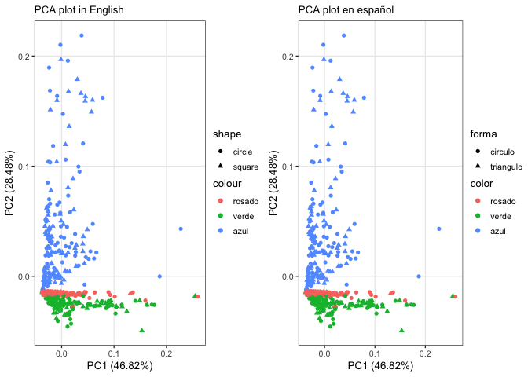
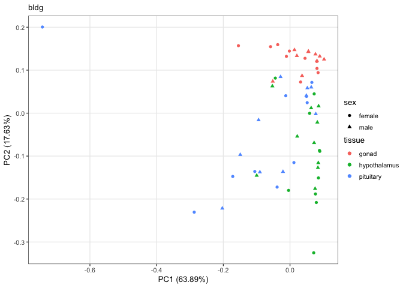
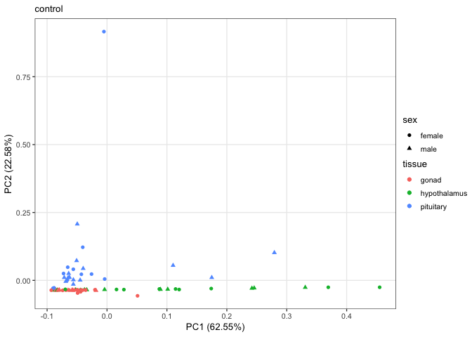
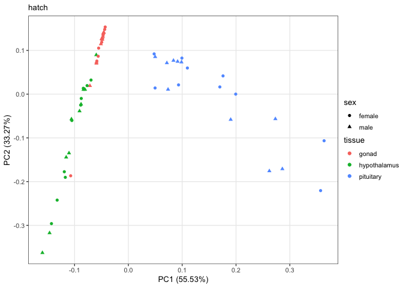
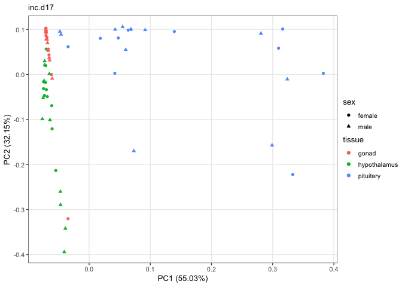
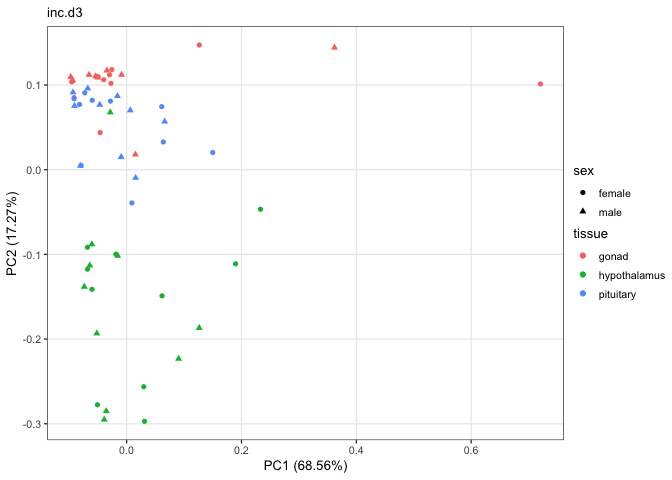
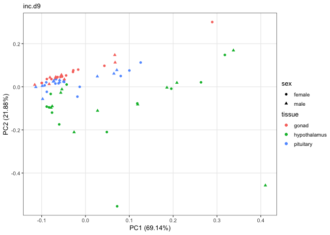
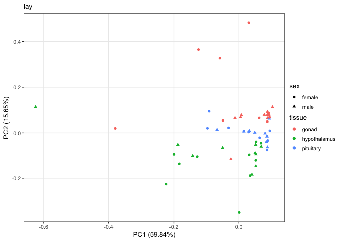
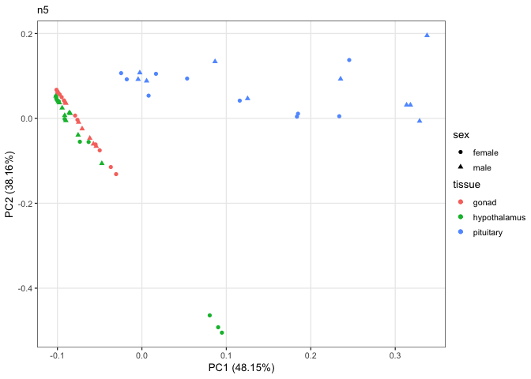
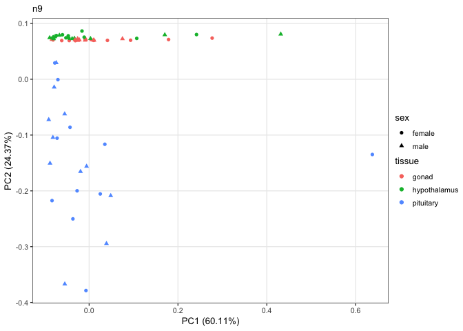

    library(tidyverse)

    ## ── Attaching packages ───────────────────────────────────────────────────────────────────────────────────────── tidyverse 1.2.1 ──

    ## ✔ ggplot2 3.1.0       ✔ purrr   0.3.1  
    ## ✔ tibble  2.0.1       ✔ dplyr   0.8.0.1
    ## ✔ tidyr   0.8.3       ✔ stringr 1.4.0  
    ## ✔ readr   1.3.1       ✔ forcats 0.4.0

    ## ── Conflicts ──────────────────────────────────────────────────────────────────────────────────────────── tidyverse_conflicts() ──
    ## ✖ dplyr::filter() masks stats::filter()
    ## ✖ dplyr::lag()    masks stats::lag()

    library(ggfortify) # for PCA analysis
    library(cluster)
    library(cowplot)

    ## 
    ## Attaching package: 'cowplot'

    ## The following object is masked from 'package:ggplot2':
    ## 
    ##     ggsave

    theme_rmh <- function(){ 
        theme_bw(base_size=10) +
            theme(
                panel.grid.minor.x  = element_blank(),
               panel.grid.minor.y  = element_blank(),
                strip.background = element_rect(colour="white", fill="white"),
                  legend.position = "right",           
               legend.margin=margin(t=-0.1, r=0, b=-0.1, l=-0.1, unit="cm"),
               legend.key.size = unit(0.5, "cm"))
    }

    knitr::opts_chunk$set(echo = TRUE, cache = T, fig.path = '../figures/pca/')

    counts <- read.csv("../results/00_countData_characterization.csv", row.names = 1, header = T)

    samples <- read.csv("../metadata/00_colData_characterization.csv", row.names = 1, header = T)
    geneinfo <- read.csv("../metadata//00_geneinfo.csv", row.names = 1, header = T)

    head(samples)

    ##                                                                            V1
    ## L.Blu13_male_gonad_control.NYNO               L.Blu13_male_gonad_control.NYNO
    ## L.Blu13_male_hypothalamus_control.NYNO L.Blu13_male_hypothalamus_control.NYNO
    ## L.Blu13_male_pituitary_control.NYNO       L.Blu13_male_pituitary_control.NYNO
    ## L.G107_male_gonad_control                           L.G107_male_gonad_control
    ## L.G107_male_hypothalamus_control             L.G107_male_hypothalamus_control
    ## L.G107_male_pituitary_control                   L.G107_male_pituitary_control
    ##                                           bird  sex       tissue treatment
    ## L.Blu13_male_gonad_control.NYNO        L.Blu13 male        gonad   control
    ## L.Blu13_male_hypothalamus_control.NYNO L.Blu13 male hypothalamus   control
    ## L.Blu13_male_pituitary_control.NYNO    L.Blu13 male    pituitary   control
    ## L.G107_male_gonad_control               L.G107 male        gonad   control
    ## L.G107_male_hypothalamus_control        L.G107 male hypothalamus   control
    ## L.G107_male_pituitary_control           L.G107 male    pituitary   control
    ##                                                            group
    ## L.Blu13_male_gonad_control.NYNO               male.gonad.control
    ## L.Blu13_male_hypothalamus_control.NYNO male.hypothalamus.control
    ## L.Blu13_male_pituitary_control.NYNO       male.pituitary.control
    ## L.G107_male_gonad_control                     male.gonad.control
    ## L.G107_male_hypothalamus_control       male.hypothalamus.control
    ## L.G107_male_pituitary_control             male.pituitary.control
    ##                                                  study
    ## L.Blu13_male_gonad_control.NYNO        charcterization
    ## L.Blu13_male_hypothalamus_control.NYNO charcterization
    ## L.Blu13_male_pituitary_control.NYNO    charcterization
    ## L.G107_male_gonad_control              charcterization
    ## L.G107_male_hypothalamus_control       charcterization
    ## L.G107_male_pituitary_control          charcterization

    # https://cran.r-project.org/web/packages/ggfortify/vignettes/plot_pca.html

    # pca
    pca <- prcomp(t(counts))
    autoplot(pca, data = samples, colour = 'tissue') 

    autoplot(pca, data = samples, colour = 'sex') 

    autoplot(pca, data = samples, colour = 'treatment') 

    autoplot(pca, data = samples, colour = 'tissue', shape = "sex") 

    autoplot(pca, data = samples, colour = 'tissue', shape = "sex", alpha = "treatment")

    ## Warning: Using alpha for a discrete variable is not advised.

    autoplot(pca, data = samples, colour = 'treatment', shape = "sex", alpha = "tissue")

    ## Warning: Using alpha for a discrete variable is not advised.

    # kmeans
    autoplot(clara(t(counts),3), frame = TRUE)

    # probability ellipse
    autoplot(pam(t(counts), 3), frame = TRUE, frame.type = 'norm')

    p <- autoplot(pca, data = samples, colour = 'tissue', shape = "sex")

    en <- p + labs(subtitle = "PCA plot in English") +
      scale_colour_discrete(name = "colour", labels = c("rosado", "verde", "azul")) +
      scale_shape_discrete(name = "shape", labels = c("circle", "square")) +
      theme_rmh()

    es <- p + labs(subtitle = "PCA plot en español") +
      scale_colour_discrete(name = "color", labels = c("rosado", "verde", "azul")) +
      scale_shape_discrete(name = "forma", labels = c("circulo", "triangulo")) +
      theme_rmh()

    enes <- plot_grid(en,es)

    enes 

    ggsave("../figures/espanol/pca-en-es.png", width=6, height=3, dpi=300)

    pdf(file="../figures/espanol/pca-en-es.pdf", width=6, height=3)
    plot(enes)    
    dev.off()

    ## quartz_off_screen 
    ##                 2

    for (eachgroup in levels(samples$treatment)){
      
      print(eachgroup)
      
      colData <- samples %>%
          dplyr::filter(treatment == eachgroup) %>%
          droplevels()
      row.names(colData) <- colData$V1
      
      savecols <- as.character(colData$V1) 
      savecols <- as.vector(savecols) 

      countData <- counts %>% dplyr::select(one_of(savecols)) 

      # check that row and col lenghts are equal
      print(ncol(countData) == nrow(colData))
      
      pca <- prcomp(t(countData))
      
      p <- autoplot(pca, data = colData, colour = 'tissue', shape = "sex")

    en <- p + labs(subtitle = eachgroup) +
      theme_rmh() 

    plot(en) 
    }

    ## [1] "bldg"
    ## [1] TRUE

    ## [1] "control"
    ## [1] TRUE

    ## [1] "hatch"
    ## [1] TRUE

    ## [1] "inc.d17"
    ## [1] TRUE

    ## [1] "inc.d3"
    ## [1] TRUE

    ## [1] "inc.d9"
    ## [1] TRUE

    ## [1] "lay"
    ## [1] TRUE

    ## [1] "n5"
    ## [1] TRUE

    ## [1] "n9"
    ## [1] TRUE

