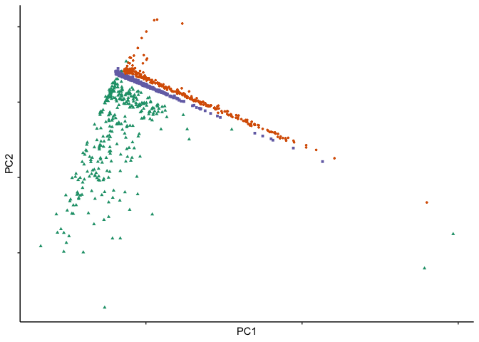
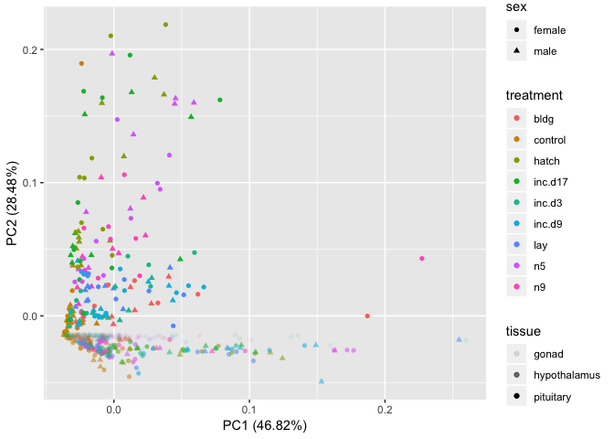
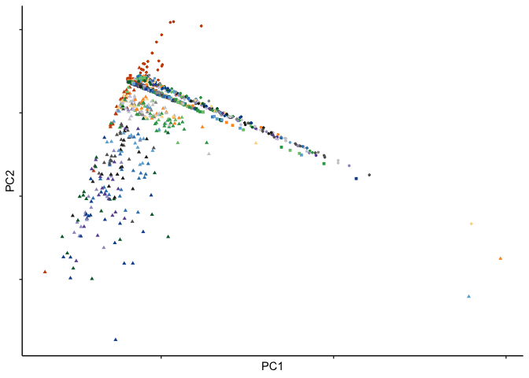
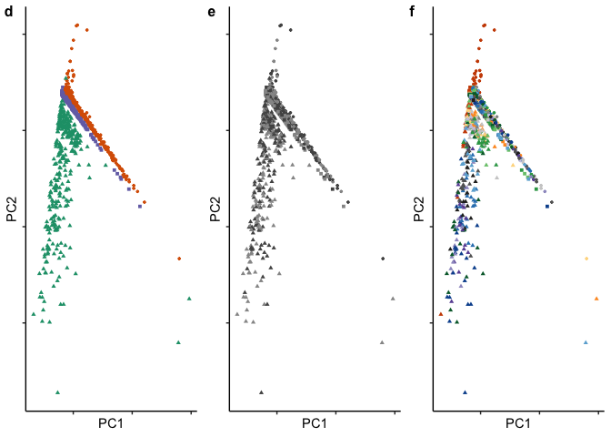

    library(ggfortify) # for PCA analysis

    ## Loading required package: ggplot2

    library(cluster)

    knitr::opts_chunk$set(echo = TRUE, cache = T, fig.path = '../figures/pca/')

    colData <- read.csv("../results/00_colData_characterization.csv", header = T, row.names = 1)
    countData <- read.csv("../results/00_countData_characterization.csv", header = T, row.names = 1)
    head(colData)

    ##                                                                            V1
    ## L.Blu13_male_gonad_control.NYNO               L.Blu13_male_gonad_control.NYNO
    ## L.Blu13_male_hypothalamus_control.NYNO L.Blu13_male_hypothalamus_control.NYNO
    ## L.Blu13_male_pituitary_control.NYNO       L.Blu13_male_pituitary_control.NYNO
    ## L.G107_male_gonad_control                           L.G107_male_gonad_control
    ## L.G107_male_hypothalamus_control             L.G107_male_hypothalamus_control
    ## L.G107_male_pituitary_control                   L.G107_male_pituitary_control
    ##                                           bird  sex       tissue treatment
    ## L.Blu13_male_gonad_control.NYNO        L.Blu13 male        gonad   control
    ## L.Blu13_male_hypothalamus_control.NYNO L.Blu13 male hypothalamus   control
    ## L.Blu13_male_pituitary_control.NYNO    L.Blu13 male    pituitary   control
    ## L.G107_male_gonad_control               L.G107 male        gonad   control
    ## L.G107_male_hypothalamus_control        L.G107 male hypothalamus   control
    ## L.G107_male_pituitary_control           L.G107 male    pituitary   control
    ##                                                            group
    ## L.Blu13_male_gonad_control.NYNO               male.gonad.control
    ## L.Blu13_male_hypothalamus_control.NYNO male.hypothalamus.control
    ## L.Blu13_male_pituitary_control.NYNO       male.pituitary.control
    ## L.G107_male_gonad_control                     male.gonad.control
    ## L.G107_male_hypothalamus_control       male.hypothalamus.control
    ## L.G107_male_pituitary_control             male.pituitary.control

    geneinfo <- read.csv("../results/00_geneinfo.csv", row.names = 1)

    # https://cran.r-project.org/web/packages/ggfortify/vignettes/plot_pca.html

    # pca
    pca <- prcomp(t(countData))
    autoplot(pca, data = colData, colour = 'tissue') 

    autoplot(pca, data = colData, colour = 'sex') 

    autoplot(pca, data = colData, colour = 'treatment') 

    autoplot(pca, data = colData, colour = 'tissue', shape = "sex") 

    autoplot(pca, data = colData, colour = 'tissue', shape = "sex", alpha = "treatment")

    ## Warning: Using alpha for a discrete variable is not advised.

    autoplot(pca, data = colData, colour = 'treatment', shape = "sex", alpha = "tissue")

    ## Warning: Using alpha for a discrete variable is not advised.

    # kmeans
    autoplot(clara(t(countData),3), frame = TRUE)

    # probability ellipse
    autoplot(pam(t(countData), 3), frame = TRUE, frame.type = 'norm')

