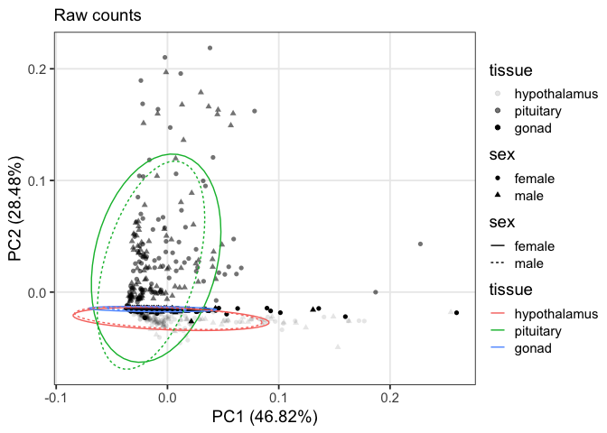
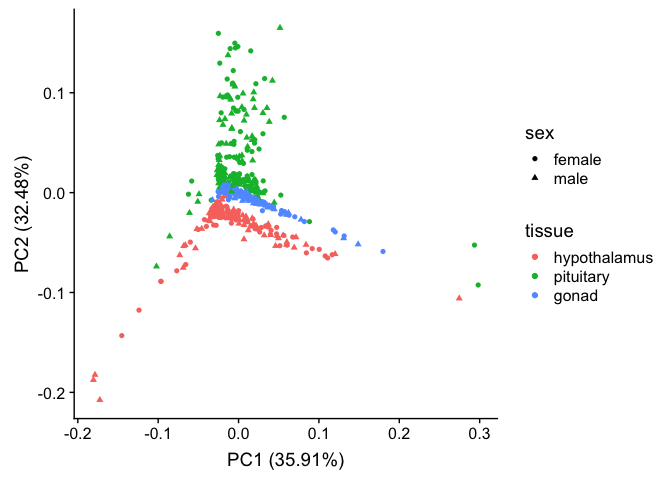
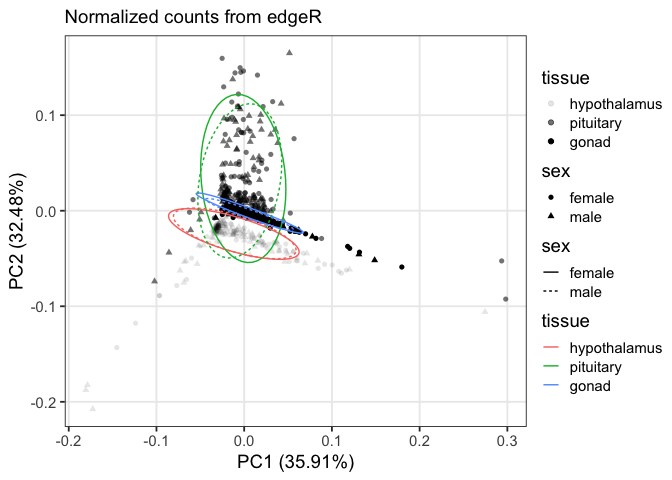
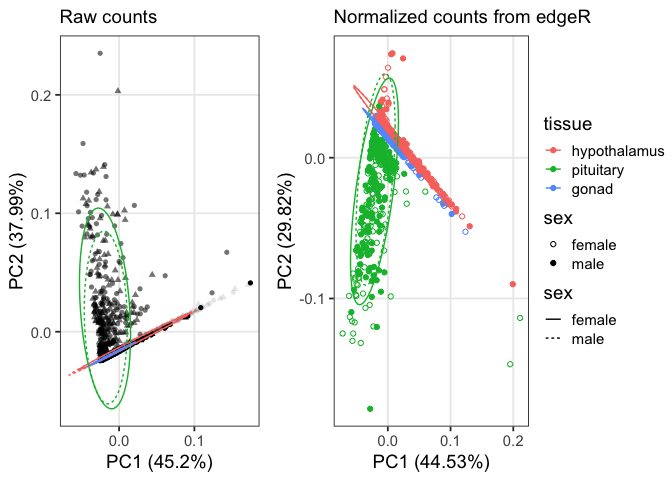
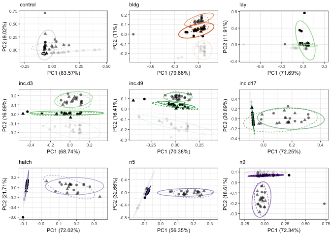
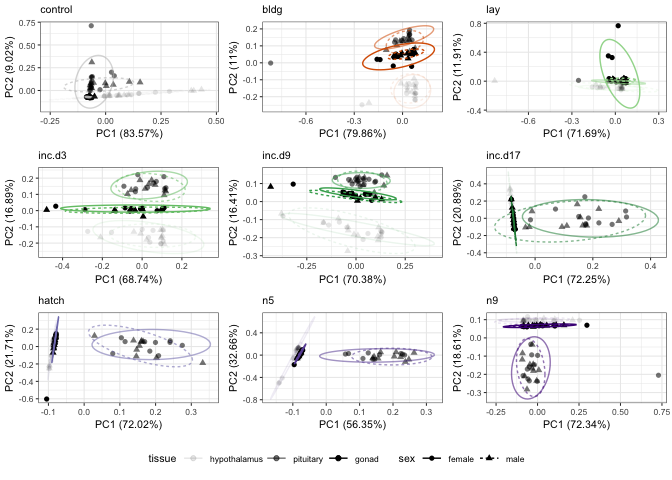
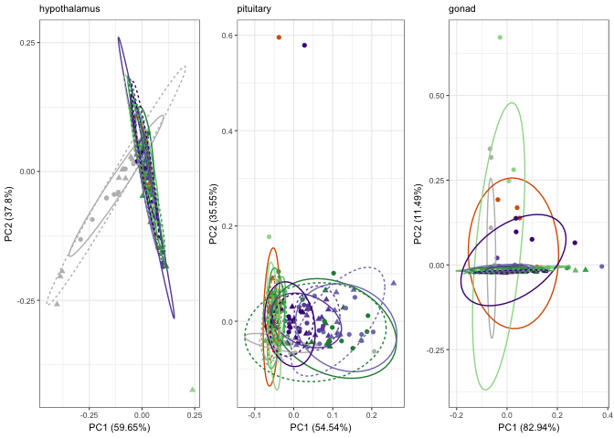

    library(tidyverse)

    ## ── Attaching packages ──────────────────────────────────────────────────────────────────────────────────────────────────── tidyverse 1.2.1 ──

    ## ✔ ggplot2 3.1.0       ✔ purrr   0.3.1  
    ## ✔ tibble  2.0.1       ✔ dplyr   0.8.0.1
    ## ✔ tidyr   0.8.3       ✔ stringr 1.4.0  
    ## ✔ readr   1.3.1       ✔ forcats 0.4.0

    ## ── Conflicts ─────────────────────────────────────────────────────────────────────────────────────────────────────── tidyverse_conflicts() ──
    ## ✖ dplyr::filter() masks stats::filter()
    ## ✖ dplyr::lag()    masks stats::lag()

    library(ggfortify) # for PCA analysis
    library(cluster)
    library(cowplot)

    ## 
    ## Attaching package: 'cowplot'

    ## The following object is masked from 'package:ggplot2':
    ## 
    ##     ggsave

    library(stringr)
    library(gridExtra)

    ## 
    ## Attaching package: 'gridExtra'

    ## The following object is masked from 'package:dplyr':
    ## 
    ##     combine

    library(grid)

    theme_rmh <- function(){ 
        theme_bw(base_size=14) +
            theme(
                panel.grid.minor.x  = element_blank(),
               panel.grid.minor.y  = element_blank(),
                strip.background = element_rect(colour="white", fill="white"),
                  legend.position = "right",           
               legend.margin=margin(t=-0.1, r=0, b=-0.1, l=-0.1, unit="cm"),
               legend.key.size = unit(0.5, "cm"))
    }

    treatmentcolors <-  c("control" = "#bdbdbd", 
                                  "bldg" =  "#d95f02", 
                                  "lay"  = "#a1d99b", 
                                  "inc.d3" = "#74c476", 
                                  "inc.d9"  = "#41ab5d", 
                                  "inc.d17" = "#238b45", 
                                  "hatch"  = "#807dba", 
                                  "n5"  = "#6a51a3", 
                                   "n9" = "#4a1486")

    knitr::opts_chunk$set(echo = TRUE, cache = T, fig.path = '../figures/pca/')

    counts <- read.csv("../results/00_countData_characterization.csv", row.names = 1, header = T)

    samples <- read.csv("../metadata/00_colData_characterization.csv", row.names = 1, header = T)

    samples$treatment <- factor(samples$treatment, levels = 
                                  c("control", "bldg", "lay", "inc.d3", "inc.d9", 
                                    "inc.d17", "hatch", "n5", "n9"))
    samples$tissue <- factor(samples$tissue, levels = 
                                  c("hypothalamus", "pituitary", "gonad"))

    geneinfo <- read.csv("../metadata//00_geneinfo.csv", row.names = 1, header = T)

    # https://cran.r-project.org/web/packages/ggfortify/vignettes/plot_pca.html

    # pca
    pca <- prcomp(t(counts))

    p <- autoplot(pca, data = samples, alpha = 'tissue', shape = "sex")

    rawPCA112 <- p + labs(subtitle = "Raw counts") +
      scale_colour_discrete(name = "tissue", labels = c("hypothalamus", "pituitary", "gonad")) +
      scale_shape_discrete(name = "sex", labels = c("female", "male")) +
      #xlab(stringr::str_replace(p$labels$x, "PC", "Principle Component ")) +
      #ylab(stringr::str_replace(p$labels$y, "PC", "Principle Component ")) +
      theme_rmh() + guides(alpha = guide_legend(order = 1), 
                  shape = guide_legend(order = 2)) +
      stat_ellipse(aes(linetype = sex, colour = tissue)) 
    rawPCA112

    ## Warning: Using alpha for a discrete variable is not advised.

with normalize edgeR data
-------------------------

    pseudocounts <- read.csv("../results/01_pseudo.counts.csv", row.names = 1)
    #head(pseudocounts)
    pca <- prcomp(t(pseudocounts))

    p <- autoplot(pca, data = samples, alpha = 'tissue', shape = "sex")
    p

    ## Warning: Using alpha for a discrete variable is not advised.

    edgRpca12 <- p + labs(subtitle = "Normalized counts from edgeR") +
      scale_alpha_discrete(name = "tissue", labels = c("hypothalamus", "pituitary", "gonad")) +
      scale_shape_discrete(name = "sex", labels = c("female", "male")) +
      #xlab(stringr::str_replace(p$labels$x, "PC", "Principle Component ")) +
      #ylab(stringr::str_replace(p$labels$y, "PC", "Principle Component ")) +
      theme_rmh() + guides(alpha = guide_legend(order = 1), 
                  shape = guide_legend(order = 2)) +
      stat_ellipse(aes(linetype = sex, colour = tissue))

    ## Warning: Using alpha for a discrete variable is not advised.

    edgRpca12

    sidebyside <- plot_grid(rawPCA112 + theme(legend.position = "none"),
                            edgRpca12,
                            rel_widths = c(0.4,0.6))
    sidebyside

subsets of normalized data show by tissue and sex
-------------------------------------------------

    plotlist = list()
    for (eachgroup in levels(samples$treatment)){
      
      print(eachgroup)
      
      colData <- samples %>%
          dplyr::filter(treatment == eachgroup) %>%
          droplevels()
      row.names(colData) <- colData$V1
      
      savecols <- as.character(colData$V1) 
      savecols <- as.vector(savecols) 

      countData <- pseudocounts %>% dplyr::select(one_of(savecols)) 

      # check that row and col lenghts are equal
      print(ncol(countData) == nrow(colData))
      
      pca <- prcomp(t(countData))
      
      p <- autoplot(pca, data = colData, alpha = 'tissue', shape = "sex", color = "treatment")

    en <- p + labs(subtitle = eachgroup) +
      theme_rmh() +
        theme_rmh()  +
      stat_ellipse(aes(linetype = sex, alpha = tissue, color = treatment)) +
       theme_bw(base_size=8) +
        theme(legend.position = "bottom") +
      scale_color_manual(values = treatmentcolors) + 
      guides(color = FALSE)

    legend <- get_legend(en) 

    en <- en  + theme(legend.position = "none")

    plotlist[[eachgroup]] = en

    }

    ## [1] "control"
    ## [1] TRUE

    ## Warning: Using alpha for a discrete variable is not advised.

    ## [1] "bldg"
    ## [1] TRUE

    ## Warning: Using alpha for a discrete variable is not advised.

    ## Warning in MASS::cov.trob(data[, vars]): Probable convergence failure

    ## Warning in MASS::cov.trob(data[, vars]): Probable convergence failure

    ## [1] "lay"
    ## [1] TRUE

    ## Warning: Using alpha for a discrete variable is not advised.

    ## [1] "inc.d3"
    ## [1] TRUE

    ## Warning: Using alpha for a discrete variable is not advised.

    ## [1] "inc.d9"
    ## [1] TRUE

    ## Warning: Using alpha for a discrete variable is not advised.

    ## [1] "inc.d17"
    ## [1] TRUE

    ## Warning: Using alpha for a discrete variable is not advised.

    ## [1] "hatch"
    ## [1] TRUE

    ## Warning: Using alpha for a discrete variable is not advised.

    ## Warning: Probable convergence failure

    ## [1] "n5"
    ## [1] TRUE

    ## Warning: Using alpha for a discrete variable is not advised.

    ## [1] "n9"
    ## [1] TRUE

    ## Warning: Using alpha for a discrete variable is not advised.

    main <- grid.arrange(grobs=plotlist,ncol=3)

    ## Warning: Using alpha for a discrete variable is not advised.

    ## Warning: Using alpha for a discrete variable is not advised.

    ## Warning in MASS::cov.trob(data[, vars]): Probable convergence failure

    ## Warning in MASS::cov.trob(data[, vars]): Probable convergence failure

    ## Warning: Using alpha for a discrete variable is not advised.

    ## Warning: Using alpha for a discrete variable is not advised.

    ## Warning: Using alpha for a discrete variable is not advised.

    ## Warning: Using alpha for a discrete variable is not advised.

    ## Warning: Using alpha for a discrete variable is not advised.

    ## Warning in MASS::cov.trob(data[, vars]): Probable convergence failure

    ## Warning: Using alpha for a discrete variable is not advised.

    ## Warning: Using alpha for a discrete variable is not advised.

    withlegend <- plot_grid( main, legend, rel_heights  = c(3, .3), ncol = 1)
    withlegend

sex and timepoint within a tissue
---------------------------------

    plotlist = list()
    for (eachtissue in levels(samples$tissue)){
      
      print(eachtissue)
      
      colData <- samples %>%
          dplyr::filter(tissue == eachtissue) %>%
          droplevels()
      row.names(colData) <- colData$V1
      
      savecols <- as.character(colData$V1) 
      savecols <- as.vector(savecols) 

      countData <- pseudocounts %>% dplyr::select(one_of(savecols)) 

      # check that row and col lenghts are equal
      print(ncol(countData) == nrow(colData))
      
      pca <- prcomp(t(countData))
      
      p <- autoplot(pca, data = colData, colour = 'treatment', shape = "sex")

    en <- p + labs(subtitle = eachtissue) +
      theme_rmh() +  guides(colour = guide_legend(order = 1), 
                  shape = guide_legend(order = 2)) +
      stat_ellipse(aes(linetype = sex, colour = treatment)) +
      theme_bw(base_size=8) +
        theme(legend.position = "bottom") +
      scale_color_manual(values =  treatmentcolors)

    legend <- get_legend(en)

    en <- en  + theme(legend.position = "none")

    plotlist[[eachtissue]] = en

    #plot(en) 
    }

    ## [1] "hypothalamus"
    ## [1] TRUE

    ## Warning in MASS::cov.trob(data[, vars]): Probable convergence failure

    ## [1] "pituitary"
    ## [1] TRUE

    ## Warning in MASS::cov.trob(data[, vars]): Probable convergence failure

    ## [1] "gonad"
    ## [1] TRUE

    ## Warning in MASS::cov.trob(data[, vars]): Probable convergence failure

    main <- grid.arrange(grobs=plotlist,ncol=3)

    ## Warning in MASS::cov.trob(data[, vars]): Probable convergence failure

    ## Warning in MASS::cov.trob(data[, vars]): Probable convergence failure

    ## Warning in MASS::cov.trob(data[, vars]): Probable convergence failure

    withlegend <- plot_grid( main, legend, rel_heights  = c(3, .3), ncol = 1)
    withlegend

