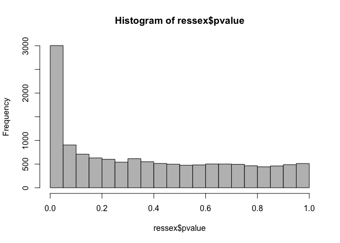
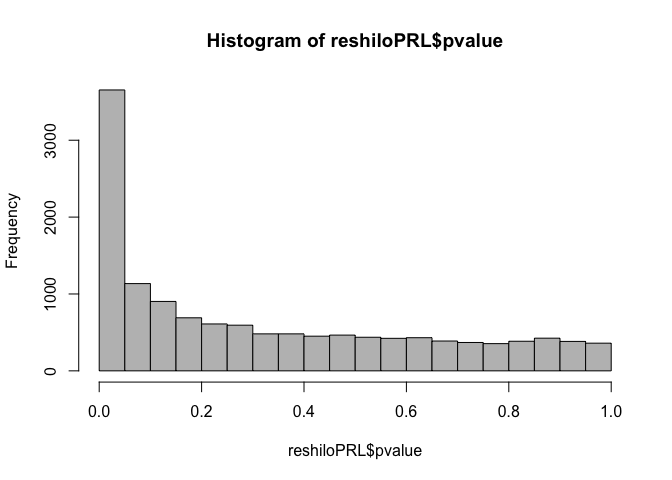
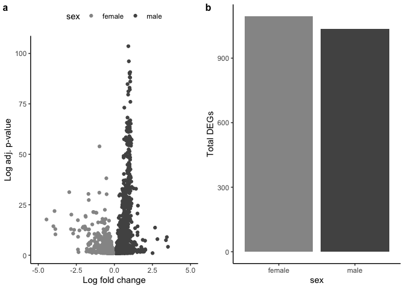
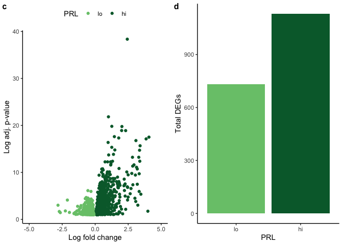
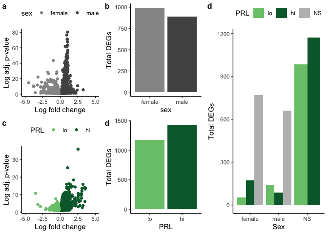

    library(tidyverse)

    ## ── Attaching packages ───────────────────────────────────── tidyverse 1.3.0 ──

    ## ✓ ggplot2 3.2.1     ✓ purrr   0.3.3
    ## ✓ tibble  2.1.3     ✓ dplyr   0.8.3
    ## ✓ tidyr   1.0.0     ✓ stringr 1.4.0
    ## ✓ readr   1.3.1     ✓ forcats 0.4.0

    ## ── Conflicts ──────────────────────────────────────── tidyverse_conflicts() ──
    ## x dplyr::filter() masks stats::filter()
    ## x dplyr::lag()    masks stats::lag()

    library(DESeq2)

    ## Loading required package: S4Vectors

    ## Loading required package: stats4

    ## Loading required package: BiocGenerics

    ## Loading required package: parallel

    ## 
    ## Attaching package: 'BiocGenerics'

    ## The following objects are masked from 'package:parallel':
    ## 
    ##     clusterApply, clusterApplyLB, clusterCall, clusterEvalQ,
    ##     clusterExport, clusterMap, parApply, parCapply, parLapply,
    ##     parLapplyLB, parRapply, parSapply, parSapplyLB

    ## The following objects are masked from 'package:dplyr':
    ## 
    ##     combine, intersect, setdiff, union

    ## The following objects are masked from 'package:stats':
    ## 
    ##     IQR, mad, sd, var, xtabs

    ## The following objects are masked from 'package:base':
    ## 
    ##     anyDuplicated, append, as.data.frame, basename, cbind,
    ##     colnames, dirname, do.call, duplicated, eval, evalq, Filter,
    ##     Find, get, grep, grepl, intersect, is.unsorted, lapply, Map,
    ##     mapply, match, mget, order, paste, pmax, pmax.int, pmin,
    ##     pmin.int, Position, rank, rbind, Reduce, rownames, sapply,
    ##     setdiff, sort, table, tapply, union, unique, unsplit, which,
    ##     which.max, which.min

    ## 
    ## Attaching package: 'S4Vectors'

    ## The following objects are masked from 'package:dplyr':
    ## 
    ##     first, rename

    ## The following object is masked from 'package:tidyr':
    ## 
    ##     expand

    ## The following object is masked from 'package:base':
    ## 
    ##     expand.grid

    ## Loading required package: IRanges

    ## 
    ## Attaching package: 'IRanges'

    ## The following objects are masked from 'package:dplyr':
    ## 
    ##     collapse, desc, slice

    ## The following object is masked from 'package:purrr':
    ## 
    ##     reduce

    ## Loading required package: GenomicRanges

    ## Loading required package: GenomeInfoDb

    ## Loading required package: SummarizedExperiment

    ## Loading required package: Biobase

    ## Welcome to Bioconductor
    ## 
    ##     Vignettes contain introductory material; view with
    ##     'browseVignettes()'. To cite Bioconductor, see
    ##     'citation("Biobase")', and for packages 'citation("pkgname")'.

    ## Loading required package: DelayedArray

    ## Loading required package: matrixStats

    ## 
    ## Attaching package: 'matrixStats'

    ## The following objects are masked from 'package:Biobase':
    ## 
    ##     anyMissing, rowMedians

    ## The following object is masked from 'package:dplyr':
    ## 
    ##     count

    ## Loading required package: BiocParallel

    ## 
    ## Attaching package: 'DelayedArray'

    ## The following objects are masked from 'package:matrixStats':
    ## 
    ##     colMaxs, colMins, colRanges, rowMaxs, rowMins, rowRanges

    ## The following object is masked from 'package:purrr':
    ## 
    ##     simplify

    ## The following objects are masked from 'package:base':
    ## 
    ##     aperm, apply, rowsum

    library(BiocParallel)
    register(MulticoreParam(6))
    library(caret) 

    ## Loading required package: lattice

    ## 
    ## Attaching package: 'caret'

    ## The following object is masked from 'package:purrr':
    ## 
    ##     lift

    library(cowplot)

    ## 
    ## Attaching package: 'cowplot'

    ## The following object is masked from 'package:ggplot2':
    ## 
    ##     ggsave

    source("../R/functions.R")  # load custom functions 
    source("../R/themes.R")  # load custom themes and color palletes

    knitr::opts_chunk$set(fig.path = '../figures/DESeq2/',  message=F, comment=F, warning=F)

Warning: This script can take a very long time to run.
------------------------------------------------------

DESeq2 was not designed to run on 100+ samples. But, I really like it,
so I do it anyways. Some of these commands take like 15 min to run using
6 cores.

Characterization
----------------

    # import "colData" which contains sample information and "countData" which contains read counts
    countData <- read.csv("../results/00_countData_characterization.csv", header = T, row.names = 1)
    geneinfo <- read.csv("../metadata/00_geneinfo.csv", row.names = 1)
    head(geneinfo)

    FALSE       Name geneid       entrezid
    FALSE 1    EDNRB 408082 NP_001001127.1
    FALSE 2  CYP26A1 408183 NP_001001129.1
    FALSE 3    CFDP1 374073 NP_001001189.1
    FALSE 4    AvBD7 407777 NP_001001194.1
    FALSE 5     KRT5 407779 NP_001001195.1
    FALSE 6 HSD11B1L 408034 NP_001001201.1

    # craete variable that will be critical for subset later on
    colData <- read.csv("../metadata/00_colData_characterization.csv", header = T, row.names = 1)
    colData$sextissue <- as.factor(paste(colData$sex, colData$tissue, sep = "_"))
    colData$treatment <- factor(colData$treatment, levels = charlevels)
    colData$tissue <- factor(colData$tissue, levels = tissuelevel)
    levels(colData$treatment)

    FALSE [1] "control" "bldg"    "lay"     "inc.d3"  "inc.d9"  "inc.d17" "hatch"  
    FALSE [8] "n5"      "n9"

    levels(colData$sex)

    FALSE [1] "female" "male"

    levels(colData$sextissue)

    FALSE [1] "female_gonad"        "female_hypothalamus" "female_pituitary"   
    FALSE [4] "male_gonad"          "male_hypothalamus"   "male_pituitary"

    levels(colData$tissue)

    FALSE [1] "hypothalamus" "pituitary"    "gonad"

Manipulation
------------

### Data wrangle

### Manipuation: comparisons to respective controls

    createDEGdfsaveManip <- function(up, down, mytissue){
      
      res <- results(dds, contrast = c("treatment", up, down), independentFiltering = T, alpha = 0.1)
      
      DEGs <- data.frame(gene = row.names(res),
                            padj = res$padj, 
                            logpadj = -log10(res$padj),
                            lfc = res$log2FoldChange,
                            sextissue = mytissue)
      DEGs <- na.omit(DEGs)
      DEGs <- DEGs %>%
        dplyr::mutate(direction = ifelse(DEGs$lfc > 0 & DEGs$padj < 0.1, 
                                         yes = up, no = ifelse(DEGs$lfc < 0 & DEGs$padj < 0.1, 
                                                               yes = down, no = "NS"))) %>% 
        dplyr::arrange(desc(lfc)) 
      
      DEGs$direction <- factor(DEGs$direction, levels = c(down, "NS", up)) 
      
      # write DEGsframe of only significant genes
      DEGs <- DEGs %>% dplyr::filter(direction != "NS")
      print(str(DEGs))
      
      partialfilename = paste("_", down, "_", up, sep = "")
      myfilename = paste0("../results/DESeq2/manip/", mytissue, partialfilename, "_DEGs.csv")
      
      write.csv(DEGs, myfilename, row.names = F)
      # return DEGs frome with all data, included NS genes
      #print(head(DEGs))
    }  

    for(i in levels(colData$sextissue)){
      
      newcolData <- subsetcolData2(colData, i)
      
      # save counts that match colData
      savecols <- as.character(newcolData$V1) 
      savecols <- as.vector(savecols) 
      
      newcountData <- countData %>% dplyr::select(one_of(savecols)) 
      
      dds <- DESeqDataSetFromMatrix(countData = newcountData,
                                    colData = newcolData,
                                    design = ~ treatment )
      dds <- dds[rowSums(counts(dds) > 1) >= 10]  # filter more than sample with less 0 counts
      print(dds)
      print(dim(dds))
      dds <- DESeq(dds, parallel = TRUE) # Differential expression analysis
      
      vsd <- as.data.frame(assay(vst(dds, blind=FALSE)))
      
      myfilename = paste0("../results/DEseq2/manip/", i, "_vsd.csv")
      write.csv(vsd, myfilename)
      
      #return(dds)
      #return(vsd)
      #print(head(vsd))

      # save differential gene expression results
      inc.d3.m.inc.d3 <- createDEGdfsaveManip("m.inc.d3", "inc.d3",  i) 
      inc.d9.m.inc.d9 <- createDEGdfsaveManip("m.inc.d9", "inc.d9",  i) 
      inc.d17.m.inc.d17 <- createDEGdfsaveManip("m.inc.d17", "inc.d17",  i) 
      hatch.m.n2 <- createDEGdfsaveManip("m.n2", "hatch",  i) 
      inc.d9.m.inc.d8 <- createDEGdfsaveManip("m.inc.d8", "inc.d9",  i) 
      inc.d17.prolong <- createDEGdfsaveManip("prolong", "inc.d17",  i) 
      hatch.extend <- createDEGdfsaveManip("extend", "hatch",  i) 
    }

Manipulation: comparisons to other manipluations
------------------------------------------------

    # import "colData" which contains sample information and "countData" which contains read counts
    countData <- read.csv("../results/00_counts.csv", header = T, row.names = 1)
    geneinfo <- read.csv("../metadata/00_geneinfo.csv", row.names = 1)
    head(geneinfo)

    levelsreplace <- c( "m.inc.d8" , "prolong" , "extend")
    levelsremoval <- c( "m.inc.d3" ,    "m.inc.d9" , "m.inc.d17" , "m.n2")
    controlsremovalreplace <- c( "inc.d3" ,    "inc.d9" , "inc.d17" , "hatch")

    manipulationsandcontrols <- c(controlsremoval, levelsreplace, levelsremoval)

    colData <- read.csv("../metadata/00_samples.csv", header = T, row.names = 1)
    colData$sextissue <- as.factor(paste(colData$sex, colData$tissue, sep = "_"))
    colData$treatment <- factor(colData$treatment, levels = manipulationsandcontrols)
    colData$tissue <- factor(colData$tissue, levels = tissuelevel)
    levels(colData$treatment)
    levels(colData$sex)
    levels(colData$sextissue)
    levels(colData$tissue)
    colData <- colData %>% drop_na()

    createDEGdfsaveManip <- function(up, down, mytissue){
      
      res <- results(dds, contrast = c("treatment", up, down), independentFiltering = T, alpha = 0.1)
      
      DEGs <- data.frame(gene = row.names(res),
                            padj = res$padj, 
                            logpadj = -log10(res$padj),
                            lfc = res$log2FoldChange,
                            sextissue = mytissue)
      DEGs <- na.omit(DEGs)
      DEGs <- DEGs %>%
        dplyr::mutate(direction = ifelse(DEGs$lfc > 0 & DEGs$padj < 0.1, 
                                         yes = up, no = ifelse(DEGs$lfc < 0 & DEGs$padj < 0.1, 
                                                               yes = down, no = "NS"))) %>% 
        dplyr::arrange(desc(lfc)) 
      
      DEGs$direction <- factor(DEGs$direction, levels = c(down, "NS", up)) 
      
      # write DEGsframe of only significant genes
      DEGs <- DEGs %>% dplyr::filter(direction != "NS")
      print(str(DEGs))
      
      partialfilename = paste("_", down, "_", up, sep = "")
      myfilename = paste0("../results/DESeq2/manip/", mytissue, partialfilename, "_DEGs.csv")
      
      write.csv(DEGs, myfilename, row.names = F)
      # return DEGs frome with all data, included NS genes
      #print(head(DEGs))
    }  

    for(i in levels(colData$sextissue)){
      
      newcolData <- subsetcolData2(colData, i)
      
      # save counts that match colData
      savecols <- as.character(newcolData$V1) 
      savecols <- as.vector(savecols) 
      
      newcountData <- countData %>% dplyr::select(one_of(savecols)) 
      
      dds <- DESeqDataSetFromMatrix(countData = newcountData,
                                    colData = newcolData,
                                    design = ~ treatment )
      dds <- dds[rowSums(counts(dds) > 1) >= 10]  # filter more than sample with less 0 counts
      print(dds)
      print(dim(dds))
      dds <- DESeq(dds, parallel = TRUE) # Differential expression analysis
      
      vsd <- as.data.frame(assay(vst(dds, blind=FALSE)))
      
      myfilename = paste0("../results/DEseq2/manip/", i, "_vsd.csv")
      write.csv(vsd, myfilename)
      
      #return(dds)
      #return(vsd)
      #print(head(vsd))

      # save differential gene expression results
      hatch.m.n2 <- createDEGdfsaveManip("m.n2", "hatch",  i) 
      prolong.extend <- createDEGdfsaveManip("extend", "prolong",  i) 
      early.extend <- createDEGdfsaveManip("extend", "m.inc.d8",  i) 
      early.prolong <- createDEGdfsaveManip("prolong", "m.inc.d8",  i) 
      m.inc.d9.m.inc.d3 <- createDEGdfsaveManip("m.inc.d9", "m.inc.d3",  i) 
      m.inc.d17.m.inc.d9 <- createDEGdfsaveManip("m.inc.d17", "m.inc.d9",  i) 
      m.inc.d17.m.inc.d3 <- createDEGdfsaveManip("m.inc.d17", "m.inc.d3",  i) 
      m.n2.m.inc.d17 <- createDEGdfsaveManip("m.n2", "m.inc.d17",  i) 
      m.n2.m.inc.d9 <- createDEGdfsaveManip("m.n2", "m.inc.d9",  i)
      m.n2.m.inc.d3 <- createDEGdfsaveManip("m.n2", "m.inc.d3",  i)
      prolong.m.inc.d17 <- createDEGdfsaveManip("prolong", "m.inc.d17",  i) 
      m.inc.d8.m.inc.d9 <- createDEGdfsaveManip("m.inc.d8", "m.inc.d9",  i) 
      extend.m.n2 <- createDEGdfsaveManip("extend", "m.n2",  i) 
    }

PRL-driven DESeq2
-----------------

    PRLdata <- read_csv("../results/PRLvsd.csv")

    PRLsamples <- colData %>%
      mutate(samples = V1)  %>%
      select(samples) 
    PRLsamples

    FALSE                                          samples
    FALSE 1                L.Blu13_male_gonad_control.NYNO
    FALSE 2         L.Blu13_male_hypothalamus_control.NYNO
    FALSE 3            L.Blu13_male_pituitary_control.NYNO
    FALSE 4                      L.G107_male_gonad_control
    FALSE 5               L.G107_male_hypothalamus_control
    FALSE 6                  L.G107_male_pituitary_control
    FALSE 7                    L.G118_female_gonad_control
    FALSE 8        L.G118_female_hypothalamus_control.NYNO
    FALSE 9           L.G118_female_pituitary_control.NYNO
    FALSE 10                  L.R3_male_gonad_control.NYNO
    FALSE 11                L.R3_male_hypothalamus_control
    FALSE 12              L.R3_male_pituitary_control.NYNO
    FALSE 13                       L.R8_male_gonad_control
    FALSE 14                L.R8_male_hypothalamus_control
    FALSE 15                   L.R8_male_pituitary_control
    FALSE 16                      L.W33_male_gonad_control
    FALSE 17          L.W33_male_hypothalamus_control.NYNO
    FALSE 18                  L.W33_male_pituitary_control
    FALSE 19                  L.W3_male_gonad_control.NYNO
    FALSE 20                L.W3_male_hypothalamus_control
    FALSE 21                   L.W3_male_pituitary_control
    FALSE 22                  L.W4_male_gonad_control.NYNO
    FALSE 23                L.W4_male_hypothalamus_control
    FALSE 24                   L.W4_male_pituitary_control
    FALSE 25                   R.G106_female_gonad_control
    FALSE 26            R.G106_female_hypothalamus_control
    FALSE 27               R.G106_female_pituitary_control
    FALSE 28                    R.R20_female_gonad_control
    FALSE 29        R.R20_female_hypothalamus_control.NYNO
    FALSE 30                R.R20_female_pituitary_control
    FALSE 31                     R.R9_female_gonad_control
    FALSE 32              R.R9_female_hypothalamus_control
    FALSE 33            R.R9_female_pituitary_control.NYNO
    FALSE 34                    R.W44_female_gonad_control
    FALSE 35             R.W44_female_hypothalamus_control
    FALSE 36           R.W44_female_pituitary_control.NYNO
    FALSE 37                 R.Y108.W29_male_gonad_control
    FALSE 38     R.Y108.W29_male_hypothalamus_control.NYNO
    FALSE 39             R.Y108.W29_male_pituitary_control
    FALSE 40             blk.s061.pu.y_female_gonad_inc.d9
    FALSE 41      blk.s061.pu.y_female_hypothalamus_inc.d9
    FALSE 42         blk.s061.pu.y_female_pituitary_inc.d9
    FALSE 43                     blk11.x_female_gonad_bldg
    FALSE 44              blk11.x_female_hypothalamus_bldg
    FALSE 45                 blk11.x_female_pituitary_bldg
    FALSE 46                         blk12.x_male_gonad_n5
    FALSE 47             blk12.x_male_hypothalamus_n5.NYNO
    FALSE 48                     blk12.x_male_pituitary_n5
    FALSE 49                    blk17.x_male_gonad_inc.d17
    FALSE 50             blk17.x_male_hypothalamus_inc.d17
    FALSE 51                blk17.x_male_pituitary_inc.d17
    FALSE 52                    blk21.x_female_gonad_hatch
    FALSE 53             blk21.x_female_hypothalamus_hatch
    FALSE 54                blk21.x_female_pituitary_hatch
    FALSE 55                        blk4.x_female_gonad_n9
    FALSE 56                 blk4.x_female_hypothalamus_n9
    FALSE 57                    blk4.x_female_pituitary_n9
    FALSE 58            blu.o.x.ATLAS_female_gonad_control
    FALSE 59     blu.o.x.ATLAS_female_hypothalamus_control
    FALSE 60        blu.o.x.ATLAS_female_pituitary_control
    FALSE 61              blu103.x_female_gonad_hatch.NYNO
    FALSE 62            blu103.x_female_hypothalamus_hatch
    FALSE 63          blu103.x_female_pituitary_hatch.NYNO
    FALSE 64                blu104.w120.x_male_gonad_hatch
    FALSE 65         blu104.w120.x_male_hypothalamus_hatch
    FALSE 66       blu104.w120.x_male_pituitary_hatch.NYNO
    FALSE 67             blu108.w40.o158_male_gonad_inc.d9
    FALSE 68      blu108.w40.o158_male_hypothalamus_inc.d9
    FALSE 69         blu108.w40.o158_male_pituitary_inc.d9
    FALSE 70               blu111.w113.x_male_gonad_inc.d3
    FALSE 71        blu111.w113.x_male_hypothalamus_inc.d3
    FALSE 72           blu111.w113.x_male_pituitary_inc.d3
    FALSE 73              blu113.w124.x_male_gonad_inc.d17
    FALSE 74       blu113.w124.x_male_hypothalamus_inc.d17
    FALSE 75     blu113.w124.x_male_pituitary_inc.d17.NYNO
    FALSE 76               blu114.r38.w198_male_gonad_bldg
    FALSE 77        blu114.r38.w198_male_hypothalamus_bldg
    FALSE 78           blu114.r38.w198_male_pituitary_bldg
    FALSE 79               blu121.w91.x_male_gonad_inc.d17
    FALSE 80        blu121.w91.x_male_hypothalamus_inc.d17
    FALSE 81           blu121.w91.x_male_pituitary_inc.d17
    FALSE 82              blu124.w180.x_female_gonad_hatch
    FALSE 83       blu124.w180.x_female_hypothalamus_hatch
    FALSE 84          blu124.w180.x_female_pituitary_hatch
    FALSE 85                   blu33.y88.x_male_gonad_bldg
    FALSE 86            blu33.y88.x_male_hypothalamus_bldg
    FALSE 87               blu33.y88.x_male_pituitary_bldg
    FALSE 88                     blu36.w16_female_gonad_n9
    FALSE 89              blu36.w16_female_hypothalamus_n9
    FALSE 90                 blu36.w16_female_pituitary_n9
    FALSE 91                     blu37.r65.x_male_gonad_n5
    FALSE 92              blu37.r65.x_male_hypothalamus_n5
    FALSE 93                 blu37.r65.x_male_pituitary_n5
    FALSE 94                blu38.g135.x_female_gonad_bldg
    FALSE 95         blu38.g135.x_female_hypothalamus_bldg
    FALSE 96            blu38.g135.x_female_pituitary_bldg
    FALSE 97               blu39.o26.x_female_gonad_inc.d3
    FALSE 98   blu39.o26.x_female_hypothalamus_inc.d3.NYNO
    FALSE 99      blu39.o26.x_female_pituitary_inc.d3.NYNO
    FALSE 100                   blu41.y100.x_male_gonad_n5
    FALSE 101       blu41.y100.x_male_hypothalamus_n5.NYNO
    FALSE 102               blu41.y100.x_male_pituitary_n5
    FALSE 103              blu47.y96.x_female_gonad_inc.d9
    FALSE 104       blu47.y96.x_female_hypothalamus_inc.d9
    FALSE 105          blu47.y96.x_female_pituitary_inc.d9
    FALSE 106                    blu55.g51_female_gonad_n5
    FALSE 107             blu55.g51_female_hypothalamus_n5
    FALSE 108                blu55.g51_female_pituitary_n5
    FALSE 109                      blu81.r88_male_gonad_n9
    FALSE 110               blu81.r88_male_hypothalamus_n9
    FALSE 111                  blu81.r88_male_pituitary_n9
    FALSE 112                   d.s008.y.blk_male_gonad_n5
    FALSE 113            d.s008.y.blk_male_hypothalamus_n5
    FALSE 114               d.s008.y.blk_male_pituitary_n5
    FALSE 115                   d.s047.blk.o_male_gonad_n5
    FALSE 116            d.s047.blk.o_male_hypothalamus_n5
    FALSE 117               d.s047.blk.o_male_pituitary_n5
    FALSE 118               g.blk.s004.pk_female_gonad_lay
    FALSE 119        g.blk.s004.pk_female_hypothalamus_lay
    FALSE 120           g.blk.s004.pk_female_pituitary_lay
    FALSE 121                      g.s.blk.d_male_gonad_n9
    FALSE 122               g.s.blk.d_male_hypothalamus_n9
    FALSE 123                  g.s.blk.d_male_pituitary_n9
    FALSE 124                     g.s.blk.y_male_gonad_lay
    FALSE 125              g.s.blk.y_male_hypothalamus_lay
    FALSE 126                 g.s.blk.y_male_pituitary_lay
    FALSE 127                 g.s043.pu.blk_male_gonad_lay
    FALSE 128          g.s043.pu.blk_male_hypothalamus_lay
    FALSE 129             g.s043.pu.blk_male_pituitary_lay
    FALSE 130                g.s078.blk.o_female_gonad_lay
    FALSE 131         g.s078.blk.o_female_hypothalamus_lay
    FALSE 132            g.s078.blk.o_female_pituitary_lay
    FALSE 133               g.x.ATLAS_female_gonad_control
    FALSE 134                   g104.w82.x_male_gonad_bldg
    FALSE 135            g104.w82.x_male_hypothalamus_bldg
    FALSE 136               g104.w82.x_male_pituitary_bldg
    FALSE 137             g114.w83.x_male_gonad_hatch.NYNO
    FALSE 138           g114.w83.x_male_hypothalamus_hatch
    FALSE 139         g114.w83.x_male_pituitary_hatch.NYNO
    FALSE 140                g130.y81.x_male_gonad_inc.d17
    FALSE 141         g130.y81.x_male_hypothalamus_inc.d17
    FALSE 142            g130.y81.x_male_pituitary_inc.d17
    FALSE 143               g141.blu27.x_female_gonad_bldg
    FALSE 144        g141.blu27.x_female_hypothalamus_bldg
    FALSE 145           g141.blu27.x_female_pituitary_bldg
    FALSE 146              g142.r40.x_female_gonad_inc.d17
    FALSE 147       g142.r40.x_female_hypothalamus_inc.d17
    FALSE 148          g142.r40.x_female_pituitary_inc.d17
    FALSE 149              g143.blu32.x_male_gonad_inc.d17
    FALSE 150       g143.blu32.x_male_hypothalamus_inc.d17
    FALSE 151          g143.blu32.x_male_pituitary_inc.d17
    FALSE 152                 g146.blu51_male_gonad_inc.d3
    FALSE 153     g146.blu51_male_hypothalamus_inc.d3.NYNO
    FALSE 154             g146.blu51_male_pituitary_inc.d3
    FALSE 155                 g20.w106.x_male_gonad_inc.d3
    FALSE 156          g20.w106.x_male_hypothalamus_inc.d3
    FALSE 157             g20.w106.x_male_pituitary_inc.d3
    FALSE 158                    g52.blu58_male_gonad_bldg
    FALSE 159             g52.blu58_male_hypothalamus_bldg
    FALSE 160                g52.blu58_male_pituitary_bldg
    FALSE 161                     g53.y84_male_gonad_hatch
    FALSE 162              g53.y84_male_hypothalamus_hatch
    FALSE 163                 g53.y84_male_pituitary_hatch
    FALSE 164                g6.w197.x_female_gonad_inc.d3
    FALSE 165         g6.w197.x_female_hypothalamus_inc.d3
    FALSE 166            g6.w197.x_female_pituitary_inc.d3
    FALSE 167                    g75.x_female_gonad_inc.d9
    FALSE 168             g75.x_female_hypothalamus_inc.d9
    FALSE 169                g75.x_female_pituitary_inc.d9
    FALSE 170               l.s120.y.blk_female_gonad_bldg
    FALSE 171        l.s120.y.blk_female_hypothalamus_bldg
    FALSE 172           l.s120.y.blk_female_pituitary_bldg
    FALSE 173                       o.s.w.r_male_gonad_lay
    FALSE 174                o.s.w.r_male_hypothalamus_lay
    FALSE 175                   o.s.w.r_male_pituitary_lay
    FALSE 176                  o152.o120.w42_male_gonad_n5
    FALSE 177           o152.o120.w42_male_hypothalamus_n5
    FALSE 178              o152.o120.w42_male_pituitary_n5
    FALSE 179               o156.w80.x_female_gonad_inc.d3
    FALSE 180        o156.w80.x_female_hypothalamus_inc.d3
    FALSE 181           o156.w80.x_female_pituitary_inc.d3
    FALSE 182         o165.w122.x_female_gonad_inc.d3.NYNO
    FALSE 183       o165.w122.x_female_hypothalamus_inc.d3
    FALSE 184     o165.w122.x_female_pituitary_inc.d3.NYNO
    FALSE 185               o172.w115.x_female_gonad_hatch
    FALSE 186        o172.w115.x_female_hypothalamus_hatch
    FALSE 187      o172.w115.x_female_pituitary_hatch.NYNO
    FALSE 188              o173.w179.x_female_gonad_inc.d3
    FALSE 189       o173.w179.x_female_hypothalamus_inc.d3
    FALSE 190          o173.w179.x_female_pituitary_inc.d3
    FALSE 191               o35.r51.x_female_gonad_inc.d17
    FALSE 192        o35.r51.x_female_hypothalamus_inc.d17
    FALSE 193           o35.r51.x_female_pituitary_inc.d17
    FALSE 194                o38.blu29.x_female_gonad_bldg
    FALSE 195         o38.blu29.x_female_hypothalamus_bldg
    FALSE 196            o38.blu29.x_female_pituitary_bldg
    FALSE 197                   o39.y77.x_male_gonad_hatch
    FALSE 198            o39.y77.x_male_hypothalamus_hatch
    FALSE 199               o39.y77.x_male_pituitary_hatch
    FALSE 200                 o44.blu26.x_male_gonad_hatch
    FALSE 201          o44.blu26.x_male_hypothalamus_hatch
    FALSE 202             o44.blu26.x_male_pituitary_hatch
    FALSE 203                 o48.r197.x_male_gonad_inc.d3
    FALSE 204          o48.r197.x_male_hypothalamus_inc.d3
    FALSE 205             o48.r197.x_male_pituitary_inc.d3
    FALSE 206                      o49.x_male_gonad_inc.d9
    FALSE 207               o49.x_male_hypothalamus_inc.d9
    FALSE 208                  o49.x_male_pituitary_inc.d9
    FALSE 209               o52.blu53_female_gonad_inc.d17
    FALSE 210        o52.blu53_female_hypothalamus_inc.d17
    FALSE 211           o52.blu53_female_pituitary_inc.d17
    FALSE 212                    o57.g59_male_gonad_inc.d9
    FALSE 213             o57.g59_male_hypothalamus_inc.d9
    FALSE 214                o57.g59_male_pituitary_inc.d9
    FALSE 215                    o73.x_female_gonad_inc.d9
    FALSE 216             o73.x_female_hypothalamus_inc.d9
    FALSE 217                o73.x_female_pituitary_inc.d9
    FALSE 218                 pk.s238.blk.w_male_gonad_lay
    FALSE 219          pk.s238.blk.w_male_hypothalamus_lay
    FALSE 220             pk.s238.blk.w_male_pituitary_lay
    FALSE 221                   pk.w.s141.o_male_gonad_lay
    FALSE 222            pk.w.s141.o_male_hypothalamus_lay
    FALSE 223               pk.w.s141.o_male_pituitary_lay
    FALSE 224        r.r.x.ATLAS.R2XR_female_gonad_control
    FALSE 225 r.r.x.ATLAS.R2XR_female_hypothalamus_control
    FALSE 226    r.r.x.ATLAS.R2XR_female_pituitary_control
    FALSE 227             r.r.x.ATLAS_female_gonad_control
    FALSE 228      r.r.x.ATLAS_female_hypothalamus_control
    FALSE 229         r.r.x.ATLAS_female_pituitary_control
    FALSE 230                 r.s005.pk.blk_male_gonad_lay
    FALSE 231          r.s005.pk.blk_male_hypothalamus_lay
    FALSE 232             r.s005.pk.blk_male_pituitary_lay
    FALSE 233                 r.s056.g.o_female_gonad_bldg
    FALSE 234          r.s056.g.o_female_hypothalamus_bldg
    FALSE 235             r.s056.g.o_female_pituitary_bldg
    FALSE 236                   r.s059.d.o_male_gonad_bldg
    FALSE 237            r.s059.d.o_male_hypothalamus_bldg
    FALSE 238               r.s059.d.o_male_pituitary_bldg
    FALSE 239                 r.s116.blk.pu_male_gonad_lay
    FALSE 240          r.s116.blk.pu_male_hypothalamus_lay
    FALSE 241             r.s116.blk.pu_male_pituitary_lay
    FALSE 242                   r.s171.l.w_female_gonad_n9
    FALSE 243            r.s171.l.w_female_hypothalamus_n9
    FALSE 244               r.s171.l.w_female_pituitary_n9
    FALSE 245                   r.y.s007.blk_male_gonad_n9
    FALSE 246            r.y.s007.blk_male_hypothalamus_n9
    FALSE 247               r.y.s007.blk_male_pituitary_n9
    FALSE 248                r176.blu54_male_gonad_inc.d17
    FALSE 249         r176.blu54_male_hypothalamus_inc.d17
    FALSE 250            r176.blu54_male_pituitary_inc.d17
    FALSE 251                  r183.o22_female_gonad_hatch
    FALSE 252           r183.o22_female_hypothalamus_hatch
    FALSE 253              r183.o22_female_pituitary_hatch
    FALSE 254                    r190.o43.x_male_gonad_lay
    FALSE 255             r190.o43.x_male_hypothalamus_lay
    FALSE 256                r190.o43.x_male_pituitary_lay
    FALSE 257                         r195.x_male_gonad_n9
    FALSE 258                  r195.x_male_hypothalamus_n9
    FALSE 259                     r195.x_male_pituitary_n9
    FALSE 260          r27.w111.blu125_female_gonad_inc.d3
    FALSE 261   r27.w111.blu125_female_hypothalamus_inc.d3
    FALSE 262      r27.w111.blu125_female_pituitary_inc.d3
    FALSE 263             r30.w112.r46_female_gonad_inc.d9
    FALSE 264      r30.w112.r46_female_hypothalamus_inc.d9
    FALSE 265         r30.w112.r46_female_pituitary_inc.d9
    FALSE 266               r36.w184.x_female_gonad_inc.d9
    FALSE 267        r36.w184.x_female_hypothalamus_inc.d9
    FALSE 268           r36.w184.x_female_pituitary_inc.d9
    FALSE 269                     r37.w100.x_male_gonad_n9
    FALSE 270              r37.w100.x_male_hypothalamus_n9
    FALSE 271                 r37.w100.x_male_pituitary_n9
    FALSE 272                   r41.w99.x_male_gonad_hatch
    FALSE 273            r41.w99.x_male_hypothalamus_hatch
    FALSE 274               r41.w99.x_male_pituitary_hatch
    FALSE 275                      r45.X_male_gonad_inc.d9
    FALSE 276                  r45.X_male_pituitary_inc.d9
    FALSE 277               r45.x_male_hypothalamus_inc.d9
    FALSE 278              r49.w189.x_female_gonad_inc.d17
    FALSE 279       r49.w189.x_female_hypothalamus_inc.d17
    FALSE 280          r49.w189.x_female_pituitary_inc.d17
    FALSE 281               r6.x_female_gonad_control.NYNO
    FALSE 282        r6.x_female_hypothalamus_control.NYNO
    FALSE 283                r6.x_female_pituitary_control
    FALSE 284                   r72.y83.x_male_gonad_hatch
    FALSE 285            r72.y83.x_male_hypothalamus_hatch
    FALSE 286               r72.y83.x_male_pituitary_hatch
    FALSE 287               r73.g127.x_female_gonad_inc.d3
    FALSE 288        r73.g127.x_female_hypothalamus_inc.d3
    FALSE 289           r73.g127.x_female_pituitary_inc.d3
    FALSE 290                    r83.g45_female_gonad_bldg
    FALSE 291             r83.g45_female_hypothalamus_bldg
    FALSE 292                r83.g45_female_pituitary_bldg
    FALSE 293                    r95.blu99_female_gonad_n9
    FALSE 294             r95.blu99_female_hypothalamus_n9
    FALSE 295                r95.blu99_female_pituitary_n9
    FALSE 296                      s.o.pk_female_gonad_lay
    FALSE 297               s.o.pk_female_hypothalamus_lay
    FALSE 298                  s.o.pk_female_pituitary_lay
    FALSE 299                s.pu148.blk.r_male_gonad_bldg
    FALSE 300         s.pu148.blk.r_male_hypothalamus_bldg
    FALSE 301            s.pu148.blk.r_male_pituitary_bldg
    FALSE 302               s.x.ATLAS_female_gonad_control
    FALSE 303        s.x.ATLAS_female_hypothalamus_control
    FALSE 304           s.x.ATLAS_female_pituitary_control
    FALSE 305               s063.d.blk.l_female_gonad_bldg
    FALSE 306        s063.d.blk.l_female_hypothalamus_bldg
    FALSE 307           s063.d.blk.l_female_pituitary_bldg
    FALSE 308                   s065.l.d.o_male_gonad_bldg
    FALSE 309            s065.l.d.o_male_hypothalamus_bldg
    FALSE 310               s065.l.d.o_male_pituitary_bldg
    FALSE 311                   s066.l.d.r_male_gonad_bldg
    FALSE 312            s066.l.d.r_male_hypothalamus_bldg
    FALSE 313               s066.l.d.r_male_pituitary_bldg
    FALSE 314               s092.blk.r.o_female_gonad_bldg
    FALSE 315        s092.blk.r.o_female_hypothalamus_bldg
    FALSE 316           s092.blk.r.o_female_pituitary_bldg
    FALSE 317                s095.g.blk.o_female_gonad_lay
    FALSE 318         s095.g.blk.o_female_hypothalamus_lay
    FALSE 319            s095.g.blk.o_female_pituitary_lay
    FALSE 320                  s136.d.w.o_female_gonad_lay
    FALSE 321           s136.d.w.o_female_hypothalamus_lay
    FALSE 322              s136.d.w.o_female_pituitary_lay
    FALSE 323                s142.o.pk.pu_female_gonad_lay
    FALSE 324         s142.o.pk.pu_female_hypothalamus_lay
    FALSE 325            s142.o.pk.pu_female_pituitary_lay
    FALSE 326                  s150.w.g.blk_male_gonad_lay
    FALSE 327           s150.w.g.blk_male_hypothalamus_lay
    FALSE 328              s150.w.g.blk_male_pituitary_lay
    FALSE 329               s176.blk.pu.r_female_gonad_lay
    FALSE 330        s176.blk.pu.r_female_hypothalamus_lay
    FALSE 331           s176.blk.pu.r_female_pituitary_lay
    FALSE 332                     s187.l.o.r_male_gonad_n9
    FALSE 333              s187.l.o.r_male_hypothalamus_n9
    FALSE 334                 s187.l.o.r_male_pituitary_n9
    FALSE 335                 s243.blk.pk.r_male_gonad_lay
    FALSE 336          s243.blk.pk.r_male_hypothalamus_lay
    FALSE 337             s243.blk.pk.r_male_pituitary_lay
    FALSE 338                 w191.r1_female_gonad_control
    FALSE 339          w191.r1_female_hypothalamus_control
    FALSE 340             w191.r1_female_pituitary_control
    FALSE 341                      w34.x_male_gonad_inc.d9
    FALSE 342               w34.x_male_hypothalamus_inc.d9
    FALSE 343                  w34.x_male_pituitary_inc.d9
    FALSE 344           x.blk.blk.ATLAS_male_gonad_control
    FALSE 345    x.blk.blk.ATLAS_male_hypothalamus_control
    FALSE 346       x.blk.blk.ATLAS_male_pituitary_control
    FALSE 347                   x.blk16_male_gonad_n9.NYNO
    FALSE 348            x.blk16_male_hypothalamus_n9.NYNO
    FALSE 349                    x.blk16_male_pituitary_n9
    FALSE 350         x.blu.o.ATLAS_male_pituitary_control
    FALSE 351             x.blu101.w43_female_gonad_inc.d9
    FALSE 352      x.blu101.w43_female_hypothalamus_inc.d9
    FALSE 353         x.blu101.w43_female_pituitary_inc.d9
    FALSE 354            x.blu102.w105_female_gonad_inc.d3
    FALSE 355     x.blu102.w105_female_hypothalamus_inc.d3
    FALSE 356        x.blu102.w105_female_pituitary_inc.d3
    FALSE 357         x.blu106.o153_male_gonad_inc.d9.NYNO
    FALSE 358       x.blu106.o153_male_hypothalamus_inc.d9
    FALSE 359     x.blu106.o153_male_pituitary_inc.d9.NYNO
    FALSE 360                x.blu109.w121_female_gonad_n5
    FALSE 361         x.blu109.w121_female_hypothalamus_n5
    FALSE 362            x.blu109.w121_female_pituitary_n5
    FALSE 363           x.blu116.w107_female_gonad_inc.d17
    FALSE 364    x.blu116.w107_female_hypothalamus_inc.d17
    FALSE 365  x.blu116.w107_female_pituitary_inc.d17.NYNO
    FALSE 366              x.blu117.w89_male_gonad_inc.d17
    FALSE 367       x.blu117.w89_male_hypothalamus_inc.d17
    FALSE 368          x.blu117.w89_male_pituitary_inc.d17
    FALSE 369             x.blu122.r66_female_gonad_inc.d9
    FALSE 370      x.blu122.r66_female_hypothalamus_inc.d9
    FALSE 371         x.blu122.r66_female_pituitary_inc.d9
    FALSE 372                    x.blu23.w14_male_gonad_n9
    FALSE 373             x.blu23.w14_male_hypothalamus_n9
    FALSE 374                x.blu23.w14_male_pituitary_n9
    FALSE 375                        x.blu30_male_gonad_n5
    FALSE 376                 x.blu30_male_hypothalamus_n5
    FALSE 377                    x.blu30_male_pituitary_n5
    FALSE 378                x.blu42.o28_male_gonad_inc.d3
    FALSE 379    x.blu42.o28_male_hypothalamus_inc.d3.NYNO
    FALSE 380            x.blu42.o28_male_pituitary_inc.d3
    FALSE 381                 x.blu43.g132_female_gonad_n9
    FALSE 382          x.blu43.g132_female_hypothalamus_n9
    FALSE 383             x.blu43.g132_female_pituitary_n9
    FALSE 384                  x.blu6.y80_female_gonad_lay
    FALSE 385           x.blu6.y80_female_hypothalamus_lay
    FALSE 386              x.blu6.y80_female_pituitary_lay
    FALSE 387                 x.g.ATLAS_male_gonad_control
    FALSE 388          x.g.ATLAS_male_hypothalamus_control
    FALSE 389             x.g.ATLAS_male_pituitary_control
    FALSE 390             x.g.g.ATLAS_female_gonad_control
    FALSE 391               x.g.g.ATLAS_male_gonad_control
    FALSE 392        x.g.g.ATLAS_male_hypothalamus_control
    FALSE 393           x.g.g.ATLAS_male_pituitary_control
    FALSE 394             x.g.g.g.ATLAS_male_gonad_control
    FALSE 395         x.g.g.g.ATLAS_male_pituitary_control
    FALSE 396                 x.g13.w109_male_gonad_inc.d9
    FALSE 397          x.g13.w109_male_hypothalamus_inc.d9
    FALSE 398             x.g13.w109_male_pituitary_inc.d9
    FALSE 399                x.g14.w199_male_gonad_inc.d17
    FALSE 400         x.g14.w199_male_hypothalamus_inc.d17
    FALSE 401            x.g14.w199_male_pituitary_inc.d17
    FALSE 402               x.g147.blu28_male_gonad_inc.d3
    FALSE 403        x.g147.blu28_male_hypothalamus_inc.d3
    FALSE 404           x.g147.blu28_male_pituitary_inc.d3
    FALSE 405                        x.g37_female_gonad_n5
    FALSE 406                 x.g37_female_hypothalamus_n5
    FALSE 407                    x.g37_female_pituitary_n5
    FALSE 408                     x.g4.w50_female_gonad_n9
    FALSE 409              x.g4.w50_female_hypothalamus_n9
    FALSE 410                 x.g4.w50_female_pituitary_n9
    FALSE 411                        x.g43_female_gonad_n5
    FALSE 412                 x.g43_female_hypothalamus_n5
    FALSE 413                    x.g43_female_pituitary_n5
    FALSE 414                        x.g49_female_gonad_n5
    FALSE 415                 x.g49_female_hypothalamus_n5
    FALSE 416               x.g49_female_pituitary_n5.NYNO
    FALSE 417                       x.g70_male_gonad_hatch
    FALSE 418                x.g70_male_hypothalamus_hatch
    FALSE 419                   x.g70_male_pituitary_hatch
    FALSE 420           x.g9.o166_female_gonad_inc.d9.NYNO
    FALSE 421         x.g9.o166_female_hypothalamus_inc.d9
    FALSE 422       x.g9.o166_female_pituitary_inc.d9.NYNO
    FALSE 423              x.o159.w90_female_gonad_inc.d17
    FALSE 424       x.o159.w90_female_hypothalamus_inc.d17
    FALSE 425          x.o159.w90_female_pituitary_inc.d17
    FALSE 426                 x.o160.w102_male_gonad_hatch
    FALSE 427          x.o160.w102_male_hypothalamus_hatch
    FALSE 428             x.o160.w102_male_pituitary_hatch
    FALSE 429                x.o163.w101_male_gonad_inc.d3
    FALSE 430         x.o163.w101_male_hypothalamus_inc.d3
    FALSE 431       x.o163.w101_male_pituitary_inc.d3.NYNO
    FALSE 432                    x.o164.w123_male_gonad_n5
    FALSE 433             x.o164.w123_male_hypothalamus_n5
    FALSE 434           x.o164.w123_male_pituitary_n5.NYNO
    FALSE 435                   x.o175.g21_female_gonad_n5
    FALSE 436            x.o175.g21_female_hypothalamus_n5
    FALSE 437               x.o175.g21_female_pituitary_n5
    FALSE 438                           x.o2_male_gonad_n9
    FALSE 439                    x.o2_male_hypothalamus_n9
    FALSE 440                       x.o2_male_pituitary_n9
    FALSE 441                   x.o30.g134_male_gonad_bldg
    FALSE 442            x.o30.g134_male_hypothalamus_bldg
    FALSE 443               x.o30.g134_male_pituitary_bldg
    FALSE 444               x.o37.blu50_female_gonad_hatch
    FALSE 445   x.o37.blu50_female_hypothalamus_hatch.NYNO
    FALSE 446           x.o37.blu50_female_pituitary_hatch
    FALSE 447                  x.o47.y82_male_gonad_inc.d9
    FALSE 448           x.o47.y82_male_hypothalamus_inc.d9
    FALSE 449              x.o47.y82_male_pituitary_inc.d9
    FALSE 450                          x.o68_male_gonad_n5
    FALSE 451                   x.o68_male_hypothalamus_n5
    FALSE 452                      x.o68_male_pituitary_n5
    FALSE 453                        x.o70_female_gonad_n5
    FALSE 454            x.o70_female_hypothalamus_n5.NYNO
    FALSE 455                    x.o70_female_pituitary_n5
    FALSE 456                      x.r178_male_gonad_hatch
    FALSE 457               x.r178_male_hypothalamus_hatch
    FALSE 458                  x.r178_male_pituitary_hatch
    FALSE 459                         x.r181_male_gonad_n5
    FALSE 460                  x.r181_male_hypothalamus_n5
    FALSE 461                     x.r181_male_pituitary_n5
    FALSE 462                 x.r29.w96_male_gonad_inc.d17
    FALSE 463          x.r29.w96_male_hypothalamus_inc.d17
    FALSE 464             x.r29.w96_male_pituitary_inc.d17
    FALSE 465               x.r33.w183_female_gonad_inc.d3
    FALSE 466        x.r33.w183_female_hypothalamus_inc.d3
    FALSE 467           x.r33.w183_female_pituitary_inc.d3
    FALSE 468                  x.r39.g10_female_gonad_bldg
    FALSE 469           x.r39.g10_female_hypothalamus_bldg
    FALSE 470              x.r39.g10_female_pituitary_bldg
    FALSE 471                 x.r44.w95_female_gonad_hatch
    FALSE 472          x.r44.w95_female_hypothalamus_hatch
    FALSE 473             x.r44.w95_female_pituitary_hatch
    FALSE 474              x.r48.y139_female_gonad_inc.d17
    FALSE 475       x.r48.y139_female_hypothalamus_inc.d17
    FALSE 476     x.r48.y139_female_pituitary_inc.d17.NYNO
    FALSE 477                    x.r50.w97_female_gonad_n5
    FALSE 478             x.r50.w97_female_hypothalamus_n5
    FALSE 479                x.r50.w97_female_pituitary_n5
    FALSE 480                 x.r64.g140_male_gonad_inc.d3
    FALSE 481          x.r64.g140_male_hypothalamus_inc.d3
    FALSE 482             x.r64.g140_male_pituitary_inc.d3
    FALSE 483                  x.r67.blu35_male_gonad_bldg
    FALSE 484           x.r67.blu35_male_hypothalamus_bldg
    FALSE 485         x.r67.blu35_male_pituitary_bldg.NYNO
    FALSE 486                       x.w178_female_gonad_n9
    FALSE 487                x.w178_female_hypothalamus_n9
    FALSE 488                   x.w178_female_pituitary_n9
    FALSE 489                x.w192.o157_male_gonad_inc.d9
    FALSE 490         x.w192.o157_male_hypothalamus_inc.d9
    FALSE 491            x.w192.o157_male_pituitary_inc.d9
    FALSE 492                       x.w51_female_gonad_lay
    FALSE 493                x.w51_female_hypothalamus_lay
    FALSE 494                   x.w51_female_pituitary_lay
    FALSE 495                         x.w6_female_gonad_n9
    FALSE 496                  x.w6_female_hypothalamus_n9
    FALSE 497                     x.w6_female_pituitary_n9
    FALSE 498               x.y.s.ATLAS_male_gonad_control
    FALSE 499           x.y.s.ATLAS_male_pituitary_control
    FALSE 500                   x.y109_female_gonad_inc.d9
    FALSE 501            x.y109_female_hypothalamus_inc.d9
    FALSE 502               x.y109_female_pituitary_inc.d9
    FALSE 503                x.y132.w76_male_gonad_inc.d17
    FALSE 504         x.y132.w76_male_hypothalamus_inc.d17
    FALSE 505            x.y132.w76_male_pituitary_inc.d17
    FALSE 506                  x.y138.w176_female_gonad_n9
    FALSE 507           x.y138.w176_female_hypothalamus_n9
    FALSE 508              x.y138.w176_female_pituitary_n9
    FALSE 509                x.y141.w116_male_gonad_inc.d9
    FALSE 510         x.y141.w116_male_hypothalamus_inc.d9
    FALSE 511            x.y141.w116_male_pituitary_inc.d9
    FALSE 512                     x.y90_female_gonad_hatch
    FALSE 513              x.y90_female_hypothalamus_hatch
    FALSE 514                 x.y90_female_pituitary_hatch
    FALSE 515               x.y93.g126_female_gonad_inc.d9
    FALSE 516        x.y93.g126_female_hypothalamus_inc.d9
    FALSE 517           x.y93.g126_female_pituitary_inc.d9
    FALSE 518                         x.y9_female_gonad_n9
    FALSE 519                  x.y9_female_hypothalamus_n9
    FALSE 520                     x.y9_female_pituitary_n9
    FALSE 521                  y.s156.o.r_female_gonad_lay
    FALSE 522           y.s156.o.r_female_hypothalamus_lay
    FALSE 523              y.s156.o.r_female_pituitary_lay
    FALSE 524              y126.w92.x_female_gonad_inc.d17
    FALSE 525       y126.w92.x_female_hypothalamus_inc.d17
    FALSE 526          y126.w92.x_female_pituitary_inc.d17
    FALSE 527               y128.g23.x_female_gonad_inc.d9
    FALSE 528           y128.g23.x_female_pituitary_inc.d9
    FALSE 529                         y129.x_male_gonad_n9
    FALSE 530                  y129.x_male_hypothalamus_n9
    FALSE 531                     y129.x_male_pituitary_n9
    FALSE 532                    y13.x_female_gonad_inc.d3
    FALSE 533             y13.x_female_hypothalamus_inc.d3
    FALSE 534                y13.x_female_pituitary_inc.d3
    FALSE 535             y130.o170.x_female_gonad_inc.d17
    FALSE 536      y130.o170.x_female_hypothalamus_inc.d17
    FALSE 537         y130.o170.x_female_pituitary_inc.d17
    FALSE 538                    y131.w185.x_male_gonad_n9
    FALSE 539             y131.w185.x_male_hypothalamus_n9
    FALSE 540                y131.w185.x_male_pituitary_n9
    FALSE 541              y133.w77.r58_male_gonad_inc.d17
    FALSE 542       y133.w77.r58_male_hypothalamus_inc.d17
    FALSE 543          y133.w77.r58_male_pituitary_inc.d17
    FALSE 544           y135.blu107.x_female_gonad_inc.d17
    FALSE 545    y135.blu107.x_female_hypothalamus_inc.d17
    FALSE 546  y135.blu107.x_female_pituitary_inc.d17.NYNO
    FALSE 547                  y136.x_female_gonad_inc.d17
    FALSE 548           y136.x_female_hypothalamus_inc.d17
    FALSE 549              y136.x_female_pituitary_inc.d17
    FALSE 550              y140.w119.x_female_gonad_inc.d9
    FALSE 551       y140.w119.x_female_hypothalamus_inc.d9
    FALSE 552          y140.w119.x_female_pituitary_inc.d9
    FALSE 553                 y149.r52.x_male_gonad_inc.d3
    FALSE 554          y149.r52.x_male_hypothalamus_inc.d3
    FALSE 555             y149.r52.x_male_pituitary_inc.d3
    FALSE 556                     y15.x_female_gonad_hatch
    FALSE 557              y15.x_female_hypothalamus_hatch
    FALSE 558                 y15.x_female_pituitary_hatch
    FALSE 559                       y6.o54_female_gonad_n5
    FALSE 560                y6.o54_female_hypothalamus_n5
    FALSE 561                   y6.o54_female_pituitary_n5
    FALSE 562                    y7.g58_female_gonad_hatch
    FALSE 563             y7.g58_female_hypothalamus_hatch
    FALSE 564                y7.g58_female_pituitary_hatch
    FALSE 565                   y94.g133.x_female_gonad_n5
    FALSE 566       y94.g133.x_female_hypothalamus_n5.NYNO
    FALSE 567               y94.g133.x_female_pituitary_n5
    FALSE 568                 y95.g131.x_male_gonad_inc.d9
    FALSE 569          y95.g131.x_male_hypothalamus_inc.d9
    FALSE 570             y95.g131.x_male_pituitary_inc.d9
    FALSE 571                        y97.x_female_gonad_n9
    FALSE 572                 y97.x_female_hypothalamus_n9
    FALSE 573                    y97.x_female_pituitary_n9
    FALSE 574                  y98.o50.x_male_gonad_inc.d3
    FALSE 575           y98.o50.x_male_hypothalamus_inc.d3
    FALSE 576              y98.o50.x_male_pituitary_inc.d3

    # join with hi lo, and drop controls
    colDataPRL <- full_join(PRLdata, PRLsamples) %>% 
      drop_na() %>%
      select(samples, tissue, sex, treatment, hiloPRL) %>% 
      filter(!treatment %in% c("control", "bldg"))

    # sample 100 only, better for deseq2
    colDataPRL <- colDataPRL[sample(1:nrow(colDataPRL), 100,
       replace=FALSE),]

    colDataPRL <- as.data.frame(colDataPRL)
    row.names(colDataPRL) <- colDataPRL$samples

    savecols <- as.character(colDataPRL$samples) 
    savecols <- as.vector(savecols) 
      
    newcountData <- countData %>% dplyr::select(one_of(savecols)) 

    colDataPRL %>%
      group_by(sex, tissue, hiloPRL) %>%
      summarize(n = n())

    FALSE # A tibble: 4 x 4
    FALSE # Groups:   sex, tissue [2]
    FALSE   sex    tissue    hiloPRL     n
    FALSE   <chr>  <chr>     <chr>   <int>
    FALSE 1 female pituitary hi         29
    FALSE 2 female pituitary lo         21
    FALSE 3 male   pituitary hi         29
    FALSE 4 male   pituitary lo         21

    dds <- DESeqDataSetFromMatrix(countData = newcountData,
                                    colData = colDataPRL,
                                    design = ~sex * hiloPRL )
    dds <- dds[rowSums(counts(dds) > 1) >= 10]  # filter more than sample with less 0 counts
    print(dds)

    FALSE class: DESeqDataSet 
    FALSE dim: 13387 100 
    FALSE metadata(1): version
    FALSE assays(1): counts
    FALSE rownames(13387): A2ML1 A2ML2 ... ZYX ZZZ3
    FALSE rowData names(0):
    FALSE colnames(100): x.blu43.g132_female_pituitary_n9
    FALSE   o73.x_female_pituitary_inc.d9 ... blk12.x_male_pituitary_n5
    FALSE   o172.w115.x_female_pituitary_hatch.NYNO
    FALSE colData names(5): samples tissue sex treatment hiloPRL

    print(dim(dds))

    FALSE [1] 13387   100

    dds <- DESeq(dds, parallel = TRUE) # Differential expression analysis
      
    vsd <- as.data.frame(assay(vst(dds, blind=FALSE)))

    ressex <- results( dds, contrast = c("sex", "male", "female") )
    reshiloPRL <- results( dds, contrast = c("hiloPRL", "hi", "lo") )
    hist( ressex$pvalue, breaks=20, col="grey" )

    hist( reshiloPRL$pvalue, breaks=20, col="grey" )

    restoDEGs <- function(res, up, down){
      DEGs <- data.frame(gene = row.names(res),
                            padj = res$padj, 
                            logpadj = -log10(res$padj),
                            lfc = res$log2FoldChange)
      DEGs <- na.omit(DEGs)
      DEGs <- DEGs %>%
        dplyr::mutate(direction = ifelse(DEGs$lfc > 0 & DEGs$padj < 0.1, 
                                         yes = up, no = ifelse(DEGs$lfc < 0 & DEGs$padj < 0.1, 
                                                               yes = down, no = "NS"))) %>% 
        dplyr::arrange(gene)
      DEGs$direction <- factor(DEGs$direction, levels = c(down, "NS", up)) 
      DEGs <- DEGs %>% dplyr::filter(direction != "NS")
      print(head(DEGs))
      return(DEGs)
    }  

    sexdegs <- restoDEGs(ressex, "male", "female")

    FALSE    gene         padj   logpadj        lfc direction
    FALSE 1 A2ML2 2.632785e-02  1.579585 -1.0155638    female
    FALSE 2 A2ML4 2.181129e-14 13.661319  2.6726102      male
    FALSE 3 AAED1 4.403519e-10  9.356200  0.5378280      male
    FALSE 4 AARS2 5.023115e-02  1.299027 -0.1815194    female
    FALSE 5 ABCA1 3.071961e-37 36.512584  0.8433300      male
    FALSE 6 ABCA4 5.482354e-03  2.261033  1.0492542      male

    PRLdegs <- restoDEGs(reshiloPRL, "hi", "lo")

    FALSE      gene         padj   logpadj        lfc direction
    FALSE 1   ABCA1 5.195553e-02  1.284368 -0.1961368        lo
    FALSE 2 ABCB1LB 9.659040e-02  1.015066  0.1526587        hi
    FALSE 3   ABCB5 6.560138e-02  1.183087  2.0805505        hi
    FALSE 4   ABCC3 5.722989e-02  1.242377  0.2719041        hi
    FALSE 5   ABCC8 2.705194e-12 11.567802  1.1759392        hi
    FALSE 6   ABCC9 5.128582e-09  8.290003  0.9206805        hi

    plotbarvolcano <- function(df, mylabels, mycolorname){
      p1 <- ggplot(df, aes(x = lfc, y = logpadj, color = direction)) +
        geom_point() +
        scale_color_manual(values = allcolors, name = mycolorname) +
        theme_B3() +
        theme(legend.position = "top") +
        labs(x = "Log fold change", y = "Log adj. p-value") +
        xlim(-5,5)

      p2 <- ggplot(df, aes(x = direction,  fill = direction)) +
        geom_bar() +
        theme_B3() +
        scale_fill_manual(values = allcolors) +
        theme_B3() +
        theme(legend.position = "none") +
        labs(x = mycolorname, y = "Total DEGs")
      
      p <- plot_grid(p1,p2, labels  = mylabels, label_size = 12)
      plot(p)
    }

    top <- plotbarvolcano(sexdegs, c("a","b"), "sex")

    bottom <- plotbarvolcano(PRLdegs, c("c","d"), "PRL")

    ab <- plot_grid(top,bottom, nrow = 2)

    sexPRLdesg <- full_join(sexdegs, PRLdegs, by = "gene")

    sexPRLdesg$direction.x <- as.character(sexPRLdesg$direction.x)

    sexPRLdesg <- full_join(sexdegs, PRLdegs, by = "gene") %>%
      dplyr::select(gene, direction.x, direction.y) %>%
      tidyr::replace_na(list(direction.x = "no sex effect", direction.y = "no PRL effect"))
    sexPRLdesg

    FALSE                gene direction.x direction.y
    FALSE 1             A2ML2      female        <NA>
    FALSE 2             A2ML4        male        <NA>
    FALSE 3             AAED1        male        <NA>
    FALSE 4             AARS2      female        <NA>
    FALSE 5             ABCA1        male          lo
    FALSE 6             ABCA4        male        <NA>
    FALSE 7           ABCB1LB      female          hi
    FALSE 8             ABCB9      female        <NA>
    FALSE 9             ABCC1      female        <NA>
    FALSE 10            ABCC5        male        <NA>
    FALSE 11            ABCG1        male          lo
    FALSE 12            ABCG2      female          lo
    FALSE 13            ABCG4        male        <NA>
    FALSE 14          ABHD17B        male        <NA>
    FALSE 15          ABHD17C        male        <NA>
    FALSE 16            ABHD2      female          hi
    FALSE 17            ABHD6      female        <NA>
    FALSE 18           ABLIM3      female        <NA>
    FALSE 19       AC004754.3      female        <NA>
    FALSE 20            ACAA2      female        <NA>
    FALSE 21            ACACA      female        <NA>
    FALSE 22           ACAD10      female        <NA>
    FALSE 23            ACADL      female        <NA>
    FALSE 24            ACAP3        male          hi
    FALSE 25              ACE      female        <NA>
    FALSE 26            ACER2        male        <NA>
    FALSE 27            ACER3      female        <NA>
    FALSE 28            ACKR2      female        <NA>
    FALSE 29           ACOT13      female        <NA>
    FALSE 30            ACOT9      female        <NA>
    FALSE 31            ACPL2      female        <NA>
    FALSE 32            ACSL5      female        <NA>
    FALSE 33            ACSS2      female          hi
    FALSE 34            ACTR6        male        <NA>
    FALSE 35           ACVRL1      female        <NA>
    FALSE 36            ACYP1        male        <NA>
    FALSE 37           ADAM22      female          hi
    FALSE 38          ADAMTS3      female          lo
    FALSE 39          ADAMTS5      female        <NA>
    FALSE 40          ADAMTS6        male        <NA>
    FALSE 41          ADAMTS7      female          lo
    FALSE 42         ADAMTSL2      female          hi
    FALSE 43         ADAMTSL3      female        <NA>
    FALSE 44            ADAP1        male          lo
    FALSE 45           ADARB1      female          hi
    FALSE 46           ADGRL4      female          lo
    FALSE 47           ADGRV1        male        <NA>
    FALSE 48           ADPRHL      female        <NA>
    FALSE 49            AFAP1      female        <NA>
    FALSE 50          AFAP1L1      female        <NA>
    FALSE 51              AFP      female        <NA>
    FALSE 52            AGBL4      female          hi
    FALSE 53            AGGF1        male        <NA>
    FALSE 54           AGPAT2      female        <NA>
    FALSE 55             AGR2      female          hi
    FALSE 56          AGTPBP1        male        <NA>
    FALSE 57           AGTRAP      female        <NA>
    FALSE 58            AGXT2        male        <NA>
    FALSE 59             AIM1        male        <NA>
    FALSE 60              AK3        male          lo
    FALSE 61              AK4      female        <NA>
    FALSE 62              AK6        male        <NA>
    FALSE 63              AK7      female        <NA>
    FALSE 64           AKR1D1        male        <NA>
    FALSE 65            AKTIP      female        <NA>
    FALSE 66            ALAS1      female        <NA>
    FALSE 67          ALDH1A1      female        <NA>
    FALSE 68          ALDH1A2      female        <NA>
    FALSE 69          ALDH7A1        male        <NA>
    FALSE 70            ALDOB      female        <NA>
    FALSE 71             ALG6      female        <NA>
    FALSE 72              ALK        male        <NA>
    FALSE 73            ALPK2      female        <NA>
    FALSE 74            AMACR        male          lo
    FALSE 75           AMIGO2        male          hi
    FALSE 76            AMPD3        male        <NA>
    FALSE 77             AMPH      female          lo
    FALSE 78            AMY1A      female        <NA>
    FALSE 79          ANGPTL4      female        <NA>
    FALSE 80          ANGPTL5      female        <NA>
    FALSE 81          ANGPTL7      female        <NA>
    FALSE 82           ANKRA2        male        <NA>
    FALSE 83         ANKRD13A      female        <NA>
    FALSE 84          ANKRD26      female        <NA>
    FALSE 85          ANKRD29        male        <NA>
    FALSE 86          ANKRD32        male        <NA>
    FALSE 87          ANKRD47      female          lo
    FALSE 88           ANKRD9        male          lo
    FALSE 89             ANO1      female        <NA>
    FALSE 90            ANPEP      female        <NA>
    FALSE 91           ANTXR2      female          hi
    FALSE 92           ANTXRL      female        <NA>
    FALSE 93            ANXA1        male        <NA>
    FALSE 94            AP1S3        male        <NA>
    FALSE 95            AP3B1        male        <NA>
    FALSE 96            AP3S1        male        <NA>
    FALSE 97            APBA1        male        <NA>
    FALSE 98          APBB1IP        male        <NA>
    FALSE 99          APCDD1L      female        <NA>
    FALSE 100            APEH      female        <NA>
    FALSE 101           APOA1        male          lo
    FALSE 102         APOBEC2      female        <NA>
    FALSE 103            APOD        male        <NA>
    FALSE 104            APOH        male        <NA>
    FALSE 105              AR      female        <NA>
    FALSE 106           ARAP3      female          lo
    FALSE 107           AREL1      female        <NA>
    FALSE 108          ARFRP1        male          hi
    FALSE 109        ARHGAP17      female        <NA>
    FALSE 110        ARHGAP24      female          lo
    FALSE 111         ARHGEF1      female        <NA>
    FALSE 112        ARHGEF16      female        <NA>
    FALSE 113        ARHGEF33      female        <NA>
    FALSE 114        ARHGEF39        male        <NA>
    FALSE 115          ARID4B      female          hi
    FALSE 116          ARID5B      female        <NA>
    FALSE 117           ARL15        male          lo
    FALSE 118         ARL6IP5        male          hi
    FALSE 119           ARNT2      female        <NA>
    FALSE 120           ARPC3        male        <NA>
    FALSE 121          ARRDC1        male        <NA>
    FALSE 122          ARRDC3      female        <NA>
    FALSE 123            ARSB        male        <NA>
    FALSE 124            ARSI        male          lo
    FALSE 125            ARSK        male        <NA>
    FALSE 126           ASAH1      female        <NA>
    FALSE 127           ASB15      female        <NA>
    FALSE 128            ASB2        male        <NA>
    FALSE 129           ASIC4      female        <NA>
    FALSE 130            ATF1        male        <NA>
    FALSE 131           ATG12        male        <NA>
    FALSE 132           ATG4A      female          hi
    FALSE 133            ATIC      female        <NA>
    FALSE 134            ATN1        male        <NA>
    FALSE 135          ATP10A      female        <NA>
    FALSE 136          ATP11A      female        <NA>
    FALSE 137          ATP12A        male        <NA>
    FALSE 138          ATP1A3        male          lo
    FALSE 139          ATP1B3        male        <NA>
    FALSE 140           ATP4B        male          hi
    FALSE 141          ATP5A1        male        <NA>
    FALSE 142        ATP6V0E2        male        <NA>
    FALSE 143        ATP6V1C1        male        <NA>
    FALSE 144        ATP6V1G1        male        <NA>
    FALSE 145         ATP6V1H        male        <NA>
    FALSE 146          ATRNL1      female        <NA>
    FALSE 147          ATXN10      female        <NA>
    FALSE 148           ATXN7      female          hi
    FALSE 149             AUH        male        <NA>
    FALSE 150           AUTS2      female        <NA>
    FALSE 151             AVD        male        <NA>
    FALSE 152            AVDL        male        <NA>
    FALSE 153          AVPR1A        male        <NA>
    FALSE 154          AVPR1B        male        <NA>
    FALSE 155           AZIN1      female          hi
    FALSE 156        B3GALNT2        male        <NA>
    FALSE 157          B3GLCT        male        <NA>
    FALSE 158        B4GALNT3      female        <NA>
    FALSE 159        B4GALNT4      female        <NA>
    FALSE 160         B4GALT1        male        <NA>
    FALSE 161           BAMBI      female          lo
    FALSE 162           BASP1        male          hi
    FALSE 163           BCAR3      female        <NA>
    FALSE 164           BCAT1      female          hi
    FALSE 165            BCHE      female        <NA>
    FALSE 166           BCL10      female        <NA>
    FALSE 167            BCO2        male        <NA>
    FALSE 168           BDP1L        male        <NA>
    FALSE 169           BEAN1        male        <NA>
    FALSE 170           BEST3      female        <NA>
    FALSE 171         BHLHA15      female        <NA>
    FALSE 172            BHMT        male        <NA>
    FALSE 173            BNC2        male        <NA>
    FALSE 174             BOC      female        <NA>
    FALSE 175             BOK      female        <NA>
    FALSE 176          BORCS5      female        <NA>
    FALSE 177            BRF1      female          hi
    FALSE 178           BRIP1      female        <NA>
    FALSE 179           BRIX1        male        <NA>
    FALSE 180           BTBD6      female        <NA>
    FALSE 181           BTBD7      female        <NA>
    FALSE 182             BTC      female        <NA>
    FALSE 183            BTF3        male        <NA>
    FALSE 184      BX255923.2        male        <NA>
    FALSE 185          BZRAP1      female        <NA>
    FALSE 186        C10ORF10      female        <NA>
    FALSE 187     C11H19ORF40      female        <NA>
    FALSE 188        C11ORF52      female        <NA>
    FALSE 189      C12H3ORF67        male        <NA>
    FALSE 190        C12ORF57      female        <NA>
    FALSE 191        C12ORF75        male        <NA>
    FALSE 192    C14H17ORF103      female        <NA>
    FALSE 193     C15H12ORF49      female        <NA>
    FALSE 194        C17ORF58      female        <NA>
    FALSE 195      C1H12ORF40        male        <NA>
    FALSE 196       C1H12ORF5        male          hi
    FALSE 197      C1H12ORF63      female        <NA>
    FALSE 198       C1HXORF36      female        <NA>
    FALSE 199         C1QTNF5      female        <NA>
    FALSE 200             C1R      female        <NA>
    FALSE 201       C20ORF196      female        <NA>
    FALSE 202           C2CD2      female        <NA>
    FALSE 203       C2H8ORF46        male          hi
    FALSE 204       C3H2ORF43        male          lo
    FALSE 205       C3H2orf71      female        <NA>
    FALSE 206              C5      female        <NA>
    FALSE 207      C5H11ORF58      female        <NA>
    FALSE 208      C5H11ORF96        male        <NA>
    FALSE 209     C5H14ORF159      female        <NA>
    FALSE 210         C5ORF30        male        <NA>
    FALSE 211     C6H10ORF118      female        <NA>
    FALSE 212      C6H10ORF76        male        <NA>
    FALSE 213              C7        male          lo
    FALSE 214             C8B        male        <NA>
    FALSE 215       C9H2ORF72      female        <NA>
    FALSE 216         C9ORF72        male        <NA>
    FALSE 217         C9ORF85        male        <NA>
    FALSE 218            CA10      female        <NA>
    FALSE 219             CA4      female        <NA>
    FALSE 220             CA9        male        <NA>
    FALSE 221           CAAP1        male        <NA>
    FALSE 222          CACFD1      female          hi
    FALSE 223         CACNA1D      female          hi
    FALSE 224           CADM2        male        <NA>
    FALSE 225           CADM3      female        <NA>
    FALSE 226           CALB1      female        <NA>
    FALSE 227          CALCRL      female          lo
    FALSE 228           CAMK4        male        <NA>
    FALSE 229          CAMTA1      female          hi
    FALSE 230          CAPN14      female        <NA>
    FALSE 231           CAPN6      female        <NA>
    FALSE 232           CAPN7      female        <NA>
    FALSE 233         CAPRIN2      female        <NA>
    FALSE 234           CAPSL        male        <NA>
    FALSE 235          CARD10      female        <NA>
    FALSE 236         CARNMT1        male        <NA>
    FALSE 237          CARTPT        male        <NA>
    FALSE 238           CASC4        male        <NA>
    FALSE 239           CASD1      female        <NA>
    FALSE 240         CASKIN2      female        <NA>
    FALSE 241           CASP7      female        <NA>
    FALSE 242            CAST        male        <NA>
    FALSE 243            CBX6      female          hi
    FALSE 244          CC2D1B      female        <NA>
    FALSE 245           CCBE1        male        <NA>
    FALSE 246         CCDC125        male        <NA>
    FALSE 247         CCDC169      female        <NA>
    FALSE 248         CCDC171        male        <NA>
    FALSE 249           CCDC3      female        <NA>
    FALSE 250          CCDC78      female        <NA>
    FALSE 251         CCDC85C      female        <NA>
    FALSE 252            CCL1        male        <NA>
    FALSE 253           CCL20      female        <NA>
    FALSE 254           CCL28        male        <NA>
    FALSE 255            CCL5        male        <NA>
    FALSE 256           CCM2L      female        <NA>
    FALSE 257           CCNB2        male        <NA>
    FALSE 258           CCND1        male        <NA>
    FALSE 259           CCND2        male          hi
    FALSE 260           CCNE1      female        <NA>
    FALSE 261            CCNF      female        <NA>
    FALSE 262            CCNH        male        <NA>
    FALSE 263           CCSAP        male        <NA>
    FALSE 264           CD151      female        <NA>
    FALSE 265            CD24        male          hi
    FALSE 266           CD274        male        <NA>
    FALSE 267            CD34      female          lo
    FALSE 268            CD47        male        <NA>
    FALSE 269             CD9      female        <NA>
    FALSE 270            CD93      female        <NA>
    FALSE 271          CDC14B        male        <NA>
    FALSE 272           CDC27      female        <NA>
    FALSE 273         CDC37L1        male        <NA>
    FALSE 274           CDC42        male        <NA>
    FALSE 275        CDC42EP1      female          lo
    FALSE 276        CDC42SE2        male        <NA>
    FALSE 277          CDCA7L      female        <NA>
    FALSE 278           CDCP1        male        <NA>
    FALSE 279           CDH18        male        <NA>
    FALSE 280           CDH19        male        <NA>
    FALSE 281            CDH4      female          lo
    FALSE 282            CDH5      female        <NA>
    FALSE 283            CDH7      female        <NA>
    FALSE 284            CDH8        male        <NA>
    FALSE 285           CDHR5        male        <NA>
    FALSE 286            CDK7        male        <NA>
    FALSE 287          CDKN1A      female        <NA>
    FALSE 288          CDKN1B      female        <NA>
    FALSE 289            CDO1        male        <NA>
    FALSE 290           CEBPA      female        <NA>
    FALSE 291           CEBPZ        male        <NA>
    FALSE 292           CECR5      female        <NA>
    FALSE 293           CELF2      female        <NA>
    FALSE 294           CELF4        male        <NA>
    FALSE 295           CELF5        male          lo
    FALSE 296           CENPK        male          hi
    FALSE 297           CENPV        male        <NA>
    FALSE 298          CEP120        male        <NA>
    FALSE 299          CEP126      female        <NA>
    FALSE 300         CEP170B      female        <NA>
    FALSE 301           CEP41      female        <NA>
    FALSE 302           CEP78        male        <NA>
    FALSE 303           CEP83      female        <NA>
    FALSE 304            CERK        male          hi
    FALSE 305           CERS4      female          lo
    FALSE 306           CETN3        male          lo
    FALSE 307            CETP        male        <NA>
    FALSE 308          CFAP44      female          lo
    FALSE 309           CFHR2        male          lo
    FALSE 310            CHDH      female        <NA>
    FALSE 311            CHGA      female        <NA>
    FALSE 312            CHKA      female          hi
    FALSE 313            CHPF      female          hi
    FALSE 314          CHRDL1        male        <NA>
    FALSE 315          CHRNA3        male        <NA>
    FALSE 316          CHRNA5        male        <NA>
    FALSE 317          CHRNA6        male        <NA>
    FALSE 318          CHRNA7        male        <NA>
    FALSE 319          CHRNB4        male          hi
    FALSE 320          CHST15      female        <NA>
    FALSE 321           CHST3      female        <NA>
    FALSE 322           CHST9      female        <NA>
    FALSE 323         CIAPIN1      female        <NA>
    FALSE 324           CIDEC      female        <NA>
    FALSE 325           CIRBP      female        <NA>
    FALSE 326           CISD1        male        <NA>
    FALSE 327           CISD2      female        <NA>
    FALSE 328          CITED4      female        <NA>
    FALSE 329          CKMT1A      female        <NA>
    FALSE 330            CKS2        male          hi
    FALSE 331           CLDN1      female        <NA>
    FALSE 332           CLIC2      female          lo
    FALSE 333           CLIC4        male        <NA>
    FALSE 334           CLIC6        male          lo
    FALSE 335            CLMP        male          lo
    FALSE 336            CLTA        male        <NA>
    FALSE 337             CLU        male        <NA>
    FALSE 338            CLUH      female        <NA>
    FALSE 339            CMAS      female          hi
    FALSE 340            CMBL        male        <NA>
    FALSE 341           CMYA5        male        <NA>
    FALSE 342          CNKSR2        male        <NA>
    FALSE 343          CNKSR3      female        <NA>
    FALSE 344             CNP        male        <NA>
    FALSE 345            CNR1        male        <NA>
    FALSE 346          CNRIP1        male        <NA>
    FALSE 347            CNST      female        <NA>
    FALSE 348           CNTFR      female          hi
    FALSE 349           CNTLN        male          hi
    FALSE 350           CNTN4      female        <NA>
    FALSE 351         CNTNAP4        male        <NA>
    FALSE 352         CNTNAP5        male        <NA>
    FALSE 353            COG1      female        <NA>
    FALSE 354            COG6        male        <NA>
    FALSE 355         COL12A1        male        <NA>
    FALSE 356         COL13A1      female        <NA>
    FALSE 357         COL18A1        male        <NA>
    FALSE 358         COL26A1      female        <NA>
    FALSE 359        COL4A3BP        male        <NA>
    FALSE 360          COL4A5      female        <NA>
    FALSE 361          COL4A6      female        <NA>
    FALSE 362          COL6A1        male          lo
    FALSE 363          COL6A2        male          lo
    FALSE 364          COL8A1        male        <NA>
    FALSE 365         COMMD10        male        <NA>
    FALSE 366            COPA      female          hi
    FALSE 367           COPB2      female          hi
    FALSE 368           COPG1      female        <NA>
    FALSE 369           COPG2        male        <NA>
    FALSE 370          COPS7B      female        <NA>
    FALSE 371            COQ6      female        <NA>
    FALSE 372          CORO2A        male        <NA>
    FALSE 373          CORO2B        male        <NA>
    FALSE 374           CORO6        male        <NA>
    FALSE 375           CORO7      female        <NA>
    FALSE 376           COTL1      female        <NA>
    FALSE 377           COX7C        male        <NA>
    FALSE 378           CPEB4      female        <NA>
    FALSE 379           CPLX1        male        <NA>
    FALSE 380             CPM        male        <NA>
    FALSE 381           CPNE8      female          lo
    FALSE 382          CPPED1      female        <NA>
    FALSE 383             CPQ      female        <NA>
    FALSE 384           CPT1A      female        <NA>
    FALSE 385            CPT2      female        <NA>
    FALSE 386             CPZ        male        <NA>
    FALSE 387            CR1L      female        <NA>
    FALSE 388            CRAT      female        <NA>
    FALSE 389           CREB3        male        <NA>
    FALSE 390           CREG2        male        <NA>
    FALSE 391           CRHR1        male          lo
    FALSE 392        CRISPLD2        male        <NA>
    FALSE 393            CRKL      female        <NA>
    FALSE 394           CRMP1        male        <NA>
    FALSE 395            CROT      female        <NA>
    FALSE 396          CRYBA2      female        <NA>
    FALSE 397          CRYBG3      female        <NA>
    FALSE 398      CSGALNACT1      female        <NA>
    FALSE 399           CSMD3      female        <NA>
    FALSE 400         CSNK1G2        male        <NA>
    FALSE 401           CSRP1      female        <NA>
    FALSE 402           CSTF1      female        <NA>
    FALSE 403           CSTF3      female          hi
    FALSE 404           CTBP1        male          hi
    FALSE 405            CTBS      female          hi
    FALSE 406    CTC-487M23.8        male        <NA>
    FALSE 407     CTC-554D6.1        male        <NA>
    FALSE 408   CTD-2287O16.3        male        <NA>
    FALSE 409            CTGF        male        <NA>
    FALSE 410          CTHRC1        male        <NA>
    FALSE 411            CTIF        male        <NA>
    FALSE 412         CTNNBL1      female        <NA>
    FALSE 413           CTPS2      female        <NA>
    FALSE 414            CTSA      female        <NA>
    FALSE 415            CTSO      female        <NA>
    FALSE 416            CUL1        male        <NA>
    FALSE 417           CWC27        male        <NA>
    FALSE 418          CYBRD1      female        <NA>
    FALSE 419         CYP26A1        male          lo
    FALSE 420          CYP2D6      female        <NA>
    FALSE 421         CYP4B1L      female          lo
    FALSE 422           CYYR1      female        <NA>
    FALSE 423      CZH18ORF25        male        <NA>
    FALSE 424       CZH5ORF28        male        <NA>
    FALSE 425       CZH5ORF34        male        <NA>
    FALSE 426       CZH5ORF42        male        <NA>
    FALSE 427       CZH5ORF51        male        <NA>
    FALSE 428       CZH5ORF63        male        <NA>
    FALSE 429        CZH9ORF3        male        <NA>
    FALSE 430       CZH9ORF40        male        <NA>
    FALSE 431       CZH9ORF64        male        <NA>
    FALSE 432       CZH9ORF84        male        <NA>
    FALSE 433            DAB2        male        <NA>
    FALSE 434           DACT1      female          lo
    FALSE 435           DACT2        male          lo
    FALSE 436           DAPK1        male          lo
    FALSE 437            DAW1        male        <NA>
    FALSE 438            DBN1        male        <NA>
    FALSE 439            DBX2      female        <NA>
    FALSE 440          DCAF10        male          lo
    FALSE 441          DCAF12        male        <NA>
    FALSE 442           DCAF4      female        <NA>
    FALSE 443           DCAF6      female        <NA>
    FALSE 444           DCDC2      female        <NA>
    FALSE 445           DCHS1      female        <NA>
    FALSE 446             DCN        male        <NA>
    FALSE 447            DCP2        male        <NA>
    FALSE 448           DCTN3        male        <NA>
    FALSE 449           DDAH1      female        <NA>
    FALSE 450             DDC      female        <NA>
    FALSE 451            DDI2      female        <NA>
    FALSE 452           DDOST      female          hi
    FALSE 453           DDX17      female        <NA>
    FALSE 454           DDX31      female        <NA>
    FALSE 455           DDX3X        male        <NA>
    FALSE 456            DDX4        male        <NA>
    FALSE 457           DDX43      female        <NA>
    FALSE 458           DECR1      female        <NA>
    FALSE 459         DENND2D      female        <NA>
    FALSE 460         DENND4C        male        <NA>
    FALSE 461          DEPDC5      female        <NA>
    FALSE 462          DEPTOR      female        <NA>
    FALSE 463           DERL2      female          hi
    FALSE 464          DFNB59      female        <NA>
    FALSE 465            DGKQ        male        <NA>
    FALSE 466            DGKZ      female          lo
    FALSE 467          DHCR24        male        <NA>
    FALSE 468            DHFR        male        <NA>
    FALSE 469           DHODH      female          hi
    FALSE 470           DHRS3        male          lo
    FALSE 471           DHX29        male        <NA>
    FALSE 472           DHX32        male        <NA>
    FALSE 473           DIMT1        male        <NA>
    FALSE 474            DIO2        male          lo
    FALSE 475           DIS3L      female        <NA>
    FALSE 476            DLAT      female        <NA>
    FALSE 477             DLD      female        <NA>
    FALSE 478          DLGAP3        male          lo
    FALSE 479           DMGDH        male        <NA>
    FALSE 480          DMRTA2        male          lo
    FALSE 481           DMXL1        male        <NA>
    FALSE 482          DNAH10        male        <NA>
    FALSE 483           DNAI1        male        <NA>
    FALSE 484          DNAJA1        male        <NA>
    FALSE 485          DNAJA4        male        <NA>
    FALSE 486          DNAJB5        male        <NA>
    FALSE 487          DNAJC1      female          hi
    FALSE 488         DNAJC21        male        <NA>
    FALSE 489         DNAJC25        male        <NA>
    FALSE 490          DNAJC6        male        <NA>
    FALSE 491           DNAL1      female        <NA>
    FALSE 492           DNAL4      female        <NA>
    FALSE 493           DNM1L      female        <NA>
    FALSE 494           DOCK8        male        <NA>
    FALSE 495          DPAGT1      female        <NA>
    FALSE 496            DPH2      female        <NA>
    FALSE 497            DPP6        male          lo
    FALSE 498             DPT        male        <NA>
    FALSE 499           DPY30        male        <NA>
    FALSE 500           DRCC1      female        <NA>
    FALSE 501            DRD1        male        <NA>
    FALSE 502             DSE        male        <NA>
    FALSE 503           DSTYK      female        <NA>
    FALSE 504           DTWD2        male        <NA>
    FALSE 505            DTX1      female        <NA>
    FALSE 506           DTYMK      female        <NA>
    FALSE 507           DUS1L      female          hi
    FALSE 508           DUSP7        male          lo
    FALSE 509           DUSP8        male        <NA>
    FALSE 510             DYM      female        <NA>
    FALSE 511         DYNC1I2      female        <NA>
    FALSE 512         DYNC2H1      female        <NA>
    FALSE 513            DYSF      female          lo
    FALSE 514            E2F3      female        <NA>
    FALSE 515           ECEL1      female        <NA>
    FALSE 516          ECHDC2      female        <NA>
    FALSE 517           ECHS1      female        <NA>
    FALSE 518            EDN1        male        <NA>
    FALSE 519            EDN3        male          lo
    FALSE 520          EEF1A1      female          hi
    FALSE 521            EEF2      female          hi
    FALSE 522          EEFSEC      female        <NA>
    FALSE 523           EEPD1        male          lo
    FALSE 524          EFCAB1      female        <NA>
    FALSE 525           EFCC1        male          hi
    FALSE 526           EFHC1      female        <NA>
    FALSE 527           EFNA5        male        <NA>
    FALSE 528           EGFL6      female        <NA>
    FALSE 529           EGFL7      female          lo
    FALSE 530          EGFLAM        male          lo
    FALSE 531            EHD3      female        <NA>
    FALSE 532           EIF3L      female          hi
    FALSE 533          EIF4E3        male        <NA>
    FALSE 534          EIF4G2        male          hi
    FALSE 535            EIF5      female          hi
    FALSE 536           ELAC2      female        <NA>
    FALSE 537            ELK3      female          lo
    FALSE 538           ELMO3      female        <NA>
    FALSE 539             ELN        male        <NA>
    FALSE 540          ELOVL1      female        <NA>
    FALSE 541          ELOVL5        male        <NA>
    FALSE 542          ELOVL7        male        <NA>
    FALSE 543             EMB        male        <NA>
    FALSE 544            EMCN      female          lo
    FALSE 545           EMID1      female        <NA>
    FALSE 546         EMILIN3        male        <NA>
    FALSE 547            EMP2        male        <NA>
    FALSE 548            ENAH      female        <NA>
    FALSE 549            ENO1      female        <NA>
    FALSE 550            ENO2      female          hi
    FALSE 551          ENOPH1      female        <NA>
    FALSE 552           ENPP2        male        <NA>
    FALSE 553           ENPP6        male          lo
    FALSE 554           ENS-3      female        <NA>
    FALSE 555           EPAS1      female        <NA>
    FALSE 556         EPB41L1        male        <NA>
    FALSE 557        EPB41L4A        male        <NA>
    FALSE 558            EPG5        male        <NA>
    FALSE 559           EPHA1      female        <NA>
    FALSE 560           EPHA4        male        <NA>
    FALSE 561           EPHB1      female        <NA>
    FALSE 562           EPHB2      female        <NA>
    FALSE 563           EPHX4      female          hi
    FALSE 564           ERAP1        male        <NA>
    FALSE 565         ERBB2IP        male          lo
    FALSE 566         ERCC6L2        male        <NA>
    FALSE 567           ERCC8        male        <NA>
    FALSE 568          ERICH5        male        <NA>
    FALSE 569          ERLIN2      female        <NA>
    FALSE 570            ERMN        male        <NA>
    FALSE 571           ERMP1        male        <NA>
    FALSE 572          ERRFI1      female        <NA>
    FALSE 573            ESAM      female        <NA>
    FALSE 574            ETFA      female        <NA>
    FALSE 575            ETS1      female          lo
    FALSE 576            ETV5      female        <NA>
    FALSE 577            EXD3        male        <NA>
    FALSE 578           EXOC4      female          hi
    FALSE 579           EXOC5        male        <NA>
    FALSE 580         EXOSC10      female        <NA>
    FALSE 581           EXPH5      female        <NA>
    FALSE 582            EXT2      female          hi
    FALSE 583             F10        male          lo
    FALSE 584           F13A1        male          hi
    FALSE 585             F2R        male        <NA>
    FALSE 586           F2RL2        male        <NA>
    FALSE 587              F8      female        <NA>
    FALSE 588            FA2H        male        <NA>
    FALSE 589            FAAH      female        <NA>
    FALSE 590           FADS2      female        <NA>
    FALSE 591         FAM101B        male        <NA>
    FALSE 592         FAM102A      female        <NA>
    FALSE 593        FAM103A1        male        <NA>
    FALSE 594         FAM104A      female        <NA>
    FALSE 595         FAM107B        male          lo
    FALSE 596         FAM110C        male        <NA>
    FALSE 597        FAM114A1      female          hi
    FALSE 598         FAM120A      female        <NA>
    FALSE 599         FAM120B      female        <NA>
    FALSE 600         FAM122A        male        <NA>
    FALSE 601         FAM132A      female        <NA>
    FALSE 602          FAM13B        male        <NA>
    FALSE 603         FAM161B        male        <NA>
    FALSE 604         FAM167A        male        <NA>
    FALSE 605         FAM168A        male        <NA>
    FALSE 606         FAM169A        male        <NA>
    FALSE 607         FAM171B      female        <NA>
    FALSE 608         FAM172A        male        <NA>
    FALSE 609         FAM174A        male        <NA>
    FALSE 610         FAM174B        male        <NA>
    FALSE 611         FAM179A      female        <NA>
    FALSE 612        FAM189A2        male        <NA>
    FALSE 613         FAM195A      female        <NA>
    FALSE 614         FAM196A        male        <NA>
    FALSE 615          FAM20A        male        <NA>
    FALSE 616         FAM210B        male        <NA>
    FALSE 617          FAM38A      female        <NA>
    FALSE 618          FAM63B        male        <NA>
    FALSE 619          FAM83B      female        <NA>
    FALSE 620          FAM84B      female        <NA>
    FALSE 621          FAM89A        male        <NA>
    FALSE 622            FAN1      female        <NA>
    FALSE 623           FANCC        male          hi
    FALSE 624           FARP1      female        <NA>
    FALSE 625            FAXC        male        <NA>
    FALSE 626           FBLN1        male          lo
    FALSE 627            FBN2        male        <NA>
    FALSE 628            FBP1        male        <NA>
    FALSE 629          FBXL17        male        <NA>
    FALSE 630           FBXL3        male        <NA>
    FALSE 631          FBXO32        male        <NA>
    FALSE 632          FBXO33      female        <NA>
    FALSE 633           FBXO4        male        <NA>
    FALSE 634           FBXW4      female        <NA>
    FALSE 635           FBXW8      female        <NA>
    FALSE 636           FCGBP      female        <NA>
    FALSE 637           FCHO2        male        <NA>
    FALSE 638           FDX1L      female        <NA>
    FALSE 639           FEM1C        male        <NA>
    FALSE 640            FEN1        male        <NA>
    FALSE 641             FER        male        <NA>
    FALSE 642           FGF10        male        <NA>
    FALSE 643            FGF5      female        <NA>
    FALSE 644            FGGY      female        <NA>
    FALSE 645            FGL2        male          lo
    FALSE 646            FHIT      female        <NA>
    FALSE 647            FICD      female          hi
    FALSE 648         FILIP1L        male          lo
    FALSE 649           FITM2        male        <NA>
    FALSE 650           FKBP9      female        <NA>
    FALSE 651            FKTN        male        <NA>
    FALSE 652            FLI1      female          lo
    FALSE 653           FLRT3      female        <NA>
    FALSE 654            FLT1      female        <NA>
    FALSE 655            FLT4      female          lo
    FALSE 656          FLVCR2      female        <NA>
    FALSE 657           FNDC1        male          lo
    FALSE 658          FNDC3B      female          hi
    FALSE 659           FNDC4        male        <NA>
    FALSE 660           FOCAD        male        <NA>
    FALSE 661           FOXC1        male        <NA>
    FALSE 662           FOXN4      female        <NA>
    FALSE 663           FOXP1      female        <NA>
    FALSE 664           FOXP2      female        <NA>
    FALSE 665           FREM1        male        <NA>
    FALSE 666           FREM3        male        <NA>
    FALSE 667           FRMD1      female        <NA>
    FALSE 668           FRMD3        male        <NA>
    FALSE 669          FRMD4B      female          lo
    FALSE 670          FRMPD1        male        <NA>
    FALSE 671            FRZB      female        <NA>
    FALSE 672           FSD1L        male        <NA>
    FALSE 673            FSHB      female        <NA>
    FALSE 674             FST        male        <NA>
    FALSE 675             FTL        male          hi
    FALSE 676            FUT8      female        <NA>
    FALSE 677             FXN        male        <NA>
    FALSE 678             FYB        male        <NA>
    FALSE 679             FYN      female          lo
    FALSE 680            FZD7        male        <NA>
    FALSE 681            FZD8      female        <NA>
    FALSE 682            GAB1        male          hi
    FALSE 683            GAB2        male          hi
    FALSE 684            GAB3      female        <NA>
    FALSE 685          GABRA5      female        <NA>
    FALSE 686          GABRG1      female          lo
    FALSE 687          GABRG3      female        <NA>
    FALSE 688            GAD2        male        <NA>
    FALSE 689         GADD45B        male        <NA>
    FALSE 690           GADL1      female          hi
    FALSE 691             GAK        male        <NA>
    FALSE 692            GALC      female        <NA>
    FALSE 693          GALNT1        male        <NA>
    FALSE 694          GALNT5        male          lo
    FALSE 695          GALNT6      female        <NA>
    FALSE 696            GALT        male        <NA>
    FALSE 697            GAMT      female        <NA>
    FALSE 698            GAS1        male          lo
    FALSE 699           GATA2      female          lo
    FALSE 700            GBA2        male        <NA>
    FALSE 701            GBAS      female        <NA>
    FALSE 702              GC      female        <NA>
    FALSE 703            GCH1        male          hi
    FALSE 704            GCLC        male          hi
    FALSE 705            GCN1      female        <NA>
    FALSE 706           GCNT1        male        <NA>
    FALSE 707           GCNT4        male        <NA>
    FALSE 708           GCOM1        male          lo
    FALSE 709         GDAP1L1        male        <NA>
    FALSE 710           GDAP2      female          lo
    FALSE 711           GDPD2        male        <NA>
    FALSE 712            GFM1      female        <NA>
    FALSE 713            GFM2        male        <NA>
    FALSE 714           GFRAL        male        <NA>
    FALSE 715           GHRHR      female        <NA>
    FALSE 716            GHRL        male          lo
    FALSE 717            GIN1        male        <NA>
    FALSE 718           GIPC2      female        <NA>
    FALSE 719            GJA3      female        <NA>
    FALSE 720            GJA4      female          lo
    FALSE 721            GJB5        male        <NA>
    FALSE 722              GK        male          hi
    FALSE 723          GLCCI1      female        <NA>
    FALSE 724            GLDC        male          lo
    FALSE 725            GLG1      female          hi
    FALSE 726          GLIPR2        male        <NA>
    FALSE 727           GLP1R        male        <NA>
    FALSE 728           GLRA4        male          lo
    FALSE 729           GLUD1      female        <NA>
    FALSE 730           GMPPA      female        <NA>
    FALSE 731           GNA11      female          hi
    FALSE 732           GNA12      female        <NA>
    FALSE 733            GNAQ        male        <NA>
    FALSE 734            GNAZ        male        <NA>
    FALSE 735             GNE        male        <NA>
    FALSE 736           GNG10        male        <NA>
    FALSE 737           GNG13        male        <NA>
    FALSE 738            GNG2        male          lo
    FALSE 739            GNG4        male          hi
    FALSE 740          GNPTAB      female        <NA>
    FALSE 741           GOLM1        male        <NA>
    FALSE 742          GOLPH3        male        <NA>
    FALSE 743         GORASP2      female          hi
    FALSE 744            GOT2      female        <NA>
    FALSE 745         GPBP1L1      female        <NA>
    FALSE 746            GPC3        male          lo
    FALSE 747            GPC5        male        <NA>
    FALSE 748            GPC6      female          hi
    FALSE 749          GPD1L2        male        <NA>
    FALSE 750            GPD2        male          lo
    FALSE 751           GPER1        male        <NA>
    FALSE 752            GPHN        male        <NA>
    FALSE 753           GPM6B        male        <NA>
    FALSE 754          GPR112      female        <NA>
    FALSE 755         GPR137B      female        <NA>
    FALSE 756          GPR161        male        <NA>
    FALSE 757           GPR56      female        <NA>
    FALSE 758           GPR61        male        <NA>
    FALSE 759           GPR63      female        <NA>
    FALSE 760           GPR64      female        <NA>
    FALSE 761           GPR85      female        <NA>
    FALSE 762          GPRIN2        male        <NA>
    FALSE 763           GPSM1      female        <NA>
    FALSE 764            GPT2        male        <NA>
    FALSE 765            GPX3        male        <NA>
    FALSE 766            GPX8        male        <NA>
    FALSE 767           GRB14        male          lo
    FALSE 768           GREB1      female        <NA>
    FALSE 769           GRHPR        male        <NA>
    FALSE 770           GRIA1      female        <NA>
    FALSE 771           GRIA3      female        <NA>
    FALSE 772         GRID2IP      female        <NA>
    FALSE 773           GRIN1      female        <NA>
    FALSE 774          GRIN2C      female        <NA>
    FALSE 775          GRIN3A        male        <NA>
    FALSE 776           GRIP1        male          hi
    FALSE 777             GRP        male        <NA>
    FALSE 778           GRTP1      female          lo
    FALSE 779             GSN        male          lo
    FALSE 780           GSTZ1      female        <NA>
    FALSE 781           GTF2B      female        <NA>
    FALSE 782          GTF2H2        male        <NA>
    FALSE 783          GTF2H5        male        <NA>
    FALSE 784           GULP1        male        <NA>
    FALSE 785           H2AFJ        male          lo
    FALSE 786           H3F3C        male        <NA>
    FALSE 787           HABP4        male        <NA>
    FALSE 788          HAPLN2        male        <NA>
    FALSE 789           HAUS6        male        <NA>
    FALSE 790            HCN1        male        <NA>
    FALSE 791           HDAC4      female        <NA>
    FALSE 792           HDAC8      female        <NA>
    FALSE 793           HDHD2        male        <NA>
    FALSE 794           HDLBP      female          hi
    FALSE 795          HEATR1      female        <NA>
    FALSE 796            HELB      female        <NA>
    FALSE 797            HEPH      female        <NA>
    FALSE 798         HERPUD2      female        <NA>
    FALSE 799            HES4        male        <NA>
    FALSE 800          HGSNAT      female        <NA>
    FALSE 801           HHLA2      female        <NA>
    FALSE 802           HIBCH      female        <NA>
    FALSE 803           HINT1        male        <NA>
    FALSE 804           HINT2        male        <NA>
    FALSE 805           HINT3        male        <NA>
    FALSE 806      HIST1H2B5L      female        <NA>
    FALSE 807       HIST1H2B7      female        <NA>
    FALSE 808          HIVEP1      female        <NA>
    FALSE 809            HM13      female          hi
    FALSE 810           HMGCR        male        <NA>
    FALSE 811          HNRNPD      female        <NA>
    FALSE 812          HNRNPK        male        <NA>
    FALSE 813           HOOK3        male        <NA>
    FALSE 814          HP1BP3      female        <NA>
    FALSE 815           HPRT1        male          hi
    FALSE 816          HS3ST1      female        <NA>
    FALSE 817          HS3ST5      female          hi
    FALSE 818          HS6ST3        male          hi
    FALSE 819         HSD17B4        male        <NA>
    FALSE 820           HSDL2        male        <NA>
    FALSE 821           HSPB1        male        <NA>
    FALSE 822           HSPB3        male        <NA>
    FALSE 823           HTR1F      female        <NA>
    FALSE 824           HTR2C        male          lo
    FALSE 825           HTRA3      female        <NA>
    FALSE 826           HYAL3      female        <NA>
    FALSE 827             HYI      female        <NA>
    FALSE 828           HYOU1      female          hi
    FALSE 829            HZGJ        male        <NA>
    FALSE 830           IARS2      female        <NA>
    FALSE 831            ICA1      female        <NA>
    FALSE 832             ID1      female        <NA>
    FALSE 833             ID2      female        <NA>
    FALSE 834            IDH2      female        <NA>
    FALSE 835            IDNK        male        <NA>
    FALSE 836            IDUA        male        <NA>
    FALSE 837         IER3IP1        male        <NA>
    FALSE 838           IFI30      female          hi
    FALSE 839         IFITM10        male        <NA>
    FALSE 840          IFNGR1        male        <NA>
    FALSE 841          IFT122      female        <NA>
    FALSE 842           IFT74        male        <NA>
    FALSE 843          IGFBP4        male          lo
    FALSE 844          IGFBP7      female        <NA>
    FALSE 845          IGSF11      female          lo
    FALSE 846           IGSF3        male          lo
    FALSE 847              IK        male        <NA>
    FALSE 848          IKBKAP        male        <NA>
    FALSE 849           IKBKE      female        <NA>
    FALSE 850           IL12A        male          lo
    FALSE 851            IL18        male        <NA>
    FALSE 852        IL1RAPL2        male        <NA>
    FALSE 853          IL1RL1        male        <NA>
    FALSE 854          IL20RA        male        <NA>
    FALSE 855         IL22RA1        male        <NA>
    FALSE 856          IL31RA        male        <NA>
    FALSE 857           IL6ST        male        <NA>
    FALSE 858            IMMT      female        <NA>
    FALSE 859             INA        male        <NA>
    FALSE 860           INADL        male        <NA>
    FALSE 861            ING1      female        <NA>
    FALSE 862            ING3      female        <NA>
    FALSE 863           INHBA      female        <NA>
    FALSE 864            INIP        male        <NA>
    FALSE 865           INSM1        male          hi
    FALSE 866             IPP        male        <NA>
    FALSE 867           IQCB1      female        <NA>
    FALSE 868            IQCC      female        <NA>
    FALSE 869          IQGAP2        male        <NA>
    FALSE 870         IRF2BP2        male        <NA>
    FALSE 871            IRF7      female        <NA>
    FALSE 872           ISCA1        male          hi
    FALSE 873            ISLR        male          lo
    FALSE 874           ISOC1        male        <NA>
    FALSE 875           ITGA1        male        <NA>
    FALSE 876           ITGA8      female        <NA>
    FALSE 877           ITGB5        male          lo
    FALSE 878           ITPR1      female        <NA>
    FALSE 879           ITPR2      female        <NA>
    FALSE 880           ITPR3      female        <NA>
    FALSE 881        ITPRIPL2        male          lo
    FALSE 882           JADE3        male        <NA>
    FALSE 883            JAG2      female          lo
    FALSE 884         JAKMIP3        male        <NA>
    FALSE 885            JAM2        male        <NA>
    FALSE 886            JAM3        male        <NA>
    FALSE 887             JMY        male        <NA>
    FALSE 888           KAT2B        male        <NA>
    FALSE 889         KATNAL2        male        <NA>
    FALSE 890          KATNB1      female        <NA>
    FALSE 891          KCNAB1        male          lo
    FALSE 892           KCND2        male          lo
    FALSE 893           KCNE4        male          lo
    FALSE 894           KCNH7      female        <NA>
    FALSE 895           KCNJ2      female        <NA>
    FALSE 896           KCNJ3        male        <NA>
    FALSE 897           KCNJ8      female          lo
    FALSE 898           KCNK5      female        <NA>
    FALSE 899          KCNMA1      female          hi
    FALSE 900           KCNN2        male          lo
    FALSE 901           KCNQ1      female        <NA>
    FALSE 902           KCNQ5      female        <NA>
    FALSE 903          KCTD12      female        <NA>
    FALSE 904          KCTD15        male          lo
    FALSE 905          KCTD16      female        <NA>
    FALSE 906           KCTD2        male        <NA>
    FALSE 907           KCTD7        male        <NA>
    FALSE 908          KDELR3      female          hi
    FALSE 909           KDM2B      female        <NA>
    FALSE 910           KDM3B      female        <NA>
    FALSE 911           KDM4C        male        <NA>
    FALSE 912           KDM6A      female        <NA>
    FALSE 913         KHDRBS2        male        <NA>
    FALSE 914        KIAA0020        male        <NA>
    FALSE 915        KIAA0825        male        <NA>
    FALSE 916        KIAA0930      female        <NA>
    FALSE 917        KIAA1161        male        <NA>
    FALSE 918        KIAA1328        male        <NA>
    FALSE 919        KIAA1462        male        <NA>
    FALSE 920        KIAA1467      female        <NA>
    FALSE 921        KIAA1614      female        <NA>
    FALSE 922        KIAA1715        male        <NA>
    FALSE 923        KIAA1841      female        <NA>
    FALSE 924        KIAA2018      female        <NA>
    FALSE 925        KIAA2026        male        <NA>
    FALSE 926       KIDINS220        male        <NA>
    FALSE 927           KIF1B      female        <NA>
    FALSE 928          KIF21B      female        <NA>
    FALSE 929           KIF24        male        <NA>
    FALSE 930           KIF27        male        <NA>
    FALSE 931           KIF2A        male        <NA>
    FALSE 932           KIFC3      female        <NA>
    FALSE 933             KIN      female        <NA>
    FALSE 934              KL      female        <NA>
    FALSE 935           KLF10      female        <NA>
    FALSE 936           KLF11      female        <NA>
    FALSE 937           KLF13        male        <NA>
    FALSE 938            KLF4        male          lo
    FALSE 939            KLF9        male        <NA>
    FALSE 940           KLHL1        male          hi
    FALSE 941          KLHL13        male          hi
    FALSE 942          KLHL28        male        <NA>
    FALSE 943          KLHL29      female        <NA>
    FALSE 944          KLHL36      female        <NA>
    FALSE 945           KLHL4      female        <NA>
    FALSE 946           KLHL5        male        <NA>
    FALSE 947           KLHL6      female        <NA>
    FALSE 948           KLHL7      female        <NA>
    FALSE 949         KREMEN1      female        <NA>
    FALSE 950           KRT19      female        <NA>
    FALSE 951           LAMA5      female        <NA>
    FALSE 952           LAMP5      female        <NA>
    FALSE 953          LANCL1      female          lo
    FALSE 954          LANCL2        male          hi
    FALSE 955           LAS1L      female        <NA>
    FALSE 956         LDLRAD4        male        <NA>
    FALSE 957          LGALS1      female        <NA>
    FALSE 958          LGALS8        male        <NA>
    FALSE 959          LGALSL        male        <NA>
    FALSE 960            LGI2      female          lo
    FALSE 961            LIAS      female        <NA>
    FALSE 962           LIN54      female        <NA>
    FALSE 963            LIPG      female        <NA>
    FALSE 964           LMAN1      female          hi
    FALSE 965           LMAN2      female        <NA>
    FALSE 966          LMBR1L      female        <NA>
    FALSE 967          LMBRD2        male        <NA>
    FALSE 968           LMNB1        male          hi
    FALSE 969            LMO2      female        <NA>
    FALSE 970           LNPEP        male        <NA>
    FALSE 971    LOC100857197        male        <NA>
    FALSE 972    LOC100857280      female        <NA>
    FALSE 973    LOC100857445      female        <NA>
    FALSE 974    LOC100857745        male        <NA>
    FALSE 975    LOC100857781      female        <NA>
    FALSE 976    LOC100857837      female        <NA>
    FALSE 977    LOC100857902        male        <NA>
    FALSE 978    LOC100858077        male        <NA>
    FALSE 979    LOC100858107        male        <NA>
    FALSE 980    LOC100858115        male          hi
    FALSE 981    LOC100858127        male        <NA>
    FALSE 982    LOC100858579        male        <NA>
    FALSE 983    LOC100858626      female        <NA>
    FALSE 984    LOC100858799        male        <NA>
    FALSE 985    LOC100858919        male          lo
    FALSE 986    LOC100858941        male        <NA>
    FALSE 987    LOC100859020      female        <NA>
    FALSE 988    LOC100859272      female        <NA>
    FALSE 989    LOC100859284        male        <NA>
    FALSE 990    LOC100859434      female        <NA>
    FALSE 991    LOC100859478      female        <NA>
    FALSE 992    LOC100859904        male        <NA>
    FALSE 993    LOC100859906        male        <NA>
    FALSE 994    LOC101747901        male        <NA>
    FALSE 995    LOC101748065        male        <NA>
    FALSE 996    LOC101748153      female        <NA>
    FALSE 997    LOC101748283        male        <NA>
    FALSE 998    LOC101748344      female        <NA>
    FALSE 999    LOC101748527      female        <NA>
    FALSE 1000   LOC101748559        male          hi
    FALSE 1001   LOC101748614        male        <NA>
    FALSE 1002   LOC101748788        male        <NA>
    FALSE 1003   LOC101749001        male        <NA>
    FALSE 1004   LOC101749175      female        <NA>
    FALSE 1005   LOC101749230        male          hi
    FALSE 1006   LOC101749375      female        <NA>
    FALSE 1007   LOC101749492        male        <NA>
    FALSE 1008   LOC101750188      female        <NA>
    FALSE 1009   LOC101750393        male        <NA>
    FALSE 1010   LOC101751203      female        <NA>
    FALSE 1011   LOC101752289      female        <NA>
    FALSE 1012   LOC107049015        male          lo
    FALSE 1013   LOC107049275      female        <NA>
    FALSE 1014   LOC107049309        male        <NA>
    FALSE 1015   LOC107049315        male          lo
    FALSE 1016   LOC107049317        male        <NA>
    FALSE 1017   LOC107049322        male        <NA>
    FALSE 1018   LOC107049324        male        <NA>
    FALSE 1019   LOC107049327      female        <NA>
    FALSE 1020   LOC107049346        male        <NA>
    FALSE 1021   LOC107049717      female        <NA>
    FALSE 1022   LOC107050049      female          hi
    FALSE 1023   LOC107050292      female        <NA>
    FALSE 1024   LOC107050350        male        <NA>
    FALSE 1025   LOC107050373        male          lo
    FALSE 1026   LOC107050569        male        <NA>
    FALSE 1027   LOC107050608        male        <NA>
    FALSE 1028   LOC107050724      female          hi
    FALSE 1029   LOC107050945        male        <NA>
    FALSE 1030   LOC107051128        male        <NA>
    FALSE 1031   LOC107051161        male          lo
    FALSE 1032   LOC107051489        male        <NA>
    FALSE 1033   LOC107052324        male        <NA>
    FALSE 1034   LOC107052389        male        <NA>
    FALSE 1035   LOC107052863      female        <NA>
    FALSE 1036   LOC107053040        male          hi
    FALSE 1037   LOC107053246      female        <NA>
    FALSE 1038   LOC107053893      female        <NA>
    FALSE 1039   LOC107054425      female        <NA>
    FALSE 1040   LOC107055115      female        <NA>
    FALSE 1041   LOC107055116      female        <NA>
    FALSE 1042   LOC107055438      female        <NA>
    FALSE 1043   LOC107055637      female        <NA>
    FALSE 1044   LOC107055731      female        <NA>
    FALSE 1045   LOC107056260      female        <NA>
    FALSE 1046   LOC107057057      female        <NA>
    FALSE 1047   LOC107057566        male        <NA>
    FALSE 1048   LOC107057567      female        <NA>
    FALSE 1049      LOC395159      female        <NA>
    FALSE 1050      LOC415324      female        <NA>
    FALSE 1051      LOC415852      female        <NA>
    FALSE 1052      LOC416086      female        <NA>
    FALSE 1053      LOC416696      female        <NA>
    FALSE 1054      LOC417372        male        <NA>
    FALSE 1055      LOC417414      female        <NA>
    FALSE 1056      LOC418189      female        <NA>
    FALSE 1057      LOC418414        male        <NA>
    FALSE 1058      LOC419250        male        <NA>
    FALSE 1059      LOC419429      female        <NA>
    FALSE 1060      LOC420716      female        <NA>
    FALSE 1061      LOC420860        male        <NA>
    FALSE 1062      LOC421106      female          hi
    FALSE 1063      LOC421419      female        <NA>
    FALSE 1064      LOC421690      female        <NA>
    FALSE 1065      LOC421975      female        <NA>
    FALSE 1066      LOC422151      female          hi
    FALSE 1067      LOC422171      female        <NA>
    FALSE 1068      LOC422316      female        <NA>
    FALSE 1069      LOC422320      female          lo
    FALSE 1070      LOC422926      female          hi
    FALSE 1071      LOC423247      female        <NA>
    FALSE 1072      LOC423752      female          lo
    FALSE 1073      LOC424167      female        <NA>
    FALSE 1074      LOC424300      female        <NA>
    FALSE 1075      LOC424919        male          lo
    FALSE 1076      LOC425531      female        <NA>
    FALSE 1077      LOC426699      female        <NA>
    FALSE 1078      LOC427201        male        <NA>
    FALSE 1079      LOC427400        male        <NA>
    FALSE 1080      LOC427439      female        <NA>
    FALSE 1081      LOC427799        male        <NA>
    FALSE 1082      LOC427826      female        <NA>
    FALSE 1083      LOC430303      female        <NA>
    FALSE 1084      LOC431243        male        <NA>
    FALSE 1085      LOC768709        male          lo
    FALSE 1086      LOC769052      female        <NA>
    FALSE 1087      LOC769421      female        <NA>
    FALSE 1088      LOC769726        male        <NA>
    FALSE 1089      LOC770345        male          lo
    FALSE 1090      LOC770429      female        <NA>
    FALSE 1091      LOC770492      female        <NA>
    FALSE 1092      LOC771069      female        <NA>
    FALSE 1093      LOC771735      female        <NA>
    FALSE 1094      LOC772243      female        <NA>
    FALSE 1095      LOC776275      female        <NA>
    FALSE 1096          LONP2        male        <NA>
    FALSE 1097         LONRF3        male        <NA>
    FALSE 1098         LOXHD1        male        <NA>
    FALSE 1099            LPL        male        <NA>
    FALSE 1100          LPPR1        male        <NA>
    FALSE 1101           LRAT        male          lo
    FALSE 1102          LRCH3        male        <NA>
    FALSE 1103          LRP12        male          hi
    FALSE 1104           LRP2      female        <NA>
    FALSE 1105           LRP8        male        <NA>
    FALSE 1106         LRPPRC      female        <NA>
    FALSE 1107          LRRC1      female        <NA>
    FALSE 1108        LRRC16A      female        <NA>
    FALSE 1109         LRRC17        male          lo
    FALSE 1110         LRRC19        male        <NA>
    FALSE 1111         LRRC3B        male          lo
    FALSE 1112         LRRC3C      female        <NA>
    FALSE 1113         LRRC58      female        <NA>
    FALSE 1114         LRRC70        male        <NA>
    FALSE 1115         LRRC8A        male        <NA>
    FALSE 1116         LRRC8C      female        <NA>
    FALSE 1117         LRRC8D      female          lo
    FALSE 1118         LRRIQ1      female        <NA>
    FALSE 1119          LRRN1        male        <NA>
    FALSE 1120         LRRTM1      female        <NA>
    FALSE 1121          LRTM2      female        <NA>
    FALSE 1122          LSAMP      female          lo
    FALSE 1123          LSM12        male        <NA>
    FALSE 1124           LSP1        male        <NA>
    FALSE 1125          LTBP2      female        <NA>
    FALSE 1126            LUM        male          lo
    FALSE 1127          LYRM7        male          lo
    FALSE 1128          LYVE1        male        <NA>
    FALSE 1129         MAMDC2      female        <NA>
    FALSE 1130          MAML2      female        <NA>
    FALSE 1131          MANBA      female        <NA>
    FALSE 1132         MANSC4      female        <NA>
    FALSE 1133           MAOA      female        <NA>
    FALSE 1134          MAP1A        male        <NA>
    FALSE 1135          MAP1B        male        <NA>
    FALSE 1136         MAP2K4      female        <NA>
    FALSE 1137         MAP2K5      female        <NA>
    FALSE 1138         MAP3K1        male          lo
    FALSE 1139         MAP3K5        male        <NA>
    FALSE 1140         MAPK13      female        <NA>
    FALSE 1141         MAPK14      female        <NA>
    FALSE 1142       MAPKAPK2        male        <NA>
    FALSE 1143         MARCH3        male        <NA>
    FALSE 1144         MARCKS        male          lo
    FALSE 1145       MARCKSL1      female        <NA>
    FALSE 1146       MARVELD2        male        <NA>
    FALSE 1147          MAST4        male        <NA>
    FALSE 1148          MATN2      female        <NA>
    FALSE 1149         MBLAC2        male        <NA>
    FALSE 1150            MBP        male        <NA>
    FALSE 1151         MBTPS1      female        <NA>
    FALSE 1152            MCC        male        <NA>
    FALSE 1153          MCCC2        male        <NA>
    FALSE 1154          MCHR1      female        <NA>
    FALSE 1155          MDGA2      female        <NA>
    FALSE 1156          MEAF6      female        <NA>
    FALSE 1157           MECR      female        <NA>
    FALSE 1158          MED10      female        <NA>
    FALSE 1159          MED18        male        <NA>
    FALSE 1160           MELK        male        <NA>
    FALSE 1161           MEST      female          hi
    FALSE 1162            MET      female        <NA>
    FALSE 1163    Metazoa_SRP        male        <NA>
    FALSE 1164         METRNL      female          hi
    FALSE 1165        METTL24        male          lo
    FALSE 1166         METTL8      female        <NA>
    FALSE 1167         METTL9      female          hi
    FALSE 1168          MFAP3        male        <NA>
    FALSE 1169           MFI2      female        <NA>
    FALSE 1170           MFN1      female        <NA>
    FALSE 1171           MFN2      female        <NA>
    FALSE 1172          MFSD6        male        <NA>
    FALSE 1173          MFSD7        male        <NA>
    FALSE 1174         MGAT4C      female          hi
    FALSE 1175          MGAT5        male        <NA>
    FALSE 1176           MIB2      female        <NA>
    FALSE 1177         MICAL2      female        <NA>
    FALSE 1178        MICALL1      female        <NA>
    FALSE 1179          MICU2      female        <NA>
    FALSE 1180          MIER3      female        <NA>
    FALSE 1181           MLC1        male        <NA>
    FALSE 1182           MLF1        male        <NA>
    FALSE 1183          MLLT3        male        <NA>
    FALSE 1184          MMGT1      female        <NA>
    FALSE 1185           MMP2        male          lo
    FALSE 1186          MMRN2      female          lo
    FALSE 1187           MNX1      female        <NA>
    FALSE 1188          MOCS2        male        <NA>
    FALSE 1189          MORC3      female        <NA>
    FALSE 1190           MPDZ        male        <NA>
    FALSE 1191           MPND      female        <NA>
    FALSE 1192           MPP4      female        <NA>
    FALSE 1193         MPPED1        male        <NA>
    FALSE 1194          MRAP2        male          lo
    FALSE 1195           MREG      female        <NA>
    FALSE 1196         MRPL17        male        <NA>
    FALSE 1197          MRPL2      female        <NA>
    FALSE 1198         MRPL35      female        <NA>
    FALSE 1199         MRPL47      female          hi
    FALSE 1200         MRPL50        male        <NA>
    FALSE 1201         MRPS22      female        <NA>
    FALSE 1202         MRPS27        male        <NA>
    FALSE 1203         MRPS36      female        <NA>
    FALSE 1204          MRVI1      female        <NA>
    FALSE 1205           MSH3        male        <NA>
    FALSE 1206           MSLN      female        <NA>
    FALSE 1207         MTHFD1      female        <NA>
    FALSE 1208         MTHFD2        male          hi
    FALSE 1209         MTMR12        male        <NA>
    FALSE 1210          MTMR9        male        <NA>
    FALSE 1211           MTTP      female        <NA>
    FALSE 1212          MTUS1      female        <NA>
    FALSE 1213           MTX3        male        <NA>
    FALSE 1214            MUT      female        <NA>
    FALSE 1215        MYBBP1A      female        <NA>
    FALSE 1216           MYCL      female        <NA>
    FALSE 1217          MYCT1      female          lo
    FALSE 1218          MYH1C      female        <NA>
    FALSE 1219          MYLIP        male        <NA>
    FALSE 1220           MYLK        male        <NA>
    FALSE 1221          MYLK3        male        <NA>
    FALSE 1222          MYO1C      female        <NA>
    FALSE 1223         MYO3AL        male          lo
    FALSE 1224          MYO7A        male          lo
    FALSE 1225          MYO7B        male        <NA>
    FALSE 1226         MYO7L2      female        <NA>
    FALSE 1227          MYRIP      female        <NA>
    FALSE 1228          MYT1L        male        <NA>
    FALSE 1229          N4BP1      female        <NA>
    FALSE 1230          NAA35        male        <NA>
    FALSE 1231          NAA60      female        <NA>
    FALSE 1232          NADK2        male        <NA>
    FALSE 1233        NADSYN1      female        <NA>
    FALSE 1234           NAGA      female        <NA>
    FALSE 1235           NANS        male        <NA>
    FALSE 1236           NARS        male        <NA>
    FALSE 1237           NAV2        male          lo
    FALSE 1238          NCAM1        male        <NA>
    FALSE 1239          NCAM2        male        <NA>
    FALSE 1240          NCBP1        male        <NA>
    FALSE 1241           NCLN      female          hi
    FALSE 1242          NCOA4      female        <NA>
    FALSE 1243           NCS1        male          hi
    FALSE 1244           NDNF        male        <NA>
    FALSE 1245          NDRG1      female        <NA>
    FALSE 1246          NDST3        male        <NA>
    FALSE 1247        NDUFAF2        male        <NA>
    FALSE 1248         NDUFS1      female          hi
    FALSE 1249         NDUFS4        male        <NA>
    FALSE 1250           NEBL        male          hi
    FALSE 1251         NECAP2      female        <NA>
    FALSE 1252           NEFH      female        <NA>
    FALSE 1253          NEGR1      female        <NA>
    FALSE 1254          NELFA      female        <NA>
    FALSE 1255          NELL1      female        <NA>
    FALSE 1256          NETO2        male        <NA>
    FALSE 1257         NFE2L2        male        <NA>
    FALSE 1258           NFIB        male          lo
    FALSE 1259          NFIL3        male        <NA>
    FALSE 1260          NFKB1      female        <NA>
    FALSE 1261         NFKBIA      female        <NA>
    FALSE 1262           NFYC        male        <NA>
    FALSE 1263          NHSL1      female        <NA>
    FALSE 1264           NID1        male        <NA>
    FALSE 1265            NIN        male        <NA>
    FALSE 1266          NIPA1      female        <NA>
    FALSE 1267          NIPA2      female        <NA>
    FALSE 1268      NIPSNAP3A        male          lo
    FALSE 1269            NLN        male        <NA>
    FALSE 1270         NMNAT1      female        <NA>
    FALSE 1271          NMRK1        male        <NA>
    FALSE 1272          NOC2L        male        <NA>
    FALSE 1273          NOC3L      female        <NA>
    FALSE 1274           NOL6        male        <NA>
    FALSE 1275          NOLC1      female        <NA>
    FALSE 1276           NOS3      female        <NA>
    FALSE 1277         NPBWR2        male        <NA>
    FALSE 1278           NPC1      female        <NA>
    FALSE 1279           NPC2      female        <NA>
    FALSE 1280          NPDC1        male        <NA>
    FALSE 1281           NPM3      female          hi
    FALSE 1282           NPR3        male        <NA>
    FALSE 1283          NPY5R        male        <NA>
    FALSE 1284          NR0B1        male        <NA>
    FALSE 1285          NR2F2        male        <NA>
    FALSE 1286          NR4A2        male        <NA>
    FALSE 1287          NR5A2      female        <NA>
    FALSE 1288          NRARP      female        <NA>
    FALSE 1289           NREP        male        <NA>
    FALSE 1290           NRG4      female        <NA>
    FALSE 1291            NRK      female          lo
    FALSE 1292          NRSN1      female          hi
    FALSE 1293           NSMF      female        <NA>
    FALSE 1294          NSUN6      female        <NA>
    FALSE 1295          NT5C2        male          hi
    FALSE 1296          NTAN1        male          lo
    FALSE 1297           NTF3      female        <NA>
    FALSE 1298           NTN4      female        <NA>
    FALSE 1299          NTNG1      female        <NA>
    FALSE 1300          NTRK2        male        <NA>
    FALSE 1301          NTRK3        male        <NA>
    FALSE 1302          NTSR1        male        <NA>
    FALSE 1303          NUBPL      female        <NA>
    FALSE 1304         NUDCD1      female        <NA>
    FALSE 1305         NUDT12        male        <NA>
    FALSE 1306          NUDT2        male        <NA>
    FALSE 1307         NUP155        male        <NA>
    FALSE 1308         NUP205      female        <NA>
    FALSE 1309          NUP88        male        <NA>
    FALSE 1310          NUP93      female        <NA>
    FALSE 1311           NWD2        male        <NA>
    FALSE 1312          NXNL2        male        <NA>
    FALSE 1313          NXPH2        male        <NA>
    FALSE 1314          OGDHL      female        <NA>
    FALSE 1315           OIP5      female        <NA>
    FALSE 1316          OLFM2        male          hi
    FALSE 1317          OLFM3        male          lo
    FALSE 1318         OLFML3        male          lo
    FALSE 1319          OPRM1      female        <NA>
    FALSE 1320           ORC3      female        <NA>
    FALSE 1321         OSBPL8      female        <NA>
    FALSE 1322           OSMR        male          lo
    FALSE 1323          OSTF1        male        <NA>
    FALSE 1324           OTOA      female        <NA>
    FALSE 1325          OTOP1        male          lo
    FALSE 1326          OVOL2      female        <NA>
    FALSE 1327          OVSTL      female          hi
    FALSE 1328          OXCT1        male        <NA>
    FALSE 1329          P2RX5      female        <NA>
    FALSE 1330          P4HA1        male        <NA>
    FALSE 1331           P4HB      female          hi
    FALSE 1332        PACSIN1        male        <NA>
    FALSE 1333          PAIP1        male        <NA>
    FALSE 1334           PAK1        male        <NA>
    FALSE 1335           PAK6        male        <NA>
    FALSE 1336           PALM        male        <NA>
    FALSE 1337          PAMR1      female        <NA>
    FALSE 1338          PAPD4        male        <NA>
    FALSE 1339          PAPD7      female        <NA>
    FALSE 1340          PAPLN      female        <NA>
    FALSE 1341           PARG      female        <NA>
    FALSE 1342          PARM1      female        <NA>
    FALSE 1343          PARP8        male        <NA>
    FALSE 1344          PARVB      female        <NA>
    FALSE 1345           PAX6        male        <NA>
    FALSE 1346           PAX7        male          hi
    FALSE 1347         PAXIP1      female        <NA>
    FALSE 1348          PCBP3      female        <NA>
    FALSE 1349           PCCB      female        <NA>
    FALSE 1350         PCDH10        male          hi
    FALSE 1351         PCDH20      female        <NA>
    FALSE 1352          PCGF3        male        <NA>
    FALSE 1353          PCMT1        male        <NA>
    FALSE 1354           PCNT      female        <NA>
    FALSE 1355         PCNXL4      female        <NA>
    FALSE 1356          PCSK2      female        <NA>
    FALSE 1357           PCTP        male        <NA>
    FALSE 1358         PCYT1A      female        <NA>
    FALSE 1359         PCYT1B      female          hi
    FALSE 1360         PDCD11      female          hi
    FALSE 1361          PDDC1        male        <NA>
    FALSE 1362          PDE3B        male          hi
    FALSE 1363          PDE4D        male          hi
    FALSE 1364          PDE8A        male          hi
    FALSE 1365          PDE8B        male          hi
    FALSE 1366          PDE9A        male        <NA>
    FALSE 1367          PDGFD      female          hi
    FALSE 1368         PDGFRA        male        <NA>
    FALSE 1369          PDIA4      female          hi
    FALSE 1370          PDIA6      female          hi
    FALSE 1371           PDK4      female        <NA>
    FALSE 1372         PDLIM3        male          lo
    FALSE 1373         PDLIM4        male          lo
    FALSE 1374         PDXDC1      female          hi
    FALSE 1375           PDYN      female        <NA>
    FALSE 1376         PDZRN3      female        <NA>
    FALSE 1377         PECAM1      female          lo
    FALSE 1378          PELI2      female        <NA>
    FALSE 1379           PELO        male        <NA>
    FALSE 1380          PEX5L      female        <NA>
    FALSE 1381           PEX6        male        <NA>
    FALSE 1382         PFKFB3      female        <NA>
    FALSE 1383          PGBD5      female          lo
    FALSE 1384           PGK1        male        <NA>
    FALSE 1385           PGM5        male        <NA>
    FALSE 1386            PGR      female        <NA>
    FALSE 1387         PGRMC1        male        <NA>
    FALSE 1388        PHACTR3        male        <NA>
    FALSE 1389           PHAX        male        <NA>
    FALSE 1390           PHC1      female        <NA>
    FALSE 1391           PHC3      female        <NA>
    FALSE 1392          PHF19      female        <NA>
    FALSE 1393         PHF21B      female        <NA>
    FALSE 1394         PHLDA1        male          hi
    FALSE 1395          PIAS2        male        <NA>
    FALSE 1396          PIAS4        male        <NA>
    FALSE 1397           PID1        male        <NA>
    FALSE 1398          PIDD1      female        <NA>
    FALSE 1399           PIGG        male          lo
    FALSE 1400           PIGL      female        <NA>
    FALSE 1401           PIGN      female        <NA>
    FALSE 1402           PIGO        male        <NA>
    FALSE 1403           PIGQ      female          hi
    FALSE 1404           PIGS      female        <NA>
    FALSE 1405         PIK3C3        male        <NA>
    FALSE 1406        PIK3IP1      female        <NA>
    FALSE 1407         PIK3R2        male        <NA>
    FALSE 1408         PIK3R3      female        <NA>
    FALSE 1409        PIP5K1B        male        <NA>
    FALSE 1410           PISD      female        <NA>
    FALSE 1411         PITPNA        male        <NA>
    FALSE 1412        PITPNM2        male        <NA>
    FALSE 1413           PJA2        male        <NA>
    FALSE 1414         PKDCCb      female        <NA>
    FALSE 1415           PKIA      female          lo
    FALSE 1416           PKN2      female        <NA>
    FALSE 1417         PLA2R1      female        <NA>
    FALSE 1418           PLAA        male        <NA>
    FALSE 1419           PLAT      female        <NA>
    FALSE 1420           PLAU        male          lo
    FALSE 1421          PLCB1      female          hi
    FALSE 1422          PLCB2      female          hi
    FALSE 1423          PLCB4        male        <NA>
    FALSE 1424          PLCE1      female        <NA>
    FALSE 1425          PLCG1        male          lo
    FALSE 1426          PLCH1      female        <NA>
    FALSE 1427         PLCXD3        male        <NA>
    FALSE 1428          PLEK2      female        <NA>
    FALSE 1429        PLEKHG1        male          hi
    FALSE 1430        PLEKHG5      female          lo
    FALSE 1431        PLEKHH1      female        <NA>
    FALSE 1432          PLIN2        male        <NA>
    FALSE 1433           PLK2        male        <NA>
    FALSE 1434           PLLP        male        <NA>
    FALSE 1435           PLP1        male        <NA>
    FALSE 1436          PLVAP      female        <NA>
    FALSE 1437         PM20D2      female        <NA>
    FALSE 1438           PMM1        male          hi
    FALSE 1439         PNPLA2      female        <NA>
    FALSE 1440          PODXL      female          lo
    FALSE 1441          POLA1      female          hi
    FALSE 1442        POLDIP3      female        <NA>
    FALSE 1443           POLK        male        <NA>
    FALSE 1444         POLR1A      female          hi
    FALSE 1445         POLR1C      female        <NA>
    FALSE 1446         POLR1E        male        <NA>
    FALSE 1447         POLR2B      female        <NA>
    FALSE 1448         POLR3G        male          lo
    FALSE 1449        POMGNT2        male        <NA>
    FALSE 1450          POMT1      female        <NA>
    FALSE 1451            POR      female        <NA>
    FALSE 1452         PPAP2A        male        <NA>
    FALSE 1453       PPAPDC1A        male          lo
    FALSE 1454           PPIC        male          hi
    FALSE 1455          PPIL2      female        <NA>
    FALSE 1456            PPL      female        <NA>
    FALSE 1457         PPP1CB        male        <NA>
    FALSE 1458       PPP1R14C      female        <NA>
    FALSE 1459       PPP1R14D      female        <NA>
    FALSE 1460        PPP1R1C      female        <NA>
    FALSE 1461        PPP1R3B      female          lo
    FALSE 1462        PPP1R9A      female        <NA>
    FALSE 1463         PPP2CA        male        <NA>
    FALSE 1464        PPP2R3A      female        <NA>
    FALSE 1465         PPP3CA        male        <NA>
    FALSE 1466         PPP3CB      female        <NA>
    FALSE 1467          PPTC7      female        <NA>
    FALSE 1468          PPWD1        male        <NA>
    FALSE 1469          PQLC1      female        <NA>
    FALSE 1470           PRCP      female        <NA>
    FALSE 1471          PRDM1      female        <NA>
    FALSE 1472          PRDM5      female          hi
    FALSE 1473          PREPL      female        <NA>
    FALSE 1474         PRKAA1        male        <NA>
    FALSE 1475        PRKAR1A        male        <NA>
    FALSE 1476        PRKAR2A      female        <NA>
    FALSE 1477          PRKG2      female        <NA>
    FALSE 1478           PRLH      female        <NA>
    FALSE 1479          PRLHR      female        <NA>
    FALSE 1480           PRLR        male        <NA>
    FALSE 1481          PROM1      female        <NA>
    FALSE 1482          PRRC1        male        <NA>
    FALSE 1483           PSAP      female        <NA>
    FALSE 1484          PSAT1        male        <NA>
    FALSE 1485           PSD3        male        <NA>
    FALSE 1486          PSIP1        male        <NA>
    FALSE 1487          PTAR1        male        <NA>
    FALSE 1488          PTCD2        male        <NA>
    FALSE 1489          PTCH1        male        <NA>
    FALSE 1490         PTCHD1      female        <NA>
    FALSE 1491          PTGR1        male        <NA>
    FALSE 1492          PTHLH        male        <NA>
    FALSE 1493           PTK2        male        <NA>
    FALSE 1494           PTMA        male          hi
    FALSE 1495           PTMS        male        <NA>
    FALSE 1496            PTN        male        <NA>
    FALSE 1497        PTPLAD2        male        <NA>
    FALSE 1498          PTPLB        male        <NA>
    FALSE 1499          PTPN5        male        <NA>
    FALSE 1500          PTPRR      female        <NA>
    FALSE 1501         PTPRZ1      female        <NA>
    FALSE 1502          PXDNL        male          lo
    FALSE 1503            PXN      female          lo
    FALSE 1504           QARS      female        <NA>
    FALSE 1505           QDPR        male          hi
    FALSE 1506           QPCT      female          hi
    FALSE 1507          QRSL1        male          hi
    FALSE 1508         QTRTD1      female        <NA>
    FALSE 1509         RAB11A      female          lo
    FALSE 1510          RAB20      female        <NA>
    FALSE 1511          RAB21        male        <NA>
    FALSE 1512          RAB36        male          lo
    FALSE 1513          RAB3C        male        <NA>
    FALSE 1514         RAB40B      female        <NA>
    FALSE 1515           RAD1        male        <NA>
    FALSE 1516          RAD17        male        <NA>
    FALSE 1517          RAD21        male        <NA>
    FALSE 1518         RAD23B        male          lo
    FALSE 1519          RAI14        male        <NA>
    FALSE 1520           RAI2      female        <NA>
    FALSE 1521         RALBP1        male        <NA>
    FALSE 1522        RALGAPB        male        <NA>
    FALSE 1523           RALY        male        <NA>
    FALSE 1524          RAMP2      female        <NA>
    FALSE 1525          RAP1A        male          hi
    FALSE 1526        RAPGEF3      female        <NA>
    FALSE 1527          RASA1        male        <NA>
    FALSE 1528          RASA4      female        <NA>
    FALSE 1529         RASAL1      female        <NA>
    FALSE 1530          RASD1        male        <NA>
    FALSE 1531          RASEF        male        <NA>
    FALSE 1532       RASGEF1A        male        <NA>
    FALSE 1533        RASGRF1        male        <NA>
    FALSE 1534        RASGRP1        male        <NA>
    FALSE 1535        RASL10A      female        <NA>
    FALSE 1536        RASL11A      female        <NA>
    FALSE 1537        RASL11B      female        <NA>
    FALSE 1538         RASSF2        male        <NA>
    FALSE 1539         RAVER2      female        <NA>
    FALSE 1540         RBFOX1      female        <NA>
    FALSE 1541           RBM5      female        <NA>
    FALSE 1542          RBP4B        male        <NA>
    FALSE 1543          RBPMS        male        <NA>
    FALSE 1544         RCBTB2        male          lo
    FALSE 1545           RCL1        male        <NA>
    FALSE 1546          RCOR1      female        <NA>
    FALSE 1547            RD3        male        <NA>
    FALSE 1548            RDX      female          lo
    FALSE 1549         RECQL5      female        <NA>
    FALSE 1550          REEP1      female        <NA>
    FALSE 1551          REEP6      female        <NA>
    FALSE 1552           REG4      female          lo
    FALSE 1553          RELL1      female        <NA>
    FALSE 1554          REPS2        male        <NA>
    FALSE 1555         RETSAT      female        <NA>
    FALSE 1556          RFESD        male        <NA>
    FALSE 1557            RFK        male        <NA>
    FALSE 1558           RFX3        male        <NA>
    FALSE 1559           RGMB        male        <NA>
    FALSE 1560           RGP1        male        <NA>
    FALSE 1561           RGS1        male        <NA>
    FALSE 1562          RGS16        male        <NA>
    FALSE 1563           RGS2        male        <NA>
    FALSE 1564           RGS5      female          lo
    FALSE 1565           RGS6      female        <NA>
    FALSE 1566         RGS7BP        male        <NA>
    FALSE 1567         RHBDL3        male        <NA>
    FALSE 1568        RHOBTB3        male          hi
    FALSE 1569           RHOJ      female        <NA>
    FALSE 1570           RHOU        male          lo
    FALSE 1571           RIC1        male        <NA>
    FALSE 1572         RICTOR        male        <NA>
    FALSE 1573          RIOK2        male        <NA>
    FALSE 1574          RIPK3      female          hi
    FALSE 1575           RIT2        male        <NA>
    FALSE 1576           RMI1        male        <NA>
    FALSE 1577         RMND5A      female        <NA>
    FALSE 1578           RND2      female        <NA>
    FALSE 1579          RNF11        male        <NA>
    FALSE 1580         RNF128      female        <NA>
    FALSE 1581          RNF13      female        <NA>
    FALSE 1582         RNF146        male        <NA>
    FALSE 1583         RNF165        male          lo
    FALSE 1584         RNF169      female        <NA>
    FALSE 1585         RNF170        male        <NA>
    FALSE 1586         RNF180        male        <NA>
    FALSE 1587         RNF19A      female        <NA>
    FALSE 1588           RNF2        male        <NA>
    FALSE 1589          RNF20        male        <NA>
    FALSE 1590         RNF207      female        <NA>
    FALSE 1591         RNF216      female        <NA>
    FALSE 1592          RNF32      female        <NA>
    FALSE 1593          RNF38        male        <NA>
    FALSE 1594           RNF4        male        <NA>
    FALSE 1595          RNPEP      female        <NA>
    FALSE 1596          ROBO4      female          lo
    FALSE 1597  RP11-1085N6.3      female        <NA>
    FALSE 1598   RP11-145E5.5        male        <NA>
    FALSE 1599 RP11-195F19.29      female        <NA>
    FALSE 1600  RP11-296A16.1        male        <NA>
    FALSE 1601   RP11-330H6.5        male        <NA>
    FALSE 1602   RP11-505K9.4      female        <NA>
    FALSE 1603   RP11-514P8.6      female        <NA>
    FALSE 1604  RP11-552F3.12      female        <NA>
    FALSE 1605  RP11-561B11.2      female        <NA>
    FALSE 1606  RP11-598P20.5        male        <NA>
    FALSE 1607           RPA1        male          hi
    FALSE 1608          RPE65      female        <NA>
    FALSE 1609           RPIA      female        <NA>
    FALSE 1610         RPL10A      female        <NA>
    FALSE 1611        RPL22L1      female        <NA>
    FALSE 1612          RPL37        male        <NA>
    FALSE 1613           RPL8      female        <NA>
    FALSE 1614           RPN2      female          hi
    FALSE 1615           RPS2      female          hi
    FALSE 1616          RPS23        male        <NA>
    FALSE 1617           RPS3      female        <NA>
    FALSE 1618          RPS3A      female        <NA>
    FALSE 1619          RPS4X      female        <NA>
    FALSE 1620           RPS6        male        <NA>
    FALSE 1621           RPS7      female        <NA>
    FALSE 1622           RPSA      female          hi
    FALSE 1623        RSPH10B      female        <NA>
    FALSE 1624          RSPO3      female        <NA>
    FALSE 1625           RTN1        male          lo
    FALSE 1626        RTN4RL1      female        <NA>
    FALSE 1627          RUSC2        male        <NA>
    FALSE 1628          S1PR3        male        <NA>
    FALSE 1629          SAP30      female        <NA>
    FALSE 1630          SARM1      female          hi
    FALSE 1631           SAT1      female        <NA>
    FALSE 1632          SATB2        male          lo
    FALSE 1633         SCAMP1        male        <NA>
    FALSE 1634         SCARF1      female        <NA>
    FALSE 1635            SCD        male        <NA>
    FALSE 1636           SCEL        male        <NA>
    FALSE 1637           SCG5        male        <NA>
    FALSE 1638           SCGN        male        <NA>
    FALSE 1639         SCHIP1        male          lo
    FALSE 1640          SCN3B        male          hi
    FALSE 1641          SCN4B        male        <NA>
    FALSE 1642         SCNN1D      female        <NA>
    FALSE 1643           SCP2      female        <NA>
    FALSE 1644            SCT        male        <NA>
    FALSE 1645           SDC4      female        <NA>
    FALSE 1646           SDHA      female        <NA>
    FALSE 1647          SEBOX      female        <NA>
    FALSE 1648        SEC14L5        male          hi
    FALSE 1649         SEC24D      female          hi
    FALSE 1650        SEC61A2      female          hi
    FALSE 1651          SEC63      female          hi
    FALSE 1652       SECISBP2        male        <NA>
    FALSE 1653          SEL1L      female          hi
    FALSE 1654         SEMA3A      female        <NA>
    FALSE 1655         SEMA4D        male        <NA>
    FALSE 1656         SEMA6A        male        <NA>
    FALSE 1657         SEPT12      female        <NA>
    FALSE 1658          SEPT6      female        <NA>
    FALSE 1659       SERPINB5      female          hi
    FALSE 1660       SERPINC1      female        <NA>
    FALSE 1661       SERPIND1        male        <NA>
    FALSE 1662         SETBP1        male        <NA>
    FALSE 1663          SETD9        male        <NA>
    FALSE 1664          SEZ6L      female        <NA>
    FALSE 1665          SFRP4      female        <NA>
    FALSE 1666         SFTPA1        male        <NA>
    FALSE 1667           SGCG      female        <NA>
    FALSE 1668           SGK2      female        <NA>
    FALSE 1669          SGMS2      female        <NA>
    FALSE 1670           SGTB        male        <NA>
    FALSE 1671         SH2D3C      female        <NA>
    FALSE 1672         SH2D4A      female        <NA>
    FALSE 1673       SH3BGRL2        male        <NA>
    FALSE 1674         SH3GL1      female        <NA>
    FALSE 1675         SH3GL2      female        <NA>
    FALSE 1676         SH3TC1      female        <NA>
    FALSE 1677         SHANK3        male        <NA>
    FALSE 1678            SHB        male        <NA>
    FALSE 1679           SHC3        male          hi
    FALSE 1680            SHE      female        <NA>
    FALSE 1681         SHISA2      female        <NA>
    FALSE 1682         SHISA9      female        <NA>
    FALSE 1683        SIGMAR1        male        <NA>
    FALSE 1684           SIK1        male          hi
    FALSE 1685           SIK2        male        <NA>
    FALSE 1686           SIL1      female        <NA>
    FALSE 1687        SIPA1L1      female        <NA>
    FALSE 1688           SIX4      female        <NA>
    FALSE 1689           SIX6        male        <NA>
    FALSE 1690           SKA2        male        <NA>
    FALSE 1691          SKAP2        male        <NA>
    FALSE 1692        SKIV2L2        male        <NA>
    FALSE 1693           SKP2        male        <NA>
    FALSE 1694        SLC12A2        male        <NA>
    FALSE 1695        SLC14A2        male        <NA>
    FALSE 1696        SLC16A3        male        <NA>
    FALSE 1697        SLC19A3      female        <NA>
    FALSE 1698         SLC1A3        male        <NA>
    FALSE 1699       SLC25A20      female          hi
    FALSE 1700       SLC25A25        male        <NA>
    FALSE 1701       SLC25A29      female        <NA>
    FALSE 1702       SLC25A30      female        <NA>
    FALSE 1703       SLC25A46        male        <NA>
    FALSE 1704       SLC25A47      female        <NA>
    FALSE 1705       SLC25A48        male        <NA>
    FALSE 1706       SLC25A51        male        <NA>
    FALSE 1707        SLC26A8      female        <NA>
    FALSE 1708        SLC27A4      female        <NA>
    FALSE 1709        SLC29A4        male        <NA>
    FALSE 1710        SLC2A13        male          lo
    FALSE 1711         SLC2A9        male        <NA>
    FALSE 1712        SLC30A2      female        <NA>
    FALSE 1713        SLC30A5        male        <NA>
    FALSE 1714        SLC30A7      female          hi
    FALSE 1715        SLC31A2      female        <NA>
    FALSE 1716        SLC35B1      female          hi
    FALSE 1717        SLC35D2        male        <NA>
    FALSE 1718        SLC35F5      female        <NA>
    FALSE 1719        SLC35G1      female          lo
    FALSE 1720        SLC38A8      female        <NA>
    FALSE 1721        SLC38A9        male        <NA>
    FALSE 1722        SLC39A6      female        <NA>
    FALSE 1723        SLC40A1      female          lo
    FALSE 1724        SLC41A3      female          hi
    FALSE 1725        SLC44A1        male        <NA>
    FALSE 1726        SLC44A3      female        <NA>
    FALSE 1727        SLC45A1      female        <NA>
    FALSE 1728         SLC5A6      female        <NA>
    FALSE 1729         SLC6A2      female        <NA>
    FALSE 1730         SLC6A4      female        <NA>
    FALSE 1731         SLC6A6      female        <NA>
    FALSE 1732         SLC7A1      female        <NA>
    FALSE 1733        SLC7A10      female        <NA>
    FALSE 1734        SLC7A14      female        <NA>
    FALSE 1735         SLC9A5      female        <NA>
    FALSE 1736        SLCO4C1        male        <NA>
    FALSE 1737        SLCO5A1      female        <NA>
    FALSE 1738          SLIRP      female        <NA>
    FALSE 1739          SLIT2      female        <NA>
    FALSE 1740        SLITRK5        male        <NA>
    FALSE 1741         SLX4IP      female        <NA>
    FALSE 1742          SMAD2      female          lo
    FALSE 1743          SMAD7        male        <NA>
    FALSE 1744        SMARCA2        male        <NA>
    FALSE 1745        SMARCA5      female        <NA>
    FALSE 1746        SMARCD3      female        <NA>
    FALSE 1747           SMC2        male          hi
    FALSE 1748           SMC5        male        <NA>
    FALSE 1749          SMCR8      female        <NA>
    FALSE 1750         SMIM15        male        <NA>
    FALSE 1751          SMIM3        male        <NA>
    FALSE 1752            SMN        male        <NA>
    FALSE 1753           SMU1        male        <NA>
    FALSE 1754          SMYD1      female          hi
    FALSE 1755          SNAI2      female        <NA>
    FALSE 1756         SNAPC3        male        <NA>
    FALSE 1757         SNCAIP        male        <NA>
    FALSE 1758           SNRK        male        <NA>
    FALSE 1759        SNRNP48      female        <NA>
    FALSE 1760          SNTB2      female        <NA>
    FALSE 1761           SNX2        male        <NA>
    FALSE 1762          SNX24        male        <NA>
    FALSE 1763          SNX25        male        <NA>
    FALSE 1764          SNX30        male        <NA>
    FALSE 1765          SOAT1      female        <NA>
    FALSE 1766          SOCS2        male          lo
    FALSE 1767          SOCS4        male        <NA>
    FALSE 1768         SORBS2        male        <NA>
    FALSE 1769         SORCS1      female        <NA>
    FALSE 1770          SORL1      female        <NA>
    FALSE 1771           SOUL        male          lo
    FALSE 1772          SOX10        male        <NA>
    FALSE 1773          SOX18      female          lo
    FALSE 1774           SOX7      female        <NA>
    FALSE 1775           SOX8        male        <NA>
    FALSE 1776          SPAG6      female        <NA>
    FALSE 1777        SPATA17      female        <NA>
    FALSE 1778        SPATA18      female        <NA>
    FALSE 1779          SPEF2        male        <NA>
    FALSE 1780          SPERT        male        <NA>
    FALSE 1781           SPG7      female        <NA>
    FALSE 1782         SPINK5      female        <NA>
    FALSE 1783          SPON1        male        <NA>
    FALSE 1784          SPRY3      female        <NA>
    FALSE 1785         SPRYD7      female        <NA>
    FALSE 1786         SPTLC1        male        <NA>
    FALSE 1787        SPTY2D1      female        <NA>
    FALSE 1788         SRD5A1      female          hi
    FALSE 1789          SREK1        male        <NA>
    FALSE 1790       SREK1IP1        male        <NA>
    FALSE 1791         SRFBP1        male        <NA>
    FALSE 1792         SRGAP1        male        <NA>
    FALSE 1793          SRP72      female          hi
    FALSE 1794          SRRM4        male        <NA>
    FALSE 1795          SRSF5      female        <NA>
    FALSE 1796          SSBP2        male        <NA>
    FALSE 1797        ST3GAL6      female        <NA>
    FALSE 1798            ST5      female        <NA>
    FALSE 1799     ST6GALNAC5      female          hi
    FALSE 1800        ST8SIA1        male        <NA>
    FALSE 1801        ST8SIA2        male        <NA>
    FALSE 1802        ST8SIA4        male        <NA>
    FALSE 1803        ST8SIA5        male        <NA>
    FALSE 1804        STARD13      female        <NA>
    FALSE 1805         STARD4        male        <NA>
    FALSE 1806          STAT4        male        <NA>
    FALSE 1807         STEAP1        male          hi
    FALSE 1808        STK11IP      female        <NA>
    FALSE 1809         STK17A        male          lo
    FALSE 1810          STK25      female        <NA>
    FALSE 1811         STK32B        male        <NA>
    FALSE 1812         STRADA        male        <NA>
    FALSE 1813          STT3B      female          hi
    FALSE 1814         STXBP4      female        <NA>
    FALSE 1815         STXBP6      female        <NA>
    FALSE 1816           SUB1        male        <NA>
    FALSE 1817         SUB1L1        male        <NA>
    FALSE 1818           SUCO      female        <NA>
    FALSE 1819          SULF1      female          lo
    FALSE 1820         SULT1B      female        <NA>
    FALSE 1821        SULT6B1        male        <NA>
    FALSE 1822          SUMO3        male        <NA>
    FALSE 1823          SURF4      female          hi
    FALSE 1824          SUSD1        male        <NA>
    FALSE 1825          SUSD3      female        <NA>
    FALSE 1826        SUV39H2      female        <NA>
    FALSE 1827           SV2B        male          hi
    FALSE 1828          SVEP1        male        <NA>
    FALSE 1829           SYN3        male          hi
    FALSE 1830       SYNDIG1L        male        <NA>
    FALSE 1831          SYNE1      female        <NA>
    FALSE 1832         SYNGR1        male        <NA>
    FALSE 1833         SYNGR3        male        <NA>
    FALSE 1834         SYNPO2        male          lo
    FALSE 1835          SYNPR        male          hi
    FALSE 1836          SYPL2      female        <NA>
    FALSE 1837          SYT12        male        <NA>
    FALSE 1838          SYT15        male          lo
    FALSE 1839          SYT17        male        <NA>
    FALSE 1840           SYT4        male        <NA>
    FALSE 1841          SYTL4        male        <NA>
    FALSE 1842          SZRD1      female        <NA>
    FALSE 1843          TACC2      female        <NA>
    FALSE 1844          TACR1      female        <NA>
    FALSE 1845          TADA1      female        <NA>
    FALSE 1846          TAF1B      female        <NA>
    FALSE 1847           TAF4      female        <NA>
    FALSE 1848          TAGLN        male          lo
    FALSE 1849          TANC1      female        <NA>
    FALSE 1850         TARBP1      female        <NA>
    FALSE 1851           TARS        male        <NA>
    FALSE 1852        TBC1D13      female        <NA>
    FALSE 1853        TBC1D16      female        <NA>
    FALSE 1854        TBC1D30        male          hi
    FALSE 1855        TBC1D8B      female        <NA>
    FALSE 1856         TBC1D9      female        <NA>
    FALSE 1857           TBCA        male        <NA>
    FALSE 1858         TBCCD1      female        <NA>
    FALSE 1859           TBL2      female        <NA>
    FALSE 1860          TBX19        male        <NA>
    FALSE 1861           TCN2      female        <NA>
    FALSE 1862            TDG        male        <NA>
    FALSE 1863           TDO2      female        <NA>
    FALSE 1864          TDRD7        male        <NA>
    FALSE 1865            TEC        male        <NA>
    FALSE 1866         TECPR1      female        <NA>
    FALSE 1867         TECPR2      female        <NA>
    FALSE 1868          TECRL      female        <NA>
    FALSE 1869           TERT      female        <NA>
    FALSE 1870          TESK1        male        <NA>
    FALSE 1871          TEX10      female        <NA>
    FALSE 1872          TEX12        male        <NA>
    FALSE 1873         TFAP2C      female        <NA>
    FALSE 1874          TGFBI        male          lo
    FALSE 1875          TGIF1      female        <NA>
    FALSE 1876             TH        male        <NA>
    FALSE 1877          THAP1        male        <NA>
    FALSE 1878           THBD      female        <NA>
    FALSE 1879          THBS4        male          lo
    FALSE 1880           THRB        male          hi
    FALSE 1881         THSD7A        male        <NA>
    FALSE 1882           TIE1      female          lo
    FALSE 1883        TINAGL1      female          lo
    FALSE 1884           TJP2        male        <NA>
    FALSE 1885           TLN2        male        <NA>
    FALSE 1886         TM6SF1      female        <NA>
    FALSE 1887         TMBIM1      female        <NA>
    FALSE 1888           TMC1        male        <NA>
    FALSE 1889           TMC3      female        <NA>
    FALSE 1890          TMCC2        male        <NA>
    FALSE 1891          TMCC3      female        <NA>
    FALSE 1892          TMCO1      female          hi
    FALSE 1893         TMED10      female          hi
    FALSE 1894          TMED7      female          hi
    FALSE 1895        TMEM100        male        <NA>
    FALSE 1896       TMEM106B      female        <NA>
    FALSE 1897        TMEM117        male        <NA>
    FALSE 1898        TMEM123        male          lo
    FALSE 1899        TMEM130        male        <NA>
    FALSE 1900       TMEM132B        male        <NA>
    FALSE 1901        TMEM135        male          lo
    FALSE 1902       TMEM150C      female        <NA>
    FALSE 1903        TMEM158        male        <NA>
    FALSE 1904       TMEM161B        male        <NA>
    FALSE 1905        TMEM163        male        <NA>
    FALSE 1906       TMEM167A        male          hi
    FALSE 1907         TMEM17      female        <NA>
    FALSE 1908       TMEM170B        male        <NA>
    FALSE 1909        TMEM171        male        <NA>
    FALSE 1910        TMEM175        male        <NA>
    FALSE 1911        TMEM192      female        <NA>
    FALSE 1912          TMEM2        male        <NA>
    FALSE 1913       TMEM200A        male          lo
    FALSE 1914        TMEM201      female        <NA>
    FALSE 1915        TMEM204      female        <NA>
    FALSE 1916        TMEM209      female        <NA>
    FALSE 1917        TMEM214      female          hi
    FALSE 1918        TMEM241      female          hi
    FALSE 1919        TMEM246        male          lo
    FALSE 1920       TMEM255B      female          hi
    FALSE 1921        TMEM38B        male          lo
    FALSE 1922         TMEM40        male        <NA>
    FALSE 1923        TMEM41B      female          hi
    FALSE 1924         TMEM47      female        <NA>
    FALSE 1925        TMEM50B      female        <NA>
    FALSE 1926         TMEM51      female        <NA>
    FALSE 1927         TMEM64      female          lo
    FALSE 1928         TMEM69      female        <NA>
    FALSE 1929        TMEM88B        male        <NA>
    FALSE 1930         TMEM8A      female        <NA>
    FALSE 1931         TMEM8B        male        <NA>
    FALSE 1932          TMLHE      female        <NA>
    FALSE 1933          TMOD1        male        <NA>
    FALSE 1934          TMOD2        male        <NA>
    FALSE 1935          TMOD3        male          hi
    FALSE 1936      TMPRSS11F      female        <NA>
    FALSE 1937        TMPRSS3        male          lo
    FALSE 1938          TMTC1      female          lo
    FALSE 1939          TMTC4        male        <NA>
    FALSE 1940        TNFAIP8        male          lo
    FALSE 1941      TNFAIP8L1        male          lo
    FALSE 1942        TNFRSF9      female          hi
    FALSE 1943       TNFSF13B        male        <NA>
    FALSE 1944           TNK2        male        <NA>
    FALSE 1945          TNNC1        male        <NA>
    FALSE 1946          TNPO1        male          hi
    FALSE 1947            TNR      female        <NA>
    FALSE 1948           TOB1        male        <NA>
    FALSE 1949         TOLLIP        male        <NA>
    FALSE 1950           TOM1      female        <NA>
    FALSE 1951          TOMM5        male        <NA>
    FALSE 1952         TOPORS        male        <NA>
    FALSE 1953       TOR1AIP2      female        <NA>
    FALSE 1954            TOX        male          lo
    FALSE 1955         TP53I3      female        <NA>
    FALSE 1956           TPBG        male        <NA>
    FALSE 1957          TPCN1        male        <NA>
    FALSE 1958          TPGS2        male        <NA>
    FALSE 1959           TPI1      female        <NA>
    FALSE 1960           TPM2        male        <NA>
    FALSE 1961          TPST2      female        <NA>
    FALSE 1962          TPTE2      female        <NA>
    FALSE 1963          TRADD      female        <NA>
    FALSE 1964     TRAIL-LIKE        male        <NA>
    FALSE 1965          TRAM1      female          hi
    FALSE 1966       TRAPPC13        male        <NA>
    FALSE 1967          TRAT1      female        <NA>
    FALSE 1968         TRERF1      female        <NA>
    FALSE 1969           TRHR      female        <NA>
    FALSE 1970         TRIM23        male        <NA>
    FALSE 1971         TRIM36        male        <NA>
    FALSE 1972         TRIM54      female        <NA>
    FALSE 1973         TRIM59        male        <NA>
    FALSE 1974         TRIM66      female        <NA>
    FALSE 1975          TRIP4      female        <NA>
    FALSE 1976        TRMT10B        male        <NA>
    FALSE 1977        TRMT61A      female        <NA>
    FALSE 1978         TROJAN        male        <NA>
    FALSE 1979          TRPA1        male          hi
    FALSE 1980          TRPC4      female        <NA>
    FALSE 1981          TRPC5      female        <NA>
    FALSE 1982          TRPM2      female        <NA>
    FALSE 1983          TRPM3        male        <NA>
    FALSE 1984          TRPM5      female        <NA>
    FALSE 1985          TRPM6        male          lo
    FALSE 1986          TRPV6      female        <NA>
    FALSE 1987           TSC1      female        <NA>
    FALSE 1988          TSEN2      female        <NA>
    FALSE 1989         TSPAN7        male        <NA>
    FALSE 1990          TSTD2        male        <NA>
    FALSE 1991          TTC19      female        <NA>
    FALSE 1992          TTC28      female        <NA>
    FALSE 1993          TTC33        male        <NA>
    FALSE 1994          TTC37        male        <NA>
    FALSE 1995         TTC39B        male        <NA>
    FALSE 1996          TTC7B      female          lo
    FALSE 1997           TTF2        male        <NA>
    FALSE 1998          TTYH3        male          lo
    FALSE 1999          TUBE1      female        <NA>
    FALSE 2000          TUSC1        male        <NA>
    FALSE 2001         TVP23A        male        <NA>
    FALSE 2002           TWF2      female          lo
    FALSE 2003            TXN        male        <NA>
    FALSE 2004         TXNDC5      female          hi
    FALSE 2005          TXNIP      female        <NA>
    FALSE 2006          TYRP1        male        <NA>
    FALSE 2007           UACA        male          lo
    FALSE 2008           UBA5      female          hi
    FALSE 2009           UBA6      female        <NA>
    FALSE 2010          UBAC1      female        <NA>
    FALSE 2011         UBE2R2        male        <NA>
    FALSE 2012          UBE3C      female        <NA>
    FALSE 2013          UBE4B      female        <NA>
    FALSE 2014         UBIAD1      female        <NA>
    FALSE 2015         UBQLN1        male        <NA>
    FALSE 2016         UBQLN4      female        <NA>
    FALSE 2017         UBXN2A      female        <NA>
    FALSE 2018          UBXN6      female        <NA>
    FALSE 2019           UCK1        male        <NA>
    FALSE 2020           UCK2      female          hi
    FALSE 2021           UGCG        male        <NA>
    FALSE 2022          UGGT1      female          hi
    FALSE 2023          UGGT2      female          hi
    FALSE 2024           UGP2        male        <NA>
    FALSE 2025           UGT8        male        <NA>
    FALSE 2026          UGT8L      female          lo
    FALSE 2027           ULK4      female        <NA>
    FALSE 2028           UMOD      female          hi
    FALSE 2029           UMPS      female        <NA>
    FALSE 2030         UNC119        male          hi
    FALSE 2031         UNC13C        male          hi
    FALSE 2032          UNC5D      female        <NA>
    FALSE 2033          UPK1B      female        <NA>
    FALSE 2034           UPP1        male        <NA>
    FALSE 2035         UQCRC2      female        <NA>
    FALSE 2036          UQCRQ      female        <NA>
    FALSE 2037           URAH      female        <NA>
    FALSE 2038          UROC1      female        <NA>
    FALSE 2039          USH1C      female        <NA>
    FALSE 2040           USO1      female          hi
    FALSE 2041          USP12      female        <NA>
    FALSE 2042     USP12-like      female        <NA>
    FALSE 2043          USP15      female        <NA>
    FALSE 2044           USP4      female        <NA>
    FALSE 2045          UTP15        male        <NA>
    FALSE 2046           VAPA      female        <NA>
    FALSE 2047           VASN      female        <NA>
    FALSE 2048          VAT1L        male        <NA>
    FALSE 2049           VCAN        male        <NA>
    FALSE 2050            VCP      female          hi
    FALSE 2051          VDAC1        male          hi
    FALSE 2052          VDAC3        male        <NA>
    FALSE 2053          VEGFA      female        <NA>
    FALSE 2054          VEGFC      female        <NA>
    FALSE 2055        VIPAS39      female        <NA>
    FALSE 2056          VLDLR        male        <NA>
    FALSE 2057          VMA21        male        <NA>
    FALSE 2058           VNN1      female        <NA>
    FALSE 2059          VOPP1      female        <NA>
    FALSE 2060         VPS13A        male        <NA>
    FALSE 2061          VPS41      female        <NA>
    FALSE 2062           VRK3      female        <NA>
    FALSE 2063            VTN      female        <NA>
    FALSE 2064         VWA5B2        male        <NA>
    FALSE 2065           VWA8      female        <NA>
    FALSE 2066          VWC2L        male        <NA>
    FALSE 2067          WASF1        male        <NA>
    FALSE 2068         WBP2NL      female        <NA>
    FALSE 2069          WDPCP      female        <NA>
    FALSE 2070           WDR1        male        <NA>
    FALSE 2071           WDR3      female        <NA>
    FALSE 2072          WDR36        male        <NA>
    FALSE 2073          WDR37      female        <NA>
    FALSE 2074          WDR41        male        <NA>
    FALSE 2075          WDR63      female        <NA>
    FALSE 2076          WDR70        male        <NA>
    FALSE 2077          WDR74      female        <NA>
    FALSE 2078          WDR90        male        <NA>
    FALSE 2079          WDR91      female        <NA>
    FALSE 2080          WDR92        male        <NA>
    FALSE 2081        WFIKKN1      female        <NA>
    FALSE 2082           WFS1      female        <NA>
    FALSE 2083           WNT2      female        <NA>
    FALSE 2084          WNT5A      female        <NA>
    FALSE 2085          WNT5B        male        <NA>
    FALSE 2086          WNT9A        male        <NA>
    FALSE 2087           WSB2      female          hi
    FALSE 2088          WSCD2      female        <NA>
    FALSE 2089           XKRX      female          lo
    FALSE 2090            XPA        male        <NA>
    FALSE 2091            XPC      female        <NA>
    FALSE 2092        XPNPEP1      female        <NA>
    FALSE 2093           XPO5      female        <NA>
    FALSE 2094           XPOT      female        <NA>
    FALSE 2095          XRCC4        male        <NA>
    FALSE 2096          XRRA1      female        <NA>
    FALSE 2097          YIF1B        male        <NA>
    FALSE 2098          YIPF5      female          hi
    FALSE 2099          YPEL5        male        <NA>
    FALSE 2100         YTHDC2        male        <NA>
    FALSE 2101            YY1      female        <NA>
    FALSE 2102          ZBTB5      female        <NA>
    FALSE 2103         ZBTB7C        male        <NA>
    FALSE 2104        ZBTB8OS      female        <NA>
    FALSE 2105        ZC3H12A      female        <NA>
    FALSE 2106         ZCCHC6        male        <NA>
    FALSE 2107         ZCCHC7        male        <NA>
    FALSE 2108         ZCCHC9        male        <NA>
    FALSE 2109        ZDHHC14        male        <NA>
    FALSE 2110        ZDHHC15      female        <NA>
    FALSE 2111        ZDHHC21        male        <NA>
    FALSE 2112         ZDHHC6      female        <NA>
    FALSE 2113           ZER1      female        <NA>
    FALSE 2114         ZFAND5      female        <NA>
    FALSE 2115          ZFPM1      female        <NA>
    FALSE 2116        ZFYVE16        male        <NA>
    FALSE 2117        ZFYVE21      female        <NA>
    FALSE 2118          ZMIZ1      female        <NA>
    FALSE 2119         ZNF131      female        <NA>
    FALSE 2120         ZNF330      female        <NA>
    FALSE 2121         ZNF346      female        <NA>
    FALSE 2122         ZNF367        male          hi
    FALSE 2123         ZNF384      female        <NA>
    FALSE 2124         ZNF512      female          hi
    FALSE 2125         ZNF516      female        <NA>
    FALSE 2126         ZNF568        male        <NA>
    FALSE 2127         ZNF608        male        <NA>
    FALSE 2128         ZNF703      female        <NA>
    FALSE 2129         ZNF821        male        <NA>
    FALSE 2130         ZSWIM6        male        <NA>
    FALSE 2131         ZSWIM8      female        <NA>
    FALSE 2132         ZWILCH        male          hi
    FALSE 2133          ABCB5        <NA>          hi
    FALSE 2134          ABCC3        <NA>          hi
    FALSE 2135          ABCC8        <NA>          hi
    FALSE 2136          ABCC9        <NA>          hi
    FALSE 2137          ABCE1        <NA>          hi
    FALSE 2138          ABCF2        <NA>          hi
    FALSE 2139          ABHD3        <NA>          lo
    FALSE 2140         ABLIM1        <NA>          lo
    FALSE 2141          ACBD3        <NA>          hi
    FALSE 2142           ACCS        <NA>          lo
    FALSE 2143         ACSBG2        <NA>          hi
    FALSE 2144          ACSL6        <NA>          hi
    FALSE 2145          ACSS1        <NA>          lo
    FALSE 2146          ACTN4        <NA>          lo
    FALSE 2147         ACTR1A        <NA>          hi
    FALSE 2148          ACTR2        <NA>          hi
    FALSE 2149         ADAM17        <NA>          lo
    FALSE 2150         ADAM33        <NA>          lo
    FALSE 2151        ADAMTS8        <NA>          hi
    FALSE 2152         ADARB2        <NA>          hi
    FALSE 2153          ADCY3        <NA>          hi
    FALSE 2154          ADCY8        <NA>          lo
    FALSE 2155            ADK        <NA>          hi
    FALSE 2156         ADRA1D        <NA>          lo
    FALSE 2157         ADRA2C        <NA>          lo
    FALSE 2158           ADSL        <NA>          hi
    FALSE 2159        AFAP1L2        <NA>          lo
    FALSE 2160           AFF2        <NA>          hi
    FALSE 2161         AHNAK2        <NA>          lo
    FALSE 2162          AIFM1        <NA>          hi
    FALSE 2163          AIMP2        <NA>          hi
    FALSE 2164          AKAP9        <NA>          hi
    FALSE 2165        AKIRIN2        <NA>          lo
    FALSE 2166     AL928654.7        <NA>          lo
    FALSE 2167       ALDH18A1        <NA>          hi
    FALSE 2168        ALDH6A1        <NA>          hi
    FALSE 2169           ALG1        <NA>          hi
    FALSE 2170          ALG12        <NA>          hi
    FALSE 2171          ALG14        <NA>          hi
    FALSE 2172           ALG2        <NA>          hi
    FALSE 2173           ALG5        <NA>          hi
    FALSE 2174           ALG8        <NA>          hi
    FALSE 2175        ALOX5AP        <NA>          lo
    FALSE 2176           AMFR        <NA>          lo
    FALSE 2177        ANGPTL2        <NA>          lo
    FALSE 2178         ANKFY1        <NA>          lo
    FALSE 2179         ANKLE1        <NA>          hi
    FALSE 2180        ANKRD12        <NA>          hi
    FALSE 2181         ANKRD6        <NA>          lo
    FALSE 2182           ANLN        <NA>          hi
    FALSE 2183         ANP32E        <NA>          hi
    FALSE 2184         ANTXR1        <NA>          lo
    FALSE 2185    AP000350.10        <NA>          lo
    FALSE 2186          AP1AR        <NA>          hi
    FALSE 2187          AP2M1        <NA>          hi
    FALSE 2188            APP        <NA>          hi
    FALSE 2189           APTX        <NA>          hi
    FALSE 2190          ARAP2        <NA>          hi
    FALSE 2191           ARF1        <NA>          hi
    FALSE 2192           ARF4        <NA>          hi
    FALSE 2193        ARFGAP3        <NA>          hi
    FALSE 2194        ARFGEF3        <NA>          hi
    FALSE 2195         ARGLU1        <NA>          hi
    FALSE 2196        ARHGAP1        <NA>          lo
    FALSE 2197      ARHGAP11A        <NA>          hi
    FALSE 2198       ARHGAP15        <NA>          lo
    FALSE 2199       ARHGAP19        <NA>          hi
    FALSE 2200       ARHGAP26        <NA>          lo
    FALSE 2201       ARHGAP28        <NA>          lo
    FALSE 2202       ARHGAP36        <NA>          lo
    FALSE 2203        ARHGDIG        <NA>          lo
    FALSE 2204           ARL1        <NA>          hi
    FALSE 2205         ARL2BP        <NA>          hi
    FALSE 2206          ARL8A        <NA>          hi
    FALSE 2207         ARPC1B        <NA>          lo
    FALSE 2208          ASB11        <NA>          lo
    FALSE 2209          ASB14        <NA>          hi
    FALSE 2210           ASB9        <NA>          hi
    FALSE 2211          ASCL1        <NA>          lo
    FALSE 2212           ASPM        <NA>          hi
    FALSE 2213           ASS1        <NA>          lo
    FALSE 2214          ASTN1        <NA>          lo
    FALSE 2215          ATCAY        <NA>          lo
    FALSE 2216           ATF4        <NA>          hi
    FALSE 2217          ATHL1        <NA>          lo
    FALSE 2218        ATP13A3        <NA>          hi
    FALSE 2219         ATP5C1        <NA>          hi
    FALSE 2220          ATP5I        <NA>          hi
    FALSE 2221        ATP6AP2        <NA>          hi
    FALSE 2222        ATP6V0C        <NA>          hi
    FALSE 2223       ATP6V0D1        <NA>          hi
    FALSE 2224         ATP8A1        <NA>          hi
    FALSE 2225         ATP8B2        <NA>          lo
    FALSE 2226         ATP8B3        <NA>          lo
    FALSE 2227           ATRX        <NA>          hi
    FALSE 2228          AURKA        <NA>          hi
    FALSE 2229        B3GALT1        <NA>          lo
    FALSE 2230        B3GALT2        <NA>          hi
    FALSE 2231         B3GNT7        <NA>          lo
    FALSE 2232        B4GALT2        <NA>          lo
    FALSE 2233        B4GALT6        <NA>          lo
    FALSE 2234        B4GALT7        <NA>          hi
    FALSE 2235           BAG2        <NA>          lo
    FALSE 2236         BAIAP2        <NA>          lo
    FALSE 2237          BARD1        <NA>          hi
    FALSE 2238         BCKDHB        <NA>          hi
    FALSE 2239           BCL2        <NA>          hi
    FALSE 2240           BET1        <NA>          hi
    FALSE 2241        BHLHE41        <NA>          lo
    FALSE 2242          BICC1        <NA>          hi
    FALSE 2243          BIRC5        <NA>          hi
    FALSE 2244          BLVRA        <NA>          lo
    FALSE 2245           BMS1        <NA>          hi
    FALSE 2246         BNIP3L        <NA>          hi
    FALSE 2247          BOLA3        <NA>          hi
    FALSE 2248         BPIFB2        <NA>          lo
    FALSE 2249          BRCA1        <NA>          hi
    FALSE 2250         BRI3BP        <NA>          lo
    FALSE 2251          BTBD1        <NA>          hi
    FALSE 2252         BTBD10        <NA>          hi
    FALSE 2253         BTBD17        <NA>          lo
    FALSE 2254          BTBD3        <NA>          lo
    FALSE 2255            BTD        <NA>          lo
    FALSE 2256           BUB1        <NA>          hi
    FALSE 2257          BUB1B        <NA>          hi
    FALSE 2258           BZW1        <NA>          hi
    FALSE 2259    C10H15ORF26        <NA>          lo
    FALSE 2260        C14ORF4        <NA>          lo
    FALSE 2261       C16ORF45        <NA>          hi
    FALSE 2262       C18ORF21        <NA>          hi
    FALSE 2263       C18ORF32        <NA>          hi
    FALSE 2264     C1H11ORF70        <NA>          lo
    FALSE 2265     C1H12ORF23        <NA>          hi
    FALSE 2266     C1H21ORF33        <NA>          lo
    FALSE 2267       C1ORF216        <NA>          lo
    FALSE 2268        C1QTNF2        <NA>          lo
    FALSE 2269        C1QTNF4        <NA>          lo
    FALSE 2270        C1QTNF6        <NA>          lo
    FALSE 2271    C21H1orf233        <NA>          hi
    FALSE 2272    C28H19ORF10        <NA>          hi
    FALSE 2273      C2H6ORF62        <NA>          hi
    FALSE 2274      C2H7ORF63        <NA>          hi
    FALSE 2275        C2ORF47        <NA>          hi
    FALSE 2276     C3H6ORF154        <NA>          lo
    FALSE 2277        C3ORF58        <NA>          hi
    FALSE 2278        C3ORF70        <NA>          lo
    FALSE 2279      C4H4ORF21        <NA>          hi
    FALSE 2280      C4H4ORF50        <NA>          lo
    FALSE 2281      C4HXORF57        <NA>          hi
    FALSE 2282    C5H14ORF166        <NA>          hi
    FALSE 2283        C7ORF50        <NA>          hi
    FALSE 2284      C8H1ORF21        <NA>          hi
    FALSE 2285      C8H1ORF27        <NA>          hi
    FALSE 2286         C8ORF4        <NA>          lo
    FALSE 2287      C9H3ORF55        <NA>          hi
    FALSE 2288        CABLES2        <NA>          hi
    FALSE 2289          CABP1        <NA>          hi
    FALSE 2290        CACNA1G        <NA>          lo
    FALSE 2291        CACNA1H        <NA>          lo
    FALSE 2292         CACYBP        <NA>          hi
    FALSE 2293          CALB2        <NA>          hi
    FALSE 2294          CALCA        <NA>          hi
    FALSE 2295          CALII        <NA>          lo
    FALSE 2296         CALML4        <NA>          lo
    FALSE 2297          CALN1        <NA>          hi
    FALSE 2298         CAMKK2        <NA>          lo
    FALSE 2299          CAMKV        <NA>          hi
    FALSE 2300        CAMSAP1        <NA>          hi
    FALSE 2301           CANX        <NA>          hi
    FALSE 2302           CAP2        <NA>          lo
    FALSE 2303        CARHSP1        <NA>          lo
    FALSE 2304          CARKD        <NA>          lo
    FALSE 2305           CARS        <NA>          hi
    FALSE 2306          CARS2        <NA>          lo
    FALSE 2307          CASC5        <NA>          hi
    FALSE 2308           CASK        <NA>          hi
    FALSE 2309       CASP8AP2        <NA>          hi
    FALSE 2310            CAT        <NA>          lo
    FALSE 2311          CBLN2        <NA>          hi
    FALSE 2312            CBS        <NA>          hi
    FALSE 2313       CCDC102B        <NA>          lo
    FALSE 2314        CCDC141        <NA>          lo
    FALSE 2315        CCDC167        <NA>          hi
    FALSE 2316        CCDC177        <NA>          lo
    FALSE 2317         CCDC64        <NA>          hi
    FALSE 2318        CCDC71L        <NA>          lo
    FALSE 2319         CCDC91        <NA>          hi
    FALSE 2320            CCK        <NA>          lo
    FALSE 2321          CCNA2        <NA>          hi
    FALSE 2322          CCNB3        <NA>          hi
    FALSE 2323           CCNC        <NA>          hi
    FALSE 2324          CCNE2        <NA>          hi
    FALSE 2325          CCNT2        <NA>          hi
    FALSE 2326         CCSER2        <NA>          hi
    FALSE 2327          CD164        <NA>          hi
    FALSE 2328          CD200        <NA>          lo
    FALSE 2329          CD2AP        <NA>          hi
    FALSE 2330         CD300A        <NA>          lo
    FALSE 2331           CD86        <NA>          lo
    FALSE 2332          CDC20        <NA>          hi
    FALSE 2333          CDC45        <NA>          hi
    FALSE 2334           CDC6        <NA>          hi
    FALSE 2335          CDCA3        <NA>          hi
    FALSE 2336          CDCA7        <NA>          hi
    FALSE 2337           CDH1        <NA>          lo
    FALSE 2338           CDH3        <NA>          lo
    FALSE 2339           CDK1        <NA>          hi
    FALSE 2340       CDK5RAP3        <NA>          hi
    FALSE 2341           CDK8        <NA>          hi
    FALSE 2342          CDKN3        <NA>          hi
    FALSE 2343           CDR2        <NA>          hi
    FALSE 2344           CDT1        <NA>          hi
    FALSE 2345          CEBPD        <NA>          hi
    FALSE 2346          CEMIP        <NA>          lo
    FALSE 2347          CENPA        <NA>          hi
    FALSE 2348          CENPE        <NA>          hi
    FALSE 2349          CENPF        <NA>          hi
    FALSE 2350          CENPI        <NA>          hi
    FALSE 2351          CENPN        <NA>          hi
    FALSE 2352          CENPO        <NA>          hi
    FALSE 2353         CEP104        <NA>          lo
    FALSE 2354         CEP192        <NA>          hi
    FALSE 2355         CEP290        <NA>          hi
    FALSE 2356          CEP55        <NA>          hi
    FALSE 2357          CERS5        <NA>          lo
    FALSE 2358          CETN1        <NA>          hi
    FALSE 2359         CGRRF1        <NA>          hi
    FALSE 2360         CHCHD3        <NA>          hi
    FALSE 2361          CHID1        <NA>          hi
    FALSE 2362           CHL1        <NA>          lo
    FALSE 2363          CHMP3        <NA>          hi
    FALSE 2364           CHN1        <NA>          lo
    FALSE 2365          CHPT1        <NA>          lo
    FALSE 2366         CHRNA9        <NA>          lo
    FALSE 2367         CHRNB2        <NA>          hi
    FALSE 2368          CHST8        <NA>          lo
    FALSE 2369            CIT        <NA>          hi
    FALSE 2370         CITED2        <NA>          lo
    FALSE 2371          CKAP2        <NA>          hi
    FALSE 2372         CKAP2L        <NA>          hi
    FALSE 2373          CKAP5        <NA>          hi
    FALSE 2374          CKS1B        <NA>          hi
    FALSE 2375          CLDN5        <NA>          lo
    FALSE 2376         CLEC3A        <NA>          hi
    FALSE 2377         CLEC3B        <NA>          lo
    FALSE 2378           CLGN        <NA>          hi
    FALSE 2379           CLPB        <NA>          hi
    FALSE 2380        CLPTM1L        <NA>          hi
    FALSE 2381          CLSPN        <NA>          hi
    FALSE 2382         CLTCL1        <NA>          hi
    FALSE 2383          CLVS2        <NA>          hi
    FALSE 2384           CMIP        <NA>          lo
    FALSE 2385          CMPK1        <NA>          hi
    FALSE 2386          CMTM3        <NA>          lo
    FALSE 2387          CMTM4        <NA>          lo
    FALSE 2388          CMTM7        <NA>          lo
    FALSE 2389          CNIH1        <NA>          hi
    FALSE 2390           CNN2        <NA>          lo
    FALSE 2391         CNOT11        <NA>          hi
    FALSE 2392         CNPPD1        <NA>          hi
    FALSE 2393        COL15A1        <NA>          lo
    FALSE 2394        COL16A1        <NA>          lo
    FALSE 2395        COL20A1        <NA>          hi
    FALSE 2396        COLEC10        <NA>          lo
    FALSE 2397           COPE        <NA>          hi
    FALSE 2398          COPS3        <NA>          hi
    FALSE 2399          COPS4        <NA>          hi
    FALSE 2400          COPS5        <NA>          hi
    FALSE 2401         COPS7A        <NA>          hi
    FALSE 2402          COPS8        <NA>          hi
    FALSE 2403           COQ3        <NA>          hi
    FALSE 2404          COX19        <NA>          lo
    FALSE 2405            CPE        <NA>          hi
    FALSE 2406        CREB3L1        <NA>          hi
    FALSE 2407         CRELD2        <NA>          hi
    FALSE 2408           CREM        <NA>          hi
    FALSE 2409           CRY1        <NA>          lo
    FALSE 2410          CSDE1        <NA>          hi
    FALSE 2411           CSF1        <NA>          lo
    FALSE 2412          CSF3R        <NA>          lo
    FALSE 2413       CTNNBIP1        <NA>          hi
    FALSE 2414          CTPS1        <NA>          hi
    FALSE 2415           CTSH        <NA>          lo
    FALSE 2416          CTSL2        <NA>          hi
    FALSE 2417           CTSS        <NA>          lo
    FALSE 2418           CUX1        <NA>          hi
    FALSE 2419          CWC22        <NA>          hi
    FALSE 2420           CYBB        <NA>          lo
    FALSE 2421           CYGB        <NA>          lo
    FALSE 2422       CYP2J2L6        <NA>          lo
    FALSE 2423           DAB1        <NA>          hi
    FALSE 2424          DACH2        <NA>          hi
    FALSE 2425           DAD1        <NA>          hi
    FALSE 2426          DAPK3        <NA>          lo
    FALSE 2427            DCK        <NA>          hi
    FALSE 2428        DCLRE1B        <NA>          hi
    FALSE 2429            DCX        <NA>          hi
    FALSE 2430           DCXR        <NA>          hi
    FALSE 2431            DDO        <NA>          lo
    FALSE 2432         DDRGK1        <NA>          hi
    FALSE 2433          DDX24        <NA>          hi
    FALSE 2434         DEPDC1        <NA>          hi
    FALSE 2435        DEPDC1B        <NA>          hi
    FALSE 2436         DEPDC6        <NA>          hi
    FALSE 2437          DERL1        <NA>          hi
    FALSE 2438            DES        <NA>          lo
    FALSE 2439          DESI1        <NA>          hi
    FALSE 2440         DFNB31        <NA>          hi
    FALSE 2441          DGCR2        <NA>          lo
    FALSE 2442           DGKD        <NA>          lo
    FALSE 2443          DGUOK        <NA>          hi
    FALSE 2444          DHX36        <NA>          hi
    FALSE 2445         DIAPH1        <NA>          hi
    FALSE 2446         DIAPH3        <NA>          hi
    FALSE 2447         DIRAS1        <NA>          hi
    FALSE 2448         DIRAS2        <NA>          hi
    FALSE 2449           DIS3        <NA>          hi
    FALSE 2450           DLC1        <NA>          lo
    FALSE 2451         DLGAP5        <NA>          hi
    FALSE 2452           DLL4        <NA>          lo
    FALSE 2453           DNA2        <NA>          hi
    FALSE 2454         DNAJA3        <NA>          lo
    FALSE 2455        DNAJB11        <NA>          hi
    FALSE 2456         DNAJB2        <NA>          hi
    FALSE 2457         DNAJB9        <NA>          hi
    FALSE 2458        DNAJC12        <NA>          hi
    FALSE 2459         DNAJC2        <NA>          hi
    FALSE 2460         DNAJC3        <NA>          hi
    FALSE 2461          DOC2B        <NA>          lo
    FALSE 2462           DOK4        <NA>          hi
    FALSE 2463           DOK5        <NA>          hi
    FALSE 2464           DPH6        <NA>          hi
    FALSE 2465           DPH7        <NA>          hi
    FALSE 2466           DPM1        <NA>          hi
    FALSE 2467          DPP10        <NA>          hi
    FALSE 2468           DPP7        <NA>          hi
    FALSE 2469        DPY19L1        <NA>          lo
    FALSE 2470           DPYD        <NA>          lo
    FALSE 2471         DPYSL3        <NA>          hi
    FALSE 2472           DRG1        <NA>          hi
    FALSE 2473           DSC2        <NA>          hi
    FALSE 2474            DTL        <NA>          hi
    FALSE 2475         DTNBP1        <NA>          hi
    FALSE 2476         DUSP10        <NA>          hi
    FALSE 2477          DUSP3        <NA>          hi
    FALSE 2478          DUSP4        <NA>          hi
    FALSE 2479          DUSP5        <NA>          hi
    FALSE 2480            DUT        <NA>          hi
    FALSE 2481       DYNC1LI1        <NA>          hi
    FALSE 2482       DYNC2LI1        <NA>          hi
    FALSE 2483         DYNLT3        <NA>          lo
    FALSE 2484          DYRK2        <NA>          lo
    FALSE 2485           E2F1        <NA>          hi
    FALSE 2486          EBAG9        <NA>          hi
    FALSE 2487           ECE1        <NA>          hi
    FALSE 2488           ECE2        <NA>          hi
    FALSE 2489           ECM2        <NA>          lo
    FALSE 2490           ECT2        <NA>          hi
    FALSE 2491          EDEM3        <NA>          hi
    FALSE 2492          EDNRA        <NA>          lo
    FALSE 2493         EFEMP1        <NA>          lo
    FALSE 2494          EFNB2        <NA>          lo
    FALSE 2495          EFR3A        <NA>          hi
    FALSE 2496          EFR3B        <NA>          hi
    FALSE 2497         EFTUD2        <NA>          lo
    FALSE 2498         EHHADH        <NA>          lo
    FALSE 2499         EIF1AY        <NA>          hi
    FALSE 2500        EIF2AK1        <NA>          hi
    FALSE 2501        EIF2AK3        <NA>          hi
    FALSE 2502        EIF2AK4        <NA>          hi
    FALSE 2503         EIF2S1        <NA>          hi
    FALSE 2504         EIF2S2        <NA>          hi
    FALSE 2505        EIF2S3L        <NA>          hi
    FALSE 2506          EIF3A        <NA>          hi
    FALSE 2507          EIF3B        <NA>          hi
    FALSE 2508          EIF3D        <NA>          hi
    FALSE 2509          EIF3E        <NA>          hi
    FALSE 2510          EIF3M        <NA>          hi
    FALSE 2511          EIF4H        <NA>          hi
    FALSE 2512          EIF5B        <NA>          hi
    FALSE 2513         ELAVL1        <NA>          lo
    FALSE 2514         ELAVL2        <NA>          hi
    FALSE 2515         ELAVL4        <NA>          hi
    FALSE 2516         ELMOD2        <NA>          hi
    FALSE 2517         ELOVL4        <NA>          hi
    FALSE 2518           EMC3        <NA>          hi
    FALSE 2519           EME1        <NA>          hi
    FALSE 2520           EML1        <NA>          lo
    FALSE 2521         ENDOD1        <NA>          hi
    FALSE 2522          ENOX1        <NA>          lo
    FALSE 2523         ENTPD4        <NA>          hi
    FALSE 2524         ENTPD5        <NA>          hi
    FALSE 2525         ENTPD7        <NA>          hi
    FALSE 2526        ENTPD8L        <NA>          lo
    FALSE 2527        EPB41L5        <NA>          lo
    FALSE 2528          EPDR1        <NA>          lo
    FALSE 2529          EPHX1        <NA>          lo
    FALSE 2530          EPM2A        <NA>          lo
    FALSE 2531           EPRS        <NA>          hi
    FALSE 2532           EPS8        <NA>          hi
    FALSE 2533            ERG        <NA>          hi
    FALSE 2534         ERGIC1        <NA>          hi
    FALSE 2535            ERH        <NA>          hi
    FALSE 2536           ERI2        <NA>          hi
    FALSE 2537         ERLEC1        <NA>          hi
    FALSE 2538          ERO1L        <NA>          hi
    FALSE 2539         ERO1LB        <NA>          hi
    FALSE 2540          ERP29        <NA>          hi
    FALSE 2541          ERP44        <NA>          hi
    FALSE 2542          ESCO2        <NA>          hi
    FALSE 2543           ESR1        <NA>          lo
    FALSE 2544          ESRP1        <NA>          hi
    FALSE 2545           ETF1        <NA>          hi
    FALSE 2546           EXO1        <NA>          hi
    FALSE 2547          FADS6        <NA>          lo
    FALSE 2548          FAIM2        <NA>          lo
    FALSE 2549        FAM105A        <NA>          lo
    FALSE 2550        FAM107A        <NA>          lo
    FALSE 2551         FAM13A        <NA>          lo
    FALSE 2552       FAM177A1        <NA>          lo
    FALSE 2553        FAM180B        <NA>          lo
    FALSE 2554        FAM18B1        <NA>          hi
    FALSE 2555        FAM192A        <NA>          hi
    FALSE 2556        FAM19A1        <NA>          hi
    FALSE 2557         FAM20C        <NA>          hi
    FALSE 2558        FAM213A        <NA>          hi
    FALSE 2559         FAM26F        <NA>          lo
    FALSE 2560         FAM46A        <NA>          hi
    FALSE 2561         FAM46C        <NA>          lo
    FALSE 2562         FAM46D        <NA>          hi
    FALSE 2563         FAM65A        <NA>          lo
    FALSE 2564         FAM73A        <NA>          hi
    FALSE 2565         FAM83G        <NA>          hi
    FALSE 2566         FAM84A        <NA>          hi
    FALSE 2567         FAM98A        <NA>          hi
    FALSE 2568         FANCD2        <NA>          hi
    FALSE 2569          FANCI        <NA>          hi
    FALSE 2570          FARSB        <NA>          hi
    FALSE 2571           FAT4        <NA>          lo
    FALSE 2572           FBN1        <NA>          lo
    FALSE 2573         FBRSL1        <NA>          lo
    FALSE 2574          FBXL2        <NA>          lo
    FALSE 2575          FBXL7        <NA>          lo
    FALSE 2576          FBXO3        <NA>          hi
    FALSE 2577          FBXO5        <NA>          hi
    FALSE 2578          FBXW2        <NA>          hi
    FALSE 2579         FCHSD2        <NA>          lo
    FALSE 2580          FFAR4        <NA>          hi
    FALSE 2581           FGF6        <NA>          hi
    FALSE 2582           FGF7        <NA>          lo
    FALSE 2583          FGFR3        <NA>          lo
    FALSE 2584           FHL5        <NA>          lo
    FALSE 2585          FHOD3        <NA>          hi
    FALSE 2586           FJX1        <NA>          lo
    FALSE 2587         FKBP11        <NA>          hi
    FALSE 2588         FKBP1B        <NA>          lo
    FALSE 2589          FKBP4        <NA>          hi
    FALSE 2590           FMOD        <NA>          lo
    FALSE 2591           FN3K        <NA>          lo
    FALSE 2592         FNDC3A        <NA>          hi
    FALSE 2593          FOSL2        <NA>          hi
    FALSE 2594          FOXM1        <NA>          hi
    FALSE 2595          FRAS1        <NA>          lo
    FALSE 2596         FRMPD4        <NA>          lo
    FALSE 2597          FSTL1        <NA>          lo
    FALSE 2598          FUT11        <NA>          lo
    FALSE 2599          FXYD2        <NA>          hi
    FALSE 2600           FZD1        <NA>          lo
    FALSE 2601           FZD4        <NA>          lo
    FALSE 2602           G2E3        <NA>          hi
    FALSE 2603          G3BP2        <NA>          hi
    FALSE 2604      GABARAPL1        <NA>          hi
    FALSE 2605          GABRE        <NA>          hi
    FALSE 2606          GABRP        <NA>          lo
    FALSE 2607        GAL3ST2        <NA>          hi
    FALSE 2608           GALE        <NA>          hi
    FALSE 2609         GALNT7        <NA>          hi
    FALSE 2610           GARS        <NA>          hi
    FALSE 2611           GAS2        <NA>          lo
    FALSE 2612         GAS2L3        <NA>          hi
    FALSE 2613         GATSL3        <NA>          lo
    FALSE 2614           GCLM        <NA>          hi
    FALSE 2615           GCSH        <NA>          hi
    FALSE 2616           GDF7        <NA>          lo
    FALSE 2617           GDI2        <NA>          hi
    FALSE 2618          GDPD1        <NA>          hi
    FALSE 2619          GFRA1        <NA>          lo
    FALSE 2620            GGH        <NA>          hi
    FALSE 2621           GGT5        <NA>          lo
    FALSE 2622             GH        <NA>          lo
    FALSE 2623          GINS1        <NA>          hi
    FALSE 2624          GINS2        <NA>          hi
    FALSE 2625           GJD2        <NA>          hi
    FALSE 2626            GK5        <NA>          hi
    FALSE 2627           GLB1        <NA>          hi
    FALSE 2628           GLI2        <NA>          lo
    FALSE 2629          GLIS2        <NA>          lo
    FALSE 2630           GLMN        <NA>          hi
    FALSE 2631          GLRX3        <NA>          hi
    FALSE 2632           GMNN        <NA>          hi
    FALSE 2633          GMPPB        <NA>          hi
    FALSE 2634           GMPS        <NA>          hi
    FALSE 2635           GNB1        <NA>          hi
    FALSE 2636           GNL3        <NA>          hi
    FALSE 2637          GNPTG        <NA>          hi
    FALSE 2638         GOLGA2        <NA>          hi
    FALSE 2639         GOLGA3        <NA>          hi
    FALSE 2640         GOLGA4        <NA>          hi
    FALSE 2641         GOLGA5        <NA>          hi
    FALSE 2642         GOLGB1        <NA>          hi
    FALSE 2643         GOLT1B        <NA>          hi
    FALSE 2644           GOT1        <NA>          hi
    FALSE 2645        GPATCH1        <NA>          hi
    FALSE 2646          GPD1L        <NA>          lo
    FALSE 2647            GPI        <NA>          hi
    FALSE 2648         GPR123        <NA>          hi
    FALSE 2649         GPR180        <NA>          hi
    FALSE 2650          GPR52        <NA>          lo
    FALSE 2651          GPR75        <NA>          lo
    FALSE 2652         GPRIN3        <NA>          hi
    FALSE 2653           GPX4        <NA>          hi
    FALSE 2654          GRAP2        <NA>          lo
    FALSE 2655          GRID2        <NA>          hi
    FALSE 2656          GRIK2        <NA>          hi
    FALSE 2657         GRXCR1        <NA>          hi
    FALSE 2658          GSG1L        <NA>          lo
    FALSE 2659          GSTK1        <NA>          lo
    FALSE 2660         GTF2H4        <NA>          lo
    FALSE 2661       GTF2IRD1        <NA>          lo
    FALSE 2662         GTF3C6        <NA>          hi
    FALSE 2663         GTPBP4        <NA>          hi
    FALSE 2664        GUCY1A3        <NA>          lo
    FALSE 2665        GUCY1B4        <NA>          hi
    FALSE 2666         GXYLT2        <NA>          hi
    FALSE 2667           H6PD        <NA>          lo
    FALSE 2668         HAPLN3        <NA>          lo
    FALSE 2669          HBS1L        <NA>          hi
    FALSE 2670          HCLS1        <NA>          lo
    FALSE 2671           HEG1        <NA>          lo
    FALSE 2672          HELLS        <NA>          hi
    FALSE 2673        HERPUD1        <NA>          hi
    FALSE 2674           HEY1        <NA>          lo
    FALSE 2675           HEYL        <NA>          lo
    FALSE 2676          HHATL        <NA>          lo
    FALSE 2677           HHEX        <NA>          lo
    FALSE 2678         HIBADH        <NA>          lo
    FALSE 2679           HIC1        <NA>          lo
    FALSE 2680           HID1        <NA>          hi
    FALSE 2681          HIF3A        <NA>          lo
    FALSE 2682          HJURP        <NA>          hi
    FALSE 2683            HK2        <NA>          hi
    FALSE 2684            HLX        <NA>          lo
    FALSE 2685          HMGB2        <NA>          hi
    FALSE 2686          HMGN5        <NA>          hi
    FALSE 2687           HMMR        <NA>          hi
    FALSE 2688          HNF4A        <NA>          lo
    FALSE 2689        HNRNPAB        <NA>          hi
    FALSE 2690        HNRNPH1        <NA>          hi
    FALSE 2691         HOMER2        <NA>          hi
    FALSE 2692          HOOK1        <NA>          hi
    FALSE 2693         HPCAL1        <NA>          hi
    FALSE 2694           HRH3        <NA>          hi
    FALSE 2695         HS6ST2        <NA>          hi
    FALSE 2696       HSD11B1L        <NA>          hi
    FALSE 2697       HSD17B12        <NA>          hi
    FALSE 2698          HSDL1        <NA>          hi
    FALSE 2699        HSP90B1        <NA>          hi
    FALSE 2700         HSPA13        <NA>          hi
    FALSE 2701         HSPA14        <NA>          hi
    FALSE 2702          HSPA5        <NA>          hi
    FALSE 2703          HTR1B        <NA>          lo
    FALSE 2704           HTR7        <NA>          lo
    FALSE 2705          HYAL2        <NA>          lo
    FALSE 2706           IARS        <NA>          hi
    FALSE 2707           IBTK        <NA>          hi
    FALSE 2708          IDH3A        <NA>          hi
    FALSE 2709           IDI1        <NA>          hi
    FALSE 2710            IDS        <NA>          lo
    FALSE 2711          IFIH1        <NA>          lo
    FALSE 2712          IFRD1        <NA>          hi
    FALSE 2713          IGSF5        <NA>          hi
    FALSE 2714          IKBIP        <NA>          hi
    FALSE 2715          IKZF1        <NA>          lo
    FALSE 2716        IL12RB2        <NA>          lo
    FALSE 2717        IL13RA1        <NA>          lo
    FALSE 2718         IL18R1        <NA>          lo
    FALSE 2719           IL34        <NA>          lo
    FALSE 2720          IL6RA        <NA>          hi
    FALSE 2721         IMPAD1        <NA>          hi
    FALSE 2722         INCENP        <NA>          hi
    FALSE 2723           ING4        <NA>          lo
    FALSE 2724         INPP5A        <NA>          hi
    FALSE 2725         INPP5D        <NA>          lo
    FALSE 2726           IPO5        <NA>          hi
    FALSE 2727           IPO7        <NA>          hi
    FALSE 2728           IQCG        <NA>          hi
    FALSE 2729           ISPD        <NA>          hi
    FALSE 2730          ITFG1        <NA>          hi
    FALSE 2731          ITGA9        <NA>          lo
    FALSE 2732       ITGB1BP3        <NA>          hi
    FALSE 2733       IVNS1ABP        <NA>          hi
    FALSE 2734          JADE2        <NA>          hi
    FALSE 2735           JAK3        <NA>          lo
    FALSE 2736          JMJD8        <NA>          hi
    FALSE 2737           KARS        <NA>          hi
    FALSE 2738        KATNAL1        <NA>          lo
    FALSE 2739          KCNB2        <NA>          hi
    FALSE 2740          KCND3        <NA>          hi
    FALSE 2741          KCNJ5        <NA>          hi
    FALSE 2742          KCNK1        <NA>          hi
    FALSE 2743          KCNQ3        <NA>          hi
    FALSE 2744         KCTD14        <NA>          hi
    FALSE 2745         KCTD21        <NA>          hi
    FALSE 2746          KCTD8        <NA>          lo
    FALSE 2747         KDELC2        <NA>          hi
    FALSE 2748       KIAA0040        <NA>          lo
    FALSE 2749       KIAA0355        <NA>          lo
    FALSE 2750       KIAA0922        <NA>          hi
    FALSE 2751       KIAA1107        <NA>          hi
    FALSE 2752       KIAA1217        <NA>          lo
    FALSE 2753       KIAA1524        <NA>          hi
    FALSE 2754      KIAA1549L        <NA>          lo
    FALSE 2755          KIF11        <NA>          hi
    FALSE 2756          KIF15        <NA>          hi
    FALSE 2757         KIF16B        <NA>          hi
    FALSE 2758         KIF18A        <NA>          hi
    FALSE 2759         KIF18B        <NA>          hi
    FALSE 2760         KIF20A        <NA>          hi
    FALSE 2761          KIF23        <NA>          hi
    FALSE 2762          KIF4A        <NA>          hi
    FALSE 2763         KLHDC3        <NA>          hi
    FALSE 2764        KLHDC8B        <NA>          lo
    FALSE 2765         KLHL14        <NA>          lo
    FALSE 2766         KNSTRN        <NA>          hi
    FALSE 2767          KNTC1        <NA>          hi
    FALSE 2768          KPNA2        <NA>          hi
    FALSE 2769        KRTCAP2        <NA>          hi
    FALSE 2770          LAMC2        <NA>          hi
    FALSE 2771          LAMP2        <NA>          hi
    FALSE 2772        LAPTM4B        <NA>          hi
    FALSE 2773            LBH        <NA>          hi
    FALSE 2774            LCK        <NA>          lo
    FALSE 2775         LCLAT1        <NA>          hi
    FALSE 2776           LDHA        <NA>          hi
    FALSE 2777       LEPROTL1        <NA>          hi
    FALSE 2778          LETM1        <NA>          hi
    FALSE 2779         LGALS3        <NA>          lo
    FALSE 2780           LGI1        <NA>          lo
    FALSE 2781           LGMN        <NA>          hi
    FALSE 2782           LGR4        <NA>          lo
    FALSE 2783           LGR5        <NA>          lo
    FALSE 2784          LIMA1        <NA>          lo
    FALSE 2785         LIMCH1        <NA>          lo
    FALSE 2786          LLGL2        <NA>          lo
    FALSE 2787          LMBR1        <NA>          hi
    FALSE 2788           LMO4        <NA>          lo
    FALSE 2789          LMOD1        <NA>          lo
    FALSE 2790   LOC100857380        <NA>          hi
    FALSE 2791   LOC100858130        <NA>          hi
    FALSE 2792   LOC100858320        <NA>          lo
    FALSE 2793   LOC100858332        <NA>          hi
    FALSE 2794   LOC100859104        <NA>          hi
    FALSE 2795   LOC100859371        <NA>          hi
    FALSE 2796   LOC100859557        <NA>          hi
    FALSE 2797   LOC100859599        <NA>          lo
    FALSE 2798   LOC100859605        <NA>          hi
    FALSE 2799   LOC101748084        <NA>          lo
    FALSE 2800   LOC101748212        <NA>          hi
    FALSE 2801   LOC101748326        <NA>          hi
    FALSE 2802   LOC101748402        <NA>          lo
    FALSE 2803   LOC101748867        <NA>          lo
    FALSE 2804   LOC101749223        <NA>          lo
    FALSE 2805   LOC101749227        <NA>          lo
    FALSE 2806   LOC101749287        <NA>          hi
    FALSE 2807   LOC101749531        <NA>          hi
    FALSE 2808   LOC101749643        <NA>          lo
    FALSE 2809   LOC101749834        <NA>          hi
    FALSE 2810   LOC101750288        <NA>          hi
    FALSE 2811   LOC101750513        <NA>          lo
    FALSE 2812   LOC101750767        <NA>          hi
    FALSE 2813   LOC101751235        <NA>          hi
    FALSE 2814   LOC101751638        <NA>          hi
    FALSE 2815   LOC101751749        <NA>          hi
    FALSE 2816   LOC101751823        <NA>          hi
    FALSE 2817   LOC107048987        <NA>          hi
    FALSE 2818   LOC107049088        <NA>          hi
    FALSE 2819   LOC107049099        <NA>          hi
    FALSE 2820   LOC107049603        <NA>          hi
    FALSE 2821   LOC107049885        <NA>          hi
    FALSE 2822   LOC107050106        <NA>          lo
    FALSE 2823   LOC107050335        <NA>          lo
    FALSE 2824   LOC107050869        <NA>          lo
    FALSE 2825   LOC107051182        <NA>          hi
    FALSE 2826   LOC107051277        <NA>          hi
    FALSE 2827   LOC107052169        <NA>          lo
    FALSE 2828   LOC107054175        <NA>          lo
    FALSE 2829   LOC107054440        <NA>          lo
    FALSE 2830   LOC107054537        <NA>          hi
    FALSE 2831   LOC107054798        <NA>          hi
    FALSE 2832   LOC107054855        <NA>          lo
    FALSE 2833   LOC107056124        <NA>          hi
    FALSE 2834   LOC107056239        <NA>          lo
    FALSE 2835   LOC107057152        <NA>          lo
    FALSE 2836   LOC107057175        <NA>          hi
    FALSE 2837      LOC395100        <NA>          lo
    FALSE 2838      LOC395933        <NA>          lo
    FALSE 2839      LOC407092        <NA>          hi
    FALSE 2840      LOC414835        <NA>          hi
    FALSE 2841      LOC416212        <NA>          hi
    FALSE 2842      LOC416633        <NA>          lo
    FALSE 2843      LOC417013        <NA>          hi
    FALSE 2844      LOC419112        <NA>          lo
    FALSE 2845      LOC419662        <NA>          hi
    FALSE 2846      LOC420419        <NA>          lo
    FALSE 2847      LOC420491        <NA>          lo
    FALSE 2848      LOC421441        <NA>          lo
    FALSE 2849      LOC421935        <NA>          lo
    FALSE 2850      LOC422224        <NA>          hi
    FALSE 2851      LOC422249        <NA>          hi
    FALSE 2852      LOC423793        <NA>          hi
    FALSE 2853      LOC424201        <NA>          hi
    FALSE 2854      LOC424998        <NA>          hi
    FALSE 2855      LOC425431        <NA>          lo
    FALSE 2856      LOC427665        <NA>          hi
    FALSE 2857      LOC428479        <NA>          hi
    FALSE 2858      LOC428778        <NA>          hi
    FALSE 2859      LOC429518        <NA>          lo
    FALSE 2860      LOC429809        <NA>          lo
    FALSE 2861      LOC431656        <NA>          lo
    FALSE 2862      LOC769039        <NA>          lo
    FALSE 2863      LOC769174        <NA>          hi
    FALSE 2864      LOC769676        <NA>          lo
    FALSE 2865      LOC770392        <NA>          lo
    FALSE 2866      LOC770612        <NA>          lo
    FALSE 2867          LOXL3        <NA>          lo
    FALSE 2868         LPCAT2        <NA>          lo
    FALSE 2869          LPPR5        <NA>          hi
    FALSE 2870         LRRC32        <NA>          lo
    FALSE 2871         LRRC59        <NA>          hi
    FALSE 2872          LRRC7        <NA>          hi
    FALSE 2873        LRRC75A        <NA>          lo
    FALSE 2874         LRRCC1        <NA>          hi
    FALSE 2875          LRRK1        <NA>          lo
    FALSE 2876         LRRTM3        <NA>          hi
    FALSE 2877         LRRTM4        <NA>          hi
    FALSE 2878           LY86        <NA>          lo
    FALSE 2879        LYPLAL1        <NA>          hi
    FALSE 2880         LYSMD2        <NA>          hi
    FALSE 2881           M6PR        <NA>          lo
    FALSE 2882          MACC1        <NA>          lo
    FALSE 2883         MAD2L1        <NA>          hi
    FALSE 2884           MAEA        <NA>          hi
    FALSE 2885           MAFB        <NA>          lo
    FALSE 2886          MAK16        <NA>          hi
    FALSE 2887         MAMLD1        <NA>          lo
    FALSE 2888         MAN1A1        <NA>          hi
    FALSE 2889           MANF        <NA>          hi
    FALSE 2890         MAP2K1        <NA>          hi
    FALSE 2891         MAP2K3        <NA>          hi
    FALSE 2892        MAP3K15        <NA>          lo
    FALSE 2893           MAP6        <NA>          hi
    FALSE 2894         MAP6D1        <NA>          lo
    FALSE 2895         MAP7D3        <NA>          hi
    FALSE 2896      MAPK1IP1L        <NA>          lo
    FALSE 2897          MARC2        <NA>          hi
    FALSE 2898          MASTL        <NA>          hi
    FALSE 2899         MB21D2        <NA>          hi
    FALSE 2900          MCFD2        <NA>          hi
    FALSE 2901          MCM10        <NA>          hi
    FALSE 2902           MCM2        <NA>          hi
    FALSE 2903           MCM3        <NA>          hi
    FALSE 2904           MCM5        <NA>          hi
    FALSE 2905           MCM8        <NA>          hi
    FALSE 2906            MCU        <NA>          hi
    FALSE 2907           MDH1        <NA>          hi
    FALSE 2908           MDM4        <NA>          lo
    FALSE 2909          MEIS1        <NA>          hi
    FALSE 2910          MERTK        <NA>          lo
    FALSE 2911         MESDC2        <NA>          hi
    FALSE 2912        METAP1D        <NA>          hi
    FALSE 2913        METTL20        <NA>          hi
    FALSE 2914       METTL21A        <NA>          hi
    FALSE 2915        METTL22        <NA>          hi
    FALSE 2916         MFAP3L        <NA>          hi
    FALSE 2917           MFRP        <NA>          lo
    FALSE 2918         MFSD11        <NA>          hi
    FALSE 2919         MFSD2A        <NA>          hi
    FALSE 2920          MFSD4        <NA>          hi
    FALSE 2921           MGLL        <NA>          lo
    FALSE 2922          MGST2        <NA>          lo
    FALSE 2923           MIA3        <NA>          hi
    FALSE 2924        MID1IP1        <NA>          lo
    FALSE 2925         MINOS1        <NA>          hi
    FALSE 2926          MIS12        <NA>          hi
    FALSE 2927          MITD1        <NA>          hi
    FALSE 2928          MKI67        <NA>          hi
    FALSE 2929           MKS1        <NA>          lo
    FALSE 2930           MLEC        <NA>          hi
    FALSE 2931            MLN        <NA>          hi
    FALSE 2932          MMP16        <NA>          hi
    FALSE 2933            MN1        <NA>          lo
    FALSE 2934           MND1        <NA>          hi
    FALSE 2935          MOV10        <NA>          lo
    FALSE 2936      MPHOSPH10        <NA>          hi
    FALSE 2937           MPP2        <NA>          lo
    FALSE 2938         MPPED2        <NA>          lo
    FALSE 2939         MRPL15        <NA>          hi
    FALSE 2940         MRPL23        <NA>          hi
    FALSE 2941         MRPL48        <NA>          hi
    FALSE 2942         MRPS26        <NA>          hi
    FALSE 2943        MSANTD2        <NA>          lo
    FALSE 2944        MSANTD4        <NA>          hi
    FALSE 2945          MSRB3        <NA>          lo
    FALSE 2946           MSTN        <NA>          hi
    FALSE 2947          MTFR1        <NA>          hi
    FALSE 2948          MTMR1        <NA>          hi
    FALSE 2949           MTPN        <NA>          hi
    FALSE 2950          MTSS1        <NA>          lo
    FALSE 2951           MXD3        <NA>          hi
    FALSE 2952          MYBL1        <NA>          hi
    FALSE 2953          MYBL2        <NA>          hi
    FALSE 2954            MYC        <NA>          hi
    FALSE 2955           MYCN        <NA>          lo
    FALSE 2956         MYO15A        <NA>          lo
    FALSE 2957           MYOC        <NA>          lo
    FALSE 2958           MYOT        <NA>          hi
    FALSE 2959        N4BP2L1        <NA>          lo
    FALSE 2960          NAA25        <NA>          hi
    FALSE 2961          NAA50        <NA>          hi
    FALSE 2962       NAALADL2        <NA>          hi
    FALSE 2963          NABP1        <NA>          hi
    FALSE 2964           NASP        <NA>          hi
    FALSE 2965          NAT10        <NA>          hi
    FALSE 2966           NBAS        <NA>          hi
    FALSE 2967           NBR1        <NA>          hi
    FALSE 2968         NCAPD3        <NA>          hi
    FALSE 2969          NCAPG        <NA>          hi
    FALSE 2970          NCAPH        <NA>          hi
    FALSE 2971         NCAPH2        <NA>          hi
    FALSE 2972            NCL        <NA>          hi
    FALSE 2973          NDC80        <NA>          hi
    FALSE 2974          NDST4        <NA>          hi
    FALSE 2975         NDUFC2        <NA>          hi
    FALSE 2976         NDUFV2        <NA>          hi
    FALSE 2977         NECAB2        <NA>          hi
    FALSE 2978         NECAP1        <NA>          hi
    FALSE 2979           NEFM        <NA>          hi
    FALSE 2980           NEK2        <NA>          hi
    FALSE 2981           NET1        <NA>          lo
    FALSE 2982          NETO1        <NA>          hi
    FALSE 2983         NEURL1        <NA>          hi
    FALSE 2984          NFASC        <NA>          lo
    FALSE 2985           NFYA        <NA>          lo
    FALSE 2986            NGB        <NA>          lo
    FALSE 2987           NID2        <NA>          lo
    FALSE 2988           NIP7        <NA>          hi
    FALSE 2989         NIPAL3        <NA>          hi
    FALSE 2990          NISCH        <NA>          hi
    FALSE 2991         NKAIN3        <NA>          hi
    FALSE 2992         NKX2-2        <NA>          lo
    FALSE 2993         NMNAT3        <NA>          lo
    FALSE 2994           NOCT        <NA>          hi
    FALSE 2995            NOG        <NA>          lo
    FALSE 2996           NOL4        <NA>          lo
    FALSE 2997          NOP14        <NA>          hi
    FALSE 2998          NOP16        <NA>          hi
    FALSE 2999          NOP58        <NA>          hi
    FALSE 3000         NOTCH2        <NA>          lo
    FALSE 3001           NPAT        <NA>          hi
    FALSE 3002           NPNT        <NA>          lo
    FALSE 3003           NPR2        <NA>          lo
    FALSE 3004           NPTN        <NA>          lo
    FALSE 3005          NPY1R        <NA>          lo
    FALSE 3006          NPY2R        <NA>          lo
    FALSE 3007          NR1H3        <NA>          lo
    FALSE 3008          NR3C1        <NA>          lo
    FALSE 3009          NR4A3        <NA>          hi
    FALSE 3010          NRDE2        <NA>          lo
    FALSE 3011           NRG3        <NA>          lo
    FALSE 3012           NRGN        <NA>          lo
    FALSE 3013          NRIP3        <NA>          lo
    FALSE 3014           NRN1        <NA>          hi
    FALSE 3015          NSRP1        <NA>          hi
    FALSE 3016          NSUN2        <NA>          hi
    FALSE 3017         NT5C3A        <NA>          hi
    FALSE 3018         NT5DC2        <NA>          hi
    FALSE 3019         NT5DC3        <NA>          lo
    FALSE 3020           NTN1        <NA>          hi
    FALSE 3021          NTN4L        <NA>          hi
    FALSE 3022          NUCB2        <NA>          hi
    FALSE 3023         NUDCD2        <NA>          hi
    FALSE 3024         NUDT15        <NA>          hi
    FALSE 3025          NUDT6        <NA>          hi
    FALSE 3026           NUF2        <NA>          hi
    FALSE 3027          NUP58        <NA>          hi
    FALSE 3028           NUS1        <NA>          hi
    FALSE 3029            NVL        <NA>          hi
    FALSE 3030            NXN        <NA>          lo
    FALSE 3031           OAZ1        <NA>          hi
    FALSE 3032          OBSL1        <NA>          lo
    FALSE 3033         OCIAD1        <NA>          hi
    FALSE 3034          OFCC1        <NA>          hi
    FALSE 3035            OGN        <NA>          lo
    FALSE 3036           OLA1        <NA>          hi
    FALSE 3037          OLFM1        <NA>          hi
    FALSE 3038         OLFML1        <NA>          lo
    FALSE 3039            OMP        <NA>          hi
    FALSE 3040         OPN1LW        <NA>          lo
    FALSE 3041           ORC1        <NA>          hi
    FALSE 3042        OSBPL11        <NA>          hi
    FALSE 3043          OSER1        <NA>          hi
    FALSE 3044           OSR2        <NA>          lo
    FALSE 3045           OSTC        <NA>          hi
    FALSE 3046         OTUD7A        <NA>          hi
    FALSE 3047           OVST        <NA>          hi
    FALSE 3048           OXSM        <NA>          lo
    FALSE 3049          OXSR1        <NA>          lo
    FALSE 3050         PABPC1        <NA>          hi
    FALSE 3051            PAH        <NA>          lo
    FALSE 3052          PALD1        <NA>          lo
    FALSE 3053            PAM        <NA>          hi
    FALSE 3054         PAPSS1        <NA>          hi
    FALSE 3055          PARK7        <NA>          hi
    FALSE 3056          PARVA        <NA>          hi
    FALSE 3057          PASD1        <NA>          hi
    FALSE 3058           PASK        <NA>          hi
    FALSE 3059            PBK        <NA>          hi
    FALSE 3060          PCBP2        <NA>          lo
    FALSE 3061          PCDH7        <NA>          hi
    FALSE 3062           PCLO        <NA>          hi
    FALSE 3063         PCMTD2        <NA>          lo
    FALSE 3064           PCNA        <NA>          hi
    FALSE 3065           PCNP        <NA>          lo
    FALSE 3066           PCP4        <NA>          hi
    FALSE 3067          PCSK1        <NA>          hi
    FALSE 3068         PCYOX1        <NA>          hi
    FALSE 3069          PDCD4        <NA>          hi
    FALSE 3070         PDE10A        <NA>          hi
    FALSE 3071         PDE11A        <NA>          hi
    FALSE 3072          PDE1C        <NA>          hi
    FALSE 3073         PDGFRL        <NA>          hi
    FALSE 3074          PDIA3        <NA>          hi
    FALSE 3075         PDLIM7        <NA>          lo
    FALSE 3076           PER3        <NA>          lo
    FALSE 3077          PEX10        <NA>          hi
    FALSE 3078          PGAM1        <NA>          hi
    FALSE 3079         PGM2L1        <NA>          hi
    FALSE 3080           PGM3        <NA>          hi
    FALSE 3081         PGRMC2        <NA>          hi
    FALSE 3082          PHF14        <NA>          hi
    FALSE 3083          PHGDH        <NA>          hi
    FALSE 3084         PHLDB1        <NA>          lo
    FALSE 3085           PIGA        <NA>          hi
    FALSE 3086           PIGB        <NA>          hi
    FALSE 3087           PIGK        <NA>          hi
    FALSE 3088           PIGM        <NA>          hi
    FALSE 3089        PIK3AP1        <NA>          lo
    FALSE 3090           PIM3        <NA>          hi
    FALSE 3091          PINK1        <NA>          lo
    FALSE 3092         PINLYP        <NA>          lo
    FALSE 3093        PIP4K2A        <NA>          lo
    FALSE 3094         PITRM1        <NA>          hi
    FALSE 3095          PITX2        <NA>          lo
    FALSE 3096          PITX3        <NA>          lo
    FALSE 3097           PKD2        <NA>          lo
    FALSE 3098           PKIB        <NA>          lo
    FALSE 3099         PKNOX2        <NA>          lo
    FALSE 3100           PKP3        <NA>          lo
    FALSE 3101        PLA2G4E        <NA>          lo
    FALSE 3102         PLA2G7        <NA>          hi
    FALSE 3103          PLCD1        <NA>          lo
    FALSE 3104        PLEKHA6        <NA>          lo
    FALSE 3105        PLEKHB1        <NA>          hi
    FALSE 3106        PLEKHG3        <NA>          lo
    FALSE 3107        PLEKHO2        <NA>          lo
    FALSE 3108           PLK1        <NA>          hi
    FALSE 3109           PLK3        <NA>          hi
    FALSE 3110           PLS1        <NA>          hi
    FALSE 3111           PLS3        <NA>          hi
    FALSE 3112         PLXDC2        <NA>          lo
    FALSE 3113         PLXNC1        <NA>          lo
    FALSE 3114            PM5        <NA>          hi
    FALSE 3115           PMM2        <NA>          hi
    FALSE 3116          PNRC2        <NA>          hi
    FALSE 3117         POFUT2        <NA>          hi
    FALSE 3118           POGZ        <NA>          lo
    FALSE 3119         POLR3E        <NA>          hi
    FALSE 3120         POU3F2        <NA>          hi
    FALSE 3121         POU3F3        <NA>          hi
    FALSE 3122           PPA1        <NA>          hi
    FALSE 3123           PPIB        <NA>          hi
    FALSE 3124          PPM1E        <NA>          hi
    FALSE 3125          PPM1F        <NA>          lo
    FALSE 3126          PPM1M        <NA>          lo
    FALSE 3127       PPP1R16B        <NA>          lo
    FALSE 3128           PRC1        <NA>          hi
    FALSE 3129          PRDX3        <NA>          hi
    FALSE 3130          PRDX4        <NA>          hi
    FALSE 3131        PRELID1        <NA>          hi
    FALSE 3132       PRICKLE1        <NA>          lo
    FALSE 3133       PRICKLE2        <NA>          lo
    FALSE 3134        PRIMPOL        <NA>          hi
    FALSE 3135         PRKAB2        <NA>          lo
    FALSE 3136          PRKCB        <NA>          lo
    FALSE 3137          PRKCD        <NA>          lo
    FALSE 3138            PRL        <NA>          hi
    FALSE 3139         PROCA1        <NA>          lo
    FALSE 3140          PROCR        <NA>          hi
    FALSE 3141          PROS1        <NA>          hi
    FALSE 3142        PROSER2        <NA>          lo
    FALSE 3143          PRPH2        <NA>          lo
    FALSE 3144          PRPS2        <NA>          hi
    FALSE 3145          PRR15        <NA>          lo
    FALSE 3146           PRR7        <NA>          lo
    FALSE 3147            PSD        <NA>          lo
    FALSE 3148           PSD2        <NA>          lo
    FALSE 3149          PSMA3        <NA>          hi
    FALSE 3150          PSMB3        <NA>          hi
    FALSE 3151          PSMC1        <NA>          hi
    FALSE 3152          PSMC2        <NA>          hi
    FALSE 3153          PSMC3        <NA>          hi
    FALSE 3154          PSMD6        <NA>          hi
    FALSE 3155          PSMD7        <NA>          hi
    FALSE 3156          PSME3        <NA>          hi
    FALSE 3157           PSPH        <NA>          hi
    FALSE 3158          PTGFR        <NA>          hi
    FALSE 3159         PTPN14        <NA>          lo
    FALSE 3160          PTPRF        <NA>          lo
    FALSE 3161          PTPRO        <NA>          lo
    FALSE 3162         PTPRVP        <NA>          lo
    FALSE 3163          PTRH2        <NA>          hi
    FALSE 3164          PTTG1        <NA>          hi
    FALSE 3165          PVRL3        <NA>          lo
    FALSE 3166         PWWP2A        <NA>          lo
    FALSE 3167          PXDC1        <NA>          lo
    FALSE 3168           PXDN        <NA>          lo
    FALSE 3169          PYCR2        <NA>          hi
    FALSE 3170           PYGL        <NA>          lo
    FALSE 3171          RAB1A        <NA>          hi
    FALSE 3172          RAB26        <NA>          hi
    FALSE 3173          RAB28        <NA>          hi
    FALSE 3174          RAB2A        <NA>          hi
    FALSE 3175          RAB30        <NA>          hi
    FALSE 3176          RAB32        <NA>          lo
    FALSE 3177          RAB3B        <NA>          lo
    FALSE 3178       RAB3GAP2        <NA>          hi
    FALSE 3179          RAB5C        <NA>          lo
    FALSE 3180        RACGAP1        <NA>          hi
    FALSE 3181       RAD51AP1        <NA>          hi
    FALSE 3182          RADIL        <NA>          hi
    FALSE 3183         RANBP1        <NA>          hi
    FALSE 3184        RANBP10        <NA>          hi
    FALSE 3185        RANGAP1        <NA>          hi
    FALSE 3186        RAPGEF5        <NA>          lo
    FALSE 3187           RARB        <NA>          lo
    FALSE 3188        RARRES1        <NA>          lo
    FALSE 3189         RASSF1        <NA>          hi
    FALSE 3190         RASSF3        <NA>          hi
    FALSE 3191         RASSF5        <NA>          hi
    FALSE 3192         RASSF6        <NA>          hi
    FALSE 3193            RAX        <NA>          lo
    FALSE 3194            RB1        <NA>          hi
    FALSE 3195         RB1CC1        <NA>          hi
    FALSE 3196          RBBP8        <NA>          hi
    FALSE 3197          RBM25        <NA>          hi
    FALSE 3198          RBM47        <NA>          lo
    FALSE 3199          RCAN2        <NA>          hi
    FALSE 3200          RCAN3        <NA>          lo
    FALSE 3201           RCN1        <NA>          hi
    FALSE 3202          REEP5        <NA>          hi
    FALSE 3203            REL        <NA>          lo
    FALSE 3204          RERGL        <NA>          lo
    FALSE 3205           REST        <NA>          hi
    FALSE 3206           REV1        <NA>          lo
    FALSE 3207           RFC5        <NA>          hi
    FALSE 3208          RGS11        <NA>          lo
    FALSE 3209          RGS18        <NA>          lo
    FALSE 3210           RGS3        <NA>          lo
    FALSE 3211           RGS4        <NA>          lo
    FALSE 3212         RHBDL1        <NA>          lo
    FALSE 3213          RHPN2        <NA>          lo
    FALSE 3214           RIN3        <NA>          lo
    FALSE 3215          RINT1        <NA>          hi
    FALSE 3216         RNF145        <NA>          lo
    FALSE 3217         RNF149        <NA>          lo
    FALSE 3218         RNF157        <NA>          hi
    FALSE 3219         RNF182        <NA>          hi
    FALSE 3220          RNF34        <NA>          lo
    FALSE 3221           ROM1        <NA>          lo
    FALSE 3222           ROR1        <NA>          lo
    FALSE 3223 RP11-155D18.12        <NA>          lo
    FALSE 3224   RP11-156P1.2        <NA>          hi
    FALSE 3225  RP11-196G11.1        <NA>          hi
    FALSE 3226  RP11-292K15.2        <NA>          hi
    FALSE 3227  RP11-407N17.3        <NA>          hi
    FALSE 3228 RP11-574K11.31        <NA>          hi
    FALSE 3229  RP11-690P14.4        <NA>          lo
    FALSE 3230           RPA2        <NA>          hi
    FALSE 3231           RPGR        <NA>          hi
    FALSE 3232          RPL11        <NA>          hi
    FALSE 3233         RPL27A        <NA>          hi
    FALSE 3234           RPL4        <NA>          hi
    FALSE 3235           RPL6        <NA>          hi
    FALSE 3236           RPN1        <NA>          hi
    FALSE 3237          RPP25        <NA>          lo
    FALSE 3238          RPP40        <NA>          hi
    FALSE 3239          RPS21        <NA>          hi
    FALSE 3240        RPS6KA6        <NA>          hi
    FALSE 3241          RRAGB        <NA>          lo
    FALSE 3242          RRBP1        <NA>          hi
    FALSE 3243           RRM1        <NA>          hi
    FALSE 3244           RRM2        <NA>          hi
    FALSE 3245          RRP15        <NA>          hi
    FALSE 3246           RSU1        <NA>          lo
    FALSE 3247           RTCA        <NA>          hi
    FALSE 3248           RTN4        <NA>          hi
    FALSE 3249        RTN4IP1        <NA>          hi
    FALSE 3250          RTN4R        <NA>          lo
    FALSE 3251        RTN4RL2        <NA>          hi
    FALSE 3252        RUNX1T1        <NA>          hi
    FALSE 3253           RXRG        <NA>          hi
    FALSE 3254        S100A16        <NA>          lo
    FALSE 3255           SAFB        <NA>          hi
    FALSE 3256         SAMD11        <NA>          lo
    FALSE 3257         SAMM50        <NA>          hi
    FALSE 3258         SAMSN1        <NA>          lo
    FALSE 3259          SAR1A        <NA>          hi
    FALSE 3260          SARNP        <NA>          lo
    FALSE 3261          SAXO1        <NA>          hi
    FALSE 3262           SC5D        <NA>          hi
    FALSE 3263         SCARA3        <NA>          lo
    FALSE 3264         SCARB1        <NA>          lo
    FALSE 3265         SCARB2        <NA>          lo
    FALSE 3266          SCFD1        <NA>          hi
    FALSE 3267           SCG3        <NA>          hi
    FALSE 3268          SCRN1        <NA>          lo
    FALSE 3269          SCRN3        <NA>          hi
    FALSE 3270         SCUBE2        <NA>          lo
    FALSE 3271         SDF2L1        <NA>          hi
    FALSE 3272           SDF4        <NA>          hi
    FALSE 3273         SEC11C        <NA>          hi
    FALSE 3274          SEC13        <NA>          hi
    FALSE 3275         SEC23B        <NA>          hi
    FALSE 3276         SEC61G        <NA>          hi
    FALSE 3277           SELK        <NA>          hi
    FALSE 3278         SEMA3G        <NA>          lo
    FALSE 3279         SEMA4G        <NA>          lo
    FALSE 3280          SEP15        <NA>          hi
    FALSE 3281          SEPP1        <NA>          hi
    FALSE 3282          SEPT3        <NA>          hi
    FALSE 3283        SERINC1        <NA>          hi
    FALSE 3284        SERINC2        <NA>          lo
    FALSE 3285          SERP1        <NA>          hi
    FALSE 3286       SERPINE2        <NA>          lo
    FALSE 3287       SERPINH1        <NA>          lo
    FALSE 3288          SETD3        <NA>          hi
    FALSE 3289          SETD8        <NA>          hi
    FALSE 3290          SFRP5        <NA>          hi
    FALSE 3291         SGK223        <NA>          lo
    FALSE 3292          SGOL1        <NA>          hi
    FALSE 3293          SGSM3        <NA>          hi
    FALSE 3294         SH3BP2        <NA>          lo
    FALSE 3295       SH3PXD2B        <NA>          lo
    FALSE 3296         SHCBP1        <NA>          hi
    FALSE 3297          SHOX2        <NA>          hi
    FALSE 3298          SHPRH        <NA>          hi
    FALSE 3299        SHROOM4        <NA>          lo
    FALSE 3300          SIRT5        <NA>          hi
    FALSE 3301           SIX3        <NA>          hi
    FALSE 3302           SKA1        <NA>          hi
    FALSE 3303           SKA3        <NA>          hi
    FALSE 3304         SKIDA1        <NA>          lo
    FALSE 3305         SLAMF1        <NA>          lo
    FALSE 3306           SLBP        <NA>          hi
    FALSE 3307        SLC10A4        <NA>          lo
    FALSE 3308        SLC12A7        <NA>          hi
    FALSE 3309        SLC16A1        <NA>          hi
    FALSE 3310        SLC16A9        <NA>          lo
    FALSE 3311        SLC17A5        <NA>          hi
    FALSE 3312        SLC17A9        <NA>          hi
    FALSE 3313         SLC1A4        <NA>          hi
    FALSE 3314        SLC23A2        <NA>          hi
    FALSE 3315        SLC24A2        <NA>          lo
    FALSE 3316        SLC25A1        <NA>          lo
    FALSE 3317       SLC25A21        <NA>          hi
    FALSE 3318       SLC25A22        <NA>          hi
    FALSE 3319       SLC25A34        <NA>          hi
    FALSE 3320        SLC25A5        <NA>          hi
    FALSE 3321        SLC30A8        <NA>          hi
    FALSE 3322        SLC33A1        <NA>          hi
    FALSE 3323        SLC35D1        <NA>          lo
    FALSE 3324        SLC37A4        <NA>          lo
    FALSE 3325        SLC38A2        <NA>          hi
    FALSE 3326        SLC41A2        <NA>          hi
    FALSE 3327        SLC44A5        <NA>          lo
    FALSE 3328         SLC6A1        <NA>          lo
    FALSE 3329        SLC6A15        <NA>          hi
    FALSE 3330        SLC6A17        <NA>          lo
    FALSE 3331         SLC6A7        <NA>          lo
    FALSE 3332         SLC7A3        <NA>          hi
    FALSE 3333         SLC7A5        <NA>          hi
    FALSE 3334         SLC7A6        <NA>          hi
    FALSE 3335         SLC9A2        <NA>          lo
    FALSE 3336       SLC9A3R2        <NA>          lo
    FALSE 3337        SLCO1C1        <NA>          lo
    FALSE 3338        SLCO4A1        <NA>          hi
    FALSE 3339        SLITRK6        <NA>          hi
    FALSE 3340        SMARCD1        <NA>          lo
    FALSE 3341           SMC6        <NA>          hi
    FALSE 3342          SMCO4        <NA>          hi
    FALSE 3343           SMG8        <NA>          hi
    FALSE 3344         SMIM18        <NA>          hi
    FALSE 3345          SMIM5        <NA>          lo
    FALSE 3346          SMIM8        <NA>          hi
    FALSE 3347         SMNDC1        <NA>          hi
    FALSE 3348            SMO        <NA>          lo
    FALSE 3349          SMPD3        <NA>          hi
    FALSE 3350         SMTNL1        <NA>          hi
    FALSE 3351           SND1        <NA>          hi
    FALSE 3352          SNTB1        <NA>          lo
    FALSE 3353          SNX14        <NA>          hi
    FALSE 3354           SNX7        <NA>          lo
    FALSE 3355           SOD1        <NA>          hi
    FALSE 3356        SOSTDC1        <NA>          hi
    FALSE 3357           SOX2        <NA>          lo
    FALSE 3358         SPATA5        <NA>          hi
    FALSE 3359          SPC24        <NA>          hi
    FALSE 3360          SPC25        <NA>          hi
    FALSE 3361          SPCS2        <NA>          hi
    FALSE 3362          SPCS3        <NA>          hi
    FALSE 3363           SPEG        <NA>          hi
    FALSE 3364          SPNS3        <NA>          lo
    FALSE 3365           SPP1        <NA>          lo
    FALSE 3366         SPPL2A        <NA>          hi
    FALSE 3367          SPRY1        <NA>          hi
    FALSE 3368          SPSB4        <NA>          lo
    FALSE 3369         SRGAP3        <NA>          lo
    FALSE 3370            SRM        <NA>          hi
    FALSE 3371          SRP14        <NA>          hi
    FALSE 3372          SRP54        <NA>          hi
    FALSE 3373          SRP68        <NA>          hi
    FALSE 3374           SRPR        <NA>          hi
    FALSE 3375          SRPRB        <NA>          hi
    FALSE 3376          SRSF1        <NA>          hi
    FALSE 3377          SRSF3        <NA>          lo
    FALSE 3378           SS18        <NA>          lo
    FALSE 3379            SSB        <NA>          hi
    FALSE 3380          SSFA2        <NA>          lo
    FALSE 3381           SSPN        <NA>          lo
    FALSE 3382           SSPO        <NA>          hi
    FALSE 3383           SSR1        <NA>          hi
    FALSE 3384           SSR2        <NA>          hi
    FALSE 3385           SSR3        <NA>          hi
    FALSE 3386           SSR4        <NA>          hi
    FALSE 3387          SSTR1        <NA>          hi
    FALSE 3388          STAB1        <NA>          lo
    FALSE 3389           STAC        <NA>          hi
    FALSE 3390           STC1        <NA>          hi
    FALSE 3391         STEAP2        <NA>          hi
    FALSE 3392          STK10        <NA>          lo
    FALSE 3393          STK16        <NA>          hi
    FALSE 3394           STK3        <NA>          hi
    FALSE 3395          STRA6        <NA>          lo
    FALSE 3396          STRA8        <NA>          lo
    FALSE 3397          STX17        <NA>          lo
    FALSE 3398          SUMF2        <NA>          hi
    FALSE 3399           SV2A        <NA>          hi
    FALSE 3400           SVIL        <NA>          lo
    FALSE 3401          SYNPO        <NA>          lo
    FALSE 3402          SYT13        <NA>          hi
    FALSE 3403          TACC1        <NA>          lo
    FALSE 3404          TACC3        <NA>          hi
    FALSE 3405          TACR2        <NA>          lo
    FALSE 3406          TACR3        <NA>          hi
    FALSE 3407         TALDO1        <NA>          hi
    FALSE 3408          TAOK1        <NA>          lo
    FALSE 3409        TAX1BP1        <NA>          hi
    FALSE 3410           TBCE        <NA>          hi
    FALSE 3411          TBX20        <NA>          lo
    FALSE 3412           TBX3        <NA>          lo
    FALSE 3413          TCAIM        <NA>          lo
    FALSE 3414          TCEA3        <NA>          lo
    FALSE 3415        TCERG1L        <NA>          hi
    FALSE 3416           TCP1        <NA>          hi
    FALSE 3417          TCTN1        <NA>          lo
    FALSE 3418          TEAD1        <NA>          hi
    FALSE 3419            TEK        <NA>          lo
    FALSE 3420          TEKT3        <NA>          lo
    FALSE 3421          TENM2        <NA>          hi
    FALSE 3422           TESC        <NA>          hi
    FALSE 3423          TFDP1        <NA>          hi
    FALSE 3424          TFPI2        <NA>          hi
    FALSE 3425           TGDS        <NA>          hi
    FALSE 3426          TGFB3        <NA>          lo
    FALSE 3427         TGFBR2        <NA>          lo
    FALSE 3428         TGFBR3        <NA>          lo
    FALSE 3429           TGM2        <NA>          lo
    FALSE 3430           TGS1        <NA>          hi
    FALSE 3431          THADA        <NA>          hi
    FALSE 3432          THAP5        <NA>          hi
    FALSE 3433          THOC1        <NA>          hi
    FALSE 3434          THSD4        <NA>          lo
    FALSE 3435           TJP3        <NA>          lo
    FALSE 3436            TK1        <NA>          hi
    FALSE 3437           TLL1        <NA>          lo
    FALSE 3438          TM2D3        <NA>          hi
    FALSE 3439         TM9SF3        <NA>          hi
    FALSE 3440           TMC5        <NA>          hi
    FALSE 3441        TMEM116        <NA>          lo
    FALSE 3442        TMEM181        <NA>          hi
    FALSE 3443       TMEM184B        <NA>          hi
    FALSE 3444        TMEM196        <NA>          hi
    FALSE 3445        TMEM208        <NA>          hi
    FALSE 3446        TMEM240        <NA>          hi
    FALSE 3447        TMEM243        <NA>          lo
    FALSE 3448        TMEM258        <NA>          hi
    FALSE 3449        TMEM39A        <NA>          hi
    FALSE 3450        TMEM50A        <NA>          hi
    FALSE 3451        TMEM52B        <NA>          hi
    FALSE 3452         TMEM57        <NA>          hi
    FALSE 3453         TMEM59        <NA>          hi
    FALSE 3454         TMEM62        <NA>          lo
    FALSE 3455           TMF1        <NA>          hi
    FALSE 3456       TMPRSS13        <NA>          hi
    FALSE 3457         TMSB10        <NA>          hi
    FALSE 3458             TN        <NA>          lo
    FALSE 3459            TNC        <NA>          lo
    FALSE 3460        TNFAIP3        <NA>          lo
    FALSE 3461       TNFRSF25        <NA>          lo
    FALSE 3462           TNKS        <NA>          hi
    FALSE 3463          TNKS2        <NA>          hi
    FALSE 3464          TNNI1        <NA>          lo
    FALSE 3465         TOMM20        <NA>          hi
    FALSE 3466          TOP2A        <NA>          hi
    FALSE 3467        TP53I11        <NA>          lo
    FALSE 3468       TP53INP1        <NA>          lo
    FALSE 3469           TP73        <NA>          lo
    FALSE 3470           TPP2        <NA>          hi
    FALSE 3471         TPRG1L        <NA>          lo
    FALSE 3472           TPRN        <NA>          lo
    FALSE 3473           TPT1        <NA>          hi
    FALSE 3474          TRA2B        <NA>          hi
    FALSE 3475          TRABD        <NA>          hi
    FALSE 3476       TRAF3IP1        <NA>          hi
    FALSE 3477       TRAF3IP2        <NA>          lo
    FALSE 3478          TRAF7        <NA>          lo
    FALSE 3479         TRAFD1        <NA>          lo
    FALSE 3480          TRAIP        <NA>          hi
    FALSE 3481          TRAK2        <NA>          lo
    FALSE 3482         TRIAP1        <NA>          hi
    FALSE 3483          TRIB1        <NA>          hi
    FALSE 3484         TRIM24        <NA>          lo
    FALSE 3485         TRIM35        <NA>          hi
    FALSE 3486         TRIM45        <NA>          lo
    FALSE 3487         TRIP11        <NA>          hi
    FALSE 3488         TRIP13        <NA>          hi
    FALSE 3489         TRMT1L        <NA>          hi
    FALSE 3490          TRPV2        <NA>          lo
    FALSE 3491           TSHB        <NA>          hi
    FALSE 3492          TSHZ1        <NA>          hi
    FALSE 3493       TSNAXIP1        <NA>          lo
    FALSE 3494        TSPAN13        <NA>          hi
    FALSE 3495         TSPAN4        <NA>          lo
    FALSE 3496         TSPAN6        <NA>          lo
    FALSE 3497         TSPAN9        <NA>          lo
    FALSE 3498           TSPO        <NA>          lo
    FALSE 3499           TSR3        <NA>          hi
    FALSE 3500          TSTA3        <NA>          hi
    FALSE 3501          TTC13        <NA>          hi
    FALSE 3502          TTC17        <NA>          hi
    FALSE 3503          TTC27        <NA>          hi
    FALSE 3504           TTC3        <NA>          hi
    FALSE 3505           TTC9        <NA>          lo
    FALSE 3506            TTK        <NA>          hi
    FALSE 3507            TTL        <NA>          hi
    FALSE 3508         TUBA1C        <NA>          hi
    FALSE 3509          TUBD1        <NA>          hi
    FALSE 3510          TUBG1        <NA>          hi
    FALSE 3511          TULP4        <NA>          lo
    FALSE 3512          TUSC3        <NA>          hi
    FALSE 3513         TWIST2        <NA>          lo
    FALSE 3514        TXNDC11        <NA>          hi
    FALSE 3515        TXNDC17        <NA>          hi
    FALSE 3516          TXNL1        <NA>          hi
    FALSE 3517           TYMS        <NA>          hi
    FALSE 3518           UAP1        <NA>          hi
    FALSE 3519          UBE2A        <NA>          hi
    FALSE 3520          UBE2C        <NA>          hi
    FALSE 3521         UBE2E1        <NA>          lo
    FALSE 3522         UBE2V1        <NA>          hi
    FALSE 3523           UBR7        <NA>          hi
    FALSE 3524          UCHL1        <NA>          hi
    FALSE 3525          UCHL5        <NA>          hi
    FALSE 3526           UFC1        <NA>          hi
    FALSE 3527           UFL1        <NA>          hi
    FALSE 3528           UFM1        <NA>          hi
    FALSE 3529      UHRF1BP1L        <NA>          hi
    FALSE 3530           ULK3        <NA>          lo
    FALSE 3531         UMODL1        <NA>          hi
    FALSE 3532         UNC13D        <NA>          lo
    FALSE 3533          UNC5C        <NA>          hi
    FALSE 3534           URI1        <NA>          lo
    FALSE 3535          USMG5        <NA>          hi
    FALSE 3536           USP1        <NA>          hi
    FALSE 3537          USP16        <NA>          hi
    FALSE 3538          USP30        <NA>          hi
    FALSE 3539          USP35        <NA>          hi
    FALSE 3540          USP48        <NA>          hi
    FALSE 3541          UTP23        <NA>          hi
    FALSE 3542          VAMP3        <NA>          lo
    FALSE 3543           VAT1        <NA>          lo
    FALSE 3544            VCL        <NA>          lo
    FALSE 3545          VEPH1        <NA>          hi
    FALSE 3546          VGLL4        <NA>          lo
    FALSE 3547           VIMP        <NA>          hi
    FALSE 3548            VIP        <NA>          lo
    FALSE 3549          VIPR1        <NA>          hi
    FALSE 3550          VPS50        <NA>          hi
    FALSE 3551           VRK2        <NA>          lo
    FALSE 3552          VSIG4        <NA>          lo
    FALSE 3553           VWA2        <NA>          lo
    FALSE 3554          WBP1L        <NA>          lo
    FALSE 3555        WBSCR17        <NA>          lo
    FALSE 3556          WDR33        <NA>          lo
    FALSE 3557           WDR4        <NA>          hi
    FALSE 3558          WDR60        <NA>          hi
    FALSE 3559          WDR75        <NA>          hi
    FALSE 3560          WDR81        <NA>          hi
    FALSE 3561          WFDC1        <NA>          lo
    FALSE 3562          WIPF3        <NA>          lo
    FALSE 3563          WIPI1        <NA>          hi
    FALSE 3564           WNT3        <NA>          lo
    FALSE 3565          WSCD1        <NA>          hi
    FALSE 3566          WWTR1        <NA>          lo
    FALSE 3567           XBP1        <NA>          hi
    FALSE 3568          XRCC6        <NA>          hi
    FALSE 3569           YAP1        <NA>          lo
    FALSE 3570           YBX1        <NA>          hi
    FALSE 3571          YIPF1        <NA>          hi
    FALSE 3572          YIPF3        <NA>          hi
    FALSE 3573         YME1L1        <NA>          hi
    FALSE 3574         ZC3H13        <NA>          hi
    FALSE 3575         ZC3H15        <NA>          hi
    FALSE 3576        ZC3HAV1        <NA>          lo
    FALSE 3577       ZC3HAV1L        <NA>          hi
    FALSE 3578          ZCRB1        <NA>          hi
    FALSE 3579         ZDHHC3        <NA>          hi
    FALSE 3580           ZEB2        <NA>          lo
    FALSE 3581        ZMYND11        <NA>          lo
    FALSE 3582         ZNF292        <NA>          lo
    FALSE 3583        ZNF385B        <NA>          lo
    FALSE 3584        ZNF804A        <NA>          hi
    FALSE 3585           ZXDC        <NA>          lo
    FALSE 3586            ZYX        <NA>          lo

    write.csv(sexPRLdesg, "../results/DEG-PRLsex.csv")

    sexPRLdesg2 <- sexPRLdesg %>%
      mutate(higherin = paste(direction.x, direction.y, sep = "_")) %>%
      mutate(direction = paste(higherin, "PRL", sep = "")) %>%
      select(gene, direction) %>%
      group_by(direction) %>%
      summarize(DEGs = str_c(gene , collapse = " "))
    sexPRLdesg2

    FALSE # A tibble: 8 x 2
    FALSE   direction    DEGs                                                        
    FALSE   <chr>        <chr>                                                       
    FALSE 1 female_hiPRL ABCB1LB ABHD2 ACSS2 ADAM22 ADAMTSL2 ADARB1 AGBL4 AGR2 ANTXR…
    FALSE 2 female_loPRL ABCG2 ADAMTS3 ADAMTS7 ADGRL4 AMPH ANKRD47 ARAP3 ARHGAP24 BA…
    FALSE 3 female_NAPRL A2ML2 AARS2 ABCB9 ABCC1 ABHD6 ABLIM3 AC004754.3 ACAA2 ACACA…
    FALSE 4 male_hiPRL   ACAP3 AMIGO2 ARFRP1 ARL6IP5 ATP4B BASP1 C1H12ORF5 C2H8ORF46…
    FALSE 5 male_loPRL   ABCA1 ABCG1 ADAP1 AK3 AMACR ANKRD9 APOA1 ARL15 ARSI ATP1A3 …
    FALSE 6 male_NAPRL   A2ML4 AAED1 ABCA4 ABCC5 ABCG4 ABHD17B ABHD17C ACER2 ACTR6 A…
    FALSE 7 NA_hiPRL     ABCB5 ABCC3 ABCC8 ABCC9 ABCE1 ABCF2 ACBD3 ACSBG2 ACSL6 ACTR…
    FALSE 8 NA_loPRL     ABHD3 ABLIM1 ACCS ACSS1 ACTN4 ADAM17 ADAM33 ADCY8 ADRA1D AD…

    write.csv(sexPRLdesg2, "../results/PRLsexinteraction.csv")

    c <- ggplot(sexPRLdesg, aes(x = direction.x, fill = direction.y)) +
      geom_bar(position = "dodge") +
      scale_fill_manual(values = allcolors, na.value= "#bdbdbd",
                        labels= c("lo", "hi", "NS"),
                        name = "PRL") +
      scale_x_discrete(breaks = c("female", "male", NA),
                       labels = c("female", "male", "NS"),
                       name = "Sex")  +
      labs(y = "Total DEGs") +
      theme_B3() +
      theme(legend.position = "top")

    plot_grid(ab, c, nrow = 1, rel_widths = c(2,1.2), labels = c(" ", "d"), label_size = 12)

