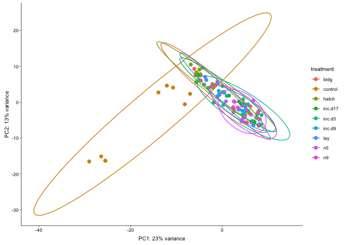
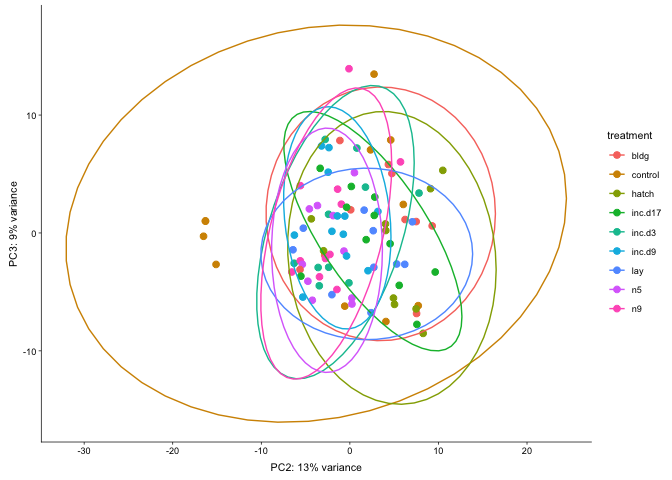
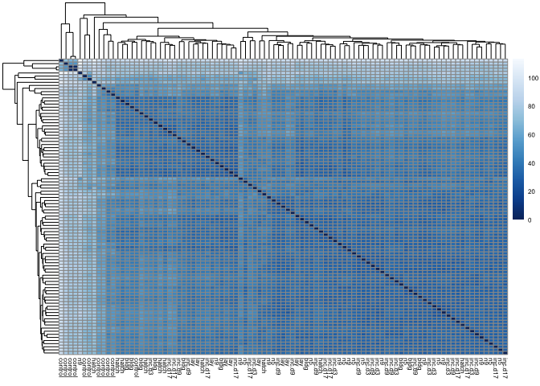

    library(tidyverse)

    ## ── Attaching packages ──────────────────────────────────────────────────────────────── tidyverse 1.2.1 ──

    ## ✔ ggplot2 3.1.0       ✔ purrr   0.3.1  
    ## ✔ tibble  2.0.1       ✔ dplyr   0.8.0.1
    ## ✔ tidyr   0.8.3       ✔ stringr 1.4.0  
    ## ✔ readr   1.3.1       ✔ forcats 0.4.0

    ## ── Conflicts ─────────────────────────────────────────────────────────────────── tidyverse_conflicts() ──
    ## ✖ dplyr::filter() masks stats::filter()
    ## ✖ dplyr::lag()    masks stats::lag()

    library(DESeq2)

    ## Loading required package: S4Vectors

    ## Loading required package: stats4

    ## Loading required package: BiocGenerics

    ## Loading required package: parallel

    ## 
    ## Attaching package: 'BiocGenerics'

    ## The following objects are masked from 'package:parallel':
    ## 
    ##     clusterApply, clusterApplyLB, clusterCall, clusterEvalQ,
    ##     clusterExport, clusterMap, parApply, parCapply, parLapply,
    ##     parLapplyLB, parRapply, parSapply, parSapplyLB

    ## The following objects are masked from 'package:dplyr':
    ## 
    ##     combine, intersect, setdiff, union

    ## The following objects are masked from 'package:stats':
    ## 
    ##     IQR, mad, sd, var, xtabs

    ## The following objects are masked from 'package:base':
    ## 
    ##     anyDuplicated, append, as.data.frame, basename, cbind,
    ##     colMeans, colnames, colSums, dirname, do.call, duplicated,
    ##     eval, evalq, Filter, Find, get, grep, grepl, intersect,
    ##     is.unsorted, lapply, lengths, Map, mapply, match, mget, order,
    ##     paste, pmax, pmax.int, pmin, pmin.int, Position, rank, rbind,
    ##     Reduce, rowMeans, rownames, rowSums, sapply, setdiff, sort,
    ##     table, tapply, union, unique, unsplit, which, which.max,
    ##     which.min

    ## 
    ## Attaching package: 'S4Vectors'

    ## The following objects are masked from 'package:dplyr':
    ## 
    ##     first, rename

    ## The following object is masked from 'package:tidyr':
    ## 
    ##     expand

    ## The following object is masked from 'package:base':
    ## 
    ##     expand.grid

    ## Loading required package: IRanges

    ## 
    ## Attaching package: 'IRanges'

    ## The following objects are masked from 'package:dplyr':
    ## 
    ##     collapse, desc, slice

    ## The following object is masked from 'package:purrr':
    ## 
    ##     reduce

    ## Loading required package: GenomicRanges

    ## Loading required package: GenomeInfoDb

    ## Loading required package: SummarizedExperiment

    ## Loading required package: Biobase

    ## Welcome to Bioconductor
    ## 
    ##     Vignettes contain introductory material; view with
    ##     'browseVignettes()'. To cite Bioconductor, see
    ##     'citation("Biobase")', and for packages 'citation("pkgname")'.

    ## Loading required package: DelayedArray

    ## Loading required package: matrixStats

    ## 
    ## Attaching package: 'matrixStats'

    ## The following objects are masked from 'package:Biobase':
    ## 
    ##     anyMissing, rowMedians

    ## The following object is masked from 'package:dplyr':
    ## 
    ##     count

    ## Loading required package: BiocParallel

    ## 
    ## Attaching package: 'DelayedArray'

    ## The following objects are masked from 'package:matrixStats':
    ## 
    ##     colMaxs, colMins, colRanges, rowMaxs, rowMins, rowRanges

    ## The following object is masked from 'package:purrr':
    ## 
    ##     simplify

    ## The following objects are masked from 'package:base':
    ## 
    ##     aperm, apply

    library(cowplot)

    ## 
    ## Attaching package: 'cowplot'

    ## The following object is masked from 'package:ggplot2':
    ## 
    ##     ggsave

    library(RColorBrewer)
    library(pheatmap)

    # load custom functions  
    source("../R/functions.R")  

    knitr::opts_chunk$set(fig.path = '../figures/hyp/',cache=TRUE)

This anlaysis will *exclude* the control timepoint but *combine*
incubation and nestling timepoints.

    # import "colData" which contains sample information and "countData" which contains read counts
    colData <- read.csv("../results/00_colData_characterization.csv", header = T, row.names = 1)
    countData <- read.csv("../results/00_countData_characterization.csv", header = T, row.names = 1)
    geneinfo <- read.csv("../results/00_geneinfo.csv", row.names = 1)

    # making new groups
    colData$group <- NULL
    colData$tempgroup <- ifelse(colData$treatment == "bldg", "bldg",
                      ifelse(colData$treatment == "control", "control",
                       ifelse(colData$treatment == "hatch", "hatch",
                        ifelse(grepl("inc", colData$treatment), "inc",
                         ifelse(colData$treatment == "lay", "lay", "nestl")))))
    colData$tempgroup <- as.factor(colData$tempgroup)

    colData$group <- paste(colData$sex, colData$tempgroup, sep = "")
    colData$group <- as.factor(colData$group)
    str(colData$group)

    ##  Factor w/ 12 levels "femalebldg","femalecontrol",..: 8 8 8 8 8 8 2 2 2 8 ...

    colData$treatment <- factor(colData$treatment, levels = 
                                  c("control", "bldg", "lay", "inc.d3", "inc.d9", 
                                    "inc.d17", "hatch", "n5", "n9"))

    colData <- colData %>%
      dplyr::filter(grepl('hypothalamus', tissue)) %>%
      #dplyr::filter(treatment != "control") %>%
      dplyr::filter(sex == "female") %>%
      droplevels()
    row.names(colData) <- colData$V1

    # print sample sizes
    colData %>% select(group, tissue)  %>%  summary()

    ##            group             tissue  
    ##  femalebldg   :10   hypothalamus:95  
    ##  femalecontrol:11                    
    ##  femalehatch  :10                    
    ##  femaleinc    :33                    
    ##  femalelay    :10                    
    ##  femalenestl  :21

    savecols <- as.character(colData$V1) 
    savecols <- as.vector(savecols) 
    countData <- countData %>% dplyr::select(one_of(savecols)) 

    # check that row and col lenghts are equal
    ncol(countData) == nrow(colData) 

    ## [1] TRUE

    dds <- DESeqDataSetFromMatrix(countData = countData,
                                  colData = colData,
                                  design = ~ treatment )

    ##   it appears that the last variable in the design formula, 'treatment',
    ##   has a factor level, 'control', which is not the reference level. we recommend
    ##   to use factor(...,levels=...) or relevel() to set this as the reference level
    ##   before proceeding. for more information, please see the 'Note on factor levels'
    ##   in vignette('DESeq2').

    dds <- dds[ rowSums(counts(dds)) > 2, ] ## pre-filter genes 
    dds <- DESeq(dds) # Differential expression analysis

    ## estimating size factors

    ## estimating dispersions

    ## gene-wise dispersion estimates

    ## mean-dispersion relationship

    ## final dispersion estimates

    ## fitting model and testing

    ## -- replacing outliers and refitting for 9 genes
    ## -- DESeq argument 'minReplicatesForReplace' = 7 
    ## -- original counts are preserved in counts(dds)

    ## estimating dispersions

    ## fitting model and testing

    vsd <- vst(dds, blind=FALSE) # variance stabilized 

    #create list of groups
    a <- levels(colData$treatment)
    a

    ## [1] "bldg"    "control" "hatch"   "inc.d17" "inc.d3"  "inc.d9"  "lay"    
    ## [8] "n5"      "n9"

    # create list of groups, with control last
    b <- a[2:9]
    b[9] <- a[1]
    b

    ## [1] "control" "hatch"   "inc.d17" "inc.d3"  "inc.d9"  "lay"     "n5"     
    ## [8] "n9"      "bldg"

    for (i in a){
      for (j in b){
        print(paste(i,j))
        if (i != j) {
        numDEGs(i,j)
      }
      }
    }

    ## [1] "bldg control"
    ## [1] 5961
    ## [1] "bldg hatch"
    ## [1] 3
    ## [1] "bldg inc.d17"
    ## [1] 0
    ## [1] "bldg inc.d3"
    ## [1] 0
    ## [1] "bldg inc.d9"
    ## [1] 5
    ## [1] "bldg lay"
    ## [1] 1
    ## [1] "bldg n5"
    ## [1] 13
    ## [1] "bldg n9"
    ## [1] 292
    ## [1] "bldg bldg"
    ## [1] "control control"
    ## [1] "control hatch"
    ## [1] 6266
    ## [1] "control inc.d17"
    ## [1] 6673
    ## [1] "control inc.d3"
    ## [1] 6758
    ## [1] "control inc.d9"
    ## [1] 6953
    ## [1] "control lay"
    ## [1] 6223
    ## [1] "control n5"
    ## [1] 6922
    ## [1] "control n9"
    ## [1] 7014
    ## [1] "control bldg"
    ## [1] 5961
    ## [1] "hatch control"
    ## [1] 6266
    ## [1] "hatch hatch"
    ## [1] "hatch inc.d17"
    ## [1] 3
    ## [1] "hatch inc.d3"
    ## [1] 930
    ## [1] "hatch inc.d9"
    ## [1] 2175
    ## [1] "hatch lay"
    ## [1] 11
    ## [1] "hatch n5"
    ## [1] 1951
    ## [1] "hatch n9"
    ## [1] 1743
    ## [1] "hatch bldg"
    ## [1] 3
    ## [1] "inc.d17 control"
    ## [1] 6673
    ## [1] "inc.d17 hatch"
    ## [1] 3
    ## [1] "inc.d17 inc.d17"
    ## [1] "inc.d17 inc.d3"
    ## [1] 0
    ## [1] "inc.d17 inc.d9"
    ## [1] 5
    ## [1] "inc.d17 lay"
    ## [1] 4
    ## [1] "inc.d17 n5"
    ## [1] 6
    ## [1] "inc.d17 n9"
    ## [1] 267
    ## [1] "inc.d17 bldg"
    ## [1] 0
    ## [1] "inc.d3 control"
    ## [1] 6758
    ## [1] "inc.d3 hatch"
    ## [1] 930
    ## [1] "inc.d3 inc.d17"
    ## [1] 0
    ## [1] "inc.d3 inc.d3"
    ## [1] "inc.d3 inc.d9"
    ## [1] 1
    ## [1] "inc.d3 lay"
    ## [1] 0
    ## [1] "inc.d3 n5"
    ## [1] 0
    ## [1] "inc.d3 n9"
    ## [1] 0
    ## [1] "inc.d3 bldg"
    ## [1] 0
    ## [1] "inc.d9 control"
    ## [1] 6953
    ## [1] "inc.d9 hatch"
    ## [1] 2175
    ## [1] "inc.d9 inc.d17"
    ## [1] 5
    ## [1] "inc.d9 inc.d3"
    ## [1] 1
    ## [1] "inc.d9 inc.d9"
    ## [1] "inc.d9 lay"
    ## [1] 11
    ## [1] "inc.d9 n5"
    ## [1] 1
    ## [1] "inc.d9 n9"
    ## [1] 2
    ## [1] "inc.d9 bldg"
    ## [1] 5
    ## [1] "lay control"
    ## [1] 6223
    ## [1] "lay hatch"
    ## [1] 11
    ## [1] "lay inc.d17"
    ## [1] 4
    ## [1] "lay inc.d3"
    ## [1] 0
    ## [1] "lay inc.d9"
    ## [1] 11
    ## [1] "lay lay"
    ## [1] "lay n5"
    ## [1] 1
    ## [1] "lay n9"
    ## [1] 329
    ## [1] "lay bldg"
    ## [1] 1
    ## [1] "n5 control"
    ## [1] 6922
    ## [1] "n5 hatch"
    ## [1] 1951
    ## [1] "n5 inc.d17"
    ## [1] 6
    ## [1] "n5 inc.d3"
    ## [1] 0
    ## [1] "n5 inc.d9"
    ## [1] 1
    ## [1] "n5 lay"
    ## [1] 1
    ## [1] "n5 n5"
    ## [1] "n5 n9"
    ## [1] 0
    ## [1] "n5 bldg"
    ## [1] 13
    ## [1] "n9 control"
    ## [1] 7014
    ## [1] "n9 hatch"
    ## [1] 1743
    ## [1] "n9 inc.d17"
    ## [1] 267
    ## [1] "n9 inc.d3"
    ## [1] 0
    ## [1] "n9 inc.d9"
    ## [1] 2
    ## [1] "n9 lay"
    ## [1] 329
    ## [1] "n9 n5"
    ## [1] 0
    ## [1] "n9 n9"
    ## [1] "n9 bldg"
    ## [1] 292

    levels(colData$treatment)

    ## [1] "bldg"    "control" "hatch"   "inc.d17" "inc.d3"  "inc.d9"  "lay"    
    ## [8] "n5"      "n9"

    colData$treatment <- factor(colData$treatment, levels = 
                                  c("control", "bldg", "lay", "inc.d3", "inc.d9", 
                                    "inc.d17", "hatch", "n5", "n9"))

    # create the dataframe using my function pcadataframe
    pcadata <- pcadataframe(vsd, intgroup=c("treatment"), returnData=TRUE)
    percentVar <- round(100 * attr(pcadata, "percentVar"))
    percentVar

    ## [1] 23 13  9  4  4  3

    ggplot(pcadata, aes(PC1, PC2,color = treatment)) + 
      geom_point(size = 2, alpha = 1) +
      stat_ellipse(type = "t") +
      xlab(paste0("PC1: ", percentVar[1],"% variance")) +
      ylab(paste0("PC2: ", percentVar[2],"% variance")) +
      theme_cowplot(font_size = 8, line_size = 0.25) 

    ggplot(pcadata, aes(PC2, PC3,color = treatment)) + 
      geom_point(size = 2, alpha = 1) +
      stat_ellipse(type = "t") +
      xlab(paste0("PC2: ", percentVar[2],"% variance")) +
      ylab(paste0("PC3: ", percentVar[3],"% variance")) +
      theme_cowplot(font_size = 8, line_size = 0.25) 

    ggplot(pcadata, aes(PC3, PC4,color = treatment)) + 
      geom_point(size = 2, alpha = 1) +
      stat_ellipse(type = "t") +
      xlab(paste0("PC3: ", percentVar[3],"% variance")) +
      ylab(paste0("PC4: ", percentVar[4],"% variance")) +
      theme_cowplot(font_size = 8, line_size = 0.25) 

PCA statistics

    summary(aov(PC1 ~ treatment, data=pcadata)) 

    ##             Df Sum Sq Mean Sq F value   Pr(>F)    
    ## treatment    8   3382   422.8   17.58 3.03e-15 ***
    ## Residuals   86   2068    24.0                     
    ## ---
    ## Signif. codes:  0 '***' 0.001 '**' 0.01 '*' 0.05 '.' 0.1 ' ' 1

    TukeyHSD(aov(PC1 ~ treatment, data=pcadata), which = "treatment") 

    ##   Tukey multiple comparisons of means
    ##     95% family-wise confidence level
    ## 
    ## Fit: aov(formula = PC1 ~ treatment, data = pcadata)
    ## 
    ## $treatment
    ##                         diff         lwr       upr     p adj
    ## control-bldg    -14.39989704 -21.2183283 -7.581466 0.0000001
    ## hatch-bldg       -1.20165049  -8.1805374  5.777236 0.9997798
    ## inc.d17-bldg      1.74360020  -5.0748310  8.562031 0.9961728
    ## inc.d3-bldg       4.73095645  -2.2479304 11.709843 0.4425874
    ## inc.d9-bldg       5.04256631  -1.6392092 11.724342 0.2965995
    ## lay-bldg          1.69290177  -5.2859851  8.671789 0.9973468
    ## n5-bldg           5.34982161  -1.6290653 12.328708 0.2767428
    ## n9-bldg           5.06173775  -1.7566935 11.880169 0.3180105
    ## hatch-control    13.19824655   6.3798153 20.016678 0.0000008
    ## inc.d17-control  16.14349724   9.4893897 22.797605 0.0000000
    ## inc.d3-control   19.13085349  12.3124223 25.949285 0.0000000
    ## inc.d9-control   19.44246335  12.9284580 25.956469 0.0000000
    ## lay-control      16.09279881   9.2743676 22.911230 0.0000000
    ## n5-control       19.74971866  12.9312874 26.568150 0.0000000
    ## n9-control       19.46163479  12.8075273 26.115742 0.0000000
    ## inc.d17-hatch     2.94525070  -3.8731805  9.763682 0.9042759
    ## inc.d3-hatch      5.93260694  -1.0462799 12.911494 0.1615633
    ## inc.d9-hatch      6.24421681  -0.4375587 12.925992 0.0860310
    ## lay-hatch         2.89455226  -4.0843346  9.873439 0.9226755
    ## n5-hatch          6.55147211  -0.4274148 13.530359 0.0831736
    ## n9-hatch          6.26338825  -0.5550430 13.081819 0.0974869
    ## inc.d3-inc.d17    2.98735625  -3.8310750  9.805787 0.8970503
    ## inc.d9-inc.d17    3.29896611  -3.2150393  9.812971 0.7959044
    ## lay-inc.d17      -0.05069844  -6.8691297  6.767733 1.0000000
    ## n5-inc.d17        3.60622141  -3.2122098 10.424653 0.7550247
    ## n9-inc.d17        3.31813755  -3.3359700  9.972245 0.8092788
    ## inc.d9-inc.d3     0.31160986  -6.3701656  6.993385 1.0000000
    ## lay-inc.d3       -3.03805468 -10.0169415  3.940832 0.9003774
    ## n5-inc.d3         0.61886516  -6.3600217  7.597752 0.9999987
    ## n9-inc.d3         0.33078130  -6.4876499  7.149213 1.0000000
    ## lay-inc.d9       -3.34966455 -10.0314400  3.332111 0.8047673
    ## n5-inc.d9         0.30725530  -6.3745202  6.989031 1.0000000
    ## n9-inc.d9         0.01917144  -6.4948339  6.533177 1.0000000
    ## n5-lay            3.65691985  -3.3219670 10.635807 0.7642116
    ## n9-lay            3.36883599  -3.4495952 10.187267 0.8169477
    ## n9-n5            -0.28808386  -7.1065151  6.530347 1.0000000

    summary(aov(PC2 ~ treatment, data=pcadata)) 

    ##             Df Sum Sq Mean Sq F value Pr(>F)   
    ## treatment    8    665   83.12   3.146 0.0036 **
    ## Residuals   86   2272   26.42                  
    ## ---
    ## Signif. codes:  0 '***' 0.001 '**' 0.01 '*' 0.05 '.' 0.1 ' ' 1

    TukeyHSD(aov(PC2 ~ treatment, data=pcadata), which = "treatment") 

    ##   Tukey multiple comparisons of means
    ##     95% family-wise confidence level
    ## 
    ## Fit: aov(formula = PC2 ~ treatment, data = pcadata)
    ## 
    ## $treatment
    ##                       diff         lwr        upr     p adj
    ## control-bldg    -6.4061441 -13.5523696  0.7400815 0.1154733
    ## hatch-bldg       1.5927743  -5.7216208  8.9071693 0.9987657
    ## inc.d17-bldg    -0.6828502  -7.8290757  6.4633754 0.9999976
    ## inc.d3-bldg     -4.0796931 -11.3940881  3.2347020 0.6982104
    ## inc.d9-bldg     -4.6389276 -11.6419277  2.3640725 0.4749432
    ## lay-bldg        -1.5973537  -8.9117488  5.7170413 0.9987400
    ## n5-bldg         -5.4309544 -12.7453495  1.8834406 0.3177602
    ## n9-bldg         -5.2298316 -12.3760572  1.9163939 0.3369872
    ## hatch-control    7.9989183   0.8526928 15.1451439 0.0167058
    ## inc.d17-control  5.7232939  -1.2507081 12.6972960 0.1972736
    ## inc.d3-control   2.3264510  -4.8197745  9.4726766 0.9811743
    ## inc.d9-control   1.7672165  -5.0599480  8.5943810 0.9958386
    ## lay-control      4.8087903  -2.3374352 11.9550159 0.4529269
    ## n5-control       0.9751897  -6.1710359  8.1214152 0.9999622
    ## n9-control       1.1763124  -5.7976896  8.1503145 0.9998113
    ## inc.d17-hatch   -2.2756244  -9.4218500  4.8706011 0.9836198
    ## inc.d3-hatch    -5.6724673 -12.9868624  1.6419277 0.2623615
    ## inc.d9-hatch    -6.2317019 -13.2347020  0.7712982 0.1212932
    ## lay-hatch       -3.1901280 -10.5045231  4.1242670 0.8994096
    ## n5-hatch        -7.0237287 -14.3381237  0.2906664 0.0698740
    ## n9-hatch        -6.8226059 -13.9688315  0.3236196 0.0731201
    ## inc.d3-inc.d17  -3.3968429 -10.5430685  3.7493826 0.8466429
    ## inc.d9-inc.d17  -3.9560775 -10.7832420  2.8710870 0.6531544
    ## lay-inc.d17     -0.9145036  -8.0607291  6.2317220 0.9999770
    ## n5-inc.d17      -4.7481043 -11.8943298  2.3981213 0.4707212
    ## n9-inc.d17      -4.5469815 -11.5209835  2.4270206 0.4970994
    ## inc.d9-inc.d3   -0.5592346  -7.5622346  6.4437655 0.9999994
    ## lay-inc.d3       2.4823393  -4.8320557  9.7967344 0.9756369
    ## n5-inc.d3       -1.3512614  -8.6656564  5.9631337 0.9996283
    ## n9-inc.d3       -1.1501386  -8.2963641  5.9960870 0.9998674
    ## lay-inc.d9       3.0415739  -3.9614262 10.0445740 0.9015414
    ## n5-inc.d9       -0.7920268  -7.7950269  6.2109733 0.9999911
    ## n9-inc.d9       -0.5909040  -7.4180685  6.2362605 0.9999989
    ## n5-lay          -3.8336007 -11.1479957  3.4807944 0.7639888
    ## n9-lay          -3.6324779 -10.7787035  3.5137477 0.7926352
    ## n9-n5            0.2011228  -6.9451028  7.3473483 1.0000000

    summary(aov(PC3 ~ treatment, data=pcadata)) 

    ##             Df Sum Sq Mean Sq F value Pr(>F)
    ## treatment    8  140.2   17.52   0.807  0.598
    ## Residuals   86 1867.2   21.71

    summary(aov(PC4 ~ treatment, data=pcadata)) 

    ##             Df Sum Sq Mean Sq F value Pr(>F)
    ## treatment    8   84.9   10.62   1.039  0.413
    ## Residuals   86  878.4   10.21

    summary(aov(PC5 ~ treatment, data=pcadata)) 

    ##             Df Sum Sq Mean Sq F value Pr(>F)  
    ## treatment    8  125.8  15.722    1.77 0.0941 .
    ## Residuals   86  763.9   8.882                 
    ## ---
    ## Signif. codes:  0 '***' 0.001 '**' 0.01 '*' 0.05 '.' 0.1 ' ' 1

    TukeyHSD(aov(PC5 ~ treatment, data=pcadata), which = "treatment") 

    ##   Tukey multiple comparisons of means
    ##     95% family-wise confidence level
    ## 
    ## Fit: aov(formula = PC5 ~ treatment, data = pcadata)
    ## 
    ## $treatment
    ##                        diff        lwr      upr     p adj
    ## control-bldg    -0.02460454 -4.1684576 4.119249 1.0000000
    ## hatch-bldg       3.21034597 -1.0310229 7.451715 0.2928010
    ## inc.d17-bldg     0.82869693 -3.3151562 4.972550 0.9993340
    ## inc.d3-bldg      0.48210100 -3.7592679 4.723470 0.9999908
    ## inc.d9-bldg      1.15087978 -2.9099218 5.211681 0.9923187
    ## lay-bldg         0.87120943 -3.3701594 5.112578 0.9991905
    ## n5-bldg          2.09679895 -2.1445699 6.338168 0.8164660
    ## n9-bldg          3.09637458 -1.0474785 7.240228 0.3094573
    ## hatch-control    3.23495051 -0.9089026 7.378804 0.2543173
    ## inc.d17-control  0.85330147 -3.1906851 4.897288 0.9990164
    ## inc.d3-control   0.50670554 -3.6371476 4.650559 0.9999838
    ## inc.d9-control   1.17548432 -2.7833561 5.134325 0.9895564
    ## lay-control      0.89581397 -3.2480391 5.039667 0.9988286
    ## n5-control       2.12140349 -2.0224496 6.265257 0.7861992
    ## n9-control       3.12097912 -0.9230074 7.164966 0.2683504
    ## inc.d17-hatch   -2.38164904 -6.5255021 1.762204 0.6630848
    ## inc.d3-hatch    -2.72824497 -6.9696138 1.513124 0.5158387
    ## inc.d9-hatch    -2.05946619 -6.1202677 2.001335 0.7946531
    ## lay-hatch       -2.33913654 -6.5805054 1.902232 0.7108691
    ## n5-hatch        -1.11354702 -5.3549159 3.127822 0.9954146
    ## n9-hatch        -0.11397139 -4.2578245 4.029882 1.0000000
    ## inc.d3-inc.d17  -0.34659593 -4.4904490 3.797257 0.9999992
    ## inc.d9-inc.d17   0.32218284 -3.6366576 4.281023 0.9999993
    ## lay-inc.d17      0.04251250 -4.1013406 4.186366 1.0000000
    ## n5-inc.d17       1.26810202 -2.8757511 5.411955 0.9872972
    ## n9-inc.d17       2.26767764 -1.7763089 6.311664 0.6921014
    ## inc.d9-inc.d3    0.66877878 -3.3920228 4.729580 0.9998423
    ## lay-inc.d3       0.38910843 -3.8522604 4.630477 0.9999983
    ## n5-inc.d3        1.61469795 -2.6266709 5.856067 0.9518646
    ## n9-inc.d3        2.61427358 -1.5295795 6.758127 0.5425174
    ## lay-inc.d9      -0.27967035 -4.3404719 3.781131 0.9999998
    ## n5-inc.d9        0.94591918 -3.1148824 5.006721 0.9980048
    ## n9-inc.d9        1.94549480 -2.0133456 5.904335 0.8213070
    ## n5-lay           1.22558952 -3.0157793 5.466958 0.9912650
    ## n9-lay           2.22516515 -1.9186880 6.369018 0.7395442
    ## n9-n5            0.99957562 -3.1442775 5.143429 0.9974489

    summary(aov(PC6 ~ treatment, data=pcadata)) 

    ##             Df Sum Sq Mean Sq F value Pr(>F)
    ## treatment    8   97.4  12.180   1.591  0.139
    ## Residuals   86  658.5   7.657

    # see http://bioconductor.org/packages/devel/bioc/vignettes/DESeq2/inst/doc/DESeq2.html#heatmap-of-the-count-matrix
    sampleDists <- dist(t(assay(vsd)))

    sampleDistMatrix <- as.matrix(sampleDists)
    rownames(sampleDistMatrix) <- NULL
    colnames(sampleDistMatrix) <- colData$treatment
    colors <- colorRampPalette( rev(brewer.pal(9, "Blues")) )(255)
    pheatmap(sampleDistMatrix,
             clustering_distance_rows=sampleDists,
             clustering_distance_cols=sampleDists,
             col=colors,
             fontsize = 6)

