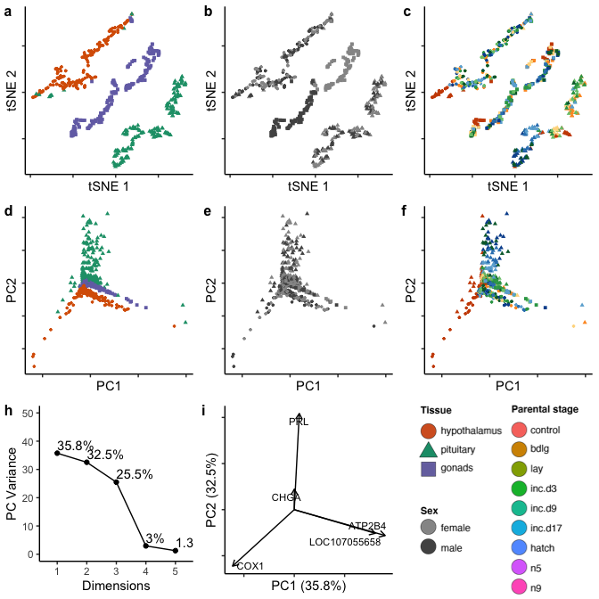

note. this file is too big for storage in github :(
===================================================

Data: Pseudocounts from Limma
-----------------------------

    pseudocounts <- read_csv("../results/01_pseudo.counts.csv")

    ## Warning: Missing column names filled in: 'X1' [1]

    ## Parsed with column specification:
    ## cols(
    ##   .default = col_double(),
    ##   X1 = col_character()
    ## )

    ## See spec(...) for full column specifications.

    head(pseudocounts[1:3])

    ## # A tibble: 6 x 3
    ##   X1     L.Blu13_male_gonad_control.NY… L.Blu13_male_hypothalamus_control.…
    ##   <chr>                           <dbl>                               <dbl>
    ## 1 A2ML1                          42.7                               201.   
    ## 2 A2ML2                           4.44                                4.86 
    ## 3 A2ML3                         212.                               6920.   
    ## 4 A2ML4                           6.91                                0.810
    ## 5 A4GALT                         14.3                                 8.53 
    ## 6 A4GNT                           0.206                               0.105

    pseudocounts <- as.data.frame(pseudocounts)
    row.names(pseudocounts) <- pseudocounts$X1
    pseudocounts$X1 <- NULL
    # prep count data for all samples
    countData <- as.data.frame(t(pseudocounts))
    head(countData[1:3])

    ##                                            A2ML1     A2ML2      A2ML3
    ## L.Blu13_male_gonad_control.NYNO         42.65677 4.4397552  211.96191
    ## L.Blu13_male_hypothalamus_control.NYNO 201.26331 4.8633048 6919.87335
    ## L.Blu13_male_pituitary_control.NYNO    161.22614 0.3158851  212.10845
    ## L.G107_male_gonad_control               43.22441 2.0404458  203.74048
    ## L.G107_male_hypothalamus_control       382.33084 4.9190817 9531.52550
    ## L.G107_male_pituitary_control           85.34910 0.3577761   69.02124

All data, characterization and manipulations
--------------------------------------------

    # prep col data for all samples
    colData <- read.csv("../metadata/00_samples.csv", header = T, row.names = 1)
    colData$treatment <- factor(colData$treatment, levels = alllevels)
    colData <- colData %>% mutate(tissue = fct_recode(tissue, "gonads" = "gonad"))
    colData$tissue <- factor(colData$tissue, levels = tissuelevels)
    row.names(colData) <- colData$V1

    # check ready for analysis
    #row.names(countData) == row.names(colData)

    # pca
    mypca <- prcomp(countData)
    eig.val <- get_eigenvalue(mypca)
    head(eig.val)

    ##         eigenvalue variance.percent cumulative.variance.percent
    ## Dim.1 347109367771       44.5298914                    44.52989
    ## Dim.2 232627925348       29.8433209                    74.37321
    ## Dim.3 157029529870       20.1449703                    94.51818
    ## Dim.4  20737955767        2.6604264                    97.17861
    ## Dim.5   6256994416        0.8026959                    97.98130
    ## Dim.6   5083281170        0.6521229                    98.63343

    mypcadf <- data.frame(PC1 = mypca$x[, 1], PC2 = mypca$x[, 2], PC3 = mypca$x[, 3], 
                      PC4 = mypca$x[, 4],PC5 = mypca$x[, 5],PC6 = mypca$x[, 6],
                      ID = row.names(countData))
    mypcadf$V1 <- row.names(mypcadf)
    mypcadf <- left_join(colData, mypcadf)

    ## Joining, by = "V1"

    ## Warning: Column `V1` joining factor and character vector, coercing into
    ## character vector

    mypcadf <- mypcadf %>% select(bird,sex,tissue,treatment,PC1:PC6)
    head(mypcadf)

    ##      bird  sex       tissue treatment       PC1       PC2         PC3
    ## 1 L.Blu13 male       gonads   control -345922.6 390710.08   171612.48
    ## 2 L.Blu13 male hypothalamus   control -206857.1 592125.36 -1125399.57
    ## 3 L.Blu13 male    pituitary   control -405936.1 183424.52    44531.28
    ## 4  L.G107 male       gonads   control -257193.0 364748.85   140165.78
    ## 5  L.G107 male hypothalamus   control -177797.4 448098.40  -459129.46
    ## 6  L.G107 male    pituitary   control -515948.0  74090.85   -11508.62
    ##         PC4        PC5       PC6
    ## 1 -97041.80 -23661.568  27522.70
    ## 2 -56474.76  -3423.446 -18932.85
    ## 3 420683.42   8215.699  36102.24
    ## 4 -93812.33 -21839.792  30122.90
    ## 5 -65844.89  -6487.898  40592.78
    ## 6 411675.74   6560.618  28855.53

    plotcolorfulpcs <- function(whichfactor, whichcolors){
      p <- ggplot(mypcadf, aes(x = PC1, y = PC2, color = whichfactor)) +
        geom_point(size = 1)  +
        theme_B3() +
        theme(legend.title = element_blank(),
             axis.text = element_blank(),
             legend.position = "none") +
        labs(x = "PC1", y = "PC2") +
        scale_color_manual(values = whichcolors) 
      print(p)
    }

    a <- plotcolorfulpcs(mypcadf$tissue, colorstissue)  

    b <- plotcolorfulpcs(mypcadf$sex, sexcolors) 

    c <- plotcolorfulpcs(mypcadf$treatment, colorscharmaip)   

    d <- fviz_screeplot(mypca, addlabels = TRUE, ylim = c(0, 50),  ncp = 5) + labs(title = NULL, y = "Variance") + theme_B3() 
    e <- fviz_contrib(mypca, choice = "var", axes = 1, top = 5)  + labs(title = NULL, subtitle = "PC1", x = NULL) + 
              theme_B3() + theme(axis.text.x = element_text(angle = 55, hjust = 1))
    f <- fviz_contrib(mypca, choice = "var", axes = 2, top = 5)  + labs(title = NULL, subtitle = "PC2", y = NULL, x = NULL) + 
              theme_B3()  + theme(axis.text.x = element_text(angle = 55, hjust = 1))
    g <- fviz_pca_var(mypca,  labelsize = 3 , axes.linetype = "blank", 
                       repel = TRUE ,
                      select.var= list(contrib = 6)) + 
          theme_B3() + 
          labs(x = "PC1", y = "PC2", title =  NULL) +
          theme( axis.text = element_blank()) 

    abc <- plot_grid(a,b, c, nrow =  1,  labels = c("d", "e", "f"), label_size = 12)
    defg <- plot_grid(d,e,f,g, nrow = 1, rel_widths = c(1, 0.55, 0.45, 1), labels = c("h", "i", "j", "k" ), label_size = 12)
    dg <- plot_grid(d,g, NULL, nrow = 1, rel_widths = c(1, 1, 1), labels = c("h", "i", NULL ), label_size = 12)
    plot_grid(abc, defg, nrow = 2)

    # prep for tsne
    euclidist <- dist(countData) # euclidean distances between the rows

    tsne_model <- Rtsne(euclidist, check_duplicates=FALSE, pca=TRUE, perplexity=10, theta=0.5, dims=2)
    tsne_df = as.data.frame(tsne_model$Y) 

    # prep for adding columns
    colData2 <- colData 
    colData2$V1 <- NULL
    tsne_df_cols <- cbind(colData2, tsne_df)

    plotcolorfultsnes <- function(whichfactor, whichcolors){
      p <- ggplot(tsne_df_cols, aes(x = V1, y = V2, color = whichfactor)) +
        geom_point(size = 1) +
        theme_B3() +
        labs(x = "tSNE 1", y = "tSNE 2") +
        scale_color_manual(values = whichcolors) +
        theme(legend.position = "none",
              axis.text = element_blank())
      print(p)
    }

    h <- plotcolorfultsnes(tsne_df_cols$tissue, colorstissue)  

    i <- plotcolorfultsnes(tsne_df_cols$sex, sexcolors)   

    j <- plotcolorfultsnes(tsne_df_cols$treatment, colorscharmaip)  

    hij <- plot_grid(h,i,j, nrow = 1, labels = c("a", "b", "c"), label_size = 12)
    hij

    plot_grid(hij, abc, dg, nrow = 3)

