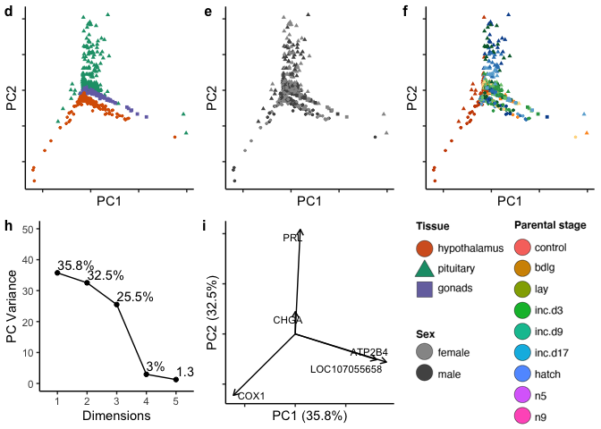

note. this file is too big for storage in github :(
===================================================

Data: Pseudocounts from Limma
-----------------------------

    pseudocounts <- read_csv("../results/01_pseudo.counts.csv")

    ## Warning: Missing column names filled in: 'X1' [1]

    ## Parsed with column specification:
    ## cols(
    ##   .default = col_double(),
    ##   X1 = col_character()
    ## )

    ## See spec(...) for full column specifications.

    head(pseudocounts[1:3])

    ## # A tibble: 6 x 3
    ##   X1     L.Blu13_male_gonad_control.NY… L.Blu13_male_hypothalamus_control.…
    ##   <chr>                           <dbl>                               <dbl>
    ## 1 A2ML1                          42.7                               201.   
    ## 2 A2ML2                           4.44                                4.86 
    ## 3 A2ML3                         212.                               6920.   
    ## 4 A2ML4                           6.91                                0.810
    ## 5 A4GALT                         14.3                                 8.53 
    ## 6 A4GNT                           0.206                               0.105

    pseudocounts <- as.data.frame(pseudocounts)
    row.names(pseudocounts) <- pseudocounts$X1
    pseudocounts$X1 <- NULL
    # prep count data for all samples
    countData <- as.data.frame(t(pseudocounts))
    head(countData[1:3])

    ##                                            A2ML1     A2ML2      A2ML3
    ## L.Blu13_male_gonad_control.NYNO         42.65677 4.4397552  211.96191
    ## L.Blu13_male_hypothalamus_control.NYNO 201.26331 4.8633048 6919.87335
    ## L.Blu13_male_pituitary_control.NYNO    161.22614 0.3158851  212.10845
    ## L.G107_male_gonad_control               43.22441 2.0404458  203.74048
    ## L.G107_male_hypothalamus_control       382.33084 4.9190817 9531.52550
    ## L.G107_male_pituitary_control           85.34910 0.3577761   69.02124

All data, characterization and manipulations
--------------------------------------------

    # prep col data for all samples
    colData <- read.csv("../metadata/00_samples.csv", header = T, row.names = 1)
    colData$treatment <- factor(colData$treatment, levels = alllevels)
    colData <- colData %>% mutate(tissue = fct_recode(tissue, "gonads" = "gonad"))
    colData$tissue <- factor(colData$tissue, levels = tissuelevels)
    row.names(colData) <- colData$V1

    # check ready for analysis
    #row.names(countData) == row.names(colData)

    head(colData)

    ##                                                                            V1
    ## L.Blu13_male_gonad_control.NYNO               L.Blu13_male_gonad_control.NYNO
    ## L.Blu13_male_hypothalamus_control.NYNO L.Blu13_male_hypothalamus_control.NYNO
    ## L.Blu13_male_pituitary_control.NYNO       L.Blu13_male_pituitary_control.NYNO
    ## L.G107_male_gonad_control                           L.G107_male_gonad_control
    ## L.G107_male_hypothalamus_control             L.G107_male_hypothalamus_control
    ## L.G107_male_pituitary_control                   L.G107_male_pituitary_control
    ##                                           bird  sex       tissue treatment
    ## L.Blu13_male_gonad_control.NYNO        L.Blu13 male       gonads   control
    ## L.Blu13_male_hypothalamus_control.NYNO L.Blu13 male hypothalamus   control
    ## L.Blu13_male_pituitary_control.NYNO    L.Blu13 male    pituitary   control
    ## L.G107_male_gonad_control               L.G107 male       gonads   control
    ## L.G107_male_hypothalamus_control        L.G107 male hypothalamus   control
    ## L.G107_male_pituitary_control           L.G107 male    pituitary   control
    ##                                                            group
    ## L.Blu13_male_gonad_control.NYNO               male.gonad.control
    ## L.Blu13_male_hypothalamus_control.NYNO male.hypothalamus.control
    ## L.Blu13_male_pituitary_control.NYNO       male.pituitary.control
    ## L.G107_male_gonad_control                     male.gonad.control
    ## L.G107_male_hypothalamus_control       male.hypothalamus.control
    ## L.G107_male_pituitary_control             male.pituitary.control
    ##                                                  study
    ## L.Blu13_male_gonad_control.NYNO        charcterization
    ## L.Blu13_male_hypothalamus_control.NYNO charcterization
    ## L.Blu13_male_pituitary_control.NYNO    charcterization
    ## L.G107_male_gonad_control              charcterization
    ## L.G107_male_hypothalamus_control       charcterization
    ## L.G107_male_pituitary_control          charcterization

    # prep for tsne

    subsetmaketsne <- function(whichtissue, whichtreatment, whichsex){

      colData <- colData %>%
        dplyr::filter(tissue %in% whichtissue,
                      treatment %in% whichtreatment,
                      sex %in% whichsex) 
      row.names(colData) <- colData$V1

      # save counts that match colData
      savecols <- as.character(colData$V1) 
      savecols <- as.vector(savecols) 
      
      countData <- as.data.frame(t(countData))
      countData <- countData %>% dplyr::select(one_of(savecols)) 
      countData <- as.data.frame(t(countData))

      euclidist <- dist(countData) # euclidean distances between the rows

      tsne_model <- Rtsne(euclidist, check_duplicates=FALSE, pca=TRUE, perplexity=10, theta=0.5, dims=2)
      tsne_df = as.data.frame(tsne_model$Y) 

      # prep for adding columns
      colData2 <- colData 
      colData2$V1 <- NULL
      tsne_df_cols <- cbind(colData2, tsne_df)
      return(tsne_df_cols)
    }

    chartsne <- subsetmaketsne(tissuelevels, charlevels, sexlevels)
    hyptsne <- subsetmaketsne("hypothalamus", charlevels, sexlevels)
    pittsne <- subsetmaketsne("pituitary", charlevels, sexlevels)
    gontsne <- subsetmaketsne("gonads", charlevels, sexlevels)

    plotcolorfultsnes <- function(tsnedf, whichfactor, whichcolors){
      p <- ggplot(tsnedf, aes(x = V1, y = V2, color = whichfactor, shape = tissue)) +
        geom_point(size = 1) +
        theme_B3() +
        labs(x = "tSNE 1", y = "tSNE 2") +
        scale_color_manual(values = whichcolors) +
        theme(legend.position = "none",
              axis.text = element_blank()) +
        scale_shape_manual(values = myshapes)
      print(p)
    }

    a <- plotcolorfultsnes(chartsne, chartsne$tissue, colorstissue)  

    b <- plotcolorfultsnes(chartsne, chartsne$sex, sexcolors)   

    c <- plotcolorfultsnes(chartsne, chartsne$treatment, colorscharmaip)  

    abc <- plot_grid(a,b,c, nrow = 1, labels = c("a", "b", "c"), label_size = 12)
    abc

    subsetmakepca <- function(whichtissue, whichtreatment, whichsex){

      colData <- colData %>%
        dplyr::filter(tissue %in% whichtissue,
                      treatment %in% whichtreatment,
                      sex %in% whichsex) 
      row.names(colData) <- colData$V1

      # save counts that match colData
      savecols <- as.character(colData$V1) 
      savecols <- as.vector(savecols) 
      
      countData <- as.data.frame(t(countData))
      countData <- countData %>% dplyr::select(one_of(savecols)) 
      countData <- as.data.frame(t(countData))

      mypca <- prcomp(countData)

      mypcadf <- data.frame(PC1 = mypca$x[, 1], PC2 = mypca$x[, 2], PC3 = mypca$x[, 3], 
                      PC4 = mypca$x[, 4],PC5 = mypca$x[, 5],PC6 = mypca$x[, 6],
                      ID = row.names(countData))
      mypcadf$V1 <- row.names(mypcadf)
      mypcadf <- left_join(colData, mypcadf)
      mypcadf <- mypcadf %>% select(bird,sex,tissue,treatment,PC1:PC6)
      return(mypcadf)
    }

    charpca <- subsetmakepca(tissuelevels, charlevels, sexlevels)

    ## Joining, by = "V1"

    ## Warning: Column `V1` joining factor and character vector, coercing into
    ## character vector

    hyppca <- subsetmakepca("hypothalamus", charlevels, sexlevels)

    ## Joining, by = "V1"

    ## Warning: Column `V1` joining factor and character vector, coercing into
    ## character vector

    pitpca <- subsetmakepca("pituitary", charlevels, sexlevels)

    ## Joining, by = "V1"

    ## Warning: Column `V1` joining factor and character vector, coercing into
    ## character vector

    gonpca <- subsetmakepca("gonads", charlevels, sexlevels)

    ## Joining, by = "V1"

    ## Warning: Column `V1` joining factor and character vector, coercing into
    ## character vector

    plotcolorfulpcs <- function(mypcadf,  whichfactor, whichcolors){
      p <- mypcadf %>%
        ggplot(aes(x = PC1, y = PC2, shape = tissue, color = whichfactor )) +
        geom_point(size = 1)  +
        theme_B3() +
        theme(legend.title = element_blank(),
             axis.text = element_blank(),
             legend.position = "none") +
        labs(x = "PC1", y = "PC2")  +
        scale_color_manual(values = whichcolors) +
        scale_shape_manual(values = myshapes)
      print(p)
    }

    d <- plotcolorfulpcs(charpca, charpca$tissue, colorstissue)  

    e <- plotcolorfulpcs(charpca, charpca$sex, sexcolors) 

    f <- plotcolorfulpcs(charpca,charpca$treatment, colorscharmaip) 

    def <- plot_grid(d,e, f, nrow =  1,  labels = c("d", "e", "f"), label_size = 12)
    def

    makefvizdf <-  function(whichtissue, whichtreatment, whichsex){
      colData <- colData %>%
          dplyr::filter(tissue %in% whichtissue,
                      treatment %in% whichtreatment,
                      sex %in% whichsex) 
      row.names(colData) <- colData$V1

      # save counts that match colData
      savecols <- as.character(colData$V1) 
      savecols <- as.vector(savecols) 
      
      countData <- as.data.frame(t(countData))
      countData <- countData %>% dplyr::select(one_of(savecols)) 
      countData <- as.data.frame(t(countData))

      mypca <- prcomp(countData)
      return(mypca)
    }

    charfviz <- makefvizdf(tissuelevels, charlevels, sexlevels)
    hypv <- makefvizdf("hypothalamus", charlevels, sexlevels)
    pitfviz <- makefvizdf("pituitary", charlevels, sexlevels)
    gonfviz <- makefvizdf("gonads", charlevels, sexlevels)

    g <- fviz_screeplot(charfviz, addlabels = TRUE, ylim = c(0, 50),  ncp = 5, barcolor = "white", barfill = "white") + 
      labs(title = NULL, y = "PC Variance") + theme_B3() 
    h <- fviz_pca_var(charfviz,  labelsize = 3 , axes.linetype = "blank", 
                       repel = TRUE ,
                      select.var= list(contrib = 5)) + 
          theme_B3() + 
          labs(x = "PC1 (35.8%)", y = "PC2 (32.5%)", title =  NULL) +
          theme( axis.text = element_blank()) 

    legend <- png::readPNG("../figures/images/DoveParentsRNAseq_legendchar.png")
    legend <-  grid::rasterGrob(legend, interpolate=TRUE)

    gh <- plot_grid(g,h, legend, nrow = 1, rel_widths = c(1, 1, 1), labels = c("h", "i", NULL ), label_size = 12)
    gh

    plot_grid(def, gh, nrow = 2)

    plot_grid( abc, def, gh, nrow = 3)

tissue specific
---------------

    ## tsne 
    h4 <- plotcolorfultsnes(hyptsne, hyptsne$sex, sexcolors)  + labs(y = "hypothalamus") 

    h5 <- plotcolorfultsnes(hyptsne, hyptsne$treatment, colorscharmaip)  

    p4 <- plotcolorfultsnes(pittsne, pittsne$sex, sexcolors)   + labs(y = "pituitary") 

    p5 <- plotcolorfultsnes(pittsne, pittsne$treatment, colorscharmaip)  

    g4 <- plotcolorfultsnes(gontsne, gontsne$sex, sexcolors)  + labs(y = "gonads")  

    g5 <- plotcolorfultsnes(gontsne, gontsne$treatment, colorscharmaip)  

    ## pca

    h1 <- plotcolorfulpcs(hyppca, hyppca$sex, sexcolors) 

    h2 <- plotcolorfulpcs(hyppca, hyppca$treatment, colorscharmaip) 

    p1 <- plotcolorfulpcs(pitpca, pitpca$sex, sexcolors) 

    p2 <- plotcolorfulpcs(pitpca, pitpca$treatment, colorscharmaip) 

    g1 <- plotcolorfulpcs(gonpca, gonpca$sex, sexcolors) 

    g2 <- plotcolorfulpcs(gonpca, gonpca$treatment, colorscharmaip) 

    plot_grid(h1,h2,p1,p2,g1,g2, nrow = 3)

    # screeplot for variance
    fviz_screeplot(hypv, addlabels = TRUE,   ncp = 5) + 
      labs(title = NULL, y = "PC Variance") + theme_B3() 

    fviz_screeplot(pitfviz, addlabels = TRUE,   ncp = 5) + 
      labs(title = NULL, y = "PC Variance") + theme_B3() 

    fviz_screeplot(gonfviz, addlabels = TRUE,    ncp = 5) + 
      labs(title = NULL, y = "PC Variance") + theme_B3() 

    # fviz contributions

    plotfriz <- function(frizdf){

         p <- fviz_pca_var(frizdf,  labelsize = 3.5 , axes.linetype = "blank", 
                       repel = T ,  select.var= list(contrib = 3))  + 
          labs(title = NULL) + 
          theme_B3() + 
          theme(axis.text = element_blank())
       print(p)
    }

    h3 <- plotfriz(hypv) + labs(x = "PC1 (59.8%)", y = "PC2 (37.7%)") 

    p3 <-plotfriz(pitfviz) + labs(x = "PC1 (54.3%)", y = "PC2 (35.7%)") 

    g3 <- plotfriz(gonfviz) + labs(x = "PC1 (82.7%)", y = "PC2 (11.6%)") 

    ## all together now

    plot_grid(h4,h5,h2,h3,
              p4,p5,p2,p3,
              g4,g5,g2,g3,
              nrow = 3,
              labels = "auto", label_size = 10)

