DESeq2 is *not* recommended for experiments with more than 100 samples
([see Mike Love’s
post](https://mikelove.wordpress.com/2016/09/28/deseq2-or-edger/)), so I
decided to try the limma package. I followed [this
tutorial](https://www.bioconductor.org/packages/devel/workflows/vignettes/RNAseq123/inst/doc/limmaWorkflow.html).

    library(tidyverse)

    ## ── Attaching packages ────────────────────────────────────────────────────────────────────────── tidyverse 1.2.1 ──

    ## ✔ ggplot2 3.1.0       ✔ purrr   0.3.1  
    ## ✔ tibble  2.0.1       ✔ dplyr   0.8.0.1
    ## ✔ tidyr   0.8.3       ✔ stringr 1.4.0  
    ## ✔ readr   1.3.1       ✔ forcats 0.4.0

    ## ── Conflicts ───────────────────────────────────────────────────────────────────────────── tidyverse_conflicts() ──
    ## ✖ dplyr::filter() masks stats::filter()
    ## ✖ dplyr::lag()    masks stats::lag()

    library(limma)
    library(Glimma)
    library(edgeR)
    library(kableExtra)

    ## 
    ## Attaching package: 'kableExtra'

    ## The following object is masked from 'package:dplyr':
    ## 
    ##     group_rows

    library(cowplot)

    ## 
    ## Attaching package: 'cowplot'

    ## The following object is masked from 'package:ggplot2':
    ## 
    ##     ggsave

    library(ggplot2)

    # load custom functions
    source("../R/functions.R")

    knitr::opts_chunk$set(fig.path = '../figures/hyp/',cache=TRUE)

First, I read in the data I processed in 00\_datawrangling.Rmd.

    # import "colData" which contains sample information and "countData" which contains read counts
    colData <- read.csv("../results/00_colData_characterization.csv", header = T, row.names = 1)
    countData <- read.csv("../results/00_countData_characterization.csv", header = T, row.names = 1)
    geneinfo <- read.csv("../results/00_geneinfo.csv", row.names = 1)

    colData <- colData %>%
      dplyr::filter(grepl('hypothalamus', tissue)) %>%
      droplevels()
    row.names(colData) <- colData$V1

    # print sample sizes
    colData %>% select(sex,treatment, tissue)  %>%  summary()

    ##      sex       treatment           tissue   
    ##  female:95   inc.d9 :23   hypothalamus:189  
    ##  male  :94   control:22                     
    ##              inc.d17:22                     
    ##              n9     :22                     
    ##              bldg   :20                     
    ##              hatch  :20                     
    ##              (Other):60

    savecols <- as.character(colData$V1) 
    savecols <- as.vector(savecols) 
    countData <- countData %>% dplyr::select(one_of(savecols)) 

    # check that row and col lenghts are equal
    ncol(countData) == nrow(colData)

    ## [1] TRUE

Then, I followed the steps from
<a href="https://github.com/macmanes-lab/RockDove/blob/master/parental_care/parental_analysis.Rmd" class="uri">https://github.com/macmanes-lab/RockDove/blob/master/parental_care/parental_analysis.Rmd</a>.

    # create a large DGEList with 3 elements
    parentalobject <- DGEList(counts=countData, genes=geneinfo, group=colData$group)

    # transform raw counts to countspermillion
    cpms <- cpm(parentalobject)

    # calculate number of lowly lowly expressed genes and remove them
    table(rowSums(parentalobject$counts==0)==10)

    ## 
    ## FALSE  TRUE 
    ## 14862    75

    keep_genes <- rowSums(cpms >= 1) >= 10
    dge <- parentalobject[keep_genes, ]

    # specific the design
    parentaldesign <- model.matrix(~ colData$group )
    colnames(parentaldesign) <- levels(colData$group)

    # The TMM normalization
    parentalobject <- calcNormFactors(parentalobject)
    parentalobject <- estimateCommonDisp(parentalobject)
    parentalobject <- estimateTagwiseDisp(parentalobject)
    parentalobject <- estimateDisp(parentalobject, parentaldesign)
    parentalobject <- estimateGLMCommonDisp(parentalobject, parentaldesign, verbose=TRUE)

    ## Disp = 0.07817 , BCV = 0.2796

    parentalobject <- estimateGLMTrendedDisp(parentalobject, parentaldesign)
    parentalobject <- estimateGLMTagwiseDisp(parentalobject, parentaldesign)

    #  perform likelihood ratio test and thresholded testing
    fit <- glmFit( parentalobject, parentaldesign, robust=T)
    tr <- glmTreat(fit, lfc = 1)
    topTags(tr)

    ## Coefficient:  male.hypothalamus.n9 
    ##                row.names         Name    geneid       entrezid     logFC
    ## XP_004944394.1 101750188 LOC101750188 101750188 XP_004944394.1 -6.348326
    ## XP_015135862.1    427458       HNRNPK    427458 XP_015135862.1 -7.822022
    ## XP_015135776.1    427254       ZFAND5    427254 XP_015135776.1 -5.949506
    ## XP_001234565.2    771273       MRPS36    771273 XP_001234565.2 -8.187554
    ## XP_015132890.1    770140         CTIF    770140 XP_015132890.1 -5.656195
    ## NP_001264524.1    415770  C11H19ORF40    415770 NP_001264524.1 -6.157800
    ## XP_015128195.1 107049327 LOC107049327 107049327 XP_015128195.1 -5.001708
    ## XP_015128135.1 107049275 LOC107049275 107049275 XP_015128135.1 -3.426814
    ## XP_015151999.1    418412        TRAT1    418412 XP_015151999.1 -3.287743
    ## XP_004937352.1    427168        SREK1    427168 XP_004937352.1 -2.042345
    ##                unshrunk.logFC      logCPM       PValue          FDR
    ## XP_004944394.1  -6.622678e+00  1.34279932 1.623913e-21 2.425639e-17
    ## XP_015135862.1  -1.442695e+08  0.61756011 3.277354e-20 2.447691e-16
    ## XP_015135776.1  -5.998842e+00  3.16280330 2.977696e-19 1.482595e-15
    ## XP_001234565.2  -8.581521e+00  2.66680542 5.524717e-19 2.063067e-15
    ## XP_015132890.1  -6.160934e+00  0.05238573 1.846679e-16 5.516768e-13
    ## NP_001264524.1  -6.315726e+00  1.81575906 5.245826e-13 1.305948e-09
    ## XP_015128195.1  -5.698986e+00 -1.15246178 1.062948e-08 2.268180e-05
    ## XP_015128135.1  -3.532485e+00 -0.21607745 1.158088e-07 2.162295e-04
    ## XP_015151999.1  -3.415411e+00 -0.52286911 9.214142e-06 1.529240e-02
    ## XP_004937352.1  -2.043454e+00  4.68201298 1.117485e-05 1.669187e-02

plotMDS (multidimential scaling)
================================

    plotMDS(parentalobject, cex = 0.5)

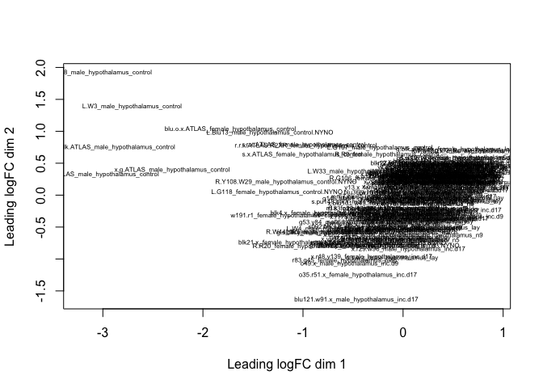

For color coding, I used this tutorial for guidance
<a href="https://combine-australia.github.io/RNAseq-R/06-rnaseq-day1.html" class="uri">https://combine-australia.github.io/RNAseq-R/06-rnaseq-day1.html</a>.

    levels(colData$treatment)

    ## [1] "bldg"    "control" "hatch"   "inc.d17" "inc.d3"  "inc.d9"  "lay"    
    ## [8] "n5"      "n9"

    col.treatment <- c("#a6cee3", "#1f78b4", "#b2df8a", "#33a02c", "#fb9a99", "#e31a1c", "#fdbf6f", "#ff7f00", "#cab2d6")[colData$treatment]

    plotMDS(parentalobject,col=col.treatment, labels = colData$sex)
    legend("bottomleft",fill=c("#a6cee3", "#1f78b4", "#b2df8a", "#33a02c", "#fb9a99", "#e31a1c", "#fdbf6f", "#ff7f00", "#cab2d6"),legend=levels(colData$treatment))
    title("Hypothalamus Colored by Treatment")

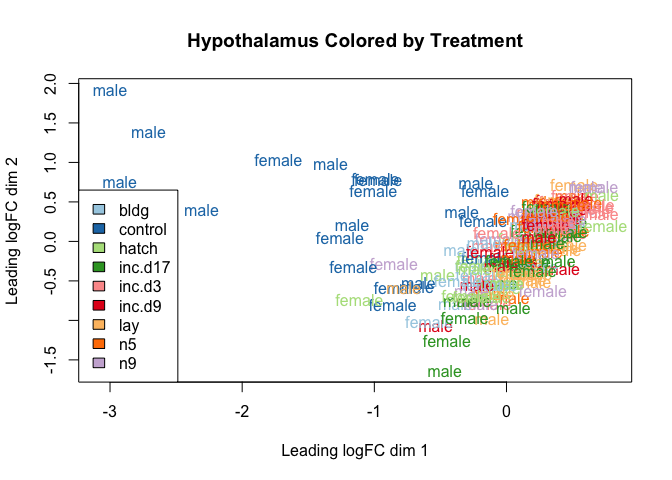

    plotMDS(parentalobject,dim=c(3,4), col=col.treatment, labels = colData$sex)
    legend("bottomright",fill=c("#a6cee3", "#1f78b4", "#b2df8a", "#33a02c", "#fb9a99", "#e31a1c", "#fdbf6f", "#ff7f00", "#cab2d6"),legend=levels(colData$treatment))
    title("Hypothalamus Colored by Treatment")

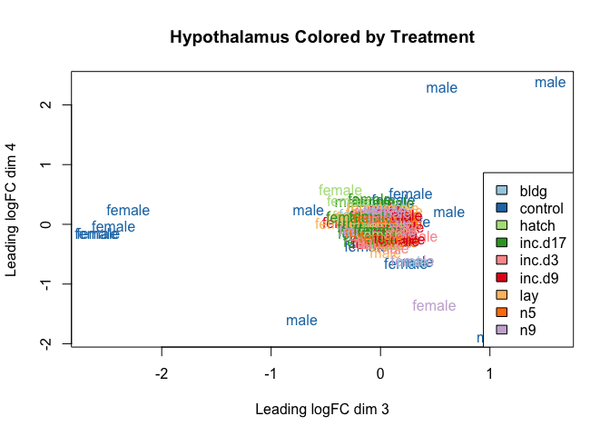

specify contrasts and make MA plots
===================================

    # view all levels
    levels(colData$group)

    ##  [1] "female.hypothalamus.bldg"    "female.hypothalamus.control"
    ##  [3] "female.hypothalamus.hatch"   "female.hypothalamus.inc.d17"
    ##  [5] "female.hypothalamus.inc.d3"  "female.hypothalamus.inc.d9" 
    ##  [7] "female.hypothalamus.lay"     "female.hypothalamus.n5"     
    ##  [9] "female.hypothalamus.n9"      "male.hypothalamus.bldg"     
    ## [11] "male.hypothalamus.control"   "male.hypothalamus.hatch"    
    ## [13] "male.hypothalamus.inc.d17"   "male.hypothalamus.inc.d3"   
    ## [15] "male.hypothalamus.inc.d9"    "male.hypothalamus.lay"      
    ## [17] "male.hypothalamus.n5"        "male.hypothalamus.n9"

    # subset of conrasts - sex specific comparing hatch to lay
    my.contrasts <- makeContrasts(
                 FH_CB = female.hypothalamus.control - female.hypothalamus.bldg,
                 FH_BL = female.hypothalamus.bldg - female.hypothalamus.lay,
                 FH_Li3 = female.hypothalamus.lay - female.hypothalamus.inc.d3,
                 FH_i39 = female.hypothalamus.inc.d3 - female.hypothalamus.inc.d9,
                 FH_i917 = female.hypothalamus.inc.d9 - female.hypothalamus.inc.d17,
                 FH_i17H = female.hypothalamus.inc.d17 - female.hypothalamus.hatch,
                 FH_H5 = female.hypothalamus.hatch -  female.hypothalamus.n5,
                 FH_n59 = female.hypothalamus.n5 - female.hypothalamus.n9,
                 FH_n9C = female.hypothalamus.n9 - female.hypothalamus.control,
                 
                 MH_CB = male.hypothalamus.control - male.hypothalamus.bldg,
                 MH_BL = male.hypothalamus.bldg - male.hypothalamus.lay,
                 MH_Li3 = male.hypothalamus.lay - male.hypothalamus.inc.d3,
                 MH_i39 = male.hypothalamus.inc.d3 - male.hypothalamus.inc.d9,
                 MH_i917 = male.hypothalamus.inc.d9 - male.hypothalamus.inc.d17,
                 MH_i17H = male.hypothalamus.inc.d17 - male.hypothalamus.hatch,
                 MH_H5 = male.hypothalamus.hatch -  male.hypothalamus.n5,
                 MH_n59 = male.hypothalamus.n5 - male.hypothalamus.n9,
                 MH_n9C = male.hypothalamus.n9 - male.hypothalamus.control,
                 
                 FH_n9B = female.hypothalamus.n9 - female.hypothalamus.bldg,
                 MH_n9B = male.hypothalamus.n9 - male.hypothalamus.bldg,
    levels=parentaldesign)

    # create a list with all the two way contrasts
    mycontrasts <- c("FH_CB", "FH_BL", "FH_Li3", "FH_i39", "FH_i917", "FH_i17H", "FH_H5", "FH_n59", "FH_n9C",
                     "MH_CB", "MH_BL", "MH_Li3", "MH_i39", "MH_i917", "MH_i17H", "MH_H5", "MH_n59", "MH_n9C",
                     "FH_n9B", "MH_n9B")

    # use the printplotcontrasts function to print summary stats and a volcano plot

    for(i in mycontrasts){
      printplotcontrasts(i)
    }

    ##        -1*female.hypothalamus.bldg 1*female.hypothalamus.control
    ## Down                                                           0
    ## NotSig                                                       263
    ## Up                                                         14674
    ## $table
    ##                row.names   Name    geneid       entrezid    logFC
    ## XP_015140781.1    422420 MARCH1    422420 XP_015140781.1 20.71919
    ## XP_015155805.1 107055406 LMBR1L 107055406 XP_015155805.1 20.48851
    ## XP_015151240.1    417564   DPH1    417564 XP_015151240.1 20.16694
    ## NP_001072968.1    770922  DGUOK    770922 NP_001072968.1 20.08691
    ## XP_015128664.1 100857346 CILD27 100857346 XP_015128664.1 20.05921
    ##                unshrunk.logFC     logCPM PValue FDR
    ## XP_015140781.1       20.74118 0.08218104      0   0
    ## XP_015155805.1       20.50742 0.31655743      0   0
    ## XP_015151240.1       20.17933 1.01480964      0   0
    ## NP_001072968.1       20.10088 0.65421315      0   0
    ## XP_015128664.1       20.07186 0.94343949      0   0
    ## 
    ## $adjust.method
    ## [1] "BH"
    ## 
    ## $comparison
    ## [1] "-1*female.hypothalamus.bldg 1*female.hypothalamus.control"
    ## 
    ## $test
    ## [1] "glm"
    ## 
    ## attr(,"class")
    ## [1] "TopTags"
    ## attr(,"class")attr(,"package")
    ## [1] "edgeR"

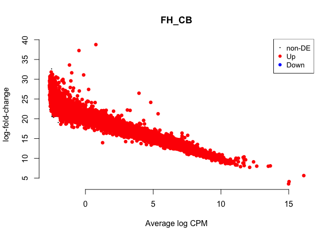

    ## NULL
    ##        1*female.hypothalamus.bldg -1*female.hypothalamus.lay
    ## Down                                                   14742
    ## NotSig                                                   195
    ## Up                                                         0
    ## $table
    ##                row.names         Name    geneid       entrezid     logFC
    ## NP_989878.1       395229         TCF7    395229    NP_989878.1 -21.00154
    ## XP_015144243.1    428973        LZTS2    428973 XP_015144243.1 -20.52688
    ## XP_015155805.1 107055406       LMBR1L 107055406 XP_015155805.1 -20.41352
    ## XP_015130583.1 107051524 LOC107051524 107051524 XP_015130583.1 -20.12509
    ## XP_015140781.1    422420       MARCH1    422420 XP_015140781.1 -20.06455
    ##                unshrunk.logFC      logCPM PValue FDR
    ## NP_989878.1         -21.03186 -0.58526235      0   0
    ## XP_015144243.1      -20.54865  0.02302039      0   0
    ## XP_015155805.1      -20.43241  0.31655743      0   0
    ## XP_015130583.1      -20.13945  0.89634419      0   0
    ## XP_015140781.1      -20.07987  0.08218104      0   0
    ## 
    ## $adjust.method
    ## [1] "BH"
    ## 
    ## $comparison
    ## [1] "1*female.hypothalamus.bldg -1*female.hypothalamus.lay"
    ## 
    ## $test
    ## [1] "glm"
    ## 
    ## attr(,"class")
    ## [1] "TopTags"
    ## attr(,"class")attr(,"package")
    ## [1] "edgeR"

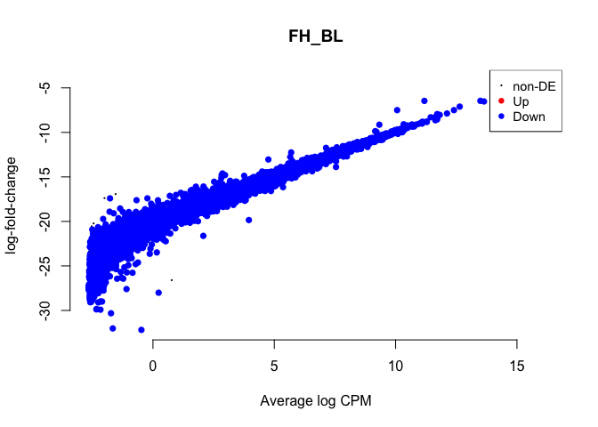

    ## NULL
    ##        -1*female.hypothalamus.inc.d3 1*female.hypothalamus.lay
    ## Down                                                         0
    ## NotSig                                                   14937
    ## Up                                                           0
    ## $table
    ##                row.names    Name geneid       entrezid    logFC
    ## NP_001231522.1    420588    SCIN 420588 NP_001231522.1 1.155203
    ## NP_001039297.1    417465    CCL5 417465 NP_001039297.1 3.739649
    ## NP_001186559.1    417852  KCNMB4 417852 NP_001186559.1 2.179642
    ## XP_015149500.1    396384    IRF1 396384 XP_015149500.1 1.035201
    ## NP_001231990.1    430189 HLA-DRA 430189 NP_001231990.1 1.475590
    ##                unshrunk.logFC    logCPM       PValue       FDR
    ## NP_001231522.1       1.155903  3.646427 1.662403e-05 0.2483131
    ## NP_001039297.1       4.153931 -1.868250 1.930977e-04 0.9822719
    ## NP_001186559.1       2.556626 -1.993389 2.757673e-04 0.9822719
    ## XP_015149500.1       1.036761  2.540514 2.985017e-04 0.9822719
    ## NP_001231990.1       1.477389  3.126420 3.316264e-04 0.9822719
    ## 
    ## $adjust.method
    ## [1] "BH"
    ## 
    ## $comparison
    ## [1] "-1*female.hypothalamus.inc.d3 1*female.hypothalamus.lay"
    ## 
    ## $test
    ## [1] "glm"
    ## 
    ## attr(,"class")
    ## [1] "TopTags"
    ## attr(,"class")attr(,"package")
    ## [1] "edgeR"

    ## NULL
    ##        1*female.hypothalamus.inc.d3 -1*female.hypothalamus.inc.d9
    ## Down                                                            0
    ## NotSig                                                      14937
    ## Up                                                              0
    ## $table
    ##                row.names         Name    geneid       entrezid     logFC
    ## XP_419585.2       421544        CAPN9    421544    XP_419585.2  1.850138
    ## XP_004934606.1    427984       KCNJ15    427984 XP_004934606.1  1.719314
    ## NP_001186559.1    417852       KCNMB4    417852 NP_001186559.1 -1.927996
    ## XP_415429.5       395549          DBH    395549    XP_415429.5  2.219263
    ## XP_015128155.1 107049005 LOC107049005 107049005 XP_015128155.1  4.904223
    ##                unshrunk.logFC     logCPM      PValue FDR
    ## XP_419585.2          2.022808 -1.8598548 0.001318246   1
    ## XP_004934606.1       1.871223 -1.6920875 0.001753268   1
    ## NP_001186559.1      -2.279919 -1.9933891 0.002244336   1
    ## XP_415429.5          2.606767 -1.8117017 0.002485900   1
    ## XP_015128155.1       5.457609 -0.1185445 0.003716467   1
    ## 
    ## $adjust.method
    ## [1] "BH"
    ## 
    ## $comparison
    ## [1] "1*female.hypothalamus.inc.d3 -1*female.hypothalamus.inc.d9"
    ## 
    ## $test
    ## [1] "glm"
    ## 
    ## attr(,"class")
    ## [1] "TopTags"
    ## attr(,"class")attr(,"package")
    ## [1] "edgeR"

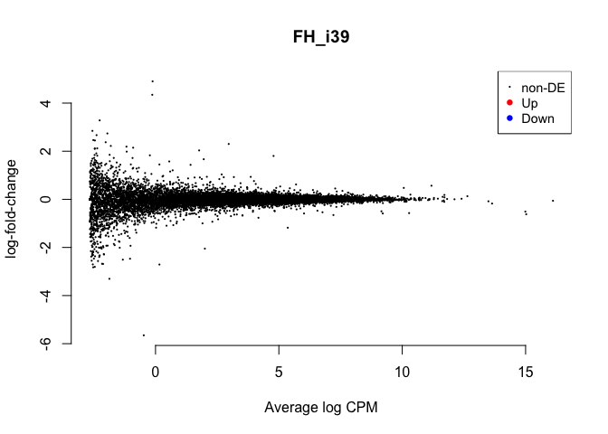

    ## NULL
    ##        -1*female.hypothalamus.inc.d17 1*female.hypothalamus.inc.d9
    ## Down                                                             0
    ## NotSig                                                       14937
    ## Up                                                               0
    ## $table
    ##                row.names         Name    geneid       entrezid      logFC
    ## XP_015130802.1    416928        IGLL1    416928 XP_015130802.1 -4.1876386
    ## XP_004938467.2    418651      SHROOM2    418651 XP_004938467.2 -0.8969677
    ## XP_003642428.2    417471         HSF5    417471 XP_003642428.2  3.8426795
    ## NP_989594.1       374117          IGJ    374117    NP_989594.1 -3.0952485
    ## XP_015128794.1 107049579 LOC107049579 107049579 XP_015128794.1 -4.3215587
    ##                unshrunk.logFC    logCPM       PValue       FDR
    ## XP_015130802.1  -4.197635e+00  2.966941 2.477487e-05 0.3700623
    ## XP_004938467.2  -8.969999e-01  7.824297 5.737433e-05 0.4285002
    ## XP_003642428.2   1.442695e+08 -1.799766 1.260804e-04 0.5030798
    ## NP_989594.1     -3.107436e+00  1.954701 1.347204e-04 0.5030798
    ## XP_015128794.1  -1.442695e+08 -1.951813 2.557317e-04 0.7639729
    ## 
    ## $adjust.method
    ## [1] "BH"
    ## 
    ## $comparison
    ## [1] "-1*female.hypothalamus.inc.d17 1*female.hypothalamus.inc.d9"
    ## 
    ## $test
    ## [1] "glm"
    ## 
    ## attr(,"class")
    ## [1] "TopTags"
    ## attr(,"class")attr(,"package")
    ## [1] "edgeR"

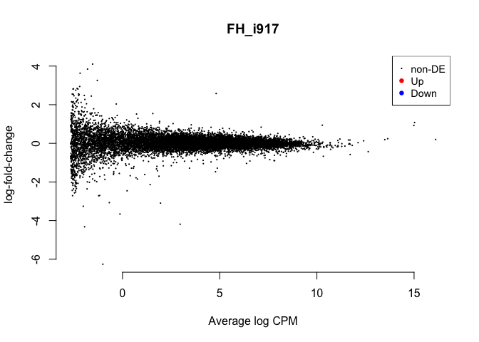

    ## NULL
    ##        -1*female.hypothalamus.hatch 1*female.hypothalamus.inc.d17
    ## Down                                                            0
    ## NotSig                                                      14937
    ## Up                                                              0
    ## $table
    ##                row.names      Name geneid       entrezid     logFC
    ## NP_990411.1       395963     CAPN2 395963    NP_990411.1 -2.173226
    ## XP_015137344.1    420606     ABCB5 420606 XP_015137344.1 -4.285261
    ## NP_001026427.2    424189    PSMD14 424189 NP_001026427.2 -1.048208
    ## NP_001072943.1    404299 HIST1H2A4 404299 NP_001072943.1 -1.186910
    ## NP_001075178.3    771173     TLR1B 771173 NP_001075178.3 -1.813599
    ##                unshrunk.logFC    logCPM       PValue          FDR
    ## NP_990411.1         -2.173285  7.821358 2.770786e-08 0.0004138723
    ## XP_015137344.1      -4.428706 -1.454634 1.583334e-05 0.1182512809
    ## NP_001026427.2      -1.048681  4.405830 5.320979e-05 0.2649315623
    ## NP_001072943.1      -1.188234  2.860939 1.068590e-04 0.3990381377
    ## NP_001075178.3      -1.862301 -1.130119 1.459543e-04 0.4360237621
    ## 
    ## $adjust.method
    ## [1] "BH"
    ## 
    ## $comparison
    ## [1] "-1*female.hypothalamus.hatch 1*female.hypothalamus.inc.d17"
    ## 
    ## $test
    ## [1] "glm"
    ## 
    ## attr(,"class")
    ## [1] "TopTags"
    ## attr(,"class")attr(,"package")
    ## [1] "edgeR"

    ## NULL
    ##        1*female.hypothalamus.hatch -1*female.hypothalamus.n5
    ## Down                                                       0
    ## NotSig                                                 14936
    ## Up                                                         1
    ## $table
    ##                row.names         Name    geneid       entrezid    logFC
    ## NP_990411.1       395963        CAPN2    395963    NP_990411.1 2.684965
    ## XP_015137344.1    420606        ABCB5    420606 XP_015137344.1 5.734115
    ## XP_015152100.1 107054855 LOC107054855 107054855 XP_015152100.1 2.529087
    ## NP_990229.1       395719          TK1    395719    NP_990229.1 1.013148
    ## XP_015155605.1 100858365       HAPLN4 100858365 XP_015155605.1 1.691003
    ##                unshrunk.logFC    logCPM       PValue          FDR
    ## NP_990411.1          2.685056  7.821358 4.943879e-11 7.384671e-07
    ## XP_015137344.1       6.161427 -1.454634 3.154949e-07 2.356274e-03
    ## XP_015152100.1       2.533881  2.622015 8.752686e-07 4.357962e-03
    ## NP_990229.1          1.016078  1.678144 2.014287e-05 7.521850e-02
    ## XP_015155605.1       1.692318  3.546715 3.481432e-05 8.992769e-02
    ## 
    ## $adjust.method
    ## [1] "BH"
    ## 
    ## $comparison
    ## [1] "1*female.hypothalamus.hatch -1*female.hypothalamus.n5"
    ## 
    ## $test
    ## [1] "glm"
    ## 
    ## attr(,"class")
    ## [1] "TopTags"
    ## attr(,"class")attr(,"package")
    ## [1] "edgeR"

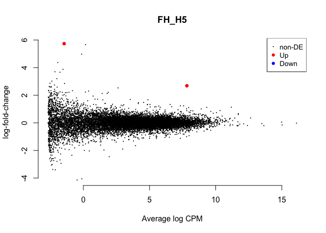

    ## NULL
    ##        1*female.hypothalamus.n5 -1*female.hypothalamus.n9
    ## Down                                                    0
    ## NotSig                                              14937
    ## Up                                                      0
    ## $table
    ##                row.names  Name geneid       entrezid      logFC
    ## XP_416510.2       418287  LAG3 418287    XP_416510.2  3.3487756
    ## XP_015146387.1    424552  NEXN 424552 XP_015146387.1  3.9346952
    ## NP_990847.1       396522  CNN1 396522    NP_990847.1 -1.1544970
    ## XP_015134716.1    415686  MLKL 415686 XP_015134716.1 -2.6842958
    ## XP_419781.2       421750 TUBE1 421750    XP_419781.2  0.7178173
    ##                unshrunk.logFC     logCPM      PValue FDR
    ## XP_416510.2      4.497510e+00 -2.1665203 0.000313620   1
    ## XP_015146387.1   1.442695e+08 -2.0190731 0.001111319   1
    ## NP_990847.1     -1.175879e+00 -0.4416355 0.001281674   1
    ## XP_015134716.1  -3.341361e+00 -2.0821098 0.001334893   1
    ## XP_419781.2      7.192915e-01  2.4418848 0.001494061   1
    ## 
    ## $adjust.method
    ## [1] "BH"
    ## 
    ## $comparison
    ## [1] "1*female.hypothalamus.n5 -1*female.hypothalamus.n9"
    ## 
    ## $test
    ## [1] "glm"
    ## 
    ## attr(,"class")
    ## [1] "TopTags"
    ## attr(,"class")attr(,"package")
    ## [1] "edgeR"

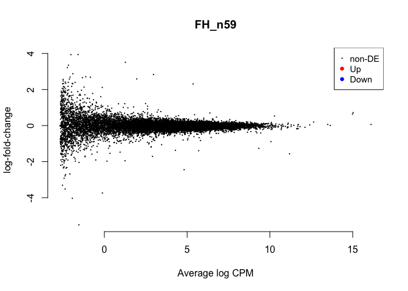

    ## NULL
    ##        -1*female.hypothalamus.control 1*female.hypothalamus.n9
    ## Down                                                        70
    ## NotSig                                                   14858
    ## Up                                                           9
    ## $table
    ##                row.names         Name    geneid       entrezid     logFC
    ## XP_004950299.2 107049137 LOC107049137 107049137 XP_004950299.2 -4.160759
    ## XP_015129796.1 100859555       CLAPS2 100859555 XP_015129796.1 -2.379088
    ## XP_015155850.1 101749643 LOC101749643 101749643 XP_015155850.1 -3.286449
    ## XP_015147109.1    424884       PLSCR5    424884 XP_015147109.1 -2.459359
    ## NP_006917.1       807639         COX1    807639    NP_006917.1 -1.573243
    ##                unshrunk.logFC    logCPM       PValue          FDR
    ## XP_004950299.2      -4.163400  3.092408 1.008564e-29 1.506492e-25
    ## XP_015129796.1      -2.379273  6.343011 1.650987e-22 1.233039e-18
    ## XP_015155850.1      -3.293027  1.532522 1.330239e-19 6.623259e-16
    ## XP_015147109.1      -2.462074  2.479308 5.587389e-19 1.950749e-15
    ## NP_006917.1         -1.573243 16.110350 6.529923e-19 1.950749e-15
    ## 
    ## $adjust.method
    ## [1] "BH"
    ## 
    ## $comparison
    ## [1] "-1*female.hypothalamus.control 1*female.hypothalamus.n9"
    ## 
    ## $test
    ## [1] "glm"
    ## 
    ## attr(,"class")
    ## [1] "TopTags"
    ## attr(,"class")attr(,"package")
    ## [1] "edgeR"

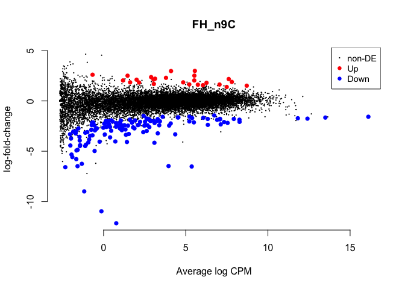

    ## NULL
    ##        -1*male.hypothalamus.bldg 1*male.hypothalamus.control
    ## Down                                                      11
    ## NotSig                                                 14820
    ## Up                                                       106
    ## $table
    ##                row.names    Name geneid       entrezid    logFC
    ## NP_006917.1       807639    COX1 807639    NP_006917.1 1.960253
    ## NP_001264272.1    423726   RPS24 423726 NP_001264272.1 2.129064
    ## XP_003640629.1    771615   MRP63 771615 XP_003640629.1 2.238542
    ## NP_001007968.1    425416   RPL30 425416 NP_001007968.1 2.358952
    ## NP_001279014.1    768911 RSL24D1 768911 NP_001279014.1 1.616264
    ##                unshrunk.logFC    logCPM       PValue          FDR
    ## NP_006917.1          1.960253 16.110350 1.460730e-27 1.721767e-23
    ## NP_001264272.1       2.129163  7.137721 2.305371e-27 1.721767e-23
    ## XP_003640629.1       2.239350  4.095240 3.253988e-26 1.620161e-22
    ## NP_001007968.1       2.359108  6.584953 2.773903e-24 1.035845e-20
    ## NP_001279014.1       1.616569  5.170571 8.685014e-23 2.252618e-19
    ## 
    ## $adjust.method
    ## [1] "BH"
    ## 
    ## $comparison
    ## [1] "-1*male.hypothalamus.bldg 1*male.hypothalamus.control"
    ## 
    ## $test
    ## [1] "glm"
    ## 
    ## attr(,"class")
    ## [1] "TopTags"
    ## attr(,"class")attr(,"package")
    ## [1] "edgeR"

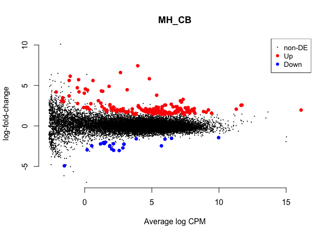

    ## NULL
    ##        1*male.hypothalamus.bldg -1*male.hypothalamus.lay
    ## Down                                                   0
    ## NotSig                                             14937
    ## Up                                                     0
    ## $table
    ##                row.names         Name    geneid       entrezid     logFC
    ## NP_001001301.1    408026         TPH2    408026 NP_001001301.1  3.200660
    ## NP_990136.1       395592           TH    395592    NP_990136.1  2.075474
    ## XP_015154090.1 107055138         HAX1 107055138 XP_015154090.1 -1.435403
    ## XP_004935201.1    420947          DDC    420947 XP_004935201.1  1.229574
    ## XP_004941024.1 101749269 LOC101749269 101749269 XP_004941024.1  3.232029
    ##                unshrunk.logFC     logCPM       PValue          FDR
    ## NP_001001301.1       3.216992  0.5198868 5.146221e-08 0.0007686911
    ## NP_990136.1          2.077283  2.8462744 3.625612e-06 0.0270778852
    ## XP_015154090.1      -1.435990  4.0060271 7.686733e-06 0.0382722440
    ## XP_004935201.1       1.230469  3.5361496 5.019995e-05 0.1874591696
    ## XP_004941024.1       3.393795 -1.2538249 8.091379e-05 0.2089706984
    ## 
    ## $adjust.method
    ## [1] "BH"
    ## 
    ## $comparison
    ## [1] "1*male.hypothalamus.bldg -1*male.hypothalamus.lay"
    ## 
    ## $test
    ## [1] "glm"
    ## 
    ## attr(,"class")
    ## [1] "TopTags"
    ## attr(,"class")attr(,"package")
    ## [1] "edgeR"

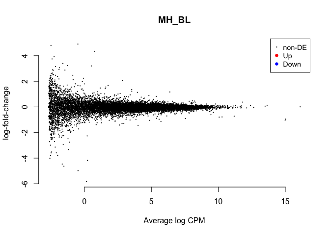

    ## NULL
    ##        -1*male.hypothalamus.inc.d3 1*male.hypothalamus.lay
    ## Down                                                     0
    ## NotSig                                               14937
    ## Up                                                       0
    ## $table
    ##                row.names  Name    geneid       entrezid     logFC
    ## XP_015154090.1 107055138  HAX1 107055138 XP_015154090.1  1.542476
    ## NP_001289086.1    426880 COX14    426880 NP_001289086.1  1.442578
    ## XP_424461.2       426853 ALPK2    426853    XP_424461.2 -1.344897
    ## XP_003640374.1    429671  SCO2    429671 XP_003640374.1  1.094363
    ## XP_015145655.1 107053895  RPRM 107053895 XP_015145655.1  1.299870
    ##                unshrunk.logFC    logCPM       PValue        FDR
    ## XP_015154090.1       1.543143 4.0060271 1.524117e-06 0.02276574
    ## NP_001289086.1       1.444094 2.8104133 4.578735e-05 0.34196283
    ## XP_424461.2         -1.356406 0.7209294 1.200243e-04 0.59760090
    ## XP_003640374.1       1.096236 2.2808205 3.337767e-04 1.00000000
    ## XP_015145655.1       1.301914 2.5166295 4.736241e-04 1.00000000
    ## 
    ## $adjust.method
    ## [1] "BH"
    ## 
    ## $comparison
    ## [1] "-1*male.hypothalamus.inc.d3 1*male.hypothalamus.lay"
    ## 
    ## $test
    ## [1] "glm"
    ## 
    ## attr(,"class")
    ## [1] "TopTags"
    ## attr(,"class")attr(,"package")
    ## [1] "edgeR"

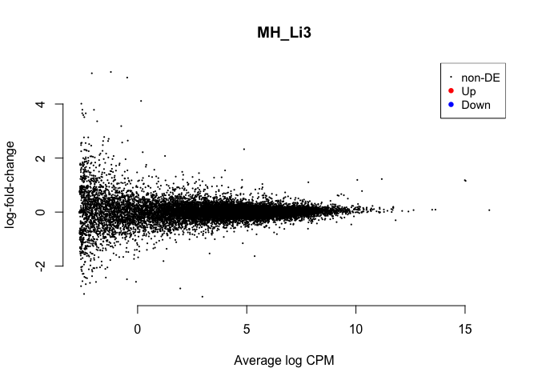

    ## NULL
    ##        1*male.hypothalamus.inc.d3 -1*male.hypothalamus.inc.d9
    ## Down                                                        1
    ## NotSig                                                  14936
    ## Up                                                          0
    ## $table
    ##                row.names         Name    geneid       entrezid     logFC
    ## XP_001234565.2    771273       MRPS36    771273 XP_001234565.2 -6.290735
    ## NP_001264524.1    415770  C11H19ORF40    415770 NP_001264524.1 -3.646812
    ## XP_004944394.1 101750188 LOC101750188 101750188 XP_004944394.1 -2.855471
    ## XP_015135776.1    427254       ZFAND5    427254 XP_015135776.1 -2.435041
    ## XP_015130802.1    416928        IGLL1    416928 XP_015130802.1  4.157006
    ##                unshrunk.logFC   logCPM       PValue          FDR
    ## XP_001234565.2      -7.588688 2.666805 4.626200e-12 6.910155e-08
    ## NP_001264524.1      -3.948298 1.815759 5.302163e-06 3.959921e-02
    ## XP_004944394.1      -3.128303 1.342799 1.286737e-05 6.406666e-02
    ## XP_015135776.1      -2.492132 3.162803 2.916637e-05 1.089145e-01
    ## XP_015130802.1       4.176547 2.966941 6.301455e-05 1.882497e-01
    ## 
    ## $adjust.method
    ## [1] "BH"
    ## 
    ## $comparison
    ## [1] "1*male.hypothalamus.inc.d3 -1*male.hypothalamus.inc.d9"
    ## 
    ## $test
    ## [1] "glm"
    ## 
    ## attr(,"class")
    ## [1] "TopTags"
    ## attr(,"class")attr(,"package")
    ## [1] "edgeR"

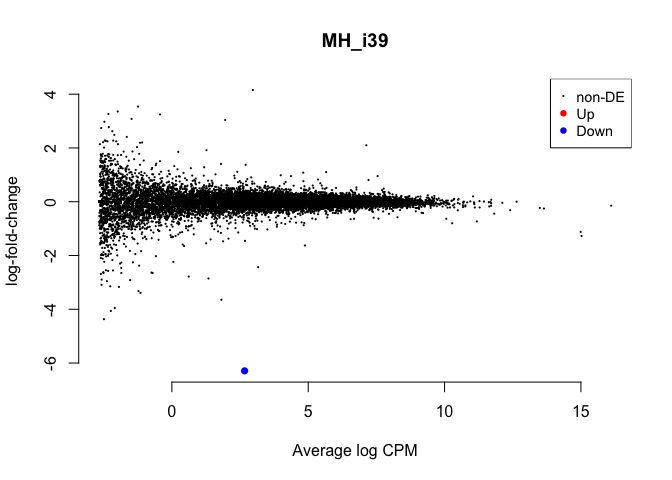

    ## NULL
    ##        -1*male.hypothalamus.inc.d17 1*male.hypothalamus.inc.d9
    ## Down                                                         0
    ## NotSig                                                   14935
    ## Up                                                           2
    ## $table
    ##                row.names         Name    geneid       entrezid     logFC
    ## XP_001234565.2    771273       MRPS36    771273 XP_001234565.2  5.813583
    ## NP_001264524.1    415770  C11H19ORF40    415770 NP_001264524.1  4.643991
    ## XP_004944394.1 101750188 LOC101750188 101750188 XP_004944394.1  3.621729
    ## XP_015128714.1    395532       COL1A1    395532 XP_015128714.1 -1.283438
    ## XP_015132890.1    770140         CTIF    770140 XP_015132890.1  3.467658
    ##                unshrunk.logFC     logCPM       PValue          FDR
    ## XP_001234565.2   6.621741e+00 2.66680542 6.995273e-12 1.044884e-07
    ## NP_001264524.1   5.439575e+00 1.81575906 4.624104e-08 3.453512e-04
    ## XP_004944394.1   4.175814e+00 1.34279932 1.759459e-07 8.760346e-04
    ## XP_015128714.1  -1.286297e+00 2.28899332 1.206443e-05 4.505161e-02
    ## XP_015132890.1   1.442695e+08 0.05238573 3.771986e-05 1.126843e-01
    ## 
    ## $adjust.method
    ## [1] "BH"
    ## 
    ## $comparison
    ## [1] "-1*male.hypothalamus.inc.d17 1*male.hypothalamus.inc.d9"
    ## 
    ## $test
    ## [1] "glm"
    ## 
    ## attr(,"class")
    ## [1] "TopTags"
    ## attr(,"class")attr(,"package")
    ## [1] "edgeR"

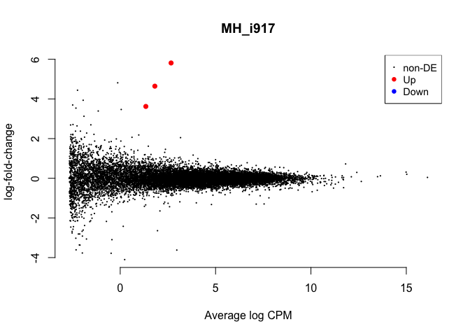

    ## NULL
    ##        -1*male.hypothalamus.hatch 1*male.hypothalamus.inc.d17
    ## Down                                                        0
    ## NotSig                                                  14937
    ## Up                                                          0
    ## $table
    ##                row.names         Name    geneid       entrezid     logFC
    ## XP_004942140.1    423744        MYOZ1    423744 XP_004942140.1 -2.815323
    ## NP_001090995.1    417506        MYL10    417506 NP_001090995.1 -2.452448
    ## NP_990781.1       396434        TNNC2    396434    NP_990781.1 -5.496662
    ## XP_015157102.1 101748402 LOC101748402 101748402 XP_015157102.1 -2.433188
    ## XP_015143153.1    418099       MYBPC1    418099 XP_015143153.1 -3.463940
    ##                unshrunk.logFC     logCPM       PValue         FDR
    ## XP_004942140.1      -2.980035 -1.3768867 4.124783e-07 0.006161189
    ## NP_001090995.1      -2.485098 -0.6899327 4.303781e-06 0.017671661
    ## NP_990781.1         -5.751426 -1.3686886 4.660468e-06 0.017671661
    ## XP_015157102.1      -2.453450  0.1432844 4.732319e-06 0.017671661
    ## XP_015143153.1      -3.547983 -1.4121647 1.631660e-05 0.041505184
    ## 
    ## $adjust.method
    ## [1] "BH"
    ## 
    ## $comparison
    ## [1] "-1*male.hypothalamus.hatch 1*male.hypothalamus.inc.d17"
    ## 
    ## $test
    ## [1] "glm"
    ## 
    ## attr(,"class")
    ## [1] "TopTags"
    ## attr(,"class")attr(,"package")
    ## [1] "edgeR"

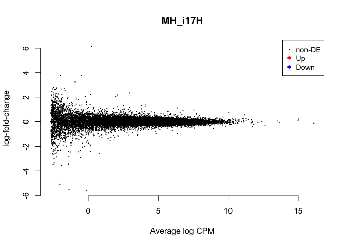

    ## NULL
    ##        1*male.hypothalamus.hatch -1*male.hypothalamus.n5
    ## Down                                                   0
    ## NotSig                                             14937
    ## Up                                                     0
    ## $table
    ##                row.names   Name geneid       entrezid     logFC
    ## XP_015143153.1    418099 MYBPC1 418099 XP_015143153.1  4.225033
    ## XP_015145352.1    374027    NEB 374027 XP_015145352.1  1.608141
    ## XP_015141730.1    422974 SLC6A5 422974 XP_015141730.1 -3.034010
    ## NP_990748.1       396386  TNNI2 396386    NP_990748.1  3.422881
    ## NP_001001301.1    408026   TPH2 408026 NP_001001301.1 -2.392722
    ##                unshrunk.logFC     logCPM       PValue        FDR
    ## XP_015143153.1       4.379469 -1.4121647 1.292359e-06 0.01930396
    ## XP_015145352.1       1.612957  1.5616577 1.176036e-05 0.08783226
    ## XP_015141730.1      -3.136049 -1.2882754 1.845064e-05 0.09186572
    ## NP_990748.1          3.465542 -0.5425393 2.574926e-05 0.09211663
    ## NP_001001301.1      -2.406330  0.5198868 3.083505e-05 0.09211663
    ## 
    ## $adjust.method
    ## [1] "BH"
    ## 
    ## $comparison
    ## [1] "1*male.hypothalamus.hatch -1*male.hypothalamus.n5"
    ## 
    ## $test
    ## [1] "glm"
    ## 
    ## attr(,"class")
    ## [1] "TopTags"
    ## attr(,"class")attr(,"package")
    ## [1] "edgeR"

    ## NULL
    ##        1*male.hypothalamus.n5 -1*male.hypothalamus.n9
    ## Down                                                0
    ## NotSig                                          14937
    ## Up                                                  0
    ## $table
    ##                row.names         Name    geneid       entrezid     logFC
    ## NP_001001296.1    403120         IFI6    403120 NP_001001296.1  3.227465
    ## NP_001001301.1    408026         TPH2    408026 NP_001001301.1  2.565999
    ## XP_015142180.1 107053409 LOC107053409 107053409 XP_015142180.1 -2.725892
    ## XP_015141730.1    422974       SLC6A5    422974 XP_015141730.1  2.323432
    ## XP_004936174.2    426317      TMEM156    426317 XP_004936174.2  3.103917
    ##                unshrunk.logFC     logCPM       PValue        FDR
    ## NP_001001296.1   3.281180e+00 -0.1724468 4.667777e-06 0.04457781
    ## NP_001001301.1   2.582189e+00  0.5198868 5.968777e-06 0.04457781
    ## XP_015142180.1  -3.388438e+00 -1.9711567 2.166539e-04 1.00000000
    ## XP_015141730.1   2.379404e+00 -1.2882754 5.631868e-04 1.00000000
    ## XP_004936174.2   1.442695e+08 -2.1793343 9.184999e-04 1.00000000
    ## 
    ## $adjust.method
    ## [1] "BH"
    ## 
    ## $comparison
    ## [1] "1*male.hypothalamus.n5 -1*male.hypothalamus.n9"
    ## 
    ## $test
    ## [1] "glm"
    ## 
    ## attr(,"class")
    ## [1] "TopTags"
    ## attr(,"class")attr(,"package")
    ## [1] "edgeR"

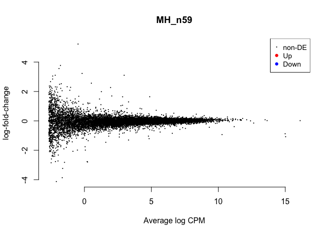

    ## NULL
    ##        -1*male.hypothalamus.control 1*male.hypothalamus.n9
    ## Down                                                   199
    ## NotSig                                               14717
    ## Up                                                      21
    ## $table
    ##                row.names    Name geneid       entrezid     logFC
    ## NP_006917.1       807639    COX1 807639    NP_006917.1 -2.031436
    ## XP_003640629.1    771615   MRP63 771615 XP_003640629.1 -2.366473
    ## NP_001264272.1    423726   RPS24 423726 NP_001264272.1 -2.167364
    ## NP_001007968.1    425416   RPL30 425416 NP_001007968.1 -2.443819
    ## NP_001171687.1    417907 NDUFA12 417907 NP_001171687.1 -2.872529
    ##                unshrunk.logFC    logCPM       PValue          FDR
    ## NP_006917.1         -2.031436 16.110350 2.296800e-31 3.430730e-27
    ## XP_003640629.1      -2.367380  4.095240 5.453009e-31 4.072580e-27
    ## NP_001264272.1      -2.167467  7.137721 4.314545e-30 2.148212e-26
    ## NP_001007968.1      -2.443987  6.584953 1.439224e-27 5.374423e-24
    ## NP_001171687.1      -2.872822  6.024849 3.863902e-26 1.154302e-22
    ## 
    ## $adjust.method
    ## [1] "BH"
    ## 
    ## $comparison
    ## [1] "-1*male.hypothalamus.control 1*male.hypothalamus.n9"
    ## 
    ## $test
    ## [1] "glm"
    ## 
    ## attr(,"class")
    ## [1] "TopTags"
    ## attr(,"class")attr(,"package")
    ## [1] "edgeR"

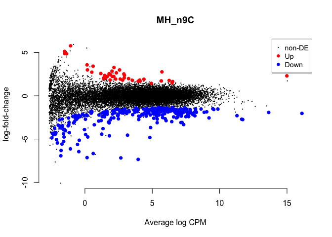

    ## NULL
    ##        -1*female.hypothalamus.bldg 1*female.hypothalamus.n9
    ## Down                                                      0
    ## NotSig                                                  233
    ## Up                                                    14704
    ## $table
    ##                row.names   Name    geneid       entrezid    logFC
    ## XP_015144243.1    428973  LZTS2    428973 XP_015144243.1 20.66989
    ## XP_015155805.1 107055406 LMBR1L 107055406 XP_015155805.1 20.17583
    ## XP_015140781.1    422420 MARCH1    422420 XP_015140781.1 20.09379
    ## NP_001001755.1    414837  THBS2    414837 NP_001001755.1 20.04711
    ## XP_015147038.1    424951 VWA5B2    424951 XP_015147038.1 19.99886
    ##                unshrunk.logFC     logCPM PValue FDR
    ## XP_015144243.1       20.69295 0.02302039      0   0
    ## XP_015155805.1       20.19276 0.31655743      0   0
    ## XP_015140781.1       20.10954 0.08218104      0   0
    ## NP_001001755.1       20.06203 0.59119540      0   0
    ## XP_015147038.1       20.01290 0.74120094      0   0
    ## 
    ## $adjust.method
    ## [1] "BH"
    ## 
    ## $comparison
    ## [1] "-1*female.hypothalamus.bldg 1*female.hypothalamus.n9"
    ## 
    ## $test
    ## [1] "glm"
    ## 
    ## attr(,"class")
    ## [1] "TopTags"
    ## attr(,"class")attr(,"package")
    ## [1] "edgeR"

    ## NULL
    ##        -1*male.hypothalamus.bldg 1*male.hypothalamus.n9
    ## Down                                                  0
    ## NotSig                                            14937
    ## Up                                                    0
    ## $table
    ##                row.names    Name geneid       entrezid     logFC
    ## NP_001001301.1    408026    TPH2 408026 NP_001001301.1 -3.253322
    ## NP_990136.1       395592      TH 395592    NP_990136.1 -2.379767
    ## XP_015151186.1    404747  SLC6A4 404747 XP_015151186.1 -2.737861
    ## NP_001264519.1    424607  TSPAN1 424607 NP_001264519.1 -3.947761
    ## XP_004936174.2    426317 TMEM156 426317 XP_004936174.2 -3.670587
    ##                unshrunk.logFC     logCPM       PValue          FDR
    ## NP_001001301.1  -3.270751e+00  0.5198868 1.562950e-08 0.0002334578
    ## NP_990136.1     -2.382123e+00  2.8462744 5.645732e-08 0.0004216515
    ## XP_015151186.1  -2.779205e+00 -0.8677670 1.361795e-05 0.0678037696
    ## NP_001264519.1  -1.442695e+08 -2.2299288 1.019504e-04 0.3321153714
    ## XP_004936174.2  -1.442695e+08 -2.1793343 1.111720e-04 0.3321153714
    ## 
    ## $adjust.method
    ## [1] "BH"
    ## 
    ## $comparison
    ## [1] "-1*male.hypothalamus.bldg 1*male.hypothalamus.n9"
    ## 
    ## $test
    ## [1] "glm"
    ## 
    ## attr(,"class")
    ## [1] "TopTags"
    ## attr(,"class")attr(,"package")
    ## [1] "edgeR"

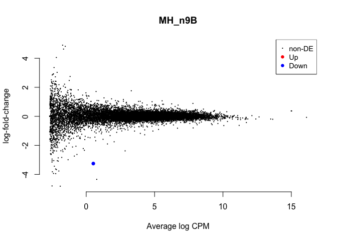

    ## NULL

volcano plots
=============

    # from http://www.compbio.dundee.ac.uk/user/pschofield/Projects/teaching_pg/workshops/biocDGE.html#maplots

    lrt <- glmLRT(fit,coef=2)
    topTags(lrt)

    ## Coefficient:  female.hypothalamus.control 
    ##                row.names         Name    geneid       entrezid      logFC
    ## XP_004950299.2 107049137 LOC107049137 107049137 XP_004950299.2  4.4008201
    ## XP_015146711.1    424629         FAF1    424629 XP_015146711.1 -0.7307621
    ## XP_015129796.1 100859555       CLAPS2 100859555 XP_015129796.1  2.3909235
    ## NP_001263232.1    396544         NACA    396544 NP_001263232.1  1.4639432
    ## XP_001234052.1    770722        RPS25    770722 XP_001234052.1  1.8754281
    ## XP_004936123.1    422772       GNPDA2    422772 XP_004936123.1  1.6739571
    ## XP_015155333.1    420089        MLLT1    420089 XP_015155333.1 -0.8824521
    ## NP_001157867.1    419653        EIF3I    419653 NP_001157867.1  1.4749709
    ## XP_004939591.1    420742      HERPUD2    420742 XP_004939591.1  0.7906706
    ## NP_006917.1       807639         COX1    807639    NP_006917.1  1.5368638
    ##                   logCPM        LR       PValue          FDR
    ## XP_004950299.2  3.092408 136.93628 1.245174e-31 1.859916e-27
    ## XP_015146711.1  6.565959 115.29650 6.776817e-27 5.061266e-23
    ## XP_015129796.1  6.343011 103.14518 3.114660e-24 1.550789e-20
    ## NP_001263232.1  6.546654 102.23970 4.919396e-24 1.837026e-20
    ## XP_001234052.1  7.923684  98.91595 2.634486e-23 7.202575e-20
    ## XP_004936123.1  5.224113  98.73046 2.893181e-23 7.202575e-20
    ## XP_015155333.1  6.134614  95.20223 1.718963e-22 3.668021e-19
    ## NP_001157867.1  6.735818  93.52854 4.003860e-22 7.475706e-19
    ## XP_004939591.1  5.528968  92.61971 6.337311e-22 1.051782e-18
    ## NP_006917.1    16.110350  92.40566 7.061200e-22 1.054731e-18

    tt <- topTags(lrt,n=10000)$table

    ggplot(data=tt) + geom_point(aes(x=logFC,y=-log(FDR),color=logCPM)) +
      scale_colour_gradientn(colours=c("#000000" ,"#FF0000" ))

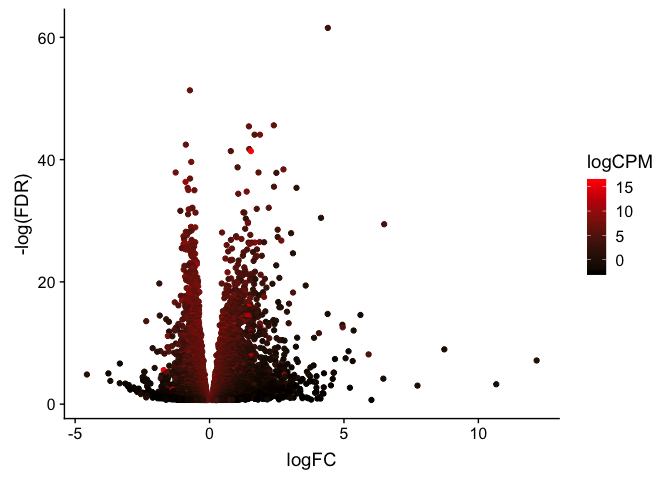
