    library(tidyverse)

    ## ── Attaching packages ──────────────────────────────────────────────────────────────────────────────────── tidyverse 1.2.1 ──

    ## ✔ ggplot2 3.1.0       ✔ purrr   0.3.1  
    ## ✔ tibble  2.0.1       ✔ dplyr   0.8.0.1
    ## ✔ tidyr   0.8.3       ✔ stringr 1.4.0  
    ## ✔ readr   1.3.1       ✔ forcats 0.4.0

    ## ── Conflicts ─────────────────────────────────────────────────────────────────────────────────────── tidyverse_conflicts() ──
    ## ✖ dplyr::filter() masks stats::filter()
    ## ✖ dplyr::lag()    masks stats::lag()

    library(limma)
    library(Glimma)
    library(edgeR)
    library(kableExtra)

    ## 
    ## Attaching package: 'kableExtra'

    ## The following object is masked from 'package:dplyr':
    ## 
    ##     group_rows

    library(cowplot)

    ## 
    ## Attaching package: 'cowplot'

    ## The following object is masked from 'package:ggplot2':
    ## 
    ##     ggsave

    # load custom functions  
    source("../R/functions.R")  

    knitr::opts_chunk$set(fig.path = '../figures/hyp_grouped/',cache=TRUE)

This anlaysis will *exclude* the control timepoint but *combine*
incubation and nestling timepoints.

    # import "colData" which contains sample information and "countData" which contains read counts
    colData <- read.csv("../results/00_colData_characterization.csv", header = T, row.names = 1)
    countData <- read.csv("../results/00_countData_characterization.csv", header = T, row.names = 1)
    geneinfo <- read.csv("../results/00_geneinfo.csv", row.names = 1)

    # making new groups
    colData$group <- NULL
    colData$tempgroup <- ifelse(colData$treatment == "bldg", "bldg",
                      ifelse(colData$treatment == "control", "control",
                       ifelse(colData$treatment == "hatch", "hatch",
                        ifelse(grepl("inc", colData$treatment), "inc",
                         ifelse(colData$treatment == "lay", "lay", "nestl")))))
    colData$tempgroup <- as.factor(colData$tempgroup)

    colData$group <- paste(colData$sex, colData$tempgroup, sep = "")
    colData$group <- as.factor(colData$group)
    str(colData$group)

    ##  Factor w/ 12 levels "femalebldg","femalecontrol",..: 8 8 8 8 8 8 2 2 2 8 ...

    colData <- colData %>%
      dplyr::filter(grepl('hypothalamus', tissue)) %>%
      dplyr::filter(treatment != "control") %>%
      #dplyr::filter(sex == "female") %>%
      droplevels()
    row.names(colData) <- colData$V1

    # print sample sizes
    colData %>% select(group, tissue)  %>%  summary()

    ##          group             tissue   
    ##  femaleinc  :33   hypothalamus:167  
    ##  maleinc    :32                     
    ##  femalenestl:21                     
    ##  malenestl  :21                     
    ##  femalebldg :10                     
    ##  femalehatch:10                     
    ##  (Other)    :40

    savecols <- as.character(colData$V1) 
    savecols <- as.vector(savecols) 
    countData <- countData %>% dplyr::select(one_of(savecols)) 

    # check that row and col lenghts are equal
    ncol(countData) == nrow(colData)

    ## [1] TRUE

    # create a large DGEList with 3 elements
    parentalobject <- DGEList(counts=countData, genes=geneinfo, group=colData$group)

    # transform raw counts to countspermillion
    cpms <- cpm(parentalobject)

    # calculate number of lowly lowly expressed genes and remove them
    table(rowSums(parentalobject$counts==0)==10)

    ## 
    ## FALSE  TRUE 
    ## 14872    65

    keep_genes <- rowSums(cpms >= 1) >= 10
    dge <- parentalobject[keep_genes, ]

    # specific the design
    parentaldesign <- model.matrix(~ colData$group )
    colnames(parentaldesign) <- levels(colData$group)

    # The TMM normalization
    parentalobject <- calcNormFactors(parentalobject)
    parentalobject <- estimateCommonDisp(parentalobject)
    parentalobject <- estimateTagwiseDisp(parentalobject)
    parentalobject <- estimateDisp(parentalobject, parentaldesign)
    parentalobject <- estimateGLMCommonDisp(parentalobject, parentaldesign, verbose=TRUE)

    ## Disp = 0.06386 , BCV = 0.2527

    parentalobject <- estimateGLMTrendedDisp(parentalobject, parentaldesign)
    parentalobject <- estimateGLMTagwiseDisp(parentalobject, parentaldesign)

    #  perform likelihood ratio test and thresholded testing
    fit <- glmFit( parentalobject, parentaldesign, robust=T)
    tr <- glmTreat(fit, lfc = 1)
    topTags(tr)

    ## Coefficient:  malenestl 
    ##                row.names         Name    geneid       entrezid     logFC
    ## XP_015135862.1    427458       HNRNPK    427458 XP_015135862.1 -7.942796
    ## XP_004944394.1 101750188 LOC101750188 101750188 XP_004944394.1 -6.549832
    ## XP_015132890.1    770140         CTIF    770140 XP_015132890.1 -6.383353
    ## XP_015135776.1    427254       ZFAND5    427254 XP_015135776.1 -6.039869
    ## XP_001234565.2    771273       MRPS36    771273 XP_001234565.2 -8.257593
    ## NP_001264524.1    415770  C11H19ORF40    415770 NP_001264524.1 -6.544121
    ## XP_015128195.1 107049327 LOC107049327 107049327 XP_015128195.1 -5.590237
    ## XP_015128135.1 107049275 LOC107049275 107049275 XP_015128135.1 -3.638899
    ## XP_004937352.1    427168        SREK1    427168 XP_004937352.1 -2.088114
    ## NP_989963.1       395341        ENS-3    395341    NP_989963.1 -4.061632
    ##                unshrunk.logFC      logCPM       PValue          FDR
    ## XP_015135862.1  -1.442695e+08  0.51686203 6.317990e-48 9.437181e-44
    ## XP_004944394.1  -6.836390e+00  1.40175919 3.533891e-47 2.639287e-43
    ## XP_015132890.1  -7.236816e+00  0.01815229 3.249704e-41 1.618028e-37
    ## XP_015135776.1  -6.089201e+00  3.15840338 3.018886e-38 1.127328e-34
    ## XP_001234565.2  -8.634651e+00  2.67446006 2.765204e-26 8.260771e-23
    ## NP_001264524.1  -6.737801e+00  1.84457841 5.691149e-24 1.416812e-20
    ## XP_015128195.1  -6.726657e+00 -1.20343955 1.391902e-16 2.970121e-13
    ## XP_015128135.1  -3.760289e+00 -0.24218046 1.146016e-12 2.139755e-09
    ## XP_004937352.1  -2.089183e+00  4.67236795 1.107183e-10 1.837554e-07
    ## NP_989963.1     -5.167179e+00 -1.68066005 4.225327e-08 6.311371e-05

    head(tr$table)

    ##                      logFC unshrunk.logFC    logCPM    PValue
    ## NP_001001127.1 -0.49080876    -0.49102461  4.339325 0.9959572
    ## NP_001001129.1  0.13474256     0.13963146 -1.407529 0.9025181
    ## NP_001001189.1 -0.02238747    -0.02239101  5.473212 1.0000000
    ## NP_001001194.1  0.00000000     0.00000000 -2.567168 1.0000000
    ## NP_001001195.1  0.72968805     0.85285698 -2.180161 0.3973214
    ## NP_001001201.1 -0.10421217    -0.10450387  1.688725 0.9999909

plotMDS (multidimential scaling)
================================

    levels(colData$group)

    ##  [1] "femalebldg"  "femalehatch" "femaleinc"   "femalelay"   "femalenestl"
    ##  [6] "malebldg"    "malehatch"   "maleinc"     "malelay"     "malenestl"

    col.group <- c("#a6cee3", "#1f78b4", "#b2df8a", "#33a02c", "#fb9a99",
                   "#a6cee3", "#1f78b4", "#b2df8a", "#33a02c", "#fb9a99")[colData$group]
    myfill <- c("#a6cee3", "#1f78b4", "#b2df8a", "#33a02c", "#fb9a99",
                "#a6cee3", "#1f78b4", "#b2df8a", "#33a02c", "#fb9a99")

    plotMDS(parentalobject, cex = 0.5, labels = colData$group, col=col.group)
    title("MDS 1v2")

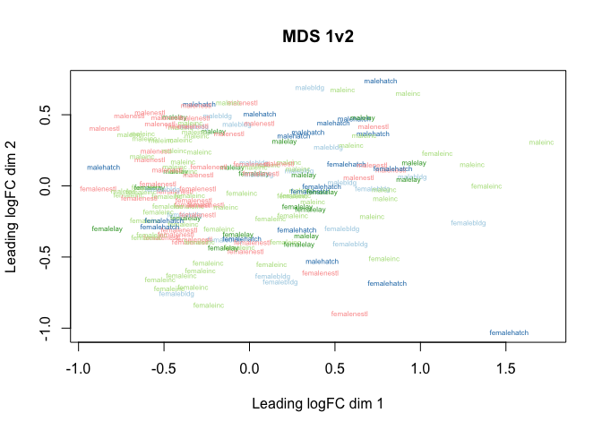

    plotMDS(parentalobject, cex = 0.5, labels = colData$group, col=col.group, dim=c(3,4))
    title("MDS 3v4")

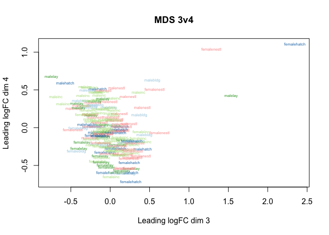

    plotMDS(parentalobject, cex = 0.5, labels = colData$group, col=col.group, dim=c(5,6))
    title("MDS 5v6")

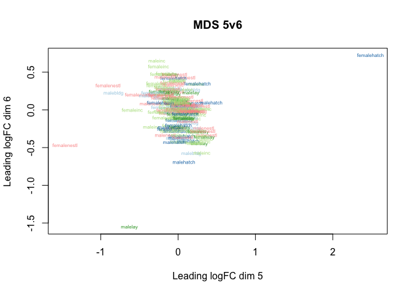

For color coding, I used this tutorial for guidance
<a href="https://combine-australia.github.io/RNAseq-R/06-rnaseq-day1.html" class="uri">https://combine-australia.github.io/RNAseq-R/06-rnaseq-day1.html</a>.

specify contrasts and make MA plots
===================================

    # view all levels
    levels(colData$group)

    ##  [1] "femalebldg"  "femalehatch" "femaleinc"   "femalelay"   "femalenestl"
    ##  [6] "malebldg"    "malehatch"   "maleinc"     "malelay"     "malenestl"

    # subset of conrasts - sex specific comparing hatch to lay
    my.contrasts <- makeContrasts(
                 femaleBL = femalebldg - femalelay,
                 femaleLI = femalelay - femaleinc,
                 femaleIH = femaleinc - femalehatch,
                 femaleHN = femalehatch -  femalenestl,
                 femaleBL = femalebldg - femaleinc,
                 femaleBL = femalebldg - femalehatch,
                 femaleBL = femalebldg - femalenestl,
                 femaleLH = femalelay - femalehatch,
                 femaleLN = femalelay - femalenestl,
                 femaleHN = femalehatch - femalenestl,
                 
                 maleBL = malebldg - malelay,
                 maleLI = malelay - maleinc,
                 maleIH = maleinc - malehatch,
                 maleHN = malehatch -  malenestl,
                 maleBL = malebldg - maleinc,
                 maleBL = malebldg - malehatch,
                 maleBL = malebldg - malenestl,
                 maleLH = malelay - malehatch,
                 maleLN = malelay - malenestl,
                 maleHN = malehatch - malenestl,
                 
                 fm_B = femalebldg - malebldg,
                 fm_L = femalelay - malelay,
                 fm_I = femaleinc - maleinc,
                 fm_H = femalehatch - malehatch,
                 fm_N = femalenestl - malenestl,
    levels=parentaldesign)

    # create a list with all the two way contrasts
    mycontrasts <- colnames(my.contrasts)

    # use the printplotcontrasts function to print summary stats and a volcano plot

    for(i in mycontrasts){
      printplotcontrasts(i)
    }

    ##        1*femalebldg -1*femalelay
    ## Down                       14760
    ## NotSig                       177
    ## Up                             0

    ## NULL
    ##        -1*femaleinc 1*femalelay
    ## Down                          0
    ## NotSig                    14937
    ## Up                            0

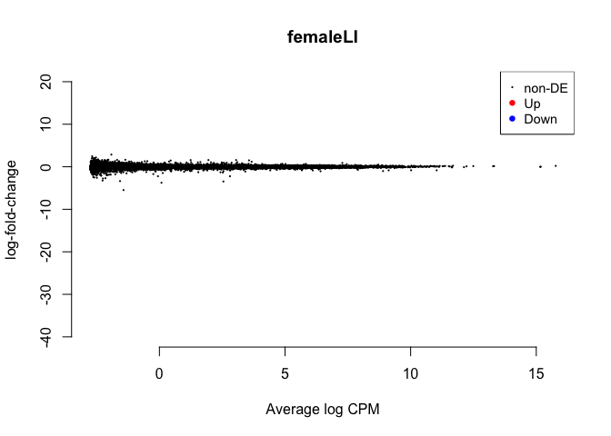

    ## NULL
    ##        -1*femalehatch 1*femaleinc
    ## Down                            2
    ## NotSig                      14935
    ## Up                              0

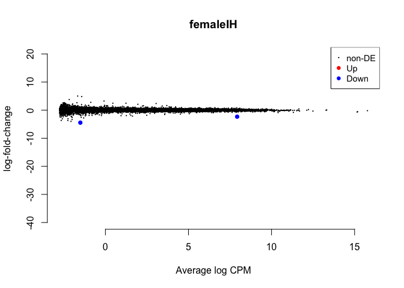

    ## NULL
    ##        1*femalehatch -1*femalenestl
    ## Down                              0
    ## NotSig                        14934
    ## Up                                3

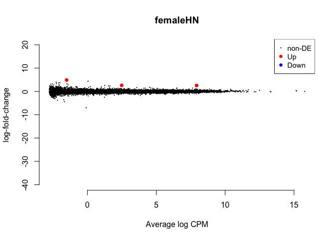

    ## NULL
    ##        1*femalebldg -1*femalelay
    ## Down                       14760
    ## NotSig                       177
    ## Up                             0

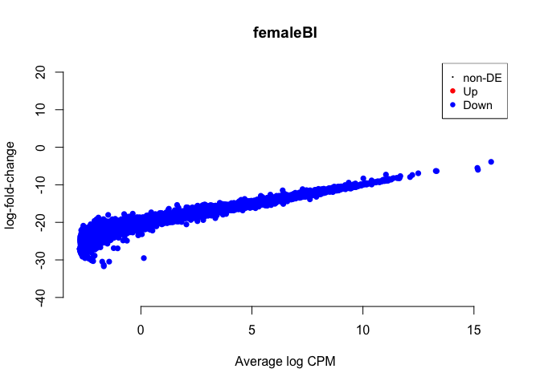

    ## NULL
    ##        1*femalebldg -1*femalelay
    ## Down                       14760
    ## NotSig                       177
    ## Up                             0

    ## NULL
    ##        1*femalebldg -1*femalelay
    ## Down                       14760
    ## NotSig                       177
    ## Up                             0

    ## NULL
    ##        -1*femalehatch 1*femalelay
    ## Down                            0
    ## NotSig                      14937
    ## Up                              0

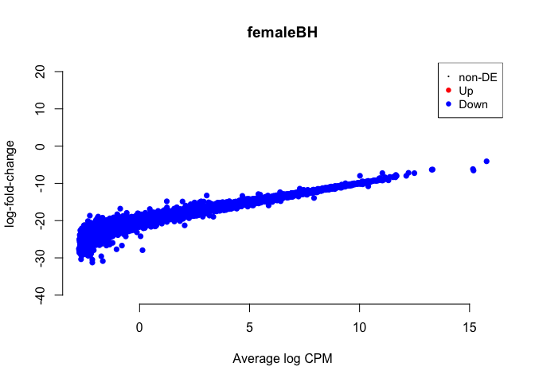

    ## NULL
    ##        1*femalelay -1*femalenestl
    ## Down                            0
    ## NotSig                      14937
    ## Up                              0

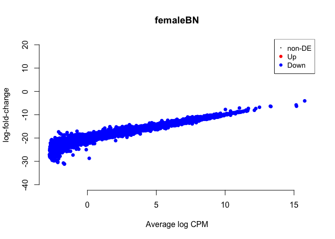

    ## NULL
    ##        1*femalehatch -1*femalenestl
    ## Down                              0
    ## NotSig                        14934
    ## Up                                3

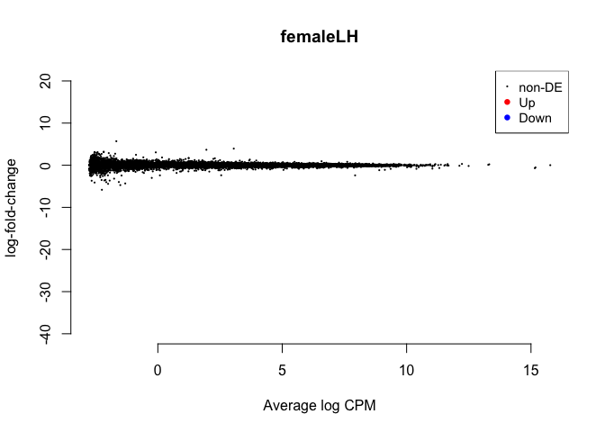

    ## NULL
    ##        1*malebldg -1*malelay
    ## Down                       0
    ## NotSig                 14937
    ## Up                         0

    ## NULL
    ##        -1*maleinc 1*malelay
    ## Down                      0
    ## NotSig                14937
    ## Up                        0

    ## NULL
    ##        -1*malehatch 1*maleinc
    ## Down                        3
    ## NotSig                  14933
    ## Up                          1

    ## NULL
    ##        1*malehatch -1*malenestl
    ## Down                          0
    ## NotSig                    14935
    ## Up                            2

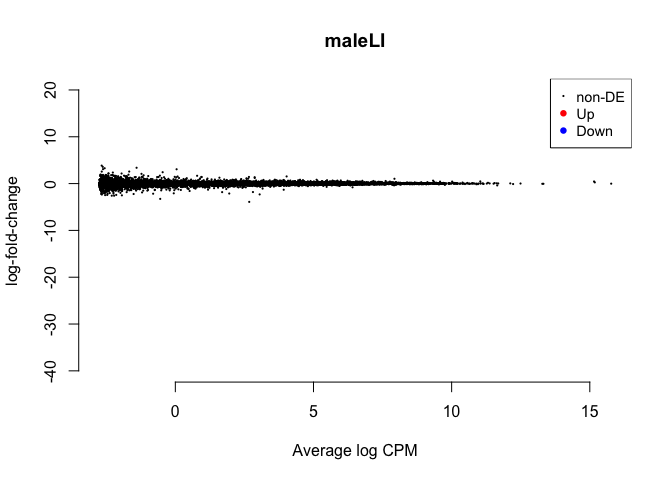

    ## NULL
    ##        1*malebldg -1*malelay
    ## Down                       0
    ## NotSig                 14937
    ## Up                         0

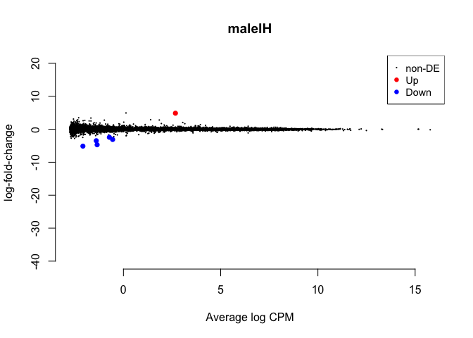

    ## NULL
    ##        1*malebldg -1*malelay
    ## Down                       0
    ## NotSig                 14937
    ## Up                         0

    ## NULL
    ##        1*malebldg -1*malelay
    ## Down                       0
    ## NotSig                 14937
    ## Up                         0

    ## NULL
    ##        -1*malehatch 1*malelay
    ## Down                        0
    ## NotSig                  14937
    ## Up                          0

    ## NULL
    ##        1*malelay -1*malenestl
    ## Down                        0
    ## NotSig                  14937
    ## Up                          0

    ## NULL
    ##        1*malehatch -1*malenestl
    ## Down                          0
    ## NotSig                    14935
    ## Up                            2

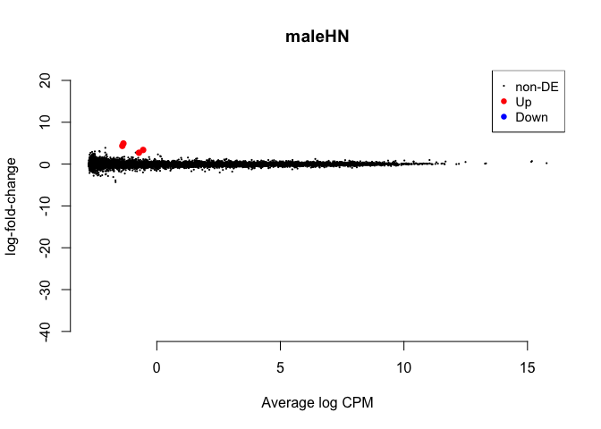

    ## NULL
    ##        1*femalebldg -1*malebldg
    ## Down                      14712
    ## NotSig                      225
    ## Up                            0

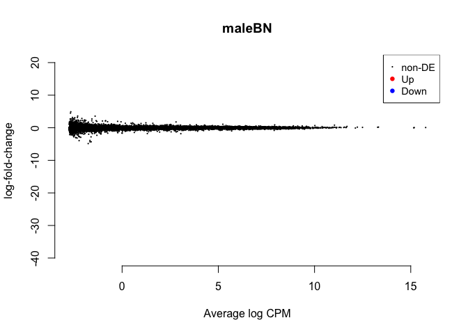

    ## NULL
    ##        1*femalelay -1*malelay
    ## Down                        0
    ## NotSig                  14927
    ## Up                         10

    ## NULL
    ##        1*femaleinc -1*maleinc
    ## Down                        0
    ## NotSig                  14925
    ## Up                         12

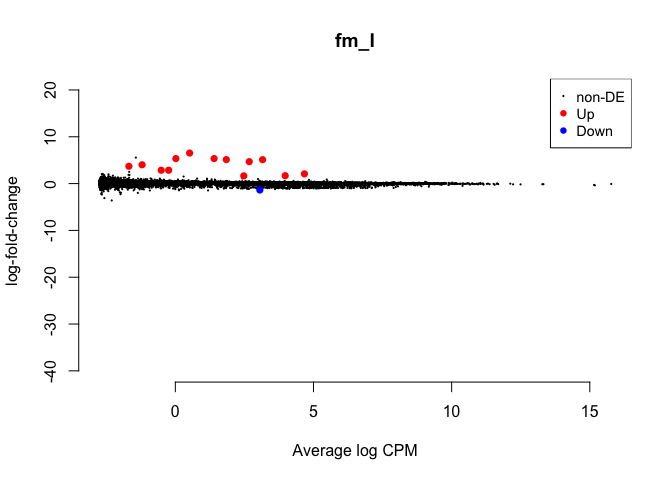

    ## NULL
    ##        1*femalehatch -1*malehatch
    ## Down                            2
    ## NotSig                      14924
    ## Up                             11

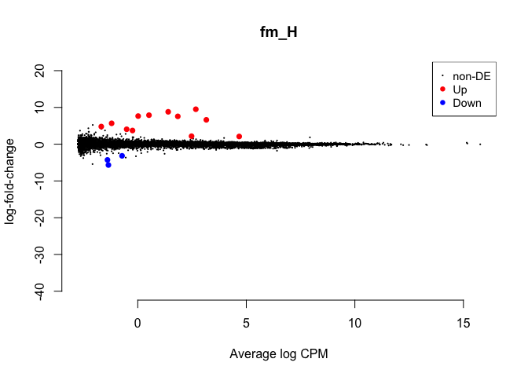

    ## NULL
    ##        1*femalenestl -1*malenestl
    ## Down                            0
    ## NotSig                      14925
    ## Up                             12

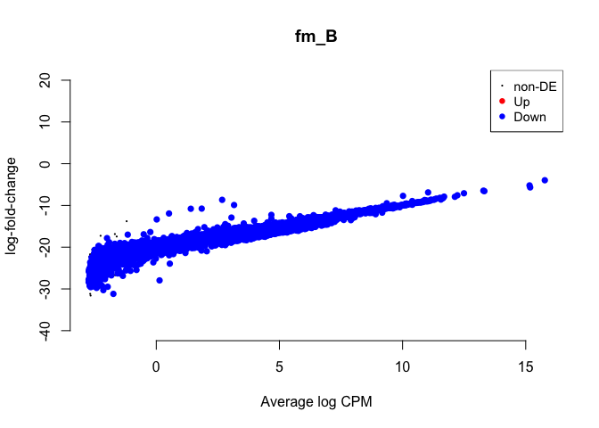

    ## NULL

    for(i in mycontrasts){
      plotVolcanos(i) 
    }

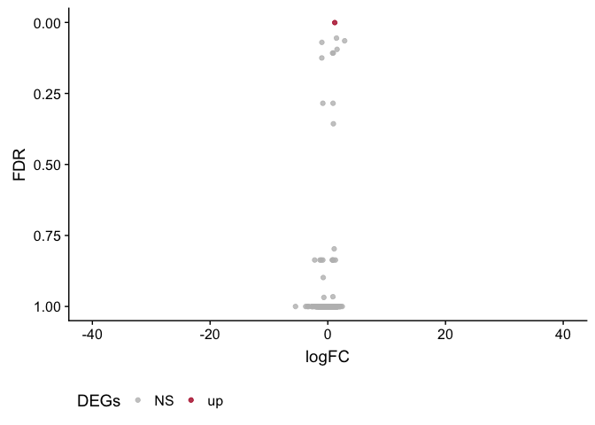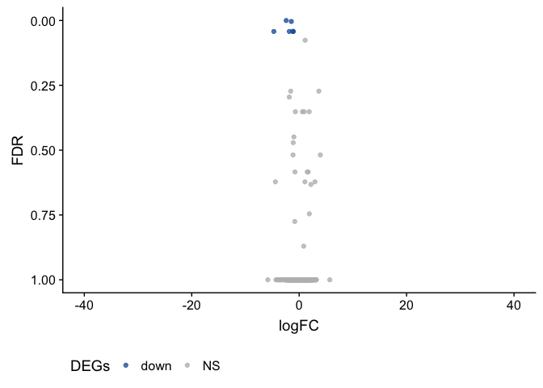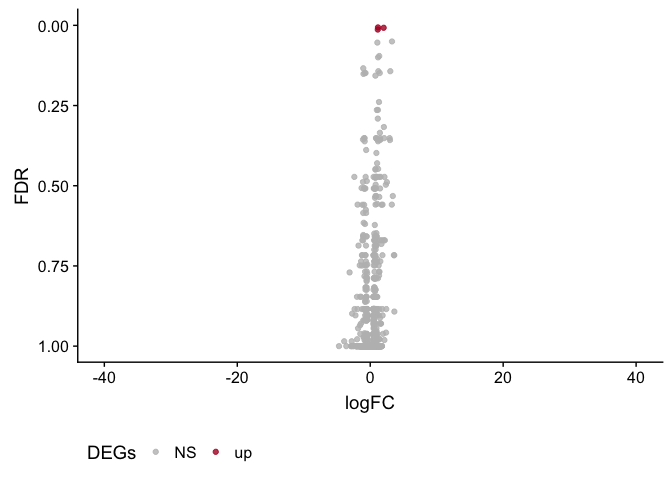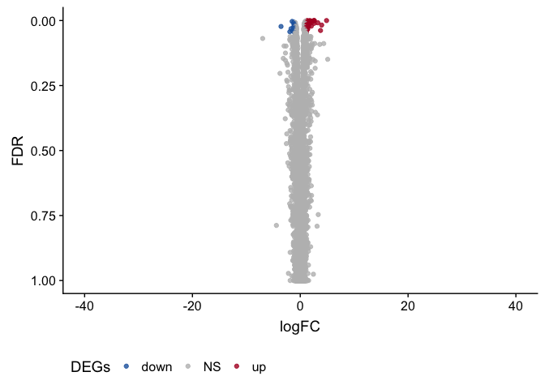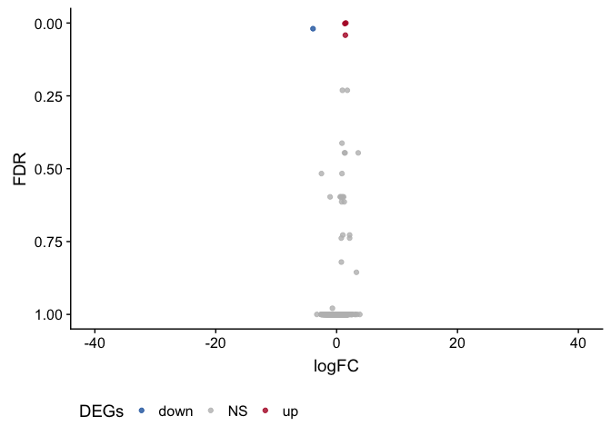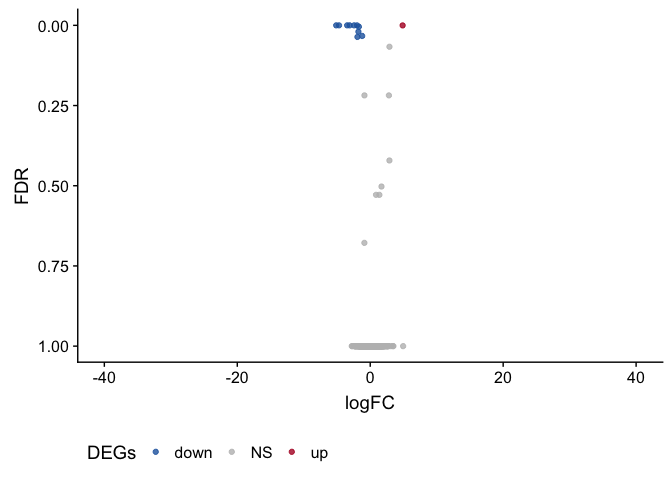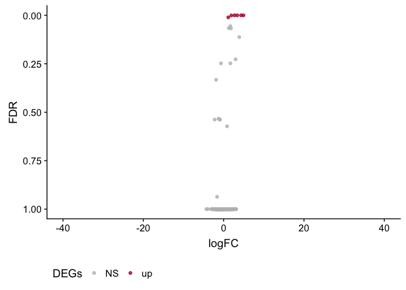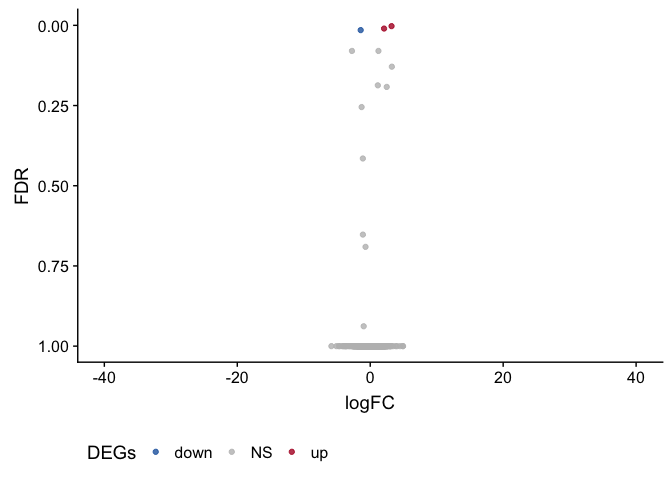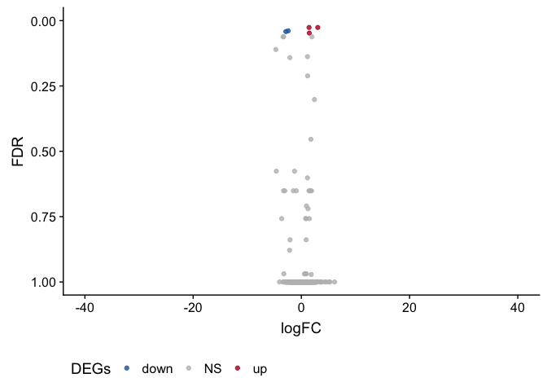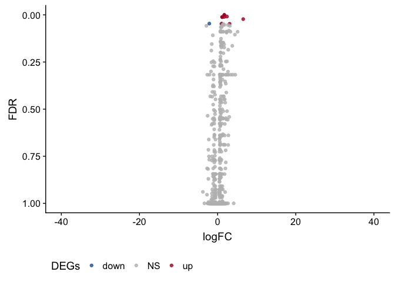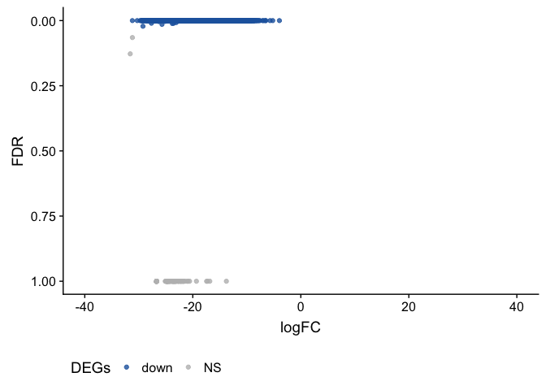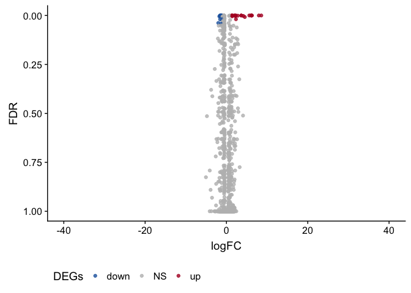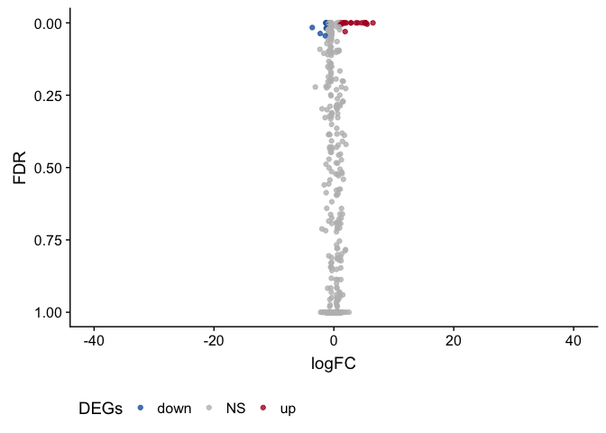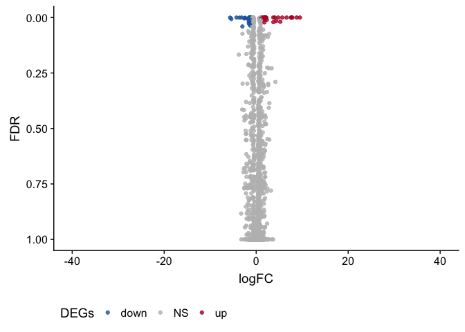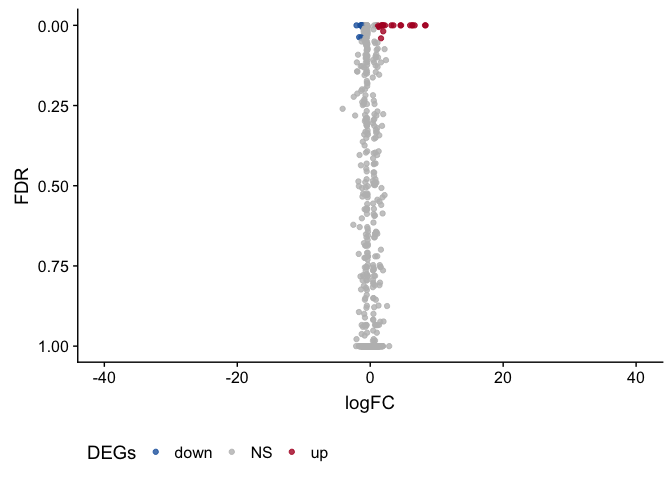
