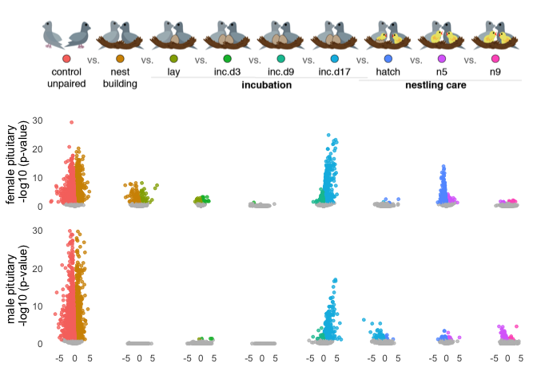

    library(tidyverse)
    library(DESeq2)
    library(cowplot)
    library(RColorBrewer)
    library(pheatmap)
    library(kableExtra)
    library(viridis)
    library(ggimage)
    library(knitr)
    library(kableExtra)

    library(png)
    library(grid)
    library(ggimage)
    library(ggpubr)

    library(BiocParallel)
    register(MulticoreParam(6))

    # load custom functions  
    source("../R/themes.R") 
    source("../R/functions.R") 

    knitr::opts_chunk$set(fig.path = '../figures/characterization/', cache = TRUE)

Characterization data
---------------------

    # import "colData" which contains sample information and "countData" which contains read counts
    c.colData <- read.csv("../metadata/00_colData_characterization.csv", header = T, row.names = 1)
    c.countData <- read.csv("../results/00_countData_characterization.csv", header = T, row.names = 1)
    geneinfo <- read.csv("../metadata/00_geneinfo.csv", row.names = 1)

    # set levels
    c.colData$treatment <- factor(c.colData$treatment, levels = 
                                  c("control",  "bldg", "lay", "inc.d3", "inc.d9", "inc.d17", "hatch", "n5", "n9"))
    levels(c.colData$treatment)

    ## [1] "control" "bldg"    "lay"     "inc.d3"  "inc.d9"  "inc.d17" "hatch"  
    ## [8] "n5"      "n9"

    c.colData$sextissue <- as.factor(paste(c.colData$sex, c.colData$tissue, sep = "_"))
    summary(c.colData[c(7,3,4,5,8)])

    ##              study         sex               tissue      treatment  
    ##  charcterization:576   female:289   gonad       :194   control: 73  
    ##                        male  :287   hypothalamus:189   inc.d9 : 71  
    ##                                     pituitary   :193   inc.d17: 66  
    ##                                                        n9     : 66  
    ##                                                        bldg   : 60  
    ##                                                        lay    : 60  
    ##                                                        (Other):180  
    ##                sextissue 
    ##  female_gonad       :98  
    ##  female_hypothalamus:95  
    ##  female_pituitary   :96  
    ##  male_gonad         :96  
    ##  male_hypothalamus  :94  
    ##  male_pituitary     :97  
    ## 

    geneinfo <- read.csv("../metadata/00_geneinfo.csv", row.names = 1)
    head(geneinfo)

    ##                row.names     Name geneid       entrezid
    ## NP_001001127.1    408082    EDNRB 408082 NP_001001127.1
    ## NP_001001129.1    408183  CYP26A1 408183 NP_001001129.1
    ## NP_001001189.1    374073    CFDP1 374073 NP_001001189.1
    ## NP_001001194.1    407777    AvBD7 407777 NP_001001194.1
    ## NP_001001195.1    407779     KRT5 407779 NP_001001195.1
    ## NP_001001201.1    408034 HSD11B1L 408034 NP_001001201.1

Run DESeq on all subsets of the data
------------------------------------

    dds.female_hypothalamus <- subsetDESeq(c.colData,  c.countData, "female_hypothalamus")

    ## [1] TRUE
    ## class: DESeqDataSet 
    ## dim: 14937 95 
    ## metadata(1): version
    ## assays(1): counts
    ## rownames(14937): NP_001001127.1 NP_001001129.1 ... XP_430449.2
    ##   XP_430508.3
    ## rowData names(0):
    ## colnames(95): L.G118_female_hypothalamus_control.NYNO
    ##   R.G106_female_hypothalamus_control ...
    ##   y94.g133.x_female_hypothalamus_n5.NYNO
    ##   y97.x_female_hypothalamus_n9
    ## colData names(8): V1 bird ... study sextissue
    ## [1] 14469    95

    ## estimating size factors

    ## estimating dispersions

    ## gene-wise dispersion estimates

    ## mean-dispersion relationship

    ## final dispersion estimates

    ## fitting model and testing

    ## -- replacing outliers and refitting for 6 genes
    ## -- DESeq argument 'minReplicatesForReplace' = 7 
    ## -- original counts are preserved in counts(dds)

    ## estimating dispersions

    ## fitting model and testing

    dds.female_pituitary <- subsetDESeq(c.colData,  c.countData, "female_pituitary" )

    ## [1] TRUE
    ## class: DESeqDataSet 
    ## dim: 14937 96 
    ## metadata(1): version
    ## assays(1): counts
    ## rownames(14937): NP_001001127.1 NP_001001129.1 ... XP_430449.2
    ##   XP_430508.3
    ## rowData names(0):
    ## colnames(96): L.G118_female_pituitary_control.NYNO
    ##   R.G106_female_pituitary_control ...
    ##   y94.g133.x_female_pituitary_n5 y97.x_female_pituitary_n9
    ## colData names(8): V1 bird ... study sextissue
    ## [1] 14322    96

    ## estimating size factors

    ## estimating dispersions

    ## gene-wise dispersion estimates

    ## mean-dispersion relationship

    ## final dispersion estimates

    ## fitting model and testing

    ## -- replacing outliers and refitting for 68 genes
    ## -- DESeq argument 'minReplicatesForReplace' = 7 
    ## -- original counts are preserved in counts(dds)

    ## estimating dispersions

    ## fitting model and testing

    dds.female_gonad <- subsetDESeq(c.colData,  c.countData, "female_gonad" )

    ## [1] TRUE
    ## class: DESeqDataSet 
    ## dim: 14937 98 
    ## metadata(1): version
    ## assays(1): counts
    ## rownames(14937): NP_001001127.1 NP_001001129.1 ... XP_430449.2
    ##   XP_430508.3
    ## rowData names(0):
    ## colnames(98): L.G118_female_gonad_control
    ##   R.G106_female_gonad_control ... y94.g133.x_female_gonad_n5
    ##   y97.x_female_gonad_n9
    ## colData names(8): V1 bird ... study sextissue
    ## [1] 14605    98

    ## estimating size factors

    ## estimating dispersions

    ## gene-wise dispersion estimates

    ## mean-dispersion relationship

    ## final dispersion estimates

    ## fitting model and testing

    ## -- replacing outliers and refitting for 34 genes
    ## -- DESeq argument 'minReplicatesForReplace' = 7 
    ## -- original counts are preserved in counts(dds)

    ## estimating dispersions

    ## fitting model and testing

    dds.male_hypothalamus <- subsetDESeq(c.colData,  c.countData, "male_hypothalamus" )

    ## [1] TRUE
    ## class: DESeqDataSet 
    ## dim: 14937 94 
    ## metadata(1): version
    ## assays(1): counts
    ## rownames(14937): NP_001001127.1 NP_001001129.1 ... XP_430449.2
    ##   XP_430508.3
    ## rowData names(0):
    ## colnames(94): L.Blu13_male_hypothalamus_control.NYNO
    ##   L.G107_male_hypothalamus_control ...
    ##   y95.g131.x_male_hypothalamus_inc.d9
    ##   y98.o50.x_male_hypothalamus_inc.d3
    ## colData names(8): V1 bird ... study sextissue
    ## [1] 14416    94

    ## estimating size factors

    ## estimating dispersions

    ## gene-wise dispersion estimates

    ## mean-dispersion relationship

    ## final dispersion estimates

    ## fitting model and testing

    ## -- replacing outliers and refitting for 8 genes
    ## -- DESeq argument 'minReplicatesForReplace' = 7 
    ## -- original counts are preserved in counts(dds)

    ## estimating dispersions

    ## fitting model and testing

    dds.male_pituitary <- subsetDESeq(c.colData,  c.countData, "male_pituitary"  )

    ## [1] TRUE
    ## class: DESeqDataSet 
    ## dim: 14937 97 
    ## metadata(1): version
    ## assays(1): counts
    ## rownames(14937): NP_001001127.1 NP_001001129.1 ... XP_430449.2
    ##   XP_430508.3
    ## rowData names(0):
    ## colnames(97): L.Blu13_male_pituitary_control.NYNO
    ##   L.G107_male_pituitary_control ...
    ##   y95.g131.x_male_pituitary_inc.d9 y98.o50.x_male_pituitary_inc.d3
    ## colData names(8): V1 bird ... study sextissue
    ## [1] 14298    97

    ## estimating size factors

    ## estimating dispersions

    ## gene-wise dispersion estimates

    ## mean-dispersion relationship

    ## final dispersion estimates

    ## fitting model and testing

    ## -- replacing outliers and refitting for 50 genes
    ## -- DESeq argument 'minReplicatesForReplace' = 7 
    ## -- original counts are preserved in counts(dds)

    ## estimating dispersions

    ## fitting model and testing

    dds.male_gondad <- subsetDESeq(c.colData,  c.countData, "male_gonad")

    ## [1] TRUE
    ## class: DESeqDataSet 
    ## dim: 14937 96 
    ## metadata(1): version
    ## assays(1): counts
    ## rownames(14937): NP_001001127.1 NP_001001129.1 ... XP_430449.2
    ##   XP_430508.3
    ## rowData names(0):
    ## colnames(96): L.Blu13_male_gonad_control.NYNO
    ##   L.G107_male_gonad_control ... y95.g131.x_male_gonad_inc.d9
    ##   y98.o50.x_male_gonad_inc.d3
    ## colData names(8): V1 bird ... study sextissue
    ## [1] 14614    96

    ## estimating size factors

    ## estimating dispersions

    ## gene-wise dispersion estimates

    ## mean-dispersion relationship

    ## final dispersion estimates

    ## fitting model and testing

    ## -- replacing outliers and refitting for 8 genes
    ## -- DESeq argument 'minReplicatesForReplace' = 7 
    ## -- original counts are preserved in counts(dds)

    ## estimating dispersions

    ## fitting model and testing

Plot only a subset of DEGs that relate to hypotheses as bar and line graphs
---------------------------------------------------------------------------

    # bars with lines
    g <- plotserialDEGs(DEGs.female_hypothalamus, "Female hypothalamus", "#00A08A")
    h <- plotserialDEGs(DEGs.female_pituitary, "Female pituitary", "#00A08A")
    i <- plotserialDEGs(DEGs.female_gonad, "Female gonad", "#00A08A")
    j <- plotserialDEGs(DEGs.male_hypothalamus, "Male hypothalamus", "#F98400")
    k <- plotserialDEGs(DEGs.male_pituitary, "Male pituitary", "#F98400")
    l <- plotserialDEGs(DEGs.male_gondad, "Male gonad", "#F98400")

    mybarplots <- plot_grid(g, h , i , j ,k , l, nrow = 2) 
    mybarplots

    pdf("../figures/characterization/barplots.pdf", width = 10, height = 6)
    plot(mybarplots)
    dev.off()

    ## quartz_off_screen 
    ##                 2

    # lines only, different colors for different sex tissue groups
    FH <- subsetDEGs(DEGs.female_hypothalamus, "Female hypothalamus")
    FP <- subsetDEGs(DEGs.female_pituitary, "Female pituitary")
    FG <- subsetDEGs(DEGs.female_gonad, "Female gonad")
    MH <- subsetDEGs(DEGs.male_hypothalamus, "Male hypothalamus")
    MP <- subsetDEGs(DEGs.male_pituitary, "Male pituitary")
    MG <- subsetDEGs(DEGs.male_gondad, "Male gonad")

    specificDEGs <- rbind(FH, FP, FG, MH, MP, MG)

    specificDEGs$sextissue <- factor(specificDEGs$sextissue, levels = c("Female hypothalamus", "Female pituitary", "Female gonad",
                                                                        "Male hypothalamus", "Male pituitary", "Male gonad"))
    mylinegraph <- ggplot(specificDEGs, aes(x=comparison, y=V3, group = sextissue)) +
        geom_line(aes(color=sextissue)) +
        geom_point(aes(color=sextissue)) + 
        theme_minimal(base_size = 10) +
        #theme(axis.text.x = element_text(angle = 45, hjust = 1)) +
        labs(x = "Parental stage transitions", y= "No. of differentially expressed genes ",
             title = "Gene expression changes during parental care transitions") + 
        scale_x_discrete(labels=c("Control to\nNest bldg", "Nest bldg. to\nLay", "Lay to\nInc. day 3",
                                  "Inc. day 3 to\nInc. day 9", "Inc. day 9 to\nInc. day 17",
                                  "Inc. day 17 to\nHatch", "Hatch to\nNestling day 5", "Nestling day 5 to\n Nestling day 9")) +
       theme(legend.title = element_blank(),
             legend.position = c(0.8, 0.8))
    mylinegraph

    pdf("../figures/characterization/linegraphs.pdf", width = 8, height = 4)
    plot(mylinegraph)
    dev.off()

    ## quartz_off_screen 
    ##                 2

Calculate and plot principal component
--------------------------------------

    FhypPCA <- returnPCAs(dds.female_hypothalamus)

    ## [1] 23 12  9  4  4  3
    ##             Df Sum Sq Mean Sq F value   Pr(>F)    
    ## treatment    8   3351   418.8   17.58 3.02e-15 ***
    ## Residuals   86   2049    23.8                     
    ## ---
    ## Signif. codes:  0 '***' 0.001 '**' 0.01 '*' 0.05 '.' 0.1 ' ' 1
    ##   Tukey multiple comparisons of means
    ##     95% family-wise confidence level
    ## 
    ## Fit: aov(formula = PC1 ~ treatment, data = pcadata)
    ## 
    ## $treatment
    ##                        diff         lwr        upr     p adj
    ## bldg-control    14.18908726   7.4031374 20.9750371 0.0000001
    ## lay-control     15.92111499   9.1351652 22.7070648 0.0000000
    ## inc.d3-control  19.00557936  12.2196295 25.7915292 0.0000000
    ## inc.d9-control  19.33276993  12.8497957 25.8157441 0.0000000
    ## inc.d17-control 15.95754412   9.3351352 22.5799531 0.0000000
    ## hatch-control   12.95851820   6.1725684 19.7444680 0.0000011
    ## n5-control      19.64965443  12.8637046 26.4356043 0.0000000
    ## n9-control      19.35636383  12.7339549 25.9787728 0.0000000
    ## lay-bldg         1.73202774  -5.2136134  8.6776688 0.9967836
    ## inc.d3-bldg      4.81649211  -2.1291490 11.7621332 0.4108485
    ## inc.d9-bldg      5.14368267  -1.5062624 11.7936277 0.2655793
    ## inc.d17-bldg     1.76845687  -5.0174930  8.5544067 0.9956413
    ## hatch-bldg      -1.23056906  -8.1762101  5.7150720 0.9997275
    ## n5-bldg          5.46056717  -1.4850739 12.4062083 0.2458543
    ## n9-bldg          5.16727657  -1.6186733 11.9532264 0.2851616
    ## inc.d3-lay       3.08446437  -3.8611767 10.0301055 0.8897699
    ## inc.d9-lay       3.41165494  -3.2382901 10.0616000 0.7842413
    ## inc.d17-lay      0.03642913  -6.7495207  6.8223790 1.0000000
    ## hatch-lay       -2.96259679  -9.9082379  3.9830443 0.9103411
    ## n5-lay           3.72853943  -3.2171017 10.6741805 0.7398590
    ## n9-lay           3.43524883  -3.3507010 10.2211987 0.7962752
    ## inc.d9-inc.d3    0.32719056  -6.3227545  6.9771356 1.0000000
    ## inc.d17-inc.d3  -3.04803524  -9.8339851  3.7379146 0.8833178
    ## hatch-inc.d3    -6.04706116 -12.9927022  0.8985799 0.1396534
    ## n5-inc.d3        0.64407506  -6.3015660  7.5897162 0.9999981
    ## n9-inc.d3        0.35078446  -6.4351654  7.1367343 1.0000000
    ## inc.d17-inc.d9  -3.37522581  -9.8582000  3.1077484 0.7704476
    ## hatch-inc.d9    -6.37425173 -13.0241968  0.2756933 0.0708668
    ## n5-inc.d9        0.31688450  -6.3330606  6.9668296 1.0000000
    ## n9-inc.d9        0.02359390  -6.4593803  6.5065681 1.0000000
    ## hatch-inc.d17   -2.99902592  -9.7849758  3.7869239 0.8924205
    ## n5-inc.d17       3.69211030  -3.0938395 10.4780601 0.7256557
    ## n9-inc.d17       3.39881971  -3.2235892 10.0212286 0.7838917
    ## n5-hatch         6.69113623  -0.2545049 13.6367773 0.0681152
    ## n9-hatch         6.39784563  -0.3881042 13.1837955 0.0805180
    ## n9-n5           -0.29329060  -7.0792404  6.4926592 1.0000000
    ## 
    ##             Df Sum Sq Mean Sq F value  Pr(>F)   
    ## treatment    8  668.6   83.57   3.218 0.00302 **
    ## Residuals   86 2233.8   25.97                   
    ## ---
    ## Signif. codes:  0 '***' 0.001 '**' 0.01 '*' 0.05 '.' 0.1 ' ' 1
    ##             Df Sum Sq Mean Sq F value Pr(>F)
    ## treatment    8    141   17.63   0.811  0.595
    ## Residuals   86   1870   21.74               
    ##             Df Sum Sq Mean Sq F value Pr(>F)
    ## treatment    8   80.8   10.10   0.978  0.459
    ## Residuals   86  888.0   10.33

    plotPC12(FhypPCA, "female hypothalamus")

    FpitPCA <- returnPCAs(dds.female_pituitary)      

    ## [1] 12 10  8  6  4  3
    ##             Df Sum Sq Mean Sq F value   Pr(>F)    
    ## treatment    8   1498  187.18    14.5 3.03e-13 ***
    ## Residuals   87   1123   12.91                     
    ## ---
    ## Signif. codes:  0 '***' 0.001 '**' 0.01 '*' 0.05 '.' 0.1 ' ' 1
    ##   Tukey multiple comparisons of means
    ##     95% family-wise confidence level
    ## 
    ## Fit: aov(formula = PC1 ~ treatment, data = pcadata)
    ## 
    ## $treatment
    ##                        diff         lwr        upr     p adj
    ## bldg-control    -0.08546124  -5.0793766  4.9084541 1.0000000
    ## lay-control      0.63009708  -4.3638183  5.6240124 0.9999794
    ## inc.d3-control   2.84850646  -2.1454089  7.8424218 0.6725227
    ## inc.d9-control   3.44753382  -1.2348334  8.1299011 0.3291480
    ## inc.d17-control 10.53274972   5.6591873 15.4063121 0.0000000
    ## hatch-control   10.87701154   5.8830962 15.8709269 0.0000000
    ## n5-control       5.99688222   1.0029669 10.9907976 0.0073457
    ## n9-control       2.05670996  -2.8168524  6.9302723 0.9153867
    ## lay-bldg         0.71555832  -4.3958770  5.8269937 0.9999542
    ## inc.d3-bldg      2.93396769  -2.1774676  8.0454030 0.6649907
    ## inc.d9-bldg      3.53299506  -1.2745140  8.3405042 0.3316648
    ## inc.d17-bldg    10.61821095   5.6242956 15.6121263 0.0000001
    ## hatch-bldg      10.96247278   5.8510374 16.0739081 0.0000000
    ## n5-bldg          6.08234346   0.9709081 11.1937788 0.0082219
    ## n9-bldg          2.14217120  -2.8517442  7.1360866 0.9078431
    ## inc.d3-lay       2.21840938  -2.8930260  7.3298447 0.9020932
    ## inc.d9-lay       2.81743674  -1.9900724  7.6249458 0.6395450
    ## inc.d17-lay      9.90265264   4.9087373 14.8965680 0.0000004
    ## hatch-lay       10.24691446   5.1354791 15.3583498 0.0000003
    ## n5-lay           5.36678514   0.2553498 10.4782205 0.0320945
    ## n9-lay           1.42661288  -3.5673025  6.4205282 0.9919259
    ## inc.d9-inc.d3    0.59902737  -4.2084817  5.4065365 0.9999813
    ## inc.d17-inc.d3   7.68424326   2.6903279 12.6781586 0.0001508
    ## hatch-inc.d3     8.02850508   2.9170698 13.1399404 0.0001010
    ## n5-inc.d3        3.14837577  -1.9630596  8.2598111 0.5752115
    ## n9-inc.d3       -0.79179650  -5.7857119  4.2021189 0.9998820
    ## inc.d17-inc.d9   7.08521589   2.4028486 11.7675832 0.0002070
    ## hatch-inc.d9     7.42947772   2.6219686 12.2369868 0.0001387
    ## n5-inc.d9        2.54934840  -2.2581607  7.3568575 0.7527063
    ## n9-inc.d9       -1.39082387  -6.0731911  3.2915434 0.9895608
    ## hatch-inc.d17    0.34426183  -4.6496535  5.3381772 0.9999998
    ## n5-inc.d17      -4.53586749  -9.5297829  0.4580479 0.1056068
    ## n9-inc.d17      -8.47603976 -13.3496021 -3.6024774 0.0000114
    ## n5-hatch        -4.88012932  -9.9915647  0.2313060 0.0731200
    ## n9-hatch        -8.82030158 -13.8142169 -3.8263862 0.0000079
    ## n9-n5           -3.94017227  -8.9340876  1.0537431 0.2418044
    ## 
    ##             Df Sum Sq Mean Sq F value   Pr(>F)    
    ## treatment    8 1444.8  180.60    17.8 1.89e-15 ***
    ## Residuals   87  882.7   10.15                     
    ## ---
    ## Signif. codes:  0 '***' 0.001 '**' 0.01 '*' 0.05 '.' 0.1 ' ' 1
    ##             Df Sum Sq Mean Sq F value Pr(>F)    
    ## treatment    8  520.8   65.11   4.331  2e-04 ***
    ## Residuals   87 1307.9   15.03                   
    ## ---
    ## Signif. codes:  0 '***' 0.001 '**' 0.01 '*' 0.05 '.' 0.1 ' ' 1
    ##             Df Sum Sq Mean Sq F value   Pr(>F)    
    ## treatment    8  463.8   57.98   5.048 3.63e-05 ***
    ## Residuals   87  999.4   11.49                     
    ## ---
    ## Signif. codes:  0 '***' 0.001 '**' 0.01 '*' 0.05 '.' 0.1 ' ' 1

    plotPC12(FpitPCA, "female pituitary")

    FgonPCA <- returnPCAs(dds.female_gonad)

    ## [1] 40 13  6  4  4  3
    ##             Df Sum Sq Mean Sq F value   Pr(>F)    
    ## treatment    8  11387  1423.4   6.155 2.64e-06 ***
    ## Residuals   89  20583   231.3                     
    ## ---
    ## Signif. codes:  0 '***' 0.001 '**' 0.01 '*' 0.05 '.' 0.1 ' ' 1
    ##   Tukey multiple comparisons of means
    ##     95% family-wise confidence level
    ## 
    ## Fit: aov(formula = PC1 ~ treatment, data = pcadata)
    ## 
    ## $treatment
    ##                        diff        lwr       upr     p adj
    ## bldg-control     32.2304684  11.892810 52.568126 0.0000829
    ## lay-control      28.8415494   8.503891 49.179207 0.0006452
    ## inc.d3-control   15.3005626  -5.037095 35.638221 0.3012923
    ## inc.d9-control   20.0613151   1.096351 39.026279 0.0298443
    ## inc.d17-control   3.0807725 -16.727486 22.889031 0.9998987
    ## hatch-control    11.8796036  -8.458054 32.217262 0.6443324
    ## n5-control       14.9479092  -5.389749 35.285567 0.3319814
    ## n9-control       28.0040863   8.195828 47.812345 0.0006795
    ## lay-bldg         -3.3889190 -25.012305 18.234467 0.9998926
    ## inc.d3-bldg     -16.9299057 -38.553292  4.693480 0.2513548
    ## inc.d9-bldg     -12.1691533 -32.506811  8.168505 0.6139002
    ## inc.d17-bldg    -29.1496959 -50.275926 -8.023466 0.0010126
    ## hatch-bldg      -20.3508648 -41.974251  1.272521 0.0816755
    ## n5-bldg         -17.2825592 -38.905945  4.340827 0.2270720
    ## n9-bldg          -4.2263821 -25.352612 16.899848 0.9993388
    ## inc.d3-lay      -13.5409867 -35.164373  8.082399 0.5536387
    ## inc.d9-lay       -8.7802343 -29.117892 11.557424 0.9050725
    ## inc.d17-lay     -25.7607769 -46.887007 -4.634547 0.0060248
    ## hatch-lay       -16.9619458 -38.585332  4.661440 0.2490812
    ## n5-lay          -13.8936402 -35.517026  7.729746 0.5183961
    ## n9-lay           -0.8374631 -21.963693 20.288767 1.0000000
    ## inc.d9-inc.d3     4.7607524 -15.576906 25.098410 0.9979535
    ## inc.d17-inc.d3  -12.2197902 -33.346020  8.906440 0.6563890
    ## hatch-inc.d3     -3.4209591 -25.044345 18.202427 0.9998847
    ## n5-inc.d3        -0.3526534 -21.976039 21.270732 1.0000000
    ## n9-inc.d3        12.7035237  -8.422706 33.829754 0.6075296
    ## inc.d17-inc.d9  -16.9805426 -36.788801  2.827716 0.1539330
    ## hatch-inc.d9     -8.1817115 -28.519370 12.155947 0.9348548
    ## n5-inc.d9        -5.1134059 -25.451064 15.224252 0.9966257
    ## n9-inc.d9         7.9427712 -11.865488 27.751030 0.9360130
    ## hatch-inc.d17     8.7988311 -12.327399 29.925061 0.9214023
    ## n5-inc.d17       11.8671367  -9.259093 32.993367 0.6911178
    ## n9-inc.d17       24.9233138   4.306224 45.540403 0.0067288
    ## n5-hatch          3.0683056 -18.555080 24.691691 0.9999496
    ## n9-hatch         16.1244827  -5.001747 37.250713 0.2828464
    ## n9-n5            13.0561771  -8.070053 34.182407 0.5714342
    ## 
    ##             Df Sum Sq Mean Sq F value  Pr(>F)   
    ## treatment    8   2245  280.69   3.078 0.00415 **
    ## Residuals   89   8116   91.19                   
    ## ---
    ## Signif. codes:  0 '***' 0.001 '**' 0.01 '*' 0.05 '.' 0.1 ' ' 1
    ##             Df Sum Sq Mean Sq F value Pr(>F)
    ## treatment    8    666   83.25   1.673  0.116
    ## Residuals   89   4428   49.75               
    ##             Df Sum Sq Mean Sq F value   Pr(>F)    
    ## treatment    8   1052  131.48   5.131 2.85e-05 ***
    ## Residuals   89   2280   25.62                     
    ## ---
    ## Signif. codes:  0 '***' 0.001 '**' 0.01 '*' 0.05 '.' 0.1 ' ' 1

    plotPC12(FgonPCA, "female gonad")

    MhypPCA <- returnPCAs(dds.male_hypothalamus)

    ## [1] 28 12  7  5  4  3
    ##             Df Sum Sq Mean Sq F value   Pr(>F)    
    ## treatment    8   3384   423.0   8.582 1.69e-08 ***
    ## Residuals   85   4190    49.3                     
    ## ---
    ## Signif. codes:  0 '***' 0.001 '**' 0.01 '*' 0.05 '.' 0.1 ' ' 1
    ##   Tukey multiple comparisons of means
    ##     95% family-wise confidence level
    ## 
    ## Fit: aov(formula = PC1 ~ treatment, data = pcadata)
    ## 
    ## $treatment
    ##                        diff        lwr       upr     p adj
    ## bldg-control    16.26700591   6.502397 26.031615 0.0000306
    ## lay-control     17.24396715   7.479358 27.008576 0.0000082
    ## inc.d3-control  19.55637374   9.791765 29.320983 0.0000003
    ## inc.d9-control  18.29472985   8.765447 27.824012 0.0000010
    ## inc.d17-control 17.24537758   7.716095 26.774660 0.0000046
    ## hatch-control   16.11104828   6.346439 25.875657 0.0000376
    ## n5-control      20.15202239  10.387413 29.916631 0.0000001
    ## n9-control      20.02209244  10.492810 29.551375 0.0000001
    ## lay-bldg         0.97696124  -9.017435 10.971357 0.9999972
    ## inc.d3-bldg      3.28936784  -6.705028 13.283764 0.9797927
    ## inc.d9-bldg      2.02772394  -7.736885 11.792333 0.9991209
    ## inc.d17-bldg     0.97837167  -8.786237 10.742981 0.9999965
    ## hatch-bldg      -0.15595763 -10.150354  9.838438 1.0000000
    ## n5-bldg          3.88501648  -6.109379 13.879412 0.9457077
    ## n9-bldg          3.75508653  -6.009522 13.519696 0.9489060
    ## inc.d3-lay       2.31240660  -7.681989 12.306803 0.9980918
    ## inc.d9-lay       1.05076271  -8.713846 10.815372 0.9999940
    ## inc.d17-lay      0.00141043  -9.763199  9.766019 1.0000000
    ## hatch-lay       -1.13291887 -11.127315  8.861477 0.9999910
    ## n5-lay           2.90805524  -7.086341 12.902451 0.9908303
    ## n9-lay           2.77812530  -6.986484 12.542734 0.9920955
    ## inc.d9-inc.d3   -1.26164389 -11.026253  8.502965 0.9999751
    ## inc.d17-inc.d3  -2.31099617 -12.075605  7.453613 0.9977609
    ## hatch-inc.d3    -3.44532547 -13.439721  6.549070 0.9731287
    ## n5-inc.d3        0.59564864  -9.398747 10.590045 0.9999999
    ## n9-inc.d3        0.46571870  -9.298890 10.230328 1.0000000
    ## inc.d17-inc.d9  -1.04935227 -10.578635  8.479930 0.9999928
    ## hatch-inc.d9    -2.18368157 -11.948291  7.580927 0.9985016
    ## n5-inc.d9        1.85729254  -7.907316 11.621902 0.9995373
    ## n9-inc.d9        1.72736259  -7.801920 11.256645 0.9996759
    ## hatch-inc.d17   -1.13432930 -10.898938  8.630280 0.9999891
    ## n5-inc.d17       2.90664481  -6.857964 12.671254 0.9893538
    ## n9-inc.d17       2.77671487  -6.752568 12.305997 0.9907430
    ## n5-hatch         4.04097411  -5.953422 14.035370 0.9324778
    ## n9-hatch         3.91104416  -5.853565 13.675653 0.9358738
    ## n9-n5           -0.12992994  -9.894539  9.634679 1.0000000
    ## 
    ##             Df Sum Sq Mean Sq F value  Pr(>F)   
    ## treatment    8  737.1   92.14    3.21 0.00311 **
    ## Residuals   85 2439.8   28.70                   
    ## ---
    ## Signif. codes:  0 '***' 0.001 '**' 0.01 '*' 0.05 '.' 0.1 ' ' 1
    ##             Df Sum Sq Mean Sq F value Pr(>F)
    ## treatment    8  142.1   17.76   0.874  0.542
    ## Residuals   85 1727.1   20.32               
    ##             Df Sum Sq Mean Sq F value   Pr(>F)    
    ## treatment    8  450.2   56.27   4.914 5.21e-05 ***
    ## Residuals   85  973.5   11.45                     
    ## ---
    ## Signif. codes:  0 '***' 0.001 '**' 0.01 '*' 0.05 '.' 0.1 ' ' 1

    plotPC12(MhypPCA, "male hypothalamus")

    MpitPCA <- returnPCAs(dds.male_pituitary)

    ## [1] 18  9  6  4  4  3
    ##             Df Sum Sq Mean Sq F value Pr(>F)    
    ## treatment    8   3500   437.5   28.24 <2e-16 ***
    ## Residuals   88   1363    15.5                   
    ## ---
    ## Signif. codes:  0 '***' 0.001 '**' 0.01 '*' 0.05 '.' 0.1 ' ' 1
    ##   Tukey multiple comparisons of means
    ##     95% family-wise confidence level
    ## 
    ## Fit: aov(formula = PC1 ~ treatment, data = pcadata)
    ## 
    ## $treatment
    ##                        diff       lwr       upr     p adj
    ## bldg-control    16.63796353 11.455455 21.820472 0.0000000
    ## lay-control     15.92867702 10.746168 21.111186 0.0000000
    ## inc.d3-control  16.28304584 11.100537 21.465555 0.0000000
    ## inc.d9-control  16.88801034 11.844788 21.931232 0.0000000
    ## inc.d17-control 16.60293225 11.559710 21.646154 0.0000000
    ## hatch-control   18.18109227 12.998583 23.363601 0.0000000
    ## n5-control      18.53827719 13.355768 23.720786 0.0000000
    ## n9-control      16.60172711 11.558505 21.644949 0.0000000
    ## lay-bldg        -0.70928651 -6.307036  4.888463 0.9999788
    ## inc.d3-bldg     -0.35491769 -5.952667  5.242832 0.9999999
    ## inc.d9-bldg      0.25004681 -5.219001  5.719095 1.0000000
    ## inc.d17-bldg    -0.03503128 -5.504080  5.434017 1.0000000
    ## hatch-bldg       1.54312874 -4.054621  7.140878 0.9936545
    ## n5-bldg          1.90031366 -3.697436  7.498063 0.9757137
    ## n9-bldg         -0.03623642 -5.505285  5.432812 1.0000000
    ## inc.d3-lay       0.35436882 -5.243381  5.952118 0.9999999
    ## inc.d9-lay       0.95933332 -4.509715  6.428382 0.9997488
    ## inc.d17-lay      0.67425523 -4.794793  6.143304 0.9999828
    ## hatch-lay        2.25241526 -3.345334  7.850165 0.9346480
    ## n5-lay           2.60960017 -2.988149  8.207350 0.8605772
    ## n9-lay           0.67305009 -4.795998  6.142098 0.9999831
    ## inc.d9-inc.d3    0.60496449 -4.864084  6.074013 0.9999926
    ## inc.d17-inc.d3   0.31988641 -5.149162  5.788935 1.0000000
    ## hatch-inc.d3     1.89804643 -3.699703  7.495796 0.9758909
    ## n5-inc.d3        2.25523135 -3.342518  7.852981 0.9341987
    ## n9-inc.d3        0.31868127 -5.150367  5.787730 1.0000000
    ## inc.d17-inc.d9  -0.28507808 -5.622323  5.052167 1.0000000
    ## hatch-inc.d9     1.29308194 -4.175966  6.762130 0.9977974
    ## n5-inc.d9        1.65026686 -3.818781  7.119315 0.9884651
    ## n9-inc.d9       -0.28628322 -5.623528  5.050961 1.0000000
    ## hatch-inc.d17    1.57816002 -3.890888  7.047208 0.9913929
    ## n5-inc.d17       1.93534494 -3.533703  7.404393 0.9687605
    ## n9-inc.d17      -0.00120514 -5.338450  5.336039 1.0000000
    ## n5-hatch         0.35718492 -5.240564  5.954934 0.9999999
    ## n9-hatch        -1.57936516 -7.048413  3.889683 0.9913493
    ## n9-n5           -1.93655008 -7.405598  3.532498 0.9686438
    ## 
    ##             Df Sum Sq Mean Sq F value Pr(>F)    
    ## treatment    8 1617.8  202.23   27.07 <2e-16 ***
    ## Residuals   88  657.5    7.47                   
    ## ---
    ## Signif. codes:  0 '***' 0.001 '**' 0.01 '*' 0.05 '.' 0.1 ' ' 1
    ##             Df Sum Sq Mean Sq F value  Pr(>F)   
    ## treatment    8  340.8   42.59   3.252 0.00273 **
    ## Residuals   88 1152.8   13.10                   
    ## ---
    ## Signif. codes:  0 '***' 0.001 '**' 0.01 '*' 0.05 '.' 0.1 ' ' 1
    ##             Df Sum Sq Mean Sq F value Pr(>F)  
    ## treatment    8  167.3   20.91   1.855 0.0774 .
    ## Residuals   88  991.9   11.27                 
    ## ---
    ## Signif. codes:  0 '***' 0.001 '**' 0.01 '*' 0.05 '.' 0.1 ' ' 1

    plotPC12(MpitPCA, "male pituitary")

    MgonPCA <- returnPCAs(dds.male_gondad)

    ## [1] 13  9  5  4  3  3
    ##             Df Sum Sq Mean Sq F value Pr(>F)    
    ## treatment    8 1540.6  192.58   18.24  1e-15 ***
    ## Residuals   87  918.7   10.56                   
    ## ---
    ## Signif. codes:  0 '***' 0.001 '**' 0.01 '*' 0.05 '.' 0.1 ' ' 1
    ##   Tukey multiple comparisons of means
    ##     95% family-wise confidence level
    ## 
    ## Fit: aov(formula = PC1 ~ treatment, data = pcadata)
    ## 
    ## $treatment
    ##                        diff         lwr        upr     p adj
    ## bldg-control    11.87583843  7.52762230 16.2240546 0.0000000
    ## lay-control      8.98772950  4.63951337 13.3359456 0.0000001
    ## inc.d3-control  10.81279821  6.46458208 15.1610143 0.0000000
    ## inc.d9-control  13.45036780  9.21533788 17.6853977 0.0000000
    ## inc.d17-control  9.56729282  5.33226290 13.8023227 0.0000000
    ## hatch-control   10.38288840  6.03467227 14.7311045 0.0000000
    ## n5-control      10.71492246  6.36670633 15.0631386 0.0000000
    ## n9-control      12.47292995  8.23790003 16.7079599 0.0000000
    ## lay-bldg        -2.88810893 -7.51121522  1.7349974 0.5562226
    ## inc.d3-bldg     -1.06304022 -5.68614652  3.5600661 0.9981855
    ## inc.d9-bldg      1.57452937 -2.94228441  6.0913432 0.9713932
    ## inc.d17-bldg    -2.30854561 -6.82535939  2.2082682 0.7879919
    ## hatch-bldg      -1.49295003 -6.11605632  3.1301563 0.9821515
    ## n5-bldg         -1.16091597 -5.78402227  3.4621903 0.9966348
    ## n9-bldg          0.59709152 -3.91972226  5.1139053 0.9999705
    ## inc.d3-lay       1.82506870 -2.79803759  6.4481750 0.9410668
    ## inc.d9-lay       4.46263830 -0.05417548  8.9794521 0.0554128
    ## inc.d17-lay      0.57956332 -3.93725046  5.0963771 0.9999766
    ## hatch-lay        1.39515890 -3.22794739  6.0182652 0.9884257
    ## n5-lay           1.72719296 -2.89591334  6.3502993 0.9569008
    ## n9-lay           3.48520045 -1.03161333  8.0020142 0.2687988
    ## inc.d9-inc.d3    2.63756959 -1.87924419  7.1543834 0.6440168
    ## inc.d17-inc.d3  -1.24550539 -5.76231917  3.2713084 0.9936240
    ## hatch-inc.d3    -0.42990981 -5.05301610  4.1931965 0.9999981
    ## n5-inc.d3       -0.09787575 -4.72098204  4.5252305 1.0000000
    ## n9-inc.d3        1.66013174 -2.85668204  6.1769455 0.9608093
    ## inc.d17-inc.d9  -3.88307498 -8.29103388  0.5248839 0.1296474
    ## hatch-inc.d9    -3.06747940 -7.58429318  1.4493344 0.4403667
    ## n5-inc.d9       -2.73544534 -7.25225912  1.7813684 0.5975670
    ## n9-inc.d9       -0.97743785 -5.38539675  3.4305210 0.9985989
    ## hatch-inc.d17    0.81559558 -3.70121820  5.3324094 0.9996873
    ## n5-inc.d17       1.14762964 -3.36918414  5.6644434 0.9963500
    ## n9-inc.d17       2.90563713 -1.50232177  7.3135960 0.4821349
    ## n5-hatch         0.33203406 -4.29107224  4.9551404 0.9999998
    ## n9-hatch         2.09004155 -2.42677223  6.6068553 0.8652614
    ## n9-n5            1.75800749 -2.75880629  6.2748213 0.9455597
    ## 
    ##             Df Sum Sq Mean Sq F value   Pr(>F)    
    ## treatment    8  594.2   74.28   5.711 7.74e-06 ***
    ## Residuals   87 1131.5   13.01                     
    ## ---
    ## Signif. codes:  0 '***' 0.001 '**' 0.01 '*' 0.05 '.' 0.1 ' ' 1
    ##             Df Sum Sq Mean Sq F value Pr(>F)  
    ## treatment    8  159.1   19.89   1.927 0.0658 .
    ## Residuals   87  897.8   10.32                 
    ## ---
    ## Signif. codes:  0 '***' 0.001 '**' 0.01 '*' 0.05 '.' 0.1 ' ' 1
    ##             Df Sum Sq Mean Sq F value Pr(>F)
    ## treatment    8   67.5   8.433   0.979  0.458
    ## Residuals   87  749.1   8.611

    plotPC12(MgonPCA, "male gonad")

heamap of candidate genes
-------------------------

    colDataFH <- subsetcolData(c.colData, "female_hypothalamus")
    colDataFP <- subsetcolData(c.colData, "female_pituitary")
    colDataFG <- subsetcolData(c.colData, "female_gonad")
    colDataMH <- subsetcolData(c.colData, "male_hypothalamus")
    colDataMP <- subsetcolData(c.colData, "male_pituitary")
    colDataMG <- subsetcolData(c.colData, "male_gonad")

    makepheatmap(dds.female_hypothalamus, colDataFH, "female hypothalamus")

    ## Warning: Column `entrezid` joining factor and character vector, coercing
    ## into character vector

    makepheatmap(dds.female_pituitary, colDataFP, "female pituitary")

    ## Warning: Column `entrezid` joining factor and character vector, coercing
    ## into character vector

    makepheatmap(dds.female_gonad, colDataFG, "female gonad")

    ## Warning: Column `entrezid` joining factor and character vector, coercing
    ## into character vector

    makepheatmap(dds.male_hypothalamus, colDataMH,  "male hypothalamus")

    ## Warning: Column `entrezid` joining factor and character vector, coercing
    ## into character vector

    makepheatmap(dds.male_pituitary, colDataMP, "male pituitary")

    ## Warning: Column `entrezid` joining factor and character vector, coercing
    ## into character vector

    makepheatmap(dds.male_gondad, colDataMG, "male gonad")

    ## Warning: Column `entrezid` joining factor and character vector, coercing
    ## into character vector

 \#\# plot candidate
genes

    plotcandidates(dds.female_hypothalamus, colDataFH,"female hypothalamus")

    ## Warning: Column `entrezid` joining factor and character vector, coercing
    ## into character vector

    ## Warning: Column `V1` joining character vector and factor, coercing into
    ## character vector

    plotcandidates(dds.female_pituitary, colDataFP, "female pituitary")

    ## Warning: Column `entrezid` joining factor and character vector, coercing
    ## into character vector

    ## Warning: Column `V1` joining character vector and factor, coercing into
    ## character vector

    plotcandidates(dds.female_gonad, colDataFG,"female gonad")

    ## Warning: Column `entrezid` joining factor and character vector, coercing
    ## into character vector

    ## Warning: Column `V1` joining character vector and factor, coercing into
    ## character vector

    plotcandidates(dds.male_hypothalamus, colDataMH,"male hypothalamus")

    ## Warning: Column `entrezid` joining factor and character vector, coercing
    ## into character vector

    ## Warning: Column `V1` joining character vector and factor, coercing into
    ## character vector

    plotcandidates(dds.male_pituitary,colDataMP, "male pituitary")

    ## Warning: Column `entrezid` joining factor and character vector, coercing
    ## into character vector

    ## Warning: Column `V1` joining character vector and factor, coercing into
    ## character vector

    plotcandidates(dds.male_gondad,colDataMG, "male gonad")

    ## Warning: Column `entrezid` joining factor and character vector, coercing
    ## into character vector

    ## Warning: Column `V1` joining character vector and factor, coercing into
    ## character vector

plot prolactin
--------------

    a <- plotprolactin(dds.female_hypothalamus, colDataFH,"female hypothalamus")

    ## Warning: Column `entrezid` joining factor and character vector, coercing
    ## into character vector

    ## Warning: Column `V1` joining character vector and factor, coercing into
    ## character vector

    b <- plotprolactin(dds.female_pituitary, colDataFP, "female pituitary")

    ## Warning: Column `entrezid` joining factor and character vector, coercing
    ## into character vector

    ## Warning: Column `V1` joining character vector and factor, coercing into
    ## character vector

    c <- plotprolactin(dds.female_gonad, colDataFG,"female gonad")

    ## Warning: Column `entrezid` joining factor and character vector, coercing
    ## into character vector

    ## Warning: Column `V1` joining character vector and factor, coercing into
    ## character vector

    d <- plotprolactin(dds.male_hypothalamus, colDataMH,"male hypothalamus")

    ## Warning: Column `entrezid` joining factor and character vector, coercing
    ## into character vector

    ## Warning: Column `V1` joining character vector and factor, coercing into
    ## character vector

    e <- plotprolactin(dds.male_pituitary,colDataMP, "male pituitary")

    ## Warning: Column `entrezid` joining factor and character vector, coercing
    ## into character vector

    ## Warning: Column `V1` joining character vector and factor, coercing into
    ## character vector

    f <- plotprolactin(dds.male_gondad,colDataMG, "male gonad")

    ## Warning: Column `entrezid` joining factor and character vector, coercing
    ## into character vector

    ## Warning: Column `V1` joining character vector and factor, coercing into
    ## character vector

    mylegend <- get_legend(f)

    plots <- plot_grid(a + theme(legend.position = "none"),
              b + theme(legend.position = "none"),
              c + theme(legend.position = "none"),
              d + theme(legend.position = "none"), 
              e + theme(legend.position = "none"),
              f + theme(legend.position = "none"))
    plot_grid(plots, mylegend, nrow = 2, rel_heights = c(1,0.1))

correlation heat maps
---------------------

    plotcorrelationheatmaps(dds.female_hypothalamus, colData.female_hypothalamus ,"female hypothalamus: hatch, nest bldg., lay and day-before-hatch cluster")
    plotcorrelationheatmaps(dds.female_pituitary, colData.female_pituitary, "female pituitary: clustering suggests an internal clock effect")
    plotcorrelationheatmaps(dds.female_gonad, colData.female_gonad,  "female gonad: highly correlated across incubation and early nestling care")
    plotcorrelationheatmaps(dds.male_hypothalamus, colData.male_hypothalamus, "male hypothalamus: 100% correlated across most parental care stages")
    plotcorrelationheatmaps(dds.male_pituitary, colData.male_pituitary, "male pituitary: non-parental males are most different")
    plotcorrelationheatmaps(dds.male_gondad, colData.male_gondad, "male gonad: non-parental males are most different")

DEGs
----

    createDEGdf <- function(mydds, whichfactor, up, down){
      res <- results(mydds, contrast =c(whichfactor, up, down),
                     independentFiltering = T, alpha = 0.1)
       data <- data.frame(entrezid = row.names(res),
                         padj = res$padj, 
                         logpadj = -log10(res$padj),
                         lfc = res$log2FoldChange)
      data <- na.omit(data)
      
      data <- data %>%
        dplyr::mutate(direction = ifelse(data$lfc > 0 & data$padj < 0.1, 
                                         yes = up, no = ifelse(data$lfc < 0 & data$padj < 0.1, 
                                                     yes = down, no = "NS")))
      data$direction <- factor(data$direction, levels = c(down, "NS", up))
      
      data <- left_join(data, geneinfo) %>%
        mutate(gene = Name) %>%
        select(gene, lfc, padj, logpadj, direction) %>%
        arrange(desc(lfc))
      
      DEGs <- data %>% filter(direction != "NS")
      print(str(DEGs))
      
      myfilename = paste("../results/03_DEGs", down,up, "csv", sep = ".")
      
      # write dataframe of only significant genes
      write.csv(DEGs, myfilename, row.names = F)
      
      # return data frome with all data, included NS genes
      return(data)
    }  

    control.bldg <- createDEGdf(dds.female_pituitary, "treatment", "bldg", "control")

    ## Joining, by = "entrezid"

    ## Warning: Column `entrezid` joining factors with different levels, coercing
    ## to character vector

    ## 'data.frame':    6442 obs. of  5 variables:
    ##  $ gene     : Factor w/ 13967 levels "","A2ML1","A2ML2",..: 12439 6566 889 12484 6803 3045 12763 569 4664 12959 ...
    ##  $ lfc      : num  4.77 4.45 4.19 3.93 3.75 ...
    ##  $ padj     : num  1.16e-05 6.18e-04 7.18e-09 2.38e-03 4.52e-07 ...
    ##  $ logpadj  : num  4.94 3.21 8.14 2.62 6.35 ...
    ##  $ direction: Factor w/ 3 levels "control","NS",..: 3 3 3 3 3 3 3 3 3 3 ...
    ## NULL

    bldg.lay <- createDEGdf(dds.female_pituitary, "treatment", "lay", "bldg")

    ## Joining, by = "entrezid"

    ## Warning: Column `entrezid` joining factors with different levels, coercing
    ## to character vector

    ## 'data.frame':    281 obs. of  5 variables:
    ##  $ gene     : Factor w/ 13967 levels "","A2ML1","A2ML2",..: 10342 9845 9870 6188 6768 2540 330 3033 11852 550 ...
    ##  $ lfc      : num  6.6 5.87 4.69 3.86 3.11 ...
    ##  $ padj     : num  7.03e-08 8.04e-07 8.88e-03 5.78e-02 1.84e-03 ...
    ##  $ logpadj  : num  7.15 6.09 2.05 1.24 2.73 ...
    ##  $ direction: Factor w/ 3 levels "bldg","NS","lay": 3 3 3 3 3 3 3 3 3 3 ...
    ## NULL

    lay.inc.d3 <- createDEGdf(dds.female_pituitary, "treatment", "inc.d3", "lay") 

    ## Joining, by = "entrezid"

    ## Warning: Column `entrezid` joining factors with different levels, coercing
    ## to character vector

    ## 'data.frame':    332 obs. of  5 variables:
    ##  $ gene     : Factor w/ 13967 levels "","A2ML1","A2ML2",..: 5904 13279 1221 11172 6003 3969 11305 488 1990 5788 ...
    ##  $ lfc      : num  2.97 2.79 2.34 2.21 1.73 ...
    ##  $ padj     : num  0.027163 0.017196 0.000837 0.027163 0.040076 ...
    ##  $ logpadj  : num  1.57 1.76 3.08 1.57 1.4 ...
    ##  $ direction: Factor w/ 3 levels "lay","NS","inc.d3": 3 3 3 3 3 3 3 3 3 3 ...
    ## NULL

    inc.d3.inc.d9 <- createDEGdf(dds.female_pituitary, "treatment", "inc.d9", "inc.d3") 

    ## Joining, by = "entrezid"

    ## Warning: Column `entrezid` joining factors with different levels, coercing
    ## to character vector

    ## 'data.frame':    1 obs. of  5 variables:
    ##  $ gene     : Factor w/ 13967 levels "","A2ML1","A2ML2",..: 6768
    ##  $ lfc      : num -3.18
    ##  $ padj     : num 0.0707
    ##  $ logpadj  : num 1.15
    ##  $ direction: Factor w/ 3 levels "inc.d3","NS",..: 1
    ## NULL

    inc.d9.inc.d17 <- createDEGdf(dds.female_pituitary, "treatment", "inc.d17", "inc.d9")

    ## Joining, by = "entrezid"

    ## Warning: Column `entrezid` joining factors with different levels, coercing
    ## to character vector

    ## 'data.frame':    2013 obs. of  5 variables:
    ##  $ gene     : Factor w/ 13967 levels "","A2ML1","A2ML2",..: 4114 5777 4003 1935 1964 2228 2933 11225 1818 11311 ...
    ##  $ lfc      : num  4.98 4.89 4.67 4.59 4.5 ...
    ##  $ padj     : num  1.11e-04 8.46e-23 3.22e-12 9.92e-08 1.08e-23 ...
    ##  $ logpadj  : num  3.95 22.07 11.49 7 22.97 ...
    ##  $ direction: Factor w/ 3 levels "inc.d9","NS",..: 3 3 3 3 3 3 3 3 3 3 ...
    ## NULL

    inc.d17.hatch <- createDEGdf(dds.female_pituitary, "treatment", "hatch", "inc.d17") 

    ## Joining, by = "entrezid"

    ## Warning: Column `entrezid` joining factors with different levels, coercing
    ## to character vector

    ## 'data.frame':    6 obs. of  5 variables:
    ##  $ gene     : Factor w/ 13967 levels "","A2ML1","A2ML2",..: 1465 6533 4851 5443 13099 13593
    ##  $ lfc      : num  5.056 1.664 1.422 0.293 -0.581 ...
    ##  $ padj     : num  0.005 0.0838 0.0838 0.005 0.0465 ...
    ##  $ logpadj  : num  2.3 1.08 1.08 2.3 1.33 ...
    ##  $ direction: Factor w/ 3 levels "inc.d17","NS",..: 3 3 3 3 1 1
    ## NULL

    hatch.n5 <- createDEGdf(dds.female_pituitary, "treatment", "n5", "hatch") 

    ## Joining, by = "entrezid"

    ## Warning: Column `entrezid` joining factors with different levels, coercing
    ## to character vector

    ## 'data.frame':    1091 obs. of  5 variables:
    ##  $ gene     : Factor w/ 13967 levels "","A2ML1","A2ML2",..: 13593 1804 6903 5904 8668 6137 6318 11953 11172 13112 ...
    ##  $ lfc      : num  18.43 4.12 3.24 3.12 2.56 ...
    ##  $ padj     : num  1.04e-05 7.25e-02 6.11e-02 5.50e-03 1.92e-03 ...
    ##  $ logpadj  : num  4.98 1.14 1.21 2.26 2.72 ...
    ##  $ direction: Factor w/ 3 levels "hatch","NS","n5": 3 3 3 3 3 3 3 3 3 3 ...
    ## NULL

    n5.n9 <- createDEGdf(dds.female_pituitary, "treatment", "n9", "n5") 

    ## Joining, by = "entrezid"

    ## Warning: Column `entrezid` joining factors with different levels, coercing
    ## to character vector

    ## 'data.frame':    23 obs. of  5 variables:
    ##  $ gene     : Factor w/ 13967 levels "","A2ML1","A2ML2",..: 11009 13489 10219 2226 7122 10900 4656 1648 8732 12958 ...
    ##  $ lfc      : num  2.89 2.34 2.25 1.99 1.47 ...
    ##  $ padj     : num  0.0346 0.0205 0.0205 0.0121 0.0381 ...
    ##  $ logpadj  : num  1.46 1.69 1.69 1.92 1.42 ...
    ##  $ direction: Factor w/ 3 levels "n5","NS","n9": 3 3 3 3 3 3 3 3 3 3 ...
    ## NULL

    plot.volcano <- function(data, whichfactor, up, down, mycolors){
      
      volcano <- data %>%
        ggplot(aes(x = lfc, y = logpadj)) + 
        geom_point(aes(color = direction), size = 1, alpha = 0.75, na.rm = T) + 
        theme_minimal() +
        scale_color_manual(values = mycolors,
                           name = " ",
                           drop = FALSE) +
        ylim(c(0,30)) +  
        xlim(c(-8,8)) +
        labs(y = "-log10 (p-value)", x = " ")  +
        theme(legend.position = "none",
              legend.direction = "horizontal",
              legend.spacing.x = unit(-0.1, 'cm'),
              legend.margin=margin(t=-0.25, r=0, b=0, l=0, unit="cm"),
              panel.grid = element_blank()) 
      return(volcano)
    }

    a <- plot.volcano(control.bldg, "treatment", "bldg", "control", colorsvolcano)
    b <- plot.volcano(bldg.lay, "treatment", "lay", "bldg", colorsvolcano)
    c <- plot.volcano(lay.inc.d3, "treatment", "inc.d3", "lay", colorsvolcano) 
    d <- plot.volcano(inc.d3.inc.d9, "treatment", "inc.d9", "inc.d3", colorsvolcano) 
    e <- plot.volcano(inc.d9.inc.d17, "treatment", "inc.d17", "inc.d9", colorsvolcano)
    f <- plot.volcano(inc.d17.hatch, "treatment", "hatch", "inc.d17", colorsvolcano) 
    g <- plot.volcano(hatch.n5, "treatment", "n5", "hatch", colorsvolcano) 
    h <- plot.volcano(n5.n9, "treatment", "n9", "n5", colorsvolcano) 

    females <- plot_grid(a + 
                           theme(axis.title.x = element_blank(), axis.text.x = element_blank()) +
                           labs(y = "female pituitary \n -log10 (p-value)"),
              b + theme(axis.title = element_blank(), axis.text = element_blank()),
              c + theme(axis.title = element_blank(), axis.text = element_blank()),
              d + theme(axis.title = element_blank(), axis.text = element_blank()), 
              e + theme(axis.title = element_blank(), axis.text = element_blank()),
              f + theme(axis.title = element_blank(), axis.text = element_blank()),
              g + theme(axis.title = element_blank(), axis.text = element_blank()),
              h + theme(axis.title = element_blank(), axis.text = element_blank()), 
              nrow = 1, rel_widths = c(1.75,1,1,1,1,1,1,1,1))
    females 

Go terms
--------

    reproduction <- read.table("../results/goterms/reproduction.txt", sep = "\t", row.names = NULL,  fill=TRUE)
    reproduction$GO <- "reproduction, GO:0000003"  
      
    parentalbehavior <- read.table("../results/goterms/parentalbehavior.txt", sep = "\t", row.names = NULL,  fill=TRUE)
    parentalbehavior$GO <- "parental behavior, GO:0060746"  

    behavior <- read.table("../results/goterms/parentalbehavior.txt", sep = "\t", row.names = NULL,  fill=TRUE)
    behavior$GO <- "behavior, GO:0007610" 

    systemdevelopment <- read.table("../results/goterms/systemdevelopment.txt", sep = "\t", row.names = NULL,  fill=TRUE)
    systemdevelopment$GO <- "system development, GO:0048731" 

    endocrineprocess <- read.table("../results/goterms/endocrineprocess.txt", sep = "\t", row.names = NULL,  fill=TRUE)
    endocrineprocess$GO <- "endocrine process, GO:0050886" 

    responsetostimulus <- read.table("../results/goterms/responsetostimulus.txt", sep = "\t", row.names = NULL,  fill=TRUE)
    responsetostimulus$GO <- "response to external stimulus, GO:0009605" 

    GOterms <- rbind(parentalbehavior, reproduction, behavior, 
                     systemdevelopment, endocrineprocess, responsetostimulus)

    GOterms <- GOterms %>%
      dplyr::mutate(gene = toupper(MGI.Gene.Marker.ID)) %>% 
      dplyr::select(gene, GO) %>% 
      dplyr::distinct(gene, GO) %>% 
     group_by(gene) 

    head(GOterms)

    ## # A tibble: 6 x 2
    ## # Groups:   gene [6]
    ##   gene   GO                           
    ##   <chr>  <chr>                        
    ## 1 AVP    parental behavior, GO:0060746
    ## 2 AVPR1A parental behavior, GO:0060746
    ## 3 BRINP1 parental behavior, GO:0060746
    ## 4 CREBRF parental behavior, GO:0060746
    ## 5 DBH    parental behavior, GO:0060746
    ## 6 DRD1   parental behavior, GO:0060746

    returnGOgenes <- function(whichGOterms, data, mycomparison){
      
      df <- inner_join(whichGOterms, data) %>% 
        filter(direction != "NS") %>%  
        select(gene, GO) %>% 
        group_by(GO) %>% 
        summarize(genes = str_c(gene, collapse = ", "))  %>% 
        mutate(comparison = mycomparison) %>% 
        select(comparison, GO, genes)
      
      return(df)
    }  
      
    dt1 <- returnGOgenes(GOterms,control.bldg, "control v bldg") 

    ## Joining, by = "gene"

    ## Warning: Column `gene` joining character vector and factor, coercing into
    ## character vector

    dt2 <- returnGOgenes(GOterms,bldg.lay , "bldg v lay") 

    ## Joining, by = "gene"

    ## Warning: Column `gene` joining character vector and factor, coercing into
    ## character vector

    dt3 <- returnGOgenes(GOterms,lay.inc.d3 , "lay v inc d3")  

    ## Joining, by = "gene"

    ## Warning: Column `gene` joining character vector and factor, coercing into
    ## character vector

    dt4 <- returnGOgenes(GOterms,inc.d3.inc.d9 , "inc d3 v inc d9")  

    ## Joining, by = "gene"

    ## Warning: Column `gene` joining character vector and factor, coercing into
    ## character vector

    dt5 <- returnGOgenes(GOterms,inc.d9.inc.d17 , "inc d9 v inc d17")  

    ## Joining, by = "gene"

    ## Warning: Column `gene` joining character vector and factor, coercing into
    ## character vector

    kable(dt5) 

<table>
<thead>
<tr>
<th style="text-align:left;">
comparison
</th>
<th style="text-align:left;">
GO
</th>
<th style="text-align:left;">
genes
</th>
</tr>
</thead>
<tbody>
<tr>
<td style="text-align:left;">
inc d9 v inc d17
</td>
<td style="text-align:left;">
behavior, <a href="GO:0007610" class="uri">GO:0007610</a>
</td>
<td style="text-align:left;">
PRL
</td>
</tr>
<tr>
<td style="text-align:left;">
inc d9 v inc d17
</td>
<td style="text-align:left;">
endocrine process, <a href="GO:0050886" class="uri">GO:0050886</a>
</td>
<td style="text-align:left;">
ATP6AP2, CRY1, SMAD4, TMF1
</td>
</tr>
<tr>
<td style="text-align:left;">
inc d9 v inc d17
</td>
<td style="text-align:left;">
parental behavior, <a href="GO:0060746" class="uri">GO:0060746</a>
</td>
<td style="text-align:left;">
PRL
</td>
</tr>
<tr>
<td style="text-align:left;">
inc d9 v inc d17
</td>
<td style="text-align:left;">
reproduction, <a href="GO:0000003" class="uri">GO:0000003</a>
</td>
<td style="text-align:left;">
ACSBG2, ACTR2, ACTR3, ACVR1B, ADA, AFF4, AKAP9, ANTXR1, APP, ARID1A,
ARID4B, ARID5B, ARNT, ASH1L, ASPM, ATAT1, ATM, ATN1, ATP8B3, ATR, ATRX,
AURKA, BBS1, BCL2L1, BPTF, BRIP1, BUB1, BUB1B, BUB3, CACNA1H, CADM1,
CBS, CCNB3, CCNE2, CCT2, CCT4, CDC20, CDC25A, CDH1, CKS2, CLGN, CLIC4,
CREM, CXCL12, DLD, DNAJB6, DNMT3A, E2F7, EIF2S2, EIF4H, EME1, EPAS1,
ESPL1, EXO1, FANCC, FANCD2, FANCL, FBXO5, FKBP4, GATA2, GATA2, GGT5,
GLI2, GOLGA3, GORASP2, GPX4, HDAC4, HEY1, HMGB2, HNF4A, HOOK1, ID4,
ITGA3, JAG2, KATNAL1, KIF18A, KLHDC3, LAMB1, LGR4, LGR5, LLGL2, MASTL,
MCM8, MKI67, MND1, MSH2, MYBL1, NCAPD3, NCAPH, NCAPH2, NCOA1, NDC1,
NEK2, NOG, NOTCH2, NPHP4, NSUN2, NUF2, PAFAH1B2, PGM3, PLCB1, PLCD1,
PLK1, PLK4, PRDX3, PRDX4, PRL, PTGDS, PTTG1, PYGO2, RACGAP1, RAD21,
RAD54B, RBBP8, RBM15, RFX2, RHOBTB3, RPA1, SOD1, SOX2, SP1, SPIRE2,
ST14, STAT5B, STXBP1, SYDE1, TCF7L2, TCP1, TFEB, THBD, TMF1, TNK2,
TOP2A, TRIP13, TSNAX, TTK, UBE2A, VDAC2, WDR77, WEE2, WNT3
</td>
</tr>
<tr>
<td style="text-align:left;">
inc d9 v inc d17
</td>
<td style="text-align:left;">
response to external stimulus,
<a href="GO:0009605" class="uri">GO:0009605</a>
</td>
<td style="text-align:left;">
ABCC8, ABCC9, ABCF3, ABR, ACTR2, ACTR3, ADA, ADAM17, ADAR, ADSL, AGBL4,
AGBL5, AGRN, AJAP1, ALAD, AOC3, APBB1, APP, ARF1, ASH1L, ASPH, ATG5,
ATM, ATN1, BAIAP2L1, BCKDHB, BCL2L1, BNIP3L, BSG, CADM1, CASK, CBS,
CCL28, CD109, CDH4, CDK5, CDK5R1, CDK19, CEBPG, CELSR3, CHID1, CNN2,
CNPY3, CNTF, COTL1, CRADD, CRTC1, CRY1, CTR9, CXADR, CXCL12, DAG1,
DAPK3, DBN1, DDX1, DMTN, DPYD, DSCAML1, DUSP3, DUSP10, EFNB1, EIF2AK1,
EIF2AK3, EIF2AK4, EIF2S1, ELMOD2, EP300, EPHA2, EPHA3, EPHB2, EPRS,
ERCC6, FAM107A, FANCD2, FFAR4, FOXP1, G3BP2, GABARAPL1, GAS2L3, GCH1,
GGT5, GLI2, GNB1, GPC3, GPX4, GRIN2B, HMGB1, HMGB2, HMGB3, HSP90B1,
HSPA5, IFNGR1, IL12RB2, IPO7, IRAK4, KARS, LAMB2, LAMP2, LDHA, LGMN,
LGR4, LPL, LPO, LRAT, MAP2K2, MAPKBP1, MGLL, MSTN, MTMR3, MYC, MYO18A,
MYOT, NAALADL2, NCOA1, NDUFC2, NEO1, NEXN, NFASC, NFE2L1, NOG, NOTCH2,
NPNT, NPRL2, NR1H3, NRP1, NTN1, NTN3, NUCB2, OTOF, PARVA, PBK, PDIA3,
PDK4, PIK3C2B, PLD1, POLR3F, PPP1CB, PRDX3, PRL, PRLH, PROC, PROS1,
PSMA1, PTCH1, PTGFR, PYGL, RAB1A, RAB32, RB1, RBM4B, RBM14, REST, RGMA,
RHOBTB3, RNF165, RNF166, RPL30, RRAGC, RTN4, SCARB1, SEMA4C, SFPQ,
SHANK3, SIK1, SLC9A1, SLC16A1, SLC17A5, SLC37A4, SLITRK6, SMAD4, SMO,
SOD1, SOX2, SRF, STAT2, STAT5B, STXBP1, TBC1D23, TCF3, TCF7L2, TFEB,
THBD, THBS4, TIRAP, TMF1, TRIM24, TRIM35, TRIM59, TRPV4, TUSC2, UACA,
UFL1, UNC5A, UPF1, USP14, VANGL2, WDR24, WIPI1, WNT3, WRNIP1, XBP1,
XRCC6, ZYX
</td>
</tr>
<tr>
<td style="text-align:left;">
inc d9 v inc d17
</td>
<td style="text-align:left;">
system development, <a href="GO:0048731" class="uri">GO:0048731</a>
</td>
<td style="text-align:left;">
ABCA2, ABCC8, ABI2, ABR, ACP6, ACTN2, ACTR2, ACTR3, ACVR1B, ACVRL1, ADA,
ASH1L, ASPM, ASTN1, ATAD5, ATAT1, ATG5, ATM, ATN1, BCL2L1, BCL11A,
BICC1, BICC1, BLOC1S2, BPTF, BRCA1, BRIP1, BSG, BSN, BTBD2, CACNA1C,
CACYBP, CADM1, CAPN1, CASK, CBFA2T2, CBLN2, CBS, CCM2, CD109, CD164,
CDC20, CDK1, CDK5, CDK5R1, CDK6, CDON, CEBPG, CELSR2, CELSR3, CEND1,
CENPF, CERS1, CLCN2, CLDN5, CLEC3B, CLIC4, CNN2, CNTF, COL20A1, COPS2,
CPE, CREB3L1, CRTC1, CSMD3, CSPG4, CTDSP1, CTNNA1, CTNNBIP1, CTNND2,
CTR9, CUX1, CUX2, CXADR, CXCL12, DAG1, DBN1, DCTN1, DCX, DDRGK1, DGUOK,
FOXI1, FOXP1, FRAS1, FZD1, GATA2, GATA2, GATAD2A, GFRA1, GLG1, GLI2,
GNB1, GOLGA4, GPC3, GPD2, GRIN2B, GRIP1, GRIP2, GRXCR1, IL1RAPL1, ILK,
IMPAD1, INA, INPPL1, ITGA3, JAG2, JAK1, KCNA2, KCNAB2, KDM4C, KIF3C,
KIF18A, LAMA4, LAMB1, LAMB2, LBH, LGR4, LGR5, LHFPL4, LIMK1, LLGL2,
LLPH, LOXL3, LRFN3, LRRC7, LRRK1, LRRTM3, LRRTM4, LSM1, MAEA, MANF,
MAP1S, MAP2K2, MAP4, MARK2, MBD5, MCM2, MDM4, NKX2-2, NPHP4, NPNT,
NRBP2, NRP1, NRXN3, NSUN2, NTN1, NTN3, NUMA1, NUS1, NXN, OLFM1, ORAI1,
OSR2, PAFAH1B2, PAK4, PARVA, PAX7, PAXBP1, PCID2, PCM1, PDLIM7, PEX2,
PGM3, PHEX, PHF14, PHGDH, PHLDB1, PIK3R1, PIK3R3, PLCB1, PLCD1, PLK4,
PLS3, POFUT2, POU3F2, POU3F3, PPIB, PRDX3, PRDX4, PRICKLE2, PRKCB, PSD,
PSMA6, PTBP1, PTCH1, RAI1, RANBP1, RAP1A, RAP1GAP2, RARB, RASGRF1, RB1,
RBFOX1, RBFOX2, RBM15, RBM47, RET, RGCC, RGMA, RGS6, RHOBTB3, RIPK3,
RNF165, ROBO4, RPA1, RPGR, RPGRIP1L, RPL22, RXRA, SDF4, SDK2, SEC63,
SEMA4C, SENP1, SERPINH1, SETDB1, SEZ6, SHOX2, SHROOM4, SIK1, SIK3,
SIN3B, SLC7A11, SLC9A1, SLC11A2, SLC35D1, SLC37A4, SLITRK6, SMAD4,
SMARCA4, SMARCD1, SMO, SMPD3, SMYD1, SOX2, TBC1D23, TBCE, TBX20, TCF3,
TCF7L2, TFEB, TGFBR2, THBS4, THOC1, THOC2, THSD7A, TIRAP, TLX2, TMEM30A,
TMEM100, TMF1, TMOD3, TMPRSS13, TNIK, TOB2, TOP2A, TRPV4, TTC9, TUSC2,
UCHL1, UCHL5, UFC1, UFL1, UFM1, UNC5A, USP1, USP19, USP21, UST, VANGL2,
WASF2, WDR36, WDR60, WDR77, WEE1, WFS1, WNT3, WWTR1, XBP1, XRCC6,
ZBTB7A, ZFYVE27, ZNRF3
</td>
</tr>
</tbody>
</table>

    dt6 <- returnGOgenes(GOterms,inc.d17.hatch, "inc d17 v hatch")  

    ## Joining, by = "gene"

    ## Warning: Column `gene` joining character vector and factor, coercing into
    ## character vector

    dt7 <- returnGOgenes(GOterms,hatch.n5, "hatch v n5")  

    ## Joining, by = "gene"

    ## Warning: Column `gene` joining character vector and factor, coercing into
    ## character vector

    kable(dt7) 

<table>
<thead>
<tr>
<th style="text-align:left;">
comparison
</th>
<th style="text-align:left;">
GO
</th>
<th style="text-align:left;">
genes
</th>
</tr>
</thead>
<tbody>
<tr>
<td style="text-align:left;">
hatch v n5
</td>
<td style="text-align:left;">
behavior, <a href="GO:0007610" class="uri">GO:0007610</a>
</td>
<td style="text-align:left;">
PRL
</td>
</tr>
<tr>
<td style="text-align:left;">
hatch v n5
</td>
<td style="text-align:left;">
endocrine process, <a href="GO:0050886" class="uri">GO:0050886</a>
</td>
<td style="text-align:left;">
ATP6AP2, AVPR2, CRY2, FOXL2, RHOA
</td>
</tr>
<tr>
<td style="text-align:left;">
hatch v n5
</td>
<td style="text-align:left;">
parental behavior, <a href="GO:0060746" class="uri">GO:0060746</a>
</td>
<td style="text-align:left;">
PRL
</td>
</tr>
<tr>
<td style="text-align:left;">
hatch v n5
</td>
<td style="text-align:left;">
reproduction, <a href="GO:0000003" class="uri">GO:0000003</a>
</td>
<td style="text-align:left;">
ABL2, ACSBG2, ACTR2, AFF4, ALMS1, APP, ASH1L, AURKA, BIRC2, BPTF, BUB1,
BUB1B, CACNA1H, CBS, CCNB3, CCT2, CCT4, CD44, CDC20, CDC25A, CDK2,
CEBPA, CKS2, EIF2S2, EIF4H, EME1, FANCC, FNDC3A, FOXL2, GORASP2, GPX4,
HMGB2, JMJD1C, MKI67, MND1, MYBL1, NCAPH, NCOA1, NCOA6, NPHP1, NSUN2,
NUF2, PARK7, PKD1, PLCD4, PLK1, PRDX3, PRDX4, PRL, PTTG1, RACGAP1, RAD1,
RBM15, RHOBTB3, SPATA5, TCP1, UBE2A, VDAC2, WDR66, WDR77
</td>
</tr>
<tr>
<td style="text-align:left;">
hatch v n5
</td>
<td style="text-align:left;">
response to external stimulus,
<a href="GO:0009605" class="uri">GO:0009605</a>
</td>
<td style="text-align:left;">
ABCC8, ABCC9, ABL2, ACTR2, AGBL4, AJAP1, AMOT, ANKHD1, APP, AQP2, ARF1,
ARF6, ASH1L, ATF4, BCKDHB, BECN1, BHLHA15, BNIP3L, CBS, CCDC80, CCK,
CD44, CEBPA, CEBPG, CHGA, CNTN4, CRY2, DDIT3, DMD, DUSP3, DUSP10,
EIF2AK1, EIF2AK3, EIF2B1, EIF2S1, EP300, EPHA3, EPHA7, EPHB2, FBXO9,
FFAR4, FOLR1, FOXP1, GABARAPL1, GLI3, GPX4, HMGB2, HMGB3, HSP90B1,
HSPA5, KARS, KCNB1, LAMP2, LDHA, MAPKBP1, MVK, MYBBP1A, MYC, NCOA1,
NDUFC2, NEO1, NOCT, NR4A3, NUCB2, PARK7, PARVA, PBK, PDE4D, PDK4, PKD1,
PLD1, PLXNA1, PLXNB2, POLR3D, PPP1CB, PRDX3, PRKAA2, PRL, PROC, PSMA1,
PTCH1, PTPRF, RAB1A, RAB32, REST, RHOA, RHOBTB3, RPL30, SCT, SEMA6A,
SLC16A1, SLC17A5, SNX3, SORL1, TBL2, TCF3, TRIB1, TRIM35, UFL1, VAMP4,
WIPI1, XBP1
</td>
</tr>
<tr>
<td style="text-align:left;">
hatch v n5
</td>
<td style="text-align:left;">
system development, <a href="GO:0048731" class="uri">GO:0048731</a>
</td>
<td style="text-align:left;">
ABCC8, ABL2, ACTR2, ASH1L, ASXL1, ATF4, BCL11A, BECN1, BICC1, BIN1,
BIRC2, BMP3, BPTF, BRCA1, C2CD3, CACNA1C, CAPRIN2, CBLN2, CBS, CCK,
CD44, CD164, CDC20, CDK1, CDK6, CEBPA, CEBPG, CNTN4, CREB3L1, CRYBB2,
CTNNA1, CTSK, CUX2, DAGLB, DDIT3, DDRGK1, DGUOK, DGUOK, DLG5, FGF13,
FOXP1, GLI3, GPC1, GPSM1, GRIP2, INA, JAK1, JMJD1C, JMJD8, KANK1, KCNA2,
KDM4C, KMT2A, LAMA5, LBH, LHX6, LSM1, MAEA, MAFF, MANF, MAP2, MAP4K4,
MBD5, MBNL1, MCM2, MCM3AP, NPHP1, NPTX1, NR4A3, NSMF, NSUN2, NUS1,
OLFM1, PARVA, PAXIP1, PCDH17, PCDH19, PCM1, PDCD10, PDS5A, PHACTR1,
PIK3R3, PKD1, PLD4, PLS3, PLXNA1, PLXNB2, POLB, POU3F3, PPIB, PRDX3,
PRDX4, PRELID1, PSMA6, PTCH1, RANBP1, RASGRF1, RBM15, RHOA, RHOBTB3,
RIPK3, RIT2, RXRG, SCN8A, SCT, SCYL1, SDCBP, SDF4, SDK1, SEC63, SEMA6A,
SERP1, SIPA1L1, SKI, SLITRK3, SMTNL1, TCF3, TIAM2, TMEM100, TMOD3,
TMPRSS13, TNRC6C, TUB, UCHL1, UFC1, UFL1, UFM1, UNK, USP1, WDR77, XBP1,
ZFPM1
</td>
</tr>
</tbody>
</table>

    dt8 <- returnGOgenes(GOterms,n5.n9, "n5 v n9") 

    ## Joining, by = "gene"

    ## Warning: Column `gene` joining character vector and factor, coercing into
    ## character vector

    alldt <- rbind(dt1,dt2,dt3,dt4,dt5,dt6,dt7,dt8)
    alldt

    ## # A tibble: 33 x 3
    ##    comparison   GO                     genes                               
    ##    <chr>        <chr>                  <chr>                               
    ##  1 control v b… behavior, GO:0007610   AVP, DRD1, GNAQ, MBD2, NR3C1, OXT, …
    ##  2 control v b… endocrine process, GO… ACE2, ACVR2A, AVPR2, CGA, CORIN, CR…
    ##  3 control v b… parental behavior, GO… AVP, DRD1, GNAQ, MBD2, NR3C1, OXT, …
    ##  4 control v b… reproduction, GO:0000… AAAS, ABAT, ABCG2, ABL2, ACOX1, ACR…
    ##  5 control v b… response to external … ABAT, ABCC1, ABCC8, ABCD2, ABCF3, A…
    ##  6 control v b… system development, G… ABCC8, ABCD2, ABI1, ABL2, ABR, ACAP…
    ##  7 bldg v lay   endocrine process, GO… AGT, BMP6, CGA, GAL                 
    ##  8 bldg v lay   reproduction, GO:0000… ACSBG2, AGT, ARID4B, BMP6, CEBPA, C…
    ##  9 bldg v lay   response to external … AGT, BMP6, BSG, C8G, CAPG, CD34, CD…
    ## 10 bldg v lay   system development, G… ASTN1, ATCAY, BMI1, BMP6, BRINP2, B…
    ## # … with 23 more rows

    write.csv(alldt, "../results/03_GO_femalepituitary.csv")

males and females
-----------------

    control.bldg2 <- createDEGdf(dds.male_pituitary, "treatment", "bldg", "control")

    ## Joining, by = "entrezid"

    ## Warning: Column `entrezid` joining factors with different levels, coercing
    ## to character vector

    bldg.lay2 <- createDEGdf(dds.male_pituitary, "treatment", "lay", "bldg")

    ## Joining, by = "entrezid"

    ## Warning: Column `entrezid` joining factors with different levels, coercing
    ## to character vector

    lay.inc.d32 <- createDEGdf(dds.male_pituitary, "treatment", "inc.d3", "lay") 

    ## Joining, by = "entrezid"

    ## Warning: Column `entrezid` joining factors with different levels, coercing
    ## to character vector

    inc.d3.inc.d92 <- createDEGdf(dds.male_pituitary, "treatment", "inc.d9", "inc.d3") 

    ## Joining, by = "entrezid"

    ## Warning: Column `entrezid` joining factors with different levels, coercing
    ## to character vector

    inc.d9.inc.d172 <- createDEGdf(dds.male_pituitary, "treatment", "inc.d17", "inc.d9")

    ## Joining, by = "entrezid"

    ## Warning: Column `entrezid` joining factors with different levels, coercing
    ## to character vector

    inc.d17.hatch2 <- createDEGdf(dds.male_pituitary, "treatment", "hatch", "inc.d17") 

    ## Joining, by = "entrezid"

    ## Warning: Column `entrezid` joining factors with different levels, coercing
    ## to character vector

    hatch.n52 <- createDEGdf(dds.male_pituitary, "treatment", "n5", "hatch") 

    ## Joining, by = "entrezid"

    ## Warning: Column `entrezid` joining factors with different levels, coercing
    ## to character vector

    n5.n92 <- createDEGdf(dds.male_pituitary, "treatment", "n9", "n5") 

    ## Joining, by = "entrezid"

    ## Warning: Column `entrezid` joining factors with different levels, coercing
    ## to character vector

    a2 <- plot.volcano(control.bldg2, "treatment", "bldg", "control", colorsvolcano)
    b2 <- plot.volcano(bldg.lay2, "treatment", "lay", "bldg", colorsvolcano)
    c2 <- plot.volcano(lay.inc.d32, "treatment", "inc.d3", "lay", colorsvolcano) 
    d2 <- plot.volcano(inc.d3.inc.d92, "treatment", "inc.d9", "inc.d3", colorsvolcano) 
    e2 <- plot.volcano(inc.d9.inc.d172, "treatment", "inc.d17", "inc.d9", colorsvolcano)
    f2 <- plot.volcano(inc.d17.hatch2, "treatment", "hatch", "inc.d17", colorsvolcano) 
    g2 <- plot.volcano(hatch.n52, "treatment", "n5", "hatch", colorsvolcano) 
    h2 <- plot.volcano(n5.n92, "treatment", "n9", "n5", colorsvolcano) 

    males <- plot_grid(a2 + labs(y = "male pituitary \n -log10 (p-value)"),
              b2 + theme(axis.title.y = element_blank(), axis.text.y = element_blank()),
              c2 + theme(axis.title.y = element_blank(), axis.text.y = element_blank()),
              d2 + theme(axis.title.y = element_blank(), axis.text.y = element_blank()) +
                labs(x = "log fold change"), 
              e2 + theme(axis.title.y = element_blank(), axis.text.y = element_blank()), 
              f2 + theme(axis.title.y = element_blank(), axis.text.y = element_blank()),
              g2 + theme(axis.title.y = element_blank(), axis.text.y = element_blank()),
              h2 + theme(axis.title.y = element_blank(), axis.text.y = element_blank()), 
              nrow = 1, rel_widths = c(1.75,1,1,1,1,1,1,1,1))
    males

    femalesNmales <- plot_grid(females,males, nrow = 2, 
              rel_heights = c(0.45,0.55))

    background <- png::readPNG("../figures/images/DoveParentsRNAseq_charicons.png")
    background

    ## , , 1
    ## 
    ##        [,1] [,2] [,3] [,4] [,5] [,6] [,7] [,8] [,9] [,10] [,11] [,12]
    ##   [1,]    1    1    1    1    1    1    1    1    1     1     1     1
    ##   [2,]    1    1    1    1    1    1    1    1    1     1     1     1
    ##   [3,]    1    1    1    1    1    1    1    1    1     1     1     1
    ##   [4,]    1    1    1    1    1    1    1    1    1     1     1     1
    ##   [5,]    1    1    1    1    1    1    1    1    1     1     1     1
    ##   [6,]    1    1    1    1    1    1    1    1    1     1     1     1
    ##   [7,]    1    1    1    1    1    1    1    1    1     1     1     1
    ##   [8,]    1    1    1    1    1    1    1    1    1     1     1     1
    ##   [9,]    1    1    1    1    1    1    1    1    1     1     1     1
    ##  [10,]    1    1    1    1    1    1    1    1    1     1     1     1
    ##  [11,]    1    1    1    1    1    1    1    1    1     1     1     1
    ##  [12,]    1    1    1    1    1    1    1    1    1     1     1     1
    ##  [13,]    1    1    1    1    1    1    1    1    1     1     1     1
    ##  [14,]    1    1    1    1    1    1    1    1    1     1     1     1
    ##  [15,]    1    1    1    1    1    1    1    1    1     1     1     1
    ##  [16,]    1    1    1    1    1    1    1    1    1     1     1     1
    ##  [17,]    1    1    1    1    1    1    1    1    1     1     1     1
    ##  [18,]    1    1    1    1    1    1    1    1    1     1     1     1
    ##  [19,]    1    1    1    1    1    1    1    1    1     1     1     1
    ##  [20,]    1    1    1    1    1    1    1    1    1     1     1     1
    ##  [21,]    1    1    1    1    1    1    1    1    1     1     1     1
    ##  [22,]    1    1    1    1    1    1    1    1    1     1     1     1
    ##  [23,]    1    1    1    1    1    1    1    1    1     1     1     1
    ##  [24,]    1    1    1    1    1    1    1    1    1     1     1     1
    ##  [25,]    1    1    1    1    1    1    1    1    1     1     1     1
    ##  [26,]    1    1    1    1    1    1    1    1    1     1     1     1
    ##  [27,]    1    1    1    1    1    1    1    1    1     1     1     1
    ##  [28,]    1    1    1    1    1    1    1    1    1     1     1     1
    ##  [29,]    1    1    1    1    1    1    1    1    1     1     1     1
    ##  [30,]    1    1    1    1    1    1    1    1    1     1     1     1
    ##  [31,]    1    1    1    1    1    1    1    1    1     1     1     1
    ##  [32,]    1    1    1    1    1    1    1    1    1     1     1     1
    ##  [33,]    1    1    1    1    1    1    1    1    1     1     1     1
    ##  [34,]    1    1    1    1    1    1    1    1    1     1     1     1
    ##  [35,]    1    1    1    1    1    1    1    1    1     1     1     1
    ##  [36,]    1    1    1    1    1    1    1    1    1     1     1     1
    ##  [37,]    1    1    1    1    1    1    1    1    1     1     1     1
    ##  [38,]    1    1    1    1    1    1    1    1    1     1     1     1
    ##  [39,]    1    1    1    1    1    1    1    1    1     1     1     1
    ##  [40,]    1    1    1    1    1    1    1    1    1     1     1     1
    ##  [41,]    1    1    1    1    1    1    1    1    1     1     1     1
    ##  [42,]    1    1    1    1    1    1    1    1    1     1     1     1
    ##  [43,]    1    1    1    1    1    1    1    1    1     1     1     1
    ##  [44,]    1    1    1    1    1    1    1    1    1     1     1     1
    ##  [45,]    1    1    1    1    1    1    1    1    1     1     1     1
    ##  [46,]    1    1    1    1    1    1    1    1    1     1     1     1
    ##  [47,]    1    1    1    1    1    1    1    1    1     1     1     1
    ##  [48,]    1    1    1    1    1    1    1    1    1     1     1     1
    ##  [49,]    1    1    1    1    1    1    1    1    1     1     1     1
    ##  [50,]    1    1    1    1    1    1    1    1    1     1     1     1
    ##  [51,]    1    1    1    1    1    1    1    1    1     1     1     1
    ##  [52,]    1    1    1    1    1    1    1    1    1     1     1     1
    ##  [53,]    1    1    1    1    1    1    1    1    1     1     1     1
    ##  [54,]    1    1    1    1    1    1    1    1    1     1     1     1
    ##  [55,]    1    1    1    1    1    1    1    1    1     1     1     1
    ##  [56,]    1    1    1    1    1    1    1    1    1     1     1     1
    ##  [57,]    1    1    1    1    1    1    1    1    1     1     1     1
    ##  [58,]    1    1    1    1    1    1    1    1    1     1     1     1
    ##  [59,]    1    1    1    1    1    1    1    1    1     1     1     1
    ##  [60,]    1    1    1    1    1    1    1    1    1     1     1     1
    ##  [61,]    1    1    1    1    1    1    1    1    1     1     1     1
    ##  [62,]    1    1    1    1    1    1    1    1    1     1     1     1
    ##  [63,]    1    1    1    1    1    1    1    1    1     1     1     1
    ##        [,13] [,14] [,15] [,16] [,17] [,18] [,19] [,20] [,21] [,22] [,23]
    ##   [1,]     1     1     1     1     1     1     1     1     1     1     1
    ##   [2,]     1     1     1     1     1     1     1     1     1     1     1
    ##   [3,]     1     1     1     1     1     1     1     1     1     1     1
    ##   [4,]     1     1     1     1     1     1     1     1     1     1     1
    ##   [5,]     1     1     1     1     1     1     1     1     1     1     1
    ##   [6,]     1     1     1     1     1     1     1     1     1     1     1
    ##   [7,]     1     1     1     1     1     1     1     1     1     1     1
    ##   [8,]     1     1     1     1     1     1     1     1     1     1     1
    ##   [9,]     1     1     1     1     1     1     1     1     1     1     1
    ##  [10,]     1     1     1     1     1     1     1     1     1     1     1
    ##  [11,]     1     1     1     1     1     1     1     1     1     1     1
    ##  [12,]     1     1     1     1     1     1     1     1     1     1     1
    ##  [13,]     1     1     1     1     1     1     1     1     1     1     1
    ##  [14,]     1     1     1     1     1     1     1     1     1     1     1
    ##  [15,]     1     1     1     1     1     1     1     1     1     1     1
    ##  [16,]     1     1     1     1     1     1     1     1     1     1     1
    ##  [17,]     1     1     1     1     1     1     1     1     1     1     1
    ##  [18,]     1     1     1     1     1     1     1     1     1     1     1
    ##  [19,]     1     1     1     1     1     1     1     1     1     1     1
    ##  [20,]     1     1     1     1     1     1     1     1     1     1     1
    ##  [21,]     1     1     1     1     1     1     1     1     1     1     1
    ##  [22,]     1     1     1     1     1     1     1     1     1     1     1
    ##  [23,]     1     1     1     1     1     1     1     1     1     1     1
    ##  [24,]     1     1     1     1     1     1     1     1     1     1     1
    ##  [25,]     1     1     1     1     1     1     1     1     1     1     1
    ##  [26,]     1     1     1     1     1     1     1     1     1     1     1
    ##  [27,]     1     1     1     1     1     1     1     1     1     1     1
    ##  [28,]     1     1     1     1     1     1     1     1     1     1     1
    ##  [29,]     1     1     1     1     1     1     1     1     1     1     1
    ##  [30,]     1     1     1     1     1     1     1     1     1     1     1
    ##  [31,]     1     1     1     1     1     1     1     1     1     1     1
    ##  [32,]     1     1     1     1     1     1     1     1     1     1     1
    ##  [33,]     1     1     1     1     1     1     1     1     1     1     1
    ##  [34,]     1     1     1     1     1     1     1     1     1     1     1
    ##  [35,]     1     1     1     1     1     1     1     1     1     1     1
    ##  [36,]     1     1     1     1     1     1     1     1     1     1     1
    ##  [37,]     1     1     1     1     1     1     1     1     1     1     1
    ##  [38,]     1     1     1     1     1     1     1     1     1     1     1
    ##  [39,]     1     1     1     1     1     1     1     1     1     1     1
    ##  [40,]     1     1     1     1     1     1     1     1     1     1     1
    ##  [41,]     1     1     1     1     1     1     1     1     1     1     1
    ##  [42,]     1     1     1     1     1     1     1     1     1     1     1
    ##  [43,]     1     1     1     1     1     1     1     1     1     1     1
    ##  [44,]     1     1     1     1     1     1     1     1     1     1     1
    ##  [45,]     1     1     1     1     1     1     1     1     1     1     1
    ##  [46,]     1     1     1     1     1     1     1     1     1     1     1
    ##  [47,]     1     1     1     1     1     1     1     1     1     1     1
    ##  [48,]     1     1     1     1     1     1     1     1     1     1     1
    ##  [49,]     1     1     1     1     1     1     1     1     1     1     1
    ##  [50,]     1     1     1     1     1     1     1     1     1     1     1
    ##  [51,]     1     1     1     1     1     1     1     1     1     1     1
    ##  [52,]     1     1     1     1     1     1     1     1     1     1     1
    ##  [53,]     1     1     1     1     1     1     1     1     1     1     1
    ##  [54,]     1     1     1     1     1     1     1     1     1     1     1
    ##  [55,]     1     1     1     1     1     1     1     1     1     1     1
    ##  [56,]     1     1     1     1     1     1     1     1     1     1     1
    ##  [57,]     1     1     1     1     1     1     1     1     1     1     1
    ##  [58,]     1     1     1     1     1     1     1     1     1     1     1
    ##  [59,]     1     1     1     1     1     1     1     1     1     1     1
    ##  [60,]     1     1     1     1     1     1     1     1     1     1     1
    ##  [61,]     1     1     1     1     1     1     1     1     1     1     1
    ##  [62,]     1     1     1     1     1     1     1     1     1     1     1
    ##  [63,]     1     1     1     1     1     1     1     1     1     1     1
    ##        [,24] [,25] [,26] [,27] [,28] [,29] [,30] [,31] [,32] [,33] [,34]
    ##   [1,]     1     1     1     1     1     1     1     1     1     1     1
    ##   [2,]     1     1     1     1     1     1     1     1     1     1     1
    ##   [3,]     1     1     1     1     1     1     1     1     1     1     1
    ##   [4,]     1     1     1     1     1     1     1     1     1     1     1
    ##   [5,]     1     1     1     1     1     1     1     1     1     1     1
    ##   [6,]     1     1     1     1     1     1     1     1     1     1     1
    ##   [7,]     1     1     1     1     1     1     1     1     1     1     1
    ##   [8,]     1     1     1     1     1     1     1     1     1     1     1
    ##   [9,]     1     1     1     1     1     1     1     1     1     1     1
    ##  [10,]     1     1     1     1     1     1     1     1     1     1     1
    ##  [11,]     1     1     1     1     1     1     1     1     1     1     1
    ##  [12,]     1     1     1     1     1     1     1     1     1     1     1
    ##  [13,]     1     1     1     1     1     1     1     1     1     1     1
    ##  [14,]     1     1     1     1     1     1     1     1     1     1     1
    ##  [15,]     1     1     1     1     1     1     1     1     1     1     1
    ##  [16,]     1     1     1     1     1     1     1     1     1     1     1
    ##  [17,]     1     1     1     1     1     1     1     1     1     1     1
    ##  [18,]     1     1     1     1     1     1     1     1     1     1     1
    ##  [19,]     1     1     1     1     1     1     1     1     1     1     1
    ##  [20,]     1     1     1     1     1     1     1     1     1     1     1
    ##  [21,]     1     1     1     1     1     1     1     1     1     1     1
    ##  [22,]     1     1     1     1     1     1     1     1     1     1     1
    ##  [23,]     1     1     1     1     1     1     1     1     1     1     1
    ##  [24,]     1     1     1     1     1     1     1     1     1     1     1
    ##  [25,]     1     1     1     1     1     1     1     1     1     1     1
    ##  [26,]     1     1     1     1     1     1     1     1     1     1     1
    ##  [27,]     1     1     1     1     1     1     1     1     1     1     1
    ##  [28,]     1     1     1     1     1     1     1     1     1     1     1
    ##  [29,]     1     1     1     1     1     1     1     1     1     1     1
    ##  [30,]     1     1     1     1     1     1     1     1     1     1     1
    ##  [31,]     1     1     1     1     1     1     1     1     1     1     1
    ##  [32,]     1     1     1     1     1     1     1     1     1     1     1
    ##  [33,]     1     1     1     1     1     1     1     1     1     1     1
    ##  [34,]     1     1     1     1     1     1     1     1     1     1     1
    ##  [35,]     1     1     1     1     1     1     1     1     1     1     1
    ##  [36,]     1     1     1     1     1     1     1     1     1     1     1
    ##  [37,]     1     1     1     1     1     1     1     1     1     1     1
    ##  [38,]     1     1     1     1     1     1     1     1     1     1     1
    ##  [39,]     1     1     1     1     1     1     1     1     1     1     1
    ##  [40,]     1     1     1     1     1     1     1     1     1     1     1
    ##  [41,]     1     1     1     1     1     1     1     1     1     1     1
    ##  [42,]     1     1     1     1     1     1     1     1     1     1     1
    ##  [43,]     1     1     1     1     1     1     1     1     1     1     1
    ##  [44,]     1     1     1     1     1     1     1     1     1     1     1
    ##  [45,]     1     1     1     1     1     1     1     1     1     1     1
    ##  [46,]     1     1     1     1     1     1     1     1     1     1     1
    ##  [47,]     1     1     1     1     1     1     1     1     1     1     1
    ##  [48,]     1     1     1     1     1     1     1     1     1     1     1
    ##  [49,]     1     1     1     1     1     1     1     1     1     1     1
    ##  [50,]     1     1     1     1     1     1     1     1     1     1     1
    ##  [51,]     1     1     1     1     1     1     1     1     1     1     1
    ##  [52,]     1     1     1     1     1     1     1     1     1     1     1
    ##  [53,]     1     1     1     1     1     1     1     1     1     1     1
    ##  [54,]     1     1     1     1     1     1     1     1     1     1     1
    ##  [55,]     1     1     1     1     1     1     1     1     1     1     1
    ##  [56,]     1     1     1     1     1     1     1     1     1     1     1
    ##  [57,]     1     1     1     1     1     1     1     1     1     1     1
    ##  [58,]     1     1     1     1     1     1     1     1     1     1     1
    ##  [59,]     1     1     1     1     1     1     1     1     1     1     1
    ##  [60,]     1     1     1     1     1     1     1     1     1     1     1
    ##  [61,]     1     1     1     1     1     1     1     1     1     1     1
    ##  [62,]     1     1     1     1     1     1     1     1     1     1     1
    ##  [63,]     1     1     1     1     1     1     1     1     1     1     1
    ##        [,35] [,36] [,37] [,38] [,39] [,40] [,41] [,42] [,43] [,44] [,45]
    ##   [1,]     1     1     1     1     1     1     1     1     1     1     1
    ##   [2,]     1     1     1     1     1     1     1     1     1     1     1
    ##   [3,]     1     1     1     1     1     1     1     1     1     1     1
    ##   [4,]     1     1     1     1     1     1     1     1     1     1     1
    ##   [5,]     1     1     1     1     1     1     1     1     1     1     1
    ##   [6,]     1     1     1     1     1     1     1     1     1     1     1
    ##   [7,]     1     1     1     1     1     1     1     1     1     1     1
    ##   [8,]     1     1     1     1     1     1     1     1     1     1     1
    ##   [9,]     1     1     1     1     1     1     1     1     1     1     1
    ##  [10,]     1     1     1     1     1     1     1     1     1     1     1
    ##  [11,]     1     1     1     1     1     1     1     1     1     1     1
    ##  [12,]     1     1     1     1     1     1     1     1     1     1     1
    ##  [13,]     1     1     1     1     1     1     1     1     1     1     1
    ##  [14,]     1     1     1     1     1     1     1     1     1     1     1
    ##  [15,]     1     1     1     1     1     1     1     1     1     1     1
    ##  [16,]     1     1     1     1     1     1     1     1     1     1     1
    ##  [17,]     1     1     1     1     1     1     1     1     1     1     1
    ##  [18,]     1     1     1     1     1     1     1     1     1     1     1
    ##  [19,]     1     1     1     1     1     1     1     1     1     1     1
    ##  [20,]     1     1     1     1     1     1     1     1     1     1     1
    ##  [21,]     1     1     1     1     1     1     1     1     1     1     1
    ##  [22,]     1     1     1     1     1     1     1     1     1     1     1
    ##  [23,]     1     1     1     1     1     1     1     1     1     1     1
    ##  [24,]     1     1     1     1     1     1     1     1     1     1     1
    ##  [25,]     1     1     1     1     1     1     1     1     1     1     1
    ##  [26,]     1     1     1     1     1     1     1     1     1     1     1
    ##  [27,]     1     1     1     1     1     1     1     1     1     1     1
    ##  [28,]     1     1     1     1     1     1     1     1     1     1     1
    ##  [29,]     1     1     1     1     1     1     1     1     1     1     1
    ##  [30,]     1     1     1     1     1     1     1     1     1     1     1
    ##  [31,]     1     1     1     1     1     1     1     1     1     1     1
    ##  [32,]     1     1     1     1     1     1     1     1     1     1     1
    ##  [33,]     1     1     1     1     1     1     1     1     1     1     1
    ##  [34,]     1     1     1     1     1     1     1     1     1     1     1
    ##  [35,]     1     1     1     1     1     1     1     1     1     1     1
    ##  [36,]     1     1     1     1     1     1     1     1     1     1     1
    ##  [37,]     1     1     1     1     1     1     1     1     1     1     1
    ##  [38,]     1     1     1     1     1     1     1     1     1     1     1
    ##  [39,]     1     1     1     1     1     1     1     1     1     1     1
    ##  [40,]     1     1     1     1     1     1     1     1     1     1     1
    ##  [41,]     1     1     1     1     1     1     1     1     1     1     1
    ##  [42,]     1     1     1     1     1     1     1     1     1     1     1
    ##  [43,]     1     1     1     1     1     1     1     1     1     1     1
    ##  [44,]     1     1     1     1     1     1     1     1     1     1     1
    ##  [45,]     1     1     1     1     1     1     1     1     1     1     1
    ##  [46,]     1     1     1     1     1     1     1     1     1     1     1
    ##  [47,]     1     1     1     1     1     1     1     1     1     1     1
    ##  [48,]     1     1     1     1     1     1     1     1     1     1     1
    ##  [49,]     1     1     1     1     1     1     1     1     1     1     1
    ##  [50,]     1     1     1     1     1     1     1     1     1     1     1
    ##  [51,]     1     1     1     1     1     1     1     1     1     1     1
    ##  [52,]     1     1     1     1     1     1     1     1     1     1     1
    ##  [53,]     1     1     1     1     1     1     1     1     1     1     1
    ##  [54,]     1     1     1     1     1     1     1     1     1     1     1
    ##  [55,]     1     1     1     1     1     1     1     1     1     1     1
    ##  [56,]     1     1     1     1     1     1     1     1     1     1     1
    ##  [57,]     1     1     1     1     1     1     1     1     1     1     1
    ##  [58,]     1     1     1     1     1     1     1     1     1     1     1
    ##  [59,]     1     1     1     1     1     1     1     1     1     1     1
    ##  [60,]     1     1     1     1     1     1     1     1     1     1     1
    ##  [61,]     1     1     1     1     1     1     1     1     1     1     1
    ##  [62,]     1     1     1     1     1     1     1     1     1     1     1
    ##  [63,]     1     1     1     1     1     1     1     1     1     1     1
    ##        [,46] [,47] [,48] [,49] [,50] [,51] [,52] [,53] [,54] [,55] [,56]
    ##   [1,]     1     1     1     1     1     1     1     1     1     1     1
    ##   [2,]     1     1     1     1     1     1     1     1     1     1     1
    ##   [3,]     1     1     1     1     1     1     1     1     1     1     1
    ##   [4,]     1     1     1     1     1     1     1     1     1     1     1
    ##   [5,]     1     1     1     1     1     1     1     1     1     1     1
    ##   [6,]     1     1     1     1     1     1     1     1     1     1     1
    ##   [7,]     1     1     1     1     1     1     1     1     1     1     1
    ##   [8,]     1     1     1     1     1     1     1     1     1     1     1
    ##   [9,]     1     1     1     1     1     1     1     1     1     1     1
    ##  [10,]     1     1     1     1     1     1     1     1     1     1     1
    ##  [11,]     1     1     1     1     1     1     1     1     1     1     1
    ##  [12,]     1     1     1     1     1     1     1     1     1     1     1
    ##  [13,]     1     1     1     1     1     1     1     1     1     1     1
    ##  [14,]     1     1     1     1     1     1     1     1     1     1     1
    ##  [15,]     1     1     1     1     1     1     1     1     1     1     1
    ##  [16,]     1     1     1     1     1     1     1     1     1     1     1
    ##  [17,]     1     1     1     1     1     1     1     1     1     1     1
    ##  [18,]     1     1     1     1     1     1     1     1     1     1     1
    ##  [19,]     1     1     1     1     1     1     1     1     1     1     1
    ##  [20,]     1     1     1     1     1     1     1     1     1     1     1
    ##  [21,]     1     1     1     1     1     1     1     1     1     1     1
    ##  [22,]     1     1     1     1     1     1     1     1     1     1     1
    ##  [23,]     1     1     1     1     1     1     1     1     1     1     1
    ##  [24,]     1     1     1     1     1     1     1     1     1     1     1
    ##  [25,]     1     1     1     1     1     1     1     1     1     1     1
    ##  [26,]     1     1     1     1     1     1     1     1     1     1     1
    ##  [27,]     1     1     1     1     1     1     1     1     1     1     1
    ##  [28,]     1     1     1     1     1     1     1     1     1     1     1
    ##  [29,]     1     1     1     1     1     1     1     1     1     1     1
    ##  [30,]     1     1     1     1     1     1     1     1     1     1     1
    ##  [31,]     1     1     1     1     1     1     1     1     1     1     1
    ##  [32,]     1     1     1     1     1     1     1     1     1     1     1
    ##  [33,]     1     1     1     1     1     1     1     1     1     1     1
    ##  [34,]     1     1     1     1     1     1     1     1     1     1     1
    ##  [35,]     1     1     1     1     1     1     1     1     1     1     1
    ##  [36,]     1     1     1     1     1     1     1     1     1     1     1
    ##  [37,]     1     1     1     1     1     1     1     1     1     1     1
    ##  [38,]     1     1     1     1     1     1     1     1     1     1     1
    ##  [39,]     1     1     1     1     1     1     1     1     1     1     1
    ##  [40,]     1     1     1     1     1     1     1     1     1     1     1
    ##  [41,]     1     1     1     1     1     1     1     1     1     1     1
    ##  [42,]     1     1     1     1     1     1     1     1     1     1     1
    ##  [43,]     1     1     1     1     1     1     1     1     1     1     1
    ##  [44,]     1     1     1     1     1     1     1     1     1     1     1
    ##  [45,]     1     1     1     1     1     1     1     1     1     1     1
    ##  [46,]     1     1     1     1     1     1     1     1     1     1     1
    ##  [47,]     1     1     1     1     1     1     1     1     1     1     1
    ##  [48,]     1     1     1     1     1     1     1     1     1     1     1
    ##  [49,]     1     1     1     1     1     1     1     1     1     1     1
    ##  [50,]     1     1     1     1     1     1     1     1     1     1     1
    ##  [51,]     1     1     1     1     1     1     1     1     1     1     1
    ##  [52,]     1     1     1     1     1     1     1     1     1     1     1
    ##  [53,]     1     1     1     1     1     1     1     1     1     1     1
    ##  [54,]     1     1     1     1     1     1     1     1     1     1     1
    ##  [55,]     1     1     1     1     1     1     1     1     1     1     1
    ##  [56,]     1     1     1     1     1     1     1     1     1     1     1
    ##  [57,]     1     1     1     1     1     1     1     1     1     1     1
    ##  [58,]     1     1     1     1     1     1     1     1     1     1     1
    ##  [59,]     1     1     1     1     1     1     1     1     1     1     1
    ##  [60,]     1     1     1     1     1     1     1     1     1     1     1
    ##  [61,]     1     1     1     1     1     1     1     1     1     1     1
    ##  [62,]     1     1     1     1     1     1     1     1     1     1     1
    ##  [63,]     1     1     1     1     1     1     1     1     1     1     1
    ##        [,57] [,58] [,59] [,60] [,61] [,62] [,63] [,64] [,65] [,66] [,67]
    ##   [1,]     1     1     1     1     1     1     1     1     1     1     1
    ##   [2,]     1     1     1     1     1     1     1     1     1     1     1
    ##   [3,]     1     1     1     1     1     1     1     1     1     1     1
    ##   [4,]     1     1     1     1     1     1     1     1     1     1     1
    ##   [5,]     1     1     1     1     1     1     1     1     1     1     1
    ##   [6,]     1     1     1     1     1     1     1     1     1     1     1
    ##   [7,]     1     1     1     1     1     1     1     1     1     1     1
    ##   [8,]     1     1     1     1     1     1     1     1     1     1     1
    ##   [9,]     1     1     1     1     1     1     1     1     1     1     1
    ##  [10,]     1     1     1     1     1     1     1     1     1     1     1
    ##  [11,]     1     1     1     1     1     1     1     1     1     1     1
    ##  [12,]     1     1     1     1     1     1     1     1     1     1     1
    ##  [13,]     1     1     1     1     1     1     1     1     1     1     1
    ##  [14,]     1     1     1     1     1     1     1     1     1     1     1
    ##  [15,]     1     1     1     1     1     1     1     1     1     1     1
    ##  [16,]     1     1     1     1     1     1     1     1     1     1     1
    ##  [17,]     1     1     1     1     1     1     1     1     1     1     1
    ##  [18,]     1     1     1     1     1     1     1     1     1     1     1
    ##  [19,]     1     1     1     1     1     1     1     1     1     1     1
    ##  [20,]     1     1     1     1     1     1     1     1     1     1     1
    ##  [21,]     1     1     1     1     1     1     1     1     1     1     1
    ##  [22,]     1     1     1     1     1     1     1     1     1     1     1
    ##  [23,]     1     1     1     1     1     1     1     1     1     1     1
    ##  [24,]     1     1     1     1     1     1     1     1     1     1     1
    ##  [25,]     1     1     1     1     1     1     1     1     1     1     1
    ##  [26,]     1     1     1     1     1     1     1     1     1     1     1
    ##  [27,]     1     1     1     1     1     1     1     1     1     1     1
    ##  [28,]     1     1     1     1     1     1     1     1     1     1     1
    ##  [29,]     1     1     1     1     1     1     1     1     1     1     1
    ##  [30,]     1     1     1     1     1     1     1     1     1     1     1
    ##  [31,]     1     1     1     1     1     1     1     1     1     1     1
    ##  [32,]     1     1     1     1     1     1     1     1     1     1     1
    ##  [33,]     1     1     1     1     1     1     1     1     1     1     1
    ##  [34,]     1     1     1     1     1     1     1     1     1     1     1
    ##  [35,]     1     1     1     1     1     1     1     1     1     1     1
    ##  [36,]     1     1     1     1     1     1     1     1     1     1     1
    ##  [37,]     1     1     1     1     1     1     1     1     1     1     1
    ##  [38,]     1     1     1     1     1     1     1     1     1     1     1
    ##  [39,]     1     1     1     1     1     1     1     1     1     1     1
    ##  [40,]     1     1     1     1     1     1     1     1     1     1     1
    ##  [41,]     1     1     1     1     1     1     1     1     1     1     1
    ##  [42,]     1     1     1     1     1     1     1     1     1     1     1
    ##  [43,]     1     1     1     1     1     1     1     1     1     1     1
    ##  [44,]     1     1     1     1     1     1     1     1     1     1     1
    ##  [45,]     1     1     1     1     1     1     1     1     1     1     1
    ##  [46,]     1     1     1     1     1     1     1     1     1     1     1
    ##  [47,]     1     1     1     1     1     1     1     1     1     1     1
    ##  [48,]     1     1     1     1     1     1     1     1     1     1     1
    ##  [49,]     1     1     1     1     1     1     1     1     1     1     1
    ##  [50,]     1     1     1     1     1     1     1     1     1     1     1
    ##  [51,]     1     1     1     1     1     1     1     1     1     1     1
    ##  [52,]     1     1     1     1     1     1     1     1     1     1     1
    ##  [53,]     1     1     1     1     1     1     1     1     1     1     1
    ##  [54,]     1     1     1     1     1     1     1     1     1     1     1
    ##  [55,]     1     1     1     1     1     1     1     1     1     1     1
    ##  [56,]     1     1     1     1     1     1     1     1     1     1     1
    ##  [57,]     1     1     1     1     1     1     1     1     1     1     1
    ##  [58,]     1     1     1     1     1     1     1     1     1     1     1
    ##  [59,]     1     1     1     1     1     1     1     1     1     1     1
    ##  [60,]     1     1     1     1     1     1     1     1     1     1     1
    ##  [61,]     1     1     1     1     1     1     1     1     1     1     1
    ##  [62,]     1     1     1     1     1     1     1     1     1     1     1
    ##  [63,]     1     1     1     1     1     1     1     1     1     1     1
    ##        [,68] [,69] [,70] [,71] [,72] [,73] [,74] [,75] [,76] [,77] [,78]
    ##   [1,]     1     1     1     1     1     1     1     1     1     1     1
    ##   [2,]     1     1     1     1     1     1     1     1     1     1     1
    ##   [3,]     1     1     1     1     1     1     1     1     1     1     1
    ##   [4,]     1     1     1     1     1     1     1     1     1     1     1
    ##   [5,]     1     1     1     1     1     1     1     1     1     1     1
    ##   [6,]     1     1     1     1     1     1     1     1     1     1     1
    ##   [7,]     1     1     1     1     1     1     1     1     1     1     1
    ##   [8,]     1     1     1     1     1     1     1     1     1     1     1
    ##   [9,]     1     1     1     1     1     1     1     1     1     1     1
    ##  [10,]     1     1     1     1     1     1     1     1     1     1     1
    ##  [11,]     1     1     1     1     1     1     1     1     1     1     1
    ##  [12,]     1     1     1     1     1     1     1     1     1     1     1
    ##  [13,]     1     1     1     1     1     1     1     1     1     1     1
    ##  [14,]     1     1     1     1     1     1     1     1     1     1     1
    ##  [15,]     1     1     1     1     1     1     1     1     1     1     1
    ##  [16,]     1     1     1     1     1     1     1     1     1     1     1
    ##  [17,]     1     1     1     1     1     1     1     1     1     1     1
    ##  [18,]     1     1     1     1     1     1     1     1     1     1     1
    ##  [19,]     1     1     1     1     1     1     1     1     1     1     1
    ##  [20,]     1     1     1     1     1     1     1     1     1     1     1
    ##  [21,]     1     1     1     1     1     1     1     1     1     1     1
    ##  [22,]     1     1     1     1     1     1     1     1     1     1     1
    ##  [23,]     1     1     1     1     1     1     1     1     1     1     1
    ##  [24,]     1     1     1     1     1     1     1     1     1     1     1
    ##  [25,]     1     1     1     1     1     1     1     1     1     1     1
    ##  [26,]     1     1     1     1     1     1     1     1     1     1     1
    ##  [27,]     1     1     1     1     1     1     1     1     1     1     1
    ##  [28,]     1     1     1     1     1     1     1     1     1     1     1
    ##  [29,]     1     1     1     1     1     1     1     1     1     1     1
    ##  [30,]     1     1     1     1     1     1     1     1     1     1     1
    ##  [31,]     1     1     1     1     1     1     1     1     1     1     1
    ##  [32,]     1     1     1     1     1     1     1     1     1     1     1
    ##  [33,]     1     1     1     1     1     1     1     1     1     1     1
    ##  [34,]     1     1     1     1     1     1     1     1     1     1     1
    ##  [35,]     1     1     1     1     1     1     1     1     1     1     1
    ##  [36,]     1     1     1     1     1     1     1     1     1     1     1
    ##  [37,]     1     1     1     1     1     1     1     1     1     1     1
    ##  [38,]     1     1     1     1     1     1     1     1     1     1     1
    ##  [39,]     1     1     1     1     1     1     1     1     1     1     1
    ##  [40,]     1     1     1     1     1     1     1     1     1     1     1
    ##  [41,]     1     1     1     1     1     1     1     1     1     1     1
    ##  [42,]     1     1     1     1     1     1     1     1     1     1     1
    ##  [43,]     1     1     1     1     1     1     1     1     1     1     1
    ##  [44,]     1     1     1     1     1     1     1     1     1     1     1
    ##  [45,]     1     1     1     1     1     1     1     1     1     1     1
    ##  [46,]     1     1     1     1     1     1     1     1     1     1     1
    ##  [47,]     1     1     1     1     1     1     1     1     1     1     1
    ##  [48,]     1     1     1     1     1     1     1     1     1     1     1
    ##  [49,]     1     1     1     1     1     1     1     1     1     1     1
    ##  [50,]     1     1     1     1     1     1     1     1     1     1     1
    ##  [51,]     1     1     1     1     1     1     1     1     1     1     1
    ##  [52,]     1     1     1     1     1     1     1     1     1     1     1
    ##  [53,]     1     1     1     1     1     1     1     1     1     1     1
    ##  [54,]     1     1     1     1     1     1     1     1     1     1     1
    ##  [55,]     1     1     1     1     1     1     1     1     1     1     1
    ##  [56,]     1     1     1     1     1     1     1     1     1     1     1
    ##  [57,]     1     1     1     1     1     1     1     1     1     1     1
    ##  [58,]     1     1     1     1     1     1     1     1     1     1     1
    ##  [59,]     1     1     1     1     1     1     1     1     1     1     1
    ##  [60,]     1     1     1     1     1     1     1     1     1     1     1
    ##  [61,]     1     1     1     1     1     1     1     1     1     1     1
    ##  [62,]     1     1     1     1     1     1     1     1     1     1     1
    ##  [63,]     1     1     1     1     1     1     1     1     1     1     1
    ##        [,79] [,80] [,81] [,82] [,83] [,84] [,85] [,86] [,87] [,88] [,89]
    ##   [1,]     1     1     1     1     1     1     1     1     1     1     1
    ##   [2,]     1     1     1     1     1     1     1     1     1     1     1
    ##   [3,]     1     1     1     1     1     1     1     1     1     1     1
    ##   [4,]     1     1     1     1     1     1     1     1     1     1     1
    ##   [5,]     1     1     1     1     1     1     1     1     1     1     1
    ##   [6,]     1     1     1     1     1     1     1     1     1     1     1
    ##   [7,]     1     1     1     1     1     1     1     1     1     1     1
    ##   [8,]     1     1     1     1     1     1     1     1     1     1     1
    ##   [9,]     1     1     1     1     1     1     1     1     1     1     1
    ##  [10,]     1     1     1     1     1     1     1     1     1     1     1
    ##  [11,]     1     1     1     1     1     1     1     1     1     1     1
    ##  [12,]     1     1     1     1     1     1     1     1     1     1     1
    ##  [13,]     1     1     1     1     1     1     1     1     1     1     1
    ##  [14,]     1     1     1     1     1     1     1     1     1     1     1
    ##  [15,]     1     1     1     1     1     1     1     1     1     1     1
    ##  [16,]     1     1     1     1     1     1     1     1     1     1     1
    ##  [17,]     1     1     1     1     1     1     1     1     1     1     1
    ##  [18,]     1     1     1     1     1     1     1     1     1     1     1
    ##  [19,]     1     1     1     1     1     1     1     1     1     1     1
    ##  [20,]     1     1     1     1     1     1     1     1     1     1     1
    ##  [21,]     1     1     1     1     1     1     1     1     1     1     1
    ##  [22,]     1     1     1     1     1     1     1     1     1     1     1
    ##  [23,]     1     1     1     1     1     1     1     1     1     1     1
    ##  [24,]     1     1     1     1     1     1     1     1     1     1     1
    ##  [25,]     1     1     1     1     1     1     1     1     1     1     1
    ##  [26,]     1     1     1     1     1     1     1     1     1     1     1
    ##  [27,]     1     1     1     1     1     1     1     1     1     1     1
    ##  [28,]     1     1     1     1     1     1     1     1     1     1     1
    ##  [29,]     1     1     1     1     1     1     1     1     1     1     1
    ##  [30,]     1     1     1     1     1     1     1     1     1     1     1
    ##  [31,]     1     1     1     1     1     1     1     1     1     1     1
    ##  [32,]     1     1     1     1     1     1     1     1     1     1     1
    ##  [33,]     1     1     1     1     1     1     1     1     1     1     1
    ##  [34,]     1     1     1     1     1     1     1     1     1     1     1
    ##  [35,]     1     1     1     1     1     1     1     1     1     1     1
    ##  [36,]     1     1     1     1     1     1     1     1     1     1     1
    ##  [37,]     1     1     1     1     1     1     1     1     1     1     1
    ##  [38,]     1     1     1     1     1     1     1     1     1     1     1
    ##  [39,]     1     1     1     1     1     1     1     1     1     1     1
    ##  [40,]     1     1     1     1     1     1     1     1     1     1     1
    ##  [41,]     1     1     1     1     1     1     1     1     1     1     1
    ##  [42,]     1     1     1     1     1     1     1     1     1     1     1
    ##  [43,]     1     1     1     1     1     1     1     1     1     1     1
    ##  [44,]     1     1     1     1     1     1     1     1     1     1     1
    ##  [45,]     1     1     1     1     1     1     1     1     1     1     1
    ##  [46,]     1     1     1     1     1     1     1     1     1     1     1
    ##  [47,]     1     1     1     1     1     1     1     1     1     1     1
    ##  [48,]     1     1     1     1     1     1     1     1     1     1     1
    ##  [49,]     1     1     1     1     1     1     1     1     1     1     1
    ##  [50,]     1     1     1     1     1     1     1     1     1     1     1
    ##  [51,]     1     1     1     1     1     1     1     1     1     1     1
    ##  [52,]     1     1     1     1     1     1     1     1     1     1     1
    ##  [53,]     1     1     1     1     1     1     1     1     1     1     1
    ##  [54,]     1     1     1     1     1     1     1     1     1     1     1
    ##  [55,]     1     1     1     1     1     1     1     1     1     1     1
    ##  [56,]     1     1     1     1     1     1     1     1     1     1     1
    ##  [57,]     1     1     1     1     1     1     1     1     1     1     1
    ##  [58,]     1     1     1     1     1     1     1     1     1     1     1
    ##  [59,]     1     1     1     1     1     1     1     1     1     1     1
    ##  [60,]     1     1     1     1     1     1     1     1     1     1     1
    ##  [61,]     1     1     1     1     1     1     1     1     1     1     1
    ##  [62,]     1     1     1     1     1     1     1     1     1     1     1
    ##  [63,]     1     1     1     1     1     1     1     1     1     1     1
    ##        [,90] [,91] [,92] [,93] [,94] [,95] [,96] [,97] [,98] [,99] [,100]
    ##   [1,]     1     1     1     1     1     1     1     1     1     1      1
    ##   [2,]     1     1     1     1     1     1     1     1     1     1      1
    ##   [3,]     1     1     1     1     1     1     1     1     1     1      1
    ##   [4,]     1     1     1     1     1     1     1     1     1     1      1
    ##   [5,]     1     1     1     1     1     1     1     1     1     1      1
    ##   [6,]     1     1     1     1     1     1     1     1     1     1      1
    ##   [7,]     1     1     1     1     1     1     1     1     1     1      1
    ##   [8,]     1     1     1     1     1     1     1     1     1     1      1
    ##   [9,]     1     1     1     1     1     1     1     1     1     1      1
    ##  [10,]     1     1     1     1     1     1     1     1     1     1      1
    ##  [11,]     1     1     1     1     1     1     1     1     1     1      1
    ##  [12,]     1     1     1     1     1     1     1     1     1     1      1
    ##  [13,]     1     1     1     1     1     1     1     1     1     1      1
    ##  [14,]     1     1     1     1     1     1     1     1     1     1      1
    ##  [15,]     1     1     1     1     1     1     1     1     1     1      1
    ##  [16,]     1     1     1     1     1     1     1     1     1     1      1
    ##  [17,]     1     1     1     1     1     1     1     1     1     1      1
    ##  [18,]     1     1     1     1     1     1     1     1     1     1      1
    ##  [19,]     1     1     1     1     1     1     1     1     1     1      1
    ##  [20,]     1     1     1     1     1     1     1     1     1     1      1
    ##  [21,]     1     1     1     1     1     1     1     1     1     1      1
    ##  [22,]     1     1     1     1     1     1     1     1     1     1      1
    ##  [23,]     1     1     1     1     1     1     1     1     1     1      1
    ##  [24,]     1     1     1     1     1     1     1     1     1     1      1
    ##  [25,]     1     1     1     1     1     1     1     1     1     1      1
    ##  [26,]     1     1     1     1     1     1     1     1     1     1      1
    ##  [27,]     1     1     1     1     1     1     1     1     1     1      1
    ##  [28,]     1     1     1     1     1     1     1     1     1     1      1
    ##  [29,]     1     1     1     1     1     1     1     1     1     1      1
    ##  [30,]     1     1     1     1     1     1     1     1     1     1      1
    ##  [31,]     1     1     1     1     1     1     1     1     1     1      1
    ##  [32,]     1     1     1     1     1     1     1     1     1     1      1
    ##  [33,]     1     1     1     1     1     1     1     1     1     1      1
    ##  [34,]     1     1     1     1     1     1     1     1     1     1      1
    ##  [35,]     1     1     1     1     1     1     1     1     1     1      1
    ##  [36,]     1     1     1     1     1     1     1     1     1     1      1
    ##  [37,]     1     1     1     1     1     1     1     1     1     1      1
    ##  [38,]     1     1     1     1     1     1     1     1     1     1      1
    ##  [39,]     1     1     1     1     1     1     1     1     1     1      1
    ##  [40,]     1     1     1     1     1     1     1     1     1     1      1
    ##  [41,]     1     1     1     1     1     1     1     1     1     1      1
    ##  [42,]     1     1     1     1     1     1     1     1     1     1      1
    ##  [43,]     1     1     1     1     1     1     1     1     1     1      1
    ##  [44,]     1     1     1     1     1     1     1     1     1     1      1
    ##  [45,]     1     1     1     1     1     1     1     1     1     1      1
    ##  [46,]     1     1     1     1     1     1     1     1     1     1      1
    ##  [47,]     1     1     1     1     1     1     1     1     1     1      1
    ##  [48,]     1     1     1     1     1     1     1     1     1     1      1
    ##  [49,]     1     1     1     1     1     1     1     1     1     1      1
    ##  [50,]     1     1     1     1     1     1     1     1     1     1      1
    ##  [51,]     1     1     1     1     1     1     1     1     1     1      1
    ##  [52,]     1     1     1     1     1     1     1     1     1     1      1
    ##  [53,]     1     1     1     1     1     1     1     1     1     1      1
    ##  [54,]     1     1     1     1     1     1     1     1     1     1      1
    ##  [55,]     1     1     1     1     1     1     1     1     1     1      1
    ##  [56,]     1     1     1     1     1     1     1     1     1     1      1
    ##  [57,]     1     1     1     1     1     1     1     1     1     1      1
    ##  [58,]     1     1     1     1     1     1     1     1     1     1      1
    ##  [59,]     1     1     1     1     1     1     1     1     1     1      1
    ##  [60,]     1     1     1     1     1     1     1     1     1     1      1
    ##  [61,]     1     1     1     1     1     1     1     1     1     1      1
    ##  [62,]     1     1     1     1     1     1     1     1     1     1      1
    ##  [63,]     1     1     1     1     1     1     1     1     1     1      1
    ##        [,101] [,102] [,103] [,104] [,105] [,106] [,107] [,108] [,109]
    ##   [1,]      1      1      1      1      1      1      1      1      1
    ##   [2,]      1      1      1      1      1      1      1      1      1
    ##   [3,]      1      1      1      1      1      1      1      1      1
    ##   [4,]      1      1      1      1      1      1      1      1      1
    ##   [5,]      1      1      1      1      1      1      1      1      1
    ##   [6,]      1      1      1      1      1      1      1      1      1
    ##   [7,]      1      1      1      1      1      1      1      1      1
    ##   [8,]      1      1      1      1      1      1      1      1      1
    ##   [9,]      1      1      1      1      1      1      1      1      1
    ##  [10,]      1      1      1      1      1      1      1      1      1
    ##  [11,]      1      1      1      1      1      1      1      1      1
    ##  [12,]      1      1      1      1      1      1      1      1      1
    ##  [13,]      1      1      1      1      1      1      1      1      1
    ##  [14,]      1      1      1      1      1      1      1      1      1
    ##  [15,]      1      1      1      1      1      1      1      1      1
    ##  [16,]      1      1      1      1      1      1      1      1      1
    ##  [17,]      1      1      1      1      1      1      1      1      1
    ##  [18,]      1      1      1      1      1      1      1      1      1
    ##  [19,]      1      1      1      1      1      1      1      1      1
    ##  [20,]      1      1      1      1      1      1      1      1      1
    ##  [21,]      1      1      1      1      1      1      1      1      1
    ##  [22,]      1      1      1      1      1      1      1      1      1
    ##  [23,]      1      1      1      1      1      1      1      1      1
    ##  [24,]      1      1      1      1      1      1      1      1      1
    ##  [25,]      1      1      1      1      1      1      1      1      1
    ##  [26,]      1      1      1      1      1      1      1      1      1
    ##  [27,]      1      1      1      1      1      1      1      1      1
    ##  [28,]      1      1      1      1      1      1      1      1      1
    ##  [29,]      1      1      1      1      1      1      1      1      1
    ##  [30,]      1      1      1      1      1      1      1      1      1
    ##  [31,]      1      1      1      1      1      1      1      1      1
    ##  [32,]      1      1      1      1      1      1      1      1      1
    ##  [33,]      1      1      1      1      1      1      1      1      1
    ##  [34,]      1      1      1      1      1      1      1      1      1
    ##  [35,]      1      1      1      1      1      1      1      1      1
    ##  [36,]      1      1      1      1      1      1      1      1      1
    ##  [37,]      1      1      1      1      1      1      1      1      1
    ##  [38,]      1      1      1      1      1      1      1      1      1
    ##  [39,]      1      1      1      1      1      1      1      1      1
    ##  [40,]      1      1      1      1      1      1      1      1      1
    ##  [41,]      1      1      1      1      1      1      1      1      1
    ##  [42,]      1      1      1      1      1      1      1      1      1
    ##  [43,]      1      1      1      1      1      1      1      1      1
    ##  [44,]      1      1      1      1      1      1      1      1      1
    ##  [45,]      1      1      1      1      1      1      1      1      1
    ##  [46,]      1      1      1      1      1      1      1      1      1
    ##  [47,]      1      1      1      1      1      1      1      1      1
    ##  [48,]      1      1      1      1      1      1      1      1      1
    ##  [49,]      1      1      1      1      1      1      1      1      1
    ##  [50,]      1      1      1      1      1      1      1      1      1
    ##  [51,]      1      1      1      1      1      1      1      1      1
    ##  [52,]      1      1      1      1      1      1      1      1      1
    ##  [53,]      1      1      1      1      1      1      1      1      1
    ##  [54,]      1      1      1      1      1      1      1      1      1
    ##  [55,]      1      1      1      1      1      1      1      1      1
    ##  [56,]      1      1      1      1      1      1      1      1      1
    ##  [57,]      1      1      1      1      1      1      1      1      1
    ##  [58,]      1      1      1      1      1      1      1      1      1
    ##  [59,]      1      1      1      1      1      1      1      1      1
    ##  [60,]      1      1      1      1      1      1      1      1      1
    ##  [61,]      1      1      1      1      1      1      1      1      1
    ##  [62,]      1      1      1      1      1      1      1      1      1
    ##  [63,]      1      1      1      1      1      1      1      1      1
    ##        [,110] [,111] [,112] [,113] [,114] [,115] [,116] [,117] [,118]
    ##   [1,]      1      1      1      1      1      1      1      1      1
    ##   [2,]      1      1      1      1      1      1      1      1      1
    ##   [3,]      1      1      1      1      1      1      1      1      1
    ##   [4,]      1      1      1      1      1      1      1      1      1
    ##   [5,]      1      1      1      1      1      1      1      1      1
    ##   [6,]      1      1      1      1      1      1      1      1      1
    ##   [7,]      1      1      1      1      1      1      1      1      1
    ##   [8,]      1      1      1      1      1      1      1      1      1
    ##   [9,]      1      1      1      1      1      1      1      1      1
    ##  [10,]      1      1      1      1      1      1      1      1      1
    ##  [11,]      1      1      1      1      1      1      1      1      1
    ##  [12,]      1      1      1      1      1      1      1      1      1
    ##  [13,]      1      1      1      1      1      1      1      1      1
    ##  [14,]      1      1      1      1      1      1      1      1      1
    ##  [15,]      1      1      1      1      1      1      1      1      1
    ##  [16,]      1      1      1      1      1      1      1      1      1
    ##  [17,]      1      1      1      1      1      1      1      1      1
    ##  [18,]      1      1      1      1      1      1      1      1      1
    ##  [19,]      1      1      1      1      1      1      1      1      1
    ##  [20,]      1      1      1      1      1      1      1      1      1
    ##  [21,]      1      1      1      1      1      1      1      1      1
    ##  [22,]      1      1      1      1      1      1      1      1      1
    ##  [23,]      1      1      1      1      1      1      1      1      1
    ##  [24,]      1      1      1      1      1      1      1      1      1
    ##  [25,]      1      1      1      1      1      1      1      1      1
    ##  [26,]      1      1      1      1      1      1      1      1      1
    ##  [27,]      1      1      1      1      1      1      1      1      1
    ##  [28,]      1      1      1      1      1      1      1      1      1
    ##  [29,]      1      1      1      1      1      1      1      1      1
    ##  [30,]      1      1      1      1      1      1      1      1      1
    ##  [31,]      1      1      1      1      1      1      1      1      1
    ##  [32,]      1      1      1      1      1      1      1      1      1
    ##  [33,]      1      1      1      1      1      1      1      1      1
    ##  [34,]      1      1      1      1      1      1      1      1      1
    ##  [35,]      1      1      1      1      1      1      1      1      1
    ##  [36,]      1      1      1      1      1      1      1      1      1
    ##  [37,]      1      1      1      1      1      1      1      1      1
    ##  [38,]      1      1      1      1      1      1      1      1      1
    ##  [39,]      1      1      1      1      1      1      1      1      1
    ##  [40,]      1      1      1      1      1      1      1      1      1
    ##  [41,]      1      1      1      1      1      1      1      1      1
    ##  [42,]      1      1      1      1      1      1      1      1      1
    ##  [43,]      1      1      1      1      1      1      1      1      1
    ##  [44,]      1      1      1      1      1      1      1      1      1
    ##  [45,]      1      1      1      1      1      1      1      1      1
    ##  [46,]      1      1      1      1      1      1      1      1      1
    ##  [47,]      1      1      1      1      1      1      1      1      1
    ##  [48,]      1      1      1      1      1      1      1      1      1
    ##  [49,]      1      1      1      1      1      1      1      1      1
    ##  [50,]      1      1      1      1      1      1      1      1      1
    ##  [51,]      1      1      1      1      1      1      1      1      1
    ##  [52,]      1      1      1      1      1      1      1      1      1
    ##  [53,]      1      1      1      1      1      1      1      1      1
    ##  [54,]      1      1      1      1      1      1      1      1      1
    ##  [55,]      1      1      1      1      1      1      1      1      1
    ##  [56,]      1      1      1      1      1      1      1      1      1
    ##  [57,]      1      1      1      1      1      1      1      1      1
    ##  [58,]      1      1      1      1      1      1      1      1      1
    ##  [59,]      1      1      1      1      1      1      1      1      1
    ##  [60,]      1      1      1      1      1      1      1      1      1
    ##  [61,]      1      1      1      1      1      1      1      1      1
    ##  [62,]      1      1      1      1      1      1      1      1      1
    ##  [63,]      1      1      1      1      1      1      1      1      1
    ##        [,119] [,120] [,121] [,122] [,123]    [,124]    [,125]    [,126]
    ##   [1,]      1      1      1      1      1 1.0000000 1.0000000 1.0000000
    ##   [2,]      1      1      1      1      1 1.0000000 1.0000000 1.0000000
    ##   [3,]      1      1      1      1      1 1.0000000 1.0000000 1.0000000
    ##   [4,]      1      1      1      1      1 1.0000000 1.0000000 1.0000000
    ##   [5,]      1      1      1      1      1 1.0000000 1.0000000 1.0000000
    ##   [6,]      1      1      1      1      1 1.0000000 1.0000000 1.0000000
    ##   [7,]      1      1      1      1      1 1.0000000 1.0000000 1.0000000
    ##   [8,]      1      1      1      1      1 1.0000000 1.0000000 1.0000000
    ##   [9,]      1      1      1      1      1 1.0000000 1.0000000 1.0000000
    ##  [10,]      1      1      1      1      1 1.0000000 1.0000000 1.0000000
    ##  [11,]      1      1      1      1      1 1.0000000 1.0000000 1.0000000
    ##  [12,]      1      1      1      1      1 1.0000000 1.0000000 1.0000000
    ##  [13,]      1      1      1      1      1 1.0000000 1.0000000 1.0000000
    ##  [14,]      1      1      1      1      1 1.0000000 1.0000000 1.0000000
    ##  [15,]      1      1      1      1      1 1.0000000 1.0000000 1.0000000
    ##  [16,]      1      1      1      1      1 1.0000000 1.0000000 1.0000000
    ##  [17,]      1      1      1      1      1 1.0000000 1.0000000 1.0000000
    ##  [18,]      1      1      1      1      1 1.0000000 1.0000000 1.0000000
    ##  [19,]      1      1      1      1      1 1.0000000 1.0000000 1.0000000
    ##  [20,]      1      1      1      1      1 1.0000000 1.0000000 1.0000000
    ##  [21,]      1      1      1      1      1 1.0000000 1.0000000 0.9254902
    ##  [22,]      1      1      1      1      1 1.0000000 0.9490196 0.6274510
    ##  [23,]      1      1      1      1      1 1.0000000 0.7529412 0.6078431
    ##  [24,]      1      1      1      1      1 0.9490196 0.6078431 0.6078431
    ##  [25,]      1      1      1      1      1 0.7529412 0.6078431 0.6078431
    ##  [26,]      1      1      1      1      1 1.0000000 0.8274510 0.6274510
    ##  [27,]      1      1      1      1      1 1.0000000 1.0000000 0.9254902
    ##  [28,]      1      1      1      1      1 1.0000000 1.0000000 1.0000000
    ##  [29,]      1      1      1      1      1 1.0000000 1.0000000 1.0000000
    ##  [30,]      1      1      1      1      1 1.0000000 1.0000000 1.0000000
    ##  [31,]      1      1      1      1      1 1.0000000 1.0000000 1.0000000
    ##  [32,]      1      1      1      1      1 1.0000000 1.0000000 1.0000000
    ##  [33,]      1      1      1      1      1 1.0000000 1.0000000 1.0000000
    ##  [34,]      1      1      1      1      1 1.0000000 1.0000000 1.0000000
    ##  [35,]      1      1      1      1      1 1.0000000 1.0000000 1.0000000
    ##  [36,]      1      1      1      1      1 1.0000000 1.0000000 1.0000000
    ##  [37,]      1      1      1      1      1 1.0000000 1.0000000 1.0000000
    ##  [38,]      1      1      1      1      1 1.0000000 1.0000000 1.0000000
    ##  [39,]      1      1      1      1      1 1.0000000 1.0000000 1.0000000
    ##  [40,]      1      1      1      1      1 1.0000000 1.0000000 1.0000000
    ##  [41,]      1      1      1      1      1 1.0000000 1.0000000 1.0000000
    ##  [42,]      1      1      1      1      1 1.0000000 1.0000000 1.0000000
    ##  [43,]      1      1      1      1      1 1.0000000 1.0000000 1.0000000
    ##  [44,]      1      1      1      1      1 1.0000000 1.0000000 1.0000000
    ##  [45,]      1      1      1      1      1 1.0000000 1.0000000 1.0000000
    ##  [46,]      1      1      1      1      1 1.0000000 1.0000000 1.0000000
    ##  [47,]      1      1      1      1      1 1.0000000 1.0000000 1.0000000
    ##  [48,]      1      1      1      1      1 1.0000000 1.0000000 1.0000000
    ##  [49,]      1      1      1      1      1 1.0000000 1.0000000 1.0000000
    ##  [50,]      1      1      1      1      1 1.0000000 1.0000000 1.0000000
    ##  [51,]      1      1      1      1      1 1.0000000 1.0000000 1.0000000
    ##  [52,]      1      1      1      1      1 1.0000000 1.0000000 1.0000000
    ##  [53,]      1      1      1      1      1 1.0000000 1.0000000 1.0000000
    ##  [54,]      1      1      1      1      1 1.0000000 1.0000000 1.0000000
    ##  [55,]      1      1      1      1      1 1.0000000 1.0000000 1.0000000
    ##  [56,]      1      1      1      1      1 1.0000000 1.0000000 1.0000000
    ##  [57,]      1      1      1      1      1 1.0000000 1.0000000 1.0000000
    ##  [58,]      1      1      1      1      1 1.0000000 1.0000000 1.0000000
    ##  [59,]      1      1      1      1      1 1.0000000 1.0000000 1.0000000
    ##  [60,]      1      1      1      1      1 1.0000000 1.0000000 1.0000000
    ##  [61,]      1      1      1      1      1 1.0000000 1.0000000 1.0000000
    ##  [62,]      1      1      1      1      1 1.0000000 1.0000000 1.0000000
    ##  [63,]      1      1      1      1      1 1.0000000 1.0000000 1.0000000
    ##           [,127]    [,128]    [,129]    [,130]    [,131]    [,132]
    ##   [1,] 1.0000000 1.0000000 1.0000000 1.0000000 1.0000000 1.0000000
    ##   [2,] 1.0000000 1.0000000 1.0000000 1.0000000 1.0000000 1.0000000
    ##   [3,] 1.0000000 1.0000000 1.0000000 1.0000000 1.0000000 1.0000000
    ##   [4,] 1.0000000 1.0000000 1.0000000 1.0000000 1.0000000 1.0000000
    ##   [5,] 1.0000000 1.0000000 1.0000000 1.0000000 1.0000000 1.0000000
    ##   [6,] 1.0000000 1.0000000 1.0000000 1.0000000 1.0000000 1.0000000
    ##   [7,] 1.0000000 1.0000000 1.0000000 1.0000000 1.0000000 1.0000000
    ##   [8,] 1.0000000 1.0000000 1.0000000 1.0000000 1.0000000 1.0000000
    ##   [9,] 1.0000000 1.0000000 1.0000000 1.0000000 1.0000000 1.0000000
    ##  [10,] 1.0000000 1.0000000 1.0000000 1.0000000 1.0000000 1.0000000
    ##  [11,] 1.0000000 1.0000000 1.0000000 1.0000000 1.0000000 1.0000000
    ##  [12,] 1.0000000 1.0000000 1.0000000 1.0000000 1.0000000 1.0000000
    ##  [13,] 1.0000000 1.0000000 1.0000000 1.0000000 1.0000000 1.0000000
    ##  [14,] 1.0000000 1.0000000 1.0000000 1.0000000 1.0000000 1.0000000
    ##  [15,] 1.0000000 1.0000000 1.0000000 1.0000000 1.0000000 1.0000000
    ##  [16,] 1.0000000 1.0000000 1.0000000 1.0000000 1.0000000 0.8274510
    ##  [17,] 1.0000000 1.0000000 1.0000000 1.0000000 1.0000000 0.6549020
    ##  [18,] 1.0000000 1.0000000 1.0000000 1.0000000 0.8745098 0.6078431
    ##  [19,] 1.0000000 1.0000000 1.0000000 1.0000000 0.7529412 0.6078431
    ##  [20,] 1.0000000 0.9254902 0.9019608 0.9019608 0.6549020 0.6078431
    ##  [21,] 0.6549020 0.6078431 0.6078431 0.6078431 0.6078431 0.6078431
    ##  [22,] 0.6078431 0.6078431 0.6078431 0.6078431 0.6078431 0.6078431
    ##  [23,] 0.6078431 0.6078431 0.6078431 0.6078431 0.6078431 0.6078431
    ##  [24,] 0.6078431 0.6078431 0.6078431 0.6078431 0.6078431 0.6078431
    ##  [25,] 0.6078431 0.6078431 0.6078431 0.6078431 0.6078431 0.6078431
    ##  [26,] 0.6078431 0.6078431 0.6078431 0.6078431 0.6078431 0.6078431
    ##  [27,] 0.6549020 0.6078431 0.6078431 0.6078431 0.6078431 0.6078431
    ##  [28,] 0.9764706 0.7019608 0.6078431 0.6078431 0.6078431 0.6078431
    ##  [29,] 1.0000000 1.0000000 0.7764706 0.6078431 0.6078431 0.6078431
    ##  [30,] 1.0000000 1.0000000 1.0000000 0.8509804 0.6078431 0.6078431
    ##  [31,] 1.0000000 1.0000000 1.0000000 1.0000000 0.8509804 0.6078431
    ##  [32,] 1.0000000 1.0000000 1.0000000 1.0000000 1.0000000 0.8274510
    ##  [33,] 1.0000000 1.0000000 1.0000000 1.0000000 1.0000000 1.0000000
    ##  [34,] 1.0000000 1.0000000 1.0000000 1.0000000 1.0000000 1.0000000
    ##  [35,] 1.0000000 1.0000000 1.0000000 1.0000000 1.0000000 0.9764706
    ##  [36,] 1.0000000 1.0000000 1.0000000 1.0000000 1.0000000 0.8509804
    ##  [37,] 1.0000000 1.0000000 1.0000000 1.0000000 1.0000000 0.7019608
    ##  [38,] 1.0000000 1.0000000 1.0000000 1.0000000 0.9019608 0.6078431
    ##  [39,] 1.0000000 1.0000000 1.0000000 1.0000000 0.7019608 0.6078431
    ##  [40,] 1.0000000 1.0000000 1.0000000 0.9019608 0.6078431 0.6078431
    ##  [41,] 1.0000000 1.0000000 1.0000000 0.7294118 0.6078431 0.6078431
    ##  [42,] 1.0000000 1.0000000 0.9490196 0.6078431 0.6078431 0.6078431
    ##  [43,] 1.0000000 1.0000000 0.8274510 0.6078431 0.6078431 0.6078431
    ##  [44,] 1.0000000 1.0000000 0.6784314 0.6078431 0.6078431 0.6078431
    ##  [45,] 1.0000000 0.9764706 0.6078431 0.6078431 0.6078431 0.6078431
    ##  [46,] 1.0000000 0.9019608 0.6078431 0.6078431 0.6078431 0.6078431
    ##  [47,] 1.0000000 0.8039216 0.6078431 0.6078431 0.6078431 0.6078431
    ##  [48,] 1.0000000 0.7294118 0.6078431 0.6078431 0.6078431 0.6078431
    ##  [49,] 1.0000000 0.7019608 0.6078431 0.6078431 0.6078431 0.6078431
    ##  [50,] 1.0000000 0.6549020 0.6078431 0.6078431 0.6078431 0.6078431
    ##  [51,] 1.0000000 0.6078431 0.6078431 0.6078431 0.6078431 0.6078431
    ##  [52,] 1.0000000 0.6078431 0.6078431 0.6078431 0.6078431 0.6078431
    ##  [53,] 1.0000000 0.6078431 0.6078431 0.6078431 0.6078431 0.6078431
    ##  [54,] 1.0000000 0.6078431 0.6078431 0.6078431 0.6078431 0.6078431
    ##  [55,] 1.0000000 0.6784314 0.6078431 0.6078431 0.6078431 0.6078431
    ##  [56,] 1.0000000 0.7019608 0.6078431 0.6078431 0.6078431 0.6078431
    ##  [57,] 1.0000000 0.7764706 0.6078431 0.6078431 0.6078431 0.6078431
    ##  [58,] 1.0000000 0.8509804 0.6078431 0.6078431 0.6078431 0.6078431
    ##  [59,] 1.0000000 0.9490196 0.6078431 0.6078431 0.6078431 0.6078431
    ##  [60,] 1.0000000 1.0000000 0.6549020 0.6078431 0.6078431 0.6078431
    ##  [61,] 1.0000000 1.0000000 0.7764706 0.6078431 0.6078431 0.6078431
    ##  [62,] 1.0000000 1.0000000 0.9490196 0.6078431 0.6078431 0.6078431
    ##  [63,] 1.0000000 1.0000000 1.0000000 0.7019608 0.6078431 0.6078431
    ##           [,133]    [,134]    [,135]    [,136]    [,137]    [,138]
    ##   [1,] 1.0000000 1.0000000 1.0000000 1.0000000 1.0000000 1.0000000
    ##   [2,] 1.0000000 1.0000000 1.0000000 1.0000000 1.0000000 1.0000000
    ##   [3,] 1.0000000 1.0000000 1.0000000 1.0000000 1.0000000 1.0000000
    ##   [4,] 1.0000000 1.0000000 1.0000000 1.0000000 1.0000000 1.0000000
    ##   [5,] 1.0000000 1.0000000 1.0000000 1.0000000 1.0000000 1.0000000
    ##   [6,] 1.0000000 1.0000000 1.0000000 1.0000000 1.0000000 1.0000000
    ##   [7,] 1.0000000 1.0000000 1.0000000 1.0000000 1.0000000 1.0000000
    ##   [8,] 1.0000000 1.0000000 1.0000000 1.0000000 1.0000000 1.0000000
    ##   [9,] 1.0000000 1.0000000 1.0000000 1.0000000 1.0000000 1.0000000
    ##  [10,] 1.0000000 1.0000000 1.0000000 1.0000000 1.0000000 1.0000000
    ##  [11,] 1.0000000 1.0000000 1.0000000 1.0000000 0.9490196 0.7529412
    ##  [12,] 1.0000000 1.0000000 0.9764706 0.7764706 0.6078431 0.6078431
    ##  [13,] 1.0000000 0.9490196 0.6784314 0.6078431 0.6078431 0.6078431
    ##  [14,] 0.9764706 0.6274510 0.6078431 0.6078431 0.6078431 0.3764706
    ##  [15,] 0.6784314 0.6078431 0.6078431 0.6078431 0.5215686 0.1490196
    ##  [16,] 0.6078431 0.6078431 0.6078431 0.6078431 0.4078431 0.1490196
    ##  [17,] 0.6078431 0.6078431 0.6078431 0.6078431 0.4352941 0.1490196
    ##  [18,] 0.6078431 0.6078431 0.6078431 0.6078431 0.5529412 0.1803922
    ##  [19,] 0.6078431 0.6078431 0.6078431 0.6078431 0.6078431 0.4352941
    ##  [20,] 0.6078431 0.6078431 0.6078431 0.6078431 0.6078431 0.6078431
    ##  [21,] 0.6078431 0.6078431 0.6078431 0.6078431 0.6078431 0.6078431
    ##  [22,] 0.6078431 0.6078431 0.6078431 0.6078431 0.6078431 0.6078431
    ##  [23,] 0.6078431 0.6078431 0.6078431 0.6078431 0.6078431 0.6078431
    ##  [24,] 0.6078431 0.6078431 0.6078431 0.6078431 0.6078431 0.6078431
    ##  [25,] 0.6078431 0.6078431 0.6078431 0.6078431 0.6078431 0.6078431
    ##  [26,] 0.6078431 0.6078431 0.6078431 0.6078431 0.6078431 0.6078431
    ##  [27,] 0.6078431 0.6078431 0.6078431 0.6078431 0.6078431 0.6078431
    ##  [28,] 0.6078431 0.6078431 0.6078431 0.6078431 0.6078431 0.6078431
    ##  [29,] 0.6078431 0.6078431 0.6078431 0.6078431 0.6078431 0.6078431
    ##  [30,] 0.6078431 0.6078431 0.6078431 0.6078431 0.6078431 0.6078431
    ##  [31,] 0.6078431 0.6078431 0.6078431 0.6078431 0.6078431 0.6078431
    ##  [32,] 0.6078431 0.6078431 0.6078431 0.6078431 0.6078431 0.6078431
    ##  [33,] 0.6078431 0.6078431 0.6078431 0.6078431 0.6078431 0.6078431
    ##  [34,] 0.6078431 0.6078431 0.6078431 0.6078431 0.6078431 0.6078431
    ##  [35,] 0.6078431 0.6078431 0.6078431 0.6078431 0.6078431 0.6078431
    ##  [36,] 0.6078431 0.6078431 0.6078431 0.6078431 0.6078431 0.6078431
    ##  [37,] 0.6078431 0.6078431 0.6078431 0.6078431 0.6078431 0.6078431
    ##  [38,] 0.6078431 0.6078431 0.6078431 0.6078431 0.6078431 0.6078431
    ##  [39,] 0.6078431 0.6078431 0.6078431 0.6078431 0.6078431 0.6000000
    ##  [40,] 0.6078431 0.6078431 0.6078431 0.5882353 0.5764706 0.5725490
    ##  [41,] 0.6078431 0.6078431 0.5803922 0.5725490 0.5725490 0.5725490
    ##  [42,] 0.6078431 0.5882353 0.5725490 0.5725490 0.5725490 0.5725490
    ##  [43,] 0.6078431 0.5882353 0.5725490 0.5725490 0.5725490 0.5725490
    ##  [44,] 0.6078431 0.6000000 0.5725490 0.5725490 0.5725490 0.5725490
    ##  [45,] 0.6078431 0.6078431 0.5764706 0.5725490 0.5725490 0.5725490
    ##  [46,] 0.6078431 0.6078431 0.5882353 0.5725490 0.5725490 0.5725490
    ##  [47,] 0.6078431 0.6078431 0.6039216 0.5725490 0.5725490 0.5725490
    ##  [48,] 0.6078431 0.6078431 0.6078431 0.5803922 0.5725490 0.5725490
    ##  [49,] 0.6078431 0.6078431 0.6078431 0.5960784 0.5725490 0.5725490
    ##  [50,] 0.6078431 0.6078431 0.6078431 0.6078431 0.5764706 0.5725490
    ##  [51,] 0.6078431 0.6078431 0.6078431 0.6078431 0.5960784 0.5725490
    ##  [52,] 0.6078431 0.6078431 0.6078431 0.6078431 0.6078431 0.5764706
    ##  [53,] 0.6078431 0.6078431 0.6078431 0.6078431 0.6078431 0.5960784
    ##  [54,] 0.6078431 0.6078431 0.6078431 0.6078431 0.6078431 0.6078431
    ##  [55,] 0.6078431 0.6078431 0.6078431 0.6078431 0.6078431 0.6078431
    ##  [56,] 0.6078431 0.6078431 0.6078431 0.6078431 0.6078431 0.6078431
    ##  [57,] 0.6078431 0.6078431 0.6078431 0.6078431 0.6078431 0.6078431
    ##  [58,] 0.6078431 0.6078431 0.6078431 0.6078431 0.6078431 0.6078431
    ##  [59,] 0.6078431 0.6078431 0.6078431 0.6078431 0.6078431 0.6078431
    ##  [60,] 0.6078431 0.6078431 0.6078431 0.6078431 0.6078431 0.6078431
    ##  [61,] 0.6078431 0.6078431 0.6078431 0.6078431 0.6078431 0.6078431
    ##  [62,] 0.6078431 0.6078431 0.6078431 0.6078431 0.6078431 0.6078431
    ##  [63,] 0.6078431 0.6078431 0.6078431 0.6078431 0.6078431 0.6078431
    ##           [,139]    [,140]    [,141]    [,142]     [,143]    [,144]
    ##   [1,] 1.0000000 1.0000000 1.0000000 1.0000000 1.00000000 1.0000000
    ##   [2,] 1.0000000 1.0000000 1.0000000 1.0000000 1.00000000 1.0000000
    ##   [3,] 1.0000000 1.0000000 1.0000000 1.0000000 1.00000000 1.0000000
    ##   [4,] 1.0000000 1.0000000 1.0000000 1.0000000 1.00000000 1.0000000
    ##   [5,] 1.0000000 1.0000000 1.0000000 1.0000000 1.00000000 1.0000000
    ##   [6,] 1.0000000 1.0000000 1.0000000 1.0000000 1.00000000 1.0000000
    ##   [7,] 1.0000000 1.0000000 1.0000000 1.0000000 1.00000000 1.0000000
    ##   [8,] 1.0000000 1.0000000 1.0000000 1.0000000 1.00000000 1.0000000
    ##   [9,] 1.0000000 1.0000000 1.0000000 0.8509804 0.72941176 0.6078431
    ##  [10,] 0.9490196 0.7764706 0.6274510 0.6078431 0.60784314 0.6078431
    ##  [11,] 0.6078431 0.6078431 0.6078431 0.6078431 0.60784314 0.6078431
    ##  [12,] 0.6078431 0.6078431 0.6078431 0.6078431 0.60784314 0.6078431
    ##  [13,] 0.5215686 0.4941176 0.4941176 0.6078431 0.60784314 0.6078431
    ##  [14,] 0.1490196 0.1490196 0.1490196 0.2078431 0.55294118 0.6078431
    ##  [15,] 0.1490196 0.1490196 0.1490196 0.1490196 0.32549020 0.6078431
    ##  [16,] 0.1490196 0.1490196 0.1490196 0.1490196 0.26274510 0.6078431
    ##  [17,] 0.1490196 0.1490196 0.1490196 0.1490196 0.26274510 0.6078431
    ##  [18,] 0.1490196 0.1490196 0.1490196 0.1490196 0.37647059 0.6078431
    ##  [19,] 0.1803922 0.1490196 0.1490196 0.2941176 0.57647059 0.6078431
    ##  [20,] 0.6078431 0.5529412 0.6078431 0.6078431 0.60784314 0.6078431
    ##  [21,] 0.6078431 0.6078431 0.6078431 0.6078431 0.60784314 0.6078431
    ##  [22,] 0.6078431 0.6078431 0.6078431 0.6078431 0.60784314 0.6078431
    ##  [23,] 0.6078431 0.6078431 0.6078431 0.6078431 0.60784314 0.6078431
    ##  [24,] 0.6078431 0.6078431 0.6078431 0.6078431 0.60784314 0.6078431
    ##  [25,] 0.6078431 0.6078431 0.6078431 0.6078431 0.60784314 0.6078431
    ##  [26,] 0.6078431 0.6078431 0.6078431 0.6078431 0.60784314 0.6078431
    ##  [27,] 0.6078431 0.6078431 0.6078431 0.6078431 0.60784314 0.6078431
    ##  [28,] 0.6078431 0.6078431 0.6078431 0.6078431 0.60784314 0.6078431
    ##  [29,] 0.6078431 0.6078431 0.6078431 0.6078431 0.60784314 0.6078431
    ##  [30,] 0.6078431 0.6078431 0.6078431 0.6078431 0.60784314 0.6078431
    ##  [31,] 0.6078431 0.6078431 0.6078431 0.6078431 0.60784314 0.6078431
    ##  [32,] 0.6078431 0.6078431 0.6078431 0.6078431 0.60784314 0.6078431
    ##  [33,] 0.6078431 0.6078431 0.6078431 0.6078431 0.60784314 0.6078431
    ##  [34,] 0.6078431 0.6078431 0.6078431 0.6078431 0.60784314 0.6078431
    ##  [35,] 0.6078431 0.6078431 0.6078431 0.6078431 0.60784314 0.6078431
    ##  [36,] 0.6078431 0.6078431 0.6078431 0.6078431 0.60784314 0.6078431
    ##  [37,] 0.6078431 0.6078431 0.6078431 0.6078431 0.60784314 0.6078431
    ##  [38,] 0.6078431 0.6078431 0.6078431 0.6078431 0.60784314 0.6078431
    ##  [39,] 0.5960784 0.5882353 0.5882353 0.5882353 0.58823529 0.5882353
    ##  [40,] 0.5725490 0.5725490 0.5725490 0.5725490 0.57254902 0.5725490
    ##  [41,] 0.5725490 0.5725490 0.5725490 0.5725490 0.57254902 0.5725490
    ##  [42,] 0.5725490 0.5725490 0.5725490 0.5725490 0.57254902 0.5725490
    ##  [43,] 0.5725490 0.5725490 0.5725490 0.5725490 0.57254902 0.5725490
    ##  [44,] 0.5725490 0.5725490 0.5725490 0.5725490 0.57254902 0.5725490
    ##  [45,] 0.5725490 0.5725490 0.5725490 0.5725490 0.57254902 0.5725490
    ##  [46,] 0.5725490 0.5725490 0.5725490 0.5725490 0.57254902 0.5725490
    ##  [47,] 0.5725490 0.5725490 0.5725490 0.5725490 0.57254902 0.5725490
    ##  [48,] 0.5725490 0.5725490 0.5725490 0.5725490 0.57254902 0.5725490
    ##  [49,] 0.5725490 0.5725490 0.5725490 0.5725490 0.57254902 0.5725490
    ##  [50,] 0.5725490 0.5725490 0.5725490 0.5725490 0.57254902 0.5725490
    ##  [51,] 0.5725490 0.5725490 0.5725490 0.5725490 0.57254902 0.5725490
    ##  [52,] 0.5725490 0.5725490 0.5725490 0.5725490 0.57254902 0.5725490
    ##  [53,] 0.5725490 0.5725490 0.5725490 0.5725490 0.57254902 0.5725490
    ##  [54,] 0.5803922 0.5725490 0.5725490 0.5725490 0.57254902 0.5725490
    ##  [55,] 0.6000000 0.5725490 0.5725490 0.5725490 0.57254902 0.5725490
    ##  [56,] 0.6078431 0.5882353 0.5725490 0.5725490 0.57254902 0.5725490
    ##  [57,] 0.6078431 0.6078431 0.5803922 0.5725490 0.57254902 0.5725490
    ##  [58,] 0.6078431 0.6078431 0.6000000 0.5725490 0.57254902 0.5725490
    ##  [59,] 0.6078431 0.6078431 0.6078431 0.5960784 0.57254902 0.5725490
    ##  [60,] 0.6078431 0.6078431 0.6078431 0.6078431 0.59607843 0.5725490
    ##  [61,] 0.6078431 0.6078431 0.6078431 0.6078431 0.60784314 0.5803922
    ##  [62,] 0.6078431 0.6078431 0.6078431 0.6078431 0.60784314 0.6078431
    ##  [63,] 0.6078431 0.6078431 0.6078431 0.6078431 0.60784314 0.6078431
    ##           [,145]    [,146]    [,147]    [,148]    [,149]     [,150]
    ##   [1,] 1.0000000 1.0000000 1.0000000 1.0000000 1.0000000 1.00000000
    ##   [2,] 1.0000000 1.0000000 1.0000000 1.0000000 1.0000000 1.00000000
    ##   [3,] 1.0000000 1.0000000 1.0000000 1.0000000 1.0000000 1.00000000
    ##   [4,] 1.0000000 1.0000000 1.0000000 1.0000000 1.0000000 1.00000000
    ##   [5,] 1.0000000 1.0000000 1.0000000 1.0000000 1.0000000 1.00000000
    ##   [6,] 1.0000000 1.0000000 1.0000000 1.0000000 1.0000000 1.00000000
    ##   [7,] 1.0000000 1.0000000 1.0000000 1.0000000 1.0000000 1.00000000
    ##   [8,] 0.9019608 0.9019608 0.9254902 1.0000000 1.0000000 1.00000000
    ##   [9,] 0.6078431 0.6078431 0.6078431 0.6549020 0.8509804 1.00000000
    ##  [10,] 0.6078431 0.6078431 0.6078431 0.6078431 0.6078431 0.75294118
    ##  [11,] 0.6078431 0.6078431 0.6078431 0.6078431 0.6078431 0.60784314
    ##  [12,] 0.6078431 0.6078431 0.6078431 0.6078431 0.6078431 0.60784314
    ##  [13,] 0.6078431 0.6078431 0.6078431 0.6078431 0.6078431 0.60784314
    ##  [14,] 0.6078431 0.6078431 0.6078431 0.6078431 0.6078431 0.60784314
    ##  [15,] 0.6078431 0.6078431 0.6078431 0.6078431 0.6078431 0.60784314
    ##  [16,] 0.6078431 0.6078431 0.6078431 0.6078431 0.6078431 0.60784314
    ##  [17,] 0.6078431 0.6078431 0.6078431 0.6078431 0.6078431 0.60784314
    ##  [18,] 0.6078431 0.6078431 0.6078431 0.6078431 0.6078431 0.60784314
    ##  [19,] 0.6078431 0.6078431 0.6078431 0.6078431 0.6078431 0.60784314
    ##  [20,] 0.6078431 0.6078431 0.6078431 0.6078431 0.6078431 0.60784314
    ##  [21,] 0.6078431 0.6078431 0.6078431 0.6078431 0.6078431 0.60784314
    ##  [22,] 0.6078431 0.6078431 0.6078431 0.6078431 0.6078431 0.60784314
    ##  [23,] 0.6078431 0.6078431 0.6078431 0.6078431 0.6078431 0.60784314
    ##  [24,] 0.6078431 0.6078431 0.6078431 0.6078431 0.6078431 0.60784314
    ##  [25,] 0.6078431 0.6078431 0.6078431 0.6078431 0.6078431 0.60784314
    ##  [26,] 0.6078431 0.6078431 0.6078431 0.6078431 0.6078431 0.60784314
    ##  [27,] 0.6078431 0.6078431 0.6078431 0.6078431 0.6078431 0.60784314
    ##  [28,] 0.6078431 0.6078431 0.6078431 0.6078431 0.6078431 0.60784314
    ##  [29,] 0.6078431 0.6078431 0.6078431 0.6078431 0.6078431 0.60784314
    ##  [30,] 0.6078431 0.6078431 0.6078431 0.6078431 0.6078431 0.60784314
    ##  [31,] 0.6078431 0.6078431 0.6078431 0.6078431 0.6078431 0.60784314
    ##  [32,] 0.6078431 0.6078431 0.6078431 0.6078431 0.6078431 0.60784314
    ##  [33,] 0.6078431 0.6078431 0.6078431 0.6078431 0.6078431 0.60784314
    ##  [34,] 0.6078431 0.6078431 0.6078431 0.6078431 0.6078431 0.60784314
    ##  [35,] 0.6078431 0.6078431 0.6078431 0.6078431 0.6078431 0.60784314
    ##  [36,] 0.6078431 0.6078431 0.6078431 0.6078431 0.6078431 0.60784314
    ##  [37,] 0.6078431 0.6078431 0.6078431 0.6078431 0.6078431 0.60784314
    ##  [38,] 0.6078431 0.6078431 0.6078431 0.6078431 0.6078431 0.60784314
    ##  [39,] 0.5882353 0.5882353 0.5960784 0.6000000 0.6078431 0.60784314
    ##  [40,] 0.5725490 0.5725490 0.5725490 0.5725490 0.5725490 0.58039216
    ##  [41,] 0.5725490 0.5725490 0.5725490 0.5725490 0.5725490 0.57254902
    ##  [42,] 0.5725490 0.5725490 0.5725490 0.5725490 0.5725490 0.57254902
    ##  [43,] 0.5725490 0.5725490 0.5725490 0.5725490 0.5725490 0.57254902
    ##  [44,] 0.5725490 0.5725490 0.5725490 0.5725490 0.5725490 0.57254902
    ##  [45,] 0.5725490 0.5725490 0.5725490 0.5725490 0.5725490 0.57254902
    ##  [46,] 0.5725490 0.5725490 0.5725490 0.5725490 0.5725490 0.57254902
    ##  [47,] 0.5725490 0.5725490 0.5725490 0.5725490 0.5725490 0.57254902
    ##  [48,] 0.5725490 0.5725490 0.5725490 0.5725490 0.5725490 0.57254902
    ##  [49,] 0.5725490 0.5725490 0.5725490 0.5725490 0.5725490 0.57254902
    ##  [50,] 0.5725490 0.5725490 0.5725490 0.5725490 0.5725490 0.57254902
    ##  [51,] 0.5725490 0.5725490 0.5725490 0.5725490 0.5725490 0.57254902
    ##  [52,] 0.5725490 0.5725490 0.5725490 0.5725490 0.5725490 0.57254902
    ##  [53,] 0.5725490 0.5725490 0.5725490 0.5725490 0.5725490 0.57254902
    ##  [54,] 0.5725490 0.5725490 0.5725490 0.5725490 0.5725490 0.57254902
    ##  [55,] 0.5725490 0.5725490 0.5725490 0.5725490 0.5725490 0.57254902
    ##  [56,] 0.5725490 0.5725490 0.5725490 0.5725490 0.5725490 0.57254902
    ##  [57,] 0.5725490 0.5725490 0.5725490 0.5725490 0.5725490 0.57254902
    ##  [58,] 0.5725490 0.5725490 0.5725490 0.5725490 0.5725490 0.57254902
    ##  [59,] 0.5725490 0.5725490 0.5725490 0.5725490 0.5725490 0.57254902
    ##  [60,] 0.5725490 0.5725490 0.5725490 0.5725490 0.5725490 0.57254902
    ##  [61,] 0.5725490 0.5725490 0.5725490 0.5725490 0.5725490 0.57254902
    ##  [62,] 0.5803922 0.5725490 0.5725490 0.5725490 0.5725490 0.57254902
    ##  [63,] 0.6078431 0.5882353 0.5725490 0.5725490 0.5725490 0.57254902
    ##            [,151]    [,152]    [,153]    [,154]    [,155]    [,156]
    ##   [1,] 1.00000000 1.0000000 1.0000000 1.0000000 1.0000000 1.0000000
    ##   [2,] 1.00000000 1.0000000 1.0000000 1.0000000 1.0000000 1.0000000
    ##   [3,] 1.00000000 1.0000000 1.0000000 1.0000000 1.0000000 1.0000000
    ##   [4,] 1.00000000 1.0000000 1.0000000 1.0000000 1.0000000 1.0000000
    ##   [5,] 1.00000000 1.0000000 1.0000000 1.0000000 1.0000000 1.0000000
    ##   [6,] 1.00000000 1.0000000 1.0000000 1.0000000 1.0000000 1.0000000
    ##   [7,] 1.00000000 1.0000000 1.0000000 1.0000000 1.0000000 1.0000000
    ##   [8,] 1.00000000 1.0000000 1.0000000 1.0000000 1.0000000 1.0000000
    ##   [9,] 1.00000000 1.0000000 1.0000000 1.0000000 1.0000000 1.0000000
    ##  [10,] 1.00000000 1.0000000 1.0000000 1.0000000 1.0000000 1.0000000
    ##  [11,] 0.87450980 1.0000000 1.0000000 1.0000000 1.0000000 1.0000000
    ##  [12,] 0.65490196 1.0000000 1.0000000 1.0000000 1.0000000 1.0000000
    ##  [13,] 0.60784314 0.8745098 1.0000000 1.0000000 1.0000000 1.0000000
    ##  [14,] 0.60784314 0.7764706 1.0000000 1.0000000 1.0000000 1.0000000
    ##  [15,] 0.60784314 0.7019608 1.0000000 1.0000000 1.0000000 1.0000000
    ##  [16,] 0.60784314 0.6078431 1.0000000 1.0000000 1.0000000 1.0000000
    ##  [17,] 0.60784314 0.6078431 1.0000000 1.0000000 1.0000000 1.0000000
    ##  [18,] 0.60784314 0.6078431 0.9490196 1.0000000 1.0000000 1.0000000
    ##  [19,] 0.60784314 0.6078431 0.9019608 1.0000000 1.0000000 1.0000000
    ##  [20,] 0.60784314 0.6078431 0.9019608 1.0000000 1.0000000 1.0000000
    ##  [21,] 0.60784314 0.6078431 0.9019608 1.0000000 1.0000000 1.0000000
    ##  [22,] 0.60784314 0.6078431 0.9019608 1.0000000 1.0000000 1.0000000
    ##  [23,] 0.60784314 0.6078431 0.9019608 1.0000000 1.0000000 1.0000000
    ##  [24,] 0.60784314 0.6078431 1.0000000 1.0000000 1.0000000 1.0000000
    ##  [25,] 0.60784314 0.6078431 1.0000000 1.0000000 1.0000000 1.0000000
    ##  [26,] 0.60784314 0.6078431 1.0000000 1.0000000 1.0000000 1.0000000
    ##  [27,] 0.60784314 0.6078431 1.0000000 1.0000000 1.0000000 1.0000000
    ##  [28,] 0.60784314 0.6078431 1.0000000 1.0000000 1.0000000 1.0000000
    ##  [29,] 0.60784314 0.7019608 1.0000000 1.0000000 1.0000000 1.0000000
    ##  [30,] 0.60784314 0.7019608 1.0000000 1.0000000 1.0000000 1.0000000
    ##  [31,] 0.60784314 0.7019608 1.0000000 1.0000000 1.0000000 1.0000000
    ##  [32,] 0.60784314 0.7019608 1.0000000 1.0000000 1.0000000 1.0000000
    ##  [33,] 0.60784314 0.7019608 1.0000000 1.0000000 1.0000000 1.0000000
    ##  [34,] 0.60784314 0.7019608 1.0000000 1.0000000 1.0000000 1.0000000
    ##  [35,] 0.60784314 0.7019608 1.0000000 1.0000000 1.0000000 1.0000000
    ##  [36,] 0.60784314 0.6274510 1.0000000 1.0000000 1.0000000 1.0000000
    ##  [37,] 0.60784314 0.6078431 1.0000000 1.0000000 1.0000000 1.0000000
    ##  [38,] 0.60784314 0.6078431 0.9490196 1.0000000 1.0000000 1.0000000
    ##  [39,] 0.60784314 0.6078431 0.9019608 1.0000000 1.0000000 1.0000000
    ##  [40,] 0.58823529 0.5960784 0.8274510 1.0000000 1.0000000 1.0000000
    ##  [41,] 0.57254902 0.5725490 0.6156863 0.7725490 0.8745098 0.9803922
    ##  [42,] 0.57254902 0.5725490 0.5882353 0.6705882 0.6705882 0.6901961
    ##  [43,] 0.57254902 0.5725490 0.5725490 0.6666667 0.6705882 0.6705882
    ##  [44,] 0.57254902 0.5725490 0.5725490 0.6392157 0.6705882 0.6705882
    ##  [45,] 0.57254902 0.5725490 0.5725490 0.6156863 0.6705882 0.6705882
    ##  [46,] 0.57254902 0.5725490 0.5725490 0.5843137 0.6705882 0.6705882
    ##  [47,] 0.57254902 0.5725490 0.5725490 0.5725490 0.6509804 0.6705882
    ##  [48,] 0.57254902 0.5725490 0.5725490 0.5725490 0.6156863 0.6705882
    ##  [49,] 0.57254902 0.5725490 0.5725490 0.5725490 0.5803922 0.6705882
    ##  [50,] 0.57254902 0.5725490 0.5725490 0.5725490 0.5725490 0.6352941
    ##  [51,] 0.57254902 0.5725490 0.5725490 0.5725490 0.5725490 0.6000000
    ##  [52,] 0.57254902 0.5725490 0.5725490 0.5725490 0.5725490 0.5725490
    ##  [53,] 0.57254902 0.5725490 0.5725490 0.5725490 0.5725490 0.5725490
    ##  [54,] 0.57254902 0.5725490 0.5725490 0.5725490 0.5725490 0.5725490
    ##  [55,] 0.57254902 0.5725490 0.5725490 0.5725490 0.5725490 0.5725490
    ##  [56,] 0.57254902 0.5725490 0.5725490 0.5725490 0.5725490 0.5725490
    ##  [57,] 0.57254902 0.5725490 0.5725490 0.5725490 0.5725490 0.5725490
    ##  [58,] 0.57254902 0.5725490 0.5725490 0.5725490 0.5725490 0.5725490
    ##  [59,] 0.57254902 0.5725490 0.5725490 0.5725490 0.5725490 0.5725490
    ##  [60,] 0.57254902 0.5725490 0.5725490 0.5725490 0.5725490 0.5725490
    ##  [61,] 0.57254902 0.5725490 0.5725490 0.5725490 0.5725490 0.5725490
    ##  [62,] 0.57254902 0.5725490 0.5725490 0.5725490 0.5725490 0.5725490
    ##  [63,] 0.57254902 0.5725490 0.5725490 0.5725490 0.5725490 0.5725490
    ##           [,157]    [,158]     [,159]    [,160]     [,161]    [,162]
    ##   [1,] 1.0000000 1.0000000 1.00000000 1.0000000 1.00000000 1.0000000
    ##   [2,] 1.0000000 1.0000000 1.00000000 1.0000000 1.00000000 1.0000000
    ##   [3,] 1.0000000 1.0000000 1.00000000 1.0000000 1.00000000 1.0000000
    ##   [4,] 1.0000000 1.0000000 1.00000000 1.0000000 1.00000000 1.0000000
    ##   [5,] 1.0000000 1.0000000 1.00000000 1.0000000 1.00000000 1.0000000
    ##   [6,] 1.0000000 1.0000000 1.00000000 1.0000000 1.00000000 1.0000000
    ##   [7,] 1.0000000 1.0000000 1.00000000 1.0000000 1.00000000 1.0000000
    ##   [8,] 1.0000000 1.0000000 1.00000000 1.0000000 1.00000000 1.0000000
    ##   [9,] 1.0000000 1.0000000 1.00000000 1.0000000 1.00000000 1.0000000
    ##  [10,] 1.0000000 1.0000000 1.00000000 1.0000000 1.00000000 1.0000000
    ##  [11,] 1.0000000 1.0000000 1.00000000 1.0000000 1.00000000 1.0000000
    ##  [12,] 1.0000000 1.0000000 1.00000000 1.0000000 1.00000000 1.0000000
    ##  [13,] 1.0000000 1.0000000 1.00000000 1.0000000 1.00000000 1.0000000
    ##  [14,] 1.0000000 1.0000000 1.00000000 1.0000000 1.00000000 1.0000000
    ##  [15,] 1.0000000 1.0000000 1.00000000 1.0000000 1.00000000 1.0000000
    ##  [16,] 1.0000000 1.0000000 1.00000000 1.0000000 1.00000000 1.0000000
    ##  [17,] 1.0000000 1.0000000 1.00000000 1.0000000 1.00000000 1.0000000
    ##  [18,] 1.0000000 1.0000000 1.00000000 1.0000000 1.00000000 1.0000000
    ##  [19,] 1.0000000 1.0000000 1.00000000 1.0000000 1.00000000 1.0000000
    ##  [20,] 1.0000000 1.0000000 1.00000000 1.0000000 1.00000000 1.0000000
    ##  [21,] 1.0000000 1.0000000 1.00000000 1.0000000 1.00000000 1.0000000
    ##  [22,] 1.0000000 1.0000000 1.00000000 1.0000000 1.00000000 1.0000000
    ##  [23,] 1.0000000 1.0000000 1.00000000 1.0000000 1.00000000 1.0000000
    ##  [24,] 1.0000000 1.0000000 1.00000000 1.0000000 1.00000000 1.0000000
    ##  [25,] 1.0000000 1.0000000 1.00000000 1.0000000 1.00000000 1.0000000
    ##  [26,] 1.0000000 1.0000000 1.00000000 1.0000000 1.00000000 1.0000000
    ##  [27,] 1.0000000 1.0000000 1.00000000 1.0000000 1.00000000 1.0000000
    ##  [28,] 1.0000000 1.0000000 1.00000000 1.0000000 1.00000000 1.0000000
    ##  [29,] 1.0000000 1.0000000 1.00000000 1.0000000 1.00000000 1.0000000
    ##  [30,] 1.0000000 1.0000000 1.00000000 1.0000000 1.00000000 1.0000000
    ##  [31,] 1.0000000 1.0000000 1.00000000 1.0000000 1.00000000 1.0000000
    ##  [32,] 1.0000000 1.0000000 1.00000000 1.0000000 1.00000000 1.0000000
    ##  [33,] 1.0000000 1.0000000 1.00000000 1.0000000 1.00000000 1.0000000
    ##  [34,] 1.0000000 1.0000000 1.00000000 1.0000000 1.00000000 1.0000000
    ##  [35,] 1.0000000 1.0000000 1.00000000 1.0000000 1.00000000 1.0000000
    ##  [36,] 1.0000000 1.0000000 1.00000000 1.0000000 1.00000000 1.0000000
    ##  [37,] 1.0000000 1.0000000 1.00000000 1.0000000 1.00000000 1.0000000
    ##  [38,] 1.0000000 1.0000000 1.00000000 1.0000000 1.00000000 1.0000000
    ##  [39,] 1.0000000 1.0000000 1.00000000 1.0000000 1.00000000 1.0000000
    ##  [40,] 1.0000000 1.0000000 1.00000000 1.0000000 1.00000000 1.0000000
    ##  [41,] 1.0000000 1.0000000 1.00000000 1.0000000 1.00000000 1.0000000
    ##  [42,] 0.7921569 0.9176471 1.00000000 1.0000000 1.00000000 1.0000000
    ##  [43,] 0.6705882 0.6705882 0.70980392 0.8352941 0.95686275 1.0000000
    ##  [44,] 0.6705882 0.6705882 0.67058824 0.6705882 0.67058824 0.7921569
    ##  [45,] 0.6705882 0.6705882 0.67058824 0.6705882 0.67058824 0.6705882
    ##  [46,] 0.6705882 0.6705882 0.67058824 0.6705882 0.67058824 0.6705882
    ##  [47,] 0.6705882 0.6705882 0.67058824 0.6705882 0.67058824 0.6705882
    ##  [48,] 0.6705882 0.6705882 0.67058824 0.6705882 0.67058824 0.6705882
    ##  [49,] 0.6705882 0.6705882 0.67058824 0.6705882 0.67058824 0.6705882
    ##  [50,] 0.6705882 0.6705882 0.67058824 0.6705882 0.67058824 0.6705882
    ##  [51,] 0.6705882 0.6705882 0.67058824 0.6705882 0.67058824 0.6705882
    ##  [52,] 0.6470588 0.6705882 0.67058824 0.6705882 0.67058824 0.6705882
    ##  [53,] 0.6000000 0.6705882 0.67058824 0.6705882 0.67058824 0.6705882
    ##  [54,] 0.5725490 0.6470588 0.67058824 0.6705882 0.67058824 0.6705882
    ##  [55,] 0.5725490 0.6000000 0.67058824 0.6705882 0.67058824 0.6705882
    ##  [56,] 0.5725490 0.5725490 0.63921569 0.6705882 0.67058824 0.6705882
    ##  [57,] 0.5725490 0.5725490 0.58431373 0.6666667 0.67058824 0.6705882
    ##  [58,] 0.5725490 0.5725490 0.57254902 0.6235294 0.67058824 0.6705882
    ##  [59,] 0.5725490 0.5725490 0.57254902 0.5725490 0.65098039 0.6705882
    ##  [60,] 0.5725490 0.5725490 0.57254902 0.5725490 0.58431373 0.6666667
    ##  [61,] 0.5725490 0.5725490 0.57254902 0.5725490 0.57254902 0.6078431
    ##  [62,] 0.5725490 0.5725490 0.57254902 0.5725490 0.57254902 0.5725490
    ##  [63,] 0.5725490 0.5725490 0.57254902 0.5725490 0.57254902 0.5725490
    ##            [,163]    [,164]    [,165]    [,166]     [,167]     [,168]
    ##   [1,] 1.00000000 1.0000000 1.0000000 1.0000000 1.00000000 1.00000000
    ##   [2,] 1.00000000 1.0000000 1.0000000 1.0000000 1.00000000 1.00000000
    ##   [3,] 1.00000000 1.0000000 1.0000000 1.0000000 1.00000000 1.00000000
    ##   [4,] 1.00000000 1.0000000 1.0000000 1.0000000 1.00000000 1.00000000
    ##   [5,] 1.00000000 1.0000000 1.0000000 1.0000000 1.00000000 1.00000000
    ##   [6,] 1.00000000 1.0000000 1.0000000 1.0000000 1.00000000 1.00000000
    ##   [7,] 1.00000000 1.0000000 1.0000000 1.0000000 1.00000000 1.00000000
    ##   [8,] 1.00000000 1.0000000 1.0000000 1.0000000 1.00000000 1.00000000
    ##   [9,] 1.00000000 1.0000000 1.0000000 1.0000000 1.00000000 1.00000000
    ##  [10,] 1.00000000 1.0000000 1.0000000 1.0000000 1.00000000 1.00000000
    ##  [11,] 1.00000000 1.0000000 1.0000000 1.0000000 1.00000000 1.00000000
    ##  [12,] 1.00000000 1.0000000 1.0000000 1.0000000 1.00000000 1.00000000
    ##  [13,] 1.00000000 1.0000000 1.0000000 1.0000000 1.00000000 1.00000000
    ##  [14,] 1.00000000 1.0000000 1.0000000 1.0000000 1.00000000 1.00000000
    ##  [15,] 1.00000000 1.0000000 1.0000000 1.0000000 1.00000000 1.00000000
    ##  [16,] 1.00000000 1.0000000 1.0000000 1.0000000 1.00000000 1.00000000
    ##  [17,] 1.00000000 1.0000000 1.0000000 1.0000000 1.00000000 1.00000000
    ##  [18,] 1.00000000 1.0000000 1.0000000 1.0000000 1.00000000 1.00000000
    ##  [19,] 1.00000000 1.0000000 1.0000000 1.0000000 1.00000000 1.00000000
    ##  [20,] 1.00000000 1.0000000 1.0000000 1.0000000 1.00000000 1.00000000
    ##  [21,] 1.00000000 1.0000000 1.0000000 1.0000000 1.00000000 1.00000000
    ##  [22,] 1.00000000 1.0000000 1.0000000 1.0000000 1.00000000 1.00000000
    ##  [23,] 1.00000000 1.0000000 1.0000000 1.0000000 1.00000000 1.00000000
    ##  [24,] 1.00000000 1.0000000 1.0000000 1.0000000 1.00000000 1.00000000
    ##  [25,] 1.00000000 1.0000000 1.0000000 1.0000000 1.00000000 1.00000000
    ##  [26,] 1.00000000 1.0000000 1.0000000 1.0000000 1.00000000 1.00000000
    ##  [27,] 1.00000000 1.0000000 1.0000000 1.0000000 1.00000000 1.00000000
    ##  [28,] 1.00000000 1.0000000 1.0000000 1.0000000 1.00000000 1.00000000
    ##  [29,] 1.00000000 1.0000000 1.0000000 1.0000000 1.00000000 1.00000000
    ##  [30,] 1.00000000 1.0000000 1.0000000 1.0000000 1.00000000 1.00000000
    ##  [31,] 1.00000000 1.0000000 1.0000000 1.0000000 1.00000000 1.00000000
    ##  [32,] 1.00000000 1.0000000 1.0000000 1.0000000 1.00000000 1.00000000
    ##  [33,] 1.00000000 1.0000000 1.0000000 1.0000000 1.00000000 1.00000000
    ##  [34,] 1.00000000 1.0000000 1.0000000 1.0000000 1.00000000 1.00000000
    ##  [35,] 1.00000000 1.0000000 1.0000000 1.0000000 1.00000000 1.00000000
    ##  [36,] 1.00000000 1.0000000 1.0000000 1.0000000 1.00000000 1.00000000
    ##  [37,] 1.00000000 1.0000000 1.0000000 1.0000000 1.00000000 1.00000000
    ##  [38,] 1.00000000 1.0000000 1.0000000 1.0000000 1.00000000 1.00000000
    ##  [39,] 1.00000000 1.0000000 1.0000000 1.0000000 1.00000000 1.00000000
    ##  [40,] 1.00000000 1.0000000 1.0000000 1.0000000 1.00000000 1.00000000
    ##  [41,] 1.00000000 1.0000000 1.0000000 1.0000000 1.00000000 1.00000000
    ##  [42,] 1.00000000 1.0000000 1.0000000 1.0000000 1.00000000 1.00000000
    ##  [43,] 1.00000000 1.0000000 1.0000000 1.0000000 1.00000000 1.00000000
    ##  [44,] 0.91764706 1.0000000 1.0000000 1.0000000 1.00000000 1.00000000
    ##  [45,] 0.67058824 0.7098039 0.8745098 0.9803922 1.00000000 1.00000000
    ##  [46,] 0.67058824 0.6705882 0.6705882 0.6901961 0.83529412 0.98039216
    ##  [47,] 0.67058824 0.6705882 0.6705882 0.6705882 0.67058824 0.69019608
    ##  [48,] 0.67058824 0.6705882 0.6705882 0.6705882 0.67058824 0.67058824
    ##  [49,] 0.67058824 0.6705882 0.6705882 0.6705882 0.67058824 0.67058824
    ##  [50,] 0.67058824 0.6705882 0.6705882 0.6705882 0.67058824 0.67058824
    ##  [51,] 0.67058824 0.6705882 0.6705882 0.6705882 0.67058824 0.67058824
    ##  [52,] 0.67058824 0.6705882 0.6705882 0.6705882 0.67058824 0.67058824
    ##  [53,] 0.67058824 0.6705882 0.6705882 0.6705882 0.67058824 0.67058824
    ##  [54,] 0.67058824 0.6705882 0.6705882 0.6705882 0.67058824 0.67058824
    ##  [55,] 0.67058824 0.6705882 0.6705882 0.6705882 0.67058824 0.67058824
    ##  [56,] 0.67058824 0.6705882 0.6705882 0.6705882 0.67058824 0.67058824
    ##  [57,] 0.67058824 0.6705882 0.6705882 0.6705882 0.67058824 0.67058824
    ##  [58,] 0.67058824 0.6705882 0.6705882 0.6705882 0.67058824 0.67058824
    ##  [59,] 0.67058824 0.6705882 0.6705882 0.6705882 0.67058824 0.67058824
    ##  [60,] 0.67058824 0.6705882 0.6705882 0.6705882 0.67058824 0.67058824
    ##  [61,] 0.67058824 0.6705882 0.6705882 0.6705882 0.67058824 0.67058824
    ##  [62,] 0.63529412 0.6705882 0.6705882 0.6705882 0.67058824 0.67058824
    ##  [63,] 0.57254902 0.6509804 0.6705882 0.6705882 0.67058824 0.67058824
    ##           [,169]    [,170]    [,171]    [,172]    [,173]    [,174]
    ##   [1,] 1.0000000 1.0000000 1.0000000 1.0000000 1.0000000 1.0000000
    ##   [2,] 1.0000000 1.0000000 1.0000000 1.0000000 1.0000000 1.0000000
    ##   [3,] 1.0000000 1.0000000 1.0000000 1.0000000 1.0000000 1.0000000
    ##   [4,] 1.0000000 1.0000000 1.0000000 1.0000000 1.0000000 1.0000000
    ##   [5,] 1.0000000 1.0000000 1.0000000 1.0000000 1.0000000 1.0000000
    ##   [6,] 1.0000000 1.0000000 1.0000000 1.0000000 1.0000000 1.0000000
    ##   [7,] 1.0000000 1.0000000 1.0000000 1.0000000 1.0000000 1.0000000
    ##   [8,] 1.0000000 1.0000000 1.0000000 1.0000000 1.0000000 1.0000000
    ##   [9,] 1.0000000 1.0000000 1.0000000 1.0000000 1.0000000 1.0000000
    ##  [10,] 1.0000000 1.0000000 1.0000000 1.0000000 1.0000000 1.0000000
    ##  [11,] 1.0000000 1.0000000 1.0000000 1.0000000 1.0000000 1.0000000
    ##  [12,] 1.0000000 1.0000000 1.0000000 1.0000000 1.0000000 1.0000000
    ##  [13,] 1.0000000 1.0000000 1.0000000 1.0000000 1.0000000 1.0000000
    ##  [14,] 1.0000000 1.0000000 1.0000000 1.0000000 1.0000000 1.0000000
    ##  [15,] 1.0000000 1.0000000 1.0000000 1.0000000 1.0000000 1.0000000
    ##  [16,] 1.0000000 1.0000000 1.0000000 1.0000000 1.0000000 1.0000000
    ##  [17,] 1.0000000 1.0000000 1.0000000 1.0000000 1.0000000 1.0000000
    ##  [18,] 1.0000000 1.0000000 1.0000000 1.0000000 1.0000000 1.0000000
    ##  [19,] 1.0000000 1.0000000 1.0000000 1.0000000 1.0000000 1.0000000
    ##  [20,] 1.0000000 1.0000000 1.0000000 1.0000000 1.0000000 1.0000000
    ##  [21,] 1.0000000 1.0000000 1.0000000 1.0000000 1.0000000 1.0000000
    ##  [22,] 1.0000000 1.0000000 1.0000000 1.0000000 1.0000000 1.0000000
    ##  [23,] 1.0000000 1.0000000 1.0000000 1.0000000 1.0000000 1.0000000
    ##  [24,] 1.0000000 1.0000000 1.0000000 1.0000000 1.0000000 1.0000000
    ##  [25,] 1.0000000 1.0000000 1.0000000 1.0000000 1.0000000 1.0000000
    ##  [26,] 1.0000000 1.0000000 1.0000000 1.0000000 1.0000000 1.0000000
    ##  [27,] 1.0000000 1.0000000 1.0000000 1.0000000 1.0000000 1.0000000
    ##  [28,] 1.0000000 1.0000000 1.0000000 1.0000000 1.0000000 1.0000000
    ##  [29,] 1.0000000 1.0000000 1.0000000 1.0000000 1.0000000 1.0000000
    ##  [30,] 1.0000000 1.0000000 1.0000000 1.0000000 1.0000000 1.0000000
    ##  [31,] 1.0000000 1.0000000 1.0000000 1.0000000 1.0000000 1.0000000
    ##  [32,] 1.0000000 1.0000000 1.0000000 1.0000000 1.0000000 1.0000000
    ##  [33,] 1.0000000 1.0000000 1.0000000 1.0000000 1.0000000 1.0000000
    ##  [34,] 1.0000000 1.0000000 1.0000000 1.0000000 1.0000000 1.0000000
    ##  [35,] 1.0000000 1.0000000 1.0000000 1.0000000 1.0000000 1.0000000
    ##  [36,] 1.0000000 1.0000000 1.0000000 1.0000000 1.0000000 1.0000000
    ##  [37,] 1.0000000 1.0000000 1.0000000 1.0000000 1.0000000 1.0000000
    ##  [38,] 1.0000000 1.0000000 1.0000000 1.0000000 1.0000000 1.0000000
    ##  [39,] 1.0000000 1.0000000 1.0000000 1.0000000 1.0000000 1.0000000
    ##  [40,] 1.0000000 1.0000000 1.0000000 1.0000000 1.0000000 1.0000000
    ##  [41,] 1.0000000 1.0000000 1.0000000 1.0000000 1.0000000 1.0000000
    ##  [42,] 1.0000000 1.0000000 1.0000000 1.0000000 1.0000000 1.0000000
    ##  [43,] 1.0000000 1.0000000 1.0000000 1.0000000 1.0000000 1.0000000
    ##  [44,] 1.0000000 1.0000000 1.0000000 1.0000000 1.0000000 1.0000000
    ##  [45,] 1.0000000 1.0000000 1.0000000 1.0000000 1.0000000 1.0000000
    ##  [46,] 1.0000000 1.0000000 1.0000000 1.0000000 1.0000000 1.0000000
    ##  [47,] 0.8352941 1.0000000 1.0000000 1.0000000 1.0000000 1.0000000
    ##  [48,] 0.6705882 0.7294118 0.9372549 1.0000000 1.0000000 1.0000000
    ##  [49,] 0.6705882 0.6705882 0.6705882 0.8745098 1.0000000 1.0000000
    ##  [50,] 0.6705882 0.6705882 0.6705882 0.6705882 0.7921569 1.0000000
    ##  [51,] 0.6705882 0.6705882 0.6705882 0.6705882 0.6705882 0.7921569
    ##  [52,] 0.6705882 0.6705882 0.6705882 0.6705882 0.6705882 0.6705882
    ##  [53,] 0.6705882 0.6705882 0.6705882 0.6705882 0.6705882 0.6705882
    ##  [54,] 0.6705882 0.6705882 0.6705882 0.6705882 0.6705882 0.6705882
    ##  [55,] 0.6705882 0.6705882 0.6705882 0.6705882 0.6705882 0.6705882
    ##  [56,] 0.6705882 0.6705882 0.6705882 0.6705882 0.6705882 0.6705882
    ##  [57,] 0.6705882 0.6705882 0.6705882 0.6705882 0.6705882 0.6705882
    ##  [58,] 0.6705882 0.6705882 0.6705882 0.6705882 0.6705882 0.6705882
    ##  [59,] 0.6705882 0.6705882 0.6705882 0.6705882 0.6705882 0.6705882
    ##  [60,] 0.6705882 0.6705882 0.6705882 0.6705882 0.6705882 0.6705882
    ##  [61,] 0.6705882 0.6705882 0.6705882 0.6705882 0.6705882 0.6705882
    ##  [62,] 0.6705882 0.6705882 0.6705882 0.6705882 0.6705882 0.6705882
    ##  [63,] 0.6705882 0.6705882 0.6705882 0.6705882 0.6705882 0.6705882
    ##           [,175]     [,176]     [,177]    [,178]    [,179]     [,180]
    ##   [1,] 1.0000000 1.00000000 1.00000000 1.0000000 1.0000000 1.00000000
    ##   [2,] 1.0000000 1.00000000 1.00000000 1.0000000 1.0000000 1.00000000
    ##   [3,] 1.0000000 1.00000000 1.00000000 1.0000000 1.0000000 1.00000000
    ##   [4,] 1.0000000 1.00000000 1.00000000 1.0000000 1.0000000 1.00000000
    ##   [5,] 1.0000000 1.00000000 1.00000000 1.0000000 1.0000000 1.00000000
    ##   [6,] 1.0000000 1.00000000 1.00000000 1.0000000 1.0000000 1.00000000
    ##   [7,] 1.0000000 1.00000000 1.00000000 1.0000000 1.0000000 1.00000000
    ##   [8,] 1.0000000 1.00000000 1.00000000 1.0000000 1.0000000 1.00000000
    ##   [9,] 1.0000000 1.00000000 1.00000000 1.0000000 1.0000000 1.00000000
    ##  [10,] 1.0000000 1.00000000 1.00000000 1.0000000 1.0000000 1.00000000
    ##  [11,] 1.0000000 1.00000000 1.00000000 1.0000000 1.0000000 1.00000000
    ##  [12,] 1.0000000 1.00000000 1.00000000 1.0000000 1.0000000 1.00000000
    ##  [13,] 1.0000000 1.00000000 1.00000000 1.0000000 1.0000000 1.00000000
    ##  [14,] 1.0000000 1.00000000 1.00000000 1.0000000 1.0000000 1.00000000
    ##  [15,] 1.0000000 1.00000000 1.00000000 1.0000000 1.0000000 1.00000000
    ##  [16,] 1.0000000 1.00000000 1.00000000 1.0000000 1.0000000 1.00000000
    ##  [17,] 1.0000000 1.00000000 1.00000000 1.0000000 1.0000000 1.00000000
    ##  [18,] 1.0000000 1.00000000 1.00000000 1.0000000 1.0000000 1.00000000
    ##  [19,] 1.0000000 1.00000000 1.00000000 1.0000000 1.0000000 1.00000000
    ##  [20,] 1.0000000 1.00000000 1.00000000 1.0000000 1.0000000 1.00000000
    ##  [21,] 1.0000000 1.00000000 1.00000000 1.0000000 1.0000000 1.00000000
    ##  [22,] 1.0000000 1.00000000 1.00000000 1.0000000 1.0000000 1.00000000
    ##  [23,] 1.0000000 1.00000000 1.00000000 1.0000000 1.0000000 1.00000000
    ##  [24,] 1.0000000 1.00000000 1.00000000 1.0000000 1.0000000 1.00000000
    ##  [25,] 1.0000000 1.00000000 1.00000000 1.0000000 1.0000000 1.00000000
    ##  [26,] 1.0000000 1.00000000 1.00000000 1.0000000 1.0000000 1.00000000
    ##  [27,] 1.0000000 1.00000000 1.00000000 1.0000000 1.0000000 1.00000000
    ##  [28,] 1.0000000 1.00000000 1.00000000 1.0000000 1.0000000 1.00000000
    ##  [29,] 1.0000000 1.00000000 1.00000000 1.0000000 1.0000000 1.00000000
    ##  [30,] 1.0000000 1.00000000 1.00000000 1.0000000 1.0000000 1.00000000
    ##  [31,] 1.0000000 1.00000000 1.00000000 1.0000000 1.0000000 1.00000000
    ##  [32,] 1.0000000 1.00000000 1.00000000 1.0000000 1.0000000 1.00000000
    ##  [33,] 1.0000000 1.00000000 1.00000000 1.0000000 1.0000000 1.00000000
    ##  [34,] 1.0000000 1.00000000 1.00000000 1.0000000 1.0000000 1.00000000
    ##  [35,] 1.0000000 1.00000000 1.00000000 1.0000000 1.0000000 1.00000000
    ##  [36,] 1.0000000 1.00000000 1.00000000 1.0000000 1.0000000 1.00000000
    ##  [37,] 1.0000000 1.00000000 1.00000000 1.0000000 1.0000000 1.00000000
    ##  [38,] 1.0000000 1.00000000 1.00000000 1.0000000 1.0000000 1.00000000
    ##  [39,] 1.0000000 1.00000000 1.00000000 1.0000000 1.0000000 1.00000000
    ##  [40,] 1.0000000 1.00000000 1.00000000 1.0000000 1.0000000 1.00000000
    ##  [41,] 1.0000000 1.00000000 1.00000000 1.0000000 1.0000000 1.00000000
    ##  [42,] 1.0000000 1.00000000 1.00000000 1.0000000 1.0000000 1.00000000
    ##  [43,] 1.0000000 1.00000000 1.00000000 1.0000000 1.0000000 1.00000000
    ##  [44,] 1.0000000 1.00000000 1.00000000 1.0000000 1.0000000 1.00000000
    ##  [45,] 1.0000000 1.00000000 1.00000000 1.0000000 1.0000000 1.00000000
    ##  [46,] 1.0000000 1.00000000 1.00000000 1.0000000 1.0000000 1.00000000
    ##  [47,] 1.0000000 1.00000000 1.00000000 1.0000000 1.0000000 1.00000000
    ##  [48,] 1.0000000 1.00000000 1.00000000 1.0000000 1.0000000 1.00000000
    ##  [49,] 1.0000000 1.00000000 1.00000000 1.0000000 1.0000000 1.00000000
    ##  [50,] 1.0000000 1.00000000 1.00000000 1.0000000 1.0000000 1.00000000
    ##  [51,] 1.0000000 1.00000000 1.00000000 1.0000000 1.0000000 1.00000000
    ##  [52,] 0.8156863 1.00000000 1.00000000 1.0000000 1.0000000 1.00000000
    ##  [53,] 0.6705882 0.87450980 1.00000000 1.0000000 1.0000000 1.00000000
    ##  [54,] 0.6705882 0.69019608 0.93725490 1.0000000 1.0000000 1.00000000
    ##  [55,] 0.6705882 0.67058824 0.72941176 0.9803922 1.0000000 1.00000000
    ##  [56,] 0.6705882 0.67058824 0.67058824 0.8156863 1.0000000 1.00000000
    ##  [57,] 0.6705882 0.67058824 0.67058824 0.6705882 0.9176471 1.00000000
    ##  [58,] 0.6705882 0.67058824 0.67058824 0.6705882 0.7294118 1.00000000
    ##  [59,] 0.6705882 0.67058824 0.67058824 0.6705882 0.6705882 0.85490196
    ##  [60,] 0.6705882 0.67058824 0.67058824 0.6705882 0.6705882 0.69019608
    ##  [61,] 0.6705882 0.67058824 0.67058824 0.6705882 0.6705882 0.67058824
    ##  [62,] 0.6705882 0.67058824 0.67058824 0.6705882 0.6705882 0.67058824
    ##  [63,] 0.6705882 0.67058824 0.67058824 0.6705882 0.6705882 0.67058824
    ##            [,181]    [,182]    [,183]    [,184]     [,185]     [,186]
    ##   [1,] 1.00000000 1.0000000 1.0000000 1.0000000 1.00000000 1.00000000
    ##   [2,] 1.00000000 1.0000000 1.0000000 1.0000000 1.00000000 1.00000000
    ##   [3,] 1.00000000 1.0000000 1.0000000 1.0000000 1.00000000 1.00000000
    ##   [4,] 1.00000000 1.0000000 1.0000000 1.0000000 1.00000000 1.00000000
    ##   [5,] 1.00000000 1.0000000 1.0000000 1.0000000 1.00000000 1.00000000
    ##   [6,] 1.00000000 1.0000000 1.0000000 1.0000000 1.00000000 1.00000000
    ##   [7,] 1.00000000 1.0000000 1.0000000 1.0000000 1.00000000 1.00000000
    ##   [8,] 1.00000000 1.0000000 1.0000000 1.0000000 1.00000000 1.00000000
    ##   [9,] 1.00000000 1.0000000 1.0000000 1.0000000 1.00000000 1.00000000
    ##  [10,] 1.00000000 1.0000000 1.0000000 1.0000000 1.00000000 1.00000000
    ##  [11,] 1.00000000 1.0000000 1.0000000 1.0000000 1.00000000 1.00000000
    ##  [12,] 1.00000000 1.0000000 1.0000000 1.0000000 1.00000000 1.00000000
    ##  [13,] 1.00000000 1.0000000 1.0000000 1.0000000 1.00000000 1.00000000
    ##  [14,] 1.00000000 1.0000000 1.0000000 1.0000000 1.00000000 1.00000000
    ##  [15,] 1.00000000 1.0000000 1.0000000 1.0000000 1.00000000 1.00000000
    ##  [16,] 1.00000000 1.0000000 1.0000000 1.0000000 1.00000000 1.00000000
    ##  [17,] 1.00000000 1.0000000 1.0000000 1.0000000 1.00000000 1.00000000
    ##  [18,] 1.00000000 1.0000000 1.0000000 1.0000000 1.00000000 1.00000000
    ##  [19,] 1.00000000 1.0000000 1.0000000 1.0000000 1.00000000 1.00000000
    ##  [20,] 1.00000000 1.0000000 1.0000000 1.0000000 1.00000000 1.00000000
    ##  [21,] 1.00000000 1.0000000 1.0000000 1.0000000 1.00000000 1.00000000
    ##  [22,] 1.00000000 1.0000000 1.0000000 1.0000000 1.00000000 1.00000000
    ##  [23,] 1.00000000 1.0000000 1.0000000 1.0000000 1.00000000 1.00000000
    ##  [24,] 1.00000000 1.0000000 1.0000000 1.0000000 1.00000000 1.00000000
    ##  [25,] 1.00000000 1.0000000 1.0000000 1.0000000 1.00000000 1.00000000
    ##  [26,] 1.00000000 1.0000000 1.0000000 1.0000000 1.00000000 1.00000000
    ##  [27,] 1.00000000 1.0000000 1.0000000 1.0000000 1.00000000 1.00000000
    ##  [28,] 1.00000000 1.0000000 1.0000000 1.0000000 1.00000000 1.00000000
    ##  [29,] 1.00000000 1.0000000 1.0000000 1.0000000 1.00000000 1.00000000
    ##  [30,] 1.00000000 1.0000000 1.0000000 1.0000000 1.00000000 1.00000000
    ##  [31,] 1.00000000 1.0000000 1.0000000 1.0000000 1.00000000 1.00000000
    ##  [32,] 1.00000000 1.0000000 1.0000000 1.0000000 1.00000000 1.00000000
    ##  [33,] 1.00000000 1.0000000 1.0000000 1.0000000 1.00000000 1.00000000
    ##  [34,] 1.00000000 1.0000000 1.0000000 1.0000000 1.00000000 1.00000000
    ##  [35,] 1.00000000 1.0000000 1.0000000 1.0000000 1.00000000 1.00000000
    ##  [36,] 1.00000000 1.0000000 1.0000000 1.0000000 1.00000000 1.00000000
    ##  [37,] 1.00000000 1.0000000 1.0000000 1.0000000 1.00000000 1.00000000
    ##  [38,] 1.00000000 1.0000000 1.0000000 1.0000000 1.00000000 1.00000000
    ##  [39,] 1.00000000 1.0000000 1.0000000 1.0000000 1.00000000 1.00000000
    ##  [40,] 1.00000000 1.0000000 1.0000000 1.0000000 1.00000000 1.00000000
    ##  [41,] 1.00000000 1.0000000 1.0000000 1.0000000 1.00000000 1.00000000
    ##  [42,] 1.00000000 1.0000000 1.0000000 1.0000000 1.00000000 1.00000000
    ##  [43,] 1.00000000 1.0000000 1.0000000 1.0000000 1.00000000 1.00000000
    ##  [44,] 1.00000000 1.0000000 1.0000000 1.0000000 1.00000000 1.00000000
    ##  [45,] 1.00000000 1.0000000 1.0000000 1.0000000 1.00000000 1.00000000
    ##  [46,] 1.00000000 1.0000000 1.0000000 1.0000000 1.00000000 1.00000000
    ##  [47,] 1.00000000 1.0000000 1.0000000 1.0000000 1.00000000 1.00000000
    ##  [48,] 1.00000000 1.0000000 1.0000000 1.0000000 1.00000000 1.00000000
    ##  [49,] 1.00000000 1.0000000 1.0000000 1.0000000 1.00000000 1.00000000
    ##  [50,] 1.00000000 1.0000000 1.0000000 1.0000000 1.00000000 1.00000000
    ##  [51,] 1.00000000 1.0000000 1.0000000 1.0000000 1.00000000 1.00000000
    ##  [52,] 1.00000000 1.0000000 1.0000000 1.0000000 1.00000000 1.00000000
    ##  [53,] 1.00000000 1.0000000 1.0000000 1.0000000 1.00000000 1.00000000
    ##  [54,] 1.00000000 1.0000000 1.0000000 1.0000000 1.00000000 1.00000000
    ##  [55,] 1.00000000 1.0000000 1.0000000 1.0000000 1.00000000 1.00000000
    ##  [56,] 1.00000000 1.0000000 1.0000000 1.0000000 1.00000000 1.00000000
    ##  [57,] 1.00000000 1.0000000 1.0000000 1.0000000 1.00000000 1.00000000
    ##  [58,] 1.00000000 1.0000000 1.0000000 1.0000000 1.00000000 1.00000000
    ##  [59,] 1.00000000 1.0000000 1.0000000 1.0000000 1.00000000 1.00000000
    ##  [60,] 0.98039216 1.0000000 1.0000000 1.0000000 1.00000000 1.00000000
    ##  [61,] 0.79215686 1.0000000 1.0000000 1.0000000 1.00000000 1.00000000
    ##  [62,] 0.67058824 0.9568627 1.0000000 1.0000000 1.00000000 1.00000000
    ##  [63,] 0.67058824 0.7529412 1.0000000 1.0000000 1.00000000 1.00000000
    ##           [,187]    [,188]     [,189]     [,190]     [,191]     [,192]
    ##   [1,] 1.0000000 1.0000000 1.00000000 1.00000000 1.00000000 1.00000000
    ##   [2,] 1.0000000 1.0000000 1.00000000 1.00000000 1.00000000 1.00000000
    ##   [3,] 1.0000000 1.0000000 1.00000000 1.00000000 1.00000000 1.00000000
    ##   [4,] 1.0000000 1.0000000 1.00000000 1.00000000 1.00000000 1.00000000
    ##   [5,] 1.0000000 1.0000000 1.00000000 1.00000000 1.00000000 1.00000000
    ##   [6,] 1.0000000 1.0000000 1.00000000 1.00000000 1.00000000 1.00000000
    ##   [7,] 1.0000000 1.0000000 1.00000000 1.00000000 1.00000000 1.00000000
    ##   [8,] 1.0000000 1.0000000 1.00000000 1.00000000 1.00000000 1.00000000
    ##   [9,] 1.0000000 1.0000000 1.00000000 1.00000000 1.00000000 1.00000000
    ##  [10,] 1.0000000 1.0000000 1.00000000 1.00000000 1.00000000 1.00000000
    ##  [11,] 1.0000000 1.0000000 1.00000000 1.00000000 1.00000000 1.00000000
    ##  [12,] 1.0000000 1.0000000 1.00000000 1.00000000 1.00000000 1.00000000
    ##  [13,] 1.0000000 1.0000000 1.00000000 1.00000000 1.00000000 1.00000000
    ##  [14,] 1.0000000 1.0000000 1.00000000 1.00000000 1.00000000 1.00000000
    ##  [15,] 1.0000000 1.0000000 1.00000000 1.00000000 1.00000000 1.00000000
    ##  [16,] 1.0000000 1.0000000 1.00000000 1.00000000 1.00000000 1.00000000
    ##  [17,] 1.0000000 1.0000000 1.00000000 1.00000000 1.00000000 1.00000000
    ##  [18,] 1.0000000 1.0000000 1.00000000 1.00000000 1.00000000 1.00000000
    ##  [19,] 1.0000000 1.0000000 1.00000000 1.00000000 1.00000000 1.00000000
    ##  [20,] 1.0000000 1.0000000 1.00000000 1.00000000 1.00000000 1.00000000
    ##  [21,] 1.0000000 1.0000000 1.00000000 1.00000000 1.00000000 1.00000000
    ##  [22,] 1.0000000 1.0000000 1.00000000 1.00000000 1.00000000 1.00000000
    ##  [23,] 1.0000000 1.0000000 1.00000000 1.00000000 1.00000000 1.00000000
    ##  [24,] 1.0000000 1.0000000 1.00000000 1.00000000 1.00000000 1.00000000
    ##  [25,] 1.0000000 1.0000000 1.00000000 1.00000000 1.00000000 1.00000000
    ##  [26,] 1.0000000 1.0000000 1.00000000 1.00000000 1.00000000 1.00000000
    ##  [27,] 1.0000000 1.0000000 1.00000000 1.00000000 1.00000000 1.00000000
    ##  [28,] 1.0000000 1.0000000 1.00000000 1.00000000 1.00000000 1.00000000
    ##  [29,] 1.0000000 1.0000000 1.00000000 1.00000000 1.00000000 1.00000000
    ##  [30,] 1.0000000 1.0000000 1.00000000 1.00000000 1.00000000 1.00000000
    ##  [31,] 1.0000000 1.0000000 1.00000000 1.00000000 1.00000000 1.00000000
    ##  [32,] 1.0000000 1.0000000 1.00000000 1.00000000 1.00000000 1.00000000
    ##  [33,] 1.0000000 1.0000000 1.00000000 1.00000000 1.00000000 1.00000000
    ##  [34,] 1.0000000 1.0000000 1.00000000 1.00000000 1.00000000 1.00000000
    ##  [35,] 1.0000000 1.0000000 1.00000000 1.00000000 1.00000000 1.00000000
    ##  [36,] 1.0000000 1.0000000 1.00000000 1.00000000 1.00000000 1.00000000
    ##  [37,] 1.0000000 1.0000000 1.00000000 1.00000000 1.00000000 1.00000000
    ##  [38,] 1.0000000 1.0000000 1.00000000 1.00000000 1.00000000 1.00000000
    ##  [39,] 1.0000000 1.0000000 1.00000000 1.00000000 1.00000000 1.00000000
    ##  [40,] 1.0000000 1.0000000 1.00000000 1.00000000 1.00000000 1.00000000
    ##  [41,] 1.0000000 1.0000000 1.00000000 1.00000000 1.00000000 1.00000000
    ##  [42,] 1.0000000 1.0000000 1.00000000 1.00000000 1.00000000 1.00000000
    ##  [43,] 1.0000000 1.0000000 1.00000000 1.00000000 1.00000000 1.00000000
    ##  [44,] 1.0000000 1.0000000 1.00000000 1.00000000 1.00000000 1.00000000
    ##  [45,] 1.0000000 1.0000000 1.00000000 1.00000000 1.00000000 1.00000000
    ##  [46,] 1.0000000 1.0000000 1.00000000 1.00000000 1.00000000 1.00000000
    ##  [47,] 1.0000000 1.0000000 1.00000000 1.00000000 1.00000000 1.00000000
    ##  [48,] 1.0000000 1.0000000 1.00000000 1.00000000 1.00000000 1.00000000
    ##  [49,] 1.0000000 1.0000000 1.00000000 1.00000000 1.00000000 1.00000000
    ##  [50,] 1.0000000 1.0000000 1.00000000 1.00000000 1.00000000 1.00000000
    ##  [51,] 1.0000000 1.0000000 1.00000000 1.00000000 1.00000000 1.00000000
    ##  [52,] 1.0000000 1.0000000 1.00000000 1.00000000 1.00000000 1.00000000
    ##  [53,] 1.0000000 1.0000000 1.00000000 1.00000000 1.00000000 1.00000000
    ##  [54,] 1.0000000 1.0000000 1.00000000 1.00000000 1.00000000 1.00000000
    ##  [55,] 1.0000000 1.0000000 1.00000000 1.00000000 1.00000000 1.00000000
    ##  [56,] 1.0000000 1.0000000 1.00000000 1.00000000 1.00000000 1.00000000
    ##  [57,] 1.0000000 1.0000000 1.00000000 1.00000000 1.00000000 1.00000000
    ##  [58,] 1.0000000 1.0000000 1.00000000 1.00000000 1.00000000 1.00000000
    ##  [59,] 1.0000000 1.0000000 1.00000000 1.00000000 1.00000000 1.00000000
    ##  [60,] 1.0000000 1.0000000 1.00000000 1.00000000 1.00000000 1.00000000
    ##  [61,] 1.0000000 1.0000000 1.00000000 1.00000000 1.00000000 1.00000000
    ##  [62,] 1.0000000 1.0000000 1.00000000 1.00000000 1.00000000 1.00000000
    ##  [63,] 1.0000000 1.0000000 1.00000000 1.00000000 1.00000000 1.00000000
    ##           [,193]     [,194]     [,195]    [,196]    [,197]    [,198]
    ##   [1,] 1.0000000 1.00000000 1.00000000 1.0000000 1.0000000 1.0000000
    ##   [2,] 1.0000000 1.00000000 1.00000000 1.0000000 1.0000000 1.0000000
    ##   [3,] 1.0000000 1.00000000 1.00000000 1.0000000 1.0000000 1.0000000
    ##   [4,] 1.0000000 1.00000000 1.00000000 1.0000000 1.0000000 1.0000000
    ##   [5,] 1.0000000 1.00000000 1.00000000 1.0000000 1.0000000 1.0000000
    ##   [6,] 1.0000000 1.00000000 1.00000000 1.0000000 1.0000000 1.0000000
    ##   [7,] 1.0000000 1.00000000 1.00000000 1.0000000 1.0000000 1.0000000
    ##   [8,] 1.0000000 1.00000000 1.00000000 1.0000000 1.0000000 1.0000000
    ##   [9,] 1.0000000 1.00000000 1.00000000 1.0000000 1.0000000 1.0000000
    ##  [10,] 1.0000000 1.00000000 1.00000000 1.0000000 1.0000000 1.0000000
    ##  [11,] 1.0000000 1.00000000 1.00000000 1.0000000 1.0000000 1.0000000
    ##  [12,] 1.0000000 1.00000000 1.00000000 1.0000000 1.0000000 1.0000000
    ##  [13,] 1.0000000 1.00000000 1.00000000 1.0000000 1.0000000 1.0000000
    ##  [14,] 1.0000000 1.00000000 1.00000000 1.0000000 1.0000000 1.0000000
    ##  [15,] 1.0000000 1.00000000 1.00000000 1.0000000 1.0000000 1.0000000
    ##  [16,] 1.0000000 1.00000000 1.00000000 1.0000000 1.0000000 1.0000000
    ##  [17,] 1.0000000 1.00000000 1.00000000 1.0000000 1.0000000 1.0000000
    ##  [18,] 1.0000000 1.00000000 1.00000000 1.0000000 1.0000000 1.0000000
    ##  [19,] 1.0000000 1.00000000 1.00000000 1.0000000 1.0000000 1.0000000
    ##  [20,] 1.0000000 1.00000000 1.00000000 1.0000000 1.0000000 1.0000000
    ##  [21,] 1.0000000 1.00000000 1.00000000 1.0000000 1.0000000 1.0000000
    ##  [22,] 1.0000000 1.00000000 1.00000000 1.0000000 1.0000000 1.0000000
    ##  [23,] 1.0000000 1.00000000 1.00000000 1.0000000 1.0000000 1.0000000
    ##  [24,] 1.0000000 1.00000000 1.00000000 1.0000000 1.0000000 1.0000000
    ##  [25,] 1.0000000 1.00000000 1.00000000 1.0000000 1.0000000 1.0000000
    ##  [26,] 1.0000000 1.00000000 1.00000000 1.0000000 1.0000000 1.0000000
    ##  [27,] 1.0000000 1.00000000 1.00000000 1.0000000 1.0000000 1.0000000
    ##  [28,] 1.0000000 1.00000000 1.00000000 1.0000000 1.0000000 1.0000000
    ##  [29,] 1.0000000 1.00000000 1.00000000 1.0000000 1.0000000 1.0000000
    ##  [30,] 1.0000000 1.00000000 1.00000000 1.0000000 1.0000000 1.0000000
    ##  [31,] 1.0000000 1.00000000 1.00000000 1.0000000 1.0000000 1.0000000
    ##  [32,] 1.0000000 1.00000000 1.00000000 1.0000000 1.0000000 1.0000000
    ##  [33,] 1.0000000 1.00000000 1.00000000 1.0000000 1.0000000 1.0000000
    ##  [34,] 1.0000000 1.00000000 1.00000000 1.0000000 1.0000000 1.0000000
    ##  [35,] 1.0000000 1.00000000 1.00000000 1.0000000 1.0000000 1.0000000
    ##  [36,] 1.0000000 1.00000000 1.00000000 1.0000000 1.0000000 1.0000000
    ##  [37,] 1.0000000 1.00000000 1.00000000 1.0000000 1.0000000 1.0000000
    ##  [38,] 1.0000000 1.00000000 1.00000000 1.0000000 1.0000000 1.0000000
    ##  [39,] 1.0000000 1.00000000 1.00000000 1.0000000 1.0000000 1.0000000
    ##  [40,] 1.0000000 1.00000000 1.00000000 1.0000000 1.0000000 1.0000000
    ##  [41,] 1.0000000 1.00000000 1.00000000 1.0000000 1.0000000 1.0000000
    ##  [42,] 1.0000000 1.00000000 1.00000000 1.0000000 1.0000000 1.0000000
    ##  [43,] 1.0000000 1.00000000 1.00000000 1.0000000 1.0000000 1.0000000
    ##  [44,] 1.0000000 1.00000000 1.00000000 1.0000000 1.0000000 1.0000000
    ##  [45,] 1.0000000 1.00000000 1.00000000 1.0000000 1.0000000 1.0000000
    ##  [46,] 1.0000000 1.00000000 1.00000000 1.0000000 1.0000000 1.0000000
    ##  [47,] 1.0000000 1.00000000 1.00000000 1.0000000 1.0000000 1.0000000
    ##  [48,] 1.0000000 1.00000000 1.00000000 1.0000000 1.0000000 1.0000000
    ##  [49,] 1.0000000 1.00000000 1.00000000 1.0000000 1.0000000 1.0000000
    ##  [50,] 1.0000000 1.00000000 1.00000000 1.0000000 1.0000000 1.0000000
    ##  [51,] 1.0000000 1.00000000 1.00000000 1.0000000 1.0000000 1.0000000
    ##  [52,] 1.0000000 1.00000000 1.00000000 1.0000000 1.0000000 1.0000000
    ##  [53,] 1.0000000 1.00000000 1.00000000 1.0000000 1.0000000 1.0000000
    ##  [54,] 1.0000000 1.00000000 1.00000000 1.0000000 1.0000000 1.0000000
    ##  [55,] 1.0000000 1.00000000 1.00000000 1.0000000 1.0000000 1.0000000
    ##  [56,] 1.0000000 1.00000000 1.00000000 1.0000000 1.0000000 1.0000000
    ##  [57,] 1.0000000 1.00000000 1.00000000 1.0000000 1.0000000 1.0000000
    ##  [58,] 1.0000000 1.00000000 1.00000000 1.0000000 1.0000000 1.0000000
    ##  [59,] 1.0000000 1.00000000 1.00000000 1.0000000 1.0000000 1.0000000
    ##  [60,] 1.0000000 1.00000000 1.00000000 1.0000000 1.0000000 1.0000000
    ##  [61,] 1.0000000 1.00000000 1.00000000 1.0000000 1.0000000 1.0000000
    ##  [62,] 1.0000000 1.00000000 1.00000000 1.0000000 1.0000000 1.0000000
    ##  [63,] 1.0000000 1.00000000 1.00000000 1.0000000 1.0000000 1.0000000
    ##            [,199]     [,200]     [,201]    [,202]     [,203]     [,204]
    ##   [1,] 1.00000000 1.00000000 1.00000000 1.0000000 1.00000000 1.00000000
    ##   [2,] 1.00000000 1.00000000 1.00000000 1.0000000 1.00000000 1.00000000
    ##   [3,] 1.00000000 1.00000000 1.00000000 1.0000000 1.00000000 1.00000000
    ##   [4,] 1.00000000 1.00000000 1.00000000 1.0000000 1.00000000 1.00000000
    ##   [5,] 1.00000000 1.00000000 1.00000000 1.0000000 1.00000000 1.00000000
    ##   [6,] 1.00000000 1.00000000 1.00000000 1.0000000 1.00000000 1.00000000
    ##   [7,] 1.00000000 1.00000000 1.00000000 1.0000000 1.00000000 1.00000000
    ##   [8,] 1.00000000 1.00000000 1.00000000 1.0000000 1.00000000 1.00000000
    ##   [9,] 1.00000000 1.00000000 1.00000000 1.0000000 1.00000000 1.00000000
    ##  [10,] 1.00000000 1.00000000 1.00000000 1.0000000 1.00000000 1.00000000
    ##  [11,] 1.00000000 1.00000000 1.00000000 1.0000000 1.00000000 1.00000000
    ##  [12,] 1.00000000 1.00000000 1.00000000 1.0000000 1.00000000 1.00000000
    ##  [13,] 1.00000000 1.00000000 1.00000000 1.0000000 1.00000000 1.00000000
    ##  [14,] 1.00000000 1.00000000 1.00000000 1.0000000 1.00000000 1.00000000
    ##  [15,] 1.00000000 1.00000000 1.00000000 1.0000000 1.00000000 1.00000000
    ##  [16,] 1.00000000 1.00000000 1.00000000 1.0000000 1.00000000 1.00000000
    ##  [17,] 1.00000000 1.00000000 1.00000000 1.0000000 1.00000000 1.00000000
    ##  [18,] 1.00000000 1.00000000 1.00000000 1.0000000 1.00000000 1.00000000
    ##  [19,] 1.00000000 1.00000000 1.00000000 1.0000000 1.00000000 1.00000000
    ##  [20,] 1.00000000 1.00000000 1.00000000 1.0000000 1.00000000 1.00000000
    ##  [21,] 1.00000000 1.00000000 1.00000000 1.0000000 1.00000000 1.00000000
    ##  [22,] 1.00000000 1.00000000 1.00000000 1.0000000 1.00000000 1.00000000
    ##  [23,] 1.00000000 1.00000000 1.00000000 1.0000000 1.00000000 1.00000000
    ##  [24,] 1.00000000 1.00000000 1.00000000 1.0000000 1.00000000 1.00000000
    ##  [25,] 1.00000000 1.00000000 1.00000000 1.0000000 1.00000000 1.00000000
    ##  [26,] 1.00000000 1.00000000 1.00000000 1.0000000 1.00000000 1.00000000
    ##  [27,] 1.00000000 1.00000000 1.00000000 1.0000000 1.00000000 1.00000000
    ##  [28,] 1.00000000 1.00000000 1.00000000 1.0000000 1.00000000 1.00000000
    ##  [29,] 1.00000000 1.00000000 1.00000000 1.0000000 1.00000000 1.00000000
    ##  [30,] 1.00000000 1.00000000 1.00000000 1.0000000 1.00000000 1.00000000
    ##  [31,] 1.00000000 1.00000000 1.00000000 1.0000000 1.00000000 1.00000000
    ##  [32,] 1.00000000 1.00000000 1.00000000 1.0000000 1.00000000 1.00000000
    ##  [33,] 1.00000000 1.00000000 1.00000000 1.0000000 1.00000000 1.00000000
    ##  [34,] 1.00000000 1.00000000 1.00000000 1.0000000 1.00000000 1.00000000
    ##  [35,] 1.00000000 1.00000000 1.00000000 1.0000000 1.00000000 1.00000000
    ##  [36,] 1.00000000 1.00000000 1.00000000 1.0000000 1.00000000 1.00000000
    ##  [37,] 1.00000000 1.00000000 1.00000000 1.0000000 1.00000000 1.00000000
    ##  [38,] 1.00000000 1.00000000 1.00000000 1.0000000 1.00000000 1.00000000
    ##  [39,] 1.00000000 1.00000000 1.00000000 1.0000000 1.00000000 1.00000000
    ##  [40,] 1.00000000 1.00000000 1.00000000 1.0000000 1.00000000 1.00000000
    ##  [41,] 1.00000000 1.00000000 1.00000000 1.0000000 1.00000000 1.00000000
    ##  [42,] 1.00000000 1.00000000 1.00000000 1.0000000 1.00000000 1.00000000
    ##  [43,] 1.00000000 1.00000000 1.00000000 1.0000000 1.00000000 1.00000000
    ##  [44,] 1.00000000 1.00000000 1.00000000 1.0000000 1.00000000 1.00000000
    ##  [45,] 1.00000000 1.00000000 1.00000000 1.0000000 1.00000000 1.00000000
    ##  [46,] 1.00000000 1.00000000 1.00000000 1.0000000 1.00000000 1.00000000
    ##  [47,] 1.00000000 1.00000000 1.00000000 1.0000000 1.00000000 1.00000000
    ##  [48,] 1.00000000 1.00000000 1.00000000 1.0000000 1.00000000 1.00000000
    ##  [49,] 1.00000000 1.00000000 1.00000000 1.0000000 1.00000000 1.00000000
    ##  [50,] 1.00000000 1.00000000 1.00000000 1.0000000 1.00000000 1.00000000
    ##  [51,] 1.00000000 1.00000000 1.00000000 1.0000000 1.00000000 1.00000000
    ##  [52,] 1.00000000 1.00000000 1.00000000 1.0000000 1.00000000 1.00000000
    ##  [53,] 1.00000000 1.00000000 1.00000000 1.0000000 1.00000000 1.00000000
    ##  [54,] 1.00000000 1.00000000 1.00000000 1.0000000 1.00000000 1.00000000
    ##  [55,] 1.00000000 1.00000000 1.00000000 1.0000000 1.00000000 1.00000000
    ##  [56,] 1.00000000 1.00000000 1.00000000 1.0000000 1.00000000 0.83529412
    ##  [57,] 1.00000000 1.00000000 1.00000000 1.0000000 0.91764706 0.56078431
    ##  [58,] 1.00000000 1.00000000 1.00000000 0.9450980 0.58823529 0.56078431
    ##  [59,] 1.00000000 1.00000000 1.00000000 0.8627451 0.56078431 0.56078431
    ##  [60,] 1.00000000 1.00000000 1.00000000 1.0000000 0.83529412 0.56078431
    ##  [61,] 1.00000000 1.00000000 1.00000000 1.0000000 1.00000000 0.89019608
    ##  [62,] 1.00000000 1.00000000 1.00000000 1.0000000 1.00000000 1.00000000
    ##  [63,] 1.00000000 1.00000000 1.00000000 1.0000000 1.00000000 1.00000000
    ##           [,205]    [,206]     [,207]    [,208]    [,209]    [,210]
    ##   [1,] 1.0000000 1.0000000 1.00000000 1.0000000 1.0000000 1.0000000
    ##   [2,] 1.0000000 1.0000000 1.00000000 1.0000000 1.0000000 1.0000000
    ##   [3,] 1.0000000 1.0000000 1.00000000 1.0000000 1.0000000 1.0000000
    ##   [4,] 1.0000000 1.0000000 1.00000000 1.0000000 1.0000000 1.0000000
    ##   [5,] 1.0000000 1.0000000 1.00000000 1.0000000 1.0000000 1.0000000
    ##   [6,] 1.0000000 1.0000000 1.00000000 1.0000000 1.0000000 1.0000000
    ##   [7,] 1.0000000 1.0000000 1.00000000 1.0000000 1.0000000 1.0000000
    ##   [8,] 1.0000000 1.0000000 1.00000000 1.0000000 1.0000000 1.0000000
    ##   [9,] 1.0000000 1.0000000 1.00000000 1.0000000 1.0000000 1.0000000
    ##  [10,] 1.0000000 1.0000000 1.00000000 1.0000000 1.0000000 1.0000000
    ##  [11,] 1.0000000 1.0000000 1.00000000 1.0000000 1.0000000 1.0000000
    ##  [12,] 1.0000000 1.0000000 1.00000000 1.0000000 1.0000000 1.0000000
    ##  [13,] 1.0000000 1.0000000 1.00000000 1.0000000 1.0000000 1.0000000
    ##  [14,] 1.0000000 1.0000000 1.00000000 1.0000000 1.0000000 1.0000000
    ##  [15,] 1.0000000 1.0000000 1.00000000 1.0000000 1.0000000 1.0000000
    ##  [16,] 1.0000000 1.0000000 1.00000000 1.0000000 1.0000000 1.0000000
    ##  [17,] 1.0000000 1.0000000 1.00000000 1.0000000 1.0000000 1.0000000
    ##  [18,] 1.0000000 1.0000000 1.00000000 1.0000000 1.0000000 1.0000000
    ##  [19,] 1.0000000 1.0000000 1.00000000 1.0000000 1.0000000 1.0000000
    ##  [20,] 1.0000000 1.0000000 1.00000000 1.0000000 1.0000000 1.0000000
    ##  [21,] 1.0000000 1.0000000 1.00000000 1.0000000 1.0000000 1.0000000
    ##  [22,] 1.0000000 1.0000000 1.00000000 1.0000000 1.0000000 1.0000000
    ##  [23,] 1.0000000 1.0000000 1.00000000 1.0000000 1.0000000 1.0000000
    ##  [24,] 1.0000000 1.0000000 1.00000000 1.0000000 1.0000000 1.0000000
    ##  [25,] 1.0000000 1.0000000 1.00000000 1.0000000 1.0000000 1.0000000
    ##  [26,] 1.0000000 1.0000000 1.00000000 1.0000000 1.0000000 1.0000000
    ##  [27,] 1.0000000 1.0000000 1.00000000 1.0000000 1.0000000 1.0000000
    ##  [28,] 1.0000000 1.0000000 1.00000000 1.0000000 1.0000000 1.0000000
    ##  [29,] 1.0000000 1.0000000 1.00000000 1.0000000 1.0000000 1.0000000
    ##  [30,] 1.0000000 1.0000000 1.00000000 1.0000000 1.0000000 1.0000000
    ##  [31,] 1.0000000 1.0000000 1.00000000 1.0000000 1.0000000 1.0000000
    ##  [32,] 1.0000000 1.0000000 1.00000000 1.0000000 1.0000000 1.0000000
    ##  [33,] 1.0000000 1.0000000 1.00000000 1.0000000 1.0000000 1.0000000
    ##  [34,] 1.0000000 1.0000000 1.00000000 1.0000000 1.0000000 1.0000000
    ##  [35,] 1.0000000 1.0000000 1.00000000 1.0000000 1.0000000 1.0000000
    ##  [36,] 1.0000000 1.0000000 1.00000000 1.0000000 1.0000000 1.0000000
    ##  [37,] 1.0000000 1.0000000 1.00000000 1.0000000 1.0000000 1.0000000
    ##  [38,] 1.0000000 1.0000000 1.00000000 1.0000000 1.0000000 1.0000000
    ##  [39,] 1.0000000 1.0000000 1.00000000 1.0000000 1.0000000 1.0000000
    ##  [40,] 1.0000000 1.0000000 1.00000000 1.0000000 1.0000000 1.0000000
    ##  [41,] 1.0000000 1.0000000 1.00000000 1.0000000 1.0000000 1.0000000
    ##  [42,] 1.0000000 1.0000000 1.00000000 1.0000000 1.0000000 1.0000000
    ##  [43,] 1.0000000 1.0000000 1.00000000 1.0000000 1.0000000 1.0000000
    ##  [44,] 1.0000000 1.0000000 1.00000000 1.0000000 1.0000000 1.0000000
    ##  [45,] 1.0000000 1.0000000 1.00000000 1.0000000 1.0000000 1.0000000
    ##  [46,] 1.0000000 1.0000000 1.00000000 1.0000000 1.0000000 1.0000000
    ##  [47,] 1.0000000 1.0000000 1.00000000 1.0000000 1.0000000 1.0000000
    ##  [48,] 1.0000000 1.0000000 1.00000000 1.0000000 1.0000000 1.0000000
    ##  [49,] 1.0000000 1.0000000 1.00000000 1.0000000 1.0000000 1.0000000
    ##  [50,] 1.0000000 1.0000000 1.00000000 1.0000000 0.9725490 0.6705882
    ##  [51,] 1.0000000 1.0000000 1.00000000 0.9725490 0.6431373 0.5607843
    ##  [52,] 1.0000000 1.0000000 0.97254902 0.6431373 0.5607843 0.5607843
    ##  [53,] 1.0000000 1.0000000 0.67058824 0.5607843 0.5607843 0.5607843
    ##  [54,] 1.0000000 0.7254902 0.56078431 0.5607843 0.5607843 0.5607843
    ##  [55,] 0.7529412 0.5607843 0.56078431 0.5607843 0.5607843 0.5607843
    ##  [56,] 0.5607843 0.5607843 0.56078431 0.5607843 0.5607843 0.5607843
    ##  [57,] 0.5607843 0.5607843 0.56078431 0.5607843 0.5607843 0.5607843
    ##  [58,] 0.5607843 0.5607843 0.56078431 0.5607843 0.5607843 0.5607843
    ##  [59,] 0.5607843 0.5607843 0.56078431 0.5607843 0.5607843 0.5607843
    ##  [60,] 0.5607843 0.5607843 0.56078431 0.5607843 0.5607843 0.5607843
    ##  [61,] 0.5882353 0.5607843 0.56078431 0.5607843 0.5607843 0.5607843
    ##  [62,] 0.9176471 0.6431373 0.56078431 0.5607843 0.5607843 0.5607843
    ##  [63,] 1.0000000 0.9725490 0.72549020 0.5607843 0.5607843 0.5607843
    ##           [,211]    [,212]    [,213]    [,214]    [,215]    [,216]
    ##   [1,] 1.0000000 1.0000000 1.0000000 1.0000000 1.0000000 1.0000000
    ##   [2,] 1.0000000 1.0000000 1.0000000 1.0000000 1.0000000 1.0000000
    ##   [3,] 1.0000000 1.0000000 1.0000000 1.0000000 1.0000000 1.0000000
    ##   [4,] 1.0000000 1.0000000 1.0000000 1.0000000 1.0000000 1.0000000
    ##   [5,] 1.0000000 1.0000000 1.0000000 1.0000000 1.0000000 1.0000000
    ##   [6,] 1.0000000 1.0000000 1.0000000 1.0000000 1.0000000 1.0000000
    ##   [7,] 1.0000000 1.0000000 1.0000000 1.0000000 1.0000000 1.0000000
    ##   [8,] 1.0000000 1.0000000 1.0000000 1.0000000 1.0000000 1.0000000
    ##   [9,] 1.0000000 1.0000000 1.0000000 1.0000000 1.0000000 1.0000000
    ##  [10,] 1.0000000 1.0000000 1.0000000 1.0000000 1.0000000 1.0000000
    ##  [11,] 1.0000000 1.0000000 1.0000000 1.0000000 1.0000000 1.0000000
    ##  [12,] 1.0000000 1.0000000 1.0000000 1.0000000 1.0000000 1.0000000
    ##  [13,] 1.0000000 1.0000000 1.0000000 1.0000000 1.0000000 1.0000000
    ##  [14,] 1.0000000 1.0000000 1.0000000 1.0000000 1.0000000 1.0000000
    ##  [15,] 1.0000000 1.0000000 1.0000000 1.0000000 1.0000000 1.0000000
    ##  [16,] 1.0000000 1.0000000 1.0000000 1.0000000 1.0000000 1.0000000
    ##  [17,] 1.0000000 1.0000000 1.0000000 1.0000000 1.0000000 1.0000000
    ##  [18,] 1.0000000 1.0000000 1.0000000 1.0000000 1.0000000 1.0000000
    ##  [19,] 1.0000000 1.0000000 1.0000000 1.0000000 1.0000000 1.0000000
    ##  [20,] 1.0000000 1.0000000 1.0000000 1.0000000 1.0000000 1.0000000
    ##  [21,] 1.0000000 1.0000000 1.0000000 1.0000000 1.0000000 1.0000000
    ##  [22,] 1.0000000 1.0000000 1.0000000 1.0000000 1.0000000 1.0000000
    ##  [23,] 1.0000000 1.0000000 1.0000000 1.0000000 1.0000000 1.0000000
    ##  [24,] 1.0000000 1.0000000 1.0000000 1.0000000 1.0000000 1.0000000
    ##  [25,] 1.0000000 1.0000000 1.0000000 1.0000000 1.0000000 1.0000000
    ##  [26,] 1.0000000 1.0000000 1.0000000 1.0000000 1.0000000 1.0000000
    ##  [27,] 1.0000000 1.0000000 1.0000000 1.0000000 1.0000000 1.0000000
    ##  [28,] 1.0000000 1.0000000 1.0000000 1.0000000 1.0000000 1.0000000
    ##  [29,] 1.0000000 1.0000000 1.0000000 1.0000000 1.0000000 1.0000000
    ##  [30,] 1.0000000 1.0000000 1.0000000 1.0000000 1.0000000 1.0000000
    ##  [31,] 1.0000000 1.0000000 1.0000000 1.0000000 1.0000000 1.0000000
    ##  [32,] 1.0000000 1.0000000 1.0000000 1.0000000 1.0000000 1.0000000
    ##  [33,] 1.0000000 1.0000000 1.0000000 1.0000000 1.0000000 1.0000000
    ##  [34,] 1.0000000 1.0000000 1.0000000 1.0000000 1.0000000 1.0000000
    ##  [35,] 1.0000000 1.0000000 1.0000000 1.0000000 1.0000000 1.0000000
    ##  [36,] 1.0000000 1.0000000 1.0000000 1.0000000 1.0000000 1.0000000
    ##  [37,] 1.0000000 1.0000000 1.0000000 1.0000000 1.0000000 1.0000000
    ##  [38,] 1.0000000 1.0000000 1.0000000 1.0000000 1.0000000 1.0000000
    ##  [39,] 1.0000000 1.0000000 1.0000000 1.0000000 1.0000000 1.0000000
    ##  [40,] 1.0000000 1.0000000 1.0000000 1.0000000 1.0000000 1.0000000
    ##  [41,] 1.0000000 1.0000000 1.0000000 1.0000000 1.0000000 1.0000000
    ##  [42,] 1.0000000 1.0000000 1.0000000 1.0000000 1.0000000 1.0000000
    ##  [43,] 1.0000000 1.0000000 1.0000000 1.0000000 1.0000000 1.0000000
    ##  [44,] 1.0000000 1.0000000 1.0000000 1.0000000 1.0000000 1.0000000
    ##  [45,] 1.0000000 1.0000000 1.0000000 1.0000000 1.0000000 0.9725490
    ##  [46,] 1.0000000 1.0000000 1.0000000 1.0000000 0.7803922 0.5882353
    ##  [47,] 1.0000000 1.0000000 0.9176471 0.6431373 0.5607843 0.5607843
    ##  [48,] 1.0000000 0.8078431 0.5607843 0.5607843 0.5607843 0.5607843
    ##  [49,] 0.7254902 0.5607843 0.5607843 0.5607843 0.5607843 0.5607843
    ##  [50,] 0.5607843 0.5607843 0.5607843 0.5607843 0.5607843 0.5607843
    ##  [51,] 0.5607843 0.5607843 0.5607843 0.5607843 0.5607843 0.5607843
    ##  [52,] 0.5607843 0.5607843 0.5607843 0.5607843 0.5607843 0.5607843
    ##  [53,] 0.5607843 0.5607843 0.5607843 0.5607843 0.5607843 0.5607843
    ##  [54,] 0.5607843 0.5607843 0.5607843 0.5607843 0.5607843 0.5607843
    ##  [55,] 0.5607843 0.5607843 0.5607843 0.5607843 0.5607843 0.5607843
    ##  [56,] 0.5607843 0.5607843 0.5607843 0.5607843 0.5607843 0.5607843
    ##  [57,] 0.5607843 0.5607843 0.5607843 0.5607843 0.5607843 0.5607843
    ##  [58,] 0.5607843 0.5607843 0.5607843 0.5607843 0.5607843 0.5607843
    ##  [59,] 0.5607843 0.5607843 0.5607843 0.5607843 0.5607843 0.5607843
    ##  [60,] 0.5607843 0.5607843 0.5607843 0.5607843 0.5607843 0.5607843
    ##  [61,] 0.5607843 0.5607843 0.5607843 0.5607843 0.5607843 0.5607843
    ##  [62,] 0.5607843 0.5607843 0.5607843 0.5607843 0.5607843 0.5607843
    ##  [63,] 0.5607843 0.5607843 0.5607843 0.5607843 0.5607843 0.5607843
    ##           [,217]     [,218]    [,219]    [,220]    [,221]     [,222]
    ##   [1,] 1.0000000 1.00000000 1.0000000 1.0000000 1.0000000 1.00000000
    ##   [2,] 1.0000000 1.00000000 1.0000000 1.0000000 1.0000000 1.00000000
    ##   [3,] 1.0000000 1.00000000 1.0000000 1.0000000 1.0000000 1.00000000
    ##   [4,] 1.0000000 1.00000000 1.0000000 1.0000000 1.0000000 1.00000000
    ##   [5,] 1.0000000 1.00000000 1.0000000 1.0000000 1.0000000 1.00000000
    ##   [6,] 1.0000000 1.00000000 1.0000000 1.0000000 1.0000000 1.00000000
    ##   [7,] 1.0000000 1.00000000 1.0000000 1.0000000 1.0000000 1.00000000
    ##   [8,] 1.0000000 1.00000000 1.0000000 1.0000000 1.0000000 1.00000000
    ##   [9,] 1.0000000 1.00000000 1.0000000 1.0000000 1.0000000 1.00000000
    ##  [10,] 1.0000000 1.00000000 1.0000000 1.0000000 1.0000000 1.00000000
    ##  [11,] 1.0000000 1.00000000 1.0000000 1.0000000 1.0000000 1.00000000
    ##  [12,] 1.0000000 1.00000000 1.0000000 1.0000000 1.0000000 1.00000000
    ##  [13,] 1.0000000 1.00000000 1.0000000 1.0000000 1.0000000 1.00000000
    ##  [14,] 1.0000000 1.00000000 1.0000000 1.0000000 1.0000000 1.00000000
    ##  [15,] 1.0000000 1.00000000 1.0000000 1.0000000 1.0000000 1.00000000
    ##  [16,] 1.0000000 1.00000000 1.0000000 1.0000000 1.0000000 1.00000000
    ##  [17,] 1.0000000 1.00000000 1.0000000 1.0000000 1.0000000 1.00000000
    ##  [18,] 1.0000000 1.00000000 1.0000000 1.0000000 1.0000000 1.00000000
    ##  [19,] 1.0000000 1.00000000 1.0000000 1.0000000 1.0000000 1.00000000
    ##  [20,] 1.0000000 1.00000000 1.0000000 1.0000000 1.0000000 1.00000000
    ##  [21,] 1.0000000 1.00000000 1.0000000 1.0000000 1.0000000 1.00000000
    ##  [22,] 1.0000000 1.00000000 1.0000000 1.0000000 1.0000000 1.00000000
    ##  [23,] 1.0000000 1.00000000 1.0000000 1.0000000 1.0000000 1.00000000
    ##  [24,] 1.0000000 1.00000000 1.0000000 1.0000000 1.0000000 1.00000000
    ##  [25,] 1.0000000 1.00000000 1.0000000 1.0000000 1.0000000 1.00000000
    ##  [26,] 1.0000000 1.00000000 1.0000000 1.0000000 1.0000000 1.00000000
    ##  [27,] 1.0000000 1.00000000 1.0000000 1.0000000 1.0000000 1.00000000
    ##  [28,] 1.0000000 1.00000000 1.0000000 1.0000000 1.0000000 1.00000000
    ##  [29,] 1.0000000 1.00000000 1.0000000 1.0000000 1.0000000 1.00000000
    ##  [30,] 1.0000000 1.00000000 1.0000000 1.0000000 1.0000000 1.00000000
    ##  [31,] 1.0000000 1.00000000 1.0000000 1.0000000 1.0000000 1.00000000
    ##  [32,] 1.0000000 1.00000000 1.0000000 1.0000000 1.0000000 1.00000000
    ##  [33,] 1.0000000 1.00000000 1.0000000 1.0000000 1.0000000 1.00000000
    ##  [34,] 1.0000000 1.00000000 1.0000000 1.0000000 1.0000000 1.00000000
    ##  [35,] 1.0000000 1.00000000 1.0000000 1.0000000 1.0000000 1.00000000
    ##  [36,] 1.0000000 1.00000000 1.0000000 1.0000000 1.0000000 1.00000000
    ##  [37,] 1.0000000 1.00000000 1.0000000 1.0000000 1.0000000 1.00000000
    ##  [38,] 1.0000000 1.00000000 1.0000000 1.0000000 1.0000000 1.00000000
    ##  [39,] 1.0000000 1.00000000 1.0000000 1.0000000 1.0000000 1.00000000
    ##  [40,] 1.0000000 1.00000000 1.0000000 1.0000000 1.0000000 1.00000000
    ##  [41,] 1.0000000 1.00000000 1.0000000 1.0000000 1.0000000 1.00000000
    ##  [42,] 1.0000000 1.00000000 1.0000000 1.0000000 1.0000000 1.00000000
    ##  [43,] 1.0000000 1.00000000 1.0000000 1.0000000 1.0000000 0.94509804
    ##  [44,] 1.0000000 1.00000000 0.9176471 0.7529412 0.6156863 0.56078431
    ##  [45,] 0.7803922 0.61568627 0.5607843 0.5607843 0.5607843 0.56078431
    ##  [46,] 0.5607843 0.56078431 0.5607843 0.5607843 0.5607843 0.56078431
    ##  [47,] 0.5607843 0.56078431 0.5607843 0.5607843 0.5607843 0.56078431
    ##  [48,] 0.5607843 0.56078431 0.5607843 0.5607843 0.5607843 0.56078431
    ##  [49,] 0.5607843 0.56078431 0.5607843 0.5607843 0.5607843 0.56078431
    ##  [50,] 0.5607843 0.56078431 0.5607843 0.5607843 0.5607843 0.56078431
    ##  [51,] 0.5607843 0.56078431 0.5607843 0.5607843 0.5607843 0.56078431
    ##  [52,] 0.5607843 0.56078431 0.5607843 0.5607843 0.5607843 0.56078431
    ##  [53,] 0.5607843 0.56078431 0.5607843 0.5607843 0.5607843 0.56078431
    ##  [54,] 0.5607843 0.56078431 0.5607843 0.5607843 0.5607843 0.56078431
    ##  [55,] 0.5607843 0.56078431 0.5607843 0.5607843 0.5607843 0.56078431
    ##  [56,] 0.5607843 0.56078431 0.5607843 0.5607843 0.5607843 0.56078431
    ##  [57,] 0.5607843 0.56078431 0.5607843 0.5607843 0.5607843 0.56078431
    ##  [58,] 0.5607843 0.56078431 0.5607843 0.5607843 0.5607843 0.56078431
    ##  [59,] 0.5607843 0.56078431 0.5607843 0.5607843 0.5607843 0.56078431
    ##  [60,] 0.5607843 0.56078431 0.5607843 0.5607843 0.5607843 0.56078431
    ##  [61,] 0.5607843 0.56078431 0.5607843 0.5607843 0.5607843 0.56078431
    ##  [62,] 0.5607843 0.56078431 0.5607843 0.5607843 0.5607843 0.56078431
    ##  [63,] 0.5607843 0.56078431 0.5607843 0.5607843 0.5607843 0.56078431
    ##           [,223]    [,224]    [,225]     [,226]    [,227]    [,228]
    ##   [1,] 1.0000000 1.0000000 1.0000000 1.00000000 1.0000000 1.0000000
    ##   [2,] 1.0000000 1.0000000 1.0000000 1.00000000 1.0000000 1.0000000
    ##   [3,] 1.0000000 1.0000000 1.0000000 1.00000000 1.0000000 1.0000000
    ##   [4,] 1.0000000 1.0000000 1.0000000 1.00000000 1.0000000 1.0000000
    ##   [5,] 1.0000000 1.0000000 1.0000000 1.00000000 1.0000000 1.0000000
    ##   [6,] 1.0000000 1.0000000 1.0000000 1.00000000 1.0000000 1.0000000
    ##   [7,] 1.0000000 1.0000000 1.0000000 1.00000000 1.0000000 1.0000000
    ##   [8,] 1.0000000 1.0000000 1.0000000 1.00000000 1.0000000 1.0000000
    ##   [9,] 1.0000000 1.0000000 1.0000000 1.00000000 1.0000000 1.0000000
    ##  [10,] 1.0000000 1.0000000 1.0000000 1.00000000 1.0000000 1.0000000
    ##  [11,] 1.0000000 1.0000000 1.0000000 1.00000000 1.0000000 1.0000000
    ##  [12,] 1.0000000 1.0000000 1.0000000 1.00000000 1.0000000 1.0000000
    ##  [13,] 1.0000000 1.0000000 1.0000000 1.00000000 1.0000000 1.0000000
    ##  [14,] 1.0000000 1.0000000 1.0000000 1.00000000 1.0000000 1.0000000
    ##  [15,] 1.0000000 1.0000000 1.0000000 1.00000000 1.0000000 1.0000000
    ##  [16,] 1.0000000 1.0000000 1.0000000 1.00000000 1.0000000 1.0000000
    ##  [17,] 1.0000000 1.0000000 1.0000000 1.00000000 1.0000000 1.0000000
    ##  [18,] 1.0000000 1.0000000 1.0000000 1.00000000 1.0000000 1.0000000
    ##  [19,] 1.0000000 1.0000000 1.0000000 1.00000000 1.0000000 1.0000000
    ##  [20,] 1.0000000 1.0000000 1.0000000 1.00000000 1.0000000 1.0000000
    ##  [21,] 1.0000000 1.0000000 1.0000000 1.00000000 1.0000000 1.0000000
    ##  [22,] 1.0000000 1.0000000 1.0000000 1.00000000 1.0000000 1.0000000
    ##  [23,] 1.0000000 1.0000000 1.0000000 1.00000000 1.0000000 1.0000000
    ##  [24,] 1.0000000 1.0000000 1.0000000 1.00000000 1.0000000 1.0000000
    ##  [25,] 1.0000000 1.0000000 1.0000000 1.00000000 1.0000000 1.0000000
    ##  [26,] 1.0000000 1.0000000 1.0000000 1.00000000 1.0000000 1.0000000
    ##  [27,] 1.0000000 1.0000000 1.0000000 1.00000000 1.0000000 1.0000000
    ##  [28,] 1.0000000 1.0000000 1.0000000 1.00000000 1.0000000 1.0000000
    ##  [29,] 1.0000000 1.0000000 1.0000000 1.00000000 1.0000000 1.0000000
    ##  [30,] 1.0000000 1.0000000 1.0000000 1.00000000 1.0000000 1.0000000
    ##  [31,] 1.0000000 1.0000000 1.0000000 1.00000000 1.0000000 1.0000000
    ##  [32,] 1.0000000 1.0000000 1.0000000 1.00000000 1.0000000 1.0000000
    ##  [33,] 1.0000000 1.0000000 1.0000000 1.00000000 1.0000000 1.0000000
    ##  [34,] 1.0000000 1.0000000 1.0000000 1.00000000 1.0000000 1.0000000
    ##  [35,] 1.0000000 1.0000000 1.0000000 1.00000000 1.0000000 1.0000000
    ##  [36,] 1.0000000 1.0000000 1.0000000 1.00000000 1.0000000 1.0000000
    ##  [37,] 1.0000000 1.0000000 1.0000000 1.00000000 1.0000000 1.0000000
    ##  [38,] 1.0000000 1.0000000 1.0000000 1.00000000 1.0000000 1.0000000
    ##  [39,] 1.0000000 1.0000000 1.0000000 1.00000000 1.0000000 1.0000000
    ##  [40,] 1.0000000 1.0000000 1.0000000 1.00000000 1.0000000 1.0000000
    ##  [41,] 1.0000000 1.0000000 1.0000000 1.00000000 1.0000000 1.0000000
    ##  [42,] 1.0000000 1.0000000 1.0000000 1.00000000 0.9176471 0.8627451
    ##  [43,] 0.8627451 0.7529412 0.6705882 0.56078431 0.5607843 0.5607843
    ##  [44,] 0.5607843 0.5607843 0.5607843 0.56078431 0.5607843 0.5607843
    ##  [45,] 0.5607843 0.5607843 0.5607843 0.56078431 0.5607843 0.5607843
    ##  [46,] 0.5607843 0.5607843 0.5607843 0.56078431 0.5607843 0.5607843
    ##  [47,] 0.5607843 0.5607843 0.5607843 0.56078431 0.5607843 0.5607843
    ##  [48,] 0.5607843 0.5607843 0.5607843 0.56078431 0.5607843 0.5607843
    ##  [49,] 0.5607843 0.5607843 0.5607843 0.56078431 0.5607843 0.5607843
    ##  [50,] 0.5607843 0.5607843 0.5607843 0.56078431 0.5607843 0.5607843
    ##  [51,] 0.5607843 0.5607843 0.5607843 0.56078431 0.5607843 0.5607843
    ##  [52,] 0.5607843 0.5607843 0.5607843 0.56078431 0.5607843 0.5607843
    ##  [53,] 0.5607843 0.5607843 0.5607843 0.56078431 0.5607843 0.5607843
    ##  [54,] 0.5607843 0.5607843 0.5607843 0.56078431 0.5607843 0.5607843
    ##  [55,] 0.5607843 0.5607843 0.5607843 0.56078431 0.5607843 0.5607843
    ##  [56,] 0.5607843 0.5607843 0.5607843 0.56078431 0.5607843 0.5607843
    ##  [57,] 0.5607843 0.5607843 0.5607843 0.56078431 0.5607843 0.5607843
    ##  [58,] 0.5607843 0.5607843 0.5607843 0.56078431 0.5607843 0.5607843
    ##  [59,] 0.5607843 0.5607843 0.5607843 0.56078431 0.5607843 0.5607843
    ##  [60,] 0.5607843 0.5607843 0.5607843 0.56078431 0.5607843 0.5607843
    ##  [61,] 0.5607843 0.5607843 0.5607843 0.56078431 0.5607843 0.5607843
    ##  [62,] 0.5607843 0.5607843 0.5607843 0.56078431 0.5607843 0.5607843
    ##  [63,] 0.5607843 0.5607843 0.5607843 0.56078431 0.5607843 0.5607843
    ##           [,229]     [,230]     [,231]     [,232]     [,233]     [,234]
    ##   [1,] 1.0000000 1.00000000 1.00000000 1.00000000 1.00000000 1.00000000
    ##   [2,] 1.0000000 1.00000000 1.00000000 1.00000000 1.00000000 1.00000000
    ##   [3,] 1.0000000 1.00000000 1.00000000 1.00000000 1.00000000 1.00000000
    ##   [4,] 1.0000000 1.00000000 1.00000000 1.00000000 1.00000000 1.00000000
    ##   [5,] 1.0000000 1.00000000 1.00000000 1.00000000 1.00000000 1.00000000
    ##   [6,] 1.0000000 1.00000000 1.00000000 1.00000000 1.00000000 1.00000000
    ##   [7,] 1.0000000 1.00000000 1.00000000 1.00000000 1.00000000 1.00000000
    ##   [8,] 1.0000000 1.00000000 1.00000000 1.00000000 1.00000000 1.00000000
    ##   [9,] 1.0000000 1.00000000 1.00000000 1.00000000 1.00000000 1.00000000
    ##  [10,] 1.0000000 1.00000000 1.00000000 1.00000000 1.00000000 1.00000000
    ##  [11,] 1.0000000 1.00000000 1.00000000 1.00000000 1.00000000 1.00000000
    ##  [12,] 1.0000000 1.00000000 1.00000000 1.00000000 1.00000000 1.00000000
    ##  [13,] 1.0000000 1.00000000 1.00000000 1.00000000 1.00000000 1.00000000
    ##  [14,] 1.0000000 1.00000000 1.00000000 1.00000000 1.00000000 1.00000000
    ##  [15,] 1.0000000 1.00000000 1.00000000 1.00000000 1.00000000 1.00000000
    ##  [16,] 1.0000000 1.00000000 1.00000000 1.00000000 1.00000000 1.00000000
    ##  [17,] 1.0000000 1.00000000 1.00000000 1.00000000 1.00000000 1.00000000
    ##  [18,] 1.0000000 1.00000000 1.00000000 1.00000000 1.00000000 1.00000000
    ##  [19,] 1.0000000 1.00000000 1.00000000 1.00000000 1.00000000 1.00000000
    ##  [20,] 1.0000000 1.00000000 1.00000000 1.00000000 1.00000000 1.00000000
    ##  [21,] 1.0000000 1.00000000 1.00000000 1.00000000 1.00000000 1.00000000
    ##  [22,] 1.0000000 1.00000000 1.00000000 1.00000000 1.00000000 1.00000000
    ##  [23,] 1.0000000 1.00000000 1.00000000 1.00000000 1.00000000 1.00000000
    ##  [24,] 1.0000000 1.00000000 1.00000000 1.00000000 1.00000000 1.00000000
    ##  [25,] 1.0000000 1.00000000 1.00000000 1.00000000 1.00000000 1.00000000
    ##  [26,] 1.0000000 1.00000000 1.00000000 1.00000000 1.00000000 1.00000000
    ##  [27,] 1.0000000 1.00000000 1.00000000 1.00000000 1.00000000 1.00000000
    ##  [28,] 1.0000000 1.00000000 1.00000000 1.00000000 1.00000000 1.00000000
    ##  [29,] 1.0000000 1.00000000 1.00000000 1.00000000 1.00000000 1.00000000
    ##  [30,] 1.0000000 1.00000000 1.00000000 1.00000000 1.00000000 1.00000000
    ##  [31,] 1.0000000 1.00000000 1.00000000 1.00000000 1.00000000 1.00000000
    ##  [32,] 1.0000000 1.00000000 1.00000000 1.00000000 1.00000000 1.00000000
    ##  [33,] 1.0000000 1.00000000 1.00000000 1.00000000 1.00000000 1.00000000
    ##  [34,] 1.0000000 1.00000000 1.00000000 1.00000000 1.00000000 1.00000000
    ##  [35,] 1.0000000 1.00000000 1.00000000 1.00000000 1.00000000 1.00000000
    ##  [36,] 1.0000000 1.00000000 1.00000000 1.00000000 1.00000000 1.00000000
    ##  [37,] 1.0000000 1.00000000 1.00000000 1.00000000 1.00000000 1.00000000
    ##  [38,] 1.0000000 1.00000000 1.00000000 1.00000000 1.00000000 1.00000000
    ##  [39,] 1.0000000 1.00000000 1.00000000 1.00000000 1.00000000 1.00000000
    ##  [40,] 1.0000000 1.00000000 1.00000000 1.00000000 1.00000000 1.00000000
    ##  [41,] 1.0000000 1.00000000 1.00000000 0.97254902 0.89019608 0.83529412
    ##  [42,] 0.7803922 0.67058824 0.58823529 0.56078431 0.56078431 0.56078431
    ##  [43,] 0.5607843 0.56078431 0.56078431 0.56078431 0.56078431 0.56078431
    ##  [44,] 0.5607843 0.56078431 0.56078431 0.56078431 0.56078431 0.56078431
    ##  [45,] 0.5607843 0.56078431 0.56078431 0.56078431 0.56078431 0.56078431
    ##  [46,] 0.5607843 0.56078431 0.56078431 0.56078431 0.56078431 0.56078431
    ##  [47,] 0.5607843 0.56078431 0.56078431 0.56078431 0.56078431 0.56078431
    ##  [48,] 0.5607843 0.56078431 0.56078431 0.56078431 0.56078431 0.56078431
    ##  [49,] 0.5607843 0.56078431 0.56078431 0.56078431 0.56078431 0.56078431
    ##  [50,] 0.5607843 0.56078431 0.56078431 0.56078431 0.56078431 0.56078431
    ##  [51,] 0.5607843 0.56078431 0.56078431 0.56078431 0.56078431 0.56078431
    ##  [52,] 0.5607843 0.56078431 0.56078431 0.56078431 0.56078431 0.56078431
    ##  [53,] 0.5607843 0.56078431 0.56078431 0.56078431 0.56078431 0.56078431
    ##  [54,] 0.5607843 0.56078431 0.56078431 0.56078431 0.56078431 0.56078431
    ##  [55,] 0.5607843 0.56078431 0.56078431 0.56078431 0.56078431 0.56078431
    ##  [56,] 0.5607843 0.56078431 0.56078431 0.56078431 0.56078431 0.56078431
    ##  [57,] 0.5607843 0.56078431 0.56078431 0.56078431 0.56078431 0.56078431
    ##  [58,] 0.5607843 0.56078431 0.56078431 0.56078431 0.56078431 0.56078431
    ##  [59,] 0.5607843 0.56078431 0.56078431 0.56078431 0.56078431 0.56078431
    ##  [60,] 0.5607843 0.56078431 0.56078431 0.56078431 0.56078431 0.56078431
    ##  [61,] 0.5607843 0.56078431 0.56078431 0.56078431 0.56078431 0.56078431
    ##  [62,] 0.5607843 0.56078431 0.56078431 0.56078431 0.56078431 0.56078431
    ##  [63,] 0.5607843 0.56078431 0.56078431 0.56078431 0.56078431 0.56078431
    ##           [,235]    [,236]    [,237]    [,238]     [,239]     [,240]
    ##   [1,] 1.0000000 1.0000000 1.0000000 1.0000000 1.00000000 1.00000000
    ##   [2,] 1.0000000 1.0000000 1.0000000 1.0000000 1.00000000 1.00000000
    ##   [3,] 1.0000000 1.0000000 1.0000000 1.0000000 1.00000000 1.00000000
    ##   [4,] 1.0000000 1.0000000 1.0000000 1.0000000 1.00000000 1.00000000
    ##   [5,] 1.0000000 1.0000000 1.0000000 1.0000000 1.00000000 1.00000000
    ##   [6,] 1.0000000 1.0000000 1.0000000 1.0000000 1.00000000 1.00000000
    ##   [7,] 1.0000000 1.0000000 1.0000000 1.0000000 1.00000000 1.00000000
    ##   [8,] 1.0000000 1.0000000 1.0000000 1.0000000 1.00000000 1.00000000
    ##   [9,] 1.0000000 1.0000000 1.0000000 1.0000000 1.00000000 1.00000000
    ##  [10,] 1.0000000 1.0000000 1.0000000 1.0000000 1.00000000 1.00000000
    ##  [11,] 1.0000000 1.0000000 1.0000000 1.0000000 1.00000000 1.00000000
    ##  [12,] 1.0000000 1.0000000 1.0000000 1.0000000 1.00000000 1.00000000
    ##  [13,] 1.0000000 1.0000000 1.0000000 1.0000000 1.00000000 1.00000000
    ##  [14,] 1.0000000 1.0000000 1.0000000 1.0000000 1.00000000 1.00000000
    ##  [15,] 1.0000000 1.0000000 1.0000000 1.0000000 1.00000000 1.00000000
    ##  [16,] 1.0000000 1.0000000 1.0000000 1.0000000 1.00000000 1.00000000
    ##  [17,] 1.0000000 1.0000000 1.0000000 1.0000000 1.00000000 1.00000000
    ##  [18,] 1.0000000 1.0000000 1.0000000 1.0000000 1.00000000 1.00000000
    ##  [19,] 1.0000000 1.0000000 1.0000000 1.0000000 1.00000000 1.00000000
    ##  [20,] 1.0000000 1.0000000 1.0000000 1.0000000 1.00000000 0.86666667
    ##  [21,] 1.0000000 1.0000000 1.0000000 1.0000000 1.00000000 0.73725490
    ##  [22,] 1.0000000 1.0000000 1.0000000 1.0000000 1.00000000 0.63921569
    ##  [23,] 1.0000000 1.0000000 1.0000000 1.0000000 1.00000000 0.57254902
    ##  [24,] 1.0000000 1.0000000 1.0000000 1.0000000 1.00000000 0.47450980
    ##  [25,] 1.0000000 1.0000000 1.0000000 1.0000000 0.93333333 0.47450980
    ##  [26,] 1.0000000 1.0000000 1.0000000 1.0000000 0.86666667 0.47450980
    ##  [27,] 1.0000000 1.0000000 1.0000000 1.0000000 0.76862745 0.47450980
    ##  [28,] 1.0000000 1.0000000 1.0000000 1.0000000 0.73725490 0.47450980
    ##  [29,] 1.0000000 1.0000000 1.0000000 1.0000000 0.60392157 0.47450980
    ##  [30,] 1.0000000 1.0000000 1.0000000 1.0000000 0.57254902 0.47450980
    ##  [31,] 1.0000000 1.0000000 1.0000000 1.0000000 0.47450980 0.47450980
    ##  [32,] 1.0000000 1.0000000 1.0000000 0.9019608 0.47450980 0.47450980
    ##  [33,] 1.0000000 1.0000000 1.0000000 0.8352941 0.47450980 0.47450980
    ##  [34,] 1.0000000 1.0000000 1.0000000 0.7019608 0.47450980 0.47450980
    ##  [35,] 1.0000000 1.0000000 1.0000000 0.6039216 0.47450980 0.47450980
    ##  [36,] 1.0000000 1.0000000 0.9686275 0.4745098 0.47450980 0.47450980
    ##  [37,] 1.0000000 1.0000000 0.8352941 0.4745098 0.47450980 0.47450980
    ##  [38,] 1.0000000 1.0000000 0.6705882 0.4745098 0.47450980 0.47450980
    ##  [39,] 1.0000000 1.0000000 0.5058824 0.4745098 0.47450980 0.47450980
    ##  [40,] 1.0000000 0.8352941 0.4745098 0.4745098 0.47450980 0.47450980
    ##  [41,] 0.7803922 0.6000000 0.5411765 0.5411765 0.54117647 0.54117647
    ##  [42,] 0.5607843 0.5607843 0.5607843 0.5607843 0.56078431 0.56078431
    ##  [43,] 0.5607843 0.5607843 0.5607843 0.5607843 0.56078431 0.56078431
    ##  [44,] 0.5607843 0.5607843 0.5607843 0.5607843 0.56078431 0.56078431
    ##  [45,] 0.5607843 0.5607843 0.5607843 0.5607843 0.56078431 0.56078431
    ##  [46,] 0.5607843 0.5607843 0.5607843 0.5607843 0.56078431 0.56078431
    ##  [47,] 0.5607843 0.5607843 0.5607843 0.5607843 0.56078431 0.56078431
    ##  [48,] 0.5607843 0.5607843 0.5607843 0.5607843 0.56078431 0.56078431
    ##  [49,] 0.5607843 0.5607843 0.5607843 0.5607843 0.56078431 0.56078431
    ##  [50,] 0.5607843 0.5607843 0.5607843 0.5607843 0.56078431 0.56078431
    ##  [51,] 0.5607843 0.5607843 0.5607843 0.5607843 0.56078431 0.56078431
    ##  [52,] 0.5607843 0.5607843 0.5607843 0.5607843 0.56078431 0.56078431
    ##  [53,] 0.5607843 0.5607843 0.5607843 0.5607843 0.56078431 0.56078431
    ##  [54,] 0.5607843 0.5607843 0.5607843 0.5607843 0.56078431 0.56078431
    ##  [55,] 0.5607843 0.5607843 0.5607843 0.5607843 0.56078431 0.56078431
    ##  [56,] 0.5607843 0.5607843 0.5607843 0.5607843 0.56078431 0.56078431
    ##  [57,] 0.5607843 0.5607843 0.5607843 0.5607843 0.56078431 0.56078431
    ##  [58,] 0.5607843 0.5607843 0.5607843 0.5607843 0.56078431 0.56078431
    ##  [59,] 0.5607843 0.5607843 0.5607843 0.5607843 0.56078431 0.56078431
    ##  [60,] 0.5607843 0.5607843 0.5607843 0.5607843 0.56078431 0.56078431
    ##  [61,] 0.5607843 0.5607843 0.5607843 0.5607843 0.56078431 0.56078431
    ##  [62,] 0.5607843 0.5607843 0.5607843 0.5607843 0.56078431 0.56078431
    ##  [63,] 0.5607843 0.5607843 0.5607843 0.5607843 0.56078431 0.54509804
    ##            [,241]    [,242]    [,243]    [,244]    [,245]    [,246]
    ##   [1,] 1.00000000 1.0000000 1.0000000 1.0000000 1.0000000 1.0000000
    ##   [2,] 1.00000000 1.0000000 1.0000000 1.0000000 1.0000000 1.0000000
    ##   [3,] 1.00000000 1.0000000 1.0000000 1.0000000 1.0000000 1.0000000
    ##   [4,] 1.00000000 1.0000000 1.0000000 1.0000000 1.0000000 1.0000000
    ##   [5,] 1.00000000 1.0000000 1.0000000 1.0000000 1.0000000 1.0000000
    ##   [6,] 1.00000000 1.0000000 1.0000000 1.0000000 1.0000000 1.0000000
    ##   [7,] 1.00000000 1.0000000 1.0000000 1.0000000 1.0000000 1.0000000
    ##   [8,] 1.00000000 1.0000000 1.0000000 1.0000000 1.0000000 1.0000000
    ##   [9,] 1.00000000 1.0000000 1.0000000 1.0000000 1.0000000 1.0000000
    ##  [10,] 1.00000000 1.0000000 1.0000000 1.0000000 1.0000000 1.0000000
    ##  [11,] 1.00000000 1.0000000 1.0000000 1.0000000 0.8666667 0.6392157
    ##  [12,] 1.00000000 1.0000000 1.0000000 0.7019608 0.4745098 0.4745098
    ##  [13,] 1.00000000 1.0000000 0.7686275 0.4745098 0.4745098 0.4745098
    ##  [14,] 1.00000000 0.9333333 0.4745098 0.4745098 0.4745098 0.4745098
    ##  [15,] 1.00000000 0.6705882 0.4745098 0.4745098 0.4745098 0.4745098
    ##  [16,] 0.93333333 0.4745098 0.4745098 0.4745098 0.4745098 0.4745098
    ##  [17,] 0.76862745 0.4745098 0.4745098 0.4745098 0.4745098 0.4745098
    ##  [18,] 0.60392157 0.4745098 0.4745098 0.4745098 0.4745098 0.4745098
    ##  [19,] 0.47450980 0.4745098 0.4745098 0.4745098 0.4745098 0.4745098
    ##  [20,] 0.47450980 0.4745098 0.4745098 0.4745098 0.4745098 0.4745098
    ##  [21,] 0.47450980 0.4745098 0.4745098 0.4745098 0.4745098 0.4745098
    ##  [22,] 0.47450980 0.4745098 0.4745098 0.4745098 0.4745098 0.4745098
    ##  [23,] 0.47450980 0.4745098 0.4745098 0.4745098 0.4745098 0.4745098
    ##  [24,] 0.47450980 0.4745098 0.4745098 0.4745098 0.4745098 0.4745098
    ##  [25,] 0.47450980 0.4745098 0.4745098 0.4745098 0.4745098 0.4745098
    ##  [26,] 0.47450980 0.4745098 0.4745098 0.4745098 0.4745098 0.4745098
    ##  [27,] 0.47450980 0.4745098 0.4745098 0.4745098 0.4745098 0.4745098
    ##  [28,] 0.47450980 0.4745098 0.4745098 0.4745098 0.4745098 0.4745098
    ##  [29,] 0.47450980 0.4745098 0.4745098 0.4745098 0.4745098 0.4745098
    ##  [30,] 0.47450980 0.4745098 0.4745098 0.4745098 0.4745098 0.4745098
    ##  [31,] 0.47450980 0.4745098 0.4745098 0.4745098 0.4745098 0.4745098
    ##  [32,] 0.47450980 0.4745098 0.4745098 0.4745098 0.4745098 0.4745098
    ##  [33,] 0.47450980 0.4745098 0.4745098 0.4745098 0.4745098 0.4745098
    ##  [34,] 0.47450980 0.4745098 0.4745098 0.4745098 0.4745098 0.4745098
    ##  [35,] 0.47450980 0.4745098 0.4745098 0.4745098 0.4745098 0.4745098
    ##  [36,] 0.47450980 0.4745098 0.4745098 0.4745098 0.4745098 0.4745098
    ##  [37,] 0.47450980 0.4745098 0.4745098 0.4745098 0.4745098 0.4745098
    ##  [38,] 0.47450980 0.4745098 0.4745098 0.4745098 0.4745098 0.4745098
    ##  [39,] 0.47450980 0.4745098 0.4745098 0.4745098 0.4745098 0.4745098
    ##  [40,] 0.47450980 0.4745098 0.4745098 0.4745098 0.4745098 0.4745098
    ##  [41,] 0.54117647 0.5411765 0.5411765 0.5294118 0.5176471 0.5019608
    ##  [42,] 0.56078431 0.5607843 0.5607843 0.5607843 0.5607843 0.5607843
    ##  [43,] 0.56078431 0.5607843 0.5607843 0.5607843 0.5607843 0.5607843
    ##  [44,] 0.56078431 0.5607843 0.5607843 0.5607843 0.5607843 0.5607843
    ##  [45,] 0.56078431 0.5607843 0.5607843 0.5607843 0.5607843 0.5607843
    ##  [46,] 0.56078431 0.5607843 0.5607843 0.5607843 0.5607843 0.5607843
    ##  [47,] 0.56078431 0.5607843 0.5607843 0.5607843 0.5607843 0.5607843
    ##  [48,] 0.56078431 0.5607843 0.5607843 0.5607843 0.5607843 0.5607843
    ##  [49,] 0.56078431 0.5607843 0.5607843 0.5607843 0.5607843 0.5607843
    ##  [50,] 0.56078431 0.5607843 0.5607843 0.5607843 0.5607843 0.5607843
    ##  [51,] 0.56078431 0.5607843 0.5607843 0.5607843 0.5607843 0.5607843
    ##  [52,] 0.56078431 0.5607843 0.5607843 0.5607843 0.5607843 0.5607843
    ##  [53,] 0.56078431 0.5607843 0.5607843 0.5607843 0.5607843 0.5607843
    ##  [54,] 0.56078431 0.5607843 0.5607843 0.5607843 0.5607843 0.5607843
    ##  [55,] 0.56078431 0.5607843 0.5607843 0.5607843 0.5607843 0.5607843
    ##  [56,] 0.56078431 0.5607843 0.5607843 0.5607843 0.5607843 0.5607843
    ##  [57,] 0.56078431 0.5607843 0.5607843 0.5607843 0.5607843 0.5607843
    ##  [58,] 0.56078431 0.5607843 0.5607843 0.5607843 0.5607843 0.5450980
    ##  [59,] 0.56078431 0.5607843 0.5607843 0.5607843 0.5450980 0.4784314
    ##  [60,] 0.56078431 0.5607843 0.5607843 0.5411765 0.4784314 0.4745098
    ##  [61,] 0.56078431 0.5607843 0.5294118 0.4745098 0.4745098 0.4745098
    ##  [62,] 0.55686275 0.5058824 0.4745098 0.4745098 0.4745098 0.4745098
    ##  [63,] 0.49019608 0.4745098 0.4745098 0.4745098 0.4745098 0.4745098
    ##           [,247]     [,248]    [,249]    [,250]    [,251]     [,252]
    ##   [1,] 1.0000000 1.00000000 1.0000000 1.0000000 1.0000000 1.00000000
    ##   [2,] 1.0000000 1.00000000 1.0000000 1.0000000 1.0000000 1.00000000
    ##   [3,] 1.0000000 1.00000000 1.0000000 1.0000000 1.0000000 1.00000000
    ##   [4,] 1.0000000 1.00000000 1.0000000 1.0000000 1.0000000 1.00000000
    ##   [5,] 1.0000000 1.00000000 1.0000000 1.0000000 1.0000000 1.00000000
    ##   [6,] 1.0000000 1.00000000 1.0000000 1.0000000 1.0000000 1.00000000
    ##   [7,] 1.0000000 1.00000000 1.0000000 1.0000000 1.0000000 1.00000000
    ##   [8,] 1.0000000 1.00000000 1.0000000 1.0000000 1.0000000 1.00000000
    ##   [9,] 1.0000000 1.00000000 1.0000000 1.0000000 1.0000000 1.00000000
    ##  [10,] 1.0000000 1.00000000 1.0000000 1.0000000 1.0000000 1.00000000
    ##  [11,] 0.4745098 0.47450980 0.5058824 0.6705882 0.8666667 1.00000000
    ##  [12,] 0.4745098 0.47450980 0.4745098 0.4745098 0.4745098 0.60392157
    ##  [13,] 0.4745098 0.47450980 0.4745098 0.4745098 0.4745098 0.47450980
    ##  [14,] 0.4745098 0.47450980 0.4745098 0.4745098 0.4745098 0.47450980
    ##  [15,] 0.4745098 0.47450980 0.4745098 0.4745098 0.4745098 0.47450980
    ##  [16,] 0.4745098 0.47450980 0.4745098 0.4745098 0.4745098 0.47450980
    ##  [17,] 0.4745098 0.47450980 0.4745098 0.4745098 0.2352941 0.02745098
    ##  [18,] 0.4745098 0.47450980 0.4745098 0.3568627 0.0000000 0.00000000
    ##  [19,] 0.4745098 0.47450980 0.4745098 0.2352941 0.0000000 0.00000000
    ##  [20,] 0.4745098 0.47450980 0.4745098 0.2352941 0.0000000 0.00000000
    ##  [21,] 0.4745098 0.47450980 0.4745098 0.2941176 0.0000000 0.00000000
    ##  [22,] 0.4745098 0.47450980 0.4745098 0.4745098 0.1176471 0.00000000
    ##  [23,] 0.4745098 0.47450980 0.4745098 0.4745098 0.4745098 0.35686275
    ##  [24,] 0.4745098 0.47450980 0.4745098 0.4745098 0.4745098 0.47450980
    ##  [25,] 0.4745098 0.47450980 0.4745098 0.4745098 0.4745098 0.47450980
    ##  [26,] 0.4745098 0.47450980 0.4745098 0.4745098 0.4745098 0.47450980
    ##  [27,] 0.4745098 0.47450980 0.4745098 0.4745098 0.4745098 0.47450980
    ##  [28,] 0.4745098 0.47450980 0.4745098 0.4745098 0.4745098 0.47450980
    ##  [29,] 0.4745098 0.47450980 0.4745098 0.4745098 0.4745098 0.47450980
    ##  [30,] 0.4745098 0.47450980 0.4745098 0.4745098 0.4745098 0.47450980
    ##  [31,] 0.4745098 0.47450980 0.4745098 0.4745098 0.4745098 0.47450980
    ##  [32,] 0.4745098 0.47450980 0.4745098 0.4745098 0.4745098 0.47450980
    ##  [33,] 0.4745098 0.47450980 0.4745098 0.4745098 0.4745098 0.47450980
    ##  [34,] 0.4745098 0.47450980 0.4745098 0.4745098 0.4745098 0.47450980
    ##  [35,] 0.4745098 0.47450980 0.4745098 0.4745098 0.4745098 0.47450980
    ##  [36,] 0.4745098 0.47450980 0.4745098 0.4745098 0.4745098 0.47450980
    ##  [37,] 0.4745098 0.47450980 0.4745098 0.4745098 0.4745098 0.47450980
    ##  [38,] 0.4745098 0.47450980 0.4745098 0.4745098 0.4745098 0.47450980
    ##  [39,] 0.4745098 0.47450980 0.4745098 0.4745098 0.4745098 0.47450980
    ##  [40,] 0.4745098 0.47450980 0.4745098 0.4745098 0.4745098 0.47450980
    ##  [41,] 0.4862745 0.47450980 0.4745098 0.4745098 0.4745098 0.47450980
    ##  [42,] 0.5607843 0.54901961 0.5294118 0.5019608 0.4745098 0.47450980
    ##  [43,] 0.5607843 0.56078431 0.5607843 0.5607843 0.5490196 0.50196078
    ##  [44,] 0.5607843 0.56078431 0.5607843 0.5607843 0.5607843 0.56078431
    ##  [45,] 0.5607843 0.56078431 0.5607843 0.5607843 0.5607843 0.56078431
    ##  [46,] 0.5607843 0.56078431 0.5607843 0.5607843 0.5607843 0.56078431
    ##  [47,] 0.5607843 0.56078431 0.5607843 0.5607843 0.5607843 0.56078431
    ##  [48,] 0.5607843 0.56078431 0.5607843 0.5607843 0.5607843 0.56078431
    ##  [49,] 0.5607843 0.56078431 0.5607843 0.5607843 0.5607843 0.56078431
    ##  [50,] 0.5607843 0.56078431 0.5607843 0.5607843 0.5607843 0.54901961
    ##  [51,] 0.5607843 0.56078431 0.5607843 0.5607843 0.5607843 0.49803922
    ##  [52,] 0.5607843 0.56078431 0.5607843 0.5607843 0.5215686 0.47450980
    ##  [53,] 0.5607843 0.56078431 0.5607843 0.5490196 0.4784314 0.47450980
    ##  [54,] 0.5607843 0.56078431 0.5607843 0.4901961 0.4745098 0.47450980
    ##  [55,] 0.5607843 0.56078431 0.5137255 0.4745098 0.4745098 0.47450980
    ##  [56,] 0.5607843 0.52941176 0.4745098 0.4745098 0.4745098 0.47450980
    ##  [57,] 0.5411765 0.47450980 0.4745098 0.4745098 0.4745098 0.47450980
    ##  [58,] 0.4784314 0.47450980 0.4745098 0.4745098 0.4745098 0.47450980
    ##  [59,] 0.4745098 0.47450980 0.4745098 0.4745098 0.4745098 0.47450980
    ##  [60,] 0.4745098 0.47450980 0.4745098 0.4745098 0.4745098 0.47450980
    ##  [61,] 0.4745098 0.47450980 0.4745098 0.4745098 0.4745098 0.47450980
    ##  [62,] 0.4745098 0.47450980 0.4745098 0.4745098 0.4745098 0.47450980
    ##  [63,] 0.4745098 0.47450980 0.4745098 0.4745098 0.4745098 0.47450980
    ##           [,253]    [,254]     [,255]    [,256]    [,257]    [,258]
    ##   [1,] 1.0000000 1.0000000 1.00000000 1.0000000 1.0000000 1.0000000
    ##   [2,] 1.0000000 1.0000000 1.00000000 1.0000000 1.0000000 1.0000000
    ##   [3,] 1.0000000 1.0000000 1.00000000 1.0000000 1.0000000 1.0000000
    ##   [4,] 1.0000000 1.0000000 1.00000000 1.0000000 1.0000000 1.0000000
    ##   [5,] 1.0000000 1.0000000 1.00000000 1.0000000 1.0000000 1.0000000
    ##   [6,] 1.0000000 1.0000000 1.00000000 1.0000000 1.0000000 1.0000000
    ##   [7,] 1.0000000 1.0000000 1.00000000 1.0000000 1.0000000 1.0000000
    ##   [8,] 1.0000000 1.0000000 1.00000000 1.0000000 1.0000000 1.0000000
    ##   [9,] 1.0000000 1.0000000 1.00000000 1.0000000 1.0000000 1.0000000
    ##  [10,] 1.0000000 1.0000000 1.00000000 1.0000000 1.0000000 1.0000000
    ##  [11,] 1.0000000 1.0000000 1.00000000 1.0000000 1.0000000 1.0000000
    ##  [12,] 0.9333333 1.0000000 1.00000000 1.0000000 1.0000000 1.0000000
    ##  [13,] 0.4745098 0.7372549 1.00000000 1.0000000 1.0000000 1.0000000
    ##  [14,] 0.4745098 0.4745098 0.57254902 0.9333333 1.0000000 1.0000000
    ##  [15,] 0.4745098 0.4745098 0.47450980 0.5058824 0.8352941 1.0000000
    ##  [16,] 0.4745098 0.4745098 0.47450980 0.4745098 0.4745098 0.8039216
    ##  [17,] 0.0000000 0.0000000 0.20784314 0.4745098 0.4745098 0.4745098
    ##  [18,] 0.0000000 0.0000000 0.00000000 0.3254902 0.4745098 0.4745098
    ##  [19,] 0.0000000 0.0000000 0.00000000 0.1764706 0.4745098 0.4745098
    ##  [20,] 0.0000000 0.0000000 0.00000000 0.1450980 0.4745098 0.4745098
    ##  [21,] 0.0000000 0.0000000 0.00000000 0.2666667 0.4745098 0.4745098
    ##  [22,] 0.0000000 0.0000000 0.08627451 0.4745098 0.4745098 0.4745098
    ##  [23,] 0.3254902 0.3568627 0.47450980 0.4745098 0.4745098 0.4745098
    ##  [24,] 0.4745098 0.4745098 0.47450980 0.4745098 0.4745098 0.4745098
    ##  [25,] 0.4745098 0.4745098 0.47450980 0.4745098 0.4745098 0.4745098
    ##  [26,] 0.4745098 0.4745098 0.47450980 0.4745098 0.4745098 0.4745098
    ##  [27,] 0.4745098 0.4745098 0.47450980 0.4745098 0.4745098 0.4745098
    ##  [28,] 0.4745098 0.4745098 0.47450980 0.4745098 0.4745098 0.4745098
    ##  [29,] 0.4745098 0.4745098 0.47450980 0.4745098 0.4745098 0.4745098
    ##  [30,] 0.4745098 0.4745098 0.47450980 0.4745098 0.4745098 0.4745098
    ##  [31,] 0.4745098 0.4745098 0.47450980 0.4745098 0.4745098 0.4745098
    ##  [32,] 0.4745098 0.4745098 0.47450980 0.4745098 0.4745098 0.4745098
    ##  [33,] 0.4745098 0.4745098 0.47450980 0.4745098 0.4745098 0.4745098
    ##  [34,] 0.4745098 0.4745098 0.47450980 0.4745098 0.4745098 0.4745098
    ##  [35,] 0.4745098 0.4745098 0.47450980 0.4745098 0.4745098 0.4745098
    ##  [36,] 0.4745098 0.4745098 0.47450980 0.4745098 0.4745098 0.5058824
    ##  [37,] 0.4745098 0.4745098 0.47450980 0.4745098 0.4745098 0.9019608
    ##  [38,] 0.4745098 0.4745098 0.47450980 0.4745098 0.5725490 1.0000000
    ##  [39,] 0.4745098 0.4745098 0.47450980 0.4745098 0.7019608 1.0000000
    ##  [40,] 0.4745098 0.4745098 0.47450980 0.4745098 0.6392157 1.0000000
    ##  [41,] 0.4745098 0.4745098 0.47450980 0.4745098 0.6039216 1.0000000
    ##  [42,] 0.4745098 0.4745098 0.47450980 0.4745098 0.4745098 0.9686275
    ##  [43,] 0.4745098 0.4745098 0.47450980 0.4745098 0.4745098 0.8352941
    ##  [44,] 0.5294118 0.4745098 0.47450980 0.4745098 0.4745098 0.6705882
    ##  [45,] 0.5607843 0.4980392 0.47450980 0.4745098 0.4745098 0.5372549
    ##  [46,] 0.5607843 0.5333333 0.47450980 0.4745098 0.4745098 0.4745098
    ##  [47,] 0.5607843 0.5176471 0.47450980 0.4745098 0.4745098 0.4745098
    ##  [48,] 0.5568627 0.4784314 0.47450980 0.4745098 0.4745098 0.4745098
    ##  [49,] 0.5176471 0.4745098 0.47450980 0.4745098 0.4745098 0.4745098
    ##  [50,] 0.4745098 0.4745098 0.47450980 0.4745098 0.4745098 0.4745098
    ##  [51,] 0.4745098 0.4745098 0.47450980 0.4745098 0.4745098 0.4745098
    ##  [52,] 0.4745098 0.4745098 0.47450980 0.4745098 0.4745098 0.4745098
    ##  [53,] 0.4745098 0.4745098 0.47450980 0.4745098 0.4745098 0.4745098
    ##  [54,] 0.4745098 0.4745098 0.47450980 0.4745098 0.4745098 0.4745098
    ##  [55,] 0.4745098 0.4745098 0.47450980 0.4745098 0.4745098 0.4745098
    ##  [56,] 0.4745098 0.4745098 0.47450980 0.4745098 0.4745098 0.4745098
    ##  [57,] 0.4745098 0.4745098 0.47450980 0.4745098 0.4745098 0.4745098
    ##  [58,] 0.4745098 0.4745098 0.47450980 0.4745098 0.4745098 0.4745098
    ##  [59,] 0.4745098 0.4745098 0.47450980 0.4745098 0.4745098 0.5725490
    ##  [60,] 0.4745098 0.4745098 0.47450980 0.4745098 0.4745098 0.7019608
    ##  [61,] 0.4745098 0.4745098 0.47450980 0.4745098 0.4745098 0.9019608
    ##  [62,] 0.4745098 0.4745098 0.47450980 0.4745098 0.5372549 1.0000000
    ##  [63,] 0.4745098 0.4745098 0.47450980 0.4745098 0.7686275 1.0000000
    ##           [,259]    [,260]    [,261]    [,262]    [,263]    [,264]
    ##   [1,] 1.0000000 1.0000000 1.0000000 1.0000000 1.0000000 1.0000000
    ##   [2,] 1.0000000 1.0000000 1.0000000 1.0000000 1.0000000 1.0000000
    ##   [3,] 1.0000000 1.0000000 1.0000000 1.0000000 1.0000000 1.0000000
    ##   [4,] 1.0000000 1.0000000 1.0000000 1.0000000 1.0000000 1.0000000
    ##   [5,] 1.0000000 1.0000000 1.0000000 1.0000000 1.0000000 1.0000000
    ##   [6,] 1.0000000 1.0000000 1.0000000 1.0000000 1.0000000 1.0000000
    ##   [7,] 1.0000000 1.0000000 1.0000000 1.0000000 1.0000000 1.0000000
    ##   [8,] 1.0000000 1.0000000 1.0000000 1.0000000 1.0000000 1.0000000
    ##   [9,] 1.0000000 1.0000000 1.0000000 1.0000000 1.0000000 1.0000000
    ##  [10,] 1.0000000 1.0000000 1.0000000 1.0000000 1.0000000 1.0000000
    ##  [11,] 1.0000000 1.0000000 1.0000000 1.0000000 1.0000000 1.0000000
    ##  [12,] 1.0000000 1.0000000 1.0000000 1.0000000 1.0000000 1.0000000
    ##  [13,] 1.0000000 1.0000000 1.0000000 1.0000000 1.0000000 1.0000000
    ##  [14,] 1.0000000 1.0000000 1.0000000 1.0000000 1.0000000 1.0000000
    ##  [15,] 1.0000000 1.0000000 1.0000000 1.0000000 1.0000000 1.0000000
    ##  [16,] 1.0000000 1.0000000 1.0000000 1.0000000 1.0000000 1.0000000
    ##  [17,] 0.8039216 1.0000000 1.0000000 1.0000000 1.0000000 1.0000000
    ##  [18,] 0.4745098 0.9019608 1.0000000 1.0000000 1.0000000 1.0000000
    ##  [19,] 0.4745098 0.5725490 1.0000000 1.0000000 1.0000000 1.0000000
    ##  [20,] 0.4745098 0.4745098 0.8352941 1.0000000 1.0000000 1.0000000
    ##  [21,] 0.4745098 0.4745098 0.6705882 1.0000000 1.0000000 1.0000000
    ##  [22,] 0.4745098 0.4745098 0.5372549 1.0000000 1.0000000 1.0000000
    ##  [23,] 0.4745098 0.4745098 0.4745098 1.0000000 1.0000000 1.0000000
    ##  [24,] 0.4745098 0.4745098 0.4745098 0.8666667 1.0000000 1.0000000
    ##  [25,] 0.4745098 0.4745098 0.4745098 0.7686275 1.0000000 1.0000000
    ##  [26,] 0.4745098 0.4745098 0.4745098 0.4745098 0.4745098 0.5725490
    ##  [27,] 0.4745098 0.4745098 0.4745098 0.4745098 0.4745098 0.4745098
    ##  [28,] 0.4745098 0.4745098 0.4745098 0.4745098 0.4745098 0.4745098
    ##  [29,] 0.4745098 0.4745098 0.4745098 0.4745098 0.4745098 0.4745098
    ##  [30,] 0.4745098 0.4745098 0.4745098 0.4745098 0.4745098 0.4745098
    ##  [31,] 0.4745098 0.4745098 0.4745098 0.4745098 0.4745098 0.4745098
    ##  [32,] 0.4745098 0.4745098 0.4745098 0.4745098 0.4745098 0.4745098
    ##  [33,] 0.4745098 0.4745098 0.4745098 0.4745098 0.5058824 0.7686275
    ##  [34,] 0.4745098 0.4745098 0.5058824 0.7372549 0.9686275 1.0000000
    ##  [35,] 0.4745098 0.6705882 0.9686275 1.0000000 1.0000000 1.0000000
    ##  [36,] 0.8666667 1.0000000 1.0000000 1.0000000 1.0000000 1.0000000
    ##  [37,] 1.0000000 1.0000000 1.0000000 1.0000000 1.0000000 1.0000000
    ##  [38,] 1.0000000 1.0000000 1.0000000 1.0000000 1.0000000 1.0000000
    ##  [39,] 1.0000000 1.0000000 1.0000000 1.0000000 1.0000000 1.0000000
    ##  [40,] 1.0000000 1.0000000 1.0000000 1.0000000 1.0000000 1.0000000
    ##  [41,] 1.0000000 1.0000000 1.0000000 1.0000000 1.0000000 1.0000000
    ##  [42,] 1.0000000 1.0000000 1.0000000 1.0000000 1.0000000 1.0000000
    ##  [43,] 1.0000000 1.0000000 1.0000000 1.0000000 1.0000000 1.0000000
    ##  [44,] 1.0000000 1.0000000 1.0000000 1.0000000 1.0000000 1.0000000
    ##  [45,] 1.0000000 1.0000000 1.0000000 1.0000000 1.0000000 1.0000000
    ##  [46,] 0.9686275 1.0000000 1.0000000 1.0000000 1.0000000 1.0000000
    ##  [47,] 0.8666667 1.0000000 1.0000000 1.0000000 1.0000000 1.0000000
    ##  [48,] 0.7372549 1.0000000 1.0000000 1.0000000 1.0000000 1.0000000
    ##  [49,] 0.7372549 1.0000000 1.0000000 1.0000000 1.0000000 1.0000000
    ##  [50,] 0.6705882 1.0000000 1.0000000 1.0000000 1.0000000 1.0000000
    ##  [51,] 0.6039216 1.0000000 1.0000000 1.0000000 1.0000000 1.0000000
    ##  [52,] 0.6039216 1.0000000 1.0000000 1.0000000 1.0000000 1.0000000
    ##  [53,] 0.6039216 1.0000000 1.0000000 1.0000000 1.0000000 1.0000000
    ##  [54,] 0.7019608 1.0000000 1.0000000 1.0000000 1.0000000 1.0000000
    ##  [55,] 0.7372549 1.0000000 1.0000000 1.0000000 1.0000000 1.0000000
    ##  [56,] 0.7686275 1.0000000 1.0000000 1.0000000 1.0000000 1.0000000
    ##  [57,] 0.8666667 1.0000000 1.0000000 1.0000000 1.0000000 1.0000000
    ##  [58,] 1.0000000 1.0000000 1.0000000 1.0000000 1.0000000 1.0000000
    ##  [59,] 1.0000000 1.0000000 1.0000000 1.0000000 1.0000000 1.0000000
    ##  [60,] 1.0000000 1.0000000 1.0000000 1.0000000 1.0000000 1.0000000
    ##  [61,] 1.0000000 1.0000000 1.0000000 1.0000000 1.0000000 1.0000000
    ##  [62,] 1.0000000 1.0000000 1.0000000 1.0000000 1.0000000 1.0000000
    ##  [63,] 1.0000000 1.0000000 1.0000000 1.0000000 1.0000000 1.0000000
    ##           [,265]    [,266]    [,267]    [,268]    [,269] [,270]    [,271]
    ##   [1,] 1.0000000 1.0000000 1.0000000 1.0000000 1.0000000    1.0 1.0000000
    ##   [2,] 1.0000000 1.0000000 1.0000000 1.0000000 1.0000000    1.0 1.0000000
    ##   [3,] 1.0000000 1.0000000 1.0000000 1.0000000 1.0000000    1.0 1.0000000
    ##   [4,] 1.0000000 1.0000000 1.0000000 1.0000000 1.0000000    1.0 1.0000000
    ##   [5,] 1.0000000 1.0000000 1.0000000 1.0000000 1.0000000    1.0 1.0000000
    ##   [6,] 1.0000000 1.0000000 1.0000000 1.0000000 1.0000000    1.0 1.0000000
    ##   [7,] 1.0000000 1.0000000 1.0000000 1.0000000 1.0000000    1.0 1.0000000
    ##   [8,] 1.0000000 1.0000000 1.0000000 1.0000000 1.0000000    1.0 1.0000000
    ##   [9,] 1.0000000 1.0000000 1.0000000 1.0000000 1.0000000    1.0 1.0000000
    ##  [10,] 1.0000000 1.0000000 1.0000000 1.0000000 1.0000000    1.0 1.0000000
    ##  [11,] 1.0000000 1.0000000 1.0000000 1.0000000 1.0000000    1.0 1.0000000
    ##  [12,] 1.0000000 1.0000000 1.0000000 1.0000000 1.0000000    1.0 1.0000000
    ##  [13,] 1.0000000 1.0000000 1.0000000 1.0000000 1.0000000    1.0 1.0000000
    ##  [14,] 1.0000000 1.0000000 1.0000000 1.0000000 1.0000000    1.0 1.0000000
    ##  [15,] 1.0000000 1.0000000 1.0000000 1.0000000 1.0000000    1.0 1.0000000
    ##  [16,] 1.0000000 1.0000000 1.0000000 1.0000000 1.0000000    1.0 1.0000000
    ##  [17,] 1.0000000 1.0000000 1.0000000 1.0000000 1.0000000    1.0 1.0000000
    ##  [18,] 1.0000000 1.0000000 1.0000000 1.0000000 1.0000000    1.0 1.0000000
    ##  [19,] 1.0000000 1.0000000 1.0000000 1.0000000 1.0000000    1.0 1.0000000
    ##  [20,] 1.0000000 1.0000000 1.0000000 1.0000000 1.0000000    1.0 1.0000000
    ##  [21,] 1.0000000 1.0000000 1.0000000 1.0000000 1.0000000    1.0 1.0000000
    ##  [22,] 1.0000000 1.0000000 1.0000000 1.0000000 1.0000000    1.0 1.0000000
    ##  [23,] 1.0000000 1.0000000 1.0000000 1.0000000 1.0000000    1.0 1.0000000
    ##  [24,] 1.0000000 1.0000000 1.0000000 1.0000000 1.0000000    1.0 1.0000000
    ##  [25,] 1.0000000 1.0000000 1.0000000 1.0000000 1.0000000    1.0 1.0000000
    ##  [26,] 0.8352941 1.0000000 1.0000000 1.0000000 1.0000000    1.0 1.0000000
    ##  [27,] 0.4745098 0.8039216 1.0000000 1.0000000 1.0000000    1.0 1.0000000
    ##  [28,] 0.4745098 0.5058824 1.0000000 1.0000000 1.0000000    1.0 1.0000000
    ##  [29,] 0.4745098 0.4745098 0.8352941 1.0000000 1.0000000    1.0 1.0000000
    ##  [30,] 0.4745098 0.4745098 0.7019608 1.0000000 1.0000000    1.0 1.0000000
    ##  [31,] 0.4745098 0.4745098 0.5372549 1.0000000 1.0000000    1.0 1.0000000
    ##  [32,] 0.5372549 0.8039216 0.9019608 1.0000000 1.0000000    1.0 1.0000000
    ##  [33,] 1.0000000 1.0000000 1.0000000 1.0000000 1.0000000    1.0 1.0000000
    ##  [34,] 1.0000000 1.0000000 1.0000000 1.0000000 1.0000000    1.0 1.0000000
    ##  [35,] 1.0000000 1.0000000 1.0000000 1.0000000 1.0000000    1.0 1.0000000
    ##  [36,] 1.0000000 1.0000000 1.0000000 1.0000000 1.0000000    1.0 1.0000000
    ##  [37,] 1.0000000 1.0000000 1.0000000 1.0000000 1.0000000    1.0 1.0000000
    ##  [38,] 1.0000000 1.0000000 1.0000000 1.0000000 1.0000000    1.0 1.0000000
    ##  [39,] 1.0000000 1.0000000 1.0000000 1.0000000 1.0000000    1.0 1.0000000
    ##  [40,] 1.0000000 1.0000000 1.0000000 1.0000000 1.0000000    1.0 1.0000000
    ##  [41,] 1.0000000 1.0000000 1.0000000 1.0000000 1.0000000    1.0 1.0000000
    ##  [42,] 1.0000000 1.0000000 1.0000000 1.0000000 1.0000000    1.0 1.0000000
    ##  [43,] 1.0000000 1.0000000 1.0000000 1.0000000 1.0000000    1.0 1.0000000
    ##  [44,] 1.0000000 1.0000000 1.0000000 1.0000000 1.0000000    1.0 1.0000000
    ##  [45,] 1.0000000 1.0000000 1.0000000 1.0000000 1.0000000    1.0 1.0000000
    ##  [46,] 1.0000000 1.0000000 1.0000000 1.0000000 1.0000000    1.0 1.0000000
    ##  [47,] 1.0000000 1.0000000 1.0000000 1.0000000 1.0000000    1.0 1.0000000
    ##  [48,] 1.0000000 1.0000000 1.0000000 1.0000000 1.0000000    1.0 1.0000000
    ##  [49,] 1.0000000 1.0000000 1.0000000 1.0000000 1.0000000    1.0 1.0000000
    ##  [50,] 1.0000000 1.0000000 1.0000000 1.0000000 1.0000000    1.0 1.0000000
    ##  [51,] 1.0000000 1.0000000 1.0000000 1.0000000 1.0000000    1.0 1.0000000
    ##  [52,] 1.0000000 1.0000000 1.0000000 1.0000000 1.0000000    1.0 1.0000000
    ##  [53,] 1.0000000 1.0000000 1.0000000 1.0000000 1.0000000    1.0 1.0000000
    ##  [54,] 1.0000000 1.0000000 1.0000000 1.0000000 1.0000000    1.0 1.0000000
    ##  [55,] 1.0000000 1.0000000 1.0000000 1.0000000 1.0000000    1.0 1.0000000
    ##  [56,] 1.0000000 1.0000000 1.0000000 1.0000000 1.0000000    1.0 1.0000000
    ##  [57,] 1.0000000 1.0000000 1.0000000 1.0000000 1.0000000    1.0 1.0000000
    ##  [58,] 1.0000000 1.0000000 1.0000000 1.0000000 1.0000000    1.0 1.0000000
    ##  [59,] 1.0000000 1.0000000 1.0000000 1.0000000 1.0000000    1.0 1.0000000
    ##  [60,] 1.0000000 1.0000000 1.0000000 1.0000000 1.0000000    1.0 1.0000000
    ##  [61,] 1.0000000 1.0000000 1.0000000 1.0000000 1.0000000    1.0 1.0000000
    ##  [62,] 1.0000000 1.0000000 1.0000000 1.0000000 1.0000000    1.0 1.0000000
    ##  [63,] 1.0000000 1.0000000 1.0000000 1.0000000 1.0000000    1.0 1.0000000
    ##           [,272]    [,273]    [,274]    [,275]    [,276]    [,277]
    ##   [1,] 1.0000000 1.0000000 1.0000000 1.0000000 1.0000000 1.0000000
    ##   [2,] 1.0000000 1.0000000 1.0000000 1.0000000 1.0000000 1.0000000
    ##   [3,] 1.0000000 1.0000000 1.0000000 1.0000000 1.0000000 1.0000000
    ##   [4,] 1.0000000 1.0000000 1.0000000 1.0000000 1.0000000 1.0000000
    ##   [5,] 1.0000000 1.0000000 1.0000000 1.0000000 1.0000000 1.0000000
    ##   [6,] 1.0000000 1.0000000 1.0000000 1.0000000 1.0000000 1.0000000
    ##   [7,] 1.0000000 1.0000000 1.0000000 1.0000000 1.0000000 1.0000000
    ##   [8,] 1.0000000 1.0000000 1.0000000 1.0000000 1.0000000 1.0000000
    ##   [9,] 1.0000000 1.0000000 1.0000000 1.0000000 1.0000000 1.0000000
    ##  [10,] 1.0000000 1.0000000 1.0000000 1.0000000 1.0000000 1.0000000
    ##  [11,] 1.0000000 1.0000000 1.0000000 1.0000000 1.0000000 1.0000000
    ##  [12,] 1.0000000 1.0000000 1.0000000 1.0000000 1.0000000 1.0000000
    ##  [13,] 1.0000000 1.0000000 1.0000000 1.0000000 1.0000000 1.0000000
    ##  [14,] 1.0000000 1.0000000 1.0000000 1.0000000 1.0000000 1.0000000
    ##  [15,] 1.0000000 1.0000000 1.0000000 1.0000000 1.0000000 1.0000000
    ##  [16,] 1.0000000 1.0000000 1.0000000 1.0000000 1.0000000 1.0000000
    ##  [17,] 1.0000000 1.0000000 1.0000000 1.0000000 1.0000000 1.0000000
    ##  [18,] 1.0000000 1.0000000 1.0000000 1.0000000 1.0000000 1.0000000
    ##  [19,] 1.0000000 1.0000000 1.0000000 1.0000000 1.0000000 1.0000000
    ##  [20,] 1.0000000 1.0000000 1.0000000 1.0000000 1.0000000 1.0000000
    ##  [21,] 1.0000000 1.0000000 1.0000000 1.0000000 1.0000000 1.0000000
    ##  [22,] 1.0000000 1.0000000 1.0000000 1.0000000 1.0000000 1.0000000
    ##  [23,] 1.0000000 1.0000000 1.0000000 1.0000000 1.0000000 1.0000000
    ##  [24,] 1.0000000 1.0000000 1.0000000 1.0000000 1.0000000 1.0000000
    ##  [25,] 1.0000000 1.0000000 1.0000000 1.0000000 1.0000000 1.0000000
    ##  [26,] 1.0000000 1.0000000 1.0000000 1.0000000 1.0000000 1.0000000
    ##  [27,] 1.0000000 1.0000000 1.0000000 1.0000000 1.0000000 1.0000000
    ##  [28,] 1.0000000 1.0000000 1.0000000 1.0000000 1.0000000 1.0000000
    ##  [29,] 1.0000000 1.0000000 1.0000000 1.0000000 1.0000000 1.0000000
    ##  [30,] 1.0000000 1.0000000 1.0000000 1.0000000 1.0000000 1.0000000
    ##  [31,] 1.0000000 1.0000000 1.0000000 1.0000000 1.0000000 1.0000000
    ##  [32,] 1.0000000 1.0000000 1.0000000 1.0000000 1.0000000 1.0000000
    ##  [33,] 1.0000000 1.0000000 1.0000000 1.0000000 1.0000000 1.0000000
    ##  [34,] 1.0000000 1.0000000 1.0000000 1.0000000 1.0000000 1.0000000
    ##  [35,] 1.0000000 1.0000000 1.0000000 1.0000000 1.0000000 1.0000000
    ##  [36,] 1.0000000 1.0000000 1.0000000 1.0000000 1.0000000 1.0000000
    ##  [37,] 1.0000000 1.0000000 1.0000000 1.0000000 1.0000000 1.0000000
    ##  [38,] 1.0000000 1.0000000 1.0000000 1.0000000 1.0000000 1.0000000
    ##  [39,] 1.0000000 1.0000000 1.0000000 1.0000000 1.0000000 1.0000000
    ##  [40,] 1.0000000 1.0000000 1.0000000 1.0000000 1.0000000 1.0000000
    ##  [41,] 1.0000000 1.0000000 1.0000000 1.0000000 1.0000000 1.0000000
    ##  [42,] 1.0000000 1.0000000 1.0000000 1.0000000 1.0000000 1.0000000
    ##  [43,] 1.0000000 1.0000000 1.0000000 1.0000000 1.0000000 1.0000000
    ##  [44,] 1.0000000 1.0000000 1.0000000 1.0000000 1.0000000 1.0000000
    ##  [45,] 1.0000000 1.0000000 1.0000000 1.0000000 1.0000000 1.0000000
    ##  [46,] 1.0000000 1.0000000 1.0000000 1.0000000 1.0000000 1.0000000
    ##  [47,] 1.0000000 1.0000000 1.0000000 1.0000000 1.0000000 1.0000000
    ##  [48,] 1.0000000 1.0000000 1.0000000 1.0000000 1.0000000 1.0000000
    ##  [49,] 1.0000000 1.0000000 1.0000000 1.0000000 1.0000000 1.0000000
    ##  [50,] 1.0000000 1.0000000 1.0000000 1.0000000 1.0000000 1.0000000
    ##  [51,] 1.0000000 1.0000000 1.0000000 1.0000000 1.0000000 1.0000000
    ##  [52,] 1.0000000 1.0000000 1.0000000 1.0000000 1.0000000 1.0000000
    ##  [53,] 1.0000000 1.0000000 1.0000000 1.0000000 1.0000000 1.0000000
    ##  [54,] 1.0000000 1.0000000 1.0000000 1.0000000 1.0000000 1.0000000
    ##  [55,] 1.0000000 1.0000000 1.0000000 1.0000000 1.0000000 1.0000000
    ##  [56,] 1.0000000 1.0000000 1.0000000 1.0000000 1.0000000 1.0000000
    ##  [57,] 1.0000000 1.0000000 1.0000000 1.0000000 1.0000000 1.0000000
    ##  [58,] 1.0000000 1.0000000 1.0000000 1.0000000 1.0000000 1.0000000
    ##  [59,] 1.0000000 1.0000000 1.0000000 1.0000000 1.0000000 1.0000000
    ##  [60,] 1.0000000 1.0000000 1.0000000 1.0000000 1.0000000 1.0000000
    ##  [61,] 1.0000000 1.0000000 1.0000000 1.0000000 1.0000000 1.0000000
    ##  [62,] 1.0000000 1.0000000 1.0000000 1.0000000 1.0000000 1.0000000
    ##  [63,] 1.0000000 1.0000000 1.0000000 1.0000000 1.0000000 1.0000000
    ##           [,278]    [,279]    [,280]    [,281]    [,282]    [,283]
    ##   [1,] 1.0000000 1.0000000 1.0000000 1.0000000 1.0000000 1.0000000
    ##   [2,] 1.0000000 1.0000000 1.0000000 1.0000000 1.0000000 1.0000000
    ##   [3,] 1.0000000 1.0000000 1.0000000 1.0000000 1.0000000 1.0000000
    ##   [4,] 1.0000000 1.0000000 1.0000000 1.0000000 1.0000000 1.0000000
    ##   [5,] 1.0000000 1.0000000 1.0000000 1.0000000 1.0000000 1.0000000
    ##   [6,] 1.0000000 1.0000000 1.0000000 1.0000000 1.0000000 1.0000000
    ##   [7,] 1.0000000 1.0000000 1.0000000 1.0000000 1.0000000 1.0000000
    ##   [8,] 1.0000000 1.0000000 1.0000000 1.0000000 1.0000000 1.0000000
    ##   [9,] 1.0000000 1.0000000 1.0000000 1.0000000 1.0000000 1.0000000
    ##  [10,] 1.0000000 1.0000000 1.0000000 1.0000000 1.0000000 1.0000000
    ##  [11,] 1.0000000 1.0000000 1.0000000 1.0000000 1.0000000 1.0000000
    ##  [12,] 1.0000000 1.0000000 1.0000000 1.0000000 1.0000000 1.0000000
    ##  [13,] 1.0000000 1.0000000 1.0000000 1.0000000 1.0000000 1.0000000
    ##  [14,] 1.0000000 1.0000000 1.0000000 1.0000000 1.0000000 1.0000000
    ##  [15,] 1.0000000 1.0000000 1.0000000 1.0000000 1.0000000 1.0000000
    ##  [16,] 1.0000000 1.0000000 1.0000000 1.0000000 1.0000000 1.0000000
    ##  [17,] 1.0000000 1.0000000 1.0000000 1.0000000 1.0000000 1.0000000
    ##  [18,] 1.0000000 1.0000000 1.0000000 1.0000000 1.0000000 1.0000000
    ##  [19,] 1.0000000 1.0000000 1.0000000 1.0000000 1.0000000 1.0000000
    ##  [20,] 1.0000000 1.0000000 1.0000000 1.0000000 1.0000000 1.0000000
    ##  [21,] 1.0000000 1.0000000 1.0000000 1.0000000 1.0000000 1.0000000
    ##  [22,] 1.0000000 1.0000000 1.0000000 1.0000000 1.0000000 1.0000000
    ##  [23,] 1.0000000 1.0000000 1.0000000 1.0000000 1.0000000 1.0000000
    ##  [24,] 1.0000000 1.0000000 1.0000000 1.0000000 1.0000000 1.0000000
    ##  [25,] 1.0000000 1.0000000 1.0000000 1.0000000 1.0000000 1.0000000
    ##  [26,] 1.0000000 1.0000000 1.0000000 1.0000000 1.0000000 1.0000000
    ##  [27,] 1.0000000 1.0000000 1.0000000 1.0000000 1.0000000 1.0000000
    ##  [28,] 1.0000000 1.0000000 1.0000000 1.0000000 1.0000000 1.0000000
    ##  [29,] 1.0000000 1.0000000 1.0000000 1.0000000 1.0000000 1.0000000
    ##  [30,] 1.0000000 1.0000000 1.0000000 1.0000000 1.0000000 1.0000000
    ##  [31,] 1.0000000 1.0000000 1.0000000 1.0000000 1.0000000 1.0000000
    ##  [32,] 1.0000000 1.0000000 1.0000000 1.0000000 1.0000000 1.0000000
    ##  [33,] 1.0000000 1.0000000 1.0000000 1.0000000 1.0000000 1.0000000
    ##  [34,] 1.0000000 1.0000000 1.0000000 1.0000000 1.0000000 1.0000000
    ##  [35,] 1.0000000 1.0000000 1.0000000 1.0000000 1.0000000 1.0000000
    ##  [36,] 1.0000000 1.0000000 1.0000000 1.0000000 1.0000000 1.0000000
    ##  [37,] 1.0000000 1.0000000 1.0000000 1.0000000 1.0000000 1.0000000
    ##  [38,] 1.0000000 1.0000000 1.0000000 1.0000000 1.0000000 1.0000000
    ##  [39,] 1.0000000 1.0000000 1.0000000 1.0000000 1.0000000 1.0000000
    ##  [40,] 1.0000000 1.0000000 1.0000000 1.0000000 1.0000000 1.0000000
    ##  [41,] 1.0000000 1.0000000 1.0000000 1.0000000 1.0000000 1.0000000
    ##  [42,] 1.0000000 1.0000000 1.0000000 1.0000000 1.0000000 1.0000000
    ##  [43,] 1.0000000 1.0000000 1.0000000 1.0000000 1.0000000 1.0000000
    ##  [44,] 1.0000000 1.0000000 1.0000000 1.0000000 1.0000000 1.0000000
    ##  [45,] 1.0000000 1.0000000 1.0000000 1.0000000 1.0000000 1.0000000
    ##  [46,] 1.0000000 1.0000000 1.0000000 1.0000000 1.0000000 1.0000000
    ##  [47,] 1.0000000 1.0000000 1.0000000 1.0000000 1.0000000 1.0000000
    ##  [48,] 1.0000000 1.0000000 1.0000000 1.0000000 1.0000000 1.0000000
    ##  [49,] 1.0000000 1.0000000 1.0000000 1.0000000 1.0000000 1.0000000
    ##  [50,] 1.0000000 1.0000000 1.0000000 1.0000000 1.0000000 1.0000000
    ##  [51,] 1.0000000 1.0000000 1.0000000 1.0000000 1.0000000 1.0000000
    ##  [52,] 1.0000000 1.0000000 1.0000000 1.0000000 1.0000000 1.0000000
    ##  [53,] 1.0000000 1.0000000 1.0000000 1.0000000 1.0000000 1.0000000
    ##  [54,] 1.0000000 1.0000000 1.0000000 1.0000000 1.0000000 1.0000000
    ##  [55,] 1.0000000 1.0000000 1.0000000 1.0000000 1.0000000 1.0000000
    ##  [56,] 1.0000000 1.0000000 1.0000000 1.0000000 1.0000000 1.0000000
    ##  [57,] 1.0000000 1.0000000 1.0000000 1.0000000 1.0000000 1.0000000
    ##  [58,] 1.0000000 1.0000000 1.0000000 1.0000000 1.0000000 1.0000000
    ##  [59,] 1.0000000 1.0000000 1.0000000 1.0000000 1.0000000 1.0000000
    ##  [60,] 1.0000000 1.0000000 1.0000000 1.0000000 1.0000000 1.0000000
    ##  [61,] 1.0000000 1.0000000 1.0000000 1.0000000 1.0000000 0.9607843
    ##  [62,] 1.0000000 1.0000000 1.0000000 1.0000000 1.0000000 0.4901961
    ##  [63,] 1.0000000 1.0000000 1.0000000 1.0000000 1.0000000 0.3764706
    ##           [,284]    [,285]    [,286]    [,287]    [,288]    [,289]
    ##   [1,] 1.0000000 1.0000000 1.0000000 1.0000000 1.0000000 1.0000000
    ##   [2,] 1.0000000 1.0000000 1.0000000 1.0000000 1.0000000 1.0000000
    ##   [3,] 1.0000000 1.0000000 1.0000000 1.0000000 1.0000000 1.0000000
    ##   [4,] 1.0000000 1.0000000 1.0000000 1.0000000 1.0000000 1.0000000
    ##   [5,] 1.0000000 1.0000000 1.0000000 1.0000000 1.0000000 1.0000000
    ##   [6,] 1.0000000 1.0000000 1.0000000 1.0000000 1.0000000 1.0000000
    ##   [7,] 1.0000000 1.0000000 1.0000000 1.0000000 1.0000000 1.0000000
    ##   [8,] 1.0000000 1.0000000 1.0000000 1.0000000 1.0000000 1.0000000
    ##   [9,] 1.0000000 1.0000000 1.0000000 1.0000000 1.0000000 1.0000000
    ##  [10,] 1.0000000 1.0000000 1.0000000 1.0000000 1.0000000 1.0000000
    ##  [11,] 1.0000000 1.0000000 1.0000000 1.0000000 1.0000000 1.0000000
    ##  [12,] 1.0000000 1.0000000 1.0000000 1.0000000 1.0000000 1.0000000
    ##  [13,] 1.0000000 1.0000000 1.0000000 1.0000000 1.0000000 1.0000000
    ##  [14,] 1.0000000 1.0000000 1.0000000 1.0000000 1.0000000 1.0000000
    ##  [15,] 1.0000000 1.0000000 1.0000000 1.0000000 1.0000000 1.0000000
    ##  [16,] 1.0000000 1.0000000 1.0000000 1.0000000 1.0000000 1.0000000
    ##  [17,] 1.0000000 1.0000000 1.0000000 1.0000000 1.0000000 1.0000000
    ##  [18,] 1.0000000 1.0000000 1.0000000 1.0000000 1.0000000 1.0000000
    ##  [19,] 1.0000000 1.0000000 1.0000000 1.0000000 1.0000000 1.0000000
    ##  [20,] 1.0000000 1.0000000 1.0000000 1.0000000 1.0000000 1.0000000
    ##  [21,] 1.0000000 1.0000000 1.0000000 1.0000000 1.0000000 1.0000000
    ##  [22,] 1.0000000 1.0000000 1.0000000 1.0000000 1.0000000 1.0000000
    ##  [23,] 1.0000000 1.0000000 1.0000000 1.0000000 1.0000000 1.0000000
    ##  [24,] 1.0000000 1.0000000 1.0000000 1.0000000 1.0000000 1.0000000
    ##  [25,] 1.0000000 1.0000000 1.0000000 1.0000000 1.0000000 1.0000000
    ##  [26,] 1.0000000 1.0000000 1.0000000 1.0000000 1.0000000 1.0000000
    ##  [27,] 1.0000000 1.0000000 1.0000000 1.0000000 1.0000000 1.0000000
    ##  [28,] 1.0000000 1.0000000 1.0000000 1.0000000 1.0000000 1.0000000
    ##  [29,] 1.0000000 1.0000000 1.0000000 1.0000000 1.0000000 1.0000000
    ##  [30,] 1.0000000 1.0000000 1.0000000 1.0000000 1.0000000 1.0000000
    ##  [31,] 1.0000000 1.0000000 1.0000000 1.0000000 1.0000000 1.0000000
    ##  [32,] 1.0000000 1.0000000 1.0000000 1.0000000 1.0000000 1.0000000
    ##  [33,] 1.0000000 1.0000000 1.0000000 1.0000000 1.0000000 1.0000000
    ##  [34,] 1.0000000 1.0000000 1.0000000 1.0000000 1.0000000 1.0000000
    ##  [35,] 1.0000000 1.0000000 1.0000000 1.0000000 1.0000000 1.0000000
    ##  [36,] 1.0000000 1.0000000 1.0000000 1.0000000 1.0000000 1.0000000
    ##  [37,] 1.0000000 1.0000000 1.0000000 1.0000000 1.0000000 1.0000000
    ##  [38,] 1.0000000 1.0000000 1.0000000 1.0000000 1.0000000 1.0000000
    ##  [39,] 1.0000000 1.0000000 1.0000000 1.0000000 1.0000000 1.0000000
    ##  [40,] 1.0000000 1.0000000 1.0000000 1.0000000 1.0000000 1.0000000
    ##  [41,] 1.0000000 1.0000000 1.0000000 1.0000000 1.0000000 1.0000000
    ##  [42,] 1.0000000 1.0000000 1.0000000 1.0000000 1.0000000 1.0000000
    ##  [43,] 1.0000000 1.0000000 1.0000000 1.0000000 1.0000000 1.0000000
    ##  [44,] 1.0000000 1.0000000 1.0000000 1.0000000 1.0000000 1.0000000
    ##  [45,] 1.0000000 1.0000000 1.0000000 1.0000000 1.0000000 1.0000000
    ##  [46,] 1.0000000 1.0000000 1.0000000 1.0000000 1.0000000 1.0000000
    ##  [47,] 1.0000000 1.0000000 1.0000000 1.0000000 1.0000000 1.0000000
    ##  [48,] 1.0000000 1.0000000 1.0000000 1.0000000 1.0000000 1.0000000
    ##  [49,] 1.0000000 1.0000000 1.0000000 1.0000000 1.0000000 1.0000000
    ##  [50,] 1.0000000 1.0000000 1.0000000 1.0000000 1.0000000 1.0000000
    ##  [51,] 1.0000000 1.0000000 1.0000000 1.0000000 1.0000000 1.0000000
    ##  [52,] 1.0000000 1.0000000 1.0000000 1.0000000 1.0000000 1.0000000
    ##  [53,] 1.0000000 1.0000000 1.0000000 1.0000000 1.0000000 1.0000000
    ##  [54,] 1.0000000 1.0000000 1.0000000 1.0000000 1.0000000 1.0000000
    ##  [55,] 1.0000000 1.0000000 1.0000000 1.0000000 1.0000000 1.0000000
    ##  [56,] 1.0000000 1.0000000 1.0000000 1.0000000 1.0000000 1.0000000
    ##  [57,] 1.0000000 1.0000000 1.0000000 1.0000000 1.0000000 1.0000000
    ##  [58,] 1.0000000 1.0000000 1.0000000 1.0000000 1.0000000 1.0000000
    ##  [59,] 1.0000000 1.0000000 1.0000000 1.0000000 1.0000000 0.7960784
    ##  [60,] 1.0000000 1.0000000 1.0000000 1.0000000 1.0000000 0.5568627
    ##  [61,] 0.6862745 0.8039216 1.0000000 1.0000000 1.0000000 0.5176471
    ##  [62,] 0.3764706 0.3764706 0.7647059 1.0000000 1.0000000 0.3803922
    ##  [63,] 0.3764706 0.3764706 0.3764706 0.7647059 1.0000000 0.3843137
    ##           [,290]    [,291]    [,292]    [,293]    [,294]    [,295]
    ##   [1,] 1.0000000 1.0000000 1.0000000 1.0000000 1.0000000 1.0000000
    ##   [2,] 1.0000000 1.0000000 1.0000000 1.0000000 1.0000000 1.0000000
    ##   [3,] 1.0000000 1.0000000 1.0000000 1.0000000 1.0000000 1.0000000
    ##   [4,] 1.0000000 1.0000000 1.0000000 1.0000000 1.0000000 1.0000000
    ##   [5,] 1.0000000 1.0000000 1.0000000 1.0000000 1.0000000 1.0000000
    ##   [6,] 1.0000000 1.0000000 1.0000000 1.0000000 1.0000000 1.0000000
    ##   [7,] 1.0000000 1.0000000 1.0000000 1.0000000 1.0000000 1.0000000
    ##   [8,] 1.0000000 1.0000000 1.0000000 1.0000000 1.0000000 1.0000000
    ##   [9,] 1.0000000 1.0000000 1.0000000 1.0000000 1.0000000 1.0000000
    ##  [10,] 1.0000000 1.0000000 1.0000000 1.0000000 1.0000000 1.0000000
    ##  [11,] 1.0000000 1.0000000 1.0000000 1.0000000 1.0000000 1.0000000
    ##  [12,] 1.0000000 1.0000000 1.0000000 1.0000000 1.0000000 1.0000000
    ##  [13,] 1.0000000 1.0000000 1.0000000 1.0000000 1.0000000 1.0000000
    ##  [14,] 1.0000000 1.0000000 1.0000000 1.0000000 1.0000000 1.0000000
    ##  [15,] 1.0000000 1.0000000 1.0000000 1.0000000 1.0000000 1.0000000
    ##  [16,] 1.0000000 1.0000000 1.0000000 1.0000000 1.0000000 1.0000000
    ##  [17,] 1.0000000 1.0000000 1.0000000 1.0000000 1.0000000 1.0000000
    ##  [18,] 1.0000000 1.0000000 1.0000000 1.0000000 1.0000000 1.0000000
    ##  [19,] 1.0000000 1.0000000 1.0000000 1.0000000 1.0000000 1.0000000
    ##  [20,] 1.0000000 1.0000000 1.0000000 1.0000000 1.0000000 1.0000000
    ##  [21,] 1.0000000 1.0000000 1.0000000 1.0000000 1.0000000 1.0000000
    ##  [22,] 1.0000000 1.0000000 1.0000000 1.0000000 1.0000000 1.0000000
    ##  [23,] 1.0000000 1.0000000 1.0000000 1.0000000 1.0000000 1.0000000
    ##  [24,] 1.0000000 1.0000000 1.0000000 1.0000000 1.0000000 1.0000000
    ##  [25,] 1.0000000 1.0000000 1.0000000 1.0000000 1.0000000 1.0000000
    ##  [26,] 1.0000000 1.0000000 1.0000000 1.0000000 1.0000000 1.0000000
    ##  [27,] 1.0000000 1.0000000 1.0000000 1.0000000 1.0000000 1.0000000
    ##  [28,] 1.0000000 1.0000000 1.0000000 1.0000000 1.0000000 1.0000000
    ##  [29,] 1.0000000 1.0000000 1.0000000 1.0000000 1.0000000 1.0000000
    ##  [30,] 1.0000000 1.0000000 1.0000000 1.0000000 1.0000000 1.0000000
    ##  [31,] 1.0000000 1.0000000 1.0000000 1.0000000 1.0000000 1.0000000
    ##  [32,] 1.0000000 1.0000000 1.0000000 1.0000000 1.0000000 1.0000000
    ##  [33,] 1.0000000 1.0000000 1.0000000 1.0000000 1.0000000 1.0000000
    ##  [34,] 1.0000000 1.0000000 1.0000000 1.0000000 1.0000000 1.0000000
    ##  [35,] 1.0000000 1.0000000 1.0000000 1.0000000 1.0000000 1.0000000
    ##  [36,] 1.0000000 1.0000000 1.0000000 1.0000000 1.0000000 1.0000000
    ##  [37,] 1.0000000 1.0000000 1.0000000 1.0000000 1.0000000 1.0000000
    ##  [38,] 1.0000000 1.0000000 1.0000000 1.0000000 1.0000000 1.0000000
    ##  [39,] 1.0000000 1.0000000 1.0000000 1.0000000 1.0000000 1.0000000
    ##  [40,] 1.0000000 1.0000000 1.0000000 1.0000000 1.0000000 1.0000000
    ##  [41,] 1.0000000 1.0000000 1.0000000 1.0000000 1.0000000 1.0000000
    ##  [42,] 1.0000000 1.0000000 1.0000000 1.0000000 1.0000000 1.0000000
    ##  [43,] 1.0000000 1.0000000 1.0000000 1.0000000 1.0000000 1.0000000
    ##  [44,] 1.0000000 1.0000000 1.0000000 1.0000000 1.0000000 1.0000000
    ##  [45,] 1.0000000 1.0000000 1.0000000 1.0000000 1.0000000 1.0000000
    ##  [46,] 1.0000000 1.0000000 1.0000000 1.0000000 1.0000000 1.0000000
    ##  [47,] 1.0000000 1.0000000 1.0000000 1.0000000 1.0000000 1.0000000
    ##  [48,] 1.0000000 1.0000000 1.0000000 1.0000000 1.0000000 1.0000000
    ##  [49,] 1.0000000 1.0000000 1.0000000 1.0000000 1.0000000 1.0000000
    ##  [50,] 1.0000000 1.0000000 1.0000000 1.0000000 1.0000000 1.0000000
    ##  [51,] 1.0000000 1.0000000 1.0000000 1.0000000 1.0000000 1.0000000
    ##  [52,] 1.0000000 1.0000000 1.0000000 1.0000000 1.0000000 1.0000000
    ##  [53,] 1.0000000 1.0000000 1.0000000 1.0000000 1.0000000 1.0000000
    ##  [54,] 1.0000000 0.8980392 0.5921569 0.6274510 0.9647059 1.0000000
    ##  [55,] 1.0000000 0.5568627 0.4588235 0.4588235 0.5568627 0.9647059
    ##  [56,] 1.0000000 0.5921569 0.4588235 0.4588235 0.4588235 0.5568627
    ##  [57,] 1.0000000 0.8980392 0.4901961 0.4588235 0.4588235 0.4588235
    ##  [58,] 1.0000000 1.0000000 0.8980392 0.4901961 0.4588235 0.4588235
    ##  [59,] 0.4901961 0.5568627 0.9333333 0.8980392 0.4745098 0.4588235
    ##  [60,] 0.4588235 0.4588235 0.5568627 0.9647059 0.6784314 0.4588235
    ##  [61,] 0.4588235 0.4588235 0.4588235 0.5568627 0.9333333 0.5411765
    ##  [62,] 0.4431373 0.4588235 0.4588235 0.4588235 0.5568627 0.7882353
    ##  [63,] 0.3803922 0.4431373 0.4588235 0.4588235 0.4588235 0.4666667
    ##           [,296]    [,297]    [,298]    [,299]    [,300]    [,301]
    ##   [1,] 1.0000000 1.0000000 1.0000000 1.0000000 1.0000000 1.0000000
    ##   [2,] 1.0000000 1.0000000 1.0000000 1.0000000 1.0000000 1.0000000
    ##   [3,] 1.0000000 1.0000000 1.0000000 1.0000000 1.0000000 1.0000000
    ##   [4,] 1.0000000 1.0000000 1.0000000 1.0000000 1.0000000 1.0000000
    ##   [5,] 1.0000000 1.0000000 1.0000000 1.0000000 1.0000000 1.0000000
    ##   [6,] 1.0000000 1.0000000 1.0000000 1.0000000 1.0000000 1.0000000
    ##   [7,] 1.0000000 1.0000000 1.0000000 1.0000000 1.0000000 1.0000000
    ##   [8,] 1.0000000 1.0000000 1.0000000 1.0000000 1.0000000 1.0000000
    ##   [9,] 1.0000000 1.0000000 1.0000000 1.0000000 1.0000000 1.0000000
    ##  [10,] 1.0000000 1.0000000 1.0000000 1.0000000 1.0000000 1.0000000
    ##  [11,] 1.0000000 1.0000000 1.0000000 1.0000000 1.0000000 1.0000000
    ##  [12,] 1.0000000 1.0000000 1.0000000 1.0000000 1.0000000 1.0000000
    ##  [13,] 1.0000000 1.0000000 1.0000000 1.0000000 1.0000000 1.0000000
    ##  [14,] 1.0000000 1.0000000 1.0000000 1.0000000 1.0000000 1.0000000
    ##  [15,] 1.0000000 1.0000000 1.0000000 1.0000000 1.0000000 1.0000000
    ##  [16,] 1.0000000 1.0000000 1.0000000 1.0000000 1.0000000 1.0000000
    ##  [17,] 1.0000000 1.0000000 1.0000000 1.0000000 1.0000000 1.0000000
    ##  [18,] 1.0000000 1.0000000 1.0000000 1.0000000 1.0000000 1.0000000
    ##  [19,] 1.0000000 1.0000000 1.0000000 1.0000000 1.0000000 1.0000000
    ##  [20,] 1.0000000 1.0000000 1.0000000 1.0000000 1.0000000 1.0000000
    ##  [21,] 1.0000000 1.0000000 1.0000000 1.0000000 1.0000000 1.0000000
    ##  [22,] 1.0000000 1.0000000 1.0000000 1.0000000 1.0000000 1.0000000
    ##  [23,] 1.0000000 1.0000000 1.0000000 1.0000000 1.0000000 1.0000000
    ##  [24,] 1.0000000 1.0000000 1.0000000 1.0000000 1.0000000 1.0000000
    ##  [25,] 1.0000000 1.0000000 1.0000000 1.0000000 1.0000000 1.0000000
    ##  [26,] 1.0000000 1.0000000 1.0000000 1.0000000 1.0000000 1.0000000
    ##  [27,] 1.0000000 1.0000000 1.0000000 1.0000000 1.0000000 1.0000000
    ##  [28,] 1.0000000 1.0000000 1.0000000 1.0000000 1.0000000 1.0000000
    ##  [29,] 1.0000000 1.0000000 1.0000000 1.0000000 1.0000000 1.0000000
    ##  [30,] 1.0000000 1.0000000 1.0000000 1.0000000 1.0000000 1.0000000
    ##  [31,] 1.0000000 1.0000000 1.0000000 1.0000000 1.0000000 1.0000000
    ##  [32,] 1.0000000 1.0000000 1.0000000 1.0000000 1.0000000 1.0000000
    ##  [33,] 1.0000000 1.0000000 1.0000000 1.0000000 1.0000000 1.0000000
    ##  [34,] 1.0000000 1.0000000 1.0000000 1.0000000 1.0000000 1.0000000
    ##  [35,] 1.0000000 1.0000000 1.0000000 1.0000000 1.0000000 1.0000000
    ##  [36,] 1.0000000 1.0000000 1.0000000 1.0000000 1.0000000 1.0000000
    ##  [37,] 1.0000000 1.0000000 1.0000000 1.0000000 1.0000000 1.0000000
    ##  [38,] 1.0000000 1.0000000 1.0000000 1.0000000 1.0000000 1.0000000
    ##  [39,] 1.0000000 1.0000000 1.0000000 1.0000000 1.0000000 1.0000000
    ##  [40,] 1.0000000 1.0000000 1.0000000 1.0000000 1.0000000 1.0000000
    ##  [41,] 1.0000000 1.0000000 1.0000000 1.0000000 1.0000000 1.0000000
    ##  [42,] 1.0000000 1.0000000 1.0000000 1.0000000 1.0000000 1.0000000
    ##  [43,] 1.0000000 1.0000000 1.0000000 1.0000000 1.0000000 1.0000000
    ##  [44,] 1.0000000 1.0000000 1.0000000 1.0000000 1.0000000 1.0000000
    ##  [45,] 1.0000000 1.0000000 1.0000000 1.0000000 1.0000000 1.0000000
    ##  [46,] 1.0000000 1.0000000 1.0000000 1.0000000 1.0000000 1.0000000
    ##  [47,] 1.0000000 1.0000000 1.0000000 1.0000000 1.0000000 1.0000000
    ##  [48,] 1.0000000 1.0000000 1.0000000 1.0000000 1.0000000 1.0000000
    ##  [49,] 1.0000000 1.0000000 1.0000000 1.0000000 1.0000000 1.0000000
    ##  [50,] 1.0000000 1.0000000 1.0000000 1.0000000 1.0000000 1.0000000
    ##  [51,] 1.0000000 1.0000000 1.0000000 1.0000000 1.0000000 1.0000000
    ##  [52,] 1.0000000 1.0000000 1.0000000 1.0000000 1.0000000 1.0000000
    ##  [53,] 0.9647059 0.6274510 0.6274510 0.9647059 1.0000000 1.0000000
    ##  [54,] 0.6274510 0.4588235 0.4588235 0.6274510 1.0000000 1.0000000
    ##  [55,] 0.6274510 0.4588235 0.4588235 0.4588235 0.6588235 0.9568627
    ##  [56,] 0.8705882 0.4901961 0.4588235 0.4588235 0.4588235 0.6235294
    ##  [57,] 0.5568627 0.8078431 0.4588235 0.4588235 0.4588235 0.4588235
    ##  [58,] 0.4588235 0.5294118 0.6000000 0.4235294 0.4588235 0.4235294
    ##  [59,] 0.4588235 0.4039216 0.3764706 0.3764706 0.4156863 0.4156863
    ##  [60,] 0.4588235 0.3960784 0.3764706 0.3764706 0.3764706 0.4313725
    ##  [61,] 0.4588235 0.4313725 0.3764706 0.3764706 0.3764706 0.4117647
    ##  [62,] 0.4627451 0.4588235 0.3960784 0.3764706 0.3764706 0.3803922
    ##  [63,] 0.4156863 0.4549020 0.4470588 0.3803922 0.3764706 0.4431373
    ##           [,302]    [,303]    [,304]    [,305]    [,306]    [,307]
    ##   [1,] 1.0000000 1.0000000 1.0000000 1.0000000 1.0000000 1.0000000
    ##   [2,] 1.0000000 1.0000000 1.0000000 1.0000000 1.0000000 1.0000000
    ##   [3,] 1.0000000 1.0000000 1.0000000 1.0000000 1.0000000 1.0000000
    ##   [4,] 1.0000000 1.0000000 1.0000000 1.0000000 1.0000000 1.0000000
    ##   [5,] 1.0000000 1.0000000 1.0000000 1.0000000 1.0000000 1.0000000
    ##   [6,] 1.0000000 1.0000000 1.0000000 1.0000000 1.0000000 1.0000000
    ##   [7,] 1.0000000 1.0000000 1.0000000 1.0000000 1.0000000 1.0000000
    ##   [8,] 1.0000000 1.0000000 1.0000000 1.0000000 1.0000000 1.0000000
    ##   [9,] 1.0000000 1.0000000 1.0000000 1.0000000 1.0000000 1.0000000
    ##  [10,] 1.0000000 1.0000000 1.0000000 1.0000000 1.0000000 1.0000000
    ##  [11,] 1.0000000 1.0000000 1.0000000 1.0000000 1.0000000 1.0000000
    ##  [12,] 1.0000000 1.0000000 1.0000000 1.0000000 1.0000000 1.0000000
    ##  [13,] 1.0000000 1.0000000 1.0000000 1.0000000 1.0000000 1.0000000
    ##  [14,] 1.0000000 1.0000000 1.0000000 1.0000000 1.0000000 1.0000000
    ##  [15,] 1.0000000 1.0000000 1.0000000 1.0000000 1.0000000 1.0000000
    ##  [16,] 1.0000000 1.0000000 1.0000000 1.0000000 1.0000000 1.0000000
    ##  [17,] 1.0000000 1.0000000 1.0000000 1.0000000 1.0000000 1.0000000
    ##  [18,] 1.0000000 1.0000000 1.0000000 1.0000000 1.0000000 1.0000000
    ##  [19,] 1.0000000 1.0000000 1.0000000 1.0000000 1.0000000 1.0000000
    ##  [20,] 1.0000000 1.0000000 1.0000000 1.0000000 1.0000000 1.0000000
    ##  [21,] 1.0000000 1.0000000 1.0000000 1.0000000 1.0000000 1.0000000
    ##  [22,] 1.0000000 1.0000000 1.0000000 1.0000000 1.0000000 1.0000000
    ##  [23,] 1.0000000 1.0000000 1.0000000 1.0000000 1.0000000 1.0000000
    ##  [24,] 1.0000000 1.0000000 1.0000000 1.0000000 1.0000000 1.0000000
    ##  [25,] 1.0000000 1.0000000 1.0000000 1.0000000 1.0000000 1.0000000
    ##  [26,] 1.0000000 1.0000000 1.0000000 1.0000000 1.0000000 1.0000000
    ##  [27,] 1.0000000 1.0000000 1.0000000 1.0000000 1.0000000 1.0000000
    ##  [28,] 1.0000000 1.0000000 1.0000000 1.0000000 1.0000000 1.0000000
    ##  [29,] 1.0000000 1.0000000 1.0000000 1.0000000 1.0000000 1.0000000
    ##  [30,] 1.0000000 1.0000000 1.0000000 1.0000000 1.0000000 1.0000000
    ##  [31,] 1.0000000 1.0000000 1.0000000 1.0000000 1.0000000 1.0000000
    ##  [32,] 1.0000000 1.0000000 1.0000000 1.0000000 1.0000000 1.0000000
    ##  [33,] 1.0000000 1.0000000 1.0000000 1.0000000 1.0000000 1.0000000
    ##  [34,] 1.0000000 1.0000000 1.0000000 1.0000000 1.0000000 1.0000000
    ##  [35,] 1.0000000 1.0000000 1.0000000 1.0000000 1.0000000 1.0000000
    ##  [36,] 1.0000000 1.0000000 1.0000000 1.0000000 1.0000000 1.0000000
    ##  [37,] 1.0000000 1.0000000 1.0000000 1.0000000 1.0000000 1.0000000
    ##  [38,] 1.0000000 1.0000000 1.0000000 1.0000000 1.0000000 1.0000000
    ##  [39,] 1.0000000 1.0000000 1.0000000 1.0000000 1.0000000 1.0000000
    ##  [40,] 1.0000000 1.0000000 1.0000000 1.0000000 1.0000000 1.0000000
    ##  [41,] 1.0000000 1.0000000 1.0000000 1.0000000 1.0000000 1.0000000
    ##  [42,] 1.0000000 1.0000000 1.0000000 1.0000000 1.0000000 1.0000000
    ##  [43,] 1.0000000 1.0000000 1.0000000 1.0000000 1.0000000 1.0000000
    ##  [44,] 1.0000000 1.0000000 1.0000000 1.0000000 1.0000000 1.0000000
    ##  [45,] 1.0000000 1.0000000 1.0000000 1.0000000 1.0000000 1.0000000
    ##  [46,] 1.0000000 1.0000000 1.0000000 1.0000000 1.0000000 1.0000000
    ##  [47,] 1.0000000 1.0000000 1.0000000 1.0000000 1.0000000 1.0000000
    ##  [48,] 1.0000000 1.0000000 1.0000000 1.0000000 1.0000000 0.9803922
    ##  [49,] 1.0000000 1.0000000 1.0000000 1.0000000 0.9803922 0.7294118
    ##  [50,] 1.0000000 1.0000000 1.0000000 0.9372549 0.7098039 0.6705882
    ##  [51,] 1.0000000 1.0000000 0.9803922 0.6901961 0.6705882 0.6705882
    ##  [52,] 1.0000000 0.9803922 0.7294118 0.6705882 0.6705882 0.6705882
    ##  [53,] 1.0000000 0.7725490 0.6705882 0.6705882 0.6705882 0.6705882
    ##  [54,] 0.8549020 0.6705882 0.6705882 0.6705882 0.6705882 0.6705882
    ##  [55,] 0.6901961 0.6705882 0.6705882 0.6705882 0.6705882 0.6705882
    ##  [56,] 0.6705882 0.6705882 0.6705882 0.6705882 0.6705882 0.6705882
    ##  [57,] 0.4941176 0.4862745 0.6509804 0.6705882 0.6705882 0.6705882
    ##  [58,] 0.3764706 0.3764706 0.4862745 0.6705882 0.6705882 0.6705882
    ##  [59,] 0.3764706 0.3764706 0.3764706 0.6313725 0.6705882 0.6705882
    ##  [60,] 0.3764706 0.3764706 0.3764706 0.4549020 0.6705882 0.6705882
    ##  [61,] 0.4039216 0.3764706 0.3764706 0.3764706 0.5686275 0.6705882
    ##  [62,] 0.4470588 0.3764706 0.3764706 0.3764706 0.4000000 0.6039216
    ##  [63,] 0.4588235 0.4588235 0.3764706 0.3764706 0.3764706 0.4274510
    ##           [,308]    [,309]    [,310]    [,311]    [,312]     [,313]
    ##   [1,] 1.0000000 1.0000000 1.0000000 1.0000000 1.0000000 1.00000000
    ##   [2,] 1.0000000 1.0000000 1.0000000 1.0000000 1.0000000 1.00000000
    ##   [3,] 1.0000000 1.0000000 1.0000000 1.0000000 1.0000000 1.00000000
    ##   [4,] 1.0000000 1.0000000 1.0000000 1.0000000 1.0000000 1.00000000
    ##   [5,] 1.0000000 1.0000000 1.0000000 1.0000000 1.0000000 1.00000000
    ##   [6,] 1.0000000 1.0000000 1.0000000 1.0000000 1.0000000 1.00000000
    ##   [7,] 1.0000000 1.0000000 1.0000000 1.0000000 1.0000000 1.00000000
    ##   [8,] 1.0000000 1.0000000 1.0000000 1.0000000 1.0000000 1.00000000
    ##   [9,] 1.0000000 1.0000000 1.0000000 1.0000000 1.0000000 1.00000000
    ##  [10,] 1.0000000 1.0000000 1.0000000 1.0000000 1.0000000 1.00000000
    ##  [11,] 1.0000000 1.0000000 1.0000000 1.0000000 1.0000000 1.00000000
    ##  [12,] 1.0000000 1.0000000 1.0000000 1.0000000 1.0000000 1.00000000
    ##  [13,] 1.0000000 1.0000000 1.0000000 1.0000000 1.0000000 1.00000000
    ##  [14,] 1.0000000 1.0000000 1.0000000 1.0000000 1.0000000 1.00000000
    ##  [15,] 1.0000000 1.0000000 1.0000000 1.0000000 1.0000000 1.00000000
    ##  [16,] 1.0000000 1.0000000 1.0000000 1.0000000 1.0000000 1.00000000
    ##  [17,] 1.0000000 1.0000000 1.0000000 1.0000000 1.0000000 1.00000000
    ##  [18,] 1.0000000 1.0000000 1.0000000 1.0000000 1.0000000 1.00000000
    ##  [19,] 1.0000000 1.0000000 1.0000000 1.0000000 1.0000000 1.00000000
    ##  [20,] 1.0000000 1.0000000 1.0000000 1.0000000 1.0000000 1.00000000
    ##  [21,] 1.0000000 1.0000000 1.0000000 1.0000000 1.0000000 1.00000000
    ##  [22,] 1.0000000 1.0000000 1.0000000 1.0000000 1.0000000 1.00000000
    ##  [23,] 1.0000000 1.0000000 1.0000000 1.0000000 1.0000000 1.00000000
    ##  [24,] 1.0000000 1.0000000 1.0000000 1.0000000 1.0000000 1.00000000
    ##  [25,] 1.0000000 1.0000000 1.0000000 1.0000000 1.0000000 1.00000000
    ##  [26,] 1.0000000 1.0000000 1.0000000 1.0000000 1.0000000 1.00000000
    ##  [27,] 1.0000000 1.0000000 1.0000000 1.0000000 1.0000000 1.00000000
    ##  [28,] 1.0000000 1.0000000 1.0000000 1.0000000 1.0000000 1.00000000
    ##  [29,] 1.0000000 1.0000000 1.0000000 1.0000000 1.0000000 1.00000000
    ##  [30,] 1.0000000 1.0000000 1.0000000 1.0000000 1.0000000 1.00000000
    ##  [31,] 1.0000000 1.0000000 1.0000000 1.0000000 1.0000000 1.00000000
    ##  [32,] 1.0000000 1.0000000 1.0000000 1.0000000 1.0000000 1.00000000
    ##  [33,] 1.0000000 1.0000000 1.0000000 1.0000000 1.0000000 1.00000000
    ##  [34,] 1.0000000 1.0000000 1.0000000 1.0000000 1.0000000 1.00000000
    ##  [35,] 1.0000000 1.0000000 1.0000000 1.0000000 1.0000000 1.00000000
    ##  [36,] 1.0000000 1.0000000 1.0000000 1.0000000 1.0000000 1.00000000
    ##  [37,] 1.0000000 1.0000000 1.0000000 1.0000000 1.0000000 1.00000000
    ##  [38,] 1.0000000 1.0000000 1.0000000 1.0000000 1.0000000 1.00000000
    ##  [39,] 1.0000000 1.0000000 1.0000000 1.0000000 1.0000000 1.00000000
    ##  [40,] 1.0000000 1.0000000 1.0000000 1.0000000 1.0000000 1.00000000
    ##  [41,] 1.0000000 1.0000000 1.0000000 1.0000000 1.0000000 1.00000000
    ##  [42,] 1.0000000 1.0000000 1.0000000 1.0000000 1.0000000 1.00000000
    ##  [43,] 1.0000000 1.0000000 1.0000000 1.0000000 1.0000000 1.00000000
    ##  [44,] 1.0000000 1.0000000 1.0000000 1.0000000 1.0000000 1.00000000
    ##  [45,] 1.0000000 1.0000000 1.0000000 1.0000000 0.9803922 0.83529412
    ##  [46,] 1.0000000 1.0000000 1.0000000 0.8352941 0.6901961 0.67058824
    ##  [47,] 1.0000000 0.9176471 0.7098039 0.6705882 0.6705882 0.67058824
    ##  [48,] 0.8156863 0.6705882 0.6705882 0.6705882 0.6705882 0.67058824
    ##  [49,] 0.6705882 0.6705882 0.6705882 0.6705882 0.6705882 0.67058824
    ##  [50,] 0.6705882 0.6705882 0.6705882 0.6705882 0.6705882 0.67058824
    ##  [51,] 0.6705882 0.6705882 0.6705882 0.6705882 0.6705882 0.67058824
    ##  [52,] 0.6705882 0.6705882 0.6705882 0.6705882 0.6705882 0.67058824
    ##  [53,] 0.6705882 0.6705882 0.6705882 0.6705882 0.6705882 0.67058824
    ##  [54,] 0.6705882 0.6705882 0.6705882 0.6705882 0.6705882 0.67058824
    ##  [55,] 0.6705882 0.6705882 0.6705882 0.6705882 0.6705882 0.67058824
    ##  [56,] 0.6705882 0.6705882 0.6705882 0.6705882 0.6705882 0.67058824
    ##  [57,] 0.6705882 0.6705882 0.6705882 0.6705882 0.6705882 0.67058824
    ##  [58,] 0.6705882 0.6705882 0.6705882 0.6705882 0.6705882 0.67058824
    ##  [59,] 0.6705882 0.6705882 0.6705882 0.6705882 0.6705882 0.67058824
    ##  [60,] 0.6705882 0.6705882 0.6705882 0.6705882 0.6705882 0.67058824
    ##  [61,] 0.6705882 0.6705882 0.6705882 0.6705882 0.6705882 0.67058824
    ##  [62,] 0.6705882 0.6705882 0.6705882 0.6705882 0.6705882 0.67058824
    ##  [63,] 0.5882353 0.6705882 0.6705882 0.6705882 0.6705882 0.67058824
    ##            [,314]    [,315]    [,316]     [,317]    [,318]    [,319]
    ##   [1,] 1.00000000 1.0000000 1.0000000 1.00000000 1.0000000 1.0000000
    ##   [2,] 1.00000000 1.0000000 1.0000000 1.00000000 1.0000000 1.0000000
    ##   [3,] 1.00000000 1.0000000 1.0000000 1.00000000 1.0000000 1.0000000
    ##   [4,] 1.00000000 1.0000000 1.0000000 1.00000000 1.0000000 1.0000000
    ##   [5,] 1.00000000 1.0000000 1.0000000 1.00000000 1.0000000 1.0000000
    ##   [6,] 1.00000000 1.0000000 1.0000000 1.00000000 1.0000000 1.0000000
    ##   [7,] 1.00000000 1.0000000 1.0000000 1.00000000 1.0000000 1.0000000
    ##   [8,] 1.00000000 1.0000000 1.0000000 1.00000000 1.0000000 1.0000000
    ##   [9,] 1.00000000 1.0000000 1.0000000 1.00000000 1.0000000 1.0000000
    ##  [10,] 1.00000000 1.0000000 1.0000000 1.00000000 1.0000000 1.0000000
    ##  [11,] 1.00000000 1.0000000 1.0000000 1.00000000 1.0000000 1.0000000
    ##  [12,] 1.00000000 1.0000000 1.0000000 1.00000000 1.0000000 1.0000000
    ##  [13,] 1.00000000 1.0000000 1.0000000 1.00000000 1.0000000 1.0000000
    ##  [14,] 1.00000000 1.0000000 1.0000000 1.00000000 1.0000000 1.0000000
    ##  [15,] 1.00000000 1.0000000 1.0000000 1.00000000 1.0000000 1.0000000
    ##  [16,] 1.00000000 1.0000000 1.0000000 1.00000000 1.0000000 1.0000000
    ##  [17,] 1.00000000 1.0000000 1.0000000 1.00000000 1.0000000 1.0000000
    ##  [18,] 1.00000000 1.0000000 1.0000000 1.00000000 1.0000000 1.0000000
    ##  [19,] 1.00000000 1.0000000 1.0000000 1.00000000 1.0000000 1.0000000
    ##  [20,] 1.00000000 1.0000000 1.0000000 1.00000000 1.0000000 1.0000000
    ##  [21,] 1.00000000 1.0000000 1.0000000 1.00000000 1.0000000 1.0000000
    ##  [22,] 1.00000000 1.0000000 1.0000000 1.00000000 1.0000000 1.0000000
    ##  [23,] 1.00000000 1.0000000 1.0000000 1.00000000 1.0000000 1.0000000
    ##  [24,] 1.00000000 1.0000000 1.0000000 1.00000000 1.0000000 1.0000000
    ##  [25,] 1.00000000 1.0000000 1.0000000 1.00000000 1.0000000 1.0000000
    ##  [26,] 1.00000000 1.0000000 1.0000000 1.00000000 1.0000000 1.0000000
    ##  [27,] 1.00000000 1.0000000 1.0000000 1.00000000 1.0000000 1.0000000
    ##  [28,] 1.00000000 1.0000000 1.0000000 1.00000000 1.0000000 1.0000000
    ##  [29,] 1.00000000 1.0000000 1.0000000 1.00000000 1.0000000 1.0000000
    ##  [30,] 1.00000000 1.0000000 1.0000000 1.00000000 1.0000000 1.0000000
    ##  [31,] 1.00000000 1.0000000 1.0000000 1.00000000 1.0000000 1.0000000
    ##  [32,] 1.00000000 1.0000000 1.0000000 1.00000000 1.0000000 1.0000000
    ##  [33,] 1.00000000 1.0000000 1.0000000 1.00000000 1.0000000 1.0000000
    ##  [34,] 1.00000000 1.0000000 1.0000000 1.00000000 1.0000000 1.0000000
    ##  [35,] 1.00000000 1.0000000 1.0000000 1.00000000 1.0000000 1.0000000
    ##  [36,] 1.00000000 1.0000000 1.0000000 1.00000000 1.0000000 1.0000000
    ##  [37,] 1.00000000 1.0000000 1.0000000 1.00000000 1.0000000 1.0000000
    ##  [38,] 1.00000000 1.0000000 1.0000000 1.00000000 1.0000000 1.0000000
    ##  [39,] 1.00000000 1.0000000 1.0000000 1.00000000 1.0000000 1.0000000
    ##  [40,] 1.00000000 1.0000000 1.0000000 1.00000000 1.0000000 1.0000000
    ##  [41,] 1.00000000 1.0000000 1.0000000 1.00000000 1.0000000 1.0000000
    ##  [42,] 1.00000000 1.0000000 1.0000000 1.00000000 1.0000000 0.9568627
    ##  [43,] 1.00000000 1.0000000 1.0000000 0.91764706 0.7529412 0.6705882
    ##  [44,] 1.00000000 0.8745098 0.7098039 0.67058824 0.6705882 0.6705882
    ##  [45,] 0.70980392 0.6705882 0.6705882 0.67058824 0.6705882 0.6705882
    ##  [46,] 0.67058824 0.6705882 0.6705882 0.67058824 0.6705882 0.6705882
    ##  [47,] 0.67058824 0.6705882 0.6705882 0.67058824 0.6705882 0.6705882
    ##  [48,] 0.67058824 0.6705882 0.6705882 0.67058824 0.6705882 0.6705882
    ##  [49,] 0.67058824 0.6705882 0.6705882 0.67058824 0.6705882 0.6705882
    ##  [50,] 0.67058824 0.6705882 0.6705882 0.67058824 0.6705882 0.6705882
    ##  [51,] 0.67058824 0.6705882 0.6705882 0.67058824 0.6705882 0.6705882
    ##  [52,] 0.67058824 0.6705882 0.6705882 0.67058824 0.6705882 0.6705882
    ##  [53,] 0.67058824 0.6705882 0.6705882 0.67058824 0.6705882 0.6705882
    ##  [54,] 0.67058824 0.6705882 0.6705882 0.67058824 0.6705882 0.6705882
    ##  [55,] 0.67058824 0.6705882 0.6705882 0.67058824 0.6705882 0.6705882
    ##  [56,] 0.67058824 0.6705882 0.6705882 0.67058824 0.6705882 0.6705882
    ##  [57,] 0.67058824 0.6705882 0.6705882 0.67058824 0.6705882 0.6705882
    ##  [58,] 0.67058824 0.6705882 0.6705882 0.67058824 0.6705882 0.6705882
    ##  [59,] 0.67058824 0.6705882 0.6705882 0.67058824 0.6705882 0.6705882
    ##  [60,] 0.67058824 0.6705882 0.6705882 0.67058824 0.6705882 0.6705882
    ##  [61,] 0.67058824 0.6705882 0.6705882 0.67058824 0.6705882 0.6705882
    ##  [62,] 0.67058824 0.6705882 0.6705882 0.67058824 0.6705882 0.6705882
    ##  [63,] 0.67058824 0.6705882 0.6705882 0.67058824 0.6705882 0.6705882
    ##           [,320]    [,321]    [,322]     [,323]    [,324]    [,325]
    ##   [1,] 1.0000000 1.0000000 1.0000000 1.00000000 1.0000000 1.0000000
    ##   [2,] 1.0000000 1.0000000 1.0000000 1.00000000 1.0000000 1.0000000
    ##   [3,] 1.0000000 1.0000000 1.0000000 1.00000000 1.0000000 1.0000000
    ##   [4,] 1.0000000 1.0000000 1.0000000 1.00000000 1.0000000 1.0000000
    ##   [5,] 1.0000000 1.0000000 1.0000000 1.00000000 1.0000000 1.0000000
    ##   [6,] 1.0000000 1.0000000 1.0000000 1.00000000 1.0000000 1.0000000
    ##   [7,] 1.0000000 1.0000000 1.0000000 1.00000000 1.0000000 1.0000000
    ##   [8,] 1.0000000 1.0000000 1.0000000 1.00000000 1.0000000 1.0000000
    ##   [9,] 1.0000000 1.0000000 1.0000000 1.00000000 1.0000000 1.0000000
    ##  [10,] 1.0000000 1.0000000 1.0000000 1.00000000 1.0000000 1.0000000
    ##  [11,] 1.0000000 1.0000000 1.0000000 1.00000000 1.0000000 1.0000000
    ##  [12,] 1.0000000 1.0000000 1.0000000 1.00000000 1.0000000 0.9764706
    ##  [13,] 1.0000000 1.0000000 1.0000000 1.00000000 1.0000000 0.8745098
    ##  [14,] 1.0000000 1.0000000 1.0000000 1.00000000 1.0000000 0.8039216
    ##  [15,] 1.0000000 1.0000000 1.0000000 1.00000000 1.0000000 0.7019608
    ##  [16,] 1.0000000 1.0000000 1.0000000 1.00000000 1.0000000 0.7019608
    ##  [17,] 1.0000000 1.0000000 1.0000000 1.00000000 1.0000000 0.7019608
    ##  [18,] 1.0000000 1.0000000 1.0000000 1.00000000 1.0000000 0.7019608
    ##  [19,] 1.0000000 1.0000000 1.0000000 1.00000000 1.0000000 0.7019608
    ##  [20,] 1.0000000 1.0000000 1.0000000 1.00000000 1.0000000 0.7019608
    ##  [21,] 1.0000000 1.0000000 1.0000000 1.00000000 1.0000000 0.7019608
    ##  [22,] 1.0000000 1.0000000 1.0000000 1.00000000 1.0000000 0.7019608
    ##  [23,] 1.0000000 1.0000000 1.0000000 1.00000000 1.0000000 0.7019608
    ##  [24,] 1.0000000 1.0000000 1.0000000 1.00000000 1.0000000 0.8039216
    ##  [25,] 1.0000000 1.0000000 1.0000000 1.00000000 1.0000000 0.8039216
    ##  [26,] 1.0000000 1.0000000 1.0000000 1.00000000 1.0000000 0.8039216
    ##  [27,] 1.0000000 1.0000000 1.0000000 1.00000000 1.0000000 0.9019608
    ##  [28,] 1.0000000 1.0000000 1.0000000 1.00000000 1.0000000 0.9019608
    ##  [29,] 1.0000000 1.0000000 1.0000000 1.00000000 1.0000000 0.9019608
    ##  [30,] 1.0000000 1.0000000 1.0000000 1.00000000 1.0000000 1.0000000
    ##  [31,] 1.0000000 1.0000000 1.0000000 1.00000000 1.0000000 1.0000000
    ##  [32,] 1.0000000 1.0000000 1.0000000 1.00000000 1.0000000 1.0000000
    ##  [33,] 1.0000000 1.0000000 1.0000000 1.00000000 1.0000000 1.0000000
    ##  [34,] 1.0000000 1.0000000 1.0000000 1.00000000 1.0000000 1.0000000
    ##  [35,] 1.0000000 1.0000000 1.0000000 1.00000000 1.0000000 1.0000000
    ##  [36,] 1.0000000 1.0000000 1.0000000 1.00000000 1.0000000 1.0000000
    ##  [37,] 1.0000000 1.0000000 1.0000000 1.00000000 1.0000000 0.9764706
    ##  [38,] 1.0000000 1.0000000 1.0000000 1.00000000 1.0000000 0.9019608
    ##  [39,] 1.0000000 1.0000000 1.0000000 1.00000000 1.0000000 0.9019608
    ##  [40,] 1.0000000 1.0000000 1.0000000 1.00000000 0.9568627 0.7372549
    ##  [41,] 1.0000000 0.9803922 0.8745098 0.72941176 0.6705882 0.6705882
    ##  [42,] 0.7921569 0.6901961 0.6705882 0.67058824 0.6705882 0.6705882
    ##  [43,] 0.6705882 0.6705882 0.6705882 0.67058824 0.6705882 0.6705882
    ##  [44,] 0.6705882 0.6705882 0.6705882 0.67058824 0.6705882 0.6705882
    ##  [45,] 0.6705882 0.6705882 0.6705882 0.67058824 0.6705882 0.6705882
    ##  [46,] 0.6705882 0.6705882 0.6705882 0.67058824 0.6705882 0.6705882
    ##  [47,] 0.6705882 0.6705882 0.6705882 0.67058824 0.6705882 0.6705882
    ##  [48,] 0.6705882 0.6705882 0.6705882 0.67058824 0.6705882 0.6705882
    ##  [49,] 0.6705882 0.6705882 0.6705882 0.67058824 0.6705882 0.6705882
    ##  [50,] 0.6705882 0.6705882 0.6705882 0.67058824 0.6705882 0.6705882
    ##  [51,] 0.6705882 0.6705882 0.6705882 0.67058824 0.6705882 0.6705882
    ##  [52,] 0.6705882 0.6705882 0.6705882 0.67058824 0.6705882 0.6705882
    ##  [53,] 0.6705882 0.6705882 0.6705882 0.67058824 0.6705882 0.6705882
    ##  [54,] 0.6705882 0.6705882 0.6705882 0.67058824 0.6705882 0.6705882
    ##  [55,] 0.6705882 0.6705882 0.6705882 0.67058824 0.6705882 0.6705882
    ##  [56,] 0.6705882 0.6705882 0.6705882 0.67058824 0.6705882 0.6705882
    ##  [57,] 0.6705882 0.6705882 0.6705882 0.67058824 0.6705882 0.6705882
    ##  [58,] 0.6705882 0.6705882 0.6705882 0.67058824 0.6705882 0.6705882
    ##  [59,] 0.6705882 0.6705882 0.6705882 0.67058824 0.6705882 0.6705882
    ##  [60,] 0.6705882 0.6705882 0.6705882 0.67058824 0.6705882 0.6705882
    ##  [61,] 0.6705882 0.6705882 0.6705882 0.67058824 0.6705882 0.6705882
    ##  [62,] 0.6705882 0.6705882 0.6705882 0.67058824 0.6705882 0.6705882
    ##  [63,] 0.6705882 0.6705882 0.6705882 0.67058824 0.6705882 0.6705882
    ##           [,326]    [,327]    [,328]    [,329]     [,330]     [,331]
    ##   [1,] 1.0000000 1.0000000 1.0000000 1.0000000 1.00000000 1.00000000
    ##   [2,] 1.0000000 1.0000000 1.0000000 1.0000000 1.00000000 1.00000000
    ##   [3,] 1.0000000 1.0000000 1.0000000 1.0000000 1.00000000 1.00000000
    ##   [4,] 1.0000000 1.0000000 1.0000000 1.0000000 1.00000000 1.00000000
    ##   [5,] 1.0000000 1.0000000 1.0000000 1.0000000 1.00000000 1.00000000
    ##   [6,] 1.0000000 1.0000000 1.0000000 1.0000000 1.00000000 1.00000000
    ##   [7,] 1.0000000 1.0000000 1.0000000 1.0000000 1.00000000 1.00000000
    ##   [8,] 1.0000000 1.0000000 0.9490196 0.7529412 0.65490196 0.60784314
    ##   [9,] 1.0000000 0.9254902 0.6274510 0.6078431 0.60784314 0.60784314
    ##  [10,] 0.9764706 0.6274510 0.6078431 0.6078431 0.60784314 0.60784314
    ##  [11,] 0.7529412 0.6078431 0.6078431 0.6078431 0.60784314 0.60784314
    ##  [12,] 0.6078431 0.6078431 0.6078431 0.6078431 0.60784314 0.60784314
    ##  [13,] 0.6078431 0.6078431 0.6078431 0.6078431 0.60784314 0.60784314
    ##  [14,] 0.6078431 0.6078431 0.6078431 0.6078431 0.60784314 0.60784314
    ##  [15,] 0.6078431 0.6078431 0.6078431 0.6078431 0.60784314 0.60784314
    ##  [16,] 0.6078431 0.6078431 0.6078431 0.6078431 0.60784314 0.60784314
    ##  [17,] 0.6078431 0.6078431 0.6078431 0.6078431 0.60784314 0.60784314
    ##  [18,] 0.6078431 0.6078431 0.6078431 0.6078431 0.60784314 0.60784314
    ##  [19,] 0.6078431 0.6078431 0.6078431 0.6078431 0.60784314 0.60784314
    ##  [20,] 0.6078431 0.6078431 0.6078431 0.6078431 0.60784314 0.60784314
    ##  [21,] 0.6078431 0.6078431 0.6078431 0.6078431 0.60784314 0.60784314
    ##  [22,] 0.6078431 0.6078431 0.6078431 0.6078431 0.60784314 0.60784314
    ##  [23,] 0.6078431 0.6078431 0.6078431 0.6078431 0.60784314 0.60784314
    ##  [24,] 0.6078431 0.6078431 0.6078431 0.6078431 0.60784314 0.60784314
    ##  [25,] 0.6078431 0.6078431 0.6078431 0.6078431 0.60784314 0.60784314
    ##  [26,] 0.6078431 0.6078431 0.6078431 0.6078431 0.60784314 0.60784314
    ##  [27,] 0.6078431 0.6078431 0.6078431 0.6078431 0.60784314 0.60784314
    ##  [28,] 0.6078431 0.6078431 0.6078431 0.6078431 0.60784314 0.60784314
    ##  [29,] 0.6078431 0.6078431 0.6078431 0.6078431 0.60784314 0.60784314
    ##  [30,] 0.6078431 0.6078431 0.6078431 0.6078431 0.60784314 0.60784314
    ##  [31,] 0.6078431 0.6078431 0.6078431 0.6078431 0.60784314 0.60784314
    ##  [32,] 0.6078431 0.6078431 0.6078431 0.6078431 0.60784314 0.60784314
    ##  [33,] 0.6078431 0.6078431 0.6078431 0.6078431 0.60784314 0.60784314
    ##  [34,] 0.6078431 0.6078431 0.6078431 0.6078431 0.60784314 0.60784314
    ##  [35,] 0.6078431 0.6078431 0.6078431 0.6078431 0.60784314 0.60784314
    ##  [36,] 0.6078431 0.6078431 0.6078431 0.6078431 0.60784314 0.60784314
    ##  [37,] 0.6078431 0.6078431 0.6078431 0.6078431 0.60784314 0.60784314
    ##  [38,] 0.6078431 0.6078431 0.6078431 0.6078431 0.60784314 0.60784314
    ##  [39,] 0.6078431 0.6156863 0.6352941 0.6509804 0.66274510 0.67058824
    ##  [40,] 0.6588235 0.6705882 0.6705882 0.6705882 0.67058824 0.67058824
    ##  [41,] 0.6705882 0.6705882 0.6705882 0.6705882 0.67058824 0.67058824
    ##  [42,] 0.6705882 0.6705882 0.6705882 0.6705882 0.67058824 0.67058824
    ##  [43,] 0.6705882 0.6705882 0.6705882 0.6705882 0.67058824 0.67058824
    ##  [44,] 0.6705882 0.6705882 0.6705882 0.6705882 0.67058824 0.67058824
    ##  [45,] 0.6705882 0.6705882 0.6705882 0.6705882 0.67058824 0.67058824
    ##  [46,] 0.6705882 0.6705882 0.6705882 0.6705882 0.67058824 0.67058824
    ##  [47,] 0.6705882 0.6705882 0.6705882 0.6705882 0.67058824 0.67058824
    ##  [48,] 0.6705882 0.6705882 0.6705882 0.6705882 0.67058824 0.67058824
    ##  [49,] 0.6705882 0.6705882 0.6705882 0.6705882 0.67058824 0.67058824
    ##  [50,] 0.6705882 0.6705882 0.6705882 0.6705882 0.67058824 0.67058824
    ##  [51,] 0.6705882 0.6705882 0.6705882 0.6705882 0.67058824 0.67058824
    ##  [52,] 0.6705882 0.6705882 0.6705882 0.6705882 0.67058824 0.67058824
    ##  [53,] 0.6705882 0.6705882 0.6705882 0.6705882 0.67058824 0.67058824
    ##  [54,] 0.6705882 0.6705882 0.6705882 0.6705882 0.67058824 0.67058824
    ##  [55,] 0.6705882 0.6705882 0.6705882 0.6705882 0.67058824 0.67058824
    ##  [56,] 0.6705882 0.6705882 0.6705882 0.6705882 0.67058824 0.67058824
    ##  [57,] 0.6705882 0.6705882 0.6705882 0.6705882 0.67058824 0.67058824
    ##  [58,] 0.6705882 0.6705882 0.6705882 0.6705882 0.67058824 0.67058824
    ##  [59,] 0.6705882 0.6705882 0.6705882 0.6705882 0.67058824 0.67058824
    ##  [60,] 0.6705882 0.6705882 0.6705882 0.6705882 0.67058824 0.67058824
    ##  [61,] 0.6705882 0.6705882 0.6705882 0.6705882 0.67058824 0.67058824
    ##  [62,] 0.6705882 0.6705882 0.6705882 0.6705882 0.67058824 0.67058824
    ##  [63,] 0.6705882 0.6705882 0.6705882 0.6705882 0.67058824 0.67058824
    ##           [,332]    [,333]    [,334]    [,335]    [,336]    [,337]
    ##   [1,] 1.0000000 1.0000000 1.0000000 1.0000000 1.0000000 1.0000000
    ##   [2,] 1.0000000 1.0000000 1.0000000 1.0000000 1.0000000 1.0000000
    ##   [3,] 1.0000000 1.0000000 1.0000000 1.0000000 1.0000000 1.0000000
    ##   [4,] 1.0000000 1.0000000 1.0000000 1.0000000 1.0000000 1.0000000
    ##   [5,] 1.0000000 1.0000000 1.0000000 1.0000000 1.0000000 1.0000000
    ##   [6,] 1.0000000 1.0000000 1.0000000 1.0000000 1.0000000 1.0000000
    ##   [7,] 1.0000000 1.0000000 1.0000000 1.0000000 1.0000000 1.0000000
    ##   [8,] 0.6078431 0.6784314 0.7764706 0.9019608 1.0000000 1.0000000
    ##   [9,] 0.6078431 0.6078431 0.6078431 0.6078431 0.6549020 0.8039216
    ##  [10,] 0.6078431 0.6078431 0.6078431 0.6078431 0.6078431 0.6078431
    ##  [11,] 0.6078431 0.6078431 0.6078431 0.6078431 0.6078431 0.6078431
    ##  [12,] 0.6078431 0.6078431 0.6078431 0.6078431 0.5372549 0.5176471
    ##  [13,] 0.6078431 0.6078431 0.6078431 0.3372549 0.2509804 0.2509804
    ##  [14,] 0.6078431 0.6078431 0.4705882 0.2509804 0.2509804 0.2509804
    ##  [15,] 0.6078431 0.6078431 0.3607843 0.2509804 0.2509804 0.2509804
    ##  [16,] 0.6078431 0.6078431 0.3843137 0.2509804 0.2509804 0.2509804
    ##  [17,] 0.6078431 0.6078431 0.4705882 0.2509804 0.2509804 0.2509804
    ##  [18,] 0.6078431 0.6078431 0.6078431 0.4078431 0.2509804 0.2509804
    ##  [19,] 0.6078431 0.6078431 0.6078431 0.6078431 0.5843137 0.5176471
    ##  [20,] 0.6078431 0.6078431 0.6078431 0.6078431 0.6078431 0.6078431
    ##  [21,] 0.6078431 0.6078431 0.6078431 0.6078431 0.6078431 0.6078431
    ##  [22,] 0.6078431 0.6078431 0.6078431 0.6078431 0.6078431 0.6078431
    ##  [23,] 0.6078431 0.6078431 0.6078431 0.6078431 0.6078431 0.6078431
    ##  [24,] 0.6078431 0.6078431 0.6078431 0.6078431 0.6078431 0.6078431
    ##  [25,] 0.6078431 0.6078431 0.6078431 0.6078431 0.6078431 0.6078431
    ##  [26,] 0.6078431 0.6078431 0.6078431 0.6078431 0.6078431 0.6078431
    ##  [27,] 0.6078431 0.6078431 0.6078431 0.6078431 0.6078431 0.6078431
    ##  [28,] 0.6078431 0.6078431 0.6078431 0.6078431 0.6078431 0.6078431
    ##  [29,] 0.6078431 0.6078431 0.6078431 0.6078431 0.6078431 0.6078431
    ##  [30,] 0.6078431 0.6078431 0.6078431 0.6078431 0.6078431 0.6078431
    ##  [31,] 0.6078431 0.6078431 0.6078431 0.6078431 0.6078431 0.6078431
    ##  [32,] 0.6078431 0.6078431 0.6078431 0.6078431 0.6078431 0.6078431
    ##  [33,] 0.6078431 0.6078431 0.6078431 0.6078431 0.6078431 0.6078431
    ##  [34,] 0.6078431 0.6078431 0.6078431 0.6078431 0.6078431 0.6078431
    ##  [35,] 0.6078431 0.6078431 0.6078431 0.6078431 0.6078431 0.6078431
    ##  [36,] 0.6078431 0.6078431 0.6078431 0.6078431 0.6078431 0.6078431
    ##  [37,] 0.6078431 0.6078431 0.6078431 0.6078431 0.6078431 0.6078431
    ##  [38,] 0.6235294 0.6274510 0.6392157 0.6392157 0.6392157 0.6392157
    ##  [39,] 0.6705882 0.6705882 0.6705882 0.6705882 0.6705882 0.6705882
    ##  [40,] 0.6705882 0.6705882 0.6705882 0.6705882 0.6705882 0.6705882
    ##  [41,] 0.6705882 0.6705882 0.6705882 0.6705882 0.6705882 0.6705882
    ##  [42,] 0.6705882 0.6705882 0.6705882 0.6705882 0.6705882 0.6705882
    ##  [43,] 0.6705882 0.6705882 0.6705882 0.6705882 0.6705882 0.6705882
    ##  [44,] 0.6705882 0.6705882 0.6705882 0.6705882 0.6705882 0.6705882
    ##  [45,] 0.6705882 0.6705882 0.6705882 0.6705882 0.6705882 0.6705882
    ##  [46,] 0.6705882 0.6705882 0.6705882 0.6705882 0.6705882 0.6705882
    ##  [47,] 0.6705882 0.6705882 0.6705882 0.6705882 0.6705882 0.6705882
    ##  [48,] 0.6705882 0.6705882 0.6705882 0.6705882 0.6705882 0.6705882
    ##  [49,] 0.6705882 0.6705882 0.6705882 0.6705882 0.6705882 0.6705882
    ##  [50,] 0.6705882 0.6705882 0.6705882 0.6705882 0.6705882 0.6705882
    ##  [51,] 0.6705882 0.6705882 0.6705882 0.6705882 0.6705882 0.6705882
    ##  [52,] 0.6705882 0.6705882 0.6705882 0.6705882 0.6705882 0.6705882
    ##  [53,] 0.6705882 0.6705882 0.6705882 0.6705882 0.6705882 0.6705882
    ##  [54,] 0.6705882 0.6705882 0.6705882 0.6705882 0.6705882 0.6705882
    ##  [55,] 0.6705882 0.6705882 0.6705882 0.6705882 0.6705882 0.6705882
    ##  [56,] 0.6705882 0.6705882 0.6705882 0.6705882 0.6705882 0.6705882
    ##  [57,] 0.6705882 0.6705882 0.6705882 0.6705882 0.6705882 0.6588235
    ##  [58,] 0.6705882 0.6705882 0.6705882 0.6705882 0.6666667 0.6156863
    ##  [59,] 0.6705882 0.6705882 0.6705882 0.6705882 0.6235294 0.6078431
    ##  [60,] 0.6705882 0.6705882 0.6705882 0.6313725 0.6078431 0.6078431
    ##  [61,] 0.6705882 0.6705882 0.6392157 0.6078431 0.6078431 0.6078431
    ##  [62,] 0.6705882 0.6431373 0.6078431 0.6078431 0.6078431 0.6078431
    ##  [63,] 0.6313725 0.6078431 0.6078431 0.6078431 0.6078431 0.6078431
    ##            [,338]    [,339]    [,340]    [,341]     [,342]     [,343]
    ##   [1,] 1.00000000 1.0000000 1.0000000 1.0000000 1.00000000 1.00000000
    ##   [2,] 1.00000000 1.0000000 1.0000000 1.0000000 1.00000000 1.00000000
    ##   [3,] 1.00000000 1.0000000 1.0000000 1.0000000 1.00000000 1.00000000
    ##   [4,] 1.00000000 1.0000000 1.0000000 1.0000000 1.00000000 1.00000000
    ##   [5,] 1.00000000 1.0000000 1.0000000 1.0000000 1.00000000 1.00000000
    ##   [6,] 1.00000000 1.0000000 1.0000000 1.0000000 1.00000000 1.00000000
    ##   [7,] 1.00000000 1.0000000 1.0000000 1.0000000 1.00000000 1.00000000
    ##   [8,] 1.00000000 1.0000000 1.0000000 1.0000000 1.00000000 1.00000000
    ##   [9,] 0.94901961 1.0000000 1.0000000 1.0000000 1.00000000 1.00000000
    ##  [10,] 0.60784314 0.7294118 0.9019608 1.0000000 1.00000000 1.00000000
    ##  [11,] 0.60784314 0.6078431 0.6078431 0.7019608 0.94901961 1.00000000
    ##  [12,] 0.53725490 0.6078431 0.6078431 0.6078431 0.62745098 0.87450980
    ##  [13,] 0.25098039 0.3843137 0.6078431 0.6078431 0.60784314 0.60784314
    ##  [14,] 0.25098039 0.2509804 0.4705882 0.6078431 0.60784314 0.60784314
    ##  [15,] 0.25098039 0.2509804 0.3843137 0.6078431 0.60784314 0.60784314
    ##  [16,] 0.25098039 0.2509804 0.4078431 0.6078431 0.60784314 0.60784314
    ##  [17,] 0.25098039 0.2509804 0.5176471 0.6078431 0.60784314 0.60784314
    ##  [18,] 0.25098039 0.4078431 0.6078431 0.6078431 0.60784314 0.60784314
    ##  [19,] 0.58431373 0.6078431 0.6078431 0.6078431 0.60784314 0.60784314
    ##  [20,] 0.60784314 0.6078431 0.6078431 0.6078431 0.60784314 0.60784314
    ##  [21,] 0.60784314 0.6078431 0.6078431 0.6078431 0.60784314 0.60784314
    ##  [22,] 0.60784314 0.6078431 0.6078431 0.6078431 0.60784314 0.60784314
    ##  [23,] 0.60784314 0.6078431 0.6078431 0.6078431 0.60784314 0.60784314
    ##  [24,] 0.60784314 0.6078431 0.6078431 0.6078431 0.60784314 0.60784314
    ##  [25,] 0.60784314 0.6078431 0.6078431 0.6078431 0.60784314 0.60784314
    ##  [26,] 0.60784314 0.6078431 0.6078431 0.6078431 0.60784314 0.60784314
    ##  [27,] 0.60784314 0.6078431 0.6078431 0.6078431 0.60784314 0.60784314
    ##  [28,] 0.60784314 0.6078431 0.6078431 0.6078431 0.60784314 0.60784314
    ##  [29,] 0.60784314 0.6078431 0.6078431 0.6078431 0.60784314 0.60784314
    ##  [30,] 0.60784314 0.6078431 0.6078431 0.6078431 0.60784314 0.60784314
    ##  [31,] 0.60784314 0.6078431 0.6078431 0.6078431 0.60784314 0.60784314
    ##  [32,] 0.60784314 0.6078431 0.6078431 0.6078431 0.60784314 0.60784314
    ##  [33,] 0.60784314 0.6078431 0.6078431 0.6078431 0.60784314 0.60784314
    ##  [34,] 0.60784314 0.6078431 0.6078431 0.6078431 0.60784314 0.60784314
    ##  [35,] 0.60784314 0.6078431 0.6078431 0.6078431 0.60784314 0.60784314
    ##  [36,] 0.60784314 0.6078431 0.6078431 0.6078431 0.60784314 0.60784314
    ##  [37,] 0.60784314 0.6078431 0.6078431 0.6078431 0.60784314 0.60784314
    ##  [38,] 0.63921569 0.6313725 0.6235294 0.6078431 0.60784314 0.60784314
    ##  [39,] 0.67058824 0.6705882 0.6705882 0.6666667 0.64705882 0.60784314
    ##  [40,] 0.67058824 0.6705882 0.6705882 0.6705882 0.67058824 0.65882353
    ##  [41,] 0.67058824 0.6705882 0.6705882 0.6705882 0.67058824 0.67058824
    ##  [42,] 0.67058824 0.6705882 0.6705882 0.6705882 0.67058824 0.67058824
    ##  [43,] 0.67058824 0.6705882 0.6705882 0.6705882 0.67058824 0.67058824
    ##  [44,] 0.67058824 0.6705882 0.6705882 0.6705882 0.67058824 0.67058824
    ##  [45,] 0.67058824 0.6705882 0.6705882 0.6705882 0.67058824 0.65098039
    ##  [46,] 0.67058824 0.6705882 0.6705882 0.6705882 0.67058824 0.63137255
    ##  [47,] 0.67058824 0.6705882 0.6705882 0.6705882 0.66666667 0.60784314
    ##  [48,] 0.67058824 0.6705882 0.6705882 0.6705882 0.64705882 0.60784314
    ##  [49,] 0.67058824 0.6705882 0.6705882 0.6705882 0.62352941 0.60784314
    ##  [50,] 0.67058824 0.6705882 0.6705882 0.6549020 0.60784314 0.60784314
    ##  [51,] 0.67058824 0.6705882 0.6705882 0.6313725 0.60784314 0.60784314
    ##  [52,] 0.67058824 0.6705882 0.6588235 0.6078431 0.60784314 0.60784314
    ##  [53,] 0.67058824 0.6705882 0.6235294 0.6078431 0.60784314 0.60784314
    ##  [54,] 0.67058824 0.6549020 0.6078431 0.6078431 0.60784314 0.60784314
    ##  [55,] 0.67058824 0.6156863 0.6078431 0.6078431 0.60784314 0.60784314
    ##  [56,] 0.63921569 0.6078431 0.6078431 0.6078431 0.60784314 0.60784314
    ##  [57,] 0.60784314 0.6078431 0.6078431 0.6078431 0.60784314 0.60784314
    ##  [58,] 0.60784314 0.6078431 0.6078431 0.6078431 0.60784314 0.60784314
    ##  [59,] 0.60784314 0.6078431 0.6078431 0.6078431 0.60784314 0.60784314
    ##  [60,] 0.60784314 0.6078431 0.6078431 0.6078431 0.60784314 0.60784314
    ##  [61,] 0.60784314 0.6078431 0.6078431 0.6078431 0.60784314 0.60784314
    ##  [62,] 0.60784314 0.6078431 0.6078431 0.6078431 0.60784314 0.60784314
    ##  [63,] 0.60784314 0.6078431 0.6078431 0.6078431 0.60784314 0.60784314
    ##            [,344]     [,345]     [,346]     [,347]     [,348]     [,349]
    ##   [1,] 1.00000000 1.00000000 1.00000000 1.00000000 1.00000000 1.00000000
    ##   [2,] 1.00000000 1.00000000 1.00000000 1.00000000 1.00000000 1.00000000
    ##   [3,] 1.00000000 1.00000000 1.00000000 1.00000000 1.00000000 1.00000000
    ##   [4,] 1.00000000 1.00000000 1.00000000 1.00000000 1.00000000 1.00000000
    ##   [5,] 1.00000000 1.00000000 1.00000000 1.00000000 1.00000000 1.00000000
    ##   [6,] 1.00000000 1.00000000 1.00000000 1.00000000 1.00000000 1.00000000
    ##   [7,] 1.00000000 1.00000000 1.00000000 1.00000000 1.00000000 1.00000000
    ##   [8,] 1.00000000 1.00000000 1.00000000 1.00000000 1.00000000 1.00000000
    ##   [9,] 1.00000000 1.00000000 1.00000000 1.00000000 1.00000000 1.00000000
    ##  [10,] 1.00000000 1.00000000 1.00000000 1.00000000 1.00000000 1.00000000
    ##  [11,] 1.00000000 1.00000000 1.00000000 1.00000000 1.00000000 1.00000000
    ##  [12,] 1.00000000 1.00000000 1.00000000 1.00000000 1.00000000 1.00000000
    ##  [13,] 0.85098039 1.00000000 1.00000000 1.00000000 1.00000000 1.00000000
    ##  [14,] 0.62745098 0.92549020 1.00000000 1.00000000 1.00000000 1.00000000
    ##  [15,] 0.60784314 0.70196078 1.00000000 1.00000000 1.00000000 1.00000000
    ##  [16,] 0.60784314 0.60784314 0.90196078 1.00000000 1.00000000 1.00000000
    ##  [17,] 0.60784314 0.60784314 0.75294118 1.00000000 1.00000000 1.00000000
    ##  [18,] 0.60784314 0.60784314 0.60784314 1.00000000 1.00000000 1.00000000
    ##  [19,] 0.60784314 0.60784314 0.60784314 0.75294118 0.75294118 0.80392157
    ##  [20,] 0.60784314 0.60784314 0.60784314 0.60784314 0.60784314 0.60784314
    ##  [21,] 0.60784314 0.60784314 0.60784314 0.60784314 0.60784314 0.60784314
    ##  [22,] 0.60784314 0.60784314 0.60784314 0.60784314 0.60784314 0.60784314
    ##  [23,] 0.60784314 0.60784314 0.60784314 0.60784314 0.60784314 0.60784314
    ##  [24,] 0.60784314 0.60784314 0.60784314 0.60784314 0.60784314 0.60784314
    ##  [25,] 0.60784314 0.60784314 0.60784314 0.60784314 0.60784314 0.60784314
    ##  [26,] 0.60784314 0.60784314 0.60784314 0.60784314 0.60784314 0.60784314
    ##  [27,] 0.60784314 0.60784314 0.60784314 0.60784314 0.60784314 0.67843137
    ##  [28,] 0.60784314 0.60784314 0.60784314 0.60784314 0.67843137 0.97647059
    ##  [29,] 0.60784314 0.60784314 0.60784314 0.75294118 1.00000000 1.00000000
    ##  [30,] 0.60784314 0.60784314 0.67843137 1.00000000 1.00000000 1.00000000
    ##  [31,] 0.60784314 0.62745098 0.97647059 1.00000000 1.00000000 1.00000000
    ##  [32,] 0.60784314 0.70196078 1.00000000 1.00000000 1.00000000 1.00000000
    ##  [33,] 0.60784314 0.70196078 1.00000000 1.00000000 1.00000000 1.00000000
    ##  [34,] 0.60784314 0.62745098 1.00000000 1.00000000 1.00000000 1.00000000
    ##  [35,] 0.60784314 0.60784314 0.85098039 1.00000000 1.00000000 1.00000000
    ##  [36,] 0.60784314 0.60784314 0.70196078 1.00000000 1.00000000 1.00000000
    ##  [37,] 0.60784314 0.60784314 0.60784314 0.87450980 1.00000000 1.00000000
    ##  [38,] 0.60784314 0.60784314 0.60784314 0.65490196 1.00000000 1.00000000
    ##  [39,] 0.60784314 0.60784314 0.60784314 0.60784314 0.85098039 1.00000000
    ##  [40,] 0.60784314 0.60784314 0.60784314 0.60784314 0.65490196 1.00000000
    ##  [41,] 0.64313725 0.60784314 0.60784314 0.60784314 0.60784314 0.85098039
    ##  [42,] 0.64313725 0.60784314 0.60784314 0.60784314 0.60784314 0.72941176
    ##  [43,] 0.62745098 0.60784314 0.60784314 0.60784314 0.60784314 0.60784314
    ##  [44,] 0.60784314 0.60784314 0.60784314 0.60784314 0.60784314 0.60784314
    ##  [45,] 0.60784314 0.60784314 0.60784314 0.60784314 0.60784314 0.60784314
    ##  [46,] 0.60784314 0.60784314 0.60784314 0.60784314 0.60784314 0.60784314
    ##  [47,] 0.60784314 0.60784314 0.60784314 0.60784314 0.60784314 0.60784314
    ##  [48,] 0.60784314 0.60784314 0.60784314 0.60784314 0.60784314 0.60784314
    ##  [49,] 0.60784314 0.60784314 0.60784314 0.60784314 0.60784314 0.60784314
    ##  [50,] 0.60784314 0.60784314 0.60784314 0.60784314 0.60784314 0.60784314
    ##  [51,] 0.60784314 0.60784314 0.60784314 0.60784314 0.60784314 0.60784314
    ##  [52,] 0.60784314 0.60784314 0.60784314 0.60784314 0.60784314 0.60784314
    ##  [53,] 0.60784314 0.60784314 0.60784314 0.60784314 0.60784314 0.60784314
    ##  [54,] 0.60784314 0.60784314 0.60784314 0.60784314 0.60784314 0.60784314
    ##  [55,] 0.60784314 0.60784314 0.60784314 0.60784314 0.60784314 0.60784314
    ##  [56,] 0.60784314 0.60784314 0.60784314 0.60784314 0.60784314 0.60784314
    ##  [57,] 0.60784314 0.60784314 0.60784314 0.60784314 0.60784314 0.60784314
    ##  [58,] 0.60784314 0.60784314 0.60784314 0.60784314 0.60784314 0.60784314
    ##  [59,] 0.60784314 0.60784314 0.60784314 0.60784314 0.60784314 0.60784314
    ##  [60,] 0.60784314 0.60784314 0.60784314 0.60784314 0.60784314 0.60784314
    ##  [61,] 0.60784314 0.60784314 0.60784314 0.60784314 0.60784314 0.67843137
    ##  [62,] 0.60784314 0.60784314 0.60784314 0.60784314 0.60784314 0.85098039
    ##  [63,] 0.60784314 0.60784314 0.60784314 0.60784314 0.65490196 1.00000000
    ##            [,350]    [,351]    [,352]     [,353]     [,354]     [,355]
    ##   [1,] 1.00000000 1.0000000 1.0000000 1.00000000 1.00000000 1.00000000
    ##   [2,] 1.00000000 1.0000000 1.0000000 1.00000000 1.00000000 1.00000000
    ##   [3,] 1.00000000 1.0000000 1.0000000 1.00000000 1.00000000 1.00000000
    ##   [4,] 1.00000000 1.0000000 1.0000000 1.00000000 1.00000000 1.00000000
    ##   [5,] 1.00000000 1.0000000 1.0000000 1.00000000 1.00000000 1.00000000
    ##   [6,] 1.00000000 1.0000000 1.0000000 1.00000000 1.00000000 1.00000000
    ##   [7,] 1.00000000 1.0000000 1.0000000 1.00000000 1.00000000 1.00000000
    ##   [8,] 1.00000000 1.0000000 1.0000000 1.00000000 1.00000000 1.00000000
    ##   [9,] 1.00000000 1.0000000 1.0000000 1.00000000 1.00000000 1.00000000
    ##  [10,] 1.00000000 1.0000000 1.0000000 1.00000000 1.00000000 1.00000000
    ##  [11,] 1.00000000 1.0000000 1.0000000 1.00000000 1.00000000 1.00000000
    ##  [12,] 1.00000000 1.0000000 1.0000000 1.00000000 1.00000000 1.00000000
    ##  [13,] 1.00000000 1.0000000 1.0000000 1.00000000 1.00000000 1.00000000
    ##  [14,] 1.00000000 1.0000000 1.0000000 1.00000000 1.00000000 1.00000000
    ##  [15,] 1.00000000 1.0000000 1.0000000 1.00000000 1.00000000 1.00000000
    ##  [16,] 1.00000000 1.0000000 1.0000000 1.00000000 1.00000000 1.00000000
    ##  [17,] 1.00000000 1.0000000 1.0000000 1.00000000 1.00000000 1.00000000
    ##  [18,] 1.00000000 1.0000000 1.0000000 1.00000000 1.00000000 1.00000000
    ##  [19,] 0.85098039 0.9764706 1.0000000 1.00000000 1.00000000 1.00000000
    ##  [20,] 0.60784314 0.6784314 0.9490196 1.00000000 1.00000000 1.00000000
    ##  [21,] 0.60784314 0.6078431 0.7019608 1.00000000 1.00000000 1.00000000
    ##  [22,] 0.60784314 0.6078431 0.6078431 0.85098039 1.00000000 1.00000000
    ##  [23,] 0.60784314 0.6078431 0.6078431 0.65490196 1.00000000 1.00000000
    ##  [24,] 0.60784314 0.6078431 0.6078431 0.75294118 0.94901961 0.80392157
    ##  [25,] 0.60784314 0.6274510 0.8509804 0.96862745 0.57254902 0.47450980
    ##  [26,] 0.62745098 0.9254902 1.0000000 0.63921569 0.47450980 0.47450980
    ##  [27,] 0.97647059 1.0000000 0.9333333 0.47450980 0.47450980 0.47450980
    ##  [28,] 1.00000000 1.0000000 0.7019608 0.47450980 0.47450980 0.47450980
    ##  [29,] 1.00000000 1.0000000 0.5058824 0.47450980 0.47450980 0.47450980
    ##  [30,] 1.00000000 1.0000000 1.0000000 0.73725490 0.47450980 0.47450980
    ##  [31,] 1.00000000 1.0000000 1.0000000 1.00000000 0.90196078 0.57254902
    ##  [32,] 1.00000000 1.0000000 1.0000000 1.00000000 1.00000000 1.00000000
    ##  [33,] 1.00000000 1.0000000 1.0000000 1.00000000 1.00000000 1.00000000
    ##  [34,] 1.00000000 1.0000000 1.0000000 1.00000000 1.00000000 1.00000000
    ##  [35,] 1.00000000 1.0000000 1.0000000 1.00000000 1.00000000 1.00000000
    ##  [36,] 1.00000000 1.0000000 1.0000000 1.00000000 1.00000000 1.00000000
    ##  [37,] 1.00000000 1.0000000 1.0000000 1.00000000 1.00000000 1.00000000
    ##  [38,] 1.00000000 1.0000000 1.0000000 1.00000000 1.00000000 1.00000000
    ##  [39,] 1.00000000 1.0000000 1.0000000 1.00000000 1.00000000 1.00000000
    ##  [40,] 1.00000000 1.0000000 1.0000000 1.00000000 1.00000000 1.00000000
    ##  [41,] 1.00000000 1.0000000 1.0000000 1.00000000 1.00000000 1.00000000
    ##  [42,] 1.00000000 1.0000000 1.0000000 1.00000000 1.00000000 1.00000000
    ##  [43,] 0.97647059 1.0000000 1.0000000 1.00000000 1.00000000 1.00000000
    ##  [44,] 0.85098039 1.0000000 1.0000000 1.00000000 1.00000000 1.00000000
    ##  [45,] 0.75294118 1.0000000 1.0000000 1.00000000 1.00000000 1.00000000
    ##  [46,] 0.67843137 1.0000000 1.0000000 1.00000000 1.00000000 1.00000000
    ##  [47,] 0.60784314 1.0000000 1.0000000 1.00000000 1.00000000 1.00000000
    ##  [48,] 0.60784314 0.9019608 1.0000000 1.00000000 1.00000000 1.00000000
    ##  [49,] 0.60784314 0.9019608 1.0000000 1.00000000 1.00000000 1.00000000
    ##  [50,] 0.60784314 0.8509804 1.0000000 1.00000000 1.00000000 1.00000000
    ##  [51,] 0.60784314 0.8039216 1.0000000 1.00000000 1.00000000 1.00000000
    ##  [52,] 0.60784314 0.8039216 1.0000000 1.00000000 1.00000000 1.00000000
    ##  [53,] 0.60784314 0.8039216 1.0000000 1.00000000 1.00000000 1.00000000
    ##  [54,] 0.60784314 0.8745098 1.0000000 1.00000000 1.00000000 1.00000000
    ##  [55,] 0.60784314 0.9019608 1.0000000 1.00000000 1.00000000 1.00000000
    ##  [56,] 0.60784314 0.9490196 1.0000000 1.00000000 1.00000000 1.00000000
    ##  [57,] 0.62745098 1.0000000 1.0000000 1.00000000 1.00000000 1.00000000
    ##  [58,] 0.70196078 1.0000000 1.0000000 1.00000000 1.00000000 1.00000000
    ##  [59,] 0.82745098 1.0000000 1.0000000 1.00000000 1.00000000 1.00000000
    ##  [60,] 0.92549020 1.0000000 1.0000000 1.00000000 1.00000000 1.00000000
    ##  [61,] 1.00000000 1.0000000 1.0000000 1.00000000 1.00000000 1.00000000
    ##  [62,] 1.00000000 1.0000000 1.0000000 1.00000000 1.00000000 1.00000000
    ##  [63,] 1.00000000 1.0000000 1.0000000 1.00000000 1.00000000 1.00000000
    ##            [,356]     [,357]    [,358]     [,359]     [,360]     [,361]
    ##   [1,] 1.00000000 1.00000000 1.0000000 1.00000000 1.00000000 1.00000000
    ##   [2,] 1.00000000 1.00000000 1.0000000 1.00000000 1.00000000 1.00000000
    ##   [3,] 1.00000000 1.00000000 1.0000000 1.00000000 1.00000000 1.00000000
    ##   [4,] 1.00000000 1.00000000 1.0000000 1.00000000 1.00000000 1.00000000
    ##   [5,] 1.00000000 1.00000000 1.0000000 1.00000000 1.00000000 1.00000000
    ##   [6,] 1.00000000 1.00000000 1.0000000 1.00000000 1.00000000 1.00000000
    ##   [7,] 1.00000000 1.00000000 1.0000000 1.00000000 1.00000000 1.00000000
    ##   [8,] 1.00000000 1.00000000 1.0000000 1.00000000 1.00000000 1.00000000
    ##   [9,] 1.00000000 1.00000000 1.0000000 1.00000000 1.00000000 1.00000000
    ##  [10,] 1.00000000 1.00000000 1.0000000 1.00000000 1.00000000 1.00000000
    ##  [11,] 1.00000000 1.00000000 1.0000000 1.00000000 1.00000000 1.00000000
    ##  [12,] 1.00000000 1.00000000 1.0000000 1.00000000 1.00000000 1.00000000
    ##  [13,] 1.00000000 1.00000000 1.0000000 1.00000000 1.00000000 1.00000000
    ##  [14,] 1.00000000 1.00000000 1.0000000 1.00000000 1.00000000 1.00000000
    ##  [15,] 1.00000000 1.00000000 1.0000000 1.00000000 1.00000000 1.00000000
    ##  [16,] 1.00000000 1.00000000 1.0000000 1.00000000 1.00000000 0.96862745
    ##  [17,] 1.00000000 1.00000000 1.0000000 1.00000000 0.96862745 0.57254902
    ##  [18,] 1.00000000 1.00000000 1.0000000 1.00000000 0.63921569 0.47450980
    ##  [19,] 1.00000000 1.00000000 1.0000000 0.86666667 0.47450980 0.47450980
    ##  [20,] 1.00000000 1.00000000 1.0000000 0.63921569 0.47450980 0.47450980
    ##  [21,] 1.00000000 1.00000000 0.9686275 0.47450980 0.47450980 0.47450980
    ##  [22,] 1.00000000 1.00000000 0.8352941 0.47450980 0.47450980 0.47450980
    ##  [23,] 1.00000000 1.00000000 0.7372549 0.47450980 0.47450980 0.47450980
    ##  [24,] 0.67058824 0.60392157 0.5372549 0.47450980 0.47450980 0.47450980
    ##  [25,] 0.47450980 0.47450980 0.4745098 0.47450980 0.47450980 0.47450980
    ##  [26,] 0.47450980 0.47450980 0.4745098 0.47450980 0.47450980 0.47450980
    ##  [27,] 0.47450980 0.47450980 0.4745098 0.47450980 0.47450980 0.47450980
    ##  [28,] 0.47450980 0.47450980 0.4745098 0.47450980 0.47450980 0.47450980
    ##  [29,] 0.47450980 0.47450980 0.4745098 0.47450980 0.47450980 0.47450980
    ##  [30,] 0.47450980 0.47450980 0.4745098 0.47450980 0.47450980 0.47450980
    ##  [31,] 0.47450980 0.47450980 0.4745098 0.47450980 0.47450980 0.47450980
    ##  [32,] 0.73725490 0.47450980 0.4745098 0.47450980 0.47450980 0.47450980
    ##  [33,] 1.00000000 0.90196078 0.5372549 0.47450980 0.47450980 0.47450980
    ##  [34,] 1.00000000 1.00000000 0.9686275 0.60392157 0.47450980 0.47450980
    ##  [35,] 1.00000000 1.00000000 1.0000000 1.00000000 0.67058824 0.47450980
    ##  [36,] 1.00000000 1.00000000 1.0000000 1.00000000 1.00000000 0.53725490
    ##  [37,] 1.00000000 1.00000000 1.0000000 1.00000000 1.00000000 0.60392157
    ##  [38,] 1.00000000 1.00000000 1.0000000 1.00000000 1.00000000 0.60392157
    ##  [39,] 1.00000000 1.00000000 1.0000000 1.00000000 1.00000000 0.57254902
    ##  [40,] 1.00000000 1.00000000 1.0000000 1.00000000 0.93333333 0.47450980
    ##  [41,] 1.00000000 1.00000000 1.0000000 1.00000000 0.76862745 0.47450980
    ##  [42,] 1.00000000 1.00000000 1.0000000 1.00000000 0.53725490 0.47450980
    ##  [43,] 1.00000000 1.00000000 1.0000000 0.83529412 0.47450980 0.47450980
    ##  [44,] 1.00000000 1.00000000 1.0000000 0.63921569 0.47450980 0.47450980
    ##  [45,] 1.00000000 1.00000000 0.9686275 0.47450980 0.47450980 0.47450980
    ##  [46,] 1.00000000 1.00000000 0.8039216 0.47450980 0.47450980 0.47450980
    ##  [47,] 1.00000000 1.00000000 0.6705882 0.47450980 0.47450980 0.47450980
    ##  [48,] 1.00000000 1.00000000 0.5725490 0.47450980 0.47450980 0.47450980
    ##  [49,] 1.00000000 1.00000000 0.4745098 0.47450980 0.47450980 0.47450980
    ##  [50,] 1.00000000 0.86666667 0.4745098 0.47450980 0.47450980 0.47450980
    ##  [51,] 1.00000000 0.86666667 0.4745098 0.47450980 0.47450980 0.47450980
    ##  [52,] 1.00000000 0.80392157 0.4745098 0.47450980 0.47450980 0.47450980
    ##  [53,] 1.00000000 0.73725490 0.4745098 0.47450980 0.47450980 0.47450980
    ##  [54,] 1.00000000 0.73725490 0.4745098 0.47450980 0.47450980 0.47450980
    ##  [55,] 1.00000000 0.73725490 0.4745098 0.47450980 0.47450980 0.47450980
    ##  [56,] 1.00000000 0.83529412 0.4745098 0.47450980 0.47450980 0.47450980
    ##  [57,] 1.00000000 0.86666667 0.4745098 0.47450980 0.47450980 0.47450980
    ##  [58,] 1.00000000 0.90196078 0.4745098 0.47450980 0.47450980 0.47450980
    ##  [59,] 1.00000000 1.00000000 0.4745098 0.47450980 0.47450980 0.47450980
    ##  [60,] 1.00000000 1.00000000 0.6039216 0.47450980 0.47450980 0.47450980
    ##  [61,] 1.00000000 1.00000000 0.7019608 0.47450980 0.47450980 0.47450980
    ##  [62,] 1.00000000 1.00000000 0.8666667 0.47450980 0.47450980 0.47450980
    ##  [63,] 1.00000000 1.00000000 1.0000000 0.53725490 0.47450980 0.47450980
    ##            [,362]    [,363]     [,364]     [,365]     [,366]     [,367]
    ##   [1,] 1.00000000 1.0000000 1.00000000 1.00000000 1.00000000 1.00000000
    ##   [2,] 1.00000000 1.0000000 1.00000000 1.00000000 1.00000000 1.00000000
    ##   [3,] 1.00000000 1.0000000 1.00000000 1.00000000 1.00000000 1.00000000
    ##   [4,] 1.00000000 1.0000000 1.00000000 1.00000000 1.00000000 1.00000000
    ##   [5,] 1.00000000 1.0000000 1.00000000 1.00000000 1.00000000 1.00000000
    ##   [6,] 1.00000000 1.0000000 1.00000000 1.00000000 1.00000000 1.00000000
    ##   [7,] 1.00000000 1.0000000 1.00000000 1.00000000 1.00000000 1.00000000
    ##   [8,] 1.00000000 1.0000000 1.00000000 1.00000000 1.00000000 1.00000000
    ##   [9,] 1.00000000 1.0000000 1.00000000 1.00000000 1.00000000 1.00000000
    ##  [10,] 1.00000000 1.0000000 1.00000000 1.00000000 1.00000000 1.00000000
    ##  [11,] 1.00000000 1.0000000 1.00000000 1.00000000 1.00000000 1.00000000
    ##  [12,] 1.00000000 1.0000000 1.00000000 1.00000000 1.00000000 0.96862745
    ##  [13,] 1.00000000 1.0000000 1.00000000 1.00000000 0.76862745 0.50588235
    ##  [14,] 1.00000000 1.0000000 0.83529412 0.53725490 0.47450980 0.47450980
    ##  [15,] 0.96862745 0.6392157 0.47450980 0.47450980 0.47450980 0.47450980
    ##  [16,] 0.57254902 0.4745098 0.47450980 0.47450980 0.29411765 0.23529412
    ##  [17,] 0.47450980 0.4745098 0.47450980 0.14509804 0.00000000 0.00000000
    ##  [18,] 0.47450980 0.4745098 0.35686275 0.00000000 0.00000000 0.00000000
    ##  [19,] 0.47450980 0.4745098 0.23529412 0.00000000 0.00000000 0.00000000
    ##  [20,] 0.47450980 0.4745098 0.29411765 0.00000000 0.00000000 0.00000000
    ##  [21,] 0.47450980 0.4745098 0.44313725 0.02745098 0.00000000 0.00000000
    ##  [22,] 0.47450980 0.4745098 0.47450980 0.38431373 0.08627451 0.00000000
    ##  [23,] 0.47450980 0.4745098 0.47450980 0.47450980 0.47450980 0.47450980
    ##  [24,] 0.47450980 0.4745098 0.47450980 0.47450980 0.47450980 0.47450980
    ##  [25,] 0.47450980 0.4745098 0.47450980 0.47450980 0.47450980 0.47450980
    ##  [26,] 0.47450980 0.4745098 0.47450980 0.47450980 0.47450980 0.47450980
    ##  [27,] 0.47450980 0.4745098 0.47450980 0.47450980 0.47450980 0.47450980
    ##  [28,] 0.47450980 0.4745098 0.47450980 0.47450980 0.47450980 0.47450980
    ##  [29,] 0.47450980 0.4745098 0.47450980 0.47450980 0.47450980 0.47450980
    ##  [30,] 0.47450980 0.4745098 0.47450980 0.47450980 0.47450980 0.47450980
    ##  [31,] 0.47450980 0.4745098 0.47450980 0.47450980 0.47450980 0.47450980
    ##  [32,] 0.47450980 0.4745098 0.47450980 0.47450980 0.47450980 0.47450980
    ##  [33,] 0.47450980 0.4745098 0.47450980 0.47450980 0.47450980 0.47450980
    ##  [34,] 0.47450980 0.4745098 0.47450980 0.47450980 0.47450980 0.47450980
    ##  [35,] 0.47450980 0.4745098 0.47450980 0.47450980 0.47450980 0.47450980
    ##  [36,] 0.47450980 0.4745098 0.47450980 0.47450980 0.47450980 0.47450980
    ##  [37,] 0.47450980 0.4745098 0.47450980 0.47450980 0.47450980 0.47450980
    ##  [38,] 0.47450980 0.4745098 0.47450980 0.47450980 0.47450980 0.47450980
    ##  [39,] 0.47450980 0.4745098 0.47450980 0.47450980 0.47450980 0.47450980
    ##  [40,] 0.47450980 0.4745098 0.47450980 0.47450980 0.47450980 0.47450980
    ##  [41,] 0.47450980 0.4745098 0.47450980 0.47450980 0.47450980 0.47450980
    ##  [42,] 0.47450980 0.4745098 0.47450980 0.47450980 0.47843137 0.50588235
    ##  [43,] 0.47450980 0.4745098 0.47843137 0.52156863 0.56078431 0.56078431
    ##  [44,] 0.47450980 0.4745098 0.54509804 0.56078431 0.56078431 0.56078431
    ##  [45,] 0.47450980 0.5058824 0.56078431 0.56078431 0.56078431 0.56078431
    ##  [46,] 0.47450980 0.5294118 0.56078431 0.56078431 0.56078431 0.56078431
    ##  [47,] 0.47450980 0.5019608 0.56078431 0.56078431 0.56078431 0.56078431
    ##  [48,] 0.47450980 0.4745098 0.54901961 0.56078431 0.56078431 0.56078431
    ##  [49,] 0.47450980 0.4745098 0.51372549 0.56078431 0.56078431 0.56078431
    ##  [50,] 0.47450980 0.4745098 0.47843137 0.55686275 0.56078431 0.56078431
    ##  [51,] 0.47450980 0.4745098 0.47450980 0.51764706 0.56078431 0.56078431
    ##  [52,] 0.47450980 0.4745098 0.47450980 0.47843137 0.55686275 0.56078431
    ##  [53,] 0.47450980 0.4745098 0.47450980 0.47450980 0.51764706 0.56078431
    ##  [54,] 0.47450980 0.4745098 0.47450980 0.47450980 0.47843137 0.54901961
    ##  [55,] 0.47450980 0.4745098 0.47450980 0.47450980 0.47450980 0.50196078
    ##  [56,] 0.47450980 0.4745098 0.47450980 0.47450980 0.47450980 0.47450980
    ##  [57,] 0.47450980 0.4745098 0.47450980 0.47450980 0.47450980 0.47450980
    ##  [58,] 0.47450980 0.4745098 0.47450980 0.47450980 0.47450980 0.47450980
    ##  [59,] 0.47450980 0.4745098 0.47450980 0.47450980 0.47450980 0.47450980
    ##  [60,] 0.47450980 0.4745098 0.47450980 0.47450980 0.47450980 0.47450980
    ##  [61,] 0.47450980 0.4745098 0.47450980 0.47450980 0.47450980 0.47450980
    ##  [62,] 0.47450980 0.4745098 0.47450980 0.47450980 0.47450980 0.47450980
    ##  [63,] 0.47450980 0.4745098 0.47450980 0.47450980 0.47450980 0.47450980
    ##            [,368]     [,369]    [,370]    [,371]    [,372]    [,373]
    ##   [1,] 1.00000000 1.00000000 1.0000000 1.0000000 1.0000000 1.0000000
    ##   [2,] 1.00000000 1.00000000 1.0000000 1.0000000 1.0000000 1.0000000
    ##   [3,] 1.00000000 1.00000000 1.0000000 1.0000000 1.0000000 1.0000000
    ##   [4,] 1.00000000 1.00000000 1.0000000 1.0000000 1.0000000 1.0000000
    ##   [5,] 1.00000000 1.00000000 1.0000000 1.0000000 1.0000000 1.0000000
    ##   [6,] 1.00000000 1.00000000 1.0000000 1.0000000 1.0000000 1.0000000
    ##   [7,] 1.00000000 1.00000000 1.0000000 1.0000000 1.0000000 1.0000000
    ##   [8,] 1.00000000 1.00000000 1.0000000 1.0000000 1.0000000 1.0000000
    ##   [9,] 1.00000000 1.00000000 1.0000000 1.0000000 1.0000000 1.0000000
    ##  [10,] 1.00000000 1.00000000 1.0000000 1.0000000 1.0000000 1.0000000
    ##  [11,] 1.00000000 1.00000000 0.8352941 0.6705882 0.6039216 0.6039216
    ##  [12,] 0.76862745 0.53725490 0.4745098 0.4745098 0.4745098 0.4745098
    ##  [13,] 0.47450980 0.47450980 0.4745098 0.4745098 0.4745098 0.4745098
    ##  [14,] 0.47450980 0.47450980 0.4745098 0.4745098 0.4745098 0.4745098
    ##  [15,] 0.47450980 0.47450980 0.4745098 0.4745098 0.4745098 0.4745098
    ##  [16,] 0.23529412 0.41568627 0.4745098 0.4745098 0.4745098 0.4745098
    ##  [17,] 0.00000000 0.02745098 0.3843137 0.4745098 0.4745098 0.4745098
    ##  [18,] 0.00000000 0.00000000 0.1450980 0.4745098 0.4745098 0.4745098
    ##  [19,] 0.00000000 0.00000000 0.1176471 0.4745098 0.4745098 0.4745098
    ##  [20,] 0.00000000 0.00000000 0.1176471 0.4745098 0.4745098 0.4745098
    ##  [21,] 0.00000000 0.00000000 0.2941176 0.4745098 0.4745098 0.4745098
    ##  [22,] 0.05882353 0.23529412 0.4745098 0.4745098 0.4745098 0.4745098
    ##  [23,] 0.47450980 0.47450980 0.4745098 0.4745098 0.4745098 0.4745098
    ##  [24,] 0.47450980 0.47450980 0.4745098 0.4745098 0.4745098 0.4745098
    ##  [25,] 0.47450980 0.47450980 0.4745098 0.4745098 0.4745098 0.4745098
    ##  [26,] 0.47450980 0.47450980 0.4745098 0.4745098 0.4745098 0.4745098
    ##  [27,] 0.47450980 0.47450980 0.4745098 0.4745098 0.4745098 0.4745098
    ##  [28,] 0.47450980 0.47450980 0.4745098 0.4745098 0.4745098 0.4745098
    ##  [29,] 0.47450980 0.47450980 0.4745098 0.4745098 0.4745098 0.4745098
    ##  [30,] 0.47450980 0.47450980 0.4745098 0.4745098 0.4745098 0.4745098
    ##  [31,] 0.47450980 0.47450980 0.4745098 0.4745098 0.4745098 0.4745098
    ##  [32,] 0.47450980 0.47450980 0.4745098 0.4745098 0.4745098 0.4745098
    ##  [33,] 0.47450980 0.47450980 0.4745098 0.4745098 0.4745098 0.4745098
    ##  [34,] 0.47450980 0.47450980 0.4745098 0.4745098 0.4745098 0.4745098
    ##  [35,] 0.47450980 0.47450980 0.4745098 0.4745098 0.4745098 0.4745098
    ##  [36,] 0.47450980 0.47450980 0.4745098 0.4745098 0.4745098 0.4745098
    ##  [37,] 0.47450980 0.47450980 0.4745098 0.4745098 0.4745098 0.4745098
    ##  [38,] 0.47450980 0.47450980 0.4745098 0.4745098 0.4745098 0.4745098
    ##  [39,] 0.47450980 0.47450980 0.4745098 0.4745098 0.4745098 0.4745098
    ##  [40,] 0.47450980 0.47450980 0.4745098 0.4745098 0.4745098 0.4745098
    ##  [41,] 0.47450980 0.47450980 0.4745098 0.4745098 0.4745098 0.4745098
    ##  [42,] 0.52156863 0.54117647 0.5568627 0.5607843 0.5607843 0.5607843
    ##  [43,] 0.56078431 0.56078431 0.5607843 0.5607843 0.5607843 0.5607843
    ##  [44,] 0.56078431 0.56078431 0.5607843 0.5607843 0.5607843 0.5607843
    ##  [45,] 0.56078431 0.56078431 0.5607843 0.5607843 0.5607843 0.5607843
    ##  [46,] 0.56078431 0.56078431 0.5607843 0.5607843 0.5607843 0.5607843
    ##  [47,] 0.56078431 0.56078431 0.5607843 0.5607843 0.5607843 0.5607843
    ##  [48,] 0.56078431 0.56078431 0.5607843 0.5607843 0.5607843 0.5607843
    ##  [49,] 0.56078431 0.56078431 0.5607843 0.5607843 0.5607843 0.5607843
    ##  [50,] 0.56078431 0.56078431 0.5607843 0.5607843 0.5607843 0.5607843
    ##  [51,] 0.56078431 0.56078431 0.5607843 0.5607843 0.5607843 0.5607843
    ##  [52,] 0.56078431 0.56078431 0.5607843 0.5607843 0.5607843 0.5607843
    ##  [53,] 0.56078431 0.56078431 0.5607843 0.5607843 0.5607843 0.5607843
    ##  [54,] 0.56078431 0.56078431 0.5607843 0.5607843 0.5607843 0.5607843
    ##  [55,] 0.56078431 0.56078431 0.5607843 0.5607843 0.5607843 0.5607843
    ##  [56,] 0.53333333 0.56078431 0.5607843 0.5607843 0.5607843 0.5607843
    ##  [57,] 0.47843137 0.55686275 0.5607843 0.5607843 0.5607843 0.5607843
    ##  [58,] 0.47450980 0.49803922 0.5607843 0.5607843 0.5607843 0.5607843
    ##  [59,] 0.47450980 0.47450980 0.5176471 0.5607843 0.5607843 0.5607843
    ##  [60,] 0.47450980 0.47450980 0.4745098 0.5294118 0.5607843 0.5607843
    ##  [61,] 0.47450980 0.47450980 0.4745098 0.4784314 0.5450980 0.5607843
    ##  [62,] 0.47450980 0.47450980 0.4745098 0.4745098 0.4784314 0.5450980
    ##  [63,] 0.47450980 0.47450980 0.4745098 0.4745098 0.4745098 0.4784314
    ##           [,374]     [,375]    [,376]    [,377]    [,378]    [,379]
    ##   [1,] 1.0000000 1.00000000 1.0000000 1.0000000 1.0000000 1.0000000
    ##   [2,] 1.0000000 1.00000000 1.0000000 1.0000000 1.0000000 1.0000000
    ##   [3,] 1.0000000 1.00000000 1.0000000 1.0000000 1.0000000 1.0000000
    ##   [4,] 1.0000000 1.00000000 1.0000000 1.0000000 1.0000000 1.0000000
    ##   [5,] 1.0000000 1.00000000 1.0000000 1.0000000 1.0000000 1.0000000
    ##   [6,] 1.0000000 1.00000000 1.0000000 1.0000000 1.0000000 1.0000000
    ##   [7,] 1.0000000 1.00000000 1.0000000 1.0000000 1.0000000 1.0000000
    ##   [8,] 1.0000000 1.00000000 1.0000000 1.0000000 1.0000000 1.0000000
    ##   [9,] 1.0000000 1.00000000 1.0000000 1.0000000 1.0000000 1.0000000
    ##  [10,] 1.0000000 1.00000000 1.0000000 1.0000000 1.0000000 1.0000000
    ##  [11,] 0.6392157 0.80392157 1.0000000 1.0000000 1.0000000 1.0000000
    ##  [12,] 0.4745098 0.47450980 0.5725490 0.9686275 1.0000000 1.0000000
    ##  [13,] 0.4745098 0.47450980 0.4745098 0.5725490 1.0000000 1.0000000
    ##  [14,] 0.4745098 0.47450980 0.4745098 0.4745098 0.7372549 1.0000000
    ##  [15,] 0.4745098 0.47450980 0.4745098 0.4745098 0.5058824 0.9686275
    ##  [16,] 0.4745098 0.47450980 0.4745098 0.4745098 0.4745098 0.8039216
    ##  [17,] 0.4745098 0.47450980 0.4745098 0.4745098 0.4745098 0.6392157
    ##  [18,] 0.4745098 0.47450980 0.4745098 0.4745098 0.4745098 0.5372549
    ##  [19,] 0.4745098 0.47450980 0.4745098 0.4745098 0.4745098 0.4745098
    ##  [20,] 0.4745098 0.47450980 0.4745098 0.4745098 0.4745098 0.4745098
    ##  [21,] 0.4745098 0.47450980 0.4745098 0.4745098 0.4745098 0.4745098
    ##  [22,] 0.4745098 0.47450980 0.4745098 0.4745098 0.4745098 0.4745098
    ##  [23,] 0.4745098 0.47450980 0.4745098 0.4745098 0.4745098 0.4745098
    ##  [24,] 0.4745098 0.47450980 0.4745098 0.4745098 0.4745098 0.4745098
    ##  [25,] 0.4745098 0.47450980 0.4745098 0.4745098 0.4745098 0.4745098
    ##  [26,] 0.4745098 0.47450980 0.4745098 0.4745098 0.4745098 0.4745098
    ##  [27,] 0.4745098 0.47450980 0.4745098 0.4745098 0.4745098 0.4745098
    ##  [28,] 0.4745098 0.47450980 0.4745098 0.4745098 0.4745098 0.4745098
    ##  [29,] 0.4745098 0.47450980 0.4745098 0.4745098 0.4745098 0.4745098
    ##  [30,] 0.4745098 0.47450980 0.4745098 0.4745098 0.4745098 0.4745098
    ##  [31,] 0.4745098 0.47450980 0.4745098 0.4745098 0.4745098 0.4745098
    ##  [32,] 0.4745098 0.47450980 0.4745098 0.4745098 0.4745098 0.4745098
    ##  [33,] 0.4745098 0.47450980 0.4745098 0.4745098 0.4745098 0.4745098
    ##  [34,] 0.4745098 0.47450980 0.4745098 0.4745098 0.4745098 0.4745098
    ##  [35,] 0.4745098 0.47450980 0.4745098 0.4745098 0.4745098 0.4745098
    ##  [36,] 0.4745098 0.47450980 0.4745098 0.4745098 0.4745098 0.4745098
    ##  [37,] 0.4745098 0.47450980 0.4745098 0.4745098 0.4745098 0.4745098
    ##  [38,] 0.4745098 0.47450980 0.4745098 0.4745098 0.4745098 0.4745098
    ##  [39,] 0.4745098 0.47450980 0.4745098 0.4745098 0.4745098 0.4745098
    ##  [40,] 0.4745098 0.47450980 0.4745098 0.4745098 0.4745098 0.4745098
    ##  [41,] 0.4745098 0.47450980 0.4745098 0.4745098 0.4745098 0.4745098
    ##  [42,] 0.5607843 0.56078431 0.5607843 0.5568627 0.5411765 0.5333333
    ##  [43,] 0.5607843 0.56078431 0.5607843 0.5607843 0.5607843 0.5607843
    ##  [44,] 0.5607843 0.56078431 0.5607843 0.5607843 0.5607843 0.5607843
    ##  [45,] 0.5607843 0.56078431 0.5607843 0.5607843 0.5607843 0.5607843
    ##  [46,] 0.5607843 0.56078431 0.5607843 0.5607843 0.5607843 0.5607843
    ##  [47,] 0.5607843 0.56078431 0.5607843 0.5607843 0.5607843 0.5607843
    ##  [48,] 0.5607843 0.56078431 0.5607843 0.5607843 0.5607843 0.5607843
    ##  [49,] 0.5607843 0.56078431 0.5607843 0.5607843 0.5607843 0.5607843
    ##  [50,] 0.5607843 0.56078431 0.5607843 0.5607843 0.5607843 0.5607843
    ##  [51,] 0.5607843 0.56078431 0.5607843 0.5607843 0.5607843 0.5607843
    ##  [52,] 0.5607843 0.56078431 0.5607843 0.5607843 0.5607843 0.5607843
    ##  [53,] 0.5607843 0.56078431 0.5607843 0.5607843 0.5607843 0.5607843
    ##  [54,] 0.5607843 0.56078431 0.5607843 0.5607843 0.5607843 0.5607843
    ##  [55,] 0.5607843 0.56078431 0.5607843 0.5607843 0.5607843 0.5607843
    ##  [56,] 0.5607843 0.56078431 0.5607843 0.5607843 0.5607843 0.5607843
    ##  [57,] 0.5607843 0.56078431 0.5607843 0.5607843 0.5607843 0.5607843
    ##  [58,] 0.5607843 0.56078431 0.5607843 0.5607843 0.5607843 0.5607843
    ##  [59,] 0.5607843 0.56078431 0.5607843 0.5607843 0.5607843 0.5607843
    ##  [60,] 0.5607843 0.56078431 0.5607843 0.5607843 0.5607843 0.5607843
    ##  [61,] 0.5607843 0.56078431 0.5607843 0.5607843 0.5607843 0.5607843
    ##  [62,] 0.5607843 0.56078431 0.5607843 0.5607843 0.5607843 0.5607843
    ##  [63,] 0.5450980 0.56078431 0.5607843 0.5607843 0.5607843 0.5607843
    ##           [,380]    [,381]    [,382]     [,383]    [,384]    [,385]
    ##   [1,] 1.0000000 1.0000000 1.0000000 1.00000000 1.0000000 1.0000000
    ##   [2,] 1.0000000 1.0000000 1.0000000 1.00000000 1.0000000 1.0000000
    ##   [3,] 1.0000000 1.0000000 1.0000000 1.00000000 1.0000000 1.0000000
    ##   [4,] 1.0000000 1.0000000 1.0000000 1.00000000 1.0000000 1.0000000
    ##   [5,] 1.0000000 1.0000000 1.0000000 1.00000000 1.0000000 1.0000000
    ##   [6,] 1.0000000 1.0000000 1.0000000 1.00000000 1.0000000 1.0000000
    ##   [7,] 1.0000000 1.0000000 1.0000000 1.00000000 1.0000000 1.0000000
    ##   [8,] 1.0000000 1.0000000 1.0000000 1.00000000 1.0000000 1.0000000
    ##   [9,] 1.0000000 1.0000000 1.0000000 1.00000000 1.0000000 1.0000000
    ##  [10,] 1.0000000 1.0000000 1.0000000 1.00000000 1.0000000 1.0000000
    ##  [11,] 1.0000000 1.0000000 1.0000000 1.00000000 1.0000000 1.0000000
    ##  [12,] 1.0000000 1.0000000 1.0000000 1.00000000 1.0000000 1.0000000
    ##  [13,] 1.0000000 1.0000000 1.0000000 1.00000000 1.0000000 1.0000000
    ##  [14,] 1.0000000 1.0000000 1.0000000 1.00000000 1.0000000 1.0000000
    ##  [15,] 1.0000000 1.0000000 1.0000000 1.00000000 1.0000000 1.0000000
    ##  [16,] 1.0000000 1.0000000 1.0000000 1.00000000 1.0000000 1.0000000
    ##  [17,] 1.0000000 1.0000000 1.0000000 1.00000000 1.0000000 1.0000000
    ##  [18,] 1.0000000 1.0000000 1.0000000 1.00000000 1.0000000 1.0000000
    ##  [19,] 0.9686275 1.0000000 1.0000000 1.00000000 1.0000000 1.0000000
    ##  [20,] 0.8666667 1.0000000 1.0000000 1.00000000 1.0000000 1.0000000
    ##  [21,] 0.8666667 1.0000000 1.0000000 1.00000000 1.0000000 1.0000000
    ##  [22,] 0.7372549 1.0000000 1.0000000 1.00000000 1.0000000 1.0000000
    ##  [23,] 0.7372549 1.0000000 1.0000000 1.00000000 1.0000000 1.0000000
    ##  [24,] 0.7372549 1.0000000 1.0000000 1.00000000 1.0000000 1.0000000
    ##  [25,] 0.7372549 1.0000000 1.0000000 1.00000000 1.0000000 1.0000000
    ##  [26,] 0.7372549 1.0000000 1.0000000 1.00000000 1.0000000 1.0000000
    ##  [27,] 0.6705882 1.0000000 1.0000000 1.00000000 1.0000000 1.0000000
    ##  [28,] 0.6039216 1.0000000 1.0000000 1.00000000 1.0000000 1.0000000
    ##  [29,] 0.6039216 1.0000000 1.0000000 1.00000000 1.0000000 1.0000000
    ##  [30,] 0.6039216 1.0000000 1.0000000 1.00000000 1.0000000 1.0000000
    ##  [31,] 0.6039216 1.0000000 1.0000000 1.00000000 1.0000000 1.0000000
    ##  [32,] 0.6039216 1.0000000 1.0000000 1.00000000 1.0000000 1.0000000
    ##  [33,] 0.6039216 1.0000000 1.0000000 1.00000000 1.0000000 1.0000000
    ##  [34,] 0.6039216 1.0000000 1.0000000 1.00000000 1.0000000 1.0000000
    ##  [35,] 0.4745098 1.0000000 1.0000000 1.00000000 1.0000000 1.0000000
    ##  [36,] 0.4745098 1.0000000 1.0000000 1.00000000 1.0000000 1.0000000
    ##  [37,] 0.4745098 0.9019608 1.0000000 1.00000000 1.0000000 1.0000000
    ##  [38,] 0.4745098 0.8666667 1.0000000 1.00000000 1.0000000 1.0000000
    ##  [39,] 0.4745098 0.7372549 1.0000000 1.00000000 1.0000000 1.0000000
    ##  [40,] 0.4745098 0.6392157 1.0000000 1.00000000 1.0000000 1.0000000
    ##  [41,] 0.4745098 0.5372549 1.0000000 1.00000000 1.0000000 1.0000000
    ##  [42,] 0.5176471 0.4980392 0.9098039 1.00000000 1.0000000 1.0000000
    ##  [43,] 0.5607843 0.5607843 0.5607843 0.64313725 0.7529412 0.8627451
    ##  [44,] 0.5607843 0.5607843 0.5607843 0.56078431 0.5607843 0.5607843
    ##  [45,] 0.5607843 0.5607843 0.5607843 0.56078431 0.5607843 0.5607843
    ##  [46,] 0.5607843 0.5607843 0.5607843 0.56078431 0.5607843 0.5607843
    ##  [47,] 0.5607843 0.5607843 0.5607843 0.56078431 0.5607843 0.5607843
    ##  [48,] 0.5607843 0.5607843 0.5607843 0.56078431 0.5607843 0.5607843
    ##  [49,] 0.5607843 0.5607843 0.5607843 0.56078431 0.5607843 0.5607843
    ##  [50,] 0.5607843 0.5607843 0.5607843 0.56078431 0.5607843 0.5607843
    ##  [51,] 0.5607843 0.5607843 0.5607843 0.56078431 0.5607843 0.5607843
    ##  [52,] 0.5607843 0.5607843 0.5607843 0.56078431 0.5607843 0.5607843
    ##  [53,] 0.5607843 0.5607843 0.5607843 0.56078431 0.5607843 0.5607843
    ##  [54,] 0.5607843 0.5607843 0.5607843 0.56078431 0.5607843 0.5607843
    ##  [55,] 0.5607843 0.5607843 0.5607843 0.56078431 0.5607843 0.5607843
    ##  [56,] 0.5607843 0.5607843 0.5607843 0.56078431 0.5607843 0.5607843
    ##  [57,] 0.5607843 0.5607843 0.5607843 0.56078431 0.5607843 0.5607843
    ##  [58,] 0.5607843 0.5607843 0.5607843 0.56078431 0.5607843 0.5607843
    ##  [59,] 0.5607843 0.5607843 0.5607843 0.56078431 0.5607843 0.5607843
    ##  [60,] 0.5607843 0.5607843 0.5607843 0.56078431 0.5607843 0.5607843
    ##  [61,] 0.5607843 0.5607843 0.5607843 0.56078431 0.5607843 0.5607843
    ##  [62,] 0.5607843 0.5607843 0.5607843 0.56078431 0.5607843 0.5607843
    ##  [63,] 0.5607843 0.5607843 0.5607843 0.56078431 0.5607843 0.5607843
    ##           [,386]    [,387]    [,388]     [,389]    [,390]    [,391]
    ##   [1,] 1.0000000 1.0000000 1.0000000 1.00000000 1.0000000 1.0000000
    ##   [2,] 1.0000000 1.0000000 1.0000000 1.00000000 1.0000000 1.0000000
    ##   [3,] 1.0000000 1.0000000 1.0000000 1.00000000 1.0000000 1.0000000
    ##   [4,] 1.0000000 1.0000000 1.0000000 1.00000000 1.0000000 1.0000000
    ##   [5,] 1.0000000 1.0000000 1.0000000 1.00000000 1.0000000 1.0000000
    ##   [6,] 1.0000000 1.0000000 1.0000000 1.00000000 1.0000000 1.0000000
    ##   [7,] 1.0000000 1.0000000 1.0000000 1.00000000 1.0000000 1.0000000
    ##   [8,] 1.0000000 1.0000000 1.0000000 1.00000000 1.0000000 1.0000000
    ##   [9,] 1.0000000 1.0000000 1.0000000 1.00000000 1.0000000 1.0000000
    ##  [10,] 1.0000000 1.0000000 1.0000000 1.00000000 1.0000000 1.0000000
    ##  [11,] 1.0000000 1.0000000 1.0000000 1.00000000 1.0000000 1.0000000
    ##  [12,] 1.0000000 1.0000000 1.0000000 1.00000000 1.0000000 1.0000000
    ##  [13,] 1.0000000 1.0000000 1.0000000 1.00000000 1.0000000 1.0000000
    ##  [14,] 1.0000000 1.0000000 1.0000000 1.00000000 1.0000000 1.0000000
    ##  [15,] 1.0000000 1.0000000 1.0000000 1.00000000 1.0000000 1.0000000
    ##  [16,] 1.0000000 1.0000000 1.0000000 1.00000000 1.0000000 1.0000000
    ##  [17,] 1.0000000 1.0000000 1.0000000 1.00000000 1.0000000 1.0000000
    ##  [18,] 1.0000000 1.0000000 1.0000000 1.00000000 1.0000000 1.0000000
    ##  [19,] 1.0000000 1.0000000 1.0000000 1.00000000 1.0000000 1.0000000
    ##  [20,] 1.0000000 1.0000000 1.0000000 1.00000000 1.0000000 1.0000000
    ##  [21,] 1.0000000 1.0000000 1.0000000 1.00000000 1.0000000 1.0000000
    ##  [22,] 1.0000000 1.0000000 1.0000000 1.00000000 1.0000000 1.0000000
    ##  [23,] 1.0000000 1.0000000 1.0000000 1.00000000 1.0000000 1.0000000
    ##  [24,] 1.0000000 1.0000000 1.0000000 1.00000000 1.0000000 1.0000000
    ##  [25,] 1.0000000 1.0000000 1.0000000 1.00000000 1.0000000 1.0000000
    ##  [26,] 1.0000000 1.0000000 1.0000000 1.00000000 1.0000000 1.0000000
    ##  [27,] 1.0000000 1.0000000 1.0000000 1.00000000 1.0000000 1.0000000
    ##  [28,] 1.0000000 1.0000000 1.0000000 1.00000000 1.0000000 1.0000000
    ##  [29,] 1.0000000 1.0000000 1.0000000 1.00000000 1.0000000 1.0000000
    ##  [30,] 1.0000000 1.0000000 1.0000000 1.00000000 1.0000000 1.0000000
    ##  [31,] 1.0000000 1.0000000 1.0000000 1.00000000 1.0000000 1.0000000
    ##  [32,] 1.0000000 1.0000000 1.0000000 1.00000000 1.0000000 1.0000000
    ##  [33,] 1.0000000 1.0000000 1.0000000 1.00000000 1.0000000 1.0000000
    ##  [34,] 1.0000000 1.0000000 1.0000000 1.00000000 1.0000000 1.0000000
    ##  [35,] 1.0000000 1.0000000 1.0000000 1.00000000 1.0000000 1.0000000
    ##  [36,] 1.0000000 1.0000000 1.0000000 1.00000000 1.0000000 1.0000000
    ##  [37,] 1.0000000 1.0000000 1.0000000 1.00000000 1.0000000 1.0000000
    ##  [38,] 1.0000000 1.0000000 1.0000000 1.00000000 1.0000000 1.0000000
    ##  [39,] 1.0000000 1.0000000 1.0000000 1.00000000 1.0000000 1.0000000
    ##  [40,] 1.0000000 1.0000000 1.0000000 1.00000000 1.0000000 1.0000000
    ##  [41,] 1.0000000 1.0000000 1.0000000 1.00000000 1.0000000 1.0000000
    ##  [42,] 1.0000000 1.0000000 1.0000000 1.00000000 1.0000000 1.0000000
    ##  [43,] 1.0000000 1.0000000 1.0000000 1.00000000 1.0000000 1.0000000
    ##  [44,] 0.5607843 0.6980392 0.8352941 0.94509804 1.0000000 1.0000000
    ##  [45,] 0.5607843 0.5607843 0.5607843 0.56078431 0.6431373 0.8078431
    ##  [46,] 0.5607843 0.5607843 0.5607843 0.56078431 0.5607843 0.5607843
    ##  [47,] 0.5607843 0.5607843 0.5607843 0.56078431 0.5607843 0.5607843
    ##  [48,] 0.5607843 0.5607843 0.5607843 0.56078431 0.5607843 0.5607843
    ##  [49,] 0.5607843 0.5607843 0.5607843 0.56078431 0.5607843 0.5607843
    ##  [50,] 0.5607843 0.5607843 0.5607843 0.56078431 0.5607843 0.5607843
    ##  [51,] 0.5607843 0.5607843 0.5607843 0.56078431 0.5607843 0.5607843
    ##  [52,] 0.5607843 0.5607843 0.5607843 0.56078431 0.5607843 0.5607843
    ##  [53,] 0.5607843 0.5607843 0.5607843 0.56078431 0.5607843 0.5607843
    ##  [54,] 0.5607843 0.5607843 0.5607843 0.56078431 0.5607843 0.5607843
    ##  [55,] 0.5607843 0.5607843 0.5607843 0.56078431 0.5607843 0.5607843
    ##  [56,] 0.5607843 0.5607843 0.5607843 0.56078431 0.5607843 0.5607843
    ##  [57,] 0.5607843 0.5607843 0.5607843 0.56078431 0.5607843 0.5607843
    ##  [58,] 0.5607843 0.5607843 0.5607843 0.56078431 0.5607843 0.5607843
    ##  [59,] 0.5607843 0.5607843 0.5607843 0.56078431 0.5607843 0.5607843
    ##  [60,] 0.5607843 0.5607843 0.5607843 0.56078431 0.5607843 0.5607843
    ##  [61,] 0.5607843 0.5607843 0.5607843 0.56078431 0.5607843 0.5607843
    ##  [62,] 0.5607843 0.5607843 0.5607843 0.56078431 0.5607843 0.5607843
    ##  [63,] 0.5607843 0.5607843 0.5607843 0.56078431 0.5607843 0.5607843
    ##           [,392]    [,393]    [,394]    [,395]    [,396]    [,397]
    ##   [1,] 1.0000000 1.0000000 1.0000000 1.0000000 1.0000000 1.0000000
    ##   [2,] 1.0000000 1.0000000 1.0000000 1.0000000 1.0000000 1.0000000
    ##   [3,] 1.0000000 1.0000000 1.0000000 1.0000000 1.0000000 1.0000000
    ##   [4,] 1.0000000 1.0000000 1.0000000 1.0000000 1.0000000 1.0000000
    ##   [5,] 1.0000000 1.0000000 1.0000000 1.0000000 1.0000000 1.0000000
    ##   [6,] 1.0000000 1.0000000 1.0000000 1.0000000 1.0000000 1.0000000
    ##   [7,] 1.0000000 1.0000000 1.0000000 1.0000000 1.0000000 1.0000000
    ##   [8,] 1.0000000 1.0000000 1.0000000 1.0000000 1.0000000 1.0000000
    ##   [9,] 1.0000000 1.0000000 1.0000000 1.0000000 1.0000000 1.0000000
    ##  [10,] 1.0000000 1.0000000 1.0000000 1.0000000 1.0000000 1.0000000
    ##  [11,] 1.0000000 1.0000000 1.0000000 1.0000000 1.0000000 1.0000000
    ##  [12,] 1.0000000 1.0000000 1.0000000 1.0000000 1.0000000 1.0000000
    ##  [13,] 1.0000000 1.0000000 1.0000000 1.0000000 1.0000000 1.0000000
    ##  [14,] 1.0000000 1.0000000 1.0000000 1.0000000 1.0000000 1.0000000
    ##  [15,] 1.0000000 1.0000000 1.0000000 1.0000000 1.0000000 1.0000000
    ##  [16,] 1.0000000 1.0000000 1.0000000 1.0000000 1.0000000 1.0000000
    ##  [17,] 1.0000000 1.0000000 1.0000000 1.0000000 1.0000000 1.0000000
    ##  [18,] 1.0000000 1.0000000 1.0000000 1.0000000 1.0000000 1.0000000
    ##  [19,] 1.0000000 1.0000000 1.0000000 1.0000000 1.0000000 1.0000000
    ##  [20,] 1.0000000 1.0000000 1.0000000 1.0000000 1.0000000 1.0000000
    ##  [21,] 1.0000000 1.0000000 1.0000000 1.0000000 1.0000000 1.0000000
    ##  [22,] 1.0000000 1.0000000 1.0000000 1.0000000 1.0000000 1.0000000
    ##  [23,] 1.0000000 1.0000000 1.0000000 1.0000000 1.0000000 1.0000000
    ##  [24,] 1.0000000 1.0000000 1.0000000 1.0000000 1.0000000 1.0000000
    ##  [25,] 1.0000000 1.0000000 1.0000000 1.0000000 1.0000000 1.0000000
    ##  [26,] 1.0000000 1.0000000 1.0000000 1.0000000 1.0000000 1.0000000
    ##  [27,] 1.0000000 1.0000000 1.0000000 1.0000000 1.0000000 1.0000000
    ##  [28,] 1.0000000 1.0000000 1.0000000 1.0000000 1.0000000 1.0000000
    ##  [29,] 1.0000000 1.0000000 1.0000000 1.0000000 1.0000000 1.0000000
    ##  [30,] 1.0000000 1.0000000 1.0000000 1.0000000 1.0000000 1.0000000
    ##  [31,] 1.0000000 1.0000000 1.0000000 1.0000000 1.0000000 1.0000000
    ##  [32,] 1.0000000 1.0000000 1.0000000 1.0000000 1.0000000 1.0000000
    ##  [33,] 1.0000000 1.0000000 1.0000000 1.0000000 1.0000000 1.0000000
    ##  [34,] 1.0000000 1.0000000 1.0000000 1.0000000 1.0000000 1.0000000
    ##  [35,] 1.0000000 1.0000000 1.0000000 1.0000000 1.0000000 1.0000000
    ##  [36,] 1.0000000 1.0000000 1.0000000 1.0000000 1.0000000 1.0000000
    ##  [37,] 1.0000000 1.0000000 1.0000000 1.0000000 1.0000000 1.0000000
    ##  [38,] 1.0000000 1.0000000 1.0000000 1.0000000 1.0000000 1.0000000
    ##  [39,] 1.0000000 1.0000000 1.0000000 1.0000000 1.0000000 1.0000000
    ##  [40,] 1.0000000 1.0000000 1.0000000 1.0000000 1.0000000 1.0000000
    ##  [41,] 1.0000000 1.0000000 1.0000000 1.0000000 1.0000000 1.0000000
    ##  [42,] 1.0000000 1.0000000 1.0000000 1.0000000 1.0000000 1.0000000
    ##  [43,] 1.0000000 1.0000000 1.0000000 1.0000000 1.0000000 1.0000000
    ##  [44,] 1.0000000 1.0000000 1.0000000 1.0000000 1.0000000 1.0000000
    ##  [45,] 0.9450980 1.0000000 1.0000000 1.0000000 1.0000000 1.0000000
    ##  [46,] 0.5607843 0.6431373 0.8078431 0.9450980 1.0000000 1.0000000
    ##  [47,] 0.5607843 0.5607843 0.5607843 0.5607843 0.6980392 0.8627451
    ##  [48,] 0.5607843 0.5607843 0.5607843 0.5607843 0.5607843 0.5607843
    ##  [49,] 0.5607843 0.5607843 0.5607843 0.5607843 0.5607843 0.5607843
    ##  [50,] 0.5607843 0.5607843 0.5607843 0.5607843 0.5607843 0.5607843
    ##  [51,] 0.5607843 0.5607843 0.5607843 0.5607843 0.5607843 0.5607843
    ##  [52,] 0.5607843 0.5607843 0.5607843 0.5607843 0.5607843 0.5607843
    ##  [53,] 0.5607843 0.5607843 0.5607843 0.5607843 0.5607843 0.5607843
    ##  [54,] 0.5607843 0.5607843 0.5607843 0.5607843 0.5607843 0.5607843
    ##  [55,] 0.5607843 0.5607843 0.5607843 0.5607843 0.5607843 0.5607843
    ##  [56,] 0.5607843 0.5607843 0.5607843 0.5607843 0.5607843 0.5607843
    ##  [57,] 0.5607843 0.5607843 0.5607843 0.5607843 0.5607843 0.5607843
    ##  [58,] 0.5607843 0.5607843 0.5607843 0.5607843 0.5607843 0.5607843
    ##  [59,] 0.5607843 0.5607843 0.5607843 0.5607843 0.5607843 0.5607843
    ##  [60,] 0.5607843 0.5607843 0.5607843 0.5607843 0.5607843 0.5607843
    ##  [61,] 0.5607843 0.5607843 0.5607843 0.5607843 0.5607843 0.5607843
    ##  [62,] 0.5607843 0.5607843 0.5607843 0.5607843 0.5607843 0.5607843
    ##  [63,] 0.5607843 0.5607843 0.5607843 0.5607843 0.5607843 0.5607843
    ##            [,398]     [,399]     [,400]     [,401]    [,402]    [,403]
    ##   [1,] 1.00000000 1.00000000 1.00000000 1.00000000 1.0000000 1.0000000
    ##   [2,] 1.00000000 1.00000000 1.00000000 1.00000000 1.0000000 1.0000000
    ##   [3,] 1.00000000 1.00000000 1.00000000 1.00000000 1.0000000 1.0000000
    ##   [4,] 1.00000000 1.00000000 1.00000000 1.00000000 1.0000000 1.0000000
    ##   [5,] 1.00000000 1.00000000 1.00000000 1.00000000 1.0000000 1.0000000
    ##   [6,] 1.00000000 1.00000000 1.00000000 1.00000000 1.0000000 1.0000000
    ##   [7,] 1.00000000 1.00000000 1.00000000 1.00000000 1.0000000 1.0000000
    ##   [8,] 1.00000000 1.00000000 1.00000000 1.00000000 1.0000000 1.0000000
    ##   [9,] 1.00000000 1.00000000 1.00000000 1.00000000 1.0000000 1.0000000
    ##  [10,] 1.00000000 1.00000000 1.00000000 1.00000000 1.0000000 1.0000000
    ##  [11,] 1.00000000 1.00000000 1.00000000 1.00000000 1.0000000 1.0000000
    ##  [12,] 1.00000000 1.00000000 1.00000000 1.00000000 1.0000000 1.0000000
    ##  [13,] 1.00000000 1.00000000 1.00000000 1.00000000 1.0000000 1.0000000
    ##  [14,] 1.00000000 1.00000000 1.00000000 1.00000000 1.0000000 1.0000000
    ##  [15,] 1.00000000 1.00000000 1.00000000 1.00000000 1.0000000 1.0000000
    ##  [16,] 1.00000000 1.00000000 1.00000000 1.00000000 1.0000000 1.0000000
    ##  [17,] 1.00000000 1.00000000 1.00000000 1.00000000 1.0000000 1.0000000
    ##  [18,] 1.00000000 1.00000000 1.00000000 1.00000000 1.0000000 1.0000000
    ##  [19,] 1.00000000 1.00000000 1.00000000 1.00000000 1.0000000 1.0000000
    ##  [20,] 1.00000000 1.00000000 1.00000000 1.00000000 1.0000000 1.0000000
    ##  [21,] 1.00000000 1.00000000 1.00000000 1.00000000 1.0000000 1.0000000
    ##  [22,] 1.00000000 1.00000000 1.00000000 1.00000000 1.0000000 1.0000000
    ##  [23,] 1.00000000 1.00000000 1.00000000 1.00000000 1.0000000 1.0000000
    ##  [24,] 1.00000000 1.00000000 1.00000000 1.00000000 1.0000000 1.0000000
    ##  [25,] 1.00000000 1.00000000 1.00000000 1.00000000 1.0000000 1.0000000
    ##  [26,] 1.00000000 1.00000000 1.00000000 1.00000000 1.0000000 1.0000000
    ##  [27,] 1.00000000 1.00000000 1.00000000 1.00000000 1.0000000 1.0000000
    ##  [28,] 1.00000000 1.00000000 1.00000000 1.00000000 1.0000000 1.0000000
    ##  [29,] 1.00000000 1.00000000 1.00000000 1.00000000 1.0000000 1.0000000
    ##  [30,] 1.00000000 1.00000000 1.00000000 1.00000000 1.0000000 1.0000000
    ##  [31,] 1.00000000 1.00000000 1.00000000 1.00000000 1.0000000 1.0000000
    ##  [32,] 1.00000000 1.00000000 1.00000000 1.00000000 1.0000000 1.0000000
    ##  [33,] 1.00000000 1.00000000 1.00000000 1.00000000 1.0000000 1.0000000
    ##  [34,] 1.00000000 1.00000000 1.00000000 1.00000000 1.0000000 1.0000000
    ##  [35,] 1.00000000 1.00000000 1.00000000 1.00000000 1.0000000 1.0000000
    ##  [36,] 1.00000000 1.00000000 1.00000000 1.00000000 1.0000000 1.0000000
    ##  [37,] 1.00000000 1.00000000 1.00000000 1.00000000 1.0000000 1.0000000
    ##  [38,] 1.00000000 1.00000000 1.00000000 1.00000000 1.0000000 1.0000000
    ##  [39,] 1.00000000 1.00000000 1.00000000 1.00000000 1.0000000 1.0000000
    ##  [40,] 1.00000000 1.00000000 1.00000000 1.00000000 1.0000000 1.0000000
    ##  [41,] 1.00000000 1.00000000 1.00000000 1.00000000 1.0000000 1.0000000
    ##  [42,] 1.00000000 1.00000000 1.00000000 1.00000000 1.0000000 1.0000000
    ##  [43,] 1.00000000 1.00000000 1.00000000 1.00000000 1.0000000 1.0000000
    ##  [44,] 1.00000000 1.00000000 1.00000000 1.00000000 1.0000000 1.0000000
    ##  [45,] 1.00000000 1.00000000 1.00000000 1.00000000 1.0000000 1.0000000
    ##  [46,] 1.00000000 1.00000000 1.00000000 1.00000000 1.0000000 1.0000000
    ##  [47,] 1.00000000 1.00000000 1.00000000 1.00000000 1.0000000 1.0000000
    ##  [48,] 0.61568627 0.83529412 1.00000000 1.00000000 1.0000000 1.0000000
    ##  [49,] 0.56078431 0.56078431 0.67058824 0.91764706 1.0000000 1.0000000
    ##  [50,] 0.56078431 0.56078431 0.56078431 0.56078431 0.8078431 1.0000000
    ##  [51,] 0.56078431 0.56078431 0.56078431 0.56078431 0.5607843 0.7254902
    ##  [52,] 0.56078431 0.56078431 0.56078431 0.56078431 0.5607843 0.5607843
    ##  [53,] 0.56078431 0.56078431 0.56078431 0.56078431 0.5607843 0.5607843
    ##  [54,] 0.56078431 0.56078431 0.56078431 0.56078431 0.5607843 0.5607843
    ##  [55,] 0.56078431 0.56078431 0.56078431 0.56078431 0.5607843 0.5607843
    ##  [56,] 0.56078431 0.56078431 0.56078431 0.56078431 0.5607843 0.5607843
    ##  [57,] 0.56078431 0.56078431 0.56078431 0.56078431 0.5607843 0.5607843
    ##  [58,] 0.56078431 0.56078431 0.56078431 0.54117647 0.5529412 0.5529412
    ##  [59,] 0.56078431 0.56078431 0.49019608 0.45882353 0.4666667 0.5137255
    ##  [60,] 0.56078431 0.56078431 0.45882353 0.45882353 0.4588235 0.4666667
    ##  [61,] 0.56078431 0.56078431 0.45882353 0.45882353 0.4588235 0.4588235
    ##  [62,] 0.56078431 0.54901961 0.45882353 0.45882353 0.4588235 0.4588235
    ##  [63,] 0.56078431 0.51764706 0.45882353 0.45882353 0.4588235 0.4588235
    ##           [,404]    [,405]    [,406]    [,407]    [,408]    [,409]
    ##   [1,] 1.0000000 1.0000000 1.0000000 1.0000000 1.0000000 1.0000000
    ##   [2,] 1.0000000 1.0000000 1.0000000 1.0000000 1.0000000 1.0000000
    ##   [3,] 1.0000000 1.0000000 1.0000000 1.0000000 1.0000000 1.0000000
    ##   [4,] 1.0000000 1.0000000 1.0000000 1.0000000 1.0000000 1.0000000
    ##   [5,] 1.0000000 1.0000000 1.0000000 1.0000000 1.0000000 1.0000000
    ##   [6,] 1.0000000 1.0000000 1.0000000 1.0000000 1.0000000 1.0000000
    ##   [7,] 1.0000000 1.0000000 1.0000000 1.0000000 1.0000000 1.0000000
    ##   [8,] 1.0000000 1.0000000 1.0000000 1.0000000 1.0000000 1.0000000
    ##   [9,] 1.0000000 1.0000000 1.0000000 1.0000000 1.0000000 1.0000000
    ##  [10,] 1.0000000 1.0000000 1.0000000 1.0000000 1.0000000 1.0000000
    ##  [11,] 1.0000000 1.0000000 1.0000000 1.0000000 1.0000000 1.0000000
    ##  [12,] 1.0000000 1.0000000 1.0000000 1.0000000 1.0000000 1.0000000
    ##  [13,] 1.0000000 1.0000000 1.0000000 1.0000000 1.0000000 1.0000000
    ##  [14,] 1.0000000 1.0000000 1.0000000 1.0000000 1.0000000 1.0000000
    ##  [15,] 1.0000000 1.0000000 1.0000000 1.0000000 1.0000000 1.0000000
    ##  [16,] 1.0000000 1.0000000 1.0000000 1.0000000 1.0000000 1.0000000
    ##  [17,] 1.0000000 1.0000000 1.0000000 1.0000000 1.0000000 1.0000000
    ##  [18,] 1.0000000 1.0000000 1.0000000 1.0000000 1.0000000 1.0000000
    ##  [19,] 1.0000000 1.0000000 1.0000000 1.0000000 1.0000000 1.0000000
    ##  [20,] 1.0000000 1.0000000 1.0000000 1.0000000 1.0000000 1.0000000
    ##  [21,] 1.0000000 1.0000000 1.0000000 1.0000000 1.0000000 1.0000000
    ##  [22,] 1.0000000 1.0000000 1.0000000 1.0000000 1.0000000 1.0000000
    ##  [23,] 1.0000000 1.0000000 1.0000000 1.0000000 1.0000000 1.0000000
    ##  [24,] 1.0000000 1.0000000 1.0000000 1.0000000 1.0000000 1.0000000
    ##  [25,] 1.0000000 1.0000000 1.0000000 1.0000000 1.0000000 1.0000000
    ##  [26,] 1.0000000 1.0000000 1.0000000 1.0000000 1.0000000 1.0000000
    ##  [27,] 1.0000000 1.0000000 1.0000000 1.0000000 1.0000000 1.0000000
    ##  [28,] 1.0000000 1.0000000 1.0000000 1.0000000 1.0000000 1.0000000
    ##  [29,] 1.0000000 1.0000000 1.0000000 1.0000000 1.0000000 1.0000000
    ##  [30,] 1.0000000 1.0000000 1.0000000 1.0000000 1.0000000 1.0000000
    ##  [31,] 1.0000000 1.0000000 1.0000000 1.0000000 1.0000000 1.0000000
    ##  [32,] 1.0000000 1.0000000 1.0000000 1.0000000 1.0000000 1.0000000
    ##  [33,] 1.0000000 1.0000000 1.0000000 1.0000000 1.0000000 1.0000000
    ##  [34,] 1.0000000 1.0000000 1.0000000 1.0000000 1.0000000 1.0000000
    ##  [35,] 1.0000000 1.0000000 1.0000000 1.0000000 1.0000000 1.0000000
    ##  [36,] 1.0000000 1.0000000 1.0000000 1.0000000 1.0000000 1.0000000
    ##  [37,] 1.0000000 1.0000000 1.0000000 1.0000000 1.0000000 1.0000000
    ##  [38,] 1.0000000 1.0000000 1.0000000 1.0000000 1.0000000 1.0000000
    ##  [39,] 1.0000000 1.0000000 1.0000000 1.0000000 1.0000000 1.0000000
    ##  [40,] 1.0000000 1.0000000 1.0000000 1.0000000 1.0000000 1.0000000
    ##  [41,] 1.0000000 1.0000000 1.0000000 1.0000000 1.0000000 1.0000000
    ##  [42,] 1.0000000 1.0000000 1.0000000 1.0000000 1.0000000 1.0000000
    ##  [43,] 1.0000000 1.0000000 1.0000000 1.0000000 1.0000000 1.0000000
    ##  [44,] 1.0000000 1.0000000 1.0000000 1.0000000 1.0000000 1.0000000
    ##  [45,] 1.0000000 1.0000000 1.0000000 1.0000000 1.0000000 1.0000000
    ##  [46,] 1.0000000 1.0000000 1.0000000 1.0000000 1.0000000 1.0000000
    ##  [47,] 1.0000000 1.0000000 1.0000000 1.0000000 1.0000000 1.0000000
    ##  [48,] 1.0000000 1.0000000 1.0000000 1.0000000 1.0000000 1.0000000
    ##  [49,] 1.0000000 1.0000000 1.0000000 1.0000000 1.0000000 1.0000000
    ##  [50,] 1.0000000 1.0000000 1.0000000 1.0000000 1.0000000 1.0000000
    ##  [51,] 1.0000000 1.0000000 1.0000000 1.0000000 1.0000000 1.0000000
    ##  [52,] 0.6705882 0.9725490 1.0000000 1.0000000 1.0000000 1.0000000
    ##  [53,] 0.5607843 0.6705882 1.0000000 1.0000000 1.0000000 1.0000000
    ##  [54,] 0.5607843 0.5529412 0.5568627 0.7607843 1.0000000 1.0000000
    ##  [55,] 0.5607843 0.4980392 0.4588235 0.4588235 0.7607843 1.0000000
    ##  [56,] 0.5490196 0.4588235 0.4588235 0.4588235 0.6588235 1.0000000
    ##  [57,] 0.5019608 0.4196078 0.4431373 0.4549020 0.5490196 0.9450980
    ##  [58,] 0.4196078 0.4392157 0.4588235 0.4588235 0.4901961 0.6313725
    ##  [59,] 0.4156863 0.4274510 0.4588235 0.4588235 0.4588235 0.5019608
    ##  [60,] 0.4313725 0.4470588 0.4588235 0.4588235 0.4588235 0.4627451
    ##  [61,] 0.4431373 0.4588235 0.4588235 0.4588235 0.4588235 0.4588235
    ##  [62,] 0.4588235 0.4588235 0.4588235 0.4588235 0.4588235 0.4588235
    ##  [63,] 0.4588235 0.4588235 0.4588235 0.4588235 0.4588235 0.4588235
    ##           [,410]    [,411]    [,412]    [,413]    [,414]    [,415]
    ##   [1,] 1.0000000 1.0000000 1.0000000 1.0000000 1.0000000 1.0000000
    ##   [2,] 1.0000000 1.0000000 1.0000000 1.0000000 1.0000000 1.0000000
    ##   [3,] 1.0000000 1.0000000 1.0000000 1.0000000 1.0000000 1.0000000
    ##   [4,] 1.0000000 1.0000000 1.0000000 1.0000000 1.0000000 1.0000000
    ##   [5,] 1.0000000 1.0000000 1.0000000 1.0000000 1.0000000 1.0000000
    ##   [6,] 1.0000000 1.0000000 1.0000000 1.0000000 1.0000000 1.0000000
    ##   [7,] 1.0000000 1.0000000 1.0000000 1.0000000 1.0000000 1.0000000
    ##   [8,] 1.0000000 1.0000000 1.0000000 1.0000000 1.0000000 1.0000000
    ##   [9,] 1.0000000 1.0000000 1.0000000 1.0000000 1.0000000 1.0000000
    ##  [10,] 1.0000000 1.0000000 1.0000000 1.0000000 1.0000000 1.0000000
    ##  [11,] 1.0000000 1.0000000 1.0000000 1.0000000 1.0000000 1.0000000
    ##  [12,] 1.0000000 1.0000000 1.0000000 1.0000000 1.0000000 1.0000000
    ##  [13,] 1.0000000 1.0000000 1.0000000 1.0000000 1.0000000 1.0000000
    ##  [14,] 1.0000000 1.0000000 1.0000000 1.0000000 1.0000000 1.0000000
    ##  [15,] 1.0000000 1.0000000 1.0000000 1.0000000 1.0000000 1.0000000
    ##  [16,] 1.0000000 1.0000000 1.0000000 1.0000000 1.0000000 1.0000000
    ##  [17,] 1.0000000 1.0000000 1.0000000 1.0000000 1.0000000 1.0000000
    ##  [18,] 1.0000000 1.0000000 1.0000000 1.0000000 1.0000000 1.0000000
    ##  [19,] 1.0000000 1.0000000 1.0000000 1.0000000 1.0000000 1.0000000
    ##  [20,] 1.0000000 1.0000000 1.0000000 1.0000000 1.0000000 1.0000000
    ##  [21,] 1.0000000 1.0000000 1.0000000 1.0000000 1.0000000 1.0000000
    ##  [22,] 1.0000000 1.0000000 1.0000000 1.0000000 1.0000000 1.0000000
    ##  [23,] 1.0000000 1.0000000 1.0000000 1.0000000 1.0000000 1.0000000
    ##  [24,] 1.0000000 1.0000000 1.0000000 1.0000000 1.0000000 1.0000000
    ##  [25,] 1.0000000 1.0000000 1.0000000 1.0000000 1.0000000 1.0000000
    ##  [26,] 1.0000000 1.0000000 1.0000000 1.0000000 1.0000000 1.0000000
    ##  [27,] 1.0000000 1.0000000 1.0000000 1.0000000 1.0000000 1.0000000
    ##  [28,] 1.0000000 1.0000000 1.0000000 1.0000000 1.0000000 1.0000000
    ##  [29,] 1.0000000 1.0000000 1.0000000 1.0000000 1.0000000 1.0000000
    ##  [30,] 1.0000000 1.0000000 1.0000000 1.0000000 1.0000000 1.0000000
    ##  [31,] 1.0000000 1.0000000 1.0000000 1.0000000 1.0000000 1.0000000
    ##  [32,] 1.0000000 1.0000000 1.0000000 1.0000000 1.0000000 1.0000000
    ##  [33,] 1.0000000 1.0000000 1.0000000 1.0000000 1.0000000 1.0000000
    ##  [34,] 1.0000000 1.0000000 1.0000000 1.0000000 1.0000000 1.0000000
    ##  [35,] 1.0000000 1.0000000 1.0000000 1.0000000 1.0000000 1.0000000
    ##  [36,] 1.0000000 1.0000000 1.0000000 1.0000000 1.0000000 1.0000000
    ##  [37,] 1.0000000 1.0000000 1.0000000 1.0000000 1.0000000 1.0000000
    ##  [38,] 1.0000000 1.0000000 1.0000000 1.0000000 1.0000000 1.0000000
    ##  [39,] 1.0000000 1.0000000 1.0000000 1.0000000 1.0000000 1.0000000
    ##  [40,] 1.0000000 1.0000000 1.0000000 1.0000000 1.0000000 1.0000000
    ##  [41,] 1.0000000 1.0000000 1.0000000 1.0000000 1.0000000 1.0000000
    ##  [42,] 1.0000000 1.0000000 1.0000000 1.0000000 1.0000000 1.0000000
    ##  [43,] 1.0000000 1.0000000 1.0000000 1.0000000 1.0000000 1.0000000
    ##  [44,] 1.0000000 1.0000000 1.0000000 1.0000000 1.0000000 1.0000000
    ##  [45,] 1.0000000 1.0000000 1.0000000 1.0000000 1.0000000 1.0000000
    ##  [46,] 1.0000000 1.0000000 1.0000000 1.0000000 1.0000000 1.0000000
    ##  [47,] 1.0000000 1.0000000 1.0000000 1.0000000 1.0000000 1.0000000
    ##  [48,] 1.0000000 1.0000000 1.0000000 1.0000000 1.0000000 1.0000000
    ##  [49,] 1.0000000 1.0000000 1.0000000 1.0000000 1.0000000 1.0000000
    ##  [50,] 1.0000000 1.0000000 1.0000000 1.0000000 1.0000000 1.0000000
    ##  [51,] 1.0000000 1.0000000 1.0000000 1.0000000 1.0000000 1.0000000
    ##  [52,] 1.0000000 1.0000000 1.0000000 1.0000000 1.0000000 1.0000000
    ##  [53,] 1.0000000 1.0000000 1.0000000 1.0000000 1.0000000 1.0000000
    ##  [54,] 1.0000000 1.0000000 1.0000000 1.0000000 1.0000000 1.0000000
    ##  [55,] 1.0000000 0.8627451 0.5921569 0.6941176 1.0000000 1.0000000
    ##  [56,] 0.9647059 0.5254902 0.4588235 0.4588235 0.7607843 1.0000000
    ##  [57,] 0.7294118 0.4588235 0.4588235 0.4588235 0.7960784 1.0000000
    ##  [58,] 0.4549020 0.4196078 0.4549020 0.4666667 0.9647059 1.0000000
    ##  [59,] 0.3803922 0.4392157 0.4588235 0.4588235 0.7294118 1.0000000
    ##  [60,] 0.3803922 0.4313725 0.4588235 0.4588235 0.4901961 1.0000000
    ##  [61,] 0.3960784 0.4078431 0.4588235 0.4588235 0.4588235 0.7960784
    ##  [62,] 0.4156863 0.3764706 0.4549020 0.4588235 0.4588235 0.6156863
    ##  [63,] 0.4156863 0.3764706 0.4274510 0.4588235 0.4588235 0.4588235
    ##           [,416]    [,417]    [,418]    [,419]    [,420]    [,421]
    ##   [1,] 1.0000000 1.0000000 1.0000000 1.0000000 1.0000000 1.0000000
    ##   [2,] 1.0000000 1.0000000 1.0000000 1.0000000 1.0000000 1.0000000
    ##   [3,] 1.0000000 1.0000000 1.0000000 1.0000000 1.0000000 1.0000000
    ##   [4,] 1.0000000 1.0000000 1.0000000 1.0000000 1.0000000 1.0000000
    ##   [5,] 1.0000000 1.0000000 1.0000000 1.0000000 1.0000000 1.0000000
    ##   [6,] 1.0000000 1.0000000 1.0000000 1.0000000 1.0000000 1.0000000
    ##   [7,] 1.0000000 1.0000000 1.0000000 1.0000000 1.0000000 1.0000000
    ##   [8,] 1.0000000 1.0000000 1.0000000 1.0000000 1.0000000 1.0000000
    ##   [9,] 1.0000000 1.0000000 1.0000000 1.0000000 1.0000000 1.0000000
    ##  [10,] 1.0000000 1.0000000 1.0000000 1.0000000 1.0000000 1.0000000
    ##  [11,] 1.0000000 1.0000000 1.0000000 1.0000000 1.0000000 1.0000000
    ##  [12,] 1.0000000 1.0000000 1.0000000 1.0000000 1.0000000 1.0000000
    ##  [13,] 1.0000000 1.0000000 1.0000000 1.0000000 1.0000000 1.0000000
    ##  [14,] 1.0000000 1.0000000 1.0000000 1.0000000 1.0000000 1.0000000
    ##  [15,] 1.0000000 1.0000000 1.0000000 1.0000000 1.0000000 1.0000000
    ##  [16,] 1.0000000 1.0000000 1.0000000 1.0000000 1.0000000 1.0000000
    ##  [17,] 1.0000000 1.0000000 1.0000000 1.0000000 1.0000000 1.0000000
    ##  [18,] 1.0000000 1.0000000 1.0000000 1.0000000 1.0000000 1.0000000
    ##  [19,] 1.0000000 1.0000000 1.0000000 1.0000000 1.0000000 1.0000000
    ##  [20,] 1.0000000 1.0000000 1.0000000 1.0000000 1.0000000 1.0000000
    ##  [21,] 1.0000000 1.0000000 1.0000000 1.0000000 1.0000000 1.0000000
    ##  [22,] 1.0000000 1.0000000 1.0000000 1.0000000 1.0000000 1.0000000
    ##  [23,] 1.0000000 1.0000000 1.0000000 1.0000000 1.0000000 1.0000000
    ##  [24,] 1.0000000 1.0000000 1.0000000 1.0000000 1.0000000 1.0000000
    ##  [25,] 1.0000000 1.0000000 1.0000000 1.0000000 1.0000000 1.0000000
    ##  [26,] 1.0000000 1.0000000 1.0000000 1.0000000 1.0000000 1.0000000
    ##  [27,] 1.0000000 1.0000000 1.0000000 1.0000000 1.0000000 1.0000000
    ##  [28,] 1.0000000 1.0000000 1.0000000 1.0000000 1.0000000 1.0000000
    ##  [29,] 1.0000000 1.0000000 1.0000000 1.0000000 1.0000000 1.0000000
    ##  [30,] 1.0000000 1.0000000 1.0000000 1.0000000 1.0000000 1.0000000
    ##  [31,] 1.0000000 1.0000000 1.0000000 1.0000000 1.0000000 1.0000000
    ##  [32,] 1.0000000 1.0000000 1.0000000 1.0000000 1.0000000 1.0000000
    ##  [33,] 1.0000000 1.0000000 1.0000000 1.0000000 1.0000000 1.0000000
    ##  [34,] 1.0000000 1.0000000 1.0000000 1.0000000 1.0000000 1.0000000
    ##  [35,] 1.0000000 1.0000000 1.0000000 1.0000000 1.0000000 1.0000000
    ##  [36,] 1.0000000 1.0000000 1.0000000 1.0000000 1.0000000 1.0000000
    ##  [37,] 1.0000000 1.0000000 1.0000000 1.0000000 1.0000000 1.0000000
    ##  [38,] 1.0000000 1.0000000 1.0000000 1.0000000 1.0000000 1.0000000
    ##  [39,] 1.0000000 1.0000000 1.0000000 1.0000000 1.0000000 1.0000000
    ##  [40,] 1.0000000 1.0000000 1.0000000 1.0000000 1.0000000 1.0000000
    ##  [41,] 1.0000000 1.0000000 1.0000000 1.0000000 1.0000000 1.0000000
    ##  [42,] 1.0000000 1.0000000 1.0000000 1.0000000 1.0000000 1.0000000
    ##  [43,] 1.0000000 1.0000000 1.0000000 1.0000000 1.0000000 1.0000000
    ##  [44,] 1.0000000 1.0000000 1.0000000 1.0000000 1.0000000 1.0000000
    ##  [45,] 1.0000000 1.0000000 1.0000000 1.0000000 1.0000000 1.0000000
    ##  [46,] 1.0000000 1.0000000 1.0000000 1.0000000 1.0000000 1.0000000
    ##  [47,] 1.0000000 1.0000000 1.0000000 1.0000000 1.0000000 1.0000000
    ##  [48,] 1.0000000 1.0000000 1.0000000 1.0000000 1.0000000 1.0000000
    ##  [49,] 1.0000000 1.0000000 1.0000000 1.0000000 1.0000000 1.0000000
    ##  [50,] 1.0000000 1.0000000 1.0000000 1.0000000 1.0000000 1.0000000
    ##  [51,] 1.0000000 1.0000000 1.0000000 1.0000000 1.0000000 1.0000000
    ##  [52,] 1.0000000 1.0000000 1.0000000 1.0000000 1.0000000 1.0000000
    ##  [53,] 1.0000000 1.0000000 1.0000000 1.0000000 1.0000000 1.0000000
    ##  [54,] 1.0000000 1.0000000 1.0000000 1.0000000 1.0000000 1.0000000
    ##  [55,] 1.0000000 1.0000000 1.0000000 1.0000000 1.0000000 1.0000000
    ##  [56,] 1.0000000 1.0000000 1.0000000 1.0000000 1.0000000 1.0000000
    ##  [57,] 1.0000000 1.0000000 1.0000000 1.0000000 1.0000000 1.0000000
    ##  [58,] 1.0000000 1.0000000 1.0000000 1.0000000 1.0000000 1.0000000
    ##  [59,] 1.0000000 1.0000000 1.0000000 1.0000000 1.0000000 1.0000000
    ##  [60,] 1.0000000 1.0000000 1.0000000 1.0000000 1.0000000 1.0000000
    ##  [61,] 0.9647059 0.6274510 0.5921569 0.7960784 1.0000000 1.0000000
    ##  [62,] 0.5568627 0.4588235 0.4588235 0.4901961 1.0000000 1.0000000
    ##  [63,] 0.4588235 0.4588235 0.4588235 0.5254902 1.0000000 1.0000000
    ##           [,422]    [,423]    [,424]    [,425]    [,426]    [,427]
    ##   [1,] 1.0000000 1.0000000 1.0000000 1.0000000 1.0000000 1.0000000
    ##   [2,] 1.0000000 1.0000000 1.0000000 1.0000000 1.0000000 1.0000000
    ##   [3,] 1.0000000 1.0000000 1.0000000 1.0000000 1.0000000 1.0000000
    ##   [4,] 1.0000000 1.0000000 1.0000000 1.0000000 1.0000000 1.0000000
    ##   [5,] 1.0000000 1.0000000 1.0000000 1.0000000 1.0000000 1.0000000
    ##   [6,] 1.0000000 1.0000000 1.0000000 1.0000000 1.0000000 1.0000000
    ##   [7,] 1.0000000 1.0000000 1.0000000 1.0000000 1.0000000 1.0000000
    ##   [8,] 1.0000000 1.0000000 1.0000000 1.0000000 1.0000000 1.0000000
    ##   [9,] 1.0000000 1.0000000 1.0000000 1.0000000 1.0000000 1.0000000
    ##  [10,] 1.0000000 1.0000000 1.0000000 1.0000000 1.0000000 1.0000000
    ##  [11,] 1.0000000 1.0000000 1.0000000 1.0000000 1.0000000 1.0000000
    ##  [12,] 1.0000000 1.0000000 1.0000000 1.0000000 1.0000000 1.0000000
    ##  [13,] 1.0000000 1.0000000 1.0000000 1.0000000 1.0000000 1.0000000
    ##  [14,] 1.0000000 1.0000000 1.0000000 1.0000000 1.0000000 1.0000000
    ##  [15,] 1.0000000 1.0000000 1.0000000 1.0000000 1.0000000 1.0000000
    ##  [16,] 1.0000000 1.0000000 1.0000000 1.0000000 1.0000000 1.0000000
    ##  [17,] 1.0000000 1.0000000 1.0000000 1.0000000 1.0000000 1.0000000
    ##  [18,] 1.0000000 1.0000000 1.0000000 1.0000000 1.0000000 1.0000000
    ##  [19,] 1.0000000 1.0000000 1.0000000 1.0000000 1.0000000 1.0000000
    ##  [20,] 1.0000000 1.0000000 1.0000000 1.0000000 1.0000000 1.0000000
    ##  [21,] 1.0000000 1.0000000 1.0000000 1.0000000 1.0000000 1.0000000
    ##  [22,] 1.0000000 1.0000000 1.0000000 1.0000000 1.0000000 1.0000000
    ##  [23,] 1.0000000 1.0000000 1.0000000 1.0000000 1.0000000 1.0000000
    ##  [24,] 1.0000000 1.0000000 1.0000000 1.0000000 1.0000000 1.0000000
    ##  [25,] 1.0000000 1.0000000 1.0000000 1.0000000 1.0000000 1.0000000
    ##  [26,] 1.0000000 1.0000000 1.0000000 1.0000000 1.0000000 1.0000000
    ##  [27,] 1.0000000 1.0000000 1.0000000 1.0000000 1.0000000 1.0000000
    ##  [28,] 1.0000000 1.0000000 1.0000000 1.0000000 1.0000000 1.0000000
    ##  [29,] 1.0000000 1.0000000 1.0000000 1.0000000 1.0000000 1.0000000
    ##  [30,] 1.0000000 1.0000000 1.0000000 1.0000000 1.0000000 1.0000000
    ##  [31,] 1.0000000 1.0000000 1.0000000 1.0000000 1.0000000 1.0000000
    ##  [32,] 1.0000000 1.0000000 1.0000000 1.0000000 1.0000000 1.0000000
    ##  [33,] 1.0000000 1.0000000 1.0000000 1.0000000 1.0000000 1.0000000
    ##  [34,] 1.0000000 1.0000000 1.0000000 1.0000000 1.0000000 1.0000000
    ##  [35,] 1.0000000 1.0000000 1.0000000 1.0000000 1.0000000 1.0000000
    ##  [36,] 1.0000000 1.0000000 1.0000000 1.0000000 1.0000000 1.0000000
    ##  [37,] 1.0000000 1.0000000 1.0000000 1.0000000 1.0000000 1.0000000
    ##  [38,] 1.0000000 1.0000000 1.0000000 1.0000000 1.0000000 1.0000000
    ##  [39,] 1.0000000 1.0000000 1.0000000 1.0000000 1.0000000 1.0000000
    ##  [40,] 1.0000000 1.0000000 1.0000000 1.0000000 1.0000000 1.0000000
    ##  [41,] 1.0000000 1.0000000 1.0000000 1.0000000 1.0000000 1.0000000
    ##  [42,] 1.0000000 1.0000000 1.0000000 1.0000000 1.0000000 1.0000000
    ##  [43,] 1.0000000 1.0000000 1.0000000 1.0000000 1.0000000 1.0000000
    ##  [44,] 1.0000000 1.0000000 1.0000000 1.0000000 1.0000000 1.0000000
    ##  [45,] 1.0000000 1.0000000 1.0000000 1.0000000 1.0000000 1.0000000
    ##  [46,] 1.0000000 1.0000000 1.0000000 1.0000000 1.0000000 1.0000000
    ##  [47,] 1.0000000 1.0000000 1.0000000 1.0000000 1.0000000 1.0000000
    ##  [48,] 1.0000000 1.0000000 1.0000000 1.0000000 1.0000000 1.0000000
    ##  [49,] 1.0000000 1.0000000 1.0000000 1.0000000 1.0000000 1.0000000
    ##  [50,] 1.0000000 1.0000000 1.0000000 1.0000000 1.0000000 1.0000000
    ##  [51,] 1.0000000 1.0000000 1.0000000 1.0000000 1.0000000 1.0000000
    ##  [52,] 1.0000000 1.0000000 1.0000000 1.0000000 1.0000000 1.0000000
    ##  [53,] 1.0000000 1.0000000 1.0000000 1.0000000 1.0000000 1.0000000
    ##  [54,] 1.0000000 1.0000000 1.0000000 1.0000000 1.0000000 1.0000000
    ##  [55,] 1.0000000 1.0000000 1.0000000 1.0000000 1.0000000 1.0000000
    ##  [56,] 1.0000000 1.0000000 1.0000000 1.0000000 1.0000000 1.0000000
    ##  [57,] 1.0000000 1.0000000 1.0000000 1.0000000 1.0000000 1.0000000
    ##  [58,] 1.0000000 1.0000000 1.0000000 1.0000000 1.0000000 1.0000000
    ##  [59,] 1.0000000 1.0000000 1.0000000 1.0000000 1.0000000 1.0000000
    ##  [60,] 1.0000000 1.0000000 1.0000000 1.0000000 1.0000000 1.0000000
    ##  [61,] 1.0000000 1.0000000 1.0000000 1.0000000 1.0000000 1.0000000
    ##  [62,] 1.0000000 1.0000000 1.0000000 1.0000000 1.0000000 1.0000000
    ##  [63,] 1.0000000 1.0000000 1.0000000 1.0000000 1.0000000 1.0000000
    ##           [,428]    [,429] [,430]    [,431]    [,432]    [,433]    [,434]
    ##   [1,] 1.0000000 1.0000000      1 1.0000000 1.0000000 1.0000000 1.0000000
    ##   [2,] 1.0000000 1.0000000      1 1.0000000 1.0000000 1.0000000 1.0000000
    ##   [3,] 1.0000000 1.0000000      1 1.0000000 1.0000000 1.0000000 1.0000000
    ##   [4,] 1.0000000 1.0000000      1 1.0000000 1.0000000 1.0000000 1.0000000
    ##   [5,] 1.0000000 1.0000000      1 1.0000000 1.0000000 1.0000000 1.0000000
    ##   [6,] 1.0000000 1.0000000      1 1.0000000 1.0000000 1.0000000 1.0000000
    ##   [7,] 1.0000000 1.0000000      1 1.0000000 1.0000000 1.0000000 1.0000000
    ##   [8,] 1.0000000 1.0000000      1 1.0000000 1.0000000 1.0000000 1.0000000
    ##   [9,] 1.0000000 1.0000000      1 1.0000000 1.0000000 1.0000000 1.0000000
    ##  [10,] 1.0000000 1.0000000      1 1.0000000 1.0000000 1.0000000 1.0000000
    ##  [11,] 1.0000000 1.0000000      1 1.0000000 1.0000000 1.0000000 1.0000000
    ##  [12,] 1.0000000 1.0000000      1 1.0000000 1.0000000 1.0000000 1.0000000
    ##  [13,] 1.0000000 1.0000000      1 1.0000000 1.0000000 1.0000000 1.0000000
    ##  [14,] 1.0000000 1.0000000      1 1.0000000 1.0000000 1.0000000 1.0000000
    ##  [15,] 1.0000000 1.0000000      1 1.0000000 1.0000000 1.0000000 1.0000000
    ##  [16,] 1.0000000 1.0000000      1 1.0000000 1.0000000 1.0000000 1.0000000
    ##  [17,] 1.0000000 1.0000000      1 1.0000000 1.0000000 1.0000000 1.0000000
    ##  [18,] 1.0000000 1.0000000      1 1.0000000 1.0000000 1.0000000 1.0000000
    ##  [19,] 1.0000000 1.0000000      1 1.0000000 1.0000000 1.0000000 1.0000000
    ##  [20,] 1.0000000 1.0000000      1 1.0000000 1.0000000 1.0000000 1.0000000
    ##  [21,] 1.0000000 1.0000000      1 1.0000000 1.0000000 1.0000000 1.0000000
    ##  [22,] 1.0000000 1.0000000      1 1.0000000 1.0000000 1.0000000 1.0000000
    ##  [23,] 1.0000000 1.0000000      1 1.0000000 1.0000000 1.0000000 1.0000000
    ##  [24,] 1.0000000 1.0000000      1 1.0000000 1.0000000 1.0000000 1.0000000
    ##  [25,] 1.0000000 1.0000000      1 1.0000000 1.0000000 1.0000000 1.0000000
    ##  [26,] 1.0000000 1.0000000      1 1.0000000 1.0000000 1.0000000 1.0000000
    ##  [27,] 1.0000000 1.0000000      1 1.0000000 1.0000000 1.0000000 1.0000000
    ##  [28,] 1.0000000 1.0000000      1 1.0000000 1.0000000 1.0000000 1.0000000
    ##  [29,] 1.0000000 1.0000000      1 1.0000000 1.0000000 1.0000000 1.0000000
    ##  [30,] 1.0000000 1.0000000      1 1.0000000 1.0000000 1.0000000 1.0000000
    ##  [31,] 1.0000000 1.0000000      1 1.0000000 1.0000000 1.0000000 1.0000000
    ##  [32,] 1.0000000 1.0000000      1 1.0000000 1.0000000 1.0000000 1.0000000
    ##  [33,] 1.0000000 1.0000000      1 1.0000000 1.0000000 1.0000000 1.0000000
    ##  [34,] 1.0000000 1.0000000      1 1.0000000 1.0000000 1.0000000 1.0000000
    ##  [35,] 1.0000000 1.0000000      1 1.0000000 1.0000000 1.0000000 1.0000000
    ##  [36,] 1.0000000 1.0000000      1 1.0000000 1.0000000 1.0000000 1.0000000
    ##  [37,] 1.0000000 1.0000000      1 1.0000000 1.0000000 1.0000000 1.0000000
    ##  [38,] 1.0000000 1.0000000      1 1.0000000 1.0000000 1.0000000 1.0000000
    ##  [39,] 1.0000000 1.0000000      1 1.0000000 1.0000000 1.0000000 1.0000000
    ##  [40,] 1.0000000 1.0000000      1 1.0000000 1.0000000 1.0000000 1.0000000
    ##  [41,] 1.0000000 1.0000000      1 1.0000000 1.0000000 1.0000000 1.0000000
    ##  [42,] 1.0000000 1.0000000      1 1.0000000 1.0000000 1.0000000 1.0000000
    ##  [43,] 1.0000000 1.0000000      1 1.0000000 1.0000000 1.0000000 1.0000000
    ##  [44,] 1.0000000 1.0000000      1 1.0000000 1.0000000 1.0000000 1.0000000
    ##  [45,] 1.0000000 1.0000000      1 1.0000000 1.0000000 1.0000000 1.0000000
    ##  [46,] 1.0000000 1.0000000      1 1.0000000 1.0000000 1.0000000 1.0000000
    ##  [47,] 1.0000000 1.0000000      1 1.0000000 1.0000000 1.0000000 1.0000000
    ##  [48,] 1.0000000 1.0000000      1 1.0000000 1.0000000 1.0000000 1.0000000
    ##  [49,] 1.0000000 1.0000000      1 1.0000000 1.0000000 1.0000000 1.0000000
    ##  [50,] 1.0000000 1.0000000      1 1.0000000 1.0000000 1.0000000 1.0000000
    ##  [51,] 1.0000000 1.0000000      1 1.0000000 1.0000000 1.0000000 1.0000000
    ##  [52,] 1.0000000 1.0000000      1 1.0000000 1.0000000 1.0000000 1.0000000
    ##  [53,] 1.0000000 1.0000000      1 1.0000000 1.0000000 1.0000000 1.0000000
    ##  [54,] 1.0000000 1.0000000      1 1.0000000 1.0000000 1.0000000 1.0000000
    ##  [55,] 1.0000000 1.0000000      1 1.0000000 1.0000000 1.0000000 1.0000000
    ##  [56,] 1.0000000 1.0000000      1 1.0000000 1.0000000 1.0000000 1.0000000
    ##  [57,] 1.0000000 1.0000000      1 1.0000000 1.0000000 1.0000000 1.0000000
    ##  [58,] 1.0000000 1.0000000      1 1.0000000 1.0000000 1.0000000 1.0000000
    ##  [59,] 1.0000000 1.0000000      1 1.0000000 1.0000000 1.0000000 1.0000000
    ##  [60,] 1.0000000 1.0000000      1 1.0000000 1.0000000 1.0000000 1.0000000
    ##  [61,] 1.0000000 1.0000000      1 1.0000000 1.0000000 1.0000000 1.0000000
    ##  [62,] 1.0000000 1.0000000      1 1.0000000 1.0000000 1.0000000 1.0000000
    ##  [63,] 1.0000000 1.0000000      1 1.0000000 1.0000000 1.0000000 1.0000000
    ##           [,435]    [,436]    [,437]    [,438]    [,439]    [,440]
    ##   [1,] 1.0000000 1.0000000 1.0000000 1.0000000 1.0000000 1.0000000
    ##   [2,] 1.0000000 1.0000000 1.0000000 1.0000000 1.0000000 1.0000000
    ##   [3,] 1.0000000 1.0000000 1.0000000 1.0000000 1.0000000 1.0000000
    ##   [4,] 1.0000000 1.0000000 1.0000000 1.0000000 1.0000000 1.0000000
    ##   [5,] 1.0000000 1.0000000 1.0000000 1.0000000 1.0000000 1.0000000
    ##   [6,] 1.0000000 1.0000000 1.0000000 1.0000000 1.0000000 1.0000000
    ##   [7,] 1.0000000 1.0000000 1.0000000 1.0000000 1.0000000 1.0000000
    ##   [8,] 1.0000000 1.0000000 1.0000000 1.0000000 1.0000000 1.0000000
    ##   [9,] 1.0000000 1.0000000 1.0000000 1.0000000 1.0000000 1.0000000
    ##  [10,] 1.0000000 1.0000000 1.0000000 1.0000000 1.0000000 1.0000000
    ##  [11,] 1.0000000 1.0000000 1.0000000 1.0000000 1.0000000 1.0000000
    ##  [12,] 1.0000000 1.0000000 1.0000000 1.0000000 1.0000000 1.0000000
    ##  [13,] 1.0000000 1.0000000 1.0000000 1.0000000 1.0000000 1.0000000
    ##  [14,] 1.0000000 1.0000000 1.0000000 1.0000000 1.0000000 1.0000000
    ##  [15,] 1.0000000 1.0000000 1.0000000 1.0000000 1.0000000 1.0000000
    ##  [16,] 1.0000000 1.0000000 1.0000000 1.0000000 1.0000000 1.0000000
    ##  [17,] 1.0000000 1.0000000 1.0000000 1.0000000 1.0000000 1.0000000
    ##  [18,] 1.0000000 1.0000000 1.0000000 1.0000000 1.0000000 1.0000000
    ##  [19,] 1.0000000 1.0000000 1.0000000 1.0000000 1.0000000 1.0000000
    ##  [20,] 1.0000000 1.0000000 1.0000000 1.0000000 1.0000000 1.0000000
    ##  [21,] 1.0000000 1.0000000 1.0000000 1.0000000 1.0000000 1.0000000
    ##  [22,] 1.0000000 1.0000000 1.0000000 1.0000000 1.0000000 1.0000000
    ##  [23,] 1.0000000 1.0000000 1.0000000 1.0000000 1.0000000 1.0000000
    ##  [24,] 1.0000000 1.0000000 1.0000000 1.0000000 1.0000000 1.0000000
    ##  [25,] 1.0000000 1.0000000 1.0000000 1.0000000 1.0000000 1.0000000
    ##  [26,] 1.0000000 1.0000000 1.0000000 1.0000000 1.0000000 1.0000000
    ##  [27,] 1.0000000 1.0000000 1.0000000 1.0000000 1.0000000 1.0000000
    ##  [28,] 1.0000000 1.0000000 1.0000000 1.0000000 1.0000000 1.0000000
    ##  [29,] 1.0000000 1.0000000 1.0000000 1.0000000 1.0000000 1.0000000
    ##  [30,] 1.0000000 1.0000000 1.0000000 1.0000000 1.0000000 1.0000000
    ##  [31,] 1.0000000 1.0000000 1.0000000 1.0000000 1.0000000 1.0000000
    ##  [32,] 1.0000000 1.0000000 1.0000000 1.0000000 1.0000000 1.0000000
    ##  [33,] 1.0000000 1.0000000 1.0000000 1.0000000 1.0000000 1.0000000
    ##  [34,] 1.0000000 1.0000000 1.0000000 1.0000000 1.0000000 1.0000000
    ##  [35,] 1.0000000 1.0000000 1.0000000 1.0000000 1.0000000 1.0000000
    ##  [36,] 1.0000000 1.0000000 1.0000000 1.0000000 1.0000000 1.0000000
    ##  [37,] 1.0000000 1.0000000 1.0000000 1.0000000 1.0000000 1.0000000
    ##  [38,] 1.0000000 1.0000000 1.0000000 1.0000000 1.0000000 1.0000000
    ##  [39,] 1.0000000 1.0000000 1.0000000 1.0000000 1.0000000 1.0000000
    ##  [40,] 1.0000000 1.0000000 1.0000000 1.0000000 1.0000000 1.0000000
    ##  [41,] 1.0000000 1.0000000 1.0000000 1.0000000 1.0000000 1.0000000
    ##  [42,] 1.0000000 1.0000000 1.0000000 1.0000000 1.0000000 1.0000000
    ##  [43,] 1.0000000 1.0000000 1.0000000 1.0000000 1.0000000 1.0000000
    ##  [44,] 1.0000000 1.0000000 1.0000000 1.0000000 1.0000000 1.0000000
    ##  [45,] 1.0000000 1.0000000 1.0000000 1.0000000 1.0000000 1.0000000
    ##  [46,] 1.0000000 1.0000000 1.0000000 1.0000000 1.0000000 1.0000000
    ##  [47,] 1.0000000 1.0000000 1.0000000 1.0000000 1.0000000 1.0000000
    ##  [48,] 1.0000000 1.0000000 1.0000000 1.0000000 1.0000000 1.0000000
    ##  [49,] 1.0000000 1.0000000 1.0000000 1.0000000 1.0000000 1.0000000
    ##  [50,] 1.0000000 1.0000000 1.0000000 1.0000000 1.0000000 1.0000000
    ##  [51,] 1.0000000 1.0000000 1.0000000 1.0000000 1.0000000 1.0000000
    ##  [52,] 1.0000000 1.0000000 1.0000000 1.0000000 1.0000000 1.0000000
    ##  [53,] 1.0000000 1.0000000 1.0000000 1.0000000 1.0000000 1.0000000
    ##  [54,] 1.0000000 1.0000000 1.0000000 1.0000000 1.0000000 1.0000000
    ##  [55,] 1.0000000 1.0000000 1.0000000 1.0000000 1.0000000 1.0000000
    ##  [56,] 1.0000000 1.0000000 1.0000000 1.0000000 1.0000000 1.0000000
    ##  [57,] 1.0000000 1.0000000 1.0000000 1.0000000 1.0000000 1.0000000
    ##  [58,] 1.0000000 1.0000000 1.0000000 1.0000000 1.0000000 1.0000000
    ##  [59,] 1.0000000 1.0000000 1.0000000 1.0000000 1.0000000 1.0000000
    ##  [60,] 1.0000000 1.0000000 1.0000000 1.0000000 1.0000000 1.0000000
    ##  [61,] 1.0000000 1.0000000 1.0000000 1.0000000 1.0000000 1.0000000
    ##  [62,] 1.0000000 1.0000000 1.0000000 1.0000000 1.0000000 0.9215686
    ##  [63,] 1.0000000 1.0000000 1.0000000 1.0000000 1.0000000 0.8431373
    ##           [,441]    [,442]    [,443]    [,444]    [,445]    [,446]
    ##   [1,] 1.0000000 1.0000000 1.0000000 1.0000000 1.0000000 1.0000000
    ##   [2,] 1.0000000 1.0000000 1.0000000 1.0000000 1.0000000 1.0000000
    ##   [3,] 1.0000000 1.0000000 1.0000000 1.0000000 1.0000000 1.0000000
    ##   [4,] 1.0000000 1.0000000 1.0000000 1.0000000 1.0000000 1.0000000
    ##   [5,] 1.0000000 1.0000000 1.0000000 1.0000000 1.0000000 1.0000000
    ##   [6,] 1.0000000 1.0000000 1.0000000 1.0000000 1.0000000 1.0000000
    ##   [7,] 1.0000000 1.0000000 1.0000000 1.0000000 1.0000000 1.0000000
    ##   [8,] 1.0000000 1.0000000 1.0000000 1.0000000 1.0000000 1.0000000
    ##   [9,] 1.0000000 1.0000000 1.0000000 1.0000000 1.0000000 1.0000000
    ##  [10,] 1.0000000 1.0000000 1.0000000 1.0000000 1.0000000 1.0000000
    ##  [11,] 1.0000000 1.0000000 1.0000000 1.0000000 1.0000000 1.0000000
    ##  [12,] 1.0000000 1.0000000 1.0000000 1.0000000 1.0000000 1.0000000
    ##  [13,] 1.0000000 1.0000000 1.0000000 1.0000000 1.0000000 1.0000000
    ##  [14,] 1.0000000 1.0000000 1.0000000 1.0000000 1.0000000 1.0000000
    ##  [15,] 1.0000000 1.0000000 1.0000000 1.0000000 1.0000000 1.0000000
    ##  [16,] 1.0000000 1.0000000 1.0000000 1.0000000 1.0000000 1.0000000
    ##  [17,] 1.0000000 1.0000000 1.0000000 1.0000000 1.0000000 1.0000000
    ##  [18,] 1.0000000 1.0000000 1.0000000 1.0000000 1.0000000 1.0000000
    ##  [19,] 1.0000000 1.0000000 1.0000000 1.0000000 1.0000000 1.0000000
    ##  [20,] 1.0000000 1.0000000 1.0000000 1.0000000 1.0000000 1.0000000
    ##  [21,] 1.0000000 1.0000000 1.0000000 1.0000000 1.0000000 1.0000000
    ##  [22,] 1.0000000 1.0000000 1.0000000 1.0000000 1.0000000 1.0000000
    ##  [23,] 1.0000000 1.0000000 1.0000000 1.0000000 1.0000000 1.0000000
    ##  [24,] 1.0000000 1.0000000 1.0000000 1.0000000 1.0000000 1.0000000
    ##  [25,] 1.0000000 1.0000000 1.0000000 1.0000000 1.0000000 1.0000000
    ##  [26,] 1.0000000 1.0000000 1.0000000 1.0000000 1.0000000 1.0000000
    ##  [27,] 1.0000000 1.0000000 1.0000000 1.0000000 1.0000000 1.0000000
    ##  [28,] 1.0000000 1.0000000 1.0000000 1.0000000 1.0000000 1.0000000
    ##  [29,] 1.0000000 1.0000000 1.0000000 1.0000000 1.0000000 1.0000000
    ##  [30,] 1.0000000 1.0000000 1.0000000 1.0000000 1.0000000 1.0000000
    ##  [31,] 1.0000000 1.0000000 1.0000000 1.0000000 1.0000000 1.0000000
    ##  [32,] 1.0000000 1.0000000 1.0000000 1.0000000 1.0000000 1.0000000
    ##  [33,] 1.0000000 1.0000000 1.0000000 1.0000000 1.0000000 1.0000000
    ##  [34,] 1.0000000 1.0000000 1.0000000 1.0000000 1.0000000 1.0000000
    ##  [35,] 1.0000000 1.0000000 1.0000000 1.0000000 1.0000000 1.0000000
    ##  [36,] 1.0000000 1.0000000 1.0000000 1.0000000 1.0000000 1.0000000
    ##  [37,] 1.0000000 1.0000000 1.0000000 1.0000000 1.0000000 1.0000000
    ##  [38,] 1.0000000 1.0000000 1.0000000 1.0000000 1.0000000 1.0000000
    ##  [39,] 1.0000000 1.0000000 1.0000000 1.0000000 1.0000000 1.0000000
    ##  [40,] 1.0000000 1.0000000 1.0000000 1.0000000 1.0000000 1.0000000
    ##  [41,] 1.0000000 1.0000000 1.0000000 1.0000000 1.0000000 1.0000000
    ##  [42,] 1.0000000 1.0000000 1.0000000 1.0000000 1.0000000 1.0000000
    ##  [43,] 1.0000000 1.0000000 1.0000000 1.0000000 1.0000000 1.0000000
    ##  [44,] 1.0000000 1.0000000 1.0000000 1.0000000 1.0000000 1.0000000
    ##  [45,] 1.0000000 1.0000000 1.0000000 1.0000000 1.0000000 1.0000000
    ##  [46,] 1.0000000 1.0000000 1.0000000 1.0000000 1.0000000 1.0000000
    ##  [47,] 1.0000000 1.0000000 1.0000000 1.0000000 1.0000000 1.0000000
    ##  [48,] 1.0000000 1.0000000 1.0000000 1.0000000 1.0000000 1.0000000
    ##  [49,] 1.0000000 1.0000000 1.0000000 1.0000000 1.0000000 1.0000000
    ##  [50,] 1.0000000 1.0000000 1.0000000 1.0000000 1.0000000 1.0000000
    ##  [51,] 1.0000000 1.0000000 1.0000000 1.0000000 1.0000000 1.0000000
    ##  [52,] 1.0000000 1.0000000 1.0000000 1.0000000 1.0000000 1.0000000
    ##  [53,] 1.0000000 1.0000000 1.0000000 1.0000000 1.0000000 1.0000000
    ##  [54,] 1.0000000 1.0000000 1.0000000 1.0000000 1.0000000 1.0000000
    ##  [55,] 1.0000000 1.0000000 1.0000000 1.0000000 1.0000000 1.0000000
    ##  [56,] 1.0000000 1.0000000 1.0000000 1.0000000 1.0000000 1.0000000
    ##  [57,] 1.0000000 1.0000000 1.0000000 1.0000000 1.0000000 1.0000000
    ##  [58,] 1.0000000 1.0000000 1.0000000 1.0000000 1.0000000 1.0000000
    ##  [59,] 1.0000000 1.0000000 1.0000000 1.0000000 1.0000000 1.0000000
    ##  [60,] 1.0000000 1.0000000 1.0000000 1.0000000 1.0000000 0.8980392
    ##  [61,] 0.8431373 0.6862745 0.9215686 1.0000000 1.0000000 0.8980392
    ##  [62,] 0.3764706 0.3764706 0.4117647 0.8823529 1.0000000 0.8431373
    ##  [63,] 0.3764706 0.3764706 0.3764706 0.4117647 0.8823529 0.7176471
    ##           [,447]    [,448]    [,449]    [,450]    [,451]    [,452]
    ##   [1,] 1.0000000 1.0000000 1.0000000 1.0000000 1.0000000 1.0000000
    ##   [2,] 1.0000000 1.0000000 1.0000000 1.0000000 1.0000000 1.0000000
    ##   [3,] 1.0000000 1.0000000 1.0000000 1.0000000 1.0000000 1.0000000
    ##   [4,] 1.0000000 1.0000000 1.0000000 1.0000000 1.0000000 1.0000000
    ##   [5,] 1.0000000 1.0000000 1.0000000 1.0000000 1.0000000 1.0000000
    ##   [6,] 1.0000000 1.0000000 1.0000000 1.0000000 1.0000000 1.0000000
    ##   [7,] 1.0000000 1.0000000 1.0000000 1.0000000 1.0000000 1.0000000
    ##   [8,] 1.0000000 1.0000000 1.0000000 1.0000000 1.0000000 1.0000000
    ##   [9,] 1.0000000 1.0000000 1.0000000 1.0000000 1.0000000 1.0000000
    ##  [10,] 1.0000000 1.0000000 1.0000000 1.0000000 1.0000000 1.0000000
    ##  [11,] 1.0000000 1.0000000 1.0000000 1.0000000 1.0000000 1.0000000
    ##  [12,] 1.0000000 1.0000000 1.0000000 1.0000000 1.0000000 1.0000000
    ##  [13,] 1.0000000 1.0000000 1.0000000 1.0000000 1.0000000 1.0000000
    ##  [14,] 1.0000000 1.0000000 1.0000000 1.0000000 1.0000000 1.0000000
    ##  [15,] 1.0000000 1.0000000 1.0000000 1.0000000 1.0000000 1.0000000
    ##  [16,] 1.0000000 1.0000000 1.0000000 1.0000000 1.0000000 1.0000000
    ##  [17,] 1.0000000 1.0000000 1.0000000 1.0000000 1.0000000 1.0000000
    ##  [18,] 1.0000000 1.0000000 1.0000000 1.0000000 1.0000000 1.0000000
    ##  [19,] 1.0000000 1.0000000 1.0000000 1.0000000 1.0000000 1.0000000
    ##  [20,] 1.0000000 1.0000000 1.0000000 1.0000000 1.0000000 1.0000000
    ##  [21,] 1.0000000 1.0000000 1.0000000 1.0000000 1.0000000 1.0000000
    ##  [22,] 1.0000000 1.0000000 1.0000000 1.0000000 1.0000000 1.0000000
    ##  [23,] 1.0000000 1.0000000 1.0000000 1.0000000 1.0000000 1.0000000
    ##  [24,] 1.0000000 1.0000000 1.0000000 1.0000000 1.0000000 1.0000000
    ##  [25,] 1.0000000 1.0000000 1.0000000 1.0000000 1.0000000 1.0000000
    ##  [26,] 1.0000000 1.0000000 1.0000000 1.0000000 1.0000000 1.0000000
    ##  [27,] 1.0000000 1.0000000 1.0000000 1.0000000 1.0000000 1.0000000
    ##  [28,] 1.0000000 1.0000000 1.0000000 1.0000000 1.0000000 1.0000000
    ##  [29,] 1.0000000 1.0000000 1.0000000 1.0000000 1.0000000 1.0000000
    ##  [30,] 1.0000000 1.0000000 1.0000000 1.0000000 1.0000000 1.0000000
    ##  [31,] 1.0000000 1.0000000 1.0000000 1.0000000 1.0000000 1.0000000
    ##  [32,] 1.0000000 1.0000000 1.0000000 1.0000000 1.0000000 1.0000000
    ##  [33,] 1.0000000 1.0000000 1.0000000 1.0000000 1.0000000 1.0000000
    ##  [34,] 1.0000000 1.0000000 1.0000000 1.0000000 1.0000000 1.0000000
    ##  [35,] 1.0000000 1.0000000 1.0000000 1.0000000 1.0000000 1.0000000
    ##  [36,] 1.0000000 1.0000000 1.0000000 1.0000000 1.0000000 1.0000000
    ##  [37,] 1.0000000 1.0000000 1.0000000 1.0000000 1.0000000 1.0000000
    ##  [38,] 1.0000000 1.0000000 1.0000000 1.0000000 1.0000000 1.0000000
    ##  [39,] 1.0000000 1.0000000 1.0000000 1.0000000 1.0000000 1.0000000
    ##  [40,] 1.0000000 1.0000000 1.0000000 1.0000000 1.0000000 1.0000000
    ##  [41,] 1.0000000 1.0000000 1.0000000 1.0000000 1.0000000 1.0000000
    ##  [42,] 1.0000000 1.0000000 1.0000000 1.0000000 1.0000000 1.0000000
    ##  [43,] 1.0000000 1.0000000 1.0000000 1.0000000 1.0000000 1.0000000
    ##  [44,] 1.0000000 1.0000000 1.0000000 1.0000000 1.0000000 1.0000000
    ##  [45,] 1.0000000 1.0000000 1.0000000 1.0000000 1.0000000 1.0000000
    ##  [46,] 1.0000000 1.0000000 1.0000000 1.0000000 1.0000000 1.0000000
    ##  [47,] 1.0000000 1.0000000 1.0000000 1.0000000 1.0000000 1.0000000
    ##  [48,] 1.0000000 1.0000000 1.0000000 1.0000000 1.0000000 1.0000000
    ##  [49,] 1.0000000 1.0000000 1.0000000 1.0000000 1.0000000 1.0000000
    ##  [50,] 1.0000000 1.0000000 1.0000000 1.0000000 1.0000000 1.0000000
    ##  [51,] 1.0000000 1.0000000 1.0000000 1.0000000 1.0000000 1.0000000
    ##  [52,] 1.0000000 1.0000000 1.0000000 1.0000000 1.0000000 1.0000000
    ##  [53,] 1.0000000 1.0000000 1.0000000 1.0000000 1.0000000 1.0000000
    ##  [54,] 1.0000000 1.0000000 0.7294118 0.5921569 0.7294118 1.0000000
    ##  [55,] 1.0000000 0.8980392 0.4588235 0.4588235 0.4588235 0.6588235
    ##  [56,] 1.0000000 0.9333333 0.4588235 0.4588235 0.4588235 0.4588235
    ##  [57,] 1.0000000 1.0000000 0.7960784 0.4588235 0.4588235 0.4588235
    ##  [58,] 1.0000000 1.0000000 1.0000000 0.7960784 0.4588235 0.4588235
    ##  [59,] 0.6941176 0.4588235 0.6941176 1.0000000 0.7960784 0.4588235
    ##  [60,] 0.4588235 0.4588235 0.4588235 0.6588235 1.0000000 0.4980392
    ##  [61,] 0.4627451 0.4588235 0.4588235 0.4588235 0.6588235 0.8627451
    ##  [62,] 0.4039216 0.4588235 0.4588235 0.4588235 0.4588235 0.6588235
    ##  [63,] 0.3764706 0.4078431 0.4588235 0.4588235 0.4588235 0.4588235
    ##           [,453]    [,454]    [,455]    [,456]    [,457]    [,458]
    ##   [1,] 1.0000000 1.0000000 1.0000000 1.0000000 1.0000000 1.0000000
    ##   [2,] 1.0000000 1.0000000 1.0000000 1.0000000 1.0000000 1.0000000
    ##   [3,] 1.0000000 1.0000000 1.0000000 1.0000000 1.0000000 1.0000000
    ##   [4,] 1.0000000 1.0000000 1.0000000 1.0000000 1.0000000 1.0000000
    ##   [5,] 1.0000000 1.0000000 1.0000000 1.0000000 1.0000000 1.0000000
    ##   [6,] 1.0000000 1.0000000 1.0000000 1.0000000 1.0000000 1.0000000
    ##   [7,] 1.0000000 1.0000000 1.0000000 1.0000000 1.0000000 1.0000000
    ##   [8,] 1.0000000 1.0000000 1.0000000 1.0000000 1.0000000 1.0000000
    ##   [9,] 1.0000000 1.0000000 1.0000000 1.0000000 1.0000000 1.0000000
    ##  [10,] 1.0000000 1.0000000 1.0000000 1.0000000 1.0000000 1.0000000
    ##  [11,] 1.0000000 1.0000000 1.0000000 1.0000000 1.0000000 1.0000000
    ##  [12,] 1.0000000 1.0000000 1.0000000 1.0000000 1.0000000 1.0000000
    ##  [13,] 1.0000000 1.0000000 1.0000000 1.0000000 1.0000000 1.0000000
    ##  [14,] 1.0000000 1.0000000 1.0000000 1.0000000 1.0000000 1.0000000
    ##  [15,] 1.0000000 1.0000000 1.0000000 1.0000000 1.0000000 1.0000000
    ##  [16,] 1.0000000 1.0000000 1.0000000 1.0000000 1.0000000 1.0000000
    ##  [17,] 1.0000000 1.0000000 1.0000000 1.0000000 1.0000000 1.0000000
    ##  [18,] 1.0000000 1.0000000 1.0000000 1.0000000 1.0000000 1.0000000
    ##  [19,] 1.0000000 1.0000000 1.0000000 1.0000000 1.0000000 1.0000000
    ##  [20,] 1.0000000 1.0000000 1.0000000 1.0000000 1.0000000 1.0000000
    ##  [21,] 1.0000000 1.0000000 1.0000000 1.0000000 1.0000000 1.0000000
    ##  [22,] 1.0000000 1.0000000 1.0000000 1.0000000 1.0000000 1.0000000
    ##  [23,] 1.0000000 1.0000000 1.0000000 1.0000000 1.0000000 1.0000000
    ##  [24,] 1.0000000 1.0000000 1.0000000 1.0000000 1.0000000 1.0000000
    ##  [25,] 1.0000000 1.0000000 1.0000000 1.0000000 1.0000000 1.0000000
    ##  [26,] 1.0000000 1.0000000 1.0000000 1.0000000 1.0000000 1.0000000
    ##  [27,] 1.0000000 1.0000000 1.0000000 1.0000000 1.0000000 1.0000000
    ##  [28,] 1.0000000 1.0000000 1.0000000 1.0000000 1.0000000 1.0000000
    ##  [29,] 1.0000000 1.0000000 1.0000000 1.0000000 1.0000000 1.0000000
    ##  [30,] 1.0000000 1.0000000 1.0000000 1.0000000 1.0000000 1.0000000
    ##  [31,] 1.0000000 1.0000000 1.0000000 1.0000000 1.0000000 1.0000000
    ##  [32,] 1.0000000 1.0000000 1.0000000 1.0000000 1.0000000 1.0000000
    ##  [33,] 1.0000000 1.0000000 1.0000000 1.0000000 1.0000000 1.0000000
    ##  [34,] 1.0000000 1.0000000 1.0000000 1.0000000 1.0000000 1.0000000
    ##  [35,] 1.0000000 1.0000000 1.0000000 1.0000000 1.0000000 1.0000000
    ##  [36,] 1.0000000 1.0000000 1.0000000 1.0000000 1.0000000 1.0000000
    ##  [37,] 1.0000000 1.0000000 1.0000000 1.0000000 1.0000000 1.0000000
    ##  [38,] 1.0000000 1.0000000 1.0000000 1.0000000 1.0000000 1.0000000
    ##  [39,] 1.0000000 1.0000000 1.0000000 1.0000000 1.0000000 1.0000000
    ##  [40,] 1.0000000 1.0000000 1.0000000 1.0000000 1.0000000 1.0000000
    ##  [41,] 1.0000000 1.0000000 1.0000000 1.0000000 1.0000000 1.0000000
    ##  [42,] 1.0000000 1.0000000 1.0000000 1.0000000 1.0000000 1.0000000
    ##  [43,] 1.0000000 1.0000000 1.0000000 1.0000000 1.0000000 1.0000000
    ##  [44,] 1.0000000 1.0000000 1.0000000 1.0000000 1.0000000 1.0000000
    ##  [45,] 1.0000000 1.0000000 1.0000000 1.0000000 1.0000000 1.0000000
    ##  [46,] 1.0000000 1.0000000 1.0000000 1.0000000 1.0000000 1.0000000
    ##  [47,] 1.0000000 1.0000000 1.0000000 1.0000000 1.0000000 1.0000000
    ##  [48,] 1.0000000 1.0000000 1.0000000 1.0000000 1.0000000 1.0000000
    ##  [49,] 1.0000000 1.0000000 1.0000000 1.0000000 1.0000000 1.0000000
    ##  [50,] 1.0000000 1.0000000 1.0000000 1.0000000 1.0000000 1.0000000
    ##  [51,] 1.0000000 1.0000000 1.0000000 1.0000000 1.0000000 1.0000000
    ##  [52,] 1.0000000 1.0000000 1.0000000 1.0000000 1.0000000 1.0000000
    ##  [53,] 1.0000000 0.8313725 0.5921569 0.7607843 1.0000000 1.0000000
    ##  [54,] 1.0000000 0.4901961 0.4588235 0.4588235 0.7960784 1.0000000
    ##  [55,] 1.0000000 0.4588235 0.4588235 0.4588235 0.4588235 0.8627451
    ##  [56,] 0.6588235 0.7607843 0.4588235 0.4588235 0.4588235 0.4901961
    ##  [57,] 0.4588235 0.6588235 0.6588235 0.4588235 0.4588235 0.4588235
    ##  [58,] 0.4588235 0.4588235 0.6039216 0.4823529 0.4313725 0.4588235
    ##  [59,] 0.4588235 0.4549020 0.3803922 0.3764706 0.3764706 0.4431373
    ##  [60,] 0.4588235 0.4470588 0.3764706 0.3764706 0.3764706 0.4078431
    ##  [61,] 0.4588235 0.4588235 0.4039216 0.3764706 0.3764706 0.3764706
    ##  [62,] 0.7215686 0.4588235 0.4470588 0.3803922 0.3764706 0.3764706
    ##  [63,] 0.4705882 0.4235294 0.4588235 0.4235294 0.3764706 0.3921569
    ##           [,459]    [,460]    [,461]    [,462]    [,463]    [,464]
    ##   [1,] 1.0000000 1.0000000 1.0000000 1.0000000 1.0000000 1.0000000
    ##   [2,] 1.0000000 1.0000000 1.0000000 1.0000000 1.0000000 1.0000000
    ##   [3,] 1.0000000 1.0000000 1.0000000 1.0000000 1.0000000 1.0000000
    ##   [4,] 1.0000000 1.0000000 1.0000000 1.0000000 1.0000000 1.0000000
    ##   [5,] 1.0000000 1.0000000 1.0000000 1.0000000 1.0000000 1.0000000
    ##   [6,] 1.0000000 1.0000000 1.0000000 1.0000000 1.0000000 1.0000000
    ##   [7,] 1.0000000 1.0000000 1.0000000 1.0000000 1.0000000 1.0000000
    ##   [8,] 1.0000000 1.0000000 1.0000000 1.0000000 1.0000000 1.0000000
    ##   [9,] 1.0000000 1.0000000 1.0000000 1.0000000 1.0000000 1.0000000
    ##  [10,] 1.0000000 1.0000000 1.0000000 1.0000000 1.0000000 1.0000000
    ##  [11,] 1.0000000 1.0000000 1.0000000 1.0000000 1.0000000 1.0000000
    ##  [12,] 1.0000000 1.0000000 1.0000000 1.0000000 1.0000000 1.0000000
    ##  [13,] 1.0000000 1.0000000 1.0000000 1.0000000 1.0000000 1.0000000
    ##  [14,] 1.0000000 1.0000000 1.0000000 1.0000000 1.0000000 1.0000000
    ##  [15,] 1.0000000 1.0000000 1.0000000 1.0000000 1.0000000 1.0000000
    ##  [16,] 1.0000000 1.0000000 1.0000000 1.0000000 1.0000000 1.0000000
    ##  [17,] 1.0000000 1.0000000 1.0000000 1.0000000 1.0000000 1.0000000
    ##  [18,] 1.0000000 1.0000000 1.0000000 1.0000000 1.0000000 1.0000000
    ##  [19,] 1.0000000 1.0000000 1.0000000 1.0000000 1.0000000 1.0000000
    ##  [20,] 1.0000000 1.0000000 1.0000000 1.0000000 1.0000000 1.0000000
    ##  [21,] 1.0000000 1.0000000 1.0000000 1.0000000 1.0000000 1.0000000
    ##  [22,] 1.0000000 1.0000000 1.0000000 1.0000000 1.0000000 1.0000000
    ##  [23,] 1.0000000 1.0000000 1.0000000 1.0000000 1.0000000 1.0000000
    ##  [24,] 1.0000000 1.0000000 1.0000000 1.0000000 1.0000000 1.0000000
    ##  [25,] 1.0000000 1.0000000 1.0000000 1.0000000 1.0000000 1.0000000
    ##  [26,] 1.0000000 1.0000000 1.0000000 1.0000000 1.0000000 1.0000000
    ##  [27,] 1.0000000 1.0000000 1.0000000 1.0000000 1.0000000 1.0000000
    ##  [28,] 1.0000000 1.0000000 1.0000000 1.0000000 1.0000000 1.0000000
    ##  [29,] 1.0000000 1.0000000 1.0000000 1.0000000 1.0000000 1.0000000
    ##  [30,] 1.0000000 1.0000000 1.0000000 1.0000000 1.0000000 1.0000000
    ##  [31,] 1.0000000 1.0000000 1.0000000 1.0000000 1.0000000 1.0000000
    ##  [32,] 1.0000000 1.0000000 1.0000000 1.0000000 1.0000000 1.0000000
    ##  [33,] 1.0000000 1.0000000 1.0000000 1.0000000 1.0000000 1.0000000
    ##  [34,] 1.0000000 1.0000000 1.0000000 1.0000000 1.0000000 1.0000000
    ##  [35,] 1.0000000 1.0000000 1.0000000 1.0000000 1.0000000 1.0000000
    ##  [36,] 1.0000000 1.0000000 1.0000000 1.0000000 1.0000000 1.0000000
    ##  [37,] 1.0000000 1.0000000 1.0000000 1.0000000 1.0000000 1.0000000
    ##  [38,] 1.0000000 1.0000000 1.0000000 1.0000000 1.0000000 1.0000000
    ##  [39,] 1.0000000 1.0000000 1.0000000 1.0000000 1.0000000 1.0000000
    ##  [40,] 1.0000000 1.0000000 1.0000000 1.0000000 1.0000000 1.0000000
    ##  [41,] 1.0000000 1.0000000 1.0000000 1.0000000 1.0000000 1.0000000
    ##  [42,] 1.0000000 1.0000000 1.0000000 1.0000000 1.0000000 1.0000000
    ##  [43,] 1.0000000 1.0000000 1.0000000 1.0000000 1.0000000 1.0000000
    ##  [44,] 1.0000000 1.0000000 1.0000000 1.0000000 1.0000000 1.0000000
    ##  [45,] 1.0000000 1.0000000 1.0000000 1.0000000 1.0000000 1.0000000
    ##  [46,] 1.0000000 1.0000000 1.0000000 1.0000000 1.0000000 1.0000000
    ##  [47,] 1.0000000 1.0000000 1.0000000 1.0000000 1.0000000 1.0000000
    ##  [48,] 1.0000000 1.0000000 1.0000000 1.0000000 1.0000000 1.0000000
    ##  [49,] 1.0000000 1.0000000 1.0000000 1.0000000 1.0000000 0.8980392
    ##  [50,] 1.0000000 1.0000000 1.0000000 1.0000000 0.8745098 0.6705882
    ##  [51,] 1.0000000 1.0000000 1.0000000 0.8745098 0.6705882 0.6705882
    ##  [52,] 1.0000000 1.0000000 0.9372549 0.6705882 0.6705882 0.6705882
    ##  [53,] 1.0000000 0.9803922 0.6901961 0.6705882 0.6705882 0.6705882
    ##  [54,] 1.0000000 0.7529412 0.6705882 0.6705882 0.6705882 0.6705882
    ##  [55,] 0.8549020 0.6705882 0.6705882 0.6705882 0.6705882 0.6705882
    ##  [56,] 0.6470588 0.6705882 0.6705882 0.6705882 0.6705882 0.6705882
    ##  [57,] 0.4549020 0.4784314 0.5215686 0.6705882 0.6705882 0.6705882
    ##  [58,] 0.3882353 0.3764706 0.3764706 0.5607843 0.6705882 0.6705882
    ##  [59,] 0.3803922 0.3764706 0.3764706 0.4078431 0.6705882 0.6705882
    ##  [60,] 0.4156863 0.3764706 0.3764706 0.3764706 0.5490196 0.6705882
    ##  [61,] 0.4274510 0.3803922 0.3764706 0.3764706 0.3921569 0.6588235
    ##  [62,] 0.3960784 0.4235294 0.3764706 0.3764706 0.3764706 0.4352941
    ##  [63,] 0.4588235 0.4588235 0.4313725 0.3764706 0.3764706 0.3803922
    ##           [,465]    [,466]    [,467]    [,468]    [,469]    [,470]
    ##   [1,] 1.0000000 1.0000000 1.0000000 1.0000000 1.0000000 1.0000000
    ##   [2,] 1.0000000 1.0000000 1.0000000 1.0000000 1.0000000 1.0000000
    ##   [3,] 1.0000000 1.0000000 1.0000000 1.0000000 1.0000000 1.0000000
    ##   [4,] 1.0000000 1.0000000 1.0000000 1.0000000 1.0000000 1.0000000
    ##   [5,] 1.0000000 1.0000000 1.0000000 1.0000000 1.0000000 1.0000000
    ##   [6,] 1.0000000 1.0000000 1.0000000 1.0000000 1.0000000 1.0000000
    ##   [7,] 1.0000000 1.0000000 1.0000000 1.0000000 1.0000000 1.0000000
    ##   [8,] 1.0000000 1.0000000 1.0000000 1.0000000 1.0000000 1.0000000
    ##   [9,] 1.0000000 1.0000000 1.0000000 1.0000000 1.0000000 1.0000000
    ##  [10,] 1.0000000 1.0000000 1.0000000 1.0000000 1.0000000 1.0000000
    ##  [11,] 1.0000000 1.0000000 1.0000000 1.0000000 1.0000000 1.0000000
    ##  [12,] 1.0000000 1.0000000 1.0000000 1.0000000 1.0000000 1.0000000
    ##  [13,] 1.0000000 1.0000000 1.0000000 1.0000000 1.0000000 1.0000000
    ##  [14,] 1.0000000 1.0000000 1.0000000 1.0000000 1.0000000 1.0000000
    ##  [15,] 1.0000000 1.0000000 1.0000000 1.0000000 1.0000000 1.0000000
    ##  [16,] 1.0000000 1.0000000 1.0000000 1.0000000 1.0000000 1.0000000
    ##  [17,] 1.0000000 1.0000000 1.0000000 1.0000000 1.0000000 1.0000000
    ##  [18,] 1.0000000 1.0000000 1.0000000 1.0000000 1.0000000 1.0000000
    ##  [19,] 1.0000000 1.0000000 1.0000000 1.0000000 1.0000000 1.0000000
    ##  [20,] 1.0000000 1.0000000 1.0000000 1.0000000 1.0000000 1.0000000
    ##  [21,] 1.0000000 1.0000000 1.0000000 1.0000000 1.0000000 1.0000000
    ##  [22,] 1.0000000 1.0000000 1.0000000 1.0000000 1.0000000 1.0000000
    ##  [23,] 1.0000000 1.0000000 1.0000000 1.0000000 1.0000000 1.0000000
    ##  [24,] 1.0000000 1.0000000 1.0000000 1.0000000 1.0000000 1.0000000
    ##  [25,] 1.0000000 1.0000000 1.0000000 1.0000000 1.0000000 1.0000000
    ##  [26,] 1.0000000 1.0000000 1.0000000 1.0000000 1.0000000 1.0000000
    ##  [27,] 1.0000000 1.0000000 1.0000000 1.0000000 1.0000000 1.0000000
    ##  [28,] 1.0000000 1.0000000 1.0000000 1.0000000 1.0000000 1.0000000
    ##  [29,] 1.0000000 1.0000000 1.0000000 1.0000000 1.0000000 1.0000000
    ##  [30,] 1.0000000 1.0000000 1.0000000 1.0000000 1.0000000 1.0000000
    ##  [31,] 1.0000000 1.0000000 1.0000000 1.0000000 1.0000000 1.0000000
    ##  [32,] 1.0000000 1.0000000 1.0000000 1.0000000 1.0000000 1.0000000
    ##  [33,] 1.0000000 1.0000000 1.0000000 1.0000000 1.0000000 1.0000000
    ##  [34,] 1.0000000 1.0000000 1.0000000 1.0000000 1.0000000 1.0000000
    ##  [35,] 1.0000000 1.0000000 1.0000000 1.0000000 1.0000000 1.0000000
    ##  [36,] 1.0000000 1.0000000 1.0000000 1.0000000 1.0000000 1.0000000
    ##  [37,] 1.0000000 1.0000000 1.0000000 1.0000000 1.0000000 1.0000000
    ##  [38,] 1.0000000 1.0000000 1.0000000 1.0000000 1.0000000 1.0000000
    ##  [39,] 1.0000000 1.0000000 1.0000000 1.0000000 1.0000000 1.0000000
    ##  [40,] 1.0000000 1.0000000 1.0000000 1.0000000 1.0000000 1.0000000
    ##  [41,] 1.0000000 1.0000000 1.0000000 1.0000000 1.0000000 1.0000000
    ##  [42,] 1.0000000 1.0000000 1.0000000 1.0000000 1.0000000 1.0000000
    ##  [43,] 1.0000000 1.0000000 1.0000000 1.0000000 1.0000000 1.0000000
    ##  [44,] 1.0000000 1.0000000 1.0000000 1.0000000 1.0000000 1.0000000
    ##  [45,] 1.0000000 1.0000000 1.0000000 1.0000000 1.0000000 0.9568627
    ##  [46,] 1.0000000 1.0000000 1.0000000 0.9568627 0.7921569 0.6705882
    ##  [47,] 1.0000000 1.0000000 0.8352941 0.6901961 0.6705882 0.6705882
    ##  [48,] 0.9372549 0.7294118 0.6705882 0.6705882 0.6705882 0.6705882
    ##  [49,] 0.6901961 0.6705882 0.6705882 0.6705882 0.6705882 0.6705882
    ##  [50,] 0.6705882 0.6705882 0.6705882 0.6705882 0.6705882 0.6705882
    ##  [51,] 0.6705882 0.6705882 0.6705882 0.6705882 0.6705882 0.6705882
    ##  [52,] 0.6705882 0.6705882 0.6705882 0.6705882 0.6705882 0.6705882
    ##  [53,] 0.6705882 0.6705882 0.6705882 0.6705882 0.6705882 0.6705882
    ##  [54,] 0.6705882 0.6705882 0.6705882 0.6705882 0.6705882 0.6705882
    ##  [55,] 0.6705882 0.6705882 0.6705882 0.6705882 0.6705882 0.6705882
    ##  [56,] 0.6705882 0.6705882 0.6705882 0.6705882 0.6705882 0.6705882
    ##  [57,] 0.6705882 0.6705882 0.6705882 0.6705882 0.6705882 0.6705882
    ##  [58,] 0.6705882 0.6705882 0.6705882 0.6705882 0.6705882 0.6705882
    ##  [59,] 0.6705882 0.6705882 0.6705882 0.6705882 0.6705882 0.6705882
    ##  [60,] 0.6705882 0.6705882 0.6705882 0.6705882 0.6705882 0.6705882
    ##  [61,] 0.6705882 0.6705882 0.6705882 0.6705882 0.6705882 0.6705882
    ##  [62,] 0.6588235 0.6705882 0.6705882 0.6705882 0.6705882 0.6705882
    ##  [63,] 0.4705882 0.6313725 0.6705882 0.6705882 0.6705882 0.6705882
    ##           [,471]    [,472]    [,473]    [,474]    [,475]    [,476]
    ##   [1,] 1.0000000 1.0000000 1.0000000 1.0000000 1.0000000 1.0000000
    ##   [2,] 1.0000000 1.0000000 1.0000000 1.0000000 1.0000000 1.0000000
    ##   [3,] 1.0000000 1.0000000 1.0000000 1.0000000 1.0000000 1.0000000
    ##   [4,] 1.0000000 1.0000000 1.0000000 1.0000000 1.0000000 1.0000000
    ##   [5,] 1.0000000 1.0000000 1.0000000 1.0000000 1.0000000 1.0000000
    ##   [6,] 1.0000000 1.0000000 1.0000000 1.0000000 1.0000000 1.0000000
    ##   [7,] 1.0000000 1.0000000 1.0000000 1.0000000 1.0000000 1.0000000
    ##   [8,] 1.0000000 1.0000000 1.0000000 1.0000000 1.0000000 1.0000000
    ##   [9,] 1.0000000 1.0000000 1.0000000 1.0000000 1.0000000 1.0000000
    ##  [10,] 1.0000000 1.0000000 1.0000000 1.0000000 1.0000000 1.0000000
    ##  [11,] 1.0000000 1.0000000 1.0000000 1.0000000 1.0000000 1.0000000
    ##  [12,] 1.0000000 1.0000000 1.0000000 1.0000000 1.0000000 1.0000000
    ##  [13,] 1.0000000 1.0000000 1.0000000 1.0000000 1.0000000 1.0000000
    ##  [14,] 1.0000000 1.0000000 1.0000000 1.0000000 1.0000000 1.0000000
    ##  [15,] 1.0000000 1.0000000 1.0000000 1.0000000 1.0000000 1.0000000
    ##  [16,] 1.0000000 1.0000000 1.0000000 1.0000000 1.0000000 1.0000000
    ##  [17,] 1.0000000 1.0000000 1.0000000 1.0000000 1.0000000 1.0000000
    ##  [18,] 1.0000000 1.0000000 1.0000000 1.0000000 1.0000000 1.0000000
    ##  [19,] 1.0000000 1.0000000 1.0000000 1.0000000 1.0000000 1.0000000
    ##  [20,] 1.0000000 1.0000000 1.0000000 1.0000000 1.0000000 1.0000000
    ##  [21,] 1.0000000 1.0000000 1.0000000 1.0000000 1.0000000 1.0000000
    ##  [22,] 1.0000000 1.0000000 1.0000000 1.0000000 1.0000000 1.0000000
    ##  [23,] 1.0000000 1.0000000 1.0000000 1.0000000 1.0000000 1.0000000
    ##  [24,] 1.0000000 1.0000000 1.0000000 1.0000000 1.0000000 1.0000000
    ##  [25,] 1.0000000 1.0000000 1.0000000 1.0000000 1.0000000 1.0000000
    ##  [26,] 1.0000000 1.0000000 1.0000000 1.0000000 1.0000000 1.0000000
    ##  [27,] 1.0000000 1.0000000 1.0000000 1.0000000 1.0000000 1.0000000
    ##  [28,] 1.0000000 1.0000000 1.0000000 1.0000000 1.0000000 1.0000000
    ##  [29,] 1.0000000 1.0000000 1.0000000 1.0000000 1.0000000 1.0000000
    ##  [30,] 1.0000000 1.0000000 1.0000000 1.0000000 1.0000000 1.0000000
    ##  [31,] 1.0000000 1.0000000 1.0000000 1.0000000 1.0000000 1.0000000
    ##  [32,] 1.0000000 1.0000000 1.0000000 1.0000000 1.0000000 1.0000000
    ##  [33,] 1.0000000 1.0000000 1.0000000 1.0000000 1.0000000 1.0000000
    ##  [34,] 1.0000000 1.0000000 1.0000000 1.0000000 1.0000000 1.0000000
    ##  [35,] 1.0000000 1.0000000 1.0000000 1.0000000 1.0000000 1.0000000
    ##  [36,] 1.0000000 1.0000000 1.0000000 1.0000000 1.0000000 1.0000000
    ##  [37,] 1.0000000 1.0000000 1.0000000 1.0000000 1.0000000 1.0000000
    ##  [38,] 1.0000000 1.0000000 1.0000000 1.0000000 1.0000000 1.0000000
    ##  [39,] 1.0000000 1.0000000 1.0000000 1.0000000 1.0000000 1.0000000
    ##  [40,] 1.0000000 1.0000000 1.0000000 1.0000000 1.0000000 1.0000000
    ##  [41,] 1.0000000 1.0000000 1.0000000 1.0000000 1.0000000 1.0000000
    ##  [42,] 1.0000000 1.0000000 1.0000000 1.0000000 1.0000000 1.0000000
    ##  [43,] 1.0000000 1.0000000 1.0000000 0.9803922 0.8745098 0.7098039
    ##  [44,] 1.0000000 0.9568627 0.8352941 0.6901961 0.6705882 0.6705882
    ##  [45,] 0.7921569 0.6705882 0.6705882 0.6705882 0.6705882 0.6705882
    ##  [46,] 0.6705882 0.6705882 0.6705882 0.6705882 0.6705882 0.6705882
    ##  [47,] 0.6705882 0.6705882 0.6705882 0.6705882 0.6705882 0.6705882
    ##  [48,] 0.6705882 0.6705882 0.6705882 0.6705882 0.6705882 0.6705882
    ##  [49,] 0.6705882 0.6705882 0.6705882 0.6705882 0.6705882 0.6705882
    ##  [50,] 0.6705882 0.6705882 0.6705882 0.6705882 0.6705882 0.6705882
    ##  [51,] 0.6705882 0.6705882 0.6705882 0.6705882 0.6705882 0.6705882
    ##  [52,] 0.6705882 0.6705882 0.6705882 0.6705882 0.6705882 0.6705882
    ##  [53,] 0.6705882 0.6705882 0.6705882 0.6705882 0.6705882 0.6705882
    ##  [54,] 0.6705882 0.6705882 0.6705882 0.6705882 0.6705882 0.6705882
    ##  [55,] 0.6705882 0.6705882 0.6705882 0.6705882 0.6705882 0.6705882
    ##  [56,] 0.6705882 0.6705882 0.6705882 0.6705882 0.6705882 0.6705882
    ##  [57,] 0.6705882 0.6705882 0.6705882 0.6705882 0.6705882 0.6705882
    ##  [58,] 0.6705882 0.6705882 0.6705882 0.6705882 0.6705882 0.6705882
    ##  [59,] 0.6705882 0.6705882 0.6705882 0.6705882 0.6705882 0.6705882
    ##  [60,] 0.6705882 0.6705882 0.6705882 0.6705882 0.6705882 0.6705882
    ##  [61,] 0.6705882 0.6705882 0.6705882 0.6705882 0.6705882 0.6705882
    ##  [62,] 0.6705882 0.6705882 0.6705882 0.6705882 0.6705882 0.6705882
    ##  [63,] 0.6705882 0.6705882 0.6705882 0.6705882 0.6705882 0.6705882
    ##           [,477]    [,478]    [,479]    [,480]    [,481]    [,482]
    ##   [1,] 1.0000000 1.0000000 1.0000000 1.0000000 1.0000000 1.0000000
    ##   [2,] 1.0000000 1.0000000 1.0000000 1.0000000 1.0000000 1.0000000
    ##   [3,] 1.0000000 1.0000000 1.0000000 1.0000000 1.0000000 1.0000000
    ##   [4,] 1.0000000 1.0000000 1.0000000 1.0000000 1.0000000 1.0000000
    ##   [5,] 1.0000000 1.0000000 1.0000000 1.0000000 1.0000000 1.0000000
    ##   [6,] 1.0000000 1.0000000 1.0000000 1.0000000 1.0000000 1.0000000
    ##   [7,] 1.0000000 1.0000000 1.0000000 1.0000000 1.0000000 1.0000000
    ##   [8,] 1.0000000 1.0000000 1.0000000 1.0000000 1.0000000 1.0000000
    ##   [9,] 1.0000000 1.0000000 1.0000000 1.0000000 1.0000000 1.0000000
    ##  [10,] 1.0000000 1.0000000 1.0000000 1.0000000 1.0000000 1.0000000
    ##  [11,] 1.0000000 1.0000000 1.0000000 1.0000000 1.0000000 1.0000000
    ##  [12,] 1.0000000 1.0000000 1.0000000 1.0000000 1.0000000 1.0000000
    ##  [13,] 1.0000000 1.0000000 1.0000000 1.0000000 1.0000000 1.0000000
    ##  [14,] 1.0000000 1.0000000 1.0000000 1.0000000 1.0000000 1.0000000
    ##  [15,] 1.0000000 1.0000000 1.0000000 1.0000000 1.0000000 1.0000000
    ##  [16,] 1.0000000 1.0000000 1.0000000 1.0000000 1.0000000 0.9490196
    ##  [17,] 1.0000000 1.0000000 1.0000000 1.0000000 1.0000000 0.9019608
    ##  [18,] 1.0000000 1.0000000 1.0000000 1.0000000 1.0000000 0.9019608
    ##  [19,] 1.0000000 1.0000000 1.0000000 1.0000000 1.0000000 0.9019608
    ##  [20,] 1.0000000 1.0000000 1.0000000 1.0000000 1.0000000 0.9019608
    ##  [21,] 1.0000000 1.0000000 1.0000000 1.0000000 1.0000000 0.9490196
    ##  [22,] 1.0000000 1.0000000 1.0000000 1.0000000 1.0000000 1.0000000
    ##  [23,] 1.0000000 1.0000000 1.0000000 1.0000000 1.0000000 1.0000000
    ##  [24,] 1.0000000 1.0000000 1.0000000 1.0000000 1.0000000 1.0000000
    ##  [25,] 1.0000000 1.0000000 1.0000000 1.0000000 1.0000000 1.0000000
    ##  [26,] 1.0000000 1.0000000 1.0000000 1.0000000 1.0000000 1.0000000
    ##  [27,] 1.0000000 1.0000000 1.0000000 1.0000000 1.0000000 1.0000000
    ##  [28,] 1.0000000 1.0000000 1.0000000 1.0000000 1.0000000 1.0000000
    ##  [29,] 1.0000000 1.0000000 1.0000000 1.0000000 1.0000000 1.0000000
    ##  [30,] 1.0000000 1.0000000 1.0000000 1.0000000 1.0000000 1.0000000
    ##  [31,] 1.0000000 1.0000000 1.0000000 1.0000000 1.0000000 1.0000000
    ##  [32,] 1.0000000 1.0000000 1.0000000 1.0000000 1.0000000 1.0000000
    ##  [33,] 1.0000000 1.0000000 1.0000000 1.0000000 1.0000000 1.0000000
    ##  [34,] 1.0000000 1.0000000 1.0000000 1.0000000 1.0000000 1.0000000
    ##  [35,] 1.0000000 1.0000000 1.0000000 1.0000000 1.0000000 1.0000000
    ##  [36,] 1.0000000 1.0000000 1.0000000 1.0000000 1.0000000 1.0000000
    ##  [37,] 1.0000000 1.0000000 1.0000000 1.0000000 1.0000000 1.0000000
    ##  [38,] 1.0000000 1.0000000 1.0000000 1.0000000 1.0000000 1.0000000
    ##  [39,] 1.0000000 1.0000000 1.0000000 1.0000000 1.0000000 1.0000000
    ##  [40,] 1.0000000 1.0000000 1.0000000 1.0000000 1.0000000 0.8980392
    ##  [41,] 1.0000000 1.0000000 0.9568627 0.8156863 0.7098039 0.6705882
    ##  [42,] 0.8980392 0.7725490 0.6705882 0.6705882 0.6705882 0.6705882
    ##  [43,] 0.6705882 0.6705882 0.6705882 0.6705882 0.6705882 0.6705882
    ##  [44,] 0.6705882 0.6705882 0.6705882 0.6705882 0.6705882 0.6705882
    ##  [45,] 0.6705882 0.6705882 0.6705882 0.6705882 0.6705882 0.6705882
    ##  [46,] 0.6705882 0.6705882 0.6705882 0.6705882 0.6705882 0.6705882
    ##  [47,] 0.6705882 0.6705882 0.6705882 0.6705882 0.6705882 0.6705882
    ##  [48,] 0.6705882 0.6705882 0.6705882 0.6705882 0.6705882 0.6705882
    ##  [49,] 0.6705882 0.6705882 0.6705882 0.6705882 0.6705882 0.6705882
    ##  [50,] 0.6705882 0.6705882 0.6705882 0.6705882 0.6705882 0.6705882
    ##  [51,] 0.6705882 0.6705882 0.6705882 0.6705882 0.6705882 0.6705882
    ##  [52,] 0.6705882 0.6705882 0.6705882 0.6705882 0.6705882 0.6705882
    ##  [53,] 0.6705882 0.6705882 0.6705882 0.6705882 0.6705882 0.6705882
    ##  [54,] 0.6705882 0.6705882 0.6705882 0.6705882 0.6705882 0.6705882
    ##  [55,] 0.6705882 0.6705882 0.6705882 0.6705882 0.6705882 0.6705882
    ##  [56,] 0.6705882 0.6705882 0.6705882 0.6705882 0.6705882 0.6705882
    ##  [57,] 0.6705882 0.6705882 0.6705882 0.6705882 0.6705882 0.6705882
    ##  [58,] 0.6705882 0.6705882 0.6705882 0.6705882 0.6705882 0.6705882
    ##  [59,] 0.6705882 0.6705882 0.6705882 0.6705882 0.6705882 0.6705882
    ##  [60,] 0.6705882 0.6705882 0.6705882 0.6705882 0.6705882 0.6705882
    ##  [61,] 0.6705882 0.6705882 0.6705882 0.6705882 0.6705882 0.6705882
    ##  [62,] 0.6705882 0.6705882 0.6705882 0.6705882 0.6705882 0.6705882
    ##  [63,] 0.6705882 0.6705882 0.6705882 0.6705882 0.6705882 0.6705882
    ##           [,483]    [,484]    [,485]    [,486]    [,487]    [,488]
    ##   [1,] 1.0000000 1.0000000 1.0000000 1.0000000 1.0000000 1.0000000
    ##   [2,] 1.0000000 1.0000000 1.0000000 1.0000000 1.0000000 1.0000000
    ##   [3,] 1.0000000 1.0000000 1.0000000 1.0000000 1.0000000 1.0000000
    ##   [4,] 1.0000000 1.0000000 1.0000000 1.0000000 1.0000000 1.0000000
    ##   [5,] 1.0000000 1.0000000 1.0000000 1.0000000 1.0000000 1.0000000
    ##   [6,] 1.0000000 1.0000000 1.0000000 1.0000000 1.0000000 1.0000000
    ##   [7,] 1.0000000 1.0000000 1.0000000 1.0000000 1.0000000 1.0000000
    ##   [8,] 1.0000000 1.0000000 1.0000000 0.9019608 0.7294118 0.6078431
    ##   [9,] 1.0000000 1.0000000 0.7764706 0.6078431 0.6078431 0.6078431
    ##  [10,] 1.0000000 0.8745098 0.6078431 0.6078431 0.6078431 0.6078431
    ##  [11,] 1.0000000 0.6274510 0.6078431 0.6078431 0.6078431 0.6078431
    ##  [12,] 0.8509804 0.6078431 0.6078431 0.6078431 0.6078431 0.6078431
    ##  [13,] 0.7294118 0.6078431 0.6078431 0.6078431 0.6078431 0.6078431
    ##  [14,] 0.6549020 0.6078431 0.6078431 0.6078431 0.6078431 0.6078431
    ##  [15,] 0.6078431 0.6078431 0.6078431 0.6078431 0.6078431 0.6078431
    ##  [16,] 0.6078431 0.6078431 0.6078431 0.6078431 0.6078431 0.6078431
    ##  [17,] 0.6078431 0.6078431 0.6078431 0.6078431 0.6078431 0.6078431
    ##  [18,] 0.6078431 0.6078431 0.6078431 0.6078431 0.6078431 0.6078431
    ##  [19,] 0.6078431 0.6078431 0.6078431 0.6078431 0.6078431 0.6078431
    ##  [20,] 0.6078431 0.6078431 0.6078431 0.6078431 0.6078431 0.6078431
    ##  [21,] 0.6078431 0.6078431 0.6078431 0.6078431 0.6078431 0.6078431
    ##  [22,] 0.6078431 0.6078431 0.6078431 0.6078431 0.6078431 0.6078431
    ##  [23,] 0.6078431 0.6078431 0.6078431 0.6078431 0.6078431 0.6078431
    ##  [24,] 0.6078431 0.6078431 0.6078431 0.6078431 0.6078431 0.6078431
    ##  [25,] 0.7019608 0.6078431 0.6078431 0.6078431 0.6078431 0.6078431
    ##  [26,] 0.7019608 0.6078431 0.6078431 0.6078431 0.6078431 0.6078431
    ##  [27,] 0.7294118 0.6078431 0.6078431 0.6078431 0.6078431 0.6078431
    ##  [28,] 0.8039216 0.6078431 0.6078431 0.6078431 0.6078431 0.6078431
    ##  [29,] 0.8039216 0.6078431 0.6078431 0.6078431 0.6078431 0.6078431
    ##  [30,] 0.8039216 0.6078431 0.6078431 0.6078431 0.6078431 0.6078431
    ##  [31,] 0.8745098 0.6078431 0.6078431 0.6078431 0.6078431 0.6078431
    ##  [32,] 0.9019608 0.6078431 0.6078431 0.6078431 0.6078431 0.6078431
    ##  [33,] 0.9019608 0.6078431 0.6078431 0.6078431 0.6078431 0.6078431
    ##  [34,] 0.9019608 0.6078431 0.6078431 0.6078431 0.6078431 0.6078431
    ##  [35,] 0.9019608 0.6078431 0.6078431 0.6078431 0.6078431 0.6078431
    ##  [36,] 0.8509804 0.6078431 0.6078431 0.6078431 0.6078431 0.6078431
    ##  [37,] 0.8039216 0.6078431 0.6078431 0.6078431 0.6078431 0.6078431
    ##  [38,] 0.8039216 0.6078431 0.6078431 0.6078431 0.6078431 0.6078431
    ##  [39,] 0.7294118 0.6078431 0.6196078 0.6392157 0.6549020 0.6666667
    ##  [40,] 0.6823529 0.6666667 0.6705882 0.6705882 0.6705882 0.6705882
    ##  [41,] 0.6705882 0.6705882 0.6705882 0.6705882 0.6705882 0.6705882
    ##  [42,] 0.6705882 0.6705882 0.6705882 0.6705882 0.6705882 0.6705882
    ##  [43,] 0.6705882 0.6705882 0.6705882 0.6705882 0.6705882 0.6705882
    ##  [44,] 0.6705882 0.6705882 0.6705882 0.6705882 0.6705882 0.6705882
    ##  [45,] 0.6705882 0.6705882 0.6705882 0.6705882 0.6705882 0.6705882
    ##  [46,] 0.6705882 0.6705882 0.6705882 0.6705882 0.6705882 0.6705882
    ##  [47,] 0.6705882 0.6705882 0.6705882 0.6705882 0.6705882 0.6705882
    ##  [48,] 0.6705882 0.6705882 0.6705882 0.6705882 0.6705882 0.6705882
    ##  [49,] 0.6705882 0.6705882 0.6705882 0.6705882 0.6705882 0.6705882
    ##  [50,] 0.6705882 0.6705882 0.6705882 0.6705882 0.6705882 0.6705882
    ##  [51,] 0.6705882 0.6705882 0.6705882 0.6705882 0.6705882 0.6705882
    ##  [52,] 0.6705882 0.6705882 0.6705882 0.6705882 0.6705882 0.6705882
    ##  [53,] 0.6705882 0.6705882 0.6705882 0.6705882 0.6705882 0.6705882
    ##  [54,] 0.6705882 0.6705882 0.6705882 0.6705882 0.6705882 0.6705882
    ##  [55,] 0.6705882 0.6705882 0.6705882 0.6705882 0.6705882 0.6705882
    ##  [56,] 0.6705882 0.6705882 0.6705882 0.6705882 0.6705882 0.6705882
    ##  [57,] 0.6705882 0.6705882 0.6705882 0.6705882 0.6705882 0.6705882
    ##  [58,] 0.6705882 0.6705882 0.6705882 0.6705882 0.6705882 0.6705882
    ##  [59,] 0.6705882 0.6705882 0.6705882 0.6705882 0.6705882 0.6705882
    ##  [60,] 0.6705882 0.6705882 0.6705882 0.6705882 0.6705882 0.6705882
    ##  [61,] 0.6705882 0.6705882 0.6705882 0.6705882 0.6705882 0.6705882
    ##  [62,] 0.6705882 0.6705882 0.6705882 0.6705882 0.6705882 0.6705882
    ##  [63,] 0.6705882 0.6705882 0.6705882 0.6705882 0.6705882 0.6705882
    ##           [,489]    [,490]    [,491]    [,492]    [,493]    [,494]
    ##   [1,] 1.0000000 1.0000000 1.0000000 1.0000000 1.0000000 1.0000000
    ##   [2,] 1.0000000 1.0000000 1.0000000 1.0000000 1.0000000 1.0000000
    ##   [3,] 1.0000000 1.0000000 1.0000000 1.0000000 1.0000000 1.0000000
    ##   [4,] 1.0000000 1.0000000 1.0000000 1.0000000 1.0000000 1.0000000
    ##   [5,] 1.0000000 1.0000000 1.0000000 1.0000000 1.0000000 1.0000000
    ##   [6,] 1.0000000 1.0000000 1.0000000 1.0000000 1.0000000 1.0000000
    ##   [7,] 1.0000000 1.0000000 1.0000000 1.0000000 1.0000000 1.0000000
    ##   [8,] 0.6078431 0.6274510 0.7019608 0.8274510 0.9490196 1.0000000
    ##   [9,] 0.6078431 0.6078431 0.6078431 0.6078431 0.6078431 0.6784314
    ##  [10,] 0.6078431 0.6078431 0.6078431 0.6078431 0.6078431 0.6078431
    ##  [11,] 0.6078431 0.6078431 0.6078431 0.6078431 0.6078431 0.6078431
    ##  [12,] 0.6078431 0.6078431 0.6078431 0.6078431 0.5843137 0.5176471
    ##  [13,] 0.6078431 0.6078431 0.6078431 0.5372549 0.2705882 0.2509804
    ##  [14,] 0.6078431 0.6078431 0.6078431 0.3607843 0.2509804 0.2509804
    ##  [15,] 0.6078431 0.6078431 0.6078431 0.2509804 0.2509804 0.2509804
    ##  [16,] 0.6078431 0.6078431 0.6078431 0.2509804 0.2509804 0.2509804
    ##  [17,] 0.6078431 0.6078431 0.6078431 0.3843137 0.2509804 0.2509804
    ##  [18,] 0.6078431 0.6078431 0.6078431 0.5843137 0.3372549 0.2509804
    ##  [19,] 0.6078431 0.6078431 0.6078431 0.6078431 0.6078431 0.5607843
    ##  [20,] 0.6078431 0.6078431 0.6078431 0.6078431 0.6078431 0.6078431
    ##  [21,] 0.6078431 0.6078431 0.6078431 0.6078431 0.6078431 0.6078431
    ##  [22,] 0.6078431 0.6078431 0.6078431 0.6078431 0.6078431 0.6078431
    ##  [23,] 0.6078431 0.6078431 0.6078431 0.6078431 0.6078431 0.6078431
    ##  [24,] 0.6078431 0.6078431 0.6078431 0.6078431 0.6078431 0.6078431
    ##  [25,] 0.6078431 0.6078431 0.6078431 0.6078431 0.6078431 0.6078431
    ##  [26,] 0.6078431 0.6078431 0.6078431 0.6078431 0.6078431 0.6078431
    ##  [27,] 0.6078431 0.6078431 0.6078431 0.6078431 0.6078431 0.6078431
    ##  [28,] 0.6078431 0.6078431 0.6078431 0.6078431 0.6078431 0.6078431
    ##  [29,] 0.6078431 0.6078431 0.6078431 0.6078431 0.6078431 0.6078431
    ##  [30,] 0.6078431 0.6078431 0.6078431 0.6078431 0.6078431 0.6078431
    ##  [31,] 0.6078431 0.6078431 0.6078431 0.6078431 0.6078431 0.6078431
    ##  [32,] 0.6078431 0.6078431 0.6078431 0.6078431 0.6078431 0.6078431
    ##  [33,] 0.6078431 0.6078431 0.6078431 0.6078431 0.6078431 0.6078431
    ##  [34,] 0.6078431 0.6078431 0.6078431 0.6078431 0.6078431 0.6078431
    ##  [35,] 0.6078431 0.6078431 0.6078431 0.6078431 0.6078431 0.6078431
    ##  [36,] 0.6078431 0.6078431 0.6078431 0.6078431 0.6078431 0.6078431
    ##  [37,] 0.6078431 0.6078431 0.6078431 0.6078431 0.6078431 0.6078431
    ##  [38,] 0.6156863 0.6235294 0.6352941 0.6392157 0.6392157 0.6392157
    ##  [39,] 0.6705882 0.6705882 0.6705882 0.6705882 0.6705882 0.6705882
    ##  [40,] 0.6705882 0.6705882 0.6705882 0.6705882 0.6705882 0.6705882
    ##  [41,] 0.6705882 0.6705882 0.6705882 0.6705882 0.6705882 0.6705882
    ##  [42,] 0.6705882 0.6705882 0.6705882 0.6705882 0.6705882 0.6705882
    ##  [43,] 0.6705882 0.6705882 0.6705882 0.6705882 0.6705882 0.6705882
    ##  [44,] 0.6705882 0.6705882 0.6705882 0.6705882 0.6705882 0.6705882
    ##  [45,] 0.6705882 0.6705882 0.6705882 0.6705882 0.6705882 0.6705882
    ##  [46,] 0.6705882 0.6705882 0.6705882 0.6705882 0.6705882 0.6705882
    ##  [47,] 0.6705882 0.6705882 0.6705882 0.6705882 0.6705882 0.6705882
    ##  [48,] 0.6705882 0.6705882 0.6705882 0.6705882 0.6705882 0.6705882
    ##  [49,] 0.6705882 0.6705882 0.6705882 0.6705882 0.6705882 0.6705882
    ##  [50,] 0.6705882 0.6705882 0.6705882 0.6705882 0.6705882 0.6705882
    ##  [51,] 0.6705882 0.6705882 0.6705882 0.6705882 0.6705882 0.6705882
    ##  [52,] 0.6705882 0.6705882 0.6705882 0.6705882 0.6705882 0.6705882
    ##  [53,] 0.6705882 0.6705882 0.6705882 0.6705882 0.6705882 0.6705882
    ##  [54,] 0.6705882 0.6705882 0.6705882 0.6705882 0.6705882 0.6705882
    ##  [55,] 0.6705882 0.6705882 0.6705882 0.6705882 0.6705882 0.6705882
    ##  [56,] 0.6705882 0.6705882 0.6705882 0.6705882 0.6705882 0.6705882
    ##  [57,] 0.6705882 0.6705882 0.6705882 0.6705882 0.6705882 0.6705882
    ##  [58,] 0.6705882 0.6705882 0.6705882 0.6705882 0.6705882 0.6509804
    ##  [59,] 0.6705882 0.6705882 0.6705882 0.6705882 0.6588235 0.6078431
    ##  [60,] 0.6705882 0.6705882 0.6705882 0.6666667 0.6196078 0.6078431
    ##  [61,] 0.6705882 0.6705882 0.6666667 0.6196078 0.6078431 0.6078431
    ##  [62,] 0.6705882 0.6666667 0.6196078 0.6078431 0.6078431 0.6078431
    ##  [63,] 0.6666667 0.6196078 0.6078431 0.6078431 0.6078431 0.6078431
    ##           [,495]    [,496]    [,497]    [,498]    [,499]     [,500]
    ##   [1,] 1.0000000 1.0000000 1.0000000 1.0000000 1.0000000 1.00000000
    ##   [2,] 1.0000000 1.0000000 1.0000000 1.0000000 1.0000000 1.00000000
    ##   [3,] 1.0000000 1.0000000 1.0000000 1.0000000 1.0000000 1.00000000
    ##   [4,] 1.0000000 1.0000000 1.0000000 1.0000000 1.0000000 1.00000000
    ##   [5,] 1.0000000 1.0000000 1.0000000 1.0000000 1.0000000 1.00000000
    ##   [6,] 1.0000000 1.0000000 1.0000000 1.0000000 1.0000000 1.00000000
    ##   [7,] 1.0000000 1.0000000 1.0000000 1.0000000 1.0000000 1.00000000
    ##   [8,] 1.0000000 1.0000000 1.0000000 1.0000000 1.0000000 1.00000000
    ##   [9,] 0.8509804 0.9764706 1.0000000 1.0000000 1.0000000 1.00000000
    ##  [10,] 0.6078431 0.6274510 0.8039216 0.9490196 1.0000000 1.00000000
    ##  [11,] 0.6078431 0.6078431 0.6078431 0.6274510 0.8039216 1.00000000
    ##  [12,] 0.5176471 0.5607843 0.6078431 0.6078431 0.6078431 0.67843137
    ##  [13,] 0.2509804 0.2509804 0.4705882 0.6078431 0.6078431 0.60784314
    ##  [14,] 0.2509804 0.2509804 0.2509804 0.5843137 0.6078431 0.60784314
    ##  [15,] 0.2509804 0.2509804 0.2509804 0.5176471 0.6078431 0.60784314
    ##  [16,] 0.2509804 0.2509804 0.2509804 0.5176471 0.6078431 0.60784314
    ##  [17,] 0.2509804 0.2509804 0.2705882 0.5843137 0.6078431 0.60784314
    ##  [18,] 0.2509804 0.2705882 0.5372549 0.6078431 0.6078431 0.60784314
    ##  [19,] 0.5372549 0.6078431 0.6078431 0.6078431 0.6078431 0.60784314
    ##  [20,] 0.6078431 0.6078431 0.6078431 0.6078431 0.6078431 0.60784314
    ##  [21,] 0.6078431 0.6078431 0.6078431 0.6078431 0.6078431 0.60784314
    ##  [22,] 0.6078431 0.6078431 0.6078431 0.6078431 0.6078431 0.60784314
    ##  [23,] 0.6078431 0.6078431 0.6078431 0.6078431 0.6078431 0.60784314
    ##  [24,] 0.6078431 0.6078431 0.6078431 0.6078431 0.6078431 0.60784314
    ##  [25,] 0.6078431 0.6078431 0.6078431 0.6078431 0.6078431 0.60784314
    ##  [26,] 0.6078431 0.6078431 0.6078431 0.6078431 0.6078431 0.60784314
    ##  [27,] 0.6078431 0.6078431 0.6078431 0.6078431 0.6078431 0.60784314
    ##  [28,] 0.6078431 0.6078431 0.6078431 0.6078431 0.6078431 0.60784314
    ##  [29,] 0.6078431 0.6078431 0.6078431 0.6078431 0.6078431 0.60784314
    ##  [30,] 0.6078431 0.6078431 0.6078431 0.6078431 0.6078431 0.60784314
    ##  [31,] 0.6078431 0.6078431 0.6078431 0.6078431 0.6078431 0.60784314
    ##  [32,] 0.6078431 0.6078431 0.6078431 0.6078431 0.6078431 0.60784314
    ##  [33,] 0.6078431 0.6078431 0.6078431 0.6078431 0.6078431 0.60784314
    ##  [34,] 0.6078431 0.6078431 0.6078431 0.6078431 0.6078431 0.60784314
    ##  [35,] 0.6078431 0.6078431 0.6078431 0.6078431 0.6078431 0.60784314
    ##  [36,] 0.6078431 0.6078431 0.6078431 0.6078431 0.6078431 0.60784314
    ##  [37,] 0.6078431 0.6078431 0.6078431 0.6078431 0.6078431 0.60784314
    ##  [38,] 0.6392157 0.6392157 0.6274510 0.6156863 0.6078431 0.60784314
    ##  [39,] 0.6705882 0.6705882 0.6705882 0.6705882 0.6627451 0.63529412
    ##  [40,] 0.6705882 0.6705882 0.6705882 0.6705882 0.6705882 0.67058824
    ##  [41,] 0.6705882 0.6705882 0.6705882 0.6705882 0.6705882 0.67058824
    ##  [42,] 0.6705882 0.6705882 0.6705882 0.6705882 0.6705882 0.67058824
    ##  [43,] 0.6705882 0.6705882 0.6705882 0.6705882 0.6705882 0.67058824
    ##  [44,] 0.6705882 0.6705882 0.6705882 0.6705882 0.6705882 0.67058824
    ##  [45,] 0.6705882 0.6705882 0.6705882 0.6705882 0.6705882 0.67058824
    ##  [46,] 0.6705882 0.6705882 0.6705882 0.6705882 0.6705882 0.67058824
    ##  [47,] 0.6705882 0.6705882 0.6705882 0.6705882 0.6705882 0.65098039
    ##  [48,] 0.6705882 0.6705882 0.6705882 0.6705882 0.6705882 0.62745098
    ##  [49,] 0.6705882 0.6705882 0.6705882 0.6705882 0.6627451 0.60784314
    ##  [50,] 0.6705882 0.6705882 0.6705882 0.6705882 0.6352941 0.60784314
    ##  [51,] 0.6705882 0.6705882 0.6705882 0.6666667 0.6078431 0.60784314
    ##  [52,] 0.6705882 0.6705882 0.6705882 0.6392157 0.6078431 0.60784314
    ##  [53,] 0.6705882 0.6705882 0.6666667 0.6078431 0.6078431 0.60784314
    ##  [54,] 0.6705882 0.6705882 0.6313725 0.6078431 0.6078431 0.60784314
    ##  [55,] 0.6705882 0.6549020 0.6078431 0.6078431 0.6078431 0.60784314
    ##  [56,] 0.6705882 0.6196078 0.6078431 0.6078431 0.6078431 0.60784314
    ##  [57,] 0.6352941 0.6078431 0.6078431 0.6078431 0.6078431 0.60784314
    ##  [58,] 0.6078431 0.6078431 0.6078431 0.6078431 0.6078431 0.60784314
    ##  [59,] 0.6078431 0.6078431 0.6078431 0.6078431 0.6078431 0.60784314
    ##  [60,] 0.6078431 0.6078431 0.6078431 0.6078431 0.6078431 0.60784314
    ##  [61,] 0.6078431 0.6078431 0.6078431 0.6078431 0.6078431 0.60784314
    ##  [62,] 0.6078431 0.6078431 0.6078431 0.6078431 0.6078431 0.60784314
    ##  [63,] 0.6078431 0.6078431 0.6078431 0.6078431 0.6078431 0.60784314
    ##            [,501]     [,502]     [,503]     [,504]     [,505]     [,506]
    ##   [1,] 1.00000000 1.00000000 1.00000000 1.00000000 1.00000000 1.00000000
    ##   [2,] 1.00000000 1.00000000 1.00000000 1.00000000 1.00000000 1.00000000
    ##   [3,] 1.00000000 1.00000000 1.00000000 1.00000000 1.00000000 1.00000000
    ##   [4,] 1.00000000 1.00000000 1.00000000 1.00000000 1.00000000 1.00000000
    ##   [5,] 1.00000000 1.00000000 1.00000000 1.00000000 1.00000000 1.00000000
    ##   [6,] 1.00000000 1.00000000 1.00000000 1.00000000 1.00000000 1.00000000
    ##   [7,] 1.00000000 1.00000000 1.00000000 1.00000000 1.00000000 1.00000000
    ##   [8,] 1.00000000 1.00000000 1.00000000 1.00000000 1.00000000 1.00000000
    ##   [9,] 1.00000000 1.00000000 1.00000000 1.00000000 1.00000000 1.00000000
    ##  [10,] 1.00000000 1.00000000 1.00000000 1.00000000 1.00000000 1.00000000
    ##  [11,] 1.00000000 1.00000000 1.00000000 1.00000000 1.00000000 1.00000000
    ##  [12,] 0.97647059 1.00000000 1.00000000 1.00000000 1.00000000 1.00000000
    ##  [13,] 0.67843137 0.97647059 1.00000000 1.00000000 1.00000000 1.00000000
    ##  [14,] 0.60784314 0.67843137 1.00000000 1.00000000 1.00000000 1.00000000
    ##  [15,] 0.60784314 0.60784314 0.82745098 1.00000000 1.00000000 1.00000000
    ##  [16,] 0.60784314 0.60784314 0.62745098 1.00000000 1.00000000 1.00000000
    ##  [17,] 0.60784314 0.60784314 0.60784314 0.85098039 1.00000000 1.00000000
    ##  [18,] 0.60784314 0.60784314 0.60784314 0.72941176 1.00000000 1.00000000
    ##  [19,] 0.60784314 0.60784314 0.60784314 0.62745098 0.80392157 0.77647059
    ##  [20,] 0.60784314 0.60784314 0.60784314 0.60784314 0.60784314 0.60784314
    ##  [21,] 0.60784314 0.60784314 0.60784314 0.60784314 0.60784314 0.60784314
    ##  [22,] 0.60784314 0.60784314 0.60784314 0.60784314 0.60784314 0.60784314
    ##  [23,] 0.60784314 0.60784314 0.60784314 0.60784314 0.60784314 0.60784314
    ##  [24,] 0.60784314 0.60784314 0.60784314 0.60784314 0.60784314 0.60784314
    ##  [25,] 0.60784314 0.60784314 0.60784314 0.60784314 0.60784314 0.60784314
    ##  [26,] 0.60784314 0.60784314 0.60784314 0.60784314 0.60784314 0.60784314
    ##  [27,] 0.60784314 0.60784314 0.60784314 0.60784314 0.60784314 0.60784314
    ##  [28,] 0.60784314 0.60784314 0.60784314 0.60784314 0.60784314 0.82745098
    ##  [29,] 0.60784314 0.60784314 0.60784314 0.60784314 0.85098039 1.00000000
    ##  [30,] 0.60784314 0.60784314 0.60784314 0.85098039 1.00000000 1.00000000
    ##  [31,] 0.60784314 0.60784314 0.70196078 1.00000000 1.00000000 1.00000000
    ##  [32,] 0.60784314 0.60784314 0.80392157 1.00000000 1.00000000 1.00000000
    ##  [33,] 0.60784314 0.60784314 0.80392157 1.00000000 1.00000000 1.00000000
    ##  [34,] 0.60784314 0.60784314 0.75294118 1.00000000 1.00000000 1.00000000
    ##  [35,] 0.60784314 0.60784314 0.62745098 0.97647059 1.00000000 1.00000000
    ##  [36,] 0.60784314 0.60784314 0.60784314 0.80392157 1.00000000 1.00000000
    ##  [37,] 0.60784314 0.60784314 0.60784314 0.62745098 0.97647059 1.00000000
    ##  [38,] 0.60784314 0.60784314 0.60784314 0.60784314 0.80392157 1.00000000
    ##  [39,] 0.60784314 0.60784314 0.60784314 0.60784314 0.60784314 0.94901961
    ##  [40,] 0.64313725 0.60784314 0.60784314 0.60784314 0.60784314 0.77647059
    ##  [41,] 0.67058824 0.63137255 0.60784314 0.60784314 0.60784314 0.62745098
    ##  [42,] 0.67058824 0.62352941 0.60784314 0.60784314 0.60784314 0.60784314
    ##  [43,] 0.66666667 0.60784314 0.60784314 0.60784314 0.60784314 0.60784314
    ##  [44,] 0.65098039 0.60784314 0.60784314 0.60784314 0.60784314 0.60784314
    ##  [45,] 0.63137255 0.60784314 0.60784314 0.60784314 0.60784314 0.60784314
    ##  [46,] 0.60784314 0.60784314 0.60784314 0.60784314 0.60784314 0.60784314
    ##  [47,] 0.60784314 0.60784314 0.60784314 0.60784314 0.60784314 0.60784314
    ##  [48,] 0.60784314 0.60784314 0.60784314 0.60784314 0.60784314 0.60784314
    ##  [49,] 0.60784314 0.60784314 0.60784314 0.60784314 0.60784314 0.60784314
    ##  [50,] 0.60784314 0.60784314 0.60784314 0.60784314 0.60784314 0.60784314
    ##  [51,] 0.60784314 0.60784314 0.60784314 0.60784314 0.60784314 0.60784314
    ##  [52,] 0.60784314 0.60784314 0.60784314 0.60784314 0.60784314 0.60784314
    ##  [53,] 0.60784314 0.60784314 0.60784314 0.60784314 0.60784314 0.60784314
    ##  [54,] 0.60784314 0.60784314 0.60784314 0.60784314 0.60784314 0.56862745
    ##  [55,] 0.60784314 0.60784314 0.60784314 0.60784314 0.59215686 0.45098039
    ##  [56,] 0.60784314 0.60784314 0.60784314 0.60784314 0.49803922 0.49411765
    ##  [57,] 0.60784314 0.60784314 0.60784314 0.58039216 0.40000000 0.73333333
    ##  [58,] 0.60784314 0.60784314 0.60784314 0.46274510 0.58823529 0.78039216
    ##  [59,] 0.60784314 0.60784314 0.58039216 0.42352941 0.75686275 0.78039216
    ##  [60,] 0.60784314 0.60784314 0.49019608 0.56470588 0.78039216 0.78039216
    ##  [61,] 0.60784314 0.59215686 0.41960784 0.73333333 0.78039216 0.78039216
    ##  [62,] 0.60784314 0.52941176 0.47058824 0.78039216 0.78039216 0.78039216
    ##  [63,] 0.60784314 0.49411765 0.61176471 0.78039216 0.78039216 0.78039216
    ##            [,507]     [,508]     [,509]     [,510]    [,511]     [,512]
    ##   [1,] 1.00000000 1.00000000 1.00000000 1.00000000 1.0000000 1.00000000
    ##   [2,] 1.00000000 1.00000000 1.00000000 1.00000000 1.0000000 1.00000000
    ##   [3,] 1.00000000 1.00000000 1.00000000 1.00000000 1.0000000 1.00000000
    ##   [4,] 1.00000000 1.00000000 1.00000000 1.00000000 1.0000000 1.00000000
    ##   [5,] 1.00000000 1.00000000 1.00000000 1.00000000 1.0000000 1.00000000
    ##   [6,] 1.00000000 1.00000000 1.00000000 1.00000000 1.0000000 1.00000000
    ##   [7,] 1.00000000 1.00000000 1.00000000 1.00000000 1.0000000 1.00000000
    ##   [8,] 1.00000000 1.00000000 1.00000000 1.00000000 1.0000000 1.00000000
    ##   [9,] 1.00000000 1.00000000 1.00000000 1.00000000 1.0000000 1.00000000
    ##  [10,] 1.00000000 1.00000000 1.00000000 1.00000000 1.0000000 1.00000000
    ##  [11,] 1.00000000 1.00000000 1.00000000 1.00000000 1.0000000 1.00000000
    ##  [12,] 1.00000000 1.00000000 1.00000000 1.00000000 1.0000000 1.00000000
    ##  [13,] 1.00000000 1.00000000 1.00000000 1.00000000 1.0000000 1.00000000
    ##  [14,] 1.00000000 1.00000000 1.00000000 1.00000000 1.0000000 1.00000000
    ##  [15,] 1.00000000 1.00000000 1.00000000 1.00000000 1.0000000 1.00000000
    ##  [16,] 1.00000000 1.00000000 1.00000000 1.00000000 1.0000000 1.00000000
    ##  [17,] 1.00000000 1.00000000 1.00000000 1.00000000 1.0000000 1.00000000
    ##  [18,] 1.00000000 1.00000000 1.00000000 1.00000000 1.0000000 1.00000000
    ##  [19,] 0.80392157 0.90196078 1.00000000 1.00000000 1.0000000 1.00000000
    ##  [20,] 0.60784314 0.60784314 0.75294118 1.00000000 1.0000000 1.00000000
    ##  [21,] 0.60784314 0.60784314 0.60784314 0.82745098 1.0000000 1.00000000
    ##  [22,] 0.60784314 0.60784314 0.60784314 0.62745098 0.9764706 1.00000000
    ##  [23,] 0.60784314 0.60784314 0.60784314 0.60784314 0.8039216 1.00000000
    ##  [24,] 0.60784314 0.60784314 0.60784314 0.62745098 0.7764706 0.93333333
    ##  [25,] 0.60784314 0.60784314 0.67843137 0.94901961 0.8352941 0.50588235
    ##  [26,] 0.60784314 0.72941176 0.97647059 0.96862745 0.5058824 0.47450980
    ##  [27,] 0.75294118 1.00000000 1.00000000 0.73725490 0.4745098 0.47450980
    ##  [28,] 1.00000000 1.00000000 1.00000000 0.53725490 0.4745098 0.47450980
    ##  [29,] 1.00000000 1.00000000 0.83529412 0.47450980 0.4745098 0.47450980
    ##  [30,] 1.00000000 1.00000000 1.00000000 0.96862745 0.6392157 0.47450980
    ##  [31,] 1.00000000 1.00000000 1.00000000 1.00000000 1.0000000 0.83529412
    ##  [32,] 1.00000000 1.00000000 1.00000000 1.00000000 1.0000000 1.00000000
    ##  [33,] 1.00000000 1.00000000 1.00000000 1.00000000 1.0000000 1.00000000
    ##  [34,] 1.00000000 1.00000000 1.00000000 1.00000000 1.0000000 1.00000000
    ##  [35,] 1.00000000 1.00000000 1.00000000 1.00000000 1.0000000 1.00000000
    ##  [36,] 1.00000000 1.00000000 1.00000000 1.00000000 1.0000000 1.00000000
    ##  [37,] 1.00000000 1.00000000 1.00000000 1.00000000 1.0000000 1.00000000
    ##  [38,] 1.00000000 1.00000000 1.00000000 1.00000000 1.0000000 1.00000000
    ##  [39,] 1.00000000 1.00000000 1.00000000 1.00000000 1.0000000 1.00000000
    ##  [40,] 1.00000000 1.00000000 1.00000000 1.00000000 1.0000000 1.00000000
    ##  [41,] 0.97647059 1.00000000 1.00000000 1.00000000 1.0000000 1.00000000
    ##  [42,] 0.85098039 1.00000000 1.00000000 1.00000000 1.0000000 1.00000000
    ##  [43,] 0.72941176 1.00000000 1.00000000 1.00000000 1.0000000 1.00000000
    ##  [44,] 0.60784314 0.97647059 1.00000000 1.00000000 1.0000000 1.00000000
    ##  [45,] 0.60784314 0.90196078 1.00000000 1.00000000 1.0000000 1.00000000
    ##  [46,] 0.60784314 0.80392157 1.00000000 1.00000000 1.0000000 1.00000000
    ##  [47,] 0.60784314 0.70196078 1.00000000 1.00000000 1.0000000 1.00000000
    ##  [48,] 0.60784314 0.67843137 1.00000000 1.00000000 1.0000000 1.00000000
    ##  [49,] 0.60784314 0.60784314 1.00000000 1.00000000 1.0000000 0.77254902
    ##  [50,] 0.60784314 0.60784314 1.00000000 0.88627451 0.4941176 0.44705882
    ##  [51,] 0.60784314 0.60784314 0.76470588 0.42745098 0.5882353 0.78039216
    ##  [52,] 0.60784314 0.53333333 0.42745098 0.68627451 0.7803922 0.78039216
    ##  [53,] 0.53333333 0.42352941 0.70980392 0.78039216 0.7803922 0.78039216
    ##  [54,] 0.41960784 0.66274510 0.78039216 0.78039216 0.7803922 0.78039216
    ##  [55,] 0.58823529 0.78039216 0.78039216 0.78039216 0.7803922 0.78039216
    ##  [56,] 0.78039216 0.78039216 0.78039216 0.78039216 0.7803922 0.78039216
    ##  [57,] 0.78039216 0.78039216 0.78039216 0.78039216 0.7803922 0.78039216
    ##  [58,] 0.78039216 0.78039216 0.78039216 0.78039216 0.7803922 0.78039216
    ##  [59,] 0.78039216 0.78039216 0.78039216 0.78039216 0.7803922 0.78039216
    ##  [60,] 0.78039216 0.78039216 0.78039216 0.78039216 0.7803922 0.78039216
    ##  [61,] 0.78039216 0.78039216 0.78039216 0.78039216 0.7803922 0.78039216
    ##  [62,] 0.78039216 0.78039216 0.78039216 0.78039216 0.7803922 0.78039216
    ##  [63,] 0.78039216 0.78039216 0.78039216 0.78039216 0.7803922 0.78039216
    ##           [,513]     [,514]     [,515]     [,516]     [,517]     [,518]
    ##   [1,] 1.0000000 1.00000000 1.00000000 1.00000000 1.00000000 1.00000000
    ##   [2,] 1.0000000 1.00000000 1.00000000 1.00000000 1.00000000 1.00000000
    ##   [3,] 1.0000000 1.00000000 1.00000000 1.00000000 1.00000000 1.00000000
    ##   [4,] 1.0000000 1.00000000 1.00000000 1.00000000 1.00000000 1.00000000
    ##   [5,] 1.0000000 1.00000000 1.00000000 1.00000000 1.00000000 1.00000000
    ##   [6,] 1.0000000 1.00000000 1.00000000 1.00000000 1.00000000 1.00000000
    ##   [7,] 1.0000000 1.00000000 1.00000000 1.00000000 1.00000000 1.00000000
    ##   [8,] 1.0000000 1.00000000 1.00000000 1.00000000 1.00000000 1.00000000
    ##   [9,] 1.0000000 1.00000000 1.00000000 1.00000000 1.00000000 1.00000000
    ##  [10,] 1.0000000 1.00000000 1.00000000 1.00000000 1.00000000 1.00000000
    ##  [11,] 1.0000000 1.00000000 1.00000000 1.00000000 1.00000000 1.00000000
    ##  [12,] 1.0000000 1.00000000 1.00000000 1.00000000 1.00000000 1.00000000
    ##  [13,] 1.0000000 1.00000000 1.00000000 1.00000000 1.00000000 1.00000000
    ##  [14,] 1.0000000 1.00000000 1.00000000 1.00000000 1.00000000 1.00000000
    ##  [15,] 1.0000000 1.00000000 1.00000000 1.00000000 1.00000000 1.00000000
    ##  [16,] 1.0000000 1.00000000 1.00000000 1.00000000 1.00000000 1.00000000
    ##  [17,] 1.0000000 1.00000000 1.00000000 1.00000000 1.00000000 0.86666667
    ##  [18,] 1.0000000 1.00000000 1.00000000 1.00000000 0.96862745 0.50588235
    ##  [19,] 1.0000000 1.00000000 1.00000000 1.00000000 0.67058824 0.47450980
    ##  [20,] 1.0000000 1.00000000 1.00000000 0.96862745 0.47450980 0.47450980
    ##  [21,] 1.0000000 1.00000000 1.00000000 0.80392157 0.47450980 0.47450980
    ##  [22,] 1.0000000 1.00000000 1.00000000 0.67058824 0.47450980 0.47450980
    ##  [23,] 1.0000000 1.00000000 1.00000000 0.57254902 0.47450980 0.47450980
    ##  [24,] 0.7686275 0.63921569 0.60392157 0.47450980 0.47450980 0.47450980
    ##  [25,] 0.4745098 0.47450980 0.47450980 0.47450980 0.47450980 0.47450980
    ##  [26,] 0.4745098 0.47450980 0.47450980 0.47450980 0.47450980 0.47450980
    ##  [27,] 0.4745098 0.47450980 0.47450980 0.47450980 0.47450980 0.47450980
    ##  [28,] 0.4745098 0.47450980 0.47450980 0.47450980 0.47450980 0.47450980
    ##  [29,] 0.4745098 0.47450980 0.47450980 0.47450980 0.47450980 0.47450980
    ##  [30,] 0.4745098 0.47450980 0.47450980 0.47450980 0.47450980 0.47450980
    ##  [31,] 0.5058824 0.47450980 0.47450980 0.47450980 0.47450980 0.47450980
    ##  [32,] 0.9333333 0.60392157 0.47450980 0.47450980 0.47450980 0.47450980
    ##  [33,] 1.0000000 1.00000000 0.76862745 0.47450980 0.47450980 0.47450980
    ##  [34,] 1.0000000 1.00000000 1.00000000 0.90196078 0.50588235 0.47450980
    ##  [35,] 1.0000000 1.00000000 1.00000000 1.00000000 0.93333333 0.53725490
    ##  [36,] 1.0000000 1.00000000 1.00000000 1.00000000 1.00000000 0.83529412
    ##  [37,] 1.0000000 1.00000000 1.00000000 1.00000000 1.00000000 1.00000000
    ##  [38,] 1.0000000 1.00000000 1.00000000 1.00000000 1.00000000 1.00000000
    ##  [39,] 1.0000000 1.00000000 1.00000000 1.00000000 1.00000000 0.90196078
    ##  [40,] 1.0000000 1.00000000 1.00000000 1.00000000 1.00000000 0.76862745
    ##  [41,] 1.0000000 1.00000000 1.00000000 1.00000000 1.00000000 0.57254902
    ##  [42,] 1.0000000 1.00000000 1.00000000 1.00000000 0.86666667 0.47450980
    ##  [43,] 1.0000000 1.00000000 1.00000000 1.00000000 0.67058824 0.47450980
    ##  [44,] 1.0000000 1.00000000 1.00000000 0.96862745 0.47450980 0.47450980
    ##  [45,] 1.0000000 1.00000000 1.00000000 0.80392157 0.47450980 0.47450980
    ##  [46,] 1.0000000 1.00000000 1.00000000 0.63921569 0.47450980 0.47450980
    ##  [47,] 1.0000000 1.00000000 1.00000000 0.50588235 0.47450980 0.47450980
    ##  [48,] 1.0000000 1.00000000 0.83921569 0.47450980 0.47450980 0.47450980
    ##  [49,] 0.5607843 0.40000000 0.41960784 0.40000000 0.42745098 0.45490196
    ##  [50,] 0.6352941 0.75686275 0.78039216 0.78039216 0.70980392 0.51764706
    ##  [51,] 0.7803922 0.78039216 0.78039216 0.78039216 0.78039216 0.78039216
    ##  [52,] 0.7803922 0.78039216 0.78039216 0.78039216 0.78039216 0.78039216
    ##  [53,] 0.7803922 0.78039216 0.78039216 0.78039216 0.78039216 0.78039216
    ##  [54,] 0.7803922 0.78039216 0.78039216 0.78039216 0.78039216 0.78039216
    ##  [55,] 0.7803922 0.78039216 0.78039216 0.78039216 0.78039216 0.78039216
    ##  [56,] 0.7803922 0.78039216 0.78039216 0.78039216 0.78039216 0.78039216
    ##  [57,] 0.7803922 0.78039216 0.78039216 0.78039216 0.78039216 0.78039216
    ##  [58,] 0.7803922 0.78039216 0.78039216 0.78039216 0.78039216 0.78039216
    ##  [59,] 0.7803922 0.78039216 0.78039216 0.78039216 0.78039216 0.78039216
    ##  [60,] 0.7803922 0.78039216 0.78039216 0.78039216 0.78039216 0.78039216
    ##  [61,] 0.7803922 0.78039216 0.78039216 0.78039216 0.78039216 0.78039216
    ##  [62,] 0.7803922 0.78039216 0.78039216 0.78039216 0.78039216 0.78039216
    ##  [63,] 0.7803922 0.78039216 0.78039216 0.78039216 0.78039216 0.78039216
    ##            [,519]     [,520]     [,521]     [,522]     [,523]     [,524]
    ##   [1,] 1.00000000 1.00000000 1.00000000 1.00000000 1.00000000 1.00000000
    ##   [2,] 1.00000000 1.00000000 1.00000000 1.00000000 1.00000000 1.00000000
    ##   [3,] 1.00000000 1.00000000 1.00000000 1.00000000 1.00000000 1.00000000
    ##   [4,] 1.00000000 1.00000000 1.00000000 1.00000000 1.00000000 1.00000000
    ##   [5,] 1.00000000 1.00000000 1.00000000 1.00000000 1.00000000 1.00000000
    ##   [6,] 1.00000000 1.00000000 1.00000000 1.00000000 1.00000000 1.00000000
    ##   [7,] 1.00000000 1.00000000 1.00000000 1.00000000 1.00000000 1.00000000
    ##   [8,] 1.00000000 1.00000000 1.00000000 1.00000000 1.00000000 1.00000000
    ##   [9,] 1.00000000 1.00000000 1.00000000 1.00000000 1.00000000 1.00000000
    ##  [10,] 1.00000000 1.00000000 1.00000000 1.00000000 1.00000000 1.00000000
    ##  [11,] 1.00000000 1.00000000 1.00000000 1.00000000 1.00000000 1.00000000
    ##  [12,] 1.00000000 1.00000000 1.00000000 1.00000000 1.00000000 1.00000000
    ##  [13,] 1.00000000 1.00000000 1.00000000 1.00000000 0.93333333 0.67058824
    ##  [14,] 1.00000000 1.00000000 0.96862745 0.73725490 0.50588235 0.47450980
    ##  [15,] 1.00000000 0.90196078 0.53725490 0.47450980 0.47450980 0.47450980
    ##  [16,] 0.80392157 0.50588235 0.47450980 0.47450980 0.44313725 0.26666667
    ##  [17,] 0.47450980 0.47450980 0.47450980 0.41568627 0.02745098 0.00000000
    ##  [18,] 0.47450980 0.47450980 0.47450980 0.17647059 0.00000000 0.00000000
    ##  [19,] 0.47450980 0.47450980 0.47450980 0.11764706 0.00000000 0.00000000
    ##  [20,] 0.47450980 0.47450980 0.47450980 0.14509804 0.00000000 0.00000000
    ##  [21,] 0.47450980 0.47450980 0.47450980 0.32549020 0.00000000 0.00000000
    ##  [22,] 0.47450980 0.47450980 0.47450980 0.47450980 0.26666667 0.05882353
    ##  [23,] 0.47450980 0.47450980 0.47450980 0.47450980 0.47450980 0.47450980
    ##  [24,] 0.47450980 0.47450980 0.47450980 0.47450980 0.47450980 0.47450980
    ##  [25,] 0.47450980 0.47450980 0.47450980 0.47450980 0.47450980 0.47450980
    ##  [26,] 0.47450980 0.47450980 0.47450980 0.47450980 0.47450980 0.47450980
    ##  [27,] 0.47450980 0.47450980 0.47450980 0.47450980 0.47450980 0.47450980
    ##  [28,] 0.47450980 0.47450980 0.47450980 0.47450980 0.47450980 0.47450980
    ##  [29,] 0.47450980 0.47450980 0.47450980 0.47450980 0.47450980 0.47450980
    ##  [30,] 0.47450980 0.47450980 0.47450980 0.47450980 0.47450980 0.47450980
    ##  [31,] 0.47450980 0.47450980 0.47450980 0.47450980 0.47450980 0.47450980
    ##  [32,] 0.47450980 0.47450980 0.47450980 0.47450980 0.47450980 0.47450980
    ##  [33,] 0.47450980 0.47450980 0.47450980 0.47450980 0.47450980 0.47450980
    ##  [34,] 0.47450980 0.47450980 0.47450980 0.47450980 0.47450980 0.47450980
    ##  [35,] 0.47450980 0.47450980 0.47450980 0.47450980 0.47450980 0.47450980
    ##  [36,] 0.47450980 0.47450980 0.47450980 0.47450980 0.47450980 0.47450980
    ##  [37,] 0.47450980 0.47450980 0.47450980 0.47450980 0.47450980 0.47450980
    ##  [38,] 0.47450980 0.47450980 0.47450980 0.47450980 0.47450980 0.47450980
    ##  [39,] 0.47450980 0.47450980 0.47450980 0.47450980 0.47450980 0.47450980
    ##  [40,] 0.47450980 0.47450980 0.47450980 0.47450980 0.47450980 0.47450980
    ##  [41,] 0.47450980 0.47450980 0.47450980 0.47450980 0.47450980 0.47450980
    ##  [42,] 0.47450980 0.47450980 0.47450980 0.47450980 0.47450980 0.48627451
    ##  [43,] 0.47450980 0.47450980 0.47450980 0.49019608 0.54117647 0.56078431
    ##  [44,] 0.47450980 0.47450980 0.49019608 0.55686275 0.56078431 0.56078431
    ##  [45,] 0.47450980 0.47843137 0.53333333 0.56078431 0.56078431 0.56078431
    ##  [46,] 0.47450980 0.47450980 0.55686275 0.56078431 0.56078431 0.56078431
    ##  [47,] 0.47450980 0.47450980 0.52941176 0.56078431 0.56078431 0.56078431
    ##  [48,] 0.47450980 0.47450980 0.49019608 0.56078431 0.56078431 0.56078431
    ##  [49,] 0.47058824 0.47450980 0.47450980 0.54509804 0.56078431 0.56078431
    ##  [50,] 0.41176471 0.45490196 0.47450980 0.50588235 0.56078431 0.56078431
    ##  [51,] 0.63529412 0.40000000 0.45882353 0.47450980 0.54901961 0.56078431
    ##  [52,] 0.78039216 0.63529412 0.40000000 0.45882353 0.50588235 0.56078431
    ##  [53,] 0.78039216 0.78039216 0.61176471 0.41176471 0.47058824 0.54509804
    ##  [54,] 0.78039216 0.78039216 0.78039216 0.51764706 0.45098039 0.49803922
    ##  [55,] 0.78039216 0.78039216 0.78039216 0.73333333 0.41960784 0.45490196
    ##  [56,] 0.78039216 0.78039216 0.78039216 0.78039216 0.58823529 0.43921569
    ##  [57,] 0.78039216 0.78039216 0.78039216 0.78039216 0.75686275 0.41960784
    ##  [58,] 0.78039216 0.78039216 0.78039216 0.78039216 0.78039216 0.54117647
    ##  [59,] 0.78039216 0.78039216 0.78039216 0.78039216 0.78039216 0.70980392
    ##  [60,] 0.78039216 0.78039216 0.78039216 0.78039216 0.78039216 0.78039216
    ##  [61,] 0.78039216 0.78039216 0.78039216 0.78039216 0.78039216 0.78039216
    ##  [62,] 0.78039216 0.78039216 0.78039216 0.78039216 0.78039216 0.78039216
    ##  [63,] 0.78039216 0.78039216 0.78039216 0.78039216 0.78039216 0.78039216
    ##           [,525]     [,526]     [,527]    [,528]    [,529]    [,530]
    ##   [1,] 1.0000000 1.00000000 1.00000000 1.0000000 1.0000000 1.0000000
    ##   [2,] 1.0000000 1.00000000 1.00000000 1.0000000 1.0000000 1.0000000
    ##   [3,] 1.0000000 1.00000000 1.00000000 1.0000000 1.0000000 1.0000000
    ##   [4,] 1.0000000 1.00000000 1.00000000 1.0000000 1.0000000 1.0000000
    ##   [5,] 1.0000000 1.00000000 1.00000000 1.0000000 1.0000000 1.0000000
    ##   [6,] 1.0000000 1.00000000 1.00000000 1.0000000 1.0000000 1.0000000
    ##   [7,] 1.0000000 1.00000000 1.00000000 1.0000000 1.0000000 1.0000000
    ##   [8,] 1.0000000 1.00000000 1.00000000 1.0000000 1.0000000 1.0000000
    ##   [9,] 1.0000000 1.00000000 1.00000000 1.0000000 1.0000000 1.0000000
    ##  [10,] 1.0000000 1.00000000 1.00000000 1.0000000 1.0000000 1.0000000
    ##  [11,] 1.0000000 1.00000000 0.96862745 0.7686275 0.6392157 0.6039216
    ##  [12,] 0.9333333 0.67058824 0.47450980 0.4745098 0.4745098 0.4745098
    ##  [13,] 0.4745098 0.47450980 0.47450980 0.4745098 0.4745098 0.4745098
    ##  [14,] 0.4745098 0.47450980 0.47450980 0.4745098 0.4745098 0.4745098
    ##  [15,] 0.4745098 0.47450980 0.47450980 0.4745098 0.4745098 0.4745098
    ##  [16,] 0.2352941 0.29411765 0.47450980 0.4745098 0.4745098 0.4745098
    ##  [17,] 0.0000000 0.00000000 0.08627451 0.4745098 0.4745098 0.4745098
    ##  [18,] 0.0000000 0.00000000 0.00000000 0.2941176 0.4745098 0.4745098
    ##  [19,] 0.0000000 0.00000000 0.00000000 0.2352941 0.4745098 0.4745098
    ##  [20,] 0.0000000 0.00000000 0.00000000 0.2666667 0.4745098 0.4745098
    ##  [21,] 0.0000000 0.00000000 0.02745098 0.4156863 0.4745098 0.4745098
    ##  [22,] 0.0000000 0.08627451 0.38431373 0.4745098 0.4745098 0.4745098
    ##  [23,] 0.4745098 0.47450980 0.47450980 0.4745098 0.4745098 0.4745098
    ##  [24,] 0.4745098 0.47450980 0.47450980 0.4745098 0.4745098 0.4745098
    ##  [25,] 0.4745098 0.47450980 0.47450980 0.4745098 0.4745098 0.4745098
    ##  [26,] 0.4745098 0.47450980 0.47450980 0.4745098 0.4745098 0.4745098
    ##  [27,] 0.4745098 0.47450980 0.47450980 0.4745098 0.4745098 0.4745098
    ##  [28,] 0.4745098 0.47450980 0.47450980 0.4745098 0.4745098 0.4745098
    ##  [29,] 0.4745098 0.47450980 0.47450980 0.4745098 0.4745098 0.4745098
    ##  [30,] 0.4745098 0.47450980 0.47450980 0.4745098 0.4745098 0.4745098
    ##  [31,] 0.4745098 0.47450980 0.47450980 0.4745098 0.4745098 0.4745098
    ##  [32,] 0.4745098 0.47450980 0.47450980 0.4745098 0.4745098 0.4745098
    ##  [33,] 0.4745098 0.47450980 0.47450980 0.4745098 0.4745098 0.4745098
    ##  [34,] 0.4745098 0.47450980 0.47450980 0.4745098 0.4745098 0.4745098
    ##  [35,] 0.4745098 0.47450980 0.47450980 0.4745098 0.4745098 0.4745098
    ##  [36,] 0.4745098 0.47450980 0.47450980 0.4745098 0.4745098 0.4745098
    ##  [37,] 0.4745098 0.47450980 0.47450980 0.4745098 0.4745098 0.4745098
    ##  [38,] 0.4745098 0.47450980 0.47450980 0.4745098 0.4745098 0.4745098
    ##  [39,] 0.4745098 0.47450980 0.47450980 0.4745098 0.4745098 0.4745098
    ##  [40,] 0.4745098 0.47450980 0.47450980 0.4745098 0.4745098 0.4745098
    ##  [41,] 0.4745098 0.47450980 0.47450980 0.4745098 0.4745098 0.4745098
    ##  [42,] 0.5137255 0.53333333 0.54117647 0.5607843 0.5607843 0.5607843
    ##  [43,] 0.5607843 0.56078431 0.56078431 0.5607843 0.5607843 0.5607843
    ##  [44,] 0.5607843 0.56078431 0.56078431 0.5607843 0.5607843 0.5607843
    ##  [45,] 0.5607843 0.56078431 0.56078431 0.5607843 0.5607843 0.5607843
    ##  [46,] 0.5607843 0.56078431 0.56078431 0.5607843 0.5607843 0.5607843
    ##  [47,] 0.5607843 0.56078431 0.56078431 0.5607843 0.5607843 0.5607843
    ##  [48,] 0.5607843 0.56078431 0.56078431 0.5607843 0.5607843 0.5607843
    ##  [49,] 0.5607843 0.56078431 0.56078431 0.5607843 0.5607843 0.5607843
    ##  [50,] 0.5607843 0.56078431 0.56078431 0.5607843 0.5607843 0.5607843
    ##  [51,] 0.5607843 0.56078431 0.56078431 0.5607843 0.5607843 0.5607843
    ##  [52,] 0.5607843 0.56078431 0.56078431 0.5607843 0.5607843 0.5607843
    ##  [53,] 0.5607843 0.56078431 0.56078431 0.5607843 0.5607843 0.5607843
    ##  [54,] 0.5607843 0.56078431 0.56078431 0.5607843 0.5607843 0.5607843
    ##  [55,] 0.5294118 0.56078431 0.56078431 0.5607843 0.5607843 0.5607843
    ##  [56,] 0.4784314 0.55686275 0.56078431 0.5607843 0.5607843 0.5607843
    ##  [57,] 0.4666667 0.50196078 0.56078431 0.5607843 0.5607843 0.5607843
    ##  [58,] 0.4509804 0.47450980 0.52156863 0.5607843 0.5607843 0.5607843
    ##  [59,] 0.4156863 0.47450980 0.47450980 0.5450980 0.5607843 0.5607843
    ##  [60,] 0.4431373 0.45882353 0.47450980 0.4784314 0.5568627 0.5607843
    ##  [61,] 0.5647059 0.45490196 0.47450980 0.4745098 0.4901961 0.5568627
    ##  [62,] 0.6627451 0.44313725 0.47450980 0.4745098 0.4745098 0.4901961
    ##  [63,] 0.7333333 0.41176471 0.47450980 0.4745098 0.4745098 0.4745098
    ##           [,531]    [,532]    [,533]    [,534]    [,535]    [,536]
    ##   [1,] 1.0000000 1.0000000 1.0000000 1.0000000 1.0000000 1.0000000
    ##   [2,] 1.0000000 1.0000000 1.0000000 1.0000000 1.0000000 1.0000000
    ##   [3,] 1.0000000 1.0000000 1.0000000 1.0000000 1.0000000 1.0000000
    ##   [4,] 1.0000000 1.0000000 1.0000000 1.0000000 1.0000000 1.0000000
    ##   [5,] 1.0000000 1.0000000 1.0000000 1.0000000 1.0000000 1.0000000
    ##   [6,] 1.0000000 1.0000000 1.0000000 1.0000000 1.0000000 1.0000000
    ##   [7,] 1.0000000 1.0000000 1.0000000 1.0000000 1.0000000 1.0000000
    ##   [8,] 1.0000000 1.0000000 1.0000000 1.0000000 1.0000000 1.0000000
    ##   [9,] 1.0000000 1.0000000 1.0000000 1.0000000 1.0000000 1.0000000
    ##  [10,] 1.0000000 1.0000000 1.0000000 1.0000000 1.0000000 1.0000000
    ##  [11,] 0.6039216 0.6705882 0.8666667 1.0000000 1.0000000 1.0000000
    ##  [12,] 0.4745098 0.4745098 0.4745098 0.7019608 1.0000000 1.0000000
    ##  [13,] 0.4745098 0.4745098 0.4745098 0.4745098 0.7372549 1.0000000
    ##  [14,] 0.4745098 0.4745098 0.4745098 0.4745098 0.4745098 0.9333333
    ##  [15,] 0.4745098 0.4745098 0.4745098 0.4745098 0.4745098 0.6705882
    ##  [16,] 0.4745098 0.4745098 0.4745098 0.4745098 0.4745098 0.4745098
    ##  [17,] 0.4745098 0.4745098 0.4745098 0.4745098 0.4745098 0.4745098
    ##  [18,] 0.4745098 0.4745098 0.4745098 0.4745098 0.4745098 0.4745098
    ##  [19,] 0.4745098 0.4745098 0.4745098 0.4745098 0.4745098 0.4745098
    ##  [20,] 0.4745098 0.4745098 0.4745098 0.4745098 0.4745098 0.4745098
    ##  [21,] 0.4745098 0.4745098 0.4745098 0.4745098 0.4745098 0.4745098
    ##  [22,] 0.4745098 0.4745098 0.4745098 0.4745098 0.4745098 0.4745098
    ##  [23,] 0.4745098 0.4745098 0.4745098 0.4745098 0.4745098 0.4745098
    ##  [24,] 0.4745098 0.4745098 0.4745098 0.4745098 0.4745098 0.4745098
    ##  [25,] 0.4745098 0.4745098 0.4745098 0.4745098 0.4745098 0.4745098
    ##  [26,] 0.4745098 0.4745098 0.4745098 0.4745098 0.4745098 0.4745098
    ##  [27,] 0.4745098 0.4745098 0.4745098 0.4745098 0.4745098 0.4745098
    ##  [28,] 0.4745098 0.4745098 0.4745098 0.4745098 0.4745098 0.4745098
    ##  [29,] 0.4745098 0.4745098 0.4745098 0.4745098 0.4745098 0.4745098
    ##  [30,] 0.4745098 0.4745098 0.4745098 0.4745098 0.4745098 0.4745098
    ##  [31,] 0.4745098 0.4745098 0.4745098 0.4745098 0.4745098 0.4745098
    ##  [32,] 0.4745098 0.4745098 0.4745098 0.4745098 0.4745098 0.4745098
    ##  [33,] 0.4745098 0.4745098 0.4745098 0.4745098 0.4745098 0.4745098
    ##  [34,] 0.4745098 0.4745098 0.4745098 0.4745098 0.4745098 0.4745098
    ##  [35,] 0.4745098 0.4745098 0.4745098 0.4745098 0.4745098 0.4745098
    ##  [36,] 0.4745098 0.4745098 0.4745098 0.4745098 0.4745098 0.4745098
    ##  [37,] 0.4745098 0.4745098 0.4745098 0.4745098 0.4745098 0.4745098
    ##  [38,] 0.4745098 0.4745098 0.4745098 0.4745098 0.4745098 0.4745098
    ##  [39,] 0.4745098 0.4745098 0.4745098 0.4745098 0.4745098 0.4745098
    ##  [40,] 0.4745098 0.4745098 0.4745098 0.4745098 0.4745098 0.4745098
    ##  [41,] 0.4745098 0.4745098 0.4745098 0.4745098 0.4745098 0.4745098
    ##  [42,] 0.5607843 0.5607843 0.5607843 0.5607843 0.5490196 0.5411765
    ##  [43,] 0.5607843 0.5607843 0.5607843 0.5607843 0.5607843 0.5607843
    ##  [44,] 0.5607843 0.5607843 0.5607843 0.5607843 0.5607843 0.5607843
    ##  [45,] 0.5607843 0.5607843 0.5607843 0.5607843 0.5607843 0.5607843
    ##  [46,] 0.5607843 0.5607843 0.5607843 0.5607843 0.5607843 0.5607843
    ##  [47,] 0.5607843 0.5607843 0.5607843 0.5607843 0.5607843 0.5607843
    ##  [48,] 0.5607843 0.5607843 0.5607843 0.5607843 0.5607843 0.5607843
    ##  [49,] 0.5607843 0.5607843 0.5607843 0.5607843 0.5607843 0.5607843
    ##  [50,] 0.5607843 0.5607843 0.5607843 0.5607843 0.5607843 0.5607843
    ##  [51,] 0.5607843 0.5607843 0.5607843 0.5607843 0.5607843 0.5607843
    ##  [52,] 0.5607843 0.5607843 0.5607843 0.5607843 0.5607843 0.5607843
    ##  [53,] 0.5607843 0.5607843 0.5607843 0.5607843 0.5607843 0.5607843
    ##  [54,] 0.5607843 0.5607843 0.5607843 0.5607843 0.5607843 0.5607843
    ##  [55,] 0.5607843 0.5607843 0.5607843 0.5607843 0.5607843 0.5607843
    ##  [56,] 0.5607843 0.5607843 0.5607843 0.5607843 0.5607843 0.5607843
    ##  [57,] 0.5607843 0.5607843 0.5607843 0.5607843 0.5607843 0.5607843
    ##  [58,] 0.5607843 0.5607843 0.5607843 0.5607843 0.5607843 0.5607843
    ##  [59,] 0.5607843 0.5607843 0.5607843 0.5607843 0.5607843 0.5607843
    ##  [60,] 0.5607843 0.5607843 0.5607843 0.5607843 0.5607843 0.5607843
    ##  [61,] 0.5607843 0.5607843 0.5607843 0.5607843 0.5607843 0.5607843
    ##  [62,] 0.5568627 0.5607843 0.5607843 0.5607843 0.5607843 0.5607843
    ##  [63,] 0.4901961 0.5568627 0.5607843 0.5607843 0.5607843 0.5607843
    ##           [,537]    [,538]    [,539]    [,540]    [,541]    [,542]
    ##   [1,] 1.0000000 1.0000000 1.0000000 1.0000000 1.0000000 1.0000000
    ##   [2,] 1.0000000 1.0000000 1.0000000 1.0000000 1.0000000 1.0000000
    ##   [3,] 1.0000000 1.0000000 1.0000000 1.0000000 1.0000000 1.0000000
    ##   [4,] 1.0000000 1.0000000 1.0000000 1.0000000 1.0000000 1.0000000
    ##   [5,] 1.0000000 1.0000000 1.0000000 1.0000000 1.0000000 1.0000000
    ##   [6,] 1.0000000 1.0000000 1.0000000 1.0000000 1.0000000 1.0000000
    ##   [7,] 1.0000000 1.0000000 1.0000000 1.0000000 1.0000000 1.0000000
    ##   [8,] 1.0000000 1.0000000 1.0000000 1.0000000 1.0000000 1.0000000
    ##   [9,] 1.0000000 1.0000000 1.0000000 1.0000000 1.0000000 1.0000000
    ##  [10,] 1.0000000 1.0000000 1.0000000 1.0000000 1.0000000 1.0000000
    ##  [11,] 1.0000000 1.0000000 1.0000000 1.0000000 1.0000000 1.0000000
    ##  [12,] 1.0000000 1.0000000 1.0000000 1.0000000 1.0000000 1.0000000
    ##  [13,] 1.0000000 1.0000000 1.0000000 1.0000000 1.0000000 1.0000000
    ##  [14,] 1.0000000 1.0000000 1.0000000 1.0000000 1.0000000 1.0000000
    ##  [15,] 1.0000000 1.0000000 1.0000000 1.0000000 1.0000000 1.0000000
    ##  [16,] 0.9686275 1.0000000 1.0000000 1.0000000 1.0000000 1.0000000
    ##  [17,] 0.8352941 1.0000000 1.0000000 1.0000000 1.0000000 1.0000000
    ##  [18,] 0.7019608 1.0000000 1.0000000 1.0000000 1.0000000 1.0000000
    ##  [19,] 0.6039216 1.0000000 1.0000000 1.0000000 1.0000000 1.0000000
    ##  [20,] 0.5372549 1.0000000 1.0000000 1.0000000 1.0000000 1.0000000
    ##  [21,] 0.4745098 1.0000000 1.0000000 1.0000000 1.0000000 1.0000000
    ##  [22,] 0.4745098 1.0000000 1.0000000 1.0000000 1.0000000 1.0000000
    ##  [23,] 0.4745098 0.9019608 1.0000000 1.0000000 1.0000000 1.0000000
    ##  [24,] 0.4745098 0.8666667 1.0000000 1.0000000 1.0000000 1.0000000
    ##  [25,] 0.4745098 0.8666667 1.0000000 1.0000000 1.0000000 1.0000000
    ##  [26,] 0.4745098 0.8666667 1.0000000 1.0000000 1.0000000 1.0000000
    ##  [27,] 0.4745098 0.8666667 1.0000000 1.0000000 1.0000000 1.0000000
    ##  [28,] 0.4745098 0.8666667 1.0000000 1.0000000 1.0000000 1.0000000
    ##  [29,] 0.4745098 0.8666667 1.0000000 1.0000000 1.0000000 1.0000000
    ##  [30,] 0.4745098 0.8666667 1.0000000 1.0000000 1.0000000 1.0000000
    ##  [31,] 0.4745098 0.8039216 1.0000000 1.0000000 1.0000000 1.0000000
    ##  [32,] 0.4745098 0.7372549 1.0000000 1.0000000 1.0000000 1.0000000
    ##  [33,] 0.4745098 0.7372549 1.0000000 1.0000000 1.0000000 1.0000000
    ##  [34,] 0.4745098 0.7372549 1.0000000 1.0000000 1.0000000 1.0000000
    ##  [35,] 0.4745098 0.7019608 1.0000000 1.0000000 1.0000000 1.0000000
    ##  [36,] 0.4745098 0.6039216 1.0000000 1.0000000 1.0000000 1.0000000
    ##  [37,] 0.4745098 0.6039216 1.0000000 1.0000000 1.0000000 1.0000000
    ##  [38,] 0.4745098 0.4745098 1.0000000 1.0000000 1.0000000 1.0000000
    ##  [39,] 0.4745098 0.4745098 0.9333333 1.0000000 1.0000000 1.0000000
    ##  [40,] 0.4745098 0.4745098 0.8352941 1.0000000 1.0000000 1.0000000
    ##  [41,] 0.4745098 0.4745098 0.7019608 1.0000000 1.0000000 1.0000000
    ##  [42,] 0.5215686 0.5137255 0.5686275 1.0000000 1.0000000 1.0000000
    ##  [43,] 0.5607843 0.5607843 0.5607843 0.5607843 0.6705882 0.7803922
    ##  [44,] 0.5607843 0.5607843 0.5607843 0.5607843 0.5607843 0.5607843
    ##  [45,] 0.5607843 0.5607843 0.5607843 0.5607843 0.5607843 0.5607843
    ##  [46,] 0.5607843 0.5607843 0.5607843 0.5607843 0.5607843 0.5607843
    ##  [47,] 0.5607843 0.5607843 0.5607843 0.5607843 0.5607843 0.5607843
    ##  [48,] 0.5607843 0.5607843 0.5607843 0.5607843 0.5607843 0.5607843
    ##  [49,] 0.5607843 0.5607843 0.5607843 0.5607843 0.5607843 0.5607843
    ##  [50,] 0.5607843 0.5607843 0.5607843 0.5607843 0.5607843 0.5607843
    ##  [51,] 0.5607843 0.5607843 0.5607843 0.5607843 0.5607843 0.5607843
    ##  [52,] 0.5607843 0.5607843 0.5607843 0.5607843 0.5607843 0.5607843
    ##  [53,] 0.5607843 0.5607843 0.5607843 0.5607843 0.5607843 0.5607843
    ##  [54,] 0.5607843 0.5607843 0.5607843 0.5607843 0.5607843 0.5607843
    ##  [55,] 0.5607843 0.5607843 0.5607843 0.5607843 0.5607843 0.5607843
    ##  [56,] 0.5607843 0.5607843 0.5607843 0.5607843 0.5607843 0.5607843
    ##  [57,] 0.5607843 0.5607843 0.5607843 0.5607843 0.5607843 0.5607843
    ##  [58,] 0.5607843 0.5607843 0.5607843 0.5607843 0.5607843 0.5607843
    ##  [59,] 0.5607843 0.5607843 0.5607843 0.5607843 0.5607843 0.5607843
    ##  [60,] 0.5607843 0.5607843 0.5607843 0.5607843 0.5607843 0.5607843
    ##  [61,] 0.5607843 0.5607843 0.5607843 0.5607843 0.5607843 0.5607843
    ##  [62,] 0.5607843 0.5607843 0.5607843 0.5607843 0.5607843 0.5607843
    ##  [63,] 0.5607843 0.5607843 0.5607843 0.5607843 0.5607843 0.5607843
    ##           [,543]    [,544]    [,545]    [,546]    [,547]    [,548]
    ##   [1,] 1.0000000 1.0000000 1.0000000 1.0000000 1.0000000 1.0000000
    ##   [2,] 1.0000000 1.0000000 1.0000000 1.0000000 1.0000000 1.0000000
    ##   [3,] 1.0000000 1.0000000 1.0000000 1.0000000 1.0000000 1.0000000
    ##   [4,] 1.0000000 1.0000000 1.0000000 1.0000000 1.0000000 1.0000000
    ##   [5,] 1.0000000 1.0000000 1.0000000 1.0000000 1.0000000 1.0000000
    ##   [6,] 1.0000000 1.0000000 1.0000000 1.0000000 1.0000000 1.0000000
    ##   [7,] 1.0000000 1.0000000 1.0000000 1.0000000 1.0000000 1.0000000
    ##   [8,] 1.0000000 1.0000000 1.0000000 1.0000000 1.0000000 1.0000000
    ##   [9,] 1.0000000 1.0000000 1.0000000 1.0000000 1.0000000 1.0000000
    ##  [10,] 1.0000000 1.0000000 1.0000000 1.0000000 1.0000000 1.0000000
    ##  [11,] 1.0000000 1.0000000 1.0000000 1.0000000 1.0000000 1.0000000
    ##  [12,] 1.0000000 1.0000000 1.0000000 1.0000000 1.0000000 1.0000000
    ##  [13,] 1.0000000 1.0000000 1.0000000 1.0000000 1.0000000 1.0000000
    ##  [14,] 1.0000000 1.0000000 1.0000000 1.0000000 1.0000000 1.0000000
    ##  [15,] 1.0000000 1.0000000 1.0000000 1.0000000 1.0000000 1.0000000
    ##  [16,] 1.0000000 1.0000000 1.0000000 1.0000000 1.0000000 1.0000000
    ##  [17,] 1.0000000 1.0000000 1.0000000 1.0000000 1.0000000 1.0000000
    ##  [18,] 1.0000000 1.0000000 1.0000000 1.0000000 1.0000000 1.0000000
    ##  [19,] 1.0000000 1.0000000 1.0000000 1.0000000 1.0000000 1.0000000
    ##  [20,] 1.0000000 1.0000000 1.0000000 1.0000000 1.0000000 1.0000000
    ##  [21,] 1.0000000 1.0000000 1.0000000 1.0000000 1.0000000 1.0000000
    ##  [22,] 1.0000000 1.0000000 1.0000000 1.0000000 1.0000000 1.0000000
    ##  [23,] 1.0000000 1.0000000 1.0000000 1.0000000 1.0000000 1.0000000
    ##  [24,] 1.0000000 1.0000000 1.0000000 1.0000000 1.0000000 1.0000000
    ##  [25,] 1.0000000 1.0000000 1.0000000 1.0000000 1.0000000 1.0000000
    ##  [26,] 1.0000000 1.0000000 1.0000000 1.0000000 1.0000000 1.0000000
    ##  [27,] 1.0000000 1.0000000 1.0000000 1.0000000 1.0000000 1.0000000
    ##  [28,] 1.0000000 1.0000000 1.0000000 1.0000000 1.0000000 1.0000000
    ##  [29,] 1.0000000 1.0000000 1.0000000 1.0000000 1.0000000 1.0000000
    ##  [30,] 1.0000000 1.0000000 1.0000000 1.0000000 1.0000000 1.0000000
    ##  [31,] 1.0000000 1.0000000 1.0000000 1.0000000 1.0000000 1.0000000
    ##  [32,] 1.0000000 1.0000000 1.0000000 1.0000000 1.0000000 1.0000000
    ##  [33,] 1.0000000 1.0000000 1.0000000 1.0000000 1.0000000 1.0000000
    ##  [34,] 1.0000000 1.0000000 1.0000000 1.0000000 1.0000000 1.0000000
    ##  [35,] 1.0000000 1.0000000 1.0000000 1.0000000 1.0000000 1.0000000
    ##  [36,] 1.0000000 1.0000000 1.0000000 1.0000000 1.0000000 1.0000000
    ##  [37,] 1.0000000 1.0000000 1.0000000 1.0000000 1.0000000 1.0000000
    ##  [38,] 1.0000000 1.0000000 1.0000000 1.0000000 1.0000000 1.0000000
    ##  [39,] 1.0000000 1.0000000 1.0000000 1.0000000 1.0000000 1.0000000
    ##  [40,] 1.0000000 1.0000000 1.0000000 1.0000000 1.0000000 1.0000000
    ##  [41,] 1.0000000 1.0000000 1.0000000 1.0000000 1.0000000 1.0000000
    ##  [42,] 1.0000000 1.0000000 1.0000000 1.0000000 1.0000000 1.0000000
    ##  [43,] 0.9176471 1.0000000 1.0000000 1.0000000 1.0000000 1.0000000
    ##  [44,] 0.5607843 0.5882353 0.7254902 0.8627451 1.0000000 1.0000000
    ##  [45,] 0.5607843 0.5607843 0.5607843 0.5607843 0.5882353 0.6980392
    ##  [46,] 0.5607843 0.5607843 0.5607843 0.5607843 0.5607843 0.5607843
    ##  [47,] 0.5607843 0.5607843 0.5607843 0.5607843 0.5607843 0.5607843
    ##  [48,] 0.5607843 0.5607843 0.5607843 0.5607843 0.5607843 0.5607843
    ##  [49,] 0.5607843 0.5607843 0.5607843 0.5607843 0.5607843 0.5607843
    ##  [50,] 0.5607843 0.5607843 0.5607843 0.5607843 0.5607843 0.5607843
    ##  [51,] 0.5607843 0.5607843 0.5607843 0.5607843 0.5607843 0.5607843
    ##  [52,] 0.5607843 0.5607843 0.5607843 0.5607843 0.5607843 0.5607843
    ##  [53,] 0.5607843 0.5607843 0.5607843 0.5607843 0.5607843 0.5607843
    ##  [54,] 0.5607843 0.5607843 0.5607843 0.5607843 0.5607843 0.5607843
    ##  [55,] 0.5607843 0.5607843 0.5607843 0.5607843 0.5607843 0.5607843
    ##  [56,] 0.5607843 0.5607843 0.5607843 0.5607843 0.5607843 0.5607843
    ##  [57,] 0.5607843 0.5607843 0.5607843 0.5607843 0.5607843 0.5607843
    ##  [58,] 0.5607843 0.5607843 0.5607843 0.5607843 0.5607843 0.5607843
    ##  [59,] 0.5607843 0.5607843 0.5607843 0.5607843 0.5607843 0.5607843
    ##  [60,] 0.5607843 0.5607843 0.5607843 0.5607843 0.5607843 0.5607843
    ##  [61,] 0.5607843 0.5607843 0.5607843 0.5607843 0.5607843 0.5607843
    ##  [62,] 0.5607843 0.5607843 0.5607843 0.5607843 0.5607843 0.5607843
    ##  [63,] 0.5607843 0.5607843 0.5607843 0.5607843 0.5607843 0.5607843
    ##           [,549]    [,550]    [,551]    [,552]    [,553]    [,554]
    ##   [1,] 1.0000000 1.0000000 1.0000000 1.0000000 1.0000000 1.0000000
    ##   [2,] 1.0000000 1.0000000 1.0000000 1.0000000 1.0000000 1.0000000
    ##   [3,] 1.0000000 1.0000000 1.0000000 1.0000000 1.0000000 1.0000000
    ##   [4,] 1.0000000 1.0000000 1.0000000 1.0000000 1.0000000 1.0000000
    ##   [5,] 1.0000000 1.0000000 1.0000000 1.0000000 1.0000000 1.0000000
    ##   [6,] 1.0000000 1.0000000 1.0000000 1.0000000 1.0000000 1.0000000
    ##   [7,] 1.0000000 1.0000000 1.0000000 1.0000000 1.0000000 1.0000000
    ##   [8,] 1.0000000 1.0000000 1.0000000 1.0000000 1.0000000 1.0000000
    ##   [9,] 1.0000000 1.0000000 1.0000000 1.0000000 1.0000000 1.0000000
    ##  [10,] 1.0000000 1.0000000 1.0000000 1.0000000 1.0000000 1.0000000
    ##  [11,] 1.0000000 1.0000000 1.0000000 1.0000000 1.0000000 1.0000000
    ##  [12,] 1.0000000 1.0000000 1.0000000 1.0000000 1.0000000 1.0000000
    ##  [13,] 1.0000000 1.0000000 1.0000000 1.0000000 1.0000000 1.0000000
    ##  [14,] 1.0000000 1.0000000 1.0000000 1.0000000 1.0000000 1.0000000
    ##  [15,] 1.0000000 1.0000000 1.0000000 1.0000000 1.0000000 1.0000000
    ##  [16,] 1.0000000 1.0000000 1.0000000 1.0000000 1.0000000 1.0000000
    ##  [17,] 1.0000000 1.0000000 1.0000000 1.0000000 1.0000000 1.0000000
    ##  [18,] 1.0000000 1.0000000 1.0000000 1.0000000 1.0000000 1.0000000
    ##  [19,] 1.0000000 1.0000000 1.0000000 1.0000000 1.0000000 1.0000000
    ##  [20,] 1.0000000 1.0000000 1.0000000 1.0000000 1.0000000 1.0000000
    ##  [21,] 1.0000000 1.0000000 1.0000000 1.0000000 1.0000000 1.0000000
    ##  [22,] 1.0000000 1.0000000 1.0000000 1.0000000 1.0000000 1.0000000
    ##  [23,] 1.0000000 1.0000000 1.0000000 1.0000000 1.0000000 1.0000000
    ##  [24,] 1.0000000 1.0000000 1.0000000 1.0000000 1.0000000 1.0000000
    ##  [25,] 1.0000000 1.0000000 1.0000000 1.0000000 1.0000000 1.0000000
    ##  [26,] 1.0000000 1.0000000 1.0000000 1.0000000 1.0000000 1.0000000
    ##  [27,] 1.0000000 1.0000000 1.0000000 1.0000000 1.0000000 1.0000000
    ##  [28,] 1.0000000 1.0000000 1.0000000 1.0000000 1.0000000 1.0000000
    ##  [29,] 1.0000000 1.0000000 1.0000000 1.0000000 1.0000000 1.0000000
    ##  [30,] 1.0000000 1.0000000 1.0000000 1.0000000 1.0000000 1.0000000
    ##  [31,] 1.0000000 1.0000000 1.0000000 1.0000000 1.0000000 1.0000000
    ##  [32,] 1.0000000 1.0000000 1.0000000 1.0000000 1.0000000 1.0000000
    ##  [33,] 1.0000000 1.0000000 1.0000000 1.0000000 1.0000000 1.0000000
    ##  [34,] 1.0000000 1.0000000 1.0000000 1.0000000 1.0000000 1.0000000
    ##  [35,] 1.0000000 1.0000000 1.0000000 1.0000000 1.0000000 1.0000000
    ##  [36,] 1.0000000 1.0000000 1.0000000 1.0000000 1.0000000 1.0000000
    ##  [37,] 1.0000000 1.0000000 1.0000000 1.0000000 1.0000000 1.0000000
    ##  [38,] 1.0000000 1.0000000 1.0000000 1.0000000 1.0000000 1.0000000
    ##  [39,] 1.0000000 1.0000000 1.0000000 1.0000000 1.0000000 1.0000000
    ##  [40,] 1.0000000 1.0000000 1.0000000 1.0000000 1.0000000 1.0000000
    ##  [41,] 1.0000000 1.0000000 1.0000000 1.0000000 1.0000000 1.0000000
    ##  [42,] 1.0000000 1.0000000 1.0000000 1.0000000 1.0000000 1.0000000
    ##  [43,] 1.0000000 1.0000000 1.0000000 1.0000000 1.0000000 1.0000000
    ##  [44,] 1.0000000 1.0000000 1.0000000 1.0000000 1.0000000 1.0000000
    ##  [45,] 0.8352941 0.9725490 1.0000000 1.0000000 1.0000000 1.0000000
    ##  [46,] 0.5607843 0.5607843 0.6980392 0.8352941 1.0000000 1.0000000
    ##  [47,] 0.5607843 0.5607843 0.5607843 0.5607843 0.5882353 0.7254902
    ##  [48,] 0.5607843 0.5607843 0.5607843 0.5607843 0.5607843 0.5607843
    ##  [49,] 0.5607843 0.5607843 0.5607843 0.5607843 0.5607843 0.5607843
    ##  [50,] 0.5607843 0.5607843 0.5607843 0.5607843 0.5607843 0.5607843
    ##  [51,] 0.5607843 0.5607843 0.5607843 0.5607843 0.5607843 0.5607843
    ##  [52,] 0.5607843 0.5607843 0.5607843 0.5607843 0.5607843 0.5607843
    ##  [53,] 0.5607843 0.5607843 0.5607843 0.5607843 0.5607843 0.5607843
    ##  [54,] 0.5607843 0.5607843 0.5607843 0.5607843 0.5607843 0.5607843
    ##  [55,] 0.5607843 0.5607843 0.5607843 0.5607843 0.5607843 0.5607843
    ##  [56,] 0.5607843 0.5607843 0.5607843 0.5607843 0.5607843 0.5607843
    ##  [57,] 0.5607843 0.5607843 0.5607843 0.5607843 0.5607843 0.5607843
    ##  [58,] 0.5607843 0.5607843 0.5607843 0.5607843 0.5607843 0.5607843
    ##  [59,] 0.5607843 0.5607843 0.5607843 0.5607843 0.5607843 0.5607843
    ##  [60,] 0.5607843 0.5607843 0.5607843 0.5607843 0.5607843 0.5607843
    ##  [61,] 0.5607843 0.5607843 0.5607843 0.5607843 0.5607843 0.5607843
    ##  [62,] 0.5607843 0.5607843 0.5607843 0.5607843 0.5607843 0.5607843
    ##  [63,] 0.5607843 0.5607843 0.5607843 0.5607843 0.5607843 0.5607843
    ##           [,555]    [,556]    [,557]    [,558]    [,559]    [,560]
    ##   [1,] 1.0000000 1.0000000 1.0000000 1.0000000 1.0000000 1.0000000
    ##   [2,] 1.0000000 1.0000000 1.0000000 1.0000000 1.0000000 1.0000000
    ##   [3,] 1.0000000 1.0000000 1.0000000 1.0000000 1.0000000 1.0000000
    ##   [4,] 1.0000000 1.0000000 1.0000000 1.0000000 1.0000000 1.0000000
    ##   [5,] 1.0000000 1.0000000 1.0000000 1.0000000 1.0000000 1.0000000
    ##   [6,] 1.0000000 1.0000000 1.0000000 1.0000000 1.0000000 1.0000000
    ##   [7,] 1.0000000 1.0000000 1.0000000 1.0000000 1.0000000 1.0000000
    ##   [8,] 1.0000000 1.0000000 1.0000000 1.0000000 1.0000000 1.0000000
    ##   [9,] 1.0000000 1.0000000 1.0000000 1.0000000 1.0000000 1.0000000
    ##  [10,] 1.0000000 1.0000000 1.0000000 1.0000000 1.0000000 1.0000000
    ##  [11,] 1.0000000 1.0000000 1.0000000 1.0000000 1.0000000 1.0000000
    ##  [12,] 1.0000000 1.0000000 1.0000000 1.0000000 1.0000000 1.0000000
    ##  [13,] 1.0000000 1.0000000 1.0000000 1.0000000 1.0000000 1.0000000
    ##  [14,] 1.0000000 1.0000000 1.0000000 1.0000000 1.0000000 1.0000000
    ##  [15,] 1.0000000 1.0000000 1.0000000 1.0000000 1.0000000 1.0000000
    ##  [16,] 1.0000000 1.0000000 1.0000000 1.0000000 1.0000000 1.0000000
    ##  [17,] 1.0000000 1.0000000 1.0000000 1.0000000 1.0000000 1.0000000
    ##  [18,] 1.0000000 1.0000000 1.0000000 1.0000000 1.0000000 1.0000000
    ##  [19,] 1.0000000 1.0000000 1.0000000 1.0000000 1.0000000 1.0000000
    ##  [20,] 1.0000000 1.0000000 1.0000000 1.0000000 1.0000000 1.0000000
    ##  [21,] 1.0000000 1.0000000 1.0000000 1.0000000 1.0000000 1.0000000
    ##  [22,] 1.0000000 1.0000000 1.0000000 1.0000000 1.0000000 1.0000000
    ##  [23,] 1.0000000 1.0000000 1.0000000 1.0000000 1.0000000 1.0000000
    ##  [24,] 1.0000000 1.0000000 1.0000000 1.0000000 1.0000000 1.0000000
    ##  [25,] 1.0000000 1.0000000 1.0000000 1.0000000 1.0000000 1.0000000
    ##  [26,] 1.0000000 1.0000000 1.0000000 1.0000000 1.0000000 1.0000000
    ##  [27,] 1.0000000 1.0000000 1.0000000 1.0000000 1.0000000 1.0000000
    ##  [28,] 1.0000000 1.0000000 1.0000000 1.0000000 1.0000000 1.0000000
    ##  [29,] 1.0000000 1.0000000 1.0000000 1.0000000 1.0000000 1.0000000
    ##  [30,] 1.0000000 1.0000000 1.0000000 1.0000000 1.0000000 1.0000000
    ##  [31,] 1.0000000 1.0000000 1.0000000 1.0000000 1.0000000 1.0000000
    ##  [32,] 1.0000000 1.0000000 1.0000000 1.0000000 1.0000000 1.0000000
    ##  [33,] 1.0000000 1.0000000 1.0000000 1.0000000 1.0000000 1.0000000
    ##  [34,] 1.0000000 1.0000000 1.0000000 1.0000000 1.0000000 1.0000000
    ##  [35,] 1.0000000 1.0000000 1.0000000 1.0000000 1.0000000 1.0000000
    ##  [36,] 1.0000000 1.0000000 1.0000000 1.0000000 1.0000000 1.0000000
    ##  [37,] 1.0000000 1.0000000 1.0000000 1.0000000 1.0000000 1.0000000
    ##  [38,] 1.0000000 1.0000000 1.0000000 1.0000000 1.0000000 1.0000000
    ##  [39,] 1.0000000 1.0000000 1.0000000 1.0000000 1.0000000 1.0000000
    ##  [40,] 1.0000000 1.0000000 1.0000000 1.0000000 1.0000000 1.0000000
    ##  [41,] 1.0000000 1.0000000 1.0000000 1.0000000 1.0000000 1.0000000
    ##  [42,] 1.0000000 1.0000000 1.0000000 1.0000000 1.0000000 1.0000000
    ##  [43,] 1.0000000 1.0000000 1.0000000 1.0000000 1.0000000 1.0000000
    ##  [44,] 1.0000000 1.0000000 1.0000000 1.0000000 1.0000000 1.0000000
    ##  [45,] 1.0000000 1.0000000 1.0000000 1.0000000 1.0000000 1.0000000
    ##  [46,] 1.0000000 1.0000000 1.0000000 1.0000000 1.0000000 1.0000000
    ##  [47,] 0.9450980 1.0000000 1.0000000 1.0000000 1.0000000 1.0000000
    ##  [48,] 0.5607843 0.6980392 0.9176471 1.0000000 1.0000000 1.0000000
    ##  [49,] 0.5607843 0.5607843 0.5607843 0.7529412 0.9725490 1.0000000
    ##  [50,] 0.5607843 0.5607843 0.5607843 0.5607843 0.6156863 0.9176471
    ##  [51,] 0.5607843 0.5607843 0.5607843 0.5607843 0.5607843 0.5607843
    ##  [52,] 0.5607843 0.5607843 0.5607843 0.5607843 0.5607843 0.5607843
    ##  [53,] 0.5607843 0.5607843 0.5607843 0.5607843 0.5607843 0.5607843
    ##  [54,] 0.5607843 0.5607843 0.5607843 0.5607843 0.5607843 0.5607843
    ##  [55,] 0.5607843 0.5607843 0.5607843 0.5607843 0.5607843 0.5607843
    ##  [56,] 0.5607843 0.5607843 0.5607843 0.5607843 0.5607843 0.5607843
    ##  [57,] 0.5607843 0.5607843 0.5607843 0.5607843 0.5607843 0.5607843
    ##  [58,] 0.5607843 0.5607843 0.5607843 0.5529412 0.5333333 0.5607843
    ##  [59,] 0.5607843 0.5607843 0.5490196 0.4666667 0.4588235 0.4901961
    ##  [60,] 0.5607843 0.5607843 0.5176471 0.4588235 0.4588235 0.4588235
    ##  [61,] 0.5607843 0.5607843 0.5294118 0.4588235 0.4588235 0.4588235
    ##  [62,] 0.5607843 0.5607843 0.5098039 0.4588235 0.4588235 0.4588235
    ##  [63,] 0.5607843 0.5607843 0.4823529 0.4588235 0.4588235 0.4588235
    ##           [,561]    [,562]    [,563]    [,564]    [,565]    [,566]
    ##   [1,] 1.0000000 1.0000000 1.0000000 1.0000000 1.0000000 1.0000000
    ##   [2,] 1.0000000 1.0000000 1.0000000 1.0000000 1.0000000 1.0000000
    ##   [3,] 1.0000000 1.0000000 1.0000000 1.0000000 1.0000000 1.0000000
    ##   [4,] 1.0000000 1.0000000 1.0000000 1.0000000 1.0000000 1.0000000
    ##   [5,] 1.0000000 1.0000000 1.0000000 1.0000000 1.0000000 1.0000000
    ##   [6,] 1.0000000 1.0000000 1.0000000 1.0000000 1.0000000 1.0000000
    ##   [7,] 1.0000000 1.0000000 1.0000000 1.0000000 1.0000000 1.0000000
    ##   [8,] 1.0000000 1.0000000 1.0000000 1.0000000 1.0000000 1.0000000
    ##   [9,] 1.0000000 1.0000000 1.0000000 1.0000000 1.0000000 1.0000000
    ##  [10,] 1.0000000 1.0000000 1.0000000 1.0000000 1.0000000 1.0000000
    ##  [11,] 1.0000000 1.0000000 1.0000000 1.0000000 1.0000000 1.0000000
    ##  [12,] 1.0000000 1.0000000 1.0000000 1.0000000 1.0000000 1.0000000
    ##  [13,] 1.0000000 1.0000000 1.0000000 1.0000000 1.0000000 1.0000000
    ##  [14,] 1.0000000 1.0000000 1.0000000 1.0000000 1.0000000 1.0000000
    ##  [15,] 1.0000000 1.0000000 1.0000000 1.0000000 1.0000000 1.0000000
    ##  [16,] 1.0000000 1.0000000 1.0000000 1.0000000 1.0000000 1.0000000
    ##  [17,] 1.0000000 1.0000000 1.0000000 1.0000000 1.0000000 1.0000000
    ##  [18,] 1.0000000 1.0000000 1.0000000 1.0000000 1.0000000 1.0000000
    ##  [19,] 1.0000000 1.0000000 1.0000000 1.0000000 1.0000000 1.0000000
    ##  [20,] 1.0000000 1.0000000 1.0000000 1.0000000 1.0000000 1.0000000
    ##  [21,] 1.0000000 1.0000000 1.0000000 1.0000000 1.0000000 1.0000000
    ##  [22,] 1.0000000 1.0000000 1.0000000 1.0000000 1.0000000 1.0000000
    ##  [23,] 1.0000000 1.0000000 1.0000000 1.0000000 1.0000000 1.0000000
    ##  [24,] 1.0000000 1.0000000 1.0000000 1.0000000 1.0000000 1.0000000
    ##  [25,] 1.0000000 1.0000000 1.0000000 1.0000000 1.0000000 1.0000000
    ##  [26,] 1.0000000 1.0000000 1.0000000 1.0000000 1.0000000 1.0000000
    ##  [27,] 1.0000000 1.0000000 1.0000000 1.0000000 1.0000000 1.0000000
    ##  [28,] 1.0000000 1.0000000 1.0000000 1.0000000 1.0000000 1.0000000
    ##  [29,] 1.0000000 1.0000000 1.0000000 1.0000000 1.0000000 1.0000000
    ##  [30,] 1.0000000 1.0000000 1.0000000 1.0000000 1.0000000 1.0000000
    ##  [31,] 1.0000000 1.0000000 1.0000000 1.0000000 1.0000000 1.0000000
    ##  [32,] 1.0000000 1.0000000 1.0000000 1.0000000 1.0000000 1.0000000
    ##  [33,] 1.0000000 1.0000000 1.0000000 1.0000000 1.0000000 1.0000000
    ##  [34,] 1.0000000 1.0000000 1.0000000 1.0000000 1.0000000 1.0000000
    ##  [35,] 1.0000000 1.0000000 1.0000000 1.0000000 1.0000000 1.0000000
    ##  [36,] 1.0000000 1.0000000 1.0000000 1.0000000 1.0000000 1.0000000
    ##  [37,] 1.0000000 1.0000000 1.0000000 1.0000000 1.0000000 1.0000000
    ##  [38,] 1.0000000 1.0000000 1.0000000 1.0000000 1.0000000 1.0000000
    ##  [39,] 1.0000000 1.0000000 1.0000000 1.0000000 1.0000000 1.0000000
    ##  [40,] 1.0000000 1.0000000 1.0000000 1.0000000 1.0000000 1.0000000
    ##  [41,] 1.0000000 1.0000000 1.0000000 1.0000000 1.0000000 1.0000000
    ##  [42,] 1.0000000 1.0000000 1.0000000 1.0000000 1.0000000 1.0000000
    ##  [43,] 1.0000000 1.0000000 1.0000000 1.0000000 1.0000000 1.0000000
    ##  [44,] 1.0000000 1.0000000 1.0000000 1.0000000 1.0000000 1.0000000
    ##  [45,] 1.0000000 1.0000000 1.0000000 1.0000000 1.0000000 1.0000000
    ##  [46,] 1.0000000 1.0000000 1.0000000 1.0000000 1.0000000 1.0000000
    ##  [47,] 1.0000000 1.0000000 1.0000000 1.0000000 1.0000000 1.0000000
    ##  [48,] 1.0000000 1.0000000 1.0000000 1.0000000 1.0000000 1.0000000
    ##  [49,] 1.0000000 1.0000000 1.0000000 1.0000000 1.0000000 1.0000000
    ##  [50,] 1.0000000 1.0000000 1.0000000 1.0000000 1.0000000 1.0000000
    ##  [51,] 0.8352941 1.0000000 1.0000000 1.0000000 1.0000000 1.0000000
    ##  [52,] 0.5607843 0.8352941 1.0000000 1.0000000 1.0000000 1.0000000
    ##  [53,] 0.5607843 0.5607843 0.8352941 1.0000000 1.0000000 1.0000000
    ##  [54,] 0.5607843 0.5607843 0.5294118 0.5764706 0.8313725 1.0000000
    ##  [55,] 0.5607843 0.5529412 0.4666667 0.4588235 0.4588235 0.9333333
    ##  [56,] 0.5607843 0.5215686 0.4588235 0.4588235 0.4588235 0.8431373
    ##  [57,] 0.5607843 0.4509804 0.4196078 0.4470588 0.4588235 0.6705882
    ##  [58,] 0.5294118 0.3882353 0.4588235 0.4588235 0.4588235 0.5215686
    ##  [59,] 0.4823529 0.3882353 0.4549020 0.4588235 0.4588235 0.4823529
    ##  [60,] 0.4588235 0.4156863 0.4549020 0.4588235 0.4588235 0.4588235
    ##  [61,] 0.4588235 0.4392157 0.4588235 0.4588235 0.4588235 0.4588235
    ##  [62,] 0.4588235 0.4392157 0.4588235 0.4588235 0.4588235 0.4588235
    ##  [63,] 0.4588235 0.4431373 0.4588235 0.4588235 0.4588235 0.4588235
    ##           [,567]    [,568]    [,569]    [,570]    [,571]    [,572]
    ##   [1,] 1.0000000 1.0000000 1.0000000 1.0000000 1.0000000 1.0000000
    ##   [2,] 1.0000000 1.0000000 1.0000000 1.0000000 1.0000000 1.0000000
    ##   [3,] 1.0000000 1.0000000 1.0000000 1.0000000 1.0000000 1.0000000
    ##   [4,] 1.0000000 1.0000000 1.0000000 1.0000000 1.0000000 1.0000000
    ##   [5,] 1.0000000 1.0000000 1.0000000 1.0000000 1.0000000 1.0000000
    ##   [6,] 1.0000000 1.0000000 1.0000000 1.0000000 1.0000000 1.0000000
    ##   [7,] 1.0000000 1.0000000 1.0000000 1.0000000 1.0000000 1.0000000
    ##   [8,] 1.0000000 1.0000000 1.0000000 1.0000000 1.0000000 1.0000000
    ##   [9,] 1.0000000 1.0000000 1.0000000 1.0000000 1.0000000 1.0000000
    ##  [10,] 1.0000000 1.0000000 1.0000000 1.0000000 1.0000000 1.0000000
    ##  [11,] 1.0000000 1.0000000 1.0000000 1.0000000 1.0000000 1.0000000
    ##  [12,] 1.0000000 1.0000000 1.0000000 1.0000000 1.0000000 1.0000000
    ##  [13,] 1.0000000 1.0000000 1.0000000 1.0000000 1.0000000 1.0000000
    ##  [14,] 1.0000000 1.0000000 1.0000000 1.0000000 1.0000000 1.0000000
    ##  [15,] 1.0000000 1.0000000 1.0000000 1.0000000 1.0000000 1.0000000
    ##  [16,] 1.0000000 1.0000000 1.0000000 1.0000000 1.0000000 1.0000000
    ##  [17,] 1.0000000 1.0000000 1.0000000 1.0000000 1.0000000 1.0000000
    ##  [18,] 1.0000000 1.0000000 1.0000000 1.0000000 1.0000000 1.0000000
    ##  [19,] 1.0000000 1.0000000 1.0000000 1.0000000 1.0000000 1.0000000
    ##  [20,] 1.0000000 1.0000000 1.0000000 1.0000000 1.0000000 1.0000000
    ##  [21,] 1.0000000 1.0000000 1.0000000 1.0000000 1.0000000 1.0000000
    ##  [22,] 1.0000000 1.0000000 1.0000000 1.0000000 1.0000000 1.0000000
    ##  [23,] 1.0000000 1.0000000 1.0000000 1.0000000 1.0000000 1.0000000
    ##  [24,] 1.0000000 1.0000000 1.0000000 1.0000000 1.0000000 1.0000000
    ##  [25,] 1.0000000 1.0000000 1.0000000 1.0000000 1.0000000 1.0000000
    ##  [26,] 1.0000000 1.0000000 1.0000000 1.0000000 1.0000000 1.0000000
    ##  [27,] 1.0000000 1.0000000 1.0000000 1.0000000 1.0000000 1.0000000
    ##  [28,] 1.0000000 1.0000000 1.0000000 1.0000000 1.0000000 1.0000000
    ##  [29,] 1.0000000 1.0000000 1.0000000 1.0000000 1.0000000 1.0000000
    ##  [30,] 1.0000000 1.0000000 1.0000000 1.0000000 1.0000000 1.0000000
    ##  [31,] 1.0000000 1.0000000 1.0000000 1.0000000 1.0000000 1.0000000
    ##  [32,] 1.0000000 1.0000000 1.0000000 1.0000000 1.0000000 1.0000000
    ##  [33,] 1.0000000 1.0000000 1.0000000 1.0000000 1.0000000 1.0000000
    ##  [34,] 1.0000000 1.0000000 1.0000000 1.0000000 1.0000000 1.0000000
    ##  [35,] 1.0000000 1.0000000 1.0000000 1.0000000 1.0000000 1.0000000
    ##  [36,] 1.0000000 1.0000000 1.0000000 1.0000000 1.0000000 1.0000000
    ##  [37,] 1.0000000 1.0000000 1.0000000 1.0000000 1.0000000 1.0000000
    ##  [38,] 1.0000000 1.0000000 1.0000000 1.0000000 1.0000000 1.0000000
    ##  [39,] 1.0000000 1.0000000 1.0000000 1.0000000 1.0000000 1.0000000
    ##  [40,] 1.0000000 1.0000000 1.0000000 1.0000000 1.0000000 1.0000000
    ##  [41,] 1.0000000 1.0000000 1.0000000 1.0000000 1.0000000 1.0000000
    ##  [42,] 1.0000000 1.0000000 1.0000000 1.0000000 1.0000000 1.0000000
    ##  [43,] 1.0000000 1.0000000 1.0000000 1.0000000 1.0000000 1.0000000
    ##  [44,] 1.0000000 1.0000000 1.0000000 1.0000000 1.0000000 1.0000000
    ##  [45,] 1.0000000 1.0000000 1.0000000 1.0000000 1.0000000 1.0000000
    ##  [46,] 1.0000000 1.0000000 1.0000000 1.0000000 1.0000000 1.0000000
    ##  [47,] 1.0000000 1.0000000 1.0000000 1.0000000 1.0000000 1.0000000
    ##  [48,] 1.0000000 1.0000000 1.0000000 1.0000000 1.0000000 1.0000000
    ##  [49,] 1.0000000 1.0000000 1.0000000 1.0000000 1.0000000 1.0000000
    ##  [50,] 1.0000000 1.0000000 1.0000000 1.0000000 1.0000000 1.0000000
    ##  [51,] 1.0000000 1.0000000 1.0000000 1.0000000 1.0000000 1.0000000
    ##  [52,] 1.0000000 1.0000000 1.0000000 1.0000000 1.0000000 1.0000000
    ##  [53,] 1.0000000 1.0000000 1.0000000 1.0000000 1.0000000 1.0000000
    ##  [54,] 1.0000000 1.0000000 1.0000000 1.0000000 1.0000000 1.0000000
    ##  [55,] 1.0000000 1.0000000 0.6941176 0.5921569 0.8313725 1.0000000
    ##  [56,] 1.0000000 0.8627451 0.4588235 0.4588235 0.4588235 0.9647059
    ##  [57,] 1.0000000 0.5921569 0.4588235 0.4588235 0.4588235 0.9647059
    ##  [58,] 0.6784314 0.4117647 0.4313725 0.4588235 0.5333333 1.0000000
    ##  [59,] 0.4470588 0.3921569 0.4588235 0.4588235 0.4588235 0.8980392
    ##  [60,] 0.4392157 0.3882353 0.4588235 0.4588235 0.4588235 0.6588235
    ##  [61,] 0.4588235 0.3764706 0.4313725 0.4588235 0.4588235 0.4588235
    ##  [62,] 0.4588235 0.3803922 0.4039216 0.4588235 0.4588235 0.4588235
    ##  [63,] 0.4588235 0.3960784 0.3764706 0.4549020 0.4588235 0.4588235
    ##           [,573]    [,574]    [,575]    [,576]    [,577]    [,578]
    ##   [1,] 1.0000000 1.0000000 1.0000000 1.0000000 1.0000000 1.0000000
    ##   [2,] 1.0000000 1.0000000 1.0000000 1.0000000 1.0000000 1.0000000
    ##   [3,] 1.0000000 1.0000000 1.0000000 1.0000000 1.0000000 1.0000000
    ##   [4,] 1.0000000 1.0000000 1.0000000 1.0000000 1.0000000 1.0000000
    ##   [5,] 1.0000000 1.0000000 1.0000000 1.0000000 1.0000000 1.0000000
    ##   [6,] 1.0000000 1.0000000 1.0000000 1.0000000 1.0000000 1.0000000
    ##   [7,] 1.0000000 1.0000000 1.0000000 1.0000000 1.0000000 1.0000000
    ##   [8,] 1.0000000 1.0000000 1.0000000 1.0000000 1.0000000 1.0000000
    ##   [9,] 1.0000000 1.0000000 1.0000000 1.0000000 1.0000000 1.0000000
    ##  [10,] 1.0000000 1.0000000 1.0000000 1.0000000 1.0000000 1.0000000
    ##  [11,] 1.0000000 1.0000000 1.0000000 1.0000000 1.0000000 1.0000000
    ##  [12,] 1.0000000 1.0000000 1.0000000 1.0000000 1.0000000 1.0000000
    ##  [13,] 1.0000000 1.0000000 1.0000000 1.0000000 1.0000000 1.0000000
    ##  [14,] 1.0000000 1.0000000 1.0000000 1.0000000 1.0000000 1.0000000
    ##  [15,] 1.0000000 1.0000000 1.0000000 1.0000000 1.0000000 1.0000000
    ##  [16,] 1.0000000 1.0000000 1.0000000 1.0000000 1.0000000 1.0000000
    ##  [17,] 1.0000000 1.0000000 1.0000000 1.0000000 1.0000000 1.0000000
    ##  [18,] 1.0000000 1.0000000 1.0000000 1.0000000 1.0000000 1.0000000
    ##  [19,] 1.0000000 1.0000000 1.0000000 1.0000000 1.0000000 1.0000000
    ##  [20,] 1.0000000 1.0000000 1.0000000 1.0000000 1.0000000 1.0000000
    ##  [21,] 1.0000000 1.0000000 1.0000000 1.0000000 1.0000000 1.0000000
    ##  [22,] 1.0000000 1.0000000 1.0000000 1.0000000 1.0000000 1.0000000
    ##  [23,] 1.0000000 1.0000000 1.0000000 1.0000000 1.0000000 1.0000000
    ##  [24,] 1.0000000 1.0000000 1.0000000 1.0000000 1.0000000 1.0000000
    ##  [25,] 1.0000000 1.0000000 1.0000000 1.0000000 1.0000000 1.0000000
    ##  [26,] 1.0000000 1.0000000 1.0000000 1.0000000 1.0000000 1.0000000
    ##  [27,] 1.0000000 1.0000000 1.0000000 1.0000000 1.0000000 1.0000000
    ##  [28,] 1.0000000 1.0000000 1.0000000 1.0000000 1.0000000 1.0000000
    ##  [29,] 1.0000000 1.0000000 1.0000000 1.0000000 1.0000000 1.0000000
    ##  [30,] 1.0000000 1.0000000 1.0000000 1.0000000 1.0000000 1.0000000
    ##  [31,] 1.0000000 1.0000000 1.0000000 1.0000000 1.0000000 1.0000000
    ##  [32,] 1.0000000 1.0000000 1.0000000 1.0000000 1.0000000 1.0000000
    ##  [33,] 1.0000000 1.0000000 1.0000000 1.0000000 1.0000000 1.0000000
    ##  [34,] 1.0000000 1.0000000 1.0000000 1.0000000 1.0000000 1.0000000
    ##  [35,] 1.0000000 1.0000000 1.0000000 1.0000000 1.0000000 1.0000000
    ##  [36,] 1.0000000 1.0000000 1.0000000 1.0000000 1.0000000 1.0000000
    ##  [37,] 1.0000000 1.0000000 1.0000000 1.0000000 1.0000000 1.0000000
    ##  [38,] 1.0000000 1.0000000 1.0000000 1.0000000 1.0000000 1.0000000
    ##  [39,] 1.0000000 1.0000000 1.0000000 1.0000000 1.0000000 1.0000000
    ##  [40,] 1.0000000 1.0000000 1.0000000 1.0000000 1.0000000 1.0000000
    ##  [41,] 1.0000000 1.0000000 1.0000000 1.0000000 1.0000000 1.0000000
    ##  [42,] 1.0000000 1.0000000 1.0000000 1.0000000 1.0000000 1.0000000
    ##  [43,] 1.0000000 1.0000000 1.0000000 1.0000000 1.0000000 1.0000000
    ##  [44,] 1.0000000 1.0000000 1.0000000 1.0000000 1.0000000 1.0000000
    ##  [45,] 1.0000000 1.0000000 1.0000000 1.0000000 1.0000000 1.0000000
    ##  [46,] 1.0000000 1.0000000 1.0000000 1.0000000 1.0000000 1.0000000
    ##  [47,] 1.0000000 1.0000000 1.0000000 1.0000000 1.0000000 1.0000000
    ##  [48,] 1.0000000 1.0000000 1.0000000 1.0000000 1.0000000 1.0000000
    ##  [49,] 1.0000000 1.0000000 1.0000000 1.0000000 1.0000000 1.0000000
    ##  [50,] 1.0000000 1.0000000 1.0000000 1.0000000 1.0000000 1.0000000
    ##  [51,] 1.0000000 1.0000000 1.0000000 1.0000000 1.0000000 1.0000000
    ##  [52,] 1.0000000 1.0000000 1.0000000 1.0000000 1.0000000 1.0000000
    ##  [53,] 1.0000000 1.0000000 1.0000000 1.0000000 1.0000000 1.0000000
    ##  [54,] 1.0000000 1.0000000 1.0000000 1.0000000 1.0000000 1.0000000
    ##  [55,] 1.0000000 1.0000000 1.0000000 1.0000000 1.0000000 1.0000000
    ##  [56,] 1.0000000 1.0000000 1.0000000 1.0000000 1.0000000 1.0000000
    ##  [57,] 1.0000000 1.0000000 1.0000000 1.0000000 1.0000000 1.0000000
    ##  [58,] 1.0000000 1.0000000 1.0000000 1.0000000 1.0000000 1.0000000
    ##  [59,] 1.0000000 1.0000000 1.0000000 1.0000000 1.0000000 1.0000000
    ##  [60,] 1.0000000 1.0000000 1.0000000 1.0000000 1.0000000 1.0000000
    ##  [61,] 0.9647059 0.8980392 0.5921569 0.6274510 0.9333333 1.0000000
    ##  [62,] 0.7333333 0.4901961 0.4588235 0.4588235 0.6588235 1.0000000
    ##  [63,] 0.4705882 0.4588235 0.4588235 0.4588235 0.7294118 1.0000000
    ##           [,579]    [,580]    [,581]    [,582]    [,583]    [,584]
    ##   [1,] 1.0000000 1.0000000 1.0000000 1.0000000 1.0000000 1.0000000
    ##   [2,] 1.0000000 1.0000000 1.0000000 1.0000000 1.0000000 1.0000000
    ##   [3,] 1.0000000 1.0000000 1.0000000 1.0000000 1.0000000 1.0000000
    ##   [4,] 1.0000000 1.0000000 1.0000000 1.0000000 1.0000000 1.0000000
    ##   [5,] 1.0000000 1.0000000 1.0000000 1.0000000 1.0000000 1.0000000
    ##   [6,] 1.0000000 1.0000000 1.0000000 1.0000000 1.0000000 1.0000000
    ##   [7,] 1.0000000 1.0000000 1.0000000 1.0000000 1.0000000 1.0000000
    ##   [8,] 1.0000000 1.0000000 1.0000000 1.0000000 1.0000000 1.0000000
    ##   [9,] 1.0000000 1.0000000 1.0000000 1.0000000 1.0000000 1.0000000
    ##  [10,] 1.0000000 1.0000000 1.0000000 1.0000000 1.0000000 1.0000000
    ##  [11,] 1.0000000 1.0000000 1.0000000 1.0000000 1.0000000 1.0000000
    ##  [12,] 1.0000000 1.0000000 1.0000000 1.0000000 1.0000000 1.0000000
    ##  [13,] 1.0000000 1.0000000 1.0000000 1.0000000 1.0000000 1.0000000
    ##  [14,] 1.0000000 1.0000000 1.0000000 1.0000000 1.0000000 1.0000000
    ##  [15,] 1.0000000 1.0000000 1.0000000 1.0000000 1.0000000 1.0000000
    ##  [16,] 1.0000000 1.0000000 1.0000000 1.0000000 1.0000000 1.0000000
    ##  [17,] 1.0000000 1.0000000 1.0000000 1.0000000 1.0000000 1.0000000
    ##  [18,] 1.0000000 1.0000000 1.0000000 1.0000000 1.0000000 1.0000000
    ##  [19,] 1.0000000 1.0000000 1.0000000 1.0000000 1.0000000 1.0000000
    ##  [20,] 1.0000000 1.0000000 1.0000000 1.0000000 1.0000000 1.0000000
    ##  [21,] 1.0000000 1.0000000 1.0000000 1.0000000 1.0000000 1.0000000
    ##  [22,] 1.0000000 1.0000000 1.0000000 1.0000000 1.0000000 1.0000000
    ##  [23,] 1.0000000 1.0000000 1.0000000 1.0000000 1.0000000 1.0000000
    ##  [24,] 1.0000000 1.0000000 1.0000000 1.0000000 1.0000000 1.0000000
    ##  [25,] 1.0000000 1.0000000 1.0000000 1.0000000 1.0000000 1.0000000
    ##  [26,] 1.0000000 1.0000000 1.0000000 1.0000000 1.0000000 1.0000000
    ##  [27,] 1.0000000 1.0000000 1.0000000 1.0000000 1.0000000 1.0000000
    ##  [28,] 1.0000000 1.0000000 1.0000000 1.0000000 1.0000000 1.0000000
    ##  [29,] 1.0000000 1.0000000 1.0000000 1.0000000 1.0000000 1.0000000
    ##  [30,] 1.0000000 1.0000000 1.0000000 1.0000000 1.0000000 1.0000000
    ##  [31,] 1.0000000 1.0000000 1.0000000 1.0000000 1.0000000 1.0000000
    ##  [32,] 1.0000000 1.0000000 1.0000000 1.0000000 1.0000000 1.0000000
    ##  [33,] 1.0000000 1.0000000 1.0000000 1.0000000 1.0000000 1.0000000
    ##  [34,] 1.0000000 1.0000000 1.0000000 1.0000000 1.0000000 1.0000000
    ##  [35,] 1.0000000 1.0000000 1.0000000 1.0000000 1.0000000 1.0000000
    ##  [36,] 1.0000000 1.0000000 1.0000000 1.0000000 1.0000000 1.0000000
    ##  [37,] 1.0000000 1.0000000 1.0000000 1.0000000 1.0000000 1.0000000
    ##  [38,] 1.0000000 1.0000000 1.0000000 1.0000000 1.0000000 1.0000000
    ##  [39,] 1.0000000 1.0000000 1.0000000 1.0000000 1.0000000 1.0000000
    ##  [40,] 1.0000000 1.0000000 1.0000000 1.0000000 1.0000000 1.0000000
    ##  [41,] 1.0000000 1.0000000 1.0000000 1.0000000 1.0000000 1.0000000
    ##  [42,] 1.0000000 1.0000000 1.0000000 1.0000000 1.0000000 1.0000000
    ##  [43,] 1.0000000 1.0000000 1.0000000 1.0000000 1.0000000 1.0000000
    ##  [44,] 1.0000000 1.0000000 1.0000000 1.0000000 1.0000000 1.0000000
    ##  [45,] 1.0000000 1.0000000 1.0000000 1.0000000 1.0000000 1.0000000
    ##  [46,] 1.0000000 1.0000000 1.0000000 1.0000000 1.0000000 1.0000000
    ##  [47,] 1.0000000 1.0000000 1.0000000 1.0000000 1.0000000 1.0000000
    ##  [48,] 1.0000000 1.0000000 1.0000000 1.0000000 1.0000000 1.0000000
    ##  [49,] 1.0000000 1.0000000 1.0000000 1.0000000 1.0000000 1.0000000
    ##  [50,] 1.0000000 1.0000000 1.0000000 1.0000000 1.0000000 1.0000000
    ##  [51,] 1.0000000 1.0000000 1.0000000 1.0000000 1.0000000 1.0000000
    ##  [52,] 1.0000000 1.0000000 1.0000000 1.0000000 1.0000000 1.0000000
    ##  [53,] 1.0000000 1.0000000 1.0000000 1.0000000 1.0000000 1.0000000
    ##  [54,] 1.0000000 1.0000000 1.0000000 1.0000000 1.0000000 1.0000000
    ##  [55,] 1.0000000 1.0000000 1.0000000 1.0000000 1.0000000 1.0000000
    ##  [56,] 1.0000000 1.0000000 1.0000000 1.0000000 1.0000000 1.0000000
    ##  [57,] 1.0000000 1.0000000 1.0000000 1.0000000 1.0000000 1.0000000
    ##  [58,] 1.0000000 1.0000000 1.0000000 1.0000000 1.0000000 1.0000000
    ##  [59,] 1.0000000 1.0000000 1.0000000 1.0000000 1.0000000 1.0000000
    ##  [60,] 1.0000000 1.0000000 1.0000000 1.0000000 1.0000000 1.0000000
    ##  [61,] 1.0000000 1.0000000 1.0000000 1.0000000 1.0000000 1.0000000
    ##  [62,] 1.0000000 1.0000000 1.0000000 1.0000000 1.0000000 1.0000000
    ##  [63,] 1.0000000 1.0000000 1.0000000 1.0000000 1.0000000 1.0000000
    ##           [,585]    [,586]    [,587]    [,588]    [,589]    [,590]
    ##   [1,] 1.0000000 1.0000000 1.0000000 1.0000000 1.0000000 1.0000000
    ##   [2,] 1.0000000 1.0000000 1.0000000 1.0000000 1.0000000 1.0000000
    ##   [3,] 1.0000000 1.0000000 1.0000000 1.0000000 1.0000000 1.0000000
    ##   [4,] 1.0000000 1.0000000 1.0000000 1.0000000 1.0000000 1.0000000
    ##   [5,] 1.0000000 1.0000000 1.0000000 1.0000000 1.0000000 1.0000000
    ##   [6,] 1.0000000 1.0000000 1.0000000 1.0000000 1.0000000 1.0000000
    ##   [7,] 1.0000000 1.0000000 1.0000000 1.0000000 1.0000000 1.0000000
    ##   [8,] 1.0000000 1.0000000 1.0000000 1.0000000 1.0000000 1.0000000
    ##   [9,] 1.0000000 1.0000000 1.0000000 1.0000000 1.0000000 1.0000000
    ##  [10,] 1.0000000 1.0000000 1.0000000 1.0000000 1.0000000 1.0000000
    ##  [11,] 1.0000000 1.0000000 1.0000000 1.0000000 1.0000000 1.0000000
    ##  [12,] 1.0000000 1.0000000 1.0000000 1.0000000 1.0000000 1.0000000
    ##  [13,] 1.0000000 1.0000000 1.0000000 1.0000000 1.0000000 1.0000000
    ##  [14,] 1.0000000 1.0000000 1.0000000 1.0000000 1.0000000 1.0000000
    ##  [15,] 1.0000000 1.0000000 1.0000000 1.0000000 1.0000000 1.0000000
    ##  [16,] 1.0000000 1.0000000 1.0000000 1.0000000 1.0000000 1.0000000
    ##  [17,] 1.0000000 1.0000000 1.0000000 1.0000000 1.0000000 1.0000000
    ##  [18,] 1.0000000 1.0000000 1.0000000 1.0000000 1.0000000 1.0000000
    ##  [19,] 1.0000000 1.0000000 1.0000000 1.0000000 1.0000000 1.0000000
    ##  [20,] 1.0000000 1.0000000 1.0000000 1.0000000 1.0000000 1.0000000
    ##  [21,] 1.0000000 1.0000000 1.0000000 1.0000000 1.0000000 1.0000000
    ##  [22,] 1.0000000 1.0000000 1.0000000 1.0000000 1.0000000 1.0000000
    ##  [23,] 1.0000000 1.0000000 1.0000000 1.0000000 1.0000000 1.0000000
    ##  [24,] 1.0000000 1.0000000 1.0000000 1.0000000 1.0000000 1.0000000
    ##  [25,] 1.0000000 1.0000000 1.0000000 1.0000000 1.0000000 1.0000000
    ##  [26,] 1.0000000 1.0000000 1.0000000 1.0000000 1.0000000 1.0000000
    ##  [27,] 1.0000000 1.0000000 1.0000000 1.0000000 1.0000000 1.0000000
    ##  [28,] 1.0000000 1.0000000 1.0000000 1.0000000 1.0000000 1.0000000
    ##  [29,] 1.0000000 1.0000000 1.0000000 1.0000000 1.0000000 1.0000000
    ##  [30,] 1.0000000 1.0000000 1.0000000 1.0000000 1.0000000 1.0000000
    ##  [31,] 1.0000000 1.0000000 1.0000000 1.0000000 1.0000000 1.0000000
    ##  [32,] 1.0000000 1.0000000 1.0000000 1.0000000 1.0000000 1.0000000
    ##  [33,] 1.0000000 1.0000000 1.0000000 1.0000000 1.0000000 1.0000000
    ##  [34,] 1.0000000 1.0000000 1.0000000 1.0000000 1.0000000 1.0000000
    ##  [35,] 1.0000000 1.0000000 1.0000000 1.0000000 1.0000000 1.0000000
    ##  [36,] 1.0000000 1.0000000 1.0000000 1.0000000 1.0000000 1.0000000
    ##  [37,] 1.0000000 1.0000000 1.0000000 1.0000000 1.0000000 1.0000000
    ##  [38,] 1.0000000 1.0000000 1.0000000 1.0000000 1.0000000 1.0000000
    ##  [39,] 1.0000000 1.0000000 1.0000000 1.0000000 1.0000000 1.0000000
    ##  [40,] 1.0000000 1.0000000 1.0000000 1.0000000 1.0000000 1.0000000
    ##  [41,] 1.0000000 1.0000000 1.0000000 1.0000000 1.0000000 1.0000000
    ##  [42,] 1.0000000 1.0000000 1.0000000 1.0000000 1.0000000 1.0000000
    ##  [43,] 1.0000000 1.0000000 1.0000000 1.0000000 1.0000000 1.0000000
    ##  [44,] 1.0000000 1.0000000 1.0000000 1.0000000 1.0000000 1.0000000
    ##  [45,] 1.0000000 1.0000000 1.0000000 1.0000000 1.0000000 1.0000000
    ##  [46,] 1.0000000 1.0000000 1.0000000 1.0000000 1.0000000 1.0000000
    ##  [47,] 1.0000000 1.0000000 1.0000000 1.0000000 1.0000000 1.0000000
    ##  [48,] 1.0000000 1.0000000 1.0000000 1.0000000 1.0000000 1.0000000
    ##  [49,] 1.0000000 1.0000000 1.0000000 1.0000000 1.0000000 1.0000000
    ##  [50,] 1.0000000 1.0000000 1.0000000 1.0000000 1.0000000 1.0000000
    ##  [51,] 1.0000000 1.0000000 1.0000000 1.0000000 1.0000000 1.0000000
    ##  [52,] 1.0000000 1.0000000 1.0000000 1.0000000 1.0000000 1.0000000
    ##  [53,] 1.0000000 1.0000000 1.0000000 1.0000000 1.0000000 1.0000000
    ##  [54,] 1.0000000 1.0000000 1.0000000 1.0000000 1.0000000 1.0000000
    ##  [55,] 1.0000000 1.0000000 1.0000000 1.0000000 1.0000000 1.0000000
    ##  [56,] 1.0000000 1.0000000 1.0000000 1.0000000 1.0000000 1.0000000
    ##  [57,] 1.0000000 1.0000000 1.0000000 1.0000000 1.0000000 1.0000000
    ##  [58,] 1.0000000 1.0000000 1.0000000 1.0000000 1.0000000 1.0000000
    ##  [59,] 1.0000000 1.0000000 1.0000000 1.0000000 1.0000000 1.0000000
    ##  [60,] 1.0000000 1.0000000 1.0000000 1.0000000 1.0000000 1.0000000
    ##  [61,] 1.0000000 1.0000000 1.0000000 1.0000000 1.0000000 1.0000000
    ##  [62,] 1.0000000 1.0000000 1.0000000 1.0000000 1.0000000 1.0000000
    ##  [63,] 1.0000000 1.0000000 1.0000000 1.0000000 1.0000000 1.0000000
    ##           [,591]    [,592]    [,593]    [,594]    [,595]    [,596]
    ##   [1,] 1.0000000 1.0000000 1.0000000 1.0000000 1.0000000 1.0000000
    ##   [2,] 1.0000000 1.0000000 1.0000000 1.0000000 1.0000000 1.0000000
    ##   [3,] 1.0000000 1.0000000 1.0000000 1.0000000 1.0000000 1.0000000
    ##   [4,] 1.0000000 1.0000000 1.0000000 1.0000000 1.0000000 1.0000000
    ##   [5,] 1.0000000 1.0000000 1.0000000 1.0000000 1.0000000 1.0000000
    ##   [6,] 1.0000000 1.0000000 1.0000000 1.0000000 1.0000000 1.0000000
    ##   [7,] 1.0000000 1.0000000 1.0000000 1.0000000 1.0000000 1.0000000
    ##   [8,] 1.0000000 1.0000000 1.0000000 1.0000000 1.0000000 1.0000000
    ##   [9,] 1.0000000 1.0000000 1.0000000 1.0000000 1.0000000 1.0000000
    ##  [10,] 1.0000000 1.0000000 1.0000000 1.0000000 1.0000000 1.0000000
    ##  [11,] 1.0000000 1.0000000 1.0000000 1.0000000 1.0000000 1.0000000
    ##  [12,] 1.0000000 1.0000000 1.0000000 1.0000000 1.0000000 1.0000000
    ##  [13,] 1.0000000 1.0000000 1.0000000 1.0000000 1.0000000 1.0000000
    ##  [14,] 1.0000000 1.0000000 1.0000000 1.0000000 1.0000000 1.0000000
    ##  [15,] 1.0000000 1.0000000 1.0000000 1.0000000 1.0000000 1.0000000
    ##  [16,] 1.0000000 1.0000000 1.0000000 1.0000000 1.0000000 1.0000000
    ##  [17,] 1.0000000 1.0000000 1.0000000 1.0000000 1.0000000 1.0000000
    ##  [18,] 1.0000000 1.0000000 1.0000000 1.0000000 1.0000000 1.0000000
    ##  [19,] 1.0000000 1.0000000 1.0000000 1.0000000 1.0000000 1.0000000
    ##  [20,] 1.0000000 1.0000000 1.0000000 1.0000000 1.0000000 1.0000000
    ##  [21,] 1.0000000 1.0000000 1.0000000 1.0000000 1.0000000 1.0000000
    ##  [22,] 1.0000000 1.0000000 1.0000000 1.0000000 1.0000000 1.0000000
    ##  [23,] 1.0000000 1.0000000 1.0000000 1.0000000 1.0000000 1.0000000
    ##  [24,] 1.0000000 1.0000000 1.0000000 1.0000000 1.0000000 1.0000000
    ##  [25,] 1.0000000 1.0000000 1.0000000 1.0000000 1.0000000 1.0000000
    ##  [26,] 1.0000000 1.0000000 1.0000000 1.0000000 1.0000000 1.0000000
    ##  [27,] 1.0000000 1.0000000 1.0000000 1.0000000 1.0000000 1.0000000
    ##  [28,] 1.0000000 1.0000000 1.0000000 1.0000000 1.0000000 1.0000000
    ##  [29,] 1.0000000 1.0000000 1.0000000 1.0000000 1.0000000 1.0000000
    ##  [30,] 1.0000000 1.0000000 1.0000000 1.0000000 1.0000000 1.0000000
    ##  [31,] 1.0000000 1.0000000 1.0000000 1.0000000 1.0000000 1.0000000
    ##  [32,] 1.0000000 1.0000000 1.0000000 1.0000000 1.0000000 1.0000000
    ##  [33,] 1.0000000 1.0000000 1.0000000 1.0000000 1.0000000 1.0000000
    ##  [34,] 1.0000000 1.0000000 1.0000000 1.0000000 1.0000000 1.0000000
    ##  [35,] 1.0000000 1.0000000 1.0000000 1.0000000 1.0000000 1.0000000
    ##  [36,] 1.0000000 1.0000000 1.0000000 1.0000000 1.0000000 1.0000000
    ##  [37,] 1.0000000 1.0000000 1.0000000 1.0000000 1.0000000 1.0000000
    ##  [38,] 1.0000000 1.0000000 1.0000000 1.0000000 1.0000000 1.0000000
    ##  [39,] 1.0000000 1.0000000 1.0000000 1.0000000 1.0000000 1.0000000
    ##  [40,] 1.0000000 1.0000000 1.0000000 1.0000000 1.0000000 1.0000000
    ##  [41,] 1.0000000 1.0000000 1.0000000 1.0000000 1.0000000 1.0000000
    ##  [42,] 1.0000000 1.0000000 1.0000000 1.0000000 1.0000000 1.0000000
    ##  [43,] 1.0000000 1.0000000 1.0000000 1.0000000 1.0000000 1.0000000
    ##  [44,] 1.0000000 1.0000000 1.0000000 1.0000000 1.0000000 1.0000000
    ##  [45,] 1.0000000 1.0000000 1.0000000 1.0000000 1.0000000 1.0000000
    ##  [46,] 1.0000000 1.0000000 1.0000000 1.0000000 1.0000000 1.0000000
    ##  [47,] 1.0000000 1.0000000 1.0000000 1.0000000 1.0000000 1.0000000
    ##  [48,] 1.0000000 1.0000000 1.0000000 1.0000000 1.0000000 1.0000000
    ##  [49,] 1.0000000 1.0000000 1.0000000 1.0000000 1.0000000 1.0000000
    ##  [50,] 1.0000000 1.0000000 1.0000000 1.0000000 1.0000000 1.0000000
    ##  [51,] 1.0000000 1.0000000 1.0000000 1.0000000 1.0000000 1.0000000
    ##  [52,] 1.0000000 1.0000000 1.0000000 1.0000000 1.0000000 1.0000000
    ##  [53,] 1.0000000 1.0000000 1.0000000 1.0000000 1.0000000 1.0000000
    ##  [54,] 1.0000000 1.0000000 1.0000000 1.0000000 1.0000000 1.0000000
    ##  [55,] 1.0000000 1.0000000 1.0000000 1.0000000 1.0000000 1.0000000
    ##  [56,] 1.0000000 1.0000000 1.0000000 1.0000000 1.0000000 1.0000000
    ##  [57,] 1.0000000 1.0000000 1.0000000 1.0000000 1.0000000 1.0000000
    ##  [58,] 1.0000000 1.0000000 1.0000000 1.0000000 1.0000000 1.0000000
    ##  [59,] 1.0000000 1.0000000 1.0000000 1.0000000 1.0000000 1.0000000
    ##  [60,] 1.0000000 1.0000000 1.0000000 1.0000000 1.0000000 1.0000000
    ##  [61,] 1.0000000 1.0000000 1.0000000 1.0000000 1.0000000 1.0000000
    ##  [62,] 1.0000000 1.0000000 1.0000000 1.0000000 1.0000000 1.0000000
    ##  [63,] 1.0000000 1.0000000 1.0000000 1.0000000 1.0000000 1.0000000
    ##           [,597]    [,598]    [,599]    [,600]    [,601]    [,602]
    ##   [1,] 1.0000000 1.0000000 1.0000000 1.0000000 1.0000000 1.0000000
    ##   [2,] 1.0000000 1.0000000 1.0000000 1.0000000 1.0000000 1.0000000
    ##   [3,] 1.0000000 1.0000000 1.0000000 1.0000000 1.0000000 1.0000000
    ##   [4,] 1.0000000 1.0000000 1.0000000 1.0000000 1.0000000 1.0000000
    ##   [5,] 1.0000000 1.0000000 1.0000000 1.0000000 1.0000000 1.0000000
    ##   [6,] 1.0000000 1.0000000 1.0000000 1.0000000 1.0000000 1.0000000
    ##   [7,] 1.0000000 1.0000000 1.0000000 1.0000000 1.0000000 1.0000000
    ##   [8,] 1.0000000 1.0000000 1.0000000 1.0000000 1.0000000 1.0000000
    ##   [9,] 1.0000000 1.0000000 1.0000000 1.0000000 1.0000000 1.0000000
    ##  [10,] 1.0000000 1.0000000 1.0000000 1.0000000 1.0000000 1.0000000
    ##  [11,] 1.0000000 1.0000000 1.0000000 1.0000000 1.0000000 1.0000000
    ##  [12,] 1.0000000 1.0000000 1.0000000 1.0000000 1.0000000 1.0000000
    ##  [13,] 1.0000000 1.0000000 1.0000000 1.0000000 1.0000000 1.0000000
    ##  [14,] 1.0000000 1.0000000 1.0000000 1.0000000 1.0000000 1.0000000
    ##  [15,] 1.0000000 1.0000000 1.0000000 1.0000000 1.0000000 1.0000000
    ##  [16,] 1.0000000 1.0000000 1.0000000 1.0000000 1.0000000 1.0000000
    ##  [17,] 1.0000000 1.0000000 1.0000000 1.0000000 1.0000000 1.0000000
    ##  [18,] 1.0000000 1.0000000 1.0000000 1.0000000 1.0000000 1.0000000
    ##  [19,] 1.0000000 1.0000000 1.0000000 1.0000000 1.0000000 1.0000000
    ##  [20,] 1.0000000 1.0000000 1.0000000 1.0000000 1.0000000 1.0000000
    ##  [21,] 1.0000000 1.0000000 1.0000000 1.0000000 1.0000000 1.0000000
    ##  [22,] 1.0000000 1.0000000 1.0000000 1.0000000 1.0000000 1.0000000
    ##  [23,] 1.0000000 1.0000000 1.0000000 1.0000000 1.0000000 1.0000000
    ##  [24,] 1.0000000 1.0000000 1.0000000 1.0000000 1.0000000 1.0000000
    ##  [25,] 1.0000000 1.0000000 1.0000000 1.0000000 1.0000000 1.0000000
    ##  [26,] 1.0000000 1.0000000 1.0000000 1.0000000 1.0000000 1.0000000
    ##  [27,] 1.0000000 1.0000000 1.0000000 1.0000000 1.0000000 1.0000000
    ##  [28,] 1.0000000 1.0000000 1.0000000 1.0000000 1.0000000 1.0000000
    ##  [29,] 1.0000000 1.0000000 1.0000000 1.0000000 1.0000000 1.0000000
    ##  [30,] 1.0000000 1.0000000 1.0000000 1.0000000 1.0000000 1.0000000
    ##  [31,] 1.0000000 1.0000000 1.0000000 1.0000000 1.0000000 1.0000000
    ##  [32,] 1.0000000 1.0000000 1.0000000 1.0000000 1.0000000 1.0000000
    ##  [33,] 1.0000000 1.0000000 1.0000000 1.0000000 1.0000000 1.0000000
    ##  [34,] 1.0000000 1.0000000 1.0000000 1.0000000 1.0000000 1.0000000
    ##  [35,] 1.0000000 1.0000000 1.0000000 1.0000000 1.0000000 1.0000000
    ##  [36,] 1.0000000 1.0000000 1.0000000 1.0000000 1.0000000 1.0000000
    ##  [37,] 1.0000000 1.0000000 1.0000000 1.0000000 1.0000000 1.0000000
    ##  [38,] 1.0000000 1.0000000 1.0000000 1.0000000 1.0000000 1.0000000
    ##  [39,] 1.0000000 1.0000000 1.0000000 1.0000000 1.0000000 1.0000000
    ##  [40,] 1.0000000 1.0000000 1.0000000 1.0000000 1.0000000 1.0000000
    ##  [41,] 1.0000000 1.0000000 1.0000000 1.0000000 1.0000000 1.0000000
    ##  [42,] 1.0000000 1.0000000 1.0000000 1.0000000 1.0000000 1.0000000
    ##  [43,] 1.0000000 1.0000000 1.0000000 1.0000000 1.0000000 1.0000000
    ##  [44,] 1.0000000 1.0000000 1.0000000 1.0000000 1.0000000 1.0000000
    ##  [45,] 1.0000000 1.0000000 1.0000000 1.0000000 1.0000000 1.0000000
    ##  [46,] 1.0000000 1.0000000 1.0000000 1.0000000 1.0000000 1.0000000
    ##  [47,] 1.0000000 1.0000000 1.0000000 1.0000000 1.0000000 1.0000000
    ##  [48,] 1.0000000 1.0000000 1.0000000 1.0000000 1.0000000 1.0000000
    ##  [49,] 1.0000000 1.0000000 1.0000000 1.0000000 1.0000000 1.0000000
    ##  [50,] 1.0000000 1.0000000 1.0000000 1.0000000 1.0000000 1.0000000
    ##  [51,] 1.0000000 1.0000000 1.0000000 1.0000000 1.0000000 1.0000000
    ##  [52,] 1.0000000 1.0000000 1.0000000 1.0000000 1.0000000 1.0000000
    ##  [53,] 1.0000000 1.0000000 1.0000000 1.0000000 1.0000000 1.0000000
    ##  [54,] 1.0000000 1.0000000 1.0000000 1.0000000 1.0000000 1.0000000
    ##  [55,] 1.0000000 1.0000000 1.0000000 1.0000000 1.0000000 1.0000000
    ##  [56,] 1.0000000 1.0000000 1.0000000 1.0000000 1.0000000 1.0000000
    ##  [57,] 1.0000000 1.0000000 1.0000000 1.0000000 1.0000000 1.0000000
    ##  [58,] 1.0000000 1.0000000 1.0000000 1.0000000 1.0000000 1.0000000
    ##  [59,] 1.0000000 1.0000000 1.0000000 1.0000000 1.0000000 1.0000000
    ##  [60,] 1.0000000 1.0000000 1.0000000 1.0000000 1.0000000 1.0000000
    ##  [61,] 1.0000000 1.0000000 0.7647059 0.7254902 1.0000000 1.0000000
    ##  [62,] 1.0000000 0.7254902 0.3764706 0.3764706 0.5294118 1.0000000
    ##  [63,] 1.0000000 0.5686275 0.3764706 0.3764706 0.3764706 0.6078431
    ##           [,603]    [,604]    [,605]    [,606]    [,607]    [,608]
    ##   [1,] 1.0000000 1.0000000 1.0000000 1.0000000 1.0000000 1.0000000
    ##   [2,] 1.0000000 1.0000000 1.0000000 1.0000000 1.0000000 1.0000000
    ##   [3,] 1.0000000 1.0000000 1.0000000 1.0000000 1.0000000 1.0000000
    ##   [4,] 1.0000000 1.0000000 1.0000000 1.0000000 1.0000000 1.0000000
    ##   [5,] 1.0000000 1.0000000 1.0000000 1.0000000 1.0000000 1.0000000
    ##   [6,] 1.0000000 1.0000000 1.0000000 1.0000000 1.0000000 1.0000000
    ##   [7,] 1.0000000 1.0000000 1.0000000 1.0000000 1.0000000 1.0000000
    ##   [8,] 1.0000000 1.0000000 1.0000000 1.0000000 1.0000000 1.0000000
    ##   [9,] 1.0000000 1.0000000 1.0000000 1.0000000 1.0000000 1.0000000
    ##  [10,] 1.0000000 1.0000000 1.0000000 1.0000000 1.0000000 1.0000000
    ##  [11,] 1.0000000 1.0000000 1.0000000 1.0000000 1.0000000 1.0000000
    ##  [12,] 1.0000000 1.0000000 1.0000000 1.0000000 1.0000000 1.0000000
    ##  [13,] 1.0000000 1.0000000 1.0000000 1.0000000 1.0000000 1.0000000
    ##  [14,] 1.0000000 1.0000000 1.0000000 1.0000000 1.0000000 1.0000000
    ##  [15,] 1.0000000 1.0000000 1.0000000 1.0000000 1.0000000 1.0000000
    ##  [16,] 1.0000000 1.0000000 1.0000000 1.0000000 1.0000000 1.0000000
    ##  [17,] 1.0000000 1.0000000 1.0000000 1.0000000 1.0000000 1.0000000
    ##  [18,] 1.0000000 1.0000000 1.0000000 1.0000000 1.0000000 1.0000000
    ##  [19,] 1.0000000 1.0000000 1.0000000 1.0000000 1.0000000 1.0000000
    ##  [20,] 1.0000000 1.0000000 1.0000000 1.0000000 1.0000000 1.0000000
    ##  [21,] 1.0000000 1.0000000 1.0000000 1.0000000 1.0000000 1.0000000
    ##  [22,] 1.0000000 1.0000000 1.0000000 1.0000000 1.0000000 1.0000000
    ##  [23,] 1.0000000 1.0000000 1.0000000 1.0000000 1.0000000 1.0000000
    ##  [24,] 1.0000000 1.0000000 1.0000000 1.0000000 1.0000000 1.0000000
    ##  [25,] 1.0000000 1.0000000 1.0000000 1.0000000 1.0000000 1.0000000
    ##  [26,] 1.0000000 1.0000000 1.0000000 1.0000000 1.0000000 1.0000000
    ##  [27,] 1.0000000 1.0000000 1.0000000 1.0000000 1.0000000 1.0000000
    ##  [28,] 1.0000000 1.0000000 1.0000000 1.0000000 1.0000000 1.0000000
    ##  [29,] 1.0000000 1.0000000 1.0000000 1.0000000 1.0000000 1.0000000
    ##  [30,] 1.0000000 1.0000000 1.0000000 1.0000000 1.0000000 1.0000000
    ##  [31,] 1.0000000 1.0000000 1.0000000 1.0000000 1.0000000 1.0000000
    ##  [32,] 1.0000000 1.0000000 1.0000000 1.0000000 1.0000000 1.0000000
    ##  [33,] 1.0000000 1.0000000 1.0000000 1.0000000 1.0000000 1.0000000
    ##  [34,] 1.0000000 1.0000000 1.0000000 1.0000000 1.0000000 1.0000000
    ##  [35,] 1.0000000 1.0000000 1.0000000 1.0000000 1.0000000 1.0000000
    ##  [36,] 1.0000000 1.0000000 1.0000000 1.0000000 1.0000000 1.0000000
    ##  [37,] 1.0000000 1.0000000 1.0000000 1.0000000 1.0000000 1.0000000
    ##  [38,] 1.0000000 1.0000000 1.0000000 1.0000000 1.0000000 1.0000000
    ##  [39,] 1.0000000 1.0000000 1.0000000 1.0000000 1.0000000 1.0000000
    ##  [40,] 1.0000000 1.0000000 1.0000000 1.0000000 1.0000000 1.0000000
    ##  [41,] 1.0000000 1.0000000 1.0000000 1.0000000 1.0000000 1.0000000
    ##  [42,] 1.0000000 1.0000000 1.0000000 1.0000000 1.0000000 1.0000000
    ##  [43,] 1.0000000 1.0000000 1.0000000 1.0000000 1.0000000 1.0000000
    ##  [44,] 1.0000000 1.0000000 1.0000000 1.0000000 1.0000000 1.0000000
    ##  [45,] 1.0000000 1.0000000 1.0000000 1.0000000 1.0000000 1.0000000
    ##  [46,] 1.0000000 1.0000000 1.0000000 1.0000000 1.0000000 1.0000000
    ##  [47,] 1.0000000 1.0000000 1.0000000 1.0000000 1.0000000 1.0000000
    ##  [48,] 1.0000000 1.0000000 1.0000000 1.0000000 1.0000000 1.0000000
    ##  [49,] 1.0000000 1.0000000 1.0000000 1.0000000 1.0000000 1.0000000
    ##  [50,] 1.0000000 1.0000000 1.0000000 1.0000000 1.0000000 1.0000000
    ##  [51,] 1.0000000 1.0000000 1.0000000 1.0000000 1.0000000 1.0000000
    ##  [52,] 1.0000000 1.0000000 1.0000000 1.0000000 1.0000000 1.0000000
    ##  [53,] 1.0000000 1.0000000 1.0000000 1.0000000 1.0000000 1.0000000
    ##  [54,] 1.0000000 1.0000000 1.0000000 0.9647059 0.6274510 0.5921569
    ##  [55,] 1.0000000 1.0000000 1.0000000 0.7294118 0.4588235 0.4588235
    ##  [56,] 1.0000000 1.0000000 1.0000000 0.7607843 0.4588235 0.4588235
    ##  [57,] 1.0000000 1.0000000 1.0000000 1.0000000 0.6588235 0.4588235
    ##  [58,] 1.0000000 1.0000000 1.0000000 1.0000000 1.0000000 0.6588235
    ##  [59,] 1.0000000 0.9647059 0.5568627 0.4901961 0.7960784 1.0000000
    ##  [60,] 1.0000000 0.7294118 0.4588235 0.4588235 0.4588235 0.7960784
    ##  [61,] 1.0000000 0.6980392 0.4588235 0.4588235 0.4588235 0.4588235
    ##  [62,] 1.0000000 0.6666667 0.4274510 0.4588235 0.4588235 0.4588235
    ##  [63,] 1.0000000 0.4980392 0.3764706 0.4274510 0.4588235 0.4588235
    ##           [,609]    [,610]    [,611]    [,612]    [,613]    [,614]
    ##   [1,] 1.0000000 1.0000000 1.0000000 1.0000000 1.0000000 1.0000000
    ##   [2,] 1.0000000 1.0000000 1.0000000 1.0000000 1.0000000 1.0000000
    ##   [3,] 1.0000000 1.0000000 1.0000000 1.0000000 1.0000000 1.0000000
    ##   [4,] 1.0000000 1.0000000 1.0000000 1.0000000 1.0000000 1.0000000
    ##   [5,] 1.0000000 1.0000000 1.0000000 1.0000000 1.0000000 1.0000000
    ##   [6,] 1.0000000 1.0000000 1.0000000 1.0000000 1.0000000 1.0000000
    ##   [7,] 1.0000000 1.0000000 1.0000000 1.0000000 1.0000000 1.0000000
    ##   [8,] 1.0000000 1.0000000 1.0000000 1.0000000 1.0000000 1.0000000
    ##   [9,] 1.0000000 1.0000000 1.0000000 1.0000000 1.0000000 1.0000000
    ##  [10,] 1.0000000 1.0000000 1.0000000 1.0000000 1.0000000 1.0000000
    ##  [11,] 1.0000000 1.0000000 1.0000000 1.0000000 1.0000000 1.0000000
    ##  [12,] 1.0000000 1.0000000 1.0000000 1.0000000 1.0000000 1.0000000
    ##  [13,] 1.0000000 1.0000000 1.0000000 1.0000000 1.0000000 1.0000000
    ##  [14,] 1.0000000 1.0000000 1.0000000 1.0000000 1.0000000 1.0000000
    ##  [15,] 1.0000000 1.0000000 1.0000000 1.0000000 1.0000000 1.0000000
    ##  [16,] 1.0000000 1.0000000 1.0000000 1.0000000 1.0000000 1.0000000
    ##  [17,] 1.0000000 1.0000000 1.0000000 1.0000000 1.0000000 1.0000000
    ##  [18,] 1.0000000 1.0000000 1.0000000 1.0000000 1.0000000 1.0000000
    ##  [19,] 1.0000000 1.0000000 1.0000000 1.0000000 1.0000000 1.0000000
    ##  [20,] 1.0000000 1.0000000 1.0000000 1.0000000 1.0000000 1.0000000
    ##  [21,] 1.0000000 1.0000000 1.0000000 1.0000000 1.0000000 1.0000000
    ##  [22,] 1.0000000 1.0000000 1.0000000 1.0000000 1.0000000 1.0000000
    ##  [23,] 1.0000000 1.0000000 1.0000000 1.0000000 1.0000000 1.0000000
    ##  [24,] 1.0000000 1.0000000 1.0000000 1.0000000 1.0000000 1.0000000
    ##  [25,] 1.0000000 1.0000000 1.0000000 1.0000000 1.0000000 1.0000000
    ##  [26,] 1.0000000 1.0000000 1.0000000 1.0000000 1.0000000 1.0000000
    ##  [27,] 1.0000000 1.0000000 1.0000000 1.0000000 1.0000000 1.0000000
    ##  [28,] 1.0000000 1.0000000 1.0000000 1.0000000 1.0000000 1.0000000
    ##  [29,] 1.0000000 1.0000000 1.0000000 1.0000000 1.0000000 1.0000000
    ##  [30,] 1.0000000 1.0000000 1.0000000 1.0000000 1.0000000 1.0000000
    ##  [31,] 1.0000000 1.0000000 1.0000000 1.0000000 1.0000000 1.0000000
    ##  [32,] 1.0000000 1.0000000 1.0000000 1.0000000 1.0000000 1.0000000
    ##  [33,] 1.0000000 1.0000000 1.0000000 1.0000000 1.0000000 1.0000000
    ##  [34,] 1.0000000 1.0000000 1.0000000 1.0000000 1.0000000 1.0000000
    ##  [35,] 1.0000000 1.0000000 1.0000000 1.0000000 1.0000000 1.0000000
    ##  [36,] 1.0000000 1.0000000 1.0000000 1.0000000 1.0000000 1.0000000
    ##  [37,] 1.0000000 1.0000000 1.0000000 1.0000000 1.0000000 1.0000000
    ##  [38,] 1.0000000 1.0000000 1.0000000 1.0000000 1.0000000 1.0000000
    ##  [39,] 1.0000000 1.0000000 1.0000000 1.0000000 1.0000000 1.0000000
    ##  [40,] 1.0000000 1.0000000 1.0000000 1.0000000 1.0000000 1.0000000
    ##  [41,] 1.0000000 1.0000000 1.0000000 1.0000000 1.0000000 1.0000000
    ##  [42,] 1.0000000 1.0000000 1.0000000 1.0000000 1.0000000 1.0000000
    ##  [43,] 1.0000000 1.0000000 1.0000000 1.0000000 1.0000000 1.0000000
    ##  [44,] 1.0000000 1.0000000 1.0000000 1.0000000 1.0000000 1.0000000
    ##  [45,] 1.0000000 1.0000000 1.0000000 1.0000000 1.0000000 1.0000000
    ##  [46,] 1.0000000 1.0000000 1.0000000 1.0000000 1.0000000 1.0000000
    ##  [47,] 1.0000000 1.0000000 1.0000000 1.0000000 1.0000000 1.0000000
    ##  [48,] 1.0000000 1.0000000 1.0000000 1.0000000 1.0000000 1.0000000
    ##  [49,] 1.0000000 1.0000000 1.0000000 1.0000000 1.0000000 1.0000000
    ##  [50,] 1.0000000 1.0000000 1.0000000 1.0000000 1.0000000 1.0000000
    ##  [51,] 1.0000000 1.0000000 1.0000000 1.0000000 1.0000000 1.0000000
    ##  [52,] 1.0000000 1.0000000 1.0000000 1.0000000 1.0000000 1.0000000
    ##  [53,] 1.0000000 1.0000000 1.0000000 0.6941176 0.5921569 0.8980392
    ##  [54,] 0.8980392 1.0000000 0.8313725 0.4588235 0.4588235 0.4901961
    ##  [55,] 0.4901961 0.8980392 0.7960784 0.4588235 0.4588235 0.4588235
    ##  [56,] 0.4588235 0.4901961 0.8980392 0.5568627 0.4588235 0.4588235
    ##  [57,] 0.4588235 0.4588235 0.4901961 0.8705882 0.5568627 0.4588235
    ##  [58,] 0.4588235 0.4588235 0.4588235 0.4784314 0.6509804 0.4313725
    ##  [59,] 0.6235294 0.4588235 0.4588235 0.4274510 0.3764706 0.3764706
    ##  [60,] 0.8980392 0.4588235 0.4588235 0.4235294 0.3764706 0.3764706
    ##  [61,] 0.7960784 0.6588235 0.4588235 0.4549020 0.3803922 0.3764706
    ##  [62,] 0.4588235 0.7960784 0.5137255 0.4588235 0.4274510 0.3764706
    ##  [63,] 0.4588235 0.4588235 0.4313725 0.4431373 0.4588235 0.3960784
    ##           [,615]    [,616]    [,617]    [,618]    [,619]    [,620]
    ##   [1,] 1.0000000 1.0000000 1.0000000 1.0000000 1.0000000 1.0000000
    ##   [2,] 1.0000000 1.0000000 1.0000000 1.0000000 1.0000000 1.0000000
    ##   [3,] 1.0000000 1.0000000 1.0000000 1.0000000 1.0000000 1.0000000
    ##   [4,] 1.0000000 1.0000000 1.0000000 1.0000000 1.0000000 1.0000000
    ##   [5,] 1.0000000 1.0000000 1.0000000 1.0000000 1.0000000 1.0000000
    ##   [6,] 1.0000000 1.0000000 1.0000000 1.0000000 1.0000000 1.0000000
    ##   [7,] 1.0000000 1.0000000 1.0000000 1.0000000 1.0000000 1.0000000
    ##   [8,] 1.0000000 1.0000000 1.0000000 1.0000000 1.0000000 1.0000000
    ##   [9,] 1.0000000 1.0000000 1.0000000 1.0000000 1.0000000 1.0000000
    ##  [10,] 1.0000000 1.0000000 1.0000000 1.0000000 1.0000000 1.0000000
    ##  [11,] 1.0000000 1.0000000 1.0000000 1.0000000 1.0000000 1.0000000
    ##  [12,] 1.0000000 1.0000000 1.0000000 1.0000000 1.0000000 1.0000000
    ##  [13,] 1.0000000 1.0000000 1.0000000 1.0000000 1.0000000 1.0000000
    ##  [14,] 1.0000000 1.0000000 1.0000000 1.0000000 1.0000000 1.0000000
    ##  [15,] 1.0000000 1.0000000 1.0000000 1.0000000 1.0000000 1.0000000
    ##  [16,] 1.0000000 1.0000000 1.0000000 1.0000000 1.0000000 1.0000000
    ##  [17,] 1.0000000 1.0000000 1.0000000 1.0000000 1.0000000 1.0000000
    ##  [18,] 1.0000000 1.0000000 1.0000000 1.0000000 1.0000000 1.0000000
    ##  [19,] 1.0000000 1.0000000 1.0000000 1.0000000 1.0000000 1.0000000
    ##  [20,] 1.0000000 1.0000000 1.0000000 1.0000000 1.0000000 1.0000000
    ##  [21,] 1.0000000 1.0000000 1.0000000 1.0000000 1.0000000 1.0000000
    ##  [22,] 1.0000000 1.0000000 1.0000000 1.0000000 1.0000000 1.0000000
    ##  [23,] 1.0000000 1.0000000 1.0000000 1.0000000 1.0000000 1.0000000
    ##  [24,] 1.0000000 1.0000000 1.0000000 1.0000000 1.0000000 1.0000000
    ##  [25,] 1.0000000 1.0000000 1.0000000 1.0000000 1.0000000 1.0000000
    ##  [26,] 1.0000000 1.0000000 1.0000000 1.0000000 1.0000000 1.0000000
    ##  [27,] 1.0000000 1.0000000 1.0000000 1.0000000 1.0000000 1.0000000
    ##  [28,] 1.0000000 1.0000000 1.0000000 1.0000000 1.0000000 1.0000000
    ##  [29,] 1.0000000 1.0000000 1.0000000 1.0000000 1.0000000 1.0000000
    ##  [30,] 1.0000000 1.0000000 1.0000000 1.0000000 1.0000000 1.0000000
    ##  [31,] 1.0000000 1.0000000 1.0000000 1.0000000 1.0000000 1.0000000
    ##  [32,] 1.0000000 1.0000000 1.0000000 1.0000000 1.0000000 1.0000000
    ##  [33,] 1.0000000 1.0000000 1.0000000 1.0000000 1.0000000 1.0000000
    ##  [34,] 1.0000000 1.0000000 1.0000000 1.0000000 1.0000000 1.0000000
    ##  [35,] 1.0000000 1.0000000 1.0000000 1.0000000 1.0000000 1.0000000
    ##  [36,] 1.0000000 1.0000000 1.0000000 1.0000000 1.0000000 1.0000000
    ##  [37,] 1.0000000 1.0000000 1.0000000 1.0000000 1.0000000 1.0000000
    ##  [38,] 1.0000000 1.0000000 1.0000000 1.0000000 1.0000000 1.0000000
    ##  [39,] 1.0000000 1.0000000 1.0000000 1.0000000 1.0000000 1.0000000
    ##  [40,] 1.0000000 1.0000000 1.0000000 1.0000000 1.0000000 1.0000000
    ##  [41,] 1.0000000 1.0000000 1.0000000 1.0000000 1.0000000 1.0000000
    ##  [42,] 1.0000000 1.0000000 1.0000000 1.0000000 1.0000000 1.0000000
    ##  [43,] 1.0000000 1.0000000 1.0000000 1.0000000 1.0000000 1.0000000
    ##  [44,] 1.0000000 1.0000000 1.0000000 1.0000000 1.0000000 1.0000000
    ##  [45,] 1.0000000 1.0000000 1.0000000 1.0000000 1.0000000 1.0000000
    ##  [46,] 1.0000000 1.0000000 1.0000000 1.0000000 1.0000000 1.0000000
    ##  [47,] 1.0000000 1.0000000 1.0000000 1.0000000 1.0000000 1.0000000
    ##  [48,] 1.0000000 1.0000000 1.0000000 1.0000000 1.0000000 1.0000000
    ##  [49,] 1.0000000 1.0000000 1.0000000 1.0000000 1.0000000 1.0000000
    ##  [50,] 1.0000000 1.0000000 1.0000000 1.0000000 1.0000000 1.0000000
    ##  [51,] 1.0000000 1.0000000 1.0000000 1.0000000 1.0000000 0.7921569
    ##  [52,] 1.0000000 1.0000000 1.0000000 1.0000000 0.8156863 0.6705882
    ##  [53,] 1.0000000 1.0000000 1.0000000 0.8745098 0.6705882 0.6705882
    ##  [54,] 0.8980392 1.0000000 0.9568627 0.6901961 0.6705882 0.6705882
    ##  [55,] 0.5568627 0.9647059 0.7529412 0.6705882 0.6705882 0.6705882
    ##  [56,] 0.4588235 0.5333333 0.6705882 0.6705882 0.6705882 0.6705882
    ##  [57,] 0.4588235 0.4588235 0.4862745 0.4862745 0.5764706 0.6705882
    ##  [58,] 0.4470588 0.4431373 0.3764706 0.3764706 0.3921569 0.6509804
    ##  [59,] 0.3960784 0.4392157 0.3764706 0.3764706 0.3764706 0.5215686
    ##  [60,] 0.3764706 0.4156863 0.3882353 0.3764706 0.3764706 0.3882353
    ##  [61,] 0.3764706 0.3843137 0.4196078 0.3764706 0.3764706 0.3764706
    ##  [62,] 0.3764706 0.3764706 0.4196078 0.3921569 0.3764706 0.3764706
    ##  [63,] 0.3764706 0.4235294 0.4588235 0.4549020 0.3960784 0.3764706
    ##           [,621]    [,622]    [,623]    [,624]    [,625]    [,626]
    ##   [1,] 1.0000000 1.0000000 1.0000000 1.0000000 1.0000000 1.0000000
    ##   [2,] 1.0000000 1.0000000 1.0000000 1.0000000 1.0000000 1.0000000
    ##   [3,] 1.0000000 1.0000000 1.0000000 1.0000000 1.0000000 1.0000000
    ##   [4,] 1.0000000 1.0000000 1.0000000 1.0000000 1.0000000 1.0000000
    ##   [5,] 1.0000000 1.0000000 1.0000000 1.0000000 1.0000000 1.0000000
    ##   [6,] 1.0000000 1.0000000 1.0000000 1.0000000 1.0000000 1.0000000
    ##   [7,] 1.0000000 1.0000000 1.0000000 1.0000000 1.0000000 1.0000000
    ##   [8,] 1.0000000 1.0000000 1.0000000 1.0000000 1.0000000 1.0000000
    ##   [9,] 1.0000000 1.0000000 1.0000000 1.0000000 1.0000000 1.0000000
    ##  [10,] 1.0000000 1.0000000 1.0000000 1.0000000 1.0000000 1.0000000
    ##  [11,] 1.0000000 1.0000000 1.0000000 1.0000000 1.0000000 1.0000000
    ##  [12,] 1.0000000 1.0000000 1.0000000 1.0000000 1.0000000 1.0000000
    ##  [13,] 1.0000000 1.0000000 1.0000000 1.0000000 1.0000000 1.0000000
    ##  [14,] 1.0000000 1.0000000 1.0000000 1.0000000 1.0000000 1.0000000
    ##  [15,] 1.0000000 1.0000000 1.0000000 1.0000000 1.0000000 1.0000000
    ##  [16,] 1.0000000 1.0000000 1.0000000 1.0000000 1.0000000 1.0000000
    ##  [17,] 1.0000000 1.0000000 1.0000000 1.0000000 1.0000000 1.0000000
    ##  [18,] 1.0000000 1.0000000 1.0000000 1.0000000 1.0000000 1.0000000
    ##  [19,] 1.0000000 1.0000000 1.0000000 1.0000000 1.0000000 1.0000000
    ##  [20,] 1.0000000 1.0000000 1.0000000 1.0000000 1.0000000 1.0000000
    ##  [21,] 1.0000000 1.0000000 1.0000000 1.0000000 1.0000000 1.0000000
    ##  [22,] 1.0000000 1.0000000 1.0000000 1.0000000 1.0000000 1.0000000
    ##  [23,] 1.0000000 1.0000000 1.0000000 1.0000000 1.0000000 1.0000000
    ##  [24,] 1.0000000 1.0000000 1.0000000 1.0000000 1.0000000 1.0000000
    ##  [25,] 1.0000000 1.0000000 1.0000000 1.0000000 1.0000000 1.0000000
    ##  [26,] 1.0000000 1.0000000 1.0000000 1.0000000 1.0000000 1.0000000
    ##  [27,] 1.0000000 1.0000000 1.0000000 1.0000000 1.0000000 1.0000000
    ##  [28,] 1.0000000 1.0000000 1.0000000 1.0000000 1.0000000 1.0000000
    ##  [29,] 1.0000000 1.0000000 1.0000000 1.0000000 1.0000000 1.0000000
    ##  [30,] 1.0000000 1.0000000 1.0000000 1.0000000 1.0000000 1.0000000
    ##  [31,] 1.0000000 1.0000000 1.0000000 1.0000000 1.0000000 1.0000000
    ##  [32,] 1.0000000 1.0000000 1.0000000 1.0000000 1.0000000 1.0000000
    ##  [33,] 1.0000000 1.0000000 1.0000000 1.0000000 1.0000000 1.0000000
    ##  [34,] 1.0000000 1.0000000 1.0000000 1.0000000 1.0000000 1.0000000
    ##  [35,] 1.0000000 1.0000000 1.0000000 1.0000000 1.0000000 1.0000000
    ##  [36,] 1.0000000 1.0000000 1.0000000 1.0000000 1.0000000 1.0000000
    ##  [37,] 1.0000000 1.0000000 1.0000000 1.0000000 1.0000000 1.0000000
    ##  [38,] 1.0000000 1.0000000 1.0000000 1.0000000 1.0000000 1.0000000
    ##  [39,] 1.0000000 1.0000000 1.0000000 1.0000000 1.0000000 1.0000000
    ##  [40,] 1.0000000 1.0000000 1.0000000 1.0000000 1.0000000 1.0000000
    ##  [41,] 1.0000000 1.0000000 1.0000000 1.0000000 1.0000000 1.0000000
    ##  [42,] 1.0000000 1.0000000 1.0000000 1.0000000 1.0000000 1.0000000
    ##  [43,] 1.0000000 1.0000000 1.0000000 1.0000000 1.0000000 1.0000000
    ##  [44,] 1.0000000 1.0000000 1.0000000 1.0000000 1.0000000 1.0000000
    ##  [45,] 1.0000000 1.0000000 1.0000000 1.0000000 1.0000000 1.0000000
    ##  [46,] 1.0000000 1.0000000 1.0000000 1.0000000 1.0000000 0.9176471
    ##  [47,] 1.0000000 1.0000000 1.0000000 0.9568627 0.7725490 0.6705882
    ##  [48,] 1.0000000 1.0000000 0.8745098 0.6901961 0.6705882 0.6705882
    ##  [49,] 1.0000000 0.7921569 0.6705882 0.6705882 0.6705882 0.6705882
    ##  [50,] 0.7921569 0.6705882 0.6705882 0.6705882 0.6705882 0.6705882
    ##  [51,] 0.6705882 0.6705882 0.6705882 0.6705882 0.6705882 0.6705882
    ##  [52,] 0.6705882 0.6705882 0.6705882 0.6705882 0.6705882 0.6705882
    ##  [53,] 0.6705882 0.6705882 0.6705882 0.6705882 0.6705882 0.6705882
    ##  [54,] 0.6705882 0.6705882 0.6705882 0.6705882 0.6705882 0.6705882
    ##  [55,] 0.6705882 0.6705882 0.6705882 0.6705882 0.6705882 0.6705882
    ##  [56,] 0.6705882 0.6705882 0.6705882 0.6705882 0.6705882 0.6705882
    ##  [57,] 0.6705882 0.6705882 0.6705882 0.6705882 0.6705882 0.6705882
    ##  [58,] 0.6705882 0.6705882 0.6705882 0.6705882 0.6705882 0.6705882
    ##  [59,] 0.6705882 0.6705882 0.6705882 0.6705882 0.6705882 0.6705882
    ##  [60,] 0.6509804 0.6705882 0.6705882 0.6705882 0.6705882 0.6705882
    ##  [61,] 0.4470588 0.6705882 0.6705882 0.6705882 0.6705882 0.6705882
    ##  [62,] 0.3764706 0.5176471 0.6705882 0.6705882 0.6705882 0.6705882
    ##  [63,] 0.3764706 0.3960784 0.5372549 0.6705882 0.6705882 0.6705882
    ##           [,627]    [,628]    [,629]    [,630]    [,631]    [,632]
    ##   [1,] 1.0000000 1.0000000 1.0000000 1.0000000 1.0000000 1.0000000
    ##   [2,] 1.0000000 1.0000000 1.0000000 1.0000000 1.0000000 1.0000000
    ##   [3,] 1.0000000 1.0000000 1.0000000 1.0000000 1.0000000 1.0000000
    ##   [4,] 1.0000000 1.0000000 1.0000000 1.0000000 1.0000000 1.0000000
    ##   [5,] 1.0000000 1.0000000 1.0000000 1.0000000 1.0000000 1.0000000
    ##   [6,] 1.0000000 1.0000000 1.0000000 1.0000000 1.0000000 1.0000000
    ##   [7,] 1.0000000 1.0000000 1.0000000 1.0000000 1.0000000 1.0000000
    ##   [8,] 1.0000000 1.0000000 1.0000000 1.0000000 1.0000000 1.0000000
    ##   [9,] 1.0000000 1.0000000 1.0000000 1.0000000 1.0000000 1.0000000
    ##  [10,] 1.0000000 1.0000000 1.0000000 1.0000000 1.0000000 1.0000000
    ##  [11,] 1.0000000 1.0000000 1.0000000 1.0000000 1.0000000 1.0000000
    ##  [12,] 1.0000000 1.0000000 1.0000000 1.0000000 1.0000000 1.0000000
    ##  [13,] 1.0000000 1.0000000 1.0000000 1.0000000 1.0000000 1.0000000
    ##  [14,] 1.0000000 1.0000000 1.0000000 1.0000000 1.0000000 1.0000000
    ##  [15,] 1.0000000 1.0000000 1.0000000 1.0000000 1.0000000 1.0000000
    ##  [16,] 1.0000000 1.0000000 1.0000000 1.0000000 1.0000000 1.0000000
    ##  [17,] 1.0000000 1.0000000 1.0000000 1.0000000 1.0000000 1.0000000
    ##  [18,] 1.0000000 1.0000000 1.0000000 1.0000000 1.0000000 1.0000000
    ##  [19,] 1.0000000 1.0000000 1.0000000 1.0000000 1.0000000 1.0000000
    ##  [20,] 1.0000000 1.0000000 1.0000000 1.0000000 1.0000000 1.0000000
    ##  [21,] 1.0000000 1.0000000 1.0000000 1.0000000 1.0000000 1.0000000
    ##  [22,] 1.0000000 1.0000000 1.0000000 1.0000000 1.0000000 1.0000000
    ##  [23,] 1.0000000 1.0000000 1.0000000 1.0000000 1.0000000 1.0000000
    ##  [24,] 1.0000000 1.0000000 1.0000000 1.0000000 1.0000000 1.0000000
    ##  [25,] 1.0000000 1.0000000 1.0000000 1.0000000 1.0000000 1.0000000
    ##  [26,] 1.0000000 1.0000000 1.0000000 1.0000000 1.0000000 1.0000000
    ##  [27,] 1.0000000 1.0000000 1.0000000 1.0000000 1.0000000 1.0000000
    ##  [28,] 1.0000000 1.0000000 1.0000000 1.0000000 1.0000000 1.0000000
    ##  [29,] 1.0000000 1.0000000 1.0000000 1.0000000 1.0000000 1.0000000
    ##  [30,] 1.0000000 1.0000000 1.0000000 1.0000000 1.0000000 1.0000000
    ##  [31,] 1.0000000 1.0000000 1.0000000 1.0000000 1.0000000 1.0000000
    ##  [32,] 1.0000000 1.0000000 1.0000000 1.0000000 1.0000000 1.0000000
    ##  [33,] 1.0000000 1.0000000 1.0000000 1.0000000 1.0000000 1.0000000
    ##  [34,] 1.0000000 1.0000000 1.0000000 1.0000000 1.0000000 1.0000000
    ##  [35,] 1.0000000 1.0000000 1.0000000 1.0000000 1.0000000 1.0000000
    ##  [36,] 1.0000000 1.0000000 1.0000000 1.0000000 1.0000000 1.0000000
    ##  [37,] 1.0000000 1.0000000 1.0000000 1.0000000 1.0000000 1.0000000
    ##  [38,] 1.0000000 1.0000000 1.0000000 1.0000000 1.0000000 1.0000000
    ##  [39,] 1.0000000 1.0000000 1.0000000 1.0000000 1.0000000 1.0000000
    ##  [40,] 1.0000000 1.0000000 1.0000000 1.0000000 1.0000000 1.0000000
    ##  [41,] 1.0000000 1.0000000 1.0000000 1.0000000 1.0000000 1.0000000
    ##  [42,] 1.0000000 1.0000000 1.0000000 1.0000000 1.0000000 1.0000000
    ##  [43,] 1.0000000 1.0000000 1.0000000 1.0000000 1.0000000 0.9568627
    ##  [44,] 1.0000000 1.0000000 1.0000000 0.9176471 0.7921569 0.6705882
    ##  [45,] 1.0000000 0.9176471 0.7529412 0.6705882 0.6705882 0.6705882
    ##  [46,] 0.7529412 0.6705882 0.6705882 0.6705882 0.6705882 0.6705882
    ##  [47,] 0.6705882 0.6705882 0.6705882 0.6705882 0.6705882 0.6705882
    ##  [48,] 0.6705882 0.6705882 0.6705882 0.6705882 0.6705882 0.6705882
    ##  [49,] 0.6705882 0.6705882 0.6705882 0.6705882 0.6705882 0.6705882
    ##  [50,] 0.6705882 0.6705882 0.6705882 0.6705882 0.6705882 0.6705882
    ##  [51,] 0.6705882 0.6705882 0.6705882 0.6705882 0.6705882 0.6705882
    ##  [52,] 0.6705882 0.6705882 0.6705882 0.6705882 0.6705882 0.6705882
    ##  [53,] 0.6705882 0.6705882 0.6705882 0.6705882 0.6705882 0.6705882
    ##  [54,] 0.6705882 0.6705882 0.6705882 0.6705882 0.6705882 0.6705882
    ##  [55,] 0.6705882 0.6705882 0.6705882 0.6705882 0.6705882 0.6705882
    ##  [56,] 0.6705882 0.6705882 0.6705882 0.6705882 0.6705882 0.6705882
    ##  [57,] 0.6705882 0.6705882 0.6705882 0.6705882 0.6705882 0.6705882
    ##  [58,] 0.6705882 0.6705882 0.6705882 0.6705882 0.6705882 0.6705882
    ##  [59,] 0.6705882 0.6705882 0.6705882 0.6705882 0.6705882 0.6705882
    ##  [60,] 0.6705882 0.6705882 0.6705882 0.6705882 0.6705882 0.6705882
    ##  [61,] 0.6705882 0.6705882 0.6705882 0.6705882 0.6705882 0.6705882
    ##  [62,] 0.6705882 0.6705882 0.6705882 0.6705882 0.6705882 0.6705882
    ##  [63,] 0.6705882 0.6705882 0.6705882 0.6705882 0.6705882 0.6705882
    ##           [,633]    [,634]    [,635]    [,636]    [,637]    [,638]
    ##   [1,] 1.0000000 1.0000000 1.0000000 1.0000000 1.0000000 1.0000000
    ##   [2,] 1.0000000 1.0000000 1.0000000 1.0000000 1.0000000 1.0000000
    ##   [3,] 1.0000000 1.0000000 1.0000000 1.0000000 1.0000000 1.0000000
    ##   [4,] 1.0000000 1.0000000 1.0000000 1.0000000 1.0000000 1.0000000
    ##   [5,] 1.0000000 1.0000000 1.0000000 1.0000000 1.0000000 1.0000000
    ##   [6,] 1.0000000 1.0000000 1.0000000 1.0000000 1.0000000 1.0000000
    ##   [7,] 1.0000000 1.0000000 1.0000000 1.0000000 1.0000000 1.0000000
    ##   [8,] 1.0000000 1.0000000 1.0000000 1.0000000 1.0000000 1.0000000
    ##   [9,] 1.0000000 1.0000000 1.0000000 1.0000000 1.0000000 1.0000000
    ##  [10,] 1.0000000 1.0000000 1.0000000 1.0000000 1.0000000 1.0000000
    ##  [11,] 1.0000000 1.0000000 1.0000000 1.0000000 1.0000000 1.0000000
    ##  [12,] 1.0000000 1.0000000 1.0000000 1.0000000 1.0000000 1.0000000
    ##  [13,] 1.0000000 1.0000000 1.0000000 1.0000000 1.0000000 1.0000000
    ##  [14,] 1.0000000 1.0000000 1.0000000 1.0000000 1.0000000 1.0000000
    ##  [15,] 1.0000000 1.0000000 1.0000000 1.0000000 1.0000000 1.0000000
    ##  [16,] 1.0000000 1.0000000 1.0000000 1.0000000 1.0000000 1.0000000
    ##  [17,] 1.0000000 1.0000000 1.0000000 1.0000000 1.0000000 1.0000000
    ##  [18,] 1.0000000 1.0000000 1.0000000 1.0000000 1.0000000 1.0000000
    ##  [19,] 1.0000000 1.0000000 1.0000000 1.0000000 1.0000000 1.0000000
    ##  [20,] 1.0000000 1.0000000 1.0000000 1.0000000 1.0000000 1.0000000
    ##  [21,] 1.0000000 1.0000000 1.0000000 1.0000000 1.0000000 1.0000000
    ##  [22,] 1.0000000 1.0000000 1.0000000 1.0000000 1.0000000 1.0000000
    ##  [23,] 1.0000000 1.0000000 1.0000000 1.0000000 1.0000000 1.0000000
    ##  [24,] 1.0000000 1.0000000 1.0000000 1.0000000 1.0000000 1.0000000
    ##  [25,] 1.0000000 1.0000000 1.0000000 1.0000000 1.0000000 1.0000000
    ##  [26,] 1.0000000 1.0000000 1.0000000 1.0000000 1.0000000 1.0000000
    ##  [27,] 1.0000000 1.0000000 1.0000000 1.0000000 1.0000000 1.0000000
    ##  [28,] 1.0000000 1.0000000 1.0000000 1.0000000 1.0000000 1.0000000
    ##  [29,] 1.0000000 1.0000000 1.0000000 1.0000000 1.0000000 1.0000000
    ##  [30,] 1.0000000 1.0000000 1.0000000 1.0000000 1.0000000 1.0000000
    ##  [31,] 1.0000000 1.0000000 1.0000000 1.0000000 1.0000000 1.0000000
    ##  [32,] 1.0000000 1.0000000 1.0000000 1.0000000 1.0000000 1.0000000
    ##  [33,] 1.0000000 1.0000000 1.0000000 1.0000000 1.0000000 1.0000000
    ##  [34,] 1.0000000 1.0000000 1.0000000 1.0000000 1.0000000 1.0000000
    ##  [35,] 1.0000000 1.0000000 1.0000000 1.0000000 1.0000000 1.0000000
    ##  [36,] 1.0000000 1.0000000 1.0000000 1.0000000 1.0000000 1.0000000
    ##  [37,] 1.0000000 1.0000000 1.0000000 1.0000000 1.0000000 1.0000000
    ##  [38,] 1.0000000 1.0000000 1.0000000 1.0000000 1.0000000 1.0000000
    ##  [39,] 1.0000000 1.0000000 1.0000000 1.0000000 1.0000000 1.0000000
    ##  [40,] 1.0000000 1.0000000 1.0000000 1.0000000 1.0000000 1.0000000
    ##  [41,] 1.0000000 1.0000000 1.0000000 1.0000000 0.9176471 0.7921569
    ##  [42,] 1.0000000 0.9803922 0.8549020 0.7098039 0.6705882 0.6705882
    ##  [43,] 0.8156863 0.6901961 0.6705882 0.6705882 0.6705882 0.6705882
    ##  [44,] 0.6705882 0.6705882 0.6705882 0.6705882 0.6705882 0.6705882
    ##  [45,] 0.6705882 0.6705882 0.6705882 0.6705882 0.6705882 0.6705882
    ##  [46,] 0.6705882 0.6705882 0.6705882 0.6705882 0.6705882 0.6705882
    ##  [47,] 0.6705882 0.6705882 0.6705882 0.6705882 0.6705882 0.6705882
    ##  [48,] 0.6705882 0.6705882 0.6705882 0.6705882 0.6705882 0.6705882
    ##  [49,] 0.6705882 0.6705882 0.6705882 0.6705882 0.6705882 0.6705882
    ##  [50,] 0.6705882 0.6705882 0.6705882 0.6705882 0.6705882 0.6705882
    ##  [51,] 0.6705882 0.6705882 0.6705882 0.6705882 0.6705882 0.6705882
    ##  [52,] 0.6705882 0.6705882 0.6705882 0.6705882 0.6705882 0.6705882
    ##  [53,] 0.6705882 0.6705882 0.6705882 0.6705882 0.6705882 0.6705882
    ##  [54,] 0.6705882 0.6705882 0.6705882 0.6705882 0.6705882 0.6705882
    ##  [55,] 0.6705882 0.6705882 0.6705882 0.6705882 0.6705882 0.6705882
    ##  [56,] 0.6705882 0.6705882 0.6705882 0.6705882 0.6705882 0.6705882
    ##  [57,] 0.6705882 0.6705882 0.6705882 0.6705882 0.6705882 0.6705882
    ##  [58,] 0.6705882 0.6705882 0.6705882 0.6705882 0.6705882 0.6705882
    ##  [59,] 0.6705882 0.6705882 0.6705882 0.6705882 0.6705882 0.6705882
    ##  [60,] 0.6705882 0.6705882 0.6705882 0.6705882 0.6705882 0.6705882
    ##  [61,] 0.6705882 0.6705882 0.6705882 0.6705882 0.6705882 0.6705882
    ##  [62,] 0.6705882 0.6705882 0.6705882 0.6705882 0.6705882 0.6705882
    ##  [63,] 0.6705882 0.6705882 0.6705882 0.6705882 0.6705882 0.6705882
    ##           [,639]     [,640]    [,641]    [,642]    [,643]    [,644]
    ##   [1,] 1.0000000 1.00000000 1.0000000 1.0000000 1.0000000 1.0000000
    ##   [2,] 1.0000000 1.00000000 1.0000000 1.0000000 1.0000000 1.0000000
    ##   [3,] 1.0000000 1.00000000 1.0000000 1.0000000 1.0000000 1.0000000
    ##   [4,] 1.0000000 1.00000000 1.0000000 1.0000000 1.0000000 1.0000000
    ##   [5,] 1.0000000 1.00000000 1.0000000 1.0000000 1.0000000 1.0000000
    ##   [6,] 1.0000000 1.00000000 1.0000000 1.0000000 1.0000000 1.0000000
    ##   [7,] 1.0000000 1.00000000 1.0000000 1.0000000 1.0000000 1.0000000
    ##   [8,] 1.0000000 1.00000000 1.0000000 1.0000000 1.0000000 0.8274510
    ##   [9,] 1.0000000 1.00000000 1.0000000 0.9764706 0.6784314 0.6078431
    ##  [10,] 1.0000000 1.00000000 1.0000000 0.7294118 0.6078431 0.6078431
    ##  [11,] 1.0000000 1.00000000 0.9019608 0.6078431 0.6078431 0.6078431
    ##  [12,] 1.0000000 1.00000000 0.7294118 0.6078431 0.6078431 0.6078431
    ##  [13,] 1.0000000 1.00000000 0.6078431 0.6078431 0.6078431 0.6078431
    ##  [14,] 1.0000000 0.90196078 0.6078431 0.6078431 0.6078431 0.6078431
    ##  [15,] 1.0000000 0.85098039 0.6078431 0.6078431 0.6078431 0.6078431
    ##  [16,] 1.0000000 0.80392157 0.6078431 0.6078431 0.6078431 0.6078431
    ##  [17,] 1.0000000 0.80392157 0.6078431 0.6078431 0.6078431 0.6078431
    ##  [18,] 1.0000000 0.80392157 0.6078431 0.6078431 0.6078431 0.6078431
    ##  [19,] 1.0000000 0.80392157 0.6078431 0.6078431 0.6078431 0.6078431
    ##  [20,] 1.0000000 0.80392157 0.6078431 0.6078431 0.6078431 0.6078431
    ##  [21,] 1.0000000 0.80392157 0.6078431 0.6078431 0.6078431 0.6078431
    ##  [22,] 1.0000000 0.80392157 0.6078431 0.6078431 0.6078431 0.6078431
    ##  [23,] 1.0000000 0.90196078 0.6078431 0.6078431 0.6078431 0.6078431
    ##  [24,] 1.0000000 0.90196078 0.6078431 0.6078431 0.6078431 0.6078431
    ##  [25,] 1.0000000 0.90196078 0.6078431 0.6078431 0.6078431 0.6078431
    ##  [26,] 1.0000000 1.00000000 0.6078431 0.6078431 0.6078431 0.6078431
    ##  [27,] 1.0000000 1.00000000 0.6078431 0.6078431 0.6078431 0.6078431
    ##  [28,] 1.0000000 1.00000000 0.6274510 0.6078431 0.6078431 0.6078431
    ##  [29,] 1.0000000 1.00000000 0.7019608 0.6078431 0.6078431 0.6078431
    ##  [30,] 1.0000000 1.00000000 0.7019608 0.6078431 0.6078431 0.6078431
    ##  [31,] 1.0000000 1.00000000 0.7019608 0.6078431 0.6078431 0.6078431
    ##  [32,] 1.0000000 1.00000000 0.7019608 0.6078431 0.6078431 0.6078431
    ##  [33,] 1.0000000 1.00000000 0.7529412 0.6078431 0.6078431 0.6078431
    ##  [34,] 1.0000000 1.00000000 0.7294118 0.6078431 0.6078431 0.6078431
    ##  [35,] 1.0000000 1.00000000 0.7019608 0.6078431 0.6078431 0.6078431
    ##  [36,] 1.0000000 1.00000000 0.7019608 0.6078431 0.6078431 0.6078431
    ##  [37,] 1.0000000 1.00000000 0.7019608 0.6078431 0.6078431 0.6078431
    ##  [38,] 1.0000000 1.00000000 0.6549020 0.6078431 0.6078431 0.6078431
    ##  [39,] 1.0000000 1.00000000 0.6078431 0.6078431 0.6274510 0.6431373
    ##  [40,] 0.9803922 0.84313725 0.6509804 0.6705882 0.6705882 0.6705882
    ##  [41,] 0.6705882 0.67058824 0.6705882 0.6705882 0.6705882 0.6705882
    ##  [42,] 0.6705882 0.67058824 0.6705882 0.6705882 0.6705882 0.6705882
    ##  [43,] 0.6705882 0.67058824 0.6705882 0.6705882 0.6705882 0.6705882
    ##  [44,] 0.6705882 0.67058824 0.6705882 0.6705882 0.6705882 0.6705882
    ##  [45,] 0.6705882 0.67058824 0.6705882 0.6705882 0.6705882 0.6705882
    ##  [46,] 0.6705882 0.67058824 0.6705882 0.6705882 0.6705882 0.6705882
    ##  [47,] 0.6705882 0.67058824 0.6705882 0.6705882 0.6705882 0.6705882
    ##  [48,] 0.6705882 0.67058824 0.6705882 0.6705882 0.6705882 0.6705882
    ##  [49,] 0.6705882 0.67058824 0.6705882 0.6705882 0.6705882 0.6705882
    ##  [50,] 0.6705882 0.67058824 0.6705882 0.6705882 0.6705882 0.6705882
    ##  [51,] 0.6705882 0.67058824 0.6705882 0.6705882 0.6705882 0.6705882
    ##  [52,] 0.6705882 0.67058824 0.6705882 0.6705882 0.6705882 0.6705882
    ##  [53,] 0.6705882 0.67058824 0.6705882 0.6705882 0.6705882 0.6705882
    ##  [54,] 0.6705882 0.67058824 0.6705882 0.6705882 0.6705882 0.6705882
    ##  [55,] 0.6705882 0.67058824 0.6705882 0.6705882 0.6705882 0.6705882
    ##  [56,] 0.6705882 0.67058824 0.6705882 0.6705882 0.6705882 0.6705882
    ##  [57,] 0.6705882 0.67058824 0.6705882 0.6705882 0.6705882 0.6549020
    ##  [58,] 0.6705882 0.67058824 0.6705882 0.6705882 0.6705882 0.5411765
    ##  [59,] 0.6705882 0.67058824 0.6705882 0.6705882 0.6705882 0.4352941
    ##  [60,] 0.6705882 0.67058824 0.6705882 0.6705882 0.6196078 0.4431373
    ##  [61,] 0.6705882 0.67058824 0.6705882 0.6705882 0.5411765 0.5647059
    ##  [62,] 0.6705882 0.67058824 0.6705882 0.6705882 0.4745098 0.6627451
    ##  [63,] 0.6705882 0.67058824 0.6705882 0.6705882 0.4000000 0.7568627
    ##           [,645]    [,646]    [,647]     [,648]    [,649]    [,650]
    ##   [1,] 1.0000000 1.0000000 1.0000000 1.00000000 1.0000000 1.0000000
    ##   [2,] 1.0000000 1.0000000 1.0000000 1.00000000 1.0000000 1.0000000
    ##   [3,] 1.0000000 1.0000000 1.0000000 1.00000000 1.0000000 1.0000000
    ##   [4,] 1.0000000 1.0000000 1.0000000 1.00000000 1.0000000 1.0000000
    ##   [5,] 1.0000000 1.0000000 1.0000000 1.00000000 1.0000000 1.0000000
    ##   [6,] 1.0000000 1.0000000 1.0000000 1.00000000 1.0000000 1.0000000
    ##   [7,] 1.0000000 1.0000000 1.0000000 1.00000000 1.0000000 1.0000000
    ##   [8,] 0.6784314 0.6078431 0.6078431 0.65490196 0.7294118 0.8509804
    ##   [9,] 0.6078431 0.6078431 0.6078431 0.60784314 0.6078431 0.6078431
    ##  [10,] 0.6078431 0.6078431 0.6078431 0.60784314 0.6078431 0.6078431
    ##  [11,] 0.6078431 0.6078431 0.6078431 0.60784314 0.6078431 0.6078431
    ##  [12,] 0.6078431 0.6078431 0.6078431 0.60784314 0.6078431 0.6078431
    ##  [13,] 0.6078431 0.6078431 0.6078431 0.60784314 0.6078431 0.4705882
    ##  [14,] 0.6078431 0.6078431 0.6078431 0.60784314 0.5607843 0.2509804
    ##  [15,] 0.6078431 0.6078431 0.6078431 0.60784314 0.5176471 0.2509804
    ##  [16,] 0.6078431 0.6078431 0.6078431 0.60784314 0.5176471 0.2509804
    ##  [17,] 0.6078431 0.6078431 0.6078431 0.60784314 0.5843137 0.2705882
    ##  [18,] 0.6078431 0.6078431 0.6078431 0.60784314 0.6078431 0.5176471
    ##  [19,] 0.6078431 0.6078431 0.6078431 0.60784314 0.6078431 0.6078431
    ##  [20,] 0.6078431 0.6078431 0.6078431 0.60784314 0.6078431 0.6078431
    ##  [21,] 0.6078431 0.6078431 0.6078431 0.60784314 0.6078431 0.6078431
    ##  [22,] 0.6078431 0.6078431 0.6078431 0.60784314 0.6078431 0.6078431
    ##  [23,] 0.6078431 0.6078431 0.6078431 0.60784314 0.6078431 0.6078431
    ##  [24,] 0.6078431 0.6078431 0.6078431 0.60784314 0.6078431 0.6078431
    ##  [25,] 0.6078431 0.6078431 0.6078431 0.60784314 0.6078431 0.6078431
    ##  [26,] 0.6078431 0.6078431 0.6078431 0.60784314 0.6078431 0.6078431
    ##  [27,] 0.6078431 0.6078431 0.6078431 0.60784314 0.6078431 0.6078431
    ##  [28,] 0.6078431 0.6078431 0.6078431 0.60784314 0.6078431 0.6078431
    ##  [29,] 0.6078431 0.6078431 0.6078431 0.60784314 0.6078431 0.6078431
    ##  [30,] 0.6078431 0.6078431 0.6078431 0.60784314 0.6078431 0.6078431
    ##  [31,] 0.6078431 0.6078431 0.6078431 0.60784314 0.6078431 0.6078431
    ##  [32,] 0.6078431 0.6078431 0.6078431 0.60784314 0.6078431 0.6078431
    ##  [33,] 0.6078431 0.6078431 0.6078431 0.60784314 0.6078431 0.6078431
    ##  [34,] 0.6078431 0.6078431 0.6078431 0.60784314 0.6078431 0.6078431
    ##  [35,] 0.6078431 0.6078431 0.6078431 0.60784314 0.6078431 0.6078431
    ##  [36,] 0.6078431 0.6078431 0.6078431 0.60784314 0.6078431 0.6078431
    ##  [37,] 0.6078431 0.6078431 0.6078431 0.60784314 0.6078431 0.6078431
    ##  [38,] 0.6078431 0.6078431 0.6196078 0.62352941 0.6392157 0.6392157
    ##  [39,] 0.6588235 0.6705882 0.6705882 0.67058824 0.6705882 0.6705882
    ##  [40,] 0.6705882 0.6705882 0.6705882 0.67058824 0.6705882 0.6705882
    ##  [41,] 0.6705882 0.6705882 0.6705882 0.67058824 0.6705882 0.6705882
    ##  [42,] 0.6705882 0.6705882 0.6705882 0.67058824 0.6705882 0.6705882
    ##  [43,] 0.6705882 0.6705882 0.6705882 0.67058824 0.6705882 0.6705882
    ##  [44,] 0.6705882 0.6705882 0.6705882 0.67058824 0.6705882 0.6705882
    ##  [45,] 0.6705882 0.6705882 0.6705882 0.67058824 0.6705882 0.6705882
    ##  [46,] 0.6705882 0.6705882 0.6705882 0.67058824 0.6705882 0.6705882
    ##  [47,] 0.6705882 0.6705882 0.6705882 0.67058824 0.6705882 0.6705882
    ##  [48,] 0.6705882 0.6705882 0.6705882 0.67058824 0.6705882 0.6705882
    ##  [49,] 0.6705882 0.6705882 0.6705882 0.67058824 0.6705882 0.6352941
    ##  [50,] 0.6705882 0.6705882 0.6705882 0.67058824 0.6196078 0.4196078
    ##  [51,] 0.6705882 0.6705882 0.6705882 0.61960784 0.4196078 0.6352941
    ##  [52,] 0.6705882 0.6705882 0.6549020 0.41960784 0.6117647 0.7803922
    ##  [53,] 0.6705882 0.6705882 0.4745098 0.54117647 0.7803922 0.7803922
    ##  [54,] 0.6705882 0.5568627 0.4470588 0.75686275 0.7803922 0.7803922
    ##  [55,] 0.6549020 0.4196078 0.6862745 0.78039216 0.7803922 0.7803922
    ##  [56,] 0.5254902 0.5176471 0.7803922 0.78039216 0.7803922 0.7803922
    ##  [57,] 0.4196078 0.7333333 0.7803922 0.78039216 0.7803922 0.7803922
    ##  [58,] 0.5176471 0.7803922 0.7803922 0.78039216 0.7803922 0.7803922
    ##  [59,] 0.6627451 0.7803922 0.7803922 0.78039216 0.7803922 0.7803922
    ##  [60,] 0.7803922 0.7803922 0.7803922 0.78039216 0.7803922 0.7803922
    ##  [61,] 0.7803922 0.7803922 0.7803922 0.78039216 0.7803922 0.7803922
    ##  [62,] 0.7803922 0.7803922 0.7803922 0.78039216 0.7803922 0.7803922
    ##  [63,] 0.7803922 0.7803922 0.7803922 0.78039216 0.7803922 0.7803922
    ##           [,651]    [,652]    [,653]     [,654]    [,655]     [,656]
    ##   [1,] 1.0000000 1.0000000 1.0000000 1.00000000 1.0000000 1.00000000
    ##   [2,] 1.0000000 1.0000000 1.0000000 1.00000000 1.0000000 1.00000000
    ##   [3,] 1.0000000 1.0000000 1.0000000 1.00000000 1.0000000 1.00000000
    ##   [4,] 1.0000000 1.0000000 1.0000000 1.00000000 1.0000000 1.00000000
    ##   [5,] 1.0000000 1.0000000 1.0000000 1.00000000 1.0000000 1.00000000
    ##   [6,] 1.0000000 1.0000000 1.0000000 1.00000000 1.0000000 1.00000000
    ##   [7,] 1.0000000 1.0000000 1.0000000 1.00000000 1.0000000 1.00000000
    ##   [8,] 0.9764706 1.0000000 1.0000000 1.00000000 1.0000000 1.00000000
    ##   [9,] 0.6078431 0.7529412 0.9019608 1.00000000 1.0000000 1.00000000
    ##  [10,] 0.6078431 0.6078431 0.6078431 0.65490196 0.8509804 1.00000000
    ##  [11,] 0.6078431 0.6078431 0.6078431 0.60784314 0.6078431 0.65490196
    ##  [12,] 0.5607843 0.5176471 0.5176471 0.58431373 0.6078431 0.60784314
    ##  [13,] 0.2509804 0.2509804 0.2509804 0.29411765 0.5372549 0.60784314
    ##  [14,] 0.2509804 0.2509804 0.2509804 0.25098039 0.3607843 0.60784314
    ##  [15,] 0.2509804 0.2509804 0.2509804 0.25098039 0.2509804 0.60784314
    ##  [16,] 0.2509804 0.2509804 0.2509804 0.25098039 0.2705882 0.60784314
    ##  [17,] 0.2509804 0.2509804 0.2509804 0.25098039 0.3843137 0.60784314
    ##  [18,] 0.2705882 0.2509804 0.2509804 0.33725490 0.5843137 0.60784314
    ##  [19,] 0.6078431 0.5372549 0.5607843 0.60784314 0.6078431 0.60784314
    ##  [20,] 0.6078431 0.6078431 0.6078431 0.60784314 0.6078431 0.60784314
    ##  [21,] 0.6078431 0.6078431 0.6078431 0.60784314 0.6078431 0.60784314
    ##  [22,] 0.6078431 0.6078431 0.6078431 0.60784314 0.6078431 0.60784314
    ##  [23,] 0.6078431 0.6078431 0.6078431 0.60784314 0.6078431 0.60784314
    ##  [24,] 0.6078431 0.6078431 0.6078431 0.60784314 0.6078431 0.60784314
    ##  [25,] 0.6078431 0.6078431 0.6078431 0.60784314 0.6078431 0.60784314
    ##  [26,] 0.6078431 0.6078431 0.6078431 0.60784314 0.6078431 0.60784314
    ##  [27,] 0.6078431 0.6078431 0.6078431 0.60784314 0.6078431 0.60784314
    ##  [28,] 0.6078431 0.6078431 0.6078431 0.60784314 0.6078431 0.60784314
    ##  [29,] 0.6078431 0.6078431 0.6078431 0.60784314 0.6078431 0.60784314
    ##  [30,] 0.6078431 0.6078431 0.6078431 0.60784314 0.6078431 0.60784314
    ##  [31,] 0.6078431 0.6078431 0.6078431 0.60784314 0.6078431 0.60784314
    ##  [32,] 0.6078431 0.6078431 0.6078431 0.60784314 0.6078431 0.60784314
    ##  [33,] 0.6078431 0.6078431 0.6078431 0.60784314 0.6078431 0.60784314
    ##  [34,] 0.6078431 0.6078431 0.6078431 0.60784314 0.6078431 0.60784314
    ##  [35,] 0.6078431 0.6078431 0.6078431 0.60784314 0.6078431 0.60784314
    ##  [36,] 0.6078431 0.6078431 0.6078431 0.60784314 0.6078431 0.60784314
    ##  [37,] 0.6078431 0.6078431 0.6078431 0.60784314 0.6078431 0.60784314
    ##  [38,] 0.6392157 0.6392157 0.6392157 0.63529412 0.6235294 0.60784314
    ##  [39,] 0.6705882 0.6705882 0.6705882 0.67058824 0.6705882 0.67058824
    ##  [40,] 0.6705882 0.6705882 0.6705882 0.67058824 0.6705882 0.67058824
    ##  [41,] 0.6705882 0.6705882 0.6705882 0.67058824 0.6705882 0.67058824
    ##  [42,] 0.6705882 0.6705882 0.6705882 0.67058824 0.6705882 0.67058824
    ##  [43,] 0.6705882 0.6705882 0.6705882 0.67058824 0.6705882 0.67058824
    ##  [44,] 0.6705882 0.6705882 0.6705882 0.67058824 0.6705882 0.67058824
    ##  [45,] 0.6705882 0.6705882 0.6705882 0.67058824 0.6705882 0.67058824
    ##  [46,] 0.6705882 0.6705882 0.6705882 0.67058824 0.6705882 0.67058824
    ##  [47,] 0.6705882 0.6705882 0.6705882 0.65490196 0.6039216 0.61960784
    ##  [48,] 0.6705882 0.5725490 0.4588235 0.40000000 0.4862745 0.44313725
    ##  [49,] 0.4745098 0.4470588 0.6352941 0.78039216 0.7803922 0.78039216
    ##  [50,] 0.5647059 0.7803922 0.7803922 0.78039216 0.7803922 0.78039216
    ##  [51,] 0.7803922 0.7803922 0.7803922 0.78039216 0.7803922 0.78039216
    ##  [52,] 0.7803922 0.7803922 0.7803922 0.78039216 0.7803922 0.78039216
    ##  [53,] 0.7803922 0.7803922 0.7803922 0.78039216 0.7803922 0.78039216
    ##  [54,] 0.7803922 0.7803922 0.7803922 0.78039216 0.7803922 0.78039216
    ##  [55,] 0.7803922 0.7803922 0.7803922 0.78039216 0.7803922 0.78039216
    ##  [56,] 0.7803922 0.7803922 0.7803922 0.78039216 0.7803922 0.78039216
    ##  [57,] 0.7803922 0.7803922 0.7803922 0.78039216 0.7803922 0.78039216
    ##  [58,] 0.7803922 0.7803922 0.7803922 0.78039216 0.7803922 0.78039216
    ##  [59,] 0.7803922 0.7803922 0.7803922 0.78039216 0.7803922 0.78039216
    ##  [60,] 0.7803922 0.7803922 0.7803922 0.78039216 0.7803922 0.78039216
    ##  [61,] 0.7803922 0.7803922 0.7803922 0.78039216 0.7803922 0.78039216
    ##  [62,] 0.7803922 0.7803922 0.7803922 0.78039216 0.7803922 0.78039216
    ##  [63,] 0.7803922 0.7803922 0.7803922 0.78039216 0.7803922 0.78039216
    ##           [,657]     [,658]     [,659]     [,660]    [,661]     [,662]
    ##   [1,] 1.0000000 1.00000000 1.00000000 1.00000000 1.0000000 1.00000000
    ##   [2,] 1.0000000 1.00000000 1.00000000 1.00000000 1.0000000 1.00000000
    ##   [3,] 1.0000000 1.00000000 1.00000000 1.00000000 1.0000000 1.00000000
    ##   [4,] 1.0000000 1.00000000 1.00000000 1.00000000 1.0000000 1.00000000
    ##   [5,] 1.0000000 1.00000000 1.00000000 1.00000000 1.0000000 1.00000000
    ##   [6,] 1.0000000 1.00000000 1.00000000 1.00000000 1.0000000 1.00000000
    ##   [7,] 1.0000000 1.00000000 1.00000000 1.00000000 1.0000000 1.00000000
    ##   [8,] 1.0000000 1.00000000 1.00000000 1.00000000 1.0000000 1.00000000
    ##   [9,] 1.0000000 1.00000000 1.00000000 1.00000000 1.0000000 1.00000000
    ##  [10,] 1.0000000 1.00000000 1.00000000 1.00000000 1.0000000 1.00000000
    ##  [11,] 0.9019608 1.00000000 1.00000000 1.00000000 1.0000000 1.00000000
    ##  [12,] 0.6078431 0.77647059 1.00000000 1.00000000 1.0000000 1.00000000
    ##  [13,] 0.6078431 0.60784314 0.75294118 1.00000000 1.0000000 1.00000000
    ##  [14,] 0.6078431 0.60784314 0.60784314 0.80392157 1.0000000 1.00000000
    ##  [15,] 0.6078431 0.60784314 0.60784314 0.60784314 0.9490196 1.00000000
    ##  [16,] 0.6078431 0.60784314 0.60784314 0.60784314 0.7529412 1.00000000
    ##  [17,] 0.6078431 0.60784314 0.60784314 0.60784314 0.6274510 0.97647059
    ##  [18,] 0.6078431 0.60784314 0.60784314 0.60784314 0.6078431 0.87450980
    ##  [19,] 0.6078431 0.60784314 0.60784314 0.60784314 0.6078431 0.70196078
    ##  [20,] 0.6078431 0.60784314 0.60784314 0.60784314 0.6078431 0.60784314
    ##  [21,] 0.6078431 0.60784314 0.60784314 0.60784314 0.6078431 0.60784314
    ##  [22,] 0.6078431 0.60784314 0.60784314 0.60784314 0.6078431 0.60784314
    ##  [23,] 0.6078431 0.60784314 0.60784314 0.60784314 0.6078431 0.60784314
    ##  [24,] 0.6078431 0.60784314 0.60784314 0.60784314 0.6078431 0.60784314
    ##  [25,] 0.6078431 0.60784314 0.60784314 0.60784314 0.6078431 0.60784314
    ##  [26,] 0.6078431 0.60784314 0.60784314 0.60784314 0.6078431 0.60784314
    ##  [27,] 0.6078431 0.60784314 0.60784314 0.60784314 0.6078431 0.60784314
    ##  [28,] 0.6078431 0.60784314 0.60784314 0.60784314 0.6078431 0.60784314
    ##  [29,] 0.6078431 0.60784314 0.60784314 0.60784314 0.6078431 0.62745098
    ##  [30,] 0.6078431 0.60784314 0.60784314 0.60784314 0.6274510 0.92549020
    ##  [31,] 0.6078431 0.60784314 0.60784314 0.60784314 0.8509804 1.00000000
    ##  [32,] 0.6078431 0.60784314 0.60784314 0.60784314 0.9764706 1.00000000
    ##  [33,] 0.6078431 0.60784314 0.60784314 0.60784314 0.9764706 1.00000000
    ##  [34,] 0.6078431 0.60784314 0.60784314 0.60784314 0.8745098 1.00000000
    ##  [35,] 0.6078431 0.60784314 0.60784314 0.60784314 0.7529412 1.00000000
    ##  [36,] 0.6078431 0.60784314 0.60784314 0.60784314 0.6078431 0.94901961
    ##  [37,] 0.6078431 0.60784314 0.60784314 0.60784314 0.6078431 0.75294118
    ##  [38,] 0.6078431 0.60784314 0.60784314 0.60784314 0.6078431 0.60784314
    ##  [39,] 0.6549020 0.62352941 0.60784314 0.60784314 0.6078431 0.60784314
    ##  [40,] 0.6705882 0.67058824 0.62352941 0.60784314 0.6078431 0.60784314
    ##  [41,] 0.6705882 0.67058824 0.66274510 0.60784314 0.6078431 0.60784314
    ##  [42,] 0.6705882 0.67058824 0.66274510 0.60784314 0.6078431 0.60784314
    ##  [43,] 0.6705882 0.67058824 0.64705882 0.60784314 0.6078431 0.60784314
    ##  [44,] 0.6705882 0.67058824 0.63137255 0.60784314 0.6078431 0.60784314
    ##  [45,] 0.6705882 0.67058824 0.60784314 0.60784314 0.6078431 0.60784314
    ##  [46,] 0.6705882 0.65098039 0.60784314 0.60784314 0.6078431 0.60784314
    ##  [47,] 0.6705882 0.63137255 0.60784314 0.60784314 0.6078431 0.60784314
    ##  [48,] 0.4196078 0.49019608 0.58039216 0.60784314 0.6078431 0.60784314
    ##  [49,] 0.7333333 0.54117647 0.41960784 0.53333333 0.6078431 0.60784314
    ##  [50,] 0.7803922 0.78039216 0.68627451 0.42352941 0.4901961 0.60784314
    ##  [51,] 0.7803922 0.78039216 0.78039216 0.70980392 0.4235294 0.50980392
    ##  [52,] 0.7803922 0.78039216 0.78039216 0.78039216 0.7098039 0.42352941
    ##  [53,] 0.7803922 0.78039216 0.78039216 0.78039216 0.7803922 0.66274510
    ##  [54,] 0.7803922 0.78039216 0.78039216 0.78039216 0.7803922 0.78039216
    ##  [55,] 0.7803922 0.78039216 0.78039216 0.78039216 0.7803922 0.78039216
    ##  [56,] 0.7803922 0.78039216 0.78039216 0.78039216 0.7803922 0.78039216
    ##  [57,] 0.7803922 0.78039216 0.78039216 0.78039216 0.7803922 0.78039216
    ##  [58,] 0.7803922 0.78039216 0.78039216 0.78039216 0.7803922 0.78039216
    ##  [59,] 0.7803922 0.78039216 0.78039216 0.78039216 0.7803922 0.78039216
    ##  [60,] 0.7803922 0.78039216 0.78039216 0.78039216 0.7803922 0.75686275
    ##  [61,] 0.7803922 0.78039216 0.78039216 0.78039216 0.7803922 0.68627451
    ##  [62,] 0.7803922 0.78039216 0.78039216 0.78039216 0.7803922 0.58823529
    ##  [63,] 0.7803922 0.78039216 0.78039216 0.78039216 0.7803922 0.54117647
    ##           [,663]     [,664]     [,665]     [,666]     [,667]    [,668]
    ##   [1,] 1.0000000 1.00000000 1.00000000 1.00000000 1.00000000 1.0000000
    ##   [2,] 1.0000000 1.00000000 1.00000000 1.00000000 1.00000000 1.0000000
    ##   [3,] 1.0000000 1.00000000 1.00000000 1.00000000 1.00000000 1.0000000
    ##   [4,] 1.0000000 1.00000000 1.00000000 1.00000000 1.00000000 1.0000000
    ##   [5,] 1.0000000 1.00000000 1.00000000 1.00000000 1.00000000 1.0000000
    ##   [6,] 1.0000000 1.00000000 1.00000000 1.00000000 1.00000000 1.0000000
    ##   [7,] 1.0000000 1.00000000 1.00000000 1.00000000 1.00000000 1.0000000
    ##   [8,] 1.0000000 1.00000000 1.00000000 1.00000000 1.00000000 1.0000000
    ##   [9,] 1.0000000 1.00000000 1.00000000 1.00000000 1.00000000 1.0000000
    ##  [10,] 1.0000000 1.00000000 1.00000000 1.00000000 1.00000000 1.0000000
    ##  [11,] 1.0000000 1.00000000 1.00000000 1.00000000 1.00000000 1.0000000
    ##  [12,] 1.0000000 1.00000000 1.00000000 1.00000000 1.00000000 1.0000000
    ##  [13,] 1.0000000 1.00000000 1.00000000 1.00000000 1.00000000 1.0000000
    ##  [14,] 1.0000000 1.00000000 1.00000000 1.00000000 1.00000000 1.0000000
    ##  [15,] 1.0000000 1.00000000 1.00000000 1.00000000 1.00000000 1.0000000
    ##  [16,] 1.0000000 1.00000000 1.00000000 1.00000000 1.00000000 1.0000000
    ##  [17,] 1.0000000 1.00000000 1.00000000 1.00000000 1.00000000 1.0000000
    ##  [18,] 1.0000000 1.00000000 1.00000000 1.00000000 1.00000000 1.0000000
    ##  [19,] 0.8039216 0.77647059 0.80392157 0.94901961 1.00000000 1.0000000
    ##  [20,] 0.6078431 0.60784314 0.60784314 0.60784314 0.85098039 1.0000000
    ##  [21,] 0.6078431 0.60784314 0.60784314 0.60784314 0.62745098 0.9490196
    ##  [22,] 0.6078431 0.60784314 0.60784314 0.60784314 0.60784314 0.7529412
    ##  [23,] 0.6078431 0.60784314 0.60784314 0.60784314 0.60784314 0.6078431
    ##  [24,] 0.6078431 0.60784314 0.60784314 0.60784314 0.60784314 0.7019608
    ##  [25,] 0.6078431 0.60784314 0.60784314 0.60784314 0.75294118 1.0000000
    ##  [26,] 0.6078431 0.60784314 0.60784314 0.85098039 1.00000000 0.8039216
    ##  [27,] 0.6078431 0.62745098 0.87450980 1.00000000 1.00000000 0.5372549
    ##  [28,] 0.6274510 0.92549020 1.00000000 1.00000000 0.86666667 0.4745098
    ##  [29,] 0.9254902 1.00000000 1.00000000 1.00000000 0.67058824 0.4745098
    ##  [30,] 1.0000000 1.00000000 1.00000000 1.00000000 1.00000000 0.8666667
    ##  [31,] 1.0000000 1.00000000 1.00000000 1.00000000 1.00000000 1.0000000
    ##  [32,] 1.0000000 1.00000000 1.00000000 1.00000000 1.00000000 1.0000000
    ##  [33,] 1.0000000 1.00000000 1.00000000 1.00000000 1.00000000 1.0000000
    ##  [34,] 1.0000000 1.00000000 1.00000000 1.00000000 1.00000000 1.0000000
    ##  [35,] 1.0000000 1.00000000 1.00000000 1.00000000 1.00000000 1.0000000
    ##  [36,] 1.0000000 1.00000000 1.00000000 1.00000000 1.00000000 1.0000000
    ##  [37,] 1.0000000 1.00000000 1.00000000 1.00000000 1.00000000 1.0000000
    ##  [38,] 0.9019608 1.00000000 1.00000000 1.00000000 1.00000000 1.0000000
    ##  [39,] 0.7019608 1.00000000 1.00000000 1.00000000 1.00000000 1.0000000
    ##  [40,] 0.6078431 0.90196078 1.00000000 1.00000000 1.00000000 1.0000000
    ##  [41,] 0.6078431 0.75294118 1.00000000 1.00000000 1.00000000 1.0000000
    ##  [42,] 0.6078431 0.60784314 0.97647059 1.00000000 1.00000000 1.0000000
    ##  [43,] 0.6078431 0.60784314 0.85098039 1.00000000 1.00000000 1.0000000
    ##  [44,] 0.6078431 0.60784314 0.72941176 1.00000000 1.00000000 1.0000000
    ##  [45,] 0.6078431 0.60784314 0.62745098 1.00000000 1.00000000 1.0000000
    ##  [46,] 0.6078431 0.60784314 0.60784314 0.92549020 1.00000000 1.0000000
    ##  [47,] 0.6078431 0.60784314 0.60784314 0.85098039 1.00000000 1.0000000
    ##  [48,] 0.6078431 0.60784314 0.60784314 0.80392157 1.00000000 1.0000000
    ##  [49,] 0.6078431 0.60784314 0.60784314 0.75294118 1.00000000 1.0000000
    ##  [50,] 0.6078431 0.60784314 0.60784314 0.70196078 1.00000000 0.8509804
    ##  [51,] 0.6078431 0.60784314 0.60784314 0.70196078 0.76470588 0.4274510
    ##  [52,] 0.5490196 0.60784314 0.60784314 0.60784314 0.42745098 0.7098039
    ##  [53,] 0.4196078 0.59215686 0.58039216 0.41960784 0.66274510 0.7803922
    ##  [54,] 0.5411765 0.47450980 0.47450980 0.56470588 0.78039216 0.7803922
    ##  [55,] 0.7568627 0.41960784 0.41960784 0.75686275 0.78039216 0.7803922
    ##  [56,] 0.7803922 0.47450980 0.58823529 0.78039216 0.78039216 0.7803922
    ##  [57,] 0.7333333 0.40000000 0.75686275 0.78039216 0.78039216 0.7803922
    ##  [58,] 0.6117647 0.54117647 0.78039216 0.78039216 0.78039216 0.7803922
    ##  [59,] 0.4705882 0.66274510 0.78039216 0.78039216 0.78039216 0.7803922
    ##  [60,] 0.4000000 0.75686275 0.78039216 0.78039216 0.78039216 0.7803922
    ##  [61,] 0.4941176 0.78039216 0.78039216 0.78039216 0.78039216 0.7803922
    ##  [62,] 0.5647059 0.78039216 0.78039216 0.78039216 0.78039216 0.7803922
    ##  [63,] 0.6117647 0.78039216 0.78039216 0.78039216 0.78039216 0.7803922
    ##           [,669]    [,670]     [,671]    [,672]     [,673]     [,674]
    ##   [1,] 1.0000000 1.0000000 1.00000000 1.0000000 1.00000000 1.00000000
    ##   [2,] 1.0000000 1.0000000 1.00000000 1.0000000 1.00000000 1.00000000
    ##   [3,] 1.0000000 1.0000000 1.00000000 1.0000000 1.00000000 1.00000000
    ##   [4,] 1.0000000 1.0000000 1.00000000 1.0000000 1.00000000 1.00000000
    ##   [5,] 1.0000000 1.0000000 1.00000000 1.0000000 1.00000000 1.00000000
    ##   [6,] 1.0000000 1.0000000 1.00000000 1.0000000 1.00000000 1.00000000
    ##   [7,] 1.0000000 1.0000000 1.00000000 1.0000000 1.00000000 1.00000000
    ##   [8,] 1.0000000 1.0000000 1.00000000 1.0000000 1.00000000 1.00000000
    ##   [9,] 1.0000000 1.0000000 1.00000000 1.0000000 1.00000000 1.00000000
    ##  [10,] 1.0000000 1.0000000 1.00000000 1.0000000 1.00000000 1.00000000
    ##  [11,] 1.0000000 1.0000000 1.00000000 1.0000000 1.00000000 1.00000000
    ##  [12,] 1.0000000 1.0000000 1.00000000 1.0000000 1.00000000 1.00000000
    ##  [13,] 1.0000000 1.0000000 1.00000000 1.0000000 1.00000000 1.00000000
    ##  [14,] 1.0000000 1.0000000 1.00000000 1.0000000 1.00000000 1.00000000
    ##  [15,] 1.0000000 1.0000000 1.00000000 1.0000000 1.00000000 1.00000000
    ##  [16,] 1.0000000 1.0000000 1.00000000 1.0000000 1.00000000 1.00000000
    ##  [17,] 1.0000000 1.0000000 1.00000000 1.0000000 1.00000000 1.00000000
    ##  [18,] 1.0000000 1.0000000 1.00000000 1.0000000 1.00000000 1.00000000
    ##  [19,] 1.0000000 1.0000000 1.00000000 1.0000000 1.00000000 1.00000000
    ##  [20,] 1.0000000 1.0000000 1.00000000 1.0000000 1.00000000 0.80392157
    ##  [21,] 1.0000000 1.0000000 1.00000000 1.0000000 1.00000000 0.63921569
    ##  [22,] 1.0000000 1.0000000 1.00000000 1.0000000 1.00000000 0.47450980
    ##  [23,] 0.9019608 1.0000000 1.00000000 1.0000000 0.90196078 0.47450980
    ##  [24,] 0.9019608 0.8666667 0.73725490 0.6039216 0.57254902 0.47450980
    ##  [25,] 0.6705882 0.4745098 0.47450980 0.4745098 0.47450980 0.47450980
    ##  [26,] 0.4745098 0.4745098 0.47450980 0.4745098 0.47450980 0.47450980
    ##  [27,] 0.4745098 0.4745098 0.47450980 0.4745098 0.47450980 0.47450980
    ##  [28,] 0.4745098 0.4745098 0.47450980 0.4745098 0.47450980 0.47450980
    ##  [29,] 0.4745098 0.4745098 0.47450980 0.4745098 0.47450980 0.47450980
    ##  [30,] 0.5372549 0.4745098 0.47450980 0.4745098 0.47450980 0.47450980
    ##  [31,] 0.9686275 0.7019608 0.47450980 0.4745098 0.47450980 0.47450980
    ##  [32,] 1.0000000 1.0000000 0.86666667 0.5058824 0.47450980 0.47450980
    ##  [33,] 1.0000000 1.0000000 1.00000000 0.9686275 0.63921569 0.47450980
    ##  [34,] 1.0000000 1.0000000 1.00000000 1.0000000 1.00000000 0.76862745
    ##  [35,] 1.0000000 1.0000000 1.00000000 1.0000000 1.00000000 1.00000000
    ##  [36,] 1.0000000 1.0000000 1.00000000 1.0000000 1.00000000 1.00000000
    ##  [37,] 1.0000000 1.0000000 1.00000000 1.0000000 1.00000000 1.00000000
    ##  [38,] 1.0000000 1.0000000 1.00000000 1.0000000 1.00000000 1.00000000
    ##  [39,] 1.0000000 1.0000000 1.00000000 1.0000000 1.00000000 1.00000000
    ##  [40,] 1.0000000 1.0000000 1.00000000 1.0000000 1.00000000 1.00000000
    ##  [41,] 1.0000000 1.0000000 1.00000000 1.0000000 1.00000000 1.00000000
    ##  [42,] 1.0000000 1.0000000 1.00000000 1.0000000 1.00000000 1.00000000
    ##  [43,] 1.0000000 1.0000000 1.00000000 1.0000000 1.00000000 0.96862745
    ##  [44,] 1.0000000 1.0000000 1.00000000 1.0000000 1.00000000 0.80392157
    ##  [45,] 1.0000000 1.0000000 1.00000000 1.0000000 1.00000000 0.63921569
    ##  [46,] 1.0000000 1.0000000 1.00000000 1.0000000 1.00000000 0.47450980
    ##  [47,] 1.0000000 1.0000000 1.00000000 1.0000000 0.86666667 0.47450980
    ##  [48,] 1.0000000 1.0000000 1.00000000 1.0000000 0.73725490 0.47450980
    ##  [49,] 1.0000000 0.8117647 0.67843137 0.6039216 0.52156863 0.44705882
    ##  [50,] 0.4588235 0.4745098 0.58823529 0.5882353 0.58823529 0.51372549
    ##  [51,] 0.6117647 0.7803922 0.78039216 0.7803922 0.78039216 0.78039216
    ##  [52,] 0.7803922 0.7803922 0.78039216 0.7803922 0.78039216 0.78039216
    ##  [53,] 0.7803922 0.7803922 0.78039216 0.7803922 0.78039216 0.78039216
    ##  [54,] 0.7803922 0.7803922 0.78039216 0.7803922 0.78039216 0.78039216
    ##  [55,] 0.7803922 0.7803922 0.78039216 0.7803922 0.78039216 0.78039216
    ##  [56,] 0.7803922 0.7803922 0.78039216 0.7803922 0.78039216 0.78039216
    ##  [57,] 0.7803922 0.7803922 0.78039216 0.7803922 0.78039216 0.78039216
    ##  [58,] 0.7803922 0.7803922 0.78039216 0.7803922 0.78039216 0.78039216
    ##  [59,] 0.7803922 0.7803922 0.78039216 0.7803922 0.78039216 0.78039216
    ##  [60,] 0.7803922 0.7803922 0.78039216 0.7803922 0.78039216 0.78039216
    ##  [61,] 0.7803922 0.7803922 0.78039216 0.7803922 0.78039216 0.78039216
    ##  [62,] 0.7803922 0.7803922 0.78039216 0.7803922 0.78039216 0.78039216
    ##  [63,] 0.7803922 0.7803922 0.78039216 0.7803922 0.78039216 0.78039216
    ##           [,675]      [,676]      [,677]     [,678]     [,679]     [,680]
    ##   [1,] 1.0000000 1.000000000 1.000000000 1.00000000 1.00000000 1.00000000
    ##   [2,] 1.0000000 1.000000000 1.000000000 1.00000000 1.00000000 1.00000000
    ##   [3,] 1.0000000 1.000000000 1.000000000 1.00000000 1.00000000 1.00000000
    ##   [4,] 1.0000000 1.000000000 1.000000000 1.00000000 1.00000000 1.00000000
    ##   [5,] 1.0000000 1.000000000 1.000000000 1.00000000 1.00000000 1.00000000
    ##   [6,] 1.0000000 1.000000000 1.000000000 1.00000000 1.00000000 1.00000000
    ##   [7,] 1.0000000 1.000000000 1.000000000 1.00000000 1.00000000 1.00000000
    ##   [8,] 1.0000000 1.000000000 1.000000000 1.00000000 1.00000000 1.00000000
    ##   [9,] 1.0000000 1.000000000 1.000000000 1.00000000 1.00000000 1.00000000
    ##  [10,] 1.0000000 1.000000000 1.000000000 1.00000000 1.00000000 1.00000000
    ##  [11,] 1.0000000 1.000000000 1.000000000 1.00000000 1.00000000 1.00000000
    ##  [12,] 1.0000000 1.000000000 1.000000000 1.00000000 1.00000000 1.00000000
    ##  [13,] 1.0000000 1.000000000 1.000000000 1.00000000 1.00000000 1.00000000
    ##  [14,] 1.0000000 1.000000000 1.000000000 1.00000000 0.93333333 0.60392157
    ##  [15,] 1.0000000 1.000000000 1.000000000 0.76862745 0.50588235 0.47450980
    ##  [16,] 1.0000000 1.000000000 0.670588235 0.47450980 0.47450980 0.47450980
    ##  [17,] 1.0000000 0.670588235 0.474509804 0.47450980 0.47450980 0.29411765
    ##  [18,] 0.8352941 0.474509804 0.474509804 0.47450980 0.47450980 0.02745098
    ##  [19,] 0.5372549 0.474509804 0.474509804 0.47450980 0.47450980 0.00000000
    ##  [20,] 0.4745098 0.474509804 0.474509804 0.47450980 0.47450980 0.00000000
    ##  [21,] 0.4745098 0.474509804 0.474509804 0.47450980 0.47450980 0.17647059
    ##  [22,] 0.4745098 0.474509804 0.474509804 0.47450980 0.47450980 0.44313725
    ##  [23,] 0.4745098 0.474509804 0.474509804 0.47450980 0.47450980 0.47450980
    ##  [24,] 0.4745098 0.474509804 0.474509804 0.47450980 0.47450980 0.47450980
    ##  [25,] 0.4745098 0.474509804 0.474509804 0.47450980 0.47450980 0.47450980
    ##  [26,] 0.4745098 0.474509804 0.474509804 0.47450980 0.47450980 0.47450980
    ##  [27,] 0.4745098 0.474509804 0.474509804 0.47450980 0.47450980 0.47450980
    ##  [28,] 0.4745098 0.474509804 0.474509804 0.47450980 0.47450980 0.47450980
    ##  [29,] 0.4745098 0.474509804 0.474509804 0.47450980 0.47450980 0.47450980
    ##  [30,] 0.4745098 0.474509804 0.474509804 0.47450980 0.47450980 0.47450980
    ##  [31,] 0.4745098 0.474509804 0.474509804 0.47450980 0.47450980 0.47450980
    ##  [32,] 0.4745098 0.474509804 0.474509804 0.47450980 0.47450980 0.47450980
    ##  [33,] 0.4745098 0.474509804 0.474509804 0.47450980 0.47450980 0.47450980
    ##  [34,] 0.4745098 0.474509804 0.474509804 0.47450980 0.47450980 0.47450980
    ##  [35,] 0.8039216 0.474509804 0.474509804 0.47450980 0.47450980 0.47450980
    ##  [36,] 1.0000000 0.670588235 0.474509804 0.47450980 0.47450980 0.47450980
    ##  [37,] 1.0000000 0.835294118 0.474509804 0.47450980 0.47450980 0.47450980
    ##  [38,] 1.0000000 0.866666667 0.474509804 0.47450980 0.47450980 0.47450980
    ##  [39,] 1.0000000 0.737254902 0.474509804 0.47450980 0.47450980 0.47450980
    ##  [40,] 1.0000000 0.572549020 0.474509804 0.47450980 0.47450980 0.47450980
    ##  [41,] 0.9333333 0.474509804 0.474509804 0.47450980 0.47450980 0.47450980
    ##  [42,] 0.7019608 0.474509804 0.474509804 0.47450980 0.47450980 0.47450980
    ##  [43,] 0.5058824 0.474509804 0.474509804 0.47450980 0.47450980 0.50588235
    ##  [44,] 0.4745098 0.474509804 0.474509804 0.47450980 0.51764706 0.56078431
    ##  [45,] 0.4745098 0.474509804 0.474509804 0.48627451 0.55686275 0.56078431
    ##  [46,] 0.4745098 0.474509804 0.474509804 0.50196078 0.56078431 0.56078431
    ##  [47,] 0.4745098 0.474509804 0.474509804 0.47450980 0.55686275 0.56078431
    ##  [48,] 0.4745098 0.474509804 0.474509804 0.47450980 0.52156863 0.56078431
    ##  [49,] 0.4705882 0.474509804 0.474509804 0.47450980 0.48627451 0.56078431
    ##  [50,] 0.4000000 0.443137255 0.470588235 0.47450980 0.47450980 0.52941176
    ##  [51,] 0.7333333 0.541176471 0.415686275 0.45882353 0.47450980 0.49803922
    ##  [52,] 0.7803922 0.780392157 0.686274510 0.41960784 0.45098039 0.47450980
    ##  [53,] 0.7803922 0.780392157 0.780392157 0.73333333 0.46666667 0.45098039
    ##  [54,] 0.7803922 0.780392157 0.780392157 0.78039216 0.75686275 0.46666667
    ##  [55,] 0.7803922 0.780392157 0.780392157 0.78039216 0.78039216 0.75686275
    ##  [56,] 0.7803922 0.780392157 0.780392157 0.78039216 0.78039216 0.78039216
    ##  [57,] 0.7803922 0.780392157 0.780392157 0.78039216 0.78039216 0.78039216
    ##  [58,] 0.7803922 0.780392157 0.780392157 0.78039216 0.78039216 0.78039216
    ##  [59,] 0.7803922 0.780392157 0.780392157 0.78039216 0.78039216 0.78039216
    ##  [60,] 0.7803922 0.780392157 0.780392157 0.78039216 0.78039216 0.78039216
    ##  [61,] 0.7803922 0.780392157 0.780392157 0.78039216 0.78039216 0.78039216
    ##  [62,] 0.7803922 0.780392157 0.780392157 0.78039216 0.78039216 0.78039216
    ##  [63,] 0.7803922 0.780392157 0.780392157 0.78039216 0.78039216 0.78039216
    ##           [,681]     [,682]    [,683]    [,684]     [,685]    [,686]
    ##   [1,] 1.0000000 1.00000000 1.0000000 1.0000000 1.00000000 1.0000000
    ##   [2,] 1.0000000 1.00000000 1.0000000 1.0000000 1.00000000 1.0000000
    ##   [3,] 1.0000000 1.00000000 1.0000000 1.0000000 1.00000000 1.0000000
    ##   [4,] 1.0000000 1.00000000 1.0000000 1.0000000 1.00000000 1.0000000
    ##   [5,] 1.0000000 1.00000000 1.0000000 1.0000000 1.00000000 1.0000000
    ##   [6,] 1.0000000 1.00000000 1.0000000 1.0000000 1.00000000 1.0000000
    ##   [7,] 1.0000000 1.00000000 1.0000000 1.0000000 1.00000000 1.0000000
    ##   [8,] 1.0000000 1.00000000 1.0000000 1.0000000 1.00000000 1.0000000
    ##   [9,] 1.0000000 1.00000000 1.0000000 1.0000000 1.00000000 1.0000000
    ##  [10,] 1.0000000 1.00000000 1.0000000 1.0000000 1.00000000 1.0000000
    ##  [11,] 1.0000000 1.00000000 1.0000000 1.0000000 0.90196078 0.7372549
    ##  [12,] 1.0000000 1.00000000 0.8666667 0.6039216 0.47450980 0.4745098
    ##  [13,] 0.8666667 0.60392157 0.4745098 0.4745098 0.47450980 0.4745098
    ##  [14,] 0.4745098 0.47450980 0.4745098 0.4745098 0.47450980 0.4745098
    ##  [15,] 0.4745098 0.47450980 0.4745098 0.4745098 0.47450980 0.4745098
    ##  [16,] 0.3568627 0.23529412 0.2352941 0.3568627 0.47450980 0.4745098
    ##  [17,] 0.0000000 0.00000000 0.0000000 0.0000000 0.29411765 0.4745098
    ##  [18,] 0.0000000 0.00000000 0.0000000 0.0000000 0.02745098 0.4745098
    ##  [19,] 0.0000000 0.00000000 0.0000000 0.0000000 0.00000000 0.3568627
    ##  [20,] 0.0000000 0.00000000 0.0000000 0.0000000 0.00000000 0.4156863
    ##  [21,] 0.0000000 0.00000000 0.0000000 0.0000000 0.11764706 0.4745098
    ##  [22,] 0.1764706 0.02745098 0.0000000 0.1764706 0.44313725 0.4745098
    ##  [23,] 0.4745098 0.47450980 0.4745098 0.4745098 0.47450980 0.4745098
    ##  [24,] 0.4745098 0.47450980 0.4745098 0.4745098 0.47450980 0.4745098
    ##  [25,] 0.4745098 0.47450980 0.4745098 0.4745098 0.47450980 0.4745098
    ##  [26,] 0.4745098 0.47450980 0.4745098 0.4745098 0.47450980 0.4745098
    ##  [27,] 0.4745098 0.47450980 0.4745098 0.4745098 0.47450980 0.4745098
    ##  [28,] 0.4745098 0.47450980 0.4745098 0.4745098 0.47450980 0.4745098
    ##  [29,] 0.4745098 0.47450980 0.4745098 0.4745098 0.47450980 0.4745098
    ##  [30,] 0.4745098 0.47450980 0.4745098 0.4745098 0.47450980 0.4745098
    ##  [31,] 0.4745098 0.47450980 0.4745098 0.4745098 0.47450980 0.4745098
    ##  [32,] 0.4745098 0.47450980 0.4745098 0.4745098 0.47450980 0.4745098
    ##  [33,] 0.4745098 0.47450980 0.4745098 0.4745098 0.47450980 0.4745098
    ##  [34,] 0.4745098 0.47450980 0.4745098 0.4745098 0.47450980 0.4745098
    ##  [35,] 0.4745098 0.47450980 0.4745098 0.4745098 0.47450980 0.4745098
    ##  [36,] 0.4745098 0.47450980 0.4745098 0.4745098 0.47450980 0.4745098
    ##  [37,] 0.4745098 0.47450980 0.4745098 0.4745098 0.47450980 0.4745098
    ##  [38,] 0.4745098 0.47450980 0.4745098 0.4745098 0.47450980 0.4745098
    ##  [39,] 0.4745098 0.47450980 0.4745098 0.4745098 0.47450980 0.4745098
    ##  [40,] 0.4745098 0.47450980 0.4745098 0.4745098 0.47450980 0.4745098
    ##  [41,] 0.4745098 0.47450980 0.4745098 0.4745098 0.47450980 0.4745098
    ##  [42,] 0.4745098 0.49803922 0.5176471 0.5411765 0.54901961 0.5607843
    ##  [43,] 0.5490196 0.56078431 0.5607843 0.5607843 0.56078431 0.5607843
    ##  [44,] 0.5607843 0.56078431 0.5607843 0.5607843 0.56078431 0.5607843
    ##  [45,] 0.5607843 0.56078431 0.5607843 0.5607843 0.56078431 0.5607843
    ##  [46,] 0.5607843 0.56078431 0.5607843 0.5607843 0.56078431 0.5607843
    ##  [47,] 0.5607843 0.56078431 0.5607843 0.5607843 0.56078431 0.5607843
    ##  [48,] 0.5607843 0.56078431 0.5607843 0.5607843 0.56078431 0.5607843
    ##  [49,] 0.5607843 0.56078431 0.5607843 0.5607843 0.56078431 0.5607843
    ##  [50,] 0.5607843 0.56078431 0.5607843 0.5607843 0.56078431 0.5607843
    ##  [51,] 0.5607843 0.56078431 0.5607843 0.5607843 0.56078431 0.5607843
    ##  [52,] 0.5333333 0.56078431 0.5607843 0.5607843 0.56078431 0.5607843
    ##  [53,] 0.4862745 0.56078431 0.5607843 0.5607843 0.56078431 0.5607843
    ##  [54,] 0.4509804 0.52156863 0.5607843 0.5607843 0.56078431 0.5607843
    ##  [55,] 0.4666667 0.45882353 0.5568627 0.5607843 0.56078431 0.5607843
    ##  [56,] 0.7098039 0.41960784 0.4705882 0.5607843 0.56078431 0.5607843
    ##  [57,] 0.7803922 0.63529412 0.4117647 0.5254902 0.56078431 0.5607843
    ##  [58,] 0.7803922 0.78039216 0.5176471 0.4509804 0.54901961 0.5607843
    ##  [59,] 0.7803922 0.78039216 0.7333333 0.4196078 0.47450980 0.5568627
    ##  [60,] 0.7803922 0.78039216 0.7803922 0.5882353 0.43921569 0.5058824
    ##  [61,] 0.7803922 0.78039216 0.7803922 0.7568627 0.41960784 0.4666667
    ##  [62,] 0.7803922 0.78039216 0.7803922 0.7803922 0.56470588 0.4509804
    ##  [63,] 0.7803922 0.78039216 0.7803922 0.7803922 0.70980392 0.4156863
    ##            [,687]    [,688]    [,689]    [,690]    [,691]    [,692]
    ##   [1,] 1.00000000 1.0000000 1.0000000 1.0000000 1.0000000 1.0000000
    ##   [2,] 1.00000000 1.0000000 1.0000000 1.0000000 1.0000000 1.0000000
    ##   [3,] 1.00000000 1.0000000 1.0000000 1.0000000 1.0000000 1.0000000
    ##   [4,] 1.00000000 1.0000000 1.0000000 1.0000000 1.0000000 1.0000000
    ##   [5,] 1.00000000 1.0000000 1.0000000 1.0000000 1.0000000 1.0000000
    ##   [6,] 1.00000000 1.0000000 1.0000000 1.0000000 1.0000000 1.0000000
    ##   [7,] 1.00000000 1.0000000 1.0000000 1.0000000 1.0000000 1.0000000
    ##   [8,] 1.00000000 1.0000000 1.0000000 1.0000000 1.0000000 1.0000000
    ##   [9,] 1.00000000 1.0000000 1.0000000 1.0000000 1.0000000 1.0000000
    ##  [10,] 1.00000000 1.0000000 1.0000000 1.0000000 1.0000000 1.0000000
    ##  [11,] 0.60392157 0.6039216 0.6039216 0.7372549 0.9686275 1.0000000
    ##  [12,] 0.47450980 0.4745098 0.4745098 0.4745098 0.5058824 0.9019608
    ##  [13,] 0.47450980 0.4745098 0.4745098 0.4745098 0.4745098 0.5058824
    ##  [14,] 0.47450980 0.4745098 0.4745098 0.4745098 0.4745098 0.4745098
    ##  [15,] 0.47450980 0.4745098 0.4745098 0.4745098 0.4745098 0.4745098
    ##  [16,] 0.47450980 0.4745098 0.4745098 0.4745098 0.4745098 0.4745098
    ##  [17,] 0.47450980 0.4745098 0.4745098 0.4745098 0.4745098 0.4745098
    ##  [18,] 0.47450980 0.4745098 0.4745098 0.4745098 0.4745098 0.4745098
    ##  [19,] 0.47450980 0.4745098 0.4745098 0.4745098 0.4745098 0.4745098
    ##  [20,] 0.47450980 0.4745098 0.4745098 0.4745098 0.4745098 0.4745098
    ##  [21,] 0.47450980 0.4745098 0.4745098 0.4745098 0.4745098 0.4745098
    ##  [22,] 0.47450980 0.4745098 0.4745098 0.4745098 0.4745098 0.4745098
    ##  [23,] 0.47450980 0.4745098 0.4745098 0.4745098 0.4745098 0.4745098
    ##  [24,] 0.47450980 0.4745098 0.4745098 0.4745098 0.4745098 0.4745098
    ##  [25,] 0.47450980 0.4745098 0.4745098 0.4745098 0.4745098 0.4745098
    ##  [26,] 0.47450980 0.4745098 0.4745098 0.4745098 0.4745098 0.4745098
    ##  [27,] 0.47450980 0.4745098 0.4745098 0.4745098 0.4745098 0.4745098
    ##  [28,] 0.47450980 0.4745098 0.4745098 0.4745098 0.4745098 0.4745098
    ##  [29,] 0.47450980 0.4745098 0.4745098 0.4745098 0.4745098 0.4745098
    ##  [30,] 0.47450980 0.4745098 0.4745098 0.4745098 0.4745098 0.4745098
    ##  [31,] 0.47450980 0.4745098 0.4745098 0.4745098 0.4745098 0.4745098
    ##  [32,] 0.47450980 0.4745098 0.4745098 0.4745098 0.4745098 0.4745098
    ##  [33,] 0.47450980 0.4745098 0.4745098 0.4745098 0.4745098 0.4745098
    ##  [34,] 0.47450980 0.4745098 0.4745098 0.4745098 0.4745098 0.4745098
    ##  [35,] 0.47450980 0.4745098 0.4745098 0.4745098 0.4745098 0.4745098
    ##  [36,] 0.47450980 0.4745098 0.4745098 0.4745098 0.4745098 0.4745098
    ##  [37,] 0.47450980 0.4745098 0.4745098 0.4745098 0.4745098 0.4745098
    ##  [38,] 0.47450980 0.4745098 0.4745098 0.4745098 0.4745098 0.4745098
    ##  [39,] 0.47450980 0.4745098 0.4745098 0.4745098 0.4745098 0.4745098
    ##  [40,] 0.47450980 0.4745098 0.4745098 0.4745098 0.4745098 0.4745098
    ##  [41,] 0.47450980 0.4745098 0.4745098 0.4745098 0.4745098 0.4745098
    ##  [42,] 0.56078431 0.5607843 0.5607843 0.5607843 0.5607843 0.5607843
    ##  [43,] 0.56078431 0.5607843 0.5607843 0.5607843 0.5607843 0.5607843
    ##  [44,] 0.56078431 0.5607843 0.5607843 0.5607843 0.5607843 0.5607843
    ##  [45,] 0.56078431 0.5607843 0.5607843 0.5607843 0.5607843 0.5607843
    ##  [46,] 0.56078431 0.5607843 0.5607843 0.5607843 0.5607843 0.5607843
    ##  [47,] 0.56078431 0.5607843 0.5607843 0.5607843 0.5607843 0.5607843
    ##  [48,] 0.56078431 0.5607843 0.5607843 0.5607843 0.5607843 0.5607843
    ##  [49,] 0.56078431 0.5607843 0.5607843 0.5607843 0.5607843 0.5607843
    ##  [50,] 0.56078431 0.5607843 0.5607843 0.5607843 0.5607843 0.5607843
    ##  [51,] 0.56078431 0.5607843 0.5607843 0.5607843 0.5607843 0.5607843
    ##  [52,] 0.56078431 0.5607843 0.5607843 0.5607843 0.5607843 0.5607843
    ##  [53,] 0.56078431 0.5607843 0.5607843 0.5607843 0.5607843 0.5607843
    ##  [54,] 0.56078431 0.5607843 0.5607843 0.5607843 0.5607843 0.5607843
    ##  [55,] 0.56078431 0.5607843 0.5607843 0.5607843 0.5607843 0.5607843
    ##  [56,] 0.56078431 0.5607843 0.5607843 0.5607843 0.5607843 0.5607843
    ##  [57,] 0.56078431 0.5607843 0.5607843 0.5607843 0.5607843 0.5607843
    ##  [58,] 0.56078431 0.5607843 0.5607843 0.5607843 0.5607843 0.5607843
    ##  [59,] 0.56078431 0.5607843 0.5607843 0.5607843 0.5607843 0.5607843
    ##  [60,] 0.56078431 0.5607843 0.5607843 0.5607843 0.5607843 0.5607843
    ##  [61,] 0.50588235 0.5607843 0.5607843 0.5607843 0.5607843 0.5607843
    ##  [62,] 0.47450980 0.5215686 0.5607843 0.5607843 0.5607843 0.5607843
    ##  [63,] 0.47450980 0.4745098 0.5137255 0.5607843 0.5607843 0.5607843
    ##            [,693]    [,694]     [,695]    [,696]    [,697]    [,698]
    ##   [1,] 1.00000000 1.0000000 1.00000000 1.0000000 1.0000000 1.0000000
    ##   [2,] 1.00000000 1.0000000 1.00000000 1.0000000 1.0000000 1.0000000
    ##   [3,] 1.00000000 1.0000000 1.00000000 1.0000000 1.0000000 1.0000000
    ##   [4,] 1.00000000 1.0000000 1.00000000 1.0000000 1.0000000 1.0000000
    ##   [5,] 1.00000000 1.0000000 1.00000000 1.0000000 1.0000000 1.0000000
    ##   [6,] 1.00000000 1.0000000 1.00000000 1.0000000 1.0000000 1.0000000
    ##   [7,] 1.00000000 1.0000000 1.00000000 1.0000000 1.0000000 1.0000000
    ##   [8,] 1.00000000 1.0000000 1.00000000 1.0000000 1.0000000 1.0000000
    ##   [9,] 1.00000000 1.0000000 1.00000000 1.0000000 1.0000000 1.0000000
    ##  [10,] 1.00000000 1.0000000 1.00000000 1.0000000 1.0000000 1.0000000
    ##  [11,] 1.00000000 1.0000000 1.00000000 1.0000000 1.0000000 1.0000000
    ##  [12,] 1.00000000 1.0000000 1.00000000 1.0000000 1.0000000 1.0000000
    ##  [13,] 0.90196078 1.0000000 1.00000000 1.0000000 1.0000000 1.0000000
    ##  [14,] 0.57254902 1.0000000 1.00000000 1.0000000 1.0000000 1.0000000
    ##  [15,] 0.47450980 0.8352941 1.00000000 1.0000000 1.0000000 1.0000000
    ##  [16,] 0.47450980 0.6392157 1.00000000 1.0000000 1.0000000 1.0000000
    ##  [17,] 0.47450980 0.4745098 1.00000000 1.0000000 1.0000000 1.0000000
    ##  [18,] 0.47450980 0.4745098 0.86666667 1.0000000 1.0000000 1.0000000
    ##  [19,] 0.47450980 0.4745098 0.76862745 1.0000000 1.0000000 1.0000000
    ##  [20,] 0.47450980 0.4745098 0.73725490 1.0000000 1.0000000 1.0000000
    ##  [21,] 0.47450980 0.4745098 0.63921569 1.0000000 1.0000000 1.0000000
    ##  [22,] 0.47450980 0.4745098 0.60392157 1.0000000 1.0000000 1.0000000
    ##  [23,] 0.47450980 0.4745098 0.60392157 1.0000000 1.0000000 1.0000000
    ##  [24,] 0.47450980 0.4745098 0.57254902 1.0000000 1.0000000 1.0000000
    ##  [25,] 0.47450980 0.4745098 0.47450980 1.0000000 1.0000000 1.0000000
    ##  [26,] 0.47450980 0.4745098 0.47450980 1.0000000 1.0000000 1.0000000
    ##  [27,] 0.47450980 0.4745098 0.47450980 1.0000000 1.0000000 1.0000000
    ##  [28,] 0.47450980 0.4745098 0.47450980 1.0000000 1.0000000 1.0000000
    ##  [29,] 0.47450980 0.4745098 0.47450980 1.0000000 1.0000000 1.0000000
    ##  [30,] 0.47450980 0.4745098 0.47450980 1.0000000 1.0000000 1.0000000
    ##  [31,] 0.47450980 0.4745098 0.47450980 1.0000000 1.0000000 1.0000000
    ##  [32,] 0.47450980 0.4745098 0.47450980 1.0000000 1.0000000 1.0000000
    ##  [33,] 0.47450980 0.4745098 0.47450980 0.9333333 1.0000000 1.0000000
    ##  [34,] 0.47450980 0.4745098 0.47450980 0.8666667 1.0000000 1.0000000
    ##  [35,] 0.47450980 0.4745098 0.47450980 0.8666667 1.0000000 1.0000000
    ##  [36,] 0.47450980 0.4745098 0.47450980 0.8352941 1.0000000 1.0000000
    ##  [37,] 0.47450980 0.4745098 0.47450980 0.7372549 1.0000000 1.0000000
    ##  [38,] 0.47450980 0.4745098 0.47450980 0.6705882 1.0000000 1.0000000
    ##  [39,] 0.47450980 0.4745098 0.47450980 0.6039216 1.0000000 1.0000000
    ##  [40,] 0.47450980 0.4745098 0.47450980 0.4745098 1.0000000 1.0000000
    ##  [41,] 0.47450980 0.4745098 0.47450980 0.4745098 0.9019608 1.0000000
    ##  [42,] 0.54509804 0.5411765 0.51764706 0.5019608 0.7411765 1.0000000
    ##  [43,] 0.56078431 0.5607843 0.56078431 0.5607843 0.5607843 0.5882353
    ##  [44,] 0.56078431 0.5607843 0.56078431 0.5607843 0.5607843 0.5607843
    ##  [45,] 0.56078431 0.5607843 0.56078431 0.5607843 0.5607843 0.5607843
    ##  [46,] 0.56078431 0.5607843 0.56078431 0.5607843 0.5607843 0.5607843
    ##  [47,] 0.56078431 0.5607843 0.56078431 0.5607843 0.5607843 0.5607843
    ##  [48,] 0.56078431 0.5607843 0.56078431 0.5607843 0.5607843 0.5607843
    ##  [49,] 0.56078431 0.5607843 0.56078431 0.5607843 0.5607843 0.5607843
    ##  [50,] 0.56078431 0.5607843 0.56078431 0.5607843 0.5607843 0.5607843
    ##  [51,] 0.56078431 0.5607843 0.56078431 0.5607843 0.5607843 0.5607843
    ##  [52,] 0.56078431 0.5607843 0.56078431 0.5607843 0.5607843 0.5607843
    ##  [53,] 0.56078431 0.5607843 0.56078431 0.5607843 0.5607843 0.5607843
    ##  [54,] 0.56078431 0.5607843 0.56078431 0.5607843 0.5607843 0.5607843
    ##  [55,] 0.56078431 0.5607843 0.56078431 0.5607843 0.5607843 0.5607843
    ##  [56,] 0.56078431 0.5607843 0.56078431 0.5607843 0.5607843 0.5607843
    ##  [57,] 0.56078431 0.5607843 0.56078431 0.5607843 0.5607843 0.5607843
    ##  [58,] 0.56078431 0.5607843 0.56078431 0.5607843 0.5607843 0.5607843
    ##  [59,] 0.56078431 0.5607843 0.56078431 0.5607843 0.5607843 0.5607843
    ##  [60,] 0.56078431 0.5607843 0.56078431 0.5607843 0.5607843 0.5607843
    ##  [61,] 0.56078431 0.5607843 0.56078431 0.5607843 0.5607843 0.5607843
    ##  [62,] 0.56078431 0.5607843 0.56078431 0.5607843 0.5607843 0.5607843
    ##  [63,] 0.56078431 0.5607843 0.56078431 0.5607843 0.5607843 0.5607843
    ##           [,699]    [,700]    [,701]    [,702]     [,703]     [,704]
    ##   [1,] 1.0000000 1.0000000 1.0000000 1.0000000 1.00000000 1.00000000
    ##   [2,] 1.0000000 1.0000000 1.0000000 1.0000000 1.00000000 1.00000000
    ##   [3,] 1.0000000 1.0000000 1.0000000 1.0000000 1.00000000 1.00000000
    ##   [4,] 1.0000000 1.0000000 1.0000000 1.0000000 1.00000000 1.00000000
    ##   [5,] 1.0000000 1.0000000 1.0000000 1.0000000 1.00000000 1.00000000
    ##   [6,] 1.0000000 1.0000000 1.0000000 1.0000000 1.00000000 1.00000000
    ##   [7,] 1.0000000 1.0000000 1.0000000 1.0000000 1.00000000 1.00000000
    ##   [8,] 1.0000000 1.0000000 1.0000000 1.0000000 1.00000000 1.00000000
    ##   [9,] 1.0000000 1.0000000 1.0000000 1.0000000 1.00000000 1.00000000
    ##  [10,] 1.0000000 1.0000000 1.0000000 1.0000000 1.00000000 1.00000000
    ##  [11,] 1.0000000 1.0000000 1.0000000 1.0000000 1.00000000 1.00000000
    ##  [12,] 1.0000000 1.0000000 1.0000000 1.0000000 1.00000000 1.00000000
    ##  [13,] 1.0000000 1.0000000 1.0000000 1.0000000 1.00000000 1.00000000
    ##  [14,] 1.0000000 1.0000000 1.0000000 1.0000000 1.00000000 1.00000000
    ##  [15,] 1.0000000 1.0000000 1.0000000 1.0000000 1.00000000 1.00000000
    ##  [16,] 1.0000000 1.0000000 1.0000000 1.0000000 1.00000000 1.00000000
    ##  [17,] 1.0000000 1.0000000 1.0000000 1.0000000 1.00000000 1.00000000
    ##  [18,] 1.0000000 1.0000000 1.0000000 1.0000000 1.00000000 1.00000000
    ##  [19,] 1.0000000 1.0000000 1.0000000 1.0000000 1.00000000 1.00000000
    ##  [20,] 1.0000000 1.0000000 1.0000000 1.0000000 1.00000000 1.00000000
    ##  [21,] 1.0000000 1.0000000 1.0000000 1.0000000 1.00000000 1.00000000
    ##  [22,] 1.0000000 1.0000000 1.0000000 1.0000000 1.00000000 1.00000000
    ##  [23,] 1.0000000 1.0000000 1.0000000 1.0000000 1.00000000 1.00000000
    ##  [24,] 1.0000000 1.0000000 1.0000000 1.0000000 1.00000000 1.00000000
    ##  [25,] 1.0000000 1.0000000 1.0000000 1.0000000 1.00000000 1.00000000
    ##  [26,] 1.0000000 1.0000000 1.0000000 1.0000000 1.00000000 1.00000000
    ##  [27,] 1.0000000 1.0000000 1.0000000 1.0000000 1.00000000 1.00000000
    ##  [28,] 1.0000000 1.0000000 1.0000000 1.0000000 1.00000000 1.00000000
    ##  [29,] 1.0000000 1.0000000 1.0000000 1.0000000 1.00000000 1.00000000
    ##  [30,] 1.0000000 1.0000000 1.0000000 1.0000000 1.00000000 1.00000000
    ##  [31,] 1.0000000 1.0000000 1.0000000 1.0000000 1.00000000 1.00000000
    ##  [32,] 1.0000000 1.0000000 1.0000000 1.0000000 1.00000000 1.00000000
    ##  [33,] 1.0000000 1.0000000 1.0000000 1.0000000 1.00000000 1.00000000
    ##  [34,] 1.0000000 1.0000000 1.0000000 1.0000000 1.00000000 1.00000000
    ##  [35,] 1.0000000 1.0000000 1.0000000 1.0000000 1.00000000 1.00000000
    ##  [36,] 1.0000000 1.0000000 1.0000000 1.0000000 1.00000000 1.00000000
    ##  [37,] 1.0000000 1.0000000 1.0000000 1.0000000 1.00000000 1.00000000
    ##  [38,] 1.0000000 1.0000000 1.0000000 1.0000000 1.00000000 1.00000000
    ##  [39,] 1.0000000 1.0000000 1.0000000 1.0000000 1.00000000 1.00000000
    ##  [40,] 1.0000000 1.0000000 1.0000000 1.0000000 1.00000000 1.00000000
    ##  [41,] 1.0000000 1.0000000 1.0000000 1.0000000 1.00000000 1.00000000
    ##  [42,] 1.0000000 1.0000000 1.0000000 1.0000000 1.00000000 1.00000000
    ##  [43,] 0.6980392 0.8352941 0.9450980 1.0000000 1.00000000 1.00000000
    ##  [44,] 0.5607843 0.5607843 0.5607843 0.6431373 0.75294118 0.91764706
    ##  [45,] 0.5607843 0.5607843 0.5607843 0.5607843 0.56078431 0.56078431
    ##  [46,] 0.5607843 0.5607843 0.5607843 0.5607843 0.56078431 0.56078431
    ##  [47,] 0.5607843 0.5607843 0.5607843 0.5607843 0.56078431 0.56078431
    ##  [48,] 0.5607843 0.5607843 0.5607843 0.5607843 0.56078431 0.56078431
    ##  [49,] 0.5607843 0.5607843 0.5607843 0.5607843 0.56078431 0.56078431
    ##  [50,] 0.5607843 0.5607843 0.5607843 0.5607843 0.56078431 0.56078431
    ##  [51,] 0.5607843 0.5607843 0.5607843 0.5607843 0.56078431 0.56078431
    ##  [52,] 0.5607843 0.5607843 0.5607843 0.5607843 0.56078431 0.56078431
    ##  [53,] 0.5607843 0.5607843 0.5607843 0.5607843 0.56078431 0.56078431
    ##  [54,] 0.5607843 0.5607843 0.5607843 0.5607843 0.56078431 0.56078431
    ##  [55,] 0.5607843 0.5607843 0.5607843 0.5607843 0.56078431 0.56078431
    ##  [56,] 0.5607843 0.5607843 0.5607843 0.5607843 0.56078431 0.56078431
    ##  [57,] 0.5607843 0.5607843 0.5607843 0.5607843 0.56078431 0.56078431
    ##  [58,] 0.5607843 0.5607843 0.5607843 0.5607843 0.56078431 0.56078431
    ##  [59,] 0.5607843 0.5607843 0.5607843 0.5607843 0.56078431 0.56078431
    ##  [60,] 0.5607843 0.5607843 0.5607843 0.5607843 0.56078431 0.56078431
    ##  [61,] 0.5607843 0.5607843 0.5607843 0.5607843 0.56078431 0.56078431
    ##  [62,] 0.5607843 0.5607843 0.5607843 0.5607843 0.56078431 0.56078431
    ##  [63,] 0.5607843 0.5607843 0.5607843 0.5607843 0.56078431 0.56078431
    ##            [,705]    [,706]    [,707]    [,708]    [,709]    [,710]
    ##   [1,] 1.00000000 1.0000000 1.0000000 1.0000000 1.0000000 1.0000000
    ##   [2,] 1.00000000 1.0000000 1.0000000 1.0000000 1.0000000 1.0000000
    ##   [3,] 1.00000000 1.0000000 1.0000000 1.0000000 1.0000000 1.0000000
    ##   [4,] 1.00000000 1.0000000 1.0000000 1.0000000 1.0000000 1.0000000
    ##   [5,] 1.00000000 1.0000000 1.0000000 1.0000000 1.0000000 1.0000000
    ##   [6,] 1.00000000 1.0000000 1.0000000 1.0000000 1.0000000 1.0000000
    ##   [7,] 1.00000000 1.0000000 1.0000000 1.0000000 1.0000000 1.0000000
    ##   [8,] 1.00000000 1.0000000 1.0000000 1.0000000 1.0000000 1.0000000
    ##   [9,] 1.00000000 1.0000000 1.0000000 1.0000000 1.0000000 1.0000000
    ##  [10,] 1.00000000 1.0000000 1.0000000 1.0000000 1.0000000 1.0000000
    ##  [11,] 1.00000000 1.0000000 1.0000000 1.0000000 1.0000000 1.0000000
    ##  [12,] 1.00000000 1.0000000 1.0000000 1.0000000 1.0000000 1.0000000
    ##  [13,] 1.00000000 1.0000000 1.0000000 1.0000000 1.0000000 1.0000000
    ##  [14,] 1.00000000 1.0000000 1.0000000 1.0000000 1.0000000 1.0000000
    ##  [15,] 1.00000000 1.0000000 1.0000000 1.0000000 1.0000000 1.0000000
    ##  [16,] 1.00000000 1.0000000 1.0000000 1.0000000 1.0000000 1.0000000
    ##  [17,] 1.00000000 1.0000000 1.0000000 1.0000000 1.0000000 1.0000000
    ##  [18,] 1.00000000 1.0000000 1.0000000 1.0000000 1.0000000 1.0000000
    ##  [19,] 1.00000000 1.0000000 1.0000000 1.0000000 1.0000000 1.0000000
    ##  [20,] 1.00000000 1.0000000 1.0000000 1.0000000 1.0000000 1.0000000
    ##  [21,] 1.00000000 1.0000000 1.0000000 1.0000000 1.0000000 1.0000000
    ##  [22,] 1.00000000 1.0000000 1.0000000 1.0000000 1.0000000 1.0000000
    ##  [23,] 1.00000000 1.0000000 1.0000000 1.0000000 1.0000000 1.0000000
    ##  [24,] 1.00000000 1.0000000 1.0000000 1.0000000 1.0000000 1.0000000
    ##  [25,] 1.00000000 1.0000000 1.0000000 1.0000000 1.0000000 1.0000000
    ##  [26,] 1.00000000 1.0000000 1.0000000 1.0000000 1.0000000 1.0000000
    ##  [27,] 1.00000000 1.0000000 1.0000000 1.0000000 1.0000000 1.0000000
    ##  [28,] 1.00000000 1.0000000 1.0000000 1.0000000 1.0000000 1.0000000
    ##  [29,] 1.00000000 1.0000000 1.0000000 1.0000000 1.0000000 1.0000000
    ##  [30,] 1.00000000 1.0000000 1.0000000 1.0000000 1.0000000 1.0000000
    ##  [31,] 1.00000000 1.0000000 1.0000000 1.0000000 1.0000000 1.0000000
    ##  [32,] 1.00000000 1.0000000 1.0000000 1.0000000 1.0000000 1.0000000
    ##  [33,] 1.00000000 1.0000000 1.0000000 1.0000000 1.0000000 1.0000000
    ##  [34,] 1.00000000 1.0000000 1.0000000 1.0000000 1.0000000 1.0000000
    ##  [35,] 1.00000000 1.0000000 1.0000000 1.0000000 1.0000000 1.0000000
    ##  [36,] 1.00000000 1.0000000 1.0000000 1.0000000 1.0000000 1.0000000
    ##  [37,] 1.00000000 1.0000000 1.0000000 1.0000000 1.0000000 1.0000000
    ##  [38,] 1.00000000 1.0000000 1.0000000 1.0000000 1.0000000 1.0000000
    ##  [39,] 1.00000000 1.0000000 1.0000000 1.0000000 1.0000000 1.0000000
    ##  [40,] 1.00000000 1.0000000 1.0000000 1.0000000 1.0000000 1.0000000
    ##  [41,] 1.00000000 1.0000000 1.0000000 1.0000000 1.0000000 1.0000000
    ##  [42,] 1.00000000 1.0000000 1.0000000 1.0000000 1.0000000 1.0000000
    ##  [43,] 1.00000000 1.0000000 1.0000000 1.0000000 1.0000000 1.0000000
    ##  [44,] 1.00000000 1.0000000 1.0000000 1.0000000 1.0000000 1.0000000
    ##  [45,] 0.61568627 0.7529412 0.9176471 1.0000000 1.0000000 1.0000000
    ##  [46,] 0.56078431 0.5607843 0.5607843 0.6156863 0.7529412 0.9176471
    ##  [47,] 0.56078431 0.5607843 0.5607843 0.5607843 0.5607843 0.5607843
    ##  [48,] 0.56078431 0.5607843 0.5607843 0.5607843 0.5607843 0.5607843
    ##  [49,] 0.56078431 0.5607843 0.5607843 0.5607843 0.5607843 0.5607843
    ##  [50,] 0.56078431 0.5607843 0.5607843 0.5607843 0.5607843 0.5607843
    ##  [51,] 0.56078431 0.5607843 0.5607843 0.5607843 0.5607843 0.5607843
    ##  [52,] 0.56078431 0.5607843 0.5607843 0.5607843 0.5607843 0.5607843
    ##  [53,] 0.56078431 0.5607843 0.5607843 0.5607843 0.5607843 0.5607843
    ##  [54,] 0.56078431 0.5607843 0.5607843 0.5607843 0.5607843 0.5607843
    ##  [55,] 0.56078431 0.5607843 0.5607843 0.5607843 0.5607843 0.5607843
    ##  [56,] 0.56078431 0.5607843 0.5607843 0.5607843 0.5607843 0.5607843
    ##  [57,] 0.56078431 0.5607843 0.5607843 0.5607843 0.5607843 0.5607843
    ##  [58,] 0.56078431 0.5607843 0.5607843 0.5607843 0.5607843 0.5607843
    ##  [59,] 0.56078431 0.5607843 0.5607843 0.5607843 0.5607843 0.5607843
    ##  [60,] 0.56078431 0.5607843 0.5607843 0.5607843 0.5607843 0.5607843
    ##  [61,] 0.56078431 0.5607843 0.5607843 0.5607843 0.5607843 0.5607843
    ##  [62,] 0.56078431 0.5607843 0.5607843 0.5607843 0.5607843 0.5607843
    ##  [63,] 0.56078431 0.5607843 0.5607843 0.5607843 0.5607843 0.5607843
    ##           [,711]    [,712]    [,713]    [,714]    [,715]    [,716]
    ##   [1,] 1.0000000 1.0000000 1.0000000 1.0000000 1.0000000 1.0000000
    ##   [2,] 1.0000000 1.0000000 1.0000000 1.0000000 1.0000000 1.0000000
    ##   [3,] 1.0000000 1.0000000 1.0000000 1.0000000 1.0000000 1.0000000
    ##   [4,] 1.0000000 1.0000000 1.0000000 1.0000000 1.0000000 1.0000000
    ##   [5,] 1.0000000 1.0000000 1.0000000 1.0000000 1.0000000 1.0000000
    ##   [6,] 1.0000000 1.0000000 1.0000000 1.0000000 1.0000000 1.0000000
    ##   [7,] 1.0000000 1.0000000 1.0000000 1.0000000 1.0000000 1.0000000
    ##   [8,] 1.0000000 1.0000000 1.0000000 1.0000000 1.0000000 1.0000000
    ##   [9,] 1.0000000 1.0000000 1.0000000 1.0000000 1.0000000 1.0000000
    ##  [10,] 1.0000000 1.0000000 1.0000000 1.0000000 1.0000000 1.0000000
    ##  [11,] 1.0000000 1.0000000 1.0000000 1.0000000 1.0000000 1.0000000
    ##  [12,] 1.0000000 1.0000000 1.0000000 1.0000000 1.0000000 1.0000000
    ##  [13,] 1.0000000 1.0000000 1.0000000 1.0000000 1.0000000 1.0000000
    ##  [14,] 1.0000000 1.0000000 1.0000000 1.0000000 1.0000000 1.0000000
    ##  [15,] 1.0000000 1.0000000 1.0000000 1.0000000 1.0000000 1.0000000
    ##  [16,] 1.0000000 1.0000000 1.0000000 1.0000000 1.0000000 1.0000000
    ##  [17,] 1.0000000 1.0000000 1.0000000 1.0000000 1.0000000 1.0000000
    ##  [18,] 1.0000000 1.0000000 1.0000000 1.0000000 1.0000000 1.0000000
    ##  [19,] 1.0000000 1.0000000 1.0000000 1.0000000 1.0000000 1.0000000
    ##  [20,] 1.0000000 1.0000000 1.0000000 1.0000000 1.0000000 1.0000000
    ##  [21,] 1.0000000 1.0000000 1.0000000 1.0000000 1.0000000 1.0000000
    ##  [22,] 1.0000000 1.0000000 1.0000000 1.0000000 1.0000000 1.0000000
    ##  [23,] 1.0000000 1.0000000 1.0000000 1.0000000 1.0000000 1.0000000
    ##  [24,] 1.0000000 1.0000000 1.0000000 1.0000000 1.0000000 1.0000000
    ##  [25,] 1.0000000 1.0000000 1.0000000 1.0000000 1.0000000 1.0000000
    ##  [26,] 1.0000000 1.0000000 1.0000000 1.0000000 1.0000000 1.0000000
    ##  [27,] 1.0000000 1.0000000 1.0000000 1.0000000 1.0000000 1.0000000
    ##  [28,] 1.0000000 1.0000000 1.0000000 1.0000000 1.0000000 1.0000000
    ##  [29,] 1.0000000 1.0000000 1.0000000 1.0000000 1.0000000 1.0000000
    ##  [30,] 1.0000000 1.0000000 1.0000000 1.0000000 1.0000000 1.0000000
    ##  [31,] 1.0000000 1.0000000 1.0000000 1.0000000 1.0000000 1.0000000
    ##  [32,] 1.0000000 1.0000000 1.0000000 1.0000000 1.0000000 1.0000000
    ##  [33,] 1.0000000 1.0000000 1.0000000 1.0000000 1.0000000 1.0000000
    ##  [34,] 1.0000000 1.0000000 1.0000000 1.0000000 1.0000000 1.0000000
    ##  [35,] 1.0000000 1.0000000 1.0000000 1.0000000 1.0000000 1.0000000
    ##  [36,] 1.0000000 1.0000000 1.0000000 1.0000000 1.0000000 1.0000000
    ##  [37,] 1.0000000 1.0000000 1.0000000 1.0000000 1.0000000 1.0000000
    ##  [38,] 1.0000000 1.0000000 1.0000000 1.0000000 1.0000000 1.0000000
    ##  [39,] 1.0000000 1.0000000 1.0000000 1.0000000 1.0000000 1.0000000
    ##  [40,] 1.0000000 1.0000000 1.0000000 1.0000000 1.0000000 1.0000000
    ##  [41,] 1.0000000 1.0000000 1.0000000 1.0000000 1.0000000 1.0000000
    ##  [42,] 1.0000000 1.0000000 1.0000000 1.0000000 1.0000000 1.0000000
    ##  [43,] 1.0000000 1.0000000 1.0000000 1.0000000 1.0000000 1.0000000
    ##  [44,] 1.0000000 1.0000000 1.0000000 1.0000000 1.0000000 1.0000000
    ##  [45,] 1.0000000 1.0000000 1.0000000 1.0000000 1.0000000 1.0000000
    ##  [46,] 1.0000000 1.0000000 1.0000000 1.0000000 1.0000000 1.0000000
    ##  [47,] 0.6156863 0.8078431 0.9725490 1.0000000 1.0000000 1.0000000
    ##  [48,] 0.5607843 0.5607843 0.5882353 0.7803922 0.9725490 1.0000000
    ##  [49,] 0.5607843 0.5607843 0.5607843 0.5607843 0.5882353 0.8352941
    ##  [50,] 0.5607843 0.5607843 0.5607843 0.5607843 0.5607843 0.5607843
    ##  [51,] 0.5607843 0.5607843 0.5607843 0.5607843 0.5607843 0.5607843
    ##  [52,] 0.5607843 0.5607843 0.5607843 0.5607843 0.5607843 0.5607843
    ##  [53,] 0.5607843 0.5607843 0.5607843 0.5607843 0.5607843 0.5607843
    ##  [54,] 0.5607843 0.5607843 0.5607843 0.5607843 0.5607843 0.5607843
    ##  [55,] 0.5607843 0.5607843 0.5607843 0.5607843 0.5607843 0.5607843
    ##  [56,] 0.5607843 0.5607843 0.5607843 0.5607843 0.5607843 0.5607843
    ##  [57,] 0.5607843 0.5607843 0.5607843 0.5607843 0.5607843 0.5607843
    ##  [58,] 0.5607843 0.5607843 0.5607843 0.5607843 0.5607843 0.5490196
    ##  [59,] 0.5607843 0.5607843 0.5607843 0.5607843 0.5215686 0.4588235
    ##  [60,] 0.5607843 0.5607843 0.5607843 0.5607843 0.4823529 0.4588235
    ##  [61,] 0.5607843 0.5607843 0.5607843 0.5607843 0.4823529 0.4588235
    ##  [62,] 0.5607843 0.5607843 0.5607843 0.5607843 0.4823529 0.4588235
    ##  [63,] 0.5607843 0.5607843 0.5607843 0.5490196 0.4588235 0.4588235
    ##           [,717]    [,718]    [,719]    [,720]    [,721]    [,722]
    ##   [1,] 1.0000000 1.0000000 1.0000000 1.0000000 1.0000000 1.0000000
    ##   [2,] 1.0000000 1.0000000 1.0000000 1.0000000 1.0000000 1.0000000
    ##   [3,] 1.0000000 1.0000000 1.0000000 1.0000000 1.0000000 1.0000000
    ##   [4,] 1.0000000 1.0000000 1.0000000 1.0000000 1.0000000 1.0000000
    ##   [5,] 1.0000000 1.0000000 1.0000000 1.0000000 1.0000000 1.0000000
    ##   [6,] 1.0000000 1.0000000 1.0000000 1.0000000 1.0000000 1.0000000
    ##   [7,] 1.0000000 1.0000000 1.0000000 1.0000000 1.0000000 1.0000000
    ##   [8,] 1.0000000 1.0000000 1.0000000 1.0000000 1.0000000 1.0000000
    ##   [9,] 1.0000000 1.0000000 1.0000000 1.0000000 1.0000000 1.0000000
    ##  [10,] 1.0000000 1.0000000 1.0000000 1.0000000 1.0000000 1.0000000
    ##  [11,] 1.0000000 1.0000000 1.0000000 1.0000000 1.0000000 1.0000000
    ##  [12,] 1.0000000 1.0000000 1.0000000 1.0000000 1.0000000 1.0000000
    ##  [13,] 1.0000000 1.0000000 1.0000000 1.0000000 1.0000000 1.0000000
    ##  [14,] 1.0000000 1.0000000 1.0000000 1.0000000 1.0000000 1.0000000
    ##  [15,] 1.0000000 1.0000000 1.0000000 1.0000000 1.0000000 1.0000000
    ##  [16,] 1.0000000 1.0000000 1.0000000 1.0000000 1.0000000 1.0000000
    ##  [17,] 1.0000000 1.0000000 1.0000000 1.0000000 1.0000000 1.0000000
    ##  [18,] 1.0000000 1.0000000 1.0000000 1.0000000 1.0000000 1.0000000
    ##  [19,] 1.0000000 1.0000000 1.0000000 1.0000000 1.0000000 1.0000000
    ##  [20,] 1.0000000 1.0000000 1.0000000 1.0000000 1.0000000 1.0000000
    ##  [21,] 1.0000000 1.0000000 1.0000000 1.0000000 1.0000000 1.0000000
    ##  [22,] 1.0000000 1.0000000 1.0000000 1.0000000 1.0000000 1.0000000
    ##  [23,] 1.0000000 1.0000000 1.0000000 1.0000000 1.0000000 1.0000000
    ##  [24,] 1.0000000 1.0000000 1.0000000 1.0000000 1.0000000 1.0000000
    ##  [25,] 1.0000000 1.0000000 1.0000000 1.0000000 1.0000000 1.0000000
    ##  [26,] 1.0000000 1.0000000 1.0000000 1.0000000 1.0000000 1.0000000
    ##  [27,] 1.0000000 1.0000000 1.0000000 1.0000000 1.0000000 1.0000000
    ##  [28,] 1.0000000 1.0000000 1.0000000 1.0000000 1.0000000 1.0000000
    ##  [29,] 1.0000000 1.0000000 1.0000000 1.0000000 1.0000000 1.0000000
    ##  [30,] 1.0000000 1.0000000 1.0000000 1.0000000 1.0000000 1.0000000
    ##  [31,] 1.0000000 1.0000000 1.0000000 1.0000000 1.0000000 1.0000000
    ##  [32,] 1.0000000 1.0000000 1.0000000 1.0000000 1.0000000 1.0000000
    ##  [33,] 1.0000000 1.0000000 1.0000000 1.0000000 1.0000000 1.0000000
    ##  [34,] 1.0000000 1.0000000 1.0000000 1.0000000 1.0000000 1.0000000
    ##  [35,] 1.0000000 1.0000000 1.0000000 1.0000000 1.0000000 1.0000000
    ##  [36,] 1.0000000 1.0000000 1.0000000 1.0000000 1.0000000 1.0000000
    ##  [37,] 1.0000000 1.0000000 1.0000000 1.0000000 1.0000000 1.0000000
    ##  [38,] 1.0000000 1.0000000 1.0000000 1.0000000 1.0000000 1.0000000
    ##  [39,] 1.0000000 1.0000000 1.0000000 1.0000000 1.0000000 1.0000000
    ##  [40,] 1.0000000 1.0000000 1.0000000 1.0000000 1.0000000 1.0000000
    ##  [41,] 1.0000000 1.0000000 1.0000000 1.0000000 1.0000000 1.0000000
    ##  [42,] 1.0000000 1.0000000 1.0000000 1.0000000 1.0000000 1.0000000
    ##  [43,] 1.0000000 1.0000000 1.0000000 1.0000000 1.0000000 1.0000000
    ##  [44,] 1.0000000 1.0000000 1.0000000 1.0000000 1.0000000 1.0000000
    ##  [45,] 1.0000000 1.0000000 1.0000000 1.0000000 1.0000000 1.0000000
    ##  [46,] 1.0000000 1.0000000 1.0000000 1.0000000 1.0000000 1.0000000
    ##  [47,] 1.0000000 1.0000000 1.0000000 1.0000000 1.0000000 1.0000000
    ##  [48,] 1.0000000 1.0000000 1.0000000 1.0000000 1.0000000 1.0000000
    ##  [49,] 1.0000000 1.0000000 1.0000000 1.0000000 1.0000000 1.0000000
    ##  [50,] 0.6980392 0.9725490 1.0000000 1.0000000 1.0000000 1.0000000
    ##  [51,] 0.5607843 0.6431373 0.9176471 1.0000000 1.0000000 1.0000000
    ##  [52,] 0.5607843 0.5607843 0.5882353 0.9176471 1.0000000 1.0000000
    ##  [53,] 0.5607843 0.5607843 0.5607843 0.5882353 0.9176471 1.0000000
    ##  [54,] 0.5607843 0.5607843 0.5607843 0.5607843 0.5215686 0.6509804
    ##  [55,] 0.5607843 0.5607843 0.5607843 0.5215686 0.4588235 0.4588235
    ##  [56,] 0.5607843 0.5607843 0.5607843 0.4823529 0.4588235 0.4588235
    ##  [57,] 0.5607843 0.5607843 0.5411765 0.4313725 0.4313725 0.4509804
    ##  [58,] 0.5411765 0.5607843 0.4745098 0.4117647 0.4588235 0.4588235
    ##  [59,] 0.4588235 0.5137255 0.4431373 0.3960784 0.4588235 0.4588235
    ##  [60,] 0.4588235 0.4823529 0.4588235 0.4117647 0.4588235 0.4588235
    ##  [61,] 0.4588235 0.4588235 0.4588235 0.4549020 0.4588235 0.4588235
    ##  [62,] 0.4588235 0.4588235 0.4588235 0.4470588 0.4588235 0.4588235
    ##  [63,] 0.4588235 0.4588235 0.4588235 0.4588235 0.4588235 0.4588235
    ##           [,723]    [,724]     [,725]    [,726]    [,727]    [,728]
    ##   [1,] 1.0000000 1.0000000 1.00000000 1.0000000 1.0000000 1.0000000
    ##   [2,] 1.0000000 1.0000000 1.00000000 1.0000000 1.0000000 1.0000000
    ##   [3,] 1.0000000 1.0000000 1.00000000 1.0000000 1.0000000 1.0000000
    ##   [4,] 1.0000000 1.0000000 1.00000000 1.0000000 1.0000000 1.0000000
    ##   [5,] 1.0000000 1.0000000 1.00000000 1.0000000 1.0000000 1.0000000
    ##   [6,] 1.0000000 1.0000000 1.00000000 1.0000000 1.0000000 1.0000000
    ##   [7,] 1.0000000 1.0000000 1.00000000 1.0000000 1.0000000 1.0000000
    ##   [8,] 1.0000000 1.0000000 1.00000000 1.0000000 1.0000000 1.0000000
    ##   [9,] 1.0000000 1.0000000 1.00000000 1.0000000 1.0000000 1.0000000
    ##  [10,] 1.0000000 1.0000000 1.00000000 1.0000000 1.0000000 1.0000000
    ##  [11,] 1.0000000 1.0000000 1.00000000 1.0000000 1.0000000 1.0000000
    ##  [12,] 1.0000000 1.0000000 1.00000000 1.0000000 1.0000000 1.0000000
    ##  [13,] 1.0000000 1.0000000 1.00000000 1.0000000 1.0000000 1.0000000
    ##  [14,] 1.0000000 1.0000000 1.00000000 1.0000000 1.0000000 1.0000000
    ##  [15,] 1.0000000 1.0000000 1.00000000 1.0000000 1.0000000 1.0000000
    ##  [16,] 1.0000000 1.0000000 1.00000000 1.0000000 1.0000000 1.0000000
    ##  [17,] 1.0000000 1.0000000 1.00000000 1.0000000 1.0000000 1.0000000
    ##  [18,] 1.0000000 1.0000000 1.00000000 1.0000000 1.0000000 1.0000000
    ##  [19,] 1.0000000 1.0000000 1.00000000 1.0000000 1.0000000 1.0000000
    ##  [20,] 1.0000000 1.0000000 1.00000000 1.0000000 1.0000000 1.0000000
    ##  [21,] 1.0000000 1.0000000 1.00000000 1.0000000 1.0000000 1.0000000
    ##  [22,] 1.0000000 1.0000000 1.00000000 1.0000000 1.0000000 1.0000000
    ##  [23,] 1.0000000 1.0000000 1.00000000 1.0000000 1.0000000 1.0000000
    ##  [24,] 1.0000000 1.0000000 1.00000000 1.0000000 1.0000000 1.0000000
    ##  [25,] 1.0000000 1.0000000 1.00000000 1.0000000 1.0000000 1.0000000
    ##  [26,] 1.0000000 1.0000000 1.00000000 1.0000000 1.0000000 1.0000000
    ##  [27,] 1.0000000 1.0000000 1.00000000 1.0000000 1.0000000 1.0000000
    ##  [28,] 1.0000000 1.0000000 1.00000000 1.0000000 1.0000000 1.0000000
    ##  [29,] 1.0000000 1.0000000 1.00000000 1.0000000 1.0000000 1.0000000
    ##  [30,] 1.0000000 1.0000000 1.00000000 1.0000000 1.0000000 1.0000000
    ##  [31,] 1.0000000 1.0000000 1.00000000 1.0000000 1.0000000 1.0000000
    ##  [32,] 1.0000000 1.0000000 1.00000000 1.0000000 1.0000000 1.0000000
    ##  [33,] 1.0000000 1.0000000 1.00000000 1.0000000 1.0000000 1.0000000
    ##  [34,] 1.0000000 1.0000000 1.00000000 1.0000000 1.0000000 1.0000000
    ##  [35,] 1.0000000 1.0000000 1.00000000 1.0000000 1.0000000 1.0000000
    ##  [36,] 1.0000000 1.0000000 1.00000000 1.0000000 1.0000000 1.0000000
    ##  [37,] 1.0000000 1.0000000 1.00000000 1.0000000 1.0000000 1.0000000
    ##  [38,] 1.0000000 1.0000000 1.00000000 1.0000000 1.0000000 1.0000000
    ##  [39,] 1.0000000 1.0000000 1.00000000 1.0000000 1.0000000 1.0000000
    ##  [40,] 1.0000000 1.0000000 1.00000000 1.0000000 1.0000000 1.0000000
    ##  [41,] 1.0000000 1.0000000 1.00000000 1.0000000 1.0000000 1.0000000
    ##  [42,] 1.0000000 1.0000000 1.00000000 1.0000000 1.0000000 1.0000000
    ##  [43,] 1.0000000 1.0000000 1.00000000 1.0000000 1.0000000 1.0000000
    ##  [44,] 1.0000000 1.0000000 1.00000000 1.0000000 1.0000000 1.0000000
    ##  [45,] 1.0000000 1.0000000 1.00000000 1.0000000 1.0000000 1.0000000
    ##  [46,] 1.0000000 1.0000000 1.00000000 1.0000000 1.0000000 1.0000000
    ##  [47,] 1.0000000 1.0000000 1.00000000 1.0000000 1.0000000 1.0000000
    ##  [48,] 1.0000000 1.0000000 1.00000000 1.0000000 1.0000000 1.0000000
    ##  [49,] 1.0000000 1.0000000 1.00000000 1.0000000 1.0000000 1.0000000
    ##  [50,] 1.0000000 1.0000000 1.00000000 1.0000000 1.0000000 1.0000000
    ##  [51,] 1.0000000 1.0000000 1.00000000 1.0000000 1.0000000 1.0000000
    ##  [52,] 1.0000000 1.0000000 1.00000000 1.0000000 1.0000000 1.0000000
    ##  [53,] 1.0000000 1.0000000 1.00000000 1.0000000 1.0000000 1.0000000
    ##  [54,] 0.9333333 1.0000000 1.00000000 1.0000000 1.0000000 1.0000000
    ##  [55,] 0.5882353 1.0000000 1.00000000 0.9647059 0.6274510 0.6274510
    ##  [56,] 0.4745098 1.0000000 1.00000000 0.6588235 0.4588235 0.4588235
    ##  [57,] 0.4901961 0.8078431 0.93333333 0.4588235 0.4588235 0.4588235
    ##  [58,] 0.4627451 0.5529412 0.60000000 0.4078431 0.4470588 0.4588235
    ##  [59,] 0.4588235 0.5098039 0.40784314 0.4196078 0.4588235 0.4588235
    ##  [60,] 0.4588235 0.4627451 0.41176471 0.4117647 0.4588235 0.4588235
    ##  [61,] 0.4588235 0.4588235 0.42745098 0.3803922 0.4549020 0.4588235
    ##  [62,] 0.4588235 0.4588235 0.43921569 0.3764706 0.4274510 0.4588235
    ##  [63,] 0.4588235 0.4588235 0.43921569 0.3764706 0.4039216 0.4588235
    ##           [,729]    [,730]    [,731]    [,732]    [,733]     [,734]
    ##   [1,] 1.0000000 1.0000000 1.0000000 1.0000000 1.0000000 1.00000000
    ##   [2,] 1.0000000 1.0000000 1.0000000 1.0000000 1.0000000 1.00000000
    ##   [3,] 1.0000000 1.0000000 1.0000000 1.0000000 1.0000000 1.00000000
    ##   [4,] 1.0000000 1.0000000 1.0000000 1.0000000 1.0000000 1.00000000
    ##   [5,] 1.0000000 1.0000000 1.0000000 1.0000000 1.0000000 1.00000000
    ##   [6,] 1.0000000 1.0000000 1.0000000 1.0000000 1.0000000 1.00000000
    ##   [7,] 1.0000000 1.0000000 1.0000000 1.0000000 1.0000000 1.00000000
    ##   [8,] 1.0000000 1.0000000 1.0000000 1.0000000 1.0000000 1.00000000
    ##   [9,] 1.0000000 1.0000000 1.0000000 1.0000000 1.0000000 1.00000000
    ##  [10,] 1.0000000 1.0000000 1.0000000 1.0000000 1.0000000 1.00000000
    ##  [11,] 1.0000000 1.0000000 1.0000000 1.0000000 1.0000000 1.00000000
    ##  [12,] 1.0000000 1.0000000 1.0000000 1.0000000 1.0000000 1.00000000
    ##  [13,] 1.0000000 1.0000000 1.0000000 1.0000000 1.0000000 1.00000000
    ##  [14,] 1.0000000 1.0000000 1.0000000 1.0000000 1.0000000 1.00000000
    ##  [15,] 1.0000000 1.0000000 1.0000000 1.0000000 1.0000000 1.00000000
    ##  [16,] 1.0000000 1.0000000 1.0000000 1.0000000 1.0000000 1.00000000
    ##  [17,] 1.0000000 1.0000000 1.0000000 1.0000000 1.0000000 1.00000000
    ##  [18,] 1.0000000 1.0000000 1.0000000 1.0000000 1.0000000 1.00000000
    ##  [19,] 1.0000000 1.0000000 1.0000000 1.0000000 1.0000000 1.00000000
    ##  [20,] 1.0000000 1.0000000 1.0000000 1.0000000 1.0000000 1.00000000
    ##  [21,] 1.0000000 1.0000000 1.0000000 1.0000000 1.0000000 1.00000000
    ##  [22,] 1.0000000 1.0000000 1.0000000 1.0000000 1.0000000 1.00000000
    ##  [23,] 1.0000000 1.0000000 1.0000000 1.0000000 1.0000000 1.00000000
    ##  [24,] 1.0000000 1.0000000 1.0000000 1.0000000 1.0000000 1.00000000
    ##  [25,] 1.0000000 1.0000000 1.0000000 1.0000000 1.0000000 1.00000000
    ##  [26,] 1.0000000 1.0000000 1.0000000 1.0000000 1.0000000 1.00000000
    ##  [27,] 1.0000000 1.0000000 1.0000000 1.0000000 1.0000000 1.00000000
    ##  [28,] 1.0000000 1.0000000 1.0000000 1.0000000 1.0000000 1.00000000
    ##  [29,] 1.0000000 1.0000000 1.0000000 1.0000000 1.0000000 1.00000000
    ##  [30,] 1.0000000 1.0000000 1.0000000 1.0000000 1.0000000 1.00000000
    ##  [31,] 1.0000000 1.0000000 1.0000000 1.0000000 1.0000000 1.00000000
    ##  [32,] 1.0000000 1.0000000 1.0000000 1.0000000 1.0000000 1.00000000
    ##  [33,] 1.0000000 1.0000000 1.0000000 1.0000000 1.0000000 1.00000000
    ##  [34,] 1.0000000 1.0000000 1.0000000 1.0000000 1.0000000 1.00000000
    ##  [35,] 1.0000000 1.0000000 1.0000000 1.0000000 1.0000000 1.00000000
    ##  [36,] 1.0000000 1.0000000 1.0000000 1.0000000 1.0000000 1.00000000
    ##  [37,] 1.0000000 1.0000000 1.0000000 1.0000000 1.0000000 1.00000000
    ##  [38,] 1.0000000 1.0000000 1.0000000 1.0000000 1.0000000 1.00000000
    ##  [39,] 1.0000000 1.0000000 1.0000000 1.0000000 1.0000000 1.00000000
    ##  [40,] 1.0000000 1.0000000 1.0000000 1.0000000 1.0000000 1.00000000
    ##  [41,] 1.0000000 1.0000000 1.0000000 1.0000000 1.0000000 1.00000000
    ##  [42,] 1.0000000 1.0000000 1.0000000 1.0000000 1.0000000 1.00000000
    ##  [43,] 1.0000000 1.0000000 1.0000000 1.0000000 1.0000000 1.00000000
    ##  [44,] 1.0000000 1.0000000 1.0000000 1.0000000 1.0000000 1.00000000
    ##  [45,] 1.0000000 1.0000000 1.0000000 1.0000000 1.0000000 1.00000000
    ##  [46,] 1.0000000 1.0000000 1.0000000 1.0000000 1.0000000 1.00000000
    ##  [47,] 1.0000000 1.0000000 1.0000000 1.0000000 1.0000000 1.00000000
    ##  [48,] 1.0000000 1.0000000 1.0000000 1.0000000 1.0000000 1.00000000
    ##  [49,] 1.0000000 1.0000000 1.0000000 1.0000000 1.0000000 1.00000000
    ##  [50,] 1.0000000 1.0000000 1.0000000 1.0000000 1.0000000 1.00000000
    ##  [51,] 1.0000000 1.0000000 1.0000000 1.0000000 1.0000000 1.00000000
    ##  [52,] 1.0000000 1.0000000 1.0000000 1.0000000 1.0000000 1.00000000
    ##  [53,] 1.0000000 1.0000000 1.0000000 1.0000000 1.0000000 1.00000000
    ##  [54,] 1.0000000 1.0000000 1.0000000 1.0000000 1.0000000 1.00000000
    ##  [55,] 0.8980392 1.0000000 1.0000000 1.0000000 1.0000000 1.00000000
    ##  [56,] 0.6274510 1.0000000 1.0000000 1.0000000 1.0000000 1.00000000
    ##  [57,] 0.6274510 1.0000000 1.0000000 1.0000000 1.0000000 1.00000000
    ##  [58,] 0.7372549 1.0000000 1.0000000 1.0000000 1.0000000 1.00000000
    ##  [59,] 0.5254902 1.0000000 1.0000000 1.0000000 1.0000000 1.00000000
    ##  [60,] 0.4588235 0.8313725 1.0000000 1.0000000 1.0000000 1.00000000
    ##  [61,] 0.4588235 0.6274510 1.0000000 0.7294118 0.5921569 0.69411765
    ##  [62,] 0.4588235 0.4588235 0.6470588 0.4588235 0.4588235 0.45882353
    ##  [63,] 0.4588235 0.4588235 0.4588235 0.4588235 0.4588235 0.45882353
    ##           [,735]    [,736]    [,737]    [,738]    [,739]    [,740]
    ##   [1,] 1.0000000 1.0000000 1.0000000 1.0000000 1.0000000 1.0000000
    ##   [2,] 1.0000000 1.0000000 1.0000000 1.0000000 1.0000000 1.0000000
    ##   [3,] 1.0000000 1.0000000 1.0000000 1.0000000 1.0000000 1.0000000
    ##   [4,] 1.0000000 1.0000000 1.0000000 1.0000000 1.0000000 1.0000000
    ##   [5,] 1.0000000 1.0000000 1.0000000 1.0000000 1.0000000 1.0000000
    ##   [6,] 1.0000000 1.0000000 1.0000000 1.0000000 1.0000000 1.0000000
    ##   [7,] 1.0000000 1.0000000 1.0000000 1.0000000 1.0000000 1.0000000
    ##   [8,] 1.0000000 1.0000000 1.0000000 1.0000000 1.0000000 1.0000000
    ##   [9,] 1.0000000 1.0000000 1.0000000 1.0000000 1.0000000 1.0000000
    ##  [10,] 1.0000000 1.0000000 1.0000000 1.0000000 1.0000000 1.0000000
    ##  [11,] 1.0000000 1.0000000 1.0000000 1.0000000 1.0000000 1.0000000
    ##  [12,] 1.0000000 1.0000000 1.0000000 1.0000000 1.0000000 1.0000000
    ##  [13,] 1.0000000 1.0000000 1.0000000 1.0000000 1.0000000 1.0000000
    ##  [14,] 1.0000000 1.0000000 1.0000000 1.0000000 1.0000000 1.0000000
    ##  [15,] 1.0000000 1.0000000 1.0000000 1.0000000 1.0000000 1.0000000
    ##  [16,] 1.0000000 1.0000000 1.0000000 1.0000000 1.0000000 1.0000000
    ##  [17,] 1.0000000 1.0000000 1.0000000 1.0000000 1.0000000 1.0000000
    ##  [18,] 1.0000000 1.0000000 1.0000000 1.0000000 1.0000000 1.0000000
    ##  [19,] 1.0000000 1.0000000 1.0000000 1.0000000 1.0000000 1.0000000
    ##  [20,] 1.0000000 1.0000000 1.0000000 1.0000000 1.0000000 1.0000000
    ##  [21,] 1.0000000 1.0000000 1.0000000 1.0000000 1.0000000 1.0000000
    ##  [22,] 1.0000000 1.0000000 1.0000000 1.0000000 1.0000000 1.0000000
    ##  [23,] 1.0000000 1.0000000 1.0000000 1.0000000 1.0000000 1.0000000
    ##  [24,] 1.0000000 1.0000000 1.0000000 1.0000000 1.0000000 1.0000000
    ##  [25,] 1.0000000 1.0000000 1.0000000 1.0000000 1.0000000 1.0000000
    ##  [26,] 1.0000000 1.0000000 1.0000000 1.0000000 1.0000000 1.0000000
    ##  [27,] 1.0000000 1.0000000 1.0000000 1.0000000 1.0000000 1.0000000
    ##  [28,] 1.0000000 1.0000000 1.0000000 1.0000000 1.0000000 1.0000000
    ##  [29,] 1.0000000 1.0000000 1.0000000 1.0000000 1.0000000 1.0000000
    ##  [30,] 1.0000000 1.0000000 1.0000000 1.0000000 1.0000000 1.0000000
    ##  [31,] 1.0000000 1.0000000 1.0000000 1.0000000 1.0000000 1.0000000
    ##  [32,] 1.0000000 1.0000000 1.0000000 1.0000000 1.0000000 1.0000000
    ##  [33,] 1.0000000 1.0000000 1.0000000 1.0000000 1.0000000 1.0000000
    ##  [34,] 1.0000000 1.0000000 1.0000000 1.0000000 1.0000000 1.0000000
    ##  [35,] 1.0000000 1.0000000 1.0000000 1.0000000 1.0000000 1.0000000
    ##  [36,] 1.0000000 1.0000000 1.0000000 1.0000000 1.0000000 1.0000000
    ##  [37,] 1.0000000 1.0000000 1.0000000 1.0000000 1.0000000 1.0000000
    ##  [38,] 1.0000000 1.0000000 1.0000000 1.0000000 1.0000000 1.0000000
    ##  [39,] 1.0000000 1.0000000 1.0000000 1.0000000 1.0000000 1.0000000
    ##  [40,] 1.0000000 1.0000000 1.0000000 1.0000000 1.0000000 1.0000000
    ##  [41,] 1.0000000 1.0000000 1.0000000 1.0000000 1.0000000 1.0000000
    ##  [42,] 1.0000000 1.0000000 1.0000000 1.0000000 1.0000000 1.0000000
    ##  [43,] 1.0000000 1.0000000 1.0000000 1.0000000 1.0000000 1.0000000
    ##  [44,] 1.0000000 1.0000000 1.0000000 1.0000000 1.0000000 1.0000000
    ##  [45,] 1.0000000 1.0000000 1.0000000 1.0000000 1.0000000 1.0000000
    ##  [46,] 1.0000000 1.0000000 1.0000000 1.0000000 1.0000000 1.0000000
    ##  [47,] 1.0000000 1.0000000 1.0000000 1.0000000 1.0000000 1.0000000
    ##  [48,] 1.0000000 1.0000000 1.0000000 1.0000000 1.0000000 1.0000000
    ##  [49,] 1.0000000 1.0000000 1.0000000 1.0000000 1.0000000 1.0000000
    ##  [50,] 1.0000000 1.0000000 1.0000000 1.0000000 1.0000000 1.0000000
    ##  [51,] 1.0000000 1.0000000 1.0000000 1.0000000 1.0000000 1.0000000
    ##  [52,] 1.0000000 1.0000000 1.0000000 1.0000000 1.0000000 1.0000000
    ##  [53,] 1.0000000 1.0000000 1.0000000 1.0000000 1.0000000 1.0000000
    ##  [54,] 1.0000000 1.0000000 1.0000000 1.0000000 1.0000000 1.0000000
    ##  [55,] 1.0000000 1.0000000 1.0000000 1.0000000 1.0000000 1.0000000
    ##  [56,] 1.0000000 1.0000000 1.0000000 1.0000000 1.0000000 1.0000000
    ##  [57,] 1.0000000 1.0000000 1.0000000 1.0000000 1.0000000 1.0000000
    ##  [58,] 1.0000000 1.0000000 1.0000000 1.0000000 1.0000000 1.0000000
    ##  [59,] 1.0000000 1.0000000 1.0000000 1.0000000 1.0000000 1.0000000
    ##  [60,] 1.0000000 1.0000000 1.0000000 1.0000000 1.0000000 1.0000000
    ##  [61,] 1.0000000 1.0000000 1.0000000 1.0000000 1.0000000 1.0000000
    ##  [62,] 0.8627451 1.0000000 1.0000000 1.0000000 1.0000000 1.0000000
    ##  [63,] 0.8980392 1.0000000 1.0000000 1.0000000 1.0000000 1.0000000
    ##           [,741]    [,742]    [,743]    [,744]    [,745]    [,746]
    ##   [1,] 1.0000000 1.0000000 1.0000000 1.0000000 1.0000000 1.0000000
    ##   [2,] 1.0000000 1.0000000 1.0000000 1.0000000 1.0000000 1.0000000
    ##   [3,] 1.0000000 1.0000000 1.0000000 1.0000000 1.0000000 1.0000000
    ##   [4,] 1.0000000 1.0000000 1.0000000 1.0000000 1.0000000 1.0000000
    ##   [5,] 1.0000000 1.0000000 1.0000000 1.0000000 1.0000000 1.0000000
    ##   [6,] 1.0000000 1.0000000 1.0000000 1.0000000 1.0000000 1.0000000
    ##   [7,] 1.0000000 1.0000000 1.0000000 1.0000000 1.0000000 1.0000000
    ##   [8,] 1.0000000 1.0000000 1.0000000 1.0000000 1.0000000 1.0000000
    ##   [9,] 1.0000000 1.0000000 1.0000000 1.0000000 1.0000000 1.0000000
    ##  [10,] 1.0000000 1.0000000 1.0000000 1.0000000 1.0000000 1.0000000
    ##  [11,] 1.0000000 1.0000000 1.0000000 1.0000000 1.0000000 1.0000000
    ##  [12,] 1.0000000 1.0000000 1.0000000 1.0000000 1.0000000 1.0000000
    ##  [13,] 1.0000000 1.0000000 1.0000000 1.0000000 1.0000000 1.0000000
    ##  [14,] 1.0000000 1.0000000 1.0000000 1.0000000 1.0000000 1.0000000
    ##  [15,] 1.0000000 1.0000000 1.0000000 1.0000000 1.0000000 1.0000000
    ##  [16,] 1.0000000 1.0000000 1.0000000 1.0000000 1.0000000 1.0000000
    ##  [17,] 1.0000000 1.0000000 1.0000000 1.0000000 1.0000000 1.0000000
    ##  [18,] 1.0000000 1.0000000 1.0000000 1.0000000 1.0000000 1.0000000
    ##  [19,] 1.0000000 1.0000000 1.0000000 1.0000000 1.0000000 1.0000000
    ##  [20,] 1.0000000 1.0000000 1.0000000 1.0000000 1.0000000 1.0000000
    ##  [21,] 1.0000000 1.0000000 1.0000000 1.0000000 1.0000000 1.0000000
    ##  [22,] 1.0000000 1.0000000 1.0000000 1.0000000 1.0000000 1.0000000
    ##  [23,] 1.0000000 1.0000000 1.0000000 1.0000000 1.0000000 1.0000000
    ##  [24,] 1.0000000 1.0000000 1.0000000 1.0000000 1.0000000 1.0000000
    ##  [25,] 1.0000000 1.0000000 1.0000000 1.0000000 1.0000000 1.0000000
    ##  [26,] 1.0000000 1.0000000 1.0000000 1.0000000 1.0000000 1.0000000
    ##  [27,] 1.0000000 1.0000000 1.0000000 1.0000000 1.0000000 1.0000000
    ##  [28,] 1.0000000 1.0000000 1.0000000 1.0000000 1.0000000 1.0000000
    ##  [29,] 1.0000000 1.0000000 1.0000000 1.0000000 1.0000000 1.0000000
    ##  [30,] 1.0000000 1.0000000 1.0000000 1.0000000 1.0000000 1.0000000
    ##  [31,] 1.0000000 1.0000000 1.0000000 1.0000000 1.0000000 1.0000000
    ##  [32,] 1.0000000 1.0000000 1.0000000 1.0000000 1.0000000 1.0000000
    ##  [33,] 1.0000000 1.0000000 1.0000000 1.0000000 1.0000000 1.0000000
    ##  [34,] 1.0000000 1.0000000 1.0000000 1.0000000 1.0000000 1.0000000
    ##  [35,] 1.0000000 1.0000000 1.0000000 1.0000000 1.0000000 1.0000000
    ##  [36,] 1.0000000 1.0000000 1.0000000 1.0000000 1.0000000 1.0000000
    ##  [37,] 1.0000000 1.0000000 1.0000000 1.0000000 1.0000000 1.0000000
    ##  [38,] 1.0000000 1.0000000 1.0000000 1.0000000 1.0000000 1.0000000
    ##  [39,] 1.0000000 1.0000000 1.0000000 1.0000000 1.0000000 1.0000000
    ##  [40,] 1.0000000 1.0000000 1.0000000 1.0000000 1.0000000 1.0000000
    ##  [41,] 1.0000000 1.0000000 1.0000000 1.0000000 1.0000000 1.0000000
    ##  [42,] 1.0000000 1.0000000 1.0000000 1.0000000 1.0000000 1.0000000
    ##  [43,] 1.0000000 1.0000000 1.0000000 1.0000000 1.0000000 1.0000000
    ##  [44,] 1.0000000 1.0000000 1.0000000 1.0000000 1.0000000 1.0000000
    ##  [45,] 1.0000000 1.0000000 1.0000000 1.0000000 1.0000000 1.0000000
    ##  [46,] 1.0000000 1.0000000 1.0000000 1.0000000 1.0000000 1.0000000
    ##  [47,] 1.0000000 1.0000000 1.0000000 1.0000000 1.0000000 1.0000000
    ##  [48,] 1.0000000 1.0000000 1.0000000 1.0000000 1.0000000 1.0000000
    ##  [49,] 1.0000000 1.0000000 1.0000000 1.0000000 1.0000000 1.0000000
    ##  [50,] 1.0000000 1.0000000 1.0000000 1.0000000 1.0000000 1.0000000
    ##  [51,] 1.0000000 1.0000000 1.0000000 1.0000000 1.0000000 1.0000000
    ##  [52,] 1.0000000 1.0000000 1.0000000 1.0000000 1.0000000 1.0000000
    ##  [53,] 1.0000000 1.0000000 1.0000000 1.0000000 1.0000000 1.0000000
    ##  [54,] 1.0000000 1.0000000 1.0000000 1.0000000 1.0000000 1.0000000
    ##  [55,] 1.0000000 1.0000000 1.0000000 1.0000000 1.0000000 1.0000000
    ##  [56,] 1.0000000 1.0000000 1.0000000 1.0000000 1.0000000 1.0000000
    ##  [57,] 1.0000000 1.0000000 1.0000000 1.0000000 1.0000000 1.0000000
    ##  [58,] 1.0000000 1.0000000 1.0000000 1.0000000 1.0000000 1.0000000
    ##  [59,] 1.0000000 1.0000000 1.0000000 1.0000000 1.0000000 1.0000000
    ##  [60,] 1.0000000 1.0000000 1.0000000 1.0000000 1.0000000 1.0000000
    ##  [61,] 1.0000000 1.0000000 1.0000000 1.0000000 1.0000000 1.0000000
    ##  [62,] 1.0000000 1.0000000 1.0000000 1.0000000 1.0000000 1.0000000
    ##  [63,] 1.0000000 1.0000000 1.0000000 1.0000000 1.0000000 1.0000000
    ##           [,747]    [,748]    [,749]    [,750]    [,751]    [,752]
    ##   [1,] 1.0000000 1.0000000 1.0000000 1.0000000 1.0000000 1.0000000
    ##   [2,] 1.0000000 1.0000000 1.0000000 1.0000000 1.0000000 1.0000000
    ##   [3,] 1.0000000 1.0000000 1.0000000 1.0000000 1.0000000 1.0000000
    ##   [4,] 1.0000000 1.0000000 1.0000000 1.0000000 1.0000000 1.0000000
    ##   [5,] 1.0000000 1.0000000 1.0000000 1.0000000 1.0000000 1.0000000
    ##   [6,] 1.0000000 1.0000000 1.0000000 1.0000000 1.0000000 1.0000000
    ##   [7,] 1.0000000 1.0000000 1.0000000 1.0000000 1.0000000 1.0000000
    ##   [8,] 1.0000000 1.0000000 1.0000000 1.0000000 1.0000000 1.0000000
    ##   [9,] 1.0000000 1.0000000 1.0000000 1.0000000 1.0000000 1.0000000
    ##  [10,] 1.0000000 1.0000000 1.0000000 1.0000000 1.0000000 1.0000000
    ##  [11,] 1.0000000 1.0000000 1.0000000 1.0000000 1.0000000 1.0000000
    ##  [12,] 1.0000000 1.0000000 1.0000000 1.0000000 1.0000000 1.0000000
    ##  [13,] 1.0000000 1.0000000 1.0000000 1.0000000 1.0000000 1.0000000
    ##  [14,] 1.0000000 1.0000000 1.0000000 1.0000000 1.0000000 1.0000000
    ##  [15,] 1.0000000 1.0000000 1.0000000 1.0000000 1.0000000 1.0000000
    ##  [16,] 1.0000000 1.0000000 1.0000000 1.0000000 1.0000000 1.0000000
    ##  [17,] 1.0000000 1.0000000 1.0000000 1.0000000 1.0000000 1.0000000
    ##  [18,] 1.0000000 1.0000000 1.0000000 1.0000000 1.0000000 1.0000000
    ##  [19,] 1.0000000 1.0000000 1.0000000 1.0000000 1.0000000 1.0000000
    ##  [20,] 1.0000000 1.0000000 1.0000000 1.0000000 1.0000000 1.0000000
    ##  [21,] 1.0000000 1.0000000 1.0000000 1.0000000 1.0000000 1.0000000
    ##  [22,] 1.0000000 1.0000000 1.0000000 1.0000000 1.0000000 1.0000000
    ##  [23,] 1.0000000 1.0000000 1.0000000 1.0000000 1.0000000 1.0000000
    ##  [24,] 1.0000000 1.0000000 1.0000000 1.0000000 1.0000000 1.0000000
    ##  [25,] 1.0000000 1.0000000 1.0000000 1.0000000 1.0000000 1.0000000
    ##  [26,] 1.0000000 1.0000000 1.0000000 1.0000000 1.0000000 1.0000000
    ##  [27,] 1.0000000 1.0000000 1.0000000 1.0000000 1.0000000 1.0000000
    ##  [28,] 1.0000000 1.0000000 1.0000000 1.0000000 1.0000000 1.0000000
    ##  [29,] 1.0000000 1.0000000 1.0000000 1.0000000 1.0000000 1.0000000
    ##  [30,] 1.0000000 1.0000000 1.0000000 1.0000000 1.0000000 1.0000000
    ##  [31,] 1.0000000 1.0000000 1.0000000 1.0000000 1.0000000 1.0000000
    ##  [32,] 1.0000000 1.0000000 1.0000000 1.0000000 1.0000000 1.0000000
    ##  [33,] 1.0000000 1.0000000 1.0000000 1.0000000 1.0000000 1.0000000
    ##  [34,] 1.0000000 1.0000000 1.0000000 1.0000000 1.0000000 1.0000000
    ##  [35,] 1.0000000 1.0000000 1.0000000 1.0000000 1.0000000 1.0000000
    ##  [36,] 1.0000000 1.0000000 1.0000000 1.0000000 1.0000000 1.0000000
    ##  [37,] 1.0000000 1.0000000 1.0000000 1.0000000 1.0000000 1.0000000
    ##  [38,] 1.0000000 1.0000000 1.0000000 1.0000000 1.0000000 1.0000000
    ##  [39,] 1.0000000 1.0000000 1.0000000 1.0000000 1.0000000 1.0000000
    ##  [40,] 1.0000000 1.0000000 1.0000000 1.0000000 1.0000000 1.0000000
    ##  [41,] 1.0000000 1.0000000 1.0000000 1.0000000 1.0000000 1.0000000
    ##  [42,] 1.0000000 1.0000000 1.0000000 1.0000000 1.0000000 1.0000000
    ##  [43,] 1.0000000 1.0000000 1.0000000 1.0000000 1.0000000 1.0000000
    ##  [44,] 1.0000000 1.0000000 1.0000000 1.0000000 1.0000000 1.0000000
    ##  [45,] 1.0000000 1.0000000 1.0000000 1.0000000 1.0000000 1.0000000
    ##  [46,] 1.0000000 1.0000000 1.0000000 1.0000000 1.0000000 1.0000000
    ##  [47,] 1.0000000 1.0000000 1.0000000 1.0000000 1.0000000 1.0000000
    ##  [48,] 1.0000000 1.0000000 1.0000000 1.0000000 1.0000000 1.0000000
    ##  [49,] 1.0000000 1.0000000 1.0000000 1.0000000 1.0000000 1.0000000
    ##  [50,] 1.0000000 1.0000000 1.0000000 1.0000000 1.0000000 1.0000000
    ##  [51,] 1.0000000 1.0000000 1.0000000 1.0000000 1.0000000 1.0000000
    ##  [52,] 1.0000000 1.0000000 1.0000000 1.0000000 1.0000000 1.0000000
    ##  [53,] 1.0000000 1.0000000 1.0000000 1.0000000 1.0000000 1.0000000
    ##  [54,] 1.0000000 1.0000000 1.0000000 1.0000000 1.0000000 1.0000000
    ##  [55,] 1.0000000 1.0000000 1.0000000 1.0000000 1.0000000 1.0000000
    ##  [56,] 1.0000000 1.0000000 1.0000000 1.0000000 1.0000000 1.0000000
    ##  [57,] 1.0000000 1.0000000 1.0000000 1.0000000 1.0000000 1.0000000
    ##  [58,] 1.0000000 1.0000000 1.0000000 1.0000000 1.0000000 1.0000000
    ##  [59,] 1.0000000 1.0000000 1.0000000 1.0000000 1.0000000 1.0000000
    ##  [60,] 1.0000000 1.0000000 1.0000000 1.0000000 1.0000000 1.0000000
    ##  [61,] 1.0000000 1.0000000 1.0000000 1.0000000 1.0000000 1.0000000
    ##  [62,] 1.0000000 1.0000000 1.0000000 1.0000000 1.0000000 1.0000000
    ##  [63,] 1.0000000 1.0000000 1.0000000 1.0000000 1.0000000 1.0000000
    ##           [,753]    [,754]    [,755]    [,756]    [,757]    [,758]
    ##   [1,] 1.0000000 1.0000000 1.0000000 1.0000000 1.0000000 1.0000000
    ##   [2,] 1.0000000 1.0000000 1.0000000 1.0000000 1.0000000 1.0000000
    ##   [3,] 1.0000000 1.0000000 1.0000000 1.0000000 1.0000000 1.0000000
    ##   [4,] 1.0000000 1.0000000 1.0000000 1.0000000 1.0000000 1.0000000
    ##   [5,] 1.0000000 1.0000000 1.0000000 1.0000000 1.0000000 1.0000000
    ##   [6,] 1.0000000 1.0000000 1.0000000 1.0000000 1.0000000 1.0000000
    ##   [7,] 1.0000000 1.0000000 1.0000000 1.0000000 1.0000000 1.0000000
    ##   [8,] 1.0000000 1.0000000 1.0000000 1.0000000 1.0000000 1.0000000
    ##   [9,] 1.0000000 1.0000000 1.0000000 1.0000000 1.0000000 1.0000000
    ##  [10,] 1.0000000 1.0000000 1.0000000 1.0000000 1.0000000 1.0000000
    ##  [11,] 1.0000000 1.0000000 1.0000000 1.0000000 1.0000000 1.0000000
    ##  [12,] 1.0000000 1.0000000 1.0000000 1.0000000 1.0000000 1.0000000
    ##  [13,] 1.0000000 1.0000000 1.0000000 1.0000000 1.0000000 1.0000000
    ##  [14,] 1.0000000 1.0000000 1.0000000 1.0000000 1.0000000 1.0000000
    ##  [15,] 1.0000000 1.0000000 1.0000000 1.0000000 1.0000000 1.0000000
    ##  [16,] 1.0000000 1.0000000 1.0000000 1.0000000 1.0000000 1.0000000
    ##  [17,] 1.0000000 1.0000000 1.0000000 1.0000000 1.0000000 1.0000000
    ##  [18,] 1.0000000 1.0000000 1.0000000 1.0000000 1.0000000 1.0000000
    ##  [19,] 1.0000000 1.0000000 1.0000000 1.0000000 1.0000000 1.0000000
    ##  [20,] 1.0000000 1.0000000 1.0000000 1.0000000 1.0000000 1.0000000
    ##  [21,] 1.0000000 1.0000000 1.0000000 1.0000000 1.0000000 1.0000000
    ##  [22,] 1.0000000 1.0000000 1.0000000 1.0000000 1.0000000 1.0000000
    ##  [23,] 1.0000000 1.0000000 1.0000000 1.0000000 1.0000000 1.0000000
    ##  [24,] 1.0000000 1.0000000 1.0000000 1.0000000 1.0000000 1.0000000
    ##  [25,] 1.0000000 1.0000000 1.0000000 1.0000000 1.0000000 1.0000000
    ##  [26,] 1.0000000 1.0000000 1.0000000 1.0000000 1.0000000 1.0000000
    ##  [27,] 1.0000000 1.0000000 1.0000000 1.0000000 1.0000000 1.0000000
    ##  [28,] 1.0000000 1.0000000 1.0000000 1.0000000 1.0000000 1.0000000
    ##  [29,] 1.0000000 1.0000000 1.0000000 1.0000000 1.0000000 1.0000000
    ##  [30,] 1.0000000 1.0000000 1.0000000 1.0000000 1.0000000 1.0000000
    ##  [31,] 1.0000000 1.0000000 1.0000000 1.0000000 1.0000000 1.0000000
    ##  [32,] 1.0000000 1.0000000 1.0000000 1.0000000 1.0000000 1.0000000
    ##  [33,] 1.0000000 1.0000000 1.0000000 1.0000000 1.0000000 1.0000000
    ##  [34,] 1.0000000 1.0000000 1.0000000 1.0000000 1.0000000 1.0000000
    ##  [35,] 1.0000000 1.0000000 1.0000000 1.0000000 1.0000000 1.0000000
    ##  [36,] 1.0000000 1.0000000 1.0000000 1.0000000 1.0000000 1.0000000
    ##  [37,] 1.0000000 1.0000000 1.0000000 1.0000000 1.0000000 1.0000000
    ##  [38,] 1.0000000 1.0000000 1.0000000 1.0000000 1.0000000 1.0000000
    ##  [39,] 1.0000000 1.0000000 1.0000000 1.0000000 1.0000000 1.0000000
    ##  [40,] 1.0000000 1.0000000 1.0000000 1.0000000 1.0000000 1.0000000
    ##  [41,] 1.0000000 1.0000000 1.0000000 1.0000000 1.0000000 1.0000000
    ##  [42,] 1.0000000 1.0000000 1.0000000 1.0000000 1.0000000 1.0000000
    ##  [43,] 1.0000000 1.0000000 1.0000000 1.0000000 1.0000000 1.0000000
    ##  [44,] 1.0000000 1.0000000 1.0000000 1.0000000 1.0000000 1.0000000
    ##  [45,] 1.0000000 1.0000000 1.0000000 1.0000000 1.0000000 1.0000000
    ##  [46,] 1.0000000 1.0000000 1.0000000 1.0000000 1.0000000 1.0000000
    ##  [47,] 1.0000000 1.0000000 1.0000000 1.0000000 1.0000000 1.0000000
    ##  [48,] 1.0000000 1.0000000 1.0000000 1.0000000 1.0000000 1.0000000
    ##  [49,] 1.0000000 1.0000000 1.0000000 1.0000000 1.0000000 1.0000000
    ##  [50,] 1.0000000 1.0000000 1.0000000 1.0000000 1.0000000 1.0000000
    ##  [51,] 1.0000000 1.0000000 1.0000000 1.0000000 1.0000000 1.0000000
    ##  [52,] 1.0000000 1.0000000 1.0000000 1.0000000 1.0000000 1.0000000
    ##  [53,] 1.0000000 1.0000000 1.0000000 1.0000000 1.0000000 1.0000000
    ##  [54,] 1.0000000 1.0000000 1.0000000 1.0000000 1.0000000 1.0000000
    ##  [55,] 1.0000000 1.0000000 1.0000000 1.0000000 1.0000000 1.0000000
    ##  [56,] 1.0000000 1.0000000 1.0000000 1.0000000 1.0000000 1.0000000
    ##  [57,] 1.0000000 1.0000000 1.0000000 1.0000000 1.0000000 1.0000000
    ##  [58,] 1.0000000 1.0000000 1.0000000 1.0000000 1.0000000 1.0000000
    ##  [59,] 1.0000000 1.0000000 1.0000000 1.0000000 1.0000000 1.0000000
    ##  [60,] 1.0000000 1.0000000 1.0000000 1.0000000 1.0000000 1.0000000
    ##  [61,] 1.0000000 1.0000000 1.0000000 0.9607843 0.6862745 0.8039216
    ##  [62,] 1.0000000 1.0000000 1.0000000 0.4901961 0.3764706 0.3764706
    ##  [63,] 1.0000000 1.0000000 1.0000000 0.3764706 0.3764706 0.3764706
    ##            [,759]    [,760]    [,761]    [,762]    [,763]     [,764]
    ##   [1,] 1.00000000 1.0000000 1.0000000 1.0000000 1.0000000 1.00000000
    ##   [2,] 1.00000000 1.0000000 1.0000000 1.0000000 1.0000000 1.00000000
    ##   [3,] 1.00000000 1.0000000 1.0000000 1.0000000 1.0000000 1.00000000
    ##   [4,] 1.00000000 1.0000000 1.0000000 1.0000000 1.0000000 1.00000000
    ##   [5,] 1.00000000 1.0000000 1.0000000 1.0000000 1.0000000 1.00000000
    ##   [6,] 1.00000000 1.0000000 1.0000000 1.0000000 1.0000000 1.00000000
    ##   [7,] 1.00000000 1.0000000 1.0000000 1.0000000 1.0000000 1.00000000
    ##   [8,] 1.00000000 1.0000000 1.0000000 1.0000000 1.0000000 1.00000000
    ##   [9,] 1.00000000 1.0000000 1.0000000 1.0000000 1.0000000 1.00000000
    ##  [10,] 1.00000000 1.0000000 1.0000000 1.0000000 1.0000000 1.00000000
    ##  [11,] 1.00000000 1.0000000 1.0000000 1.0000000 1.0000000 1.00000000
    ##  [12,] 1.00000000 1.0000000 1.0000000 1.0000000 1.0000000 1.00000000
    ##  [13,] 1.00000000 1.0000000 1.0000000 1.0000000 1.0000000 1.00000000
    ##  [14,] 1.00000000 1.0000000 1.0000000 1.0000000 1.0000000 1.00000000
    ##  [15,] 1.00000000 1.0000000 1.0000000 1.0000000 1.0000000 1.00000000
    ##  [16,] 1.00000000 1.0000000 1.0000000 1.0000000 1.0000000 1.00000000
    ##  [17,] 1.00000000 1.0000000 1.0000000 1.0000000 1.0000000 1.00000000
    ##  [18,] 1.00000000 1.0000000 1.0000000 1.0000000 1.0000000 1.00000000
    ##  [19,] 1.00000000 1.0000000 1.0000000 1.0000000 1.0000000 1.00000000
    ##  [20,] 1.00000000 1.0000000 1.0000000 1.0000000 1.0000000 1.00000000
    ##  [21,] 1.00000000 1.0000000 1.0000000 1.0000000 1.0000000 1.00000000
    ##  [22,] 1.00000000 1.0000000 1.0000000 1.0000000 1.0000000 1.00000000
    ##  [23,] 1.00000000 1.0000000 1.0000000 1.0000000 1.0000000 1.00000000
    ##  [24,] 1.00000000 1.0000000 1.0000000 1.0000000 1.0000000 1.00000000
    ##  [25,] 1.00000000 1.0000000 1.0000000 1.0000000 1.0000000 1.00000000
    ##  [26,] 1.00000000 1.0000000 1.0000000 1.0000000 1.0000000 1.00000000
    ##  [27,] 1.00000000 1.0000000 1.0000000 1.0000000 1.0000000 1.00000000
    ##  [28,] 1.00000000 1.0000000 1.0000000 1.0000000 1.0000000 1.00000000
    ##  [29,] 1.00000000 1.0000000 1.0000000 1.0000000 1.0000000 1.00000000
    ##  [30,] 1.00000000 1.0000000 1.0000000 1.0000000 1.0000000 1.00000000
    ##  [31,] 1.00000000 1.0000000 1.0000000 1.0000000 1.0000000 1.00000000
    ##  [32,] 1.00000000 1.0000000 1.0000000 1.0000000 1.0000000 1.00000000
    ##  [33,] 1.00000000 1.0000000 1.0000000 1.0000000 1.0000000 1.00000000
    ##  [34,] 1.00000000 1.0000000 1.0000000 1.0000000 1.0000000 1.00000000
    ##  [35,] 1.00000000 1.0000000 1.0000000 1.0000000 1.0000000 1.00000000
    ##  [36,] 1.00000000 1.0000000 1.0000000 1.0000000 1.0000000 1.00000000
    ##  [37,] 1.00000000 1.0000000 1.0000000 1.0000000 1.0000000 1.00000000
    ##  [38,] 1.00000000 1.0000000 1.0000000 1.0000000 1.0000000 1.00000000
    ##  [39,] 1.00000000 1.0000000 1.0000000 1.0000000 1.0000000 1.00000000
    ##  [40,] 1.00000000 1.0000000 1.0000000 1.0000000 1.0000000 1.00000000
    ##  [41,] 1.00000000 1.0000000 1.0000000 1.0000000 1.0000000 1.00000000
    ##  [42,] 1.00000000 1.0000000 1.0000000 1.0000000 1.0000000 1.00000000
    ##  [43,] 1.00000000 1.0000000 1.0000000 1.0000000 1.0000000 1.00000000
    ##  [44,] 1.00000000 1.0000000 1.0000000 1.0000000 1.0000000 1.00000000
    ##  [45,] 1.00000000 1.0000000 1.0000000 1.0000000 1.0000000 1.00000000
    ##  [46,] 1.00000000 1.0000000 1.0000000 1.0000000 1.0000000 1.00000000
    ##  [47,] 1.00000000 1.0000000 1.0000000 1.0000000 1.0000000 1.00000000
    ##  [48,] 1.00000000 1.0000000 1.0000000 1.0000000 1.0000000 1.00000000
    ##  [49,] 1.00000000 1.0000000 1.0000000 1.0000000 1.0000000 1.00000000
    ##  [50,] 1.00000000 1.0000000 1.0000000 1.0000000 1.0000000 1.00000000
    ##  [51,] 1.00000000 1.0000000 1.0000000 1.0000000 1.0000000 1.00000000
    ##  [52,] 1.00000000 1.0000000 1.0000000 1.0000000 1.0000000 1.00000000
    ##  [53,] 1.00000000 1.0000000 1.0000000 1.0000000 1.0000000 1.00000000
    ##  [54,] 1.00000000 1.0000000 1.0000000 1.0000000 1.0000000 0.89803922
    ##  [55,] 1.00000000 1.0000000 1.0000000 1.0000000 1.0000000 0.55686275
    ##  [56,] 1.00000000 1.0000000 1.0000000 1.0000000 1.0000000 0.59215686
    ##  [57,] 1.00000000 1.0000000 1.0000000 1.0000000 1.0000000 0.89803922
    ##  [58,] 1.00000000 1.0000000 1.0000000 1.0000000 1.0000000 1.00000000
    ##  [59,] 1.00000000 1.0000000 1.0000000 0.7960784 0.4901961 0.55686275
    ##  [60,] 1.00000000 1.0000000 1.0000000 0.5568627 0.4588235 0.45882353
    ##  [61,] 1.00000000 1.0000000 1.0000000 0.5176471 0.4588235 0.45882353
    ##  [62,] 0.76470588 1.0000000 1.0000000 0.3803922 0.4431373 0.45882353
    ##  [63,] 0.37647059 0.7647059 1.0000000 0.3843137 0.3803922 0.44313725
    ##            [,765]    [,766]    [,767]    [,768]    [,769]    [,770]
    ##   [1,] 1.00000000 1.0000000 1.0000000 1.0000000 1.0000000 1.0000000
    ##   [2,] 1.00000000 1.0000000 1.0000000 1.0000000 1.0000000 1.0000000
    ##   [3,] 1.00000000 1.0000000 1.0000000 1.0000000 1.0000000 1.0000000
    ##   [4,] 1.00000000 1.0000000 1.0000000 1.0000000 1.0000000 1.0000000
    ##   [5,] 1.00000000 1.0000000 1.0000000 1.0000000 1.0000000 1.0000000
    ##   [6,] 1.00000000 1.0000000 1.0000000 1.0000000 1.0000000 1.0000000
    ##   [7,] 1.00000000 1.0000000 1.0000000 1.0000000 1.0000000 1.0000000
    ##   [8,] 1.00000000 1.0000000 1.0000000 1.0000000 1.0000000 1.0000000
    ##   [9,] 1.00000000 1.0000000 1.0000000 1.0000000 1.0000000 1.0000000
    ##  [10,] 1.00000000 1.0000000 1.0000000 1.0000000 1.0000000 1.0000000
    ##  [11,] 1.00000000 1.0000000 1.0000000 1.0000000 1.0000000 1.0000000
    ##  [12,] 1.00000000 1.0000000 1.0000000 1.0000000 1.0000000 1.0000000
    ##  [13,] 1.00000000 1.0000000 1.0000000 1.0000000 1.0000000 1.0000000
    ##  [14,] 1.00000000 1.0000000 1.0000000 1.0000000 1.0000000 1.0000000
    ##  [15,] 1.00000000 1.0000000 1.0000000 1.0000000 1.0000000 1.0000000
    ##  [16,] 1.00000000 1.0000000 1.0000000 1.0000000 1.0000000 1.0000000
    ##  [17,] 1.00000000 1.0000000 1.0000000 1.0000000 1.0000000 1.0000000
    ##  [18,] 1.00000000 1.0000000 1.0000000 1.0000000 1.0000000 1.0000000
    ##  [19,] 1.00000000 1.0000000 1.0000000 1.0000000 1.0000000 1.0000000
    ##  [20,] 1.00000000 1.0000000 1.0000000 1.0000000 1.0000000 1.0000000
    ##  [21,] 1.00000000 1.0000000 1.0000000 1.0000000 1.0000000 1.0000000
    ##  [22,] 1.00000000 1.0000000 1.0000000 1.0000000 1.0000000 1.0000000
    ##  [23,] 1.00000000 1.0000000 1.0000000 1.0000000 1.0000000 1.0000000
    ##  [24,] 1.00000000 1.0000000 1.0000000 1.0000000 1.0000000 1.0000000
    ##  [25,] 1.00000000 1.0000000 1.0000000 1.0000000 1.0000000 1.0000000
    ##  [26,] 1.00000000 1.0000000 1.0000000 1.0000000 1.0000000 1.0000000
    ##  [27,] 1.00000000 1.0000000 1.0000000 1.0000000 1.0000000 1.0000000
    ##  [28,] 1.00000000 1.0000000 1.0000000 1.0000000 1.0000000 1.0000000
    ##  [29,] 1.00000000 1.0000000 1.0000000 1.0000000 1.0000000 1.0000000
    ##  [30,] 1.00000000 1.0000000 1.0000000 1.0000000 1.0000000 1.0000000
    ##  [31,] 1.00000000 1.0000000 1.0000000 1.0000000 1.0000000 1.0000000
    ##  [32,] 1.00000000 1.0000000 1.0000000 1.0000000 1.0000000 1.0000000
    ##  [33,] 1.00000000 1.0000000 1.0000000 1.0000000 1.0000000 1.0000000
    ##  [34,] 1.00000000 1.0000000 1.0000000 1.0000000 1.0000000 1.0000000
    ##  [35,] 1.00000000 1.0000000 1.0000000 1.0000000 1.0000000 1.0000000
    ##  [36,] 1.00000000 1.0000000 1.0000000 1.0000000 1.0000000 1.0000000
    ##  [37,] 1.00000000 1.0000000 1.0000000 1.0000000 1.0000000 1.0000000
    ##  [38,] 1.00000000 1.0000000 1.0000000 1.0000000 1.0000000 1.0000000
    ##  [39,] 1.00000000 1.0000000 1.0000000 1.0000000 1.0000000 1.0000000
    ##  [40,] 1.00000000 1.0000000 1.0000000 1.0000000 1.0000000 1.0000000
    ##  [41,] 1.00000000 1.0000000 1.0000000 1.0000000 1.0000000 1.0000000
    ##  [42,] 1.00000000 1.0000000 1.0000000 1.0000000 1.0000000 1.0000000
    ##  [43,] 1.00000000 1.0000000 1.0000000 1.0000000 1.0000000 1.0000000
    ##  [44,] 1.00000000 1.0000000 1.0000000 1.0000000 1.0000000 1.0000000
    ##  [45,] 1.00000000 1.0000000 1.0000000 1.0000000 1.0000000 1.0000000
    ##  [46,] 1.00000000 1.0000000 1.0000000 1.0000000 1.0000000 1.0000000
    ##  [47,] 1.00000000 1.0000000 1.0000000 1.0000000 1.0000000 1.0000000
    ##  [48,] 1.00000000 1.0000000 1.0000000 1.0000000 1.0000000 1.0000000
    ##  [49,] 1.00000000 1.0000000 1.0000000 1.0000000 1.0000000 1.0000000
    ##  [50,] 1.00000000 1.0000000 1.0000000 1.0000000 1.0000000 1.0000000
    ##  [51,] 1.00000000 1.0000000 1.0000000 1.0000000 1.0000000 1.0000000
    ##  [52,] 1.00000000 1.0000000 1.0000000 1.0000000 1.0000000 1.0000000
    ##  [53,] 1.00000000 1.0000000 1.0000000 1.0000000 0.9647059 0.6274510
    ##  [54,] 0.59215686 0.6274510 0.9647059 1.0000000 0.6274510 0.4588235
    ##  [55,] 0.45882353 0.4588235 0.5568627 0.9647059 0.6274510 0.4588235
    ##  [56,] 0.45882353 0.4588235 0.4588235 0.5568627 0.8705882 0.4901961
    ##  [57,] 0.49019608 0.4588235 0.4588235 0.4588235 0.5568627 0.8078431
    ##  [58,] 0.89803922 0.4901961 0.4588235 0.4588235 0.4588235 0.5294118
    ##  [59,] 0.93333333 0.8980392 0.4745098 0.4588235 0.4588235 0.4039216
    ##  [60,] 0.55686275 0.9647059 0.6784314 0.4588235 0.4588235 0.3960784
    ##  [61,] 0.45882353 0.5568627 0.9333333 0.5411765 0.4588235 0.4313725
    ##  [62,] 0.45882353 0.4588235 0.5568627 0.8156863 0.4627451 0.4588235
    ##  [63,] 0.45882353 0.4588235 0.4588235 0.4666667 0.4156863 0.4549020
    ##           [,771]    [,772]    [,773]    [,774]    [,775]     [,776]
    ##   [1,] 1.0000000 1.0000000 1.0000000 1.0000000 1.0000000 1.00000000
    ##   [2,] 1.0000000 1.0000000 1.0000000 1.0000000 1.0000000 1.00000000
    ##   [3,] 1.0000000 1.0000000 1.0000000 1.0000000 1.0000000 1.00000000
    ##   [4,] 1.0000000 1.0000000 1.0000000 1.0000000 1.0000000 1.00000000
    ##   [5,] 1.0000000 1.0000000 1.0000000 1.0000000 1.0000000 1.00000000
    ##   [6,] 1.0000000 1.0000000 1.0000000 1.0000000 1.0000000 1.00000000
    ##   [7,] 1.0000000 1.0000000 1.0000000 1.0000000 1.0000000 1.00000000
    ##   [8,] 1.0000000 1.0000000 1.0000000 1.0000000 1.0000000 1.00000000
    ##   [9,] 1.0000000 1.0000000 1.0000000 1.0000000 1.0000000 1.00000000
    ##  [10,] 1.0000000 1.0000000 1.0000000 1.0000000 1.0000000 1.00000000
    ##  [11,] 1.0000000 1.0000000 1.0000000 1.0000000 1.0000000 1.00000000
    ##  [12,] 1.0000000 1.0000000 1.0000000 1.0000000 1.0000000 1.00000000
    ##  [13,] 1.0000000 1.0000000 1.0000000 1.0000000 1.0000000 1.00000000
    ##  [14,] 1.0000000 1.0000000 1.0000000 1.0000000 1.0000000 1.00000000
    ##  [15,] 1.0000000 1.0000000 1.0000000 1.0000000 1.0000000 1.00000000
    ##  [16,] 1.0000000 1.0000000 1.0000000 1.0000000 1.0000000 1.00000000
    ##  [17,] 1.0000000 1.0000000 1.0000000 1.0000000 1.0000000 1.00000000
    ##  [18,] 1.0000000 1.0000000 1.0000000 1.0000000 1.0000000 1.00000000
    ##  [19,] 1.0000000 1.0000000 1.0000000 1.0000000 1.0000000 1.00000000
    ##  [20,] 1.0000000 1.0000000 1.0000000 1.0000000 1.0000000 1.00000000
    ##  [21,] 1.0000000 1.0000000 1.0000000 1.0000000 1.0000000 1.00000000
    ##  [22,] 1.0000000 1.0000000 1.0000000 1.0000000 1.0000000 1.00000000
    ##  [23,] 1.0000000 1.0000000 1.0000000 1.0000000 1.0000000 1.00000000
    ##  [24,] 1.0000000 1.0000000 1.0000000 1.0000000 1.0000000 1.00000000
    ##  [25,] 1.0000000 1.0000000 1.0000000 1.0000000 1.0000000 1.00000000
    ##  [26,] 1.0000000 1.0000000 1.0000000 1.0000000 1.0000000 1.00000000
    ##  [27,] 1.0000000 1.0000000 1.0000000 1.0000000 1.0000000 1.00000000
    ##  [28,] 1.0000000 1.0000000 1.0000000 1.0000000 1.0000000 1.00000000
    ##  [29,] 1.0000000 1.0000000 1.0000000 1.0000000 1.0000000 1.00000000
    ##  [30,] 1.0000000 1.0000000 1.0000000 1.0000000 1.0000000 1.00000000
    ##  [31,] 1.0000000 1.0000000 1.0000000 1.0000000 1.0000000 1.00000000
    ##  [32,] 1.0000000 1.0000000 1.0000000 1.0000000 1.0000000 1.00000000
    ##  [33,] 1.0000000 1.0000000 1.0000000 1.0000000 1.0000000 1.00000000
    ##  [34,] 1.0000000 1.0000000 1.0000000 1.0000000 1.0000000 1.00000000
    ##  [35,] 1.0000000 1.0000000 1.0000000 1.0000000 1.0000000 1.00000000
    ##  [36,] 1.0000000 1.0000000 1.0000000 1.0000000 1.0000000 1.00000000
    ##  [37,] 1.0000000 1.0000000 1.0000000 1.0000000 1.0000000 1.00000000
    ##  [38,] 1.0000000 1.0000000 1.0000000 1.0000000 1.0000000 1.00000000
    ##  [39,] 1.0000000 1.0000000 1.0000000 1.0000000 1.0000000 1.00000000
    ##  [40,] 1.0000000 1.0000000 1.0000000 1.0000000 1.0000000 1.00000000
    ##  [41,] 1.0000000 1.0000000 1.0000000 1.0000000 1.0000000 1.00000000
    ##  [42,] 1.0000000 1.0000000 1.0000000 1.0000000 1.0000000 1.00000000
    ##  [43,] 1.0000000 1.0000000 1.0000000 1.0000000 1.0000000 1.00000000
    ##  [44,] 1.0000000 1.0000000 1.0000000 1.0000000 1.0000000 1.00000000
    ##  [45,] 1.0000000 1.0000000 1.0000000 1.0000000 1.0000000 1.00000000
    ##  [46,] 1.0000000 1.0000000 1.0000000 1.0000000 1.0000000 1.00000000
    ##  [47,] 1.0000000 1.0000000 1.0000000 1.0000000 1.0000000 1.00000000
    ##  [48,] 1.0000000 1.0000000 1.0000000 1.0000000 1.0000000 1.00000000
    ##  [49,] 1.0000000 1.0000000 1.0000000 1.0000000 1.0000000 1.00000000
    ##  [50,] 1.0000000 1.0000000 1.0000000 1.0000000 1.0000000 1.00000000
    ##  [51,] 1.0000000 1.0000000 1.0000000 1.0000000 1.0000000 1.00000000
    ##  [52,] 1.0000000 1.0000000 1.0000000 1.0000000 1.0000000 0.98039216
    ##  [53,] 0.6274510 0.9647059 1.0000000 1.0000000 1.0000000 0.77254902
    ##  [54,] 0.4588235 0.6274510 1.0000000 1.0000000 0.8549020 0.67058824
    ##  [55,] 0.4588235 0.4588235 0.6588235 0.9568627 0.6901961 0.67058824
    ##  [56,] 0.4588235 0.4588235 0.4588235 0.6431373 0.6705882 0.67058824
    ##  [57,] 0.4588235 0.4588235 0.4588235 0.4588235 0.4941176 0.48627451
    ##  [58,] 0.6000000 0.4235294 0.4588235 0.4235294 0.3764706 0.37647059
    ##  [59,] 0.3764706 0.3764706 0.4156863 0.4156863 0.3764706 0.37647059
    ##  [60,] 0.3764706 0.3764706 0.3764706 0.4313725 0.3764706 0.37647059
    ##  [61,] 0.3764706 0.3764706 0.3764706 0.4117647 0.3960784 0.37647059
    ##  [62,] 0.3960784 0.3764706 0.3764706 0.3803922 0.4470588 0.37647059
    ##  [63,] 0.4470588 0.3803922 0.3764706 0.4431373 0.4588235 0.45882353
    ##           [,777]    [,778]    [,779]    [,780]    [,781]     [,782]
    ##   [1,] 1.0000000 1.0000000 1.0000000 1.0000000 1.0000000 1.00000000
    ##   [2,] 1.0000000 1.0000000 1.0000000 1.0000000 1.0000000 1.00000000
    ##   [3,] 1.0000000 1.0000000 1.0000000 1.0000000 1.0000000 1.00000000
    ##   [4,] 1.0000000 1.0000000 1.0000000 1.0000000 1.0000000 1.00000000
    ##   [5,] 1.0000000 1.0000000 1.0000000 1.0000000 1.0000000 1.00000000
    ##   [6,] 1.0000000 1.0000000 1.0000000 1.0000000 1.0000000 1.00000000
    ##   [7,] 1.0000000 1.0000000 1.0000000 1.0000000 1.0000000 1.00000000
    ##   [8,] 1.0000000 1.0000000 1.0000000 1.0000000 1.0000000 1.00000000
    ##   [9,] 1.0000000 1.0000000 1.0000000 1.0000000 1.0000000 1.00000000
    ##  [10,] 1.0000000 1.0000000 1.0000000 1.0000000 1.0000000 1.00000000
    ##  [11,] 1.0000000 1.0000000 1.0000000 1.0000000 1.0000000 1.00000000
    ##  [12,] 1.0000000 1.0000000 1.0000000 1.0000000 1.0000000 1.00000000
    ##  [13,] 1.0000000 1.0000000 1.0000000 1.0000000 1.0000000 1.00000000
    ##  [14,] 1.0000000 1.0000000 1.0000000 1.0000000 1.0000000 1.00000000
    ##  [15,] 1.0000000 1.0000000 1.0000000 1.0000000 1.0000000 1.00000000
    ##  [16,] 1.0000000 1.0000000 1.0000000 1.0000000 1.0000000 1.00000000
    ##  [17,] 1.0000000 1.0000000 1.0000000 1.0000000 1.0000000 1.00000000
    ##  [18,] 1.0000000 1.0000000 1.0000000 1.0000000 1.0000000 1.00000000
    ##  [19,] 1.0000000 1.0000000 1.0000000 1.0000000 1.0000000 1.00000000
    ##  [20,] 1.0000000 1.0000000 1.0000000 1.0000000 1.0000000 1.00000000
    ##  [21,] 1.0000000 1.0000000 1.0000000 1.0000000 1.0000000 1.00000000
    ##  [22,] 1.0000000 1.0000000 1.0000000 1.0000000 1.0000000 1.00000000
    ##  [23,] 1.0000000 1.0000000 1.0000000 1.0000000 1.0000000 1.00000000
    ##  [24,] 1.0000000 1.0000000 1.0000000 1.0000000 1.0000000 1.00000000
    ##  [25,] 1.0000000 1.0000000 1.0000000 1.0000000 1.0000000 1.00000000
    ##  [26,] 1.0000000 1.0000000 1.0000000 1.0000000 1.0000000 1.00000000
    ##  [27,] 1.0000000 1.0000000 1.0000000 1.0000000 1.0000000 1.00000000
    ##  [28,] 1.0000000 1.0000000 1.0000000 1.0000000 1.0000000 1.00000000
    ##  [29,] 1.0000000 1.0000000 1.0000000 1.0000000 1.0000000 1.00000000
    ##  [30,] 1.0000000 1.0000000 1.0000000 1.0000000 1.0000000 1.00000000
    ##  [31,] 1.0000000 1.0000000 1.0000000 1.0000000 1.0000000 1.00000000
    ##  [32,] 1.0000000 1.0000000 1.0000000 1.0000000 1.0000000 1.00000000
    ##  [33,] 1.0000000 1.0000000 1.0000000 1.0000000 1.0000000 1.00000000
    ##  [34,] 1.0000000 1.0000000 1.0000000 1.0000000 1.0000000 1.00000000
    ##  [35,] 1.0000000 1.0000000 1.0000000 1.0000000 1.0000000 1.00000000
    ##  [36,] 1.0000000 1.0000000 1.0000000 1.0000000 1.0000000 1.00000000
    ##  [37,] 1.0000000 1.0000000 1.0000000 1.0000000 1.0000000 1.00000000
    ##  [38,] 1.0000000 1.0000000 1.0000000 1.0000000 1.0000000 1.00000000
    ##  [39,] 1.0000000 1.0000000 1.0000000 1.0000000 1.0000000 1.00000000
    ##  [40,] 1.0000000 1.0000000 1.0000000 1.0000000 1.0000000 1.00000000
    ##  [41,] 1.0000000 1.0000000 1.0000000 1.0000000 1.0000000 1.00000000
    ##  [42,] 1.0000000 1.0000000 1.0000000 1.0000000 1.0000000 1.00000000
    ##  [43,] 1.0000000 1.0000000 1.0000000 1.0000000 1.0000000 1.00000000
    ##  [44,] 1.0000000 1.0000000 1.0000000 1.0000000 1.0000000 1.00000000
    ##  [45,] 1.0000000 1.0000000 1.0000000 1.0000000 1.0000000 1.00000000
    ##  [46,] 1.0000000 1.0000000 1.0000000 1.0000000 1.0000000 1.00000000
    ##  [47,] 1.0000000 1.0000000 1.0000000 1.0000000 1.0000000 0.91764706
    ##  [48,] 1.0000000 1.0000000 1.0000000 0.9803922 0.8156863 0.67058824
    ##  [49,] 1.0000000 1.0000000 0.9803922 0.7294118 0.6705882 0.67058824
    ##  [50,] 1.0000000 0.9372549 0.7098039 0.6705882 0.6705882 0.67058824
    ##  [51,] 0.9803922 0.6901961 0.6705882 0.6705882 0.6705882 0.67058824
    ##  [52,] 0.7294118 0.6705882 0.6705882 0.6705882 0.6705882 0.67058824
    ##  [53,] 0.6705882 0.6705882 0.6705882 0.6705882 0.6705882 0.67058824
    ##  [54,] 0.6705882 0.6705882 0.6705882 0.6705882 0.6705882 0.67058824
    ##  [55,] 0.6705882 0.6705882 0.6705882 0.6705882 0.6705882 0.67058824
    ##  [56,] 0.6705882 0.6705882 0.6705882 0.6705882 0.6705882 0.67058824
    ##  [57,] 0.6509804 0.6705882 0.6705882 0.6705882 0.6705882 0.67058824
    ##  [58,] 0.4862745 0.6705882 0.6705882 0.6705882 0.6705882 0.67058824
    ##  [59,] 0.3764706 0.6313725 0.6705882 0.6705882 0.6705882 0.67058824
    ##  [60,] 0.3764706 0.4549020 0.6705882 0.6705882 0.6705882 0.67058824
    ##  [61,] 0.3764706 0.3764706 0.5686275 0.6705882 0.6705882 0.67058824
    ##  [62,] 0.3764706 0.3764706 0.4000000 0.6039216 0.6705882 0.67058824
    ##  [63,] 0.3764706 0.3764706 0.3764706 0.4274510 0.5882353 0.67058824
    ##           [,783]    [,784]    [,785]    [,786]    [,787]    [,788]
    ##   [1,] 1.0000000 1.0000000 1.0000000 1.0000000 1.0000000 1.0000000
    ##   [2,] 1.0000000 1.0000000 1.0000000 1.0000000 1.0000000 1.0000000
    ##   [3,] 1.0000000 1.0000000 1.0000000 1.0000000 1.0000000 1.0000000
    ##   [4,] 1.0000000 1.0000000 1.0000000 1.0000000 1.0000000 1.0000000
    ##   [5,] 1.0000000 1.0000000 1.0000000 1.0000000 1.0000000 1.0000000
    ##   [6,] 1.0000000 1.0000000 1.0000000 1.0000000 1.0000000 1.0000000
    ##   [7,] 1.0000000 1.0000000 1.0000000 1.0000000 1.0000000 1.0000000
    ##   [8,] 1.0000000 1.0000000 1.0000000 1.0000000 1.0000000 1.0000000
    ##   [9,] 1.0000000 1.0000000 1.0000000 1.0000000 1.0000000 1.0000000
    ##  [10,] 1.0000000 1.0000000 1.0000000 1.0000000 1.0000000 1.0000000
    ##  [11,] 1.0000000 1.0000000 1.0000000 1.0000000 1.0000000 1.0000000
    ##  [12,] 1.0000000 1.0000000 1.0000000 1.0000000 1.0000000 1.0000000
    ##  [13,] 1.0000000 1.0000000 1.0000000 1.0000000 1.0000000 1.0000000
    ##  [14,] 1.0000000 1.0000000 1.0000000 1.0000000 1.0000000 1.0000000
    ##  [15,] 1.0000000 1.0000000 1.0000000 1.0000000 1.0000000 1.0000000
    ##  [16,] 1.0000000 1.0000000 1.0000000 1.0000000 1.0000000 1.0000000
    ##  [17,] 1.0000000 1.0000000 1.0000000 1.0000000 1.0000000 1.0000000
    ##  [18,] 1.0000000 1.0000000 1.0000000 1.0000000 1.0000000 1.0000000
    ##  [19,] 1.0000000 1.0000000 1.0000000 1.0000000 1.0000000 1.0000000
    ##  [20,] 1.0000000 1.0000000 1.0000000 1.0000000 1.0000000 1.0000000
    ##  [21,] 1.0000000 1.0000000 1.0000000 1.0000000 1.0000000 1.0000000
    ##  [22,] 1.0000000 1.0000000 1.0000000 1.0000000 1.0000000 1.0000000
    ##  [23,] 1.0000000 1.0000000 1.0000000 1.0000000 1.0000000 1.0000000
    ##  [24,] 1.0000000 1.0000000 1.0000000 1.0000000 1.0000000 1.0000000
    ##  [25,] 1.0000000 1.0000000 1.0000000 1.0000000 1.0000000 1.0000000
    ##  [26,] 1.0000000 1.0000000 1.0000000 1.0000000 1.0000000 1.0000000
    ##  [27,] 1.0000000 1.0000000 1.0000000 1.0000000 1.0000000 1.0000000
    ##  [28,] 1.0000000 1.0000000 1.0000000 1.0000000 1.0000000 1.0000000
    ##  [29,] 1.0000000 1.0000000 1.0000000 1.0000000 1.0000000 1.0000000
    ##  [30,] 1.0000000 1.0000000 1.0000000 1.0000000 1.0000000 1.0000000
    ##  [31,] 1.0000000 1.0000000 1.0000000 1.0000000 1.0000000 1.0000000
    ##  [32,] 1.0000000 1.0000000 1.0000000 1.0000000 1.0000000 1.0000000
    ##  [33,] 1.0000000 1.0000000 1.0000000 1.0000000 1.0000000 1.0000000
    ##  [34,] 1.0000000 1.0000000 1.0000000 1.0000000 1.0000000 1.0000000
    ##  [35,] 1.0000000 1.0000000 1.0000000 1.0000000 1.0000000 1.0000000
    ##  [36,] 1.0000000 1.0000000 1.0000000 1.0000000 1.0000000 1.0000000
    ##  [37,] 1.0000000 1.0000000 1.0000000 1.0000000 1.0000000 1.0000000
    ##  [38,] 1.0000000 1.0000000 1.0000000 1.0000000 1.0000000 1.0000000
    ##  [39,] 1.0000000 1.0000000 1.0000000 1.0000000 1.0000000 1.0000000
    ##  [40,] 1.0000000 1.0000000 1.0000000 1.0000000 1.0000000 1.0000000
    ##  [41,] 1.0000000 1.0000000 1.0000000 1.0000000 1.0000000 1.0000000
    ##  [42,] 1.0000000 1.0000000 1.0000000 1.0000000 1.0000000 1.0000000
    ##  [43,] 1.0000000 1.0000000 1.0000000 1.0000000 1.0000000 1.0000000
    ##  [44,] 1.0000000 1.0000000 1.0000000 1.0000000 1.0000000 0.8745098
    ##  [45,] 1.0000000 1.0000000 0.9803922 0.8352941 0.7098039 0.6705882
    ##  [46,] 1.0000000 0.8352941 0.6901961 0.6705882 0.6705882 0.6705882
    ##  [47,] 0.7098039 0.6705882 0.6705882 0.6705882 0.6705882 0.6705882
    ##  [48,] 0.6705882 0.6705882 0.6705882 0.6705882 0.6705882 0.6705882
    ##  [49,] 0.6705882 0.6705882 0.6705882 0.6705882 0.6705882 0.6705882
    ##  [50,] 0.6705882 0.6705882 0.6705882 0.6705882 0.6705882 0.6705882
    ##  [51,] 0.6705882 0.6705882 0.6705882 0.6705882 0.6705882 0.6705882
    ##  [52,] 0.6705882 0.6705882 0.6705882 0.6705882 0.6705882 0.6705882
    ##  [53,] 0.6705882 0.6705882 0.6705882 0.6705882 0.6705882 0.6705882
    ##  [54,] 0.6705882 0.6705882 0.6705882 0.6705882 0.6705882 0.6705882
    ##  [55,] 0.6705882 0.6705882 0.6705882 0.6705882 0.6705882 0.6705882
    ##  [56,] 0.6705882 0.6705882 0.6705882 0.6705882 0.6705882 0.6705882
    ##  [57,] 0.6705882 0.6705882 0.6705882 0.6705882 0.6705882 0.6705882
    ##  [58,] 0.6705882 0.6705882 0.6705882 0.6705882 0.6705882 0.6705882
    ##  [59,] 0.6705882 0.6705882 0.6705882 0.6705882 0.6705882 0.6705882
    ##  [60,] 0.6705882 0.6705882 0.6705882 0.6705882 0.6705882 0.6705882
    ##  [61,] 0.6705882 0.6705882 0.6705882 0.6705882 0.6705882 0.6705882
    ##  [62,] 0.6705882 0.6705882 0.6705882 0.6705882 0.6705882 0.6705882
    ##  [63,] 0.6705882 0.6705882 0.6705882 0.6705882 0.6705882 0.6705882
    ##           [,789]    [,790]     [,791]     [,792]     [,793]    [,794]
    ##   [1,] 1.0000000 1.0000000 1.00000000 1.00000000 1.00000000 1.0000000
    ##   [2,] 1.0000000 1.0000000 1.00000000 1.00000000 1.00000000 1.0000000
    ##   [3,] 1.0000000 1.0000000 1.00000000 1.00000000 1.00000000 1.0000000
    ##   [4,] 1.0000000 1.0000000 1.00000000 1.00000000 1.00000000 1.0000000
    ##   [5,] 1.0000000 1.0000000 1.00000000 1.00000000 1.00000000 1.0000000
    ##   [6,] 1.0000000 1.0000000 1.00000000 1.00000000 1.00000000 1.0000000
    ##   [7,] 1.0000000 1.0000000 1.00000000 1.00000000 1.00000000 1.0000000
    ##   [8,] 1.0000000 1.0000000 1.00000000 1.00000000 1.00000000 1.0000000
    ##   [9,] 1.0000000 1.0000000 1.00000000 1.00000000 1.00000000 1.0000000
    ##  [10,] 1.0000000 1.0000000 1.00000000 1.00000000 1.00000000 1.0000000
    ##  [11,] 1.0000000 1.0000000 1.00000000 1.00000000 1.00000000 1.0000000
    ##  [12,] 1.0000000 1.0000000 1.00000000 1.00000000 1.00000000 1.0000000
    ##  [13,] 1.0000000 1.0000000 1.00000000 1.00000000 1.00000000 1.0000000
    ##  [14,] 1.0000000 1.0000000 1.00000000 1.00000000 1.00000000 1.0000000
    ##  [15,] 1.0000000 1.0000000 1.00000000 1.00000000 1.00000000 1.0000000
    ##  [16,] 1.0000000 1.0000000 1.00000000 1.00000000 1.00000000 1.0000000
    ##  [17,] 1.0000000 1.0000000 1.00000000 1.00000000 1.00000000 1.0000000
    ##  [18,] 1.0000000 1.0000000 1.00000000 1.00000000 1.00000000 1.0000000
    ##  [19,] 1.0000000 1.0000000 1.00000000 1.00000000 1.00000000 1.0000000
    ##  [20,] 1.0000000 1.0000000 1.00000000 1.00000000 1.00000000 1.0000000
    ##  [21,] 1.0000000 1.0000000 1.00000000 1.00000000 1.00000000 1.0000000
    ##  [22,] 1.0000000 1.0000000 1.00000000 1.00000000 1.00000000 1.0000000
    ##  [23,] 1.0000000 1.0000000 1.00000000 1.00000000 1.00000000 1.0000000
    ##  [24,] 1.0000000 1.0000000 1.00000000 1.00000000 1.00000000 1.0000000
    ##  [25,] 1.0000000 1.0000000 1.00000000 1.00000000 1.00000000 1.0000000
    ##  [26,] 1.0000000 1.0000000 1.00000000 1.00000000 1.00000000 1.0000000
    ##  [27,] 1.0000000 1.0000000 1.00000000 1.00000000 1.00000000 1.0000000
    ##  [28,] 1.0000000 1.0000000 1.00000000 1.00000000 1.00000000 1.0000000
    ##  [29,] 1.0000000 1.0000000 1.00000000 1.00000000 1.00000000 1.0000000
    ##  [30,] 1.0000000 1.0000000 1.00000000 1.00000000 1.00000000 1.0000000
    ##  [31,] 1.0000000 1.0000000 1.00000000 1.00000000 1.00000000 1.0000000
    ##  [32,] 1.0000000 1.0000000 1.00000000 1.00000000 1.00000000 1.0000000
    ##  [33,] 1.0000000 1.0000000 1.00000000 1.00000000 1.00000000 1.0000000
    ##  [34,] 1.0000000 1.0000000 1.00000000 1.00000000 1.00000000 1.0000000
    ##  [35,] 1.0000000 1.0000000 1.00000000 1.00000000 1.00000000 1.0000000
    ##  [36,] 1.0000000 1.0000000 1.00000000 1.00000000 1.00000000 1.0000000
    ##  [37,] 1.0000000 1.0000000 1.00000000 1.00000000 1.00000000 1.0000000
    ##  [38,] 1.0000000 1.0000000 1.00000000 1.00000000 1.00000000 1.0000000
    ##  [39,] 1.0000000 1.0000000 1.00000000 1.00000000 1.00000000 1.0000000
    ##  [40,] 1.0000000 1.0000000 1.00000000 1.00000000 1.00000000 1.0000000
    ##  [41,] 1.0000000 1.0000000 1.00000000 1.00000000 1.00000000 0.9803922
    ##  [42,] 1.0000000 1.0000000 1.00000000 0.95686275 0.79215686 0.6901961
    ##  [43,] 1.0000000 0.9176471 0.75294118 0.67058824 0.67058824 0.6705882
    ##  [44,] 0.7098039 0.6705882 0.67058824 0.67058824 0.67058824 0.6705882
    ##  [45,] 0.6705882 0.6705882 0.67058824 0.67058824 0.67058824 0.6705882
    ##  [46,] 0.6705882 0.6705882 0.67058824 0.67058824 0.67058824 0.6705882
    ##  [47,] 0.6705882 0.6705882 0.67058824 0.67058824 0.67058824 0.6705882
    ##  [48,] 0.6705882 0.6705882 0.67058824 0.67058824 0.67058824 0.6705882
    ##  [49,] 0.6705882 0.6705882 0.67058824 0.67058824 0.67058824 0.6705882
    ##  [50,] 0.6705882 0.6705882 0.67058824 0.67058824 0.67058824 0.6705882
    ##  [51,] 0.6705882 0.6705882 0.67058824 0.67058824 0.67058824 0.6705882
    ##  [52,] 0.6705882 0.6705882 0.67058824 0.67058824 0.67058824 0.6705882
    ##  [53,] 0.6705882 0.6705882 0.67058824 0.67058824 0.67058824 0.6705882
    ##  [54,] 0.6705882 0.6705882 0.67058824 0.67058824 0.67058824 0.6705882
    ##  [55,] 0.6705882 0.6705882 0.67058824 0.67058824 0.67058824 0.6705882
    ##  [56,] 0.6705882 0.6705882 0.67058824 0.67058824 0.67058824 0.6705882
    ##  [57,] 0.6705882 0.6705882 0.67058824 0.67058824 0.67058824 0.6705882
    ##  [58,] 0.6705882 0.6705882 0.67058824 0.67058824 0.67058824 0.6705882
    ##  [59,] 0.6705882 0.6705882 0.67058824 0.67058824 0.67058824 0.6705882
    ##  [60,] 0.6705882 0.6705882 0.67058824 0.67058824 0.67058824 0.6705882
    ##  [61,] 0.6705882 0.6705882 0.67058824 0.67058824 0.67058824 0.6705882
    ##  [62,] 0.6705882 0.6705882 0.67058824 0.67058824 0.67058824 0.6705882
    ##  [63,] 0.6705882 0.6705882 0.67058824 0.67058824 0.67058824 0.6705882
    ##           [,795]    [,796]    [,797]     [,798]     [,799]    [,800]
    ##   [1,] 1.0000000 1.0000000 1.0000000 1.00000000 1.00000000 1.0000000
    ##   [2,] 1.0000000 1.0000000 1.0000000 1.00000000 1.00000000 1.0000000
    ##   [3,] 1.0000000 1.0000000 1.0000000 1.00000000 1.00000000 1.0000000
    ##   [4,] 1.0000000 1.0000000 1.0000000 1.00000000 1.00000000 1.0000000
    ##   [5,] 1.0000000 1.0000000 1.0000000 1.00000000 1.00000000 1.0000000
    ##   [6,] 1.0000000 1.0000000 1.0000000 1.00000000 1.00000000 1.0000000
    ##   [7,] 1.0000000 1.0000000 1.0000000 1.00000000 1.00000000 1.0000000
    ##   [8,] 1.0000000 1.0000000 1.0000000 1.00000000 1.00000000 1.0000000
    ##   [9,] 1.0000000 1.0000000 1.0000000 1.00000000 1.00000000 0.9254902
    ##  [10,] 1.0000000 1.0000000 1.0000000 1.00000000 0.97647059 0.6274510
    ##  [11,] 1.0000000 1.0000000 1.0000000 1.00000000 0.75294118 0.6078431
    ##  [12,] 1.0000000 1.0000000 1.0000000 0.97647059 0.60784314 0.6078431
    ##  [13,] 1.0000000 1.0000000 1.0000000 0.87450980 0.60784314 0.6078431
    ##  [14,] 1.0000000 1.0000000 1.0000000 0.80392157 0.60784314 0.6078431
    ##  [15,] 1.0000000 1.0000000 1.0000000 0.70196078 0.60784314 0.6078431
    ##  [16,] 1.0000000 1.0000000 1.0000000 0.70196078 0.60784314 0.6078431
    ##  [17,] 1.0000000 1.0000000 1.0000000 0.70196078 0.60784314 0.6078431
    ##  [18,] 1.0000000 1.0000000 1.0000000 0.70196078 0.60784314 0.6078431
    ##  [19,] 1.0000000 1.0000000 1.0000000 0.70196078 0.60784314 0.6078431
    ##  [20,] 1.0000000 1.0000000 1.0000000 0.70196078 0.60784314 0.6078431
    ##  [21,] 1.0000000 1.0000000 1.0000000 0.70196078 0.60784314 0.6078431
    ##  [22,] 1.0000000 1.0000000 1.0000000 0.70196078 0.60784314 0.6078431
    ##  [23,] 1.0000000 1.0000000 1.0000000 0.70196078 0.60784314 0.6078431
    ##  [24,] 1.0000000 1.0000000 1.0000000 0.80392157 0.60784314 0.6078431
    ##  [25,] 1.0000000 1.0000000 1.0000000 0.80392157 0.60784314 0.6078431
    ##  [26,] 1.0000000 1.0000000 1.0000000 0.80392157 0.60784314 0.6078431
    ##  [27,] 1.0000000 1.0000000 1.0000000 0.90196078 0.60784314 0.6078431
    ##  [28,] 1.0000000 1.0000000 1.0000000 0.90196078 0.60784314 0.6078431
    ##  [29,] 1.0000000 1.0000000 1.0000000 0.90196078 0.60784314 0.6078431
    ##  [30,] 1.0000000 1.0000000 1.0000000 1.00000000 0.60784314 0.6078431
    ##  [31,] 1.0000000 1.0000000 1.0000000 1.00000000 0.60784314 0.6078431
    ##  [32,] 1.0000000 1.0000000 1.0000000 1.00000000 0.60784314 0.6078431
    ##  [33,] 1.0000000 1.0000000 1.0000000 1.00000000 0.60784314 0.6078431
    ##  [34,] 1.0000000 1.0000000 1.0000000 1.00000000 0.60784314 0.6078431
    ##  [35,] 1.0000000 1.0000000 1.0000000 1.00000000 0.60784314 0.6078431
    ##  [36,] 1.0000000 1.0000000 1.0000000 1.00000000 0.60784314 0.6078431
    ##  [37,] 1.0000000 1.0000000 1.0000000 0.97647059 0.60784314 0.6078431
    ##  [38,] 1.0000000 1.0000000 1.0000000 0.90196078 0.60784314 0.6078431
    ##  [39,] 1.0000000 1.0000000 1.0000000 0.90196078 0.60784314 0.6156863
    ##  [40,] 1.0000000 1.0000000 0.9568627 0.73725490 0.65882353 0.6705882
    ##  [41,] 0.8745098 0.7294118 0.6705882 0.67058824 0.67058824 0.6705882
    ##  [42,] 0.6705882 0.6705882 0.6705882 0.67058824 0.67058824 0.6705882
    ##  [43,] 0.6705882 0.6705882 0.6705882 0.67058824 0.67058824 0.6705882
    ##  [44,] 0.6705882 0.6705882 0.6705882 0.67058824 0.67058824 0.6705882
    ##  [45,] 0.6705882 0.6705882 0.6705882 0.67058824 0.67058824 0.6705882
    ##  [46,] 0.6705882 0.6705882 0.6705882 0.67058824 0.67058824 0.6705882
    ##  [47,] 0.6705882 0.6705882 0.6705882 0.67058824 0.67058824 0.6705882
    ##  [48,] 0.6705882 0.6705882 0.6705882 0.67058824 0.67058824 0.6705882
    ##  [49,] 0.6705882 0.6705882 0.6705882 0.67058824 0.67058824 0.6705882
    ##  [50,] 0.6705882 0.6705882 0.6705882 0.67058824 0.67058824 0.6705882
    ##  [51,] 0.6705882 0.6705882 0.6705882 0.67058824 0.67058824 0.6705882
    ##  [52,] 0.6705882 0.6705882 0.6705882 0.67058824 0.67058824 0.6705882
    ##  [53,] 0.6705882 0.6705882 0.6705882 0.67058824 0.67058824 0.6705882
    ##  [54,] 0.6705882 0.6705882 0.6705882 0.67058824 0.67058824 0.6705882
    ##  [55,] 0.6705882 0.6705882 0.6705882 0.67058824 0.67058824 0.6705882
    ##  [56,] 0.6705882 0.6705882 0.6705882 0.67058824 0.67058824 0.6705882
    ##  [57,] 0.6705882 0.6705882 0.6705882 0.67058824 0.67058824 0.6705882
    ##  [58,] 0.6705882 0.6705882 0.6705882 0.67058824 0.67058824 0.6705882
    ##  [59,] 0.6705882 0.6705882 0.6705882 0.67058824 0.67058824 0.6705882
    ##  [60,] 0.6705882 0.6705882 0.6705882 0.67058824 0.67058824 0.6705882
    ##  [61,] 0.6705882 0.6705882 0.6705882 0.67058824 0.67058824 0.6705882
    ##  [62,] 0.6705882 0.6705882 0.6705882 0.67058824 0.67058824 0.6352941
    ##  [63,] 0.6705882 0.6705882 0.6705882 0.67058824 0.67058824 0.6039216
    ##           [,801]     [,802]    [,803]    [,804]    [,805]     [,806]
    ##   [1,] 1.0000000 1.00000000 1.0000000 1.0000000 1.0000000 1.00000000
    ##   [2,] 1.0000000 1.00000000 1.0000000 1.0000000 1.0000000 1.00000000
    ##   [3,] 1.0000000 1.00000000 1.0000000 1.0000000 1.0000000 1.00000000
    ##   [4,] 1.0000000 1.00000000 1.0000000 1.0000000 1.0000000 1.00000000
    ##   [5,] 1.0000000 1.00000000 1.0000000 1.0000000 1.0000000 1.00000000
    ##   [6,] 1.0000000 1.00000000 1.0000000 1.0000000 1.0000000 1.00000000
    ##   [7,] 1.0000000 1.00000000 1.0000000 1.0000000 1.0000000 1.00000000
    ##   [8,] 0.9490196 0.75294118 0.6549020 0.6078431 0.6078431 0.67843137
    ##   [9,] 0.6274510 0.60784314 0.6078431 0.6078431 0.6078431 0.60784314
    ##  [10,] 0.6078431 0.60784314 0.6078431 0.6078431 0.6078431 0.60784314
    ##  [11,] 0.6078431 0.60784314 0.6078431 0.6078431 0.6078431 0.60784314
    ##  [12,] 0.6078431 0.60784314 0.6078431 0.6078431 0.6078431 0.60784314
    ##  [13,] 0.6078431 0.60784314 0.6078431 0.6078431 0.6078431 0.60784314
    ##  [14,] 0.6078431 0.60784314 0.6078431 0.6078431 0.6078431 0.60784314
    ##  [15,] 0.6078431 0.60784314 0.6078431 0.6078431 0.6078431 0.60784314
    ##  [16,] 0.6078431 0.60784314 0.6078431 0.6078431 0.6078431 0.60784314
    ##  [17,] 0.6078431 0.60784314 0.6078431 0.6078431 0.6078431 0.60784314
    ##  [18,] 0.6078431 0.60784314 0.6078431 0.6078431 0.6078431 0.60784314
    ##  [19,] 0.6078431 0.60784314 0.6078431 0.6078431 0.6078431 0.60784314
    ##  [20,] 0.6078431 0.60784314 0.6078431 0.6078431 0.6078431 0.60784314
    ##  [21,] 0.6078431 0.60784314 0.6078431 0.6078431 0.6078431 0.60784314
    ##  [22,] 0.6078431 0.60784314 0.6078431 0.6078431 0.6078431 0.60784314
    ##  [23,] 0.6078431 0.60784314 0.6078431 0.6078431 0.6078431 0.60784314
    ##  [24,] 0.6078431 0.60784314 0.6078431 0.6078431 0.6078431 0.60784314
    ##  [25,] 0.6078431 0.60784314 0.6078431 0.6078431 0.6078431 0.60784314
    ##  [26,] 0.6078431 0.60784314 0.6078431 0.6078431 0.6078431 0.60784314
    ##  [27,] 0.6078431 0.60784314 0.6078431 0.6078431 0.6078431 0.60784314
    ##  [28,] 0.6078431 0.60784314 0.6078431 0.6078431 0.6078431 0.60784314
    ##  [29,] 0.6078431 0.60784314 0.6078431 0.6078431 0.6078431 0.60784314
    ##  [30,] 0.6078431 0.60784314 0.6078431 0.6078431 0.6078431 0.60784314
    ##  [31,] 0.6078431 0.60784314 0.6078431 0.6078431 0.6078431 0.60784314
    ##  [32,] 0.6078431 0.60784314 0.6078431 0.6078431 0.6078431 0.60784314
    ##  [33,] 0.6078431 0.60784314 0.6078431 0.6078431 0.6078431 0.60784314
    ##  [34,] 0.6078431 0.60784314 0.6078431 0.6078431 0.6078431 0.60784314
    ##  [35,] 0.6078431 0.60784314 0.6078431 0.6078431 0.6078431 0.60784314
    ##  [36,] 0.6078431 0.60784314 0.6078431 0.6078431 0.6078431 0.60784314
    ##  [37,] 0.6078431 0.60784314 0.6078431 0.6078431 0.6078431 0.60784314
    ##  [38,] 0.6078431 0.60784314 0.6078431 0.6078431 0.6235294 0.62745098
    ##  [39,] 0.6352941 0.65098039 0.6627451 0.6705882 0.6705882 0.67058824
    ##  [40,] 0.6705882 0.67058824 0.6705882 0.6705882 0.6705882 0.67058824
    ##  [41,] 0.6705882 0.67058824 0.6705882 0.6705882 0.6705882 0.67058824
    ##  [42,] 0.6705882 0.67058824 0.6705882 0.6705882 0.6705882 0.67058824
    ##  [43,] 0.6705882 0.67058824 0.6705882 0.6705882 0.6705882 0.67058824
    ##  [44,] 0.6705882 0.67058824 0.6705882 0.6705882 0.6705882 0.67058824
    ##  [45,] 0.6705882 0.67058824 0.6705882 0.6705882 0.6705882 0.67058824
    ##  [46,] 0.6705882 0.67058824 0.6705882 0.6705882 0.6705882 0.67058824
    ##  [47,] 0.6705882 0.67058824 0.6705882 0.6705882 0.6705882 0.67058824
    ##  [48,] 0.6705882 0.67058824 0.6705882 0.6705882 0.6705882 0.67058824
    ##  [49,] 0.6705882 0.67058824 0.6705882 0.6705882 0.6705882 0.67058824
    ##  [50,] 0.6705882 0.67058824 0.6705882 0.6705882 0.6705882 0.67058824
    ##  [51,] 0.6705882 0.67058824 0.6705882 0.6705882 0.6705882 0.57254902
    ##  [52,] 0.6705882 0.67058824 0.6705882 0.6705882 0.5725490 0.42352941
    ##  [53,] 0.6705882 0.67058824 0.6705882 0.6352941 0.4196078 0.66274510
    ##  [54,] 0.6705882 0.67058824 0.6705882 0.4745098 0.5647059 0.78039216
    ##  [55,] 0.6705882 0.67058824 0.5725490 0.4470588 0.7568627 0.78039216
    ##  [56,] 0.6705882 0.67058824 0.4392157 0.6352941 0.7803922 0.78039216
    ##  [57,] 0.6705882 0.57254902 0.4470588 0.7803922 0.7803922 0.78039216
    ##  [58,] 0.6705882 0.45882353 0.6352941 0.7803922 0.7803922 0.78039216
    ##  [59,] 0.6196078 0.42352941 0.7803922 0.7803922 0.7803922 0.78039216
    ##  [60,] 0.5254902 0.56470588 0.7803922 0.7803922 0.7803922 0.78039216
    ##  [61,] 0.4352941 0.68627451 0.7803922 0.7803922 0.7803922 0.78039216
    ##  [62,] 0.4000000 0.78039216 0.7803922 0.7803922 0.7803922 0.78039216
    ##  [63,] 0.4941176 0.78039216 0.7803922 0.7803922 0.7803922 0.78039216
    ##           [,807]    [,808]    [,809]    [,810]    [,811]    [,812]
    ##   [1,] 1.0000000 1.0000000 1.0000000 1.0000000 1.0000000 1.0000000
    ##   [2,] 1.0000000 1.0000000 1.0000000 1.0000000 1.0000000 1.0000000
    ##   [3,] 1.0000000 1.0000000 1.0000000 1.0000000 1.0000000 1.0000000
    ##   [4,] 1.0000000 1.0000000 1.0000000 1.0000000 1.0000000 1.0000000
    ##   [5,] 1.0000000 1.0000000 1.0000000 1.0000000 1.0000000 1.0000000
    ##   [6,] 1.0000000 1.0000000 1.0000000 1.0000000 1.0000000 1.0000000
    ##   [7,] 1.0000000 1.0000000 1.0000000 1.0000000 1.0000000 1.0000000
    ##   [8,] 0.7764706 0.9019608 1.0000000 1.0000000 1.0000000 1.0000000
    ##   [9,] 0.6078431 0.6078431 0.6549020 0.8039216 0.9490196 1.0000000
    ##  [10,] 0.6078431 0.6078431 0.6078431 0.6078431 0.6078431 0.7294118
    ##  [11,] 0.6078431 0.6078431 0.6078431 0.6078431 0.6078431 0.6078431
    ##  [12,] 0.6078431 0.6078431 0.5372549 0.5176471 0.5372549 0.6078431
    ##  [13,] 0.6078431 0.3372549 0.2509804 0.2509804 0.2509804 0.3843137
    ##  [14,] 0.4705882 0.2509804 0.2509804 0.2509804 0.2509804 0.2509804
    ##  [15,] 0.3607843 0.2509804 0.2509804 0.2509804 0.2509804 0.2509804
    ##  [16,] 0.3843137 0.2509804 0.2509804 0.2509804 0.2509804 0.2509804
    ##  [17,] 0.4705882 0.2509804 0.2509804 0.2509804 0.2509804 0.2509804
    ##  [18,] 0.6078431 0.4078431 0.2509804 0.2509804 0.2509804 0.4078431
    ##  [19,] 0.6078431 0.6078431 0.5843137 0.5176471 0.5843137 0.6078431
    ##  [20,] 0.6078431 0.6078431 0.6078431 0.6078431 0.6078431 0.6078431
    ##  [21,] 0.6078431 0.6078431 0.6078431 0.6078431 0.6078431 0.6078431
    ##  [22,] 0.6078431 0.6078431 0.6078431 0.6078431 0.6078431 0.6078431
    ##  [23,] 0.6078431 0.6078431 0.6078431 0.6078431 0.6078431 0.6078431
    ##  [24,] 0.6078431 0.6078431 0.6078431 0.6078431 0.6078431 0.6078431
    ##  [25,] 0.6078431 0.6078431 0.6078431 0.6078431 0.6078431 0.6078431
    ##  [26,] 0.6078431 0.6078431 0.6078431 0.6078431 0.6078431 0.6078431
    ##  [27,] 0.6078431 0.6078431 0.6078431 0.6078431 0.6078431 0.6078431
    ##  [28,] 0.6078431 0.6078431 0.6078431 0.6078431 0.6078431 0.6078431
    ##  [29,] 0.6078431 0.6078431 0.6078431 0.6078431 0.6078431 0.6078431
    ##  [30,] 0.6078431 0.6078431 0.6078431 0.6078431 0.6078431 0.6078431
    ##  [31,] 0.6078431 0.6078431 0.6078431 0.6078431 0.6078431 0.6078431
    ##  [32,] 0.6078431 0.6078431 0.6078431 0.6078431 0.6078431 0.6078431
    ##  [33,] 0.6078431 0.6078431 0.6078431 0.6078431 0.6078431 0.6078431
    ##  [34,] 0.6078431 0.6078431 0.6078431 0.6078431 0.6078431 0.6078431
    ##  [35,] 0.6078431 0.6078431 0.6078431 0.6078431 0.6078431 0.6078431
    ##  [36,] 0.6078431 0.6078431 0.6078431 0.6078431 0.6078431 0.6078431
    ##  [37,] 0.6078431 0.6078431 0.6078431 0.6078431 0.6078431 0.6078431
    ##  [38,] 0.6392157 0.6392157 0.6392157 0.6392157 0.6392157 0.6313725
    ##  [39,] 0.6705882 0.6705882 0.6705882 0.6705882 0.6705882 0.6705882
    ##  [40,] 0.6705882 0.6705882 0.6705882 0.6705882 0.6705882 0.6705882
    ##  [41,] 0.6705882 0.6705882 0.6705882 0.6705882 0.6705882 0.6705882
    ##  [42,] 0.6705882 0.6705882 0.6705882 0.6705882 0.6705882 0.6705882
    ##  [43,] 0.6705882 0.6705882 0.6705882 0.6705882 0.6705882 0.6705882
    ##  [44,] 0.6705882 0.6705882 0.6705882 0.6705882 0.6705882 0.6705882
    ##  [45,] 0.6705882 0.6705882 0.6705882 0.6705882 0.6705882 0.6705882
    ##  [46,] 0.6705882 0.6705882 0.6705882 0.6705882 0.6705882 0.6705882
    ##  [47,] 0.6705882 0.6705882 0.6705882 0.6705882 0.6705882 0.6352941
    ##  [48,] 0.6705882 0.6705882 0.6549020 0.5411765 0.4392157 0.4235294
    ##  [49,] 0.6705882 0.5921569 0.4196078 0.5176471 0.7098039 0.7803922
    ##  [50,] 0.5725490 0.4235294 0.6627451 0.7803922 0.7803922 0.7803922
    ##  [51,] 0.4235294 0.7098039 0.7803922 0.7803922 0.7803922 0.7803922
    ##  [52,] 0.7098039 0.7803922 0.7803922 0.7803922 0.7803922 0.7803922
    ##  [53,] 0.7803922 0.7803922 0.7803922 0.7803922 0.7803922 0.7803922
    ##  [54,] 0.7803922 0.7803922 0.7803922 0.7803922 0.7803922 0.7803922
    ##  [55,] 0.7803922 0.7803922 0.7803922 0.7803922 0.7803922 0.7803922
    ##  [56,] 0.7803922 0.7803922 0.7803922 0.7803922 0.7803922 0.7803922
    ##  [57,] 0.7803922 0.7803922 0.7803922 0.7803922 0.7803922 0.7803922
    ##  [58,] 0.7803922 0.7803922 0.7803922 0.7803922 0.7803922 0.7803922
    ##  [59,] 0.7803922 0.7803922 0.7803922 0.7803922 0.7803922 0.7803922
    ##  [60,] 0.7803922 0.7803922 0.7803922 0.7803922 0.7803922 0.7803922
    ##  [61,] 0.7803922 0.7803922 0.7803922 0.7803922 0.7803922 0.7803922
    ##  [62,] 0.7803922 0.7803922 0.7803922 0.7803922 0.7803922 0.7803922
    ##  [63,] 0.7803922 0.7803922 0.7803922 0.7803922 0.7803922 0.7803922
    ##           [,813]    [,814]     [,815]     [,816]     [,817]     [,818]
    ##   [1,] 1.0000000 1.0000000 1.00000000 1.00000000 1.00000000 1.00000000
    ##   [2,] 1.0000000 1.0000000 1.00000000 1.00000000 1.00000000 1.00000000
    ##   [3,] 1.0000000 1.0000000 1.00000000 1.00000000 1.00000000 1.00000000
    ##   [4,] 1.0000000 1.0000000 1.00000000 1.00000000 1.00000000 1.00000000
    ##   [5,] 1.0000000 1.0000000 1.00000000 1.00000000 1.00000000 1.00000000
    ##   [6,] 1.0000000 1.0000000 1.00000000 1.00000000 1.00000000 1.00000000
    ##   [7,] 1.0000000 1.0000000 1.00000000 1.00000000 1.00000000 1.00000000
    ##   [8,] 1.0000000 1.0000000 1.00000000 1.00000000 1.00000000 1.00000000
    ##   [9,] 1.0000000 1.0000000 1.00000000 1.00000000 1.00000000 1.00000000
    ##  [10,] 0.9019608 1.0000000 1.00000000 1.00000000 1.00000000 1.00000000
    ##  [11,] 0.6078431 0.7294118 0.94901961 1.00000000 1.00000000 1.00000000
    ##  [12,] 0.6078431 0.6078431 0.62745098 0.87450980 1.00000000 1.00000000
    ##  [13,] 0.6078431 0.6078431 0.60784314 0.60784314 0.85098039 1.00000000
    ##  [14,] 0.4705882 0.6078431 0.60784314 0.60784314 0.62745098 0.92549020
    ##  [15,] 0.4078431 0.6078431 0.60784314 0.60784314 0.60784314 0.70196078
    ##  [16,] 0.4078431 0.6078431 0.60784314 0.60784314 0.60784314 0.60784314
    ##  [17,] 0.5176471 0.6078431 0.60784314 0.60784314 0.60784314 0.60784314
    ##  [18,] 0.6078431 0.6078431 0.60784314 0.60784314 0.60784314 0.60784314
    ##  [19,] 0.6078431 0.6078431 0.60784314 0.60784314 0.60784314 0.60784314
    ##  [20,] 0.6078431 0.6078431 0.60784314 0.60784314 0.60784314 0.60784314
    ##  [21,] 0.6078431 0.6078431 0.60784314 0.60784314 0.60784314 0.60784314
    ##  [22,] 0.6078431 0.6078431 0.60784314 0.60784314 0.60784314 0.60784314
    ##  [23,] 0.6078431 0.6078431 0.60784314 0.60784314 0.60784314 0.60784314
    ##  [24,] 0.6078431 0.6078431 0.60784314 0.60784314 0.60784314 0.60784314
    ##  [25,] 0.6078431 0.6078431 0.60784314 0.60784314 0.60784314 0.60784314
    ##  [26,] 0.6078431 0.6078431 0.60784314 0.60784314 0.60784314 0.60784314
    ##  [27,] 0.6078431 0.6078431 0.60784314 0.60784314 0.60784314 0.60784314
    ##  [28,] 0.6078431 0.6078431 0.60784314 0.60784314 0.60784314 0.60784314
    ##  [29,] 0.6078431 0.6078431 0.60784314 0.60784314 0.60784314 0.60784314
    ##  [30,] 0.6078431 0.6078431 0.60784314 0.60784314 0.60784314 0.60784314
    ##  [31,] 0.6078431 0.6078431 0.60784314 0.60784314 0.60784314 0.62745098
    ##  [32,] 0.6078431 0.6078431 0.60784314 0.60784314 0.60784314 0.70196078
    ##  [33,] 0.6078431 0.6078431 0.60784314 0.60784314 0.60784314 0.70196078
    ##  [34,] 0.6078431 0.6078431 0.60784314 0.60784314 0.60784314 0.62745098
    ##  [35,] 0.6078431 0.6078431 0.60784314 0.60784314 0.60784314 0.60784314
    ##  [36,] 0.6078431 0.6078431 0.60784314 0.60784314 0.60784314 0.60784314
    ##  [37,] 0.6078431 0.6078431 0.60784314 0.60784314 0.60784314 0.60784314
    ##  [38,] 0.6235294 0.6078431 0.60784314 0.60784314 0.60784314 0.60784314
    ##  [39,] 0.6705882 0.6666667 0.64705882 0.60784314 0.60784314 0.60784314
    ##  [40,] 0.6705882 0.6705882 0.67058824 0.65882353 0.60784314 0.60784314
    ##  [41,] 0.6705882 0.6705882 0.67058824 0.67058824 0.64313725 0.60784314
    ##  [42,] 0.6705882 0.6705882 0.67058824 0.67058824 0.64313725 0.60784314
    ##  [43,] 0.6705882 0.6705882 0.67058824 0.67058824 0.62745098 0.60784314
    ##  [44,] 0.6705882 0.6705882 0.67058824 0.67058824 0.60784314 0.60784314
    ##  [45,] 0.6705882 0.6705882 0.67058824 0.65098039 0.60784314 0.60784314
    ##  [46,] 0.6705882 0.6705882 0.67058824 0.63137255 0.60784314 0.60784314
    ##  [47,] 0.6039216 0.6352941 0.66666667 0.60784314 0.60784314 0.60784314
    ##  [48,] 0.4862745 0.4235294 0.43529412 0.52156863 0.60784314 0.60784314
    ##  [49,] 0.7803922 0.7803922 0.68627451 0.49411765 0.45098039 0.56862745
    ##  [50,] 0.7803922 0.7803922 0.78039216 0.78039216 0.61176471 0.41960784
    ##  [51,] 0.7803922 0.7803922 0.78039216 0.78039216 0.78039216 0.63529412
    ##  [52,] 0.7803922 0.7803922 0.78039216 0.78039216 0.78039216 0.78039216
    ##  [53,] 0.7803922 0.7803922 0.78039216 0.78039216 0.78039216 0.78039216
    ##  [54,] 0.7803922 0.7803922 0.78039216 0.78039216 0.78039216 0.78039216
    ##  [55,] 0.7803922 0.7803922 0.78039216 0.78039216 0.78039216 0.78039216
    ##  [56,] 0.7803922 0.7803922 0.78039216 0.78039216 0.78039216 0.78039216
    ##  [57,] 0.7803922 0.7803922 0.78039216 0.78039216 0.78039216 0.78039216
    ##  [58,] 0.7803922 0.7803922 0.78039216 0.78039216 0.78039216 0.78039216
    ##  [59,] 0.7803922 0.7803922 0.78039216 0.78039216 0.78039216 0.78039216
    ##  [60,] 0.7803922 0.7803922 0.78039216 0.78039216 0.78039216 0.78039216
    ##  [61,] 0.7803922 0.7803922 0.78039216 0.78039216 0.78039216 0.78039216
    ##  [62,] 0.7803922 0.7803922 0.78039216 0.78039216 0.78039216 0.78039216
    ##  [63,] 0.7803922 0.7803922 0.78039216 0.78039216 0.78039216 0.78039216
    ##            [,819]     [,820]      [,821]     [,822]    [,823]     [,824]
    ##   [1,] 1.00000000 1.00000000 1.000000000 1.00000000 1.0000000 1.00000000
    ##   [2,] 1.00000000 1.00000000 1.000000000 1.00000000 1.0000000 1.00000000
    ##   [3,] 1.00000000 1.00000000 1.000000000 1.00000000 1.0000000 1.00000000
    ##   [4,] 1.00000000 1.00000000 1.000000000 1.00000000 1.0000000 1.00000000
    ##   [5,] 1.00000000 1.00000000 1.000000000 1.00000000 1.0000000 1.00000000
    ##   [6,] 1.00000000 1.00000000 1.000000000 1.00000000 1.0000000 1.00000000
    ##   [7,] 1.00000000 1.00000000 1.000000000 1.00000000 1.0000000 1.00000000
    ##   [8,] 1.00000000 1.00000000 1.000000000 1.00000000 1.0000000 1.00000000
    ##   [9,] 1.00000000 1.00000000 1.000000000 1.00000000 1.0000000 1.00000000
    ##  [10,] 1.00000000 1.00000000 1.000000000 1.00000000 1.0000000 1.00000000
    ##  [11,] 1.00000000 1.00000000 1.000000000 1.00000000 1.0000000 1.00000000
    ##  [12,] 1.00000000 1.00000000 1.000000000 1.00000000 1.0000000 1.00000000
    ##  [13,] 1.00000000 1.00000000 1.000000000 1.00000000 1.0000000 1.00000000
    ##  [14,] 1.00000000 1.00000000 1.000000000 1.00000000 1.0000000 1.00000000
    ##  [15,] 1.00000000 1.00000000 1.000000000 1.00000000 1.0000000 1.00000000
    ##  [16,] 0.90196078 1.00000000 1.000000000 1.00000000 1.0000000 1.00000000
    ##  [17,] 0.75294118 1.00000000 1.000000000 1.00000000 1.0000000 1.00000000
    ##  [18,] 0.60784314 1.00000000 1.000000000 1.00000000 1.0000000 1.00000000
    ##  [19,] 0.60784314 0.75294118 0.752941176 0.80392157 0.8509804 0.97647059
    ##  [20,] 0.60784314 0.60784314 0.607843137 0.60784314 0.6078431 0.67843137
    ##  [21,] 0.60784314 0.60784314 0.607843137 0.60784314 0.6078431 0.60784314
    ##  [22,] 0.60784314 0.60784314 0.607843137 0.60784314 0.6078431 0.60784314
    ##  [23,] 0.60784314 0.60784314 0.607843137 0.60784314 0.6078431 0.60784314
    ##  [24,] 0.60784314 0.60784314 0.607843137 0.60784314 0.6078431 0.60784314
    ##  [25,] 0.60784314 0.60784314 0.607843137 0.60784314 0.6078431 0.62745098
    ##  [26,] 0.60784314 0.60784314 0.607843137 0.60784314 0.6274510 0.92549020
    ##  [27,] 0.60784314 0.60784314 0.607843137 0.67843137 0.9764706 1.00000000
    ##  [28,] 0.60784314 0.60784314 0.678431373 0.97647059 1.0000000 1.00000000
    ##  [29,] 0.60784314 0.75294118 1.000000000 1.00000000 1.0000000 1.00000000
    ##  [30,] 0.67843137 1.00000000 1.000000000 1.00000000 1.0000000 1.00000000
    ##  [31,] 0.97647059 1.00000000 1.000000000 1.00000000 1.0000000 1.00000000
    ##  [32,] 1.00000000 1.00000000 1.000000000 1.00000000 1.0000000 1.00000000
    ##  [33,] 1.00000000 1.00000000 1.000000000 1.00000000 1.0000000 1.00000000
    ##  [34,] 1.00000000 1.00000000 1.000000000 1.00000000 1.0000000 1.00000000
    ##  [35,] 0.87450980 1.00000000 1.000000000 1.00000000 1.0000000 1.00000000
    ##  [36,] 0.70196078 1.00000000 1.000000000 1.00000000 1.0000000 1.00000000
    ##  [37,] 0.60784314 0.87450980 1.000000000 1.00000000 1.0000000 1.00000000
    ##  [38,] 0.60784314 0.65490196 1.000000000 1.00000000 1.0000000 1.00000000
    ##  [39,] 0.60784314 0.60784314 0.850980392 1.00000000 1.0000000 1.00000000
    ##  [40,] 0.60784314 0.60784314 0.654901961 1.00000000 1.0000000 1.00000000
    ##  [41,] 0.60784314 0.60784314 0.607843137 0.87450980 1.0000000 1.00000000
    ##  [42,] 0.60784314 0.60784314 0.607843137 0.72941176 1.0000000 1.00000000
    ##  [43,] 0.60784314 0.60784314 0.607843137 0.60784314 0.9764706 1.00000000
    ##  [44,] 0.60784314 0.60784314 0.607843137 0.60784314 0.8509804 1.00000000
    ##  [45,] 0.60784314 0.60784314 0.607843137 0.60784314 0.7529412 1.00000000
    ##  [46,] 0.60784314 0.60784314 0.607843137 0.60784314 0.6784314 1.00000000
    ##  [47,] 0.60784314 0.60784314 0.607843137 0.60784314 0.6078431 1.00000000
    ##  [48,] 0.60784314 0.60784314 0.607843137 0.60784314 0.6078431 0.90196078
    ##  [49,] 0.60784314 0.60784314 0.607843137 0.60784314 0.6078431 0.90196078
    ##  [50,] 0.56862745 0.60784314 0.607843137 0.60784314 0.6078431 0.85098039
    ##  [51,] 0.41960784 0.56862745 0.607843137 0.60784314 0.6078431 0.80392157
    ##  [52,] 0.63529412 0.41568627 0.592156863 0.60784314 0.6078431 0.54901961
    ##  [53,] 0.78039216 0.51764706 0.474509804 0.60784314 0.5333333 0.42352941
    ##  [54,] 0.78039216 0.75686275 0.419607843 0.53333333 0.4196078 0.68627451
    ##  [55,] 0.78039216 0.78039216 0.635294118 0.43529412 0.5176471 0.78039216
    ##  [56,] 0.78039216 0.78039216 0.756862745 0.41568627 0.7333333 0.78039216
    ##  [57,] 0.78039216 0.78039216 0.611764706 0.51764706 0.7803922 0.78039216
    ##  [58,] 0.78039216 0.78039216 0.470588235 0.66274510 0.7803922 0.78039216
    ##  [59,] 0.78039216 0.73333333 0.423529412 0.78039216 0.7803922 0.78039216
    ##  [60,] 0.78039216 0.63529412 0.517647059 0.78039216 0.7803922 0.78039216
    ##  [61,] 0.78039216 0.54117647 0.611764706 0.78039216 0.7803922 0.78039216
    ##  [62,] 0.78039216 0.49411765 0.686274510 0.78039216 0.7803922 0.78039216
    ##  [63,] 0.78039216 0.40000000 0.780392157 0.78039216 0.7803922 0.78039216
    ##           [,825]     [,826]     [,827]     [,828]     [,829]     [,830]
    ##   [1,] 1.0000000 1.00000000 1.00000000 1.00000000 1.00000000 1.00000000
    ##   [2,] 1.0000000 1.00000000 1.00000000 1.00000000 1.00000000 1.00000000
    ##   [3,] 1.0000000 1.00000000 1.00000000 1.00000000 1.00000000 1.00000000
    ##   [4,] 1.0000000 1.00000000 1.00000000 1.00000000 1.00000000 1.00000000
    ##   [5,] 1.0000000 1.00000000 1.00000000 1.00000000 1.00000000 1.00000000
    ##   [6,] 1.0000000 1.00000000 1.00000000 1.00000000 1.00000000 1.00000000
    ##   [7,] 1.0000000 1.00000000 1.00000000 1.00000000 1.00000000 1.00000000
    ##   [8,] 1.0000000 1.00000000 1.00000000 1.00000000 1.00000000 1.00000000
    ##   [9,] 1.0000000 1.00000000 1.00000000 1.00000000 1.00000000 1.00000000
    ##  [10,] 1.0000000 1.00000000 1.00000000 1.00000000 1.00000000 1.00000000
    ##  [11,] 1.0000000 1.00000000 1.00000000 1.00000000 1.00000000 1.00000000
    ##  [12,] 1.0000000 1.00000000 1.00000000 1.00000000 1.00000000 1.00000000
    ##  [13,] 1.0000000 1.00000000 1.00000000 1.00000000 1.00000000 1.00000000
    ##  [14,] 1.0000000 1.00000000 1.00000000 1.00000000 1.00000000 1.00000000
    ##  [15,] 1.0000000 1.00000000 1.00000000 1.00000000 1.00000000 1.00000000
    ##  [16,] 1.0000000 1.00000000 1.00000000 1.00000000 1.00000000 1.00000000
    ##  [17,] 1.0000000 1.00000000 1.00000000 1.00000000 1.00000000 1.00000000
    ##  [18,] 1.0000000 1.00000000 1.00000000 1.00000000 1.00000000 1.00000000
    ##  [19,] 1.0000000 1.00000000 1.00000000 1.00000000 1.00000000 1.00000000
    ##  [20,] 0.9490196 1.00000000 1.00000000 1.00000000 1.00000000 1.00000000
    ##  [21,] 0.7019608 1.00000000 1.00000000 1.00000000 1.00000000 1.00000000
    ##  [22,] 0.6078431 0.85098039 1.00000000 1.00000000 1.00000000 1.00000000
    ##  [23,] 0.6078431 0.65490196 1.00000000 1.00000000 1.00000000 1.00000000
    ##  [24,] 0.6078431 0.75294118 0.94901961 0.80392157 0.67058824 0.60392157
    ##  [25,] 0.8509804 0.96862745 0.57254902 0.47450980 0.47450980 0.47450980
    ##  [26,] 1.0000000 0.63921569 0.47450980 0.47450980 0.47450980 0.47450980
    ##  [27,] 0.9333333 0.47450980 0.47450980 0.47450980 0.47450980 0.47450980
    ##  [28,] 0.7019608 0.47450980 0.47450980 0.47450980 0.47450980 0.47450980
    ##  [29,] 0.5058824 0.47450980 0.47450980 0.47450980 0.47450980 0.47450980
    ##  [30,] 1.0000000 0.73725490 0.47450980 0.47450980 0.47450980 0.47450980
    ##  [31,] 1.0000000 1.00000000 0.90196078 0.57254902 0.47450980 0.47450980
    ##  [32,] 1.0000000 1.00000000 1.00000000 1.00000000 0.73725490 0.47450980
    ##  [33,] 1.0000000 1.00000000 1.00000000 1.00000000 1.00000000 0.90196078
    ##  [34,] 1.0000000 1.00000000 1.00000000 1.00000000 1.00000000 1.00000000
    ##  [35,] 1.0000000 1.00000000 1.00000000 1.00000000 1.00000000 1.00000000
    ##  [36,] 1.0000000 1.00000000 1.00000000 1.00000000 1.00000000 1.00000000
    ##  [37,] 1.0000000 1.00000000 1.00000000 1.00000000 1.00000000 1.00000000
    ##  [38,] 1.0000000 1.00000000 1.00000000 1.00000000 1.00000000 1.00000000
    ##  [39,] 1.0000000 1.00000000 1.00000000 1.00000000 1.00000000 1.00000000
    ##  [40,] 1.0000000 1.00000000 1.00000000 1.00000000 1.00000000 1.00000000
    ##  [41,] 1.0000000 1.00000000 1.00000000 1.00000000 1.00000000 1.00000000
    ##  [42,] 1.0000000 1.00000000 1.00000000 1.00000000 1.00000000 1.00000000
    ##  [43,] 1.0000000 1.00000000 1.00000000 1.00000000 1.00000000 1.00000000
    ##  [44,] 1.0000000 1.00000000 1.00000000 1.00000000 1.00000000 1.00000000
    ##  [45,] 1.0000000 1.00000000 1.00000000 1.00000000 1.00000000 1.00000000
    ##  [46,] 1.0000000 1.00000000 1.00000000 1.00000000 1.00000000 1.00000000
    ##  [47,] 1.0000000 1.00000000 1.00000000 1.00000000 1.00000000 1.00000000
    ##  [48,] 1.0000000 1.00000000 1.00000000 1.00000000 1.00000000 1.00000000
    ##  [49,] 1.0000000 1.00000000 0.96078431 0.72941176 0.67058824 0.63921569
    ##  [50,] 1.0000000 0.68627451 0.42745098 0.51764706 0.58823529 0.58823529
    ##  [51,] 0.6078431 0.47450980 0.70980392 0.78039216 0.78039216 0.78039216
    ##  [52,] 0.4745098 0.75686275 0.78039216 0.78039216 0.78039216 0.78039216
    ##  [53,] 0.7568627 0.78039216 0.78039216 0.78039216 0.78039216 0.78039216
    ##  [54,] 0.7803922 0.78039216 0.78039216 0.78039216 0.78039216 0.78039216
    ##  [55,] 0.7803922 0.78039216 0.78039216 0.78039216 0.78039216 0.78039216
    ##  [56,] 0.7803922 0.78039216 0.78039216 0.78039216 0.78039216 0.78039216
    ##  [57,] 0.7803922 0.78039216 0.78039216 0.78039216 0.78039216 0.78039216
    ##  [58,] 0.7803922 0.78039216 0.78039216 0.78039216 0.78039216 0.78039216
    ##  [59,] 0.7803922 0.78039216 0.78039216 0.78039216 0.78039216 0.78039216
    ##  [60,] 0.7803922 0.78039216 0.78039216 0.78039216 0.78039216 0.78039216
    ##  [61,] 0.7803922 0.78039216 0.78039216 0.78039216 0.78039216 0.78039216
    ##  [62,] 0.7803922 0.78039216 0.78039216 0.78039216 0.78039216 0.78039216
    ##  [63,] 0.7803922 0.78039216 0.78039216 0.78039216 0.78039216 0.78039216
    ##           [,831]     [,832]      [,833]     [,834]     [,835]     [,836]
    ##   [1,] 1.0000000 1.00000000 1.000000000 1.00000000 1.00000000 1.00000000
    ##   [2,] 1.0000000 1.00000000 1.000000000 1.00000000 1.00000000 1.00000000
    ##   [3,] 1.0000000 1.00000000 1.000000000 1.00000000 1.00000000 1.00000000
    ##   [4,] 1.0000000 1.00000000 1.000000000 1.00000000 1.00000000 1.00000000
    ##   [5,] 1.0000000 1.00000000 1.000000000 1.00000000 1.00000000 1.00000000
    ##   [6,] 1.0000000 1.00000000 1.000000000 1.00000000 1.00000000 1.00000000
    ##   [7,] 1.0000000 1.00000000 1.000000000 1.00000000 1.00000000 1.00000000
    ##   [8,] 1.0000000 1.00000000 1.000000000 1.00000000 1.00000000 1.00000000
    ##   [9,] 1.0000000 1.00000000 1.000000000 1.00000000 1.00000000 1.00000000
    ##  [10,] 1.0000000 1.00000000 1.000000000 1.00000000 1.00000000 1.00000000
    ##  [11,] 1.0000000 1.00000000 1.000000000 1.00000000 1.00000000 1.00000000
    ##  [12,] 1.0000000 1.00000000 1.000000000 1.00000000 1.00000000 1.00000000
    ##  [13,] 1.0000000 1.00000000 1.000000000 1.00000000 1.00000000 1.00000000
    ##  [14,] 1.0000000 1.00000000 1.000000000 1.00000000 1.00000000 1.00000000
    ##  [15,] 1.0000000 1.00000000 1.000000000 1.00000000 0.96862745 0.63921569
    ##  [16,] 1.0000000 1.00000000 1.000000000 0.96862745 0.57254902 0.47450980
    ##  [17,] 1.0000000 1.00000000 0.968627451 0.57254902 0.47450980 0.47450980
    ##  [18,] 1.0000000 1.00000000 0.639215686 0.47450980 0.47450980 0.47450980
    ##  [19,] 1.0000000 0.86666667 0.474509804 0.47450980 0.47450980 0.47450980
    ##  [20,] 1.0000000 0.63921569 0.474509804 0.47450980 0.47450980 0.47450980
    ##  [21,] 0.9686275 0.47450980 0.474509804 0.47450980 0.47450980 0.47450980
    ##  [22,] 0.8352941 0.47450980 0.474509804 0.47450980 0.47450980 0.47450980
    ##  [23,] 0.7372549 0.47450980 0.474509804 0.47450980 0.47450980 0.47450980
    ##  [24,] 0.5372549 0.47450980 0.474509804 0.47450980 0.47450980 0.47450980
    ##  [25,] 0.4745098 0.47450980 0.474509804 0.47450980 0.47450980 0.47450980
    ##  [26,] 0.4745098 0.47450980 0.474509804 0.47450980 0.47450980 0.47450980
    ##  [27,] 0.4745098 0.47450980 0.474509804 0.47450980 0.47450980 0.47450980
    ##  [28,] 0.4745098 0.47450980 0.474509804 0.47450980 0.47450980 0.47450980
    ##  [29,] 0.4745098 0.47450980 0.474509804 0.47450980 0.47450980 0.47450980
    ##  [30,] 0.4745098 0.47450980 0.474509804 0.47450980 0.47450980 0.47450980
    ##  [31,] 0.4745098 0.47450980 0.474509804 0.47450980 0.47450980 0.47450980
    ##  [32,] 0.4745098 0.47450980 0.474509804 0.47450980 0.47450980 0.47450980
    ##  [33,] 0.5372549 0.47450980 0.474509804 0.47450980 0.47450980 0.47450980
    ##  [34,] 0.9686275 0.60392157 0.474509804 0.47450980 0.47450980 0.47450980
    ##  [35,] 1.0000000 1.00000000 0.670588235 0.47450980 0.47450980 0.47450980
    ##  [36,] 1.0000000 1.00000000 1.000000000 0.50588235 0.47450980 0.47450980
    ##  [37,] 1.0000000 1.00000000 1.000000000 0.60392157 0.47450980 0.47450980
    ##  [38,] 1.0000000 1.00000000 1.000000000 0.60392157 0.47450980 0.47450980
    ##  [39,] 1.0000000 1.00000000 1.000000000 0.57254902 0.47450980 0.47450980
    ##  [40,] 1.0000000 1.00000000 0.933333333 0.47450980 0.47450980 0.47450980
    ##  [41,] 1.0000000 1.00000000 0.768627451 0.47450980 0.47450980 0.47450980
    ##  [42,] 1.0000000 1.00000000 0.537254902 0.47450980 0.47450980 0.47450980
    ##  [43,] 1.0000000 0.83529412 0.474509804 0.47450980 0.47450980 0.47450980
    ##  [44,] 1.0000000 0.63921569 0.474509804 0.47450980 0.47450980 0.47450980
    ##  [45,] 0.9686275 0.47450980 0.474509804 0.47450980 0.47450980 0.50588235
    ##  [46,] 0.8039216 0.47450980 0.474509804 0.47450980 0.47450980 0.52941176
    ##  [47,] 0.6705882 0.47450980 0.474509804 0.47450980 0.47450980 0.50196078
    ##  [48,] 0.5725490 0.47450980 0.474509804 0.47450980 0.47450980 0.47450980
    ##  [49,] 0.4549020 0.45490196 0.474509804 0.47450980 0.47450980 0.47450980
    ##  [50,] 0.5647059 0.44313725 0.427450980 0.45882353 0.47450980 0.47450980
    ##  [51,] 0.7803922 0.78039216 0.686274510 0.46666667 0.43137255 0.45882353
    ##  [52,] 0.7803922 0.78039216 0.780392157 0.78039216 0.58823529 0.41568627
    ##  [53,] 0.7803922 0.78039216 0.780392157 0.78039216 0.78039216 0.63529412
    ##  [54,] 0.7803922 0.78039216 0.780392157 0.78039216 0.78039216 0.78039216
    ##  [55,] 0.7803922 0.78039216 0.780392157 0.78039216 0.78039216 0.78039216
    ##  [56,] 0.7803922 0.78039216 0.780392157 0.78039216 0.78039216 0.78039216
    ##  [57,] 0.7803922 0.78039216 0.780392157 0.78039216 0.78039216 0.78039216
    ##  [58,] 0.7803922 0.78039216 0.780392157 0.78039216 0.78039216 0.78039216
    ##  [59,] 0.7803922 0.78039216 0.780392157 0.78039216 0.78039216 0.78039216
    ##  [60,] 0.7803922 0.78039216 0.780392157 0.78039216 0.78039216 0.78039216
    ##  [61,] 0.7803922 0.78039216 0.780392157 0.78039216 0.78039216 0.78039216
    ##  [62,] 0.7803922 0.78039216 0.780392157 0.78039216 0.78039216 0.78039216
    ##  [63,] 0.7803922 0.78039216 0.780392157 0.78039216 0.78039216 0.78039216
    ##            [,837]     [,838]     [,839]    [,840]     [,841]     [,842]
    ##   [1,] 1.00000000 1.00000000 1.00000000 1.0000000 1.00000000 1.00000000
    ##   [2,] 1.00000000 1.00000000 1.00000000 1.0000000 1.00000000 1.00000000
    ##   [3,] 1.00000000 1.00000000 1.00000000 1.0000000 1.00000000 1.00000000
    ##   [4,] 1.00000000 1.00000000 1.00000000 1.0000000 1.00000000 1.00000000
    ##   [5,] 1.00000000 1.00000000 1.00000000 1.0000000 1.00000000 1.00000000
    ##   [6,] 1.00000000 1.00000000 1.00000000 1.0000000 1.00000000 1.00000000
    ##   [7,] 1.00000000 1.00000000 1.00000000 1.0000000 1.00000000 1.00000000
    ##   [8,] 1.00000000 1.00000000 1.00000000 1.0000000 1.00000000 1.00000000
    ##   [9,] 1.00000000 1.00000000 1.00000000 1.0000000 1.00000000 1.00000000
    ##  [10,] 1.00000000 1.00000000 1.00000000 1.0000000 1.00000000 1.00000000
    ##  [11,] 1.00000000 1.00000000 1.00000000 1.0000000 1.00000000 1.00000000
    ##  [12,] 1.00000000 1.00000000 1.00000000 0.9686275 0.76862745 0.53725490
    ##  [13,] 1.00000000 1.00000000 0.76862745 0.5058824 0.47450980 0.47450980
    ##  [14,] 0.83529412 0.53725490 0.47450980 0.4745098 0.47450980 0.47450980
    ##  [15,] 0.47450980 0.47450980 0.47450980 0.4745098 0.47450980 0.47450980
    ##  [16,] 0.47450980 0.47450980 0.29411765 0.2352941 0.23529412 0.41568627
    ##  [17,] 0.47450980 0.14509804 0.00000000 0.0000000 0.00000000 0.02745098
    ##  [18,] 0.35686275 0.00000000 0.00000000 0.0000000 0.00000000 0.00000000
    ##  [19,] 0.23529412 0.00000000 0.00000000 0.0000000 0.00000000 0.00000000
    ##  [20,] 0.29411765 0.00000000 0.00000000 0.0000000 0.00000000 0.00000000
    ##  [21,] 0.44313725 0.02745098 0.00000000 0.0000000 0.00000000 0.00000000
    ##  [22,] 0.47450980 0.38431373 0.08627451 0.0000000 0.05882353 0.23529412
    ##  [23,] 0.47450980 0.47450980 0.47450980 0.4745098 0.47450980 0.47450980
    ##  [24,] 0.47450980 0.47450980 0.47450980 0.4745098 0.47450980 0.47450980
    ##  [25,] 0.47450980 0.47450980 0.47450980 0.4745098 0.47450980 0.47450980
    ##  [26,] 0.47450980 0.47450980 0.47450980 0.4745098 0.47450980 0.47450980
    ##  [27,] 0.47450980 0.47450980 0.47450980 0.4745098 0.47450980 0.47450980
    ##  [28,] 0.47450980 0.47450980 0.47450980 0.4745098 0.47450980 0.47450980
    ##  [29,] 0.47450980 0.47450980 0.47450980 0.4745098 0.47450980 0.47450980
    ##  [30,] 0.47450980 0.47450980 0.47450980 0.4745098 0.47450980 0.47450980
    ##  [31,] 0.47450980 0.47450980 0.47450980 0.4745098 0.47450980 0.47450980
    ##  [32,] 0.47450980 0.47450980 0.47450980 0.4745098 0.47450980 0.47450980
    ##  [33,] 0.47450980 0.47450980 0.47450980 0.4745098 0.47450980 0.47450980
    ##  [34,] 0.47450980 0.47450980 0.47450980 0.4745098 0.47450980 0.47450980
    ##  [35,] 0.47450980 0.47450980 0.47450980 0.4745098 0.47450980 0.47450980
    ##  [36,] 0.47450980 0.47450980 0.47450980 0.4745098 0.47450980 0.47450980
    ##  [37,] 0.47450980 0.47450980 0.47450980 0.4745098 0.47450980 0.47450980
    ##  [38,] 0.47450980 0.47450980 0.47450980 0.4745098 0.47450980 0.47450980
    ##  [39,] 0.47450980 0.47450980 0.47450980 0.4745098 0.47450980 0.47450980
    ##  [40,] 0.47450980 0.47450980 0.47450980 0.4745098 0.47450980 0.47450980
    ##  [41,] 0.47450980 0.47450980 0.47450980 0.4745098 0.47450980 0.47450980
    ##  [42,] 0.47450980 0.47450980 0.47843137 0.5058824 0.52156863 0.54117647
    ##  [43,] 0.47843137 0.52156863 0.56078431 0.5607843 0.56078431 0.56078431
    ##  [44,] 0.54509804 0.56078431 0.56078431 0.5607843 0.56078431 0.56078431
    ##  [45,] 0.56078431 0.56078431 0.56078431 0.5607843 0.56078431 0.56078431
    ##  [46,] 0.56078431 0.56078431 0.56078431 0.5607843 0.56078431 0.56078431
    ##  [47,] 0.56078431 0.56078431 0.56078431 0.5607843 0.56078431 0.56078431
    ##  [48,] 0.54901961 0.56078431 0.56078431 0.5607843 0.56078431 0.56078431
    ##  [49,] 0.51372549 0.56078431 0.56078431 0.5607843 0.56078431 0.56078431
    ##  [50,] 0.47843137 0.55686275 0.56078431 0.5607843 0.56078431 0.56078431
    ##  [51,] 0.47450980 0.51764706 0.56078431 0.5607843 0.56078431 0.56078431
    ##  [52,] 0.46274510 0.47843137 0.55686275 0.5607843 0.56078431 0.56078431
    ##  [53,] 0.41960784 0.45882353 0.51764706 0.5607843 0.56078431 0.56078431
    ##  [54,] 0.70980392 0.41960784 0.46274510 0.5490196 0.56078431 0.56078431
    ##  [55,] 0.78039216 0.66274510 0.40000000 0.4823529 0.56078431 0.56078431
    ##  [56,] 0.78039216 0.78039216 0.61176471 0.4274510 0.52549020 0.56078431
    ##  [57,] 0.78039216 0.78039216 0.78039216 0.5176471 0.44313725 0.55686275
    ##  [58,] 0.78039216 0.78039216 0.78039216 0.7568627 0.41960784 0.47450980
    ##  [59,] 0.78039216 0.78039216 0.78039216 0.7803922 0.63529412 0.42352941
    ##  [60,] 0.78039216 0.78039216 0.78039216 0.7803922 0.78039216 0.44313725
    ##  [61,] 0.78039216 0.78039216 0.78039216 0.7803922 0.78039216 0.63529412
    ##  [62,] 0.78039216 0.78039216 0.78039216 0.7803922 0.78039216 0.78039216
    ##  [63,] 0.78039216 0.78039216 0.78039216 0.7803922 0.78039216 0.78039216
    ##           [,843]    [,844]     [,845]    [,846]    [,847]    [,848]
    ##   [1,] 1.0000000 1.0000000 1.00000000 1.0000000 1.0000000 1.0000000
    ##   [2,] 1.0000000 1.0000000 1.00000000 1.0000000 1.0000000 1.0000000
    ##   [3,] 1.0000000 1.0000000 1.00000000 1.0000000 1.0000000 1.0000000
    ##   [4,] 1.0000000 1.0000000 1.00000000 1.0000000 1.0000000 1.0000000
    ##   [5,] 1.0000000 1.0000000 1.00000000 1.0000000 1.0000000 1.0000000
    ##   [6,] 1.0000000 1.0000000 1.00000000 1.0000000 1.0000000 1.0000000
    ##   [7,] 1.0000000 1.0000000 1.00000000 1.0000000 1.0000000 1.0000000
    ##   [8,] 1.0000000 1.0000000 1.00000000 1.0000000 1.0000000 1.0000000
    ##   [9,] 1.0000000 1.0000000 1.00000000 1.0000000 1.0000000 1.0000000
    ##  [10,] 1.0000000 1.0000000 1.00000000 1.0000000 1.0000000 1.0000000
    ##  [11,] 0.8352941 0.6705882 0.60392157 0.6039216 0.6392157 0.8039216
    ##  [12,] 0.4745098 0.4745098 0.47450980 0.4745098 0.4745098 0.4745098
    ##  [13,] 0.4745098 0.4745098 0.47450980 0.4745098 0.4745098 0.4745098
    ##  [14,] 0.4745098 0.4745098 0.47450980 0.4745098 0.4745098 0.4745098
    ##  [15,] 0.4745098 0.4745098 0.47450980 0.4745098 0.4745098 0.4745098
    ##  [16,] 0.4745098 0.4745098 0.47450980 0.4745098 0.4745098 0.4745098
    ##  [17,] 0.3843137 0.4745098 0.47450980 0.4745098 0.4745098 0.4745098
    ##  [18,] 0.1450980 0.4745098 0.47450980 0.4745098 0.4745098 0.4745098
    ##  [19,] 0.1176471 0.4745098 0.47450980 0.4745098 0.4745098 0.4745098
    ##  [20,] 0.1176471 0.4745098 0.47450980 0.4745098 0.4745098 0.4745098
    ##  [21,] 0.2941176 0.4745098 0.47450980 0.4745098 0.4745098 0.4745098
    ##  [22,] 0.4745098 0.4745098 0.47450980 0.4745098 0.4745098 0.4745098
    ##  [23,] 0.4745098 0.4745098 0.47450980 0.4745098 0.4745098 0.4745098
    ##  [24,] 0.4745098 0.4745098 0.47450980 0.4745098 0.4745098 0.4745098
    ##  [25,] 0.4745098 0.4745098 0.47450980 0.4745098 0.4745098 0.4745098
    ##  [26,] 0.4745098 0.4745098 0.47450980 0.4745098 0.4745098 0.4745098
    ##  [27,] 0.4745098 0.4745098 0.47450980 0.4745098 0.4745098 0.4745098
    ##  [28,] 0.4745098 0.4745098 0.47450980 0.4745098 0.4745098 0.4745098
    ##  [29,] 0.4745098 0.4745098 0.47450980 0.4745098 0.4745098 0.4745098
    ##  [30,] 0.4745098 0.4745098 0.47450980 0.4745098 0.4745098 0.4745098
    ##  [31,] 0.4745098 0.4745098 0.47450980 0.4745098 0.4745098 0.4745098
    ##  [32,] 0.4745098 0.4745098 0.47450980 0.4745098 0.4745098 0.4745098
    ##  [33,] 0.4745098 0.4745098 0.47450980 0.4745098 0.4745098 0.4745098
    ##  [34,] 0.4745098 0.4745098 0.47450980 0.4745098 0.4745098 0.4745098
    ##  [35,] 0.4745098 0.4745098 0.47450980 0.4745098 0.4745098 0.4745098
    ##  [36,] 0.4745098 0.4745098 0.47450980 0.4745098 0.4745098 0.4745098
    ##  [37,] 0.4745098 0.4745098 0.47450980 0.4745098 0.4745098 0.4745098
    ##  [38,] 0.4745098 0.4745098 0.47450980 0.4745098 0.4745098 0.4745098
    ##  [39,] 0.4745098 0.4745098 0.47450980 0.4745098 0.4745098 0.4745098
    ##  [40,] 0.4745098 0.4745098 0.47450980 0.4745098 0.4745098 0.4745098
    ##  [41,] 0.4745098 0.4745098 0.47450980 0.4745098 0.4745098 0.4745098
    ##  [42,] 0.5568627 0.5607843 0.56078431 0.5607843 0.5607843 0.5607843
    ##  [43,] 0.5607843 0.5607843 0.56078431 0.5607843 0.5607843 0.5607843
    ##  [44,] 0.5607843 0.5607843 0.56078431 0.5607843 0.5607843 0.5607843
    ##  [45,] 0.5607843 0.5607843 0.56078431 0.5607843 0.5607843 0.5607843
    ##  [46,] 0.5607843 0.5607843 0.56078431 0.5607843 0.5607843 0.5607843
    ##  [47,] 0.5607843 0.5607843 0.56078431 0.5607843 0.5607843 0.5607843
    ##  [48,] 0.5607843 0.5607843 0.56078431 0.5607843 0.5607843 0.5607843
    ##  [49,] 0.5607843 0.5607843 0.56078431 0.5607843 0.5607843 0.5607843
    ##  [50,] 0.5607843 0.5607843 0.56078431 0.5607843 0.5607843 0.5607843
    ##  [51,] 0.5607843 0.5607843 0.56078431 0.5607843 0.5607843 0.5607843
    ##  [52,] 0.5607843 0.5607843 0.56078431 0.5607843 0.5607843 0.5607843
    ##  [53,] 0.5607843 0.5607843 0.56078431 0.5607843 0.5607843 0.5607843
    ##  [54,] 0.5607843 0.5607843 0.56078431 0.5607843 0.5607843 0.5607843
    ##  [55,] 0.5607843 0.5607843 0.56078431 0.5607843 0.5607843 0.5607843
    ##  [56,] 0.5607843 0.5607843 0.56078431 0.5607843 0.5607843 0.5607843
    ##  [57,] 0.5607843 0.5607843 0.56078431 0.5607843 0.5607843 0.5607843
    ##  [58,] 0.5607843 0.5607843 0.56078431 0.5607843 0.5607843 0.5607843
    ##  [59,] 0.5176471 0.5607843 0.56078431 0.5607843 0.5607843 0.5607843
    ##  [60,] 0.4588235 0.5294118 0.56078431 0.5607843 0.5607843 0.5607843
    ##  [61,] 0.4235294 0.4784314 0.54509804 0.5607843 0.5607843 0.5607843
    ##  [62,] 0.4431373 0.4549020 0.47843137 0.5450980 0.5607843 0.5607843
    ##  [63,] 0.5647059 0.4509804 0.47450980 0.4784314 0.5450980 0.5607843
    ##           [,849]    [,850]     [,851]    [,852]     [,853]    [,854]
    ##   [1,] 1.0000000 1.0000000 1.00000000 1.0000000 1.00000000 1.0000000
    ##   [2,] 1.0000000 1.0000000 1.00000000 1.0000000 1.00000000 1.0000000
    ##   [3,] 1.0000000 1.0000000 1.00000000 1.0000000 1.00000000 1.0000000
    ##   [4,] 1.0000000 1.0000000 1.00000000 1.0000000 1.00000000 1.0000000
    ##   [5,] 1.0000000 1.0000000 1.00000000 1.0000000 1.00000000 1.0000000
    ##   [6,] 1.0000000 1.0000000 1.00000000 1.0000000 1.00000000 1.0000000
    ##   [7,] 1.0000000 1.0000000 1.00000000 1.0000000 1.00000000 1.0000000
    ##   [8,] 1.0000000 1.0000000 1.00000000 1.0000000 1.00000000 1.0000000
    ##   [9,] 1.0000000 1.0000000 1.00000000 1.0000000 1.00000000 1.0000000
    ##  [10,] 1.0000000 1.0000000 1.00000000 1.0000000 1.00000000 1.0000000
    ##  [11,] 1.0000000 1.0000000 1.00000000 1.0000000 1.00000000 1.0000000
    ##  [12,] 0.5725490 0.9686275 1.00000000 1.0000000 1.00000000 1.0000000
    ##  [13,] 0.4745098 0.5725490 1.00000000 1.0000000 1.00000000 1.0000000
    ##  [14,] 0.4745098 0.4745098 0.73725490 1.0000000 1.00000000 1.0000000
    ##  [15,] 0.4745098 0.4745098 0.50588235 0.9686275 1.00000000 1.0000000
    ##  [16,] 0.4745098 0.4745098 0.47450980 0.8039216 1.00000000 1.0000000
    ##  [17,] 0.4745098 0.4745098 0.47450980 0.6392157 1.00000000 1.0000000
    ##  [18,] 0.4745098 0.4745098 0.47450980 0.5372549 1.00000000 1.0000000
    ##  [19,] 0.4745098 0.4745098 0.47450980 0.4745098 1.00000000 1.0000000
    ##  [20,] 0.4745098 0.4745098 0.47450980 0.4745098 0.86666667 1.0000000
    ##  [21,] 0.4745098 0.4745098 0.47450980 0.4745098 0.86666667 1.0000000
    ##  [22,] 0.4745098 0.4745098 0.47450980 0.4745098 0.73725490 1.0000000
    ##  [23,] 0.4745098 0.4745098 0.47450980 0.4745098 0.73725490 1.0000000
    ##  [24,] 0.4745098 0.4745098 0.47450980 0.4745098 0.73725490 1.0000000
    ##  [25,] 0.4745098 0.4745098 0.47450980 0.4745098 0.73725490 1.0000000
    ##  [26,] 0.4745098 0.4745098 0.47450980 0.4745098 0.73725490 1.0000000
    ##  [27,] 0.4745098 0.4745098 0.47450980 0.4745098 0.67058824 1.0000000
    ##  [28,] 0.4745098 0.4745098 0.47450980 0.4745098 0.60392157 1.0000000
    ##  [29,] 0.4745098 0.4745098 0.47450980 0.4745098 0.60392157 1.0000000
    ##  [30,] 0.4745098 0.4745098 0.47450980 0.4745098 0.60392157 1.0000000
    ##  [31,] 0.4745098 0.4745098 0.47450980 0.4745098 0.60392157 1.0000000
    ##  [32,] 0.4745098 0.4745098 0.47450980 0.4745098 0.60392157 1.0000000
    ##  [33,] 0.4745098 0.4745098 0.47450980 0.4745098 0.60392157 1.0000000
    ##  [34,] 0.4745098 0.4745098 0.47450980 0.4745098 0.60392157 1.0000000
    ##  [35,] 0.4745098 0.4745098 0.47450980 0.4745098 0.47450980 1.0000000
    ##  [36,] 0.4745098 0.4745098 0.47450980 0.4745098 0.47450980 1.0000000
    ##  [37,] 0.4745098 0.4745098 0.47450980 0.4745098 0.47450980 0.9019608
    ##  [38,] 0.4745098 0.4745098 0.47450980 0.4745098 0.47450980 0.8666667
    ##  [39,] 0.4745098 0.4745098 0.47450980 0.4745098 0.47450980 0.7372549
    ##  [40,] 0.4745098 0.4745098 0.47450980 0.4745098 0.47450980 0.6392157
    ##  [41,] 0.4745098 0.4745098 0.47450980 0.4745098 0.47450980 0.5372549
    ##  [42,] 0.5607843 0.5568627 0.54117647 0.5333333 0.51764706 0.4980392
    ##  [43,] 0.5607843 0.5607843 0.56078431 0.5607843 0.56078431 0.5607843
    ##  [44,] 0.5607843 0.5607843 0.56078431 0.5607843 0.56078431 0.5607843
    ##  [45,] 0.5607843 0.5607843 0.56078431 0.5607843 0.56078431 0.5607843
    ##  [46,] 0.5607843 0.5607843 0.56078431 0.5607843 0.56078431 0.5607843
    ##  [47,] 0.5607843 0.5607843 0.56078431 0.5607843 0.56078431 0.5607843
    ##  [48,] 0.5607843 0.5607843 0.56078431 0.5607843 0.56078431 0.5607843
    ##  [49,] 0.5607843 0.5607843 0.56078431 0.5607843 0.56078431 0.5607843
    ##  [50,] 0.5607843 0.5607843 0.56078431 0.5607843 0.56078431 0.5607843
    ##  [51,] 0.5607843 0.5607843 0.56078431 0.5607843 0.56078431 0.5607843
    ##  [52,] 0.5607843 0.5607843 0.56078431 0.5607843 0.56078431 0.5607843
    ##  [53,] 0.5607843 0.5607843 0.56078431 0.5607843 0.56078431 0.5607843
    ##  [54,] 0.5607843 0.5607843 0.56078431 0.5607843 0.56078431 0.5607843
    ##  [55,] 0.5607843 0.5607843 0.56078431 0.5607843 0.56078431 0.5607843
    ##  [56,] 0.5607843 0.5607843 0.56078431 0.5607843 0.56078431 0.5607843
    ##  [57,] 0.5607843 0.5607843 0.56078431 0.5607843 0.56078431 0.5607843
    ##  [58,] 0.5607843 0.5607843 0.56078431 0.5607843 0.56078431 0.5607843
    ##  [59,] 0.5607843 0.5607843 0.56078431 0.5607843 0.56078431 0.5607843
    ##  [60,] 0.5607843 0.5607843 0.56078431 0.5607843 0.56078431 0.5607843
    ##  [61,] 0.5607843 0.5607843 0.56078431 0.5607843 0.56078431 0.5607843
    ##  [62,] 0.5607843 0.5607843 0.56078431 0.5607843 0.56078431 0.5607843
    ##  [63,] 0.5607843 0.5607843 0.56078431 0.5607843 0.56078431 0.5607843
    ##           [,855]    [,856]    [,857]     [,858]     [,859]     [,860]
    ##   [1,] 1.0000000 1.0000000 1.0000000 1.00000000 1.00000000 1.00000000
    ##   [2,] 1.0000000 1.0000000 1.0000000 1.00000000 1.00000000 1.00000000
    ##   [3,] 1.0000000 1.0000000 1.0000000 1.00000000 1.00000000 1.00000000
    ##   [4,] 1.0000000 1.0000000 1.0000000 1.00000000 1.00000000 1.00000000
    ##   [5,] 1.0000000 1.0000000 1.0000000 1.00000000 1.00000000 1.00000000
    ##   [6,] 1.0000000 1.0000000 1.0000000 1.00000000 1.00000000 1.00000000
    ##   [7,] 1.0000000 1.0000000 1.0000000 1.00000000 1.00000000 1.00000000
    ##   [8,] 1.0000000 1.0000000 1.0000000 1.00000000 1.00000000 1.00000000
    ##   [9,] 1.0000000 1.0000000 1.0000000 1.00000000 1.00000000 1.00000000
    ##  [10,] 1.0000000 1.0000000 1.0000000 1.00000000 1.00000000 1.00000000
    ##  [11,] 1.0000000 1.0000000 1.0000000 1.00000000 1.00000000 1.00000000
    ##  [12,] 1.0000000 1.0000000 1.0000000 1.00000000 1.00000000 1.00000000
    ##  [13,] 1.0000000 1.0000000 1.0000000 1.00000000 1.00000000 1.00000000
    ##  [14,] 1.0000000 1.0000000 1.0000000 1.00000000 1.00000000 1.00000000
    ##  [15,] 1.0000000 1.0000000 1.0000000 1.00000000 1.00000000 1.00000000
    ##  [16,] 1.0000000 1.0000000 1.0000000 1.00000000 1.00000000 1.00000000
    ##  [17,] 1.0000000 1.0000000 1.0000000 1.00000000 1.00000000 1.00000000
    ##  [18,] 1.0000000 1.0000000 1.0000000 1.00000000 1.00000000 1.00000000
    ##  [19,] 1.0000000 1.0000000 1.0000000 1.00000000 1.00000000 1.00000000
    ##  [20,] 1.0000000 1.0000000 1.0000000 1.00000000 1.00000000 1.00000000
    ##  [21,] 1.0000000 1.0000000 1.0000000 1.00000000 1.00000000 1.00000000
    ##  [22,] 1.0000000 1.0000000 1.0000000 1.00000000 1.00000000 1.00000000
    ##  [23,] 1.0000000 1.0000000 1.0000000 1.00000000 1.00000000 1.00000000
    ##  [24,] 1.0000000 1.0000000 1.0000000 1.00000000 1.00000000 1.00000000
    ##  [25,] 1.0000000 1.0000000 1.0000000 1.00000000 1.00000000 1.00000000
    ##  [26,] 1.0000000 1.0000000 1.0000000 1.00000000 1.00000000 1.00000000
    ##  [27,] 1.0000000 1.0000000 1.0000000 1.00000000 1.00000000 1.00000000
    ##  [28,] 1.0000000 1.0000000 1.0000000 1.00000000 1.00000000 1.00000000
    ##  [29,] 1.0000000 1.0000000 1.0000000 1.00000000 1.00000000 1.00000000
    ##  [30,] 1.0000000 1.0000000 1.0000000 1.00000000 1.00000000 1.00000000
    ##  [31,] 1.0000000 1.0000000 1.0000000 1.00000000 1.00000000 1.00000000
    ##  [32,] 1.0000000 1.0000000 1.0000000 1.00000000 1.00000000 1.00000000
    ##  [33,] 1.0000000 1.0000000 1.0000000 1.00000000 1.00000000 1.00000000
    ##  [34,] 1.0000000 1.0000000 1.0000000 1.00000000 1.00000000 1.00000000
    ##  [35,] 1.0000000 1.0000000 1.0000000 1.00000000 1.00000000 1.00000000
    ##  [36,] 1.0000000 1.0000000 1.0000000 1.00000000 1.00000000 1.00000000
    ##  [37,] 1.0000000 1.0000000 1.0000000 1.00000000 1.00000000 1.00000000
    ##  [38,] 1.0000000 1.0000000 1.0000000 1.00000000 1.00000000 1.00000000
    ##  [39,] 1.0000000 1.0000000 1.0000000 1.00000000 1.00000000 1.00000000
    ##  [40,] 1.0000000 1.0000000 1.0000000 1.00000000 1.00000000 1.00000000
    ##  [41,] 1.0000000 1.0000000 1.0000000 1.00000000 1.00000000 1.00000000
    ##  [42,] 0.9098039 1.0000000 1.0000000 1.00000000 1.00000000 1.00000000
    ##  [43,] 0.5607843 0.6431373 0.7529412 0.86274510 1.00000000 1.00000000
    ##  [44,] 0.5607843 0.5607843 0.5607843 0.56078431 0.56078431 0.69803922
    ##  [45,] 0.5607843 0.5607843 0.5607843 0.56078431 0.56078431 0.56078431
    ##  [46,] 0.5607843 0.5607843 0.5607843 0.56078431 0.56078431 0.56078431
    ##  [47,] 0.5607843 0.5607843 0.5607843 0.56078431 0.56078431 0.56078431
    ##  [48,] 0.5607843 0.5607843 0.5607843 0.56078431 0.56078431 0.56078431
    ##  [49,] 0.5607843 0.5607843 0.5607843 0.56078431 0.56078431 0.56078431
    ##  [50,] 0.5607843 0.5607843 0.5607843 0.56078431 0.56078431 0.56078431
    ##  [51,] 0.5607843 0.5607843 0.5607843 0.56078431 0.56078431 0.56078431
    ##  [52,] 0.5607843 0.5607843 0.5607843 0.56078431 0.56078431 0.56078431
    ##  [53,] 0.5607843 0.5607843 0.5607843 0.56078431 0.56078431 0.56078431
    ##  [54,] 0.5607843 0.5607843 0.5607843 0.56078431 0.56078431 0.56078431
    ##  [55,] 0.5607843 0.5607843 0.5607843 0.56078431 0.56078431 0.56078431
    ##  [56,] 0.5607843 0.5607843 0.5607843 0.56078431 0.56078431 0.56078431
    ##  [57,] 0.5607843 0.5607843 0.5607843 0.56078431 0.56078431 0.56078431
    ##  [58,] 0.5607843 0.5607843 0.5607843 0.56078431 0.56078431 0.56078431
    ##  [59,] 0.5607843 0.5607843 0.5607843 0.56078431 0.56078431 0.56078431
    ##  [60,] 0.5607843 0.5607843 0.5607843 0.56078431 0.56078431 0.56078431
    ##  [61,] 0.5607843 0.5607843 0.5607843 0.56078431 0.56078431 0.56078431
    ##  [62,] 0.5607843 0.5607843 0.5607843 0.56078431 0.56078431 0.56078431
    ##  [63,] 0.5607843 0.5607843 0.5607843 0.56078431 0.56078431 0.56078431
    ##            [,861]    [,862]     [,863]    [,864]    [,865]    [,866]
    ##   [1,] 1.00000000 1.0000000 1.00000000 1.0000000 1.0000000 1.0000000
    ##   [2,] 1.00000000 1.0000000 1.00000000 1.0000000 1.0000000 1.0000000
    ##   [3,] 1.00000000 1.0000000 1.00000000 1.0000000 1.0000000 1.0000000
    ##   [4,] 1.00000000 1.0000000 1.00000000 1.0000000 1.0000000 1.0000000
    ##   [5,] 1.00000000 1.0000000 1.00000000 1.0000000 1.0000000 1.0000000
    ##   [6,] 1.00000000 1.0000000 1.00000000 1.0000000 1.0000000 1.0000000
    ##   [7,] 1.00000000 1.0000000 1.00000000 1.0000000 1.0000000 1.0000000
    ##   [8,] 1.00000000 1.0000000 1.00000000 1.0000000 1.0000000 1.0000000
    ##   [9,] 1.00000000 1.0000000 1.00000000 1.0000000 1.0000000 1.0000000
    ##  [10,] 1.00000000 1.0000000 1.00000000 1.0000000 1.0000000 1.0000000
    ##  [11,] 1.00000000 1.0000000 1.00000000 1.0000000 1.0000000 1.0000000
    ##  [12,] 1.00000000 1.0000000 1.00000000 1.0000000 1.0000000 1.0000000
    ##  [13,] 1.00000000 1.0000000 1.00000000 1.0000000 1.0000000 1.0000000
    ##  [14,] 1.00000000 1.0000000 1.00000000 1.0000000 1.0000000 1.0000000
    ##  [15,] 1.00000000 1.0000000 1.00000000 1.0000000 1.0000000 1.0000000
    ##  [16,] 1.00000000 1.0000000 1.00000000 1.0000000 1.0000000 1.0000000
    ##  [17,] 1.00000000 1.0000000 1.00000000 1.0000000 1.0000000 1.0000000
    ##  [18,] 1.00000000 1.0000000 1.00000000 1.0000000 1.0000000 1.0000000
    ##  [19,] 1.00000000 1.0000000 1.00000000 1.0000000 1.0000000 1.0000000
    ##  [20,] 1.00000000 1.0000000 1.00000000 1.0000000 1.0000000 1.0000000
    ##  [21,] 1.00000000 1.0000000 1.00000000 1.0000000 1.0000000 1.0000000
    ##  [22,] 1.00000000 1.0000000 1.00000000 1.0000000 1.0000000 1.0000000
    ##  [23,] 1.00000000 1.0000000 1.00000000 1.0000000 1.0000000 1.0000000
    ##  [24,] 1.00000000 1.0000000 1.00000000 1.0000000 1.0000000 1.0000000
    ##  [25,] 1.00000000 1.0000000 1.00000000 1.0000000 1.0000000 1.0000000
    ##  [26,] 1.00000000 1.0000000 1.00000000 1.0000000 1.0000000 1.0000000
    ##  [27,] 1.00000000 1.0000000 1.00000000 1.0000000 1.0000000 1.0000000
    ##  [28,] 1.00000000 1.0000000 1.00000000 1.0000000 1.0000000 1.0000000
    ##  [29,] 1.00000000 1.0000000 1.00000000 1.0000000 1.0000000 1.0000000
    ##  [30,] 1.00000000 1.0000000 1.00000000 1.0000000 1.0000000 1.0000000
    ##  [31,] 1.00000000 1.0000000 1.00000000 1.0000000 1.0000000 1.0000000
    ##  [32,] 1.00000000 1.0000000 1.00000000 1.0000000 1.0000000 1.0000000
    ##  [33,] 1.00000000 1.0000000 1.00000000 1.0000000 1.0000000 1.0000000
    ##  [34,] 1.00000000 1.0000000 1.00000000 1.0000000 1.0000000 1.0000000
    ##  [35,] 1.00000000 1.0000000 1.00000000 1.0000000 1.0000000 1.0000000
    ##  [36,] 1.00000000 1.0000000 1.00000000 1.0000000 1.0000000 1.0000000
    ##  [37,] 1.00000000 1.0000000 1.00000000 1.0000000 1.0000000 1.0000000
    ##  [38,] 1.00000000 1.0000000 1.00000000 1.0000000 1.0000000 1.0000000
    ##  [39,] 1.00000000 1.0000000 1.00000000 1.0000000 1.0000000 1.0000000
    ##  [40,] 1.00000000 1.0000000 1.00000000 1.0000000 1.0000000 1.0000000
    ##  [41,] 1.00000000 1.0000000 1.00000000 1.0000000 1.0000000 1.0000000
    ##  [42,] 1.00000000 1.0000000 1.00000000 1.0000000 1.0000000 1.0000000
    ##  [43,] 1.00000000 1.0000000 1.00000000 1.0000000 1.0000000 1.0000000
    ##  [44,] 0.83529412 0.9450980 1.00000000 1.0000000 1.0000000 1.0000000
    ##  [45,] 0.56078431 0.5607843 0.64313725 0.8078431 0.9450980 1.0000000
    ##  [46,] 0.56078431 0.5607843 0.56078431 0.5607843 0.5607843 0.6431373
    ##  [47,] 0.56078431 0.5607843 0.56078431 0.5607843 0.5607843 0.5607843
    ##  [48,] 0.56078431 0.5607843 0.56078431 0.5607843 0.5607843 0.5607843
    ##  [49,] 0.56078431 0.5607843 0.56078431 0.5607843 0.5607843 0.5607843
    ##  [50,] 0.56078431 0.5607843 0.56078431 0.5607843 0.5607843 0.5607843
    ##  [51,] 0.56078431 0.5607843 0.56078431 0.5607843 0.5607843 0.5607843
    ##  [52,] 0.56078431 0.5607843 0.56078431 0.5607843 0.5607843 0.5607843
    ##  [53,] 0.56078431 0.5607843 0.56078431 0.5607843 0.5607843 0.5607843
    ##  [54,] 0.56078431 0.5607843 0.56078431 0.5607843 0.5607843 0.5607843
    ##  [55,] 0.56078431 0.5607843 0.56078431 0.5607843 0.5607843 0.5607843
    ##  [56,] 0.56078431 0.5607843 0.56078431 0.5607843 0.5607843 0.5607843
    ##  [57,] 0.56078431 0.5607843 0.56078431 0.5607843 0.5607843 0.5607843
    ##  [58,] 0.56078431 0.5607843 0.56078431 0.5607843 0.5607843 0.5607843
    ##  [59,] 0.56078431 0.5607843 0.56078431 0.5607843 0.5607843 0.5607843
    ##  [60,] 0.56078431 0.5607843 0.56078431 0.5607843 0.5607843 0.5607843
    ##  [61,] 0.56078431 0.5607843 0.56078431 0.5607843 0.5607843 0.5607843
    ##  [62,] 0.56078431 0.5607843 0.56078431 0.5607843 0.5607843 0.5607843
    ##  [63,] 0.56078431 0.5607843 0.56078431 0.5607843 0.5607843 0.5607843
    ##           [,867]    [,868]    [,869]    [,870]    [,871]    [,872]
    ##   [1,] 1.0000000 1.0000000 1.0000000 1.0000000 1.0000000 1.0000000
    ##   [2,] 1.0000000 1.0000000 1.0000000 1.0000000 1.0000000 1.0000000
    ##   [3,] 1.0000000 1.0000000 1.0000000 1.0000000 1.0000000 1.0000000
    ##   [4,] 1.0000000 1.0000000 1.0000000 1.0000000 1.0000000 1.0000000
    ##   [5,] 1.0000000 1.0000000 1.0000000 1.0000000 1.0000000 1.0000000
    ##   [6,] 1.0000000 1.0000000 1.0000000 1.0000000 1.0000000 1.0000000
    ##   [7,] 1.0000000 1.0000000 1.0000000 1.0000000 1.0000000 1.0000000
    ##   [8,] 1.0000000 1.0000000 1.0000000 1.0000000 1.0000000 1.0000000
    ##   [9,] 1.0000000 1.0000000 1.0000000 1.0000000 1.0000000 1.0000000
    ##  [10,] 1.0000000 1.0000000 1.0000000 1.0000000 1.0000000 1.0000000
    ##  [11,] 1.0000000 1.0000000 1.0000000 1.0000000 1.0000000 1.0000000
    ##  [12,] 1.0000000 1.0000000 1.0000000 1.0000000 1.0000000 1.0000000
    ##  [13,] 1.0000000 1.0000000 1.0000000 1.0000000 1.0000000 1.0000000
    ##  [14,] 1.0000000 1.0000000 1.0000000 1.0000000 1.0000000 1.0000000
    ##  [15,] 1.0000000 1.0000000 1.0000000 1.0000000 1.0000000 1.0000000
    ##  [16,] 1.0000000 1.0000000 1.0000000 1.0000000 1.0000000 1.0000000
    ##  [17,] 1.0000000 1.0000000 1.0000000 1.0000000 1.0000000 1.0000000
    ##  [18,] 1.0000000 1.0000000 1.0000000 1.0000000 1.0000000 1.0000000
    ##  [19,] 1.0000000 1.0000000 1.0000000 1.0000000 1.0000000 1.0000000
    ##  [20,] 1.0000000 1.0000000 1.0000000 1.0000000 1.0000000 1.0000000
    ##  [21,] 1.0000000 1.0000000 1.0000000 1.0000000 1.0000000 1.0000000
    ##  [22,] 1.0000000 1.0000000 1.0000000 1.0000000 1.0000000 1.0000000
    ##  [23,] 1.0000000 1.0000000 1.0000000 1.0000000 1.0000000 1.0000000
    ##  [24,] 1.0000000 1.0000000 1.0000000 1.0000000 1.0000000 1.0000000
    ##  [25,] 1.0000000 1.0000000 1.0000000 1.0000000 1.0000000 1.0000000
    ##  [26,] 1.0000000 1.0000000 1.0000000 1.0000000 1.0000000 1.0000000
    ##  [27,] 1.0000000 1.0000000 1.0000000 1.0000000 1.0000000 1.0000000
    ##  [28,] 1.0000000 1.0000000 1.0000000 1.0000000 1.0000000 1.0000000
    ##  [29,] 1.0000000 1.0000000 1.0000000 1.0000000 1.0000000 1.0000000
    ##  [30,] 1.0000000 1.0000000 1.0000000 1.0000000 1.0000000 1.0000000
    ##  [31,] 1.0000000 1.0000000 1.0000000 1.0000000 1.0000000 1.0000000
    ##  [32,] 1.0000000 1.0000000 1.0000000 1.0000000 1.0000000 1.0000000
    ##  [33,] 1.0000000 1.0000000 1.0000000 1.0000000 1.0000000 1.0000000
    ##  [34,] 1.0000000 1.0000000 1.0000000 1.0000000 1.0000000 1.0000000
    ##  [35,] 1.0000000 1.0000000 1.0000000 1.0000000 1.0000000 1.0000000
    ##  [36,] 1.0000000 1.0000000 1.0000000 1.0000000 1.0000000 1.0000000
    ##  [37,] 1.0000000 1.0000000 1.0000000 1.0000000 1.0000000 1.0000000
    ##  [38,] 1.0000000 1.0000000 1.0000000 1.0000000 1.0000000 1.0000000
    ##  [39,] 1.0000000 1.0000000 1.0000000 1.0000000 1.0000000 1.0000000
    ##  [40,] 1.0000000 1.0000000 1.0000000 1.0000000 1.0000000 1.0000000
    ##  [41,] 1.0000000 1.0000000 1.0000000 1.0000000 1.0000000 1.0000000
    ##  [42,] 1.0000000 1.0000000 1.0000000 1.0000000 1.0000000 1.0000000
    ##  [43,] 1.0000000 1.0000000 1.0000000 1.0000000 1.0000000 1.0000000
    ##  [44,] 1.0000000 1.0000000 1.0000000 1.0000000 1.0000000 1.0000000
    ##  [45,] 1.0000000 1.0000000 1.0000000 1.0000000 1.0000000 1.0000000
    ##  [46,] 0.8078431 0.9450980 1.0000000 1.0000000 1.0000000 1.0000000
    ##  [47,] 0.5607843 0.5607843 0.6980392 0.8627451 1.0000000 1.0000000
    ##  [48,] 0.5607843 0.5607843 0.5607843 0.5607843 0.6156863 0.8352941
    ##  [49,] 0.5607843 0.5607843 0.5607843 0.5607843 0.5607843 0.5607843
    ##  [50,] 0.5607843 0.5607843 0.5607843 0.5607843 0.5607843 0.5607843
    ##  [51,] 0.5607843 0.5607843 0.5607843 0.5607843 0.5607843 0.5607843
    ##  [52,] 0.5607843 0.5607843 0.5607843 0.5607843 0.5607843 0.5607843
    ##  [53,] 0.5607843 0.5607843 0.5607843 0.5607843 0.5607843 0.5607843
    ##  [54,] 0.5607843 0.5607843 0.5607843 0.5607843 0.5607843 0.5607843
    ##  [55,] 0.5607843 0.5607843 0.5607843 0.5607843 0.5607843 0.5607843
    ##  [56,] 0.5607843 0.5607843 0.5607843 0.5607843 0.5607843 0.5607843
    ##  [57,] 0.5607843 0.5607843 0.5607843 0.5607843 0.5607843 0.5607843
    ##  [58,] 0.5607843 0.5607843 0.5607843 0.5607843 0.5607843 0.5607843
    ##  [59,] 0.5607843 0.5607843 0.5607843 0.5607843 0.5607843 0.5607843
    ##  [60,] 0.5607843 0.5607843 0.5607843 0.5607843 0.5607843 0.5607843
    ##  [61,] 0.5607843 0.5607843 0.5607843 0.5607843 0.5607843 0.5607843
    ##  [62,] 0.5607843 0.5607843 0.5607843 0.5607843 0.5607843 0.5490196
    ##  [63,] 0.5607843 0.5607843 0.5607843 0.5607843 0.5607843 0.5176471
    ##           [,873]    [,874]    [,875]    [,876]    [,877]    [,878]
    ##   [1,] 1.0000000 1.0000000 1.0000000 1.0000000 1.0000000 1.0000000
    ##   [2,] 1.0000000 1.0000000 1.0000000 1.0000000 1.0000000 1.0000000
    ##   [3,] 1.0000000 1.0000000 1.0000000 1.0000000 1.0000000 1.0000000
    ##   [4,] 1.0000000 1.0000000 1.0000000 1.0000000 1.0000000 1.0000000
    ##   [5,] 1.0000000 1.0000000 1.0000000 1.0000000 1.0000000 1.0000000
    ##   [6,] 1.0000000 1.0000000 1.0000000 1.0000000 1.0000000 1.0000000
    ##   [7,] 1.0000000 1.0000000 1.0000000 1.0000000 1.0000000 1.0000000
    ##   [8,] 1.0000000 1.0000000 1.0000000 1.0000000 1.0000000 1.0000000
    ##   [9,] 1.0000000 1.0000000 1.0000000 1.0000000 1.0000000 1.0000000
    ##  [10,] 1.0000000 1.0000000 1.0000000 1.0000000 1.0000000 1.0000000
    ##  [11,] 1.0000000 1.0000000 1.0000000 1.0000000 1.0000000 1.0000000
    ##  [12,] 1.0000000 1.0000000 1.0000000 1.0000000 1.0000000 1.0000000
    ##  [13,] 1.0000000 1.0000000 1.0000000 1.0000000 1.0000000 1.0000000
    ##  [14,] 1.0000000 1.0000000 1.0000000 1.0000000 1.0000000 1.0000000
    ##  [15,] 1.0000000 1.0000000 1.0000000 1.0000000 1.0000000 1.0000000
    ##  [16,] 1.0000000 1.0000000 1.0000000 1.0000000 1.0000000 1.0000000
    ##  [17,] 1.0000000 1.0000000 1.0000000 1.0000000 1.0000000 1.0000000
    ##  [18,] 1.0000000 1.0000000 1.0000000 1.0000000 1.0000000 1.0000000
    ##  [19,] 1.0000000 1.0000000 1.0000000 1.0000000 1.0000000 1.0000000
    ##  [20,] 1.0000000 1.0000000 1.0000000 1.0000000 1.0000000 1.0000000
    ##  [21,] 1.0000000 1.0000000 1.0000000 1.0000000 1.0000000 1.0000000
    ##  [22,] 1.0000000 1.0000000 1.0000000 1.0000000 1.0000000 1.0000000
    ##  [23,] 1.0000000 1.0000000 1.0000000 1.0000000 1.0000000 1.0000000
    ##  [24,] 1.0000000 1.0000000 1.0000000 1.0000000 1.0000000 1.0000000
    ##  [25,] 1.0000000 1.0000000 1.0000000 1.0000000 1.0000000 1.0000000
    ##  [26,] 1.0000000 1.0000000 1.0000000 1.0000000 1.0000000 1.0000000
    ##  [27,] 1.0000000 1.0000000 1.0000000 1.0000000 1.0000000 1.0000000
    ##  [28,] 1.0000000 1.0000000 1.0000000 1.0000000 1.0000000 1.0000000
    ##  [29,] 1.0000000 1.0000000 1.0000000 1.0000000 1.0000000 1.0000000
    ##  [30,] 1.0000000 1.0000000 1.0000000 1.0000000 1.0000000 1.0000000
    ##  [31,] 1.0000000 1.0000000 1.0000000 1.0000000 1.0000000 1.0000000
    ##  [32,] 1.0000000 1.0000000 1.0000000 1.0000000 1.0000000 1.0000000
    ##  [33,] 1.0000000 1.0000000 1.0000000 1.0000000 1.0000000 1.0000000
    ##  [34,] 1.0000000 1.0000000 1.0000000 1.0000000 1.0000000 1.0000000
    ##  [35,] 1.0000000 1.0000000 1.0000000 1.0000000 1.0000000 1.0000000
    ##  [36,] 1.0000000 1.0000000 1.0000000 1.0000000 1.0000000 1.0000000
    ##  [37,] 1.0000000 1.0000000 1.0000000 1.0000000 1.0000000 1.0000000
    ##  [38,] 1.0000000 1.0000000 1.0000000 1.0000000 1.0000000 1.0000000
    ##  [39,] 1.0000000 1.0000000 1.0000000 1.0000000 1.0000000 1.0000000
    ##  [40,] 1.0000000 1.0000000 1.0000000 1.0000000 1.0000000 1.0000000
    ##  [41,] 1.0000000 1.0000000 1.0000000 1.0000000 1.0000000 1.0000000
    ##  [42,] 1.0000000 1.0000000 1.0000000 1.0000000 1.0000000 1.0000000
    ##  [43,] 1.0000000 1.0000000 1.0000000 1.0000000 1.0000000 1.0000000
    ##  [44,] 1.0000000 1.0000000 1.0000000 1.0000000 1.0000000 1.0000000
    ##  [45,] 1.0000000 1.0000000 1.0000000 1.0000000 1.0000000 1.0000000
    ##  [46,] 1.0000000 1.0000000 1.0000000 1.0000000 1.0000000 1.0000000
    ##  [47,] 1.0000000 1.0000000 1.0000000 1.0000000 1.0000000 1.0000000
    ##  [48,] 1.0000000 1.0000000 1.0000000 1.0000000 1.0000000 1.0000000
    ##  [49,] 0.6705882 0.9176471 1.0000000 1.0000000 1.0000000 1.0000000
    ##  [50,] 0.5607843 0.5607843 0.8078431 1.0000000 1.0000000 1.0000000
    ##  [51,] 0.5607843 0.5607843 0.5607843 0.7254902 1.0000000 1.0000000
    ##  [52,] 0.5607843 0.5607843 0.5607843 0.5607843 0.6705882 0.9725490
    ##  [53,] 0.5607843 0.5607843 0.5607843 0.5607843 0.5607843 0.6705882
    ##  [54,] 0.5607843 0.5607843 0.5607843 0.5607843 0.5607843 0.5529412
    ##  [55,] 0.5607843 0.5607843 0.5607843 0.5607843 0.5607843 0.4980392
    ##  [56,] 0.5607843 0.5607843 0.5607843 0.5607843 0.5490196 0.4588235
    ##  [57,] 0.5607843 0.5607843 0.5607843 0.5607843 0.5019608 0.4196078
    ##  [58,] 0.5607843 0.5411765 0.5529412 0.5529412 0.4196078 0.4392157
    ##  [59,] 0.4901961 0.4588235 0.4666667 0.5176471 0.4156863 0.4274510
    ##  [60,] 0.4588235 0.4588235 0.4588235 0.4666667 0.4313725 0.4470588
    ##  [61,] 0.4588235 0.4588235 0.4588235 0.4588235 0.4431373 0.4588235
    ##  [62,] 0.4588235 0.4588235 0.4588235 0.4588235 0.4588235 0.4588235
    ##  [63,] 0.4588235 0.4588235 0.4588235 0.4588235 0.4588235 0.4588235
    ##           [,879]    [,880]    [,881]    [,882]    [,883]    [,884]
    ##   [1,] 1.0000000 1.0000000 1.0000000 1.0000000 1.0000000 1.0000000
    ##   [2,] 1.0000000 1.0000000 1.0000000 1.0000000 1.0000000 1.0000000
    ##   [3,] 1.0000000 1.0000000 1.0000000 1.0000000 1.0000000 1.0000000
    ##   [4,] 1.0000000 1.0000000 1.0000000 1.0000000 1.0000000 1.0000000
    ##   [5,] 1.0000000 1.0000000 1.0000000 1.0000000 1.0000000 1.0000000
    ##   [6,] 1.0000000 1.0000000 1.0000000 1.0000000 1.0000000 1.0000000
    ##   [7,] 1.0000000 1.0000000 1.0000000 1.0000000 1.0000000 1.0000000
    ##   [8,] 1.0000000 1.0000000 1.0000000 1.0000000 1.0000000 1.0000000
    ##   [9,] 1.0000000 1.0000000 1.0000000 1.0000000 1.0000000 1.0000000
    ##  [10,] 1.0000000 1.0000000 1.0000000 1.0000000 1.0000000 1.0000000
    ##  [11,] 1.0000000 1.0000000 1.0000000 1.0000000 1.0000000 1.0000000
    ##  [12,] 1.0000000 1.0000000 1.0000000 1.0000000 1.0000000 1.0000000
    ##  [13,] 1.0000000 1.0000000 1.0000000 1.0000000 1.0000000 1.0000000
    ##  [14,] 1.0000000 1.0000000 1.0000000 1.0000000 1.0000000 1.0000000
    ##  [15,] 1.0000000 1.0000000 1.0000000 1.0000000 1.0000000 1.0000000
    ##  [16,] 1.0000000 1.0000000 1.0000000 1.0000000 1.0000000 1.0000000
    ##  [17,] 1.0000000 1.0000000 1.0000000 1.0000000 1.0000000 1.0000000
    ##  [18,] 1.0000000 1.0000000 1.0000000 1.0000000 1.0000000 1.0000000
    ##  [19,] 1.0000000 1.0000000 1.0000000 1.0000000 1.0000000 1.0000000
    ##  [20,] 1.0000000 1.0000000 1.0000000 1.0000000 1.0000000 1.0000000
    ##  [21,] 1.0000000 1.0000000 1.0000000 1.0000000 1.0000000 1.0000000
    ##  [22,] 1.0000000 1.0000000 1.0000000 1.0000000 1.0000000 1.0000000
    ##  [23,] 1.0000000 1.0000000 1.0000000 1.0000000 1.0000000 1.0000000
    ##  [24,] 1.0000000 1.0000000 1.0000000 1.0000000 1.0000000 1.0000000
    ##  [25,] 1.0000000 1.0000000 1.0000000 1.0000000 1.0000000 1.0000000
    ##  [26,] 1.0000000 1.0000000 1.0000000 1.0000000 1.0000000 1.0000000
    ##  [27,] 1.0000000 1.0000000 1.0000000 1.0000000 1.0000000 1.0000000
    ##  [28,] 1.0000000 1.0000000 1.0000000 1.0000000 1.0000000 1.0000000
    ##  [29,] 1.0000000 1.0000000 1.0000000 1.0000000 1.0000000 1.0000000
    ##  [30,] 1.0000000 1.0000000 1.0000000 1.0000000 1.0000000 1.0000000
    ##  [31,] 1.0000000 1.0000000 1.0000000 1.0000000 1.0000000 1.0000000
    ##  [32,] 1.0000000 1.0000000 1.0000000 1.0000000 1.0000000 1.0000000
    ##  [33,] 1.0000000 1.0000000 1.0000000 1.0000000 1.0000000 1.0000000
    ##  [34,] 1.0000000 1.0000000 1.0000000 1.0000000 1.0000000 1.0000000
    ##  [35,] 1.0000000 1.0000000 1.0000000 1.0000000 1.0000000 1.0000000
    ##  [36,] 1.0000000 1.0000000 1.0000000 1.0000000 1.0000000 1.0000000
    ##  [37,] 1.0000000 1.0000000 1.0000000 1.0000000 1.0000000 1.0000000
    ##  [38,] 1.0000000 1.0000000 1.0000000 1.0000000 1.0000000 1.0000000
    ##  [39,] 1.0000000 1.0000000 1.0000000 1.0000000 1.0000000 1.0000000
    ##  [40,] 1.0000000 1.0000000 1.0000000 1.0000000 1.0000000 1.0000000
    ##  [41,] 1.0000000 1.0000000 1.0000000 1.0000000 1.0000000 1.0000000
    ##  [42,] 1.0000000 1.0000000 1.0000000 1.0000000 1.0000000 1.0000000
    ##  [43,] 1.0000000 1.0000000 1.0000000 1.0000000 1.0000000 1.0000000
    ##  [44,] 1.0000000 1.0000000 1.0000000 1.0000000 1.0000000 1.0000000
    ##  [45,] 1.0000000 1.0000000 1.0000000 1.0000000 1.0000000 1.0000000
    ##  [46,] 1.0000000 1.0000000 1.0000000 1.0000000 1.0000000 1.0000000
    ##  [47,] 1.0000000 1.0000000 1.0000000 1.0000000 1.0000000 1.0000000
    ##  [48,] 1.0000000 1.0000000 1.0000000 1.0000000 1.0000000 1.0000000
    ##  [49,] 1.0000000 1.0000000 1.0000000 1.0000000 1.0000000 1.0000000
    ##  [50,] 1.0000000 1.0000000 1.0000000 1.0000000 1.0000000 1.0000000
    ##  [51,] 1.0000000 1.0000000 1.0000000 1.0000000 1.0000000 1.0000000
    ##  [52,] 1.0000000 1.0000000 1.0000000 1.0000000 1.0000000 1.0000000
    ##  [53,] 1.0000000 1.0000000 1.0000000 1.0000000 1.0000000 1.0000000
    ##  [54,] 0.5568627 0.7607843 1.0000000 1.0000000 1.0000000 1.0000000
    ##  [55,] 0.4588235 0.4588235 0.7607843 1.0000000 1.0000000 0.8627451
    ##  [56,] 0.4588235 0.4588235 0.6588235 1.0000000 0.9647059 0.5254902
    ##  [57,] 0.4431373 0.4549020 0.5490196 0.9450980 0.7294118 0.4588235
    ##  [58,] 0.4588235 0.4588235 0.4901961 0.6313725 0.4549020 0.4196078
    ##  [59,] 0.4588235 0.4588235 0.4588235 0.5019608 0.3803922 0.4431373
    ##  [60,] 0.4588235 0.4588235 0.4588235 0.4627451 0.3803922 0.4313725
    ##  [61,] 0.4588235 0.4588235 0.4588235 0.4588235 0.3960784 0.4078431
    ##  [62,] 0.4588235 0.4588235 0.4588235 0.4588235 0.4156863 0.3764706
    ##  [63,] 0.4588235 0.4588235 0.4588235 0.4588235 0.4156863 0.3764706
    ##           [,885]    [,886]    [,887]    [,888]    [,889]    [,890]
    ##   [1,] 1.0000000 1.0000000 1.0000000 1.0000000 1.0000000 1.0000000
    ##   [2,] 1.0000000 1.0000000 1.0000000 1.0000000 1.0000000 1.0000000
    ##   [3,] 1.0000000 1.0000000 1.0000000 1.0000000 1.0000000 1.0000000
    ##   [4,] 1.0000000 1.0000000 1.0000000 1.0000000 1.0000000 1.0000000
    ##   [5,] 1.0000000 1.0000000 1.0000000 1.0000000 1.0000000 1.0000000
    ##   [6,] 1.0000000 1.0000000 1.0000000 1.0000000 1.0000000 1.0000000
    ##   [7,] 1.0000000 1.0000000 1.0000000 1.0000000 1.0000000 1.0000000
    ##   [8,] 1.0000000 1.0000000 1.0000000 1.0000000 1.0000000 1.0000000
    ##   [9,] 1.0000000 1.0000000 1.0000000 1.0000000 1.0000000 1.0000000
    ##  [10,] 1.0000000 1.0000000 1.0000000 1.0000000 1.0000000 1.0000000
    ##  [11,] 1.0000000 1.0000000 1.0000000 1.0000000 1.0000000 1.0000000
    ##  [12,] 1.0000000 1.0000000 1.0000000 1.0000000 1.0000000 1.0000000
    ##  [13,] 1.0000000 1.0000000 1.0000000 1.0000000 1.0000000 1.0000000
    ##  [14,] 1.0000000 1.0000000 1.0000000 1.0000000 1.0000000 1.0000000
    ##  [15,] 1.0000000 1.0000000 1.0000000 1.0000000 1.0000000 1.0000000
    ##  [16,] 1.0000000 1.0000000 1.0000000 1.0000000 1.0000000 1.0000000
    ##  [17,] 1.0000000 1.0000000 1.0000000 1.0000000 1.0000000 1.0000000
    ##  [18,] 1.0000000 1.0000000 1.0000000 1.0000000 1.0000000 1.0000000
    ##  [19,] 1.0000000 1.0000000 1.0000000 1.0000000 1.0000000 1.0000000
    ##  [20,] 1.0000000 1.0000000 1.0000000 1.0000000 1.0000000 1.0000000
    ##  [21,] 1.0000000 1.0000000 1.0000000 1.0000000 1.0000000 1.0000000
    ##  [22,] 1.0000000 1.0000000 1.0000000 1.0000000 1.0000000 1.0000000
    ##  [23,] 1.0000000 1.0000000 1.0000000 1.0000000 1.0000000 1.0000000
    ##  [24,] 1.0000000 1.0000000 1.0000000 1.0000000 1.0000000 1.0000000
    ##  [25,] 1.0000000 1.0000000 1.0000000 1.0000000 1.0000000 1.0000000
    ##  [26,] 1.0000000 1.0000000 1.0000000 1.0000000 1.0000000 1.0000000
    ##  [27,] 1.0000000 1.0000000 1.0000000 1.0000000 1.0000000 1.0000000
    ##  [28,] 1.0000000 1.0000000 1.0000000 1.0000000 1.0000000 1.0000000
    ##  [29,] 1.0000000 1.0000000 1.0000000 1.0000000 1.0000000 1.0000000
    ##  [30,] 1.0000000 1.0000000 1.0000000 1.0000000 1.0000000 1.0000000
    ##  [31,] 1.0000000 1.0000000 1.0000000 1.0000000 1.0000000 1.0000000
    ##  [32,] 1.0000000 1.0000000 1.0000000 1.0000000 1.0000000 1.0000000
    ##  [33,] 1.0000000 1.0000000 1.0000000 1.0000000 1.0000000 1.0000000
    ##  [34,] 1.0000000 1.0000000 1.0000000 1.0000000 1.0000000 1.0000000
    ##  [35,] 1.0000000 1.0000000 1.0000000 1.0000000 1.0000000 1.0000000
    ##  [36,] 1.0000000 1.0000000 1.0000000 1.0000000 1.0000000 1.0000000
    ##  [37,] 1.0000000 1.0000000 1.0000000 1.0000000 1.0000000 1.0000000
    ##  [38,] 1.0000000 1.0000000 1.0000000 1.0000000 1.0000000 1.0000000
    ##  [39,] 1.0000000 1.0000000 1.0000000 1.0000000 1.0000000 1.0000000
    ##  [40,] 1.0000000 1.0000000 1.0000000 1.0000000 1.0000000 1.0000000
    ##  [41,] 1.0000000 1.0000000 1.0000000 1.0000000 1.0000000 1.0000000
    ##  [42,] 1.0000000 1.0000000 1.0000000 1.0000000 1.0000000 1.0000000
    ##  [43,] 1.0000000 1.0000000 1.0000000 1.0000000 1.0000000 1.0000000
    ##  [44,] 1.0000000 1.0000000 1.0000000 1.0000000 1.0000000 1.0000000
    ##  [45,] 1.0000000 1.0000000 1.0000000 1.0000000 1.0000000 1.0000000
    ##  [46,] 1.0000000 1.0000000 1.0000000 1.0000000 1.0000000 1.0000000
    ##  [47,] 1.0000000 1.0000000 1.0000000 1.0000000 1.0000000 1.0000000
    ##  [48,] 1.0000000 1.0000000 1.0000000 1.0000000 1.0000000 1.0000000
    ##  [49,] 1.0000000 1.0000000 1.0000000 1.0000000 1.0000000 1.0000000
    ##  [50,] 1.0000000 1.0000000 1.0000000 1.0000000 1.0000000 1.0000000
    ##  [51,] 1.0000000 1.0000000 1.0000000 1.0000000 1.0000000 1.0000000
    ##  [52,] 1.0000000 1.0000000 1.0000000 1.0000000 1.0000000 1.0000000
    ##  [53,] 1.0000000 1.0000000 1.0000000 1.0000000 1.0000000 1.0000000
    ##  [54,] 1.0000000 1.0000000 1.0000000 1.0000000 1.0000000 1.0000000
    ##  [55,] 0.5921569 0.6941176 1.0000000 1.0000000 1.0000000 1.0000000
    ##  [56,] 0.4588235 0.4588235 0.7607843 1.0000000 1.0000000 1.0000000
    ##  [57,] 0.4588235 0.4588235 0.7960784 1.0000000 1.0000000 1.0000000
    ##  [58,] 0.4549020 0.4666667 0.9647059 1.0000000 1.0000000 1.0000000
    ##  [59,] 0.4588235 0.4588235 0.7294118 1.0000000 1.0000000 1.0000000
    ##  [60,] 0.4588235 0.4588235 0.4901961 1.0000000 1.0000000 1.0000000
    ##  [61,] 0.4588235 0.4588235 0.4588235 0.7960784 0.9647059 0.6274510
    ##  [62,] 0.4549020 0.4588235 0.4588235 0.6156863 0.5568627 0.4588235
    ##  [63,] 0.4274510 0.4588235 0.4588235 0.4588235 0.4588235 0.4588235
    ##           [,891]    [,892]    [,893]    [,894]    [,895]    [,896]
    ##   [1,] 1.0000000 1.0000000 1.0000000 1.0000000 1.0000000 1.0000000
    ##   [2,] 1.0000000 1.0000000 1.0000000 1.0000000 1.0000000 1.0000000
    ##   [3,] 1.0000000 1.0000000 1.0000000 1.0000000 1.0000000 1.0000000
    ##   [4,] 1.0000000 1.0000000 1.0000000 1.0000000 1.0000000 1.0000000
    ##   [5,] 1.0000000 1.0000000 1.0000000 1.0000000 1.0000000 1.0000000
    ##   [6,] 1.0000000 1.0000000 1.0000000 1.0000000 1.0000000 1.0000000
    ##   [7,] 1.0000000 1.0000000 1.0000000 1.0000000 1.0000000 1.0000000
    ##   [8,] 1.0000000 1.0000000 1.0000000 1.0000000 1.0000000 1.0000000
    ##   [9,] 1.0000000 1.0000000 1.0000000 1.0000000 1.0000000 1.0000000
    ##  [10,] 1.0000000 1.0000000 1.0000000 1.0000000 1.0000000 1.0000000
    ##  [11,] 1.0000000 1.0000000 1.0000000 1.0000000 1.0000000 1.0000000
    ##  [12,] 1.0000000 1.0000000 1.0000000 1.0000000 1.0000000 1.0000000
    ##  [13,] 1.0000000 1.0000000 1.0000000 1.0000000 1.0000000 1.0000000
    ##  [14,] 1.0000000 1.0000000 1.0000000 1.0000000 1.0000000 1.0000000
    ##  [15,] 1.0000000 1.0000000 1.0000000 1.0000000 1.0000000 1.0000000
    ##  [16,] 1.0000000 1.0000000 1.0000000 1.0000000 1.0000000 1.0000000
    ##  [17,] 1.0000000 1.0000000 1.0000000 1.0000000 1.0000000 1.0000000
    ##  [18,] 1.0000000 1.0000000 1.0000000 1.0000000 1.0000000 1.0000000
    ##  [19,] 1.0000000 1.0000000 1.0000000 1.0000000 1.0000000 1.0000000
    ##  [20,] 1.0000000 1.0000000 1.0000000 1.0000000 1.0000000 1.0000000
    ##  [21,] 1.0000000 1.0000000 1.0000000 1.0000000 1.0000000 1.0000000
    ##  [22,] 1.0000000 1.0000000 1.0000000 1.0000000 1.0000000 1.0000000
    ##  [23,] 1.0000000 1.0000000 1.0000000 1.0000000 1.0000000 1.0000000
    ##  [24,] 1.0000000 1.0000000 1.0000000 1.0000000 1.0000000 1.0000000
    ##  [25,] 1.0000000 1.0000000 1.0000000 1.0000000 1.0000000 1.0000000
    ##  [26,] 1.0000000 1.0000000 1.0000000 1.0000000 1.0000000 1.0000000
    ##  [27,] 1.0000000 1.0000000 1.0000000 1.0000000 1.0000000 1.0000000
    ##  [28,] 1.0000000 1.0000000 1.0000000 1.0000000 1.0000000 1.0000000
    ##  [29,] 1.0000000 1.0000000 1.0000000 1.0000000 1.0000000 1.0000000
    ##  [30,] 1.0000000 1.0000000 1.0000000 1.0000000 1.0000000 1.0000000
    ##  [31,] 1.0000000 1.0000000 1.0000000 1.0000000 1.0000000 1.0000000
    ##  [32,] 1.0000000 1.0000000 1.0000000 1.0000000 1.0000000 1.0000000
    ##  [33,] 1.0000000 1.0000000 1.0000000 1.0000000 1.0000000 1.0000000
    ##  [34,] 1.0000000 1.0000000 1.0000000 1.0000000 1.0000000 1.0000000
    ##  [35,] 1.0000000 1.0000000 1.0000000 1.0000000 1.0000000 1.0000000
    ##  [36,] 1.0000000 1.0000000 1.0000000 1.0000000 1.0000000 1.0000000
    ##  [37,] 1.0000000 1.0000000 1.0000000 1.0000000 1.0000000 1.0000000
    ##  [38,] 1.0000000 1.0000000 1.0000000 1.0000000 1.0000000 1.0000000
    ##  [39,] 1.0000000 1.0000000 1.0000000 1.0000000 1.0000000 1.0000000
    ##  [40,] 1.0000000 1.0000000 1.0000000 1.0000000 1.0000000 1.0000000
    ##  [41,] 1.0000000 1.0000000 1.0000000 1.0000000 1.0000000 1.0000000
    ##  [42,] 1.0000000 1.0000000 1.0000000 1.0000000 1.0000000 1.0000000
    ##  [43,] 1.0000000 1.0000000 1.0000000 1.0000000 1.0000000 1.0000000
    ##  [44,] 1.0000000 1.0000000 1.0000000 1.0000000 1.0000000 1.0000000
    ##  [45,] 1.0000000 1.0000000 1.0000000 1.0000000 1.0000000 1.0000000
    ##  [46,] 1.0000000 1.0000000 1.0000000 1.0000000 1.0000000 1.0000000
    ##  [47,] 1.0000000 1.0000000 1.0000000 1.0000000 1.0000000 1.0000000
    ##  [48,] 1.0000000 1.0000000 1.0000000 1.0000000 1.0000000 1.0000000
    ##  [49,] 1.0000000 1.0000000 1.0000000 1.0000000 1.0000000 1.0000000
    ##  [50,] 1.0000000 1.0000000 1.0000000 1.0000000 1.0000000 1.0000000
    ##  [51,] 1.0000000 1.0000000 1.0000000 1.0000000 1.0000000 1.0000000
    ##  [52,] 1.0000000 1.0000000 1.0000000 1.0000000 1.0000000 1.0000000
    ##  [53,] 1.0000000 1.0000000 1.0000000 1.0000000 1.0000000 1.0000000
    ##  [54,] 1.0000000 1.0000000 1.0000000 1.0000000 1.0000000 1.0000000
    ##  [55,] 1.0000000 1.0000000 1.0000000 1.0000000 1.0000000 1.0000000
    ##  [56,] 1.0000000 1.0000000 1.0000000 1.0000000 1.0000000 1.0000000
    ##  [57,] 1.0000000 1.0000000 1.0000000 1.0000000 1.0000000 1.0000000
    ##  [58,] 1.0000000 1.0000000 1.0000000 1.0000000 1.0000000 1.0000000
    ##  [59,] 1.0000000 1.0000000 1.0000000 1.0000000 1.0000000 1.0000000
    ##  [60,] 1.0000000 1.0000000 1.0000000 1.0000000 1.0000000 1.0000000
    ##  [61,] 0.5921569 0.7960784 1.0000000 1.0000000 1.0000000 1.0000000
    ##  [62,] 0.4588235 0.4901961 1.0000000 1.0000000 1.0000000 1.0000000
    ##  [63,] 0.4588235 0.5254902 1.0000000 1.0000000 1.0000000 1.0000000
    ##           [,897]    [,898]    [,899]    [,900]    [,901]    [,902]
    ##   [1,] 1.0000000 1.0000000 1.0000000 1.0000000 1.0000000 1.0000000
    ##   [2,] 1.0000000 1.0000000 1.0000000 1.0000000 1.0000000 1.0000000
    ##   [3,] 1.0000000 1.0000000 1.0000000 1.0000000 1.0000000 1.0000000
    ##   [4,] 1.0000000 1.0000000 1.0000000 1.0000000 1.0000000 1.0000000
    ##   [5,] 1.0000000 1.0000000 1.0000000 1.0000000 1.0000000 1.0000000
    ##   [6,] 1.0000000 1.0000000 1.0000000 1.0000000 1.0000000 1.0000000
    ##   [7,] 1.0000000 1.0000000 1.0000000 1.0000000 1.0000000 1.0000000
    ##   [8,] 1.0000000 1.0000000 1.0000000 1.0000000 1.0000000 1.0000000
    ##   [9,] 1.0000000 1.0000000 1.0000000 1.0000000 1.0000000 1.0000000
    ##  [10,] 1.0000000 1.0000000 1.0000000 1.0000000 1.0000000 1.0000000
    ##  [11,] 1.0000000 1.0000000 1.0000000 1.0000000 1.0000000 1.0000000
    ##  [12,] 1.0000000 1.0000000 1.0000000 1.0000000 1.0000000 1.0000000
    ##  [13,] 1.0000000 1.0000000 1.0000000 1.0000000 1.0000000 1.0000000
    ##  [14,] 1.0000000 1.0000000 1.0000000 1.0000000 1.0000000 1.0000000
    ##  [15,] 1.0000000 1.0000000 1.0000000 1.0000000 1.0000000 1.0000000
    ##  [16,] 1.0000000 1.0000000 1.0000000 1.0000000 1.0000000 1.0000000
    ##  [17,] 1.0000000 1.0000000 1.0000000 1.0000000 1.0000000 1.0000000
    ##  [18,] 1.0000000 1.0000000 1.0000000 1.0000000 1.0000000 1.0000000
    ##  [19,] 1.0000000 1.0000000 1.0000000 1.0000000 1.0000000 1.0000000
    ##  [20,] 1.0000000 1.0000000 1.0000000 1.0000000 1.0000000 1.0000000
    ##  [21,] 1.0000000 1.0000000 1.0000000 1.0000000 1.0000000 1.0000000
    ##  [22,] 1.0000000 1.0000000 1.0000000 1.0000000 1.0000000 1.0000000
    ##  [23,] 1.0000000 1.0000000 1.0000000 1.0000000 1.0000000 1.0000000
    ##  [24,] 1.0000000 1.0000000 1.0000000 1.0000000 1.0000000 1.0000000
    ##  [25,] 1.0000000 1.0000000 1.0000000 1.0000000 1.0000000 1.0000000
    ##  [26,] 1.0000000 1.0000000 1.0000000 1.0000000 1.0000000 1.0000000
    ##  [27,] 1.0000000 1.0000000 1.0000000 1.0000000 1.0000000 1.0000000
    ##  [28,] 1.0000000 1.0000000 1.0000000 1.0000000 1.0000000 1.0000000
    ##  [29,] 1.0000000 1.0000000 1.0000000 1.0000000 1.0000000 1.0000000
    ##  [30,] 1.0000000 1.0000000 1.0000000 1.0000000 1.0000000 1.0000000
    ##  [31,] 1.0000000 1.0000000 1.0000000 1.0000000 1.0000000 1.0000000
    ##  [32,] 1.0000000 1.0000000 1.0000000 1.0000000 1.0000000 1.0000000
    ##  [33,] 1.0000000 1.0000000 1.0000000 1.0000000 1.0000000 1.0000000
    ##  [34,] 1.0000000 1.0000000 1.0000000 1.0000000 1.0000000 1.0000000
    ##  [35,] 1.0000000 1.0000000 1.0000000 1.0000000 1.0000000 1.0000000
    ##  [36,] 1.0000000 1.0000000 1.0000000 1.0000000 1.0000000 1.0000000
    ##  [37,] 1.0000000 1.0000000 1.0000000 1.0000000 1.0000000 1.0000000
    ##  [38,] 1.0000000 1.0000000 1.0000000 1.0000000 1.0000000 1.0000000
    ##  [39,] 1.0000000 1.0000000 1.0000000 1.0000000 1.0000000 1.0000000
    ##  [40,] 1.0000000 1.0000000 1.0000000 1.0000000 1.0000000 1.0000000
    ##  [41,] 1.0000000 1.0000000 1.0000000 1.0000000 1.0000000 1.0000000
    ##  [42,] 1.0000000 1.0000000 1.0000000 1.0000000 1.0000000 1.0000000
    ##  [43,] 1.0000000 1.0000000 1.0000000 1.0000000 1.0000000 1.0000000
    ##  [44,] 1.0000000 1.0000000 1.0000000 1.0000000 1.0000000 1.0000000
    ##  [45,] 1.0000000 1.0000000 1.0000000 1.0000000 1.0000000 1.0000000
    ##  [46,] 1.0000000 1.0000000 1.0000000 1.0000000 1.0000000 1.0000000
    ##  [47,] 1.0000000 1.0000000 1.0000000 1.0000000 1.0000000 1.0000000
    ##  [48,] 1.0000000 1.0000000 1.0000000 1.0000000 1.0000000 1.0000000
    ##  [49,] 1.0000000 1.0000000 1.0000000 1.0000000 1.0000000 1.0000000
    ##  [50,] 1.0000000 1.0000000 1.0000000 1.0000000 1.0000000 1.0000000
    ##  [51,] 1.0000000 1.0000000 1.0000000 1.0000000 1.0000000 1.0000000
    ##  [52,] 1.0000000 1.0000000 1.0000000 1.0000000 1.0000000 1.0000000
    ##  [53,] 1.0000000 1.0000000 1.0000000 1.0000000 1.0000000 1.0000000
    ##  [54,] 1.0000000 1.0000000 1.0000000 1.0000000 1.0000000 1.0000000
    ##  [55,] 1.0000000 1.0000000 1.0000000 1.0000000 1.0000000 1.0000000
    ##  [56,] 1.0000000 1.0000000 1.0000000 1.0000000 1.0000000 1.0000000
    ##  [57,] 1.0000000 1.0000000 1.0000000 1.0000000 1.0000000 1.0000000
    ##  [58,] 1.0000000 1.0000000 1.0000000 1.0000000 1.0000000 1.0000000
    ##  [59,] 1.0000000 1.0000000 1.0000000 1.0000000 1.0000000 1.0000000
    ##  [60,] 1.0000000 1.0000000 1.0000000 1.0000000 1.0000000 1.0000000
    ##  [61,] 1.0000000 1.0000000 1.0000000 1.0000000 1.0000000 1.0000000
    ##  [62,] 1.0000000 1.0000000 1.0000000 1.0000000 1.0000000 1.0000000
    ##  [63,] 1.0000000 1.0000000 1.0000000 1.0000000 1.0000000 1.0000000
    ##           [,903]    [,904]    [,905]    [,906]    [,907]    [,908]
    ##   [1,] 1.0000000 1.0000000 1.0000000 1.0000000 1.0000000 1.0000000
    ##   [2,] 1.0000000 1.0000000 1.0000000 1.0000000 1.0000000 1.0000000
    ##   [3,] 1.0000000 1.0000000 1.0000000 1.0000000 1.0000000 1.0000000
    ##   [4,] 1.0000000 1.0000000 1.0000000 1.0000000 1.0000000 1.0000000
    ##   [5,] 1.0000000 1.0000000 1.0000000 1.0000000 1.0000000 1.0000000
    ##   [6,] 1.0000000 1.0000000 1.0000000 1.0000000 1.0000000 1.0000000
    ##   [7,] 1.0000000 1.0000000 1.0000000 1.0000000 1.0000000 1.0000000
    ##   [8,] 1.0000000 1.0000000 1.0000000 1.0000000 1.0000000 1.0000000
    ##   [9,] 1.0000000 1.0000000 1.0000000 1.0000000 1.0000000 1.0000000
    ##  [10,] 1.0000000 1.0000000 1.0000000 1.0000000 1.0000000 1.0000000
    ##  [11,] 1.0000000 1.0000000 1.0000000 1.0000000 1.0000000 1.0000000
    ##  [12,] 1.0000000 1.0000000 1.0000000 1.0000000 1.0000000 1.0000000
    ##  [13,] 1.0000000 1.0000000 1.0000000 1.0000000 1.0000000 1.0000000
    ##  [14,] 1.0000000 1.0000000 1.0000000 1.0000000 1.0000000 1.0000000
    ##  [15,] 1.0000000 1.0000000 1.0000000 1.0000000 1.0000000 1.0000000
    ##  [16,] 1.0000000 1.0000000 1.0000000 1.0000000 1.0000000 1.0000000
    ##  [17,] 1.0000000 1.0000000 1.0000000 1.0000000 1.0000000 1.0000000
    ##  [18,] 1.0000000 1.0000000 1.0000000 1.0000000 1.0000000 1.0000000
    ##  [19,] 1.0000000 1.0000000 1.0000000 1.0000000 1.0000000 1.0000000
    ##  [20,] 1.0000000 1.0000000 1.0000000 1.0000000 1.0000000 1.0000000
    ##  [21,] 1.0000000 1.0000000 1.0000000 1.0000000 1.0000000 1.0000000
    ##  [22,] 1.0000000 1.0000000 1.0000000 1.0000000 1.0000000 1.0000000
    ##  [23,] 1.0000000 1.0000000 1.0000000 1.0000000 1.0000000 1.0000000
    ##  [24,] 1.0000000 1.0000000 1.0000000 1.0000000 1.0000000 1.0000000
    ##  [25,] 1.0000000 1.0000000 1.0000000 1.0000000 1.0000000 1.0000000
    ##  [26,] 1.0000000 1.0000000 1.0000000 1.0000000 1.0000000 1.0000000
    ##  [27,] 1.0000000 1.0000000 1.0000000 1.0000000 1.0000000 1.0000000
    ##  [28,] 1.0000000 1.0000000 1.0000000 1.0000000 1.0000000 1.0000000
    ##  [29,] 1.0000000 1.0000000 1.0000000 1.0000000 1.0000000 1.0000000
    ##  [30,] 1.0000000 1.0000000 1.0000000 1.0000000 1.0000000 1.0000000
    ##  [31,] 1.0000000 1.0000000 1.0000000 1.0000000 1.0000000 1.0000000
    ##  [32,] 1.0000000 1.0000000 1.0000000 1.0000000 1.0000000 1.0000000
    ##  [33,] 1.0000000 1.0000000 1.0000000 1.0000000 1.0000000 1.0000000
    ##  [34,] 1.0000000 1.0000000 1.0000000 1.0000000 1.0000000 1.0000000
    ##  [35,] 1.0000000 1.0000000 1.0000000 1.0000000 1.0000000 1.0000000
    ##  [36,] 1.0000000 1.0000000 1.0000000 1.0000000 1.0000000 1.0000000
    ##  [37,] 1.0000000 1.0000000 1.0000000 1.0000000 1.0000000 1.0000000
    ##  [38,] 1.0000000 1.0000000 1.0000000 1.0000000 1.0000000 1.0000000
    ##  [39,] 1.0000000 1.0000000 1.0000000 1.0000000 1.0000000 1.0000000
    ##  [40,] 1.0000000 1.0000000 1.0000000 1.0000000 1.0000000 1.0000000
    ##  [41,] 1.0000000 1.0000000 1.0000000 1.0000000 1.0000000 1.0000000
    ##  [42,] 1.0000000 1.0000000 1.0000000 1.0000000 1.0000000 1.0000000
    ##  [43,] 1.0000000 1.0000000 1.0000000 1.0000000 1.0000000 1.0000000
    ##  [44,] 1.0000000 1.0000000 1.0000000 1.0000000 1.0000000 1.0000000
    ##  [45,] 1.0000000 1.0000000 1.0000000 1.0000000 1.0000000 1.0000000
    ##  [46,] 1.0000000 1.0000000 1.0000000 1.0000000 1.0000000 1.0000000
    ##  [47,] 1.0000000 1.0000000 1.0000000 1.0000000 1.0000000 1.0000000
    ##  [48,] 1.0000000 1.0000000 1.0000000 1.0000000 1.0000000 1.0000000
    ##  [49,] 1.0000000 1.0000000 1.0000000 1.0000000 1.0000000 1.0000000
    ##  [50,] 1.0000000 1.0000000 1.0000000 1.0000000 1.0000000 1.0000000
    ##  [51,] 1.0000000 1.0000000 1.0000000 1.0000000 1.0000000 1.0000000
    ##  [52,] 1.0000000 1.0000000 1.0000000 1.0000000 1.0000000 1.0000000
    ##  [53,] 1.0000000 1.0000000 1.0000000 1.0000000 1.0000000 1.0000000
    ##  [54,] 1.0000000 1.0000000 1.0000000 1.0000000 1.0000000 1.0000000
    ##  [55,] 1.0000000 1.0000000 1.0000000 1.0000000 1.0000000 1.0000000
    ##  [56,] 1.0000000 1.0000000 1.0000000 1.0000000 1.0000000 1.0000000
    ##  [57,] 1.0000000 1.0000000 1.0000000 1.0000000 1.0000000 1.0000000
    ##  [58,] 1.0000000 1.0000000 1.0000000 1.0000000 1.0000000 1.0000000
    ##  [59,] 1.0000000 1.0000000 1.0000000 1.0000000 1.0000000 1.0000000
    ##  [60,] 1.0000000 1.0000000 1.0000000 1.0000000 1.0000000 1.0000000
    ##  [61,] 1.0000000 1.0000000 1.0000000 1.0000000 1.0000000 1.0000000
    ##  [62,] 1.0000000 1.0000000 1.0000000 1.0000000 1.0000000 1.0000000
    ##  [63,] 1.0000000 1.0000000 1.0000000 1.0000000 1.0000000 1.0000000
    ##           [,909]    [,910]    [,911]    [,912]    [,913]    [,914]
    ##   [1,] 1.0000000 1.0000000 1.0000000 1.0000000 1.0000000 1.0000000
    ##   [2,] 1.0000000 1.0000000 1.0000000 1.0000000 1.0000000 1.0000000
    ##   [3,] 1.0000000 1.0000000 1.0000000 1.0000000 1.0000000 1.0000000
    ##   [4,] 1.0000000 1.0000000 1.0000000 1.0000000 1.0000000 1.0000000
    ##   [5,] 1.0000000 1.0000000 1.0000000 1.0000000 1.0000000 1.0000000
    ##   [6,] 1.0000000 1.0000000 1.0000000 1.0000000 1.0000000 1.0000000
    ##   [7,] 1.0000000 1.0000000 1.0000000 1.0000000 1.0000000 1.0000000
    ##   [8,] 1.0000000 1.0000000 1.0000000 1.0000000 1.0000000 1.0000000
    ##   [9,] 1.0000000 1.0000000 1.0000000 1.0000000 1.0000000 1.0000000
    ##  [10,] 1.0000000 1.0000000 1.0000000 1.0000000 1.0000000 1.0000000
    ##  [11,] 1.0000000 1.0000000 1.0000000 1.0000000 1.0000000 1.0000000
    ##  [12,] 1.0000000 1.0000000 1.0000000 1.0000000 1.0000000 1.0000000
    ##  [13,] 1.0000000 1.0000000 1.0000000 1.0000000 1.0000000 1.0000000
    ##  [14,] 1.0000000 1.0000000 1.0000000 1.0000000 1.0000000 1.0000000
    ##  [15,] 1.0000000 1.0000000 1.0000000 1.0000000 1.0000000 1.0000000
    ##  [16,] 1.0000000 1.0000000 1.0000000 1.0000000 1.0000000 1.0000000
    ##  [17,] 1.0000000 1.0000000 1.0000000 1.0000000 1.0000000 1.0000000
    ##  [18,] 1.0000000 1.0000000 1.0000000 1.0000000 1.0000000 1.0000000
    ##  [19,] 1.0000000 1.0000000 1.0000000 1.0000000 1.0000000 1.0000000
    ##  [20,] 1.0000000 1.0000000 1.0000000 1.0000000 1.0000000 1.0000000
    ##  [21,] 1.0000000 1.0000000 1.0000000 1.0000000 1.0000000 1.0000000
    ##  [22,] 1.0000000 1.0000000 1.0000000 1.0000000 1.0000000 1.0000000
    ##  [23,] 1.0000000 1.0000000 1.0000000 1.0000000 1.0000000 1.0000000
    ##  [24,] 1.0000000 1.0000000 1.0000000 1.0000000 1.0000000 1.0000000
    ##  [25,] 1.0000000 1.0000000 1.0000000 1.0000000 1.0000000 1.0000000
    ##  [26,] 1.0000000 1.0000000 1.0000000 1.0000000 1.0000000 1.0000000
    ##  [27,] 1.0000000 1.0000000 1.0000000 1.0000000 1.0000000 1.0000000
    ##  [28,] 1.0000000 1.0000000 1.0000000 1.0000000 1.0000000 1.0000000
    ##  [29,] 1.0000000 1.0000000 1.0000000 1.0000000 1.0000000 1.0000000
    ##  [30,] 1.0000000 1.0000000 1.0000000 1.0000000 1.0000000 1.0000000
    ##  [31,] 1.0000000 1.0000000 1.0000000 1.0000000 1.0000000 1.0000000
    ##  [32,] 1.0000000 1.0000000 1.0000000 1.0000000 1.0000000 1.0000000
    ##  [33,] 1.0000000 1.0000000 1.0000000 1.0000000 1.0000000 1.0000000
    ##  [34,] 1.0000000 1.0000000 1.0000000 1.0000000 1.0000000 1.0000000
    ##  [35,] 1.0000000 1.0000000 1.0000000 1.0000000 1.0000000 1.0000000
    ##  [36,] 1.0000000 1.0000000 1.0000000 1.0000000 1.0000000 1.0000000
    ##  [37,] 1.0000000 1.0000000 1.0000000 1.0000000 1.0000000 1.0000000
    ##  [38,] 1.0000000 1.0000000 1.0000000 1.0000000 1.0000000 1.0000000
    ##  [39,] 1.0000000 1.0000000 1.0000000 1.0000000 1.0000000 1.0000000
    ##  [40,] 1.0000000 1.0000000 1.0000000 1.0000000 1.0000000 1.0000000
    ##  [41,] 1.0000000 1.0000000 1.0000000 1.0000000 1.0000000 1.0000000
    ##  [42,] 1.0000000 1.0000000 1.0000000 1.0000000 1.0000000 1.0000000
    ##  [43,] 1.0000000 1.0000000 1.0000000 1.0000000 1.0000000 1.0000000
    ##  [44,] 1.0000000 1.0000000 1.0000000 1.0000000 1.0000000 1.0000000
    ##  [45,] 1.0000000 1.0000000 1.0000000 1.0000000 1.0000000 1.0000000
    ##  [46,] 1.0000000 1.0000000 1.0000000 1.0000000 1.0000000 1.0000000
    ##  [47,] 1.0000000 1.0000000 1.0000000 1.0000000 1.0000000 1.0000000
    ##  [48,] 1.0000000 1.0000000 1.0000000 1.0000000 1.0000000 1.0000000
    ##  [49,] 1.0000000 1.0000000 1.0000000 1.0000000 1.0000000 1.0000000
    ##  [50,] 1.0000000 1.0000000 1.0000000 1.0000000 1.0000000 1.0000000
    ##  [51,] 1.0000000 1.0000000 1.0000000 1.0000000 1.0000000 1.0000000
    ##  [52,] 1.0000000 1.0000000 1.0000000 1.0000000 1.0000000 1.0000000
    ##  [53,] 1.0000000 1.0000000 1.0000000 1.0000000 1.0000000 1.0000000
    ##  [54,] 1.0000000 1.0000000 1.0000000 1.0000000 1.0000000 1.0000000
    ##  [55,] 1.0000000 1.0000000 1.0000000 1.0000000 1.0000000 1.0000000
    ##  [56,] 1.0000000 1.0000000 1.0000000 1.0000000 1.0000000 1.0000000
    ##  [57,] 1.0000000 1.0000000 1.0000000 1.0000000 1.0000000 1.0000000
    ##  [58,] 1.0000000 1.0000000 1.0000000 1.0000000 1.0000000 1.0000000
    ##  [59,] 1.0000000 1.0000000 1.0000000 1.0000000 1.0000000 1.0000000
    ##  [60,] 1.0000000 1.0000000 1.0000000 1.0000000 1.0000000 1.0000000
    ##  [61,] 1.0000000 1.0000000 1.0000000 1.0000000 1.0000000 0.8431373
    ##  [62,] 1.0000000 1.0000000 1.0000000 1.0000000 0.9215686 0.3764706
    ##  [63,] 1.0000000 1.0000000 1.0000000 1.0000000 0.8431373 0.3764706
    ##           [,915]    [,916]    [,917]    [,918]    [,919]    [,920]
    ##   [1,] 1.0000000 1.0000000 1.0000000 1.0000000 1.0000000 1.0000000
    ##   [2,] 1.0000000 1.0000000 1.0000000 1.0000000 1.0000000 1.0000000
    ##   [3,] 1.0000000 1.0000000 1.0000000 1.0000000 1.0000000 1.0000000
    ##   [4,] 1.0000000 1.0000000 1.0000000 1.0000000 1.0000000 1.0000000
    ##   [5,] 1.0000000 1.0000000 1.0000000 1.0000000 1.0000000 1.0000000
    ##   [6,] 1.0000000 1.0000000 1.0000000 1.0000000 1.0000000 1.0000000
    ##   [7,] 1.0000000 1.0000000 1.0000000 1.0000000 1.0000000 1.0000000
    ##   [8,] 1.0000000 1.0000000 1.0000000 1.0000000 1.0000000 1.0000000
    ##   [9,] 1.0000000 1.0000000 1.0000000 1.0000000 1.0000000 1.0000000
    ##  [10,] 1.0000000 1.0000000 1.0000000 1.0000000 1.0000000 1.0000000
    ##  [11,] 1.0000000 1.0000000 1.0000000 1.0000000 1.0000000 1.0000000
    ##  [12,] 1.0000000 1.0000000 1.0000000 1.0000000 1.0000000 1.0000000
    ##  [13,] 1.0000000 1.0000000 1.0000000 1.0000000 1.0000000 1.0000000
    ##  [14,] 1.0000000 1.0000000 1.0000000 1.0000000 1.0000000 1.0000000
    ##  [15,] 1.0000000 1.0000000 1.0000000 1.0000000 1.0000000 1.0000000
    ##  [16,] 1.0000000 1.0000000 1.0000000 1.0000000 1.0000000 1.0000000
    ##  [17,] 1.0000000 1.0000000 1.0000000 1.0000000 1.0000000 1.0000000
    ##  [18,] 1.0000000 1.0000000 1.0000000 1.0000000 1.0000000 1.0000000
    ##  [19,] 1.0000000 1.0000000 1.0000000 1.0000000 1.0000000 1.0000000
    ##  [20,] 1.0000000 1.0000000 1.0000000 1.0000000 1.0000000 1.0000000
    ##  [21,] 1.0000000 1.0000000 1.0000000 1.0000000 1.0000000 1.0000000
    ##  [22,] 1.0000000 1.0000000 1.0000000 1.0000000 1.0000000 1.0000000
    ##  [23,] 1.0000000 1.0000000 1.0000000 1.0000000 1.0000000 1.0000000
    ##  [24,] 1.0000000 1.0000000 1.0000000 1.0000000 1.0000000 1.0000000
    ##  [25,] 1.0000000 1.0000000 1.0000000 1.0000000 1.0000000 1.0000000
    ##  [26,] 1.0000000 1.0000000 1.0000000 1.0000000 1.0000000 1.0000000
    ##  [27,] 1.0000000 1.0000000 1.0000000 1.0000000 1.0000000 1.0000000
    ##  [28,] 1.0000000 1.0000000 1.0000000 1.0000000 1.0000000 1.0000000
    ##  [29,] 1.0000000 1.0000000 1.0000000 1.0000000 1.0000000 1.0000000
    ##  [30,] 1.0000000 1.0000000 1.0000000 1.0000000 1.0000000 1.0000000
    ##  [31,] 1.0000000 1.0000000 1.0000000 1.0000000 1.0000000 1.0000000
    ##  [32,] 1.0000000 1.0000000 1.0000000 1.0000000 1.0000000 1.0000000
    ##  [33,] 1.0000000 1.0000000 1.0000000 1.0000000 1.0000000 1.0000000
    ##  [34,] 1.0000000 1.0000000 1.0000000 1.0000000 1.0000000 1.0000000
    ##  [35,] 1.0000000 1.0000000 1.0000000 1.0000000 1.0000000 1.0000000
    ##  [36,] 1.0000000 1.0000000 1.0000000 1.0000000 1.0000000 1.0000000
    ##  [37,] 1.0000000 1.0000000 1.0000000 1.0000000 1.0000000 1.0000000
    ##  [38,] 1.0000000 1.0000000 1.0000000 1.0000000 1.0000000 1.0000000
    ##  [39,] 1.0000000 1.0000000 1.0000000 1.0000000 1.0000000 1.0000000
    ##  [40,] 1.0000000 1.0000000 1.0000000 1.0000000 1.0000000 1.0000000
    ##  [41,] 1.0000000 1.0000000 1.0000000 1.0000000 1.0000000 1.0000000
    ##  [42,] 1.0000000 1.0000000 1.0000000 1.0000000 1.0000000 1.0000000
    ##  [43,] 1.0000000 1.0000000 1.0000000 1.0000000 1.0000000 1.0000000
    ##  [44,] 1.0000000 1.0000000 1.0000000 1.0000000 1.0000000 1.0000000
    ##  [45,] 1.0000000 1.0000000 1.0000000 1.0000000 1.0000000 1.0000000
    ##  [46,] 1.0000000 1.0000000 1.0000000 1.0000000 1.0000000 1.0000000
    ##  [47,] 1.0000000 1.0000000 1.0000000 1.0000000 1.0000000 1.0000000
    ##  [48,] 1.0000000 1.0000000 1.0000000 1.0000000 1.0000000 1.0000000
    ##  [49,] 1.0000000 1.0000000 1.0000000 1.0000000 1.0000000 1.0000000
    ##  [50,] 1.0000000 1.0000000 1.0000000 1.0000000 1.0000000 1.0000000
    ##  [51,] 1.0000000 1.0000000 1.0000000 1.0000000 1.0000000 1.0000000
    ##  [52,] 1.0000000 1.0000000 1.0000000 1.0000000 1.0000000 1.0000000
    ##  [53,] 1.0000000 1.0000000 1.0000000 1.0000000 1.0000000 1.0000000
    ##  [54,] 1.0000000 1.0000000 1.0000000 1.0000000 1.0000000 1.0000000
    ##  [55,] 1.0000000 1.0000000 1.0000000 1.0000000 1.0000000 1.0000000
    ##  [56,] 1.0000000 1.0000000 1.0000000 1.0000000 1.0000000 1.0000000
    ##  [57,] 1.0000000 1.0000000 1.0000000 1.0000000 1.0000000 1.0000000
    ##  [58,] 1.0000000 1.0000000 1.0000000 1.0000000 1.0000000 1.0000000
    ##  [59,] 1.0000000 1.0000000 1.0000000 1.0000000 1.0000000 0.6941176
    ##  [60,] 1.0000000 1.0000000 1.0000000 1.0000000 0.8980392 0.4588235
    ##  [61,] 0.6862745 0.9215686 1.0000000 1.0000000 0.8980392 0.4627451
    ##  [62,] 0.3764706 0.4117647 0.8823529 1.0000000 0.8431373 0.4039216
    ##  [63,] 0.3764706 0.3764706 0.4117647 0.8823529 0.7176471 0.3764706
    ##           [,921]    [,922]    [,923]    [,924]    [,925]    [,926]
    ##   [1,] 1.0000000 1.0000000 1.0000000 1.0000000 1.0000000 1.0000000
    ##   [2,] 1.0000000 1.0000000 1.0000000 1.0000000 1.0000000 1.0000000
    ##   [3,] 1.0000000 1.0000000 1.0000000 1.0000000 1.0000000 1.0000000
    ##   [4,] 1.0000000 1.0000000 1.0000000 1.0000000 1.0000000 1.0000000
    ##   [5,] 1.0000000 1.0000000 1.0000000 1.0000000 1.0000000 1.0000000
    ##   [6,] 1.0000000 1.0000000 1.0000000 1.0000000 1.0000000 1.0000000
    ##   [7,] 1.0000000 1.0000000 1.0000000 1.0000000 1.0000000 1.0000000
    ##   [8,] 1.0000000 1.0000000 1.0000000 1.0000000 1.0000000 1.0000000
    ##   [9,] 1.0000000 1.0000000 1.0000000 1.0000000 1.0000000 1.0000000
    ##  [10,] 1.0000000 1.0000000 1.0000000 1.0000000 1.0000000 1.0000000
    ##  [11,] 1.0000000 1.0000000 1.0000000 1.0000000 1.0000000 1.0000000
    ##  [12,] 1.0000000 1.0000000 1.0000000 1.0000000 1.0000000 1.0000000
    ##  [13,] 1.0000000 1.0000000 1.0000000 1.0000000 1.0000000 1.0000000
    ##  [14,] 1.0000000 1.0000000 1.0000000 1.0000000 1.0000000 1.0000000
    ##  [15,] 1.0000000 1.0000000 1.0000000 1.0000000 1.0000000 1.0000000
    ##  [16,] 1.0000000 1.0000000 1.0000000 1.0000000 1.0000000 1.0000000
    ##  [17,] 1.0000000 1.0000000 1.0000000 1.0000000 1.0000000 1.0000000
    ##  [18,] 1.0000000 1.0000000 1.0000000 1.0000000 1.0000000 1.0000000
    ##  [19,] 1.0000000 1.0000000 1.0000000 1.0000000 1.0000000 1.0000000
    ##  [20,] 1.0000000 1.0000000 1.0000000 1.0000000 1.0000000 1.0000000
    ##  [21,] 1.0000000 1.0000000 1.0000000 1.0000000 1.0000000 1.0000000
    ##  [22,] 1.0000000 1.0000000 1.0000000 1.0000000 1.0000000 1.0000000
    ##  [23,] 1.0000000 1.0000000 1.0000000 1.0000000 1.0000000 1.0000000
    ##  [24,] 1.0000000 1.0000000 1.0000000 1.0000000 1.0000000 1.0000000
    ##  [25,] 1.0000000 1.0000000 1.0000000 1.0000000 1.0000000 1.0000000
    ##  [26,] 1.0000000 1.0000000 1.0000000 1.0000000 1.0000000 1.0000000
    ##  [27,] 1.0000000 1.0000000 1.0000000 1.0000000 1.0000000 1.0000000
    ##  [28,] 1.0000000 1.0000000 1.0000000 1.0000000 1.0000000 1.0000000
    ##  [29,] 1.0000000 1.0000000 1.0000000 1.0000000 1.0000000 1.0000000
    ##  [30,] 1.0000000 1.0000000 1.0000000 1.0000000 1.0000000 1.0000000
    ##  [31,] 1.0000000 1.0000000 1.0000000 1.0000000 1.0000000 1.0000000
    ##  [32,] 1.0000000 1.0000000 1.0000000 1.0000000 1.0000000 1.0000000
    ##  [33,] 1.0000000 1.0000000 1.0000000 1.0000000 1.0000000 1.0000000
    ##  [34,] 1.0000000 1.0000000 1.0000000 1.0000000 1.0000000 1.0000000
    ##  [35,] 1.0000000 1.0000000 1.0000000 1.0000000 1.0000000 1.0000000
    ##  [36,] 1.0000000 1.0000000 1.0000000 1.0000000 1.0000000 1.0000000
    ##  [37,] 1.0000000 1.0000000 1.0000000 1.0000000 1.0000000 1.0000000
    ##  [38,] 1.0000000 1.0000000 1.0000000 1.0000000 1.0000000 1.0000000
    ##  [39,] 1.0000000 1.0000000 1.0000000 1.0000000 1.0000000 1.0000000
    ##  [40,] 1.0000000 1.0000000 1.0000000 1.0000000 1.0000000 1.0000000
    ##  [41,] 1.0000000 1.0000000 1.0000000 1.0000000 1.0000000 1.0000000
    ##  [42,] 1.0000000 1.0000000 1.0000000 1.0000000 1.0000000 1.0000000
    ##  [43,] 1.0000000 1.0000000 1.0000000 1.0000000 1.0000000 1.0000000
    ##  [44,] 1.0000000 1.0000000 1.0000000 1.0000000 1.0000000 1.0000000
    ##  [45,] 1.0000000 1.0000000 1.0000000 1.0000000 1.0000000 1.0000000
    ##  [46,] 1.0000000 1.0000000 1.0000000 1.0000000 1.0000000 1.0000000
    ##  [47,] 1.0000000 1.0000000 1.0000000 1.0000000 1.0000000 1.0000000
    ##  [48,] 1.0000000 1.0000000 1.0000000 1.0000000 1.0000000 1.0000000
    ##  [49,] 1.0000000 1.0000000 1.0000000 1.0000000 1.0000000 1.0000000
    ##  [50,] 1.0000000 1.0000000 1.0000000 1.0000000 1.0000000 1.0000000
    ##  [51,] 1.0000000 1.0000000 1.0000000 1.0000000 1.0000000 1.0000000
    ##  [52,] 1.0000000 1.0000000 1.0000000 1.0000000 1.0000000 1.0000000
    ##  [53,] 1.0000000 1.0000000 1.0000000 1.0000000 1.0000000 1.0000000
    ##  [54,] 1.0000000 0.7294118 0.5921569 0.7294118 1.0000000 1.0000000
    ##  [55,] 0.8980392 0.4588235 0.4588235 0.4588235 0.6588235 1.0000000
    ##  [56,] 0.9333333 0.4588235 0.4588235 0.4588235 0.4588235 0.6588235
    ##  [57,] 1.0000000 0.7960784 0.4588235 0.4588235 0.4588235 0.4588235
    ##  [58,] 1.0000000 1.0000000 0.7960784 0.4588235 0.4588235 0.4588235
    ##  [59,] 0.4588235 0.6941176 1.0000000 0.7960784 0.4588235 0.4588235
    ##  [60,] 0.4588235 0.4588235 0.6588235 1.0000000 0.4980392 0.4588235
    ##  [61,] 0.4588235 0.4588235 0.4588235 0.6588235 0.8627451 0.4588235
    ##  [62,] 0.4588235 0.4588235 0.4588235 0.4588235 0.6588235 0.7215686
    ##  [63,] 0.4078431 0.4588235 0.4588235 0.4588235 0.4588235 0.4705882
    ##           [,927]    [,928]    [,929]    [,930]    [,931]    [,932]
    ##   [1,] 1.0000000 1.0000000 1.0000000 1.0000000 1.0000000 1.0000000
    ##   [2,] 1.0000000 1.0000000 1.0000000 1.0000000 1.0000000 1.0000000
    ##   [3,] 1.0000000 1.0000000 1.0000000 1.0000000 1.0000000 1.0000000
    ##   [4,] 1.0000000 1.0000000 1.0000000 1.0000000 1.0000000 1.0000000
    ##   [5,] 1.0000000 1.0000000 1.0000000 1.0000000 1.0000000 1.0000000
    ##   [6,] 1.0000000 1.0000000 1.0000000 1.0000000 1.0000000 1.0000000
    ##   [7,] 1.0000000 1.0000000 1.0000000 1.0000000 1.0000000 1.0000000
    ##   [8,] 1.0000000 1.0000000 1.0000000 1.0000000 1.0000000 1.0000000
    ##   [9,] 1.0000000 1.0000000 1.0000000 1.0000000 1.0000000 1.0000000
    ##  [10,] 1.0000000 1.0000000 1.0000000 1.0000000 1.0000000 1.0000000
    ##  [11,] 1.0000000 1.0000000 1.0000000 1.0000000 1.0000000 1.0000000
    ##  [12,] 1.0000000 1.0000000 1.0000000 1.0000000 1.0000000 1.0000000
    ##  [13,] 1.0000000 1.0000000 1.0000000 1.0000000 1.0000000 1.0000000
    ##  [14,] 1.0000000 1.0000000 1.0000000 1.0000000 1.0000000 1.0000000
    ##  [15,] 1.0000000 1.0000000 1.0000000 1.0000000 1.0000000 1.0000000
    ##  [16,] 1.0000000 1.0000000 1.0000000 1.0000000 1.0000000 1.0000000
    ##  [17,] 1.0000000 1.0000000 1.0000000 1.0000000 1.0000000 1.0000000
    ##  [18,] 1.0000000 1.0000000 1.0000000 1.0000000 1.0000000 1.0000000
    ##  [19,] 1.0000000 1.0000000 1.0000000 1.0000000 1.0000000 1.0000000
    ##  [20,] 1.0000000 1.0000000 1.0000000 1.0000000 1.0000000 1.0000000
    ##  [21,] 1.0000000 1.0000000 1.0000000 1.0000000 1.0000000 1.0000000
    ##  [22,] 1.0000000 1.0000000 1.0000000 1.0000000 1.0000000 1.0000000
    ##  [23,] 1.0000000 1.0000000 1.0000000 1.0000000 1.0000000 1.0000000
    ##  [24,] 1.0000000 1.0000000 1.0000000 1.0000000 1.0000000 1.0000000
    ##  [25,] 1.0000000 1.0000000 1.0000000 1.0000000 1.0000000 1.0000000
    ##  [26,] 1.0000000 1.0000000 1.0000000 1.0000000 1.0000000 1.0000000
    ##  [27,] 1.0000000 1.0000000 1.0000000 1.0000000 1.0000000 1.0000000
    ##  [28,] 1.0000000 1.0000000 1.0000000 1.0000000 1.0000000 1.0000000
    ##  [29,] 1.0000000 1.0000000 1.0000000 1.0000000 1.0000000 1.0000000
    ##  [30,] 1.0000000 1.0000000 1.0000000 1.0000000 1.0000000 1.0000000
    ##  [31,] 1.0000000 1.0000000 1.0000000 1.0000000 1.0000000 1.0000000
    ##  [32,] 1.0000000 1.0000000 1.0000000 1.0000000 1.0000000 1.0000000
    ##  [33,] 1.0000000 1.0000000 1.0000000 1.0000000 1.0000000 1.0000000
    ##  [34,] 1.0000000 1.0000000 1.0000000 1.0000000 1.0000000 1.0000000
    ##  [35,] 1.0000000 1.0000000 1.0000000 1.0000000 1.0000000 1.0000000
    ##  [36,] 1.0000000 1.0000000 1.0000000 1.0000000 1.0000000 1.0000000
    ##  [37,] 1.0000000 1.0000000 1.0000000 1.0000000 1.0000000 1.0000000
    ##  [38,] 1.0000000 1.0000000 1.0000000 1.0000000 1.0000000 1.0000000
    ##  [39,] 1.0000000 1.0000000 1.0000000 1.0000000 1.0000000 1.0000000
    ##  [40,] 1.0000000 1.0000000 1.0000000 1.0000000 1.0000000 1.0000000
    ##  [41,] 1.0000000 1.0000000 1.0000000 1.0000000 1.0000000 1.0000000
    ##  [42,] 1.0000000 1.0000000 1.0000000 1.0000000 1.0000000 1.0000000
    ##  [43,] 1.0000000 1.0000000 1.0000000 1.0000000 1.0000000 1.0000000
    ##  [44,] 1.0000000 1.0000000 1.0000000 1.0000000 1.0000000 1.0000000
    ##  [45,] 1.0000000 1.0000000 1.0000000 1.0000000 1.0000000 1.0000000
    ##  [46,] 1.0000000 1.0000000 1.0000000 1.0000000 1.0000000 1.0000000
    ##  [47,] 1.0000000 1.0000000 1.0000000 1.0000000 1.0000000 1.0000000
    ##  [48,] 1.0000000 1.0000000 1.0000000 1.0000000 1.0000000 1.0000000
    ##  [49,] 1.0000000 1.0000000 1.0000000 1.0000000 1.0000000 1.0000000
    ##  [50,] 1.0000000 1.0000000 1.0000000 1.0000000 1.0000000 1.0000000
    ##  [51,] 1.0000000 1.0000000 1.0000000 1.0000000 1.0000000 1.0000000
    ##  [52,] 1.0000000 1.0000000 1.0000000 1.0000000 1.0000000 1.0000000
    ##  [53,] 0.8313725 0.5921569 0.7607843 1.0000000 1.0000000 1.0000000
    ##  [54,] 0.4901961 0.4588235 0.4588235 0.7960784 1.0000000 1.0000000
    ##  [55,] 0.4588235 0.4588235 0.4588235 0.4588235 0.8627451 0.8549020
    ##  [56,] 0.7607843 0.4588235 0.4588235 0.4588235 0.4901961 0.6470588
    ##  [57,] 0.6588235 0.6588235 0.4588235 0.4588235 0.4588235 0.4549020
    ##  [58,] 0.4588235 0.6039216 0.4823529 0.4313725 0.4588235 0.3882353
    ##  [59,] 0.4549020 0.3803922 0.3764706 0.3764706 0.4431373 0.3803922
    ##  [60,] 0.4470588 0.3764706 0.3764706 0.3764706 0.4078431 0.4156863
    ##  [61,] 0.4588235 0.4039216 0.3764706 0.3764706 0.3764706 0.4274510
    ##  [62,] 0.4588235 0.4470588 0.3803922 0.3764706 0.3764706 0.3960784
    ##  [63,] 0.4235294 0.4588235 0.4235294 0.3764706 0.3921569 0.4588235
    ##           [,933]    [,934]    [,935]    [,936]    [,937]    [,938]
    ##   [1,] 1.0000000 1.0000000 1.0000000 1.0000000 1.0000000 1.0000000
    ##   [2,] 1.0000000 1.0000000 1.0000000 1.0000000 1.0000000 1.0000000
    ##   [3,] 1.0000000 1.0000000 1.0000000 1.0000000 1.0000000 1.0000000
    ##   [4,] 1.0000000 1.0000000 1.0000000 1.0000000 1.0000000 1.0000000
    ##   [5,] 1.0000000 1.0000000 1.0000000 1.0000000 1.0000000 1.0000000
    ##   [6,] 1.0000000 1.0000000 1.0000000 1.0000000 1.0000000 1.0000000
    ##   [7,] 1.0000000 1.0000000 1.0000000 1.0000000 1.0000000 1.0000000
    ##   [8,] 1.0000000 1.0000000 1.0000000 1.0000000 1.0000000 1.0000000
    ##   [9,] 1.0000000 1.0000000 1.0000000 1.0000000 1.0000000 1.0000000
    ##  [10,] 1.0000000 1.0000000 1.0000000 1.0000000 1.0000000 1.0000000
    ##  [11,] 1.0000000 1.0000000 1.0000000 1.0000000 1.0000000 1.0000000
    ##  [12,] 1.0000000 1.0000000 1.0000000 1.0000000 1.0000000 1.0000000
    ##  [13,] 1.0000000 1.0000000 1.0000000 1.0000000 1.0000000 1.0000000
    ##  [14,] 1.0000000 1.0000000 1.0000000 1.0000000 1.0000000 1.0000000
    ##  [15,] 1.0000000 1.0000000 1.0000000 1.0000000 1.0000000 1.0000000
    ##  [16,] 1.0000000 1.0000000 1.0000000 1.0000000 1.0000000 1.0000000
    ##  [17,] 1.0000000 1.0000000 1.0000000 1.0000000 1.0000000 1.0000000
    ##  [18,] 1.0000000 1.0000000 1.0000000 1.0000000 1.0000000 1.0000000
    ##  [19,] 1.0000000 1.0000000 1.0000000 1.0000000 1.0000000 1.0000000
    ##  [20,] 1.0000000 1.0000000 1.0000000 1.0000000 1.0000000 1.0000000
    ##  [21,] 1.0000000 1.0000000 1.0000000 1.0000000 1.0000000 1.0000000
    ##  [22,] 1.0000000 1.0000000 1.0000000 1.0000000 1.0000000 1.0000000
    ##  [23,] 1.0000000 1.0000000 1.0000000 1.0000000 1.0000000 1.0000000
    ##  [24,] 1.0000000 1.0000000 1.0000000 1.0000000 1.0000000 1.0000000
    ##  [25,] 1.0000000 1.0000000 1.0000000 1.0000000 1.0000000 1.0000000
    ##  [26,] 1.0000000 1.0000000 1.0000000 1.0000000 1.0000000 1.0000000
    ##  [27,] 1.0000000 1.0000000 1.0000000 1.0000000 1.0000000 1.0000000
    ##  [28,] 1.0000000 1.0000000 1.0000000 1.0000000 1.0000000 1.0000000
    ##  [29,] 1.0000000 1.0000000 1.0000000 1.0000000 1.0000000 1.0000000
    ##  [30,] 1.0000000 1.0000000 1.0000000 1.0000000 1.0000000 1.0000000
    ##  [31,] 1.0000000 1.0000000 1.0000000 1.0000000 1.0000000 1.0000000
    ##  [32,] 1.0000000 1.0000000 1.0000000 1.0000000 1.0000000 1.0000000
    ##  [33,] 1.0000000 1.0000000 1.0000000 1.0000000 1.0000000 1.0000000
    ##  [34,] 1.0000000 1.0000000 1.0000000 1.0000000 1.0000000 1.0000000
    ##  [35,] 1.0000000 1.0000000 1.0000000 1.0000000 1.0000000 1.0000000
    ##  [36,] 1.0000000 1.0000000 1.0000000 1.0000000 1.0000000 1.0000000
    ##  [37,] 1.0000000 1.0000000 1.0000000 1.0000000 1.0000000 1.0000000
    ##  [38,] 1.0000000 1.0000000 1.0000000 1.0000000 1.0000000 1.0000000
    ##  [39,] 1.0000000 1.0000000 1.0000000 1.0000000 1.0000000 1.0000000
    ##  [40,] 1.0000000 1.0000000 1.0000000 1.0000000 1.0000000 1.0000000
    ##  [41,] 1.0000000 1.0000000 1.0000000 1.0000000 1.0000000 1.0000000
    ##  [42,] 1.0000000 1.0000000 1.0000000 1.0000000 1.0000000 1.0000000
    ##  [43,] 1.0000000 1.0000000 1.0000000 1.0000000 1.0000000 1.0000000
    ##  [44,] 1.0000000 1.0000000 1.0000000 1.0000000 1.0000000 1.0000000
    ##  [45,] 1.0000000 1.0000000 1.0000000 1.0000000 1.0000000 1.0000000
    ##  [46,] 1.0000000 1.0000000 1.0000000 1.0000000 1.0000000 1.0000000
    ##  [47,] 1.0000000 1.0000000 1.0000000 1.0000000 1.0000000 1.0000000
    ##  [48,] 1.0000000 1.0000000 1.0000000 1.0000000 1.0000000 0.9372549
    ##  [49,] 1.0000000 1.0000000 1.0000000 1.0000000 0.8980392 0.6901961
    ##  [50,] 1.0000000 1.0000000 1.0000000 0.8745098 0.6705882 0.6705882
    ##  [51,] 1.0000000 1.0000000 0.8745098 0.6705882 0.6705882 0.6705882
    ##  [52,] 1.0000000 0.9372549 0.6705882 0.6705882 0.6705882 0.6705882
    ##  [53,] 0.9803922 0.6901961 0.6705882 0.6705882 0.6705882 0.6705882
    ##  [54,] 0.7529412 0.6705882 0.6705882 0.6705882 0.6705882 0.6705882
    ##  [55,] 0.6705882 0.6705882 0.6705882 0.6705882 0.6705882 0.6705882
    ##  [56,] 0.6705882 0.6705882 0.6705882 0.6705882 0.6705882 0.6705882
    ##  [57,] 0.4784314 0.5215686 0.6705882 0.6705882 0.6705882 0.6705882
    ##  [58,] 0.3764706 0.3764706 0.5607843 0.6705882 0.6705882 0.6705882
    ##  [59,] 0.3764706 0.3764706 0.4078431 0.6705882 0.6705882 0.6705882
    ##  [60,] 0.3764706 0.3764706 0.3764706 0.5490196 0.6705882 0.6705882
    ##  [61,] 0.3803922 0.3764706 0.3764706 0.3921569 0.6588235 0.6705882
    ##  [62,] 0.4235294 0.3764706 0.3764706 0.3764706 0.4352941 0.6588235
    ##  [63,] 0.4588235 0.4313725 0.3764706 0.3764706 0.3803922 0.4705882
    ##           [,939]    [,940]    [,941]    [,942]    [,943]    [,944]
    ##   [1,] 1.0000000 1.0000000 1.0000000 1.0000000 1.0000000 1.0000000
    ##   [2,] 1.0000000 1.0000000 1.0000000 1.0000000 1.0000000 1.0000000
    ##   [3,] 1.0000000 1.0000000 1.0000000 1.0000000 1.0000000 1.0000000
    ##   [4,] 1.0000000 1.0000000 1.0000000 1.0000000 1.0000000 1.0000000
    ##   [5,] 1.0000000 1.0000000 1.0000000 1.0000000 1.0000000 1.0000000
    ##   [6,] 1.0000000 1.0000000 1.0000000 1.0000000 1.0000000 1.0000000
    ##   [7,] 1.0000000 1.0000000 1.0000000 1.0000000 1.0000000 1.0000000
    ##   [8,] 1.0000000 1.0000000 1.0000000 1.0000000 1.0000000 1.0000000
    ##   [9,] 1.0000000 1.0000000 1.0000000 1.0000000 1.0000000 1.0000000
    ##  [10,] 1.0000000 1.0000000 1.0000000 1.0000000 1.0000000 1.0000000
    ##  [11,] 1.0000000 1.0000000 1.0000000 1.0000000 1.0000000 1.0000000
    ##  [12,] 1.0000000 1.0000000 1.0000000 1.0000000 1.0000000 1.0000000
    ##  [13,] 1.0000000 1.0000000 1.0000000 1.0000000 1.0000000 1.0000000
    ##  [14,] 1.0000000 1.0000000 1.0000000 1.0000000 1.0000000 1.0000000
    ##  [15,] 1.0000000 1.0000000 1.0000000 1.0000000 1.0000000 1.0000000
    ##  [16,] 1.0000000 1.0000000 1.0000000 1.0000000 1.0000000 1.0000000
    ##  [17,] 1.0000000 1.0000000 1.0000000 1.0000000 1.0000000 1.0000000
    ##  [18,] 1.0000000 1.0000000 1.0000000 1.0000000 1.0000000 1.0000000
    ##  [19,] 1.0000000 1.0000000 1.0000000 1.0000000 1.0000000 1.0000000
    ##  [20,] 1.0000000 1.0000000 1.0000000 1.0000000 1.0000000 1.0000000
    ##  [21,] 1.0000000 1.0000000 1.0000000 1.0000000 1.0000000 1.0000000
    ##  [22,] 1.0000000 1.0000000 1.0000000 1.0000000 1.0000000 1.0000000
    ##  [23,] 1.0000000 1.0000000 1.0000000 1.0000000 1.0000000 1.0000000
    ##  [24,] 1.0000000 1.0000000 1.0000000 1.0000000 1.0000000 1.0000000
    ##  [25,] 1.0000000 1.0000000 1.0000000 1.0000000 1.0000000 1.0000000
    ##  [26,] 1.0000000 1.0000000 1.0000000 1.0000000 1.0000000 1.0000000
    ##  [27,] 1.0000000 1.0000000 1.0000000 1.0000000 1.0000000 1.0000000
    ##  [28,] 1.0000000 1.0000000 1.0000000 1.0000000 1.0000000 1.0000000
    ##  [29,] 1.0000000 1.0000000 1.0000000 1.0000000 1.0000000 1.0000000
    ##  [30,] 1.0000000 1.0000000 1.0000000 1.0000000 1.0000000 1.0000000
    ##  [31,] 1.0000000 1.0000000 1.0000000 1.0000000 1.0000000 1.0000000
    ##  [32,] 1.0000000 1.0000000 1.0000000 1.0000000 1.0000000 1.0000000
    ##  [33,] 1.0000000 1.0000000 1.0000000 1.0000000 1.0000000 1.0000000
    ##  [34,] 1.0000000 1.0000000 1.0000000 1.0000000 1.0000000 1.0000000
    ##  [35,] 1.0000000 1.0000000 1.0000000 1.0000000 1.0000000 1.0000000
    ##  [36,] 1.0000000 1.0000000 1.0000000 1.0000000 1.0000000 1.0000000
    ##  [37,] 1.0000000 1.0000000 1.0000000 1.0000000 1.0000000 1.0000000
    ##  [38,] 1.0000000 1.0000000 1.0000000 1.0000000 1.0000000 1.0000000
    ##  [39,] 1.0000000 1.0000000 1.0000000 1.0000000 1.0000000 1.0000000
    ##  [40,] 1.0000000 1.0000000 1.0000000 1.0000000 1.0000000 1.0000000
    ##  [41,] 1.0000000 1.0000000 1.0000000 1.0000000 1.0000000 1.0000000
    ##  [42,] 1.0000000 1.0000000 1.0000000 1.0000000 1.0000000 1.0000000
    ##  [43,] 1.0000000 1.0000000 1.0000000 1.0000000 1.0000000 1.0000000
    ##  [44,] 1.0000000 1.0000000 1.0000000 1.0000000 1.0000000 1.0000000
    ##  [45,] 1.0000000 1.0000000 1.0000000 1.0000000 0.9568627 0.7921569
    ##  [46,] 1.0000000 1.0000000 0.9568627 0.7921569 0.6705882 0.6705882
    ##  [47,] 1.0000000 0.8352941 0.6901961 0.6705882 0.6705882 0.6705882
    ##  [48,] 0.7294118 0.6705882 0.6705882 0.6705882 0.6705882 0.6705882
    ##  [49,] 0.6705882 0.6705882 0.6705882 0.6705882 0.6705882 0.6705882
    ##  [50,] 0.6705882 0.6705882 0.6705882 0.6705882 0.6705882 0.6705882
    ##  [51,] 0.6705882 0.6705882 0.6705882 0.6705882 0.6705882 0.6705882
    ##  [52,] 0.6705882 0.6705882 0.6705882 0.6705882 0.6705882 0.6705882
    ##  [53,] 0.6705882 0.6705882 0.6705882 0.6705882 0.6705882 0.6705882
    ##  [54,] 0.6705882 0.6705882 0.6705882 0.6705882 0.6705882 0.6705882
    ##  [55,] 0.6705882 0.6705882 0.6705882 0.6705882 0.6705882 0.6705882
    ##  [56,] 0.6705882 0.6705882 0.6705882 0.6705882 0.6705882 0.6705882
    ##  [57,] 0.6705882 0.6705882 0.6705882 0.6705882 0.6705882 0.6705882
    ##  [58,] 0.6705882 0.6705882 0.6705882 0.6705882 0.6705882 0.6705882
    ##  [59,] 0.6705882 0.6705882 0.6705882 0.6705882 0.6705882 0.6705882
    ##  [60,] 0.6705882 0.6705882 0.6705882 0.6705882 0.6705882 0.6705882
    ##  [61,] 0.6705882 0.6705882 0.6705882 0.6705882 0.6705882 0.6705882
    ##  [62,] 0.6705882 0.6705882 0.6705882 0.6705882 0.6705882 0.6705882
    ##  [63,] 0.6313725 0.6705882 0.6705882 0.6705882 0.6705882 0.6705882
    ##           [,945]    [,946]    [,947]    [,948]    [,949]    [,950]
    ##   [1,] 1.0000000 1.0000000 1.0000000 1.0000000 1.0000000 1.0000000
    ##   [2,] 1.0000000 1.0000000 1.0000000 1.0000000 1.0000000 1.0000000
    ##   [3,] 1.0000000 1.0000000 1.0000000 1.0000000 1.0000000 1.0000000
    ##   [4,] 1.0000000 1.0000000 1.0000000 1.0000000 1.0000000 1.0000000
    ##   [5,] 1.0000000 1.0000000 1.0000000 1.0000000 1.0000000 1.0000000
    ##   [6,] 1.0000000 1.0000000 1.0000000 1.0000000 1.0000000 1.0000000
    ##   [7,] 1.0000000 1.0000000 1.0000000 1.0000000 1.0000000 1.0000000
    ##   [8,] 1.0000000 1.0000000 1.0000000 1.0000000 1.0000000 1.0000000
    ##   [9,] 1.0000000 1.0000000 1.0000000 1.0000000 1.0000000 1.0000000
    ##  [10,] 1.0000000 1.0000000 1.0000000 1.0000000 1.0000000 1.0000000
    ##  [11,] 1.0000000 1.0000000 1.0000000 1.0000000 1.0000000 1.0000000
    ##  [12,] 1.0000000 1.0000000 1.0000000 1.0000000 1.0000000 1.0000000
    ##  [13,] 1.0000000 1.0000000 1.0000000 1.0000000 1.0000000 1.0000000
    ##  [14,] 1.0000000 1.0000000 1.0000000 1.0000000 1.0000000 1.0000000
    ##  [15,] 1.0000000 1.0000000 1.0000000 1.0000000 1.0000000 1.0000000
    ##  [16,] 1.0000000 1.0000000 1.0000000 1.0000000 1.0000000 1.0000000
    ##  [17,] 1.0000000 1.0000000 1.0000000 1.0000000 1.0000000 1.0000000
    ##  [18,] 1.0000000 1.0000000 1.0000000 1.0000000 1.0000000 1.0000000
    ##  [19,] 1.0000000 1.0000000 1.0000000 1.0000000 1.0000000 1.0000000
    ##  [20,] 1.0000000 1.0000000 1.0000000 1.0000000 1.0000000 1.0000000
    ##  [21,] 1.0000000 1.0000000 1.0000000 1.0000000 1.0000000 1.0000000
    ##  [22,] 1.0000000 1.0000000 1.0000000 1.0000000 1.0000000 1.0000000
    ##  [23,] 1.0000000 1.0000000 1.0000000 1.0000000 1.0000000 1.0000000
    ##  [24,] 1.0000000 1.0000000 1.0000000 1.0000000 1.0000000 1.0000000
    ##  [25,] 1.0000000 1.0000000 1.0000000 1.0000000 1.0000000 1.0000000
    ##  [26,] 1.0000000 1.0000000 1.0000000 1.0000000 1.0000000 1.0000000
    ##  [27,] 1.0000000 1.0000000 1.0000000 1.0000000 1.0000000 1.0000000
    ##  [28,] 1.0000000 1.0000000 1.0000000 1.0000000 1.0000000 1.0000000
    ##  [29,] 1.0000000 1.0000000 1.0000000 1.0000000 1.0000000 1.0000000
    ##  [30,] 1.0000000 1.0000000 1.0000000 1.0000000 1.0000000 1.0000000
    ##  [31,] 1.0000000 1.0000000 1.0000000 1.0000000 1.0000000 1.0000000
    ##  [32,] 1.0000000 1.0000000 1.0000000 1.0000000 1.0000000 1.0000000
    ##  [33,] 1.0000000 1.0000000 1.0000000 1.0000000 1.0000000 1.0000000
    ##  [34,] 1.0000000 1.0000000 1.0000000 1.0000000 1.0000000 1.0000000
    ##  [35,] 1.0000000 1.0000000 1.0000000 1.0000000 1.0000000 1.0000000
    ##  [36,] 1.0000000 1.0000000 1.0000000 1.0000000 1.0000000 1.0000000
    ##  [37,] 1.0000000 1.0000000 1.0000000 1.0000000 1.0000000 1.0000000
    ##  [38,] 1.0000000 1.0000000 1.0000000 1.0000000 1.0000000 1.0000000
    ##  [39,] 1.0000000 1.0000000 1.0000000 1.0000000 1.0000000 1.0000000
    ##  [40,] 1.0000000 1.0000000 1.0000000 1.0000000 1.0000000 1.0000000
    ##  [41,] 1.0000000 1.0000000 1.0000000 1.0000000 1.0000000 1.0000000
    ##  [42,] 1.0000000 1.0000000 1.0000000 1.0000000 1.0000000 0.8980392
    ##  [43,] 1.0000000 1.0000000 0.9803922 0.8745098 0.7098039 0.6705882
    ##  [44,] 0.9568627 0.8352941 0.6901961 0.6705882 0.6705882 0.6705882
    ##  [45,] 0.6705882 0.6705882 0.6705882 0.6705882 0.6705882 0.6705882
    ##  [46,] 0.6705882 0.6705882 0.6705882 0.6705882 0.6705882 0.6705882
    ##  [47,] 0.6705882 0.6705882 0.6705882 0.6705882 0.6705882 0.6705882
    ##  [48,] 0.6705882 0.6705882 0.6705882 0.6705882 0.6705882 0.6705882
    ##  [49,] 0.6705882 0.6705882 0.6705882 0.6705882 0.6705882 0.6705882
    ##  [50,] 0.6705882 0.6705882 0.6705882 0.6705882 0.6705882 0.6705882
    ##  [51,] 0.6705882 0.6705882 0.6705882 0.6705882 0.6705882 0.6705882
    ##  [52,] 0.6705882 0.6705882 0.6705882 0.6705882 0.6705882 0.6705882
    ##  [53,] 0.6705882 0.6705882 0.6705882 0.6705882 0.6705882 0.6705882
    ##  [54,] 0.6705882 0.6705882 0.6705882 0.6705882 0.6705882 0.6705882
    ##  [55,] 0.6705882 0.6705882 0.6705882 0.6705882 0.6705882 0.6705882
    ##  [56,] 0.6705882 0.6705882 0.6705882 0.6705882 0.6705882 0.6705882
    ##  [57,] 0.6705882 0.6705882 0.6705882 0.6705882 0.6705882 0.6705882
    ##  [58,] 0.6705882 0.6705882 0.6705882 0.6705882 0.6705882 0.6705882
    ##  [59,] 0.6705882 0.6705882 0.6705882 0.6705882 0.6705882 0.6705882
    ##  [60,] 0.6705882 0.6705882 0.6705882 0.6705882 0.6705882 0.6705882
    ##  [61,] 0.6705882 0.6705882 0.6705882 0.6705882 0.6705882 0.6705882
    ##  [62,] 0.6705882 0.6705882 0.6705882 0.6705882 0.6705882 0.6705882
    ##  [63,] 0.6705882 0.6705882 0.6705882 0.6705882 0.6705882 0.6705882
    ##           [,951]    [,952]    [,953]    [,954]    [,955]     [,956]
    ##   [1,] 1.0000000 1.0000000 1.0000000 1.0000000 1.0000000 1.00000000
    ##   [2,] 1.0000000 1.0000000 1.0000000 1.0000000 1.0000000 1.00000000
    ##   [3,] 1.0000000 1.0000000 1.0000000 1.0000000 1.0000000 1.00000000
    ##   [4,] 1.0000000 1.0000000 1.0000000 1.0000000 1.0000000 1.00000000
    ##   [5,] 1.0000000 1.0000000 1.0000000 1.0000000 1.0000000 1.00000000
    ##   [6,] 1.0000000 1.0000000 1.0000000 1.0000000 1.0000000 1.00000000
    ##   [7,] 1.0000000 1.0000000 1.0000000 1.0000000 1.0000000 1.00000000
    ##   [8,] 1.0000000 1.0000000 1.0000000 1.0000000 1.0000000 1.00000000
    ##   [9,] 1.0000000 1.0000000 1.0000000 1.0000000 1.0000000 1.00000000
    ##  [10,] 1.0000000 1.0000000 1.0000000 1.0000000 1.0000000 1.00000000
    ##  [11,] 1.0000000 1.0000000 1.0000000 1.0000000 1.0000000 1.00000000
    ##  [12,] 1.0000000 1.0000000 1.0000000 1.0000000 1.0000000 0.85098039
    ##  [13,] 1.0000000 1.0000000 1.0000000 1.0000000 1.0000000 0.72941176
    ##  [14,] 1.0000000 1.0000000 1.0000000 1.0000000 1.0000000 0.65490196
    ##  [15,] 1.0000000 1.0000000 1.0000000 1.0000000 1.0000000 0.60784314
    ##  [16,] 1.0000000 1.0000000 1.0000000 1.0000000 0.9490196 0.60784314
    ##  [17,] 1.0000000 1.0000000 1.0000000 1.0000000 0.9019608 0.60784314
    ##  [18,] 1.0000000 1.0000000 1.0000000 1.0000000 0.9019608 0.60784314
    ##  [19,] 1.0000000 1.0000000 1.0000000 1.0000000 0.9019608 0.60784314
    ##  [20,] 1.0000000 1.0000000 1.0000000 1.0000000 0.9019608 0.60784314
    ##  [21,] 1.0000000 1.0000000 1.0000000 1.0000000 0.9490196 0.60784314
    ##  [22,] 1.0000000 1.0000000 1.0000000 1.0000000 1.0000000 0.60784314
    ##  [23,] 1.0000000 1.0000000 1.0000000 1.0000000 1.0000000 0.60784314
    ##  [24,] 1.0000000 1.0000000 1.0000000 1.0000000 1.0000000 0.60784314
    ##  [25,] 1.0000000 1.0000000 1.0000000 1.0000000 1.0000000 0.70196078
    ##  [26,] 1.0000000 1.0000000 1.0000000 1.0000000 1.0000000 0.70196078
    ##  [27,] 1.0000000 1.0000000 1.0000000 1.0000000 1.0000000 0.72941176
    ##  [28,] 1.0000000 1.0000000 1.0000000 1.0000000 1.0000000 0.80392157
    ##  [29,] 1.0000000 1.0000000 1.0000000 1.0000000 1.0000000 0.80392157
    ##  [30,] 1.0000000 1.0000000 1.0000000 1.0000000 1.0000000 0.80392157
    ##  [31,] 1.0000000 1.0000000 1.0000000 1.0000000 1.0000000 0.87450980
    ##  [32,] 1.0000000 1.0000000 1.0000000 1.0000000 1.0000000 0.90196078
    ##  [33,] 1.0000000 1.0000000 1.0000000 1.0000000 1.0000000 0.90196078
    ##  [34,] 1.0000000 1.0000000 1.0000000 1.0000000 1.0000000 0.90196078
    ##  [35,] 1.0000000 1.0000000 1.0000000 1.0000000 1.0000000 0.90196078
    ##  [36,] 1.0000000 1.0000000 1.0000000 1.0000000 1.0000000 0.85098039
    ##  [37,] 1.0000000 1.0000000 1.0000000 1.0000000 1.0000000 0.80392157
    ##  [38,] 1.0000000 1.0000000 1.0000000 1.0000000 1.0000000 0.80392157
    ##  [39,] 1.0000000 1.0000000 1.0000000 1.0000000 1.0000000 0.72941176
    ##  [40,] 1.0000000 1.0000000 1.0000000 1.0000000 0.8980392 0.68235294
    ##  [41,] 1.0000000 0.9568627 0.8156863 0.7098039 0.6705882 0.67058824
    ##  [42,] 0.7725490 0.6705882 0.6705882 0.6705882 0.6705882 0.67058824
    ##  [43,] 0.6705882 0.6705882 0.6705882 0.6705882 0.6705882 0.67058824
    ##  [44,] 0.6705882 0.6705882 0.6705882 0.6705882 0.6705882 0.67058824
    ##  [45,] 0.6705882 0.6705882 0.6705882 0.6705882 0.6705882 0.67058824
    ##  [46,] 0.6705882 0.6705882 0.6705882 0.6705882 0.6705882 0.67058824
    ##  [47,] 0.6705882 0.6705882 0.6705882 0.6705882 0.6705882 0.67058824
    ##  [48,] 0.6705882 0.6705882 0.6705882 0.6705882 0.6705882 0.67058824
    ##  [49,] 0.6705882 0.6705882 0.6705882 0.6705882 0.6705882 0.67058824
    ##  [50,] 0.6705882 0.6705882 0.6705882 0.6705882 0.6705882 0.67058824
    ##  [51,] 0.6705882 0.6705882 0.6705882 0.6705882 0.6705882 0.67058824
    ##  [52,] 0.6705882 0.6705882 0.6705882 0.6705882 0.6705882 0.67058824
    ##  [53,] 0.6705882 0.6705882 0.6705882 0.6705882 0.6705882 0.67058824
    ##  [54,] 0.6705882 0.6705882 0.6705882 0.6705882 0.6705882 0.67058824
    ##  [55,] 0.6705882 0.6705882 0.6705882 0.6705882 0.6705882 0.67058824
    ##  [56,] 0.6705882 0.6705882 0.6705882 0.6705882 0.6705882 0.67058824
    ##  [57,] 0.6705882 0.6705882 0.6705882 0.6705882 0.6705882 0.67058824
    ##  [58,] 0.6705882 0.6705882 0.6705882 0.6705882 0.6705882 0.67058824
    ##  [59,] 0.6705882 0.6705882 0.6705882 0.6705882 0.6705882 0.67058824
    ##  [60,] 0.6705882 0.6705882 0.6705882 0.6705882 0.6705882 0.67058824
    ##  [61,] 0.6705882 0.6705882 0.6705882 0.6705882 0.6705882 0.67058824
    ##  [62,] 0.6705882 0.6705882 0.6705882 0.6705882 0.6705882 0.67058824
    ##  [63,] 0.6705882 0.6705882 0.6705882 0.6705882 0.6705882 0.67058824
    ##           [,957]    [,958]    [,959]    [,960]     [,961]    [,962]
    ##   [1,] 1.0000000 1.0000000 1.0000000 1.0000000 1.00000000 1.0000000
    ##   [2,] 1.0000000 1.0000000 1.0000000 1.0000000 1.00000000 1.0000000
    ##   [3,] 1.0000000 1.0000000 1.0000000 1.0000000 1.00000000 1.0000000
    ##   [4,] 1.0000000 1.0000000 1.0000000 1.0000000 1.00000000 1.0000000
    ##   [5,] 1.0000000 1.0000000 1.0000000 1.0000000 1.00000000 1.0000000
    ##   [6,] 1.0000000 1.0000000 1.0000000 1.0000000 1.00000000 1.0000000
    ##   [7,] 1.0000000 1.0000000 1.0000000 1.0000000 1.00000000 1.0000000
    ##   [8,] 1.0000000 1.0000000 0.9019608 0.7294118 0.60784314 0.6078431
    ##   [9,] 1.0000000 0.7764706 0.6078431 0.6078431 0.60784314 0.6078431
    ##  [10,] 0.8745098 0.6078431 0.6078431 0.6078431 0.60784314 0.6078431
    ##  [11,] 0.6274510 0.6078431 0.6078431 0.6078431 0.60784314 0.6078431
    ##  [12,] 0.6078431 0.6078431 0.6078431 0.6078431 0.60784314 0.6078431
    ##  [13,] 0.6078431 0.6078431 0.6078431 0.6078431 0.60784314 0.6078431
    ##  [14,] 0.6078431 0.6078431 0.6078431 0.6078431 0.60784314 0.6078431
    ##  [15,] 0.6078431 0.6078431 0.6078431 0.6078431 0.60784314 0.6078431
    ##  [16,] 0.6078431 0.6078431 0.6078431 0.6078431 0.60784314 0.6078431
    ##  [17,] 0.6078431 0.6078431 0.6078431 0.6078431 0.60784314 0.6078431
    ##  [18,] 0.6078431 0.6078431 0.6078431 0.6078431 0.60784314 0.6078431
    ##  [19,] 0.6078431 0.6078431 0.6078431 0.6078431 0.60784314 0.6078431
    ##  [20,] 0.6078431 0.6078431 0.6078431 0.6078431 0.60784314 0.6078431
    ##  [21,] 0.6078431 0.6078431 0.6078431 0.6078431 0.60784314 0.6078431
    ##  [22,] 0.6078431 0.6078431 0.6078431 0.6078431 0.60784314 0.6078431
    ##  [23,] 0.6078431 0.6078431 0.6078431 0.6078431 0.60784314 0.6078431
    ##  [24,] 0.6078431 0.6078431 0.6078431 0.6078431 0.60784314 0.6078431
    ##  [25,] 0.6078431 0.6078431 0.6078431 0.6078431 0.60784314 0.6078431
    ##  [26,] 0.6078431 0.6078431 0.6078431 0.6078431 0.60784314 0.6078431
    ##  [27,] 0.6078431 0.6078431 0.6078431 0.6078431 0.60784314 0.6078431
    ##  [28,] 0.6078431 0.6078431 0.6078431 0.6078431 0.60784314 0.6078431
    ##  [29,] 0.6078431 0.6078431 0.6078431 0.6078431 0.60784314 0.6078431
    ##  [30,] 0.6078431 0.6078431 0.6078431 0.6078431 0.60784314 0.6078431
    ##  [31,] 0.6078431 0.6078431 0.6078431 0.6078431 0.60784314 0.6078431
    ##  [32,] 0.6078431 0.6078431 0.6078431 0.6078431 0.60784314 0.6078431
    ##  [33,] 0.6078431 0.6078431 0.6078431 0.6078431 0.60784314 0.6078431
    ##  [34,] 0.6078431 0.6078431 0.6078431 0.6078431 0.60784314 0.6078431
    ##  [35,] 0.6078431 0.6078431 0.6078431 0.6078431 0.60784314 0.6078431
    ##  [36,] 0.6078431 0.6078431 0.6078431 0.6078431 0.60784314 0.6078431
    ##  [37,] 0.6078431 0.6078431 0.6078431 0.6078431 0.60784314 0.6078431
    ##  [38,] 0.6078431 0.6078431 0.6078431 0.6078431 0.60784314 0.6156863
    ##  [39,] 0.6078431 0.6196078 0.6392157 0.6549020 0.66666667 0.6705882
    ##  [40,] 0.6666667 0.6705882 0.6705882 0.6705882 0.67058824 0.6705882
    ##  [41,] 0.6705882 0.6705882 0.6705882 0.6705882 0.67058824 0.6705882
    ##  [42,] 0.6705882 0.6705882 0.6705882 0.6705882 0.67058824 0.6705882
    ##  [43,] 0.6705882 0.6705882 0.6705882 0.6705882 0.67058824 0.6705882
    ##  [44,] 0.6705882 0.6705882 0.6705882 0.6705882 0.67058824 0.6705882
    ##  [45,] 0.6705882 0.6705882 0.6705882 0.6705882 0.67058824 0.6705882
    ##  [46,] 0.6705882 0.6705882 0.6705882 0.6705882 0.67058824 0.6705882
    ##  [47,] 0.6705882 0.6705882 0.6705882 0.6705882 0.67058824 0.6705882
    ##  [48,] 0.6705882 0.6705882 0.6705882 0.6705882 0.67058824 0.6705882
    ##  [49,] 0.6705882 0.6705882 0.6705882 0.6705882 0.67058824 0.6705882
    ##  [50,] 0.6705882 0.6705882 0.6705882 0.6705882 0.67058824 0.6705882
    ##  [51,] 0.6705882 0.6705882 0.6705882 0.6705882 0.67058824 0.6705882
    ##  [52,] 0.6705882 0.6705882 0.6705882 0.6705882 0.67058824 0.6705882
    ##  [53,] 0.6705882 0.6705882 0.6705882 0.6705882 0.67058824 0.5568627
    ##  [54,] 0.6705882 0.6705882 0.6705882 0.6705882 0.63529412 0.4196078
    ##  [55,] 0.6705882 0.6705882 0.6705882 0.6705882 0.49019608 0.5647059
    ##  [56,] 0.6705882 0.6705882 0.6705882 0.6039216 0.42352941 0.7568627
    ##  [57,] 0.6705882 0.6705882 0.6705882 0.4745098 0.58823529 0.7803922
    ##  [58,] 0.6705882 0.6705882 0.6352941 0.4235294 0.75686275 0.7803922
    ##  [59,] 0.6705882 0.6705882 0.5254902 0.5411765 0.78039216 0.7803922
    ##  [60,] 0.6705882 0.6705882 0.4352941 0.7098039 0.78039216 0.7803922
    ##  [61,] 0.6705882 0.6196078 0.4235294 0.7803922 0.78039216 0.7803922
    ##  [62,] 0.6705882 0.5568627 0.5411765 0.7803922 0.78039216 0.7803922
    ##  [63,] 0.6705882 0.5098039 0.6117647 0.7803922 0.78039216 0.7803922
    ##            [,963]    [,964]    [,965]    [,966]    [,967]    [,968]
    ##   [1,] 1.00000000 1.0000000 1.0000000 1.0000000 1.0000000 1.0000000
    ##   [2,] 1.00000000 1.0000000 1.0000000 1.0000000 1.0000000 1.0000000
    ##   [3,] 1.00000000 1.0000000 1.0000000 1.0000000 1.0000000 1.0000000
    ##   [4,] 1.00000000 1.0000000 1.0000000 1.0000000 1.0000000 1.0000000
    ##   [5,] 1.00000000 1.0000000 1.0000000 1.0000000 1.0000000 1.0000000
    ##   [6,] 1.00000000 1.0000000 1.0000000 1.0000000 1.0000000 1.0000000
    ##   [7,] 1.00000000 1.0000000 1.0000000 1.0000000 1.0000000 1.0000000
    ##   [8,] 0.62745098 0.7019608 0.8274510 0.9490196 1.0000000 1.0000000
    ##   [9,] 0.60784314 0.6078431 0.6078431 0.6078431 0.6784314 0.8509804
    ##  [10,] 0.60784314 0.6078431 0.6078431 0.6078431 0.6078431 0.6078431
    ##  [11,] 0.60784314 0.6078431 0.6078431 0.6078431 0.6078431 0.6078431
    ##  [12,] 0.60784314 0.6078431 0.6078431 0.5843137 0.5176471 0.5176471
    ##  [13,] 0.60784314 0.6078431 0.5372549 0.2705882 0.2509804 0.2509804
    ##  [14,] 0.60784314 0.6078431 0.3607843 0.2509804 0.2509804 0.2509804
    ##  [15,] 0.60784314 0.6078431 0.2509804 0.2509804 0.2509804 0.2509804
    ##  [16,] 0.60784314 0.6078431 0.2509804 0.2509804 0.2509804 0.2509804
    ##  [17,] 0.60784314 0.6078431 0.3843137 0.2509804 0.2509804 0.2509804
    ##  [18,] 0.60784314 0.6078431 0.5843137 0.3372549 0.2509804 0.2509804
    ##  [19,] 0.60784314 0.6078431 0.6078431 0.6078431 0.5607843 0.5372549
    ##  [20,] 0.60784314 0.6078431 0.6078431 0.6078431 0.6078431 0.6078431
    ##  [21,] 0.60784314 0.6078431 0.6078431 0.6078431 0.6078431 0.6078431
    ##  [22,] 0.60784314 0.6078431 0.6078431 0.6078431 0.6078431 0.6078431
    ##  [23,] 0.60784314 0.6078431 0.6078431 0.6078431 0.6078431 0.6078431
    ##  [24,] 0.60784314 0.6078431 0.6078431 0.6078431 0.6078431 0.6078431
    ##  [25,] 0.60784314 0.6078431 0.6078431 0.6078431 0.6078431 0.6078431
    ##  [26,] 0.60784314 0.6078431 0.6078431 0.6078431 0.6078431 0.6078431
    ##  [27,] 0.60784314 0.6078431 0.6078431 0.6078431 0.6078431 0.6078431
    ##  [28,] 0.60784314 0.6078431 0.6078431 0.6078431 0.6078431 0.6078431
    ##  [29,] 0.60784314 0.6078431 0.6078431 0.6078431 0.6078431 0.6078431
    ##  [30,] 0.60784314 0.6078431 0.6078431 0.6078431 0.6078431 0.6078431
    ##  [31,] 0.60784314 0.6078431 0.6078431 0.6078431 0.6078431 0.6078431
    ##  [32,] 0.60784314 0.6078431 0.6078431 0.6078431 0.6078431 0.6078431
    ##  [33,] 0.60784314 0.6078431 0.6078431 0.6078431 0.6078431 0.6078431
    ##  [34,] 0.60784314 0.6078431 0.6078431 0.6078431 0.6078431 0.6078431
    ##  [35,] 0.60784314 0.6078431 0.6078431 0.6078431 0.6078431 0.6078431
    ##  [36,] 0.60784314 0.6078431 0.6078431 0.6078431 0.6078431 0.6078431
    ##  [37,] 0.60784314 0.6078431 0.6078431 0.6078431 0.6078431 0.6078431
    ##  [38,] 0.62352941 0.6352941 0.6392157 0.6392157 0.6392157 0.6392157
    ##  [39,] 0.67058824 0.6705882 0.6705882 0.6705882 0.6705882 0.6705882
    ##  [40,] 0.67058824 0.6705882 0.6705882 0.6705882 0.6705882 0.6705882
    ##  [41,] 0.67058824 0.6705882 0.6705882 0.6705882 0.6705882 0.6705882
    ##  [42,] 0.67058824 0.6705882 0.6705882 0.6705882 0.6705882 0.6705882
    ##  [43,] 0.67058824 0.6705882 0.6705882 0.6705882 0.6705882 0.6705882
    ##  [44,] 0.67058824 0.6705882 0.6705882 0.6705882 0.6705882 0.6705882
    ##  [45,] 0.67058824 0.6705882 0.6705882 0.6705882 0.6705882 0.6705882
    ##  [46,] 0.67058824 0.6705882 0.6705882 0.6705882 0.6705882 0.6705882
    ##  [47,] 0.67058824 0.6705882 0.6705882 0.6705882 0.6705882 0.6705882
    ##  [48,] 0.67058824 0.6705882 0.6705882 0.6705882 0.6196078 0.5098039
    ##  [49,] 0.67058824 0.6705882 0.6705882 0.5254902 0.4235294 0.5882353
    ##  [50,] 0.67058824 0.6549020 0.4549020 0.4705882 0.7333333 0.7803922
    ##  [51,] 0.65490196 0.4588235 0.5411765 0.7568627 0.7803922 0.7803922
    ##  [52,] 0.50588235 0.4705882 0.7803922 0.7803922 0.7803922 0.7803922
    ##  [53,] 0.44705882 0.7568627 0.7803922 0.7803922 0.7803922 0.7803922
    ##  [54,] 0.68627451 0.7803922 0.7803922 0.7803922 0.7803922 0.7803922
    ##  [55,] 0.78039216 0.7803922 0.7803922 0.7803922 0.7803922 0.7803922
    ##  [56,] 0.78039216 0.7803922 0.7803922 0.7803922 0.7803922 0.7803922
    ##  [57,] 0.78039216 0.7803922 0.7803922 0.7803922 0.7803922 0.7803922
    ##  [58,] 0.78039216 0.7803922 0.7803922 0.7803922 0.7803922 0.7803922
    ##  [59,] 0.78039216 0.7803922 0.7803922 0.7803922 0.7803922 0.7803922
    ##  [60,] 0.78039216 0.7803922 0.7803922 0.7803922 0.7803922 0.7803922
    ##  [61,] 0.78039216 0.7803922 0.7803922 0.7803922 0.7803922 0.7803922
    ##  [62,] 0.78039216 0.7803922 0.7803922 0.7803922 0.7803922 0.7803922
    ##  [63,] 0.78039216 0.7803922 0.7803922 0.7803922 0.7803922 0.7803922
    ##           [,969]    [,970]     [,971]    [,972]     [,973]     [,974]
    ##   [1,] 1.0000000 1.0000000 1.00000000 1.0000000 1.00000000 1.00000000
    ##   [2,] 1.0000000 1.0000000 1.00000000 1.0000000 1.00000000 1.00000000
    ##   [3,] 1.0000000 1.0000000 1.00000000 1.0000000 1.00000000 1.00000000
    ##   [4,] 1.0000000 1.0000000 1.00000000 1.0000000 1.00000000 1.00000000
    ##   [5,] 1.0000000 1.0000000 1.00000000 1.0000000 1.00000000 1.00000000
    ##   [6,] 1.0000000 1.0000000 1.00000000 1.0000000 1.00000000 1.00000000
    ##   [7,] 1.0000000 1.0000000 1.00000000 1.0000000 1.00000000 1.00000000
    ##   [8,] 1.0000000 1.0000000 1.00000000 1.0000000 1.00000000 1.00000000
    ##   [9,] 0.9764706 1.0000000 1.00000000 1.0000000 1.00000000 1.00000000
    ##  [10,] 0.6274510 0.8039216 0.94901961 1.0000000 1.00000000 1.00000000
    ##  [11,] 0.6078431 0.6078431 0.62745098 0.8039216 1.00000000 1.00000000
    ##  [12,] 0.5607843 0.6078431 0.60784314 0.6078431 0.67843137 0.97647059
    ##  [13,] 0.2509804 0.4705882 0.60784314 0.6078431 0.60784314 0.67843137
    ##  [14,] 0.2509804 0.2509804 0.58431373 0.6078431 0.60784314 0.60784314
    ##  [15,] 0.2509804 0.2509804 0.51764706 0.6078431 0.60784314 0.60784314
    ##  [16,] 0.2509804 0.2509804 0.51764706 0.6078431 0.60784314 0.60784314
    ##  [17,] 0.2509804 0.2705882 0.58431373 0.6078431 0.60784314 0.60784314
    ##  [18,] 0.2705882 0.5372549 0.60784314 0.6078431 0.60784314 0.60784314
    ##  [19,] 0.6078431 0.6078431 0.60784314 0.6078431 0.60784314 0.60784314
    ##  [20,] 0.6078431 0.6078431 0.60784314 0.6078431 0.60784314 0.60784314
    ##  [21,] 0.6078431 0.6078431 0.60784314 0.6078431 0.60784314 0.60784314
    ##  [22,] 0.6078431 0.6078431 0.60784314 0.6078431 0.60784314 0.60784314
    ##  [23,] 0.6078431 0.6078431 0.60784314 0.6078431 0.60784314 0.60784314
    ##  [24,] 0.6078431 0.6078431 0.60784314 0.6078431 0.60784314 0.60784314
    ##  [25,] 0.6078431 0.6078431 0.60784314 0.6078431 0.60784314 0.60784314
    ##  [26,] 0.6078431 0.6078431 0.60784314 0.6078431 0.60784314 0.60784314
    ##  [27,] 0.6078431 0.6078431 0.60784314 0.6078431 0.60784314 0.60784314
    ##  [28,] 0.6078431 0.6078431 0.60784314 0.6078431 0.60784314 0.60784314
    ##  [29,] 0.6078431 0.6078431 0.60784314 0.6078431 0.60784314 0.60784314
    ##  [30,] 0.6078431 0.6078431 0.60784314 0.6078431 0.60784314 0.60784314
    ##  [31,] 0.6078431 0.6078431 0.60784314 0.6078431 0.60784314 0.60784314
    ##  [32,] 0.6078431 0.6078431 0.60784314 0.6078431 0.60784314 0.60784314
    ##  [33,] 0.6078431 0.6078431 0.60784314 0.6078431 0.60784314 0.60784314
    ##  [34,] 0.6078431 0.6078431 0.60784314 0.6078431 0.60784314 0.60784314
    ##  [35,] 0.6078431 0.6078431 0.60784314 0.6078431 0.60784314 0.60784314
    ##  [36,] 0.6078431 0.6078431 0.60784314 0.6078431 0.60784314 0.60784314
    ##  [37,] 0.6078431 0.6078431 0.60784314 0.6078431 0.60784314 0.60784314
    ##  [38,] 0.6392157 0.6274510 0.61568627 0.6078431 0.60784314 0.60784314
    ##  [39,] 0.6705882 0.6705882 0.67058824 0.6627451 0.63529412 0.60784314
    ##  [40,] 0.6705882 0.6705882 0.67058824 0.6705882 0.67058824 0.64313725
    ##  [41,] 0.6705882 0.6705882 0.67058824 0.6705882 0.67058824 0.67058824
    ##  [42,] 0.6705882 0.6705882 0.67058824 0.6705882 0.67058824 0.67058824
    ##  [43,] 0.6705882 0.6705882 0.67058824 0.6705882 0.67058824 0.66666667
    ##  [44,] 0.6705882 0.6705882 0.67058824 0.6705882 0.67058824 0.65098039
    ##  [45,] 0.6705882 0.6705882 0.67058824 0.6705882 0.67058824 0.63137255
    ##  [46,] 0.6705882 0.6705882 0.67058824 0.6705882 0.67058824 0.60784314
    ##  [47,] 0.6705882 0.6039216 0.60392157 0.6705882 0.65098039 0.60784314
    ##  [48,] 0.4000000 0.4666667 0.46666667 0.4000000 0.47058824 0.55294118
    ##  [49,] 0.7333333 0.7803922 0.78039216 0.7568627 0.63529412 0.41960784
    ##  [50,] 0.7803922 0.7803922 0.78039216 0.7803922 0.78039216 0.75686275
    ##  [51,] 0.7803922 0.7803922 0.78039216 0.7803922 0.78039216 0.78039216
    ##  [52,] 0.7803922 0.7803922 0.78039216 0.7803922 0.78039216 0.78039216
    ##  [53,] 0.7803922 0.7803922 0.78039216 0.7803922 0.78039216 0.78039216
    ##  [54,] 0.7803922 0.7803922 0.78039216 0.7803922 0.78039216 0.78039216
    ##  [55,] 0.7803922 0.7803922 0.78039216 0.7803922 0.78039216 0.78039216
    ##  [56,] 0.7803922 0.7803922 0.78039216 0.7803922 0.78039216 0.78039216
    ##  [57,] 0.7803922 0.7803922 0.78039216 0.7803922 0.78039216 0.78039216
    ##  [58,] 0.7803922 0.7803922 0.78039216 0.7803922 0.78039216 0.78039216
    ##  [59,] 0.7803922 0.7803922 0.78039216 0.7803922 0.78039216 0.78039216
    ##  [60,] 0.7803922 0.7803922 0.78039216 0.7803922 0.78039216 0.78039216
    ##  [61,] 0.7803922 0.7803922 0.78039216 0.7803922 0.78039216 0.78039216
    ##  [62,] 0.7803922 0.7803922 0.78039216 0.7803922 0.78039216 0.78039216
    ##  [63,] 0.7803922 0.7803922 0.78039216 0.7803922 0.78039216 0.78039216
    ##            [,975]     [,976]     [,977]      [,978]     [,979]     [,980]
    ##   [1,] 1.00000000 1.00000000 1.00000000 1.000000000 1.00000000 1.00000000
    ##   [2,] 1.00000000 1.00000000 1.00000000 1.000000000 1.00000000 1.00000000
    ##   [3,] 1.00000000 1.00000000 1.00000000 1.000000000 1.00000000 1.00000000
    ##   [4,] 1.00000000 1.00000000 1.00000000 1.000000000 1.00000000 1.00000000
    ##   [5,] 1.00000000 1.00000000 1.00000000 1.000000000 1.00000000 1.00000000
    ##   [6,] 1.00000000 1.00000000 1.00000000 1.000000000 1.00000000 1.00000000
    ##   [7,] 1.00000000 1.00000000 1.00000000 1.000000000 1.00000000 1.00000000
    ##   [8,] 1.00000000 1.00000000 1.00000000 1.000000000 1.00000000 1.00000000
    ##   [9,] 1.00000000 1.00000000 1.00000000 1.000000000 1.00000000 1.00000000
    ##  [10,] 1.00000000 1.00000000 1.00000000 1.000000000 1.00000000 1.00000000
    ##  [11,] 1.00000000 1.00000000 1.00000000 1.000000000 1.00000000 1.00000000
    ##  [12,] 1.00000000 1.00000000 1.00000000 1.000000000 1.00000000 1.00000000
    ##  [13,] 0.97647059 1.00000000 1.00000000 1.000000000 1.00000000 1.00000000
    ##  [14,] 0.67843137 1.00000000 1.00000000 1.000000000 1.00000000 1.00000000
    ##  [15,] 0.60784314 0.82745098 1.00000000 1.000000000 1.00000000 1.00000000
    ##  [16,] 0.60784314 0.62745098 1.00000000 1.000000000 1.00000000 1.00000000
    ##  [17,] 0.60784314 0.60784314 0.85098039 1.000000000 1.00000000 1.00000000
    ##  [18,] 0.60784314 0.60784314 0.75294118 1.000000000 1.00000000 1.00000000
    ##  [19,] 0.60784314 0.60784314 0.62745098 0.803921569 0.77647059 0.80392157
    ##  [20,] 0.60784314 0.60784314 0.60784314 0.607843137 0.60784314 0.60784314
    ##  [21,] 0.60784314 0.60784314 0.60784314 0.607843137 0.60784314 0.60784314
    ##  [22,] 0.60784314 0.60784314 0.60784314 0.607843137 0.60784314 0.60784314
    ##  [23,] 0.60784314 0.60784314 0.60784314 0.607843137 0.60784314 0.60784314
    ##  [24,] 0.60784314 0.60784314 0.60784314 0.607843137 0.60784314 0.60784314
    ##  [25,] 0.60784314 0.60784314 0.60784314 0.607843137 0.60784314 0.60784314
    ##  [26,] 0.60784314 0.60784314 0.60784314 0.607843137 0.60784314 0.60784314
    ##  [27,] 0.60784314 0.60784314 0.60784314 0.607843137 0.60784314 0.75294118
    ##  [28,] 0.60784314 0.60784314 0.60784314 0.607843137 0.82745098 1.00000000
    ##  [29,] 0.60784314 0.60784314 0.60784314 0.850980392 1.00000000 1.00000000
    ##  [30,] 0.60784314 0.60784314 0.85098039 1.000000000 1.00000000 1.00000000
    ##  [31,] 0.60784314 0.72941176 1.00000000 1.000000000 1.00000000 1.00000000
    ##  [32,] 0.60784314 0.80392157 1.00000000 1.000000000 1.00000000 1.00000000
    ##  [33,] 0.60784314 0.80392157 1.00000000 1.000000000 1.00000000 1.00000000
    ##  [34,] 0.60784314 0.75294118 1.00000000 1.000000000 1.00000000 1.00000000
    ##  [35,] 0.60784314 0.62745098 0.97647059 1.000000000 1.00000000 1.00000000
    ##  [36,] 0.60784314 0.60784314 0.80392157 1.000000000 1.00000000 1.00000000
    ##  [37,] 0.60784314 0.60784314 0.62745098 0.976470588 1.00000000 1.00000000
    ##  [38,] 0.60784314 0.60784314 0.60784314 0.803921569 1.00000000 1.00000000
    ##  [39,] 0.60784314 0.60784314 0.60784314 0.607843137 0.94901961 1.00000000
    ##  [40,] 0.60784314 0.60784314 0.60784314 0.607843137 0.77647059 1.00000000
    ##  [41,] 0.63137255 0.60784314 0.60784314 0.607843137 0.62745098 0.97647059
    ##  [42,] 0.62352941 0.60784314 0.60784314 0.607843137 0.60784314 0.85098039
    ##  [43,] 0.60784314 0.60784314 0.60784314 0.607843137 0.60784314 0.72941176
    ##  [44,] 0.60784314 0.60784314 0.60784314 0.607843137 0.60784314 0.60784314
    ##  [45,] 0.60784314 0.60784314 0.60784314 0.607843137 0.60784314 0.60784314
    ##  [46,] 0.60784314 0.60784314 0.60784314 0.607843137 0.60784314 0.60784314
    ##  [47,] 0.60784314 0.60784314 0.60784314 0.607843137 0.60784314 0.60784314
    ##  [48,] 0.60784314 0.60784314 0.60784314 0.607843137 0.60784314 0.60784314
    ##  [49,] 0.49019608 0.59215686 0.60784314 0.607843137 0.60784314 0.60784314
    ##  [50,] 0.49411765 0.45098039 0.59215686 0.607843137 0.60784314 0.60784314
    ##  [51,] 0.78039216 0.54117647 0.45098039 0.592156863 0.60784314 0.60784314
    ##  [52,] 0.78039216 0.78039216 0.49411765 0.490196078 0.60784314 0.60784314
    ##  [53,] 0.78039216 0.78039216 0.75686275 0.419607843 0.54901961 0.60784314
    ##  [54,] 0.78039216 0.78039216 0.78039216 0.662745098 0.41568627 0.52941176
    ##  [55,] 0.78039216 0.78039216 0.78039216 0.780392157 0.51764706 0.43137255
    ##  [56,] 0.78039216 0.78039216 0.78039216 0.780392157 0.60784314 0.44313725
    ##  [57,] 0.78039216 0.78039216 0.78039216 0.780392157 0.47058824 0.63529412
    ##  [58,] 0.78039216 0.78039216 0.78039216 0.733333333 0.42352941 0.75686275
    ##  [59,] 0.78039216 0.78039216 0.78039216 0.611764706 0.54117647 0.78039216
    ##  [60,] 0.78039216 0.78039216 0.78039216 0.494117647 0.63529412 0.78039216
    ##  [61,] 0.78039216 0.78039216 0.78039216 0.400000000 0.73333333 0.78039216
    ##  [62,] 0.78039216 0.78039216 0.73333333 0.423529412 0.78039216 0.78039216
    ##  [63,] 0.78039216 0.78039216 0.68627451 0.494117647 0.78039216 0.78039216
    ##            [,981]     [,982]    [,983]     [,984]    [,985]     [,986]
    ##   [1,] 1.00000000 1.00000000 1.0000000 1.00000000 1.0000000 1.00000000
    ##   [2,] 1.00000000 1.00000000 1.0000000 1.00000000 1.0000000 1.00000000
    ##   [3,] 1.00000000 1.00000000 1.0000000 1.00000000 1.0000000 1.00000000
    ##   [4,] 1.00000000 1.00000000 1.0000000 1.00000000 1.0000000 1.00000000
    ##   [5,] 1.00000000 1.00000000 1.0000000 1.00000000 1.0000000 1.00000000
    ##   [6,] 1.00000000 1.00000000 1.0000000 1.00000000 1.0000000 1.00000000
    ##   [7,] 1.00000000 1.00000000 1.0000000 1.00000000 1.0000000 1.00000000
    ##   [8,] 1.00000000 1.00000000 1.0000000 1.00000000 1.0000000 1.00000000
    ##   [9,] 1.00000000 1.00000000 1.0000000 1.00000000 1.0000000 1.00000000
    ##  [10,] 1.00000000 1.00000000 1.0000000 1.00000000 1.0000000 1.00000000
    ##  [11,] 1.00000000 1.00000000 1.0000000 1.00000000 1.0000000 1.00000000
    ##  [12,] 1.00000000 1.00000000 1.0000000 1.00000000 1.0000000 1.00000000
    ##  [13,] 1.00000000 1.00000000 1.0000000 1.00000000 1.0000000 1.00000000
    ##  [14,] 1.00000000 1.00000000 1.0000000 1.00000000 1.0000000 1.00000000
    ##  [15,] 1.00000000 1.00000000 1.0000000 1.00000000 1.0000000 1.00000000
    ##  [16,] 1.00000000 1.00000000 1.0000000 1.00000000 1.0000000 1.00000000
    ##  [17,] 1.00000000 1.00000000 1.0000000 1.00000000 1.0000000 1.00000000
    ##  [18,] 1.00000000 1.00000000 1.0000000 1.00000000 1.0000000 1.00000000
    ##  [19,] 0.90196078 1.00000000 1.0000000 1.00000000 1.0000000 1.00000000
    ##  [20,] 0.60784314 0.75294118 1.0000000 1.00000000 1.0000000 1.00000000
    ##  [21,] 0.60784314 0.60784314 0.8274510 1.00000000 1.0000000 1.00000000
    ##  [22,] 0.60784314 0.60784314 0.6274510 0.97647059 1.0000000 1.00000000
    ##  [23,] 0.60784314 0.60784314 0.6078431 0.80392157 1.0000000 1.00000000
    ##  [24,] 0.60784314 0.60784314 0.6274510 0.77647059 0.9333333 0.76862745
    ##  [25,] 0.60784314 0.67843137 0.9490196 0.80392157 0.5058824 0.47450980
    ##  [26,] 0.72941176 0.97647059 0.9686275 0.50588235 0.4745098 0.47450980
    ##  [27,] 1.00000000 1.00000000 0.7372549 0.47450980 0.4745098 0.47450980
    ##  [28,] 1.00000000 1.00000000 0.5372549 0.47450980 0.4745098 0.47450980
    ##  [29,] 1.00000000 0.83529412 0.4745098 0.47450980 0.4745098 0.47450980
    ##  [30,] 1.00000000 1.00000000 0.9686275 0.63921569 0.4745098 0.47450980
    ##  [31,] 1.00000000 1.00000000 1.0000000 1.00000000 0.8352941 0.50588235
    ##  [32,] 1.00000000 1.00000000 1.0000000 1.00000000 1.0000000 0.93333333
    ##  [33,] 1.00000000 1.00000000 1.0000000 1.00000000 1.0000000 1.00000000
    ##  [34,] 1.00000000 1.00000000 1.0000000 1.00000000 1.0000000 1.00000000
    ##  [35,] 1.00000000 1.00000000 1.0000000 1.00000000 1.0000000 1.00000000
    ##  [36,] 1.00000000 1.00000000 1.0000000 1.00000000 1.0000000 1.00000000
    ##  [37,] 1.00000000 1.00000000 1.0000000 1.00000000 1.0000000 1.00000000
    ##  [38,] 1.00000000 1.00000000 1.0000000 1.00000000 1.0000000 1.00000000
    ##  [39,] 1.00000000 1.00000000 1.0000000 1.00000000 1.0000000 1.00000000
    ##  [40,] 1.00000000 1.00000000 1.0000000 1.00000000 1.0000000 1.00000000
    ##  [41,] 1.00000000 1.00000000 1.0000000 1.00000000 1.0000000 1.00000000
    ##  [42,] 1.00000000 1.00000000 1.0000000 1.00000000 1.0000000 1.00000000
    ##  [43,] 1.00000000 1.00000000 1.0000000 1.00000000 1.0000000 1.00000000
    ##  [44,] 1.00000000 1.00000000 1.0000000 1.00000000 1.0000000 1.00000000
    ##  [45,] 0.90196078 1.00000000 1.0000000 1.00000000 1.0000000 1.00000000
    ##  [46,] 0.80392157 1.00000000 1.0000000 1.00000000 1.0000000 1.00000000
    ##  [47,] 0.70196078 1.00000000 1.0000000 1.00000000 1.0000000 1.00000000
    ##  [48,] 0.67843137 1.00000000 1.0000000 1.00000000 1.0000000 1.00000000
    ##  [49,] 0.60784314 1.00000000 1.0000000 1.00000000 0.8862745 0.68627451
    ##  [50,] 0.60784314 1.00000000 0.9607843 0.56862745 0.4274510 0.56470588
    ##  [51,] 0.60784314 0.88627451 0.4274510 0.54117647 0.7568627 0.78039216
    ##  [52,] 0.59215686 0.46274510 0.5411765 0.78039216 0.7803922 0.78039216
    ##  [53,] 0.46274510 0.54117647 0.7803922 0.78039216 0.7803922 0.78039216
    ##  [54,] 0.44705882 0.75686275 0.7803922 0.78039216 0.7803922 0.78039216
    ##  [55,] 0.63529412 0.78039216 0.7803922 0.78039216 0.7803922 0.78039216
    ##  [56,] 0.78039216 0.78039216 0.7803922 0.78039216 0.7803922 0.78039216
    ##  [57,] 0.78039216 0.78039216 0.7803922 0.78039216 0.7803922 0.78039216
    ##  [58,] 0.78039216 0.78039216 0.7803922 0.78039216 0.7803922 0.78039216
    ##  [59,] 0.78039216 0.78039216 0.7803922 0.78039216 0.7803922 0.78039216
    ##  [60,] 0.78039216 0.78039216 0.7803922 0.78039216 0.7803922 0.78039216
    ##  [61,] 0.78039216 0.78039216 0.7803922 0.78039216 0.7803922 0.78039216
    ##  [62,] 0.78039216 0.78039216 0.7803922 0.78039216 0.7803922 0.78039216
    ##  [63,] 0.78039216 0.78039216 0.7803922 0.78039216 0.7803922 0.78039216
    ##            [,987]     [,988]     [,989]     [,990]    [,991]     [,992]
    ##   [1,] 1.00000000 1.00000000 1.00000000 1.00000000 1.0000000 1.00000000
    ##   [2,] 1.00000000 1.00000000 1.00000000 1.00000000 1.0000000 1.00000000
    ##   [3,] 1.00000000 1.00000000 1.00000000 1.00000000 1.0000000 1.00000000
    ##   [4,] 1.00000000 1.00000000 1.00000000 1.00000000 1.0000000 1.00000000
    ##   [5,] 1.00000000 1.00000000 1.00000000 1.00000000 1.0000000 1.00000000
    ##   [6,] 1.00000000 1.00000000 1.00000000 1.00000000 1.0000000 1.00000000
    ##   [7,] 1.00000000 1.00000000 1.00000000 1.00000000 1.0000000 1.00000000
    ##   [8,] 1.00000000 1.00000000 1.00000000 1.00000000 1.0000000 1.00000000
    ##   [9,] 1.00000000 1.00000000 1.00000000 1.00000000 1.0000000 1.00000000
    ##  [10,] 1.00000000 1.00000000 1.00000000 1.00000000 1.0000000 1.00000000
    ##  [11,] 1.00000000 1.00000000 1.00000000 1.00000000 1.0000000 1.00000000
    ##  [12,] 1.00000000 1.00000000 1.00000000 1.00000000 1.0000000 1.00000000
    ##  [13,] 1.00000000 1.00000000 1.00000000 1.00000000 1.0000000 1.00000000
    ##  [14,] 1.00000000 1.00000000 1.00000000 1.00000000 1.0000000 1.00000000
    ##  [15,] 1.00000000 1.00000000 1.00000000 1.00000000 1.0000000 1.00000000
    ##  [16,] 1.00000000 1.00000000 1.00000000 1.00000000 1.0000000 0.80392157
    ##  [17,] 1.00000000 1.00000000 1.00000000 1.00000000 0.8666667 0.47450980
    ##  [18,] 1.00000000 1.00000000 1.00000000 0.96862745 0.5058824 0.47450980
    ##  [19,] 1.00000000 1.00000000 1.00000000 0.67058824 0.4745098 0.47450980
    ##  [20,] 1.00000000 1.00000000 0.96862745 0.47450980 0.4745098 0.47450980
    ##  [21,] 1.00000000 1.00000000 0.80392157 0.47450980 0.4745098 0.47450980
    ##  [22,] 1.00000000 1.00000000 0.67058824 0.47450980 0.4745098 0.47450980
    ##  [23,] 1.00000000 1.00000000 0.57254902 0.47450980 0.4745098 0.47450980
    ##  [24,] 0.63921569 0.60392157 0.47450980 0.47450980 0.4745098 0.47450980
    ##  [25,] 0.47450980 0.47450980 0.47450980 0.47450980 0.4745098 0.47450980
    ##  [26,] 0.47450980 0.47450980 0.47450980 0.47450980 0.4745098 0.47450980
    ##  [27,] 0.47450980 0.47450980 0.47450980 0.47450980 0.4745098 0.47450980
    ##  [28,] 0.47450980 0.47450980 0.47450980 0.47450980 0.4745098 0.47450980
    ##  [29,] 0.47450980 0.47450980 0.47450980 0.47450980 0.4745098 0.47450980
    ##  [30,] 0.47450980 0.47450980 0.47450980 0.47450980 0.4745098 0.47450980
    ##  [31,] 0.47450980 0.47450980 0.47450980 0.47450980 0.4745098 0.47450980
    ##  [32,] 0.60392157 0.47450980 0.47450980 0.47450980 0.4745098 0.47450980
    ##  [33,] 1.00000000 0.76862745 0.47450980 0.47450980 0.4745098 0.47450980
    ##  [34,] 1.00000000 1.00000000 0.90196078 0.50588235 0.4745098 0.47450980
    ##  [35,] 1.00000000 1.00000000 1.00000000 0.93333333 0.5372549 0.47450980
    ##  [36,] 1.00000000 1.00000000 1.00000000 1.00000000 0.8352941 0.47450980
    ##  [37,] 1.00000000 1.00000000 1.00000000 1.00000000 1.0000000 0.47450980
    ##  [38,] 1.00000000 1.00000000 1.00000000 1.00000000 1.0000000 0.47450980
    ##  [39,] 1.00000000 1.00000000 1.00000000 1.00000000 0.9019608 0.47450980
    ##  [40,] 1.00000000 1.00000000 1.00000000 1.00000000 0.7686275 0.47450980
    ##  [41,] 1.00000000 1.00000000 1.00000000 1.00000000 0.5725490 0.47450980
    ##  [42,] 1.00000000 1.00000000 1.00000000 0.86666667 0.4745098 0.47450980
    ##  [43,] 1.00000000 1.00000000 1.00000000 0.67058824 0.4745098 0.47450980
    ##  [44,] 1.00000000 1.00000000 0.96862745 0.47450980 0.4745098 0.47450980
    ##  [45,] 1.00000000 1.00000000 0.80392157 0.47450980 0.4745098 0.47450980
    ##  [46,] 1.00000000 1.00000000 0.63921569 0.47450980 0.4745098 0.47450980
    ##  [47,] 1.00000000 1.00000000 0.50588235 0.47450980 0.4745098 0.47450980
    ##  [48,] 1.00000000 0.90196078 0.47450980 0.47450980 0.4745098 0.47450980
    ##  [49,] 0.63921569 0.59607843 0.45098039 0.46666667 0.4745098 0.47450980
    ##  [50,] 0.58823529 0.58823529 0.54117647 0.41960784 0.4470588 0.45490196
    ##  [51,] 0.78039216 0.78039216 0.78039216 0.75686275 0.5882353 0.41960784
    ##  [52,] 0.78039216 0.78039216 0.78039216 0.78039216 0.7803922 0.73333333
    ##  [53,] 0.78039216 0.78039216 0.78039216 0.78039216 0.7803922 0.78039216
    ##  [54,] 0.78039216 0.78039216 0.78039216 0.78039216 0.7803922 0.78039216
    ##  [55,] 0.78039216 0.78039216 0.78039216 0.78039216 0.7803922 0.78039216
    ##  [56,] 0.78039216 0.78039216 0.78039216 0.78039216 0.7803922 0.78039216
    ##  [57,] 0.78039216 0.78039216 0.78039216 0.78039216 0.7803922 0.78039216
    ##  [58,] 0.78039216 0.78039216 0.78039216 0.78039216 0.7803922 0.78039216
    ##  [59,] 0.78039216 0.78039216 0.78039216 0.78039216 0.7803922 0.78039216
    ##  [60,] 0.78039216 0.78039216 0.78039216 0.78039216 0.7803922 0.78039216
    ##  [61,] 0.78039216 0.78039216 0.78039216 0.78039216 0.7803922 0.78039216
    ##  [62,] 0.78039216 0.78039216 0.78039216 0.78039216 0.7803922 0.78039216
    ##  [63,] 0.78039216 0.78039216 0.78039216 0.78039216 0.7803922 0.78039216
    ##            [,993]      [,994]     [,995]     [,996]     [,997]    [,998]
    ##   [1,] 1.00000000 1.000000000 1.00000000 1.00000000 1.00000000 1.0000000
    ##   [2,] 1.00000000 1.000000000 1.00000000 1.00000000 1.00000000 1.0000000
    ##   [3,] 1.00000000 1.000000000 1.00000000 1.00000000 1.00000000 1.0000000
    ##   [4,] 1.00000000 1.000000000 1.00000000 1.00000000 1.00000000 1.0000000
    ##   [5,] 1.00000000 1.000000000 1.00000000 1.00000000 1.00000000 1.0000000
    ##   [6,] 1.00000000 1.000000000 1.00000000 1.00000000 1.00000000 1.0000000
    ##   [7,] 1.00000000 1.000000000 1.00000000 1.00000000 1.00000000 1.0000000
    ##   [8,] 1.00000000 1.000000000 1.00000000 1.00000000 1.00000000 1.0000000
    ##   [9,] 1.00000000 1.000000000 1.00000000 1.00000000 1.00000000 1.0000000
    ##  [10,] 1.00000000 1.000000000 1.00000000 1.00000000 1.00000000 1.0000000
    ##  [11,] 1.00000000 1.000000000 1.00000000 1.00000000 1.00000000 1.0000000
    ##  [12,] 1.00000000 1.000000000 1.00000000 1.00000000 1.00000000 0.9333333
    ##  [13,] 1.00000000 1.000000000 1.00000000 0.93333333 0.67058824 0.4745098
    ##  [14,] 1.00000000 0.968627451 0.73725490 0.50588235 0.47450980 0.4745098
    ##  [15,] 0.90196078 0.537254902 0.47450980 0.47450980 0.47450980 0.4745098
    ##  [16,] 0.50588235 0.474509804 0.47450980 0.44313725 0.26666667 0.2352941
    ##  [17,] 0.47450980 0.474509804 0.41568627 0.02745098 0.00000000 0.0000000
    ##  [18,] 0.47450980 0.474509804 0.17647059 0.00000000 0.00000000 0.0000000
    ##  [19,] 0.47450980 0.474509804 0.11764706 0.00000000 0.00000000 0.0000000
    ##  [20,] 0.47450980 0.474509804 0.11764706 0.00000000 0.00000000 0.0000000
    ##  [21,] 0.47450980 0.474509804 0.32549020 0.00000000 0.00000000 0.0000000
    ##  [22,] 0.47450980 0.474509804 0.47450980 0.26666667 0.05882353 0.0000000
    ##  [23,] 0.47450980 0.474509804 0.47450980 0.47450980 0.47450980 0.4745098
    ##  [24,] 0.47450980 0.474509804 0.47450980 0.47450980 0.47450980 0.4745098
    ##  [25,] 0.47450980 0.474509804 0.47450980 0.47450980 0.47450980 0.4745098
    ##  [26,] 0.47450980 0.474509804 0.47450980 0.47450980 0.47450980 0.4745098
    ##  [27,] 0.47450980 0.474509804 0.47450980 0.47450980 0.47450980 0.4745098
    ##  [28,] 0.47450980 0.474509804 0.47450980 0.47450980 0.47450980 0.4745098
    ##  [29,] 0.47450980 0.474509804 0.47450980 0.47450980 0.47450980 0.4745098
    ##  [30,] 0.47450980 0.474509804 0.47450980 0.47450980 0.47450980 0.4745098
    ##  [31,] 0.47450980 0.474509804 0.47450980 0.47450980 0.47450980 0.4745098
    ##  [32,] 0.47450980 0.474509804 0.47450980 0.47450980 0.47450980 0.4745098
    ##  [33,] 0.47450980 0.474509804 0.47450980 0.47450980 0.47450980 0.4745098
    ##  [34,] 0.47450980 0.474509804 0.47450980 0.47450980 0.47450980 0.4745098
    ##  [35,] 0.47450980 0.474509804 0.47450980 0.47450980 0.47450980 0.4745098
    ##  [36,] 0.47450980 0.474509804 0.47450980 0.47450980 0.47450980 0.4745098
    ##  [37,] 0.47450980 0.474509804 0.47450980 0.47450980 0.47450980 0.4745098
    ##  [38,] 0.47450980 0.474509804 0.47450980 0.47450980 0.47450980 0.4745098
    ##  [39,] 0.47450980 0.474509804 0.47450980 0.47450980 0.47450980 0.4745098
    ##  [40,] 0.47450980 0.474509804 0.47450980 0.47450980 0.47450980 0.4745098
    ##  [41,] 0.47450980 0.474509804 0.47450980 0.47450980 0.47450980 0.4745098
    ##  [42,] 0.47450980 0.474509804 0.47450980 0.47450980 0.48627451 0.5137255
    ##  [43,] 0.47450980 0.474509804 0.49019608 0.54117647 0.56078431 0.5607843
    ##  [44,] 0.47450980 0.490196078 0.55686275 0.56078431 0.56078431 0.5607843
    ##  [45,] 0.47843137 0.533333333 0.56078431 0.56078431 0.56078431 0.5607843
    ##  [46,] 0.47450980 0.556862745 0.56078431 0.56078431 0.56078431 0.5607843
    ##  [47,] 0.47450980 0.529411765 0.56078431 0.56078431 0.56078431 0.5607843
    ##  [48,] 0.47450980 0.490196078 0.56078431 0.56078431 0.56078431 0.5607843
    ##  [49,] 0.47450980 0.474509804 0.54509804 0.56078431 0.56078431 0.5607843
    ##  [50,] 0.47450980 0.474509804 0.50588235 0.56078431 0.56078431 0.5607843
    ##  [51,] 0.45882353 0.470588235 0.47450980 0.54901961 0.56078431 0.5607843
    ##  [52,] 0.49019608 0.435294118 0.47058824 0.50588235 0.56078431 0.5607843
    ##  [53,] 0.78039216 0.541176471 0.41176471 0.45882353 0.54509804 0.5607843
    ##  [54,] 0.78039216 0.780392157 0.54117647 0.41176471 0.49019608 0.5607843
    ##  [55,] 0.78039216 0.780392157 0.78039216 0.54117647 0.43529412 0.5254902
    ##  [56,] 0.78039216 0.780392157 0.78039216 0.78039216 0.49019608 0.4509804
    ##  [57,] 0.78039216 0.780392157 0.78039216 0.78039216 0.75686275 0.4196078
    ##  [58,] 0.78039216 0.780392157 0.78039216 0.78039216 0.78039216 0.6627451
    ##  [59,] 0.78039216 0.780392157 0.78039216 0.78039216 0.78039216 0.7803922
    ##  [60,] 0.78039216 0.780392157 0.78039216 0.78039216 0.78039216 0.7803922
    ##  [61,] 0.78039216 0.780392157 0.78039216 0.78039216 0.78039216 0.7803922
    ##  [62,] 0.78039216 0.780392157 0.78039216 0.78039216 0.78039216 0.7803922
    ##  [63,] 0.78039216 0.780392157 0.78039216 0.78039216 0.78039216 0.7803922
    ##            [,999]    [,1000]   [,1001]   [,1002]   [,1003]   [,1004]
    ##   [1,] 1.00000000 1.00000000 1.0000000 1.0000000 1.0000000 1.0000000
    ##   [2,] 1.00000000 1.00000000 1.0000000 1.0000000 1.0000000 1.0000000
    ##   [3,] 1.00000000 1.00000000 1.0000000 1.0000000 1.0000000 1.0000000
    ##   [4,] 1.00000000 1.00000000 1.0000000 1.0000000 1.0000000 1.0000000
    ##   [5,] 1.00000000 1.00000000 1.0000000 1.0000000 1.0000000 1.0000000
    ##   [6,] 1.00000000 1.00000000 1.0000000 1.0000000 1.0000000 1.0000000
    ##   [7,] 1.00000000 1.00000000 1.0000000 1.0000000 1.0000000 1.0000000
    ##   [8,] 1.00000000 1.00000000 1.0000000 1.0000000 1.0000000 1.0000000
    ##   [9,] 1.00000000 1.00000000 1.0000000 1.0000000 1.0000000 1.0000000
    ##  [10,] 1.00000000 1.00000000 1.0000000 1.0000000 1.0000000 1.0000000
    ##  [11,] 1.00000000 0.96862745 0.7686275 0.6392157 0.6039216 0.6039216
    ##  [12,] 0.67058824 0.47450980 0.4745098 0.4745098 0.4745098 0.4745098
    ##  [13,] 0.47450980 0.47450980 0.4745098 0.4745098 0.4745098 0.4745098
    ##  [14,] 0.47450980 0.47450980 0.4745098 0.4745098 0.4745098 0.4745098
    ##  [15,] 0.47450980 0.47450980 0.4745098 0.4745098 0.4745098 0.4745098
    ##  [16,] 0.29411765 0.47450980 0.4745098 0.4745098 0.4745098 0.4745098
    ##  [17,] 0.00000000 0.08627451 0.4745098 0.4745098 0.4745098 0.4745098
    ##  [18,] 0.00000000 0.00000000 0.2941176 0.4745098 0.4745098 0.4745098
    ##  [19,] 0.00000000 0.00000000 0.2352941 0.4745098 0.4745098 0.4745098
    ##  [20,] 0.00000000 0.00000000 0.2666667 0.4745098 0.4745098 0.4745098
    ##  [21,] 0.00000000 0.02745098 0.4156863 0.4745098 0.4745098 0.4745098
    ##  [22,] 0.08627451 0.38431373 0.4745098 0.4745098 0.4745098 0.4745098
    ##  [23,] 0.47450980 0.47450980 0.4745098 0.4745098 0.4745098 0.4745098
    ##  [24,] 0.47450980 0.47450980 0.4745098 0.4745098 0.4745098 0.4745098
    ##  [25,] 0.47450980 0.47450980 0.4745098 0.4745098 0.4745098 0.4745098
    ##  [26,] 0.47450980 0.47450980 0.4745098 0.4745098 0.4745098 0.4745098
    ##  [27,] 0.47450980 0.47450980 0.4745098 0.4745098 0.4745098 0.4745098
    ##  [28,] 0.47450980 0.47450980 0.4745098 0.4745098 0.4745098 0.4745098
    ##  [29,] 0.47450980 0.47450980 0.4745098 0.4745098 0.4745098 0.4745098
    ##  [30,] 0.47450980 0.47450980 0.4745098 0.4745098 0.4745098 0.4745098
    ##  [31,] 0.47450980 0.47450980 0.4745098 0.4745098 0.4745098 0.4745098
    ##  [32,] 0.47450980 0.47450980 0.4745098 0.4745098 0.4745098 0.4745098
    ##  [33,] 0.47450980 0.47450980 0.4745098 0.4745098 0.4745098 0.4745098
    ##  [34,] 0.47450980 0.47450980 0.4745098 0.4745098 0.4745098 0.4745098
    ##  [35,] 0.47450980 0.47450980 0.4745098 0.4745098 0.4745098 0.4745098
    ##  [36,] 0.47450980 0.47450980 0.4745098 0.4745098 0.4745098 0.4745098
    ##  [37,] 0.47450980 0.47450980 0.4745098 0.4745098 0.4745098 0.4745098
    ##  [38,] 0.47450980 0.47450980 0.4745098 0.4745098 0.4745098 0.4745098
    ##  [39,] 0.47450980 0.47450980 0.4745098 0.4745098 0.4745098 0.4745098
    ##  [40,] 0.47450980 0.47450980 0.4745098 0.4745098 0.4745098 0.4745098
    ##  [41,] 0.47450980 0.47450980 0.4745098 0.4745098 0.4745098 0.4745098
    ##  [42,] 0.53333333 0.54117647 0.5607843 0.5607843 0.5607843 0.5607843
    ##  [43,] 0.56078431 0.56078431 0.5607843 0.5607843 0.5607843 0.5607843
    ##  [44,] 0.56078431 0.56078431 0.5607843 0.5607843 0.5607843 0.5607843
    ##  [45,] 0.56078431 0.56078431 0.5607843 0.5607843 0.5607843 0.5607843
    ##  [46,] 0.56078431 0.56078431 0.5607843 0.5607843 0.5607843 0.5607843
    ##  [47,] 0.56078431 0.56078431 0.5607843 0.5607843 0.5607843 0.5607843
    ##  [48,] 0.56078431 0.56078431 0.5607843 0.5607843 0.5607843 0.5607843
    ##  [49,] 0.56078431 0.56078431 0.5607843 0.5607843 0.5607843 0.5607843
    ##  [50,] 0.56078431 0.56078431 0.5607843 0.5607843 0.5607843 0.5607843
    ##  [51,] 0.56078431 0.56078431 0.5607843 0.5607843 0.5607843 0.5607843
    ##  [52,] 0.56078431 0.56078431 0.5607843 0.5607843 0.5607843 0.5607843
    ##  [53,] 0.56078431 0.56078431 0.5607843 0.5607843 0.5607843 0.5607843
    ##  [54,] 0.56078431 0.56078431 0.5607843 0.5607843 0.5607843 0.5607843
    ##  [55,] 0.56078431 0.56078431 0.5607843 0.5607843 0.5607843 0.5607843
    ##  [56,] 0.55686275 0.56078431 0.5607843 0.5607843 0.5607843 0.5607843
    ##  [57,] 0.47058824 0.56078431 0.5607843 0.5607843 0.5607843 0.5607843
    ##  [58,] 0.41176471 0.51372549 0.5607843 0.5607843 0.5607843 0.5607843
    ##  [59,] 0.49411765 0.45490196 0.5450980 0.5607843 0.5607843 0.5607843
    ##  [60,] 0.73333333 0.41568627 0.4745098 0.5568627 0.5607843 0.5607843
    ##  [61,] 0.78039216 0.54117647 0.4549020 0.4901961 0.5568627 0.5607843
    ##  [62,] 0.78039216 0.68627451 0.4274510 0.4745098 0.4901961 0.5568627
    ##  [63,] 0.78039216 0.78039216 0.4431373 0.4509804 0.4745098 0.4901961
    ##          [,1005]   [,1006]   [,1007]   [,1008]   [,1009]   [,1010]
    ##   [1,] 1.0000000 1.0000000 1.0000000 1.0000000 1.0000000 1.0000000
    ##   [2,] 1.0000000 1.0000000 1.0000000 1.0000000 1.0000000 1.0000000
    ##   [3,] 1.0000000 1.0000000 1.0000000 1.0000000 1.0000000 1.0000000
    ##   [4,] 1.0000000 1.0000000 1.0000000 1.0000000 1.0000000 1.0000000
    ##   [5,] 1.0000000 1.0000000 1.0000000 1.0000000 1.0000000 1.0000000
    ##   [6,] 1.0000000 1.0000000 1.0000000 1.0000000 1.0000000 1.0000000
    ##   [7,] 1.0000000 1.0000000 1.0000000 1.0000000 1.0000000 1.0000000
    ##   [8,] 1.0000000 1.0000000 1.0000000 1.0000000 1.0000000 1.0000000
    ##   [9,] 1.0000000 1.0000000 1.0000000 1.0000000 1.0000000 1.0000000
    ##  [10,] 1.0000000 1.0000000 1.0000000 1.0000000 1.0000000 1.0000000
    ##  [11,] 0.6705882 0.8666667 1.0000000 1.0000000 1.0000000 1.0000000
    ##  [12,] 0.4745098 0.4745098 0.7019608 1.0000000 1.0000000 1.0000000
    ##  [13,] 0.4745098 0.4745098 0.4745098 0.7372549 1.0000000 1.0000000
    ##  [14,] 0.4745098 0.4745098 0.4745098 0.4745098 0.9333333 1.0000000
    ##  [15,] 0.4745098 0.4745098 0.4745098 0.4745098 0.6705882 1.0000000
    ##  [16,] 0.4745098 0.4745098 0.4745098 0.4745098 0.4745098 0.9686275
    ##  [17,] 0.4745098 0.4745098 0.4745098 0.4745098 0.4745098 0.8352941
    ##  [18,] 0.4745098 0.4745098 0.4745098 0.4745098 0.4745098 0.7019608
    ##  [19,] 0.4745098 0.4745098 0.4745098 0.4745098 0.4745098 0.6039216
    ##  [20,] 0.4745098 0.4745098 0.4745098 0.4745098 0.4745098 0.5372549
    ##  [21,] 0.4745098 0.4745098 0.4745098 0.4745098 0.4745098 0.4745098
    ##  [22,] 0.4745098 0.4745098 0.4745098 0.4745098 0.4745098 0.4745098
    ##  [23,] 0.4745098 0.4745098 0.4745098 0.4745098 0.4745098 0.4745098
    ##  [24,] 0.4745098 0.4745098 0.4745098 0.4745098 0.4745098 0.4745098
    ##  [25,] 0.4745098 0.4745098 0.4745098 0.4745098 0.4745098 0.4745098
    ##  [26,] 0.4745098 0.4745098 0.4745098 0.4745098 0.4745098 0.4745098
    ##  [27,] 0.4745098 0.4745098 0.4745098 0.4745098 0.4745098 0.4745098
    ##  [28,] 0.4745098 0.4745098 0.4745098 0.4745098 0.4745098 0.4745098
    ##  [29,] 0.4745098 0.4745098 0.4745098 0.4745098 0.4745098 0.4745098
    ##  [30,] 0.4745098 0.4745098 0.4745098 0.4745098 0.4745098 0.4745098
    ##  [31,] 0.4745098 0.4745098 0.4745098 0.4745098 0.4745098 0.4745098
    ##  [32,] 0.4745098 0.4745098 0.4745098 0.4745098 0.4745098 0.4745098
    ##  [33,] 0.4745098 0.4745098 0.4745098 0.4745098 0.4745098 0.4745098
    ##  [34,] 0.4745098 0.4745098 0.4745098 0.4745098 0.4745098 0.4745098
    ##  [35,] 0.4745098 0.4745098 0.4745098 0.4745098 0.4745098 0.4745098
    ##  [36,] 0.4745098 0.4745098 0.4745098 0.4745098 0.4745098 0.4745098
    ##  [37,] 0.4745098 0.4745098 0.4745098 0.4745098 0.4745098 0.4745098
    ##  [38,] 0.4745098 0.4745098 0.4745098 0.4745098 0.4745098 0.4745098
    ##  [39,] 0.4745098 0.4745098 0.4745098 0.4745098 0.4745098 0.4745098
    ##  [40,] 0.4745098 0.4745098 0.4745098 0.4745098 0.4745098 0.4745098
    ##  [41,] 0.4745098 0.4745098 0.4745098 0.4745098 0.4745098 0.4745098
    ##  [42,] 0.5607843 0.5607843 0.5607843 0.5490196 0.5411765 0.5215686
    ##  [43,] 0.5607843 0.5607843 0.5607843 0.5607843 0.5607843 0.5607843
    ##  [44,] 0.5607843 0.5607843 0.5607843 0.5607843 0.5607843 0.5607843
    ##  [45,] 0.5607843 0.5607843 0.5607843 0.5607843 0.5607843 0.5607843
    ##  [46,] 0.5607843 0.5607843 0.5607843 0.5607843 0.5607843 0.5607843
    ##  [47,] 0.5607843 0.5607843 0.5607843 0.5607843 0.5607843 0.5607843
    ##  [48,] 0.5607843 0.5607843 0.5607843 0.5607843 0.5607843 0.5607843
    ##  [49,] 0.5607843 0.5607843 0.5607843 0.5607843 0.5607843 0.5607843
    ##  [50,] 0.5607843 0.5607843 0.5607843 0.5607843 0.5607843 0.5607843
    ##  [51,] 0.5607843 0.5607843 0.5607843 0.5607843 0.5607843 0.5607843
    ##  [52,] 0.5607843 0.5607843 0.5607843 0.5607843 0.5607843 0.5607843
    ##  [53,] 0.5607843 0.5607843 0.5607843 0.5607843 0.5607843 0.5607843
    ##  [54,] 0.5607843 0.5607843 0.5607843 0.5607843 0.5607843 0.5607843
    ##  [55,] 0.5607843 0.5607843 0.5607843 0.5607843 0.5607843 0.5607843
    ##  [56,] 0.5607843 0.5607843 0.5607843 0.5607843 0.5607843 0.5607843
    ##  [57,] 0.5607843 0.5607843 0.5607843 0.5607843 0.5607843 0.5607843
    ##  [58,] 0.5607843 0.5607843 0.5607843 0.5607843 0.5607843 0.5607843
    ##  [59,] 0.5607843 0.5607843 0.5607843 0.5607843 0.5607843 0.5607843
    ##  [60,] 0.5607843 0.5607843 0.5607843 0.5607843 0.5607843 0.5607843
    ##  [61,] 0.5607843 0.5607843 0.5607843 0.5607843 0.5607843 0.5607843
    ##  [62,] 0.5607843 0.5607843 0.5607843 0.5607843 0.5607843 0.5607843
    ##  [63,] 0.5568627 0.5607843 0.5607843 0.5607843 0.5607843 0.5607843
    ##          [,1011]   [,1012]   [,1013]   [,1014]   [,1015]   [,1016]
    ##   [1,] 1.0000000 1.0000000 1.0000000 1.0000000 1.0000000 1.0000000
    ##   [2,] 1.0000000 1.0000000 1.0000000 1.0000000 1.0000000 1.0000000
    ##   [3,] 1.0000000 1.0000000 1.0000000 1.0000000 1.0000000 1.0000000
    ##   [4,] 1.0000000 1.0000000 1.0000000 1.0000000 1.0000000 1.0000000
    ##   [5,] 1.0000000 1.0000000 1.0000000 1.0000000 1.0000000 1.0000000
    ##   [6,] 1.0000000 1.0000000 1.0000000 1.0000000 1.0000000 1.0000000
    ##   [7,] 1.0000000 1.0000000 1.0000000 1.0000000 1.0000000 1.0000000
    ##   [8,] 1.0000000 1.0000000 1.0000000 1.0000000 1.0000000 1.0000000
    ##   [9,] 1.0000000 1.0000000 1.0000000 1.0000000 1.0000000 1.0000000
    ##  [10,] 1.0000000 1.0000000 1.0000000 1.0000000 1.0000000 1.0000000
    ##  [11,] 1.0000000 1.0000000 1.0000000 1.0000000 1.0000000 1.0000000
    ##  [12,] 1.0000000 1.0000000 1.0000000 1.0000000 1.0000000 1.0000000
    ##  [13,] 1.0000000 1.0000000 1.0000000 1.0000000 1.0000000 1.0000000
    ##  [14,] 1.0000000 1.0000000 1.0000000 1.0000000 1.0000000 1.0000000
    ##  [15,] 1.0000000 1.0000000 1.0000000 1.0000000 1.0000000 1.0000000
    ##  [16,] 1.0000000 1.0000000 1.0000000 1.0000000 1.0000000 1.0000000
    ##  [17,] 1.0000000 1.0000000 1.0000000 1.0000000 1.0000000 1.0000000
    ##  [18,] 1.0000000 1.0000000 1.0000000 1.0000000 1.0000000 1.0000000
    ##  [19,] 1.0000000 1.0000000 1.0000000 1.0000000 1.0000000 1.0000000
    ##  [20,] 1.0000000 1.0000000 1.0000000 1.0000000 1.0000000 1.0000000
    ##  [21,] 1.0000000 1.0000000 1.0000000 1.0000000 1.0000000 1.0000000
    ##  [22,] 1.0000000 1.0000000 1.0000000 1.0000000 1.0000000 1.0000000
    ##  [23,] 0.9019608 1.0000000 1.0000000 1.0000000 1.0000000 1.0000000
    ##  [24,] 0.8666667 1.0000000 1.0000000 1.0000000 1.0000000 1.0000000
    ##  [25,] 0.8666667 1.0000000 1.0000000 1.0000000 1.0000000 1.0000000
    ##  [26,] 0.8666667 1.0000000 1.0000000 1.0000000 1.0000000 1.0000000
    ##  [27,] 0.8666667 1.0000000 1.0000000 1.0000000 1.0000000 1.0000000
    ##  [28,] 0.8666667 1.0000000 1.0000000 1.0000000 1.0000000 1.0000000
    ##  [29,] 0.8666667 1.0000000 1.0000000 1.0000000 1.0000000 1.0000000
    ##  [30,] 0.8666667 1.0000000 1.0000000 1.0000000 1.0000000 1.0000000
    ##  [31,] 0.8039216 1.0000000 1.0000000 1.0000000 1.0000000 1.0000000
    ##  [32,] 0.7372549 1.0000000 1.0000000 1.0000000 1.0000000 1.0000000
    ##  [33,] 0.7372549 1.0000000 1.0000000 1.0000000 1.0000000 1.0000000
    ##  [34,] 0.7372549 1.0000000 1.0000000 1.0000000 1.0000000 1.0000000
    ##  [35,] 0.7372549 1.0000000 1.0000000 1.0000000 1.0000000 1.0000000
    ##  [36,] 0.6039216 1.0000000 1.0000000 1.0000000 1.0000000 1.0000000
    ##  [37,] 0.6039216 1.0000000 1.0000000 1.0000000 1.0000000 1.0000000
    ##  [38,] 0.4745098 1.0000000 1.0000000 1.0000000 1.0000000 1.0000000
    ##  [39,] 0.4745098 0.9333333 1.0000000 1.0000000 1.0000000 1.0000000
    ##  [40,] 0.4745098 0.8352941 1.0000000 1.0000000 1.0000000 1.0000000
    ##  [41,] 0.4745098 0.7019608 1.0000000 1.0000000 1.0000000 1.0000000
    ##  [42,] 0.5137255 0.5686275 1.0000000 1.0000000 1.0000000 1.0000000
    ##  [43,] 0.5607843 0.5607843 0.5607843 0.6705882 0.7803922 0.9176471
    ##  [44,] 0.5607843 0.5607843 0.5607843 0.5607843 0.5607843 0.5607843
    ##  [45,] 0.5607843 0.5607843 0.5607843 0.5607843 0.5607843 0.5607843
    ##  [46,] 0.5607843 0.5607843 0.5607843 0.5607843 0.5607843 0.5607843
    ##  [47,] 0.5607843 0.5607843 0.5607843 0.5607843 0.5607843 0.5607843
    ##  [48,] 0.5607843 0.5607843 0.5607843 0.5607843 0.5607843 0.5607843
    ##  [49,] 0.5607843 0.5607843 0.5607843 0.5607843 0.5607843 0.5607843
    ##  [50,] 0.5607843 0.5607843 0.5607843 0.5607843 0.5607843 0.5607843
    ##  [51,] 0.5607843 0.5607843 0.5607843 0.5607843 0.5607843 0.5607843
    ##  [52,] 0.5607843 0.5607843 0.5607843 0.5607843 0.5607843 0.5607843
    ##  [53,] 0.5607843 0.5607843 0.5607843 0.5607843 0.5607843 0.5607843
    ##  [54,] 0.5607843 0.5607843 0.5607843 0.5607843 0.5607843 0.5607843
    ##  [55,] 0.5607843 0.5607843 0.5607843 0.5607843 0.5607843 0.5607843
    ##  [56,] 0.5607843 0.5607843 0.5607843 0.5607843 0.5607843 0.5607843
    ##  [57,] 0.5607843 0.5607843 0.5607843 0.5607843 0.5607843 0.5607843
    ##  [58,] 0.5607843 0.5607843 0.5607843 0.5607843 0.5607843 0.5607843
    ##  [59,] 0.5607843 0.5607843 0.5607843 0.5607843 0.5607843 0.5607843
    ##  [60,] 0.5607843 0.5607843 0.5607843 0.5607843 0.5607843 0.5607843
    ##  [61,] 0.5607843 0.5607843 0.5607843 0.5607843 0.5607843 0.5607843
    ##  [62,] 0.5607843 0.5607843 0.5607843 0.5607843 0.5607843 0.5607843
    ##  [63,] 0.5607843 0.5607843 0.5607843 0.5607843 0.5607843 0.5607843
    ##          [,1017]   [,1018]   [,1019]   [,1020]   [,1021]    [,1022]
    ##   [1,] 1.0000000 1.0000000 1.0000000 1.0000000 1.0000000 1.00000000
    ##   [2,] 1.0000000 1.0000000 1.0000000 1.0000000 1.0000000 1.00000000
    ##   [3,] 1.0000000 1.0000000 1.0000000 1.0000000 1.0000000 1.00000000
    ##   [4,] 1.0000000 1.0000000 1.0000000 1.0000000 1.0000000 1.00000000
    ##   [5,] 1.0000000 1.0000000 1.0000000 1.0000000 1.0000000 1.00000000
    ##   [6,] 1.0000000 1.0000000 1.0000000 1.0000000 1.0000000 1.00000000
    ##   [7,] 1.0000000 1.0000000 1.0000000 1.0000000 1.0000000 1.00000000
    ##   [8,] 1.0000000 1.0000000 1.0000000 1.0000000 1.0000000 1.00000000
    ##   [9,] 1.0000000 1.0000000 1.0000000 1.0000000 1.0000000 1.00000000
    ##  [10,] 1.0000000 1.0000000 1.0000000 1.0000000 1.0000000 1.00000000
    ##  [11,] 1.0000000 1.0000000 1.0000000 1.0000000 1.0000000 1.00000000
    ##  [12,] 1.0000000 1.0000000 1.0000000 1.0000000 1.0000000 1.00000000
    ##  [13,] 1.0000000 1.0000000 1.0000000 1.0000000 1.0000000 1.00000000
    ##  [14,] 1.0000000 1.0000000 1.0000000 1.0000000 1.0000000 1.00000000
    ##  [15,] 1.0000000 1.0000000 1.0000000 1.0000000 1.0000000 1.00000000
    ##  [16,] 1.0000000 1.0000000 1.0000000 1.0000000 1.0000000 1.00000000
    ##  [17,] 1.0000000 1.0000000 1.0000000 1.0000000 1.0000000 1.00000000
    ##  [18,] 1.0000000 1.0000000 1.0000000 1.0000000 1.0000000 1.00000000
    ##  [19,] 1.0000000 1.0000000 1.0000000 1.0000000 1.0000000 1.00000000
    ##  [20,] 1.0000000 1.0000000 1.0000000 1.0000000 1.0000000 1.00000000
    ##  [21,] 1.0000000 1.0000000 1.0000000 1.0000000 1.0000000 1.00000000
    ##  [22,] 1.0000000 1.0000000 1.0000000 1.0000000 1.0000000 1.00000000
    ##  [23,] 1.0000000 1.0000000 1.0000000 1.0000000 1.0000000 1.00000000
    ##  [24,] 1.0000000 1.0000000 1.0000000 1.0000000 1.0000000 1.00000000
    ##  [25,] 1.0000000 1.0000000 1.0000000 1.0000000 1.0000000 1.00000000
    ##  [26,] 1.0000000 1.0000000 1.0000000 1.0000000 1.0000000 1.00000000
    ##  [27,] 1.0000000 1.0000000 1.0000000 1.0000000 1.0000000 1.00000000
    ##  [28,] 1.0000000 1.0000000 1.0000000 1.0000000 1.0000000 1.00000000
    ##  [29,] 1.0000000 1.0000000 1.0000000 1.0000000 1.0000000 1.00000000
    ##  [30,] 1.0000000 1.0000000 1.0000000 1.0000000 1.0000000 1.00000000
    ##  [31,] 1.0000000 1.0000000 1.0000000 1.0000000 1.0000000 1.00000000
    ##  [32,] 1.0000000 1.0000000 1.0000000 1.0000000 1.0000000 1.00000000
    ##  [33,] 1.0000000 1.0000000 1.0000000 1.0000000 1.0000000 1.00000000
    ##  [34,] 1.0000000 1.0000000 1.0000000 1.0000000 1.0000000 1.00000000
    ##  [35,] 1.0000000 1.0000000 1.0000000 1.0000000 1.0000000 1.00000000
    ##  [36,] 1.0000000 1.0000000 1.0000000 1.0000000 1.0000000 1.00000000
    ##  [37,] 1.0000000 1.0000000 1.0000000 1.0000000 1.0000000 1.00000000
    ##  [38,] 1.0000000 1.0000000 1.0000000 1.0000000 1.0000000 1.00000000
    ##  [39,] 1.0000000 1.0000000 1.0000000 1.0000000 1.0000000 1.00000000
    ##  [40,] 1.0000000 1.0000000 1.0000000 1.0000000 1.0000000 1.00000000
    ##  [41,] 1.0000000 1.0000000 1.0000000 1.0000000 1.0000000 1.00000000
    ##  [42,] 1.0000000 1.0000000 1.0000000 1.0000000 1.0000000 1.00000000
    ##  [43,] 1.0000000 1.0000000 1.0000000 1.0000000 1.0000000 1.00000000
    ##  [44,] 0.5882353 0.7254902 0.8627451 1.0000000 1.0000000 1.00000000
    ##  [45,] 0.5607843 0.5607843 0.5607843 0.5882353 0.6980392 0.83529412
    ##  [46,] 0.5607843 0.5607843 0.5607843 0.5607843 0.5607843 0.56078431
    ##  [47,] 0.5607843 0.5607843 0.5607843 0.5607843 0.5607843 0.56078431
    ##  [48,] 0.5607843 0.5607843 0.5607843 0.5607843 0.5607843 0.56078431
    ##  [49,] 0.5607843 0.5607843 0.5607843 0.5607843 0.5607843 0.56078431
    ##  [50,] 0.5607843 0.5607843 0.5607843 0.5607843 0.5607843 0.56078431
    ##  [51,] 0.5607843 0.5607843 0.5607843 0.5607843 0.5607843 0.56078431
    ##  [52,] 0.5607843 0.5607843 0.5607843 0.5607843 0.5607843 0.56078431
    ##  [53,] 0.5607843 0.5607843 0.5607843 0.5607843 0.5607843 0.56078431
    ##  [54,] 0.5607843 0.5607843 0.5607843 0.5607843 0.5607843 0.56078431
    ##  [55,] 0.5607843 0.5607843 0.5607843 0.5607843 0.5607843 0.56078431
    ##  [56,] 0.5607843 0.5607843 0.5607843 0.5607843 0.5607843 0.56078431
    ##  [57,] 0.5607843 0.5607843 0.5607843 0.5607843 0.5607843 0.56078431
    ##  [58,] 0.5607843 0.5607843 0.5607843 0.5607843 0.5607843 0.56078431
    ##  [59,] 0.5607843 0.5607843 0.5607843 0.5607843 0.5607843 0.56078431
    ##  [60,] 0.5607843 0.5607843 0.5607843 0.5607843 0.5607843 0.56078431
    ##  [61,] 0.5607843 0.5607843 0.5607843 0.5607843 0.5607843 0.56078431
    ##  [62,] 0.5607843 0.5607843 0.5607843 0.5607843 0.5607843 0.56078431
    ##  [63,] 0.5607843 0.5607843 0.5607843 0.5607843 0.5607843 0.56078431
    ##          [,1023]    [,1024]   [,1025]    [,1026]   [,1027]   [,1028]
    ##   [1,] 1.0000000 1.00000000 1.0000000 1.00000000 1.0000000 1.0000000
    ##   [2,] 1.0000000 1.00000000 1.0000000 1.00000000 1.0000000 1.0000000
    ##   [3,] 1.0000000 1.00000000 1.0000000 1.00000000 1.0000000 1.0000000
    ##   [4,] 1.0000000 1.00000000 1.0000000 1.00000000 1.0000000 1.0000000
    ##   [5,] 1.0000000 1.00000000 1.0000000 1.00000000 1.0000000 1.0000000
    ##   [6,] 1.0000000 1.00000000 1.0000000 1.00000000 1.0000000 1.0000000
    ##   [7,] 1.0000000 1.00000000 1.0000000 1.00000000 1.0000000 1.0000000
    ##   [8,] 1.0000000 1.00000000 1.0000000 1.00000000 1.0000000 1.0000000
    ##   [9,] 1.0000000 1.00000000 1.0000000 1.00000000 1.0000000 1.0000000
    ##  [10,] 1.0000000 1.00000000 1.0000000 1.00000000 1.0000000 1.0000000
    ##  [11,] 1.0000000 1.00000000 1.0000000 1.00000000 1.0000000 1.0000000
    ##  [12,] 1.0000000 1.00000000 1.0000000 1.00000000 1.0000000 1.0000000
    ##  [13,] 1.0000000 1.00000000 1.0000000 1.00000000 1.0000000 1.0000000
    ##  [14,] 1.0000000 1.00000000 1.0000000 1.00000000 1.0000000 1.0000000
    ##  [15,] 1.0000000 1.00000000 1.0000000 1.00000000 1.0000000 1.0000000
    ##  [16,] 1.0000000 1.00000000 1.0000000 1.00000000 1.0000000 1.0000000
    ##  [17,] 1.0000000 1.00000000 1.0000000 1.00000000 1.0000000 1.0000000
    ##  [18,] 1.0000000 1.00000000 1.0000000 1.00000000 1.0000000 1.0000000
    ##  [19,] 1.0000000 1.00000000 1.0000000 1.00000000 1.0000000 1.0000000
    ##  [20,] 1.0000000 1.00000000 1.0000000 1.00000000 1.0000000 1.0000000
    ##  [21,] 1.0000000 1.00000000 1.0000000 1.00000000 1.0000000 1.0000000
    ##  [22,] 1.0000000 1.00000000 1.0000000 1.00000000 1.0000000 1.0000000
    ##  [23,] 1.0000000 1.00000000 1.0000000 1.00000000 1.0000000 1.0000000
    ##  [24,] 1.0000000 1.00000000 1.0000000 1.00000000 1.0000000 1.0000000
    ##  [25,] 1.0000000 1.00000000 1.0000000 1.00000000 1.0000000 1.0000000
    ##  [26,] 1.0000000 1.00000000 1.0000000 1.00000000 1.0000000 1.0000000
    ##  [27,] 1.0000000 1.00000000 1.0000000 1.00000000 1.0000000 1.0000000
    ##  [28,] 1.0000000 1.00000000 1.0000000 1.00000000 1.0000000 1.0000000
    ##  [29,] 1.0000000 1.00000000 1.0000000 1.00000000 1.0000000 1.0000000
    ##  [30,] 1.0000000 1.00000000 1.0000000 1.00000000 1.0000000 1.0000000
    ##  [31,] 1.0000000 1.00000000 1.0000000 1.00000000 1.0000000 1.0000000
    ##  [32,] 1.0000000 1.00000000 1.0000000 1.00000000 1.0000000 1.0000000
    ##  [33,] 1.0000000 1.00000000 1.0000000 1.00000000 1.0000000 1.0000000
    ##  [34,] 1.0000000 1.00000000 1.0000000 1.00000000 1.0000000 1.0000000
    ##  [35,] 1.0000000 1.00000000 1.0000000 1.00000000 1.0000000 1.0000000
    ##  [36,] 1.0000000 1.00000000 1.0000000 1.00000000 1.0000000 1.0000000
    ##  [37,] 1.0000000 1.00000000 1.0000000 1.00000000 1.0000000 1.0000000
    ##  [38,] 1.0000000 1.00000000 1.0000000 1.00000000 1.0000000 1.0000000
    ##  [39,] 1.0000000 1.00000000 1.0000000 1.00000000 1.0000000 1.0000000
    ##  [40,] 1.0000000 1.00000000 1.0000000 1.00000000 1.0000000 1.0000000
    ##  [41,] 1.0000000 1.00000000 1.0000000 1.00000000 1.0000000 1.0000000
    ##  [42,] 1.0000000 1.00000000 1.0000000 1.00000000 1.0000000 1.0000000
    ##  [43,] 1.0000000 1.00000000 1.0000000 1.00000000 1.0000000 1.0000000
    ##  [44,] 1.0000000 1.00000000 1.0000000 1.00000000 1.0000000 1.0000000
    ##  [45,] 0.9725490 1.00000000 1.0000000 1.00000000 1.0000000 1.0000000
    ##  [46,] 0.5607843 0.69803922 0.8352941 1.00000000 1.0000000 1.0000000
    ##  [47,] 0.5607843 0.56078431 0.5607843 0.58823529 0.7254902 0.9450980
    ##  [48,] 0.5607843 0.56078431 0.5607843 0.56078431 0.5607843 0.5607843
    ##  [49,] 0.5607843 0.56078431 0.5607843 0.56078431 0.5607843 0.5607843
    ##  [50,] 0.5607843 0.56078431 0.5607843 0.56078431 0.5607843 0.5607843
    ##  [51,] 0.5607843 0.56078431 0.5607843 0.56078431 0.5607843 0.5607843
    ##  [52,] 0.5607843 0.56078431 0.5607843 0.56078431 0.5607843 0.5607843
    ##  [53,] 0.5607843 0.56078431 0.5607843 0.56078431 0.5607843 0.5607843
    ##  [54,] 0.5607843 0.56078431 0.5607843 0.56078431 0.5607843 0.5607843
    ##  [55,] 0.5607843 0.56078431 0.5607843 0.56078431 0.5607843 0.5607843
    ##  [56,] 0.5607843 0.56078431 0.5607843 0.56078431 0.5607843 0.5607843
    ##  [57,] 0.5607843 0.56078431 0.5607843 0.56078431 0.5607843 0.5607843
    ##  [58,] 0.5607843 0.56078431 0.5607843 0.56078431 0.5607843 0.5607843
    ##  [59,] 0.5607843 0.56078431 0.5607843 0.56078431 0.5607843 0.5607843
    ##  [60,] 0.5607843 0.56078431 0.5607843 0.56078431 0.5607843 0.5607843
    ##  [61,] 0.5607843 0.56078431 0.5607843 0.56078431 0.5607843 0.5607843
    ##  [62,] 0.5607843 0.56078431 0.5607843 0.56078431 0.5607843 0.5607843
    ##  [63,] 0.5607843 0.56078431 0.5607843 0.56078431 0.5607843 0.5607843
    ##          [,1029]   [,1030]   [,1031]   [,1032]   [,1033]   [,1034]
    ##   [1,] 1.0000000 1.0000000 1.0000000 1.0000000 1.0000000 1.0000000
    ##   [2,] 1.0000000 1.0000000 1.0000000 1.0000000 1.0000000 1.0000000
    ##   [3,] 1.0000000 1.0000000 1.0000000 1.0000000 1.0000000 1.0000000
    ##   [4,] 1.0000000 1.0000000 1.0000000 1.0000000 1.0000000 1.0000000
    ##   [5,] 1.0000000 1.0000000 1.0000000 1.0000000 1.0000000 1.0000000
    ##   [6,] 1.0000000 1.0000000 1.0000000 1.0000000 1.0000000 1.0000000
    ##   [7,] 1.0000000 1.0000000 1.0000000 1.0000000 1.0000000 1.0000000
    ##   [8,] 1.0000000 1.0000000 1.0000000 1.0000000 1.0000000 1.0000000
    ##   [9,] 1.0000000 1.0000000 1.0000000 1.0000000 1.0000000 1.0000000
    ##  [10,] 1.0000000 1.0000000 1.0000000 1.0000000 1.0000000 1.0000000
    ##  [11,] 1.0000000 1.0000000 1.0000000 1.0000000 1.0000000 1.0000000
    ##  [12,] 1.0000000 1.0000000 1.0000000 1.0000000 1.0000000 1.0000000
    ##  [13,] 1.0000000 1.0000000 1.0000000 1.0000000 1.0000000 1.0000000
    ##  [14,] 1.0000000 1.0000000 1.0000000 1.0000000 1.0000000 1.0000000
    ##  [15,] 1.0000000 1.0000000 1.0000000 1.0000000 1.0000000 1.0000000
    ##  [16,] 1.0000000 1.0000000 1.0000000 1.0000000 1.0000000 1.0000000
    ##  [17,] 1.0000000 1.0000000 1.0000000 1.0000000 1.0000000 1.0000000
    ##  [18,] 1.0000000 1.0000000 1.0000000 1.0000000 1.0000000 1.0000000
    ##  [19,] 1.0000000 1.0000000 1.0000000 1.0000000 1.0000000 1.0000000
    ##  [20,] 1.0000000 1.0000000 1.0000000 1.0000000 1.0000000 1.0000000
    ##  [21,] 1.0000000 1.0000000 1.0000000 1.0000000 1.0000000 1.0000000
    ##  [22,] 1.0000000 1.0000000 1.0000000 1.0000000 1.0000000 1.0000000
    ##  [23,] 1.0000000 1.0000000 1.0000000 1.0000000 1.0000000 1.0000000
    ##  [24,] 1.0000000 1.0000000 1.0000000 1.0000000 1.0000000 1.0000000
    ##  [25,] 1.0000000 1.0000000 1.0000000 1.0000000 1.0000000 1.0000000
    ##  [26,] 1.0000000 1.0000000 1.0000000 1.0000000 1.0000000 1.0000000
    ##  [27,] 1.0000000 1.0000000 1.0000000 1.0000000 1.0000000 1.0000000
    ##  [28,] 1.0000000 1.0000000 1.0000000 1.0000000 1.0000000 1.0000000
    ##  [29,] 1.0000000 1.0000000 1.0000000 1.0000000 1.0000000 1.0000000
    ##  [30,] 1.0000000 1.0000000 1.0000000 1.0000000 1.0000000 1.0000000
    ##  [31,] 1.0000000 1.0000000 1.0000000 1.0000000 1.0000000 1.0000000
    ##  [32,] 1.0000000 1.0000000 1.0000000 1.0000000 1.0000000 1.0000000
    ##  [33,] 1.0000000 1.0000000 1.0000000 1.0000000 1.0000000 1.0000000
    ##  [34,] 1.0000000 1.0000000 1.0000000 1.0000000 1.0000000 1.0000000
    ##  [35,] 1.0000000 1.0000000 1.0000000 1.0000000 1.0000000 1.0000000
    ##  [36,] 1.0000000 1.0000000 1.0000000 1.0000000 1.0000000 1.0000000
    ##  [37,] 1.0000000 1.0000000 1.0000000 1.0000000 1.0000000 1.0000000
    ##  [38,] 1.0000000 1.0000000 1.0000000 1.0000000 1.0000000 1.0000000
    ##  [39,] 1.0000000 1.0000000 1.0000000 1.0000000 1.0000000 1.0000000
    ##  [40,] 1.0000000 1.0000000 1.0000000 1.0000000 1.0000000 1.0000000
    ##  [41,] 1.0000000 1.0000000 1.0000000 1.0000000 1.0000000 1.0000000
    ##  [42,] 1.0000000 1.0000000 1.0000000 1.0000000 1.0000000 1.0000000
    ##  [43,] 1.0000000 1.0000000 1.0000000 1.0000000 1.0000000 1.0000000
    ##  [44,] 1.0000000 1.0000000 1.0000000 1.0000000 1.0000000 1.0000000
    ##  [45,] 1.0000000 1.0000000 1.0000000 1.0000000 1.0000000 1.0000000
    ##  [46,] 1.0000000 1.0000000 1.0000000 1.0000000 1.0000000 1.0000000
    ##  [47,] 1.0000000 1.0000000 1.0000000 1.0000000 1.0000000 1.0000000
    ##  [48,] 0.6980392 0.9176471 1.0000000 1.0000000 1.0000000 1.0000000
    ##  [49,] 0.5607843 0.5607843 0.7529412 0.9725490 1.0000000 1.0000000
    ##  [50,] 0.5607843 0.5607843 0.5607843 0.6156863 0.9176471 1.0000000
    ##  [51,] 0.5607843 0.5607843 0.5607843 0.5607843 0.5607843 0.8352941
    ##  [52,] 0.5607843 0.5607843 0.5607843 0.5607843 0.5607843 0.5607843
    ##  [53,] 0.5607843 0.5607843 0.5607843 0.5607843 0.5607843 0.5607843
    ##  [54,] 0.5607843 0.5607843 0.5607843 0.5607843 0.5607843 0.5607843
    ##  [55,] 0.5607843 0.5607843 0.5607843 0.5607843 0.5607843 0.5607843
    ##  [56,] 0.5607843 0.5607843 0.5607843 0.5607843 0.5607843 0.5607843
    ##  [57,] 0.5607843 0.5607843 0.5607843 0.5607843 0.5607843 0.5607843
    ##  [58,] 0.5607843 0.5607843 0.5529412 0.5333333 0.5607843 0.5294118
    ##  [59,] 0.5607843 0.5490196 0.4666667 0.4588235 0.4901961 0.4823529
    ##  [60,] 0.5607843 0.5098039 0.4588235 0.4588235 0.4588235 0.4588235
    ##  [61,] 0.5607843 0.5294118 0.4588235 0.4588235 0.4588235 0.4588235
    ##  [62,] 0.5607843 0.5098039 0.4588235 0.4588235 0.4588235 0.4588235
    ##  [63,] 0.5607843 0.4823529 0.4588235 0.4588235 0.4588235 0.4588235
    ##          [,1035]   [,1036]   [,1037]   [,1038]   [,1039]   [,1040]
    ##   [1,] 1.0000000 1.0000000 1.0000000 1.0000000 1.0000000 1.0000000
    ##   [2,] 1.0000000 1.0000000 1.0000000 1.0000000 1.0000000 1.0000000
    ##   [3,] 1.0000000 1.0000000 1.0000000 1.0000000 1.0000000 1.0000000
    ##   [4,] 1.0000000 1.0000000 1.0000000 1.0000000 1.0000000 1.0000000
    ##   [5,] 1.0000000 1.0000000 1.0000000 1.0000000 1.0000000 1.0000000
    ##   [6,] 1.0000000 1.0000000 1.0000000 1.0000000 1.0000000 1.0000000
    ##   [7,] 1.0000000 1.0000000 1.0000000 1.0000000 1.0000000 1.0000000
    ##   [8,] 1.0000000 1.0000000 1.0000000 1.0000000 1.0000000 1.0000000
    ##   [9,] 1.0000000 1.0000000 1.0000000 1.0000000 1.0000000 1.0000000
    ##  [10,] 1.0000000 1.0000000 1.0000000 1.0000000 1.0000000 1.0000000
    ##  [11,] 1.0000000 1.0000000 1.0000000 1.0000000 1.0000000 1.0000000
    ##  [12,] 1.0000000 1.0000000 1.0000000 1.0000000 1.0000000 1.0000000
    ##  [13,] 1.0000000 1.0000000 1.0000000 1.0000000 1.0000000 1.0000000
    ##  [14,] 1.0000000 1.0000000 1.0000000 1.0000000 1.0000000 1.0000000
    ##  [15,] 1.0000000 1.0000000 1.0000000 1.0000000 1.0000000 1.0000000
    ##  [16,] 1.0000000 1.0000000 1.0000000 1.0000000 1.0000000 1.0000000
    ##  [17,] 1.0000000 1.0000000 1.0000000 1.0000000 1.0000000 1.0000000
    ##  [18,] 1.0000000 1.0000000 1.0000000 1.0000000 1.0000000 1.0000000
    ##  [19,] 1.0000000 1.0000000 1.0000000 1.0000000 1.0000000 1.0000000
    ##  [20,] 1.0000000 1.0000000 1.0000000 1.0000000 1.0000000 1.0000000
    ##  [21,] 1.0000000 1.0000000 1.0000000 1.0000000 1.0000000 1.0000000
    ##  [22,] 1.0000000 1.0000000 1.0000000 1.0000000 1.0000000 1.0000000
    ##  [23,] 1.0000000 1.0000000 1.0000000 1.0000000 1.0000000 1.0000000
    ##  [24,] 1.0000000 1.0000000 1.0000000 1.0000000 1.0000000 1.0000000
    ##  [25,] 1.0000000 1.0000000 1.0000000 1.0000000 1.0000000 1.0000000
    ##  [26,] 1.0000000 1.0000000 1.0000000 1.0000000 1.0000000 1.0000000
    ##  [27,] 1.0000000 1.0000000 1.0000000 1.0000000 1.0000000 1.0000000
    ##  [28,] 1.0000000 1.0000000 1.0000000 1.0000000 1.0000000 1.0000000
    ##  [29,] 1.0000000 1.0000000 1.0000000 1.0000000 1.0000000 1.0000000
    ##  [30,] 1.0000000 1.0000000 1.0000000 1.0000000 1.0000000 1.0000000
    ##  [31,] 1.0000000 1.0000000 1.0000000 1.0000000 1.0000000 1.0000000
    ##  [32,] 1.0000000 1.0000000 1.0000000 1.0000000 1.0000000 1.0000000
    ##  [33,] 1.0000000 1.0000000 1.0000000 1.0000000 1.0000000 1.0000000
    ##  [34,] 1.0000000 1.0000000 1.0000000 1.0000000 1.0000000 1.0000000
    ##  [35,] 1.0000000 1.0000000 1.0000000 1.0000000 1.0000000 1.0000000
    ##  [36,] 1.0000000 1.0000000 1.0000000 1.0000000 1.0000000 1.0000000
    ##  [37,] 1.0000000 1.0000000 1.0000000 1.0000000 1.0000000 1.0000000
    ##  [38,] 1.0000000 1.0000000 1.0000000 1.0000000 1.0000000 1.0000000
    ##  [39,] 1.0000000 1.0000000 1.0000000 1.0000000 1.0000000 1.0000000
    ##  [40,] 1.0000000 1.0000000 1.0000000 1.0000000 1.0000000 1.0000000
    ##  [41,] 1.0000000 1.0000000 1.0000000 1.0000000 1.0000000 1.0000000
    ##  [42,] 1.0000000 1.0000000 1.0000000 1.0000000 1.0000000 1.0000000
    ##  [43,] 1.0000000 1.0000000 1.0000000 1.0000000 1.0000000 1.0000000
    ##  [44,] 1.0000000 1.0000000 1.0000000 1.0000000 1.0000000 1.0000000
    ##  [45,] 1.0000000 1.0000000 1.0000000 1.0000000 1.0000000 1.0000000
    ##  [46,] 1.0000000 1.0000000 1.0000000 1.0000000 1.0000000 1.0000000
    ##  [47,] 1.0000000 1.0000000 1.0000000 1.0000000 1.0000000 1.0000000
    ##  [48,] 1.0000000 1.0000000 1.0000000 1.0000000 1.0000000 1.0000000
    ##  [49,] 1.0000000 1.0000000 1.0000000 1.0000000 1.0000000 1.0000000
    ##  [50,] 1.0000000 1.0000000 1.0000000 1.0000000 1.0000000 1.0000000
    ##  [51,] 1.0000000 1.0000000 1.0000000 1.0000000 1.0000000 1.0000000
    ##  [52,] 0.8352941 1.0000000 1.0000000 1.0000000 1.0000000 1.0000000
    ##  [53,] 0.5607843 0.8352941 1.0000000 1.0000000 1.0000000 1.0000000
    ##  [54,] 0.5607843 0.5294118 0.5764706 0.8313725 1.0000000 1.0000000
    ##  [55,] 0.5529412 0.4666667 0.4588235 0.4588235 0.9333333 1.0000000
    ##  [56,] 0.5215686 0.4588235 0.4588235 0.4588235 0.8431373 1.0000000
    ##  [57,] 0.4509804 0.4196078 0.4470588 0.4627451 0.6705882 1.0000000
    ##  [58,] 0.3882353 0.4588235 0.4588235 0.4588235 0.5215686 0.6784314
    ##  [59,] 0.3882353 0.4549020 0.4588235 0.4588235 0.4823529 0.4470588
    ##  [60,] 0.4156863 0.4549020 0.4588235 0.4588235 0.4588235 0.4392157
    ##  [61,] 0.4392157 0.4588235 0.4588235 0.4588235 0.4588235 0.4588235
    ##  [62,] 0.4392157 0.4588235 0.4588235 0.4588235 0.4588235 0.4588235
    ##  [63,] 0.4431373 0.4588235 0.4588235 0.4588235 0.4588235 0.4588235
    ##          [,1041]   [,1042]   [,1043]   [,1044]   [,1045]   [,1046]
    ##   [1,] 1.0000000 1.0000000 1.0000000 1.0000000 1.0000000 1.0000000
    ##   [2,] 1.0000000 1.0000000 1.0000000 1.0000000 1.0000000 1.0000000
    ##   [3,] 1.0000000 1.0000000 1.0000000 1.0000000 1.0000000 1.0000000
    ##   [4,] 1.0000000 1.0000000 1.0000000 1.0000000 1.0000000 1.0000000
    ##   [5,] 1.0000000 1.0000000 1.0000000 1.0000000 1.0000000 1.0000000
    ##   [6,] 1.0000000 1.0000000 1.0000000 1.0000000 1.0000000 1.0000000
    ##   [7,] 1.0000000 1.0000000 1.0000000 1.0000000 1.0000000 1.0000000
    ##   [8,] 1.0000000 1.0000000 1.0000000 1.0000000 1.0000000 1.0000000
    ##   [9,] 1.0000000 1.0000000 1.0000000 1.0000000 1.0000000 1.0000000
    ##  [10,] 1.0000000 1.0000000 1.0000000 1.0000000 1.0000000 1.0000000
    ##  [11,] 1.0000000 1.0000000 1.0000000 1.0000000 1.0000000 1.0000000
    ##  [12,] 1.0000000 1.0000000 1.0000000 1.0000000 1.0000000 1.0000000
    ##  [13,] 1.0000000 1.0000000 1.0000000 1.0000000 1.0000000 1.0000000
    ##  [14,] 1.0000000 1.0000000 1.0000000 1.0000000 1.0000000 1.0000000
    ##  [15,] 1.0000000 1.0000000 1.0000000 1.0000000 1.0000000 1.0000000
    ##  [16,] 1.0000000 1.0000000 1.0000000 1.0000000 1.0000000 1.0000000
    ##  [17,] 1.0000000 1.0000000 1.0000000 1.0000000 1.0000000 1.0000000
    ##  [18,] 1.0000000 1.0000000 1.0000000 1.0000000 1.0000000 1.0000000
    ##  [19,] 1.0000000 1.0000000 1.0000000 1.0000000 1.0000000 1.0000000
    ##  [20,] 1.0000000 1.0000000 1.0000000 1.0000000 1.0000000 1.0000000
    ##  [21,] 1.0000000 1.0000000 1.0000000 1.0000000 1.0000000 1.0000000
    ##  [22,] 1.0000000 1.0000000 1.0000000 1.0000000 1.0000000 1.0000000
    ##  [23,] 1.0000000 1.0000000 1.0000000 1.0000000 1.0000000 1.0000000
    ##  [24,] 1.0000000 1.0000000 1.0000000 1.0000000 1.0000000 1.0000000
    ##  [25,] 1.0000000 1.0000000 1.0000000 1.0000000 1.0000000 1.0000000
    ##  [26,] 1.0000000 1.0000000 1.0000000 1.0000000 1.0000000 1.0000000
    ##  [27,] 1.0000000 1.0000000 1.0000000 1.0000000 1.0000000 1.0000000
    ##  [28,] 1.0000000 1.0000000 1.0000000 1.0000000 1.0000000 1.0000000
    ##  [29,] 1.0000000 1.0000000 1.0000000 1.0000000 1.0000000 1.0000000
    ##  [30,] 1.0000000 1.0000000 1.0000000 1.0000000 1.0000000 1.0000000
    ##  [31,] 1.0000000 1.0000000 1.0000000 1.0000000 1.0000000 1.0000000
    ##  [32,] 1.0000000 1.0000000 1.0000000 1.0000000 1.0000000 1.0000000
    ##  [33,] 1.0000000 1.0000000 1.0000000 1.0000000 1.0000000 1.0000000
    ##  [34,] 1.0000000 1.0000000 1.0000000 1.0000000 1.0000000 1.0000000
    ##  [35,] 1.0000000 1.0000000 1.0000000 1.0000000 1.0000000 1.0000000
    ##  [36,] 1.0000000 1.0000000 1.0000000 1.0000000 1.0000000 1.0000000
    ##  [37,] 1.0000000 1.0000000 1.0000000 1.0000000 1.0000000 1.0000000
    ##  [38,] 1.0000000 1.0000000 1.0000000 1.0000000 1.0000000 1.0000000
    ##  [39,] 1.0000000 1.0000000 1.0000000 1.0000000 1.0000000 1.0000000
    ##  [40,] 1.0000000 1.0000000 1.0000000 1.0000000 1.0000000 1.0000000
    ##  [41,] 1.0000000 1.0000000 1.0000000 1.0000000 1.0000000 1.0000000
    ##  [42,] 1.0000000 1.0000000 1.0000000 1.0000000 1.0000000 1.0000000
    ##  [43,] 1.0000000 1.0000000 1.0000000 1.0000000 1.0000000 1.0000000
    ##  [44,] 1.0000000 1.0000000 1.0000000 1.0000000 1.0000000 1.0000000
    ##  [45,] 1.0000000 1.0000000 1.0000000 1.0000000 1.0000000 1.0000000
    ##  [46,] 1.0000000 1.0000000 1.0000000 1.0000000 1.0000000 1.0000000
    ##  [47,] 1.0000000 1.0000000 1.0000000 1.0000000 1.0000000 1.0000000
    ##  [48,] 1.0000000 1.0000000 1.0000000 1.0000000 1.0000000 1.0000000
    ##  [49,] 1.0000000 1.0000000 1.0000000 1.0000000 1.0000000 1.0000000
    ##  [50,] 1.0000000 1.0000000 1.0000000 1.0000000 1.0000000 1.0000000
    ##  [51,] 1.0000000 1.0000000 1.0000000 1.0000000 1.0000000 1.0000000
    ##  [52,] 1.0000000 1.0000000 1.0000000 1.0000000 1.0000000 1.0000000
    ##  [53,] 1.0000000 1.0000000 1.0000000 1.0000000 1.0000000 1.0000000
    ##  [54,] 1.0000000 1.0000000 1.0000000 1.0000000 1.0000000 1.0000000
    ##  [55,] 1.0000000 0.6941176 0.5921569 0.8313725 1.0000000 1.0000000
    ##  [56,] 0.8627451 0.4588235 0.4588235 0.4588235 0.9647059 1.0000000
    ##  [57,] 0.5921569 0.4588235 0.4588235 0.4588235 1.0000000 1.0000000
    ##  [58,] 0.4117647 0.4313725 0.4588235 0.5333333 1.0000000 1.0000000
    ##  [59,] 0.3921569 0.4588235 0.4588235 0.4588235 0.8980392 1.0000000
    ##  [60,] 0.3882353 0.4588235 0.4588235 0.4588235 0.6588235 1.0000000
    ##  [61,] 0.3764706 0.4313725 0.4588235 0.4588235 0.4588235 0.9647059
    ##  [62,] 0.3803922 0.4039216 0.4588235 0.4588235 0.4588235 0.7333333
    ##  [63,] 0.3960784 0.3764706 0.4549020 0.4588235 0.4588235 0.4705882
    ##          [,1047]   [,1048]   [,1049]   [,1050]   [,1051]   [,1052]
    ##   [1,] 1.0000000 1.0000000 1.0000000 1.0000000 1.0000000 1.0000000
    ##   [2,] 1.0000000 1.0000000 1.0000000 1.0000000 1.0000000 1.0000000
    ##   [3,] 1.0000000 1.0000000 1.0000000 1.0000000 1.0000000 1.0000000
    ##   [4,] 1.0000000 1.0000000 1.0000000 1.0000000 1.0000000 1.0000000
    ##   [5,] 1.0000000 1.0000000 1.0000000 1.0000000 1.0000000 1.0000000
    ##   [6,] 1.0000000 1.0000000 1.0000000 1.0000000 1.0000000 1.0000000
    ##   [7,] 1.0000000 1.0000000 1.0000000 1.0000000 1.0000000 1.0000000
    ##   [8,] 1.0000000 1.0000000 1.0000000 1.0000000 1.0000000 1.0000000
    ##   [9,] 1.0000000 1.0000000 1.0000000 1.0000000 1.0000000 1.0000000
    ##  [10,] 1.0000000 1.0000000 1.0000000 1.0000000 1.0000000 1.0000000
    ##  [11,] 1.0000000 1.0000000 1.0000000 1.0000000 1.0000000 1.0000000
    ##  [12,] 1.0000000 1.0000000 1.0000000 1.0000000 1.0000000 1.0000000
    ##  [13,] 1.0000000 1.0000000 1.0000000 1.0000000 1.0000000 1.0000000
    ##  [14,] 1.0000000 1.0000000 1.0000000 1.0000000 1.0000000 1.0000000
    ##  [15,] 1.0000000 1.0000000 1.0000000 1.0000000 1.0000000 1.0000000
    ##  [16,] 1.0000000 1.0000000 1.0000000 1.0000000 1.0000000 1.0000000
    ##  [17,] 1.0000000 1.0000000 1.0000000 1.0000000 1.0000000 1.0000000
    ##  [18,] 1.0000000 1.0000000 1.0000000 1.0000000 1.0000000 1.0000000
    ##  [19,] 1.0000000 1.0000000 1.0000000 1.0000000 1.0000000 1.0000000
    ##  [20,] 1.0000000 1.0000000 1.0000000 1.0000000 1.0000000 1.0000000
    ##  [21,] 1.0000000 1.0000000 1.0000000 1.0000000 1.0000000 1.0000000
    ##  [22,] 1.0000000 1.0000000 1.0000000 1.0000000 1.0000000 1.0000000
    ##  [23,] 1.0000000 1.0000000 1.0000000 1.0000000 1.0000000 1.0000000
    ##  [24,] 1.0000000 1.0000000 1.0000000 1.0000000 1.0000000 1.0000000
    ##  [25,] 1.0000000 1.0000000 1.0000000 1.0000000 1.0000000 1.0000000
    ##  [26,] 1.0000000 1.0000000 1.0000000 1.0000000 1.0000000 1.0000000
    ##  [27,] 1.0000000 1.0000000 1.0000000 1.0000000 1.0000000 1.0000000
    ##  [28,] 1.0000000 1.0000000 1.0000000 1.0000000 1.0000000 1.0000000
    ##  [29,] 1.0000000 1.0000000 1.0000000 1.0000000 1.0000000 1.0000000
    ##  [30,] 1.0000000 1.0000000 1.0000000 1.0000000 1.0000000 1.0000000
    ##  [31,] 1.0000000 1.0000000 1.0000000 1.0000000 1.0000000 1.0000000
    ##  [32,] 1.0000000 1.0000000 1.0000000 1.0000000 1.0000000 1.0000000
    ##  [33,] 1.0000000 1.0000000 1.0000000 1.0000000 1.0000000 1.0000000
    ##  [34,] 1.0000000 1.0000000 1.0000000 1.0000000 1.0000000 1.0000000
    ##  [35,] 1.0000000 1.0000000 1.0000000 1.0000000 1.0000000 1.0000000
    ##  [36,] 1.0000000 1.0000000 1.0000000 1.0000000 1.0000000 1.0000000
    ##  [37,] 1.0000000 1.0000000 1.0000000 1.0000000 1.0000000 1.0000000
    ##  [38,] 1.0000000 1.0000000 1.0000000 1.0000000 1.0000000 1.0000000
    ##  [39,] 1.0000000 1.0000000 1.0000000 1.0000000 1.0000000 1.0000000
    ##  [40,] 1.0000000 1.0000000 1.0000000 1.0000000 1.0000000 1.0000000
    ##  [41,] 1.0000000 1.0000000 1.0000000 1.0000000 1.0000000 1.0000000
    ##  [42,] 1.0000000 1.0000000 1.0000000 1.0000000 1.0000000 1.0000000
    ##  [43,] 1.0000000 1.0000000 1.0000000 1.0000000 1.0000000 1.0000000
    ##  [44,] 1.0000000 1.0000000 1.0000000 1.0000000 1.0000000 1.0000000
    ##  [45,] 1.0000000 1.0000000 1.0000000 1.0000000 1.0000000 1.0000000
    ##  [46,] 1.0000000 1.0000000 1.0000000 1.0000000 1.0000000 1.0000000
    ##  [47,] 1.0000000 1.0000000 1.0000000 1.0000000 1.0000000 1.0000000
    ##  [48,] 1.0000000 1.0000000 1.0000000 1.0000000 1.0000000 1.0000000
    ##  [49,] 1.0000000 1.0000000 1.0000000 1.0000000 1.0000000 1.0000000
    ##  [50,] 1.0000000 1.0000000 1.0000000 1.0000000 1.0000000 1.0000000
    ##  [51,] 1.0000000 1.0000000 1.0000000 1.0000000 1.0000000 1.0000000
    ##  [52,] 1.0000000 1.0000000 1.0000000 1.0000000 1.0000000 1.0000000
    ##  [53,] 1.0000000 1.0000000 1.0000000 1.0000000 1.0000000 1.0000000
    ##  [54,] 1.0000000 1.0000000 1.0000000 1.0000000 1.0000000 1.0000000
    ##  [55,] 1.0000000 1.0000000 1.0000000 1.0000000 1.0000000 1.0000000
    ##  [56,] 1.0000000 1.0000000 1.0000000 1.0000000 1.0000000 1.0000000
    ##  [57,] 1.0000000 1.0000000 1.0000000 1.0000000 1.0000000 1.0000000
    ##  [58,] 1.0000000 1.0000000 1.0000000 1.0000000 1.0000000 1.0000000
    ##  [59,] 1.0000000 1.0000000 1.0000000 1.0000000 1.0000000 1.0000000
    ##  [60,] 1.0000000 1.0000000 1.0000000 1.0000000 1.0000000 1.0000000
    ##  [61,] 0.8980392 0.5921569 0.6274510 0.9333333 1.0000000 1.0000000
    ##  [62,] 0.4901961 0.4588235 0.4588235 0.6588235 1.0000000 1.0000000
    ##  [63,] 0.4588235 0.4588235 0.4588235 0.7294118 1.0000000 1.0000000
    ##          [,1053]   [,1054]   [,1055]   [,1056]   [,1057]   [,1058]
    ##   [1,] 1.0000000 1.0000000 1.0000000 1.0000000 1.0000000 1.0000000
    ##   [2,] 1.0000000 1.0000000 1.0000000 1.0000000 1.0000000 1.0000000
    ##   [3,] 1.0000000 1.0000000 1.0000000 1.0000000 1.0000000 1.0000000
    ##   [4,] 1.0000000 1.0000000 1.0000000 1.0000000 1.0000000 1.0000000
    ##   [5,] 1.0000000 1.0000000 1.0000000 1.0000000 1.0000000 1.0000000
    ##   [6,] 1.0000000 1.0000000 1.0000000 1.0000000 1.0000000 1.0000000
    ##   [7,] 1.0000000 1.0000000 1.0000000 1.0000000 1.0000000 1.0000000
    ##   [8,] 1.0000000 1.0000000 1.0000000 1.0000000 1.0000000 1.0000000
    ##   [9,] 1.0000000 1.0000000 1.0000000 1.0000000 1.0000000 1.0000000
    ##  [10,] 1.0000000 1.0000000 1.0000000 1.0000000 1.0000000 1.0000000
    ##  [11,] 1.0000000 1.0000000 1.0000000 1.0000000 1.0000000 1.0000000
    ##  [12,] 1.0000000 1.0000000 1.0000000 1.0000000 1.0000000 1.0000000
    ##  [13,] 1.0000000 1.0000000 1.0000000 1.0000000 1.0000000 1.0000000
    ##  [14,] 1.0000000 1.0000000 1.0000000 1.0000000 1.0000000 1.0000000
    ##  [15,] 1.0000000 1.0000000 1.0000000 1.0000000 1.0000000 1.0000000
    ##  [16,] 1.0000000 1.0000000 1.0000000 1.0000000 1.0000000 1.0000000
    ##  [17,] 1.0000000 1.0000000 1.0000000 1.0000000 1.0000000 1.0000000
    ##  [18,] 1.0000000 1.0000000 1.0000000 1.0000000 1.0000000 1.0000000
    ##  [19,] 1.0000000 1.0000000 1.0000000 1.0000000 1.0000000 1.0000000
    ##  [20,] 1.0000000 1.0000000 1.0000000 1.0000000 1.0000000 1.0000000
    ##  [21,] 1.0000000 1.0000000 1.0000000 1.0000000 1.0000000 1.0000000
    ##  [22,] 1.0000000 1.0000000 1.0000000 1.0000000 1.0000000 1.0000000
    ##  [23,] 1.0000000 1.0000000 1.0000000 1.0000000 1.0000000 1.0000000
    ##  [24,] 1.0000000 1.0000000 1.0000000 1.0000000 1.0000000 1.0000000
    ##  [25,] 1.0000000 1.0000000 1.0000000 1.0000000 1.0000000 1.0000000
    ##  [26,] 1.0000000 1.0000000 1.0000000 1.0000000 1.0000000 1.0000000
    ##  [27,] 1.0000000 1.0000000 1.0000000 1.0000000 1.0000000 1.0000000
    ##  [28,] 1.0000000 1.0000000 1.0000000 1.0000000 1.0000000 1.0000000
    ##  [29,] 1.0000000 1.0000000 1.0000000 1.0000000 1.0000000 1.0000000
    ##  [30,] 1.0000000 1.0000000 1.0000000 1.0000000 1.0000000 1.0000000
    ##  [31,] 1.0000000 1.0000000 1.0000000 1.0000000 1.0000000 1.0000000
    ##  [32,] 1.0000000 1.0000000 1.0000000 1.0000000 1.0000000 1.0000000
    ##  [33,] 1.0000000 1.0000000 1.0000000 1.0000000 1.0000000 1.0000000
    ##  [34,] 1.0000000 1.0000000 1.0000000 1.0000000 1.0000000 1.0000000
    ##  [35,] 1.0000000 1.0000000 1.0000000 1.0000000 1.0000000 1.0000000
    ##  [36,] 1.0000000 1.0000000 1.0000000 1.0000000 1.0000000 1.0000000
    ##  [37,] 1.0000000 1.0000000 1.0000000 1.0000000 1.0000000 1.0000000
    ##  [38,] 1.0000000 1.0000000 1.0000000 1.0000000 1.0000000 1.0000000
    ##  [39,] 1.0000000 1.0000000 1.0000000 1.0000000 1.0000000 1.0000000
    ##  [40,] 1.0000000 1.0000000 1.0000000 1.0000000 1.0000000 1.0000000
    ##  [41,] 1.0000000 1.0000000 1.0000000 1.0000000 1.0000000 1.0000000
    ##  [42,] 1.0000000 1.0000000 1.0000000 1.0000000 1.0000000 1.0000000
    ##  [43,] 1.0000000 1.0000000 1.0000000 1.0000000 1.0000000 1.0000000
    ##  [44,] 1.0000000 1.0000000 1.0000000 1.0000000 1.0000000 1.0000000
    ##  [45,] 1.0000000 1.0000000 1.0000000 1.0000000 1.0000000 1.0000000
    ##  [46,] 1.0000000 1.0000000 1.0000000 1.0000000 1.0000000 1.0000000
    ##  [47,] 1.0000000 1.0000000 1.0000000 1.0000000 1.0000000 1.0000000
    ##  [48,] 1.0000000 1.0000000 1.0000000 1.0000000 1.0000000 1.0000000
    ##  [49,] 1.0000000 1.0000000 1.0000000 1.0000000 1.0000000 1.0000000
    ##  [50,] 1.0000000 1.0000000 1.0000000 1.0000000 1.0000000 1.0000000
    ##  [51,] 1.0000000 1.0000000 1.0000000 1.0000000 1.0000000 1.0000000
    ##  [52,] 1.0000000 1.0000000 1.0000000 1.0000000 1.0000000 1.0000000
    ##  [53,] 1.0000000 1.0000000 1.0000000 1.0000000 1.0000000 1.0000000
    ##  [54,] 1.0000000 1.0000000 1.0000000 1.0000000 1.0000000 1.0000000
    ##  [55,] 1.0000000 1.0000000 1.0000000 1.0000000 1.0000000 1.0000000
    ##  [56,] 1.0000000 1.0000000 1.0000000 1.0000000 1.0000000 1.0000000
    ##  [57,] 1.0000000 1.0000000 1.0000000 1.0000000 1.0000000 1.0000000
    ##  [58,] 1.0000000 1.0000000 1.0000000 1.0000000 1.0000000 1.0000000
    ##  [59,] 1.0000000 1.0000000 1.0000000 1.0000000 1.0000000 1.0000000
    ##  [60,] 1.0000000 1.0000000 1.0000000 1.0000000 1.0000000 1.0000000
    ##  [61,] 1.0000000 1.0000000 1.0000000 1.0000000 1.0000000 1.0000000
    ##  [62,] 1.0000000 1.0000000 1.0000000 1.0000000 1.0000000 1.0000000
    ##  [63,] 1.0000000 1.0000000 1.0000000 1.0000000 1.0000000 1.0000000
    ##          [,1059]   [,1060]   [,1061]   [,1062]   [,1063]   [,1064]
    ##   [1,] 1.0000000 1.0000000 1.0000000 1.0000000 1.0000000 1.0000000
    ##   [2,] 1.0000000 1.0000000 1.0000000 1.0000000 1.0000000 1.0000000
    ##   [3,] 1.0000000 1.0000000 1.0000000 1.0000000 1.0000000 1.0000000
    ##   [4,] 1.0000000 1.0000000 1.0000000 1.0000000 1.0000000 1.0000000
    ##   [5,] 1.0000000 1.0000000 1.0000000 1.0000000 1.0000000 1.0000000
    ##   [6,] 1.0000000 1.0000000 1.0000000 1.0000000 1.0000000 1.0000000
    ##   [7,] 1.0000000 1.0000000 1.0000000 1.0000000 1.0000000 1.0000000
    ##   [8,] 1.0000000 1.0000000 1.0000000 1.0000000 1.0000000 1.0000000
    ##   [9,] 1.0000000 1.0000000 1.0000000 1.0000000 1.0000000 1.0000000
    ##  [10,] 1.0000000 1.0000000 1.0000000 1.0000000 1.0000000 1.0000000
    ##  [11,] 1.0000000 1.0000000 1.0000000 1.0000000 1.0000000 1.0000000
    ##  [12,] 1.0000000 1.0000000 1.0000000 1.0000000 1.0000000 1.0000000
    ##  [13,] 1.0000000 1.0000000 1.0000000 1.0000000 1.0000000 1.0000000
    ##  [14,] 1.0000000 1.0000000 1.0000000 1.0000000 1.0000000 1.0000000
    ##  [15,] 1.0000000 1.0000000 1.0000000 1.0000000 1.0000000 1.0000000
    ##  [16,] 1.0000000 1.0000000 1.0000000 1.0000000 1.0000000 1.0000000
    ##  [17,] 1.0000000 1.0000000 1.0000000 1.0000000 1.0000000 1.0000000
    ##  [18,] 1.0000000 1.0000000 1.0000000 1.0000000 1.0000000 1.0000000
    ##  [19,] 1.0000000 1.0000000 1.0000000 1.0000000 1.0000000 1.0000000
    ##  [20,] 1.0000000 1.0000000 1.0000000 1.0000000 1.0000000 1.0000000
    ##  [21,] 1.0000000 1.0000000 1.0000000 1.0000000 1.0000000 1.0000000
    ##  [22,] 1.0000000 1.0000000 1.0000000 1.0000000 1.0000000 1.0000000
    ##  [23,] 1.0000000 1.0000000 1.0000000 1.0000000 1.0000000 1.0000000
    ##  [24,] 1.0000000 1.0000000 1.0000000 1.0000000 1.0000000 1.0000000
    ##  [25,] 1.0000000 1.0000000 1.0000000 1.0000000 1.0000000 1.0000000
    ##  [26,] 1.0000000 1.0000000 1.0000000 1.0000000 1.0000000 1.0000000
    ##  [27,] 1.0000000 1.0000000 1.0000000 1.0000000 1.0000000 1.0000000
    ##  [28,] 1.0000000 1.0000000 1.0000000 1.0000000 1.0000000 1.0000000
    ##  [29,] 1.0000000 1.0000000 1.0000000 1.0000000 1.0000000 1.0000000
    ##  [30,] 1.0000000 1.0000000 1.0000000 1.0000000 1.0000000 1.0000000
    ##  [31,] 1.0000000 1.0000000 1.0000000 1.0000000 1.0000000 1.0000000
    ##  [32,] 1.0000000 1.0000000 1.0000000 1.0000000 1.0000000 1.0000000
    ##  [33,] 1.0000000 1.0000000 1.0000000 1.0000000 1.0000000 1.0000000
    ##  [34,] 1.0000000 1.0000000 1.0000000 1.0000000 1.0000000 1.0000000
    ##  [35,] 1.0000000 1.0000000 1.0000000 1.0000000 1.0000000 1.0000000
    ##  [36,] 1.0000000 1.0000000 1.0000000 1.0000000 1.0000000 1.0000000
    ##  [37,] 1.0000000 1.0000000 1.0000000 1.0000000 1.0000000 1.0000000
    ##  [38,] 1.0000000 1.0000000 1.0000000 1.0000000 1.0000000 1.0000000
    ##  [39,] 1.0000000 1.0000000 1.0000000 1.0000000 1.0000000 1.0000000
    ##  [40,] 1.0000000 1.0000000 1.0000000 1.0000000 1.0000000 1.0000000
    ##  [41,] 1.0000000 1.0000000 1.0000000 1.0000000 1.0000000 1.0000000
    ##  [42,] 1.0000000 1.0000000 1.0000000 1.0000000 1.0000000 1.0000000
    ##  [43,] 1.0000000 1.0000000 1.0000000 1.0000000 1.0000000 1.0000000
    ##  [44,] 1.0000000 1.0000000 1.0000000 1.0000000 1.0000000 1.0000000
    ##  [45,] 1.0000000 1.0000000 1.0000000 1.0000000 1.0000000 1.0000000
    ##  [46,] 1.0000000 1.0000000 1.0000000 1.0000000 1.0000000 1.0000000
    ##  [47,] 1.0000000 1.0000000 1.0000000 1.0000000 1.0000000 1.0000000
    ##  [48,] 1.0000000 1.0000000 1.0000000 1.0000000 1.0000000 1.0000000
    ##  [49,] 1.0000000 1.0000000 1.0000000 1.0000000 1.0000000 1.0000000
    ##  [50,] 1.0000000 1.0000000 1.0000000 1.0000000 1.0000000 1.0000000
    ##  [51,] 1.0000000 1.0000000 1.0000000 1.0000000 1.0000000 1.0000000
    ##  [52,] 1.0000000 1.0000000 1.0000000 1.0000000 1.0000000 1.0000000
    ##  [53,] 1.0000000 1.0000000 1.0000000 1.0000000 1.0000000 1.0000000
    ##  [54,] 1.0000000 1.0000000 1.0000000 1.0000000 1.0000000 1.0000000
    ##  [55,] 1.0000000 1.0000000 1.0000000 1.0000000 1.0000000 1.0000000
    ##  [56,] 1.0000000 1.0000000 1.0000000 1.0000000 1.0000000 1.0000000
    ##  [57,] 1.0000000 1.0000000 1.0000000 1.0000000 1.0000000 1.0000000
    ##  [58,] 1.0000000 1.0000000 1.0000000 1.0000000 1.0000000 1.0000000
    ##  [59,] 1.0000000 1.0000000 1.0000000 1.0000000 1.0000000 1.0000000
    ##  [60,] 1.0000000 1.0000000 1.0000000 1.0000000 1.0000000 1.0000000
    ##  [61,] 1.0000000 1.0000000 1.0000000 1.0000000 1.0000000 1.0000000
    ##  [62,] 1.0000000 1.0000000 1.0000000 1.0000000 1.0000000 1.0000000
    ##  [63,] 1.0000000 1.0000000 1.0000000 1.0000000 1.0000000 1.0000000
    ##          [,1065]   [,1066]   [,1067]   [,1068]   [,1069]   [,1070]
    ##   [1,] 1.0000000 1.0000000 1.0000000 1.0000000 1.0000000 1.0000000
    ##   [2,] 1.0000000 1.0000000 1.0000000 1.0000000 1.0000000 1.0000000
    ##   [3,] 1.0000000 1.0000000 1.0000000 1.0000000 1.0000000 1.0000000
    ##   [4,] 1.0000000 1.0000000 1.0000000 1.0000000 1.0000000 1.0000000
    ##   [5,] 1.0000000 1.0000000 1.0000000 1.0000000 1.0000000 1.0000000
    ##   [6,] 1.0000000 1.0000000 1.0000000 1.0000000 1.0000000 1.0000000
    ##   [7,] 1.0000000 1.0000000 1.0000000 1.0000000 1.0000000 1.0000000
    ##   [8,] 1.0000000 1.0000000 1.0000000 1.0000000 1.0000000 1.0000000
    ##   [9,] 1.0000000 1.0000000 1.0000000 1.0000000 1.0000000 1.0000000
    ##  [10,] 1.0000000 1.0000000 1.0000000 1.0000000 1.0000000 1.0000000
    ##  [11,] 1.0000000 1.0000000 1.0000000 1.0000000 1.0000000 1.0000000
    ##  [12,] 1.0000000 1.0000000 1.0000000 1.0000000 1.0000000 1.0000000
    ##  [13,] 1.0000000 1.0000000 1.0000000 1.0000000 1.0000000 1.0000000
    ##  [14,] 1.0000000 1.0000000 1.0000000 1.0000000 1.0000000 1.0000000
    ##  [15,] 1.0000000 1.0000000 1.0000000 1.0000000 1.0000000 1.0000000
    ##  [16,] 1.0000000 1.0000000 1.0000000 1.0000000 1.0000000 1.0000000
    ##  [17,] 1.0000000 1.0000000 1.0000000 1.0000000 1.0000000 1.0000000
    ##  [18,] 1.0000000 1.0000000 1.0000000 1.0000000 1.0000000 1.0000000
    ##  [19,] 1.0000000 1.0000000 1.0000000 1.0000000 1.0000000 1.0000000
    ##  [20,] 1.0000000 1.0000000 1.0000000 1.0000000 1.0000000 1.0000000
    ##  [21,] 1.0000000 1.0000000 1.0000000 1.0000000 1.0000000 1.0000000
    ##  [22,] 1.0000000 1.0000000 1.0000000 1.0000000 1.0000000 1.0000000
    ##  [23,] 1.0000000 1.0000000 1.0000000 1.0000000 1.0000000 1.0000000
    ##  [24,] 1.0000000 1.0000000 1.0000000 1.0000000 1.0000000 1.0000000
    ##  [25,] 1.0000000 1.0000000 1.0000000 1.0000000 1.0000000 1.0000000
    ##  [26,] 1.0000000 1.0000000 1.0000000 1.0000000 1.0000000 1.0000000
    ##  [27,] 1.0000000 1.0000000 1.0000000 1.0000000 1.0000000 1.0000000
    ##  [28,] 1.0000000 1.0000000 1.0000000 1.0000000 1.0000000 1.0000000
    ##  [29,] 1.0000000 1.0000000 1.0000000 1.0000000 1.0000000 1.0000000
    ##  [30,] 1.0000000 1.0000000 1.0000000 1.0000000 1.0000000 1.0000000
    ##  [31,] 1.0000000 1.0000000 1.0000000 1.0000000 1.0000000 1.0000000
    ##  [32,] 1.0000000 1.0000000 1.0000000 1.0000000 1.0000000 1.0000000
    ##  [33,] 1.0000000 1.0000000 1.0000000 1.0000000 1.0000000 1.0000000
    ##  [34,] 1.0000000 1.0000000 1.0000000 1.0000000 1.0000000 1.0000000
    ##  [35,] 1.0000000 1.0000000 1.0000000 1.0000000 1.0000000 1.0000000
    ##  [36,] 1.0000000 1.0000000 1.0000000 1.0000000 1.0000000 1.0000000
    ##  [37,] 1.0000000 1.0000000 1.0000000 1.0000000 1.0000000 1.0000000
    ##  [38,] 1.0000000 1.0000000 1.0000000 1.0000000 1.0000000 1.0000000
    ##  [39,] 1.0000000 1.0000000 1.0000000 1.0000000 1.0000000 1.0000000
    ##  [40,] 1.0000000 1.0000000 1.0000000 1.0000000 1.0000000 1.0000000
    ##  [41,] 1.0000000 1.0000000 1.0000000 1.0000000 1.0000000 1.0000000
    ##  [42,] 1.0000000 1.0000000 1.0000000 1.0000000 1.0000000 1.0000000
    ##  [43,] 1.0000000 1.0000000 1.0000000 1.0000000 1.0000000 1.0000000
    ##  [44,] 1.0000000 1.0000000 1.0000000 1.0000000 1.0000000 1.0000000
    ##  [45,] 1.0000000 1.0000000 1.0000000 1.0000000 1.0000000 1.0000000
    ##  [46,] 1.0000000 1.0000000 1.0000000 1.0000000 1.0000000 1.0000000
    ##  [47,] 1.0000000 1.0000000 1.0000000 1.0000000 1.0000000 1.0000000
    ##  [48,] 1.0000000 1.0000000 1.0000000 1.0000000 1.0000000 1.0000000
    ##  [49,] 1.0000000 1.0000000 1.0000000 1.0000000 1.0000000 1.0000000
    ##  [50,] 1.0000000 1.0000000 1.0000000 1.0000000 1.0000000 1.0000000
    ##  [51,] 1.0000000 1.0000000 1.0000000 1.0000000 1.0000000 1.0000000
    ##  [52,] 1.0000000 1.0000000 1.0000000 1.0000000 1.0000000 1.0000000
    ##  [53,] 1.0000000 1.0000000 1.0000000 1.0000000 1.0000000 1.0000000
    ##  [54,] 1.0000000 1.0000000 1.0000000 1.0000000 1.0000000 1.0000000
    ##  [55,] 1.0000000 1.0000000 1.0000000 1.0000000 1.0000000 1.0000000
    ##  [56,] 1.0000000 1.0000000 1.0000000 1.0000000 1.0000000 1.0000000
    ##  [57,] 1.0000000 1.0000000 1.0000000 1.0000000 1.0000000 1.0000000
    ##  [58,] 1.0000000 1.0000000 1.0000000 1.0000000 1.0000000 1.0000000
    ##  [59,] 1.0000000 1.0000000 1.0000000 1.0000000 1.0000000 1.0000000
    ##  [60,] 1.0000000 1.0000000 1.0000000 1.0000000 1.0000000 1.0000000
    ##  [61,] 1.0000000 1.0000000 1.0000000 1.0000000 1.0000000 1.0000000
    ##  [62,] 1.0000000 1.0000000 1.0000000 1.0000000 1.0000000 1.0000000
    ##  [63,] 1.0000000 1.0000000 1.0000000 1.0000000 1.0000000 1.0000000
    ##          [,1071]   [,1072]   [,1073]   [,1074]   [,1075]   [,1076]
    ##   [1,] 1.0000000 1.0000000 1.0000000 1.0000000 1.0000000 1.0000000
    ##   [2,] 1.0000000 1.0000000 1.0000000 1.0000000 1.0000000 1.0000000
    ##   [3,] 1.0000000 1.0000000 1.0000000 1.0000000 1.0000000 1.0000000
    ##   [4,] 1.0000000 1.0000000 1.0000000 1.0000000 1.0000000 1.0000000
    ##   [5,] 1.0000000 1.0000000 1.0000000 1.0000000 1.0000000 1.0000000
    ##   [6,] 1.0000000 1.0000000 1.0000000 1.0000000 1.0000000 1.0000000
    ##   [7,] 1.0000000 1.0000000 1.0000000 1.0000000 1.0000000 1.0000000
    ##   [8,] 1.0000000 1.0000000 1.0000000 1.0000000 1.0000000 1.0000000
    ##   [9,] 1.0000000 1.0000000 1.0000000 1.0000000 1.0000000 1.0000000
    ##  [10,] 1.0000000 1.0000000 1.0000000 1.0000000 1.0000000 1.0000000
    ##  [11,] 1.0000000 1.0000000 1.0000000 1.0000000 1.0000000 1.0000000
    ##  [12,] 1.0000000 1.0000000 1.0000000 1.0000000 1.0000000 1.0000000
    ##  [13,] 1.0000000 1.0000000 1.0000000 1.0000000 1.0000000 1.0000000
    ##  [14,] 1.0000000 1.0000000 1.0000000 1.0000000 1.0000000 1.0000000
    ##  [15,] 1.0000000 1.0000000 1.0000000 1.0000000 1.0000000 1.0000000
    ##  [16,] 1.0000000 1.0000000 1.0000000 1.0000000 1.0000000 1.0000000
    ##  [17,] 1.0000000 1.0000000 1.0000000 1.0000000 1.0000000 1.0000000
    ##  [18,] 1.0000000 1.0000000 1.0000000 1.0000000 1.0000000 1.0000000
    ##  [19,] 1.0000000 1.0000000 1.0000000 1.0000000 1.0000000 1.0000000
    ##  [20,] 1.0000000 1.0000000 1.0000000 1.0000000 1.0000000 1.0000000
    ##  [21,] 1.0000000 1.0000000 1.0000000 1.0000000 1.0000000 1.0000000
    ##  [22,] 1.0000000 1.0000000 1.0000000 1.0000000 1.0000000 1.0000000
    ##  [23,] 1.0000000 1.0000000 1.0000000 1.0000000 1.0000000 1.0000000
    ##  [24,] 1.0000000 1.0000000 1.0000000 1.0000000 1.0000000 1.0000000
    ##  [25,] 1.0000000 1.0000000 1.0000000 1.0000000 1.0000000 1.0000000
    ##  [26,] 1.0000000 1.0000000 1.0000000 1.0000000 1.0000000 1.0000000
    ##  [27,] 1.0000000 1.0000000 1.0000000 1.0000000 1.0000000 1.0000000
    ##  [28,] 1.0000000 1.0000000 1.0000000 1.0000000 1.0000000 1.0000000
    ##  [29,] 1.0000000 1.0000000 1.0000000 1.0000000 1.0000000 1.0000000
    ##  [30,] 1.0000000 1.0000000 1.0000000 1.0000000 1.0000000 1.0000000
    ##  [31,] 1.0000000 1.0000000 1.0000000 1.0000000 1.0000000 1.0000000
    ##  [32,] 1.0000000 1.0000000 1.0000000 1.0000000 1.0000000 1.0000000
    ##  [33,] 1.0000000 1.0000000 1.0000000 1.0000000 1.0000000 1.0000000
    ##  [34,] 1.0000000 1.0000000 1.0000000 1.0000000 1.0000000 1.0000000
    ##  [35,] 1.0000000 1.0000000 1.0000000 1.0000000 1.0000000 1.0000000
    ##  [36,] 1.0000000 1.0000000 1.0000000 1.0000000 1.0000000 1.0000000
    ##  [37,] 1.0000000 1.0000000 1.0000000 1.0000000 1.0000000 1.0000000
    ##  [38,] 1.0000000 1.0000000 1.0000000 1.0000000 1.0000000 1.0000000
    ##  [39,] 1.0000000 1.0000000 1.0000000 1.0000000 1.0000000 1.0000000
    ##  [40,] 1.0000000 1.0000000 1.0000000 1.0000000 1.0000000 1.0000000
    ##  [41,] 1.0000000 1.0000000 1.0000000 1.0000000 1.0000000 1.0000000
    ##  [42,] 1.0000000 1.0000000 1.0000000 1.0000000 1.0000000 1.0000000
    ##  [43,] 1.0000000 1.0000000 1.0000000 1.0000000 1.0000000 1.0000000
    ##  [44,] 1.0000000 1.0000000 1.0000000 1.0000000 1.0000000 1.0000000
    ##  [45,] 1.0000000 1.0000000 1.0000000 1.0000000 1.0000000 1.0000000
    ##  [46,] 1.0000000 1.0000000 1.0000000 1.0000000 1.0000000 1.0000000
    ##  [47,] 1.0000000 1.0000000 1.0000000 1.0000000 1.0000000 1.0000000
    ##  [48,] 1.0000000 1.0000000 1.0000000 1.0000000 1.0000000 1.0000000
    ##  [49,] 1.0000000 1.0000000 1.0000000 1.0000000 1.0000000 1.0000000
    ##  [50,] 1.0000000 1.0000000 1.0000000 1.0000000 1.0000000 1.0000000
    ##  [51,] 1.0000000 1.0000000 1.0000000 1.0000000 1.0000000 1.0000000
    ##  [52,] 1.0000000 1.0000000 1.0000000 1.0000000 1.0000000 1.0000000
    ##  [53,] 1.0000000 1.0000000 1.0000000 1.0000000 1.0000000 1.0000000
    ##  [54,] 1.0000000 1.0000000 1.0000000 1.0000000 1.0000000 1.0000000
    ##  [55,] 1.0000000 1.0000000 1.0000000 1.0000000 1.0000000 1.0000000
    ##  [56,] 1.0000000 1.0000000 1.0000000 1.0000000 1.0000000 1.0000000
    ##  [57,] 1.0000000 1.0000000 1.0000000 1.0000000 1.0000000 1.0000000
    ##  [58,] 1.0000000 1.0000000 1.0000000 1.0000000 1.0000000 1.0000000
    ##  [59,] 1.0000000 1.0000000 1.0000000 1.0000000 1.0000000 1.0000000
    ##  [60,] 1.0000000 1.0000000 1.0000000 1.0000000 1.0000000 1.0000000
    ##  [61,] 1.0000000 0.7647059 0.7254902 1.0000000 1.0000000 1.0000000
    ##  [62,] 0.7254902 0.3764706 0.3764706 0.5294118 1.0000000 1.0000000
    ##  [63,] 0.5686275 0.3764706 0.3764706 0.3764706 0.6078431 1.0000000
    ##          [,1077]   [,1078]   [,1079]   [,1080]   [,1081]   [,1082]
    ##   [1,] 1.0000000 1.0000000 1.0000000 1.0000000 1.0000000 1.0000000
    ##   [2,] 1.0000000 1.0000000 1.0000000 1.0000000 1.0000000 1.0000000
    ##   [3,] 1.0000000 1.0000000 1.0000000 1.0000000 1.0000000 1.0000000
    ##   [4,] 1.0000000 1.0000000 1.0000000 1.0000000 1.0000000 1.0000000
    ##   [5,] 1.0000000 1.0000000 1.0000000 1.0000000 1.0000000 1.0000000
    ##   [6,] 1.0000000 1.0000000 1.0000000 1.0000000 1.0000000 1.0000000
    ##   [7,] 1.0000000 1.0000000 1.0000000 1.0000000 1.0000000 1.0000000
    ##   [8,] 1.0000000 1.0000000 1.0000000 1.0000000 1.0000000 1.0000000
    ##   [9,] 1.0000000 1.0000000 1.0000000 1.0000000 1.0000000 1.0000000
    ##  [10,] 1.0000000 1.0000000 1.0000000 1.0000000 1.0000000 1.0000000
    ##  [11,] 1.0000000 1.0000000 1.0000000 1.0000000 1.0000000 1.0000000
    ##  [12,] 1.0000000 1.0000000 1.0000000 1.0000000 1.0000000 1.0000000
    ##  [13,] 1.0000000 1.0000000 1.0000000 1.0000000 1.0000000 1.0000000
    ##  [14,] 1.0000000 1.0000000 1.0000000 1.0000000 1.0000000 1.0000000
    ##  [15,] 1.0000000 1.0000000 1.0000000 1.0000000 1.0000000 1.0000000
    ##  [16,] 1.0000000 1.0000000 1.0000000 1.0000000 1.0000000 1.0000000
    ##  [17,] 1.0000000 1.0000000 1.0000000 1.0000000 1.0000000 1.0000000
    ##  [18,] 1.0000000 1.0000000 1.0000000 1.0000000 1.0000000 1.0000000
    ##  [19,] 1.0000000 1.0000000 1.0000000 1.0000000 1.0000000 1.0000000
    ##  [20,] 1.0000000 1.0000000 1.0000000 1.0000000 1.0000000 1.0000000
    ##  [21,] 1.0000000 1.0000000 1.0000000 1.0000000 1.0000000 1.0000000
    ##  [22,] 1.0000000 1.0000000 1.0000000 1.0000000 1.0000000 1.0000000
    ##  [23,] 1.0000000 1.0000000 1.0000000 1.0000000 1.0000000 1.0000000
    ##  [24,] 1.0000000 1.0000000 1.0000000 1.0000000 1.0000000 1.0000000
    ##  [25,] 1.0000000 1.0000000 1.0000000 1.0000000 1.0000000 1.0000000
    ##  [26,] 1.0000000 1.0000000 1.0000000 1.0000000 1.0000000 1.0000000
    ##  [27,] 1.0000000 1.0000000 1.0000000 1.0000000 1.0000000 1.0000000
    ##  [28,] 1.0000000 1.0000000 1.0000000 1.0000000 1.0000000 1.0000000
    ##  [29,] 1.0000000 1.0000000 1.0000000 1.0000000 1.0000000 1.0000000
    ##  [30,] 1.0000000 1.0000000 1.0000000 1.0000000 1.0000000 1.0000000
    ##  [31,] 1.0000000 1.0000000 1.0000000 1.0000000 1.0000000 1.0000000
    ##  [32,] 1.0000000 1.0000000 1.0000000 1.0000000 1.0000000 1.0000000
    ##  [33,] 1.0000000 1.0000000 1.0000000 1.0000000 1.0000000 1.0000000
    ##  [34,] 1.0000000 1.0000000 1.0000000 1.0000000 1.0000000 1.0000000
    ##  [35,] 1.0000000 1.0000000 1.0000000 1.0000000 1.0000000 1.0000000
    ##  [36,] 1.0000000 1.0000000 1.0000000 1.0000000 1.0000000 1.0000000
    ##  [37,] 1.0000000 1.0000000 1.0000000 1.0000000 1.0000000 1.0000000
    ##  [38,] 1.0000000 1.0000000 1.0000000 1.0000000 1.0000000 1.0000000
    ##  [39,] 1.0000000 1.0000000 1.0000000 1.0000000 1.0000000 1.0000000
    ##  [40,] 1.0000000 1.0000000 1.0000000 1.0000000 1.0000000 1.0000000
    ##  [41,] 1.0000000 1.0000000 1.0000000 1.0000000 1.0000000 1.0000000
    ##  [42,] 1.0000000 1.0000000 1.0000000 1.0000000 1.0000000 1.0000000
    ##  [43,] 1.0000000 1.0000000 1.0000000 1.0000000 1.0000000 1.0000000
    ##  [44,] 1.0000000 1.0000000 1.0000000 1.0000000 1.0000000 1.0000000
    ##  [45,] 1.0000000 1.0000000 1.0000000 1.0000000 1.0000000 1.0000000
    ##  [46,] 1.0000000 1.0000000 1.0000000 1.0000000 1.0000000 1.0000000
    ##  [47,] 1.0000000 1.0000000 1.0000000 1.0000000 1.0000000 1.0000000
    ##  [48,] 1.0000000 1.0000000 1.0000000 1.0000000 1.0000000 1.0000000
    ##  [49,] 1.0000000 1.0000000 1.0000000 1.0000000 1.0000000 1.0000000
    ##  [50,] 1.0000000 1.0000000 1.0000000 1.0000000 1.0000000 1.0000000
    ##  [51,] 1.0000000 1.0000000 1.0000000 1.0000000 1.0000000 1.0000000
    ##  [52,] 1.0000000 1.0000000 1.0000000 1.0000000 1.0000000 1.0000000
    ##  [53,] 1.0000000 1.0000000 1.0000000 1.0000000 1.0000000 1.0000000
    ##  [54,] 1.0000000 1.0000000 0.9647059 0.6274510 0.5921569 0.8980392
    ##  [55,] 1.0000000 1.0000000 0.7294118 0.4588235 0.4588235 0.4901961
    ##  [56,] 1.0000000 1.0000000 0.7607843 0.4588235 0.4588235 0.4588235
    ##  [57,] 1.0000000 1.0000000 1.0000000 0.6588235 0.4588235 0.4588235
    ##  [58,] 1.0000000 1.0000000 1.0000000 1.0000000 0.6588235 0.4588235
    ##  [59,] 0.9333333 0.5568627 0.4901961 0.7960784 1.0000000 0.6235294
    ##  [60,] 0.7294118 0.4588235 0.4588235 0.4588235 0.7960784 0.8980392
    ##  [61,] 0.6980392 0.4588235 0.4588235 0.4588235 0.4588235 0.7960784
    ##  [62,] 0.6666667 0.4274510 0.4588235 0.4588235 0.4588235 0.4588235
    ##  [63,] 0.4980392 0.3764706 0.4274510 0.4588235 0.4588235 0.4588235
    ##          [,1083]   [,1084]   [,1085]   [,1086]   [,1087]   [,1088]
    ##   [1,] 1.0000000 1.0000000 1.0000000 1.0000000 1.0000000 1.0000000
    ##   [2,] 1.0000000 1.0000000 1.0000000 1.0000000 1.0000000 1.0000000
    ##   [3,] 1.0000000 1.0000000 1.0000000 1.0000000 1.0000000 1.0000000
    ##   [4,] 1.0000000 1.0000000 1.0000000 1.0000000 1.0000000 1.0000000
    ##   [5,] 1.0000000 1.0000000 1.0000000 1.0000000 1.0000000 1.0000000
    ##   [6,] 1.0000000 1.0000000 1.0000000 1.0000000 1.0000000 1.0000000
    ##   [7,] 1.0000000 1.0000000 1.0000000 1.0000000 1.0000000 1.0000000
    ##   [8,] 1.0000000 1.0000000 1.0000000 1.0000000 1.0000000 1.0000000
    ##   [9,] 1.0000000 1.0000000 1.0000000 1.0000000 1.0000000 1.0000000
    ##  [10,] 1.0000000 1.0000000 1.0000000 1.0000000 1.0000000 1.0000000
    ##  [11,] 1.0000000 1.0000000 1.0000000 1.0000000 1.0000000 1.0000000
    ##  [12,] 1.0000000 1.0000000 1.0000000 1.0000000 1.0000000 1.0000000
    ##  [13,] 1.0000000 1.0000000 1.0000000 1.0000000 1.0000000 1.0000000
    ##  [14,] 1.0000000 1.0000000 1.0000000 1.0000000 1.0000000 1.0000000
    ##  [15,] 1.0000000 1.0000000 1.0000000 1.0000000 1.0000000 1.0000000
    ##  [16,] 1.0000000 1.0000000 1.0000000 1.0000000 1.0000000 1.0000000
    ##  [17,] 1.0000000 1.0000000 1.0000000 1.0000000 1.0000000 1.0000000
    ##  [18,] 1.0000000 1.0000000 1.0000000 1.0000000 1.0000000 1.0000000
    ##  [19,] 1.0000000 1.0000000 1.0000000 1.0000000 1.0000000 1.0000000
    ##  [20,] 1.0000000 1.0000000 1.0000000 1.0000000 1.0000000 1.0000000
    ##  [21,] 1.0000000 1.0000000 1.0000000 1.0000000 1.0000000 1.0000000
    ##  [22,] 1.0000000 1.0000000 1.0000000 1.0000000 1.0000000 1.0000000
    ##  [23,] 1.0000000 1.0000000 1.0000000 1.0000000 1.0000000 1.0000000
    ##  [24,] 1.0000000 1.0000000 1.0000000 1.0000000 1.0000000 1.0000000
    ##  [25,] 1.0000000 1.0000000 1.0000000 1.0000000 1.0000000 1.0000000
    ##  [26,] 1.0000000 1.0000000 1.0000000 1.0000000 1.0000000 1.0000000
    ##  [27,] 1.0000000 1.0000000 1.0000000 1.0000000 1.0000000 1.0000000
    ##  [28,] 1.0000000 1.0000000 1.0000000 1.0000000 1.0000000 1.0000000
    ##  [29,] 1.0000000 1.0000000 1.0000000 1.0000000 1.0000000 1.0000000
    ##  [30,] 1.0000000 1.0000000 1.0000000 1.0000000 1.0000000 1.0000000
    ##  [31,] 1.0000000 1.0000000 1.0000000 1.0000000 1.0000000 1.0000000
    ##  [32,] 1.0000000 1.0000000 1.0000000 1.0000000 1.0000000 1.0000000
    ##  [33,] 1.0000000 1.0000000 1.0000000 1.0000000 1.0000000 1.0000000
    ##  [34,] 1.0000000 1.0000000 1.0000000 1.0000000 1.0000000 1.0000000
    ##  [35,] 1.0000000 1.0000000 1.0000000 1.0000000 1.0000000 1.0000000
    ##  [36,] 1.0000000 1.0000000 1.0000000 1.0000000 1.0000000 1.0000000
    ##  [37,] 1.0000000 1.0000000 1.0000000 1.0000000 1.0000000 1.0000000
    ##  [38,] 1.0000000 1.0000000 1.0000000 1.0000000 1.0000000 1.0000000
    ##  [39,] 1.0000000 1.0000000 1.0000000 1.0000000 1.0000000 1.0000000
    ##  [40,] 1.0000000 1.0000000 1.0000000 1.0000000 1.0000000 1.0000000
    ##  [41,] 1.0000000 1.0000000 1.0000000 1.0000000 1.0000000 1.0000000
    ##  [42,] 1.0000000 1.0000000 1.0000000 1.0000000 1.0000000 1.0000000
    ##  [43,] 1.0000000 1.0000000 1.0000000 1.0000000 1.0000000 1.0000000
    ##  [44,] 1.0000000 1.0000000 1.0000000 1.0000000 1.0000000 1.0000000
    ##  [45,] 1.0000000 1.0000000 1.0000000 1.0000000 1.0000000 1.0000000
    ##  [46,] 1.0000000 1.0000000 1.0000000 1.0000000 1.0000000 1.0000000
    ##  [47,] 1.0000000 1.0000000 1.0000000 1.0000000 1.0000000 1.0000000
    ##  [48,] 1.0000000 1.0000000 1.0000000 1.0000000 1.0000000 1.0000000
    ##  [49,] 1.0000000 1.0000000 1.0000000 1.0000000 1.0000000 1.0000000
    ##  [50,] 1.0000000 1.0000000 1.0000000 1.0000000 1.0000000 1.0000000
    ##  [51,] 1.0000000 1.0000000 1.0000000 1.0000000 1.0000000 1.0000000
    ##  [52,] 1.0000000 1.0000000 1.0000000 1.0000000 1.0000000 1.0000000
    ##  [53,] 1.0000000 1.0000000 0.6941176 0.5921569 0.8980392 1.0000000
    ##  [54,] 1.0000000 0.8313725 0.4588235 0.4588235 0.4901961 0.8980392
    ##  [55,] 0.8980392 0.7960784 0.4588235 0.4588235 0.4588235 0.5568627
    ##  [56,] 0.4901961 0.8980392 0.5568627 0.4588235 0.4588235 0.4588235
    ##  [57,] 0.4588235 0.4901961 0.8705882 0.5568627 0.4588235 0.4588235
    ##  [58,] 0.4588235 0.4588235 0.4784314 0.6509804 0.4313725 0.4470588
    ##  [59,] 0.4588235 0.4588235 0.4274510 0.3764706 0.3764706 0.3960784
    ##  [60,] 0.4588235 0.4588235 0.4235294 0.3764706 0.3764706 0.3764706
    ##  [61,] 0.6588235 0.4588235 0.4549020 0.3803922 0.3764706 0.3764706
    ##  [62,] 0.7960784 0.5058824 0.4588235 0.4274510 0.3764706 0.3764706
    ##  [63,] 0.4588235 0.4313725 0.4431373 0.4588235 0.3960784 0.3764706
    ##          [,1089]   [,1090]   [,1091]   [,1092]   [,1093]   [,1094]
    ##   [1,] 1.0000000 1.0000000 1.0000000 1.0000000 1.0000000 1.0000000
    ##   [2,] 1.0000000 1.0000000 1.0000000 1.0000000 1.0000000 1.0000000
    ##   [3,] 1.0000000 1.0000000 1.0000000 1.0000000 1.0000000 1.0000000
    ##   [4,] 1.0000000 1.0000000 1.0000000 1.0000000 1.0000000 1.0000000
    ##   [5,] 1.0000000 1.0000000 1.0000000 1.0000000 1.0000000 1.0000000
    ##   [6,] 1.0000000 1.0000000 1.0000000 1.0000000 1.0000000 1.0000000
    ##   [7,] 1.0000000 1.0000000 1.0000000 1.0000000 1.0000000 1.0000000
    ##   [8,] 1.0000000 1.0000000 1.0000000 1.0000000 1.0000000 1.0000000
    ##   [9,] 1.0000000 1.0000000 1.0000000 1.0000000 1.0000000 1.0000000
    ##  [10,] 1.0000000 1.0000000 1.0000000 1.0000000 1.0000000 1.0000000
    ##  [11,] 1.0000000 1.0000000 1.0000000 1.0000000 1.0000000 1.0000000
    ##  [12,] 1.0000000 1.0000000 1.0000000 1.0000000 1.0000000 1.0000000
    ##  [13,] 1.0000000 1.0000000 1.0000000 1.0000000 1.0000000 1.0000000
    ##  [14,] 1.0000000 1.0000000 1.0000000 1.0000000 1.0000000 1.0000000
    ##  [15,] 1.0000000 1.0000000 1.0000000 1.0000000 1.0000000 1.0000000
    ##  [16,] 1.0000000 1.0000000 1.0000000 1.0000000 1.0000000 1.0000000
    ##  [17,] 1.0000000 1.0000000 1.0000000 1.0000000 1.0000000 1.0000000
    ##  [18,] 1.0000000 1.0000000 1.0000000 1.0000000 1.0000000 1.0000000
    ##  [19,] 1.0000000 1.0000000 1.0000000 1.0000000 1.0000000 1.0000000
    ##  [20,] 1.0000000 1.0000000 1.0000000 1.0000000 1.0000000 1.0000000
    ##  [21,] 1.0000000 1.0000000 1.0000000 1.0000000 1.0000000 1.0000000
    ##  [22,] 1.0000000 1.0000000 1.0000000 1.0000000 1.0000000 1.0000000
    ##  [23,] 1.0000000 1.0000000 1.0000000 1.0000000 1.0000000 1.0000000
    ##  [24,] 1.0000000 1.0000000 1.0000000 1.0000000 1.0000000 1.0000000
    ##  [25,] 1.0000000 1.0000000 1.0000000 1.0000000 1.0000000 1.0000000
    ##  [26,] 1.0000000 1.0000000 1.0000000 1.0000000 1.0000000 1.0000000
    ##  [27,] 1.0000000 1.0000000 1.0000000 1.0000000 1.0000000 1.0000000
    ##  [28,] 1.0000000 1.0000000 1.0000000 1.0000000 1.0000000 1.0000000
    ##  [29,] 1.0000000 1.0000000 1.0000000 1.0000000 1.0000000 1.0000000
    ##  [30,] 1.0000000 1.0000000 1.0000000 1.0000000 1.0000000 1.0000000
    ##  [31,] 1.0000000 1.0000000 1.0000000 1.0000000 1.0000000 1.0000000
    ##  [32,] 1.0000000 1.0000000 1.0000000 1.0000000 1.0000000 1.0000000
    ##  [33,] 1.0000000 1.0000000 1.0000000 1.0000000 1.0000000 1.0000000
    ##  [34,] 1.0000000 1.0000000 1.0000000 1.0000000 1.0000000 1.0000000
    ##  [35,] 1.0000000 1.0000000 1.0000000 1.0000000 1.0000000 1.0000000
    ##  [36,] 1.0000000 1.0000000 1.0000000 1.0000000 1.0000000 1.0000000
    ##  [37,] 1.0000000 1.0000000 1.0000000 1.0000000 1.0000000 1.0000000
    ##  [38,] 1.0000000 1.0000000 1.0000000 1.0000000 1.0000000 1.0000000
    ##  [39,] 1.0000000 1.0000000 1.0000000 1.0000000 1.0000000 1.0000000
    ##  [40,] 1.0000000 1.0000000 1.0000000 1.0000000 1.0000000 1.0000000
    ##  [41,] 1.0000000 1.0000000 1.0000000 1.0000000 1.0000000 1.0000000
    ##  [42,] 1.0000000 1.0000000 1.0000000 1.0000000 1.0000000 1.0000000
    ##  [43,] 1.0000000 1.0000000 1.0000000 1.0000000 1.0000000 1.0000000
    ##  [44,] 1.0000000 1.0000000 1.0000000 1.0000000 1.0000000 1.0000000
    ##  [45,] 1.0000000 1.0000000 1.0000000 1.0000000 1.0000000 1.0000000
    ##  [46,] 1.0000000 1.0000000 1.0000000 1.0000000 1.0000000 1.0000000
    ##  [47,] 1.0000000 1.0000000 1.0000000 1.0000000 1.0000000 1.0000000
    ##  [48,] 1.0000000 1.0000000 1.0000000 1.0000000 1.0000000 1.0000000
    ##  [49,] 1.0000000 1.0000000 1.0000000 1.0000000 1.0000000 1.0000000
    ##  [50,] 1.0000000 1.0000000 1.0000000 1.0000000 1.0000000 0.7921569
    ##  [51,] 1.0000000 1.0000000 1.0000000 1.0000000 0.7921569 0.6705882
    ##  [52,] 1.0000000 1.0000000 1.0000000 0.8156863 0.6705882 0.6705882
    ##  [53,] 1.0000000 1.0000000 0.8745098 0.6705882 0.6705882 0.6705882
    ##  [54,] 1.0000000 0.9568627 0.6901961 0.6705882 0.6705882 0.6705882
    ##  [55,] 0.9647059 0.7529412 0.6705882 0.6705882 0.6705882 0.6705882
    ##  [56,] 0.5333333 0.6705882 0.6705882 0.6705882 0.6705882 0.6705882
    ##  [57,] 0.4588235 0.4862745 0.4862745 0.5764706 0.6705882 0.6705882
    ##  [58,] 0.4431373 0.3764706 0.3764706 0.3921569 0.6509804 0.6705882
    ##  [59,] 0.4392157 0.3764706 0.3764706 0.3764706 0.5215686 0.6705882
    ##  [60,] 0.4156863 0.3882353 0.3764706 0.3764706 0.3882353 0.6509804
    ##  [61,] 0.3843137 0.4196078 0.3764706 0.3764706 0.3764706 0.4470588
    ##  [62,] 0.3764706 0.4196078 0.3921569 0.3764706 0.3764706 0.3764706
    ##  [63,] 0.4235294 0.4588235 0.4549020 0.3960784 0.3764706 0.3764706
    ##          [,1095]   [,1096]   [,1097]   [,1098]   [,1099]   [,1100]
    ##   [1,] 1.0000000 1.0000000 1.0000000 1.0000000 1.0000000 1.0000000
    ##   [2,] 1.0000000 1.0000000 1.0000000 1.0000000 1.0000000 1.0000000
    ##   [3,] 1.0000000 1.0000000 1.0000000 1.0000000 1.0000000 1.0000000
    ##   [4,] 1.0000000 1.0000000 1.0000000 1.0000000 1.0000000 1.0000000
    ##   [5,] 1.0000000 1.0000000 1.0000000 1.0000000 1.0000000 1.0000000
    ##   [6,] 1.0000000 1.0000000 1.0000000 1.0000000 1.0000000 1.0000000
    ##   [7,] 1.0000000 1.0000000 1.0000000 1.0000000 1.0000000 1.0000000
    ##   [8,] 1.0000000 1.0000000 1.0000000 1.0000000 1.0000000 1.0000000
    ##   [9,] 1.0000000 1.0000000 1.0000000 1.0000000 1.0000000 1.0000000
    ##  [10,] 1.0000000 1.0000000 1.0000000 1.0000000 1.0000000 1.0000000
    ##  [11,] 1.0000000 1.0000000 1.0000000 1.0000000 1.0000000 1.0000000
    ##  [12,] 1.0000000 1.0000000 1.0000000 1.0000000 1.0000000 1.0000000
    ##  [13,] 1.0000000 1.0000000 1.0000000 1.0000000 1.0000000 1.0000000
    ##  [14,] 1.0000000 1.0000000 1.0000000 1.0000000 1.0000000 1.0000000
    ##  [15,] 1.0000000 1.0000000 1.0000000 1.0000000 1.0000000 1.0000000
    ##  [16,] 1.0000000 1.0000000 1.0000000 1.0000000 1.0000000 1.0000000
    ##  [17,] 1.0000000 1.0000000 1.0000000 1.0000000 1.0000000 1.0000000
    ##  [18,] 1.0000000 1.0000000 1.0000000 1.0000000 1.0000000 1.0000000
    ##  [19,] 1.0000000 1.0000000 1.0000000 1.0000000 1.0000000 1.0000000
    ##  [20,] 1.0000000 1.0000000 1.0000000 1.0000000 1.0000000 1.0000000
    ##  [21,] 1.0000000 1.0000000 1.0000000 1.0000000 1.0000000 1.0000000
    ##  [22,] 1.0000000 1.0000000 1.0000000 1.0000000 1.0000000 1.0000000
    ##  [23,] 1.0000000 1.0000000 1.0000000 1.0000000 1.0000000 1.0000000
    ##  [24,] 1.0000000 1.0000000 1.0000000 1.0000000 1.0000000 1.0000000
    ##  [25,] 1.0000000 1.0000000 1.0000000 1.0000000 1.0000000 1.0000000
    ##  [26,] 1.0000000 1.0000000 1.0000000 1.0000000 1.0000000 1.0000000
    ##  [27,] 1.0000000 1.0000000 1.0000000 1.0000000 1.0000000 1.0000000
    ##  [28,] 1.0000000 1.0000000 1.0000000 1.0000000 1.0000000 1.0000000
    ##  [29,] 1.0000000 1.0000000 1.0000000 1.0000000 1.0000000 1.0000000
    ##  [30,] 1.0000000 1.0000000 1.0000000 1.0000000 1.0000000 1.0000000
    ##  [31,] 1.0000000 1.0000000 1.0000000 1.0000000 1.0000000 1.0000000
    ##  [32,] 1.0000000 1.0000000 1.0000000 1.0000000 1.0000000 1.0000000
    ##  [33,] 1.0000000 1.0000000 1.0000000 1.0000000 1.0000000 1.0000000
    ##  [34,] 1.0000000 1.0000000 1.0000000 1.0000000 1.0000000 1.0000000
    ##  [35,] 1.0000000 1.0000000 1.0000000 1.0000000 1.0000000 1.0000000
    ##  [36,] 1.0000000 1.0000000 1.0000000 1.0000000 1.0000000 1.0000000
    ##  [37,] 1.0000000 1.0000000 1.0000000 1.0000000 1.0000000 1.0000000
    ##  [38,] 1.0000000 1.0000000 1.0000000 1.0000000 1.0000000 1.0000000
    ##  [39,] 1.0000000 1.0000000 1.0000000 1.0000000 1.0000000 1.0000000
    ##  [40,] 1.0000000 1.0000000 1.0000000 1.0000000 1.0000000 1.0000000
    ##  [41,] 1.0000000 1.0000000 1.0000000 1.0000000 1.0000000 1.0000000
    ##  [42,] 1.0000000 1.0000000 1.0000000 1.0000000 1.0000000 1.0000000
    ##  [43,] 1.0000000 1.0000000 1.0000000 1.0000000 1.0000000 1.0000000
    ##  [44,] 1.0000000 1.0000000 1.0000000 1.0000000 1.0000000 1.0000000
    ##  [45,] 1.0000000 1.0000000 1.0000000 1.0000000 1.0000000 1.0000000
    ##  [46,] 1.0000000 1.0000000 1.0000000 1.0000000 0.9176471 0.7529412
    ##  [47,] 1.0000000 1.0000000 0.9568627 0.7725490 0.6705882 0.6705882
    ##  [48,] 1.0000000 0.8745098 0.6901961 0.6705882 0.6705882 0.6705882
    ##  [49,] 0.7921569 0.6705882 0.6705882 0.6705882 0.6705882 0.6705882
    ##  [50,] 0.6705882 0.6705882 0.6705882 0.6705882 0.6705882 0.6705882
    ##  [51,] 0.6705882 0.6705882 0.6705882 0.6705882 0.6705882 0.6705882
    ##  [52,] 0.6705882 0.6705882 0.6705882 0.6705882 0.6705882 0.6705882
    ##  [53,] 0.6705882 0.6705882 0.6705882 0.6705882 0.6705882 0.6705882
    ##  [54,] 0.6705882 0.6705882 0.6705882 0.6705882 0.6705882 0.6705882
    ##  [55,] 0.6705882 0.6705882 0.6705882 0.6705882 0.6705882 0.6705882
    ##  [56,] 0.6705882 0.6705882 0.6705882 0.6705882 0.6705882 0.6705882
    ##  [57,] 0.6705882 0.6705882 0.6705882 0.6705882 0.6705882 0.6705882
    ##  [58,] 0.6705882 0.6705882 0.6705882 0.6705882 0.6705882 0.6705882
    ##  [59,] 0.6705882 0.6705882 0.6705882 0.6705882 0.6705882 0.6705882
    ##  [60,] 0.6705882 0.6705882 0.6705882 0.6705882 0.6705882 0.6705882
    ##  [61,] 0.6705882 0.6705882 0.6705882 0.6705882 0.6705882 0.6705882
    ##  [62,] 0.5176471 0.6705882 0.6705882 0.6705882 0.6705882 0.6705882
    ##  [63,] 0.3960784 0.5372549 0.6705882 0.6705882 0.6705882 0.6705882
    ##          [,1101]   [,1102]   [,1103]   [,1104]   [,1105]   [,1106]
    ##   [1,] 1.0000000 1.0000000 1.0000000 1.0000000 1.0000000 1.0000000
    ##   [2,] 1.0000000 1.0000000 1.0000000 1.0000000 1.0000000 1.0000000
    ##   [3,] 1.0000000 1.0000000 1.0000000 1.0000000 1.0000000 1.0000000
    ##   [4,] 1.0000000 1.0000000 1.0000000 1.0000000 1.0000000 1.0000000
    ##   [5,] 1.0000000 1.0000000 1.0000000 1.0000000 1.0000000 1.0000000
    ##   [6,] 1.0000000 1.0000000 1.0000000 1.0000000 1.0000000 1.0000000
    ##   [7,] 1.0000000 1.0000000 1.0000000 1.0000000 1.0000000 1.0000000
    ##   [8,] 1.0000000 1.0000000 1.0000000 1.0000000 1.0000000 1.0000000
    ##   [9,] 1.0000000 1.0000000 1.0000000 1.0000000 1.0000000 1.0000000
    ##  [10,] 1.0000000 1.0000000 1.0000000 1.0000000 1.0000000 1.0000000
    ##  [11,] 1.0000000 1.0000000 1.0000000 1.0000000 1.0000000 1.0000000
    ##  [12,] 1.0000000 1.0000000 1.0000000 1.0000000 1.0000000 1.0000000
    ##  [13,] 1.0000000 1.0000000 1.0000000 1.0000000 1.0000000 1.0000000
    ##  [14,] 1.0000000 1.0000000 1.0000000 1.0000000 1.0000000 1.0000000
    ##  [15,] 1.0000000 1.0000000 1.0000000 1.0000000 1.0000000 1.0000000
    ##  [16,] 1.0000000 1.0000000 1.0000000 1.0000000 1.0000000 1.0000000
    ##  [17,] 1.0000000 1.0000000 1.0000000 1.0000000 1.0000000 1.0000000
    ##  [18,] 1.0000000 1.0000000 1.0000000 1.0000000 1.0000000 1.0000000
    ##  [19,] 1.0000000 1.0000000 1.0000000 1.0000000 1.0000000 1.0000000
    ##  [20,] 1.0000000 1.0000000 1.0000000 1.0000000 1.0000000 1.0000000
    ##  [21,] 1.0000000 1.0000000 1.0000000 1.0000000 1.0000000 1.0000000
    ##  [22,] 1.0000000 1.0000000 1.0000000 1.0000000 1.0000000 1.0000000
    ##  [23,] 1.0000000 1.0000000 1.0000000 1.0000000 1.0000000 1.0000000
    ##  [24,] 1.0000000 1.0000000 1.0000000 1.0000000 1.0000000 1.0000000
    ##  [25,] 1.0000000 1.0000000 1.0000000 1.0000000 1.0000000 1.0000000
    ##  [26,] 1.0000000 1.0000000 1.0000000 1.0000000 1.0000000 1.0000000
    ##  [27,] 1.0000000 1.0000000 1.0000000 1.0000000 1.0000000 1.0000000
    ##  [28,] 1.0000000 1.0000000 1.0000000 1.0000000 1.0000000 1.0000000
    ##  [29,] 1.0000000 1.0000000 1.0000000 1.0000000 1.0000000 1.0000000
    ##  [30,] 1.0000000 1.0000000 1.0000000 1.0000000 1.0000000 1.0000000
    ##  [31,] 1.0000000 1.0000000 1.0000000 1.0000000 1.0000000 1.0000000
    ##  [32,] 1.0000000 1.0000000 1.0000000 1.0000000 1.0000000 1.0000000
    ##  [33,] 1.0000000 1.0000000 1.0000000 1.0000000 1.0000000 1.0000000
    ##  [34,] 1.0000000 1.0000000 1.0000000 1.0000000 1.0000000 1.0000000
    ##  [35,] 1.0000000 1.0000000 1.0000000 1.0000000 1.0000000 1.0000000
    ##  [36,] 1.0000000 1.0000000 1.0000000 1.0000000 1.0000000 1.0000000
    ##  [37,] 1.0000000 1.0000000 1.0000000 1.0000000 1.0000000 1.0000000
    ##  [38,] 1.0000000 1.0000000 1.0000000 1.0000000 1.0000000 1.0000000
    ##  [39,] 1.0000000 1.0000000 1.0000000 1.0000000 1.0000000 1.0000000
    ##  [40,] 1.0000000 1.0000000 1.0000000 1.0000000 1.0000000 1.0000000
    ##  [41,] 1.0000000 1.0000000 1.0000000 1.0000000 1.0000000 1.0000000
    ##  [42,] 1.0000000 1.0000000 1.0000000 1.0000000 1.0000000 1.0000000
    ##  [43,] 1.0000000 1.0000000 1.0000000 1.0000000 0.9568627 0.8156863
    ##  [44,] 1.0000000 1.0000000 0.9176471 0.7921569 0.6705882 0.6705882
    ##  [45,] 0.9176471 0.7529412 0.6705882 0.6705882 0.6705882 0.6705882
    ##  [46,] 0.6705882 0.6705882 0.6705882 0.6705882 0.6705882 0.6705882
    ##  [47,] 0.6705882 0.6705882 0.6705882 0.6705882 0.6705882 0.6705882
    ##  [48,] 0.6705882 0.6705882 0.6705882 0.6705882 0.6705882 0.6705882
    ##  [49,] 0.6705882 0.6705882 0.6705882 0.6705882 0.6705882 0.6705882
    ##  [50,] 0.6705882 0.6705882 0.6705882 0.6705882 0.6705882 0.6705882
    ##  [51,] 0.6705882 0.6705882 0.6705882 0.6705882 0.6705882 0.6705882
    ##  [52,] 0.6705882 0.6705882 0.6705882 0.6705882 0.6705882 0.6705882
    ##  [53,] 0.6705882 0.6705882 0.6705882 0.6705882 0.6705882 0.6705882
    ##  [54,] 0.6705882 0.6705882 0.6705882 0.6705882 0.6705882 0.6705882
    ##  [55,] 0.6705882 0.6705882 0.6705882 0.6705882 0.6705882 0.6705882
    ##  [56,] 0.6705882 0.6705882 0.6705882 0.6705882 0.6705882 0.6705882
    ##  [57,] 0.6705882 0.6705882 0.6705882 0.6705882 0.6705882 0.6705882
    ##  [58,] 0.6705882 0.6705882 0.6705882 0.6705882 0.6705882 0.6705882
    ##  [59,] 0.6705882 0.6705882 0.6705882 0.6705882 0.6705882 0.6705882
    ##  [60,] 0.6705882 0.6705882 0.6705882 0.6705882 0.6705882 0.6705882
    ##  [61,] 0.6705882 0.6705882 0.6705882 0.6705882 0.6705882 0.6549020
    ##  [62,] 0.6705882 0.6705882 0.6705882 0.6705882 0.6705882 0.5215686
    ##  [63,] 0.6705882 0.6705882 0.6705882 0.6705882 0.6352941 0.4000000
    ##          [,1107]   [,1108]   [,1109]   [,1110]   [,1111]   [,1112]
    ##   [1,] 1.0000000 1.0000000 1.0000000 1.0000000 1.0000000 1.0000000
    ##   [2,] 1.0000000 1.0000000 1.0000000 1.0000000 1.0000000 1.0000000
    ##   [3,] 1.0000000 1.0000000 1.0000000 1.0000000 1.0000000 1.0000000
    ##   [4,] 1.0000000 1.0000000 1.0000000 1.0000000 1.0000000 1.0000000
    ##   [5,] 1.0000000 1.0000000 1.0000000 1.0000000 1.0000000 1.0000000
    ##   [6,] 1.0000000 1.0000000 1.0000000 1.0000000 1.0000000 1.0000000
    ##   [7,] 1.0000000 1.0000000 1.0000000 1.0000000 1.0000000 1.0000000
    ##   [8,] 1.0000000 1.0000000 1.0000000 1.0000000 1.0000000 1.0000000
    ##   [9,] 1.0000000 1.0000000 1.0000000 1.0000000 1.0000000 1.0000000
    ##  [10,] 1.0000000 1.0000000 1.0000000 1.0000000 1.0000000 1.0000000
    ##  [11,] 1.0000000 1.0000000 1.0000000 1.0000000 1.0000000 1.0000000
    ##  [12,] 1.0000000 1.0000000 1.0000000 1.0000000 1.0000000 1.0000000
    ##  [13,] 1.0000000 1.0000000 1.0000000 1.0000000 1.0000000 1.0000000
    ##  [14,] 1.0000000 1.0000000 1.0000000 1.0000000 1.0000000 1.0000000
    ##  [15,] 1.0000000 1.0000000 1.0000000 1.0000000 1.0000000 1.0000000
    ##  [16,] 1.0000000 1.0000000 1.0000000 1.0000000 1.0000000 1.0000000
    ##  [17,] 1.0000000 1.0000000 1.0000000 1.0000000 1.0000000 1.0000000
    ##  [18,] 1.0000000 1.0000000 1.0000000 1.0000000 1.0000000 1.0000000
    ##  [19,] 1.0000000 1.0000000 1.0000000 1.0000000 1.0000000 1.0000000
    ##  [20,] 1.0000000 1.0000000 1.0000000 1.0000000 1.0000000 1.0000000
    ##  [21,] 1.0000000 1.0000000 1.0000000 1.0000000 1.0000000 1.0000000
    ##  [22,] 1.0000000 1.0000000 1.0000000 1.0000000 1.0000000 1.0000000
    ##  [23,] 1.0000000 1.0000000 1.0000000 1.0000000 1.0000000 1.0000000
    ##  [24,] 1.0000000 1.0000000 1.0000000 1.0000000 1.0000000 1.0000000
    ##  [25,] 1.0000000 1.0000000 1.0000000 1.0000000 1.0000000 1.0000000
    ##  [26,] 1.0000000 1.0000000 1.0000000 1.0000000 1.0000000 1.0000000
    ##  [27,] 1.0000000 1.0000000 1.0000000 1.0000000 1.0000000 1.0000000
    ##  [28,] 1.0000000 1.0000000 1.0000000 1.0000000 1.0000000 1.0000000
    ##  [29,] 1.0000000 1.0000000 1.0000000 1.0000000 1.0000000 1.0000000
    ##  [30,] 1.0000000 1.0000000 1.0000000 1.0000000 1.0000000 1.0000000
    ##  [31,] 1.0000000 1.0000000 1.0000000 1.0000000 1.0000000 1.0000000
    ##  [32,] 1.0000000 1.0000000 1.0000000 1.0000000 1.0000000 1.0000000
    ##  [33,] 1.0000000 1.0000000 1.0000000 1.0000000 1.0000000 1.0000000
    ##  [34,] 1.0000000 1.0000000 1.0000000 1.0000000 1.0000000 1.0000000
    ##  [35,] 1.0000000 1.0000000 1.0000000 1.0000000 1.0000000 1.0000000
    ##  [36,] 1.0000000 1.0000000 1.0000000 1.0000000 1.0000000 1.0000000
    ##  [37,] 1.0000000 1.0000000 1.0000000 1.0000000 1.0000000 1.0000000
    ##  [38,] 1.0000000 1.0000000 1.0000000 1.0000000 1.0000000 1.0000000
    ##  [39,] 1.0000000 1.0000000 1.0000000 1.0000000 1.0000000 1.0000000
    ##  [40,] 1.0000000 1.0000000 1.0000000 1.0000000 1.0000000 0.9803922
    ##  [41,] 1.0000000 1.0000000 1.0000000 0.9176471 0.7921569 0.6705882
    ##  [42,] 0.9803922 0.8549020 0.7098039 0.6705882 0.6705882 0.6705882
    ##  [43,] 0.6901961 0.6705882 0.6705882 0.6705882 0.6705882 0.6705882
    ##  [44,] 0.6705882 0.6705882 0.6705882 0.6705882 0.6705882 0.6705882
    ##  [45,] 0.6705882 0.6705882 0.6705882 0.6705882 0.6705882 0.6705882
    ##  [46,] 0.6705882 0.6705882 0.6705882 0.6705882 0.6705882 0.6705882
    ##  [47,] 0.6705882 0.6705882 0.6705882 0.6705882 0.6705882 0.6705882
    ##  [48,] 0.6705882 0.6705882 0.6705882 0.6705882 0.6705882 0.6705882
    ##  [49,] 0.6705882 0.6705882 0.6705882 0.6705882 0.6705882 0.6705882
    ##  [50,] 0.6705882 0.6705882 0.6705882 0.6705882 0.6705882 0.6705882
    ##  [51,] 0.6705882 0.6705882 0.6705882 0.6705882 0.6705882 0.6705882
    ##  [52,] 0.6705882 0.6705882 0.6705882 0.6705882 0.6705882 0.6705882
    ##  [53,] 0.6705882 0.6705882 0.6705882 0.6705882 0.6705882 0.6705882
    ##  [54,] 0.6705882 0.6705882 0.6705882 0.6705882 0.6705882 0.6705882
    ##  [55,] 0.6705882 0.6705882 0.6705882 0.6705882 0.6705882 0.7019608
    ##  [56,] 0.6705882 0.6705882 0.6705882 0.6705882 0.7960784 0.9176471
    ##  [57,] 0.6705882 0.6705882 0.6862745 0.8745098 0.9176471 0.9176471
    ##  [58,] 0.6705882 0.6862745 0.8745098 0.9176471 0.9176471 0.9176471
    ##  [59,] 0.6705882 0.8392157 0.9176471 0.9176471 0.9176471 0.9176471
    ##  [60,] 0.7490196 0.9176471 0.9176471 0.9176471 0.9176471 0.9176471
    ##  [61,] 0.6941176 0.9176471 0.9176471 0.9176471 0.9176471 0.9372549
    ##  [62,] 0.4000000 0.8509804 0.9176471 0.9176471 0.9411765 0.9843137
    ##  [63,] 0.4941176 0.6392157 0.9176471 0.9254902 0.9058824 0.7137255
    ##          [,1113]   [,1114]   [,1115]   [,1116]   [,1117]   [,1118]
    ##   [1,] 1.0000000 1.0000000 1.0000000 1.0000000 1.0000000 1.0000000
    ##   [2,] 1.0000000 1.0000000 1.0000000 1.0000000 1.0000000 1.0000000
    ##   [3,] 1.0000000 1.0000000 1.0000000 1.0000000 1.0000000 1.0000000
    ##   [4,] 1.0000000 1.0000000 1.0000000 1.0000000 1.0000000 1.0000000
    ##   [5,] 1.0000000 1.0000000 1.0000000 1.0000000 1.0000000 1.0000000
    ##   [6,] 1.0000000 1.0000000 1.0000000 1.0000000 1.0000000 1.0000000
    ##   [7,] 1.0000000 1.0000000 1.0000000 1.0000000 1.0000000 1.0000000
    ##   [8,] 1.0000000 1.0000000 1.0000000 1.0000000 0.8274510 0.6784314
    ##   [9,] 1.0000000 1.0000000 0.9764706 0.6784314 0.6078431 0.6078431
    ##  [10,] 1.0000000 1.0000000 0.7294118 0.6078431 0.6078431 0.6078431
    ##  [11,] 1.0000000 0.9019608 0.6078431 0.6078431 0.6078431 0.6078431
    ##  [12,] 1.0000000 0.7294118 0.6078431 0.6078431 0.6078431 0.6078431
    ##  [13,] 1.0000000 0.6078431 0.6078431 0.6078431 0.6078431 0.6078431
    ##  [14,] 0.9019608 0.6078431 0.6078431 0.6078431 0.6078431 0.6078431
    ##  [15,] 0.8509804 0.6078431 0.6078431 0.6078431 0.6078431 0.6078431
    ##  [16,] 0.8039216 0.6078431 0.6078431 0.6078431 0.6078431 0.6078431
    ##  [17,] 0.8039216 0.6078431 0.6078431 0.6078431 0.6078431 0.6078431
    ##  [18,] 0.8039216 0.6078431 0.6078431 0.6078431 0.6078431 0.6078431
    ##  [19,] 0.8039216 0.6078431 0.6078431 0.6078431 0.6078431 0.6078431
    ##  [20,] 0.8039216 0.6078431 0.6078431 0.6078431 0.6078431 0.6078431
    ##  [21,] 0.8039216 0.6078431 0.6078431 0.6078431 0.6078431 0.6078431
    ##  [22,] 0.8039216 0.6078431 0.6078431 0.6078431 0.6078431 0.6078431
    ##  [23,] 0.9019608 0.6078431 0.6078431 0.6078431 0.6078431 0.6078431
    ##  [24,] 0.9019608 0.6078431 0.6078431 0.6078431 0.6078431 0.6078431
    ##  [25,] 0.9019608 0.6078431 0.6078431 0.6078431 0.6078431 0.6078431
    ##  [26,] 1.0000000 0.6078431 0.6078431 0.6078431 0.6078431 0.6078431
    ##  [27,] 1.0000000 0.6078431 0.6078431 0.6078431 0.6078431 0.6078431
    ##  [28,] 1.0000000 0.6274510 0.6078431 0.6078431 0.6078431 0.6078431
    ##  [29,] 1.0000000 0.7019608 0.6078431 0.6078431 0.6078431 0.6078431
    ##  [30,] 1.0000000 0.7019608 0.6078431 0.6078431 0.6078431 0.6078431
    ##  [31,] 1.0000000 0.7019608 0.6078431 0.6078431 0.6078431 0.6078431
    ##  [32,] 1.0000000 0.7019608 0.6078431 0.6078431 0.6078431 0.6078431
    ##  [33,] 1.0000000 0.7294118 0.6078431 0.6078431 0.6078431 0.6078431
    ##  [34,] 1.0000000 0.7019608 0.6078431 0.6078431 0.6078431 0.6078431
    ##  [35,] 1.0000000 0.7019608 0.6078431 0.6078431 0.6078431 0.6078431
    ##  [36,] 1.0000000 0.7019608 0.6078431 0.6078431 0.6078431 0.6078431
    ##  [37,] 1.0000000 0.7019608 0.6078431 0.6078431 0.6078431 0.6078431
    ##  [38,] 1.0000000 0.6549020 0.6078431 0.6078431 0.6078431 0.6078431
    ##  [39,] 1.0000000 0.6078431 0.6078431 0.6274510 0.6431373 0.6588235
    ##  [40,] 0.8431373 0.6509804 0.6705882 0.6705882 0.6705882 0.6705882
    ##  [41,] 0.6705882 0.6705882 0.6705882 0.6705882 0.6705882 0.6705882
    ##  [42,] 0.6705882 0.6705882 0.6705882 0.6705882 0.6705882 0.6705882
    ##  [43,] 0.6705882 0.6705882 0.6705882 0.6705882 0.6705882 0.6705882
    ##  [44,] 0.6705882 0.6705882 0.6705882 0.6705882 0.6705882 0.6705882
    ##  [45,] 0.6705882 0.6705882 0.6705882 0.6705882 0.6705882 0.6705882
    ##  [46,] 0.6705882 0.6705882 0.6705882 0.6705882 0.6705882 0.6705882
    ##  [47,] 0.6705882 0.6705882 0.6705882 0.6705882 0.6705882 0.6705882
    ##  [48,] 0.6705882 0.6705882 0.6705882 0.6705882 0.6705882 0.6705882
    ##  [49,] 0.6705882 0.6705882 0.6705882 0.6705882 0.6705882 0.6705882
    ##  [50,] 0.6705882 0.6705882 0.6705882 0.6705882 0.6705882 0.6705882
    ##  [51,] 0.6705882 0.6705882 0.6705882 0.6705882 0.6705882 0.6705882
    ##  [52,] 0.6705882 0.6705882 0.6705882 0.6705882 0.6705882 0.6705882
    ##  [53,] 0.6705882 0.6705882 0.6705882 0.6705882 0.6705882 0.6705882
    ##  [54,] 0.6705882 0.6862745 0.7647059 0.8392157 0.8862745 0.9176471
    ##  [55,] 0.8274510 0.9176471 0.9176471 0.9176471 0.9176471 0.9176471
    ##  [56,] 0.9176471 0.9176471 0.9176471 0.9176471 0.9176471 0.9176471
    ##  [57,] 0.9176471 0.9176471 0.9176471 0.9176471 0.9176471 0.9176471
    ##  [58,] 0.9176471 0.9176471 0.9176471 0.9176471 0.9411765 0.9450980
    ##  [59,] 0.9176471 0.9176471 0.9411765 0.9803922 0.9764706 0.9411765
    ##  [60,] 0.9254902 0.9725490 0.9764706 0.9411765 0.9176471 0.9176471
    ##  [61,] 0.9803922 0.9607843 0.9215686 0.9254902 0.9607843 0.9529412
    ##  [62,] 0.9411765 0.9254902 0.9607843 0.9843137 0.9843137 0.9450980
    ##  [63,] 0.6980392 0.9843137 0.9725490 0.9843137 0.9607843 0.9176471
    ##          [,1119]   [,1120]   [,1121]   [,1122]   [,1123]    [,1124]
    ##   [1,] 1.0000000 1.0000000 1.0000000 1.0000000 1.0000000 1.00000000
    ##   [2,] 1.0000000 1.0000000 1.0000000 1.0000000 1.0000000 1.00000000
    ##   [3,] 1.0000000 1.0000000 1.0000000 1.0000000 1.0000000 1.00000000
    ##   [4,] 1.0000000 1.0000000 1.0000000 1.0000000 1.0000000 1.00000000
    ##   [5,] 1.0000000 1.0000000 1.0000000 1.0000000 1.0000000 1.00000000
    ##   [6,] 1.0000000 1.0000000 1.0000000 1.0000000 1.0000000 1.00000000
    ##   [7,] 1.0000000 1.0000000 1.0000000 1.0000000 1.0000000 1.00000000
    ##   [8,] 0.6078431 0.6078431 0.6549020 0.7294118 0.8509804 0.97647059
    ##   [9,] 0.6078431 0.6078431 0.6078431 0.6078431 0.6078431 0.62745098
    ##  [10,] 0.6078431 0.6078431 0.6078431 0.6078431 0.6078431 0.60784314
    ##  [11,] 0.6078431 0.6078431 0.6078431 0.6078431 0.6078431 0.60784314
    ##  [12,] 0.6078431 0.6078431 0.6078431 0.6078431 0.6078431 0.56078431
    ##  [13,] 0.6078431 0.6078431 0.6078431 0.6078431 0.4705882 0.25098039
    ##  [14,] 0.6078431 0.6078431 0.6078431 0.5607843 0.2509804 0.25098039
    ##  [15,] 0.6078431 0.6078431 0.6078431 0.5176471 0.2509804 0.25098039
    ##  [16,] 0.6078431 0.6078431 0.6078431 0.5176471 0.2509804 0.25098039
    ##  [17,] 0.6078431 0.6078431 0.6078431 0.5843137 0.2705882 0.25098039
    ##  [18,] 0.6078431 0.6078431 0.6078431 0.6078431 0.5176471 0.27058824
    ##  [19,] 0.6078431 0.6078431 0.6078431 0.6078431 0.6078431 0.60784314
    ##  [20,] 0.6078431 0.6078431 0.6078431 0.6078431 0.6078431 0.60784314
    ##  [21,] 0.6078431 0.6078431 0.6078431 0.6078431 0.6078431 0.60784314
    ##  [22,] 0.6078431 0.6078431 0.6078431 0.6078431 0.6078431 0.60784314
    ##  [23,] 0.6078431 0.6078431 0.6078431 0.6078431 0.6078431 0.60784314
    ##  [24,] 0.6078431 0.6078431 0.6078431 0.6078431 0.6078431 0.60784314
    ##  [25,] 0.6078431 0.6078431 0.6078431 0.6078431 0.6078431 0.60784314
    ##  [26,] 0.6078431 0.6078431 0.6078431 0.6078431 0.6078431 0.60784314
    ##  [27,] 0.6078431 0.6078431 0.6078431 0.6078431 0.6078431 0.60784314
    ##  [28,] 0.6078431 0.6078431 0.6078431 0.6078431 0.6078431 0.60784314
    ##  [29,] 0.6078431 0.6078431 0.6078431 0.6078431 0.6078431 0.60784314
    ##  [30,] 0.6078431 0.6078431 0.6078431 0.6078431 0.6078431 0.60784314
    ##  [31,] 0.6078431 0.6078431 0.6078431 0.6078431 0.6078431 0.60784314
    ##  [32,] 0.6078431 0.6078431 0.6078431 0.6078431 0.6078431 0.60784314
    ##  [33,] 0.6078431 0.6078431 0.6078431 0.6078431 0.6078431 0.60784314
    ##  [34,] 0.6078431 0.6078431 0.6078431 0.6078431 0.6078431 0.60784314
    ##  [35,] 0.6078431 0.6078431 0.6078431 0.6078431 0.6078431 0.60784314
    ##  [36,] 0.6078431 0.6078431 0.6078431 0.6078431 0.6078431 0.60784314
    ##  [37,] 0.6078431 0.6078431 0.6078431 0.6078431 0.6078431 0.60784314
    ##  [38,] 0.6078431 0.6196078 0.6235294 0.6392157 0.6392157 0.63921569
    ##  [39,] 0.6705882 0.6705882 0.6705882 0.6705882 0.6705882 0.67058824
    ##  [40,] 0.6705882 0.6705882 0.6705882 0.6705882 0.6705882 0.67058824
    ##  [41,] 0.6705882 0.6705882 0.6705882 0.6705882 0.6705882 0.67058824
    ##  [42,] 0.6705882 0.6705882 0.6705882 0.6705882 0.6705882 0.67058824
    ##  [43,] 0.6705882 0.6705882 0.6705882 0.6705882 0.6705882 0.67058824
    ##  [44,] 0.6705882 0.6705882 0.6705882 0.6705882 0.6705882 0.67058824
    ##  [45,] 0.6705882 0.6705882 0.6705882 0.6705882 0.7176471 0.85490196
    ##  [46,] 0.6705882 0.6705882 0.6705882 0.7647059 0.9176471 0.91764706
    ##  [47,] 0.6705882 0.6705882 0.7333333 0.9176471 0.9176471 0.91764706
    ##  [48,] 0.6705882 0.6705882 0.8862745 0.9176471 0.9176471 0.91764706
    ##  [49,] 0.6705882 0.7647059 0.9176471 0.9176471 0.9176471 0.91764706
    ##  [50,] 0.6705882 0.8549020 0.9176471 0.9176471 0.9176471 0.91764706
    ##  [51,] 0.6705882 0.9176471 0.9176471 0.9176471 0.9176471 0.91764706
    ##  [52,] 0.7176471 0.9176471 0.9176471 0.9176471 0.9176471 0.91764706
    ##  [53,] 0.7333333 0.9176471 0.9176471 0.9176471 0.9176471 0.91764706
    ##  [54,] 0.9176471 0.9176471 0.9176471 0.9176471 0.9176471 0.91764706
    ##  [55,] 0.9176471 0.9176471 0.9176471 0.9176471 0.9176471 0.91764706
    ##  [56,] 0.9176471 0.9176471 0.9176471 0.9176471 0.9176471 0.91764706
    ##  [57,] 0.9176471 0.9176471 0.9176471 0.9176471 0.9176471 0.91764706
    ##  [58,] 0.9176471 0.9176471 0.9176471 0.9176471 0.9176471 0.91764706
    ##  [59,] 0.9176471 0.9176471 0.9176471 0.9176471 0.9176471 0.91764706
    ##  [60,] 0.9176471 0.9176471 0.9176471 0.9176471 0.9176471 0.91764706
    ##  [61,] 0.9176471 0.9176471 0.9176471 0.9176471 0.9176471 0.91764706
    ##  [62,] 0.9176471 0.9176471 0.9176471 0.9176471 0.9176471 0.91764706
    ##  [63,] 0.4901961 0.4627451 0.8941176 0.9176471 0.9176471 0.91764706
    ##           [,1125]   [,1126]    [,1127]   [,1128]   [,1129]   [,1130]
    ##   [1,] 1.00000000 1.0000000 1.00000000 1.0000000 1.0000000 1.0000000
    ##   [2,] 1.00000000 1.0000000 1.00000000 1.0000000 1.0000000 1.0000000
    ##   [3,] 1.00000000 1.0000000 1.00000000 1.0000000 1.0000000 1.0000000
    ##   [4,] 1.00000000 1.0000000 1.00000000 1.0000000 1.0000000 1.0000000
    ##   [5,] 1.00000000 1.0000000 1.00000000 1.0000000 1.0000000 1.0000000
    ##   [6,] 1.00000000 1.0000000 1.00000000 1.0000000 1.0000000 1.0000000
    ##   [7,] 1.00000000 1.0000000 1.00000000 1.0000000 1.0000000 1.0000000
    ##   [8,] 1.00000000 1.0000000 1.00000000 1.0000000 1.0000000 1.0000000
    ##   [9,] 0.75294118 0.9019608 1.00000000 1.0000000 1.0000000 1.0000000
    ##  [10,] 0.60784314 0.6078431 0.65490196 0.8509804 1.0000000 1.0000000
    ##  [11,] 0.60784314 0.6078431 0.60784314 0.6078431 0.6549020 0.9019608
    ##  [12,] 0.51764706 0.5176471 0.60784314 0.6078431 0.6078431 0.6078431
    ##  [13,] 0.25098039 0.2509804 0.29411765 0.5372549 0.6078431 0.6078431
    ##  [14,] 0.25098039 0.2509804 0.25098039 0.3607843 0.6078431 0.6078431
    ##  [15,] 0.25098039 0.2509804 0.25098039 0.2509804 0.6078431 0.6078431
    ##  [16,] 0.25098039 0.2509804 0.25098039 0.2705882 0.6078431 0.6078431
    ##  [17,] 0.25098039 0.2509804 0.25098039 0.3843137 0.6078431 0.6078431
    ##  [18,] 0.25098039 0.2509804 0.33725490 0.5843137 0.6078431 0.6078431
    ##  [19,] 0.53725490 0.5607843 0.60784314 0.6078431 0.6078431 0.6078431
    ##  [20,] 0.60784314 0.6078431 0.60784314 0.6078431 0.6078431 0.6078431
    ##  [21,] 0.60784314 0.6078431 0.60784314 0.6078431 0.6078431 0.6078431
    ##  [22,] 0.60784314 0.6078431 0.60784314 0.6078431 0.6078431 0.6078431
    ##  [23,] 0.60784314 0.6078431 0.60784314 0.6078431 0.6078431 0.6078431
    ##  [24,] 0.60784314 0.6078431 0.60784314 0.6078431 0.6078431 0.6078431
    ##  [25,] 0.60784314 0.6078431 0.60784314 0.6078431 0.6078431 0.6078431
    ##  [26,] 0.60784314 0.6078431 0.60784314 0.6078431 0.6078431 0.6078431
    ##  [27,] 0.60784314 0.6078431 0.60784314 0.6078431 0.6078431 0.6078431
    ##  [28,] 0.60784314 0.6078431 0.60784314 0.6078431 0.6078431 0.6078431
    ##  [29,] 0.60784314 0.6078431 0.60784314 0.6078431 0.6078431 0.6078431
    ##  [30,] 0.60784314 0.6078431 0.60784314 0.6078431 0.6078431 0.6078431
    ##  [31,] 0.60784314 0.6078431 0.60784314 0.6078431 0.6078431 0.6078431
    ##  [32,] 0.60784314 0.6078431 0.60784314 0.6078431 0.6078431 0.6078431
    ##  [33,] 0.60784314 0.6078431 0.60784314 0.6078431 0.6078431 0.6078431
    ##  [34,] 0.60784314 0.6078431 0.60784314 0.6078431 0.6078431 0.6078431
    ##  [35,] 0.60784314 0.6078431 0.60784314 0.6078431 0.6078431 0.6078431
    ##  [36,] 0.60784314 0.6078431 0.60784314 0.6078431 0.6078431 0.6078431
    ##  [37,] 0.60784314 0.6078431 0.60784314 0.6078431 0.6078431 0.6078431
    ##  [38,] 0.63921569 0.6392157 0.63529412 0.6235294 0.6078431 0.6078431
    ##  [39,] 0.67058824 0.6705882 0.67058824 0.6705882 0.6705882 0.6549020
    ##  [40,] 0.67058824 0.6705882 0.67058824 0.6705882 0.6705882 0.6705882
    ##  [41,] 0.67058824 0.6705882 0.67058824 0.6705882 0.6705882 0.6705882
    ##  [42,] 0.67058824 0.6705882 0.67058824 0.6705882 0.6705882 0.6705882
    ##  [43,] 0.67058824 0.6705882 0.67058824 0.6705882 0.6705882 0.6705882
    ##  [44,] 0.71764706 0.7764706 0.79607843 0.7960784 0.7333333 0.6705882
    ##  [45,] 0.91764706 0.9176471 0.91764706 0.9176471 0.9176471 0.8862745
    ##  [46,] 0.91764706 0.9176471 0.91764706 0.9176471 0.9176471 0.9176471
    ##  [47,] 0.91764706 0.9176471 0.91764706 0.5725490 0.1098039 0.1647059
    ##  [48,] 0.91764706 0.9176471 0.85882353 0.0000000 0.0000000 0.1882353
    ##  [49,] 0.91764706 0.9176471 0.68627451 0.0000000 0.0000000 0.0000000
    ##  [50,] 0.91764706 0.9176471 0.91764706 0.1098039 0.0000000 0.0000000
    ##  [51,] 0.91764706 0.9176471 0.91764706 0.8039216 0.4588235 0.5137255
    ##  [52,] 0.91764706 0.9176471 0.91764706 0.9176471 0.9176471 0.9176471
    ##  [53,] 0.91764706 0.9176471 0.91764706 0.9176471 0.9176471 0.9176471
    ##  [54,] 0.91764706 0.9176471 0.91764706 0.9176471 0.9176471 0.9176471
    ##  [55,] 0.91764706 0.9176471 0.91764706 0.9176471 0.9176471 0.9176471
    ##  [56,] 0.91764706 0.9176471 0.91764706 0.9176471 0.9176471 0.9176471
    ##  [57,] 0.91764706 0.9176471 0.91764706 0.9176471 0.9176471 0.9176471
    ##  [58,] 0.91764706 0.9176471 0.91764706 0.9176471 0.9176471 0.9176471
    ##  [59,] 0.91764706 0.9176471 0.91764706 0.9176471 0.9176471 0.9176471
    ##  [60,] 0.91764706 0.9176471 0.91764706 0.9176471 0.9176471 0.9176471
    ##  [61,] 0.91764706 0.9176471 0.91764706 0.9176471 0.9176471 0.9176471
    ##  [62,] 0.91764706 0.9450980 0.92156863 0.9176471 0.6823529 0.7372549
    ##  [63,] 0.95686275 0.9764706 0.72156863 0.4549020 0.4000000 0.5803922
    ##           [,1131]    [,1132]    [,1133]    [,1134]    [,1135]   [,1136]
    ##   [1,] 1.00000000 1.00000000 1.00000000 1.00000000 1.00000000 1.0000000
    ##   [2,] 1.00000000 1.00000000 1.00000000 1.00000000 1.00000000 1.0000000
    ##   [3,] 1.00000000 1.00000000 1.00000000 1.00000000 1.00000000 1.0000000
    ##   [4,] 1.00000000 1.00000000 1.00000000 1.00000000 1.00000000 1.0000000
    ##   [5,] 1.00000000 1.00000000 1.00000000 1.00000000 1.00000000 1.0000000
    ##   [6,] 1.00000000 1.00000000 1.00000000 1.00000000 1.00000000 1.0000000
    ##   [7,] 1.00000000 1.00000000 1.00000000 1.00000000 1.00000000 1.0000000
    ##   [8,] 1.00000000 1.00000000 1.00000000 1.00000000 1.00000000 1.0000000
    ##   [9,] 1.00000000 1.00000000 1.00000000 1.00000000 1.00000000 1.0000000
    ##  [10,] 1.00000000 1.00000000 1.00000000 1.00000000 1.00000000 1.0000000
    ##  [11,] 1.00000000 1.00000000 1.00000000 1.00000000 1.00000000 1.0000000
    ##  [12,] 0.77647059 1.00000000 1.00000000 1.00000000 1.00000000 1.0000000
    ##  [13,] 0.60784314 0.75294118 1.00000000 1.00000000 1.00000000 1.0000000
    ##  [14,] 0.60784314 0.60784314 0.82745098 1.00000000 1.00000000 1.0000000
    ##  [15,] 0.60784314 0.60784314 0.60784314 0.94901961 1.00000000 1.0000000
    ##  [16,] 0.60784314 0.60784314 0.60784314 0.75294118 1.00000000 1.0000000
    ##  [17,] 0.60784314 0.60784314 0.60784314 0.62745098 0.97647059 1.0000000
    ##  [18,] 0.60784314 0.60784314 0.60784314 0.60784314 0.87450980 1.0000000
    ##  [19,] 0.60784314 0.60784314 0.60784314 0.60784314 0.70196078 0.8039216
    ##  [20,] 0.60784314 0.60784314 0.60784314 0.60784314 0.60784314 0.6078431
    ##  [21,] 0.60784314 0.60784314 0.60784314 0.60784314 0.60784314 0.6078431
    ##  [22,] 0.60784314 0.60784314 0.60784314 0.60784314 0.60784314 0.6078431
    ##  [23,] 0.60784314 0.60784314 0.60784314 0.60784314 0.60784314 0.6078431
    ##  [24,] 0.60784314 0.60784314 0.60784314 0.60784314 0.60784314 0.6078431
    ##  [25,] 0.60784314 0.60784314 0.60784314 0.60784314 0.60784314 0.6078431
    ##  [26,] 0.60784314 0.60784314 0.60784314 0.60784314 0.60784314 0.6078431
    ##  [27,] 0.60784314 0.60784314 0.60784314 0.60784314 0.60784314 0.6078431
    ##  [28,] 0.60784314 0.60784314 0.60784314 0.60784314 0.60784314 0.6274510
    ##  [29,] 0.60784314 0.60784314 0.60784314 0.60784314 0.62745098 0.9254902
    ##  [30,] 0.60784314 0.60784314 0.60784314 0.62745098 0.92549020 1.0000000
    ##  [31,] 0.60784314 0.60784314 0.60784314 0.85098039 1.00000000 1.0000000
    ##  [32,] 0.60784314 0.60784314 0.60784314 0.97647059 1.00000000 1.0000000
    ##  [33,] 0.60784314 0.60784314 0.60784314 0.97647059 1.00000000 1.0000000
    ##  [34,] 0.60784314 0.60784314 0.60784314 0.87450980 1.00000000 1.0000000
    ##  [35,] 0.60784314 0.60784314 0.60784314 0.75294118 1.00000000 1.0000000
    ##  [36,] 0.60784314 0.60784314 0.60784314 0.60784314 0.94901961 1.0000000
    ##  [37,] 0.60784314 0.60784314 0.60784314 0.60784314 0.75294118 1.0000000
    ##  [38,] 0.60784314 0.60784314 0.60784314 0.60784314 0.60784314 0.9019608
    ##  [39,] 0.62352941 0.60784314 0.60784314 0.60784314 0.60784314 0.7019608
    ##  [40,] 0.67058824 0.62352941 0.60784314 0.60784314 0.60784314 0.6078431
    ##  [41,] 0.67058824 0.66274510 0.60784314 0.60784314 0.60784314 0.6078431
    ##  [42,] 0.67058824 0.66274510 0.60784314 0.60784314 0.60784314 0.6078431
    ##  [43,] 0.67058824 0.64705882 0.60784314 0.60784314 0.60784314 0.6078431
    ##  [44,] 0.67058824 0.63137255 0.60784314 0.60784314 0.60784314 0.6078431
    ##  [45,] 0.74901961 0.60784314 0.60784314 0.60784314 0.60784314 0.6078431
    ##  [46,] 0.91764706 0.80000000 0.60784314 0.60784314 0.60784314 0.6588235
    ##  [47,] 0.57254902 0.91764706 0.74509804 0.60784314 0.60784314 0.9058824
    ##  [48,] 0.05490196 0.91764706 0.91764706 0.64313725 0.76862745 0.9372549
    ##  [49,] 0.00000000 0.91764706 0.91764706 0.81176471 0.99215686 0.7921569
    ##  [50,] 0.16862745 0.91764706 0.91764706 0.97647059 1.00000000 0.6588235
    ##  [51,] 0.85882353 0.91764706 0.93725490 1.00000000 0.98039216 0.6078431
    ##  [52,] 0.91764706 0.92156863 0.99607843 1.00000000 0.94509804 0.6078431
    ##  [53,] 0.91764706 0.92941176 0.97647059 1.00000000 1.00000000 0.8588235
    ##  [54,] 0.91764706 0.91764706 0.91764706 0.92941176 0.89803922 0.9843137
    ##  [55,] 0.91764706 0.91764706 0.91764706 0.91764706 0.70588235 0.6078431
    ##  [56,] 0.91764706 0.91764706 0.91764706 0.91764706 0.64313725 0.6078431
    ##  [57,] 0.91764706 0.91764706 0.91764706 0.87843137 0.60784314 0.6078431
    ##  [58,] 0.91764706 0.91764706 0.91764706 0.72549020 0.60784314 0.6078431
    ##  [59,] 0.91764706 0.91764706 0.86274510 0.60784314 0.60784314 0.6078431
    ##  [60,] 0.91764706 0.89803922 0.66666667 0.60784314 0.60784314 0.6078431
    ##  [61,] 0.87843137 0.66666667 0.60784314 0.60784314 0.60784314 0.6078431
    ##  [62,] 0.62352941 0.60784314 0.60784314 0.60784314 0.60784314 0.6078431
    ##  [63,] 0.60784314 0.60784314 0.60784314 0.60784314 0.60784314 0.6078431
    ##          [,1137]    [,1138]    [,1139]    [,1140]   [,1141]   [,1142]
    ##   [1,] 1.0000000 1.00000000 1.00000000 1.00000000 1.0000000 1.0000000
    ##   [2,] 1.0000000 1.00000000 1.00000000 1.00000000 1.0000000 1.0000000
    ##   [3,] 1.0000000 1.00000000 1.00000000 1.00000000 1.0000000 1.0000000
    ##   [4,] 1.0000000 1.00000000 1.00000000 1.00000000 1.0000000 1.0000000
    ##   [5,] 1.0000000 1.00000000 1.00000000 1.00000000 1.0000000 1.0000000
    ##   [6,] 1.0000000 1.00000000 1.00000000 1.00000000 1.0000000 1.0000000
    ##   [7,] 1.0000000 1.00000000 1.00000000 1.00000000 1.0000000 1.0000000
    ##   [8,] 1.0000000 1.00000000 1.00000000 1.00000000 1.0000000 1.0000000
    ##   [9,] 1.0000000 1.00000000 1.00000000 1.00000000 1.0000000 1.0000000
    ##  [10,] 1.0000000 1.00000000 1.00000000 1.00000000 1.0000000 1.0000000
    ##  [11,] 1.0000000 1.00000000 1.00000000 1.00000000 1.0000000 1.0000000
    ##  [12,] 1.0000000 1.00000000 1.00000000 1.00000000 1.0000000 1.0000000
    ##  [13,] 1.0000000 1.00000000 1.00000000 1.00000000 1.0000000 1.0000000
    ##  [14,] 1.0000000 1.00000000 1.00000000 1.00000000 1.0000000 1.0000000
    ##  [15,] 1.0000000 1.00000000 1.00000000 1.00000000 1.0000000 1.0000000
    ##  [16,] 1.0000000 1.00000000 1.00000000 1.00000000 1.0000000 1.0000000
    ##  [17,] 1.0000000 1.00000000 1.00000000 1.00000000 1.0000000 1.0000000
    ##  [18,] 1.0000000 1.00000000 1.00000000 1.00000000 1.0000000 1.0000000
    ##  [19,] 0.7764706 0.80392157 0.94901961 1.00000000 1.0000000 1.0000000
    ##  [20,] 0.6078431 0.60784314 0.60784314 0.85098039 1.0000000 1.0000000
    ##  [21,] 0.6078431 0.60784314 0.60784314 0.62745098 0.9490196 1.0000000
    ##  [22,] 0.6078431 0.60784314 0.60784314 0.60784314 0.7529412 1.0000000
    ##  [23,] 0.6078431 0.60784314 0.60784314 0.60784314 0.6078431 0.9019608
    ##  [24,] 0.6078431 0.60784314 0.60784314 0.60784314 0.7019608 0.9019608
    ##  [25,] 0.6078431 0.60784314 0.60784314 0.75294118 1.0000000 0.6705882
    ##  [26,] 0.6078431 0.60784314 0.85098039 1.00000000 0.8039216 0.4745098
    ##  [27,] 0.6274510 0.87450980 1.00000000 1.00000000 0.5372549 0.4745098
    ##  [28,] 0.9254902 1.00000000 1.00000000 0.86666667 0.4745098 0.4745098
    ##  [29,] 1.0000000 1.00000000 1.00000000 0.67058824 0.4745098 0.4745098
    ##  [30,] 1.0000000 1.00000000 1.00000000 1.00000000 0.8666667 0.5372549
    ##  [31,] 1.0000000 1.00000000 1.00000000 1.00000000 1.0000000 0.9686275
    ##  [32,] 1.0000000 1.00000000 1.00000000 1.00000000 1.0000000 1.0000000
    ##  [33,] 1.0000000 1.00000000 1.00000000 1.00000000 1.0000000 1.0000000
    ##  [34,] 1.0000000 1.00000000 1.00000000 1.00000000 1.0000000 1.0000000
    ##  [35,] 1.0000000 1.00000000 1.00000000 1.00000000 1.0000000 1.0000000
    ##  [36,] 1.0000000 1.00000000 1.00000000 1.00000000 1.0000000 1.0000000
    ##  [37,] 1.0000000 1.00000000 1.00000000 1.00000000 1.0000000 1.0000000
    ##  [38,] 1.0000000 1.00000000 1.00000000 1.00000000 1.0000000 1.0000000
    ##  [39,] 1.0000000 1.00000000 1.00000000 1.00000000 1.0000000 1.0000000
    ##  [40,] 0.9019608 1.00000000 1.00000000 1.00000000 1.0000000 1.0000000
    ##  [41,] 0.7529412 1.00000000 1.00000000 1.00000000 1.0000000 1.0000000
    ##  [42,] 0.6078431 0.97647059 1.00000000 1.00000000 1.0000000 1.0000000
    ##  [43,] 0.6078431 0.85098039 1.00000000 1.00000000 1.0000000 1.0000000
    ##  [44,] 0.6078431 0.72941176 1.00000000 1.00000000 1.0000000 1.0000000
    ##  [45,] 0.6078431 0.62745098 1.00000000 1.00000000 1.0000000 1.0000000
    ##  [46,] 0.7568627 0.60784314 0.92549020 1.00000000 1.0000000 1.0000000
    ##  [47,] 0.6588235 0.60784314 0.85098039 1.00000000 1.0000000 1.0000000
    ##  [48,] 0.6078431 0.60784314 0.80392157 1.00000000 1.0000000 1.0000000
    ##  [49,] 0.6078431 0.60784314 0.75294118 1.00000000 1.0000000 1.0000000
    ##  [50,] 0.6078431 0.60784314 0.70196078 1.00000000 1.0000000 1.0000000
    ##  [51,] 0.6078431 0.60784314 0.70196078 1.00000000 1.0000000 1.0000000
    ##  [52,] 0.6078431 0.60784314 0.70196078 1.00000000 1.0000000 1.0000000
    ##  [53,] 0.6078431 0.60784314 0.70196078 1.00000000 1.0000000 1.0000000
    ##  [54,] 0.8549020 0.60784314 0.70196078 1.00000000 1.0000000 1.0000000
    ##  [55,] 0.7568627 0.72941176 0.77647059 1.00000000 1.0000000 1.0000000
    ##  [56,] 0.6078431 0.60784314 0.80392157 1.00000000 1.0000000 1.0000000
    ##  [57,] 0.6078431 0.60784314 0.90196078 1.00000000 1.0000000 1.0000000
    ##  [58,] 0.6078431 0.60784314 0.97647059 1.00000000 1.0000000 1.0000000
    ##  [59,] 0.6078431 0.67843137 1.00000000 1.00000000 1.0000000 1.0000000
    ##  [60,] 0.6078431 0.82745098 1.00000000 1.00000000 1.0000000 1.0000000
    ##  [61,] 0.6078431 0.94901961 1.00000000 1.00000000 1.0000000 1.0000000
    ##  [62,] 0.7019608 1.00000000 1.00000000 1.00000000 1.0000000 1.0000000
    ##  [63,] 0.9019608 1.00000000 1.00000000 1.00000000 1.0000000 1.0000000
    ##          [,1143]    [,1144]   [,1145]    [,1146]    [,1147]    [,1148]
    ##   [1,] 1.0000000 1.00000000 1.0000000 1.00000000 1.00000000 1.00000000
    ##   [2,] 1.0000000 1.00000000 1.0000000 1.00000000 1.00000000 1.00000000
    ##   [3,] 1.0000000 1.00000000 1.0000000 1.00000000 1.00000000 1.00000000
    ##   [4,] 1.0000000 1.00000000 1.0000000 1.00000000 1.00000000 1.00000000
    ##   [5,] 1.0000000 1.00000000 1.0000000 1.00000000 1.00000000 1.00000000
    ##   [6,] 1.0000000 1.00000000 1.0000000 1.00000000 1.00000000 1.00000000
    ##   [7,] 1.0000000 1.00000000 1.0000000 1.00000000 1.00000000 1.00000000
    ##   [8,] 1.0000000 1.00000000 1.0000000 1.00000000 1.00000000 1.00000000
    ##   [9,] 1.0000000 1.00000000 1.0000000 1.00000000 1.00000000 1.00000000
    ##  [10,] 1.0000000 1.00000000 1.0000000 1.00000000 1.00000000 1.00000000
    ##  [11,] 1.0000000 1.00000000 1.0000000 1.00000000 1.00000000 1.00000000
    ##  [12,] 1.0000000 1.00000000 1.0000000 1.00000000 1.00000000 1.00000000
    ##  [13,] 1.0000000 1.00000000 1.0000000 1.00000000 1.00000000 1.00000000
    ##  [14,] 1.0000000 1.00000000 1.0000000 1.00000000 1.00000000 1.00000000
    ##  [15,] 1.0000000 1.00000000 1.0000000 1.00000000 1.00000000 1.00000000
    ##  [16,] 1.0000000 1.00000000 1.0000000 1.00000000 1.00000000 1.00000000
    ##  [17,] 1.0000000 1.00000000 1.0000000 1.00000000 1.00000000 1.00000000
    ##  [18,] 1.0000000 1.00000000 1.0000000 1.00000000 1.00000000 0.83529412
    ##  [19,] 1.0000000 1.00000000 1.0000000 1.00000000 1.00000000 0.53725490
    ##  [20,] 1.0000000 1.00000000 1.0000000 1.00000000 0.80392157 0.47450980
    ##  [21,] 1.0000000 1.00000000 1.0000000 1.00000000 0.63921569 0.47450980
    ##  [22,] 1.0000000 1.00000000 1.0000000 1.00000000 0.47450980 0.47450980
    ##  [23,] 1.0000000 1.00000000 1.0000000 0.90196078 0.47450980 0.47450980
    ##  [24,] 0.8666667 0.73725490 0.6039216 0.57254902 0.47450980 0.47450980
    ##  [25,] 0.4745098 0.47450980 0.4745098 0.47450980 0.47450980 0.47450980
    ##  [26,] 0.4745098 0.47450980 0.4745098 0.47450980 0.47450980 0.47450980
    ##  [27,] 0.4745098 0.47450980 0.4745098 0.47450980 0.47450980 0.47450980
    ##  [28,] 0.4745098 0.47450980 0.4745098 0.47450980 0.47450980 0.47450980
    ##  [29,] 0.4745098 0.47450980 0.4745098 0.47450980 0.47450980 0.47450980
    ##  [30,] 0.4745098 0.47450980 0.4745098 0.47450980 0.47450980 0.47450980
    ##  [31,] 0.7019608 0.47450980 0.4745098 0.47450980 0.47450980 0.47450980
    ##  [32,] 1.0000000 0.86666667 0.5058824 0.47450980 0.47450980 0.47450980
    ##  [33,] 1.0000000 1.00000000 0.9686275 0.63921569 0.47450980 0.47450980
    ##  [34,] 1.0000000 1.00000000 1.0000000 1.00000000 0.76862745 0.47450980
    ##  [35,] 1.0000000 1.00000000 1.0000000 1.00000000 1.00000000 0.80392157
    ##  [36,] 1.0000000 1.00000000 1.0000000 1.00000000 1.00000000 1.00000000
    ##  [37,] 1.0000000 1.00000000 1.0000000 1.00000000 1.00000000 1.00000000
    ##  [38,] 1.0000000 1.00000000 1.0000000 1.00000000 1.00000000 1.00000000
    ##  [39,] 1.0000000 1.00000000 1.0000000 1.00000000 1.00000000 1.00000000
    ##  [40,] 1.0000000 1.00000000 1.0000000 1.00000000 1.00000000 1.00000000
    ##  [41,] 1.0000000 1.00000000 1.0000000 1.00000000 1.00000000 0.93333333
    ##  [42,] 1.0000000 1.00000000 1.0000000 1.00000000 1.00000000 0.70196078
    ##  [43,] 1.0000000 1.00000000 1.0000000 1.00000000 0.96862745 0.50588235
    ##  [44,] 1.0000000 1.00000000 1.0000000 1.00000000 0.80392157 0.47450980
    ##  [45,] 1.0000000 1.00000000 1.0000000 1.00000000 0.63921569 0.47450980
    ##  [46,] 1.0000000 1.00000000 1.0000000 1.00000000 0.47450980 0.47450980
    ##  [47,] 1.0000000 1.00000000 1.0000000 0.86666667 0.47450980 0.47450980
    ##  [48,] 1.0000000 1.00000000 1.0000000 0.73725490 0.47450980 0.47450980
    ##  [49,] 1.0000000 1.00000000 1.0000000 0.60392157 0.47450980 0.47450980
    ##  [50,] 1.0000000 1.00000000 1.0000000 0.57254902 0.47450980 0.47450980
    ##  [51,] 1.0000000 1.00000000 1.0000000 0.47450980 0.47450980 0.47450980
    ##  [52,] 1.0000000 1.00000000 1.0000000 0.47450980 0.47450980 0.47450980
    ##  [53,] 1.0000000 1.00000000 1.0000000 0.47450980 0.47450980 0.47450980
    ##  [54,] 1.0000000 1.00000000 1.0000000 0.47450980 0.47450980 0.47450980
    ##  [55,] 1.0000000 1.00000000 1.0000000 0.47450980 0.47450980 0.47450980
    ##  [56,] 1.0000000 1.00000000 1.0000000 0.47450980 0.47450980 0.47450980
    ##  [57,] 1.0000000 1.00000000 1.0000000 0.47450980 0.47450980 0.47450980
    ##  [58,] 1.0000000 1.00000000 1.0000000 0.60392157 0.47450980 0.47450980
    ##  [59,] 1.0000000 1.00000000 1.0000000 0.63921569 0.47450980 0.47450980
    ##  [60,] 1.0000000 1.00000000 1.0000000 0.76862745 0.47450980 0.47450980
    ##  [61,] 1.0000000 1.00000000 1.0000000 0.90196078 0.47450980 0.47450980
    ##  [62,] 1.0000000 1.00000000 1.0000000 1.00000000 0.50588235 0.47450980
    ##  [63,] 1.0000000 1.00000000 1.0000000 1.00000000 0.67058824 0.47450980
    ##           [,1149]    [,1150]    [,1151]    [,1152]    [,1153]   [,1154]
    ##   [1,] 1.00000000 1.00000000 1.00000000 1.00000000 1.00000000 1.0000000
    ##   [2,] 1.00000000 1.00000000 1.00000000 1.00000000 1.00000000 1.0000000
    ##   [3,] 1.00000000 1.00000000 1.00000000 1.00000000 1.00000000 1.0000000
    ##   [4,] 1.00000000 1.00000000 1.00000000 1.00000000 1.00000000 1.0000000
    ##   [5,] 1.00000000 1.00000000 1.00000000 1.00000000 1.00000000 1.0000000
    ##   [6,] 1.00000000 1.00000000 1.00000000 1.00000000 1.00000000 1.0000000
    ##   [7,] 1.00000000 1.00000000 1.00000000 1.00000000 1.00000000 1.0000000
    ##   [8,] 1.00000000 1.00000000 1.00000000 1.00000000 1.00000000 1.0000000
    ##   [9,] 1.00000000 1.00000000 1.00000000 1.00000000 1.00000000 1.0000000
    ##  [10,] 1.00000000 1.00000000 1.00000000 1.00000000 1.00000000 1.0000000
    ##  [11,] 1.00000000 1.00000000 1.00000000 1.00000000 1.00000000 1.0000000
    ##  [12,] 1.00000000 1.00000000 1.00000000 1.00000000 1.00000000 1.0000000
    ##  [13,] 1.00000000 1.00000000 1.00000000 1.00000000 1.00000000 0.8666667
    ##  [14,] 1.00000000 1.00000000 1.00000000 0.93333333 0.60392157 0.4745098
    ##  [15,] 1.00000000 1.00000000 0.76862745 0.50588235 0.47450980 0.4745098
    ##  [16,] 1.00000000 0.67058824 0.47450980 0.47450980 0.47450980 0.3568627
    ##  [17,] 0.67058824 0.47450980 0.47450980 0.47450980 0.29411765 0.0000000
    ##  [18,] 0.47450980 0.47450980 0.47450980 0.47450980 0.02745098 0.0000000
    ##  [19,] 0.47450980 0.47450980 0.47450980 0.47450980 0.00000000 0.0000000
    ##  [20,] 0.47450980 0.47450980 0.47450980 0.47450980 0.00000000 0.0000000
    ##  [21,] 0.47450980 0.47450980 0.47450980 0.47450980 0.17647059 0.0000000
    ##  [22,] 0.47450980 0.47450980 0.47450980 0.47450980 0.44313725 0.1764706
    ##  [23,] 0.47450980 0.47450980 0.47450980 0.47450980 0.47450980 0.4745098
    ##  [24,] 0.47450980 0.47450980 0.47450980 0.47450980 0.47450980 0.4745098
    ##  [25,] 0.47450980 0.47450980 0.47450980 0.47450980 0.47450980 0.4745098
    ##  [26,] 0.47450980 0.47450980 0.47450980 0.47450980 0.47450980 0.4745098
    ##  [27,] 0.47450980 0.47450980 0.47450980 0.47450980 0.47450980 0.4745098
    ##  [28,] 0.47450980 0.47450980 0.47450980 0.47450980 0.47450980 0.4745098
    ##  [29,] 0.47450980 0.47450980 0.47450980 0.47450980 0.47450980 0.4745098
    ##  [30,] 0.47450980 0.47450980 0.47450980 0.47450980 0.47450980 0.4745098
    ##  [31,] 0.47450980 0.47450980 0.47450980 0.47450980 0.47450980 0.4745098
    ##  [32,] 0.47450980 0.47450980 0.47450980 0.47450980 0.47450980 0.4745098
    ##  [33,] 0.47450980 0.47450980 0.47450980 0.47450980 0.47450980 0.4745098
    ##  [34,] 0.47450980 0.47450980 0.47450980 0.47450980 0.47450980 0.4745098
    ##  [35,] 0.47450980 0.47450980 0.47450980 0.47450980 0.47450980 0.4745098
    ##  [36,] 0.67058824 0.47450980 0.47450980 0.47450980 0.47450980 0.4745098
    ##  [37,] 0.83529412 0.47450980 0.47450980 0.47450980 0.47450980 0.4745098
    ##  [38,] 0.86666667 0.47450980 0.47450980 0.47450980 0.47450980 0.4745098
    ##  [39,] 0.73725490 0.47450980 0.47450980 0.47450980 0.47450980 0.4745098
    ##  [40,] 0.57254902 0.47450980 0.47450980 0.47450980 0.47450980 0.4745098
    ##  [41,] 0.47450980 0.47450980 0.47450980 0.47450980 0.47450980 0.4745098
    ##  [42,] 0.47450980 0.47450980 0.47450980 0.47450980 0.47450980 0.4745098
    ##  [43,] 0.47450980 0.47450980 0.47450980 0.47450980 0.50588235 0.5490196
    ##  [44,] 0.47450980 0.47450980 0.47450980 0.51764706 0.56078431 0.5607843
    ##  [45,] 0.47450980 0.47450980 0.48627451 0.56078431 0.56078431 0.5607843
    ##  [46,] 0.47450980 0.47450980 0.50196078 0.56078431 0.56078431 0.5607843
    ##  [47,] 0.47450980 0.47450980 0.47450980 0.55686275 0.75294118 0.5607843
    ##  [48,] 0.47450980 0.47450980 0.47450980 0.52156863 0.72549020 0.7529412
    ##  [49,] 0.47450980 0.47450980 0.47450980 0.48627451 0.58823529 0.9764706
    ##  [50,] 0.47450980 0.47450980 0.47450980 0.47450980 0.52941176 0.9490196
    ##  [51,] 0.47450980 0.47450980 0.47450980 0.47450980 0.49803922 0.7686275
    ##  [52,] 0.47450980 0.47450980 0.47450980 0.47450980 0.47450980 0.6000000
    ##  [53,] 0.47450980 0.47450980 0.47450980 0.47450980 0.47450980 0.4862745
    ##  [54,] 0.47450980 0.47450980 0.47450980 0.47450980 0.47450980 0.8392157
    ##  [55,] 0.47450980 0.47450980 0.47450980 0.47450980 0.80392157 0.9882353
    ##  [56,] 0.47450980 0.47450980 0.47450980 0.67058824 0.67058824 0.5058824
    ##  [57,] 0.47450980 0.47450980 0.47450980 0.47450980 0.47450980 0.4745098
    ##  [58,] 0.47450980 0.47450980 0.47450980 0.47450980 0.47450980 0.4745098
    ##  [59,] 0.47450980 0.47450980 0.47450980 0.47450980 0.47450980 0.4745098
    ##  [60,] 0.47450980 0.47450980 0.47450980 0.47450980 0.47450980 0.4745098
    ##  [61,] 0.47450980 0.47450980 0.47450980 0.47450980 0.47450980 0.4745098
    ##  [62,] 0.47450980 0.47450980 0.47450980 0.47450980 0.47450980 0.4745098
    ##  [63,] 0.47450980 0.47450980 0.47450980 0.47450980 0.47450980 0.4745098
    ##           [,1155]   [,1156]   [,1157]    [,1158]   [,1159]   [,1160]
    ##   [1,] 1.00000000 1.0000000 1.0000000 1.00000000 1.0000000 1.0000000
    ##   [2,] 1.00000000 1.0000000 1.0000000 1.00000000 1.0000000 1.0000000
    ##   [3,] 1.00000000 1.0000000 1.0000000 1.00000000 1.0000000 1.0000000
    ##   [4,] 1.00000000 1.0000000 1.0000000 1.00000000 1.0000000 1.0000000
    ##   [5,] 1.00000000 1.0000000 1.0000000 1.00000000 1.0000000 1.0000000
    ##   [6,] 1.00000000 1.0000000 1.0000000 1.00000000 1.0000000 1.0000000
    ##   [7,] 1.00000000 1.0000000 1.0000000 1.00000000 1.0000000 1.0000000
    ##   [8,] 1.00000000 1.0000000 1.0000000 1.00000000 1.0000000 1.0000000
    ##   [9,] 1.00000000 1.0000000 1.0000000 1.00000000 1.0000000 1.0000000
    ##  [10,] 1.00000000 1.0000000 1.0000000 1.00000000 1.0000000 1.0000000
    ##  [11,] 1.00000000 1.0000000 1.0000000 0.90196078 0.7372549 0.6039216
    ##  [12,] 1.00000000 0.8666667 0.6039216 0.47450980 0.4745098 0.4745098
    ##  [13,] 0.60392157 0.4745098 0.4745098 0.47450980 0.4745098 0.4745098
    ##  [14,] 0.47450980 0.4745098 0.4745098 0.47450980 0.4745098 0.4745098
    ##  [15,] 0.47450980 0.4745098 0.4745098 0.47450980 0.4745098 0.4745098
    ##  [16,] 0.23529412 0.2352941 0.3568627 0.47450980 0.4745098 0.4745098
    ##  [17,] 0.00000000 0.0000000 0.0000000 0.29411765 0.4745098 0.4745098
    ##  [18,] 0.00000000 0.0000000 0.0000000 0.02745098 0.4745098 0.4745098
    ##  [19,] 0.00000000 0.0000000 0.0000000 0.00000000 0.3568627 0.4745098
    ##  [20,] 0.00000000 0.0000000 0.0000000 0.00000000 0.4156863 0.4745098
    ##  [21,] 0.00000000 0.0000000 0.0000000 0.11764706 0.4745098 0.4745098
    ##  [22,] 0.02745098 0.0000000 0.1764706 0.44313725 0.4745098 0.4745098
    ##  [23,] 0.47450980 0.4745098 0.4745098 0.47450980 0.4745098 0.4745098
    ##  [24,] 0.47450980 0.4745098 0.4745098 0.47450980 0.4745098 0.4745098
    ##  [25,] 0.47450980 0.4745098 0.4745098 0.47450980 0.4745098 0.4745098
    ##  [26,] 0.47450980 0.4745098 0.4745098 0.47450980 0.4745098 0.4745098
    ##  [27,] 0.47450980 0.4745098 0.4745098 0.47450980 0.4745098 0.4745098
    ##  [28,] 0.47450980 0.4745098 0.4745098 0.47450980 0.4745098 0.4745098
    ##  [29,] 0.47450980 0.4745098 0.4745098 0.47450980 0.4745098 0.4745098
    ##  [30,] 0.47450980 0.4745098 0.4745098 0.47450980 0.4745098 0.4745098
    ##  [31,] 0.47450980 0.4745098 0.4745098 0.47450980 0.4745098 0.4745098
    ##  [32,] 0.47450980 0.4745098 0.4745098 0.47450980 0.4745098 0.4745098
    ##  [33,] 0.47450980 0.4745098 0.4745098 0.47450980 0.4745098 0.4745098
    ##  [34,] 0.47450980 0.4745098 0.4745098 0.47450980 0.4745098 0.4745098
    ##  [35,] 0.47450980 0.4745098 0.4745098 0.47450980 0.4745098 0.4745098
    ##  [36,] 0.47450980 0.4745098 0.4745098 0.47450980 0.4745098 0.4745098
    ##  [37,] 0.47450980 0.4745098 0.4745098 0.47450980 0.4745098 0.4745098
    ##  [38,] 0.47450980 0.4745098 0.4745098 0.47450980 0.4745098 0.4745098
    ##  [39,] 0.47450980 0.4745098 0.4745098 0.47450980 0.4745098 0.4745098
    ##  [40,] 0.47450980 0.4745098 0.4745098 0.47450980 0.4745098 0.4745098
    ##  [41,] 0.47450980 0.4745098 0.4745098 0.47450980 0.4745098 0.4745098
    ##  [42,] 0.49803922 0.5176471 0.5411765 0.54901961 0.5607843 0.5607843
    ##  [43,] 0.56078431 0.5607843 0.5607843 0.56078431 0.5607843 0.5607843
    ##  [44,] 0.56078431 0.5607843 0.5607843 0.56078431 0.5607843 0.5607843
    ##  [45,] 0.56078431 0.5607843 0.5607843 0.56078431 0.5607843 0.5607843
    ##  [46,] 0.56078431 0.5607843 0.5607843 0.56078431 0.6745098 0.8745098
    ##  [47,] 0.56078431 0.5607843 0.5607843 0.78431373 0.9176471 0.9176471
    ##  [48,] 0.56078431 0.5607843 0.7843137 0.91764706 0.6313725 0.2745098
    ##  [49,] 0.58823529 0.6509804 0.9176471 0.74509804 0.0000000 0.1882353
    ##  [50,] 0.89803922 0.8509804 0.9176471 0.68627451 0.0000000 0.0000000
    ##  [51,] 1.00000000 0.9450980 0.9176471 0.80392157 0.0000000 0.0000000
    ##  [52,] 1.00000000 0.9960784 0.9215686 0.91764706 0.6313725 0.2823529
    ##  [53,] 0.98823529 1.0000000 0.9686275 0.91764706 0.9176471 0.9176471
    ##  [54,] 1.00000000 1.0000000 0.9803922 0.91764706 0.9176471 0.9176471
    ##  [55,] 0.92549020 0.9294118 0.9176471 0.91764706 0.9176471 0.9176471
    ##  [56,] 0.75294118 0.9176471 0.9176471 0.91764706 0.9176471 0.9176471
    ##  [57,] 0.67058824 0.9176471 0.9176471 0.91764706 0.9176471 0.9176471
    ##  [58,] 0.52941176 0.9176471 0.9176471 0.91764706 0.9176471 0.9176471
    ##  [59,] 0.47450980 0.8078431 0.9176471 0.91764706 0.9176471 0.9176471
    ##  [60,] 0.47450980 0.5568627 0.9176471 0.91764706 0.9176471 0.9176471
    ##  [61,] 0.47450980 0.4745098 0.6705882 0.91764706 0.9176471 0.9176471
    ##  [62,] 0.47450980 0.4745098 0.4745098 0.67058824 0.9176471 0.9176471
    ##  [63,] 0.47450980 0.4745098 0.4745098 0.47450980 0.5843137 0.8666667
    ##          [,1161]   [,1162]   [,1163]   [,1164]   [,1165]   [,1166]
    ##   [1,] 1.0000000 1.0000000 1.0000000 1.0000000 1.0000000 1.0000000
    ##   [2,] 1.0000000 1.0000000 1.0000000 1.0000000 1.0000000 1.0000000
    ##   [3,] 1.0000000 1.0000000 1.0000000 1.0000000 1.0000000 1.0000000
    ##   [4,] 1.0000000 1.0000000 1.0000000 1.0000000 1.0000000 1.0000000
    ##   [5,] 1.0000000 1.0000000 1.0000000 1.0000000 1.0000000 1.0000000
    ##   [6,] 1.0000000 1.0000000 1.0000000 1.0000000 1.0000000 1.0000000
    ##   [7,] 1.0000000 1.0000000 1.0000000 1.0000000 1.0000000 1.0000000
    ##   [8,] 1.0000000 1.0000000 1.0000000 1.0000000 1.0000000 1.0000000
    ##   [9,] 1.0000000 1.0000000 1.0000000 1.0000000 1.0000000 1.0000000
    ##  [10,] 1.0000000 1.0000000 1.0000000 1.0000000 1.0000000 1.0000000
    ##  [11,] 0.6039216 0.6039216 0.7372549 0.9686275 1.0000000 1.0000000
    ##  [12,] 0.4745098 0.4745098 0.4745098 0.5058824 0.9019608 1.0000000
    ##  [13,] 0.4745098 0.4745098 0.4745098 0.4745098 0.5058824 0.9019608
    ##  [14,] 0.4745098 0.4745098 0.4745098 0.4745098 0.4745098 0.5725490
    ##  [15,] 0.4745098 0.4745098 0.4745098 0.4745098 0.4745098 0.4745098
    ##  [16,] 0.4745098 0.4745098 0.4745098 0.4745098 0.4745098 0.4745098
    ##  [17,] 0.4745098 0.4745098 0.4745098 0.4745098 0.4745098 0.4745098
    ##  [18,] 0.4745098 0.4745098 0.4745098 0.4745098 0.4745098 0.4745098
    ##  [19,] 0.4745098 0.4745098 0.4745098 0.4745098 0.4745098 0.4745098
    ##  [20,] 0.4745098 0.4745098 0.4745098 0.4745098 0.4745098 0.4745098
    ##  [21,] 0.4745098 0.4745098 0.4745098 0.4745098 0.4745098 0.4745098
    ##  [22,] 0.4745098 0.4745098 0.4745098 0.4745098 0.4745098 0.4745098
    ##  [23,] 0.4745098 0.4745098 0.4745098 0.4745098 0.4745098 0.4745098
    ##  [24,] 0.4745098 0.4745098 0.4745098 0.4745098 0.4745098 0.4745098
    ##  [25,] 0.4745098 0.4745098 0.4745098 0.4745098 0.4745098 0.4745098
    ##  [26,] 0.4745098 0.4745098 0.4745098 0.4745098 0.4745098 0.4745098
    ##  [27,] 0.4745098 0.4745098 0.4745098 0.4745098 0.4745098 0.4745098
    ##  [28,] 0.4745098 0.4745098 0.4745098 0.4745098 0.4745098 0.4745098
    ##  [29,] 0.4745098 0.4745098 0.4745098 0.4745098 0.4745098 0.4745098
    ##  [30,] 0.4745098 0.4745098 0.4745098 0.4745098 0.4745098 0.4745098
    ##  [31,] 0.4745098 0.4745098 0.4745098 0.4745098 0.4745098 0.4745098
    ##  [32,] 0.4745098 0.4745098 0.4745098 0.4745098 0.4745098 0.4745098
    ##  [33,] 0.4745098 0.4745098 0.4745098 0.4745098 0.4745098 0.4745098
    ##  [34,] 0.4745098 0.4745098 0.4745098 0.4745098 0.4745098 0.4745098
    ##  [35,] 0.4745098 0.4745098 0.4745098 0.4745098 0.4745098 0.4745098
    ##  [36,] 0.4745098 0.4745098 0.4745098 0.4745098 0.4745098 0.4745098
    ##  [37,] 0.4745098 0.4745098 0.4745098 0.4745098 0.4745098 0.4745098
    ##  [38,] 0.4745098 0.4745098 0.4745098 0.4745098 0.4745098 0.4745098
    ##  [39,] 0.4745098 0.4745098 0.4745098 0.4745098 0.4745098 0.4745098
    ##  [40,] 0.4745098 0.4745098 0.4745098 0.4745098 0.4745098 0.4745098
    ##  [41,] 0.4745098 0.4745098 0.4745098 0.4745098 0.4745098 0.4745098
    ##  [42,] 0.5607843 0.5607843 0.5607843 0.5607843 0.5607843 0.5450980
    ##  [43,] 0.5607843 0.5607843 0.5607843 0.5607843 0.5607843 0.5607843
    ##  [44,] 0.5607843 0.5607843 0.5607843 0.5607843 0.5607843 0.5607843
    ##  [45,] 0.6274510 0.6509804 0.6509804 0.6509804 0.5607843 0.5607843
    ##  [46,] 0.9176471 0.9176471 0.9176471 0.9176471 0.8980392 0.7411765
    ##  [47,] 0.9176471 0.9176471 0.9176471 0.9176471 0.9176471 0.9176471
    ##  [48,] 0.2823529 0.7450980 0.9176471 0.9176471 0.9176471 0.9176471
    ##  [49,] 0.0000000 0.2274510 0.9176471 0.9176471 0.9176471 0.9176471
    ##  [50,] 0.0000000 0.0000000 0.9176471 0.9176471 0.9176471 0.9176471
    ##  [51,] 0.0000000 0.2823529 0.9176471 0.9176471 0.9176471 0.9176471
    ##  [52,] 0.4000000 0.8588235 0.9176471 0.9176471 0.9176471 0.9176471
    ##  [53,] 0.9176471 0.9176471 0.9176471 0.9176471 0.9176471 0.9176471
    ##  [54,] 0.9176471 0.9176471 0.9176471 0.9176471 0.9176471 0.9176471
    ##  [55,] 0.9176471 0.9176471 0.9176471 0.9176471 0.9176471 0.9176471
    ##  [56,] 0.9176471 0.9176471 0.9176471 0.9176471 0.9176471 0.9176471
    ##  [57,] 0.9176471 0.9176471 0.9176471 0.9176471 0.9176471 0.9176471
    ##  [58,] 0.9176471 0.9176471 0.9176471 0.9176471 0.9176471 0.9176471
    ##  [59,] 0.9176471 0.9176471 0.9176471 0.9176471 0.9176471 0.9176471
    ##  [60,] 0.9176471 0.9176471 0.9176471 0.9176471 0.9176471 0.9176471
    ##  [61,] 0.9176471 0.9176471 0.9176471 0.9176471 0.9176471 0.9176471
    ##  [62,] 0.9176471 0.9176471 0.9176471 0.9176471 0.9176471 0.9176471
    ##  [63,] 0.9176471 0.9176471 0.9215686 0.9333333 0.9176471 0.9176471
    ##          [,1167]   [,1168]   [,1169]   [,1170]   [,1171]   [,1172]
    ##   [1,] 1.0000000 1.0000000 1.0000000 1.0000000 1.0000000 1.0000000
    ##   [2,] 1.0000000 1.0000000 1.0000000 1.0000000 1.0000000 1.0000000
    ##   [3,] 1.0000000 1.0000000 1.0000000 1.0000000 1.0000000 1.0000000
    ##   [4,] 1.0000000 1.0000000 1.0000000 1.0000000 1.0000000 1.0000000
    ##   [5,] 1.0000000 1.0000000 1.0000000 1.0000000 1.0000000 1.0000000
    ##   [6,] 1.0000000 1.0000000 1.0000000 1.0000000 1.0000000 1.0000000
    ##   [7,] 1.0000000 1.0000000 1.0000000 1.0000000 1.0000000 1.0000000
    ##   [8,] 1.0000000 1.0000000 1.0000000 1.0000000 1.0000000 1.0000000
    ##   [9,] 1.0000000 1.0000000 1.0000000 1.0000000 1.0000000 1.0000000
    ##  [10,] 1.0000000 1.0000000 1.0000000 1.0000000 1.0000000 1.0000000
    ##  [11,] 1.0000000 1.0000000 1.0000000 1.0000000 1.0000000 1.0000000
    ##  [12,] 1.0000000 1.0000000 1.0000000 1.0000000 1.0000000 1.0000000
    ##  [13,] 1.0000000 1.0000000 1.0000000 1.0000000 1.0000000 1.0000000
    ##  [14,] 1.0000000 1.0000000 1.0000000 1.0000000 1.0000000 1.0000000
    ##  [15,] 0.8352941 1.0000000 1.0000000 1.0000000 1.0000000 1.0000000
    ##  [16,] 0.6392157 1.0000000 1.0000000 1.0000000 1.0000000 1.0000000
    ##  [17,] 0.4745098 1.0000000 1.0000000 1.0000000 1.0000000 1.0000000
    ##  [18,] 0.4745098 0.8666667 1.0000000 1.0000000 1.0000000 1.0000000
    ##  [19,] 0.4745098 0.7686275 1.0000000 1.0000000 1.0000000 1.0000000
    ##  [20,] 0.4745098 0.7372549 1.0000000 1.0000000 1.0000000 1.0000000
    ##  [21,] 0.4745098 0.6392157 1.0000000 1.0000000 1.0000000 1.0000000
    ##  [22,] 0.4745098 0.6039216 1.0000000 1.0000000 1.0000000 1.0000000
    ##  [23,] 0.4745098 0.6039216 1.0000000 1.0000000 1.0000000 1.0000000
    ##  [24,] 0.4745098 0.5725490 1.0000000 1.0000000 1.0000000 1.0000000
    ##  [25,] 0.4745098 0.4745098 1.0000000 1.0000000 1.0000000 1.0000000
    ##  [26,] 0.4745098 0.4745098 1.0000000 1.0000000 1.0000000 1.0000000
    ##  [27,] 0.4745098 0.4745098 1.0000000 1.0000000 1.0000000 1.0000000
    ##  [28,] 0.4745098 0.4745098 1.0000000 1.0000000 1.0000000 1.0000000
    ##  [29,] 0.4745098 0.4745098 1.0000000 1.0000000 1.0000000 1.0000000
    ##  [30,] 0.4745098 0.4745098 1.0000000 1.0000000 1.0000000 1.0000000
    ##  [31,] 0.4745098 0.4745098 1.0000000 1.0000000 1.0000000 1.0000000
    ##  [32,] 0.4745098 0.4745098 1.0000000 1.0000000 1.0000000 1.0000000
    ##  [33,] 0.4745098 0.4745098 0.9333333 1.0000000 1.0000000 1.0000000
    ##  [34,] 0.4745098 0.4745098 0.8666667 1.0000000 1.0000000 1.0000000
    ##  [35,] 0.4745098 0.4745098 0.8666667 1.0000000 1.0000000 1.0000000
    ##  [36,] 0.4745098 0.4745098 0.8352941 1.0000000 1.0000000 1.0000000
    ##  [37,] 0.4745098 0.4745098 0.7372549 1.0000000 1.0000000 1.0000000
    ##  [38,] 0.4745098 0.4745098 0.6705882 1.0000000 1.0000000 1.0000000
    ##  [39,] 0.4745098 0.4745098 0.6039216 1.0000000 1.0000000 1.0000000
    ##  [40,] 0.4745098 0.4745098 0.4745098 1.0000000 1.0000000 1.0000000
    ##  [41,] 0.4745098 0.4745098 0.4745098 0.9019608 1.0000000 1.0000000
    ##  [42,] 0.5411765 0.5176471 0.5019608 0.7411765 1.0000000 1.0000000
    ##  [43,] 0.5607843 0.5607843 0.5607843 0.5607843 0.5882353 0.6980392
    ##  [44,] 0.5607843 0.5607843 0.5607843 0.5607843 0.5607843 0.5607843
    ##  [45,] 0.5607843 0.5607843 0.5607843 0.5607843 0.5607843 0.5607843
    ##  [46,] 0.5843137 0.5607843 0.5607843 0.5607843 0.5607843 0.5607843
    ##  [47,] 0.8509804 0.5843137 0.5607843 0.5607843 0.5607843 0.5607843
    ##  [48,] 0.9176471 0.8509804 0.5843137 0.5607843 0.5607843 0.5607843
    ##  [49,] 0.9176471 0.9176471 0.7607843 0.5607843 0.5607843 0.5607843
    ##  [50,] 0.9176471 0.9176471 0.9176471 0.6039216 0.5607843 0.5607843
    ##  [51,] 0.9176471 0.9176471 0.9176471 0.7176471 0.5607843 0.5607843
    ##  [52,] 0.9176471 0.9176471 0.9176471 0.8313725 0.5607843 0.5607843
    ##  [53,] 0.9176471 0.9176471 0.9176471 0.8980392 0.5607843 0.5607843
    ##  [54,] 0.9176471 0.9176471 0.9176471 0.9176471 0.5607843 0.5607843
    ##  [55,] 0.9176471 0.9176471 0.9176471 0.9176471 0.9176471 0.8509804
    ##  [56,] 0.9176471 0.9176471 0.9176471 0.9176471 0.9176471 0.9176471
    ##  [57,] 0.9176471 0.9176471 0.9176471 0.9176471 0.9176471 0.9176471
    ##  [58,] 0.9176471 0.9176471 0.9176471 0.9176471 0.9176471 0.9176471
    ##  [59,] 0.9176471 0.9176471 0.9176471 0.9176471 0.9176471 0.9450980
    ##  [60,] 0.9176471 0.9176471 0.9176471 0.9176471 0.9176471 0.9647059
    ##  [61,] 0.9176471 0.9176471 0.9176471 0.9176471 0.9176471 0.9176471
    ##  [62,] 0.9176471 0.9176471 0.9176471 0.9176471 0.9176471 0.9568627
    ##  [63,] 0.9176471 0.9176471 0.9176471 0.9176471 0.9176471 0.9686275
    ##          [,1173]   [,1174]   [,1175]   [,1176]   [,1177]   [,1178]
    ##   [1,] 1.0000000 1.0000000 1.0000000 1.0000000 1.0000000 1.0000000
    ##   [2,] 1.0000000 1.0000000 1.0000000 1.0000000 1.0000000 1.0000000
    ##   [3,] 1.0000000 1.0000000 1.0000000 1.0000000 1.0000000 1.0000000
    ##   [4,] 1.0000000 1.0000000 1.0000000 1.0000000 1.0000000 1.0000000
    ##   [5,] 1.0000000 1.0000000 1.0000000 1.0000000 1.0000000 1.0000000
    ##   [6,] 1.0000000 1.0000000 1.0000000 1.0000000 1.0000000 1.0000000
    ##   [7,] 1.0000000 1.0000000 1.0000000 1.0000000 1.0000000 1.0000000
    ##   [8,] 1.0000000 1.0000000 1.0000000 1.0000000 1.0000000 1.0000000
    ##   [9,] 1.0000000 1.0000000 1.0000000 1.0000000 1.0000000 1.0000000
    ##  [10,] 1.0000000 1.0000000 1.0000000 1.0000000 1.0000000 1.0000000
    ##  [11,] 1.0000000 1.0000000 1.0000000 1.0000000 1.0000000 1.0000000
    ##  [12,] 1.0000000 1.0000000 1.0000000 1.0000000 1.0000000 1.0000000
    ##  [13,] 1.0000000 1.0000000 1.0000000 1.0000000 1.0000000 1.0000000
    ##  [14,] 1.0000000 1.0000000 1.0000000 1.0000000 1.0000000 1.0000000
    ##  [15,] 1.0000000 1.0000000 1.0000000 1.0000000 1.0000000 1.0000000
    ##  [16,] 1.0000000 1.0000000 1.0000000 1.0000000 1.0000000 1.0000000
    ##  [17,] 1.0000000 1.0000000 1.0000000 1.0000000 1.0000000 1.0000000
    ##  [18,] 1.0000000 1.0000000 1.0000000 1.0000000 1.0000000 1.0000000
    ##  [19,] 1.0000000 1.0000000 1.0000000 1.0000000 1.0000000 1.0000000
    ##  [20,] 1.0000000 1.0000000 1.0000000 1.0000000 1.0000000 1.0000000
    ##  [21,] 1.0000000 1.0000000 1.0000000 1.0000000 1.0000000 1.0000000
    ##  [22,] 1.0000000 1.0000000 1.0000000 1.0000000 1.0000000 1.0000000
    ##  [23,] 1.0000000 1.0000000 1.0000000 1.0000000 1.0000000 1.0000000
    ##  [24,] 1.0000000 1.0000000 1.0000000 1.0000000 1.0000000 1.0000000
    ##  [25,] 1.0000000 1.0000000 1.0000000 1.0000000 1.0000000 1.0000000
    ##  [26,] 1.0000000 1.0000000 1.0000000 1.0000000 1.0000000 1.0000000
    ##  [27,] 1.0000000 1.0000000 1.0000000 1.0000000 1.0000000 1.0000000
    ##  [28,] 1.0000000 1.0000000 1.0000000 1.0000000 1.0000000 1.0000000
    ##  [29,] 1.0000000 1.0000000 1.0000000 1.0000000 1.0000000 1.0000000
    ##  [30,] 1.0000000 1.0000000 1.0000000 1.0000000 1.0000000 1.0000000
    ##  [31,] 1.0000000 1.0000000 1.0000000 1.0000000 1.0000000 1.0000000
    ##  [32,] 1.0000000 1.0000000 1.0000000 1.0000000 1.0000000 1.0000000
    ##  [33,] 1.0000000 1.0000000 1.0000000 1.0000000 1.0000000 1.0000000
    ##  [34,] 1.0000000 1.0000000 1.0000000 1.0000000 1.0000000 1.0000000
    ##  [35,] 1.0000000 1.0000000 1.0000000 1.0000000 1.0000000 1.0000000
    ##  [36,] 1.0000000 1.0000000 1.0000000 1.0000000 1.0000000 1.0000000
    ##  [37,] 1.0000000 1.0000000 1.0000000 1.0000000 1.0000000 1.0000000
    ##  [38,] 1.0000000 1.0000000 1.0000000 1.0000000 1.0000000 1.0000000
    ##  [39,] 1.0000000 1.0000000 1.0000000 1.0000000 1.0000000 1.0000000
    ##  [40,] 1.0000000 1.0000000 1.0000000 1.0000000 1.0000000 1.0000000
    ##  [41,] 1.0000000 1.0000000 1.0000000 1.0000000 1.0000000 1.0000000
    ##  [42,] 1.0000000 1.0000000 1.0000000 1.0000000 1.0000000 1.0000000
    ##  [43,] 0.8352941 0.9450980 1.0000000 1.0000000 1.0000000 1.0000000
    ##  [44,] 0.5607843 0.5607843 0.6431373 0.7529412 0.9176471 1.0000000
    ##  [45,] 0.5607843 0.5607843 0.5607843 0.5607843 0.5607843 0.6156863
    ##  [46,] 0.5607843 0.5607843 0.5607843 0.5607843 0.5607843 0.5607843
    ##  [47,] 0.5607843 0.5607843 0.5607843 0.5607843 0.5607843 0.5607843
    ##  [48,] 0.5607843 0.5607843 0.5607843 0.5607843 0.5607843 0.5607843
    ##  [49,] 0.5607843 0.5607843 0.5607843 0.5607843 0.5607843 0.5607843
    ##  [50,] 0.5607843 0.5607843 0.5607843 0.5607843 0.5607843 0.5607843
    ##  [51,] 0.5607843 0.5607843 0.5607843 0.5607843 0.5607843 0.5607843
    ##  [52,] 0.5607843 0.5607843 0.5607843 0.5607843 0.5607843 0.5607843
    ##  [53,] 0.5607843 0.5607843 0.5607843 0.5607843 0.5607843 0.5607843
    ##  [54,] 0.5607843 0.5607843 0.5607843 0.5607843 0.5607843 0.5607843
    ##  [55,] 0.8078431 0.7176471 0.6274510 0.5607843 0.5607843 0.5607843
    ##  [56,] 0.9176471 0.9176471 0.9176471 0.8509804 0.6941176 0.5607843
    ##  [57,] 0.9176471 0.9176471 0.9176471 0.9176471 0.9176471 0.8509804
    ##  [58,] 0.9176471 0.9176471 0.9176471 0.9176471 0.9176471 0.9176471
    ##  [59,] 0.9254902 0.9176471 0.9176471 0.9176471 0.9176471 0.9176471
    ##  [60,] 0.9843137 0.9607843 0.9254902 0.9176471 0.9176471 0.9176471
    ##  [61,] 0.9254902 0.9607843 0.9843137 0.9529412 0.9176471 0.9176471
    ##  [62,] 0.9411765 0.9176471 0.9333333 0.9764706 0.9686275 0.9215686
    ##  [63,] 0.9843137 0.9764706 0.9411765 0.9215686 0.9686275 0.9725490
    ##          [,1179]   [,1180]   [,1181]   [,1182]   [,1183]   [,1184]
    ##   [1,] 1.0000000 1.0000000 1.0000000 1.0000000 1.0000000 1.0000000
    ##   [2,] 1.0000000 1.0000000 1.0000000 1.0000000 1.0000000 1.0000000
    ##   [3,] 1.0000000 1.0000000 1.0000000 1.0000000 1.0000000 1.0000000
    ##   [4,] 1.0000000 1.0000000 1.0000000 1.0000000 1.0000000 1.0000000
    ##   [5,] 1.0000000 1.0000000 1.0000000 1.0000000 1.0000000 1.0000000
    ##   [6,] 1.0000000 1.0000000 1.0000000 1.0000000 1.0000000 1.0000000
    ##   [7,] 1.0000000 1.0000000 1.0000000 1.0000000 1.0000000 1.0000000
    ##   [8,] 1.0000000 1.0000000 1.0000000 1.0000000 1.0000000 1.0000000
    ##   [9,] 1.0000000 1.0000000 1.0000000 1.0000000 1.0000000 1.0000000
    ##  [10,] 1.0000000 1.0000000 1.0000000 1.0000000 1.0000000 1.0000000
    ##  [11,] 1.0000000 1.0000000 1.0000000 1.0000000 1.0000000 1.0000000
    ##  [12,] 1.0000000 1.0000000 1.0000000 1.0000000 1.0000000 1.0000000
    ##  [13,] 1.0000000 1.0000000 1.0000000 1.0000000 1.0000000 1.0000000
    ##  [14,] 1.0000000 1.0000000 1.0000000 1.0000000 1.0000000 1.0000000
    ##  [15,] 1.0000000 1.0000000 1.0000000 1.0000000 1.0000000 1.0000000
    ##  [16,] 1.0000000 1.0000000 1.0000000 1.0000000 1.0000000 1.0000000
    ##  [17,] 1.0000000 1.0000000 1.0000000 1.0000000 1.0000000 1.0000000
    ##  [18,] 1.0000000 1.0000000 1.0000000 1.0000000 1.0000000 1.0000000
    ##  [19,] 1.0000000 1.0000000 1.0000000 1.0000000 1.0000000 1.0000000
    ##  [20,] 1.0000000 1.0000000 1.0000000 1.0000000 1.0000000 1.0000000
    ##  [21,] 1.0000000 1.0000000 1.0000000 1.0000000 1.0000000 1.0000000
    ##  [22,] 1.0000000 1.0000000 1.0000000 1.0000000 1.0000000 1.0000000
    ##  [23,] 1.0000000 1.0000000 1.0000000 1.0000000 1.0000000 1.0000000
    ##  [24,] 1.0000000 1.0000000 1.0000000 1.0000000 1.0000000 1.0000000
    ##  [25,] 1.0000000 1.0000000 1.0000000 1.0000000 1.0000000 1.0000000
    ##  [26,] 1.0000000 1.0000000 1.0000000 1.0000000 1.0000000 1.0000000
    ##  [27,] 1.0000000 1.0000000 1.0000000 1.0000000 1.0000000 1.0000000
    ##  [28,] 1.0000000 1.0000000 1.0000000 1.0000000 1.0000000 1.0000000
    ##  [29,] 1.0000000 1.0000000 1.0000000 1.0000000 1.0000000 1.0000000
    ##  [30,] 1.0000000 1.0000000 1.0000000 1.0000000 1.0000000 1.0000000
    ##  [31,] 1.0000000 1.0000000 1.0000000 1.0000000 1.0000000 1.0000000
    ##  [32,] 1.0000000 1.0000000 1.0000000 1.0000000 1.0000000 1.0000000
    ##  [33,] 1.0000000 1.0000000 1.0000000 1.0000000 1.0000000 1.0000000
    ##  [34,] 1.0000000 1.0000000 1.0000000 1.0000000 1.0000000 1.0000000
    ##  [35,] 1.0000000 1.0000000 1.0000000 1.0000000 1.0000000 1.0000000
    ##  [36,] 1.0000000 1.0000000 1.0000000 1.0000000 1.0000000 1.0000000
    ##  [37,] 1.0000000 1.0000000 1.0000000 1.0000000 1.0000000 1.0000000
    ##  [38,] 1.0000000 1.0000000 1.0000000 1.0000000 1.0000000 1.0000000
    ##  [39,] 1.0000000 1.0000000 1.0000000 1.0000000 1.0000000 1.0000000
    ##  [40,] 1.0000000 1.0000000 1.0000000 1.0000000 1.0000000 1.0000000
    ##  [41,] 1.0000000 1.0000000 1.0000000 1.0000000 1.0000000 1.0000000
    ##  [42,] 1.0000000 1.0000000 1.0000000 1.0000000 1.0000000 1.0000000
    ##  [43,] 1.0000000 1.0000000 1.0000000 1.0000000 1.0000000 1.0000000
    ##  [44,] 1.0000000 1.0000000 1.0000000 1.0000000 1.0000000 1.0000000
    ##  [45,] 0.7529412 0.9176471 1.0000000 1.0000000 1.0000000 1.0000000
    ##  [46,] 0.5607843 0.5607843 0.6156863 0.7529412 0.9176471 1.0000000
    ##  [47,] 0.5607843 0.5607843 0.5607843 0.5607843 0.5607843 0.6156863
    ##  [48,] 0.5607843 0.5607843 0.5607843 0.5607843 0.5607843 0.5607843
    ##  [49,] 0.5607843 0.5607843 0.5607843 0.5607843 0.5607843 0.5607843
    ##  [50,] 0.5607843 0.5607843 0.5607843 0.5607843 0.5607843 0.5607843
    ##  [51,] 0.5607843 0.5607843 0.5607843 0.5607843 0.5607843 0.5607843
    ##  [52,] 0.5607843 0.5607843 0.5607843 0.5607843 0.5607843 0.5607843
    ##  [53,] 0.5607843 0.5607843 0.5607843 0.5607843 0.5607843 0.5607843
    ##  [54,] 0.5607843 0.5607843 0.5607843 0.5607843 0.5607843 0.5607843
    ##  [55,] 0.5607843 0.5607843 0.5607843 0.5607843 0.5607843 0.5607843
    ##  [56,] 0.5607843 0.5607843 0.5607843 0.5607843 0.5607843 0.5607843
    ##  [57,] 0.6274510 0.5607843 0.5607843 0.5607843 0.5607843 0.5607843
    ##  [58,] 0.9176471 0.6941176 0.5607843 0.5607843 0.5607843 0.5607843
    ##  [59,] 0.9176471 0.9176471 0.6941176 0.5607843 0.5607843 0.5607843
    ##  [60,] 0.9176471 0.9176471 0.9176471 0.6745098 0.5607843 0.5607843
    ##  [61,] 0.9176471 0.9176471 0.9176471 0.8980392 0.5843137 0.5607843
    ##  [62,] 0.9176471 0.9176471 0.9176471 0.9176471 0.7411765 0.5607843
    ##  [63,] 0.9215686 0.9176471 0.9176471 0.9176471 0.8745098 0.5607843
    ##          [,1185]   [,1186]   [,1187]   [,1188]   [,1189]   [,1190]
    ##   [1,] 1.0000000 1.0000000 1.0000000 1.0000000 1.0000000 1.0000000
    ##   [2,] 1.0000000 1.0000000 1.0000000 1.0000000 1.0000000 1.0000000
    ##   [3,] 1.0000000 1.0000000 1.0000000 1.0000000 1.0000000 1.0000000
    ##   [4,] 1.0000000 1.0000000 1.0000000 1.0000000 1.0000000 1.0000000
    ##   [5,] 1.0000000 1.0000000 1.0000000 1.0000000 1.0000000 1.0000000
    ##   [6,] 1.0000000 1.0000000 1.0000000 1.0000000 1.0000000 1.0000000
    ##   [7,] 1.0000000 1.0000000 1.0000000 1.0000000 1.0000000 1.0000000
    ##   [8,] 1.0000000 1.0000000 1.0000000 1.0000000 1.0000000 1.0000000
    ##   [9,] 1.0000000 1.0000000 1.0000000 1.0000000 1.0000000 1.0000000
    ##  [10,] 1.0000000 1.0000000 1.0000000 1.0000000 1.0000000 1.0000000
    ##  [11,] 1.0000000 1.0000000 1.0000000 1.0000000 1.0000000 1.0000000
    ##  [12,] 1.0000000 1.0000000 1.0000000 1.0000000 1.0000000 1.0000000
    ##  [13,] 1.0000000 1.0000000 1.0000000 1.0000000 1.0000000 1.0000000
    ##  [14,] 1.0000000 1.0000000 1.0000000 1.0000000 1.0000000 1.0000000
    ##  [15,] 1.0000000 1.0000000 1.0000000 1.0000000 1.0000000 1.0000000
    ##  [16,] 1.0000000 1.0000000 1.0000000 1.0000000 1.0000000 1.0000000
    ##  [17,] 1.0000000 1.0000000 1.0000000 1.0000000 1.0000000 1.0000000
    ##  [18,] 1.0000000 1.0000000 1.0000000 1.0000000 1.0000000 1.0000000
    ##  [19,] 1.0000000 1.0000000 1.0000000 1.0000000 1.0000000 1.0000000
    ##  [20,] 1.0000000 1.0000000 1.0000000 1.0000000 1.0000000 1.0000000
    ##  [21,] 1.0000000 1.0000000 1.0000000 1.0000000 1.0000000 1.0000000
    ##  [22,] 1.0000000 1.0000000 1.0000000 1.0000000 1.0000000 1.0000000
    ##  [23,] 1.0000000 1.0000000 1.0000000 1.0000000 1.0000000 1.0000000
    ##  [24,] 1.0000000 1.0000000 1.0000000 1.0000000 1.0000000 1.0000000
    ##  [25,] 1.0000000 1.0000000 1.0000000 1.0000000 1.0000000 1.0000000
    ##  [26,] 1.0000000 1.0000000 1.0000000 1.0000000 1.0000000 1.0000000
    ##  [27,] 1.0000000 1.0000000 1.0000000 1.0000000 1.0000000 1.0000000
    ##  [28,] 1.0000000 1.0000000 1.0000000 1.0000000 1.0000000 1.0000000
    ##  [29,] 1.0000000 1.0000000 1.0000000 1.0000000 1.0000000 1.0000000
    ##  [30,] 1.0000000 1.0000000 1.0000000 1.0000000 1.0000000 1.0000000
    ##  [31,] 1.0000000 1.0000000 1.0000000 1.0000000 1.0000000 1.0000000
    ##  [32,] 1.0000000 1.0000000 1.0000000 1.0000000 1.0000000 1.0000000
    ##  [33,] 1.0000000 1.0000000 1.0000000 1.0000000 1.0000000 1.0000000
    ##  [34,] 1.0000000 1.0000000 1.0000000 1.0000000 1.0000000 1.0000000
    ##  [35,] 1.0000000 1.0000000 1.0000000 1.0000000 1.0000000 1.0000000
    ##  [36,] 1.0000000 1.0000000 1.0000000 1.0000000 1.0000000 1.0000000
    ##  [37,] 1.0000000 1.0000000 1.0000000 1.0000000 1.0000000 1.0000000
    ##  [38,] 1.0000000 1.0000000 1.0000000 1.0000000 1.0000000 1.0000000
    ##  [39,] 1.0000000 1.0000000 1.0000000 1.0000000 1.0000000 1.0000000
    ##  [40,] 1.0000000 1.0000000 1.0000000 1.0000000 1.0000000 1.0000000
    ##  [41,] 1.0000000 1.0000000 1.0000000 1.0000000 1.0000000 1.0000000
    ##  [42,] 1.0000000 1.0000000 1.0000000 1.0000000 1.0000000 1.0000000
    ##  [43,] 1.0000000 1.0000000 1.0000000 1.0000000 1.0000000 1.0000000
    ##  [44,] 1.0000000 1.0000000 1.0000000 1.0000000 1.0000000 1.0000000
    ##  [45,] 1.0000000 1.0000000 1.0000000 1.0000000 1.0000000 1.0000000
    ##  [46,] 1.0000000 1.0000000 1.0000000 1.0000000 1.0000000 1.0000000
    ##  [47,] 0.8078431 0.9725490 1.0000000 1.0000000 1.0000000 1.0000000
    ##  [48,] 0.5607843 0.5882353 0.7803922 0.9725490 1.0000000 1.0000000
    ##  [49,] 0.5607843 0.5607843 0.5607843 0.5882353 0.8352941 1.0000000
    ##  [50,] 0.5607843 0.5607843 0.5607843 0.5607843 0.5607843 0.6980392
    ##  [51,] 0.5607843 0.5607843 0.5607843 0.5607843 0.5607843 0.5607843
    ##  [52,] 0.5607843 0.5607843 0.5607843 0.5607843 0.5607843 0.5607843
    ##  [53,] 0.5607843 0.5607843 0.5607843 0.5607843 0.5607843 0.5607843
    ##  [54,] 0.5607843 0.5607843 0.5607843 0.5607843 0.5607843 0.5607843
    ##  [55,] 0.5607843 0.5607843 0.5607843 0.5607843 0.5607843 0.5607843
    ##  [56,] 0.5607843 0.5607843 0.5607843 0.5607843 0.5607843 0.5607843
    ##  [57,] 0.5607843 0.5607843 0.5607843 0.5607843 0.5607843 0.5607843
    ##  [58,] 0.5607843 0.5607843 0.5607843 0.5607843 0.5490196 0.5411765
    ##  [59,] 0.5607843 0.5607843 0.5607843 0.5215686 0.4588235 0.4588235
    ##  [60,] 0.5607843 0.5607843 0.5607843 0.4823529 0.4588235 0.4588235
    ##  [61,] 0.5607843 0.5607843 0.5607843 0.4823529 0.4588235 0.4588235
    ##  [62,] 0.5607843 0.5607843 0.5607843 0.4823529 0.4588235 0.4588235
    ##  [63,] 0.5607843 0.5607843 0.5490196 0.4588235 0.4588235 0.4588235
    ##          [,1191]   [,1192]   [,1193]   [,1194]   [,1195]   [,1196]
    ##   [1,] 1.0000000 1.0000000 1.0000000 1.0000000 1.0000000 1.0000000
    ##   [2,] 1.0000000 1.0000000 1.0000000 1.0000000 1.0000000 1.0000000
    ##   [3,] 1.0000000 1.0000000 1.0000000 1.0000000 1.0000000 1.0000000
    ##   [4,] 1.0000000 1.0000000 1.0000000 1.0000000 1.0000000 1.0000000
    ##   [5,] 1.0000000 1.0000000 1.0000000 1.0000000 1.0000000 1.0000000
    ##   [6,] 1.0000000 1.0000000 1.0000000 1.0000000 1.0000000 1.0000000
    ##   [7,] 1.0000000 1.0000000 1.0000000 1.0000000 1.0000000 1.0000000
    ##   [8,] 1.0000000 1.0000000 1.0000000 1.0000000 1.0000000 1.0000000
    ##   [9,] 1.0000000 1.0000000 1.0000000 1.0000000 1.0000000 1.0000000
    ##  [10,] 1.0000000 1.0000000 1.0000000 1.0000000 1.0000000 1.0000000
    ##  [11,] 1.0000000 1.0000000 1.0000000 1.0000000 1.0000000 1.0000000
    ##  [12,] 1.0000000 1.0000000 1.0000000 1.0000000 1.0000000 1.0000000
    ##  [13,] 1.0000000 1.0000000 1.0000000 1.0000000 1.0000000 1.0000000
    ##  [14,] 1.0000000 1.0000000 1.0000000 1.0000000 1.0000000 1.0000000
    ##  [15,] 1.0000000 1.0000000 1.0000000 1.0000000 1.0000000 1.0000000
    ##  [16,] 1.0000000 1.0000000 1.0000000 1.0000000 1.0000000 1.0000000
    ##  [17,] 1.0000000 1.0000000 1.0000000 1.0000000 1.0000000 1.0000000
    ##  [18,] 1.0000000 1.0000000 1.0000000 1.0000000 1.0000000 1.0000000
    ##  [19,] 1.0000000 1.0000000 1.0000000 1.0000000 1.0000000 1.0000000
    ##  [20,] 1.0000000 1.0000000 1.0000000 1.0000000 1.0000000 1.0000000
    ##  [21,] 1.0000000 1.0000000 1.0000000 1.0000000 1.0000000 1.0000000
    ##  [22,] 1.0000000 1.0000000 1.0000000 1.0000000 1.0000000 1.0000000
    ##  [23,] 1.0000000 1.0000000 1.0000000 1.0000000 1.0000000 1.0000000
    ##  [24,] 1.0000000 1.0000000 1.0000000 1.0000000 1.0000000 1.0000000
    ##  [25,] 1.0000000 1.0000000 1.0000000 1.0000000 1.0000000 1.0000000
    ##  [26,] 1.0000000 1.0000000 1.0000000 1.0000000 1.0000000 1.0000000
    ##  [27,] 1.0000000 1.0000000 1.0000000 1.0000000 1.0000000 1.0000000
    ##  [28,] 1.0000000 1.0000000 1.0000000 1.0000000 1.0000000 1.0000000
    ##  [29,] 1.0000000 1.0000000 1.0000000 1.0000000 1.0000000 1.0000000
    ##  [30,] 1.0000000 1.0000000 1.0000000 1.0000000 1.0000000 1.0000000
    ##  [31,] 1.0000000 1.0000000 1.0000000 1.0000000 1.0000000 1.0000000
    ##  [32,] 1.0000000 1.0000000 1.0000000 1.0000000 1.0000000 1.0000000
    ##  [33,] 1.0000000 1.0000000 1.0000000 1.0000000 1.0000000 1.0000000
    ##  [34,] 1.0000000 1.0000000 1.0000000 1.0000000 1.0000000 1.0000000
    ##  [35,] 1.0000000 1.0000000 1.0000000 1.0000000 1.0000000 1.0000000
    ##  [36,] 1.0000000 1.0000000 1.0000000 1.0000000 1.0000000 1.0000000
    ##  [37,] 1.0000000 1.0000000 1.0000000 1.0000000 1.0000000 1.0000000
    ##  [38,] 1.0000000 1.0000000 1.0000000 1.0000000 1.0000000 1.0000000
    ##  [39,] 1.0000000 1.0000000 1.0000000 1.0000000 1.0000000 1.0000000
    ##  [40,] 1.0000000 1.0000000 1.0000000 1.0000000 1.0000000 1.0000000
    ##  [41,] 1.0000000 1.0000000 1.0000000 1.0000000 1.0000000 1.0000000
    ##  [42,] 1.0000000 1.0000000 1.0000000 1.0000000 1.0000000 1.0000000
    ##  [43,] 1.0000000 1.0000000 1.0000000 1.0000000 1.0000000 1.0000000
    ##  [44,] 1.0000000 1.0000000 1.0000000 1.0000000 1.0000000 1.0000000
    ##  [45,] 1.0000000 1.0000000 1.0000000 1.0000000 1.0000000 1.0000000
    ##  [46,] 1.0000000 1.0000000 1.0000000 1.0000000 1.0000000 1.0000000
    ##  [47,] 1.0000000 1.0000000 1.0000000 1.0000000 1.0000000 1.0000000
    ##  [48,] 1.0000000 1.0000000 1.0000000 1.0000000 1.0000000 1.0000000
    ##  [49,] 1.0000000 1.0000000 1.0000000 1.0000000 1.0000000 1.0000000
    ##  [50,] 0.9725490 1.0000000 1.0000000 1.0000000 1.0000000 1.0000000
    ##  [51,] 0.6431373 0.9176471 1.0000000 1.0000000 1.0000000 1.0000000
    ##  [52,] 0.5607843 0.5882353 0.9176471 1.0000000 1.0000000 1.0000000
    ##  [53,] 0.5607843 0.5607843 0.5882353 0.9176471 1.0000000 1.0000000
    ##  [54,] 0.5607843 0.5607843 0.5607843 0.5215686 0.6509804 0.9333333
    ##  [55,] 0.5607843 0.5607843 0.5215686 0.4588235 0.4588235 0.5882353
    ##  [56,] 0.5607843 0.5607843 0.4823529 0.4588235 0.4588235 0.4745098
    ##  [57,] 0.5607843 0.5411765 0.4313725 0.4313725 0.4509804 0.4901961
    ##  [58,] 0.5607843 0.4745098 0.4117647 0.4588235 0.4588235 0.4627451
    ##  [59,] 0.5137255 0.4392157 0.3960784 0.4588235 0.4588235 0.4588235
    ##  [60,] 0.4823529 0.4588235 0.4196078 0.4588235 0.4588235 0.4588235
    ##  [61,] 0.4588235 0.4588235 0.4549020 0.4588235 0.4588235 0.4588235
    ##  [62,] 0.4588235 0.4588235 0.4470588 0.4588235 0.4588235 0.4588235
    ##  [63,] 0.4588235 0.4588235 0.4588235 0.4588235 0.4588235 0.4588235
    ##          [,1197]    [,1198]   [,1199]   [,1200]   [,1201]   [,1202]
    ##   [1,] 1.0000000 1.00000000 1.0000000 1.0000000 1.0000000 1.0000000
    ##   [2,] 1.0000000 1.00000000 1.0000000 1.0000000 1.0000000 1.0000000
    ##   [3,] 1.0000000 1.00000000 1.0000000 1.0000000 1.0000000 1.0000000
    ##   [4,] 1.0000000 1.00000000 1.0000000 1.0000000 1.0000000 1.0000000
    ##   [5,] 1.0000000 1.00000000 1.0000000 1.0000000 1.0000000 1.0000000
    ##   [6,] 1.0000000 1.00000000 1.0000000 1.0000000 1.0000000 1.0000000
    ##   [7,] 1.0000000 1.00000000 1.0000000 1.0000000 1.0000000 1.0000000
    ##   [8,] 1.0000000 1.00000000 1.0000000 1.0000000 1.0000000 1.0000000
    ##   [9,] 1.0000000 1.00000000 1.0000000 1.0000000 1.0000000 1.0000000
    ##  [10,] 1.0000000 1.00000000 1.0000000 1.0000000 1.0000000 1.0000000
    ##  [11,] 1.0000000 1.00000000 1.0000000 1.0000000 1.0000000 1.0000000
    ##  [12,] 1.0000000 1.00000000 1.0000000 1.0000000 1.0000000 1.0000000
    ##  [13,] 1.0000000 1.00000000 1.0000000 1.0000000 1.0000000 1.0000000
    ##  [14,] 1.0000000 1.00000000 1.0000000 1.0000000 1.0000000 1.0000000
    ##  [15,] 1.0000000 1.00000000 1.0000000 1.0000000 1.0000000 1.0000000
    ##  [16,] 1.0000000 1.00000000 1.0000000 1.0000000 1.0000000 1.0000000
    ##  [17,] 1.0000000 1.00000000 1.0000000 1.0000000 1.0000000 1.0000000
    ##  [18,] 1.0000000 1.00000000 1.0000000 1.0000000 1.0000000 1.0000000
    ##  [19,] 1.0000000 1.00000000 1.0000000 1.0000000 1.0000000 1.0000000
    ##  [20,] 1.0000000 1.00000000 1.0000000 1.0000000 1.0000000 1.0000000
    ##  [21,] 1.0000000 1.00000000 1.0000000 1.0000000 1.0000000 1.0000000
    ##  [22,] 1.0000000 1.00000000 1.0000000 1.0000000 1.0000000 1.0000000
    ##  [23,] 1.0000000 1.00000000 1.0000000 1.0000000 1.0000000 1.0000000
    ##  [24,] 1.0000000 1.00000000 1.0000000 1.0000000 1.0000000 1.0000000
    ##  [25,] 1.0000000 1.00000000 1.0000000 1.0000000 1.0000000 1.0000000
    ##  [26,] 1.0000000 1.00000000 1.0000000 1.0000000 1.0000000 1.0000000
    ##  [27,] 1.0000000 1.00000000 1.0000000 1.0000000 1.0000000 1.0000000
    ##  [28,] 1.0000000 1.00000000 1.0000000 1.0000000 1.0000000 1.0000000
    ##  [29,] 1.0000000 1.00000000 1.0000000 1.0000000 1.0000000 1.0000000
    ##  [30,] 1.0000000 1.00000000 1.0000000 1.0000000 1.0000000 1.0000000
    ##  [31,] 1.0000000 1.00000000 1.0000000 1.0000000 1.0000000 1.0000000
    ##  [32,] 1.0000000 1.00000000 1.0000000 1.0000000 1.0000000 1.0000000
    ##  [33,] 1.0000000 1.00000000 1.0000000 1.0000000 1.0000000 1.0000000
    ##  [34,] 1.0000000 1.00000000 1.0000000 1.0000000 1.0000000 1.0000000
    ##  [35,] 1.0000000 1.00000000 1.0000000 1.0000000 1.0000000 1.0000000
    ##  [36,] 1.0000000 1.00000000 1.0000000 1.0000000 1.0000000 1.0000000
    ##  [37,] 1.0000000 1.00000000 1.0000000 1.0000000 1.0000000 1.0000000
    ##  [38,] 1.0000000 1.00000000 1.0000000 1.0000000 1.0000000 1.0000000
    ##  [39,] 1.0000000 1.00000000 1.0000000 1.0000000 1.0000000 1.0000000
    ##  [40,] 1.0000000 1.00000000 1.0000000 1.0000000 1.0000000 1.0000000
    ##  [41,] 1.0000000 1.00000000 1.0000000 1.0000000 1.0000000 1.0000000
    ##  [42,] 1.0000000 1.00000000 1.0000000 1.0000000 1.0000000 1.0000000
    ##  [43,] 1.0000000 1.00000000 1.0000000 1.0000000 1.0000000 1.0000000
    ##  [44,] 1.0000000 1.00000000 1.0000000 1.0000000 1.0000000 1.0000000
    ##  [45,] 1.0000000 1.00000000 1.0000000 1.0000000 1.0000000 1.0000000
    ##  [46,] 1.0000000 1.00000000 1.0000000 1.0000000 1.0000000 1.0000000
    ##  [47,] 1.0000000 1.00000000 1.0000000 1.0000000 1.0000000 1.0000000
    ##  [48,] 1.0000000 1.00000000 1.0000000 1.0000000 1.0000000 1.0000000
    ##  [49,] 1.0000000 1.00000000 1.0000000 1.0000000 1.0000000 1.0000000
    ##  [50,] 1.0000000 1.00000000 1.0000000 1.0000000 1.0000000 1.0000000
    ##  [51,] 1.0000000 1.00000000 1.0000000 1.0000000 1.0000000 1.0000000
    ##  [52,] 1.0000000 1.00000000 1.0000000 1.0000000 1.0000000 1.0000000
    ##  [53,] 1.0000000 1.00000000 1.0000000 1.0000000 1.0000000 1.0000000
    ##  [54,] 1.0000000 1.00000000 1.0000000 1.0000000 1.0000000 1.0000000
    ##  [55,] 1.0000000 1.00000000 0.9647059 0.6274510 0.6274510 0.8980392
    ##  [56,] 1.0000000 1.00000000 0.6588235 0.4588235 0.4588235 0.6274510
    ##  [57,] 0.8078431 0.93333333 0.4588235 0.4588235 0.4588235 0.6274510
    ##  [58,] 0.5529412 0.60000000 0.4078431 0.4470588 0.4588235 0.7372549
    ##  [59,] 0.5098039 0.40784314 0.4196078 0.4588235 0.4588235 0.5254902
    ##  [60,] 0.4627451 0.41176471 0.4117647 0.4588235 0.4588235 0.4588235
    ##  [61,] 0.4588235 0.42745098 0.3803922 0.4549020 0.4588235 0.4588235
    ##  [62,] 0.4588235 0.43921569 0.3764706 0.4274510 0.4588235 0.4588235
    ##  [63,] 0.4588235 0.43921569 0.3764706 0.4039216 0.4588235 0.4588235
    ##          [,1203]   [,1204]   [,1205]   [,1206]    [,1207]   [,1208]
    ##   [1,] 1.0000000 1.0000000 1.0000000 1.0000000 1.00000000 1.0000000
    ##   [2,] 1.0000000 1.0000000 1.0000000 1.0000000 1.00000000 1.0000000
    ##   [3,] 1.0000000 1.0000000 1.0000000 1.0000000 1.00000000 1.0000000
    ##   [4,] 1.0000000 1.0000000 1.0000000 1.0000000 1.00000000 1.0000000
    ##   [5,] 1.0000000 1.0000000 1.0000000 1.0000000 1.00000000 1.0000000
    ##   [6,] 1.0000000 1.0000000 1.0000000 1.0000000 1.00000000 1.0000000
    ##   [7,] 1.0000000 1.0000000 1.0000000 1.0000000 1.00000000 1.0000000
    ##   [8,] 1.0000000 1.0000000 1.0000000 1.0000000 1.00000000 1.0000000
    ##   [9,] 1.0000000 1.0000000 1.0000000 1.0000000 1.00000000 1.0000000
    ##  [10,] 1.0000000 1.0000000 1.0000000 1.0000000 1.00000000 1.0000000
    ##  [11,] 1.0000000 1.0000000 1.0000000 1.0000000 1.00000000 1.0000000
    ##  [12,] 1.0000000 1.0000000 1.0000000 1.0000000 1.00000000 1.0000000
    ##  [13,] 1.0000000 1.0000000 1.0000000 1.0000000 1.00000000 1.0000000
    ##  [14,] 1.0000000 1.0000000 1.0000000 1.0000000 1.00000000 1.0000000
    ##  [15,] 1.0000000 1.0000000 1.0000000 1.0000000 1.00000000 1.0000000
    ##  [16,] 1.0000000 1.0000000 1.0000000 1.0000000 1.00000000 1.0000000
    ##  [17,] 1.0000000 1.0000000 1.0000000 1.0000000 1.00000000 1.0000000
    ##  [18,] 1.0000000 1.0000000 1.0000000 1.0000000 1.00000000 1.0000000
    ##  [19,] 1.0000000 1.0000000 1.0000000 1.0000000 1.00000000 1.0000000
    ##  [20,] 1.0000000 1.0000000 1.0000000 1.0000000 1.00000000 1.0000000
    ##  [21,] 1.0000000 1.0000000 1.0000000 1.0000000 1.00000000 1.0000000
    ##  [22,] 1.0000000 1.0000000 1.0000000 1.0000000 1.00000000 1.0000000
    ##  [23,] 1.0000000 1.0000000 1.0000000 1.0000000 1.00000000 1.0000000
    ##  [24,] 1.0000000 1.0000000 1.0000000 1.0000000 1.00000000 1.0000000
    ##  [25,] 1.0000000 1.0000000 1.0000000 1.0000000 1.00000000 1.0000000
    ##  [26,] 1.0000000 1.0000000 1.0000000 1.0000000 1.00000000 1.0000000
    ##  [27,] 1.0000000 1.0000000 1.0000000 1.0000000 1.00000000 1.0000000
    ##  [28,] 1.0000000 1.0000000 1.0000000 1.0000000 1.00000000 1.0000000
    ##  [29,] 1.0000000 1.0000000 1.0000000 1.0000000 1.00000000 1.0000000
    ##  [30,] 1.0000000 1.0000000 1.0000000 1.0000000 1.00000000 1.0000000
    ##  [31,] 1.0000000 1.0000000 1.0000000 1.0000000 1.00000000 1.0000000
    ##  [32,] 1.0000000 1.0000000 1.0000000 1.0000000 1.00000000 1.0000000
    ##  [33,] 1.0000000 1.0000000 1.0000000 1.0000000 1.00000000 1.0000000
    ##  [34,] 1.0000000 1.0000000 1.0000000 1.0000000 1.00000000 1.0000000
    ##  [35,] 1.0000000 1.0000000 1.0000000 1.0000000 1.00000000 1.0000000
    ##  [36,] 1.0000000 1.0000000 1.0000000 1.0000000 1.00000000 1.0000000
    ##  [37,] 1.0000000 1.0000000 1.0000000 1.0000000 1.00000000 1.0000000
    ##  [38,] 1.0000000 1.0000000 1.0000000 1.0000000 1.00000000 1.0000000
    ##  [39,] 1.0000000 1.0000000 1.0000000 1.0000000 1.00000000 1.0000000
    ##  [40,] 1.0000000 1.0000000 1.0000000 1.0000000 1.00000000 1.0000000
    ##  [41,] 1.0000000 1.0000000 1.0000000 1.0000000 1.00000000 1.0000000
    ##  [42,] 1.0000000 1.0000000 1.0000000 1.0000000 1.00000000 1.0000000
    ##  [43,] 1.0000000 1.0000000 1.0000000 1.0000000 1.00000000 1.0000000
    ##  [44,] 1.0000000 1.0000000 1.0000000 1.0000000 1.00000000 1.0000000
    ##  [45,] 1.0000000 1.0000000 1.0000000 1.0000000 1.00000000 1.0000000
    ##  [46,] 1.0000000 1.0000000 1.0000000 1.0000000 1.00000000 1.0000000
    ##  [47,] 1.0000000 1.0000000 1.0000000 1.0000000 1.00000000 1.0000000
    ##  [48,] 1.0000000 1.0000000 1.0000000 1.0000000 1.00000000 1.0000000
    ##  [49,] 1.0000000 1.0000000 1.0000000 1.0000000 1.00000000 1.0000000
    ##  [50,] 1.0000000 1.0000000 1.0000000 1.0000000 1.00000000 1.0000000
    ##  [51,] 1.0000000 1.0000000 1.0000000 1.0000000 1.00000000 1.0000000
    ##  [52,] 1.0000000 1.0000000 1.0000000 1.0000000 1.00000000 1.0000000
    ##  [53,] 1.0000000 1.0000000 1.0000000 1.0000000 1.00000000 1.0000000
    ##  [54,] 1.0000000 1.0000000 1.0000000 1.0000000 1.00000000 1.0000000
    ##  [55,] 1.0000000 1.0000000 1.0000000 1.0000000 1.00000000 1.0000000
    ##  [56,] 1.0000000 1.0000000 1.0000000 1.0000000 1.00000000 1.0000000
    ##  [57,] 1.0000000 1.0000000 1.0000000 1.0000000 1.00000000 1.0000000
    ##  [58,] 1.0000000 1.0000000 1.0000000 1.0000000 1.00000000 1.0000000
    ##  [59,] 1.0000000 1.0000000 1.0000000 1.0000000 1.00000000 1.0000000
    ##  [60,] 0.8313725 1.0000000 1.0000000 1.0000000 1.00000000 1.0000000
    ##  [61,] 0.6274510 1.0000000 0.7294118 0.5921569 0.69411765 1.0000000
    ##  [62,] 0.4588235 0.6470588 0.4588235 0.4588235 0.45882353 0.8627451
    ##  [63,] 0.4588235 0.4588235 0.4588235 0.4588235 0.45882353 0.8980392
    ##          [,1209]   [,1210]   [,1211]   [,1212]    [,1213]   [,1214]
    ##   [1,] 1.0000000 1.0000000 1.0000000 1.0000000 1.00000000 1.0000000
    ##   [2,] 1.0000000 1.0000000 1.0000000 1.0000000 1.00000000 1.0000000
    ##   [3,] 1.0000000 1.0000000 1.0000000 1.0000000 1.00000000 1.0000000
    ##   [4,] 1.0000000 1.0000000 1.0000000 1.0000000 1.00000000 1.0000000
    ##   [5,] 1.0000000 1.0000000 1.0000000 1.0000000 1.00000000 1.0000000
    ##   [6,] 1.0000000 1.0000000 1.0000000 1.0000000 1.00000000 1.0000000
    ##   [7,] 1.0000000 1.0000000 1.0000000 1.0000000 1.00000000 1.0000000
    ##   [8,] 1.0000000 1.0000000 1.0000000 1.0000000 1.00000000 1.0000000
    ##   [9,] 1.0000000 1.0000000 1.0000000 1.0000000 1.00000000 1.0000000
    ##  [10,] 1.0000000 1.0000000 1.0000000 1.0000000 1.00000000 1.0000000
    ##  [11,] 1.0000000 1.0000000 1.0000000 1.0000000 1.00000000 1.0000000
    ##  [12,] 1.0000000 1.0000000 1.0000000 1.0000000 1.00000000 1.0000000
    ##  [13,] 1.0000000 1.0000000 1.0000000 1.0000000 1.00000000 1.0000000
    ##  [14,] 1.0000000 1.0000000 1.0000000 1.0000000 1.00000000 1.0000000
    ##  [15,] 1.0000000 1.0000000 1.0000000 1.0000000 1.00000000 1.0000000
    ##  [16,] 1.0000000 1.0000000 1.0000000 1.0000000 1.00000000 1.0000000
    ##  [17,] 1.0000000 1.0000000 1.0000000 1.0000000 1.00000000 1.0000000
    ##  [18,] 1.0000000 1.0000000 1.0000000 1.0000000 1.00000000 1.0000000
    ##  [19,] 1.0000000 1.0000000 1.0000000 1.0000000 1.00000000 1.0000000
    ##  [20,] 1.0000000 1.0000000 1.0000000 1.0000000 1.00000000 1.0000000
    ##  [21,] 1.0000000 1.0000000 1.0000000 1.0000000 1.00000000 1.0000000
    ##  [22,] 1.0000000 1.0000000 1.0000000 1.0000000 1.00000000 1.0000000
    ##  [23,] 1.0000000 1.0000000 1.0000000 1.0000000 1.00000000 1.0000000
    ##  [24,] 1.0000000 1.0000000 1.0000000 1.0000000 1.00000000 1.0000000
    ##  [25,] 1.0000000 1.0000000 1.0000000 1.0000000 1.00000000 1.0000000
    ##  [26,] 1.0000000 1.0000000 1.0000000 1.0000000 1.00000000 1.0000000
    ##  [27,] 1.0000000 1.0000000 1.0000000 1.0000000 1.00000000 1.0000000
    ##  [28,] 1.0000000 1.0000000 1.0000000 1.0000000 1.00000000 1.0000000
    ##  [29,] 1.0000000 1.0000000 1.0000000 1.0000000 1.00000000 1.0000000
    ##  [30,] 1.0000000 1.0000000 1.0000000 1.0000000 1.00000000 1.0000000
    ##  [31,] 1.0000000 1.0000000 1.0000000 1.0000000 1.00000000 1.0000000
    ##  [32,] 1.0000000 1.0000000 1.0000000 1.0000000 1.00000000 1.0000000
    ##  [33,] 1.0000000 1.0000000 1.0000000 1.0000000 1.00000000 1.0000000
    ##  [34,] 1.0000000 1.0000000 1.0000000 1.0000000 1.00000000 1.0000000
    ##  [35,] 1.0000000 1.0000000 1.0000000 1.0000000 1.00000000 1.0000000
    ##  [36,] 1.0000000 1.0000000 1.0000000 1.0000000 1.00000000 1.0000000
    ##  [37,] 1.0000000 1.0000000 1.0000000 1.0000000 1.00000000 1.0000000
    ##  [38,] 1.0000000 1.0000000 1.0000000 1.0000000 1.00000000 1.0000000
    ##  [39,] 1.0000000 1.0000000 1.0000000 1.0000000 1.00000000 1.0000000
    ##  [40,] 1.0000000 1.0000000 1.0000000 1.0000000 1.00000000 1.0000000
    ##  [41,] 1.0000000 1.0000000 1.0000000 1.0000000 1.00000000 1.0000000
    ##  [42,] 1.0000000 1.0000000 1.0000000 1.0000000 1.00000000 1.0000000
    ##  [43,] 1.0000000 1.0000000 1.0000000 1.0000000 1.00000000 1.0000000
    ##  [44,] 1.0000000 1.0000000 1.0000000 1.0000000 1.00000000 1.0000000
    ##  [45,] 1.0000000 1.0000000 1.0000000 1.0000000 1.00000000 1.0000000
    ##  [46,] 1.0000000 1.0000000 1.0000000 1.0000000 1.00000000 1.0000000
    ##  [47,] 1.0000000 1.0000000 1.0000000 1.0000000 1.00000000 1.0000000
    ##  [48,] 1.0000000 1.0000000 1.0000000 1.0000000 1.00000000 1.0000000
    ##  [49,] 1.0000000 1.0000000 1.0000000 1.0000000 1.00000000 1.0000000
    ##  [50,] 1.0000000 1.0000000 1.0000000 1.0000000 1.00000000 1.0000000
    ##  [51,] 1.0000000 1.0000000 1.0000000 1.0000000 1.00000000 1.0000000
    ##  [52,] 1.0000000 1.0000000 1.0000000 1.0000000 1.00000000 1.0000000
    ##  [53,] 1.0000000 1.0000000 1.0000000 1.0000000 1.00000000 1.0000000
    ##  [54,] 1.0000000 1.0000000 1.0000000 1.0000000 1.00000000 1.0000000
    ##  [55,] 1.0000000 1.0000000 1.0000000 1.0000000 1.00000000 1.0000000
    ##  [56,] 1.0000000 1.0000000 1.0000000 1.0000000 1.00000000 1.0000000
    ##  [57,] 1.0000000 1.0000000 1.0000000 1.0000000 1.00000000 1.0000000
    ##  [58,] 1.0000000 1.0000000 1.0000000 1.0000000 1.00000000 1.0000000
    ##  [59,] 1.0000000 1.0000000 1.0000000 1.0000000 1.00000000 1.0000000
    ##  [60,] 1.0000000 1.0000000 1.0000000 1.0000000 1.00000000 1.0000000
    ##  [61,] 1.0000000 1.0000000 1.0000000 1.0000000 1.00000000 1.0000000
    ##  [62,] 1.0000000 1.0000000 1.0000000 1.0000000 1.00000000 1.0000000
    ##  [63,] 1.0000000 1.0000000 1.0000000 1.0000000 1.00000000 1.0000000
    ##          [,1215]   [,1216]   [,1217]   [,1218]   [,1219]   [,1220]
    ##   [1,] 1.0000000 1.0000000 1.0000000 1.0000000 1.0000000 1.0000000
    ##   [2,] 1.0000000 1.0000000 1.0000000 1.0000000 1.0000000 1.0000000
    ##   [3,] 1.0000000 1.0000000 1.0000000 1.0000000 1.0000000 1.0000000
    ##   [4,] 1.0000000 1.0000000 1.0000000 1.0000000 1.0000000 1.0000000
    ##   [5,] 1.0000000 1.0000000 1.0000000 1.0000000 1.0000000 1.0000000
    ##   [6,] 1.0000000 1.0000000 1.0000000 1.0000000 1.0000000 1.0000000
    ##   [7,] 1.0000000 1.0000000 1.0000000 1.0000000 1.0000000 1.0000000
    ##   [8,] 1.0000000 1.0000000 1.0000000 1.0000000 1.0000000 1.0000000
    ##   [9,] 1.0000000 1.0000000 1.0000000 1.0000000 1.0000000 1.0000000
    ##  [10,] 1.0000000 1.0000000 1.0000000 1.0000000 1.0000000 1.0000000
    ##  [11,] 1.0000000 1.0000000 1.0000000 1.0000000 1.0000000 1.0000000
    ##  [12,] 1.0000000 1.0000000 1.0000000 1.0000000 1.0000000 1.0000000
    ##  [13,] 1.0000000 1.0000000 1.0000000 1.0000000 1.0000000 1.0000000
    ##  [14,] 1.0000000 1.0000000 1.0000000 1.0000000 1.0000000 1.0000000
    ##  [15,] 1.0000000 1.0000000 1.0000000 1.0000000 1.0000000 1.0000000
    ##  [16,] 1.0000000 1.0000000 1.0000000 1.0000000 1.0000000 1.0000000
    ##  [17,] 1.0000000 1.0000000 1.0000000 1.0000000 1.0000000 1.0000000
    ##  [18,] 1.0000000 1.0000000 1.0000000 1.0000000 1.0000000 1.0000000
    ##  [19,] 1.0000000 1.0000000 1.0000000 1.0000000 1.0000000 1.0000000
    ##  [20,] 1.0000000 1.0000000 1.0000000 1.0000000 1.0000000 1.0000000
    ##  [21,] 1.0000000 1.0000000 1.0000000 1.0000000 1.0000000 1.0000000
    ##  [22,] 1.0000000 1.0000000 1.0000000 1.0000000 1.0000000 1.0000000
    ##  [23,] 1.0000000 1.0000000 1.0000000 1.0000000 1.0000000 1.0000000
    ##  [24,] 1.0000000 1.0000000 1.0000000 1.0000000 1.0000000 1.0000000
    ##  [25,] 1.0000000 1.0000000 1.0000000 1.0000000 1.0000000 1.0000000
    ##  [26,] 1.0000000 1.0000000 1.0000000 1.0000000 1.0000000 1.0000000
    ##  [27,] 1.0000000 1.0000000 1.0000000 1.0000000 1.0000000 1.0000000
    ##  [28,] 1.0000000 1.0000000 1.0000000 1.0000000 1.0000000 1.0000000
    ##  [29,] 1.0000000 1.0000000 1.0000000 1.0000000 1.0000000 1.0000000
    ##  [30,] 1.0000000 1.0000000 1.0000000 1.0000000 1.0000000 1.0000000
    ##  [31,] 1.0000000 1.0000000 1.0000000 1.0000000 1.0000000 1.0000000
    ##  [32,] 1.0000000 1.0000000 1.0000000 1.0000000 1.0000000 1.0000000
    ##  [33,] 1.0000000 1.0000000 1.0000000 1.0000000 1.0000000 1.0000000
    ##  [34,] 1.0000000 1.0000000 1.0000000 1.0000000 1.0000000 1.0000000
    ##  [35,] 1.0000000 1.0000000 1.0000000 1.0000000 1.0000000 1.0000000
    ##  [36,] 1.0000000 1.0000000 1.0000000 1.0000000 1.0000000 1.0000000
    ##  [37,] 1.0000000 1.0000000 1.0000000 1.0000000 1.0000000 1.0000000
    ##  [38,] 1.0000000 1.0000000 1.0000000 1.0000000 1.0000000 1.0000000
    ##  [39,] 1.0000000 1.0000000 1.0000000 1.0000000 1.0000000 1.0000000
    ##  [40,] 1.0000000 1.0000000 1.0000000 1.0000000 1.0000000 1.0000000
    ##  [41,] 1.0000000 1.0000000 1.0000000 1.0000000 1.0000000 1.0000000
    ##  [42,] 1.0000000 1.0000000 1.0000000 1.0000000 1.0000000 1.0000000
    ##  [43,] 1.0000000 1.0000000 1.0000000 1.0000000 1.0000000 1.0000000
    ##  [44,] 1.0000000 1.0000000 1.0000000 1.0000000 1.0000000 1.0000000
    ##  [45,] 1.0000000 1.0000000 1.0000000 1.0000000 1.0000000 1.0000000
    ##  [46,] 1.0000000 1.0000000 1.0000000 1.0000000 1.0000000 1.0000000
    ##  [47,] 1.0000000 1.0000000 1.0000000 1.0000000 1.0000000 1.0000000
    ##  [48,] 1.0000000 1.0000000 1.0000000 1.0000000 1.0000000 1.0000000
    ##  [49,] 1.0000000 1.0000000 1.0000000 1.0000000 1.0000000 1.0000000
    ##  [50,] 1.0000000 1.0000000 1.0000000 1.0000000 1.0000000 1.0000000
    ##  [51,] 1.0000000 1.0000000 1.0000000 1.0000000 1.0000000 1.0000000
    ##  [52,] 1.0000000 1.0000000 1.0000000 1.0000000 1.0000000 1.0000000
    ##  [53,] 1.0000000 1.0000000 1.0000000 1.0000000 1.0000000 1.0000000
    ##  [54,] 1.0000000 1.0000000 1.0000000 1.0000000 1.0000000 1.0000000
    ##  [55,] 1.0000000 1.0000000 1.0000000 1.0000000 1.0000000 1.0000000
    ##  [56,] 1.0000000 1.0000000 1.0000000 1.0000000 1.0000000 1.0000000
    ##  [57,] 1.0000000 1.0000000 1.0000000 1.0000000 1.0000000 1.0000000
    ##  [58,] 1.0000000 1.0000000 1.0000000 1.0000000 1.0000000 1.0000000
    ##  [59,] 1.0000000 1.0000000 1.0000000 1.0000000 1.0000000 1.0000000
    ##  [60,] 1.0000000 1.0000000 1.0000000 1.0000000 1.0000000 1.0000000
    ##  [61,] 1.0000000 1.0000000 1.0000000 1.0000000 1.0000000 1.0000000
    ##  [62,] 1.0000000 1.0000000 1.0000000 1.0000000 1.0000000 1.0000000
    ##  [63,] 1.0000000 1.0000000 1.0000000 1.0000000 1.0000000 1.0000000
    ##          [,1221]    [,1222]   [,1223]    [,1224]   [,1225]   [,1226]
    ##   [1,] 1.0000000 1.00000000 1.0000000 1.00000000 1.0000000 1.0000000
    ##   [2,] 1.0000000 1.00000000 1.0000000 1.00000000 1.0000000 1.0000000
    ##   [3,] 1.0000000 1.00000000 1.0000000 1.00000000 1.0000000 1.0000000
    ##   [4,] 1.0000000 1.00000000 1.0000000 1.00000000 1.0000000 1.0000000
    ##   [5,] 1.0000000 1.00000000 1.0000000 1.00000000 1.0000000 1.0000000
    ##   [6,] 1.0000000 1.00000000 1.0000000 1.00000000 1.0000000 1.0000000
    ##   [7,] 1.0000000 1.00000000 1.0000000 1.00000000 1.0000000 1.0000000
    ##   [8,] 1.0000000 1.00000000 1.0000000 1.00000000 1.0000000 1.0000000
    ##   [9,] 1.0000000 1.00000000 1.0000000 1.00000000 1.0000000 1.0000000
    ##  [10,] 1.0000000 1.00000000 1.0000000 1.00000000 1.0000000 1.0000000
    ##  [11,] 1.0000000 1.00000000 1.0000000 1.00000000 1.0000000 1.0000000
    ##  [12,] 1.0000000 1.00000000 1.0000000 1.00000000 1.0000000 1.0000000
    ##  [13,] 1.0000000 1.00000000 1.0000000 1.00000000 1.0000000 1.0000000
    ##  [14,] 1.0000000 1.00000000 1.0000000 1.00000000 1.0000000 1.0000000
    ##  [15,] 1.0000000 1.00000000 1.0000000 1.00000000 1.0000000 1.0000000
    ##  [16,] 1.0000000 1.00000000 1.0000000 1.00000000 1.0000000 1.0000000
    ##  [17,] 1.0000000 1.00000000 1.0000000 1.00000000 1.0000000 1.0000000
    ##  [18,] 1.0000000 1.00000000 1.0000000 1.00000000 1.0000000 1.0000000
    ##  [19,] 1.0000000 1.00000000 1.0000000 1.00000000 1.0000000 1.0000000
    ##  [20,] 1.0000000 1.00000000 1.0000000 1.00000000 1.0000000 1.0000000
    ##  [21,] 1.0000000 1.00000000 1.0000000 1.00000000 1.0000000 1.0000000
    ##  [22,] 1.0000000 1.00000000 1.0000000 1.00000000 1.0000000 1.0000000
    ##  [23,] 1.0000000 1.00000000 1.0000000 1.00000000 1.0000000 1.0000000
    ##  [24,] 1.0000000 1.00000000 1.0000000 1.00000000 1.0000000 1.0000000
    ##  [25,] 1.0000000 1.00000000 1.0000000 1.00000000 1.0000000 1.0000000
    ##  [26,] 1.0000000 1.00000000 1.0000000 1.00000000 1.0000000 1.0000000
    ##  [27,] 1.0000000 1.00000000 1.0000000 1.00000000 1.0000000 1.0000000
    ##  [28,] 1.0000000 1.00000000 1.0000000 1.00000000 1.0000000 1.0000000
    ##  [29,] 1.0000000 1.00000000 1.0000000 1.00000000 1.0000000 1.0000000
    ##  [30,] 1.0000000 1.00000000 1.0000000 1.00000000 1.0000000 1.0000000
    ##  [31,] 1.0000000 1.00000000 1.0000000 1.00000000 1.0000000 1.0000000
    ##  [32,] 1.0000000 1.00000000 1.0000000 1.00000000 1.0000000 1.0000000
    ##  [33,] 1.0000000 1.00000000 1.0000000 1.00000000 1.0000000 1.0000000
    ##  [34,] 1.0000000 1.00000000 1.0000000 1.00000000 1.0000000 1.0000000
    ##  [35,] 1.0000000 1.00000000 1.0000000 1.00000000 1.0000000 1.0000000
    ##  [36,] 1.0000000 1.00000000 1.0000000 1.00000000 1.0000000 1.0000000
    ##  [37,] 1.0000000 1.00000000 1.0000000 1.00000000 1.0000000 1.0000000
    ##  [38,] 1.0000000 1.00000000 1.0000000 1.00000000 1.0000000 1.0000000
    ##  [39,] 1.0000000 1.00000000 1.0000000 1.00000000 1.0000000 1.0000000
    ##  [40,] 1.0000000 1.00000000 1.0000000 1.00000000 1.0000000 1.0000000
    ##  [41,] 1.0000000 1.00000000 1.0000000 1.00000000 1.0000000 1.0000000
    ##  [42,] 1.0000000 1.00000000 1.0000000 1.00000000 1.0000000 1.0000000
    ##  [43,] 1.0000000 1.00000000 1.0000000 1.00000000 1.0000000 1.0000000
    ##  [44,] 1.0000000 1.00000000 1.0000000 1.00000000 1.0000000 1.0000000
    ##  [45,] 1.0000000 1.00000000 1.0000000 1.00000000 1.0000000 1.0000000
    ##  [46,] 1.0000000 1.00000000 1.0000000 1.00000000 1.0000000 1.0000000
    ##  [47,] 1.0000000 1.00000000 1.0000000 1.00000000 1.0000000 1.0000000
    ##  [48,] 1.0000000 1.00000000 1.0000000 1.00000000 1.0000000 1.0000000
    ##  [49,] 1.0000000 1.00000000 1.0000000 1.00000000 1.0000000 1.0000000
    ##  [50,] 1.0000000 1.00000000 1.0000000 1.00000000 1.0000000 1.0000000
    ##  [51,] 1.0000000 1.00000000 1.0000000 1.00000000 1.0000000 1.0000000
    ##  [52,] 1.0000000 1.00000000 1.0000000 1.00000000 1.0000000 1.0000000
    ##  [53,] 1.0000000 1.00000000 1.0000000 1.00000000 1.0000000 1.0000000
    ##  [54,] 1.0000000 1.00000000 1.0000000 1.00000000 1.0000000 1.0000000
    ##  [55,] 1.0000000 1.00000000 1.0000000 1.00000000 1.0000000 1.0000000
    ##  [56,] 1.0000000 1.00000000 1.0000000 1.00000000 1.0000000 1.0000000
    ##  [57,] 1.0000000 1.00000000 1.0000000 1.00000000 1.0000000 1.0000000
    ##  [58,] 1.0000000 1.00000000 1.0000000 1.00000000 1.0000000 1.0000000
    ##  [59,] 1.0000000 1.00000000 1.0000000 1.00000000 1.0000000 1.0000000
    ##  [60,] 1.0000000 1.00000000 1.0000000 1.00000000 1.0000000 1.0000000
    ##  [61,] 1.0000000 1.00000000 1.0000000 1.00000000 1.0000000 1.0000000
    ##  [62,] 1.0000000 1.00000000 1.0000000 1.00000000 1.0000000 1.0000000
    ##  [63,] 1.0000000 1.00000000 1.0000000 1.00000000 1.0000000 1.0000000
    ##          [,1227]    [,1228]   [,1229]    [,1230]   [,1231]    [,1232]
    ##   [1,] 1.0000000 1.00000000 1.0000000 1.00000000 1.0000000 1.00000000
    ##   [2,] 1.0000000 1.00000000 1.0000000 1.00000000 1.0000000 1.00000000
    ##   [3,] 1.0000000 1.00000000 1.0000000 1.00000000 1.0000000 1.00000000
    ##   [4,] 1.0000000 1.00000000 1.0000000 1.00000000 1.0000000 1.00000000
    ##   [5,] 1.0000000 1.00000000 1.0000000 1.00000000 1.0000000 1.00000000
    ##   [6,] 1.0000000 1.00000000 1.0000000 1.00000000 1.0000000 1.00000000
    ##   [7,] 1.0000000 1.00000000 1.0000000 1.00000000 1.0000000 1.00000000
    ##   [8,] 1.0000000 1.00000000 1.0000000 1.00000000 1.0000000 1.00000000
    ##   [9,] 1.0000000 1.00000000 1.0000000 1.00000000 1.0000000 1.00000000
    ##  [10,] 1.0000000 1.00000000 1.0000000 1.00000000 1.0000000 1.00000000
    ##  [11,] 1.0000000 1.00000000 1.0000000 1.00000000 1.0000000 1.00000000
    ##  [12,] 1.0000000 1.00000000 1.0000000 1.00000000 1.0000000 1.00000000
    ##  [13,] 1.0000000 1.00000000 1.0000000 1.00000000 1.0000000 1.00000000
    ##  [14,] 1.0000000 1.00000000 1.0000000 1.00000000 1.0000000 1.00000000
    ##  [15,] 1.0000000 1.00000000 1.0000000 1.00000000 1.0000000 1.00000000
    ##  [16,] 1.0000000 1.00000000 1.0000000 1.00000000 1.0000000 1.00000000
    ##  [17,] 1.0000000 1.00000000 1.0000000 1.00000000 1.0000000 1.00000000
    ##  [18,] 1.0000000 1.00000000 1.0000000 1.00000000 1.0000000 1.00000000
    ##  [19,] 1.0000000 1.00000000 1.0000000 1.00000000 1.0000000 1.00000000
    ##  [20,] 1.0000000 1.00000000 1.0000000 1.00000000 1.0000000 1.00000000
    ##  [21,] 1.0000000 1.00000000 1.0000000 1.00000000 1.0000000 1.00000000
    ##  [22,] 1.0000000 1.00000000 1.0000000 1.00000000 1.0000000 1.00000000
    ##  [23,] 1.0000000 1.00000000 1.0000000 1.00000000 1.0000000 1.00000000
    ##  [24,] 1.0000000 1.00000000 1.0000000 1.00000000 1.0000000 1.00000000
    ##  [25,] 1.0000000 1.00000000 1.0000000 1.00000000 1.0000000 1.00000000
    ##  [26,] 1.0000000 1.00000000 1.0000000 1.00000000 1.0000000 1.00000000
    ##  [27,] 1.0000000 1.00000000 1.0000000 1.00000000 1.0000000 1.00000000
    ##  [28,] 1.0000000 1.00000000 1.0000000 1.00000000 1.0000000 1.00000000
    ##  [29,] 1.0000000 1.00000000 1.0000000 1.00000000 1.0000000 1.00000000
    ##  [30,] 1.0000000 1.00000000 1.0000000 1.00000000 1.0000000 1.00000000
    ##  [31,] 1.0000000 1.00000000 1.0000000 1.00000000 1.0000000 1.00000000
    ##  [32,] 1.0000000 1.00000000 1.0000000 1.00000000 1.0000000 1.00000000
    ##  [33,] 1.0000000 1.00000000 1.0000000 1.00000000 1.0000000 1.00000000
    ##  [34,] 1.0000000 1.00000000 1.0000000 1.00000000 1.0000000 1.00000000
    ##  [35,] 1.0000000 1.00000000 1.0000000 1.00000000 1.0000000 1.00000000
    ##  [36,] 1.0000000 1.00000000 1.0000000 1.00000000 1.0000000 1.00000000
    ##  [37,] 1.0000000 1.00000000 1.0000000 1.00000000 1.0000000 1.00000000
    ##  [38,] 1.0000000 1.00000000 1.0000000 1.00000000 1.0000000 1.00000000
    ##  [39,] 1.0000000 1.00000000 1.0000000 1.00000000 1.0000000 1.00000000
    ##  [40,] 1.0000000 1.00000000 1.0000000 1.00000000 1.0000000 1.00000000
    ##  [41,] 1.0000000 1.00000000 1.0000000 1.00000000 1.0000000 1.00000000
    ##  [42,] 1.0000000 1.00000000 1.0000000 1.00000000 1.0000000 1.00000000
    ##  [43,] 1.0000000 1.00000000 1.0000000 1.00000000 1.0000000 1.00000000
    ##  [44,] 1.0000000 1.00000000 1.0000000 1.00000000 1.0000000 1.00000000
    ##  [45,] 1.0000000 1.00000000 1.0000000 1.00000000 1.0000000 1.00000000
    ##  [46,] 1.0000000 1.00000000 1.0000000 1.00000000 1.0000000 1.00000000
    ##  [47,] 1.0000000 1.00000000 1.0000000 1.00000000 1.0000000 1.00000000
    ##  [48,] 1.0000000 1.00000000 1.0000000 1.00000000 1.0000000 1.00000000
    ##  [49,] 1.0000000 1.00000000 1.0000000 1.00000000 1.0000000 1.00000000
    ##  [50,] 1.0000000 1.00000000 1.0000000 1.00000000 1.0000000 1.00000000
    ##  [51,] 1.0000000 1.00000000 1.0000000 1.00000000 1.0000000 1.00000000
    ##  [52,] 1.0000000 1.00000000 1.0000000 1.00000000 1.0000000 1.00000000
    ##  [53,] 1.0000000 1.00000000 1.0000000 1.00000000 1.0000000 1.00000000
    ##  [54,] 1.0000000 1.00000000 1.0000000 1.00000000 1.0000000 1.00000000
    ##  [55,] 1.0000000 1.00000000 1.0000000 1.00000000 1.0000000 1.00000000
    ##  [56,] 1.0000000 1.00000000 1.0000000 1.00000000 1.0000000 1.00000000
    ##  [57,] 1.0000000 1.00000000 1.0000000 1.00000000 1.0000000 1.00000000
    ##  [58,] 1.0000000 1.00000000 1.0000000 1.00000000 1.0000000 1.00000000
    ##  [59,] 1.0000000 1.00000000 1.0000000 1.00000000 1.0000000 1.00000000
    ##  [60,] 1.0000000 1.00000000 1.0000000 1.00000000 1.0000000 1.00000000
    ##  [61,] 1.0000000 1.00000000 0.9607843 0.68627451 0.8039216 1.00000000
    ##  [62,] 1.0000000 1.00000000 0.4901961 0.37647059 0.3764706 0.76470588
    ##  [63,] 1.0000000 1.00000000 0.3764706 0.37647059 0.3764706 0.37647059
    ##          [,1233]   [,1234]   [,1235]    [,1236]    [,1237]   [,1238]
    ##   [1,] 1.0000000 1.0000000 1.0000000 1.00000000 1.00000000 1.0000000
    ##   [2,] 1.0000000 1.0000000 1.0000000 1.00000000 1.00000000 1.0000000
    ##   [3,] 1.0000000 1.0000000 1.0000000 1.00000000 1.00000000 1.0000000
    ##   [4,] 1.0000000 1.0000000 1.0000000 1.00000000 1.00000000 1.0000000
    ##   [5,] 1.0000000 1.0000000 1.0000000 1.00000000 1.00000000 1.0000000
    ##   [6,] 1.0000000 1.0000000 1.0000000 1.00000000 1.00000000 1.0000000
    ##   [7,] 1.0000000 1.0000000 1.0000000 1.00000000 1.00000000 1.0000000
    ##   [8,] 1.0000000 1.0000000 1.0000000 1.00000000 1.00000000 1.0000000
    ##   [9,] 1.0000000 1.0000000 1.0000000 1.00000000 1.00000000 1.0000000
    ##  [10,] 1.0000000 1.0000000 1.0000000 1.00000000 1.00000000 1.0000000
    ##  [11,] 1.0000000 1.0000000 1.0000000 1.00000000 1.00000000 1.0000000
    ##  [12,] 1.0000000 1.0000000 1.0000000 1.00000000 1.00000000 1.0000000
    ##  [13,] 1.0000000 1.0000000 1.0000000 1.00000000 1.00000000 1.0000000
    ##  [14,] 1.0000000 1.0000000 1.0000000 1.00000000 1.00000000 1.0000000
    ##  [15,] 1.0000000 1.0000000 1.0000000 1.00000000 1.00000000 1.0000000
    ##  [16,] 1.0000000 1.0000000 1.0000000 1.00000000 1.00000000 1.0000000
    ##  [17,] 1.0000000 1.0000000 1.0000000 1.00000000 1.00000000 1.0000000
    ##  [18,] 1.0000000 1.0000000 1.0000000 1.00000000 1.00000000 1.0000000
    ##  [19,] 1.0000000 1.0000000 1.0000000 1.00000000 1.00000000 1.0000000
    ##  [20,] 1.0000000 1.0000000 1.0000000 1.00000000 1.00000000 1.0000000
    ##  [21,] 1.0000000 1.0000000 1.0000000 1.00000000 1.00000000 1.0000000
    ##  [22,] 1.0000000 1.0000000 1.0000000 1.00000000 1.00000000 1.0000000
    ##  [23,] 1.0000000 1.0000000 1.0000000 1.00000000 1.00000000 1.0000000
    ##  [24,] 1.0000000 1.0000000 1.0000000 1.00000000 1.00000000 1.0000000
    ##  [25,] 1.0000000 1.0000000 1.0000000 1.00000000 1.00000000 1.0000000
    ##  [26,] 1.0000000 1.0000000 1.0000000 1.00000000 1.00000000 1.0000000
    ##  [27,] 1.0000000 1.0000000 1.0000000 1.00000000 1.00000000 1.0000000
    ##  [28,] 1.0000000 1.0000000 1.0000000 1.00000000 1.00000000 1.0000000
    ##  [29,] 1.0000000 1.0000000 1.0000000 1.00000000 1.00000000 1.0000000
    ##  [30,] 1.0000000 1.0000000 1.0000000 1.00000000 1.00000000 1.0000000
    ##  [31,] 1.0000000 1.0000000 1.0000000 1.00000000 1.00000000 1.0000000
    ##  [32,] 1.0000000 1.0000000 1.0000000 1.00000000 1.00000000 1.0000000
    ##  [33,] 1.0000000 1.0000000 1.0000000 1.00000000 1.00000000 1.0000000
    ##  [34,] 1.0000000 1.0000000 1.0000000 1.00000000 1.00000000 1.0000000
    ##  [35,] 1.0000000 1.0000000 1.0000000 1.00000000 1.00000000 1.0000000
    ##  [36,] 1.0000000 1.0000000 1.0000000 1.00000000 1.00000000 1.0000000
    ##  [37,] 1.0000000 1.0000000 1.0000000 1.00000000 1.00000000 1.0000000
    ##  [38,] 1.0000000 1.0000000 1.0000000 1.00000000 1.00000000 1.0000000
    ##  [39,] 1.0000000 1.0000000 1.0000000 1.00000000 1.00000000 1.0000000
    ##  [40,] 1.0000000 1.0000000 1.0000000 1.00000000 1.00000000 1.0000000
    ##  [41,] 1.0000000 1.0000000 1.0000000 1.00000000 1.00000000 1.0000000
    ##  [42,] 1.0000000 1.0000000 1.0000000 1.00000000 1.00000000 1.0000000
    ##  [43,] 1.0000000 1.0000000 1.0000000 1.00000000 1.00000000 1.0000000
    ##  [44,] 1.0000000 1.0000000 1.0000000 1.00000000 1.00000000 1.0000000
    ##  [45,] 1.0000000 1.0000000 1.0000000 1.00000000 1.00000000 1.0000000
    ##  [46,] 1.0000000 1.0000000 1.0000000 1.00000000 1.00000000 1.0000000
    ##  [47,] 1.0000000 1.0000000 1.0000000 1.00000000 1.00000000 1.0000000
    ##  [48,] 1.0000000 1.0000000 1.0000000 1.00000000 1.00000000 1.0000000
    ##  [49,] 1.0000000 1.0000000 1.0000000 1.00000000 1.00000000 1.0000000
    ##  [50,] 1.0000000 1.0000000 1.0000000 1.00000000 1.00000000 1.0000000
    ##  [51,] 1.0000000 1.0000000 1.0000000 1.00000000 1.00000000 1.0000000
    ##  [52,] 1.0000000 1.0000000 1.0000000 1.00000000 1.00000000 1.0000000
    ##  [53,] 1.0000000 1.0000000 1.0000000 1.00000000 1.00000000 1.0000000
    ##  [54,] 1.0000000 1.0000000 1.0000000 1.00000000 0.89803922 0.5921569
    ##  [55,] 1.0000000 1.0000000 1.0000000 1.00000000 0.52549020 0.4588235
    ##  [56,] 1.0000000 1.0000000 1.0000000 1.00000000 0.59215686 0.4588235
    ##  [57,] 1.0000000 1.0000000 1.0000000 1.00000000 0.89803922 0.4901961
    ##  [58,] 1.0000000 1.0000000 1.0000000 1.00000000 1.00000000 0.8980392
    ##  [59,] 1.0000000 1.0000000 0.7960784 0.49019608 0.55686275 0.9333333
    ##  [60,] 1.0000000 1.0000000 0.5254902 0.45882353 0.45882353 0.5568627
    ##  [61,] 1.0000000 1.0000000 0.5176471 0.45882353 0.45882353 0.4588235
    ##  [62,] 1.0000000 1.0000000 0.3803922 0.44313725 0.45882353 0.4588235
    ##  [63,] 0.7647059 1.0000000 0.3843137 0.38039216 0.44313725 0.4588235
    ##          [,1239]   [,1240]   [,1241]   [,1242]   [,1243]   [,1244]
    ##   [1,] 1.0000000 1.0000000 1.0000000 1.0000000 1.0000000 1.0000000
    ##   [2,] 1.0000000 1.0000000 1.0000000 1.0000000 1.0000000 1.0000000
    ##   [3,] 1.0000000 1.0000000 1.0000000 1.0000000 1.0000000 1.0000000
    ##   [4,] 1.0000000 1.0000000 1.0000000 1.0000000 1.0000000 1.0000000
    ##   [5,] 1.0000000 1.0000000 1.0000000 1.0000000 1.0000000 1.0000000
    ##   [6,] 1.0000000 1.0000000 1.0000000 1.0000000 1.0000000 1.0000000
    ##   [7,] 1.0000000 1.0000000 1.0000000 1.0000000 1.0000000 1.0000000
    ##   [8,] 1.0000000 1.0000000 1.0000000 1.0000000 1.0000000 1.0000000
    ##   [9,] 1.0000000 1.0000000 1.0000000 1.0000000 1.0000000 1.0000000
    ##  [10,] 1.0000000 1.0000000 1.0000000 1.0000000 1.0000000 1.0000000
    ##  [11,] 1.0000000 1.0000000 1.0000000 1.0000000 1.0000000 1.0000000
    ##  [12,] 1.0000000 1.0000000 1.0000000 1.0000000 1.0000000 1.0000000
    ##  [13,] 1.0000000 1.0000000 1.0000000 1.0000000 1.0000000 1.0000000
    ##  [14,] 1.0000000 1.0000000 1.0000000 1.0000000 1.0000000 1.0000000
    ##  [15,] 1.0000000 1.0000000 1.0000000 1.0000000 1.0000000 1.0000000
    ##  [16,] 1.0000000 1.0000000 1.0000000 1.0000000 1.0000000 1.0000000
    ##  [17,] 1.0000000 1.0000000 1.0000000 1.0000000 1.0000000 1.0000000
    ##  [18,] 1.0000000 1.0000000 1.0000000 1.0000000 1.0000000 1.0000000
    ##  [19,] 1.0000000 1.0000000 1.0000000 1.0000000 1.0000000 1.0000000
    ##  [20,] 1.0000000 1.0000000 1.0000000 1.0000000 1.0000000 1.0000000
    ##  [21,] 1.0000000 1.0000000 1.0000000 1.0000000 1.0000000 1.0000000
    ##  [22,] 1.0000000 1.0000000 1.0000000 1.0000000 1.0000000 1.0000000
    ##  [23,] 1.0000000 1.0000000 1.0000000 1.0000000 1.0000000 1.0000000
    ##  [24,] 1.0000000 1.0000000 1.0000000 1.0000000 1.0000000 1.0000000
    ##  [25,] 1.0000000 1.0000000 1.0000000 1.0000000 1.0000000 1.0000000
    ##  [26,] 1.0000000 1.0000000 1.0000000 1.0000000 1.0000000 1.0000000
    ##  [27,] 1.0000000 1.0000000 1.0000000 1.0000000 1.0000000 1.0000000
    ##  [28,] 1.0000000 1.0000000 1.0000000 1.0000000 1.0000000 1.0000000
    ##  [29,] 1.0000000 1.0000000 1.0000000 1.0000000 1.0000000 1.0000000
    ##  [30,] 1.0000000 1.0000000 1.0000000 1.0000000 1.0000000 1.0000000
    ##  [31,] 1.0000000 1.0000000 1.0000000 1.0000000 1.0000000 1.0000000
    ##  [32,] 1.0000000 1.0000000 1.0000000 1.0000000 1.0000000 1.0000000
    ##  [33,] 1.0000000 1.0000000 1.0000000 1.0000000 1.0000000 1.0000000
    ##  [34,] 1.0000000 1.0000000 1.0000000 1.0000000 1.0000000 1.0000000
    ##  [35,] 1.0000000 1.0000000 1.0000000 1.0000000 1.0000000 1.0000000
    ##  [36,] 1.0000000 1.0000000 1.0000000 1.0000000 1.0000000 1.0000000
    ##  [37,] 1.0000000 1.0000000 1.0000000 1.0000000 1.0000000 1.0000000
    ##  [38,] 1.0000000 1.0000000 1.0000000 1.0000000 1.0000000 1.0000000
    ##  [39,] 1.0000000 1.0000000 1.0000000 1.0000000 1.0000000 1.0000000
    ##  [40,] 1.0000000 1.0000000 1.0000000 1.0000000 1.0000000 1.0000000
    ##  [41,] 1.0000000 1.0000000 1.0000000 1.0000000 1.0000000 1.0000000
    ##  [42,] 1.0000000 1.0000000 1.0000000 1.0000000 1.0000000 1.0000000
    ##  [43,] 1.0000000 1.0000000 1.0000000 1.0000000 1.0000000 1.0000000
    ##  [44,] 1.0000000 1.0000000 1.0000000 1.0000000 1.0000000 1.0000000
    ##  [45,] 1.0000000 1.0000000 1.0000000 1.0000000 1.0000000 1.0000000
    ##  [46,] 1.0000000 1.0000000 1.0000000 1.0000000 1.0000000 1.0000000
    ##  [47,] 1.0000000 1.0000000 1.0000000 1.0000000 1.0000000 1.0000000
    ##  [48,] 1.0000000 1.0000000 1.0000000 1.0000000 1.0000000 1.0000000
    ##  [49,] 1.0000000 1.0000000 1.0000000 1.0000000 1.0000000 1.0000000
    ##  [50,] 1.0000000 1.0000000 1.0000000 1.0000000 1.0000000 1.0000000
    ##  [51,] 1.0000000 1.0000000 1.0000000 1.0000000 1.0000000 1.0000000
    ##  [52,] 1.0000000 1.0000000 1.0000000 1.0000000 1.0000000 1.0000000
    ##  [53,] 1.0000000 1.0000000 1.0000000 0.9647059 0.6274510 0.6274510
    ##  [54,] 0.6274510 0.9647059 1.0000000 0.6274510 0.4588235 0.4588235
    ##  [55,] 0.4588235 0.5568627 0.9647059 0.6274510 0.4588235 0.4588235
    ##  [56,] 0.4588235 0.4588235 0.5568627 0.8705882 0.4901961 0.4588235
    ##  [57,] 0.4588235 0.4588235 0.4588235 0.5568627 0.8078431 0.4588235
    ##  [58,] 0.4901961 0.4588235 0.4588235 0.4588235 0.5294118 0.6000000
    ##  [59,] 0.8980392 0.4745098 0.4588235 0.4588235 0.4039216 0.3764706
    ##  [60,] 0.9647059 0.6784314 0.4588235 0.4588235 0.3960784 0.3764706
    ##  [61,] 0.5568627 0.9333333 0.5411765 0.4588235 0.4313725 0.3764706
    ##  [62,] 0.4588235 0.5568627 0.8156863 0.4627451 0.4588235 0.3960784
    ##  [63,] 0.4588235 0.4588235 0.4666667 0.4156863 0.4549020 0.4470588
    ##          [,1245]   [,1246]   [,1247]   [,1248]   [,1249]   [,1250]
    ##   [1,] 1.0000000 1.0000000 1.0000000 1.0000000 1.0000000 1.0000000
    ##   [2,] 1.0000000 1.0000000 1.0000000 1.0000000 1.0000000 1.0000000
    ##   [3,] 1.0000000 1.0000000 1.0000000 1.0000000 1.0000000 1.0000000
    ##   [4,] 1.0000000 1.0000000 1.0000000 1.0000000 1.0000000 1.0000000
    ##   [5,] 1.0000000 1.0000000 1.0000000 1.0000000 1.0000000 1.0000000
    ##   [6,] 1.0000000 1.0000000 1.0000000 1.0000000 1.0000000 1.0000000
    ##   [7,] 1.0000000 1.0000000 1.0000000 1.0000000 1.0000000 1.0000000
    ##   [8,] 1.0000000 1.0000000 1.0000000 1.0000000 1.0000000 1.0000000
    ##   [9,] 1.0000000 1.0000000 1.0000000 1.0000000 1.0000000 1.0000000
    ##  [10,] 1.0000000 1.0000000 1.0000000 1.0000000 1.0000000 1.0000000
    ##  [11,] 1.0000000 1.0000000 1.0000000 1.0000000 1.0000000 1.0000000
    ##  [12,] 1.0000000 1.0000000 1.0000000 1.0000000 1.0000000 1.0000000
    ##  [13,] 1.0000000 1.0000000 1.0000000 1.0000000 1.0000000 1.0000000
    ##  [14,] 1.0000000 1.0000000 1.0000000 1.0000000 1.0000000 1.0000000
    ##  [15,] 1.0000000 1.0000000 1.0000000 1.0000000 1.0000000 1.0000000
    ##  [16,] 1.0000000 1.0000000 1.0000000 1.0000000 1.0000000 1.0000000
    ##  [17,] 1.0000000 1.0000000 1.0000000 1.0000000 1.0000000 1.0000000
    ##  [18,] 1.0000000 1.0000000 1.0000000 1.0000000 1.0000000 1.0000000
    ##  [19,] 1.0000000 1.0000000 1.0000000 1.0000000 1.0000000 1.0000000
    ##  [20,] 1.0000000 1.0000000 1.0000000 1.0000000 1.0000000 1.0000000
    ##  [21,] 1.0000000 1.0000000 1.0000000 1.0000000 1.0000000 1.0000000
    ##  [22,] 1.0000000 1.0000000 1.0000000 1.0000000 1.0000000 1.0000000
    ##  [23,] 1.0000000 1.0000000 1.0000000 1.0000000 1.0000000 1.0000000
    ##  [24,] 1.0000000 1.0000000 1.0000000 1.0000000 1.0000000 1.0000000
    ##  [25,] 1.0000000 1.0000000 1.0000000 1.0000000 1.0000000 1.0000000
    ##  [26,] 1.0000000 1.0000000 1.0000000 1.0000000 1.0000000 1.0000000
    ##  [27,] 1.0000000 1.0000000 1.0000000 1.0000000 1.0000000 1.0000000
    ##  [28,] 1.0000000 1.0000000 1.0000000 1.0000000 1.0000000 1.0000000
    ##  [29,] 1.0000000 1.0000000 1.0000000 1.0000000 1.0000000 1.0000000
    ##  [30,] 1.0000000 1.0000000 1.0000000 1.0000000 1.0000000 1.0000000
    ##  [31,] 1.0000000 1.0000000 1.0000000 1.0000000 1.0000000 1.0000000
    ##  [32,] 1.0000000 1.0000000 1.0000000 1.0000000 1.0000000 1.0000000
    ##  [33,] 1.0000000 1.0000000 1.0000000 1.0000000 1.0000000 1.0000000
    ##  [34,] 1.0000000 1.0000000 1.0000000 1.0000000 1.0000000 1.0000000
    ##  [35,] 1.0000000 1.0000000 1.0000000 1.0000000 1.0000000 1.0000000
    ##  [36,] 1.0000000 1.0000000 1.0000000 1.0000000 1.0000000 1.0000000
    ##  [37,] 1.0000000 1.0000000 1.0000000 1.0000000 1.0000000 1.0000000
    ##  [38,] 1.0000000 1.0000000 1.0000000 1.0000000 1.0000000 1.0000000
    ##  [39,] 1.0000000 1.0000000 1.0000000 1.0000000 1.0000000 1.0000000
    ##  [40,] 1.0000000 1.0000000 1.0000000 1.0000000 1.0000000 1.0000000
    ##  [41,] 1.0000000 1.0000000 1.0000000 1.0000000 1.0000000 1.0000000
    ##  [42,] 1.0000000 1.0000000 1.0000000 1.0000000 1.0000000 1.0000000
    ##  [43,] 1.0000000 1.0000000 1.0000000 1.0000000 1.0000000 1.0000000
    ##  [44,] 1.0000000 1.0000000 1.0000000 1.0000000 1.0000000 1.0000000
    ##  [45,] 1.0000000 1.0000000 1.0000000 1.0000000 1.0000000 1.0000000
    ##  [46,] 1.0000000 1.0000000 1.0000000 1.0000000 1.0000000 1.0000000
    ##  [47,] 1.0000000 1.0000000 1.0000000 1.0000000 1.0000000 1.0000000
    ##  [48,] 1.0000000 1.0000000 1.0000000 1.0000000 1.0000000 1.0000000
    ##  [49,] 1.0000000 1.0000000 1.0000000 1.0000000 1.0000000 1.0000000
    ##  [50,] 1.0000000 1.0000000 1.0000000 1.0000000 1.0000000 1.0000000
    ##  [51,] 1.0000000 1.0000000 1.0000000 1.0000000 1.0000000 0.9803922
    ##  [52,] 1.0000000 1.0000000 1.0000000 1.0000000 0.9803922 0.7294118
    ##  [53,] 0.9647059 1.0000000 1.0000000 1.0000000 0.7725490 0.6705882
    ##  [54,] 0.6274510 1.0000000 1.0000000 0.8549020 0.6705882 0.6705882
    ##  [55,] 0.4588235 0.6588235 0.9568627 0.6901961 0.6705882 0.6705882
    ##  [56,] 0.4588235 0.4588235 0.6431373 0.6705882 0.6705882 0.6705882
    ##  [57,] 0.4588235 0.4588235 0.4588235 0.4941176 0.4862745 0.6509804
    ##  [58,] 0.4235294 0.4588235 0.4235294 0.3764706 0.3764706 0.4862745
    ##  [59,] 0.3764706 0.4156863 0.4156863 0.3764706 0.3764706 0.3764706
    ##  [60,] 0.3764706 0.3764706 0.4313725 0.3764706 0.3764706 0.3764706
    ##  [61,] 0.3764706 0.3764706 0.4117647 0.3960784 0.3764706 0.3764706
    ##  [62,] 0.3764706 0.3764706 0.3803922 0.4470588 0.3764706 0.3764706
    ##  [63,] 0.3803922 0.3764706 0.4431373 0.4588235 0.4588235 0.3764706
    ##          [,1251]   [,1252]   [,1253]   [,1254]   [,1255]   [,1256]
    ##   [1,] 1.0000000 1.0000000 1.0000000 1.0000000 1.0000000 1.0000000
    ##   [2,] 1.0000000 1.0000000 1.0000000 1.0000000 1.0000000 1.0000000
    ##   [3,] 1.0000000 1.0000000 1.0000000 1.0000000 1.0000000 1.0000000
    ##   [4,] 1.0000000 1.0000000 1.0000000 1.0000000 1.0000000 1.0000000
    ##   [5,] 1.0000000 1.0000000 1.0000000 1.0000000 1.0000000 1.0000000
    ##   [6,] 1.0000000 1.0000000 1.0000000 1.0000000 1.0000000 1.0000000
    ##   [7,] 1.0000000 1.0000000 1.0000000 1.0000000 1.0000000 1.0000000
    ##   [8,] 1.0000000 1.0000000 1.0000000 1.0000000 1.0000000 1.0000000
    ##   [9,] 1.0000000 1.0000000 1.0000000 1.0000000 1.0000000 1.0000000
    ##  [10,] 1.0000000 1.0000000 1.0000000 1.0000000 1.0000000 1.0000000
    ##  [11,] 1.0000000 1.0000000 1.0000000 1.0000000 1.0000000 1.0000000
    ##  [12,] 1.0000000 1.0000000 1.0000000 1.0000000 1.0000000 1.0000000
    ##  [13,] 1.0000000 1.0000000 1.0000000 1.0000000 1.0000000 1.0000000
    ##  [14,] 1.0000000 1.0000000 1.0000000 1.0000000 1.0000000 1.0000000
    ##  [15,] 1.0000000 1.0000000 1.0000000 1.0000000 1.0000000 1.0000000
    ##  [16,] 1.0000000 1.0000000 1.0000000 1.0000000 1.0000000 1.0000000
    ##  [17,] 1.0000000 1.0000000 1.0000000 1.0000000 1.0000000 1.0000000
    ##  [18,] 1.0000000 1.0000000 1.0000000 1.0000000 1.0000000 1.0000000
    ##  [19,] 1.0000000 1.0000000 1.0000000 1.0000000 1.0000000 1.0000000
    ##  [20,] 1.0000000 1.0000000 1.0000000 1.0000000 1.0000000 1.0000000
    ##  [21,] 1.0000000 1.0000000 1.0000000 1.0000000 1.0000000 1.0000000
    ##  [22,] 1.0000000 1.0000000 1.0000000 1.0000000 1.0000000 1.0000000
    ##  [23,] 1.0000000 1.0000000 1.0000000 1.0000000 1.0000000 1.0000000
    ##  [24,] 1.0000000 1.0000000 1.0000000 1.0000000 1.0000000 1.0000000
    ##  [25,] 1.0000000 1.0000000 1.0000000 1.0000000 1.0000000 1.0000000
    ##  [26,] 1.0000000 1.0000000 1.0000000 1.0000000 1.0000000 1.0000000
    ##  [27,] 1.0000000 1.0000000 1.0000000 1.0000000 1.0000000 1.0000000
    ##  [28,] 1.0000000 1.0000000 1.0000000 1.0000000 1.0000000 1.0000000
    ##  [29,] 1.0000000 1.0000000 1.0000000 1.0000000 1.0000000 1.0000000
    ##  [30,] 1.0000000 1.0000000 1.0000000 1.0000000 1.0000000 1.0000000
    ##  [31,] 1.0000000 1.0000000 1.0000000 1.0000000 1.0000000 1.0000000
    ##  [32,] 1.0000000 1.0000000 1.0000000 1.0000000 1.0000000 1.0000000
    ##  [33,] 1.0000000 1.0000000 1.0000000 1.0000000 1.0000000 1.0000000
    ##  [34,] 1.0000000 1.0000000 1.0000000 1.0000000 1.0000000 1.0000000
    ##  [35,] 1.0000000 1.0000000 1.0000000 1.0000000 1.0000000 1.0000000
    ##  [36,] 1.0000000 1.0000000 1.0000000 1.0000000 1.0000000 1.0000000
    ##  [37,] 1.0000000 1.0000000 1.0000000 1.0000000 1.0000000 1.0000000
    ##  [38,] 1.0000000 1.0000000 1.0000000 1.0000000 1.0000000 1.0000000
    ##  [39,] 1.0000000 1.0000000 1.0000000 1.0000000 1.0000000 1.0000000
    ##  [40,] 1.0000000 1.0000000 1.0000000 1.0000000 1.0000000 1.0000000
    ##  [41,] 1.0000000 1.0000000 1.0000000 1.0000000 1.0000000 1.0000000
    ##  [42,] 1.0000000 1.0000000 1.0000000 1.0000000 1.0000000 1.0000000
    ##  [43,] 1.0000000 1.0000000 1.0000000 1.0000000 1.0000000 1.0000000
    ##  [44,] 1.0000000 1.0000000 1.0000000 1.0000000 1.0000000 1.0000000
    ##  [45,] 1.0000000 1.0000000 1.0000000 1.0000000 1.0000000 1.0000000
    ##  [46,] 1.0000000 1.0000000 1.0000000 1.0000000 1.0000000 1.0000000
    ##  [47,] 1.0000000 1.0000000 1.0000000 1.0000000 0.9176471 0.7098039
    ##  [48,] 1.0000000 1.0000000 0.9803922 0.8156863 0.6705882 0.6705882
    ##  [49,] 1.0000000 0.9803922 0.7294118 0.6705882 0.6705882 0.6705882
    ##  [50,] 0.9372549 0.7098039 0.6705882 0.6705882 0.6705882 0.6705882
    ##  [51,] 0.6901961 0.6705882 0.6705882 0.6705882 0.6705882 0.6705882
    ##  [52,] 0.6705882 0.6705882 0.6705882 0.6705882 0.6705882 0.6705882
    ##  [53,] 0.6705882 0.6705882 0.6705882 0.6705882 0.6705882 0.6705882
    ##  [54,] 0.6705882 0.6705882 0.6705882 0.6705882 0.6705882 0.6705882
    ##  [55,] 0.6705882 0.6705882 0.6705882 0.6705882 0.6705882 0.6705882
    ##  [56,] 0.6705882 0.6705882 0.6705882 0.6705882 0.6705882 0.6705882
    ##  [57,] 0.6705882 0.6705882 0.6705882 0.6705882 0.6705882 0.6705882
    ##  [58,] 0.6705882 0.6705882 0.6705882 0.6705882 0.6705882 0.6705882
    ##  [59,] 0.6313725 0.6705882 0.6705882 0.6705882 0.6705882 0.6705882
    ##  [60,] 0.4549020 0.6705882 0.6705882 0.6705882 0.6705882 0.6705882
    ##  [61,] 0.3764706 0.5686275 0.6705882 0.6705882 0.6705882 0.6705882
    ##  [62,] 0.3764706 0.4000000 0.6039216 0.6705882 0.6705882 0.6705882
    ##  [63,] 0.3764706 0.3764706 0.4274510 0.5882353 0.6705882 0.6705882
    ##          [,1257]   [,1258]   [,1259]   [,1260]   [,1261]   [,1262]
    ##   [1,] 1.0000000 1.0000000 1.0000000 1.0000000 1.0000000 1.0000000
    ##   [2,] 1.0000000 1.0000000 1.0000000 1.0000000 1.0000000 1.0000000
    ##   [3,] 1.0000000 1.0000000 1.0000000 1.0000000 1.0000000 1.0000000
    ##   [4,] 1.0000000 1.0000000 1.0000000 1.0000000 1.0000000 1.0000000
    ##   [5,] 1.0000000 1.0000000 1.0000000 1.0000000 1.0000000 1.0000000
    ##   [6,] 1.0000000 1.0000000 1.0000000 1.0000000 1.0000000 1.0000000
    ##   [7,] 1.0000000 1.0000000 1.0000000 1.0000000 1.0000000 1.0000000
    ##   [8,] 1.0000000 1.0000000 1.0000000 1.0000000 1.0000000 1.0000000
    ##   [9,] 1.0000000 1.0000000 1.0000000 1.0000000 1.0000000 1.0000000
    ##  [10,] 1.0000000 1.0000000 1.0000000 1.0000000 1.0000000 1.0000000
    ##  [11,] 1.0000000 1.0000000 1.0000000 1.0000000 1.0000000 1.0000000
    ##  [12,] 1.0000000 1.0000000 1.0000000 1.0000000 1.0000000 1.0000000
    ##  [13,] 1.0000000 1.0000000 1.0000000 1.0000000 1.0000000 1.0000000
    ##  [14,] 1.0000000 1.0000000 1.0000000 1.0000000 1.0000000 1.0000000
    ##  [15,] 1.0000000 1.0000000 1.0000000 1.0000000 1.0000000 1.0000000
    ##  [16,] 1.0000000 1.0000000 1.0000000 1.0000000 1.0000000 1.0000000
    ##  [17,] 1.0000000 1.0000000 1.0000000 1.0000000 1.0000000 1.0000000
    ##  [18,] 1.0000000 1.0000000 1.0000000 1.0000000 1.0000000 1.0000000
    ##  [19,] 1.0000000 1.0000000 1.0000000 1.0000000 1.0000000 1.0000000
    ##  [20,] 1.0000000 1.0000000 1.0000000 1.0000000 1.0000000 1.0000000
    ##  [21,] 1.0000000 1.0000000 1.0000000 1.0000000 1.0000000 1.0000000
    ##  [22,] 1.0000000 1.0000000 1.0000000 1.0000000 1.0000000 1.0000000
    ##  [23,] 1.0000000 1.0000000 1.0000000 1.0000000 1.0000000 1.0000000
    ##  [24,] 1.0000000 1.0000000 1.0000000 1.0000000 1.0000000 1.0000000
    ##  [25,] 1.0000000 1.0000000 1.0000000 1.0000000 1.0000000 1.0000000
    ##  [26,] 1.0000000 1.0000000 1.0000000 1.0000000 1.0000000 1.0000000
    ##  [27,] 1.0000000 1.0000000 1.0000000 1.0000000 1.0000000 1.0000000
    ##  [28,] 1.0000000 1.0000000 1.0000000 1.0000000 1.0000000 1.0000000
    ##  [29,] 1.0000000 1.0000000 1.0000000 1.0000000 1.0000000 1.0000000
    ##  [30,] 1.0000000 1.0000000 1.0000000 1.0000000 1.0000000 1.0000000
    ##  [31,] 1.0000000 1.0000000 1.0000000 1.0000000 1.0000000 1.0000000
    ##  [32,] 1.0000000 1.0000000 1.0000000 1.0000000 1.0000000 1.0000000
    ##  [33,] 1.0000000 1.0000000 1.0000000 1.0000000 1.0000000 1.0000000
    ##  [34,] 1.0000000 1.0000000 1.0000000 1.0000000 1.0000000 1.0000000
    ##  [35,] 1.0000000 1.0000000 1.0000000 1.0000000 1.0000000 1.0000000
    ##  [36,] 1.0000000 1.0000000 1.0000000 1.0000000 1.0000000 1.0000000
    ##  [37,] 1.0000000 1.0000000 1.0000000 1.0000000 1.0000000 1.0000000
    ##  [38,] 1.0000000 1.0000000 1.0000000 1.0000000 1.0000000 1.0000000
    ##  [39,] 1.0000000 1.0000000 1.0000000 1.0000000 1.0000000 1.0000000
    ##  [40,] 1.0000000 1.0000000 1.0000000 1.0000000 1.0000000 1.0000000
    ##  [41,] 1.0000000 1.0000000 1.0000000 1.0000000 1.0000000 1.0000000
    ##  [42,] 1.0000000 1.0000000 1.0000000 1.0000000 1.0000000 1.0000000
    ##  [43,] 1.0000000 1.0000000 1.0000000 1.0000000 1.0000000 1.0000000
    ##  [44,] 1.0000000 1.0000000 1.0000000 1.0000000 0.8745098 0.7098039
    ##  [45,] 1.0000000 0.9803922 0.8352941 0.7098039 0.6705882 0.6705882
    ##  [46,] 0.8352941 0.6901961 0.6705882 0.6705882 0.6705882 0.6705882
    ##  [47,] 0.6705882 0.6705882 0.6705882 0.6705882 0.6705882 0.6705882
    ##  [48,] 0.6705882 0.6705882 0.6705882 0.6705882 0.6705882 0.6705882
    ##  [49,] 0.6705882 0.6705882 0.6705882 0.6705882 0.6705882 0.6705882
    ##  [50,] 0.6705882 0.6705882 0.6705882 0.6705882 0.6705882 0.6705882
    ##  [51,] 0.6705882 0.6705882 0.6705882 0.6705882 0.6705882 0.6705882
    ##  [52,] 0.6705882 0.6705882 0.6705882 0.6705882 0.6705882 0.6705882
    ##  [53,] 0.6705882 0.6705882 0.6705882 0.6705882 0.6705882 0.6705882
    ##  [54,] 0.6705882 0.6705882 0.6705882 0.6705882 0.6705882 0.6705882
    ##  [55,] 0.6705882 0.6705882 0.6705882 0.6705882 0.6705882 0.6705882
    ##  [56,] 0.6705882 0.6705882 0.6705882 0.6705882 0.6705882 0.6705882
    ##  [57,] 0.6705882 0.6705882 0.6705882 0.6705882 0.6705882 0.6705882
    ##  [58,] 0.6705882 0.6705882 0.6705882 0.6705882 0.6705882 0.6705882
    ##  [59,] 0.6705882 0.6705882 0.6705882 0.6705882 0.6705882 0.6705882
    ##  [60,] 0.6705882 0.6705882 0.6705882 0.6705882 0.6705882 0.6705882
    ##  [61,] 0.6705882 0.6705882 0.6705882 0.6705882 0.6705882 0.6705882
    ##  [62,] 0.6705882 0.6705882 0.6705882 0.6705882 0.6705882 0.6705882
    ##  [63,] 0.6705882 0.6705882 0.6705882 0.6705882 0.6705882 0.6705882
    ##          [,1263]   [,1264]   [,1265]   [,1266]   [,1267]   [,1268]
    ##   [1,] 1.0000000 1.0000000 1.0000000 1.0000000 1.0000000 1.0000000
    ##   [2,] 1.0000000 1.0000000 1.0000000 1.0000000 1.0000000 1.0000000
    ##   [3,] 1.0000000 1.0000000 1.0000000 1.0000000 1.0000000 1.0000000
    ##   [4,] 1.0000000 1.0000000 1.0000000 1.0000000 1.0000000 1.0000000
    ##   [5,] 1.0000000 1.0000000 1.0000000 1.0000000 1.0000000 1.0000000
    ##   [6,] 1.0000000 1.0000000 1.0000000 1.0000000 1.0000000 1.0000000
    ##   [7,] 1.0000000 1.0000000 1.0000000 1.0000000 1.0000000 1.0000000
    ##   [8,] 1.0000000 1.0000000 1.0000000 1.0000000 1.0000000 1.0000000
    ##   [9,] 1.0000000 1.0000000 1.0000000 1.0000000 1.0000000 1.0000000
    ##  [10,] 1.0000000 1.0000000 1.0000000 1.0000000 1.0000000 1.0000000
    ##  [11,] 1.0000000 1.0000000 1.0000000 1.0000000 1.0000000 1.0000000
    ##  [12,] 1.0000000 1.0000000 1.0000000 1.0000000 1.0000000 1.0000000
    ##  [13,] 1.0000000 1.0000000 1.0000000 1.0000000 1.0000000 1.0000000
    ##  [14,] 1.0000000 1.0000000 1.0000000 1.0000000 1.0000000 1.0000000
    ##  [15,] 1.0000000 1.0000000 1.0000000 1.0000000 1.0000000 1.0000000
    ##  [16,] 1.0000000 1.0000000 1.0000000 1.0000000 1.0000000 1.0000000
    ##  [17,] 1.0000000 1.0000000 1.0000000 1.0000000 1.0000000 1.0000000
    ##  [18,] 1.0000000 1.0000000 1.0000000 1.0000000 1.0000000 1.0000000
    ##  [19,] 1.0000000 1.0000000 1.0000000 1.0000000 1.0000000 1.0000000
    ##  [20,] 1.0000000 1.0000000 1.0000000 1.0000000 1.0000000 1.0000000
    ##  [21,] 1.0000000 1.0000000 1.0000000 1.0000000 1.0000000 1.0000000
    ##  [22,] 1.0000000 1.0000000 1.0000000 1.0000000 1.0000000 1.0000000
    ##  [23,] 1.0000000 1.0000000 1.0000000 1.0000000 1.0000000 1.0000000
    ##  [24,] 1.0000000 1.0000000 1.0000000 1.0000000 1.0000000 1.0000000
    ##  [25,] 1.0000000 1.0000000 1.0000000 1.0000000 1.0000000 1.0000000
    ##  [26,] 1.0000000 1.0000000 1.0000000 1.0000000 1.0000000 1.0000000
    ##  [27,] 1.0000000 1.0000000 1.0000000 1.0000000 1.0000000 1.0000000
    ##  [28,] 1.0000000 1.0000000 1.0000000 1.0000000 1.0000000 1.0000000
    ##  [29,] 1.0000000 1.0000000 1.0000000 1.0000000 1.0000000 1.0000000
    ##  [30,] 1.0000000 1.0000000 1.0000000 1.0000000 1.0000000 1.0000000
    ##  [31,] 1.0000000 1.0000000 1.0000000 1.0000000 1.0000000 1.0000000
    ##  [32,] 1.0000000 1.0000000 1.0000000 1.0000000 1.0000000 1.0000000
    ##  [33,] 1.0000000 1.0000000 1.0000000 1.0000000 1.0000000 1.0000000
    ##  [34,] 1.0000000 1.0000000 1.0000000 1.0000000 1.0000000 1.0000000
    ##  [35,] 1.0000000 1.0000000 1.0000000 1.0000000 1.0000000 1.0000000
    ##  [36,] 1.0000000 1.0000000 1.0000000 1.0000000 1.0000000 1.0000000
    ##  [37,] 1.0000000 1.0000000 1.0000000 1.0000000 1.0000000 1.0000000
    ##  [38,] 1.0000000 1.0000000 1.0000000 1.0000000 1.0000000 1.0000000
    ##  [39,] 1.0000000 1.0000000 1.0000000 1.0000000 1.0000000 1.0000000
    ##  [40,] 1.0000000 1.0000000 1.0000000 1.0000000 1.0000000 1.0000000
    ##  [41,] 1.0000000 1.0000000 1.0000000 1.0000000 0.9803922 0.8745098
    ##  [42,] 1.0000000 1.0000000 0.9568627 0.7921569 0.6901961 0.6705882
    ##  [43,] 0.9176471 0.7529412 0.6705882 0.6705882 0.6705882 0.6705882
    ##  [44,] 0.6705882 0.6705882 0.6705882 0.6705882 0.6705882 0.6705882
    ##  [45,] 0.6705882 0.6705882 0.6705882 0.6705882 0.6705882 0.6705882
    ##  [46,] 0.6705882 0.6705882 0.6705882 0.6705882 0.6705882 0.6705882
    ##  [47,] 0.6705882 0.6705882 0.6705882 0.6705882 0.6705882 0.6705882
    ##  [48,] 0.6705882 0.6705882 0.6705882 0.6705882 0.6705882 0.6705882
    ##  [49,] 0.6705882 0.6705882 0.6705882 0.6705882 0.6705882 0.6705882
    ##  [50,] 0.6705882 0.6705882 0.6705882 0.6705882 0.6705882 0.6705882
    ##  [51,] 0.6705882 0.6705882 0.6705882 0.6705882 0.6705882 0.6705882
    ##  [52,] 0.6705882 0.6705882 0.6705882 0.6705882 0.6705882 0.6705882
    ##  [53,] 0.6705882 0.6705882 0.6705882 0.6705882 0.6705882 0.6705882
    ##  [54,] 0.6705882 0.6705882 0.6705882 0.6705882 0.6705882 0.6705882
    ##  [55,] 0.6705882 0.6705882 0.6705882 0.6705882 0.6705882 0.7333333
    ##  [56,] 0.6705882 0.6705882 0.6705882 0.6705882 0.6705882 0.8274510
    ##  [57,] 0.6705882 0.6705882 0.6705882 0.6705882 0.6705882 0.9019608
    ##  [58,] 0.6705882 0.6705882 0.6705882 0.6705882 0.7176471 0.9176471
    ##  [59,] 0.6705882 0.6705882 0.6705882 0.6705882 0.7490196 0.9176471
    ##  [60,] 0.6705882 0.6705882 0.6705882 0.6705882 0.7960784 0.9176471
    ##  [61,] 0.6705882 0.6705882 0.6705882 0.6705882 0.7960784 0.9176471
    ##  [62,] 0.6705882 0.6705882 0.6705882 0.6705882 0.7960784 0.9176471
    ##  [63,] 0.6705882 0.6705882 0.6705882 0.6705882 0.7647059 0.9176471
    ##          [,1269]   [,1270]   [,1271]   [,1272]   [,1273]    [,1274]
    ##   [1,] 1.0000000 1.0000000 1.0000000 1.0000000 1.0000000 1.00000000
    ##   [2,] 1.0000000 1.0000000 1.0000000 1.0000000 1.0000000 1.00000000
    ##   [3,] 1.0000000 1.0000000 1.0000000 1.0000000 1.0000000 1.00000000
    ##   [4,] 1.0000000 1.0000000 1.0000000 1.0000000 1.0000000 1.00000000
    ##   [5,] 1.0000000 1.0000000 1.0000000 1.0000000 1.0000000 1.00000000
    ##   [6,] 1.0000000 1.0000000 1.0000000 1.0000000 1.0000000 1.00000000
    ##   [7,] 1.0000000 1.0000000 1.0000000 1.0000000 1.0000000 1.00000000
    ##   [8,] 1.0000000 1.0000000 1.0000000 1.0000000 1.0000000 0.94901961
    ##   [9,] 1.0000000 1.0000000 1.0000000 1.0000000 0.9254902 0.62745098
    ##  [10,] 1.0000000 1.0000000 1.0000000 0.9764706 0.6274510 0.60784314
    ##  [11,] 1.0000000 1.0000000 1.0000000 0.7529412 0.6078431 0.60784314
    ##  [12,] 1.0000000 1.0000000 0.9764706 0.6078431 0.6078431 0.60784314
    ##  [13,] 1.0000000 1.0000000 0.8745098 0.6078431 0.6078431 0.60784314
    ##  [14,] 1.0000000 1.0000000 0.8039216 0.6078431 0.6078431 0.60784314
    ##  [15,] 1.0000000 1.0000000 0.7019608 0.6078431 0.6078431 0.60784314
    ##  [16,] 1.0000000 1.0000000 0.7019608 0.6078431 0.6078431 0.60784314
    ##  [17,] 1.0000000 1.0000000 0.7019608 0.6078431 0.6078431 0.60784314
    ##  [18,] 1.0000000 1.0000000 0.7019608 0.6078431 0.6078431 0.60784314
    ##  [19,] 1.0000000 1.0000000 0.7019608 0.6078431 0.6078431 0.60784314
    ##  [20,] 1.0000000 1.0000000 0.7019608 0.6078431 0.6078431 0.60784314
    ##  [21,] 1.0000000 1.0000000 0.7019608 0.6078431 0.6078431 0.60784314
    ##  [22,] 1.0000000 1.0000000 0.7019608 0.6078431 0.6078431 0.60784314
    ##  [23,] 1.0000000 1.0000000 0.7019608 0.6078431 0.6078431 0.60784314
    ##  [24,] 1.0000000 1.0000000 0.8039216 0.6078431 0.6078431 0.60784314
    ##  [25,] 1.0000000 1.0000000 0.8039216 0.6078431 0.6078431 0.60784314
    ##  [26,] 1.0000000 1.0000000 0.8039216 0.6078431 0.6078431 0.60784314
    ##  [27,] 1.0000000 1.0000000 0.9019608 0.6078431 0.6078431 0.60784314
    ##  [28,] 1.0000000 1.0000000 0.9019608 0.6078431 0.6078431 0.60784314
    ##  [29,] 1.0000000 1.0000000 0.9019608 0.6078431 0.6078431 0.60784314
    ##  [30,] 1.0000000 1.0000000 1.0000000 0.6078431 0.6078431 0.60784314
    ##  [31,] 1.0000000 1.0000000 1.0000000 0.6078431 0.6078431 0.60784314
    ##  [32,] 1.0000000 1.0000000 1.0000000 0.6078431 0.6078431 0.60784314
    ##  [33,] 1.0000000 1.0000000 1.0000000 0.6078431 0.6078431 0.60784314
    ##  [34,] 1.0000000 1.0000000 1.0000000 0.6078431 0.6078431 0.60784314
    ##  [35,] 1.0000000 1.0000000 1.0000000 0.6078431 0.6078431 0.60784314
    ##  [36,] 1.0000000 1.0000000 1.0000000 0.6078431 0.6078431 0.60784314
    ##  [37,] 1.0000000 1.0000000 0.9764706 0.6078431 0.6078431 0.60784314
    ##  [38,] 1.0000000 1.0000000 0.9019608 0.6078431 0.6078431 0.60784314
    ##  [39,] 1.0000000 1.0000000 0.9019608 0.6078431 0.6156863 0.63529412
    ##  [40,] 1.0000000 0.9568627 0.7294118 0.6588235 0.6705882 0.67058824
    ##  [41,] 0.7294118 0.6705882 0.6705882 0.6705882 0.6705882 0.67058824
    ##  [42,] 0.6705882 0.6705882 0.6705882 0.6705882 0.6705882 0.67058824
    ##  [43,] 0.6705882 0.6705882 0.6705882 0.6705882 0.6705882 0.67058824
    ##  [44,] 0.6705882 0.6705882 0.6705882 0.6705882 0.6705882 0.67058824
    ##  [45,] 0.6705882 0.6705882 0.6705882 0.6705882 0.6705882 0.67058824
    ##  [46,] 0.6705882 0.6705882 0.6705882 0.6705882 0.6705882 0.67058824
    ##  [47,] 0.6705882 0.6705882 0.6705882 0.6705882 0.6705882 0.67058824
    ##  [48,] 0.6705882 0.6705882 0.6705882 0.6705882 0.6705882 0.67058824
    ##  [49,] 0.6705882 0.6705882 0.6705882 0.6705882 0.6862745 0.79607843
    ##  [50,] 0.6705882 0.6705882 0.6705882 0.7176471 0.8862745 0.91764706
    ##  [51,] 0.6705882 0.6705882 0.7647059 0.9176471 0.9176471 0.91764706
    ##  [52,] 0.6705882 0.7333333 0.9176471 0.9176471 0.9176471 0.91764706
    ##  [53,] 0.7019608 0.9019608 0.9176471 0.9176471 0.9176471 0.91764706
    ##  [54,] 0.8392157 0.9176471 0.9176471 0.9176471 0.9176471 0.91764706
    ##  [55,] 0.9176471 0.9176471 0.9176471 0.9176471 0.9176471 0.92549020
    ##  [56,] 0.9176471 0.9176471 0.9176471 0.9176471 0.9294118 0.98039216
    ##  [57,] 0.9176471 0.9176471 0.9176471 0.9215686 0.9725490 0.96078431
    ##  [58,] 0.9176471 0.9176471 0.9176471 0.9333333 0.9843137 0.96862745
    ##  [59,] 0.9176471 0.9176471 0.9176471 0.9176471 0.9529412 0.94117647
    ##  [60,] 0.9176471 0.9176471 0.9176471 0.9176471 0.9176471 0.91764706
    ##  [61,] 0.9176471 0.9176471 0.9176471 0.9176471 0.9176471 0.92549020
    ##  [62,] 0.9176471 0.9176471 0.9176471 0.9176471 0.9176471 0.96078431
    ##  [63,] 0.9176471 0.9176471 0.9176471 0.9176471 0.9176471 0.92549020
    ##          [,1275]   [,1276]   [,1277]   [,1278]   [,1279]   [,1280]
    ##   [1,] 1.0000000 1.0000000 1.0000000 1.0000000 1.0000000 1.0000000
    ##   [2,] 1.0000000 1.0000000 1.0000000 1.0000000 1.0000000 1.0000000
    ##   [3,] 1.0000000 1.0000000 1.0000000 1.0000000 1.0000000 1.0000000
    ##   [4,] 1.0000000 1.0000000 1.0000000 1.0000000 1.0000000 1.0000000
    ##   [5,] 1.0000000 1.0000000 1.0000000 1.0000000 1.0000000 1.0000000
    ##   [6,] 1.0000000 1.0000000 1.0000000 1.0000000 1.0000000 1.0000000
    ##   [7,] 1.0000000 1.0000000 1.0000000 1.0000000 1.0000000 1.0000000
    ##   [8,] 0.7529412 0.6549020 0.6078431 0.6078431 0.6784314 0.7764706
    ##   [9,] 0.6078431 0.6078431 0.6078431 0.6078431 0.6078431 0.6078431
    ##  [10,] 0.6078431 0.6078431 0.6078431 0.6078431 0.6078431 0.6078431
    ##  [11,] 0.6078431 0.6078431 0.6078431 0.6078431 0.6078431 0.6078431
    ##  [12,] 0.6078431 0.6078431 0.6078431 0.6078431 0.6078431 0.6078431
    ##  [13,] 0.6078431 0.6078431 0.6078431 0.6078431 0.6078431 0.6078431
    ##  [14,] 0.6078431 0.6078431 0.6078431 0.6078431 0.6078431 0.4705882
    ##  [15,] 0.6078431 0.6078431 0.6078431 0.6078431 0.6078431 0.3607843
    ##  [16,] 0.6078431 0.6078431 0.6078431 0.6078431 0.6078431 0.3843137
    ##  [17,] 0.6078431 0.6078431 0.6078431 0.6078431 0.6078431 0.4705882
    ##  [18,] 0.6078431 0.6078431 0.6078431 0.6078431 0.6078431 0.6078431
    ##  [19,] 0.6078431 0.6078431 0.6078431 0.6078431 0.6078431 0.6078431
    ##  [20,] 0.6078431 0.6078431 0.6078431 0.6078431 0.6078431 0.6078431
    ##  [21,] 0.6078431 0.6078431 0.6078431 0.6078431 0.6078431 0.6078431
    ##  [22,] 0.6078431 0.6078431 0.6078431 0.6078431 0.6078431 0.6078431
    ##  [23,] 0.6078431 0.6078431 0.6078431 0.6078431 0.6078431 0.6078431
    ##  [24,] 0.6078431 0.6078431 0.6078431 0.6078431 0.6078431 0.6078431
    ##  [25,] 0.6078431 0.6078431 0.6078431 0.6078431 0.6078431 0.6078431
    ##  [26,] 0.6078431 0.6078431 0.6078431 0.6078431 0.6078431 0.6078431
    ##  [27,] 0.6078431 0.6078431 0.6078431 0.6078431 0.6078431 0.6078431
    ##  [28,] 0.6078431 0.6078431 0.6078431 0.6078431 0.6078431 0.6078431
    ##  [29,] 0.6078431 0.6078431 0.6078431 0.6078431 0.6078431 0.6078431
    ##  [30,] 0.6078431 0.6078431 0.6078431 0.6078431 0.6078431 0.6078431
    ##  [31,] 0.6078431 0.6078431 0.6078431 0.6078431 0.6078431 0.6078431
    ##  [32,] 0.6078431 0.6078431 0.6078431 0.6078431 0.6078431 0.6078431
    ##  [33,] 0.6078431 0.6078431 0.6078431 0.6078431 0.6078431 0.6078431
    ##  [34,] 0.6078431 0.6078431 0.6078431 0.6078431 0.6078431 0.6078431
    ##  [35,] 0.6078431 0.6078431 0.6078431 0.6078431 0.6078431 0.6078431
    ##  [36,] 0.6078431 0.6078431 0.6078431 0.6078431 0.6078431 0.6078431
    ##  [37,] 0.6078431 0.6078431 0.6078431 0.6078431 0.6078431 0.6078431
    ##  [38,] 0.6078431 0.6078431 0.6078431 0.6235294 0.6274510 0.6392157
    ##  [39,] 0.6509804 0.6627451 0.6705882 0.6705882 0.6705882 0.6705882
    ##  [40,] 0.6705882 0.6705882 0.6705882 0.6705882 0.6705882 0.6705882
    ##  [41,] 0.6705882 0.6705882 0.6705882 0.6705882 0.6705882 0.6705882
    ##  [42,] 0.6705882 0.6705882 0.6705882 0.6705882 0.6705882 0.6705882
    ##  [43,] 0.6705882 0.6705882 0.6705882 0.6705882 0.6705882 0.6705882
    ##  [44,] 0.6705882 0.6705882 0.6705882 0.6705882 0.6705882 0.6705882
    ##  [45,] 0.6705882 0.6705882 0.6705882 0.6705882 0.6705882 0.6705882
    ##  [46,] 0.6705882 0.6705882 0.6705882 0.6705882 0.6705882 0.6705882
    ##  [47,] 0.6705882 0.6705882 0.6705882 0.7019608 0.7647059 0.7960784
    ##  [48,] 0.6862745 0.7764706 0.8862745 0.9176471 0.9176471 0.9176471
    ##  [49,] 0.9019608 0.9176471 0.9176471 0.9176471 0.9176471 0.9176471
    ##  [50,] 0.9176471 0.9176471 0.9176471 0.9176471 0.9176471 0.9176471
    ##  [51,] 0.9176471 0.9176471 0.9176471 0.9176471 0.9176471 0.9176471
    ##  [52,] 0.9176471 0.9176471 0.9176471 0.9176471 0.9333333 0.9607843
    ##  [53,] 0.9176471 0.9176471 0.9333333 0.9686275 0.9803922 0.9568627
    ##  [54,] 0.9176471 0.9568627 0.9843137 0.9529412 0.9215686 0.9176471
    ##  [55,] 0.9725490 0.9725490 0.9294118 0.9176471 0.9294118 0.9607843
    ##  [56,] 0.9607843 0.9215686 0.9333333 0.9686275 0.9843137 0.9843137
    ##  [57,] 0.9333333 0.9686275 0.9843137 0.9725490 0.9843137 0.9411765
    ##  [58,] 0.9803922 0.9568627 0.9450980 0.9803922 0.9411765 0.9176471
    ##  [59,] 0.9215686 0.9411765 0.9843137 0.9411765 0.9176471 0.9450980
    ##  [60,] 0.9411765 0.9843137 0.9411765 0.9294118 0.9686275 0.9803922
    ##  [61,] 0.9803922 0.9647059 0.9647059 0.9843137 0.9607843 0.9215686
    ##  [62,] 0.9843137 0.9803922 0.9607843 0.9254902 0.9176471 0.9176471
    ##  [63,] 0.9333333 0.9176471 0.9176471 0.9176471 0.9176471 0.9176471
    ##          [,1281]   [,1282]    [,1283]   [,1284]   [,1285]   [,1286]
    ##   [1,] 1.0000000 1.0000000 1.00000000 1.0000000 1.0000000 1.0000000
    ##   [2,] 1.0000000 1.0000000 1.00000000 1.0000000 1.0000000 1.0000000
    ##   [3,] 1.0000000 1.0000000 1.00000000 1.0000000 1.0000000 1.0000000
    ##   [4,] 1.0000000 1.0000000 1.00000000 1.0000000 1.0000000 1.0000000
    ##   [5,] 1.0000000 1.0000000 1.00000000 1.0000000 1.0000000 1.0000000
    ##   [6,] 1.0000000 1.0000000 1.00000000 1.0000000 1.0000000 1.0000000
    ##   [7,] 1.0000000 1.0000000 1.00000000 1.0000000 1.0000000 1.0000000
    ##   [8,] 0.9019608 1.0000000 1.00000000 1.0000000 1.0000000 1.0000000
    ##   [9,] 0.6078431 0.6549020 0.80392157 0.9490196 1.0000000 1.0000000
    ##  [10,] 0.6078431 0.6078431 0.60784314 0.6078431 0.7294118 0.9019608
    ##  [11,] 0.6078431 0.6078431 0.60784314 0.6078431 0.6078431 0.6078431
    ##  [12,] 0.6078431 0.5372549 0.51764706 0.5372549 0.6078431 0.6078431
    ##  [13,] 0.3372549 0.2509804 0.25098039 0.2509804 0.3843137 0.6078431
    ##  [14,] 0.2509804 0.2509804 0.25098039 0.2509804 0.2509804 0.4705882
    ##  [15,] 0.2509804 0.2509804 0.25098039 0.2509804 0.2509804 0.4078431
    ##  [16,] 0.2509804 0.2509804 0.25098039 0.2509804 0.2509804 0.4078431
    ##  [17,] 0.2509804 0.2509804 0.25098039 0.2509804 0.2509804 0.5176471
    ##  [18,] 0.4078431 0.2509804 0.25098039 0.2509804 0.4078431 0.6078431
    ##  [19,] 0.6078431 0.5843137 0.51764706 0.5843137 0.6078431 0.6078431
    ##  [20,] 0.6078431 0.6078431 0.60784314 0.6078431 0.6078431 0.6078431
    ##  [21,] 0.6078431 0.6078431 0.60784314 0.6078431 0.6078431 0.6078431
    ##  [22,] 0.6078431 0.6078431 0.60784314 0.6078431 0.6078431 0.6078431
    ##  [23,] 0.6078431 0.6078431 0.60784314 0.6078431 0.6078431 0.6078431
    ##  [24,] 0.6078431 0.6078431 0.60784314 0.6078431 0.6078431 0.6078431
    ##  [25,] 0.6078431 0.6078431 0.60784314 0.6078431 0.6078431 0.6078431
    ##  [26,] 0.6078431 0.6078431 0.60784314 0.6078431 0.6078431 0.6078431
    ##  [27,] 0.6078431 0.6078431 0.60784314 0.6078431 0.6078431 0.6078431
    ##  [28,] 0.6078431 0.6078431 0.60784314 0.6078431 0.6078431 0.6078431
    ##  [29,] 0.6078431 0.6078431 0.60784314 0.6078431 0.6078431 0.6078431
    ##  [30,] 0.6078431 0.6078431 0.60784314 0.6078431 0.6078431 0.6078431
    ##  [31,] 0.6078431 0.6078431 0.60784314 0.6078431 0.6078431 0.6078431
    ##  [32,] 0.6078431 0.6078431 0.60784314 0.6078431 0.6078431 0.6078431
    ##  [33,] 0.6078431 0.6078431 0.60784314 0.6078431 0.6078431 0.6078431
    ##  [34,] 0.6078431 0.6078431 0.60784314 0.6078431 0.6078431 0.6078431
    ##  [35,] 0.6078431 0.6078431 0.60784314 0.6078431 0.6078431 0.6078431
    ##  [36,] 0.6078431 0.6078431 0.60784314 0.6078431 0.6078431 0.6078431
    ##  [37,] 0.6078431 0.6078431 0.60784314 0.6078431 0.6078431 0.6078431
    ##  [38,] 0.6392157 0.6392157 0.63921569 0.6392157 0.6313725 0.7686275
    ##  [39,] 0.6705882 0.6705882 0.67058824 0.6705882 0.8274510 0.9176471
    ##  [40,] 0.6705882 0.6705882 0.67058824 0.7764706 0.9176471 0.9176471
    ##  [41,] 0.6705882 0.6705882 0.68627451 0.9019608 0.9176471 0.9176471
    ##  [42,] 0.6705882 0.6705882 0.79607843 0.9176471 0.9176471 0.9176471
    ##  [43,] 0.6705882 0.6705882 0.88627451 0.9176471 0.9176471 0.9176471
    ##  [44,] 0.6705882 0.7176471 0.91764706 0.9176471 0.9176471 0.9176471
    ##  [45,] 0.6705882 0.7333333 0.91764706 0.9176471 0.9176471 0.9176471
    ##  [46,] 0.6705882 0.7960784 0.91764706 0.9176471 0.9176471 0.9176471
    ##  [47,] 0.8549020 0.8862745 0.91764706 0.9176471 0.9176471 0.9176471
    ##  [48,] 0.9176471 0.9176471 0.91764706 0.9176471 0.9176471 0.9176471
    ##  [49,] 0.9176471 0.9176471 0.91764706 0.9176471 0.9176471 0.9176471
    ##  [50,] 0.9176471 0.9176471 0.91764706 0.9176471 0.9176471 0.9176471
    ##  [51,] 0.9176471 0.9176471 0.91764706 0.9176471 0.9176471 0.9176471
    ##  [52,] 0.9372549 0.9176471 0.91764706 0.9176471 0.9176471 0.9176471
    ##  [53,] 0.9254902 0.9176471 0.91764706 0.9176471 0.9176471 0.9176471
    ##  [54,] 0.9176471 0.9176471 0.91764706 0.9176471 0.9176471 0.9176471
    ##  [55,] 0.9294118 0.9176471 0.91764706 0.9176471 0.9176471 0.9176471
    ##  [56,] 0.9294118 0.9176471 0.91764706 0.9176471 0.9176471 0.9176471
    ##  [57,] 0.9176471 0.9215686 0.94509804 0.9215686 0.9176471 0.9176471
    ##  [58,] 0.9294118 0.9725490 0.98039216 0.9215686 0.9176471 0.9176471
    ##  [59,] 0.9803922 0.9843137 0.95294118 0.9176471 0.9176471 0.9176471
    ##  [60,] 0.9568627 0.9803922 0.92156863 0.9176471 0.9176471 0.9607843
    ##  [61,] 0.9607843 0.9607843 0.91764706 0.9215686 0.9647059 0.9803922
    ##  [62,] 0.9686275 0.9529412 0.93725490 0.9764706 0.9725490 0.9215686
    ##  [63,] 0.9686275 0.9803922 0.98431373 0.9529412 0.9176471 0.9176471
    ##           [,1287]    [,1288]    [,1289]    [,1290]    [,1291]    [,1292]
    ##   [1,] 1.00000000 1.00000000 1.00000000 1.00000000 1.00000000 1.00000000
    ##   [2,] 1.00000000 1.00000000 1.00000000 1.00000000 1.00000000 1.00000000
    ##   [3,] 1.00000000 1.00000000 1.00000000 1.00000000 1.00000000 1.00000000
    ##   [4,] 1.00000000 1.00000000 1.00000000 1.00000000 1.00000000 1.00000000
    ##   [5,] 1.00000000 1.00000000 1.00000000 1.00000000 1.00000000 1.00000000
    ##   [6,] 1.00000000 1.00000000 1.00000000 1.00000000 1.00000000 1.00000000
    ##   [7,] 1.00000000 1.00000000 1.00000000 1.00000000 1.00000000 1.00000000
    ##   [8,] 1.00000000 1.00000000 1.00000000 1.00000000 1.00000000 1.00000000
    ##   [9,] 1.00000000 1.00000000 1.00000000 1.00000000 1.00000000 1.00000000
    ##  [10,] 1.00000000 1.00000000 1.00000000 1.00000000 1.00000000 1.00000000
    ##  [11,] 0.72941176 0.94901961 1.00000000 1.00000000 1.00000000 1.00000000
    ##  [12,] 0.60784314 0.62745098 0.87450980 1.00000000 1.00000000 1.00000000
    ##  [13,] 0.60784314 0.60784314 0.60784314 0.85098039 1.00000000 1.00000000
    ##  [14,] 0.60784314 0.60784314 0.60784314 0.62745098 0.92549020 1.00000000
    ##  [15,] 0.60784314 0.60784314 0.60784314 0.60784314 0.70196078 1.00000000
    ##  [16,] 0.60784314 0.60784314 0.60784314 0.60784314 0.60784314 0.90196078
    ##  [17,] 0.60784314 0.60784314 0.60784314 0.60784314 0.60784314 0.75294118
    ##  [18,] 0.60784314 0.60784314 0.60784314 0.60784314 0.60784314 0.60784314
    ##  [19,] 0.60784314 0.60784314 0.60784314 0.60784314 0.60784314 0.60784314
    ##  [20,] 0.60784314 0.60784314 0.60784314 0.60784314 0.60784314 0.60784314
    ##  [21,] 0.60784314 0.60784314 0.60784314 0.60784314 0.60784314 0.60784314
    ##  [22,] 0.60784314 0.60784314 0.60784314 0.60784314 0.60784314 0.60784314
    ##  [23,] 0.60784314 0.60784314 0.60784314 0.60784314 0.60784314 0.60784314
    ##  [24,] 0.60784314 0.60784314 0.60784314 0.60784314 0.60784314 0.60784314
    ##  [25,] 0.60784314 0.60784314 0.60784314 0.60784314 0.60784314 0.60784314
    ##  [26,] 0.60784314 0.60784314 0.60784314 0.60784314 0.60784314 0.60784314
    ##  [27,] 0.60784314 0.60784314 0.60784314 0.60784314 0.60784314 0.60784314
    ##  [28,] 0.60784314 0.60784314 0.60784314 0.60784314 0.60784314 0.60784314
    ##  [29,] 0.60784314 0.60784314 0.60784314 0.60784314 0.60784314 0.60784314
    ##  [30,] 0.60784314 0.60784314 0.60784314 0.60784314 0.60784314 0.67843137
    ##  [31,] 0.60784314 0.60784314 0.60784314 0.60784314 0.62745098 0.97647059
    ##  [32,] 0.60784314 0.60784314 0.60784314 0.60784314 0.70196078 1.00000000
    ##  [33,] 0.60784314 0.60784314 0.60784314 0.60784314 0.70196078 1.00000000
    ##  [34,] 0.60784314 0.60784314 0.60784314 0.60784314 0.62745098 1.00000000
    ##  [35,] 0.60784314 0.60784314 0.60784314 0.60784314 0.60784314 0.87450980
    ##  [36,] 0.60784314 0.60784314 0.60784314 0.60784314 0.60784314 0.70196078
    ##  [37,] 0.64313725 0.80000000 0.89803922 0.91764706 0.91764706 0.91764706
    ##  [38,] 0.91764706 0.91764706 0.91764706 0.91764706 0.91764706 0.91764706
    ##  [39,] 0.91764706 0.91764706 0.91764706 0.91764706 0.91764706 0.91764706
    ##  [40,] 0.91764706 0.91764706 0.91764706 0.91764706 0.91764706 0.34117647
    ##  [41,] 0.91764706 0.91764706 0.91764706 0.91764706 0.68627451 0.00000000
    ##  [42,] 0.91764706 0.91764706 0.91764706 0.91764706 0.68627451 0.00000000
    ##  [43,] 0.91764706 0.91764706 0.91764706 0.91764706 0.85882353 0.05490196
    ##  [44,] 0.91764706 0.91764706 0.91764706 0.91764706 0.91764706 0.80392157
    ##  [45,] 0.91764706 0.91764706 0.91764706 0.91764706 0.91764706 0.91764706
    ##  [46,] 0.91764706 0.91764706 0.91764706 0.91764706 0.91764706 0.91764706
    ##  [47,] 0.91764706 0.91764706 0.91764706 0.91764706 0.91764706 0.91764706
    ##  [48,] 0.91764706 0.91764706 0.91764706 0.91764706 0.91764706 0.91764706
    ##  [49,] 0.91764706 0.91764706 0.91764706 0.91764706 0.91764706 0.91764706
    ##  [50,] 0.91764706 0.91764706 0.91764706 0.91764706 0.91764706 0.91764706
    ##  [51,] 0.91764706 0.91764706 0.91764706 0.91764706 0.91764706 0.91764706
    ##  [52,] 0.91764706 0.91764706 0.91764706 0.91764706 0.91764706 0.91764706
    ##  [53,] 0.91764706 0.91764706 0.91764706 0.91764706 0.91764706 0.91764706
    ##  [54,] 0.91764706 0.91764706 0.91764706 0.91764706 0.91764706 0.91764706
    ##  [55,] 0.91764706 0.91764706 0.91764706 0.91764706 0.91764706 0.91764706
    ##  [56,] 0.91764706 0.91764706 0.92549020 0.92156863 0.91764706 0.91764706
    ##  [57,] 0.91764706 0.92156863 0.97254902 0.95686275 0.91764706 0.91764706
    ##  [58,] 0.91764706 0.96470588 0.97254902 0.91764706 0.91764706 0.91764706
    ##  [59,] 0.96078431 0.98039216 0.92156863 0.91764706 0.91764706 0.91764706
    ##  [60,] 0.98039216 0.92941176 0.91764706 0.91764706 0.91764706 0.91764706
    ##  [61,] 0.92941176 0.91764706 0.91764706 0.91764706 0.91764706 0.91764706
    ##  [62,] 0.91764706 0.91764706 0.91764706 0.91764706 0.91764706 0.91764706
    ##  [63,] 0.91764706 0.91764706 0.91764706 0.91764706 0.91764706 0.91764706
    ##           [,1293]   [,1294]    [,1295]   [,1296]   [,1297]    [,1298]
    ##   [1,] 1.00000000 1.0000000 1.00000000 1.0000000 1.0000000 1.00000000
    ##   [2,] 1.00000000 1.0000000 1.00000000 1.0000000 1.0000000 1.00000000
    ##   [3,] 1.00000000 1.0000000 1.00000000 1.0000000 1.0000000 1.00000000
    ##   [4,] 1.00000000 1.0000000 1.00000000 1.0000000 1.0000000 1.00000000
    ##   [5,] 1.00000000 1.0000000 1.00000000 1.0000000 1.0000000 1.00000000
    ##   [6,] 1.00000000 1.0000000 1.00000000 1.0000000 1.0000000 1.00000000
    ##   [7,] 1.00000000 1.0000000 1.00000000 1.0000000 1.0000000 1.00000000
    ##   [8,] 1.00000000 1.0000000 1.00000000 1.0000000 1.0000000 1.00000000
    ##   [9,] 1.00000000 1.0000000 1.00000000 1.0000000 1.0000000 1.00000000
    ##  [10,] 1.00000000 1.0000000 1.00000000 1.0000000 1.0000000 1.00000000
    ##  [11,] 1.00000000 1.0000000 1.00000000 1.0000000 1.0000000 1.00000000
    ##  [12,] 1.00000000 1.0000000 1.00000000 1.0000000 1.0000000 1.00000000
    ##  [13,] 1.00000000 1.0000000 1.00000000 1.0000000 1.0000000 1.00000000
    ##  [14,] 1.00000000 1.0000000 1.00000000 1.0000000 1.0000000 1.00000000
    ##  [15,] 1.00000000 1.0000000 1.00000000 1.0000000 1.0000000 1.00000000
    ##  [16,] 1.00000000 1.0000000 1.00000000 1.0000000 1.0000000 1.00000000
    ##  [17,] 1.00000000 1.0000000 1.00000000 1.0000000 1.0000000 1.00000000
    ##  [18,] 1.00000000 1.0000000 1.00000000 1.0000000 1.0000000 1.00000000
    ##  [19,] 0.75294118 0.7529412 0.80392157 0.8509804 0.9764706 1.00000000
    ##  [20,] 0.60784314 0.6078431 0.60784314 0.6078431 0.6784314 0.94901961
    ##  [21,] 0.60784314 0.6078431 0.60784314 0.6078431 0.6078431 0.70196078
    ##  [22,] 0.60784314 0.6078431 0.60784314 0.6078431 0.6078431 0.60784314
    ##  [23,] 0.60784314 0.6078431 0.60784314 0.6078431 0.6078431 0.60784314
    ##  [24,] 0.60784314 0.6078431 0.60784314 0.6078431 0.6078431 0.60784314
    ##  [25,] 0.60784314 0.6078431 0.60784314 0.6078431 0.6274510 0.85098039
    ##  [26,] 0.60784314 0.6078431 0.60784314 0.6274510 0.9254902 1.00000000
    ##  [27,] 0.60784314 0.6078431 0.67843137 0.9764706 1.0000000 0.93333333
    ##  [28,] 0.60784314 0.6784314 0.97647059 1.0000000 1.0000000 0.70196078
    ##  [29,] 0.75294118 1.0000000 1.00000000 1.0000000 1.0000000 0.50588235
    ##  [30,] 1.00000000 1.0000000 1.00000000 1.0000000 1.0000000 1.00000000
    ##  [31,] 1.00000000 1.0000000 1.00000000 1.0000000 1.0000000 1.00000000
    ##  [32,] 1.00000000 1.0000000 1.00000000 1.0000000 1.0000000 1.00000000
    ##  [33,] 1.00000000 1.0000000 1.00000000 1.0000000 1.0000000 1.00000000
    ##  [34,] 1.00000000 1.0000000 1.00000000 1.0000000 1.0000000 1.00000000
    ##  [35,] 1.00000000 1.0000000 1.00000000 1.0000000 1.0000000 1.00000000
    ##  [36,] 1.00000000 1.0000000 1.00000000 1.0000000 1.0000000 1.00000000
    ##  [37,] 0.90588235 0.9686275 1.00000000 1.0000000 1.0000000 1.00000000
    ##  [38,] 0.91764706 0.9176471 0.93725490 0.9960784 1.0000000 1.00000000
    ##  [39,] 0.91764706 0.9176471 0.91764706 0.9215686 0.9960784 1.00000000
    ##  [40,] 0.00000000 0.1725490 0.63137255 0.9176471 0.9333333 1.00000000
    ##  [41,] 0.00000000 0.1254902 0.16862745 0.9176471 0.9176471 0.95686275
    ##  [42,] 0.00000000 0.0000000 0.05490196 0.9176471 0.9176471 0.92156863
    ##  [43,] 0.00000000 0.0000000 0.40000000 0.9176471 0.9176471 0.94509804
    ##  [44,] 0.51372549 0.6313725 0.91764706 0.9176471 0.9215686 0.99607843
    ##  [45,] 0.91764706 0.9176471 0.91764706 0.9176471 0.9686275 1.00000000
    ##  [46,] 0.91764706 0.9176471 0.91764706 0.9176471 0.9921569 1.00000000
    ##  [47,] 0.91764706 0.9176471 0.91764706 0.9176471 0.9176471 0.93725490
    ##  [48,] 0.91764706 0.9176471 0.91764706 0.9176471 0.9176471 0.91764706
    ##  [49,] 0.91764706 0.9176471 0.91764706 0.9176471 0.9176471 0.91764706
    ##  [50,] 0.91764706 0.9176471 0.91764706 0.9176471 0.9176471 0.91764706
    ##  [51,] 0.91764706 0.9176471 0.91764706 0.9176471 0.9176471 0.92156863
    ##  [52,] 0.91764706 0.9176471 0.91764706 0.9176471 0.9176471 0.95294118
    ##  [53,] 0.91764706 0.9176471 0.91764706 0.9176471 0.9098039 0.99607843
    ##  [54,] 0.91764706 0.9176471 0.91764706 0.8980392 0.9019608 1.00000000
    ##  [55,] 0.91764706 0.9176471 0.89803922 0.6666667 0.9019608 1.00000000
    ##  [56,] 0.91764706 0.8274510 0.62352941 0.6078431 0.9490196 1.00000000
    ##  [57,] 0.91764706 0.7254902 0.60784314 0.6274510 1.0000000 1.00000000
    ##  [58,] 0.91764706 0.7647059 0.60784314 0.7019608 1.0000000 1.00000000
    ##  [59,] 0.91764706 0.7647059 0.60784314 0.8274510 1.0000000 1.00000000
    ##  [60,] 0.91764706 0.7647059 0.60784314 0.9490196 1.0000000 1.00000000
    ##  [61,] 0.91764706 0.7647059 0.67843137 1.0000000 1.0000000 1.00000000
    ##  [62,] 0.91764706 0.7647059 0.85098039 1.0000000 1.0000000 1.00000000
    ##  [63,] 0.91764706 0.7843137 1.00000000 1.0000000 1.0000000 1.00000000
    ##          [,1299]   [,1300]   [,1301]   [,1302]    [,1303]    [,1304]
    ##   [1,] 1.0000000 1.0000000 1.0000000 1.0000000 1.00000000 1.00000000
    ##   [2,] 1.0000000 1.0000000 1.0000000 1.0000000 1.00000000 1.00000000
    ##   [3,] 1.0000000 1.0000000 1.0000000 1.0000000 1.00000000 1.00000000
    ##   [4,] 1.0000000 1.0000000 1.0000000 1.0000000 1.00000000 1.00000000
    ##   [5,] 1.0000000 1.0000000 1.0000000 1.0000000 1.00000000 1.00000000
    ##   [6,] 1.0000000 1.0000000 1.0000000 1.0000000 1.00000000 1.00000000
    ##   [7,] 1.0000000 1.0000000 1.0000000 1.0000000 1.00000000 1.00000000
    ##   [8,] 1.0000000 1.0000000 1.0000000 1.0000000 1.00000000 1.00000000
    ##   [9,] 1.0000000 1.0000000 1.0000000 1.0000000 1.00000000 1.00000000
    ##  [10,] 1.0000000 1.0000000 1.0000000 1.0000000 1.00000000 1.00000000
    ##  [11,] 1.0000000 1.0000000 1.0000000 1.0000000 1.00000000 1.00000000
    ##  [12,] 1.0000000 1.0000000 1.0000000 1.0000000 1.00000000 1.00000000
    ##  [13,] 1.0000000 1.0000000 1.0000000 1.0000000 1.00000000 1.00000000
    ##  [14,] 1.0000000 1.0000000 1.0000000 1.0000000 1.00000000 1.00000000
    ##  [15,] 1.0000000 1.0000000 1.0000000 1.0000000 1.00000000 1.00000000
    ##  [16,] 1.0000000 1.0000000 1.0000000 1.0000000 1.00000000 1.00000000
    ##  [17,] 1.0000000 1.0000000 1.0000000 1.0000000 1.00000000 1.00000000
    ##  [18,] 1.0000000 1.0000000 1.0000000 1.0000000 1.00000000 1.00000000
    ##  [19,] 1.0000000 1.0000000 1.0000000 1.0000000 1.00000000 1.00000000
    ##  [20,] 1.0000000 1.0000000 1.0000000 1.0000000 1.00000000 1.00000000
    ##  [21,] 1.0000000 1.0000000 1.0000000 1.0000000 1.00000000 0.96862745
    ##  [22,] 0.8509804 1.0000000 1.0000000 1.0000000 1.00000000 0.83529412
    ##  [23,] 0.6549020 1.0000000 1.0000000 1.0000000 1.00000000 0.73725490
    ##  [24,] 0.7529412 0.9490196 0.8039216 0.6705882 0.60392157 0.53725490
    ##  [25,] 0.9686275 0.5725490 0.4745098 0.4745098 0.47450980 0.47450980
    ##  [26,] 0.6392157 0.4745098 0.4745098 0.4745098 0.47450980 0.47450980
    ##  [27,] 0.4745098 0.4745098 0.4745098 0.4745098 0.47450980 0.47450980
    ##  [28,] 0.4745098 0.4745098 0.4745098 0.4745098 0.47450980 0.47450980
    ##  [29,] 0.4745098 0.4745098 0.4745098 0.4745098 0.47450980 0.47450980
    ##  [30,] 0.7372549 0.4745098 0.4745098 0.4745098 0.47450980 0.47450980
    ##  [31,] 1.0000000 0.9019608 0.5725490 0.4745098 0.47450980 0.47450980
    ##  [32,] 1.0000000 1.0000000 1.0000000 0.7372549 0.47450980 0.47450980
    ##  [33,] 1.0000000 1.0000000 1.0000000 1.0000000 0.90196078 0.53725490
    ##  [34,] 1.0000000 1.0000000 1.0000000 1.0000000 1.00000000 0.96862745
    ##  [35,] 1.0000000 1.0000000 1.0000000 1.0000000 1.00000000 1.00000000
    ##  [36,] 1.0000000 1.0000000 1.0000000 1.0000000 1.00000000 1.00000000
    ##  [37,] 1.0000000 1.0000000 1.0000000 1.0000000 1.00000000 1.00000000
    ##  [38,] 1.0000000 1.0000000 1.0000000 1.0000000 1.00000000 1.00000000
    ##  [39,] 1.0000000 1.0000000 1.0000000 1.0000000 1.00000000 1.00000000
    ##  [40,] 1.0000000 1.0000000 1.0000000 1.0000000 1.00000000 1.00000000
    ##  [41,] 1.0000000 1.0000000 1.0000000 1.0000000 1.00000000 1.00000000
    ##  [42,] 1.0000000 1.0000000 1.0000000 1.0000000 1.00000000 1.00000000
    ##  [43,] 1.0000000 1.0000000 1.0000000 1.0000000 1.00000000 1.00000000
    ##  [44,] 1.0000000 1.0000000 1.0000000 1.0000000 1.00000000 1.00000000
    ##  [45,] 1.0000000 1.0000000 1.0000000 1.0000000 1.00000000 0.96862745
    ##  [46,] 1.0000000 1.0000000 1.0000000 1.0000000 1.00000000 0.80392157
    ##  [47,] 0.9882353 1.0000000 1.0000000 1.0000000 1.00000000 0.67058824
    ##  [48,] 0.9372549 1.0000000 1.0000000 1.0000000 1.00000000 0.57254902
    ##  [49,] 0.9490196 1.0000000 1.0000000 1.0000000 1.00000000 0.47450980
    ##  [50,] 0.9686275 1.0000000 1.0000000 1.0000000 0.86666667 0.47450980
    ##  [51,] 0.9960784 1.0000000 1.0000000 1.0000000 0.86666667 0.47450980
    ##  [52,] 1.0000000 1.0000000 1.0000000 1.0000000 0.80392157 0.47450980
    ##  [53,] 1.0000000 1.0000000 1.0000000 1.0000000 0.73725490 0.47450980
    ##  [54,] 1.0000000 1.0000000 1.0000000 1.0000000 0.73725490 0.47450980
    ##  [55,] 1.0000000 1.0000000 1.0000000 1.0000000 0.73725490 0.47450980
    ##  [56,] 1.0000000 1.0000000 1.0000000 1.0000000 0.83529412 0.47450980
    ##  [57,] 1.0000000 1.0000000 1.0000000 1.0000000 0.86666667 0.47450980
    ##  [58,] 1.0000000 1.0000000 1.0000000 1.0000000 0.90196078 0.47450980
    ##  [59,] 1.0000000 1.0000000 1.0000000 1.0000000 1.00000000 0.47450980
    ##  [60,] 1.0000000 1.0000000 1.0000000 1.0000000 1.00000000 0.60392157
    ##  [61,] 1.0000000 1.0000000 1.0000000 1.0000000 1.00000000 0.70196078
    ##  [62,] 1.0000000 1.0000000 1.0000000 1.0000000 1.00000000 0.86666667
    ##  [63,] 1.0000000 1.0000000 1.0000000 1.0000000 1.00000000 1.00000000
    ##           [,1305]   [,1306]    [,1307]    [,1308]   [,1309]    [,1310]
    ##   [1,] 1.00000000 1.0000000 1.00000000 1.00000000 1.0000000 1.00000000
    ##   [2,] 1.00000000 1.0000000 1.00000000 1.00000000 1.0000000 1.00000000
    ##   [3,] 1.00000000 1.0000000 1.00000000 1.00000000 1.0000000 1.00000000
    ##   [4,] 1.00000000 1.0000000 1.00000000 1.00000000 1.0000000 1.00000000
    ##   [5,] 1.00000000 1.0000000 1.00000000 1.00000000 1.0000000 1.00000000
    ##   [6,] 1.00000000 1.0000000 1.00000000 1.00000000 1.0000000 1.00000000
    ##   [7,] 1.00000000 1.0000000 1.00000000 1.00000000 1.0000000 1.00000000
    ##   [8,] 1.00000000 1.0000000 1.00000000 1.00000000 1.0000000 1.00000000
    ##   [9,] 1.00000000 1.0000000 1.00000000 1.00000000 1.0000000 1.00000000
    ##  [10,] 1.00000000 1.0000000 1.00000000 1.00000000 1.0000000 1.00000000
    ##  [11,] 1.00000000 1.0000000 1.00000000 1.00000000 1.0000000 1.00000000
    ##  [12,] 1.00000000 1.0000000 1.00000000 1.00000000 1.0000000 1.00000000
    ##  [13,] 1.00000000 1.0000000 1.00000000 1.00000000 1.0000000 1.00000000
    ##  [14,] 1.00000000 1.0000000 1.00000000 1.00000000 1.0000000 0.83529412
    ##  [15,] 1.00000000 1.0000000 1.00000000 0.96862745 0.6392157 0.47450980
    ##  [16,] 1.00000000 1.0000000 0.96862745 0.57254902 0.4745098 0.47450980
    ##  [17,] 1.00000000 0.9686275 0.57254902 0.47450980 0.4745098 0.47450980
    ##  [18,] 1.00000000 0.6392157 0.47450980 0.47450980 0.4745098 0.32549020
    ##  [19,] 0.86666667 0.4745098 0.47450980 0.47450980 0.4745098 0.23529412
    ##  [20,] 0.63921569 0.4745098 0.47450980 0.47450980 0.4745098 0.29411765
    ##  [21,] 0.47450980 0.4745098 0.47450980 0.47450980 0.4745098 0.44313725
    ##  [22,] 0.47450980 0.4745098 0.47450980 0.47450980 0.4745098 0.47450980
    ##  [23,] 0.47450980 0.4745098 0.47450980 0.47450980 0.4745098 0.47450980
    ##  [24,] 0.47450980 0.4745098 0.47450980 0.47450980 0.4745098 0.47450980
    ##  [25,] 0.47450980 0.4745098 0.47450980 0.47450980 0.4745098 0.47450980
    ##  [26,] 0.47450980 0.4745098 0.47450980 0.47450980 0.4745098 0.47450980
    ##  [27,] 0.47450980 0.4745098 0.47450980 0.47450980 0.4745098 0.47450980
    ##  [28,] 0.47450980 0.4745098 0.47450980 0.47450980 0.4745098 0.47450980
    ##  [29,] 0.47450980 0.4745098 0.47450980 0.47450980 0.4745098 0.47450980
    ##  [30,] 0.47450980 0.4745098 0.47450980 0.47450980 0.4745098 0.47450980
    ##  [31,] 0.47450980 0.4745098 0.47450980 0.47450980 0.4745098 0.47450980
    ##  [32,] 0.47450980 0.4745098 0.47450980 0.47450980 0.4745098 0.47450980
    ##  [33,] 0.47450980 0.4745098 0.47450980 0.47450980 0.4745098 0.47450980
    ##  [34,] 0.60392157 0.4745098 0.47450980 0.47450980 0.4745098 0.47450980
    ##  [35,] 1.00000000 0.6705882 0.47450980 0.47450980 0.4745098 0.47450980
    ##  [36,] 1.00000000 0.9686275 0.50588235 0.47450980 0.4745098 0.47450980
    ##  [37,] 1.00000000 1.0000000 0.60392157 0.47450980 0.4745098 0.47450980
    ##  [38,] 1.00000000 1.0000000 0.60392157 0.47450980 0.4745098 0.47450980
    ##  [39,] 1.00000000 1.0000000 0.57254902 0.47450980 0.4745098 0.47450980
    ##  [40,] 1.00000000 0.9333333 0.47450980 0.47450980 0.4745098 0.47450980
    ##  [41,] 1.00000000 0.7686275 0.47450980 0.47450980 0.4745098 0.47450980
    ##  [42,] 1.00000000 0.5372549 0.47450980 0.47450980 0.4745098 0.47450980
    ##  [43,] 0.83529412 0.4745098 0.47450980 0.47450980 0.4745098 0.47843137
    ##  [44,] 0.63921569 0.4745098 0.47450980 0.47450980 0.4745098 0.54509804
    ##  [45,] 0.47450980 0.4745098 0.47450980 0.47450980 0.5058824 0.56078431
    ##  [46,] 0.47450980 0.4745098 0.47450980 0.47450980 0.5294118 0.56078431
    ##  [47,] 0.47450980 0.4745098 0.47450980 0.47450980 0.5019608 0.56078431
    ##  [48,] 0.47450980 0.4745098 0.47450980 0.47450980 0.4745098 0.54901961
    ##  [49,] 0.47450980 0.4745098 0.47450980 0.47450980 0.4745098 0.51372549
    ##  [50,] 0.47450980 0.4745098 0.47450980 0.47450980 0.4745098 0.47843137
    ##  [51,] 0.47450980 0.4745098 0.47450980 0.47450980 0.4745098 0.47450980
    ##  [52,] 0.47450980 0.4745098 0.47450980 0.47450980 0.4745098 0.47450980
    ##  [53,] 0.47450980 0.4745098 0.47450980 0.47450980 0.4745098 0.47450980
    ##  [54,] 0.47450980 0.4745098 0.47450980 0.47450980 0.4745098 0.47450980
    ##  [55,] 0.47450980 0.4745098 0.47450980 0.47450980 0.4745098 0.47450980
    ##  [56,] 0.47450980 0.4745098 0.47450980 0.47450980 0.4745098 0.47450980
    ##  [57,] 0.47450980 0.4745098 0.47450980 0.47450980 0.4745098 0.47450980
    ##  [58,] 0.47450980 0.4745098 0.47450980 0.47450980 0.4745098 0.47450980
    ##  [59,] 0.47450980 0.4745098 0.47450980 0.47450980 0.4745098 0.47450980
    ##  [60,] 0.47450980 0.4745098 0.47450980 0.47450980 0.4745098 0.47450980
    ##  [61,] 0.47450980 0.4745098 0.47450980 0.47450980 0.4745098 0.47450980
    ##  [62,] 0.47450980 0.4745098 0.47450980 0.47450980 0.4745098 0.47450980
    ##  [63,] 0.53725490 0.4745098 0.47450980 0.47450980 0.4745098 0.47450980
    ##           [,1311]    [,1312]   [,1313]    [,1314]    [,1315]   [,1316]
    ##   [1,] 1.00000000 1.00000000 1.0000000 1.00000000 1.00000000 1.0000000
    ##   [2,] 1.00000000 1.00000000 1.0000000 1.00000000 1.00000000 1.0000000
    ##   [3,] 1.00000000 1.00000000 1.0000000 1.00000000 1.00000000 1.0000000
    ##   [4,] 1.00000000 1.00000000 1.0000000 1.00000000 1.00000000 1.0000000
    ##   [5,] 1.00000000 1.00000000 1.0000000 1.00000000 1.00000000 1.0000000
    ##   [6,] 1.00000000 1.00000000 1.0000000 1.00000000 1.00000000 1.0000000
    ##   [7,] 1.00000000 1.00000000 1.0000000 1.00000000 1.00000000 1.0000000
    ##   [8,] 1.00000000 1.00000000 1.0000000 1.00000000 1.00000000 1.0000000
    ##   [9,] 1.00000000 1.00000000 1.0000000 1.00000000 1.00000000 1.0000000
    ##  [10,] 1.00000000 1.00000000 1.0000000 1.00000000 1.00000000 1.0000000
    ##  [11,] 1.00000000 1.00000000 1.0000000 1.00000000 1.00000000 0.8352941
    ##  [12,] 1.00000000 1.00000000 0.9686275 0.76862745 0.53725490 0.4745098
    ##  [13,] 1.00000000 0.76862745 0.5058824 0.47450980 0.47450980 0.4745098
    ##  [14,] 0.53725490 0.47450980 0.4745098 0.47450980 0.47450980 0.4745098
    ##  [15,] 0.47450980 0.47450980 0.4745098 0.47450980 0.47450980 0.4745098
    ##  [16,] 0.47450980 0.29411765 0.2352941 0.23529412 0.41568627 0.4745098
    ##  [17,] 0.14509804 0.00000000 0.0000000 0.00000000 0.02745098 0.3843137
    ##  [18,] 0.00000000 0.00000000 0.0000000 0.00000000 0.00000000 0.1450980
    ##  [19,] 0.00000000 0.00000000 0.0000000 0.00000000 0.00000000 0.1176471
    ##  [20,] 0.00000000 0.00000000 0.0000000 0.00000000 0.00000000 0.1176471
    ##  [21,] 0.02745098 0.00000000 0.0000000 0.00000000 0.00000000 0.2941176
    ##  [22,] 0.38431373 0.08627451 0.0000000 0.05882353 0.23529412 0.4745098
    ##  [23,] 0.47450980 0.47450980 0.4745098 0.47450980 0.47450980 0.4745098
    ##  [24,] 0.47450980 0.47450980 0.4745098 0.47450980 0.47450980 0.4745098
    ##  [25,] 0.47450980 0.47450980 0.4745098 0.47450980 0.47450980 0.4745098
    ##  [26,] 0.47450980 0.47450980 0.4745098 0.47450980 0.47450980 0.4745098
    ##  [27,] 0.47450980 0.47450980 0.4745098 0.47450980 0.47450980 0.4745098
    ##  [28,] 0.47450980 0.47450980 0.4745098 0.47450980 0.47450980 0.4745098
    ##  [29,] 0.47450980 0.47450980 0.4745098 0.47450980 0.47450980 0.4745098
    ##  [30,] 0.47450980 0.47450980 0.4745098 0.47450980 0.47450980 0.4745098
    ##  [31,] 0.47450980 0.47450980 0.4745098 0.47450980 0.47450980 0.4745098
    ##  [32,] 0.47450980 0.47450980 0.4745098 0.47450980 0.47450980 0.4745098
    ##  [33,] 0.47450980 0.47450980 0.4745098 0.47450980 0.47450980 0.4745098
    ##  [34,] 0.47450980 0.47450980 0.4745098 0.47450980 0.47450980 0.4745098
    ##  [35,] 0.47450980 0.47450980 0.4745098 0.47450980 0.47450980 0.4745098
    ##  [36,] 0.47450980 0.47450980 0.4745098 0.47450980 0.47450980 0.4745098
    ##  [37,] 0.47450980 0.47450980 0.4745098 0.47450980 0.47450980 0.4745098
    ##  [38,] 0.47450980 0.47450980 0.4745098 0.47450980 0.47450980 0.4745098
    ##  [39,] 0.47450980 0.47450980 0.4745098 0.47450980 0.47450980 0.4745098
    ##  [40,] 0.47450980 0.47450980 0.4745098 0.47450980 0.47450980 0.4745098
    ##  [41,] 0.47450980 0.57254902 0.4745098 0.47450980 0.47450980 0.4745098
    ##  [42,] 0.47450980 0.57647059 0.7529412 0.52156863 0.54117647 0.5568627
    ##  [43,] 0.52156863 0.56078431 0.9176471 0.61568627 0.56078431 0.7176471
    ##  [44,] 0.56078431 0.56078431 0.8196078 0.91764706 0.58431373 0.8980392
    ##  [45,] 0.56078431 0.56078431 0.6431373 1.00000000 0.83529412 0.9176471
    ##  [46,] 0.56078431 0.56078431 0.5607843 0.98823529 0.99607843 0.9215686
    ##  [47,] 0.56078431 0.56078431 0.5607843 0.86666667 1.00000000 0.9764706
    ##  [48,] 0.56078431 0.56078431 0.5607843 0.82745098 1.00000000 1.0000000
    ##  [49,] 0.56078431 0.56078431 0.7254902 1.00000000 1.00000000 0.9960784
    ##  [50,] 0.55686275 0.72549020 1.0000000 0.94509804 0.94509804 0.9176471
    ##  [51,] 0.63921569 0.83529412 0.6156863 0.65098039 0.91764706 0.9176471
    ##  [52,] 0.47843137 0.55686275 0.5607843 0.56078431 0.91764706 0.9176471
    ##  [53,] 0.47450980 0.51764706 0.5607843 0.56078431 0.83137255 0.9176471
    ##  [54,] 0.47450980 0.47843137 0.5490196 0.56078431 0.69411765 0.9176471
    ##  [55,] 0.47450980 0.47450980 0.5019608 0.56078431 0.56078431 0.8745098
    ##  [56,] 0.47450980 0.47450980 0.4745098 0.53333333 0.56078431 0.6509804
    ##  [57,] 0.47450980 0.47450980 0.4745098 0.47843137 0.55686275 0.5607843
    ##  [58,] 0.47450980 0.47450980 0.4745098 0.47450980 0.49803922 0.5607843
    ##  [59,] 0.47450980 0.47450980 0.4745098 0.47450980 0.47450980 0.5176471
    ##  [60,] 0.47450980 0.47450980 0.4745098 0.47450980 0.47450980 0.4745098
    ##  [61,] 0.47450980 0.47450980 0.4745098 0.47450980 0.47450980 0.4745098
    ##  [62,] 0.47450980 0.47450980 0.4745098 0.47450980 0.47450980 0.4745098
    ##  [63,] 0.47450980 0.47450980 0.4745098 0.47450980 0.47450980 0.4745098
    ##           [,1317]    [,1318]   [,1319]   [,1320]   [,1321]    [,1322]
    ##   [1,] 1.00000000 1.00000000 1.0000000 1.0000000 1.0000000 1.00000000
    ##   [2,] 1.00000000 1.00000000 1.0000000 1.0000000 1.0000000 1.00000000
    ##   [3,] 1.00000000 1.00000000 1.0000000 1.0000000 1.0000000 1.00000000
    ##   [4,] 1.00000000 1.00000000 1.0000000 1.0000000 1.0000000 1.00000000
    ##   [5,] 1.00000000 1.00000000 1.0000000 1.0000000 1.0000000 1.00000000
    ##   [6,] 1.00000000 1.00000000 1.0000000 1.0000000 1.0000000 1.00000000
    ##   [7,] 1.00000000 1.00000000 1.0000000 1.0000000 1.0000000 1.00000000
    ##   [8,] 1.00000000 1.00000000 1.0000000 1.0000000 1.0000000 1.00000000
    ##   [9,] 1.00000000 1.00000000 1.0000000 1.0000000 1.0000000 1.00000000
    ##  [10,] 1.00000000 1.00000000 1.0000000 1.0000000 1.0000000 1.00000000
    ##  [11,] 0.67058824 0.60392157 0.6039216 0.6392157 0.8039216 1.00000000
    ##  [12,] 0.47450980 0.47450980 0.4745098 0.4745098 0.4745098 0.57254902
    ##  [13,] 0.47450980 0.47450980 0.4745098 0.4745098 0.4745098 0.47450980
    ##  [14,] 0.47450980 0.47450980 0.4745098 0.4745098 0.4745098 0.47450980
    ##  [15,] 0.47450980 0.47450980 0.4745098 0.4745098 0.4745098 0.47450980
    ##  [16,] 0.47450980 0.47450980 0.4745098 0.4745098 0.4745098 0.47450980
    ##  [17,] 0.47450980 0.47450980 0.4745098 0.4745098 0.4745098 0.47450980
    ##  [18,] 0.47450980 0.47450980 0.4745098 0.4745098 0.4745098 0.47450980
    ##  [19,] 0.47450980 0.47450980 0.4745098 0.4745098 0.4745098 0.47450980
    ##  [20,] 0.47450980 0.47450980 0.4745098 0.4745098 0.4745098 0.47450980
    ##  [21,] 0.47450980 0.47450980 0.4745098 0.4745098 0.4745098 0.47450980
    ##  [22,] 0.47450980 0.47450980 0.4745098 0.4745098 0.4745098 0.47450980
    ##  [23,] 0.47450980 0.47450980 0.4745098 0.4745098 0.4745098 0.47450980
    ##  [24,] 0.47450980 0.47450980 0.4745098 0.4745098 0.4745098 0.47450980
    ##  [25,] 0.47450980 0.47450980 0.4745098 0.4745098 0.4745098 0.47450980
    ##  [26,] 0.47450980 0.47450980 0.4745098 0.4745098 0.4745098 0.47450980
    ##  [27,] 0.47450980 0.47450980 0.4745098 0.4745098 0.4745098 0.47450980
    ##  [28,] 0.47450980 0.47450980 0.4745098 0.4745098 0.4745098 0.47450980
    ##  [29,] 0.47450980 0.47450980 0.4745098 0.4745098 0.4745098 0.47450980
    ##  [30,] 0.47450980 0.47450980 0.4745098 0.4745098 0.4745098 0.47450980
    ##  [31,] 0.47450980 0.47450980 0.4745098 0.4745098 0.4745098 0.47450980
    ##  [32,] 0.47450980 0.47450980 0.4745098 0.4745098 0.4745098 0.47450980
    ##  [33,] 0.47450980 0.47450980 0.4745098 0.4745098 0.4745098 0.47450980
    ##  [34,] 0.47450980 0.47450980 0.4745098 0.4745098 0.4745098 0.47450980
    ##  [35,] 0.47450980 0.47450980 0.4745098 0.4745098 0.4745098 0.47450980
    ##  [36,] 0.47450980 0.47450980 0.4745098 0.4745098 0.4745098 0.47450980
    ##  [37,] 0.47450980 0.47450980 0.4745098 0.4745098 0.4745098 0.47450980
    ##  [38,] 0.47450980 0.47450980 0.4745098 0.4745098 0.4745098 0.47450980
    ##  [39,] 0.47450980 0.47450980 0.4745098 0.4745098 0.5019608 0.58431373
    ##  [40,] 0.47450980 0.47450980 0.5843137 0.8078431 0.9176471 0.91764706
    ##  [41,] 0.47450980 0.75294118 0.9176471 0.9176471 0.9176471 0.91764706
    ##  [42,] 0.78431373 0.91764706 0.9176471 0.6862745 0.8039216 0.91764706
    ##  [43,] 0.91764706 0.85882353 0.1686275 0.1882353 0.0000000 0.57254902
    ##  [44,] 0.91764706 0.68627451 0.0000000 0.0627451 0.0000000 0.10980392
    ##  [45,] 0.91764706 0.68627451 0.0000000 0.0000000 0.0000000 0.10980392
    ##  [46,] 0.91764706 0.85882353 0.1686275 0.0000000 0.0000000 0.57254902
    ##  [47,] 0.91764706 0.91764706 0.9176471 0.6862745 0.8039216 0.91764706
    ##  [48,] 0.93725490 0.91764706 0.9176471 0.9176471 0.9176471 0.91764706
    ##  [49,] 0.94901961 0.91764706 0.9176471 0.9176471 0.9176471 0.91764706
    ##  [50,] 0.91764706 0.91764706 0.9176471 0.9176471 0.9176471 0.91764706
    ##  [51,] 0.91764706 0.91764706 0.9176471 0.9176471 0.9176471 0.91764706
    ##  [52,] 0.91764706 0.91764706 0.9176471 0.9176471 0.9176471 0.91764706
    ##  [53,] 0.91764706 0.91764706 0.9176471 0.9176471 0.9176471 0.91764706
    ##  [54,] 0.91764706 0.91764706 0.9176471 0.9176471 0.9176471 0.91764706
    ##  [55,] 0.91764706 0.91764706 0.9176471 0.9176471 0.9176471 0.91764706
    ##  [56,] 0.91764706 0.91764706 0.9176471 0.9176471 0.9176471 0.91764706
    ##  [57,] 0.69411765 0.91764706 0.9176471 0.9176471 0.9176471 0.91764706
    ##  [58,] 0.56078431 0.69411765 0.8980392 0.9176471 0.9176471 0.91764706
    ##  [59,] 0.56078431 0.56078431 0.6039216 0.8784314 0.9176471 0.91764706
    ##  [60,] 0.52941176 0.56078431 0.5607843 0.8509804 0.9176471 0.91764706
    ##  [61,] 0.47843137 0.54509804 0.5607843 0.9176471 0.9176471 0.91764706
    ##  [62,] 0.47450980 0.47843137 0.5450980 0.9176471 0.9176471 0.91764706
    ##  [63,] 0.47450980 0.47450980 0.4784314 0.9176471 0.9176471 0.91764706
    ##          [,1323]   [,1324]   [,1325]   [,1326]   [,1327]   [,1328]
    ##   [1,] 1.0000000 1.0000000 1.0000000 1.0000000 1.0000000 1.0000000
    ##   [2,] 1.0000000 1.0000000 1.0000000 1.0000000 1.0000000 1.0000000
    ##   [3,] 1.0000000 1.0000000 1.0000000 1.0000000 1.0000000 1.0000000
    ##   [4,] 1.0000000 1.0000000 1.0000000 1.0000000 1.0000000 1.0000000
    ##   [5,] 1.0000000 1.0000000 1.0000000 1.0000000 1.0000000 1.0000000
    ##   [6,] 1.0000000 1.0000000 1.0000000 1.0000000 1.0000000 1.0000000
    ##   [7,] 1.0000000 1.0000000 1.0000000 1.0000000 1.0000000 1.0000000
    ##   [8,] 1.0000000 1.0000000 1.0000000 1.0000000 1.0000000 1.0000000
    ##   [9,] 1.0000000 1.0000000 1.0000000 1.0000000 1.0000000 1.0000000
    ##  [10,] 1.0000000 1.0000000 1.0000000 1.0000000 1.0000000 1.0000000
    ##  [11,] 1.0000000 1.0000000 1.0000000 1.0000000 1.0000000 1.0000000
    ##  [12,] 0.9686275 1.0000000 1.0000000 1.0000000 1.0000000 1.0000000
    ##  [13,] 0.5725490 1.0000000 1.0000000 1.0000000 1.0000000 1.0000000
    ##  [14,] 0.4745098 0.7372549 1.0000000 1.0000000 1.0000000 1.0000000
    ##  [15,] 0.4745098 0.5058824 0.9686275 1.0000000 1.0000000 1.0000000
    ##  [16,] 0.4745098 0.4745098 0.8039216 1.0000000 1.0000000 1.0000000
    ##  [17,] 0.4745098 0.4745098 0.6392157 1.0000000 1.0000000 1.0000000
    ##  [18,] 0.4745098 0.4745098 0.5372549 1.0000000 1.0000000 1.0000000
    ##  [19,] 0.4745098 0.4745098 0.4745098 1.0000000 1.0000000 1.0000000
    ##  [20,] 0.4745098 0.4745098 0.4745098 0.8666667 1.0000000 1.0000000
    ##  [21,] 0.4745098 0.4745098 0.4745098 0.8666667 1.0000000 1.0000000
    ##  [22,] 0.4745098 0.4745098 0.4745098 0.7372549 1.0000000 1.0000000
    ##  [23,] 0.4745098 0.4745098 0.4745098 0.7372549 1.0000000 1.0000000
    ##  [24,] 0.4745098 0.4745098 0.4745098 0.7372549 1.0000000 1.0000000
    ##  [25,] 0.4745098 0.4745098 0.4745098 0.7372549 1.0000000 1.0000000
    ##  [26,] 0.4745098 0.4745098 0.4745098 0.7372549 1.0000000 1.0000000
    ##  [27,] 0.4745098 0.4745098 0.4745098 0.6705882 1.0000000 1.0000000
    ##  [28,] 0.4745098 0.4745098 0.4745098 0.6039216 1.0000000 1.0000000
    ##  [29,] 0.4745098 0.4745098 0.4745098 0.6039216 1.0000000 1.0000000
    ##  [30,] 0.4745098 0.4745098 0.4745098 0.6039216 1.0000000 1.0000000
    ##  [31,] 0.4745098 0.4745098 0.4745098 0.6039216 1.0000000 1.0000000
    ##  [32,] 0.4745098 0.4745098 0.4745098 0.6039216 1.0000000 1.0000000
    ##  [33,] 0.4745098 0.4745098 0.4745098 0.6039216 1.0000000 1.0000000
    ##  [34,] 0.4745098 0.4745098 0.4745098 0.6039216 1.0000000 1.0000000
    ##  [35,] 0.4745098 0.4745098 0.4745098 0.4745098 1.0000000 1.0000000
    ##  [36,] 0.4745098 0.4745098 0.4745098 0.4745098 1.0000000 1.0000000
    ##  [37,] 0.4745098 0.4745098 0.4745098 0.4745098 0.9019608 1.0000000
    ##  [38,] 0.4745098 0.4745098 0.4745098 0.4745098 0.8666667 1.0000000
    ##  [39,] 0.5843137 0.5843137 0.4745098 0.4745098 0.7372549 1.0000000
    ##  [40,] 0.9176471 0.9176471 0.9176471 0.7529412 0.6705882 1.0000000
    ##  [41,] 0.9176471 0.9176471 0.9176471 0.9176471 0.8941176 0.9686275
    ##  [42,] 0.9176471 0.9176471 0.9176471 0.9176471 0.9176471 0.9176471
    ##  [43,] 0.9176471 0.9176471 0.9176471 0.9176471 0.9176471 0.9176471
    ##  [44,] 0.9176471 0.9176471 0.9176471 0.9176471 0.9176471 0.9176471
    ##  [45,] 0.9176471 0.9176471 0.9176471 0.9176471 0.9176471 0.9176471
    ##  [46,] 0.9176471 0.9176471 0.9176471 0.9176471 0.9176471 0.9176471
    ##  [47,] 0.9176471 0.9176471 0.9176471 0.9176471 0.9176471 0.9176471
    ##  [48,] 0.9176471 0.9176471 0.9176471 0.9176471 0.9176471 0.9176471
    ##  [49,] 0.9176471 0.9176471 0.9176471 0.9176471 0.9176471 0.9176471
    ##  [50,] 0.9176471 0.9176471 0.9176471 0.9176471 0.9176471 0.9176471
    ##  [51,] 0.9176471 0.9176471 0.9176471 0.9176471 0.9176471 0.9176471
    ##  [52,] 0.9176471 0.9176471 0.9176471 0.9176471 0.9176471 0.9176471
    ##  [53,] 0.9176471 0.9176471 0.9176471 0.9176471 0.9176471 0.9176471
    ##  [54,] 0.9176471 0.9176471 0.9176471 0.9176471 0.9176471 0.9176471
    ##  [55,] 0.9176471 0.9176471 0.9176471 0.9176471 0.9176471 0.9176471
    ##  [56,] 0.9176471 0.9176471 0.9176471 0.9176471 0.9176471 0.9176471
    ##  [57,] 0.9176471 0.9176471 0.9176471 0.9176471 0.9176471 0.9176471
    ##  [58,] 0.9176471 0.9176471 0.9176471 0.9176471 0.9176471 0.9176471
    ##  [59,] 0.9215686 0.9450980 0.9215686 0.9176471 0.9176471 0.9176471
    ##  [60,] 0.9215686 0.9725490 0.9607843 0.9176471 0.9176471 0.9176471
    ##  [61,] 0.9176471 0.9294118 0.9803922 0.9411765 0.9176471 0.9176471
    ##  [62,] 0.9176471 0.9176471 0.9372549 0.9843137 0.9411765 0.9176471
    ##  [63,] 0.9176471 0.9176471 0.9176471 0.9411765 0.9843137 0.9411765
    ##          [,1329]    [,1330]   [,1331]   [,1332]    [,1333]   [,1334]
    ##   [1,] 1.0000000 1.00000000 1.0000000 1.0000000 1.00000000 1.0000000
    ##   [2,] 1.0000000 1.00000000 1.0000000 1.0000000 1.00000000 1.0000000
    ##   [3,] 1.0000000 1.00000000 1.0000000 1.0000000 1.00000000 1.0000000
    ##   [4,] 1.0000000 1.00000000 1.0000000 1.0000000 1.00000000 1.0000000
    ##   [5,] 1.0000000 1.00000000 1.0000000 1.0000000 1.00000000 1.0000000
    ##   [6,] 1.0000000 1.00000000 1.0000000 1.0000000 1.00000000 1.0000000
    ##   [7,] 1.0000000 1.00000000 1.0000000 1.0000000 1.00000000 1.0000000
    ##   [8,] 1.0000000 1.00000000 1.0000000 1.0000000 1.00000000 1.0000000
    ##   [9,] 1.0000000 1.00000000 1.0000000 1.0000000 1.00000000 1.0000000
    ##  [10,] 1.0000000 1.00000000 1.0000000 1.0000000 1.00000000 1.0000000
    ##  [11,] 1.0000000 1.00000000 1.0000000 1.0000000 1.00000000 1.0000000
    ##  [12,] 1.0000000 1.00000000 1.0000000 1.0000000 1.00000000 1.0000000
    ##  [13,] 1.0000000 1.00000000 1.0000000 1.0000000 1.00000000 1.0000000
    ##  [14,] 1.0000000 1.00000000 1.0000000 1.0000000 1.00000000 1.0000000
    ##  [15,] 1.0000000 1.00000000 1.0000000 1.0000000 1.00000000 1.0000000
    ##  [16,] 1.0000000 1.00000000 1.0000000 1.0000000 1.00000000 1.0000000
    ##  [17,] 1.0000000 1.00000000 1.0000000 1.0000000 1.00000000 1.0000000
    ##  [18,] 1.0000000 1.00000000 1.0000000 1.0000000 1.00000000 1.0000000
    ##  [19,] 1.0000000 1.00000000 1.0000000 1.0000000 1.00000000 1.0000000
    ##  [20,] 1.0000000 1.00000000 1.0000000 1.0000000 1.00000000 1.0000000
    ##  [21,] 1.0000000 1.00000000 1.0000000 1.0000000 1.00000000 1.0000000
    ##  [22,] 1.0000000 1.00000000 1.0000000 1.0000000 1.00000000 1.0000000
    ##  [23,] 1.0000000 1.00000000 1.0000000 1.0000000 1.00000000 1.0000000
    ##  [24,] 1.0000000 1.00000000 1.0000000 1.0000000 1.00000000 1.0000000
    ##  [25,] 1.0000000 1.00000000 1.0000000 1.0000000 1.00000000 1.0000000
    ##  [26,] 1.0000000 1.00000000 1.0000000 1.0000000 1.00000000 1.0000000
    ##  [27,] 1.0000000 1.00000000 1.0000000 1.0000000 1.00000000 1.0000000
    ##  [28,] 1.0000000 1.00000000 1.0000000 1.0000000 1.00000000 1.0000000
    ##  [29,] 1.0000000 1.00000000 1.0000000 1.0000000 1.00000000 1.0000000
    ##  [30,] 1.0000000 1.00000000 1.0000000 1.0000000 1.00000000 1.0000000
    ##  [31,] 1.0000000 1.00000000 1.0000000 1.0000000 1.00000000 1.0000000
    ##  [32,] 1.0000000 1.00000000 1.0000000 1.0000000 1.00000000 1.0000000
    ##  [33,] 1.0000000 1.00000000 1.0000000 1.0000000 1.00000000 1.0000000
    ##  [34,] 1.0000000 1.00000000 1.0000000 1.0000000 1.00000000 1.0000000
    ##  [35,] 1.0000000 1.00000000 1.0000000 1.0000000 1.00000000 1.0000000
    ##  [36,] 1.0000000 1.00000000 1.0000000 1.0000000 1.00000000 1.0000000
    ##  [37,] 1.0000000 1.00000000 1.0000000 1.0000000 1.00000000 1.0000000
    ##  [38,] 1.0000000 1.00000000 1.0000000 1.0000000 1.00000000 1.0000000
    ##  [39,] 1.0000000 1.00000000 1.0000000 1.0000000 1.00000000 1.0000000
    ##  [40,] 1.0000000 1.00000000 1.0000000 1.0000000 1.00000000 1.0000000
    ##  [41,] 1.0000000 1.00000000 1.0000000 1.0000000 1.00000000 1.0000000
    ##  [42,] 0.9686275 1.00000000 1.0000000 1.0000000 1.00000000 1.0000000
    ##  [43,] 0.9019608 0.77254902 0.8627451 1.0000000 1.00000000 1.0000000
    ##  [44,] 0.9176471 0.83137255 0.5607843 0.5607843 0.69803922 0.8352941
    ##  [45,] 0.9176471 0.91764706 0.6039216 0.5607843 0.56078431 0.5607843
    ##  [46,] 0.9176471 0.91764706 0.7411765 0.5607843 0.56078431 0.5607843
    ##  [47,] 0.9176471 0.91764706 0.8313725 0.5607843 0.56078431 0.5607843
    ##  [48,] 0.9176471 0.91764706 0.8980392 0.5607843 0.56078431 0.5607843
    ##  [49,] 0.9176471 0.91764706 0.9176471 0.5607843 0.56078431 0.5607843
    ##  [50,] 0.9176471 0.91764706 0.9176471 0.9176471 0.85098039 0.8313725
    ##  [51,] 0.9176471 0.91764706 0.9176471 0.9176471 0.91764706 0.9176471
    ##  [52,] 0.9176471 0.91764706 0.9176471 0.9176471 0.91764706 0.9176471
    ##  [53,] 0.9176471 0.91764706 0.9176471 0.9176471 0.91764706 0.9176471
    ##  [54,] 0.9176471 0.91764706 0.9176471 0.9176471 0.91764706 0.9176471
    ##  [55,] 0.9176471 0.91764706 0.9176471 0.9176471 0.97647059 0.9647059
    ##  [56,] 0.9176471 0.91764706 0.9176471 0.9176471 0.92549020 0.9568627
    ##  [57,] 0.9176471 0.91764706 0.9176471 0.9176471 0.91764706 0.9176471
    ##  [58,] 0.9176471 0.91764706 0.9176471 0.9176471 0.95686275 0.9607843
    ##  [59,] 0.9176471 0.91764706 0.9176471 0.9176471 0.95294118 0.9843137
    ##  [60,] 0.9176471 0.94117647 0.9568627 0.9176471 0.91764706 0.9607843
    ##  [61,] 0.9176471 0.94117647 0.9843137 0.9686275 0.92156863 0.9176471
    ##  [62,] 0.9176471 0.91764706 0.9686275 0.9843137 0.98039216 0.9372549
    ##  [63,] 0.9176471 0.91764706 0.9411765 0.9764706 0.94509804 0.9803922
    ##          [,1335]   [,1336]   [,1337]   [,1338]   [,1339]   [,1340]
    ##   [1,] 1.0000000 1.0000000 1.0000000 1.0000000 1.0000000 1.0000000
    ##   [2,] 1.0000000 1.0000000 1.0000000 1.0000000 1.0000000 1.0000000
    ##   [3,] 1.0000000 1.0000000 1.0000000 1.0000000 1.0000000 1.0000000
    ##   [4,] 1.0000000 1.0000000 1.0000000 1.0000000 1.0000000 1.0000000
    ##   [5,] 1.0000000 1.0000000 1.0000000 1.0000000 1.0000000 1.0000000
    ##   [6,] 1.0000000 1.0000000 1.0000000 1.0000000 1.0000000 1.0000000
    ##   [7,] 1.0000000 1.0000000 1.0000000 1.0000000 1.0000000 1.0000000
    ##   [8,] 1.0000000 1.0000000 1.0000000 1.0000000 1.0000000 1.0000000
    ##   [9,] 1.0000000 1.0000000 1.0000000 1.0000000 1.0000000 1.0000000
    ##  [10,] 1.0000000 1.0000000 1.0000000 1.0000000 1.0000000 1.0000000
    ##  [11,] 1.0000000 1.0000000 1.0000000 1.0000000 1.0000000 1.0000000
    ##  [12,] 1.0000000 1.0000000 1.0000000 1.0000000 1.0000000 1.0000000
    ##  [13,] 1.0000000 1.0000000 1.0000000 1.0000000 1.0000000 1.0000000
    ##  [14,] 1.0000000 1.0000000 1.0000000 1.0000000 1.0000000 1.0000000
    ##  [15,] 1.0000000 1.0000000 1.0000000 1.0000000 1.0000000 1.0000000
    ##  [16,] 1.0000000 1.0000000 1.0000000 1.0000000 1.0000000 1.0000000
    ##  [17,] 1.0000000 1.0000000 1.0000000 1.0000000 1.0000000 1.0000000
    ##  [18,] 1.0000000 1.0000000 1.0000000 1.0000000 1.0000000 1.0000000
    ##  [19,] 1.0000000 1.0000000 1.0000000 1.0000000 1.0000000 1.0000000
    ##  [20,] 1.0000000 1.0000000 1.0000000 1.0000000 1.0000000 1.0000000
    ##  [21,] 1.0000000 1.0000000 1.0000000 1.0000000 1.0000000 1.0000000
    ##  [22,] 1.0000000 1.0000000 1.0000000 1.0000000 1.0000000 1.0000000
    ##  [23,] 1.0000000 1.0000000 1.0000000 1.0000000 1.0000000 1.0000000
    ##  [24,] 1.0000000 1.0000000 1.0000000 1.0000000 1.0000000 1.0000000
    ##  [25,] 1.0000000 1.0000000 1.0000000 1.0000000 1.0000000 1.0000000
    ##  [26,] 1.0000000 1.0000000 1.0000000 1.0000000 1.0000000 1.0000000
    ##  [27,] 1.0000000 1.0000000 1.0000000 1.0000000 1.0000000 1.0000000
    ##  [28,] 1.0000000 1.0000000 1.0000000 1.0000000 1.0000000 1.0000000
    ##  [29,] 1.0000000 1.0000000 1.0000000 1.0000000 1.0000000 1.0000000
    ##  [30,] 1.0000000 1.0000000 1.0000000 1.0000000 1.0000000 1.0000000
    ##  [31,] 1.0000000 1.0000000 1.0000000 1.0000000 1.0000000 1.0000000
    ##  [32,] 1.0000000 1.0000000 1.0000000 1.0000000 1.0000000 1.0000000
    ##  [33,] 1.0000000 1.0000000 1.0000000 1.0000000 1.0000000 1.0000000
    ##  [34,] 1.0000000 1.0000000 1.0000000 1.0000000 1.0000000 1.0000000
    ##  [35,] 1.0000000 1.0000000 1.0000000 1.0000000 1.0000000 1.0000000
    ##  [36,] 1.0000000 1.0000000 1.0000000 1.0000000 1.0000000 1.0000000
    ##  [37,] 1.0000000 1.0000000 1.0000000 1.0000000 1.0000000 1.0000000
    ##  [38,] 1.0000000 1.0000000 1.0000000 1.0000000 1.0000000 1.0000000
    ##  [39,] 1.0000000 1.0000000 1.0000000 1.0000000 1.0000000 1.0000000
    ##  [40,] 1.0000000 1.0000000 1.0000000 1.0000000 1.0000000 1.0000000
    ##  [41,] 1.0000000 1.0000000 1.0000000 1.0000000 1.0000000 1.0000000
    ##  [42,] 1.0000000 1.0000000 1.0000000 1.0000000 1.0000000 1.0000000
    ##  [43,] 1.0000000 1.0000000 1.0000000 1.0000000 1.0000000 1.0000000
    ##  [44,] 0.9450980 1.0000000 1.0000000 1.0000000 1.0000000 1.0000000
    ##  [45,] 0.5607843 0.6431373 0.8078431 0.9450980 1.0000000 1.0000000
    ##  [46,] 0.5607843 0.5607843 0.5607843 0.5607843 0.6431373 0.8078431
    ##  [47,] 0.5607843 0.5607843 0.5607843 0.5607843 0.5607843 0.5607843
    ##  [48,] 0.5607843 0.5607843 0.5607843 0.5607843 0.5607843 0.5607843
    ##  [49,] 0.5607843 0.5607843 0.5607843 0.5607843 0.5607843 0.5607843
    ##  [50,] 0.7411765 0.6274510 0.5607843 0.5607843 0.5607843 0.5607843
    ##  [51,] 0.9176471 0.9176471 0.8745098 0.7411765 0.5843137 0.5607843
    ##  [52,] 0.9176471 0.9176471 0.9176471 0.9176471 0.8980392 0.7411765
    ##  [53,] 0.9176471 0.9176471 0.9176471 0.9176471 0.9176471 0.9176471
    ##  [54,] 0.9176471 0.9176471 0.9176471 0.9176471 0.9176471 0.9176471
    ##  [55,] 0.9333333 0.9176471 0.9176471 0.9176471 0.9176471 0.9176471
    ##  [56,] 0.9803922 0.9686275 0.9294118 0.9176471 0.9176471 0.9176471
    ##  [57,] 0.9215686 0.9568627 0.9843137 0.9450980 0.9176471 0.9176471
    ##  [58,] 0.9294118 0.9176471 0.9333333 0.9803922 0.9647059 0.9215686
    ##  [59,] 0.9843137 0.9686275 0.9333333 0.9215686 0.9725490 0.9725490
    ##  [60,] 0.9803922 0.9647059 0.9843137 0.9686275 0.9372549 0.9725490
    ##  [61,] 0.9607843 0.9764706 0.9372549 0.9568627 0.9803922 0.9843137
    ##  [62,] 0.9176471 0.9607843 0.9803922 0.9294118 0.9176471 0.9333333
    ##  [63,] 0.9686275 0.9254902 0.9607843 0.9803922 0.9254902 0.9176471
    ##          [,1341]   [,1342]   [,1343]   [,1344]   [,1345]   [,1346]
    ##   [1,] 1.0000000 1.0000000 1.0000000 1.0000000 1.0000000 1.0000000
    ##   [2,] 1.0000000 1.0000000 1.0000000 1.0000000 1.0000000 1.0000000
    ##   [3,] 1.0000000 1.0000000 1.0000000 1.0000000 1.0000000 1.0000000
    ##   [4,] 1.0000000 1.0000000 1.0000000 1.0000000 1.0000000 1.0000000
    ##   [5,] 1.0000000 1.0000000 1.0000000 1.0000000 1.0000000 1.0000000
    ##   [6,] 1.0000000 1.0000000 1.0000000 1.0000000 1.0000000 1.0000000
    ##   [7,] 1.0000000 1.0000000 1.0000000 1.0000000 1.0000000 1.0000000
    ##   [8,] 1.0000000 1.0000000 1.0000000 1.0000000 1.0000000 1.0000000
    ##   [9,] 1.0000000 1.0000000 1.0000000 1.0000000 1.0000000 1.0000000
    ##  [10,] 1.0000000 1.0000000 1.0000000 1.0000000 1.0000000 1.0000000
    ##  [11,] 1.0000000 1.0000000 1.0000000 1.0000000 1.0000000 1.0000000
    ##  [12,] 1.0000000 1.0000000 1.0000000 1.0000000 1.0000000 1.0000000
    ##  [13,] 1.0000000 1.0000000 1.0000000 1.0000000 1.0000000 1.0000000
    ##  [14,] 1.0000000 1.0000000 1.0000000 1.0000000 1.0000000 1.0000000
    ##  [15,] 1.0000000 1.0000000 1.0000000 1.0000000 1.0000000 1.0000000
    ##  [16,] 1.0000000 1.0000000 1.0000000 1.0000000 1.0000000 1.0000000
    ##  [17,] 1.0000000 1.0000000 1.0000000 1.0000000 1.0000000 1.0000000
    ##  [18,] 1.0000000 1.0000000 1.0000000 1.0000000 1.0000000 1.0000000
    ##  [19,] 1.0000000 1.0000000 1.0000000 1.0000000 1.0000000 1.0000000
    ##  [20,] 1.0000000 1.0000000 1.0000000 1.0000000 1.0000000 1.0000000
    ##  [21,] 1.0000000 1.0000000 1.0000000 1.0000000 1.0000000 1.0000000
    ##  [22,] 1.0000000 1.0000000 1.0000000 1.0000000 1.0000000 1.0000000
    ##  [23,] 1.0000000 1.0000000 1.0000000 1.0000000 1.0000000 1.0000000
    ##  [24,] 1.0000000 1.0000000 1.0000000 1.0000000 1.0000000 1.0000000
    ##  [25,] 1.0000000 1.0000000 1.0000000 1.0000000 1.0000000 1.0000000
    ##  [26,] 1.0000000 1.0000000 1.0000000 1.0000000 1.0000000 1.0000000
    ##  [27,] 1.0000000 1.0000000 1.0000000 1.0000000 1.0000000 1.0000000
    ##  [28,] 1.0000000 1.0000000 1.0000000 1.0000000 1.0000000 1.0000000
    ##  [29,] 1.0000000 1.0000000 1.0000000 1.0000000 1.0000000 1.0000000
    ##  [30,] 1.0000000 1.0000000 1.0000000 1.0000000 1.0000000 1.0000000
    ##  [31,] 1.0000000 1.0000000 1.0000000 1.0000000 1.0000000 1.0000000
    ##  [32,] 1.0000000 1.0000000 1.0000000 1.0000000 1.0000000 1.0000000
    ##  [33,] 1.0000000 1.0000000 1.0000000 1.0000000 1.0000000 1.0000000
    ##  [34,] 1.0000000 1.0000000 1.0000000 1.0000000 1.0000000 1.0000000
    ##  [35,] 1.0000000 1.0000000 1.0000000 1.0000000 1.0000000 1.0000000
    ##  [36,] 1.0000000 1.0000000 1.0000000 1.0000000 1.0000000 1.0000000
    ##  [37,] 1.0000000 1.0000000 1.0000000 1.0000000 1.0000000 1.0000000
    ##  [38,] 1.0000000 1.0000000 1.0000000 1.0000000 1.0000000 1.0000000
    ##  [39,] 1.0000000 1.0000000 1.0000000 1.0000000 1.0000000 1.0000000
    ##  [40,] 1.0000000 1.0000000 1.0000000 1.0000000 1.0000000 1.0000000
    ##  [41,] 1.0000000 1.0000000 1.0000000 1.0000000 1.0000000 1.0000000
    ##  [42,] 1.0000000 1.0000000 1.0000000 1.0000000 1.0000000 1.0000000
    ##  [43,] 1.0000000 1.0000000 1.0000000 1.0000000 1.0000000 1.0000000
    ##  [44,] 1.0000000 1.0000000 1.0000000 1.0000000 1.0000000 1.0000000
    ##  [45,] 1.0000000 1.0000000 1.0000000 1.0000000 1.0000000 1.0000000
    ##  [46,] 0.9450980 1.0000000 1.0000000 1.0000000 1.0000000 1.0000000
    ##  [47,] 0.5607843 0.6980392 0.8627451 1.0000000 1.0000000 1.0000000
    ##  [48,] 0.5607843 0.5607843 0.5607843 0.6156863 0.8352941 1.0000000
    ##  [49,] 0.5607843 0.5607843 0.5607843 0.5607843 0.5607843 0.6705882
    ##  [50,] 0.5607843 0.5607843 0.5607843 0.5607843 0.5607843 0.5607843
    ##  [51,] 0.5607843 0.5607843 0.5607843 0.5607843 0.5607843 0.5607843
    ##  [52,] 0.5607843 0.5607843 0.5607843 0.5607843 0.5607843 0.5607843
    ##  [53,] 0.8509804 0.6039216 0.5607843 0.5607843 0.5607843 0.5607843
    ##  [54,] 0.9176471 0.8980392 0.6274510 0.5607843 0.5607843 0.5607843
    ##  [55,] 0.9176471 0.9176471 0.8980392 0.5843137 0.5607843 0.5607843
    ##  [56,] 0.9176471 0.9176471 0.9176471 0.8313725 0.5607843 0.5607843
    ##  [57,] 0.9176471 0.9176471 0.9176471 0.9176471 0.6941176 0.5607843
    ##  [58,] 0.9176471 0.9176471 0.9176471 0.9176471 0.8745098 0.5607843
    ##  [59,] 0.9176471 0.9176471 0.9176471 0.9176471 0.9176471 0.5176471
    ##  [60,] 0.9568627 0.9176471 0.9176471 0.9176471 0.9176471 0.4588235
    ##  [61,] 0.9686275 0.9176471 0.9176471 0.9176471 0.9176471 0.4588235
    ##  [62,] 0.9254902 0.9176471 0.9176471 0.9176471 0.8588235 0.4588235
    ##  [63,] 0.9176471 0.9176471 0.9176471 0.9176471 0.6862745 0.4588235
    ##          [,1347]   [,1348]   [,1349]   [,1350]    [,1351]   [,1352]
    ##   [1,] 1.0000000 1.0000000 1.0000000 1.0000000 1.00000000 1.0000000
    ##   [2,] 1.0000000 1.0000000 1.0000000 1.0000000 1.00000000 1.0000000
    ##   [3,] 1.0000000 1.0000000 1.0000000 1.0000000 1.00000000 1.0000000
    ##   [4,] 1.0000000 1.0000000 1.0000000 1.0000000 1.00000000 1.0000000
    ##   [5,] 1.0000000 1.0000000 1.0000000 1.0000000 1.00000000 1.0000000
    ##   [6,] 1.0000000 1.0000000 1.0000000 1.0000000 1.00000000 1.0000000
    ##   [7,] 1.0000000 1.0000000 1.0000000 1.0000000 1.00000000 1.0000000
    ##   [8,] 1.0000000 1.0000000 1.0000000 1.0000000 1.00000000 1.0000000
    ##   [9,] 1.0000000 1.0000000 1.0000000 1.0000000 1.00000000 1.0000000
    ##  [10,] 1.0000000 1.0000000 1.0000000 1.0000000 1.00000000 1.0000000
    ##  [11,] 1.0000000 1.0000000 1.0000000 1.0000000 1.00000000 1.0000000
    ##  [12,] 1.0000000 1.0000000 1.0000000 1.0000000 1.00000000 1.0000000
    ##  [13,] 1.0000000 1.0000000 1.0000000 1.0000000 1.00000000 1.0000000
    ##  [14,] 1.0000000 1.0000000 1.0000000 1.0000000 1.00000000 1.0000000
    ##  [15,] 1.0000000 1.0000000 1.0000000 1.0000000 1.00000000 1.0000000
    ##  [16,] 1.0000000 1.0000000 1.0000000 1.0000000 1.00000000 1.0000000
    ##  [17,] 1.0000000 1.0000000 1.0000000 1.0000000 1.00000000 1.0000000
    ##  [18,] 1.0000000 1.0000000 1.0000000 1.0000000 1.00000000 1.0000000
    ##  [19,] 1.0000000 1.0000000 1.0000000 1.0000000 1.00000000 1.0000000
    ##  [20,] 1.0000000 1.0000000 1.0000000 1.0000000 1.00000000 1.0000000
    ##  [21,] 1.0000000 1.0000000 1.0000000 1.0000000 1.00000000 1.0000000
    ##  [22,] 1.0000000 1.0000000 1.0000000 1.0000000 1.00000000 1.0000000
    ##  [23,] 1.0000000 1.0000000 1.0000000 1.0000000 1.00000000 1.0000000
    ##  [24,] 1.0000000 1.0000000 1.0000000 1.0000000 1.00000000 1.0000000
    ##  [25,] 1.0000000 1.0000000 1.0000000 1.0000000 1.00000000 1.0000000
    ##  [26,] 1.0000000 1.0000000 1.0000000 1.0000000 1.00000000 1.0000000
    ##  [27,] 1.0000000 1.0000000 1.0000000 1.0000000 1.00000000 1.0000000
    ##  [28,] 1.0000000 1.0000000 1.0000000 1.0000000 1.00000000 1.0000000
    ##  [29,] 1.0000000 1.0000000 1.0000000 1.0000000 1.00000000 1.0000000
    ##  [30,] 1.0000000 1.0000000 1.0000000 1.0000000 1.00000000 1.0000000
    ##  [31,] 1.0000000 1.0000000 1.0000000 1.0000000 1.00000000 1.0000000
    ##  [32,] 1.0000000 1.0000000 1.0000000 1.0000000 1.00000000 1.0000000
    ##  [33,] 1.0000000 1.0000000 1.0000000 1.0000000 1.00000000 1.0000000
    ##  [34,] 1.0000000 1.0000000 1.0000000 1.0000000 1.00000000 1.0000000
    ##  [35,] 1.0000000 1.0000000 1.0000000 1.0000000 1.00000000 1.0000000
    ##  [36,] 1.0000000 1.0000000 1.0000000 1.0000000 1.00000000 1.0000000
    ##  [37,] 1.0000000 1.0000000 1.0000000 1.0000000 1.00000000 1.0000000
    ##  [38,] 1.0000000 1.0000000 1.0000000 1.0000000 1.00000000 1.0000000
    ##  [39,] 1.0000000 1.0000000 1.0000000 1.0000000 1.00000000 1.0000000
    ##  [40,] 1.0000000 1.0000000 1.0000000 1.0000000 1.00000000 1.0000000
    ##  [41,] 1.0000000 1.0000000 1.0000000 1.0000000 1.00000000 1.0000000
    ##  [42,] 1.0000000 1.0000000 1.0000000 1.0000000 1.00000000 1.0000000
    ##  [43,] 1.0000000 1.0000000 1.0000000 1.0000000 1.00000000 1.0000000
    ##  [44,] 1.0000000 1.0000000 1.0000000 1.0000000 1.00000000 1.0000000
    ##  [45,] 1.0000000 1.0000000 1.0000000 1.0000000 1.00000000 1.0000000
    ##  [46,] 1.0000000 1.0000000 1.0000000 1.0000000 1.00000000 1.0000000
    ##  [47,] 1.0000000 1.0000000 1.0000000 1.0000000 1.00000000 1.0000000
    ##  [48,] 1.0000000 1.0000000 1.0000000 1.0000000 1.00000000 1.0000000
    ##  [49,] 0.9176471 1.0000000 1.0000000 1.0000000 1.00000000 1.0000000
    ##  [50,] 0.5607843 0.8078431 1.0000000 1.0000000 1.00000000 1.0000000
    ##  [51,] 0.5607843 0.5607843 0.7254902 1.0000000 1.00000000 1.0000000
    ##  [52,] 0.5607843 0.5607843 0.5607843 0.6980392 0.97254902 1.0000000
    ##  [53,] 0.5607843 0.5607843 0.5607843 0.5607843 0.67058824 1.0000000
    ##  [54,] 0.5607843 0.5607843 0.5607843 0.5607843 0.55294118 0.5568627
    ##  [55,] 0.5607843 0.5607843 0.5607843 0.5607843 0.49803922 0.4588235
    ##  [56,] 0.5607843 0.5607843 0.5607843 0.5490196 0.45882353 0.4588235
    ##  [57,] 0.5607843 0.5607843 0.5607843 0.5019608 0.41960784 0.4431373
    ##  [58,] 0.5411765 0.5529412 0.5529412 0.4196078 0.43921569 0.4588235
    ##  [59,] 0.4588235 0.4666667 0.5176471 0.4156863 0.42745098 0.4588235
    ##  [60,] 0.4588235 0.4588235 0.4666667 0.4313725 0.44705882 0.4588235
    ##  [61,] 0.4588235 0.4588235 0.4588235 0.4431373 0.45882353 0.4588235
    ##  [62,] 0.4588235 0.4588235 0.4588235 0.4588235 0.45882353 0.4588235
    ##  [63,] 0.4588235 0.4588235 0.4588235 0.4588235 0.45882353 0.4588235
    ##          [,1353]   [,1354]   [,1355]   [,1356]   [,1357]   [,1358]
    ##   [1,] 1.0000000 1.0000000 1.0000000 1.0000000 1.0000000 1.0000000
    ##   [2,] 1.0000000 1.0000000 1.0000000 1.0000000 1.0000000 1.0000000
    ##   [3,] 1.0000000 1.0000000 1.0000000 1.0000000 1.0000000 1.0000000
    ##   [4,] 1.0000000 1.0000000 1.0000000 1.0000000 1.0000000 1.0000000
    ##   [5,] 1.0000000 1.0000000 1.0000000 1.0000000 1.0000000 1.0000000
    ##   [6,] 1.0000000 1.0000000 1.0000000 1.0000000 1.0000000 1.0000000
    ##   [7,] 1.0000000 1.0000000 1.0000000 1.0000000 1.0000000 1.0000000
    ##   [8,] 1.0000000 1.0000000 1.0000000 1.0000000 1.0000000 1.0000000
    ##   [9,] 1.0000000 1.0000000 1.0000000 1.0000000 1.0000000 1.0000000
    ##  [10,] 1.0000000 1.0000000 1.0000000 1.0000000 1.0000000 1.0000000
    ##  [11,] 1.0000000 1.0000000 1.0000000 1.0000000 1.0000000 1.0000000
    ##  [12,] 1.0000000 1.0000000 1.0000000 1.0000000 1.0000000 1.0000000
    ##  [13,] 1.0000000 1.0000000 1.0000000 1.0000000 1.0000000 1.0000000
    ##  [14,] 1.0000000 1.0000000 1.0000000 1.0000000 1.0000000 1.0000000
    ##  [15,] 1.0000000 1.0000000 1.0000000 1.0000000 1.0000000 1.0000000
    ##  [16,] 1.0000000 1.0000000 1.0000000 1.0000000 1.0000000 1.0000000
    ##  [17,] 1.0000000 1.0000000 1.0000000 1.0000000 1.0000000 1.0000000
    ##  [18,] 1.0000000 1.0000000 1.0000000 1.0000000 1.0000000 1.0000000
    ##  [19,] 1.0000000 1.0000000 1.0000000 1.0000000 1.0000000 1.0000000
    ##  [20,] 1.0000000 1.0000000 1.0000000 1.0000000 1.0000000 1.0000000
    ##  [21,] 1.0000000 1.0000000 1.0000000 1.0000000 1.0000000 1.0000000
    ##  [22,] 1.0000000 1.0000000 1.0000000 1.0000000 1.0000000 1.0000000
    ##  [23,] 1.0000000 1.0000000 1.0000000 1.0000000 1.0000000 1.0000000
    ##  [24,] 1.0000000 1.0000000 1.0000000 1.0000000 1.0000000 1.0000000
    ##  [25,] 1.0000000 1.0000000 1.0000000 1.0000000 1.0000000 1.0000000
    ##  [26,] 1.0000000 1.0000000 1.0000000 1.0000000 1.0000000 1.0000000
    ##  [27,] 1.0000000 1.0000000 1.0000000 1.0000000 1.0000000 1.0000000
    ##  [28,] 1.0000000 1.0000000 1.0000000 1.0000000 1.0000000 1.0000000
    ##  [29,] 1.0000000 1.0000000 1.0000000 1.0000000 1.0000000 1.0000000
    ##  [30,] 1.0000000 1.0000000 1.0000000 1.0000000 1.0000000 1.0000000
    ##  [31,] 1.0000000 1.0000000 1.0000000 1.0000000 1.0000000 1.0000000
    ##  [32,] 1.0000000 1.0000000 1.0000000 1.0000000 1.0000000 1.0000000
    ##  [33,] 1.0000000 1.0000000 1.0000000 1.0000000 1.0000000 1.0000000
    ##  [34,] 1.0000000 1.0000000 1.0000000 1.0000000 1.0000000 1.0000000
    ##  [35,] 1.0000000 1.0000000 1.0000000 1.0000000 1.0000000 1.0000000
    ##  [36,] 1.0000000 1.0000000 1.0000000 1.0000000 1.0000000 1.0000000
    ##  [37,] 1.0000000 1.0000000 1.0000000 1.0000000 1.0000000 1.0000000
    ##  [38,] 1.0000000 1.0000000 1.0000000 1.0000000 1.0000000 1.0000000
    ##  [39,] 1.0000000 1.0000000 1.0000000 1.0000000 1.0000000 1.0000000
    ##  [40,] 1.0000000 1.0000000 1.0000000 1.0000000 1.0000000 1.0000000
    ##  [41,] 1.0000000 1.0000000 1.0000000 1.0000000 1.0000000 1.0000000
    ##  [42,] 1.0000000 1.0000000 1.0000000 1.0000000 1.0000000 1.0000000
    ##  [43,] 1.0000000 1.0000000 1.0000000 1.0000000 1.0000000 1.0000000
    ##  [44,] 1.0000000 1.0000000 1.0000000 1.0000000 1.0000000 1.0000000
    ##  [45,] 1.0000000 1.0000000 1.0000000 1.0000000 1.0000000 1.0000000
    ##  [46,] 1.0000000 1.0000000 1.0000000 1.0000000 1.0000000 1.0000000
    ##  [47,] 1.0000000 1.0000000 1.0000000 1.0000000 1.0000000 1.0000000
    ##  [48,] 1.0000000 1.0000000 1.0000000 1.0000000 1.0000000 1.0000000
    ##  [49,] 1.0000000 1.0000000 1.0000000 1.0000000 1.0000000 1.0000000
    ##  [50,] 1.0000000 1.0000000 1.0000000 1.0000000 1.0000000 1.0000000
    ##  [51,] 1.0000000 1.0000000 1.0000000 1.0000000 1.0000000 1.0000000
    ##  [52,] 1.0000000 1.0000000 1.0000000 1.0000000 1.0000000 1.0000000
    ##  [53,] 1.0000000 1.0000000 1.0000000 1.0000000 1.0000000 1.0000000
    ##  [54,] 0.7607843 1.0000000 1.0000000 1.0000000 1.0000000 1.0000000
    ##  [55,] 0.4588235 0.7607843 1.0000000 1.0000000 0.8627451 0.5921569
    ##  [56,] 0.4588235 0.6588235 1.0000000 0.9647059 0.5254902 0.4588235
    ##  [57,] 0.4549020 0.5490196 0.9450980 0.7294118 0.4588235 0.4588235
    ##  [58,] 0.4588235 0.4901961 0.6313725 0.4549020 0.4196078 0.4549020
    ##  [59,] 0.4588235 0.4588235 0.5019608 0.3803922 0.4431373 0.4588235
    ##  [60,] 0.4588235 0.4588235 0.4627451 0.3803922 0.4392157 0.4588235
    ##  [61,] 0.4588235 0.4588235 0.4588235 0.3960784 0.4078431 0.4588235
    ##  [62,] 0.4588235 0.4588235 0.4588235 0.4156863 0.3764706 0.4549020
    ##  [63,] 0.4588235 0.4588235 0.4588235 0.4156863 0.3764706 0.4274510
    ##          [,1359]   [,1360]   [,1361]   [,1362]   [,1363]   [,1364]
    ##   [1,] 1.0000000 1.0000000 1.0000000 1.0000000 1.0000000 1.0000000
    ##   [2,] 1.0000000 1.0000000 1.0000000 1.0000000 1.0000000 1.0000000
    ##   [3,] 1.0000000 1.0000000 1.0000000 1.0000000 1.0000000 1.0000000
    ##   [4,] 1.0000000 1.0000000 1.0000000 1.0000000 1.0000000 1.0000000
    ##   [5,] 1.0000000 1.0000000 1.0000000 1.0000000 1.0000000 1.0000000
    ##   [6,] 1.0000000 1.0000000 1.0000000 1.0000000 1.0000000 1.0000000
    ##   [7,] 1.0000000 1.0000000 1.0000000 1.0000000 1.0000000 1.0000000
    ##   [8,] 1.0000000 1.0000000 1.0000000 1.0000000 1.0000000 1.0000000
    ##   [9,] 1.0000000 1.0000000 1.0000000 1.0000000 1.0000000 1.0000000
    ##  [10,] 1.0000000 1.0000000 1.0000000 1.0000000 1.0000000 1.0000000
    ##  [11,] 1.0000000 1.0000000 1.0000000 1.0000000 1.0000000 1.0000000
    ##  [12,] 1.0000000 1.0000000 1.0000000 1.0000000 1.0000000 1.0000000
    ##  [13,] 1.0000000 1.0000000 1.0000000 1.0000000 1.0000000 1.0000000
    ##  [14,] 1.0000000 1.0000000 1.0000000 1.0000000 1.0000000 1.0000000
    ##  [15,] 1.0000000 1.0000000 1.0000000 1.0000000 1.0000000 1.0000000
    ##  [16,] 1.0000000 1.0000000 1.0000000 1.0000000 1.0000000 1.0000000
    ##  [17,] 1.0000000 1.0000000 1.0000000 1.0000000 1.0000000 1.0000000
    ##  [18,] 1.0000000 1.0000000 1.0000000 1.0000000 1.0000000 1.0000000
    ##  [19,] 1.0000000 1.0000000 1.0000000 1.0000000 1.0000000 1.0000000
    ##  [20,] 1.0000000 1.0000000 1.0000000 1.0000000 1.0000000 1.0000000
    ##  [21,] 1.0000000 1.0000000 1.0000000 1.0000000 1.0000000 1.0000000
    ##  [22,] 1.0000000 1.0000000 1.0000000 1.0000000 1.0000000 1.0000000
    ##  [23,] 1.0000000 1.0000000 1.0000000 1.0000000 1.0000000 1.0000000
    ##  [24,] 1.0000000 1.0000000 1.0000000 1.0000000 1.0000000 1.0000000
    ##  [25,] 1.0000000 1.0000000 1.0000000 1.0000000 1.0000000 1.0000000
    ##  [26,] 1.0000000 1.0000000 1.0000000 1.0000000 1.0000000 1.0000000
    ##  [27,] 1.0000000 1.0000000 1.0000000 1.0000000 1.0000000 1.0000000
    ##  [28,] 1.0000000 1.0000000 1.0000000 1.0000000 1.0000000 1.0000000
    ##  [29,] 1.0000000 1.0000000 1.0000000 1.0000000 1.0000000 1.0000000
    ##  [30,] 1.0000000 1.0000000 1.0000000 1.0000000 1.0000000 1.0000000
    ##  [31,] 1.0000000 1.0000000 1.0000000 1.0000000 1.0000000 1.0000000
    ##  [32,] 1.0000000 1.0000000 1.0000000 1.0000000 1.0000000 1.0000000
    ##  [33,] 1.0000000 1.0000000 1.0000000 1.0000000 1.0000000 1.0000000
    ##  [34,] 1.0000000 1.0000000 1.0000000 1.0000000 1.0000000 1.0000000
    ##  [35,] 1.0000000 1.0000000 1.0000000 1.0000000 1.0000000 1.0000000
    ##  [36,] 1.0000000 1.0000000 1.0000000 1.0000000 1.0000000 1.0000000
    ##  [37,] 1.0000000 1.0000000 1.0000000 1.0000000 1.0000000 1.0000000
    ##  [38,] 1.0000000 1.0000000 1.0000000 1.0000000 1.0000000 1.0000000
    ##  [39,] 1.0000000 1.0000000 1.0000000 1.0000000 1.0000000 1.0000000
    ##  [40,] 1.0000000 1.0000000 1.0000000 1.0000000 1.0000000 1.0000000
    ##  [41,] 1.0000000 1.0000000 1.0000000 1.0000000 1.0000000 1.0000000
    ##  [42,] 1.0000000 1.0000000 1.0000000 1.0000000 1.0000000 1.0000000
    ##  [43,] 1.0000000 1.0000000 1.0000000 1.0000000 1.0000000 1.0000000
    ##  [44,] 1.0000000 1.0000000 1.0000000 1.0000000 1.0000000 1.0000000
    ##  [45,] 1.0000000 1.0000000 1.0000000 1.0000000 1.0000000 1.0000000
    ##  [46,] 1.0000000 1.0000000 1.0000000 1.0000000 1.0000000 1.0000000
    ##  [47,] 1.0000000 1.0000000 1.0000000 1.0000000 1.0000000 1.0000000
    ##  [48,] 1.0000000 1.0000000 1.0000000 1.0000000 1.0000000 1.0000000
    ##  [49,] 1.0000000 1.0000000 1.0000000 1.0000000 1.0000000 1.0000000
    ##  [50,] 1.0000000 1.0000000 1.0000000 1.0000000 1.0000000 1.0000000
    ##  [51,] 1.0000000 1.0000000 1.0000000 1.0000000 1.0000000 1.0000000
    ##  [52,] 1.0000000 1.0000000 1.0000000 1.0000000 1.0000000 1.0000000
    ##  [53,] 1.0000000 1.0000000 1.0000000 1.0000000 1.0000000 1.0000000
    ##  [54,] 1.0000000 1.0000000 1.0000000 1.0000000 1.0000000 1.0000000
    ##  [55,] 0.6941176 1.0000000 1.0000000 1.0000000 1.0000000 1.0000000
    ##  [56,] 0.4588235 0.7607843 1.0000000 1.0000000 1.0000000 1.0000000
    ##  [57,] 0.4588235 0.7960784 1.0000000 1.0000000 1.0000000 1.0000000
    ##  [58,] 0.4666667 0.9647059 1.0000000 1.0000000 1.0000000 1.0000000
    ##  [59,] 0.4588235 0.7294118 1.0000000 1.0000000 1.0000000 1.0000000
    ##  [60,] 0.4588235 0.4901961 1.0000000 1.0000000 1.0000000 1.0000000
    ##  [61,] 0.4588235 0.4588235 0.7960784 0.9647059 0.6274510 0.5921569
    ##  [62,] 0.4588235 0.4588235 0.6156863 0.5568627 0.4588235 0.4588235
    ##  [63,] 0.4588235 0.4588235 0.4588235 0.4588235 0.4588235 0.4588235
    ##          [,1365]   [,1366]    [,1367]   [,1368]   [,1369]    [,1370]
    ##   [1,] 1.0000000 1.0000000 1.00000000 1.0000000 1.0000000 1.00000000
    ##   [2,] 1.0000000 1.0000000 1.00000000 1.0000000 1.0000000 1.00000000
    ##   [3,] 1.0000000 1.0000000 1.00000000 1.0000000 1.0000000 1.00000000
    ##   [4,] 1.0000000 1.0000000 1.00000000 1.0000000 1.0000000 1.00000000
    ##   [5,] 1.0000000 1.0000000 1.00000000 1.0000000 1.0000000 1.00000000
    ##   [6,] 1.0000000 1.0000000 1.00000000 1.0000000 1.0000000 1.00000000
    ##   [7,] 1.0000000 1.0000000 1.00000000 1.0000000 1.0000000 1.00000000
    ##   [8,] 1.0000000 1.0000000 1.00000000 1.0000000 1.0000000 1.00000000
    ##   [9,] 1.0000000 1.0000000 1.00000000 1.0000000 1.0000000 1.00000000
    ##  [10,] 1.0000000 1.0000000 1.00000000 1.0000000 1.0000000 1.00000000
    ##  [11,] 1.0000000 1.0000000 1.00000000 1.0000000 1.0000000 1.00000000
    ##  [12,] 1.0000000 1.0000000 1.00000000 1.0000000 1.0000000 1.00000000
    ##  [13,] 1.0000000 1.0000000 1.00000000 1.0000000 1.0000000 1.00000000
    ##  [14,] 1.0000000 1.0000000 1.00000000 1.0000000 1.0000000 1.00000000
    ##  [15,] 1.0000000 1.0000000 1.00000000 1.0000000 1.0000000 1.00000000
    ##  [16,] 1.0000000 1.0000000 1.00000000 1.0000000 1.0000000 1.00000000
    ##  [17,] 1.0000000 1.0000000 1.00000000 1.0000000 1.0000000 1.00000000
    ##  [18,] 1.0000000 1.0000000 1.00000000 1.0000000 1.0000000 1.00000000
    ##  [19,] 1.0000000 1.0000000 1.00000000 1.0000000 1.0000000 1.00000000
    ##  [20,] 1.0000000 1.0000000 1.00000000 1.0000000 1.0000000 1.00000000
    ##  [21,] 1.0000000 1.0000000 1.00000000 1.0000000 1.0000000 1.00000000
    ##  [22,] 1.0000000 1.0000000 1.00000000 1.0000000 1.0000000 1.00000000
    ##  [23,] 1.0000000 1.0000000 1.00000000 1.0000000 1.0000000 1.00000000
    ##  [24,] 1.0000000 1.0000000 1.00000000 1.0000000 1.0000000 1.00000000
    ##  [25,] 1.0000000 1.0000000 1.00000000 1.0000000 1.0000000 1.00000000
    ##  [26,] 1.0000000 1.0000000 1.00000000 1.0000000 1.0000000 1.00000000
    ##  [27,] 1.0000000 1.0000000 1.00000000 1.0000000 1.0000000 1.00000000
    ##  [28,] 1.0000000 1.0000000 1.00000000 1.0000000 1.0000000 1.00000000
    ##  [29,] 1.0000000 1.0000000 1.00000000 1.0000000 1.0000000 1.00000000
    ##  [30,] 1.0000000 1.0000000 1.00000000 1.0000000 1.0000000 1.00000000
    ##  [31,] 1.0000000 1.0000000 1.00000000 1.0000000 1.0000000 1.00000000
    ##  [32,] 1.0000000 1.0000000 1.00000000 1.0000000 1.0000000 1.00000000
    ##  [33,] 1.0000000 1.0000000 1.00000000 1.0000000 1.0000000 1.00000000
    ##  [34,] 1.0000000 1.0000000 1.00000000 1.0000000 1.0000000 1.00000000
    ##  [35,] 1.0000000 1.0000000 1.00000000 1.0000000 1.0000000 1.00000000
    ##  [36,] 1.0000000 1.0000000 1.00000000 1.0000000 1.0000000 1.00000000
    ##  [37,] 1.0000000 1.0000000 1.00000000 1.0000000 1.0000000 1.00000000
    ##  [38,] 1.0000000 1.0000000 1.00000000 1.0000000 1.0000000 1.00000000
    ##  [39,] 1.0000000 1.0000000 1.00000000 1.0000000 1.0000000 1.00000000
    ##  [40,] 1.0000000 1.0000000 1.00000000 1.0000000 1.0000000 1.00000000
    ##  [41,] 1.0000000 1.0000000 1.00000000 1.0000000 1.0000000 1.00000000
    ##  [42,] 1.0000000 1.0000000 1.00000000 1.0000000 1.0000000 1.00000000
    ##  [43,] 1.0000000 1.0000000 1.00000000 1.0000000 1.0000000 1.00000000
    ##  [44,] 1.0000000 1.0000000 1.00000000 1.0000000 1.0000000 1.00000000
    ##  [45,] 1.0000000 1.0000000 1.00000000 1.0000000 1.0000000 1.00000000
    ##  [46,] 1.0000000 1.0000000 1.00000000 1.0000000 1.0000000 1.00000000
    ##  [47,] 1.0000000 1.0000000 1.00000000 1.0000000 1.0000000 1.00000000
    ##  [48,] 1.0000000 1.0000000 1.00000000 1.0000000 1.0000000 1.00000000
    ##  [49,] 1.0000000 1.0000000 1.00000000 1.0000000 1.0000000 1.00000000
    ##  [50,] 1.0000000 1.0000000 1.00000000 1.0000000 1.0000000 1.00000000
    ##  [51,] 1.0000000 1.0000000 1.00000000 1.0000000 1.0000000 1.00000000
    ##  [52,] 1.0000000 1.0000000 1.00000000 1.0000000 1.0000000 1.00000000
    ##  [53,] 1.0000000 1.0000000 1.00000000 1.0000000 1.0000000 1.00000000
    ##  [54,] 1.0000000 1.0000000 1.00000000 1.0000000 1.0000000 1.00000000
    ##  [55,] 1.0000000 1.0000000 1.00000000 1.0000000 1.0000000 1.00000000
    ##  [56,] 1.0000000 1.0000000 1.00000000 1.0000000 1.0000000 1.00000000
    ##  [57,] 1.0000000 1.0000000 1.00000000 1.0000000 1.0000000 1.00000000
    ##  [58,] 1.0000000 1.0000000 1.00000000 1.0000000 1.0000000 1.00000000
    ##  [59,] 1.0000000 1.0000000 1.00000000 1.0000000 1.0000000 1.00000000
    ##  [60,] 1.0000000 1.0000000 1.00000000 1.0000000 1.0000000 1.00000000
    ##  [61,] 0.7960784 1.0000000 1.00000000 1.0000000 1.0000000 1.00000000
    ##  [62,] 0.4901961 1.0000000 1.00000000 1.0000000 1.0000000 1.00000000
    ##  [63,] 0.5254902 1.0000000 1.00000000 1.0000000 1.0000000 1.00000000
    ##          [,1371]   [,1372]   [,1373]   [,1374]   [,1375]   [,1376]
    ##   [1,] 1.0000000 1.0000000 1.0000000 1.0000000 1.0000000 1.0000000
    ##   [2,] 1.0000000 1.0000000 1.0000000 1.0000000 1.0000000 1.0000000
    ##   [3,] 1.0000000 1.0000000 1.0000000 1.0000000 1.0000000 1.0000000
    ##   [4,] 1.0000000 1.0000000 1.0000000 1.0000000 1.0000000 1.0000000
    ##   [5,] 1.0000000 1.0000000 1.0000000 1.0000000 1.0000000 1.0000000
    ##   [6,] 1.0000000 1.0000000 1.0000000 1.0000000 1.0000000 1.0000000
    ##   [7,] 1.0000000 1.0000000 1.0000000 1.0000000 1.0000000 1.0000000
    ##   [8,] 1.0000000 1.0000000 1.0000000 1.0000000 1.0000000 1.0000000
    ##   [9,] 1.0000000 1.0000000 1.0000000 1.0000000 1.0000000 1.0000000
    ##  [10,] 1.0000000 1.0000000 1.0000000 1.0000000 1.0000000 1.0000000
    ##  [11,] 1.0000000 1.0000000 1.0000000 1.0000000 1.0000000 1.0000000
    ##  [12,] 1.0000000 1.0000000 1.0000000 1.0000000 1.0000000 1.0000000
    ##  [13,] 1.0000000 1.0000000 1.0000000 1.0000000 1.0000000 1.0000000
    ##  [14,] 1.0000000 1.0000000 1.0000000 1.0000000 1.0000000 1.0000000
    ##  [15,] 1.0000000 1.0000000 1.0000000 1.0000000 1.0000000 1.0000000
    ##  [16,] 1.0000000 1.0000000 1.0000000 1.0000000 1.0000000 1.0000000
    ##  [17,] 1.0000000 1.0000000 1.0000000 1.0000000 1.0000000 1.0000000
    ##  [18,] 1.0000000 1.0000000 1.0000000 1.0000000 1.0000000 1.0000000
    ##  [19,] 1.0000000 1.0000000 1.0000000 1.0000000 1.0000000 1.0000000
    ##  [20,] 1.0000000 1.0000000 1.0000000 1.0000000 1.0000000 1.0000000
    ##  [21,] 1.0000000 1.0000000 1.0000000 1.0000000 1.0000000 1.0000000
    ##  [22,] 1.0000000 1.0000000 1.0000000 1.0000000 1.0000000 1.0000000
    ##  [23,] 1.0000000 1.0000000 1.0000000 1.0000000 1.0000000 1.0000000
    ##  [24,] 1.0000000 1.0000000 1.0000000 1.0000000 1.0000000 1.0000000
    ##  [25,] 1.0000000 1.0000000 1.0000000 1.0000000 1.0000000 1.0000000
    ##  [26,] 1.0000000 1.0000000 1.0000000 1.0000000 1.0000000 1.0000000
    ##  [27,] 1.0000000 1.0000000 1.0000000 1.0000000 1.0000000 1.0000000
    ##  [28,] 1.0000000 1.0000000 1.0000000 1.0000000 1.0000000 1.0000000
    ##  [29,] 1.0000000 1.0000000 1.0000000 1.0000000 1.0000000 1.0000000
    ##  [30,] 1.0000000 1.0000000 1.0000000 1.0000000 1.0000000 1.0000000
    ##  [31,] 1.0000000 1.0000000 1.0000000 1.0000000 1.0000000 1.0000000
    ##  [32,] 1.0000000 1.0000000 1.0000000 1.0000000 1.0000000 1.0000000
    ##  [33,] 1.0000000 1.0000000 1.0000000 1.0000000 1.0000000 1.0000000
    ##  [34,] 1.0000000 1.0000000 1.0000000 1.0000000 1.0000000 1.0000000
    ##  [35,] 1.0000000 1.0000000 1.0000000 1.0000000 1.0000000 1.0000000
    ##  [36,] 1.0000000 1.0000000 1.0000000 1.0000000 1.0000000 1.0000000
    ##  [37,] 1.0000000 1.0000000 1.0000000 1.0000000 1.0000000 1.0000000
    ##  [38,] 1.0000000 1.0000000 1.0000000 1.0000000 1.0000000 1.0000000
    ##  [39,] 1.0000000 1.0000000 1.0000000 1.0000000 1.0000000 1.0000000
    ##  [40,] 1.0000000 1.0000000 1.0000000 1.0000000 1.0000000 1.0000000
    ##  [41,] 1.0000000 1.0000000 1.0000000 1.0000000 1.0000000 1.0000000
    ##  [42,] 1.0000000 1.0000000 1.0000000 1.0000000 1.0000000 1.0000000
    ##  [43,] 1.0000000 1.0000000 1.0000000 1.0000000 1.0000000 1.0000000
    ##  [44,] 1.0000000 1.0000000 1.0000000 1.0000000 1.0000000 1.0000000
    ##  [45,] 1.0000000 1.0000000 1.0000000 1.0000000 1.0000000 1.0000000
    ##  [46,] 1.0000000 1.0000000 1.0000000 1.0000000 1.0000000 1.0000000
    ##  [47,] 1.0000000 1.0000000 1.0000000 1.0000000 1.0000000 1.0000000
    ##  [48,] 1.0000000 1.0000000 1.0000000 1.0000000 1.0000000 1.0000000
    ##  [49,] 1.0000000 1.0000000 1.0000000 1.0000000 1.0000000 1.0000000
    ##  [50,] 1.0000000 1.0000000 1.0000000 1.0000000 1.0000000 1.0000000
    ##  [51,] 1.0000000 1.0000000 1.0000000 1.0000000 1.0000000 1.0000000
    ##  [52,] 1.0000000 1.0000000 1.0000000 1.0000000 1.0000000 1.0000000
    ##  [53,] 1.0000000 1.0000000 1.0000000 1.0000000 1.0000000 1.0000000
    ##  [54,] 1.0000000 1.0000000 1.0000000 1.0000000 1.0000000 1.0000000
    ##  [55,] 1.0000000 1.0000000 1.0000000 1.0000000 1.0000000 1.0000000
    ##  [56,] 1.0000000 1.0000000 1.0000000 1.0000000 1.0000000 1.0000000
    ##  [57,] 1.0000000 1.0000000 1.0000000 1.0000000 1.0000000 1.0000000
    ##  [58,] 1.0000000 1.0000000 1.0000000 1.0000000 1.0000000 1.0000000
    ##  [59,] 1.0000000 1.0000000 1.0000000 1.0000000 1.0000000 1.0000000
    ##  [60,] 1.0000000 1.0000000 1.0000000 1.0000000 1.0000000 1.0000000
    ##  [61,] 1.0000000 1.0000000 1.0000000 1.0000000 1.0000000 1.0000000
    ##  [62,] 1.0000000 1.0000000 1.0000000 1.0000000 1.0000000 1.0000000
    ##  [63,] 1.0000000 1.0000000 1.0000000 1.0000000 1.0000000 1.0000000
    ##          [,1377]   [,1378]   [,1379]   [,1380]   [,1381]   [,1382]
    ##   [1,] 1.0000000 1.0000000 1.0000000 1.0000000 1.0000000 1.0000000
    ##   [2,] 1.0000000 1.0000000 1.0000000 1.0000000 1.0000000 1.0000000
    ##   [3,] 1.0000000 1.0000000 1.0000000 1.0000000 1.0000000 1.0000000
    ##   [4,] 1.0000000 1.0000000 1.0000000 1.0000000 1.0000000 1.0000000
    ##   [5,] 1.0000000 1.0000000 1.0000000 1.0000000 1.0000000 1.0000000
    ##   [6,] 1.0000000 1.0000000 1.0000000 1.0000000 1.0000000 1.0000000
    ##   [7,] 1.0000000 1.0000000 1.0000000 1.0000000 1.0000000 1.0000000
    ##   [8,] 1.0000000 1.0000000 1.0000000 1.0000000 1.0000000 1.0000000
    ##   [9,] 1.0000000 1.0000000 1.0000000 1.0000000 1.0000000 1.0000000
    ##  [10,] 1.0000000 1.0000000 1.0000000 1.0000000 1.0000000 1.0000000
    ##  [11,] 1.0000000 1.0000000 1.0000000 1.0000000 1.0000000 1.0000000
    ##  [12,] 1.0000000 1.0000000 1.0000000 1.0000000 1.0000000 1.0000000
    ##  [13,] 1.0000000 1.0000000 1.0000000 1.0000000 1.0000000 1.0000000
    ##  [14,] 1.0000000 1.0000000 1.0000000 1.0000000 1.0000000 1.0000000
    ##  [15,] 1.0000000 1.0000000 1.0000000 1.0000000 1.0000000 1.0000000
    ##  [16,] 1.0000000 1.0000000 1.0000000 1.0000000 1.0000000 1.0000000
    ##  [17,] 1.0000000 1.0000000 1.0000000 1.0000000 1.0000000 1.0000000
    ##  [18,] 1.0000000 1.0000000 1.0000000 1.0000000 1.0000000 1.0000000
    ##  [19,] 1.0000000 1.0000000 1.0000000 1.0000000 1.0000000 1.0000000
    ##  [20,] 1.0000000 1.0000000 1.0000000 1.0000000 1.0000000 1.0000000
    ##  [21,] 1.0000000 1.0000000 1.0000000 1.0000000 1.0000000 1.0000000
    ##  [22,] 1.0000000 1.0000000 1.0000000 1.0000000 1.0000000 1.0000000
    ##  [23,] 1.0000000 1.0000000 1.0000000 1.0000000 1.0000000 1.0000000
    ##  [24,] 1.0000000 1.0000000 1.0000000 1.0000000 1.0000000 1.0000000
    ##  [25,] 1.0000000 1.0000000 1.0000000 1.0000000 1.0000000 1.0000000
    ##  [26,] 1.0000000 1.0000000 1.0000000 1.0000000 1.0000000 1.0000000
    ##  [27,] 1.0000000 1.0000000 1.0000000 1.0000000 1.0000000 1.0000000
    ##  [28,] 1.0000000 1.0000000 1.0000000 1.0000000 1.0000000 1.0000000
    ##  [29,] 1.0000000 1.0000000 1.0000000 1.0000000 1.0000000 1.0000000
    ##  [30,] 1.0000000 1.0000000 1.0000000 1.0000000 1.0000000 1.0000000
    ##  [31,] 1.0000000 1.0000000 1.0000000 1.0000000 1.0000000 1.0000000
    ##  [32,] 1.0000000 1.0000000 1.0000000 1.0000000 1.0000000 1.0000000
    ##  [33,] 1.0000000 1.0000000 1.0000000 1.0000000 1.0000000 1.0000000
    ##  [34,] 1.0000000 1.0000000 1.0000000 1.0000000 1.0000000 1.0000000
    ##  [35,] 1.0000000 1.0000000 1.0000000 1.0000000 1.0000000 1.0000000
    ##  [36,] 1.0000000 1.0000000 1.0000000 1.0000000 1.0000000 1.0000000
    ##  [37,] 1.0000000 1.0000000 1.0000000 1.0000000 1.0000000 1.0000000
    ##  [38,] 1.0000000 1.0000000 1.0000000 1.0000000 1.0000000 1.0000000
    ##  [39,] 1.0000000 1.0000000 1.0000000 1.0000000 1.0000000 1.0000000
    ##  [40,] 1.0000000 1.0000000 1.0000000 1.0000000 1.0000000 1.0000000
    ##  [41,] 1.0000000 1.0000000 1.0000000 1.0000000 1.0000000 1.0000000
    ##  [42,] 1.0000000 1.0000000 1.0000000 1.0000000 1.0000000 1.0000000
    ##  [43,] 1.0000000 1.0000000 1.0000000 1.0000000 1.0000000 1.0000000
    ##  [44,] 1.0000000 1.0000000 1.0000000 1.0000000 1.0000000 1.0000000
    ##  [45,] 1.0000000 1.0000000 1.0000000 1.0000000 1.0000000 1.0000000
    ##  [46,] 1.0000000 1.0000000 1.0000000 1.0000000 1.0000000 1.0000000
    ##  [47,] 1.0000000 1.0000000 1.0000000 1.0000000 1.0000000 1.0000000
    ##  [48,] 1.0000000 1.0000000 1.0000000 1.0000000 1.0000000 1.0000000
    ##  [49,] 1.0000000 1.0000000 1.0000000 1.0000000 1.0000000 1.0000000
    ##  [50,] 1.0000000 1.0000000 1.0000000 1.0000000 1.0000000 1.0000000
    ##  [51,] 1.0000000 1.0000000 1.0000000 1.0000000 1.0000000 1.0000000
    ##  [52,] 1.0000000 1.0000000 1.0000000 1.0000000 1.0000000 1.0000000
    ##  [53,] 1.0000000 1.0000000 1.0000000 1.0000000 1.0000000 1.0000000
    ##  [54,] 1.0000000 1.0000000 1.0000000 1.0000000 1.0000000 1.0000000
    ##  [55,] 1.0000000 1.0000000 1.0000000 1.0000000 1.0000000 1.0000000
    ##  [56,] 1.0000000 1.0000000 1.0000000 1.0000000 1.0000000 1.0000000
    ##  [57,] 1.0000000 1.0000000 1.0000000 1.0000000 1.0000000 1.0000000
    ##  [58,] 1.0000000 1.0000000 1.0000000 1.0000000 1.0000000 1.0000000
    ##  [59,] 1.0000000 1.0000000 1.0000000 1.0000000 1.0000000 1.0000000
    ##  [60,] 1.0000000 1.0000000 1.0000000 1.0000000 1.0000000 1.0000000
    ##  [61,] 1.0000000 1.0000000 1.0000000 1.0000000 1.0000000 1.0000000
    ##  [62,] 1.0000000 1.0000000 1.0000000 1.0000000 1.0000000 1.0000000
    ##  [63,] 1.0000000 1.0000000 1.0000000 1.0000000 1.0000000 1.0000000
    ##          [,1383]   [,1384]   [,1385]   [,1386]   [,1387]   [,1388]
    ##   [1,] 1.0000000 1.0000000 1.0000000 1.0000000 1.0000000 1.0000000
    ##   [2,] 1.0000000 1.0000000 1.0000000 1.0000000 1.0000000 1.0000000
    ##   [3,] 1.0000000 1.0000000 1.0000000 1.0000000 1.0000000 1.0000000
    ##   [4,] 1.0000000 1.0000000 1.0000000 1.0000000 1.0000000 1.0000000
    ##   [5,] 1.0000000 1.0000000 1.0000000 1.0000000 1.0000000 1.0000000
    ##   [6,] 1.0000000 1.0000000 1.0000000 1.0000000 1.0000000 1.0000000
    ##   [7,] 1.0000000 1.0000000 1.0000000 1.0000000 1.0000000 1.0000000
    ##   [8,] 1.0000000 1.0000000 1.0000000 1.0000000 1.0000000 1.0000000
    ##   [9,] 1.0000000 1.0000000 1.0000000 1.0000000 1.0000000 1.0000000
    ##  [10,] 1.0000000 1.0000000 1.0000000 1.0000000 1.0000000 1.0000000
    ##  [11,] 1.0000000 1.0000000 1.0000000 1.0000000 1.0000000 1.0000000
    ##  [12,] 1.0000000 1.0000000 1.0000000 1.0000000 1.0000000 1.0000000
    ##  [13,] 1.0000000 1.0000000 1.0000000 1.0000000 1.0000000 1.0000000
    ##  [14,] 1.0000000 1.0000000 1.0000000 1.0000000 1.0000000 1.0000000
    ##  [15,] 1.0000000 1.0000000 1.0000000 1.0000000 1.0000000 1.0000000
    ##  [16,] 1.0000000 1.0000000 1.0000000 1.0000000 1.0000000 1.0000000
    ##  [17,] 1.0000000 1.0000000 1.0000000 1.0000000 1.0000000 1.0000000
    ##  [18,] 1.0000000 1.0000000 1.0000000 1.0000000 1.0000000 1.0000000
    ##  [19,] 1.0000000 1.0000000 1.0000000 1.0000000 1.0000000 1.0000000
    ##  [20,] 1.0000000 1.0000000 1.0000000 1.0000000 1.0000000 1.0000000
    ##  [21,] 1.0000000 1.0000000 1.0000000 1.0000000 1.0000000 1.0000000
    ##  [22,] 1.0000000 1.0000000 1.0000000 1.0000000 1.0000000 1.0000000
    ##  [23,] 1.0000000 1.0000000 1.0000000 1.0000000 1.0000000 1.0000000
    ##  [24,] 1.0000000 1.0000000 1.0000000 1.0000000 1.0000000 1.0000000
    ##  [25,] 1.0000000 1.0000000 1.0000000 1.0000000 1.0000000 1.0000000
    ##  [26,] 1.0000000 1.0000000 1.0000000 1.0000000 1.0000000 1.0000000
    ##  [27,] 1.0000000 1.0000000 1.0000000 1.0000000 1.0000000 1.0000000
    ##  [28,] 1.0000000 1.0000000 1.0000000 1.0000000 1.0000000 1.0000000
    ##  [29,] 1.0000000 1.0000000 1.0000000 1.0000000 1.0000000 1.0000000
    ##  [30,] 1.0000000 1.0000000 1.0000000 1.0000000 1.0000000 1.0000000
    ##  [31,] 1.0000000 1.0000000 1.0000000 1.0000000 1.0000000 1.0000000
    ##  [32,] 1.0000000 1.0000000 1.0000000 1.0000000 1.0000000 1.0000000
    ##  [33,] 1.0000000 1.0000000 1.0000000 1.0000000 1.0000000 1.0000000
    ##  [34,] 1.0000000 1.0000000 1.0000000 1.0000000 1.0000000 1.0000000
    ##  [35,] 1.0000000 1.0000000 1.0000000 1.0000000 1.0000000 1.0000000
    ##  [36,] 1.0000000 1.0000000 1.0000000 1.0000000 1.0000000 1.0000000
    ##  [37,] 1.0000000 1.0000000 1.0000000 1.0000000 1.0000000 1.0000000
    ##  [38,] 1.0000000 1.0000000 1.0000000 1.0000000 1.0000000 1.0000000
    ##  [39,] 1.0000000 1.0000000 1.0000000 1.0000000 1.0000000 1.0000000
    ##  [40,] 1.0000000 1.0000000 1.0000000 1.0000000 1.0000000 1.0000000
    ##  [41,] 1.0000000 1.0000000 1.0000000 1.0000000 1.0000000 1.0000000
    ##  [42,] 1.0000000 1.0000000 1.0000000 1.0000000 1.0000000 1.0000000
    ##  [43,] 1.0000000 1.0000000 1.0000000 1.0000000 1.0000000 1.0000000
    ##  [44,] 1.0000000 1.0000000 1.0000000 1.0000000 1.0000000 1.0000000
    ##  [45,] 1.0000000 1.0000000 1.0000000 1.0000000 1.0000000 1.0000000
    ##  [46,] 1.0000000 1.0000000 1.0000000 1.0000000 1.0000000 1.0000000
    ##  [47,] 1.0000000 1.0000000 1.0000000 1.0000000 1.0000000 1.0000000
    ##  [48,] 1.0000000 1.0000000 1.0000000 1.0000000 1.0000000 1.0000000
    ##  [49,] 1.0000000 1.0000000 1.0000000 1.0000000 1.0000000 1.0000000
    ##  [50,] 1.0000000 1.0000000 1.0000000 1.0000000 1.0000000 1.0000000
    ##  [51,] 1.0000000 1.0000000 1.0000000 1.0000000 1.0000000 1.0000000
    ##  [52,] 1.0000000 1.0000000 1.0000000 1.0000000 1.0000000 1.0000000
    ##  [53,] 1.0000000 1.0000000 1.0000000 1.0000000 1.0000000 1.0000000
    ##  [54,] 1.0000000 1.0000000 1.0000000 1.0000000 1.0000000 1.0000000
    ##  [55,] 1.0000000 1.0000000 1.0000000 1.0000000 1.0000000 1.0000000
    ##  [56,] 1.0000000 1.0000000 1.0000000 1.0000000 1.0000000 1.0000000
    ##  [57,] 1.0000000 1.0000000 1.0000000 1.0000000 1.0000000 1.0000000
    ##  [58,] 1.0000000 1.0000000 1.0000000 1.0000000 1.0000000 1.0000000
    ##  [59,] 1.0000000 1.0000000 1.0000000 1.0000000 1.0000000 1.0000000
    ##  [60,] 1.0000000 1.0000000 1.0000000 1.0000000 1.0000000 1.0000000
    ##  [61,] 1.0000000 1.0000000 1.0000000 1.0000000 0.8431373 0.6862745
    ##  [62,] 1.0000000 1.0000000 1.0000000 0.9215686 0.3764706 0.3764706
    ##  [63,] 1.0000000 1.0000000 1.0000000 0.8431373 0.3764706 0.3764706
    ##          [,1389]   [,1390]   [,1391]   [,1392]   [,1393]   [,1394]
    ##   [1,] 1.0000000 1.0000000 1.0000000 1.0000000 1.0000000 1.0000000
    ##   [2,] 1.0000000 1.0000000 1.0000000 1.0000000 1.0000000 1.0000000
    ##   [3,] 1.0000000 1.0000000 1.0000000 1.0000000 1.0000000 1.0000000
    ##   [4,] 1.0000000 1.0000000 1.0000000 1.0000000 1.0000000 1.0000000
    ##   [5,] 1.0000000 1.0000000 1.0000000 1.0000000 1.0000000 1.0000000
    ##   [6,] 1.0000000 1.0000000 1.0000000 1.0000000 1.0000000 1.0000000
    ##   [7,] 1.0000000 1.0000000 1.0000000 1.0000000 1.0000000 1.0000000
    ##   [8,] 1.0000000 1.0000000 1.0000000 1.0000000 1.0000000 1.0000000
    ##   [9,] 1.0000000 1.0000000 1.0000000 1.0000000 1.0000000 1.0000000
    ##  [10,] 1.0000000 1.0000000 1.0000000 1.0000000 1.0000000 1.0000000
    ##  [11,] 1.0000000 1.0000000 1.0000000 1.0000000 1.0000000 1.0000000
    ##  [12,] 1.0000000 1.0000000 1.0000000 1.0000000 1.0000000 1.0000000
    ##  [13,] 1.0000000 1.0000000 1.0000000 1.0000000 1.0000000 1.0000000
    ##  [14,] 1.0000000 1.0000000 1.0000000 1.0000000 1.0000000 1.0000000
    ##  [15,] 1.0000000 1.0000000 1.0000000 1.0000000 1.0000000 1.0000000
    ##  [16,] 1.0000000 1.0000000 1.0000000 1.0000000 1.0000000 1.0000000
    ##  [17,] 1.0000000 1.0000000 1.0000000 1.0000000 1.0000000 1.0000000
    ##  [18,] 1.0000000 1.0000000 1.0000000 1.0000000 1.0000000 1.0000000
    ##  [19,] 1.0000000 1.0000000 1.0000000 1.0000000 1.0000000 1.0000000
    ##  [20,] 1.0000000 1.0000000 1.0000000 1.0000000 1.0000000 1.0000000
    ##  [21,] 1.0000000 1.0000000 1.0000000 1.0000000 1.0000000 1.0000000
    ##  [22,] 1.0000000 1.0000000 1.0000000 1.0000000 1.0000000 1.0000000
    ##  [23,] 1.0000000 1.0000000 1.0000000 1.0000000 1.0000000 1.0000000
    ##  [24,] 1.0000000 1.0000000 1.0000000 1.0000000 1.0000000 1.0000000
    ##  [25,] 1.0000000 1.0000000 1.0000000 1.0000000 1.0000000 1.0000000
    ##  [26,] 1.0000000 1.0000000 1.0000000 1.0000000 1.0000000 1.0000000
    ##  [27,] 1.0000000 1.0000000 1.0000000 1.0000000 1.0000000 1.0000000
    ##  [28,] 1.0000000 1.0000000 1.0000000 1.0000000 1.0000000 1.0000000
    ##  [29,] 1.0000000 1.0000000 1.0000000 1.0000000 1.0000000 1.0000000
    ##  [30,] 1.0000000 1.0000000 1.0000000 1.0000000 1.0000000 1.0000000
    ##  [31,] 1.0000000 1.0000000 1.0000000 1.0000000 1.0000000 1.0000000
    ##  [32,] 1.0000000 1.0000000 1.0000000 1.0000000 1.0000000 1.0000000
    ##  [33,] 1.0000000 1.0000000 1.0000000 1.0000000 1.0000000 1.0000000
    ##  [34,] 1.0000000 1.0000000 1.0000000 1.0000000 1.0000000 1.0000000
    ##  [35,] 1.0000000 1.0000000 1.0000000 1.0000000 1.0000000 1.0000000
    ##  [36,] 1.0000000 1.0000000 1.0000000 1.0000000 1.0000000 1.0000000
    ##  [37,] 1.0000000 1.0000000 1.0000000 1.0000000 1.0000000 1.0000000
    ##  [38,] 1.0000000 1.0000000 1.0000000 1.0000000 1.0000000 1.0000000
    ##  [39,] 1.0000000 1.0000000 1.0000000 1.0000000 1.0000000 1.0000000
    ##  [40,] 1.0000000 1.0000000 1.0000000 1.0000000 1.0000000 1.0000000
    ##  [41,] 1.0000000 1.0000000 1.0000000 1.0000000 1.0000000 1.0000000
    ##  [42,] 1.0000000 1.0000000 1.0000000 1.0000000 1.0000000 1.0000000
    ##  [43,] 1.0000000 1.0000000 1.0000000 1.0000000 1.0000000 1.0000000
    ##  [44,] 1.0000000 1.0000000 1.0000000 1.0000000 1.0000000 1.0000000
    ##  [45,] 1.0000000 1.0000000 1.0000000 1.0000000 1.0000000 1.0000000
    ##  [46,] 1.0000000 1.0000000 1.0000000 1.0000000 1.0000000 1.0000000
    ##  [47,] 1.0000000 1.0000000 1.0000000 1.0000000 1.0000000 1.0000000
    ##  [48,] 1.0000000 1.0000000 1.0000000 1.0000000 1.0000000 1.0000000
    ##  [49,] 1.0000000 1.0000000 1.0000000 1.0000000 1.0000000 1.0000000
    ##  [50,] 1.0000000 1.0000000 1.0000000 1.0000000 1.0000000 1.0000000
    ##  [51,] 1.0000000 1.0000000 1.0000000 1.0000000 1.0000000 1.0000000
    ##  [52,] 1.0000000 1.0000000 1.0000000 1.0000000 1.0000000 1.0000000
    ##  [53,] 1.0000000 1.0000000 1.0000000 1.0000000 1.0000000 1.0000000
    ##  [54,] 1.0000000 1.0000000 1.0000000 1.0000000 1.0000000 1.0000000
    ##  [55,] 1.0000000 1.0000000 1.0000000 1.0000000 1.0000000 0.8980392
    ##  [56,] 1.0000000 1.0000000 1.0000000 1.0000000 1.0000000 0.9333333
    ##  [57,] 1.0000000 1.0000000 1.0000000 1.0000000 1.0000000 1.0000000
    ##  [58,] 1.0000000 1.0000000 1.0000000 1.0000000 1.0000000 1.0000000
    ##  [59,] 1.0000000 1.0000000 1.0000000 1.0000000 0.6941176 0.4588235
    ##  [60,] 1.0000000 1.0000000 1.0000000 0.8980392 0.4588235 0.4588235
    ##  [61,] 0.9215686 1.0000000 1.0000000 0.8980392 0.4627451 0.4588235
    ##  [62,] 0.4117647 0.8823529 1.0000000 0.8431373 0.4078431 0.4588235
    ##  [63,] 0.3764706 0.4117647 0.8823529 0.7176471 0.3764706 0.4078431
    ##          [,1395]   [,1396]   [,1397]   [,1398]   [,1399]   [,1400]
    ##   [1,] 1.0000000 1.0000000 1.0000000 1.0000000 1.0000000 1.0000000
    ##   [2,] 1.0000000 1.0000000 1.0000000 1.0000000 1.0000000 1.0000000
    ##   [3,] 1.0000000 1.0000000 1.0000000 1.0000000 1.0000000 1.0000000
    ##   [4,] 1.0000000 1.0000000 1.0000000 1.0000000 1.0000000 1.0000000
    ##   [5,] 1.0000000 1.0000000 1.0000000 1.0000000 1.0000000 1.0000000
    ##   [6,] 1.0000000 1.0000000 1.0000000 1.0000000 1.0000000 1.0000000
    ##   [7,] 1.0000000 1.0000000 1.0000000 1.0000000 1.0000000 1.0000000
    ##   [8,] 1.0000000 1.0000000 1.0000000 1.0000000 1.0000000 1.0000000
    ##   [9,] 1.0000000 1.0000000 1.0000000 1.0000000 1.0000000 1.0000000
    ##  [10,] 1.0000000 1.0000000 1.0000000 1.0000000 1.0000000 1.0000000
    ##  [11,] 1.0000000 1.0000000 1.0000000 1.0000000 1.0000000 1.0000000
    ##  [12,] 1.0000000 1.0000000 1.0000000 1.0000000 1.0000000 1.0000000
    ##  [13,] 1.0000000 1.0000000 1.0000000 1.0000000 1.0000000 1.0000000
    ##  [14,] 1.0000000 1.0000000 1.0000000 1.0000000 1.0000000 1.0000000
    ##  [15,] 1.0000000 1.0000000 1.0000000 1.0000000 1.0000000 1.0000000
    ##  [16,] 1.0000000 1.0000000 1.0000000 1.0000000 1.0000000 1.0000000
    ##  [17,] 1.0000000 1.0000000 1.0000000 1.0000000 1.0000000 1.0000000
    ##  [18,] 1.0000000 1.0000000 1.0000000 1.0000000 1.0000000 1.0000000
    ##  [19,] 1.0000000 1.0000000 1.0000000 1.0000000 1.0000000 1.0000000
    ##  [20,] 1.0000000 1.0000000 1.0000000 1.0000000 1.0000000 1.0000000
    ##  [21,] 1.0000000 1.0000000 1.0000000 1.0000000 1.0000000 1.0000000
    ##  [22,] 1.0000000 1.0000000 1.0000000 1.0000000 1.0000000 1.0000000
    ##  [23,] 1.0000000 1.0000000 1.0000000 1.0000000 1.0000000 1.0000000
    ##  [24,] 1.0000000 1.0000000 1.0000000 1.0000000 1.0000000 1.0000000
    ##  [25,] 1.0000000 1.0000000 1.0000000 1.0000000 1.0000000 1.0000000
    ##  [26,] 1.0000000 1.0000000 1.0000000 1.0000000 1.0000000 1.0000000
    ##  [27,] 1.0000000 1.0000000 1.0000000 1.0000000 1.0000000 1.0000000
    ##  [28,] 1.0000000 1.0000000 1.0000000 1.0000000 1.0000000 1.0000000
    ##  [29,] 1.0000000 1.0000000 1.0000000 1.0000000 1.0000000 1.0000000
    ##  [30,] 1.0000000 1.0000000 1.0000000 1.0000000 1.0000000 1.0000000
    ##  [31,] 1.0000000 1.0000000 1.0000000 1.0000000 1.0000000 1.0000000
    ##  [32,] 1.0000000 1.0000000 1.0000000 1.0000000 1.0000000 1.0000000
    ##  [33,] 1.0000000 1.0000000 1.0000000 1.0000000 1.0000000 1.0000000
    ##  [34,] 1.0000000 1.0000000 1.0000000 1.0000000 1.0000000 1.0000000
    ##  [35,] 1.0000000 1.0000000 1.0000000 1.0000000 1.0000000 1.0000000
    ##  [36,] 1.0000000 1.0000000 1.0000000 1.0000000 1.0000000 1.0000000
    ##  [37,] 1.0000000 1.0000000 1.0000000 1.0000000 1.0000000 1.0000000
    ##  [38,] 1.0000000 1.0000000 1.0000000 1.0000000 1.0000000 1.0000000
    ##  [39,] 1.0000000 1.0000000 1.0000000 1.0000000 1.0000000 1.0000000
    ##  [40,] 1.0000000 1.0000000 1.0000000 1.0000000 1.0000000 1.0000000
    ##  [41,] 1.0000000 1.0000000 1.0000000 1.0000000 1.0000000 1.0000000
    ##  [42,] 1.0000000 1.0000000 1.0000000 1.0000000 1.0000000 1.0000000
    ##  [43,] 1.0000000 1.0000000 1.0000000 1.0000000 1.0000000 1.0000000
    ##  [44,] 1.0000000 1.0000000 1.0000000 1.0000000 1.0000000 1.0000000
    ##  [45,] 1.0000000 1.0000000 1.0000000 1.0000000 1.0000000 1.0000000
    ##  [46,] 1.0000000 1.0000000 1.0000000 1.0000000 1.0000000 1.0000000
    ##  [47,] 1.0000000 1.0000000 1.0000000 1.0000000 1.0000000 1.0000000
    ##  [48,] 1.0000000 1.0000000 1.0000000 1.0000000 1.0000000 1.0000000
    ##  [49,] 1.0000000 1.0000000 1.0000000 1.0000000 1.0000000 1.0000000
    ##  [50,] 1.0000000 1.0000000 1.0000000 1.0000000 1.0000000 1.0000000
    ##  [51,] 1.0000000 1.0000000 1.0000000 1.0000000 1.0000000 1.0000000
    ##  [52,] 1.0000000 1.0000000 1.0000000 1.0000000 1.0000000 1.0000000
    ##  [53,] 1.0000000 1.0000000 1.0000000 1.0000000 1.0000000 0.8313725
    ##  [54,] 0.7294118 0.5921569 0.7294118 1.0000000 1.0000000 0.4901961
    ##  [55,] 0.4588235 0.4588235 0.4588235 0.6588235 1.0000000 0.4588235
    ##  [56,] 0.4588235 0.4588235 0.4588235 0.4588235 0.6588235 0.7607843
    ##  [57,] 0.7960784 0.4588235 0.4588235 0.4588235 0.4588235 0.6588235
    ##  [58,] 1.0000000 0.7960784 0.4588235 0.4588235 0.4588235 0.4588235
    ##  [59,] 0.6941176 1.0000000 0.7960784 0.4588235 0.4588235 0.4549020
    ##  [60,] 0.4588235 0.6588235 1.0000000 0.4980392 0.4588235 0.4470588
    ##  [61,] 0.4588235 0.4588235 0.6588235 0.8627451 0.4588235 0.4588235
    ##  [62,] 0.4588235 0.4588235 0.4588235 0.6588235 0.7215686 0.4588235
    ##  [63,] 0.4588235 0.4588235 0.4588235 0.4588235 0.4705882 0.4235294
    ##          [,1401]   [,1402]   [,1403]   [,1404]   [,1405]   [,1406]
    ##   [1,] 1.0000000 1.0000000 1.0000000 1.0000000 1.0000000 1.0000000
    ##   [2,] 1.0000000 1.0000000 1.0000000 1.0000000 1.0000000 1.0000000
    ##   [3,] 1.0000000 1.0000000 1.0000000 1.0000000 1.0000000 1.0000000
    ##   [4,] 1.0000000 1.0000000 1.0000000 1.0000000 1.0000000 1.0000000
    ##   [5,] 1.0000000 1.0000000 1.0000000 1.0000000 1.0000000 1.0000000
    ##   [6,] 1.0000000 1.0000000 1.0000000 1.0000000 1.0000000 1.0000000
    ##   [7,] 1.0000000 1.0000000 1.0000000 1.0000000 1.0000000 1.0000000
    ##   [8,] 1.0000000 1.0000000 1.0000000 1.0000000 1.0000000 1.0000000
    ##   [9,] 1.0000000 1.0000000 1.0000000 1.0000000 1.0000000 1.0000000
    ##  [10,] 1.0000000 1.0000000 1.0000000 1.0000000 1.0000000 1.0000000
    ##  [11,] 1.0000000 1.0000000 1.0000000 1.0000000 1.0000000 1.0000000
    ##  [12,] 1.0000000 1.0000000 1.0000000 1.0000000 1.0000000 1.0000000
    ##  [13,] 1.0000000 1.0000000 1.0000000 1.0000000 1.0000000 1.0000000
    ##  [14,] 1.0000000 1.0000000 1.0000000 1.0000000 1.0000000 1.0000000
    ##  [15,] 1.0000000 1.0000000 1.0000000 1.0000000 1.0000000 1.0000000
    ##  [16,] 1.0000000 1.0000000 1.0000000 1.0000000 1.0000000 1.0000000
    ##  [17,] 1.0000000 1.0000000 1.0000000 1.0000000 1.0000000 1.0000000
    ##  [18,] 1.0000000 1.0000000 1.0000000 1.0000000 1.0000000 1.0000000
    ##  [19,] 1.0000000 1.0000000 1.0000000 1.0000000 1.0000000 1.0000000
    ##  [20,] 1.0000000 1.0000000 1.0000000 1.0000000 1.0000000 1.0000000
    ##  [21,] 1.0000000 1.0000000 1.0000000 1.0000000 1.0000000 1.0000000
    ##  [22,] 1.0000000 1.0000000 1.0000000 1.0000000 1.0000000 1.0000000
    ##  [23,] 1.0000000 1.0000000 1.0000000 1.0000000 1.0000000 1.0000000
    ##  [24,] 1.0000000 1.0000000 1.0000000 1.0000000 1.0000000 1.0000000
    ##  [25,] 1.0000000 1.0000000 1.0000000 1.0000000 1.0000000 1.0000000
    ##  [26,] 1.0000000 1.0000000 1.0000000 1.0000000 1.0000000 1.0000000
    ##  [27,] 1.0000000 1.0000000 1.0000000 1.0000000 1.0000000 1.0000000
    ##  [28,] 1.0000000 1.0000000 1.0000000 1.0000000 1.0000000 1.0000000
    ##  [29,] 1.0000000 1.0000000 1.0000000 1.0000000 1.0000000 1.0000000
    ##  [30,] 1.0000000 1.0000000 1.0000000 1.0000000 1.0000000 1.0000000
    ##  [31,] 1.0000000 1.0000000 1.0000000 1.0000000 1.0000000 1.0000000
    ##  [32,] 1.0000000 1.0000000 1.0000000 1.0000000 1.0000000 1.0000000
    ##  [33,] 1.0000000 1.0000000 1.0000000 1.0000000 1.0000000 1.0000000
    ##  [34,] 1.0000000 1.0000000 1.0000000 1.0000000 1.0000000 1.0000000
    ##  [35,] 1.0000000 1.0000000 1.0000000 1.0000000 1.0000000 1.0000000
    ##  [36,] 1.0000000 1.0000000 1.0000000 1.0000000 1.0000000 1.0000000
    ##  [37,] 1.0000000 1.0000000 1.0000000 1.0000000 1.0000000 1.0000000
    ##  [38,] 1.0000000 1.0000000 1.0000000 1.0000000 1.0000000 1.0000000
    ##  [39,] 1.0000000 1.0000000 1.0000000 1.0000000 1.0000000 1.0000000
    ##  [40,] 1.0000000 1.0000000 1.0000000 1.0000000 1.0000000 1.0000000
    ##  [41,] 1.0000000 1.0000000 1.0000000 1.0000000 1.0000000 1.0000000
    ##  [42,] 1.0000000 1.0000000 1.0000000 1.0000000 1.0000000 1.0000000
    ##  [43,] 1.0000000 1.0000000 1.0000000 1.0000000 1.0000000 1.0000000
    ##  [44,] 1.0000000 1.0000000 1.0000000 1.0000000 1.0000000 1.0000000
    ##  [45,] 1.0000000 1.0000000 1.0000000 1.0000000 1.0000000 1.0000000
    ##  [46,] 1.0000000 1.0000000 1.0000000 1.0000000 1.0000000 1.0000000
    ##  [47,] 1.0000000 1.0000000 1.0000000 1.0000000 1.0000000 1.0000000
    ##  [48,] 1.0000000 1.0000000 1.0000000 1.0000000 1.0000000 1.0000000
    ##  [49,] 1.0000000 1.0000000 1.0000000 1.0000000 1.0000000 1.0000000
    ##  [50,] 1.0000000 1.0000000 1.0000000 1.0000000 1.0000000 1.0000000
    ##  [51,] 1.0000000 1.0000000 1.0000000 1.0000000 1.0000000 1.0000000
    ##  [52,] 1.0000000 1.0000000 1.0000000 1.0000000 1.0000000 1.0000000
    ##  [53,] 0.5921569 0.7607843 1.0000000 1.0000000 1.0000000 0.9803922
    ##  [54,] 0.4588235 0.4588235 0.7960784 1.0000000 1.0000000 0.7529412
    ##  [55,] 0.4588235 0.4588235 0.4588235 0.8627451 0.8549020 0.6705882
    ##  [56,] 0.4588235 0.4588235 0.4588235 0.4901961 0.6470588 0.6705882
    ##  [57,] 0.6588235 0.4588235 0.4588235 0.4588235 0.4549020 0.4784314
    ##  [58,] 0.6039216 0.4823529 0.4313725 0.4588235 0.3882353 0.3764706
    ##  [59,] 0.3803922 0.3764706 0.3764706 0.4431373 0.3803922 0.3764706
    ##  [60,] 0.3764706 0.3764706 0.3764706 0.4078431 0.4156863 0.3764706
    ##  [61,] 0.4039216 0.3764706 0.3764706 0.3764706 0.4274510 0.3803922
    ##  [62,] 0.4470588 0.3803922 0.3764706 0.3764706 0.3960784 0.4235294
    ##  [63,] 0.4588235 0.4235294 0.3764706 0.3960784 0.4588235 0.4588235
    ##          [,1407]   [,1408]   [,1409]   [,1410]   [,1411]   [,1412]
    ##   [1,] 1.0000000 1.0000000 1.0000000 1.0000000 1.0000000 1.0000000
    ##   [2,] 1.0000000 1.0000000 1.0000000 1.0000000 1.0000000 1.0000000
    ##   [3,] 1.0000000 1.0000000 1.0000000 1.0000000 1.0000000 1.0000000
    ##   [4,] 1.0000000 1.0000000 1.0000000 1.0000000 1.0000000 1.0000000
    ##   [5,] 1.0000000 1.0000000 1.0000000 1.0000000 1.0000000 1.0000000
    ##   [6,] 1.0000000 1.0000000 1.0000000 1.0000000 1.0000000 1.0000000
    ##   [7,] 1.0000000 1.0000000 1.0000000 1.0000000 1.0000000 1.0000000
    ##   [8,] 1.0000000 1.0000000 1.0000000 1.0000000 1.0000000 1.0000000
    ##   [9,] 1.0000000 1.0000000 1.0000000 1.0000000 1.0000000 1.0000000
    ##  [10,] 1.0000000 1.0000000 1.0000000 1.0000000 1.0000000 1.0000000
    ##  [11,] 1.0000000 1.0000000 1.0000000 1.0000000 1.0000000 1.0000000
    ##  [12,] 1.0000000 1.0000000 1.0000000 1.0000000 1.0000000 1.0000000
    ##  [13,] 1.0000000 1.0000000 1.0000000 1.0000000 1.0000000 1.0000000
    ##  [14,] 1.0000000 1.0000000 1.0000000 1.0000000 1.0000000 1.0000000
    ##  [15,] 1.0000000 1.0000000 1.0000000 1.0000000 1.0000000 1.0000000
    ##  [16,] 1.0000000 1.0000000 1.0000000 1.0000000 1.0000000 1.0000000
    ##  [17,] 1.0000000 1.0000000 1.0000000 1.0000000 1.0000000 1.0000000
    ##  [18,] 1.0000000 1.0000000 1.0000000 1.0000000 1.0000000 1.0000000
    ##  [19,] 1.0000000 1.0000000 1.0000000 1.0000000 1.0000000 1.0000000
    ##  [20,] 1.0000000 1.0000000 1.0000000 1.0000000 1.0000000 1.0000000
    ##  [21,] 1.0000000 1.0000000 1.0000000 1.0000000 1.0000000 1.0000000
    ##  [22,] 1.0000000 1.0000000 1.0000000 1.0000000 1.0000000 1.0000000
    ##  [23,] 1.0000000 1.0000000 1.0000000 1.0000000 1.0000000 1.0000000
    ##  [24,] 1.0000000 1.0000000 1.0000000 1.0000000 1.0000000 1.0000000
    ##  [25,] 1.0000000 1.0000000 1.0000000 1.0000000 1.0000000 1.0000000
    ##  [26,] 1.0000000 1.0000000 1.0000000 1.0000000 1.0000000 1.0000000
    ##  [27,] 1.0000000 1.0000000 1.0000000 1.0000000 1.0000000 1.0000000
    ##  [28,] 1.0000000 1.0000000 1.0000000 1.0000000 1.0000000 1.0000000
    ##  [29,] 1.0000000 1.0000000 1.0000000 1.0000000 1.0000000 1.0000000
    ##  [30,] 1.0000000 1.0000000 1.0000000 1.0000000 1.0000000 1.0000000
    ##  [31,] 1.0000000 1.0000000 1.0000000 1.0000000 1.0000000 1.0000000
    ##  [32,] 1.0000000 1.0000000 1.0000000 1.0000000 1.0000000 1.0000000
    ##  [33,] 1.0000000 1.0000000 1.0000000 1.0000000 1.0000000 1.0000000
    ##  [34,] 1.0000000 1.0000000 1.0000000 1.0000000 1.0000000 1.0000000
    ##  [35,] 1.0000000 1.0000000 1.0000000 1.0000000 1.0000000 1.0000000
    ##  [36,] 1.0000000 1.0000000 1.0000000 1.0000000 1.0000000 1.0000000
    ##  [37,] 1.0000000 1.0000000 1.0000000 1.0000000 1.0000000 1.0000000
    ##  [38,] 1.0000000 1.0000000 1.0000000 1.0000000 1.0000000 1.0000000
    ##  [39,] 1.0000000 1.0000000 1.0000000 1.0000000 1.0000000 1.0000000
    ##  [40,] 1.0000000 1.0000000 1.0000000 1.0000000 1.0000000 1.0000000
    ##  [41,] 1.0000000 1.0000000 1.0000000 1.0000000 1.0000000 1.0000000
    ##  [42,] 1.0000000 1.0000000 1.0000000 1.0000000 1.0000000 1.0000000
    ##  [43,] 1.0000000 1.0000000 1.0000000 1.0000000 1.0000000 1.0000000
    ##  [44,] 1.0000000 1.0000000 1.0000000 1.0000000 1.0000000 1.0000000
    ##  [45,] 1.0000000 1.0000000 1.0000000 1.0000000 1.0000000 1.0000000
    ##  [46,] 1.0000000 1.0000000 1.0000000 1.0000000 1.0000000 1.0000000
    ##  [47,] 1.0000000 1.0000000 1.0000000 1.0000000 1.0000000 1.0000000
    ##  [48,] 1.0000000 1.0000000 1.0000000 1.0000000 0.9372549 0.7294118
    ##  [49,] 1.0000000 1.0000000 1.0000000 0.8980392 0.6901961 0.6705882
    ##  [50,] 1.0000000 1.0000000 0.8745098 0.6705882 0.6705882 0.6705882
    ##  [51,] 1.0000000 0.8745098 0.6705882 0.6705882 0.6705882 0.6705882
    ##  [52,] 0.9372549 0.6705882 0.6705882 0.6705882 0.6705882 0.6705882
    ##  [53,] 0.6901961 0.6705882 0.6705882 0.6705882 0.6705882 0.6705882
    ##  [54,] 0.6705882 0.6705882 0.6705882 0.6705882 0.6705882 0.6705882
    ##  [55,] 0.6705882 0.6705882 0.6705882 0.6705882 0.6705882 0.6705882
    ##  [56,] 0.6705882 0.6705882 0.6705882 0.6705882 0.6705882 0.6705882
    ##  [57,] 0.5215686 0.6705882 0.6705882 0.6705882 0.6705882 0.6705882
    ##  [58,] 0.3764706 0.5607843 0.6705882 0.6705882 0.6705882 0.6705882
    ##  [59,] 0.3764706 0.4078431 0.6705882 0.6705882 0.6705882 0.6705882
    ##  [60,] 0.3764706 0.3764706 0.5490196 0.6705882 0.6705882 0.6705882
    ##  [61,] 0.3764706 0.3764706 0.3921569 0.6588235 0.6705882 0.6705882
    ##  [62,] 0.3764706 0.3764706 0.3764706 0.4352941 0.6588235 0.6705882
    ##  [63,] 0.4313725 0.3764706 0.3764706 0.3803922 0.4705882 0.6313725
    ##          [,1413]   [,1414]   [,1415]   [,1416]   [,1417]   [,1418]
    ##   [1,] 1.0000000 1.0000000 1.0000000 1.0000000 1.0000000 1.0000000
    ##   [2,] 1.0000000 1.0000000 1.0000000 1.0000000 1.0000000 1.0000000
    ##   [3,] 1.0000000 1.0000000 1.0000000 1.0000000 1.0000000 1.0000000
    ##   [4,] 1.0000000 1.0000000 1.0000000 1.0000000 1.0000000 1.0000000
    ##   [5,] 1.0000000 1.0000000 1.0000000 1.0000000 1.0000000 1.0000000
    ##   [6,] 1.0000000 1.0000000 1.0000000 1.0000000 1.0000000 1.0000000
    ##   [7,] 1.0000000 1.0000000 1.0000000 1.0000000 1.0000000 1.0000000
    ##   [8,] 1.0000000 1.0000000 1.0000000 1.0000000 1.0000000 1.0000000
    ##   [9,] 1.0000000 1.0000000 1.0000000 1.0000000 1.0000000 1.0000000
    ##  [10,] 1.0000000 1.0000000 1.0000000 1.0000000 1.0000000 1.0000000
    ##  [11,] 1.0000000 1.0000000 1.0000000 1.0000000 1.0000000 1.0000000
    ##  [12,] 1.0000000 1.0000000 1.0000000 1.0000000 1.0000000 1.0000000
    ##  [13,] 1.0000000 1.0000000 1.0000000 1.0000000 1.0000000 1.0000000
    ##  [14,] 1.0000000 1.0000000 1.0000000 1.0000000 1.0000000 1.0000000
    ##  [15,] 1.0000000 1.0000000 1.0000000 1.0000000 1.0000000 1.0000000
    ##  [16,] 1.0000000 1.0000000 1.0000000 1.0000000 1.0000000 1.0000000
    ##  [17,] 1.0000000 1.0000000 1.0000000 1.0000000 1.0000000 1.0000000
    ##  [18,] 1.0000000 1.0000000 1.0000000 1.0000000 1.0000000 1.0000000
    ##  [19,] 1.0000000 1.0000000 1.0000000 1.0000000 1.0000000 1.0000000
    ##  [20,] 1.0000000 1.0000000 1.0000000 1.0000000 1.0000000 1.0000000
    ##  [21,] 1.0000000 1.0000000 1.0000000 1.0000000 1.0000000 1.0000000
    ##  [22,] 1.0000000 1.0000000 1.0000000 1.0000000 1.0000000 1.0000000
    ##  [23,] 1.0000000 1.0000000 1.0000000 1.0000000 1.0000000 1.0000000
    ##  [24,] 1.0000000 1.0000000 1.0000000 1.0000000 1.0000000 1.0000000
    ##  [25,] 1.0000000 1.0000000 1.0000000 1.0000000 1.0000000 1.0000000
    ##  [26,] 1.0000000 1.0000000 1.0000000 1.0000000 1.0000000 1.0000000
    ##  [27,] 1.0000000 1.0000000 1.0000000 1.0000000 1.0000000 1.0000000
    ##  [28,] 1.0000000 1.0000000 1.0000000 1.0000000 1.0000000 1.0000000
    ##  [29,] 1.0000000 1.0000000 1.0000000 1.0000000 1.0000000 1.0000000
    ##  [30,] 1.0000000 1.0000000 1.0000000 1.0000000 1.0000000 1.0000000
    ##  [31,] 1.0000000 1.0000000 1.0000000 1.0000000 1.0000000 1.0000000
    ##  [32,] 1.0000000 1.0000000 1.0000000 1.0000000 1.0000000 1.0000000
    ##  [33,] 1.0000000 1.0000000 1.0000000 1.0000000 1.0000000 1.0000000
    ##  [34,] 1.0000000 1.0000000 1.0000000 1.0000000 1.0000000 1.0000000
    ##  [35,] 1.0000000 1.0000000 1.0000000 1.0000000 1.0000000 1.0000000
    ##  [36,] 1.0000000 1.0000000 1.0000000 1.0000000 1.0000000 1.0000000
    ##  [37,] 1.0000000 1.0000000 1.0000000 1.0000000 1.0000000 1.0000000
    ##  [38,] 1.0000000 1.0000000 1.0000000 1.0000000 1.0000000 1.0000000
    ##  [39,] 1.0000000 1.0000000 1.0000000 1.0000000 1.0000000 1.0000000
    ##  [40,] 1.0000000 1.0000000 1.0000000 1.0000000 1.0000000 1.0000000
    ##  [41,] 1.0000000 1.0000000 1.0000000 1.0000000 1.0000000 1.0000000
    ##  [42,] 1.0000000 1.0000000 1.0000000 1.0000000 1.0000000 1.0000000
    ##  [43,] 1.0000000 1.0000000 1.0000000 1.0000000 1.0000000 1.0000000
    ##  [44,] 1.0000000 1.0000000 1.0000000 1.0000000 1.0000000 0.9568627
    ##  [45,] 1.0000000 1.0000000 1.0000000 0.9568627 0.7921569 0.6705882
    ##  [46,] 1.0000000 0.9568627 0.7921569 0.6705882 0.6705882 0.6705882
    ##  [47,] 0.8352941 0.6901961 0.6705882 0.6705882 0.6705882 0.6705882
    ##  [48,] 0.6705882 0.6705882 0.6705882 0.6705882 0.6705882 0.6705882
    ##  [49,] 0.6705882 0.6705882 0.6705882 0.6705882 0.6705882 0.6705882
    ##  [50,] 0.6705882 0.6705882 0.6705882 0.6705882 0.6705882 0.6705882
    ##  [51,] 0.6705882 0.6705882 0.6705882 0.6705882 0.6705882 0.6705882
    ##  [52,] 0.6705882 0.6705882 0.6705882 0.6705882 0.6705882 0.6705882
    ##  [53,] 0.6705882 0.6705882 0.6705882 0.6705882 0.6705882 0.6705882
    ##  [54,] 0.6705882 0.6705882 0.6705882 0.6705882 0.6705882 0.6705882
    ##  [55,] 0.6705882 0.6705882 0.6705882 0.6705882 0.6705882 0.6705882
    ##  [56,] 0.6705882 0.6705882 0.6705882 0.6705882 0.6705882 0.6705882
    ##  [57,] 0.6705882 0.6705882 0.6705882 0.6705882 0.6705882 0.6705882
    ##  [58,] 0.6705882 0.6705882 0.6705882 0.6705882 0.6705882 0.6705882
    ##  [59,] 0.6705882 0.6705882 0.6705882 0.6705882 0.6705882 0.6705882
    ##  [60,] 0.6705882 0.6705882 0.6705882 0.6705882 0.6705882 0.6705882
    ##  [61,] 0.6705882 0.6705882 0.6705882 0.6705882 0.6705882 0.6705882
    ##  [62,] 0.6705882 0.6705882 0.6705882 0.6705882 0.6705882 0.6705882
    ##  [63,] 0.6705882 0.6705882 0.6705882 0.6705882 0.6705882 0.6705882
    ##          [,1419]   [,1420]   [,1421]   [,1422]   [,1423]   [,1424]
    ##   [1,] 1.0000000 1.0000000 1.0000000 1.0000000 1.0000000 1.0000000
    ##   [2,] 1.0000000 1.0000000 1.0000000 1.0000000 1.0000000 1.0000000
    ##   [3,] 1.0000000 1.0000000 1.0000000 1.0000000 1.0000000 1.0000000
    ##   [4,] 1.0000000 1.0000000 1.0000000 1.0000000 1.0000000 1.0000000
    ##   [5,] 1.0000000 1.0000000 1.0000000 1.0000000 1.0000000 1.0000000
    ##   [6,] 1.0000000 1.0000000 1.0000000 1.0000000 1.0000000 1.0000000
    ##   [7,] 1.0000000 1.0000000 1.0000000 1.0000000 1.0000000 1.0000000
    ##   [8,] 1.0000000 1.0000000 1.0000000 1.0000000 1.0000000 1.0000000
    ##   [9,] 1.0000000 1.0000000 1.0000000 1.0000000 1.0000000 1.0000000
    ##  [10,] 1.0000000 1.0000000 1.0000000 1.0000000 1.0000000 1.0000000
    ##  [11,] 1.0000000 1.0000000 1.0000000 1.0000000 1.0000000 1.0000000
    ##  [12,] 1.0000000 1.0000000 1.0000000 1.0000000 1.0000000 1.0000000
    ##  [13,] 1.0000000 1.0000000 1.0000000 1.0000000 1.0000000 1.0000000
    ##  [14,] 1.0000000 1.0000000 1.0000000 1.0000000 1.0000000 1.0000000
    ##  [15,] 1.0000000 1.0000000 1.0000000 1.0000000 1.0000000 1.0000000
    ##  [16,] 1.0000000 1.0000000 1.0000000 1.0000000 1.0000000 1.0000000
    ##  [17,] 1.0000000 1.0000000 1.0000000 1.0000000 1.0000000 1.0000000
    ##  [18,] 1.0000000 1.0000000 1.0000000 1.0000000 1.0000000 1.0000000
    ##  [19,] 1.0000000 1.0000000 1.0000000 1.0000000 1.0000000 1.0000000
    ##  [20,] 1.0000000 1.0000000 1.0000000 1.0000000 1.0000000 1.0000000
    ##  [21,] 1.0000000 1.0000000 1.0000000 1.0000000 1.0000000 1.0000000
    ##  [22,] 1.0000000 1.0000000 1.0000000 1.0000000 1.0000000 1.0000000
    ##  [23,] 1.0000000 1.0000000 1.0000000 1.0000000 1.0000000 1.0000000
    ##  [24,] 1.0000000 1.0000000 1.0000000 1.0000000 1.0000000 1.0000000
    ##  [25,] 1.0000000 1.0000000 1.0000000 1.0000000 1.0000000 1.0000000
    ##  [26,] 1.0000000 1.0000000 1.0000000 1.0000000 1.0000000 1.0000000
    ##  [27,] 1.0000000 1.0000000 1.0000000 1.0000000 1.0000000 1.0000000
    ##  [28,] 1.0000000 1.0000000 1.0000000 1.0000000 1.0000000 1.0000000
    ##  [29,] 1.0000000 1.0000000 1.0000000 1.0000000 1.0000000 1.0000000
    ##  [30,] 1.0000000 1.0000000 1.0000000 1.0000000 1.0000000 1.0000000
    ##  [31,] 1.0000000 1.0000000 1.0000000 1.0000000 1.0000000 1.0000000
    ##  [32,] 1.0000000 1.0000000 1.0000000 1.0000000 1.0000000 1.0000000
    ##  [33,] 1.0000000 1.0000000 1.0000000 1.0000000 1.0000000 1.0000000
    ##  [34,] 1.0000000 1.0000000 1.0000000 1.0000000 1.0000000 1.0000000
    ##  [35,] 1.0000000 1.0000000 1.0000000 1.0000000 1.0000000 1.0000000
    ##  [36,] 1.0000000 1.0000000 1.0000000 1.0000000 1.0000000 1.0000000
    ##  [37,] 1.0000000 1.0000000 1.0000000 1.0000000 1.0000000 1.0000000
    ##  [38,] 1.0000000 1.0000000 1.0000000 1.0000000 1.0000000 1.0000000
    ##  [39,] 1.0000000 1.0000000 1.0000000 1.0000000 1.0000000 1.0000000
    ##  [40,] 1.0000000 1.0000000 1.0000000 1.0000000 1.0000000 1.0000000
    ##  [41,] 1.0000000 1.0000000 1.0000000 1.0000000 1.0000000 1.0000000
    ##  [42,] 1.0000000 1.0000000 1.0000000 1.0000000 0.8980392 0.7529412
    ##  [43,] 1.0000000 0.9803922 0.8745098 0.7098039 0.6705882 0.6705882
    ##  [44,] 0.8352941 0.6901961 0.6705882 0.6705882 0.6705882 0.6705882
    ##  [45,] 0.6705882 0.6705882 0.6705882 0.6705882 0.6705882 0.6705882
    ##  [46,] 0.6705882 0.6705882 0.6705882 0.6705882 0.6705882 0.6705882
    ##  [47,] 0.6705882 0.6705882 0.6705882 0.6705882 0.6705882 0.6705882
    ##  [48,] 0.6705882 0.6705882 0.6705882 0.6705882 0.6705882 0.6705882
    ##  [49,] 0.6705882 0.6705882 0.6705882 0.6705882 0.6705882 0.6705882
    ##  [50,] 0.6705882 0.6705882 0.6705882 0.6705882 0.6705882 0.6705882
    ##  [51,] 0.6705882 0.6705882 0.6705882 0.6705882 0.6705882 0.6705882
    ##  [52,] 0.6705882 0.6705882 0.6705882 0.6705882 0.6705882 0.6705882
    ##  [53,] 0.6705882 0.6705882 0.6705882 0.6705882 0.6705882 0.6705882
    ##  [54,] 0.6705882 0.6705882 0.6705882 0.6705882 0.6705882 0.6705882
    ##  [55,] 0.6705882 0.6705882 0.6705882 0.6705882 0.6705882 0.6705882
    ##  [56,] 0.6705882 0.6705882 0.6705882 0.6705882 0.6705882 0.6705882
    ##  [57,] 0.6705882 0.6705882 0.6705882 0.6705882 0.6705882 0.6705882
    ##  [58,] 0.6705882 0.6705882 0.6705882 0.6705882 0.6705882 0.7647059
    ##  [59,] 0.6705882 0.6705882 0.6705882 0.6705882 0.6705882 0.8549020
    ##  [60,] 0.6705882 0.6705882 0.6705882 0.6705882 0.7019608 0.9176471
    ##  [61,] 0.6705882 0.6705882 0.6705882 0.6705882 0.7647059 0.9176471
    ##  [62,] 0.6705882 0.6705882 0.6705882 0.6705882 0.7960784 0.9176471
    ##  [63,] 0.6705882 0.6705882 0.6705882 0.6705882 0.8549020 0.9176471
    ##          [,1425]   [,1426]   [,1427]   [,1428]   [,1429]   [,1430]
    ##   [1,] 1.0000000 1.0000000 1.0000000 1.0000000 1.0000000 1.0000000
    ##   [2,] 1.0000000 1.0000000 1.0000000 1.0000000 1.0000000 1.0000000
    ##   [3,] 1.0000000 1.0000000 1.0000000 1.0000000 1.0000000 1.0000000
    ##   [4,] 1.0000000 1.0000000 1.0000000 1.0000000 1.0000000 1.0000000
    ##   [5,] 1.0000000 1.0000000 1.0000000 1.0000000 1.0000000 1.0000000
    ##   [6,] 1.0000000 1.0000000 1.0000000 1.0000000 1.0000000 1.0000000
    ##   [7,] 1.0000000 1.0000000 1.0000000 1.0000000 1.0000000 1.0000000
    ##   [8,] 1.0000000 1.0000000 1.0000000 1.0000000 1.0000000 1.0000000
    ##   [9,] 1.0000000 1.0000000 1.0000000 1.0000000 1.0000000 1.0000000
    ##  [10,] 1.0000000 1.0000000 1.0000000 1.0000000 1.0000000 0.8745098
    ##  [11,] 1.0000000 1.0000000 1.0000000 1.0000000 1.0000000 0.6274510
    ##  [12,] 1.0000000 1.0000000 1.0000000 1.0000000 0.8509804 0.6078431
    ##  [13,] 1.0000000 1.0000000 1.0000000 1.0000000 0.7294118 0.6078431
    ##  [14,] 1.0000000 1.0000000 1.0000000 1.0000000 0.6549020 0.6078431
    ##  [15,] 1.0000000 1.0000000 1.0000000 1.0000000 0.6078431 0.6078431
    ##  [16,] 1.0000000 1.0000000 1.0000000 0.9490196 0.6078431 0.6078431
    ##  [17,] 1.0000000 1.0000000 1.0000000 0.9019608 0.6078431 0.6078431
    ##  [18,] 1.0000000 1.0000000 1.0000000 0.9019608 0.6078431 0.6078431
    ##  [19,] 1.0000000 1.0000000 1.0000000 0.9019608 0.6078431 0.6078431
    ##  [20,] 1.0000000 1.0000000 1.0000000 0.9019608 0.6078431 0.6078431
    ##  [21,] 1.0000000 1.0000000 1.0000000 0.9490196 0.6078431 0.6078431
    ##  [22,] 1.0000000 1.0000000 1.0000000 1.0000000 0.6078431 0.6078431
    ##  [23,] 1.0000000 1.0000000 1.0000000 1.0000000 0.6078431 0.6078431
    ##  [24,] 1.0000000 1.0000000 1.0000000 1.0000000 0.6078431 0.6078431
    ##  [25,] 1.0000000 1.0000000 1.0000000 1.0000000 0.7019608 0.6078431
    ##  [26,] 1.0000000 1.0000000 1.0000000 1.0000000 0.7019608 0.6078431
    ##  [27,] 1.0000000 1.0000000 1.0000000 1.0000000 0.7019608 0.6078431
    ##  [28,] 1.0000000 1.0000000 1.0000000 1.0000000 0.8039216 0.6078431
    ##  [29,] 1.0000000 1.0000000 1.0000000 1.0000000 0.8039216 0.6078431
    ##  [30,] 1.0000000 1.0000000 1.0000000 1.0000000 0.8039216 0.6078431
    ##  [31,] 1.0000000 1.0000000 1.0000000 1.0000000 0.8745098 0.6078431
    ##  [32,] 1.0000000 1.0000000 1.0000000 1.0000000 0.9019608 0.6078431
    ##  [33,] 1.0000000 1.0000000 1.0000000 1.0000000 0.9019608 0.6078431
    ##  [34,] 1.0000000 1.0000000 1.0000000 1.0000000 0.9019608 0.6078431
    ##  [35,] 1.0000000 1.0000000 1.0000000 1.0000000 0.9019608 0.6078431
    ##  [36,] 1.0000000 1.0000000 1.0000000 1.0000000 0.8509804 0.6078431
    ##  [37,] 1.0000000 1.0000000 1.0000000 1.0000000 0.8039216 0.6078431
    ##  [38,] 1.0000000 1.0000000 1.0000000 1.0000000 0.8039216 0.6078431
    ##  [39,] 1.0000000 1.0000000 1.0000000 1.0000000 0.7294118 0.6078431
    ##  [40,] 1.0000000 1.0000000 1.0000000 0.8980392 0.6823529 0.6666667
    ##  [41,] 0.9568627 0.8156863 0.7098039 0.6705882 0.6705882 0.6705882
    ##  [42,] 0.6705882 0.6705882 0.6705882 0.6705882 0.6705882 0.6705882
    ##  [43,] 0.6705882 0.6705882 0.6705882 0.6705882 0.6705882 0.6705882
    ##  [44,] 0.6705882 0.6705882 0.6705882 0.6705882 0.6705882 0.6705882
    ##  [45,] 0.6705882 0.6705882 0.6705882 0.6705882 0.6705882 0.6705882
    ##  [46,] 0.6705882 0.6705882 0.6705882 0.6705882 0.6705882 0.6705882
    ##  [47,] 0.6705882 0.6705882 0.6705882 0.6705882 0.6705882 0.6705882
    ##  [48,] 0.6705882 0.6705882 0.6705882 0.6705882 0.6705882 0.6705882
    ##  [49,] 0.6705882 0.6705882 0.6705882 0.6705882 0.6705882 0.6705882
    ##  [50,] 0.6705882 0.6705882 0.6705882 0.6705882 0.6705882 0.6705882
    ##  [51,] 0.6705882 0.6705882 0.6705882 0.6705882 0.6705882 0.6705882
    ##  [52,] 0.6705882 0.6705882 0.6705882 0.6705882 0.7019608 0.8549020
    ##  [53,] 0.6705882 0.6705882 0.6705882 0.7647059 0.9019608 0.9176471
    ##  [54,] 0.6705882 0.6705882 0.7647059 0.9176471 0.9176471 0.9176471
    ##  [55,] 0.6705882 0.7647059 0.9176471 0.9176471 0.9176471 0.9176471
    ##  [56,] 0.7176471 0.9176471 0.9176471 0.9176471 0.9176471 0.9176471
    ##  [57,] 0.8549020 0.9176471 0.9176471 0.9176471 0.9176471 0.9176471
    ##  [58,] 0.9176471 0.9176471 0.9176471 0.9176471 0.9176471 0.9176471
    ##  [59,] 0.9176471 0.9176471 0.9176471 0.9176471 0.9176471 0.9411765
    ##  [60,] 0.9176471 0.9176471 0.9176471 0.9176471 0.9411765 0.9803922
    ##  [61,] 0.9176471 0.9176471 0.9176471 0.9176471 0.9803922 0.9450980
    ##  [62,] 0.9176471 0.9176471 0.9176471 0.9176471 0.9725490 0.9764706
    ##  [63,] 0.9176471 0.9176471 0.9176471 0.9176471 0.9176471 0.9176471
    ##          [,1431]   [,1432]   [,1433]   [,1434]   [,1435]   [,1436]
    ##   [1,] 1.0000000 1.0000000 1.0000000 1.0000000 1.0000000 1.0000000
    ##   [2,] 1.0000000 1.0000000 1.0000000 1.0000000 1.0000000 1.0000000
    ##   [3,] 1.0000000 1.0000000 1.0000000 1.0000000 1.0000000 1.0000000
    ##   [4,] 1.0000000 1.0000000 1.0000000 1.0000000 1.0000000 1.0000000
    ##   [5,] 1.0000000 1.0000000 1.0000000 1.0000000 1.0000000 1.0000000
    ##   [6,] 1.0000000 1.0000000 1.0000000 1.0000000 1.0000000 1.0000000
    ##   [7,] 1.0000000 1.0000000 1.0000000 1.0000000 1.0000000 1.0000000
    ##   [8,] 1.0000000 0.9019608 0.7294118 0.6078431 0.6078431 0.6274510
    ##   [9,] 0.7764706 0.6078431 0.6078431 0.6078431 0.6078431 0.6078431
    ##  [10,] 0.6078431 0.6078431 0.6078431 0.6078431 0.6078431 0.6078431
    ##  [11,] 0.6078431 0.6078431 0.6078431 0.6078431 0.6078431 0.6078431
    ##  [12,] 0.6078431 0.6078431 0.6078431 0.6078431 0.6078431 0.6078431
    ##  [13,] 0.6078431 0.6078431 0.6078431 0.6078431 0.6078431 0.6078431
    ##  [14,] 0.6078431 0.6078431 0.6078431 0.6078431 0.6078431 0.6078431
    ##  [15,] 0.6078431 0.6078431 0.6078431 0.6078431 0.6078431 0.6078431
    ##  [16,] 0.6078431 0.6078431 0.6078431 0.6078431 0.6078431 0.6078431
    ##  [17,] 0.6078431 0.6078431 0.6078431 0.6078431 0.6078431 0.6078431
    ##  [18,] 0.6078431 0.6078431 0.6078431 0.6078431 0.6078431 0.6078431
    ##  [19,] 0.6078431 0.6078431 0.6078431 0.6078431 0.6078431 0.6078431
    ##  [20,] 0.6078431 0.6078431 0.6078431 0.6078431 0.6078431 0.6078431
    ##  [21,] 0.6078431 0.6078431 0.6078431 0.6078431 0.6078431 0.6078431
    ##  [22,] 0.6078431 0.6078431 0.6078431 0.6078431 0.6078431 0.6078431
    ##  [23,] 0.6078431 0.6078431 0.6078431 0.6078431 0.6078431 0.6078431
    ##  [24,] 0.6078431 0.6078431 0.6078431 0.6078431 0.6078431 0.6078431
    ##  [25,] 0.6078431 0.6078431 0.6078431 0.6078431 0.6078431 0.6078431
    ##  [26,] 0.6078431 0.6078431 0.6078431 0.6078431 0.6078431 0.6078431
    ##  [27,] 0.6078431 0.6078431 0.6078431 0.6078431 0.6078431 0.6078431
    ##  [28,] 0.6078431 0.6078431 0.6078431 0.6078431 0.6078431 0.6078431
    ##  [29,] 0.6078431 0.6078431 0.6078431 0.6078431 0.6078431 0.6078431
    ##  [30,] 0.6078431 0.6078431 0.6078431 0.6078431 0.6078431 0.6078431
    ##  [31,] 0.6078431 0.6078431 0.6078431 0.6078431 0.6078431 0.6078431
    ##  [32,] 0.6078431 0.6078431 0.6078431 0.6078431 0.6078431 0.6078431
    ##  [33,] 0.6078431 0.6078431 0.6078431 0.6078431 0.6078431 0.6078431
    ##  [34,] 0.6078431 0.6078431 0.6078431 0.6078431 0.6078431 0.6078431
    ##  [35,] 0.6078431 0.6078431 0.6078431 0.6078431 0.6078431 0.6078431
    ##  [36,] 0.6078431 0.6078431 0.6078431 0.6078431 0.6078431 0.6078431
    ##  [37,] 0.6078431 0.6078431 0.6078431 0.6078431 0.6078431 0.6078431
    ##  [38,] 0.6078431 0.6078431 0.6078431 0.6078431 0.6156863 0.6235294
    ##  [39,] 0.6196078 0.6392157 0.6549020 0.6666667 0.6705882 0.6705882
    ##  [40,] 0.6705882 0.6705882 0.6705882 0.6705882 0.6705882 0.6705882
    ##  [41,] 0.6705882 0.6705882 0.6705882 0.6705882 0.6705882 0.6705882
    ##  [42,] 0.6705882 0.6705882 0.6705882 0.6705882 0.6705882 0.6705882
    ##  [43,] 0.6705882 0.6705882 0.6705882 0.6705882 0.6705882 0.6705882
    ##  [44,] 0.6705882 0.6705882 0.6705882 0.6705882 0.6705882 0.6705882
    ##  [45,] 0.6705882 0.6705882 0.6705882 0.6705882 0.6705882 0.6705882
    ##  [46,] 0.6705882 0.6705882 0.6705882 0.6705882 0.6705882 0.6705882
    ##  [47,] 0.6705882 0.6705882 0.6705882 0.6705882 0.6705882 0.6705882
    ##  [48,] 0.6705882 0.6705882 0.6705882 0.6705882 0.6705882 0.6705882
    ##  [49,] 0.6705882 0.6705882 0.6705882 0.6705882 0.6705882 0.6705882
    ##  [50,] 0.6705882 0.6705882 0.7176471 0.8117647 0.8745098 0.9176471
    ##  [51,] 0.7333333 0.8549020 0.9176471 0.9176471 0.9176471 0.9176471
    ##  [52,] 0.9176471 0.9176471 0.9176471 0.9176471 0.9176471 0.9176471
    ##  [53,] 0.9176471 0.9176471 0.9176471 0.9176471 0.9176471 0.9176471
    ##  [54,] 0.9176471 0.9176471 0.9176471 0.9176471 0.9176471 0.9176471
    ##  [55,] 0.9176471 0.9176471 0.9176471 0.9176471 0.9176471 0.9411765
    ##  [56,] 0.9176471 0.9176471 0.9176471 0.9411765 0.9764706 0.9764706
    ##  [57,] 0.9176471 0.9215686 0.9686275 0.9803922 0.9411765 0.9176471
    ##  [58,] 0.9333333 0.9803922 0.9647059 0.9215686 0.9176471 0.9215686
    ##  [59,] 0.9843137 0.9411765 0.9176471 0.9215686 0.9529412 0.9803922
    ##  [60,] 0.9294118 0.9254902 0.9607843 0.9843137 0.9725490 0.9843137
    ##  [61,] 0.9607843 0.9843137 0.9686275 0.9411765 0.9725490 0.9607843
    ##  [62,] 0.9607843 0.9333333 0.9294118 0.9803922 0.9607843 0.9176471
    ##  [63,] 0.9176471 0.9294118 0.9803922 0.9607843 0.9176471 0.9294118
    ##          [,1437]   [,1438]   [,1439]   [,1440]   [,1441]   [,1442]
    ##   [1,] 1.0000000 1.0000000 1.0000000 1.0000000 1.0000000 1.0000000
    ##   [2,] 1.0000000 1.0000000 1.0000000 1.0000000 1.0000000 1.0000000
    ##   [3,] 1.0000000 1.0000000 1.0000000 1.0000000 1.0000000 1.0000000
    ##   [4,] 1.0000000 1.0000000 1.0000000 1.0000000 1.0000000 1.0000000
    ##   [5,] 1.0000000 1.0000000 1.0000000 1.0000000 1.0000000 1.0000000
    ##   [6,] 1.0000000 1.0000000 1.0000000 1.0000000 1.0000000 1.0000000
    ##   [7,] 1.0000000 1.0000000 1.0000000 1.0000000 1.0000000 1.0000000
    ##   [8,] 0.7019608 0.8274510 0.9490196 1.0000000 1.0000000 1.0000000
    ##   [9,] 0.6078431 0.6078431 0.6078431 0.6784314 0.8509804 0.9764706
    ##  [10,] 0.6078431 0.6078431 0.6078431 0.6078431 0.6078431 0.6274510
    ##  [11,] 0.6078431 0.6078431 0.6078431 0.6078431 0.6078431 0.6078431
    ##  [12,] 0.6078431 0.6078431 0.5843137 0.5176471 0.5176471 0.5607843
    ##  [13,] 0.6078431 0.5372549 0.2705882 0.2509804 0.2509804 0.2509804
    ##  [14,] 0.6078431 0.3607843 0.2509804 0.2509804 0.2509804 0.2509804
    ##  [15,] 0.6078431 0.2509804 0.2509804 0.2509804 0.2509804 0.2509804
    ##  [16,] 0.6078431 0.2509804 0.2509804 0.2509804 0.2509804 0.2509804
    ##  [17,] 0.6078431 0.3843137 0.2509804 0.2509804 0.2509804 0.2509804
    ##  [18,] 0.6078431 0.5843137 0.3372549 0.2509804 0.2509804 0.2705882
    ##  [19,] 0.6078431 0.6078431 0.6078431 0.5607843 0.5372549 0.6078431
    ##  [20,] 0.6078431 0.6078431 0.6078431 0.6078431 0.6078431 0.6078431
    ##  [21,] 0.6078431 0.6078431 0.6078431 0.6078431 0.6078431 0.6078431
    ##  [22,] 0.6078431 0.6078431 0.6078431 0.6078431 0.6078431 0.6078431
    ##  [23,] 0.6078431 0.6078431 0.6078431 0.6078431 0.6078431 0.6078431
    ##  [24,] 0.6078431 0.6078431 0.6078431 0.6078431 0.6078431 0.6078431
    ##  [25,] 0.6078431 0.6078431 0.6078431 0.6078431 0.6078431 0.6078431
    ##  [26,] 0.6078431 0.6078431 0.6078431 0.6078431 0.6078431 0.6078431
    ##  [27,] 0.6078431 0.6078431 0.6078431 0.6078431 0.6078431 0.6078431
    ##  [28,] 0.6078431 0.6078431 0.6078431 0.6078431 0.6078431 0.6078431
    ##  [29,] 0.6078431 0.6078431 0.6078431 0.6078431 0.6078431 0.6078431
    ##  [30,] 0.6078431 0.6078431 0.6078431 0.6078431 0.6078431 0.6078431
    ##  [31,] 0.6078431 0.6078431 0.6078431 0.6078431 0.6078431 0.6078431
    ##  [32,] 0.6078431 0.6078431 0.6078431 0.6078431 0.6078431 0.6078431
    ##  [33,] 0.6078431 0.6078431 0.6078431 0.6078431 0.6078431 0.6078431
    ##  [34,] 0.6078431 0.6078431 0.6078431 0.6078431 0.6078431 0.6078431
    ##  [35,] 0.6078431 0.6078431 0.6078431 0.6078431 0.6078431 0.6078431
    ##  [36,] 0.6078431 0.6078431 0.6078431 0.6078431 0.6078431 0.6078431
    ##  [37,] 0.6078431 0.6078431 0.6078431 0.6078431 0.6078431 0.6078431
    ##  [38,] 0.6352941 0.6392157 0.6392157 0.6392157 0.6392157 0.6392157
    ##  [39,] 0.6705882 0.6705882 0.6705882 0.6705882 0.6705882 0.6705882
    ##  [40,] 0.6705882 0.6705882 0.6705882 0.6705882 0.6705882 0.6705882
    ##  [41,] 0.6705882 0.6705882 0.6705882 0.6705882 0.6705882 0.7960784
    ##  [42,] 0.6705882 0.6705882 0.6705882 0.6705882 0.7333333 0.9176471
    ##  [43,] 0.6705882 0.6705882 0.6705882 0.6705882 0.8862745 0.9176471
    ##  [44,] 0.6705882 0.6705882 0.6705882 0.7490196 0.9176471 0.9176471
    ##  [45,] 0.6705882 0.6705882 0.6705882 0.8274510 0.9176471 0.9176471
    ##  [46,] 0.6705882 0.6705882 0.6705882 0.9019608 0.9176471 0.9176471
    ##  [47,] 0.6705882 0.6705882 0.6862745 0.9176471 0.9176471 0.9176471
    ##  [48,] 0.6705882 0.6705882 0.7333333 0.9176471 0.9176471 0.9176471
    ##  [49,] 0.7333333 0.7490196 0.8274510 0.9176471 0.9176471 0.9176471
    ##  [50,] 0.9176471 0.9176471 0.9176471 0.9176471 0.9176471 0.9176471
    ##  [51,] 0.9176471 0.9176471 0.9176471 0.9176471 0.9176471 0.9176471
    ##  [52,] 0.9176471 0.9176471 0.9176471 0.9176471 0.9176471 0.9176471
    ##  [53,] 0.9176471 0.9176471 0.9176471 0.9176471 0.9176471 0.9176471
    ##  [54,] 0.9176471 0.9176471 0.9176471 0.9176471 0.9176471 0.9176471
    ##  [55,] 0.9725490 0.9450980 0.9176471 0.9176471 0.9176471 0.9176471
    ##  [56,] 0.9450980 0.9215686 0.9176471 0.9176471 0.9176471 0.9176471
    ##  [57,] 0.9176471 0.9176471 0.9176471 0.9176471 0.9176471 0.9176471
    ##  [58,] 0.9450980 0.9215686 0.9176471 0.9176471 0.9176471 0.9176471
    ##  [59,] 0.9843137 0.9372549 0.9176471 0.9176471 0.9176471 0.9176471
    ##  [60,] 0.9607843 0.9176471 0.9176471 0.9254902 0.9176471 0.9176471
    ##  [61,] 0.9176471 0.9176471 0.9372549 0.9803922 0.9411765 0.9176471
    ##  [62,] 0.9176471 0.9529412 0.9843137 0.9803922 0.9215686 0.9176471
    ##  [63,] 0.9725490 0.9764706 0.9843137 0.9529412 0.9176471 0.9176471
    ##          [,1443]   [,1444]   [,1445]   [,1446]   [,1447]    [,1448]
    ##   [1,] 1.0000000 1.0000000 1.0000000 1.0000000 1.0000000 1.00000000
    ##   [2,] 1.0000000 1.0000000 1.0000000 1.0000000 1.0000000 1.00000000
    ##   [3,] 1.0000000 1.0000000 1.0000000 1.0000000 1.0000000 1.00000000
    ##   [4,] 1.0000000 1.0000000 1.0000000 1.0000000 1.0000000 1.00000000
    ##   [5,] 1.0000000 1.0000000 1.0000000 1.0000000 1.0000000 1.00000000
    ##   [6,] 1.0000000 1.0000000 1.0000000 1.0000000 1.0000000 1.00000000
    ##   [7,] 1.0000000 1.0000000 1.0000000 1.0000000 1.0000000 1.00000000
    ##   [8,] 1.0000000 1.0000000 1.0000000 1.0000000 1.0000000 1.00000000
    ##   [9,] 1.0000000 1.0000000 1.0000000 1.0000000 1.0000000 1.00000000
    ##  [10,] 0.8039216 0.9490196 1.0000000 1.0000000 1.0000000 1.00000000
    ##  [11,] 0.6078431 0.6274510 0.8039216 1.0000000 1.0000000 1.00000000
    ##  [12,] 0.6078431 0.6078431 0.6078431 0.6784314 0.9764706 1.00000000
    ##  [13,] 0.4705882 0.6078431 0.6078431 0.6078431 0.6784314 0.97647059
    ##  [14,] 0.2509804 0.5843137 0.6078431 0.6078431 0.6078431 0.67843137
    ##  [15,] 0.2509804 0.5176471 0.6078431 0.6078431 0.6078431 0.60784314
    ##  [16,] 0.2509804 0.5176471 0.6078431 0.6078431 0.6078431 0.60784314
    ##  [17,] 0.2705882 0.5843137 0.6078431 0.6078431 0.6078431 0.60784314
    ##  [18,] 0.5372549 0.6078431 0.6078431 0.6078431 0.6078431 0.60784314
    ##  [19,] 0.6078431 0.6078431 0.6078431 0.6078431 0.6078431 0.60784314
    ##  [20,] 0.6078431 0.6078431 0.6078431 0.6078431 0.6078431 0.60784314
    ##  [21,] 0.6078431 0.6078431 0.6078431 0.6078431 0.6078431 0.60784314
    ##  [22,] 0.6078431 0.6078431 0.6078431 0.6078431 0.6078431 0.60784314
    ##  [23,] 0.6078431 0.6078431 0.6078431 0.6078431 0.6078431 0.60784314
    ##  [24,] 0.6078431 0.6078431 0.6078431 0.6078431 0.6078431 0.60784314
    ##  [25,] 0.6078431 0.6078431 0.6078431 0.6078431 0.6078431 0.60784314
    ##  [26,] 0.6078431 0.6078431 0.6078431 0.6078431 0.6078431 0.60784314
    ##  [27,] 0.6078431 0.6078431 0.6078431 0.6078431 0.6078431 0.60784314
    ##  [28,] 0.6078431 0.6078431 0.6078431 0.6078431 0.6078431 0.60784314
    ##  [29,] 0.6078431 0.6078431 0.6078431 0.6078431 0.6078431 0.60784314
    ##  [30,] 0.6078431 0.6078431 0.6078431 0.6078431 0.6078431 0.60784314
    ##  [31,] 0.6078431 0.6078431 0.6078431 0.6078431 0.6078431 0.60784314
    ##  [32,] 0.6078431 0.6078431 0.6078431 0.6078431 0.6078431 0.60784314
    ##  [33,] 0.6078431 0.6078431 0.6078431 0.6078431 0.6078431 0.60784314
    ##  [34,] 0.6078431 0.6078431 0.6078431 0.6078431 0.6078431 0.60784314
    ##  [35,] 0.6078431 0.6078431 0.6078431 0.6078431 0.6078431 0.60784314
    ##  [36,] 0.6078431 0.6078431 0.6078431 0.6078431 0.6078431 0.60784314
    ##  [37,] 0.6078431 0.6078431 0.6078431 0.6078431 0.6078431 0.60784314
    ##  [38,] 0.6274510 0.6156863 0.6078431 0.7254902 0.8000000 0.84313725
    ##  [39,] 0.6705882 0.7490196 0.8862745 0.9176471 0.9176471 0.91764706
    ##  [40,] 0.8274510 0.9176471 0.9176471 0.9176471 0.9176471 0.91764706
    ##  [41,] 0.9176471 0.9176471 0.9176471 0.9176471 0.9176471 0.91764706
    ##  [42,] 0.9176471 0.9176471 0.9176471 0.9176471 0.9176471 0.91764706
    ##  [43,] 0.9176471 0.9176471 0.9176471 0.9176471 0.9176471 0.91764706
    ##  [44,] 0.9176471 0.9176471 0.9176471 0.9176471 0.9176471 0.91764706
    ##  [45,] 0.9176471 0.9176471 0.9176471 0.9176471 0.9176471 0.91764706
    ##  [46,] 0.9176471 0.9176471 0.9176471 0.9176471 0.9176471 0.91764706
    ##  [47,] 0.9176471 0.9176471 0.9176471 0.9176471 0.9176471 0.91764706
    ##  [48,] 0.9176471 0.9176471 0.9176471 0.9176471 0.9176471 0.91764706
    ##  [49,] 0.9176471 0.9176471 0.9176471 0.9176471 0.9176471 0.91764706
    ##  [50,] 0.9176471 0.9176471 0.9176471 0.9176471 0.9176471 0.91764706
    ##  [51,] 0.9176471 0.9176471 0.9176471 0.9176471 0.9176471 0.91764706
    ##  [52,] 0.9176471 0.9176471 0.9176471 0.9176471 0.9176471 0.91764706
    ##  [53,] 0.9176471 0.9176471 0.9176471 0.9176471 0.9176471 0.91764706
    ##  [54,] 0.9176471 0.9176471 0.9176471 0.9176471 0.9176471 0.91764706
    ##  [55,] 0.9176471 0.9176471 0.9176471 0.9176471 0.9176471 0.91764706
    ##  [56,] 0.9176471 0.9176471 0.9176471 0.9176471 0.9176471 0.91764706
    ##  [57,] 0.9176471 0.9176471 0.9176471 0.9176471 0.9176471 0.91764706
    ##  [58,] 0.9176471 0.9176471 0.9176471 0.9176471 0.9176471 0.91764706
    ##  [59,] 0.9176471 0.9176471 0.9176471 0.9176471 0.9176471 0.91764706
    ##  [60,] 0.9176471 0.9176471 0.9176471 0.9176471 0.9686275 0.95686275
    ##  [61,] 0.9176471 0.9176471 0.9176471 0.9529412 0.9803922 0.92156863
    ##  [62,] 0.9176471 0.9176471 0.9411765 0.9843137 0.9294118 0.91764706
    ##  [63,] 0.9176471 0.9411765 0.9843137 0.9411765 0.9176471 0.91764706
    ##           [,1449]    [,1450]   [,1451]    [,1452]    [,1453]    [,1454]
    ##   [1,] 1.00000000 1.00000000 1.0000000 1.00000000 1.00000000 1.00000000
    ##   [2,] 1.00000000 1.00000000 1.0000000 1.00000000 1.00000000 1.00000000
    ##   [3,] 1.00000000 1.00000000 1.0000000 1.00000000 1.00000000 1.00000000
    ##   [4,] 1.00000000 1.00000000 1.0000000 1.00000000 1.00000000 1.00000000
    ##   [5,] 1.00000000 1.00000000 1.0000000 1.00000000 1.00000000 1.00000000
    ##   [6,] 1.00000000 1.00000000 1.0000000 1.00000000 1.00000000 1.00000000
    ##   [7,] 1.00000000 1.00000000 1.0000000 1.00000000 1.00000000 1.00000000
    ##   [8,] 1.00000000 1.00000000 1.0000000 1.00000000 1.00000000 1.00000000
    ##   [9,] 1.00000000 1.00000000 1.0000000 1.00000000 1.00000000 1.00000000
    ##  [10,] 1.00000000 1.00000000 1.0000000 1.00000000 1.00000000 1.00000000
    ##  [11,] 1.00000000 1.00000000 1.0000000 1.00000000 1.00000000 1.00000000
    ##  [12,] 1.00000000 1.00000000 1.0000000 1.00000000 1.00000000 1.00000000
    ##  [13,] 1.00000000 1.00000000 1.0000000 1.00000000 1.00000000 1.00000000
    ##  [14,] 1.00000000 1.00000000 1.0000000 1.00000000 1.00000000 1.00000000
    ##  [15,] 0.82745098 1.00000000 1.0000000 1.00000000 1.00000000 1.00000000
    ##  [16,] 0.62745098 1.00000000 1.0000000 1.00000000 1.00000000 1.00000000
    ##  [17,] 0.60784314 0.85098039 1.0000000 1.00000000 1.00000000 1.00000000
    ##  [18,] 0.60784314 0.75294118 1.0000000 1.00000000 1.00000000 1.00000000
    ##  [19,] 0.60784314 0.62745098 0.8039216 0.77647059 0.80392157 0.90196078
    ##  [20,] 0.60784314 0.60784314 0.6078431 0.60784314 0.60784314 0.60784314
    ##  [21,] 0.60784314 0.60784314 0.6078431 0.60784314 0.60784314 0.60784314
    ##  [22,] 0.60784314 0.60784314 0.6078431 0.60784314 0.60784314 0.60784314
    ##  [23,] 0.60784314 0.60784314 0.6078431 0.60784314 0.60784314 0.60784314
    ##  [24,] 0.60784314 0.60784314 0.6078431 0.60784314 0.60784314 0.60784314
    ##  [25,] 0.60784314 0.60784314 0.6078431 0.60784314 0.60784314 0.60784314
    ##  [26,] 0.60784314 0.60784314 0.6078431 0.60784314 0.60784314 0.72941176
    ##  [27,] 0.60784314 0.60784314 0.6078431 0.60784314 0.75294118 1.00000000
    ##  [28,] 0.60784314 0.60784314 0.6078431 0.82745098 1.00000000 1.00000000
    ##  [29,] 0.60784314 0.60784314 0.8509804 1.00000000 1.00000000 1.00000000
    ##  [30,] 0.60784314 0.85098039 1.0000000 1.00000000 1.00000000 1.00000000
    ##  [31,] 0.72941176 1.00000000 1.0000000 1.00000000 1.00000000 1.00000000
    ##  [32,] 0.80392157 1.00000000 1.0000000 1.00000000 1.00000000 1.00000000
    ##  [33,] 0.80392157 1.00000000 1.0000000 1.00000000 1.00000000 1.00000000
    ##  [34,] 0.75294118 1.00000000 1.0000000 1.00000000 1.00000000 1.00000000
    ##  [35,] 0.62745098 0.97647059 1.0000000 1.00000000 1.00000000 1.00000000
    ##  [36,] 0.60784314 0.80392157 1.0000000 1.00000000 1.00000000 1.00000000
    ##  [37,] 0.60784314 0.62745098 0.9764706 1.00000000 1.00000000 1.00000000
    ##  [38,] 0.84313725 0.84313725 0.8588235 0.98823529 1.00000000 1.00000000
    ##  [39,] 0.91764706 0.91764706 0.9176471 0.91764706 0.94509804 0.99607843
    ##  [40,] 0.91764706 0.91764706 0.9176471 0.91764706 0.91764706 0.92156863
    ##  [41,] 0.91764706 0.91764706 0.7450980 0.68627451 0.91764706 0.91764706
    ##  [42,] 0.91764706 0.40000000 0.0000000 0.25098039 0.16862745 0.91764706
    ##  [43,] 0.91764706 0.00000000 0.0000000 0.06274510 0.00000000 0.74509804
    ##  [44,] 0.91764706 0.00000000 0.0000000 0.00000000 0.00000000 0.74509804
    ##  [45,] 0.91764706 0.40000000 0.0000000 0.00000000 0.28235294 0.91764706
    ##  [46,] 0.91764706 0.91764706 0.7450980 0.74509804 0.91764706 0.91764706
    ##  [47,] 0.91764706 0.91764706 0.9176471 0.91764706 0.91764706 0.91764706
    ##  [48,] 0.91764706 0.91764706 0.9176471 0.91764706 0.91764706 0.91764706
    ##  [49,] 0.91764706 0.91764706 0.9176471 0.91764706 0.91764706 0.91764706
    ##  [50,] 0.91764706 0.91764706 0.9176471 0.91764706 0.91764706 0.91764706
    ##  [51,] 0.91764706 0.91764706 0.9176471 0.91764706 0.91764706 0.91764706
    ##  [52,] 0.91764706 0.91764706 0.9176471 0.91764706 0.91764706 0.91764706
    ##  [53,] 0.91764706 0.91764706 0.9176471 0.91764706 0.91764706 0.91764706
    ##  [54,] 0.91764706 0.91764706 0.9176471 0.91764706 0.91764706 0.91764706
    ##  [55,] 0.91764706 0.91764706 0.9176471 0.91764706 0.91764706 0.91764706
    ##  [56,] 0.91764706 0.91764706 0.9176471 0.91764706 0.91764706 0.91764706
    ##  [57,] 0.91764706 0.91764706 0.9176471 0.91764706 0.91764706 0.91764706
    ##  [58,] 0.91764706 0.91764706 0.9176471 0.91764706 0.91764706 0.90588235
    ##  [59,] 0.91764706 0.91764706 0.9176471 0.90980392 0.76470588 0.94901961
    ##  [60,] 0.91764706 0.91764706 0.9176471 0.84313725 0.67843137 1.00000000
    ##  [61,] 0.91764706 0.91764706 0.9176471 0.84313725 0.82745098 1.00000000
    ##  [62,] 0.91764706 0.91764706 0.9176471 0.89803922 0.97647059 1.00000000
    ##  [63,] 0.91764706 0.91764706 0.9176471 0.91764706 1.00000000 1.00000000
    ##          [,1455]   [,1456]   [,1457]   [,1458]    [,1459]    [,1460]
    ##   [1,] 1.0000000 1.0000000 1.0000000 1.0000000 1.00000000 1.00000000
    ##   [2,] 1.0000000 1.0000000 1.0000000 1.0000000 1.00000000 1.00000000
    ##   [3,] 1.0000000 1.0000000 1.0000000 1.0000000 1.00000000 1.00000000
    ##   [4,] 1.0000000 1.0000000 1.0000000 1.0000000 1.00000000 1.00000000
    ##   [5,] 1.0000000 1.0000000 1.0000000 1.0000000 1.00000000 1.00000000
    ##   [6,] 1.0000000 1.0000000 1.0000000 1.0000000 1.00000000 1.00000000
    ##   [7,] 1.0000000 1.0000000 1.0000000 1.0000000 1.00000000 1.00000000
    ##   [8,] 1.0000000 1.0000000 1.0000000 1.0000000 1.00000000 1.00000000
    ##   [9,] 1.0000000 1.0000000 1.0000000 1.0000000 1.00000000 1.00000000
    ##  [10,] 1.0000000 1.0000000 1.0000000 1.0000000 1.00000000 1.00000000
    ##  [11,] 1.0000000 1.0000000 1.0000000 1.0000000 1.00000000 1.00000000
    ##  [12,] 1.0000000 1.0000000 1.0000000 1.0000000 1.00000000 1.00000000
    ##  [13,] 1.0000000 1.0000000 1.0000000 1.0000000 1.00000000 1.00000000
    ##  [14,] 1.0000000 1.0000000 1.0000000 1.0000000 1.00000000 1.00000000
    ##  [15,] 1.0000000 1.0000000 1.0000000 1.0000000 1.00000000 1.00000000
    ##  [16,] 1.0000000 1.0000000 1.0000000 1.0000000 1.00000000 1.00000000
    ##  [17,] 1.0000000 1.0000000 1.0000000 1.0000000 1.00000000 1.00000000
    ##  [18,] 1.0000000 1.0000000 1.0000000 1.0000000 1.00000000 1.00000000
    ##  [19,] 1.0000000 1.0000000 1.0000000 1.0000000 1.00000000 1.00000000
    ##  [20,] 0.7529412 1.0000000 1.0000000 1.0000000 1.00000000 1.00000000
    ##  [21,] 0.6078431 0.8274510 1.0000000 1.0000000 1.00000000 1.00000000
    ##  [22,] 0.6078431 0.6274510 0.9764706 1.0000000 1.00000000 1.00000000
    ##  [23,] 0.6078431 0.6078431 0.8039216 1.0000000 1.00000000 1.00000000
    ##  [24,] 0.6078431 0.6274510 0.7764706 0.9333333 0.76862745 0.63921569
    ##  [25,] 0.6784314 0.9490196 0.8039216 0.5058824 0.47450980 0.47450980
    ##  [26,] 0.9764706 0.9686275 0.5058824 0.4745098 0.47450980 0.47450980
    ##  [27,] 1.0000000 0.7372549 0.4745098 0.4745098 0.47450980 0.47450980
    ##  [28,] 1.0000000 0.5372549 0.4745098 0.4745098 0.47450980 0.47450980
    ##  [29,] 0.8352941 0.4745098 0.4745098 0.4745098 0.47450980 0.47450980
    ##  [30,] 1.0000000 0.9686275 0.6392157 0.4745098 0.47450980 0.47450980
    ##  [31,] 1.0000000 1.0000000 1.0000000 0.8039216 0.50588235 0.47450980
    ##  [32,] 1.0000000 1.0000000 1.0000000 1.0000000 0.93333333 0.60392157
    ##  [33,] 1.0000000 1.0000000 1.0000000 1.0000000 1.00000000 1.00000000
    ##  [34,] 1.0000000 1.0000000 1.0000000 1.0000000 1.00000000 1.00000000
    ##  [35,] 1.0000000 1.0000000 1.0000000 1.0000000 1.00000000 1.00000000
    ##  [36,] 1.0000000 1.0000000 1.0000000 1.0000000 1.00000000 1.00000000
    ##  [37,] 1.0000000 1.0000000 1.0000000 1.0000000 1.00000000 1.00000000
    ##  [38,] 1.0000000 1.0000000 1.0000000 1.0000000 1.00000000 1.00000000
    ##  [39,] 1.0000000 1.0000000 1.0000000 1.0000000 1.00000000 1.00000000
    ##  [40,] 0.9843137 1.0000000 1.0000000 1.0000000 1.00000000 1.00000000
    ##  [41,] 0.9215686 0.9882353 1.0000000 1.0000000 1.00000000 1.00000000
    ##  [42,] 0.9176471 0.9372549 1.0000000 1.0000000 1.00000000 1.00000000
    ##  [43,] 0.9176471 0.9176471 0.9686275 1.0000000 1.00000000 1.00000000
    ##  [44,] 0.9176471 0.9176471 0.9333333 1.0000000 1.00000000 1.00000000
    ##  [45,] 0.9176471 0.9176471 0.9607843 1.0000000 1.00000000 1.00000000
    ##  [46,] 0.9176471 0.9294118 1.0000000 1.0000000 1.00000000 1.00000000
    ##  [47,] 0.9176471 0.9882353 1.0000000 0.9960784 1.00000000 1.00000000
    ##  [48,] 0.9450980 1.0000000 1.0000000 1.0000000 1.00000000 1.00000000
    ##  [49,] 0.9176471 0.9333333 0.9764706 1.0000000 1.00000000 1.00000000
    ##  [50,] 0.9176471 0.9176471 0.9176471 0.9411765 1.00000000 1.00000000
    ##  [51,] 0.9176471 0.9176471 0.9176471 0.9529412 1.00000000 1.00000000
    ##  [52,] 0.9176471 0.9176471 0.9176471 0.9686275 1.00000000 1.00000000
    ##  [53,] 0.9176471 0.9176471 0.9176471 0.9882353 1.00000000 1.00000000
    ##  [54,] 0.9176471 0.9176471 0.9372549 1.0000000 1.00000000 1.00000000
    ##  [55,] 0.9176471 0.9176471 0.9803922 1.0000000 1.00000000 1.00000000
    ##  [56,] 0.9176471 0.9450980 1.0000000 1.0000000 1.00000000 1.00000000
    ##  [57,] 0.9333333 0.9960784 1.0000000 1.0000000 1.00000000 1.00000000
    ##  [58,] 0.9960784 1.0000000 1.0000000 1.0000000 1.00000000 1.00000000
    ##  [59,] 1.0000000 1.0000000 1.0000000 1.0000000 1.00000000 1.00000000
    ##  [60,] 1.0000000 1.0000000 1.0000000 1.0000000 1.00000000 1.00000000
    ##  [61,] 1.0000000 1.0000000 1.0000000 1.0000000 1.00000000 1.00000000
    ##  [62,] 1.0000000 1.0000000 1.0000000 1.0000000 1.00000000 1.00000000
    ##  [63,] 1.0000000 1.0000000 1.0000000 1.0000000 1.00000000 1.00000000
    ##           [,1461]   [,1462]   [,1463]   [,1464]    [,1465]    [,1466]
    ##   [1,] 1.00000000 1.0000000 1.0000000 1.0000000 1.00000000 1.00000000
    ##   [2,] 1.00000000 1.0000000 1.0000000 1.0000000 1.00000000 1.00000000
    ##   [3,] 1.00000000 1.0000000 1.0000000 1.0000000 1.00000000 1.00000000
    ##   [4,] 1.00000000 1.0000000 1.0000000 1.0000000 1.00000000 1.00000000
    ##   [5,] 1.00000000 1.0000000 1.0000000 1.0000000 1.00000000 1.00000000
    ##   [6,] 1.00000000 1.0000000 1.0000000 1.0000000 1.00000000 1.00000000
    ##   [7,] 1.00000000 1.0000000 1.0000000 1.0000000 1.00000000 1.00000000
    ##   [8,] 1.00000000 1.0000000 1.0000000 1.0000000 1.00000000 1.00000000
    ##   [9,] 1.00000000 1.0000000 1.0000000 1.0000000 1.00000000 1.00000000
    ##  [10,] 1.00000000 1.0000000 1.0000000 1.0000000 1.00000000 1.00000000
    ##  [11,] 1.00000000 1.0000000 1.0000000 1.0000000 1.00000000 1.00000000
    ##  [12,] 1.00000000 1.0000000 1.0000000 1.0000000 1.00000000 1.00000000
    ##  [13,] 1.00000000 1.0000000 1.0000000 1.0000000 1.00000000 1.00000000
    ##  [14,] 1.00000000 1.0000000 1.0000000 1.0000000 1.00000000 1.00000000
    ##  [15,] 1.00000000 1.0000000 1.0000000 1.0000000 1.00000000 0.90196078
    ##  [16,] 1.00000000 1.0000000 1.0000000 1.0000000 0.80392157 0.50588235
    ##  [17,] 1.00000000 1.0000000 1.0000000 0.8666667 0.47450980 0.47450980
    ##  [18,] 1.00000000 1.0000000 0.9686275 0.5058824 0.47450980 0.47450980
    ##  [19,] 1.00000000 1.0000000 0.6705882 0.4745098 0.47450980 0.47450980
    ##  [20,] 1.00000000 0.9686275 0.4745098 0.4745098 0.47450980 0.47450980
    ##  [21,] 1.00000000 0.8039216 0.4745098 0.4745098 0.47450980 0.47450980
    ##  [22,] 1.00000000 0.6705882 0.4745098 0.4745098 0.47450980 0.47450980
    ##  [23,] 1.00000000 0.5725490 0.4745098 0.4745098 0.47450980 0.47450980
    ##  [24,] 0.60392157 0.4745098 0.4745098 0.4745098 0.47450980 0.47450980
    ##  [25,] 0.47450980 0.4745098 0.4745098 0.4745098 0.47450980 0.47450980
    ##  [26,] 0.47450980 0.4745098 0.4745098 0.4745098 0.47450980 0.47450980
    ##  [27,] 0.47450980 0.4745098 0.4745098 0.4745098 0.47450980 0.47450980
    ##  [28,] 0.47450980 0.4745098 0.4745098 0.4745098 0.47450980 0.47450980
    ##  [29,] 0.47450980 0.4745098 0.4745098 0.4745098 0.47450980 0.47450980
    ##  [30,] 0.47450980 0.4745098 0.4745098 0.4745098 0.47450980 0.47450980
    ##  [31,] 0.47450980 0.4745098 0.4745098 0.4745098 0.47450980 0.47450980
    ##  [32,] 0.47450980 0.4745098 0.4745098 0.4745098 0.47450980 0.47450980
    ##  [33,] 0.76862745 0.4745098 0.4745098 0.4745098 0.47450980 0.47450980
    ##  [34,] 1.00000000 0.9019608 0.5058824 0.4745098 0.47450980 0.47450980
    ##  [35,] 1.00000000 1.0000000 0.9333333 0.5372549 0.47450980 0.47450980
    ##  [36,] 1.00000000 1.0000000 1.0000000 0.8352941 0.47450980 0.47450980
    ##  [37,] 1.00000000 1.0000000 1.0000000 1.0000000 0.47450980 0.47450980
    ##  [38,] 1.00000000 1.0000000 1.0000000 1.0000000 0.47450980 0.47450980
    ##  [39,] 1.00000000 1.0000000 1.0000000 0.9019608 0.47450980 0.47450980
    ##  [40,] 1.00000000 1.0000000 1.0000000 0.7686275 0.47450980 0.47450980
    ##  [41,] 1.00000000 1.0000000 1.0000000 0.5725490 0.47450980 0.47450980
    ##  [42,] 1.00000000 1.0000000 0.8666667 0.4745098 0.47450980 0.47450980
    ##  [43,] 1.00000000 1.0000000 0.6705882 0.4745098 0.47450980 0.47450980
    ##  [44,] 1.00000000 0.9686275 0.4745098 0.4745098 0.47450980 0.47450980
    ##  [45,] 1.00000000 0.8039216 0.4745098 0.4745098 0.47450980 0.47843137
    ##  [46,] 1.00000000 0.6392157 0.4745098 0.4745098 0.47450980 0.47843137
    ##  [47,] 1.00000000 0.5058824 0.4745098 0.4745098 0.47450980 0.47450980
    ##  [48,] 0.90196078 0.4745098 0.4745098 0.4745098 0.47450980 0.47450980
    ##  [49,] 0.80392157 0.4745098 0.4745098 0.4745098 0.47450980 0.47450980
    ##  [50,] 0.83529412 0.4745098 0.4745098 0.4745098 0.47450980 0.47450980
    ##  [51,] 0.79607843 0.4745098 0.4745098 0.4745098 0.47450980 0.47450980
    ##  [52,] 0.60392157 0.4745098 0.4745098 0.4745098 0.47450980 0.47450980
    ##  [53,] 0.60392157 0.4745098 0.4745098 0.4745098 0.47450980 0.57254902
    ##  [54,] 0.60392157 0.4745098 0.4745098 0.4745098 0.47450980 0.67058824
    ##  [55,] 0.60392157 0.4745098 0.4745098 0.4745098 0.47450980 0.47450980
    ##  [56,] 0.60392157 0.4745098 0.4745098 0.4745098 0.47450980 0.47450980
    ##  [57,] 0.70196078 0.4745098 0.4745098 0.4745098 0.47450980 0.47450980
    ##  [58,] 0.73725490 0.4745098 0.4745098 0.4745098 0.47450980 0.47450980
    ##  [59,] 0.83529412 0.4745098 0.4745098 0.4745098 0.47450980 0.47450980
    ##  [60,] 0.93333333 0.4745098 0.4745098 0.4745098 0.47450980 0.47450980
    ##  [61,] 1.00000000 0.5372549 0.4745098 0.4745098 0.47450980 0.47450980
    ##  [62,] 1.00000000 0.7019608 0.4745098 0.4745098 0.47450980 0.47450980
    ##  [63,] 1.00000000 0.8666667 0.4745098 0.4745098 0.47450980 0.47450980
    ##           [,1467]    [,1468]    [,1469]    [,1470]    [,1471]    [,1472]
    ##   [1,] 1.00000000 1.00000000 1.00000000 1.00000000 1.00000000 1.00000000
    ##   [2,] 1.00000000 1.00000000 1.00000000 1.00000000 1.00000000 1.00000000
    ##   [3,] 1.00000000 1.00000000 1.00000000 1.00000000 1.00000000 1.00000000
    ##   [4,] 1.00000000 1.00000000 1.00000000 1.00000000 1.00000000 1.00000000
    ##   [5,] 1.00000000 1.00000000 1.00000000 1.00000000 1.00000000 1.00000000
    ##   [6,] 1.00000000 1.00000000 1.00000000 1.00000000 1.00000000 1.00000000
    ##   [7,] 1.00000000 1.00000000 1.00000000 1.00000000 1.00000000 1.00000000
    ##   [8,] 1.00000000 1.00000000 1.00000000 1.00000000 1.00000000 1.00000000
    ##   [9,] 1.00000000 1.00000000 1.00000000 1.00000000 1.00000000 1.00000000
    ##  [10,] 1.00000000 1.00000000 1.00000000 1.00000000 1.00000000 1.00000000
    ##  [11,] 1.00000000 1.00000000 1.00000000 1.00000000 1.00000000 1.00000000
    ##  [12,] 1.00000000 1.00000000 1.00000000 1.00000000 0.93333333 0.67058824
    ##  [13,] 1.00000000 1.00000000 0.93333333 0.67058824 0.47450980 0.47450980
    ##  [14,] 0.96862745 0.73725490 0.47450980 0.47450980 0.47450980 0.47450980
    ##  [15,] 0.53725490 0.47450980 0.47450980 0.47450980 0.47450980 0.47450980
    ##  [16,] 0.47450980 0.47450980 0.44313725 0.26666667 0.23529412 0.29411765
    ##  [17,] 0.47450980 0.41568627 0.02745098 0.00000000 0.00000000 0.00000000
    ##  [18,] 0.47450980 0.17647059 0.00000000 0.00000000 0.00000000 0.00000000
    ##  [19,] 0.47450980 0.11764706 0.00000000 0.00000000 0.00000000 0.00000000
    ##  [20,] 0.47450980 0.11764706 0.00000000 0.00000000 0.00000000 0.00000000
    ##  [21,] 0.47450980 0.32549020 0.00000000 0.00000000 0.00000000 0.00000000
    ##  [22,] 0.47450980 0.47450980 0.26666667 0.05882353 0.00000000 0.08627451
    ##  [23,] 0.47450980 0.47450980 0.47450980 0.47450980 0.47450980 0.47450980
    ##  [24,] 0.47450980 0.47450980 0.47450980 0.47450980 0.47450980 0.47450980
    ##  [25,] 0.47450980 0.47450980 0.47450980 0.47450980 0.47450980 0.47450980
    ##  [26,] 0.47450980 0.47450980 0.47450980 0.47450980 0.47450980 0.47450980
    ##  [27,] 0.47450980 0.47450980 0.47450980 0.47450980 0.47450980 0.47450980
    ##  [28,] 0.47450980 0.47450980 0.47450980 0.47450980 0.47450980 0.47450980
    ##  [29,] 0.47450980 0.47450980 0.47450980 0.47450980 0.47450980 0.47450980
    ##  [30,] 0.47450980 0.47450980 0.47450980 0.47450980 0.47450980 0.47450980
    ##  [31,] 0.47450980 0.47450980 0.47450980 0.47450980 0.47450980 0.47450980
    ##  [32,] 0.47450980 0.47450980 0.47450980 0.47450980 0.47450980 0.47450980
    ##  [33,] 0.47450980 0.47450980 0.47450980 0.47450980 0.47450980 0.47450980
    ##  [34,] 0.47450980 0.47450980 0.47450980 0.47450980 0.47450980 0.47450980
    ##  [35,] 0.47450980 0.47450980 0.47450980 0.47450980 0.47450980 0.47450980
    ##  [36,] 0.47450980 0.47450980 0.47450980 0.47450980 0.47450980 0.47450980
    ##  [37,] 0.47450980 0.47450980 0.47450980 0.47450980 0.47450980 0.47450980
    ##  [38,] 0.47450980 0.47450980 0.47450980 0.47450980 0.47450980 0.47450980
    ##  [39,] 0.47450980 0.47450980 0.47450980 0.47450980 0.47450980 0.47450980
    ##  [40,] 0.47450980 0.47450980 0.47450980 0.47450980 0.47450980 0.47450980
    ##  [41,] 0.47450980 0.47450980 0.47450980 0.47450980 0.47450980 0.47450980
    ##  [42,] 0.47450980 0.47450980 0.47450980 0.48627451 0.51372549 0.53333333
    ##  [43,] 0.57254902 0.49019608 0.54117647 0.56078431 0.56078431 0.58431373
    ##  [44,] 0.81176471 0.58431373 0.56078431 0.56078431 0.58431373 0.85098039
    ##  [45,] 0.70980392 0.80784314 0.56078431 0.56078431 0.80784314 0.91764706
    ##  [46,] 0.58431373 1.00000000 0.67058824 0.65098039 0.91764706 0.91764706
    ##  [47,] 0.52941176 0.91372549 0.96862745 0.83137255 0.91764706 0.91764706
    ##  [48,] 0.49019608 0.76862745 1.00000000 0.96470588 0.91764706 0.91764706
    ##  [49,] 0.47450980 0.60392157 1.00000000 1.00000000 0.92941176 0.91764706
    ##  [50,] 0.47450980 0.50588235 0.96862745 1.00000000 0.98823529 0.91764706
    ##  [51,] 0.47450980 0.57254902 0.99607843 1.00000000 1.00000000 0.94901961
    ##  [52,] 0.57254902 0.98823529 1.00000000 0.98431373 0.93725490 0.91764706
    ##  [53,] 0.94509804 0.80000000 0.80784314 0.91764706 0.91764706 0.91764706
    ##  [54,] 0.50588235 0.47450980 0.69803922 0.91764706 0.91764706 0.91764706
    ##  [55,] 0.47450980 0.47450980 0.64313725 0.91764706 0.91764706 0.91764706
    ##  [56,] 0.47450980 0.47450980 0.50196078 0.91764706 0.91764706 0.91764706
    ##  [57,] 0.47450980 0.47450980 0.47450980 0.78039216 0.91764706 0.91764706
    ##  [58,] 0.47450980 0.47450980 0.47450980 0.58431373 0.91764706 0.91764706
    ##  [59,] 0.47450980 0.47450980 0.47450980 0.47450980 0.78039216 0.91764706
    ##  [60,] 0.47450980 0.47450980 0.47450980 0.47450980 0.50196078 0.83529412
    ##  [61,] 0.47450980 0.47450980 0.47450980 0.47450980 0.47450980 0.50196078
    ##  [62,] 0.47450980 0.47450980 0.47450980 0.47450980 0.47450980 0.47450980
    ##  [63,] 0.47450980 0.47450980 0.47450980 0.47450980 0.47450980 0.47450980
    ##           [,1473]   [,1474]   [,1475]   [,1476]   [,1477]   [,1478]
    ##   [1,] 1.00000000 1.0000000 1.0000000 1.0000000 1.0000000 1.0000000
    ##   [2,] 1.00000000 1.0000000 1.0000000 1.0000000 1.0000000 1.0000000
    ##   [3,] 1.00000000 1.0000000 1.0000000 1.0000000 1.0000000 1.0000000
    ##   [4,] 1.00000000 1.0000000 1.0000000 1.0000000 1.0000000 1.0000000
    ##   [5,] 1.00000000 1.0000000 1.0000000 1.0000000 1.0000000 1.0000000
    ##   [6,] 1.00000000 1.0000000 1.0000000 1.0000000 1.0000000 1.0000000
    ##   [7,] 1.00000000 1.0000000 1.0000000 1.0000000 1.0000000 1.0000000
    ##   [8,] 1.00000000 1.0000000 1.0000000 1.0000000 1.0000000 1.0000000
    ##   [9,] 1.00000000 1.0000000 1.0000000 1.0000000 1.0000000 1.0000000
    ##  [10,] 1.00000000 1.0000000 1.0000000 1.0000000 1.0000000 1.0000000
    ##  [11,] 0.96862745 0.7686275 0.6392157 0.6039216 0.6039216 0.6705882
    ##  [12,] 0.47450980 0.4745098 0.4745098 0.4745098 0.4745098 0.4745098
    ##  [13,] 0.47450980 0.4745098 0.4745098 0.4745098 0.4745098 0.4745098
    ##  [14,] 0.47450980 0.4745098 0.4745098 0.4745098 0.4745098 0.4745098
    ##  [15,] 0.47450980 0.4745098 0.4745098 0.4745098 0.4745098 0.4745098
    ##  [16,] 0.47450980 0.4745098 0.4745098 0.4745098 0.4745098 0.4745098
    ##  [17,] 0.08627451 0.4745098 0.4745098 0.4745098 0.4745098 0.4745098
    ##  [18,] 0.00000000 0.3254902 0.4745098 0.4745098 0.4745098 0.4745098
    ##  [19,] 0.00000000 0.2352941 0.4745098 0.4745098 0.4745098 0.4745098
    ##  [20,] 0.00000000 0.2666667 0.4745098 0.4745098 0.4745098 0.4745098
    ##  [21,] 0.02745098 0.4156863 0.4745098 0.4745098 0.4745098 0.4745098
    ##  [22,] 0.38431373 0.4745098 0.4745098 0.4745098 0.4745098 0.4745098
    ##  [23,] 0.47450980 0.4745098 0.4745098 0.4745098 0.4745098 0.4745098
    ##  [24,] 0.47450980 0.4745098 0.4745098 0.4745098 0.4745098 0.4745098
    ##  [25,] 0.47450980 0.4745098 0.4745098 0.4745098 0.4745098 0.4745098
    ##  [26,] 0.47450980 0.4745098 0.4745098 0.4745098 0.4745098 0.4745098
    ##  [27,] 0.47450980 0.4745098 0.4745098 0.4745098 0.4745098 0.4745098
    ##  [28,] 0.47450980 0.4745098 0.4745098 0.4745098 0.4745098 0.4745098
    ##  [29,] 0.47450980 0.4745098 0.4745098 0.4745098 0.4745098 0.4745098
    ##  [30,] 0.47450980 0.4745098 0.4745098 0.4745098 0.4745098 0.4745098
    ##  [31,] 0.47450980 0.4745098 0.4745098 0.4745098 0.4745098 0.4745098
    ##  [32,] 0.47450980 0.4745098 0.4745098 0.4745098 0.4745098 0.4745098
    ##  [33,] 0.47450980 0.4745098 0.4745098 0.4745098 0.4745098 0.4745098
    ##  [34,] 0.47450980 0.4745098 0.4745098 0.4745098 0.4745098 0.4745098
    ##  [35,] 0.47450980 0.4745098 0.4745098 0.4745098 0.4745098 0.4745098
    ##  [36,] 0.47450980 0.4745098 0.4745098 0.4745098 0.4745098 0.4745098
    ##  [37,] 0.47450980 0.4745098 0.4745098 0.4745098 0.4745098 0.4745098
    ##  [38,] 0.47450980 0.4745098 0.4745098 0.4745098 0.4745098 0.4745098
    ##  [39,] 0.47450980 0.4745098 0.4745098 0.4745098 0.4745098 0.4745098
    ##  [40,] 0.47450980 0.4745098 0.4745098 0.4745098 0.4745098 0.4745098
    ##  [41,] 0.47450980 0.4745098 0.5294118 0.6705882 0.7803922 0.8078431
    ##  [42,] 0.56470588 0.7607843 0.9176471 0.9176471 0.9176471 0.9176471
    ##  [43,] 0.85098039 0.9176471 0.9176471 0.9176471 0.9176471 0.9176471
    ##  [44,] 0.91764706 0.9176471 0.8039216 0.8039216 0.9176471 0.9176471
    ##  [45,] 0.91764706 0.3411765 0.1882353 0.0000000 0.4000000 0.9176471
    ##  [46,] 0.80392157 0.0000000 0.0627451 0.0000000 0.0000000 0.9176471
    ##  [47,] 0.74509804 0.0000000 0.0000000 0.0000000 0.0000000 0.9176471
    ##  [48,] 0.91764706 0.2274510 0.0000000 0.0000000 0.3411765 0.9176471
    ##  [49,] 0.91764706 0.9176471 0.6862745 0.7450980 0.9176471 0.9176471
    ##  [50,] 0.91764706 0.9176471 0.9176471 0.9176471 0.9176471 0.9176471
    ##  [51,] 0.91764706 0.9176471 0.9176471 0.9176471 0.9176471 0.9176471
    ##  [52,] 0.91764706 0.9176471 0.9176471 0.9176471 0.9176471 0.9176471
    ##  [53,] 0.91764706 0.9176471 0.9176471 0.9176471 0.9176471 0.9176471
    ##  [54,] 0.91764706 0.9176471 0.9176471 0.9176471 0.9176471 0.9176471
    ##  [55,] 0.91764706 0.9176471 0.9176471 0.9176471 0.9176471 0.9176471
    ##  [56,] 0.91764706 0.9176471 0.9176471 0.9176471 0.9176471 0.9176471
    ##  [57,] 0.91764706 0.9176471 0.9176471 0.9176471 0.9176471 0.9176471
    ##  [58,] 0.91764706 0.9176471 0.9176471 0.9176471 0.9176471 0.9176471
    ##  [59,] 0.91764706 0.9176471 0.9176471 0.9176471 0.9176471 0.9176471
    ##  [60,] 0.91764706 0.9176471 0.9176471 0.9176471 0.9176471 0.9176471
    ##  [61,] 0.83529412 0.9176471 0.9176471 0.9176471 0.9176471 0.9176471
    ##  [62,] 0.47450980 0.6980392 0.9058824 0.9176471 0.9176471 0.9176471
    ##  [63,] 0.47450980 0.4745098 0.7647059 0.9176471 0.9176471 0.9176471
    ##          [,1479]   [,1480]   [,1481]   [,1482]   [,1483]   [,1484]
    ##   [1,] 1.0000000 1.0000000 1.0000000 1.0000000 1.0000000 1.0000000
    ##   [2,] 1.0000000 1.0000000 1.0000000 1.0000000 1.0000000 1.0000000
    ##   [3,] 1.0000000 1.0000000 1.0000000 1.0000000 1.0000000 1.0000000
    ##   [4,] 1.0000000 1.0000000 1.0000000 1.0000000 1.0000000 1.0000000
    ##   [5,] 1.0000000 1.0000000 1.0000000 1.0000000 1.0000000 1.0000000
    ##   [6,] 1.0000000 1.0000000 1.0000000 1.0000000 1.0000000 1.0000000
    ##   [7,] 1.0000000 1.0000000 1.0000000 1.0000000 1.0000000 1.0000000
    ##   [8,] 1.0000000 1.0000000 1.0000000 1.0000000 1.0000000 1.0000000
    ##   [9,] 1.0000000 1.0000000 1.0000000 1.0000000 1.0000000 1.0000000
    ##  [10,] 1.0000000 1.0000000 1.0000000 1.0000000 1.0000000 1.0000000
    ##  [11,] 0.8666667 1.0000000 1.0000000 1.0000000 1.0000000 1.0000000
    ##  [12,] 0.4745098 0.7019608 1.0000000 1.0000000 1.0000000 1.0000000
    ##  [13,] 0.4745098 0.4745098 0.7372549 1.0000000 1.0000000 1.0000000
    ##  [14,] 0.4745098 0.4745098 0.4745098 0.9333333 1.0000000 1.0000000
    ##  [15,] 0.4745098 0.4745098 0.4745098 0.6705882 1.0000000 1.0000000
    ##  [16,] 0.4745098 0.4745098 0.4745098 0.4745098 0.9686275 1.0000000
    ##  [17,] 0.4745098 0.4745098 0.4745098 0.4745098 0.8352941 1.0000000
    ##  [18,] 0.4745098 0.4745098 0.4745098 0.4745098 0.7019608 1.0000000
    ##  [19,] 0.4745098 0.4745098 0.4745098 0.4745098 0.6039216 1.0000000
    ##  [20,] 0.4745098 0.4745098 0.4745098 0.4745098 0.5372549 1.0000000
    ##  [21,] 0.4745098 0.4745098 0.4745098 0.4745098 0.4745098 1.0000000
    ##  [22,] 0.4745098 0.4745098 0.4745098 0.4745098 0.4745098 1.0000000
    ##  [23,] 0.4745098 0.4745098 0.4745098 0.4745098 0.4745098 0.9019608
    ##  [24,] 0.4745098 0.4745098 0.4745098 0.4745098 0.4745098 0.8666667
    ##  [25,] 0.4745098 0.4745098 0.4745098 0.4745098 0.4745098 0.8666667
    ##  [26,] 0.4745098 0.4745098 0.4745098 0.4745098 0.4745098 0.8666667
    ##  [27,] 0.4745098 0.4745098 0.4745098 0.4745098 0.4745098 0.8666667
    ##  [28,] 0.4745098 0.4745098 0.4745098 0.4745098 0.4745098 0.8666667
    ##  [29,] 0.4745098 0.4745098 0.4745098 0.4745098 0.4745098 0.8666667
    ##  [30,] 0.4745098 0.4745098 0.4745098 0.4745098 0.4745098 0.8666667
    ##  [31,] 0.4745098 0.4745098 0.4745098 0.4745098 0.4745098 0.8039216
    ##  [32,] 0.4745098 0.4745098 0.4745098 0.4745098 0.4745098 0.7372549
    ##  [33,] 0.4745098 0.4745098 0.4745098 0.4745098 0.4745098 0.7372549
    ##  [34,] 0.4745098 0.4745098 0.4745098 0.4745098 0.4745098 0.7372549
    ##  [35,] 0.4745098 0.4745098 0.4745098 0.4745098 0.4745098 0.7019608
    ##  [36,] 0.4745098 0.4745098 0.4745098 0.4745098 0.4745098 0.6039216
    ##  [37,] 0.4745098 0.4745098 0.4745098 0.4745098 0.4745098 0.6039216
    ##  [38,] 0.4745098 0.4745098 0.4745098 0.4745098 0.4745098 0.4745098
    ##  [39,] 0.4745098 0.4745098 0.4745098 0.4745098 0.4745098 0.4745098
    ##  [40,] 0.4745098 0.4745098 0.4745098 0.4745098 0.4745098 0.4745098
    ##  [41,] 0.8078431 0.7254902 0.6117647 0.4745098 0.4745098 0.4745098
    ##  [42,] 0.9176471 0.9176471 0.9176471 0.8705882 0.6470588 0.5137255
    ##  [43,] 0.9176471 0.9176471 0.9176471 0.9176471 0.9176471 0.7607843
    ##  [44,] 0.9176471 0.9176471 0.9176471 0.9176471 0.9176471 0.9176471
    ##  [45,] 0.9176471 0.9176471 0.9176471 0.9176471 0.9176471 0.9176471
    ##  [46,] 0.9176471 0.9176471 0.9176471 0.9176471 0.9176471 0.9176471
    ##  [47,] 0.9176471 0.9176471 0.9176471 0.9176471 0.9176471 0.9176471
    ##  [48,] 0.9176471 0.9176471 0.9176471 0.9176471 0.9176471 0.9176471
    ##  [49,] 0.9176471 0.9176471 0.9176471 0.9176471 0.9176471 0.9176471
    ##  [50,] 0.9176471 0.9176471 0.9176471 0.9176471 0.9176471 0.9176471
    ##  [51,] 0.9176471 0.9176471 0.9176471 0.9176471 0.9176471 0.9176471
    ##  [52,] 0.9176471 0.9176471 0.9176471 0.9176471 0.9176471 0.9176471
    ##  [53,] 0.9176471 0.9176471 0.9176471 0.9176471 0.9176471 0.9176471
    ##  [54,] 0.9176471 0.9176471 0.9176471 0.9176471 0.9176471 0.9176471
    ##  [55,] 0.9176471 0.9176471 0.9176471 0.9176471 0.9176471 0.9176471
    ##  [56,] 0.9176471 0.9176471 0.9176471 0.9176471 0.9176471 0.9176471
    ##  [57,] 0.9176471 0.9176471 0.9176471 0.9176471 0.9176471 0.9176471
    ##  [58,] 0.9176471 0.9176471 0.9176471 0.9176471 0.9176471 0.9176471
    ##  [59,] 0.9176471 0.9176471 0.9176471 0.9176471 0.9176471 0.9176471
    ##  [60,] 0.9176471 0.9176471 0.9176471 0.9176471 0.9176471 0.9176471
    ##  [61,] 0.9176471 0.9176471 0.9176471 0.9176471 0.9176471 0.9176471
    ##  [62,] 0.9176471 0.9176471 0.9176471 0.9176471 0.9176471 0.9176471
    ##  [63,] 0.9411765 0.9686275 0.9176471 0.9176471 0.9176471 0.9176471
    ##          [,1485]   [,1486]   [,1487]   [,1488]   [,1489]   [,1490]
    ##   [1,] 1.0000000 1.0000000 1.0000000 1.0000000 1.0000000 1.0000000
    ##   [2,] 1.0000000 1.0000000 1.0000000 1.0000000 1.0000000 1.0000000
    ##   [3,] 1.0000000 1.0000000 1.0000000 1.0000000 1.0000000 1.0000000
    ##   [4,] 1.0000000 1.0000000 1.0000000 1.0000000 1.0000000 1.0000000
    ##   [5,] 1.0000000 1.0000000 1.0000000 1.0000000 1.0000000 1.0000000
    ##   [6,] 1.0000000 1.0000000 1.0000000 1.0000000 1.0000000 1.0000000
    ##   [7,] 1.0000000 1.0000000 1.0000000 1.0000000 1.0000000 1.0000000
    ##   [8,] 1.0000000 1.0000000 1.0000000 1.0000000 1.0000000 1.0000000
    ##   [9,] 1.0000000 1.0000000 1.0000000 1.0000000 1.0000000 1.0000000
    ##  [10,] 1.0000000 1.0000000 1.0000000 1.0000000 1.0000000 1.0000000
    ##  [11,] 1.0000000 1.0000000 1.0000000 1.0000000 1.0000000 1.0000000
    ##  [12,] 1.0000000 1.0000000 1.0000000 1.0000000 1.0000000 1.0000000
    ##  [13,] 1.0000000 1.0000000 1.0000000 1.0000000 1.0000000 1.0000000
    ##  [14,] 1.0000000 1.0000000 1.0000000 1.0000000 1.0000000 1.0000000
    ##  [15,] 1.0000000 1.0000000 1.0000000 1.0000000 1.0000000 1.0000000
    ##  [16,] 1.0000000 1.0000000 1.0000000 1.0000000 1.0000000 1.0000000
    ##  [17,] 1.0000000 1.0000000 1.0000000 1.0000000 1.0000000 1.0000000
    ##  [18,] 1.0000000 1.0000000 1.0000000 1.0000000 1.0000000 1.0000000
    ##  [19,] 1.0000000 1.0000000 1.0000000 1.0000000 1.0000000 1.0000000
    ##  [20,] 1.0000000 1.0000000 1.0000000 1.0000000 1.0000000 1.0000000
    ##  [21,] 1.0000000 1.0000000 1.0000000 1.0000000 1.0000000 1.0000000
    ##  [22,] 1.0000000 1.0000000 1.0000000 1.0000000 1.0000000 1.0000000
    ##  [23,] 1.0000000 1.0000000 1.0000000 1.0000000 1.0000000 1.0000000
    ##  [24,] 1.0000000 1.0000000 1.0000000 1.0000000 1.0000000 1.0000000
    ##  [25,] 1.0000000 1.0000000 1.0000000 1.0000000 1.0000000 1.0000000
    ##  [26,] 1.0000000 1.0000000 1.0000000 1.0000000 1.0000000 1.0000000
    ##  [27,] 1.0000000 1.0000000 1.0000000 1.0000000 1.0000000 1.0000000
    ##  [28,] 1.0000000 1.0000000 1.0000000 1.0000000 1.0000000 1.0000000
    ##  [29,] 1.0000000 1.0000000 1.0000000 1.0000000 1.0000000 1.0000000
    ##  [30,] 1.0000000 1.0000000 1.0000000 1.0000000 1.0000000 1.0000000
    ##  [31,] 1.0000000 1.0000000 1.0000000 1.0000000 1.0000000 1.0000000
    ##  [32,] 1.0000000 1.0000000 1.0000000 1.0000000 1.0000000 1.0000000
    ##  [33,] 1.0000000 1.0000000 1.0000000 1.0000000 1.0000000 1.0000000
    ##  [34,] 1.0000000 1.0000000 1.0000000 1.0000000 1.0000000 1.0000000
    ##  [35,] 1.0000000 1.0000000 1.0000000 1.0000000 1.0000000 1.0000000
    ##  [36,] 1.0000000 1.0000000 1.0000000 1.0000000 1.0000000 1.0000000
    ##  [37,] 1.0000000 1.0000000 1.0000000 1.0000000 1.0000000 1.0000000
    ##  [38,] 1.0000000 1.0000000 1.0000000 1.0000000 1.0000000 1.0000000
    ##  [39,] 0.9333333 1.0000000 1.0000000 1.0000000 1.0000000 1.0000000
    ##  [40,] 0.8352941 1.0000000 1.0000000 1.0000000 1.0000000 1.0000000
    ##  [41,] 0.7019608 1.0000000 1.0000000 1.0000000 1.0000000 1.0000000
    ##  [42,] 0.5686275 1.0000000 1.0000000 1.0000000 1.0000000 1.0000000
    ##  [43,] 0.5607843 0.5607843 0.6705882 0.7803922 0.9176471 1.0000000
    ##  [44,] 0.7411765 0.5607843 0.5607843 0.5607843 0.5607843 0.5882353
    ##  [45,] 0.9176471 0.6509804 0.5607843 0.5607843 0.5607843 0.5607843
    ##  [46,] 0.9176471 0.8745098 0.5607843 0.5607843 0.5607843 0.5607843
    ##  [47,] 0.9176471 0.9176471 0.6745098 0.5607843 0.5607843 0.5607843
    ##  [48,] 0.9176471 0.9176471 0.8078431 0.5607843 0.5607843 0.5607843
    ##  [49,] 0.9176471 0.9176471 0.8980392 0.5607843 0.5607843 0.5607843
    ##  [50,] 0.9176471 0.9176471 0.9176471 0.6039216 0.5607843 0.5607843
    ##  [51,] 0.9176471 0.9176471 0.9176471 0.6509804 0.5607843 0.5607843
    ##  [52,] 0.9176471 0.9176471 0.9176471 0.7529412 0.6509804 0.6274510
    ##  [53,] 0.9176471 0.9176471 0.9176471 0.9176471 0.9176471 0.9176471
    ##  [54,] 0.9176471 0.9176471 0.9176471 0.9176471 0.9176471 0.9176471
    ##  [55,] 0.9176471 0.9176471 0.9176471 0.9176471 0.9176471 0.9176471
    ##  [56,] 0.9176471 0.9176471 0.9176471 0.9176471 0.9176471 0.9176471
    ##  [57,] 0.9176471 0.9176471 0.9176471 0.9176471 0.9176471 0.9176471
    ##  [58,] 0.9176471 0.9176471 0.9176471 0.9176471 0.9411765 0.9686275
    ##  [59,] 0.9176471 0.9176471 0.9176471 0.9176471 0.9254902 0.9529412
    ##  [60,] 0.9176471 0.9176471 0.9176471 0.9176471 0.9176471 0.9176471
    ##  [61,] 0.9176471 0.9176471 0.9176471 0.9176471 0.9215686 0.9450980
    ##  [62,] 0.9176471 0.9176471 0.9176471 0.9176471 0.9333333 0.9843137
    ##  [63,] 0.9176471 0.9176471 0.9254902 0.9176471 0.9176471 0.9568627
    ##          [,1491]   [,1492]   [,1493]   [,1494]   [,1495]   [,1496]
    ##   [1,] 1.0000000 1.0000000 1.0000000 1.0000000 1.0000000 1.0000000
    ##   [2,] 1.0000000 1.0000000 1.0000000 1.0000000 1.0000000 1.0000000
    ##   [3,] 1.0000000 1.0000000 1.0000000 1.0000000 1.0000000 1.0000000
    ##   [4,] 1.0000000 1.0000000 1.0000000 1.0000000 1.0000000 1.0000000
    ##   [5,] 1.0000000 1.0000000 1.0000000 1.0000000 1.0000000 1.0000000
    ##   [6,] 1.0000000 1.0000000 1.0000000 1.0000000 1.0000000 1.0000000
    ##   [7,] 1.0000000 1.0000000 1.0000000 1.0000000 1.0000000 1.0000000
    ##   [8,] 1.0000000 1.0000000 1.0000000 1.0000000 1.0000000 1.0000000
    ##   [9,] 1.0000000 1.0000000 1.0000000 1.0000000 1.0000000 1.0000000
    ##  [10,] 1.0000000 1.0000000 1.0000000 1.0000000 1.0000000 1.0000000
    ##  [11,] 1.0000000 1.0000000 1.0000000 1.0000000 1.0000000 1.0000000
    ##  [12,] 1.0000000 1.0000000 1.0000000 1.0000000 1.0000000 1.0000000
    ##  [13,] 1.0000000 1.0000000 1.0000000 1.0000000 1.0000000 1.0000000
    ##  [14,] 1.0000000 1.0000000 1.0000000 1.0000000 1.0000000 1.0000000
    ##  [15,] 1.0000000 1.0000000 1.0000000 1.0000000 1.0000000 1.0000000
    ##  [16,] 1.0000000 1.0000000 1.0000000 1.0000000 1.0000000 1.0000000
    ##  [17,] 1.0000000 1.0000000 1.0000000 1.0000000 1.0000000 1.0000000
    ##  [18,] 1.0000000 1.0000000 1.0000000 1.0000000 1.0000000 1.0000000
    ##  [19,] 1.0000000 1.0000000 1.0000000 1.0000000 1.0000000 1.0000000
    ##  [20,] 1.0000000 1.0000000 1.0000000 1.0000000 1.0000000 1.0000000
    ##  [21,] 1.0000000 1.0000000 1.0000000 1.0000000 1.0000000 1.0000000
    ##  [22,] 1.0000000 1.0000000 1.0000000 1.0000000 1.0000000 1.0000000
    ##  [23,] 1.0000000 1.0000000 1.0000000 1.0000000 1.0000000 1.0000000
    ##  [24,] 1.0000000 1.0000000 1.0000000 1.0000000 1.0000000 1.0000000
    ##  [25,] 1.0000000 1.0000000 1.0000000 1.0000000 1.0000000 1.0000000
    ##  [26,] 1.0000000 1.0000000 1.0000000 1.0000000 1.0000000 1.0000000
    ##  [27,] 1.0000000 1.0000000 1.0000000 1.0000000 1.0000000 1.0000000
    ##  [28,] 1.0000000 1.0000000 1.0000000 1.0000000 1.0000000 1.0000000
    ##  [29,] 1.0000000 1.0000000 1.0000000 1.0000000 1.0000000 1.0000000
    ##  [30,] 1.0000000 1.0000000 1.0000000 1.0000000 1.0000000 1.0000000
    ##  [31,] 1.0000000 1.0000000 1.0000000 1.0000000 1.0000000 1.0000000
    ##  [32,] 1.0000000 1.0000000 1.0000000 1.0000000 1.0000000 1.0000000
    ##  [33,] 1.0000000 1.0000000 1.0000000 1.0000000 1.0000000 1.0000000
    ##  [34,] 1.0000000 1.0000000 1.0000000 1.0000000 1.0000000 1.0000000
    ##  [35,] 1.0000000 1.0000000 1.0000000 1.0000000 1.0000000 1.0000000
    ##  [36,] 1.0000000 1.0000000 1.0000000 1.0000000 1.0000000 1.0000000
    ##  [37,] 1.0000000 1.0000000 1.0000000 1.0000000 1.0000000 1.0000000
    ##  [38,] 1.0000000 1.0000000 1.0000000 1.0000000 1.0000000 1.0000000
    ##  [39,] 1.0000000 1.0000000 1.0000000 1.0000000 1.0000000 1.0000000
    ##  [40,] 1.0000000 1.0000000 1.0000000 1.0000000 1.0000000 1.0000000
    ##  [41,] 1.0000000 1.0000000 1.0000000 1.0000000 1.0000000 1.0000000
    ##  [42,] 1.0000000 1.0000000 1.0000000 1.0000000 1.0000000 1.0000000
    ##  [43,] 1.0000000 1.0000000 1.0000000 1.0000000 1.0000000 1.0000000
    ##  [44,] 0.7254902 0.8627451 1.0000000 1.0000000 1.0000000 1.0000000
    ##  [45,] 0.5607843 0.5607843 0.5882353 0.6980392 0.8352941 0.9725490
    ##  [46,] 0.5607843 0.5607843 0.5607843 0.5607843 0.5607843 0.5607843
    ##  [47,] 0.5607843 0.5607843 0.5607843 0.5607843 0.5607843 0.5607843
    ##  [48,] 0.5607843 0.5607843 0.5607843 0.5607843 0.5607843 0.5607843
    ##  [49,] 0.5607843 0.5607843 0.5607843 0.5607843 0.5607843 0.5607843
    ##  [50,] 0.5607843 0.5607843 0.5607843 0.5607843 0.5607843 0.5607843
    ##  [51,] 0.5607843 0.5607843 0.5607843 0.5607843 0.5607843 0.5607843
    ##  [52,] 0.5607843 0.5607843 0.5607843 0.5607843 0.5607843 0.5607843
    ##  [53,] 0.9176471 0.8313725 0.7176471 0.6039216 0.5607843 0.5607843
    ##  [54,] 0.9176471 0.9176471 0.9176471 0.9176471 0.8313725 0.6509804
    ##  [55,] 0.9176471 0.9176471 0.9176471 0.9176471 0.9176471 0.9176471
    ##  [56,] 0.9176471 0.9176471 0.9176471 0.9176471 0.9176471 0.9176471
    ##  [57,] 0.9176471 0.9176471 0.9176471 0.9176471 0.9176471 0.9176471
    ##  [58,] 0.9411765 0.9176471 0.9176471 0.9176471 0.9176471 0.9176471
    ##  [59,] 0.9764706 0.9764706 0.9372549 0.9176471 0.9176471 0.9176471
    ##  [60,] 0.9176471 0.9450980 0.9803922 0.9686275 0.9215686 0.9176471
    ##  [61,] 0.9215686 0.9176471 0.9215686 0.9647059 0.9803922 0.9333333
    ##  [62,] 0.9803922 0.9529412 0.9215686 0.9176471 0.9450980 0.9843137
    ##  [63,] 0.9843137 0.9725490 0.9803922 0.9529412 0.9215686 0.9333333
    ##          [,1497]   [,1498]   [,1499]   [,1500]   [,1501]   [,1502]
    ##   [1,] 1.0000000 1.0000000 1.0000000 1.0000000 1.0000000 1.0000000
    ##   [2,] 1.0000000 1.0000000 1.0000000 1.0000000 1.0000000 1.0000000
    ##   [3,] 1.0000000 1.0000000 1.0000000 1.0000000 1.0000000 1.0000000
    ##   [4,] 1.0000000 1.0000000 1.0000000 1.0000000 1.0000000 1.0000000
    ##   [5,] 1.0000000 1.0000000 1.0000000 1.0000000 1.0000000 1.0000000
    ##   [6,] 1.0000000 1.0000000 1.0000000 1.0000000 1.0000000 1.0000000
    ##   [7,] 1.0000000 1.0000000 1.0000000 1.0000000 1.0000000 1.0000000
    ##   [8,] 1.0000000 1.0000000 1.0000000 1.0000000 1.0000000 1.0000000
    ##   [9,] 1.0000000 1.0000000 1.0000000 1.0000000 1.0000000 1.0000000
    ##  [10,] 1.0000000 1.0000000 1.0000000 1.0000000 1.0000000 1.0000000
    ##  [11,] 1.0000000 1.0000000 1.0000000 1.0000000 1.0000000 1.0000000
    ##  [12,] 1.0000000 1.0000000 1.0000000 1.0000000 1.0000000 1.0000000
    ##  [13,] 1.0000000 1.0000000 1.0000000 1.0000000 1.0000000 1.0000000
    ##  [14,] 1.0000000 1.0000000 1.0000000 1.0000000 1.0000000 1.0000000
    ##  [15,] 1.0000000 1.0000000 1.0000000 1.0000000 1.0000000 1.0000000
    ##  [16,] 1.0000000 1.0000000 1.0000000 1.0000000 1.0000000 1.0000000
    ##  [17,] 1.0000000 1.0000000 1.0000000 1.0000000 1.0000000 1.0000000
    ##  [18,] 1.0000000 1.0000000 1.0000000 1.0000000 1.0000000 1.0000000
    ##  [19,] 1.0000000 1.0000000 1.0000000 1.0000000 1.0000000 1.0000000
    ##  [20,] 1.0000000 1.0000000 1.0000000 1.0000000 1.0000000 1.0000000
    ##  [21,] 1.0000000 1.0000000 1.0000000 1.0000000 1.0000000 1.0000000
    ##  [22,] 1.0000000 1.0000000 1.0000000 1.0000000 1.0000000 1.0000000
    ##  [23,] 1.0000000 1.0000000 1.0000000 1.0000000 1.0000000 1.0000000
    ##  [24,] 1.0000000 1.0000000 1.0000000 1.0000000 1.0000000 1.0000000
    ##  [25,] 1.0000000 1.0000000 1.0000000 1.0000000 1.0000000 1.0000000
    ##  [26,] 1.0000000 1.0000000 1.0000000 1.0000000 1.0000000 1.0000000
    ##  [27,] 1.0000000 1.0000000 1.0000000 1.0000000 1.0000000 1.0000000
    ##  [28,] 1.0000000 1.0000000 1.0000000 1.0000000 1.0000000 1.0000000
    ##  [29,] 1.0000000 1.0000000 1.0000000 1.0000000 1.0000000 1.0000000
    ##  [30,] 1.0000000 1.0000000 1.0000000 1.0000000 1.0000000 1.0000000
    ##  [31,] 1.0000000 1.0000000 1.0000000 1.0000000 1.0000000 1.0000000
    ##  [32,] 1.0000000 1.0000000 1.0000000 1.0000000 1.0000000 1.0000000
    ##  [33,] 1.0000000 1.0000000 1.0000000 1.0000000 1.0000000 1.0000000
    ##  [34,] 1.0000000 1.0000000 1.0000000 1.0000000 1.0000000 1.0000000
    ##  [35,] 1.0000000 1.0000000 1.0000000 1.0000000 1.0000000 1.0000000
    ##  [36,] 1.0000000 1.0000000 1.0000000 1.0000000 1.0000000 1.0000000
    ##  [37,] 1.0000000 1.0000000 1.0000000 1.0000000 1.0000000 1.0000000
    ##  [38,] 1.0000000 1.0000000 1.0000000 1.0000000 1.0000000 1.0000000
    ##  [39,] 1.0000000 1.0000000 1.0000000 1.0000000 1.0000000 1.0000000
    ##  [40,] 1.0000000 1.0000000 1.0000000 1.0000000 1.0000000 1.0000000
    ##  [41,] 1.0000000 1.0000000 1.0000000 1.0000000 1.0000000 1.0000000
    ##  [42,] 1.0000000 1.0000000 1.0000000 1.0000000 1.0000000 1.0000000
    ##  [43,] 1.0000000 1.0000000 1.0000000 1.0000000 1.0000000 1.0000000
    ##  [44,] 1.0000000 1.0000000 1.0000000 1.0000000 1.0000000 1.0000000
    ##  [45,] 1.0000000 1.0000000 1.0000000 1.0000000 1.0000000 1.0000000
    ##  [46,] 0.6980392 0.8352941 1.0000000 1.0000000 1.0000000 1.0000000
    ##  [47,] 0.5607843 0.5607843 0.5882353 0.7254902 0.9450980 1.0000000
    ##  [48,] 0.5607843 0.5607843 0.5607843 0.5607843 0.5607843 0.6980392
    ##  [49,] 0.5607843 0.5607843 0.5607843 0.5607843 0.5607843 0.5607843
    ##  [50,] 0.5607843 0.5607843 0.5607843 0.5607843 0.5607843 0.5607843
    ##  [51,] 0.5607843 0.5607843 0.5607843 0.5607843 0.5607843 0.5607843
    ##  [52,] 0.5607843 0.5607843 0.5607843 0.5607843 0.5607843 0.5607843
    ##  [53,] 0.5607843 0.5607843 0.5607843 0.5607843 0.5607843 0.5607843
    ##  [54,] 0.5607843 0.5607843 0.5607843 0.5607843 0.5607843 0.5607843
    ##  [55,] 0.8313725 0.6039216 0.5607843 0.5607843 0.5607843 0.5607843
    ##  [56,] 0.9176471 0.8980392 0.6745098 0.5607843 0.5607843 0.5607843
    ##  [57,] 0.9176471 0.9176471 0.9176471 0.6941176 0.5607843 0.5607843
    ##  [58,] 0.9176471 0.9176471 0.9176471 0.9176471 0.6941176 0.5607843
    ##  [59,] 0.9176471 0.9176471 0.9176471 0.9176471 0.9176471 0.6274510
    ##  [60,] 0.9176471 0.9176471 0.9176471 0.9176471 0.9176471 0.8509804
    ##  [61,] 0.9176471 0.9176471 0.9176471 0.9176471 0.9176471 0.9176471
    ##  [62,] 0.9411765 0.9176471 0.9176471 0.9176471 0.9176471 0.9176471
    ##  [63,] 0.9803922 0.9411765 0.9176471 0.9176471 0.9176471 0.9176471
    ##          [,1503]   [,1504]   [,1505]   [,1506]   [,1507]   [,1508]
    ##   [1,] 1.0000000 1.0000000 1.0000000 1.0000000 1.0000000 1.0000000
    ##   [2,] 1.0000000 1.0000000 1.0000000 1.0000000 1.0000000 1.0000000
    ##   [3,] 1.0000000 1.0000000 1.0000000 1.0000000 1.0000000 1.0000000
    ##   [4,] 1.0000000 1.0000000 1.0000000 1.0000000 1.0000000 1.0000000
    ##   [5,] 1.0000000 1.0000000 1.0000000 1.0000000 1.0000000 1.0000000
    ##   [6,] 1.0000000 1.0000000 1.0000000 1.0000000 1.0000000 1.0000000
    ##   [7,] 1.0000000 1.0000000 1.0000000 1.0000000 1.0000000 1.0000000
    ##   [8,] 1.0000000 1.0000000 1.0000000 1.0000000 1.0000000 1.0000000
    ##   [9,] 1.0000000 1.0000000 1.0000000 1.0000000 1.0000000 1.0000000
    ##  [10,] 1.0000000 1.0000000 1.0000000 1.0000000 1.0000000 1.0000000
    ##  [11,] 1.0000000 1.0000000 1.0000000 1.0000000 1.0000000 1.0000000
    ##  [12,] 1.0000000 1.0000000 1.0000000 1.0000000 1.0000000 1.0000000
    ##  [13,] 1.0000000 1.0000000 1.0000000 1.0000000 1.0000000 1.0000000
    ##  [14,] 1.0000000 1.0000000 1.0000000 1.0000000 1.0000000 1.0000000
    ##  [15,] 1.0000000 1.0000000 1.0000000 1.0000000 1.0000000 1.0000000
    ##  [16,] 1.0000000 1.0000000 1.0000000 1.0000000 1.0000000 1.0000000
    ##  [17,] 1.0000000 1.0000000 1.0000000 1.0000000 1.0000000 1.0000000
    ##  [18,] 1.0000000 1.0000000 1.0000000 1.0000000 1.0000000 1.0000000
    ##  [19,] 1.0000000 1.0000000 1.0000000 1.0000000 1.0000000 1.0000000
    ##  [20,] 1.0000000 1.0000000 1.0000000 1.0000000 1.0000000 1.0000000
    ##  [21,] 1.0000000 1.0000000 1.0000000 1.0000000 1.0000000 1.0000000
    ##  [22,] 1.0000000 1.0000000 1.0000000 1.0000000 1.0000000 1.0000000
    ##  [23,] 1.0000000 1.0000000 1.0000000 1.0000000 1.0000000 1.0000000
    ##  [24,] 1.0000000 1.0000000 1.0000000 1.0000000 1.0000000 1.0000000
    ##  [25,] 1.0000000 1.0000000 1.0000000 1.0000000 1.0000000 1.0000000
    ##  [26,] 1.0000000 1.0000000 1.0000000 1.0000000 1.0000000 1.0000000
    ##  [27,] 1.0000000 1.0000000 1.0000000 1.0000000 1.0000000 1.0000000
    ##  [28,] 1.0000000 1.0000000 1.0000000 1.0000000 1.0000000 1.0000000
    ##  [29,] 1.0000000 1.0000000 1.0000000 1.0000000 1.0000000 1.0000000
    ##  [30,] 1.0000000 1.0000000 1.0000000 1.0000000 1.0000000 1.0000000
    ##  [31,] 1.0000000 1.0000000 1.0000000 1.0000000 1.0000000 1.0000000
    ##  [32,] 1.0000000 1.0000000 1.0000000 1.0000000 1.0000000 1.0000000
    ##  [33,] 1.0000000 1.0000000 1.0000000 1.0000000 1.0000000 1.0000000
    ##  [34,] 1.0000000 1.0000000 1.0000000 1.0000000 1.0000000 1.0000000
    ##  [35,] 1.0000000 1.0000000 1.0000000 1.0000000 1.0000000 1.0000000
    ##  [36,] 1.0000000 1.0000000 1.0000000 1.0000000 1.0000000 1.0000000
    ##  [37,] 1.0000000 1.0000000 1.0000000 1.0000000 1.0000000 1.0000000
    ##  [38,] 1.0000000 1.0000000 1.0000000 1.0000000 1.0000000 1.0000000
    ##  [39,] 1.0000000 1.0000000 1.0000000 1.0000000 1.0000000 1.0000000
    ##  [40,] 1.0000000 1.0000000 1.0000000 1.0000000 1.0000000 1.0000000
    ##  [41,] 1.0000000 1.0000000 1.0000000 1.0000000 1.0000000 1.0000000
    ##  [42,] 1.0000000 1.0000000 1.0000000 1.0000000 1.0000000 1.0000000
    ##  [43,] 1.0000000 1.0000000 1.0000000 1.0000000 1.0000000 1.0000000
    ##  [44,] 1.0000000 1.0000000 1.0000000 1.0000000 1.0000000 1.0000000
    ##  [45,] 1.0000000 1.0000000 1.0000000 1.0000000 1.0000000 1.0000000
    ##  [46,] 1.0000000 1.0000000 1.0000000 1.0000000 1.0000000 1.0000000
    ##  [47,] 1.0000000 1.0000000 1.0000000 1.0000000 1.0000000 1.0000000
    ##  [48,] 0.9450980 1.0000000 1.0000000 1.0000000 1.0000000 1.0000000
    ##  [49,] 0.5607843 0.7529412 0.9725490 1.0000000 1.0000000 1.0000000
    ##  [50,] 0.5607843 0.5607843 0.6156863 0.9176471 1.0000000 1.0000000
    ##  [51,] 0.5607843 0.5607843 0.5607843 0.5607843 0.8352941 1.0000000
    ##  [52,] 0.5607843 0.5607843 0.5607843 0.5607843 0.5607843 0.8352941
    ##  [53,] 0.5607843 0.5607843 0.5607843 0.5607843 0.5607843 0.5607843
    ##  [54,] 0.5607843 0.5607843 0.5607843 0.5607843 0.5607843 0.5607843
    ##  [55,] 0.5607843 0.5607843 0.5607843 0.5607843 0.5607843 0.5529412
    ##  [56,] 0.5607843 0.5607843 0.5607843 0.5607843 0.5607843 0.5215686
    ##  [57,] 0.5607843 0.5607843 0.5607843 0.5607843 0.5607843 0.4509804
    ##  [58,] 0.5607843 0.5529412 0.5333333 0.5607843 0.5294118 0.3882353
    ##  [59,] 0.5490196 0.4666667 0.4588235 0.4901961 0.4823529 0.3882353
    ##  [60,] 0.5098039 0.4588235 0.4588235 0.4588235 0.4588235 0.4156863
    ##  [61,] 0.6196078 0.4588235 0.4588235 0.4588235 0.4588235 0.4392157
    ##  [62,] 0.6431373 0.4588235 0.4588235 0.4588235 0.4588235 0.4392157
    ##  [63,] 0.5725490 0.4588235 0.4588235 0.4588235 0.4588235 0.4470588
    ##          [,1509]   [,1510]   [,1511]   [,1512]   [,1513]   [,1514]
    ##   [1,] 1.0000000 1.0000000 1.0000000 1.0000000 1.0000000 1.0000000
    ##   [2,] 1.0000000 1.0000000 1.0000000 1.0000000 1.0000000 1.0000000
    ##   [3,] 1.0000000 1.0000000 1.0000000 1.0000000 1.0000000 1.0000000
    ##   [4,] 1.0000000 1.0000000 1.0000000 1.0000000 1.0000000 1.0000000
    ##   [5,] 1.0000000 1.0000000 1.0000000 1.0000000 1.0000000 1.0000000
    ##   [6,] 1.0000000 1.0000000 1.0000000 1.0000000 1.0000000 1.0000000
    ##   [7,] 1.0000000 1.0000000 1.0000000 1.0000000 1.0000000 1.0000000
    ##   [8,] 1.0000000 1.0000000 1.0000000 1.0000000 1.0000000 1.0000000
    ##   [9,] 1.0000000 1.0000000 1.0000000 1.0000000 1.0000000 1.0000000
    ##  [10,] 1.0000000 1.0000000 1.0000000 1.0000000 1.0000000 1.0000000
    ##  [11,] 1.0000000 1.0000000 1.0000000 1.0000000 1.0000000 1.0000000
    ##  [12,] 1.0000000 1.0000000 1.0000000 1.0000000 1.0000000 1.0000000
    ##  [13,] 1.0000000 1.0000000 1.0000000 1.0000000 1.0000000 1.0000000
    ##  [14,] 1.0000000 1.0000000 1.0000000 1.0000000 1.0000000 1.0000000
    ##  [15,] 1.0000000 1.0000000 1.0000000 1.0000000 1.0000000 1.0000000
    ##  [16,] 1.0000000 1.0000000 1.0000000 1.0000000 1.0000000 1.0000000
    ##  [17,] 1.0000000 1.0000000 1.0000000 1.0000000 1.0000000 1.0000000
    ##  [18,] 1.0000000 1.0000000 1.0000000 1.0000000 1.0000000 1.0000000
    ##  [19,] 1.0000000 1.0000000 1.0000000 1.0000000 1.0000000 1.0000000
    ##  [20,] 1.0000000 1.0000000 1.0000000 1.0000000 1.0000000 1.0000000
    ##  [21,] 1.0000000 1.0000000 1.0000000 1.0000000 1.0000000 1.0000000
    ##  [22,] 1.0000000 1.0000000 1.0000000 1.0000000 1.0000000 1.0000000
    ##  [23,] 1.0000000 1.0000000 1.0000000 1.0000000 1.0000000 1.0000000
    ##  [24,] 1.0000000 1.0000000 1.0000000 1.0000000 1.0000000 1.0000000
    ##  [25,] 1.0000000 1.0000000 1.0000000 1.0000000 1.0000000 1.0000000
    ##  [26,] 1.0000000 1.0000000 1.0000000 1.0000000 1.0000000 1.0000000
    ##  [27,] 1.0000000 1.0000000 1.0000000 1.0000000 1.0000000 1.0000000
    ##  [28,] 1.0000000 1.0000000 1.0000000 1.0000000 1.0000000 1.0000000
    ##  [29,] 1.0000000 1.0000000 1.0000000 1.0000000 1.0000000 1.0000000
    ##  [30,] 1.0000000 1.0000000 1.0000000 1.0000000 1.0000000 1.0000000
    ##  [31,] 1.0000000 1.0000000 1.0000000 1.0000000 1.0000000 1.0000000
    ##  [32,] 1.0000000 1.0000000 1.0000000 1.0000000 1.0000000 1.0000000
    ##  [33,] 1.0000000 1.0000000 1.0000000 1.0000000 1.0000000 1.0000000
    ##  [34,] 1.0000000 1.0000000 1.0000000 1.0000000 1.0000000 1.0000000
    ##  [35,] 1.0000000 1.0000000 1.0000000 1.0000000 1.0000000 1.0000000
    ##  [36,] 1.0000000 1.0000000 1.0000000 1.0000000 1.0000000 1.0000000
    ##  [37,] 1.0000000 1.0000000 1.0000000 1.0000000 1.0000000 1.0000000
    ##  [38,] 1.0000000 1.0000000 1.0000000 1.0000000 1.0000000 1.0000000
    ##  [39,] 1.0000000 1.0000000 1.0000000 1.0000000 1.0000000 1.0000000
    ##  [40,] 1.0000000 1.0000000 1.0000000 1.0000000 1.0000000 1.0000000
    ##  [41,] 1.0000000 1.0000000 1.0000000 1.0000000 1.0000000 1.0000000
    ##  [42,] 1.0000000 1.0000000 1.0000000 1.0000000 1.0000000 1.0000000
    ##  [43,] 1.0000000 1.0000000 1.0000000 1.0000000 1.0000000 1.0000000
    ##  [44,] 1.0000000 1.0000000 1.0000000 1.0000000 1.0000000 1.0000000
    ##  [45,] 1.0000000 1.0000000 1.0000000 1.0000000 1.0000000 1.0000000
    ##  [46,] 1.0000000 1.0000000 1.0000000 1.0000000 1.0000000 1.0000000
    ##  [47,] 1.0000000 1.0000000 1.0000000 1.0000000 1.0000000 1.0000000
    ##  [48,] 1.0000000 1.0000000 1.0000000 1.0000000 1.0000000 1.0000000
    ##  [49,] 1.0000000 1.0000000 1.0000000 1.0000000 1.0000000 1.0000000
    ##  [50,] 1.0000000 1.0000000 1.0000000 1.0000000 1.0000000 1.0000000
    ##  [51,] 1.0000000 1.0000000 1.0000000 1.0000000 1.0000000 1.0000000
    ##  [52,] 1.0000000 1.0000000 1.0000000 1.0000000 1.0000000 1.0000000
    ##  [53,] 0.8352941 1.0000000 1.0000000 1.0000000 1.0000000 1.0000000
    ##  [54,] 0.5294118 0.5764706 0.8313725 1.0000000 1.0000000 1.0000000
    ##  [55,] 0.4666667 0.4588235 0.4588235 0.9333333 1.0000000 1.0000000
    ##  [56,] 0.4588235 0.4588235 0.4588235 0.8431373 1.0000000 0.8627451
    ##  [57,] 0.4196078 0.4470588 0.4627451 0.6705882 1.0000000 0.5921569
    ##  [58,] 0.4588235 0.4588235 0.4588235 0.5215686 0.6784314 0.4117647
    ##  [59,] 0.4549020 0.4588235 0.4588235 0.4823529 0.4470588 0.3921569
    ##  [60,] 0.4549020 0.4588235 0.4588235 0.4588235 0.4392157 0.3882353
    ##  [61,] 0.4588235 0.4588235 0.4588235 0.4588235 0.4588235 0.3764706
    ##  [62,] 0.4588235 0.4588235 0.4588235 0.4588235 0.4588235 0.3803922
    ##  [63,] 0.4588235 0.4588235 0.4588235 0.4588235 0.4588235 0.3960784
    ##          [,1515]   [,1516]   [,1517]   [,1518]   [,1519]   [,1520]
    ##   [1,] 1.0000000 1.0000000 1.0000000 1.0000000 1.0000000 1.0000000
    ##   [2,] 1.0000000 1.0000000 1.0000000 1.0000000 1.0000000 1.0000000
    ##   [3,] 1.0000000 1.0000000 1.0000000 1.0000000 1.0000000 1.0000000
    ##   [4,] 1.0000000 1.0000000 1.0000000 1.0000000 1.0000000 1.0000000
    ##   [5,] 1.0000000 1.0000000 1.0000000 1.0000000 1.0000000 1.0000000
    ##   [6,] 1.0000000 1.0000000 1.0000000 1.0000000 1.0000000 1.0000000
    ##   [7,] 1.0000000 1.0000000 1.0000000 1.0000000 1.0000000 1.0000000
    ##   [8,] 1.0000000 1.0000000 1.0000000 1.0000000 1.0000000 1.0000000
    ##   [9,] 1.0000000 1.0000000 1.0000000 1.0000000 1.0000000 1.0000000
    ##  [10,] 1.0000000 1.0000000 1.0000000 1.0000000 1.0000000 1.0000000
    ##  [11,] 1.0000000 1.0000000 1.0000000 1.0000000 1.0000000 1.0000000
    ##  [12,] 1.0000000 1.0000000 1.0000000 1.0000000 1.0000000 1.0000000
    ##  [13,] 1.0000000 1.0000000 1.0000000 1.0000000 1.0000000 1.0000000
    ##  [14,] 1.0000000 1.0000000 1.0000000 1.0000000 1.0000000 1.0000000
    ##  [15,] 1.0000000 1.0000000 1.0000000 1.0000000 1.0000000 1.0000000
    ##  [16,] 1.0000000 1.0000000 1.0000000 1.0000000 1.0000000 1.0000000
    ##  [17,] 1.0000000 1.0000000 1.0000000 1.0000000 1.0000000 1.0000000
    ##  [18,] 1.0000000 1.0000000 1.0000000 1.0000000 1.0000000 1.0000000
    ##  [19,] 1.0000000 1.0000000 1.0000000 1.0000000 1.0000000 1.0000000
    ##  [20,] 1.0000000 1.0000000 1.0000000 1.0000000 1.0000000 1.0000000
    ##  [21,] 1.0000000 1.0000000 1.0000000 1.0000000 1.0000000 1.0000000
    ##  [22,] 1.0000000 1.0000000 1.0000000 1.0000000 1.0000000 1.0000000
    ##  [23,] 1.0000000 1.0000000 1.0000000 1.0000000 1.0000000 1.0000000
    ##  [24,] 1.0000000 1.0000000 1.0000000 1.0000000 1.0000000 1.0000000
    ##  [25,] 1.0000000 1.0000000 1.0000000 1.0000000 1.0000000 1.0000000
    ##  [26,] 1.0000000 1.0000000 1.0000000 1.0000000 1.0000000 1.0000000
    ##  [27,] 1.0000000 1.0000000 1.0000000 1.0000000 1.0000000 1.0000000
    ##  [28,] 1.0000000 1.0000000 1.0000000 1.0000000 1.0000000 1.0000000
    ##  [29,] 1.0000000 1.0000000 1.0000000 1.0000000 1.0000000 1.0000000
    ##  [30,] 1.0000000 1.0000000 1.0000000 1.0000000 1.0000000 1.0000000
    ##  [31,] 1.0000000 1.0000000 1.0000000 1.0000000 1.0000000 1.0000000
    ##  [32,] 1.0000000 1.0000000 1.0000000 1.0000000 1.0000000 1.0000000
    ##  [33,] 1.0000000 1.0000000 1.0000000 1.0000000 1.0000000 1.0000000
    ##  [34,] 1.0000000 1.0000000 1.0000000 1.0000000 1.0000000 1.0000000
    ##  [35,] 1.0000000 1.0000000 1.0000000 1.0000000 1.0000000 1.0000000
    ##  [36,] 1.0000000 1.0000000 1.0000000 1.0000000 1.0000000 1.0000000
    ##  [37,] 1.0000000 1.0000000 1.0000000 1.0000000 1.0000000 1.0000000
    ##  [38,] 1.0000000 1.0000000 1.0000000 1.0000000 1.0000000 1.0000000
    ##  [39,] 1.0000000 1.0000000 1.0000000 1.0000000 1.0000000 1.0000000
    ##  [40,] 1.0000000 1.0000000 1.0000000 1.0000000 1.0000000 1.0000000
    ##  [41,] 1.0000000 1.0000000 1.0000000 1.0000000 1.0000000 1.0000000
    ##  [42,] 1.0000000 1.0000000 1.0000000 1.0000000 1.0000000 1.0000000
    ##  [43,] 1.0000000 1.0000000 1.0000000 1.0000000 1.0000000 1.0000000
    ##  [44,] 1.0000000 1.0000000 1.0000000 1.0000000 1.0000000 1.0000000
    ##  [45,] 1.0000000 1.0000000 1.0000000 1.0000000 1.0000000 1.0000000
    ##  [46,] 1.0000000 1.0000000 1.0000000 1.0000000 1.0000000 1.0000000
    ##  [47,] 1.0000000 1.0000000 1.0000000 1.0000000 1.0000000 1.0000000
    ##  [48,] 1.0000000 1.0000000 1.0000000 1.0000000 1.0000000 1.0000000
    ##  [49,] 1.0000000 1.0000000 1.0000000 1.0000000 1.0000000 1.0000000
    ##  [50,] 1.0000000 1.0000000 1.0000000 1.0000000 1.0000000 1.0000000
    ##  [51,] 1.0000000 1.0000000 1.0000000 1.0000000 1.0000000 1.0000000
    ##  [52,] 1.0000000 1.0000000 1.0000000 1.0000000 1.0000000 1.0000000
    ##  [53,] 1.0000000 1.0000000 1.0000000 1.0000000 1.0000000 1.0000000
    ##  [54,] 1.0000000 1.0000000 1.0000000 1.0000000 1.0000000 1.0000000
    ##  [55,] 0.6941176 0.5921569 0.8313725 1.0000000 1.0000000 1.0000000
    ##  [56,] 0.4588235 0.4588235 0.4588235 0.9647059 1.0000000 1.0000000
    ##  [57,] 0.4588235 0.4588235 0.4588235 0.9647059 1.0000000 1.0000000
    ##  [58,] 0.4313725 0.4588235 0.5333333 1.0000000 1.0000000 1.0000000
    ##  [59,] 0.4588235 0.4588235 0.4588235 0.8980392 1.0000000 1.0000000
    ##  [60,] 0.4588235 0.4588235 0.4588235 0.6588235 1.0000000 1.0000000
    ##  [61,] 0.4313725 0.4588235 0.4588235 0.4588235 0.9647059 0.8980392
    ##  [62,] 0.4039216 0.4588235 0.4588235 0.4588235 0.7333333 0.4901961
    ##  [63,] 0.3764706 0.4549020 0.4588235 0.4588235 0.4705882 0.4588235
    ##          [,1521]   [,1522]   [,1523]   [,1524]   [,1525]   [,1526]
    ##   [1,] 1.0000000 1.0000000 1.0000000 1.0000000 1.0000000 1.0000000
    ##   [2,] 1.0000000 1.0000000 1.0000000 1.0000000 1.0000000 1.0000000
    ##   [3,] 1.0000000 1.0000000 1.0000000 1.0000000 1.0000000 1.0000000
    ##   [4,] 1.0000000 1.0000000 1.0000000 1.0000000 1.0000000 1.0000000
    ##   [5,] 1.0000000 1.0000000 1.0000000 1.0000000 1.0000000 1.0000000
    ##   [6,] 1.0000000 1.0000000 1.0000000 1.0000000 1.0000000 1.0000000
    ##   [7,] 1.0000000 1.0000000 1.0000000 1.0000000 1.0000000 1.0000000
    ##   [8,] 1.0000000 1.0000000 1.0000000 1.0000000 1.0000000 1.0000000
    ##   [9,] 1.0000000 1.0000000 1.0000000 1.0000000 1.0000000 1.0000000
    ##  [10,] 1.0000000 1.0000000 1.0000000 1.0000000 1.0000000 1.0000000
    ##  [11,] 1.0000000 1.0000000 1.0000000 1.0000000 1.0000000 1.0000000
    ##  [12,] 1.0000000 1.0000000 1.0000000 1.0000000 1.0000000 1.0000000
    ##  [13,] 1.0000000 1.0000000 1.0000000 1.0000000 1.0000000 1.0000000
    ##  [14,] 1.0000000 1.0000000 1.0000000 1.0000000 1.0000000 1.0000000
    ##  [15,] 1.0000000 1.0000000 1.0000000 1.0000000 1.0000000 1.0000000
    ##  [16,] 1.0000000 1.0000000 1.0000000 1.0000000 1.0000000 1.0000000
    ##  [17,] 1.0000000 1.0000000 1.0000000 1.0000000 1.0000000 1.0000000
    ##  [18,] 1.0000000 1.0000000 1.0000000 1.0000000 1.0000000 1.0000000
    ##  [19,] 1.0000000 1.0000000 1.0000000 1.0000000 1.0000000 1.0000000
    ##  [20,] 1.0000000 1.0000000 1.0000000 1.0000000 1.0000000 1.0000000
    ##  [21,] 1.0000000 1.0000000 1.0000000 1.0000000 1.0000000 1.0000000
    ##  [22,] 1.0000000 1.0000000 1.0000000 1.0000000 1.0000000 1.0000000
    ##  [23,] 1.0000000 1.0000000 1.0000000 1.0000000 1.0000000 1.0000000
    ##  [24,] 1.0000000 1.0000000 1.0000000 1.0000000 1.0000000 1.0000000
    ##  [25,] 1.0000000 1.0000000 1.0000000 1.0000000 1.0000000 1.0000000
    ##  [26,] 1.0000000 1.0000000 1.0000000 1.0000000 1.0000000 1.0000000
    ##  [27,] 1.0000000 1.0000000 1.0000000 1.0000000 1.0000000 1.0000000
    ##  [28,] 1.0000000 1.0000000 1.0000000 1.0000000 1.0000000 1.0000000
    ##  [29,] 1.0000000 1.0000000 1.0000000 1.0000000 1.0000000 1.0000000
    ##  [30,] 1.0000000 1.0000000 1.0000000 1.0000000 1.0000000 1.0000000
    ##  [31,] 1.0000000 1.0000000 1.0000000 1.0000000 1.0000000 1.0000000
    ##  [32,] 1.0000000 1.0000000 1.0000000 1.0000000 1.0000000 1.0000000
    ##  [33,] 1.0000000 1.0000000 1.0000000 1.0000000 1.0000000 1.0000000
    ##  [34,] 1.0000000 1.0000000 1.0000000 1.0000000 1.0000000 1.0000000
    ##  [35,] 1.0000000 1.0000000 1.0000000 1.0000000 1.0000000 1.0000000
    ##  [36,] 1.0000000 1.0000000 1.0000000 1.0000000 1.0000000 1.0000000
    ##  [37,] 1.0000000 1.0000000 1.0000000 1.0000000 1.0000000 1.0000000
    ##  [38,] 1.0000000 1.0000000 1.0000000 1.0000000 1.0000000 1.0000000
    ##  [39,] 1.0000000 1.0000000 1.0000000 1.0000000 1.0000000 1.0000000
    ##  [40,] 1.0000000 1.0000000 1.0000000 1.0000000 1.0000000 1.0000000
    ##  [41,] 1.0000000 1.0000000 1.0000000 1.0000000 1.0000000 1.0000000
    ##  [42,] 1.0000000 1.0000000 1.0000000 1.0000000 1.0000000 1.0000000
    ##  [43,] 1.0000000 1.0000000 1.0000000 1.0000000 1.0000000 1.0000000
    ##  [44,] 1.0000000 1.0000000 1.0000000 1.0000000 1.0000000 1.0000000
    ##  [45,] 1.0000000 1.0000000 1.0000000 1.0000000 1.0000000 1.0000000
    ##  [46,] 1.0000000 1.0000000 1.0000000 1.0000000 1.0000000 1.0000000
    ##  [47,] 1.0000000 1.0000000 1.0000000 1.0000000 1.0000000 1.0000000
    ##  [48,] 1.0000000 1.0000000 1.0000000 1.0000000 1.0000000 1.0000000
    ##  [49,] 1.0000000 1.0000000 1.0000000 1.0000000 1.0000000 1.0000000
    ##  [50,] 1.0000000 1.0000000 1.0000000 1.0000000 1.0000000 1.0000000
    ##  [51,] 1.0000000 1.0000000 1.0000000 1.0000000 1.0000000 1.0000000
    ##  [52,] 1.0000000 1.0000000 1.0000000 1.0000000 1.0000000 1.0000000
    ##  [53,] 1.0000000 1.0000000 1.0000000 1.0000000 1.0000000 1.0000000
    ##  [54,] 1.0000000 1.0000000 1.0000000 1.0000000 1.0000000 1.0000000
    ##  [55,] 1.0000000 1.0000000 1.0000000 1.0000000 1.0000000 1.0000000
    ##  [56,] 1.0000000 1.0000000 1.0000000 1.0000000 1.0000000 1.0000000
    ##  [57,] 1.0000000 1.0000000 1.0000000 1.0000000 1.0000000 1.0000000
    ##  [58,] 1.0000000 1.0000000 1.0000000 1.0000000 1.0000000 1.0000000
    ##  [59,] 1.0000000 1.0000000 1.0000000 1.0000000 1.0000000 1.0000000
    ##  [60,] 1.0000000 1.0000000 1.0000000 1.0000000 1.0000000 1.0000000
    ##  [61,] 0.5921569 0.6274510 0.9333333 1.0000000 1.0000000 1.0000000
    ##  [62,] 0.4588235 0.4588235 0.6588235 1.0000000 1.0000000 1.0000000
    ##  [63,] 0.4588235 0.4588235 0.7294118 1.0000000 1.0000000 1.0000000
    ##          [,1527]   [,1528]   [,1529]   [,1530]   [,1531]   [,1532]
    ##   [1,] 1.0000000 1.0000000 1.0000000 1.0000000 1.0000000 1.0000000
    ##   [2,] 1.0000000 1.0000000 1.0000000 1.0000000 1.0000000 1.0000000
    ##   [3,] 1.0000000 1.0000000 1.0000000 1.0000000 1.0000000 1.0000000
    ##   [4,] 1.0000000 1.0000000 1.0000000 1.0000000 1.0000000 1.0000000
    ##   [5,] 1.0000000 1.0000000 1.0000000 1.0000000 1.0000000 1.0000000
    ##   [6,] 1.0000000 1.0000000 1.0000000 1.0000000 1.0000000 1.0000000
    ##   [7,] 1.0000000 1.0000000 1.0000000 1.0000000 1.0000000 1.0000000
    ##   [8,] 1.0000000 1.0000000 1.0000000 1.0000000 1.0000000 1.0000000
    ##   [9,] 1.0000000 1.0000000 1.0000000 1.0000000 1.0000000 1.0000000
    ##  [10,] 1.0000000 1.0000000 1.0000000 1.0000000 1.0000000 1.0000000
    ##  [11,] 1.0000000 1.0000000 1.0000000 1.0000000 1.0000000 1.0000000
    ##  [12,] 1.0000000 1.0000000 1.0000000 1.0000000 1.0000000 1.0000000
    ##  [13,] 1.0000000 1.0000000 1.0000000 1.0000000 1.0000000 1.0000000
    ##  [14,] 1.0000000 1.0000000 1.0000000 1.0000000 1.0000000 1.0000000
    ##  [15,] 1.0000000 1.0000000 1.0000000 1.0000000 1.0000000 1.0000000
    ##  [16,] 1.0000000 1.0000000 1.0000000 1.0000000 1.0000000 1.0000000
    ##  [17,] 1.0000000 1.0000000 1.0000000 1.0000000 1.0000000 1.0000000
    ##  [18,] 1.0000000 1.0000000 1.0000000 1.0000000 1.0000000 1.0000000
    ##  [19,] 1.0000000 1.0000000 1.0000000 1.0000000 1.0000000 1.0000000
    ##  [20,] 1.0000000 1.0000000 1.0000000 1.0000000 1.0000000 1.0000000
    ##  [21,] 1.0000000 1.0000000 1.0000000 1.0000000 1.0000000 1.0000000
    ##  [22,] 1.0000000 1.0000000 1.0000000 1.0000000 1.0000000 1.0000000
    ##  [23,] 1.0000000 1.0000000 1.0000000 1.0000000 1.0000000 1.0000000
    ##  [24,] 1.0000000 1.0000000 1.0000000 1.0000000 1.0000000 1.0000000
    ##  [25,] 1.0000000 1.0000000 1.0000000 1.0000000 1.0000000 1.0000000
    ##  [26,] 1.0000000 1.0000000 1.0000000 1.0000000 1.0000000 1.0000000
    ##  [27,] 1.0000000 1.0000000 1.0000000 1.0000000 1.0000000 1.0000000
    ##  [28,] 1.0000000 1.0000000 1.0000000 1.0000000 1.0000000 1.0000000
    ##  [29,] 1.0000000 1.0000000 1.0000000 1.0000000 1.0000000 1.0000000
    ##  [30,] 1.0000000 1.0000000 1.0000000 1.0000000 1.0000000 1.0000000
    ##  [31,] 1.0000000 1.0000000 1.0000000 1.0000000 1.0000000 1.0000000
    ##  [32,] 1.0000000 1.0000000 1.0000000 1.0000000 1.0000000 1.0000000
    ##  [33,] 1.0000000 1.0000000 1.0000000 1.0000000 1.0000000 1.0000000
    ##  [34,] 1.0000000 1.0000000 1.0000000 1.0000000 1.0000000 1.0000000
    ##  [35,] 1.0000000 1.0000000 1.0000000 1.0000000 1.0000000 1.0000000
    ##  [36,] 1.0000000 1.0000000 1.0000000 1.0000000 1.0000000 1.0000000
    ##  [37,] 1.0000000 1.0000000 1.0000000 1.0000000 1.0000000 1.0000000
    ##  [38,] 1.0000000 1.0000000 1.0000000 1.0000000 1.0000000 1.0000000
    ##  [39,] 1.0000000 1.0000000 1.0000000 1.0000000 1.0000000 1.0000000
    ##  [40,] 1.0000000 1.0000000 1.0000000 1.0000000 1.0000000 1.0000000
    ##  [41,] 1.0000000 1.0000000 1.0000000 1.0000000 1.0000000 1.0000000
    ##  [42,] 1.0000000 1.0000000 1.0000000 1.0000000 1.0000000 1.0000000
    ##  [43,] 1.0000000 1.0000000 1.0000000 1.0000000 1.0000000 1.0000000
    ##  [44,] 1.0000000 1.0000000 1.0000000 1.0000000 1.0000000 1.0000000
    ##  [45,] 1.0000000 1.0000000 1.0000000 1.0000000 1.0000000 1.0000000
    ##  [46,] 1.0000000 1.0000000 1.0000000 1.0000000 1.0000000 1.0000000
    ##  [47,] 1.0000000 1.0000000 1.0000000 1.0000000 1.0000000 1.0000000
    ##  [48,] 1.0000000 1.0000000 1.0000000 1.0000000 1.0000000 1.0000000
    ##  [49,] 1.0000000 1.0000000 1.0000000 1.0000000 1.0000000 1.0000000
    ##  [50,] 1.0000000 1.0000000 1.0000000 1.0000000 1.0000000 1.0000000
    ##  [51,] 1.0000000 1.0000000 1.0000000 1.0000000 1.0000000 1.0000000
    ##  [52,] 1.0000000 1.0000000 1.0000000 1.0000000 1.0000000 1.0000000
    ##  [53,] 1.0000000 1.0000000 1.0000000 1.0000000 1.0000000 1.0000000
    ##  [54,] 1.0000000 1.0000000 1.0000000 1.0000000 1.0000000 1.0000000
    ##  [55,] 1.0000000 1.0000000 1.0000000 1.0000000 1.0000000 1.0000000
    ##  [56,] 1.0000000 1.0000000 1.0000000 1.0000000 1.0000000 1.0000000
    ##  [57,] 1.0000000 1.0000000 1.0000000 1.0000000 1.0000000 1.0000000
    ##  [58,] 1.0000000 1.0000000 1.0000000 1.0000000 1.0000000 1.0000000
    ##  [59,] 1.0000000 1.0000000 1.0000000 1.0000000 1.0000000 1.0000000
    ##  [60,] 1.0000000 1.0000000 1.0000000 1.0000000 1.0000000 1.0000000
    ##  [61,] 1.0000000 1.0000000 1.0000000 1.0000000 1.0000000 1.0000000
    ##  [62,] 1.0000000 1.0000000 1.0000000 1.0000000 1.0000000 1.0000000
    ##  [63,] 1.0000000 1.0000000 1.0000000 1.0000000 1.0000000 1.0000000
    ##          [,1533]   [,1534] [,1535] [,1536] [,1537] [,1538] [,1539] [,1540]
    ##   [1,] 1.0000000 1.0000000       1       1       1       1       1       1
    ##   [2,] 1.0000000 1.0000000       1       1       1       1       1       1
    ##   [3,] 1.0000000 1.0000000       1       1       1       1       1       1
    ##   [4,] 1.0000000 1.0000000       1       1       1       1       1       1
    ##   [5,] 1.0000000 1.0000000       1       1       1       1       1       1
    ##   [6,] 1.0000000 1.0000000       1       1       1       1       1       1
    ##   [7,] 1.0000000 1.0000000       1       1       1       1       1       1
    ##   [8,] 1.0000000 1.0000000       1       1       1       1       1       1
    ##   [9,] 1.0000000 1.0000000       1       1       1       1       1       1
    ##  [10,] 1.0000000 1.0000000       1       1       1       1       1       1
    ##  [11,] 1.0000000 1.0000000       1       1       1       1       1       1
    ##  [12,] 1.0000000 1.0000000       1       1       1       1       1       1
    ##  [13,] 1.0000000 1.0000000       1       1       1       1       1       1
    ##  [14,] 1.0000000 1.0000000       1       1       1       1       1       1
    ##  [15,] 1.0000000 1.0000000       1       1       1       1       1       1
    ##  [16,] 1.0000000 1.0000000       1       1       1       1       1       1
    ##  [17,] 1.0000000 1.0000000       1       1       1       1       1       1
    ##  [18,] 1.0000000 1.0000000       1       1       1       1       1       1
    ##  [19,] 1.0000000 1.0000000       1       1       1       1       1       1
    ##  [20,] 1.0000000 1.0000000       1       1       1       1       1       1
    ##  [21,] 1.0000000 1.0000000       1       1       1       1       1       1
    ##  [22,] 1.0000000 1.0000000       1       1       1       1       1       1
    ##  [23,] 1.0000000 1.0000000       1       1       1       1       1       1
    ##  [24,] 1.0000000 1.0000000       1       1       1       1       1       1
    ##  [25,] 1.0000000 1.0000000       1       1       1       1       1       1
    ##  [26,] 1.0000000 1.0000000       1       1       1       1       1       1
    ##  [27,] 1.0000000 1.0000000       1       1       1       1       1       1
    ##  [28,] 1.0000000 1.0000000       1       1       1       1       1       1
    ##  [29,] 1.0000000 1.0000000       1       1       1       1       1       1
    ##  [30,] 1.0000000 1.0000000       1       1       1       1       1       1
    ##  [31,] 1.0000000 1.0000000       1       1       1       1       1       1
    ##  [32,] 1.0000000 1.0000000       1       1       1       1       1       1
    ##  [33,] 1.0000000 1.0000000       1       1       1       1       1       1
    ##  [34,] 1.0000000 1.0000000       1       1       1       1       1       1
    ##  [35,] 1.0000000 1.0000000       1       1       1       1       1       1
    ##  [36,] 1.0000000 1.0000000       1       1       1       1       1       1
    ##  [37,] 1.0000000 1.0000000       1       1       1       1       1       1
    ##  [38,] 1.0000000 1.0000000       1       1       1       1       1       1
    ##  [39,] 1.0000000 1.0000000       1       1       1       1       1       1
    ##  [40,] 1.0000000 1.0000000       1       1       1       1       1       1
    ##  [41,] 1.0000000 1.0000000       1       1       1       1       1       1
    ##  [42,] 1.0000000 1.0000000       1       1       1       1       1       1
    ##  [43,] 1.0000000 1.0000000       1       1       1       1       1       1
    ##  [44,] 1.0000000 1.0000000       1       1       1       1       1       1
    ##  [45,] 1.0000000 1.0000000       1       1       1       1       1       1
    ##  [46,] 1.0000000 1.0000000       1       1       1       1       1       1
    ##  [47,] 1.0000000 1.0000000       1       1       1       1       1       1
    ##  [48,] 1.0000000 1.0000000       1       1       1       1       1       1
    ##  [49,] 1.0000000 1.0000000       1       1       1       1       1       1
    ##  [50,] 1.0000000 1.0000000       1       1       1       1       1       1
    ##  [51,] 1.0000000 1.0000000       1       1       1       1       1       1
    ##  [52,] 1.0000000 1.0000000       1       1       1       1       1       1
    ##  [53,] 1.0000000 1.0000000       1       1       1       1       1       1
    ##  [54,] 1.0000000 1.0000000       1       1       1       1       1       1
    ##  [55,] 1.0000000 1.0000000       1       1       1       1       1       1
    ##  [56,] 1.0000000 1.0000000       1       1       1       1       1       1
    ##  [57,] 1.0000000 1.0000000       1       1       1       1       1       1
    ##  [58,] 1.0000000 1.0000000       1       1       1       1       1       1
    ##  [59,] 1.0000000 1.0000000       1       1       1       1       1       1
    ##  [60,] 1.0000000 1.0000000       1       1       1       1       1       1
    ##  [61,] 1.0000000 1.0000000       1       1       1       1       1       1
    ##  [62,] 1.0000000 1.0000000       1       1       1       1       1       1
    ##  [63,] 1.0000000 1.0000000       1       1       1       1       1       1
    ##        [,1541] [,1542] [,1543] [,1544] [,1545] [,1546] [,1547] [,1548]
    ##   [1,]       1       1       1       1       1       1       1       1
    ##   [2,]       1       1       1       1       1       1       1       1
    ##   [3,]       1       1       1       1       1       1       1       1
    ##   [4,]       1       1       1       1       1       1       1       1
    ##   [5,]       1       1       1       1       1       1       1       1
    ##   [6,]       1       1       1       1       1       1       1       1
    ##   [7,]       1       1       1       1       1       1       1       1
    ##   [8,]       1       1       1       1       1       1       1       1
    ##   [9,]       1       1       1       1       1       1       1       1
    ##  [10,]       1       1       1       1       1       1       1       1
    ##  [11,]       1       1       1       1       1       1       1       1
    ##  [12,]       1       1       1       1       1       1       1       1
    ##  [13,]       1       1       1       1       1       1       1       1
    ##  [14,]       1       1       1       1       1       1       1       1
    ##  [15,]       1       1       1       1       1       1       1       1
    ##  [16,]       1       1       1       1       1       1       1       1
    ##  [17,]       1       1       1       1       1       1       1       1
    ##  [18,]       1       1       1       1       1       1       1       1
    ##  [19,]       1       1       1       1       1       1       1       1
    ##  [20,]       1       1       1       1       1       1       1       1
    ##  [21,]       1       1       1       1       1       1       1       1
    ##  [22,]       1       1       1       1       1       1       1       1
    ##  [23,]       1       1       1       1       1       1       1       1
    ##  [24,]       1       1       1       1       1       1       1       1
    ##  [25,]       1       1       1       1       1       1       1       1
    ##  [26,]       1       1       1       1       1       1       1       1
    ##  [27,]       1       1       1       1       1       1       1       1
    ##  [28,]       1       1       1       1       1       1       1       1
    ##  [29,]       1       1       1       1       1       1       1       1
    ##  [30,]       1       1       1       1       1       1       1       1
    ##  [31,]       1       1       1       1       1       1       1       1
    ##  [32,]       1       1       1       1       1       1       1       1
    ##  [33,]       1       1       1       1       1       1       1       1
    ##  [34,]       1       1       1       1       1       1       1       1
    ##  [35,]       1       1       1       1       1       1       1       1
    ##  [36,]       1       1       1       1       1       1       1       1
    ##  [37,]       1       1       1       1       1       1       1       1
    ##  [38,]       1       1       1       1       1       1       1       1
    ##  [39,]       1       1       1       1       1       1       1       1
    ##  [40,]       1       1       1       1       1       1       1       1
    ##  [41,]       1       1       1       1       1       1       1       1
    ##  [42,]       1       1       1       1       1       1       1       1
    ##  [43,]       1       1       1       1       1       1       1       1
    ##  [44,]       1       1       1       1       1       1       1       1
    ##  [45,]       1       1       1       1       1       1       1       1
    ##  [46,]       1       1       1       1       1       1       1       1
    ##  [47,]       1       1       1       1       1       1       1       1
    ##  [48,]       1       1       1       1       1       1       1       1
    ##  [49,]       1       1       1       1       1       1       1       1
    ##  [50,]       1       1       1       1       1       1       1       1
    ##  [51,]       1       1       1       1       1       1       1       1
    ##  [52,]       1       1       1       1       1       1       1       1
    ##  [53,]       1       1       1       1       1       1       1       1
    ##  [54,]       1       1       1       1       1       1       1       1
    ##  [55,]       1       1       1       1       1       1       1       1
    ##  [56,]       1       1       1       1       1       1       1       1
    ##  [57,]       1       1       1       1       1       1       1       1
    ##  [58,]       1       1       1       1       1       1       1       1
    ##  [59,]       1       1       1       1       1       1       1       1
    ##  [60,]       1       1       1       1       1       1       1       1
    ##  [61,]       1       1       1       1       1       1       1       1
    ##  [62,]       1       1       1       1       1       1       1       1
    ##  [63,]       1       1       1       1       1       1       1       1
    ##        [,1549] [,1550] [,1551] [,1552] [,1553] [,1554] [,1555] [,1556]
    ##   [1,]       1       1       1       1       1       1       1       1
    ##   [2,]       1       1       1       1       1       1       1       1
    ##   [3,]       1       1       1       1       1       1       1       1
    ##   [4,]       1       1       1       1       1       1       1       1
    ##   [5,]       1       1       1       1       1       1       1       1
    ##   [6,]       1       1       1       1       1       1       1       1
    ##   [7,]       1       1       1       1       1       1       1       1
    ##   [8,]       1       1       1       1       1       1       1       1
    ##   [9,]       1       1       1       1       1       1       1       1
    ##  [10,]       1       1       1       1       1       1       1       1
    ##  [11,]       1       1       1       1       1       1       1       1
    ##  [12,]       1       1       1       1       1       1       1       1
    ##  [13,]       1       1       1       1       1       1       1       1
    ##  [14,]       1       1       1       1       1       1       1       1
    ##  [15,]       1       1       1       1       1       1       1       1
    ##  [16,]       1       1       1       1       1       1       1       1
    ##  [17,]       1       1       1       1       1       1       1       1
    ##  [18,]       1       1       1       1       1       1       1       1
    ##  [19,]       1       1       1       1       1       1       1       1
    ##  [20,]       1       1       1       1       1       1       1       1
    ##  [21,]       1       1       1       1       1       1       1       1
    ##  [22,]       1       1       1       1       1       1       1       1
    ##  [23,]       1       1       1       1       1       1       1       1
    ##  [24,]       1       1       1       1       1       1       1       1
    ##  [25,]       1       1       1       1       1       1       1       1
    ##  [26,]       1       1       1       1       1       1       1       1
    ##  [27,]       1       1       1       1       1       1       1       1
    ##  [28,]       1       1       1       1       1       1       1       1
    ##  [29,]       1       1       1       1       1       1       1       1
    ##  [30,]       1       1       1       1       1       1       1       1
    ##  [31,]       1       1       1       1       1       1       1       1
    ##  [32,]       1       1       1       1       1       1       1       1
    ##  [33,]       1       1       1       1       1       1       1       1
    ##  [34,]       1       1       1       1       1       1       1       1
    ##  [35,]       1       1       1       1       1       1       1       1
    ##  [36,]       1       1       1       1       1       1       1       1
    ##  [37,]       1       1       1       1       1       1       1       1
    ##  [38,]       1       1       1       1       1       1       1       1
    ##  [39,]       1       1       1       1       1       1       1       1
    ##  [40,]       1       1       1       1       1       1       1       1
    ##  [41,]       1       1       1       1       1       1       1       1
    ##  [42,]       1       1       1       1       1       1       1       1
    ##  [43,]       1       1       1       1       1       1       1       1
    ##  [44,]       1       1       1       1       1       1       1       1
    ##  [45,]       1       1       1       1       1       1       1       1
    ##  [46,]       1       1       1       1       1       1       1       1
    ##  [47,]       1       1       1       1       1       1       1       1
    ##  [48,]       1       1       1       1       1       1       1       1
    ##  [49,]       1       1       1       1       1       1       1       1
    ##  [50,]       1       1       1       1       1       1       1       1
    ##  [51,]       1       1       1       1       1       1       1       1
    ##  [52,]       1       1       1       1       1       1       1       1
    ##  [53,]       1       1       1       1       1       1       1       1
    ##  [54,]       1       1       1       1       1       1       1       1
    ##  [55,]       1       1       1       1       1       1       1       1
    ##  [56,]       1       1       1       1       1       1       1       1
    ##  [57,]       1       1       1       1       1       1       1       1
    ##  [58,]       1       1       1       1       1       1       1       1
    ##  [59,]       1       1       1       1       1       1       1       1
    ##  [60,]       1       1       1       1       1       1       1       1
    ##  [61,]       1       1       1       1       1       1       1       1
    ##  [62,]       1       1       1       1       1       1       1       1
    ##  [63,]       1       1       1       1       1       1       1       1
    ##        [,1557] [,1558] [,1559] [,1560] [,1561] [,1562] [,1563] [,1564]
    ##   [1,]       1       1       1       1       1       1       1       1
    ##   [2,]       1       1       1       1       1       1       1       1
    ##   [3,]       1       1       1       1       1       1       1       1
    ##   [4,]       1       1       1       1       1       1       1       1
    ##   [5,]       1       1       1       1       1       1       1       1
    ##   [6,]       1       1       1       1       1       1       1       1
    ##   [7,]       1       1       1       1       1       1       1       1
    ##   [8,]       1       1       1       1       1       1       1       1
    ##   [9,]       1       1       1       1       1       1       1       1
    ##  [10,]       1       1       1       1       1       1       1       1
    ##  [11,]       1       1       1       1       1       1       1       1
    ##  [12,]       1       1       1       1       1       1       1       1
    ##  [13,]       1       1       1       1       1       1       1       1
    ##  [14,]       1       1       1       1       1       1       1       1
    ##  [15,]       1       1       1       1       1       1       1       1
    ##  [16,]       1       1       1       1       1       1       1       1
    ##  [17,]       1       1       1       1       1       1       1       1
    ##  [18,]       1       1       1       1       1       1       1       1
    ##  [19,]       1       1       1       1       1       1       1       1
    ##  [20,]       1       1       1       1       1       1       1       1
    ##  [21,]       1       1       1       1       1       1       1       1
    ##  [22,]       1       1       1       1       1       1       1       1
    ##  [23,]       1       1       1       1       1       1       1       1
    ##  [24,]       1       1       1       1       1       1       1       1
    ##  [25,]       1       1       1       1       1       1       1       1
    ##  [26,]       1       1       1       1       1       1       1       1
    ##  [27,]       1       1       1       1       1       1       1       1
    ##  [28,]       1       1       1       1       1       1       1       1
    ##  [29,]       1       1       1       1       1       1       1       1
    ##  [30,]       1       1       1       1       1       1       1       1
    ##  [31,]       1       1       1       1       1       1       1       1
    ##  [32,]       1       1       1       1       1       1       1       1
    ##  [33,]       1       1       1       1       1       1       1       1
    ##  [34,]       1       1       1       1       1       1       1       1
    ##  [35,]       1       1       1       1       1       1       1       1
    ##  [36,]       1       1       1       1       1       1       1       1
    ##  [37,]       1       1       1       1       1       1       1       1
    ##  [38,]       1       1       1       1       1       1       1       1
    ##  [39,]       1       1       1       1       1       1       1       1
    ##  [40,]       1       1       1       1       1       1       1       1
    ##  [41,]       1       1       1       1       1       1       1       1
    ##  [42,]       1       1       1       1       1       1       1       1
    ##  [43,]       1       1       1       1       1       1       1       1
    ##  [44,]       1       1       1       1       1       1       1       1
    ##  [45,]       1       1       1       1       1       1       1       1
    ##  [46,]       1       1       1       1       1       1       1       1
    ##  [47,]       1       1       1       1       1       1       1       1
    ##  [48,]       1       1       1       1       1       1       1       1
    ##  [49,]       1       1       1       1       1       1       1       1
    ##  [50,]       1       1       1       1       1       1       1       1
    ##  [51,]       1       1       1       1       1       1       1       1
    ##  [52,]       1       1       1       1       1       1       1       1
    ##  [53,]       1       1       1       1       1       1       1       1
    ##  [54,]       1       1       1       1       1       1       1       1
    ##  [55,]       1       1       1       1       1       1       1       1
    ##  [56,]       1       1       1       1       1       1       1       1
    ##  [57,]       1       1       1       1       1       1       1       1
    ##  [58,]       1       1       1       1       1       1       1       1
    ##  [59,]       1       1       1       1       1       1       1       1
    ##  [60,]       1       1       1       1       1       1       1       1
    ##  [61,]       1       1       1       1       1       1       1       1
    ##  [62,]       1       1       1       1       1       1       1       1
    ##  [63,]       1       1       1       1       1       1       1       1
    ##        [,1565] [,1566] [,1567] [,1568] [,1569] [,1570] [,1571] [,1572]
    ##   [1,]       1       1       1       1       1       1       1       1
    ##   [2,]       1       1       1       1       1       1       1       1
    ##   [3,]       1       1       1       1       1       1       1       1
    ##   [4,]       1       1       1       1       1       1       1       1
    ##   [5,]       1       1       1       1       1       1       1       1
    ##   [6,]       1       1       1       1       1       1       1       1
    ##   [7,]       1       1       1       1       1       1       1       1
    ##   [8,]       1       1       1       1       1       1       1       1
    ##   [9,]       1       1       1       1       1       1       1       1
    ##  [10,]       1       1       1       1       1       1       1       1
    ##  [11,]       1       1       1       1       1       1       1       1
    ##  [12,]       1       1       1       1       1       1       1       1
    ##  [13,]       1       1       1       1       1       1       1       1
    ##  [14,]       1       1       1       1       1       1       1       1
    ##  [15,]       1       1       1       1       1       1       1       1
    ##  [16,]       1       1       1       1       1       1       1       1
    ##  [17,]       1       1       1       1       1       1       1       1
    ##  [18,]       1       1       1       1       1       1       1       1
    ##  [19,]       1       1       1       1       1       1       1       1
    ##  [20,]       1       1       1       1       1       1       1       1
    ##  [21,]       1       1       1       1       1       1       1       1
    ##  [22,]       1       1       1       1       1       1       1       1
    ##  [23,]       1       1       1       1       1       1       1       1
    ##  [24,]       1       1       1       1       1       1       1       1
    ##  [25,]       1       1       1       1       1       1       1       1
    ##  [26,]       1       1       1       1       1       1       1       1
    ##  [27,]       1       1       1       1       1       1       1       1
    ##  [28,]       1       1       1       1       1       1       1       1
    ##  [29,]       1       1       1       1       1       1       1       1
    ##  [30,]       1       1       1       1       1       1       1       1
    ##  [31,]       1       1       1       1       1       1       1       1
    ##  [32,]       1       1       1       1       1       1       1       1
    ##  [33,]       1       1       1       1       1       1       1       1
    ##  [34,]       1       1       1       1       1       1       1       1
    ##  [35,]       1       1       1       1       1       1       1       1
    ##  [36,]       1       1       1       1       1       1       1       1
    ##  [37,]       1       1       1       1       1       1       1       1
    ##  [38,]       1       1       1       1       1       1       1       1
    ##  [39,]       1       1       1       1       1       1       1       1
    ##  [40,]       1       1       1       1       1       1       1       1
    ##  [41,]       1       1       1       1       1       1       1       1
    ##  [42,]       1       1       1       1       1       1       1       1
    ##  [43,]       1       1       1       1       1       1       1       1
    ##  [44,]       1       1       1       1       1       1       1       1
    ##  [45,]       1       1       1       1       1       1       1       1
    ##  [46,]       1       1       1       1       1       1       1       1
    ##  [47,]       1       1       1       1       1       1       1       1
    ##  [48,]       1       1       1       1       1       1       1       1
    ##  [49,]       1       1       1       1       1       1       1       1
    ##  [50,]       1       1       1       1       1       1       1       1
    ##  [51,]       1       1       1       1       1       1       1       1
    ##  [52,]       1       1       1       1       1       1       1       1
    ##  [53,]       1       1       1       1       1       1       1       1
    ##  [54,]       1       1       1       1       1       1       1       1
    ##  [55,]       1       1       1       1       1       1       1       1
    ##  [56,]       1       1       1       1       1       1       1       1
    ##  [57,]       1       1       1       1       1       1       1       1
    ##  [58,]       1       1       1       1       1       1       1       1
    ##  [59,]       1       1       1       1       1       1       1       1
    ##  [60,]       1       1       1       1       1       1       1       1
    ##  [61,]       1       1       1       1       1       1       1       1
    ##  [62,]       1       1       1       1       1       1       1       1
    ##  [63,]       1       1       1       1       1       1       1       1
    ##        [,1573] [,1574] [,1575] [,1576] [,1577] [,1578]
    ##   [1,]       1       1       1       1       1       1
    ##   [2,]       1       1       1       1       1       1
    ##   [3,]       1       1       1       1       1       1
    ##   [4,]       1       1       1       1       1       1
    ##   [5,]       1       1       1       1       1       1
    ##   [6,]       1       1       1       1       1       1
    ##   [7,]       1       1       1       1       1       1
    ##   [8,]       1       1       1       1       1       1
    ##   [9,]       1       1       1       1       1       1
    ##  [10,]       1       1       1       1       1       1
    ##  [11,]       1       1       1       1       1       1
    ##  [12,]       1       1       1       1       1       1
    ##  [13,]       1       1       1       1       1       1
    ##  [14,]       1       1       1       1       1       1
    ##  [15,]       1       1       1       1       1       1
    ##  [16,]       1       1       1       1       1       1
    ##  [17,]       1       1       1       1       1       1
    ##  [18,]       1       1       1       1       1       1
    ##  [19,]       1       1       1       1       1       1
    ##  [20,]       1       1       1       1       1       1
    ##  [21,]       1       1       1       1       1       1
    ##  [22,]       1       1       1       1       1       1
    ##  [23,]       1       1       1       1       1       1
    ##  [24,]       1       1       1       1       1       1
    ##  [25,]       1       1       1       1       1       1
    ##  [26,]       1       1       1       1       1       1
    ##  [27,]       1       1       1       1       1       1
    ##  [28,]       1       1       1       1       1       1
    ##  [29,]       1       1       1       1       1       1
    ##  [30,]       1       1       1       1       1       1
    ##  [31,]       1       1       1       1       1       1
    ##  [32,]       1       1       1       1       1       1
    ##  [33,]       1       1       1       1       1       1
    ##  [34,]       1       1       1       1       1       1
    ##  [35,]       1       1       1       1       1       1
    ##  [36,]       1       1       1       1       1       1
    ##  [37,]       1       1       1       1       1       1
    ##  [38,]       1       1       1       1       1       1
    ##  [39,]       1       1       1       1       1       1
    ##  [40,]       1       1       1       1       1       1
    ##  [41,]       1       1       1       1       1       1
    ##  [42,]       1       1       1       1       1       1
    ##  [43,]       1       1       1       1       1       1
    ##  [44,]       1       1       1       1       1       1
    ##  [45,]       1       1       1       1       1       1
    ##  [46,]       1       1       1       1       1       1
    ##  [47,]       1       1       1       1       1       1
    ##  [48,]       1       1       1       1       1       1
    ##  [49,]       1       1       1       1       1       1
    ##  [50,]       1       1       1       1       1       1
    ##  [51,]       1       1       1       1       1       1
    ##  [52,]       1       1       1       1       1       1
    ##  [53,]       1       1       1       1       1       1
    ##  [54,]       1       1       1       1       1       1
    ##  [55,]       1       1       1       1       1       1
    ##  [56,]       1       1       1       1       1       1
    ##  [57,]       1       1       1       1       1       1
    ##  [58,]       1       1       1       1       1       1
    ##  [59,]       1       1       1       1       1       1
    ##  [60,]       1       1       1       1       1       1
    ##  [61,]       1       1       1       1       1       1
    ##  [62,]       1       1       1       1       1       1
    ##  [63,]       1       1       1       1       1       1
    ## 
    ##  [ reached getOption("max.print") -- omitted 153 row(s) and 2 matrix slice(s) ]

    icons <- ggdraw() +  draw_image(background, scale = 1)

    plot_grid(icons, females, males, nrow = 3, rel_heights = c(1,1,1.5))

### tissue levels, ignoring sex differences, sort of

    dds.gonads <- subsetDESeq2(c.colData,  c.countData, c("female_gonad","male_gonad"))

    control.bldg <- createDEGdf(dds.gonads, "treatment", "bldg", "control")
    bldg.lay <- createDEGdf(dds.gonads, "treatment", "lay", "bldg")
    lay.inc.d3 <- createDEGdf(dds.gonads, "treatment", "inc.d3", "lay") 
    inc.d3.inc.d9 <- createDEGdf(dds.gonads) 
    inc.d9.inc.d17 <- createDEGdf(dds.gonads, "treatment", "inc.d17", "inc.d9")
    inc.d17.hatch <- createDEGdf(dds.gonads, "treatment", "hatch", "inc.d17") 
    hatch.n5 <- createDEGdf(dds.gonads, "treatment", "n5", "hatch") 
    n5.n9 <- createDEGdf(dds.gonads, "treatment", "n9", "n5") 

    a2 <- plot.volcano(control.bldg, "treatment", "bldg", "control", colorsvolcano)
    b2 <- plot.volcano(bldg.lay, "treatment", "lay", "bldg", colorsvolcano)
    c2 <- plot.volcano(lay.inc.d3, "treatment", "inc.d3", "lay", colorsvolcano) 
    d2 <- plot.volcano(inc.d3.inc.d9, "treatment", "inc.d9", "inc.d3", colorsvolcano) 
    e2 <- plot.volcano(inc.d9.inc.d17, "treatment", "inc.d17", "inc.d9", colorsvolcano)
    f2 <- plot.volcano(inc.d17.hatch, "treatment", "hatch", "inc.d17", colorsvolcano) 
    g2 <- plot.volcano(hatch.n5, "treatment", "n5", "hatch", colorsvolcano) 
    h2 <- plot.volcano(n5.n9, "treatment", "n9", "n5", colorsvolcano) 

    gonads <- plot_grid(a2 + theme(axis.title.x = element_blank(), axis.text.x = element_blank()),
              b2 + theme(axis.title = element_blank(), axis.text = element_blank()),
              c2 + theme(axis.title = element_blank(), axis.text = element_blank()),
              d2 + theme(axis.title = element_blank(), axis.text = element_blank()), 
              e2 + theme(axis.title = element_blank(), axis.text = element_blank()),
              f2 + theme(axis.title = element_blank(), axis.text = element_blank()),
              g2 + theme(axis.title = element_blank(), axis.text = element_blank()),
              h2 + theme(axis.title = element_blank(), axis.text = element_blank()), 
              nrow = 1, rel_widths = c(1.5,1,1,1,1,1,1,1,1))
    gonads

    dds.hypothalamus <- subsetDESeq2(c.colData,  c.countData, c("female_hypothalamus","male_hypothalamus"))

    control.bldg <- createDEGdf(dds.hypothalamus, "treatment", "bldg", "control")
    bldg.lay <- createDEGdf(dds.hypothalamus, "treatment", "lay", "bldg")
    lay.inc.d3 <- createDEGdf(dds.hypothalamus, "treatment", "inc.d3", "lay") 
    inc.d3.inc.d9 <- createDEGdf(dds.hypothalamus) 
    inc.d9.inc.d17 <- createDEGdf(dds.hypothalamus, "treatment", "inc.d17", "inc.d9")
    inc.d17.hatch <- createDEGdf(dds.hypothalamus, "treatment", "hatch", "inc.d17") 
    hatch.n5 <- createDEGdf(dds.hypothalamus, "treatment", "n5", "hatch") 
    n5.n9 <- createDEGdf(dds.hypothalamus, "treatment", "n9", "n5") 

    a <- plot.volcano(control.bldg, "treatment", "bldg", "control", colorsvolcano)
    b <- plot.volcano(bldg.lay, "treatment", "lay", "bldg", colorsvolcano)
    c <- plot.volcano(lay.inc.d3, "treatment", "inc.d3", "lay", colorsvolcano) 
    d <- plot.volcano(inc.d3.inc.d9, "treatment", "inc.d9", "inc.d3", colorsvolcano) 
    e <- plot.volcano(inc.d9.inc.d17, "treatment", "inc.d17", "inc.d9", colorsvolcano)
    f <- plot.volcano(inc.d17.hatch, "treatment", "hatch", "inc.d17", colorsvolcano) 
    g <- plot.volcano(hatch.n5, "treatment", "n5", "hatch", colorsvolcano) 
    h <- plot.volcano(n5.n9, "treatment", "n9", "n5", colorsvolcano) 

    hypothalamus <- plot_grid(a + theme(axis.title.x = element_blank(), axis.text.x = element_blank()),
              b + theme(axis.title = element_blank(), axis.text = element_blank()),
              c + theme(axis.title = element_blank(), axis.text = element_blank()),
              d + theme(axis.title = element_blank(), axis.text = element_blank()), 
              e + theme(axis.title = element_blank(), axis.text = element_blank()),
              f + theme(axis.title = element_blank(), axis.text = element_blank()),
              g + theme(axis.title = element_blank(), axis.text = element_blank()),
              h + theme(axis.title = element_blank(), axis.text = element_blank()), 
              nrow = 1, rel_widths = c(1.5,1,1,1,1,1,1,1,1))
    hypothalamus

    plot_grid(gonads,hypothalamus, nrow = 2)
