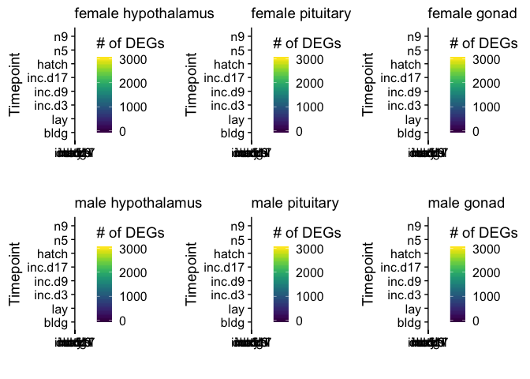
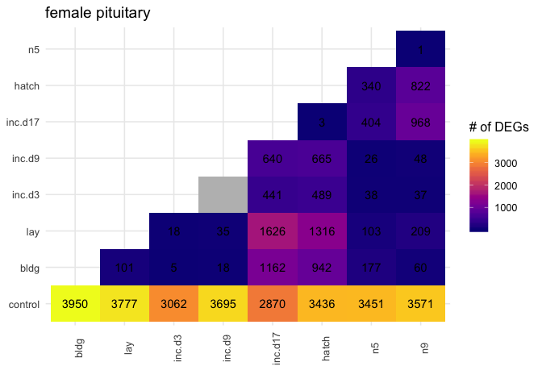
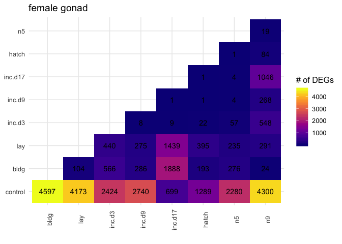
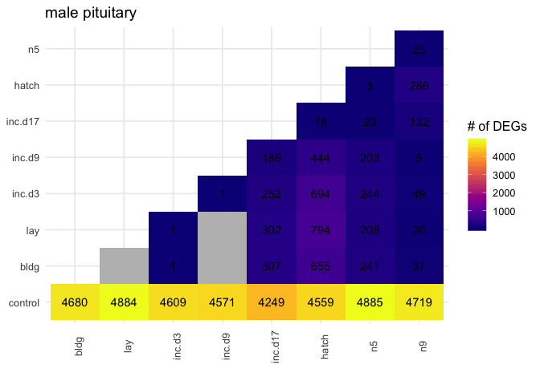
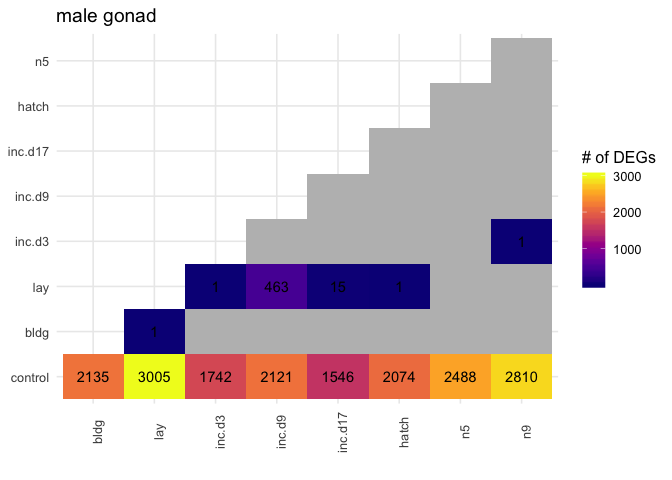
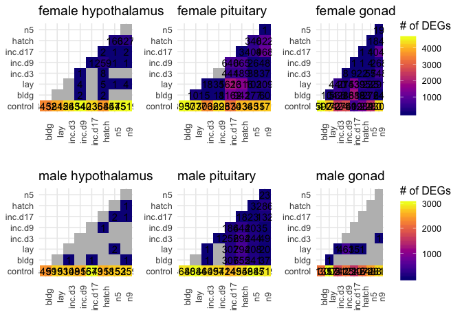

    library(tidyverse)
    library(DESeq2)
    library(cowplot)
    library(RColorBrewer)
    library(pheatmap)
    library(kableExtra)
    library(viridis)
    library(ggimage)

    # load custom functions  
    source("../R/functions.R") 

    knitr::opts_chunk$set(fig.path = '../figures/characterization/', cache = TRUE)

Characterization data
---------------------

    # import "colData" which contains sample information and "countData" which contains read counts
    c.colData <- read.csv("../metadata/00_colData_characterization.csv", header = T, row.names = 1)
    c.countData <- read.csv("../results/00_countData_characterization.csv", header = T, row.names = 1)
    geneinfo <- read.csv("../metadata/00_geneinfo.csv", row.names = 1)

    # set levels
    c.colData$treatment <- factor(c.colData$treatment, levels = 
                                  c("control",  "bldg", "lay", "inc.d3", "inc.d9", "inc.d17", "hatch", "n5", "n9"))
    levels(c.colData$treatment)

    ## [1] "control" "bldg"    "lay"     "inc.d3"  "inc.d9"  "inc.d17" "hatch"  
    ## [8] "n5"      "n9"

    c.colData$sextissue <- as.factor(paste(c.colData$sex, c.colData$tissue, sep = "_"))
    summary(c.colData[c(7,3,4,5,8)])

    ##              study         sex               tissue      treatment  
    ##  charcterization:576   female:289   gonad       :194   control: 73  
    ##                        male  :287   hypothalamus:189   inc.d9 : 71  
    ##                                     pituitary   :193   inc.d17: 66  
    ##                                                        n9     : 66  
    ##                                                        bldg   : 60  
    ##                                                        lay    : 60  
    ##                                                        (Other):180  
    ##                sextissue 
    ##  female_gonad       :98  
    ##  female_hypothalamus:95  
    ##  female_pituitary   :96  
    ##  male_gonad         :96  
    ##  male_hypothalamus  :94  
    ##  male_pituitary     :97  
    ## 

Run DESeq on all subsets of the data
------------------------------------

    dds.female_hypothalamus <- subsetDESeq(c.colData,  c.countData, "female_hypothalamus")

    ## [1] TRUE
    ## class: DESeqDataSet 
    ## dim: 14937 95 
    ## metadata(1): version
    ## assays(1): counts
    ## rownames(14937): NP_001001127.1 NP_001001129.1 ... XP_430449.2
    ##   XP_430508.3
    ## rowData names(0):
    ## colnames(95): L.G118_female_hypothalamus_control.NYNO
    ##   R.G106_female_hypothalamus_control ...
    ##   y94.g133.x_female_hypothalamus_n5.NYNO
    ##   y97.x_female_hypothalamus_n9
    ## colData names(8): V1 bird ... study sextissue
    ## [1] 14469    95

    ## estimating size factors

    ## estimating dispersions

    ## gene-wise dispersion estimates

    ## mean-dispersion relationship

    ## final dispersion estimates

    ## fitting model and testing

    ## -- replacing outliers and refitting for 6 genes
    ## -- DESeq argument 'minReplicatesForReplace' = 7 
    ## -- original counts are preserved in counts(dds)

    ## estimating dispersions

    ## fitting model and testing

    dds.female_pituitary <- subsetDESeq(c.colData,  c.countData, "female_pituitary" )

    ## [1] TRUE
    ## class: DESeqDataSet 
    ## dim: 14937 96 
    ## metadata(1): version
    ## assays(1): counts
    ## rownames(14937): NP_001001127.1 NP_001001129.1 ... XP_430449.2
    ##   XP_430508.3
    ## rowData names(0):
    ## colnames(96): L.G118_female_pituitary_control.NYNO
    ##   R.G106_female_pituitary_control ...
    ##   y94.g133.x_female_pituitary_n5 y97.x_female_pituitary_n9
    ## colData names(8): V1 bird ... study sextissue
    ## [1] 14322    96

    ## estimating size factors

    ## estimating dispersions

    ## gene-wise dispersion estimates

    ## mean-dispersion relationship

    ## final dispersion estimates

    ## fitting model and testing

    ## -- replacing outliers and refitting for 68 genes
    ## -- DESeq argument 'minReplicatesForReplace' = 7 
    ## -- original counts are preserved in counts(dds)

    ## estimating dispersions

    ## fitting model and testing

    dds.female_gonad <- subsetDESeq(c.colData,  c.countData, "female_gonad" )

    ## [1] TRUE
    ## class: DESeqDataSet 
    ## dim: 14937 98 
    ## metadata(1): version
    ## assays(1): counts
    ## rownames(14937): NP_001001127.1 NP_001001129.1 ... XP_430449.2
    ##   XP_430508.3
    ## rowData names(0):
    ## colnames(98): L.G118_female_gonad_control
    ##   R.G106_female_gonad_control ... y94.g133.x_female_gonad_n5
    ##   y97.x_female_gonad_n9
    ## colData names(8): V1 bird ... study sextissue
    ## [1] 14605    98

    ## estimating size factors

    ## estimating dispersions

    ## gene-wise dispersion estimates

    ## mean-dispersion relationship

    ## final dispersion estimates

    ## fitting model and testing

    ## -- replacing outliers and refitting for 34 genes
    ## -- DESeq argument 'minReplicatesForReplace' = 7 
    ## -- original counts are preserved in counts(dds)

    ## estimating dispersions

    ## fitting model and testing

    dds.male_hypothalamus <- subsetDESeq(c.colData,  c.countData, "male_hypothalamus" )

    ## [1] TRUE
    ## class: DESeqDataSet 
    ## dim: 14937 94 
    ## metadata(1): version
    ## assays(1): counts
    ## rownames(14937): NP_001001127.1 NP_001001129.1 ... XP_430449.2
    ##   XP_430508.3
    ## rowData names(0):
    ## colnames(94): L.Blu13_male_hypothalamus_control.NYNO
    ##   L.G107_male_hypothalamus_control ...
    ##   y95.g131.x_male_hypothalamus_inc.d9
    ##   y98.o50.x_male_hypothalamus_inc.d3
    ## colData names(8): V1 bird ... study sextissue
    ## [1] 14416    94

    ## estimating size factors

    ## estimating dispersions

    ## gene-wise dispersion estimates

    ## mean-dispersion relationship

    ## final dispersion estimates

    ## fitting model and testing

    ## -- replacing outliers and refitting for 8 genes
    ## -- DESeq argument 'minReplicatesForReplace' = 7 
    ## -- original counts are preserved in counts(dds)

    ## estimating dispersions

    ## fitting model and testing

    dds.male_pituitary <- subsetDESeq(c.colData,  c.countData, "male_pituitary"  )

    ## [1] TRUE
    ## class: DESeqDataSet 
    ## dim: 14937 97 
    ## metadata(1): version
    ## assays(1): counts
    ## rownames(14937): NP_001001127.1 NP_001001129.1 ... XP_430449.2
    ##   XP_430508.3
    ## rowData names(0):
    ## colnames(97): L.Blu13_male_pituitary_control.NYNO
    ##   L.G107_male_pituitary_control ...
    ##   y95.g131.x_male_pituitary_inc.d9 y98.o50.x_male_pituitary_inc.d3
    ## colData names(8): V1 bird ... study sextissue
    ## [1] 14298    97

    ## estimating size factors

    ## estimating dispersions

    ## gene-wise dispersion estimates

    ## mean-dispersion relationship

    ## final dispersion estimates

    ## fitting model and testing

    ## -- replacing outliers and refitting for 50 genes
    ## -- DESeq argument 'minReplicatesForReplace' = 7 
    ## -- original counts are preserved in counts(dds)

    ## estimating dispersions

    ## fitting model and testing

    dds.male_gondad <- subsetDESeq(c.colData,  c.countData, "male_gonad")

    ## [1] TRUE
    ## class: DESeqDataSet 
    ## dim: 14937 96 
    ## metadata(1): version
    ## assays(1): counts
    ## rownames(14937): NP_001001127.1 NP_001001129.1 ... XP_430449.2
    ##   XP_430508.3
    ## rowData names(0):
    ## colnames(96): L.Blu13_male_gonad_control.NYNO
    ##   L.G107_male_gonad_control ... y95.g131.x_male_gonad_inc.d9
    ##   y98.o50.x_male_gonad_inc.d3
    ## colData names(8): V1 bird ... study sextissue
    ## [1] 14614    96

    ## estimating size factors

    ## estimating dispersions

    ## gene-wise dispersion estimates

    ## mean-dispersion relationship

    ## final dispersion estimates

    ## fitting model and testing

    ## -- replacing outliers and refitting for 8 genes
    ## -- DESeq argument 'minReplicatesForReplace' = 7 
    ## -- original counts are preserved in counts(dds)

    ## estimating dispersions

    ## fitting model and testing

Calculate and plot total DEGs
-----------------------------

    DEGs.female_hypothalamus <- returntotalDEGs(dds.female_hypothalamus)

    ## [1] "control.bldg"
    ## [1] "control.lay"
    ## [1] "control.inc.d3"
    ## [1] "control.inc.d9"
    ## [1] "control.inc.d17"
    ## [1] "control.hatch"
    ## [1] "control.n5"
    ## [1] "control.n9"
    ## [1] "bldg.lay"
    ## [1] "bldg.inc.d3"
    ## [1] "bldg.inc.d9"
    ## [1] "bldg.inc.d17"
    ## [1] "bldg.hatch"
    ## [1] "bldg.n5"
    ## [1] "bldg.n9"
    ## [1] "lay.inc.d3"
    ## [1] "lay.inc.d9"
    ## [1] "lay.inc.d17"
    ## [1] "lay.hatch"
    ## [1] "lay.n5"
    ## [1] "lay.n9"
    ## [1] "inc.d3.inc.d9"
    ## [1] "inc.d3.inc.d17"
    ## [1] "inc.d3.hatch"
    ## [1] "inc.d3.n5"
    ## [1] "inc.d3.n9"
    ## [1] "inc.d9.inc.d17"
    ## [1] "inc.d9.hatch"
    ## [1] "inc.d9.n5"
    ## [1] "inc.d9.n9"
    ## [1] "inc.d17.hatch"
    ## [1] "inc.d17.n5"
    ## [1] "inc.d17.n9"
    ## [1] "hatch.n5"
    ## [1] "hatch.n9"
    ## [1] "n5.n9"
    ##                      V1      V2   V3
    ## control.bldg    control    bldg 3452
    ## control.lay     control     lay 3815
    ## control.inc.d3  control  inc.d3 4263
    ## control.inc.d9  control  inc.d9 4540
    ## control.inc.d17 control inc.d17 4235
    ## control.hatch   control   hatch 3685
    ## control.n5      control      n5 4475
    ## control.n9      control      n9 4519
    ## bldg.lay           bldg     lay    0
    ## bldg.inc.d3        bldg  inc.d3    0
    ## bldg.inc.d9        bldg  inc.d9    2
    ## bldg.inc.d17       bldg inc.d17    0
    ## bldg.hatch         bldg   hatch    2
    ## bldg.n5            bldg      n5    0
    ## bldg.n9            bldg      n9    0
    ## lay.inc.d3          lay  inc.d3    0
    ## lay.inc.d9          lay  inc.d9    4
    ## lay.inc.d17         lay inc.d17    0
    ## lay.hatch           lay   hatch    5
    ## lay.n5              lay      n5    1
    ## lay.n9              lay      n9    4
    ## inc.d3.inc.d9    inc.d3  inc.d9    1
    ## inc.d3.inc.d17   inc.d3 inc.d17    0
    ## inc.d3.hatch     inc.d3   hatch    8
    ## inc.d3.n5        inc.d3      n5    0
    ## inc.d3.n9        inc.d3      n9    0
    ## inc.d9.inc.d17   inc.d9 inc.d17    1
    ## inc.d9.hatch     inc.d9   hatch  259
    ## inc.d9.n5        inc.d9      n5    1
    ## inc.d9.n9        inc.d9      n9    1
    ## inc.d17.hatch   inc.d17   hatch    2
    ## inc.d17.n5      inc.d17      n5    1
    ## inc.d17.n9      inc.d17      n9    2
    ## hatch.n5          hatch      n5  166
    ## hatch.n9          hatch      n9  327
    ## n5.n9                n5      n9    0

    DEGs.female_pituitary <- returntotalDEGs(dds.female_pituitary)

    ## [1] "control.bldg"
    ## [1] "control.lay"
    ## [1] "control.inc.d3"
    ## [1] "control.inc.d9"
    ## [1] "control.inc.d17"
    ## [1] "control.hatch"
    ## [1] "control.n5"
    ## [1] "control.n9"
    ## [1] "bldg.lay"
    ## [1] "bldg.inc.d3"
    ## [1] "bldg.inc.d9"
    ## [1] "bldg.inc.d17"
    ## [1] "bldg.hatch"
    ## [1] "bldg.n5"
    ## [1] "bldg.n9"
    ## [1] "lay.inc.d3"
    ## [1] "lay.inc.d9"
    ## [1] "lay.inc.d17"
    ## [1] "lay.hatch"
    ## [1] "lay.n5"
    ## [1] "lay.n9"
    ## [1] "inc.d3.inc.d9"
    ## [1] "inc.d3.inc.d17"
    ## [1] "inc.d3.hatch"
    ## [1] "inc.d3.n5"
    ## [1] "inc.d3.n9"
    ## [1] "inc.d9.inc.d17"
    ## [1] "inc.d9.hatch"
    ## [1] "inc.d9.n5"
    ## [1] "inc.d9.n9"
    ## [1] "inc.d17.hatch"
    ## [1] "inc.d17.n5"
    ## [1] "inc.d17.n9"
    ## [1] "hatch.n5"
    ## [1] "hatch.n9"
    ## [1] "n5.n9"
    ##                      V1      V2   V3
    ## control.bldg    control    bldg 3950
    ## control.lay     control     lay 3777
    ## control.inc.d3  control  inc.d3 3062
    ## control.inc.d9  control  inc.d9 3695
    ## control.inc.d17 control inc.d17 2870
    ## control.hatch   control   hatch 3436
    ## control.n5      control      n5 3451
    ## control.n9      control      n9 3571
    ## bldg.lay           bldg     lay  101
    ## bldg.inc.d3        bldg  inc.d3    5
    ## bldg.inc.d9        bldg  inc.d9   18
    ## bldg.inc.d17       bldg inc.d17 1162
    ## bldg.hatch         bldg   hatch  942
    ## bldg.n5            bldg      n5  177
    ## bldg.n9            bldg      n9   60
    ## lay.inc.d3          lay  inc.d3   18
    ## lay.inc.d9          lay  inc.d9   35
    ## lay.inc.d17         lay inc.d17 1626
    ## lay.hatch           lay   hatch 1316
    ## lay.n5              lay      n5  103
    ## lay.n9              lay      n9  209
    ## inc.d3.inc.d9    inc.d3  inc.d9    0
    ## inc.d3.inc.d17   inc.d3 inc.d17  441
    ## inc.d3.hatch     inc.d3   hatch  489
    ## inc.d3.n5        inc.d3      n5   38
    ## inc.d3.n9        inc.d3      n9   37
    ## inc.d9.inc.d17   inc.d9 inc.d17  640
    ## inc.d9.hatch     inc.d9   hatch  665
    ## inc.d9.n5        inc.d9      n5   26
    ## inc.d9.n9        inc.d9      n9   48
    ## inc.d17.hatch   inc.d17   hatch    3
    ## inc.d17.n5      inc.d17      n5  404
    ## inc.d17.n9      inc.d17      n9  968
    ## hatch.n5          hatch      n5  340
    ## hatch.n9          hatch      n9  822
    ## n5.n9                n5      n9    1

    DEGs.female_gonad <- returntotalDEGs(dds.female_gonad)

    ## [1] "control.bldg"
    ## [1] "control.lay"
    ## [1] "control.inc.d3"
    ## [1] "control.inc.d9"
    ## [1] "control.inc.d17"
    ## [1] "control.hatch"
    ## [1] "control.n5"
    ## [1] "control.n9"
    ## [1] "bldg.lay"
    ## [1] "bldg.inc.d3"
    ## [1] "bldg.inc.d9"
    ## [1] "bldg.inc.d17"
    ## [1] "bldg.hatch"
    ## [1] "bldg.n5"
    ## [1] "bldg.n9"
    ## [1] "lay.inc.d3"
    ## [1] "lay.inc.d9"
    ## [1] "lay.inc.d17"
    ## [1] "lay.hatch"
    ## [1] "lay.n5"
    ## [1] "lay.n9"
    ## [1] "inc.d3.inc.d9"
    ## [1] "inc.d3.inc.d17"
    ## [1] "inc.d3.hatch"
    ## [1] "inc.d3.n5"
    ## [1] "inc.d3.n9"
    ## [1] "inc.d9.inc.d17"
    ## [1] "inc.d9.hatch"
    ## [1] "inc.d9.n5"
    ## [1] "inc.d9.n9"
    ## [1] "inc.d17.hatch"
    ## [1] "inc.d17.n5"
    ## [1] "inc.d17.n9"
    ## [1] "hatch.n5"
    ## [1] "hatch.n9"
    ## [1] "n5.n9"
    ##                      V1      V2   V3
    ## control.bldg    control    bldg 4597
    ## control.lay     control     lay 4173
    ## control.inc.d3  control  inc.d3 2424
    ## control.inc.d9  control  inc.d9 2740
    ## control.inc.d17 control inc.d17  699
    ## control.hatch   control   hatch 1289
    ## control.n5      control      n5 2280
    ## control.n9      control      n9 4300
    ## bldg.lay           bldg     lay  104
    ## bldg.inc.d3        bldg  inc.d3  566
    ## bldg.inc.d9        bldg  inc.d9  286
    ## bldg.inc.d17       bldg inc.d17 1888
    ## bldg.hatch         bldg   hatch  193
    ## bldg.n5            bldg      n5  276
    ## bldg.n9            bldg      n9   24
    ## lay.inc.d3          lay  inc.d3  440
    ## lay.inc.d9          lay  inc.d9  275
    ## lay.inc.d17         lay inc.d17 1439
    ## lay.hatch           lay   hatch  395
    ## lay.n5              lay      n5  235
    ## lay.n9              lay      n9  291
    ## inc.d3.inc.d9    inc.d3  inc.d9    8
    ## inc.d3.inc.d17   inc.d3 inc.d17    9
    ## inc.d3.hatch     inc.d3   hatch   22
    ## inc.d3.n5        inc.d3      n5   57
    ## inc.d3.n9        inc.d3      n9  548
    ## inc.d9.inc.d17   inc.d9 inc.d17    1
    ## inc.d9.hatch     inc.d9   hatch    1
    ## inc.d9.n5        inc.d9      n5    4
    ## inc.d9.n9        inc.d9      n9  268
    ## inc.d17.hatch   inc.d17   hatch    1
    ## inc.d17.n5      inc.d17      n5    4
    ## inc.d17.n9      inc.d17      n9 1046
    ## hatch.n5          hatch      n5    1
    ## hatch.n9          hatch      n9   84
    ## n5.n9                n5      n9   19

    DEGs.male_hypothalamus <- returntotalDEGs(dds.male_hypothalamus)

    ## [1] "control.bldg"
    ## [1] "control.lay"
    ## [1] "control.inc.d3"
    ## [1] "control.inc.d9"
    ## [1] "control.inc.d17"
    ## [1] "control.hatch"
    ## [1] "control.n5"
    ## [1] "control.n9"
    ## [1] "bldg.lay"
    ## [1] "bldg.inc.d3"
    ## [1] "bldg.inc.d9"
    ## [1] "bldg.inc.d17"
    ## [1] "bldg.hatch"
    ## [1] "bldg.n5"
    ## [1] "bldg.n9"
    ## [1] "lay.inc.d3"
    ## [1] "lay.inc.d9"
    ## [1] "lay.inc.d17"
    ## [1] "lay.hatch"
    ## [1] "lay.n5"
    ## [1] "lay.n9"
    ## [1] "inc.d3.inc.d9"
    ## [1] "inc.d3.inc.d17"
    ## [1] "inc.d3.hatch"
    ## [1] "inc.d3.n5"
    ## [1] "inc.d3.n9"
    ## [1] "inc.d9.inc.d17"
    ## [1] "inc.d9.hatch"
    ## [1] "inc.d9.n5"
    ## [1] "inc.d9.n9"
    ## [1] "inc.d17.hatch"
    ## [1] "inc.d17.n5"
    ## [1] "inc.d17.n9"
    ## [1] "hatch.n5"
    ## [1] "hatch.n9"
    ## [1] "n5.n9"
    ##                      V1      V2   V3
    ## control.bldg    control    bldg 4499
    ## control.lay     control     lay 5193
    ## control.inc.d3  control  inc.d3 5108
    ## control.inc.d9  control  inc.d9 4915
    ## control.inc.d17 control inc.d17 5673
    ## control.hatch   control   hatch 4918
    ## control.n5      control      n5 5153
    ## control.n9      control      n9 5259
    ## bldg.lay           bldg     lay    0
    ## bldg.inc.d3        bldg  inc.d3    1
    ## bldg.inc.d9        bldg  inc.d9    0
    ## bldg.inc.d17       bldg inc.d17    1
    ## bldg.hatch         bldg   hatch    0
    ## bldg.n5            bldg      n5    0
    ## bldg.n9            bldg      n9    1
    ## lay.inc.d3          lay  inc.d3    0
    ## lay.inc.d9          lay  inc.d9    0
    ## lay.inc.d17         lay inc.d17    0
    ## lay.hatch           lay   hatch    0
    ## lay.n5              lay      n5    2
    ## lay.n9              lay      n9    0
    ## inc.d3.inc.d9    inc.d3  inc.d9    0
    ## inc.d3.inc.d17   inc.d3 inc.d17    0
    ## inc.d3.hatch     inc.d3   hatch    0
    ## inc.d3.n5        inc.d3      n5    0
    ## inc.d3.n9        inc.d3      n9    0
    ## inc.d9.inc.d17   inc.d9 inc.d17    0
    ## inc.d9.hatch     inc.d9   hatch    1
    ## inc.d9.n5        inc.d9      n5    0
    ## inc.d9.n9        inc.d9      n9    0
    ## inc.d17.hatch   inc.d17   hatch    0
    ## inc.d17.n5      inc.d17      n5    2
    ## inc.d17.n9      inc.d17      n9    1
    ## hatch.n5          hatch      n5    0
    ## hatch.n9          hatch      n9    1
    ## n5.n9                n5      n9    0

    DEGs.male_pituitary <- returntotalDEGs(dds.male_pituitary)

    ## [1] "control.bldg"
    ## [1] "control.lay"
    ## [1] "control.inc.d3"
    ## [1] "control.inc.d9"
    ## [1] "control.inc.d17"
    ## [1] "control.hatch"
    ## [1] "control.n5"
    ## [1] "control.n9"
    ## [1] "bldg.lay"
    ## [1] "bldg.inc.d3"
    ## [1] "bldg.inc.d9"
    ## [1] "bldg.inc.d17"
    ## [1] "bldg.hatch"
    ## [1] "bldg.n5"
    ## [1] "bldg.n9"
    ## [1] "lay.inc.d3"
    ## [1] "lay.inc.d9"
    ## [1] "lay.inc.d17"
    ## [1] "lay.hatch"
    ## [1] "lay.n5"
    ## [1] "lay.n9"
    ## [1] "inc.d3.inc.d9"
    ## [1] "inc.d3.inc.d17"
    ## [1] "inc.d3.hatch"
    ## [1] "inc.d3.n5"
    ## [1] "inc.d3.n9"
    ## [1] "inc.d9.inc.d17"
    ## [1] "inc.d9.hatch"
    ## [1] "inc.d9.n5"
    ## [1] "inc.d9.n9"
    ## [1] "inc.d17.hatch"
    ## [1] "inc.d17.n5"
    ## [1] "inc.d17.n9"
    ## [1] "hatch.n5"
    ## [1] "hatch.n9"
    ## [1] "n5.n9"
    ##                      V1      V2   V3
    ## control.bldg    control    bldg 4680
    ## control.lay     control     lay 4884
    ## control.inc.d3  control  inc.d3 4609
    ## control.inc.d9  control  inc.d9 4571
    ## control.inc.d17 control inc.d17 4249
    ## control.hatch   control   hatch 4559
    ## control.n5      control      n5 4885
    ## control.n9      control      n9 4719
    ## bldg.lay           bldg     lay    0
    ## bldg.inc.d3        bldg  inc.d3    1
    ## bldg.inc.d9        bldg  inc.d9    0
    ## bldg.inc.d17       bldg inc.d17  307
    ## bldg.hatch         bldg   hatch  655
    ## bldg.n5            bldg      n5  241
    ## bldg.n9            bldg      n9   37
    ## lay.inc.d3          lay  inc.d3    1
    ## lay.inc.d9          lay  inc.d9    0
    ## lay.inc.d17         lay inc.d17  302
    ## lay.hatch           lay   hatch  794
    ## lay.n5              lay      n5  208
    ## lay.n9              lay      n9   20
    ## inc.d3.inc.d9    inc.d3  inc.d9    1
    ## inc.d3.inc.d17   inc.d3 inc.d17  252
    ## inc.d3.hatch     inc.d3   hatch  694
    ## inc.d3.n5        inc.d3      n5  244
    ## inc.d3.n9        inc.d3      n9   49
    ## inc.d9.inc.d17   inc.d9 inc.d17  186
    ## inc.d9.hatch     inc.d9   hatch  444
    ## inc.d9.n5        inc.d9      n5  203
    ## inc.d9.n9        inc.d9      n9    5
    ## inc.d17.hatch   inc.d17   hatch   18
    ## inc.d17.n5      inc.d17      n5   23
    ## inc.d17.n9      inc.d17      n9  132
    ## hatch.n5          hatch      n5    3
    ## hatch.n9          hatch      n9  286
    ## n5.n9                n5      n9   23

    DEGs.male_gondad <- returntotalDEGs(dds.male_gondad)

    ## [1] "control.bldg"
    ## [1] "control.lay"
    ## [1] "control.inc.d3"
    ## [1] "control.inc.d9"
    ## [1] "control.inc.d17"
    ## [1] "control.hatch"
    ## [1] "control.n5"
    ## [1] "control.n9"
    ## [1] "bldg.lay"
    ## [1] "bldg.inc.d3"
    ## [1] "bldg.inc.d9"
    ## [1] "bldg.inc.d17"
    ## [1] "bldg.hatch"
    ## [1] "bldg.n5"
    ## [1] "bldg.n9"
    ## [1] "lay.inc.d3"
    ## [1] "lay.inc.d9"
    ## [1] "lay.inc.d17"
    ## [1] "lay.hatch"
    ## [1] "lay.n5"
    ## [1] "lay.n9"
    ## [1] "inc.d3.inc.d9"
    ## [1] "inc.d3.inc.d17"
    ## [1] "inc.d3.hatch"
    ## [1] "inc.d3.n5"
    ## [1] "inc.d3.n9"
    ## [1] "inc.d9.inc.d17"
    ## [1] "inc.d9.hatch"
    ## [1] "inc.d9.n5"
    ## [1] "inc.d9.n9"
    ## [1] "inc.d17.hatch"
    ## [1] "inc.d17.n5"
    ## [1] "inc.d17.n9"
    ## [1] "hatch.n5"
    ## [1] "hatch.n9"
    ## [1] "n5.n9"
    ##                      V1      V2   V3
    ## control.bldg    control    bldg 2135
    ## control.lay     control     lay 3005
    ## control.inc.d3  control  inc.d3 1742
    ## control.inc.d9  control  inc.d9 2121
    ## control.inc.d17 control inc.d17 1546
    ## control.hatch   control   hatch 2074
    ## control.n5      control      n5 2488
    ## control.n9      control      n9 2810
    ## bldg.lay           bldg     lay    1
    ## bldg.inc.d3        bldg  inc.d3    0
    ## bldg.inc.d9        bldg  inc.d9    0
    ## bldg.inc.d17       bldg inc.d17    0
    ## bldg.hatch         bldg   hatch    0
    ## bldg.n5            bldg      n5    0
    ## bldg.n9            bldg      n9    0
    ## lay.inc.d3          lay  inc.d3    1
    ## lay.inc.d9          lay  inc.d9  463
    ## lay.inc.d17         lay inc.d17   15
    ## lay.hatch           lay   hatch    1
    ## lay.n5              lay      n5    0
    ## lay.n9              lay      n9    0
    ## inc.d3.inc.d9    inc.d3  inc.d9    0
    ## inc.d3.inc.d17   inc.d3 inc.d17    0
    ## inc.d3.hatch     inc.d3   hatch    0
    ## inc.d3.n5        inc.d3      n5    0
    ## inc.d3.n9        inc.d3      n9    1
    ## inc.d9.inc.d17   inc.d9 inc.d17    0
    ## inc.d9.hatch     inc.d9   hatch    0
    ## inc.d9.n5        inc.d9      n5    0
    ## inc.d9.n9        inc.d9      n9    0
    ## inc.d17.hatch   inc.d17   hatch    0
    ## inc.d17.n5      inc.d17      n5    0
    ## inc.d17.n9      inc.d17      n9    0
    ## hatch.n5          hatch      n5    0
    ## hatch.n9          hatch      n9    0
    ## n5.n9                n5      n9    0

    #create list of groups for deseq contrasts
    group1 <- c("control",  "bldg", "lay", "inc.d3", "inc.d9", "inc.d17", "hatch", "n5", "n9")
    group2 <- group1

    a <- plottotalDEGs(DEGs.female_hypothalamus, "female hypothalamus")

    ## 'data.frame':    36 obs. of  3 variables:
    ##  $ V1: Factor w/ 9 levels "control","bldg",..: 1 1 1 1 1 1 1 1 2 2 ...
    ##  $ V2: Factor w/ 9 levels "control","bldg",..: 2 3 4 5 6 7 8 9 3 4 ...
    ##  $ V3: int  3452 3815 4263 4540 4235 3685 4475 4519 NA NA ...
    ## NULL
    ##                      V1      V2   V3
    ## control.bldg    control    bldg 3452
    ## control.lay     control     lay 3815
    ## control.inc.d3  control  inc.d3 4263
    ## control.inc.d9  control  inc.d9 4540
    ## control.inc.d17 control inc.d17 4235
    ## control.hatch   control   hatch 3685
    ## control.n5      control      n5 4475
    ## control.n9      control      n9 4519
    ## bldg.lay           bldg     lay   NA
    ## bldg.inc.d3        bldg  inc.d3   NA
    ## bldg.inc.d9        bldg  inc.d9    2
    ## bldg.inc.d17       bldg inc.d17   NA
    ## bldg.hatch         bldg   hatch    2
    ## bldg.n5            bldg      n5   NA
    ## bldg.n9            bldg      n9   NA
    ## lay.inc.d3          lay  inc.d3   NA
    ## lay.inc.d9          lay  inc.d9    4
    ## lay.inc.d17         lay inc.d17   NA
    ## lay.hatch           lay   hatch    5
    ## lay.n5              lay      n5    1
    ## lay.n9              lay      n9    4
    ## inc.d3.inc.d9    inc.d3  inc.d9    1
    ## inc.d3.inc.d17   inc.d3 inc.d17   NA
    ## inc.d3.hatch     inc.d3   hatch    8
    ## inc.d3.n5        inc.d3      n5   NA
    ## inc.d3.n9        inc.d3      n9   NA
    ## inc.d9.inc.d17   inc.d9 inc.d17    1
    ## inc.d9.hatch     inc.d9   hatch  259
    ## inc.d9.n5        inc.d9      n5    1
    ## inc.d9.n9        inc.d9      n9    1
    ## inc.d17.hatch   inc.d17   hatch    2
    ## inc.d17.n5      inc.d17      n5    1
    ## inc.d17.n9      inc.d17      n9    2
    ## hatch.n5          hatch      n5  166
    ## hatch.n9          hatch      n9  327
    ## n5.n9                n5      n9   NA

    ## Warning: Removed 11 rows containing missing values (geom_text).

    b <- plottotalDEGs(DEGs.female_pituitary, "female pituitary")

    ## 'data.frame':    36 obs. of  3 variables:
    ##  $ V1: Factor w/ 9 levels "control","bldg",..: 1 1 1 1 1 1 1 1 2 2 ...
    ##  $ V2: Factor w/ 9 levels "control","bldg",..: 2 3 4 5 6 7 8 9 3 4 ...
    ##  $ V3: int  3950 3777 3062 3695 2870 3436 3451 3571 101 5 ...
    ## NULL
    ##                      V1      V2   V3
    ## control.bldg    control    bldg 3950
    ## control.lay     control     lay 3777
    ## control.inc.d3  control  inc.d3 3062
    ## control.inc.d9  control  inc.d9 3695
    ## control.inc.d17 control inc.d17 2870
    ## control.hatch   control   hatch 3436
    ## control.n5      control      n5 3451
    ## control.n9      control      n9 3571
    ## bldg.lay           bldg     lay  101
    ## bldg.inc.d3        bldg  inc.d3    5
    ## bldg.inc.d9        bldg  inc.d9   18
    ## bldg.inc.d17       bldg inc.d17 1162
    ## bldg.hatch         bldg   hatch  942
    ## bldg.n5            bldg      n5  177
    ## bldg.n9            bldg      n9   60
    ## lay.inc.d3          lay  inc.d3   18
    ## lay.inc.d9          lay  inc.d9   35
    ## lay.inc.d17         lay inc.d17 1626
    ## lay.hatch           lay   hatch 1316
    ## lay.n5              lay      n5  103
    ## lay.n9              lay      n9  209
    ## inc.d3.inc.d9    inc.d3  inc.d9   NA
    ## inc.d3.inc.d17   inc.d3 inc.d17  441
    ## inc.d3.hatch     inc.d3   hatch  489
    ## inc.d3.n5        inc.d3      n5   38
    ## inc.d3.n9        inc.d3      n9   37
    ## inc.d9.inc.d17   inc.d9 inc.d17  640
    ## inc.d9.hatch     inc.d9   hatch  665
    ## inc.d9.n5        inc.d9      n5   26
    ## inc.d9.n9        inc.d9      n9   48
    ## inc.d17.hatch   inc.d17   hatch    3
    ## inc.d17.n5      inc.d17      n5  404
    ## inc.d17.n9      inc.d17      n9  968
    ## hatch.n5          hatch      n5  340
    ## hatch.n9          hatch      n9  822
    ## n5.n9                n5      n9    1

    ## Warning: Removed 1 rows containing missing values (geom_text).

    c <- plottotalDEGs(DEGs.female_gonad, "female gonad")

    ## 'data.frame':    36 obs. of  3 variables:
    ##  $ V1: Factor w/ 9 levels "control","bldg",..: 1 1 1 1 1 1 1 1 2 2 ...
    ##  $ V2: Factor w/ 9 levels "control","bldg",..: 2 3 4 5 6 7 8 9 3 4 ...
    ##  $ V3: int  4597 4173 2424 2740 699 1289 2280 4300 104 566 ...
    ## NULL
    ##                      V1      V2   V3
    ## control.bldg    control    bldg 4597
    ## control.lay     control     lay 4173
    ## control.inc.d3  control  inc.d3 2424
    ## control.inc.d9  control  inc.d9 2740
    ## control.inc.d17 control inc.d17  699
    ## control.hatch   control   hatch 1289
    ## control.n5      control      n5 2280
    ## control.n9      control      n9 4300
    ## bldg.lay           bldg     lay  104
    ## bldg.inc.d3        bldg  inc.d3  566
    ## bldg.inc.d9        bldg  inc.d9  286
    ## bldg.inc.d17       bldg inc.d17 1888
    ## bldg.hatch         bldg   hatch  193
    ## bldg.n5            bldg      n5  276
    ## bldg.n9            bldg      n9   24
    ## lay.inc.d3          lay  inc.d3  440
    ## lay.inc.d9          lay  inc.d9  275
    ## lay.inc.d17         lay inc.d17 1439
    ## lay.hatch           lay   hatch  395
    ## lay.n5              lay      n5  235
    ## lay.n9              lay      n9  291
    ## inc.d3.inc.d9    inc.d3  inc.d9    8
    ## inc.d3.inc.d17   inc.d3 inc.d17    9
    ## inc.d3.hatch     inc.d3   hatch   22
    ## inc.d3.n5        inc.d3      n5   57
    ## inc.d3.n9        inc.d3      n9  548
    ## inc.d9.inc.d17   inc.d9 inc.d17    1
    ## inc.d9.hatch     inc.d9   hatch    1
    ## inc.d9.n5        inc.d9      n5    4
    ## inc.d9.n9        inc.d9      n9  268
    ## inc.d17.hatch   inc.d17   hatch    1
    ## inc.d17.n5      inc.d17      n5    4
    ## inc.d17.n9      inc.d17      n9 1046
    ## hatch.n5          hatch      n5    1
    ## hatch.n9          hatch      n9   84
    ## n5.n9                n5      n9   19

    d <- plottotalDEGs(DEGs.male_hypothalamus, "male hypothalamus")

    ## 'data.frame':    36 obs. of  3 variables:
    ##  $ V1: Factor w/ 9 levels "control","bldg",..: 1 1 1 1 1 1 1 1 2 2 ...
    ##  $ V2: Factor w/ 9 levels "control","bldg",..: 2 3 4 5 6 7 8 9 3 4 ...
    ##  $ V3: int  4499 5193 5108 4915 5673 4918 5153 5259 NA 1 ...
    ## NULL
    ##                      V1      V2   V3
    ## control.bldg    control    bldg 4499
    ## control.lay     control     lay 5193
    ## control.inc.d3  control  inc.d3 5108
    ## control.inc.d9  control  inc.d9 4915
    ## control.inc.d17 control inc.d17 5673
    ## control.hatch   control   hatch 4918
    ## control.n5      control      n5 5153
    ## control.n9      control      n9 5259
    ## bldg.lay           bldg     lay   NA
    ## bldg.inc.d3        bldg  inc.d3    1
    ## bldg.inc.d9        bldg  inc.d9   NA
    ## bldg.inc.d17       bldg inc.d17    1
    ## bldg.hatch         bldg   hatch   NA
    ## bldg.n5            bldg      n5   NA
    ## bldg.n9            bldg      n9    1
    ## lay.inc.d3          lay  inc.d3   NA
    ## lay.inc.d9          lay  inc.d9   NA
    ## lay.inc.d17         lay inc.d17   NA
    ## lay.hatch           lay   hatch   NA
    ## lay.n5              lay      n5    2
    ## lay.n9              lay      n9   NA
    ## inc.d3.inc.d9    inc.d3  inc.d9   NA
    ## inc.d3.inc.d17   inc.d3 inc.d17   NA
    ## inc.d3.hatch     inc.d3   hatch   NA
    ## inc.d3.n5        inc.d3      n5   NA
    ## inc.d3.n9        inc.d3      n9   NA
    ## inc.d9.inc.d17   inc.d9 inc.d17   NA
    ## inc.d9.hatch     inc.d9   hatch    1
    ## inc.d9.n5        inc.d9      n5   NA
    ## inc.d9.n9        inc.d9      n9   NA
    ## inc.d17.hatch   inc.d17   hatch   NA
    ## inc.d17.n5      inc.d17      n5    2
    ## inc.d17.n9      inc.d17      n9    1
    ## hatch.n5          hatch      n5   NA
    ## hatch.n9          hatch      n9    1
    ## n5.n9                n5      n9   NA

    ## Warning: Removed 20 rows containing missing values (geom_text).

    e <- plottotalDEGs(DEGs.male_pituitary, "male pituitary")

    ## 'data.frame':    36 obs. of  3 variables:
    ##  $ V1: Factor w/ 9 levels "control","bldg",..: 1 1 1 1 1 1 1 1 2 2 ...
    ##  $ V2: Factor w/ 9 levels "control","bldg",..: 2 3 4 5 6 7 8 9 3 4 ...
    ##  $ V3: int  4680 4884 4609 4571 4249 4559 4885 4719 NA 1 ...
    ## NULL
    ##                      V1      V2   V3
    ## control.bldg    control    bldg 4680
    ## control.lay     control     lay 4884
    ## control.inc.d3  control  inc.d3 4609
    ## control.inc.d9  control  inc.d9 4571
    ## control.inc.d17 control inc.d17 4249
    ## control.hatch   control   hatch 4559
    ## control.n5      control      n5 4885
    ## control.n9      control      n9 4719
    ## bldg.lay           bldg     lay   NA
    ## bldg.inc.d3        bldg  inc.d3    1
    ## bldg.inc.d9        bldg  inc.d9   NA
    ## bldg.inc.d17       bldg inc.d17  307
    ## bldg.hatch         bldg   hatch  655
    ## bldg.n5            bldg      n5  241
    ## bldg.n9            bldg      n9   37
    ## lay.inc.d3          lay  inc.d3    1
    ## lay.inc.d9          lay  inc.d9   NA
    ## lay.inc.d17         lay inc.d17  302
    ## lay.hatch           lay   hatch  794
    ## lay.n5              lay      n5  208
    ## lay.n9              lay      n9   20
    ## inc.d3.inc.d9    inc.d3  inc.d9    1
    ## inc.d3.inc.d17   inc.d3 inc.d17  252
    ## inc.d3.hatch     inc.d3   hatch  694
    ## inc.d3.n5        inc.d3      n5  244
    ## inc.d3.n9        inc.d3      n9   49
    ## inc.d9.inc.d17   inc.d9 inc.d17  186
    ## inc.d9.hatch     inc.d9   hatch  444
    ## inc.d9.n5        inc.d9      n5  203
    ## inc.d9.n9        inc.d9      n9    5
    ## inc.d17.hatch   inc.d17   hatch   18
    ## inc.d17.n5      inc.d17      n5   23
    ## inc.d17.n9      inc.d17      n9  132
    ## hatch.n5          hatch      n5    3
    ## hatch.n9          hatch      n9  286
    ## n5.n9                n5      n9   23

    ## Warning: Removed 3 rows containing missing values (geom_text).

    f <- plottotalDEGs(DEGs.male_gondad, "male gonad")

    ## 'data.frame':    36 obs. of  3 variables:
    ##  $ V1: Factor w/ 9 levels "control","bldg",..: 1 1 1 1 1 1 1 1 2 2 ...
    ##  $ V2: Factor w/ 9 levels "control","bldg",..: 2 3 4 5 6 7 8 9 3 4 ...
    ##  $ V3: int  2135 3005 1742 2121 1546 2074 2488 2810 1 NA ...
    ## NULL
    ##                      V1      V2   V3
    ## control.bldg    control    bldg 2135
    ## control.lay     control     lay 3005
    ## control.inc.d3  control  inc.d3 1742
    ## control.inc.d9  control  inc.d9 2121
    ## control.inc.d17 control inc.d17 1546
    ## control.hatch   control   hatch 2074
    ## control.n5      control      n5 2488
    ## control.n9      control      n9 2810
    ## bldg.lay           bldg     lay    1
    ## bldg.inc.d3        bldg  inc.d3   NA
    ## bldg.inc.d9        bldg  inc.d9   NA
    ## bldg.inc.d17       bldg inc.d17   NA
    ## bldg.hatch         bldg   hatch   NA
    ## bldg.n5            bldg      n5   NA
    ## bldg.n9            bldg      n9   NA
    ## lay.inc.d3          lay  inc.d3    1
    ## lay.inc.d9          lay  inc.d9  463
    ## lay.inc.d17         lay inc.d17   15
    ## lay.hatch           lay   hatch    1
    ## lay.n5              lay      n5   NA
    ## lay.n9              lay      n9   NA
    ## inc.d3.inc.d9    inc.d3  inc.d9   NA
    ## inc.d3.inc.d17   inc.d3 inc.d17   NA
    ## inc.d3.hatch     inc.d3   hatch   NA
    ## inc.d3.n5        inc.d3      n5   NA
    ## inc.d3.n9        inc.d3      n9    1
    ## inc.d9.inc.d17   inc.d9 inc.d17   NA
    ## inc.d9.hatch     inc.d9   hatch   NA
    ## inc.d9.n5        inc.d9      n5   NA
    ## inc.d9.n9        inc.d9      n9   NA
    ## inc.d17.hatch   inc.d17   hatch   NA
    ## inc.d17.n5      inc.d17      n5   NA
    ## inc.d17.n9      inc.d17      n9   NA
    ## hatch.n5          hatch      n5   NA
    ## hatch.n9          hatch      n9   NA
    ## n5.n9                n5      n9   NA

    ## Warning: Removed 22 rows containing missing values (geom_text).

    plot_grid(a + theme(legend.position = "none"),
              b + theme(legend.position = "none"),
              c,
              d + theme(legend.position = "none"),
              e + theme(legend.position = "none"),
              f,
              nrow = 2, rel_widths = c(0.3, 0.3, 0.4)) 

    ## Warning: Removed 11 rows containing missing values (geom_text).

    ## Warning: Removed 1 rows containing missing values (geom_text).

    ## Warning: Removed 20 rows containing missing values (geom_text).

    ## Warning: Removed 3 rows containing missing values (geom_text).

    ## Warning: Removed 22 rows containing missing values (geom_text).

Plot only a subset of DEGs that relate to hypotheses as bar and line graphs
---------------------------------------------------------------------------

    # bars with lines
    g <- plotserialDEGs(DEGs.female_hypothalamus, "Female hypothalamus", "#00A08A")
    h <- plotserialDEGs(DEGs.female_pituitary, "Female pituitary", "#00A08A")
    i <- plotserialDEGs(DEGs.female_gonad, "Female gonad", "#00A08A")
    j <- plotserialDEGs(DEGs.male_hypothalamus, "Male hypothalamus", "#F98400")
    k <- plotserialDEGs(DEGs.male_pituitary, "Male pituitary", "#F98400")
    l <- plotserialDEGs(DEGs.male_gondad, "Male gonad", "#F98400")

    mybarplots <- plot_grid(g, h , i , j ,k , l, nrow = 2) 
    mybarplots

    pdf("../figures/characterization/barplots.pdf", width = 10, height = 6)
    plot(mybarplots)
    dev.off()

    ## quartz_off_screen 
    ##                 2

    # lines only, different colors for different sex tissue groups
    FH <- subsetDEGs(DEGs.female_hypothalamus, "Female hypothalamus")
    FP <- subsetDEGs(DEGs.female_pituitary, "Female pituitary")
    FG <- subsetDEGs(DEGs.female_gonad, "Female gonad")
    MH <- subsetDEGs(DEGs.male_hypothalamus, "Male hypothalamus")
    MP <- subsetDEGs(DEGs.male_pituitary, "Male pituitary")
    MG <- subsetDEGs(DEGs.male_gondad, "Male gonad")

    specificDEGs <- rbind(FH, FP, FG, MH, MP, MG)

    specificDEGs$sextissue <- factor(specificDEGs$sextissue, levels = c("Female hypothalamus", "Female pituitary", "Female gonad",
                                                                        "Male hypothalamus", "Male pituitary", "Male gonad"))
    mylinegraph <- ggplot(specificDEGs, aes(x=comparison, y=V3, group = sextissue)) +
        geom_line(aes(color=sextissue)) +
        geom_point(aes(color=sextissue)) + 
        theme_minimal(base_size = 10) +
        #theme(axis.text.x = element_text(angle = 45, hjust = 1)) +
        labs(x = "Parental stage transitions", y= "No. of differentially expressed genes ",
             title = "Gene expression changes during parental care transitions") + 
        scale_x_discrete(labels=c("Control to\nNest bldg", "Nest bldg. to\nLay", "Lay to\nInc. day 3",
                                  "Inc. day 3 to\nInc. day 9", "Inc. day 9 to\nInc. day 17",
                                  "Inc. day 17 to\nHatch", "Hatch to\nNestling day 5", "Nestling day 5 to\n Nestling day 9")) +
       theme(legend.title = element_blank(),
             legend.position = c(0.8, 0.8))
    mylinegraph

    pdf("../figures/characterization/linegraphs.pdf", width = 8, height = 4)
    plot(mylinegraph)
    dev.off()

    ## quartz_off_screen 
    ##                 2

Calculate and plot principal component
--------------------------------------

    FhypPCA <- returnPCAs(dds.female_hypothalamus)

    ## [1] 23 12  9  4  4  3
    ##             Df Sum Sq Mean Sq F value   Pr(>F)    
    ## treatment    8   3351   418.8   17.58 3.02e-15 ***
    ## Residuals   86   2049    23.8                     
    ## ---
    ## Signif. codes:  0 '***' 0.001 '**' 0.01 '*' 0.05 '.' 0.1 ' ' 1
    ##   Tukey multiple comparisons of means
    ##     95% family-wise confidence level
    ## 
    ## Fit: aov(formula = PC1 ~ treatment, data = pcadata)
    ## 
    ## $treatment
    ##                        diff         lwr        upr     p adj
    ## bldg-control    14.18908726   7.4031374 20.9750371 0.0000001
    ## lay-control     15.92111499   9.1351652 22.7070648 0.0000000
    ## inc.d3-control  19.00557936  12.2196295 25.7915292 0.0000000
    ## inc.d9-control  19.33276993  12.8497957 25.8157441 0.0000000
    ## inc.d17-control 15.95754412   9.3351352 22.5799531 0.0000000
    ## hatch-control   12.95851820   6.1725684 19.7444680 0.0000011
    ## n5-control      19.64965443  12.8637046 26.4356043 0.0000000
    ## n9-control      19.35636383  12.7339549 25.9787728 0.0000000
    ## lay-bldg         1.73202774  -5.2136134  8.6776688 0.9967836
    ## inc.d3-bldg      4.81649211  -2.1291490 11.7621332 0.4108485
    ## inc.d9-bldg      5.14368267  -1.5062624 11.7936277 0.2655793
    ## inc.d17-bldg     1.76845687  -5.0174930  8.5544067 0.9956413
    ## hatch-bldg      -1.23056906  -8.1762101  5.7150720 0.9997275
    ## n5-bldg          5.46056717  -1.4850739 12.4062083 0.2458543
    ## n9-bldg          5.16727657  -1.6186733 11.9532264 0.2851616
    ## inc.d3-lay       3.08446437  -3.8611767 10.0301055 0.8897699
    ## inc.d9-lay       3.41165494  -3.2382901 10.0616000 0.7842413
    ## inc.d17-lay      0.03642913  -6.7495207  6.8223790 1.0000000
    ## hatch-lay       -2.96259679  -9.9082379  3.9830443 0.9103411
    ## n5-lay           3.72853943  -3.2171017 10.6741805 0.7398590
    ## n9-lay           3.43524883  -3.3507010 10.2211987 0.7962752
    ## inc.d9-inc.d3    0.32719056  -6.3227545  6.9771356 1.0000000
    ## inc.d17-inc.d3  -3.04803524  -9.8339851  3.7379146 0.8833178
    ## hatch-inc.d3    -6.04706116 -12.9927022  0.8985799 0.1396534
    ## n5-inc.d3        0.64407506  -6.3015660  7.5897162 0.9999981
    ## n9-inc.d3        0.35078446  -6.4351654  7.1367343 1.0000000
    ## inc.d17-inc.d9  -3.37522581  -9.8582000  3.1077484 0.7704476
    ## hatch-inc.d9    -6.37425173 -13.0241968  0.2756933 0.0708668
    ## n5-inc.d9        0.31688450  -6.3330606  6.9668296 1.0000000
    ## n9-inc.d9        0.02359390  -6.4593803  6.5065681 1.0000000
    ## hatch-inc.d17   -2.99902592  -9.7849758  3.7869239 0.8924205
    ## n5-inc.d17       3.69211030  -3.0938395 10.4780601 0.7256557
    ## n9-inc.d17       3.39881971  -3.2235892 10.0212286 0.7838917
    ## n5-hatch         6.69113623  -0.2545049 13.6367773 0.0681152
    ## n9-hatch         6.39784563  -0.3881042 13.1837955 0.0805180
    ## n9-n5           -0.29329060  -7.0792404  6.4926592 1.0000000
    ## 
    ##             Df Sum Sq Mean Sq F value  Pr(>F)   
    ## treatment    8  668.6   83.57   3.218 0.00302 **
    ## Residuals   86 2233.8   25.97                   
    ## ---
    ## Signif. codes:  0 '***' 0.001 '**' 0.01 '*' 0.05 '.' 0.1 ' ' 1
    ##             Df Sum Sq Mean Sq F value Pr(>F)
    ## treatment    8    141   17.63   0.811  0.595
    ## Residuals   86   1870   21.74               
    ##             Df Sum Sq Mean Sq F value Pr(>F)
    ## treatment    8   80.8   10.10   0.978  0.459
    ## Residuals   86  888.0   10.33

    FpitPCA <- returnPCAs(dds.female_pituitary)      

    ## [1] 12 10  8  6  4  3
    ##             Df Sum Sq Mean Sq F value   Pr(>F)    
    ## treatment    8   1498  187.18    14.5 3.03e-13 ***
    ## Residuals   87   1123   12.91                     
    ## ---
    ## Signif. codes:  0 '***' 0.001 '**' 0.01 '*' 0.05 '.' 0.1 ' ' 1
    ##   Tukey multiple comparisons of means
    ##     95% family-wise confidence level
    ## 
    ## Fit: aov(formula = PC1 ~ treatment, data = pcadata)
    ## 
    ## $treatment
    ##                        diff         lwr        upr     p adj
    ## bldg-control    -0.08546124  -5.0793766  4.9084541 1.0000000
    ## lay-control      0.63009708  -4.3638183  5.6240124 0.9999794
    ## inc.d3-control   2.84850646  -2.1454089  7.8424218 0.6725227
    ## inc.d9-control   3.44753382  -1.2348334  8.1299011 0.3291480
    ## inc.d17-control 10.53274972   5.6591873 15.4063121 0.0000000
    ## hatch-control   10.87701154   5.8830962 15.8709269 0.0000000
    ## n5-control       5.99688222   1.0029669 10.9907976 0.0073457
    ## n9-control       2.05670996  -2.8168524  6.9302723 0.9153867
    ## lay-bldg         0.71555832  -4.3958770  5.8269937 0.9999542
    ## inc.d3-bldg      2.93396769  -2.1774676  8.0454030 0.6649907
    ## inc.d9-bldg      3.53299506  -1.2745140  8.3405042 0.3316648
    ## inc.d17-bldg    10.61821095   5.6242956 15.6121263 0.0000001
    ## hatch-bldg      10.96247278   5.8510374 16.0739081 0.0000000
    ## n5-bldg          6.08234346   0.9709081 11.1937788 0.0082219
    ## n9-bldg          2.14217120  -2.8517442  7.1360866 0.9078431
    ## inc.d3-lay       2.21840938  -2.8930260  7.3298447 0.9020932
    ## inc.d9-lay       2.81743674  -1.9900724  7.6249458 0.6395450
    ## inc.d17-lay      9.90265264   4.9087373 14.8965680 0.0000004
    ## hatch-lay       10.24691446   5.1354791 15.3583498 0.0000003
    ## n5-lay           5.36678514   0.2553498 10.4782205 0.0320945
    ## n9-lay           1.42661288  -3.5673025  6.4205282 0.9919259
    ## inc.d9-inc.d3    0.59902737  -4.2084817  5.4065365 0.9999813
    ## inc.d17-inc.d3   7.68424326   2.6903279 12.6781586 0.0001508
    ## hatch-inc.d3     8.02850508   2.9170698 13.1399404 0.0001010
    ## n5-inc.d3        3.14837577  -1.9630596  8.2598111 0.5752115
    ## n9-inc.d3       -0.79179650  -5.7857119  4.2021189 0.9998820
    ## inc.d17-inc.d9   7.08521589   2.4028486 11.7675832 0.0002070
    ## hatch-inc.d9     7.42947772   2.6219686 12.2369868 0.0001387
    ## n5-inc.d9        2.54934840  -2.2581607  7.3568575 0.7527063
    ## n9-inc.d9       -1.39082387  -6.0731911  3.2915434 0.9895608
    ## hatch-inc.d17    0.34426183  -4.6496535  5.3381772 0.9999998
    ## n5-inc.d17      -4.53586749  -9.5297829  0.4580479 0.1056068
    ## n9-inc.d17      -8.47603976 -13.3496021 -3.6024774 0.0000114
    ## n5-hatch        -4.88012932  -9.9915647  0.2313060 0.0731200
    ## n9-hatch        -8.82030158 -13.8142169 -3.8263862 0.0000079
    ## n9-n5           -3.94017227  -8.9340876  1.0537431 0.2418044
    ## 
    ##             Df Sum Sq Mean Sq F value   Pr(>F)    
    ## treatment    8 1444.8  180.60    17.8 1.89e-15 ***
    ## Residuals   87  882.7   10.15                     
    ## ---
    ## Signif. codes:  0 '***' 0.001 '**' 0.01 '*' 0.05 '.' 0.1 ' ' 1
    ##             Df Sum Sq Mean Sq F value Pr(>F)    
    ## treatment    8  520.8   65.11   4.331  2e-04 ***
    ## Residuals   87 1307.9   15.03                   
    ## ---
    ## Signif. codes:  0 '***' 0.001 '**' 0.01 '*' 0.05 '.' 0.1 ' ' 1
    ##             Df Sum Sq Mean Sq F value   Pr(>F)    
    ## treatment    8  463.8   57.98   5.048 3.63e-05 ***
    ## Residuals   87  999.4   11.49                     
    ## ---
    ## Signif. codes:  0 '***' 0.001 '**' 0.01 '*' 0.05 '.' 0.1 ' ' 1

    FgonPCA <- returnPCAs(dds.female_gonad)

    ## [1] 40 13  6  4  4  3
    ##             Df Sum Sq Mean Sq F value   Pr(>F)    
    ## treatment    8  11387  1423.4   6.155 2.64e-06 ***
    ## Residuals   89  20583   231.3                     
    ## ---
    ## Signif. codes:  0 '***' 0.001 '**' 0.01 '*' 0.05 '.' 0.1 ' ' 1
    ##   Tukey multiple comparisons of means
    ##     95% family-wise confidence level
    ## 
    ## Fit: aov(formula = PC1 ~ treatment, data = pcadata)
    ## 
    ## $treatment
    ##                        diff        lwr       upr     p adj
    ## bldg-control     32.2304684  11.892810 52.568126 0.0000829
    ## lay-control      28.8415494   8.503891 49.179207 0.0006452
    ## inc.d3-control   15.3005626  -5.037095 35.638221 0.3012923
    ## inc.d9-control   20.0613151   1.096351 39.026279 0.0298443
    ## inc.d17-control   3.0807725 -16.727486 22.889031 0.9998987
    ## hatch-control    11.8796036  -8.458054 32.217262 0.6443324
    ## n5-control       14.9479092  -5.389749 35.285567 0.3319814
    ## n9-control       28.0040863   8.195828 47.812345 0.0006795
    ## lay-bldg         -3.3889190 -25.012305 18.234467 0.9998926
    ## inc.d3-bldg     -16.9299057 -38.553292  4.693480 0.2513548
    ## inc.d9-bldg     -12.1691533 -32.506811  8.168505 0.6139002
    ## inc.d17-bldg    -29.1496959 -50.275926 -8.023466 0.0010126
    ## hatch-bldg      -20.3508648 -41.974251  1.272521 0.0816755
    ## n5-bldg         -17.2825592 -38.905945  4.340827 0.2270720
    ## n9-bldg          -4.2263821 -25.352612 16.899848 0.9993388
    ## inc.d3-lay      -13.5409867 -35.164373  8.082399 0.5536387
    ## inc.d9-lay       -8.7802343 -29.117892 11.557424 0.9050725
    ## inc.d17-lay     -25.7607769 -46.887007 -4.634547 0.0060248
    ## hatch-lay       -16.9619458 -38.585332  4.661440 0.2490812
    ## n5-lay          -13.8936402 -35.517026  7.729746 0.5183961
    ## n9-lay           -0.8374631 -21.963693 20.288767 1.0000000
    ## inc.d9-inc.d3     4.7607524 -15.576906 25.098410 0.9979535
    ## inc.d17-inc.d3  -12.2197902 -33.346020  8.906440 0.6563890
    ## hatch-inc.d3     -3.4209591 -25.044345 18.202427 0.9998847
    ## n5-inc.d3        -0.3526534 -21.976039 21.270732 1.0000000
    ## n9-inc.d3        12.7035237  -8.422706 33.829754 0.6075296
    ## inc.d17-inc.d9  -16.9805426 -36.788801  2.827716 0.1539330
    ## hatch-inc.d9     -8.1817115 -28.519370 12.155947 0.9348548
    ## n5-inc.d9        -5.1134059 -25.451064 15.224252 0.9966257
    ## n9-inc.d9         7.9427712 -11.865488 27.751030 0.9360130
    ## hatch-inc.d17     8.7988311 -12.327399 29.925061 0.9214023
    ## n5-inc.d17       11.8671367  -9.259093 32.993367 0.6911178
    ## n9-inc.d17       24.9233138   4.306224 45.540403 0.0067288
    ## n5-hatch          3.0683056 -18.555080 24.691691 0.9999496
    ## n9-hatch         16.1244827  -5.001747 37.250713 0.2828464
    ## n9-n5            13.0561771  -8.070053 34.182407 0.5714342
    ## 
    ##             Df Sum Sq Mean Sq F value  Pr(>F)   
    ## treatment    8   2245  280.69   3.078 0.00415 **
    ## Residuals   89   8116   91.19                   
    ## ---
    ## Signif. codes:  0 '***' 0.001 '**' 0.01 '*' 0.05 '.' 0.1 ' ' 1
    ##             Df Sum Sq Mean Sq F value Pr(>F)
    ## treatment    8    666   83.25   1.673  0.116
    ## Residuals   89   4428   49.75               
    ##             Df Sum Sq Mean Sq F value   Pr(>F)    
    ## treatment    8   1052  131.48   5.131 2.85e-05 ***
    ## Residuals   89   2280   25.62                     
    ## ---
    ## Signif. codes:  0 '***' 0.001 '**' 0.01 '*' 0.05 '.' 0.1 ' ' 1

    MhypPCA <- returnPCAs(dds.male_hypothalamus)

    ## [1] 28 12  7  5  4  3
    ##             Df Sum Sq Mean Sq F value   Pr(>F)    
    ## treatment    8   3384   423.0   8.582 1.69e-08 ***
    ## Residuals   85   4190    49.3                     
    ## ---
    ## Signif. codes:  0 '***' 0.001 '**' 0.01 '*' 0.05 '.' 0.1 ' ' 1
    ##   Tukey multiple comparisons of means
    ##     95% family-wise confidence level
    ## 
    ## Fit: aov(formula = PC1 ~ treatment, data = pcadata)
    ## 
    ## $treatment
    ##                        diff        lwr       upr     p adj
    ## bldg-control    16.26700591   6.502397 26.031615 0.0000306
    ## lay-control     17.24396715   7.479358 27.008576 0.0000082
    ## inc.d3-control  19.55637374   9.791765 29.320983 0.0000003
    ## inc.d9-control  18.29472985   8.765447 27.824012 0.0000010
    ## inc.d17-control 17.24537758   7.716095 26.774660 0.0000046
    ## hatch-control   16.11104828   6.346439 25.875657 0.0000376
    ## n5-control      20.15202239  10.387413 29.916631 0.0000001
    ## n9-control      20.02209244  10.492810 29.551375 0.0000001
    ## lay-bldg         0.97696124  -9.017435 10.971357 0.9999972
    ## inc.d3-bldg      3.28936784  -6.705028 13.283764 0.9797927
    ## inc.d9-bldg      2.02772394  -7.736885 11.792333 0.9991209
    ## inc.d17-bldg     0.97837167  -8.786237 10.742981 0.9999965
    ## hatch-bldg      -0.15595763 -10.150354  9.838438 1.0000000
    ## n5-bldg          3.88501648  -6.109379 13.879412 0.9457077
    ## n9-bldg          3.75508653  -6.009522 13.519696 0.9489060
    ## inc.d3-lay       2.31240660  -7.681989 12.306803 0.9980918
    ## inc.d9-lay       1.05076271  -8.713846 10.815372 0.9999940
    ## inc.d17-lay      0.00141043  -9.763199  9.766019 1.0000000
    ## hatch-lay       -1.13291887 -11.127315  8.861477 0.9999910
    ## n5-lay           2.90805524  -7.086341 12.902451 0.9908303
    ## n9-lay           2.77812530  -6.986484 12.542734 0.9920955
    ## inc.d9-inc.d3   -1.26164389 -11.026253  8.502965 0.9999751
    ## inc.d17-inc.d3  -2.31099617 -12.075605  7.453613 0.9977609
    ## hatch-inc.d3    -3.44532547 -13.439721  6.549070 0.9731287
    ## n5-inc.d3        0.59564864  -9.398747 10.590045 0.9999999
    ## n9-inc.d3        0.46571870  -9.298890 10.230328 1.0000000
    ## inc.d17-inc.d9  -1.04935227 -10.578635  8.479930 0.9999928
    ## hatch-inc.d9    -2.18368157 -11.948291  7.580927 0.9985016
    ## n5-inc.d9        1.85729254  -7.907316 11.621902 0.9995373
    ## n9-inc.d9        1.72736259  -7.801920 11.256645 0.9996759
    ## hatch-inc.d17   -1.13432930 -10.898938  8.630280 0.9999891
    ## n5-inc.d17       2.90664481  -6.857964 12.671254 0.9893538
    ## n9-inc.d17       2.77671487  -6.752568 12.305997 0.9907430
    ## n5-hatch         4.04097411  -5.953422 14.035370 0.9324778
    ## n9-hatch         3.91104416  -5.853565 13.675653 0.9358738
    ## n9-n5           -0.12992994  -9.894539  9.634679 1.0000000
    ## 
    ##             Df Sum Sq Mean Sq F value  Pr(>F)   
    ## treatment    8  737.1   92.14    3.21 0.00311 **
    ## Residuals   85 2439.8   28.70                   
    ## ---
    ## Signif. codes:  0 '***' 0.001 '**' 0.01 '*' 0.05 '.' 0.1 ' ' 1
    ##             Df Sum Sq Mean Sq F value Pr(>F)
    ## treatment    8  142.1   17.76   0.874  0.542
    ## Residuals   85 1727.1   20.32               
    ##             Df Sum Sq Mean Sq F value   Pr(>F)    
    ## treatment    8  450.2   56.27   4.914 5.21e-05 ***
    ## Residuals   85  973.5   11.45                     
    ## ---
    ## Signif. codes:  0 '***' 0.001 '**' 0.01 '*' 0.05 '.' 0.1 ' ' 1

    MpitPCA <- returnPCAs(dds.male_pituitary)

    ## [1] 18  9  6  4  4  3
    ##             Df Sum Sq Mean Sq F value Pr(>F)    
    ## treatment    8   3500   437.5   28.24 <2e-16 ***
    ## Residuals   88   1363    15.5                   
    ## ---
    ## Signif. codes:  0 '***' 0.001 '**' 0.01 '*' 0.05 '.' 0.1 ' ' 1
    ##   Tukey multiple comparisons of means
    ##     95% family-wise confidence level
    ## 
    ## Fit: aov(formula = PC1 ~ treatment, data = pcadata)
    ## 
    ## $treatment
    ##                        diff       lwr       upr     p adj
    ## bldg-control    16.63796353 11.455455 21.820472 0.0000000
    ## lay-control     15.92867702 10.746168 21.111186 0.0000000
    ## inc.d3-control  16.28304584 11.100537 21.465555 0.0000000
    ## inc.d9-control  16.88801034 11.844788 21.931232 0.0000000
    ## inc.d17-control 16.60293225 11.559710 21.646154 0.0000000
    ## hatch-control   18.18109227 12.998583 23.363601 0.0000000
    ## n5-control      18.53827719 13.355768 23.720786 0.0000000
    ## n9-control      16.60172711 11.558505 21.644949 0.0000000
    ## lay-bldg        -0.70928651 -6.307036  4.888463 0.9999788
    ## inc.d3-bldg     -0.35491769 -5.952667  5.242832 0.9999999
    ## inc.d9-bldg      0.25004681 -5.219001  5.719095 1.0000000
    ## inc.d17-bldg    -0.03503128 -5.504080  5.434017 1.0000000
    ## hatch-bldg       1.54312874 -4.054621  7.140878 0.9936545
    ## n5-bldg          1.90031366 -3.697436  7.498063 0.9757137
    ## n9-bldg         -0.03623642 -5.505285  5.432812 1.0000000
    ## inc.d3-lay       0.35436882 -5.243381  5.952118 0.9999999
    ## inc.d9-lay       0.95933332 -4.509715  6.428382 0.9997488
    ## inc.d17-lay      0.67425523 -4.794793  6.143304 0.9999828
    ## hatch-lay        2.25241526 -3.345334  7.850165 0.9346480
    ## n5-lay           2.60960017 -2.988149  8.207350 0.8605772
    ## n9-lay           0.67305009 -4.795998  6.142098 0.9999831
    ## inc.d9-inc.d3    0.60496449 -4.864084  6.074013 0.9999926
    ## inc.d17-inc.d3   0.31988641 -5.149162  5.788935 1.0000000
    ## hatch-inc.d3     1.89804643 -3.699703  7.495796 0.9758909
    ## n5-inc.d3        2.25523135 -3.342518  7.852981 0.9341987
    ## n9-inc.d3        0.31868127 -5.150367  5.787730 1.0000000
    ## inc.d17-inc.d9  -0.28507808 -5.622323  5.052167 1.0000000
    ## hatch-inc.d9     1.29308194 -4.175966  6.762130 0.9977974
    ## n5-inc.d9        1.65026686 -3.818781  7.119315 0.9884651
    ## n9-inc.d9       -0.28628322 -5.623528  5.050961 1.0000000
    ## hatch-inc.d17    1.57816002 -3.890888  7.047208 0.9913929
    ## n5-inc.d17       1.93534494 -3.533703  7.404393 0.9687605
    ## n9-inc.d17      -0.00120514 -5.338450  5.336039 1.0000000
    ## n5-hatch         0.35718492 -5.240564  5.954934 0.9999999
    ## n9-hatch        -1.57936516 -7.048413  3.889683 0.9913493
    ## n9-n5           -1.93655008 -7.405598  3.532498 0.9686438
    ## 
    ##             Df Sum Sq Mean Sq F value Pr(>F)    
    ## treatment    8 1617.8  202.23   27.07 <2e-16 ***
    ## Residuals   88  657.5    7.47                   
    ## ---
    ## Signif. codes:  0 '***' 0.001 '**' 0.01 '*' 0.05 '.' 0.1 ' ' 1
    ##             Df Sum Sq Mean Sq F value  Pr(>F)   
    ## treatment    8  340.8   42.59   3.252 0.00273 **
    ## Residuals   88 1152.8   13.10                   
    ## ---
    ## Signif. codes:  0 '***' 0.001 '**' 0.01 '*' 0.05 '.' 0.1 ' ' 1
    ##             Df Sum Sq Mean Sq F value Pr(>F)  
    ## treatment    8  167.3   20.91   1.855 0.0774 .
    ## Residuals   88  991.9   11.27                 
    ## ---
    ## Signif. codes:  0 '***' 0.001 '**' 0.01 '*' 0.05 '.' 0.1 ' ' 1

    MgonPCA <- returnPCAs(dds.male_gondad)

    ## [1] 13  9  5  4  3  3
    ##             Df Sum Sq Mean Sq F value Pr(>F)    
    ## treatment    8 1540.6  192.58   18.24  1e-15 ***
    ## Residuals   87  918.7   10.56                   
    ## ---
    ## Signif. codes:  0 '***' 0.001 '**' 0.01 '*' 0.05 '.' 0.1 ' ' 1
    ##   Tukey multiple comparisons of means
    ##     95% family-wise confidence level
    ## 
    ## Fit: aov(formula = PC1 ~ treatment, data = pcadata)
    ## 
    ## $treatment
    ##                        diff         lwr        upr     p adj
    ## bldg-control    11.87583843  7.52762230 16.2240546 0.0000000
    ## lay-control      8.98772950  4.63951337 13.3359456 0.0000001
    ## inc.d3-control  10.81279821  6.46458208 15.1610143 0.0000000
    ## inc.d9-control  13.45036780  9.21533788 17.6853977 0.0000000
    ## inc.d17-control  9.56729282  5.33226290 13.8023227 0.0000000
    ## hatch-control   10.38288840  6.03467227 14.7311045 0.0000000
    ## n5-control      10.71492246  6.36670633 15.0631386 0.0000000
    ## n9-control      12.47292995  8.23790003 16.7079599 0.0000000
    ## lay-bldg        -2.88810893 -7.51121522  1.7349974 0.5562226
    ## inc.d3-bldg     -1.06304022 -5.68614652  3.5600661 0.9981855
    ## inc.d9-bldg      1.57452937 -2.94228441  6.0913432 0.9713932
    ## inc.d17-bldg    -2.30854561 -6.82535939  2.2082682 0.7879919
    ## hatch-bldg      -1.49295003 -6.11605632  3.1301563 0.9821515
    ## n5-bldg         -1.16091597 -5.78402227  3.4621903 0.9966348
    ## n9-bldg          0.59709152 -3.91972226  5.1139053 0.9999705
    ## inc.d3-lay       1.82506870 -2.79803759  6.4481750 0.9410668
    ## inc.d9-lay       4.46263830 -0.05417548  8.9794521 0.0554128
    ## inc.d17-lay      0.57956332 -3.93725046  5.0963771 0.9999766
    ## hatch-lay        1.39515890 -3.22794739  6.0182652 0.9884257
    ## n5-lay           1.72719296 -2.89591334  6.3502993 0.9569008
    ## n9-lay           3.48520045 -1.03161333  8.0020142 0.2687988
    ## inc.d9-inc.d3    2.63756959 -1.87924419  7.1543834 0.6440168
    ## inc.d17-inc.d3  -1.24550539 -5.76231917  3.2713084 0.9936240
    ## hatch-inc.d3    -0.42990981 -5.05301610  4.1931965 0.9999981
    ## n5-inc.d3       -0.09787575 -4.72098204  4.5252305 1.0000000
    ## n9-inc.d3        1.66013174 -2.85668204  6.1769455 0.9608093
    ## inc.d17-inc.d9  -3.88307498 -8.29103388  0.5248839 0.1296474
    ## hatch-inc.d9    -3.06747940 -7.58429318  1.4493344 0.4403667
    ## n5-inc.d9       -2.73544534 -7.25225912  1.7813684 0.5975670
    ## n9-inc.d9       -0.97743785 -5.38539675  3.4305210 0.9985989
    ## hatch-inc.d17    0.81559558 -3.70121820  5.3324094 0.9996873
    ## n5-inc.d17       1.14762964 -3.36918414  5.6644434 0.9963500
    ## n9-inc.d17       2.90563713 -1.50232177  7.3135960 0.4821349
    ## n5-hatch         0.33203406 -4.29107224  4.9551404 0.9999998
    ## n9-hatch         2.09004155 -2.42677223  6.6068553 0.8652614
    ## n9-n5            1.75800749 -2.75880629  6.2748213 0.9455597
    ## 
    ##             Df Sum Sq Mean Sq F value   Pr(>F)    
    ## treatment    8  594.2   74.28   5.711 7.74e-06 ***
    ## Residuals   87 1131.5   13.01                     
    ## ---
    ## Signif. codes:  0 '***' 0.001 '**' 0.01 '*' 0.05 '.' 0.1 ' ' 1
    ##             Df Sum Sq Mean Sq F value Pr(>F)  
    ## treatment    8  159.1   19.89   1.927 0.0658 .
    ## Residuals   87  897.8   10.32                 
    ## ---
    ## Signif. codes:  0 '***' 0.001 '**' 0.01 '*' 0.05 '.' 0.1 ' ' 1
    ##             Df Sum Sq Mean Sq F value Pr(>F)
    ## treatment    8   67.5   8.433   0.979  0.458
    ## Residuals   87  749.1   8.611

    plotPC12(FhypPCA, "female hypothalamus")

    plotPC12(FpitPCA, "female pituitary")

    plotPC12(FgonPCA, "female gonad")

    plotPC12(MhypPCA, "male hypothalamus")

    plotPC12(MpitPCA, "male pituitary")

    plotPC12(MgonPCA, "male gonad")

heamap with minimum pvalue
--------------------------

    makepheatmap(dds.female_hypothalamus, "female hypothalamus")
    makepheatmap(dds.female_pituitary, "female pituitary")
    makepheatmap(dds.female_gonad, "female gonad")
    makepheatmap(dds.male_hypothalamus, "male hypothalamus")
    makepheatmap(dds.male_pituitary, "male pituitary")
    makepheatmap(dds.male_gondad, "male gonad")

plot candidate genes
--------------------

    plotcandidates(dds.female_hypothalamus, "female hypothalamus")
    plotcandidates(dds.female_pituitary, "female pituitary")
    plotcandidates(dds.female_gonad, "female gonad")
    plotcandidates(dds.male_hypothalamus, "male hypothalamus")
    plotcandidates(dds.male_pituitary, "male pituitary")
    plotcandidates(dds.male_gondad, "male gonad")
