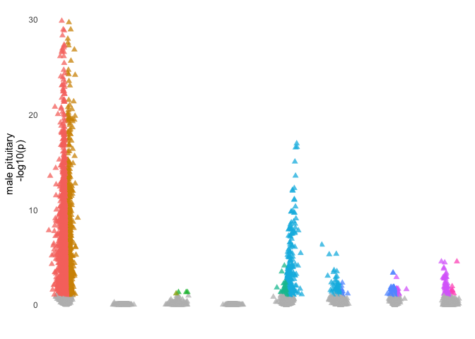
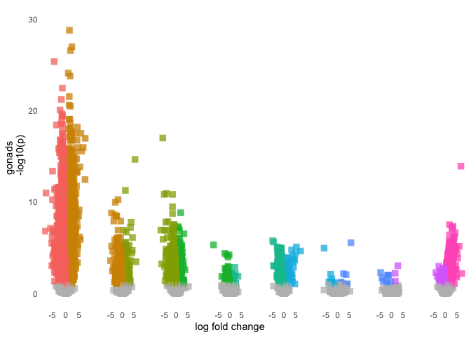
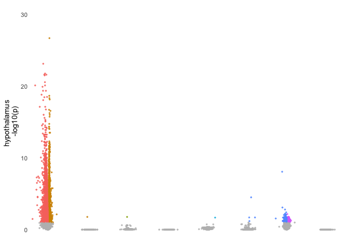
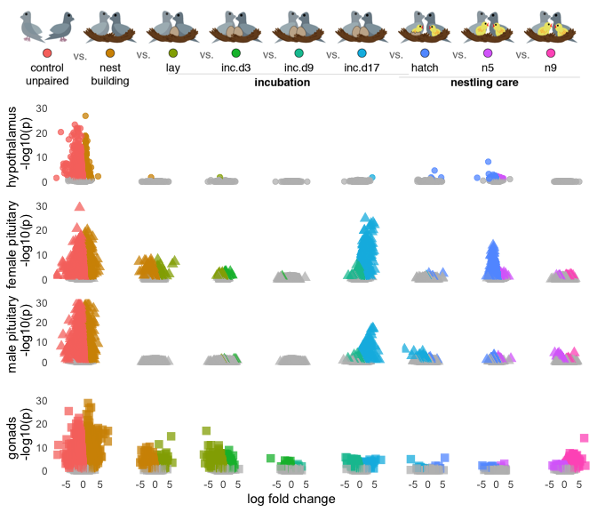

    library(tidyverse)
    library(DESeq2)
    library(cowplot)
    library(RColorBrewer)
    library(pheatmap)
    library(kableExtra)
    library(viridis)
    library(ggimage)
    library(knitr)
    library(kableExtra)

    library(png)
    library(grid)
    library(ggimage)
    library(ggpubr)

    library(BiocParallel)
    register(MulticoreParam(6))

    # load custom functions  
    source("../R/themes.R") 
    source("../R/functions.R") 

    knitr::opts_chunk$set(fig.path = '../figures/characterization/', cache = TRUE)

Characterization data
---------------------

    # import "colData" which contains sample information and "countData" which contains read counts
    c.colData <- read.csv("../metadata/00_colData_characterization.csv", header = T, row.names = 1)
    c.countData <- read.csv("../results/00_countData_characterization.csv", header = T, row.names = 1)
    geneinfo <- read.csv("../metadata/00_geneinfo.csv", row.names = 1)

    # set levels
    c.colData$treatment <- factor(c.colData$treatment, levels = 
                                  c("control",  "bldg", "lay", "inc.d3", "inc.d9", "inc.d17", "hatch", "n5", "n9"))
    levels(c.colData$treatment)

    ## [1] "control" "bldg"    "lay"     "inc.d3"  "inc.d9"  "inc.d17" "hatch"  
    ## [8] "n5"      "n9"

    c.colData$sextissue <- as.factor(paste(c.colData$sex, c.colData$tissue, sep = "_"))
    summary(c.colData[c(7,3,4,5,8)])

    ##              study         sex               tissue      treatment  
    ##  charcterization:576   female:289   gonad       :194   control: 73  
    ##                        male  :287   hypothalamus:189   inc.d9 : 71  
    ##                                     pituitary   :193   inc.d17: 66  
    ##                                                        n9     : 66  
    ##                                                        bldg   : 60  
    ##                                                        lay    : 60  
    ##                                                        (Other):180  
    ##                sextissue 
    ##  female_gonad       :98  
    ##  female_hypothalamus:95  
    ##  female_pituitary   :96  
    ##  male_gonad         :96  
    ##  male_hypothalamus  :94  
    ##  male_pituitary     :97  
    ## 

    geneinfo <- read.csv("../metadata/00_geneinfo.csv", row.names = 1)
    head(geneinfo)

    ##                row.names     Name geneid       entrezid
    ## NP_001001127.1    408082    EDNRB 408082 NP_001001127.1
    ## NP_001001129.1    408183  CYP26A1 408183 NP_001001129.1
    ## NP_001001189.1    374073    CFDP1 374073 NP_001001189.1
    ## NP_001001194.1    407777    AvBD7 407777 NP_001001194.1
    ## NP_001001195.1    407779     KRT5 407779 NP_001001195.1
    ## NP_001001201.1    408034 HSD11B1L 408034 NP_001001201.1

Run DESeq on all subsets of the data
------------------------------------

    dds.female_hypothalamus <- subsetDESeq(c.colData,  c.countData, "female_hypothalamus")

    ## [1] TRUE
    ## class: DESeqDataSet 
    ## dim: 14937 95 
    ## metadata(1): version
    ## assays(1): counts
    ## rownames(14937): NP_001001127.1 NP_001001129.1 ... XP_430449.2
    ##   XP_430508.3
    ## rowData names(0):
    ## colnames(95): L.G118_female_hypothalamus_control.NYNO
    ##   R.G106_female_hypothalamus_control ...
    ##   y94.g133.x_female_hypothalamus_n5.NYNO
    ##   y97.x_female_hypothalamus_n9
    ## colData names(8): V1 bird ... study sextissue
    ## [1] 14469    95

    ## estimating size factors

    ## estimating dispersions

    ## gene-wise dispersion estimates

    ## mean-dispersion relationship

    ## final dispersion estimates

    ## fitting model and testing

    ## -- replacing outliers and refitting for 6 genes
    ## -- DESeq argument 'minReplicatesForReplace' = 7 
    ## -- original counts are preserved in counts(dds)

    ## estimating dispersions

    ## fitting model and testing

    dds.female_pituitary <- subsetDESeq(c.colData,  c.countData, "female_pituitary" )

    ## [1] TRUE
    ## class: DESeqDataSet 
    ## dim: 14937 96 
    ## metadata(1): version
    ## assays(1): counts
    ## rownames(14937): NP_001001127.1 NP_001001129.1 ... XP_430449.2
    ##   XP_430508.3
    ## rowData names(0):
    ## colnames(96): L.G118_female_pituitary_control.NYNO
    ##   R.G106_female_pituitary_control ...
    ##   y94.g133.x_female_pituitary_n5 y97.x_female_pituitary_n9
    ## colData names(8): V1 bird ... study sextissue
    ## [1] 14322    96

    ## estimating size factors

    ## estimating dispersions

    ## gene-wise dispersion estimates

    ## mean-dispersion relationship

    ## final dispersion estimates

    ## fitting model and testing

    ## -- replacing outliers and refitting for 68 genes
    ## -- DESeq argument 'minReplicatesForReplace' = 7 
    ## -- original counts are preserved in counts(dds)

    ## estimating dispersions

    ## fitting model and testing

    dds.female_gonad <- subsetDESeq(c.colData,  c.countData, "female_gonad" )

    ## [1] TRUE
    ## class: DESeqDataSet 
    ## dim: 14937 98 
    ## metadata(1): version
    ## assays(1): counts
    ## rownames(14937): NP_001001127.1 NP_001001129.1 ... XP_430449.2
    ##   XP_430508.3
    ## rowData names(0):
    ## colnames(98): L.G118_female_gonad_control
    ##   R.G106_female_gonad_control ... y94.g133.x_female_gonad_n5
    ##   y97.x_female_gonad_n9
    ## colData names(8): V1 bird ... study sextissue
    ## [1] 14605    98

    ## estimating size factors

    ## estimating dispersions

    ## gene-wise dispersion estimates

    ## mean-dispersion relationship

    ## final dispersion estimates

    ## fitting model and testing

    ## -- replacing outliers and refitting for 34 genes
    ## -- DESeq argument 'minReplicatesForReplace' = 7 
    ## -- original counts are preserved in counts(dds)

    ## estimating dispersions

    ## fitting model and testing

    dds.male_hypothalamus <- subsetDESeq(c.colData,  c.countData, "male_hypothalamus" )

    ## [1] TRUE
    ## class: DESeqDataSet 
    ## dim: 14937 94 
    ## metadata(1): version
    ## assays(1): counts
    ## rownames(14937): NP_001001127.1 NP_001001129.1 ... XP_430449.2
    ##   XP_430508.3
    ## rowData names(0):
    ## colnames(94): L.Blu13_male_hypothalamus_control.NYNO
    ##   L.G107_male_hypothalamus_control ...
    ##   y95.g131.x_male_hypothalamus_inc.d9
    ##   y98.o50.x_male_hypothalamus_inc.d3
    ## colData names(8): V1 bird ... study sextissue
    ## [1] 14416    94

    ## estimating size factors

    ## estimating dispersions

    ## gene-wise dispersion estimates

    ## mean-dispersion relationship

    ## final dispersion estimates

    ## fitting model and testing

    ## -- replacing outliers and refitting for 8 genes
    ## -- DESeq argument 'minReplicatesForReplace' = 7 
    ## -- original counts are preserved in counts(dds)

    ## estimating dispersions

    ## fitting model and testing

    dds.male_pituitary <- subsetDESeq(c.colData,  c.countData, "male_pituitary"  )

    ## [1] TRUE
    ## class: DESeqDataSet 
    ## dim: 14937 97 
    ## metadata(1): version
    ## assays(1): counts
    ## rownames(14937): NP_001001127.1 NP_001001129.1 ... XP_430449.2
    ##   XP_430508.3
    ## rowData names(0):
    ## colnames(97): L.Blu13_male_pituitary_control.NYNO
    ##   L.G107_male_pituitary_control ...
    ##   y95.g131.x_male_pituitary_inc.d9 y98.o50.x_male_pituitary_inc.d3
    ## colData names(8): V1 bird ... study sextissue
    ## [1] 14298    97

    ## estimating size factors

    ## estimating dispersions

    ## gene-wise dispersion estimates

    ## mean-dispersion relationship

    ## final dispersion estimates

    ## fitting model and testing

    ## -- replacing outliers and refitting for 50 genes
    ## -- DESeq argument 'minReplicatesForReplace' = 7 
    ## -- original counts are preserved in counts(dds)

    ## estimating dispersions

    ## fitting model and testing

    dds.male_gondad <- subsetDESeq(c.colData,  c.countData, "male_gonad")

    ## [1] TRUE
    ## class: DESeqDataSet 
    ## dim: 14937 96 
    ## metadata(1): version
    ## assays(1): counts
    ## rownames(14937): NP_001001127.1 NP_001001129.1 ... XP_430449.2
    ##   XP_430508.3
    ## rowData names(0):
    ## colnames(96): L.Blu13_male_gonad_control.NYNO
    ##   L.G107_male_gonad_control ... y95.g131.x_male_gonad_inc.d9
    ##   y98.o50.x_male_gonad_inc.d3
    ## colData names(8): V1 bird ... study sextissue
    ## [1] 14614    96

    ## estimating size factors

    ## estimating dispersions

    ## gene-wise dispersion estimates

    ## mean-dispersion relationship

    ## final dispersion estimates

    ## fitting model and testing

    ## -- replacing outliers and refitting for 8 genes
    ## -- DESeq argument 'minReplicatesForReplace' = 7 
    ## -- original counts are preserved in counts(dds)

    ## estimating dispersions

    ## fitting model and testing

Plot only a subset of DEGs that relate to hypotheses as bar and line graphs
---------------------------------------------------------------------------

    # bars with lines
    g <- plotserialDEGs(DEGs.female_hypothalamus, "Female hypothalamus", "#00A08A")
    h <- plotserialDEGs(DEGs.female_pituitary, "Female pituitary", "#00A08A")
    i <- plotserialDEGs(DEGs.female_gonad, "Female gonad", "#00A08A")
    j <- plotserialDEGs(DEGs.male_hypothalamus, "Male hypothalamus", "#F98400")
    k <- plotserialDEGs(DEGs.male_pituitary, "Male pituitary", "#F98400")
    l <- plotserialDEGs(DEGs.male_gondad, "Male gonad", "#F98400")

    mybarplots <- plot_grid(g, h , i , j ,k , l, nrow = 2) 
    mybarplots

    pdf("../figures/characterization/barplots.pdf", width = 10, height = 6)
    plot(mybarplots)
    dev.off()

    ## quartz_off_screen 
    ##                 2

    # lines only, different colors for different sex tissue groups
    FH <- subsetDEGs(DEGs.female_hypothalamus, "Female hypothalamus")
    FP <- subsetDEGs(DEGs.female_pituitary, "Female pituitary")
    FG <- subsetDEGs(DEGs.female_gonad, "Female gonad")
    MH <- subsetDEGs(DEGs.male_hypothalamus, "Male hypothalamus")
    MP <- subsetDEGs(DEGs.male_pituitary, "Male pituitary")
    MG <- subsetDEGs(DEGs.male_gondad, "Male gonad")

    specificDEGs <- rbind(FH, FP, FG, MH, MP, MG)

    specificDEGs$sextissue <- factor(specificDEGs$sextissue, levels = c("Female hypothalamus", "Female pituitary", "Female gonad",
                                                                        "Male hypothalamus", "Male pituitary", "Male gonad"))
    mylinegraph <- ggplot(specificDEGs, aes(x=comparison, y=V3, group = sextissue)) +
        geom_line(aes(color=sextissue)) +
        geom_point(aes(color=sextissue)) + 
        theme_minimal(base_size = 10) +
        #theme(axis.text.x = element_text(angle = 45, hjust = 1)) +
        labs(x = "Parental stage transitions", y= "No. of differentially expressed genes ",
             title = "Gene expression changes during parental care transitions") + 
        scale_x_discrete(labels=c("Control to\nNest bldg", "Nest bldg. to\nLay", "Lay to\nInc. day 3",
                                  "Inc. day 3 to\nInc. day 9", "Inc. day 9 to\nInc. day 17",
                                  "Inc. day 17 to\nHatch", "Hatch to\nNestling day 5", "Nestling day 5 to\n Nestling day 9")) +
       theme(legend.title = element_blank(),
             legend.position = c(0.8, 0.8))
    mylinegraph

    pdf("../figures/characterization/linegraphs.pdf", width = 8, height = 4)
    plot(mylinegraph)
    dev.off()

    ## quartz_off_screen 
    ##                 2

Calculate and plot principal component
--------------------------------------

    FhypPCA <- returnPCAs(dds.female_hypothalamus)

    ## [1] 23 12  9  4  4  3
    ##             Df Sum Sq Mean Sq F value   Pr(>F)    
    ## treatment    8   3351   418.8   17.58 3.02e-15 ***
    ## Residuals   86   2049    23.8                     
    ## ---
    ## Signif. codes:  0 '***' 0.001 '**' 0.01 '*' 0.05 '.' 0.1 ' ' 1
    ##   Tukey multiple comparisons of means
    ##     95% family-wise confidence level
    ## 
    ## Fit: aov(formula = PC1 ~ treatment, data = pcadata)
    ## 
    ## $treatment
    ##                        diff         lwr        upr     p adj
    ## bldg-control    14.18908726   7.4031374 20.9750371 0.0000001
    ## lay-control     15.92111499   9.1351652 22.7070648 0.0000000
    ## inc.d3-control  19.00557936  12.2196295 25.7915292 0.0000000
    ## inc.d9-control  19.33276993  12.8497957 25.8157441 0.0000000
    ## inc.d17-control 15.95754412   9.3351352 22.5799531 0.0000000
    ## hatch-control   12.95851820   6.1725684 19.7444680 0.0000011
    ## n5-control      19.64965443  12.8637046 26.4356043 0.0000000
    ## n9-control      19.35636383  12.7339549 25.9787728 0.0000000
    ## lay-bldg         1.73202774  -5.2136134  8.6776688 0.9967836
    ## inc.d3-bldg      4.81649211  -2.1291490 11.7621332 0.4108485
    ## inc.d9-bldg      5.14368267  -1.5062624 11.7936277 0.2655793
    ## inc.d17-bldg     1.76845687  -5.0174930  8.5544067 0.9956413
    ## hatch-bldg      -1.23056906  -8.1762101  5.7150720 0.9997275
    ## n5-bldg          5.46056717  -1.4850739 12.4062083 0.2458543
    ## n9-bldg          5.16727657  -1.6186733 11.9532264 0.2851616
    ## inc.d3-lay       3.08446437  -3.8611767 10.0301055 0.8897699
    ## inc.d9-lay       3.41165494  -3.2382901 10.0616000 0.7842413
    ## inc.d17-lay      0.03642913  -6.7495207  6.8223790 1.0000000
    ## hatch-lay       -2.96259679  -9.9082379  3.9830443 0.9103411
    ## n5-lay           3.72853943  -3.2171017 10.6741805 0.7398590
    ## n9-lay           3.43524883  -3.3507010 10.2211987 0.7962752
    ## inc.d9-inc.d3    0.32719056  -6.3227545  6.9771356 1.0000000
    ## inc.d17-inc.d3  -3.04803524  -9.8339851  3.7379146 0.8833178
    ## hatch-inc.d3    -6.04706116 -12.9927022  0.8985799 0.1396534
    ## n5-inc.d3        0.64407506  -6.3015660  7.5897162 0.9999981
    ## n9-inc.d3        0.35078446  -6.4351654  7.1367343 1.0000000
    ## inc.d17-inc.d9  -3.37522581  -9.8582000  3.1077484 0.7704476
    ## hatch-inc.d9    -6.37425173 -13.0241968  0.2756933 0.0708668
    ## n5-inc.d9        0.31688450  -6.3330606  6.9668296 1.0000000
    ## n9-inc.d9        0.02359390  -6.4593803  6.5065681 1.0000000
    ## hatch-inc.d17   -2.99902592  -9.7849758  3.7869239 0.8924205
    ## n5-inc.d17       3.69211030  -3.0938395 10.4780601 0.7256557
    ## n9-inc.d17       3.39881971  -3.2235892 10.0212286 0.7838917
    ## n5-hatch         6.69113623  -0.2545049 13.6367773 0.0681152
    ## n9-hatch         6.39784563  -0.3881042 13.1837955 0.0805180
    ## n9-n5           -0.29329060  -7.0792404  6.4926592 1.0000000
    ## 
    ##             Df Sum Sq Mean Sq F value  Pr(>F)   
    ## treatment    8  668.6   83.57   3.218 0.00302 **
    ## Residuals   86 2233.8   25.97                   
    ## ---
    ## Signif. codes:  0 '***' 0.001 '**' 0.01 '*' 0.05 '.' 0.1 ' ' 1
    ##             Df Sum Sq Mean Sq F value Pr(>F)
    ## treatment    8    141   17.63   0.811  0.595
    ## Residuals   86   1870   21.74               
    ##             Df Sum Sq Mean Sq F value Pr(>F)
    ## treatment    8   80.8   10.10   0.978  0.459
    ## Residuals   86  888.0   10.33

    plotPC12(FhypPCA, "female hypothalamus")

    FpitPCA <- returnPCAs(dds.female_pituitary)      

    ## [1] 12 10  8  6  4  3
    ##             Df Sum Sq Mean Sq F value   Pr(>F)    
    ## treatment    8   1498  187.18    14.5 3.03e-13 ***
    ## Residuals   87   1123   12.91                     
    ## ---
    ## Signif. codes:  0 '***' 0.001 '**' 0.01 '*' 0.05 '.' 0.1 ' ' 1
    ##   Tukey multiple comparisons of means
    ##     95% family-wise confidence level
    ## 
    ## Fit: aov(formula = PC1 ~ treatment, data = pcadata)
    ## 
    ## $treatment
    ##                        diff         lwr        upr     p adj
    ## bldg-control    -0.08546124  -5.0793766  4.9084541 1.0000000
    ## lay-control      0.63009708  -4.3638183  5.6240124 0.9999794
    ## inc.d3-control   2.84850646  -2.1454089  7.8424218 0.6725227
    ## inc.d9-control   3.44753382  -1.2348334  8.1299011 0.3291480
    ## inc.d17-control 10.53274972   5.6591873 15.4063121 0.0000000
    ## hatch-control   10.87701154   5.8830962 15.8709269 0.0000000
    ## n5-control       5.99688222   1.0029669 10.9907976 0.0073457
    ## n9-control       2.05670996  -2.8168524  6.9302723 0.9153867
    ## lay-bldg         0.71555832  -4.3958770  5.8269937 0.9999542
    ## inc.d3-bldg      2.93396769  -2.1774676  8.0454030 0.6649907
    ## inc.d9-bldg      3.53299506  -1.2745140  8.3405042 0.3316648
    ## inc.d17-bldg    10.61821095   5.6242956 15.6121263 0.0000001
    ## hatch-bldg      10.96247278   5.8510374 16.0739081 0.0000000
    ## n5-bldg          6.08234346   0.9709081 11.1937788 0.0082219
    ## n9-bldg          2.14217120  -2.8517442  7.1360866 0.9078431
    ## inc.d3-lay       2.21840938  -2.8930260  7.3298447 0.9020932
    ## inc.d9-lay       2.81743674  -1.9900724  7.6249458 0.6395450
    ## inc.d17-lay      9.90265264   4.9087373 14.8965680 0.0000004
    ## hatch-lay       10.24691446   5.1354791 15.3583498 0.0000003
    ## n5-lay           5.36678514   0.2553498 10.4782205 0.0320945
    ## n9-lay           1.42661288  -3.5673025  6.4205282 0.9919259
    ## inc.d9-inc.d3    0.59902737  -4.2084817  5.4065365 0.9999813
    ## inc.d17-inc.d3   7.68424326   2.6903279 12.6781586 0.0001508
    ## hatch-inc.d3     8.02850508   2.9170698 13.1399404 0.0001010
    ## n5-inc.d3        3.14837577  -1.9630596  8.2598111 0.5752115
    ## n9-inc.d3       -0.79179650  -5.7857119  4.2021189 0.9998820
    ## inc.d17-inc.d9   7.08521589   2.4028486 11.7675832 0.0002070
    ## hatch-inc.d9     7.42947772   2.6219686 12.2369868 0.0001387
    ## n5-inc.d9        2.54934840  -2.2581607  7.3568575 0.7527063
    ## n9-inc.d9       -1.39082387  -6.0731911  3.2915434 0.9895608
    ## hatch-inc.d17    0.34426183  -4.6496535  5.3381772 0.9999998
    ## n5-inc.d17      -4.53586749  -9.5297829  0.4580479 0.1056068
    ## n9-inc.d17      -8.47603976 -13.3496021 -3.6024774 0.0000114
    ## n5-hatch        -4.88012932  -9.9915647  0.2313060 0.0731200
    ## n9-hatch        -8.82030158 -13.8142169 -3.8263862 0.0000079
    ## n9-n5           -3.94017227  -8.9340876  1.0537431 0.2418044
    ## 
    ##             Df Sum Sq Mean Sq F value   Pr(>F)    
    ## treatment    8 1444.8  180.60    17.8 1.89e-15 ***
    ## Residuals   87  882.7   10.15                     
    ## ---
    ## Signif. codes:  0 '***' 0.001 '**' 0.01 '*' 0.05 '.' 0.1 ' ' 1
    ##             Df Sum Sq Mean Sq F value Pr(>F)    
    ## treatment    8  520.8   65.11   4.331  2e-04 ***
    ## Residuals   87 1307.9   15.03                   
    ## ---
    ## Signif. codes:  0 '***' 0.001 '**' 0.01 '*' 0.05 '.' 0.1 ' ' 1
    ##             Df Sum Sq Mean Sq F value   Pr(>F)    
    ## treatment    8  463.8   57.98   5.048 3.63e-05 ***
    ## Residuals   87  999.4   11.49                     
    ## ---
    ## Signif. codes:  0 '***' 0.001 '**' 0.01 '*' 0.05 '.' 0.1 ' ' 1

    plotPC12(FpitPCA, "female pituitary")

    FgonPCA <- returnPCAs(dds.female_gonad)

    ## [1] 40 13  6  4  4  3
    ##             Df Sum Sq Mean Sq F value   Pr(>F)    
    ## treatment    8  11387  1423.4   6.155 2.64e-06 ***
    ## Residuals   89  20583   231.3                     
    ## ---
    ## Signif. codes:  0 '***' 0.001 '**' 0.01 '*' 0.05 '.' 0.1 ' ' 1
    ##   Tukey multiple comparisons of means
    ##     95% family-wise confidence level
    ## 
    ## Fit: aov(formula = PC1 ~ treatment, data = pcadata)
    ## 
    ## $treatment
    ##                        diff        lwr       upr     p adj
    ## bldg-control     32.2304684  11.892810 52.568126 0.0000829
    ## lay-control      28.8415494   8.503891 49.179207 0.0006452
    ## inc.d3-control   15.3005626  -5.037095 35.638221 0.3012923
    ## inc.d9-control   20.0613151   1.096351 39.026279 0.0298443
    ## inc.d17-control   3.0807725 -16.727486 22.889031 0.9998987
    ## hatch-control    11.8796036  -8.458054 32.217262 0.6443324
    ## n5-control       14.9479092  -5.389749 35.285567 0.3319814
    ## n9-control       28.0040863   8.195828 47.812345 0.0006795
    ## lay-bldg         -3.3889190 -25.012305 18.234467 0.9998926
    ## inc.d3-bldg     -16.9299057 -38.553292  4.693480 0.2513548
    ## inc.d9-bldg     -12.1691533 -32.506811  8.168505 0.6139002
    ## inc.d17-bldg    -29.1496959 -50.275926 -8.023466 0.0010126
    ## hatch-bldg      -20.3508648 -41.974251  1.272521 0.0816755
    ## n5-bldg         -17.2825592 -38.905945  4.340827 0.2270720
    ## n9-bldg          -4.2263821 -25.352612 16.899848 0.9993388
    ## inc.d3-lay      -13.5409867 -35.164373  8.082399 0.5536387
    ## inc.d9-lay       -8.7802343 -29.117892 11.557424 0.9050725
    ## inc.d17-lay     -25.7607769 -46.887007 -4.634547 0.0060248
    ## hatch-lay       -16.9619458 -38.585332  4.661440 0.2490812
    ## n5-lay          -13.8936402 -35.517026  7.729746 0.5183961
    ## n9-lay           -0.8374631 -21.963693 20.288767 1.0000000
    ## inc.d9-inc.d3     4.7607524 -15.576906 25.098410 0.9979535
    ## inc.d17-inc.d3  -12.2197902 -33.346020  8.906440 0.6563890
    ## hatch-inc.d3     -3.4209591 -25.044345 18.202427 0.9998847
    ## n5-inc.d3        -0.3526534 -21.976039 21.270732 1.0000000
    ## n9-inc.d3        12.7035237  -8.422706 33.829754 0.6075296
    ## inc.d17-inc.d9  -16.9805426 -36.788801  2.827716 0.1539330
    ## hatch-inc.d9     -8.1817115 -28.519370 12.155947 0.9348548
    ## n5-inc.d9        -5.1134059 -25.451064 15.224252 0.9966257
    ## n9-inc.d9         7.9427712 -11.865488 27.751030 0.9360130
    ## hatch-inc.d17     8.7988311 -12.327399 29.925061 0.9214023
    ## n5-inc.d17       11.8671367  -9.259093 32.993367 0.6911178
    ## n9-inc.d17       24.9233138   4.306224 45.540403 0.0067288
    ## n5-hatch          3.0683056 -18.555080 24.691691 0.9999496
    ## n9-hatch         16.1244827  -5.001747 37.250713 0.2828464
    ## n9-n5            13.0561771  -8.070053 34.182407 0.5714342
    ## 
    ##             Df Sum Sq Mean Sq F value  Pr(>F)   
    ## treatment    8   2245  280.69   3.078 0.00415 **
    ## Residuals   89   8116   91.19                   
    ## ---
    ## Signif. codes:  0 '***' 0.001 '**' 0.01 '*' 0.05 '.' 0.1 ' ' 1
    ##             Df Sum Sq Mean Sq F value Pr(>F)
    ## treatment    8    666   83.25   1.673  0.116
    ## Residuals   89   4428   49.75               
    ##             Df Sum Sq Mean Sq F value   Pr(>F)    
    ## treatment    8   1052  131.48   5.131 2.85e-05 ***
    ## Residuals   89   2280   25.62                     
    ## ---
    ## Signif. codes:  0 '***' 0.001 '**' 0.01 '*' 0.05 '.' 0.1 ' ' 1

    plotPC12(FgonPCA, "female gonad")

    MhypPCA <- returnPCAs(dds.male_hypothalamus)

    ## [1] 28 12  7  5  4  3
    ##             Df Sum Sq Mean Sq F value   Pr(>F)    
    ## treatment    8   3384   423.0   8.582 1.69e-08 ***
    ## Residuals   85   4190    49.3                     
    ## ---
    ## Signif. codes:  0 '***' 0.001 '**' 0.01 '*' 0.05 '.' 0.1 ' ' 1
    ##   Tukey multiple comparisons of means
    ##     95% family-wise confidence level
    ## 
    ## Fit: aov(formula = PC1 ~ treatment, data = pcadata)
    ## 
    ## $treatment
    ##                        diff        lwr       upr     p adj
    ## bldg-control    16.26700591   6.502397 26.031615 0.0000306
    ## lay-control     17.24396715   7.479358 27.008576 0.0000082
    ## inc.d3-control  19.55637374   9.791765 29.320983 0.0000003
    ## inc.d9-control  18.29472985   8.765447 27.824012 0.0000010
    ## inc.d17-control 17.24537758   7.716095 26.774660 0.0000046
    ## hatch-control   16.11104828   6.346439 25.875657 0.0000376
    ## n5-control      20.15202239  10.387413 29.916631 0.0000001
    ## n9-control      20.02209244  10.492810 29.551375 0.0000001
    ## lay-bldg         0.97696124  -9.017435 10.971357 0.9999972
    ## inc.d3-bldg      3.28936784  -6.705028 13.283764 0.9797927
    ## inc.d9-bldg      2.02772394  -7.736885 11.792333 0.9991209
    ## inc.d17-bldg     0.97837167  -8.786237 10.742981 0.9999965
    ## hatch-bldg      -0.15595763 -10.150354  9.838438 1.0000000
    ## n5-bldg          3.88501648  -6.109379 13.879412 0.9457077
    ## n9-bldg          3.75508653  -6.009522 13.519696 0.9489060
    ## inc.d3-lay       2.31240660  -7.681989 12.306803 0.9980918
    ## inc.d9-lay       1.05076271  -8.713846 10.815372 0.9999940
    ## inc.d17-lay      0.00141043  -9.763199  9.766019 1.0000000
    ## hatch-lay       -1.13291887 -11.127315  8.861477 0.9999910
    ## n5-lay           2.90805524  -7.086341 12.902451 0.9908303
    ## n9-lay           2.77812530  -6.986484 12.542734 0.9920955
    ## inc.d9-inc.d3   -1.26164389 -11.026253  8.502965 0.9999751
    ## inc.d17-inc.d3  -2.31099617 -12.075605  7.453613 0.9977609
    ## hatch-inc.d3    -3.44532547 -13.439721  6.549070 0.9731287
    ## n5-inc.d3        0.59564864  -9.398747 10.590045 0.9999999
    ## n9-inc.d3        0.46571870  -9.298890 10.230328 1.0000000
    ## inc.d17-inc.d9  -1.04935227 -10.578635  8.479930 0.9999928
    ## hatch-inc.d9    -2.18368157 -11.948291  7.580927 0.9985016
    ## n5-inc.d9        1.85729254  -7.907316 11.621902 0.9995373
    ## n9-inc.d9        1.72736259  -7.801920 11.256645 0.9996759
    ## hatch-inc.d17   -1.13432930 -10.898938  8.630280 0.9999891
    ## n5-inc.d17       2.90664481  -6.857964 12.671254 0.9893538
    ## n9-inc.d17       2.77671487  -6.752568 12.305997 0.9907430
    ## n5-hatch         4.04097411  -5.953422 14.035370 0.9324778
    ## n9-hatch         3.91104416  -5.853565 13.675653 0.9358738
    ## n9-n5           -0.12992994  -9.894539  9.634679 1.0000000
    ## 
    ##             Df Sum Sq Mean Sq F value  Pr(>F)   
    ## treatment    8  737.1   92.14    3.21 0.00311 **
    ## Residuals   85 2439.8   28.70                   
    ## ---
    ## Signif. codes:  0 '***' 0.001 '**' 0.01 '*' 0.05 '.' 0.1 ' ' 1
    ##             Df Sum Sq Mean Sq F value Pr(>F)
    ## treatment    8  142.1   17.76   0.874  0.542
    ## Residuals   85 1727.1   20.32               
    ##             Df Sum Sq Mean Sq F value   Pr(>F)    
    ## treatment    8  450.2   56.27   4.914 5.21e-05 ***
    ## Residuals   85  973.5   11.45                     
    ## ---
    ## Signif. codes:  0 '***' 0.001 '**' 0.01 '*' 0.05 '.' 0.1 ' ' 1

    plotPC12(MhypPCA, "male hypothalamus")

    MpitPCA <- returnPCAs(dds.male_pituitary)

    ## [1] 18  9  6  4  4  3
    ##             Df Sum Sq Mean Sq F value Pr(>F)    
    ## treatment    8   3500   437.5   28.24 <2e-16 ***
    ## Residuals   88   1363    15.5                   
    ## ---
    ## Signif. codes:  0 '***' 0.001 '**' 0.01 '*' 0.05 '.' 0.1 ' ' 1
    ##   Tukey multiple comparisons of means
    ##     95% family-wise confidence level
    ## 
    ## Fit: aov(formula = PC1 ~ treatment, data = pcadata)
    ## 
    ## $treatment
    ##                        diff       lwr       upr     p adj
    ## bldg-control    16.63796353 11.455455 21.820472 0.0000000
    ## lay-control     15.92867702 10.746168 21.111186 0.0000000
    ## inc.d3-control  16.28304584 11.100537 21.465555 0.0000000
    ## inc.d9-control  16.88801034 11.844788 21.931232 0.0000000
    ## inc.d17-control 16.60293225 11.559710 21.646154 0.0000000
    ## hatch-control   18.18109227 12.998583 23.363601 0.0000000
    ## n5-control      18.53827719 13.355768 23.720786 0.0000000
    ## n9-control      16.60172711 11.558505 21.644949 0.0000000
    ## lay-bldg        -0.70928651 -6.307036  4.888463 0.9999788
    ## inc.d3-bldg     -0.35491769 -5.952667  5.242832 0.9999999
    ## inc.d9-bldg      0.25004681 -5.219001  5.719095 1.0000000
    ## inc.d17-bldg    -0.03503128 -5.504080  5.434017 1.0000000
    ## hatch-bldg       1.54312874 -4.054621  7.140878 0.9936545
    ## n5-bldg          1.90031366 -3.697436  7.498063 0.9757137
    ## n9-bldg         -0.03623642 -5.505285  5.432812 1.0000000
    ## inc.d3-lay       0.35436882 -5.243381  5.952118 0.9999999
    ## inc.d9-lay       0.95933332 -4.509715  6.428382 0.9997488
    ## inc.d17-lay      0.67425523 -4.794793  6.143304 0.9999828
    ## hatch-lay        2.25241526 -3.345334  7.850165 0.9346480
    ## n5-lay           2.60960017 -2.988149  8.207350 0.8605772
    ## n9-lay           0.67305009 -4.795998  6.142098 0.9999831
    ## inc.d9-inc.d3    0.60496449 -4.864084  6.074013 0.9999926
    ## inc.d17-inc.d3   0.31988641 -5.149162  5.788935 1.0000000
    ## hatch-inc.d3     1.89804643 -3.699703  7.495796 0.9758909
    ## n5-inc.d3        2.25523135 -3.342518  7.852981 0.9341987
    ## n9-inc.d3        0.31868127 -5.150367  5.787730 1.0000000
    ## inc.d17-inc.d9  -0.28507808 -5.622323  5.052167 1.0000000
    ## hatch-inc.d9     1.29308194 -4.175966  6.762130 0.9977974
    ## n5-inc.d9        1.65026686 -3.818781  7.119315 0.9884651
    ## n9-inc.d9       -0.28628322 -5.623528  5.050961 1.0000000
    ## hatch-inc.d17    1.57816002 -3.890888  7.047208 0.9913929
    ## n5-inc.d17       1.93534494 -3.533703  7.404393 0.9687605
    ## n9-inc.d17      -0.00120514 -5.338450  5.336039 1.0000000
    ## n5-hatch         0.35718492 -5.240564  5.954934 0.9999999
    ## n9-hatch        -1.57936516 -7.048413  3.889683 0.9913493
    ## n9-n5           -1.93655008 -7.405598  3.532498 0.9686438
    ## 
    ##             Df Sum Sq Mean Sq F value Pr(>F)    
    ## treatment    8 1617.8  202.23   27.07 <2e-16 ***
    ## Residuals   88  657.5    7.47                   
    ## ---
    ## Signif. codes:  0 '***' 0.001 '**' 0.01 '*' 0.05 '.' 0.1 ' ' 1
    ##             Df Sum Sq Mean Sq F value  Pr(>F)   
    ## treatment    8  340.8   42.59   3.252 0.00273 **
    ## Residuals   88 1152.8   13.10                   
    ## ---
    ## Signif. codes:  0 '***' 0.001 '**' 0.01 '*' 0.05 '.' 0.1 ' ' 1
    ##             Df Sum Sq Mean Sq F value Pr(>F)  
    ## treatment    8  167.3   20.91   1.855 0.0774 .
    ## Residuals   88  991.9   11.27                 
    ## ---
    ## Signif. codes:  0 '***' 0.001 '**' 0.01 '*' 0.05 '.' 0.1 ' ' 1

    plotPC12(MpitPCA, "male pituitary")

    MgonPCA <- returnPCAs(dds.male_gondad)

    ## [1] 13  9  5  4  3  3
    ##             Df Sum Sq Mean Sq F value Pr(>F)    
    ## treatment    8 1540.6  192.58   18.24  1e-15 ***
    ## Residuals   87  918.7   10.56                   
    ## ---
    ## Signif. codes:  0 '***' 0.001 '**' 0.01 '*' 0.05 '.' 0.1 ' ' 1
    ##   Tukey multiple comparisons of means
    ##     95% family-wise confidence level
    ## 
    ## Fit: aov(formula = PC1 ~ treatment, data = pcadata)
    ## 
    ## $treatment
    ##                        diff         lwr        upr     p adj
    ## bldg-control    11.87583843  7.52762230 16.2240546 0.0000000
    ## lay-control      8.98772950  4.63951337 13.3359456 0.0000001
    ## inc.d3-control  10.81279821  6.46458208 15.1610143 0.0000000
    ## inc.d9-control  13.45036780  9.21533788 17.6853977 0.0000000
    ## inc.d17-control  9.56729282  5.33226290 13.8023227 0.0000000
    ## hatch-control   10.38288840  6.03467227 14.7311045 0.0000000
    ## n5-control      10.71492246  6.36670633 15.0631386 0.0000000
    ## n9-control      12.47292995  8.23790003 16.7079599 0.0000000
    ## lay-bldg        -2.88810893 -7.51121522  1.7349974 0.5562226
    ## inc.d3-bldg     -1.06304022 -5.68614652  3.5600661 0.9981855
    ## inc.d9-bldg      1.57452937 -2.94228441  6.0913432 0.9713932
    ## inc.d17-bldg    -2.30854561 -6.82535939  2.2082682 0.7879919
    ## hatch-bldg      -1.49295003 -6.11605632  3.1301563 0.9821515
    ## n5-bldg         -1.16091597 -5.78402227  3.4621903 0.9966348
    ## n9-bldg          0.59709152 -3.91972226  5.1139053 0.9999705
    ## inc.d3-lay       1.82506870 -2.79803759  6.4481750 0.9410668
    ## inc.d9-lay       4.46263830 -0.05417548  8.9794521 0.0554128
    ## inc.d17-lay      0.57956332 -3.93725046  5.0963771 0.9999766
    ## hatch-lay        1.39515890 -3.22794739  6.0182652 0.9884257
    ## n5-lay           1.72719296 -2.89591334  6.3502993 0.9569008
    ## n9-lay           3.48520045 -1.03161333  8.0020142 0.2687988
    ## inc.d9-inc.d3    2.63756959 -1.87924419  7.1543834 0.6440168
    ## inc.d17-inc.d3  -1.24550539 -5.76231917  3.2713084 0.9936240
    ## hatch-inc.d3    -0.42990981 -5.05301610  4.1931965 0.9999981
    ## n5-inc.d3       -0.09787575 -4.72098204  4.5252305 1.0000000
    ## n9-inc.d3        1.66013174 -2.85668204  6.1769455 0.9608093
    ## inc.d17-inc.d9  -3.88307498 -8.29103388  0.5248839 0.1296474
    ## hatch-inc.d9    -3.06747940 -7.58429318  1.4493344 0.4403667
    ## n5-inc.d9       -2.73544534 -7.25225912  1.7813684 0.5975670
    ## n9-inc.d9       -0.97743785 -5.38539675  3.4305210 0.9985989
    ## hatch-inc.d17    0.81559558 -3.70121820  5.3324094 0.9996873
    ## n5-inc.d17       1.14762964 -3.36918414  5.6644434 0.9963500
    ## n9-inc.d17       2.90563713 -1.50232177  7.3135960 0.4821349
    ## n5-hatch         0.33203406 -4.29107224  4.9551404 0.9999998
    ## n9-hatch         2.09004155 -2.42677223  6.6068553 0.8652614
    ## n9-n5            1.75800749 -2.75880629  6.2748213 0.9455597
    ## 
    ##             Df Sum Sq Mean Sq F value   Pr(>F)    
    ## treatment    8  594.2   74.28   5.711 7.74e-06 ***
    ## Residuals   87 1131.5   13.01                     
    ## ---
    ## Signif. codes:  0 '***' 0.001 '**' 0.01 '*' 0.05 '.' 0.1 ' ' 1
    ##             Df Sum Sq Mean Sq F value Pr(>F)  
    ## treatment    8  159.1   19.89   1.927 0.0658 .
    ## Residuals   87  897.8   10.32                 
    ## ---
    ## Signif. codes:  0 '***' 0.001 '**' 0.01 '*' 0.05 '.' 0.1 ' ' 1
    ##             Df Sum Sq Mean Sq F value Pr(>F)
    ## treatment    8   67.5   8.433   0.979  0.458
    ## Residuals   87  749.1   8.611

    plotPC12(MgonPCA, "male gonad")

heamap of candidate genes
-------------------------

    colDataFH <- subsetcolData(c.colData, "female_hypothalamus")
    colDataFP <- subsetcolData(c.colData, "female_pituitary")
    colDataFG <- subsetcolData(c.colData, "female_gonad")
    colDataMH <- subsetcolData(c.colData, "male_hypothalamus")
    colDataMP <- subsetcolData(c.colData, "male_pituitary")
    colDataMG <- subsetcolData(c.colData, "male_gonad")

    makepheatmap(dds.female_hypothalamus, colDataFH, "female hypothalamus")

    ## Warning: Column `entrezid` joining factor and character vector, coercing
    ## into character vector

    makepheatmap(dds.female_pituitary, colDataFP, "female pituitary")

    ## Warning: Column `entrezid` joining factor and character vector, coercing
    ## into character vector

    makepheatmap(dds.female_gonad, colDataFG, "female gonad")

    ## Warning: Column `entrezid` joining factor and character vector, coercing
    ## into character vector

    makepheatmap(dds.male_hypothalamus, colDataMH,  "male hypothalamus")

    ## Warning: Column `entrezid` joining factor and character vector, coercing
    ## into character vector

    makepheatmap(dds.male_pituitary, colDataMP, "male pituitary")

    ## Warning: Column `entrezid` joining factor and character vector, coercing
    ## into character vector

    makepheatmap(dds.male_gondad, colDataMG, "male gonad")

    ## Warning: Column `entrezid` joining factor and character vector, coercing
    ## into character vector

 \#\# plot candidate
genes

    plotcandidates(dds.female_hypothalamus, colDataFH,"female hypothalamus")

    ## Warning: Column `entrezid` joining factor and character vector, coercing
    ## into character vector

    ## Warning: Column `V1` joining character vector and factor, coercing into
    ## character vector

    plotcandidates(dds.female_pituitary, colDataFP, "female pituitary")

    ## Warning: Column `entrezid` joining factor and character vector, coercing
    ## into character vector

    ## Warning: Column `V1` joining character vector and factor, coercing into
    ## character vector

    plotcandidates(dds.female_gonad, colDataFG,"female gonad")

    ## Warning: Column `entrezid` joining factor and character vector, coercing
    ## into character vector

    ## Warning: Column `V1` joining character vector and factor, coercing into
    ## character vector

    plotcandidates(dds.male_hypothalamus, colDataMH,"male hypothalamus")

    ## Warning: Column `entrezid` joining factor and character vector, coercing
    ## into character vector

    ## Warning: Column `V1` joining character vector and factor, coercing into
    ## character vector

    plotcandidates(dds.male_pituitary,colDataMP, "male pituitary")

    ## Warning: Column `entrezid` joining factor and character vector, coercing
    ## into character vector

    ## Warning: Column `V1` joining character vector and factor, coercing into
    ## character vector

    plotcandidates(dds.male_gondad,colDataMG, "male gonad")

    ## Warning: Column `entrezid` joining factor and character vector, coercing
    ## into character vector

    ## Warning: Column `V1` joining character vector and factor, coercing into
    ## character vector

plot prolactin
--------------

    a <- plotprolactin(dds.female_hypothalamus, colDataFH,"female hypothalamus")

    ## Warning: Column `entrezid` joining factor and character vector, coercing
    ## into character vector

    ## Warning: Column `V1` joining character vector and factor, coercing into
    ## character vector

    b <- plotprolactin(dds.female_pituitary, colDataFP, "female pituitary")

    ## Warning: Column `entrezid` joining factor and character vector, coercing
    ## into character vector

    ## Warning: Column `V1` joining character vector and factor, coercing into
    ## character vector

    c <- plotprolactin(dds.female_gonad, colDataFG,"female gonad")

    ## Warning: Column `entrezid` joining factor and character vector, coercing
    ## into character vector

    ## Warning: Column `V1` joining character vector and factor, coercing into
    ## character vector

    d <- plotprolactin(dds.male_hypothalamus, colDataMH,"male hypothalamus")

    ## Warning: Column `entrezid` joining factor and character vector, coercing
    ## into character vector

    ## Warning: Column `V1` joining character vector and factor, coercing into
    ## character vector

    e <- plotprolactin(dds.male_pituitary,colDataMP, "male pituitary")

    ## Warning: Column `entrezid` joining factor and character vector, coercing
    ## into character vector

    ## Warning: Column `V1` joining character vector and factor, coercing into
    ## character vector

    f <- plotprolactin(dds.male_gondad,colDataMG, "male gonad")

    ## Warning: Column `entrezid` joining factor and character vector, coercing
    ## into character vector

    ## Warning: Column `V1` joining character vector and factor, coercing into
    ## character vector

    mylegend <- get_legend(f)

    plots <- plot_grid(a + theme(legend.position = "none"),
              b + theme(legend.position = "none"),
              c + theme(legend.position = "none"),
              d + theme(legend.position = "none"), 
              e + theme(legend.position = "none"),
              f + theme(legend.position = "none"))
    plot_grid(plots, mylegend, nrow = 2, rel_heights = c(1,0.1))

correlation heat maps
---------------------

    plotcorrelationheatmaps(dds.female_hypothalamus, colData.female_hypothalamus ,"female hypothalamus: hatch, nest bldg., lay and day-before-hatch cluster")
    plotcorrelationheatmaps(dds.female_pituitary, colData.female_pituitary, "female pituitary: clustering suggests an internal clock effect")
    plotcorrelationheatmaps(dds.female_gonad, colData.female_gonad,  "female gonad: highly correlated across incubation and early nestling care")
    plotcorrelationheatmaps(dds.male_hypothalamus, colData.male_hypothalamus, "male hypothalamus: 100% correlated across most parental care stages")
    plotcorrelationheatmaps(dds.male_pituitary, colData.male_pituitary, "male pituitary: non-parental males are most different")
    plotcorrelationheatmaps(dds.male_gondad, colData.male_gondad, "male gonad: non-parental males are most different")

DEGs
----

    createDEGdf <- function(mydds, whichfactor, up, down){
      res <- results(mydds, contrast =c(whichfactor, up, down),
                     independentFiltering = T, alpha = 0.1)
       data <- data.frame(entrezid = row.names(res),
                         padj = res$padj, 
                         logpadj = -log10(res$padj),
                         lfc = res$log2FoldChange)
      data <- na.omit(data)
      
      data <- data %>%
        dplyr::mutate(direction = ifelse(data$lfc > 0 & data$padj < 0.1, 
                                         yes = up, no = ifelse(data$lfc < 0 & data$padj < 0.1, 
                                                     yes = down, no = "NS")))
      data$direction <- factor(data$direction, levels = c(down, "NS", up))
      
      data <- left_join(data, geneinfo) %>%
        mutate(gene = Name) %>%
        select(gene, lfc, padj, logpadj, direction) %>%
        arrange(desc(lfc))
      
      DEGs <- data %>% filter(direction != "NS")
      print(str(DEGs))
      
      myfilename = paste("../results/03_DEGs", down,up, "csv", sep = ".")
      
      # write dataframe of only significant genes
      write.csv(DEGs, myfilename, row.names = F)
      
      # return data frome with all data, included NS genes
      return(data)
    }  

    control.bldg <- createDEGdf(dds.female_pituitary, "treatment", "bldg", "control")

    ## Joining, by = "entrezid"

    ## Warning: Column `entrezid` joining factors with different levels, coercing
    ## to character vector

    ## 'data.frame':    6442 obs. of  5 variables:
    ##  $ gene     : Factor w/ 13967 levels "","A2ML1","A2ML2",..: 12439 6566 889 12484 6803 3045 12763 569 4664 12959 ...
    ##  $ lfc      : num  4.77 4.45 4.19 3.93 3.75 ...
    ##  $ padj     : num  1.16e-05 6.18e-04 7.18e-09 2.38e-03 4.52e-07 ...
    ##  $ logpadj  : num  4.94 3.21 8.14 2.62 6.35 ...
    ##  $ direction: Factor w/ 3 levels "control","NS",..: 3 3 3 3 3 3 3 3 3 3 ...
    ## NULL

    bldg.lay <- createDEGdf(dds.female_pituitary, "treatment", "lay", "bldg")

    ## Joining, by = "entrezid"

    ## Warning: Column `entrezid` joining factors with different levels, coercing
    ## to character vector

    ## 'data.frame':    281 obs. of  5 variables:
    ##  $ gene     : Factor w/ 13967 levels "","A2ML1","A2ML2",..: 10342 9845 9870 6188 6768 2540 330 3033 11852 550 ...
    ##  $ lfc      : num  6.6 5.87 4.69 3.86 3.11 ...
    ##  $ padj     : num  7.03e-08 8.04e-07 8.88e-03 5.78e-02 1.84e-03 ...
    ##  $ logpadj  : num  7.15 6.09 2.05 1.24 2.73 ...
    ##  $ direction: Factor w/ 3 levels "bldg","NS","lay": 3 3 3 3 3 3 3 3 3 3 ...
    ## NULL

    lay.inc.d3 <- createDEGdf(dds.female_pituitary, "treatment", "inc.d3", "lay") 

    ## Joining, by = "entrezid"

    ## Warning: Column `entrezid` joining factors with different levels, coercing
    ## to character vector

    ## 'data.frame':    332 obs. of  5 variables:
    ##  $ gene     : Factor w/ 13967 levels "","A2ML1","A2ML2",..: 5904 13279 1221 11172 6003 3969 11305 488 1990 5788 ...
    ##  $ lfc      : num  2.97 2.79 2.34 2.21 1.73 ...
    ##  $ padj     : num  0.027163 0.017196 0.000837 0.027163 0.040076 ...
    ##  $ logpadj  : num  1.57 1.76 3.08 1.57 1.4 ...
    ##  $ direction: Factor w/ 3 levels "lay","NS","inc.d3": 3 3 3 3 3 3 3 3 3 3 ...
    ## NULL

    inc.d3.inc.d9 <- createDEGdf(dds.female_pituitary, "treatment", "inc.d9", "inc.d3") 

    ## Joining, by = "entrezid"

    ## Warning: Column `entrezid` joining factors with different levels, coercing
    ## to character vector

    ## 'data.frame':    1 obs. of  5 variables:
    ##  $ gene     : Factor w/ 13967 levels "","A2ML1","A2ML2",..: 6768
    ##  $ lfc      : num -3.18
    ##  $ padj     : num 0.0707
    ##  $ logpadj  : num 1.15
    ##  $ direction: Factor w/ 3 levels "inc.d3","NS",..: 1
    ## NULL

    inc.d9.inc.d17 <- createDEGdf(dds.female_pituitary, "treatment", "inc.d17", "inc.d9")

    ## Joining, by = "entrezid"

    ## Warning: Column `entrezid` joining factors with different levels, coercing
    ## to character vector

    ## 'data.frame':    2013 obs. of  5 variables:
    ##  $ gene     : Factor w/ 13967 levels "","A2ML1","A2ML2",..: 4114 5777 4003 1935 1964 2228 2933 11225 1818 11311 ...
    ##  $ lfc      : num  4.98 4.89 4.67 4.59 4.5 ...
    ##  $ padj     : num  1.11e-04 8.46e-23 3.22e-12 9.92e-08 1.08e-23 ...
    ##  $ logpadj  : num  3.95 22.07 11.49 7 22.97 ...
    ##  $ direction: Factor w/ 3 levels "inc.d9","NS",..: 3 3 3 3 3 3 3 3 3 3 ...
    ## NULL

    inc.d17.hatch <- createDEGdf(dds.female_pituitary, "treatment", "hatch", "inc.d17") 

    ## Joining, by = "entrezid"

    ## Warning: Column `entrezid` joining factors with different levels, coercing
    ## to character vector

    ## 'data.frame':    6 obs. of  5 variables:
    ##  $ gene     : Factor w/ 13967 levels "","A2ML1","A2ML2",..: 1465 6533 4851 5443 13099 13593
    ##  $ lfc      : num  5.056 1.664 1.422 0.293 -0.581 ...
    ##  $ padj     : num  0.005 0.0838 0.0838 0.005 0.0465 ...
    ##  $ logpadj  : num  2.3 1.08 1.08 2.3 1.33 ...
    ##  $ direction: Factor w/ 3 levels "inc.d17","NS",..: 3 3 3 3 1 1
    ## NULL

    hatch.n5 <- createDEGdf(dds.female_pituitary, "treatment", "n5", "hatch") 

    ## Joining, by = "entrezid"

    ## Warning: Column `entrezid` joining factors with different levels, coercing
    ## to character vector

    ## 'data.frame':    1091 obs. of  5 variables:
    ##  $ gene     : Factor w/ 13967 levels "","A2ML1","A2ML2",..: 13593 1804 6903 5904 8668 6137 6318 11953 11172 13112 ...
    ##  $ lfc      : num  18.43 4.12 3.24 3.12 2.56 ...
    ##  $ padj     : num  1.04e-05 7.25e-02 6.11e-02 5.50e-03 1.92e-03 ...
    ##  $ logpadj  : num  4.98 1.14 1.21 2.26 2.72 ...
    ##  $ direction: Factor w/ 3 levels "hatch","NS","n5": 3 3 3 3 3 3 3 3 3 3 ...
    ## NULL

    n5.n9 <- createDEGdf(dds.female_pituitary, "treatment", "n9", "n5") 

    ## Joining, by = "entrezid"

    ## Warning: Column `entrezid` joining factors with different levels, coercing
    ## to character vector

    ## 'data.frame':    23 obs. of  5 variables:
    ##  $ gene     : Factor w/ 13967 levels "","A2ML1","A2ML2",..: 11009 13489 10219 2226 7122 10900 4656 1648 8732 12958 ...
    ##  $ lfc      : num  2.89 2.34 2.25 1.99 1.47 ...
    ##  $ padj     : num  0.0346 0.0205 0.0205 0.0121 0.0381 ...
    ##  $ logpadj  : num  1.46 1.69 1.69 1.92 1.42 ...
    ##  $ direction: Factor w/ 3 levels "n5","NS","n9": 3 3 3 3 3 3 3 3 3 3 ...
    ## NULL

    plot.volcano <- function(data, whichfactor, up, down, mycolors){
      
      volcano <- data %>%
        ggplot(aes(x = lfc, y = logpadj)) + 
        geom_point(aes(color = direction), size = 1, alpha = 0.75, na.rm = T) + 
        theme_minimal() +
        scale_color_manual(values = mycolors,
                           name = " ",
                           drop = FALSE) +
        ylim(c(0,30)) +  
        xlim(c(-8,8)) +
        labs(y = "-log10(p)", x = " ")  +
        theme(legend.position = "none",
              legend.direction = "horizontal",
              legend.spacing.x = unit(-0.1, 'cm'),
              legend.margin=margin(t=-0.25, r=0, b=0, l=0, unit="cm"),
              panel.grid = element_blank()) 
      return(volcano)
    }

    a <- plot.volcano(control.bldg, "treatment", "bldg", "control", colorsvolcano)
    b <- plot.volcano(bldg.lay, "treatment", "lay", "bldg", colorsvolcano)
    c <- plot.volcano(lay.inc.d3, "treatment", "inc.d3", "lay", colorsvolcano) 
    d <- plot.volcano(inc.d3.inc.d9, "treatment", "inc.d9", "inc.d3", colorsvolcano) 
    e <- plot.volcano(inc.d9.inc.d17, "treatment", "inc.d17", "inc.d9", colorsvolcano)
    f <- plot.volcano(inc.d17.hatch, "treatment", "hatch", "inc.d17", colorsvolcano) 
    g <- plot.volcano(hatch.n5, "treatment", "n5", "hatch", colorsvolcano) 
    h <- plot.volcano(n5.n9, "treatment", "n9", "n5", colorsvolcano) 

    females <- plot_grid(a + 
                           theme(axis.title.x = element_blank(), axis.text.x = element_blank()) +
                           labs(y = "female pituitary \n -log10(p)"),
              b + theme(axis.title = element_blank(), axis.text = element_blank()),
              c + theme(axis.title = element_blank(), axis.text = element_blank()),
              d + theme(axis.title = element_blank(), axis.text = element_blank()), 
              e + theme(axis.title = element_blank(), axis.text = element_blank()),
              f + theme(axis.title = element_blank(), axis.text = element_blank()),
              g + theme(axis.title = element_blank(), axis.text = element_blank()),
              h + theme(axis.title = element_blank(), axis.text = element_blank()), 
              nrow = 1, rel_widths = c(1.75,1,1,1,1,1,1,1,1))
    females 

Go terms
--------

    reproduction <- read.table("../results/goterms/reproduction.txt", sep = "\t", row.names = NULL,  fill=TRUE)
    reproduction$GO <- "reproduction, GO:0000003"  
      
    parentalbehavior <- read.table("../results/goterms/parentalbehavior.txt", sep = "\t", row.names = NULL,  fill=TRUE)
    parentalbehavior$GO <- "parental behavior, GO:0060746"  

    behavior <- read.table("../results/goterms/parentalbehavior.txt", sep = "\t", row.names = NULL,  fill=TRUE)
    behavior$GO <- "behavior, GO:0007610" 

    systemdevelopment <- read.table("../results/goterms/systemdevelopment.txt", sep = "\t", row.names = NULL,  fill=TRUE)
    systemdevelopment$GO <- "system development, GO:0048731" 

    endocrineprocess <- read.table("../results/goterms/endocrineprocess.txt", sep = "\t", row.names = NULL,  fill=TRUE)
    endocrineprocess$GO <- "endocrine process, GO:0050886" 

    responsetostimulus <- read.table("../results/goterms/responsetostimulus.txt", sep = "\t", row.names = NULL,  fill=TRUE)
    responsetostimulus$GO <- "response to external stimulus, GO:0009605" 

    GOterms <- rbind(parentalbehavior, reproduction, behavior, 
                     systemdevelopment, endocrineprocess, responsetostimulus)

    GOterms <- GOterms %>%
      dplyr::mutate(gene = toupper(MGI.Gene.Marker.ID)) %>% 
      dplyr::select(gene, GO) %>% 
      dplyr::distinct(gene, GO) %>% 
     group_by(gene) 

    head(GOterms)

    ## # A tibble: 6 x 2
    ## # Groups:   gene [6]
    ##   gene   GO                           
    ##   <chr>  <chr>                        
    ## 1 AVP    parental behavior, GO:0060746
    ## 2 AVPR1A parental behavior, GO:0060746
    ## 3 BRINP1 parental behavior, GO:0060746
    ## 4 CREBRF parental behavior, GO:0060746
    ## 5 DBH    parental behavior, GO:0060746
    ## 6 DRD1   parental behavior, GO:0060746

    returnGOgenes <- function(whichGOterms, data, mycomparison){
      
      df <- inner_join(whichGOterms, data) %>% 
        filter(direction != "NS") %>%  
        select(gene, GO) %>% 
        group_by(GO) %>% 
        summarize(genes = str_c(gene, collapse = ", "))  %>% 
        mutate(comparison = mycomparison) %>% 
        select(comparison, GO, genes)
      
      return(df)
    }  
      
    dt1 <- returnGOgenes(GOterms,control.bldg, "control v bldg") 

    ## Joining, by = "gene"

    ## Warning: Column `gene` joining character vector and factor, coercing into
    ## character vector

    dt2 <- returnGOgenes(GOterms,bldg.lay , "bldg v lay") 

    ## Joining, by = "gene"

    ## Warning: Column `gene` joining character vector and factor, coercing into
    ## character vector

    dt3 <- returnGOgenes(GOterms,lay.inc.d3 , "lay v inc d3")  

    ## Joining, by = "gene"

    ## Warning: Column `gene` joining character vector and factor, coercing into
    ## character vector

    dt4 <- returnGOgenes(GOterms,inc.d3.inc.d9 , "inc d3 v inc d9")  

    ## Joining, by = "gene"

    ## Warning: Column `gene` joining character vector and factor, coercing into
    ## character vector

    dt5 <- returnGOgenes(GOterms,inc.d9.inc.d17 , "inc d9 v inc d17")  

    ## Joining, by = "gene"

    ## Warning: Column `gene` joining character vector and factor, coercing into
    ## character vector

    kable(dt5) 

<table>
<thead>
<tr>
<th style="text-align:left;">
comparison
</th>
<th style="text-align:left;">
GO
</th>
<th style="text-align:left;">
genes
</th>
</tr>
</thead>
<tbody>
<tr>
<td style="text-align:left;">
inc d9 v inc d17
</td>
<td style="text-align:left;">
behavior, <a href="GO:0007610" class="uri">GO:0007610</a>
</td>
<td style="text-align:left;">
PRL
</td>
</tr>
<tr>
<td style="text-align:left;">
inc d9 v inc d17
</td>
<td style="text-align:left;">
endocrine process, <a href="GO:0050886" class="uri">GO:0050886</a>
</td>
<td style="text-align:left;">
ATP6AP2, CRY1, SMAD4, TMF1
</td>
</tr>
<tr>
<td style="text-align:left;">
inc d9 v inc d17
</td>
<td style="text-align:left;">
parental behavior, <a href="GO:0060746" class="uri">GO:0060746</a>
</td>
<td style="text-align:left;">
PRL
</td>
</tr>
<tr>
<td style="text-align:left;">
inc d9 v inc d17
</td>
<td style="text-align:left;">
reproduction, <a href="GO:0000003" class="uri">GO:0000003</a>
</td>
<td style="text-align:left;">
ACSBG2, ACTR2, ACTR3, ACVR1B, ADA, AFF4, AKAP9, ANTXR1, APP, ARID1A,
ARID4B, ARID5B, ARNT, ASH1L, ASPM, ATAT1, ATM, ATN1, ATP8B3, ATR, ATRX,
AURKA, BBS1, BCL2L1, BPTF, BRIP1, BUB1, BUB1B, BUB3, CACNA1H, CADM1,
CBS, CCNB3, CCNE2, CCT2, CCT4, CDC20, CDC25A, CDH1, CKS2, CLGN, CLIC4,
CREM, CXCL12, DLD, DNAJB6, DNMT3A, E2F7, EIF2S2, EIF4H, EME1, EPAS1,
ESPL1, EXO1, FANCC, FANCD2, FANCL, FBXO5, FKBP4, GATA2, GATA2, GGT5,
GLI2, GOLGA3, GORASP2, GPX4, HDAC4, HEY1, HMGB2, HNF4A, HOOK1, ID4,
ITGA3, JAG2, KATNAL1, KIF18A, KLHDC3, LAMB1, LGR4, LGR5, LLGL2, MASTL,
MCM8, MKI67, MND1, MSH2, MYBL1, NCAPD3, NCAPH, NCAPH2, NCOA1, NDC1,
NEK2, NOG, NOTCH2, NPHP4, NSUN2, NUF2, PAFAH1B2, PGM3, PLCB1, PLCD1,
PLK1, PLK4, PRDX3, PRDX4, PRL, PTGDS, PTTG1, PYGO2, RACGAP1, RAD21,
RAD54B, RBBP8, RBM15, RFX2, RHOBTB3, RPA1, SOD1, SOX2, SP1, SPIRE2,
ST14, STAT5B, STXBP1, SYDE1, TCF7L2, TCP1, TFEB, THBD, TMF1, TNK2,
TOP2A, TRIP13, TSNAX, TTK, UBE2A, VDAC2, WDR77, WEE2, WNT3
</td>
</tr>
<tr>
<td style="text-align:left;">
inc d9 v inc d17
</td>
<td style="text-align:left;">
response to external stimulus,
<a href="GO:0009605" class="uri">GO:0009605</a>
</td>
<td style="text-align:left;">
ABCC8, ABCC9, ABCF3, ABR, ACTR2, ACTR3, ADA, ADAM17, ADAR, ADSL, AGBL4,
AGBL5, AGRN, AJAP1, ALAD, AOC3, APBB1, APP, ARF1, ASH1L, ASPH, ATG5,
ATM, ATN1, BAIAP2L1, BCKDHB, BCL2L1, BNIP3L, BSG, CADM1, CASK, CBS,
CCL28, CD109, CDH4, CDK5, CDK5R1, CDK19, CEBPG, CELSR3, CHID1, CNN2,
CNPY3, CNTF, COTL1, CRADD, CRTC1, CRY1, CTR9, CXADR, CXCL12, DAG1,
DAPK3, DBN1, DDX1, DMTN, DPYD, DSCAML1, DUSP3, DUSP10, EFNB1, EIF2AK1,
EIF2AK3, EIF2AK4, EIF2S1, ELMOD2, EP300, EPHA2, EPHA3, EPHB2, EPRS,
ERCC6, FAM107A, FANCD2, FFAR4, FOXP1, G3BP2, GABARAPL1, GAS2L3, GCH1,
GGT5, GLI2, GNB1, GPC3, GPX4, GRIN2B, HMGB1, HMGB2, HMGB3, HSP90B1,
HSPA5, IFNGR1, IL12RB2, IPO7, IRAK4, KARS, LAMB2, LAMP2, LDHA, LGMN,
LGR4, LPL, LPO, LRAT, MAP2K2, MAPKBP1, MGLL, MSTN, MTMR3, MYC, MYO18A,
MYOT, NAALADL2, NCOA1, NDUFC2, NEO1, NEXN, NFASC, NFE2L1, NOG, NOTCH2,
NPNT, NPRL2, NR1H3, NRP1, NTN1, NTN3, NUCB2, OTOF, PARVA, PBK, PDIA3,
PDK4, PIK3C2B, PLD1, POLR3F, PPP1CB, PRDX3, PRL, PRLH, PROC, PROS1,
PSMA1, PTCH1, PTGFR, PYGL, RAB1A, RAB32, RB1, RBM4B, RBM14, REST, RGMA,
RHOBTB3, RNF165, RNF166, RPL30, RRAGC, RTN4, SCARB1, SEMA4C, SFPQ,
SHANK3, SIK1, SLC9A1, SLC16A1, SLC17A5, SLC37A4, SLITRK6, SMAD4, SMO,
SOD1, SOX2, SRF, STAT2, STAT5B, STXBP1, TBC1D23, TCF3, TCF7L2, TFEB,
THBD, THBS4, TIRAP, TMF1, TRIM24, TRIM35, TRIM59, TRPV4, TUSC2, UACA,
UFL1, UNC5A, UPF1, USP14, VANGL2, WDR24, WIPI1, WNT3, WRNIP1, XBP1,
XRCC6, ZYX
</td>
</tr>
<tr>
<td style="text-align:left;">
inc d9 v inc d17
</td>
<td style="text-align:left;">
system development, <a href="GO:0048731" class="uri">GO:0048731</a>
</td>
<td style="text-align:left;">
ABCA2, ABCC8, ABI2, ABR, ACP6, ACTN2, ACTR2, ACTR3, ACVR1B, ACVRL1, ADA,
ASH1L, ASPM, ASTN1, ATAD5, ATAT1, ATG5, ATM, ATN1, BCL2L1, BCL11A,
BICC1, BICC1, BLOC1S2, BPTF, BRCA1, BRIP1, BSG, BSN, BTBD2, CACNA1C,
CACYBP, CADM1, CAPN1, CASK, CBFA2T2, CBLN2, CBS, CCM2, CD109, CD164,
CDC20, CDK1, CDK5, CDK5R1, CDK6, CDON, CEBPG, CELSR2, CELSR3, CEND1,
CENPF, CERS1, CLCN2, CLDN5, CLEC3B, CLIC4, CNN2, CNTF, COL20A1, COPS2,
CPE, CREB3L1, CRTC1, CSMD3, CSPG4, CTDSP1, CTNNA1, CTNNBIP1, CTNND2,
CTR9, CUX1, CUX2, CXADR, CXCL12, DAG1, DBN1, DCTN1, DCX, DDRGK1, DGUOK,
FOXI1, FOXP1, FRAS1, FZD1, GATA2, GATA2, GATAD2A, GFRA1, GLG1, GLI2,
GNB1, GOLGA4, GPC3, GPD2, GRIN2B, GRIP1, GRIP2, GRXCR1, IL1RAPL1, ILK,
IMPAD1, INA, INPPL1, ITGA3, JAG2, JAK1, KCNA2, KCNAB2, KDM4C, KIF3C,
KIF18A, LAMA4, LAMB1, LAMB2, LBH, LGR4, LGR5, LHFPL4, LIMK1, LLGL2,
LLPH, LOXL3, LRFN3, LRRC7, LRRK1, LRRTM3, LRRTM4, LSM1, MAEA, MANF,
MAP1S, MAP2K2, MAP4, MARK2, MBD5, MCM2, MDM4, NKX2-2, NPHP4, NPNT,
NRBP2, NRP1, NRXN3, NSUN2, NTN1, NTN3, NUMA1, NUS1, NXN, OLFM1, ORAI1,
OSR2, PAFAH1B2, PAK4, PARVA, PAX7, PAXBP1, PCID2, PCM1, PDLIM7, PEX2,
PGM3, PHEX, PHF14, PHGDH, PHLDB1, PIK3R1, PIK3R3, PLCB1, PLCD1, PLK4,
PLS3, POFUT2, POU3F2, POU3F3, PPIB, PRDX3, PRDX4, PRICKLE2, PRKCB, PSD,
PSMA6, PTBP1, PTCH1, RAI1, RANBP1, RAP1A, RAP1GAP2, RARB, RASGRF1, RB1,
RBFOX1, RBFOX2, RBM15, RBM47, RET, RGCC, RGMA, RGS6, RHOBTB3, RIPK3,
RNF165, ROBO4, RPA1, RPGR, RPGRIP1L, RPL22, RXRA, SDF4, SDK2, SEC63,
SEMA4C, SENP1, SERPINH1, SETDB1, SEZ6, SHOX2, SHROOM4, SIK1, SIK3,
SIN3B, SLC7A11, SLC9A1, SLC11A2, SLC35D1, SLC37A4, SLITRK6, SMAD4,
SMARCA4, SMARCD1, SMO, SMPD3, SMYD1, SOX2, TBC1D23, TBCE, TBX20, TCF3,
TCF7L2, TFEB, TGFBR2, THBS4, THOC1, THOC2, THSD7A, TIRAP, TLX2, TMEM30A,
TMEM100, TMF1, TMOD3, TMPRSS13, TNIK, TOB2, TOP2A, TRPV4, TTC9, TUSC2,
UCHL1, UCHL5, UFC1, UFL1, UFM1, UNC5A, USP1, USP19, USP21, UST, VANGL2,
WASF2, WDR36, WDR60, WDR77, WEE1, WFS1, WNT3, WWTR1, XBP1, XRCC6,
ZBTB7A, ZFYVE27, ZNRF3
</td>
</tr>
</tbody>
</table>

    dt6 <- returnGOgenes(GOterms,inc.d17.hatch, "inc d17 v hatch")  

    ## Joining, by = "gene"

    ## Warning: Column `gene` joining character vector and factor, coercing into
    ## character vector

    dt7 <- returnGOgenes(GOterms,hatch.n5, "hatch v n5")  

    ## Joining, by = "gene"

    ## Warning: Column `gene` joining character vector and factor, coercing into
    ## character vector

    kable(dt7) 

<table>
<thead>
<tr>
<th style="text-align:left;">
comparison
</th>
<th style="text-align:left;">
GO
</th>
<th style="text-align:left;">
genes
</th>
</tr>
</thead>
<tbody>
<tr>
<td style="text-align:left;">
hatch v n5
</td>
<td style="text-align:left;">
behavior, <a href="GO:0007610" class="uri">GO:0007610</a>
</td>
<td style="text-align:left;">
PRL
</td>
</tr>
<tr>
<td style="text-align:left;">
hatch v n5
</td>
<td style="text-align:left;">
endocrine process, <a href="GO:0050886" class="uri">GO:0050886</a>
</td>
<td style="text-align:left;">
ATP6AP2, AVPR2, CRY2, FOXL2, RHOA
</td>
</tr>
<tr>
<td style="text-align:left;">
hatch v n5
</td>
<td style="text-align:left;">
parental behavior, <a href="GO:0060746" class="uri">GO:0060746</a>
</td>
<td style="text-align:left;">
PRL
</td>
</tr>
<tr>
<td style="text-align:left;">
hatch v n5
</td>
<td style="text-align:left;">
reproduction, <a href="GO:0000003" class="uri">GO:0000003</a>
</td>
<td style="text-align:left;">
ABL2, ACSBG2, ACTR2, AFF4, ALMS1, APP, ASH1L, AURKA, BIRC2, BPTF, BUB1,
BUB1B, CACNA1H, CBS, CCNB3, CCT2, CCT4, CD44, CDC20, CDC25A, CDK2,
CEBPA, CKS2, EIF2S2, EIF4H, EME1, FANCC, FNDC3A, FOXL2, GORASP2, GPX4,
HMGB2, JMJD1C, MKI67, MND1, MYBL1, NCAPH, NCOA1, NCOA6, NPHP1, NSUN2,
NUF2, PARK7, PKD1, PLCD4, PLK1, PRDX3, PRDX4, PRL, PTTG1, RACGAP1, RAD1,
RBM15, RHOBTB3, SPATA5, TCP1, UBE2A, VDAC2, WDR66, WDR77
</td>
</tr>
<tr>
<td style="text-align:left;">
hatch v n5
</td>
<td style="text-align:left;">
response to external stimulus,
<a href="GO:0009605" class="uri">GO:0009605</a>
</td>
<td style="text-align:left;">
ABCC8, ABCC9, ABL2, ACTR2, AGBL4, AJAP1, AMOT, ANKHD1, APP, AQP2, ARF1,
ARF6, ASH1L, ATF4, BCKDHB, BECN1, BHLHA15, BNIP3L, CBS, CCDC80, CCK,
CD44, CEBPA, CEBPG, CHGA, CNTN4, CRY2, DDIT3, DMD, DUSP3, DUSP10,
EIF2AK1, EIF2AK3, EIF2B1, EIF2S1, EP300, EPHA3, EPHA7, EPHB2, FBXO9,
FFAR4, FOLR1, FOXP1, GABARAPL1, GLI3, GPX4, HMGB2, HMGB3, HSP90B1,
HSPA5, KARS, KCNB1, LAMP2, LDHA, MAPKBP1, MVK, MYBBP1A, MYC, NCOA1,
NDUFC2, NEO1, NOCT, NR4A3, NUCB2, PARK7, PARVA, PBK, PDE4D, PDK4, PKD1,
PLD1, PLXNA1, PLXNB2, POLR3D, PPP1CB, PRDX3, PRKAA2, PRL, PROC, PSMA1,
PTCH1, PTPRF, RAB1A, RAB32, REST, RHOA, RHOBTB3, RPL30, SCT, SEMA6A,
SLC16A1, SLC17A5, SNX3, SORL1, TBL2, TCF3, TRIB1, TRIM35, UFL1, VAMP4,
WIPI1, XBP1
</td>
</tr>
<tr>
<td style="text-align:left;">
hatch v n5
</td>
<td style="text-align:left;">
system development, <a href="GO:0048731" class="uri">GO:0048731</a>
</td>
<td style="text-align:left;">
ABCC8, ABL2, ACTR2, ASH1L, ASXL1, ATF4, BCL11A, BECN1, BICC1, BIN1,
BIRC2, BMP3, BPTF, BRCA1, C2CD3, CACNA1C, CAPRIN2, CBLN2, CBS, CCK,
CD44, CD164, CDC20, CDK1, CDK6, CEBPA, CEBPG, CNTN4, CREB3L1, CRYBB2,
CTNNA1, CTSK, CUX2, DAGLB, DDIT3, DDRGK1, DGUOK, DGUOK, DLG5, FGF13,
FOXP1, GLI3, GPC1, GPSM1, GRIP2, INA, JAK1, JMJD1C, JMJD8, KANK1, KCNA2,
KDM4C, KMT2A, LAMA5, LBH, LHX6, LSM1, MAEA, MAFF, MANF, MAP2, MAP4K4,
MBD5, MBNL1, MCM2, MCM3AP, NPHP1, NPTX1, NR4A3, NSMF, NSUN2, NUS1,
OLFM1, PARVA, PAXIP1, PCDH17, PCDH19, PCM1, PDCD10, PDS5A, PHACTR1,
PIK3R3, PKD1, PLD4, PLS3, PLXNA1, PLXNB2, POLB, POU3F3, PPIB, PRDX3,
PRDX4, PRELID1, PSMA6, PTCH1, RANBP1, RASGRF1, RBM15, RHOA, RHOBTB3,
RIPK3, RIT2, RXRG, SCN8A, SCT, SCYL1, SDCBP, SDF4, SDK1, SEC63, SEMA6A,
SERP1, SIPA1L1, SKI, SLITRK3, SMTNL1, TCF3, TIAM2, TMEM100, TMOD3,
TMPRSS13, TNRC6C, TUB, UCHL1, UFC1, UFL1, UFM1, UNK, USP1, WDR77, XBP1,
ZFPM1
</td>
</tr>
</tbody>
</table>

    dt8 <- returnGOgenes(GOterms,n5.n9, "n5 v n9") 

    ## Joining, by = "gene"

    ## Warning: Column `gene` joining character vector and factor, coercing into
    ## character vector

    alldt <- rbind(dt1,dt2,dt3,dt4,dt5,dt6,dt7,dt8)
    alldt

    ## # A tibble: 33 x 3
    ##    comparison   GO                     genes                               
    ##    <chr>        <chr>                  <chr>                               
    ##  1 control v b… behavior, GO:0007610   AVP, DRD1, GNAQ, MBD2, NR3C1, OXT, …
    ##  2 control v b… endocrine process, GO… ACE2, ACVR2A, AVPR2, CGA, CORIN, CR…
    ##  3 control v b… parental behavior, GO… AVP, DRD1, GNAQ, MBD2, NR3C1, OXT, …
    ##  4 control v b… reproduction, GO:0000… AAAS, ABAT, ABCG2, ABL2, ACOX1, ACR…
    ##  5 control v b… response to external … ABAT, ABCC1, ABCC8, ABCD2, ABCF3, A…
    ##  6 control v b… system development, G… ABCC8, ABCD2, ABI1, ABL2, ABR, ACAP…
    ##  7 bldg v lay   endocrine process, GO… AGT, BMP6, CGA, GAL                 
    ##  8 bldg v lay   reproduction, GO:0000… ACSBG2, AGT, ARID4B, BMP6, CEBPA, C…
    ##  9 bldg v lay   response to external … AGT, BMP6, BSG, C8G, CAPG, CD34, CD…
    ## 10 bldg v lay   system development, G… ASTN1, ATCAY, BMI1, BMP6, BRINP2, B…
    ## # … with 23 more rows

    write.csv(alldt, "../results/03_GO_femalepituitary.csv")

males and females
-----------------

    control.bldg2 <- createDEGdf(dds.male_pituitary, "treatment", "bldg", "control")

    ## Joining, by = "entrezid"

    ## Warning: Column `entrezid` joining factors with different levels, coercing
    ## to character vector

    bldg.lay2 <- createDEGdf(dds.male_pituitary, "treatment", "lay", "bldg")

    ## Joining, by = "entrezid"

    ## Warning: Column `entrezid` joining factors with different levels, coercing
    ## to character vector

    lay.inc.d32 <- createDEGdf(dds.male_pituitary, "treatment", "inc.d3", "lay") 

    ## Joining, by = "entrezid"

    ## Warning: Column `entrezid` joining factors with different levels, coercing
    ## to character vector

    inc.d3.inc.d92 <- createDEGdf(dds.male_pituitary, "treatment", "inc.d9", "inc.d3") 

    ## Joining, by = "entrezid"

    ## Warning: Column `entrezid` joining factors with different levels, coercing
    ## to character vector

    inc.d9.inc.d172 <- createDEGdf(dds.male_pituitary, "treatment", "inc.d17", "inc.d9")

    ## Joining, by = "entrezid"

    ## Warning: Column `entrezid` joining factors with different levels, coercing
    ## to character vector

    inc.d17.hatch2 <- createDEGdf(dds.male_pituitary, "treatment", "hatch", "inc.d17") 

    ## Joining, by = "entrezid"

    ## Warning: Column `entrezid` joining factors with different levels, coercing
    ## to character vector

    hatch.n52 <- createDEGdf(dds.male_pituitary, "treatment", "n5", "hatch") 

    ## Joining, by = "entrezid"

    ## Warning: Column `entrezid` joining factors with different levels, coercing
    ## to character vector

    n5.n92 <- createDEGdf(dds.male_pituitary, "treatment", "n9", "n5") 

    ## Joining, by = "entrezid"

    ## Warning: Column `entrezid` joining factors with different levels, coercing
    ## to character vector

    a2 <- plot.volcano(control.bldg2, "treatment", "bldg", "control", colorsvolcano)
    b2 <- plot.volcano(bldg.lay2, "treatment", "lay", "bldg", colorsvolcano)
    c2 <- plot.volcano(lay.inc.d32, "treatment", "inc.d3", "lay", colorsvolcano) 
    d2 <- plot.volcano(inc.d3.inc.d92, "treatment", "inc.d9", "inc.d3", colorsvolcano) 
    e2 <- plot.volcano(inc.d9.inc.d172, "treatment", "inc.d17", "inc.d9", colorsvolcano)
    f2 <- plot.volcano(inc.d17.hatch2, "treatment", "hatch", "inc.d17", colorsvolcano) 
    g2 <- plot.volcano(hatch.n52, "treatment", "n5", "hatch", colorsvolcano) 
    h2 <- plot.volcano(n5.n92, "treatment", "n9", "n5", colorsvolcano) 

    males <- plot_grid(a2 + labs(y = "male pituitary \n -log10(p)") + theme(axis.text.x = element_blank()),
              b2 + theme(axis.title.y = element_blank(), axis.text = element_blank()),
              c2 + theme(axis.title.y = element_blank(), axis.text = element_blank()),
              d2 + theme(axis.title.y = element_blank(), axis.text = element_blank()), 
              e2 + theme(axis.title.y = element_blank(), axis.text = element_blank()), 
              f2 + theme(axis.title.y = element_blank(), axis.text = element_blank()),
              g2 + theme(axis.title.y = element_blank(), axis.text = element_blank()),
              h2 + theme(axis.title.y = element_blank(), axis.text = element_blank()), 
              nrow = 1, rel_widths = c(1.75,1,1,1,1,1,1,1,1))
    males

### tissue levels, ignoring sex differences, sort of

    dds.gonads <- subsetDESeq2(c.colData,  c.countData, c("female_gonad","male_gonad"))

    ## class: DESeqDataSet 
    ## dim: 14937 194 
    ## metadata(1): version
    ## assays(1): counts
    ## rownames(14937): NP_001001127.1 NP_001001129.1 ... XP_430449.2
    ##   XP_430508.3
    ## rowData names(0):
    ## colnames(194): L.Blu13_male_gonad_control.NYNO
    ##   L.G107_male_gonad_control ... y97.x_female_gonad_n9
    ##   y98.o50.x_male_gonad_inc.d3
    ## colData names(8): V1 bird ... study sextissue
    ## [1] 14843   194

    ## estimating size factors

    ## estimating dispersions

    ## gene-wise dispersion estimates: 6 workers

    ## mean-dispersion relationship

    ## final dispersion estimates, fitting model and testing: 6 workers

    ## -- replacing outliers and refitting for 8 genes
    ## -- DESeq argument 'minReplicatesForReplace' = 7 
    ## -- original counts are preserved in counts(dds)

    ## estimating dispersions

    ## fitting model and testing

    control.bldg <- createDEGdf(dds.gonads, "treatment", "bldg", "control")

    ## Joining, by = "entrezid"

    ## Warning: Column `entrezid` joining factors with different levels, coercing
    ## to character vector

    ## 'data.frame':    8155 obs. of  5 variables:
    ##  $ gene     : Factor w/ 13967 levels "","A2ML1","A2ML2",..: 2390 6263 6490 13586 6976 6188 8115 3041 8851 11559 ...
    ##  $ lfc      : num  9.35 8.32 8.24 7.34 7.29 ...
    ##  $ padj     : num  9.16e-26 9.08e-16 9.72e-11 1.09e-17 3.59e-13 ...
    ##  $ logpadj  : num  25 15 10 17 12.4 ...
    ##  $ direction: Factor w/ 3 levels "control","NS",..: 3 3 3 3 3 3 3 3 3 3 ...
    ## NULL

    bldg.lay <- createDEGdf(dds.gonads, "treatment", "lay", "bldg")

    ## Joining, by = "entrezid"

    ## Warning: Column `entrezid` joining factors with different levels, coercing
    ## to character vector

    ## 'data.frame':    1513 obs. of  5 variables:
    ##  $ gene     : Factor w/ 13967 levels "","A2ML1","A2ML2",..: 6731 8170 8972 574 3603 4415 7345 1540 6490 4245 ...
    ##  $ lfc      : num  9.81 5.81 5.42 4.34 4.24 ...
    ##  $ padj     : num  4.65e-09 3.36e-04 2.22e-15 7.38e-07 1.97e-05 ...
    ##  $ logpadj  : num  8.33 3.47 14.65 6.13 4.71 ...
    ##  $ direction: Factor w/ 3 levels "bldg","NS","lay": 3 3 3 3 3 3 3 3 3 3 ...
    ## NULL

    lay.inc.d3 <- createDEGdf(dds.gonads, "treatment", "inc.d3", "lay") 

    ## Joining, by = "entrezid"

    ## Warning: Column `entrezid` joining factors with different levels, coercing
    ## to character vector

    ## 'data.frame':    3408 obs. of  5 variables:
    ##  $ gene     : Factor w/ 13967 levels "","A2ML1","A2ML2",..: 13593 932 6798 6413 12465 12646 10129 7932 3735 10151 ...
    ##  $ lfc      : num  21.59 3.76 3.36 3.31 3.24 ...
    ##  $ padj     : num  8.18e-38 2.57e-03 5.53e-02 3.00e-07 3.65e-02 ...
    ##  $ logpadj  : num  37.09 2.59 1.26 6.52 1.44 ...
    ##  $ direction: Factor w/ 3 levels "lay","NS","inc.d3": 3 3 3 3 3 3 3 3 3 3 ...
    ## NULL

    inc.d3.inc.d9 <- createDEGdf(dds.gonads, "treatment", "inc.d9", "inc.d3") 

    ## Joining, by = "entrezid"

    ## Warning: Column `entrezid` joining factors with different levels, coercing
    ## to character vector

    ## 'data.frame':    94 obs. of  5 variables:
    ##  $ gene     : Factor w/ 13967 levels "","A2ML1","A2ML2",..: 9358 6188 6171 7786 4464 5915 12469 12680 1802 7332 ...
    ##  $ lfc      : num  3.41 2.45 2.38 2.36 2.04 ...
    ##  $ padj     : num  0.01337 0.09207 0.07866 0.00734 0.00137 ...
    ##  $ logpadj  : num  1.87 1.04 1.1 2.13 2.86 ...
    ##  $ direction: Factor w/ 3 levels "inc.d3","NS",..: 3 3 3 3 3 3 3 3 3 3 ...
    ## NULL

    inc.d9.inc.d17 <- createDEGdf(dds.gonads, "treatment", "inc.d17", "inc.d9")

    ## Joining, by = "entrezid"

    ## Warning: Column `entrezid` joining factors with different levels, coercing
    ## to character vector

    ## 'data.frame':    1239 obs. of  5 variables:
    ##  $ gene     : Factor w/ 13967 levels "","A2ML1","A2ML2",..: 6731 6126 4531 8966 2262 12094 6976 9446 973 7753 ...
    ##  $ lfc      : num  7.15 5.37 4.97 4.72 4.66 ...
    ##  $ padj     : num  2.26e-05 8.13e-06 4.18e-05 8.93e-02 2.28e-04 ...
    ##  $ logpadj  : num  4.65 5.09 4.38 1.05 3.64 ...
    ##  $ direction: Factor w/ 3 levels "inc.d9","NS",..: 3 3 3 3 3 3 3 3 3 3 ...
    ## NULL

    inc.d17.hatch <- createDEGdf(dds.gonads, "treatment", "hatch", "inc.d17") 

    ## Joining, by = "entrezid"

    ## Warning: Column `entrezid` joining factors with different levels, coercing
    ## to character vector

    ## 'data.frame':    21 obs. of  5 variables:
    ##  $ gene     : Factor w/ 13967 levels "","A2ML1","A2ML2",..: 13593 6263 6730 3572 7972 3928 1558 5044 2788 8002 ...
    ##  $ lfc      : num  17.48 5.67 4.12 3.86 3.59 ...
    ##  $ padj     : num  6.96e-27 2.81e-06 8.67e-02 9.76e-02 8.57e-03 ...
    ##  $ logpadj  : num  26.16 5.55 1.06 1.01 2.07 ...
    ##  $ direction: Factor w/ 3 levels "inc.d17","NS",..: 3 3 3 3 3 3 3 3 3 3 ...
    ## NULL

    hatch.n5 <- createDEGdf(dds.gonads, "treatment", "n5", "hatch") 

    ## Joining, by = "entrezid"

    ## Warning: Column `entrezid` joining factors with different levels, coercing
    ## to character vector

    ## 'data.frame':    15 obs. of  5 variables:
    ##  $ gene     : Factor w/ 13967 levels "","A2ML1","A2ML2",..: 6731 1540 11773 4566 905 7195 3610 5425 5167 5165 ...
    ##  $ lfc      : num  20.236 2.717 1.609 1.559 -0.414 ...
    ##  $ padj     : num  1.02e-41 8.93e-04 4.46e-02 5.96e-03 5.48e-02 ...
    ##  $ logpadj  : num  40.99 3.05 1.35 2.23 1.26 ...
    ##  $ direction: Factor w/ 3 levels "hatch","NS","n5": 3 3 3 3 1 1 1 1 1 1 ...
    ## NULL

    n5.n9 <- createDEGdf(dds.gonads, "treatment", "n9", "n5") 

    ## Joining, by = "entrezid"

    ## Warning: Column `entrezid` joining factors with different levels, coercing
    ## to character vector

    ## 'data.frame':    1030 obs. of  5 variables:
    ##  $ gene     : Factor w/ 13967 levels "","A2ML1","A2ML2",..: 3226 6490 2390 8966 10293 5359 10129 6730 10600 6976 ...
    ##  $ lfc      : num  18.77 10.67 8.33 7.05 6.67 ...
    ##  $ padj     : num  7.56e-43 5.83e-14 2.06e-18 6.44e-03 1.23e-14 ...
    ##  $ logpadj  : num  42.12 13.23 17.69 2.19 13.91 ...
    ##  $ direction: Factor w/ 3 levels "n5","NS","n9": 3 3 3 3 3 3 3 3 3 3 ...
    ## NULL

    a2 <- plot.volcano(control.bldg, "treatment", "bldg", "control", colorsvolcano)
    b2 <- plot.volcano(bldg.lay, "treatment", "lay", "bldg", colorsvolcano)
    c2 <- plot.volcano(lay.inc.d3, "treatment", "inc.d3", "lay", colorsvolcano) 
    d2 <- plot.volcano(inc.d3.inc.d9, "treatment", "inc.d9", "inc.d3", colorsvolcano) 
    e2 <- plot.volcano(inc.d9.inc.d17, "treatment", "inc.d17", "inc.d9", colorsvolcano)
    f2 <- plot.volcano(inc.d17.hatch, "treatment", "hatch", "inc.d17", colorsvolcano) 
    g2 <- plot.volcano(hatch.n5, "treatment", "n5", "hatch", colorsvolcano) 
    h2 <- plot.volcano(n5.n9, "treatment", "n9", "n5", colorsvolcano) 

    gonads <- plot_grid(a2 + labs(y = "gonads \n -log10(p)"),
              b2 + theme(axis.title.y = element_blank(), axis.text.y = element_blank()),
              c2 + theme(axis.title.y = element_blank(), axis.text.y = element_blank()),
              d2 + theme(axis.title.y = element_blank(), axis.text.y = element_blank()) +
                labs(x = "log fold change"), 
              e2 + theme(axis.title.y = element_blank(), axis.text.y = element_blank()), 
              f2 + theme(axis.title.y = element_blank(), axis.text.y = element_blank()),
              g2 + theme(axis.title.y = element_blank(), axis.text.y = element_blank()),
              h2 + theme(axis.title.y = element_blank(), axis.text.y = element_blank()), 
              nrow = 1, rel_widths = c(1.75,1,1,1,1,1,1,1,1))
    gonads

    dds.hypothalamus <- subsetDESeq2(c.colData,  c.countData, c("female_hypothalamus","male_hypothalamus"))

    ## class: DESeqDataSet 
    ## dim: 14937 189 
    ## metadata(1): version
    ## assays(1): counts
    ## rownames(14937): NP_001001127.1 NP_001001129.1 ... XP_430449.2
    ##   XP_430508.3
    ## rowData names(0):
    ## colnames(189): L.Blu13_male_hypothalamus_control.NYNO
    ##   L.G107_male_hypothalamus_control ...
    ##   y97.x_female_hypothalamus_n9 y98.o50.x_male_hypothalamus_inc.d3
    ## colData names(8): V1 bird ... study sextissue
    ## [1] 14597   189

    ## estimating size factors

    ## estimating dispersions

    ## gene-wise dispersion estimates: 6 workers

    ## mean-dispersion relationship

    ## final dispersion estimates, fitting model and testing: 6 workers

    ## -- replacing outliers and refitting for 6 genes
    ## -- DESeq argument 'minReplicatesForReplace' = 7 
    ## -- original counts are preserved in counts(dds)

    ## estimating dispersions

    ## fitting model and testing

    control.bldg <- createDEGdf(dds.hypothalamus, "treatment", "bldg", "control")

    ## Joining, by = "entrezid"

    ## Warning: Column `entrezid` joining factors with different levels, coercing
    ## to character vector

    ## 'data.frame':    5783 obs. of  5 variables:
    ##  $ gene     : Factor w/ 13967 levels "","A2ML1","A2ML2",..: 10397 12484 12628 1200 246 7484 13959 10211 4009 4001 ...
    ##  $ lfc      : num  4.41 2.5 2.35 2.34 2.23 ...
    ##  $ padj     : num  7.40e-03 9.42e-02 9.65e-03 1.68e-06 1.68e-02 ...
    ##  $ logpadj  : num  2.13 1.03 2.02 5.78 1.77 ...
    ##  $ direction: Factor w/ 3 levels "control","NS",..: 3 3 3 3 3 3 3 3 3 3 ...
    ## NULL

    bldg.lay <- createDEGdf(dds.hypothalamus, "treatment", "lay", "bldg")

    ## Joining, by = "entrezid"

    ## Warning: Column `entrezid` joining factors with different levels, coercing
    ## to character vector

    ## 'data.frame':    1 obs. of  5 variables:
    ##  $ gene     : Factor w/ 13967 levels "","A2ML1","A2ML2",..: 4866
    ##  $ lfc      : num -1.37
    ##  $ padj     : num 0.017
    ##  $ logpadj  : num 1.77
    ##  $ direction: Factor w/ 3 levels "bldg","NS","lay": 1
    ## NULL

    lay.inc.d3 <- createDEGdf(dds.hypothalamus, "treatment", "inc.d3", "lay") 

    ## Joining, by = "entrezid"

    ## Warning: Column `entrezid` joining factors with different levels, coercing
    ## to character vector

    ## 'data.frame':    1 obs. of  5 variables:
    ##  $ gene     : Factor w/ 13967 levels "","A2ML1","A2ML2",..: 10947
    ##  $ lfc      : num -1.16
    ##  $ padj     : num 0.0169
    ##  $ logpadj  : num 1.77
    ##  $ direction: Factor w/ 3 levels "lay","NS","inc.d3": 1
    ## NULL

    inc.d3.inc.d9 <- createDEGdf(dds.hypothalamus,  "treatment", "inc.d9", "inc.d3") 

    ## Joining, by = "entrezid"

    ## Warning: Column `entrezid` joining factors with different levels, coercing
    ## to character vector

    ## 'data.frame':    1 obs. of  5 variables:
    ##  $ gene     : Factor w/ 13967 levels "","A2ML1","A2ML2",..: 6470
    ##  $ lfc      : num -18.7
    ##  $ padj     : num 8.14e-20
    ##  $ logpadj  : num 19.1
    ##  $ direction: Factor w/ 3 levels "inc.d3","NS",..: 1
    ## NULL

    inc.d9.inc.d17 <- createDEGdf(dds.hypothalamus, "treatment", "inc.d17", "inc.d9")

    ## Joining, by = "entrezid"

    ## Warning: Column `entrezid` joining factors with different levels, coercing
    ## to character vector

    ## 'data.frame':    2 obs. of  5 variables:
    ##  $ gene     : Factor w/ 13967 levels "","A2ML1","A2ML2",..: 6470 5210
    ##  $ lfc      : num  19.33 4.21
    ##  $ padj     : num  2.37e-23 2.10e-02
    ##  $ logpadj  : num  22.63 1.68
    ##  $ direction: Factor w/ 3 levels "inc.d9","NS",..: 3 3
    ## NULL

    inc.d17.hatch <- createDEGdf(dds.hypothalamus, "treatment", "hatch", "inc.d17") 

    ## Joining, by = "entrezid"

    ## Warning: Column `entrezid` joining factors with different levels, coercing
    ## to character vector

    ## 'data.frame':    4 obs. of  5 variables:
    ##  $ gene     : Factor w/ 13967 levels "","A2ML1","A2ML2",..: 38 1632 4923 9936
    ##  $ lfc      : num  4.46 2.21 1.21 1.07
    ##  $ padj     : num  2.01e-02 3.15e-05 6.40e-02 2.01e-02
    ##  $ logpadj  : num  1.7 4.5 1.19 1.7
    ##  $ direction: Factor w/ 3 levels "inc.d17","NS",..: 3 3 3 3
    ## NULL

    hatch.n5 <- createDEGdf(dds.hypothalamus, "treatment", "n5", "hatch") 

    ## Joining, by = "entrezid"

    ## Warning: Column `entrezid` joining factors with different levels, coercing
    ## to character vector

    ## 'data.frame':    1454 obs. of  5 variables:
    ##  $ gene     : Factor w/ 13967 levels "","A2ML1","A2ML2",..: 5209 7390 6434 4829 5131 13279 5978 2760 7245 13476 ...
    ##  $ lfc      : num  2.47 2.07 2.06 2.03 1.65 ...
    ##  $ padj     : num  0.0545 0.0502 0.0813 0.0378 0.0409 ...
    ##  $ logpadj  : num  1.26 1.3 1.09 1.42 1.39 ...
    ##  $ direction: Factor w/ 3 levels "hatch","NS","n5": 3 3 3 3 3 3 3 3 3 3 ...
    ## NULL

    n5.n9 <- createDEGdf(dds.hypothalamus, "treatment", "n9", "n5") 

    ## Joining, by = "entrezid"

    ## Warning: Column `entrezid` joining factors with different levels, coercing
    ## to character vector

    ## 'data.frame':    0 obs. of  5 variables:
    ##  $ gene     : Factor w/ 13967 levels "","A2ML1","A2ML2",..: 
    ##  $ lfc      : num 
    ##  $ padj     : num 
    ##  $ logpadj  : num 
    ##  $ direction: Factor w/ 3 levels "n5","NS","n9": 
    ## NULL

    a <- plot.volcano(control.bldg, "treatment", "bldg", "control", colorsvolcano)
    b <- plot.volcano(bldg.lay, "treatment", "lay", "bldg", colorsvolcano)
    c <- plot.volcano(lay.inc.d3, "treatment", "inc.d3", "lay", colorsvolcano) 
    d <- plot.volcano(inc.d3.inc.d9, "treatment", "inc.d9", "inc.d3", colorsvolcano) 
    e <- plot.volcano(inc.d9.inc.d17, "treatment", "inc.d17", "inc.d9", colorsvolcano)
    f <- plot.volcano(inc.d17.hatch, "treatment", "hatch", "inc.d17", colorsvolcano) 
    g <- plot.volcano(hatch.n5, "treatment", "n5", "hatch", colorsvolcano) 
    h <- plot.volcano(n5.n9, "treatment", "n9", "n5", colorsvolcano) 

    hypothalamus <- plot_grid(a + 
                           theme(axis.title.x = element_blank(), axis.text.x = element_blank()) +
                           labs(y = "hypothalamus \n -log10(p)"),
              b + theme(axis.title = element_blank(), axis.text = element_blank()),
              c + theme(axis.title = element_blank(), axis.text = element_blank()),
              d + theme(axis.title = element_blank(), axis.text = element_blank()), 
              e + theme(axis.title = element_blank(), axis.text = element_blank()),
              f + theme(axis.title = element_blank(), axis.text = element_blank()),
              g + theme(axis.title = element_blank(), axis.text = element_blank()),
              h + theme(axis.title = element_blank(), axis.text = element_blank()), 
              nrow = 1,  rel_widths = c(1.75,1,1,1,1,1,1,1,1))
    hypothalamus

    background <- png::readPNG("../figures/images/DoveParentsRNAseq_charicons.png")
    icons <- ggdraw() +  draw_image(background, scale = 1)

    plot_grid(icons, hypothalamus, females, males, gonads, nrow = 5, rel_heights = c(1,1,1,1,1.25))

