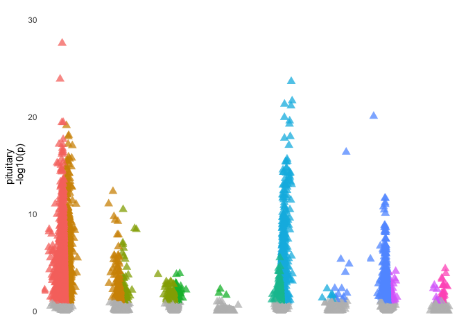
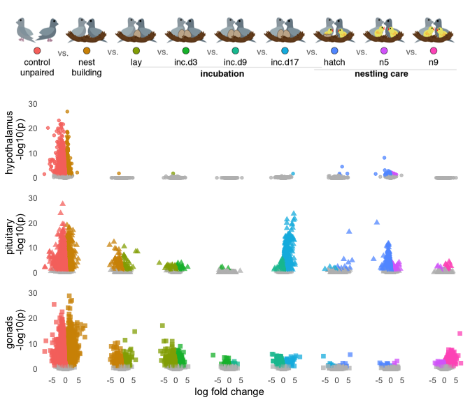

    library(tidyverse)
    library(DESeq2)
    library(cowplot)
    library(RColorBrewer)
    library(pheatmap)
    library(kableExtra)
    library(viridis)
    library(ggimage)
    library(knitr)
    library(kableExtra)

    library(png)
    library(grid)
    library(ggimage)
    library(ggpubr)

    library(BiocParallel)
    register(MulticoreParam(6))

    # load custom functions  
    source("../R/themes.R") 
    source("../R/functions.R") 

    knitr::opts_chunk$set(fig.path = '../figures/characterization/', cache = TRUE)

Characterization data
---------------------

    # import "colData" which contains sample information and "countData" which contains read counts
    c.colData <- read.csv("../metadata/00_colData_characterization.csv", header = T, row.names = 1)
    c.countData <- read.csv("../results/00_countData_characterization.csv", header = T, row.names = 1)
    geneinfo <- read.csv("../metadata/00_geneinfo.csv", row.names = 1)

    # set levels
    c.colData$treatment <- factor(c.colData$treatment, levels = 
                                  c("control",  "bldg", "lay", "inc.d3", "inc.d9", "inc.d17",
                                    "hatch", "n5", "n9"))
    c.colData$tissue <- factor(c.colData$tissue, levels = 
                                  c("hypothalamus",  "pituitary", "gonad"))

    levels(c.colData$treatment)

    ## [1] "control" "bldg"    "lay"     "inc.d3"  "inc.d9"  "inc.d17" "hatch"  
    ## [8] "n5"      "n9"

    c.colData$sextissue <- as.factor(paste(c.colData$sex, c.colData$tissue, sep = "_"))
    summary(c.colData[c(7,3,4,5,8)])

    ##              study         sex               tissue      treatment  
    ##  charcterization:576   female:289   hypothalamus:189   control: 73  
    ##                        male  :287   pituitary   :193   inc.d9 : 71  
    ##                                     gonad       :194   inc.d17: 66  
    ##                                                        n9     : 66  
    ##                                                        bldg   : 60  
    ##                                                        lay    : 60  
    ##                                                        (Other):180  
    ##                sextissue 
    ##  female_gonad       :98  
    ##  female_hypothalamus:95  
    ##  female_pituitary   :96  
    ##  male_gonad         :96  
    ##  male_hypothalamus  :94  
    ##  male_pituitary     :97  
    ## 

    geneinfo <- read.csv("../metadata/00_geneinfo.csv", row.names = 1)
    head(geneinfo)

    ##                row.names     Name geneid       entrezid
    ## NP_001001127.1    408082    EDNRB 408082 NP_001001127.1
    ## NP_001001129.1    408183  CYP26A1 408183 NP_001001129.1
    ## NP_001001189.1    374073    CFDP1 374073 NP_001001189.1
    ## NP_001001194.1    407777    AvBD7 407777 NP_001001194.1
    ## NP_001001195.1    407779     KRT5 407779 NP_001001195.1
    ## NP_001001201.1    408034 HSD11B1L 408034 NP_001001201.1

Run DESeq on all subsets of the data
------------------------------------

    dds.female_hypothalamus <- subsetDESeq(c.colData,  c.countData, "female_hypothalamus")

    ## [1] TRUE
    ## class: DESeqDataSet 
    ## dim: 14937 95 
    ## metadata(1): version
    ## assays(1): counts
    ## rownames(14937): NP_001001127.1 NP_001001129.1 ... XP_430449.2
    ##   XP_430508.3
    ## rowData names(0):
    ## colnames(95): L.G118_female_hypothalamus_control.NYNO
    ##   R.G106_female_hypothalamus_control ...
    ##   y94.g133.x_female_hypothalamus_n5.NYNO
    ##   y97.x_female_hypothalamus_n9
    ## colData names(8): V1 bird ... study sextissue
    ## [1] 14469    95

    ## estimating size factors

    ## estimating dispersions

    ## gene-wise dispersion estimates

    ## mean-dispersion relationship

    ## final dispersion estimates

    ## fitting model and testing

    ## -- replacing outliers and refitting for 6 genes
    ## -- DESeq argument 'minReplicatesForReplace' = 7 
    ## -- original counts are preserved in counts(dds)

    ## estimating dispersions

    ## fitting model and testing

    dds.female_pituitary <- subsetDESeq(c.colData,  c.countData, "female_pituitary" )

    ## [1] TRUE
    ## class: DESeqDataSet 
    ## dim: 14937 96 
    ## metadata(1): version
    ## assays(1): counts
    ## rownames(14937): NP_001001127.1 NP_001001129.1 ... XP_430449.2
    ##   XP_430508.3
    ## rowData names(0):
    ## colnames(96): L.G118_female_pituitary_control.NYNO
    ##   R.G106_female_pituitary_control ...
    ##   y94.g133.x_female_pituitary_n5 y97.x_female_pituitary_n9
    ## colData names(8): V1 bird ... study sextissue
    ## [1] 14322    96

    ## estimating size factors

    ## estimating dispersions

    ## gene-wise dispersion estimates

    ## mean-dispersion relationship

    ## final dispersion estimates

    ## fitting model and testing

    ## -- replacing outliers and refitting for 68 genes
    ## -- DESeq argument 'minReplicatesForReplace' = 7 
    ## -- original counts are preserved in counts(dds)

    ## estimating dispersions

    ## fitting model and testing

    dds.female_gonad <- subsetDESeq(c.colData,  c.countData, "female_gonad" )

    ## [1] TRUE
    ## class: DESeqDataSet 
    ## dim: 14937 98 
    ## metadata(1): version
    ## assays(1): counts
    ## rownames(14937): NP_001001127.1 NP_001001129.1 ... XP_430449.2
    ##   XP_430508.3
    ## rowData names(0):
    ## colnames(98): L.G118_female_gonad_control
    ##   R.G106_female_gonad_control ... y94.g133.x_female_gonad_n5
    ##   y97.x_female_gonad_n9
    ## colData names(8): V1 bird ... study sextissue
    ## [1] 14605    98

    ## estimating size factors

    ## estimating dispersions

    ## gene-wise dispersion estimates

    ## mean-dispersion relationship

    ## final dispersion estimates

    ## fitting model and testing

    ## -- replacing outliers and refitting for 34 genes
    ## -- DESeq argument 'minReplicatesForReplace' = 7 
    ## -- original counts are preserved in counts(dds)

    ## estimating dispersions

    ## fitting model and testing

    dds.male_hypothalamus <- subsetDESeq(c.colData,  c.countData, "male_hypothalamus" )

    ## [1] TRUE
    ## class: DESeqDataSet 
    ## dim: 14937 94 
    ## metadata(1): version
    ## assays(1): counts
    ## rownames(14937): NP_001001127.1 NP_001001129.1 ... XP_430449.2
    ##   XP_430508.3
    ## rowData names(0):
    ## colnames(94): L.Blu13_male_hypothalamus_control.NYNO
    ##   L.G107_male_hypothalamus_control ...
    ##   y95.g131.x_male_hypothalamus_inc.d9
    ##   y98.o50.x_male_hypothalamus_inc.d3
    ## colData names(8): V1 bird ... study sextissue
    ## [1] 14416    94

    ## estimating size factors

    ## estimating dispersions

    ## gene-wise dispersion estimates

    ## mean-dispersion relationship

    ## final dispersion estimates

    ## fitting model and testing

    ## -- replacing outliers and refitting for 8 genes
    ## -- DESeq argument 'minReplicatesForReplace' = 7 
    ## -- original counts are preserved in counts(dds)

    ## estimating dispersions

    ## fitting model and testing

    dds.male_pituitary <- subsetDESeq(c.colData,  c.countData, "male_pituitary"  )

    ## [1] TRUE
    ## class: DESeqDataSet 
    ## dim: 14937 97 
    ## metadata(1): version
    ## assays(1): counts
    ## rownames(14937): NP_001001127.1 NP_001001129.1 ... XP_430449.2
    ##   XP_430508.3
    ## rowData names(0):
    ## colnames(97): L.Blu13_male_pituitary_control.NYNO
    ##   L.G107_male_pituitary_control ...
    ##   y95.g131.x_male_pituitary_inc.d9 y98.o50.x_male_pituitary_inc.d3
    ## colData names(8): V1 bird ... study sextissue
    ## [1] 14298    97

    ## estimating size factors

    ## estimating dispersions

    ## gene-wise dispersion estimates

    ## mean-dispersion relationship

    ## final dispersion estimates

    ## fitting model and testing

    ## -- replacing outliers and refitting for 50 genes
    ## -- DESeq argument 'minReplicatesForReplace' = 7 
    ## -- original counts are preserved in counts(dds)

    ## estimating dispersions

    ## fitting model and testing

    dds.male_gondad <- subsetDESeq(c.colData,  c.countData, "male_gonad")

    ## [1] TRUE
    ## class: DESeqDataSet 
    ## dim: 14937 96 
    ## metadata(1): version
    ## assays(1): counts
    ## rownames(14937): NP_001001127.1 NP_001001129.1 ... XP_430449.2
    ##   XP_430508.3
    ## rowData names(0):
    ## colnames(96): L.Blu13_male_gonad_control.NYNO
    ##   L.G107_male_gonad_control ... y95.g131.x_male_gonad_inc.d9
    ##   y98.o50.x_male_gonad_inc.d3
    ## colData names(8): V1 bird ... study sextissue
    ## [1] 14614    96

    ## estimating size factors

    ## estimating dispersions

    ## gene-wise dispersion estimates

    ## mean-dispersion relationship

    ## final dispersion estimates

    ## fitting model and testing

    ## -- replacing outliers and refitting for 8 genes
    ## -- DESeq argument 'minReplicatesForReplace' = 7 
    ## -- original counts are preserved in counts(dds)

    ## estimating dispersions

    ## fitting model and testing

plot candidate genes
--------------------

    plotcandidates(dds.female_hypothalamus, colDataFH,"female hypothalamus")

    ## Warning: Column `entrezid` joining factor and character vector, coercing
    ## into character vector

    ## Warning: Column `V1` joining character vector and factor, coercing into
    ## character vector

    plotcandidates(dds.female_pituitary, colDataFP, "female pituitary")

    ## Warning: Column `entrezid` joining factor and character vector, coercing
    ## into character vector

    ## Warning: Column `V1` joining character vector and factor, coercing into
    ## character vector

    plotcandidates(dds.female_gonad, colDataFG,"female gonad")

    ## Warning: Column `entrezid` joining factor and character vector, coercing
    ## into character vector

    ## Warning: Column `V1` joining character vector and factor, coercing into
    ## character vector

    plotcandidates(dds.male_hypothalamus, colDataMH,"male hypothalamus")

    ## Warning: Column `entrezid` joining factor and character vector, coercing
    ## into character vector

    ## Warning: Column `V1` joining character vector and factor, coercing into
    ## character vector

    plotcandidates(dds.male_pituitary,colDataMP, "male pituitary")

    ## Warning: Column `entrezid` joining factor and character vector, coercing
    ## into character vector

    ## Warning: Column `V1` joining character vector and factor, coercing into
    ## character vector

    plotcandidates(dds.male_gondad,colDataMG, "male gonad")

    ## Warning: Column `entrezid` joining factor and character vector, coercing
    ## into character vector

    ## Warning: Column `V1` joining character vector and factor, coercing into
    ## character vector

DEGs
----

    createDEGdf <- function(mydds, whichfactor, up, down, mytissue){
      res <- results(mydds, contrast =c(whichfactor, up, down),
                     independentFiltering = T, alpha = 0.1)
       data <- data.frame(entrezid = row.names(res),
                         padj = res$padj, 
                         logpadj = -log10(res$padj),
                         lfc = res$log2FoldChange,
                         tissue = mytissue)
      data <- na.omit(data)
      
      data <- data %>%
        dplyr::mutate(direction = ifelse(data$lfc > 0 & data$padj < 0.1, 
                                         yes = up, no = ifelse(data$lfc < 0 & data$padj < 0.1, 
                                                     yes = down, no = "NS")))
      data$direction <- factor(data$direction, levels = c(down, "NS", up))
      
      data <- left_join(data, geneinfo) %>%
        mutate(gene = Name) %>%
        select(gene, lfc, padj, logpadj, direction, tissue) %>%
        arrange(desc(lfc))
      
      DEGs <- data %>% filter(direction != "NS")
      print(str(DEGs))
      
      myfilename = paste("../results/03_DEGs", mytissue, down,up, "csv", sep = ".")
      
      # write dataframe of only significant genes
      write.csv(DEGs, myfilename, row.names = F)
      
      # return data frome with all data, included NS genes
      return(data)
    }  

    control.bldg <- createDEGdf(dds.female_pituitary, "treatment", "bldg", "control", "pituitary")

    ## Joining, by = "entrezid"

    ## Warning: Column `entrezid` joining factors with different levels, coercing
    ## to character vector

    ## 'data.frame':    6442 obs. of  6 variables:
    ##  $ gene     : Factor w/ 13967 levels "","A2ML1","A2ML2",..: 12439 6566 889 12484 6803 3045 12763 569 4664 12959 ...
    ##  $ lfc      : num  4.77 4.45 4.19 3.93 3.75 ...
    ##  $ padj     : num  1.16e-05 6.18e-04 7.18e-09 2.38e-03 4.52e-07 ...
    ##  $ logpadj  : num  4.94 3.21 8.14 2.62 6.35 ...
    ##  $ direction: Factor w/ 3 levels "control","NS",..: 3 3 3 3 3 3 3 3 3 3 ...
    ##  $ tissue   : Factor w/ 1 level "pituitary": 1 1 1 1 1 1 1 1 1 1 ...
    ## NULL

    bldg.lay <- createDEGdf(dds.female_pituitary, "treatment", "lay", "bldg", "pituitary")

    ## Joining, by = "entrezid"

    ## Warning: Column `entrezid` joining factors with different levels, coercing
    ## to character vector

    ## 'data.frame':    281 obs. of  6 variables:
    ##  $ gene     : Factor w/ 13967 levels "","A2ML1","A2ML2",..: 10342 9845 9870 6188 6768 2540 330 3033 11852 550 ...
    ##  $ lfc      : num  6.6 5.87 4.69 3.86 3.11 ...
    ##  $ padj     : num  7.03e-08 8.04e-07 8.88e-03 5.78e-02 1.84e-03 ...
    ##  $ logpadj  : num  7.15 6.09 2.05 1.24 2.73 ...
    ##  $ direction: Factor w/ 3 levels "bldg","NS","lay": 3 3 3 3 3 3 3 3 3 3 ...
    ##  $ tissue   : Factor w/ 1 level "pituitary": 1 1 1 1 1 1 1 1 1 1 ...
    ## NULL

    lay.inc.d3 <- createDEGdf(dds.female_pituitary, "treatment", "inc.d3", "lay", "pituitary") 

    ## Joining, by = "entrezid"

    ## Warning: Column `entrezid` joining factors with different levels, coercing
    ## to character vector

    ## 'data.frame':    332 obs. of  6 variables:
    ##  $ gene     : Factor w/ 13967 levels "","A2ML1","A2ML2",..: 5904 13279 1221 11172 6003 3969 11305 488 1990 5788 ...
    ##  $ lfc      : num  2.97 2.79 2.34 2.21 1.73 ...
    ##  $ padj     : num  0.027163 0.017196 0.000837 0.027163 0.040076 ...
    ##  $ logpadj  : num  1.57 1.76 3.08 1.57 1.4 ...
    ##  $ direction: Factor w/ 3 levels "lay","NS","inc.d3": 3 3 3 3 3 3 3 3 3 3 ...
    ##  $ tissue   : Factor w/ 1 level "pituitary": 1 1 1 1 1 1 1 1 1 1 ...
    ## NULL

    inc.d3.inc.d9 <- createDEGdf(dds.female_pituitary, "treatment", "inc.d9", "inc.d3", "pituitary") 

    ## Joining, by = "entrezid"

    ## Warning: Column `entrezid` joining factors with different levels, coercing
    ## to character vector

    ## 'data.frame':    1 obs. of  6 variables:
    ##  $ gene     : Factor w/ 13967 levels "","A2ML1","A2ML2",..: 6768
    ##  $ lfc      : num -3.18
    ##  $ padj     : num 0.0707
    ##  $ logpadj  : num 1.15
    ##  $ direction: Factor w/ 3 levels "inc.d3","NS",..: 1
    ##  $ tissue   : Factor w/ 1 level "pituitary": 1
    ## NULL

    inc.d9.inc.d17 <- createDEGdf(dds.female_pituitary, "treatment", "inc.d17", "inc.d9", "pituitary")

    ## Joining, by = "entrezid"

    ## Warning: Column `entrezid` joining factors with different levels, coercing
    ## to character vector

    ## 'data.frame':    2013 obs. of  6 variables:
    ##  $ gene     : Factor w/ 13967 levels "","A2ML1","A2ML2",..: 4114 5777 4003 1935 1964 2228 2933 11225 1818 11311 ...
    ##  $ lfc      : num  4.98 4.89 4.67 4.59 4.5 ...
    ##  $ padj     : num  1.11e-04 8.46e-23 3.22e-12 9.92e-08 1.08e-23 ...
    ##  $ logpadj  : num  3.95 22.07 11.49 7 22.97 ...
    ##  $ direction: Factor w/ 3 levels "inc.d9","NS",..: 3 3 3 3 3 3 3 3 3 3 ...
    ##  $ tissue   : Factor w/ 1 level "pituitary": 1 1 1 1 1 1 1 1 1 1 ...
    ## NULL

    inc.d17.hatch <- createDEGdf(dds.female_pituitary, "treatment", "hatch", "inc.d17", "pituitary") 

    ## Joining, by = "entrezid"

    ## Warning: Column `entrezid` joining factors with different levels, coercing
    ## to character vector

    ## 'data.frame':    6 obs. of  6 variables:
    ##  $ gene     : Factor w/ 13967 levels "","A2ML1","A2ML2",..: 1465 6533 4851 5443 13099 13593
    ##  $ lfc      : num  5.056 1.664 1.422 0.293 -0.581 ...
    ##  $ padj     : num  0.005 0.0838 0.0838 0.005 0.0465 ...
    ##  $ logpadj  : num  2.3 1.08 1.08 2.3 1.33 ...
    ##  $ direction: Factor w/ 3 levels "inc.d17","NS",..: 3 3 3 3 1 1
    ##  $ tissue   : Factor w/ 1 level "pituitary": 1 1 1 1 1 1
    ## NULL

    hatch.n5 <- createDEGdf(dds.female_pituitary, "treatment", "n5", "hatch", "pituitary") 

    ## Joining, by = "entrezid"

    ## Warning: Column `entrezid` joining factors with different levels, coercing
    ## to character vector

    ## 'data.frame':    1091 obs. of  6 variables:
    ##  $ gene     : Factor w/ 13967 levels "","A2ML1","A2ML2",..: 13593 1804 6903 5904 8668 6137 6318 11953 11172 13112 ...
    ##  $ lfc      : num  18.43 4.12 3.24 3.12 2.56 ...
    ##  $ padj     : num  1.04e-05 7.25e-02 6.11e-02 5.50e-03 1.92e-03 ...
    ##  $ logpadj  : num  4.98 1.14 1.21 2.26 2.72 ...
    ##  $ direction: Factor w/ 3 levels "hatch","NS","n5": 3 3 3 3 3 3 3 3 3 3 ...
    ##  $ tissue   : Factor w/ 1 level "pituitary": 1 1 1 1 1 1 1 1 1 1 ...
    ## NULL

    n5.n9 <- createDEGdf(dds.female_pituitary, "treatment", "n9", "n5", "pituitary") 

    ## Joining, by = "entrezid"

    ## Warning: Column `entrezid` joining factors with different levels, coercing
    ## to character vector

    ## 'data.frame':    23 obs. of  6 variables:
    ##  $ gene     : Factor w/ 13967 levels "","A2ML1","A2ML2",..: 11009 13489 10219 2226 7122 10900 4656 1648 8732 12958 ...
    ##  $ lfc      : num  2.89 2.34 2.25 1.99 1.47 ...
    ##  $ padj     : num  0.0346 0.0205 0.0205 0.0121 0.0381 ...
    ##  $ logpadj  : num  1.46 1.69 1.69 1.92 1.42 ...
    ##  $ direction: Factor w/ 3 levels "n5","NS","n9": 3 3 3 3 3 3 3 3 3 3 ...
    ##  $ tissue   : Factor w/ 1 level "pituitary": 1 1 1 1 1 1 1 1 1 1 ...
    ## NULL

    plot.volcano <- function(data, whichfactor, up, down, mycolors){
      
      volcano <- data %>%
        ggplot(aes(x = lfc, y = logpadj)) + 
        geom_point(aes(color = direction, shape = tissue), size = 2, 
                   alpha = 0.75, na.rm = T) + 
        theme_minimal() +
        scale_color_manual(values = mycolors,
                           name = " ",
                           drop = FALSE) +
        ylim(c(0,30)) +  
        xlim(c(-8,8)) +
        labs(y = "-log10(p)", x = " ")  +
        theme(legend.position = "none",
              legend.direction = "horizontal",
              legend.spacing.x = unit(-0.1, 'cm'),
              legend.margin=margin(t=-0.25, r=0, b=0, l=0, unit="cm"),
              panel.grid = element_blank()) +
        scale_shape_manual(values = myshapes)
      return(volcano)
    }

    a <- plot.volcano(control.bldg, "treatment", "bldg", "control", colorsvolcano)
    b <- plot.volcano(bldg.lay, "treatment", "lay", "bldg", colorsvolcano)
    c <- plot.volcano(lay.inc.d3, "treatment", "inc.d3", "lay", colorsvolcano) 
    d <- plot.volcano(inc.d3.inc.d9, "treatment", "inc.d9", "inc.d3", colorsvolcano) 
    e <- plot.volcano(inc.d9.inc.d17, "treatment", "inc.d17", "inc.d9", colorsvolcano)
    f <- plot.volcano(inc.d17.hatch, "treatment", "hatch", "inc.d17", colorsvolcano) 
    g <- plot.volcano(hatch.n5, "treatment", "n5", "hatch", colorsvolcano) 
    h <- plot.volcano(n5.n9, "treatment", "n9", "n5", colorsvolcano) 

    females <- plot_grid(a + 
                           theme(axis.title.x = element_blank(), axis.text.x = element_blank()) +
                           labs(y = "female pituitary \n -log10(p)"),
              b + theme(axis.title = element_blank(), axis.text = element_blank()),
              c + theme(axis.title = element_blank(), axis.text = element_blank()),
              d + theme(axis.title = element_blank(), axis.text = element_blank()), 
              e + theme(axis.title = element_blank(), axis.text = element_blank()),
              f + theme(axis.title = element_blank(), axis.text = element_blank()),
              g + theme(axis.title = element_blank(), axis.text = element_blank()),
              h + theme(axis.title = element_blank(), axis.text = element_blank()), 
              nrow = 1, rel_widths = c(1.75,1,1,1,1,1,1,1,1))
    females 

Go terms
--------

    reproduction <- read.table("../results/goterms/reproduction.txt", sep = "\t", row.names = NULL,  fill=TRUE)
    reproduction$GO <- "reproduction, GO:0000003"  
      
    parentalbehavior <- read.table("../results/goterms/parentalbehavior.txt", sep = "\t", row.names = NULL,  fill=TRUE)
    parentalbehavior$GO <- "parental behavior, GO:0060746"  

    behavior <- read.table("../results/goterms/parentalbehavior.txt", sep = "\t", row.names = NULL,  fill=TRUE)
    behavior$GO <- "behavior, GO:0007610" 

    systemdevelopment <- read.table("../results/goterms/systemdevelopment.txt", sep = "\t", row.names = NULL,  fill=TRUE)
    systemdevelopment$GO <- "system development, GO:0048731" 

    endocrineprocess <- read.table("../results/goterms/endocrineprocess.txt", sep = "\t", row.names = NULL,  fill=TRUE)
    endocrineprocess$GO <- "endocrine process, GO:0050886" 

    responsetostimulus <- read.table("../results/goterms/responsetostimulus.txt", sep = "\t", row.names = NULL,  fill=TRUE)
    responsetostimulus$GO <- "response to external stimulus, GO:0009605" 

    GOterms <- rbind(parentalbehavior, reproduction, behavior, 
                     systemdevelopment, endocrineprocess, responsetostimulus)

    GOterms <- GOterms %>%
      dplyr::mutate(gene = toupper(MGI.Gene.Marker.ID)) %>% 
      dplyr::select(gene, GO) %>% 
      dplyr::distinct(gene, GO) %>% 
     group_by(gene) 

    head(GOterms)

    ## # A tibble: 6 x 2
    ## # Groups:   gene [6]
    ##   gene   GO                           
    ##   <chr>  <chr>                        
    ## 1 AVP    parental behavior, GO:0060746
    ## 2 AVPR1A parental behavior, GO:0060746
    ## 3 BRINP1 parental behavior, GO:0060746
    ## 4 CREBRF parental behavior, GO:0060746
    ## 5 DBH    parental behavior, GO:0060746
    ## 6 DRD1   parental behavior, GO:0060746

    returnGOgenes <- function(whichGOterms, data, mycomparison){
      
      df <- inner_join(whichGOterms, data) %>% 
        filter(direction != "NS") %>%  
        select(gene, GO) %>% 
        group_by(GO) %>% 
        summarize(genes = str_c(gene, collapse = ", "))  %>% 
        mutate(comparison = mycomparison) %>% 
        select(comparison, GO, genes)
      
      return(df)
    }  
      
    dt1 <- returnGOgenes(GOterms,control.bldg, "control v bldg") 

    ## Joining, by = "gene"

    ## Warning: Column `gene` joining character vector and factor, coercing into
    ## character vector

    dt2 <- returnGOgenes(GOterms,bldg.lay , "bldg v lay") 

    ## Joining, by = "gene"

    ## Warning: Column `gene` joining character vector and factor, coercing into
    ## character vector

    dt3 <- returnGOgenes(GOterms,lay.inc.d3 , "lay v inc d3")  

    ## Joining, by = "gene"

    ## Warning: Column `gene` joining character vector and factor, coercing into
    ## character vector

    dt4 <- returnGOgenes(GOterms,inc.d3.inc.d9 , "inc d3 v inc d9")  

    ## Joining, by = "gene"

    ## Warning: Column `gene` joining character vector and factor, coercing into
    ## character vector

    dt5 <- returnGOgenes(GOterms,inc.d9.inc.d17 , "inc d9 v inc d17")  

    ## Joining, by = "gene"

    ## Warning: Column `gene` joining character vector and factor, coercing into
    ## character vector

    kable(dt5) 

<table>
<thead>
<tr>
<th style="text-align:left;">
comparison
</th>
<th style="text-align:left;">
GO
</th>
<th style="text-align:left;">
genes
</th>
</tr>
</thead>
<tbody>
<tr>
<td style="text-align:left;">
inc d9 v inc d17
</td>
<td style="text-align:left;">
behavior, <a href="GO:0007610" class="uri">GO:0007610</a>
</td>
<td style="text-align:left;">
PRL
</td>
</tr>
<tr>
<td style="text-align:left;">
inc d9 v inc d17
</td>
<td style="text-align:left;">
endocrine process, <a href="GO:0050886" class="uri">GO:0050886</a>
</td>
<td style="text-align:left;">
ATP6AP2, CRY1, SMAD4, TMF1
</td>
</tr>
<tr>
<td style="text-align:left;">
inc d9 v inc d17
</td>
<td style="text-align:left;">
parental behavior, <a href="GO:0060746" class="uri">GO:0060746</a>
</td>
<td style="text-align:left;">
PRL
</td>
</tr>
<tr>
<td style="text-align:left;">
inc d9 v inc d17
</td>
<td style="text-align:left;">
reproduction, <a href="GO:0000003" class="uri">GO:0000003</a>
</td>
<td style="text-align:left;">
ACSBG2, ACTR2, ACTR3, ACVR1B, ADA, AFF4, AKAP9, ANTXR1, APP, ARID1A,
ARID4B, ARID5B, ARNT, ASH1L, ASPM, ATAT1, ATM, ATN1, ATP8B3, ATR, ATRX,
AURKA, BBS1, BCL2L1, BPTF, BRIP1, BUB1, BUB1B, BUB3, CACNA1H, CADM1,
CBS, CCNB3, CCNE2, CCT2, CCT4, CDC20, CDC25A, CDH1, CKS2, CLGN, CLIC4,
CREM, CXCL12, DLD, DNAJB6, DNMT3A, E2F7, EIF2S2, EIF4H, EME1, EPAS1,
ESPL1, EXO1, FANCC, FANCD2, FANCL, FBXO5, FKBP4, GATA2, GATA2, GGT5,
GLI2, GOLGA3, GORASP2, GPX4, HDAC4, HEY1, HMGB2, HNF4A, HOOK1, ID4,
ITGA3, JAG2, KATNAL1, KIF18A, KLHDC3, LAMB1, LGR4, LGR5, LLGL2, MASTL,
MCM8, MKI67, MND1, MSH2, MYBL1, NCAPD3, NCAPH, NCAPH2, NCOA1, NDC1,
NEK2, NOG, NOTCH2, NPHP4, NSUN2, NUF2, PAFAH1B2, PGM3, PLCB1, PLCD1,
PLK1, PLK4, PRDX3, PRDX4, PRL, PTGDS, PTTG1, PYGO2, RACGAP1, RAD21,
RAD54B, RBBP8, RBM15, RFX2, RHOBTB3, RPA1, SOD1, SOX2, SP1, SPIRE2,
ST14, STAT5B, STXBP1, SYDE1, TCF7L2, TCP1, TFEB, THBD, TMF1, TNK2,
TOP2A, TRIP13, TSNAX, TTK, UBE2A, VDAC2, WDR77, WEE2, WNT3
</td>
</tr>
<tr>
<td style="text-align:left;">
inc d9 v inc d17
</td>
<td style="text-align:left;">
response to external stimulus,
<a href="GO:0009605" class="uri">GO:0009605</a>
</td>
<td style="text-align:left;">
ABCC8, ABCC9, ABCF3, ABR, ACTR2, ACTR3, ADA, ADAM17, ADAR, ADSL, AGBL4,
AGBL5, AGRN, AJAP1, ALAD, AOC3, APBB1, APP, ARF1, ASH1L, ASPH, ATG5,
ATM, ATN1, BAIAP2L1, BCKDHB, BCL2L1, BNIP3L, BSG, CADM1, CASK, CBS,
CCL28, CD109, CDH4, CDK5, CDK5R1, CDK19, CEBPG, CELSR3, CHID1, CNN2,
CNPY3, CNTF, COTL1, CRADD, CRTC1, CRY1, CTR9, CXADR, CXCL12, DAG1,
DAPK3, DBN1, DDX1, DMTN, DPYD, DSCAML1, DUSP3, DUSP10, EFNB1, EIF2AK1,
EIF2AK3, EIF2AK4, EIF2S1, ELMOD2, EP300, EPHA2, EPHA3, EPHB2, EPRS,
ERCC6, FAM107A, FANCD2, FFAR4, FOXP1, G3BP2, GABARAPL1, GAS2L3, GCH1,
GGT5, GLI2, GNB1, GPC3, GPX4, GRIN2B, HMGB1, HMGB2, HMGB3, HSP90B1,
HSPA5, IFNGR1, IL12RB2, IPO7, IRAK4, KARS, LAMB2, LAMP2, LDHA, LGMN,
LGR4, LPL, LPO, LRAT, MAP2K2, MAPKBP1, MGLL, MSTN, MTMR3, MYC, MYO18A,
MYOT, NAALADL2, NCOA1, NDUFC2, NEO1, NEXN, NFASC, NFE2L1, NOG, NOTCH2,
NPNT, NPRL2, NR1H3, NRP1, NTN1, NTN3, NUCB2, OTOF, PARVA, PBK, PDIA3,
PDK4, PIK3C2B, PLD1, POLR3F, PPP1CB, PRDX3, PRL, PRLH, PROC, PROS1,
PSMA1, PTCH1, PTGFR, PYGL, RAB1A, RAB32, RB1, RBM4B, RBM14, REST, RGMA,
RHOBTB3, RNF165, RNF166, RPL30, RRAGC, RTN4, SCARB1, SEMA4C, SFPQ,
SHANK3, SIK1, SLC9A1, SLC16A1, SLC17A5, SLC37A4, SLITRK6, SMAD4, SMO,
SOD1, SOX2, SRF, STAT2, STAT5B, STXBP1, TBC1D23, TCF3, TCF7L2, TFEB,
THBD, THBS4, TIRAP, TMF1, TRIM24, TRIM35, TRIM59, TRPV4, TUSC2, UACA,
UFL1, UNC5A, UPF1, USP14, VANGL2, WDR24, WIPI1, WNT3, WRNIP1, XBP1,
XRCC6, ZYX
</td>
</tr>
<tr>
<td style="text-align:left;">
inc d9 v inc d17
</td>
<td style="text-align:left;">
system development, <a href="GO:0048731" class="uri">GO:0048731</a>
</td>
<td style="text-align:left;">
ABCA2, ABCC8, ABI2, ABR, ACP6, ACTN2, ACTR2, ACTR3, ACVR1B, ACVRL1, ADA,
ASH1L, ASPM, ASTN1, ATAD5, ATAT1, ATG5, ATM, ATN1, BCL2L1, BCL11A,
BICC1, BICC1, BLOC1S2, BPTF, BRCA1, BRIP1, BSG, BSN, BTBD2, CACNA1C,
CACYBP, CADM1, CAPN1, CASK, CBFA2T2, CBLN2, CBS, CCM2, CD109, CD164,
CDC20, CDK1, CDK5, CDK5R1, CDK6, CDON, CEBPG, CELSR2, CELSR3, CEND1,
CENPF, CERS1, CLCN2, CLDN5, CLEC3B, CLIC4, CNN2, CNTF, COL20A1, COPS2,
CPE, CREB3L1, CRTC1, CSMD3, CSPG4, CTDSP1, CTNNA1, CTNNBIP1, CTNND2,
CTR9, CUX1, CUX2, CXADR, CXCL12, DAG1, DBN1, DCTN1, DCX, DDRGK1, DGUOK,
FOXI1, FOXP1, FRAS1, FZD1, GATA2, GATA2, GATAD2A, GFRA1, GLG1, GLI2,
GNB1, GOLGA4, GPC3, GPD2, GRIN2B, GRIP1, GRIP2, GRXCR1, IL1RAPL1, ILK,
IMPAD1, INA, INPPL1, ITGA3, JAG2, JAK1, KCNA2, KCNAB2, KDM4C, KIF3C,
KIF18A, LAMA4, LAMB1, LAMB2, LBH, LGR4, LGR5, LHFPL4, LIMK1, LLGL2,
LLPH, LOXL3, LRFN3, LRRC7, LRRK1, LRRTM3, LRRTM4, LSM1, MAEA, MANF,
MAP1S, MAP2K2, MAP4, MARK2, MBD5, MCM2, MDM4, NKX2-2, NPHP4, NPNT,
NRBP2, NRP1, NRXN3, NSUN2, NTN1, NTN3, NUMA1, NUS1, NXN, OLFM1, ORAI1,
OSR2, PAFAH1B2, PAK4, PARVA, PAX7, PAXBP1, PCID2, PCM1, PDLIM7, PEX2,
PGM3, PHEX, PHF14, PHGDH, PHLDB1, PIK3R1, PIK3R3, PLCB1, PLCD1, PLK4,
PLS3, POFUT2, POU3F2, POU3F3, PPIB, PRDX3, PRDX4, PRICKLE2, PRKCB, PSD,
PSMA6, PTBP1, PTCH1, RAI1, RANBP1, RAP1A, RAP1GAP2, RARB, RASGRF1, RB1,
RBFOX1, RBFOX2, RBM15, RBM47, RET, RGCC, RGMA, RGS6, RHOBTB3, RIPK3,
RNF165, ROBO4, RPA1, RPGR, RPGRIP1L, RPL22, RXRA, SDF4, SDK2, SEC63,
SEMA4C, SENP1, SERPINH1, SETDB1, SEZ6, SHOX2, SHROOM4, SIK1, SIK3,
SIN3B, SLC7A11, SLC9A1, SLC11A2, SLC35D1, SLC37A4, SLITRK6, SMAD4,
SMARCA4, SMARCD1, SMO, SMPD3, SMYD1, SOX2, TBC1D23, TBCE, TBX20, TCF3,
TCF7L2, TFEB, TGFBR2, THBS4, THOC1, THOC2, THSD7A, TIRAP, TLX2, TMEM30A,
TMEM100, TMF1, TMOD3, TMPRSS13, TNIK, TOB2, TOP2A, TRPV4, TTC9, TUSC2,
UCHL1, UCHL5, UFC1, UFL1, UFM1, UNC5A, USP1, USP19, USP21, UST, VANGL2,
WASF2, WDR36, WDR60, WDR77, WEE1, WFS1, WNT3, WWTR1, XBP1, XRCC6,
ZBTB7A, ZFYVE27, ZNRF3
</td>
</tr>
</tbody>
</table>

    dt6 <- returnGOgenes(GOterms,inc.d17.hatch, "inc d17 v hatch")  

    ## Joining, by = "gene"

    ## Warning: Column `gene` joining character vector and factor, coercing into
    ## character vector

    dt7 <- returnGOgenes(GOterms,hatch.n5, "hatch v n5")  

    ## Joining, by = "gene"

    ## Warning: Column `gene` joining character vector and factor, coercing into
    ## character vector

    kable(dt7) 

<table>
<thead>
<tr>
<th style="text-align:left;">
comparison
</th>
<th style="text-align:left;">
GO
</th>
<th style="text-align:left;">
genes
</th>
</tr>
</thead>
<tbody>
<tr>
<td style="text-align:left;">
hatch v n5
</td>
<td style="text-align:left;">
behavior, <a href="GO:0007610" class="uri">GO:0007610</a>
</td>
<td style="text-align:left;">
PRL
</td>
</tr>
<tr>
<td style="text-align:left;">
hatch v n5
</td>
<td style="text-align:left;">
endocrine process, <a href="GO:0050886" class="uri">GO:0050886</a>
</td>
<td style="text-align:left;">
ATP6AP2, AVPR2, CRY2, FOXL2, RHOA
</td>
</tr>
<tr>
<td style="text-align:left;">
hatch v n5
</td>
<td style="text-align:left;">
parental behavior, <a href="GO:0060746" class="uri">GO:0060746</a>
</td>
<td style="text-align:left;">
PRL
</td>
</tr>
<tr>
<td style="text-align:left;">
hatch v n5
</td>
<td style="text-align:left;">
reproduction, <a href="GO:0000003" class="uri">GO:0000003</a>
</td>
<td style="text-align:left;">
ABL2, ACSBG2, ACTR2, AFF4, ALMS1, APP, ASH1L, AURKA, BIRC2, BPTF, BUB1,
BUB1B, CACNA1H, CBS, CCNB3, CCT2, CCT4, CD44, CDC20, CDC25A, CDK2,
CEBPA, CKS2, EIF2S2, EIF4H, EME1, FANCC, FNDC3A, FOXL2, GORASP2, GPX4,
HMGB2, JMJD1C, MKI67, MND1, MYBL1, NCAPH, NCOA1, NCOA6, NPHP1, NSUN2,
NUF2, PARK7, PKD1, PLCD4, PLK1, PRDX3, PRDX4, PRL, PTTG1, RACGAP1, RAD1,
RBM15, RHOBTB3, SPATA5, TCP1, UBE2A, VDAC2, WDR66, WDR77
</td>
</tr>
<tr>
<td style="text-align:left;">
hatch v n5
</td>
<td style="text-align:left;">
response to external stimulus,
<a href="GO:0009605" class="uri">GO:0009605</a>
</td>
<td style="text-align:left;">
ABCC8, ABCC9, ABL2, ACTR2, AGBL4, AJAP1, AMOT, ANKHD1, APP, AQP2, ARF1,
ARF6, ASH1L, ATF4, BCKDHB, BECN1, BHLHA15, BNIP3L, CBS, CCDC80, CCK,
CD44, CEBPA, CEBPG, CHGA, CNTN4, CRY2, DDIT3, DMD, DUSP3, DUSP10,
EIF2AK1, EIF2AK3, EIF2B1, EIF2S1, EP300, EPHA3, EPHA7, EPHB2, FBXO9,
FFAR4, FOLR1, FOXP1, GABARAPL1, GLI3, GPX4, HMGB2, HMGB3, HSP90B1,
HSPA5, KARS, KCNB1, LAMP2, LDHA, MAPKBP1, MVK, MYBBP1A, MYC, NCOA1,
NDUFC2, NEO1, NOCT, NR4A3, NUCB2, PARK7, PARVA, PBK, PDE4D, PDK4, PKD1,
PLD1, PLXNA1, PLXNB2, POLR3D, PPP1CB, PRDX3, PRKAA2, PRL, PROC, PSMA1,
PTCH1, PTPRF, RAB1A, RAB32, REST, RHOA, RHOBTB3, RPL30, SCT, SEMA6A,
SLC16A1, SLC17A5, SNX3, SORL1, TBL2, TCF3, TRIB1, TRIM35, UFL1, VAMP4,
WIPI1, XBP1
</td>
</tr>
<tr>
<td style="text-align:left;">
hatch v n5
</td>
<td style="text-align:left;">
system development, <a href="GO:0048731" class="uri">GO:0048731</a>
</td>
<td style="text-align:left;">
ABCC8, ABL2, ACTR2, ASH1L, ASXL1, ATF4, BCL11A, BECN1, BICC1, BIN1,
BIRC2, BMP3, BPTF, BRCA1, C2CD3, CACNA1C, CAPRIN2, CBLN2, CBS, CCK,
CD44, CD164, CDC20, CDK1, CDK6, CEBPA, CEBPG, CNTN4, CREB3L1, CRYBB2,
CTNNA1, CTSK, CUX2, DAGLB, DDIT3, DDRGK1, DGUOK, DGUOK, DLG5, FGF13,
FOXP1, GLI3, GPC1, GPSM1, GRIP2, INA, JAK1, JMJD1C, JMJD8, KANK1, KCNA2,
KDM4C, KMT2A, LAMA5, LBH, LHX6, LSM1, MAEA, MAFF, MANF, MAP2, MAP4K4,
MBD5, MBNL1, MCM2, MCM3AP, NPHP1, NPTX1, NR4A3, NSMF, NSUN2, NUS1,
OLFM1, PARVA, PAXIP1, PCDH17, PCDH19, PCM1, PDCD10, PDS5A, PHACTR1,
PIK3R3, PKD1, PLD4, PLS3, PLXNA1, PLXNB2, POLB, POU3F3, PPIB, PRDX3,
PRDX4, PRELID1, PSMA6, PTCH1, RANBP1, RASGRF1, RBM15, RHOA, RHOBTB3,
RIPK3, RIT2, RXRG, SCN8A, SCT, SCYL1, SDCBP, SDF4, SDK1, SEC63, SEMA6A,
SERP1, SIPA1L1, SKI, SLITRK3, SMTNL1, TCF3, TIAM2, TMEM100, TMOD3,
TMPRSS13, TNRC6C, TUB, UCHL1, UFC1, UFL1, UFM1, UNK, USP1, WDR77, XBP1,
ZFPM1
</td>
</tr>
</tbody>
</table>

    dt8 <- returnGOgenes(GOterms,n5.n9, "n5 v n9") 

    ## Joining, by = "gene"

    ## Warning: Column `gene` joining character vector and factor, coercing into
    ## character vector

    alldt <- rbind(dt1,dt2,dt3,dt4,dt5,dt6,dt7,dt8)
    alldt

    ## # A tibble: 33 x 3
    ##    comparison   GO                     genes                               
    ##    <chr>        <chr>                  <chr>                               
    ##  1 control v b… behavior, GO:0007610   AVP, DRD1, GNAQ, MBD2, NR3C1, OXT, …
    ##  2 control v b… endocrine process, GO… ACE2, ACVR2A, AVPR2, CGA, CORIN, CR…
    ##  3 control v b… parental behavior, GO… AVP, DRD1, GNAQ, MBD2, NR3C1, OXT, …
    ##  4 control v b… reproduction, GO:0000… AAAS, ABAT, ABCG2, ABL2, ACOX1, ACR…
    ##  5 control v b… response to external … ABAT, ABCC1, ABCC8, ABCD2, ABCF3, A…
    ##  6 control v b… system development, G… ABCC8, ABCD2, ABI1, ABL2, ABR, ACAP…
    ##  7 bldg v lay   endocrine process, GO… AGT, BMP6, CGA, GAL                 
    ##  8 bldg v lay   reproduction, GO:0000… ACSBG2, AGT, ARID4B, BMP6, CEBPA, C…
    ##  9 bldg v lay   response to external … AGT, BMP6, BSG, C8G, CAPG, CD34, CD…
    ## 10 bldg v lay   system development, G… ASTN1, ATCAY, BMI1, BMP6, BRINP2, B…
    ## # … with 23 more rows

    write.csv(alldt, "../results/03_GO_femalepituitary.csv")

males and females
-----------------

    control.bldg2 <- createDEGdf(dds.male_pituitary, "treatment", "bldg", "control", "pituitary")

    ## Joining, by = "entrezid"

    ## Warning: Column `entrezid` joining factors with different levels, coercing
    ## to character vector

    ## 'data.frame':    7022 obs. of  6 variables:
    ##  $ gene     : Factor w/ 13967 levels "","A2ML1","A2ML2",..: 12344 1083 6590 6779 5134 889 7668 6801 6554 6076 ...
    ##  $ lfc      : num  4.31 3.64 3.49 3.45 3.35 ...
    ##  $ padj     : num  7.39e-10 5.75e-06 8.32e-07 8.98e-07 7.33e-02 ...
    ##  $ logpadj  : num  9.13 5.24 6.08 6.05 1.13 ...
    ##  $ direction: Factor w/ 3 levels "control","NS",..: 3 3 3 3 3 3 3 3 3 3 ...
    ##  $ tissue   : Factor w/ 1 level "pituitary": 1 1 1 1 1 1 1 1 1 1 ...
    ## NULL

    bldg.lay2 <- createDEGdf(dds.male_pituitary, "treatment", "lay", "bldg", "pituitary")

    ## Joining, by = "entrezid"

    ## Warning: Column `entrezid` joining factors with different levels, coercing
    ## to character vector

    ## 'data.frame':    0 obs. of  6 variables:
    ##  $ gene     : Factor w/ 13967 levels "","A2ML1","A2ML2",..: 
    ##  $ lfc      : num 
    ##  $ padj     : num 
    ##  $ logpadj  : num 
    ##  $ direction: Factor w/ 3 levels "bldg","NS","lay": 
    ##  $ tissue   : Factor w/ 1 level "pituitary": 
    ## NULL

    lay.inc.d32 <- createDEGdf(dds.male_pituitary, "treatment", "inc.d3", "lay", "pituitary") 

    ## Joining, by = "entrezid"

    ## Warning: Column `entrezid` joining factors with different levels, coercing
    ## to character vector

    ## 'data.frame':    5 obs. of  6 variables:
    ##  $ gene     : Factor w/ 13967 levels "","A2ML1","A2ML2",..: 7367 13904 1054 11059 1263
    ##  $ lfc      : num  4.159 3.591 0.324 -0.671 -17.948
    ##  $ padj     : num  4.80e-02 4.80e-02 4.80e-02 6.70e-02 4.06e-13
    ##  $ logpadj  : num  1.32 1.32 1.32 1.17 12.39
    ##  $ direction: Factor w/ 3 levels "lay","NS","inc.d3": 3 3 3 1 1
    ##  $ tissue   : Factor w/ 1 level "pituitary": 1 1 1 1 1
    ## NULL

    inc.d3.inc.d92 <- createDEGdf(dds.male_pituitary, "treatment", "inc.d9", "inc.d3", "pituitary") 

    ## Joining, by = "entrezid"

    ## Warning: Column `entrezid` joining factors with different levels, coercing
    ## to character vector

    ## 'data.frame':    1 obs. of  6 variables:
    ##  $ gene     : Factor w/ 13967 levels "","A2ML1","A2ML2",..: 1263
    ##  $ lfc      : num 22.1
    ##  $ padj     : num 4.13e-23
    ##  $ logpadj  : num 22.4
    ##  $ direction: Factor w/ 3 levels "inc.d3","NS",..: 3
    ##  $ tissue   : Factor w/ 1 level "pituitary": 1
    ## NULL

    inc.d9.inc.d172 <- createDEGdf(dds.male_pituitary, "treatment", "inc.d17", "inc.d9", "pituitary")

    ## Joining, by = "entrezid"

    ## Warning: Column `entrezid` joining factors with different levels, coercing
    ## to character vector

    ## 'data.frame':    437 obs. of  6 variables:
    ##  $ gene     : Factor w/ 13967 levels "","A2ML1","A2ML2",..: 9542 9567 627 4799 6107 7256 11219 5777 546 4114 ...
    ##  $ lfc      : num  8.66 6.58 6.1 5.87 5.2 ...
    ##  $ padj     : num  2.16e-10 8.29e-02 3.82e-06 2.14e-02 6.01e-02 ...
    ##  $ logpadj  : num  9.67 1.08 5.42 1.67 1.22 ...
    ##  $ direction: Factor w/ 3 levels "inc.d9","NS",..: 3 3 3 3 3 3 3 3 3 3 ...
    ##  $ tissue   : Factor w/ 1 level "pituitary": 1 1 1 1 1 1 1 1 1 1 ...
    ## NULL

    inc.d17.hatch2 <- createDEGdf(dds.male_pituitary, "treatment", "hatch", "inc.d17", "pituitary") 

    ## Joining, by = "entrezid"

    ## Warning: Column `entrezid` joining factors with different levels, coercing
    ## to character vector

    ## 'data.frame':    56 obs. of  6 variables:
    ##  $ gene     : Factor w/ 13967 levels "","A2ML1","A2ML2",..: 8215 12780 4170 6342 8872 3081 4032 11643 13599 8773 ...
    ##  $ lfc      : num  3.054 0.855 0.748 0.57 0.498 ...
    ##  $ padj     : num  0.06825 0.03913 0.00495 0.09055 0.09121 ...
    ##  $ logpadj  : num  1.17 1.41 2.31 1.04 1.04 ...
    ##  $ direction: Factor w/ 3 levels "inc.d17","NS",..: 3 3 3 3 3 3 3 3 3 3 ...
    ##  $ tissue   : Factor w/ 1 level "pituitary": 1 1 1 1 1 1 1 1 1 1 ...
    ## NULL

    hatch.n52 <- createDEGdf(dds.male_pituitary, "treatment", "n5", "hatch", "pituitary") 

    ## Joining, by = "entrezid"

    ## Warning: Column `entrezid` joining factors with different levels, coercing
    ## to character vector

    ## 'data.frame':    156 obs. of  6 variables:
    ##  $ gene     : Factor w/ 13967 levels "","A2ML1","A2ML2",..: 9542 8838 5167 8188 6989 204 13729 2009 10527 270 ...
    ##  $ lfc      : num  4.93 1.75 1.63 1.58 1.58 ...
    ##  $ padj     : num  0.0239 0.0702 0.0722 0.0641 0.0894 ...
    ##  $ logpadj  : num  1.62 1.15 1.14 1.19 1.05 ...
    ##  $ direction: Factor w/ 3 levels "hatch","NS","n5": 3 3 3 3 3 3 3 3 3 3 ...
    ##  $ tissue   : Factor w/ 1 level "pituitary": 1 1 1 1 1 1 1 1 1 1 ...
    ## NULL

    n5.n92 <- createDEGdf(dds.male_pituitary, "treatment", "n9", "n5", "pituitary") 

    ## Joining, by = "entrezid"

    ## Warning: Column `entrezid` joining factors with different levels, coercing
    ## to character vector

    ## 'data.frame':    63 obs. of  6 variables:
    ##  $ gene     : Factor w/ 13967 levels "","A2ML1","A2ML2",..: 32 7648 8472 687 5788 9344 12758 1379 9536 9193 ...
    ##  $ lfc      : num  3.3 2 1.42 1.31 1.28 ...
    ##  $ padj     : num  2.88e-05 6.68e-02 3.04e-02 3.33e-02 1.17e-02 ...
    ##  $ logpadj  : num  4.54 1.18 1.52 1.48 1.93 ...
    ##  $ direction: Factor w/ 3 levels "n5","NS","n9": 3 3 3 3 3 3 3 3 1 1 ...
    ##  $ tissue   : Factor w/ 1 level "pituitary": 1 1 1 1 1 1 1 1 1 1 ...
    ## NULL

    a2 <- plot.volcano(control.bldg2, "treatment", "bldg", "control", colorsvolcano)
    b2 <- plot.volcano(bldg.lay2, "treatment", "lay", "bldg", colorsvolcano)
    c2 <- plot.volcano(lay.inc.d32, "treatment", "inc.d3", "lay", colorsvolcano) 
    d2 <- plot.volcano(inc.d3.inc.d92, "treatment", "inc.d9", "inc.d3", colorsvolcano) 
    e2 <- plot.volcano(inc.d9.inc.d172, "treatment", "inc.d17", "inc.d9", colorsvolcano)
    f2 <- plot.volcano(inc.d17.hatch2, "treatment", "hatch", "inc.d17", colorsvolcano) 
    g2 <- plot.volcano(hatch.n52, "treatment", "n5", "hatch", colorsvolcano) 
    h2 <- plot.volcano(n5.n92, "treatment", "n9", "n5", colorsvolcano) 

    males <- plot_grid(a2 + labs(y = "male pituitary \n -log10(p)") + theme(axis.text.x = element_blank()),
              b2 + theme(axis.title.y = element_blank(), axis.text = element_blank()),
              c2 + theme(axis.title.y = element_blank(), axis.text = element_blank()),
              d2 + theme(axis.title.y = element_blank(), axis.text = element_blank()), 
              e2 + theme(axis.title.y = element_blank(), axis.text = element_blank()), 
              f2 + theme(axis.title.y = element_blank(), axis.text = element_blank()),
              g2 + theme(axis.title.y = element_blank(), axis.text = element_blank()),
              h2 + theme(axis.title.y = element_blank(), axis.text = element_blank()), 
              nrow = 1, rel_widths = c(1.75,1,1,1,1,1,1,1,1))
    males

### tissue levels, ignoring sex differences, sort of

    dds.gonads <- subsetDESeq2(c.colData,  c.countData, c("female_gonad","male_gonad"))

    ## class: DESeqDataSet 
    ## dim: 14937 194 
    ## metadata(1): version
    ## assays(1): counts
    ## rownames(14937): NP_001001127.1 NP_001001129.1 ... XP_430449.2
    ##   XP_430508.3
    ## rowData names(0):
    ## colnames(194): L.Blu13_male_gonad_control.NYNO
    ##   L.G107_male_gonad_control ... y97.x_female_gonad_n9
    ##   y98.o50.x_male_gonad_inc.d3
    ## colData names(8): V1 bird ... study sextissue
    ## [1] 14843   194

    ## estimating size factors

    ## estimating dispersions

    ## gene-wise dispersion estimates: 6 workers

    ## mean-dispersion relationship

    ## final dispersion estimates, fitting model and testing: 6 workers

    ## -- replacing outliers and refitting for 8 genes
    ## -- DESeq argument 'minReplicatesForReplace' = 7 
    ## -- original counts are preserved in counts(dds)

    ## estimating dispersions

    ## fitting model and testing

    control.bldg <- createDEGdf(dds.gonads, "treatment", "bldg", "control",  "gonads")

    ## Joining, by = "entrezid"

    ## Warning: Column `entrezid` joining factors with different levels, coercing
    ## to character vector

    ## 'data.frame':    8155 obs. of  6 variables:
    ##  $ gene     : Factor w/ 13967 levels "","A2ML1","A2ML2",..: 2390 6263 6490 13586 6976 6188 8115 3041 8851 11559 ...
    ##  $ lfc      : num  9.35 8.32 8.24 7.34 7.29 ...
    ##  $ padj     : num  9.16e-26 9.08e-16 9.72e-11 1.09e-17 3.59e-13 ...
    ##  $ logpadj  : num  25 15 10 17 12.4 ...
    ##  $ direction: Factor w/ 3 levels "control","NS",..: 3 3 3 3 3 3 3 3 3 3 ...
    ##  $ tissue   : Factor w/ 1 level "gonads": 1 1 1 1 1 1 1 1 1 1 ...
    ## NULL

    bldg.lay <- createDEGdf(dds.gonads, "treatment", "lay", "bldg",  "gonads")

    ## Joining, by = "entrezid"

    ## Warning: Column `entrezid` joining factors with different levels, coercing
    ## to character vector

    ## 'data.frame':    1513 obs. of  6 variables:
    ##  $ gene     : Factor w/ 13967 levels "","A2ML1","A2ML2",..: 6731 8170 8972 574 3603 4415 7345 1540 6490 4245 ...
    ##  $ lfc      : num  9.81 5.81 5.42 4.34 4.24 ...
    ##  $ padj     : num  4.65e-09 3.36e-04 2.22e-15 7.38e-07 1.97e-05 ...
    ##  $ logpadj  : num  8.33 3.47 14.65 6.13 4.71 ...
    ##  $ direction: Factor w/ 3 levels "bldg","NS","lay": 3 3 3 3 3 3 3 3 3 3 ...
    ##  $ tissue   : Factor w/ 1 level "gonads": 1 1 1 1 1 1 1 1 1 1 ...
    ## NULL

    lay.inc.d3 <- createDEGdf(dds.gonads, "treatment", "inc.d3", "lay",  "gonads") 

    ## Joining, by = "entrezid"

    ## Warning: Column `entrezid` joining factors with different levels, coercing
    ## to character vector

    ## 'data.frame':    3408 obs. of  6 variables:
    ##  $ gene     : Factor w/ 13967 levels "","A2ML1","A2ML2",..: 13593 932 6798 6413 12465 12646 10129 7932 3735 10151 ...
    ##  $ lfc      : num  21.59 3.76 3.36 3.31 3.24 ...
    ##  $ padj     : num  8.18e-38 2.57e-03 5.53e-02 3.00e-07 3.65e-02 ...
    ##  $ logpadj  : num  37.09 2.59 1.26 6.52 1.44 ...
    ##  $ direction: Factor w/ 3 levels "lay","NS","inc.d3": 3 3 3 3 3 3 3 3 3 3 ...
    ##  $ tissue   : Factor w/ 1 level "gonads": 1 1 1 1 1 1 1 1 1 1 ...
    ## NULL

    inc.d3.inc.d9 <- createDEGdf(dds.gonads, "treatment", "inc.d9", "inc.d3",  "gonads") 

    ## Joining, by = "entrezid"

    ## Warning: Column `entrezid` joining factors with different levels, coercing
    ## to character vector

    ## 'data.frame':    94 obs. of  6 variables:
    ##  $ gene     : Factor w/ 13967 levels "","A2ML1","A2ML2",..: 9358 6188 6171 7786 4464 5915 12469 12680 1802 7332 ...
    ##  $ lfc      : num  3.41 2.45 2.38 2.36 2.04 ...
    ##  $ padj     : num  0.01337 0.09207 0.07866 0.00734 0.00137 ...
    ##  $ logpadj  : num  1.87 1.04 1.1 2.13 2.86 ...
    ##  $ direction: Factor w/ 3 levels "inc.d3","NS",..: 3 3 3 3 3 3 3 3 3 3 ...
    ##  $ tissue   : Factor w/ 1 level "gonads": 1 1 1 1 1 1 1 1 1 1 ...
    ## NULL

    inc.d9.inc.d17 <- createDEGdf(dds.gonads, "treatment", "inc.d17", "inc.d9",  "gonads")

    ## Joining, by = "entrezid"

    ## Warning: Column `entrezid` joining factors with different levels, coercing
    ## to character vector

    ## 'data.frame':    1239 obs. of  6 variables:
    ##  $ gene     : Factor w/ 13967 levels "","A2ML1","A2ML2",..: 6731 6126 4531 8966 2262 12094 6976 9446 973 7753 ...
    ##  $ lfc      : num  7.15 5.37 4.97 4.72 4.66 ...
    ##  $ padj     : num  2.26e-05 8.13e-06 4.18e-05 8.93e-02 2.28e-04 ...
    ##  $ logpadj  : num  4.65 5.09 4.38 1.05 3.64 ...
    ##  $ direction: Factor w/ 3 levels "inc.d9","NS",..: 3 3 3 3 3 3 3 3 3 3 ...
    ##  $ tissue   : Factor w/ 1 level "gonads": 1 1 1 1 1 1 1 1 1 1 ...
    ## NULL

    inc.d17.hatch <- createDEGdf(dds.gonads, "treatment", "hatch", "inc.d17",  "gonads") 

    ## Joining, by = "entrezid"

    ## Warning: Column `entrezid` joining factors with different levels, coercing
    ## to character vector

    ## 'data.frame':    21 obs. of  6 variables:
    ##  $ gene     : Factor w/ 13967 levels "","A2ML1","A2ML2",..: 13593 6263 6730 3572 7972 3928 1558 5044 2788 8002 ...
    ##  $ lfc      : num  17.48 5.67 4.12 3.86 3.59 ...
    ##  $ padj     : num  6.96e-27 2.81e-06 8.67e-02 9.76e-02 8.57e-03 ...
    ##  $ logpadj  : num  26.16 5.55 1.06 1.01 2.07 ...
    ##  $ direction: Factor w/ 3 levels "inc.d17","NS",..: 3 3 3 3 3 3 3 3 3 3 ...
    ##  $ tissue   : Factor w/ 1 level "gonads": 1 1 1 1 1 1 1 1 1 1 ...
    ## NULL

    hatch.n5 <- createDEGdf(dds.gonads, "treatment", "n5", "hatch",  "gonads") 

    ## Joining, by = "entrezid"

    ## Warning: Column `entrezid` joining factors with different levels, coercing
    ## to character vector

    ## 'data.frame':    15 obs. of  6 variables:
    ##  $ gene     : Factor w/ 13967 levels "","A2ML1","A2ML2",..: 6731 1540 11773 4566 905 7195 3610 5425 5167 5165 ...
    ##  $ lfc      : num  20.236 2.717 1.609 1.559 -0.414 ...
    ##  $ padj     : num  1.02e-41 8.93e-04 4.46e-02 5.96e-03 5.48e-02 ...
    ##  $ logpadj  : num  40.99 3.05 1.35 2.23 1.26 ...
    ##  $ direction: Factor w/ 3 levels "hatch","NS","n5": 3 3 3 3 1 1 1 1 1 1 ...
    ##  $ tissue   : Factor w/ 1 level "gonads": 1 1 1 1 1 1 1 1 1 1 ...
    ## NULL

    n5.n9 <- createDEGdf(dds.gonads, "treatment", "n9", "n5",  "gonads") 

    ## Joining, by = "entrezid"

    ## Warning: Column `entrezid` joining factors with different levels, coercing
    ## to character vector

    ## 'data.frame':    1030 obs. of  6 variables:
    ##  $ gene     : Factor w/ 13967 levels "","A2ML1","A2ML2",..: 3226 6490 2390 8966 10293 5359 10129 6730 10600 6976 ...
    ##  $ lfc      : num  18.77 10.67 8.33 7.05 6.67 ...
    ##  $ padj     : num  7.56e-43 5.83e-14 2.06e-18 6.44e-03 1.23e-14 ...
    ##  $ logpadj  : num  42.12 13.23 17.69 2.19 13.91 ...
    ##  $ direction: Factor w/ 3 levels "n5","NS","n9": 3 3 3 3 3 3 3 3 3 3 ...
    ##  $ tissue   : Factor w/ 1 level "gonads": 1 1 1 1 1 1 1 1 1 1 ...
    ## NULL

    a2 <- plot.volcano(control.bldg, "treatment", "bldg", "control", colorsvolcano)
    b2 <- plot.volcano(bldg.lay, "treatment", "lay", "bldg", colorsvolcano)
    c2 <- plot.volcano(lay.inc.d3, "treatment", "inc.d3", "lay", colorsvolcano) 
    d2 <- plot.volcano(inc.d3.inc.d9, "treatment", "inc.d9", "inc.d3", colorsvolcano) 
    e2 <- plot.volcano(inc.d9.inc.d17, "treatment", "inc.d17", "inc.d9", colorsvolcano)
    f2 <- plot.volcano(inc.d17.hatch, "treatment", "hatch", "inc.d17", colorsvolcano) 
    g2 <- plot.volcano(hatch.n5, "treatment", "n5", "hatch", colorsvolcano) 
    h2 <- plot.volcano(n5.n9, "treatment", "n9", "n5", colorsvolcano) 

    gonads <- plot_grid(a2 + labs(y = "gonads \n -log10(p)"),
              b2 + theme(axis.title.y = element_blank(), axis.text.y = element_blank()),
              c2 + theme(axis.title.y = element_blank(), axis.text.y = element_blank()),
              d2 + theme(axis.title.y = element_blank(), axis.text.y = element_blank()) +
                labs(x = "log fold change"), 
              e2 + theme(axis.title.y = element_blank(), axis.text.y = element_blank()), 
              f2 + theme(axis.title.y = element_blank(), axis.text.y = element_blank()),
              g2 + theme(axis.title.y = element_blank(), axis.text.y = element_blank()),
              h2 + theme(axis.title.y = element_blank(), axis.text.y = element_blank()), 
              nrow = 1, rel_widths = c(1.75,1,1,1,1,1,1,1,1))
    gonads

    dds.hypothalamus <- subsetDESeq2(c.colData,  c.countData, c("female_hypothalamus","male_hypothalamus"))

    ## class: DESeqDataSet 
    ## dim: 14937 189 
    ## metadata(1): version
    ## assays(1): counts
    ## rownames(14937): NP_001001127.1 NP_001001129.1 ... XP_430449.2
    ##   XP_430508.3
    ## rowData names(0):
    ## colnames(189): L.Blu13_male_hypothalamus_control.NYNO
    ##   L.G107_male_hypothalamus_control ...
    ##   y97.x_female_hypothalamus_n9 y98.o50.x_male_hypothalamus_inc.d3
    ## colData names(8): V1 bird ... study sextissue
    ## [1] 14597   189

    ## estimating size factors

    ## estimating dispersions

    ## gene-wise dispersion estimates: 6 workers

    ## mean-dispersion relationship

    ## final dispersion estimates, fitting model and testing: 6 workers

    ## -- replacing outliers and refitting for 6 genes
    ## -- DESeq argument 'minReplicatesForReplace' = 7 
    ## -- original counts are preserved in counts(dds)

    ## estimating dispersions

    ## fitting model and testing

    control.bldg <- createDEGdf(dds.hypothalamus, "treatment", "bldg", "control" ,  "hypothalamus")

    ## Joining, by = "entrezid"

    ## Warning: Column `entrezid` joining factors with different levels, coercing
    ## to character vector

    ## 'data.frame':    5783 obs. of  6 variables:
    ##  $ gene     : Factor w/ 13967 levels "","A2ML1","A2ML2",..: 10397 12484 12628 1200 246 7484 13959 10211 4009 4001 ...
    ##  $ lfc      : num  4.41 2.5 2.35 2.34 2.23 ...
    ##  $ padj     : num  7.40e-03 9.42e-02 9.65e-03 1.68e-06 1.68e-02 ...
    ##  $ logpadj  : num  2.13 1.03 2.02 5.78 1.77 ...
    ##  $ direction: Factor w/ 3 levels "control","NS",..: 3 3 3 3 3 3 3 3 3 3 ...
    ##  $ tissue   : Factor w/ 1 level "hypothalamus": 1 1 1 1 1 1 1 1 1 1 ...
    ## NULL

    bldg.lay <- createDEGdf(dds.hypothalamus, "treatment", "lay", "bldg" ,  "hypothalamus")

    ## Joining, by = "entrezid"

    ## Warning: Column `entrezid` joining factors with different levels, coercing
    ## to character vector

    ## 'data.frame':    1 obs. of  6 variables:
    ##  $ gene     : Factor w/ 13967 levels "","A2ML1","A2ML2",..: 4866
    ##  $ lfc      : num -1.37
    ##  $ padj     : num 0.017
    ##  $ logpadj  : num 1.77
    ##  $ direction: Factor w/ 3 levels "bldg","NS","lay": 1
    ##  $ tissue   : Factor w/ 1 level "hypothalamus": 1
    ## NULL

    lay.inc.d3 <- createDEGdf(dds.hypothalamus, "treatment", "inc.d3", "lay" ,  "hypothalamus") 

    ## Joining, by = "entrezid"

    ## Warning: Column `entrezid` joining factors with different levels, coercing
    ## to character vector

    ## 'data.frame':    1 obs. of  6 variables:
    ##  $ gene     : Factor w/ 13967 levels "","A2ML1","A2ML2",..: 10947
    ##  $ lfc      : num -1.16
    ##  $ padj     : num 0.0169
    ##  $ logpadj  : num 1.77
    ##  $ direction: Factor w/ 3 levels "lay","NS","inc.d3": 1
    ##  $ tissue   : Factor w/ 1 level "hypothalamus": 1
    ## NULL

    inc.d3.inc.d9 <- createDEGdf(dds.hypothalamus,  "treatment", "inc.d9", "inc.d3" ,  "hypothalamus") 

    ## Joining, by = "entrezid"

    ## Warning: Column `entrezid` joining factors with different levels, coercing
    ## to character vector

    ## 'data.frame':    1 obs. of  6 variables:
    ##  $ gene     : Factor w/ 13967 levels "","A2ML1","A2ML2",..: 6470
    ##  $ lfc      : num -18.7
    ##  $ padj     : num 8.14e-20
    ##  $ logpadj  : num 19.1
    ##  $ direction: Factor w/ 3 levels "inc.d3","NS",..: 1
    ##  $ tissue   : Factor w/ 1 level "hypothalamus": 1
    ## NULL

    inc.d9.inc.d17 <- createDEGdf(dds.hypothalamus, "treatment", "inc.d17", "inc.d9" ,  "hypothalamus")

    ## Joining, by = "entrezid"

    ## Warning: Column `entrezid` joining factors with different levels, coercing
    ## to character vector

    ## 'data.frame':    2 obs. of  6 variables:
    ##  $ gene     : Factor w/ 13967 levels "","A2ML1","A2ML2",..: 6470 5210
    ##  $ lfc      : num  19.33 4.21
    ##  $ padj     : num  2.37e-23 2.10e-02
    ##  $ logpadj  : num  22.63 1.68
    ##  $ direction: Factor w/ 3 levels "inc.d9","NS",..: 3 3
    ##  $ tissue   : Factor w/ 1 level "hypothalamus": 1 1
    ## NULL

    inc.d17.hatch <- createDEGdf(dds.hypothalamus, "treatment", "hatch", "inc.d17" ,  "hypothalamus") 

    ## Joining, by = "entrezid"

    ## Warning: Column `entrezid` joining factors with different levels, coercing
    ## to character vector

    ## 'data.frame':    4 obs. of  6 variables:
    ##  $ gene     : Factor w/ 13967 levels "","A2ML1","A2ML2",..: 38 1632 4923 9936
    ##  $ lfc      : num  4.46 2.21 1.21 1.07
    ##  $ padj     : num  2.01e-02 3.15e-05 6.40e-02 2.01e-02
    ##  $ logpadj  : num  1.7 4.5 1.19 1.7
    ##  $ direction: Factor w/ 3 levels "inc.d17","NS",..: 3 3 3 3
    ##  $ tissue   : Factor w/ 1 level "hypothalamus": 1 1 1 1
    ## NULL

    hatch.n5 <- createDEGdf(dds.hypothalamus, "treatment", "n5", "hatch" ,  "hypothalamus") 

    ## Joining, by = "entrezid"

    ## Warning: Column `entrezid` joining factors with different levels, coercing
    ## to character vector

    ## 'data.frame':    1454 obs. of  6 variables:
    ##  $ gene     : Factor w/ 13967 levels "","A2ML1","A2ML2",..: 5209 7390 6434 4829 5131 13279 5978 2760 7245 13476 ...
    ##  $ lfc      : num  2.47 2.07 2.06 2.03 1.65 ...
    ##  $ padj     : num  0.0545 0.0502 0.0813 0.0378 0.0409 ...
    ##  $ logpadj  : num  1.26 1.3 1.09 1.42 1.39 ...
    ##  $ direction: Factor w/ 3 levels "hatch","NS","n5": 3 3 3 3 3 3 3 3 3 3 ...
    ##  $ tissue   : Factor w/ 1 level "hypothalamus": 1 1 1 1 1 1 1 1 1 1 ...
    ## NULL

    n5.n9 <- createDEGdf(dds.hypothalamus, "treatment", "n9", "n5" ,  "hypothalamus") 

    ## Joining, by = "entrezid"

    ## Warning: Column `entrezid` joining factors with different levels, coercing
    ## to character vector

    ## 'data.frame':    0 obs. of  6 variables:
    ##  $ gene     : Factor w/ 13967 levels "","A2ML1","A2ML2",..: 
    ##  $ lfc      : num 
    ##  $ padj     : num 
    ##  $ logpadj  : num 
    ##  $ direction: Factor w/ 3 levels "n5","NS","n9": 
    ##  $ tissue   : Factor w/ 1 level "hypothalamus": 
    ## NULL

    a <- plot.volcano(control.bldg, "treatment", "bldg", "control", colorsvolcano)
    b <- plot.volcano(bldg.lay, "treatment", "lay", "bldg", colorsvolcano)
    c <- plot.volcano(lay.inc.d3, "treatment", "inc.d3", "lay", colorsvolcano) 
    d <- plot.volcano(inc.d3.inc.d9, "treatment", "inc.d9", "inc.d3", colorsvolcano) 
    e <- plot.volcano(inc.d9.inc.d17, "treatment", "inc.d17", "inc.d9", colorsvolcano)
    f <- plot.volcano(inc.d17.hatch, "treatment", "hatch", "inc.d17", colorsvolcano) 
    g <- plot.volcano(hatch.n5, "treatment", "n5", "hatch", colorsvolcano) 
    h <- plot.volcano(n5.n9, "treatment", "n9", "n5", colorsvolcano) 

    hypothalamus <- plot_grid(a + 
                           theme(axis.title.x = element_blank(), axis.text.x = element_blank()) +
                           labs(y = "hypothalamus \n -log10(p)"),
              b + theme(axis.title = element_blank(), axis.text = element_blank()),
              c + theme(axis.title = element_blank(), axis.text = element_blank()),
              d + theme(axis.title = element_blank(), axis.text = element_blank()), 
              e + theme(axis.title = element_blank(), axis.text = element_blank()),
              f + theme(axis.title = element_blank(), axis.text = element_blank()),
              g + theme(axis.title = element_blank(), axis.text = element_blank()),
              h + theme(axis.title = element_blank(), axis.text = element_blank()), 
              nrow = 1,  rel_widths = c(1.75,1,1,1,1,1,1,1,1))
    hypothalamus

    dds.pituitary <- subsetDESeq2(c.colData,  c.countData, c("female_pituitary","male_pituitary"))

    ## class: DESeqDataSet 
    ## dim: 14937 193 
    ## metadata(1): version
    ## assays(1): counts
    ## rownames(14937): NP_001001127.1 NP_001001129.1 ... XP_430449.2
    ##   XP_430508.3
    ## rowData names(0):
    ## colnames(193): L.Blu13_male_pituitary_control.NYNO
    ##   L.G107_male_pituitary_control ... y97.x_female_pituitary_n9
    ##   y98.o50.x_male_pituitary_inc.d3
    ## colData names(8): V1 bird ... study sextissue
    ## [1] 14484   193

    ## estimating size factors

    ## estimating dispersions

    ## gene-wise dispersion estimates: 6 workers

    ## mean-dispersion relationship

    ## final dispersion estimates, fitting model and testing: 6 workers

    ## -- replacing outliers and refitting for 28 genes
    ## -- DESeq argument 'minReplicatesForReplace' = 7 
    ## -- original counts are preserved in counts(dds)

    ## estimating dispersions

    ## fitting model and testing

    control.bldg <- createDEGdf(dds.pituitary, "treatment", "bldg", "control", "pituitary")

    ## Joining, by = "entrezid"

    ## Warning: Column `entrezid` joining factors with different levels, coercing
    ## to character vector

    ## 'data.frame':    6492 obs. of  6 variables:
    ##  $ gene     : Factor w/ 13967 levels "","A2ML1","A2ML2",..: 12439 6566 889 12484 6803 3045 12763 569 4664 12959 ...
    ##  $ lfc      : num  4.76 4.46 4.19 3.93 3.75 ...
    ##  $ padj     : num  3.48e-06 1.21e-04 1.02e-11 3.75e-03 5.11e-09 ...
    ##  $ logpadj  : num  5.46 3.92 10.99 2.43 8.29 ...
    ##  $ direction: Factor w/ 3 levels "control","NS",..: 3 3 3 3 3 3 3 3 3 3 ...
    ##  $ tissue   : Factor w/ 1 level "pituitary": 1 1 1 1 1 1 1 1 1 1 ...
    ## NULL

    bldg.lay <- createDEGdf(dds.pituitary, "treatment", "lay", "bldg", "pituitary")

    ## Joining, by = "entrezid"

    ## Warning: Column `entrezid` joining factors with different levels, coercing
    ## to character vector

    ## 'data.frame':    282 obs. of  6 variables:
    ##  $ gene     : Factor w/ 13967 levels "","A2ML1","A2ML2",..: 10342 9845 9870 6188 6768 626 12728 7256 2540 3033 ...
    ##  $ lfc      : num  6.6 5.88 4.69 3.86 3.11 ...
    ##  $ padj     : num  4.09e-09 3.31e-09 7.28e-03 2.88e-02 1.98e-04 ...
    ##  $ logpadj  : num  8.39 8.48 2.14 1.54 3.7 ...
    ##  $ direction: Factor w/ 3 levels "bldg","NS","lay": 3 3 3 3 3 3 3 3 3 3 ...
    ##  $ tissue   : Factor w/ 1 level "pituitary": 1 1 1 1 1 1 1 1 1 1 ...
    ## NULL

    lay.inc.d3 <- createDEGdf(dds.pituitary, "treatment", "inc.d3", "lay", "pituitary") 

    ## Joining, by = "entrezid"

    ## Warning: Column `entrezid` joining factors with different levels, coercing
    ## to character vector

    ## 'data.frame':    383 obs. of  6 variables:
    ##  $ gene     : Factor w/ 13967 levels "","A2ML1","A2ML2",..: 9836 8947 5904 13279 9095 3002 13035 1221 4244 7208 ...
    ##  $ lfc      : num  5.05 3.63 2.98 2.79 2.76 ...
    ##  $ padj     : num  0.00696 0.04853 0.00628 0.0088 0.00294 ...
    ##  $ logpadj  : num  2.16 1.31 2.2 2.06 2.53 ...
    ##  $ direction: Factor w/ 3 levels "lay","NS","inc.d3": 3 3 3 3 3 3 3 3 3 3 ...
    ##  $ tissue   : Factor w/ 1 level "pituitary": 1 1 1 1 1 1 1 1 1 1 ...
    ## NULL

    inc.d3.inc.d9 <- createDEGdf(dds.pituitary,  "treatment", "inc.d9", "inc.d3", "pituitary") 

    ## Joining, by = "entrezid"

    ## Warning: Column `entrezid` joining factors with different levels, coercing
    ## to character vector

    ## 'data.frame':    3 obs. of  6 variables:
    ##  $ gene     : Factor w/ 13967 levels "","A2ML1","A2ML2",..: 3258 6768 9845
    ##  $ lfc      : num  -0.58 -3.19 -3.78
    ##  $ padj     : num  0.02458 0.00577 0.01543
    ##  $ logpadj  : num  1.61 2.24 1.81
    ##  $ direction: Factor w/ 3 levels "inc.d3","NS",..: 1 1 1
    ##  $ tissue   : Factor w/ 1 level "pituitary": 1 1 1
    ## NULL

    inc.d9.inc.d17 <- createDEGdf(dds.pituitary, "treatment", "inc.d17", "inc.d9", "pituitary")

    ## Joining, by = "entrezid"

    ## Warning: Column `entrezid` joining factors with different levels, coercing
    ## to character vector

    ## 'data.frame':    1996 obs. of  6 variables:
    ##  $ gene     : Factor w/ 13967 levels "","A2ML1","A2ML2",..: 6126 4114 5777 4003 1935 1964 2228 2933 11225 1818 ...
    ##  $ lfc      : num  4.98 4.98 4.89 4.67 4.59 ...
    ##  $ padj     : num  8.29e-04 1.51e-04 2.32e-22 9.70e-14 2.22e-06 ...
    ##  $ logpadj  : num  3.08 3.82 21.63 13.01 5.65 ...
    ##  $ direction: Factor w/ 3 levels "inc.d9","NS",..: 3 3 3 3 3 3 3 3 3 3 ...
    ##  $ tissue   : Factor w/ 1 level "pituitary": 1 1 1 1 1 1 1 1 1 1 ...
    ## NULL

    inc.d17.hatch <- createDEGdf(dds.pituitary, "treatment", "hatch", "inc.d17", "pituitary") 

    ## Joining, by = "entrezid"

    ## Warning: Column `entrezid` joining factors with different levels, coercing
    ## to character vector

    ## 'data.frame':    21 obs. of  6 variables:
    ##  $ gene     : Factor w/ 13967 levels "","A2ML1","A2ML2",..: 6107 9542 1465 627 563 7256 11767 12728 8534 11099 ...
    ##  $ lfc      : num  18.79 8.47 6.49 5.55 5.23 ...
    ##  $ padj     : num  4.46e-17 2.59e-07 1.50e-05 1.50e-02 4.46e-17 ...
    ##  $ logpadj  : num  16.35 6.59 4.82 1.82 16.35 ...
    ##  $ direction: Factor w/ 3 levels "inc.d17","NS",..: 3 3 3 3 3 3 3 3 3 3 ...
    ##  $ tissue   : Factor w/ 1 level "pituitary": 1 1 1 1 1 1 1 1 1 1 ...
    ## NULL

    hatch.n5 <- createDEGdf(dds.pituitary, "treatment", "n5", "hatch", "pituitary") 

    ## Joining, by = "entrezid"

    ## Warning: Column `entrezid` joining factors with different levels, coercing
    ## to character vector

    ## 'data.frame':    1088 obs. of  6 variables:
    ##  $ gene     : Factor w/ 13967 levels "","A2ML1","A2ML2",..: 13593 1804 1658 6137 6903 5904 493 8668 10165 6318 ...
    ##  $ lfc      : num  19.05 4.12 3.66 3.6 3.24 ...
    ##  $ padj     : num  2.13e-09 3.87e-02 8.23e-04 8.43e-05 6.07e-02 ...
    ##  $ logpadj  : num  8.67 1.41 3.08 4.07 1.22 ...
    ##  $ direction: Factor w/ 3 levels "hatch","NS","n5": 3 3 3 3 3 3 3 3 3 3 ...
    ##  $ tissue   : Factor w/ 1 level "pituitary": 1 1 1 1 1 1 1 1 1 1 ...
    ## NULL

    n5.n9 <- createDEGdf(dds.pituitary, "treatment", "n9", "n5", "pituitary") 

    ## Joining, by = "entrezid"

    ## Warning: Column `entrezid` joining factors with different levels, coercing
    ## to character vector

    ## 'data.frame':    33 obs. of  6 variables:
    ##  $ gene     : Factor w/ 13967 levels "","A2ML1","A2ML2",..: 11009 13489 10219 2226 2778 7122 10900 4656 1648 2315 ...
    ##  $ lfc      : num  2.89 2.34 2.25 1.99 1.6 ...
    ##  $ padj     : num  3.24e-03 2.30e-03 1.45e-04 4.59e-05 2.52e-02 ...
    ##  $ logpadj  : num  2.49 2.64 3.84 4.34 1.6 ...
    ##  $ direction: Factor w/ 3 levels "n5","NS","n9": 3 3 3 3 3 3 3 3 3 3 ...
    ##  $ tissue   : Factor w/ 1 level "pituitary": 1 1 1 1 1 1 1 1 1 1 ...
    ## NULL

    a <- plot.volcano(control.bldg, "treatment", "bldg", "control", colorsvolcano)
    b <- plot.volcano(bldg.lay, "treatment", "lay", "bldg", colorsvolcano)
    c <- plot.volcano(lay.inc.d3, "treatment", "inc.d3", "lay", colorsvolcano) 
    d <- plot.volcano(inc.d3.inc.d9, "treatment", "inc.d9", "inc.d3", colorsvolcano) 
    e <- plot.volcano(inc.d9.inc.d17, "treatment", "inc.d17", "inc.d9", colorsvolcano)
    f <- plot.volcano(inc.d17.hatch, "treatment", "hatch", "inc.d17", colorsvolcano) 
    g <- plot.volcano(hatch.n5, "treatment", "n5", "hatch", colorsvolcano) 
    h <- plot.volcano(n5.n9, "treatment", "n9", "n5", colorsvolcano) 

    pituitary <- plot_grid(a + 
                           theme(axis.title.x = element_blank(), axis.text.x = element_blank()) +
                           labs(y = "pituitary \n -log10(p)"),
              b + theme(axis.title = element_blank(), axis.text = element_blank()),
              c + theme(axis.title = element_blank(), axis.text = element_blank()),
              d + theme(axis.title = element_blank(), axis.text = element_blank()), 
              e + theme(axis.title = element_blank(), axis.text = element_blank()),
              f + theme(axis.title = element_blank(), axis.text = element_blank()),
              g + theme(axis.title = element_blank(), axis.text = element_blank()),
              h + theme(axis.title = element_blank(), axis.text = element_blank()), 
              nrow = 1,  rel_widths = c(1.75,1,1,1,1,1,1,1,1))
    pituitary

    background <- png::readPNG("../figures/images/DoveParentsRNAseq_charicons.png")
    icons <- ggdraw() +  draw_image(background, scale = 1)

    plot_grid(icons, hypothalamus, females, males, gonads, nrow = 5, rel_heights = c(1,1,1,1,1.25))

    plot_grid(icons, hypothalamus, pituitary, gonads, nrow = 4, rel_heights = c(1,1,1,1.25))

