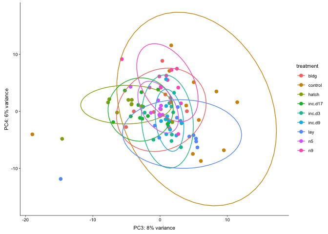

    library(tidyverse)

    ## ── Attaching packages ────────────────────────────────────────────────────────────────── tidyverse 1.2.1 ──

    ## ✔ ggplot2 3.1.0       ✔ purrr   0.3.1  
    ## ✔ tibble  2.0.1       ✔ dplyr   0.8.0.1
    ## ✔ tidyr   0.8.3       ✔ stringr 1.4.0  
    ## ✔ readr   1.3.1       ✔ forcats 0.4.0

    ## ── Conflicts ───────────────────────────────────────────────────────────────────── tidyverse_conflicts() ──
    ## ✖ dplyr::filter() masks stats::filter()
    ## ✖ dplyr::lag()    masks stats::lag()

    library(DESeq2)

    ## Loading required package: S4Vectors

    ## Loading required package: stats4

    ## Loading required package: BiocGenerics

    ## Loading required package: parallel

    ## 
    ## Attaching package: 'BiocGenerics'

    ## The following objects are masked from 'package:parallel':
    ## 
    ##     clusterApply, clusterApplyLB, clusterCall, clusterEvalQ,
    ##     clusterExport, clusterMap, parApply, parCapply, parLapply,
    ##     parLapplyLB, parRapply, parSapply, parSapplyLB

    ## The following objects are masked from 'package:dplyr':
    ## 
    ##     combine, intersect, setdiff, union

    ## The following objects are masked from 'package:stats':
    ## 
    ##     IQR, mad, sd, var, xtabs

    ## The following objects are masked from 'package:base':
    ## 
    ##     anyDuplicated, append, as.data.frame, basename, cbind,
    ##     colMeans, colnames, colSums, dirname, do.call, duplicated,
    ##     eval, evalq, Filter, Find, get, grep, grepl, intersect,
    ##     is.unsorted, lapply, lengths, Map, mapply, match, mget, order,
    ##     paste, pmax, pmax.int, pmin, pmin.int, Position, rank, rbind,
    ##     Reduce, rowMeans, rownames, rowSums, sapply, setdiff, sort,
    ##     table, tapply, union, unique, unsplit, which, which.max,
    ##     which.min

    ## 
    ## Attaching package: 'S4Vectors'

    ## The following objects are masked from 'package:dplyr':
    ## 
    ##     first, rename

    ## The following object is masked from 'package:tidyr':
    ## 
    ##     expand

    ## The following object is masked from 'package:base':
    ## 
    ##     expand.grid

    ## Loading required package: IRanges

    ## 
    ## Attaching package: 'IRanges'

    ## The following objects are masked from 'package:dplyr':
    ## 
    ##     collapse, desc, slice

    ## The following object is masked from 'package:purrr':
    ## 
    ##     reduce

    ## Loading required package: GenomicRanges

    ## Loading required package: GenomeInfoDb

    ## Loading required package: SummarizedExperiment

    ## Loading required package: Biobase

    ## Welcome to Bioconductor
    ## 
    ##     Vignettes contain introductory material; view with
    ##     'browseVignettes()'. To cite Bioconductor, see
    ##     'citation("Biobase")', and for packages 'citation("pkgname")'.

    ## Loading required package: DelayedArray

    ## Loading required package: matrixStats

    ## 
    ## Attaching package: 'matrixStats'

    ## The following objects are masked from 'package:Biobase':
    ## 
    ##     anyMissing, rowMedians

    ## The following object is masked from 'package:dplyr':
    ## 
    ##     count

    ## Loading required package: BiocParallel

    ## 
    ## Attaching package: 'DelayedArray'

    ## The following objects are masked from 'package:matrixStats':
    ## 
    ##     colMaxs, colMins, colRanges, rowMaxs, rowMins, rowRanges

    ## The following object is masked from 'package:purrr':
    ## 
    ##     simplify

    ## The following objects are masked from 'package:base':
    ## 
    ##     aperm, apply

    library(cowplot)

    ## 
    ## Attaching package: 'cowplot'

    ## The following object is masked from 'package:ggplot2':
    ## 
    ##     ggsave

    # load custom functions  
    source("../R/functions.R")   

    knitr::opts_chunk$set(fig.path = '../figures/pit/',cache=TRUE)

This anlaysis will *exclude* the control timepoint but *combine*
incubation and nestling timepoints.

    # import "colData" which contains sample information and "countData" which contains read counts
    colData <- read.csv("../results/00_colData_characterization.csv", header = T, row.names = 1)
    countData <- read.csv("../results/00_countData_characterization.csv", header = T, row.names = 1)
    geneinfo <- read.csv("../results/00_geneinfo.csv", row.names = 1)

    # making new groups
    colData$group <- NULL
    colData$tempgroup <- ifelse(colData$treatment == "bldg", "bldg",
                      ifelse(colData$treatment == "control", "control",
                       ifelse(colData$treatment == "hatch", "hatch",
                        ifelse(grepl("inc", colData$treatment), "inc",
                         ifelse(colData$treatment == "lay", "lay", "nestl")))))
    colData$tempgroup <- as.factor(colData$tempgroup)

    colData$group <- paste(colData$sex, colData$tempgroup, sep = "")
    colData$group <- as.factor(colData$group)
    str(colData$group)

    ##  Factor w/ 12 levels "femalebldg","femalecontrol",..: 8 8 8 8 8 8 2 2 2 8 ...

    colData <- colData %>%
      dplyr::filter(grepl('pituitary', tissue)) %>%
      #dplyr::filter(treatment != "control") %>%
      dplyr::filter(sex == "female") %>%
      droplevels()
    row.names(colData) <- colData$V1

    # print sample sizes
    colData %>% select(group, tissue)  %>%  summary()

    ##            group          tissue  
    ##  femalebldg   :10   pituitary:96  
    ##  femalecontrol:11                 
    ##  femalehatch  :10                 
    ##  femaleinc    :34                 
    ##  femalelay    :10                 
    ##  femalenestl  :21

    savecols <- as.character(colData$V1) 
    savecols <- as.vector(savecols) 
    countData <- countData %>% dplyr::select(one_of(savecols)) 

    # check that row and col lenghts are equal
    ncol(countData) == nrow(colData)

    ## [1] TRUE

    dds <- DESeqDataSetFromMatrix(countData = countData,
                                  colData = colData,
                                  design = ~ treatment )

    ##   it appears that the last variable in the design formula, 'treatment',
    ##   has a factor level, 'control', which is not the reference level. we recommend
    ##   to use factor(...,levels=...) or relevel() to set this as the reference level
    ##   before proceeding. for more information, please see the 'Note on factor levels'
    ##   in vignette('DESeq2').

    dds <- dds[ rowSums(counts(dds)) > 2, ] ## pre-filter genes 
    dds <- DESeq(dds) # Differential expression analysis

    ## estimating size factors

    ## estimating dispersions

    ## gene-wise dispersion estimates

    ## mean-dispersion relationship

    ## final dispersion estimates

    ## fitting model and testing

    ## -- replacing outliers and refitting for 80 genes
    ## -- DESeq argument 'minReplicatesForReplace' = 7 
    ## -- original counts are preserved in counts(dds)

    ## estimating dispersions

    ## fitting model and testing

    vsd <- vst(dds, blind=FALSE) # variance stabilized

    levels(colData$treatment)

    ## [1] "bldg"    "control" "hatch"   "inc.d17" "inc.d3"  "inc.d9"  "lay"    
    ## [8] "n5"      "n9"

    summary(results(dds, contrast=c("treatment",'control', 'bldg'))) 

    ## 
    ## out of 14828 with nonzero total read count
    ## adjusted p-value < 0.1
    ## LFC > 0 (up)       : 3789, 26%
    ## LFC < 0 (down)     : 2659, 18%
    ## outliers [1]       : 0, 0%
    ## low counts [2]     : 577, 3.9%
    ## (mean count < 0)
    ## [1] see 'cooksCutoff' argument of ?results
    ## [2] see 'independentFiltering' argument of ?results

    summary(results(dds, contrast=c("treatment",'control', 'lay')))     

    ## 
    ## out of 14828 with nonzero total read count
    ## adjusted p-value < 0.1
    ## LFC > 0 (up)       : 3756, 25%
    ## LFC < 0 (down)     : 2559, 17%
    ## outliers [1]       : 0, 0%
    ## low counts [2]     : 2, 0.013%
    ## (mean count < 0)
    ## [1] see 'cooksCutoff' argument of ?results
    ## [2] see 'independentFiltering' argument of ?results

    summary(results(dds, contrast=c("treatment",'control', 'inc.d3')))  

    ## 
    ## out of 14828 with nonzero total read count
    ## adjusted p-value < 0.1
    ## LFC > 0 (up)       : 3319, 22%
    ## LFC < 0 (down)     : 2231, 15%
    ## outliers [1]       : 0, 0%
    ## low counts [2]     : 290, 2%
    ## (mean count < 0)
    ## [1] see 'cooksCutoff' argument of ?results
    ## [2] see 'independentFiltering' argument of ?results

    summary(results(dds, contrast=c("treatment",'control', 'inc.d9')))   

    ## 
    ## out of 14828 with nonzero total read count
    ## adjusted p-value < 0.1
    ## LFC > 0 (up)       : 3772, 25%
    ## LFC < 0 (down)     : 2472, 17%
    ## outliers [1]       : 0, 0%
    ## low counts [2]     : 2, 0.013%
    ## (mean count < 0)
    ## [1] see 'cooksCutoff' argument of ?results
    ## [2] see 'independentFiltering' argument of ?results

    summary(results(dds, contrast=c("treatment",'control', 'inc.d17')))  

    ## 
    ## out of 14828 with nonzero total read count
    ## adjusted p-value < 0.1
    ## LFC > 0 (up)       : 3227, 22%
    ## LFC < 0 (down)     : 2114, 14%
    ## outliers [1]       : 0, 0%
    ## low counts [2]     : 290, 2%
    ## (mean count < 0)
    ## [1] see 'cooksCutoff' argument of ?results
    ## [2] see 'independentFiltering' argument of ?results

    summary(results(dds, contrast=c("treatment",'control', 'hatch')))    

    ## 
    ## out of 14828 with nonzero total read count
    ## adjusted p-value < 0.1
    ## LFC > 0 (up)       : 3473, 23%
    ## LFC < 0 (down)     : 2493, 17%
    ## outliers [1]       : 0, 0%
    ## low counts [2]     : 577, 3.9%
    ## (mean count < 0)
    ## [1] see 'cooksCutoff' argument of ?results
    ## [2] see 'independentFiltering' argument of ?results

    summary(results(dds, contrast=c("treatment",'control', 'n5')))      

    ## 
    ## out of 14828 with nonzero total read count
    ## adjusted p-value < 0.1
    ## LFC > 0 (up)       : 3752, 25%
    ## LFC < 0 (down)     : 2388, 16%
    ## outliers [1]       : 0, 0%
    ## low counts [2]     : 577, 3.9%
    ## (mean count < 0)
    ## [1] see 'cooksCutoff' argument of ?results
    ## [2] see 'independentFiltering' argument of ?results

    summary(results(dds, contrast=c("treatment",'control', 'n9')))       

    ## 
    ## out of 14828 with nonzero total read count
    ## adjusted p-value < 0.1
    ## LFC > 0 (up)       : 3758, 25%
    ## LFC < 0 (down)     : 2383, 16%
    ## outliers [1]       : 0, 0%
    ## low counts [2]     : 290, 2%
    ## (mean count < 0)
    ## [1] see 'cooksCutoff' argument of ?results
    ## [2] see 'independentFiltering' argument of ?results

    summary(results(dds, contrast=c("treatment",'bldg', 'lay')))      

    ## 
    ## out of 14828 with nonzero total read count
    ## adjusted p-value < 0.1
    ## LFC > 0 (up)       : 181, 1.2%
    ## LFC < 0 (down)     : 99, 0.67%
    ## outliers [1]       : 0, 0%
    ## low counts [2]     : 290, 2%
    ## (mean count < 0)
    ## [1] see 'cooksCutoff' argument of ?results
    ## [2] see 'independentFiltering' argument of ?results

    summary(results(dds, contrast=c("treatment",'bldg', 'inc.d3')))   

    ## 
    ## out of 14828 with nonzero total read count
    ## adjusted p-value < 0.1
    ## LFC > 0 (up)       : 21, 0.14%
    ## LFC < 0 (down)     : 16, 0.11%
    ## outliers [1]       : 0, 0%
    ## low counts [2]     : 2590, 17%
    ## (mean count < 9)
    ## [1] see 'cooksCutoff' argument of ?results
    ## [2] see 'independentFiltering' argument of ?results

    summary(results(dds, contrast=c("treatment",'bldg', 'inc.d9')))   

    ## 
    ## out of 14828 with nonzero total read count
    ## adjusted p-value < 0.1
    ## LFC > 0 (up)       : 78, 0.53%
    ## LFC < 0 (down)     : 25, 0.17%
    ## outliers [1]       : 0, 0%
    ## low counts [2]     : 2, 0.013%
    ## (mean count < 0)
    ## [1] see 'cooksCutoff' argument of ?results
    ## [2] see 'independentFiltering' argument of ?results

    summary(results(dds, contrast=c("treatment",'bldg', 'inc.d17')))  

    ## 
    ## out of 14828 with nonzero total read count
    ## adjusted p-value < 0.1
    ## LFC > 0 (up)       : 1749, 12%
    ## LFC < 0 (down)     : 1678, 11%
    ## outliers [1]       : 0, 0%
    ## low counts [2]     : 865, 5.8%
    ## (mean count < 1)
    ## [1] see 'cooksCutoff' argument of ?results
    ## [2] see 'independentFiltering' argument of ?results

    summary(results(dds, contrast=c("treatment",'bldg', 'hatch')))   

    ## 
    ## out of 14828 with nonzero total read count
    ## adjusted p-value < 0.1
    ## LFC > 0 (up)       : 1272, 8.6%
    ## LFC < 0 (down)     : 1410, 9.5%
    ## outliers [1]       : 0, 0%
    ## low counts [2]     : 865, 5.8%
    ## (mean count < 1)
    ## [1] see 'cooksCutoff' argument of ?results
    ## [2] see 'independentFiltering' argument of ?results

    summary(results(dds, contrast=c("treatment",'bldg', 'n5')))      

    ## 
    ## out of 14828 with nonzero total read count
    ## adjusted p-value < 0.1
    ## LFC > 0 (up)       : 316, 2.1%
    ## LFC < 0 (down)     : 178, 1.2%
    ## outliers [1]       : 0, 0%
    ## low counts [2]     : 2, 0.013%
    ## (mean count < 0)
    ## [1] see 'cooksCutoff' argument of ?results
    ## [2] see 'independentFiltering' argument of ?results

    summary(results(dds, contrast=c("treatment",'bldg', 'n9')))      

    ## 
    ## out of 14828 with nonzero total read count
    ## adjusted p-value < 0.1
    ## LFC > 0 (up)       : 179, 1.2%
    ## LFC < 0 (down)     : 115, 0.78%
    ## outliers [1]       : 0, 0%
    ## low counts [2]     : 577, 3.9%
    ## (mean count < 0)
    ## [1] see 'cooksCutoff' argument of ?results
    ## [2] see 'independentFiltering' argument of ?results

    summary(results(dds, contrast=c("treatment",'lay', 'bldg')))     

    ## 
    ## out of 14828 with nonzero total read count
    ## adjusted p-value < 0.1
    ## LFC > 0 (up)       : 99, 0.67%
    ## LFC < 0 (down)     : 181, 1.2%
    ## outliers [1]       : 0, 0%
    ## low counts [2]     : 290, 2%
    ## (mean count < 0)
    ## [1] see 'cooksCutoff' argument of ?results
    ## [2] see 'independentFiltering' argument of ?results

    summary(results(dds, contrast=c("treatment",'lay', 'inc.d3')))    

    ## 
    ## out of 14828 with nonzero total read count
    ## adjusted p-value < 0.1
    ## LFC > 0 (up)       : 97, 0.65%
    ## LFC < 0 (down)     : 236, 1.6%
    ## outliers [1]       : 0, 0%
    ## low counts [2]     : 4602, 31%
    ## (mean count < 45)
    ## [1] see 'cooksCutoff' argument of ?results
    ## [2] see 'independentFiltering' argument of ?results

    summary(results(dds, contrast=c("treatment",'lay', 'inc.d9')))   

    ## 
    ## out of 14828 with nonzero total read count
    ## adjusted p-value < 0.1
    ## LFC > 0 (up)       : 45, 0.3%
    ## LFC < 0 (down)     : 62, 0.42%
    ## outliers [1]       : 0, 0%
    ## low counts [2]     : 290, 2%
    ## (mean count < 0)
    ## [1] see 'cooksCutoff' argument of ?results
    ## [2] see 'independentFiltering' argument of ?results

    summary(results(dds, contrast=c("treatment",'lay', 'inc.d17')))  

    ## 
    ## out of 14828 with nonzero total read count
    ## adjusted p-value < 0.1
    ## LFC > 0 (up)       : 1974, 13%
    ## LFC < 0 (down)     : 2021, 14%
    ## outliers [1]       : 0, 0%
    ## low counts [2]     : 577, 3.9%
    ## (mean count < 0)
    ## [1] see 'cooksCutoff' argument of ?results
    ## [2] see 'independentFiltering' argument of ?results

    summary(results(dds, contrast=c("treatment",'lay', 'hatch')))    

    ## 
    ## out of 14828 with nonzero total read count
    ## adjusted p-value < 0.1
    ## LFC > 0 (up)       : 1454, 9.8%
    ## LFC < 0 (down)     : 1894, 13%
    ## outliers [1]       : 0, 0%
    ## low counts [2]     : 865, 5.8%
    ## (mean count < 1)
    ## [1] see 'cooksCutoff' argument of ?results
    ## [2] see 'independentFiltering' argument of ?results

    summary(results(dds, contrast=c("treatment",'lay', 'n5')))       

    ## 
    ## out of 14828 with nonzero total read count
    ## adjusted p-value < 0.1
    ## LFC > 0 (up)       : 240, 1.6%
    ## LFC < 0 (down)     : 220, 1.5%
    ## outliers [1]       : 0, 0%
    ## low counts [2]     : 577, 3.9%
    ## (mean count < 0)
    ## [1] see 'cooksCutoff' argument of ?results
    ## [2] see 'independentFiltering' argument of ?results

    summary(results(dds, contrast=c("treatment",'lay', 'n9')))       

    ## 
    ## out of 14828 with nonzero total read count
    ## adjusted p-value < 0.1
    ## LFC > 0 (up)       : 271, 1.8%
    ## LFC < 0 (down)     : 299, 2%
    ## outliers [1]       : 0, 0%
    ## low counts [2]     : 865, 5.8%
    ## (mean count < 1)
    ## [1] see 'cooksCutoff' argument of ?results
    ## [2] see 'independentFiltering' argument of ?results

    summary(results(dds, contrast=c("treatment",'inc.d3', 'bldg')))     

    ## 
    ## out of 14828 with nonzero total read count
    ## adjusted p-value < 0.1
    ## LFC > 0 (up)       : 16, 0.11%
    ## LFC < 0 (down)     : 21, 0.14%
    ## outliers [1]       : 0, 0%
    ## low counts [2]     : 2590, 17%
    ## (mean count < 9)
    ## [1] see 'cooksCutoff' argument of ?results
    ## [2] see 'independentFiltering' argument of ?results

    summary(results(dds, contrast=c("treatment",'inc.d3', 'lay')))       

    ## 
    ## out of 14828 with nonzero total read count
    ## adjusted p-value < 0.1
    ## LFC > 0 (up)       : 236, 1.6%
    ## LFC < 0 (down)     : 97, 0.65%
    ## outliers [1]       : 0, 0%
    ## low counts [2]     : 4602, 31%
    ## (mean count < 45)
    ## [1] see 'cooksCutoff' argument of ?results
    ## [2] see 'independentFiltering' argument of ?results

    summary(results(dds, contrast=c("treatment",'inc.d3', 'inc.d9')))   

    ## 
    ## out of 14828 with nonzero total read count
    ## adjusted p-value < 0.1
    ## LFC > 0 (up)       : 1, 0.0067%
    ## LFC < 0 (down)     : 0, 0%
    ## outliers [1]       : 0, 0%
    ## low counts [2]     : 2, 0.013%
    ## (mean count < 0)
    ## [1] see 'cooksCutoff' argument of ?results
    ## [2] see 'independentFiltering' argument of ?results

    summary(results(dds, contrast=c("treatment",'inc.d3', 'inc.d17')))   

    ## 
    ## out of 14828 with nonzero total read count
    ## adjusted p-value < 0.1
    ## LFC > 0 (up)       : 344, 2.3%
    ## LFC < 0 (down)     : 788, 5.3%
    ## outliers [1]       : 0, 0%
    ## low counts [2]     : 865, 5.8%
    ## (mean count < 1)
    ## [1] see 'cooksCutoff' argument of ?results
    ## [2] see 'independentFiltering' argument of ?results

    summary(results(dds, contrast=c("treatment",'inc.d3', 'lay')))      

    ## 
    ## out of 14828 with nonzero total read count
    ## adjusted p-value < 0.1
    ## LFC > 0 (up)       : 236, 1.6%
    ## LFC < 0 (down)     : 97, 0.65%
    ## outliers [1]       : 0, 0%
    ## low counts [2]     : 4602, 31%
    ## (mean count < 45)
    ## [1] see 'cooksCutoff' argument of ?results
    ## [2] see 'independentFiltering' argument of ?results

    summary(results(dds, contrast=c("treatment",'inc.d3', 'n5')))        

    ## 
    ## out of 14828 with nonzero total read count
    ## adjusted p-value < 0.1
    ## LFC > 0 (up)       : 115, 0.78%
    ## LFC < 0 (down)     : 83, 0.56%
    ## outliers [1]       : 0, 0%
    ## low counts [2]     : 865, 5.8%
    ## (mean count < 1)
    ## [1] see 'cooksCutoff' argument of ?results
    ## [2] see 'independentFiltering' argument of ?results

    summary(results(dds, contrast=c("treatment",'inc.d3', 'n9')))       

    ## 
    ## out of 14828 with nonzero total read count
    ## adjusted p-value < 0.1
    ## LFC > 0 (up)       : 212, 1.4%
    ## LFC < 0 (down)     : 165, 1.1%
    ## outliers [1]       : 0, 0%
    ## low counts [2]     : 1727, 12%
    ## (mean count < 4)
    ## [1] see 'cooksCutoff' argument of ?results
    ## [2] see 'independentFiltering' argument of ?results

    summary(results(dds, contrast=c("treatment",'inc.d9', 'inc.d17')))   

    ## 
    ## out of 14828 with nonzero total read count
    ## adjusted p-value < 0.1
    ## LFC > 0 (up)       : 839, 5.7%
    ## LFC < 0 (down)     : 1178, 7.9%
    ## outliers [1]       : 0, 0%
    ## low counts [2]     : 1152, 7.8%
    ## (mean count < 2)
    ## [1] see 'cooksCutoff' argument of ?results
    ## [2] see 'independentFiltering' argument of ?results

    summary(results(dds, contrast=c("treatment",'inc.d9', 'lay')))      

    ## 
    ## out of 14828 with nonzero total read count
    ## adjusted p-value < 0.1
    ## LFC > 0 (up)       : 62, 0.42%
    ## LFC < 0 (down)     : 45, 0.3%
    ## outliers [1]       : 0, 0%
    ## low counts [2]     : 290, 2%
    ## (mean count < 0)
    ## [1] see 'cooksCutoff' argument of ?results
    ## [2] see 'independentFiltering' argument of ?results

    summary(results(dds, contrast=c("treatment",'inc.d9', 'n5')))       

    ## 
    ## out of 14828 with nonzero total read count
    ## adjusted p-value < 0.1
    ## LFC > 0 (up)       : 16, 0.11%
    ## LFC < 0 (down)     : 71, 0.48%
    ## outliers [1]       : 0, 0%
    ## low counts [2]     : 577, 3.9%
    ## (mean count < 0)
    ## [1] see 'cooksCutoff' argument of ?results
    ## [2] see 'independentFiltering' argument of ?results

    summary(results(dds, contrast=c("treatment",'inc.d9', 'n9')))       

    ## 
    ## out of 14828 with nonzero total read count
    ## adjusted p-value < 0.1
    ## LFC > 0 (up)       : 136, 0.92%
    ## LFC < 0 (down)     : 141, 0.95%
    ## outliers [1]       : 0, 0%
    ## low counts [2]     : 1440, 9.7%
    ## (mean count < 2)
    ## [1] see 'cooksCutoff' argument of ?results
    ## [2] see 'independentFiltering' argument of ?results

    summary(results(dds, contrast=c("treatment",'inc.d17', 'lay')))  

    ## 
    ## out of 14828 with nonzero total read count
    ## adjusted p-value < 0.1
    ## LFC > 0 (up)       : 2021, 14%
    ## LFC < 0 (down)     : 1974, 13%
    ## outliers [1]       : 0, 0%
    ## low counts [2]     : 577, 3.9%
    ## (mean count < 0)
    ## [1] see 'cooksCutoff' argument of ?results
    ## [2] see 'independentFiltering' argument of ?results

    summary(results(dds, contrast=c("treatment",'inc.d17', 'n5')))   

    ## 
    ## out of 14828 with nonzero total read count
    ## adjusted p-value < 0.1
    ## LFC > 0 (up)       : 992, 6.7%
    ## LFC < 0 (down)     : 719, 4.8%
    ## outliers [1]       : 0, 0%
    ## low counts [2]     : 1440, 9.7%
    ## (mean count < 2)
    ## [1] see 'cooksCutoff' argument of ?results
    ## [2] see 'independentFiltering' argument of ?results

    summary(results(dds, contrast=c("treatment",'inc.d17', 'n9')))   

    ## 
    ## out of 14828 with nonzero total read count
    ## adjusted p-value < 0.1
    ## LFC > 0 (up)       : 1480, 10%
    ## LFC < 0 (down)     : 1403, 9.5%
    ## outliers [1]       : 0, 0%
    ## low counts [2]     : 865, 5.8%
    ## (mean count < 1)
    ## [1] see 'cooksCutoff' argument of ?results
    ## [2] see 'independentFiltering' argument of ?results

    summary(results(dds, contrast=c("treatment",'hatch', 'bldg')))      

    ## 
    ## out of 14828 with nonzero total read count
    ## adjusted p-value < 0.1
    ## LFC > 0 (up)       : 1410, 9.5%
    ## LFC < 0 (down)     : 1272, 8.6%
    ## outliers [1]       : 0, 0%
    ## low counts [2]     : 865, 5.8%
    ## (mean count < 1)
    ## [1] see 'cooksCutoff' argument of ?results
    ## [2] see 'independentFiltering' argument of ?results

    summary(results(dds, contrast=c("treatment",'hatch', 'lay')))       

    ## 
    ## out of 14828 with nonzero total read count
    ## adjusted p-value < 0.1
    ## LFC > 0 (up)       : 1894, 13%
    ## LFC < 0 (down)     : 1454, 9.8%
    ## outliers [1]       : 0, 0%
    ## low counts [2]     : 865, 5.8%
    ## (mean count < 1)
    ## [1] see 'cooksCutoff' argument of ?results
    ## [2] see 'independentFiltering' argument of ?results

    summary(results(dds, contrast=c("treatment",'hatch', 'inc.d3')))    

    ## 
    ## out of 14828 with nonzero total read count
    ## adjusted p-value < 0.1
    ## LFC > 0 (up)       : 827, 5.6%
    ## LFC < 0 (down)     : 256, 1.7%
    ## outliers [1]       : 0, 0%
    ## low counts [2]     : 577, 3.9%
    ## (mean count < 0)
    ## [1] see 'cooksCutoff' argument of ?results
    ## [2] see 'independentFiltering' argument of ?results

    summary(results(dds, contrast=c("treatment",'hatch', 'inc.d9')))    

    ## 
    ## out of 14828 with nonzero total read count
    ## adjusted p-value < 0.1
    ## LFC > 0 (up)       : 1140, 7.7%
    ## LFC < 0 (down)     : 530, 3.6%
    ## outliers [1]       : 0, 0%
    ## low counts [2]     : 1152, 7.8%
    ## (mean count < 2)
    ## [1] see 'cooksCutoff' argument of ?results
    ## [2] see 'independentFiltering' argument of ?results

    summary(results(dds, contrast=c("treatment",'hatch', 'inc.d17')))  

    ## 
    ## out of 14828 with nonzero total read count
    ## adjusted p-value < 0.1
    ## LFC > 0 (up)       : 4, 0.027%
    ## LFC < 0 (down)     : 2, 0.013%
    ## outliers [1]       : 0, 0%
    ## low counts [2]     : 2, 0.013%
    ## (mean count < 0)
    ## [1] see 'cooksCutoff' argument of ?results
    ## [2] see 'independentFiltering' argument of ?results

    summary(results(dds, contrast=c("treatment",'hatch', 'n5')))       

    ## 
    ## out of 14828 with nonzero total read count
    ## adjusted p-value < 0.1
    ## LFC > 0 (up)       : 775, 5.2%
    ## LFC < 0 (down)     : 314, 2.1%
    ## outliers [1]       : 0, 0%
    ## low counts [2]     : 1727, 12%
    ## (mean count < 4)
    ## [1] see 'cooksCutoff' argument of ?results
    ## [2] see 'independentFiltering' argument of ?results

    summary(results(dds, contrast=c("treatment",'hatch', 'n9')))       

    ## 
    ## out of 14828 with nonzero total read count
    ## adjusted p-value < 0.1
    ## LFC > 0 (up)       : 1307, 8.8%
    ## LFC < 0 (down)     : 1012, 6.8%
    ## outliers [1]       : 0, 0%
    ## low counts [2]     : 1152, 7.8%
    ## (mean count < 2)
    ## [1] see 'cooksCutoff' argument of ?results
    ## [2] see 'independentFiltering' argument of ?results

    summary(results(dds, contrast=c("treatment",'n5', 'bldg')))      

    ## 
    ## out of 14828 with nonzero total read count
    ## adjusted p-value < 0.1
    ## LFC > 0 (up)       : 178, 1.2%
    ## LFC < 0 (down)     : 316, 2.1%
    ## outliers [1]       : 0, 0%
    ## low counts [2]     : 2, 0.013%
    ## (mean count < 0)
    ## [1] see 'cooksCutoff' argument of ?results
    ## [2] see 'independentFiltering' argument of ?results

    summary(results(dds, contrast=c("treatment",'n5', 'lay')))       

    ## 
    ## out of 14828 with nonzero total read count
    ## adjusted p-value < 0.1
    ## LFC > 0 (up)       : 220, 1.5%
    ## LFC < 0 (down)     : 240, 1.6%
    ## outliers [1]       : 0, 0%
    ## low counts [2]     : 577, 3.9%
    ## (mean count < 0)
    ## [1] see 'cooksCutoff' argument of ?results
    ## [2] see 'independentFiltering' argument of ?results

    summary(results(dds, contrast=c("treatment",'n5', 'inc.d3')))  

    ## 
    ## out of 14828 with nonzero total read count
    ## adjusted p-value < 0.1
    ## LFC > 0 (up)       : 83, 0.56%
    ## LFC < 0 (down)     : 115, 0.78%
    ## outliers [1]       : 0, 0%
    ## low counts [2]     : 865, 5.8%
    ## (mean count < 1)
    ## [1] see 'cooksCutoff' argument of ?results
    ## [2] see 'independentFiltering' argument of ?results

    summary(results(dds, contrast=c("treatment",'n5', 'inc.d9')))   

    ## 
    ## out of 14828 with nonzero total read count
    ## adjusted p-value < 0.1
    ## LFC > 0 (up)       : 71, 0.48%
    ## LFC < 0 (down)     : 16, 0.11%
    ## outliers [1]       : 0, 0%
    ## low counts [2]     : 577, 3.9%
    ## (mean count < 0)
    ## [1] see 'cooksCutoff' argument of ?results
    ## [2] see 'independentFiltering' argument of ?results

    summary(results(dds, contrast=c("treatment",'n5', 'inc.d17')))  

    ## 
    ## out of 14828 with nonzero total read count
    ## adjusted p-value < 0.1
    ## LFC > 0 (up)       : 719, 4.8%
    ## LFC < 0 (down)     : 992, 6.7%
    ## outliers [1]       : 0, 0%
    ## low counts [2]     : 1440, 9.7%
    ## (mean count < 2)
    ## [1] see 'cooksCutoff' argument of ?results
    ## [2] see 'independentFiltering' argument of ?results

    summary(results(dds, contrast=c("treatment",'n5', 'hatch')))   

    ## 
    ## out of 14828 with nonzero total read count
    ## adjusted p-value < 0.1
    ## LFC > 0 (up)       : 314, 2.1%
    ## LFC < 0 (down)     : 775, 5.2%
    ## outliers [1]       : 0, 0%
    ## low counts [2]     : 1727, 12%
    ## (mean count < 4)
    ## [1] see 'cooksCutoff' argument of ?results
    ## [2] see 'independentFiltering' argument of ?results

    summary(results(dds, contrast=c("treatment",'n5', 'n9')))      

    ## 
    ## out of 14828 with nonzero total read count
    ## adjusted p-value < 0.1
    ## LFC > 0 (up)       : 7, 0.047%
    ## LFC < 0 (down)     : 16, 0.11%
    ## outliers [1]       : 0, 0%
    ## low counts [2]     : 2, 0.013%
    ## (mean count < 0)
    ## [1] see 'cooksCutoff' argument of ?results
    ## [2] see 'independentFiltering' argument of ?results

    summary(results(dds, contrast=c("treatment",'n9', 'bldg')))     

    ## 
    ## out of 14828 with nonzero total read count
    ## adjusted p-value < 0.1
    ## LFC > 0 (up)       : 115, 0.78%
    ## LFC < 0 (down)     : 179, 1.2%
    ## outliers [1]       : 0, 0%
    ## low counts [2]     : 577, 3.9%
    ## (mean count < 0)
    ## [1] see 'cooksCutoff' argument of ?results
    ## [2] see 'independentFiltering' argument of ?results

    summary(results(dds, contrast=c("treatment",'n9', 'lay')))      

    ## 
    ## out of 14828 with nonzero total read count
    ## adjusted p-value < 0.1
    ## LFC > 0 (up)       : 299, 2%
    ## LFC < 0 (down)     : 271, 1.8%
    ## outliers [1]       : 0, 0%
    ## low counts [2]     : 865, 5.8%
    ## (mean count < 1)
    ## [1] see 'cooksCutoff' argument of ?results
    ## [2] see 'independentFiltering' argument of ?results

    summary(results(dds, contrast=c("treatment",'n9', 'inc.d3')))   

    ## 
    ## out of 14828 with nonzero total read count
    ## adjusted p-value < 0.1
    ## LFC > 0 (up)       : 165, 1.1%
    ## LFC < 0 (down)     : 212, 1.4%
    ## outliers [1]       : 0, 0%
    ## low counts [2]     : 1727, 12%
    ## (mean count < 4)
    ## [1] see 'cooksCutoff' argument of ?results
    ## [2] see 'independentFiltering' argument of ?results

    summary(results(dds, contrast=c("treatment",'n9', 'inc.d9')))   

    ## 
    ## out of 14828 with nonzero total read count
    ## adjusted p-value < 0.1
    ## LFC > 0 (up)       : 141, 0.95%
    ## LFC < 0 (down)     : 136, 0.92%
    ## outliers [1]       : 0, 0%
    ## low counts [2]     : 1440, 9.7%
    ## (mean count < 2)
    ## [1] see 'cooksCutoff' argument of ?results
    ## [2] see 'independentFiltering' argument of ?results

    summary(results(dds, contrast=c("treatment",'n9', 'inc.d17')))  

    ## 
    ## out of 14828 with nonzero total read count
    ## adjusted p-value < 0.1
    ## LFC > 0 (up)       : 1403, 9.5%
    ## LFC < 0 (down)     : 1480, 10%
    ## outliers [1]       : 0, 0%
    ## low counts [2]     : 865, 5.8%
    ## (mean count < 1)
    ## [1] see 'cooksCutoff' argument of ?results
    ## [2] see 'independentFiltering' argument of ?results

    summary(results(dds, contrast=c("treatment",'n9', 'hatch')))    

    ## 
    ## out of 14828 with nonzero total read count
    ## adjusted p-value < 0.1
    ## LFC > 0 (up)       : 1012, 6.8%
    ## LFC < 0 (down)     : 1307, 8.8%
    ## outliers [1]       : 0, 0%
    ## low counts [2]     : 1152, 7.8%
    ## (mean count < 2)
    ## [1] see 'cooksCutoff' argument of ?results
    ## [2] see 'independentFiltering' argument of ?results

    summary(results(dds, contrast=c("treatment",'n9', 'n5')))     

    ## 
    ## out of 14828 with nonzero total read count
    ## adjusted p-value < 0.1
    ## LFC > 0 (up)       : 16, 0.11%
    ## LFC < 0 (down)     : 7, 0.047%
    ## outliers [1]       : 0, 0%
    ## low counts [2]     : 2, 0.013%
    ## (mean count < 0)
    ## [1] see 'cooksCutoff' argument of ?results
    ## [2] see 'independentFiltering' argument of ?results

    levels(colData$treatment)

    ## [1] "bldg"    "control" "hatch"   "inc.d17" "inc.d3"  "inc.d9"  "lay"    
    ## [8] "n5"      "n9"

    totalDEGs(c("treatment", 'bldg','lay'))

    ## [1] 280

    totalDEGs(c("treatment", 'bldg','inc.d3'))

    ## [1] 37

    totalDEGs(c("treatment", 'bldg','inc.d9'))

    ## [1] 103

    totalDEGs(c("treatment", 'bldg','inc.d17'))

    ## [1] 3427

    totalDEGs(c("treatment", 'bldg','hatch'))

    ## [1] 2682

    totalDEGs(c("treatment", 'bldg','n5'))

    ## [1] 494

    totalDEGs(c("treatment", 'bldg','n9'))

    ## [1] 294

    totalDEGs(c("treatment", 'lay','bldg'))

    ## [1] 280

    totalDEGs(c("treatment", 'lay','inc.d3'))

    ## [1] 333

    totalDEGs(c("treatment", 'lay','inc.d9'))

    ## [1] 107

    totalDEGs(c("treatment", 'lay','inc.d17'))

    ## [1] 3995

    totalDEGs(c("treatment", 'lay','hatch'))

    ## [1] 3348

    totalDEGs(c("treatment", 'lay','n5'))

    ## [1] 460

    totalDEGs(c("treatment", 'lay','n9'))

    ## [1] 570

    totalDEGs(c("treatment", 'inc.d3','bldg'))

    ## [1] 37

    totalDEGs(c("treatment", 'inc.d3','lay'))

    ## [1] 333

    totalDEGs(c("treatment", 'inc.d3','inc.d9'))

    ## [1] 1

    totalDEGs(c("treatment", 'inc.d3','inc.d17'))

    ## [1] 1132

    totalDEGs(c("treatment", 'inc.d3','hatch'))

    ## [1] 1083

    totalDEGs(c("treatment", 'inc.d3','n5'))

    ## [1] 198

    totalDEGs(c("treatment", 'inc.d3','n9'))

    ## [1] 377

    totalDEGs(c("treatment", 'inc.d9','bldg'))

    ## [1] 103

    totalDEGs(c("treatment", 'inc.d9','lay'))

    ## [1] 107

    totalDEGs(c("treatment", 'inc.d9','inc.d3'))

    ## [1] 1

    totalDEGs(c("treatment", 'inc.d9','inc.d17'))

    ## [1] 2017

    totalDEGs(c("treatment", 'inc.d9','hatch'))

    ## [1] 1670

    totalDEGs(c("treatment", 'inc.d9','n5'))

    ## [1] 87

    totalDEGs(c("treatment", 'inc.d9','n9'))

    ## [1] 277

    totalDEGs(c("treatment", 'inc.d17','bldg'))

    ## [1] 3427

    totalDEGs(c("treatment", 'inc.d17','lay'))

    ## [1] 3995

    totalDEGs(c("treatment", 'inc.d17','inc.d3'))

    ## [1] 1132

    totalDEGs(c("treatment", 'inc.d17','inc.d9'))

    ## [1] 2017

    totalDEGs(c("treatment", 'inc.d17','hatch'))

    ## [1] 6

    totalDEGs(c("treatment", 'inc.d17','n5'))

    ## [1] 1711

    totalDEGs(c("treatment", 'inc.d17','n9'))

    ## [1] 2883

    totalDEGs(c("treatment", 'hatch','bldg'))

    ## [1] 2682

    totalDEGs(c("treatment", 'hatch','lay'))

    ## [1] 3348

    totalDEGs(c("treatment", 'hatch','inc.d3'))

    ## [1] 1083

    totalDEGs(c("treatment", 'hatch','inc.d9'))

    ## [1] 1670

    totalDEGs(c("treatment", 'hatch','inc.d17'))

    ## [1] 6

    totalDEGs(c("treatment", 'hatch','n5'))

    ## [1] 1089

    totalDEGs(c("treatment", 'hatch','n9'))

    ## [1] 2319

    totalDEGs(c("treatment", 'n5','bldg'))

    ## [1] 494

    totalDEGs(c("treatment", 'n5','lay'))

    ## [1] 460

    totalDEGs(c("treatment", 'n5','inc.d3'))

    ## [1] 198

    totalDEGs(c("treatment", 'n5','inc.d9'))

    ## [1] 87

    totalDEGs(c("treatment", 'n5','inc.d17'))

    ## [1] 1711

    totalDEGs(c("treatment", 'n5','hatch'))

    ## [1] 1089

    totalDEGs(c("treatment", 'n5','n9'))

    ## [1] 23

    totalDEGs(c("treatment", 'n9','bldg'))

    ## [1] 294

    totalDEGs(c("treatment", 'n9','lay'))

    ## [1] 570

    totalDEGs(c("treatment", 'n9','inc.d3'))

    ## [1] 377

    totalDEGs(c("treatment", 'n9','inc.d9'))

    ## [1] 277

    totalDEGs(c("treatment", 'n9','inc.d17'))

    ## [1] 2883

    totalDEGs(c("treatment", 'n9','hatch'))

    ## [1] 2319

    totalDEGs(c("treatment", 'n9','n5'))

    ## [1] 23

    levels(colData$treatment)

    ## [1] "bldg"    "control" "hatch"   "inc.d17" "inc.d3"  "inc.d9"  "lay"    
    ## [8] "n5"      "n9"

    colData$treatment <- factor(colData$treatment, levels = 
                                  c("control", "bldg", "lay", "inc.d3", "inc.d9", 
                                    "inc.d17", "hatch", "n5", "n9"))

    # create the dataframe using my function pcadataframe
    pcadata <- pcadataframe(vsd, intgroup=c("treatment"), returnData=TRUE)
    percentVar <- round(100 * attr(pcadata, "percentVar"))
    percentVar

    ## [1] 12 10  8  6  4  3

    ggplot(pcadata, aes(PC1, PC2,color = treatment)) + 
      geom_point(size = 2, alpha = 1) +
      stat_ellipse(type = "t") +
      xlab(paste0("PC1: ", percentVar[1],"% variance")) +
      ylab(paste0("PC2: ", percentVar[2],"% variance")) +
      theme_cowplot(font_size = 8, line_size = 0.25) 

    ggplot(pcadata, aes(PC2, PC3,color = treatment)) + 
      geom_point(size = 2, alpha = 1) +
      stat_ellipse(type = "t") +
      xlab(paste0("PC2: ", percentVar[2],"% variance")) +
      ylab(paste0("PC3: ", percentVar[3],"% variance")) +
      theme_cowplot(font_size = 8, line_size = 0.25) 

    ggplot(pcadata, aes(PC3, PC4,color = treatment)) + 
      geom_point(size = 2, alpha = 1) +
      stat_ellipse(type = "t") +
      xlab(paste0("PC3: ", percentVar[3],"% variance")) +
      ylab(paste0("PC4: ", percentVar[4],"% variance")) +
      theme_cowplot(font_size = 8, line_size = 0.25) 

PCA statistics

    summary(aov(PC1 ~ treatment, data=pcadata)) 

    ##             Df Sum Sq Mean Sq F value   Pr(>F)    
    ## treatment    8   1596  199.55   13.76 1.04e-12 ***
    ## Residuals   87   1262   14.51                     
    ## ---
    ## Signif. codes:  0 '***' 0.001 '**' 0.01 '*' 0.05 '.' 0.1 ' ' 1

    TukeyHSD(aov(PC1 ~ treatment, data=pcadata), which = "treatment") 

    ##   Tukey multiple comparisons of means
    ##     95% family-wise confidence level
    ## 
    ## Fit: aov(formula = PC1 ~ treatment, data = pcadata)
    ## 
    ## $treatment
    ##                        diff          lwr        upr     p adj
    ## control-bldg     -0.8726313  -6.16671630  4.4214538 0.9998419
    ## hatch-bldg       10.8602301   5.44156131 16.2788989 0.0000003
    ## inc.d17-bldg     10.6708563   5.37677123 15.9649413 0.0000003
    ## inc.d3-bldg       2.8485567  -2.57011207  8.2672255 0.7613604
    ## inc.d9-bldg       3.6841236  -1.41235085  8.7805980 0.3538560
    ## lay-bldg          0.6903083  -4.72836054  6.1089771 0.9999778
    ## n5-bldg           6.1761324   0.75746364 11.5948012 0.0136505
    ## n9-bldg           2.0076112  -3.28647388  7.3016962 0.9530338
    ## hatch-control    11.7328614   6.43877631 17.0269464 0.0000000
    ## inc.d17-control  11.5434875   6.37698954 16.7099855 0.0000000
    ## inc.d3-control    3.7211880  -1.57289707  9.0152730 0.3923453
    ## inc.d9-control    4.5567548  -0.40705585  9.5205655 0.0979859
    ## lay-control       1.5629395  -3.73114553  6.8570246 0.9899702
    ## n5-control        7.0487637   1.75467864 12.3428487 0.0017788
    ## n9-control        2.8802424  -2.28625556  8.0467404 0.6991175
    ## inc.d17-hatch    -0.1893738  -5.48345888  5.1047112 1.0000000
    ## inc.d3-hatch     -8.0116734 -13.43034218 -2.5930046 0.0003163
    ## inc.d9-hatch     -7.1761065 -12.27258095 -2.0796321 0.0007349
    ## lay-hatch       -10.1699218 -15.58859065 -4.7512531 0.0000018
    ## n5-hatch         -4.6840977 -10.10276647  0.7345711 0.1460890
    ## n9-hatch         -8.8526189 -14.14670399 -3.5585339 0.0000275
    ## inc.d3-inc.d17   -7.8222995 -13.11638459 -2.5282145 0.0003200
    ## inc.d9-inc.d17   -6.9867327 -11.95054338 -2.0229220 0.0007394
    ## lay-inc.d17      -9.9805480 -15.27463306 -4.6864630 0.0000016
    ## n5-inc.d17       -4.4947238  -9.78880888  0.7993612 0.1628792
    ## n9-inc.d17       -8.6632451 -13.82974309 -3.4967471 0.0000259
    ## inc.d9-inc.d3     0.8355669  -4.26090757  5.9320413 0.9998481
    ## lay-inc.d3       -2.1582485  -7.57691726  3.2604203 0.9380866
    ## n5-inc.d3         3.3275757  -2.09109308  8.7462445 0.5792243
    ## n9-inc.d3        -0.8409456  -6.13503060  4.4531395 0.9998803
    ## lay-inc.d9       -2.9938153  -8.09028978  2.1026591 0.6366080
    ## n5-inc.d9         2.4920088  -2.60446560  7.5884833 0.8255836
    ## n9-inc.d9        -1.6765124  -6.64032313  3.2872983 0.9764062
    ## n5-lay            5.4858242   0.06715538 10.9044930 0.0448940
    ## n9-lay            1.3173029  -3.97678214  6.6113880 0.9968417
    ## n9-n5            -4.1685213  -9.46260631  1.1255638 0.2442148

    summary(aov(PC2 ~ treatment, data=pcadata)) 

    ##             Df Sum Sq Mean Sq F value   Pr(>F)    
    ## treatment    8 1530.7  191.33   17.62 2.44e-15 ***
    ## Residuals   87  944.5   10.86                     
    ## ---
    ## Signif. codes:  0 '***' 0.001 '**' 0.01 '*' 0.05 '.' 0.1 ' ' 1

    TukeyHSD(aov(PC2 ~ treatment, data=pcadata), which = "treatment") 

    ##   Tukey multiple comparisons of means
    ##     95% family-wise confidence level
    ## 
    ## Fit: aov(formula = PC2 ~ treatment, data = pcadata)
    ## 
    ## $treatment
    ##                        diff        lwr        upr     p adj
    ## control-bldg     13.6660334   9.086256 18.2458104 0.0000000
    ## hatch-bldg        6.2374358   1.549885 10.9249871 0.0017950
    ## inc.d17-bldg      5.7769102   1.197133 10.3566872 0.0038627
    ## inc.d3-bldg       2.1815769  -2.505974  6.8691281 0.8614767
    ## inc.d9-bldg       0.9291523  -3.479677  5.3379815 0.9990282
    ## lay-bldg          1.3704415  -3.317110  6.0579927 0.9905922
    ## n5-bldg           2.6180919  -2.069459  7.3056431 0.6970080
    ## n9-bldg           2.8603365  -1.719440  7.4401136 0.5565557
    ## hatch-control    -7.4285976 -12.008375 -2.8488206 0.0000526
    ## inc.d17-control  -7.8891232 -12.358528 -3.4197185 0.0000080
    ## inc.d3-control  -11.4844565 -16.064234 -6.9046795 0.0000000
    ## inc.d9-control  -12.7368811 -17.030946 -8.4428159 0.0000000
    ## lay-control     -12.2955919 -16.875369 -7.7158149 0.0000000
    ## n5-control      -11.0479416 -15.627719 -6.4681645 0.0000000
    ## n9-control      -10.8056969 -15.275102 -6.3362921 0.0000000
    ## inc.d17-hatch    -0.4605256  -5.040303  4.1192514 0.9999965
    ## inc.d3-hatch     -4.0558589  -8.743410  0.6316923 0.1452522
    ## inc.d9-hatch     -5.3082835  -9.717113 -0.8994544 0.0071072
    ## lay-hatch        -4.8669943  -9.554546 -0.1794431 0.0356750
    ## n5-hatch         -3.6193440  -8.306895  1.0682073 0.2679772
    ## n9-hatch         -3.3770993  -7.956876  1.2026777 0.3271377
    ## inc.d3-inc.d17   -3.5953333  -8.175110  0.9844437 0.2477733
    ## inc.d9-inc.d17   -4.8477579  -9.141823 -0.5536927 0.0151908
    ## lay-inc.d17      -4.4064687  -8.986246  0.1733083 0.0688078
    ## n5-inc.d17       -3.1588184  -7.738595  1.4209587 0.4186688
    ## n9-inc.d17       -2.9165737  -7.385978  1.5528311 0.4962133
    ## inc.d9-inc.d3    -1.2524246  -5.661254  3.1564046 0.9922213
    ## lay-inc.d3       -0.8111354  -5.498687  3.8764159 0.9997723
    ## n5-inc.d3         0.4365150  -4.251036  5.1240662 0.9999981
    ## n9-inc.d3         0.6787597  -3.901017  5.2585367 0.9999293
    ## lay-inc.d9        0.4412892  -3.967540  4.8501184 0.9999966
    ## n5-inc.d9         1.6889395  -2.719890  6.0977687 0.9502364
    ## n9-inc.d9         1.9311842  -2.362881  6.2252494 0.8827968
    ## n5-lay            1.2476503  -3.439901  5.9352016 0.9949811
    ## n9-lay            1.4898950  -3.089882  6.0696721 0.9813060
    ## n9-n5             0.2422447  -4.337532  4.8220217 1.0000000

    summary(aov(PC3 ~ treatment, data=pcadata)) 

    ##             Df Sum Sq Mean Sq F value   Pr(>F)    
    ## treatment    8  597.7   74.71   4.702 8.25e-05 ***
    ## Residuals   87 1382.5   15.89                     
    ## ---
    ## Signif. codes:  0 '***' 0.001 '**' 0.01 '*' 0.05 '.' 0.1 ' ' 1

    summary(aov(PC4 ~ treatment, data=pcadata)) 

    ##             Df Sum Sq Mean Sq F value   Pr(>F)    
    ## treatment    8  515.8   64.47   5.312 1.95e-05 ***
    ## Residuals   87 1056.0   12.14                     
    ## ---
    ## Signif. codes:  0 '***' 0.001 '**' 0.01 '*' 0.05 '.' 0.1 ' ' 1

    summary(aov(PC5 ~ treatment, data=pcadata)) 

    ##             Df Sum Sq Mean Sq F value  Pr(>F)   
    ## treatment    8  253.8   31.72   3.399 0.00192 **
    ## Residuals   87  812.0    9.33                   
    ## ---
    ## Signif. codes:  0 '***' 0.001 '**' 0.01 '*' 0.05 '.' 0.1 ' ' 1

    summary(aov(PC6 ~ treatment, data=pcadata)) 

    ##             Df Sum Sq Mean Sq F value  Pr(>F)   
    ## treatment    8  178.5  22.311   2.856 0.00724 **
    ## Residuals   87  679.7   7.813                   
    ## ---
    ## Signif. codes:  0 '***' 0.001 '**' 0.01 '*' 0.05 '.' 0.1 ' ' 1
