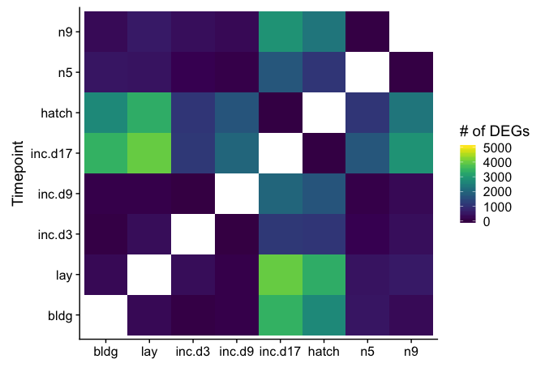
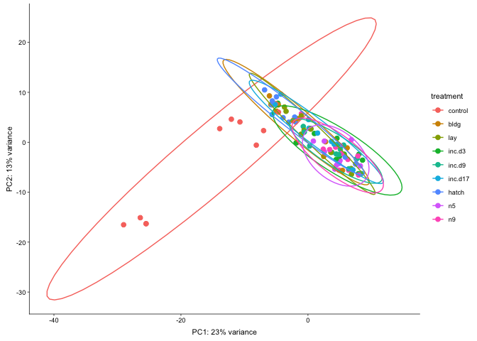
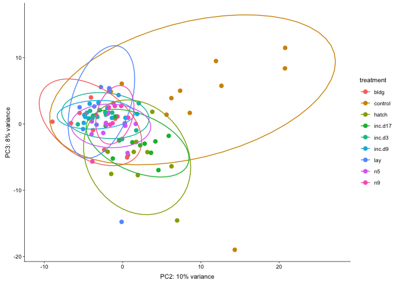
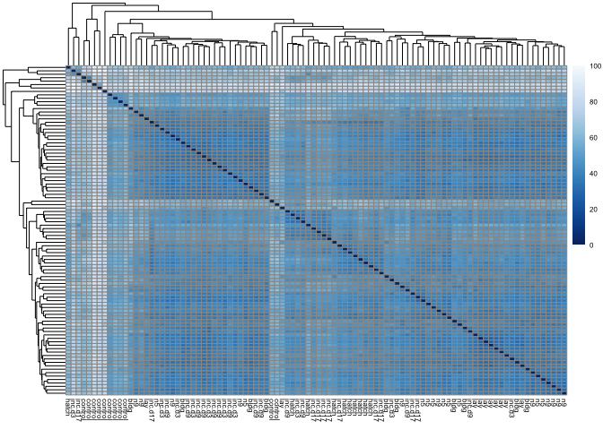
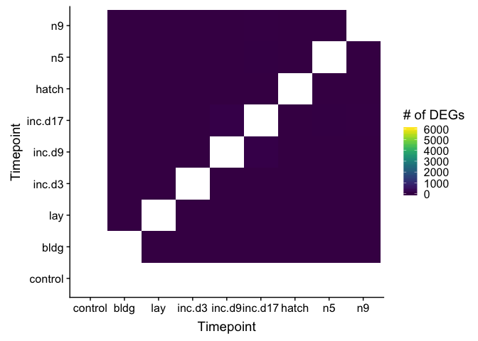
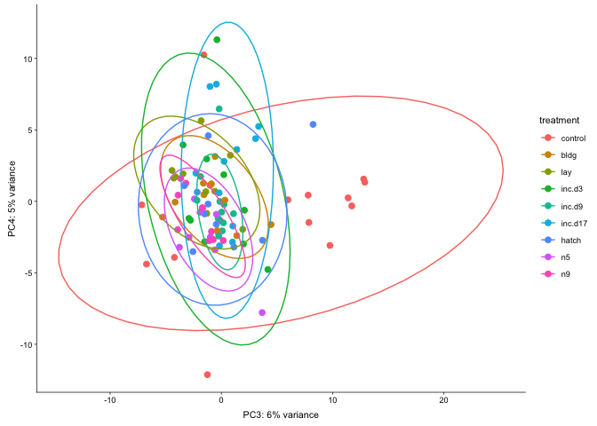
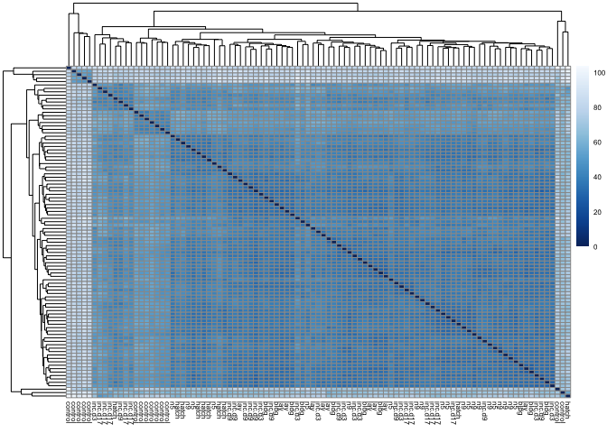

    library(tidyverse)
    library(DESeq2)
    library(cowplot)
    library(RColorBrewer)
    library(pheatmap)
    library(kableExtra)
    library(viridis)

    # load custom functions  
    source("../R/functions.R")  

    knitr::opts_chunk$set(fig.path = '../figures/pit/',cache=TRUE)

Females only
============

    # import "colData" which contains sample information and "countData" which contains read counts
    colData <- read.csv("../results/00_colData_characterization.csv", header = T, row.names = 1)
    countData <- read.csv("../results/00_countData_characterization.csv", header = T, row.names = 1)
    geneinfo <- read.csv("../results/00_geneinfo.csv", row.names = 1)

    colData$treatment <- factor(colData$treatment, levels = 
                                  c("control", "bldg", "lay", "inc.d3", "inc.d9", 
                                    "inc.d17", "hatch", "n5", "n9"))

    colData <- colData %>%
      dplyr::filter(grepl('pituitary', tissue)) %>%
      dplyr::filter(sex == "female") %>%
      droplevels()
    row.names(colData) <- colData$V1

    # print sample sizes
    colData %>% select(group, tissue)  %>%  summary()

    ##                       group          tissue  
    ##  female.pituitary.inc.d9 :13   pituitary:96  
    ##  female.pituitary.control:11                 
    ##  female.pituitary.inc.d17:11                 
    ##  female.pituitary.n9     :11                 
    ##  female.pituitary.bldg   :10                 
    ##  female.pituitary.hatch  :10                 
    ##  (Other)                 :30

    savecols <- as.character(colData$V1) 
    savecols <- as.vector(savecols) 
    countData <- countData %>% dplyr::select(one_of(savecols)) 

    # check that row and col lenghts are equal
    ncol(countData) == nrow(colData) 

    ## [1] TRUE

    dds <- DESeqDataSetFromMatrix(countData = countData,
                                  colData = colData,
                                  design = ~ treatment ) 
    dds <- dds[ rowSums(counts(dds)) > 2, ] ## pre-filter genes 
    dds <- DESeq(dds) # Differential expression analysis

    ## estimating size factors

    ## estimating dispersions

    ## gene-wise dispersion estimates

    ## mean-dispersion relationship

    ## final dispersion estimates

    ## fitting model and testing

    ## -- replacing outliers and refitting for 80 genes
    ## -- DESeq argument 'minReplicatesForReplace' = 7 
    ## -- original counts are preserved in counts(dds)

    ## estimating dispersions

    ## fitting model and testing

    vsd <- vst(dds, blind=FALSE) # variance stabilized 

    #create list of groups
    a <- levels(colData$treatment)
    b <- levels(colData$treatment)

    # slim for testing
    #a <- c("n9", "bldg" , "lay" )
    #b <- c("n9", "bldg" , "lay" )

    # comapre all contrasts, save to datafrmes
    dat=data.frame()
    for (i in a){
      for (j in b){
        if (i != j) {
          k <- paste(i,j, sep = "") #assigns usique rownames
          dat[k,1]<-i               
          dat[k,2]<-j
          dat[k,3]<- numDEGs(i,j) #caluculates number of DEGs
        }
      }
    }

    head(dat)

    ##                     V1      V2   V3
    ## controlbldg    control    bldg 5961
    ## controllay     control     lay 6223
    ## controlinc.d3  control  inc.d3 6758
    ## controlinc.d9  control  inc.d9 6953
    ## controlinc.d17 control inc.d17 6673
    ## controlhatch   control   hatch 6266

    # widen data to create table of degs
    rownames(dat) <- NULL #remove row names
    data_wide <- spread(dat, V2, V3)
    data_wide

    ##        V1 bldg control hatch inc.d17 inc.d3 inc.d9  lay   n5   n9
    ## 1    bldg   NA    5961     3       0      0      5    1   13  292
    ## 2 control 5961      NA  6266    6673   6758   6953 6223 6922 7014
    ## 3   hatch    3    6266    NA       3    930   2175   11 1951 1743
    ## 4 inc.d17    0    6673     3      NA      0      5    4    6  267
    ## 5  inc.d3    0    6758   930       0     NA      1    0    0    0
    ## 6  inc.d9    5    6953  2175       5      1     NA   11    1    2
    ## 7     lay    1    6223    11       4      0     11   NA    1  329
    ## 8      n5   13    6922  1951       6      0      1    1   NA    0
    ## 9      n9  292    7014  1743     267      0      2  329    0   NA

    kable(data_wide) 

<table>
<thead>
<tr>
<th style="text-align:left;">
V1
</th>
<th style="text-align:right;">
bldg
</th>
<th style="text-align:right;">
control
</th>
<th style="text-align:right;">
hatch
</th>
<th style="text-align:right;">
inc.d17
</th>
<th style="text-align:right;">
inc.d3
</th>
<th style="text-align:right;">
inc.d9
</th>
<th style="text-align:right;">
lay
</th>
<th style="text-align:right;">
n5
</th>
<th style="text-align:right;">
n9
</th>
</tr>
</thead>
<tbody>
<tr>
<td style="text-align:left;">
bldg
</td>
<td style="text-align:right;">
NA
</td>
<td style="text-align:right;">
5961
</td>
<td style="text-align:right;">
3
</td>
<td style="text-align:right;">
0
</td>
<td style="text-align:right;">
0
</td>
<td style="text-align:right;">
5
</td>
<td style="text-align:right;">
1
</td>
<td style="text-align:right;">
13
</td>
<td style="text-align:right;">
292
</td>
</tr>
<tr>
<td style="text-align:left;">
control
</td>
<td style="text-align:right;">
5961
</td>
<td style="text-align:right;">
NA
</td>
<td style="text-align:right;">
6266
</td>
<td style="text-align:right;">
6673
</td>
<td style="text-align:right;">
6758
</td>
<td style="text-align:right;">
6953
</td>
<td style="text-align:right;">
6223
</td>
<td style="text-align:right;">
6922
</td>
<td style="text-align:right;">
7014
</td>
</tr>
<tr>
<td style="text-align:left;">
hatch
</td>
<td style="text-align:right;">
3
</td>
<td style="text-align:right;">
6266
</td>
<td style="text-align:right;">
NA
</td>
<td style="text-align:right;">
3
</td>
<td style="text-align:right;">
930
</td>
<td style="text-align:right;">
2175
</td>
<td style="text-align:right;">
11
</td>
<td style="text-align:right;">
1951
</td>
<td style="text-align:right;">
1743
</td>
</tr>
<tr>
<td style="text-align:left;">
inc.d17
</td>
<td style="text-align:right;">
0
</td>
<td style="text-align:right;">
6673
</td>
<td style="text-align:right;">
3
</td>
<td style="text-align:right;">
NA
</td>
<td style="text-align:right;">
0
</td>
<td style="text-align:right;">
5
</td>
<td style="text-align:right;">
4
</td>
<td style="text-align:right;">
6
</td>
<td style="text-align:right;">
267
</td>
</tr>
<tr>
<td style="text-align:left;">
inc.d3
</td>
<td style="text-align:right;">
0
</td>
<td style="text-align:right;">
6758
</td>
<td style="text-align:right;">
930
</td>
<td style="text-align:right;">
0
</td>
<td style="text-align:right;">
NA
</td>
<td style="text-align:right;">
1
</td>
<td style="text-align:right;">
0
</td>
<td style="text-align:right;">
0
</td>
<td style="text-align:right;">
0
</td>
</tr>
<tr>
<td style="text-align:left;">
inc.d9
</td>
<td style="text-align:right;">
5
</td>
<td style="text-align:right;">
6953
</td>
<td style="text-align:right;">
2175
</td>
<td style="text-align:right;">
5
</td>
<td style="text-align:right;">
1
</td>
<td style="text-align:right;">
NA
</td>
<td style="text-align:right;">
11
</td>
<td style="text-align:right;">
1
</td>
<td style="text-align:right;">
2
</td>
</tr>
<tr>
<td style="text-align:left;">
lay
</td>
<td style="text-align:right;">
1
</td>
<td style="text-align:right;">
6223
</td>
<td style="text-align:right;">
11
</td>
<td style="text-align:right;">
4
</td>
<td style="text-align:right;">
0
</td>
<td style="text-align:right;">
11
</td>
<td style="text-align:right;">
NA
</td>
<td style="text-align:right;">
1
</td>
<td style="text-align:right;">
329
</td>
</tr>
<tr>
<td style="text-align:left;">
n5
</td>
<td style="text-align:right;">
13
</td>
<td style="text-align:right;">
6922
</td>
<td style="text-align:right;">
1951
</td>
<td style="text-align:right;">
6
</td>
<td style="text-align:right;">
0
</td>
<td style="text-align:right;">
1
</td>
<td style="text-align:right;">
1
</td>
<td style="text-align:right;">
NA
</td>
<td style="text-align:right;">
0
</td>
</tr>
<tr>
<td style="text-align:left;">
n9
</td>
<td style="text-align:right;">
292
</td>
<td style="text-align:right;">
7014
</td>
<td style="text-align:right;">
1743
</td>
<td style="text-align:right;">
267
</td>
<td style="text-align:right;">
0
</td>
<td style="text-align:right;">
2
</td>
<td style="text-align:right;">
329
</td>
<td style="text-align:right;">
0
</td>
<td style="text-align:right;">
NA
</td>
</tr>
</tbody>
</table>

    dat$V1 <- factor(dat$V1, levels = 
                                  c("control", "bldg", "lay", "inc.d3", "inc.d9", 
                                    "inc.d17", "hatch", "n5", "n9"))
    dat$V2 <- factor(dat$V2, levels = 
                                  c("control", "bldg", "lay", "inc.d3", "inc.d9", 
                                    "inc.d17", "hatch", "n5", "n9"))

    ggplot(dat, aes(V1, V2)) +
      geom_tile(aes(fill = V3)) +
      scale_fill_viridis(na.value="#FFFFFF00", 
                         limits = c(0,6000)) + 
      xlab("Timepoint") + ylab("Timepoint") +
      labs(fill = "# of DEGs")

    # create the dataframe using my function pcadataframe
    pcadata <- pcadataframe(vsd, intgroup=c("treatment"), returnData=TRUE)
    percentVar <- round(100 * attr(pcadata, "percentVar"))
    percentVar

    ## [1] 23 13  9  4  4  3

    ggplot(pcadata, aes(PC1, PC2,color = treatment)) + 
      geom_point(size = 2, alpha = 1) +
      stat_ellipse(type = "t") +
      xlab(paste0("PC1: ", percentVar[1],"% variance")) +
      ylab(paste0("PC2: ", percentVar[2],"% variance")) +
      theme_cowplot(font_size = 8, line_size = 0.25) 

    summary(aov(PC1 ~ treatment, data=pcadata)) 

    ##             Df Sum Sq Mean Sq F value   Pr(>F)    
    ## treatment    8   3382   422.8   17.58 3.03e-15 ***
    ## Residuals   86   2068    24.0                     
    ## ---
    ## Signif. codes:  0 '***' 0.001 '**' 0.01 '*' 0.05 '.' 0.1 ' ' 1

    TukeyHSD(aov(PC1 ~ treatment, data=pcadata), which = "treatment") 

    ##   Tukey multiple comparisons of means
    ##     95% family-wise confidence level
    ## 
    ## Fit: aov(formula = PC1 ~ treatment, data = pcadata)
    ## 
    ## $treatment
    ##                        diff         lwr        upr     p adj
    ## bldg-control    14.39989704   7.5814658 21.2183283 0.0000001
    ## lay-control     16.09279881   9.2743676 22.9112300 0.0000000
    ## inc.d3-control  19.13085349  12.3124223 25.9492847 0.0000000
    ## inc.d9-control  19.44246336  12.9284580 25.9564687 0.0000000
    ## inc.d17-control 16.14349725   9.4893897 22.7976048 0.0000000
    ## hatch-control   13.19824655   6.3798153 20.0166778 0.0000008
    ## n5-control      19.74971866  12.9312874 26.5681499 0.0000000
    ## n9-control      19.46163480  12.8075273 26.1157423 0.0000000
    ## lay-bldg         1.69290177  -5.2859851  8.6717886 0.9973468
    ## inc.d3-bldg      4.73095645  -2.2479304 11.7098433 0.4425874
    ## inc.d9-bldg      5.04256631  -1.6392092 11.7243418 0.2965995
    ## inc.d17-bldg     1.74360020  -5.0748310  8.5620314 0.9961728
    ## hatch-bldg      -1.20165049  -8.1805374  5.7772364 0.9997798
    ## n5-bldg          5.34982161  -1.6290653 12.3287085 0.2767428
    ## n9-bldg          5.06173775  -1.7566935 11.8801690 0.3180105
    ## inc.d3-lay       3.03805468  -3.9408322 10.0169415 0.9003774
    ## inc.d9-lay       3.34966455  -3.3321109 10.0314400 0.8047673
    ## inc.d17-lay      0.05069844  -6.7677328  6.8691297 1.0000000
    ## hatch-lay       -2.89455226  -9.8734391  4.0843346 0.9226755
    ## n5-lay           3.65691985  -3.3219670 10.6358067 0.7642116
    ## n9-lay           3.36883599  -3.4495953 10.1872672 0.8169477
    ## inc.d9-inc.d3    0.31160986  -6.3701656  6.9933853 1.0000000
    ## inc.d17-inc.d3  -2.98735625  -9.8057875  3.8310750 0.8970503
    ## hatch-inc.d3    -5.93260695 -12.9114938  1.0462799 0.1615633
    ## n5-inc.d3        0.61886516  -6.3600217  7.5977520 0.9999987
    ## n9-inc.d3        0.33078130  -6.4876499  7.1492125 1.0000000
    ## inc.d17-inc.d9  -3.29896611  -9.8129715  3.2150393 0.7959044
    ## hatch-inc.d9    -6.24421681 -12.9259923  0.4375587 0.0860310
    ## n5-inc.d9        0.30725530  -6.3745202  6.9890308 1.0000000
    ## n9-inc.d9        0.01917144  -6.4948339  6.5331768 1.0000000
    ## hatch-inc.d17   -2.94525070  -9.7636819  3.8731805 0.9042759
    ## n5-inc.d17       3.60622141  -3.2122098 10.4246526 0.7550247
    ## n9-inc.d17       3.31813755  -3.3359700  9.9722451 0.8092788
    ## n5-hatch         6.55147211  -0.4274148 13.5303590 0.0831736
    ## n9-hatch         6.26338825  -0.5550430 13.0818195 0.0974869
    ## n9-n5           -0.28808386  -7.1065151  6.5303474 1.0000000

    summary(aov(PC2 ~ treatment, data=pcadata)) 

    ##             Df Sum Sq Mean Sq F value Pr(>F)   
    ## treatment    8    665   83.12   3.146 0.0036 **
    ## Residuals   86   2272   26.42                  
    ## ---
    ## Signif. codes:  0 '***' 0.001 '**' 0.01 '*' 0.05 '.' 0.1 ' ' 1

    TukeyHSD(aov(PC2 ~ treatment, data=pcadata), which = "treatment") 

    ##   Tukey multiple comparisons of means
    ##     95% family-wise confidence level
    ## 
    ## Fit: aov(formula = PC2 ~ treatment, data = pcadata)
    ## 
    ## $treatment
    ##                       diff         lwr        upr     p adj
    ## bldg-control     6.4061441  -0.7400815 13.5523696 0.1154733
    ## lay-control      4.8087903  -2.3374352 11.9550159 0.4529269
    ## inc.d3-control   2.3264510  -4.8197745  9.4726766 0.9811743
    ## inc.d9-control   1.7672165  -5.0599480  8.5943810 0.9958386
    ## inc.d17-control  5.7232939  -1.2507081 12.6972960 0.1972736
    ## hatch-control    7.9989183   0.8526928 15.1451439 0.0167058
    ## n5-control       0.9751897  -6.1710359  8.1214152 0.9999622
    ## n9-control       1.1763124  -5.7976896  8.1503145 0.9998113
    ## lay-bldg        -1.5973537  -8.9117488  5.7170413 0.9987400
    ## inc.d3-bldg     -4.0796931 -11.3940881  3.2347020 0.6982104
    ## inc.d9-bldg     -4.6389276 -11.6419277  2.3640725 0.4749432
    ## inc.d17-bldg    -0.6828502  -7.8290757  6.4633754 0.9999976
    ## hatch-bldg       1.5927743  -5.7216208  8.9071693 0.9987657
    ## n5-bldg         -5.4309544 -12.7453495  1.8834406 0.3177602
    ## n9-bldg         -5.2298316 -12.3760572  1.9163939 0.3369872
    ## inc.d3-lay      -2.4823393  -9.7967344  4.8320557 0.9756369
    ## inc.d9-lay      -3.0415739 -10.0445740  3.9614262 0.9015414
    ## inc.d17-lay      0.9145036  -6.2317220  8.0607291 0.9999770
    ## hatch-lay        3.1901280  -4.1242670 10.5045231 0.8994096
    ## n5-lay          -3.8336007 -11.1479957  3.4807944 0.7639888
    ## n9-lay          -3.6324779 -10.7787035  3.5137477 0.7926352
    ## inc.d9-inc.d3   -0.5592346  -7.5622346  6.4437655 0.9999994
    ## inc.d17-inc.d3   3.3968429  -3.7493826 10.5430685 0.8466429
    ## hatch-inc.d3     5.6724673  -1.6419277 12.9868624 0.2623615
    ## n5-inc.d3       -1.3512614  -8.6656564  5.9631337 0.9996283
    ## n9-inc.d3       -1.1501386  -8.2963641  5.9960870 0.9998674
    ## inc.d17-inc.d9   3.9560775  -2.8710870 10.7832420 0.6531544
    ## hatch-inc.d9     6.2317019  -0.7712982 13.2347020 0.1212932
    ## n5-inc.d9       -0.7920268  -7.7950269  6.2109733 0.9999911
    ## n9-inc.d9       -0.5909040  -7.4180685  6.2362605 0.9999989
    ## hatch-inc.d17    2.2756244  -4.8706011  9.4218500 0.9836198
    ## n5-inc.d17      -4.7481043 -11.8943298  2.3981213 0.4707212
    ## n9-inc.d17      -4.5469815 -11.5209835  2.4270206 0.4970994
    ## n5-hatch        -7.0237287 -14.3381237  0.2906664 0.0698740
    ## n9-hatch        -6.8226059 -13.9688315  0.3236196 0.0731201
    ## n9-n5            0.2011228  -6.9451028  7.3473483 1.0000000

    ggplot(pcadata, aes(PC3, PC4,color = treatment)) + 
      geom_point(size = 2, alpha = 1) +
      stat_ellipse(type = "t") +
      xlab(paste0("PC3: ", percentVar[3],"% variance")) +
      ylab(paste0("PC4: ", percentVar[4],"% variance")) +
      theme_cowplot(font_size = 8, line_size = 0.25) 

    summary(aov(PC3 ~ treatment, data=pcadata)) 

    ##             Df Sum Sq Mean Sq F value Pr(>F)
    ## treatment    8  140.2   17.52   0.807  0.598
    ## Residuals   86 1867.2   21.71

    summary(aov(PC4 ~ treatment, data=pcadata)) 

    ##             Df Sum Sq Mean Sq F value Pr(>F)
    ## treatment    8   84.9   10.62   1.039  0.413
    ## Residuals   86  878.4   10.21

    summary(aov(PC5 ~ treatment, data=pcadata)) 

    ##             Df Sum Sq Mean Sq F value Pr(>F)  
    ## treatment    8  125.8  15.722    1.77 0.0941 .
    ## Residuals   86  763.9   8.882                 
    ## ---
    ## Signif. codes:  0 '***' 0.001 '**' 0.01 '*' 0.05 '.' 0.1 ' ' 1

    summary(aov(PC6 ~ treatment, data=pcadata)) 

    ##             Df Sum Sq Mean Sq F value Pr(>F)
    ## treatment    8   97.4  12.180   1.591  0.139
    ## Residuals   86  658.5   7.657

Heatmaps

    # see http://bioconductor.org/packages/devel/bioc/vignettes/DESeq2/inst/doc/DESeq2.html#heatmap-of-the-count-matrix
    sampleDists <- dist(t(assay(vsd)))

    sampleDistMatrix <- as.matrix(sampleDists)
    rownames(sampleDistMatrix) <- NULL
    colnames(sampleDistMatrix) <- colData$treatment
    colors <- colorRampPalette( rev(brewer.pal(9, "Blues")) )(255)
    pheatmap(sampleDistMatrix,
             clustering_distance_rows=sampleDists,
             clustering_distance_cols=sampleDists,
             col=colors,
             fontsize = 6)

Males only
==========

    # import "colData" which contains sample information and "countData" which contains read counts
    colData <- read.csv("../results/00_colData_characterization.csv", header = T, row.names = 1)
    countData <- read.csv("../results/00_countData_characterization.csv", header = T, row.names = 1)
    geneinfo <- read.csv("../results/00_geneinfo.csv", row.names = 1)

    colData$treatment <- factor(colData$treatment, levels = 
                                  c("control", "bldg", "lay", "inc.d3", "inc.d9", 
                                    "inc.d17", "hatch", "n5", "n9"))

    colData <- colData %>%
      dplyr::filter(grepl('pituitary', tissue)) %>%
      dplyr::filter(sex == "male") %>%
      droplevels()
    row.names(colData) <- colData$V1

    # print sample sizes
    colData %>% select(group, tissue)  %>%  summary()

    ##                     group          tissue  
    ##  male.pituitary.control:14   pituitary:97  
    ##  male.pituitary.inc.d17:11                 
    ##  male.pituitary.inc.d9 :11                 
    ##  male.pituitary.n9     :11                 
    ##  male.pituitary.bldg   :10                 
    ##  male.pituitary.hatch  :10                 
    ##  (Other)               :30

    savecols <- as.character(colData$V1) 
    savecols <- as.vector(savecols) 
    countData <- countData %>% dplyr::select(one_of(savecols)) 

    # check that row and col lenghts are equal
    ncol(countData) == nrow(colData) 

    ## [1] TRUE

    dds <- DESeqDataSetFromMatrix(countData = countData,
                                  colData = colData,
                                  design = ~ treatment )
    dds <- dds[ rowSums(counts(dds)) > 2, ] ## pre-filter genes 
    dds <- DESeq(dds) # Differential expression analysis

    ## estimating size factors

    ## estimating dispersions

    ## gene-wise dispersion estimates

    ## mean-dispersion relationship

    ## final dispersion estimates

    ## fitting model and testing

    ## -- replacing outliers and refitting for 13 genes
    ## -- DESeq argument 'minReplicatesForReplace' = 7 
    ## -- original counts are preserved in counts(dds)

    ## estimating dispersions

    ## fitting model and testing

    vsd <- vst(dds, blind=FALSE) # variance stabilized 

    #create list of groups
    a <- levels(colData$treatment)
    b <- levels(colData$treatment)

    # slim for testing
    #a <- c("n9", "bldg" , "lay" )
    #b <- c("n9", "bldg" , "lay" )

    # comapre all contrasts, save to datafrmes
    dat=data.frame()
    for (i in a){
      for (j in b){
        if (i != j) {
          k <- paste(i,j, sep = "") #assigns usique rownames
          dat[k,1]<-i               
          dat[k,2]<-j
          dat[k,3]<- numDEGs(i,j) #caluculates number of DEGs
        }
      }
    }

    head(dat)

    ##                     V1      V2   V3
    ## controlbldg    control    bldg 6885
    ## controllay     control     lay 7556
    ## controlinc.d3  control  inc.d3 7464
    ## controlinc.d9  control  inc.d9 7293
    ## controlinc.d17 control inc.d17 8028
    ## controlhatch   control   hatch 7412

    # widen data to create table of degs
    rownames(dat) <- NULL #remove row names
    data_wide <- spread(dat, V2, V3)
    data_wide

    ##        V1 bldg control hatch inc.d17 inc.d3 inc.d9  lay   n5   n9
    ## 1    bldg   NA    6885     3       1      1      1    1    0    1
    ## 2 control 6885      NA  7412    8028   7464   7293 7556 7554 7584
    ## 3   hatch    3    7412    NA       1      0      2    0    0    2
    ## 4 inc.d17    1    8028     1      NA      0     90    0    8   13
    ## 5  inc.d3    1    7464     0       0     NA      0    0    0    0
    ## 6  inc.d9    1    7293     2      90      0     NA    3    0    0
    ## 7     lay    1    7556     0       0      0      3   NA    3    2
    ## 8      n5    0    7554     0       8      0      0    3   NA    1
    ## 9      n9    1    7584     2      13      0      0    2    1   NA

    kable(data_wide) 

<table>
<thead>
<tr>
<th style="text-align:left;">
V1
</th>
<th style="text-align:right;">
bldg
</th>
<th style="text-align:right;">
control
</th>
<th style="text-align:right;">
hatch
</th>
<th style="text-align:right;">
inc.d17
</th>
<th style="text-align:right;">
inc.d3
</th>
<th style="text-align:right;">
inc.d9
</th>
<th style="text-align:right;">
lay
</th>
<th style="text-align:right;">
n5
</th>
<th style="text-align:right;">
n9
</th>
</tr>
</thead>
<tbody>
<tr>
<td style="text-align:left;">
bldg
</td>
<td style="text-align:right;">
NA
</td>
<td style="text-align:right;">
6885
</td>
<td style="text-align:right;">
3
</td>
<td style="text-align:right;">
1
</td>
<td style="text-align:right;">
1
</td>
<td style="text-align:right;">
1
</td>
<td style="text-align:right;">
1
</td>
<td style="text-align:right;">
0
</td>
<td style="text-align:right;">
1
</td>
</tr>
<tr>
<td style="text-align:left;">
control
</td>
<td style="text-align:right;">
6885
</td>
<td style="text-align:right;">
NA
</td>
<td style="text-align:right;">
7412
</td>
<td style="text-align:right;">
8028
</td>
<td style="text-align:right;">
7464
</td>
<td style="text-align:right;">
7293
</td>
<td style="text-align:right;">
7556
</td>
<td style="text-align:right;">
7554
</td>
<td style="text-align:right;">
7584
</td>
</tr>
<tr>
<td style="text-align:left;">
hatch
</td>
<td style="text-align:right;">
3
</td>
<td style="text-align:right;">
7412
</td>
<td style="text-align:right;">
NA
</td>
<td style="text-align:right;">
1
</td>
<td style="text-align:right;">
0
</td>
<td style="text-align:right;">
2
</td>
<td style="text-align:right;">
0
</td>
<td style="text-align:right;">
0
</td>
<td style="text-align:right;">
2
</td>
</tr>
<tr>
<td style="text-align:left;">
inc.d17
</td>
<td style="text-align:right;">
1
</td>
<td style="text-align:right;">
8028
</td>
<td style="text-align:right;">
1
</td>
<td style="text-align:right;">
NA
</td>
<td style="text-align:right;">
0
</td>
<td style="text-align:right;">
90
</td>
<td style="text-align:right;">
0
</td>
<td style="text-align:right;">
8
</td>
<td style="text-align:right;">
13
</td>
</tr>
<tr>
<td style="text-align:left;">
inc.d3
</td>
<td style="text-align:right;">
1
</td>
<td style="text-align:right;">
7464
</td>
<td style="text-align:right;">
0
</td>
<td style="text-align:right;">
0
</td>
<td style="text-align:right;">
NA
</td>
<td style="text-align:right;">
0
</td>
<td style="text-align:right;">
0
</td>
<td style="text-align:right;">
0
</td>
<td style="text-align:right;">
0
</td>
</tr>
<tr>
<td style="text-align:left;">
inc.d9
</td>
<td style="text-align:right;">
1
</td>
<td style="text-align:right;">
7293
</td>
<td style="text-align:right;">
2
</td>
<td style="text-align:right;">
90
</td>
<td style="text-align:right;">
0
</td>
<td style="text-align:right;">
NA
</td>
<td style="text-align:right;">
3
</td>
<td style="text-align:right;">
0
</td>
<td style="text-align:right;">
0
</td>
</tr>
<tr>
<td style="text-align:left;">
lay
</td>
<td style="text-align:right;">
1
</td>
<td style="text-align:right;">
7556
</td>
<td style="text-align:right;">
0
</td>
<td style="text-align:right;">
0
</td>
<td style="text-align:right;">
0
</td>
<td style="text-align:right;">
3
</td>
<td style="text-align:right;">
NA
</td>
<td style="text-align:right;">
3
</td>
<td style="text-align:right;">
2
</td>
</tr>
<tr>
<td style="text-align:left;">
n5
</td>
<td style="text-align:right;">
0
</td>
<td style="text-align:right;">
7554
</td>
<td style="text-align:right;">
0
</td>
<td style="text-align:right;">
8
</td>
<td style="text-align:right;">
0
</td>
<td style="text-align:right;">
0
</td>
<td style="text-align:right;">
3
</td>
<td style="text-align:right;">
NA
</td>
<td style="text-align:right;">
1
</td>
</tr>
<tr>
<td style="text-align:left;">
n9
</td>
<td style="text-align:right;">
1
</td>
<td style="text-align:right;">
7584
</td>
<td style="text-align:right;">
2
</td>
<td style="text-align:right;">
13
</td>
<td style="text-align:right;">
0
</td>
<td style="text-align:right;">
0
</td>
<td style="text-align:right;">
2
</td>
<td style="text-align:right;">
1
</td>
<td style="text-align:right;">
NA
</td>
</tr>
</tbody>
</table>

    dat$V1 <- factor(dat$V1, levels = 
                                  c("control", "bldg", "lay", "inc.d3", "inc.d9", 
                                    "inc.d17", "hatch", "n5", "n9"))
    dat$V2 <- factor(dat$V2, levels = 
                                  c("control", "bldg", "lay", "inc.d3", "inc.d9", 
                                    "inc.d17", "hatch", "n5", "n9"))

    ggplot(dat, aes(V1, V2)) +
      geom_tile(aes(fill = V3)) +
      scale_fill_viridis(na.value="#FFFFFF00",
                         limits = c(0,6000)) + 
      xlab("Timepoint") + ylab("Timepoint") +
      labs(fill = "# of DEGs")

    # create the dataframe using my function pcadataframe
    pcadata <- pcadataframe(vsd, intgroup=c("treatment"), returnData=TRUE)
    percentVar <- round(100 * attr(pcadata, "percentVar"))
    percentVar

    ## [1] 25 11  7  5  4  3

    ggplot(pcadata, aes(PC1, PC2,color = treatment)) + 
      geom_point(size = 2, alpha = 1) +
      stat_ellipse(type = "t") +
      xlab(paste0("PC1: ", percentVar[1],"% variance")) +
      ylab(paste0("PC2: ", percentVar[2],"% variance")) +
      theme_cowplot(font_size = 8, line_size = 0.25) 

    summary(aov(PC1 ~ treatment, data=pcadata)) 

    ##             Df Sum Sq Mean Sq F value   Pr(>F)    
    ## treatment    8   3367   420.8   8.697 1.34e-08 ***
    ## Residuals   85   4113    48.4                     
    ## ---
    ## Signif. codes:  0 '***' 0.001 '**' 0.01 '*' 0.05 '.' 0.1 ' ' 1

    TukeyHSD(aov(PC1 ~ treatment, data=pcadata), which = "treatment") 

    ##   Tukey multiple comparisons of means
    ##     95% family-wise confidence level
    ## 
    ## Fit: aov(formula = PC1 ~ treatment, data = pcadata)
    ## 
    ## $treatment
    ##                       diff        lwr       upr     p adj
    ## bldg-control    16.0558412   6.381071 25.730611 0.0000332
    ## lay-control     17.1886729   7.513903 26.863443 0.0000071
    ## inc.d3-control  19.5858239   9.911054 29.260594 0.0000002
    ## inc.d9-control  18.2374636   8.795855 27.679072 0.0000009
    ## inc.d17-control 17.0736269   7.632018 26.515236 0.0000047
    ## hatch-control   15.8521083   6.177338 25.526878 0.0000435
    ## n5-control      20.0913312  10.416561 29.766101 0.0000001
    ## n9-control      19.9676002  10.525991 29.409209 0.0000001
    ## lay-bldg         1.1328318  -8.769611 11.035275 0.9999903
    ## inc.d3-bldg      3.5299828  -6.372460 13.432426 0.9671248
    ## inc.d9-bldg      2.1816225  -7.493148 11.856393 0.9984103
    ## inc.d17-bldg     1.0177857  -8.656984 10.692556 0.9999949
    ## hatch-bldg      -0.2037328 -10.106176  9.698710 1.0000000
    ## n5-bldg          4.0354900  -5.866953 13.937933 0.9295186
    ## n9-bldg          3.9117590  -5.763011 13.586529 0.9324762
    ## inc.d3-lay       2.3971510  -7.505292 12.299594 0.9973763
    ## inc.d9-lay       1.0487907  -8.625979 10.723561 0.9999936
    ## inc.d17-lay     -0.1150460  -9.789816  9.559724 1.0000000
    ## hatch-lay       -1.3365646 -11.239007  8.565878 0.9999652
    ## n5-lay           2.9026583  -6.999785 12.805101 0.9903740
    ## n9-lay           2.7789273  -6.895843 12.453697 0.9915798
    ## inc.d9-inc.d3   -1.3483603 -11.023130  8.326410 0.9999554
    ## inc.d17-inc.d3  -2.5121970 -12.186967  7.162573 0.9957349
    ## hatch-inc.d3    -3.7337156 -13.636158  6.168727 0.9543450
    ## n5-inc.d3        0.5055073  -9.396936 10.407950 1.0000000
    ## n9-inc.d3        0.3817763  -9.292994 10.056546 1.0000000
    ## inc.d17-inc.d9  -1.1638368 -10.605446  8.277772 0.9999827
    ## hatch-inc.d9    -2.3853553 -12.060125  7.289415 0.9970183
    ## n5-inc.d9        1.8538675  -7.820902 11.528638 0.9995114
    ## n9-inc.d9        1.7301365  -7.711472 11.171745 0.9996487
    ## hatch-inc.d17   -1.2215186 -10.896289  8.453251 0.9999792
    ## n5-inc.d17       3.0177043  -6.657066 12.692474 0.9856015
    ## n9-inc.d17       2.8939733  -6.547635 12.335582 0.9871288
    ## n5-hatch         4.2392229  -5.663220 14.141666 0.9084407
    ## n9-hatch         4.1154919  -5.559278 13.790262 0.9114280
    ## n9-n5           -0.1237310  -9.798501  9.551039 1.0000000

    summary(aov(PC2 ~ treatment, data=pcadata)) 

    ##             Df Sum Sq Mean Sq F value Pr(>F)   
    ## treatment    8  824.5   103.1   3.458 0.0017 **
    ## Residuals   85 2533.0    29.8                  
    ## ---
    ## Signif. codes:  0 '***' 0.001 '**' 0.01 '*' 0.05 '.' 0.1 ' ' 1

    TukeyHSD(aov(PC2 ~ treatment, data=pcadata), which = "treatment") 

    ##   Tukey multiple comparisons of means
    ##     95% family-wise confidence level
    ## 
    ## Fit: aov(formula = PC2 ~ treatment, data = pcadata)
    ## 
    ## $treatment
    ##                        diff        lwr        upr     p adj
    ## bldg-control    -7.34348077 -14.935876  0.2489141 0.0659633
    ## lay-control     -7.55992391 -15.152319  0.0324710 0.0518722
    ## inc.d3-control  -4.24916383 -11.841559  3.3432311 0.6939859
    ## inc.d9-control  -6.87457810 -14.283997  0.5348407 0.0906720
    ## inc.d17-control -9.76681789 -17.176237 -2.3573991 0.0020817
    ## hatch-control   -9.30141531 -16.893810 -1.7090204 0.0057235
    ## n5-control      -4.22110886 -11.813504  3.3712860 0.7015141
    ## n9-control      -3.82832450 -11.237743  3.5810943 0.7773499
    ## lay-bldg        -0.21644314  -7.987507  7.5546208 1.0000000
    ## inc.d3-bldg      3.09431694  -4.676747 10.8653809 0.9379180
    ## inc.d9-bldg      0.46890268  -7.123492  8.0612976 0.9999999
    ## inc.d17-bldg    -2.42333711 -10.015732  5.1690578 0.9833315
    ## hatch-bldg      -1.95793454  -9.728998  5.8131294 0.9965347
    ## n5-bldg          3.12237191  -4.648692 10.8934359 0.9347565
    ## n9-bldg          3.51515628  -4.077239 11.1075512 0.8644313
    ## inc.d3-lay       3.31076008  -4.460304 11.0818240 0.9107152
    ## inc.d9-lay       0.68534582  -6.907049  8.2777407 0.9999985
    ## inc.d17-lay     -2.20689397  -9.799289  5.3855009 0.9908917
    ## hatch-lay       -1.74149140  -9.512555  6.0295725 0.9984792
    ## n5-lay           3.33881505  -4.432249 11.1098790 0.9067085
    ## n9-lay           3.73159942  -3.860795 11.3239943 0.8209282
    ## inc.d9-inc.d3   -2.62541426 -10.217809  4.9669806 0.9726187
    ## inc.d17-inc.d3  -5.51765405 -13.110049  2.0747409 0.3461156
    ## hatch-inc.d3    -5.05225148 -12.823315  2.7188125 0.5007129
    ## n5-inc.d3        0.02805497  -7.743009  7.7991189 1.0000000
    ## n9-inc.d3        0.42083934  -7.171556  8.0132343 1.0000000
    ## inc.d17-inc.d9  -2.89223979 -10.301659  4.5171790 0.9444195
    ## hatch-inc.d9    -2.42683722 -10.019232  5.1655577 0.9831787
    ## n5-inc.d9        2.65346923  -4.938926 10.2458641 0.9708013
    ## n9-inc.d9        3.04625360  -4.363165 10.4556724 0.9260807
    ## hatch-inc.d17    0.46540257  -7.126992  8.0577975 0.9999999
    ## n5-inc.d17       5.54570902  -2.046686 13.1381039 0.3392935
    ## n9-inc.d17       5.93849339  -1.470925 13.3479121 0.2232322
    ## n5-hatch         5.08030645  -2.690757 12.8513704 0.4930059
    ## n9-hatch         5.47309082  -2.119304 13.0654857 0.3570962
    ## n9-n5            0.39278437  -7.199611  7.9851793 1.0000000

    ggplot(pcadata, aes(PC3, PC4,color = treatment)) + 
      geom_point(size = 2, alpha = 1) +
      stat_ellipse(type = "t") +
      xlab(paste0("PC3: ", percentVar[3],"% variance")) +
      ylab(paste0("PC4: ", percentVar[4],"% variance")) +
      theme_cowplot(font_size = 8, line_size = 0.25) 

    summary(aov(PC3 ~ treatment, data=pcadata)) 

    ##             Df Sum Sq Mean Sq F value Pr(>F)
    ## treatment    8  134.9   16.86   0.761  0.638
    ## Residuals   85 1883.5   22.16

    summary(aov(PC4 ~ treatment, data=pcadata)) 

    ##             Df Sum Sq Mean Sq F value   Pr(>F)    
    ## treatment    8  478.2   59.77   4.613 0.000106 ***
    ## Residuals   85 1101.4   12.96                     
    ## ---
    ## Signif. codes:  0 '***' 0.001 '**' 0.01 '*' 0.05 '.' 0.1 ' ' 1

    summary(aov(PC5 ~ treatment, data=pcadata)) 

    ##             Df Sum Sq Mean Sq F value Pr(>F)
    ## treatment    8   70.2    8.78   0.691  0.698
    ## Residuals   85 1080.1   12.71

    summary(aov(PC6 ~ treatment, data=pcadata)) 

    ##             Df Sum Sq Mean Sq F value Pr(>F)
    ## treatment    8   45.5   5.684   0.589  0.784
    ## Residuals   85  820.1   9.648

Heatmaps

    # see http://bioconductor.org/packages/devel/bioc/vignettes/DESeq2/inst/doc/DESeq2.html#heatmap-of-the-count-matrix
    sampleDists <- dist(t(assay(vsd)))

    sampleDistMatrix <- as.matrix(sampleDists)
    rownames(sampleDistMatrix) <- NULL
    colnames(sampleDistMatrix) <- colData$treatment
    colors <- colorRampPalette( rev(brewer.pal(9, "Blues")) )(255)
    pheatmap(sampleDistMatrix,
             clustering_distance_rows=sampleDists,
             clustering_distance_cols=sampleDists,
             col=colors,
             fontsize = 6)

