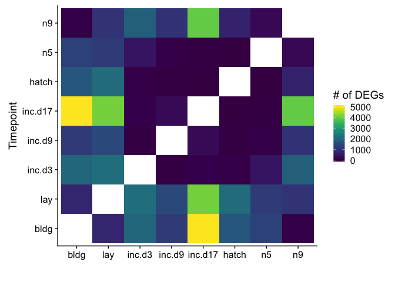
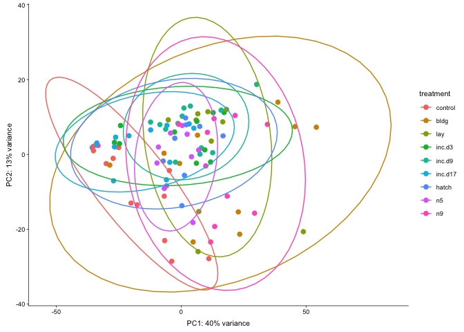
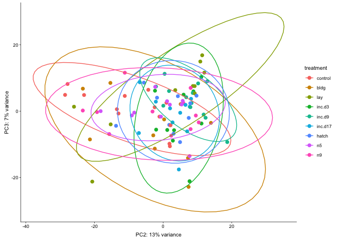
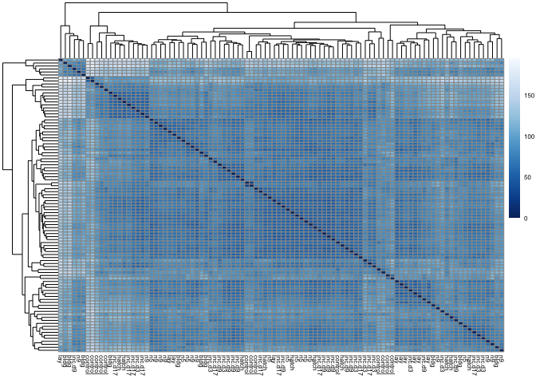
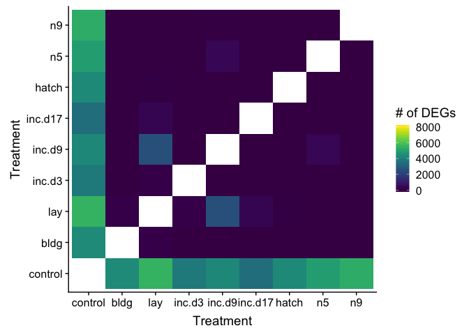

    library(tidyverse)
    library(DESeq2)
    library(cowplot)
    library(RColorBrewer)
    library(pheatmap)
    library(kableExtra)
    library(viridis)

    # load custom functions  
    source("../R/functions.R")  

    knitr::opts_chunk$set(fig.path = '../figures/gon/',cache=TRUE)

Females only
============

    # import "colData" which contains sample information and "countData" which contains read counts
    colData <- read.csv("../results/00_colData_characterization.csv", header = T, row.names = 1)
    countData <- read.csv("../results/00_countData_characterization.csv", header = T, row.names = 1)
    geneinfo <- read.csv("../results/00_geneinfo.csv", row.names = 1)

    colData$treatment <- factor(colData$treatment, levels = 
                                  c("control", "bldg", "lay", "inc.d3", "inc.d9", 
                                    "inc.d17", "hatch", "n5", "n9"))

    colData <- colData %>%
      dplyr::filter(grepl('gonad', tissue)) %>%
      dplyr::filter(sex == "female") %>%
      droplevels()
    row.names(colData) <- colData$V1

    # print sample sizes
    colData %>% select(group, tissue)  %>%  summary()

    ##                   group      tissue  
    ##  female.gonad.control:13   gonad:98  
    ##  female.gonad.inc.d9 :13             
    ##  female.gonad.inc.d17:11             
    ##  female.gonad.n9     :11             
    ##  female.gonad.bldg   :10             
    ##  female.gonad.hatch  :10             
    ##  (Other)             :30

    savecols <- as.character(colData$V1) 
    savecols <- as.vector(savecols) 
    countData <- countData %>% dplyr::select(one_of(savecols)) 

    # check that row and col lenghts are equal
    ncol(countData) == nrow(colData) 

    ## [1] TRUE

    dds <- DESeqDataSetFromMatrix(countData = countData,
                                  colData = colData,
                                  design = ~ treatment )
    dds <- dds[ rowSums(counts(dds)) > 2, ] ## pre-filter genes 
    dds <- DESeq(dds) # Differential expression analysis

    ## estimating size factors

    ## estimating dispersions

    ## gene-wise dispersion estimates

    ## mean-dispersion relationship

    ## final dispersion estimates

    ## fitting model and testing

    ## -- replacing outliers and refitting for 42 genes
    ## -- DESeq argument 'minReplicatesForReplace' = 7 
    ## -- original counts are preserved in counts(dds)

    ## estimating dispersions

    ## fitting model and testing

    vsd <- vst(dds, blind=FALSE) # variance stabilized 

    #create list of groups
    a <- levels(colData$treatment)
    b <- levels(colData$treatment)

    # slim for testing
    #a <- c("n9", "bldg" , "lay" )
    #b <- c("n9", "bldg" , "lay" )

    # comapre all contrasts, save to datafrmes
    dat=data.frame()
    for (i in a){
      for (j in b){
        if (i != j) {
          k <- paste(i,j, sep = "") #assigns usique rownames
          dat[k,1]<-i               
          dat[k,2]<-j
          dat[k,3]<- numDEGs(i,j) #caluculates number of DEGs
        }
      }
    }

    head(dat)

    ##                     V1      V2   V3
    ## controlbldg    control    bldg 7436
    ## controllay     control     lay 7164
    ## controlinc.d3  control  inc.d3 5303
    ## controlinc.d9  control  inc.d9 5523
    ## controlinc.d17 control inc.d17 2284
    ## controlhatch   control   hatch 3519

    # widen data to create table of degs
    rownames(dat) <- NULL #remove row names
    data_wide <- spread(dat, V2, V3)
    data_wide

    ##        V1 bldg control hatch inc.d17 inc.d3 inc.d9  lay   n5   n9
    ## 1    bldg   NA    7436  1709    5025   2039   1165  778 1295   55
    ## 2 control 7436      NA  3519    2284   5303   5523 7164 4885 7191
    ## 3   hatch 1709    3519    NA       2     82      6 2132    3  723
    ## 4 inc.d17 5025    2284     2      NA    125    305 4090   17 3952
    ## 5  inc.d3 2039    5303    82     125     NA     13 2193  482 1867
    ## 6  inc.d9 1165    5523     6     305     13     NA 1456   65 1031
    ## 7     lay  778    7164  2132    4090   2193   1456   NA 1198 1039
    ## 8      n5 1295    4885     3      17    482     65 1198   NA  271
    ## 9      n9   55    7191   723    3952   1867   1031 1039  271   NA

    kable(data_wide) 

<table>
<thead>
<tr>
<th style="text-align:left;">
V1
</th>
<th style="text-align:right;">
bldg
</th>
<th style="text-align:right;">
control
</th>
<th style="text-align:right;">
hatch
</th>
<th style="text-align:right;">
inc.d17
</th>
<th style="text-align:right;">
inc.d3
</th>
<th style="text-align:right;">
inc.d9
</th>
<th style="text-align:right;">
lay
</th>
<th style="text-align:right;">
n5
</th>
<th style="text-align:right;">
n9
</th>
</tr>
</thead>
<tbody>
<tr>
<td style="text-align:left;">
bldg
</td>
<td style="text-align:right;">
NA
</td>
<td style="text-align:right;">
7436
</td>
<td style="text-align:right;">
1709
</td>
<td style="text-align:right;">
5025
</td>
<td style="text-align:right;">
2039
</td>
<td style="text-align:right;">
1165
</td>
<td style="text-align:right;">
778
</td>
<td style="text-align:right;">
1295
</td>
<td style="text-align:right;">
55
</td>
</tr>
<tr>
<td style="text-align:left;">
control
</td>
<td style="text-align:right;">
7436
</td>
<td style="text-align:right;">
NA
</td>
<td style="text-align:right;">
3519
</td>
<td style="text-align:right;">
2284
</td>
<td style="text-align:right;">
5303
</td>
<td style="text-align:right;">
5523
</td>
<td style="text-align:right;">
7164
</td>
<td style="text-align:right;">
4885
</td>
<td style="text-align:right;">
7191
</td>
</tr>
<tr>
<td style="text-align:left;">
hatch
</td>
<td style="text-align:right;">
1709
</td>
<td style="text-align:right;">
3519
</td>
<td style="text-align:right;">
NA
</td>
<td style="text-align:right;">
2
</td>
<td style="text-align:right;">
82
</td>
<td style="text-align:right;">
6
</td>
<td style="text-align:right;">
2132
</td>
<td style="text-align:right;">
3
</td>
<td style="text-align:right;">
723
</td>
</tr>
<tr>
<td style="text-align:left;">
inc.d17
</td>
<td style="text-align:right;">
5025
</td>
<td style="text-align:right;">
2284
</td>
<td style="text-align:right;">
2
</td>
<td style="text-align:right;">
NA
</td>
<td style="text-align:right;">
125
</td>
<td style="text-align:right;">
305
</td>
<td style="text-align:right;">
4090
</td>
<td style="text-align:right;">
17
</td>
<td style="text-align:right;">
3952
</td>
</tr>
<tr>
<td style="text-align:left;">
inc.d3
</td>
<td style="text-align:right;">
2039
</td>
<td style="text-align:right;">
5303
</td>
<td style="text-align:right;">
82
</td>
<td style="text-align:right;">
125
</td>
<td style="text-align:right;">
NA
</td>
<td style="text-align:right;">
13
</td>
<td style="text-align:right;">
2193
</td>
<td style="text-align:right;">
482
</td>
<td style="text-align:right;">
1867
</td>
</tr>
<tr>
<td style="text-align:left;">
inc.d9
</td>
<td style="text-align:right;">
1165
</td>
<td style="text-align:right;">
5523
</td>
<td style="text-align:right;">
6
</td>
<td style="text-align:right;">
305
</td>
<td style="text-align:right;">
13
</td>
<td style="text-align:right;">
NA
</td>
<td style="text-align:right;">
1456
</td>
<td style="text-align:right;">
65
</td>
<td style="text-align:right;">
1031
</td>
</tr>
<tr>
<td style="text-align:left;">
lay
</td>
<td style="text-align:right;">
778
</td>
<td style="text-align:right;">
7164
</td>
<td style="text-align:right;">
2132
</td>
<td style="text-align:right;">
4090
</td>
<td style="text-align:right;">
2193
</td>
<td style="text-align:right;">
1456
</td>
<td style="text-align:right;">
NA
</td>
<td style="text-align:right;">
1198
</td>
<td style="text-align:right;">
1039
</td>
</tr>
<tr>
<td style="text-align:left;">
n5
</td>
<td style="text-align:right;">
1295
</td>
<td style="text-align:right;">
4885
</td>
<td style="text-align:right;">
3
</td>
<td style="text-align:right;">
17
</td>
<td style="text-align:right;">
482
</td>
<td style="text-align:right;">
65
</td>
<td style="text-align:right;">
1198
</td>
<td style="text-align:right;">
NA
</td>
<td style="text-align:right;">
271
</td>
</tr>
<tr>
<td style="text-align:left;">
n9
</td>
<td style="text-align:right;">
55
</td>
<td style="text-align:right;">
7191
</td>
<td style="text-align:right;">
723
</td>
<td style="text-align:right;">
3952
</td>
<td style="text-align:right;">
1867
</td>
<td style="text-align:right;">
1031
</td>
<td style="text-align:right;">
1039
</td>
<td style="text-align:right;">
271
</td>
<td style="text-align:right;">
NA
</td>
</tr>
</tbody>
</table>

    dat$V1 <- factor(dat$V1, levels = 
                                  c("control", "bldg", "lay", "inc.d3", "inc.d9", 
                                    "inc.d17", "hatch", "n5", "n9"))
    dat$V2 <- factor(dat$V2, levels = 
                                  c("control", "bldg", "lay", "inc.d3", "inc.d9", 
                                    "inc.d17", "hatch", "n5", "n9"))

    ggplot(dat, aes(V1, V2)) +
      geom_tile(aes(fill = V3)) +
      scale_fill_viridis(na.value="#FFFFFF00") + 
      xlab("Treatment") + ylab("Treatment") +
      labs(fill = "# of DEGs")

    # create the dataframe using my function pcadataframe
    pcadata <- pcadataframe(vsd, intgroup=c("treatment"), returnData=TRUE)
    percentVar <- round(100 * attr(pcadata, "percentVar"))
    percentVar

    ## [1] 40 13  7  4  4  3

    ggplot(pcadata, aes(PC1, PC2,color = treatment)) + 
      geom_point(size = 2, alpha = 1) +
      stat_ellipse(type = "t") +
      xlab(paste0("PC1: ", percentVar[1],"% variance")) +
      ylab(paste0("PC2: ", percentVar[2],"% variance")) +
      theme_cowplot(font_size = 8, line_size = 0.25) 

    summary(aov(PC1 ~ treatment, data=pcadata)) 

    ##             Df Sum Sq Mean Sq F value   Pr(>F)    
    ## treatment    8  12281    1535    6.14 2.73e-06 ***
    ## Residuals   89  22253     250                     
    ## ---
    ## Signif. codes:  0 '***' 0.001 '**' 0.01 '*' 0.05 '.' 0.1 ' ' 1

    TukeyHSD(aov(PC1 ~ treatment, data=pcadata), which = "treatment") 

    ##   Tukey multiple comparisons of means
    ##     95% family-wise confidence level
    ## 
    ## Fit: aov(formula = PC1 ~ treatment, data = pcadata)
    ## 
    ## $treatment
    ##                        diff        lwr       upr     p adj
    ## bldg-control     33.3835135  12.236622 54.530405 0.0000896
    ## lay-control      30.1647125   9.017821 51.311604 0.0005845
    ## inc.d3-control   15.9270772  -5.219814 37.073968 0.2998532
    ## inc.d9-control   21.1754198   1.455842 40.894998 0.0257233
    ## inc.d17-control   3.3107779 -17.285649 23.907205 0.9998700
    ## hatch-control    12.4451515  -8.701740 33.592043 0.6349902
    ## n5-control       15.6976816  -5.449210 36.844573 0.3188056
    ## n9-control       29.0637642   8.467337 49.660191 0.0007012
    ## lay-bldg         -3.2188010 -25.702579 19.264977 0.9999461
    ## inc.d3-bldg     -17.4564363 -39.940214  5.027342 0.2615545
    ## inc.d9-bldg     -12.2080937 -33.354985  8.938797 0.6587436
    ## inc.d17-bldg    -30.0727356 -52.039576 -8.105895 0.0011476
    ## hatch-bldg      -20.9383620 -43.422140  1.545416 0.0883731
    ## n5-bldg         -17.6858319 -40.169610  4.797946 0.2457634
    ## n9-bldg          -4.3197493 -26.286590 17.647091 0.9994168
    ## inc.d3-lay      -14.2376353 -36.721413  8.246143 0.5384404
    ## inc.d9-lay       -8.9892927 -30.136184 12.157599 0.9124278
    ## inc.d17-lay     -26.8539346 -48.820775 -4.887094 0.0058305
    ## hatch-lay       -17.7195610 -40.203339  4.764217 0.2434952
    ## n5-lay          -14.4670309 -36.950809  8.016747 0.5164278
    ## n9-lay           -1.1009483 -23.067789 20.865892 1.0000000
    ## inc.d9-inc.d3     5.2483426 -15.898549 26.395234 0.9969162
    ## inc.d17-inc.d3  -12.6162993 -34.583140  9.350541 0.6649708
    ## hatch-inc.d3     -3.4819257 -25.965704 19.001852 0.9999019
    ## n5-inc.d3        -0.2293956 -22.713174 22.254382 1.0000000
    ## n9-inc.d3        13.1366870  -8.830153 35.103527 0.6146144
    ## inc.d17-inc.d9  -17.8646419 -38.461069  2.731785 0.1432256
    ## hatch-inc.d9     -8.7302683 -29.877159 12.416623 0.9250213
    ## n5-inc.d9        -5.4777382 -26.624629 15.669153 0.9958554
    ## n9-inc.d9         7.8883444 -12.708083 28.484772 0.9505134
    ## hatch-inc.d17     9.1343736 -12.832467 31.101214 0.9220681
    ## n5-inc.d17       12.3869037  -9.579937 34.353744 0.6866674
    ## n9-inc.d17       25.7529863   4.315545 47.190427 0.0072816
    ## n5-hatch          3.2525301 -19.231248 25.736308 0.9999416
    ## n9-hatch         16.6186127  -5.348228 38.585453 0.2941057
    ## n9-n5            13.3660826  -8.600758 35.332923 0.5920927

    summary(aov(PC2 ~ treatment, data=pcadata)) 

    ##             Df Sum Sq Mean Sq F value  Pr(>F)   
    ## treatment    8   2339  292.34   3.009 0.00491 **
    ## Residuals   89   8646   97.14                   
    ## ---
    ## Signif. codes:  0 '***' 0.001 '**' 0.01 '*' 0.05 '.' 0.1 ' ' 1

    TukeyHSD(aov(PC2 ~ treatment, data=pcadata), which = "treatment") 

    ##   Tukey multiple comparisons of means
    ##     95% family-wise confidence level
    ## 
    ## Fit: aov(formula = PC2 ~ treatment, data = pcadata)
    ## 
    ## $treatment
    ##                        diff         lwr       upr     p adj
    ## bldg-control      5.9461843  -7.2347514 19.127120 0.8814022
    ## lay-control       9.3812513  -3.7996845 22.562187 0.3756451
    ## inc.d3-control   13.8521840   0.6712483 27.033120 0.0317890
    ## inc.d9-control   16.6018683   4.3105824 28.893154 0.0014169
    ## inc.d17-control  11.6076328  -1.2301967 24.445462 0.1090707
    ## hatch-control    10.8915450  -2.2893907 24.072481 0.1904023
    ## n5-control        7.4049703  -5.7759654 20.585906 0.6909768
    ## n9-control        6.4967554  -6.3410741 19.334585 0.7974190
    ## lay-bldg          3.4350669 -10.5791552 17.449289 0.9971726
    ## inc.d3-bldg       7.9059997  -6.1082225 21.920222 0.6861522
    ## inc.d9-bldg      10.6556840  -2.5252517 23.836620 0.2141481
    ## inc.d17-bldg      5.6614485  -8.0305646 19.353462 0.9243886
    ## hatch-bldg        4.9453607  -9.0688615 18.959583 0.9693526
    ## n5-bldg           1.4587860 -12.5554362 15.473008 0.9999954
    ## n9-bldg           0.5505711 -13.1414420 14.242584 1.0000000
    ## inc.d3-lay        4.4709328  -9.5432894 18.485155 0.9835548
    ## inc.d9-lay        7.2206171  -5.9603186 20.401553 0.7192484
    ## inc.d17-lay       2.2263815 -11.4656316 15.918395 0.9998582
    ## hatch-lay         1.5102938 -12.5039284 15.524516 0.9999940
    ## n5-lay           -1.9762810 -15.9905031 12.037941 0.9999519
    ## n9-lay           -2.8844959 -16.5765089 10.807517 0.9990370
    ## inc.d9-inc.d3     2.7496843 -10.4312514 15.930620 0.9991031
    ## inc.d17-inc.d3   -2.2445512 -15.9365643 11.447462 0.9998493
    ## hatch-inc.d3     -2.9606390 -16.9748612 11.053583 0.9990173
    ## n5-inc.d3        -6.4472137 -20.4614359  7.567008 0.8694267
    ## n9-inc.d3        -7.3554286 -21.0474417  6.336584 0.7400611
    ## inc.d17-inc.d9   -4.9942356 -17.8320650  7.843594 0.9459377
    ## hatch-inc.d9     -5.7103233 -18.8912591  7.470612 0.9033539
    ## n5-inc.d9        -9.1968980 -22.3778338  3.984038 0.4031425
    ## n9-inc.d9       -10.1051130 -22.9429424  2.732717 0.2449581
    ## hatch-inc.d17    -0.7160878 -14.4081008 12.975925 1.0000000
    ## n5-inc.d17       -4.2026625 -17.8946755  9.489351 0.9871516
    ## n9-inc.d17       -5.1108774 -18.4729139  8.251159 0.9508827
    ## n5-hatch         -3.4865747 -17.5007969 10.527647 0.9968638
    ## n9-hatch         -4.3947896 -18.0868027  9.297223 0.9829099
    ## n9-n5            -0.9082149 -14.6002280 12.783798 0.9999999

    ggplot(pcadata, aes(PC3, PC4,color = treatment)) + 
      geom_point(size = 2, alpha = 1) +
      stat_ellipse(type = "t") +
      xlab(paste0("PC3: ", percentVar[3],"% variance")) +
      ylab(paste0("PC4: ", percentVar[4],"% variance")) +
      theme_cowplot(font_size = 8, line_size = 0.25) 

    summary(aov(PC3 ~ treatment, data=pcadata)) 

    ##             Df Sum Sq Mean Sq F value Pr(>F)
    ## treatment    8    724   90.49   1.654  0.121
    ## Residuals   89   4870   54.72

    summary(aov(PC4 ~ treatment, data=pcadata)) 

    ##             Df Sum Sq Mean Sq F value   Pr(>F)    
    ## treatment    8   1098  137.24   5.048 3.47e-05 ***
    ## Residuals   89   2420   27.19                     
    ## ---
    ## Signif. codes:  0 '***' 0.001 '**' 0.01 '*' 0.05 '.' 0.1 ' ' 1

    summary(aov(PC5 ~ treatment, data=pcadata)) 

    ##             Df Sum Sq Mean Sq F value   Pr(>F)    
    ## treatment    8   1197   149.6   6.648 8.67e-07 ***
    ## Residuals   89   2003    22.5                     
    ## ---
    ## Signif. codes:  0 '***' 0.001 '**' 0.01 '*' 0.05 '.' 0.1 ' ' 1

    summary(aov(PC6 ~ treatment, data=pcadata)) 

    ##             Df Sum Sq Mean Sq F value   Pr(>F)    
    ## treatment    8  825.1  103.14   6.395 1.53e-06 ***
    ## Residuals   89 1435.4   16.13                     
    ## ---
    ## Signif. codes:  0 '***' 0.001 '**' 0.01 '*' 0.05 '.' 0.1 ' ' 1

Heatmaps

    # see http://bioconductor.org/packages/devel/bioc/vignettes/DESeq2/inst/doc/DESeq2.html#heatmap-of-the-count-matrix
    sampleDists <- dist(t(assay(vsd)))

    sampleDistMatrix <- as.matrix(sampleDists)
    rownames(sampleDistMatrix) <- NULL
    colnames(sampleDistMatrix) <- colData$treatment
    colors <- colorRampPalette( rev(brewer.pal(9, "Blues")) )(255)
    pheatmap(sampleDistMatrix,
             clustering_distance_rows=sampleDists,
             clustering_distance_cols=sampleDists,
             col=colors,
             fontsize = 6)

Males only
==========

    # import "colData" which contains sample information and "countData" which contains read counts
    colData <- read.csv("../results/00_colData_characterization.csv", header = T, row.names = 1)
    countData <- read.csv("../results/00_countData_characterization.csv", header = T, row.names = 1)
    geneinfo <- read.csv("../results/00_geneinfo.csv", row.names = 1)

    colData$treatment <- factor(colData$treatment, levels = 
                                  c("control", "bldg", "lay", "inc.d3", "inc.d9", 
                                    "inc.d17", "hatch", "n5", "n9"))

    colData <- colData %>%
      dplyr::filter(grepl('gonad', tissue)) %>%
      dplyr::filter(sex == "male") %>%
      droplevels()
    row.names(colData) <- colData$V1

    # print sample sizes
    colData %>% select(group, tissue)  %>%  summary()

    ##                 group      tissue  
    ##  male.gonad.control:13   gonad:96  
    ##  male.gonad.inc.d17:11             
    ##  male.gonad.inc.d9 :11             
    ##  male.gonad.n9     :11             
    ##  male.gonad.bldg   :10             
    ##  male.gonad.hatch  :10             
    ##  (Other)           :30

    savecols <- as.character(colData$V1) 
    savecols <- as.vector(savecols) 
    countData <- countData %>% dplyr::select(one_of(savecols)) 

    # check that row and col lenghts are equal
    ncol(countData) == nrow(colData) 

    ## [1] TRUE

    dds <- DESeqDataSetFromMatrix(countData = countData,
                                  colData = colData,
                                  design = ~ treatment )
    dds <- dds[ rowSums(counts(dds)) > 2, ] ## pre-filter genes 
    dds <- DESeq(dds) # Differential expression analysis

    ## estimating size factors

    ## estimating dispersions

    ## gene-wise dispersion estimates

    ## mean-dispersion relationship

    ## final dispersion estimates

    ## fitting model and testing

    ## -- replacing outliers and refitting for 8 genes
    ## -- DESeq argument 'minReplicatesForReplace' = 7 
    ## -- original counts are preserved in counts(dds)

    ## estimating dispersions

    ## fitting model and testing

    vsd <- vst(dds, blind=FALSE) # variance stabilized 

    #create list of groups
    a <- levels(colData$treatment)
    b <- levels(colData$treatment)

    # slim for testing
    #a <- c("n9", "bldg" , "lay" )
    #b <- c("n9", "bldg" , "lay" )

    # comapre all contrasts, save to datafrmes
    dat=data.frame()
    for (i in a){
      for (j in b){
        if (i != j) {
          k <- paste(i,j, sep = "") #assigns usique rownames
          dat[k,1]<-i               
          dat[k,2]<-j
          dat[k,3]<- numDEGs(i,j) #caluculates number of DEGs
        }
      }
    }

    head(dat)

    ##                     V1      V2   V3
    ## controlbldg    control    bldg 4352
    ## controllay     control     lay 5500
    ## controlinc.d3  control  inc.d3 3827
    ## controlinc.d9  control  inc.d9 4251
    ## controlinc.d17 control inc.d17 3474
    ## controlhatch   control   hatch 4315

    # widen data to create table of degs
    rownames(dat) <- NULL #remove row names
    data_wide <- spread(dat, V2, V3)
    data_wide

    ##        V1 bldg control hatch inc.d17 inc.d3 inc.d9  lay   n5   n9
    ## 1    bldg   NA    4352     0       0      0      0  126    0    0
    ## 2 control 4352      NA  4315    3474   3827   4251 5500 4878 5284
    ## 3   hatch    0    4315    NA       0      0      2   34    0    0
    ## 4 inc.d17    0    3474     0      NA      0      0  373    1    0
    ## 5  inc.d3    0    3827     0       0     NA      0  127    1    2
    ## 6  inc.d9    0    4251     2       0      0     NA 2527  409   16
    ## 7     lay  126    5500    34     373    127   2527   NA    0    1
    ## 8      n5    0    4878     0       1      1    409    0   NA    0
    ## 9      n9    0    5284     0       0      2     16    1    0   NA

    kable(data_wide) 

<table>
<thead>
<tr>
<th style="text-align:left;">
V1
</th>
<th style="text-align:right;">
bldg
</th>
<th style="text-align:right;">
control
</th>
<th style="text-align:right;">
hatch
</th>
<th style="text-align:right;">
inc.d17
</th>
<th style="text-align:right;">
inc.d3
</th>
<th style="text-align:right;">
inc.d9
</th>
<th style="text-align:right;">
lay
</th>
<th style="text-align:right;">
n5
</th>
<th style="text-align:right;">
n9
</th>
</tr>
</thead>
<tbody>
<tr>
<td style="text-align:left;">
bldg
</td>
<td style="text-align:right;">
NA
</td>
<td style="text-align:right;">
4352
</td>
<td style="text-align:right;">
0
</td>
<td style="text-align:right;">
0
</td>
<td style="text-align:right;">
0
</td>
<td style="text-align:right;">
0
</td>
<td style="text-align:right;">
126
</td>
<td style="text-align:right;">
0
</td>
<td style="text-align:right;">
0
</td>
</tr>
<tr>
<td style="text-align:left;">
control
</td>
<td style="text-align:right;">
4352
</td>
<td style="text-align:right;">
NA
</td>
<td style="text-align:right;">
4315
</td>
<td style="text-align:right;">
3474
</td>
<td style="text-align:right;">
3827
</td>
<td style="text-align:right;">
4251
</td>
<td style="text-align:right;">
5500
</td>
<td style="text-align:right;">
4878
</td>
<td style="text-align:right;">
5284
</td>
</tr>
<tr>
<td style="text-align:left;">
hatch
</td>
<td style="text-align:right;">
0
</td>
<td style="text-align:right;">
4315
</td>
<td style="text-align:right;">
NA
</td>
<td style="text-align:right;">
0
</td>
<td style="text-align:right;">
0
</td>
<td style="text-align:right;">
2
</td>
<td style="text-align:right;">
34
</td>
<td style="text-align:right;">
0
</td>
<td style="text-align:right;">
0
</td>
</tr>
<tr>
<td style="text-align:left;">
inc.d17
</td>
<td style="text-align:right;">
0
</td>
<td style="text-align:right;">
3474
</td>
<td style="text-align:right;">
0
</td>
<td style="text-align:right;">
NA
</td>
<td style="text-align:right;">
0
</td>
<td style="text-align:right;">
0
</td>
<td style="text-align:right;">
373
</td>
<td style="text-align:right;">
1
</td>
<td style="text-align:right;">
0
</td>
</tr>
<tr>
<td style="text-align:left;">
inc.d3
</td>
<td style="text-align:right;">
0
</td>
<td style="text-align:right;">
3827
</td>
<td style="text-align:right;">
0
</td>
<td style="text-align:right;">
0
</td>
<td style="text-align:right;">
NA
</td>
<td style="text-align:right;">
0
</td>
<td style="text-align:right;">
127
</td>
<td style="text-align:right;">
1
</td>
<td style="text-align:right;">
2
</td>
</tr>
<tr>
<td style="text-align:left;">
inc.d9
</td>
<td style="text-align:right;">
0
</td>
<td style="text-align:right;">
4251
</td>
<td style="text-align:right;">
2
</td>
<td style="text-align:right;">
0
</td>
<td style="text-align:right;">
0
</td>
<td style="text-align:right;">
NA
</td>
<td style="text-align:right;">
2527
</td>
<td style="text-align:right;">
409
</td>
<td style="text-align:right;">
16
</td>
</tr>
<tr>
<td style="text-align:left;">
lay
</td>
<td style="text-align:right;">
126
</td>
<td style="text-align:right;">
5500
</td>
<td style="text-align:right;">
34
</td>
<td style="text-align:right;">
373
</td>
<td style="text-align:right;">
127
</td>
<td style="text-align:right;">
2527
</td>
<td style="text-align:right;">
NA
</td>
<td style="text-align:right;">
0
</td>
<td style="text-align:right;">
1
</td>
</tr>
<tr>
<td style="text-align:left;">
n5
</td>
<td style="text-align:right;">
0
</td>
<td style="text-align:right;">
4878
</td>
<td style="text-align:right;">
0
</td>
<td style="text-align:right;">
1
</td>
<td style="text-align:right;">
1
</td>
<td style="text-align:right;">
409
</td>
<td style="text-align:right;">
0
</td>
<td style="text-align:right;">
NA
</td>
<td style="text-align:right;">
0
</td>
</tr>
<tr>
<td style="text-align:left;">
n9
</td>
<td style="text-align:right;">
0
</td>
<td style="text-align:right;">
5284
</td>
<td style="text-align:right;">
0
</td>
<td style="text-align:right;">
0
</td>
<td style="text-align:right;">
2
</td>
<td style="text-align:right;">
16
</td>
<td style="text-align:right;">
1
</td>
<td style="text-align:right;">
0
</td>
<td style="text-align:right;">
NA
</td>
</tr>
</tbody>
</table>

    dat$V1 <- factor(dat$V1, levels = 
                                  c("control", "bldg", "lay", "inc.d3", "inc.d9", 
                                    "inc.d17", "hatch", "n5", "n9"))
    dat$V2 <- factor(dat$V2, levels = 
                                  c("control", "bldg", "lay", "inc.d3", "inc.d9", 
                                    "inc.d17", "hatch", "n5", "n9"))

    ggplot(dat, aes(V1, V2)) +
      geom_tile(aes(fill = V3)) +
      scale_fill_viridis(na.value="#FFFFFF00") + 
      xlab("Treatment") + ylab("Treatment") +
      labs(fill = "# of DEGs")

