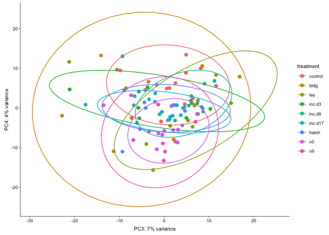
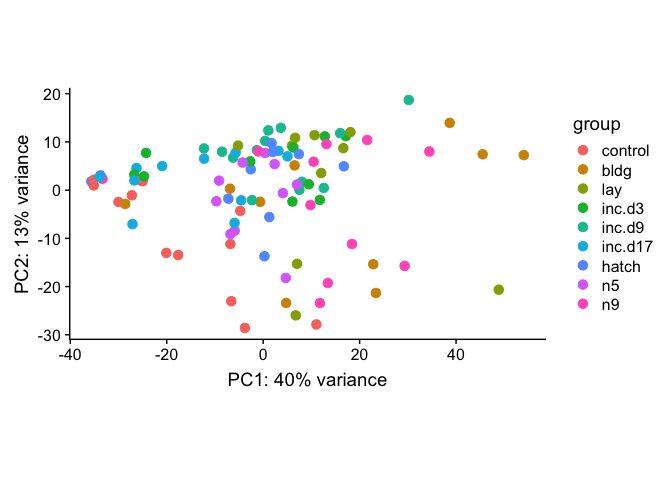

    library(tidyverse)

    ## ── Attaching packages ────────────────────────────────────────────────────────────── tidyverse 1.2.1 ──

    ## ✔ ggplot2 3.1.0       ✔ purrr   0.3.1  
    ## ✔ tibble  2.0.1       ✔ dplyr   0.8.0.1
    ## ✔ tidyr   0.8.3       ✔ stringr 1.4.0  
    ## ✔ readr   1.3.1       ✔ forcats 0.4.0

    ## ── Conflicts ───────────────────────────────────────────────────────────────── tidyverse_conflicts() ──
    ## ✖ dplyr::filter() masks stats::filter()
    ## ✖ dplyr::lag()    masks stats::lag()

    library(DESeq2)

    ## Loading required package: S4Vectors

    ## Loading required package: stats4

    ## Loading required package: BiocGenerics

    ## Loading required package: parallel

    ## 
    ## Attaching package: 'BiocGenerics'

    ## The following objects are masked from 'package:parallel':
    ## 
    ##     clusterApply, clusterApplyLB, clusterCall, clusterEvalQ,
    ##     clusterExport, clusterMap, parApply, parCapply, parLapply,
    ##     parLapplyLB, parRapply, parSapply, parSapplyLB

    ## The following objects are masked from 'package:dplyr':
    ## 
    ##     combine, intersect, setdiff, union

    ## The following objects are masked from 'package:stats':
    ## 
    ##     IQR, mad, sd, var, xtabs

    ## The following objects are masked from 'package:base':
    ## 
    ##     anyDuplicated, append, as.data.frame, basename, cbind,
    ##     colMeans, colnames, colSums, dirname, do.call, duplicated,
    ##     eval, evalq, Filter, Find, get, grep, grepl, intersect,
    ##     is.unsorted, lapply, lengths, Map, mapply, match, mget, order,
    ##     paste, pmax, pmax.int, pmin, pmin.int, Position, rank, rbind,
    ##     Reduce, rowMeans, rownames, rowSums, sapply, setdiff, sort,
    ##     table, tapply, union, unique, unsplit, which, which.max,
    ##     which.min

    ## 
    ## Attaching package: 'S4Vectors'

    ## The following objects are masked from 'package:dplyr':
    ## 
    ##     first, rename

    ## The following object is masked from 'package:tidyr':
    ## 
    ##     expand

    ## The following object is masked from 'package:base':
    ## 
    ##     expand.grid

    ## Loading required package: IRanges

    ## 
    ## Attaching package: 'IRanges'

    ## The following objects are masked from 'package:dplyr':
    ## 
    ##     collapse, desc, slice

    ## The following object is masked from 'package:purrr':
    ## 
    ##     reduce

    ## Loading required package: GenomicRanges

    ## Loading required package: GenomeInfoDb

    ## Loading required package: SummarizedExperiment

    ## Loading required package: Biobase

    ## Welcome to Bioconductor
    ## 
    ##     Vignettes contain introductory material; view with
    ##     'browseVignettes()'. To cite Bioconductor, see
    ##     'citation("Biobase")', and for packages 'citation("pkgname")'.

    ## Loading required package: DelayedArray

    ## Loading required package: matrixStats

    ## 
    ## Attaching package: 'matrixStats'

    ## The following objects are masked from 'package:Biobase':
    ## 
    ##     anyMissing, rowMedians

    ## The following object is masked from 'package:dplyr':
    ## 
    ##     count

    ## Loading required package: BiocParallel

    ## 
    ## Attaching package: 'DelayedArray'

    ## The following objects are masked from 'package:matrixStats':
    ## 
    ##     colMaxs, colMins, colRanges, rowMaxs, rowMins, rowRanges

    ## The following object is masked from 'package:purrr':
    ## 
    ##     simplify

    ## The following objects are masked from 'package:base':
    ## 
    ##     aperm, apply

    library(cowplot)

    ## 
    ## Attaching package: 'cowplot'

    ## The following object is masked from 'package:ggplot2':
    ## 
    ##     ggsave

    library(RColorBrewer)
    library(pheatmap)

    # load custom functions  
    source("../R/functions.R")   

    knitr::opts_chunk$set(fig.path = '../figures/gon/',cache=TRUE)

This anlaysis will *exclude* the control timepoint but *combine*
incubation and nestling timepoints.

    # import "colData" which contains sample information and "countData" which contains read counts
    colData <- read.csv("../results/00_colData_characterization.csv", header = T, row.names = 1)
    countData <- read.csv("../results/00_countData_characterization.csv", header = T, row.names = 1)
    geneinfo <- read.csv("../results/00_geneinfo.csv", row.names = 1) 

    # making new groups
    colData$group <- NULL
    colData$tempgroup <- ifelse(colData$treatment == "bldg", "bldg",
                      ifelse(colData$treatment == "control", "control",
                       ifelse(colData$treatment == "hatch", "hatch",
                        ifelse(grepl("inc", colData$treatment), "inc",
                         ifelse(colData$treatment == "lay", "lay", "nestl")))))
    colData$tempgroup <- as.factor(colData$tempgroup)

    colData$group <- paste(colData$sex, colData$tempgroup, sep = "")
    colData$group <- as.factor(colData$group)
    str(colData$group)

    ##  Factor w/ 12 levels "femalebldg","femalecontrol",..: 8 8 8 8 8 8 2 2 2 8 ...

    colData$treatment <- factor(colData$treatment, levels = 
                                  c("control", "bldg", "lay", "inc.d3", "inc.d9", 
                                    "inc.d17", "hatch", "n5", "n9"))

    #select samples of interest from colData
    colData <- colData %>%
      dplyr::filter(grepl('gonad', tissue)) %>%
      #dplyr::filter(treatment != "control") %>%
      dplyr::filter(sex == "female") %>%
      droplevels()
    row.names(colData) <- colData$V1

    # print sample sizes
    colData %>% select(group, tissue)  %>%  summary()

    ##            group      tissue  
    ##  femalebldg   :10   gonad:98  
    ##  femalecontrol:13             
    ##  femalehatch  :10             
    ##  femaleinc    :34             
    ##  femalelay    :10             
    ##  femalenestl  :21

    #select samples of interest from countData
    savecols <- as.character(colData$V1) 
    savecols <- as.vector(savecols) 
    countData <- countData %>% dplyr::select(one_of(savecols)) 

    # check that row and col lenghts are equal
    ncol(countData) == nrow(colData)  

    ## [1] TRUE

    dds <- DESeqDataSetFromMatrix(countData = countData,
                                  colData = colData,
                                  design = ~ treatment )
    dds <- dds[ rowSums(counts(dds)) > 2, ] ## pre-filter genes 
    dds <- DESeq(dds) # Differential expression analysis

    ## estimating size factors

    ## estimating dispersions

    ## gene-wise dispersion estimates

    ## mean-dispersion relationship

    ## final dispersion estimates

    ## fitting model and testing

    ## -- replacing outliers and refitting for 42 genes
    ## -- DESeq argument 'minReplicatesForReplace' = 7 
    ## -- original counts are preserved in counts(dds)

    ## estimating dispersions

    ## fitting model and testing

    vsd <- vst(dds, blind=FALSE) # variance stabilized  

    levels(colData$treatment)

    ## [1] "control" "bldg"    "lay"     "inc.d3"  "inc.d9"  "inc.d17" "hatch"  
    ## [8] "n5"      "n9"

    summary(results(dds, contrast=c("treatment",'control', 'bldg'))) 

    ## 
    ## out of 14900 with nonzero total read count
    ## adjusted p-value < 0.1
    ## LFC > 0 (up)       : 3797, 25%
    ## LFC < 0 (down)     : 3639, 24%
    ## outliers [1]       : 0, 0%
    ## low counts [2]     : 0, 0%
    ## (mean count < 0)
    ## [1] see 'cooksCutoff' argument of ?results
    ## [2] see 'independentFiltering' argument of ?results

    summary(results(dds, contrast=c("treatment",'control', 'lay')))     
    summary(results(dds, contrast=c("treatment",'control', 'inc.d3')))  
    summary(results(dds, contrast=c("treatment",'control', 'inc.d9')))   
    summary(results(dds, contrast=c("treatment",'control', 'inc.d17')))  
    summary(results(dds, contrast=c("treatment",'control', 'hatch')))    
    summary(results(dds, contrast=c("treatment",'control', 'n5')))      
    summary(results(dds, contrast=c("treatment",'control', 'n9')))       

    summary(results(dds, contrast=c("treatment",'bldg', 'lay')))      
    summary(results(dds, contrast=c("treatment",'bldg', 'inc.d3')))   
    summary(results(dds, contrast=c("treatment",'bldg', 'inc.d9')))   
    summary(results(dds, contrast=c("treatment",'bldg', 'inc.d17')))  
    summary(results(dds, contrast=c("treatment",'bldg', 'hatch')))   
    summary(results(dds, contrast=c("treatment",'bldg', 'n5')))      
    summary(results(dds, contrast=c("treatment",'bldg', 'n9')))      

    #summary(results(dds, contrast=c("treatment",'lay', 'bldg')))     
    summary(results(dds, contrast=c("treatment",'lay', 'inc.d3')))    
    summary(results(dds, contrast=c("treatment",'lay', 'inc.d9')))   
    summary(results(dds, contrast=c("treatment",'lay', 'inc.d17')))  
    summary(results(dds, contrast=c("treatment",'lay', 'hatch')))    
    summary(results(dds, contrast=c("treatment",'lay', 'n5')))       
    summary(results(dds, contrast=c("treatment",'lay', 'n9')))       

    #summary(results(dds, contrast=c("treatment",'inc.d3', 'bldg')))     
    #summary(results(dds, contrast=c("treatment",'inc.d3', 'lay')))       
    summary(results(dds, contrast=c("treatment",'inc.d3', 'inc.d9')))   
    summary(results(dds, contrast=c("treatment",'inc.d3', 'inc.d17')))   
    summary(results(dds, contrast=c("treatment",'inc.d3', 'lay')))      
    summary(results(dds, contrast=c("treatment",'inc.d3', 'n5')))        
    summary(results(dds, contrast=c("treatment",'inc.d3', 'n9')))       

    summary(results(dds, contrast=c("treatment",'inc.d9', 'inc.d17')))   
    summary(results(dds, contrast=c("treatment",'inc.d9', 'lay')))      
    summary(results(dds, contrast=c("treatment",'inc.d9', 'n5')))       
    summary(results(dds, contrast=c("treatment",'inc.d9', 'n9')))       

    summary(results(dds, contrast=c("treatment",'inc.d17', 'lay')))  
    summary(results(dds, contrast=c("treatment",'inc.d17', 'n5')))   
    summary(results(dds, contrast=c("treatment",'inc.d17', 'n9')))   

    #summary(results(dds, contrast=c("treatment",'hatch', 'bldg')))      
    #summary(results(dds, contrast=c("treatment",'hatch', 'lay')))       
    #summary(results(dds, contrast=c("treatment",'hatch', 'inc.d3')))    
    #summary(results(dds, contrast=c("treatment",'hatch', 'inc.d9')))    
    summary(results(dds, contrast=c("treatment",'hatch', 'inc.d17')))  
    summary(results(dds, contrast=c("treatment",'hatch', 'n5')))       
    summary(results(dds, contrast=c("treatment",'hatch', 'n9')))       

    #summary(results(dds, contrast=c("treatment",'n5', 'bldg')))      
    #summary(results(dds, contrast=c("treatment",'n5', 'lay')))       
    #summary(results(dds, contrast=c("treatment",'n5', 'inc.d3')))  
    #summary(results(dds, contrast=c("treatment",'n5', 'inc.d9')))   
    #summary(results(dds, contrast=c("treatment",'n5', 'inc.d17')))  
    summary(results(dds, contrast=c("treatment",'n5', 'hatch')))   
    summary(results(dds, contrast=c("treatment",'n5', 'n9')))      

    #summary(results(dds, contrast=c("treatment",'n9', 'bldg')))     
    #summary(results(dds, contrast=c("treatment",'n9', 'lay')))      
    #summary(results(dds, contrast=c("treatment",'n9', 'inc.d3')))   
    #summary(results(dds, contrast=c("treatment",'n9', 'inc.d9')))   
    #summary(results(dds, contrast=c("treatment",'n9', 'inc.d17')))  
    #summary(results(dds, contrast=c("treatment",'n9', 'hatch')))    
    summary(results(dds, contrast=c("treatment",'n9', 'n5')))     

    levels(colData$treatment)

    ## [1] "control" "bldg"    "lay"     "inc.d3"  "inc.d9"  "inc.d17" "hatch"  
    ## [8] "n5"      "n9"

    totalDEGs(c("treatment", 'bldg','lay'))

    ## [1] 778

    totalDEGs(c("treatment", 'bldg','inc.d3'))

    ## [1] 2039

    totalDEGs(c("treatment", 'bldg','inc.d9'))

    ## [1] 1165

    totalDEGs(c("treatment", 'bldg','inc.d17'))

    ## [1] 5025

    totalDEGs(c("treatment", 'bldg','hatch'))

    ## [1] 1709

    totalDEGs(c("treatment", 'bldg','n5'))

    ## [1] 1295

    totalDEGs(c("treatment", 'bldg','n9'))

    ## [1] 55

    #totalDEGs(c("treatment", 'lay','bldg'))
    totalDEGs(c("treatment", 'lay','inc.d3'))

    ## [1] 2193

    totalDEGs(c("treatment", 'lay','inc.d9'))

    ## [1] 1456

    totalDEGs(c("treatment", 'lay','inc.d17'))

    ## [1] 4090

    totalDEGs(c("treatment", 'lay','hatch'))

    ## [1] 2132

    totalDEGs(c("treatment", 'lay','n5'))

    ## [1] 1198

    totalDEGs(c("treatment", 'lay','n9'))

    ## [1] 1039

    #totalDEGs(c("treatment", 'inc.d3','bldg'))
    #totalDEGs(c("treatment", 'inc.d3','lay'))
    totalDEGs(c("treatment", 'inc.d3','inc.d9'))

    ## [1] 13

    totalDEGs(c("treatment", 'inc.d3','inc.d17'))

    ## [1] 125

    totalDEGs(c("treatment", 'inc.d3','hatch'))

    ## [1] 82

    totalDEGs(c("treatment", 'inc.d3','n5'))

    ## [1] 482

    totalDEGs(c("treatment", 'inc.d3','n9'))

    ## [1] 1867

    #totalDEGs(c("treatment", 'inc.d9','bldg'))
    #totalDEGs(c("treatment", 'inc.d9','lay'))
    #totalDEGs(c("treatment", 'inc.d9','inc.d3'))
    totalDEGs(c("treatment", 'inc.d9','inc.d17'))

    ## [1] 305

    totalDEGs(c("treatment", 'inc.d9','hatch'))

    ## [1] 6

    totalDEGs(c("treatment", 'inc.d9','n5'))

    ## [1] 65

    totalDEGs(c("treatment", 'inc.d9','n9'))

    ## [1] 1031

    #totalDEGs(c("treatment", 'inc.d17','bldg'))
    #totalDEGs(c("treatment", 'inc.d17','lay'))
    #totalDEGs(c("treatment", 'inc.d17','inc.d3'))
    #totalDEGs(c("treatment", 'inc.d17','inc.d9'))
    totalDEGs(c("treatment", 'inc.d17','hatch'))

    ## [1] 2

    totalDEGs(c("treatment", 'inc.d17','n5'))

    ## [1] 17

    totalDEGs(c("treatment", 'inc.d17','n9'))

    ## [1] 3952

    #totalDEGs(c("treatment", 'hatch','bldg'))
    #totalDEGs(c("treatment", 'hatch','lay'))
    #totalDEGs(c("treatment", 'hatch','inc.d3'))
    #totalDEGs(c("treatment", 'hatch','inc.d9'))
    totalDEGs(c("treatment", 'hatch','inc.d17'))

    ## [1] 2

    totalDEGs(c("treatment", 'hatch','n5'))

    ## [1] 3

    totalDEGs(c("treatment", 'hatch','n9'))

    ## [1] 723

    #totalDEGs(c("treatment", 'n5','bldg'))
    #totalDEGs(c("treatment", 'n5','lay'))
    #totalDEGs(c("treatment", 'n5','inc.d3'))
    #totalDEGs(c("treatment", 'n5','inc.d9'))
    #totalDEGs(c("treatment", 'n5','inc.d17'))
    totalDEGs(c("treatment", 'n5','hatch'))

    ## [1] 3

    totalDEGs(c("treatment", 'n5','n9'))

    ## [1] 271

    #totalDEGs(c("treatment", 'n9','bldg'))
    #totalDEGs(c("treatment", 'n9','lay'))
    #totalDEGs(c("treatment", 'n9','inc.d3'))
    #totalDEGs(c("treatment", 'n9','inc.d9'))
    #totalDEGs(c("treatment", 'n9','inc.d17'))
    #totalDEGs(c("treatment", 'n9','hatch'))
    totalDEGs(c("treatment", 'n9','n5'))

    ## [1] 271

    levels(colData$treatment)

    ## [1] "control" "bldg"    "lay"     "inc.d3"  "inc.d9"  "inc.d17" "hatch"  
    ## [8] "n5"      "n9"

    # create the dataframe using my function pcadataframe
    pcadata <- pcadataframe(vsd, intgroup=c("treatment"), returnData=TRUE)
    percentVar <- round(100 * attr(pcadata, "percentVar"))
    percentVar

    ## [1] 40 13  7  4  4  3

    ggplot(pcadata, aes(PC1, PC2,color = treatment)) + 
      geom_point(size = 2, alpha = 1) +
      stat_ellipse(type = "t") +
      xlab(paste0("PC1: ", percentVar[1],"% variance")) +
      ylab(paste0("PC2: ", percentVar[2],"% variance")) +
      theme_cowplot(font_size = 8, line_size = 0.25) 

    ggplot(pcadata, aes(PC2, PC3,color = treatment)) + 
      geom_point(size = 2, alpha = 1) +
      stat_ellipse(type = "t") +
      xlab(paste0("PC2: ", percentVar[2],"% variance")) +
      ylab(paste0("PC3: ", percentVar[3],"% variance")) +
      theme_cowplot(font_size = 8, line_size = 0.25) 

    ggplot(pcadata, aes(PC3, PC4,color = treatment)) + 
      geom_point(size = 2, alpha = 1) +
      stat_ellipse(type = "t") +
      xlab(paste0("PC3: ", percentVar[3],"% variance")) +
      ylab(paste0("PC4: ", percentVar[4],"% variance")) +
      theme_cowplot(font_size = 8, line_size = 0.25) 

    plotPCA(vsd, intgroup=c("treatment"))

PCA statistics

    summary(aov(PC1 ~ treatment, data=pcadata)) 

    ##             Df Sum Sq Mean Sq F value   Pr(>F)    
    ## treatment    8  12281    1535    6.14 2.73e-06 ***
    ## Residuals   89  22253     250                     
    ## ---
    ## Signif. codes:  0 '***' 0.001 '**' 0.01 '*' 0.05 '.' 0.1 ' ' 1

    TukeyHSD(aov(PC1 ~ treatment, data=pcadata), which = "treatment") 

    ##   Tukey multiple comparisons of means
    ##     95% family-wise confidence level
    ## 
    ## Fit: aov(formula = PC1 ~ treatment, data = pcadata)
    ## 
    ## $treatment
    ##                        diff        lwr       upr     p adj
    ## bldg-control     33.3835135  12.236622 54.530405 0.0000896
    ## lay-control      30.1647125   9.017821 51.311604 0.0005845
    ## inc.d3-control   15.9270772  -5.219814 37.073968 0.2998532
    ## inc.d9-control   21.1754198   1.455842 40.894998 0.0257233
    ## inc.d17-control   3.3107779 -17.285649 23.907205 0.9998700
    ## hatch-control    12.4451515  -8.701740 33.592043 0.6349902
    ## n5-control       15.6976816  -5.449210 36.844573 0.3188056
    ## n9-control       29.0637642   8.467337 49.660191 0.0007012
    ## lay-bldg         -3.2188010 -25.702579 19.264977 0.9999461
    ## inc.d3-bldg     -17.4564363 -39.940214  5.027342 0.2615545
    ## inc.d9-bldg     -12.2080937 -33.354985  8.938797 0.6587436
    ## inc.d17-bldg    -30.0727356 -52.039576 -8.105895 0.0011476
    ## hatch-bldg      -20.9383620 -43.422140  1.545416 0.0883731
    ## n5-bldg         -17.6858319 -40.169610  4.797946 0.2457634
    ## n9-bldg          -4.3197493 -26.286590 17.647091 0.9994168
    ## inc.d3-lay      -14.2376353 -36.721413  8.246143 0.5384404
    ## inc.d9-lay       -8.9892927 -30.136184 12.157599 0.9124278
    ## inc.d17-lay     -26.8539346 -48.820775 -4.887094 0.0058305
    ## hatch-lay       -17.7195610 -40.203339  4.764217 0.2434952
    ## n5-lay          -14.4670309 -36.950809  8.016747 0.5164278
    ## n9-lay           -1.1009483 -23.067789 20.865892 1.0000000
    ## inc.d9-inc.d3     5.2483426 -15.898549 26.395234 0.9969162
    ## inc.d17-inc.d3  -12.6162993 -34.583140  9.350541 0.6649708
    ## hatch-inc.d3     -3.4819257 -25.965704 19.001852 0.9999019
    ## n5-inc.d3        -0.2293956 -22.713174 22.254382 1.0000000
    ## n9-inc.d3        13.1366870  -8.830153 35.103527 0.6146144
    ## inc.d17-inc.d9  -17.8646419 -38.461069  2.731785 0.1432256
    ## hatch-inc.d9     -8.7302683 -29.877159 12.416623 0.9250213
    ## n5-inc.d9        -5.4777382 -26.624629 15.669153 0.9958554
    ## n9-inc.d9         7.8883444 -12.708083 28.484772 0.9505134
    ## hatch-inc.d17     9.1343736 -12.832467 31.101214 0.9220681
    ## n5-inc.d17       12.3869037  -9.579937 34.353744 0.6866674
    ## n9-inc.d17       25.7529863   4.315545 47.190427 0.0072816
    ## n5-hatch          3.2525301 -19.231248 25.736308 0.9999416
    ## n9-hatch         16.6186127  -5.348228 38.585453 0.2941057
    ## n9-n5            13.3660826  -8.600758 35.332923 0.5920927

    summary(aov(PC2 ~ treatment, data=pcadata)) 

    ##             Df Sum Sq Mean Sq F value  Pr(>F)   
    ## treatment    8   2339  292.34   3.009 0.00491 **
    ## Residuals   89   8646   97.14                   
    ## ---
    ## Signif. codes:  0 '***' 0.001 '**' 0.01 '*' 0.05 '.' 0.1 ' ' 1

    TukeyHSD(aov(PC2 ~ treatment, data=pcadata), which = "treatment") 

    ##   Tukey multiple comparisons of means
    ##     95% family-wise confidence level
    ## 
    ## Fit: aov(formula = PC2 ~ treatment, data = pcadata)
    ## 
    ## $treatment
    ##                        diff         lwr       upr     p adj
    ## bldg-control      5.9461843  -7.2347514 19.127120 0.8814022
    ## lay-control       9.3812513  -3.7996845 22.562187 0.3756451
    ## inc.d3-control   13.8521840   0.6712483 27.033120 0.0317890
    ## inc.d9-control   16.6018683   4.3105824 28.893154 0.0014169
    ## inc.d17-control  11.6076328  -1.2301967 24.445462 0.1090707
    ## hatch-control    10.8915450  -2.2893907 24.072481 0.1904023
    ## n5-control        7.4049703  -5.7759654 20.585906 0.6909768
    ## n9-control        6.4967554  -6.3410741 19.334585 0.7974190
    ## lay-bldg          3.4350669 -10.5791552 17.449289 0.9971726
    ## inc.d3-bldg       7.9059997  -6.1082225 21.920222 0.6861522
    ## inc.d9-bldg      10.6556840  -2.5252517 23.836620 0.2141481
    ## inc.d17-bldg      5.6614485  -8.0305646 19.353462 0.9243886
    ## hatch-bldg        4.9453607  -9.0688615 18.959583 0.9693526
    ## n5-bldg           1.4587860 -12.5554362 15.473008 0.9999954
    ## n9-bldg           0.5505711 -13.1414420 14.242584 1.0000000
    ## inc.d3-lay        4.4709328  -9.5432894 18.485155 0.9835548
    ## inc.d9-lay        7.2206171  -5.9603186 20.401553 0.7192484
    ## inc.d17-lay       2.2263815 -11.4656316 15.918395 0.9998582
    ## hatch-lay         1.5102938 -12.5039284 15.524516 0.9999940
    ## n5-lay           -1.9762810 -15.9905031 12.037941 0.9999519
    ## n9-lay           -2.8844959 -16.5765089 10.807517 0.9990370
    ## inc.d9-inc.d3     2.7496843 -10.4312514 15.930620 0.9991031
    ## inc.d17-inc.d3   -2.2445512 -15.9365643 11.447462 0.9998493
    ## hatch-inc.d3     -2.9606390 -16.9748612 11.053583 0.9990173
    ## n5-inc.d3        -6.4472137 -20.4614359  7.567008 0.8694267
    ## n9-inc.d3        -7.3554286 -21.0474417  6.336584 0.7400611
    ## inc.d17-inc.d9   -4.9942356 -17.8320650  7.843594 0.9459377
    ## hatch-inc.d9     -5.7103233 -18.8912591  7.470612 0.9033539
    ## n5-inc.d9        -9.1968980 -22.3778338  3.984038 0.4031425
    ## n9-inc.d9       -10.1051130 -22.9429424  2.732717 0.2449581
    ## hatch-inc.d17    -0.7160878 -14.4081008 12.975925 1.0000000
    ## n5-inc.d17       -4.2026625 -17.8946755  9.489351 0.9871516
    ## n9-inc.d17       -5.1108774 -18.4729139  8.251159 0.9508827
    ## n5-hatch         -3.4865747 -17.5007969 10.527647 0.9968638
    ## n9-hatch         -4.3947896 -18.0868027  9.297223 0.9829099
    ## n9-n5            -0.9082149 -14.6002280 12.783798 0.9999999

    summary(aov(PC3 ~ treatment, data=pcadata)) 

    ##             Df Sum Sq Mean Sq F value Pr(>F)
    ## treatment    8    724   90.49   1.654  0.121
    ## Residuals   89   4870   54.72

    summary(aov(PC4 ~ treatment, data=pcadata)) 

    ##             Df Sum Sq Mean Sq F value   Pr(>F)    
    ## treatment    8   1098  137.24   5.048 3.47e-05 ***
    ## Residuals   89   2420   27.19                     
    ## ---
    ## Signif. codes:  0 '***' 0.001 '**' 0.01 '*' 0.05 '.' 0.1 ' ' 1

    summary(aov(PC5 ~ treatment, data=pcadata)) 

    ##             Df Sum Sq Mean Sq F value   Pr(>F)    
    ## treatment    8   1197   149.6   6.648 8.67e-07 ***
    ## Residuals   89   2003    22.5                     
    ## ---
    ## Signif. codes:  0 '***' 0.001 '**' 0.01 '*' 0.05 '.' 0.1 ' ' 1

    summary(aov(PC6 ~ treatment, data=pcadata)) 

    ##             Df Sum Sq Mean Sq F value   Pr(>F)    
    ## treatment    8  825.1  103.14   6.395 1.53e-06 ***
    ## Residuals   89 1435.4   16.13                     
    ## ---
    ## Signif. codes:  0 '***' 0.001 '**' 0.01 '*' 0.05 '.' 0.1 ' ' 1

    # see http://bioconductor.org/packages/devel/bioc/vignettes/DESeq2/inst/doc/DESeq2.html#heatmap-of-the-count-matrix
    sampleDists <- dist(t(assay(vsd)))

    sampleDistMatrix <- as.matrix(sampleDists)
    rownames(sampleDistMatrix) <- NULL
    colnames(sampleDistMatrix) <- colData$treatment
    colors <- colorRampPalette( rev(brewer.pal(9, "Blues")) )(255)
    pheatmap(sampleDistMatrix,
             clustering_distance_rows=sampleDists,
             clustering_distance_cols=sampleDists,
             col=colors,
             fontsize = 6)

