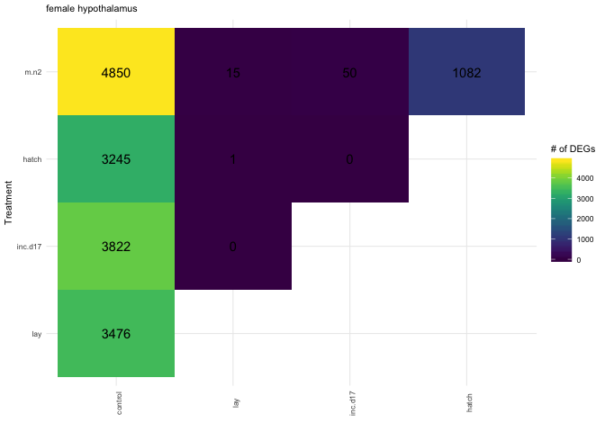
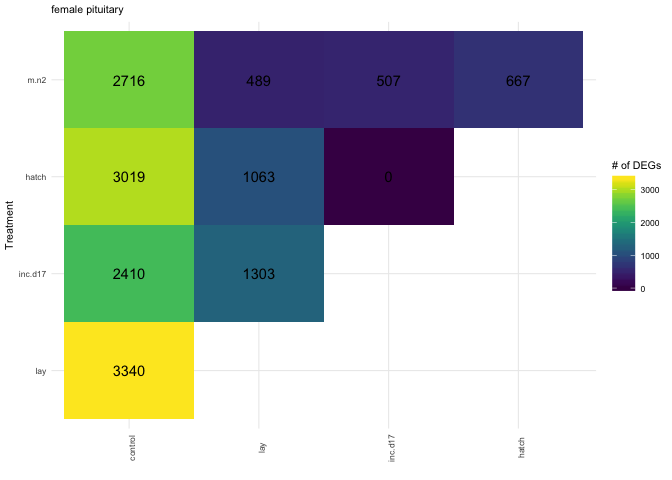

    library(tidyverse)
    library(DESeq2)
    library(cowplot)
    library(RColorBrewer)
    library(pheatmap)
    library(kableExtra)
    library(viridis)

    source("../R/functions.R")  # load custom functions 
    source("../R/themes.R")  # load custom themes and color palletes

    knitr::opts_chunk$set(fig.path = '../figures/sexes/', cache = TRUE)

Starting with all the data
--------------------------

    # import "colData" which contains sample information and "countData" which contains read counts
    a.colData <- read.csv("../metadata/00_samples.csv", header = T, row.names = 1)
    a.countData <- read.csv("../results/00_counts.csv", header = T, row.names = 1)
    geneinfo <- read.csv("../metadata/00_geneinfo.csv", row.names = 1)

    # set levels
    levels(a.colData$treatment)

    ##  [1] "bldg"      "control"   "extend"    "hatch"     "inc.d17"  
    ##  [6] "inc.d3"    "inc.d9"    "lay"       "m.inc.d17" "m.inc.d3" 
    ## [11] "m.inc.d8"  "m.inc.d9"  "m.n2"      "n5"        "n9"       
    ## [16] "prolong"

    a.colData$treatment <- factor(a.colData$treatment, levels = 
                                 c("control", "bldg", "lay",
                                   "inc.d3", "m.inc.d3", 
                                   "inc.d9", "m.inc.d8", "m.inc.d9",
                                   "inc.d17", "m.inc.d17",
                                   "hatch",  "m.n2"  ,
                                   "n5", "prolong", "extend", "n9" ))
                                   
                                   
    a.colData$sextissue <- as.factor(paste(a.colData$sex, a.colData$tissue, sep = "_"))

    a.colData$lastday <- ifelse(grepl("m.inc.d3|m.inc.d9|m.inc.d17|m.n2", a.colData$treatment), "empty nest", 
                        ifelse(grepl("m.inc.d8|hatch|extend", a.colData$treatment),"chicks hatch",      
                         ifelse(grepl("n5", a.colData$treatment),"chicks early",
                         ifelse(grepl("n9", a.colData$treatment),"chicks later",
                         ifelse(grepl("control", a.colData$treatment),"control",
                         ifelse(grepl("bldg", a.colData$treatment),"nest building",
                         ifelse(grepl("prolong", a.colData$treatment),"eggs delay",
                          ifelse(grepl("lay", a.colData$treatment),"eggs lay",
                          ifelse(grepl("inc.d3", a.colData$treatment),"eggs early",
                         ifelse(grepl("inc.d9", a.colData$treatment),"eggs middle",
                        ifelse(grepl("inc.d17", a.colData$treatment),"eggs later", NA)))))))))))

    a.colData$penultimate <-  ifelse(grepl("extend", a.colData$treatment),"eggs delay",  
                              ifelse(grepl("m.n2", a.colData$treatment),"chicks hatch",
                         ifelse(grepl("n5", a.colData$treatment),"chicks early",
                         ifelse(grepl("n9", a.colData$treatment),"chicks later",
                         ifelse(grepl("control", a.colData$treatment),"control",
                         ifelse(grepl("bldg|lay", a.colData$treatment),"nest building",
                         ifelse(grepl("prolong", a.colData$treatment),"eggs delay",
                          ifelse(grepl("inc.d3|m.inc.d3", a.colData$treatment),"eggs early",
                         ifelse(grepl("inc.d9|m.inc.d9|m.inc.d8", a.colData$treatment),"eggs middle",
                        ifelse(grepl("inc.d17|hatch", a.colData$treatment),"eggs later", NA))))))))))

    a.colData$xlabel <- a.colData$treatment

    levels(a.colData$xlabel) <-  c("control", "nest.building", "egg.lay",
                                   "eggs.early", "eggs.early.remove", 
                                   "eggs.mid", "eggs.mid.hatch", "eggs.mid.remove",
                                   "eggs.end", "eggs.end.remove",
                                   "chicks.hatch",  "chicks.hatch.remove"  ,
                                   "chicks.mid", "eggs.delay", "eggs.delay.hatch", "chicks.end")

    a.colData$lastday <- factor(a.colData$lastday, levels =  c("control", "nest building", "eggs lay",
                                   "eggs early", "eggs middle",  "eggs later","eggs delay",
                                   "chicks hatch", "chicks early",  "chicks later", "empty nest"))

    a.colData$penultimate <- factor(a.colData$penultimate, levels =  c("control", "nest building",
                                   "eggs early",  "eggs middle",  "eggs later",  "eggs delay",
                                   "chicks hatch", "chicks early",  "chicks later"))

    summary(a.colData[c(7,3,4,5,8,9, 10,11)])

    ##              study         sex               tissue        treatment  
    ##  charcterization:576   female:497   gonad       :330   control  : 73  
    ##  manipulation   :411   male  :490   hypothalamus:327   inc.d9   : 71  
    ##                                     pituitary   :330   inc.d17  : 66  
    ##                                                        n9       : 66  
    ##                                                        m.inc.d17: 63  
    ##                                                        bldg     : 60  
    ##                                                        (Other)  :588  
    ##                sextissue           lastday           penultimate 
    ##  female_gonad       :167   empty nest  :231   eggs later   :189  
    ##  female_hypothalamus:165   chicks hatch:180   eggs middle  :180  
    ##  female_pituitary   :165   control     : 73   nest building:120  
    ##  male_gonad         :163   eggs middle : 71   eggs early   :120  
    ##  male_hypothalamus  :162   eggs later  : 66   eggs delay   :120  
    ##  male_pituitary     :165   chicks later: 66   control      : 73  
    ##                            (Other)     :300   (Other)      :185  
    ##              xlabel   
    ##  control        : 73  
    ##  eggs.mid       : 71  
    ##  eggs.end       : 66  
    ##  chicks.end     : 66  
    ##  eggs.end.remove: 63  
    ##  nest.building  : 60  
    ##  (Other)        :588

Run DESeq on all subsets of the data
------------------------------------

    dds.female_hypothalamus <- subsetDESeq(a.colData, a.countData, "female_hypothalamus")

    ## [1] TRUE
    ## class: DESeqDataSet 
    ## dim: 14937 165 
    ## metadata(1): version
    ## assays(1): counts
    ## rownames(14937): NP_001001127.1 NP_001001129.1 ... XP_430449.2
    ##   XP_430508.3
    ## rowData names(0):
    ## colnames(165): L.G118_female_hypothalamus_control.NYNO
    ##   R.G106_female_hypothalamus_control ...
    ##   y97.x_female_hypothalamus_n9 y98.g54_female_hypothalamus_m.hatch
    ## colData names(11): V1 bird ... penultimate xlabel
    ## [1] 14576   165

    ## estimating size factors

    ## estimating dispersions

    ## gene-wise dispersion estimates

    ## mean-dispersion relationship

    ## final dispersion estimates

    ## fitting model and testing

    ## -- replacing outliers and refitting for 9 genes
    ## -- DESeq argument 'minReplicatesForReplace' = 7 
    ## -- original counts are preserved in counts(dds)

    ## estimating dispersions

    ## fitting model and testing

    dds.female_pituitary <- subsetDESeq(a.colData, a.countData, "female_pituitary" )

    ## [1] TRUE
    ## class: DESeqDataSet 
    ## dim: 14937 165 
    ## metadata(1): version
    ## assays(1): counts
    ## rownames(14937): NP_001001127.1 NP_001001129.1 ... XP_430449.2
    ##   XP_430508.3
    ## rowData names(0):
    ## colnames(165): L.G118_female_pituitary_control.NYNO
    ##   R.G106_female_pituitary_control ... y97.x_female_pituitary_n9
    ##   y98.g54_female_pituitary_m.hatch
    ## colData names(11): V1 bird ... penultimate xlabel
    ## [1] 14496   165

    ## estimating size factors

    ## estimating dispersions

    ## gene-wise dispersion estimates

    ## mean-dispersion relationship

    ## final dispersion estimates

    ## fitting model and testing

    ## -- replacing outliers and refitting for 49 genes
    ## -- DESeq argument 'minReplicatesForReplace' = 7 
    ## -- original counts are preserved in counts(dds)

    ## estimating dispersions

    ## fitting model and testing

    dds.female_gonad <- subsetDESeq(a.colData, a.countData, "female_gonad" )

    ## [1] TRUE
    ## class: DESeqDataSet 
    ## dim: 14937 167 
    ## metadata(1): version
    ## assays(1): counts
    ## rownames(14937): NP_001001127.1 NP_001001129.1 ... XP_430449.2
    ##   XP_430508.3
    ## rowData names(0):
    ## colnames(167): L.G118_female_gonad_control
    ##   R.G106_female_gonad_control ... y97.x_female_gonad_n9
    ##   y98.g54_female_gonad_m.hatch
    ## colData names(11): V1 bird ... penultimate xlabel
    ## [1] 14746   167

    ## estimating size factors

    ## estimating dispersions

    ## gene-wise dispersion estimates

    ## mean-dispersion relationship

    ## final dispersion estimates

    ## fitting model and testing

    ## -- replacing outliers and refitting for 156 genes
    ## -- DESeq argument 'minReplicatesForReplace' = 7 
    ## -- original counts are preserved in counts(dds)

    ## estimating dispersions

    ## fitting model and testing

    dds.male_hypothalamus <- subsetDESeq(a.colData, a.countData, "male_hypothalamus" )

    ## [1] TRUE
    ## class: DESeqDataSet 
    ## dim: 14937 162 
    ## metadata(1): version
    ## assays(1): counts
    ## rownames(14937): NP_001001127.1 NP_001001129.1 ... XP_430449.2
    ##   XP_430508.3
    ## rowData names(0):
    ## colnames(162): L.Blu13_male_hypothalamus_control.NYNO
    ##   L.G107_male_hypothalamus_control ...
    ##   y95.g131.x_male_hypothalamus_inc.d9
    ##   y98.o50.x_male_hypothalamus_inc.d3
    ## colData names(11): V1 bird ... penultimate xlabel
    ## [1] 14536   162

    ## estimating size factors

    ## estimating dispersions

    ## gene-wise dispersion estimates

    ## mean-dispersion relationship

    ## final dispersion estimates

    ## fitting model and testing

    ## -- replacing outliers and refitting for 7 genes
    ## -- DESeq argument 'minReplicatesForReplace' = 7 
    ## -- original counts are preserved in counts(dds)

    ## estimating dispersions

    ## fitting model and testing

    dds.male_pituitary <- subsetDESeq(a.colData, a.countData, "male_pituitary"  )

    ## [1] TRUE
    ## class: DESeqDataSet 
    ## dim: 14937 165 
    ## metadata(1): version
    ## assays(1): counts
    ## rownames(14937): NP_001001127.1 NP_001001129.1 ... XP_430449.2
    ##   XP_430508.3
    ## rowData names(0):
    ## colnames(165): L.Blu13_male_pituitary_control.NYNO
    ##   L.G107_male_pituitary_control ...
    ##   y95.g131.x_male_pituitary_inc.d9 y98.o50.x_male_pituitary_inc.d3
    ## colData names(11): V1 bird ... penultimate xlabel
    ## [1] 14480   165

    ## estimating size factors

    ## estimating dispersions

    ## gene-wise dispersion estimates

    ## mean-dispersion relationship

    ## final dispersion estimates

    ## fitting model and testing

    ## -- replacing outliers and refitting for 51 genes
    ## -- DESeq argument 'minReplicatesForReplace' = 7 
    ## -- original counts are preserved in counts(dds)

    ## estimating dispersions

    ## fitting model and testing

    dds.male_gondad <- subsetDESeq(a.colData, a.countData, "male_gonad")

    ## [1] TRUE
    ## class: DESeqDataSet 
    ## dim: 14937 163 
    ## metadata(1): version
    ## assays(1): counts
    ## rownames(14937): NP_001001127.1 NP_001001129.1 ... XP_430449.2
    ##   XP_430508.3
    ## rowData names(0):
    ## colnames(163): L.Blu13_male_gonad_control.NYNO
    ##   L.G107_male_gonad_control ... y95.g131.x_male_gonad_inc.d9
    ##   y98.o50.x_male_gonad_inc.d3
    ## colData names(11): V1 bird ... penultimate xlabel
    ## [1] 14765   163

    ## estimating size factors

    ## estimating dispersions

    ## gene-wise dispersion estimates

    ## mean-dispersion relationship

    ## final dispersion estimates

    ## fitting model and testing

    ## -- replacing outliers and refitting for 123 genes
    ## -- DESeq argument 'minReplicatesForReplace' = 7 
    ## -- original counts are preserved in counts(dds)

    ## estimating dispersions

    ## fitting model and testing

Calculate and plot total DEGs
-----------------------------

    #create list of groups for deseq contrasts
    group1 <- levels(a.colData$treatment)
    group2 <- group1

    b <- plottotalDEGs(dds.female_pituitary, "female pituitary")

    ## [1] "control.bldg"
    ## [1] "control.lay"
    ## [1] "control.inc.d3"
    ## [1] "control.m.inc.d3"
    ## [1] "control.inc.d9"
    ## [1] "control.m.inc.d8"
    ## [1] "control.m.inc.d9"
    ## [1] "control.inc.d17"
    ## [1] "control.m.inc.d17"
    ## [1] "control.hatch"
    ## [1] "control.m.n2"
    ## [1] "control.n5"
    ## [1] "control.prolong"
    ## [1] "control.extend"
    ## [1] "control.n9"
    ## [1] "bldg.lay"
    ## [1] "bldg.inc.d3"
    ## [1] "bldg.m.inc.d3"
    ## [1] "bldg.inc.d9"
    ## [1] "bldg.m.inc.d8"
    ## [1] "bldg.m.inc.d9"
    ## [1] "bldg.inc.d17"
    ## [1] "bldg.m.inc.d17"
    ## [1] "bldg.hatch"
    ## [1] "bldg.m.n2"
    ## [1] "bldg.n5"
    ## [1] "bldg.prolong"
    ## [1] "bldg.extend"
    ## [1] "bldg.n9"
    ## [1] "lay.inc.d3"
    ## [1] "lay.m.inc.d3"
    ## [1] "lay.inc.d9"
    ## [1] "lay.m.inc.d8"
    ## [1] "lay.m.inc.d9"
    ## [1] "lay.inc.d17"
    ## [1] "lay.m.inc.d17"
    ## [1] "lay.hatch"
    ## [1] "lay.m.n2"
    ## [1] "lay.n5"
    ## [1] "lay.prolong"
    ## [1] "lay.extend"
    ## [1] "lay.n9"
    ## [1] "inc.d3.m.inc.d3"
    ## [1] "inc.d3.inc.d9"
    ## [1] "inc.d3.m.inc.d8"
    ## [1] "inc.d3.m.inc.d9"
    ## [1] "inc.d3.inc.d17"
    ## [1] "inc.d3.m.inc.d17"
    ## [1] "inc.d3.hatch"
    ## [1] "inc.d3.m.n2"
    ## [1] "inc.d3.n5"
    ## [1] "inc.d3.prolong"
    ## [1] "inc.d3.extend"
    ## [1] "inc.d3.n9"
    ## [1] "m.inc.d3.inc.d9"
    ## [1] "m.inc.d3.m.inc.d8"
    ## [1] "m.inc.d3.m.inc.d9"
    ## [1] "m.inc.d3.inc.d17"
    ## [1] "m.inc.d3.m.inc.d17"
    ## [1] "m.inc.d3.hatch"
    ## [1] "m.inc.d3.m.n2"
    ## [1] "m.inc.d3.n5"
    ## [1] "m.inc.d3.prolong"
    ## [1] "m.inc.d3.extend"
    ## [1] "m.inc.d3.n9"
    ## [1] "inc.d9.m.inc.d8"
    ## [1] "inc.d9.m.inc.d9"
    ## [1] "inc.d9.inc.d17"
    ## [1] "inc.d9.m.inc.d17"
    ## [1] "inc.d9.hatch"
    ## [1] "inc.d9.m.n2"
    ## [1] "inc.d9.n5"
    ## [1] "inc.d9.prolong"
    ## [1] "inc.d9.extend"
    ## [1] "inc.d9.n9"
    ## [1] "m.inc.d8.m.inc.d9"
    ## [1] "m.inc.d8.inc.d17"
    ## [1] "m.inc.d8.m.inc.d17"
    ## [1] "m.inc.d8.hatch"
    ## [1] "m.inc.d8.m.n2"
    ## [1] "m.inc.d8.n5"
    ## [1] "m.inc.d8.prolong"
    ## [1] "m.inc.d8.extend"
    ## [1] "m.inc.d8.n9"
    ## [1] "m.inc.d9.inc.d17"
    ## [1] "m.inc.d9.m.inc.d17"
    ## [1] "m.inc.d9.hatch"
    ## [1] "m.inc.d9.m.n2"
    ## [1] "m.inc.d9.n5"
    ## [1] "m.inc.d9.prolong"
    ## [1] "m.inc.d9.extend"
    ## [1] "m.inc.d9.n9"
    ## [1] "inc.d17.m.inc.d17"
    ## [1] "inc.d17.hatch"
    ## [1] "inc.d17.m.n2"
    ## [1] "inc.d17.n5"
    ## [1] "inc.d17.prolong"
    ## [1] "inc.d17.extend"
    ## [1] "inc.d17.n9"
    ## [1] "m.inc.d17.hatch"
    ## [1] "m.inc.d17.m.n2"
    ## [1] "m.inc.d17.n5"
    ## [1] "m.inc.d17.prolong"
    ## [1] "m.inc.d17.extend"
    ## [1] "m.inc.d17.n9"
    ## [1] "hatch.m.n2"
    ## [1] "hatch.n5"
    ## [1] "hatch.prolong"
    ## [1] "hatch.extend"
    ## [1] "hatch.n9"
    ## [1] "m.n2.n5"
    ## [1] "m.n2.prolong"
    ## [1] "m.n2.extend"
    ## [1] "m.n2.n9"
    ## [1] "n5.prolong"
    ## [1] "n5.extend"
    ## [1] "n5.n9"
    ## [1] "prolong.extend"
    ## [1] "prolong.n9"
    ## [1] "extend.n9"
    ##                           V1   V2   V3
    ## control.bldg         control <NA> 4533
    ## control.lay          control <NA> 4357
    ## control.inc.d3       control <NA> 3642
    ## control.m.inc.d3     control <NA> 4420
    ## control.inc.d9       control <NA> 4297
    ## control.m.inc.d8     control <NA> 4590
    ## control.m.inc.d9     control <NA> 3406
    ## control.inc.d17      control <NA> 3425
    ## control.m.inc.d17    control <NA> 4325
    ## control.hatch        control <NA> 4019
    ## control.m.n2         control <NA> 3810
    ## control.n5           control <NA> 4083
    ## control.prolong      control <NA> 3983
    ## control.extend       control <NA> 4012
    ## control.n9           control <NA> 4196
    ## bldg.lay                bldg <NA>  127
    ## bldg.inc.d3             bldg <NA>    9
    ## bldg.m.inc.d3           bldg <NA>   16
    ## bldg.inc.d9             bldg <NA>   28
    ## bldg.m.inc.d8           bldg <NA>   36
    ## bldg.m.inc.d9           bldg <NA>    1
    ## bldg.inc.d17            bldg <NA> 1843
    ## bldg.m.inc.d17          bldg <NA>  418
    ## bldg.hatch              bldg <NA> 1367
    ## bldg.m.n2               bldg <NA>  658
    ## bldg.n5                 bldg <NA>  227
    ## bldg.prolong            bldg <NA>  569
    ## bldg.extend             bldg <NA> 1077
    ## bldg.n9                 bldg <NA>  106
    ## lay.inc.d3               lay <NA>  131
    ## lay.m.inc.d3             lay <NA>  126
    ## lay.inc.d9               lay <NA>   59
    ## lay.m.inc.d8             lay <NA>   19
    ## lay.m.inc.d9             lay <NA>  124
    ## lay.inc.d17              lay <NA> 2380
    ## lay.m.inc.d17            lay <NA>  618
    ## lay.hatch                lay <NA> 1895
    ## lay.m.n2                 lay <NA>  776
    ## lay.n5                   lay <NA>  149
    ## lay.prolong              lay <NA>  564
    ## lay.extend               lay <NA>  616
    ## lay.n9                   lay <NA>  268
    ## inc.d3.m.inc.d3       inc.d3 <NA>  369
    ## inc.d3.inc.d9         inc.d3 <NA>    1
    ## inc.d3.m.inc.d8       inc.d3 <NA>  235
    ## inc.d3.m.inc.d9       inc.d3 <NA>    1
    ## inc.d3.inc.d17        inc.d3 <NA>  570
    ## inc.d3.m.inc.d17      inc.d3 <NA> 1062
    ## inc.d3.hatch          inc.d3 <NA>  597
    ## inc.d3.m.n2           inc.d3 <NA>  860
    ## inc.d3.n5             inc.d3 <NA>   71
    ## inc.d3.prolong        inc.d3 <NA>  472
    ## inc.d3.extend         inc.d3 <NA> 1123
    ## inc.d3.n9             inc.d3 <NA>   79
    ## m.inc.d3.inc.d9     m.inc.d3 <NA>   27
    ## m.inc.d3.m.inc.d8   m.inc.d3 <NA>    3
    ## m.inc.d3.m.inc.d9   m.inc.d3 <NA>    2
    ## m.inc.d3.inc.d17    m.inc.d3 <NA> 2030
    ## m.inc.d3.m.inc.d17  m.inc.d3 <NA>   37
    ## m.inc.d3.hatch      m.inc.d3 <NA> 2056
    ## m.inc.d3.m.n2       m.inc.d3 <NA>  137
    ## m.inc.d3.n5         m.inc.d3 <NA>   47
    ## m.inc.d3.prolong    m.inc.d3 <NA>  324
    ## m.inc.d3.extend     m.inc.d3 <NA>  614
    ## m.inc.d3.n9         m.inc.d3 <NA>    0
    ## inc.d9.m.inc.d8       inc.d9 <NA>    0
    ## inc.d9.m.inc.d9       inc.d9 <NA>    9
    ## inc.d9.inc.d17        inc.d9 <NA> 1038
    ## inc.d9.m.inc.d17      inc.d9 <NA>  670
    ## inc.d9.hatch          inc.d9 <NA>  895
    ## inc.d9.m.n2           inc.d9 <NA>  641
    ## inc.d9.n5             inc.d9 <NA>   29
    ## inc.d9.prolong        inc.d9 <NA>  404
    ## inc.d9.extend         inc.d9 <NA>  749
    ## inc.d9.n9             inc.d9 <NA>   75
    ## m.inc.d8.m.inc.d9   m.inc.d8 <NA>   17
    ## m.inc.d8.inc.d17    m.inc.d8 <NA> 2440
    ## m.inc.d8.m.inc.d17  m.inc.d8 <NA>  234
    ## m.inc.d8.hatch      m.inc.d8 <NA> 2132
    ## m.inc.d8.m.n2       m.inc.d8 <NA>  476
    ## m.inc.d8.n5         m.inc.d8 <NA>   17
    ## m.inc.d8.prolong    m.inc.d8 <NA>  347
    ## m.inc.d8.extend     m.inc.d8 <NA>  417
    ## m.inc.d8.n9         m.inc.d8 <NA>   27
    ## m.inc.d9.inc.d17    m.inc.d9 <NA> 1008
    ## m.inc.d9.m.inc.d17  m.inc.d9 <NA>   78
    ## m.inc.d9.hatch      m.inc.d9 <NA>  970
    ## m.inc.d9.m.n2       m.inc.d9 <NA>  183
    ## m.inc.d9.n5         m.inc.d9 <NA>   52
    ## m.inc.d9.prolong    m.inc.d9 <NA>  287
    ## m.inc.d9.extend     m.inc.d9 <NA>  651
    ## m.inc.d9.n9         m.inc.d9 <NA>   10
    ## inc.d17.m.inc.d17    inc.d17 <NA> 1911
    ## inc.d17.hatch        inc.d17 <NA>    3
    ## inc.d17.m.n2         inc.d17 <NA> 1233
    ## inc.d17.n5           inc.d17 <NA>  790
    ## inc.d17.prolong      inc.d17 <NA>  115
    ## inc.d17.extend       inc.d17 <NA>  859
    ## inc.d17.n9           inc.d17 <NA> 1632
    ## m.inc.d17.hatch    m.inc.d17 <NA> 2001
    ## m.inc.d17.m.n2     m.inc.d17 <NA>   10
    ## m.inc.d17.n5       m.inc.d17 <NA>  134
    ## m.inc.d17.prolong  m.inc.d17 <NA>  195
    ## m.inc.d17.extend   m.inc.d17 <NA>  496
    ## m.inc.d17.n9       m.inc.d17 <NA>   22
    ## hatch.m.n2             hatch <NA> 1312
    ## hatch.n5               hatch <NA>  545
    ## hatch.prolong          hatch <NA>   56
    ## hatch.extend           hatch <NA>  539
    ## hatch.n9               hatch <NA> 1286
    ## m.n2.n5                 m.n2 <NA>   86
    ## m.n2.prolong            m.n2 <NA>  138
    ## m.n2.extend             m.n2 <NA>  333
    ## m.n2.n9                 m.n2 <NA>   19
    ## n5.prolong                n5 <NA>   48
    ## n5.extend                 n5 <NA>   51
    ## n5.n9                     n5 <NA>    4
    ## prolong.extend       prolong <NA>   25
    ## prolong.n9           prolong <NA>  221
    ## extend.n9             extend <NA>  336

    b

    a <- plottotalDEGs(dds.female_hypothalamus, "female hypothalamus")
    a

    c <- plottotalDEGs(dds.female_gonad, "female gonad")
    d <- plottotalDEGs(dds.male_hypothalamus, "male hypothalamus")
    e <- plottotalDEGs(dds.male_pituitary, "male pituitary")
    f <- plottotalDEGs(dds.male_gondad, "male gonad")

    plot_grid(a + theme(legend.position = "none"),
              b + theme(legend.position = "none"),
              c + theme(legend.position = "none"),
              d + theme(legend.position = "none"),
              e + theme(legend.position = "none"),
              f + theme(legend.position = "none"),
              nrow = 2) 

Calculate and plot principal components
---------------------------------------

    p1 <- plotPCAs(dds.female_hypothalamus, "female hypothalamus")
    p2 <- plotPCAs(dds.female_pituitary, "female pituitary")      
    p3 <- plotPCAs(dds.female_gonad, "female gonad")
    p4 <- plotPCAs(dds.male_hypothalamus, "male hypothalamus")
    p5 <- plotPCAs(dds.male_pituitary, "male pituitary")
    p6 <- plotPCAs(dds.male_gondad, "male gonad")
    p1
    p2
    p3
    p4
    p5
    p6

    mylegend <- get_legend(p1)

    theme_noaxislabels <- theme(legend.position = "none", axis.title.x=element_blank(),axis.text.x=element_blank())

    allPC1s <- plot_grid(p1 + theme_noaxislabels, 
                         p1 + theme_noaxislabels, 
                         p1 + theme_noaxislabels,
                         p1 + theme_noaxislabels,
                         p1 + theme_noaxislabels,
                         p1 + theme_noaxislabels),
                         nrow = 3, rel_heights = c(0.3, 0.3, 0.4))

    pc1 <- plot_grid(mylegend, allPC1s, nrow = 2, rel_heights = c(0.15, 1.0))
    pc1

    pdf("../figures/sexes/pca-1.pdf", width = 12, height = 10)
    plot(pc1)
    dev.off()

heamap with minimum pvalue
--------------------------

    makepheatmap(dds.female_hypothalamus, a.colData, "female hypothalamus")
    makepheatmap(dds.female_pituitary, "female pituitary")
    makepheatmap(dds.female_gonad, "female gonad")
    makepheatmap(dds.male_hypothalamus, "male hypothalamus")
    makepheatmap(dds.male_pituitary, "male pituitary")
    makepheatmap(dds.male_gondad, "male gonad")        

candidate genes
---------------

    plotcandidates(dds.female_hypothalamus, a.colData, "female hypothalamus")
    plotcandidates(dds.female_pituitary, "female pituitary")
    plotcandidates(dds.female_gonad, "female gonad")
    plotcandidates(dds.male_hypothalamus, "male hypothalamus")
    plotcandidates(dds.male_pituitary, "male pituitary")
    plotcandidates(dds.male_gondad, "male gonad")
