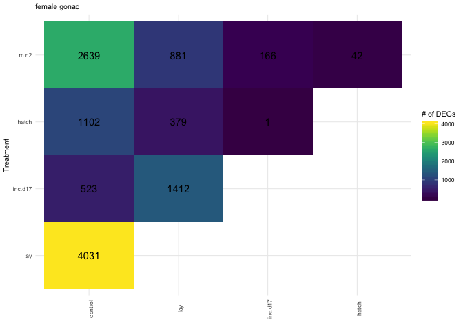
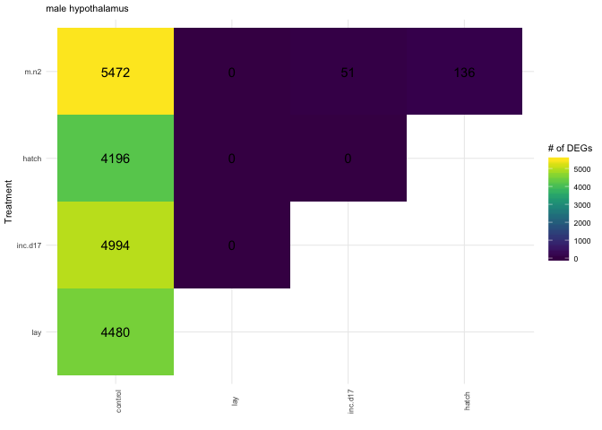
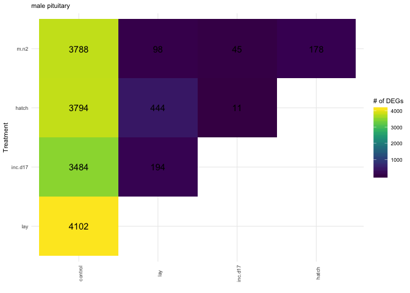
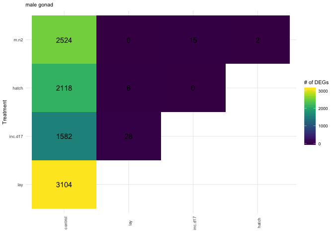
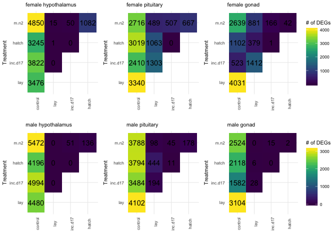

    library(tidyverse)
    library(DESeq2)
    library(cowplot)
    library(RColorBrewer)
    library(pheatmap)
    library(kableExtra)
    library(viridis)

    source("../R/functions.R")  # load custom functions 
    source("../R/themes.R")  # load custom themes and color palletes

    knitr::opts_chunk$set(fig.path = '../figures/sexes/', cache = TRUE)

Starting with all the data
--------------------------

    # import "colData" which contains sample information and "countData" which contains read counts
    a.colData <- read.csv("../metadata/00_samples.csv", header = T, row.names = 1)
    a.countData <- read.csv("../results/00_counts.csv", header = T, row.names = 1)
    geneinfo <- read.csv("../metadata/00_geneinfo.csv", row.names = 1)

    # set levels
    levels(a.colData$treatment)

    ##  [1] "bldg"      "control"   "extend"    "hatch"     "inc.d17"  
    ##  [6] "inc.d3"    "inc.d9"    "lay"       "m.inc.d17" "m.inc.d3" 
    ## [11] "m.inc.d8"  "m.inc.d9"  "m.n2"      "n5"        "n9"       
    ## [16] "prolong"

    a.colData$treatment <- factor(a.colData$treatment, levels = 
                                 c("control", "bldg", "lay",
                                   "inc.d3", "m.inc.d3", 
                                   "inc.d9", "m.inc.d8", "m.inc.d9",
                                   "inc.d17", "m.inc.d17",
                                   "hatch",  "m.n2"  ,
                                   "n5", "prolong", "extend", "n9" ))
                                   
                                   
    a.colData$sextissue <- as.factor(paste(a.colData$sex, a.colData$tissue, sep = "_"))

    a.colData$lastday <- ifelse(grepl("m.inc.d3|m.inc.d9|m.inc.d17|m.n2", a.colData$treatment), "empty nest", 
                        ifelse(grepl("m.inc.d8|hatch|extend", a.colData$treatment),"chicks hatch",      
                         ifelse(grepl("n5", a.colData$treatment),"chicks early",
                         ifelse(grepl("n9", a.colData$treatment),"chicks later",
                         ifelse(grepl("control", a.colData$treatment),"control",
                         ifelse(grepl("bldg", a.colData$treatment),"nest building",
                         ifelse(grepl("prolong", a.colData$treatment),"eggs delay",
                          ifelse(grepl("lay", a.colData$treatment),"eggs lay",
                          ifelse(grepl("inc.d3", a.colData$treatment),"eggs early",
                         ifelse(grepl("inc.d9", a.colData$treatment),"eggs middle",
                        ifelse(grepl("inc.d17", a.colData$treatment),"eggs later", NA)))))))))))

    a.colData$penultimate <-  ifelse(grepl("extend", a.colData$treatment),"eggs delay",  
                              ifelse(grepl("m.n2", a.colData$treatment),"chicks hatch",
                         ifelse(grepl("n5", a.colData$treatment),"chicks early",
                         ifelse(grepl("n9", a.colData$treatment),"chicks later",
                         ifelse(grepl("control", a.colData$treatment),"control",
                         ifelse(grepl("bldg|lay", a.colData$treatment),"nest building",
                         ifelse(grepl("prolong", a.colData$treatment),"eggs delay",
                          ifelse(grepl("inc.d3|m.inc.d3", a.colData$treatment),"eggs early",
                         ifelse(grepl("inc.d9|m.inc.d9|m.inc.d8", a.colData$treatment),"eggs middle",
                        ifelse(grepl("inc.d17|hatch", a.colData$treatment),"eggs later", NA))))))))))

    a.colData$xlabel <- a.colData$treatment
    levels(a.colData$xlabel) <-  c("control", "nest building", "egg lay",
                                   "eggs early", "eggs early remove", 
                                   "eggs mid", "eggs mid hatch", "eggs mid remove",
                                   "eggs end", "eggs end remove",
                                   "chicks hatch",  "chicks hatch remove"  ,
                                   "chicks mid", "eggs delay", "eggs delay hatch", "chicks end")

    a.colData$lastday <- factor(a.colData$lastday, levels =  c("control", "nest building", "eggs lay",
                                   "eggs early", "eggs middle",  "eggs later","eggs delay",
                                   "chicks hatch", "chicks early",  "chicks later", "empty nest"))

    a.colData$penultimate <- factor(a.colData$penultimate, levels =  c("control", "nest building",
                                   "eggs early",  "eggs middle",  "eggs later",  "eggs delay",
                                   "chicks hatch", "chicks early",  "chicks later"))

    summary(a.colData[c(7,3,4,5,8,9, 10,11)])

    ##              study         sex               tissue        treatment  
    ##  charcterization:576   female:497   gonad       :330   control  : 73  
    ##  manipulation   :411   male  :490   hypothalamus:327   inc.d9   : 71  
    ##                                     pituitary   :330   inc.d17  : 66  
    ##                                                        n9       : 66  
    ##                                                        m.inc.d17: 63  
    ##                                                        bldg     : 60  
    ##                                                        (Other)  :588  
    ##                sextissue           lastday           penultimate 
    ##  female_gonad       :167   empty nest  :231   eggs later   :189  
    ##  female_hypothalamus:165   chicks hatch:180   eggs middle  :180  
    ##  female_pituitary   :165   control     : 73   nest building:120  
    ##  male_gonad         :163   eggs middle : 71   eggs early   :120  
    ##  male_hypothalamus  :162   eggs later  : 66   eggs delay   :120  
    ##  male_pituitary     :165   chicks later: 66   control      : 73  
    ##                            (Other)     :300   (Other)      :185  
    ##              xlabel   
    ##  control        : 73  
    ##  eggs mid       : 71  
    ##  eggs end       : 66  
    ##  chicks end     : 66  
    ##  eggs end remove: 63  
    ##  nest building  : 60  
    ##  (Other)        :588

Run DESeq on all subsets of the data
------------------------------------

    # subset to look within one tissue in one sex
    a.colData <- a.colData %>%
        dplyr::filter(treatment %in% c( "control", "lay" , "inc.d17", "hatch", "m.n2")) %>%
        droplevels()

    dds.female_hypothalamus <- subsetDESeq(a.colData, a.countData, "female_hypothalamus")

    ## [1] TRUE
    ## class: DESeqDataSet 
    ## dim: 14937 52 
    ## metadata(1): version
    ## assays(1): counts
    ## rownames(14937): NP_001001127.1 NP_001001129.1 ... XP_430449.2
    ##   XP_430508.3
    ## rowData names(0):
    ## colnames(52): L.G118_female_hypothalamus_control.NYNO
    ##   R.G106_female_hypothalamus_control ...
    ##   y7.g58_female_hypothalamus_hatch
    ##   y98.g54_female_hypothalamus_m.hatch
    ## colData names(11): V1 bird ... penultimate xlabel
    ## [1] 14293    52

    ## estimating size factors

    ## estimating dispersions

    ## gene-wise dispersion estimates

    ## mean-dispersion relationship

    ## final dispersion estimates

    ## fitting model and testing

    ## -- replacing outliers and refitting for 19 genes
    ## -- DESeq argument 'minReplicatesForReplace' = 7 
    ## -- original counts are preserved in counts(dds)

    ## estimating dispersions

    ## fitting model and testing

    dds.female_pituitary <- subsetDESeq(a.colData, a.countData, "female_pituitary" )

    ## [1] TRUE
    ## class: DESeqDataSet 
    ## dim: 14937 52 
    ## metadata(1): version
    ## assays(1): counts
    ## rownames(14937): NP_001001127.1 NP_001001129.1 ... XP_430449.2
    ##   XP_430508.3
    ## rowData names(0):
    ## colnames(52): L.G118_female_pituitary_control.NYNO
    ##   R.G106_female_pituitary_control ...
    ##   y7.g58_female_pituitary_hatch y98.g54_female_pituitary_m.hatch
    ## colData names(11): V1 bird ... penultimate xlabel
    ## [1] 14099    52

    ## estimating size factors

    ## estimating dispersions

    ## gene-wise dispersion estimates

    ## mean-dispersion relationship

    ## final dispersion estimates

    ## fitting model and testing

    ## -- replacing outliers and refitting for 124 genes
    ## -- DESeq argument 'minReplicatesForReplace' = 7 
    ## -- original counts are preserved in counts(dds)

    ## estimating dispersions

    ## fitting model and testing

    dds.female_gonad <- subsetDESeq(a.colData, a.countData, "female_gonad" )

    ## [1] TRUE
    ## class: DESeqDataSet 
    ## dim: 14937 54 
    ## metadata(1): version
    ## assays(1): counts
    ## rownames(14937): NP_001001127.1 NP_001001129.1 ... XP_430449.2
    ##   XP_430508.3
    ## rowData names(0):
    ## colnames(54): L.G118_female_gonad_control
    ##   R.G106_female_gonad_control ... y7.g58_female_gonad_hatch
    ##   y98.g54_female_gonad_m.hatch
    ## colData names(11): V1 bird ... penultimate xlabel
    ## [1] 14482    54

    ## estimating size factors

    ## estimating dispersions

    ## gene-wise dispersion estimates

    ## mean-dispersion relationship

    ## final dispersion estimates

    ## fitting model and testing

    ## -- replacing outliers and refitting for 57 genes
    ## -- DESeq argument 'minReplicatesForReplace' = 7 
    ## -- original counts are preserved in counts(dds)

    ## estimating dispersions

    ## fitting model and testing

    dds.male_hypothalamus <- subsetDESeq(a.colData, a.countData, "male_hypothalamus" )

    ## [1] TRUE
    ## class: DESeqDataSet 
    ## dim: 14937 52 
    ## metadata(1): version
    ## assays(1): counts
    ## rownames(14937): NP_001001127.1 NP_001001129.1 ... XP_430449.2
    ##   XP_430508.3
    ## rowData names(0):
    ## colnames(52): L.Blu13_male_hypothalamus_control.NYNO
    ##   L.G107_male_hypothalamus_control ...
    ##   x.y132.w76_male_hypothalamus_inc.d17
    ##   y133.w77.r58_male_hypothalamus_inc.d17
    ## colData names(11): V1 bird ... penultimate xlabel
    ## [1] 14259    52

    ## estimating size factors

    ## estimating dispersions

    ## gene-wise dispersion estimates

    ## mean-dispersion relationship

    ## final dispersion estimates

    ## fitting model and testing

    ## -- replacing outliers and refitting for 26 genes
    ## -- DESeq argument 'minReplicatesForReplace' = 7 
    ## -- original counts are preserved in counts(dds)

    ## estimating dispersions

    ## fitting model and testing

    dds.male_pituitary <- subsetDESeq(a.colData, a.countData, "male_pituitary"  )

    ## [1] TRUE
    ## class: DESeqDataSet 
    ## dim: 14937 55 
    ## metadata(1): version
    ## assays(1): counts
    ## rownames(14937): NP_001001127.1 NP_001001129.1 ... XP_430449.2
    ##   XP_430508.3
    ## rowData names(0):
    ## colnames(55): L.Blu13_male_pituitary_control.NYNO
    ##   L.G107_male_pituitary_control ...
    ##   x.y132.w76_male_pituitary_inc.d17
    ##   y133.w77.r58_male_pituitary_inc.d17
    ## colData names(11): V1 bird ... penultimate xlabel
    ## [1] 14132    55

    ## estimating size factors

    ## estimating dispersions

    ## gene-wise dispersion estimates

    ## mean-dispersion relationship

    ## final dispersion estimates

    ## fitting model and testing

    ## -- replacing outliers and refitting for 57 genes
    ## -- DESeq argument 'minReplicatesForReplace' = 7 
    ## -- original counts are preserved in counts(dds)

    ## estimating dispersions

    ## fitting model and testing

    dds.male_gondad <- subsetDESeq(a.colData, a.countData, "male_gonad")

    ## [1] TRUE
    ## class: DESeqDataSet 
    ## dim: 14937 53 
    ## metadata(1): version
    ## assays(1): counts
    ## rownames(14937): NP_001001127.1 NP_001001129.1 ... XP_430449.2
    ##   XP_430508.3
    ## rowData names(0):
    ## colnames(53): L.Blu13_male_gonad_control.NYNO
    ##   L.G107_male_gonad_control ... x.y132.w76_male_gonad_inc.d17
    ##   y133.w77.r58_male_gonad_inc.d17
    ## colData names(11): V1 bird ... penultimate xlabel
    ## [1] 14436    53

    ## estimating size factors

    ## estimating dispersions

    ## gene-wise dispersion estimates

    ## mean-dispersion relationship

    ## final dispersion estimates

    ## fitting model and testing

    ## -- replacing outliers and refitting for 26 genes
    ## -- DESeq argument 'minReplicatesForReplace' = 7 
    ## -- original counts are preserved in counts(dds)

    ## estimating dispersions

    ## fitting model and testing

Calculate and plot total DEGs
-----------------------------

    #create list of groups for deseq contrasts
    group1 <- levels(a.colData$treatment)
    group2 <- group1

    a <- plottotalDEGs(dds.female_hypothalamus, "female hypothalamus")

    ## [1] "control.lay"
    ## [1] "control.inc.d17"
    ## [1] "control.hatch"
    ## [1] "control.m.n2"
    ## [1] "lay.inc.d17"
    ## [1] "lay.hatch"
    ## [1] "lay.m.n2"
    ## [1] "inc.d17.hatch"
    ## [1] "inc.d17.m.n2"
    ## [1] "hatch.m.n2"
    ##                      V1      V2   V3
    ## control.lay     control     lay 3476
    ## control.inc.d17 control inc.d17 3822
    ## control.hatch   control   hatch 3245
    ## control.m.n2    control    m.n2 4850
    ## lay.inc.d17         lay inc.d17    0
    ## lay.hatch           lay   hatch    1
    ## lay.m.n2            lay    m.n2   15
    ## inc.d17.hatch   inc.d17   hatch    0
    ## inc.d17.m.n2    inc.d17    m.n2   50
    ## hatch.m.n2        hatch    m.n2 1082

    b <- plottotalDEGs(dds.female_pituitary, "female pituitary")

    ## [1] "control.lay"
    ## [1] "control.inc.d17"
    ## [1] "control.hatch"
    ## [1] "control.m.n2"
    ## [1] "lay.inc.d17"
    ## [1] "lay.hatch"
    ## [1] "lay.m.n2"
    ## [1] "inc.d17.hatch"
    ## [1] "inc.d17.m.n2"
    ## [1] "hatch.m.n2"
    ##                      V1      V2   V3
    ## control.lay     control     lay 3340
    ## control.inc.d17 control inc.d17 2410
    ## control.hatch   control   hatch 3019
    ## control.m.n2    control    m.n2 2716
    ## lay.inc.d17         lay inc.d17 1303
    ## lay.hatch           lay   hatch 1063
    ## lay.m.n2            lay    m.n2  489
    ## inc.d17.hatch   inc.d17   hatch    0
    ## inc.d17.m.n2    inc.d17    m.n2  507
    ## hatch.m.n2        hatch    m.n2  667

    c <- plottotalDEGs(dds.female_gonad, "female gonad")

    ## [1] "control.lay"
    ## [1] "control.inc.d17"
    ## [1] "control.hatch"
    ## [1] "control.m.n2"
    ## [1] "lay.inc.d17"
    ## [1] "lay.hatch"
    ## [1] "lay.m.n2"
    ## [1] "inc.d17.hatch"
    ## [1] "inc.d17.m.n2"
    ## [1] "hatch.m.n2"
    ##                      V1      V2   V3
    ## control.lay     control     lay 4031
    ## control.inc.d17 control inc.d17  523
    ## control.hatch   control   hatch 1102
    ## control.m.n2    control    m.n2 2639
    ## lay.inc.d17         lay inc.d17 1412
    ## lay.hatch           lay   hatch  379
    ## lay.m.n2            lay    m.n2  881
    ## inc.d17.hatch   inc.d17   hatch    1
    ## inc.d17.m.n2    inc.d17    m.n2  166
    ## hatch.m.n2        hatch    m.n2   42

    d <- plottotalDEGs(dds.male_hypothalamus, "male hypothalamus")

    ## [1] "control.lay"
    ## [1] "control.inc.d17"
    ## [1] "control.hatch"
    ## [1] "control.m.n2"
    ## [1] "lay.inc.d17"
    ## [1] "lay.hatch"
    ## [1] "lay.m.n2"
    ## [1] "inc.d17.hatch"
    ## [1] "inc.d17.m.n2"
    ## [1] "hatch.m.n2"
    ##                      V1      V2   V3
    ## control.lay     control     lay 4480
    ## control.inc.d17 control inc.d17 4994
    ## control.hatch   control   hatch 4196
    ## control.m.n2    control    m.n2 5472
    ## lay.inc.d17         lay inc.d17    0
    ## lay.hatch           lay   hatch    0
    ## lay.m.n2            lay    m.n2    0
    ## inc.d17.hatch   inc.d17   hatch    0
    ## inc.d17.m.n2    inc.d17    m.n2   51
    ## hatch.m.n2        hatch    m.n2  136

    e <- plottotalDEGs(dds.male_pituitary, "male pituitary")

    ## [1] "control.lay"
    ## [1] "control.inc.d17"
    ## [1] "control.hatch"
    ## [1] "control.m.n2"
    ## [1] "lay.inc.d17"
    ## [1] "lay.hatch"
    ## [1] "lay.m.n2"
    ## [1] "inc.d17.hatch"
    ## [1] "inc.d17.m.n2"
    ## [1] "hatch.m.n2"
    ##                      V1      V2   V3
    ## control.lay     control     lay 4102
    ## control.inc.d17 control inc.d17 3484
    ## control.hatch   control   hatch 3794
    ## control.m.n2    control    m.n2 3788
    ## lay.inc.d17         lay inc.d17  194
    ## lay.hatch           lay   hatch  444
    ## lay.m.n2            lay    m.n2   98
    ## inc.d17.hatch   inc.d17   hatch   11
    ## inc.d17.m.n2    inc.d17    m.n2   45
    ## hatch.m.n2        hatch    m.n2  178

    f <- plottotalDEGs(dds.male_gondad, "male gonad")

    ## [1] "control.lay"
    ## [1] "control.inc.d17"
    ## [1] "control.hatch"
    ## [1] "control.m.n2"
    ## [1] "lay.inc.d17"
    ## [1] "lay.hatch"
    ## [1] "lay.m.n2"
    ## [1] "inc.d17.hatch"
    ## [1] "inc.d17.m.n2"
    ## [1] "hatch.m.n2"
    ##                      V1      V2   V3
    ## control.lay     control     lay 3104
    ## control.inc.d17 control inc.d17 1582
    ## control.hatch   control   hatch 2118
    ## control.m.n2    control    m.n2 2524
    ## lay.inc.d17         lay inc.d17   28
    ## lay.hatch           lay   hatch    6
    ## lay.m.n2            lay    m.n2    0
    ## inc.d17.hatch   inc.d17   hatch    0
    ## inc.d17.m.n2    inc.d17    m.n2   15
    ## hatch.m.n2        hatch    m.n2    2

    plot_grid(a + theme(legend.position = "none"),
              b + theme(legend.position = "none"),
              c,
              d + theme(legend.position = "none"),
              e + theme(legend.position = "none"),
              f,
              nrow = 2, rel_widths = c(0.3, 0.3, 0.4)) 

Calculate and plot principal components
---------------------------------------

    p1 <- plotPCAs(dds.female_hypothalamus, "female hypothalamus")
    p2 <- plotPCAs(dds.female_pituitary, "female pituitary")      
    p3 <- plotPCAs(dds.female_gonad, "female gonad")
    p4 <- plotPCAs(dds.male_hypothalamus, "male hypothalamus")
    p5 <- plotPCAs(dds.male_pituitary, "male pituitary")
    p6 <- plotPCAs(dds.male_gondad, "male gonad")
    p1
    p2
    p3
    p4
    p5
    p6

    mylegend <- get_legend(p1)

    theme_noaxislabels <- theme(legend.position = "none", axis.title.x=element_blank(),axis.text.x=element_blank())

    allPC1s <- plot_grid(p1 + theme_noaxislabels, 
                         p1 + theme_noaxislabels, 
                         p1 + theme_noaxislabels,
                         p1 + theme_noaxislabels,
                         p1 + theme(legend.position = "none"),
                         p1 + theme(legend.position = "none"),
                         nrow = 3, rel_heights = c(0.3, 0.3, 0.4))

    pc1 <- plot_grid(mylegend, allPC1s, nrow = 2, rel_heights = c(0.15, 1.0))
    pc1

    pdf("../figures/sexes/pca-1.pdf", width = 12, height = 10)
    plot(pc1)
    dev.off()

heamap with minimum pvalue
--------------------------

    makepheatmap(dds.female_hypothalamus, a.colData, "female hypothalamus")
    makepheatmap(dds.female_pituitary, "female pituitary")
    makepheatmap(dds.female_gonad, "female gonad")
    makepheatmap(dds.male_hypothalamus, "male hypothalamus")
    makepheatmap(dds.male_pituitary, "male pituitary")
    makepheatmap(dds.male_gondad, "male gonad")        

candidate genes
---------------

    plotcandidates(dds.female_hypothalamus, a.colData, "female hypothalamus")
    plotcandidates(dds.female_pituitary, "female pituitary")
    plotcandidates(dds.female_gonad, "female gonad")
    plotcandidates(dds.male_hypothalamus, "male hypothalamus")
    plotcandidates(dds.male_pituitary, "male pituitary")
    plotcandidates(dds.male_gondad, "male gonad")
