DEseq2 analysis on characterization. Looking at treatment AND sex for each tissue
---------------------------------------------------------------------------------

    # import "colData" which contains sample information and "countData" which contains read counts
    c.colData <- read.csv("../metadata/00_colData_characterization.csv", header = T, row.names = 1)
    c.countData <- read.csv("../results/00_countData_characterization.csv", header = T, row.names = 1)
    geneinfo <- read.csv("../metadata/00_geneinfo.csv", row.names = 1)

    # set treatment levels
    c.colData$treatment <- factor(c.colData$treatment, levels = 
                                  c("control",  "bldg", "lay", "inc.d3", "inc.d9", "inc.d17", "hatch", "n5", "n9"))

    # craete variable that will be critical for subset later on
    c.colData$sextissue <- as.factor(paste(c.colData$sex, c.colData$tissue, sep = "_"))

    # ceate new variable for hypothesis testing
    c.colData <- c.colData %>%
        mutate(hypothesis = fct_recode(treatment,
                                "anticipation" = "control",
                                "anticipation" = "bldg",
                                "incubation" = "lay",
                                "incubation" = "inc.d3",
                                "incubation" = "inc.d9",
                                "incubation" = "inc.d17",
                                "hatchling.care" = "hatch",
                                "hatchling.care" = "n5",
                                "hatchling.care" = "n9"))

    # drop columsn that are bad for model AND not needed for later joining
    c.colData$bird <- NULL
    c.colData$tissue <- NULL
    c.colData$study <- NULL
    c.colData$group <- NULL
    head(c.colData)

    FALSE                                       V1  sex treatment         sextissue
    FALSE 1        L.Blu13_male_gonad_control.NYNO male   control        male_gonad
    FALSE 2 L.Blu13_male_hypothalamus_control.NYNO male   control male_hypothalamus
    FALSE 3    L.Blu13_male_pituitary_control.NYNO male   control    male_pituitary
    FALSE 4              L.G107_male_gonad_control male   control        male_gonad
    FALSE 5       L.G107_male_hypothalamus_control male   control male_hypothalamus
    FALSE 6          L.G107_male_pituitary_control male   control    male_pituitary
    FALSE     hypothesis
    FALSE 1 anticipation
    FALSE 2 anticipation
    FALSE 3 anticipation
    FALSE 4 anticipation
    FALSE 5 anticipation
    FALSE 6 anticipation

    dds.hypothalamus <- subsetDESeq2(c.colData,  c.countData, c("female_hypothalamus","male_hypothalamus") )

    FALSE class: DESeqDataSet 
    FALSE dim: 14937 189 
    FALSE metadata(1): version
    FALSE assays(1): counts
    FALSE rownames(14937): NP_001001127.1 NP_001001129.1 ... XP_430449.2
    FALSE   XP_430508.3
    FALSE rowData names(0):
    FALSE colnames(189): L.Blu13_male_hypothalamus_control.NYNO
    FALSE   L.G107_male_hypothalamus_control ...
    FALSE   y97.x_female_hypothalamus_n9 y98.o50.x_male_hypothalamus_inc.d3
    FALSE colData names(5): V1 sex treatment sextissue hypothesis
    FALSE [1] 14597   189

    dds.pituitary <- subsetDESeq2(c.colData,  c.countData, c("female_pituitary", "male_pituitary" ) )

    FALSE class: DESeqDataSet 
    FALSE dim: 14937 193 
    FALSE metadata(1): version
    FALSE assays(1): counts
    FALSE rownames(14937): NP_001001127.1 NP_001001129.1 ... XP_430449.2
    FALSE   XP_430508.3
    FALSE rowData names(0):
    FALSE colnames(193): L.Blu13_male_pituitary_control.NYNO
    FALSE   L.G107_male_pituitary_control ... y97.x_female_pituitary_n9
    FALSE   y98.o50.x_male_pituitary_inc.d3
    FALSE colData names(5): V1 sex treatment sextissue hypothesis
    FALSE [1] 14484   193

    dds.gonad <- subsetDESeq2(c.colData,  c.countData, c("female_gonad", "male_gonad") )

    FALSE class: DESeqDataSet 
    FALSE dim: 14937 194 
    FALSE metadata(1): version
    FALSE assays(1): counts
    FALSE rownames(14937): NP_001001127.1 NP_001001129.1 ... XP_430449.2
    FALSE   XP_430508.3
    FALSE rowData names(0):
    FALSE colnames(194): L.Blu13_male_gonad_control.NYNO
    FALSE   L.G107_male_gonad_control ... y97.x_female_gonad_n9
    FALSE   y98.o50.x_male_gonad_inc.d3
    FALSE colData names(5): V1 sex treatment sextissue hypothesis
    FALSE [1] 14843   194

total degs
----------

    DEGs.pituitary <- returntotalDEGs(dds.pituitary)
    plottotalDEGs(DEGs.pituitary, "Male & Female Pituitary DEGs")

Variance stabilized data
------------------------

    vsd.hyp <- vst(dds.hypothalamus, blind=FALSE) 
    vsd.pit <- vst(dds.pituitary, blind=FALSE) 
    vsd.gon <- vst(dds.gonad, blind=FALSE) 

    vsd.hyp.df <- vsd.dataframe(vsd.hyp) 
    vsd.pit.df <- vsd.dataframe(vsd.pit) 
    vsd.gon.df <- vsd.dataframe(vsd.gon) 

PCA
---

    hypPCA <- returnPCAs2(vsd.hyp)

    FALSE [1] "Percent variance explained by PC 1-6"
    FALSE [1] 20 10  7  6  3  3
    FALSE [1] "PC1 ~ treatment * sex, data=pcadata"
    FALSE                Df Sum Sq Mean Sq F value Pr(>F)    
    FALSE treatment       8   4783   597.8  17.824 <2e-16 ***
    FALSE sex             1     45    44.7   1.333  0.250    
    FALSE treatment:sex   8     53     6.6   0.197  0.991    
    FALSE Residuals     171   5735    33.5                   
    FALSE ---
    FALSE Signif. codes:  0 '***' 0.001 '**' 0.01 '*' 0.05 '.' 0.1 ' ' 1
    FALSE [1] "PC2 ~ treatment * sex, data=pcadata"
    FALSE                Df Sum Sq Mean Sq F value   Pr(>F)    
    FALSE treatment       8   1657  207.09  10.524 5.86e-12 ***
    FALSE sex             1     33   33.14   1.684    0.196    
    FALSE treatment:sex   8    119   14.93   0.759    0.640    
    FALSE Residuals     171   3365   19.68                     
    FALSE ---
    FALSE Signif. codes:  0 '***' 0.001 '**' 0.01 '*' 0.05 '.' 0.1 ' ' 1
    FALSE [1] "PC2 ~ treatment * sex, data=pcadata"
    FALSE                Df Sum Sq Mean Sq F value Pr(>F)
    FALSE treatment       8    185   23.16   1.128  0.347
    FALSE sex             1     24   23.82   1.160  0.283
    FALSE treatment:sex   8    147   18.38   0.895  0.522
    FALSE Residuals     171   3510   20.53               
    FALSE [1] "PC2 ~ treatment * sex, data=pcadata"
    FALSE                Df Sum Sq Mean Sq F value Pr(>F)    
    FALSE treatment       8  137.2    17.2   1.756 0.0890 .  
    FALSE sex             1 1064.2  1064.2 108.914 <2e-16 ***
    FALSE treatment:sex   8  154.8    19.4   1.981 0.0515 .  
    FALSE Residuals     171 1670.8     9.8                   
    FALSE ---
    FALSE Signif. codes:  0 '***' 0.001 '**' 0.01 '*' 0.05 '.' 0.1 ' ' 1

    plotPC12(hypPCA, "Hypothalamus")

    pitPCA <- returnPCAs2(vsd.pit)

    FALSE [1] "Percent variance explained by PC 1-6"
    FALSE [1] 13  9  7  5  4  4
    FALSE [1] "PC1 ~ treatment * sex, data=pcadata"
    FALSE                Df Sum Sq Mean Sq F value   Pr(>F)    
    FALSE treatment       8   3851   481.4  49.296  < 2e-16 ***
    FALSE sex             1    627   626.6  64.172 1.54e-13 ***
    FALSE treatment:sex   8     60     7.5   0.771    0.628    
    FALSE Residuals     175   1709     9.8                     
    FALSE ---
    FALSE Signif. codes:  0 '***' 0.001 '**' 0.01 '*' 0.05 '.' 0.1 ' ' 1
    FALSE [1] "PC2 ~ treatment * sex, data=pcadata"
    FALSE                Df Sum Sq Mean Sq F value Pr(>F)    
    FALSE treatment       8 2276.0   284.5  45.986 <2e-16 ***
    FALSE sex             1 1007.5  1007.5 162.847 <2e-16 ***
    FALSE treatment:sex   8   91.1    11.4   1.842 0.0723 .  
    FALSE Residuals     175 1082.7     6.2                   
    FALSE ---
    FALSE Signif. codes:  0 '***' 0.001 '**' 0.01 '*' 0.05 '.' 0.1 ' ' 1
    FALSE [1] "PC2 ~ treatment * sex, data=pcadata"
    FALSE                Df Sum Sq Mean Sq F value Pr(>F)    
    FALSE treatment       8 1123.8   140.5   47.77 <2e-16 ***
    FALSE sex             1 1979.9  1979.9  673.36 <2e-16 ***
    FALSE treatment:sex   8   36.0     4.5    1.53   0.15    
    FALSE Residuals     175  514.6     2.9                   
    FALSE ---
    FALSE Signif. codes:  0 '***' 0.001 '**' 0.01 '*' 0.05 '.' 0.1 ' ' 1
    FALSE [1] "PC2 ~ treatment * sex, data=pcadata"
    FALSE                Df Sum Sq Mean Sq F value Pr(>F)  
    FALSE treatment       8  219.9   27.49   2.278 0.0242 *
    FALSE sex             1   72.6   72.56   6.013 0.0152 *
    FALSE treatment:sex   8   86.7   10.84   0.898 0.5192  
    FALSE Residuals     175 2111.7   12.07                 
    FALSE ---
    FALSE Signif. codes:  0 '***' 0.001 '**' 0.01 '*' 0.05 '.' 0.1 ' ' 1

    plotPC12(pitPCA, "Pituitary")

    gonPCA <- returnPCAs2(vsd.gon)

    FALSE [1] "Percent variance explained by PC 1-6"
    FALSE [1] 91  3  1  1  0  0
    FALSE [1] "PC1 ~ treatment * sex, data=pcadata"
    FALSE                Df Sum Sq Mean Sq   F value   Pr(>F)    
    FALSE treatment       8    314      39     3.398 0.001182 ** 
    FALSE sex             1 433334  433334 37453.286  < 2e-16 ***
    FALSE treatment:sex   8    334      42     3.606 0.000662 ***
    FALSE Residuals     176   2036      12                       
    FALSE ---
    FALSE Signif. codes:  0 '***' 0.001 '**' 0.01 '*' 0.05 '.' 0.1 ' ' 1
    FALSE [1] "PC2 ~ treatment * sex, data=pcadata"
    FALSE                Df Sum Sq Mean Sq F value   Pr(>F)    
    FALSE treatment       8   2349  293.60   5.181 8.06e-06 ***
    FALSE sex             1      7    7.32   0.129     0.72    
    FALSE treatment:sex   8   2340  292.53   5.162 8.50e-06 ***
    FALSE Residuals     176   9974   56.67                     
    FALSE ---
    FALSE Signif. codes:  0 '***' 0.001 '**' 0.01 '*' 0.05 '.' 0.1 ' ' 1
    FALSE [1] "PC2 ~ treatment * sex, data=pcadata"
    FALSE                Df Sum Sq Mean Sq F value  Pr(>F)    
    FALSE treatment       8    914  114.31   3.879 0.00031 ***
    FALSE sex             1      1    0.81   0.028 0.86842    
    FALSE treatment:sex   8    655   81.88   2.779 0.00643 ** 
    FALSE Residuals     176   5187   29.47                    
    FALSE ---
    FALSE Signif. codes:  0 '***' 0.001 '**' 0.01 '*' 0.05 '.' 0.1 ' ' 1
    FALSE [1] "PC2 ~ treatment * sex, data=pcadata"
    FALSE                Df Sum Sq Mean Sq F value Pr(>F)  
    FALSE treatment       8  208.4  26.047   1.994 0.0496 *
    FALSE sex             1    1.5   1.526   0.117 0.7329  
    FALSE treatment:sex   8  173.2  21.655   1.658 0.1117  
    FALSE Residuals     176 2298.6  13.060                 
    FALSE ---
    FALSE Signif. codes:  0 '***' 0.001 '**' 0.01 '*' 0.05 '.' 0.1 ' ' 1

    plotPC12(gonPCA, "Gonad")

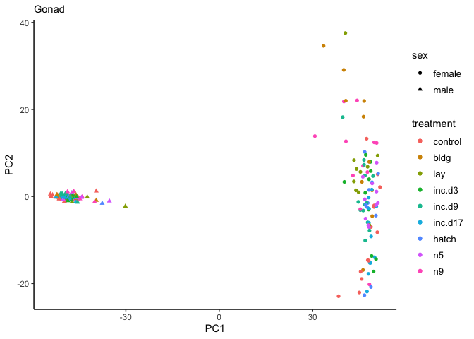

Linear discriminant analysis (LDA)
----------------------------------

<a href="http://www.sthda.com/english/articles/36-classification-methods-essentials/146-discriminant-analysis-essentials-in-r/" class="uri">http://www.sthda.com/english/articles/36-classification-methods-essentials/146-discriminant-analysis-essentials-in-r/</a>

    # prep col data for LDA
    colDataHyp <- subsetcolData2(c.colData, c("female_hypothalamus", "male_hypothalamus"))
    colDataPit <- subsetcolData2(c.colData, c("female_pituitary", "male_pituitary"))
    colDataGon <- subsetcolData2(c.colData, c("female_gonad", "male_gonad"))

    # LDA for treatment (9 groups)
    LDA.hyp1 <- LDAdata.treatment(vsd.hyp, colDataHyp)

    FALSE [1] "model accuracy"
    FALSE [1] "predictions$class==test.transformed$treatment)"
    FALSE [1] 0.2777778
    FALSE [1] "the samples sizes"
    FALSE control    bldg     lay  inc.d3  inc.d9 inc.d17   hatch      n5      n9 
    FALSE      18      16      16      16      19      18      16      16      18 
    FALSE [1] "the prior probabilities used"
    FALSE   control      bldg       lay    inc.d3    inc.d9   inc.d17     hatch 
    FALSE 0.1176471 0.1045752 0.1045752 0.1045752 0.1241830 0.1176471 0.1045752 
    FALSE        n5        n9 
    FALSE 0.1045752 0.1176471 
    FALSE [1] "svd: the singular values, which give the ratio of the between- and within-group standard deviations on the linear discriminant variables. Their squares are the canonical F-statistics."
    FALSE [1] 7.1504779 2.4219585 2.0118048 1.7065478 1.5074740 1.3196867 1.1171126
    FALSE [8] 0.6643398

    LDA.pit1 <- LDAdata.treatment(vsd.pit, colDataPit)

    FALSE [1] "model accuracy"
    FALSE [1] "predictions$class==test.transformed$treatment)"
    FALSE [1] 0.4054054
    FALSE [1] "the samples sizes"
    FALSE control    bldg     lay  inc.d3  inc.d9 inc.d17   hatch      n5      n9 
    FALSE      20      16      16      16      20      18      16      16      18 
    FALSE [1] "the prior probabilities used"
    FALSE   control      bldg       lay    inc.d3    inc.d9   inc.d17     hatch 
    FALSE 0.1282051 0.1025641 0.1025641 0.1025641 0.1282051 0.1153846 0.1025641 
    FALSE        n5        n9 
    FALSE 0.1025641 0.1153846 
    FALSE [1] "svd: the singular values, which give the ratio of the between- and within-group standard deviations on the linear discriminant variables. Their squares are the canonical F-statistics."
    FALSE [1] 9.6144160 3.7773314 2.7272388 2.2333662 2.0052661 1.3598534 1.0611679
    FALSE [8] 0.7384553

    LDA.gon1 <- LDAdata.treatment(vsd.gon, colDataGon)

    FALSE [1] "model accuracy"
    FALSE [1] "predictions$class==test.transformed$treatment)"
    FALSE [1] 0.2972973
    FALSE [1] "the samples sizes"
    FALSE control    bldg     lay  inc.d3  inc.d9 inc.d17   hatch      n5      n9 
    FALSE      21      16      16      16      20      18      16      16      18 
    FALSE [1] "the prior probabilities used"
    FALSE   control      bldg       lay    inc.d3    inc.d9   inc.d17     hatch 
    FALSE 0.1337580 0.1019108 0.1019108 0.1019108 0.1273885 0.1146497 0.1019108 
    FALSE        n5        n9 
    FALSE 0.1019108 0.1146497 
    FALSE [1] "svd: the singular values, which give the ratio of the between- and within-group standard deviations on the linear discriminant variables. Their squares are the canonical F-statistics."
    FALSE [1] 6.137500 3.320437 2.252064 1.857671 1.697019 1.432470 1.008004 0.840279

    # LDA for hypothesis (3 groups)

    LDA.hyp2 <- LDAdata.hypothesis(vsd.hyp, colDataHyp)

    FALSE [1] "model accuracy"
    FALSE [1] "predictions$class==test.transformed$hypothesis)"
    FALSE [1] 0.4324324
    FALSE [1] "the samples sizes"
    FALSE   anticipation     incubation hatchling.care 
    FALSE             34             68             50 
    FALSE [1] "the prior probabilities used"
    FALSE   anticipation     incubation hatchling.care 
    FALSE      0.2236842      0.4473684      0.3289474 
    FALSE hypothesis ~ XP_015154126.1 + XP_015148612.1 + NP_001012716.1 + 
    FALSE     XP_423016.4 + XP_015153296.1 + NP_001005800.1 + NP_999837.1 + 
    FALSE     XP_001233982.3 + XP_418760.4 + XP_015130323.1 + XP_414934.3 + 
    FALSE     NP_001025899.1 + NP_001035000.1 + XP_421774.3 + XP_015141645.1 + 
    FALSE     NP_001186366.1 + NP_990172.1 + XP_015142712.1 + XP_004943599.1 + 
    FALSE     NP_001026223.1 + sex
    FALSE attr(,"variables")
    FALSE list(hypothesis, XP_015154126.1, XP_015148612.1, NP_001012716.1, 
    FALSE     XP_423016.4, XP_015153296.1, NP_001005800.1, NP_999837.1, 
    FALSE     XP_001233982.3, XP_418760.4, XP_015130323.1, XP_414934.3, 
    FALSE     NP_001025899.1, NP_001035000.1, XP_421774.3, XP_015141645.1, 
    FALSE     NP_001186366.1, NP_990172.1, XP_015142712.1, XP_004943599.1, 
    FALSE     NP_001026223.1, sex)
    FALSE attr(,"factors")
    FALSE                XP_015154126.1 XP_015148612.1 NP_001012716.1 XP_423016.4
    FALSE hypothesis                  0              0              0           0
    FALSE XP_015154126.1              1              0              0           0
    FALSE XP_015148612.1              0              1              0           0
    FALSE NP_001012716.1              0              0              1           0
    FALSE XP_423016.4                 0              0              0           1
    FALSE XP_015153296.1              0              0              0           0
    FALSE NP_001005800.1              0              0              0           0
    FALSE NP_999837.1                 0              0              0           0
    FALSE XP_001233982.3              0              0              0           0
    FALSE XP_418760.4                 0              0              0           0
    FALSE XP_015130323.1              0              0              0           0
    FALSE XP_414934.3                 0              0              0           0
    FALSE NP_001025899.1              0              0              0           0
    FALSE NP_001035000.1              0              0              0           0
    FALSE XP_421774.3                 0              0              0           0
    FALSE XP_015141645.1              0              0              0           0
    FALSE NP_001186366.1              0              0              0           0
    FALSE NP_990172.1                 0              0              0           0
    FALSE XP_015142712.1              0              0              0           0
    FALSE XP_004943599.1              0              0              0           0
    FALSE NP_001026223.1              0              0              0           0
    FALSE sex                         0              0              0           0
    FALSE                XP_015153296.1 NP_001005800.1 NP_999837.1 XP_001233982.3
    FALSE hypothesis                  0              0           0              0
    FALSE XP_015154126.1              0              0           0              0
    FALSE XP_015148612.1              0              0           0              0
    FALSE NP_001012716.1              0              0           0              0
    FALSE XP_423016.4                 0              0           0              0
    FALSE XP_015153296.1              1              0           0              0
    FALSE NP_001005800.1              0              1           0              0
    FALSE NP_999837.1                 0              0           1              0
    FALSE XP_001233982.3              0              0           0              1
    FALSE XP_418760.4                 0              0           0              0
    FALSE XP_015130323.1              0              0           0              0
    FALSE XP_414934.3                 0              0           0              0
    FALSE NP_001025899.1              0              0           0              0
    FALSE NP_001035000.1              0              0           0              0
    FALSE XP_421774.3                 0              0           0              0
    FALSE XP_015141645.1              0              0           0              0
    FALSE NP_001186366.1              0              0           0              0
    FALSE NP_990172.1                 0              0           0              0
    FALSE XP_015142712.1              0              0           0              0
    FALSE XP_004943599.1              0              0           0              0
    FALSE NP_001026223.1              0              0           0              0
    FALSE sex                         0              0           0              0
    FALSE                XP_418760.4 XP_015130323.1 XP_414934.3 NP_001025899.1
    FALSE hypothesis               0              0           0              0
    FALSE XP_015154126.1           0              0           0              0
    FALSE XP_015148612.1           0              0           0              0
    FALSE NP_001012716.1           0              0           0              0
    FALSE XP_423016.4              0              0           0              0
    FALSE XP_015153296.1           0              0           0              0
    FALSE NP_001005800.1           0              0           0              0
    FALSE NP_999837.1              0              0           0              0
    FALSE XP_001233982.3           0              0           0              0
    FALSE XP_418760.4              1              0           0              0
    FALSE XP_015130323.1           0              1           0              0
    FALSE XP_414934.3              0              0           1              0
    FALSE NP_001025899.1           0              0           0              1
    FALSE NP_001035000.1           0              0           0              0
    FALSE XP_421774.3              0              0           0              0
    FALSE XP_015141645.1           0              0           0              0
    FALSE NP_001186366.1           0              0           0              0
    FALSE NP_990172.1              0              0           0              0
    FALSE XP_015142712.1           0              0           0              0
    FALSE XP_004943599.1           0              0           0              0
    FALSE NP_001026223.1           0              0           0              0
    FALSE sex                      0              0           0              0
    FALSE                NP_001035000.1 XP_421774.3 XP_015141645.1 NP_001186366.1
    FALSE hypothesis                  0           0              0              0
    FALSE XP_015154126.1              0           0              0              0
    FALSE XP_015148612.1              0           0              0              0
    FALSE NP_001012716.1              0           0              0              0
    FALSE XP_423016.4                 0           0              0              0
    FALSE XP_015153296.1              0           0              0              0
    FALSE NP_001005800.1              0           0              0              0
    FALSE NP_999837.1                 0           0              0              0
    FALSE XP_001233982.3              0           0              0              0
    FALSE XP_418760.4                 0           0              0              0
    FALSE XP_015130323.1              0           0              0              0
    FALSE XP_414934.3                 0           0              0              0
    FALSE NP_001025899.1              0           0              0              0
    FALSE NP_001035000.1              1           0              0              0
    FALSE XP_421774.3                 0           1              0              0
    FALSE XP_015141645.1              0           0              1              0
    FALSE NP_001186366.1              0           0              0              1
    FALSE NP_990172.1                 0           0              0              0
    FALSE XP_015142712.1              0           0              0              0
    FALSE XP_004943599.1              0           0              0              0
    FALSE NP_001026223.1              0           0              0              0
    FALSE sex                         0           0              0              0
    FALSE                NP_990172.1 XP_015142712.1 XP_004943599.1 NP_001026223.1
    FALSE hypothesis               0              0              0              0
    FALSE XP_015154126.1           0              0              0              0
    FALSE XP_015148612.1           0              0              0              0
    FALSE NP_001012716.1           0              0              0              0
    FALSE XP_423016.4              0              0              0              0
    FALSE XP_015153296.1           0              0              0              0
    FALSE NP_001005800.1           0              0              0              0
    FALSE NP_999837.1              0              0              0              0
    FALSE XP_001233982.3           0              0              0              0
    FALSE XP_418760.4              0              0              0              0
    FALSE XP_015130323.1           0              0              0              0
    FALSE XP_414934.3              0              0              0              0
    FALSE NP_001025899.1           0              0              0              0
    FALSE NP_001035000.1           0              0              0              0
    FALSE XP_421774.3              0              0              0              0
    FALSE XP_015141645.1           0              0              0              0
    FALSE NP_001186366.1           0              0              0              0
    FALSE NP_990172.1              1              0              0              0
    FALSE XP_015142712.1           0              1              0              0
    FALSE XP_004943599.1           0              0              1              0
    FALSE NP_001026223.1           0              0              0              1
    FALSE sex                      0              0              0              0
    FALSE                sex
    FALSE hypothesis       0
    FALSE XP_015154126.1   0
    FALSE XP_015148612.1   0
    FALSE NP_001012716.1   0
    FALSE XP_423016.4      0
    FALSE XP_015153296.1   0
    FALSE NP_001005800.1   0
    FALSE NP_999837.1      0
    FALSE XP_001233982.3   0
    FALSE XP_418760.4      0
    FALSE XP_015130323.1   0
    FALSE XP_414934.3      0
    FALSE NP_001025899.1   0
    FALSE NP_001035000.1   0
    FALSE XP_421774.3      0
    FALSE XP_015141645.1   0
    FALSE NP_001186366.1   0
    FALSE NP_990172.1      0
    FALSE XP_015142712.1   0
    FALSE XP_004943599.1   0
    FALSE NP_001026223.1   0
    FALSE sex              1
    FALSE attr(,"term.labels")
    FALSE  [1] "XP_015154126.1" "XP_015148612.1" "NP_001012716.1" "XP_423016.4"   
    FALSE  [5] "XP_015153296.1" "NP_001005800.1" "NP_999837.1"    "XP_001233982.3"
    FALSE  [9] "XP_418760.4"    "XP_015130323.1" "XP_414934.3"    "NP_001025899.1"
    FALSE [13] "NP_001035000.1" "XP_421774.3"    "XP_015141645.1" "NP_001186366.1"
    FALSE [17] "NP_990172.1"    "XP_015142712.1" "XP_004943599.1" "NP_001026223.1"
    FALSE [21] "sex"           
    FALSE attr(,"order")
    FALSE  [1] 1 1 1 1 1 1 1 1 1 1 1 1 1 1 1 1 1 1 1 1 1
    FALSE attr(,"intercept")
    FALSE [1] 1
    FALSE attr(,"response")
    FALSE [1] 1
    FALSE attr(,".Environment")
    FALSE <environment: 0x7ffc78978780>
    FALSE attr(,"predvars")
    FALSE list(hypothesis, XP_015154126.1, XP_015148612.1, NP_001012716.1, 
    FALSE     XP_423016.4, XP_015153296.1, NP_001005800.1, NP_999837.1, 
    FALSE     XP_001233982.3, XP_418760.4, XP_015130323.1, XP_414934.3, 
    FALSE     NP_001025899.1, NP_001035000.1, XP_421774.3, XP_015141645.1, 
    FALSE     NP_001186366.1, NP_990172.1, XP_015142712.1, XP_004943599.1, 
    FALSE     NP_001026223.1, sex)
    FALSE attr(,"dataClasses")
    FALSE     hypothesis XP_015154126.1 XP_015148612.1 NP_001012716.1    XP_423016.4 
    FALSE       "factor"      "numeric"      "numeric"      "numeric"      "numeric" 
    FALSE XP_015153296.1 NP_001005800.1    NP_999837.1 XP_001233982.3    XP_418760.4 
    FALSE      "numeric"      "numeric"      "numeric"      "numeric"      "numeric" 
    FALSE XP_015130323.1    XP_414934.3 NP_001025899.1 NP_001035000.1    XP_421774.3 
    FALSE      "numeric"      "numeric"      "numeric"      "numeric"      "numeric" 
    FALSE XP_015141645.1 NP_001186366.1    NP_990172.1 XP_015142712.1 XP_004943599.1 
    FALSE      "numeric"      "numeric"      "numeric"      "numeric"      "numeric" 
    FALSE NP_001026223.1            sex 
    FALSE      "numeric"       "factor" 
    FALSE [1] "svd: the singular values, which give the ratio of the between- and within-group standard deviations on the linear discriminant variables. Their squares are the canonical F-statistics."
    FALSE [1] 7.386458 3.720794

    LDA.pit2 <- LDAdata.hypothesis(vsd.pit, colDataPit)

    FALSE [1] "model accuracy"
    FALSE [1] "predictions$class==test.transformed$hypothesis)"
    FALSE [1] 0.4736842
    FALSE [1] "the samples sizes"
    FALSE   anticipation     incubation hatchling.care 
    FALSE             36             69             50 
    FALSE [1] "the prior probabilities used"
    FALSE   anticipation     incubation hatchling.care 
    FALSE      0.2322581      0.4451613      0.3225806 
    FALSE hypothesis ~ XP_424601.2 + XP_015153829.1 + NP_001005823.1 + 
    FALSE     XP_001231665.4 + XP_001234312.1 + XP_419245.5 + XP_015130606.1 + 
    FALSE     XP_415585.4 + NP_001025907.1 + NP_001035556.2 + XP_422319.2 + 
    FALSE     XP_015141995.1 + NP_001186405.1 + NP_990222.1 + XP_015143162.1 + 
    FALSE     XP_004944118.1 + NP_001026237.1 + XP_015146936.1 + XP_015146712.1 + 
    FALSE     XP_015133534.1 + sex
    FALSE attr(,"variables")
    FALSE list(hypothesis, XP_424601.2, XP_015153829.1, NP_001005823.1, 
    FALSE     XP_001231665.4, XP_001234312.1, XP_419245.5, XP_015130606.1, 
    FALSE     XP_415585.4, NP_001025907.1, NP_001035556.2, XP_422319.2, 
    FALSE     XP_015141995.1, NP_001186405.1, NP_990222.1, XP_015143162.1, 
    FALSE     XP_004944118.1, NP_001026237.1, XP_015146936.1, XP_015146712.1, 
    FALSE     XP_015133534.1, sex)
    FALSE attr(,"factors")
    FALSE                XP_424601.2 XP_015153829.1 NP_001005823.1 XP_001231665.4
    FALSE hypothesis               0              0              0              0
    FALSE XP_424601.2              1              0              0              0
    FALSE XP_015153829.1           0              1              0              0
    FALSE NP_001005823.1           0              0              1              0
    FALSE XP_001231665.4           0              0              0              1
    FALSE XP_001234312.1           0              0              0              0
    FALSE XP_419245.5              0              0              0              0
    FALSE XP_015130606.1           0              0              0              0
    FALSE XP_415585.4              0              0              0              0
    FALSE NP_001025907.1           0              0              0              0
    FALSE NP_001035556.2           0              0              0              0
    FALSE XP_422319.2              0              0              0              0
    FALSE XP_015141995.1           0              0              0              0
    FALSE NP_001186405.1           0              0              0              0
    FALSE NP_990222.1              0              0              0              0
    FALSE XP_015143162.1           0              0              0              0
    FALSE XP_004944118.1           0              0              0              0
    FALSE NP_001026237.1           0              0              0              0
    FALSE XP_015146936.1           0              0              0              0
    FALSE XP_015146712.1           0              0              0              0
    FALSE XP_015133534.1           0              0              0              0
    FALSE sex                      0              0              0              0
    FALSE                XP_001234312.1 XP_419245.5 XP_015130606.1 XP_415585.4
    FALSE hypothesis                  0           0              0           0
    FALSE XP_424601.2                 0           0              0           0
    FALSE XP_015153829.1              0           0              0           0
    FALSE NP_001005823.1              0           0              0           0
    FALSE XP_001231665.4              0           0              0           0
    FALSE XP_001234312.1              1           0              0           0
    FALSE XP_419245.5                 0           1              0           0
    FALSE XP_015130606.1              0           0              1           0
    FALSE XP_415585.4                 0           0              0           1
    FALSE NP_001025907.1              0           0              0           0
    FALSE NP_001035556.2              0           0              0           0
    FALSE XP_422319.2                 0           0              0           0
    FALSE XP_015141995.1              0           0              0           0
    FALSE NP_001186405.1              0           0              0           0
    FALSE NP_990222.1                 0           0              0           0
    FALSE XP_015143162.1              0           0              0           0
    FALSE XP_004944118.1              0           0              0           0
    FALSE NP_001026237.1              0           0              0           0
    FALSE XP_015146936.1              0           0              0           0
    FALSE XP_015146712.1              0           0              0           0
    FALSE XP_015133534.1              0           0              0           0
    FALSE sex                         0           0              0           0
    FALSE                NP_001025907.1 NP_001035556.2 XP_422319.2 XP_015141995.1
    FALSE hypothesis                  0              0           0              0
    FALSE XP_424601.2                 0              0           0              0
    FALSE XP_015153829.1              0              0           0              0
    FALSE NP_001005823.1              0              0           0              0
    FALSE XP_001231665.4              0              0           0              0
    FALSE XP_001234312.1              0              0           0              0
    FALSE XP_419245.5                 0              0           0              0
    FALSE XP_015130606.1              0              0           0              0
    FALSE XP_415585.4                 0              0           0              0
    FALSE NP_001025907.1              1              0           0              0
    FALSE NP_001035556.2              0              1           0              0
    FALSE XP_422319.2                 0              0           1              0
    FALSE XP_015141995.1              0              0           0              1
    FALSE NP_001186405.1              0              0           0              0
    FALSE NP_990222.1                 0              0           0              0
    FALSE XP_015143162.1              0              0           0              0
    FALSE XP_004944118.1              0              0           0              0
    FALSE NP_001026237.1              0              0           0              0
    FALSE XP_015146936.1              0              0           0              0
    FALSE XP_015146712.1              0              0           0              0
    FALSE XP_015133534.1              0              0           0              0
    FALSE sex                         0              0           0              0
    FALSE                NP_001186405.1 NP_990222.1 XP_015143162.1 XP_004944118.1
    FALSE hypothesis                  0           0              0              0
    FALSE XP_424601.2                 0           0              0              0
    FALSE XP_015153829.1              0           0              0              0
    FALSE NP_001005823.1              0           0              0              0
    FALSE XP_001231665.4              0           0              0              0
    FALSE XP_001234312.1              0           0              0              0
    FALSE XP_419245.5                 0           0              0              0
    FALSE XP_015130606.1              0           0              0              0
    FALSE XP_415585.4                 0           0              0              0
    FALSE NP_001025907.1              0           0              0              0
    FALSE NP_001035556.2              0           0              0              0
    FALSE XP_422319.2                 0           0              0              0
    FALSE XP_015141995.1              0           0              0              0
    FALSE NP_001186405.1              1           0              0              0
    FALSE NP_990222.1                 0           1              0              0
    FALSE XP_015143162.1              0           0              1              0
    FALSE XP_004944118.1              0           0              0              1
    FALSE NP_001026237.1              0           0              0              0
    FALSE XP_015146936.1              0           0              0              0
    FALSE XP_015146712.1              0           0              0              0
    FALSE XP_015133534.1              0           0              0              0
    FALSE sex                         0           0              0              0
    FALSE                NP_001026237.1 XP_015146936.1 XP_015146712.1 XP_015133534.1
    FALSE hypothesis                  0              0              0              0
    FALSE XP_424601.2                 0              0              0              0
    FALSE XP_015153829.1              0              0              0              0
    FALSE NP_001005823.1              0              0              0              0
    FALSE XP_001231665.4              0              0              0              0
    FALSE XP_001234312.1              0              0              0              0
    FALSE XP_419245.5                 0              0              0              0
    FALSE XP_015130606.1              0              0              0              0
    FALSE XP_415585.4                 0              0              0              0
    FALSE NP_001025907.1              0              0              0              0
    FALSE NP_001035556.2              0              0              0              0
    FALSE XP_422319.2                 0              0              0              0
    FALSE XP_015141995.1              0              0              0              0
    FALSE NP_001186405.1              0              0              0              0
    FALSE NP_990222.1                 0              0              0              0
    FALSE XP_015143162.1              0              0              0              0
    FALSE XP_004944118.1              0              0              0              0
    FALSE NP_001026237.1              1              0              0              0
    FALSE XP_015146936.1              0              1              0              0
    FALSE XP_015146712.1              0              0              1              0
    FALSE XP_015133534.1              0              0              0              1
    FALSE sex                         0              0              0              0
    FALSE                sex
    FALSE hypothesis       0
    FALSE XP_424601.2      0
    FALSE XP_015153829.1   0
    FALSE NP_001005823.1   0
    FALSE XP_001231665.4   0
    FALSE XP_001234312.1   0
    FALSE XP_419245.5      0
    FALSE XP_015130606.1   0
    FALSE XP_415585.4      0
    FALSE NP_001025907.1   0
    FALSE NP_001035556.2   0
    FALSE XP_422319.2      0
    FALSE XP_015141995.1   0
    FALSE NP_001186405.1   0
    FALSE NP_990222.1      0
    FALSE XP_015143162.1   0
    FALSE XP_004944118.1   0
    FALSE NP_001026237.1   0
    FALSE XP_015146936.1   0
    FALSE XP_015146712.1   0
    FALSE XP_015133534.1   0
    FALSE sex              1
    FALSE attr(,"term.labels")
    FALSE  [1] "XP_424601.2"    "XP_015153829.1" "NP_001005823.1" "XP_001231665.4"
    FALSE  [5] "XP_001234312.1" "XP_419245.5"    "XP_015130606.1" "XP_415585.4"   
    FALSE  [9] "NP_001025907.1" "NP_001035556.2" "XP_422319.2"    "XP_015141995.1"
    FALSE [13] "NP_001186405.1" "NP_990222.1"    "XP_015143162.1" "XP_004944118.1"
    FALSE [17] "NP_001026237.1" "XP_015146936.1" "XP_015146712.1" "XP_015133534.1"
    FALSE [21] "sex"           
    FALSE attr(,"order")
    FALSE  [1] 1 1 1 1 1 1 1 1 1 1 1 1 1 1 1 1 1 1 1 1 1
    FALSE attr(,"intercept")
    FALSE [1] 1
    FALSE attr(,"response")
    FALSE [1] 1
    FALSE attr(,".Environment")
    FALSE <environment: 0x7ffc70245648>
    FALSE attr(,"predvars")
    FALSE list(hypothesis, XP_424601.2, XP_015153829.1, NP_001005823.1, 
    FALSE     XP_001231665.4, XP_001234312.1, XP_419245.5, XP_015130606.1, 
    FALSE     XP_415585.4, NP_001025907.1, NP_001035556.2, XP_422319.2, 
    FALSE     XP_015141995.1, NP_001186405.1, NP_990222.1, XP_015143162.1, 
    FALSE     XP_004944118.1, NP_001026237.1, XP_015146936.1, XP_015146712.1, 
    FALSE     XP_015133534.1, sex)
    FALSE attr(,"dataClasses")
    FALSE     hypothesis    XP_424601.2 XP_015153829.1 NP_001005823.1 XP_001231665.4 
    FALSE       "factor"      "numeric"      "numeric"      "numeric"      "numeric" 
    FALSE XP_001234312.1    XP_419245.5 XP_015130606.1    XP_415585.4 NP_001025907.1 
    FALSE      "numeric"      "numeric"      "numeric"      "numeric"      "numeric" 
    FALSE NP_001035556.2    XP_422319.2 XP_015141995.1 NP_001186405.1    NP_990222.1 
    FALSE      "numeric"      "numeric"      "numeric"      "numeric"      "numeric" 
    FALSE XP_015143162.1 XP_004944118.1 NP_001026237.1 XP_015146936.1 XP_015146712.1 
    FALSE      "numeric"      "numeric"      "numeric"      "numeric"      "numeric" 
    FALSE XP_015133534.1            sex 
    FALSE      "numeric"       "factor" 
    FALSE [1] "svd: the singular values, which give the ratio of the between- and within-group standard deviations on the linear discriminant variables. Their squares are the canonical F-statistics."
    FALSE [1] 7.846659 5.076861

    LDA.gon2 <- LDAdata.hypothesis(vsd.gon, colDataGon)

    FALSE [1] "model accuracy"
    FALSE [1] "predictions$class==test.transformed$hypothesis)"
    FALSE [1] 0.3684211
    FALSE [1] "the samples sizes"
    FALSE   anticipation     incubation hatchling.care 
    FALSE             37             69             50 
    FALSE [1] "the prior probabilities used"
    FALSE   anticipation     incubation hatchling.care 
    FALSE      0.2371795      0.4423077      0.3205128 
    FALSE hypothesis ~ XP_421626.3 + XP_015152450.1 + NP_001005427.1 + 
    FALSE     NP_990837.1 + XP_001233399.3 + XP_417425.2 + XP_015129896.1 + 
    FALSE     XP_015158182.1 + NP_001025882.1 + NP_001034575.1 + XP_420421.3 + 
    FALSE     XP_015140858.1 + NP_001186331.1 + NP_990091.1 + XP_015141770.1 + 
    FALSE     XP_004942521.1 + NP_001026204.1 + XP_015145487.1 + XP_015145245.1 + 
    FALSE     XP_015132444.1 + sex
    FALSE attr(,"variables")
    FALSE list(hypothesis, XP_421626.3, XP_015152450.1, NP_001005427.1, 
    FALSE     NP_990837.1, XP_001233399.3, XP_417425.2, XP_015129896.1, 
    FALSE     XP_015158182.1, NP_001025882.1, NP_001034575.1, XP_420421.3, 
    FALSE     XP_015140858.1, NP_001186331.1, NP_990091.1, XP_015141770.1, 
    FALSE     XP_004942521.1, NP_001026204.1, XP_015145487.1, XP_015145245.1, 
    FALSE     XP_015132444.1, sex)
    FALSE attr(,"factors")
    FALSE                XP_421626.3 XP_015152450.1 NP_001005427.1 NP_990837.1
    FALSE hypothesis               0              0              0           0
    FALSE XP_421626.3              1              0              0           0
    FALSE XP_015152450.1           0              1              0           0
    FALSE NP_001005427.1           0              0              1           0
    FALSE NP_990837.1              0              0              0           1
    FALSE XP_001233399.3           0              0              0           0
    FALSE XP_417425.2              0              0              0           0
    FALSE XP_015129896.1           0              0              0           0
    FALSE XP_015158182.1           0              0              0           0
    FALSE NP_001025882.1           0              0              0           0
    FALSE NP_001034575.1           0              0              0           0
    FALSE XP_420421.3              0              0              0           0
    FALSE XP_015140858.1           0              0              0           0
    FALSE NP_001186331.1           0              0              0           0
    FALSE NP_990091.1              0              0              0           0
    FALSE XP_015141770.1           0              0              0           0
    FALSE XP_004942521.1           0              0              0           0
    FALSE NP_001026204.1           0              0              0           0
    FALSE XP_015145487.1           0              0              0           0
    FALSE XP_015145245.1           0              0              0           0
    FALSE XP_015132444.1           0              0              0           0
    FALSE sex                      0              0              0           0
    FALSE                XP_001233399.3 XP_417425.2 XP_015129896.1 XP_015158182.1
    FALSE hypothesis                  0           0              0              0
    FALSE XP_421626.3                 0           0              0              0
    FALSE XP_015152450.1              0           0              0              0
    FALSE NP_001005427.1              0           0              0              0
    FALSE NP_990837.1                 0           0              0              0
    FALSE XP_001233399.3              1           0              0              0
    FALSE XP_417425.2                 0           1              0              0
    FALSE XP_015129896.1              0           0              1              0
    FALSE XP_015158182.1              0           0              0              1
    FALSE NP_001025882.1              0           0              0              0
    FALSE NP_001034575.1              0           0              0              0
    FALSE XP_420421.3                 0           0              0              0
    FALSE XP_015140858.1              0           0              0              0
    FALSE NP_001186331.1              0           0              0              0
    FALSE NP_990091.1                 0           0              0              0
    FALSE XP_015141770.1              0           0              0              0
    FALSE XP_004942521.1              0           0              0              0
    FALSE NP_001026204.1              0           0              0              0
    FALSE XP_015145487.1              0           0              0              0
    FALSE XP_015145245.1              0           0              0              0
    FALSE XP_015132444.1              0           0              0              0
    FALSE sex                         0           0              0              0
    FALSE                NP_001025882.1 NP_001034575.1 XP_420421.3 XP_015140858.1
    FALSE hypothesis                  0              0           0              0
    FALSE XP_421626.3                 0              0           0              0
    FALSE XP_015152450.1              0              0           0              0
    FALSE NP_001005427.1              0              0           0              0
    FALSE NP_990837.1                 0              0           0              0
    FALSE XP_001233399.3              0              0           0              0
    FALSE XP_417425.2                 0              0           0              0
    FALSE XP_015129896.1              0              0           0              0
    FALSE XP_015158182.1              0              0           0              0
    FALSE NP_001025882.1              1              0           0              0
    FALSE NP_001034575.1              0              1           0              0
    FALSE XP_420421.3                 0              0           1              0
    FALSE XP_015140858.1              0              0           0              1
    FALSE NP_001186331.1              0              0           0              0
    FALSE NP_990091.1                 0              0           0              0
    FALSE XP_015141770.1              0              0           0              0
    FALSE XP_004942521.1              0              0           0              0
    FALSE NP_001026204.1              0              0           0              0
    FALSE XP_015145487.1              0              0           0              0
    FALSE XP_015145245.1              0              0           0              0
    FALSE XP_015132444.1              0              0           0              0
    FALSE sex                         0              0           0              0
    FALSE                NP_001186331.1 NP_990091.1 XP_015141770.1 XP_004942521.1
    FALSE hypothesis                  0           0              0              0
    FALSE XP_421626.3                 0           0              0              0
    FALSE XP_015152450.1              0           0              0              0
    FALSE NP_001005427.1              0           0              0              0
    FALSE NP_990837.1                 0           0              0              0
    FALSE XP_001233399.3              0           0              0              0
    FALSE XP_417425.2                 0           0              0              0
    FALSE XP_015129896.1              0           0              0              0
    FALSE XP_015158182.1              0           0              0              0
    FALSE NP_001025882.1              0           0              0              0
    FALSE NP_001034575.1              0           0              0              0
    FALSE XP_420421.3                 0           0              0              0
    FALSE XP_015140858.1              0           0              0              0
    FALSE NP_001186331.1              1           0              0              0
    FALSE NP_990091.1                 0           1              0              0
    FALSE XP_015141770.1              0           0              1              0
    FALSE XP_004942521.1              0           0              0              1
    FALSE NP_001026204.1              0           0              0              0
    FALSE XP_015145487.1              0           0              0              0
    FALSE XP_015145245.1              0           0              0              0
    FALSE XP_015132444.1              0           0              0              0
    FALSE sex                         0           0              0              0
    FALSE                NP_001026204.1 XP_015145487.1 XP_015145245.1 XP_015132444.1
    FALSE hypothesis                  0              0              0              0
    FALSE XP_421626.3                 0              0              0              0
    FALSE XP_015152450.1              0              0              0              0
    FALSE NP_001005427.1              0              0              0              0
    FALSE NP_990837.1                 0              0              0              0
    FALSE XP_001233399.3              0              0              0              0
    FALSE XP_417425.2                 0              0              0              0
    FALSE XP_015129896.1              0              0              0              0
    FALSE XP_015158182.1              0              0              0              0
    FALSE NP_001025882.1              0              0              0              0
    FALSE NP_001034575.1              0              0              0              0
    FALSE XP_420421.3                 0              0              0              0
    FALSE XP_015140858.1              0              0              0              0
    FALSE NP_001186331.1              0              0              0              0
    FALSE NP_990091.1                 0              0              0              0
    FALSE XP_015141770.1              0              0              0              0
    FALSE XP_004942521.1              0              0              0              0
    FALSE NP_001026204.1              1              0              0              0
    FALSE XP_015145487.1              0              1              0              0
    FALSE XP_015145245.1              0              0              1              0
    FALSE XP_015132444.1              0              0              0              1
    FALSE sex                         0              0              0              0
    FALSE                sex
    FALSE hypothesis       0
    FALSE XP_421626.3      0
    FALSE XP_015152450.1   0
    FALSE NP_001005427.1   0
    FALSE NP_990837.1      0
    FALSE XP_001233399.3   0
    FALSE XP_417425.2      0
    FALSE XP_015129896.1   0
    FALSE XP_015158182.1   0
    FALSE NP_001025882.1   0
    FALSE NP_001034575.1   0
    FALSE XP_420421.3      0
    FALSE XP_015140858.1   0
    FALSE NP_001186331.1   0
    FALSE NP_990091.1      0
    FALSE XP_015141770.1   0
    FALSE XP_004942521.1   0
    FALSE NP_001026204.1   0
    FALSE XP_015145487.1   0
    FALSE XP_015145245.1   0
    FALSE XP_015132444.1   0
    FALSE sex              1
    FALSE attr(,"term.labels")
    FALSE  [1] "XP_421626.3"    "XP_015152450.1" "NP_001005427.1" "NP_990837.1"   
    FALSE  [5] "XP_001233399.3" "XP_417425.2"    "XP_015129896.1" "XP_015158182.1"
    FALSE  [9] "NP_001025882.1" "NP_001034575.1" "XP_420421.3"    "XP_015140858.1"
    FALSE [13] "NP_001186331.1" "NP_990091.1"    "XP_015141770.1" "XP_004942521.1"
    FALSE [17] "NP_001026204.1" "XP_015145487.1" "XP_015145245.1" "XP_015132444.1"
    FALSE [21] "sex"           
    FALSE attr(,"order")
    FALSE  [1] 1 1 1 1 1 1 1 1 1 1 1 1 1 1 1 1 1 1 1 1 1
    FALSE attr(,"intercept")
    FALSE [1] 1
    FALSE attr(,"response")
    FALSE [1] 1
    FALSE attr(,".Environment")
    FALSE <environment: 0x7ffc763eca38>
    FALSE attr(,"predvars")
    FALSE list(hypothesis, XP_421626.3, XP_015152450.1, NP_001005427.1, 
    FALSE     NP_990837.1, XP_001233399.3, XP_417425.2, XP_015129896.1, 
    FALSE     XP_015158182.1, NP_001025882.1, NP_001034575.1, XP_420421.3, 
    FALSE     XP_015140858.1, NP_001186331.1, NP_990091.1, XP_015141770.1, 
    FALSE     XP_004942521.1, NP_001026204.1, XP_015145487.1, XP_015145245.1, 
    FALSE     XP_015132444.1, sex)
    FALSE attr(,"dataClasses")
    FALSE     hypothesis    XP_421626.3 XP_015152450.1 NP_001005427.1    NP_990837.1 
    FALSE       "factor"      "numeric"      "numeric"      "numeric"      "numeric" 
    FALSE XP_001233399.3    XP_417425.2 XP_015129896.1 XP_015158182.1 NP_001025882.1 
    FALSE      "numeric"      "numeric"      "numeric"      "numeric"      "numeric" 
    FALSE NP_001034575.1    XP_420421.3 XP_015140858.1 NP_001186331.1    NP_990091.1 
    FALSE      "numeric"      "numeric"      "numeric"      "numeric"      "numeric" 
    FALSE XP_015141770.1 XP_004942521.1 NP_001026204.1 XP_015145487.1 XP_015145245.1 
    FALSE      "numeric"      "numeric"      "numeric"      "numeric"      "numeric" 
    FALSE XP_015132444.1            sex 
    FALSE      "numeric"       "factor" 
    FALSE [1] "svd: the singular values, which give the ratio of the between- and within-group standard deviations on the linear discriminant variables. Their squares are the canonical F-statistics."
    FALSE [1] 6.029069 3.837591

    # figures for both of the above

    # treatment
    a <- LDAplot.treatment(LDA.hyp1 , "Hypothalamus model 1", "parental state ~ .  0.277 pred. acc.",
                            "LD1, F = 7.1504779", "LD2, F = 2.4219585")

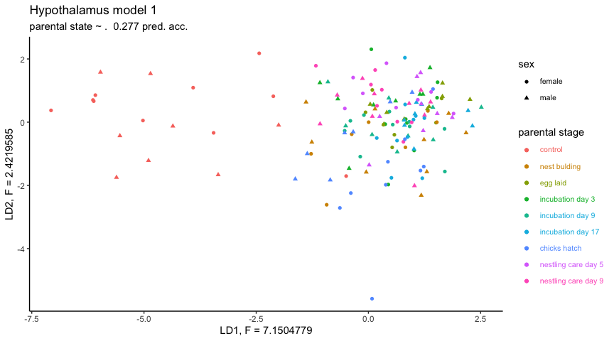

    b <- LDAplot.treatment(LDA.pit1 ,  "Pituitary model 1", "parental state ~ .  0.405 pred. acc.",
                            "LD1, F = 9.6144160", "LD2, F = 3.7773314")

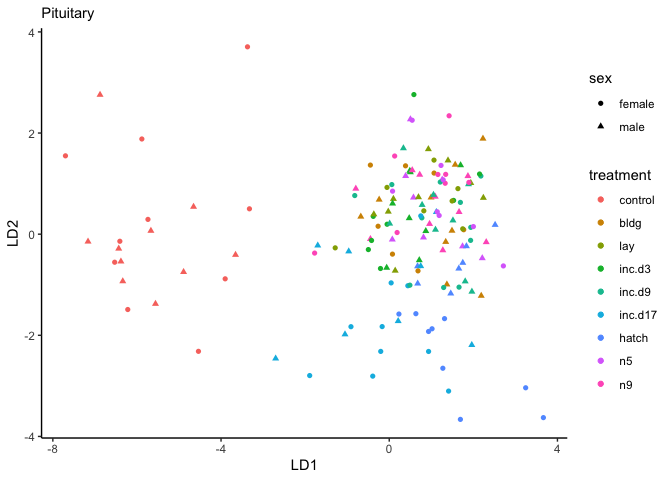

    c <- LDAplot.treatment(LDA.gon1 , "Gonad model 1", "parental state ~ .  has 0.297 pred. acc.",
                            "LD1, F = 6.137500", "LD2, F = 3.320437")

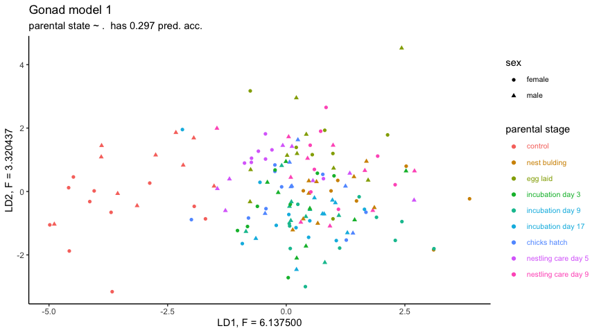

    c <- c + theme(legend.direction = "horizontal")
    mylegend <- get_legend(c)

    temp <- plot_grid(a + theme(legend.position = "none"),
                      b + theme(legend.position = "none"),
                      c + theme(legend.position = "none"), nrow = 1)

    plot_grid(temp, mylegend, nrow = 2, rel_heights = c(1,0.3))

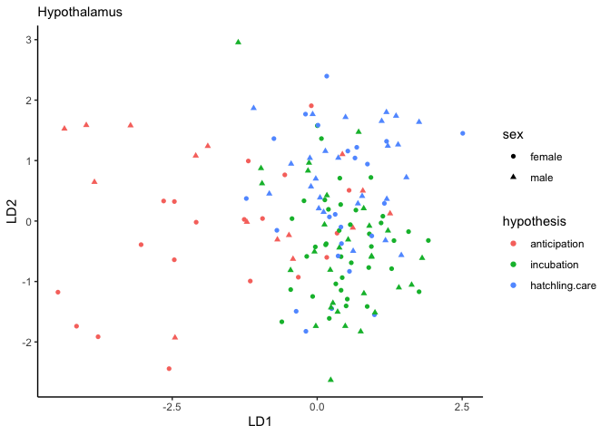

    # hypothesis

    d <- LDAplot.hypothesis(LDA.hyp2 , "Hypothalamus model 2", "parental stage ~ .  0.432 pred. acc.",
                            "LD1, F = 7.386458", "LD2, F = 3.720794")

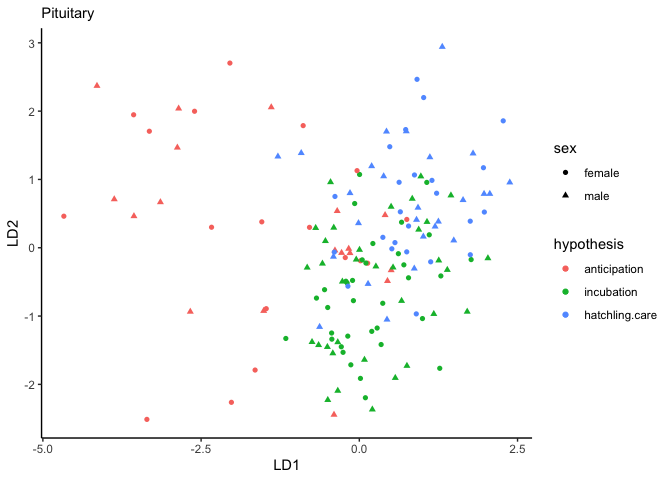

    e <- LDAplot.hypothesis(LDA.pit2 ,  "Pituitary model 2", "parental stage ~ .  0.473 pred. acc.",
                            "LD1, F = 7.846659", "LD2, F = 5.076861")

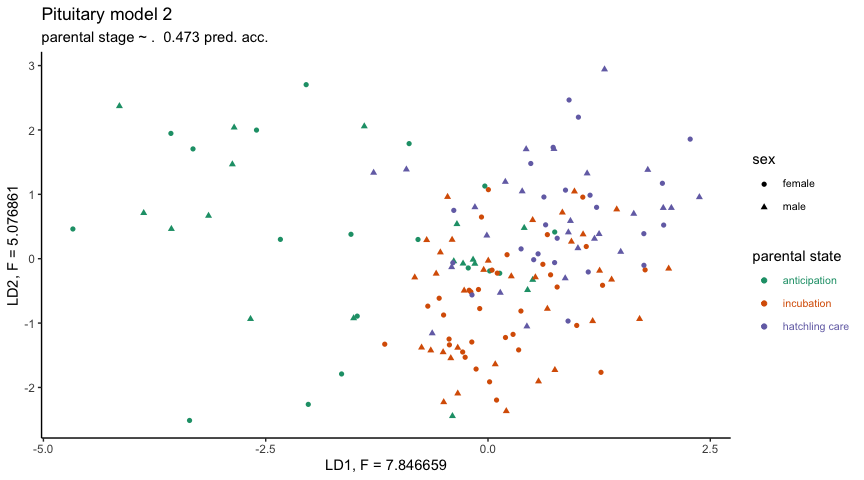

    f <- LDAplot.hypothesis(LDA.gon2 , "Gonad model 2", "parental stage ~ .  has 0.368 pred. acc.",
                            "LD1, F = 6.029069", "LD2, F = 3.837591")

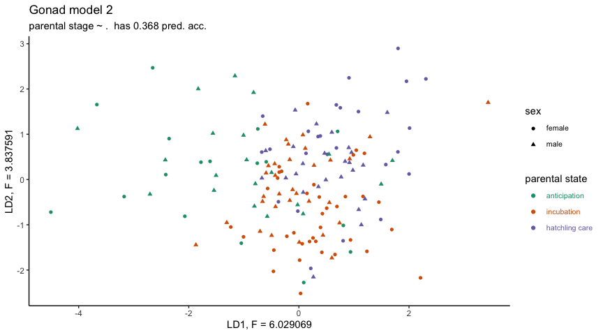

    f <- f + theme(legend.direction = "horizontal")
    mylegend <- get_legend(f)

    temp <- plot_grid(d + theme(legend.position = "none"),
                      e + theme(legend.position = "none"),
                      f + theme(legend.position = "none"), nrow = 1)

    plot_grid(temp, mylegend, nrow = 2, rel_heights = c(1,0.3))

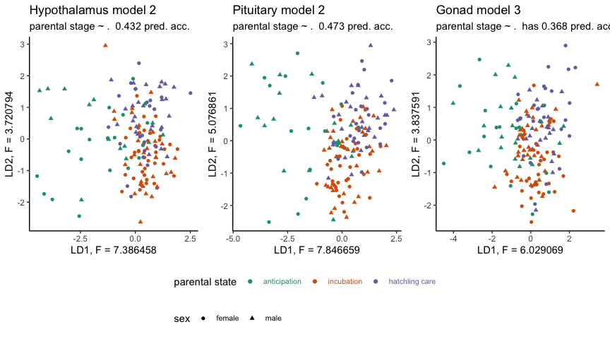

plot genes in a PRL WGCNA module
--------------------------------

    plotWGCNAcandidates(vsd.pit, c("NP_990797.2"), colDataPit, "PRL expression")

    plotWGCNAcandidates(vsd.pit,
                        c("NP_990797.2","NP_001004392.2", "NP_001004403.1", "NP_001006255.2", "NP_001006274.1",
                               "NP_989500.1", "XP_001234815.2", "XP_015149152.1", "XP_416110.5"),
                        colDataPit, "9 of 102 genes in a WGCNA module containting gene of interest")

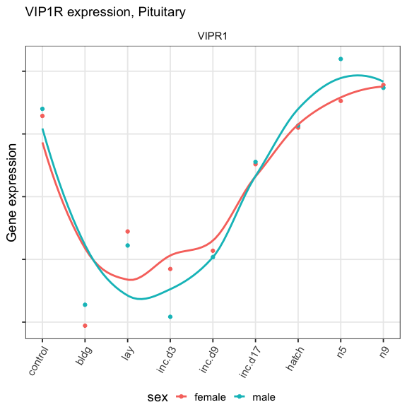

    plotWGCNAcandidates(vsd.pit,
                        c("XP_428110.3","NP_001004392.2",  "XP_015142961.1", "XP_015139636.1",
                          "XP_015137408.1", "XP_004938696.1", "NP_990620.1", "NP_001170793.2", "NP_001026250.1"),
                        colDataPit, "Prolaction receptor: 9 of 147 genes in a WGCNA module containting PRLR")

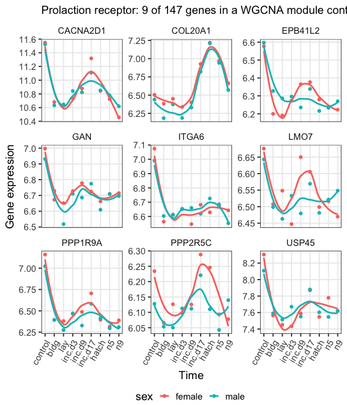
