    library(tidyverse)
    library(DESeq2)
    library(cowplot)
    library(RColorBrewer)
    library(pheatmap)
    library(kableExtra)
    library(viridis)

    # load custom functions  
    source("../R/functions.R")   

    knitr::opts_chunk$set(fig.path = '../figures/sexes/', cache = TRUE)

Starting with all the data
--------------------------

    # import "colData" which contains sample information and "countData" which contains read counts
    a.colData <- read.csv("../metadata/00_samples.csv", header = T, row.names = 1)
    a.countData <- read.csv("../results/00_counts.csv", header = T, row.names = 1)
    geneinfo <- read.csv("../metadata/00_geneinfo.csv", row.names = 1)

    # set levels
    levels(a.colData$treatment)

    ##  [1] "bldg"      "control"   "extend"    "hatch"     "inc.d17"  
    ##  [6] "inc.d3"    "inc.d9"    "lay"       "m.inc.d17" "m.inc.d3" 
    ## [11] "m.inc.d8"  "m.inc.d9"  "m.n2"      "n5"        "n9"       
    ## [16] "prolong"

    a.colData$treatment <- factor(a.colData$treatment, levels = 
                                 c("control", "bldg", "lay",
                                   "inc.d3", "m.inc.d3", 
                                   "inc.d9", "m.inc.d8", "m.inc.d9",
                                   "inc.d17", "m.inc.d17",
                                   "hatch",  "m.n2"  ,
                                   "n5", "prolong", "extend", "n9" ))
                                   
                                   
    a.colData$sextissue <- as.factor(paste(a.colData$sex, a.colData$tissue, sep = "_"))

    a.colData$lastday <- ifelse(grepl("m.inc.d3|m.inc.d9|m.inc.d17|m.n2", a.colData$treatment), "empty nest", 
                        ifelse(grepl("m.inc.d8|hatch|extend", a.colData$treatment),"nestlings hatch",      
                         ifelse(grepl("n5", a.colData$treatment),"nestlings early",
                         ifelse(grepl("n9", a.colData$treatment),"nestlings later",
                         ifelse(grepl("control", a.colData$treatment),"control",
                         ifelse(grepl("bldg", a.colData$treatment),"nest building",
                         ifelse(grepl("prolong", a.colData$treatment),"incubation delay",
                          ifelse(grepl("lay", a.colData$treatment),"incubation lay",
                          ifelse(grepl("inc.d3", a.colData$treatment),"incubation early",
                         ifelse(grepl("inc.d9", a.colData$treatment),"incubation middle",
                        ifelse(grepl("inc.d17", a.colData$treatment),"incubation later", NA)))))))))))

    a.colData$penultimate <-  ifelse(grepl("extend", a.colData$treatment),"incubation delay",  
                              ifelse(grepl("m.n2", a.colData$treatment),"nestlings hatch",
                         ifelse(grepl("n5", a.colData$treatment),"nestlings early",
                         ifelse(grepl("n9", a.colData$treatment),"nestlings later",
                         ifelse(grepl("control", a.colData$treatment),"control",
                         ifelse(grepl("bldg|lay", a.colData$treatment),"nest building",
                         ifelse(grepl("prolong", a.colData$treatment),"incubation delay",
                          ifelse(grepl("inc.d3|m.inc.d3", a.colData$treatment),"incubation early",
                         ifelse(grepl("inc.d9|m.inc.d9|m.inc.d8", a.colData$treatment),"incubation middle",
                        ifelse(grepl("inc.d17|hatch", a.colData$treatment),"incubation later", NA))))))))))

    a.colData$lastday <- factor(a.colData$lastday, levels =  c("control", "nest building", "incubation lay",
                                   "incubation early",  
                                   "incubation middle", 
                                   "incubation later", 
                                   "incubation delay",
                                   "nestlings hatch",
                                   "nestlings early", 
                                   "nestlings later", 
                                   "empty nest"))

    a.colData$penultimate <- factor(a.colData$penultimate, levels =  c("control", "nest building",
                                   "incubation early",  
                                   "incubation middle", 
                                   "incubation later", 
                                   "incubation delay",
                                   "nestlings hatch",
                                   "nestlings early", 
                                   "nestlings later"))

    colorlastday <-  c("control" = "#636363", 
                       "nest building" = "#fb6a4a", 
                       "incubation lay" = "#c7e9c0",
                       "incubation early" = "#a1d99b",
                       "incubation middle" = "#74c476", 
                       "incubation later" = "#31a354",  
                       "incubation delay" = "#006d2c",
                       "nestlings hatch" = "#cbc9e2",   
                       "nestlings early" = "#9e9ac8", 
                       "nestlings later" = "#6a51a3",
                       "empty nest" = "#a50f15")

    colorpenultimate <- c("control" = "#636363", 
                          "nest building" = "#fb6a4a", 
                          "incubation early" = "#a1d99b",
                       "incubation middle" = "#74c476", 
                       "incubation later" = "#31a354",  
                       "incubation delay" = "#006d2c",
                       "nestlings hatch" = "#cbc9e2",   
                       "nestlings early" = "#9e9ac8", 
                       "nestlings later" = "#6a51a3")

    colorlastdaybad <-  c("control" = "#636363", 
                       "nest bldg" = "#fb6a4a", 
                       "lay" = "#c7e9c0",
                       "incubate begin" = "#a1d99b",
                       "incubate middle" = "#74c476", 
                       "incubate end" = "#31a354",  
                       "incubation late" = "#006d2c",
                       "nestling being" = "#cbc9e2",  
                       "nestling begin" = "#cbc9e2",   
                       "nestling middle" = "#9e9ac8", 
                       "nestling end" = "#6a51a3",
                       "empty nest" = "#a50f15")

    colorpenultimatebad <- c("control" = "#636363", 
                          "nestbldg" = "#fb6a4a", 
                          "incubate begin" = "#a1d99b",
                       "incubate middle" = "#74c476", 
                       "incubate end" = "#31a354",  
                       "incubation late" = "#006d2c",
                       "nestling begin" = "#cbc9e2",   
                       "nestling middle" = "#9e9ac8", 
                       "nestling end" = "#6a51a3")

    summary(a.colData[c(7,3,4,5,8,9, 10)])

    ##              study         sex               tissue        treatment  
    ##  charcterization:576   female:497   gonad       :330   control  : 73  
    ##  manipulation   :411   male  :490   hypothalamus:327   inc.d9   : 71  
    ##                                     pituitary   :330   inc.d17  : 66  
    ##                                                        n9       : 66  
    ##                                                        m.inc.d17: 63  
    ##                                                        bldg     : 60  
    ##                                                        (Other)  :588  
    ##                sextissue                lastday               penultimate 
    ##  female_gonad       :167   empty nest       :231   incubation later :189  
    ##  female_hypothalamus:165   nestlings hatch  :180   incubation middle:180  
    ##  female_pituitary   :165   control          : 73   nest building    :120  
    ##  male_gonad         :163   incubation middle: 71   incubation early :120  
    ##  male_hypothalamus  :162   incubation later : 66   incubation delay :120  
    ##  male_pituitary     :165   nestlings later  : 66   control          : 73  
    ##                            (Other)          :300   (Other)          :185

Run DESeq on all subsets of the data
------------------------------------

    dds.female_hypothalamus <- subsetDESeq(a.colData, a.countData, "female_hypothalamus")

    ## [1] TRUE
    ## class: DESeqDataSet 
    ## dim: 14937 165 
    ## metadata(1): version
    ## assays(1): counts
    ## rownames(14937): NP_001001127.1 NP_001001129.1 ... XP_430449.2
    ##   XP_430508.3
    ## rowData names(0):
    ## colnames(165): L.G118_female_hypothalamus_control.NYNO
    ##   R.G106_female_hypothalamus_control ...
    ##   y97.x_female_hypothalamus_n9 y98.g54_female_hypothalamus_m.hatch
    ## colData names(11): V1 bird ... lastday penultimate
    ## [1] 14576   165

    ## estimating size factors

    ## estimating dispersions

    ## gene-wise dispersion estimates

    ## mean-dispersion relationship

    ## final dispersion estimates

    ## fitting model and testing

    ## -- replacing outliers and refitting for 9 genes
    ## -- DESeq argument 'minReplicatesForReplace' = 7 
    ## -- original counts are preserved in counts(dds)

    ## estimating dispersions

    ## fitting model and testing

    dds.female_pituitary <- subsetDESeq(a.colData, a.countData, "female_pituitary" )

    ## [1] TRUE
    ## class: DESeqDataSet 
    ## dim: 14937 165 
    ## metadata(1): version
    ## assays(1): counts
    ## rownames(14937): NP_001001127.1 NP_001001129.1 ... XP_430449.2
    ##   XP_430508.3
    ## rowData names(0):
    ## colnames(165): L.G118_female_pituitary_control.NYNO
    ##   R.G106_female_pituitary_control ... y97.x_female_pituitary_n9
    ##   y98.g54_female_pituitary_m.hatch
    ## colData names(11): V1 bird ... lastday penultimate
    ## [1] 14496   165

    ## estimating size factors

    ## estimating dispersions

    ## gene-wise dispersion estimates

    ## mean-dispersion relationship

    ## final dispersion estimates

    ## fitting model and testing

    ## -- replacing outliers and refitting for 49 genes
    ## -- DESeq argument 'minReplicatesForReplace' = 7 
    ## -- original counts are preserved in counts(dds)

    ## estimating dispersions

    ## fitting model and testing

    dds.female_gonad <- subsetDESeq(a.colData, a.countData, "female_gonad" )

    ## [1] TRUE
    ## class: DESeqDataSet 
    ## dim: 14937 167 
    ## metadata(1): version
    ## assays(1): counts
    ## rownames(14937): NP_001001127.1 NP_001001129.1 ... XP_430449.2
    ##   XP_430508.3
    ## rowData names(0):
    ## colnames(167): L.G118_female_gonad_control
    ##   R.G106_female_gonad_control ... y97.x_female_gonad_n9
    ##   y98.g54_female_gonad_m.hatch
    ## colData names(11): V1 bird ... lastday penultimate
    ## [1] 14746   167

    ## estimating size factors

    ## estimating dispersions

    ## gene-wise dispersion estimates

    ## mean-dispersion relationship

    ## final dispersion estimates

    ## fitting model and testing

    ## -- replacing outliers and refitting for 156 genes
    ## -- DESeq argument 'minReplicatesForReplace' = 7 
    ## -- original counts are preserved in counts(dds)

    ## estimating dispersions

    ## fitting model and testing

    dds.male_hypothalamus <- subsetDESeq(a.colData, a.countData, "male_hypothalamus" )

    ## [1] TRUE
    ## class: DESeqDataSet 
    ## dim: 14937 162 
    ## metadata(1): version
    ## assays(1): counts
    ## rownames(14937): NP_001001127.1 NP_001001129.1 ... XP_430449.2
    ##   XP_430508.3
    ## rowData names(0):
    ## colnames(162): L.Blu13_male_hypothalamus_control.NYNO
    ##   L.G107_male_hypothalamus_control ...
    ##   y95.g131.x_male_hypothalamus_inc.d9
    ##   y98.o50.x_male_hypothalamus_inc.d3
    ## colData names(11): V1 bird ... lastday penultimate
    ## [1] 14536   162

    ## estimating size factors

    ## estimating dispersions

    ## gene-wise dispersion estimates

    ## mean-dispersion relationship

    ## final dispersion estimates

    ## fitting model and testing

    ## -- replacing outliers and refitting for 7 genes
    ## -- DESeq argument 'minReplicatesForReplace' = 7 
    ## -- original counts are preserved in counts(dds)

    ## estimating dispersions

    ## fitting model and testing

    dds.male_pituitary <- subsetDESeq(a.colData, a.countData, "male_pituitary"  )

    ## [1] TRUE
    ## class: DESeqDataSet 
    ## dim: 14937 165 
    ## metadata(1): version
    ## assays(1): counts
    ## rownames(14937): NP_001001127.1 NP_001001129.1 ... XP_430449.2
    ##   XP_430508.3
    ## rowData names(0):
    ## colnames(165): L.Blu13_male_pituitary_control.NYNO
    ##   L.G107_male_pituitary_control ...
    ##   y95.g131.x_male_pituitary_inc.d9 y98.o50.x_male_pituitary_inc.d3
    ## colData names(11): V1 bird ... lastday penultimate
    ## [1] 14480   165

    ## estimating size factors

    ## estimating dispersions

    ## gene-wise dispersion estimates

    ## mean-dispersion relationship

    ## final dispersion estimates

    ## fitting model and testing

    ## -- replacing outliers and refitting for 51 genes
    ## -- DESeq argument 'minReplicatesForReplace' = 7 
    ## -- original counts are preserved in counts(dds)

    ## estimating dispersions

    ## fitting model and testing

    dds.male_gondad <- subsetDESeq(a.colData, a.countData, "male_gonad")

    ## [1] TRUE
    ## class: DESeqDataSet 
    ## dim: 14937 163 
    ## metadata(1): version
    ## assays(1): counts
    ## rownames(14937): NP_001001127.1 NP_001001129.1 ... XP_430449.2
    ##   XP_430508.3
    ## rowData names(0):
    ## colnames(163): L.Blu13_male_gonad_control.NYNO
    ##   L.G107_male_gonad_control ... y95.g131.x_male_gonad_inc.d9
    ##   y98.o50.x_male_gonad_inc.d3
    ## colData names(11): V1 bird ... lastday penultimate
    ## [1] 14765   163

    ## estimating size factors

    ## estimating dispersions

    ## gene-wise dispersion estimates

    ## mean-dispersion relationship

    ## final dispersion estimates

    ## fitting model and testing

    ## -- replacing outliers and refitting for 123 genes
    ## -- DESeq argument 'minReplicatesForReplace' = 7 
    ## -- original counts are preserved in counts(dds)

    ## estimating dispersions

    ## fitting model and testing

Calculate and plot total DEGs
-----------------------------

    #create list of groups for deseq contrasts
    group1 <- levels(a.colData$treatment)
    group2 <- group1

    a <- plottotalDEGs(dds.female_hypothalamus, "female hypothalamus")
    b <- plottotalDEGs(dds.female_pituitary, "female pituitary")
    c <- plottotalDEGs(dds.female_gonad, "female gonad")
    d <- plottotalDEGs(dds.male_hypothalamus, "male hypothalamus")
    e <- plottotalDEGs(dds.male_pituitary, "male pituitary")
    f <- plottotalDEGs(dds.male_gondad, "male gonad")

    plot_grid(a + theme(legend.position = "none"),
              b + theme(legend.position = "none"),
              c,
              d + theme(legend.position = "none"),
              e + theme(legend.position = "none"),
              f,
              nrow = 2, rel_widths = c(0.3, 0.3, 0.4)) 

Calculate and plot principal components
---------------------------------------

    plotPCAs(dds.female_hypothalamus, "female hypothalamus")

    ## [1] 26  9  8  4  3  3
    ##              Df Sum Sq Mean Sq F value Pr(>F)    
    ## treatment    15   6078   405.2   18.67 <2e-16 ***
    ## Residuals   149   3235    21.7                   
    ## ---
    ## Signif. codes:  0 '***' 0.001 '**' 0.01 '*' 0.05 '.' 0.1 ' ' 1
    ##              Df Sum Sq Mean Sq F value Pr(>F)  
    ## lastday      11  438.5   39.86   2.071 0.0256 *
    ## Residuals   153 2944.9   19.25                 
    ## ---
    ## Signif. codes:  0 '***' 0.001 '**' 0.01 '*' 0.05 '.' 0.1 ' ' 1
    ##              Df Sum Sq Mean Sq F value   Pr(>F)    
    ## lastday      11    657   59.73   4.447 8.36e-06 ***
    ## Residuals   153   2055   13.43                     
    ## ---
    ## Signif. codes:  0 '***' 0.001 '**' 0.01 '*' 0.05 '.' 0.1 ' ' 1
    ##              Df Sum Sq Mean Sq F value   Pr(>F)    
    ## lastday      11  246.4  22.401   3.361 0.000353 ***
    ## Residuals   153 1019.7   6.665                     
    ## ---
    ## Signif. codes:  0 '***' 0.001 '**' 0.01 '*' 0.05 '.' 0.1 ' ' 1

    plotPCAs(dds.female_pituitary, "female pituitary")      

    ## [1] 11  8  7  6  4  3
    ##              Df Sum Sq Mean Sq F value Pr(>F)    
    ## treatment    15   2480  165.31   13.99 <2e-16 ***
    ## Residuals   149   1761   11.82                   
    ## ---
    ## Signif. codes:  0 '***' 0.001 '**' 0.01 '*' 0.05 '.' 0.1 ' ' 1
    ##              Df Sum Sq Mean Sq F value   Pr(>F)    
    ## lastday      11  893.5   81.23   5.673 1.27e-07 ***
    ## Residuals   153 2190.9   14.32                     
    ## ---
    ## Signif. codes:  0 '***' 0.001 '**' 0.01 '*' 0.05 '.' 0.1 ' ' 1
    ##              Df Sum Sq Mean Sq F value   Pr(>F)    
    ## lastday      11   1166  106.01      11 8.09e-15 ***
    ## Residuals   153   1475    9.64                     
    ## ---
    ## Signif. codes:  0 '***' 0.001 '**' 0.01 '*' 0.05 '.' 0.1 ' ' 1
    ##              Df Sum Sq Mean Sq F value Pr(>F)    
    ## lastday      11   1157  105.15   15.65 <2e-16 ***
    ## Residuals   153   1028    6.72                   
    ## ---
    ## Signif. codes:  0 '***' 0.001 '**' 0.01 '*' 0.05 '.' 0.1 ' ' 1

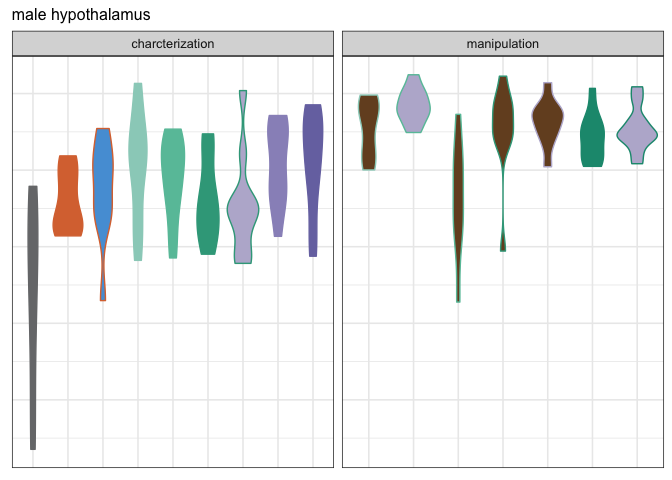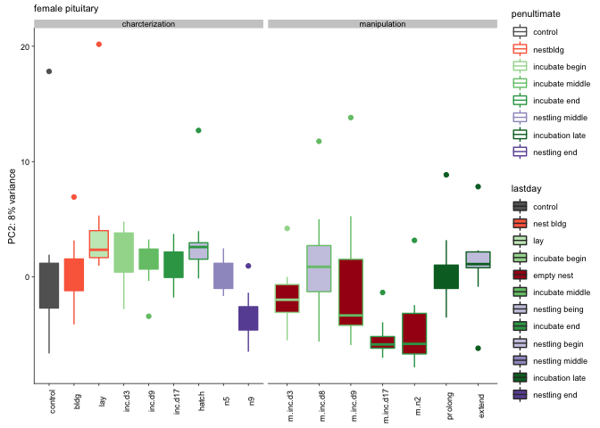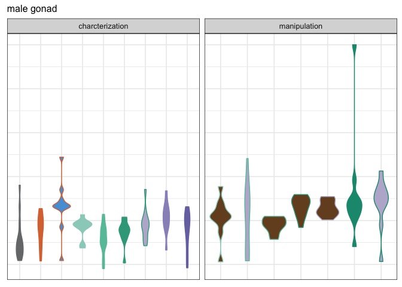

    plotPCAs(dds.female_gonad, "female gonad")

    ## [1] 37 12  7  4  4  3
    ##              Df Sum Sq Mean Sq F value   Pr(>F)    
    ## treatment    15  11694   779.6   3.644 2.04e-05 ***
    ## Residuals   151  32303   213.9                     
    ## ---
    ## Signif. codes:  0 '***' 0.001 '**' 0.01 '*' 0.05 '.' 0.1 ' ' 1
    ##              Df Sum Sq Mean Sq F value   Pr(>F)    
    ## lastday      11   2621   238.3   3.173 0.000665 ***
    ## Residuals   155  11641    75.1                     
    ## ---
    ## Signif. codes:  0 '***' 0.001 '**' 0.01 '*' 0.05 '.' 0.1 ' ' 1
    ##              Df Sum Sq Mean Sq F value Pr(>F)
    ## lastday      11    686   62.34   1.304  0.227
    ## Residuals   155   7412   47.82               
    ##              Df Sum Sq Mean Sq F value   Pr(>F)    
    ## lastday      11   1189  108.13   4.293 1.39e-05 ***
    ## Residuals   155   3905   25.19                     
    ## ---
    ## Signif. codes:  0 '***' 0.001 '**' 0.01 '*' 0.05 '.' 0.1 ' ' 1

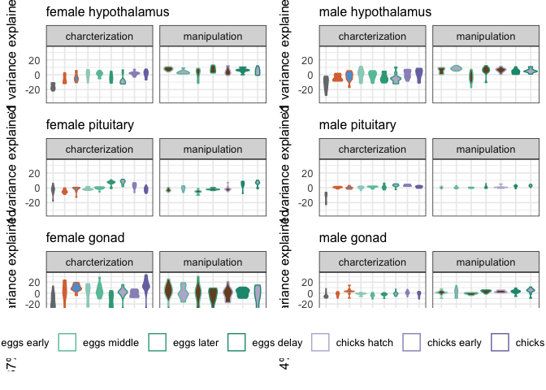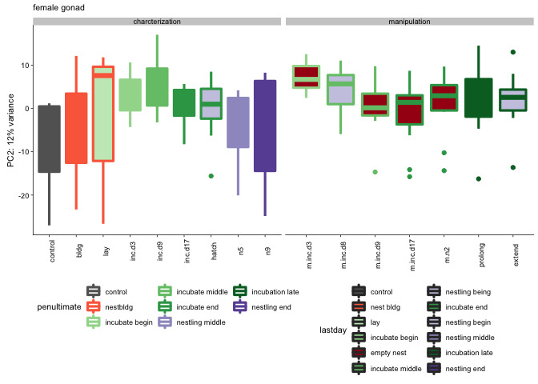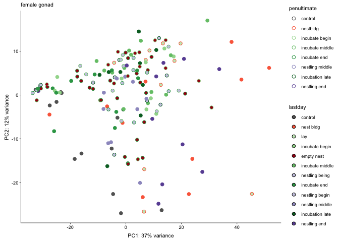

    plotPCAs(dds.male_hypothalamus, "male hypothalamus")

    ## [1] 28  9  6  4  3  3
    ##              Df Sum Sq Mean Sq F value Pr(>F)    
    ## treatment    15   5836   389.1   10.54 <2e-16 ***
    ## Residuals   146   5388    36.9                   
    ## ---
    ## Signif. codes:  0 '***' 0.001 '**' 0.01 '*' 0.05 '.' 0.1 ' ' 1
    ##              Df Sum Sq Mean Sq F value   Pr(>F)    
    ## lastday      11   1095   99.55   5.768 9.78e-08 ***
    ## Residuals   150   2589   17.26                     
    ## ---
    ## Signif. codes:  0 '***' 0.001 '**' 0.01 '*' 0.05 '.' 0.1 ' ' 1
    ##              Df Sum Sq Mean Sq F value Pr(>F)
    ## lastday      11  161.3   14.66    0.95  0.495
    ## Residuals   150 2314.6   15.43               
    ##              Df Sum Sq Mean Sq F value   Pr(>F)    
    ## lastday      11  410.8   37.35   4.407 9.91e-06 ***
    ## Residuals   150 1271.2    8.47                     
    ## ---
    ## Signif. codes:  0 '***' 0.001 '**' 0.01 '*' 0.05 '.' 0.1 ' ' 1

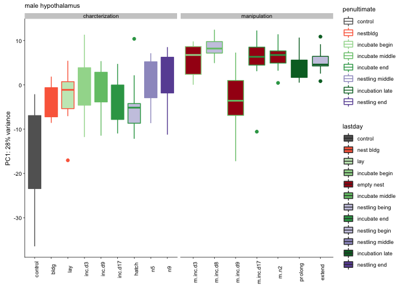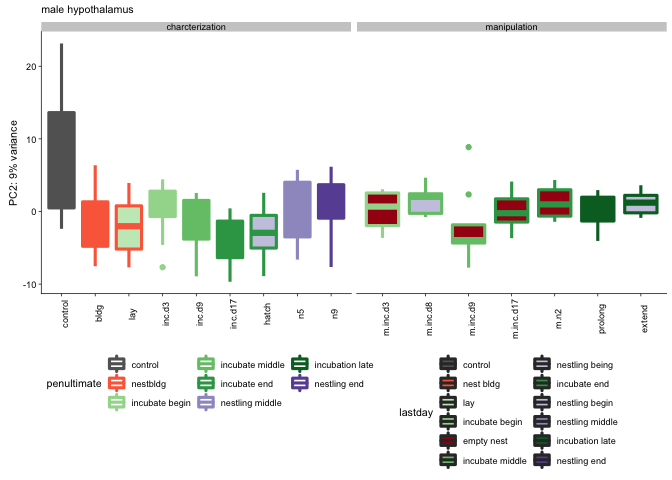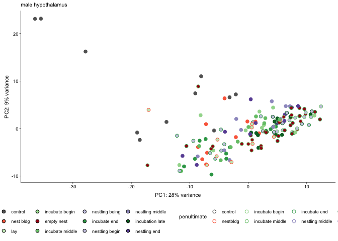

    plotPCAs(dds.male_pituitary, "male pituitary")

    ## [1] 11  9  7  5  4  3
    ##              Df Sum Sq Mean Sq F value Pr(>F)    
    ## treatment    15 2676.7  178.44   30.47 <2e-16 ***
    ## Residuals   149  872.6    5.86                   
    ## ---
    ## Signif. codes:  0 '***' 0.001 '**' 0.01 '*' 0.05 '.' 0.1 ' ' 1
    ##              Df Sum Sq Mean Sq F value   Pr(>F)    
    ## lastday      11   1181  107.35   9.555 5.42e-13 ***
    ## Residuals   153   1719   11.23                     
    ## ---
    ## Signif. codes:  0 '***' 0.001 '**' 0.01 '*' 0.05 '.' 0.1 ' ' 1
    ##              Df Sum Sq Mean Sq F value   Pr(>F)    
    ## lastday      11  661.2   60.11   5.665 1.31e-07 ***
    ## Residuals   153 1623.4   10.61                     
    ## ---
    ## Signif. codes:  0 '***' 0.001 '**' 0.01 '*' 0.05 '.' 0.1 ' ' 1
    ##              Df Sum Sq Mean Sq F value   Pr(>F)    
    ## lastday      11  401.2   36.47   4.315 1.31e-05 ***
    ## Residuals   153 1293.2    8.45                     
    ## ---
    ## Signif. codes:  0 '***' 0.001 '**' 0.01 '*' 0.05 '.' 0.1 ' ' 1

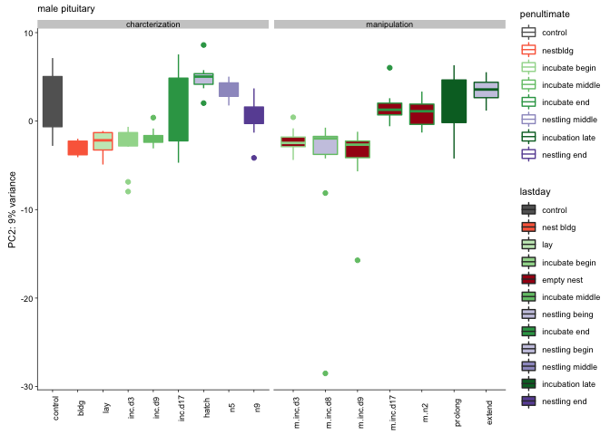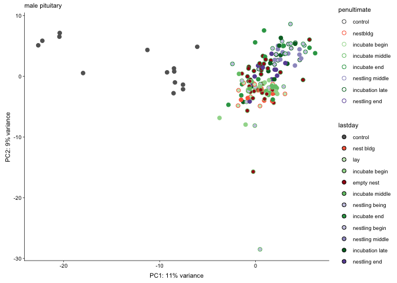

    plotPCAs(dds.male_gondad, "male gonad")

    ## [1] 14 10  5  3  3  2
    ##              Df Sum Sq Mean Sq F value   Pr(>F)    
    ## treatment    15   1476   98.37   3.674 1.89e-05 ***
    ## Residuals   147   3936   26.77                     
    ## ---
    ## Signif. codes:  0 '***' 0.001 '**' 0.01 '*' 0.05 '.' 0.1 ' ' 1
    ##              Df Sum Sq Mean Sq F value   Pr(>F)    
    ## lastday      11  715.7   65.06   3.116 0.000826 ***
    ## Residuals   151 3153.4   20.88                     
    ## ---
    ## Signif. codes:  0 '***' 0.001 '**' 0.01 '*' 0.05 '.' 0.1 ' ' 1
    ##              Df Sum Sq Mean Sq F value Pr(>F)    
    ## lastday      11 1452.8  132.08   31.19 <2e-16 ***
    ## Residuals   151  639.5    4.23                   
    ## ---
    ## Signif. codes:  0 '***' 0.001 '**' 0.01 '*' 0.05 '.' 0.1 ' ' 1
    ##              Df Sum Sq Mean Sq F value   Pr(>F)    
    ## lastday      11  215.7  19.613   3.126 0.000796 ***
    ## Residuals   151  947.3   6.273                     
    ## ---
    ## Signif. codes:  0 '***' 0.001 '**' 0.01 '*' 0.05 '.' 0.1 ' ' 1

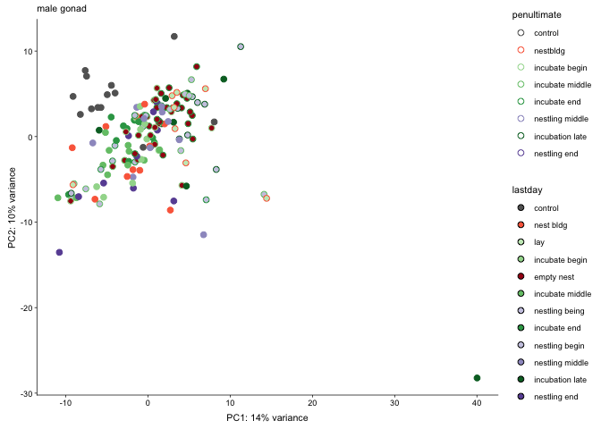

heamap with minimum pvalue
--------------------------

    makepheatmap(dds.female_hypothalamus, a.colData, "female hypothalamus")
    makepheatmap(dds.female_pituitary, "female pituitary")
    makepheatmap(dds.female_gonad, "female gonad")
    makepheatmap(dds.male_hypothalamus, "male hypothalamus")
    makepheatmap(dds.male_pituitary, "male pituitary")
    makepheatmap(dds.male_gondad, "male gonad")        

candidate genes
---------------

    plotcandidates(dds.female_hypothalamus, a.colData, "female hypothalamus")
    plotcandidates(dds.female_pituitary, "female pituitary")
    plotcandidates(dds.female_gonad, "female gonad")
    plotcandidates(dds.male_hypothalamus, "male hypothalamus")
    plotcandidates(dds.male_pituitary, "male pituitary")
    plotcandidates(dds.male_gondad, "male gonad")
