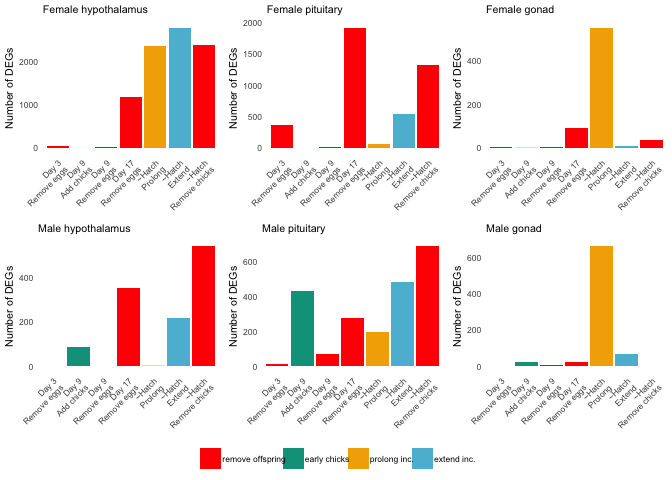
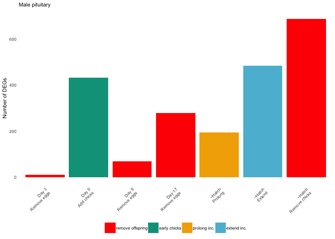

    library(tidyverse)
    library(DESeq2)
    library(cowplot)
    library(RColorBrewer)
    library(pheatmap)
    library(kableExtra)
    library(viridis)
    library(forcats)
    library("wesanderson")

    library("BiocParallel")
    register(MulticoreParam(4))

    source("../R/functions.R")  # load custom functions 
    source("../R/themes.R")  # load custom themes and color palletes

    knitr::opts_chunk$set(fig.path = '../figures/sexes/', cache = TRUE)

Starting with all the data
--------------------------

    # import "colData" which contains sample information and "countData" which contains read counts
    a.colData <- read.csv("../metadata/00_samples.csv", header = T, row.names = 1)
    a.countData <- read.csv("../results/00_counts.csv", header = T, row.names = 1)
    geneinfo <- read.csv("../metadata/00_geneinfo.csv", row.names = 1)

    # set levels
    levels(a.colData$treatment)

    ##  [1] "bldg"      "control"   "extend"    "hatch"     "inc.d17"  
    ##  [6] "inc.d3"    "inc.d9"    "lay"       "m.inc.d17" "m.inc.d3" 
    ## [11] "m.inc.d8"  "m.inc.d9"  "m.n2"      "n5"        "n9"       
    ## [16] "prolong"

    a.colData$treatment <- factor(a.colData$treatment, levels = 
                                 c("control", "bldg", "lay",
                                   "inc.d3", "inc.d9", "inc.d17",
                                   "hatch", "n5", "n9",
                                  
                                   "m.inc.d3", "m.inc.d8", "m.inc.d9",
                                   "m.inc.d17",  "m.n2"  ,
                                    "prolong", "extend" ))
                                   
    a.colData$sextissue <- as.factor(paste(a.colData$sex, a.colData$tissue, sep = "_"))

    a.colData$lastday <- ifelse(grepl("m.inc.d3|m.inc.d9|m.inc.d17|m.n2", a.colData$treatment), "empty nest", 
                        ifelse(grepl("m.inc.d8|hatch|extend", a.colData$treatment),"chicks hatch",      
                         ifelse(grepl("n5", a.colData$treatment),"chicks early",
                         ifelse(grepl("n9", a.colData$treatment),"chicks later",
                         ifelse(grepl("control", a.colData$treatment),"control",
                         ifelse(grepl("bldg", a.colData$treatment),"nest building",
                         ifelse(grepl("prolong", a.colData$treatment),"eggs delay",
                          ifelse(grepl("lay", a.colData$treatment),"eggs lay",
                          ifelse(grepl("inc.d3", a.colData$treatment),"eggs early",
                         ifelse(grepl("inc.d9", a.colData$treatment),"eggs middle",
                        ifelse(grepl("inc.d17", a.colData$treatment),"eggs later", NA)))))))))))

    a.colData$penultimate <-  ifelse(grepl("extend", a.colData$treatment),"eggs delay",  
                              ifelse(grepl("m.n2", a.colData$treatment),"chicks hatch",
                         ifelse(grepl("n5", a.colData$treatment),"chicks early",
                         ifelse(grepl("n9", a.colData$treatment),"chicks later",
                         ifelse(grepl("control", a.colData$treatment),"control",
                         ifelse(grepl("bldg|lay", a.colData$treatment),"nest building",
                         ifelse(grepl("prolong", a.colData$treatment),"eggs delay",
                          ifelse(grepl("inc.d3|m.inc.d3", a.colData$treatment),"eggs early",
                         ifelse(grepl("inc.d9|m.inc.d9|m.inc.d8", a.colData$treatment),"eggs middle",
                        ifelse(grepl("inc.d17|hatch", a.colData$treatment),"eggs later", NA))))))))))

    a.colData$xlabel <- a.colData$treatment

    levels(a.colData$xlabel) <-  c("control", "nest.building", "egg.lay",
                                   "eggs.early", "eggs.early.remove", 
                                   "eggs.mid", "eggs.mid.hatch", "eggs.mid.remove",
                                   "eggs.end", "eggs.end.remove",
                                   "chicks.hatch",  "chicks.hatch.remove"  ,
                                   "chicks.mid", "eggs.delay", "eggs.delay.hatch", "chicks.end")

    a.colData$lastday <- factor(a.colData$lastday, levels =  c("control", "nest building", "eggs lay",
                                   "eggs early", "eggs middle",  "eggs later","eggs delay",
                                   "chicks hatch", "chicks early",  "chicks later", "empty nest"))

    a.colData$penultimate <- factor(a.colData$penultimate, levels =  c("control", "nest building",
                                   "eggs early",  "eggs middle",  "eggs later",  "eggs delay",
                                   "chicks hatch", "chicks early",  "chicks later"))

    summary(a.colData[c(7,3,4,5,8,9, 10,11)])

    ##              study         sex               tissue        treatment  
    ##  charcterization:576   female:497   gonad       :330   control  : 73  
    ##  manipulation   :411   male  :490   hypothalamus:327   inc.d9   : 71  
    ##                                     pituitary   :330   inc.d17  : 66  
    ##                                                        n9       : 66  
    ##                                                        m.inc.d17: 63  
    ##                                                        bldg     : 60  
    ##                                                        (Other)  :588  
    ##                sextissue           lastday           penultimate 
    ##  female_gonad       :167   empty nest  :231   eggs later   :189  
    ##  female_hypothalamus:165   chicks hatch:180   eggs middle  :180  
    ##  female_pituitary   :165   control     : 73   nest building:120  
    ##  male_gonad         :163   eggs middle : 71   eggs early   :120  
    ##  male_hypothalamus  :162   eggs later  : 66   eggs delay   :120  
    ##  male_pituitary     :165   chicks later: 66   control      : 73  
    ##                            (Other)     :300   (Other)      :185  
    ##                xlabel   
    ##  control          : 73  
    ##  eggs.early.remove: 71  
    ##  eggs.mid         : 66  
    ##  eggs.end         : 66  
    ##  chicks.mid       : 63  
    ##  nest.building    : 60  
    ##  (Other)          :588

Run DESeq on all subsets of the data
------------------------------------

    dds.female_hypothalamus <- subsetDESeq(a.colData, a.countData, "female_hypothalamus")

    ## [1] TRUE
    ## class: DESeqDataSet 
    ## dim: 14937 165 
    ## metadata(1): version
    ## assays(1): counts
    ## rownames(14937): NP_001001127.1 NP_001001129.1 ... XP_430449.2
    ##   XP_430508.3
    ## rowData names(0):
    ## colnames(165): L.G118_female_hypothalamus_control.NYNO
    ##   R.G106_female_hypothalamus_control ...
    ##   y97.x_female_hypothalamus_n9 y98.g54_female_hypothalamus_m.hatch
    ## colData names(11): V1 bird ... penultimate xlabel
    ## [1] 14576   165

    ## estimating size factors

    ## estimating dispersions

    ## gene-wise dispersion estimates

    ## mean-dispersion relationship

    ## final dispersion estimates

    ## fitting model and testing

    ## -- replacing outliers and refitting for 9 genes
    ## -- DESeq argument 'minReplicatesForReplace' = 7 
    ## -- original counts are preserved in counts(dds)

    ## estimating dispersions

    ## fitting model and testing

    dds.female_pituitary <- subsetDESeq(a.colData, a.countData, "female_pituitary" )

    ## [1] TRUE
    ## class: DESeqDataSet 
    ## dim: 14937 165 
    ## metadata(1): version
    ## assays(1): counts
    ## rownames(14937): NP_001001127.1 NP_001001129.1 ... XP_430449.2
    ##   XP_430508.3
    ## rowData names(0):
    ## colnames(165): L.G118_female_pituitary_control.NYNO
    ##   R.G106_female_pituitary_control ... y97.x_female_pituitary_n9
    ##   y98.g54_female_pituitary_m.hatch
    ## colData names(11): V1 bird ... penultimate xlabel
    ## [1] 14496   165

    ## estimating size factors

    ## estimating dispersions

    ## gene-wise dispersion estimates

    ## mean-dispersion relationship

    ## final dispersion estimates

    ## fitting model and testing

    ## -- replacing outliers and refitting for 49 genes
    ## -- DESeq argument 'minReplicatesForReplace' = 7 
    ## -- original counts are preserved in counts(dds)

    ## estimating dispersions

    ## fitting model and testing

    dds.female_gonad <- subsetDESeq(a.colData, a.countData, "female_gonad" )

    ## [1] TRUE
    ## class: DESeqDataSet 
    ## dim: 14937 167 
    ## metadata(1): version
    ## assays(1): counts
    ## rownames(14937): NP_001001127.1 NP_001001129.1 ... XP_430449.2
    ##   XP_430508.3
    ## rowData names(0):
    ## colnames(167): L.G118_female_gonad_control
    ##   R.G106_female_gonad_control ... y97.x_female_gonad_n9
    ##   y98.g54_female_gonad_m.hatch
    ## colData names(11): V1 bird ... penultimate xlabel
    ## [1] 14746   167

    ## estimating size factors

    ## estimating dispersions

    ## gene-wise dispersion estimates

    ## mean-dispersion relationship

    ## final dispersion estimates

    ## fitting model and testing

    ## -- replacing outliers and refitting for 156 genes
    ## -- DESeq argument 'minReplicatesForReplace' = 7 
    ## -- original counts are preserved in counts(dds)

    ## estimating dispersions

    ## fitting model and testing

    dds.male_hypothalamus <- subsetDESeq(a.colData, a.countData, "male_hypothalamus" )

    ## [1] TRUE
    ## class: DESeqDataSet 
    ## dim: 14937 162 
    ## metadata(1): version
    ## assays(1): counts
    ## rownames(14937): NP_001001127.1 NP_001001129.1 ... XP_430449.2
    ##   XP_430508.3
    ## rowData names(0):
    ## colnames(162): L.Blu13_male_hypothalamus_control.NYNO
    ##   L.G107_male_hypothalamus_control ...
    ##   y95.g131.x_male_hypothalamus_inc.d9
    ##   y98.o50.x_male_hypothalamus_inc.d3
    ## colData names(11): V1 bird ... penultimate xlabel
    ## [1] 14536   162

    ## estimating size factors

    ## estimating dispersions

    ## gene-wise dispersion estimates

    ## mean-dispersion relationship

    ## final dispersion estimates

    ## fitting model and testing

    ## -- replacing outliers and refitting for 7 genes
    ## -- DESeq argument 'minReplicatesForReplace' = 7 
    ## -- original counts are preserved in counts(dds)

    ## estimating dispersions

    ## fitting model and testing

    dds.male_pituitary <- subsetDESeq(a.colData, a.countData, "male_pituitary"  )

    ## [1] TRUE
    ## class: DESeqDataSet 
    ## dim: 14937 165 
    ## metadata(1): version
    ## assays(1): counts
    ## rownames(14937): NP_001001127.1 NP_001001129.1 ... XP_430449.2
    ##   XP_430508.3
    ## rowData names(0):
    ## colnames(165): L.Blu13_male_pituitary_control.NYNO
    ##   L.G107_male_pituitary_control ...
    ##   y95.g131.x_male_pituitary_inc.d9 y98.o50.x_male_pituitary_inc.d3
    ## colData names(11): V1 bird ... penultimate xlabel
    ## [1] 14480   165

    ## estimating size factors

    ## estimating dispersions

    ## gene-wise dispersion estimates

    ## mean-dispersion relationship

    ## final dispersion estimates

    ## fitting model and testing

    ## -- replacing outliers and refitting for 51 genes
    ## -- DESeq argument 'minReplicatesForReplace' = 7 
    ## -- original counts are preserved in counts(dds)

    ## estimating dispersions

    ## fitting model and testing

    dds.male_gondad <- subsetDESeq(a.colData, a.countData, "male_gonad")

    ## [1] TRUE
    ## class: DESeqDataSet 
    ## dim: 14937 163 
    ## metadata(1): version
    ## assays(1): counts
    ## rownames(14937): NP_001001127.1 NP_001001129.1 ... XP_430449.2
    ##   XP_430508.3
    ## rowData names(0):
    ## colnames(163): L.Blu13_male_gonad_control.NYNO
    ##   L.G107_male_gonad_control ... y95.g131.x_male_gonad_inc.d9
    ##   y98.o50.x_male_gonad_inc.d3
    ## colData names(11): V1 bird ... penultimate xlabel
    ## [1] 14765   163

    ## estimating size factors

    ## estimating dispersions

    ## gene-wise dispersion estimates

    ## mean-dispersion relationship

    ## final dispersion estimates

    ## fitting model and testing

    ## -- replacing outliers and refitting for 123 genes
    ## -- DESeq argument 'minReplicatesForReplace' = 7 
    ## -- original counts are preserved in counts(dds)

    ## estimating dispersions

    ## fitting model and testing

Calculate and plot total DEGs
-----------------------------

    DEGs.female_hypothalamus <- returntotalDEGs(dds.female_hypothalamus)

    ## [1] "control.bldg"
    ## [1] "control.lay"
    ## [1] "control.inc.d3"
    ## [1] "control.inc.d9"
    ## [1] "control.inc.d17"
    ## [1] "control.hatch"
    ## [1] "control.n5"
    ## [1] "control.n9"
    ## [1] "control.m.inc.d3"
    ## [1] "control.m.inc.d8"
    ## [1] "control.m.inc.d9"
    ## [1] "control.m.inc.d17"
    ## [1] "control.m.n2"
    ## [1] "control.prolong"
    ## [1] "control.extend"
    ## [1] "bldg.lay"
    ## [1] "bldg.inc.d3"
    ## [1] "bldg.inc.d9"
    ## [1] "bldg.inc.d17"
    ## [1] "bldg.hatch"
    ## [1] "bldg.n5"
    ## [1] "bldg.n9"
    ## [1] "bldg.m.inc.d3"
    ## [1] "bldg.m.inc.d8"
    ## [1] "bldg.m.inc.d9"
    ## [1] "bldg.m.inc.d17"
    ## [1] "bldg.m.n2"
    ## [1] "bldg.prolong"
    ## [1] "bldg.extend"
    ## [1] "lay.inc.d3"
    ## [1] "lay.inc.d9"
    ## [1] "lay.inc.d17"
    ## [1] "lay.hatch"
    ## [1] "lay.n5"
    ## [1] "lay.n9"
    ## [1] "lay.m.inc.d3"
    ## [1] "lay.m.inc.d8"
    ## [1] "lay.m.inc.d9"
    ## [1] "lay.m.inc.d17"
    ## [1] "lay.m.n2"
    ## [1] "lay.prolong"
    ## [1] "lay.extend"
    ## [1] "inc.d3.inc.d9"
    ## [1] "inc.d3.inc.d17"
    ## [1] "inc.d3.hatch"
    ## [1] "inc.d3.n5"
    ## [1] "inc.d3.n9"
    ## [1] "inc.d3.m.inc.d3"
    ## [1] "inc.d3.m.inc.d8"
    ## [1] "inc.d3.m.inc.d9"
    ## [1] "inc.d3.m.inc.d17"
    ## [1] "inc.d3.m.n2"
    ## [1] "inc.d3.prolong"
    ## [1] "inc.d3.extend"
    ## [1] "inc.d9.inc.d17"
    ## [1] "inc.d9.hatch"
    ## [1] "inc.d9.n5"
    ## [1] "inc.d9.n9"
    ## [1] "inc.d9.m.inc.d3"
    ## [1] "inc.d9.m.inc.d8"
    ## [1] "inc.d9.m.inc.d9"
    ## [1] "inc.d9.m.inc.d17"
    ## [1] "inc.d9.m.n2"
    ## [1] "inc.d9.prolong"
    ## [1] "inc.d9.extend"
    ## [1] "inc.d17.hatch"
    ## [1] "inc.d17.n5"
    ## [1] "inc.d17.n9"
    ## [1] "inc.d17.m.inc.d3"
    ## [1] "inc.d17.m.inc.d8"
    ## [1] "inc.d17.m.inc.d9"
    ## [1] "inc.d17.m.inc.d17"
    ## [1] "inc.d17.m.n2"
    ## [1] "inc.d17.prolong"
    ## [1] "inc.d17.extend"
    ## [1] "hatch.n5"
    ## [1] "hatch.n9"
    ## [1] "hatch.m.inc.d3"
    ## [1] "hatch.m.inc.d8"
    ## [1] "hatch.m.inc.d9"
    ## [1] "hatch.m.inc.d17"
    ## [1] "hatch.m.n2"
    ## [1] "hatch.prolong"
    ## [1] "hatch.extend"
    ## [1] "n5.n9"
    ## [1] "n5.m.inc.d3"
    ## [1] "n5.m.inc.d8"
    ## [1] "n5.m.inc.d9"
    ## [1] "n5.m.inc.d17"
    ## [1] "n5.m.n2"
    ## [1] "n5.prolong"
    ## [1] "n5.extend"
    ## [1] "n9.m.inc.d3"
    ## [1] "n9.m.inc.d8"
    ## [1] "n9.m.inc.d9"
    ## [1] "n9.m.inc.d17"
    ## [1] "n9.m.n2"
    ## [1] "n9.prolong"
    ## [1] "n9.extend"
    ## [1] "m.inc.d3.m.inc.d8"
    ## [1] "m.inc.d3.m.inc.d9"
    ## [1] "m.inc.d3.m.inc.d17"
    ## [1] "m.inc.d3.m.n2"
    ## [1] "m.inc.d3.prolong"
    ## [1] "m.inc.d3.extend"
    ## [1] "m.inc.d8.m.inc.d9"
    ## [1] "m.inc.d8.m.inc.d17"
    ## [1] "m.inc.d8.m.n2"
    ## [1] "m.inc.d8.prolong"
    ## [1] "m.inc.d8.extend"
    ## [1] "m.inc.d9.m.inc.d17"
    ## [1] "m.inc.d9.m.n2"
    ## [1] "m.inc.d9.prolong"
    ## [1] "m.inc.d9.extend"
    ## [1] "m.inc.d17.m.n2"
    ## [1] "m.inc.d17.prolong"
    ## [1] "m.inc.d17.extend"
    ## [1] "m.n2.prolong"
    ## [1] "m.n2.extend"
    ## [1] "prolong.extend"
    ##                           V1        V2   V3
    ## control.bldg         control      bldg 4173
    ## control.lay          control       lay 4563
    ## control.inc.d3       control    inc.d3 4968
    ## control.inc.d9       control    inc.d9 5197
    ## control.inc.d17      control   inc.d17 4938
    ## control.hatch        control     hatch 4452
    ## control.n5           control        n5 5122
    ## control.n9           control        n9 5195
    ## control.m.inc.d3     control  m.inc.d3 6382
    ## control.m.inc.d8     control  m.inc.d8 5740
    ## control.m.inc.d9     control  m.inc.d9 5311
    ## control.m.inc.d17    control m.inc.d17 6211
    ## control.m.n2         control      m.n2 5885
    ## control.prolong      control   prolong 6047
    ## control.extend       control    extend 5975
    ## bldg.lay                bldg       lay    1
    ## bldg.inc.d3             bldg    inc.d3    0
    ## bldg.inc.d9             bldg    inc.d9    2
    ## bldg.inc.d17            bldg   inc.d17    0
    ## bldg.hatch              bldg     hatch    3
    ## bldg.n5                 bldg        n5    2
    ## bldg.n9                 bldg        n9   28
    ## bldg.m.inc.d3           bldg  m.inc.d3 1622
    ## bldg.m.inc.d8           bldg  m.inc.d8  256
    ## bldg.m.inc.d9           bldg  m.inc.d9   14
    ## bldg.m.inc.d17          bldg m.inc.d17 1270
    ## bldg.m.n2               bldg      m.n2  445
    ## bldg.prolong            bldg   prolong 1179
    ## bldg.extend             bldg    extend  740
    ## lay.inc.d3               lay    inc.d3    0
    ## lay.inc.d9               lay    inc.d9    9
    ## lay.inc.d17              lay   inc.d17    4
    ## lay.hatch                lay     hatch   12
    ## lay.n5                   lay        n5    1
    ## lay.n9                   lay        n9  101
    ## lay.m.inc.d3             lay  m.inc.d3 1178
    ## lay.m.inc.d8             lay  m.inc.d8   13
    ## lay.m.inc.d9             lay  m.inc.d9   18
    ## lay.m.inc.d17            lay m.inc.d17  746
    ## lay.m.n2                 lay      m.n2   45
    ## lay.prolong              lay   prolong  448
    ## lay.extend               lay    extend  166
    ## inc.d3.inc.d9         inc.d3    inc.d9    1
    ## inc.d3.inc.d17        inc.d3   inc.d17    0
    ## inc.d3.hatch          inc.d3     hatch  206
    ## inc.d3.n5             inc.d3        n5    0
    ## inc.d3.n9             inc.d3        n9    0
    ## inc.d3.m.inc.d3       inc.d3  m.inc.d3   52
    ## inc.d3.m.inc.d8       inc.d3  m.inc.d8    0
    ## inc.d3.m.inc.d9       inc.d3  m.inc.d9   14
    ## inc.d3.m.inc.d17      inc.d3 m.inc.d17    3
    ## inc.d3.m.n2           inc.d3      m.n2    1
    ## inc.d3.prolong        inc.d3   prolong    1
    ## inc.d3.extend         inc.d3    extend    1
    ## inc.d9.inc.d17        inc.d9   inc.d17    0
    ## inc.d9.hatch          inc.d9     hatch  915
    ## inc.d9.n5             inc.d9        n5    1
    ## inc.d9.n9             inc.d9        n9    1
    ## inc.d9.m.inc.d3       inc.d9  m.inc.d3   37
    ## inc.d9.m.inc.d8       inc.d9  m.inc.d8    1
    ## inc.d9.m.inc.d9       inc.d9  m.inc.d9   16
    ## inc.d9.m.inc.d17      inc.d9 m.inc.d17    7
    ## inc.d9.m.n2           inc.d9      m.n2    2
    ## inc.d9.prolong        inc.d9   prolong    3
    ## inc.d9.extend         inc.d9    extend    3
    ## inc.d17.hatch        inc.d17     hatch    2
    ## inc.d17.n5           inc.d17        n5    1
    ## inc.d17.n9           inc.d17        n9   54
    ## inc.d17.m.inc.d3     inc.d17  m.inc.d3 1544
    ## inc.d17.m.inc.d8     inc.d17  m.inc.d8  136
    ## inc.d17.m.inc.d9     inc.d17  m.inc.d9   37
    ## inc.d17.m.inc.d17    inc.d17 m.inc.d17 1169
    ## inc.d17.m.n2         inc.d17      m.n2  433
    ## inc.d17.prolong      inc.d17   prolong  668
    ## inc.d17.extend       inc.d17    extend  449
    ## hatch.n5               hatch        n5  743
    ## hatch.n9               hatch        n9  793
    ## hatch.m.inc.d3         hatch  m.inc.d3 3159
    ## hatch.m.inc.d8         hatch  m.inc.d8 2038
    ## hatch.m.inc.d9         hatch  m.inc.d9  563
    ## hatch.m.inc.d17        hatch m.inc.d17 2773
    ## hatch.m.n2             hatch      m.n2 2389
    ## hatch.prolong          hatch   prolong 2367
    ## hatch.extend           hatch    extend 2787
    ## n5.n9                     n5        n9    0
    ## n5.m.inc.d3               n5  m.inc.d3    8
    ## n5.m.inc.d8               n5  m.inc.d8    0
    ## n5.m.inc.d9               n5  m.inc.d9   13
    ## n5.m.inc.d17              n5 m.inc.d17    0
    ## n5.m.n2                   n5      m.n2    0
    ## n5.prolong                n5   prolong    2
    ## n5.extend                 n5    extend    0
    ## n9.m.inc.d3               n9  m.inc.d3  117
    ## n9.m.inc.d8               n9  m.inc.d8   62
    ## n9.m.inc.d9               n9  m.inc.d9   27
    ## n9.m.inc.d17              n9 m.inc.d17   16
    ## n9.m.n2                   n9      m.n2    0
    ## n9.prolong                n9   prolong   85
    ## n9.extend                 n9    extend  132
    ## m.inc.d3.m.inc.d8   m.inc.d3  m.inc.d8    6
    ## m.inc.d3.m.inc.d9   m.inc.d3  m.inc.d9   35
    ## m.inc.d3.m.inc.d17  m.inc.d3 m.inc.d17    2
    ## m.inc.d3.m.n2       m.inc.d3      m.n2    1
    ## m.inc.d3.prolong    m.inc.d3   prolong   11
    ## m.inc.d3.extend     m.inc.d3    extend   32
    ## m.inc.d8.m.inc.d9   m.inc.d8  m.inc.d9   21
    ## m.inc.d8.m.inc.d17  m.inc.d8 m.inc.d17    1
    ## m.inc.d8.m.n2       m.inc.d8      m.n2    0
    ## m.inc.d8.prolong    m.inc.d8   prolong    0
    ## m.inc.d8.extend     m.inc.d8    extend    0
    ## m.inc.d9.m.inc.d17  m.inc.d9 m.inc.d17   28
    ## m.inc.d9.m.n2       m.inc.d9      m.n2   15
    ## m.inc.d9.prolong    m.inc.d9   prolong   45
    ## m.inc.d9.extend     m.inc.d9    extend   35
    ## m.inc.d17.m.n2     m.inc.d17      m.n2    4
    ## m.inc.d17.prolong  m.inc.d17   prolong    6
    ## m.inc.d17.extend   m.inc.d17    extend    9
    ## m.n2.prolong            m.n2   prolong    3
    ## m.n2.extend             m.n2    extend    4
    ## prolong.extend       prolong    extend    0

    DEGs.female_pituitary <- returntotalDEGs(dds.female_pituitary)

    ## [1] "control.bldg"
    ## [1] "control.lay"
    ## [1] "control.inc.d3"
    ## [1] "control.inc.d9"
    ## [1] "control.inc.d17"
    ## [1] "control.hatch"
    ## [1] "control.n5"
    ## [1] "control.n9"
    ## [1] "control.m.inc.d3"
    ## [1] "control.m.inc.d8"
    ## [1] "control.m.inc.d9"
    ## [1] "control.m.inc.d17"
    ## [1] "control.m.n2"
    ## [1] "control.prolong"
    ## [1] "control.extend"
    ## [1] "bldg.lay"
    ## [1] "bldg.inc.d3"
    ## [1] "bldg.inc.d9"
    ## [1] "bldg.inc.d17"
    ## [1] "bldg.hatch"
    ## [1] "bldg.n5"
    ## [1] "bldg.n9"
    ## [1] "bldg.m.inc.d3"
    ## [1] "bldg.m.inc.d8"
    ## [1] "bldg.m.inc.d9"
    ## [1] "bldg.m.inc.d17"
    ## [1] "bldg.m.n2"
    ## [1] "bldg.prolong"
    ## [1] "bldg.extend"
    ## [1] "lay.inc.d3"
    ## [1] "lay.inc.d9"
    ## [1] "lay.inc.d17"
    ## [1] "lay.hatch"
    ## [1] "lay.n5"
    ## [1] "lay.n9"
    ## [1] "lay.m.inc.d3"
    ## [1] "lay.m.inc.d8"
    ## [1] "lay.m.inc.d9"
    ## [1] "lay.m.inc.d17"
    ## [1] "lay.m.n2"
    ## [1] "lay.prolong"
    ## [1] "lay.extend"
    ## [1] "inc.d3.inc.d9"
    ## [1] "inc.d3.inc.d17"
    ## [1] "inc.d3.hatch"
    ## [1] "inc.d3.n5"
    ## [1] "inc.d3.n9"
    ## [1] "inc.d3.m.inc.d3"
    ## [1] "inc.d3.m.inc.d8"
    ## [1] "inc.d3.m.inc.d9"
    ## [1] "inc.d3.m.inc.d17"
    ## [1] "inc.d3.m.n2"
    ## [1] "inc.d3.prolong"
    ## [1] "inc.d3.extend"
    ## [1] "inc.d9.inc.d17"
    ## [1] "inc.d9.hatch"
    ## [1] "inc.d9.n5"
    ## [1] "inc.d9.n9"
    ## [1] "inc.d9.m.inc.d3"
    ## [1] "inc.d9.m.inc.d8"
    ## [1] "inc.d9.m.inc.d9"
    ## [1] "inc.d9.m.inc.d17"
    ## [1] "inc.d9.m.n2"
    ## [1] "inc.d9.prolong"
    ## [1] "inc.d9.extend"
    ## [1] "inc.d17.hatch"
    ## [1] "inc.d17.n5"
    ## [1] "inc.d17.n9"
    ## [1] "inc.d17.m.inc.d3"
    ## [1] "inc.d17.m.inc.d8"
    ## [1] "inc.d17.m.inc.d9"
    ## [1] "inc.d17.m.inc.d17"
    ## [1] "inc.d17.m.n2"
    ## [1] "inc.d17.prolong"
    ## [1] "inc.d17.extend"
    ## [1] "hatch.n5"
    ## [1] "hatch.n9"
    ## [1] "hatch.m.inc.d3"
    ## [1] "hatch.m.inc.d8"
    ## [1] "hatch.m.inc.d9"
    ## [1] "hatch.m.inc.d17"
    ## [1] "hatch.m.n2"
    ## [1] "hatch.prolong"
    ## [1] "hatch.extend"
    ## [1] "n5.n9"
    ## [1] "n5.m.inc.d3"
    ## [1] "n5.m.inc.d8"
    ## [1] "n5.m.inc.d9"
    ## [1] "n5.m.inc.d17"
    ## [1] "n5.m.n2"
    ## [1] "n5.prolong"
    ## [1] "n5.extend"
    ## [1] "n9.m.inc.d3"
    ## [1] "n9.m.inc.d8"
    ## [1] "n9.m.inc.d9"
    ## [1] "n9.m.inc.d17"
    ## [1] "n9.m.n2"
    ## [1] "n9.prolong"
    ## [1] "n9.extend"
    ## [1] "m.inc.d3.m.inc.d8"
    ## [1] "m.inc.d3.m.inc.d9"
    ## [1] "m.inc.d3.m.inc.d17"
    ## [1] "m.inc.d3.m.n2"
    ## [1] "m.inc.d3.prolong"
    ## [1] "m.inc.d3.extend"
    ## [1] "m.inc.d8.m.inc.d9"
    ## [1] "m.inc.d8.m.inc.d17"
    ## [1] "m.inc.d8.m.n2"
    ## [1] "m.inc.d8.prolong"
    ## [1] "m.inc.d8.extend"
    ## [1] "m.inc.d9.m.inc.d17"
    ## [1] "m.inc.d9.m.n2"
    ## [1] "m.inc.d9.prolong"
    ## [1] "m.inc.d9.extend"
    ## [1] "m.inc.d17.m.n2"
    ## [1] "m.inc.d17.prolong"
    ## [1] "m.inc.d17.extend"
    ## [1] "m.n2.prolong"
    ## [1] "m.n2.extend"
    ## [1] "prolong.extend"
    ##                           V1        V2   V3
    ## control.bldg         control      bldg 4533
    ## control.lay          control       lay 4357
    ## control.inc.d3       control    inc.d3 3642
    ## control.inc.d9       control    inc.d9 4297
    ## control.inc.d17      control   inc.d17 3425
    ## control.hatch        control     hatch 4019
    ## control.n5           control        n5 4083
    ## control.n9           control        n9 4196
    ## control.m.inc.d3     control  m.inc.d3 4420
    ## control.m.inc.d8     control  m.inc.d8 4590
    ## control.m.inc.d9     control  m.inc.d9 3406
    ## control.m.inc.d17    control m.inc.d17 4325
    ## control.m.n2         control      m.n2 3810
    ## control.prolong      control   prolong 3983
    ## control.extend       control    extend 4012
    ## bldg.lay                bldg       lay  127
    ## bldg.inc.d3             bldg    inc.d3    9
    ## bldg.inc.d9             bldg    inc.d9   28
    ## bldg.inc.d17            bldg   inc.d17 1843
    ## bldg.hatch              bldg     hatch 1367
    ## bldg.n5                 bldg        n5  227
    ## bldg.n9                 bldg        n9  106
    ## bldg.m.inc.d3           bldg  m.inc.d3   16
    ## bldg.m.inc.d8           bldg  m.inc.d8   36
    ## bldg.m.inc.d9           bldg  m.inc.d9    1
    ## bldg.m.inc.d17          bldg m.inc.d17  418
    ## bldg.m.n2               bldg      m.n2  658
    ## bldg.prolong            bldg   prolong  569
    ## bldg.extend             bldg    extend 1077
    ## lay.inc.d3               lay    inc.d3  131
    ## lay.inc.d9               lay    inc.d9   59
    ## lay.inc.d17              lay   inc.d17 2380
    ## lay.hatch                lay     hatch 1895
    ## lay.n5                   lay        n5  149
    ## lay.n9                   lay        n9  268
    ## lay.m.inc.d3             lay  m.inc.d3  126
    ## lay.m.inc.d8             lay  m.inc.d8   19
    ## lay.m.inc.d9             lay  m.inc.d9  124
    ## lay.m.inc.d17            lay m.inc.d17  618
    ## lay.m.n2                 lay      m.n2  776
    ## lay.prolong              lay   prolong  564
    ## lay.extend               lay    extend  616
    ## inc.d3.inc.d9         inc.d3    inc.d9    1
    ## inc.d3.inc.d17        inc.d3   inc.d17  570
    ## inc.d3.hatch          inc.d3     hatch  597
    ## inc.d3.n5             inc.d3        n5   71
    ## inc.d3.n9             inc.d3        n9   79
    ## inc.d3.m.inc.d3       inc.d3  m.inc.d3  369
    ## inc.d3.m.inc.d8       inc.d3  m.inc.d8  235
    ## inc.d3.m.inc.d9       inc.d3  m.inc.d9    1
    ## inc.d3.m.inc.d17      inc.d3 m.inc.d17 1062
    ## inc.d3.m.n2           inc.d3      m.n2  860
    ## inc.d3.prolong        inc.d3   prolong  472
    ## inc.d3.extend         inc.d3    extend 1123
    ## inc.d9.inc.d17        inc.d9   inc.d17 1038
    ## inc.d9.hatch          inc.d9     hatch  895
    ## inc.d9.n5             inc.d9        n5   29
    ## inc.d9.n9             inc.d9        n9   75
    ## inc.d9.m.inc.d3       inc.d9  m.inc.d3   27
    ## inc.d9.m.inc.d8       inc.d9  m.inc.d8    0
    ## inc.d9.m.inc.d9       inc.d9  m.inc.d9    9
    ## inc.d9.m.inc.d17      inc.d9 m.inc.d17  670
    ## inc.d9.m.n2           inc.d9      m.n2  641
    ## inc.d9.prolong        inc.d9   prolong  404
    ## inc.d9.extend         inc.d9    extend  749
    ## inc.d17.hatch        inc.d17     hatch    3
    ## inc.d17.n5           inc.d17        n5  790
    ## inc.d17.n9           inc.d17        n9 1632
    ## inc.d17.m.inc.d3     inc.d17  m.inc.d3 2030
    ## inc.d17.m.inc.d8     inc.d17  m.inc.d8 2440
    ## inc.d17.m.inc.d9     inc.d17  m.inc.d9 1008
    ## inc.d17.m.inc.d17    inc.d17 m.inc.d17 1911
    ## inc.d17.m.n2         inc.d17      m.n2 1233
    ## inc.d17.prolong      inc.d17   prolong  115
    ## inc.d17.extend       inc.d17    extend  859
    ## hatch.n5               hatch        n5  545
    ## hatch.n9               hatch        n9 1286
    ## hatch.m.inc.d3         hatch  m.inc.d3 2056
    ## hatch.m.inc.d8         hatch  m.inc.d8 2132
    ## hatch.m.inc.d9         hatch  m.inc.d9  970
    ## hatch.m.inc.d17        hatch m.inc.d17 2001
    ## hatch.m.n2             hatch      m.n2 1312
    ## hatch.prolong          hatch   prolong   56
    ## hatch.extend           hatch    extend  539
    ## n5.n9                     n5        n9    4
    ## n5.m.inc.d3               n5  m.inc.d3   47
    ## n5.m.inc.d8               n5  m.inc.d8   17
    ## n5.m.inc.d9               n5  m.inc.d9   52
    ## n5.m.inc.d17              n5 m.inc.d17  134
    ## n5.m.n2                   n5      m.n2   86
    ## n5.prolong                n5   prolong   48
    ## n5.extend                 n5    extend   51
    ## n9.m.inc.d3               n9  m.inc.d3    0
    ## n9.m.inc.d8               n9  m.inc.d8   27
    ## n9.m.inc.d9               n9  m.inc.d9   10
    ## n9.m.inc.d17              n9 m.inc.d17   22
    ## n9.m.n2                   n9      m.n2   19
    ## n9.prolong                n9   prolong  221
    ## n9.extend                 n9    extend  336
    ## m.inc.d3.m.inc.d8   m.inc.d3  m.inc.d8    3
    ## m.inc.d3.m.inc.d9   m.inc.d3  m.inc.d9    2
    ## m.inc.d3.m.inc.d17  m.inc.d3 m.inc.d17   37
    ## m.inc.d3.m.n2       m.inc.d3      m.n2  137
    ## m.inc.d3.prolong    m.inc.d3   prolong  324
    ## m.inc.d3.extend     m.inc.d3    extend  614
    ## m.inc.d8.m.inc.d9   m.inc.d8  m.inc.d9   17
    ## m.inc.d8.m.inc.d17  m.inc.d8 m.inc.d17  234
    ## m.inc.d8.m.n2       m.inc.d8      m.n2  476
    ## m.inc.d8.prolong    m.inc.d8   prolong  347
    ## m.inc.d8.extend     m.inc.d8    extend  417
    ## m.inc.d9.m.inc.d17  m.inc.d9 m.inc.d17   78
    ## m.inc.d9.m.n2       m.inc.d9      m.n2  183
    ## m.inc.d9.prolong    m.inc.d9   prolong  287
    ## m.inc.d9.extend     m.inc.d9    extend  651
    ## m.inc.d17.m.n2     m.inc.d17      m.n2   10
    ## m.inc.d17.prolong  m.inc.d17   prolong  195
    ## m.inc.d17.extend   m.inc.d17    extend  496
    ## m.n2.prolong            m.n2   prolong  138
    ## m.n2.extend             m.n2    extend  333
    ## prolong.extend       prolong    extend   25

    DEGs.female_gonad <- returntotalDEGs(dds.female_gonad)

    ## [1] "control.bldg"
    ## [1] "control.lay"
    ## [1] "control.inc.d3"
    ## [1] "control.inc.d9"
    ## [1] "control.inc.d17"
    ## [1] "control.hatch"
    ## [1] "control.n5"
    ## [1] "control.n9"
    ## [1] "control.m.inc.d3"
    ## [1] "control.m.inc.d8"
    ## [1] "control.m.inc.d9"
    ## [1] "control.m.inc.d17"
    ## [1] "control.m.n2"
    ## [1] "control.prolong"
    ## [1] "control.extend"
    ## [1] "bldg.lay"
    ## [1] "bldg.inc.d3"
    ## [1] "bldg.inc.d9"
    ## [1] "bldg.inc.d17"
    ## [1] "bldg.hatch"
    ## [1] "bldg.n5"
    ## [1] "bldg.n9"
    ## [1] "bldg.m.inc.d3"
    ## [1] "bldg.m.inc.d8"
    ## [1] "bldg.m.inc.d9"
    ## [1] "bldg.m.inc.d17"
    ## [1] "bldg.m.n2"
    ## [1] "bldg.prolong"
    ## [1] "bldg.extend"
    ## [1] "lay.inc.d3"
    ## [1] "lay.inc.d9"
    ## [1] "lay.inc.d17"
    ## [1] "lay.hatch"
    ## [1] "lay.n5"
    ## [1] "lay.n9"
    ## [1] "lay.m.inc.d3"
    ## [1] "lay.m.inc.d8"
    ## [1] "lay.m.inc.d9"
    ## [1] "lay.m.inc.d17"
    ## [1] "lay.m.n2"
    ## [1] "lay.prolong"
    ## [1] "lay.extend"
    ## [1] "inc.d3.inc.d9"
    ## [1] "inc.d3.inc.d17"
    ## [1] "inc.d3.hatch"
    ## [1] "inc.d3.n5"
    ## [1] "inc.d3.n9"
    ## [1] "inc.d3.m.inc.d3"
    ## [1] "inc.d3.m.inc.d8"
    ## [1] "inc.d3.m.inc.d9"
    ## [1] "inc.d3.m.inc.d17"
    ## [1] "inc.d3.m.n2"
    ## [1] "inc.d3.prolong"
    ## [1] "inc.d3.extend"
    ## [1] "inc.d9.inc.d17"
    ## [1] "inc.d9.hatch"
    ## [1] "inc.d9.n5"
    ## [1] "inc.d9.n9"
    ## [1] "inc.d9.m.inc.d3"
    ## [1] "inc.d9.m.inc.d8"
    ## [1] "inc.d9.m.inc.d9"
    ## [1] "inc.d9.m.inc.d17"
    ## [1] "inc.d9.m.n2"
    ## [1] "inc.d9.prolong"
    ## [1] "inc.d9.extend"
    ## [1] "inc.d17.hatch"
    ## [1] "inc.d17.n5"
    ## [1] "inc.d17.n9"
    ## [1] "inc.d17.m.inc.d3"
    ## [1] "inc.d17.m.inc.d8"
    ## [1] "inc.d17.m.inc.d9"
    ## [1] "inc.d17.m.inc.d17"
    ## [1] "inc.d17.m.n2"
    ## [1] "inc.d17.prolong"
    ## [1] "inc.d17.extend"
    ## [1] "hatch.n5"
    ## [1] "hatch.n9"
    ## [1] "hatch.m.inc.d3"
    ## [1] "hatch.m.inc.d8"
    ## [1] "hatch.m.inc.d9"
    ## [1] "hatch.m.inc.d17"
    ## [1] "hatch.m.n2"
    ## [1] "hatch.prolong"
    ## [1] "hatch.extend"
    ## [1] "n5.n9"
    ## [1] "n5.m.inc.d3"
    ## [1] "n5.m.inc.d8"
    ## [1] "n5.m.inc.d9"
    ## [1] "n5.m.inc.d17"
    ## [1] "n5.m.n2"
    ## [1] "n5.prolong"
    ## [1] "n5.extend"
    ## [1] "n9.m.inc.d3"
    ## [1] "n9.m.inc.d8"
    ## [1] "n9.m.inc.d9"
    ## [1] "n9.m.inc.d17"
    ## [1] "n9.m.n2"
    ## [1] "n9.prolong"
    ## [1] "n9.extend"
    ## [1] "m.inc.d3.m.inc.d8"
    ## [1] "m.inc.d3.m.inc.d9"
    ## [1] "m.inc.d3.m.inc.d17"
    ## [1] "m.inc.d3.m.n2"
    ## [1] "m.inc.d3.prolong"
    ## [1] "m.inc.d3.extend"
    ## [1] "m.inc.d8.m.inc.d9"
    ## [1] "m.inc.d8.m.inc.d17"
    ## [1] "m.inc.d8.m.n2"
    ## [1] "m.inc.d8.prolong"
    ## [1] "m.inc.d8.extend"
    ## [1] "m.inc.d9.m.inc.d17"
    ## [1] "m.inc.d9.m.n2"
    ## [1] "m.inc.d9.prolong"
    ## [1] "m.inc.d9.extend"
    ## [1] "m.inc.d17.m.n2"
    ## [1] "m.inc.d17.prolong"
    ## [1] "m.inc.d17.extend"
    ## [1] "m.n2.prolong"
    ## [1] "m.n2.extend"
    ## [1] "prolong.extend"
    ##                           V1        V2   V3
    ## control.bldg         control      bldg 4734
    ## control.lay          control       lay 4277
    ## control.inc.d3       control    inc.d3 2489
    ## control.inc.d9       control    inc.d9 2864
    ## control.inc.d17      control   inc.d17  804
    ## control.hatch        control     hatch 1364
    ## control.n5           control        n5 2289
    ## control.n9           control        n9 4383
    ## control.m.inc.d3     control  m.inc.d3 3461
    ## control.m.inc.d8     control  m.inc.d8 2804
    ## control.m.inc.d9     control  m.inc.d9 1392
    ## control.m.inc.d17    control m.inc.d17 3000
    ## control.m.n2         control      m.n2 2874
    ## control.prolong      control   prolong 3454
    ## control.extend       control    extend 2775
    ## bldg.lay                bldg       lay  129
    ## bldg.inc.d3             bldg    inc.d3  585
    ## bldg.inc.d9             bldg    inc.d9  336
    ## bldg.inc.d17            bldg   inc.d17 1941
    ## bldg.hatch              bldg     hatch  192
    ## bldg.n5                 bldg        n5  231
    ## bldg.n9                 bldg        n9   31
    ## bldg.m.inc.d3           bldg  m.inc.d3  228
    ## bldg.m.inc.d8           bldg  m.inc.d8  309
    ## bldg.m.inc.d9           bldg  m.inc.d9   64
    ## bldg.m.inc.d17          bldg m.inc.d17  784
    ## bldg.m.n2               bldg      m.n2  537
    ## bldg.prolong            bldg   prolong 1086
    ## bldg.extend             bldg    extend  412
    ## lay.inc.d3               lay    inc.d3  380
    ## lay.inc.d9               lay    inc.d9  325
    ## lay.inc.d17              lay   inc.d17 1516
    ## lay.hatch                lay     hatch  399
    ## lay.n5                   lay        n5  263
    ## lay.n9                   lay        n9  280
    ## lay.m.inc.d3             lay  m.inc.d3   91
    ## lay.m.inc.d8             lay  m.inc.d8  209
    ## lay.m.inc.d9             lay  m.inc.d9  390
    ## lay.m.inc.d17            lay m.inc.d17 1173
    ## lay.m.n2                 lay      m.n2  965
    ## lay.prolong              lay   prolong  997
    ## lay.extend               lay    extend   83
    ## inc.d3.inc.d9         inc.d3    inc.d9    5
    ## inc.d3.inc.d17        inc.d3   inc.d17   10
    ## inc.d3.hatch          inc.d3     hatch   26
    ## inc.d3.n5             inc.d3        n5   74
    ## inc.d3.n9             inc.d3        n9  538
    ## inc.d3.m.inc.d3       inc.d3  m.inc.d3    4
    ## inc.d3.m.inc.d8       inc.d3  m.inc.d8    5
    ## inc.d3.m.inc.d9       inc.d3  m.inc.d9  134
    ## inc.d3.m.inc.d17      inc.d3 m.inc.d17  703
    ## inc.d3.m.n2           inc.d3      m.n2  728
    ## inc.d3.prolong        inc.d3   prolong 1486
    ## inc.d3.extend         inc.d3    extend  175
    ## inc.d9.inc.d17        inc.d9   inc.d17    3
    ## inc.d9.hatch          inc.d9     hatch    4
    ## inc.d9.n5             inc.d9        n5    6
    ## inc.d9.n9             inc.d9        n9  302
    ## inc.d9.m.inc.d3       inc.d9  m.inc.d3    0
    ## inc.d9.m.inc.d8       inc.d9  m.inc.d8    1
    ## inc.d9.m.inc.d9       inc.d9  m.inc.d9    3
    ## inc.d9.m.inc.d17      inc.d9 m.inc.d17  308
    ## inc.d9.m.n2           inc.d9      m.n2  256
    ## inc.d9.prolong        inc.d9   prolong  799
    ## inc.d9.extend         inc.d9    extend   74
    ## inc.d17.hatch        inc.d17     hatch    4
    ## inc.d17.n5           inc.d17        n5    6
    ## inc.d17.n9           inc.d17        n9 1035
    ## inc.d17.m.inc.d3     inc.d17  m.inc.d3  148
    ## inc.d17.m.inc.d8     inc.d17  m.inc.d8   41
    ## inc.d17.m.inc.d9     inc.d17  m.inc.d9    2
    ## inc.d17.m.inc.d17    inc.d17 m.inc.d17   89
    ## inc.d17.m.n2         inc.d17      m.n2  137
    ## inc.d17.prolong      inc.d17   prolong  837
    ## inc.d17.extend       inc.d17    extend   77
    ## hatch.n5               hatch        n5    2
    ## hatch.n9               hatch        n9   84
    ## hatch.m.inc.d3         hatch  m.inc.d3   10
    ## hatch.m.inc.d8         hatch  m.inc.d8    3
    ## hatch.m.inc.d9         hatch  m.inc.d9    4
    ## hatch.m.inc.d17        hatch m.inc.d17   16
    ## hatch.m.n2             hatch      m.n2   34
    ## hatch.prolong          hatch   prolong  549
    ## hatch.extend           hatch    extend    9
    ## n5.n9                     n5        n9   18
    ## n5.m.inc.d3               n5  m.inc.d3   12
    ## n5.m.inc.d8               n5  m.inc.d8    6
    ## n5.m.inc.d9               n5  m.inc.d9    1
    ## n5.m.inc.d17              n5 m.inc.d17    8
    ## n5.m.n2                   n5      m.n2    3
    ## n5.prolong                n5   prolong  507
    ## n5.extend                 n5    extend    7
    ## n9.m.inc.d3               n9  m.inc.d3  125
    ## n9.m.inc.d8               n9  m.inc.d8  213
    ## n9.m.inc.d9               n9  m.inc.d9   21
    ## n9.m.inc.d17              n9 m.inc.d17   49
    ## n9.m.n2                   n9      m.n2   64
    ## n9.prolong                n9   prolong  665
    ## n9.extend                 n9    extend  163
    ## m.inc.d3.m.inc.d8   m.inc.d3  m.inc.d8    0
    ## m.inc.d3.m.inc.d9   m.inc.d3  m.inc.d9    5
    ## m.inc.d3.m.inc.d17  m.inc.d3 m.inc.d17  104
    ## m.inc.d3.m.n2       m.inc.d3      m.n2  118
    ## m.inc.d3.prolong    m.inc.d3   prolong  490
    ## m.inc.d3.extend     m.inc.d3    extend   15
    ## m.inc.d8.m.inc.d9   m.inc.d8  m.inc.d9    4
    ## m.inc.d8.m.inc.d17  m.inc.d8 m.inc.d17   70
    ## m.inc.d8.m.n2       m.inc.d8      m.n2  126
    ## m.inc.d8.prolong    m.inc.d8   prolong  687
    ## m.inc.d8.extend     m.inc.d8    extend   26
    ## m.inc.d9.m.inc.d17  m.inc.d9 m.inc.d17    2
    ## m.inc.d9.m.n2       m.inc.d9      m.n2    2
    ## m.inc.d9.prolong    m.inc.d9   prolong  299
    ## m.inc.d9.extend     m.inc.d9    extend   33
    ## m.inc.d17.m.n2     m.inc.d17      m.n2    0
    ## m.inc.d17.prolong  m.inc.d17   prolong  563
    ## m.inc.d17.extend   m.inc.d17    extend  151
    ## m.n2.prolong            m.n2   prolong  447
    ## m.n2.extend             m.n2    extend  173
    ## prolong.extend       prolong    extend  390

    DEGs.male_hypothalamus <- returntotalDEGs(dds.male_hypothalamus)

    ## [1] "control.bldg"
    ## [1] "control.lay"
    ## [1] "control.inc.d3"
    ## [1] "control.inc.d9"
    ## [1] "control.inc.d17"
    ## [1] "control.hatch"
    ## [1] "control.n5"
    ## [1] "control.n9"
    ## [1] "control.m.inc.d3"
    ## [1] "control.m.inc.d8"
    ## [1] "control.m.inc.d9"
    ## [1] "control.m.inc.d17"
    ## [1] "control.m.n2"
    ## [1] "control.prolong"
    ## [1] "control.extend"
    ## [1] "bldg.lay"
    ## [1] "bldg.inc.d3"
    ## [1] "bldg.inc.d9"
    ## [1] "bldg.inc.d17"
    ## [1] "bldg.hatch"
    ## [1] "bldg.n5"
    ## [1] "bldg.n9"
    ## [1] "bldg.m.inc.d3"
    ## [1] "bldg.m.inc.d8"
    ## [1] "bldg.m.inc.d9"
    ## [1] "bldg.m.inc.d17"
    ## [1] "bldg.m.n2"
    ## [1] "bldg.prolong"
    ## [1] "bldg.extend"
    ## [1] "lay.inc.d3"
    ## [1] "lay.inc.d9"
    ## [1] "lay.inc.d17"
    ## [1] "lay.hatch"
    ## [1] "lay.n5"
    ## [1] "lay.n9"
    ## [1] "lay.m.inc.d3"
    ## [1] "lay.m.inc.d8"
    ## [1] "lay.m.inc.d9"
    ## [1] "lay.m.inc.d17"
    ## [1] "lay.m.n2"
    ## [1] "lay.prolong"
    ## [1] "lay.extend"
    ## [1] "inc.d3.inc.d9"
    ## [1] "inc.d3.inc.d17"
    ## [1] "inc.d3.hatch"
    ## [1] "inc.d3.n5"
    ## [1] "inc.d3.n9"
    ## [1] "inc.d3.m.inc.d3"
    ## [1] "inc.d3.m.inc.d8"
    ## [1] "inc.d3.m.inc.d9"
    ## [1] "inc.d3.m.inc.d17"
    ## [1] "inc.d3.m.n2"
    ## [1] "inc.d3.prolong"
    ## [1] "inc.d3.extend"
    ## [1] "inc.d9.inc.d17"
    ## [1] "inc.d9.hatch"
    ## [1] "inc.d9.n5"
    ## [1] "inc.d9.n9"
    ## [1] "inc.d9.m.inc.d3"
    ## [1] "inc.d9.m.inc.d8"
    ## [1] "inc.d9.m.inc.d9"
    ## [1] "inc.d9.m.inc.d17"
    ## [1] "inc.d9.m.n2"
    ## [1] "inc.d9.prolong"
    ## [1] "inc.d9.extend"
    ## [1] "inc.d17.hatch"
    ## [1] "inc.d17.n5"
    ## [1] "inc.d17.n9"
    ## [1] "inc.d17.m.inc.d3"
    ## [1] "inc.d17.m.inc.d8"
    ## [1] "inc.d17.m.inc.d9"
    ## [1] "inc.d17.m.inc.d17"
    ## [1] "inc.d17.m.n2"
    ## [1] "inc.d17.prolong"
    ## [1] "inc.d17.extend"
    ## [1] "hatch.n5"
    ## [1] "hatch.n9"
    ## [1] "hatch.m.inc.d3"
    ## [1] "hatch.m.inc.d8"
    ## [1] "hatch.m.inc.d9"
    ## [1] "hatch.m.inc.d17"
    ## [1] "hatch.m.n2"
    ## [1] "hatch.prolong"
    ## [1] "hatch.extend"
    ## [1] "n5.n9"
    ## [1] "n5.m.inc.d3"
    ## [1] "n5.m.inc.d8"
    ## [1] "n5.m.inc.d9"
    ## [1] "n5.m.inc.d17"
    ## [1] "n5.m.n2"
    ## [1] "n5.prolong"
    ## [1] "n5.extend"
    ## [1] "n9.m.inc.d3"
    ## [1] "n9.m.inc.d8"
    ## [1] "n9.m.inc.d9"
    ## [1] "n9.m.inc.d17"
    ## [1] "n9.m.n2"
    ## [1] "n9.prolong"
    ## [1] "n9.extend"
    ## [1] "m.inc.d3.m.inc.d8"
    ## [1] "m.inc.d3.m.inc.d9"
    ## [1] "m.inc.d3.m.inc.d17"
    ## [1] "m.inc.d3.m.n2"
    ## [1] "m.inc.d3.prolong"
    ## [1] "m.inc.d3.extend"
    ## [1] "m.inc.d8.m.inc.d9"
    ## [1] "m.inc.d8.m.inc.d17"
    ## [1] "m.inc.d8.m.n2"
    ## [1] "m.inc.d8.prolong"
    ## [1] "m.inc.d8.extend"
    ## [1] "m.inc.d9.m.inc.d17"
    ## [1] "m.inc.d9.m.n2"
    ## [1] "m.inc.d9.prolong"
    ## [1] "m.inc.d9.extend"
    ## [1] "m.inc.d17.m.n2"
    ## [1] "m.inc.d17.prolong"
    ## [1] "m.inc.d17.extend"
    ## [1] "m.n2.prolong"
    ## [1] "m.n2.extend"
    ## [1] "prolong.extend"
    ##                           V1        V2   V3
    ## control.bldg         control      bldg 5105
    ## control.lay          control       lay 5795
    ## control.inc.d3       control    inc.d3 5711
    ## control.inc.d9       control    inc.d9 5563
    ## control.inc.d17      control   inc.d17 6191
    ## control.hatch        control     hatch 5559
    ## control.n5           control        n5 5781
    ## control.n9           control        n9 5829
    ## control.m.inc.d3     control  m.inc.d3 6601
    ## control.m.inc.d8     control  m.inc.d8 6900
    ## control.m.inc.d9     control  m.inc.d9 4864
    ## control.m.inc.d17    control m.inc.d17 6548
    ## control.m.n2         control      m.n2 6616
    ## control.prolong      control   prolong 6492
    ## control.extend       control    extend 6388
    ## bldg.lay                bldg       lay    2
    ## bldg.inc.d3             bldg    inc.d3    1
    ## bldg.inc.d9             bldg    inc.d9    1
    ## bldg.inc.d17            bldg   inc.d17    1
    ## bldg.hatch              bldg     hatch    4
    ## bldg.n5                 bldg        n5    0
    ## bldg.n9                 bldg        n9    1
    ## bldg.m.inc.d3           bldg  m.inc.d3  279
    ## bldg.m.inc.d8           bldg  m.inc.d8 1540
    ## bldg.m.inc.d9           bldg  m.inc.d9    1
    ## bldg.m.inc.d17          bldg m.inc.d17  229
    ## bldg.m.n2               bldg      m.n2  113
    ## bldg.prolong            bldg   prolong    3
    ## bldg.extend             bldg    extend   29
    ## lay.inc.d3               lay    inc.d3    1
    ## lay.inc.d9               lay    inc.d9    4
    ## lay.inc.d17              lay   inc.d17    1
    ## lay.hatch                lay     hatch    5
    ## lay.n5                   lay        n5    4
    ## lay.n9                   lay        n9    2
    ## lay.m.inc.d3             lay  m.inc.d3    8
    ## lay.m.inc.d8             lay  m.inc.d8 1449
    ## lay.m.inc.d9             lay  m.inc.d9    0
    ## lay.m.inc.d17            lay m.inc.d17    3
    ## lay.m.n2                 lay      m.n2   14
    ## lay.prolong              lay   prolong    7
    ## lay.extend               lay    extend   42
    ## inc.d3.inc.d9         inc.d3    inc.d9    0
    ## inc.d3.inc.d17        inc.d3   inc.d17    0
    ## inc.d3.hatch          inc.d3     hatch    0
    ## inc.d3.n5             inc.d3        n5    0
    ## inc.d3.n9             inc.d3        n9    0
    ## inc.d3.m.inc.d3       inc.d3  m.inc.d3    0
    ## inc.d3.m.inc.d8       inc.d3  m.inc.d8    0
    ## inc.d3.m.inc.d9       inc.d3  m.inc.d9    1
    ## inc.d3.m.inc.d17      inc.d3 m.inc.d17    1
    ## inc.d3.m.n2           inc.d3      m.n2    0
    ## inc.d3.prolong        inc.d3   prolong    0
    ## inc.d3.extend         inc.d3    extend    1
    ## inc.d9.inc.d17        inc.d9   inc.d17   26
    ## inc.d9.hatch          inc.d9     hatch    2
    ## inc.d9.n5             inc.d9        n5    0
    ## inc.d9.n9             inc.d9        n9    0
    ## inc.d9.m.inc.d3       inc.d9  m.inc.d3    2
    ## inc.d9.m.inc.d8       inc.d9  m.inc.d8   86
    ## inc.d9.m.inc.d9       inc.d9  m.inc.d9    0
    ## inc.d9.m.inc.d17      inc.d9 m.inc.d17    3
    ## inc.d9.m.n2           inc.d9      m.n2    0
    ## inc.d9.prolong        inc.d9   prolong    0
    ## inc.d9.extend         inc.d9    extend    4
    ## inc.d17.hatch        inc.d17     hatch    0
    ## inc.d17.n5           inc.d17        n5    6
    ## inc.d17.n9           inc.d17        n9    5
    ## inc.d17.m.inc.d3     inc.d17  m.inc.d3  280
    ## inc.d17.m.inc.d8     inc.d17  m.inc.d8 2983
    ## inc.d17.m.inc.d9     inc.d17  m.inc.d9    0
    ## inc.d17.m.inc.d17    inc.d17 m.inc.d17  351
    ## inc.d17.m.n2         inc.d17      m.n2  563
    ## inc.d17.prolong      inc.d17   prolong    1
    ## inc.d17.extend       inc.d17    extend  791
    ## hatch.n5               hatch        n5    0
    ## hatch.n9               hatch        n9    2
    ## hatch.m.inc.d3         hatch  m.inc.d3  540
    ## hatch.m.inc.d8         hatch  m.inc.d8 1877
    ## hatch.m.inc.d9         hatch  m.inc.d9    0
    ## hatch.m.inc.d17        hatch m.inc.d17  328
    ## hatch.m.n2             hatch      m.n2  540
    ## hatch.prolong          hatch   prolong    2
    ## hatch.extend           hatch    extend  215
    ## n5.n9                     n5        n9    0
    ## n5.m.inc.d3               n5  m.inc.d3    6
    ## n5.m.inc.d8               n5  m.inc.d8   24
    ## n5.m.inc.d9               n5  m.inc.d9    0
    ## n5.m.inc.d17              n5 m.inc.d17    3
    ## n5.m.n2                   n5      m.n2    1
    ## n5.prolong                n5   prolong    1
    ## n5.extend                 n5    extend    1
    ## n9.m.inc.d3               n9  m.inc.d3    0
    ## n9.m.inc.d8               n9  m.inc.d8    0
    ## n9.m.inc.d9               n9  m.inc.d9    0
    ## n9.m.inc.d17              n9 m.inc.d17    2
    ## n9.m.n2                   n9      m.n2    0
    ## n9.prolong                n9   prolong    0
    ## n9.extend                 n9    extend    0
    ## m.inc.d3.m.inc.d8   m.inc.d3  m.inc.d8    0
    ## m.inc.d3.m.inc.d9   m.inc.d3  m.inc.d9    0
    ## m.inc.d3.m.inc.d17  m.inc.d3 m.inc.d17    1
    ## m.inc.d3.m.n2       m.inc.d3      m.n2    0
    ## m.inc.d3.prolong    m.inc.d3   prolong    0
    ## m.inc.d3.extend     m.inc.d3    extend    0
    ## m.inc.d8.m.inc.d9   m.inc.d8  m.inc.d9  822
    ## m.inc.d8.m.inc.d17  m.inc.d8 m.inc.d17    2
    ## m.inc.d8.m.n2       m.inc.d8      m.n2    1
    ## m.inc.d8.prolong    m.inc.d8   prolong    0
    ## m.inc.d8.extend     m.inc.d8    extend    0
    ## m.inc.d9.m.inc.d17  m.inc.d9 m.inc.d17    1
    ## m.inc.d9.m.n2       m.inc.d9      m.n2   13
    ## m.inc.d9.prolong    m.inc.d9   prolong    0
    ## m.inc.d9.extend     m.inc.d9    extend   13
    ## m.inc.d17.m.n2     m.inc.d17      m.n2    3
    ## m.inc.d17.prolong  m.inc.d17   prolong    2
    ## m.inc.d17.extend   m.inc.d17    extend    1
    ## m.n2.prolong            m.n2   prolong    0
    ## m.n2.extend             m.n2    extend    0
    ## prolong.extend       prolong    extend    0

    DEGs.male_pituitary <- returntotalDEGs(dds.male_pituitary)

    ## [1] "control.bldg"
    ## [1] "control.lay"
    ## [1] "control.inc.d3"
    ## [1] "control.inc.d9"
    ## [1] "control.inc.d17"
    ## [1] "control.hatch"
    ## [1] "control.n5"
    ## [1] "control.n9"
    ## [1] "control.m.inc.d3"
    ## [1] "control.m.inc.d8"
    ## [1] "control.m.inc.d9"
    ## [1] "control.m.inc.d17"
    ## [1] "control.m.n2"
    ## [1] "control.prolong"
    ## [1] "control.extend"
    ## [1] "bldg.lay"
    ## [1] "bldg.inc.d3"
    ## [1] "bldg.inc.d9"
    ## [1] "bldg.inc.d17"
    ## [1] "bldg.hatch"
    ## [1] "bldg.n5"
    ## [1] "bldg.n9"
    ## [1] "bldg.m.inc.d3"
    ## [1] "bldg.m.inc.d8"
    ## [1] "bldg.m.inc.d9"
    ## [1] "bldg.m.inc.d17"
    ## [1] "bldg.m.n2"
    ## [1] "bldg.prolong"
    ## [1] "bldg.extend"
    ## [1] "lay.inc.d3"
    ## [1] "lay.inc.d9"
    ## [1] "lay.inc.d17"
    ## [1] "lay.hatch"
    ## [1] "lay.n5"
    ## [1] "lay.n9"
    ## [1] "lay.m.inc.d3"
    ## [1] "lay.m.inc.d8"
    ## [1] "lay.m.inc.d9"
    ## [1] "lay.m.inc.d17"
    ## [1] "lay.m.n2"
    ## [1] "lay.prolong"
    ## [1] "lay.extend"
    ## [1] "inc.d3.inc.d9"
    ## [1] "inc.d3.inc.d17"
    ## [1] "inc.d3.hatch"
    ## [1] "inc.d3.n5"
    ## [1] "inc.d3.n9"
    ## [1] "inc.d3.m.inc.d3"
    ## [1] "inc.d3.m.inc.d8"
    ## [1] "inc.d3.m.inc.d9"
    ## [1] "inc.d3.m.inc.d17"
    ## [1] "inc.d3.m.n2"
    ## [1] "inc.d3.prolong"
    ## [1] "inc.d3.extend"
    ## [1] "inc.d9.inc.d17"
    ## [1] "inc.d9.hatch"
    ## [1] "inc.d9.n5"
    ## [1] "inc.d9.n9"
    ## [1] "inc.d9.m.inc.d3"
    ## [1] "inc.d9.m.inc.d8"
    ## [1] "inc.d9.m.inc.d9"
    ## [1] "inc.d9.m.inc.d17"
    ## [1] "inc.d9.m.n2"
    ## [1] "inc.d9.prolong"
    ## [1] "inc.d9.extend"
    ## [1] "inc.d17.hatch"
    ## [1] "inc.d17.n5"
    ## [1] "inc.d17.n9"
    ## [1] "inc.d17.m.inc.d3"
    ## [1] "inc.d17.m.inc.d8"
    ## [1] "inc.d17.m.inc.d9"
    ## [1] "inc.d17.m.inc.d17"
    ## [1] "inc.d17.m.n2"
    ## [1] "inc.d17.prolong"
    ## [1] "inc.d17.extend"
    ## [1] "hatch.n5"
    ## [1] "hatch.n9"
    ## [1] "hatch.m.inc.d3"
    ## [1] "hatch.m.inc.d8"
    ## [1] "hatch.m.inc.d9"
    ## [1] "hatch.m.inc.d17"
    ## [1] "hatch.m.n2"
    ## [1] "hatch.prolong"
    ## [1] "hatch.extend"
    ## [1] "n5.n9"
    ## [1] "n5.m.inc.d3"
    ## [1] "n5.m.inc.d8"
    ## [1] "n5.m.inc.d9"
    ## [1] "n5.m.inc.d17"
    ## [1] "n5.m.n2"
    ## [1] "n5.prolong"
    ## [1] "n5.extend"
    ## [1] "n9.m.inc.d3"
    ## [1] "n9.m.inc.d8"
    ## [1] "n9.m.inc.d9"
    ## [1] "n9.m.inc.d17"
    ## [1] "n9.m.n2"
    ## [1] "n9.prolong"
    ## [1] "n9.extend"
    ## [1] "m.inc.d3.m.inc.d8"
    ## [1] "m.inc.d3.m.inc.d9"
    ## [1] "m.inc.d3.m.inc.d17"
    ## [1] "m.inc.d3.m.n2"
    ## [1] "m.inc.d3.prolong"
    ## [1] "m.inc.d3.extend"
    ## [1] "m.inc.d8.m.inc.d9"
    ## [1] "m.inc.d8.m.inc.d17"
    ## [1] "m.inc.d8.m.n2"
    ## [1] "m.inc.d8.prolong"
    ## [1] "m.inc.d8.extend"
    ## [1] "m.inc.d9.m.inc.d17"
    ## [1] "m.inc.d9.m.n2"
    ## [1] "m.inc.d9.prolong"
    ## [1] "m.inc.d9.extend"
    ## [1] "m.inc.d17.m.n2"
    ## [1] "m.inc.d17.prolong"
    ## [1] "m.inc.d17.extend"
    ## [1] "m.n2.prolong"
    ## [1] "m.n2.extend"
    ## [1] "prolong.extend"
    ##                           V1        V2   V3
    ## control.bldg         control      bldg 4969
    ## control.lay          control       lay 5175
    ## control.inc.d3       control    inc.d3 4900
    ## control.inc.d9       control    inc.d9 4912
    ## control.inc.d17      control   inc.d17 4567
    ## control.hatch        control     hatch 4877
    ## control.n5           control        n5 5159
    ## control.n9           control        n9 5020
    ## control.m.inc.d3     control  m.inc.d3 5193
    ## control.m.inc.d8     control  m.inc.d8 5797
    ## control.m.inc.d9     control  m.inc.d9 4416
    ## control.m.inc.d17    control m.inc.d17 4893
    ## control.m.n2         control      m.n2 4815
    ## control.prolong      control   prolong 5052
    ## control.extend       control    extend 5218
    ## bldg.lay                bldg       lay    3
    ## bldg.inc.d3             bldg    inc.d3    7
    ## bldg.inc.d9             bldg    inc.d9    4
    ## bldg.inc.d17            bldg   inc.d17  342
    ## bldg.hatch              bldg     hatch  840
    ## bldg.n5                 bldg        n5  251
    ## bldg.n9                 bldg        n9   38
    ## bldg.m.inc.d3           bldg  m.inc.d3    7
    ## bldg.m.inc.d8           bldg  m.inc.d8  333
    ## bldg.m.inc.d9           bldg  m.inc.d9   63
    ## bldg.m.inc.d17          bldg m.inc.d17  163
    ## bldg.m.n2               bldg      m.n2  171
    ## bldg.prolong            bldg   prolong  169
    ## bldg.extend             bldg    extend  285
    ## lay.inc.d3               lay    inc.d3    2
    ## lay.inc.d9               lay    inc.d9    1
    ## lay.inc.d17              lay   inc.d17  349
    ## lay.hatch                lay     hatch  986
    ## lay.n5                   lay        n5  200
    ## lay.n9                   lay        n9   15
    ## lay.m.inc.d3             lay  m.inc.d3    3
    ## lay.m.inc.d8             lay  m.inc.d8  259
    ## lay.m.inc.d9             lay  m.inc.d9   56
    ## lay.m.inc.d17            lay m.inc.d17  102
    ## lay.m.n2                 lay      m.n2  133
    ## lay.prolong              lay   prolong  127
    ## lay.extend               lay    extend  152
    ## inc.d3.inc.d9         inc.d3    inc.d9    3
    ## inc.d3.inc.d17        inc.d3   inc.d17  263
    ## inc.d3.hatch          inc.d3     hatch  781
    ## inc.d3.n5             inc.d3        n5  245
    ## inc.d3.n9             inc.d3        n9   45
    ## inc.d3.m.inc.d3       inc.d3  m.inc.d3    9
    ## inc.d3.m.inc.d8       inc.d3  m.inc.d8  385
    ## inc.d3.m.inc.d9       inc.d3  m.inc.d9   84
    ## inc.d3.m.inc.d17      inc.d3 m.inc.d17  308
    ## inc.d3.m.n2           inc.d3      m.n2  308
    ## inc.d3.prolong        inc.d3   prolong  163
    ## inc.d3.extend         inc.d3    extend  525
    ## inc.d9.inc.d17        inc.d9   inc.d17  183
    ## inc.d9.hatch          inc.d9     hatch  521
    ## inc.d9.n5             inc.d9        n5  188
    ## inc.d9.n9             inc.d9        n9    5
    ## inc.d9.m.inc.d3       inc.d9  m.inc.d3    2
    ## inc.d9.m.inc.d8       inc.d9  m.inc.d8  432
    ## inc.d9.m.inc.d9       inc.d9  m.inc.d9   68
    ## inc.d9.m.inc.d17      inc.d9 m.inc.d17  219
    ## inc.d9.m.n2           inc.d9      m.n2  252
    ## inc.d9.prolong        inc.d9   prolong  167
    ## inc.d9.extend         inc.d9    extend  457
    ## inc.d17.hatch        inc.d17     hatch    9
    ## inc.d17.n5           inc.d17        n5   23
    ## inc.d17.n9           inc.d17        n9  166
    ## inc.d17.m.inc.d3     inc.d17  m.inc.d3  734
    ## inc.d17.m.inc.d8     inc.d17  m.inc.d8 1365
    ## inc.d17.m.inc.d9     inc.d17  m.inc.d9  145
    ## inc.d17.m.inc.d17    inc.d17 m.inc.d17  278
    ## inc.d17.m.n2         inc.d17      m.n2  201
    ## inc.d17.prolong      inc.d17   prolong   14
    ## inc.d17.extend       inc.d17    extend  257
    ## hatch.n5               hatch        n5   30
    ## hatch.n9               hatch        n9  433
    ## hatch.m.inc.d3         hatch  m.inc.d3 1406
    ## hatch.m.inc.d8         hatch  m.inc.d8 2350
    ## hatch.m.inc.d9         hatch  m.inc.d9  568
    ## hatch.m.inc.d17        hatch m.inc.d17  737
    ## hatch.m.n2             hatch      m.n2  688
    ## hatch.prolong          hatch   prolong  193
    ## hatch.extend           hatch    extend  483
    ## n5.n9                     n5        n9   19
    ## n5.m.inc.d3               n5  m.inc.d3  184
    ## n5.m.inc.d8               n5  m.inc.d8  816
    ## n5.m.inc.d9               n5  m.inc.d9  196
    ## n5.m.inc.d17              n5 m.inc.d17   12
    ## n5.m.n2                   n5      m.n2   51
    ## n5.prolong                n5   prolong    1
    ## n5.extend                 n5    extend    2
    ## n9.m.inc.d3               n9  m.inc.d3    7
    ## n9.m.inc.d8               n9  m.inc.d8  301
    ## n9.m.inc.d9               n9  m.inc.d9   40
    ## n9.m.inc.d17              n9 m.inc.d17    8
    ## n9.m.n2                   n9      m.n2   19
    ## n9.prolong                n9   prolong   45
    ## n9.extend                 n9    extend    3
    ## m.inc.d3.m.inc.d8   m.inc.d3  m.inc.d8  290
    ## m.inc.d3.m.inc.d9   m.inc.d3  m.inc.d9   80
    ## m.inc.d3.m.inc.d17  m.inc.d3 m.inc.d17   57
    ## m.inc.d3.m.n2       m.inc.d3      m.n2   83
    ## m.inc.d3.prolong    m.inc.d3   prolong  120
    ## m.inc.d3.extend     m.inc.d3    extend  162
    ## m.inc.d8.m.inc.d9   m.inc.d8  m.inc.d9   39
    ## m.inc.d8.m.inc.d17  m.inc.d8 m.inc.d17  514
    ## m.inc.d8.m.n2       m.inc.d8      m.n2  540
    ## m.inc.d8.prolong    m.inc.d8   prolong  448
    ## m.inc.d8.extend     m.inc.d8    extend  735
    ## m.inc.d9.m.inc.d17  m.inc.d9 m.inc.d17  118
    ## m.inc.d9.m.n2       m.inc.d9      m.n2   92
    ## m.inc.d9.prolong    m.inc.d9   prolong  166
    ## m.inc.d9.extend     m.inc.d9    extend  297
    ## m.inc.d17.m.n2     m.inc.d17      m.n2    4
    ## m.inc.d17.prolong  m.inc.d17   prolong    2
    ## m.inc.d17.extend   m.inc.d17    extend    3
    ## m.n2.prolong            m.n2   prolong    6
    ## m.n2.extend             m.n2    extend   40
    ## prolong.extend       prolong    extend    1

    DEGs.male_gondad <- returntotalDEGs(dds.male_gondad)

    ## [1] "control.bldg"
    ## [1] "control.lay"
    ## [1] "control.inc.d3"
    ## [1] "control.inc.d9"
    ## [1] "control.inc.d17"
    ## [1] "control.hatch"
    ## [1] "control.n5"
    ## [1] "control.n9"
    ## [1] "control.m.inc.d3"
    ## [1] "control.m.inc.d8"
    ## [1] "control.m.inc.d9"
    ## [1] "control.m.inc.d17"
    ## [1] "control.m.n2"
    ## [1] "control.prolong"
    ## [1] "control.extend"
    ## [1] "bldg.lay"
    ## [1] "bldg.inc.d3"
    ## [1] "bldg.inc.d9"
    ## [1] "bldg.inc.d17"
    ## [1] "bldg.hatch"
    ## [1] "bldg.n5"
    ## [1] "bldg.n9"
    ## [1] "bldg.m.inc.d3"
    ## [1] "bldg.m.inc.d8"
    ## [1] "bldg.m.inc.d9"
    ## [1] "bldg.m.inc.d17"
    ## [1] "bldg.m.n2"
    ## [1] "bldg.prolong"
    ## [1] "bldg.extend"
    ## [1] "lay.inc.d3"
    ## [1] "lay.inc.d9"
    ## [1] "lay.inc.d17"
    ## [1] "lay.hatch"
    ## [1] "lay.n5"
    ## [1] "lay.n9"
    ## [1] "lay.m.inc.d3"
    ## [1] "lay.m.inc.d8"
    ## [1] "lay.m.inc.d9"
    ## [1] "lay.m.inc.d17"
    ## [1] "lay.m.n2"
    ## [1] "lay.prolong"
    ## [1] "lay.extend"
    ## [1] "inc.d3.inc.d9"
    ## [1] "inc.d3.inc.d17"
    ## [1] "inc.d3.hatch"
    ## [1] "inc.d3.n5"
    ## [1] "inc.d3.n9"
    ## [1] "inc.d3.m.inc.d3"
    ## [1] "inc.d3.m.inc.d8"
    ## [1] "inc.d3.m.inc.d9"
    ## [1] "inc.d3.m.inc.d17"
    ## [1] "inc.d3.m.n2"
    ## [1] "inc.d3.prolong"
    ## [1] "inc.d3.extend"
    ## [1] "inc.d9.inc.d17"
    ## [1] "inc.d9.hatch"
    ## [1] "inc.d9.n5"
    ## [1] "inc.d9.n9"
    ## [1] "inc.d9.m.inc.d3"
    ## [1] "inc.d9.m.inc.d8"
    ## [1] "inc.d9.m.inc.d9"
    ## [1] "inc.d9.m.inc.d17"
    ## [1] "inc.d9.m.n2"
    ## [1] "inc.d9.prolong"
    ## [1] "inc.d9.extend"
    ## [1] "inc.d17.hatch"
    ## [1] "inc.d17.n5"
    ## [1] "inc.d17.n9"
    ## [1] "inc.d17.m.inc.d3"
    ## [1] "inc.d17.m.inc.d8"
    ## [1] "inc.d17.m.inc.d9"
    ## [1] "inc.d17.m.inc.d17"
    ## [1] "inc.d17.m.n2"
    ## [1] "inc.d17.prolong"
    ## [1] "inc.d17.extend"
    ## [1] "hatch.n5"
    ## [1] "hatch.n9"
    ## [1] "hatch.m.inc.d3"
    ## [1] "hatch.m.inc.d8"
    ## [1] "hatch.m.inc.d9"
    ## [1] "hatch.m.inc.d17"
    ## [1] "hatch.m.n2"
    ## [1] "hatch.prolong"
    ## [1] "hatch.extend"
    ## [1] "n5.n9"
    ## [1] "n5.m.inc.d3"
    ## [1] "n5.m.inc.d8"
    ## [1] "n5.m.inc.d9"
    ## [1] "n5.m.inc.d17"
    ## [1] "n5.m.n2"
    ## [1] "n5.prolong"
    ## [1] "n5.extend"
    ## [1] "n9.m.inc.d3"
    ## [1] "n9.m.inc.d8"
    ## [1] "n9.m.inc.d9"
    ## [1] "n9.m.inc.d17"
    ## [1] "n9.m.n2"
    ## [1] "n9.prolong"
    ## [1] "n9.extend"
    ## [1] "m.inc.d3.m.inc.d8"
    ## [1] "m.inc.d3.m.inc.d9"
    ## [1] "m.inc.d3.m.inc.d17"
    ## [1] "m.inc.d3.m.n2"
    ## [1] "m.inc.d3.prolong"
    ## [1] "m.inc.d3.extend"
    ## [1] "m.inc.d8.m.inc.d9"
    ## [1] "m.inc.d8.m.inc.d17"
    ## [1] "m.inc.d8.m.n2"
    ## [1] "m.inc.d8.prolong"
    ## [1] "m.inc.d8.extend"
    ## [1] "m.inc.d9.m.inc.d17"
    ## [1] "m.inc.d9.m.n2"
    ## [1] "m.inc.d9.prolong"
    ## [1] "m.inc.d9.extend"
    ## [1] "m.inc.d17.m.n2"
    ## [1] "m.inc.d17.prolong"
    ## [1] "m.inc.d17.extend"
    ## [1] "m.n2.prolong"
    ## [1] "m.n2.extend"
    ## [1] "prolong.extend"
    ##                           V1        V2   V3
    ## control.bldg         control      bldg 1940
    ## control.lay          control       lay 2785
    ## control.inc.d3       control    inc.d3 1576
    ## control.inc.d9       control    inc.d9 1944
    ## control.inc.d17      control   inc.d17 1416
    ## control.hatch        control     hatch 1889
    ## control.n5           control        n5 2287
    ## control.n9           control        n9 2565
    ## control.m.inc.d3     control  m.inc.d3 2204
    ## control.m.inc.d8     control  m.inc.d8 2602
    ## control.m.inc.d9     control  m.inc.d9 1675
    ## control.m.inc.d17    control m.inc.d17 2450
    ## control.m.n2         control      m.n2 2203
    ## control.prolong      control   prolong 3920
    ## control.extend       control    extend 2796
    ## bldg.lay                bldg       lay    0
    ## bldg.inc.d3             bldg    inc.d3    0
    ## bldg.inc.d9             bldg    inc.d9    0
    ## bldg.inc.d17            bldg   inc.d17    0
    ## bldg.hatch              bldg     hatch    0
    ## bldg.n5                 bldg        n5    1
    ## bldg.n9                 bldg        n9    0
    ## bldg.m.inc.d3           bldg  m.inc.d3    0
    ## bldg.m.inc.d8           bldg  m.inc.d8    0
    ## bldg.m.inc.d9           bldg  m.inc.d9    1
    ## bldg.m.inc.d17          bldg m.inc.d17   18
    ## bldg.m.n2               bldg      m.n2    0
    ## bldg.prolong            bldg   prolong  588
    ## bldg.extend             bldg    extend  265
    ## lay.inc.d3               lay    inc.d3    0
    ## lay.inc.d9               lay    inc.d9  448
    ## lay.inc.d17              lay   inc.d17    9
    ## lay.hatch                lay     hatch    0
    ## lay.n5                   lay        n5    1
    ## lay.n9                   lay        n9    0
    ## lay.m.inc.d3             lay  m.inc.d3    0
    ## lay.m.inc.d8             lay  m.inc.d8    0
    ## lay.m.inc.d9             lay  m.inc.d9    1
    ## lay.m.inc.d17            lay m.inc.d17    0
    ## lay.m.n2                 lay      m.n2    0
    ## lay.prolong              lay   prolong  492
    ## lay.extend               lay    extend    4
    ## inc.d3.inc.d9         inc.d3    inc.d9    0
    ## inc.d3.inc.d17        inc.d3   inc.d17    0
    ## inc.d3.hatch          inc.d3     hatch    0
    ## inc.d3.n5             inc.d3        n5    1
    ## inc.d3.n9             inc.d3        n9    1
    ## inc.d3.m.inc.d3       inc.d3  m.inc.d3    0
    ## inc.d3.m.inc.d8       inc.d3  m.inc.d8    0
    ## inc.d3.m.inc.d9       inc.d3  m.inc.d9    1
    ## inc.d3.m.inc.d17      inc.d3 m.inc.d17    6
    ## inc.d3.m.n2           inc.d3      m.n2    1
    ## inc.d3.prolong        inc.d3   prolong  788
    ## inc.d3.extend         inc.d3    extend   75
    ## inc.d9.inc.d17        inc.d9   inc.d17    0
    ## inc.d9.hatch          inc.d9     hatch    0
    ## inc.d9.n5             inc.d9        n5    0
    ## inc.d9.n9             inc.d9        n9    0
    ## inc.d9.m.inc.d3       inc.d9  m.inc.d3   66
    ## inc.d9.m.inc.d8       inc.d9  m.inc.d8   21
    ## inc.d9.m.inc.d9       inc.d9  m.inc.d9    7
    ## inc.d9.m.inc.d17      inc.d9 m.inc.d17  844
    ## inc.d9.m.n2           inc.d9      m.n2  482
    ## inc.d9.prolong        inc.d9   prolong 1861
    ## inc.d9.extend         inc.d9    extend 1380
    ## inc.d17.hatch        inc.d17     hatch    0
    ## inc.d17.n5           inc.d17        n5    2
    ## inc.d17.n9           inc.d17        n9    0
    ## inc.d17.m.inc.d3     inc.d17  m.inc.d3    1
    ## inc.d17.m.inc.d8     inc.d17  m.inc.d8    0
    ## inc.d17.m.inc.d9     inc.d17  m.inc.d9    1
    ## inc.d17.m.inc.d17    inc.d17 m.inc.d17   23
    ## inc.d17.m.n2         inc.d17      m.n2    3
    ## inc.d17.prolong      inc.d17   prolong 1022
    ## inc.d17.extend       inc.d17    extend  116
    ## hatch.n5               hatch        n5    0
    ## hatch.n9               hatch        n9    0
    ## hatch.m.inc.d3         hatch  m.inc.d3    0
    ## hatch.m.inc.d8         hatch  m.inc.d8    0
    ## hatch.m.inc.d9         hatch  m.inc.d9    1
    ## hatch.m.inc.d17        hatch m.inc.d17    0
    ## hatch.m.n2             hatch      m.n2    0
    ## hatch.prolong          hatch   prolong  662
    ## hatch.extend           hatch    extend   65
    ## n5.n9                     n5        n9    1
    ## n5.m.inc.d3               n5  m.inc.d3    0
    ## n5.m.inc.d8               n5  m.inc.d8    0
    ## n5.m.inc.d9               n5  m.inc.d9    1
    ## n5.m.inc.d17              n5 m.inc.d17    1
    ## n5.m.n2                   n5      m.n2    1
    ## n5.prolong                n5   prolong  544
    ## n5.extend                 n5    extend    1
    ## n9.m.inc.d3               n9  m.inc.d3    0
    ## n9.m.inc.d8               n9  m.inc.d8    0
    ## n9.m.inc.d9               n9  m.inc.d9    1
    ## n9.m.inc.d17              n9 m.inc.d17   39
    ## n9.m.n2                   n9      m.n2    0
    ## n9.prolong                n9   prolong  801
    ## n9.extend                 n9    extend  258
    ## m.inc.d3.m.inc.d8   m.inc.d3  m.inc.d8    0
    ## m.inc.d3.m.inc.d9   m.inc.d3  m.inc.d9    1
    ## m.inc.d3.m.inc.d17  m.inc.d3 m.inc.d17    0
    ## m.inc.d3.m.n2       m.inc.d3      m.n2    0
    ## m.inc.d3.prolong    m.inc.d3   prolong  625
    ## m.inc.d3.extend     m.inc.d3    extend    5
    ## m.inc.d8.m.inc.d9   m.inc.d8  m.inc.d9    1
    ## m.inc.d8.m.inc.d17  m.inc.d8 m.inc.d17    0
    ## m.inc.d8.m.n2       m.inc.d8      m.n2    0
    ## m.inc.d8.prolong    m.inc.d8   prolong  533
    ## m.inc.d8.extend     m.inc.d8    extend    3
    ## m.inc.d9.m.inc.d17  m.inc.d9 m.inc.d17    1
    ## m.inc.d9.m.n2       m.inc.d9      m.n2    1
    ## m.inc.d9.prolong    m.inc.d9   prolong  446
    ## m.inc.d9.extend     m.inc.d9    extend    0
    ## m.inc.d17.m.n2     m.inc.d17      m.n2    0
    ## m.inc.d17.prolong  m.inc.d17   prolong  628
    ## m.inc.d17.extend   m.inc.d17    extend    7
    ## m.n2.prolong            m.n2   prolong  407
    ## m.n2.extend             m.n2    extend    6
    ## prolong.extend       prolong    extend  621

    a <- plottotalDEGs(DEGs.female_hypothalamus, "female hypothalamus")

    ## 'data.frame':    120 obs. of  3 variables:
    ##  $ V1: Factor w/ 16 levels "extend","prolong",..: 16 16 16 16 16 16 16 16 16 16 ...
    ##  $ V2: Factor w/ 16 levels "control","bldg",..: 2 3 4 5 6 7 8 9 10 11 ...
    ##  $ V3: int  4173 4563 4968 5197 4938 4452 5122 5195 6382 5740 ...
    ## NULL
    ##                           V1        V2   V3
    ## control.bldg         control      bldg 4173
    ## control.lay          control       lay 4563
    ## control.inc.d3       control    inc.d3 4968
    ## control.inc.d9       control    inc.d9 5197
    ## control.inc.d17      control   inc.d17 4938
    ## control.hatch        control     hatch 4452
    ## control.n5           control        n5 5122
    ## control.n9           control        n9 5195
    ## control.m.inc.d3     control  m.inc.d3 6382
    ## control.m.inc.d8     control  m.inc.d8 5740
    ## control.m.inc.d9     control  m.inc.d9 5311
    ## control.m.inc.d17    control m.inc.d17 6211
    ## control.m.n2         control      m.n2 5885
    ## control.prolong      control   prolong 6047
    ## control.extend       control    extend 5975
    ## bldg.lay                bldg       lay    1
    ## bldg.inc.d3             bldg    inc.d3   NA
    ## bldg.inc.d9             bldg    inc.d9    2
    ## bldg.inc.d17            bldg   inc.d17   NA
    ## bldg.hatch              bldg     hatch    3
    ## bldg.n5                 bldg        n5    2
    ## bldg.n9                 bldg        n9   28
    ## bldg.m.inc.d3           bldg  m.inc.d3 1622
    ## bldg.m.inc.d8           bldg  m.inc.d8  256
    ## bldg.m.inc.d9           bldg  m.inc.d9   14
    ## bldg.m.inc.d17          bldg m.inc.d17 1270
    ## bldg.m.n2               bldg      m.n2  445
    ## bldg.prolong            bldg   prolong 1179
    ## bldg.extend             bldg    extend  740
    ## lay.inc.d3               lay    inc.d3   NA
    ## lay.inc.d9               lay    inc.d9    9
    ## lay.inc.d17              lay   inc.d17    4
    ## lay.hatch                lay     hatch   12
    ## lay.n5                   lay        n5    1
    ## lay.n9                   lay        n9  101
    ## lay.m.inc.d3             lay  m.inc.d3 1178
    ## lay.m.inc.d8             lay  m.inc.d8   13
    ## lay.m.inc.d9             lay  m.inc.d9   18
    ## lay.m.inc.d17            lay m.inc.d17  746
    ## lay.m.n2                 lay      m.n2   45
    ## lay.prolong              lay   prolong  448
    ## lay.extend               lay    extend  166
    ## inc.d3.inc.d9         inc.d3    inc.d9    1
    ## inc.d3.inc.d17        inc.d3   inc.d17   NA
    ## inc.d3.hatch          inc.d3     hatch  206
    ## inc.d3.n5             inc.d3        n5   NA
    ## inc.d3.n9             inc.d3        n9   NA
    ## inc.d3.m.inc.d3       inc.d3  m.inc.d3   52
    ## inc.d3.m.inc.d8       inc.d3  m.inc.d8   NA
    ## inc.d3.m.inc.d9       inc.d3  m.inc.d9   14
    ## inc.d3.m.inc.d17      inc.d3 m.inc.d17    3
    ## inc.d3.m.n2           inc.d3      m.n2    1
    ## inc.d3.prolong        inc.d3   prolong    1
    ## inc.d3.extend         inc.d3    extend    1
    ## inc.d9.inc.d17        inc.d9   inc.d17   NA
    ## inc.d9.hatch          inc.d9     hatch  915
    ## inc.d9.n5             inc.d9        n5    1
    ## inc.d9.n9             inc.d9        n9    1
    ## inc.d9.m.inc.d3       inc.d9  m.inc.d3   37
    ## inc.d9.m.inc.d8       inc.d9  m.inc.d8    1
    ## inc.d9.m.inc.d9       inc.d9  m.inc.d9   16
    ## inc.d9.m.inc.d17      inc.d9 m.inc.d17    7
    ## inc.d9.m.n2           inc.d9      m.n2    2
    ## inc.d9.prolong        inc.d9   prolong    3
    ## inc.d9.extend         inc.d9    extend    3
    ## inc.d17.hatch        inc.d17     hatch    2
    ## inc.d17.n5           inc.d17        n5    1
    ## inc.d17.n9           inc.d17        n9   54
    ## inc.d17.m.inc.d3     inc.d17  m.inc.d3 1544
    ## inc.d17.m.inc.d8     inc.d17  m.inc.d8  136
    ## inc.d17.m.inc.d9     inc.d17  m.inc.d9   37
    ## inc.d17.m.inc.d17    inc.d17 m.inc.d17 1169
    ## inc.d17.m.n2         inc.d17      m.n2  433
    ## inc.d17.prolong      inc.d17   prolong  668
    ## inc.d17.extend       inc.d17    extend  449
    ## hatch.n5               hatch        n5  743
    ## hatch.n9               hatch        n9  793
    ## hatch.m.inc.d3         hatch  m.inc.d3 3159
    ## hatch.m.inc.d8         hatch  m.inc.d8 2038
    ## hatch.m.inc.d9         hatch  m.inc.d9  563
    ## hatch.m.inc.d17        hatch m.inc.d17 2773
    ## hatch.m.n2             hatch      m.n2 2389
    ## hatch.prolong          hatch   prolong 2367
    ## hatch.extend           hatch    extend 2787
    ## n5.n9                     n5        n9   NA
    ## n5.m.inc.d3               n5  m.inc.d3    8
    ## n5.m.inc.d8               n5  m.inc.d8   NA
    ## n5.m.inc.d9               n5  m.inc.d9   13
    ## n5.m.inc.d17              n5 m.inc.d17   NA
    ## n5.m.n2                   n5      m.n2   NA
    ## n5.prolong                n5   prolong    2
    ## n5.extend                 n5    extend   NA
    ## n9.m.inc.d3               n9  m.inc.d3  117
    ## n9.m.inc.d8               n9  m.inc.d8   62
    ## n9.m.inc.d9               n9  m.inc.d9   27
    ## n9.m.inc.d17              n9 m.inc.d17   16
    ## n9.m.n2                   n9      m.n2   NA
    ## n9.prolong                n9   prolong   85
    ## n9.extend                 n9    extend  132
    ## m.inc.d3.m.inc.d8   m.inc.d3  m.inc.d8    6
    ## m.inc.d3.m.inc.d9   m.inc.d3  m.inc.d9   35
    ## m.inc.d3.m.inc.d17  m.inc.d3 m.inc.d17    2
    ## m.inc.d3.m.n2       m.inc.d3      m.n2    1
    ## m.inc.d3.prolong    m.inc.d3   prolong   11
    ## m.inc.d3.extend     m.inc.d3    extend   32
    ## m.inc.d8.m.inc.d9   m.inc.d8  m.inc.d9   21
    ## m.inc.d8.m.inc.d17  m.inc.d8 m.inc.d17    1
    ## m.inc.d8.m.n2       m.inc.d8      m.n2   NA
    ## m.inc.d8.prolong    m.inc.d8   prolong   NA
    ## m.inc.d8.extend     m.inc.d8    extend   NA
    ## m.inc.d9.m.inc.d17  m.inc.d9 m.inc.d17   28
    ## m.inc.d9.m.n2       m.inc.d9      m.n2   15
    ## m.inc.d9.prolong    m.inc.d9   prolong   45
    ## m.inc.d9.extend     m.inc.d9    extend   35
    ## m.inc.d17.m.n2     m.inc.d17      m.n2    4
    ## m.inc.d17.prolong  m.inc.d17   prolong    6
    ## m.inc.d17.extend   m.inc.d17    extend    9
    ## m.n2.prolong            m.n2   prolong    3
    ## m.n2.extend             m.n2    extend    4
    ## prolong.extend       prolong    extend   NA

    ## Warning: Removed 18 rows containing missing values (geom_text).

    b <- plottotalDEGs(DEGs.female_pituitary, "female pituitary: hatch and day before are most unique")

    ## 'data.frame':    120 obs. of  3 variables:
    ##  $ V1: Factor w/ 16 levels "extend","prolong",..: 16 16 16 16 16 16 16 16 16 16 ...
    ##  $ V2: Factor w/ 16 levels "control","bldg",..: 2 3 4 5 6 7 8 9 10 11 ...
    ##  $ V3: int  4533 4357 3642 4297 3425 4019 4083 4196 4420 4590 ...
    ## NULL
    ##                           V1        V2   V3
    ## control.bldg         control      bldg 4533
    ## control.lay          control       lay 4357
    ## control.inc.d3       control    inc.d3 3642
    ## control.inc.d9       control    inc.d9 4297
    ## control.inc.d17      control   inc.d17 3425
    ## control.hatch        control     hatch 4019
    ## control.n5           control        n5 4083
    ## control.n9           control        n9 4196
    ## control.m.inc.d3     control  m.inc.d3 4420
    ## control.m.inc.d8     control  m.inc.d8 4590
    ## control.m.inc.d9     control  m.inc.d9 3406
    ## control.m.inc.d17    control m.inc.d17 4325
    ## control.m.n2         control      m.n2 3810
    ## control.prolong      control   prolong 3983
    ## control.extend       control    extend 4012
    ## bldg.lay                bldg       lay  127
    ## bldg.inc.d3             bldg    inc.d3    9
    ## bldg.inc.d9             bldg    inc.d9   28
    ## bldg.inc.d17            bldg   inc.d17 1843
    ## bldg.hatch              bldg     hatch 1367
    ## bldg.n5                 bldg        n5  227
    ## bldg.n9                 bldg        n9  106
    ## bldg.m.inc.d3           bldg  m.inc.d3   16
    ## bldg.m.inc.d8           bldg  m.inc.d8   36
    ## bldg.m.inc.d9           bldg  m.inc.d9    1
    ## bldg.m.inc.d17          bldg m.inc.d17  418
    ## bldg.m.n2               bldg      m.n2  658
    ## bldg.prolong            bldg   prolong  569
    ## bldg.extend             bldg    extend 1077
    ## lay.inc.d3               lay    inc.d3  131
    ## lay.inc.d9               lay    inc.d9   59
    ## lay.inc.d17              lay   inc.d17 2380
    ## lay.hatch                lay     hatch 1895
    ## lay.n5                   lay        n5  149
    ## lay.n9                   lay        n9  268
    ## lay.m.inc.d3             lay  m.inc.d3  126
    ## lay.m.inc.d8             lay  m.inc.d8   19
    ## lay.m.inc.d9             lay  m.inc.d9  124
    ## lay.m.inc.d17            lay m.inc.d17  618
    ## lay.m.n2                 lay      m.n2  776
    ## lay.prolong              lay   prolong  564
    ## lay.extend               lay    extend  616
    ## inc.d3.inc.d9         inc.d3    inc.d9    1
    ## inc.d3.inc.d17        inc.d3   inc.d17  570
    ## inc.d3.hatch          inc.d3     hatch  597
    ## inc.d3.n5             inc.d3        n5   71
    ## inc.d3.n9             inc.d3        n9   79
    ## inc.d3.m.inc.d3       inc.d3  m.inc.d3  369
    ## inc.d3.m.inc.d8       inc.d3  m.inc.d8  235
    ## inc.d3.m.inc.d9       inc.d3  m.inc.d9    1
    ## inc.d3.m.inc.d17      inc.d3 m.inc.d17 1062
    ## inc.d3.m.n2           inc.d3      m.n2  860
    ## inc.d3.prolong        inc.d3   prolong  472
    ## inc.d3.extend         inc.d3    extend 1123
    ## inc.d9.inc.d17        inc.d9   inc.d17 1038
    ## inc.d9.hatch          inc.d9     hatch  895
    ## inc.d9.n5             inc.d9        n5   29
    ## inc.d9.n9             inc.d9        n9   75
    ## inc.d9.m.inc.d3       inc.d9  m.inc.d3   27
    ## inc.d9.m.inc.d8       inc.d9  m.inc.d8   NA
    ## inc.d9.m.inc.d9       inc.d9  m.inc.d9    9
    ## inc.d9.m.inc.d17      inc.d9 m.inc.d17  670
    ## inc.d9.m.n2           inc.d9      m.n2  641
    ## inc.d9.prolong        inc.d9   prolong  404
    ## inc.d9.extend         inc.d9    extend  749
    ## inc.d17.hatch        inc.d17     hatch    3
    ## inc.d17.n5           inc.d17        n5  790
    ## inc.d17.n9           inc.d17        n9 1632
    ## inc.d17.m.inc.d3     inc.d17  m.inc.d3 2030
    ## inc.d17.m.inc.d8     inc.d17  m.inc.d8 2440
    ## inc.d17.m.inc.d9     inc.d17  m.inc.d9 1008
    ## inc.d17.m.inc.d17    inc.d17 m.inc.d17 1911
    ## inc.d17.m.n2         inc.d17      m.n2 1233
    ## inc.d17.prolong      inc.d17   prolong  115
    ## inc.d17.extend       inc.d17    extend  859
    ## hatch.n5               hatch        n5  545
    ## hatch.n9               hatch        n9 1286
    ## hatch.m.inc.d3         hatch  m.inc.d3 2056
    ## hatch.m.inc.d8         hatch  m.inc.d8 2132
    ## hatch.m.inc.d9         hatch  m.inc.d9  970
    ## hatch.m.inc.d17        hatch m.inc.d17 2001
    ## hatch.m.n2             hatch      m.n2 1312
    ## hatch.prolong          hatch   prolong   56
    ## hatch.extend           hatch    extend  539
    ## n5.n9                     n5        n9    4
    ## n5.m.inc.d3               n5  m.inc.d3   47
    ## n5.m.inc.d8               n5  m.inc.d8   17
    ## n5.m.inc.d9               n5  m.inc.d9   52
    ## n5.m.inc.d17              n5 m.inc.d17  134
    ## n5.m.n2                   n5      m.n2   86
    ## n5.prolong                n5   prolong   48
    ## n5.extend                 n5    extend   51
    ## n9.m.inc.d3               n9  m.inc.d3   NA
    ## n9.m.inc.d8               n9  m.inc.d8   27
    ## n9.m.inc.d9               n9  m.inc.d9   10
    ## n9.m.inc.d17              n9 m.inc.d17   22
    ## n9.m.n2                   n9      m.n2   19
    ## n9.prolong                n9   prolong  221
    ## n9.extend                 n9    extend  336
    ## m.inc.d3.m.inc.d8   m.inc.d3  m.inc.d8    3
    ## m.inc.d3.m.inc.d9   m.inc.d3  m.inc.d9    2
    ## m.inc.d3.m.inc.d17  m.inc.d3 m.inc.d17   37
    ## m.inc.d3.m.n2       m.inc.d3      m.n2  137
    ## m.inc.d3.prolong    m.inc.d3   prolong  324
    ## m.inc.d3.extend     m.inc.d3    extend  614
    ## m.inc.d8.m.inc.d9   m.inc.d8  m.inc.d9   17
    ## m.inc.d8.m.inc.d17  m.inc.d8 m.inc.d17  234
    ## m.inc.d8.m.n2       m.inc.d8      m.n2  476
    ## m.inc.d8.prolong    m.inc.d8   prolong  347
    ## m.inc.d8.extend     m.inc.d8    extend  417
    ## m.inc.d9.m.inc.d17  m.inc.d9 m.inc.d17   78
    ## m.inc.d9.m.n2       m.inc.d9      m.n2  183
    ## m.inc.d9.prolong    m.inc.d9   prolong  287
    ## m.inc.d9.extend     m.inc.d9    extend  651
    ## m.inc.d17.m.n2     m.inc.d17      m.n2   10
    ## m.inc.d17.prolong  m.inc.d17   prolong  195
    ## m.inc.d17.extend   m.inc.d17    extend  496
    ## m.n2.prolong            m.n2   prolong  138
    ## m.n2.extend             m.n2    extend  333
    ## prolong.extend       prolong    extend   25

    ## Warning: Removed 2 rows containing missing values (geom_text).

    c <- plottotalDEGs(DEGs.female_gonad, "female gonad")

    ## 'data.frame':    120 obs. of  3 variables:
    ##  $ V1: Factor w/ 16 levels "extend","prolong",..: 16 16 16 16 16 16 16 16 16 16 ...
    ##  $ V2: Factor w/ 16 levels "control","bldg",..: 2 3 4 5 6 7 8 9 10 11 ...
    ##  $ V3: int  4734 4277 2489 2864 804 1364 2289 4383 3461 2804 ...
    ## NULL
    ##                           V1        V2   V3
    ## control.bldg         control      bldg 4734
    ## control.lay          control       lay 4277
    ## control.inc.d3       control    inc.d3 2489
    ## control.inc.d9       control    inc.d9 2864
    ## control.inc.d17      control   inc.d17  804
    ## control.hatch        control     hatch 1364
    ## control.n5           control        n5 2289
    ## control.n9           control        n9 4383
    ## control.m.inc.d3     control  m.inc.d3 3461
    ## control.m.inc.d8     control  m.inc.d8 2804
    ## control.m.inc.d9     control  m.inc.d9 1392
    ## control.m.inc.d17    control m.inc.d17 3000
    ## control.m.n2         control      m.n2 2874
    ## control.prolong      control   prolong 3454
    ## control.extend       control    extend 2775
    ## bldg.lay                bldg       lay  129
    ## bldg.inc.d3             bldg    inc.d3  585
    ## bldg.inc.d9             bldg    inc.d9  336
    ## bldg.inc.d17            bldg   inc.d17 1941
    ## bldg.hatch              bldg     hatch  192
    ## bldg.n5                 bldg        n5  231
    ## bldg.n9                 bldg        n9   31
    ## bldg.m.inc.d3           bldg  m.inc.d3  228
    ## bldg.m.inc.d8           bldg  m.inc.d8  309
    ## bldg.m.inc.d9           bldg  m.inc.d9   64
    ## bldg.m.inc.d17          bldg m.inc.d17  784
    ## bldg.m.n2               bldg      m.n2  537
    ## bldg.prolong            bldg   prolong 1086
    ## bldg.extend             bldg    extend  412
    ## lay.inc.d3               lay    inc.d3  380
    ## lay.inc.d9               lay    inc.d9  325
    ## lay.inc.d17              lay   inc.d17 1516
    ## lay.hatch                lay     hatch  399
    ## lay.n5                   lay        n5  263
    ## lay.n9                   lay        n9  280
    ## lay.m.inc.d3             lay  m.inc.d3   91
    ## lay.m.inc.d8             lay  m.inc.d8  209
    ## lay.m.inc.d9             lay  m.inc.d9  390
    ## lay.m.inc.d17            lay m.inc.d17 1173
    ## lay.m.n2                 lay      m.n2  965
    ## lay.prolong              lay   prolong  997
    ## lay.extend               lay    extend   83
    ## inc.d3.inc.d9         inc.d3    inc.d9    5
    ## inc.d3.inc.d17        inc.d3   inc.d17   10
    ## inc.d3.hatch          inc.d3     hatch   26
    ## inc.d3.n5             inc.d3        n5   74
    ## inc.d3.n9             inc.d3        n9  538
    ## inc.d3.m.inc.d3       inc.d3  m.inc.d3    4
    ## inc.d3.m.inc.d8       inc.d3  m.inc.d8    5
    ## inc.d3.m.inc.d9       inc.d3  m.inc.d9  134
    ## inc.d3.m.inc.d17      inc.d3 m.inc.d17  703
    ## inc.d3.m.n2           inc.d3      m.n2  728
    ## inc.d3.prolong        inc.d3   prolong 1486
    ## inc.d3.extend         inc.d3    extend  175
    ## inc.d9.inc.d17        inc.d9   inc.d17    3
    ## inc.d9.hatch          inc.d9     hatch    4
    ## inc.d9.n5             inc.d9        n5    6
    ## inc.d9.n9             inc.d9        n9  302
    ## inc.d9.m.inc.d3       inc.d9  m.inc.d3   NA
    ## inc.d9.m.inc.d8       inc.d9  m.inc.d8    1
    ## inc.d9.m.inc.d9       inc.d9  m.inc.d9    3
    ## inc.d9.m.inc.d17      inc.d9 m.inc.d17  308
    ## inc.d9.m.n2           inc.d9      m.n2  256
    ## inc.d9.prolong        inc.d9   prolong  799
    ## inc.d9.extend         inc.d9    extend   74
    ## inc.d17.hatch        inc.d17     hatch    4
    ## inc.d17.n5           inc.d17        n5    6
    ## inc.d17.n9           inc.d17        n9 1035
    ## inc.d17.m.inc.d3     inc.d17  m.inc.d3  148
    ## inc.d17.m.inc.d8     inc.d17  m.inc.d8   41
    ## inc.d17.m.inc.d9     inc.d17  m.inc.d9    2
    ## inc.d17.m.inc.d17    inc.d17 m.inc.d17   89
    ## inc.d17.m.n2         inc.d17      m.n2  137
    ## inc.d17.prolong      inc.d17   prolong  837
    ## inc.d17.extend       inc.d17    extend   77
    ## hatch.n5               hatch        n5    2
    ## hatch.n9               hatch        n9   84
    ## hatch.m.inc.d3         hatch  m.inc.d3   10
    ## hatch.m.inc.d8         hatch  m.inc.d8    3
    ## hatch.m.inc.d9         hatch  m.inc.d9    4
    ## hatch.m.inc.d17        hatch m.inc.d17   16
    ## hatch.m.n2             hatch      m.n2   34
    ## hatch.prolong          hatch   prolong  549
    ## hatch.extend           hatch    extend    9
    ## n5.n9                     n5        n9   18
    ## n5.m.inc.d3               n5  m.inc.d3   12
    ## n5.m.inc.d8               n5  m.inc.d8    6
    ## n5.m.inc.d9               n5  m.inc.d9    1
    ## n5.m.inc.d17              n5 m.inc.d17    8
    ## n5.m.n2                   n5      m.n2    3
    ## n5.prolong                n5   prolong  507
    ## n5.extend                 n5    extend    7
    ## n9.m.inc.d3               n9  m.inc.d3  125
    ## n9.m.inc.d8               n9  m.inc.d8  213
    ## n9.m.inc.d9               n9  m.inc.d9   21
    ## n9.m.inc.d17              n9 m.inc.d17   49
    ## n9.m.n2                   n9      m.n2   64
    ## n9.prolong                n9   prolong  665
    ## n9.extend                 n9    extend  163
    ## m.inc.d3.m.inc.d8   m.inc.d3  m.inc.d8   NA
    ## m.inc.d3.m.inc.d9   m.inc.d3  m.inc.d9    5
    ## m.inc.d3.m.inc.d17  m.inc.d3 m.inc.d17  104
    ## m.inc.d3.m.n2       m.inc.d3      m.n2  118
    ## m.inc.d3.prolong    m.inc.d3   prolong  490
    ## m.inc.d3.extend     m.inc.d3    extend   15
    ## m.inc.d8.m.inc.d9   m.inc.d8  m.inc.d9    4
    ## m.inc.d8.m.inc.d17  m.inc.d8 m.inc.d17   70
    ## m.inc.d8.m.n2       m.inc.d8      m.n2  126
    ## m.inc.d8.prolong    m.inc.d8   prolong  687
    ## m.inc.d8.extend     m.inc.d8    extend   26
    ## m.inc.d9.m.inc.d17  m.inc.d9 m.inc.d17    2
    ## m.inc.d9.m.n2       m.inc.d9      m.n2    2
    ## m.inc.d9.prolong    m.inc.d9   prolong  299
    ## m.inc.d9.extend     m.inc.d9    extend   33
    ## m.inc.d17.m.n2     m.inc.d17      m.n2   NA
    ## m.inc.d17.prolong  m.inc.d17   prolong  563
    ## m.inc.d17.extend   m.inc.d17    extend  151
    ## m.n2.prolong            m.n2   prolong  447
    ## m.n2.extend             m.n2    extend  173
    ## prolong.extend       prolong    extend  390

    ## Warning: Removed 3 rows containing missing values (geom_text).

    d <- plottotalDEGs(DEGs.male_hypothalamus, "male hypothalamus: many parental contrasts yield 0 DEGs")

    ## 'data.frame':    120 obs. of  3 variables:
    ##  $ V1: Factor w/ 16 levels "extend","prolong",..: 16 16 16 16 16 16 16 16 16 16 ...
    ##  $ V2: Factor w/ 16 levels "control","bldg",..: 2 3 4 5 6 7 8 9 10 11 ...
    ##  $ V3: int  5105 5795 5711 5563 6191 5559 5781 5829 6601 6900 ...
    ## NULL
    ##                           V1        V2   V3
    ## control.bldg         control      bldg 5105
    ## control.lay          control       lay 5795
    ## control.inc.d3       control    inc.d3 5711
    ## control.inc.d9       control    inc.d9 5563
    ## control.inc.d17      control   inc.d17 6191
    ## control.hatch        control     hatch 5559
    ## control.n5           control        n5 5781
    ## control.n9           control        n9 5829
    ## control.m.inc.d3     control  m.inc.d3 6601
    ## control.m.inc.d8     control  m.inc.d8 6900
    ## control.m.inc.d9     control  m.inc.d9 4864
    ## control.m.inc.d17    control m.inc.d17 6548
    ## control.m.n2         control      m.n2 6616
    ## control.prolong      control   prolong 6492
    ## control.extend       control    extend 6388
    ## bldg.lay                bldg       lay    2
    ## bldg.inc.d3             bldg    inc.d3    1
    ## bldg.inc.d9             bldg    inc.d9    1
    ## bldg.inc.d17            bldg   inc.d17    1
    ## bldg.hatch              bldg     hatch    4
    ## bldg.n5                 bldg        n5   NA
    ## bldg.n9                 bldg        n9    1
    ## bldg.m.inc.d3           bldg  m.inc.d3  279
    ## bldg.m.inc.d8           bldg  m.inc.d8 1540
    ## bldg.m.inc.d9           bldg  m.inc.d9    1
    ## bldg.m.inc.d17          bldg m.inc.d17  229
    ## bldg.m.n2               bldg      m.n2  113
    ## bldg.prolong            bldg   prolong    3
    ## bldg.extend             bldg    extend   29
    ## lay.inc.d3               lay    inc.d3    1
    ## lay.inc.d9               lay    inc.d9    4
    ## lay.inc.d17              lay   inc.d17    1
    ## lay.hatch                lay     hatch    5
    ## lay.n5                   lay        n5    4
    ## lay.n9                   lay        n9    2
    ## lay.m.inc.d3             lay  m.inc.d3    8
    ## lay.m.inc.d8             lay  m.inc.d8 1449
    ## lay.m.inc.d9             lay  m.inc.d9   NA
    ## lay.m.inc.d17            lay m.inc.d17    3
    ## lay.m.n2                 lay      m.n2   14
    ## lay.prolong              lay   prolong    7
    ## lay.extend               lay    extend   42
    ## inc.d3.inc.d9         inc.d3    inc.d9   NA
    ## inc.d3.inc.d17        inc.d3   inc.d17   NA
    ## inc.d3.hatch          inc.d3     hatch   NA
    ## inc.d3.n5             inc.d3        n5   NA
    ## inc.d3.n9             inc.d3        n9   NA
    ## inc.d3.m.inc.d3       inc.d3  m.inc.d3   NA
    ## inc.d3.m.inc.d8       inc.d3  m.inc.d8   NA
    ## inc.d3.m.inc.d9       inc.d3  m.inc.d9    1
    ## inc.d3.m.inc.d17      inc.d3 m.inc.d17    1
    ## inc.d3.m.n2           inc.d3      m.n2   NA
    ## inc.d3.prolong        inc.d3   prolong   NA
    ## inc.d3.extend         inc.d3    extend    1
    ## inc.d9.inc.d17        inc.d9   inc.d17   26
    ## inc.d9.hatch          inc.d9     hatch    2
    ## inc.d9.n5             inc.d9        n5   NA
    ## inc.d9.n9             inc.d9        n9   NA
    ## inc.d9.m.inc.d3       inc.d9  m.inc.d3    2
    ## inc.d9.m.inc.d8       inc.d9  m.inc.d8   86
    ## inc.d9.m.inc.d9       inc.d9  m.inc.d9   NA
    ## inc.d9.m.inc.d17      inc.d9 m.inc.d17    3
    ## inc.d9.m.n2           inc.d9      m.n2   NA
    ## inc.d9.prolong        inc.d9   prolong   NA
    ## inc.d9.extend         inc.d9    extend    4
    ## inc.d17.hatch        inc.d17     hatch   NA
    ## inc.d17.n5           inc.d17        n5    6
    ## inc.d17.n9           inc.d17        n9    5
    ## inc.d17.m.inc.d3     inc.d17  m.inc.d3  280
    ## inc.d17.m.inc.d8     inc.d17  m.inc.d8 2983
    ## inc.d17.m.inc.d9     inc.d17  m.inc.d9   NA
    ## inc.d17.m.inc.d17    inc.d17 m.inc.d17  351
    ## inc.d17.m.n2         inc.d17      m.n2  563
    ## inc.d17.prolong      inc.d17   prolong    1
    ## inc.d17.extend       inc.d17    extend  791
    ## hatch.n5               hatch        n5   NA
    ## hatch.n9               hatch        n9    2
    ## hatch.m.inc.d3         hatch  m.inc.d3  540
    ## hatch.m.inc.d8         hatch  m.inc.d8 1877
    ## hatch.m.inc.d9         hatch  m.inc.d9   NA
    ## hatch.m.inc.d17        hatch m.inc.d17  328
    ## hatch.m.n2             hatch      m.n2  540
    ## hatch.prolong          hatch   prolong    2
    ## hatch.extend           hatch    extend  215
    ## n5.n9                     n5        n9   NA
    ## n5.m.inc.d3               n5  m.inc.d3    6
    ## n5.m.inc.d8               n5  m.inc.d8   24
    ## n5.m.inc.d9               n5  m.inc.d9   NA
    ## n5.m.inc.d17              n5 m.inc.d17    3
    ## n5.m.n2                   n5      m.n2    1
    ## n5.prolong                n5   prolong    1
    ## n5.extend                 n5    extend    1
    ## n9.m.inc.d3               n9  m.inc.d3   NA
    ## n9.m.inc.d8               n9  m.inc.d8   NA
    ## n9.m.inc.d9               n9  m.inc.d9   NA
    ## n9.m.inc.d17              n9 m.inc.d17    2
    ## n9.m.n2                   n9      m.n2   NA
    ## n9.prolong                n9   prolong   NA
    ## n9.extend                 n9    extend   NA
    ## m.inc.d3.m.inc.d8   m.inc.d3  m.inc.d8   NA
    ## m.inc.d3.m.inc.d9   m.inc.d3  m.inc.d9   NA
    ## m.inc.d3.m.inc.d17  m.inc.d3 m.inc.d17    1
    ## m.inc.d3.m.n2       m.inc.d3      m.n2   NA
    ## m.inc.d3.prolong    m.inc.d3   prolong   NA
    ## m.inc.d3.extend     m.inc.d3    extend   NA
    ## m.inc.d8.m.inc.d9   m.inc.d8  m.inc.d9  822
    ## m.inc.d8.m.inc.d17  m.inc.d8 m.inc.d17    2
    ## m.inc.d8.m.n2       m.inc.d8      m.n2    1
    ## m.inc.d8.prolong    m.inc.d8   prolong   NA
    ## m.inc.d8.extend     m.inc.d8    extend   NA
    ## m.inc.d9.m.inc.d17  m.inc.d9 m.inc.d17    1
    ## m.inc.d9.m.n2       m.inc.d9      m.n2   13
    ## m.inc.d9.prolong    m.inc.d9   prolong   NA
    ## m.inc.d9.extend     m.inc.d9    extend   13
    ## m.inc.d17.m.n2     m.inc.d17      m.n2    3
    ## m.inc.d17.prolong  m.inc.d17   prolong    2
    ## m.inc.d17.extend   m.inc.d17    extend    1
    ## m.n2.prolong            m.n2   prolong   NA
    ## m.n2.extend             m.n2    extend   NA
    ## prolong.extend       prolong    extend   NA

    ## Warning: Removed 39 rows containing missing values (geom_text).

    e <- plottotalDEGs(DEGs.male_pituitary, "male pituitary: peaks at hatch")

    ## 'data.frame':    120 obs. of  3 variables:
    ##  $ V1: Factor w/ 16 levels "extend","prolong",..: 16 16 16 16 16 16 16 16 16 16 ...
    ##  $ V2: Factor w/ 16 levels "control","bldg",..: 2 3 4 5 6 7 8 9 10 11 ...
    ##  $ V3: int  4969 5175 4900 4912 4567 4877 5159 5020 5193 5797 ...
    ## NULL
    ##                           V1        V2   V3
    ## control.bldg         control      bldg 4969
    ## control.lay          control       lay 5175
    ## control.inc.d3       control    inc.d3 4900
    ## control.inc.d9       control    inc.d9 4912
    ## control.inc.d17      control   inc.d17 4567
    ## control.hatch        control     hatch 4877
    ## control.n5           control        n5 5159
    ## control.n9           control        n9 5020
    ## control.m.inc.d3     control  m.inc.d3 5193
    ## control.m.inc.d8     control  m.inc.d8 5797
    ## control.m.inc.d9     control  m.inc.d9 4416
    ## control.m.inc.d17    control m.inc.d17 4893
    ## control.m.n2         control      m.n2 4815
    ## control.prolong      control   prolong 5052
    ## control.extend       control    extend 5218
    ## bldg.lay                bldg       lay    3
    ## bldg.inc.d3             bldg    inc.d3    7
    ## bldg.inc.d9             bldg    inc.d9    4
    ## bldg.inc.d17            bldg   inc.d17  342
    ## bldg.hatch              bldg     hatch  840
    ## bldg.n5                 bldg        n5  251
    ## bldg.n9                 bldg        n9   38
    ## bldg.m.inc.d3           bldg  m.inc.d3    7
    ## bldg.m.inc.d8           bldg  m.inc.d8  333
    ## bldg.m.inc.d9           bldg  m.inc.d9   63
    ## bldg.m.inc.d17          bldg m.inc.d17  163
    ## bldg.m.n2               bldg      m.n2  171
    ## bldg.prolong            bldg   prolong  169
    ## bldg.extend             bldg    extend  285
    ## lay.inc.d3               lay    inc.d3    2
    ## lay.inc.d9               lay    inc.d9    1
    ## lay.inc.d17              lay   inc.d17  349
    ## lay.hatch                lay     hatch  986
    ## lay.n5                   lay        n5  200
    ## lay.n9                   lay        n9   15
    ## lay.m.inc.d3             lay  m.inc.d3    3
    ## lay.m.inc.d8             lay  m.inc.d8  259
    ## lay.m.inc.d9             lay  m.inc.d9   56
    ## lay.m.inc.d17            lay m.inc.d17  102
    ## lay.m.n2                 lay      m.n2  133
    ## lay.prolong              lay   prolong  127
    ## lay.extend               lay    extend  152
    ## inc.d3.inc.d9         inc.d3    inc.d9    3
    ## inc.d3.inc.d17        inc.d3   inc.d17  263
    ## inc.d3.hatch          inc.d3     hatch  781
    ## inc.d3.n5             inc.d3        n5  245
    ## inc.d3.n9             inc.d3        n9   45
    ## inc.d3.m.inc.d3       inc.d3  m.inc.d3    9
    ## inc.d3.m.inc.d8       inc.d3  m.inc.d8  385
    ## inc.d3.m.inc.d9       inc.d3  m.inc.d9   84
    ## inc.d3.m.inc.d17      inc.d3 m.inc.d17  308
    ## inc.d3.m.n2           inc.d3      m.n2  308
    ## inc.d3.prolong        inc.d3   prolong  163
    ## inc.d3.extend         inc.d3    extend  525
    ## inc.d9.inc.d17        inc.d9   inc.d17  183
    ## inc.d9.hatch          inc.d9     hatch  521
    ## inc.d9.n5             inc.d9        n5  188
    ## inc.d9.n9             inc.d9        n9    5
    ## inc.d9.m.inc.d3       inc.d9  m.inc.d3    2
    ## inc.d9.m.inc.d8       inc.d9  m.inc.d8  432
    ## inc.d9.m.inc.d9       inc.d9  m.inc.d9   68
    ## inc.d9.m.inc.d17      inc.d9 m.inc.d17  219
    ## inc.d9.m.n2           inc.d9      m.n2  252
    ## inc.d9.prolong        inc.d9   prolong  167
    ## inc.d9.extend         inc.d9    extend  457
    ## inc.d17.hatch        inc.d17     hatch    9
    ## inc.d17.n5           inc.d17        n5   23
    ## inc.d17.n9           inc.d17        n9  166
    ## inc.d17.m.inc.d3     inc.d17  m.inc.d3  734
    ## inc.d17.m.inc.d8     inc.d17  m.inc.d8 1365
    ## inc.d17.m.inc.d9     inc.d17  m.inc.d9  145
    ## inc.d17.m.inc.d17    inc.d17 m.inc.d17  278
    ## inc.d17.m.n2         inc.d17      m.n2  201
    ## inc.d17.prolong      inc.d17   prolong   14
    ## inc.d17.extend       inc.d17    extend  257
    ## hatch.n5               hatch        n5   30
    ## hatch.n9               hatch        n9  433
    ## hatch.m.inc.d3         hatch  m.inc.d3 1406
    ## hatch.m.inc.d8         hatch  m.inc.d8 2350
    ## hatch.m.inc.d9         hatch  m.inc.d9  568
    ## hatch.m.inc.d17        hatch m.inc.d17  737
    ## hatch.m.n2             hatch      m.n2  688
    ## hatch.prolong          hatch   prolong  193
    ## hatch.extend           hatch    extend  483
    ## n5.n9                     n5        n9   19
    ## n5.m.inc.d3               n5  m.inc.d3  184
    ## n5.m.inc.d8               n5  m.inc.d8  816
    ## n5.m.inc.d9               n5  m.inc.d9  196
    ## n5.m.inc.d17              n5 m.inc.d17   12
    ## n5.m.n2                   n5      m.n2   51
    ## n5.prolong                n5   prolong    1
    ## n5.extend                 n5    extend    2
    ## n9.m.inc.d3               n9  m.inc.d3    7
    ## n9.m.inc.d8               n9  m.inc.d8  301
    ## n9.m.inc.d9               n9  m.inc.d9   40
    ## n9.m.inc.d17              n9 m.inc.d17    8
    ## n9.m.n2                   n9      m.n2   19
    ## n9.prolong                n9   prolong   45
    ## n9.extend                 n9    extend    3
    ## m.inc.d3.m.inc.d8   m.inc.d3  m.inc.d8  290
    ## m.inc.d3.m.inc.d9   m.inc.d3  m.inc.d9   80
    ## m.inc.d3.m.inc.d17  m.inc.d3 m.inc.d17   57
    ## m.inc.d3.m.n2       m.inc.d3      m.n2   83
    ## m.inc.d3.prolong    m.inc.d3   prolong  120
    ## m.inc.d3.extend     m.inc.d3    extend  162
    ## m.inc.d8.m.inc.d9   m.inc.d8  m.inc.d9   39
    ## m.inc.d8.m.inc.d17  m.inc.d8 m.inc.d17  514
    ## m.inc.d8.m.n2       m.inc.d8      m.n2  540
    ## m.inc.d8.prolong    m.inc.d8   prolong  448
    ## m.inc.d8.extend     m.inc.d8    extend  735
    ## m.inc.d9.m.inc.d17  m.inc.d9 m.inc.d17  118
    ## m.inc.d9.m.n2       m.inc.d9      m.n2   92
    ## m.inc.d9.prolong    m.inc.d9   prolong  166
    ## m.inc.d9.extend     m.inc.d9    extend  297
    ## m.inc.d17.m.n2     m.inc.d17      m.n2    4
    ## m.inc.d17.prolong  m.inc.d17   prolong    2
    ## m.inc.d17.extend   m.inc.d17    extend    3
    ## m.n2.prolong            m.n2   prolong    6
    ## m.n2.extend             m.n2    extend   40
    ## prolong.extend       prolong    extend    1

    f <- plottotalDEGs(DEGs.male_gondad, "male gonad: most parental contrasts yield 0 DEGs")

    ## 'data.frame':    120 obs. of  3 variables:
    ##  $ V1: Factor w/ 16 levels "extend","prolong",..: 16 16 16 16 16 16 16 16 16 16 ...
    ##  $ V2: Factor w/ 16 levels "control","bldg",..: 2 3 4 5 6 7 8 9 10 11 ...
    ##  $ V3: int  1940 2785 1576 1944 1416 1889 2287 2565 2204 2602 ...
    ## NULL
    ##                           V1        V2   V3
    ## control.bldg         control      bldg 1940
    ## control.lay          control       lay 2785
    ## control.inc.d3       control    inc.d3 1576
    ## control.inc.d9       control    inc.d9 1944
    ## control.inc.d17      control   inc.d17 1416
    ## control.hatch        control     hatch 1889
    ## control.n5           control        n5 2287
    ## control.n9           control        n9 2565
    ## control.m.inc.d3     control  m.inc.d3 2204
    ## control.m.inc.d8     control  m.inc.d8 2602
    ## control.m.inc.d9     control  m.inc.d9 1675
    ## control.m.inc.d17    control m.inc.d17 2450
    ## control.m.n2         control      m.n2 2203
    ## control.prolong      control   prolong 3920
    ## control.extend       control    extend 2796
    ## bldg.lay                bldg       lay   NA
    ## bldg.inc.d3             bldg    inc.d3   NA
    ## bldg.inc.d9             bldg    inc.d9   NA
    ## bldg.inc.d17            bldg   inc.d17   NA
    ## bldg.hatch              bldg     hatch   NA
    ## bldg.n5                 bldg        n5    1
    ## bldg.n9                 bldg        n9   NA
    ## bldg.m.inc.d3           bldg  m.inc.d3   NA
    ## bldg.m.inc.d8           bldg  m.inc.d8   NA
    ## bldg.m.inc.d9           bldg  m.inc.d9    1
    ## bldg.m.inc.d17          bldg m.inc.d17   18
    ## bldg.m.n2               bldg      m.n2   NA
    ## bldg.prolong            bldg   prolong  588
    ## bldg.extend             bldg    extend  265
    ## lay.inc.d3               lay    inc.d3   NA
    ## lay.inc.d9               lay    inc.d9  448
    ## lay.inc.d17              lay   inc.d17    9
    ## lay.hatch                lay     hatch   NA
    ## lay.n5                   lay        n5    1
    ## lay.n9                   lay        n9   NA
    ## lay.m.inc.d3             lay  m.inc.d3   NA
    ## lay.m.inc.d8             lay  m.inc.d8   NA
    ## lay.m.inc.d9             lay  m.inc.d9    1
    ## lay.m.inc.d17            lay m.inc.d17   NA
    ## lay.m.n2                 lay      m.n2   NA
    ## lay.prolong              lay   prolong  492
    ## lay.extend               lay    extend    4
    ## inc.d3.inc.d9         inc.d3    inc.d9   NA
    ## inc.d3.inc.d17        inc.d3   inc.d17   NA
    ## inc.d3.hatch          inc.d3     hatch   NA
    ## inc.d3.n5             inc.d3        n5    1
    ## inc.d3.n9             inc.d3        n9    1
    ## inc.d3.m.inc.d3       inc.d3  m.inc.d3   NA
    ## inc.d3.m.inc.d8       inc.d3  m.inc.d8   NA
    ## inc.d3.m.inc.d9       inc.d3  m.inc.d9    1
    ## inc.d3.m.inc.d17      inc.d3 m.inc.d17    6
    ## inc.d3.m.n2           inc.d3      m.n2    1
    ## inc.d3.prolong        inc.d3   prolong  788
    ## inc.d3.extend         inc.d3    extend   75
    ## inc.d9.inc.d17        inc.d9   inc.d17   NA
    ## inc.d9.hatch          inc.d9     hatch   NA
    ## inc.d9.n5             inc.d9        n5   NA
    ## inc.d9.n9             inc.d9        n9   NA
    ## inc.d9.m.inc.d3       inc.d9  m.inc.d3   66
    ## inc.d9.m.inc.d8       inc.d9  m.inc.d8   21
    ## inc.d9.m.inc.d9       inc.d9  m.inc.d9    7
    ## inc.d9.m.inc.d17      inc.d9 m.inc.d17  844
    ## inc.d9.m.n2           inc.d9      m.n2  482
    ## inc.d9.prolong        inc.d9   prolong 1861
    ## inc.d9.extend         inc.d9    extend 1380
    ## inc.d17.hatch        inc.d17     hatch   NA
    ## inc.d17.n5           inc.d17        n5    2
    ## inc.d17.n9           inc.d17        n9   NA
    ## inc.d17.m.inc.d3     inc.d17  m.inc.d3    1
    ## inc.d17.m.inc.d8     inc.d17  m.inc.d8   NA
    ## inc.d17.m.inc.d9     inc.d17  m.inc.d9    1
    ## inc.d17.m.inc.d17    inc.d17 m.inc.d17   23
    ## inc.d17.m.n2         inc.d17      m.n2    3
    ## inc.d17.prolong      inc.d17   prolong 1022
    ## inc.d17.extend       inc.d17    extend  116
    ## hatch.n5               hatch        n5   NA
    ## hatch.n9               hatch        n9   NA
    ## hatch.m.inc.d3         hatch  m.inc.d3   NA
    ## hatch.m.inc.d8         hatch  m.inc.d8   NA
    ## hatch.m.inc.d9         hatch  m.inc.d9    1
    ## hatch.m.inc.d17        hatch m.inc.d17   NA
    ## hatch.m.n2             hatch      m.n2   NA
    ## hatch.prolong          hatch   prolong  662
    ## hatch.extend           hatch    extend   65
    ## n5.n9                     n5        n9    1
    ## n5.m.inc.d3               n5  m.inc.d3   NA
    ## n5.m.inc.d8               n5  m.inc.d8   NA
    ## n5.m.inc.d9               n5  m.inc.d9    1
    ## n5.m.inc.d17              n5 m.inc.d17    1
    ## n5.m.n2                   n5      m.n2    1
    ## n5.prolong                n5   prolong  544
    ## n5.extend                 n5    extend    1
    ## n9.m.inc.d3               n9  m.inc.d3   NA
    ## n9.m.inc.d8               n9  m.inc.d8   NA
    ## n9.m.inc.d9               n9  m.inc.d9    1
    ## n9.m.inc.d17              n9 m.inc.d17   39
    ## n9.m.n2                   n9      m.n2   NA
    ## n9.prolong                n9   prolong  801
    ## n9.extend                 n9    extend  258
    ## m.inc.d3.m.inc.d8   m.inc.d3  m.inc.d8   NA
    ## m.inc.d3.m.inc.d9   m.inc.d3  m.inc.d9    1
    ## m.inc.d3.m.inc.d17  m.inc.d3 m.inc.d17   NA
    ## m.inc.d3.m.n2       m.inc.d3      m.n2   NA
    ## m.inc.d3.prolong    m.inc.d3   prolong  625
    ## m.inc.d3.extend     m.inc.d3    extend    5
    ## m.inc.d8.m.inc.d9   m.inc.d8  m.inc.d9    1
    ## m.inc.d8.m.inc.d17  m.inc.d8 m.inc.d17   NA
    ## m.inc.d8.m.n2       m.inc.d8      m.n2   NA
    ## m.inc.d8.prolong    m.inc.d8   prolong  533
    ## m.inc.d8.extend     m.inc.d8    extend    3
    ## m.inc.d9.m.inc.d17  m.inc.d9 m.inc.d17    1
    ## m.inc.d9.m.n2       m.inc.d9      m.n2    1
    ## m.inc.d9.prolong    m.inc.d9   prolong  446
    ## m.inc.d9.extend     m.inc.d9    extend   NA
    ## m.inc.d17.m.n2     m.inc.d17      m.n2   NA
    ## m.inc.d17.prolong  m.inc.d17   prolong  628
    ## m.inc.d17.extend   m.inc.d17    extend    7
    ## m.n2.prolong            m.n2   prolong  407
    ## m.n2.extend             m.n2    extend    6
    ## prolong.extend       prolong    extend  621

    ## Warning: Removed 46 rows containing missing values (geom_text).

    myDEGs <- plot_grid(a + theme_noaxislabels,
              d + theme_siggenes,
              b + theme_noaxislabels,
              e + theme_noaxislabels,
              c + theme_noaxislabels,
              f + theme_noaxislabels,
              nrow = 3) 

    ## Warning: Removed 18 rows containing missing values (geom_text).

    ## Warning: Removed 39 rows containing missing values (geom_text).

    ## Warning: Removed 2 rows containing missing values (geom_text).

    ## Warning: Removed 3 rows containing missing values (geom_text).

    ## Warning: Removed 46 rows containing missing values (geom_text).

    myDEGs

    pdf("../figures/sexes/plottotalDEGs-1.pdf", width = 12, height = 10)
    plot(myDEGs)
    dev.off()

    ## quartz_off_screen 
    ##                 2

Plot only a subset of DEGs that relate to hypotheses
----------------------------------------------------

    # bars with lines
    g <- plotserialDEGs(DEGs.female_hypothalamus, "Female hypothalamus", "#00A08A")
    h <- plotserialDEGs(DEGs.female_pituitary, "Female pituitary", "#00A08A")
    i <- plotserialDEGs(DEGs.female_gonad, "Female gonad", "#00A08A")
    j <- plotserialDEGs(DEGs.male_hypothalamus, "Male hypothalamus", "#F98400")
    k <- plotserialDEGs(DEGs.male_pituitary, "Male pituitary", "#F98400")
    l <- plotserialDEGs(DEGs.male_gondad, "Male gonad", "#F98400")

    mybarplots <- plot_grid(g, h , i , j ,k , l, nrow = 2) 
    mybarplots

    pdf("../figures/sexes/characterization-1.pdf", width = 10, height = 6)
    plot(mybarplots)
    dev.off()

    ## quartz_off_screen 
    ##                 2

    # lines only, different colors for different sex tissue groups
    FH <- subsetDEGs(DEGs.female_hypothalamus, "Female hypothalamus")
    FP <- subsetDEGs(DEGs.female_pituitary, "Female pituitary")
    FG <- subsetDEGs(DEGs.female_gonad, "Female gonad")
    MH <- subsetDEGs(DEGs.male_hypothalamus, "Male hypothalamus")
    MP <- subsetDEGs(DEGs.male_pituitary, "Male pituitary")
    MG <- subsetDEGs(DEGs.male_gondad, "Male gonad")

    specificDEGs <- rbind(FH, FP, FG, MH, MP, MG)

    specificDEGs$sextissue <- factor(specificDEGs$sextissue, levels = c("Female hypothalamus", "Female pituitary", "Female gonad",
                                                                        "Male hypothalamus", "Male pituitary", "Male gonad"))
    mylinegraph <- ggplot(specificDEGs, aes(x=comparison, y=V3, group = sextissue)) +
        geom_line(aes(color=sextissue)) +
        geom_point(aes(color=sextissue)) + 
        theme_minimal(base_size = 10) +
        #theme(axis.text.x = element_text(angle = 45, hjust = 1)) +
        labs(x = "Parental stage transitions", y= "No. of differentially expressed genes ",
             title = "Gene expression changes during parental care transitions") + 
        scale_x_discrete(labels=c("Control to\nNest bldg", "Nest bldg. to\nLay", "Lay to\nInc. day 3",
                                  "Inc. day 3 to\nInc. day 9", "Inc. day 9 to\nInc. day 17",
                                  "Inc. day 17 to\nHatch", "Hatch to\nNestling day 5", "Nestling day 5 to\n Nestling day 9")) +
       theme(legend.title = element_blank(),
             legend.position = c(0.8, 0.8))

    mylinegraph

    pdf("../figures/sexes/characterization-2.pdf", width = 8, height = 4)
    plot(mylinegraph)
    dev.off()

    ## quartz_off_screen 
    ##                 2

    g <- plotmanipDEGs(DEGs.female_hypothalamus, "Female hypothalamus", "bottom")
    h <- plotmanipDEGs(DEGs.female_pituitary, "Female pituitary", "none")
    i <- plotmanipDEGs(DEGs.female_gonad, "Female gonad",  "none")
    j <- plotmanipDEGs(DEGs.male_hypothalamus, "Male hypothalamus", "none")
    k <- plotmanipDEGs(DEGs.male_pituitary, "Male pituitary", "none")
    l <- plotmanipDEGs(DEGs.male_gondad, "Male gonad", "none")

    legend <- get_legend(g)

    mybarplots <- plot_grid(g + theme(legend.position = "none"), h , i , j ,k , l, nrow = 2) 

    mybarplots2 <- plot_grid(mybarplots, legend, ncol = 1, rel_heights = c(1,0.1))
    mybarplots2

    pdf("../figures/sexes/manipVchar-1.pdf", width = 10, height = 6)
    plot(mybarplots2)
    dev.off()

    ## quartz_off_screen 
    ##                 2

    plotmanipDEGs(DEGs.male_pituitary, "Male pituitary", "bottom")

Calculate and plot principal components
---------------------------------------

    pcas.female_hypothalamus <- returnPCAs(dds.female_hypothalamus)

    ## [1] 26  9  8  4  3  3
    ##              Df Sum Sq Mean Sq F value Pr(>F)    
    ## xlabel       15   6078   405.2   18.67 <2e-16 ***
    ## Residuals   149   3235    21.7                   
    ## ---
    ## Signif. codes:  0 '***' 0.001 '**' 0.01 '*' 0.05 '.' 0.1 ' ' 1
    ##              Df Sum Sq Mean Sq F value Pr(>F)  
    ## xlabel       15  490.5   32.70   1.684 0.0596 .
    ## Residuals   149 2892.8   19.41                 
    ## ---
    ## Signif. codes:  0 '***' 0.001 '**' 0.01 '*' 0.05 '.' 0.1 ' ' 1
    ##              Df Sum Sq Mean Sq F value   Pr(>F)    
    ## xlabel       15  749.2   49.95   3.791 1.12e-05 ***
    ## Residuals   149 1963.1   13.18                     
    ## ---
    ## Signif. codes:  0 '***' 0.001 '**' 0.01 '*' 0.05 '.' 0.1 ' ' 1
    ##              Df Sum Sq Mean Sq F value   Pr(>F)    
    ## xlabel       15  294.6   19.64   3.012 0.000306 ***
    ## Residuals   149  971.5    6.52                     
    ## ---
    ## Signif. codes:  0 '***' 0.001 '**' 0.01 '*' 0.05 '.' 0.1 ' ' 1

    pcas.female_pituitary <- returnPCAs(dds.female_pituitary)      

    ## [1] 11  8  7  6  4  3
    ##              Df Sum Sq Mean Sq F value Pr(>F)    
    ## xlabel       15   2480  165.31   13.99 <2e-16 ***
    ## Residuals   149   1761   11.82                   
    ## ---
    ## Signif. codes:  0 '***' 0.001 '**' 0.01 '*' 0.05 '.' 0.1 ' ' 1
    ##              Df Sum Sq Mean Sq F value   Pr(>F)    
    ## xlabel       15   1076   71.70   5.318 1.83e-08 ***
    ## Residuals   149   2009   13.48                     
    ## ---
    ## Signif. codes:  0 '***' 0.001 '**' 0.01 '*' 0.05 '.' 0.1 ' ' 1
    ##              Df Sum Sq Mean Sq F value Pr(>F)    
    ## xlabel       15   1342   89.46   10.26 <2e-16 ***
    ## Residuals   149   1300    8.72                   
    ## ---
    ## Signif. codes:  0 '***' 0.001 '**' 0.01 '*' 0.05 '.' 0.1 ' ' 1
    ##              Df Sum Sq Mean Sq F value Pr(>F)    
    ## xlabel       15 1195.8   79.72   12.02 <2e-16 ***
    ## Residuals   149  988.5    6.63                   
    ## ---
    ## Signif. codes:  0 '***' 0.001 '**' 0.01 '*' 0.05 '.' 0.1 ' ' 1

    pcas.female_gonad <- returnPCAs(dds.female_gonad)

    ## [1] 37 12  7  4  4  3
    ##              Df Sum Sq Mean Sq F value   Pr(>F)    
    ## xlabel       15  11694   779.6   3.644 2.04e-05 ***
    ## Residuals   151  32303   213.9                     
    ## ---
    ## Signif. codes:  0 '***' 0.001 '**' 0.01 '*' 0.05 '.' 0.1 ' ' 1
    ##              Df Sum Sq Mean Sq F value   Pr(>F)    
    ## xlabel       15   3103  206.83   2.799 0.000738 ***
    ## Residuals   151  11160   73.91                     
    ## ---
    ## Signif. codes:  0 '***' 0.001 '**' 0.01 '*' 0.05 '.' 0.1 ' ' 1
    ##              Df Sum Sq Mean Sq F value Pr(>F)
    ## xlabel       15    803   53.56   1.109  0.353
    ## Residuals   151   7294   48.31               
    ##              Df Sum Sq Mean Sq F value   Pr(>F)    
    ## xlabel       15   1487   99.11   4.148 2.37e-06 ***
    ## Residuals   151   3607   23.89                     
    ## ---
    ## Signif. codes:  0 '***' 0.001 '**' 0.01 '*' 0.05 '.' 0.1 ' ' 1

    pcas.male_hypothalamus <- returnPCAs(dds.male_hypothalamus)

    ## [1] 28  9  6  4  3  3
    ##              Df Sum Sq Mean Sq F value Pr(>F)    
    ## xlabel       15   5836   389.1   10.54 <2e-16 ***
    ## Residuals   146   5388    36.9                   
    ## ---
    ## Signif. codes:  0 '***' 0.001 '**' 0.01 '*' 0.05 '.' 0.1 ' ' 1
    ##              Df Sum Sq Mean Sq F value   Pr(>F)    
    ## xlabel       15   1230   82.00   4.879 1.21e-07 ***
    ## Residuals   146   2454   16.81                     
    ## ---
    ## Signif. codes:  0 '***' 0.001 '**' 0.01 '*' 0.05 '.' 0.1 ' ' 1
    ##              Df Sum Sq Mean Sq F value Pr(>F)
    ## xlabel       15  222.1   14.81   0.959  0.501
    ## Residuals   146 2253.7   15.44               
    ##              Df Sum Sq Mean Sq F value   Pr(>F)    
    ## xlabel       15  419.1  27.938    3.23 0.000125 ***
    ## Residuals   146 1263.0   8.651                     
    ## ---
    ## Signif. codes:  0 '***' 0.001 '**' 0.01 '*' 0.05 '.' 0.1 ' ' 1

    pcas.male_pituitary <- returnPCAs(dds.male_pituitary)

    ## [1] 11  9  7  5  4  3
    ##              Df Sum Sq Mean Sq F value Pr(>F)    
    ## xlabel       15 2676.7  178.44   30.47 <2e-16 ***
    ## Residuals   149  872.6    5.86                   
    ## ---
    ## Signif. codes:  0 '***' 0.001 '**' 0.01 '*' 0.05 '.' 0.1 ' ' 1
    ##              Df Sum Sq Mean Sq F value  Pr(>F)    
    ## xlabel       15   1412   94.15   9.431 2.8e-15 ***
    ## Residuals   149   1488    9.98                    
    ## ---
    ## Signif. codes:  0 '***' 0.001 '**' 0.01 '*' 0.05 '.' 0.1 ' ' 1
    ##              Df Sum Sq Mean Sq F value   Pr(>F)    
    ## xlabel       15  762.4   50.82   4.975 7.58e-08 ***
    ## Residuals   149 1522.3   10.22                     
    ## ---
    ## Signif. codes:  0 '***' 0.001 '**' 0.01 '*' 0.05 '.' 0.1 ' ' 1
    ##              Df Sum Sq Mean Sq F value   Pr(>F)    
    ## xlabel       15  549.6   36.64   4.769 1.79e-07 ***
    ## Residuals   149 1144.8    7.68                     
    ## ---
    ## Signif. codes:  0 '***' 0.001 '**' 0.01 '*' 0.05 '.' 0.1 ' ' 1

    pcas.male_gondad <- returnPCAs(dds.male_gondad)

    ## [1] 14 10  5  3  3  2
    ##              Df Sum Sq Mean Sq F value   Pr(>F)    
    ## xlabel       15   1476   98.37   3.674 1.89e-05 ***
    ## Residuals   147   3936   26.77                     
    ## ---
    ## Signif. codes:  0 '***' 0.001 '**' 0.01 '*' 0.05 '.' 0.1 ' ' 1
    ##              Df Sum Sq Mean Sq F value  Pr(>F)   
    ## xlabel       15  830.7   55.38   2.679 0.00124 **
    ## Residuals   147 3038.4   20.67                   
    ## ---
    ## Signif. codes:  0 '***' 0.001 '**' 0.01 '*' 0.05 '.' 0.1 ' ' 1
    ##              Df Sum Sq Mean Sq F value Pr(>F)    
    ## xlabel       15 1459.0   97.27   22.58 <2e-16 ***
    ## Residuals   147  633.3    4.31                   
    ## ---
    ## Signif. codes:  0 '***' 0.001 '**' 0.01 '*' 0.05 '.' 0.1 ' ' 1
    ##              Df Sum Sq Mean Sq F value  Pr(>F)   
    ## xlabel       15  235.5   15.70   2.488 0.00273 **
    ## Residuals   147  927.6    6.31                   
    ## ---
    ## Signif. codes:  0 '***' 0.001 '**' 0.01 '*' 0.05 '.' 0.1 ' ' 1

    p1 <- plotPC1(pcas.female_hypothalamus, "female hypothalamus", "26% PC1 variance explained") 
    p2 <- plotPC1(pcas.female_pituitary, "female pituitary", "11% PC1 variance explained")   
    p3 <- plotPC1(pcas.female_gonad, "female gonad", "37% PC1 variance explained") 
    p4 <- plotPC1(pcas.male_hypothalamus, "male hypothalamus", "28% PC1 variance explained") 
    p5 <- plotPC1(pcas.male_pituitary, "male pituitary" , "11% PC1 variance explained") 
    p6 <- plotPC1(pcas.male_gondad, "male gonad", "14% PC1 variance explained") 

    mylegend <- get_legend(p1)

    allPC1s <- plot_grid(p1 + theme_nolegend + ylim(c(-35,35)), 
                         p4 + theme_nolegend + ylim(c(-35,35)), 
                         p2 + theme_nolegend + ylim(c(-35,35)),
                         p5 + theme_nolegend + ylim(c(-35,35)),
                         p3 + theme_nolegend + ylim(c(-35,35)) ,
                         p6 + theme_nolegend + ylim(c(-35,35)) ,
                         ncol = 2)

    ## Warning: Removed 2 rows containing non-finite values (stat_ydensity).

    ## Warning: Removed 4 rows containing non-finite values (stat_ydensity).

    ## Warning: Removed 1 rows containing non-finite values (stat_ydensity).

    pc1 <- plot_grid(allPC1s, mylegend,  nrow = 2, rel_heights = c(1.0, 0.15))
    pc1

    pdf("../figures/sexes/pca-1.pdf", width = 12, height = 14)
    plot(pc1)
    dev.off()

    ## quartz_off_screen 
    ##                 2

    p11 <- plotPC2(pcas.female_hypothalamus, "female hypothalamus", "9% PC2 variance explained") 
    p12 <- plotPC2(pcas.female_pituitary, "female pituitary", "8% PC2 variance explained")   
    p13 <- plotPC2(pcas.female_gonad, "female gonad", "12 PC2 variance explained") 
    p14 <- plotPC2(pcas.male_hypothalamus, "male hypothalamus", "9% PC2 variance explained") 
    p15 <- plotPC2(pcas.male_pituitary, "male pituitary" , "9% PC2 variance explained") 
    p16 <- plotPC2(pcas.male_gondad, "male gonad", "10% PC2 variance explained") 

    allPC2 <- plot_grid(p11 + theme_nolegend + ylim(c(-35,35)), 
                         p14 + theme_nolegend + ylim(c(-35,35)), 
                         p12 + theme_nolegend + ylim(c(-35,35)),
                         p15 + theme_nolegend + ylim(c(-35,35)),
                         p13 + theme_nolegend + ylim(c(-35,35)) ,
                         p16 + theme_nolegend + ylim(c(-35,35)) ,
                         ncol = 2)

    pc2 <- plot_grid(allPC2, mylegend,  nrow = 2, rel_heights = c(1.0, 0.15))
    pc2

    pdf("../figures/sexes/pca-2.pdf", width = 12, height = 14)
    plot(pc2)
    dev.off()

    ## quartz_off_screen 
    ##                 2

heamap with minimum pvalue
--------------------------

    makepheatmap(dds.female_hypothalamus, a.colData, "female hypothalamus")
    makepheatmap(dds.female_pituitary, "female pituitary")
    makepheatmap(dds.female_gonad, "female gonad")
    makepheatmap(dds.male_hypothalamus, "male hypothalamus")
    makepheatmap(dds.male_pituitary, "male pituitary")
    makepheatmap(dds.male_gondad, "male gonad")        

make col data for candidate genes and heatmaps
----------------------------------------------

    colData.female_hypothalamus <- subsetcolData(a.colData,  "female_hypothalamus")
    colData.female_pituitary <- subsetcolData(a.colData,  "female_pituitary" )
    colData.female_gonad <- subsetcolData(a.colData,  "female_gonad" )
    colData.male_hypothalamus <- subsetcolData(a.colData,  "male_hypothalamus" )
    colData.male_pituitary <- subsetcolData(a.colData,  "male_pituitary"  )
    colData.male_gondad <- subsetcolData(a.colData,  "male_gonad")

candidate genes
---------------

    plotcandidates(dds.female_hypothalamus, colData.female_hypothalamus, "female hypothalamus")
    plotcandidates(dds.female_pituitary, colData.female_pituitary,  "female pituitary")
    plotcandidates(dds.female_gonad, colData.female_gonad,  "female gonad")
    plotcandidates(dds.male_hypothalamus, colData.male_hypothalamus, "male hypothalamus")
    plotcandidates(dds.male_pituitary,  colData.male_pituitary, "male pituitary")
    plotcandidates(dds.male_gondad, colData.male_hypothalamus , "male gonad")

new heat maps
-------------

    plotcorrelationheatmaps(dds.female_hypothalamus, colData.female_hypothalamus ,"female hypothalamus: hatch, nest bldg., lay and day-before-hatch cluster")
    plotcorrelationheatmaps(dds.female_pituitary, colData.female_pituitary, "female pituitary: clustering suggests an internal clock effect")
    plotcorrelationheatmaps(dds.female_gonad, colData.female_gonad,  "female gonad: highly correlated across incubation and early nestling care")
    plotcorrelationheatmaps(dds.male_hypothalamus, colData.male_hypothalamus, "male hypothalamus: 100% correlated across most parental care stages")
    plotcorrelationheatmaps(dds.male_pituitary, colData.male_pituitary, "male pituitary: non-parental males are most different")
    plotcorrelationheatmaps(dds.male_gondad, colData.male_gondad, "male gonad: non-parental males are most different")
