DEseq2 analysis on characterization. Looking at treatment AND sex for each tissue
---------------------------------------------------------------------------------

    # import "colData" which contains sample information and "countData" which contains read counts
    c.colData <- read.csv("../metadata/00_colData_manipluation.csv", header = T, row.names = 1)
    c.countData <- read.csv("../results/00_countData_manipluation.csv", header = T, row.names = 1)
    geneinfo <- read.csv("../metadata/00_geneinfo.csv", row.names = 1)

    # set treatment levels

    # craete variable that will be critical for subset later on
    c.colData$sextissue <- as.factor(paste(c.colData$sex, c.colData$tissue, sep = "_"))

    # rename some factors
    levels(c.colData$treatment)

    FALSE [1] "extend"    "m.inc.d17" "m.inc.d3"  "m.inc.d8"  "m.inc.d9"  "m.n2"     
    FALSE [7] "prolong"

    # "extend"    "m.inc.d17" "m.inc.d3"  "m.inc.d8"  "m.inc.d9"  "m.n2"      "prolong" 
    c.colData <- c.colData %>%
        mutate(treatment = fct_recode(treatment,
                                "extend" = "extend",
                                "prolong" = "prolong",
                                "early" = "m.inc.d8",
                                "remove.d03" = "m.inc.d3",
                                "remove.d09" = "m.inc.d9",
                                "remove.d17" = "m.inc.d17",
                                "remove.d20" = "m.n2"))

    c.colData$treatment <- factor(c.colData$treatment, levels = maniplevels)
    levels(c.colData$treatment)

    FALSE [1] "remove.d03" "remove.d09" "remove.d17" "remove.d20" "extend"    
    FALSE [6] "prolong"    "early"

    # drop columsn that are bad for model AND not needed for later joining
    c.colData$bird <- NULL
    c.colData$tissue <- NULL
    c.colData$study <- NULL
    c.colData$group <- NULL
    head(c.colData)

    FALSE                                          V1    sex treatment
    FALSE 1           blk.s030.o.g_male_gonad_prolong   male   prolong
    FALSE 2    blk.s030.o.g_male_hypothalamus_prolong   male   prolong
    FALSE 3       blk.s030.o.g_male_pituitary_prolong   male   prolong
    FALSE 4        blk.s031.pu.d_female_gonad_prolong female   prolong
    FALSE 5 blk.s031.pu.d_female_hypothalamus_prolong female   prolong
    FALSE 6    blk.s031.pu.d_female_pituitary_prolong female   prolong
    FALSE             sextissue
    FALSE 1          male_gonad
    FALSE 2   male_hypothalamus
    FALSE 3      male_pituitary
    FALSE 4        female_gonad
    FALSE 5 female_hypothalamus
    FALSE 6    female_pituitary

    str(c.colData)

    FALSE 'data.frame': 411 obs. of  4 variables:
    FALSE  $ V1       : Factor w/ 411 levels "blk.s030.o.g_male_gonad_prolong",..: 1 2 3 4 5 6 7 8 9 10 ...
    FALSE  $ sex      : Factor w/ 2 levels "female","male": 2 2 2 1 1 1 1 1 1 1 ...
    FALSE  $ treatment: Factor w/ 7 levels "remove.d03","remove.d09",..: 6 6 6 6 6 6 4 4 4 1 ...
    FALSE  $ sextissue: Factor w/ 6 levels "female_gonad",..: 4 5 6 1 2 3 1 2 3 1 ...

    dds.hypothalamus <- subsetDESeq2(c.colData,  c.countData, c("female_hypothalamus","male_hypothalamus") )

    FALSE class: DESeqDataSet 
    FALSE dim: 14937 138 
    FALSE metadata(1): version
    FALSE assays(1): counts
    FALSE rownames(14937): NP_001001127.1 NP_001001129.1 ... XP_430449.2
    FALSE   XP_430508.3
    FALSE rowData names(0):
    FALSE colnames(138): blk.s030.o.g_male_hypothalamus_prolong
    FALSE   blk.s031.pu.d_female_hypothalamus_prolong ...
    FALSE   y85.r71.x_female_hypothalamus_m.inc.d17
    FALSE   y98.g54_female_hypothalamus_m.hatch
    FALSE colData names(4): V1 sex treatment sextissue
    FALSE [1] 14514   138

    dds.pituitary <- subsetDESeq2(c.colData,  c.countData, c("female_pituitary", "male_pituitary" ) )

    FALSE class: DESeqDataSet 
    FALSE dim: 14937 137 
    FALSE metadata(1): version
    FALSE assays(1): counts
    FALSE rownames(14937): NP_001001127.1 NP_001001129.1 ... XP_430449.2
    FALSE   XP_430508.3
    FALSE rowData names(0):
    FALSE colnames(137): blk.s030.o.g_male_pituitary_prolong
    FALSE   blk.s031.pu.d_female_pituitary_prolong ...
    FALSE   y85.r71.x_female_pituitary_m.inc.d17
    FALSE   y98.g54_female_pituitary_m.hatch
    FALSE colData names(4): V1 sex treatment sextissue
    FALSE [1] 14488   137

    dds.gonad <- subsetDESeq2(c.colData,  c.countData, c("female_gonad", "male_gonad") )

    FALSE class: DESeqDataSet 
    FALSE dim: 14937 136 
    FALSE metadata(1): version
    FALSE assays(1): counts
    FALSE rownames(14937): NP_001001127.1 NP_001001129.1 ... XP_430449.2
    FALSE   XP_430508.3
    FALSE rowData names(0):
    FALSE colnames(136): blk.s030.o.g_male_gonad_prolong
    FALSE   blk.s031.pu.d_female_gonad_prolong ...
    FALSE   y85.r71.x_female_gonad_m.inc.d17 y98.g54_female_gonad_m.hatch
    FALSE colData names(4): V1 sex treatment sextissue
    FALSE [1] 14843   136

total degs
----------

This one won’t work yet because I have a filter step that slims the data
to a subset of the characterization data.

    DEGs.pituitary <- returntotalDEGs(dds.pituitary)
    plottotalDEGs(DEGs.pituitary, "Male & Female Pituitary DEGs")

Variance stabilized data
------------------------

    vsd.hyp <- vst(dds.hypothalamus, blind=FALSE) 
    vsd.pit <- vst(dds.pituitary, blind=FALSE) 
    vsd.gon <- vst(dds.gonad, blind=FALSE) 

    vsd.hyp.df <- vsd.dataframe(vsd.hyp) 
    vsd.pit.df <- vsd.dataframe(vsd.pit) 
    vsd.gon.df <- vsd.dataframe(vsd.gon) 

PCA
---

    hypPCA <- returnPCAs2(vsd.hyp)

    FALSE [1] "Percent variance explained by PC 1-6"
    FALSE [1] 14 11  9  5  3  3
    FALSE [1] "PC1 ~ treatment * sex, data=pcadata"
    FALSE                Df Sum Sq Mean Sq F value   Pr(>F)    
    FALSE treatment       6  474.1    79.0   5.503 4.42e-05 ***
    FALSE sex             1  623.4   623.4  43.414 1.14e-09 ***
    FALSE treatment:sex   6  181.9    30.3   2.111   0.0566 .  
    FALSE Residuals     124 1780.7    14.4                     
    FALSE ---
    FALSE Signif. codes:  0 '***' 0.001 '**' 0.01 '*' 0.05 '.' 0.1 ' ' 1
    FALSE [1] "PC2 ~ treatment * sex, data=pcadata"
    FALSE                Df Sum Sq Mean Sq F value  Pr(>F)    
    FALSE treatment       6   92.6    15.4    3.87 0.00142 ** 
    FALSE sex             1 1677.4  1677.4  420.49 < 2e-16 ***
    FALSE treatment:sex   6   34.5     5.7    1.44 0.20453    
    FALSE Residuals     124  494.6     4.0                    
    FALSE ---
    FALSE Signif. codes:  0 '***' 0.001 '**' 0.01 '*' 0.05 '.' 0.1 ' ' 1
    FALSE [1] "PC3 ~ treatment * sex, data=pcadata"
    FALSE                Df Sum Sq Mean Sq F value  Pr(>F)   
    FALSE treatment       6   36.4    6.06   0.464 0.83375   
    FALSE sex             1   98.8   98.84   7.569 0.00683 **
    FALSE treatment:sex   6   85.2   14.20   1.087 0.37370   
    FALSE Residuals     124 1619.2   13.06                   
    FALSE ---
    FALSE Signif. codes:  0 '***' 0.001 '**' 0.01 '*' 0.05 '.' 0.1 ' ' 1
    FALSE [1] "PC4 ~ treatment * sex, data=pcadata"
    FALSE                Df Sum Sq Mean Sq F value   Pr(>F)    
    FALSE treatment       6  229.5   38.25   6.552 4.96e-06 ***
    FALSE sex             1    0.3    0.32   0.054    0.817    
    FALSE treatment:sex   6   23.1    3.85   0.659    0.683    
    FALSE Residuals     124  723.8    5.84                     
    FALSE ---
    FALSE Signif. codes:  0 '***' 0.001 '**' 0.01 '*' 0.05 '.' 0.1 ' ' 1
    FALSE [1] "PC5 ~ treatment * sex, data=pcadata"
    FALSE                Df Sum Sq Mean Sq F value Pr(>F)
    FALSE treatment       6   24.9   4.145   0.914  0.487
    FALSE sex             1    2.9   2.864   0.632  0.428
    FALSE treatment:sex   6   38.5   6.419   1.416  0.214
    FALSE Residuals     124  562.2   4.534               
    FALSE [1] "PC6 ~ treatment * sex, data=pcadata"
    FALSE                Df Sum Sq Mean Sq F value Pr(>F)
    FALSE treatment       6   24.7   4.118   1.027  0.411
    FALSE sex             1    0.0   0.012   0.003  0.956
    FALSE treatment:sex   6   21.7   3.616   0.902  0.496
    FALSE Residuals     124  497.3   4.010

    plotPC12(hypPCA, "Hypothalamus")

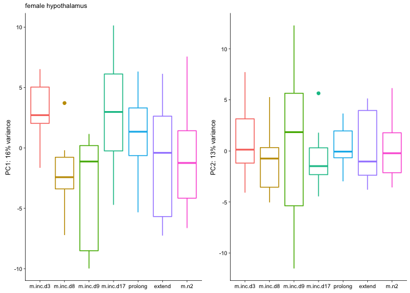

    pitPCA <- returnPCAs2(vsd.pit)

    FALSE [1] "Percent variance explained by PC 1-6"
    FALSE [1] 14 12  8  5  3  3
    FALSE [1] "PC1 ~ treatment * sex, data=pcadata"
    FALSE                Df Sum Sq Mean Sq F value   Pr(>F)    
    FALSE treatment       6  426.7    71.1   4.266 0.000612 ***
    FALSE sex             1  623.1   623.1  37.385 1.18e-08 ***
    FALSE treatment:sex   6   67.3    11.2   0.673 0.671453    
    FALSE Residuals     123 2050.1    16.7                     
    FALSE ---
    FALSE Signif. codes:  0 '***' 0.001 '**' 0.01 '*' 0.05 '.' 0.1 ' ' 1
    FALSE [1] "PC2 ~ treatment * sex, data=pcadata"
    FALSE                Df Sum Sq Mean Sq F value   Pr(>F)    
    FALSE treatment       6  433.4    72.2  14.782 1.15e-12 ***
    FALSE sex             1 1635.2  1635.2 334.649  < 2e-16 ***
    FALSE treatment:sex   6   95.7    15.9   3.263  0.00519 ** 
    FALSE Residuals     123  601.0     4.9                     
    FALSE ---
    FALSE Signif. codes:  0 '***' 0.001 '**' 0.01 '*' 0.05 '.' 0.1 ' ' 1
    FALSE [1] "PC3 ~ treatment * sex, data=pcadata"
    FALSE                Df Sum Sq Mean Sq F value   Pr(>F)    
    FALSE treatment       6  880.3  146.72  29.758  < 2e-16 ***
    FALSE sex             1  212.9  212.91  43.183 1.27e-09 ***
    FALSE treatment:sex   6   52.4    8.74   1.772     0.11    
    FALSE Residuals     123  606.4    4.93                     
    FALSE ---
    FALSE Signif. codes:  0 '***' 0.001 '**' 0.01 '*' 0.05 '.' 0.1 ' ' 1
    FALSE [1] "PC4 ~ treatment * sex, data=pcadata"
    FALSE                Df Sum Sq Mean Sq F value   Pr(>F)    
    FALSE treatment       6  541.7   90.29  18.126 5.44e-15 ***
    FALSE sex             1   50.4   50.37  10.112  0.00186 ** 
    FALSE treatment:sex   6   67.0   11.17   2.242  0.04350 *  
    FALSE Residuals     123  612.7    4.98                     
    FALSE ---
    FALSE Signif. codes:  0 '***' 0.001 '**' 0.01 '*' 0.05 '.' 0.1 ' ' 1
    FALSE [1] "PC5 ~ treatment * sex, data=pcadata"
    FALSE                Df Sum Sq Mean Sq F value   Pr(>F)    
    FALSE treatment       6  117.0  19.500   4.223 0.000671 ***
    FALSE sex             1    1.7   1.703   0.369 0.544806    
    FALSE treatment:sex   6   25.4   4.241   0.918 0.484172    
    FALSE Residuals     123  568.0   4.618                     
    FALSE ---
    FALSE Signif. codes:  0 '***' 0.001 '**' 0.01 '*' 0.05 '.' 0.1 ' ' 1
    FALSE [1] "PC6 ~ treatment * sex, data=pcadata"
    FALSE                Df Sum Sq Mean Sq F value Pr(>F)  
    FALSE treatment       6   65.5  10.922   2.704 0.0168 *
    FALSE sex             1    1.9   1.917   0.475 0.4921  
    FALSE treatment:sex   6   68.2  11.361   2.813 0.0134 *
    FALSE Residuals     123  496.8   4.039                 
    FALSE ---
    FALSE Signif. codes:  0 '***' 0.001 '**' 0.01 '*' 0.05 '.' 0.1 ' ' 1

    plotPC12(pitPCA, "Pituitary")

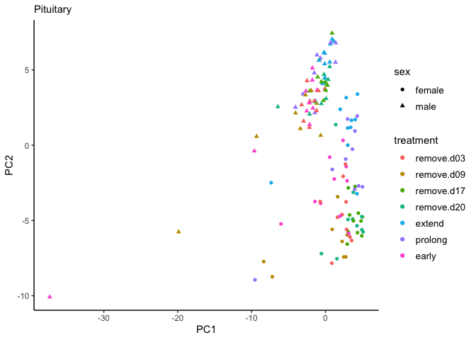

    gonPCA <- returnPCAs2(vsd.gon)

    FALSE [1] "Percent variance explained by PC 1-6"
    FALSE [1] 94  2  1  1  0  0
    FALSE [1] "PC1 ~ treatment * sex, data=pcadata"
    FALSE                Df Sum Sq Mean Sq  F value Pr(>F)    
    FALSE treatment       6    301      50    0.296  0.938    
    FALSE sex             1 370141  370141 2183.471 <2e-16 ***
    FALSE treatment:sex   6   1841     307    1.810  0.103    
    FALSE Residuals     122  20681     170                    
    FALSE ---
    FALSE Signif. codes:  0 '***' 0.001 '**' 0.01 '*' 0.05 '.' 0.1 ' ' 1
    FALSE [1] "PC2 ~ treatment * sex, data=pcadata"
    FALSE                Df Sum Sq Mean Sq F value Pr(>F)
    FALSE treatment       6    116   19.34   0.365  0.900
    FALSE sex             1      0    0.02   0.000  0.985
    FALSE treatment:sex   6     80   13.38   0.252  0.958
    FALSE Residuals     122   6468   53.02               
    FALSE [1] "PC3 ~ treatment * sex, data=pcadata"
    FALSE                Df Sum Sq Mean Sq F value Pr(>F)
    FALSE treatment       6  168.1   28.02   1.529  0.174
    FALSE sex             1    0.8    0.82   0.045  0.833
    FALSE treatment:sex   6  185.7   30.95   1.689  0.129
    FALSE Residuals     122 2236.1   18.33               
    FALSE [1] "PC4 ~ treatment * sex, data=pcadata"
    FALSE                Df Sum Sq Mean Sq F value Pr(>F)
    FALSE treatment       6  109.7  18.278   1.054  0.394
    FALSE sex             1    1.2   1.168   0.067  0.796
    FALSE treatment:sex   6   87.0  14.498   0.836  0.544
    FALSE Residuals     122 2115.8  17.343               
    FALSE [1] "PC5 ~ treatment * sex, data=pcadata"
    FALSE                Df Sum Sq Mean Sq F value  Pr(>F)   
    FALSE treatment       6  162.8  27.127   3.295 0.00486 **
    FALSE sex             1    0.4   0.388   0.047 0.82842   
    FALSE treatment:sex   6   16.5   2.755   0.335 0.91744   
    FALSE Residuals     122 1004.3   8.232                   
    FALSE ---
    FALSE Signif. codes:  0 '***' 0.001 '**' 0.01 '*' 0.05 '.' 0.1 ' ' 1
    FALSE [1] "PC6 ~ treatment * sex, data=pcadata"
    FALSE                Df Sum Sq Mean Sq F value  Pr(>F)   
    FALSE treatment       6   78.0  13.006   2.209 0.04653 * 
    FALSE sex             1    0.0   0.004   0.001 0.97974   
    FALSE treatment:sex   6  121.3  20.210   3.433 0.00363 **
    FALSE Residuals     122  718.2   5.887                   
    FALSE ---
    FALSE Signif. codes:  0 '***' 0.001 '**' 0.01 '*' 0.05 '.' 0.1 ' ' 1

    plotPC12(gonPCA, "Gonad")

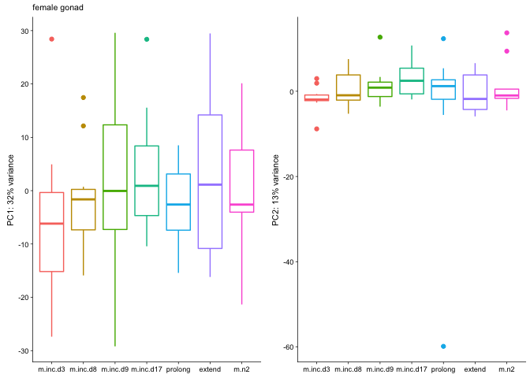

Linear discriminant analysis (LDA)
----------------------------------

<a href="http://www.sthda.com/english/articles/36-classification-methods-essentials/146-discriminant-analysis-essentials-in-r/" class="uri">http://www.sthda.com/english/articles/36-classification-methods-essentials/146-discriminant-analysis-essentials-in-r/</a>

    # prep col data for LDA
    colDataHyp <- subsetcolData2(c.colData, c("female_hypothalamus", "male_hypothalamus"))
    colDataPit <- subsetcolData2(c.colData, c("female_pituitary", "male_pituitary"))
    colDataGon <- subsetcolData2(c.colData, c("female_gonad", "male_gonad"))

    # LDA for treatment (7 groups)
    LDA.hyp1 <- LDAdata.treatment(vsd.hyp, colDataHyp)

    FALSE [1] "model accuracy"
    FALSE [1] "predictions$class==test.transformed$treatment)"
    FALSE [1] 0.1851852
    FALSE [1] "the samples sizes"
    FALSE remove.d03 remove.d09 remove.d17 remove.d20     extend    prolong 
    FALSE         16         14         17         16         16         16 
    FALSE      early 
    FALSE         16 
    FALSE [1] "the prior probabilities used"
    FALSE remove.d03 remove.d09 remove.d17 remove.d20     extend    prolong 
    FALSE  0.1441441  0.1261261  0.1531532  0.1441441  0.1441441  0.1441441 
    FALSE      early 
    FALSE  0.1441441 
    FALSE [1] "svd: the singular values, which give the ratio of the between- and within-group standard deviations on the linear discriminant variables. Their squares are the canonical F-statistics."
    FALSE [1] 3.7984170 3.0810558 2.4986907 2.3447344 1.6901385 0.8422261

    LDA.pit1 <- LDAdata.treatment(vsd.pit, colDataPit)

    FALSE [1] "model accuracy"
    FALSE [1] "predictions$class==test.transformed$treatment)"
    FALSE [1] 0.4074074
    FALSE [1] "the samples sizes"
    FALSE remove.d03 remove.d09 remove.d17 remove.d20     extend    prolong 
    FALSE         16         13         17         16         16         16 
    FALSE      early 
    FALSE         16 
    FALSE [1] "the prior probabilities used"
    FALSE remove.d03 remove.d09 remove.d17 remove.d20     extend    prolong 
    FALSE  0.1454545  0.1181818  0.1545455  0.1454545  0.1454545  0.1454545 
    FALSE      early 
    FALSE  0.1454545 
    FALSE [1] "svd: the singular values, which give the ratio of the between- and within-group standard deviations on the linear discriminant variables. Their squares are the canonical F-statistics."
    FALSE [1] 6.188592 3.604309 2.513707 2.262699 2.116880 1.705417

    LDA.gon1 <- LDAdata.treatment(vsd.gon, colDataGon)

    FALSE [1] "model accuracy"
    FALSE [1] "predictions$class==test.transformed$treatment)"
    FALSE [1] 0.1538462
    FALSE [1] "the samples sizes"
    FALSE remove.d03 remove.d09 remove.d17 remove.d20     extend    prolong 
    FALSE         16         13         17         16         16         16 
    FALSE      early 
    FALSE         16 
    FALSE [1] "the prior probabilities used"
    FALSE remove.d03 remove.d09 remove.d17 remove.d20     extend    prolong 
    FALSE  0.1454545  0.1181818  0.1545455  0.1454545  0.1454545  0.1454545 
    FALSE      early 
    FALSE  0.1454545 
    FALSE [1] "svd: the singular values, which give the ratio of the between- and within-group standard deviations on the linear discriminant variables. Their squares are the canonical F-statistics."
    FALSE [1] 4.066997 2.782389 2.559115 1.843717 1.766733 1.301911

    # figures for both of the above

    # treatment
    a <- LDAplot.manipulation(LDA.hyp1 , "Hypothalamus model 1", "parental state ~ .  0.185 pred. acc.",
                            "LD1, F = 3.7984170", "LD2, F = 3.0810558")

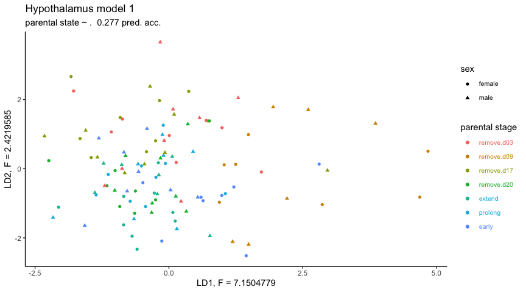

    b <- LDAplot.manipulation(LDA.pit1 ,  "Pituitary model 1", "parental state ~ .  0.407 pred. acc.",
                            "LD1, F = 6.188592", "LD2, F = 3.604309")

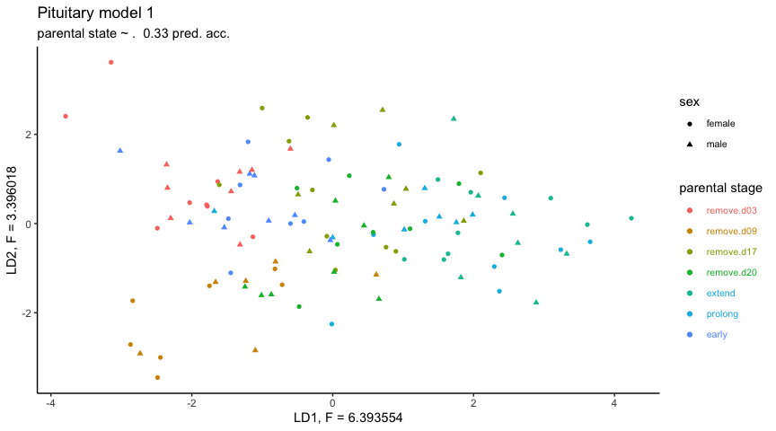

    c <- LDAplot.manipulation(LDA.gon1 , "Gonad model 1", "parental state ~ .  has 0.154 pred. acc.",
                            "LD1, F = 4.066997", "LD2, F = 2.782389")

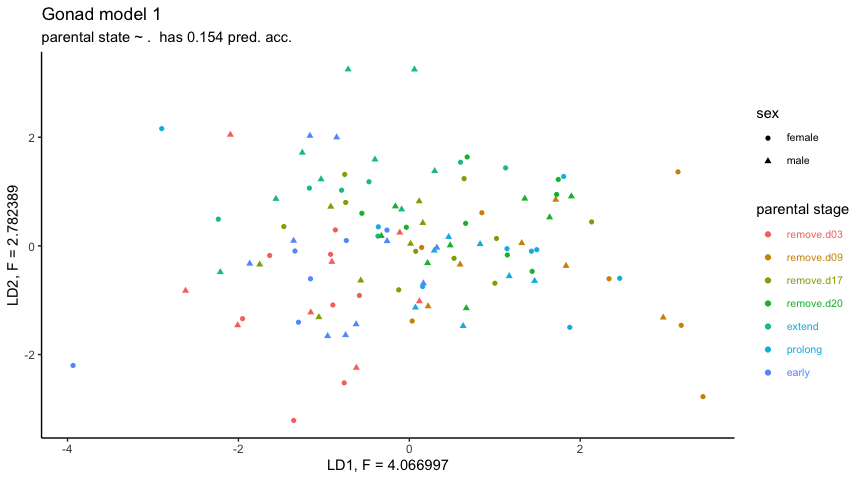

    c <- c + theme(legend.direction = "horizontal")
    mylegend <- get_legend(c)

    temp <- plot_grid(a + theme(legend.position = "none"),
                      b + theme(legend.position = "none"),
                      c + theme(legend.position = "none"), nrow = 1)

    plot_grid(temp, mylegend, nrow = 2, rel_heights = c(1,0.3))

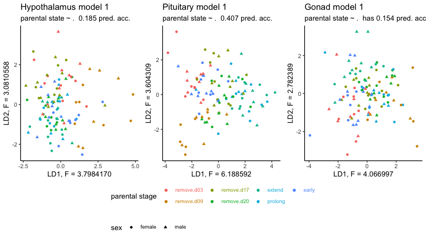

plot genes in a PRL WGCNA module
--------------------------------

    plotWGCNAcandidatesManip(vsd.pit, c("NP_990797.2", "NP_001090992.1", "NP_990136.1", "NP_001035179.1"), colDataPit, "PRL, VIPR1, TH & AR expression, Pituitary")

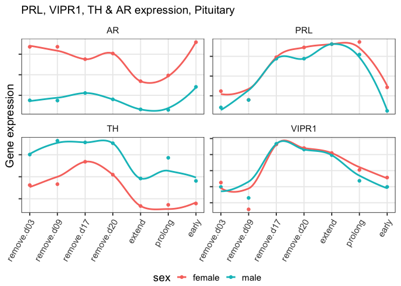

    plotWGCNAcandidatesManip(vsd.hyp, c("NP_001170780.1", "NP_001090992.1", "NP_001014970.1"), colDataHyp, "VIP expression, Hypothalamus")

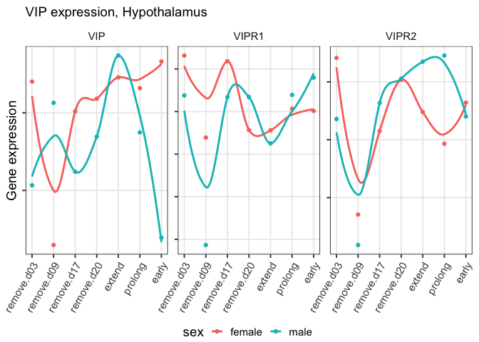

    plotWGCNAcandidatesManip(vsd.pit,c("NP_990797.2","NP_001004392.2", "NP_001004403.1", "NP_001006255.2", "NP_001006274.1",
                               "NP_989500.1", "XP_001234815.2", "XP_015149152.1", "XP_416110.5"),
                        colDataPit, "Part of 9 genes in the same WGCNA module as PRL in the characterization study")

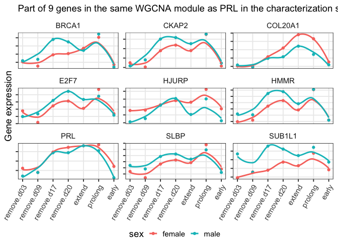

    plotWGCNAcandidatesManip(vsd.pit,
                        c("XP_428110.3","NP_001004392.2",  "XP_015142961.1", "XP_015139636.1",
                          "XP_015137408.1", "XP_004938696.1", "NP_990620.1", "NP_001170793.2", "XP_015132722.1"),
                        colDataPit, "Part of 9 genes in the same WGCNA module as PRLR in the characterization study")

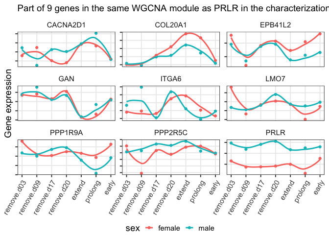

    plotWGCNAcandidatesManip(vsd.pit, c("NP_989957.1", "NP_001120784.1", "NP_001120786.1",
                                   "NP_001131120.1", "NP_001186037.1", "NP_989871.1",
                                   "NP_990797.2", "XP_015132722.1", "XP_015132722.1", "NP_001090992.1"), colDataPit, "Pitutary: CISH, SOCS, PRL, PRLR")

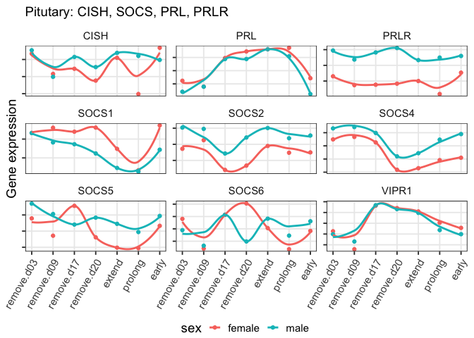

    plotWGCNAcandidatesManip(vsd.hyp, c("NP_989957.1", "NP_001120784.1", "NP_001120786.1",
                                   "NP_001131120.1", "NP_001186037.1", "NP_989871.1",
                                   "NP_990797.2", "XP_015132722.1", "NP_001090992.1"), colDataHyp, "Hypothalamus: CISH, SOCS, PRL, PRLR")

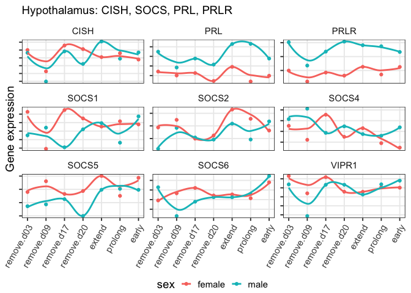

    plotWGCNAcandidatesManip(vsd.gon, c("NP_989957.1", "NP_001120784.1", "NP_001120786.1",
                                   "NP_001131120.1", "NP_001186037.1", "NP_989871.1",
                                   "NP_990797.2", "XP_015132722.1", "NP_001090992.1"), colDataGon, "Gonad: CISH, SOCS, PRL, PRLR")

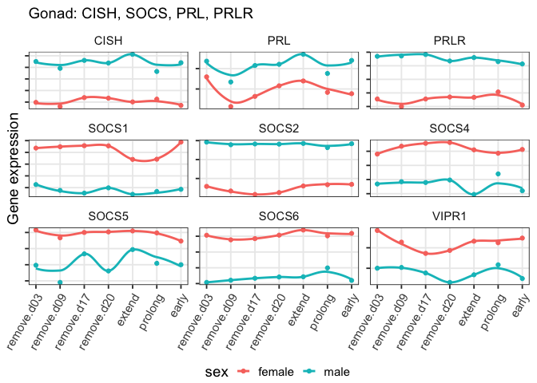

genes that were in the WGCNA module with PRL twice!
---------------------------------------------------

    PRL_associated <- read.csv("../results/08_PRL_associated.csv", header = T)
    PRL_manipulated <- read.csv("../results/08_PRL_manipulated.csv", header = T)

    str(PRL_associated)

    FALSE 'data.frame': 102 obs. of  5 variables:
    FALSE  $ net.unmergedColors: Factor w/ 1 level "greenyellow": 1 1 1 1 1 1 1 1 1 1 ...
    FALSE  $ entrezid          : Factor w/ 102 levels "NP_001004392.2",..: 102 89 9 98 84 7 33 8 47 23 ...
    FALSE  $ row.names         : int  431627 100857739 423846 424354 428167 374078 373983 421226 423007 421019 ...
    FALSE  $ Name              : Factor w/ 101 levels "ACOT12","ANKLE1",..: 1 2 3 4 5 6 7 8 9 10 ...
    FALSE  $ geneid            : int  431627 100857739 423846 424354 428167 374078 373983 421226 423007 421019 ...

    str(PRL_manipulated)

    FALSE 'data.frame': 358 obs. of  5 variables:
    FALSE  $ net.unmergedColors: Factor w/ 1 level "black": 1 1 1 1 1 1 1 1 1 1 ...
    FALSE  $ entrezid          : Factor w/ 358 levels "NP_001001461.1",..: 17 282 283 341 264 301 53 323 244 247 ...
    FALSE  $ row.names         : int  395416 422099 422099 423072 418200 420090 374087 420461 422882 423042 ...
    FALSE  $ Name              : Factor w/ 354 levels "ABCC1","ABCC3",..: 1 2 2 3 4 5 6 7 8 9 ...
    FALSE  $ geneid            : int  395416 422099 422099 423072 418200 420090 374087 420461 422882 423042 ...

    PRLjoin <- inner_join(PRL_associated, PRL_manipulated, by = "entrezid")

    PRLboth <- PRLjoin$entrezid
    PRLboth

    FALSE  [1] "NP_001004392.2" "NP_990016.1"    "XP_001232071.1" "XP_015128663.1"
    FALSE  [5] "NP_001039301.1" "NP_001026503.1" "NP_001026209.1" "XP_004939719.1"
    FALSE  [9] "NP_001292058.1" "NP_001026123.1" "XP_015152316.1" "XP_416549.4"   
    FALSE [13] "NP_990797.2"    "NP_001264669.1" "NP_001279000.1" "XP_004947617.1"

    plotWGCNAcandidatesManip(vsd.pit, PRLboth, colDataPit, "PRL char and manip WGNA shared modules")

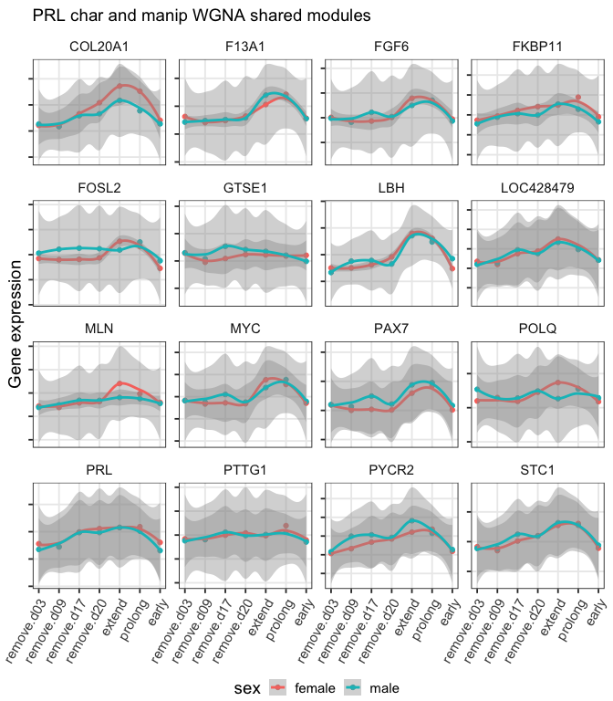

    prl36 <-  PRL_manipulated$entrezid[252:271]
    plotWGCNAcandidatesManip(vsd.pit, prl36, colDataPit, "PRL-RIPK3 pattern in the PRL module")

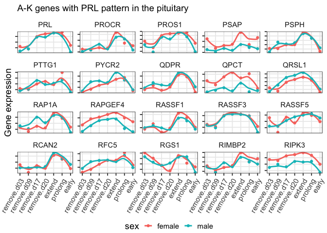
