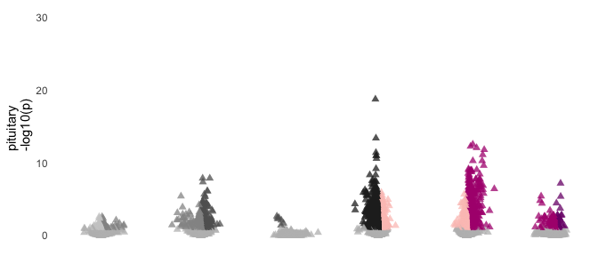
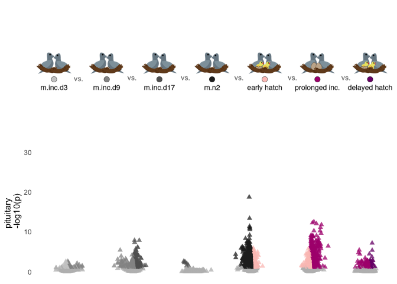

DEseq2 analysis on characterization. Looking at treatment AND sex for each tissue
---------------------------------------------------------------------------------

    # import "colData" which contains sample information and "countData" which contains read counts
    c.colData <- read.csv("../metadata/00_colData_manipluation.csv", header = T, row.names = 1)
    c.countData <- read.csv("../results/00_countData_manipluation.csv", header = T, row.names = 1)
    geneinfo <- read.csv("../metadata/00_geneinfo.csv", row.names = 1)

    # set treatment levels

    # craete variable that will be critical for subset later on
    c.colData$sextissue <- as.factor(paste(c.colData$sex, c.colData$tissue, sep = "_"))

    # rename some factors
    levels(c.colData$treatment)

    FALSE [1] "extend"    "m.inc.d17" "m.inc.d3"  "m.inc.d8"  "m.inc.d9"  "m.n2"     
    FALSE [7] "prolong"

    # "extend"    "m.inc.d17" "m.inc.d3"  "m.inc.d8"  "m.inc.d9"  "m.n2"      "prolong" 

    c.colData$treatment <- factor(c.colData$treatment, levels = maniplevels1)
    levels(c.colData$treatment)

    FALSE [1] "m.inc.d3"  "m.inc.d8"  "m.inc.d9"  "m.inc.d17" "m.n2"      "prolong"  
    FALSE [7] "extend"

    # drop columsn that are bad for model AND not needed for later joining
    c.colData$bird <- NULL
    c.colData$tissue <- NULL
    c.colData$study <- NULL
    c.colData$group <- NULL
    head(c.colData)

    FALSE                                                                                  V1
    FALSE blk.s030.o.g_male_gonad_prolong                     blk.s030.o.g_male_gonad_prolong
    FALSE blk.s030.o.g_male_hypothalamus_prolong       blk.s030.o.g_male_hypothalamus_prolong
    FALSE blk.s030.o.g_male_pituitary_prolong             blk.s030.o.g_male_pituitary_prolong
    FALSE blk.s031.pu.d_female_gonad_prolong               blk.s031.pu.d_female_gonad_prolong
    FALSE blk.s031.pu.d_female_hypothalamus_prolong blk.s031.pu.d_female_hypothalamus_prolong
    FALSE blk.s031.pu.d_female_pituitary_prolong       blk.s031.pu.d_female_pituitary_prolong
    FALSE                                              sex treatment
    FALSE blk.s030.o.g_male_gonad_prolong             male   prolong
    FALSE blk.s030.o.g_male_hypothalamus_prolong      male   prolong
    FALSE blk.s030.o.g_male_pituitary_prolong         male   prolong
    FALSE blk.s031.pu.d_female_gonad_prolong        female   prolong
    FALSE blk.s031.pu.d_female_hypothalamus_prolong female   prolong
    FALSE blk.s031.pu.d_female_pituitary_prolong    female   prolong
    FALSE                                                     sextissue
    FALSE blk.s030.o.g_male_gonad_prolong                    male_gonad
    FALSE blk.s030.o.g_male_hypothalamus_prolong      male_hypothalamus
    FALSE blk.s030.o.g_male_pituitary_prolong            male_pituitary
    FALSE blk.s031.pu.d_female_gonad_prolong               female_gonad
    FALSE blk.s031.pu.d_female_hypothalamus_prolong female_hypothalamus
    FALSE blk.s031.pu.d_female_pituitary_prolong       female_pituitary

    str(c.colData)

    FALSE 'data.frame': 411 obs. of  4 variables:
    FALSE  $ V1       : Factor w/ 411 levels "blk.s030.o.g_male_gonad_prolong",..: 1 2 3 4 5 6 7 8 9 10 ...
    FALSE  $ sex      : Factor w/ 2 levels "female","male": 2 2 2 1 1 1 1 1 1 1 ...
    FALSE  $ treatment: Factor w/ 7 levels "m.inc.d3","m.inc.d8",..: 6 6 6 6 6 6 5 5 5 1 ...
    FALSE  $ sextissue: Factor w/ 6 levels "female_gonad",..: 4 5 6 1 2 3 1 2 3 1 ...

    geneinfo <- read.csv("../metadata/00_geneinfo.csv", row.names = 1)
    head(geneinfo)

    FALSE                row.names     Name geneid       entrezid
    FALSE NP_001001127.1    408082    EDNRB 408082 NP_001001127.1
    FALSE NP_001001129.1    408183  CYP26A1 408183 NP_001001129.1
    FALSE NP_001001189.1    374073    CFDP1 374073 NP_001001189.1
    FALSE NP_001001194.1    407777    AvBD7 407777 NP_001001194.1
    FALSE NP_001001195.1    407779     KRT5 407779 NP_001001195.1
    FALSE NP_001001201.1    408034 HSD11B1L 408034 NP_001001201.1

    dds.hypothalamus <- subsetDESeq2(c.colData,  c.countData, c("female_hypothalamus","male_hypothalamus") )

    FALSE class: DESeqDataSet 
    FALSE dim: 14937 138 
    FALSE metadata(1): version
    FALSE assays(1): counts
    FALSE rownames(14937): NP_001001127.1 NP_001001129.1 ... XP_430449.2
    FALSE   XP_430508.3
    FALSE rowData names(0):
    FALSE colnames(138): blk.s030.o.g_male_hypothalamus_prolong
    FALSE   blk.s031.pu.d_female_hypothalamus_prolong ...
    FALSE   y85.r71.x_female_hypothalamus_m.inc.d17
    FALSE   y98.g54_female_hypothalamus_m.hatch
    FALSE colData names(4): V1 sex treatment sextissue
    FALSE [1] 14514   138

    dds.pituitary <- subsetDESeq2(c.colData,  c.countData, c("female_pituitary", "male_pituitary" ) )

    FALSE class: DESeqDataSet 
    FALSE dim: 14937 137 
    FALSE metadata(1): version
    FALSE assays(1): counts
    FALSE rownames(14937): NP_001001127.1 NP_001001129.1 ... XP_430449.2
    FALSE   XP_430508.3
    FALSE rowData names(0):
    FALSE colnames(137): blk.s030.o.g_male_pituitary_prolong
    FALSE   blk.s031.pu.d_female_pituitary_prolong ...
    FALSE   y85.r71.x_female_pituitary_m.inc.d17
    FALSE   y98.g54_female_pituitary_m.hatch
    FALSE colData names(4): V1 sex treatment sextissue
    FALSE [1] 14488   137

    dds.gonad <- subsetDESeq2(c.colData,  c.countData, c("female_gonad", "male_gonad") )

    FALSE class: DESeqDataSet 
    FALSE dim: 14937 136 
    FALSE metadata(1): version
    FALSE assays(1): counts
    FALSE rownames(14937): NP_001001127.1 NP_001001129.1 ... XP_430449.2
    FALSE   XP_430508.3
    FALSE rowData names(0):
    FALSE colnames(136): blk.s030.o.g_male_gonad_prolong
    FALSE   blk.s031.pu.d_female_gonad_prolong ...
    FALSE   y85.r71.x_female_gonad_m.inc.d17 y98.g54_female_gonad_m.hatch
    FALSE colData names(4): V1 sex treatment sextissue
    FALSE [1] 14843   136

total degs
----------

This one won’t work yet because I have a filter step that slims the data
to a subset of the characterization data.

    DEGs.pituitary <- returntotalDEGs(dds.pituitary)
    plottotalDEGs(DEGs.pituitary, "Male & Female Pituitary DEGs")

Variance stabilized data
------------------------

    vsd.hyp <- vst(dds.hypothalamus, blind=FALSE) 
    vsd.pit <- vst(dds.pituitary, blind=FALSE) 
    vsd.gon <- vst(dds.gonad, blind=FALSE) 

    vsd.hyp.df <- vsd.dataframe(vsd.hyp) 
    vsd.pit.df <- vsd.dataframe(vsd.pit) 
    vsd.gon.df <- vsd.dataframe(vsd.gon) 

PCA
---

    hypPCA <- returnPCAs2(vsd.hyp)

    FALSE [1] "Percent variance explained by PC 1-6"
    FALSE [1] 14 11  9  5  3  3
    FALSE [1] "PC1 ~ treatment * sex, data=pcadata"
    FALSE                Df Sum Sq Mean Sq F value   Pr(>F)    
    FALSE treatment       6  474.1    79.0   5.503 4.42e-05 ***
    FALSE sex             1  623.4   623.4  43.414 1.14e-09 ***
    FALSE treatment:sex   6  181.9    30.3   2.111   0.0566 .  
    FALSE Residuals     124 1780.7    14.4                     
    FALSE ---
    FALSE Signif. codes:  0 '***' 0.001 '**' 0.01 '*' 0.05 '.' 0.1 ' ' 1
    FALSE [1] "PC2 ~ treatment * sex, data=pcadata"
    FALSE                Df Sum Sq Mean Sq F value  Pr(>F)    
    FALSE treatment       6   92.6    15.4    3.87 0.00142 ** 
    FALSE sex             1 1677.4  1677.4  420.49 < 2e-16 ***
    FALSE treatment:sex   6   34.5     5.7    1.44 0.20453    
    FALSE Residuals     124  494.6     4.0                    
    FALSE ---
    FALSE Signif. codes:  0 '***' 0.001 '**' 0.01 '*' 0.05 '.' 0.1 ' ' 1
    FALSE [1] "PC3 ~ treatment * sex, data=pcadata"
    FALSE                Df Sum Sq Mean Sq F value  Pr(>F)   
    FALSE treatment       6   36.4    6.06   0.464 0.83375   
    FALSE sex             1   98.8   98.84   7.569 0.00683 **
    FALSE treatment:sex   6   85.2   14.20   1.087 0.37370   
    FALSE Residuals     124 1619.2   13.06                   
    FALSE ---
    FALSE Signif. codes:  0 '***' 0.001 '**' 0.01 '*' 0.05 '.' 0.1 ' ' 1
    FALSE [1] "PC4 ~ treatment * sex, data=pcadata"
    FALSE                Df Sum Sq Mean Sq F value   Pr(>F)    
    FALSE treatment       6  229.5   38.25   6.552 4.96e-06 ***
    FALSE sex             1    0.3    0.32   0.054    0.817    
    FALSE treatment:sex   6   23.1    3.85   0.659    0.683    
    FALSE Residuals     124  723.8    5.84                     
    FALSE ---
    FALSE Signif. codes:  0 '***' 0.001 '**' 0.01 '*' 0.05 '.' 0.1 ' ' 1
    FALSE [1] "PC5 ~ treatment * sex, data=pcadata"
    FALSE                Df Sum Sq Mean Sq F value Pr(>F)
    FALSE treatment       6   24.9   4.145   0.914  0.487
    FALSE sex             1    2.9   2.864   0.632  0.428
    FALSE treatment:sex   6   38.5   6.419   1.416  0.214
    FALSE Residuals     124  562.2   4.534               
    FALSE [1] "PC6 ~ treatment * sex, data=pcadata"
    FALSE                Df Sum Sq Mean Sq F value Pr(>F)
    FALSE treatment       6   24.7   4.118   1.027  0.411
    FALSE sex             1    0.0   0.012   0.003  0.956
    FALSE treatment:sex   6   21.7   3.616   0.902  0.496
    FALSE Residuals     124  497.3   4.010

    plotPC12(hypPCA, "Hypothalamus")

    pitPCA <- returnPCAs2(vsd.pit)

    FALSE [1] "Percent variance explained by PC 1-6"
    FALSE [1] 14 12  8  5  3  3
    FALSE [1] "PC1 ~ treatment * sex, data=pcadata"
    FALSE                Df Sum Sq Mean Sq F value   Pr(>F)    
    FALSE treatment       6  426.7    71.1   4.266 0.000612 ***
    FALSE sex             1  623.1   623.1  37.385 1.18e-08 ***
    FALSE treatment:sex   6   67.3    11.2   0.673 0.671453    
    FALSE Residuals     123 2050.1    16.7                     
    FALSE ---
    FALSE Signif. codes:  0 '***' 0.001 '**' 0.01 '*' 0.05 '.' 0.1 ' ' 1
    FALSE [1] "PC2 ~ treatment * sex, data=pcadata"
    FALSE                Df Sum Sq Mean Sq F value   Pr(>F)    
    FALSE treatment       6  433.4    72.2  14.782 1.15e-12 ***
    FALSE sex             1 1635.2  1635.2 334.649  < 2e-16 ***
    FALSE treatment:sex   6   95.7    15.9   3.263  0.00519 ** 
    FALSE Residuals     123  601.0     4.9                     
    FALSE ---
    FALSE Signif. codes:  0 '***' 0.001 '**' 0.01 '*' 0.05 '.' 0.1 ' ' 1
    FALSE [1] "PC3 ~ treatment * sex, data=pcadata"
    FALSE                Df Sum Sq Mean Sq F value   Pr(>F)    
    FALSE treatment       6  880.3  146.72  29.758  < 2e-16 ***
    FALSE sex             1  212.9  212.91  43.183 1.27e-09 ***
    FALSE treatment:sex   6   52.4    8.74   1.772     0.11    
    FALSE Residuals     123  606.4    4.93                     
    FALSE ---
    FALSE Signif. codes:  0 '***' 0.001 '**' 0.01 '*' 0.05 '.' 0.1 ' ' 1
    FALSE [1] "PC4 ~ treatment * sex, data=pcadata"
    FALSE                Df Sum Sq Mean Sq F value   Pr(>F)    
    FALSE treatment       6  541.7   90.29  18.126 5.44e-15 ***
    FALSE sex             1   50.4   50.37  10.112  0.00186 ** 
    FALSE treatment:sex   6   67.0   11.17   2.242  0.04350 *  
    FALSE Residuals     123  612.7    4.98                     
    FALSE ---
    FALSE Signif. codes:  0 '***' 0.001 '**' 0.01 '*' 0.05 '.' 0.1 ' ' 1
    FALSE [1] "PC5 ~ treatment * sex, data=pcadata"
    FALSE                Df Sum Sq Mean Sq F value   Pr(>F)    
    FALSE treatment       6  117.0  19.500   4.223 0.000671 ***
    FALSE sex             1    1.7   1.703   0.369 0.544806    
    FALSE treatment:sex   6   25.4   4.241   0.918 0.484172    
    FALSE Residuals     123  568.0   4.618                     
    FALSE ---
    FALSE Signif. codes:  0 '***' 0.001 '**' 0.01 '*' 0.05 '.' 0.1 ' ' 1
    FALSE [1] "PC6 ~ treatment * sex, data=pcadata"
    FALSE                Df Sum Sq Mean Sq F value Pr(>F)  
    FALSE treatment       6   65.5  10.922   2.704 0.0168 *
    FALSE sex             1    1.9   1.917   0.475 0.4921  
    FALSE treatment:sex   6   68.2  11.361   2.813 0.0134 *
    FALSE Residuals     123  496.8   4.039                 
    FALSE ---
    FALSE Signif. codes:  0 '***' 0.001 '**' 0.01 '*' 0.05 '.' 0.1 ' ' 1

    plotPC12(pitPCA, "Pituitary")

    gonPCA <- returnPCAs2(vsd.gon)

    FALSE [1] "Percent variance explained by PC 1-6"
    FALSE [1] 94  2  1  1  0  0
    FALSE [1] "PC1 ~ treatment * sex, data=pcadata"
    FALSE                Df Sum Sq Mean Sq  F value Pr(>F)    
    FALSE treatment       6    301      50    0.296  0.938    
    FALSE sex             1 370141  370141 2183.471 <2e-16 ***
    FALSE treatment:sex   6   1841     307    1.810  0.103    
    FALSE Residuals     122  20681     170                    
    FALSE ---
    FALSE Signif. codes:  0 '***' 0.001 '**' 0.01 '*' 0.05 '.' 0.1 ' ' 1
    FALSE [1] "PC2 ~ treatment * sex, data=pcadata"
    FALSE                Df Sum Sq Mean Sq F value Pr(>F)
    FALSE treatment       6    116   19.34   0.365  0.900
    FALSE sex             1      0    0.02   0.000  0.985
    FALSE treatment:sex   6     80   13.38   0.252  0.958
    FALSE Residuals     122   6468   53.02               
    FALSE [1] "PC3 ~ treatment * sex, data=pcadata"
    FALSE                Df Sum Sq Mean Sq F value Pr(>F)
    FALSE treatment       6  168.1   28.02   1.529  0.174
    FALSE sex             1    0.8    0.82   0.045  0.833
    FALSE treatment:sex   6  185.7   30.95   1.689  0.129
    FALSE Residuals     122 2236.1   18.33               
    FALSE [1] "PC4 ~ treatment * sex, data=pcadata"
    FALSE                Df Sum Sq Mean Sq F value Pr(>F)
    FALSE treatment       6  109.7  18.278   1.054  0.394
    FALSE sex             1    1.2   1.168   0.067  0.796
    FALSE treatment:sex   6   87.0  14.498   0.836  0.544
    FALSE Residuals     122 2115.8  17.343               
    FALSE [1] "PC5 ~ treatment * sex, data=pcadata"
    FALSE                Df Sum Sq Mean Sq F value  Pr(>F)   
    FALSE treatment       6  162.8  27.127   3.295 0.00486 **
    FALSE sex             1    0.4   0.388   0.047 0.82842   
    FALSE treatment:sex   6   16.5   2.755   0.335 0.91744   
    FALSE Residuals     122 1004.3   8.232                   
    FALSE ---
    FALSE Signif. codes:  0 '***' 0.001 '**' 0.01 '*' 0.05 '.' 0.1 ' ' 1
    FALSE [1] "PC6 ~ treatment * sex, data=pcadata"
    FALSE                Df Sum Sq Mean Sq F value  Pr(>F)   
    FALSE treatment       6   78.0  13.006   2.209 0.04653 * 
    FALSE sex             1    0.0   0.004   0.001 0.97974   
    FALSE treatment:sex   6  121.3  20.210   3.433 0.00363 **
    FALSE Residuals     122  718.2   5.887                   
    FALSE ---
    FALSE Signif. codes:  0 '***' 0.001 '**' 0.01 '*' 0.05 '.' 0.1 ' ' 1

    plotPC12(gonPCA, "Gonad")

Linear discriminant analysis (LDA)
----------------------------------

<a href="http://www.sthda.com/english/articles/36-classification-methods-essentials/146-discriminant-analysis-essentials-in-r/" class="uri">http://www.sthda.com/english/articles/36-classification-methods-essentials/146-discriminant-analysis-essentials-in-r/</a>

    # prep col data for LDA
    colDataHyp <- subsetcolData2(c.colData, c("female_hypothalamus", "male_hypothalamus"))
    colDataPit <- subsetcolData2(c.colData, c("female_pituitary", "male_pituitary"))
    colDataGon <- subsetcolData2(c.colData, c("female_gonad", "male_gonad"))

    # LDA for treatment (7 groups)
    LDA.hyp1 <- LDAdata.treatment(vsd.hyp, colDataHyp)

    FALSE [1] "model accuracy"
    FALSE [1] "predictions$class==test.transformed$treatment)"
    FALSE [1] 0.1851852
    FALSE [1] "the samples sizes"
    FALSE remove.d03 remove.d09 remove.d17 remove.d20     extend    prolong 
    FALSE         16         14         17         16         16         16 
    FALSE      early 
    FALSE         16 
    FALSE [1] "the prior probabilities used"
    FALSE remove.d03 remove.d09 remove.d17 remove.d20     extend    prolong 
    FALSE  0.1441441  0.1261261  0.1531532  0.1441441  0.1441441  0.1441441 
    FALSE      early 
    FALSE  0.1441441 
    FALSE [1] "svd: the singular values, which give the ratio of the between- and within-group standard deviations on the linear discriminant variables. Their squares are the canonical F-statistics."
    FALSE [1] 3.7984170 3.0810558 2.4986907 2.3447344 1.6901385 0.8422261

    LDA.pit1 <- LDAdata.treatment(vsd.pit, colDataPit)

    FALSE [1] "model accuracy"
    FALSE [1] "predictions$class==test.transformed$treatment)"
    FALSE [1] 0.4074074
    FALSE [1] "the samples sizes"
    FALSE remove.d03 remove.d09 remove.d17 remove.d20     extend    prolong 
    FALSE         16         13         17         16         16         16 
    FALSE      early 
    FALSE         16 
    FALSE [1] "the prior probabilities used"
    FALSE remove.d03 remove.d09 remove.d17 remove.d20     extend    prolong 
    FALSE  0.1454545  0.1181818  0.1545455  0.1454545  0.1454545  0.1454545 
    FALSE      early 
    FALSE  0.1454545 
    FALSE [1] "svd: the singular values, which give the ratio of the between- and within-group standard deviations on the linear discriminant variables. Their squares are the canonical F-statistics."
    FALSE [1] 6.188592 3.604309 2.513707 2.262699 2.116880 1.705417

    LDA.gon1 <- LDAdata.treatment(vsd.gon, colDataGon)

    FALSE [1] "model accuracy"
    FALSE [1] "predictions$class==test.transformed$treatment)"
    FALSE [1] 0.1538462
    FALSE [1] "the samples sizes"
    FALSE remove.d03 remove.d09 remove.d17 remove.d20     extend    prolong 
    FALSE         16         13         17         16         16         16 
    FALSE      early 
    FALSE         16 
    FALSE [1] "the prior probabilities used"
    FALSE remove.d03 remove.d09 remove.d17 remove.d20     extend    prolong 
    FALSE  0.1454545  0.1181818  0.1545455  0.1454545  0.1454545  0.1454545 
    FALSE      early 
    FALSE  0.1454545 
    FALSE [1] "svd: the singular values, which give the ratio of the between- and within-group standard deviations on the linear discriminant variables. Their squares are the canonical F-statistics."
    FALSE [1] 4.066997 2.782389 2.559115 1.843717 1.766733 1.301911

    # figures for both of the above

    # treatment
    a <- LDAplot.manipulation(LDA.hyp1 , "Hypothalamus model 1", "parental state ~ .  0.185 pred. acc.",
                            "LD1, F = 3.7984170", "LD2, F = 3.0810558")

    b <- LDAplot.manipulation(LDA.pit1 ,  "Pituitary model 1", "parental state ~ .  0.407 pred. acc.",
                            "LD1, F = 6.188592", "LD2, F = 3.604309")

    c <- LDAplot.manipulation(LDA.gon1 , "Gonad model 1", "parental state ~ .  has 0.154 pred. acc.",
                            "LD1, F = 4.066997", "LD2, F = 2.782389")

    c <- c + theme(legend.direction = "horizontal")
    mylegend <- get_legend(c)

    temp <- plot_grid(a + theme(legend.position = "none"),
                      b + theme(legend.position = "none"),
                      c + theme(legend.position = "none"), nrow = 1)

    plot_grid(temp, mylegend, nrow = 2, rel_heights = c(1,0.3))

plot genes in a PRL WGCNA module
--------------------------------

genes that were in the WGCNA module with PRL twice!
---------------------------------------------------

    PRL_associated <- read.csv("../results/08_PRL_associated.csv", header = T)
    PRL_manipulated <- read.csv("../results/08_PRL_manipulated.csv", header = T)

    str(PRL_associated)

    FALSE 'data.frame': 102 obs. of  5 variables:
    FALSE  $ net.unmergedColors: Factor w/ 1 level "greenyellow": 1 1 1 1 1 1 1 1 1 1 ...
    FALSE  $ entrezid          : Factor w/ 102 levels "NP_001004392.2",..: 102 89 9 98 84 7 33 8 47 23 ...
    FALSE  $ row.names         : int  431627 100857739 423846 424354 428167 374078 373983 421226 423007 421019 ...
    FALSE  $ Name              : Factor w/ 101 levels "ACOT12","ANKLE1",..: 1 2 3 4 5 6 7 8 9 10 ...
    FALSE  $ geneid            : int  431627 100857739 423846 424354 428167 374078 373983 421226 423007 421019 ...

    str(PRL_manipulated)

    FALSE 'data.frame': 358 obs. of  5 variables:
    FALSE  $ net.unmergedColors: Factor w/ 1 level "black": 1 1 1 1 1 1 1 1 1 1 ...
    FALSE  $ entrezid          : Factor w/ 358 levels "NP_001001461.1",..: 17 282 283 341 264 301 53 323 244 247 ...
    FALSE  $ row.names         : int  395416 422099 422099 423072 418200 420090 374087 420461 422882 423042 ...
    FALSE  $ Name              : Factor w/ 354 levels "ABCC1","ABCC3",..: 1 2 2 3 4 5 6 7 8 9 ...
    FALSE  $ geneid            : int  395416 422099 422099 423072 418200 420090 374087 420461 422882 423042 ...

    PRLjoin <- inner_join(PRL_associated, PRL_manipulated, by = "entrezid")

    PRLboth <- PRLjoin$entrezid
    PRLboth

    FALSE  [1] "NP_001004392.2" "NP_990016.1"    "XP_001232071.1" "XP_015128663.1"
    FALSE  [5] "NP_001039301.1" "NP_001026503.1" "NP_001026209.1" "XP_004939719.1"
    FALSE  [9] "NP_001292058.1" "NP_001026123.1" "XP_015152316.1" "XP_416549.4"   
    FALSE [13] "NP_990797.2"    "NP_001264669.1" "NP_001279000.1" "XP_004947617.1"

    plotWGCNAcandidatesManip(vsd.pit, PRLboth, colDataPit, "PRL char and manip WGNA shared modules")

    prl36 <-  PRL_manipulated$entrezid[252:271]
    plotWGCNAcandidatesManip(vsd.pit, prl36, colDataPit, "PRL-RIPK3 pattern in the PRL module")

volcano plots
-------------

    dds.pituitary <- subsetDESeq2(c.colData,  c.countData, c("female_pituitary","male_pituitary"))

    FALSE class: DESeqDataSet 
    FALSE dim: 14937 137 
    FALSE metadata(1): version
    FALSE assays(1): counts
    FALSE rownames(14937): NP_001001127.1 NP_001001129.1 ... XP_430449.2
    FALSE   XP_430508.3
    FALSE rowData names(0):
    FALSE colnames(137): blk.s030.o.g_male_pituitary_prolong
    FALSE   blk.s031.pu.d_female_pituitary_prolong ...
    FALSE   y85.r71.x_female_pituitary_m.inc.d17
    FALSE   y98.g54_female_pituitary_m.hatch
    FALSE colData names(4): V1 sex treatment sextissue
    FALSE [1] 14488   137

    dds.pituitary$treatment

    FALSE   [1] prolong   prolong   m.n2      m.inc.d3  m.inc.d3  m.inc.d8  m.n2     
    FALSE   [8] extend    m.inc.d3  m.n2      prolong   m.inc.d8  extend    m.inc.d3 
    FALSE  [15] m.inc.d9  m.inc.d8  extend    m.inc.d9  m.inc.d3  m.inc.d17 m.inc.d3 
    FALSE  [22] m.inc.d3  m.inc.d17 m.n2      m.n2      m.inc.d8  m.inc.d8  extend   
    FALSE  [29] m.inc.d17 prolong   m.inc.d8  m.inc.d3  extend    extend    extend   
    FALSE  [36] m.inc.d17 m.n2      prolong   m.inc.d17 m.inc.d9  extend    extend   
    FALSE  [43] m.n2      m.inc.d17 prolong   prolong   prolong   m.inc.d9  m.inc.d9 
    FALSE  [50] m.inc.d3  m.inc.d17 prolong   m.inc.d17 m.n2      m.inc.d9  m.inc.d9 
    FALSE  [57] m.inc.d17 m.inc.d8  prolong   m.inc.d17 m.n2      m.inc.d8  m.inc.d8 
    FALSE  [64] m.n2      m.inc.d3  extend    m.inc.d8  extend    extend    extend   
    FALSE  [71] prolong   m.inc.d9  m.inc.d8  prolong   m.inc.d9  m.inc.d9  prolong  
    FALSE  [78] prolong   m.inc.d8  m.inc.d17 m.inc.d8  m.n2      m.inc.d17 m.inc.d8 
    FALSE  [85] m.inc.d3  m.inc.d3  extend    m.n2      m.inc.d8  m.inc.d3  m.inc.d17
    FALSE  [92] m.inc.d17 m.inc.d3  extend    m.inc.d3  m.inc.d3  extend    m.n2     
    FALSE  [99] prolong   m.n2      m.inc.d9  prolong   extend    extend    m.n2     
    FALSE [106] m.inc.d17 m.n2      m.inc.d8  m.inc.d3  prolong   m.inc.d9  m.n2     
    FALSE [113] m.inc.d17 m.n2      extend    m.inc.d17 m.inc.d3  m.inc.d3  m.n2     
    FALSE [120] m.inc.d9  m.inc.d8  m.inc.d17 prolong   m.inc.d8  m.inc.d8  extend   
    FALSE [127] prolong   m.inc.d9  m.inc.d9  prolong   m.inc.d17 m.inc.d3  m.inc.d17
    FALSE [134] m.inc.d8  m.inc.d9  m.inc.d17 m.n2     
    FALSE Levels: m.inc.d3 m.inc.d8 m.inc.d9 m.inc.d17 m.n2 prolong extend

    createDEGdfmanip <- function(mydds, whichfactor, up, down, mytissue){
      res <- results(mydds, contrast =c(whichfactor, up, down),
                     independentFiltering = T, alpha = 0.1)
       data <- data.frame(entrezid = row.names(res),
                         padj = res$padj, 
                         logpadj = -log10(res$padj),
                         lfc = res$log2FoldChange,
                         tissue = mytissue)
      data <- na.omit(data)
      
      data <- data %>%
        dplyr::mutate(direction = ifelse(data$lfc > 0 & data$padj < 0.1, 
                                         yes = up, no = ifelse(data$lfc < 0 & data$padj < 0.1, 
                                                     yes = down, no = "NS")))
      data$direction <- factor(data$direction, levels = c(down, "NS", up))
      
      data <- left_join(data, geneinfo) %>%
        dplyr::mutate(gene = Name) %>%
        dplyr::select(gene, lfc, padj, logpadj, direction, tissue) %>%
        dplyr::arrange(desc(lfc))
      
      DEGs <- data %>% filter(direction != "NS")
      print(str(DEGs))
      
      myfilename = paste("../results/04_DEGs", mytissue, down,up, "csv", sep = ".")
      
      # write dataframe of only significant genes
      write.csv(DEGs, myfilename, row.names = F)
      
      # return data frome with all data, included NS genes
      return(data)
    }  

    m.inc.d3.m.inc.d9 <- createDEGdfmanip(dds.pituitary, "treatment", "m.inc.d9", "m.inc.d3",  "pituitary")

    FALSE 'data.frame': 277 obs. of  6 variables:
    FALSE  $ gene     : Factor w/ 13967 levels "","A2ML1","A2ML2",..: 9542 12198 13027 11526 626 5911 8443 7256 9339 643 ...
    FALSE  $ lfc      : num  4.23 4.17 3.81 3.41 3.13 ...
    FALSE  $ padj     : num  0.0367 0.049 0.085 0.022 0.0501 ...
    FALSE  $ logpadj  : num  1.44 1.31 1.07 1.66 1.3 ...
    FALSE  $ direction: Factor w/ 3 levels "m.inc.d3","NS",..: 3 3 3 3 3 3 3 3 3 3 ...
    FALSE  $ tissue   : Factor w/ 1 level "pituitary": 1 1 1 1 1 1 1 1 1 1 ...
    FALSE NULL

    m.inc.d9.m.inc.d17 <- createDEGdfmanip(dds.pituitary, "treatment", "m.inc.d17",  "m.inc.d9", "pituitary")

    FALSE 'data.frame': 1159 obs. of  6 variables:
    FALSE  $ gene     : Factor w/ 13967 levels "","A2ML1","A2ML2",..: 9778 4114 4798 5777 2228 5074 8796 5167 9186 11225 ...
    FALSE  $ lfc      : num  4.59 3.92 3.07 2.83 2.68 ...
    FALSE  $ padj     : num  0.028135 0.030421 0.038465 0.000498 0.000333 ...
    FALSE  $ logpadj  : num  1.55 1.52 1.41 3.3 3.48 ...
    FALSE  $ direction: Factor w/ 3 levels "m.inc.d9","NS",..: 3 3 3 3 3 3 3 3 3 3 ...
    FALSE  $ tissue   : Factor w/ 1 level "pituitary": 1 1 1 1 1 1 1 1 1 1 ...
    FALSE NULL

    m.inc.d17.m.n2 <- createDEGdfmanip(dds.pituitary, "treatment", "m.n2",  "m.inc.d17", "pituitary") 

    FALSE 'data.frame': 7 obs. of  6 variables:
    FALSE  $ gene     : Factor w/ 13967 levels "","A2ML1","A2ML2",..: 2317 7084 3540 8188 5165 8838 5167
    FALSE  $ lfc      : num  -1.47 -2.01 -2.09 -2.58 -2.82 ...
    FALSE  $ padj     : num  0.02187 0.00823 0.04007 0.0038 0.00555 ...
    FALSE  $ logpadj  : num  1.66 2.08 1.4 2.42 2.26 ...
    FALSE  $ direction: Factor w/ 3 levels "m.inc.d17","NS",..: 1 1 1 1 1 1 1
    FALSE  $ tissue   : Factor w/ 1 level "pituitary": 1 1 1 1 1 1 1
    FALSE NULL

    m.n2.m.inc.d8 <- createDEGdfmanip(dds.pituitary, "treatment", "m.inc.d8",  "m.n2", "pituitary") 

    FALSE 'data.frame': 2552 obs. of  6 variables:
    FALSE  $ gene     : Factor w/ 13967 levels "","A2ML1","A2ML2",..: 1362 11335 611 10342 12728 12230 3225 5951 5967 3721 ...
    FALSE  $ lfc      : num  4.23 2.88 2.68 2.64 2.52 ...
    FALSE  $ padj     : num  4.51e-02 5.38e-03 8.66e-05 4.23e-02 3.26e-02 ...
    FALSE  $ logpadj  : num  1.35 2.27 4.06 1.37 1.49 ...
    FALSE  $ direction: Factor w/ 3 levels "m.n2","NS","m.inc.d8": 3 3 3 3 3 3 3 3 3 3 ...
    FALSE  $ tissue   : Factor w/ 1 level "pituitary": 1 1 1 1 1 1 1 1 1 1 ...
    FALSE NULL

    m.inc.d8.prolong <- createDEGdfmanip(dds.pituitary,  "treatment", "prolong", "m.inc.d8",  "pituitary") 

    FALSE 'data.frame': 1950 obs. of  6 variables:
    FALSE  $ gene     : Factor w/ 13967 levels "","A2ML1","A2ML2",..: 4114 9583 6765 11539 5777 10786 2029 11225 3583 1964 ...
    FALSE  $ lfc      : num  6.71 5.57 5.55 4.74 4.25 ...
    FALSE  $ padj     : num  3.94e-07 7.29e-02 3.99e-04 3.91e-02 1.63e-12 ...
    FALSE  $ logpadj  : num  6.4 1.14 3.4 1.41 11.79 ...
    FALSE  $ direction: Factor w/ 3 levels "m.inc.d8","NS",..: 3 3 3 3 3 3 3 3 3 3 ...
    FALSE  $ tissue   : Factor w/ 1 level "pituitary": 1 1 1 1 1 1 1 1 1 1 ...
    FALSE NULL

    prolong.extend <- createDEGdfmanip(dds.pituitary, "treatment", "extend", "prolong",  "pituitary")

    FALSE 'data.frame': 210 obs. of  6 variables:
    FALSE  $ gene     : Factor w/ 13967 levels "","A2ML1","A2ML2",..: 9962 3033 2162 204 6996 9731 13729 4052 7308 2009 ...
    FALSE  $ lfc      : num  2.23 1.84 1.57 1.56 1.42 ...
    FALSE  $ padj     : num  0.05211 0.04398 0.04897 0.00154 0.00183 ...
    FALSE  $ logpadj  : num  1.28 1.36 1.31 2.81 2.74 ...
    FALSE  $ direction: Factor w/ 3 levels "prolong","NS",..: 3 3 3 3 3 3 3 3 3 3 ...
    FALSE  $ tissue   : Factor w/ 1 level "pituitary": 1 1 1 1 1 1 1 1 1 1 ...
    FALSE NULL

    a <- plot.volcano(m.inc.d3.m.inc.d9, "treatment", "m.inc.d9", "m.inc.d3",  colorsvolcano)
    b <- plot.volcano(m.inc.d9.m.inc.d17, "treatment", "m.inc.d17", "m.inc.d9",  colorsvolcano)
    c <- plot.volcano(m.inc.d17.m.n2, "treatment",  "m.n2", "m.inc.d17", colorsvolcano) 
    d <- plot.volcano(m.n2.m.inc.d8, "treatment", "m.inc.d8", "m.n2",  colorsvolcano) 
    e <- plot.volcano(m.inc.d8.prolong, "treatment", "prolong", "m.inc.d8",  colorsvolcano) 
    f <- plot.volcano(prolong.extend, "treatment", "extend",  "prolong",colorsvolcano)

    pituitary <- plot_grid(a + 
                           theme(axis.title.x = element_blank(), axis.text.x = element_blank()) +
                           labs(y = "pituitary \n -log10(p)"),
              b + theme(axis.title = element_blank(), axis.text = element_blank()),
              c + theme(axis.title = element_blank(), axis.text = element_blank()),
              d + theme(axis.title = element_blank(), axis.text = element_blank()), 
              e + theme(axis.title = element_blank(), axis.text = element_blank()),
              f + theme(axis.title = element_blank(), axis.text = element_blank()),
              nrow = 1,  rel_widths = c(1.75,1,1,1,1,1))
    pituitary

    background <- png::readPNG("../figures/images/DoveParentsRNAseq_manipvolcanos.png")
    icons <- ggdraw() +  draw_image(background, scale = 1)

    plot_grid(icons, pituitary, nrow = 2, rel_heights = c(1,1))

