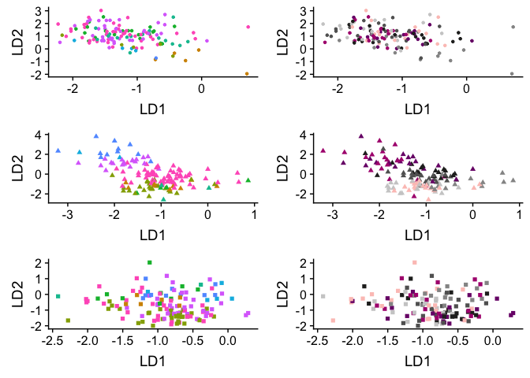
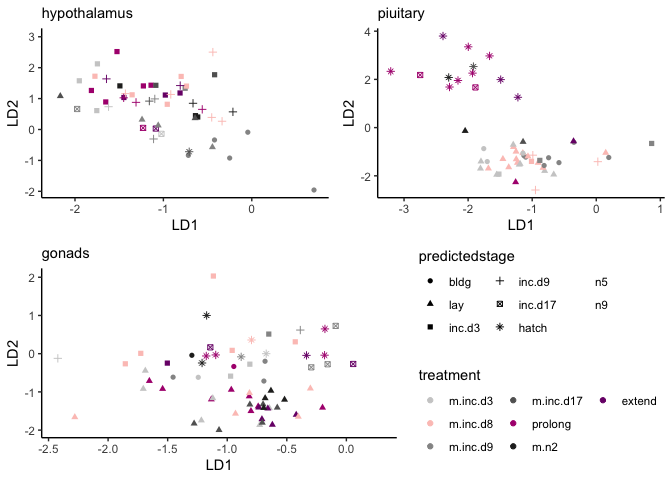

LDA analysis of characterization and manipulation
-------------------------------------------------

    colData <- read.csv("../metadata/00_samples.csv", row.names = 1)

    charHyp <- colData %>% filter(study == "charcterization", tissue == "hypothalamus") %>% droplevels()
    charPit <- colData %>% filter(study == "charcterization", tissue == "pituitary") %>% droplevels()
    charGon <- colData %>% filter(study == "charcterization", tissue == "gonad") %>% 
      mutate(tissue = fct_recode(tissue, "gonads" = "gonad")) %>% droplevels()

    manipHyp <- colData %>% filter(study == "manipulation", tissue == "hypothalamus") %>% droplevels()
    manipPit <- colData %>% filter(study == "manipulation", tissue == "pituitary") %>% droplevels()
    manipGon <- colData %>% filter(study == "manipulation", tissue == "gonad") %>% 
      mutate(tissue = fct_recode(tissue, "gonads" = "gonad")) %>% droplevels()

    selectvsd <- function(pathtofile, colData){
      
      df <- read.csv(pathtofile, row.names = 1)
      savecols <- as.character(colData$V1) 
      savecols <- as.vector(savecols) 
      df <- df %>% dplyr::select(one_of(savecols)) 
      df <- as.data.frame(t(df))
      df$V1 <- row.names(df)
      return(df)
    }

    vsd.hyp.train <- selectvsd("../results/06_hypallvsd.csv",  charHyp)
    vsd.pit.train <- selectvsd("../results/06_pitallvsd.csv",  charPit)
    vsd.gon.train <- selectvsd("../results/06_gonallvsd.csv",  charGon)

    vsd.hyp.test <- selectvsd("../results/06_hypallvsd.csv",  manipHyp)
    vsd.pit.test <- selectvsd("../results/06_pitallvsd.csv",  manipPit)
    vsd.gon.test <- selectvsd("../results/06_gonallvsd.csv",  manipGon)

Linear discriminant analysis (LDA)
----------------------------------

<a href="http://www.sthda.com/english/articles/36-classification-methods-essentials/146-discriminant-analysis-essentials-in-r/" class="uri">http://www.sthda.com/english/articles/36-classification-methods-essentials/146-discriminant-analysis-essentials-in-r/</a>

    LDanalysis <- function(trainsamples, traindata, testdata, testsamples){
      
      train.data <- left_join(trainsamples, traindata) %>%
        dplyr::select(-V1, -bird, -tissue, -group, -study, -sex)
      
      test.data <- testdata
      
      # Normalize the data. Categorical variables are automatically ignored.
      # Estimate preprocessing parameters
      preproc.param <- train.data %>% 
        preProcess(method = c("center", "scale"))
      
      # Transform the data using the estimated parameters
      train.transformed <- preproc.param %>% predict(train.data)
      test.transformed <- preproc.param %>% predict(test.data)
      
      # LDA analysis
      # Fit the model
      model <- lda(treatment~ ., data = train.transformed)
      # Make predictions
      predictions <- model %>% predict(test.transformed)
      
      # Model accuracy
      print("model accuracy")
      print("predictions$class==test.transformed$treatment)")
      print(mean(predictions$class==test.transformed$treatment))
      
      # results
      print("the samples sizes")
      print(model$counts)
      
      print("the prior probabilities used")
      print(model$prior)
      
      print("svd: the singular values, which give the ratio of the between- and within-group standard deviations on the linear discriminant variables. Their squares are the canonical F-statistics.")
      print(model$svd)
      
      
      #  predictions
      predictions <- model %>% predict(test.transformed)
      head(predictions)
      
      # Predicted classes
      #print(predictions$class, 6)
      # Predicted probabilities of class memebership.
      #print(predictions$posterior, 6) 
      # Linear discriminants
      #print(predictions$x, 3)
      
      
      predictedstage <-  predict(model, test.transformed)$class
      testsamples$predictedstage <- predictedstage
      
      lda.data <- cbind(testsamples, predictions$x)
      
      return(lda.data)
    }  

    LDA.hyp <- LDanalysis(charHyp, vsd.hyp.train, vsd.hyp.test, manipHyp)

    FALSE [1] "model accuracy"
    FALSE [1] "predictions$class==test.transformed$treatment)"
    FALSE [1] NaN
    FALSE [1] "the samples sizes"
    FALSE    bldg control   hatch inc.d17  inc.d3  inc.d9     lay      n5      n9 
    FALSE      20      22      20      22      20      23      20      20      22 
    FALSE [1] "the prior probabilities used"
    FALSE      bldg   control     hatch   inc.d17    inc.d3    inc.d9       lay 
    FALSE 0.1058201 0.1164021 0.1058201 0.1164021 0.1058201 0.1216931 0.1058201 
    FALSE        n5        n9 
    FALSE 0.1058201 0.1164021 
    FALSE [1] "svd: the singular values, which give the ratio of the between- and within-group standard deviations on the linear discriminant variables. Their squares are the canonical F-statistics."
    FALSE [1] 12.290102  3.737184  3.211678  2.808778  2.549954  2.426899  2.113333
    FALSE [8]  2.026555

    LDA.pit <- LDanalysis(charPit, vsd.pit.train, vsd.pit.test, manipPit)

    FALSE [1] "model accuracy"
    FALSE [1] "predictions$class==test.transformed$treatment)"
    FALSE [1] NaN
    FALSE [1] "the samples sizes"
    FALSE    bldg control   hatch inc.d17  inc.d3  inc.d9     lay      n5      n9 
    FALSE      20      25      20      22      20      24      20      20      22 
    FALSE [1] "the prior probabilities used"
    FALSE      bldg   control     hatch   inc.d17    inc.d3    inc.d9       lay 
    FALSE 0.1036269 0.1295337 0.1036269 0.1139896 0.1036269 0.1243523 0.1036269 
    FALSE        n5        n9 
    FALSE 0.1036269 0.1139896 
    FALSE [1] "svd: the singular values, which give the ratio of the between- and within-group standard deviations on the linear discriminant variables. Their squares are the canonical F-statistics."
    FALSE [1] 11.062116  7.608644  4.442591  3.502461  3.462251  2.818560  2.652532
    FALSE [8]  2.179736

    LDA.gon <- LDanalysis(charGon, vsd.gon.train, vsd.gon.test, manipGon)

    FALSE [1] "model accuracy"
    FALSE [1] "predictions$class==test.transformed$treatment)"
    FALSE [1] NaN
    FALSE [1] "the samples sizes"
    FALSE    bldg control   hatch inc.d17  inc.d3  inc.d9     lay      n5      n9 
    FALSE      20      26      20      22      20      24      20      20      22 
    FALSE [1] "the prior probabilities used"
    FALSE      bldg   control     hatch   inc.d17    inc.d3    inc.d9       lay 
    FALSE 0.1030928 0.1340206 0.1030928 0.1134021 0.1030928 0.1237113 0.1030928 
    FALSE        n5        n9 
    FALSE 0.1030928 0.1134021 
    FALSE [1] "svd: the singular values, which give the ratio of the between- and within-group standard deviations on the linear discriminant variables. Their squares are the canonical F-statistics."
    FALSE [1] 9.826642 4.643175 3.744735 3.117603 2.699703 2.362898 2.231784 2.112316

    library(kableExtra)
    #myshapes = c("hypothalamus" = 20,  "pituitary" = 17,  "gonads" = 15)

    a <- ggplot(LDA.hyp, aes(x = LD1, LD2, color = predictedstage)) + geom_point(shape = 20) + theme(legend.position = "none") + scale_color_manual(values = colorscharmaip) 
    b <- ggplot(LDA.hyp, aes(x = LD1, LD2, color = treatment)) + geom_point(shape = 20) + theme(legend.position = "none") + scale_color_manual(values = colorscharmaip)

    c <- ggplot(LDA.pit, aes(x = LD1, LD2, color = predictedstage)) + geom_point(shape = 17) + theme(legend.position = "none") + scale_color_manual(values = colorscharmaip)
    d <- ggplot(LDA.pit, aes(x = LD1, LD2, color = treatment)) + geom_point(shape = 17) + theme(legend.position = "none") + scale_color_manual(values = colorscharmaip)

    e <- ggplot(LDA.gon, aes(x = LD1, LD2, color = predictedstage)) + geom_point(shape = 15) + theme(legend.position = "none") + scale_color_manual(values = colorscharmaip)
    f <- ggplot(LDA.gon, aes(x = LD1, LD2, color = treatment)) + geom_point(shape = 15) + theme(legend.position = "none") + scale_color_manual(values = colorscharmaip)

    plot_grid(a,b,c,d,e,f, nrow = 3)

    g <- ggplot(LDA.hyp, aes(x = LD1, LD2, shape = predictedstage, color = treatment)) + geom_point( ) + theme(legend.position = "none") + scale_color_manual(values = colorscharmaip) 

    h <- ggplot(LDA.pit, aes(x = LD1, LD2, shape = predictedstage, color = treatment)) + geom_point( ) + theme(legend.position = "none") + scale_color_manual(values = colorscharmaip) 

    i <- ggplot(LDA.gon, aes(x = LD1, LD2, shape = predictedstage, color = treatment)) + geom_point( ) + theme(legend.position = "none") + scale_color_manual(values = colorscharmaip)  

    plot_grid(g,h,i, nrow = 1)

    df1 <- LDA.hyp %>% distinct(treatment, predictedstage) %>%
      group_by(treatment) %>%
      summarize(predictedstages = str_c(predictedstage , collapse = ", "))  %>%
      mutate(tissue = "hypothalamus")
    kable(df1)

<table>
<thead>
<tr>
<th style="text-align:left;">
treatment
</th>
<th style="text-align:left;">
predictedstages
</th>
<th style="text-align:left;">
tissue
</th>
</tr>
</thead>
<tbody>
<tr>
<td style="text-align:left;">
extend
</td>
<td style="text-align:left;">
n9, inc.d3, n5, inc.d9, inc.d17
</td>
<td style="text-align:left;">
hypothalamus
</td>
</tr>
<tr>
<td style="text-align:left;">
m.inc.d17
</td>
<td style="text-align:left;">
inc.d9, n9, inc.d3, n5, lay, hatch
</td>
<td style="text-align:left;">
hypothalamus
</td>
</tr>
<tr>
<td style="text-align:left;">
m.inc.d3
</td>
<td style="text-align:left;">
n5, n9, inc.d3, inc.d9, inc.d17
</td>
<td style="text-align:left;">
hypothalamus
</td>
</tr>
<tr>
<td style="text-align:left;">
m.inc.d8
</td>
<td style="text-align:left;">
n5, inc.d3, n9, inc.d9
</td>
<td style="text-align:left;">
hypothalamus
</td>
</tr>
<tr>
<td style="text-align:left;">
m.inc.d9
</td>
<td style="text-align:left;">
bldg, n9, inc.d3, lay, inc.d17, inc.d9, n5
</td>
<td style="text-align:left;">
hypothalamus
</td>
</tr>
<tr>
<td style="text-align:left;">
m.n2
</td>
<td style="text-align:left;">
inc.d3, n9, n5, inc.d9
</td>
<td style="text-align:left;">
hypothalamus
</td>
</tr>
<tr>
<td style="text-align:left;">
prolong
</td>
<td style="text-align:left;">
inc.d3, inc.d9, n9, n5, inc.d17
</td>
<td style="text-align:left;">
hypothalamus
</td>
</tr>
</tbody>
</table>

    df2 <- LDA.hyp %>% 
      group_by(treatment,predictedstage) %>%
      summarize(n = n()) %>%
      mutate(tissue = "hypothalamus")
    kable(df2)

<table>
<thead>
<tr>
<th style="text-align:left;">
treatment
</th>
<th style="text-align:left;">
predictedstage
</th>
<th style="text-align:right;">
n
</th>
<th style="text-align:left;">
tissue
</th>
</tr>
</thead>
<tbody>
<tr>
<td style="text-align:left;">
extend
</td>
<td style="text-align:left;">
inc.d17
</td>
<td style="text-align:right;">
1
</td>
<td style="text-align:left;">
hypothalamus
</td>
</tr>
<tr>
<td style="text-align:left;">
extend
</td>
<td style="text-align:left;">
inc.d3
</td>
<td style="text-align:right;">
3
</td>
<td style="text-align:left;">
hypothalamus
</td>
</tr>
<tr>
<td style="text-align:left;">
extend
</td>
<td style="text-align:left;">
inc.d9
</td>
<td style="text-align:right;">
2
</td>
<td style="text-align:left;">
hypothalamus
</td>
</tr>
<tr>
<td style="text-align:left;">
extend
</td>
<td style="text-align:left;">
n5
</td>
<td style="text-align:right;">
7
</td>
<td style="text-align:left;">
hypothalamus
</td>
</tr>
<tr>
<td style="text-align:left;">
extend
</td>
<td style="text-align:left;">
n9
</td>
<td style="text-align:right;">
7
</td>
<td style="text-align:left;">
hypothalamus
</td>
</tr>
<tr>
<td style="text-align:left;">
m.inc.d17
</td>
<td style="text-align:left;">
hatch
</td>
<td style="text-align:right;">
1
</td>
<td style="text-align:left;">
hypothalamus
</td>
</tr>
<tr>
<td style="text-align:left;">
m.inc.d17
</td>
<td style="text-align:left;">
inc.d3
</td>
<td style="text-align:right;">
2
</td>
<td style="text-align:left;">
hypothalamus
</td>
</tr>
<tr>
<td style="text-align:left;">
m.inc.d17
</td>
<td style="text-align:left;">
inc.d9
</td>
<td style="text-align:right;">
1
</td>
<td style="text-align:left;">
hypothalamus
</td>
</tr>
<tr>
<td style="text-align:left;">
m.inc.d17
</td>
<td style="text-align:left;">
lay
</td>
<td style="text-align:right;">
2
</td>
<td style="text-align:left;">
hypothalamus
</td>
</tr>
<tr>
<td style="text-align:left;">
m.inc.d17
</td>
<td style="text-align:left;">
n5
</td>
<td style="text-align:right;">
6
</td>
<td style="text-align:left;">
hypothalamus
</td>
</tr>
<tr>
<td style="text-align:left;">
m.inc.d17
</td>
<td style="text-align:left;">
n9
</td>
<td style="text-align:right;">
9
</td>
<td style="text-align:left;">
hypothalamus
</td>
</tr>
<tr>
<td style="text-align:left;">
m.inc.d3
</td>
<td style="text-align:left;">
inc.d17
</td>
<td style="text-align:right;">
1
</td>
<td style="text-align:left;">
hypothalamus
</td>
</tr>
<tr>
<td style="text-align:left;">
m.inc.d3
</td>
<td style="text-align:left;">
inc.d3
</td>
<td style="text-align:right;">
3
</td>
<td style="text-align:left;">
hypothalamus
</td>
</tr>
<tr>
<td style="text-align:left;">
m.inc.d3
</td>
<td style="text-align:left;">
inc.d9
</td>
<td style="text-align:right;">
1
</td>
<td style="text-align:left;">
hypothalamus
</td>
</tr>
<tr>
<td style="text-align:left;">
m.inc.d3
</td>
<td style="text-align:left;">
n5
</td>
<td style="text-align:right;">
9
</td>
<td style="text-align:left;">
hypothalamus
</td>
</tr>
<tr>
<td style="text-align:left;">
m.inc.d3
</td>
<td style="text-align:left;">
n9
</td>
<td style="text-align:right;">
6
</td>
<td style="text-align:left;">
hypothalamus
</td>
</tr>
<tr>
<td style="text-align:left;">
m.inc.d8
</td>
<td style="text-align:left;">
inc.d3
</td>
<td style="text-align:right;">
5
</td>
<td style="text-align:left;">
hypothalamus
</td>
</tr>
<tr>
<td style="text-align:left;">
m.inc.d8
</td>
<td style="text-align:left;">
inc.d9
</td>
<td style="text-align:right;">
5
</td>
<td style="text-align:left;">
hypothalamus
</td>
</tr>
<tr>
<td style="text-align:left;">
m.inc.d8
</td>
<td style="text-align:left;">
n5
</td>
<td style="text-align:right;">
5
</td>
<td style="text-align:left;">
hypothalamus
</td>
</tr>
<tr>
<td style="text-align:left;">
m.inc.d8
</td>
<td style="text-align:left;">
n9
</td>
<td style="text-align:right;">
5
</td>
<td style="text-align:left;">
hypothalamus
</td>
</tr>
<tr>
<td style="text-align:left;">
m.inc.d9
</td>
<td style="text-align:left;">
bldg
</td>
<td style="text-align:right;">
5
</td>
<td style="text-align:left;">
hypothalamus
</td>
</tr>
<tr>
<td style="text-align:left;">
m.inc.d9
</td>
<td style="text-align:left;">
inc.d17
</td>
<td style="text-align:right;">
1
</td>
<td style="text-align:left;">
hypothalamus
</td>
</tr>
<tr>
<td style="text-align:left;">
m.inc.d9
</td>
<td style="text-align:left;">
inc.d3
</td>
<td style="text-align:right;">
1
</td>
<td style="text-align:left;">
hypothalamus
</td>
</tr>
<tr>
<td style="text-align:left;">
m.inc.d9
</td>
<td style="text-align:left;">
inc.d9
</td>
<td style="text-align:right;">
2
</td>
<td style="text-align:left;">
hypothalamus
</td>
</tr>
<tr>
<td style="text-align:left;">
m.inc.d9
</td>
<td style="text-align:left;">
lay
</td>
<td style="text-align:right;">
3
</td>
<td style="text-align:left;">
hypothalamus
</td>
</tr>
<tr>
<td style="text-align:left;">
m.inc.d9
</td>
<td style="text-align:left;">
n5
</td>
<td style="text-align:right;">
1
</td>
<td style="text-align:left;">
hypothalamus
</td>
</tr>
<tr>
<td style="text-align:left;">
m.inc.d9
</td>
<td style="text-align:left;">
n9
</td>
<td style="text-align:right;">
4
</td>
<td style="text-align:left;">
hypothalamus
</td>
</tr>
<tr>
<td style="text-align:left;">
m.n2
</td>
<td style="text-align:left;">
inc.d3
</td>
<td style="text-align:right;">
3
</td>
<td style="text-align:left;">
hypothalamus
</td>
</tr>
<tr>
<td style="text-align:left;">
m.n2
</td>
<td style="text-align:left;">
inc.d9
</td>
<td style="text-align:right;">
2
</td>
<td style="text-align:left;">
hypothalamus
</td>
</tr>
<tr>
<td style="text-align:left;">
m.n2
</td>
<td style="text-align:left;">
n5
</td>
<td style="text-align:right;">
4
</td>
<td style="text-align:left;">
hypothalamus
</td>
</tr>
<tr>
<td style="text-align:left;">
m.n2
</td>
<td style="text-align:left;">
n9
</td>
<td style="text-align:right;">
11
</td>
<td style="text-align:left;">
hypothalamus
</td>
</tr>
<tr>
<td style="text-align:left;">
prolong
</td>
<td style="text-align:left;">
inc.d17
</td>
<td style="text-align:right;">
1
</td>
<td style="text-align:left;">
hypothalamus
</td>
</tr>
<tr>
<td style="text-align:left;">
prolong
</td>
<td style="text-align:left;">
inc.d3
</td>
<td style="text-align:right;">
5
</td>
<td style="text-align:left;">
hypothalamus
</td>
</tr>
<tr>
<td style="text-align:left;">
prolong
</td>
<td style="text-align:left;">
inc.d9
</td>
<td style="text-align:right;">
3
</td>
<td style="text-align:left;">
hypothalamus
</td>
</tr>
<tr>
<td style="text-align:left;">
prolong
</td>
<td style="text-align:left;">
n5
</td>
<td style="text-align:right;">
8
</td>
<td style="text-align:left;">
hypothalamus
</td>
</tr>
<tr>
<td style="text-align:left;">
prolong
</td>
<td style="text-align:left;">
n9
</td>
<td style="text-align:right;">
3
</td>
<td style="text-align:left;">
hypothalamus
</td>
</tr>
</tbody>
</table>

    df3 <- LDA.pit %>% distinct(treatment, predictedstage) %>%
      group_by(treatment) %>%
      summarize(predictedstages = str_c(predictedstage , collapse = ", ")) %>%
      mutate(tissue = "pituitary")
    kable(df3)

<table>
<thead>
<tr>
<th style="text-align:left;">
treatment
</th>
<th style="text-align:left;">
predictedstages
</th>
<th style="text-align:left;">
tissue
</th>
</tr>
</thead>
<tbody>
<tr>
<td style="text-align:left;">
extend
</td>
<td style="text-align:left;">
hatch, n9, n5, lay
</td>
<td style="text-align:left;">
pituitary
</td>
</tr>
<tr>
<td style="text-align:left;">
m.inc.d17
</td>
<td style="text-align:left;">
n9, lay, hatch
</td>
<td style="text-align:left;">
pituitary
</td>
</tr>
<tr>
<td style="text-align:left;">
m.inc.d3
</td>
<td style="text-align:left;">
lay, n9, inc.d3, bldg
</td>
<td style="text-align:left;">
pituitary
</td>
</tr>
<tr>
<td style="text-align:left;">
m.inc.d8
</td>
<td style="text-align:left;">
lay, n9, inc.d3, inc.d9
</td>
<td style="text-align:left;">
pituitary
</td>
</tr>
<tr>
<td style="text-align:left;">
m.inc.d9
</td>
<td style="text-align:left;">
bldg, n9, inc.d3
</td>
<td style="text-align:left;">
pituitary
</td>
</tr>
<tr>
<td style="text-align:left;">
m.n2
</td>
<td style="text-align:left;">
hatch, n9, lay
</td>
<td style="text-align:left;">
pituitary
</td>
</tr>
<tr>
<td style="text-align:left;">
prolong
</td>
<td style="text-align:left;">
lay, n9, hatch, inc.d17, n5
</td>
<td style="text-align:left;">
pituitary
</td>
</tr>
</tbody>
</table>

    df4  <- LDA.pit %>% 
      group_by(treatment,predictedstage) %>%
      summarize(n = n()) %>%
      mutate(tissue = "pituitary")
    kable(df4)

<table>
<thead>
<tr>
<th style="text-align:left;">
treatment
</th>
<th style="text-align:left;">
predictedstage
</th>
<th style="text-align:right;">
n
</th>
<th style="text-align:left;">
tissue
</th>
</tr>
</thead>
<tbody>
<tr>
<td style="text-align:left;">
extend
</td>
<td style="text-align:left;">
hatch
</td>
<td style="text-align:right;">
3
</td>
<td style="text-align:left;">
pituitary
</td>
</tr>
<tr>
<td style="text-align:left;">
extend
</td>
<td style="text-align:left;">
lay
</td>
<td style="text-align:right;">
1
</td>
<td style="text-align:left;">
pituitary
</td>
</tr>
<tr>
<td style="text-align:left;">
extend
</td>
<td style="text-align:left;">
n5
</td>
<td style="text-align:right;">
13
</td>
<td style="text-align:left;">
pituitary
</td>
</tr>
<tr>
<td style="text-align:left;">
extend
</td>
<td style="text-align:left;">
n9
</td>
<td style="text-align:right;">
3
</td>
<td style="text-align:left;">
pituitary
</td>
</tr>
<tr>
<td style="text-align:left;">
m.inc.d17
</td>
<td style="text-align:left;">
hatch
</td>
<td style="text-align:right;">
1
</td>
<td style="text-align:left;">
pituitary
</td>
</tr>
<tr>
<td style="text-align:left;">
m.inc.d17
</td>
<td style="text-align:left;">
lay
</td>
<td style="text-align:right;">
1
</td>
<td style="text-align:left;">
pituitary
</td>
</tr>
<tr>
<td style="text-align:left;">
m.inc.d17
</td>
<td style="text-align:left;">
n9
</td>
<td style="text-align:right;">
19
</td>
<td style="text-align:left;">
pituitary
</td>
</tr>
<tr>
<td style="text-align:left;">
m.inc.d3
</td>
<td style="text-align:left;">
bldg
</td>
<td style="text-align:right;">
3
</td>
<td style="text-align:left;">
pituitary
</td>
</tr>
<tr>
<td style="text-align:left;">
m.inc.d3
</td>
<td style="text-align:left;">
inc.d3
</td>
<td style="text-align:right;">
1
</td>
<td style="text-align:left;">
pituitary
</td>
</tr>
<tr>
<td style="text-align:left;">
m.inc.d3
</td>
<td style="text-align:left;">
lay
</td>
<td style="text-align:right;">
8
</td>
<td style="text-align:left;">
pituitary
</td>
</tr>
<tr>
<td style="text-align:left;">
m.inc.d3
</td>
<td style="text-align:left;">
n9
</td>
<td style="text-align:right;">
8
</td>
<td style="text-align:left;">
pituitary
</td>
</tr>
<tr>
<td style="text-align:left;">
m.inc.d8
</td>
<td style="text-align:left;">
inc.d3
</td>
<td style="text-align:right;">
1
</td>
<td style="text-align:left;">
pituitary
</td>
</tr>
<tr>
<td style="text-align:left;">
m.inc.d8
</td>
<td style="text-align:left;">
inc.d9
</td>
<td style="text-align:right;">
3
</td>
<td style="text-align:left;">
pituitary
</td>
</tr>
<tr>
<td style="text-align:left;">
m.inc.d8
</td>
<td style="text-align:left;">
lay
</td>
<td style="text-align:right;">
12
</td>
<td style="text-align:left;">
pituitary
</td>
</tr>
<tr>
<td style="text-align:left;">
m.inc.d8
</td>
<td style="text-align:left;">
n9
</td>
<td style="text-align:right;">
4
</td>
<td style="text-align:left;">
pituitary
</td>
</tr>
<tr>
<td style="text-align:left;">
m.inc.d9
</td>
<td style="text-align:left;">
bldg
</td>
<td style="text-align:right;">
7
</td>
<td style="text-align:left;">
pituitary
</td>
</tr>
<tr>
<td style="text-align:left;">
m.inc.d9
</td>
<td style="text-align:left;">
inc.d3
</td>
<td style="text-align:right;">
2
</td>
<td style="text-align:left;">
pituitary
</td>
</tr>
<tr>
<td style="text-align:left;">
m.inc.d9
</td>
<td style="text-align:left;">
n9
</td>
<td style="text-align:right;">
7
</td>
<td style="text-align:left;">
pituitary
</td>
</tr>
<tr>
<td style="text-align:left;">
m.n2
</td>
<td style="text-align:left;">
hatch
</td>
<td style="text-align:right;">
1
</td>
<td style="text-align:left;">
pituitary
</td>
</tr>
<tr>
<td style="text-align:left;">
m.n2
</td>
<td style="text-align:left;">
lay
</td>
<td style="text-align:right;">
1
</td>
<td style="text-align:left;">
pituitary
</td>
</tr>
<tr>
<td style="text-align:left;">
m.n2
</td>
<td style="text-align:left;">
n9
</td>
<td style="text-align:right;">
18
</td>
<td style="text-align:left;">
pituitary
</td>
</tr>
<tr>
<td style="text-align:left;">
prolong
</td>
<td style="text-align:left;">
hatch
</td>
<td style="text-align:right;">
6
</td>
<td style="text-align:left;">
pituitary
</td>
</tr>
<tr>
<td style="text-align:left;">
prolong
</td>
<td style="text-align:left;">
inc.d17
</td>
<td style="text-align:right;">
2
</td>
<td style="text-align:left;">
pituitary
</td>
</tr>
<tr>
<td style="text-align:left;">
prolong
</td>
<td style="text-align:left;">
lay
</td>
<td style="text-align:right;">
1
</td>
<td style="text-align:left;">
pituitary
</td>
</tr>
<tr>
<td style="text-align:left;">
prolong
</td>
<td style="text-align:left;">
n5
</td>
<td style="text-align:right;">
6
</td>
<td style="text-align:left;">
pituitary
</td>
</tr>
<tr>
<td style="text-align:left;">
prolong
</td>
<td style="text-align:left;">
n9
</td>
<td style="text-align:right;">
5
</td>
<td style="text-align:left;">
pituitary
</td>
</tr>
</tbody>
</table>

    df5 <- LDA.gon %>% distinct(treatment, predictedstage) %>%
      group_by(treatment) %>%
      summarize(predictedstages = str_c(predictedstage , collapse = ", ")) %>%
      mutate(tissue = "gonads")
    kable(df5)

<table>
<thead>
<tr>
<th style="text-align:left;">
treatment
</th>
<th style="text-align:left;">
predictedstages
</th>
<th style="text-align:left;">
tissue
</th>
</tr>
</thead>
<tbody>
<tr>
<td style="text-align:left;">
extend
</td>
<td style="text-align:left;">
n5, n9, inc.d17, lay, hatch, inc.d3
</td>
<td style="text-align:left;">
gonads
</td>
</tr>
<tr>
<td style="text-align:left;">
m.inc.d17
</td>
<td style="text-align:left;">
n9, lay, n5
</td>
<td style="text-align:left;">
gonads
</td>
</tr>
<tr>
<td style="text-align:left;">
m.inc.d3
</td>
<td style="text-align:left;">
lay, inc.d9, n9, n5, inc.d3, hatch, bldg
</td>
<td style="text-align:left;">
gonads
</td>
</tr>
<tr>
<td style="text-align:left;">
m.inc.d8
</td>
<td style="text-align:left;">
n5, inc.d3, n9, lay, hatch
</td>
<td style="text-align:left;">
gonads
</td>
</tr>
<tr>
<td style="text-align:left;">
m.inc.d9
</td>
<td style="text-align:left;">
n9, inc.d17, n5, hatch, inc.d9, bldg, inc.d3
</td>
<td style="text-align:left;">
gonads
</td>
</tr>
<tr>
<td style="text-align:left;">
m.n2
</td>
<td style="text-align:left;">
hatch, n9, lay, n5, bldg
</td>
<td style="text-align:left;">
gonads
</td>
</tr>
<tr>
<td style="text-align:left;">
prolong
</td>
<td style="text-align:left;">
lay, n9, bldg, hatch, n5
</td>
<td style="text-align:left;">
gonads
</td>
</tr>
</tbody>
</table>

    df6 <- LDA.gon %>% 
      group_by(treatment,predictedstage) %>%
      summarize(n = n()) %>%
      mutate(tissue = "gonads")
    kable(df6)

<table>
<thead>
<tr>
<th style="text-align:left;">
treatment
</th>
<th style="text-align:left;">
predictedstage
</th>
<th style="text-align:right;">
n
</th>
<th style="text-align:left;">
tissue
</th>
</tr>
</thead>
<tbody>
<tr>
<td style="text-align:left;">
extend
</td>
<td style="text-align:left;">
hatch
</td>
<td style="text-align:right;">
1
</td>
<td style="text-align:left;">
gonads
</td>
</tr>
<tr>
<td style="text-align:left;">
extend
</td>
<td style="text-align:left;">
inc.d17
</td>
<td style="text-align:right;">
2
</td>
<td style="text-align:left;">
gonads
</td>
</tr>
<tr>
<td style="text-align:left;">
extend
</td>
<td style="text-align:left;">
inc.d3
</td>
<td style="text-align:right;">
1
</td>
<td style="text-align:left;">
gonads
</td>
</tr>
<tr>
<td style="text-align:left;">
extend
</td>
<td style="text-align:left;">
lay
</td>
<td style="text-align:right;">
5
</td>
<td style="text-align:left;">
gonads
</td>
</tr>
<tr>
<td style="text-align:left;">
extend
</td>
<td style="text-align:left;">
n5
</td>
<td style="text-align:right;">
8
</td>
<td style="text-align:left;">
gonads
</td>
</tr>
<tr>
<td style="text-align:left;">
extend
</td>
<td style="text-align:left;">
n9
</td>
<td style="text-align:right;">
3
</td>
<td style="text-align:left;">
gonads
</td>
</tr>
<tr>
<td style="text-align:left;">
m.inc.d17
</td>
<td style="text-align:left;">
lay
</td>
<td style="text-align:right;">
6
</td>
<td style="text-align:left;">
gonads
</td>
</tr>
<tr>
<td style="text-align:left;">
m.inc.d17
</td>
<td style="text-align:left;">
n5
</td>
<td style="text-align:right;">
7
</td>
<td style="text-align:left;">
gonads
</td>
</tr>
<tr>
<td style="text-align:left;">
m.inc.d17
</td>
<td style="text-align:left;">
n9
</td>
<td style="text-align:right;">
8
</td>
<td style="text-align:left;">
gonads
</td>
</tr>
<tr>
<td style="text-align:left;">
m.inc.d3
</td>
<td style="text-align:left;">
bldg
</td>
<td style="text-align:right;">
1
</td>
<td style="text-align:left;">
gonads
</td>
</tr>
<tr>
<td style="text-align:left;">
m.inc.d3
</td>
<td style="text-align:left;">
hatch
</td>
<td style="text-align:right;">
1
</td>
<td style="text-align:left;">
gonads
</td>
</tr>
<tr>
<td style="text-align:left;">
m.inc.d3
</td>
<td style="text-align:left;">
inc.d3
</td>
<td style="text-align:right;">
2
</td>
<td style="text-align:left;">
gonads
</td>
</tr>
<tr>
<td style="text-align:left;">
m.inc.d3
</td>
<td style="text-align:left;">
inc.d9
</td>
<td style="text-align:right;">
1
</td>
<td style="text-align:left;">
gonads
</td>
</tr>
<tr>
<td style="text-align:left;">
m.inc.d3
</td>
<td style="text-align:left;">
lay
</td>
<td style="text-align:right;">
6
</td>
<td style="text-align:left;">
gonads
</td>
</tr>
<tr>
<td style="text-align:left;">
m.inc.d3
</td>
<td style="text-align:left;">
n5
</td>
<td style="text-align:right;">
4
</td>
<td style="text-align:left;">
gonads
</td>
</tr>
<tr>
<td style="text-align:left;">
m.inc.d3
</td>
<td style="text-align:left;">
n9
</td>
<td style="text-align:right;">
5
</td>
<td style="text-align:left;">
gonads
</td>
</tr>
<tr>
<td style="text-align:left;">
m.inc.d8
</td>
<td style="text-align:left;">
hatch
</td>
<td style="text-align:right;">
1
</td>
<td style="text-align:left;">
gonads
</td>
</tr>
<tr>
<td style="text-align:left;">
m.inc.d8
</td>
<td style="text-align:left;">
inc.d3
</td>
<td style="text-align:right;">
5
</td>
<td style="text-align:left;">
gonads
</td>
</tr>
<tr>
<td style="text-align:left;">
m.inc.d8
</td>
<td style="text-align:left;">
lay
</td>
<td style="text-align:right;">
5
</td>
<td style="text-align:left;">
gonads
</td>
</tr>
<tr>
<td style="text-align:left;">
m.inc.d8
</td>
<td style="text-align:left;">
n5
</td>
<td style="text-align:right;">
3
</td>
<td style="text-align:left;">
gonads
</td>
</tr>
<tr>
<td style="text-align:left;">
m.inc.d8
</td>
<td style="text-align:left;">
n9
</td>
<td style="text-align:right;">
6
</td>
<td style="text-align:left;">
gonads
</td>
</tr>
<tr>
<td style="text-align:left;">
m.inc.d9
</td>
<td style="text-align:left;">
bldg
</td>
<td style="text-align:right;">
3
</td>
<td style="text-align:left;">
gonads
</td>
</tr>
<tr>
<td style="text-align:left;">
m.inc.d9
</td>
<td style="text-align:left;">
hatch
</td>
<td style="text-align:right;">
1
</td>
<td style="text-align:left;">
gonads
</td>
</tr>
<tr>
<td style="text-align:left;">
m.inc.d9
</td>
<td style="text-align:left;">
inc.d17
</td>
<td style="text-align:right;">
3
</td>
<td style="text-align:left;">
gonads
</td>
</tr>
<tr>
<td style="text-align:left;">
m.inc.d9
</td>
<td style="text-align:left;">
inc.d3
</td>
<td style="text-align:right;">
1
</td>
<td style="text-align:left;">
gonads
</td>
</tr>
<tr>
<td style="text-align:left;">
m.inc.d9
</td>
<td style="text-align:left;">
inc.d9
</td>
<td style="text-align:right;">
1
</td>
<td style="text-align:left;">
gonads
</td>
</tr>
<tr>
<td style="text-align:left;">
m.inc.d9
</td>
<td style="text-align:left;">
n5
</td>
<td style="text-align:right;">
4
</td>
<td style="text-align:left;">
gonads
</td>
</tr>
<tr>
<td style="text-align:left;">
m.inc.d9
</td>
<td style="text-align:left;">
n9
</td>
<td style="text-align:right;">
3
</td>
<td style="text-align:left;">
gonads
</td>
</tr>
<tr>
<td style="text-align:left;">
m.n2
</td>
<td style="text-align:left;">
bldg
</td>
<td style="text-align:right;">
1
</td>
<td style="text-align:left;">
gonads
</td>
</tr>
<tr>
<td style="text-align:left;">
m.n2
</td>
<td style="text-align:left;">
hatch
</td>
<td style="text-align:right;">
2
</td>
<td style="text-align:left;">
gonads
</td>
</tr>
<tr>
<td style="text-align:left;">
m.n2
</td>
<td style="text-align:left;">
lay
</td>
<td style="text-align:right;">
4
</td>
<td style="text-align:left;">
gonads
</td>
</tr>
<tr>
<td style="text-align:left;">
m.n2
</td>
<td style="text-align:left;">
n5
</td>
<td style="text-align:right;">
5
</td>
<td style="text-align:left;">
gonads
</td>
</tr>
<tr>
<td style="text-align:left;">
m.n2
</td>
<td style="text-align:left;">
n9
</td>
<td style="text-align:right;">
7
</td>
<td style="text-align:left;">
gonads
</td>
</tr>
<tr>
<td style="text-align:left;">
prolong
</td>
<td style="text-align:left;">
bldg
</td>
<td style="text-align:right;">
1
</td>
<td style="text-align:left;">
gonads
</td>
</tr>
<tr>
<td style="text-align:left;">
prolong
</td>
<td style="text-align:left;">
hatch
</td>
<td style="text-align:right;">
4
</td>
<td style="text-align:left;">
gonads
</td>
</tr>
<tr>
<td style="text-align:left;">
prolong
</td>
<td style="text-align:left;">
lay
</td>
<td style="text-align:right;">
8
</td>
<td style="text-align:left;">
gonads
</td>
</tr>
<tr>
<td style="text-align:left;">
prolong
</td>
<td style="text-align:left;">
n5
</td>
<td style="text-align:right;">
5
</td>
<td style="text-align:left;">
gonads
</td>
</tr>
<tr>
<td style="text-align:left;">
prolong
</td>
<td style="text-align:left;">
n9
</td>
<td style="text-align:right;">
2
</td>
<td style="text-align:left;">
gonads
</td>
</tr>
</tbody>
</table>
