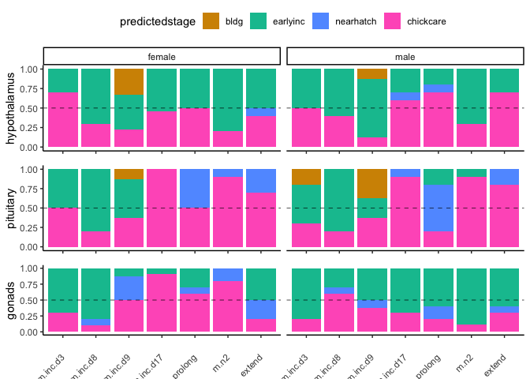

LDA analysis of characterization and manipulation
-------------------------------------------------

    colData <- read.csv("../metadata/00_samples.csv", row.names = 1)

    # add new columns

    colData <- colData %>%
      mutate(newgrouping = fct_collapse(treatment,
             "control" = c("control"),
             "bldg" = c("bldg"),
             "nearhatch" = c("inc.d17", "hatch"),
             "earlyinc" = c("lay","inc.d3", "inc.d9"),
             "chickcare" = c("n5", "n9"),
             "manip" = maniplevels1))

    charHyp <- colData %>% filter(study == "charcterization", tissue == "hypothalamus") %>% droplevels()
    charPit <- colData %>% filter(study == "charcterization", tissue == "pituitary") %>% droplevels()
    charGon <- colData %>% filter(study == "charcterization", tissue == "gonad") %>% 
      mutate(tissue = fct_recode(tissue, "gonads" = "gonad")) %>% droplevels()

    manipHyp <- colData %>% filter(study == "manipulation", tissue == "hypothalamus") %>% droplevels()
    manipPit <- colData %>% filter(study == "manipulation", tissue == "pituitary") %>% droplevels()
    manipGon <- colData %>% filter(study == "manipulation", tissue == "gonad") %>% 
      mutate(tissue = fct_recode(tissue, "gonads" = "gonad")) %>% droplevels()

    selectvsd <- function(pathtofile, colData){
      
      df <- read.csv(pathtofile, row.names = 1)
      savecols <- as.character(colData$V1) 
      savecols <- as.vector(savecols) 
      df <- df %>% dplyr::select(one_of(savecols)) 
      df <- as.data.frame(t(df))
      df$V1 <- row.names(df)
      return(df)
    }

    vsd.hyp.train <- selectvsd("../results/06_hypallvsd.csv",  charHyp)
    vsd.pit.train <- selectvsd("../results/06_pitallvsd.csv",  charPit)
    vsd.gon.train <- selectvsd("../results/06_gonallvsd.csv",  charGon)

    vsd.hyp.test <- selectvsd("../results/06_hypallvsd.csv",  manipHyp)
    vsd.pit.test <- selectvsd("../results/06_pitallvsd.csv",  manipPit)
    vsd.gon.test <- selectvsd("../results/06_gonallvsd.csv",  manipGon)

Linear discriminant analysis (LDA)
----------------------------------

<a href="http://www.sthda.com/english/articles/36-classification-methods-essentials/146-discriminant-analysis-essentials-in-r/" class="uri">http://www.sthda.com/english/articles/36-classification-methods-essentials/146-discriminant-analysis-essentials-in-r/</a>

    LDanalysis <- function(trainsamples, traindata, testdata, testsamples){
      
      train.data <- left_join(trainsamples, traindata) %>%
        dplyr::select(-V1, -bird, -tissue, -group, -study, -sex, -treatment)
      
      test.data <- testdata
      
      # Normalize the data. Categorical variables are automatically ignored.
      # Estimate preprocessing parameters
      preproc.param <- train.data %>% 
        preProcess(method = c("center", "scale"))
      
      # Transform the data using the estimated parameters
      train.transformed <- preproc.param %>% predict(train.data)
      test.transformed <- preproc.param %>% predict(test.data)
      
      # LDA analysis
      # Fit the model
      model <- lda(newgrouping~ ., data = train.transformed)
      # Make predictions
      predictions <- model %>% predict(test.transformed)
      
      # Model accuracy
      print("model accuracy")
      print("predictions$class==test.transformed$newgrouping)")
      print(mean(predictions$class==test.transformed$newgrouping))
      
      # results
      print("the samples sizes")
      print(model$counts)
      
      print("the prior probabilities used")
      print(model$prior)
      
      print("svd: the singular values, which give the ratio of the between- and within-group standard deviations on the linear discriminant variables. Their squares are the canonical F-statistics.")
      print(model$svd)
      
      
      #  predictions
      predictions <- model %>% predict(test.transformed)
      head(predictions)
      
      # Predicted classes
      #print(predictions$class, 6)
      # Predicted probabilities of class memebership.
      #print(predictions$posterior, 6) 
      # Linear discriminants
      #print(predictions$x, 3)
      
      
      predictedstage <-  predict(model, test.transformed)$class
      testsamples$predictedstage <- predictedstage
      
      lda.data <- cbind(testsamples, predictions$x)
      
      return(lda.data)
    }  

    LDA.hyp <- LDanalysis(charHyp, vsd.hyp.train, vsd.hyp.test, manipHyp)

    FALSE [1] "model accuracy"
    FALSE [1] "predictions$class==test.transformed$newgrouping)"
    FALSE [1] NaN
    FALSE [1] "the samples sizes"
    FALSE      bldg   control nearhatch  earlyinc chickcare 
    FALSE        20        22        42        63        42 
    FALSE [1] "the prior probabilities used"
    FALSE      bldg   control nearhatch  earlyinc chickcare 
    FALSE 0.1058201 0.1164021 0.2222222 0.3333333 0.2222222 
    FALSE [1] "svd: the singular values, which give the ratio of the between- and within-group standard deviations on the linear discriminant variables. Their squares are the canonical F-statistics."
    FALSE [1] 17.272351  5.277690  3.866870  3.245675

    LDA.pit <- LDanalysis(charPit, vsd.pit.train, vsd.pit.test, manipPit)

    FALSE [1] "model accuracy"
    FALSE [1] "predictions$class==test.transformed$newgrouping)"
    FALSE [1] NaN
    FALSE [1] "the samples sizes"
    FALSE      bldg   control nearhatch  earlyinc chickcare 
    FALSE        20        25        42        64        42 
    FALSE [1] "the prior probabilities used"
    FALSE      bldg   control nearhatch  earlyinc chickcare 
    FALSE 0.1036269 0.1295337 0.2176166 0.3316062 0.2176166 
    FALSE [1] "svd: the singular values, which give the ratio of the between- and within-group standard deviations on the linear discriminant variables. Their squares are the canonical F-statistics."
    FALSE [1] 15.291194 10.251065  6.042979  4.728399

    LDA.gon <- LDanalysis(charGon, vsd.gon.train, vsd.gon.test, manipGon)

    FALSE [1] "model accuracy"
    FALSE [1] "predictions$class==test.transformed$newgrouping)"
    FALSE [1] NaN
    FALSE [1] "the samples sizes"
    FALSE      bldg   control nearhatch  earlyinc chickcare 
    FALSE        20        26        42        64        42 
    FALSE [1] "the prior probabilities used"
    FALSE      bldg   control nearhatch  earlyinc chickcare 
    FALSE 0.1030928 0.1340206 0.2164948 0.3298969 0.2164948 
    FALSE [1] "svd: the singular values, which give the ratio of the between- and within-group standard deviations on the linear discriminant variables. Their squares are the canonical F-statistics."
    FALSE [1] 13.703585  5.117379  4.215588  4.196928

    library(kableExtra)

    LDA.hyp$treatment <- factor(LDA.hyp$treatment, levels = alllevels)
    LDA.hyp$predictedstage <- factor(LDA.hyp$predictedstage, levels = levelsnewgrouping)

    LDA.pit$treatment <- factor(LDA.pit$treatment, levels = alllevels)
    LDA.pit$predictedstage <- factor(LDA.pit$predictedstage, levels = levelsnewgrouping)

    LDA.gon$treatment <- factor(LDA.gon$treatment, levels = alllevels)
    LDA.gon$predictedstage <- factor(LDA.gon$predictedstage, levels = levelsnewgrouping)

    plotpredictions <- function(df, mysubstitle){
      ggplot(df, aes(x = treatment, fill = predictedstage)) +
      geom_bar(position = position_fill(reverse = F))  +
      facet_wrap(~sex) +
        theme_B3() +
      theme(legend.position = "none",
            axis.text.x = element_blank()) +
      scale_fill_manual(values = colorsnewgrouping) +
      labs(y = mysubstitle) 
    }

    a <- plotpredictions(LDA.hyp, "hypothalamus") + theme(legend.position = "top") 
    b <- plotpredictions(LDA.pit, "pituitary") + theme(strip.text = element_blank())
    c <- plotpredictions(LDA.gon, "gonads") + theme(axis.text.x = element_text(angle = 45, hjust = 1), strip.text = element_blank())

    plot_grid(a,b,c, rel_heights = c(1.8,1,1.5), nrow = 3)

    df1 <- LDA.hyp %>% distinct(treatment, predictedstage) %>%
      group_by(treatment) %>%
      summarize(predictedstages = str_c(predictedstage , collapse = ", "))  %>%
      mutate(tissue = "hypothalamus") 
    kable(df1)

<table>
<thead>
<tr>
<th style="text-align:left;">
treatment
</th>
<th style="text-align:left;">
predictedstages
</th>
<th style="text-align:left;">
tissue
</th>
</tr>
</thead>
<tbody>
<tr>
<td style="text-align:left;">
extend
</td>
<td style="text-align:left;">
chickcare, earlyinc, nearhatch
</td>
<td style="text-align:left;">
hypothalamus
</td>
</tr>
<tr>
<td style="text-align:left;">
m.inc.d17
</td>
<td style="text-align:left;">
earlyinc, chickcare, nearhatch
</td>
<td style="text-align:left;">
hypothalamus
</td>
</tr>
<tr>
<td style="text-align:left;">
m.inc.d3
</td>
<td style="text-align:left;">
chickcare, earlyinc
</td>
<td style="text-align:left;">
hypothalamus
</td>
</tr>
<tr>
<td style="text-align:left;">
m.inc.d8
</td>
<td style="text-align:left;">
earlyinc, chickcare
</td>
<td style="text-align:left;">
hypothalamus
</td>
</tr>
<tr>
<td style="text-align:left;">
m.inc.d9
</td>
<td style="text-align:left;">
bldg, chickcare, earlyinc
</td>
<td style="text-align:left;">
hypothalamus
</td>
</tr>
<tr>
<td style="text-align:left;">
m.n2
</td>
<td style="text-align:left;">
earlyinc, chickcare
</td>
<td style="text-align:left;">
hypothalamus
</td>
</tr>
<tr>
<td style="text-align:left;">
prolong
</td>
<td style="text-align:left;">
chickcare, earlyinc, nearhatch
</td>
<td style="text-align:left;">
hypothalamus
</td>
</tr>
</tbody>
</table>

    df2 <- LDA.hyp %>% 
      group_by(treatment,predictedstage) %>%
      summarize(n = n()) %>%
      mutate(tissue = "hypothalamus")  %>%
      arrange(tissue, treatment, desc(n))
    kable(df2)

<table>
<thead>
<tr>
<th style="text-align:left;">
treatment
</th>
<th style="text-align:left;">
predictedstage
</th>
<th style="text-align:right;">
n
</th>
<th style="text-align:left;">
tissue
</th>
</tr>
</thead>
<tbody>
<tr>
<td style="text-align:left;">
extend
</td>
<td style="text-align:left;">
chickcare
</td>
<td style="text-align:right;">
11
</td>
<td style="text-align:left;">
hypothalamus
</td>
</tr>
<tr>
<td style="text-align:left;">
extend
</td>
<td style="text-align:left;">
earlyinc
</td>
<td style="text-align:right;">
8
</td>
<td style="text-align:left;">
hypothalamus
</td>
</tr>
<tr>
<td style="text-align:left;">
extend
</td>
<td style="text-align:left;">
nearhatch
</td>
<td style="text-align:right;">
1
</td>
<td style="text-align:left;">
hypothalamus
</td>
</tr>
<tr>
<td style="text-align:left;">
m.inc.d17
</td>
<td style="text-align:left;">
chickcare
</td>
<td style="text-align:right;">
11
</td>
<td style="text-align:left;">
hypothalamus
</td>
</tr>
<tr>
<td style="text-align:left;">
m.inc.d17
</td>
<td style="text-align:left;">
earlyinc
</td>
<td style="text-align:right;">
9
</td>
<td style="text-align:left;">
hypothalamus
</td>
</tr>
<tr>
<td style="text-align:left;">
m.inc.d17
</td>
<td style="text-align:left;">
nearhatch
</td>
<td style="text-align:right;">
1
</td>
<td style="text-align:left;">
hypothalamus
</td>
</tr>
<tr>
<td style="text-align:left;">
m.inc.d3
</td>
<td style="text-align:left;">
chickcare
</td>
<td style="text-align:right;">
12
</td>
<td style="text-align:left;">
hypothalamus
</td>
</tr>
<tr>
<td style="text-align:left;">
m.inc.d3
</td>
<td style="text-align:left;">
earlyinc
</td>
<td style="text-align:right;">
8
</td>
<td style="text-align:left;">
hypothalamus
</td>
</tr>
<tr>
<td style="text-align:left;">
m.inc.d8
</td>
<td style="text-align:left;">
earlyinc
</td>
<td style="text-align:right;">
13
</td>
<td style="text-align:left;">
hypothalamus
</td>
</tr>
<tr>
<td style="text-align:left;">
m.inc.d8
</td>
<td style="text-align:left;">
chickcare
</td>
<td style="text-align:right;">
7
</td>
<td style="text-align:left;">
hypothalamus
</td>
</tr>
<tr>
<td style="text-align:left;">
m.inc.d9
</td>
<td style="text-align:left;">
earlyinc
</td>
<td style="text-align:right;">
10
</td>
<td style="text-align:left;">
hypothalamus
</td>
</tr>
<tr>
<td style="text-align:left;">
m.inc.d9
</td>
<td style="text-align:left;">
bldg
</td>
<td style="text-align:right;">
4
</td>
<td style="text-align:left;">
hypothalamus
</td>
</tr>
<tr>
<td style="text-align:left;">
m.inc.d9
</td>
<td style="text-align:left;">
chickcare
</td>
<td style="text-align:right;">
3
</td>
<td style="text-align:left;">
hypothalamus
</td>
</tr>
<tr>
<td style="text-align:left;">
m.n2
</td>
<td style="text-align:left;">
earlyinc
</td>
<td style="text-align:right;">
15
</td>
<td style="text-align:left;">
hypothalamus
</td>
</tr>
<tr>
<td style="text-align:left;">
m.n2
</td>
<td style="text-align:left;">
chickcare
</td>
<td style="text-align:right;">
5
</td>
<td style="text-align:left;">
hypothalamus
</td>
</tr>
<tr>
<td style="text-align:left;">
prolong
</td>
<td style="text-align:left;">
chickcare
</td>
<td style="text-align:right;">
12
</td>
<td style="text-align:left;">
hypothalamus
</td>
</tr>
<tr>
<td style="text-align:left;">
prolong
</td>
<td style="text-align:left;">
earlyinc
</td>
<td style="text-align:right;">
7
</td>
<td style="text-align:left;">
hypothalamus
</td>
</tr>
<tr>
<td style="text-align:left;">
prolong
</td>
<td style="text-align:left;">
nearhatch
</td>
<td style="text-align:right;">
1
</td>
<td style="text-align:left;">
hypothalamus
</td>
</tr>
</tbody>
</table>

    df3 <- LDA.pit %>% distinct(treatment, predictedstage) %>%
      group_by(treatment) %>%
      summarize(predictedstages = str_c(predictedstage , collapse = ", ")) %>%
      mutate(tissue = "pituitary")
    kable(df3)

<table>
<thead>
<tr>
<th style="text-align:left;">
treatment
</th>
<th style="text-align:left;">
predictedstages
</th>
<th style="text-align:left;">
tissue
</th>
</tr>
</thead>
<tbody>
<tr>
<td style="text-align:left;">
extend
</td>
<td style="text-align:left;">
nearhatch, chickcare
</td>
<td style="text-align:left;">
pituitary
</td>
</tr>
<tr>
<td style="text-align:left;">
m.inc.d17
</td>
<td style="text-align:left;">
chickcare, nearhatch
</td>
<td style="text-align:left;">
pituitary
</td>
</tr>
<tr>
<td style="text-align:left;">
m.inc.d3
</td>
<td style="text-align:left;">
earlyinc, chickcare, bldg
</td>
<td style="text-align:left;">
pituitary
</td>
</tr>
<tr>
<td style="text-align:left;">
m.inc.d8
</td>
<td style="text-align:left;">
earlyinc, chickcare
</td>
<td style="text-align:left;">
pituitary
</td>
</tr>
<tr>
<td style="text-align:left;">
m.inc.d9
</td>
<td style="text-align:left;">
earlyinc, bldg, chickcare
</td>
<td style="text-align:left;">
pituitary
</td>
</tr>
<tr>
<td style="text-align:left;">
m.n2
</td>
<td style="text-align:left;">
nearhatch, chickcare, earlyinc
</td>
<td style="text-align:left;">
pituitary
</td>
</tr>
<tr>
<td style="text-align:left;">
prolong
</td>
<td style="text-align:left;">
earlyinc, chickcare, nearhatch
</td>
<td style="text-align:left;">
pituitary
</td>
</tr>
</tbody>
</table>

    df4  <- LDA.pit %>% 
      group_by(treatment,predictedstage) %>%
      summarize(n = n()) %>%
      mutate(tissue = "pituitary") %>%
      arrange(tissue, treatment, desc(n))
    kable(df4)

<table>
<thead>
<tr>
<th style="text-align:left;">
treatment
</th>
<th style="text-align:left;">
predictedstage
</th>
<th style="text-align:right;">
n
</th>
<th style="text-align:left;">
tissue
</th>
</tr>
</thead>
<tbody>
<tr>
<td style="text-align:left;">
extend
</td>
<td style="text-align:left;">
chickcare
</td>
<td style="text-align:right;">
15
</td>
<td style="text-align:left;">
pituitary
</td>
</tr>
<tr>
<td style="text-align:left;">
extend
</td>
<td style="text-align:left;">
nearhatch
</td>
<td style="text-align:right;">
5
</td>
<td style="text-align:left;">
pituitary
</td>
</tr>
<tr>
<td style="text-align:left;">
m.inc.d17
</td>
<td style="text-align:left;">
chickcare
</td>
<td style="text-align:right;">
20
</td>
<td style="text-align:left;">
pituitary
</td>
</tr>
<tr>
<td style="text-align:left;">
m.inc.d17
</td>
<td style="text-align:left;">
nearhatch
</td>
<td style="text-align:right;">
1
</td>
<td style="text-align:left;">
pituitary
</td>
</tr>
<tr>
<td style="text-align:left;">
m.inc.d3
</td>
<td style="text-align:left;">
earlyinc
</td>
<td style="text-align:right;">
10
</td>
<td style="text-align:left;">
pituitary
</td>
</tr>
<tr>
<td style="text-align:left;">
m.inc.d3
</td>
<td style="text-align:left;">
chickcare
</td>
<td style="text-align:right;">
8
</td>
<td style="text-align:left;">
pituitary
</td>
</tr>
<tr>
<td style="text-align:left;">
m.inc.d3
</td>
<td style="text-align:left;">
bldg
</td>
<td style="text-align:right;">
2
</td>
<td style="text-align:left;">
pituitary
</td>
</tr>
<tr>
<td style="text-align:left;">
m.inc.d8
</td>
<td style="text-align:left;">
earlyinc
</td>
<td style="text-align:right;">
16
</td>
<td style="text-align:left;">
pituitary
</td>
</tr>
<tr>
<td style="text-align:left;">
m.inc.d8
</td>
<td style="text-align:left;">
chickcare
</td>
<td style="text-align:right;">
4
</td>
<td style="text-align:left;">
pituitary
</td>
</tr>
<tr>
<td style="text-align:left;">
m.inc.d9
</td>
<td style="text-align:left;">
earlyinc
</td>
<td style="text-align:right;">
6
</td>
<td style="text-align:left;">
pituitary
</td>
</tr>
<tr>
<td style="text-align:left;">
m.inc.d9
</td>
<td style="text-align:left;">
chickcare
</td>
<td style="text-align:right;">
6
</td>
<td style="text-align:left;">
pituitary
</td>
</tr>
<tr>
<td style="text-align:left;">
m.inc.d9
</td>
<td style="text-align:left;">
bldg
</td>
<td style="text-align:right;">
4
</td>
<td style="text-align:left;">
pituitary
</td>
</tr>
<tr>
<td style="text-align:left;">
m.n2
</td>
<td style="text-align:left;">
chickcare
</td>
<td style="text-align:right;">
18
</td>
<td style="text-align:left;">
pituitary
</td>
</tr>
<tr>
<td style="text-align:left;">
m.n2
</td>
<td style="text-align:left;">
earlyinc
</td>
<td style="text-align:right;">
1
</td>
<td style="text-align:left;">
pituitary
</td>
</tr>
<tr>
<td style="text-align:left;">
m.n2
</td>
<td style="text-align:left;">
nearhatch
</td>
<td style="text-align:right;">
1
</td>
<td style="text-align:left;">
pituitary
</td>
</tr>
<tr>
<td style="text-align:left;">
prolong
</td>
<td style="text-align:left;">
nearhatch
</td>
<td style="text-align:right;">
11
</td>
<td style="text-align:left;">
pituitary
</td>
</tr>
<tr>
<td style="text-align:left;">
prolong
</td>
<td style="text-align:left;">
chickcare
</td>
<td style="text-align:right;">
7
</td>
<td style="text-align:left;">
pituitary
</td>
</tr>
<tr>
<td style="text-align:left;">
prolong
</td>
<td style="text-align:left;">
earlyinc
</td>
<td style="text-align:right;">
2
</td>
<td style="text-align:left;">
pituitary
</td>
</tr>
</tbody>
</table>

    df5 <- LDA.gon %>% distinct(treatment, predictedstage) %>%
      group_by(treatment) %>%
      summarize(predictedstages = str_c(predictedstage , collapse = ", ")) %>%
      mutate(tissue = "gonads")
    kable(df5)

<table>
<thead>
<tr>
<th style="text-align:left;">
treatment
</th>
<th style="text-align:left;">
predictedstages
</th>
<th style="text-align:left;">
tissue
</th>
</tr>
</thead>
<tbody>
<tr>
<td style="text-align:left;">
extend
</td>
<td style="text-align:left;">
earlyinc, chickcare, nearhatch
</td>
<td style="text-align:left;">
gonads
</td>
</tr>
<tr>
<td style="text-align:left;">
m.inc.d17
</td>
<td style="text-align:left;">
chickcare, earlyinc
</td>
<td style="text-align:left;">
gonads
</td>
</tr>
<tr>
<td style="text-align:left;">
m.inc.d3
</td>
<td style="text-align:left;">
earlyinc, chickcare
</td>
<td style="text-align:left;">
gonads
</td>
</tr>
<tr>
<td style="text-align:left;">
m.inc.d8
</td>
<td style="text-align:left;">
nearhatch, earlyinc, chickcare
</td>
<td style="text-align:left;">
gonads
</td>
</tr>
<tr>
<td style="text-align:left;">
m.inc.d9
</td>
<td style="text-align:left;">
chickcare, nearhatch, earlyinc
</td>
<td style="text-align:left;">
gonads
</td>
</tr>
<tr>
<td style="text-align:left;">
m.n2
</td>
<td style="text-align:left;">
nearhatch, chickcare, earlyinc
</td>
<td style="text-align:left;">
gonads
</td>
</tr>
<tr>
<td style="text-align:left;">
prolong
</td>
<td style="text-align:left;">
earlyinc, chickcare, nearhatch
</td>
<td style="text-align:left;">
gonads
</td>
</tr>
</tbody>
</table>

    df6 <- LDA.gon %>% 
      group_by(treatment,predictedstage) %>%
      summarize(n = n()) %>%
      mutate(tissue = "gonads") %>%
      arrange(tissue, treatment, desc(n))
    kable(df6)

<table>
<thead>
<tr>
<th style="text-align:left;">
treatment
</th>
<th style="text-align:left;">
predictedstage
</th>
<th style="text-align:right;">
n
</th>
<th style="text-align:left;">
tissue
</th>
</tr>
</thead>
<tbody>
<tr>
<td style="text-align:left;">
extend
</td>
<td style="text-align:left;">
earlyinc
</td>
<td style="text-align:right;">
11
</td>
<td style="text-align:left;">
gonads
</td>
</tr>
<tr>
<td style="text-align:left;">
extend
</td>
<td style="text-align:left;">
chickcare
</td>
<td style="text-align:right;">
5
</td>
<td style="text-align:left;">
gonads
</td>
</tr>
<tr>
<td style="text-align:left;">
extend
</td>
<td style="text-align:left;">
nearhatch
</td>
<td style="text-align:right;">
4
</td>
<td style="text-align:left;">
gonads
</td>
</tr>
<tr>
<td style="text-align:left;">
m.inc.d17
</td>
<td style="text-align:left;">
chickcare
</td>
<td style="text-align:right;">
13
</td>
<td style="text-align:left;">
gonads
</td>
</tr>
<tr>
<td style="text-align:left;">
m.inc.d17
</td>
<td style="text-align:left;">
earlyinc
</td>
<td style="text-align:right;">
8
</td>
<td style="text-align:left;">
gonads
</td>
</tr>
<tr>
<td style="text-align:left;">
m.inc.d3
</td>
<td style="text-align:left;">
earlyinc
</td>
<td style="text-align:right;">
15
</td>
<td style="text-align:left;">
gonads
</td>
</tr>
<tr>
<td style="text-align:left;">
m.inc.d3
</td>
<td style="text-align:left;">
chickcare
</td>
<td style="text-align:right;">
5
</td>
<td style="text-align:left;">
gonads
</td>
</tr>
<tr>
<td style="text-align:left;">
m.inc.d8
</td>
<td style="text-align:left;">
earlyinc
</td>
<td style="text-align:right;">
11
</td>
<td style="text-align:left;">
gonads
</td>
</tr>
<tr>
<td style="text-align:left;">
m.inc.d8
</td>
<td style="text-align:left;">
chickcare
</td>
<td style="text-align:right;">
7
</td>
<td style="text-align:left;">
gonads
</td>
</tr>
<tr>
<td style="text-align:left;">
m.inc.d8
</td>
<td style="text-align:left;">
nearhatch
</td>
<td style="text-align:right;">
2
</td>
<td style="text-align:left;">
gonads
</td>
</tr>
<tr>
<td style="text-align:left;">
m.inc.d9
</td>
<td style="text-align:left;">
chickcare
</td>
<td style="text-align:right;">
7
</td>
<td style="text-align:left;">
gonads
</td>
</tr>
<tr>
<td style="text-align:left;">
m.inc.d9
</td>
<td style="text-align:left;">
earlyinc
</td>
<td style="text-align:right;">
5
</td>
<td style="text-align:left;">
gonads
</td>
</tr>
<tr>
<td style="text-align:left;">
m.inc.d9
</td>
<td style="text-align:left;">
nearhatch
</td>
<td style="text-align:right;">
4
</td>
<td style="text-align:left;">
gonads
</td>
</tr>
<tr>
<td style="text-align:left;">
m.n2
</td>
<td style="text-align:left;">
chickcare
</td>
<td style="text-align:right;">
9
</td>
<td style="text-align:left;">
gonads
</td>
</tr>
<tr>
<td style="text-align:left;">
m.n2
</td>
<td style="text-align:left;">
earlyinc
</td>
<td style="text-align:right;">
8
</td>
<td style="text-align:left;">
gonads
</td>
</tr>
<tr>
<td style="text-align:left;">
m.n2
</td>
<td style="text-align:left;">
nearhatch
</td>
<td style="text-align:right;">
2
</td>
<td style="text-align:left;">
gonads
</td>
</tr>
<tr>
<td style="text-align:left;">
prolong
</td>
<td style="text-align:left;">
earlyinc
</td>
<td style="text-align:right;">
9
</td>
<td style="text-align:left;">
gonads
</td>
</tr>
<tr>
<td style="text-align:left;">
prolong
</td>
<td style="text-align:left;">
chickcare
</td>
<td style="text-align:right;">
8
</td>
<td style="text-align:left;">
gonads
</td>
</tr>
<tr>
<td style="text-align:left;">
prolong
</td>
<td style="text-align:left;">
nearhatch
</td>
<td style="text-align:right;">
3
</td>
<td style="text-align:left;">
gonads
</td>
</tr>
</tbody>
</table>
