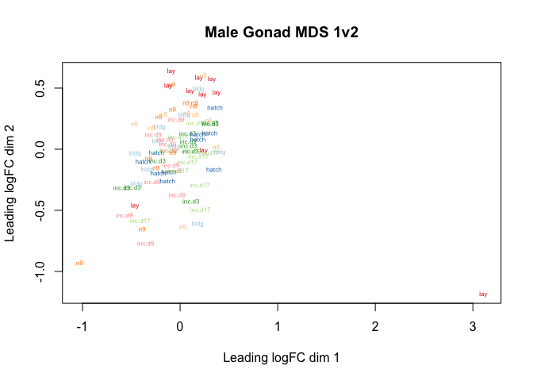
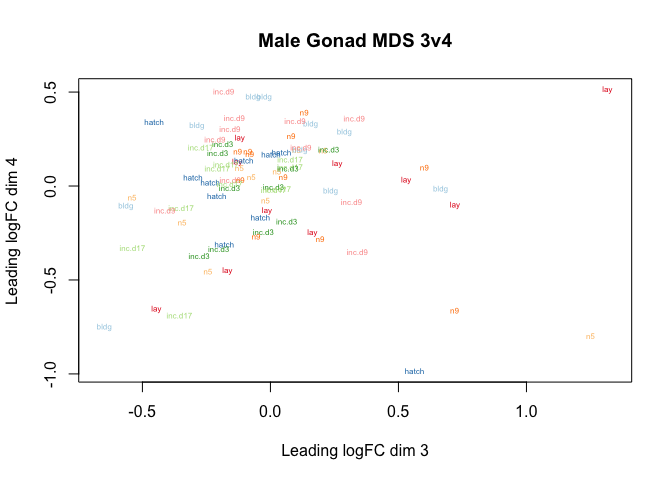
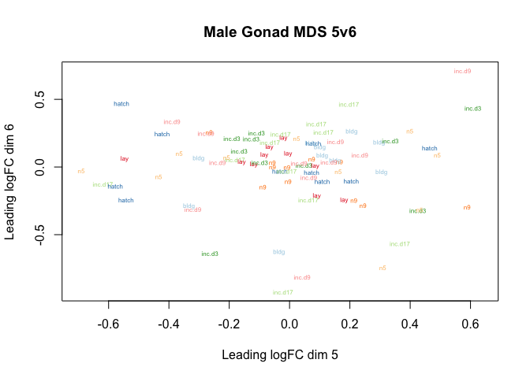
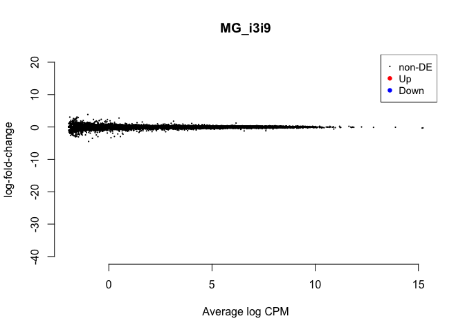
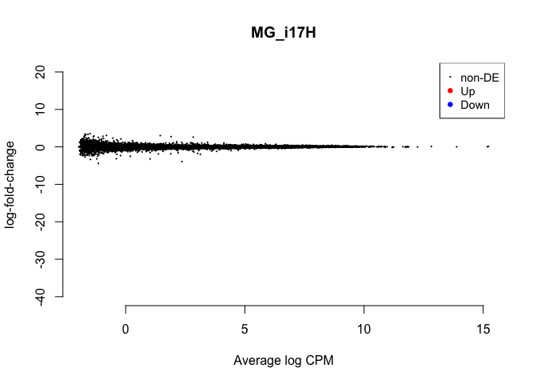
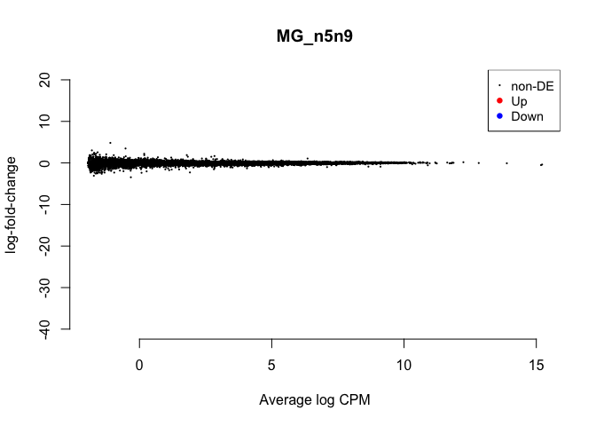
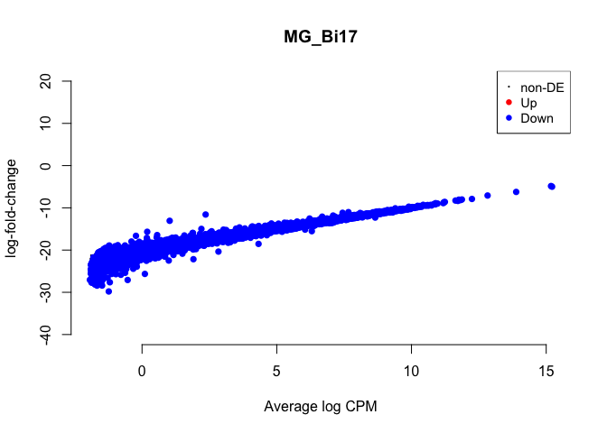
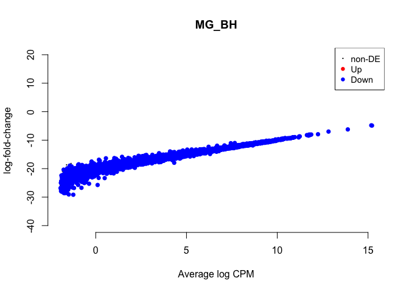

    library(tidyverse)

    ## ── Attaching packages ────────────────────────────────────────────────────────────── tidyverse 1.2.1 ──

    ## ✔ ggplot2 3.1.0       ✔ purrr   0.3.1  
    ## ✔ tibble  2.0.1       ✔ dplyr   0.8.0.1
    ## ✔ tidyr   0.8.3       ✔ stringr 1.4.0  
    ## ✔ readr   1.3.1       ✔ forcats 0.4.0

    ## ── Conflicts ───────────────────────────────────────────────────────────────── tidyverse_conflicts() ──
    ## ✖ dplyr::filter() masks stats::filter()
    ## ✖ dplyr::lag()    masks stats::lag()

    library(limma)
    library(Glimma)
    library(edgeR)
    library(kableExtra)

    ## 
    ## Attaching package: 'kableExtra'

    ## The following object is masked from 'package:dplyr':
    ## 
    ##     group_rows

    library(cowplot)

    ## 
    ## Attaching package: 'cowplot'

    ## The following object is masked from 'package:ggplot2':
    ## 
    ##     ggsave

    # load custom functions  
    source("../R/functions.R")  

    knitr::opts_chunk$set(fig.path = '../figures/gon_M/',cache=TRUE)

Male Gonad Data
===============

This anlaysis will *exclude* the control timepoint and only examine
males.

    # import "colData" which contains sample information and "countData" which contains read counts
    colData <- read.csv("../results/00_colData_characterization.csv", header = T, row.names = 1)
    countData <- read.csv("../results/00_countData_characterization.csv", header = T, row.names = 1)
    geneinfo <- read.csv("../results/00_geneinfo.csv", row.names = 1)

    colData <- colData %>%
      dplyr::filter(grepl('gonad', tissue)) %>%
      dplyr::filter(treatment != "control") %>%
      dplyr::filter(sex == "male") %>%
      droplevels()
    row.names(colData) <- colData$V1

    # print sample sizes
    colData %>% select(treatment, tissue)  %>%  summary()

    ##    treatment    tissue  
    ##  inc.d17:11   gonad:83  
    ##  inc.d9 :11             
    ##  n9     :11             
    ##  bldg   :10             
    ##  hatch  :10             
    ##  inc.d3 :10             
    ##  (Other):20

    savecols <- as.character(colData$V1) 
    savecols <- as.vector(savecols) 
    countData <- countData %>% dplyr::select(one_of(savecols)) 

    # check that row and col lenghts are equal
    ncol(countData) == nrow(colData)

    ## [1] TRUE

Then, I followed the steps from
<a href="https://github.com/macmanes-lab/RockDove/blob/master/parental_care/parental_analysis.Rmd" class="uri">https://github.com/macmanes-lab/RockDove/blob/master/parental_care/parental_analysis.Rmd</a>.

    # create a large DGEList with 3 elements
    parentalobject <- DGEList(counts=countData, genes=geneinfo, group=colData$group)

    # transform raw counts to countspermillion
    cpms <- cpm(parentalobject)

    # calculate number of lowly lowly expressed genes and remove them
    table(rowSums(parentalobject$counts==0)==10)

    ## 
    ## FALSE  TRUE 
    ## 14865    72

    keep_genes <- rowSums(cpms >= 1) >= 10
    dge <- parentalobject[keep_genes, ]

    # specific the design
    parentaldesign <- model.matrix(~ colData$group )
    colnames(parentaldesign) <- levels(colData$group)

    # The TMM normalization
    parentalobject <- calcNormFactors(parentalobject)
    parentalobject <- estimateCommonDisp(parentalobject)
    parentalobject <- estimateTagwiseDisp(parentalobject)
    parentalobject <- estimateDisp(parentalobject, parentaldesign)
    parentalobject <- estimateGLMCommonDisp(parentalobject, parentaldesign, verbose=TRUE)

    ## Disp = 0.06044 , BCV = 0.2458

    parentalobject <- estimateGLMTrendedDisp(parentalobject, parentaldesign)
    parentalobject <- estimateGLMTagwiseDisp(parentalobject, parentaldesign)

    #  perform likelihood ratio test and thresholded testing
    fit <- glmFit( parentalobject, parentaldesign, robust=T)
    tr <- glmTreat(fit, lfc = 1)
    topTags(tr)

    ## Coefficient:  male.gonad.n9 
    ##                row.names         Name    geneid       entrezid     logFC
    ## NP_990370.1       395902        KCNG2    395902    NP_990370.1  3.484315
    ## NP_989646.1       374209 RP11-290H9.2    374209    NP_989646.1  2.696942
    ## XP_015156656.1 107056134 LOC107056134 107056134 XP_015156656.1 -4.227447
    ## XP_015137321.1    428432       OSBPL3    428432 XP_015137321.1 -3.304268
    ## XP_004937988.1    418153         ERC1    418153 XP_004937988.1  5.080438
    ## XP_015157288.1 107056811 LOC107056811 107056811 XP_015157288.1  2.619651
    ## XP_015155602.1 100857831       YJEFN3 100857831 XP_015155602.1  2.732047
    ## NP_001264913.1 100858439 LOC100858439 100858439 NP_001264913.1  2.590400
    ## XP_015134452.1 100857343 LOC100857343 100857343 XP_015134452.1  2.555400
    ## XP_015136700.1    395944    LOC395944    395944 XP_015136700.1 -4.036883
    ##                unshrunk.logFC     logCPM      PValue FDR
    ## NP_990370.1      1.442695e+08 -1.2350627 0.000531458   1
    ## NP_989646.1      2.714222e+00  1.9073304 0.001562177   1
    ## XP_015156656.1  -1.442695e+08 -1.1007866 0.001964228   1
    ## XP_015137321.1  -1.442695e+08 -1.7662334 0.006719476   1
    ## XP_004937988.1   5.382772e+00 -0.3254285 0.007143043   1
    ## XP_015157288.1   1.442695e+08 -1.8058131 0.011760200   1
    ## XP_015155602.1   3.277410e+00 -1.1953148 0.013048677   1
    ## NP_001264913.1   2.767711e+00 -0.5337773 0.014333234   1
    ## XP_015134452.1   1.442695e+08 -1.5697394 0.014499943   1
    ## XP_015136700.1  -5.312855e+00 -0.5272153 0.015264094   1

    head(tr$table)

    ##                      logFC unshrunk.logFC     logCPM    PValue
    ## NP_001001127.1  0.89358144     0.90267306  0.9583443 0.3386869
    ## NP_001001129.1  0.37413852     0.39075415 -0.8973155 0.6977749
    ## NP_001001189.1  0.10668968     0.10670638  6.6485310 0.9999999
    ## NP_001001194.1  0.05602513     0.05519503 -0.7443575 0.9699567
    ## NP_001001195.1  0.05527176     0.05559195 -0.4646530 0.9586516
    ## NP_001001201.1 -0.02850439    -0.02851703  5.1567571 1.0000000

plotMDS (multidimential scaling)
================================

    levels(colData$treatment)

    ## [1] "bldg"    "hatch"   "inc.d17" "inc.d3"  "inc.d9"  "lay"     "n5"     
    ## [8] "n9"

    col.treatment <- c("#a6cee3", "#1f78b4", "#b2df8a", "#33a02c", "#fb9a99", "#e31a1c", "#fdbf6f", "#ff7f00", "#cab2d6")[colData$treatment]
    myfill <- c("#a6cee3", "#1f78b4", "#b2df8a", "#33a02c", "#fb9a99", "#e31a1c", "#fdbf6f", "#ff7f00", "#cab2d6")

    plotMDS(parentalobject, cex = 0.5, labels = colData$treatment, col=col.treatment)
    title("Male Gonad MDS 1v2")

    plotMDS(parentalobject, cex = 0.5, labels = colData$treatment, col=col.treatment, dim=c(3,4))
    title("Male Gonad MDS 3v4")

    plotMDS(parentalobject, cex = 0.5, labels = colData$treatment, col=col.treatment, dim=c(5,6))
    title("Male Gonad MDS 5v6")

For color coding, I used this tutorial for guidance
<a href="https://combine-australia.github.io/RNAseq-R/06-rnaseq-day1.html" class="uri">https://combine-australia.github.io/RNAseq-R/06-rnaseq-day1.html</a>.

specify contrasts and make MA plots
===================================

    # view all levels
    levels(colData$group)

    ## [1] "male.gonad.bldg"    "male.gonad.hatch"   "male.gonad.inc.d17"
    ## [4] "male.gonad.inc.d3"  "male.gonad.inc.d9"  "male.gonad.lay"    
    ## [7] "male.gonad.n5"      "male.gonad.n9"

    # subset of conrasts - sex specific comparing hatch to lay
    my.contrasts <- makeContrasts(
                 MG_BL = male.gonad.bldg - male.gonad.lay,
                 MG_Li3 = male.gonad.lay - male.gonad.inc.d3,
                 MG_i3i9 = male.gonad.inc.d3 - male.gonad.inc.d9,
                 MG_i9i17 = male.gonad.inc.d9 - male.gonad.inc.d17,
                 MG_i17H = male.gonad.inc.d17 - male.gonad.hatch,
                 MG_Hn5 = male.gonad.hatch -  male.gonad.n5,
                 MG_n5n9 = male.gonad.n5 - male.gonad.n9,
                 
                 MG_Bi3 = male.gonad.bldg - male.gonad.inc.d3,
                 MG_Bi9 = male.gonad.bldg - male.gonad.inc.d9,
                 MG_Bi17 = male.gonad.bldg - male.gonad.inc.d17,
                 MG_BH = male.gonad.bldg - male.gonad.hatch,
                 MG_Bn5 = male.gonad.bldg - male.gonad.n5,
                 MG_Bn9 = male.gonad.bldg - male.gonad.n9,
                 
                 MG_Li9 = male.gonad.lay - male.gonad.inc.d9,
               MG_Li17 = male.gonad.lay - male.gonad.inc.d17, 
                 MG_LH = male.gonad.lay - male.gonad.hatch,
                 MG_Ln5 = male.gonad.lay - male.gonad.n5,
                 MG_Ln9 = male.gonad.lay - male.gonad.n9,

                 MG_i3i17 = male.gonad.inc.d3 - male.gonad.inc.d17,
                 MG_i3H = male.gonad.inc.d3 - male.gonad.hatch,
                 MG_i3n5 = male.gonad.inc.d3 - male.gonad.n5,
                 MG_i3n9 = male.gonad.inc.d3 - male.gonad.n9,
                
                 MG_i9H = male.gonad.inc.d9 - male.gonad.hatch,
                 MG_i9n5 = male.gonad.inc.d9 - male.gonad.n5,
                 MG_i9n9 = male.gonad.inc.d9 - male.gonad.n9,
                 
                 MG_i17n5 = male.gonad.inc.d17 - male.gonad.n5,
                 MG_i17n9 = male.gonad.inc.d17 - male.gonad.n9,
                 
                 MG_Hn9 = male.gonad.hatch -  male.gonad.n9,
                 
    levels=parentaldesign)

    colnames(my.contrasts)

    ##  [1] "MG_BL"    "MG_Li3"   "MG_i3i9"  "MG_i9i17" "MG_i17H"  "MG_Hn5"  
    ##  [7] "MG_n5n9"  "MG_Bi3"   "MG_Bi9"   "MG_Bi17"  "MG_BH"    "MG_Bn5"  
    ## [13] "MG_Bn9"   "MG_Li9"   "MG_Li17"  "MG_LH"    "MG_Ln5"   "MG_Ln9"  
    ## [19] "MG_i3i17" "MG_i3H"   "MG_i3n5"  "MG_i3n9"  "MG_i9H"   "MG_i9n5" 
    ## [25] "MG_i9n9"  "MG_i17n5" "MG_i17n9" "MG_Hn9"

    # create a list with all the two way contrasts

    mycontrasts <- colnames(my.contrasts)
    mycontrasts

    ##  [1] "MG_BL"    "MG_Li3"   "MG_i3i9"  "MG_i9i17" "MG_i17H"  "MG_Hn5"  
    ##  [7] "MG_n5n9"  "MG_Bi3"   "MG_Bi9"   "MG_Bi17"  "MG_BH"    "MG_Bn5"  
    ## [13] "MG_Bn9"   "MG_Li9"   "MG_Li17"  "MG_LH"    "MG_Ln5"   "MG_Ln9"  
    ## [19] "MG_i3i17" "MG_i3H"   "MG_i3n5"  "MG_i3n9"  "MG_i9H"   "MG_i9n5" 
    ## [25] "MG_i9n9"  "MG_i17n5" "MG_i17n9" "MG_Hn9"

    # use the printplotcontrasts function to print summary stats and a volcano plot

    for(i in mycontrasts){
      printplotcontrasts(i)
    }

    ##        1*male.gonad.bldg -1*male.gonad.lay
    ## Down                                 14863
    ## NotSig                                  74
    ## Up                                       0

    ## NULL
    ##        -1*male.gonad.inc.d3 1*male.gonad.lay
    ## Down                                       0
    ## NotSig                                 14937
    ## Up                                         0

    ## NULL
    ##        1*male.gonad.inc.d3 -1*male.gonad.inc.d9
    ## Down                                          0
    ## NotSig                                    14937
    ## Up                                            0

    ## NULL
    ##        -1*male.gonad.inc.d17 1*male.gonad.inc.d9
    ## Down                                           0
    ## NotSig                                     14937
    ## Up                                             0

    ## NULL
    ##        -1*male.gonad.hatch 1*male.gonad.inc.d17
    ## Down                                          0
    ## NotSig                                    14937
    ## Up                                            0

    ## NULL
    ##        1*male.gonad.hatch -1*male.gonad.n5
    ## Down                                     0
    ## NotSig                               14937
    ## Up                                       0

    ## NULL
    ##        1*male.gonad.n5 -1*male.gonad.n9
    ## Down                                  0
    ## NotSig                            14937
    ## Up                                    0

    ## NULL
    ##        1*male.gonad.bldg -1*male.gonad.inc.d3
    ## Down                                    14821
    ## NotSig                                    116
    ## Up                                          0

    ## NULL
    ##        1*male.gonad.bldg -1*male.gonad.inc.d9
    ## Down                                    14853
    ## NotSig                                     84
    ## Up                                          0

    ## NULL
    ##        1*male.gonad.bldg -1*male.gonad.inc.d17
    ## Down                                     14827
    ## NotSig                                     110
    ## Up                                           0

    ## NULL
    ##        1*male.gonad.bldg -1*male.gonad.hatch
    ## Down                                   14828
    ## NotSig                                   109
    ## Up                                         0

    ## NULL
    ##        1*male.gonad.bldg -1*male.gonad.n5
    ## Down                                14844
    ## NotSig                                 93
    ## Up                                      0

    ## NULL
    ##        1*male.gonad.bldg -1*male.gonad.n9
    ## Down                                14872
    ## NotSig                                 65
    ## Up                                      0

    ## NULL
    ##        -1*male.gonad.inc.d9 1*male.gonad.lay
    ## Down                                       0
    ## NotSig                                 14937
    ## Up                                         0

    ## NULL
    ##        -1*male.gonad.inc.d17 1*male.gonad.lay
    ## Down                                        0
    ## NotSig                                  14937
    ## Up                                          0

    ## NULL
    ##        -1*male.gonad.hatch 1*male.gonad.lay
    ## Down                                      0
    ## NotSig                                14937
    ## Up                                        0

    ## NULL
    ##        1*male.gonad.lay -1*male.gonad.n5
    ## Down                                   0
    ## NotSig                             14937
    ## Up                                     0

    ## NULL
    ##        1*male.gonad.lay -1*male.gonad.n9
    ## Down                                   0
    ## NotSig                             14937
    ## Up                                     0

    ## NULL
    ##        -1*male.gonad.inc.d17 1*male.gonad.inc.d3
    ## Down                                           0
    ## NotSig                                     14937
    ## Up                                             0

    ## NULL
    ##        -1*male.gonad.hatch 1*male.gonad.inc.d3
    ## Down                                         0
    ## NotSig                                   14937
    ## Up                                           0

    ## NULL
    ##        1*male.gonad.inc.d3 -1*male.gonad.n5
    ## Down                                      0
    ## NotSig                                14937
    ## Up                                        0

    ## NULL
    ##        1*male.gonad.inc.d3 -1*male.gonad.n9
    ## Down                                      0
    ## NotSig                                14937
    ## Up                                        0

    ## NULL
    ##        -1*male.gonad.hatch 1*male.gonad.inc.d9
    ## Down                                         0
    ## NotSig                                   14937
    ## Up                                           0

    ## NULL
    ##        1*male.gonad.inc.d9 -1*male.gonad.n5
    ## Down                                      0
    ## NotSig                                14937
    ## Up                                        0

    ## NULL
    ##        1*male.gonad.inc.d9 -1*male.gonad.n9
    ## Down                                      0
    ## NotSig                                14937
    ## Up                                        0

    ## NULL
    ##        1*male.gonad.inc.d17 -1*male.gonad.n5
    ## Down                                       0
    ## NotSig                                 14937
    ## Up                                         0

    ## NULL
    ##        1*male.gonad.inc.d17 -1*male.gonad.n9
    ## Down                                       0
    ## NotSig                                 14937
    ## Up                                         0

    ## NULL
    ##        1*male.gonad.hatch -1*male.gonad.n9
    ## Down                                     0
    ## NotSig                               14937
    ## Up                                       0

    ## NULL
