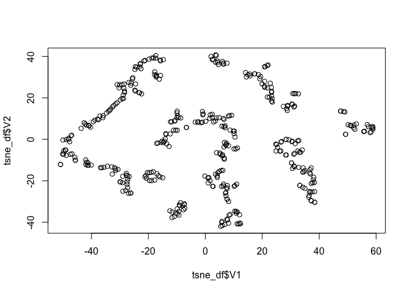
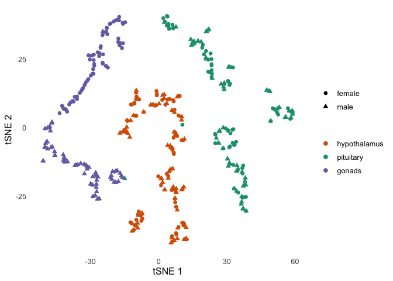
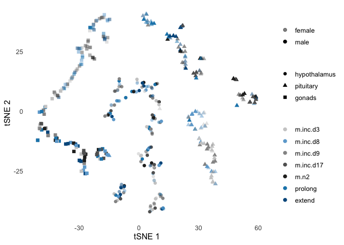

    library(tidyverse)
    library(DESeq2)
    library(cowplot)
    library(factoextra)
    library(Rtsne)

    # load custom functions  
    source("../R/functions.R") 
    source("../R/themes.R") 

    knitr::opts_chunk$set(fig.path = '../figures/manipulation/', cache = TRUE)

Manipulation data
-----------------

    # import "colData" which contains sample information and "countData" which contains read counts
    m.colData <- read.csv("../metadata/00_colData_manipluation.csv", header = T, row.names = 1)
    m.countData <- read.csv("../results/00_countData_manipluation.csv", header = T, row.names = 1)
    geneinfo <- read.csv("../metadata/00_geneinfo.csv", row.names = 1)

    # set levels
    m.colData$treatment <- factor(m.colData$treatment, levels = 
                                  c("m.inc.d3",  "m.inc.d8",
                                    "m.inc.d9", "m.inc.d17",
                                    "prolong", "extend", "m.n2"))

    m.colData$sextissue <- as.factor(paste(m.colData$sex, m.colData$tissue, sep = "_"))

    m.colData$outcome <- ifelse(grepl("d3|d9|d17", m.colData$treatment), "end inc", 
                         ifelse(grepl("d8|n2", m.colData$treatment),"end hatch",
                         ifelse(grepl("prolong", m.colData$treatment),"prolong inc",
                         ifelse(grepl("extend", m.colData$treatment),"delay hatch", NA))))

    summary(m.colData[c(7,3,4,5,8)])

    ##           study         sex               tissue        treatment 
    ##  manipulation:411   female:208   gonad       :136   m.inc.d3 :60  
    ##                     male  :203   hypothalamus:138   m.inc.d8 :60  
    ##                                  pituitary   :137   m.inc.d9 :49  
    ##                                                     m.inc.d17:63  
    ##                                                     prolong  :60  
    ##                                                     extend   :60  
    ##                                                     m.n2     :59  
    ##                sextissue 
    ##  female_gonad       :69  
    ##  female_hypothalamus:70  
    ##  female_pituitary   :69  
    ##  male_gonad         :67  
    ##  male_hypothalamus  :68  
    ##  male_pituitary     :68  
    ## 

Run DESeq on all subsets of the data
------------------------------------

    dds.female_hypothalamus <- subsetDESeq("female_hypothalamus")

    ## [1] TRUE
    ## class: DESeqDataSet 
    ## dim: 14937 70 
    ## metadata(1): version
    ## assays(1): counts
    ## rownames(14937): NP_001001127.1 NP_001001129.1 ... XP_430449.2
    ##   XP_430508.3
    ## rowData names(0):
    ## colnames(70): blk.s031.pu.d_female_hypothalamus_prolong
    ##   blk.s032.g.w_female_hypothalamus_m.hatch ...
    ##   y85.r71.x_female_hypothalamus_m.inc.d17
    ##   y98.g54_female_hypothalamus_m.hatch
    ## colData names(9): V1 bird ... sextissue outcome
    ## [1] 14363    70

    ## estimating size factors

    ## estimating dispersions

    ## gene-wise dispersion estimates

    ## mean-dispersion relationship

    ## final dispersion estimates

    ## fitting model and testing

    ## -- replacing outliers and refitting for 15 genes
    ## -- DESeq argument 'minReplicatesForReplace' = 7 
    ## -- original counts are preserved in counts(dds)

    ## estimating dispersions

    ## fitting model and testing

    dds.female_pituitary <- subsetDESeq("female_pituitary" )

    ## [1] TRUE
    ## class: DESeqDataSet 
    ## dim: 14937 69 
    ## metadata(1): version
    ## assays(1): counts
    ## rownames(14937): NP_001001127.1 NP_001001129.1 ... XP_430449.2
    ##   XP_430508.3
    ## rowData names(0):
    ## colnames(69): blk.s031.pu.d_female_pituitary_prolong
    ##   blk.s032.g.w_female_pituitary_m.hatch ...
    ##   y85.r71.x_female_pituitary_m.inc.d17
    ##   y98.g54_female_pituitary_m.hatch
    ## colData names(9): V1 bird ... sextissue outcome
    ## [1] 14298    69

    ## estimating size factors

    ## estimating dispersions

    ## gene-wise dispersion estimates

    ## mean-dispersion relationship

    ## final dispersion estimates

    ## fitting model and testing

    ## -- replacing outliers and refitting for 54 genes
    ## -- DESeq argument 'minReplicatesForReplace' = 7 
    ## -- original counts are preserved in counts(dds)

    ## estimating dispersions

    ## fitting model and testing

    dds.female_gonad <- subsetDESeq("female_gonad" )

    ## [1] TRUE
    ## class: DESeqDataSet 
    ## dim: 14937 69 
    ## metadata(1): version
    ## assays(1): counts
    ## rownames(14937): NP_001001127.1 NP_001001129.1 ... XP_430449.2
    ##   XP_430508.3
    ## rowData names(0):
    ## colnames(69): blk.s031.pu.d_female_gonad_prolong
    ##   blk.s032.g.w_female_gonad_m.hatch ...
    ##   y85.r71.x_female_gonad_m.inc.d17 y98.g54_female_gonad_m.hatch
    ## colData names(9): V1 bird ... sextissue outcome
    ## [1] 14631    69

    ## estimating size factors

    ## estimating dispersions

    ## gene-wise dispersion estimates

    ## mean-dispersion relationship

    ## final dispersion estimates

    ## fitting model and testing

    ## -- replacing outliers and refitting for 472 genes
    ## -- DESeq argument 'minReplicatesForReplace' = 7 
    ## -- original counts are preserved in counts(dds)

    ## estimating dispersions

    ## fitting model and testing

    dds.male_hypothalamus <- subsetDESeq("male_hypothalamus" )

    ## [1] TRUE
    ## class: DESeqDataSet 
    ## dim: 14937 68 
    ## metadata(1): version
    ## assays(1): counts
    ## rownames(14937): NP_001001127.1 NP_001001129.1 ... XP_430449.2
    ##   XP_430508.3
    ## rowData names(0):
    ## colnames(68): blk.s030.o.g_male_hypothalamus_prolong
    ##   blk5.x_male_hypothalamus_m.inc.d3 ...
    ##   y55.x_male_hypothalamus_m.inc.d8
    ##   y63.x_male_hypothalamus_m.inc.d9
    ## colData names(9): V1 bird ... sextissue outcome
    ## [1] 14339    68

    ## estimating size factors

    ## estimating dispersions

    ## gene-wise dispersion estimates

    ## mean-dispersion relationship

    ## final dispersion estimates

    ## fitting model and testing

    ## -- replacing outliers and refitting for 7 genes
    ## -- DESeq argument 'minReplicatesForReplace' = 7 
    ## -- original counts are preserved in counts(dds)

    ## estimating dispersions

    ## fitting model and testing

    dds.male_pituitary <- subsetDESeq("male_pituitary"  )

    ## [1] TRUE
    ## class: DESeqDataSet 
    ## dim: 14937 68 
    ## metadata(1): version
    ## assays(1): counts
    ## rownames(14937): NP_001001127.1 NP_001001129.1 ... XP_430449.2
    ##   XP_430508.3
    ## rowData names(0):
    ## colnames(68): blk.s030.o.g_male_pituitary_prolong
    ##   blk5.x_male_pituitary_m.inc.d3 ... y55.x_male_pituitary_m.inc.d8
    ##   y63.x_male_pituitary_m.inc.d9
    ## colData names(9): V1 bird ... sextissue outcome
    ## [1] 14288    68

    ## estimating size factors

    ## estimating dispersions

    ## gene-wise dispersion estimates

    ## mean-dispersion relationship

    ## final dispersion estimates

    ## fitting model and testing

    ## -- replacing outliers and refitting for 211 genes
    ## -- DESeq argument 'minReplicatesForReplace' = 7 
    ## -- original counts are preserved in counts(dds)

    ## estimating dispersions

    ## fitting model and testing

    dds.male_gondad <- subsetDESeq("male_gonad")

    ## [1] TRUE
    ## class: DESeqDataSet 
    ## dim: 14937 67 
    ## metadata(1): version
    ## assays(1): counts
    ## rownames(14937): NP_001001127.1 NP_001001129.1 ... XP_430449.2
    ##   XP_430508.3
    ## rowData names(0):
    ## colnames(67): blk.s030.o.g_male_gonad_prolong
    ##   blk5.x_male_gonad_m.inc.d3 ... y55.x_male_gonad_m.inc.d8
    ##   y63.x_male_gonad_m.inc.d9
    ## colData names(9): V1 bird ... sextissue outcome
    ## [1] 14662    67

    ## estimating size factors

    ## estimating dispersions

    ## gene-wise dispersion estimates

    ## mean-dispersion relationship

    ## final dispersion estimates

    ## fitting model and testing

    ## -- replacing outliers and refitting for 455 genes
    ## -- DESeq argument 'minReplicatesForReplace' = 7 
    ## -- original counts are preserved in counts(dds)

    ## estimating dispersions

    ## fitting model and testing

Calculate and plot total DEGs
-----------------------------

    #create list of groups for deseq contrasts
    group1 <- c("m.inc.d3","m.inc.d8", "m.inc.d9", "m.inc.d17", "prolong","extend", "m.n2" ) 
    group2 <- group1

    a <- plottotalDEGs(dds.female_hypothalamus, "female hypothalamus")
    b <- plottotalDEGs(dds.female_pituitary, "female pituitary")
    c <- plottotalDEGs(dds.female_gonad, "female gonad")
    d <- plottotalDEGs(dds.male_hypothalamus, "male hypothalamus")
    e <- plottotalDEGs(dds.male_pituitary, "male pituitary")
    f <- plottotalDEGs(dds.male_gondad, "male gonad")

    plot_grid(a + theme(legend.position = "none"),
              b + theme(legend.position = "none"),
              c,
              d + theme(legend.position = "none"),
              e + theme(legend.position = "none"),
              f,
              nrow = 2, rel_widths = c(0.3, 0.3, 0.4)) 

Calculate and plot principal components
---------------------------------------

    plotPCAs(dds.female_hypothalamus, "female hypothalamus")
    plotPCAs(dds.female_pituitary, "female pituitary")      
    plotPCAs(dds.female_gonad, "female gonad")
    plotPCAs(dds.male_hypothalamus, "male hypothalamus")
    plotPCAs(dds.male_pituitary, "male pituitary")
    plotPCAs(dds.male_gondad, "male gonad")

heamap with minimum pvalue
--------------------------

    makepheatmap(dds.female_hypothalamus, "female hypothalamus")
    makepheatmap(dds.female_pituitary, "female pituitary")
    makepheatmap(dds.female_gonad, "female gonad")
    makepheatmap(dds.male_hypothalamus, "male hypothalamus")
    makepheatmap(dds.male_pituitary, "male pituitary")
    makepheatmap(dds.male_gondad, "male gonad")        

candidate genes
---------------

    plotcandidates(dds.female_hypothalamus, "female hypothalamus")
    plotcandidates(dds.female_pituitary, "female pituitary")
    plotcandidates(dds.female_gonad, "female gonad")
    plotcandidates(dds.male_hypothalamus, "male hypothalamus")
    plotcandidates(dds.male_pituitary, "male pituitary")
    plotcandidates(dds.male_gondad, "male gonad")

offspring removal
-----------------

    g <- plotremoval(DEGs.female_hypothalamus, "Female hypothalamus", "bottom")
    h <- plotremoval(DEGs.female_pituitary, "Female pituitary", "none")
    i <- plotremoval(DEGs.female_gonad, "Female gonad",  "none")
    j <- plotremoval(DEGs.male_hypothalamus, "Male hypothalamus", "none")
    k <- plotremoval(DEGs.male_pituitary, "Male pituitary", "none")
    l <- plotremoval(DEGs.male_gondad, "Male gonad", "none")

    legend <- get_legend(g)

    mybarplots <- plot_grid(g + theme(legend.position = "none"), h , i , j ,k , l, nrow = 2) 

    mybarplots2 <- plot_grid(mybarplots, legend, ncol = 1, rel_heights = c(1,0.1))
    mybarplots2

    pdf("../figures/sexes/offspringremoval-1.pdf", width = 10, height = 6)
    plot(mybarplots2)
    dev.off()

prolong extend
--------------

    g <- plotprolongdelay(DEGs.female_hypothalamus, "Female hypothalamus", "bottom")
    h <- plotprolongdelay(DEGs.female_pituitary, "Female pituitary", "none")
    i <- plotprolongdelay(DEGs.female_gonad, "Female gonad",  "none")
    j <- plotprolongdelay(DEGs.male_hypothalamus, "Male hypothalamus", "none")
    k <- plotprolongdelay(DEGs.male_pituitary, "Male pituitary", "none")
    l <- plotprolongdelay(DEGs.male_gondad, "Male gonad", "none")

    legend <- get_legend(g)

    mybarplots <- plot_grid(g + theme(legend.position = "none"), h , i , j ,k , l, nrow = 2) 

    mybarplots2 <- plot_grid(mybarplots, legend, ncol = 1, rel_heights = c(1,0.1))
    mybarplots2

    pdf("../figures/sexes/prolongextend-1.pdf", width = 10, height = 6)
    plot(mybarplots2)
    dev.off()

pca and tsne
============

    pseudocounts <- read_csv("../results/01_pseudo.counts.csv")

    ## Warning: Missing column names filled in: 'X1' [1]

    ## Parsed with column specification:
    ## cols(
    ##   .default = col_double(),
    ##   X1 = col_character()
    ## )

    ## See spec(...) for full column specifications.

    head(pseudocounts[1:3])

    ## # A tibble: 6 x 3
    ##   X1           L.Blu13_male_gonad_control… L.Blu13_male_hypothalamus_contr…
    ##   <chr>                              <dbl>                            <dbl>
    ## 1 NP_00100112…                      18.0            283.                   
    ## 2 NP_00100112…                       2.71             0.709                
    ## 3 NP_00100118…                    1249.             562.                   
    ## 4 NP_00100119…                       3.00             0.105                
    ## 5 NP_00100119…                       0.880            0.0000000000000000278
    ## 6 NP_00100120…                     200.              24.1

    colData <- read.csv("../metadata/00_colData_manipluation.csv", header = T, row.names = 1)

    colData$treatment <- factor(colData$treatment, levels = maniplevels1)
    colData$tissue <- factor(colData$tissue, levels = c("hypothalamus", "pituitary", "gonad"))
    colData <- colData %>% mutate(tissue = fct_recode(tissue, "gonads" = "gonad"))
    head(colData[1:3])

    ##                                          V1          bird    sex
    ## 1           blk.s030.o.g_male_gonad_prolong  blk.s030.o.g   male
    ## 2    blk.s030.o.g_male_hypothalamus_prolong  blk.s030.o.g   male
    ## 3       blk.s030.o.g_male_pituitary_prolong  blk.s030.o.g   male
    ## 4        blk.s031.pu.d_female_gonad_prolong blk.s031.pu.d female
    ## 5 blk.s031.pu.d_female_hypothalamus_prolong blk.s031.pu.d female
    ## 6    blk.s031.pu.d_female_pituitary_prolong blk.s031.pu.d female

    geneinfo <- read.csv("../metadata/00_geneinfo.csv", row.names = 1)

    subsetcounts <- function(colData, countData){
      
      # save counts that match colData
      savecols <- as.character(colData$V1) 
      savecols <- as.vector(savecols) 
      countData <- countData %>% 
        dplyr::select(X1,savecols) %>% 
        dplyr::rename(entrezid = X1)  
      
      countData <- left_join(geneinfo, countData)
      print(head(countData))
      countData <- countData %>% dplyr::distinct(Name, .keep_all = TRUE) %>%
        dplyr::select(-row.names)  %>% dplyr::select(-geneid) %>% dplyr::select(-entrezid) 
      print(head(countData))
      row.names(countData) <- countData$Name
      countData$Name <- NULL
      countData <- as.data.frame(t(countData))
      
      return(countData)
    }

    countData <- subsetcounts(colData, pseudocounts)

    ## Joining, by = "entrezid"

    ## Warning: Column `entrezid` joining factor and character vector, coercing
    ## into character vector

    ##   row.names     Name geneid       entrezid blk.s030.o.g_male_gonad_prolong
    ## 1    408082    EDNRB 408082 NP_001001127.1                       38.442899
    ## 2    408183  CYP26A1 408183 NP_001001129.1                        0.000000
    ## 3    374073    CFDP1 374073 NP_001001189.1                      823.575087
    ## 4    407777    AvBD7 407777 NP_001001194.1                        1.396881
    ## 5    407779     KRT5 407779 NP_001001195.1                        5.230893
    ## 6    408034 HSD11B1L 408034 NP_001001201.1                      255.612688
    ##   blk.s030.o.g_male_hypothalamus_prolong
    ## 1                           1.162266e+02
    ## 2                           1.589386e+00
    ## 3                           4.058272e+02
    ## 4                           2.775558e-17
    ## 5                           1.448718e-02
    ## 6                           2.295951e+01
    ##   blk.s030.o.g_male_pituitary_prolong blk.s031.pu.d_female_gonad_prolong
    ## 1                          197.366705                          64.086775
    ## 2                           35.721220                          74.761756
    ## 3                          354.415813                         343.310652
    ## 4                            0.000000                          10.002347
    ## 5                            2.744636                           2.792442
    ## 6                           61.103943                          41.025920
    ##   blk.s031.pu.d_female_hypothalamus_prolong
    ## 1                              180.22378163
    ## 2                                0.21622081
    ## 3                              530.05677575
    ## 4                                0.01448557
    ## 5                                0.09851069
    ## 6                               30.71667617
    ##   blk.s031.pu.d_female_pituitary_prolong blk.s032.g.w_female_gonad_m.hatch
    ## 1                            262.0593485                         28.565475
    ## 2                             86.8424468                        155.137852
    ## 3                            263.7048692                        633.569325
    ## 4                              0.6883358                         46.043133
    ## 5                              0.4792065                          2.218078
    ## 6                            117.4725860                         59.502272
    ##   blk.s032.g.w_female_hypothalamus_m.hatch
    ## 1                              183.4932991
    ## 2                                1.1332921
    ## 3                              375.9340373
    ## 4                                1.6292515
    ## 5                                0.6392684
    ## 6                               29.4578869
    ##   blk.s032.g.w_female_pituitary_m.hatch blk.s049.y.g_female_gonad_m.inc.d3
    ## 1                            194.910986                          93.542630
    ## 2                              5.780961                         161.694736
    ## 3                            388.397160                         308.535988
    ## 4                              0.000000                          51.811395
    ## 5                              1.860044                           4.569483
    ## 6                            167.857158                          31.701263
    ##   blk.s049.y.g_female_hypothalamus_m.inc.d3
    ## 1                              1.707573e+02
    ## 2                              3.668879e+00
    ## 3                              5.255169e+02
    ## 4                              2.775558e-17
    ## 5                              9.003379e-02
    ## 6                              2.870535e+01
    ##   blk.s049.y.g_female_pituitary_m.inc.d3
    ## 1                            205.5922943
    ## 2                            100.4069940
    ## 3                            380.0636058
    ## 4                              0.0000000
    ## 5                              0.7085165
    ## 6                             92.1208995
    ##   blk.s060.pu.w_female_gonad_m.inc.d3
    ## 1                           32.528825
    ## 2                           73.579686
    ## 3                          538.704152
    ## 4                            2.120183
    ## 5                            3.546417
    ## 6                           52.835660
    ##   blk.s060.pu.w_female_hypothalamus_m.inc.d3
    ## 1                               1.804385e+02
    ## 2                               2.555000e+00
    ## 3                               4.574097e+02
    ## 4                               2.775558e-17
    ## 5                               8.460199e-01
    ## 6                               3.363308e+01
    ##   blk.s060.pu.w_female_pituitary_m.inc.d3.NYNO
    ## 1                                 1.739730e+02
    ## 2                                 1.073179e+02
    ## 3                                 4.277429e+02
    ## 4                                 7.356278e-04
    ## 5                                 6.024252e-03
    ## 6                                 1.360801e+02
    ##   blk.y.l.s109_female_gonad_m.inc.d8
    ## 1                          80.309391
    ## 2                         137.776673
    ## 3                         286.219755
    ## 4                          62.556285
    ## 5                           2.332941
    ## 6                          30.176126
    ##   blk.y.l.s109_female_hypothalamus_m.inc.d8
    ## 1                               203.1721297
    ## 2                                 1.1989670
    ## 3                               376.0378880
    ## 4                                 0.0000000
    ## 5                                 0.6842933
    ## 6                                22.5567042
    ##   blk.y.l.s109_female_pituitary_m.inc.d8 blk0.x_female_gonad_m.n2
    ## 1                           1.723277e+02               52.3655766
    ## 2                           1.360417e+01               63.5269358
    ## 3                           3.533829e+02              431.5685065
    ## 4                           2.775558e-17                2.5178543
    ## 5                           4.252374e+00                0.3508041
    ## 6                           7.277441e+01               60.9937922
    ##   blk0.x_female_hypothalamus_m.n2 blk0.x_female_pituitary_m.n2
    ## 1                    292.13833143                 175.34487204
    ## 2                      2.03987921                  47.25220951
    ## 3                    407.33316783                 510.23015508
    ## 4                      0.01890026                   0.02023722
    ## 5                      0.09128329                   1.81980574
    ## 6                     29.58189906                 137.01359075
    ##   blk19.x_female_gonad_extend blk19.x_female_hypothalamus_extend
    ## 1                  108.902924                        140.1850998
    ## 2                  103.091094                          1.0243851
    ## 3                  325.385878                        428.9799767
    ## 4                   13.379865                          0.0000000
    ## 5                    5.798593                          0.4617786
    ## 6                   35.562606                         54.1714097
    ##   blk19.x_female_pituitary_extend blk5.x_male_gonad_m.inc.d3
    ## 1                    138.35615741                  21.464654
    ## 2                      9.14375748                   2.418188
    ## 3                    321.42936066                 839.683798
    ## 4                      0.01327455                   0.000000
    ## 5                      4.36247159                   2.167933
    ## 6                    136.93935902                 450.078677
    ##   blk5.x_male_hypothalamus_m.inc.d3 blk5.x_male_pituitary_m.inc.d3
    ## 1                      1.644919e+02                   1.485890e+02
    ## 2                      1.913855e+00                   3.935341e+01
    ## 3                      4.165180e+02                   2.879278e+02
    ## 4                      2.775558e-17                   2.775558e-17
    ## 5                      1.623756e-01                   3.789074e-01
    ## 6                      2.140020e+01                   8.685734e+01
    ##   blu10.w26.x_male_gonad_m.hatch blu10.w26.x_male_hypothalamus_m.hatch
    ## 1                      53.060720                          1.721017e+02
    ## 2                       0.854015                          2.034846e+00
    ## 3                     615.256762                          3.740984e+02
    ## 4                       4.640961                          2.775558e-17
    ## 5                       8.235778                          0.000000e+00
    ## 6                     309.517251                          2.855744e+01
    ##   blu10.w26.x_male_pituitary_m.hatch
    ## 1                       1.579815e+02
    ## 2                       5.477551e+01
    ## 3                       3.281491e+02
    ## 4                       2.775558e-17
    ## 5                       0.000000e+00
    ## 6                       9.569127e+01
    ##   blu115.y150.x_female_gonad_inc.prolong
    ## 1                              40.125447
    ## 2                              61.634043
    ## 3                             422.881496
    ## 4                               5.509328
    ## 5                               1.385132
    ## 6                              84.405837
    ##   blu115.y150.x_female_hypothalamus_inc.prolong
    ## 1                                   177.5908858
    ## 2                                     4.8975049
    ## 3                                   442.7079009
    ## 4                                     0.8240448
    ## 5                                     0.7305646
    ## 6                                    34.6711036
    ##   blu115.y150.x_female_pituitary_inc.prolong
    ## 1                               149.33402167
    ## 2                                20.78897514
    ## 3                               430.22429361
    ## 4                                 0.03848389
    ## 5                                 0.19690489
    ## 6                               128.40621116
    ##   blu119.w84.x_female_gonad_m.inc.d8
    ## 1                          51.680509
    ## 2                          19.436811
    ## 3                         461.397380
    ## 4                          30.158818
    ## 5                           0.977155
    ## 6                          51.466306
    ##   blu119.w84.x_female_hypothalamus_m.inc.d8
    ## 1                                137.246767
    ## 2                                  4.106642
    ## 3                                439.179005
    ## 4                                  0.000000
    ## 5                                  2.219865
    ## 6                                 40.057156
    ##   blu119.w84.x_female_pituitary_m.inc.d8 blu44.y102_female_gonad_extend
    ## 1                           1.720738e+02                      76.679305
    ## 2                           3.293647e+01                      73.107149
    ## 3                           3.587982e+02                     480.633665
    ## 4                           2.775558e-17                       4.946667
    ## 5                           0.000000e+00                       6.659936
    ## 6                           1.434924e+02                     136.045977
    ##   blu44.y102_female_hypothalamus_extend blu44.y102_female_pituitary_extend
    ## 1                           209.2121096                        254.1489046
    ## 2                             3.0936033                         27.6228106
    ## 3                           408.1518648                        337.4432953
    ## 4                             0.5749212                          0.0000000
    ## 5                             0.0000000                          0.9266211
    ## 6                            23.3564286                        105.2056292
    ##   blu56.o53_female_gonad_m.inc.d3 blu56.o53_female_hypothalamus_m.inc.d3
    ## 1                      71.2283516                           1.688415e+02
    ## 2                     101.0238669                           1.518431e+00
    ## 3                     735.2011280                           5.243013e+02
    ## 4                      58.8117788                           2.775558e-17
    ## 5                       0.5143536                           4.508097e-02
    ## 6                      68.9849496                           3.682892e+01
    ##   blu56.o53_female_pituitary_m.inc.d3 blu63.g62_female_gonad_m.inc.d9
    ## 1                          137.293347                      54.0303613
    ## 2                           27.211206                      51.9948246
    ## 3                          398.818510                     470.6242194
    ## 4                            0.000000                      34.1141753
    ## 5                            0.986247                       0.4031879
    ## 6                          147.086383                     103.5492073
    ##   blu63.g62_female_hypothalamus_m.inc.d9
    ## 1                           2.051718e+02
    ## 2                           2.179592e+00
    ## 3                           5.212438e+02
    ## 4                           2.775558e-17
    ## 5                           1.268215e-01
    ## 6                           1.911988e+01
    ##   blu63.g62_female_pituitary_m.inc.d9 blu80.r97_female_gonad_m.inc.d8
    ## 1                        151.38208046                       33.278620
    ## 2                         27.21514232                      105.251508
    ## 3                        437.39994736                      553.640521
    ## 4                          0.06969201                        6.731706
    ## 5                          2.05073450                        2.214465
    ## 6                        102.57341619                       53.746705
    ##   blu80.r97_female_hypothalamus_m.inc.d8
    ## 1                            178.0204359
    ## 2                              0.0000000
    ## 3                            430.9932092
    ## 4                              0.0000000
    ## 5                              0.7095624
    ## 6                             27.8121135
    ##   blu80.r97_female_pituitary_m.inc.d8 blu84.x_male_gonad_extend.hatch
    ## 1                        1.135372e+02                     18.06854999
    ## 2                        1.554815e+01                      0.03894333
    ## 3                        4.242233e+02                    195.80249382
    ## 4                        2.775558e-17                     18.61416585
    ## 5                        5.199541e-01                      0.04415028
    ## 6                        1.076254e+02                    290.23038020
    ##   blu84.x_male_hypothalamus_extend.hatch
    ## 1                           1.875126e+02
    ## 2                           2.511071e+00
    ## 3                           3.597314e+02
    ## 4                           2.775558e-17
    ## 5                           8.140850e-01
    ## 6                           2.564627e+01
    ##   blu84.x_male_pituitary_extend.hatch d.r.blk.s159_female_gonad_m.inc.d9
    ## 1                        2.159913e+02                          84.865730
    ## 2                        2.648786e+01                         192.430861
    ## 3                        2.928572e+02                         359.388158
    ## 4                        2.775558e-17                           6.461270
    ## 5                        0.000000e+00                           3.844749
    ## 6                        1.039305e+02                          41.397527
    ##   d.r.blk.s159_female_hypothalamus_m.inc.d9
    ## 1                              1.906342e+02
    ## 2                              6.661593e-01
    ## 3                              4.250044e+02
    ## 4                              2.775558e-17
    ## 5                              9.525853e-01
    ## 6                              4.133220e+01
    ##   d.r.blk.s159_female_pituitary_m.inc.d9 d.s110.g.blk_male_gonad_m.inc.d3
    ## 1                             191.960352                        11.214351
    ## 2                              31.241970                         2.706758
    ## 3                             338.847812                       892.160410
    ## 4                               0.000000                         1.527617
    ## 5                               2.512862                         1.747635
    ## 6                              99.485286                       335.121944
    ##   d.s110.g.blk_male_hypothalamus_m.inc.d3
    ## 1                            1.926592e+02
    ## 2                            1.673986e+00
    ## 3                            4.367842e+02
    ## 4                            2.775558e-17
    ## 5                            1.246092e-01
    ## 6                            3.707600e+01
    ##   d.s110.g.blk_male_pituitary_m.inc.d3 d.s112.blk.w_female_gonad_m.inc.d17
    ## 1                         1.862849e+02                            43.38198
    ## 2                         3.149098e+01                            78.57580
    ## 3                         3.914792e+02                           366.63221
    ## 4                         2.775558e-17                            30.01622
    ## 5                         2.457845e+00                            10.54563
    ## 6                         1.424663e+02                            74.59941
    ##   d.s112.blk.w_female_hypothalamus_m.inc.d17
    ## 1                               1.348778e+02
    ## 2                               4.773498e+00
    ## 3                               4.863196e+02
    ## 4                               2.775558e-17
    ## 5                               1.071506e-01
    ## 6                               2.867242e+01
    ##   d.s112.blk.w_female_pituitary_m.inc.d17
    ## 1                              161.873782
    ## 2                               84.697205
    ## 3                              361.550492
    ## 4                                0.000000
    ## 5                                2.623764
    ## 6                              114.751791
    ##   d.s177.blk.r_female_gonad_m.inc.d3
    ## 1                          61.389683
    ## 2                         113.270143
    ## 3                         275.438512
    ## 4                          28.892585
    ## 5                           1.800438
    ## 6                          63.372925
    ##   d.s177.blk.r_female_hypothalamus_m.inc.d3
    ## 1                              1.804367e+02
    ## 2                              2.118717e+00
    ## 3                              3.042416e+02
    ## 4                              2.775558e-17
    ## 5                              1.534229e+00
    ## 6                              3.602377e+01
    ##   d.s177.blk.r_female_pituitary_m.inc.d3 g.blk.s041.r_male_gonad_m.inc.d3
    ## 1                              194.09457                         8.403375
    ## 2                               72.63871                         1.322337
    ## 3                              293.99094                       619.751683
    ## 4                                0.00000                         0.000000
    ## 5                                0.00000                         6.844110
    ## 6                              116.43063                       321.212082
    ##   g.blk.s041.r_male_hypothalamus_m.inc.d3
    ## 1                            1.417089e+02
    ## 2                            1.121692e+00
    ## 3                            4.031097e+02
    ## 4                            2.775558e-17
    ## 5                            3.648160e+00
    ## 6                            3.241147e+01
    ##   g.blk.s041.r_male_pituitary_m.inc.d3 g.o.y.s037_male_gonad_m.inc.d17
    ## 1                         1.932649e+02                       5.7147821
    ## 2                         5.569298e+01                       1.6797259
    ## 3                         2.922837e+02                     914.7821530
    ## 4                         2.775558e-17                       0.8073069
    ## 5                         1.303144e+00                       5.1847460
    ## 6                         1.130667e+02                     335.3097949
    ##   g.o.y.s037_male_hypothalamus_m.inc.d17
    ## 1                           1.722680e+02
    ## 2                           7.745258e-01
    ## 3                           3.335128e+02
    ## 4                           2.775558e-17
    ## 5                           7.907847e-01
    ## 6                           2.533847e+01
    ##   g.o.y.s037_male_pituitary_m.inc.d17 g.s075.pk.pu_male_gonad_m.hatch
    ## 1                        1.660299e+02                       4.9675880
    ## 2                        1.767670e+01                       2.6341189
    ## 3                        4.461435e+02                     622.0842979
    ## 4                        2.775558e-17                       0.8150387
    ## 5                        3.539639e+00                      13.4966837
    ## 6                        1.467642e+02                     290.1265984
    ##   g.s075.pk.pu_male_hypothalamus_m.hatch
    ## 1                           1.215578e+02
    ## 2                           0.000000e+00
    ## 3                           4.291042e+02
    ## 4                           2.775558e-17
    ## 5                           0.000000e+00
    ## 6                           4.214443e+01
    ##   g.s075.pk.pu_male_pituitary_m.hatch g.s076.pk.r_female_gonad_m.hatch
    ## 1                        1.838783e+02                        54.784932
    ## 2                        1.043440e+02                        92.778217
    ## 3                        2.786650e+02                       389.480723
    ## 4                        2.775558e-17                        11.421847
    ## 5                        2.143888e-01                         6.674037
    ## 6                        9.282596e+01                       108.065645
    ##   g.s076.pk.r_female_hypothalamus_m.hatch
    ## 1                              139.097085
    ## 2                                0.000000
    ## 3                              441.166965
    ## 4                                0.000000
    ## 5                                1.990459
    ## 6                               30.803212
    ##   g.s076.pk.r_female_pituitary_m.hatch g.s111.r.blk_male_gonad_m.inc.d8
    ## 1                           228.407532                         5.920171
    ## 2                            66.133392                         4.966621
    ## 3                           264.310686                       608.925072
    ## 4                             0.000000                         4.996826
    ## 5                             1.951637                         2.162097
    ## 6                           105.911598                       186.584782
    ##   g.s111.r.blk_male_hypothalamus_m.inc.d8
    ## 1                            1.809835e+02
    ## 2                            7.680692e+00
    ## 3                            4.247438e+02
    ## 4                            2.775558e-17
    ## 5                            8.961764e-01
    ## 6                            3.767176e+01
    ##   g.s111.r.blk_male_pituitary_m.inc.d8 g.s179.o.pk_male_gonad_m.inc.d8
    ## 1                           172.669687                       16.407691
    ## 2                            32.606107                        1.921681
    ## 3                           444.191238                     1101.663193
    ## 4                             0.000000                        1.924212
    ## 5                             1.914947                        9.708969
    ## 6                            73.795084                      390.081237
    ##   g.s179.o.pk_male_hypothalamus_m.inc.d8
    ## 1                           1.612669e+02
    ## 2                           4.776390e+00
    ## 3                           3.290377e+02
    ## 4                           2.775558e-17
    ## 5                           0.000000e+00
    ## 6                           3.527327e+01
    ##   g.s179.o.pk_male_pituitary_m.inc.d8 g.s351.pk.w_male_gonad_extend
    ## 1                         151.5782400                     21.137432
    ## 2                           4.5517015                      5.569532
    ## 3                         476.4885944                    849.821997
    ## 4                           0.0000000                      0.000000
    ## 5                           0.4254166                      3.562899
    ## 6                          84.2123834                    267.667816
    ##   g.s351.pk.w_male_hypothalamus_extend g.s351.pk.w_male_pituitary_extend
    ## 1                         2.064280e+02                      1.711224e+02
    ## 2                         1.266674e-01                      1.024934e+02
    ## 3                         3.802151e+02                      4.059278e+02
    ## 4                         2.775558e-17                      2.775558e-17
    ## 5                         1.314514e+00                      1.990128e+00
    ## 6                         3.362706e+01                      1.343125e+02
    ##   g.y.blk.s006_female_gonad_m.inc.d17
    ## 1                           22.432469
    ## 2                           74.595559
    ## 3                          380.884406
    ## 4                            0.000000
    ## 5                            1.000073
    ## 6                           87.625023
    ##   g.y.blk.s006_female_hypothalamus_m.inc.d17
    ## 1                               1.440660e+02
    ## 2                               2.972130e-01
    ## 3                               5.344206e+02
    ## 4                               2.775558e-17
    ## 5                               3.218482e+00
    ## 6                               4.573234e+01
    ##   g.y.blk.s006_female_pituitary_m.inc.d17 g.y.o.s_male_gonad_prolong
    ## 1                              141.213650                 69.9898952
    ## 2                               64.731262                  0.7860261
    ## 3                              366.043514                747.2047049
    ## 4                                0.000000                  5.4474675
    ## 5                                4.083229                  6.6023762
    ## 6                              160.320025                277.0522579
    ##   g.y.o.s_male_hypothalamus_prolong g.y.o.s_male_pituitary_prolong
    ## 1                      2.204843e+02                     232.266864
    ## 2                      1.913535e+00                      14.171164
    ## 3                      3.966046e+02                     426.069939
    ## 4                      2.775558e-17                       0.000000
    ## 5                      0.000000e+00                       2.387641
    ## 6                      3.561749e+01                     133.565927
    ##   g137.r24.w5_male_gonad_m.inc.d8 g137.r24.w5_male_hypothalamus_m.inc.d8
    ## 1                       26.685333                           1.665706e+02
    ## 2                        3.697365                           0.000000e+00
    ## 3                     1487.954630                           4.014531e+02
    ## 4                        1.808117                           2.775558e-17
    ## 5                        5.487072                           0.000000e+00
    ## 6                      364.848251                           4.171097e+01
    ##   g137.r24.w5_male_pituitary_m.inc.d8 g144.r54.x_female_gonad_m.inc.d3
    ## 1                         197.6217679                       47.2980435
    ## 2                          32.5105727                      102.0134177
    ## 3                         373.2808831                      333.1442659
    ## 4                           0.0000000                        1.2787463
    ## 5                           0.5284162                        0.3778186
    ## 6                         131.8123748                       35.3847654
    ##   g144.r54.x_female_hypothalamus_m.inc.d3
    ## 1                            1.753634e+02
    ## 2                            1.576316e+00
    ## 3                            3.791870e+02
    ## 4                            2.775558e-17
    ## 5                            4.950682e-02
    ## 6                            2.133887e+01
    ##   g144.r54.x_female_pituitary_m.inc.d3 g17.w108.x_female_gonad_extend
    ## 1                            192.88372                     342.703983
    ## 2                             19.60570                      33.996299
    ## 3                            360.32433                     402.055577
    ## 4                              0.00000                       6.745505
    ## 5                              2.17533                       2.725117
    ## 6                             98.21780                      70.882498
    ##   g17.w108.x_female_hypothalamus_extend g17.w108.x_female_pituitary_extend
    ## 1                            227.779975                         178.823697
    ## 2                              1.618844                           4.871024
    ## 3                            448.793673                         414.094534
    ## 4                              0.000000                           0.000000
    ## 5                              2.573694                           2.142487
    ## 6                             34.407127                          82.808128
    ##   g22.blu118_female_gonad_extend g22.blu118_female_hypothalamus_extend
    ## 1                     117.037621                           179.8854310
    ## 2                      59.163101                             1.3620284
    ## 3                     369.247705                           374.8103507
    ## 4                      14.755084                             0.0000000
    ## 5                       3.879776                             0.6468023
    ## 6                      40.160910                            33.8144249
    ##   g22.blu118_female_pituitary_extend g3.g119.w20_male_gonad_extend
    ## 1                        194.7605273                    18.1289238
    ## 2                         12.9590303                     2.6762720
    ## 3                        348.5649434                   984.4222899
    ## 4                          4.6731086                     0.8352493
    ## 5                          0.8105792                     3.9150023
    ## 6                         92.9116983                   335.5559664
    ##   g3.g119.w20_male_hypothalamus_extend g3.g119.w20_male_pituitary_extend
    ## 1                         1.710506e+02                      1.822511e+02
    ## 2                         1.470779e+00                      5.136367e+01
    ## 3                         4.573509e+02                      3.934629e+02
    ## 4                         2.775558e-17                      2.775558e-17
    ## 5                         5.891036e-02                      1.802986e+00
    ## 6                         4.049419e+01                      1.262846e+02
    ##   g32.blu79_male_gonad_m.inc.d17 g32.blu79_male_hypothalamus_m.inc.d17
    ## 1                      24.753780                          1.414685e+02
    ## 2                       4.776515                          3.076034e+00
    ## 3                     407.407960                          5.163240e+02
    ## 4                       0.000000                          2.775558e-17
    ## 5                       9.466064                          2.283764e+00
    ## 6                     300.350249                          2.729032e+01
    ##   g32.blu79_male_pituitary_m.inc.d17 g34.x_male_gonad_m.hatch.NYNO
    ## 1                       2.107170e+02                    13.1040497
    ## 2                       1.606485e+01                     2.8352035
    ## 3                       3.702563e+02                   693.8835677
    ## 4                       2.775558e-17                     0.9162841
    ## 5                       1.986708e+00                     8.5362640
    ## 6                       9.008939e+01                   284.3363907
    ##   g34.x_male_hypothalamus_m.hatch g34.x_male_pituitary_m.hatch
    ## 1                    1.901797e+02                 1.930682e+02
    ## 2                    4.701791e-01                 4.443310e+01
    ## 3                    3.595171e+02                 2.748703e+02
    ## 4                    2.775558e-17                 2.775558e-17
    ## 5                    0.000000e+00                 1.410802e+00
    ## 6                    4.330340e+01                 9.945858e+01
    ##   g38.x_male_gonad_inc.prolong g38.x_male_hypothalamus_inc.prolong
    ## 1                    10.677861                        1.935363e+02
    ## 2                     2.579102                        2.181467e+00
    ## 3                   798.922843                        4.532834e+02
    ## 4                     2.961485                        2.775558e-17
    ## 5                     4.682768                        0.000000e+00
    ## 6                   297.463354                        2.537541e+01
    ##   g38.x_male_pituitary_inc.prolong g63.blu65_female_gonad_m.inc.d17
    ## 1                      103.2697502                        67.459694
    ## 2                       27.4082849                        75.527115
    ## 3                      445.8923601                       365.090389
    ## 4                        0.2203363                        16.661877
    ## 5                        0.2165860                         7.577798
    ## 6                       80.9019508                        77.790034
    ##   g63.blu65_female_hypothalamus_m.inc.d17
    ## 1                            1.555677e+02
    ## 2                            1.679488e+00
    ## 3                            3.257834e+02
    ## 4                            2.775558e-17
    ## 5                            0.000000e+00
    ## 6                            3.197276e+01
    ##   g63.blu65_female_pituitary_m.inc.d17 g73.x_female_gonad_m.inc.d9
    ## 1                          142.7729335                   48.841175
    ## 2                           14.0826207                  128.389926
    ## 3                          373.7910165                  275.208379
    ## 4                            0.6076428                   42.609842
    ## 5                            0.0000000                    3.166192
    ## 6                          141.2301732                   37.007320
    ##   g73.x_female_hypothalamus_m.inc.d9 g73.x_female_pituitary_m.inc.d9
    ## 1                       1.916825e+02                    198.51619441
    ## 2                       1.571370e+00                      7.95162809
    ## 3                       3.995568e+02                    467.29598128
    ## 4                       2.775558e-17                      0.05030072
    ## 5                       1.146285e+00                      0.17348144
    ## 6                       3.506401e+01                    130.22739741
    ##   g8.y197_male_gonad_extend g8.y197_male_hypothalamus_extend
    ## 1                7.02867031                     2.051927e+02
    ## 2                3.46700569                     0.000000e+00
    ## 3              676.25699992                     4.008338e+02
    ## 4                0.07405454                     2.775558e-17
    ## 5                4.55980490                     9.371991e-01
    ## 6              256.83994415                     3.291933e+01
    ##   g8.y197_male_pituitary_extend l.s.o.blk_male_gonad_extend
    ## 1                  1.452977e+02                   14.779265
    ## 2                  5.900374e+01                    5.619117
    ## 3                  3.133161e+02                  671.473012
    ## 4                  2.775558e-17                    4.698076
    ## 5                  1.649170e+00                    4.643333
    ## 6                  1.296447e+02                  312.159719
    ##   l.s.o.blk_male_hypothalamus_extend l.s.o.blk_male_pituitary_extend
    ## 1                       1.610623e+02                    2.718919e+02
    ## 2                       2.819407e+00                    6.300867e+01
    ## 3                       4.503526e+02                    3.436222e+02
    ## 4                       2.775558e-17                    2.775558e-17
    ## 5                       2.594743e-01                    2.913991e+00
    ## 6                       3.052082e+01                    1.407177e+02
    ##   l.s.w.d_female_gonad_m.hatch l.s.w.d_female_hypothalamus_m.hatch
    ## 1                     75.97788                        2.134774e+02
    ## 2                     93.27790                        2.461041e+00
    ## 3                    285.68994                        4.761809e+02
    ## 4                     11.63499                        6.779918e-03
    ## 5                      0.00000                        1.184796e+00
    ## 6                     50.87273                        2.764484e+01
    ##   l.s.w.d_female_pituitary_m.hatch l.s024.y.g_male_gonad_m.inc.d17
    ## 1                      253.4782171                       41.823370
    ## 2                       22.4818557                        0.000000
    ## 3                      332.0386722                      611.737923
    ## 4                        1.3887785                        1.489067
    ## 5                        0.9671798                        2.078437
    ## 6                      146.1318689                      452.125602
    ##   l.s024.y.g_male_hypothalamus_m.inc.d17
    ## 1                           1.390270e+02
    ## 2                           1.210451e-01
    ## 3                           5.633953e+02
    ## 4                           2.775558e-17
    ## 5                           1.550594e+00
    ## 6                           3.080894e+01
    ##   l.s024.y.g_male_pituitary_m.inc.d17 l.s052.pk.r_female_gonad_prolong
    ## 1                        2.421412e+02                       97.9390834
    ## 2                        1.638775e+01                       58.3011547
    ## 3                        3.338676e+02                      160.8096525
    ## 4                        2.775558e-17                       24.5720371
    ## 5                        0.000000e+00                        0.0349758
    ## 6                        1.042204e+02                       84.0922999
    ##   l.s052.pk.r_female_hypothalamus_prolong
    ## 1                            1.620963e+02
    ## 2                            1.046288e-01
    ## 3                            4.399493e+02
    ## 4                            7.179047e-03
    ## 5                            4.833662e-02
    ## 6                            4.603128e+01
    ##   l.s052.pk.r_female_pituitary_prolong l.s080.blk.r_male_gonad_prolong
    ## 1                          184.9484269                      13.6127368
    ## 2                           46.1527555                       3.8385669
    ## 3                          314.4290437                     696.6265691
    ## 4                            0.0000000                       0.4523767
    ## 5                            0.5896666                       0.9431374
    ## 6                          212.3345706                     292.1413557
    ##   l.s080.blk.r_male_hypothalamus_prolong
    ## 1                           2.072263e+02
    ## 2                           1.771888e+00
    ## 3                           4.683932e+02
    ## 4                           2.775558e-17
    ## 5                           1.824632e-02
    ## 6                           2.733135e+01
    ##   l.s080.blk.r_male_pituitary_prolong l.s166.o.w_female_gonad_prolong
    ## 1                          199.410170                       77.098946
    ## 2                           23.172371                       62.900620
    ## 3                          351.956862                      314.675065
    ## 4                           14.037533                       17.364107
    ## 5                            3.165107                        4.334086
    ## 6                           89.366182                       66.175827
    ##   l.s166.o.w_female_hypothalamus_prolong
    ## 1                           2.028684e+02
    ## 2                           2.790425e+00
    ## 3                           4.563992e+02
    ## 4                           8.649925e-03
    ## 5                           1.396403e+00
    ## 6                           3.364559e+01
    ##   l.s166.o.w_female_pituitary_prolong l.s280.g.blk_male_gonad_m.inc.d9
    ## 1                         218.5571352                        10.688697
    ## 2                          10.4240129                         2.242061
    ## 3                         297.0923562                       891.627832
    ## 4                           0.7903943                         2.795761
    ## 5                           4.0450882                         4.928485
    ## 6                         129.2694524                       267.347486
    ##   l.s280.g.blk_male_hypothalamus_m.inc.d9
    ## 1                            2.344603e+02
    ## 2                            4.733343e+00
    ## 3                            3.960879e+02
    ## 4                            2.775558e-17
    ## 5                            0.000000e+00
    ## 6                            3.415459e+01
    ##   l.s280.g.blk_male_pituitary_m.inc.d9 o.d.s009_male_gonad_m.inc.d9
    ## 1                           255.687575                   22.9484743
    ## 2                            31.096433                    4.0463702
    ## 3                           316.563593                  676.7609006
    ## 4                             0.000000                    0.1450319
    ## 5                             2.532755                    7.3849033
    ## 6                           109.029171                  242.3824349
    ##   o.d.s009_male_hypothalamus_m.inc.d9.NYNO
    ## 1                             1.225513e+02
    ## 2                             7.514288e-01
    ## 3                             7.061543e+02
    ## 4                             2.775558e-17
    ## 5                             2.663575e+00
    ## 6                             4.528728e+01
    ##   o.d.s009_male_pituitary_m.inc.d9 o.s010.r.blk_male_gonad_m.inc.d3
    ## 1                     165.03900497                        14.452860
    ## 2                      53.55835995                         2.545744
    ## 3                     434.56943085                       670.055747
    ## 4                       0.03696449                         1.803328
    ## 5                       0.10567758                         3.353363
    ## 6                     115.47498331                       384.880980
    ##   o.s010.r.blk_male_hypothalamus_m.inc.d3
    ## 1                            1.819007e+02
    ## 2                            5.522272e+00
    ## 3                            4.607024e+02
    ## 4                            2.775558e-17
    ## 5                            1.311045e-01
    ## 6                            2.493338e+01
    ##   o.s010.r.blk_male_pituitary_m.inc.d3 o.s084.w.blk_female_gonad_m.inc.d17
    ## 1                         1.641602e+02                            81.41093
    ## 2                         1.267337e+02                           127.56510
    ## 3                         3.442571e+02                           305.35810
    ## 4                         2.775558e-17                            12.57133
    ## 5                         2.248935e+00                             1.29879
    ## 6                         9.467947e+01                            73.58186
    ##   o.s084.w.blk_female_hypothalamus_m.inc.d17
    ## 1                               2.050318e+02
    ## 2                               1.763964e-01
    ## 3                               4.820177e+02
    ## 4                               2.775558e-17
    ## 5                               7.654369e-02
    ## 6                               3.822985e+01
    ##   o.s084.w.blk_female_pituitary_m.inc.d17 o114.blu9_male_gonad_inc.prolong
    ## 1                               273.38609                       24.7756704
    ## 2                                50.39933                        6.8307979
    ## 3                               321.58132                     1109.1076529
    ## 4                                 0.00000                        1.9237646
    ## 5                                 0.00000                        0.4322406
    ## 6                               122.84300                      409.5691493
    ##   o114.blu9_male_hypothalamus_inc.prolong
    ## 1                            1.544094e+02
    ## 2                            3.836164e-01
    ## 3                            4.498500e+02
    ## 4                            2.775558e-17
    ## 5                            0.000000e+00
    ## 6                            2.679951e+01
    ##   o114.blu9_male_pituitary_inc.prolong o169.r28.x_female_gonad_m.inc.d17
    ## 1                          177.6747139                         33.328023
    ## 2                          143.7966183                         86.295393
    ## 3                          444.7962802                        627.924156
    ## 4                            0.1938320                          8.597738
    ## 5                            0.1905519                          3.118769
    ## 6                          168.5657576                         98.807813
    ##   o169.r28.x_female_hypothalamus_m.inc.d17
    ## 1                             1.413398e+02
    ## 2                             1.687681e-01
    ## 3                             4.228057e+02
    ## 4                             2.775558e-17
    ## 5                             7.330849e-02
    ## 6                             2.755522e+01
    ##   o169.r28.x_female_pituitary_m.inc.d17 o3.x_male_gonad_m.n2
    ## 1                            172.833435             26.17041
    ## 2                             25.411852              1.92682
    ## 3                            394.658190            730.72331
    ## 4                              0.000000              1.86811
    ## 5                              2.178575              2.39033
    ## 6                            142.959879            304.50676
    ##   o3.x_male_hypothalamus_m.n2 o3.x_male_pituitary_m.n2
    ## 1                1.626984e+02             1.426650e+02
    ## 2                5.690484e+00             4.715999e+01
    ## 3                3.665515e+02             3.485064e+02
    ## 4                2.775558e-17             2.775558e-17
    ## 5                7.376432e-01             1.300161e-01
    ## 6                2.830561e+01             1.112419e+02
    ##   o36.r62.x_female_gonad_m.inc.d9 o36.r62.x_female_hypothalamus_m.inc.d9
    ## 1                       60.230063                           1.715018e+02
    ## 2                      103.401371                           4.128906e+00
    ## 3                      350.798844                           3.389454e+02
    ## 4                        2.899500                           2.775558e-17
    ## 5                        2.564136                           1.302645e+00
    ## 6                       28.712357                           1.539329e+01
    ##   o36.r62.x_female_pituitary_m.inc.d9
    ## 1                        177.50583880
    ## 2                         20.37093982
    ## 3                        461.44546320
    ## 4                          0.06427911
    ## 5                          0.22347728
    ## 6                         70.45477786
    ##   o45.g128.x_female_gonad_m.inc.d9.NYNO
    ## 1                             37.708499
    ## 2                             99.196453
    ## 3                            447.387168
    ## 4                              3.201991
    ## 5                              7.057862
    ## 6                             63.727836
    ##   o45.g128.x_female_hypothalamus_m.inc.d9
    ## 1                            1.659252e+02
    ## 2                            1.380395e+00
    ## 3                            4.726211e+02
    ## 4                            2.775558e-17
    ## 5                            2.391140e+00
    ## 6                            2.523393e+01
    ##   o45.g128.x_female_pituitary_m.inc.d9 o59.blu64_male_gonad_m.inc.d17
    ## 1                           170.498937                     11.7839231
    ## 2                            63.685253                      2.7906346
    ## 3                           527.135218                    659.4244336
    ## 4                             2.030569                      0.5326228
    ## 5                             2.252283                      6.3557942
    ## 6                           138.655658                    353.9008607
    ##   o59.blu64_male_hypothalamus_m.inc.d17 o59.blu64_male_pituitary_m.inc.d17
    ## 1                          1.647805e+02                       1.743766e+02
    ## 2                          0.000000e+00                       7.217760e+01
    ## 3                          3.463271e+02                       3.640928e+02
    ## 4                          2.775558e-17                       2.775558e-17
    ## 5                          9.179851e-01                       0.000000e+00
    ## 6                          2.291679e+01                       1.348523e+02
    ##   p.g.blk.s040_female_gonad_m.inc.d8
    ## 1                         88.9214281
    ## 2                         90.4720824
    ## 3                        303.9334714
    ## 4                         54.4073792
    ## 5                          0.8369028
    ## 6                         19.7518728
    ##   p.g.blk.s040_female_hypothalamus_m.inc.d8
    ## 1                               166.6573443
    ## 2                                 3.8007756
    ## 3                               446.1478792
    ## 4                                 0.0000000
    ## 5                                 0.7360431
    ## 6                                27.1124275
    ##   p.g.blk.s040_female_pituitary_m.inc.d8 pk.s.d.g_male_gonad_prolong
    ## 1                           2.104833e+02                   54.210267
    ## 2                           1.833577e+01                  118.811292
    ## 3                           3.397117e+02                  398.522899
    ## 4                           2.775558e-17                    4.597348
    ## 5                           0.000000e+00                    6.876548
    ## 6                           9.293271e+01                  111.156064
    ##   pk.s.d.g_male_hypothalamus_prolong pk.s.d.g_male_pituitary_prolong
    ## 1                       1.247036e+02                     164.1658334
    ## 2                       1.354997e+00                      80.1168465
    ## 3                       4.659811e+02                     346.8651648
    ## 4                       2.775558e-17                       0.0000000
    ## 5                       1.167920e+00                       0.6124548
    ## 6                       4.310954e+01                     126.2425455
    ##   pk.s011.o.y_female_gonad_m.inc.d17
    ## 1                          66.474222
    ## 2                         140.689559
    ## 3                         427.111451
    ## 4                           5.685571
    ## 5                           0.000000
    ## 6                          42.402822
    ##   pk.s011.o.y_female_hypothalamus_m.inc.d17
    ## 1                              1.755055e+02
    ## 2                              6.047775e+00
    ## 3                              5.184118e+02
    ## 4                              2.775558e-17
    ## 5                              5.035687e-02
    ## 6                              2.023328e+01
    ##   pk.s011.o.y_female_pituitary_m.inc.d17 pk.s054.d.g_female_gonad_m.hatch
    ## 1                             178.782141                        49.266954
    ## 2                              38.976308                       133.647860
    ## 3                             320.509780                       320.945263
    ## 4                               0.000000                         9.643320
    ## 5                               6.668615                         7.331349
    ## 6                             105.403470                        70.871675
    ##   pk.s054.d.g_female_hypothalamus_m.hatch
    ## 1                             154.4096842
    ## 2                               0.4651015
    ## 3                             429.9601628
    ## 4                               0.0000000
    ## 5                               0.6755533
    ## 6                              27.7383158
    ##   pk.s054.d.g_female_pituitary_m.hatch pk.s055.d.l_female_gonad_m.inc.d8
    ## 1                            259.91052                         41.779681
    ## 2                             25.36858                         82.854108
    ## 3                            412.44510                        611.205783
    ## 4                              0.00000                        285.501386
    ## 5                              2.76343                          2.871058
    ## 6                            134.59346                         65.816725
    ##   pk.s055.d.l_female_hypothalamus_m.inc.d8
    ## 1                              171.9148122
    ## 2                                0.4658181
    ## 3                              393.6629355
    ## 4                                0.0000000
    ## 5                                0.6934485
    ## 6                               41.5572993
    ##   pk.s055.d.l_female_pituitary_m.inc.d8 pu.blk.s102.y_male_gonad_m.inc.d8
    ## 1                          1.339479e+02                         14.876840
    ## 2                          1.813943e+01                          1.965565
    ## 3                          3.781904e+02                       1176.373788
    ## 4                          2.775558e-17                          2.787681
    ## 5                          6.932348e-01                          6.238249
    ## 6                          1.721587e+02                        443.657382
    ##   pu.blk.s102.y_male_hypothalamus_m.inc.d8
    ## 1                             1.565524e+02
    ## 2                             0.000000e+00
    ## 3                             4.020026e+02
    ## 4                             2.775558e-17
    ## 5                             8.821249e-01
    ## 6                             2.271384e+01
    ##   pu.blk.s102.y_male_pituitary_m.inc.d8 pu.s.o.r_male_hypothalamus_m.hatch
    ## 1                           149.7334727                       1.578087e+02
    ## 2                            33.7794480                       2.227193e+00
    ## 3                           369.6400190                       4.106153e+02
    ## 4                             0.8021464                       2.775558e-17
    ## 5                             2.2176144                       1.585466e+00
    ## 6                           141.3653203                       3.713263e+01
    ##   pu.s.o.r_male_pituitary_m.hatch r.s035.y.blk_female_gonad_m.inc.d3
    ## 1                    2.168860e+02                          83.921505
    ## 2                    1.393061e+01                          56.494220
    ## 3                    3.026168e+02                         327.436094
    ## 4                    2.775558e-17                          29.717095
    ## 5                    0.000000e+00                           1.481411
    ## 6                    1.274709e+02                          61.306205
    ##   r.s035.y.blk_female_hypothalamus_m.inc.d3
    ## 1                              2.134556e+02
    ## 2                              1.986444e+00
    ## 3                              4.441805e+02
    ## 4                              2.775558e-17
    ## 5                              6.498135e-01
    ## 6                              3.610372e+01
    ##   r.s035.y.blk_female_pituitary_m.inc.d3 r.s057.g.pk_male_gonad_extend
    ## 1                             248.913831                     24.537566
    ## 2                               9.055457                      2.804957
    ## 3                             263.544926                    573.700316
    ## 4                               0.000000                      0.000000
    ## 5                               0.000000                      1.837024
    ## 6                              87.740805                    273.694329
    ##   r.s057.g.pk_male_hypothalamus_extend r.s057.g.pk_male_pituitary_extend
    ## 1                         1.399191e+02                      2.009403e+02
    ## 2                         8.805098e-01                      9.311147e+01
    ## 3                         5.305944e+02                      3.417799e+02
    ## 4                         2.775558e-17                      2.775558e-17
    ## 5                         9.152491e-01                      2.330950e+00
    ## 6                         3.220858e+01                      1.287750e+02
    ##   r.s058.d.l_male_gonad_m.inc.d8 r.s058.d.l_male_hypothalamus_m.inc.d8
    ## 1                      17.960262                          1.793215e+02
    ## 2                       1.555536                          0.000000e+00
    ## 3                     471.557883                          4.960219e+02
    ## 4                       2.448821                          2.775558e-17
    ## 5                       1.425569                          0.000000e+00
    ## 6                     317.022111                          1.822529e+01
    ##   r.s058.d.l_male_pituitary_m.inc.d8 r.s086.l.blk_male_gonad_extend
    ## 1                          166.97249                     5.46836853
    ## 2                           24.59683                     0.05754777
    ## 3                          365.62142                   794.39448928
    ## 4                            0.00000                     1.36277953
    ## 5                            0.00000                     1.13316060
    ## 6                          135.73498                   261.62666692
    ##   r.s086.l.blk_male_hypothalamus_extend r.s086.l.blk_male_pituitary_extend
    ## 1                          1.286391e+02                       1.284381e+02
    ## 2                          2.381103e+00                       3.261134e+01
    ## 3                          4.026822e+02                       2.765644e+02
    ## 4                          2.775558e-17                       2.775558e-17
    ## 5                          1.222038e+00                       7.226172e-01
    ## 6                          3.619393e+01                       1.675851e+02
    ##   r.s131.o.d_female_gonad_extend r.s131.o.d_female_hypothalamus_extend
    ## 1                     98.3691853                            245.980689
    ## 2                    156.7669280                              1.422916
    ## 3                    347.8657044                            470.086204
    ## 4                     15.9993799                              0.000000
    ## 5                      0.7351523                              3.825965
    ## 6                     55.1377734                             40.106706
    ##   r.s131.o.d_female_pituitary_extend r.s172.l.y_male_gonad_extend
    ## 1                         196.495238                  50.38952666
    ## 2                           7.174991                   8.66161239
    ## 3                         367.901930                 690.23144351
    ## 4                           0.000000                   0.05291347
    ## 5                           2.371601                   4.44359256
    ## 6                         128.990919                 275.00078165
    ##   r.s172.l.y_male_hypothalamus_extend r.s172.l.y_male_pituitary_extend
    ## 1                        1.684530e+02                     1.528671e+02
    ## 2                        3.789278e+00                     7.703919e+01
    ## 3                        4.221819e+02                     3.746029e+02
    ## 4                        2.775558e-17                     2.775558e-17
    ## 5                        3.273568e-01                     1.831254e+00
    ## 6                        3.610784e+01                     1.226785e+02
    ##   r194.x_female_gonad_prolong r194.x_female_hypothalamus_prolong
    ## 1                   61.821566                       163.72236072
    ## 2                  103.154672                         0.17284532
    ## 3                  377.236007                       502.65355457
    ## 4                    6.317353                         0.01168307
    ## 5                    5.625964                         0.07915859
    ## 6                   38.572535                        39.48396279
    ##   r194.x_female_pituitary_prolong r196.x_male_gonad_m.inc.d9
    ## 1                      217.968139                   14.09256
    ## 2                       12.902842                    1.86169
    ## 3                      354.350176                  752.86074
    ## 4                        0.000000                    1.50810
    ## 5                        1.267384                    1.96840
    ## 6                      176.553384                  390.29961
    ##   r196.x_male_hypothalamus_m.inc.d9 r196.x_male_pituitary_m.inc.d9
    ## 1                      1.683857e+02                   213.96595231
    ## 2                      1.214919e+00                   107.62911747
    ## 3                      4.581712e+02                   424.25609248
    ## 4                      2.775558e-17                     0.03532703
    ## 5                      6.273190e-01                     0.10092416
    ## 6                      3.973579e+01                    79.26435331
    ##   r4.x_male_gonad_m.inc.d8 r4.x_male_hypothalamus_m.inc.d8
    ## 1                19.659978                    1.643178e+02
    ## 2                 5.921919                    2.030853e+00
    ## 3               558.074137                    4.898944e+02
    ## 4                 2.951648                    2.775558e-17
    ## 5                 5.898097                    2.167792e-03
    ## 6               260.363025                    3.651126e+01
    ##   r4.x_male_pituitary_m.inc.d8 r81.x_male_gonad_inc.prolong
    ## 1                   132.291865                    7.3711863
    ## 2                    21.531031                    1.0605927
    ## 3                   391.905391                  816.0641734
    ## 4                     1.060657                    0.2158231
    ## 5                     0.000000                    0.4280053
    ## 6                   138.379547                  217.6686548
    ##   r81.x_male_hypothalamus_inc.prolong r81.x_male_pituitary_inc.prolong
    ## 1                        2.218462e+02                      208.4144285
    ## 2                        4.718860e+00                       18.6530650
    ## 3                        4.380601e+02                      362.1456711
    ## 4                        2.775558e-17                        0.2024698
    ## 5                        0.000000e+00                        1.8763256
    ## 6                        1.929721e+01                      142.8424338
    ##   r84.x_male_gonad_m.inc.d9 r84.x_male_hypothalamus_m.inc.d9
    ## 1                 12.125339                     1.713885e+02
    ## 2                  4.368296                     3.124979e+00
    ## 3               1193.573387                     5.189866e+02
    ## 4                  0.162903                     2.775558e-17
    ## 5                  2.937919                     8.192763e-02
    ## 6                292.913449                     3.690132e+01
    ##   r84.x_male_pituitary_m.inc.d9 r85.g39_male_gonad_m.inc.d9.NYNO
    ## 1                  168.88461770                       13.7296546
    ## 2                  137.17131249                        2.9377210
    ## 3                  426.63992450                      827.6804036
    ## 4                    0.04646001                        0.9789402
    ## 5                    1.81436918                        0.9622121
    ## 6                  102.32068298                      328.5321816
    ##   r85.g39_male_hypothalamus_m.inc.d9 r85.g39_male_pituitary_m.inc.d9.NYNO
    ## 1                       1.802035e+02                          142.6616955
    ## 2                       3.330397e-01                           69.5997212
    ## 3                       6.174085e+02                          523.6638478
    ## 4                       2.775558e-17                            0.0000000
    ## 5                       1.961897e+00                            0.3520903
    ## 6                       2.872783e+01                          148.1124640
    ##   r90.x_male_gonad_inc.prolong r90.x_male_hypothalamus_inc.prolong
    ## 1                    7.6511666                        1.798351e+02
    ## 2                    1.1179322                        3.608771e-01
    ## 3                  769.2797809                        4.135524e+02
    ## 4                    0.2255215                        2.775558e-17
    ## 5                    3.9426202                        6.846534e-01
    ## 6                  285.2639809                        2.939013e+01
    ##   r90.x_male_pituitary_inc.prolong s.pu.pk_female_gonad_prolong
    ## 1                     205.07814625                  67.35241273
    ## 2                      35.24548842                  86.24205928
    ## 3                     431.73490980                 293.69416694
    ## 4                       0.10083619                   7.68853400
    ## 5                       0.09916648                   0.07861033
    ## 6                     104.85478080                  44.36010158
    ##   s.pu.pk_female_hypothalamus_prolong s.pu.pk_female_pituitary_prolong
    ## 1                         154.3815442                      149.9331396
    ## 2                           1.9932983                       39.0992894
    ## 3                         459.1633995                      397.6680332
    ## 4                           0.0000000                        0.6567677
    ## 5                           0.6119064                        0.0000000
    ## 6                          42.6108265                      146.5413871
    ##   s002.x_female_gonad_m.inc.d8 s002.x_female_hypothalamus_m.inc.d8
    ## 1                     74.08452                        186.44941735
    ## 2                    135.50669                          1.13364812
    ## 3                    433.00446                        466.60278450
    ## 4                     34.64099                          0.00807635
    ## 5                      0.00000                          0.01253282
    ## 6                    102.14299                         23.76208142
    ##   s002.x_female_pituitary_m.inc.d8 s038.g.d.blk_female_gonad_m.inc.d17
    ## 1                     1.112805e+02                           56.500602
    ## 2                     9.978609e+00                          125.127825
    ## 3                     3.225381e+02                          433.502987
    ## 4                     2.775558e-17                           15.307216
    ## 5                     4.352188e+00                            3.546635
    ## 6                     1.102317e+02                           43.691900
    ##   s038.g.d.blk_female_hypothalamus_m.inc.d17
    ## 1                               1.902533e+02
    ## 2                               1.499272e+00
    ## 3                               3.992171e+02
    ## 4                               2.775558e-17
    ## 5                               1.343486e+00
    ## 6                               3.463860e+01
    ##   s038.g.d.blk_female_pituitary_m.inc.d17 s044.blk.d.r_male_gonad_m.inc.d8
    ## 1                              236.568794                        13.178664
    ## 2                              105.861019                         2.614658
    ## 3                              369.413615                       808.898581
    ## 4                                0.000000                         4.744043
    ## 5                                1.365631                         2.098694
    ## 6                              124.623204                       392.950485
    ##   s044.blk.d.r_male_hypothalamus_m.inc.d8
    ## 1                            1.709959e+02
    ## 2                            2.895566e+00
    ## 3                            3.159515e+02
    ## 4                            2.775558e-17
    ## 5                            2.567463e+00
    ## 6                            3.140935e+01
    ##   s044.blk.d.r_male_pituitary_m.inc.d8 s062.d.blk.g_male_gonad_m.hatch
    ## 1                           157.288255                       28.768203
    ## 2                            42.338991                        3.637657
    ## 3                           356.213499                      842.181931
    ## 4                             0.000000                        0.000000
    ## 5                             4.030656                        3.512638
    ## 6                            79.662220                      268.434386
    ##   s062.d.blk.g_male_hypothalamus_m.hatch
    ## 1                           1.740835e+02
    ## 2                           1.086467e+00
    ## 3                           5.794839e+02
    ## 4                           2.775558e-17
    ## 5                           9.279763e-03
    ## 6                           1.181530e+01
    ##   s062.d.blk.g_male_pituitary_m.hatch s064.g.blk.pu_male_gonad_m.inc.d17
    ## 1                        2.493896e+02                          20.646808
    ## 2                        5.712200e+01                           2.296196
    ## 3                        4.036597e+02                         776.901466
    ## 4                        2.775558e-17                           3.962900
    ## 5                        3.459605e+00                           2.581691
    ## 6                        1.231796e+02                         279.110536
    ##   s064.g.blk.pu_male_hypothalamus_m.inc.d17
    ## 1                              1.589900e+02
    ## 2                              7.643118e-02
    ## 3                              5.412118e+02
    ## 4                              2.775558e-17
    ## 5                              1.330818e+00
    ## 6                              1.797273e+01
    ##   s064.g.blk.pu_male_pituitary_m.inc.d17 s067.o.l.y_male_gonad_m.inc.d8
    ## 1                           2.057290e+02                      13.583750
    ## 2                           1.963584e+01                       0.000000
    ## 3                           3.347128e+02                     864.907031
    ## 4                           2.775558e-17                       0.549887
    ## 5                           1.771267e+00                       2.661562
    ## 6                           1.183385e+02                     306.532834
    ##   s067.o.l.y_male_hypothalamus_m.inc.d8 s067.o.l.y_male_pituitary_m.inc.d8
    ## 1                          1.740535e+02                          231.84269
    ## 2                          1.857023e+00                           30.99357
    ## 3                          3.480211e+02                          386.40180
    ## 4                          2.775558e-17                            0.00000
    ## 5                          9.384789e-01                            9.70059
    ## 6                          3.556504e+01                          131.06077
    ##   s069.pk.pu.g_female_gonad_m.inc.d3
    ## 1                          320.32708
    ## 2                          103.14424
    ## 3                          445.02523
    ## 4                           20.40299
    ## 5                           12.01069
    ## 6                           29.71783
    ##   s069.pk.pu.g_female_hypothalamus_m.inc.d3
    ## 1                              2.130265e+02
    ## 2                              1.139372e+00
    ## 3                              4.979646e+02
    ## 4                              2.775558e-17
    ## 5                              1.321818e-02
    ## 6                              2.764772e+01
    ##   s069.pk.pu.g_female_pituitary_m.inc.d3 s071.pu.g.pk_male_gonad_m.inc.d3
    ## 1                             129.567676                        12.242860
    ## 2                              41.859101                         1.851955
    ## 3                             364.567813                       613.519696
    ## 4                               0.000000                         1.492883
    ## 5                               2.741728                         0.280279
    ## 6                             122.956073                       288.438415
    ##   s071.pu.g.pk_male_hypothalamus_m.inc.d3
    ## 1                            1.964990e+02
    ## 2                            2.549955e-01
    ## 3                            5.630249e+02
    ## 4                            2.775558e-17
    ## 5                            5.623168e+00
    ## 6                            2.953546e+01
    ##   s071.pu.g.pk_male_pituitary_m.inc.d3 s089.blk.pk.pu_female_gonad_extend
    ## 1                         2.515294e+02                        139.4152726
    ## 2                         1.882290e+00                        127.6688440
    ## 3                         3.708828e+02                        317.5369705
    ## 4                         2.775558e-17                         11.7969024
    ## 5                         4.506264e-01                          0.2878921
    ## 6                         9.878466e+01                         43.0973289
    ##   s089.blk.pk.pu_female_hypothalamus_extend
    ## 1                               268.5932746
    ## 2                                 0.6685434
    ## 3                               498.7662386
    ## 4                                 0.0000000
    ## 5                                 0.2682227
    ## 6                                35.7471266
    ##   s089.blk.pk.pu_female_pituitary_extend s090.blk.pk.w_male_gonad_m.hatch
    ## 1                             149.476082                        11.306755
    ## 2                              13.420943                         1.599616
    ## 3                             456.201010                       756.795398
    ## 4                               0.000000                         8.897499
    ## 5                               2.394276                         4.051394
    ## 6                             147.706640                       304.416631
    ##   s090.blk.pk.w_male_hypothalamus_m.hatch
    ## 1                            1.440500e+02
    ## 2                            2.232612e+00
    ## 3                            4.370580e+02
    ## 4                            2.775558e-17
    ## 5                            1.961993e+00
    ## 6                            3.674753e+01
    ##   s090.blk.pk.w_male_pituitary_m.hatch s091.blk.r.g_female_gonad_m.inc.d8
    ## 1                         1.476529e+02                           33.06230
    ## 2                         7.075494e+01                          136.55177
    ## 3                         3.273102e+02                         1080.14612
    ## 4                         2.775558e-17                          101.41682
    ## 5                         0.000000e+00                            2.28749
    ## 6                         1.621177e+02                           36.18882
    ##   s091.blk.r.g_female_hypothalamus_m.inc.d8
    ## 1                               230.6786672
    ## 2                                 2.0683555
    ## 3                               417.9719466
    ## 4                                 4.8775596
    ## 5                                 0.3468976
    ## 6                                22.2482725
    ##   s091.blk.r.g_female_pituitary_m.inc.d8
    ## 1                           1.812583e+02
    ## 2                           1.342396e+01
    ## 3                           3.984705e+02
    ## 4                           2.775558e-17
    ## 5                           1.233874e+00
    ## 6                           1.228814e+02
    ##   s093.blk.y.d_female_gonad_m.inc.d3
    ## 1                           72.97955
    ## 2                          175.23699
    ## 3                          422.93643
    ## 4                          174.99630
    ## 5                            1.36101
    ## 6                           68.21720
    ##   s093.blk.y.d_female_hypothalamus_m.inc.d3
    ## 1                              1.520832e+02
    ## 2                              1.819924e+00
    ## 3                              5.079948e+02
    ## 4                              2.775558e-17
    ## 5                              6.707216e-02
    ## 6                              2.650691e+01
    ##   s093.blk.y.d_female_pituitary_m.inc.d3
    ## 1                            187.2872775
    ## 2                             13.4504487
    ## 3                            336.2277336
    ## 4                              0.0000000
    ## 5                              0.9742083
    ## 6                             99.0990346
    ##   s096.g.blk.pk_male_gonad_m.inc.d17
    ## 1                         54.2129975
    ## 2                          1.1334312
    ## 3                        629.0162545
    ## 4                          0.4813375
    ## 5                          1.6197127
    ## 6                        405.6261997
    ##   s096.g.blk.pk_male_hypothalamus_m.inc.d17
    ## 1                              1.349009e+02
    ## 2                              2.769962e+00
    ## 3                              4.667028e+02
    ## 4                              2.775558e-17
    ## 5                              1.488456e+00
    ## 6                              2.932474e+01
    ##   s096.g.blk.pk_male_pituitary_m.inc.d17
    ## 1                           1.587040e+02
    ## 2                           1.199618e+01
    ## 3                           3.231976e+02
    ## 4                           2.775558e-17
    ## 5                           2.195991e+00
    ## 6                           1.188583e+02
    ##   s100.l.pk.blk_female_gonad_m.inc.d17
    ## 1                             57.96236
    ## 2                             68.50557
    ## 3                            343.79605
    ## 4                             38.16418
    ## 5                              2.43450
    ## 6                             63.65257
    ##   s100.l.pk.blk_female_hypothalamus_m.inc.d17
    ## 1                                1.593407e+02
    ## 2                                1.653606e-01
    ## 3                                4.429472e+02
    ## 4                                2.775558e-17
    ## 5                                2.627683e+00
    ## 6                                2.589846e+01
    ##   s100.l.pk.blk_female_pituitary_m.inc.d17
    ## 1                               191.308290
    ## 2                                45.136560
    ## 3                               353.979242
    ## 4                                 0.000000
    ## 5                                 1.313176
    ## 6                               164.061733
    ##   s103.y.pk.blk_female_gonad_m.inc.d3
    ## 1                           96.042013
    ## 2                           23.993213
    ## 3                          334.579096
    ## 4                           19.038243
    ## 5                            3.287828
    ## 6                           32.339114
    ##   s103.y.pk.blk_female_hypothalamus_m.inc.d3
    ## 1                               2.155736e+02
    ## 2                               1.982419e+00
    ## 3                               5.498004e+02
    ## 4                               2.775558e-17
    ## 5                               1.620283e+00
    ## 6                               3.264644e+01
    ##   s103.y.pk.blk_female_pituitary_m.inc.d3 s137.g.blk.y_female_gonad_extend
    ## 1                              153.930513                      174.6856772
    ## 2                                9.369987                       65.1617014
    ## 3                              375.409254                      317.9385748
    ## 4                                1.949894                        1.2374496
    ## 5                                1.913680                        0.4354871
    ## 6                               94.051345                       57.3628993
    ##   s137.g.blk.y_female_hypothalamus_extend
    ## 1                              263.052579
    ## 2                                1.571734
    ## 3                              391.067197
    ## 4                                0.000000
    ## 5                                0.000000
    ## 6                               22.305038
    ##   s137.g.blk.y_female_pituitary_extend s139.l.blk.w_male_gonad_m.inc.d3
    ## 1                           191.963165                        18.151413
    ## 2                            13.492276                         6.582269
    ## 3                           429.822526                       627.666134
    ## 4                             0.000000                         0.000000
    ## 5                             1.867246                         2.163339
    ## 6                            90.225259                       229.291734
    ##   s139.l.blk.w_male_hypothalamus_m.inc.d3
    ## 1                            1.730254e+02
    ## 2                            2.162175e+00
    ## 3                            3.936376e+02
    ## 4                            2.775558e-17
    ## 5                            1.986958e-01
    ## 6                            2.791805e+01
    ##   s139.l.blk.w_male_pituitary_m.inc.d3 s175.blk.pu.pk_male_gonad_m.inc.d3
    ## 1                         2.750151e+02                         14.4850031
    ## 2                         2.017739e+01                          0.8490184
    ## 3                         2.972713e+02                        931.0887363
    ## 4                         2.775558e-17                          0.0000000
    ## 5                         1.505078e+00                          7.3603567
    ## 6                         8.130173e+01                        328.4107480
    ##   s175.blk.pu.pk_male_hypothalamus_m.inc.d3
    ## 1                              1.984257e+02
    ## 2                              2.201200e+00
    ## 3                              4.663259e+02
    ## 4                              2.775558e-17
    ## 5                              2.041714e-01
    ## 6                              3.203829e+01
    ##   s175.blk.pu.pk_male_pituitary_m.inc.d3 s186.l.o.pk_female_gonad_extend
    ## 1                           1.727487e+02                     118.8877062
    ## 2                           3.875705e+01                      44.6056191
    ## 3                           3.241512e+02                     359.5647403
    ## 4                           2.775558e-17                      17.1610141
    ## 5                           0.000000e+00                       0.9296287
    ## 6                           1.491423e+02                     118.0793928
    ##   s186.l.o.pk_female_hypothalamus_extend
    ## 1                            171.0424357
    ## 2                              0.0000000
    ## 3                            464.0825915
    ## 4                              0.0000000
    ## 5                              0.8050761
    ## 6                             21.2730970
    ##   s186.l.o.pk_female_pituitary_extend s333.y.blk.pk_female_gonad_m.hatch
    ## 1                          237.362112                          49.605173
    ## 2                           34.178503                          93.575852
    ## 3                          361.931982                         279.403216
    ## 4                            1.942063                           1.465549
    ## 5                            2.092049                           4.053463
    ## 6                           94.928551                          42.288385
    ##   s333.y.blk.pk_female_hypothalamus_m.hatch
    ## 1                                175.970675
    ## 2                                  4.325357
    ## 3                                415.147366
    ## 4                                  0.000000
    ## 5                                  2.325506
    ## 6                                 28.621273
    ##   s333.y.blk.pk_female_pituitary_m.hatch x.blk20_female_gonad_prolong
    ## 1                           2.036267e+02                   15.3065052
    ## 2                           3.365220e+01                    0.8929861
    ## 3                           3.547802e+02                  576.1496855
    ## 4                           1.683963e-03                   23.4602991
    ## 5                           1.055908e+00                    1.4242514
    ## 6                           1.270039e+02                  328.1017460
    ##   x.blk20_female_hypothalamus_prolong x.blk20_female_pituitary_prolong
    ## 1                        178.90771352                       123.246676
    ## 2                          3.09463873                        58.900149
    ## 3                        512.13778536                       380.553342
    ## 4                          0.01146294                         0.000000
    ## 5                          1.55050312                         2.345497
    ## 6                         76.51648569                       202.715459
    ##   x.blk23_male_gonad_m.n2 x.blk23_male_hypothalamus_m.n2
    ## 1              12.5925704                   2.272063e+02
    ## 2               0.3235428                   1.855508e+00
    ## 3             821.1536595                   4.655179e+02
    ## 4               0.2843309                   2.775558e-17
    ## 5               0.6824666                   7.796424e-02
    ## 6             296.6548597                   3.651467e+01
    ##   x.blk23_male_pituitary_m.n2 x.blu25_female_gonad_m.inc.d9
    ## 1                2.054017e+02                    22.1757193
    ## 2                1.581085e+02                    12.3148075
    ## 3                4.514753e+02                   422.9705332
    ## 4                2.775558e-17                     0.9604782
    ## 5                5.132071e+00                     2.0932125
    ## 6                1.008797e+02                    51.4441327
    ##   x.blu25_female_hypothalamus_m.inc.d9 x.blu25_female_pituitary_m.inc.d9
    ## 1                         1.966760e+02                       98.07575711
    ## 2                         3.522206e-01                       58.20120844
    ## 3                         3.587625e+02                      501.33513897
    ## 4                         2.775558e-17                        0.07332351
    ## 5                         5.110195e-01                        0.25620634
    ## 6                         3.602559e+01                      206.37396546
    ##   x.blu57_male_gonad_prolong x.blu57_male_hypothalamus_prolong
    ## 1                  9.9769295                      2.613201e+02
    ## 2                  0.5083749                      2.714135e+00
    ## 3                705.4548158                      2.269167e+02
    ## 4                  0.0000000                      2.775558e-17
    ## 5                  3.7459869                      0.000000e+00
    ## 6                277.4133856                      3.673881e+01
    ##   x.blu57_male_pituitary_prolong x.blu69_male_gonad_extend
    ## 1                     193.032946                  6.569803
    ## 2                      18.096320                  2.216537
    ## 3                     263.571952                805.238257
    ## 4                       0.000000                  0.000000
    ## 5                       2.137175                  7.264928
    ## 6                     134.638224                278.400672
    ##   x.blu69_male_hypothalamus_extend x.blu69_male_pituitary_extend
    ## 1                     1.777175e+02                  1.398763e+02
    ## 2                     3.136198e+00                  3.723339e+01
    ## 3                     4.277860e+02                  3.054637e+02
    ## 4                     2.775558e-17                  2.775558e-17
    ## 5                     0.000000e+00                  0.000000e+00
    ## 6                     3.272484e+01                  1.289457e+02
    ##   x.blu73_male_gonad_extend x.blu73_male_hypothalamus_extend
    ## 1                 10.514036                     1.479457e+02
    ## 2                  3.041567                     2.785138e+00
    ## 3               1519.734915                     4.227242e+02
    ## 4                  3.135508                     2.775558e-17
    ## 5                  8.091169                     3.090752e+00
    ## 6                413.477132                     4.314402e+01
    ##   x.blu73_male_pituitary_extend x.blu76_male_gonad_m.hatch
    ## 1                  2.173785e+02                  30.983900
    ## 2                  5.385236e+01                   2.604326
    ## 3                  3.747590e+02                 781.811968
    ## 4                  2.775558e-17                   0.000000
    ## 5                  5.119062e+00                   1.852491
    ## 6                  1.542333e+02                 194.599062
    ##   x.blu76_male_hypothalamus_m.hatch x.blu76_male_pituitary_m.hatch
    ## 1                      1.796771e+02                   1.948326e+02
    ## 2                      6.164018e-01                   3.220099e+01
    ## 3                      4.747869e+02                   3.088444e+02
    ## 4                      2.775558e-17                   2.775558e-17
    ## 5                      0.000000e+00                   0.000000e+00
    ## 6                      5.262423e+01                   1.321330e+02
    ##   x.blu94_female_gonad_m.inc.d17 x.blu94_female_hypothalamus_m.inc.d17
    ## 1                      57.596110                          1.557738e+02
    ## 2                     105.651135                          2.464889e-01
    ## 3                     421.971322                          3.454102e+02
    ## 4                       2.575264                          2.775558e-17
    ## 5                       6.795963                          2.979097e+00
    ## 6                      35.131906                          2.505210e+01
    ##   x.blu94_female_pituitary_m.inc.d17 x.blu96_female_gonad_m.n2
    ## 1                        169.6745381                 42.484356
    ## 2                         74.9469287                205.179993
    ## 3                        379.9963382                394.277990
    ## 4                          0.0000000                  2.952221
    ## 5                          0.9900604                  0.000000
    ## 6                         82.7647480                 39.970413
    ##   x.blu96_female_hypothalamus_m.n2 x.blu96_female_pituitary_m.n2
    ## 1                       198.746474                  171.77207465
    ## 2                         5.827584                   24.74634326
    ## 3                       419.907771                  454.66432409
    ## 4                         0.000000                    0.02355987
    ## 5                         0.000000                    1.99231135
    ## 6                        32.951463                  110.87930854
    ##   x.g26_female_gonad_m.inc.d8 x.g26_female_hypothalamus_m.inc.d8
    ## 1                   50.575174                        204.5369994
    ## 2                   31.275852                          5.2729061
    ## 3                  372.080331                        368.6323920
    ## 4                   91.772071                          0.0000000
    ## 5                    1.030284                          0.5675756
    ## 6                   77.738644                         29.3098118
    ##   x.g26_female_pituitary_m.inc.d8 x.g5.w79_male_gonad_m.inc.d3
    ## 1                    1.946368e+02                     6.616900
    ## 2                    5.486630e+01                     0.000000
    ## 3                    3.722148e+02                  1625.717923
    ## 4                    2.775558e-17                     0.000000
    ## 5                    3.518354e+00                     2.994049
    ## 6                    9.621430e+01                   370.850327
    ##   x.g5.w79_male_hypothalamus_m.inc.d3 x.g5.w79_male_pituitary_m.inc.d3
    ## 1                        1.532236e+02                     1.904340e+02
    ## 2                        4.313022e+00                     2.680136e+01
    ## 3                        5.123667e+02                     4.395483e+02
    ## 4                        2.775558e-17                     2.775558e-17
    ## 5                        1.342743e-01                     1.720569e+00
    ## 6                        2.520428e+01                     1.177359e+02
    ##   x.g50_female_gonad_inc.prolong x.g50_female_hypothalamus_inc.prolong
    ## 1                     144.639112                           169.1413474
    ## 2                     159.805391                             0.6065499
    ## 3                     488.773717                           438.0273741
    ## 4                      20.664977                             0.0000000
    ## 5                       1.235623                             0.7068677
    ## 6                      45.746761                            45.5689039
    ##   x.g50_female_pituitary_inc.prolong x.o117_male_gonad_m.inc.d9
    ## 1                       188.77377919                 11.2562067
    ## 2                        37.79837212                  2.1549051
    ## 3                       583.46653522               1020.2681872
    ## 4                         0.03352768                  0.1196111
    ## 5                         0.17075891                  6.6773888
    ## 6                       118.83943635                334.4993530
    ##   x.o117_male_hypothalamus_m.inc.d9 x.o117_male_pituitary_m.inc.d9
    ## 1                      1.918150e+02                   154.38153456
    ## 2                      2.072315e+00                   141.61746925
    ## 3                      4.870862e+02                   445.18405610
    ## 4                      2.775558e-17                     0.04353339
    ## 5                      1.058406e-01                     1.75137309
    ## 6                      3.246064e+01                   112.22582623
    ##   x.o171.w45_female_gonad_m.hatch x.o171.w45_female_hypothalamus_m.hatch
    ## 1                       51.412945                             200.133708
    ## 2                       97.410888                               1.861501
    ## 3                      315.983260                             382.419324
    ## 4                        4.638644                               0.000000
    ## 5                        9.094006                               0.000000
    ## 6                       44.395177                              24.192877
    ##   x.o171.w45_female_pituitary_m.hatch x.o40.r70_male_gonad_m.inc.d17
    ## 1                         165.5668904                      21.845432
    ## 2                          42.0056181                       4.478537
    ## 3                         367.3694304                     881.137256
    ## 4                           0.0000000                       5.491590
    ## 5                           0.4764193                       5.294423
    ## 6                         110.5782687                     354.096295
    ##   x.o40.r70_male_hypothalamus_m.inc.d17 x.o40.r70_male_pituitary_m.inc.d17
    ## 1                          1.835886e+02                       1.720204e+02
    ## 2                          3.747340e-01                       1.330301e+02
    ## 3                          5.192481e+02                       3.660032e+02
    ## 4                          2.775558e-17                       2.775558e-17
    ## 5                          4.589160e-01                       1.321232e+00
    ## 6                          2.521091e+01                       9.921342e+01
    ##   x.o4_male_gonad_m.hatch x.o4_male_hypothalamus_m.hatch
    ## 1               9.3870501                   1.470611e+02
    ## 2               2.2406486                   3.541273e+00
    ## 3             883.4519897                   4.134872e+02
    ## 4               0.2871272                   2.775558e-17
    ## 5               3.6958180                   1.907692e+00
    ## 6             325.9783708                   2.586498e+01
    ##   x.o4_male_pituitary_m.hatch x.o61_female_gonad_extend.hatch
    ## 1                1.861308e+02                        52.16545
    ## 2                1.213771e+02                        81.43612
    ## 3                3.999672e+02                       669.72137
    ## 4                2.775558e-17                        35.42185
    ## 5                1.932559e+00                         0.00000
    ## 6                1.135431e+02                       181.83671
    ##   x.o61_female_hypothalamus_extend.hatch
    ## 1                            158.8909212
    ## 2                              2.1518524
    ## 3                            334.8920607
    ## 4                              0.0000000
    ## 5                              0.6358293
    ## 6                             24.0236114
    ##   x.o61_female_pituitary_extend.hatch x.r10.w18_male_gonad_m.inc.d17
    ## 1                           179.44468                      33.755975
    ## 2                            28.61053                       4.126985
    ## 3                           405.16950                     780.012189
    ## 4                             0.00000                       0.000000
    ## 5                             0.00000                       3.771301
    ## 6                           107.65529                     302.483105
    ##   x.r10.w18_male_hypothalamus_m.inc.d17 x.r10.w18_male_pituitary_m.inc.d17
    ## 1                          1.292664e+02                       1.568651e+02
    ## 2                          1.747608e+00                       2.397860e+02
    ## 3                          5.278644e+02                       3.109055e+02
    ## 4                          2.775558e-17                       2.775558e-17
    ## 5                          1.216315e-01                       0.000000e+00
    ## 6                          3.754008e+01                       1.086817e+02
    ##   x.r180_female_gonad_m.inc.d3 x.r180_female_hypothalamus_m.inc.d3
    ## 1                    78.355900                        1.444539e+02
    ## 2                   111.461738                        1.466389e-01
    ## 3                   319.236709                        4.630356e+02
    ## 4                    14.752076                        2.775558e-17
    ## 5                     2.579464                        4.941645e-02
    ## 6                    74.829436                        2.132207e+01
    ##   x.r180_female_pituitary_m.inc.d3 x.r185_male_gonad_m.inc.d3
    ## 1                       103.832750                   7.267254
    ## 2                        91.868058                   1.242814
    ## 3                       358.067267                 741.618049
    ## 4                         0.000000                   0.000000
    ## 5                         2.620983                   4.194947
    ## 6                        95.046721                 320.481327
    ##   x.r185_male_hypothalamus_m.inc.d3 x.r185_male_pituitary_m.inc.d3
    ## 1                      2.653626e+02                   1.670234e+02
    ## 2                      3.371539e+00                   1.196365e+02
    ## 3                      4.139031e+02                   4.691984e+02
    ## 4                      2.775558e-17                   2.775558e-17
    ## 5                      2.010334e+00                   0.000000e+00
    ## 6                      2.517365e+01                   1.119490e+02
    ##   x.r74.o29_female_gonad_m.hatch x.r74.o29_female_hypothalamus_m.hatch
    ## 1                      55.319833                           220.3796096
    ## 2                      59.802431                             4.8747015
    ## 3                     446.658914                           375.1516831
    ## 4                      10.280641                             0.0000000
    ## 5                       2.807487                             0.6100519
    ## 6                      86.454412                            31.9479411
    ##   x.r74.o29_female_pituitary_m.hatch x.r76_female_gonad_m.inc.d9
    ## 1                          181.48318                   79.758557
    ## 2                           26.67217                  179.978703
    ## 3                          410.15741                  438.204436
    ## 4                            0.00000                   12.943089
    ## 5                            0.00000                    4.992653
    ## 6                          135.43668                   41.025727
    ##   x.r76_female_hypothalamus_m.inc.d9 x.r76_female_pituitary_m.inc.d9
    ## 1                       1.807502e+02                      134.607385
    ## 2                       0.000000e+00                       32.762271
    ## 3                       4.618373e+02                      448.603366
    ## 4                       2.775558e-17                        0.086153
    ## 5                       0.000000e+00                        3.953589
    ## 6                       1.935873e+01                       48.851069
    ##   x.s188_female_gonad_m.inc.d8 x.s188_female_hypothalamus_m.inc.d8
    ## 1                   100.531589                         200.6948212
    ## 2                   133.425765                           4.1557998
    ## 3                   287.354281                         458.0991421
    ## 4                    12.584718                           0.0000000
    ## 5                     1.104148                           0.8145376
    ## 6                    35.209815                          31.3077240
    ##   x.s188_female_pituitary_m.inc.d8 x.y119.w11_female_gonad_m.inc.d17
    ## 1                     1.544882e+02                          45.85662
    ## 2                     5.971677e+01                          90.26105
    ## 3                     3.997444e+02                         291.54510
    ## 4                     2.775558e-17                           3.89418
    ## 5                     1.492953e+00                           1.55407
    ## 6                     1.467963e+02                          62.64980
    ##   x.y119.w11_female_hypothalamus_m.inc.d17
    ## 1                             1.812550e+02
    ## 2                             3.185963e+00
    ## 3                             4.365792e+02
    ## 4                             2.775558e-17
    ## 5                             9.254664e-02
    ## 6                             2.459141e+01
    ##   x.y119.w11_female_pituitary_m.inc.d17
    ## 1                            164.074359
    ## 2                             87.531413
    ## 3                            354.191954
    ## 4                              3.467239
    ## 5                              3.875274
    ## 6                            101.365889
    ##   x.y145.r55_female_gonad_inc.prolong
    ## 1                           67.266982
    ## 2                           83.248143
    ## 3                          377.640834
    ## 4                            4.556226
    ## 5                            1.467084
    ## 6                           55.654453
    ##   x.y145.r55_female_hypothalamus_inc.prolong
    ## 1                                175.0110721
    ## 2                                  0.0000000
    ## 3                                430.8850953
    ## 4                                  0.0000000
    ## 5                                  0.5270179
    ## 6                                 38.2332212
    ##   x.y145.r55_female_pituitary_inc.prolong x.y51_male_gonad_m.inc.d8
    ## 1                            155.28177766                  6.570139
    ## 2                             41.31740743                  2.557710
    ## 3                            497.34554753                517.901585
    ## 4                              0.03785984                  0.000000
    ## 5                              1.94869585                  1.550005
    ## 6                            106.63255007                371.426680
    ##   x.y51_male_hypothalamus_m.inc.d8 x.y51_male_pituitary_m.inc.d8
    ## 1                     1.377182e+02                     243.11834
    ## 2                     7.846366e-01                      49.61867
    ## 3                     4.462135e+02                     265.71054
    ## 4                     2.775558e-17                       0.00000
    ## 5                     1.168627e+00                       1.63507
    ## 6                     4.811869e+01                     150.98898
    ##   x.y5_female_gonad_m.inc.d8 x.y5_female_hypothalamus_m.inc.d8
    ## 1                 54.3553789                         182.18740
    ## 2                170.7559371                          11.21557
    ## 3                672.9370696                         350.33930
    ## 4                  5.1474632                           0.00000
    ## 5                  0.9577464                           0.00000
    ## 6                 35.6145421                          16.40975
    ##   x.y5_female_pituitary_m.inc.d8 x.y64_female_gonad_extend
    ## 1                   1.956257e+02                  73.14600
    ## 2                   1.790531e+01                 138.21204
    ## 3                   3.982539e+02                 344.35737
    ## 4                   2.775558e-17                  12.78056
    ## 5                   3.390245e+00                   0.00000
    ## 6                   8.548148e+01                  49.13567
    ##   x.y64_female_hypothalamus_extend x.y64_female_pituitary_extend
    ## 1                      212.2429456                    156.082574
    ## 2                        1.9376911                      7.575950
    ## 3                      351.5046717                    359.189678
    ## 4                        0.0000000                      0.000000
    ## 5                        0.5460834                      1.115596
    ## 6                       30.2057897                    130.314001
    ##   x.y79_male_gonad_prolong x.y79_male_hypothalamus_prolong
    ## 1               23.2621447                    2.472931e+02
    ## 2                0.2110612                    1.902683e+00
    ## 3              275.9041819                    4.159985e+02
    ## 4                0.0000000                    2.775558e-17
    ## 5                3.6061284                    0.000000e+00
    ## 6              276.6656408                    4.151934e+01
    ##   x.y79_male_pituitary_prolong y.w.blk_male_gonad_m.inc.d9
    ## 1                  153.1509519                   9.2632230
    ## 2                   72.8165693                   4.8600868
    ## 3                  340.3294049                1053.8147141
    ## 4                    0.3608914                   0.1113456
    ## 5                    1.0411787                   7.8229397
    ## 6                  145.1297211                 302.5929973
    ##   y.w.blk_male_hypothalamus_m.inc.d9 y.w.blk_male_pituitary_m.inc.d9
    ## 1                       1.691810e+02                    164.60812417
    ## 2                       9.477949e-01                     30.73915620
    ## 3                       3.679329e+02                    453.17122538
    ## 4                       2.775558e-17                      0.04840757
    ## 5                       4.985783e-01                      0.13906338
    ## 6                       4.188409e+01                    108.06798340
    ##   y12.x_female_gonad_m.inc.d9 y12.x_female_hypothalamus_m.inc.d9
    ## 1                   58.104708                       3.844088e+02
    ## 2                   76.799531                       1.975276e+00
    ## 3                  396.591545                       5.575409e+02
    ## 4                   34.286598                       2.775558e-17
    ## 5                    3.616359                       1.086934e-01
    ## 6                   44.536275                       4.287057e+01
    ##   y12.x_female_pituitary_m.inc.d9 y128.g23.x_female_hypothalamus_m.inc.d9
    ## 1                    127.20914780                            2.102139e+02
    ## 2                     10.71230032                            4.827118e+00
    ## 3                    507.15650733                            4.747698e+02
    ## 4                      0.05926003                            2.775558e-17
    ## 5                      1.86192414                            0.000000e+00
    ## 6                     89.29001822                            2.970479e+01
    ##   y146.r32.x_female_gonad_inc.prolong
    ## 1                           60.952074
    ## 2                           97.562660
    ## 3                          461.848155
    ## 4                            8.629664
    ## 5                            2.730961
    ## 6                           81.546785
    ##   y146.r32.x_female_hypothalamus_inc.prolong
    ## 1                                147.2795727
    ## 2                                  1.1164283
    ## 3                                435.2898687
    ## 4                                  0.0000000
    ## 5                                  0.5597796
    ## 6                                 52.5395677
    ##   y146.r32.x_female_pituitary_inc.prolong
    ## 1                            129.88866306
    ## 2                             59.57236334
    ## 3                            493.36226747
    ## 4                              0.03605099
    ## 5                              3.28451429
    ## 6                            184.96808083
    ##   y148.w81.g145_male_gonad_m.inc.d17
    ## 1                         25.1463124
    ## 2                          0.4284277
    ## 3                        739.4558715
    ## 4                          3.5846160
    ## 5                          7.0053616
    ## 6                        345.8582328
    ##   y148.w81.g145_male_hypothalamus_m.inc.d17
    ## 1                              1.306413e+02
    ## 2                              3.128179e+00
    ## 3                              4.330118e+02
    ## 4                              2.775558e-17
    ## 5                              1.260079e-01
    ## 6                              2.996907e+01
    ##   y148.w81.g145_male_pituitary_m.inc.d17 y18.x_male_gonad_m.inc.d3
    ## 1                           1.888008e+02                 21.870786
    ## 2                           5.235257e+01                  3.578795
    ## 3                           3.453944e+02                820.678622
    ## 4                           2.775558e-17                  0.000000
    ## 5                           1.848052e-02                  8.642593
    ## 6                           1.350178e+02                426.168302
    ##   y18.x_male_hypothalamus_m.inc.d3 y18.x_male_pituitary_m.inc.d3
    ## 1                     1.875435e+02                  2.431876e+02
    ## 2                     1.626927e+00                  3.262657e+01
    ## 3                     5.227272e+02                  3.665298e+02
    ## 4                     2.775558e-17                  2.775558e-17
    ## 5                     1.168552e-01                  3.002426e+00
    ## 6                     2.790334e+01                  7.665600e+01
    ##   y4.x_male_gonad_m.inc.d17 y4.x_male_hypothalamus_m.inc.d17
    ## 1                 9.0256934                     2.698045e+02
    ## 2                 0.3432728                     1.956149e+00
    ## 3              1153.8473858                     5.446585e+02
    ## 4                 0.2558457                     2.775558e-17
    ## 5                 2.9187244                     1.491689e-01
    ## 6               302.5905226                     3.933922e+01
    ##   y4.x_male_pituitary_m.inc.d17 y55.x_male_gonad_m.inc.d8
    ## 1                  2.031183e+02                  33.59990
    ## 2                  3.052685e+01                   0.00000
    ## 3                  3.882340e+02                1242.88590
    ## 4                  2.775558e-17                   0.00000
    ## 5                  1.529023e-01                  15.33079
    ## 6                  1.376594e+02                 351.62772
    ##   y55.x_male_hypothalamus_m.inc.d8 y55.x_male_pituitary_m.inc.d8
    ## 1                     1.459067e+02                   139.5425313
    ## 2                     1.837639e+00                    70.2348469
    ## 3                     4.700276e+02                   374.0012340
    ## 4                     2.775558e-17                     0.0000000
    ## 5                     6.061454e-01                     0.6451266
    ## 6                     2.926111e+01                   108.9609113
    ##   y63.x_male_gonad_m.inc.d9 y63.x_male_hypothalamus_m.inc.d9
    ## 1                 13.567244                     1.530896e+02
    ## 2                  5.259192                     2.254906e+00
    ## 3                960.457686                     6.567950e+02
    ## 4                  0.131164                     2.775558e-17
    ## 5                  2.463288                     1.200630e-01
    ## 6                305.494474                     2.190192e+01
    ##   y63.x_male_pituitary_m.inc.d9 y85.r71.x_female_gonad_m.inc.d17
    ## 1                  174.32094625                         67.19191
    ## 2                   38.77217375                         41.25930
    ## 3                  506.92895616                        510.19630
    ## 4                    2.40020336                         13.79242
    ## 5                    0.06697064                          3.18422
    ## 6                   97.18962873                         70.67078
    ##   y85.r71.x_female_hypothalamus_m.inc.d17
    ## 1                            2.139546e+02
    ## 2                            2.813750e+00
    ## 3                            4.140041e+02
    ## 4                            2.775558e-17
    ## 5                            0.000000e+00
    ## 6                            4.346783e+01
    ##   y85.r71.x_female_pituitary_m.inc.d17 y98.g54_female_gonad_m.hatch
    ## 1                         202.66350829                   19.7965917
    ## 2                          47.15696889                   26.6899560
    ## 3                         453.32967394                  296.4011255
    ## 4                           0.03091022                    0.4106621
    ## 5                           1.80019446                    9.8964148
    ## 6                         136.21415024                   85.4106439
    ##   y98.g54_female_hypothalamus_m.hatch y98.g54_female_pituitary_m.hatch
    ## 1                         139.2479185                        231.45812
    ## 2                           7.1422466                        192.50667
    ## 3                         326.7986458                        323.81449
    ## 4                           0.0000000                          0.00000
    ## 5                           0.4938223                          0.00000
    ## 6                          25.2952957                         95.80365
    ##       Name blk.s030.o.g_male_gonad_prolong
    ## 1    EDNRB                       38.442899
    ## 2  CYP26A1                        0.000000
    ## 3    CFDP1                      823.575087
    ## 4    AvBD7                        1.396881
    ## 5     KRT5                        5.230893
    ## 6 HSD11B1L                      255.612688
    ##   blk.s030.o.g_male_hypothalamus_prolong
    ## 1                           1.162266e+02
    ## 2                           1.589386e+00
    ## 3                           4.058272e+02
    ## 4                           2.775558e-17
    ## 5                           1.448718e-02
    ## 6                           2.295951e+01
    ##   blk.s030.o.g_male_pituitary_prolong blk.s031.pu.d_female_gonad_prolong
    ## 1                          197.366705                          64.086775
    ## 2                           35.721220                          74.761756
    ## 3                          354.415813                         343.310652
    ## 4                            0.000000                          10.002347
    ## 5                            2.744636                           2.792442
    ## 6                           61.103943                          41.025920
    ##   blk.s031.pu.d_female_hypothalamus_prolong
    ## 1                              180.22378163
    ## 2                                0.21622081
    ## 3                              530.05677575
    ## 4                                0.01448557
    ## 5                                0.09851069
    ## 6                               30.71667617
    ##   blk.s031.pu.d_female_pituitary_prolong blk.s032.g.w_female_gonad_m.hatch
    ## 1                            262.0593485                         28.565475
    ## 2                             86.8424468                        155.137852
    ## 3                            263.7048692                        633.569325
    ## 4                              0.6883358                         46.043133
    ## 5                              0.4792065                          2.218078
    ## 6                            117.4725860                         59.502272
    ##   blk.s032.g.w_female_hypothalamus_m.hatch
    ## 1                              183.4932991
    ## 2                                1.1332921
    ## 3                              375.9340373
    ## 4                                1.6292515
    ## 5                                0.6392684
    ## 6                               29.4578869
    ##   blk.s032.g.w_female_pituitary_m.hatch blk.s049.y.g_female_gonad_m.inc.d3
    ## 1                            194.910986                          93.542630
    ## 2                              5.780961                         161.694736
    ## 3                            388.397160                         308.535988
    ## 4                              0.000000                          51.811395
    ## 5                              1.860044                           4.569483
    ## 6                            167.857158                          31.701263
    ##   blk.s049.y.g_female_hypothalamus_m.inc.d3
    ## 1                              1.707573e+02
    ## 2                              3.668879e+00
    ## 3                              5.255169e+02
    ## 4                              2.775558e-17
    ## 5                              9.003379e-02
    ## 6                              2.870535e+01
    ##   blk.s049.y.g_female_pituitary_m.inc.d3
    ## 1                            205.5922943
    ## 2                            100.4069940
    ## 3                            380.0636058
    ## 4                              0.0000000
    ## 5                              0.7085165
    ## 6                             92.1208995
    ##   blk.s060.pu.w_female_gonad_m.inc.d3
    ## 1                           32.528825
    ## 2                           73.579686
    ## 3                          538.704152
    ## 4                            2.120183
    ## 5                            3.546417
    ## 6                           52.835660
    ##   blk.s060.pu.w_female_hypothalamus_m.inc.d3
    ## 1                               1.804385e+02
    ## 2                               2.555000e+00
    ## 3                               4.574097e+02
    ## 4                               2.775558e-17
    ## 5                               8.460199e-01
    ## 6                               3.363308e+01
    ##   blk.s060.pu.w_female_pituitary_m.inc.d3.NYNO
    ## 1                                 1.739730e+02
    ## 2                                 1.073179e+02
    ## 3                                 4.277429e+02
    ## 4                                 7.356278e-04
    ## 5                                 6.024252e-03
    ## 6                                 1.360801e+02
    ##   blk.y.l.s109_female_gonad_m.inc.d8
    ## 1                          80.309391
    ## 2                         137.776673
    ## 3                         286.219755
    ## 4                          62.556285
    ## 5                           2.332941
    ## 6                          30.176126
    ##   blk.y.l.s109_female_hypothalamus_m.inc.d8
    ## 1                               203.1721297
    ## 2                                 1.1989670
    ## 3                               376.0378880
    ## 4                                 0.0000000
    ## 5                                 0.6842933
    ## 6                                22.5567042
    ##   blk.y.l.s109_female_pituitary_m.inc.d8 blk0.x_female_gonad_m.n2
    ## 1                           1.723277e+02               52.3655766
    ## 2                           1.360417e+01               63.5269358
    ## 3                           3.533829e+02              431.5685065
    ## 4                           2.775558e-17                2.5178543
    ## 5                           4.252374e+00                0.3508041
    ## 6                           7.277441e+01               60.9937922
    ##   blk0.x_female_hypothalamus_m.n2 blk0.x_female_pituitary_m.n2
    ## 1                    292.13833143                 175.34487204
    ## 2                      2.03987921                  47.25220951
    ## 3                    407.33316783                 510.23015508
    ## 4                      0.01890026                   0.02023722
    ## 5                      0.09128329                   1.81980574
    ## 6                     29.58189906                 137.01359075
    ##   blk19.x_female_gonad_extend blk19.x_female_hypothalamus_extend
    ## 1                  108.902924                        140.1850998
    ## 2                  103.091094                          1.0243851
    ## 3                  325.385878                        428.9799767
    ## 4                   13.379865                          0.0000000
    ## 5                    5.798593                          0.4617786
    ## 6                   35.562606                         54.1714097
    ##   blk19.x_female_pituitary_extend blk5.x_male_gonad_m.inc.d3
    ## 1                    138.35615741                  21.464654
    ## 2                      9.14375748                   2.418188
    ## 3                    321.42936066                 839.683798
    ## 4                      0.01327455                   0.000000
    ## 5                      4.36247159                   2.167933
    ## 6                    136.93935902                 450.078677
    ##   blk5.x_male_hypothalamus_m.inc.d3 blk5.x_male_pituitary_m.inc.d3
    ## 1                      1.644919e+02                   1.485890e+02
    ## 2                      1.913855e+00                   3.935341e+01
    ## 3                      4.165180e+02                   2.879278e+02
    ## 4                      2.775558e-17                   2.775558e-17
    ## 5                      1.623756e-01                   3.789074e-01
    ## 6                      2.140020e+01                   8.685734e+01
    ##   blu10.w26.x_male_gonad_m.hatch blu10.w26.x_male_hypothalamus_m.hatch
    ## 1                      53.060720                          1.721017e+02
    ## 2                       0.854015                          2.034846e+00
    ## 3                     615.256762                          3.740984e+02
    ## 4                       4.640961                          2.775558e-17
    ## 5                       8.235778                          0.000000e+00
    ## 6                     309.517251                          2.855744e+01
    ##   blu10.w26.x_male_pituitary_m.hatch
    ## 1                       1.579815e+02
    ## 2                       5.477551e+01
    ## 3                       3.281491e+02
    ## 4                       2.775558e-17
    ## 5                       0.000000e+00
    ## 6                       9.569127e+01
    ##   blu115.y150.x_female_gonad_inc.prolong
    ## 1                              40.125447
    ## 2                              61.634043
    ## 3                             422.881496
    ## 4                               5.509328
    ## 5                               1.385132
    ## 6                              84.405837
    ##   blu115.y150.x_female_hypothalamus_inc.prolong
    ## 1                                   177.5908858
    ## 2                                     4.8975049
    ## 3                                   442.7079009
    ## 4                                     0.8240448
    ## 5                                     0.7305646
    ## 6                                    34.6711036
    ##   blu115.y150.x_female_pituitary_inc.prolong
    ## 1                               149.33402167
    ## 2                                20.78897514
    ## 3                               430.22429361
    ## 4                                 0.03848389
    ## 5                                 0.19690489
    ## 6                               128.40621116
    ##   blu119.w84.x_female_gonad_m.inc.d8
    ## 1                          51.680509
    ## 2                          19.436811
    ## 3                         461.397380
    ## 4                          30.158818
    ## 5                           0.977155
    ## 6                          51.466306
    ##   blu119.w84.x_female_hypothalamus_m.inc.d8
    ## 1                                137.246767
    ## 2                                  4.106642
    ## 3                                439.179005
    ## 4                                  0.000000
    ## 5                                  2.219865
    ## 6                                 40.057156
    ##   blu119.w84.x_female_pituitary_m.inc.d8 blu44.y102_female_gonad_extend
    ## 1                           1.720738e+02                      76.679305
    ## 2                           3.293647e+01                      73.107149
    ## 3                           3.587982e+02                     480.633665
    ## 4                           2.775558e-17                       4.946667
    ## 5                           0.000000e+00                       6.659936
    ## 6                           1.434924e+02                     136.045977
    ##   blu44.y102_female_hypothalamus_extend blu44.y102_female_pituitary_extend
    ## 1                           209.2121096                        254.1489046
    ## 2                             3.0936033                         27.6228106
    ## 3                           408.1518648                        337.4432953
    ## 4                             0.5749212                          0.0000000
    ## 5                             0.0000000                          0.9266211
    ## 6                            23.3564286                        105.2056292
    ##   blu56.o53_female_gonad_m.inc.d3 blu56.o53_female_hypothalamus_m.inc.d3
    ## 1                      71.2283516                           1.688415e+02
    ## 2                     101.0238669                           1.518431e+00
    ## 3                     735.2011280                           5.243013e+02
    ## 4                      58.8117788                           2.775558e-17
    ## 5                       0.5143536                           4.508097e-02
    ## 6                      68.9849496                           3.682892e+01
    ##   blu56.o53_female_pituitary_m.inc.d3 blu63.g62_female_gonad_m.inc.d9
    ## 1                          137.293347                      54.0303613
    ## 2                           27.211206                      51.9948246
    ## 3                          398.818510                     470.6242194
    ## 4                            0.000000                      34.1141753
    ## 5                            0.986247                       0.4031879
    ## 6                          147.086383                     103.5492073
    ##   blu63.g62_female_hypothalamus_m.inc.d9
    ## 1                           2.051718e+02
    ## 2                           2.179592e+00
    ## 3                           5.212438e+02
    ## 4                           2.775558e-17
    ## 5                           1.268215e-01
    ## 6                           1.911988e+01
    ##   blu63.g62_female_pituitary_m.inc.d9 blu80.r97_female_gonad_m.inc.d8
    ## 1                        151.38208046                       33.278620
    ## 2                         27.21514232                      105.251508
    ## 3                        437.39994736                      553.640521
    ## 4                          0.06969201                        6.731706
    ## 5                          2.05073450                        2.214465
    ## 6                        102.57341619                       53.746705
    ##   blu80.r97_female_hypothalamus_m.inc.d8
    ## 1                            178.0204359
    ## 2                              0.0000000
    ## 3                            430.9932092
    ## 4                              0.0000000
    ## 5                              0.7095624
    ## 6                             27.8121135
    ##   blu80.r97_female_pituitary_m.inc.d8 blu84.x_male_gonad_extend.hatch
    ## 1                        1.135372e+02                     18.06854999
    ## 2                        1.554815e+01                      0.03894333
    ## 3                        4.242233e+02                    195.80249382
    ## 4                        2.775558e-17                     18.61416585
    ## 5                        5.199541e-01                      0.04415028
    ## 6                        1.076254e+02                    290.23038020
    ##   blu84.x_male_hypothalamus_extend.hatch
    ## 1                           1.875126e+02
    ## 2                           2.511071e+00
    ## 3                           3.597314e+02
    ## 4                           2.775558e-17
    ## 5                           8.140850e-01
    ## 6                           2.564627e+01
    ##   blu84.x_male_pituitary_extend.hatch d.r.blk.s159_female_gonad_m.inc.d9
    ## 1                        2.159913e+02                          84.865730
    ## 2                        2.648786e+01                         192.430861
    ## 3                        2.928572e+02                         359.388158
    ## 4                        2.775558e-17                           6.461270
    ## 5                        0.000000e+00                           3.844749
    ## 6                        1.039305e+02                          41.397527
    ##   d.r.blk.s159_female_hypothalamus_m.inc.d9
    ## 1                              1.906342e+02
    ## 2                              6.661593e-01
    ## 3                              4.250044e+02
    ## 4                              2.775558e-17
    ## 5                              9.525853e-01
    ## 6                              4.133220e+01
    ##   d.r.blk.s159_female_pituitary_m.inc.d9 d.s110.g.blk_male_gonad_m.inc.d3
    ## 1                             191.960352                        11.214351
    ## 2                              31.241970                         2.706758
    ## 3                             338.847812                       892.160410
    ## 4                               0.000000                         1.527617
    ## 5                               2.512862                         1.747635
    ## 6                              99.485286                       335.121944
    ##   d.s110.g.blk_male_hypothalamus_m.inc.d3
    ## 1                            1.926592e+02
    ## 2                            1.673986e+00
    ## 3                            4.367842e+02
    ## 4                            2.775558e-17
    ## 5                            1.246092e-01
    ## 6                            3.707600e+01
    ##   d.s110.g.blk_male_pituitary_m.inc.d3 d.s112.blk.w_female_gonad_m.inc.d17
    ## 1                         1.862849e+02                            43.38198
    ## 2                         3.149098e+01                            78.57580
    ## 3                         3.914792e+02                           366.63221
    ## 4                         2.775558e-17                            30.01622
    ## 5                         2.457845e+00                            10.54563
    ## 6                         1.424663e+02                            74.59941
    ##   d.s112.blk.w_female_hypothalamus_m.inc.d17
    ## 1                               1.348778e+02
    ## 2                               4.773498e+00
    ## 3                               4.863196e+02
    ## 4                               2.775558e-17
    ## 5                               1.071506e-01
    ## 6                               2.867242e+01
    ##   d.s112.blk.w_female_pituitary_m.inc.d17
    ## 1                              161.873782
    ## 2                               84.697205
    ## 3                              361.550492
    ## 4                                0.000000
    ## 5                                2.623764
    ## 6                              114.751791
    ##   d.s177.blk.r_female_gonad_m.inc.d3
    ## 1                          61.389683
    ## 2                         113.270143
    ## 3                         275.438512
    ## 4                          28.892585
    ## 5                           1.800438
    ## 6                          63.372925
    ##   d.s177.blk.r_female_hypothalamus_m.inc.d3
    ## 1                              1.804367e+02
    ## 2                              2.118717e+00
    ## 3                              3.042416e+02
    ## 4                              2.775558e-17
    ## 5                              1.534229e+00
    ## 6                              3.602377e+01
    ##   d.s177.blk.r_female_pituitary_m.inc.d3 g.blk.s041.r_male_gonad_m.inc.d3
    ## 1                              194.09457                         8.403375
    ## 2                               72.63871                         1.322337
    ## 3                              293.99094                       619.751683
    ## 4                                0.00000                         0.000000
    ## 5                                0.00000                         6.844110
    ## 6                              116.43063                       321.212082
    ##   g.blk.s041.r_male_hypothalamus_m.inc.d3
    ## 1                            1.417089e+02
    ## 2                            1.121692e+00
    ## 3                            4.031097e+02
    ## 4                            2.775558e-17
    ## 5                            3.648160e+00
    ## 6                            3.241147e+01
    ##   g.blk.s041.r_male_pituitary_m.inc.d3 g.o.y.s037_male_gonad_m.inc.d17
    ## 1                         1.932649e+02                       5.7147821
    ## 2                         5.569298e+01                       1.6797259
    ## 3                         2.922837e+02                     914.7821530
    ## 4                         2.775558e-17                       0.8073069
    ## 5                         1.303144e+00                       5.1847460
    ## 6                         1.130667e+02                     335.3097949
    ##   g.o.y.s037_male_hypothalamus_m.inc.d17
    ## 1                           1.722680e+02
    ## 2                           7.745258e-01
    ## 3                           3.335128e+02
    ## 4                           2.775558e-17
    ## 5                           7.907847e-01
    ## 6                           2.533847e+01
    ##   g.o.y.s037_male_pituitary_m.inc.d17 g.s075.pk.pu_male_gonad_m.hatch
    ## 1                        1.660299e+02                       4.9675880
    ## 2                        1.767670e+01                       2.6341189
    ## 3                        4.461435e+02                     622.0842979
    ## 4                        2.775558e-17                       0.8150387
    ## 5                        3.539639e+00                      13.4966837
    ## 6                        1.467642e+02                     290.1265984
    ##   g.s075.pk.pu_male_hypothalamus_m.hatch
    ## 1                           1.215578e+02
    ## 2                           0.000000e+00
    ## 3                           4.291042e+02
    ## 4                           2.775558e-17
    ## 5                           0.000000e+00
    ## 6                           4.214443e+01
    ##   g.s075.pk.pu_male_pituitary_m.hatch g.s076.pk.r_female_gonad_m.hatch
    ## 1                        1.838783e+02                        54.784932
    ## 2                        1.043440e+02                        92.778217
    ## 3                        2.786650e+02                       389.480723
    ## 4                        2.775558e-17                        11.421847
    ## 5                        2.143888e-01                         6.674037
    ## 6                        9.282596e+01                       108.065645
    ##   g.s076.pk.r_female_hypothalamus_m.hatch
    ## 1                              139.097085
    ## 2                                0.000000
    ## 3                              441.166965
    ## 4                                0.000000
    ## 5                                1.990459
    ## 6                               30.803212
    ##   g.s076.pk.r_female_pituitary_m.hatch g.s111.r.blk_male_gonad_m.inc.d8
    ## 1                           228.407532                         5.920171
    ## 2                            66.133392                         4.966621
    ## 3                           264.310686                       608.925072
    ## 4                             0.000000                         4.996826
    ## 5                             1.951637                         2.162097
    ## 6                           105.911598                       186.584782
    ##   g.s111.r.blk_male_hypothalamus_m.inc.d8
    ## 1                            1.809835e+02
    ## 2                            7.680692e+00
    ## 3                            4.247438e+02
    ## 4                            2.775558e-17
    ## 5                            8.961764e-01
    ## 6                            3.767176e+01
    ##   g.s111.r.blk_male_pituitary_m.inc.d8 g.s179.o.pk_male_gonad_m.inc.d8
    ## 1                           172.669687                       16.407691
    ## 2                            32.606107                        1.921681
    ## 3                           444.191238                     1101.663193
    ## 4                             0.000000                        1.924212
    ## 5                             1.914947                        9.708969
    ## 6                            73.795084                      390.081237
    ##   g.s179.o.pk_male_hypothalamus_m.inc.d8
    ## 1                           1.612669e+02
    ## 2                           4.776390e+00
    ## 3                           3.290377e+02
    ## 4                           2.775558e-17
    ## 5                           0.000000e+00
    ## 6                           3.527327e+01
    ##   g.s179.o.pk_male_pituitary_m.inc.d8 g.s351.pk.w_male_gonad_extend
    ## 1                         151.5782400                     21.137432
    ## 2                           4.5517015                      5.569532
    ## 3                         476.4885944                    849.821997
    ## 4                           0.0000000                      0.000000
    ## 5                           0.4254166                      3.562899
    ## 6                          84.2123834                    267.667816
    ##   g.s351.pk.w_male_hypothalamus_extend g.s351.pk.w_male_pituitary_extend
    ## 1                         2.064280e+02                      1.711224e+02
    ## 2                         1.266674e-01                      1.024934e+02
    ## 3                         3.802151e+02                      4.059278e+02
    ## 4                         2.775558e-17                      2.775558e-17
    ## 5                         1.314514e+00                      1.990128e+00
    ## 6                         3.362706e+01                      1.343125e+02
    ##   g.y.blk.s006_female_gonad_m.inc.d17
    ## 1                           22.432469
    ## 2                           74.595559
    ## 3                          380.884406
    ## 4                            0.000000
    ## 5                            1.000073
    ## 6                           87.625023
    ##   g.y.blk.s006_female_hypothalamus_m.inc.d17
    ## 1                               1.440660e+02
    ## 2                               2.972130e-01
    ## 3                               5.344206e+02
    ## 4                               2.775558e-17
    ## 5                               3.218482e+00
    ## 6                               4.573234e+01
    ##   g.y.blk.s006_female_pituitary_m.inc.d17 g.y.o.s_male_gonad_prolong
    ## 1                              141.213650                 69.9898952
    ## 2                               64.731262                  0.7860261
    ## 3                              366.043514                747.2047049
    ## 4                                0.000000                  5.4474675
    ## 5                                4.083229                  6.6023762
    ## 6                              160.320025                277.0522579
    ##   g.y.o.s_male_hypothalamus_prolong g.y.o.s_male_pituitary_prolong
    ## 1                      2.204843e+02                     232.266864
    ## 2                      1.913535e+00                      14.171164
    ## 3                      3.966046e+02                     426.069939
    ## 4                      2.775558e-17                       0.000000
    ## 5                      0.000000e+00                       2.387641
    ## 6                      3.561749e+01                     133.565927
    ##   g137.r24.w5_male_gonad_m.inc.d8 g137.r24.w5_male_hypothalamus_m.inc.d8
    ## 1                       26.685333                           1.665706e+02
    ## 2                        3.697365                           0.000000e+00
    ## 3                     1487.954630                           4.014531e+02
    ## 4                        1.808117                           2.775558e-17
    ## 5                        5.487072                           0.000000e+00
    ## 6                      364.848251                           4.171097e+01
    ##   g137.r24.w5_male_pituitary_m.inc.d8 g144.r54.x_female_gonad_m.inc.d3
    ## 1                         197.6217679                       47.2980435
    ## 2                          32.5105727                      102.0134177
    ## 3                         373.2808831                      333.1442659
    ## 4                           0.0000000                        1.2787463
    ## 5                           0.5284162                        0.3778186
    ## 6                         131.8123748                       35.3847654
    ##   g144.r54.x_female_hypothalamus_m.inc.d3
    ## 1                            1.753634e+02
    ## 2                            1.576316e+00
    ## 3                            3.791870e+02
    ## 4                            2.775558e-17
    ## 5                            4.950682e-02
    ## 6                            2.133887e+01
    ##   g144.r54.x_female_pituitary_m.inc.d3 g17.w108.x_female_gonad_extend
    ## 1                            192.88372                     342.703983
    ## 2                             19.60570                      33.996299
    ## 3                            360.32433                     402.055577
    ## 4                              0.00000                       6.745505
    ## 5                              2.17533                       2.725117
    ## 6                             98.21780                      70.882498
    ##   g17.w108.x_female_hypothalamus_extend g17.w108.x_female_pituitary_extend
    ## 1                            227.779975                         178.823697
    ## 2                              1.618844                           4.871024
    ## 3                            448.793673                         414.094534
    ## 4                              0.000000                           0.000000
    ## 5                              2.573694                           2.142487
    ## 6                             34.407127                          82.808128
    ##   g22.blu118_female_gonad_extend g22.blu118_female_hypothalamus_extend
    ## 1                     117.037621                           179.8854310
    ## 2                      59.163101                             1.3620284
    ## 3                     369.247705                           374.8103507
    ## 4                      14.755084                             0.0000000
    ## 5                       3.879776                             0.6468023
    ## 6                      40.160910                            33.8144249
    ##   g22.blu118_female_pituitary_extend g3.g119.w20_male_gonad_extend
    ## 1                        194.7605273                    18.1289238
    ## 2                         12.9590303                     2.6762720
    ## 3                        348.5649434                   984.4222899
    ## 4                          4.6731086                     0.8352493
    ## 5                          0.8105792                     3.9150023
    ## 6                         92.9116983                   335.5559664
    ##   g3.g119.w20_male_hypothalamus_extend g3.g119.w20_male_pituitary_extend
    ## 1                         1.710506e+02                      1.822511e+02
    ## 2                         1.470779e+00                      5.136367e+01
    ## 3                         4.573509e+02                      3.934629e+02
    ## 4                         2.775558e-17                      2.775558e-17
    ## 5                         5.891036e-02                      1.802986e+00
    ## 6                         4.049419e+01                      1.262846e+02
    ##   g32.blu79_male_gonad_m.inc.d17 g32.blu79_male_hypothalamus_m.inc.d17
    ## 1                      24.753780                          1.414685e+02
    ## 2                       4.776515                          3.076034e+00
    ## 3                     407.407960                          5.163240e+02
    ## 4                       0.000000                          2.775558e-17
    ## 5                       9.466064                          2.283764e+00
    ## 6                     300.350249                          2.729032e+01
    ##   g32.blu79_male_pituitary_m.inc.d17 g34.x_male_gonad_m.hatch.NYNO
    ## 1                       2.107170e+02                    13.1040497
    ## 2                       1.606485e+01                     2.8352035
    ## 3                       3.702563e+02                   693.8835677
    ## 4                       2.775558e-17                     0.9162841
    ## 5                       1.986708e+00                     8.5362640
    ## 6                       9.008939e+01                   284.3363907
    ##   g34.x_male_hypothalamus_m.hatch g34.x_male_pituitary_m.hatch
    ## 1                    1.901797e+02                 1.930682e+02
    ## 2                    4.701791e-01                 4.443310e+01
    ## 3                    3.595171e+02                 2.748703e+02
    ## 4                    2.775558e-17                 2.775558e-17
    ## 5                    0.000000e+00                 1.410802e+00
    ## 6                    4.330340e+01                 9.945858e+01
    ##   g38.x_male_gonad_inc.prolong g38.x_male_hypothalamus_inc.prolong
    ## 1                    10.677861                        1.935363e+02
    ## 2                     2.579102                        2.181467e+00
    ## 3                   798.922843                        4.532834e+02
    ## 4                     2.961485                        2.775558e-17
    ## 5                     4.682768                        0.000000e+00
    ## 6                   297.463354                        2.537541e+01
    ##   g38.x_male_pituitary_inc.prolong g63.blu65_female_gonad_m.inc.d17
    ## 1                      103.2697502                        67.459694
    ## 2                       27.4082849                        75.527115
    ## 3                      445.8923601                       365.090389
    ## 4                        0.2203363                        16.661877
    ## 5                        0.2165860                         7.577798
    ## 6                       80.9019508                        77.790034
    ##   g63.blu65_female_hypothalamus_m.inc.d17
    ## 1                            1.555677e+02
    ## 2                            1.679488e+00
    ## 3                            3.257834e+02
    ## 4                            2.775558e-17
    ## 5                            0.000000e+00
    ## 6                            3.197276e+01
    ##   g63.blu65_female_pituitary_m.inc.d17 g73.x_female_gonad_m.inc.d9
    ## 1                          142.7729335                   48.841175
    ## 2                           14.0826207                  128.389926
    ## 3                          373.7910165                  275.208379
    ## 4                            0.6076428                   42.609842
    ## 5                            0.0000000                    3.166192
    ## 6                          141.2301732                   37.007320
    ##   g73.x_female_hypothalamus_m.inc.d9 g73.x_female_pituitary_m.inc.d9
    ## 1                       1.916825e+02                    198.51619441
    ## 2                       1.571370e+00                      7.95162809
    ## 3                       3.995568e+02                    467.29598128
    ## 4                       2.775558e-17                      0.05030072
    ## 5                       1.146285e+00                      0.17348144
    ## 6                       3.506401e+01                    130.22739741
    ##   g8.y197_male_gonad_extend g8.y197_male_hypothalamus_extend
    ## 1                7.02867031                     2.051927e+02
    ## 2                3.46700569                     0.000000e+00
    ## 3              676.25699992                     4.008338e+02
    ## 4                0.07405454                     2.775558e-17
    ## 5                4.55980490                     9.371991e-01
    ## 6              256.83994415                     3.291933e+01
    ##   g8.y197_male_pituitary_extend l.s.o.blk_male_gonad_extend
    ## 1                  1.452977e+02                   14.779265
    ## 2                  5.900374e+01                    5.619117
    ## 3                  3.133161e+02                  671.473012
    ## 4                  2.775558e-17                    4.698076
    ## 5                  1.649170e+00                    4.643333
    ## 6                  1.296447e+02                  312.159719
    ##   l.s.o.blk_male_hypothalamus_extend l.s.o.blk_male_pituitary_extend
    ## 1                       1.610623e+02                    2.718919e+02
    ## 2                       2.819407e+00                    6.300867e+01
    ## 3                       4.503526e+02                    3.436222e+02
    ## 4                       2.775558e-17                    2.775558e-17
    ## 5                       2.594743e-01                    2.913991e+00
    ## 6                       3.052082e+01                    1.407177e+02
    ##   l.s.w.d_female_gonad_m.hatch l.s.w.d_female_hypothalamus_m.hatch
    ## 1                     75.97788                        2.134774e+02
    ## 2                     93.27790                        2.461041e+00
    ## 3                    285.68994                        4.761809e+02
    ## 4                     11.63499                        6.779918e-03
    ## 5                      0.00000                        1.184796e+00
    ## 6                     50.87273                        2.764484e+01
    ##   l.s.w.d_female_pituitary_m.hatch l.s024.y.g_male_gonad_m.inc.d17
    ## 1                      253.4782171                       41.823370
    ## 2                       22.4818557                        0.000000
    ## 3                      332.0386722                      611.737923
    ## 4                        1.3887785                        1.489067
    ## 5                        0.9671798                        2.078437
    ## 6                      146.1318689                      452.125602
    ##   l.s024.y.g_male_hypothalamus_m.inc.d17
    ## 1                           1.390270e+02
    ## 2                           1.210451e-01
    ## 3                           5.633953e+02
    ## 4                           2.775558e-17
    ## 5                           1.550594e+00
    ## 6                           3.080894e+01
    ##   l.s024.y.g_male_pituitary_m.inc.d17 l.s052.pk.r_female_gonad_prolong
    ## 1                        2.421412e+02                       97.9390834
    ## 2                        1.638775e+01                       58.3011547
    ## 3                        3.338676e+02                      160.8096525
    ## 4                        2.775558e-17                       24.5720371
    ## 5                        0.000000e+00                        0.0349758
    ## 6                        1.042204e+02                       84.0922999
    ##   l.s052.pk.r_female_hypothalamus_prolong
    ## 1                            1.620963e+02
    ## 2                            1.046288e-01
    ## 3                            4.399493e+02
    ## 4                            7.179047e-03
    ## 5                            4.833662e-02
    ## 6                            4.603128e+01
    ##   l.s052.pk.r_female_pituitary_prolong l.s080.blk.r_male_gonad_prolong
    ## 1                          184.9484269                      13.6127368
    ## 2                           46.1527555                       3.8385669
    ## 3                          314.4290437                     696.6265691
    ## 4                            0.0000000                       0.4523767
    ## 5                            0.5896666                       0.9431374
    ## 6                          212.3345706                     292.1413557
    ##   l.s080.blk.r_male_hypothalamus_prolong
    ## 1                           2.072263e+02
    ## 2                           1.771888e+00
    ## 3                           4.683932e+02
    ## 4                           2.775558e-17
    ## 5                           1.824632e-02
    ## 6                           2.733135e+01
    ##   l.s080.blk.r_male_pituitary_prolong l.s166.o.w_female_gonad_prolong
    ## 1                          199.410170                       77.098946
    ## 2                           23.172371                       62.900620
    ## 3                          351.956862                      314.675065
    ## 4                           14.037533                       17.364107
    ## 5                            3.165107                        4.334086
    ## 6                           89.366182                       66.175827
    ##   l.s166.o.w_female_hypothalamus_prolong
    ## 1                           2.028684e+02
    ## 2                           2.790425e+00
    ## 3                           4.563992e+02
    ## 4                           8.649925e-03
    ## 5                           1.396403e+00
    ## 6                           3.364559e+01
    ##   l.s166.o.w_female_pituitary_prolong l.s280.g.blk_male_gonad_m.inc.d9
    ## 1                         218.5571352                        10.688697
    ## 2                          10.4240129                         2.242061
    ## 3                         297.0923562                       891.627832
    ## 4                           0.7903943                         2.795761
    ## 5                           4.0450882                         4.928485
    ## 6                         129.2694524                       267.347486
    ##   l.s280.g.blk_male_hypothalamus_m.inc.d9
    ## 1                            2.344603e+02
    ## 2                            4.733343e+00
    ## 3                            3.960879e+02
    ## 4                            2.775558e-17
    ## 5                            0.000000e+00
    ## 6                            3.415459e+01
    ##   l.s280.g.blk_male_pituitary_m.inc.d9 o.d.s009_male_gonad_m.inc.d9
    ## 1                           255.687575                   22.9484743
    ## 2                            31.096433                    4.0463702
    ## 3                           316.563593                  676.7609006
    ## 4                             0.000000                    0.1450319
    ## 5                             2.532755                    7.3849033
    ## 6                           109.029171                  242.3824349
    ##   o.d.s009_male_hypothalamus_m.inc.d9.NYNO
    ## 1                             1.225513e+02
    ## 2                             7.514288e-01
    ## 3                             7.061543e+02
    ## 4                             2.775558e-17
    ## 5                             2.663575e+00
    ## 6                             4.528728e+01
    ##   o.d.s009_male_pituitary_m.inc.d9 o.s010.r.blk_male_gonad_m.inc.d3
    ## 1                     165.03900497                        14.452860
    ## 2                      53.55835995                         2.545744
    ## 3                     434.56943085                       670.055747
    ## 4                       0.03696449                         1.803328
    ## 5                       0.10567758                         3.353363
    ## 6                     115.47498331                       384.880980
    ##   o.s010.r.blk_male_hypothalamus_m.inc.d3
    ## 1                            1.819007e+02
    ## 2                            5.522272e+00
    ## 3                            4.607024e+02
    ## 4                            2.775558e-17
    ## 5                            1.311045e-01
    ## 6                            2.493338e+01
    ##   o.s010.r.blk_male_pituitary_m.inc.d3 o.s084.w.blk_female_gonad_m.inc.d17
    ## 1                         1.641602e+02                            81.41093
    ## 2                         1.267337e+02                           127.56510
    ## 3                         3.442571e+02                           305.35810
    ## 4                         2.775558e-17                            12.57133
    ## 5                         2.248935e+00                             1.29879
    ## 6                         9.467947e+01                            73.58186
    ##   o.s084.w.blk_female_hypothalamus_m.inc.d17
    ## 1                               2.050318e+02
    ## 2                               1.763964e-01
    ## 3                               4.820177e+02
    ## 4                               2.775558e-17
    ## 5                               7.654369e-02
    ## 6                               3.822985e+01
    ##   o.s084.w.blk_female_pituitary_m.inc.d17 o114.blu9_male_gonad_inc.prolong
    ## 1                               273.38609                       24.7756704
    ## 2                                50.39933                        6.8307979
    ## 3                               321.58132                     1109.1076529
    ## 4                                 0.00000                        1.9237646
    ## 5                                 0.00000                        0.4322406
    ## 6                               122.84300                      409.5691493
    ##   o114.blu9_male_hypothalamus_inc.prolong
    ## 1                            1.544094e+02
    ## 2                            3.836164e-01
    ## 3                            4.498500e+02
    ## 4                            2.775558e-17
    ## 5                            0.000000e+00
    ## 6                            2.679951e+01
    ##   o114.blu9_male_pituitary_inc.prolong o169.r28.x_female_gonad_m.inc.d17
    ## 1                          177.6747139                         33.328023
    ## 2                          143.7966183                         86.295393
    ## 3                          444.7962802                        627.924156
    ## 4                            0.1938320                          8.597738
    ## 5                            0.1905519                          3.118769
    ## 6                          168.5657576                         98.807813
    ##   o169.r28.x_female_hypothalamus_m.inc.d17
    ## 1                             1.413398e+02
    ## 2                             1.687681e-01
    ## 3                             4.228057e+02
    ## 4                             2.775558e-17
    ## 5                             7.330849e-02
    ## 6                             2.755522e+01
    ##   o169.r28.x_female_pituitary_m.inc.d17 o3.x_male_gonad_m.n2
    ## 1                            172.833435             26.17041
    ## 2                             25.411852              1.92682
    ## 3                            394.658190            730.72331
    ## 4                              0.000000              1.86811
    ## 5                              2.178575              2.39033
    ## 6                            142.959879            304.50676
    ##   o3.x_male_hypothalamus_m.n2 o3.x_male_pituitary_m.n2
    ## 1                1.626984e+02             1.426650e+02
    ## 2                5.690484e+00             4.715999e+01
    ## 3                3.665515e+02             3.485064e+02
    ## 4                2.775558e-17             2.775558e-17
    ## 5                7.376432e-01             1.300161e-01
    ## 6                2.830561e+01             1.112419e+02
    ##   o36.r62.x_female_gonad_m.inc.d9 o36.r62.x_female_hypothalamus_m.inc.d9
    ## 1                       60.230063                           1.715018e+02
    ## 2                      103.401371                           4.128906e+00
    ## 3                      350.798844                           3.389454e+02
    ## 4                        2.899500                           2.775558e-17
    ## 5                        2.564136                           1.302645e+00
    ## 6                       28.712357                           1.539329e+01
    ##   o36.r62.x_female_pituitary_m.inc.d9
    ## 1                        177.50583880
    ## 2                         20.37093982
    ## 3                        461.44546320
    ## 4                          0.06427911
    ## 5                          0.22347728
    ## 6                         70.45477786
    ##   o45.g128.x_female_gonad_m.inc.d9.NYNO
    ## 1                             37.708499
    ## 2                             99.196453
    ## 3                            447.387168
    ## 4                              3.201991
    ## 5                              7.057862
    ## 6                             63.727836
    ##   o45.g128.x_female_hypothalamus_m.inc.d9
    ## 1                            1.659252e+02
    ## 2                            1.380395e+00
    ## 3                            4.726211e+02
    ## 4                            2.775558e-17
    ## 5                            2.391140e+00
    ## 6                            2.523393e+01
    ##   o45.g128.x_female_pituitary_m.inc.d9 o59.blu64_male_gonad_m.inc.d17
    ## 1                           170.498937                     11.7839231
    ## 2                            63.685253                      2.7906346
    ## 3                           527.135218                    659.4244336
    ## 4                             2.030569                      0.5326228
    ## 5                             2.252283                      6.3557942
    ## 6                           138.655658                    353.9008607
    ##   o59.blu64_male_hypothalamus_m.inc.d17 o59.blu64_male_pituitary_m.inc.d17
    ## 1                          1.647805e+02                       1.743766e+02
    ## 2                          0.000000e+00                       7.217760e+01
    ## 3                          3.463271e+02                       3.640928e+02
    ## 4                          2.775558e-17                       2.775558e-17
    ## 5                          9.179851e-01                       0.000000e+00
    ## 6                          2.291679e+01                       1.348523e+02
    ##   p.g.blk.s040_female_gonad_m.inc.d8
    ## 1                         88.9214281
    ## 2                         90.4720824
    ## 3                        303.9334714
    ## 4                         54.4073792
    ## 5                          0.8369028
    ## 6                         19.7518728
    ##   p.g.blk.s040_female_hypothalamus_m.inc.d8
    ## 1                               166.6573443
    ## 2                                 3.8007756
    ## 3                               446.1478792
    ## 4                                 0.0000000
    ## 5                                 0.7360431
    ## 6                                27.1124275
    ##   p.g.blk.s040_female_pituitary_m.inc.d8 pk.s.d.g_male_gonad_prolong
    ## 1                           2.104833e+02                   54.210267
    ## 2                           1.833577e+01                  118.811292
    ## 3                           3.397117e+02                  398.522899
    ## 4                           2.775558e-17                    4.597348
    ## 5                           0.000000e+00                    6.876548
    ## 6                           9.293271e+01                  111.156064
    ##   pk.s.d.g_male_hypothalamus_prolong pk.s.d.g_male_pituitary_prolong
    ## 1                       1.247036e+02                     164.1658334
    ## 2                       1.354997e+00                      80.1168465
    ## 3                       4.659811e+02                     346.8651648
    ## 4                       2.775558e-17                       0.0000000
    ## 5                       1.167920e+00                       0.6124548
    ## 6                       4.310954e+01                     126.2425455
    ##   pk.s011.o.y_female_gonad_m.inc.d17
    ## 1                          66.474222
    ## 2                         140.689559
    ## 3                         427.111451
    ## 4                           5.685571
    ## 5                           0.000000
    ## 6                          42.402822
    ##   pk.s011.o.y_female_hypothalamus_m.inc.d17
    ## 1                              1.755055e+02
    ## 2                              6.047775e+00
    ## 3                              5.184118e+02
    ## 4                              2.775558e-17
    ## 5                              5.035687e-02
    ## 6                              2.023328e+01
    ##   pk.s011.o.y_female_pituitary_m.inc.d17 pk.s054.d.g_female_gonad_m.hatch
    ## 1                             178.782141                        49.266954
    ## 2                              38.976308                       133.647860
    ## 3                             320.509780                       320.945263
    ## 4                               0.000000                         9.643320
    ## 5                               6.668615                         7.331349
    ## 6                             105.403470                        70.871675
    ##   pk.s054.d.g_female_hypothalamus_m.hatch
    ## 1                             154.4096842
    ## 2                               0.4651015
    ## 3                             429.9601628
    ## 4                               0.0000000
    ## 5                               0.6755533
    ## 6                              27.7383158
    ##   pk.s054.d.g_female_pituitary_m.hatch pk.s055.d.l_female_gonad_m.inc.d8
    ## 1                            259.91052                         41.779681
    ## 2                             25.36858                         82.854108
    ## 3                            412.44510                        611.205783
    ## 4                              0.00000                        285.501386
    ## 5                              2.76343                          2.871058
    ## 6                            134.59346                         65.816725
    ##   pk.s055.d.l_female_hypothalamus_m.inc.d8
    ## 1                              171.9148122
    ## 2                                0.4658181
    ## 3                              393.6629355
    ## 4                                0.0000000
    ## 5                                0.6934485
    ## 6                               41.5572993
    ##   pk.s055.d.l_female_pituitary_m.inc.d8 pu.blk.s102.y_male_gonad_m.inc.d8
    ## 1                          1.339479e+02                         14.876840
    ## 2                          1.813943e+01                          1.965565
    ## 3                          3.781904e+02                       1176.373788
    ## 4                          2.775558e-17                          2.787681
    ## 5                          6.932348e-01                          6.238249
    ## 6                          1.721587e+02                        443.657382
    ##   pu.blk.s102.y_male_hypothalamus_m.inc.d8
    ## 1                             1.565524e+02
    ## 2                             0.000000e+00
    ## 3                             4.020026e+02
    ## 4                             2.775558e-17
    ## 5                             8.821249e-01
    ## 6                             2.271384e+01
    ##   pu.blk.s102.y_male_pituitary_m.inc.d8 pu.s.o.r_male_hypothalamus_m.hatch
    ## 1                           149.7334727                       1.578087e+02
    ## 2                            33.7794480                       2.227193e+00
    ## 3                           369.6400190                       4.106153e+02
    ## 4                             0.8021464                       2.775558e-17
    ## 5                             2.2176144                       1.585466e+00
    ## 6                           141.3653203                       3.713263e+01
    ##   pu.s.o.r_male_pituitary_m.hatch r.s035.y.blk_female_gonad_m.inc.d3
    ## 1                    2.168860e+02                          83.921505
    ## 2                    1.393061e+01                          56.494220
    ## 3                    3.026168e+02                         327.436094
    ## 4                    2.775558e-17                          29.717095
    ## 5                    0.000000e+00                           1.481411
    ## 6                    1.274709e+02                          61.306205
    ##   r.s035.y.blk_female_hypothalamus_m.inc.d3
    ## 1                              2.134556e+02
    ## 2                              1.986444e+00
    ## 3                              4.441805e+02
    ## 4                              2.775558e-17
    ## 5                              6.498135e-01
    ## 6                              3.610372e+01
    ##   r.s035.y.blk_female_pituitary_m.inc.d3 r.s057.g.pk_male_gonad_extend
    ## 1                             248.913831                     24.537566
    ## 2                               9.055457                      2.804957
    ## 3                             263.544926                    573.700316
    ## 4                               0.000000                      0.000000
    ## 5                               0.000000                      1.837024
    ## 6                              87.740805                    273.694329
    ##   r.s057.g.pk_male_hypothalamus_extend r.s057.g.pk_male_pituitary_extend
    ## 1                         1.399191e+02                      2.009403e+02
    ## 2                         8.805098e-01                      9.311147e+01
    ## 3                         5.305944e+02                      3.417799e+02
    ## 4                         2.775558e-17                      2.775558e-17
    ## 5                         9.152491e-01                      2.330950e+00
    ## 6                         3.220858e+01                      1.287750e+02
    ##   r.s058.d.l_male_gonad_m.inc.d8 r.s058.d.l_male_hypothalamus_m.inc.d8
    ## 1                      17.960262                          1.793215e+02
    ## 2                       1.555536                          0.000000e+00
    ## 3                     471.557883                          4.960219e+02
    ## 4                       2.448821                          2.775558e-17
    ## 5                       1.425569                          0.000000e+00
    ## 6                     317.022111                          1.822529e+01
    ##   r.s058.d.l_male_pituitary_m.inc.d8 r.s086.l.blk_male_gonad_extend
    ## 1                          166.97249                     5.46836853
    ## 2                           24.59683                     0.05754777
    ## 3                          365.62142                   794.39448928
    ## 4                            0.00000                     1.36277953
    ## 5                            0.00000                     1.13316060
    ## 6                          135.73498                   261.62666692
    ##   r.s086.l.blk_male_hypothalamus_extend r.s086.l.blk_male_pituitary_extend
    ## 1                          1.286391e+02                       1.284381e+02
    ## 2                          2.381103e+00                       3.261134e+01
    ## 3                          4.026822e+02                       2.765644e+02
    ## 4                          2.775558e-17                       2.775558e-17
    ## 5                          1.222038e+00                       7.226172e-01
    ## 6                          3.619393e+01                       1.675851e+02
    ##   r.s131.o.d_female_gonad_extend r.s131.o.d_female_hypothalamus_extend
    ## 1                     98.3691853                            245.980689
    ## 2                    156.7669280                              1.422916
    ## 3                    347.8657044                            470.086204
    ## 4                     15.9993799                              0.000000
    ## 5                      0.7351523                              3.825965
    ## 6                     55.1377734                             40.106706
    ##   r.s131.o.d_female_pituitary_extend r.s172.l.y_male_gonad_extend
    ## 1                         196.495238                  50.38952666
    ## 2                           7.174991                   8.66161239
    ## 3                         367.901930                 690.23144351
    ## 4                           0.000000                   0.05291347
    ## 5                           2.371601                   4.44359256
    ## 6                         128.990919                 275.00078165
    ##   r.s172.l.y_male_hypothalamus_extend r.s172.l.y_male_pituitary_extend
    ## 1                        1.684530e+02                     1.528671e+02
    ## 2                        3.789278e+00                     7.703919e+01
    ## 3                        4.221819e+02                     3.746029e+02
    ## 4                        2.775558e-17                     2.775558e-17
    ## 5                        3.273568e-01                     1.831254e+00
    ## 6                        3.610784e+01                     1.226785e+02
    ##   r194.x_female_gonad_prolong r194.x_female_hypothalamus_prolong
    ## 1                   61.821566                       163.72236072
    ## 2                  103.154672                         0.17284532
    ## 3                  377.236007                       502.65355457
    ## 4                    6.317353                         0.01168307
    ## 5                    5.625964                         0.07915859
    ## 6                   38.572535                        39.48396279
    ##   r194.x_female_pituitary_prolong r196.x_male_gonad_m.inc.d9
    ## 1                      217.968139                   14.09256
    ## 2                       12.902842                    1.86169
    ## 3                      354.350176                  752.86074
    ## 4                        0.000000                    1.50810
    ## 5                        1.267384                    1.96840
    ## 6                      176.553384                  390.29961
    ##   r196.x_male_hypothalamus_m.inc.d9 r196.x_male_pituitary_m.inc.d9
    ## 1                      1.683857e+02                   213.96595231
    ## 2                      1.214919e+00                   107.62911747
    ## 3                      4.581712e+02                   424.25609248
    ## 4                      2.775558e-17                     0.03532703
    ## 5                      6.273190e-01                     0.10092416
    ## 6                      3.973579e+01                    79.26435331
    ##   r4.x_male_gonad_m.inc.d8 r4.x_male_hypothalamus_m.inc.d8
    ## 1                19.659978                    1.643178e+02
    ## 2                 5.921919                    2.030853e+00
    ## 3               558.074137                    4.898944e+02
    ## 4                 2.951648                    2.775558e-17
    ## 5                 5.898097                    2.167792e-03
    ## 6               260.363025                    3.651126e+01
    ##   r4.x_male_pituitary_m.inc.d8 r81.x_male_gonad_inc.prolong
    ## 1                   132.291865                    7.3711863
    ## 2                    21.531031                    1.0605927
    ## 3                   391.905391                  816.0641734
    ## 4                     1.060657                    0.2158231
    ## 5                     0.000000                    0.4280053
    ## 6                   138.379547                  217.6686548
    ##   r81.x_male_hypothalamus_inc.prolong r81.x_male_pituitary_inc.prolong
    ## 1                        2.218462e+02                      208.4144285
    ## 2                        4.718860e+00                       18.6530650
    ## 3                        4.380601e+02                      362.1456711
    ## 4                        2.775558e-17                        0.2024698
    ## 5                        0.000000e+00                        1.8763256
    ## 6                        1.929721e+01                      142.8424338
    ##   r84.x_male_gonad_m.inc.d9 r84.x_male_hypothalamus_m.inc.d9
    ## 1                 12.125339                     1.713885e+02
    ## 2                  4.368296                     3.124979e+00
    ## 3               1193.573387                     5.189866e+02
    ## 4                  0.162903                     2.775558e-17
    ## 5                  2.937919                     8.192763e-02
    ## 6                292.913449                     3.690132e+01
    ##   r84.x_male_pituitary_m.inc.d9 r85.g39_male_gonad_m.inc.d9.NYNO
    ## 1                  168.88461770                       13.7296546
    ## 2                  137.17131249                        2.9377210
    ## 3                  426.63992450                      827.6804036
    ## 4                    0.04646001                        0.9789402
    ## 5                    1.81436918                        0.9622121
    ## 6                  102.32068298                      328.5321816
    ##   r85.g39_male_hypothalamus_m.inc.d9 r85.g39_male_pituitary_m.inc.d9.NYNO
    ## 1                       1.802035e+02                          142.6616955
    ## 2                       3.330397e-01                           69.5997212
    ## 3                       6.174085e+02                          523.6638478
    ## 4                       2.775558e-17                            0.0000000
    ## 5                       1.961897e+00                            0.3520903
    ## 6                       2.872783e+01                          148.1124640
    ##   r90.x_male_gonad_inc.prolong r90.x_male_hypothalamus_inc.prolong
    ## 1                    7.6511666                        1.798351e+02
    ## 2                    1.1179322                        3.608771e-01
    ## 3                  769.2797809                        4.135524e+02
    ## 4                    0.2255215                        2.775558e-17
    ## 5                    3.9426202                        6.846534e-01
    ## 6                  285.2639809                        2.939013e+01
    ##   r90.x_male_pituitary_inc.prolong s.pu.pk_female_gonad_prolong
    ## 1                     205.07814625                  67.35241273
    ## 2                      35.24548842                  86.24205928
    ## 3                     431.73490980                 293.69416694
    ## 4                       0.10083619                   7.68853400
    ## 5                       0.09916648                   0.07861033
    ## 6                     104.85478080                  44.36010158
    ##   s.pu.pk_female_hypothalamus_prolong s.pu.pk_female_pituitary_prolong
    ## 1                         154.3815442                      149.9331396
    ## 2                           1.9932983                       39.0992894
    ## 3                         459.1633995                      397.6680332
    ## 4                           0.0000000                        0.6567677
    ## 5                           0.6119064                        0.0000000
    ## 6                          42.6108265                      146.5413871
    ##   s002.x_female_gonad_m.inc.d8 s002.x_female_hypothalamus_m.inc.d8
    ## 1                     74.08452                        186.44941735
    ## 2                    135.50669                          1.13364812
    ## 3                    433.00446                        466.60278450
    ## 4                     34.64099                          0.00807635
    ## 5                      0.00000                          0.01253282
    ## 6                    102.14299                         23.76208142
    ##   s002.x_female_pituitary_m.inc.d8 s038.g.d.blk_female_gonad_m.inc.d17
    ## 1                     1.112805e+02                           56.500602
    ## 2                     9.978609e+00                          125.127825
    ## 3                     3.225381e+02                          433.502987
    ## 4                     2.775558e-17                           15.307216
    ## 5                     4.352188e+00                            3.546635
    ## 6                     1.102317e+02                           43.691900
    ##   s038.g.d.blk_female_hypothalamus_m.inc.d17
    ## 1                               1.902533e+02
    ## 2                               1.499272e+00
    ## 3                               3.992171e+02
    ## 4                               2.775558e-17
    ## 5                               1.343486e+00
    ## 6                               3.463860e+01
    ##   s038.g.d.blk_female_pituitary_m.inc.d17 s044.blk.d.r_male_gonad_m.inc.d8
    ## 1                              236.568794                        13.178664
    ## 2                              105.861019                         2.614658
    ## 3                              369.413615                       808.898581
    ## 4                                0.000000                         4.744043
    ## 5                                1.365631                         2.098694
    ## 6                              124.623204                       392.950485
    ##   s044.blk.d.r_male_hypothalamus_m.inc.d8
    ## 1                            1.709959e+02
    ## 2                            2.895566e+00
    ## 3                            3.159515e+02
    ## 4                            2.775558e-17
    ## 5                            2.567463e+00
    ## 6                            3.140935e+01
    ##   s044.blk.d.r_male_pituitary_m.inc.d8 s062.d.blk.g_male_gonad_m.hatch
    ## 1                           157.288255                       28.768203
    ## 2                            42.338991                        3.637657
    ## 3                           356.213499                      842.181931
    ## 4                             0.000000                        0.000000
    ## 5                             4.030656                        3.512638
    ## 6                            79.662220                      268.434386
    ##   s062.d.blk.g_male_hypothalamus_m.hatch
    ## 1                           1.740835e+02
    ## 2                           1.086467e+00
    ## 3                           5.794839e+02
    ## 4                           2.775558e-17
    ## 5                           9.279763e-03
    ## 6                           1.181530e+01
    ##   s062.d.blk.g_male_pituitary_m.hatch s064.g.blk.pu_male_gonad_m.inc.d17
    ## 1                        2.493896e+02                          20.646808
    ## 2                        5.712200e+01                           2.296196
    ## 3                        4.036597e+02                         776.901466
    ## 4                        2.775558e-17                           3.962900
    ## 5                        3.459605e+00                           2.581691
    ## 6                        1.231796e+02                         279.110536
    ##   s064.g.blk.pu_male_hypothalamus_m.inc.d17
    ## 1                              1.589900e+02
    ## 2                              7.643118e-02
    ## 3                              5.412118e+02
    ## 4                              2.775558e-17
    ## 5                              1.330818e+00
    ## 6                              1.797273e+01
    ##   s064.g.blk.pu_male_pituitary_m.inc.d17 s067.o.l.y_male_gonad_m.inc.d8
    ## 1                           2.057290e+02                      13.583750
    ## 2                           1.963584e+01                       0.000000
    ## 3                           3.347128e+02                     864.907031
    ## 4                           2.775558e-17                       0.549887
    ## 5                           1.771267e+00                       2.661562
    ## 6                           1.183385e+02                     306.532834
    ##   s067.o.l.y_male_hypothalamus_m.inc.d8 s067.o.l.y_male_pituitary_m.inc.d8
    ## 1                          1.740535e+02                          231.84269
    ## 2                          1.857023e+00                           30.99357
    ## 3                          3.480211e+02                          386.40180
    ## 4                          2.775558e-17                            0.00000
    ## 5                          9.384789e-01                            9.70059
    ## 6                          3.556504e+01                          131.06077
    ##   s069.pk.pu.g_female_gonad_m.inc.d3
    ## 1                          320.32708
    ## 2                          103.14424
    ## 3                          445.02523
    ## 4                           20.40299
    ## 5                           12.01069
    ## 6                           29.71783
    ##   s069.pk.pu.g_female_hypothalamus_m.inc.d3
    ## 1                              2.130265e+02
    ## 2                              1.139372e+00
    ## 3                              4.979646e+02
    ## 4                              2.775558e-17
    ## 5                              1.321818e-02
    ## 6                              2.764772e+01
    ##   s069.pk.pu.g_female_pituitary_m.inc.d3 s071.pu.g.pk_male_gonad_m.inc.d3
    ## 1                             129.567676                        12.242860
    ## 2                              41.859101                         1.851955
    ## 3                             364.567813                       613.519696
    ## 4                               0.000000                         1.492883
    ## 5                               2.741728                         0.280279
    ## 6                             122.956073                       288.438415
    ##   s071.pu.g.pk_male_hypothalamus_m.inc.d3
    ## 1                            1.964990e+02
    ## 2                            2.549955e-01
    ## 3                            5.630249e+02
    ## 4                            2.775558e-17
    ## 5                            5.623168e+00
    ## 6                            2.953546e+01
    ##   s071.pu.g.pk_male_pituitary_m.inc.d3 s089.blk.pk.pu_female_gonad_extend
    ## 1                         2.515294e+02                        139.4152726
    ## 2                         1.882290e+00                        127.6688440
    ## 3                         3.708828e+02                        317.5369705
    ## 4                         2.775558e-17                         11.7969024
    ## 5                         4.506264e-01                          0.2878921
    ## 6                         9.878466e+01                         43.0973289
    ##   s089.blk.pk.pu_female_hypothalamus_extend
    ## 1                               268.5932746
    ## 2                                 0.6685434
    ## 3                               498.7662386
    ## 4                                 0.0000000
    ## 5                                 0.2682227
    ## 6                                35.7471266
    ##   s089.blk.pk.pu_female_pituitary_extend s090.blk.pk.w_male_gonad_m.hatch
    ## 1                             149.476082                        11.306755
    ## 2                              13.420943                         1.599616
    ## 3                             456.201010                       756.795398
    ## 4                               0.000000                         8.897499
    ## 5                               2.394276                         4.051394
    ## 6                             147.706640                       304.416631
    ##   s090.blk.pk.w_male_hypothalamus_m.hatch
    ## 1                            1.440500e+02
    ## 2                            2.232612e+00
    ## 3                            4.370580e+02
    ## 4                            2.775558e-17
    ## 5                            1.961993e+00
    ## 6                            3.674753e+01
    ##   s090.blk.pk.w_male_pituitary_m.hatch s091.blk.r.g_female_gonad_m.inc.d8
    ## 1                         1.476529e+02                           33.06230
    ## 2                         7.075494e+01                          136.55177
    ## 3                         3.273102e+02                         1080.14612
    ## 4                         2.775558e-17                          101.41682
    ## 5                         0.000000e+00                            2.28749
    ## 6                         1.621177e+02                           36.18882
    ##   s091.blk.r.g_female_hypothalamus_m.inc.d8
    ## 1                               230.6786672
    ## 2                                 2.0683555
    ## 3                               417.9719466
    ## 4                                 4.8775596
    ## 5                                 0.3468976
    ## 6                                22.2482725
    ##   s091.blk.r.g_female_pituitary_m.inc.d8
    ## 1                           1.812583e+02
    ## 2                           1.342396e+01
    ## 3                           3.984705e+02
    ## 4                           2.775558e-17
    ## 5                           1.233874e+00
    ## 6                           1.228814e+02
    ##   s093.blk.y.d_female_gonad_m.inc.d3
    ## 1                           72.97955
    ## 2                          175.23699
    ## 3                          422.93643
    ## 4                          174.99630
    ## 5                            1.36101
    ## 6                           68.21720
    ##   s093.blk.y.d_female_hypothalamus_m.inc.d3
    ## 1                              1.520832e+02
    ## 2                              1.819924e+00
    ## 3                              5.079948e+02
    ## 4                              2.775558e-17
    ## 5                              6.707216e-02
    ## 6                              2.650691e+01
    ##   s093.blk.y.d_female_pituitary_m.inc.d3
    ## 1                            187.2872775
    ## 2                             13.4504487
    ## 3                            336.2277336
    ## 4                              0.0000000
    ## 5                              0.9742083
    ## 6                             99.0990346
    ##   s096.g.blk.pk_male_gonad_m.inc.d17
    ## 1                         54.2129975
    ## 2                          1.1334312
    ## 3                        629.0162545
    ## 4                          0.4813375
    ## 5                          1.6197127
    ## 6                        405.6261997
    ##   s096.g.blk.pk_male_hypothalamus_m.inc.d17
    ## 1                              1.349009e+02
    ## 2                              2.769962e+00
    ## 3                              4.667028e+02
    ## 4                              2.775558e-17
    ## 5                              1.488456e+00
    ## 6                              2.932474e+01
    ##   s096.g.blk.pk_male_pituitary_m.inc.d17
    ## 1                           1.587040e+02
    ## 2                           1.199618e+01
    ## 3                           3.231976e+02
    ## 4                           2.775558e-17
    ## 5                           2.195991e+00
    ## 6                           1.188583e+02
    ##   s100.l.pk.blk_female_gonad_m.inc.d17
    ## 1                             57.96236
    ## 2                             68.50557
    ## 3                            343.79605
    ## 4                             38.16418
    ## 5                              2.43450
    ## 6                             63.65257
    ##   s100.l.pk.blk_female_hypothalamus_m.inc.d17
    ## 1                                1.593407e+02
    ## 2                                1.653606e-01
    ## 3                                4.429472e+02
    ## 4                                2.775558e-17
    ## 5                                2.627683e+00
    ## 6                                2.589846e+01
    ##   s100.l.pk.blk_female_pituitary_m.inc.d17
    ## 1                               191.308290
    ## 2                                45.136560
    ## 3                               353.979242
    ## 4                                 0.000000
    ## 5                                 1.313176
    ## 6                               164.061733
    ##   s103.y.pk.blk_female_gonad_m.inc.d3
    ## 1                           96.042013
    ## 2                           23.993213
    ## 3                          334.579096
    ## 4                           19.038243
    ## 5                            3.287828
    ## 6                           32.339114
    ##   s103.y.pk.blk_female_hypothalamus_m.inc.d3
    ## 1                               2.155736e+02
    ## 2                               1.982419e+00
    ## 3                               5.498004e+02
    ## 4                               2.775558e-17
    ## 5                               1.620283e+00
    ## 6                               3.264644e+01
    ##   s103.y.pk.blk_female_pituitary_m.inc.d3 s137.g.blk.y_female_gonad_extend
    ## 1                              153.930513                      174.6856772
    ## 2                                9.369987                       65.1617014
    ## 3                              375.409254                      317.9385748
    ## 4                                1.949894                        1.2374496
    ## 5                                1.913680                        0.4354871
    ## 6                               94.051345                       57.3628993
    ##   s137.g.blk.y_female_hypothalamus_extend
    ## 1                              263.052579
    ## 2                                1.571734
    ## 3                              391.067197
    ## 4                                0.000000
    ## 5                                0.000000
    ## 6                               22.305038
    ##   s137.g.blk.y_female_pituitary_extend s139.l.blk.w_male_gonad_m.inc.d3
    ## 1                           191.963165                        18.151413
    ## 2                            13.492276                         6.582269
    ## 3                           429.822526                       627.666134
    ## 4                             0.000000                         0.000000
    ## 5                             1.867246                         2.163339
    ## 6                            90.225259                       229.291734
    ##   s139.l.blk.w_male_hypothalamus_m.inc.d3
    ## 1                            1.730254e+02
    ## 2                            2.162175e+00
    ## 3                            3.936376e+02
    ## 4                            2.775558e-17
    ## 5                            1.986958e-01
    ## 6                            2.791805e+01
    ##   s139.l.blk.w_male_pituitary_m.inc.d3 s175.blk.pu.pk_male_gonad_m.inc.d3
    ## 1                         2.750151e+02                         14.4850031
    ## 2                         2.017739e+01                          0.8490184
    ## 3                         2.972713e+02                        931.0887363
    ## 4                         2.775558e-17                          0.0000000
    ## 5                         1.505078e+00                          7.3603567
    ## 6                         8.130173e+01                        328.4107480
    ##   s175.blk.pu.pk_male_hypothalamus_m.inc.d3
    ## 1                              1.984257e+02
    ## 2                              2.201200e+00
    ## 3                              4.663259e+02
    ## 4                              2.775558e-17
    ## 5                              2.041714e-01
    ## 6                              3.203829e+01
    ##   s175.blk.pu.pk_male_pituitary_m.inc.d3 s186.l.o.pk_female_gonad_extend
    ## 1                           1.727487e+02                     118.8877062
    ## 2                           3.875705e+01                      44.6056191
    ## 3                           3.241512e+02                     359.5647403
    ## 4                           2.775558e-17                      17.1610141
    ## 5                           0.000000e+00                       0.9296287
    ## 6                           1.491423e+02                     118.0793928
    ##   s186.l.o.pk_female_hypothalamus_extend
    ## 1                            171.0424357
    ## 2                              0.0000000
    ## 3                            464.0825915
    ## 4                              0.0000000
    ## 5                              0.8050761
    ## 6                             21.2730970
    ##   s186.l.o.pk_female_pituitary_extend s333.y.blk.pk_female_gonad_m.hatch
    ## 1                          237.362112                          49.605173
    ## 2                           34.178503                          93.575852
    ## 3                          361.931982                         279.403216
    ## 4                            1.942063                           1.465549
    ## 5                            2.092049                           4.053463
    ## 6                           94.928551                          42.288385
    ##   s333.y.blk.pk_female_hypothalamus_m.hatch
    ## 1                                175.970675
    ## 2                                  4.325357
    ## 3                                415.147366
    ## 4                                  0.000000
    ## 5                                  2.325506
    ## 6                                 28.621273
    ##   s333.y.blk.pk_female_pituitary_m.hatch x.blk20_female_gonad_prolong
    ## 1                           2.036267e+02                   15.3065052
    ## 2                           3.365220e+01                    0.8929861
    ## 3                           3.547802e+02                  576.1496855
    ## 4                           1.683963e-03                   23.4602991
    ## 5                           1.055908e+00                    1.4242514
    ## 6                           1.270039e+02                  328.1017460
    ##   x.blk20_female_hypothalamus_prolong x.blk20_female_pituitary_prolong
    ## 1                        178.90771352                       123.246676
    ## 2                          3.09463873                        58.900149
    ## 3                        512.13778536                       380.553342
    ## 4                          0.01146294                         0.000000
    ## 5                          1.55050312                         2.345497
    ## 6                         76.51648569                       202.715459
    ##   x.blk23_male_gonad_m.n2 x.blk23_male_hypothalamus_m.n2
    ## 1              12.5925704                   2.272063e+02
    ## 2               0.3235428                   1.855508e+00
    ## 3             821.1536595                   4.655179e+02
    ## 4               0.2843309                   2.775558e-17
    ## 5               0.6824666                   7.796424e-02
    ## 6             296.6548597                   3.651467e+01
    ##   x.blk23_male_pituitary_m.n2 x.blu25_female_gonad_m.inc.d9
    ## 1                2.054017e+02                    22.1757193
    ## 2                1.581085e+02                    12.3148075
    ## 3                4.514753e+02                   422.9705332
    ## 4                2.775558e-17                     0.9604782
    ## 5                5.132071e+00                     2.0932125
    ## 6                1.008797e+02                    51.4441327
    ##   x.blu25_female_hypothalamus_m.inc.d9 x.blu25_female_pituitary_m.inc.d9
    ## 1                         1.966760e+02                       98.07575711
    ## 2                         3.522206e-01                       58.20120844
    ## 3                         3.587625e+02                      501.33513897
    ## 4                         2.775558e-17                        0.07332351
    ## 5                         5.110195e-01                        0.25620634
    ## 6                         3.602559e+01                      206.37396546
    ##   x.blu57_male_gonad_prolong x.blu57_male_hypothalamus_prolong
    ## 1                  9.9769295                      2.613201e+02
    ## 2                  0.5083749                      2.714135e+00
    ## 3                705.4548158                      2.269167e+02
    ## 4                  0.0000000                      2.775558e-17
    ## 5                  3.7459869                      0.000000e+00
    ## 6                277.4133856                      3.673881e+01
    ##   x.blu57_male_pituitary_prolong x.blu69_male_gonad_extend
    ## 1                     193.032946                  6.569803
    ## 2                      18.096320                  2.216537
    ## 3                     263.571952                805.238257
    ## 4                       0.000000                  0.000000
    ## 5                       2.137175                  7.264928
    ## 6                     134.638224                278.400672
    ##   x.blu69_male_hypothalamus_extend x.blu69_male_pituitary_extend
    ## 1                     1.777175e+02                  1.398763e+02
    ## 2                     3.136198e+00                  3.723339e+01
    ## 3                     4.277860e+02                  3.054637e+02
    ## 4                     2.775558e-17                  2.775558e-17
    ## 5                     0.000000e+00                  0.000000e+00
    ## 6                     3.272484e+01                  1.289457e+02
    ##   x.blu73_male_gonad_extend x.blu73_male_hypothalamus_extend
    ## 1                 10.514036                     1.479457e+02
    ## 2                  3.041567                     2.785138e+00
    ## 3               1519.734915                     4.227242e+02
    ## 4                  3.135508                     2.775558e-17
    ## 5                  8.091169                     3.090752e+00
    ## 6                413.477132                     4.314402e+01
    ##   x.blu73_male_pituitary_extend x.blu76_male_gonad_m.hatch
    ## 1                  2.173785e+02                  30.983900
    ## 2                  5.385236e+01                   2.604326
    ## 3                  3.747590e+02                 781.811968
    ## 4                  2.775558e-17                   0.000000
    ## 5                  5.119062e+00                   1.852491
    ## 6                  1.542333e+02                 194.599062
    ##   x.blu76_male_hypothalamus_m.hatch x.blu76_male_pituitary_m.hatch
    ## 1                      1.796771e+02                   1.948326e+02
    ## 2                      6.164018e-01                   3.220099e+01
    ## 3                      4.747869e+02                   3.088444e+02
    ## 4                      2.775558e-17                   2.775558e-17
    ## 5                      0.000000e+00                   0.000000e+00
    ## 6                      5.262423e+01                   1.321330e+02
    ##   x.blu94_female_gonad_m.inc.d17 x.blu94_female_hypothalamus_m.inc.d17
    ## 1                      57.596110                          1.557738e+02
    ## 2                     105.651135                          2.464889e-01
    ## 3                     421.971322                          3.454102e+02
    ## 4                       2.575264                          2.775558e-17
    ## 5                       6.795963                          2.979097e+00
    ## 6                      35.131906                          2.505210e+01
    ##   x.blu94_female_pituitary_m.inc.d17 x.blu96_female_gonad_m.n2
    ## 1                        169.6745381                 42.484356
    ## 2                         74.9469287                205.179993
    ## 3                        379.9963382                394.277990
    ## 4                          0.0000000                  2.952221
    ## 5                          0.9900604                  0.000000
    ## 6                         82.7647480                 39.970413
    ##   x.blu96_female_hypothalamus_m.n2 x.blu96_female_pituitary_m.n2
    ## 1                       198.746474                  171.77207465
    ## 2                         5.827584                   24.74634326
    ## 3                       419.907771                  454.66432409
    ## 4                         0.000000                    0.02355987
    ## 5                         0.000000                    1.99231135
    ## 6                        32.951463                  110.87930854
    ##   x.g26_female_gonad_m.inc.d8 x.g26_female_hypothalamus_m.inc.d8
    ## 1                   50.575174                        204.5369994
    ## 2                   31.275852                          5.2729061
    ## 3                  372.080331                        368.6323920
    ## 4                   91.772071                          0.0000000
    ## 5                    1.030284                          0.5675756
    ## 6                   77.738644                         29.3098118
    ##   x.g26_female_pituitary_m.inc.d8 x.g5.w79_male_gonad_m.inc.d3
    ## 1                    1.946368e+02                     6.616900
    ## 2                    5.486630e+01                     0.000000
    ## 3                    3.722148e+02                  1625.717923
    ## 4                    2.775558e-17                     0.000000
    ## 5                    3.518354e+00                     2.994049
    ## 6                    9.621430e+01                   370.850327
    ##   x.g5.w79_male_hypothalamus_m.inc.d3 x.g5.w79_male_pituitary_m.inc.d3
    ## 1                        1.532236e+02                     1.904340e+02
    ## 2                        4.313022e+00                     2.680136e+01
    ## 3                        5.123667e+02                     4.395483e+02
    ## 4                        2.775558e-17                     2.775558e-17
    ## 5                        1.342743e-01                     1.720569e+00
    ## 6                        2.520428e+01                     1.177359e+02
    ##   x.g50_female_gonad_inc.prolong x.g50_female_hypothalamus_inc.prolong
    ## 1                     144.639112                           169.1413474
    ## 2                     159.805391                             0.6065499
    ## 3                     488.773717                           438.0273741
    ## 4                      20.664977                             0.0000000
    ## 5                       1.235623                             0.7068677
    ## 6                      45.746761                            45.5689039
    ##   x.g50_female_pituitary_inc.prolong x.o117_male_gonad_m.inc.d9
    ## 1                       188.77377919                 11.2562067
    ## 2                        37.79837212                  2.1549051
    ## 3                       583.46653522               1020.2681872
    ## 4                         0.03352768                  0.1196111
    ## 5                         0.17075891                  6.6773888
    ## 6                       118.83943635                334.4993530
    ##   x.o117_male_hypothalamus_m.inc.d9 x.o117_male_pituitary_m.inc.d9
    ## 1                      1.918150e+02                   154.38153456
    ## 2                      2.072315e+00                   141.61746925
    ## 3                      4.870862e+02                   445.18405610
    ## 4                      2.775558e-17                     0.04353339
    ## 5                      1.058406e-01                     1.75137309
    ## 6                      3.246064e+01                   112.22582623
    ##   x.o171.w45_female_gonad_m.hatch x.o171.w45_female_hypothalamus_m.hatch
    ## 1                       51.412945                             200.133708
    ## 2                       97.410888                               1.861501
    ## 3                      315.983260                             382.419324
    ## 4                        4.638644                               0.000000
    ## 5                        9.094006                               0.000000
    ## 6                       44.395177                              24.192877
    ##   x.o171.w45_female_pituitary_m.hatch x.o40.r70_male_gonad_m.inc.d17
    ## 1                         165.5668904                      21.845432
    ## 2                          42.0056181                       4.478537
    ## 3                         367.3694304                     881.137256
    ## 4                           0.0000000                       5.491590
    ## 5                           0.4764193                       5.294423
    ## 6                         110.5782687                     354.096295
    ##   x.o40.r70_male_hypothalamus_m.inc.d17 x.o40.r70_male_pituitary_m.inc.d17
    ## 1                          1.835886e+02                       1.720204e+02
    ## 2                          3.747340e-01                       1.330301e+02
    ## 3                          5.192481e+02                       3.660032e+02
    ## 4                          2.775558e-17                       2.775558e-17
    ## 5                          4.589160e-01                       1.321232e+00
    ## 6                          2.521091e+01                       9.921342e+01
    ##   x.o4_male_gonad_m.hatch x.o4_male_hypothalamus_m.hatch
    ## 1               9.3870501                   1.470611e+02
    ## 2               2.2406486                   3.541273e+00
    ## 3             883.4519897                   4.134872e+02
    ## 4               0.2871272                   2.775558e-17
    ## 5               3.6958180                   1.907692e+00
    ## 6             325.9783708                   2.586498e+01
    ##   x.o4_male_pituitary_m.hatch x.o61_female_gonad_extend.hatch
    ## 1                1.861308e+02                        52.16545
    ## 2                1.213771e+02                        81.43612
    ## 3                3.999672e+02                       669.72137
    ## 4                2.775558e-17                        35.42185
    ## 5                1.932559e+00                         0.00000
    ## 6                1.135431e+02                       181.83671
    ##   x.o61_female_hypothalamus_extend.hatch
    ## 1                            158.8909212
    ## 2                              2.1518524
    ## 3                            334.8920607
    ## 4                              0.0000000
    ## 5                              0.6358293
    ## 6                             24.0236114
    ##   x.o61_female_pituitary_extend.hatch x.r10.w18_male_gonad_m.inc.d17
    ## 1                           179.44468                      33.755975
    ## 2                            28.61053                       4.126985
    ## 3                           405.16950                     780.012189
    ## 4                             0.00000                       0.000000
    ## 5                             0.00000                       3.771301
    ## 6                           107.65529                     302.483105
    ##   x.r10.w18_male_hypothalamus_m.inc.d17 x.r10.w18_male_pituitary_m.inc.d17
    ## 1                          1.292664e+02                       1.568651e+02
    ## 2                          1.747608e+00                       2.397860e+02
    ## 3                          5.278644e+02                       3.109055e+02
    ## 4                          2.775558e-17                       2.775558e-17
    ## 5                          1.216315e-01                       0.000000e+00
    ## 6                          3.754008e+01                       1.086817e+02
    ##   x.r180_female_gonad_m.inc.d3 x.r180_female_hypothalamus_m.inc.d3
    ## 1                    78.355900                        1.444539e+02
    ## 2                   111.461738                        1.466389e-01
    ## 3                   319.236709                        4.630356e+02
    ## 4                    14.752076                        2.775558e-17
    ## 5                     2.579464                        4.941645e-02
    ## 6                    74.829436                        2.132207e+01
    ##   x.r180_female_pituitary_m.inc.d3 x.r185_male_gonad_m.inc.d3
    ## 1                       103.832750                   7.267254
    ## 2                        91.868058                   1.242814
    ## 3                       358.067267                 741.618049
    ## 4                         0.000000                   0.000000
    ## 5                         2.620983                   4.194947
    ## 6                        95.046721                 320.481327
    ##   x.r185_male_hypothalamus_m.inc.d3 x.r185_male_pituitary_m.inc.d3
    ## 1                      2.653626e+02                   1.670234e+02
    ## 2                      3.371539e+00                   1.196365e+02
    ## 3                      4.139031e+02                   4.691984e+02
    ## 4                      2.775558e-17                   2.775558e-17
    ## 5                      2.010334e+00                   0.000000e+00
    ## 6                      2.517365e+01                   1.119490e+02
    ##   x.r74.o29_female_gonad_m.hatch x.r74.o29_female_hypothalamus_m.hatch
    ## 1                      55.319833                           220.3796096
    ## 2                      59.802431                             4.8747015
    ## 3                     446.658914                           375.1516831
    ## 4                      10.280641                             0.0000000
    ## 5                       2.807487                             0.6100519
    ## 6                      86.454412                            31.9479411
    ##   x.r74.o29_female_pituitary_m.hatch x.r76_female_gonad_m.inc.d9
    ## 1                          181.48318                   79.758557
    ## 2                           26.67217                  179.978703
    ## 3                          410.15741                  438.204436
    ## 4                            0.00000                   12.943089
    ## 5                            0.00000                    4.992653
    ## 6                          135.43668                   41.025727
    ##   x.r76_female_hypothalamus_m.inc.d9 x.r76_female_pituitary_m.inc.d9
    ## 1                       1.807502e+02                      134.607385
    ## 2                       0.000000e+00                       32.762271
    ## 3                       4.618373e+02                      448.603366
    ## 4                       2.775558e-17                        0.086153
    ## 5                       0.000000e+00                        3.953589
    ## 6                       1.935873e+01                       48.851069
    ##   x.s188_female_gonad_m.inc.d8 x.s188_female_hypothalamus_m.inc.d8
    ## 1                   100.531589                         200.6948212
    ## 2                   133.425765                           4.1557998
    ## 3                   287.354281                         458.0991421
    ## 4                    12.584718                           0.0000000
    ## 5                     1.104148                           0.8145376
    ## 6                    35.209815                          31.3077240
    ##   x.s188_female_pituitary_m.inc.d8 x.y119.w11_female_gonad_m.inc.d17
    ## 1                     1.544882e+02                          45.85662
    ## 2                     5.971677e+01                          90.26105
    ## 3                     3.997444e+02                         291.54510
    ## 4                     2.775558e-17                           3.89418
    ## 5                     1.492953e+00                           1.55407
    ## 6                     1.467963e+02                          62.64980
    ##   x.y119.w11_female_hypothalamus_m.inc.d17
    ## 1                             1.812550e+02
    ## 2                             3.185963e+00
    ## 3                             4.365792e+02
    ## 4                             2.775558e-17
    ## 5                             9.254664e-02
    ## 6                             2.459141e+01
    ##   x.y119.w11_female_pituitary_m.inc.d17
    ## 1                            164.074359
    ## 2                             87.531413
    ## 3                            354.191954
    ## 4                              3.467239
    ## 5                              3.875274
    ## 6                            101.365889
    ##   x.y145.r55_female_gonad_inc.prolong
    ## 1                           67.266982
    ## 2                           83.248143
    ## 3                          377.640834
    ## 4                            4.556226
    ## 5                            1.467084
    ## 6                           55.654453
    ##   x.y145.r55_female_hypothalamus_inc.prolong
    ## 1                                175.0110721
    ## 2                                  0.0000000
    ## 3                                430.8850953
    ## 4                                  0.0000000
    ## 5                                  0.5270179
    ## 6                                 38.2332212
    ##   x.y145.r55_female_pituitary_inc.prolong x.y51_male_gonad_m.inc.d8
    ## 1                            155.28177766                  6.570139
    ## 2                             41.31740743                  2.557710
    ## 3                            497.34554753                517.901585
    ## 4                              0.03785984                  0.000000
    ## 5                              1.94869585                  1.550005
    ## 6                            106.63255007                371.426680
    ##   x.y51_male_hypothalamus_m.inc.d8 x.y51_male_pituitary_m.inc.d8
    ## 1                     1.377182e+02                     243.11834
    ## 2                     7.846366e-01                      49.61867
    ## 3                     4.462135e+02                     265.71054
    ## 4                     2.775558e-17                       0.00000
    ## 5                     1.168627e+00                       1.63507
    ## 6                     4.811869e+01                     150.98898
    ##   x.y5_female_gonad_m.inc.d8 x.y5_female_hypothalamus_m.inc.d8
    ## 1                 54.3553789                         182.18740
    ## 2                170.7559371                          11.21557
    ## 3                672.9370696                         350.33930
    ## 4                  5.1474632                           0.00000
    ## 5                  0.9577464                           0.00000
    ## 6                 35.6145421                          16.40975
    ##   x.y5_female_pituitary_m.inc.d8 x.y64_female_gonad_extend
    ## 1                   1.956257e+02                  73.14600
    ## 2                   1.790531e+01                 138.21204
    ## 3                   3.982539e+02                 344.35737
    ## 4                   2.775558e-17                  12.78056
    ## 5                   3.390245e+00                   0.00000
    ## 6                   8.548148e+01                  49.13567
    ##   x.y64_female_hypothalamus_extend x.y64_female_pituitary_extend
    ## 1                      212.2429456                    156.082574
    ## 2                        1.9376911                      7.575950
    ## 3                      351.5046717                    359.189678
    ## 4                        0.0000000                      0.000000
    ## 5                        0.5460834                      1.115596
    ## 6                       30.2057897                    130.314001
    ##   x.y79_male_gonad_prolong x.y79_male_hypothalamus_prolong
    ## 1               23.2621447                    2.472931e+02
    ## 2                0.2110612                    1.902683e+00
    ## 3              275.9041819                    4.159985e+02
    ## 4                0.0000000                    2.775558e-17
    ## 5                3.6061284                    0.000000e+00
    ## 6              276.6656408                    4.151934e+01
    ##   x.y79_male_pituitary_prolong y.w.blk_male_gonad_m.inc.d9
    ## 1                  153.1509519                   9.2632230
    ## 2                   72.8165693                   4.8600868
    ## 3                  340.3294049                1053.8147141
    ## 4                    0.3608914                   0.1113456
    ## 5                    1.0411787                   7.8229397
    ## 6                  145.1297211                 302.5929973
    ##   y.w.blk_male_hypothalamus_m.inc.d9 y.w.blk_male_pituitary_m.inc.d9
    ## 1                       1.691810e+02                    164.60812417
    ## 2                       9.477949e-01                     30.73915620
    ## 3                       3.679329e+02                    453.17122538
    ## 4                       2.775558e-17                      0.04840757
    ## 5                       4.985783e-01                      0.13906338
    ## 6                       4.188409e+01                    108.06798340
    ##   y12.x_female_gonad_m.inc.d9 y12.x_female_hypothalamus_m.inc.d9
    ## 1                   58.104708                       3.844088e+02
    ## 2                   76.799531                       1.975276e+00
    ## 3                  396.591545                       5.575409e+02
    ## 4                   34.286598                       2.775558e-17
    ## 5                    3.616359                       1.086934e-01
    ## 6                   44.536275                       4.287057e+01
    ##   y12.x_female_pituitary_m.inc.d9 y128.g23.x_female_hypothalamus_m.inc.d9
    ## 1                    127.20914780                            2.102139e+02
    ## 2                     10.71230032                            4.827118e+00
    ## 3                    507.15650733                            4.747698e+02
    ## 4                      0.05926003                            2.775558e-17
    ## 5                      1.86192414                            0.000000e+00
    ## 6                     89.29001822                            2.970479e+01
    ##   y146.r32.x_female_gonad_inc.prolong
    ## 1                           60.952074
    ## 2                           97.562660
    ## 3                          461.848155
    ## 4                            8.629664
    ## 5                            2.730961
    ## 6                           81.546785
    ##   y146.r32.x_female_hypothalamus_inc.prolong
    ## 1                                147.2795727
    ## 2                                  1.1164283
    ## 3                                435.2898687
    ## 4                                  0.0000000
    ## 5                                  0.5597796
    ## 6                                 52.5395677
    ##   y146.r32.x_female_pituitary_inc.prolong
    ## 1                            129.88866306
    ## 2                             59.57236334
    ## 3                            493.36226747
    ## 4                              0.03605099
    ## 5                              3.28451429
    ## 6                            184.96808083
    ##   y148.w81.g145_male_gonad_m.inc.d17
    ## 1                         25.1463124
    ## 2                          0.4284277
    ## 3                        739.4558715
    ## 4                          3.5846160
    ## 5                          7.0053616
    ## 6                        345.8582328
    ##   y148.w81.g145_male_hypothalamus_m.inc.d17
    ## 1                              1.306413e+02
    ## 2                              3.128179e+00
    ## 3                              4.330118e+02
    ## 4                              2.775558e-17
    ## 5                              1.260079e-01
    ## 6                              2.996907e+01
    ##   y148.w81.g145_male_pituitary_m.inc.d17 y18.x_male_gonad_m.inc.d3
    ## 1                           1.888008e+02                 21.870786
    ## 2                           5.235257e+01                  3.578795
    ## 3                           3.453944e+02                820.678622
    ## 4                           2.775558e-17                  0.000000
    ## 5                           1.848052e-02                  8.642593
    ## 6                           1.350178e+02                426.168302
    ##   y18.x_male_hypothalamus_m.inc.d3 y18.x_male_pituitary_m.inc.d3
    ## 1                     1.875435e+02                  2.431876e+02
    ## 2                     1.626927e+00                  3.262657e+01
    ## 3                     5.227272e+02                  3.665298e+02
    ## 4                     2.775558e-17                  2.775558e-17
    ## 5                     1.168552e-01                  3.002426e+00
    ## 6                     2.790334e+01                  7.665600e+01
    ##   y4.x_male_gonad_m.inc.d17 y4.x_male_hypothalamus_m.inc.d17
    ## 1                 9.0256934                     2.698045e+02
    ## 2                 0.3432728                     1.956149e+00
    ## 3              1153.8473858                     5.446585e+02
    ## 4                 0.2558457                     2.775558e-17
    ## 5                 2.9187244                     1.491689e-01
    ## 6               302.5905226                     3.933922e+01
    ##   y4.x_male_pituitary_m.inc.d17 y55.x_male_gonad_m.inc.d8
    ## 1                  2.031183e+02                  33.59990
    ## 2                  3.052685e+01                   0.00000
    ## 3                  3.882340e+02                1242.88590
    ## 4                  2.775558e-17                   0.00000
    ## 5                  1.529023e-01                  15.33079
    ## 6                  1.376594e+02                 351.62772
    ##   y55.x_male_hypothalamus_m.inc.d8 y55.x_male_pituitary_m.inc.d8
    ## 1                     1.459067e+02                   139.5425313
    ## 2                     1.837639e+00                    70.2348469
    ## 3                     4.700276e+02                   374.0012340
    ## 4                     2.775558e-17                     0.0000000
    ## 5                     6.061454e-01                     0.6451266
    ## 6                     2.926111e+01                   108.9609113
    ##   y63.x_male_gonad_m.inc.d9 y63.x_male_hypothalamus_m.inc.d9
    ## 1                 13.567244                     1.530896e+02
    ## 2                  5.259192                     2.254906e+00
    ## 3                960.457686                     6.567950e+02
    ## 4                  0.131164                     2.775558e-17
    ## 5                  2.463288                     1.200630e-01
    ## 6                305.494474                     2.190192e+01
    ##   y63.x_male_pituitary_m.inc.d9 y85.r71.x_female_gonad_m.inc.d17
    ## 1                  174.32094625                         67.19191
    ## 2                   38.77217375                         41.25930
    ## 3                  506.92895616                        510.19630
    ## 4                    2.40020336                         13.79242
    ## 5                    0.06697064                          3.18422
    ## 6                   97.18962873                         70.67078
    ##   y85.r71.x_female_hypothalamus_m.inc.d17
    ## 1                            2.139546e+02
    ## 2                            2.813750e+00
    ## 3                            4.140041e+02
    ## 4                            2.775558e-17
    ## 5                            0.000000e+00
    ## 6                            4.346783e+01
    ##   y85.r71.x_female_pituitary_m.inc.d17 y98.g54_female_gonad_m.hatch
    ## 1                         202.66350829                   19.7965917
    ## 2                          47.15696889                   26.6899560
    ## 3                         453.32967394                  296.4011255
    ## 4                           0.03091022                    0.4106621
    ## 5                           1.80019446                    9.8964148
    ## 6                         136.21415024                   85.4106439
    ##   y98.g54_female_hypothalamus_m.hatch y98.g54_female_pituitary_m.hatch
    ## 1                         139.2479185                        231.45812
    ## 2                           7.1422466                        192.50667
    ## 3                         326.7986458                        323.81449
    ## 4                           0.0000000                          0.00000
    ## 5                           0.4938223                          0.00000
    ## 6                          25.2952957                         95.80365

    head(countData[1:3])

    ##                                               EDNRB    CYP26A1    CFDP1
    ## blk.s030.o.g_male_gonad_prolong            38.44290  0.0000000 823.5751
    ## blk.s030.o.g_male_hypothalamus_prolong    116.22656  1.5893858 405.8272
    ## blk.s030.o.g_male_pituitary_prolong       197.36671 35.7212202 354.4158
    ## blk.s031.pu.d_female_gonad_prolong         64.08677 74.7617558 343.3107
    ## blk.s031.pu.d_female_hypothalamus_prolong 180.22378  0.2162208 530.0568
    ## blk.s031.pu.d_female_pituitary_prolong    262.05935 86.8424468 263.7049

    head(colData)

    ##                                          V1          bird    sex
    ## 1           blk.s030.o.g_male_gonad_prolong  blk.s030.o.g   male
    ## 2    blk.s030.o.g_male_hypothalamus_prolong  blk.s030.o.g   male
    ## 3       blk.s030.o.g_male_pituitary_prolong  blk.s030.o.g   male
    ## 4        blk.s031.pu.d_female_gonad_prolong blk.s031.pu.d female
    ## 5 blk.s031.pu.d_female_hypothalamus_prolong blk.s031.pu.d female
    ## 6    blk.s031.pu.d_female_pituitary_prolong blk.s031.pu.d female
    ##         tissue treatment                       group        study
    ## 1       gonads   prolong          male.gonad.prolong manipulation
    ## 2 hypothalamus   prolong   male.hypothalamus.prolong manipulation
    ## 3    pituitary   prolong      male.pituitary.prolong manipulation
    ## 4       gonads   prolong        female.gonad.prolong manipulation
    ## 5 hypothalamus   prolong female.hypothalamus.prolong manipulation
    ## 6    pituitary   prolong    female.pituitary.prolong manipulation

    # confirm
    row.names(colData) <- colData$V1
    row.names(countData) == row.names(colData)

    ##   [1] TRUE TRUE TRUE TRUE TRUE TRUE TRUE TRUE TRUE TRUE TRUE TRUE TRUE TRUE
    ##  [15] TRUE TRUE TRUE TRUE TRUE TRUE TRUE TRUE TRUE TRUE TRUE TRUE TRUE TRUE
    ##  [29] TRUE TRUE TRUE TRUE TRUE TRUE TRUE TRUE TRUE TRUE TRUE TRUE TRUE TRUE
    ##  [43] TRUE TRUE TRUE TRUE TRUE TRUE TRUE TRUE TRUE TRUE TRUE TRUE TRUE TRUE
    ##  [57] TRUE TRUE TRUE TRUE TRUE TRUE TRUE TRUE TRUE TRUE TRUE TRUE TRUE TRUE
    ##  [71] TRUE TRUE TRUE TRUE TRUE TRUE TRUE TRUE TRUE TRUE TRUE TRUE TRUE TRUE
    ##  [85] TRUE TRUE TRUE TRUE TRUE TRUE TRUE TRUE TRUE TRUE TRUE TRUE TRUE TRUE
    ##  [99] TRUE TRUE TRUE TRUE TRUE TRUE TRUE TRUE TRUE TRUE TRUE TRUE TRUE TRUE
    ## [113] TRUE TRUE TRUE TRUE TRUE TRUE TRUE TRUE TRUE TRUE TRUE TRUE TRUE TRUE
    ## [127] TRUE TRUE TRUE TRUE TRUE TRUE TRUE TRUE TRUE TRUE TRUE TRUE TRUE TRUE
    ## [141] TRUE TRUE TRUE TRUE TRUE TRUE TRUE TRUE TRUE TRUE TRUE TRUE TRUE TRUE
    ## [155] TRUE TRUE TRUE TRUE TRUE TRUE TRUE TRUE TRUE TRUE TRUE TRUE TRUE TRUE
    ## [169] TRUE TRUE TRUE TRUE TRUE TRUE TRUE TRUE TRUE TRUE TRUE TRUE TRUE TRUE
    ## [183] TRUE TRUE TRUE TRUE TRUE TRUE TRUE TRUE TRUE TRUE TRUE TRUE TRUE TRUE
    ## [197] TRUE TRUE TRUE TRUE TRUE TRUE TRUE TRUE TRUE TRUE TRUE TRUE TRUE TRUE
    ## [211] TRUE TRUE TRUE TRUE TRUE TRUE TRUE TRUE TRUE TRUE TRUE TRUE TRUE TRUE
    ## [225] TRUE TRUE TRUE TRUE TRUE TRUE TRUE TRUE TRUE TRUE TRUE TRUE TRUE TRUE
    ## [239] TRUE TRUE TRUE TRUE TRUE TRUE TRUE TRUE TRUE TRUE TRUE TRUE TRUE TRUE
    ## [253] TRUE TRUE TRUE TRUE TRUE TRUE TRUE TRUE TRUE TRUE TRUE TRUE TRUE TRUE
    ## [267] TRUE TRUE TRUE TRUE TRUE TRUE TRUE TRUE TRUE TRUE TRUE TRUE TRUE TRUE
    ## [281] TRUE TRUE TRUE TRUE TRUE TRUE TRUE TRUE TRUE TRUE TRUE TRUE TRUE TRUE
    ## [295] TRUE TRUE TRUE TRUE TRUE TRUE TRUE TRUE TRUE TRUE TRUE TRUE TRUE TRUE
    ## [309] TRUE TRUE TRUE TRUE TRUE TRUE TRUE TRUE TRUE TRUE TRUE TRUE TRUE TRUE
    ## [323] TRUE TRUE TRUE TRUE TRUE TRUE TRUE TRUE TRUE TRUE TRUE TRUE TRUE TRUE
    ## [337] TRUE TRUE TRUE TRUE TRUE TRUE TRUE TRUE TRUE TRUE TRUE TRUE TRUE TRUE
    ## [351] TRUE TRUE TRUE TRUE TRUE TRUE TRUE TRUE TRUE TRUE TRUE TRUE TRUE TRUE
    ## [365] TRUE TRUE TRUE TRUE TRUE TRUE TRUE TRUE TRUE TRUE TRUE TRUE TRUE TRUE
    ## [379] TRUE TRUE TRUE TRUE TRUE TRUE TRUE TRUE TRUE TRUE TRUE TRUE TRUE TRUE
    ## [393] TRUE TRUE TRUE TRUE TRUE TRUE TRUE TRUE TRUE TRUE TRUE TRUE TRUE TRUE
    ## [407] TRUE TRUE TRUE TRUE TRUE

    euclidist <- dist(countData) # euclidean distances between the rows

    # make pca dataframes
    mypca <- prcomp(countData)

    # percent conribution
    eig.val <- get_eigenvalue(mypca)
    head(eig.val)

    ##         eigenvalue variance.percent cumulative.variance.percent
    ## Dim.1 427846083439       63.5503699                    63.55037
    ## Dim.2 202734235485       30.1132490                    93.66362
    ## Dim.3  20073809510        2.9816751                    96.64529
    ## Dim.4  14301337172        2.1242575                    98.76955
    ## Dim.5   3708482025        0.5508416                    99.32039
    ## Dim.6   2111704962        0.3136633                    99.63406

    mypcadf <- data.frame(PC1 = mypca$x[, 1], PC2 = mypca$x[, 2], PC3 = mypca$x[, 3], 
                      PC4 = mypca$x[, 4],PC5 = mypca$x[, 5],PC6 = mypca$x[, 6],
                      ID = row.names(countData))
    mypcadf$V1 <- row.names(mypcadf)
    mypcadf <- left_join(colData, mypcadf)

    ## Joining, by = "V1"

    ## Warning: Column `V1` joining factor and character vector, coercing into
    ## character vector

    mypcadf <- mypcadf %>% dplyr::select(bird,sex,tissue,treatment,PC1:PC6)
    mypcadf$treatment <- factor(mypcadf$treatment, levels = maniplevels1)
    head(mypcadf)

    ##            bird    sex       tissue treatment       PC1       PC2
    ## 1  blk.s030.o.g   male       gonads   prolong -189002.3 -372212.2
    ## 2  blk.s030.o.g   male hypothalamus   prolong 1144999.8  213689.8
    ## 3  blk.s030.o.g   male    pituitary   prolong -425253.7 -242391.1
    ## 4 blk.s031.pu.d female       gonads   prolong -367326.9 -445419.1
    ## 5 blk.s031.pu.d female hypothalamus   prolong 2125706.7  625682.7
    ## 6 blk.s031.pu.d female    pituitary   prolong -514218.6  136390.9
    ##           PC3        PC4        PC5        PC6
    ## 1   96995.119 -60741.169   15085.20 -97257.185
    ## 2    3604.314   8229.530 -167520.92   4330.944
    ## 3 -147888.955 150943.846  -28568.07   8150.484
    ## 4  111823.509 -44956.042  -16847.90  63275.015
    ## 5  151137.901  99648.923 -107712.29  -8534.265
    ## 6 -154924.005   4285.549  -53870.91   8192.017

    a <- ggplot(mypcadf, aes(x = PC1, y = PC2, 
                             color = colData$treatment, 
                             shape = colData$tissue,
                             alpha = colData$sex)) +
      geom_point(size = 2)  + theme_minimal(base_size = 6)  +
      mytheme() +
      theme(legend.title = element_blank(), 
            axis.text = element_blank()) +
      scale_alpha_manual(values = c(0.5,1)) +
      scale_color_manual(values = colorsmaniplevels1) +
      labs(x = "PC1: 63.6% of variance", y = "PC2: 30.1% of variance") 
      

    b <-  fviz_pca_var(mypca,  labelsize = 3 , axes.linetype = "blank", 
                       repel = TRUE ,
                      select.var= list(contrib = 6)) + 
          mytheme() + 
          labs(x = " ", y = " ", subtitle = NULL, title =  NULL) 

    png('../figures/manipulation/pcaprep-1.png',width=600,height=600, units="px",bg = "transparent")
    print(a)
    dev.off()

    ## quartz_off_screen 
    ##                 2

    png('../figures/manipulation/pcaprep-2.png',width=600,height=600, units="px",bg = "transparent")
    print(b)
    dev.off()

    ## quartz_off_screen 
    ##                 2

    tsne_model <- Rtsne(euclidist, check_duplicates=FALSE, pca=TRUE, perplexity=5, theta=0.5, dims=2)
    tsne_df = as.data.frame(tsne_model$Y) 
    plot(tsne_df$V1, tsne_df$V2)

    # prep for adding columns
    colData2 <- colData 
    colData2$V1 <- NULL
    tsne_df_cols <- cbind(colData2, tsne_df)

    c  <- ggplot(tsne_df_cols, aes(x = V1, y = V2, shape = sex, color = tissue)) +
      geom_point(size = 2) +
      mytheme() +
      scale_color_manual(values = c("#d95f02","#1b9e77", "#7570b3")) +
      labs(x = "tSNE 1", y = "tSNE 2")

    d <- ggplot(tsne_df_cols, aes(x = V1, y = V2, shape = tissue, color = treatment, alpha = sex)) +
      geom_point(size = 2) +
      mytheme() +
      labs(x = "tSNE 1", y = "tSNE 2") +
      scale_color_manual(values = colorsmaniplevels1) +
      scale_alpha_manual(values = c(0.5,1))

    c

    d

 \`
