    library(tidyverse)
    library(DESeq2)
    library(cowplot)
    library(RColorBrewer)
    library(pheatmap)
    library(kableExtra)
    library(viridis)

    # load custom functions  
    source("../R/functions.R") 

    knitr::opts_chunk$set(fig.path = '../figures/manipulation/',cache=TRUE)

Manipulation data
=================

    # import "colData" which contains sample information and "countData" which contains read counts
    m.colData <- read.csv("../results/00_colData_manipluation.csv", header = T, row.names = 1)
    m.countData <- read.csv("../results/00_countData_manipluation.csv", header = T, row.names = 1)
    geneinfo <- read.csv("../results/00_geneinfo.csv", row.names = 1)

    # set levels
    m.colData$treatment <- factor(m.colData$treatment, levels = 
                                  c("m.inc.d3", "m.inc.d8", "m.inc.d9",
                                    "m.inc.d17",  "prolong", "extend", "m.n2"))

    m.colData$sextissue <- as.factor(paste(m.colData$sex, m.colData$tissue, sep = "_"))

Write for loop to do this one for every tissue and for every treatment
======================================================================

    for (eachgroup in levels(m.colData$sextissue)){
      
      print(eachgroup)
      
      colData <- m.colData %>%
          dplyr::filter(sextissue == eachgroup) %>%
          droplevels()
      row.names(colData) <- colData$V1
      
      savecols <- as.character(colData$V1) 
      savecols <- as.vector(savecols) 

      countData <- m.countData %>% dplyr::select(one_of(savecols)) 

      # check that row and col lenghts are equal
      print(ncol(countData) == nrow(colData))

      dds <- DESeqDataSetFromMatrix(countData = countData,
                                  colData = colData,
                                  design = ~ treatment )
      dds <- dds[ rowSums(counts(dds)) > 2, ] ## pre-filter genes 
      dds <- DESeq(dds) # Differential expression analysis
      vsd <- vst(dds, blind=FALSE) # variance stabilized 

    #create list of groups
    a <- levels(colData$treatment)
    b <- levels(colData$treatment)

    # comapre all contrasts, save to datafrmes
    dat=data.frame()
    for (i in a){
      for (j in b){
        if (i != j) {
          k <- paste(i,j, sep = "") #assigns usique rownames
          dat[k,1]<-i               
          dat[k,2]<-j
          dat[k,3]<- numDEGs(i,j) #caluculates number of DEGs
        }
      }
    }

    head(dat)

    # widen data to create table of degs
    rownames(dat) <- NULL #remove row names
    data_wide <- spread(dat, V2, V3)
    print(data_wide) 

    dat$V1 <- factor(dat$V1, levels = 
                                  c("m.inc.d3", "m.inc.d8", "m.inc.d9",
                                    "m.inc.d17",  "prolong", "extend", "m.n2"))
    dat$V2 <- factor(dat$V2, levels = 
                                  c("m.inc.d3", "m.inc.d8", "m.inc.d9",
                                    "m.inc.d17",  "prolong", "extend", "m.n2"))

    allcontrasts <- dat %>%
      ggplot( aes(V1, V2)) +
        geom_tile(aes(fill = V3)) +
        scale_fill_viridis(na.value="#FFFFFF00", 
                         limits = c(0, 6000),
                         breaks = c(0, 1000, 2000, 3000, 4000, 5000, 6000)) + 
        xlab(" ") + ylab("Timepoint") +
        labs(fill = "# of DEGs",
             subtitle = eachgroup)
    plot(allcontrasts)

    # create the dataframe using my function pcadataframe
    pcadata <- pcadataframe(vsd, intgroup=c("treatment"), returnData=TRUE)
    percentVar <- round(100 * attr(pcadata, "percentVar"))
    percentVar

    pca12 <- ggplot(pcadata, aes(PC1, PC2,color = treatment)) + 
      geom_point(size = 2, alpha = 1) +
      stat_ellipse(type = "t") +
      xlab(paste0("PC1: ", percentVar[1],"% variance")) +
      ylab(paste0("PC2: ", percentVar[2],"% variance")) +
      theme_cowplot(font_size = 8, line_size = 0.25) +
      labs(subtitle = eachgroup)
    print(pca12)

    print(summary(aov(PC1 ~ treatment, data=pcadata)))
    print(TukeyHSD(aov(PC1 ~ treatment, data=pcadata), which = "treatment"))

    print(summary(aov(PC2 ~ treatment, data=pcadata))) 
    print(TukeyHSD(aov(PC2 ~ treatment, data=pcadata), which = "treatment")) 

    pca34 <- ggplot(pcadata, aes(PC3, PC4,color = treatment)) + 
      geom_point(size = 2, alpha = 1) +
      stat_ellipse(type = "t") +
      xlab(paste0("PC3: ", percentVar[3],"% variance")) +
      ylab(paste0("PC4: ", percentVar[4],"% variance")) +
      theme_cowplot(font_size = 8, line_size = 0.25) +
      labs(subtitle = eachgroup)
    print(pca34)

    summary(aov(PC3 ~ treatment, data=pcadata)) 

    summary(aov(PC4 ~ treatment, data=pcadata)) 

    summary(aov(PC5 ~ treatment, data=pcadata)) 

    summary(aov(PC6 ~ treatment, data=pcadata)) 

    # see http://bioconductor.org/packages/devel/bioc/vignettes/DESeq2/inst/doc/DESeq2.html#heatmap-of-the-count-matrix
    sampleDists <- dist(t(assay(vsd)))

    sampleDistMatrix <- as.matrix(sampleDists)
    rownames(sampleDistMatrix) <- NULL
    colnames(sampleDistMatrix) <- colData$treatment
    colors <- colorRampPalette(brewer.pal(9, "Blues"))(255)
    pheatmap(sampleDistMatrix,
             clustering_distance_rows=sampleDists,
             clustering_distance_cols=sampleDists,
             col=colors,
             fontsize = 6, 
             main = eachgroup)
    }

    ## [1] "female_gonad"
    ## [1] TRUE

    ## estimating size factors

    ## estimating dispersions

    ## gene-wise dispersion estimates

    ## mean-dispersion relationship

    ## final dispersion estimates

    ## fitting model and testing

    ## -- replacing outliers and refitting for 507 genes
    ## -- DESeq argument 'minReplicatesForReplace' = 7 
    ## -- original counts are preserved in counts(dds)

    ## estimating dispersions

    ## fitting model and testing

    ##          V1 extend m.inc.d17 m.inc.d3 m.inc.d8 m.inc.d9 m.n2 prolong
    ## 1    extend     NA       810      102      170      301  777     300
    ## 2 m.inc.d17    810        NA      860      589        1    0     610
    ## 3  m.inc.d3    102       860       NA        0       41  678     640
    ## 4  m.inc.d8    170       589        0       NA       51  734    1440
    ## 5  m.inc.d9    301         1       41       51       NA    3     129
    ## 6      m.n2    777         0      678      734        3   NA     425
    ## 7   prolong    300       610      640     1440      129  425      NA

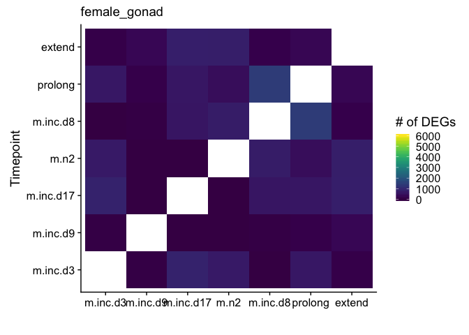

    ## Warning in MASS::cov.trob(data[, vars]): Probable convergence failure

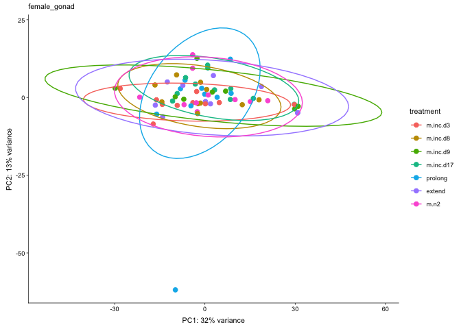

    ##             Df Sum Sq Mean Sq F value Pr(>F)
    ## treatment    6    727   121.2    0.61  0.721
    ## Residuals   62  12320   198.7               
    ##   Tukey multiple comparisons of means
    ##     95% family-wise confidence level
    ## 
    ## Fit: aov(formula = PC1 ~ treatment, data = pcadata)
    ## 
    ## $treatment
    ##                            diff        lwr      upr     p adj
    ## m.inc.d8-m.inc.d3   3.985928139 -15.223924 23.19578 0.9954565
    ## m.inc.d9-m.inc.d3   8.288419936 -12.086705 28.66355 0.8757811
    ## m.inc.d17-m.inc.d3  9.170693472  -9.597494 27.93888 0.7501910
    ## prolong-m.inc.d3    3.172718959 -16.037133 22.38257 0.9987228
    ## extend-m.inc.d3     9.176996148 -10.032856 28.38685 0.7692394
    ## m.n2-m.inc.d3       6.181970794 -13.027882 25.39182 0.9563682
    ## m.inc.d9-m.inc.d8   4.302491797 -16.072634 24.67762 0.9950010
    ## m.inc.d17-m.inc.d8  5.184765333 -13.583422 23.95295 0.9794158
    ## prolong-m.inc.d8   -0.813209180 -20.023062 18.39664 0.9999996
    ## extend-m.inc.d8     5.191068009 -14.018784 24.40092 0.9815988
    ## m.n2-m.inc.d8       2.196042656 -17.013810 21.40590 0.9998461
    ## m.inc.d17-m.inc.d9  0.882273535 -19.076989 20.84154 0.9999994
    ## prolong-m.inc.d9   -5.115700977 -25.490826 15.25942 0.9874108
    ## extend-m.inc.d9     0.888576212 -19.486549 21.26370 0.9999995
    ## m.n2-m.inc.d9      -2.106449142 -22.481574 18.26868 0.9999145
    ## prolong-m.inc.d17  -5.997974513 -24.766162 12.77021 0.9577923
    ## extend-m.inc.d17    0.006302676 -18.761885 18.77449 1.0000000
    ## m.n2-m.inc.d17     -2.988722677 -21.756910 15.77946 0.9989612
    ## extend-prolong      6.004277189 -13.205575 25.21413 0.9620632
    ## m.n2-prolong        3.009251835 -16.200601 22.21910 0.9990537
    ## m.n2-extend        -2.995025353 -22.204878 16.21483 0.9990788
    ## 
    ##             Df Sum Sq Mean Sq F value Pr(>F)
    ## treatment    6    358   59.62   0.747  0.614
    ## Residuals   62   4951   79.85               
    ##   Tukey multiple comparisons of means
    ##     95% family-wise confidence level
    ## 
    ## Fit: aov(formula = PC2 ~ treatment, data = pcadata)
    ## 
    ## $treatment
    ##                          diff        lwr       upr     p adj
    ## m.inc.d8-m.inc.d3   2.2245065  -9.953059 14.402072 0.9977509
    ## m.inc.d9-m.inc.d3   3.2502224  -9.666037 16.166482 0.9872630
    ## m.inc.d17-m.inc.d3  4.6824297  -7.215155 16.580014 0.8918193
    ## prolong-m.inc.d3   -2.6957459 -14.873312  9.481820 0.9935459
    ## extend-m.inc.d3     1.4553941 -10.722172 13.632960 0.9998007
    ## m.n2-m.inc.d3       2.9309140  -9.246652 15.108480 0.9899169
    ## m.inc.d9-m.inc.d8   1.0257159 -11.890543 13.941975 0.9999819
    ## m.inc.d17-m.inc.d8  2.4579232  -9.439661 14.355508 0.9955635
    ## prolong-m.inc.d8   -4.9202524 -17.097818  7.257314 0.8792194
    ## extend-m.inc.d8    -0.7691124 -12.946678 11.408454 0.9999954
    ## m.n2-m.inc.d8       0.7064075 -11.471158 12.883973 0.9999972
    ## m.inc.d17-m.inc.d9  1.4322073 -11.220427 14.084842 0.9998547
    ## prolong-m.inc.d9   -5.9459683 -18.862227  6.970291 0.7982752
    ## extend-m.inc.d9    -1.7948282 -14.711087 11.121431 0.9995232
    ## m.n2-m.inc.d9      -0.3193084 -13.235568 12.596951 1.0000000
    ## prolong-m.inc.d17  -7.3781756 -19.275760  4.519409 0.4947226
    ## extend-m.inc.d17   -3.2270355 -15.124620  8.670549 0.9812470
    ## m.n2-m.inc.d17     -1.7515157 -13.649100 10.146069 0.9993360
    ## extend-prolong      4.1511401  -8.026426 16.328706 0.9428206
    ## m.n2-prolong        5.6266599  -6.550906 17.804226 0.7955043
    ## m.n2-extend         1.4755198 -10.702046 13.653086 0.9997841

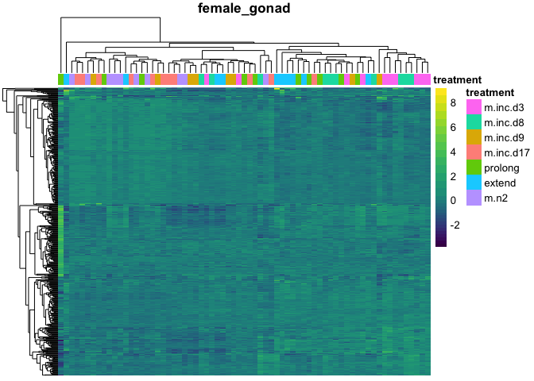

    ## [1] "female_hypothalamus"
    ## [1] TRUE

    ## estimating size factors

    ## estimating dispersions

    ## gene-wise dispersion estimates

    ## mean-dispersion relationship

    ## final dispersion estimates

    ## fitting model and testing

    ## -- replacing outliers and refitting for 26 genes
    ## -- DESeq argument 'minReplicatesForReplace' = 7 
    ## -- original counts are preserved in counts(dds)

    ## estimating dispersions

    ## fitting model and testing

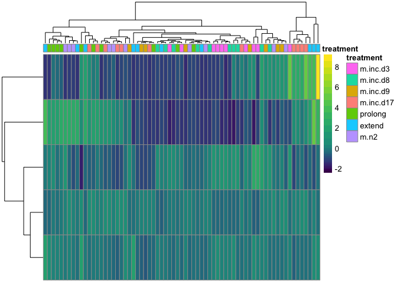

    ##          V1 extend m.inc.d17 m.inc.d3 m.inc.d8 m.inc.d9 m.n2 prolong
    ## 1    extend     NA       336     1051        0      609   16       6
    ## 2 m.inc.d17    336        NA        0      697      448   15      45
    ## 3  m.inc.d3   1051         0       NA     1630     1276  239     116
    ## 4  m.inc.d8      0       697     1630       NA      192    5      20
    ## 5  m.inc.d9    609       448     1276      192       NA   88     935
    ## 6      m.n2     16        15      239        5       88   NA     142
    ## 7   prolong      6        45      116       20      935  142      NA

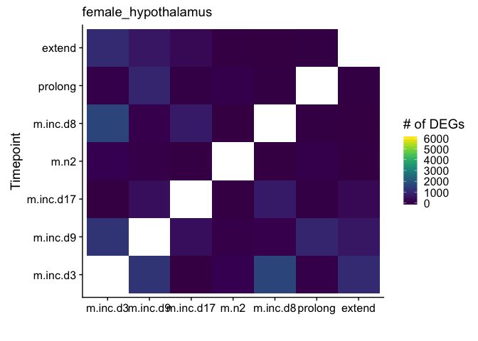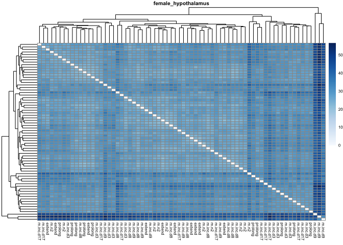

    ##             Df Sum Sq Mean Sq F value Pr(>F)   
    ## treatment    6  366.6   61.10    3.71 0.0032 **
    ## Residuals   63 1037.6   16.47                  
    ## ---
    ## Signif. codes:  0 '***' 0.001 '**' 0.01 '*' 0.05 '.' 0.1 ' ' 1
    ##   Tukey multiple comparisons of means
    ##     95% family-wise confidence level
    ## 
    ## Fit: aov(formula = PC1 ~ treatment, data = pcadata)
    ## 
    ## $treatment
    ##                          diff         lwr        upr     p adj
    ## m.inc.d8-m.inc.d3  -5.0656415 -10.5931413  0.4618584 0.0934475
    ## m.inc.d9-m.inc.d3  -6.5670766 -12.2460429 -0.8881103 0.0134194
    ## m.inc.d17-m.inc.d3 -0.1061703  -5.5065842  5.2942436 1.0000000
    ## prolong-m.inc.d3   -1.8940812  -7.4215810  3.6334187 0.9416039
    ## extend-m.inc.d3    -4.0127781  -9.5402780  1.5147217 0.3045198
    ## m.n2-m.inc.d3      -3.7030360  -9.2305358  1.8244639 0.4004577
    ## m.inc.d9-m.inc.d8  -1.5014351  -7.1804014  4.1775311 0.9836074
    ## m.inc.d17-m.inc.d8  4.9594711  -0.4409428 10.3598851 0.0921851
    ## prolong-m.inc.d8    3.1715603  -2.3559396  8.6990602 0.5875109
    ## extend-m.inc.d8     1.0528633  -4.4746365  6.5803632 0.9971735
    ## m.n2-m.inc.d8       1.3626055  -4.1648944  6.8901054 0.9886051
    ## m.inc.d17-m.inc.d9  6.4609063   0.9055599 12.0162527 0.0126456
    ## prolong-m.inc.d9    4.6729954  -1.0059708 10.3519617 0.1747660
    ## extend-m.inc.d9     2.5542985  -3.1246678  8.2332647 0.8154718
    ## m.n2-m.inc.d9       2.8640406  -2.8149256  8.5430069 0.7222966
    ## prolong-m.inc.d17  -1.7879108  -7.1883248  3.6125031 0.9502585
    ## extend-m.inc.d17   -3.9066078  -9.3070217  1.4938061 0.3086197
    ## m.n2-m.inc.d17     -3.5968656  -8.9972795  1.8035483 0.4076012
    ## extend-prolong     -2.1186970  -7.6461968  3.4088029 0.9036262
    ## m.n2-prolong       -1.8089548  -7.3364547  3.7185451 0.9528964
    ## m.n2-extend         0.3097422  -5.2177577  5.8372420 0.9999977
    ## 
    ##             Df Sum Sq Mean Sq F value Pr(>F)
    ## treatment    6   34.8   5.796   0.325  0.921
    ## Residuals   63 1122.0  17.809               
    ##   Tukey multiple comparisons of means
    ##     95% family-wise confidence level
    ## 
    ## Fit: aov(formula = PC2 ~ treatment, data = pcadata)
    ## 
    ## $treatment
    ##                           diff       lwr      upr     p adj
    ## m.inc.d8-m.inc.d3  -2.05879927 -7.806730 3.689132 0.9285318
    ## m.inc.d9-m.inc.d3  -1.69811389 -7.603552 4.207324 0.9749032
    ## m.inc.d17-m.inc.d3 -1.85827204 -7.474049 3.757505 0.9503765
    ## prolong-m.inc.d3   -0.61830736 -6.366238 5.129624 0.9998926
    ## extend-m.inc.d3    -0.79932757 -6.547259 4.948603 0.9995232
    ## m.n2-m.inc.d3      -0.82437632 -6.572307 4.923555 0.9994307
    ## m.inc.d9-m.inc.d8   0.36068538 -5.544752 6.266123 0.9999962
    ## m.inc.d17-m.inc.d8  0.20052723 -5.415250 5.816304 0.9999998
    ## prolong-m.inc.d8    1.44049191 -4.307439 7.188423 0.9875781
    ## extend-m.inc.d8     1.25947170 -4.488459 7.007403 0.9939159
    ## m.n2-m.inc.d8       1.23442295 -4.513508 6.982354 0.9945425
    ## m.inc.d17-m.inc.d9 -0.16015815 -5.937046 5.616730 1.0000000
    ## prolong-m.inc.d9    1.07980653 -4.825631 6.985244 0.9977479
    ## extend-m.inc.d9     0.89878632 -5.006651 6.804224 0.9992004
    ## m.n2-m.inc.d9       0.87373757 -5.031700 6.779175 0.9993196
    ## prolong-m.inc.d17   1.23996468 -4.375812 6.855742 0.9936595
    ## extend-m.inc.d17    1.05894447 -4.556833 6.674721 0.9973273
    ## m.n2-m.inc.d17      1.03389573 -4.581881 6.649673 0.9976604
    ## extend-prolong     -0.18102021 -5.928951 5.566911 0.9999999
    ## m.n2-prolong       -0.20606896 -5.954000 5.541862 0.9999998
    ## m.n2-extend        -0.02504874 -5.772980 5.722882 1.0000000

    ## [1] "female_pituitary"
    ## [1] TRUE

    ## estimating size factors

    ## estimating dispersions

    ## gene-wise dispersion estimates

    ## mean-dispersion relationship

    ## final dispersion estimates

    ## fitting model and testing

    ## -- replacing outliers and refitting for 65 genes
    ## -- DESeq argument 'minReplicatesForReplace' = 7 
    ## -- original counts are preserved in counts(dds)

    ## estimating dispersions

    ## fitting model and testing

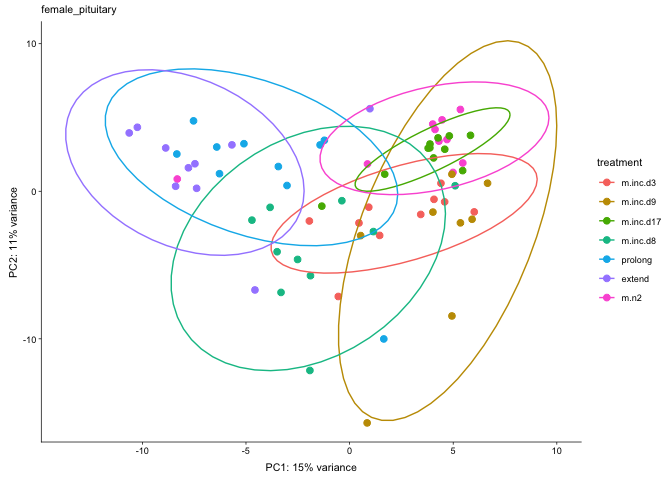

    ##          V1 extend m.inc.d17 m.inc.d3 m.inc.d8 m.inc.d9 m.n2 prolong
    ## 1    extend     NA      2014     2670     2837     2842 1381     284
    ## 2 m.inc.d17   2014        NA      317     1978     1525   13    1272
    ## 3  m.inc.d3   2670       317       NA      187      522 1249    1700
    ## 4  m.inc.d8   2837      1978      187       NA     1156 3031    2380
    ## 5  m.inc.d9   2842      1525      522     1156       NA 1621    1547
    ## 6      m.n2   1381        13     1249     3031     1621   NA     943
    ## 7   prolong    284      1272     1700     2380     1547  943      NA

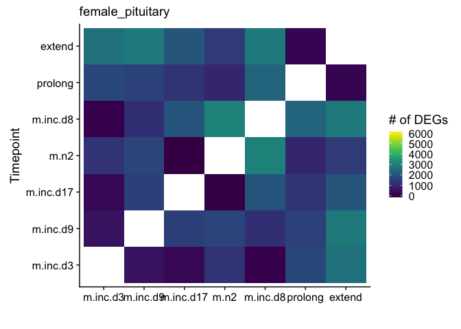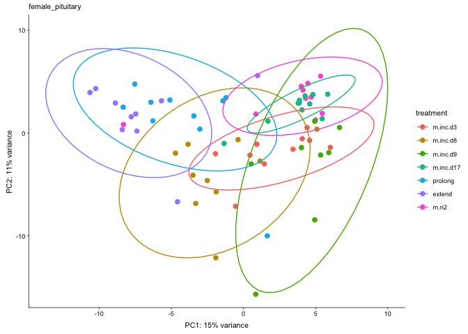

    ##             Df Sum Sq Mean Sq F value   Pr(>F)    
    ## treatment    6 1116.2  186.04   20.54 4.41e-13 ***
    ## Residuals   62  561.4    9.06                     
    ## ---
    ## Signif. codes:  0 '***' 0.001 '**' 0.01 '*' 0.05 '.' 0.1 ' ' 1
    ##   Tukey multiple comparisons of means
    ##     95% family-wise confidence level
    ## 
    ## Fit: aov(formula = PC1 ~ treatment, data = pcadata)
    ## 
    ## $treatment
    ##                           diff         lwr        upr     p adj
    ## m.inc.d8-m.inc.d3   -3.8655271  -7.9663469  0.2352927 0.0772733
    ## m.inc.d9-m.inc.d3    1.8634057  -2.4861706  6.2129819 0.8468409
    ## m.inc.d17-m.inc.d3   1.4336881  -2.5728474  5.4402236 0.9286328
    ## prolong-m.inc.d3    -6.3960176 -10.4968374 -2.2951978 0.0002398
    ## extend-m.inc.d3     -9.2890257 -13.3898455 -5.1882059 0.0000001
    ## m.n2-m.inc.d3        0.7097154  -3.3911045  4.8105352 0.9983377
    ## m.inc.d9-m.inc.d8    5.7289328   1.3793565 10.0785090 0.0029668
    ## m.inc.d17-m.inc.d8   5.2992152   1.2926797  9.3057507 0.0028098
    ## prolong-m.inc.d8    -2.5304905  -6.6313103  1.5703293 0.5007634
    ## extend-m.inc.d8     -5.4234986  -9.5243184 -1.3226788 0.0028127
    ## m.n2-m.inc.d8        4.5752424   0.4744226  8.6760623 0.0192398
    ## m.inc.d17-m.inc.d9  -0.4297175  -4.6905176  3.8310825 0.9999261
    ## prolong-m.inc.d9    -8.2594233 -12.6089996 -3.9098470 0.0000052
    ## extend-m.inc.d9    -11.1524314 -15.5020077 -6.8028551 0.0000000
    ## m.n2-m.inc.d9       -1.1536903  -5.5032666  3.1958859 0.9832727
    ## prolong-m.inc.d17   -7.8297058 -11.8362413 -3.8231702 0.0000027
    ## extend-m.inc.d17   -10.7227138 -14.7292494 -6.7161783 0.0000000
    ## m.n2-m.inc.d17      -0.7239728  -4.7305083  3.2825627 0.9978832
    ## extend-prolong      -2.8930081  -6.9938279  1.2078117 0.3376042
    ## m.n2-prolong         7.1057330   3.0049131 11.2065528 0.0000351
    ## m.n2-extend          9.9987411   5.8979212 14.0995609 0.0000000
    ## 
    ##             Df Sum Sq Mean Sq F value   Pr(>F)    
    ## treatment    6  526.8   87.79   7.915 2.38e-06 ***
    ## Residuals   62  687.7   11.09                     
    ## ---
    ## Signif. codes:  0 '***' 0.001 '**' 0.01 '*' 0.05 '.' 0.1 ' ' 1
    ##   Tukey multiple comparisons of means
    ##     95% family-wise confidence level
    ## 
    ## Fit: aov(formula = PC2 ~ treatment, data = pcadata)
    ## 
    ## $treatment
    ##                           diff         lwr       upr     p adj
    ## m.inc.d8-m.inc.d3  -2.04335880 -6.58187340  2.495156 0.8143743
    ## m.inc.d9-m.inc.d3  -1.95737666 -6.77119833  2.856445 0.8760019
    ## m.inc.d17-m.inc.d3  4.34979304 -0.08437393  8.783960 0.0579389
    ## prolong-m.inc.d3    3.24139278 -1.29712181  7.779907 0.3231200
    ## extend-m.inc.d3     3.63231953 -0.90619507  8.170834 0.2003816
    ## m.n2-m.inc.d3       5.09556144  0.55704685  9.634076 0.0180968
    ## m.inc.d9-m.inc.d8   0.08598215 -4.72783952  4.899804 1.0000000
    ## m.inc.d17-m.inc.d8  6.39315185  1.95898487 10.827319 0.0008394
    ## prolong-m.inc.d8    5.28475159  0.74623699  9.823266 0.0125139
    ## extend-m.inc.d8     5.67567833  1.13716374 10.214193 0.0056456
    ## m.n2-m.inc.d8       7.13892025  2.60040565 11.677435 0.0002076
    ## m.inc.d17-m.inc.d9  6.30716970  1.59159963 11.022740 0.0024250
    ## prolong-m.inc.d9    5.19876944  0.38494777 10.012591 0.0261070
    ## extend-m.inc.d9     5.58969618  0.77587451 10.403518 0.0128838
    ## m.n2-m.inc.d9       7.05293810  2.23911643 11.866760 0.0006577
    ## prolong-m.inc.d17  -1.10840026 -5.54256724  3.325767 0.9876982
    ## extend-m.inc.d17   -0.71747352 -5.15164049  3.716693 0.9988628
    ## m.n2-m.inc.d17      0.74576840 -3.68839858  5.179935 0.9985849
    ## extend-prolong      0.39092675 -4.14758785  4.929441 0.9999708
    ## m.n2-prolong        1.85416866 -2.68434593  6.392683 0.8735637
    ## m.n2-extend         1.46324191 -3.07527268  6.001757 0.9559841

    ## Warning in MASS::cov.trob(data[, vars]): Probable convergence failure

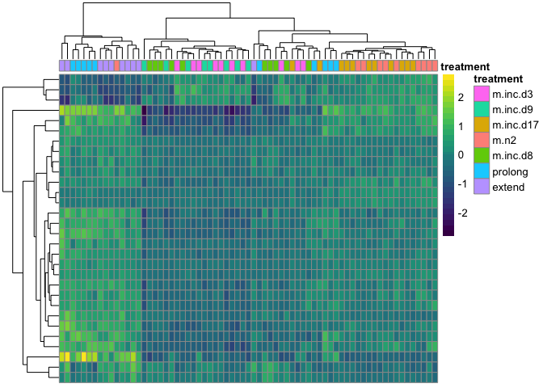

    ## [1] "male_gonad"
    ## [1] TRUE

    ## estimating size factors

    ## estimating dispersions

    ## gene-wise dispersion estimates

    ## mean-dispersion relationship

    ## final dispersion estimates

    ## fitting model and testing

    ## -- replacing outliers and refitting for 493 genes
    ## -- DESeq argument 'minReplicatesForReplace' = 7 
    ## -- original counts are preserved in counts(dds)

    ## estimating dispersions

    ## fitting model and testing

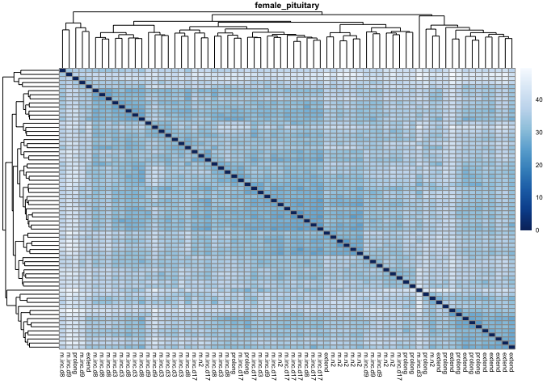

    ##          V1 extend m.inc.d17 m.inc.d3 m.inc.d8 m.inc.d9 m.n2 prolong
    ## 1    extend     NA         2       39      214       45    3     650
    ## 2 m.inc.d17      2        NA        1        0        0    1     577
    ## 3  m.inc.d3     39         1       NA        0        6    0     556
    ## 4  m.inc.d8    214         0        0       NA        7   19     679
    ## 5  m.inc.d9     45         0        6        7       NA    0     378
    ## 6      m.n2      3         1        0       19        0   NA     157
    ## 7   prolong    650       577      556      679      378  157      NA

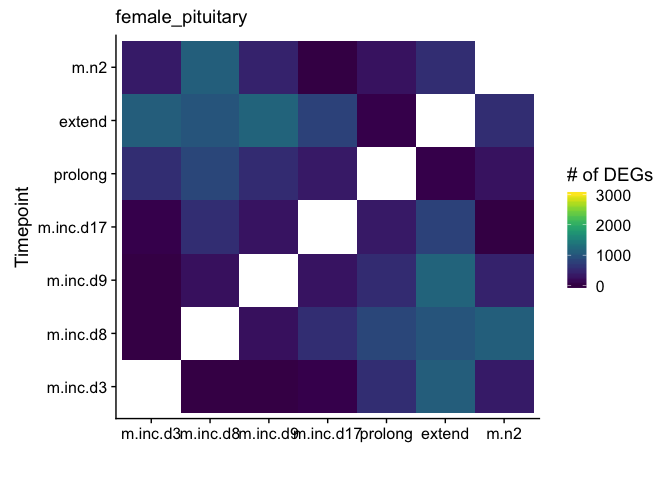

    ## Warning in MASS::cov.trob(data[, vars]): Probable convergence failure

    ## Warning in MASS::cov.trob(data[, vars]): Probable convergence failure

    ##             Df Sum Sq Mean Sq F value Pr(>F)
    ## treatment    6    521   86.86   1.011  0.427
    ## Residuals   60   5155   85.91               
    ##   Tukey multiple comparisons of means
    ##     95% family-wise confidence level
    ## 
    ## Fit: aov(formula = PC1 ~ treatment, data = pcadata)
    ## 
    ## $treatment
    ##                          diff        lwr       upr     p adj
    ## m.inc.d8-m.inc.d3   1.1960271 -11.448858 13.840912 0.9999488
    ## m.inc.d9-m.inc.d3  -0.4910682 -13.902995 12.920858 0.9999998
    ## m.inc.d17-m.inc.d3  0.6543716 -11.990514 13.299257 0.9999986
    ## prolong-m.inc.d3    8.2976615  -4.347224 20.942547 0.4243613
    ## extend-m.inc.d3     2.0009188 -10.643967 14.645804 0.9989889
    ## m.n2-m.inc.d3       0.8730649 -12.118320 13.864450 0.9999932
    ## m.inc.d9-m.inc.d8  -1.6870953 -15.099022 11.724831 0.9997292
    ## m.inc.d17-m.inc.d8 -0.5416554 -13.186541 12.103230 0.9999995
    ## prolong-m.inc.d8    7.1016345  -5.543251 19.746520 0.6100735
    ## extend-m.inc.d8     0.8048917 -11.839994 13.449777 0.9999951
    ## m.n2-m.inc.d8      -0.3229622 -13.314347 12.668423 1.0000000
    ## m.inc.d17-m.inc.d9  1.1454399 -12.266486 14.557366 0.9999720
    ## prolong-m.inc.d9    8.7887298  -4.623197 22.200656 0.4260734
    ## extend-m.inc.d9     2.4919870 -10.919939 15.903913 0.9975063
    ## m.n2-m.inc.d9       1.3641331 -12.374961 15.103228 0.9999319
    ## prolong-m.inc.d17   7.6432899  -5.001595 20.288175 0.5246010
    ## extend-m.inc.d17    1.3465471 -11.298338 13.991433 0.9998974
    ## m.n2-m.inc.d17      0.2186933 -12.772691 13.210078 1.0000000
    ## extend-prolong     -6.2967428 -18.941628  6.348143 0.7324015
    ## m.n2-prolong       -7.4245966 -20.415981  5.566788 0.5903757
    ## m.n2-extend        -1.1278539 -14.119239 11.863531 0.9999691
    ## 
    ##             Df Sum Sq Mean Sq F value Pr(>F)
    ## treatment    6  296.6   49.44   1.543   0.18
    ## Residuals   60 1922.2   32.04               
    ##   Tukey multiple comparisons of means
    ##     95% family-wise confidence level
    ## 
    ## Fit: aov(formula = PC2 ~ treatment, data = pcadata)
    ## 
    ## $treatment
    ##                           diff        lwr       upr     p adj
    ## m.inc.d8-m.inc.d3  -2.28577754 -10.007611  5.436056 0.9707073
    ## m.inc.d9-m.inc.d3  -2.36319936 -10.553441  5.827042 0.9741974
    ## m.inc.d17-m.inc.d3  3.39787109  -4.323962 11.119705 0.8291233
    ## prolong-m.inc.d3    1.03079949  -6.691034  8.752633 0.9996182
    ## extend-m.inc.d3     2.61555489  -5.106279 10.337388 0.9441258
    ## m.n2-m.inc.d3       2.07288480  -5.860545 10.006315 0.9844001
    ## m.inc.d9-m.inc.d8  -0.07742183  -8.267663  8.112819 1.0000000
    ## m.inc.d17-m.inc.d8  5.68364862  -2.038185 13.405482 0.2876953
    ## prolong-m.inc.d8    3.31657702  -4.405256 11.038411 0.8445221
    ## extend-m.inc.d8     4.90133242  -2.820501 12.623166 0.4651975
    ## m.n2-m.inc.d8       4.35866234  -3.574767 12.292092 0.6342868
    ## m.inc.d17-m.inc.d9  5.76107045  -2.429171 13.951312 0.3402203
    ## prolong-m.inc.d9    3.39399885  -4.796242 11.584240 0.8652873
    ## extend-m.inc.d9     4.97875425  -3.211487 13.168995 0.5177934
    ## m.n2-m.inc.d9       4.43608416  -3.953948 12.826117 0.6746456
    ## prolong-m.inc.d17  -2.36707160 -10.088905  5.354762 0.9652369
    ## extend-m.inc.d17   -0.78231620  -8.504150  6.939517 0.9999234
    ## m.n2-m.inc.d17     -1.32498629  -9.258416  6.608443 0.9986278
    ## extend-prolong      1.58475540  -6.137078  9.306589 0.9956849
    ## m.n2-prolong        1.04208531  -6.891344  8.975515 0.9996522
    ## m.n2-extend        -0.54267009  -8.476100  7.390760 0.9999925

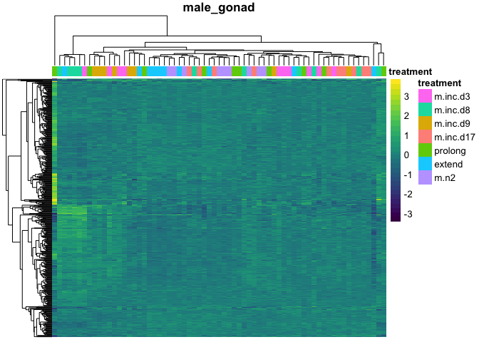

    ## [1] "male_hypothalamus"
    ## [1] TRUE

    ## estimating size factors

    ## estimating dispersions

    ## gene-wise dispersion estimates

    ## mean-dispersion relationship

    ## final dispersion estimates

    ## fitting model and testing

    ## -- replacing outliers and refitting for 13 genes
    ## -- DESeq argument 'minReplicatesForReplace' = 7 
    ## -- original counts are preserved in counts(dds)

    ## estimating dispersions

    ## fitting model and testing

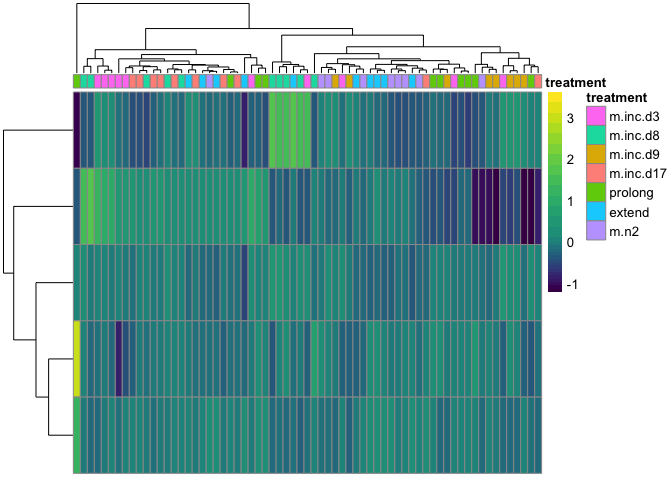

    ##          V1 extend m.inc.d17 m.inc.d3 m.inc.d8 m.inc.d9 m.n2 prolong
    ## 1    extend     NA         0        4        1     3575    1       0
    ## 2 m.inc.d17      0        NA        0      130     2721    0       0
    ## 3  m.inc.d3      4         0       NA      254     2974    0       0
    ## 4  m.inc.d8      1       130      254       NA     5669    0     129
    ## 5  m.inc.d9   3575      2721     2974     5669       NA 3405    2653
    ## 6      m.n2      1         0        0        0     3405   NA       0
    ## 7   prolong      0         0        0      129     2653    0      NA

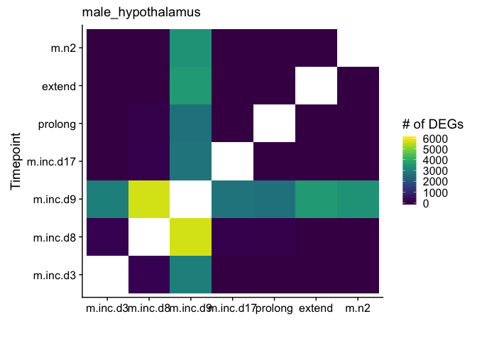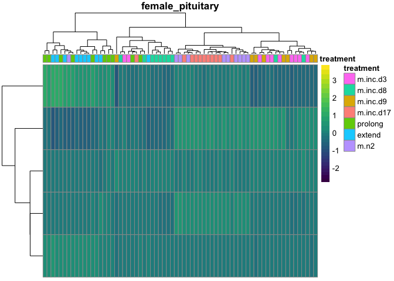

    ##             Df Sum Sq Mean Sq F value   Pr(>F)    
    ## treatment    6  672.9  112.15   5.567 0.000118 ***
    ## Residuals   61 1228.8   20.14                     
    ## ---
    ## Signif. codes:  0 '***' 0.001 '**' 0.01 '*' 0.05 '.' 0.1 ' ' 1
    ##   Tukey multiple comparisons of means
    ##     95% family-wise confidence level
    ## 
    ## Fit: aov(formula = PC1 ~ treatment, data = pcadata)
    ## 
    ## $treatment
    ##                          diff        lwr        upr     p adj
    ## m.inc.d8-m.inc.d3  -2.9425407  -9.062077  3.1769957 0.7633728
    ## m.inc.d9-m.inc.d3   8.4818829   1.991134 14.9726314 0.0033023
    ## m.inc.d17-m.inc.d3  0.2285568  -5.890980  6.3480931 0.9999998
    ## prolong-m.inc.d3    1.0518632  -5.067673  7.1713995 0.9983936
    ## extend-m.inc.d3    -0.3208496  -6.440386  5.7986867 0.9999985
    ## m.n2-m.inc.d3      -1.2802542  -7.399791  4.8392822 0.9952286
    ## m.inc.d9-m.inc.d8  11.4244236   4.933675 17.9151720 0.0000263
    ## m.inc.d17-m.inc.d8  3.1710975  -2.948439  9.2906338 0.6953497
    ## prolong-m.inc.d8    3.9944038  -2.125133 10.1139402 0.4314036
    ## extend-m.inc.d8     2.6216910  -3.497845  8.7412274 0.8464640
    ## m.n2-m.inc.d8       1.6622865  -4.457250  7.7818228 0.9810358
    ## m.inc.d17-m.inc.d9 -8.2533261 -14.744075 -1.7625776 0.0046418
    ## prolong-m.inc.d9   -7.4300197 -13.920768 -0.9392713 0.0149496
    ## extend-m.inc.d9    -8.8027325 -15.293481 -2.3119841 0.0020265
    ## m.n2-m.inc.d9      -9.7621371 -16.252886 -3.2713886 0.0004413
    ## prolong-m.inc.d17   0.8233064  -5.296230  6.9428427 0.9996024
    ## extend-m.inc.d17   -0.5494065  -6.668943  5.5701299 0.9999625
    ## m.n2-m.inc.d17     -1.5088110  -7.628347  4.6107254 0.9885084
    ## extend-prolong     -1.3727128  -7.492249  4.7468235 0.9930426
    ## m.n2-prolong       -2.3321173  -8.451654  3.7874190 0.9054801
    ## m.n2-extend        -0.9594045  -7.078941  5.1601318 0.9990452
    ## 
    ##             Df Sum Sq Mean Sq F value Pr(>F)
    ## treatment    6   73.2   12.21   1.019  0.422
    ## Residuals   61  730.9   11.98               
    ##   Tukey multiple comparisons of means
    ##     95% family-wise confidence level
    ## 
    ## Fit: aov(formula = PC2 ~ treatment, data = pcadata)
    ## 
    ## $treatment
    ##                          diff       lwr      upr     p adj
    ## m.inc.d8-m.inc.d3   0.2628505 -4.457010 4.982711 0.9999978
    ## m.inc.d9-m.inc.d3  -0.4538550 -5.460023 4.552313 0.9999603
    ## m.inc.d17-m.inc.d3 -0.3206954 -5.040556 4.399165 0.9999928
    ## prolong-m.inc.d3   -2.6092873 -7.329148 2.110573 0.6280903
    ## extend-m.inc.d3    -2.0837008 -6.803561 2.636160 0.8273739
    ## m.n2-m.inc.d3      -1.5182015 -6.238062 3.201659 0.9563218
    ## m.inc.d9-m.inc.d8  -0.7167055 -5.722874 4.289463 0.9994316
    ## m.inc.d17-m.inc.d8 -0.5835459 -5.303406 4.136315 0.9997562
    ## prolong-m.inc.d8   -2.8721378 -7.591998 1.847723 0.5171058
    ## extend-m.inc.d8    -2.3465512 -7.066412 2.373309 0.7343801
    ## m.n2-m.inc.d8      -1.7810520 -6.500912 2.938809 0.9094414
    ## m.inc.d17-m.inc.d9  0.1331596 -4.873008 5.139328 1.0000000
    ## prolong-m.inc.d9   -2.1554324 -7.161600 2.850736 0.8434127
    ## extend-m.inc.d9    -1.6298458 -6.636014 3.376322 0.9537459
    ## m.n2-m.inc.d9      -1.0643465 -6.070515 3.941822 0.9947914
    ## prolong-m.inc.d17  -2.2885920 -7.008452 2.431269 0.7563124
    ## extend-m.inc.d17   -1.7630054 -6.482866 2.956855 0.9133821
    ## m.n2-m.inc.d17     -1.1975061 -5.917367 3.522354 0.9866549
    ## extend-prolong      0.5255866 -4.194274 5.245447 0.9998674
    ## m.n2-prolong        1.0910859 -3.628775 5.810946 0.9918272
    ## m.n2-extend         0.5654993 -4.154361 5.285360 0.9997968

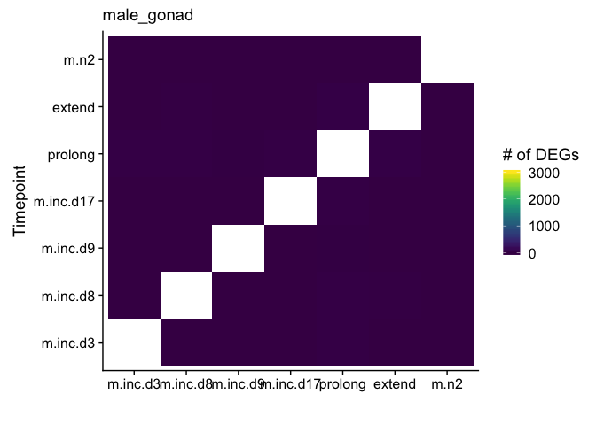

    ## [1] "male_pituitary"
    ## [1] TRUE

    ## estimating size factors

    ## estimating dispersions

    ## gene-wise dispersion estimates

    ## mean-dispersion relationship

    ## final dispersion estimates

    ## fitting model and testing

    ## -- replacing outliers and refitting for 233 genes
    ## -- DESeq argument 'minReplicatesForReplace' = 7 
    ## -- original counts are preserved in counts(dds)

    ## estimating dispersions

    ## fitting model and testing

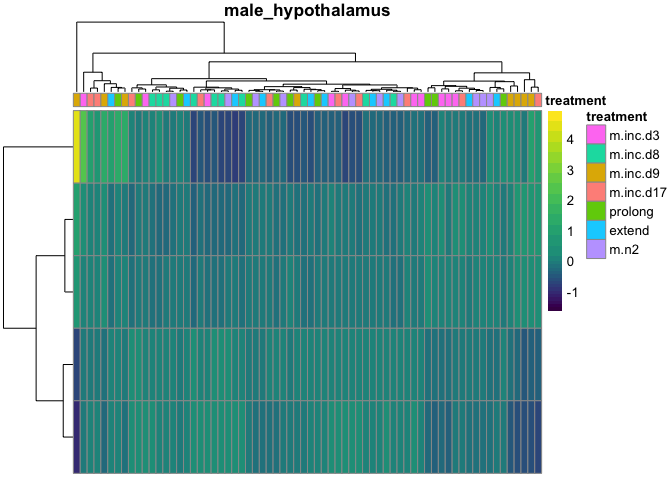

    ##          V1 extend m.inc.d17 m.inc.d3 m.inc.d8 m.inc.d9 m.n2 prolong
    ## 1    extend     NA        87     1070     2153     1605  292       6
    ## 2 m.inc.d17     87        NA      250     1165      865    3      10
    ## 3  m.inc.d3   1070       250       NA      250      400  387     396
    ## 4  m.inc.d8   2153      1165      250       NA      625 1569    1140
    ## 5  m.inc.d9   1605       865      400      625       NA  579     570
    ## 6      m.n2    292         3      387     1569      579   NA     100
    ## 7   prolong      6        10      396     1140      570  100      NA

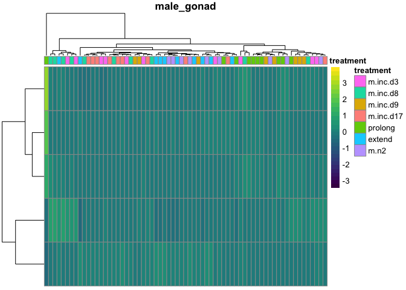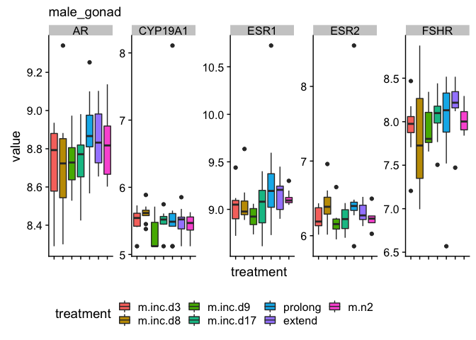

    ##             Df Sum Sq Mean Sq F value Pr(>F)
    ## treatment    6  546.2   91.03   1.873    0.1
    ## Residuals   61 2964.7   48.60               
    ##   Tukey multiple comparisons of means
    ##     95% family-wise confidence level
    ## 
    ## Fit: aov(formula = PC1 ~ treatment, data = pcadata)
    ## 
    ## $treatment
    ##                          diff        lwr       upr     p adj
    ## m.inc.d8-m.inc.d3  -6.1437379 -15.649206  3.361730 0.4434990
    ## m.inc.d9-m.inc.d3  -5.0571546 -15.139226  5.024917 0.7262959
    ## m.inc.d17-m.inc.d3  1.1121817  -8.393286 10.617649 0.9998230
    ## prolong-m.inc.d3    0.4604334  -9.045034  9.965901 0.9999990
    ## extend-m.inc.d3     1.4539679  -8.051500 10.959436 0.9991701
    ## m.n2-m.inc.d3       0.1740609  -9.331407  9.679529 1.0000000
    ## m.inc.d9-m.inc.d8   1.0865834  -8.995488 11.168654 0.9998904
    ## m.inc.d17-m.inc.d8  7.2559196  -2.249548 16.761387 0.2481345
    ## prolong-m.inc.d8    6.6041713  -2.901297 16.109639 0.3553840
    ## extend-m.inc.d8     7.5977058  -1.907762 17.103174 0.2013881
    ## m.n2-m.inc.d8       6.3177988  -3.187669 15.823267 0.4091962
    ## m.inc.d17-m.inc.d9  6.1693362  -3.912735 16.251407 0.5103964
    ## prolong-m.inc.d9    5.5175879  -4.564483 15.599659 0.6390724
    ## extend-m.inc.d9     6.5111225  -3.570949 16.593194 0.4444981
    ## m.n2-m.inc.d9       5.2312154  -4.850856 15.313287 0.6940780
    ## prolong-m.inc.d17  -0.6517483 -10.157216  8.853719 0.9999924
    ## extend-m.inc.d17    0.3417862  -9.163682  9.847254 0.9999998
    ## m.n2-m.inc.d17     -0.9381208 -10.443589  8.567347 0.9999346
    ## extend-prolong      0.9935345  -8.511933 10.499002 0.9999084
    ## m.n2-prolong       -0.2863725  -9.791840  9.219095 0.9999999
    ## m.n2-extend        -1.2799070 -10.785375  8.225561 0.9996005
    ## 
    ##             Df Sum Sq Mean Sq F value   Pr(>F)    
    ## treatment    6  620.3  103.38   14.13 5.23e-10 ***
    ## Residuals   61  446.3    7.32                     
    ## ---
    ## Signif. codes:  0 '***' 0.001 '**' 0.01 '*' 0.05 '.' 0.1 ' ' 1
    ##   Tukey multiple comparisons of means
    ##     95% family-wise confidence level
    ## 
    ## Fit: aov(formula = PC2 ~ treatment, data = pcadata)
    ## 
    ## $treatment
    ##                          diff         lwr         upr     p adj
    ## m.inc.d8-m.inc.d3  -2.1456390  -5.8337846  1.54250651 0.5704396
    ## m.inc.d9-m.inc.d3  -0.7454222  -4.6572913  3.16644693 0.9971438
    ## m.inc.d17-m.inc.d3 -5.5922585  -9.2804040 -1.90411292 0.0003874
    ## prolong-m.inc.d3   -6.8333494 -10.5214949 -3.14520383 0.0000091
    ## extend-m.inc.d3    -8.8443661 -12.5325116 -5.15622054 0.0000000
    ## m.n2-m.inc.d3      -4.6194972  -8.3076427 -0.93135163 0.0055643
    ## m.inc.d9-m.inc.d8   1.4002169  -2.5116522  5.31208597 0.9283253
    ## m.inc.d17-m.inc.d8 -3.4466194  -7.1347650  0.24152612 0.0819476
    ## prolong-m.inc.d8   -4.6877103  -8.3758559 -0.99956479 0.0046655
    ## extend-m.inc.d8    -6.6987271 -10.3868726 -3.01058150 0.0000139
    ## m.n2-m.inc.d8      -2.4738581  -6.1620037  1.21428741 0.3980001
    ## m.inc.d17-m.inc.d9 -4.8468363  -8.7587054 -0.93496721 0.0063216
    ## prolong-m.inc.d9   -6.0879272  -9.9997963 -2.17605812 0.0002523
    ## extend-m.inc.d9    -8.0989439 -12.0108130 -4.18707483 0.0000007
    ## m.n2-m.inc.d9      -3.8740750  -7.7859441  0.03779408 0.0538991
    ## prolong-m.inc.d17  -1.2410909  -4.9292365  2.44705464 0.9459795
    ## extend-m.inc.d17   -3.2521076  -6.9402532  0.43603793 0.1187718
    ## m.n2-m.inc.d17      0.9727613  -2.7153843  4.66090684 0.9836890
    ## extend-prolong     -2.0110167  -5.6991623  1.67712884 0.6430113
    ## m.n2-prolong        2.2138522  -1.4742934  5.90199775 0.5335139
    ## m.n2-extend         4.2248689   0.5367234  7.91301446 0.0148419

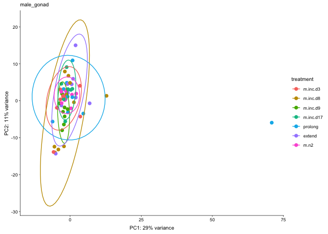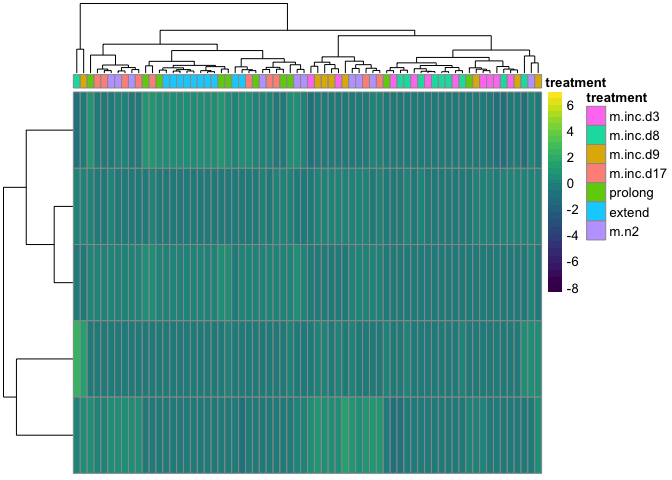
