    library(tidyverse)
    library(DESeq2)
    library(cowplot)
    library(RColorBrewer)
    library(pheatmap)
    library(kableExtra)
    library(viridis)

    # load custom functions  
    source("../R/functions.R") 

    knitr::opts_chunk$set(fig.path = '../figures/manipulation/')

Manipulation data
=================

    # import "colData" which contains sample information and "countData" which contains read counts
    m.colData <- read.csv("../metadata/00_colData_manipluation.csv", header = T, row.names = 1)
    m.countData <- read.csv("../results/00_countData_manipluation.csv", header = T, row.names = 1)
    geneinfo <- read.csv("../metadata/00_geneinfo.csv", row.names = 1)

    # set levels
    m.colData$treatment <- factor(m.colData$treatment, levels = 
                                  c("m.inc.d3",  "m.inc.d9",
                                    "m.inc.d17", "m.n2",
                                    "m.inc.d8", "prolong", "extend"))

    m.colData$sextissue <- as.factor(paste(m.colData$sex, m.colData$tissue, sep = "_"))

    m.colData$outcome <- ifelse(grepl("d3|d9|d17|n2", m.colData$treatment), "remove", 
                         ifelse(grepl("d8", m.colData$treatment),"early",
                         ifelse(grepl("prolong", m.colData$treatment),"prolong",
                         ifelse(grepl("extend", m.colData$treatment),"extend", NA))))
    m.colData$outcome <- factor(m.colData$outcome, levels = 
                                  c("remove",  "prolong",
                                    "early", "extend"))
    summary(m.colData[c(7,3,4,5,9)])

    ##           study         sex               tissue        treatment 
    ##  manipulation:411   female:208   gonad       :136   m.inc.d3 :60  
    ##                     male  :203   hypothalamus:138   m.inc.d9 :49  
    ##                                  pituitary   :137   m.inc.d17:63  
    ##                                                     m.n2     :59  
    ##                                                     m.inc.d8 :60  
    ##                                                     prolong  :60  
    ##                                                     extend   :60  
    ##     outcome   
    ##  remove :231  
    ##  prolong: 60  
    ##  early  : 60  
    ##  extend : 60  
    ##               
    ##               
    ## 

Write for loop to do this one for every tissue and for every treatment
======================================================================

    for (eachgroup in levels(m.colData$sextissue)){
      
      print(eachgroup)
      
      colData <- m.colData %>%
          dplyr::filter(sextissue == eachgroup) %>%
          droplevels()
      row.names(colData) <- colData$V1
      
      savecols <- as.character(colData$V1) 
      savecols <- as.vector(savecols) 

      countData <- m.countData %>% dplyr::select(one_of(savecols)) 

      # check that row and col lenghts are equal
      print(ncol(countData) == nrow(colData))

      dds <- DESeqDataSetFromMatrix(countData = countData,
                                  colData = colData,
                                  design = ~ treatment )
      dds <- dds[ rowSums(counts(dds)) > 2, ] ## pre-filter genes 
      dds <- DESeq(dds) # Differential expression analysis
      vsd <- vst(dds, blind=FALSE) # variance stabilized 

    #create list of groups
    a <- levels(colData$treatment)
    b <- levels(colData$treatment)

    # comapre all contrasts, save to datafrmes
    dat=data.frame()
    for (i in a){
      for (j in b){
        if (i != j) {
          k <- paste(i,j, sep = "") #assigns usique rownames
          dat[k,1]<-i               
          dat[k,2]<-j
          dat[k,3]<- numDEGs(i,j) #caluculates number of DEGs
        }
      }
    }

    head(dat)

    # widen data to create table of degs
    rownames(dat) <- NULL #remove row names
    data_wide <- spread(dat, V2, V3)
    print(data_wide) 

    dat$V1 <- factor(dat$V1, levels = 
                                  c("m.inc.d3",  "m.inc.d9",
                                    "m.inc.d17", "m.n2",
                                    "m.inc.d8", "prolong", "extend"))
    dat$V2 <- factor(dat$V2, levels = 
                                  c("m.inc.d3",  "m.inc.d9",
                                    "m.inc.d17", "m.n2",
                                    "m.inc.d8", "prolong", "extend"))

    allcontrasts <- dat %>%
      ggplot( aes(V1, V2)) +
        geom_tile(aes(fill = V3)) +
        scale_fill_viridis(na.value="#FFFFFF00", 
                         limits = c(0, 6000),
                         breaks = c(0, 1000, 2000, 3000, 4000, 5000, 6000)) + 
        xlab(" ") + ylab("Timepoint") +
        labs(fill = "# of DEGs",
             subtitle = eachgroup)
    plot(allcontrasts)

    # create the dataframe using my function pcadataframe
    pcadata <- pcadataframe(vsd, intgroup=c("treatment"), returnData=TRUE)
    percentVar <- round(100 * attr(pcadata, "percentVar"))
    percentVar

    pca12 <- ggplot(pcadata, aes(PC1, PC2,color = treatment)) + 
      geom_point(size = 2, alpha = 1) +
      stat_ellipse(type = "t") +
      xlab(paste0("PC1: ", percentVar[1],"% variance")) +
      ylab(paste0("PC2: ", percentVar[2],"% variance")) +
      theme_cowplot(font_size = 8, line_size = 0.25) +
      labs(subtitle = eachgroup)
    print(pca12)

    print(summary(aov(PC1 ~ treatment, data=pcadata)))
    print(TukeyHSD(aov(PC1 ~ treatment, data=pcadata), which = "treatment"))

    print(summary(aov(PC2 ~ treatment, data=pcadata))) 
    print(TukeyHSD(aov(PC2 ~ treatment, data=pcadata), which = "treatment")) 

    pca34 <- ggplot(pcadata, aes(PC3, PC4,color = treatment)) + 
      geom_point(size = 2, alpha = 1) +
      stat_ellipse(type = "t") +
      xlab(paste0("PC3: ", percentVar[3],"% variance")) +
      ylab(paste0("PC4: ", percentVar[4],"% variance")) +
      theme_cowplot(font_size = 8, line_size = 0.25) +
      labs(subtitle = eachgroup)
    #print(pca34)

    # see http://bioconductor.org/packages/devel/bioc/vignettes/DESeq2/inst/doc/DESeq2.html#heatmap-of-the-count-matrix
    sampleDists <- dist(t(assay(vsd)))

    sampleDistMatrix <- as.matrix(sampleDists)
    rownames(sampleDistMatrix) <- NULL
    colnames(sampleDistMatrix) <- colData$treatment
    colors <- colorRampPalette(brewer.pal(9, "Blues"))(255)

    #pheatmap(sampleDistMatrix,
    #         clustering_distance_rows=sampleDists,
    #         clustering_distance_cols=sampleDists,
    #         col=colors,
     #        fontsize = 6, 
     #        main = eachgroup)
    }

    for (eachgroup in levels(m.colData$sextissue)){
      
      print(eachgroup)
      
      colData <- m.colData %>%
          dplyr::filter(sextissue == eachgroup) %>%
          droplevels()
      row.names(colData) <- colData$V1
      
      savecols <- as.character(colData$V1) 
      savecols <- as.vector(savecols) 

      countData <- m.countData %>% dplyr::select(one_of(savecols)) 

      # check that row and col lenghts are equal
      print(ncol(countData) == nrow(colData))

      dds <- DESeqDataSetFromMatrix(countData = countData,
                                  colData = colData,
                                  design = ~ outcome )
      dds <- dds[ rowSums(counts(dds)) > 2, ] ## pre-filter genes 
      dds <- DESeq(dds) # Differential expression analysis
      vsd <- vst(dds, blind=FALSE) # variance stabilized 
    head(vsd)

    numDEGs <- function(group1, group2){
      res <- results(dds, contrast = c("outcome", group1, group2), independentFiltering = T)
      sumpadj <- sum(res$padj < 0.1, na.rm = TRUE)
      return(sumpadj)}

    #create list of groups
    a <- levels(colData$outcome)
    b <- levels(colData$outcome)

    # comapre all contrasts, save to datafrmes
    dat=data.frame()
    for (i in a){
      for (j in b){
        if (i != j) {
          k <- paste(i,j, sep = "") #assigns usique rownames
          dat[k,1]<-i               
          dat[k,2]<-j
          dat[k,3]<- numDEGs(i,j) #caluculates number of DEGs
        }
      }
    }

    head(dat)

    # widen data to create table of degs
    rownames(dat) <- NULL #remove row names
    data_wide <- spread(dat, V2, V3)
    print(data_wide) 

    dat$V1 <- factor(dat$V1, levels = 
                                  c("remove",  "prolong",
                                    "early", "extend"))
    dat$V2 <- factor(dat$V2, levels = 
                                  c("remove",  "prolong",
                                    "early", "extend"))

    allcontrasts <- dat %>%
      ggplot( aes(V1, V2)) +
        geom_tile(aes(fill = V3)) +
        scale_fill_viridis(na.value="#FFFFFF00") + 
        xlab(" ") + ylab("Timepoint") +
        labs(fill = "# of DEGs",
             subtitle = eachgroup)
    plot(allcontrasts)

    # create the dataframe using my function pcadataframe
    pcadata <- pcadataframe(vsd, intgroup=c("outcome"), returnData=TRUE)
    percentVar <- round(100 * attr(pcadata, "percentVar"))
    percentVar

    pca12 <- ggplot(pcadata, aes(PC1, PC2,color = outcome)) + 
      geom_point(size = 2, alpha = 1) +
      stat_ellipse(type = "t") +
      xlab(paste0("PC1: ", percentVar[1],"% variance")) +
      ylab(paste0("PC2: ", percentVar[2],"% variance")) +
      theme_cowplot(font_size = 8, line_size = 0.25) +
      labs(subtitle = eachgroup)
    print(pca12)

    print(summary(aov(PC1 ~ outcome, data=pcadata)))
    print(TukeyHSD(aov(PC1 ~ outcome, data=pcadata), which = "outcome"))

    print(summary(aov(PC2 ~ outcome, data=pcadata))) 
    print(TukeyHSD(aov(PC2 ~ outcome, data=pcadata), which = "outcome")) 

    pca34 <- ggplot(pcadata, aes(PC3, PC4,color = outcome)) + 
      geom_point(size = 2, alpha = 1) +
      stat_ellipse(type = "t") +
      xlab(paste0("PC3: ", percentVar[3],"% variance")) +
      ylab(paste0("PC4: ", percentVar[4],"% variance")) +
      theme_cowplot(font_size = 8, line_size = 0.25) +
      labs(subtitle = eachgroup)
    #print(pca34)
    }

    ## [1] "female_gonad"
    ## [1] TRUE

    ## estimating size factors

    ## estimating dispersions

    ## gene-wise dispersion estimates

    ## mean-dispersion relationship

    ## final dispersion estimates

    ## fitting model and testing

    ## -- replacing outliers and refitting for 824 genes
    ## -- DESeq argument 'minReplicatesForReplace' = 7 
    ## -- original counts are preserved in counts(dds)

    ## estimating dispersions

    ## fitting model and testing

    ##        V1 early extend prolong remove
    ## 1   early    NA    150    1008    227
    ## 2  extend   150     NA      63    762
    ## 3 prolong  1008     63      NA    557
    ## 4  remove   227    762     557     NA

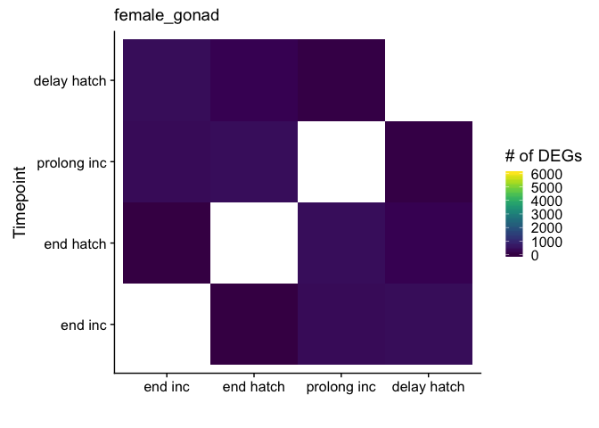

    ## Warning in MASS::cov.trob(data[, vars]): Probable convergence failure

    ##             Df Sum Sq Mean Sq F value Pr(>F)
    ## outcome      3    215   71.79   0.362  0.781
    ## Residuals   65  12890  198.30               
    ##   Tukey multiple comparisons of means
    ##     95% family-wise confidence level
    ## 
    ## Fit: aov(formula = PC1 ~ outcome, data = pcadata)
    ## 
    ## $outcome
    ##                      diff        lwr      upr     p adj
    ## prolong-remove -2.6840623 -15.845492 10.47737 0.9494900
    ## early-remove   -1.8680995 -15.029530 11.29333 0.9819670
    ## extend-remove   3.3260144  -9.835416 16.48744 0.9093582
    ## early-prolong   0.8159628 -15.789552 17.42148 0.9992150
    ## extend-prolong  6.0100768 -10.595438 22.61559 0.7756094
    ## extend-early    5.1941140 -11.411401 21.79963 0.8425371
    ## 
    ##             Df Sum Sq Mean Sq F value Pr(>F)
    ## outcome      3    240   79.85   1.019   0.39
    ## Residuals   65   5093   78.35               
    ##   Tukey multiple comparisons of means
    ##     95% family-wise confidence level
    ## 
    ## Fit: aov(formula = PC2 ~ outcome, data = pcadata)
    ## 
    ## $outcome
    ##                      diff        lwr       upr     p adj
    ## prolong-remove -5.4486918 -13.721663  2.824279 0.3134260
    ## early-remove   -0.5465411  -8.819512  7.726430 0.9981024
    ## extend-remove  -1.2791583  -9.552129  6.993812 0.9769231
    ## early-prolong   4.9021507  -5.535692 15.339994 0.6050126
    ## extend-prolong  4.1695335  -6.268309 14.607376 0.7188381
    ## extend-early   -0.7326172 -11.170460  9.705226 0.9977278
    ## 
    ## [1] "female_hypothalamus"
    ## [1] TRUE

    ## estimating size factors

    ## estimating dispersions

    ## gene-wise dispersion estimates

    ## mean-dispersion relationship

    ## final dispersion estimates

    ## fitting model and testing

    ## -- replacing outliers and refitting for 31 genes
    ## -- DESeq argument 'minReplicatesForReplace' = 7 
    ## -- original counts are preserved in counts(dds)

    ## estimating dispersions

    ## fitting model and testing

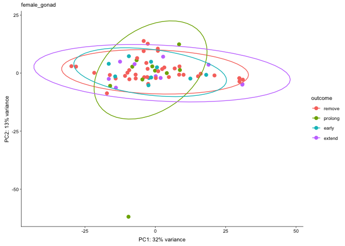

    ##        V1 early extend prolong remove
    ## 1   early    NA      0       3    326
    ## 2  extend     0     NA       8    429
    ## 3 prolong     3      8      NA    207
    ## 4  remove   326    429     207     NA

    ##             Df Sum Sq Mean Sq F value Pr(>F)
    ## outcome      3   79.1   26.36   1.298  0.283
    ## Residuals   66 1340.2   20.31               
    ##   Tukey multiple comparisons of means
    ##     95% family-wise confidence level
    ## 
    ## Fit: aov(formula = PC1 ~ outcome, data = pcadata)
    ## 
    ## $outcome
    ##                      diff       lwr      upr     p adj
    ## prolong-remove  0.5497012 -3.649518 4.748921 0.9857567
    ## early-remove   -2.6403307 -6.839550 1.558889 0.3543892
    ## extend-remove  -1.6089119 -5.808131 2.590308 0.7442375
    ## early-prolong  -3.1900320 -8.501671 2.121607 0.3952817
    ## extend-prolong -2.1586131 -7.470252 3.153026 0.7081884
    ## extend-early    1.0314189 -4.280220 6.343058 0.9559977
    ## 
    ##             Df Sum Sq Mean Sq F value Pr(>F)
    ## outcome      3   13.2   4.413   0.251   0.86
    ## Residuals   66 1160.5  17.583               
    ##   Tukey multiple comparisons of means
    ##     95% family-wise confidence level
    ## 
    ## Fit: aov(formula = PC2 ~ outcome, data = pcadata)
    ## 
    ## $outcome
    ##                      diff       lwr      upr     p adj
    ## prolong-remove  0.4933244 -3.414170 4.400819 0.9871815
    ## early-remove   -1.0082429 -4.915738 2.899252 0.9043016
    ## extend-remove   0.2694912 -3.638004 4.176986 0.9978462
    ## early-prolong  -1.5015672 -6.444201 3.441066 0.8538279
    ## extend-prolong -0.2238332 -5.166467 4.718800 0.9993857
    ## extend-early    1.2777341 -3.664899 6.220368 0.9038238
    ## 
    ## [1] "female_pituitary"
    ## [1] TRUE

    ## estimating size factors

    ## estimating dispersions

    ## gene-wise dispersion estimates

    ## mean-dispersion relationship

    ## final dispersion estimates

    ## fitting model and testing

    ## -- replacing outliers and refitting for 121 genes
    ## -- DESeq argument 'minReplicatesForReplace' = 7 
    ## -- original counts are preserved in counts(dds)

    ## estimating dispersions

    ## fitting model and testing

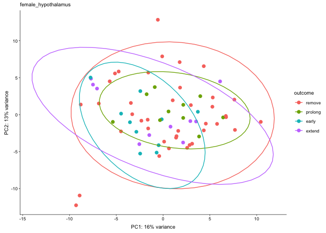

    ##        V1 early extend prolong remove
    ## 1   early    NA   2624    2167   2071
    ## 2  extend  2624     NA     204   2564
    ## 3 prolong  2167    204      NA   1489
    ## 4  remove  2071   2564    1489     NA

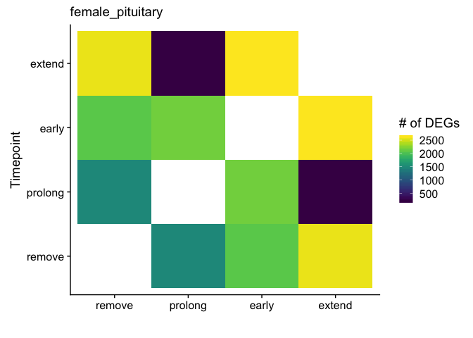

    ##             Df Sum Sq Mean Sq F value   Pr(>F)    
    ## outcome      3 1107.2   369.1   40.77 6.09e-15 ***
    ## Residuals   65  588.4     9.1                     
    ## ---
    ## Signif. codes:  0 '***' 0.001 '**' 0.01 '*' 0.05 '.' 0.1 ' ' 1
    ##   Tukey multiple comparisons of means
    ##     95% family-wise confidence level
    ## 
    ## Fit: aov(formula = PC1 ~ outcome, data = pcadata)
    ## 
    ## $outcome
    ##                      diff        lwr        upr     p adj
    ## prolong-remove  -7.390390 -10.202287 -4.5784936 0.0000000
    ## early-remove    -4.908275  -7.720172 -2.0963783 0.0001151
    ## extend-remove  -10.295604 -13.107501 -7.4837074 0.0000000
    ## early-prolong    2.482115  -1.065599  6.0298296 0.2621399
    ## extend-prolong  -2.905214  -6.452928  0.6425005 0.1456989
    ## extend-early    -5.387329  -8.935043 -1.8396148 0.0009152
    ## 
    ##             Df Sum Sq Mean Sq F value  Pr(>F)   
    ## outcome      3  203.1   67.71   4.327 0.00765 **
    ## Residuals   65 1017.2   15.65                   
    ## ---
    ## Signif. codes:  0 '***' 0.001 '**' 0.01 '*' 0.05 '.' 0.1 ' ' 1
    ##   Tukey multiple comparisons of means
    ##     95% family-wise confidence level
    ## 
    ## Fit: aov(formula = PC2 ~ outcome, data = pcadata)
    ## 
    ## $outcome
    ##                      diff        lwr        upr     p adj
    ## prolong-remove  1.1410270 -2.5562941  4.8383482 0.8477669
    ## early-remove   -4.1144041 -7.8117253 -0.4170830 0.0233190
    ## extend-remove   1.5424843 -2.1548368  5.2398054 0.6907838
    ## early-prolong  -5.2554312 -9.9202677 -0.5905946 0.0211434
    ## extend-prolong  0.4014572 -4.2633793  5.0662938 0.9958396
    ## extend-early    5.6568884  0.9920518 10.3217250 0.0112364
    ## 
    ## [1] "male_gonad"
    ## [1] TRUE

    ## estimating size factors

    ## estimating dispersions

    ## gene-wise dispersion estimates

    ## mean-dispersion relationship

    ## final dispersion estimates

    ## fitting model and testing

    ## -- replacing outliers and refitting for 792 genes
    ## -- DESeq argument 'minReplicatesForReplace' = 7 
    ## -- original counts are preserved in counts(dds)

    ## estimating dispersions

    ## fitting model and testing

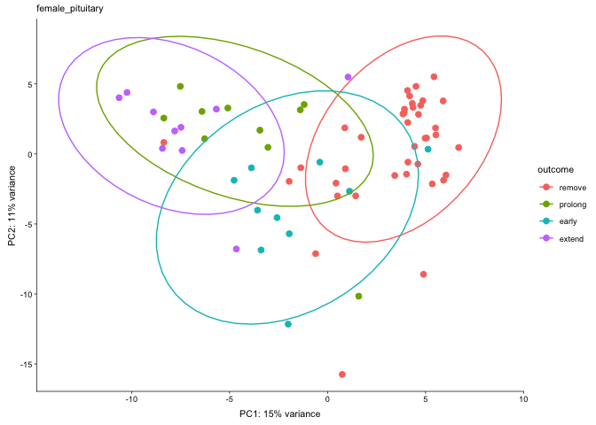

    ##        V1 early extend prolong remove
    ## 1   early    NA    202     379     20
    ## 2  extend   202     NA     420      8
    ## 3 prolong   379    420      NA   1092
    ## 4  remove    20      8    1092     NA

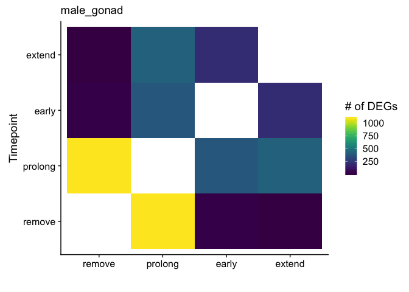

    ## Warning in MASS::cov.trob(data[, vars]): Probable convergence failure

    ##             Df Sum Sq Mean Sq F value Pr(>F)
    ## outcome      3    512  170.74   2.077  0.112
    ## Residuals   63   5178   82.19               
    ##   Tukey multiple comparisons of means
    ##     95% family-wise confidence level
    ## 
    ## Fit: aov(formula = PC1 ~ outcome, data = pcadata)
    ## 
    ## $outcome
    ##                      diff         lwr       upr     p adj
    ## prolong-remove  8.0234518  -0.5035053 16.550409 0.0723999
    ## early-remove    0.9132040  -7.6137531  9.440161 0.9920482
    ## extend-remove   1.7327077  -6.7942495 10.259665 0.9498650
    ## early-prolong  -7.1102478 -17.8096869  3.589191 0.3052289
    ## extend-prolong -6.2907442 -16.9901833  4.408695 0.4134790
    ## extend-early    0.8195037  -9.8799355 11.518943 0.9970466
    ## 
    ##             Df Sum Sq Mean Sq F value Pr(>F)
    ## outcome      3  128.1   42.69   1.284  0.288
    ## Residuals   63 2094.5   33.25               
    ##   Tukey multiple comparisons of means
    ##     95% family-wise confidence level
    ## 
    ## Fit: aov(formula = PC2 ~ outcome, data = pcadata)
    ## 
    ## $outcome
    ##                      diff        lwr       upr     p adj
    ## prolong-remove  0.1004901  -5.322591  5.523571 0.9999575
    ## early-remove   -3.1921135  -8.615194  2.230967 0.4124692
    ## extend-remove   1.7015944  -3.721487  7.124675 0.8409715
    ## early-prolong  -3.2926036 -10.097367  3.512160 0.5808804
    ## extend-prolong  1.6011043  -5.203659  8.405868 0.9250108
    ## extend-early    4.8937079  -1.911055 11.698471 0.2393912
    ## 
    ## [1] "male_hypothalamus"
    ## [1] TRUE

    ## estimating size factors

    ## estimating dispersions

    ## gene-wise dispersion estimates

    ## mean-dispersion relationship

    ## final dispersion estimates

    ## fitting model and testing

    ## -- replacing outliers and refitting for 26 genes
    ## -- DESeq argument 'minReplicatesForReplace' = 7 
    ## -- original counts are preserved in counts(dds)

    ## estimating dispersions

    ## fitting model and testing

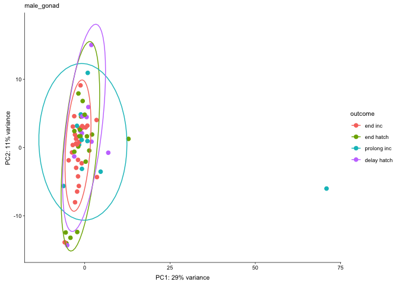

    ##        V1 early extend prolong remove
    ## 1   early    NA      0      12   2246
    ## 2  extend     0     NA       0      6
    ## 3 prolong    12      0      NA      0
    ## 4  remove  2246      6       0     NA

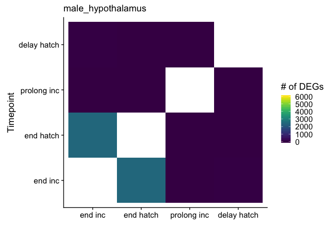

    ##             Df Sum Sq Mean Sq F value Pr(>F)
    ## outcome      3  173.1   57.69   2.062  0.114
    ## Residuals   64 1790.3   27.97               
    ##   Tukey multiple comparisons of means
    ##     95% family-wise confidence level
    ## 
    ## Fit: aov(formula = PC1 ~ outcome, data = pcadata)
    ## 
    ## $outcome
    ##                      diff        lwr       upr     p adj
    ## prolong-remove -0.5072784  -5.465730 4.4511735 0.9930591
    ## early-remove   -4.5307231  -9.489175 0.4277288 0.0853089
    ## extend-remove  -1.8953664  -6.853818 3.0630855 0.7451485
    ## early-prolong  -4.0234447 -10.262693 2.2158038 0.3316212
    ## extend-prolong -1.3880880  -7.627337 4.8511604 0.9356999
    ## extend-early    2.6353566  -3.603892 8.8746051 0.6821910
    ## 
    ##             Df Sum Sq Mean Sq F value Pr(>F)
    ## outcome      3   66.4   22.13   1.803  0.156
    ## Residuals   64  785.8   12.28               
    ##   Tukey multiple comparisons of means
    ##     95% family-wise confidence level
    ## 
    ## Fit: aov(formula = PC2 ~ outcome, data = pcadata)
    ## 
    ## $outcome
    ##                      diff       lwr      upr     p adj
    ## prolong-remove -2.0802474 -5.365358 1.204863 0.3476464
    ## early-remove    1.0177474 -2.267363 4.302858 0.8461178
    ## extend-remove  -1.4965806 -4.781691 1.788530 0.6280266
    ## early-prolong   3.0979948 -1.035679 7.231668 0.2074453
    ## extend-prolong  0.5836668 -3.550007 4.717340 0.9822138
    ## extend-early   -2.5143279 -6.648002 1.619346 0.3834251
    ## 
    ## [1] "male_pituitary"
    ## [1] TRUE

    ## estimating size factors

    ## estimating dispersions

    ## gene-wise dispersion estimates

    ## mean-dispersion relationship

    ## final dispersion estimates

    ## fitting model and testing

    ## -- replacing outliers and refitting for 477 genes
    ## -- DESeq argument 'minReplicatesForReplace' = 7 
    ## -- original counts are preserved in counts(dds)

    ## estimating dispersions

    ## fitting model and testing

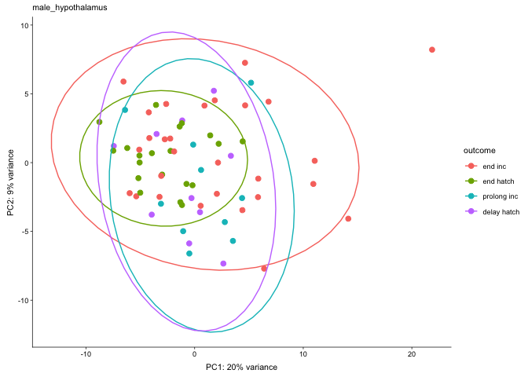

    ##        V1 early extend prolong remove
    ## 1   early    NA   1783     848   1048
    ## 2  extend  1783     NA       5    683
    ## 3 prolong   848      5      NA    146
    ## 4  remove  1048    683     146     NA

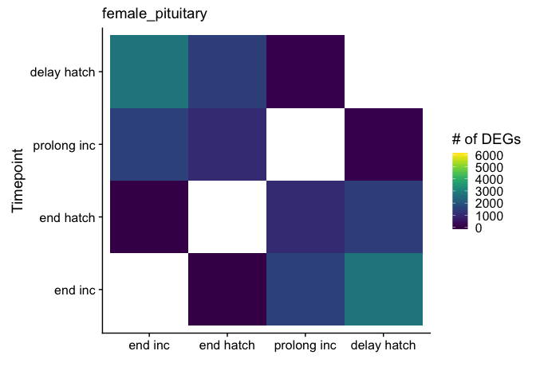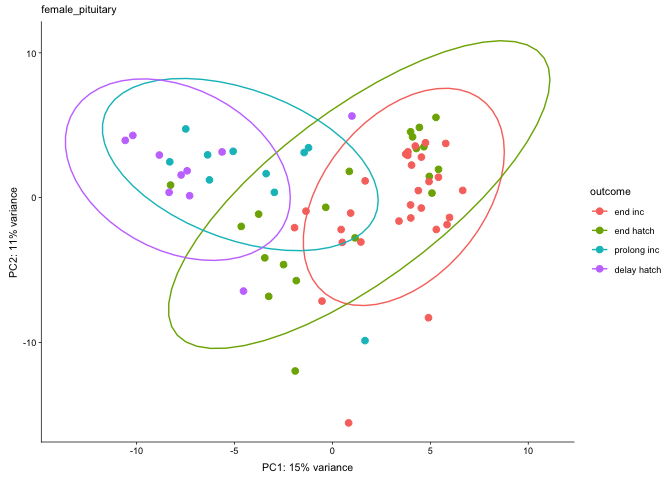

    ##             Df Sum Sq Mean Sq F value Pr(>F)  
    ## outcome      3  338.7  112.92   2.373 0.0785 .
    ## Residuals   64 3045.3   47.58                 
    ## ---
    ## Signif. codes:  0 '***' 0.001 '**' 0.01 '*' 0.05 '.' 0.1 ' ' 1
    ##   Tukey multiple comparisons of means
    ##     95% family-wise confidence level
    ## 
    ## Fit: aov(formula = PC1 ~ outcome, data = pcadata)
    ## 
    ## $outcome
    ##                      diff        lwr       upr     p adj
    ## prolong-remove  1.1357123  -5.331271  7.602695 0.9667659
    ## early-remove   -5.3561456 -11.823129  1.110838 0.1385003
    ## extend-remove   2.1304584  -4.336525  8.597442 0.8207883
    ## early-prolong  -6.4918578 -14.629300  1.645584 0.1627185
    ## extend-prolong  0.9947461  -7.142696  9.132188 0.9883017
    ## extend-early    7.4866040  -0.650838 15.624046 0.0821767
    ## 
    ##             Df Sum Sq Mean Sq F value   Pr(>F)    
    ## outcome      3  389.3  129.78   12.88 1.11e-06 ***
    ## Residuals   64  645.0   10.08                     
    ## ---
    ## Signif. codes:  0 '***' 0.001 '**' 0.01 '*' 0.05 '.' 0.1 ' ' 1
    ##   Tukey multiple comparisons of means
    ##     95% family-wise confidence level
    ## 
    ## Fit: aov(formula = PC2 ~ outcome, data = pcadata)
    ## 
    ## $outcome
    ##                      diff         lwr        upr     p adj
    ## prolong-remove -3.9569181  -6.9330940 -0.9807421 0.0045231
    ## early-remove    0.6389908  -2.3371852  3.6151667 0.9416867
    ## extend-remove  -5.9604883  -8.9366643 -2.9843124 0.0000096
    ## early-prolong   4.5959088   0.8509696  8.3408481 0.0100807
    ## extend-prolong -2.0035703  -5.7485095  1.7413690 0.4970789
    ## extend-early   -6.5994791 -10.3444184 -2.8545398 0.0000996
