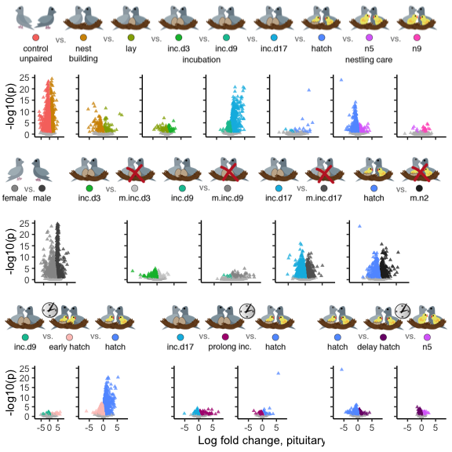

Warning: This script takes a very long time to run.
===================================================

DESeq2 was not designed to run on 300 samples. But, I really like it, so
I do it anyways. Some of these commands take like 15 min to run using 6
cores.

DEseq2 on all chaacterization and manipulations
-----------------------------------------------

    # import "colData" which contains sample information and "countData" which contains read counts
    countData <- read.csv("../results/00_counts.csv", header = T, row.names = 1)
    geneinfo <- read.csv("../metadata/00_geneinfo.csv", row.names = 1)
    head(geneinfo)

    FALSE   row.names     Name geneid       entrezid
    FALSE 1    408082    EDNRB 408082 NP_001001127.1
    FALSE 2    408183  CYP26A1 408183 NP_001001129.1
    FALSE 3    374073    CFDP1 374073 NP_001001189.1
    FALSE 4    407777    AvBD7 407777 NP_001001194.1
    FALSE 5    407779     KRT5 407779 NP_001001195.1
    FALSE 6    408034 HSD11B1L 408034 NP_001001201.1

    # craete variable that will be critical for subset later on
    colData <- read.csv("../metadata/00_samples.csv", header = T, row.names = 1)
    colData$sextissue <- as.factor(paste(colData$sex, colData$tissue, sep = "_"))
    colData$treatment <- factor(colData$treatment, levels = alllevels3)
    colData$tissue <- factor(colData$tissue, levels = tissuelevels)
    levels(colData$treatment)

    FALSE  [1] "control"   "bldg"      "lay"       "inc.d3"    "inc.d9"   
    FALSE  [6] "inc.d17"   "hatch"     "n5"        "n9"        "m.inc.d3" 
    FALSE [11] "m.inc.d9"  "m.inc.d17" "m.n2"      "m.inc.d8"  "prolong"  
    FALSE [16] "extend"

    dds.pituitary <- subsetDESeq2(colData,  countData, c("female_pituitary","male_pituitary"))

    FALSE class: DESeqDataSet 
    FALSE dim: 13966 330 
    FALSE metadata(1): version
    FALSE assays(1): counts
    FALSE rownames(13966): A2ML1 A2ML2 ... ZYX ZZZ3
    FALSE rowData names(0):
    FALSE colnames(330): L.Blu13_male_pituitary_control.NYNO
    FALSE   L.G107_male_pituitary_control ...
    FALSE   y98.g54_female_pituitary_m.hatch y98.o50.x_male_pituitary_inc.d3
    FALSE colData names(8): V1 bird ... study sextissue
    FALSE [1] 13680   330

    vsd <- as.data.frame(assay(vst(dds.pituitary, blind=FALSE)))
    write.csv(vsd, "../results/06_pitallvsd.csv")

    control.bldg <- createDEGdfsave(dds.pituitary, "treatment", "bldg", "control", "pituitary")

    FALSE 'data.frame': 6472 obs. of  6 variables:
    FALSE  $ gene     : Factor w/ 13680 levels "A2ML1","A2ML2",..: 12167 6422 881 12211 6639 3003 12484 563 6410 6203 ...
    FALSE  $ padj     : num  3.29e-06 9.45e-05 1.36e-15 4.27e-03 1.39e-11 ...
    FALSE  $ logpadj  : num  5.48 4.02 14.87 2.37 10.86 ...
    FALSE  $ lfc      : num  4.76 4.45 4.18 3.93 3.75 ...
    FALSE  $ tissue   : Factor w/ 1 level "pituitary": 1 1 1 1 1 1 1 1 1 1 ...
    FALSE  $ direction: Factor w/ 3 levels "control","NS",..: 3 3 3 3 3 3 3 3 3 3 ...
    FALSE NULL

    bldg.lay <- createDEGdfsave(dds.pituitary, "treatment", "lay", "bldg", "pituitary")

    FALSE 'data.frame': 388 obs. of  6 variables:
    FALSE  $ gene     : Factor w/ 13680 levels "A2ML1","A2ML2",..: 10093 9605 9629 6081 6607 620 12449 7062 2504 11773 ...
    FALSE  $ padj     : num  4.23e-09 1.30e-09 1.21e-02 4.22e-02 8.12e-05 ...
    FALSE  $ logpadj  : num  8.37 8.89 1.92 1.37 4.09 ...
    FALSE  $ lfc      : num  6.6 5.88 4.69 3.86 3.11 ...
    FALSE  $ tissue   : Factor w/ 1 level "pituitary": 1 1 1 1 1 1 1 1 1 1 ...
    FALSE  $ direction: Factor w/ 3 levels "bldg","NS","lay": 3 3 3 3 3 3 3 3 3 3 ...
    FALSE NULL

    lay.inc.d3 <- createDEGdfsave(dds.pituitary, "treatment", "inc.d3", "lay", "pituitary") 

    FALSE 'data.frame': 860 obs. of  6 variables:
    FALSE  $ gene     : Factor w/ 13680 levels "A2ML1","A2ML2",..: 5804 12167 12754 1205 10914 2477 5901 3920 11044 12998 ...
    FALSE  $ padj     : num  3.23e-03 8.59e-02 5.92e-03 1.52e-06 5.70e-03 ...
    FALSE  $ logpadj  : num  2.49 1.07 2.23 5.82 2.24 ...
    FALSE  $ lfc      : num  2.98 2.46 2.43 2.35 2.21 ...
    FALSE  $ tissue   : Factor w/ 1 level "pituitary": 1 1 1 1 1 1 1 1 1 1 ...
    FALSE  $ direction: Factor w/ 3 levels "lay","NS","inc.d3": 3 3 3 3 3 3 3 3 3 3 ...
    FALSE NULL

    inc.d3.inc.d9 <- createDEGdfsave(dds.pituitary,  "treatment", "inc.d9", "inc.d3", "pituitary") 

    FALSE 'data.frame': 11 obs. of  6 variables:
    FALSE  $ gene     : Factor w/ 13680 levels "A2ML1","A2ML2",..: 3214 9552 12475 1380 6911 4320 6607 10093 9605 6283 ...
    FALSE  $ padj     : num  0.00361 0.05213 0.05213 0.05237 0.05237 ...
    FALSE  $ logpadj  : num  2.44 1.28 1.28 1.28 1.28 ...
    FALSE  $ lfc      : num  -0.579 -0.921 -1.22 -1.616 -2.399 ...
    FALSE  $ tissue   : Factor w/ 1 level "pituitary": 1 1 1 1 1 1 1 1 1 1 ...
    FALSE  $ direction: Factor w/ 3 levels "inc.d3","NS",..: 1 1 1 1 1 1 1 1 1 1 ...
    FALSE NULL

    inc.d9.inc.d17 <- createDEGdfsave(dds.pituitary, "treatment", "inc.d17", "inc.d9", "pituitary")

    FALSE 'data.frame': 2581 obs. of  6 variables:
    FALSE  $ gene     : Factor w/ 13680 levels "A2ML1","A2ML2",..: 5683 6020 4058 3950 1905 1934 2196 2893 10967 1789 ...
    FALSE  $ padj     : num  6.81e-21 1.29e-02 1.35e-07 1.37e-13 2.15e-07 ...
    FALSE  $ logpadj  : num  20.17 1.89 6.87 12.86 6.67 ...
    FALSE  $ lfc      : num  4.89 4.81 4.7 4.67 4.59 ...
    FALSE  $ tissue   : Factor w/ 1 level "pituitary": 1 1 1 1 1 1 1 1 1 1 ...
    FALSE  $ direction: Factor w/ 3 levels "inc.d9","NS",..: 3 3 3 3 3 3 3 3 3 3 ...
    FALSE NULL

    inc.d17.hatch <- createDEGdfsave(dds.pituitary, "treatment", "hatch", "inc.d17", "pituitary") 

    FALSE 'data.frame': 29 obs. of  6 variables:
    FALSE  $ gene     : Factor w/ 13680 levels "A2ML1","A2ML2",..: 6001 4897 1445 621 4293 557 7062 8655 11502 12449 ...
    FALSE  $ padj     : num  2.87e-14 5.69e-02 9.51e-06 1.31e-02 8.96e-02 ...
    FALSE  $ logpadj  : num  13.54 1.25 5.02 1.88 1.05 ...
    FALSE  $ lfc      : num  16.87 10.25 6.5 5.56 5.56 ...
    FALSE  $ tissue   : Factor w/ 1 level "pituitary": 1 1 1 1 1 1 1 1 1 1 ...
    FALSE  $ direction: Factor w/ 3 levels "inc.d17","NS",..: 3 3 3 3 3 3 3 3 3 3 ...
    FALSE NULL

    hatch.n5 <- createDEGdfsave(dds.pituitary, "treatment", "n5", "hatch", "pituitary") 

    FALSE 'data.frame': 1602 obs. of  6 variables:
    FALSE  $ gene     : Factor w/ 13680 levels "A2ML1","A2ML2",..: 1775 1631 6031 6736 4377 5804 489 8445 6199 11684 ...
    FALSE  $ padj     : num  3.17e-02 1.59e-03 2.93e-05 6.59e-02 9.77e-02 ...
    FALSE  $ logpadj  : num  1.5 2.8 4.53 1.18 1.01 ...
    FALSE  $ lfc      : num  4.13 3.65 3.6 3.22 3.18 ...
    FALSE  $ tissue   : Factor w/ 1 level "pituitary": 1 1 1 1 1 1 1 1 1 1 ...
    FALSE  $ direction: Factor w/ 3 levels "hatch","NS","n5": 3 3 3 3 3 3 3 3 3 3 ...
    FALSE NULL

    n5.n9 <- createDEGdfsave(dds.pituitary, "treatment", "n9", "n5", "pituitary") 

    FALSE 'data.frame': 33 obs. of  6 variables:
    FALSE  $ gene     : Factor w/ 13680 levels "A2ML1","A2ML2",..: 10754 13207 9970 2194 2738 10646 6940 4592 1621 2281 ...
    FALSE  $ padj     : num  6.81e-03 3.58e-03 6.42e-05 3.17e-05 3.94e-02 ...
    FALSE  $ logpadj  : num  2.17 2.45 4.19 4.5 1.4 ...
    FALSE  $ lfc      : num  2.89 2.34 2.25 1.99 1.6 ...
    FALSE  $ tissue   : Factor w/ 1 level "pituitary": 1 1 1 1 1 1 1 1 1 1 ...
    FALSE  $ direction: Factor w/ 3 levels "n5","NS","n9": 3 3 3 3 3 3 3 3 3 3 ...
    FALSE NULL

    sex <- createDEGdfsave(dds.pituitary, "sex", "male", "female", "pituitary") 

    FALSE 'data.frame': 2781 obs. of  6 variables:
    FALSE  $ gene     : Factor w/ 13680 levels "A2ML1","A2ML2",..: 2292 12167 7990 9638 866 2202 3971 6281 5889 5005 ...
    FALSE  $ padj     : num  1.46e-12 2.35e-07 3.12e-12 1.77e-03 3.39e-09 ...
    FALSE  $ logpadj  : num  11.84 6.63 11.51 2.75 8.47 ...
    FALSE  $ lfc      : num  5.5 5.08 4.65 4.38 4.27 ...
    FALSE  $ tissue   : Factor w/ 1 level "pituitary": 1 1 1 1 1 1 1 1 1 1 ...
    FALSE  $ direction: Factor w/ 3 levels "female","NS",..: 3 3 3 3 3 3 3 3 3 3 ...
    FALSE NULL

    inc.d3.m.inc.d3 <- createDEGdfsave(dds.pituitary, "treatment", "m.inc.d3", "inc.d3", "pituitary")

    FALSE 'data.frame': 1753 obs. of  6 variables:
    FALSE  $ gene     : Factor w/ 13680 levels "A2ML1","A2ML2",..: 11586 5804 10754 13207 635 11684 10646 5589 5631 2330 ...
    FALSE  $ padj     : num  0.00654 0.00141 0.0154 0.00912 0.01871 ...
    FALSE  $ logpadj  : num  2.18 2.85 1.81 2.04 1.73 ...
    FALSE  $ lfc      : num  3.4 2.98 2.26 1.86 1.67 ...
    FALSE  $ tissue   : Factor w/ 1 level "pituitary": 1 1 1 1 1 1 1 1 1 1 ...
    FALSE  $ direction: Factor w/ 3 levels "inc.d3","NS",..: 3 3 3 3 3 3 3 3 3 3 ...
    FALSE NULL

    inc.d9.m.inc.d9 <- createDEGdfsave(dds.pituitary, "treatment", "m.inc.d9", "inc.d9", "pituitary")

    FALSE 'data.frame': 90 obs. of  6 variables:
    FALSE  $ gene     : Factor w/ 13680 levels "A2ML1","A2ML2",..: 4897 4733 4293 6020 621 11170 9803 10817 620 7062 ...
    FALSE  $ padj     : num  1.24e-05 8.58e-02 8.60e-03 8.81e-02 8.80e-03 ...
    FALSE  $ logpadj  : num  4.91 1.07 2.07 1.05 2.06 ...
    FALSE  $ lfc      : num  15.37 6.79 6.63 5.49 5.45 ...
    FALSE  $ tissue   : Factor w/ 1 level "pituitary": 1 1 1 1 1 1 1 1 1 1 ...
    FALSE  $ direction: Factor w/ 3 levels "inc.d9","NS",..: 3 3 3 3 3 3 3 3 3 3 ...
    FALSE NULL

    inc.d17.m.inc.d17 <- createDEGdfsave(dds.pituitary, "treatment", "m.inc.d17", "inc.d17", "pituitary")

    FALSE 'data.frame': 3793 obs. of  6 variables:
    FALSE  $ gene     : Factor w/ 13680 levels "A2ML1","A2ML2",..: 6001 4897 12167 8735 1445 6776 10754 7106 10685 13327 ...
    FALSE  $ padj     : num  2.96e-05 4.89e-03 5.95e-07 2.17e-02 2.25e-03 ...
    FALSE  $ logpadj  : num  4.53 2.31 6.23 1.66 2.65 ...
    FALSE  $ lfc      : num  9.85 8.66 5.06 4.72 4.08 ...
    FALSE  $ tissue   : Factor w/ 1 level "pituitary": 1 1 1 1 1 1 1 1 1 1 ...
    FALSE  $ direction: Factor w/ 3 levels "inc.d17","NS",..: 3 3 3 3 3 3 3 3 3 3 ...
    FALSE NULL

    hatch.m.n2 <- createDEGdfsave(dds.pituitary, "treatment", "m.n2", "hatch", "pituitary")

    FALSE 'data.frame': 3119 obs. of  6 variables:
    FALSE  $ gene     : Factor w/ 13680 levels "A2ML1","A2ML2",..: 5804 12167 8717 1775 10049 10754 6776 4718 13148 800 ...
    FALSE  $ padj     : num  9.98e-13 4.06e-06 7.16e-04 7.78e-03 2.47e-05 ...
    FALSE  $ logpadj  : num  12 5.39 3.14 2.11 4.61 ...
    FALSE  $ lfc      : num  5.55 5.39 5.14 4.56 4.43 ...
    FALSE  $ tissue   : Factor w/ 1 level "pituitary": 1 1 1 1 1 1 1 1 1 1 ...
    FALSE  $ direction: Factor w/ 3 levels "hatch","NS","m.n2": 3 3 3 3 3 3 3 3 3 3 ...
    FALSE NULL

    inc.d9.m.inc.d8 <- createDEGdfsave(dds.pituitary, "treatment", "m.inc.d8", "inc.d9", "pituitary")

    FALSE 'data.frame': 115 obs. of  6 variables:
    FALSE  $ gene     : Factor w/ 13680 levels "A2ML1","A2ML2",..: 3557 4733 6020 4293 8452 11050 621 11209 9596 7062 ...
    FALSE  $ padj     : num  0.00528 0.09756 0.06276 0.0468 0.02064 ...
    FALSE  $ logpadj  : num  2.28 1.01 1.2 1.33 1.69 ...
    FALSE  $ lfc      : num  6.32 6.17 5.42 5.35 4.67 ...
    FALSE  $ tissue   : Factor w/ 1 level "pituitary": 1 1 1 1 1 1 1 1 1 1 ...
    FALSE  $ direction: Factor w/ 3 levels "inc.d9","NS",..: 3 3 3 3 3 3 3 3 3 3 ...
    FALSE NULL

    hatch.m.inc.d8 <- createDEGdfsave(dds.pituitary, "treatment", "hatch", "m.inc.d8", "pituitary")

    FALSE 'data.frame': 4006 obs. of  6 variables:
    FALSE  $ gene     : Factor w/ 13680 levels "A2ML1","A2ML2",..: 557 5683 10967 4058 1934 10534 3537 8572 6181 3950 ...
    FALSE  $ padj     : num  5.62e-21 3.65e-15 2.35e-10 8.96e-06 3.19e-16 ...
    FALSE  $ logpadj  : num  20.25 14.44 9.63 5.05 15.5 ...
    FALSE  $ lfc      : num  5.24 4.41 4.21 4.15 4.14 ...
    FALSE  $ tissue   : Factor w/ 1 level "pituitary": 1 1 1 1 1 1 1 1 1 1 ...
    FALSE  $ direction: Factor w/ 3 levels "m.inc.d8","NS",..: 3 3 3 3 3 3 3 3 3 3 ...
    FALSE NULL

    inc.d17.prolong <- createDEGdfsave(dds.pituitary, "treatment", "prolong", "inc.d17", "pituitary")

    FALSE 'data.frame': 1001 obs. of  6 variables:
    FALSE  $ gene     : Factor w/ 13680 levels "A2ML1","A2ML2",..: 8128 9344 1631 1035 4293 8448 1775 11170 13148 11929 ...
    FALSE  $ padj     : num  0.005343 0.06316 0.000303 0.019194 0.052585 ...
    FALSE  $ logpadj  : num  2.27 1.2 3.52 1.72 1.28 ...
    FALSE  $ lfc      : num  6.97 5.96 4.68 4.63 4.49 ...
    FALSE  $ tissue   : Factor w/ 1 level "pituitary": 1 1 1 1 1 1 1 1 1 1 ...
    FALSE  $ direction: Factor w/ 3 levels "inc.d17","NS",..: 3 3 3 3 3 3 3 3 3 3 ...
    FALSE NULL

    hatch.prolong <- createDEGdfsave(dds.pituitary, "treatment", "hatch", "prolong", "pituitary")

    FALSE 'data.frame': 711 obs. of  6 variables:
    FALSE  $ gene     : Factor w/ 13680 levels "A2ML1","A2ML2",..: 557 621 7062 10844 5124 8314 7709 2992 12424 2320 ...
    FALSE  $ padj     : num  5.36e-23 5.15e-02 5.15e-02 6.31e-05 8.56e-02 ...
    FALSE  $ logpadj  : num  22.27 1.29 1.29 4.2 1.07 ...
    FALSE  $ lfc      : num  5.67 3.78 2.78 2.55 2.5 ...
    FALSE  $ tissue   : Factor w/ 1 level "pituitary": 1 1 1 1 1 1 1 1 1 1 ...
    FALSE  $ direction: Factor w/ 3 levels "prolong","NS",..: 3 3 3 3 3 3 3 3 3 3 ...
    FALSE NULL

    hatch.extend <- createDEGdfsave(dds.pituitary, "treatment", "extend", "hatch", "pituitary")

    FALSE 'data.frame': 1871 obs. of  6 variables:
    FALSE  $ gene     : Factor w/ 13680 levels "A2ML1","A2ML2",..: 6736 489 13148 10754 1631 8445 4320 7958 2138 7964 ...
    FALSE  $ padj     : num  0.01199 0.03133 0.08446 0.00946 0.07268 ...
    FALSE  $ logpadj  : num  1.92 1.5 1.07 2.02 1.14 ...
    FALSE  $ lfc      : num  4.11 3.26 3.05 2.55 2.28 ...
    FALSE  $ tissue   : Factor w/ 1 level "pituitary": 1 1 1 1 1 1 1 1 1 1 ...
    FALSE  $ direction: Factor w/ 3 levels "hatch","NS","extend": 3 3 3 3 3 3 3 3 3 3 ...
    FALSE NULL

    n5.extend <- createDEGdfsave(dds.pituitary, "treatment", "n5", "extend", "pituitary")

    FALSE 'data.frame': 273 obs. of  6 variables:
    FALSE  $ gene     : Factor w/ 13680 levels "A2ML1","A2ML2",..: 5804 10914 1205 1976 12716 287 5888 1563 2588 403 ...
    FALSE  $ padj     : num  0.02097 0.01258 0.00326 0.01599 0.00573 ...
    FALSE  $ logpadj  : num  1.68 1.9 2.49 1.8 2.24 ...
    FALSE  $ lfc      : num  2.54 2.14 1.67 1.29 1.23 ...
    FALSE  $ tissue   : Factor w/ 1 level "pituitary": 1 1 1 1 1 1 1 1 1 1 ...
    FALSE  $ direction: Factor w/ 3 levels "extend","NS",..: 3 3 3 3 3 3 3 3 3 3 ...
    FALSE NULL

    a <- plot.volcano(sex, "sex", "male", "female", colorsvolcano)
    b <- plot.volcano(control.bldg, "treatment", "bldg", "control", colorsvolcano)
    c <- plot.volcano(bldg.lay, "treatment", "lay", "bldg", colorsvolcano)
    d <- plot.volcano(lay.inc.d3, "treatment", "inc.d3", "lay", colorsvolcano) 
    e <- plot.volcano(inc.d3.inc.d9, "treatment", "inc.d9", "inc.d3", colorsvolcano) 
    f <- plot.volcano(inc.d9.inc.d17, "treatment", "inc.d17", "inc.d9", colorsvolcano)
    g <- plot.volcano(inc.d17.hatch, "treatment", "hatch", "inc.d17", colorsvolcano) 
    h <- plot.volcano(hatch.n5, "treatment", "n5", "hatch", colorsvolcano) 
    i <- plot.volcano(n5.n9, "treatment", "n9", "n5", colorsvolcano) 

    j <- plot.volcano(inc.d3.m.inc.d3 , "treatment",   "m.inc.d3", "inc.d3",   colorsvolcano)  
    k <- plot.volcano(inc.d9.m.inc.d9, "treatment",  "m.inc.d9", "inc.d9" , colorsvolcano) 
    l <- plot.volcano(inc.d17.m.inc.d17 , "treatment",  "m.inc.d17", "inc.d17" , colorsvolcano) 
    m <- plot.volcano(hatch.m.n2 , "treatment",   "m.n2", "hatch", colorsvolcano) 

    n <- plot.volcano(inc.d9.m.inc.d8 , "treatment",   "m.inc.d8", "inc.d9"  , colorsvolcano) 
    o <- plot.volcano(hatch.m.inc.d8 , "treatment",    "hatch", "m.inc.d8"  , colorsvolcano)  
    p <- plot.volcano(inc.d17.prolong , "treatment",   "prolong", "inc.d17",  colorsvolcano)  
    q <- plot.volcano(hatch.prolong , "treatment",  "hatch", "prolong", colorsvolcano) 
    r <- plot.volcano(hatch.extend , "treatment",  "extend", "hatch" , colorsvolcano)  
    s <- plot.volcano(n5.extend , "treatment",  "extend", "n5", colorsvolcano)  

    char <- plot_grid(
              b + theme(axis.title.x = element_blank(), axis.text.x = element_blank()),
              c + theme(axis.title = element_blank(), axis.text = element_blank()) ,
              d + theme(axis.title = element_blank(), axis.text = element_blank()), 
              f + theme(axis.title = element_blank(), axis.text = element_blank()),
              g + theme(axis.title = element_blank(), axis.text = element_blank()),
              h + theme(axis.title = element_blank(), axis.text = element_blank()),
              i + theme(axis.title = element_blank(), axis.text = element_blank()),
              nrow = 1, rel_widths = c(1.3,1,1,1,1,1,1))

    remove <- plot_grid( 
              a + theme(axis.title.x = element_blank(), axis.text.x = element_blank()),
              NULL, 
              j + theme(axis.title = element_blank(), axis.text = element_blank()) , 
              k + theme(axis.title = element_blank(), axis.text = element_blank()) , 
              l + theme(axis.title = element_blank(), axis.text = element_blank()) , 
              m + theme(axis.title = element_blank(), axis.text = element_blank()), 
              NULL, nrow = 1, rel_widths = c(1.3, 1, 1,1,1,1,1))

    timing <- plot_grid( 
              n , 
              o + theme(axis.title.y = element_blank(), axis.text.y = element_blank())+
                labs(x = "Log fold change,")   , 
              NULL,
              p + theme(axis.title.y = element_blank(), axis.text.y = element_blank()) +
                labs(x = "pituitary") , 
              q + theme(axis.title.y = element_blank(), axis.text.y = element_blank()) ,
               NULL,
              r + theme(axis.title.y = element_blank(), axis.text.y = element_blank()) , 
              s + theme(axis.title.y = element_blank(), axis.text.y = element_blank()),
                nrow = 1, rel_widths = c(1.3,1, 0.5, 1, 1, 0.5, 1, 1)) 

    charicons <- png::readPNG("../figures/images/DoveParentsRNAseq_volcanos-char.png")
    charicons <-  grid::rasterGrob(charicons, interpolate=TRUE)

    removeicons <- png::readPNG("../figures/images/DoveParentsRNAseq_volcanos-removal.png")
    removeicons <-  grid::rasterGrob(removeicons, interpolate=TRUE)

    timingicons <- png::readPNG("../figures/images/DoveParentsRNAseq_volcanos-timing.png")
    timingicons <-  grid::rasterGrob(timingicons, interpolate=TRUE)

    plot_grid(charicons, char, removeicons, remove, timingicons, timing, nrow = 6, rel_heights = c(0.9,1,0.9,1,0.9,1.2))

