    library(tidyverse)
    library(DESeq2)
    library(cowplot)
    library(RColorBrewer)
    library(pheatmap)
    library(kableExtra)
    library(viridis)

    # load custom functions  
    source("../R/functions.R") 

    knitr::opts_chunk$set(fig.path = '../figures/manipulation_groups/',cache=TRUE)

Manipulation data
=================

    # import "colData" which contains sample information and "countData" which contains read counts
    m.colData <- read.csv("../results/00_colData_manipluation.csv", header = T, row.names = 1)
    m.countData <- read.csv("../results/00_countData_manipluation.csv", header = T, row.names = 1)
    geneinfo <- read.csv("../results/00_geneinfo.csv", row.names = 1)

    # set levels
    m.colData$treatment <- factor(m.colData$treatment, levels = 
                                  c("m.inc.d3", "m.inc.d8", "m.inc.d9",
                                    "m.inc.d17",  "prolong", "extend", "m.n2"))

    m.colData$sextissue <- as.factor(paste(m.colData$sex, m.colData$tissue, sep = "_"))

    m.colData$newtreatment <- ifelse(grepl("m.inc.d3", m.colData$treatment), "remove.eggs",
                              ifelse(grepl("m.inc.d9", m.colData$treatment), "remove.eggs",
                              ifelse(grepl("m.inc.d17", m.colData$treatment), "remove.eggs",
                              ifelse(grepl("m.inc.d8", m.colData$treatment), "add.hatchlings",
                              ifelse(grepl("extend", m.colData$treatment), "add.hatchlings",
                              ifelse(grepl("prolong", m.colData$treatment), "keep.eggs",
                              ifelse(grepl("m.n2", m.colData$treatment), "remove.chicks",
                                       NA)))))))

    m.colData$newtreatment <- factor(m.colData$newtreatment, levels = 
                                  c("remove.eggs", "keep.eggs", "add.hatchlings", "remove.chicks"))

Write for loop to do this one for every tissue and for every treatment
======================================================================

    for (eachgroup in levels(m.colData$sextissue)){
      
      print(eachgroup)
      
      colData <- m.colData %>%
          dplyr::filter(sextissue == eachgroup) %>%
          droplevels()
      row.names(colData) <- colData$V1
      
      savecols <- as.character(colData$V1) 
      savecols <- as.vector(savecols) 

      countData <- m.countData %>% dplyr::select(one_of(savecols)) 

      # check that row and col lenghts are equal
      print(ncol(countData) == nrow(colData))

      dds <- DESeqDataSetFromMatrix(countData = countData,
                                  colData = colData,
                                  design = ~ newtreatment )
      dds <- dds[ rowSums(counts(dds)) > 2, ] ## pre-filter genes 
      dds <- DESeq(dds) # Differential expression analysis
      vsd <- vst(dds, blind=FALSE) # variance stabilized 

    #create list of groups
    a <- levels(colData$newtreatment)
    b <- levels(colData$newtreatment)

    numDEGs <- function(group1, group2){
      res <- results(dds, contrast = c("newtreatment", group1, group2), independentFiltering = T)
      sumpadj <- sum(res$padj < 0.1, na.rm = TRUE)
      return(sumpadj)
    }

    # comapre all contrasts, save to datafrmes
    dat=data.frame()
    for (i in a){
      for (j in b){
        if (i != j) {
          k <- paste(i,j, sep = "") #assigns usique rownames
          dat[k,1]<-i               
          dat[k,2]<-j
          dat[k,3]<- numDEGs(i,j) #caluculates number of DEGs
        }
      }
    }

    head(dat)

    # widen data to create table of degs
    rownames(dat) <- NULL #remove row names
    data_wide <- spread(dat, V2, V3)
    print(data_wide) 

    dat$V1 <- factor(dat$V1, levels = 
                                  c("remove.eggs", "keep.eggs", "add.hatchlings", "remove.chicks"))
    dat$V2 <- factor(dat$V2, levels = 
                                  c("remove.eggs", "keep.eggs", "add.hatchlings", "remove.chicks"))

    allcontrasts <- dat %>%
      ggplot( aes(V1, V2)) +
        geom_tile(aes(fill = V3)) +
        scale_fill_viridis(na.value="#FFFFFF00", 
                         limits = c(0, 6000),
                         breaks = c(0, 1000, 2000, 3000, 4000, 5000, 6000)) + 
        xlab(" ") + ylab("Timepoint") +
        labs(fill = "# of DEGs",
             subtitle = eachgroup)
    plot(allcontrasts)

    # create the dataframe using my function pcadataframe
    pcadata <- pcadataframe(vsd, intgroup=c("newtreatment"), returnData=TRUE)
    percentVar <- round(100 * attr(pcadata, "percentVar"))
    percentVar

    pca12 <- ggplot(pcadata, aes(PC1, PC2,color = newtreatment)) + 
      geom_point(size = 2, alpha = 1) +
      stat_ellipse(type = "t") +
      xlab(paste0("PC1: ", percentVar[1],"% variance")) +
      ylab(paste0("PC2: ", percentVar[2],"% variance")) +
      theme_cowplot(font_size = 8, line_size = 0.25) +
      labs(subtitle = eachgroup)
    print(pca12)

    print(summary(aov(PC1 ~ newtreatment, data=pcadata)))
    print(TukeyHSD(aov(PC1 ~ newtreatment, data=pcadata), which = "newtreatment"))

    print(summary(aov(PC2 ~ newtreatment, data=pcadata))) 
    print(TukeyHSD(aov(PC2 ~ newtreatment, data=pcadata), which = "newtreatment")) 

    pca34 <- ggplot(pcadata, aes(PC3, PC4,color = newtreatment)) + 
      geom_point(size = 2, alpha = 1) +
      stat_ellipse(type = "t") +
      xlab(paste0("PC3: ", percentVar[3],"% variance")) +
      ylab(paste0("PC4: ", percentVar[4],"% variance")) +
      theme_cowplot(font_size = 8, line_size = 0.25) +
      labs(subtitle = eachgroup)
    print(pca34)
    }

    ## [1] "female_gonad"
    ## [1] TRUE

    ## estimating size factors

    ## estimating dispersions

    ## gene-wise dispersion estimates

    ## mean-dispersion relationship

    ## final dispersion estimates

    ## fitting model and testing

    ## -- replacing outliers and refitting for 889 genes
    ## -- DESeq argument 'minReplicatesForReplace' = 7 
    ## -- original counts are preserved in counts(dds)

    ## estimating dispersions

    ## fitting model and testing

    ##               V1 add.hatchlings keep.eggs remove.chicks remove.eggs
    ## 1 add.hatchlings             NA       478           806         219
    ## 2      keep.eggs            478        NA           101         322
    ## 3  remove.chicks            806       101            NA           0
    ## 4    remove.eggs            219       322             0          NA

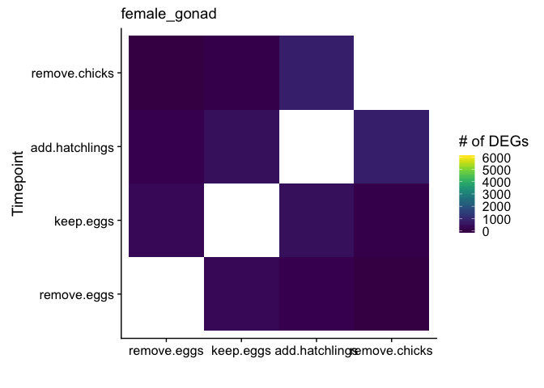

    ## Warning in MASS::cov.trob(data[, vars]): Probable convergence failure

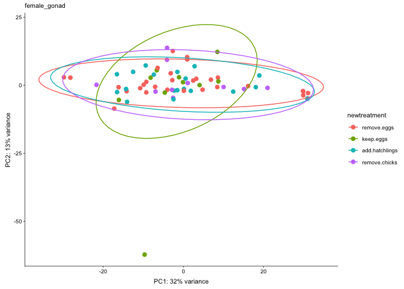

    ##              Df Sum Sq Mean Sq F value Pr(>F)
    ## newtreatment  3     82   27.43   0.137  0.938
    ## Residuals    65  13029  200.45               
    ##   Tukey multiple comparisons of means
    ##     95% family-wise confidence level
    ## 
    ## Fit: aov(formula = PC1 ~ newtreatment, data = pcadata)
    ## 
    ## $newtreatment
    ##                                    diff       lwr      upr     p adj
    ## keep.eggs-remove.eggs        -2.5950964 -16.28510 11.09491 0.9588204
    ## add.hatchlings-remove.eggs    0.8246363 -10.02598 11.67525 0.9971221
    ## remove.chicks-remove.eggs     0.4185443 -13.27146 14.10855 0.9998102
    ## add.hatchlings-keep.eggs      3.4197327 -11.03852 17.87799 0.9241257
    ## remove.chicks-keep.eggs       3.0136408 -13.68131 19.70860 0.9641222
    ## remove.chicks-add.hatchlings -0.4060919 -14.86435 14.05216 0.9998527
    ## 
    ##              Df Sum Sq Mean Sq F value Pr(>F)
    ## newtreatment  3    239   79.75   1.014  0.392
    ## Residuals    65   5114   78.67               
    ##   Tukey multiple comparisons of means
    ##     95% family-wise confidence level
    ## 
    ## Fit: aov(formula = PC2 ~ newtreatment, data = pcadata)
    ## 
    ## $newtreatment
    ##                                    diff        lwr       upr     p adj
    ## keep.eggs-remove.eggs        -5.3982443 -13.974676  3.178187 0.3532241
    ## add.hatchlings-remove.eggs   -0.8271512  -7.624778  5.970476 0.9884732
    ## remove.chicks-remove.eggs     0.2737654  -8.302666  8.850197 0.9997840
    ## add.hatchlings-keep.eggs      4.5710932  -4.486628 13.628814 0.5470344
    ## remove.chicks-keep.eggs       5.6720098  -4.786945 16.130965 0.4855657
    ## remove.chicks-add.hatchlings  1.1009166  -7.956804 10.158638 0.9885113

    ## [1] "female_hypothalamus"
    ## [1] TRUE

    ## estimating size factors

    ## estimating dispersions

    ## gene-wise dispersion estimates

    ## mean-dispersion relationship

    ## final dispersion estimates

    ## fitting model and testing

    ## -- replacing outliers and refitting for 34 genes
    ## -- DESeq argument 'minReplicatesForReplace' = 7 
    ## -- original counts are preserved in counts(dds)

    ## estimating dispersions

    ## fitting model and testing

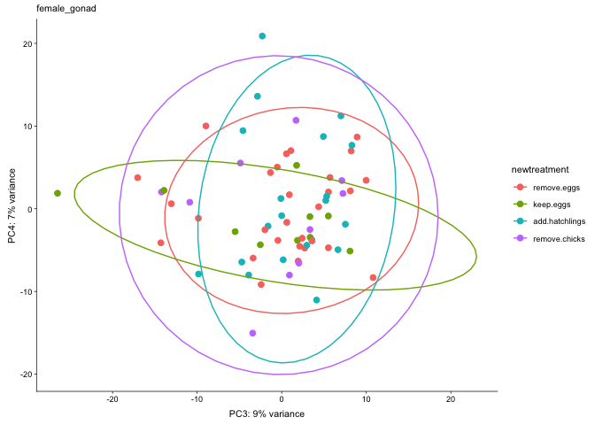

    ##               V1 add.hatchlings keep.eggs remove.chicks remove.eggs
    ## 1 add.hatchlings             NA        56            23        2329
    ## 2      keep.eggs             56        NA           111         190
    ## 3  remove.chicks             23       111            NA          40
    ## 4    remove.eggs           2329       190            40          NA

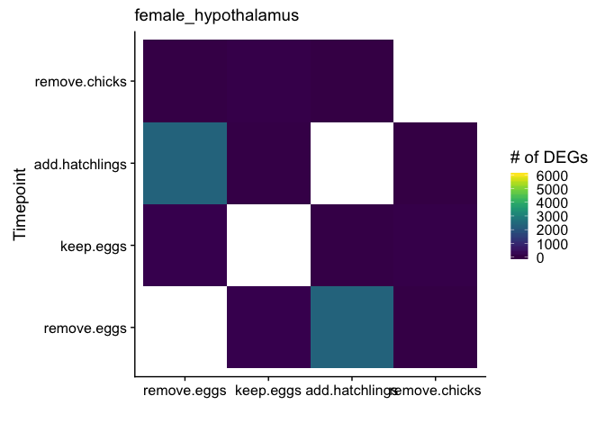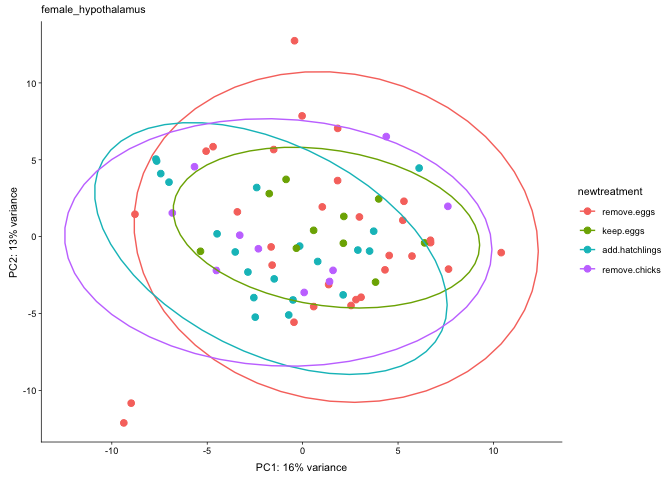

    ##              Df Sum Sq Mean Sq F value Pr(>F)
    ## newtreatment  3   95.3   31.77   1.593  0.199
    ## Residuals    66 1316.4   19.95               
    ##   Tukey multiple comparisons of means
    ##     95% family-wise confidence level
    ## 
    ## Fit: aov(formula = PC1 ~ newtreatment, data = pcadata)
    ## 
    ## $newtreatment
    ##                                    diff       lwr       upr     p adj
    ## keep.eggs-remove.eggs         0.1229312 -4.175299 4.4211613 0.9998447
    ## add.hatchlings-remove.eggs   -2.5461553 -5.944205 0.8518939 0.2078906
    ## remove.chicks-remove.eggs    -1.7097770 -6.008007 2.5884531 0.7216892
    ## add.hatchlings-keep.eggs     -2.6690866 -7.228048 1.8898749 0.4180661
    ## remove.chicks-keep.eggs      -1.8327082 -7.096943 3.4315270 0.7955377
    ## remove.chicks-add.hatchlings  0.8363783 -3.722583 5.3953398 0.9624905
    ## 
    ##              Df Sum Sq Mean Sq F value Pr(>F)
    ## newtreatment  3    5.8   1.923   0.109  0.954
    ## Residuals    66 1159.8  17.573               
    ##   Tukey multiple comparisons of means
    ##     95% family-wise confidence level
    ## 
    ## Fit: aov(formula = PC2 ~ newtreatment, data = pcadata)
    ## 
    ## $newtreatment
    ##                                    diff       lwr      upr     p adj
    ## keep.eggs-remove.eggs         0.5744946 -3.460064 4.609053 0.9818223
    ## add.hatchlings-remove.eggs   -0.2706093 -3.460208 2.918989 0.9960170
    ## remove.chicks-remove.eggs     0.3480821 -3.686476 4.382641 0.9958144
    ## add.hatchlings-keep.eggs     -0.8451039 -5.124399 3.434192 0.9538706
    ## remove.chicks-keep.eggs      -0.2264125 -5.167717 4.714892 0.9993638
    ## remove.chicks-add.hatchlings  0.6186914 -3.660604 4.897987 0.9810048

    ## [1] "female_pituitary"
    ## [1] TRUE

    ## estimating size factors

    ## estimating dispersions

    ## gene-wise dispersion estimates

    ## mean-dispersion relationship

    ## final dispersion estimates

    ## fitting model and testing

    ## -- replacing outliers and refitting for 111 genes
    ## -- DESeq argument 'minReplicatesForReplace' = 7 
    ## -- original counts are preserved in counts(dds)

    ## estimating dispersions

    ## fitting model and testing

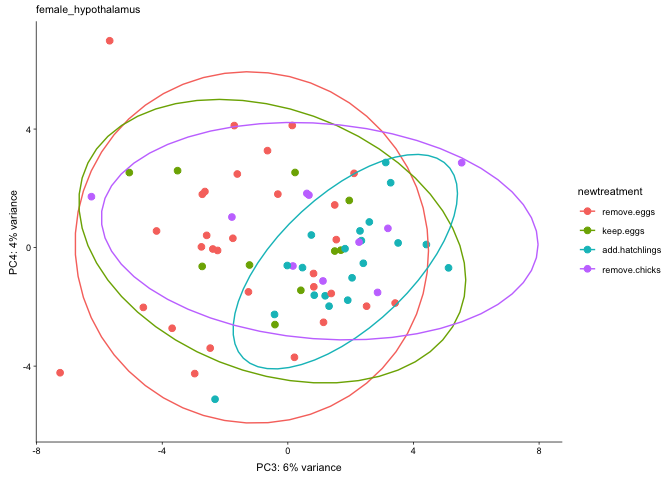

    ##               V1 add.hatchlings keep.eggs remove.chicks remove.eggs
    ## 1 add.hatchlings             NA       588          1633        1852
    ## 2      keep.eggs            588        NA           733        1452
    ## 3  remove.chicks           1633       733            NA         405
    ## 4    remove.eggs           1852      1452           405          NA

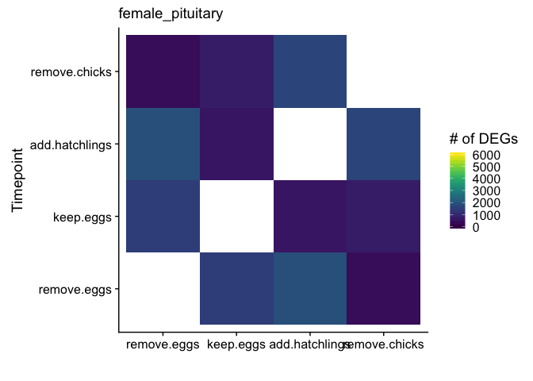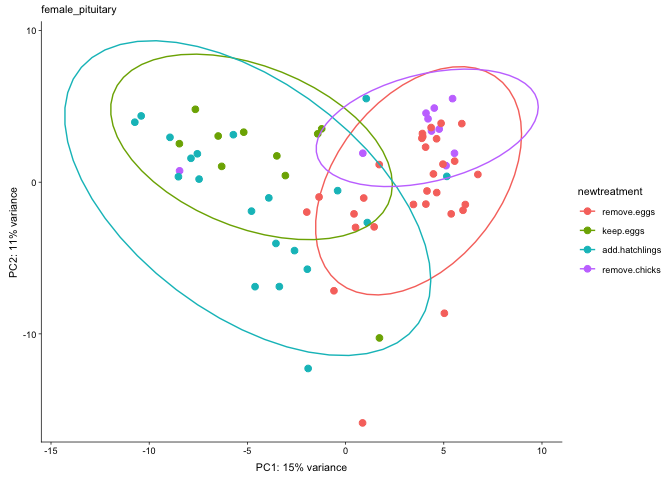

    ##              Df Sum Sq Mean Sq F value   Pr(>F)    
    ## newtreatment  3  975.6   325.2    28.3 7.94e-12 ***
    ## Residuals    65  746.8    11.5                     
    ## ---
    ## Signif. codes:  0 '***' 0.001 '**' 0.01 '*' 0.05 '.' 0.1 ' ' 1
    ##   Tukey multiple comparisons of means
    ##     95% family-wise confidence level
    ## 
    ## Fit: aov(formula = PC1 ~ newtreatment, data = pcadata)
    ## 
    ## $newtreatment
    ##                                    diff        lwr       upr     p adj
    ## keep.eggs-remove.eggs        -7.5389659 -10.816526 -4.261406 0.0000004
    ## add.hatchlings-remove.eggs   -7.7302041 -10.327978 -5.132430 0.0000000
    ## remove.chicks-remove.eggs    -0.3334300  -3.610990  2.944130 0.9931825
    ## add.hatchlings-keep.eggs     -0.1912381  -3.652727  3.270251 0.9988862
    ## remove.chicks-keep.eggs       7.2055359   3.208553 11.202519 0.0000668
    ## remove.chicks-add.hatchlings  7.3967740   3.935285 10.858263 0.0000024
    ## 
    ##              Df Sum Sq Mean Sq F value Pr(>F)  
    ## newtreatment  3  160.6   53.55   3.241 0.0276 *
    ## Residuals    65 1074.0   16.52                 
    ## ---
    ## Signif. codes:  0 '***' 0.001 '**' 0.01 '*' 0.05 '.' 0.1 ' ' 1
    ##   Tukey multiple comparisons of means
    ##     95% family-wise confidence level
    ## 
    ## Fit: aov(formula = PC2 ~ newtreatment, data = pcadata)
    ## 
    ## $newtreatment
    ##                                    diff         lwr      upr     p adj
    ## keep.eggs-remove.eggs         2.1220960 -1.80840297 6.052595 0.4894429
    ## add.hatchlings-remove.eggs   -0.3210097 -3.43629932 2.794280 0.9929205
    ## remove.chicks-remove.eggs     3.9539926  0.02349365 7.884492 0.0481040
    ## add.hatchlings-keep.eggs     -2.4431057 -6.59417524 1.707964 0.4131081
    ## remove.chicks-keep.eggs       1.8318966 -2.96134561 6.625139 0.7454779
    ## remove.chicks-add.hatchlings  4.2750023  0.12393279 8.426072 0.0411376

    ## [1] "male_gonad"
    ## [1] TRUE

    ## estimating size factors

    ## estimating dispersions

    ## gene-wise dispersion estimates

    ## mean-dispersion relationship

    ## final dispersion estimates

    ## fitting model and testing

    ## -- replacing outliers and refitting for 799 genes
    ## -- DESeq argument 'minReplicatesForReplace' = 7 
    ## -- original counts are preserved in counts(dds)

    ## estimating dispersions

    ## fitting model and testing

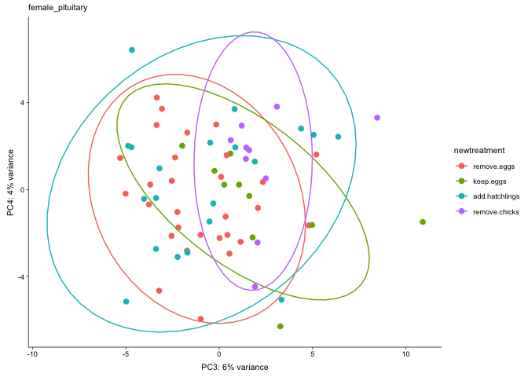

    ##               V1 add.hatchlings keep.eggs remove.chicks remove.eggs
    ## 1 add.hatchlings             NA       605             1          16
    ## 2      keep.eggs            605        NA            14        1040
    ## 3  remove.chicks              1        14            NA           1
    ## 4    remove.eggs             16      1040             1          NA

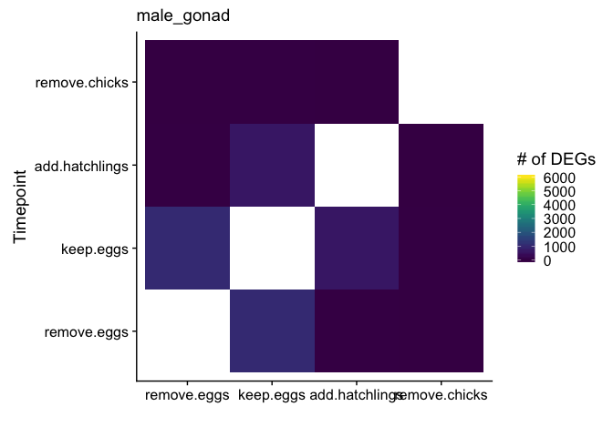

    ## Warning in MASS::cov.trob(data[, vars]): Probable convergence failure

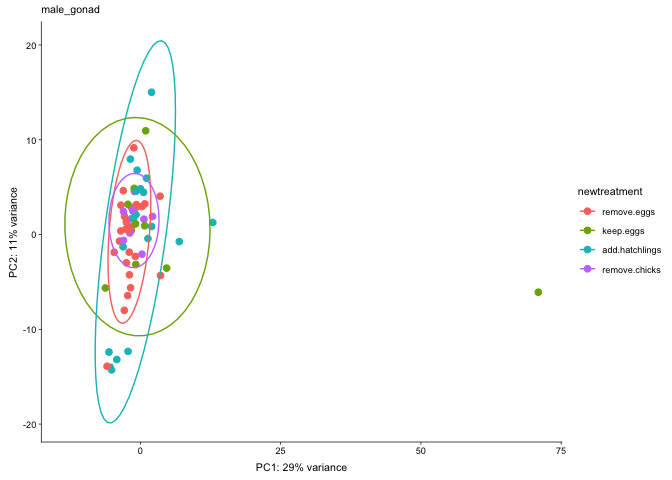

    ##              Df Sum Sq Mean Sq F value Pr(>F)
    ## newtreatment  3    513  171.07   2.081  0.112
    ## Residuals    63   5178   82.19               
    ##   Tukey multiple comparisons of means
    ##     95% family-wise confidence level
    ## 
    ## Fit: aov(formula = PC1 ~ newtreatment, data = pcadata)
    ## 
    ## $newtreatment
    ##                                    diff        lwr       upr     p adj
    ## keep.eggs-remove.eggs         8.2168235  -0.596675 17.030322 0.0763037
    ## add.hatchlings-remove.eggs    1.5158859  -5.488372  8.520144 0.9403148
    ## remove.chicks-remove.eggs     0.7928324  -8.374356  9.960021 0.9957666
    ## add.hatchlings-keep.eggs     -6.7009376 -15.966701  2.564825 0.2349334
    ## remove.chicks-keep.eggs      -7.4239911 -18.416355  3.568373 0.2913698
    ## remove.chicks-add.hatchlings -0.7230535 -10.325863  8.879756 0.9971926
    ## 
    ##              Df Sum Sq Mean Sq F value Pr(>F)
    ## newtreatment  3   24.2    8.08   0.232  0.874
    ## Residuals    63 2198.6   34.90               
    ##   Tukey multiple comparisons of means
    ##     95% family-wise confidence level
    ## 
    ## Fit: aov(formula = PC2 ~ newtreatment, data = pcadata)
    ## 
    ## $newtreatment
    ##                                    diff       lwr      upr     p adj
    ## keep.eggs-remove.eggs         0.4723848 -5.270684 6.215453 0.9963512
    ## add.hatchlings-remove.eggs   -0.3734166 -4.937545 4.190711 0.9964084
    ## remove.chicks-remove.eggs     1.5287766 -4.444764 7.502317 0.9060347
    ## add.hatchlings-keep.eggs     -0.8458014 -6.883575 5.191972 0.9825927
    ## remove.chicks-keep.eggs       1.0563919 -6.106473 8.219257 0.9798033
    ## remove.chicks-add.hatchlings  1.9021932 -4.355207 8.159594 0.8531267

    ## [1] "male_hypothalamus"
    ## [1] TRUE

    ## estimating size factors

    ## estimating dispersions

    ## gene-wise dispersion estimates

    ## mean-dispersion relationship

    ## final dispersion estimates

    ## fitting model and testing

    ## -- replacing outliers and refitting for 20 genes
    ## -- DESeq argument 'minReplicatesForReplace' = 7 
    ## -- original counts are preserved in counts(dds)

    ## estimating dispersions

    ## fitting model and testing

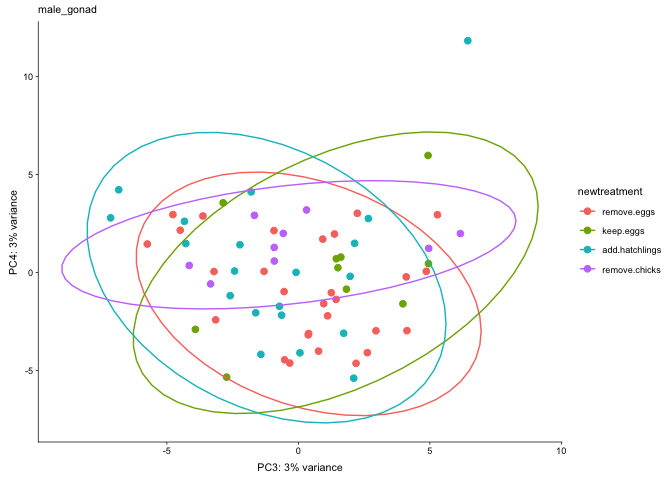

    ##               V1 add.hatchlings keep.eggs remove.chicks remove.eggs
    ## 1 add.hatchlings             NA         2             1        3017
    ## 2      keep.eggs              2        NA             0           2
    ## 3  remove.chicks              1         0            NA           1
    ## 4    remove.eggs           3017         2             1          NA

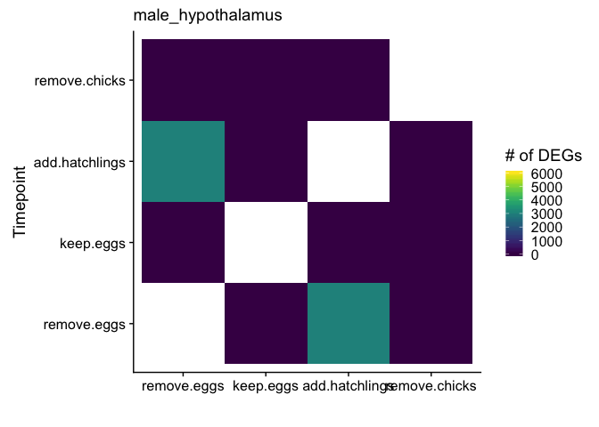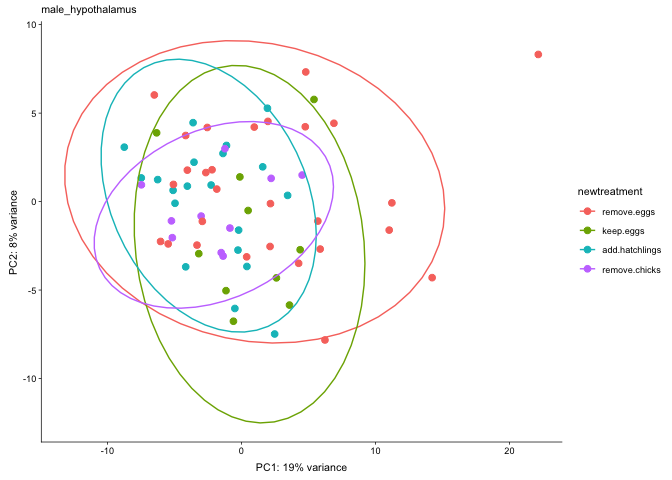

    ##              Df Sum Sq Mean Sq F value Pr(>F)  
    ## newtreatment  3  254.8   84.94   3.177 0.0299 *
    ## Residuals    64 1711.3   26.74                 
    ## ---
    ## Signif. codes:  0 '***' 0.001 '**' 0.01 '*' 0.05 '.' 0.1 ' ' 1
    ##   Tukey multiple comparisons of means
    ##     95% family-wise confidence level
    ## 
    ## Fit: aov(formula = PC1 ~ newtreatment, data = pcadata)
    ## 
    ## $newtreatment
    ##                                    diff       lwr        upr     p adj
    ## keep.eggs-remove.eggs        -1.5619529 -6.586922  3.4630164 0.8448288
    ## add.hatchlings-remove.eggs   -4.2584125 -8.251853 -0.2649719 0.0322055
    ## remove.chicks-remove.eggs    -3.9802205 -9.005190  1.0447488 0.1675752
    ## add.hatchlings-keep.eggs     -2.6964597 -7.979285  2.5863657 0.5372608
    ## remove.chicks-keep.eggs      -2.4182676 -8.518349  3.6818137 0.7233265
    ## remove.chicks-add.hatchlings  0.2781921 -5.004633  5.5610175 0.9990334
    ## 
    ##              Df Sum Sq Mean Sq F value Pr(>F)
    ## newtreatment  3   44.4   14.80   1.157  0.333
    ## Residuals    64  818.8   12.79               
    ##   Tukey multiple comparisons of means
    ##     95% family-wise confidence level
    ## 
    ## Fit: aov(formula = PC2 ~ newtreatment, data = pcadata)
    ## 
    ## $newtreatment
    ##                                    diff       lwr      upr     p adj
    ## keep.eggs-remove.eggs        -2.3793495 -5.855167 1.096468 0.2801539
    ## add.hatchlings-remove.eggs   -0.5245454 -3.286845 2.237754 0.9585647
    ## remove.chicks-remove.eggs    -1.1377591 -4.613577 2.338059 0.8235788
    ## add.hatchlings-keep.eggs      1.8548040 -1.799375 5.508983 0.5419322
    ## remove.chicks-keep.eggs       1.2415904 -2.977892 5.461073 0.8649364
    ## remove.chicks-add.hatchlings -0.6132137 -4.267393 3.040965 0.9707944

    ## [1] "male_pituitary"
    ## [1] TRUE

    ## estimating size factors

    ## estimating dispersions

    ## gene-wise dispersion estimates

    ## mean-dispersion relationship

    ## final dispersion estimates

    ## fitting model and testing

    ## -- replacing outliers and refitting for 460 genes
    ## -- DESeq argument 'minReplicatesForReplace' = 7 
    ## -- original counts are preserved in counts(dds)

    ## estimating dispersions

    ## fitting model and testing

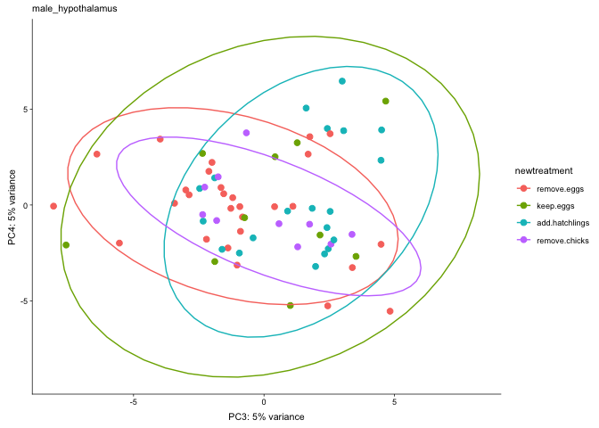

    ##               V1 add.hatchlings keep.eggs remove.chicks remove.eggs
    ## 1 add.hatchlings             NA         9           287         183
    ## 2      keep.eggs              9        NA            32         101
    ## 3  remove.chicks            287        32            NA          16
    ## 4    remove.eggs            183       101            16          NA

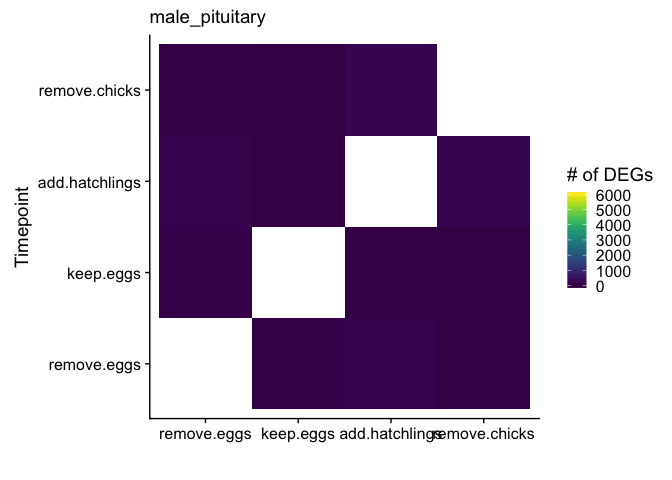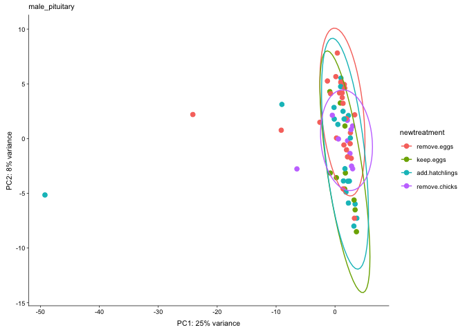

    ##              Df Sum Sq Mean Sq F value Pr(>F)
    ## newtreatment  3     70   23.47   0.441  0.724
    ## Residuals    64   3403   53.17               
    ##   Tukey multiple comparisons of means
    ##     95% family-wise confidence level
    ## 
    ## Fit: aov(formula = PC1 ~ newtreatment, data = pcadata)
    ## 
    ## $newtreatment
    ##                                    diff        lwr      upr     p adj
    ## keep.eggs-remove.eggs         1.5045504  -5.581129 8.590230 0.9434417
    ## add.hatchlings-remove.eggs   -1.2866132  -6.917740 4.344514 0.9308466
    ## remove.chicks-remove.eggs     1.2125981  -5.873082 8.298278 0.9691186
    ## add.hatchlings-keep.eggs     -2.7911635 -10.240445 4.658118 0.7565543
    ## remove.chicks-keep.eggs      -0.2919523  -8.893641 8.309737 0.9997400
    ## remove.chicks-add.hatchlings  2.4992112  -4.950070 9.948492 0.8126339
    ## 
    ##              Df Sum Sq Mean Sq F value  Pr(>F)   
    ## newtreatment  3  217.0   72.33   5.477 0.00206 **
    ## Residuals    64  845.1   13.21                   
    ## ---
    ## Signif. codes:  0 '***' 0.001 '**' 0.01 '*' 0.05 '.' 0.1 ' ' 1
    ##   Tukey multiple comparisons of means
    ##     95% family-wise confidence level
    ## 
    ## Fit: aov(formula = PC2 ~ newtreatment, data = pcadata)
    ## 
    ## $newtreatment
    ##                                    diff       lwr        upr     p adj
    ## keep.eggs-remove.eggs        -4.6444550 -8.175747 -1.1131627 0.0050730
    ## add.hatchlings-remove.eggs   -3.2949723 -6.101359 -0.4885857 0.0150037
    ## remove.chicks-remove.eggs    -2.3899360 -5.921228  1.1413564 0.2898064
    ## add.hatchlings-keep.eggs      1.3494828 -2.363018  5.0619833 0.7731156
    ## remove.chicks-keep.eggs       2.2545191 -2.032307  6.5413454 0.5118555
    ## remove.chicks-add.hatchlings  0.9050363 -2.807464  4.6175368 0.9175848

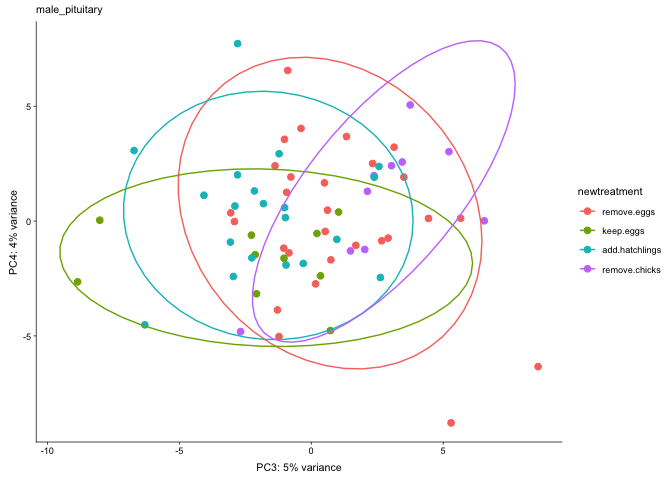
