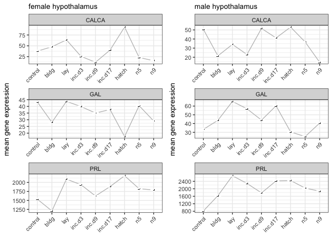
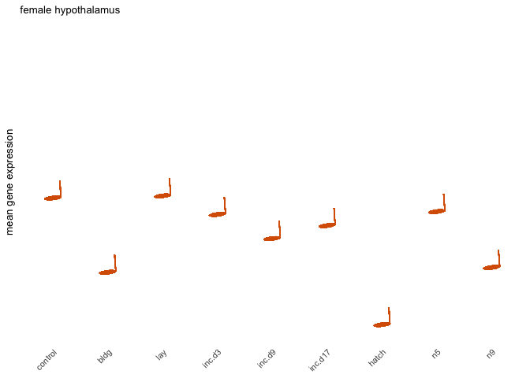
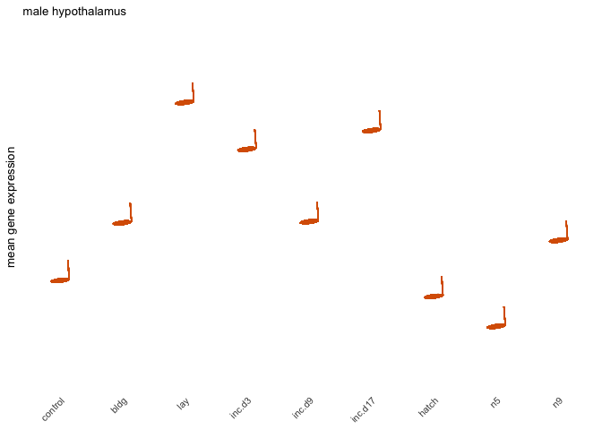
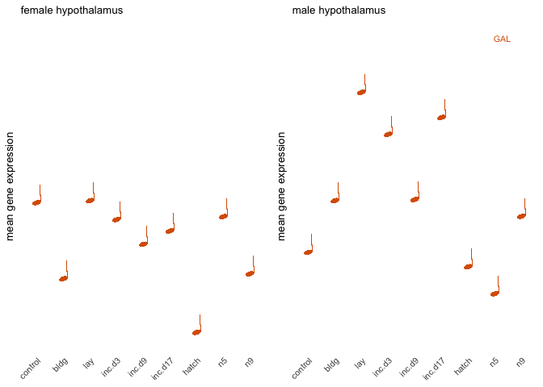
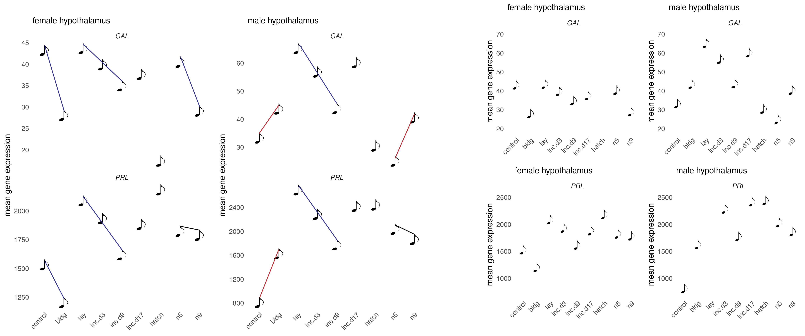
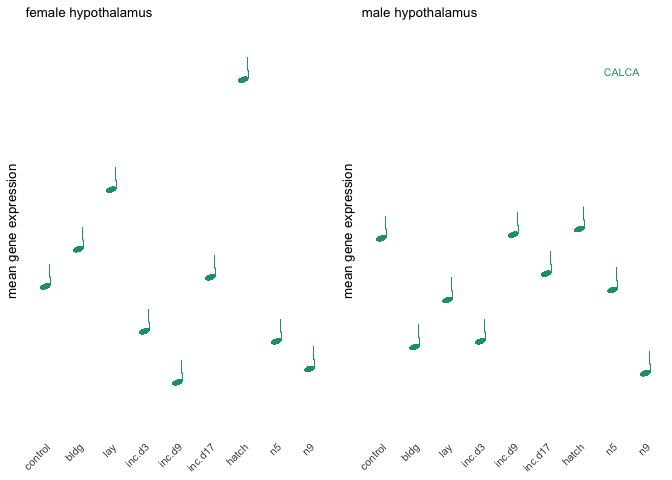
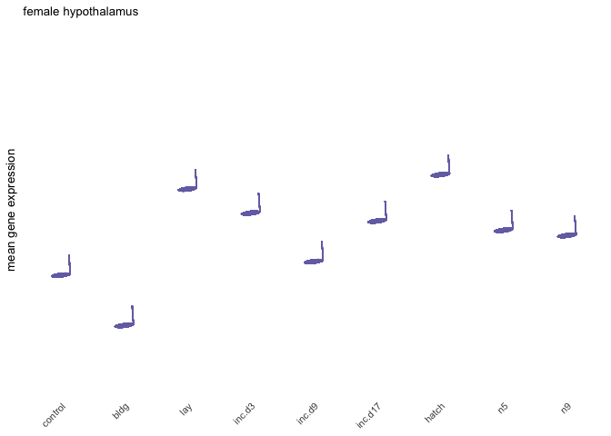
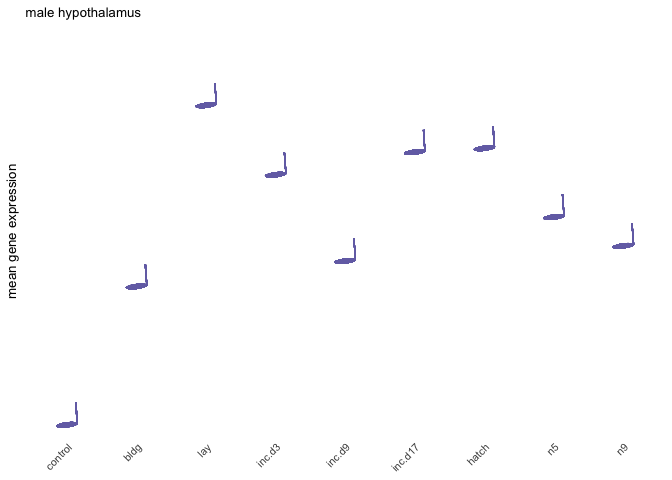

    library(tidyverse)
    library(cowplot)
    library(ggimage)

    # load custom functions  
    source("../R/functions.R") 

    knitr::opts_chunk$set(fig.path = '../figures/characterization/', cache = TRUE)

Characterization data
---------------------

    # import "colData" which contains sample information and "countData" which contains read counts
    c.colData <- read.csv("../metadata/00_colData_characterization.csv", header = T, row.names = 1)
    c.countData <- read.csv("../results/00_countData_characterization.csv", header = T, row.names = 1)
    geneinfo <- read.csv("../metadata/00_geneinfo.csv", row.names = 1)

    # set levels
    c.colData$treatment <- factor(c.colData$treatment, levels = 
                                  c("control",  "bldg", "lay", "inc.d3", "inc.d9", "inc.d17", "hatch", "n5", "n9"))
    levels(c.colData$treatment)

    ## [1] "control" "bldg"    "lay"     "inc.d3"  "inc.d9"  "inc.d17" "hatch"  
    ## [8] "n5"      "n9"

    c.colData$sextissue <- as.factor(paste(c.colData$sex, c.colData$tissue, sep = "_"))
    summary(c.colData[c(7,3,4,5,8)])

    ##              study         sex               tissue      treatment  
    ##  charcterization:576   female:289   gonad       :194   control: 73  
    ##                        male  :287   hypothalamus:189   inc.d9 : 71  
    ##                                     pituitary   :193   inc.d17: 66  
    ##                                                        n9     : 66  
    ##                                                        bldg   : 60  
    ##                                                        lay    : 60  
    ##                                                        (Other):180  
    ##                sextissue 
    ##  female_gonad       :98  
    ##  female_hypothalamus:95  
    ##  female_pituitary   :96  
    ##  male_gonad         :96  
    ##  male_hypothalamus  :94  
    ##  male_pituitary     :97  
    ## 

Musical genes
-------------

    countData <- c.countData
    colData <- c.colData

    candidataCounts <- countData
    candidataCounts$Name <- row.names(candidataCounts)
    candidataCounts <- candidataCounts %>%
      filter(Name %in% c("NP_990797.2", "NP_001138861.1", "NP_001107180.1"))
    row.names(candidataCounts) <- candidataCounts$Name
    candidataCounts$Name <- NULL
    candidataCountsT <- t(candidataCounts)
    candidataCountsT <- as.data.frame(candidataCountsT)

    candidataCountsT$entrez <- row.names(candidataCountsT)
    colData$entrez <- row.names(colData)

    candidataCountsTcol <- full_join(colData, candidataCountsT)

    ## Joining, by = "entrez"

    str(candidataCountsTcol)

    ## 'data.frame':    576 obs. of  12 variables:
    ##  $ V1            : Factor w/ 576 levels "blk.s061.pu.y_female_gonad_inc.d9",..: 131 132 133 134 135 136 137 138 139 140 ...
    ##  $ bird          : Factor w/ 195 levels "blk.s061.pu.y",..: 45 45 45 46 46 46 47 47 47 48 ...
    ##  $ sex           : Factor w/ 2 levels "female","male": 2 2 2 2 2 2 1 1 1 2 ...
    ##  $ tissue        : Factor w/ 3 levels "gonad","hypothalamus",..: 1 2 3 1 2 3 1 2 3 1 ...
    ##  $ treatment     : Factor w/ 9 levels "control","bldg",..: 1 1 1 1 1 1 1 1 1 1 ...
    ##  $ group         : Factor w/ 54 levels "female.gonad.bldg",..: 29 38 47 29 38 47 2 11 20 29 ...
    ##  $ study         : Factor w/ 1 level "charcterization": 1 1 1 1 1 1 1 1 1 1 ...
    ##  $ sextissue     : Factor w/ 6 levels "female_gonad",..: 4 5 6 4 5 6 1 2 3 4 ...
    ##  $ entrez        : chr  "L.Blu13_male_gonad_control.NYNO" "L.Blu13_male_hypothalamus_control.NYNO" "L.Blu13_male_pituitary_control.NYNO" "L.G107_male_gonad_control" ...
    ##  $ NP_001107180.1: int  15 4 0 19 4 0 528 20 0 10 ...
    ##  $ NP_001138861.1: int  0 6 2 2 11 8 182 1 0 0 ...
    ##  $ NP_990797.2   : int  2008 744 50521 484 578 92426 844 1255 146214 1258 ...

    candidataCountsTcol2 <- candidataCountsTcol %>%
      group_by(sextissue, treatment) %>%
      summarize(GAL = mean(NP_001138861.1, na.rm = TRUE),
                PRL = mean(NP_990797.2, na.rm = TRUE),
                CALCA = mean(NP_001107180.1, na.rm = TRUE)) %>%
      gather(GAL, PRL, CALCA, key = "gene", value = "mean")
     
    candidataCountsTcol2 <- as.data.frame(candidataCountsTcol2)
      

    musicgenes <- function(mygroup, mysusbtitle){

    myplot <- candidataCountsTcol2 %>%
      filter(sextissue %in% c(mygroup)) %>%
    ggplot(aes(x = treatment, y = mean)) +
      geom_point(colour = "white") + 
      geom_line(group = 1, color='grey') +
      theme_bw() +
      facet_wrap(~gene, scales = "free", ncol = 1) +
      theme(axis.text.x = element_text(angle = 45, hjust = 1)) +
      geom_image(aes(image="../figures/characterization/note-black-04.png")) +
      labs(y = "mean gene expression", subtitle = mysusbtitle, x = NULL)
      
      return(myplot)
      
    }

    a <- musicgenes("female_hypothalamus", "female hypothalamus")
    b <- musicgenes("male_hypothalamus", "male hypothalamus")

    c <- plot_grid(a,b)
    c

    pdf("../figures/characterization/musicalgenes-1.pdf", width = 8, height = 6)
    plot(c)
    dev.off()

    ## quartz_off_screen 
    ##                 2

    musicgeneslines <- function(mygroup, mysusbtitle, mygene, myimage, myylim, myhline){
      myplot <- candidataCountsTcol2 %>%
      filter(sextissue %in% c(mygroup),
             gene == mygene) %>%
        ggplot(aes(x = treatment, y = mean)) +
        geom_point(colour = "white") + 
        theme_minimal() +
        #facet_wrap(~gene,  ncol = 1) +
        theme(axis.text.x = element_text(angle = 45, hjust = 1),
              strip.text = element_text(face = "italic"),
              panel.grid = element_blank(),
              axis.text.y = element_blank()) +
        geom_image(aes(image=myimage)) +
       labs(y = "mean gene expression", subtitle = mysusbtitle, x = NULL) +
        ylim(myylim) + 
        geom_hline(yintercept = myhline, colour="grey")
      return(myplot)
    }

    musicgenesnolines <- function(mygroup, mysusbtitle, mygene, myimage, myylim, myhline){
      myplot <- candidataCountsTcol2 %>%
      filter(sextissue %in% c(mygroup),
             gene == mygene) %>%
        ggplot(aes(x = treatment, y = mean)) +
        geom_point(colour = "white") + 
        theme_minimal(base_size = 10) +
        #facet_wrap(~gene,  ncol = 1) +
        theme(axis.text.x = element_text(angle = 45, hjust = 1),
              strip.text = element_text(face = "italic"),
              panel.grid = element_blank(),
              axis.text.y = element_blank()) +
        geom_image(aes(image=myimage)) +
       labs(y = "mean gene expression", subtitle = mysusbtitle, x = NULL) +
        ylim(myylim) 

      return(myplot)
    }

    a <- musicgenesnolines("female_hypothalamus", "female hypothalamus", "GAL", "../figures/characterization/note-orange-04.png", c(15,75))
    a

    b <- musicgenesnolines("male_hypothalamus", "male hypothalamus", "GAL", "../figures/characterization/note-orange-04.png", c(15,75))
    b

    ab <- plot_grid(a,b) + cowplot::draw_text("GAL", x = 0.925, y = 0.9, size = 8, colour = "#d95f02")
    ab

    c <- musicgenesnolines("female_hypothalamus", "female hypothalamus", "CALCA", "../figures/characterization/note-teal-04.png", c(0,100))
    c

    d <- musicgenesnolines("male_hypothalamus", "male hypothalamus", "CALCA", "../figures/characterization/note-teal-04.png", c(0,100))
    d

    cd <- plot_grid(c,d)  + cowplot::draw_text("CALCA", x = 0.925, y = 0.85, size = 8, colour = "#1b9e77")
    cd

    e <- musicgenesnolines("female_hypothalamus", "female hypothalamus", "PRL", "../figures/characterization/note-purple-04.png", c(800,3000) )
    e

    f <- musicgenesnolines("male_hypothalamus", "male hypothalamus", "PRL", "../figures/characterization/note-purple-04.png", c(800,3000))
    f

    ef <- plot_grid(e,f) + cowplot::draw_text("PRL", x = 0.925, y = 0.8, size = 8, colour = "#7570b3")
    ef

    pdf("../figures/characterization/musicalgenes-ab.pdf", width = 4, height = 2)
    plot(ab)
    dev.off()

    ## quartz_off_screen 
    ##                 2

    pdf("../figures/characterization/musicalgenes-cd.pdf", width = 4, height = 2)
    plot(cd)
    dev.off()

    ## quartz_off_screen 
    ##                 2

    pdf("../figures/characterization/musicalgenes-ef.pdf", width = 4, height = 2)
    plot(ef)
    dev.off()

    ## quartz_off_screen 
    ##                 2
