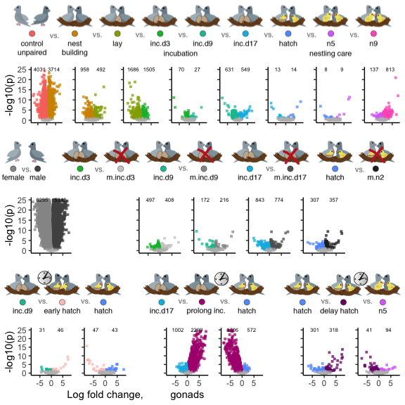

Warning: This script takes a very long time to run.
===================================================

DESeq2 was not designed to run on 300 samples. But, I really like it, so
I do it anyways. Some of these commands take like 15 min to run using 6
cores.

DEseq2 on all chaacterization and manipulations
-----------------------------------------------

    # import "colData" which contains sample information and "countData" which contains read counts
    countData <- read.csv("../results/00_counts.csv", header = T, row.names = 1)
    geneinfo <- read.csv("../metadata/00_geneinfo.csv", row.names = 1)
    head(geneinfo)

    FALSE   row.names     Name geneid       entrezid
    FALSE 1    408082    EDNRB 408082 NP_001001127.1
    FALSE 2    408183  CYP26A1 408183 NP_001001129.1
    FALSE 3    374073    CFDP1 374073 NP_001001189.1
    FALSE 4    407777    AvBD7 407777 NP_001001194.1
    FALSE 5    407779     KRT5 407779 NP_001001195.1
    FALSE 6    408034 HSD11B1L 408034 NP_001001201.1

    # craete variable that will be critical for subset later on
    colData <- read.csv("../metadata/00_samples.csv", header = T, row.names = 1)
    colData$sextissue <- as.factor(paste(colData$sex, colData$tissue, sep = "_"))
    colData$treatment <- factor(colData$treatment, levels = alllevels3)
    colData$tissue <- factor(colData$tissue, levels = tissuelevels)
    levels(colData$treatment)

    FALSE  [1] "control"   "bldg"      "lay"       "inc.d3"    "inc.d9"   
    FALSE  [6] "inc.d17"   "hatch"     "n5"        "n9"        "m.inc.d3" 
    FALSE [11] "m.inc.d9"  "m.inc.d17" "m.n2"      "m.inc.d8"  "prolong"  
    FALSE [16] "extend"

    dds.gonads <- subsetDESeq2(colData,  countData, c("female_gonad","male_gonad"))

    FALSE class: DESeqDataSet 
    FALSE dim: 13966 330 
    FALSE metadata(1): version
    FALSE assays(1): counts
    FALSE rownames(13966): A2ML1 A2ML2 ... ZYX ZZZ3
    FALSE rowData names(0):
    FALSE colnames(330): L.Blu13_male_gonad_control.NYNO
    FALSE   L.G107_male_gonad_control ... y98.g54_female_gonad_m.hatch
    FALSE   y98.o50.x_male_gonad_inc.d3
    FALSE colData names(8): V1 bird ... study sextissue
    FALSE [1] 13926   330

    vsd <- as.data.frame(assay(vst(dds.gonads, blind=FALSE)))
    write.csv(vsd, "../results/06_gonallvsd.csv")

    control.bldg <- createDEGdfsave(dds.gonads, "treatment", "bldg", "control", "gonads")

    FALSE 'data.frame': 7745 obs. of  6 variables:
    FALSE  $ gene     : Factor w/ 13926 levels "A2ML1","A2ML2",..: 5352 2388 6253 6475 13546 6950 6179 8086 3038 8819 ...
    FALSE  $ padj     : num  3.92e-28 2.83e-26 1.96e-16 1.74e-11 4.51e-18 ...
    FALSE  $ logpadj  : num  27.4 25.5 15.7 10.8 17.3 ...
    FALSE  $ lfc      : num  13.05 9.35 8.33 8.23 7.34 ...
    FALSE  $ tissue   : Factor w/ 1 level "gonads": 1 1 1 1 1 1 1 1 1 1 ...
    FALSE  $ direction: Factor w/ 3 levels "control","NS",..: 3 3 3 3 3 3 3 3 3 3 ...
    FALSE NULL

    bldg.lay <- createDEGdfsave(dds.gonads, "treatment", "lay", "bldg", "gonads")

    FALSE 'data.frame': 1450 obs. of  6 variables:
    FALSE  $ gene     : Factor w/ 13926 levels "A2ML1","A2ML2",..: 1973 1510 6243 6708 6387 6802 1386 6383 8141 8940 ...
    FALSE  $ padj     : num  3.98e-30 3.47e-19 3.47e-19 4.85e-09 4.22e-17 ...
    FALSE  $ logpadj  : num  29.4 18.46 18.46 8.31 16.37 ...
    FALSE  $ lfc      : num  12.92 11.05 9.88 9.81 9.04 ...
    FALSE  $ tissue   : Factor w/ 1 level "gonads": 1 1 1 1 1 1 1 1 1 1 ...
    FALSE  $ direction: Factor w/ 3 levels "bldg","NS","lay": 3 3 3 3 3 3 3 3 3 3 ...
    FALSE NULL

    lay.inc.d3 <- createDEGdfsave(dds.gonads, "treatment", "inc.d3", "lay", "gonads") 

    FALSE 'data.frame': 3191 obs. of  6 variables:
    FALSE  $ gene     : Factor w/ 13926 levels "A2ML1","A2ML2",..: 10116 931 6774 6401 5634 12425 12606 10094 7904 3731 ...
    FALSE  $ padj     : num  2.58e-17 3.20e-03 8.31e-02 5.75e-07 7.90e-02 ...
    FALSE  $ logpadj  : num  16.59 2.49 1.08 6.24 1.1 ...
    FALSE  $ lfc      : num  11.14 3.76 3.36 3.31 3.21 ...
    FALSE  $ tissue   : Factor w/ 1 level "gonads": 1 1 1 1 1 1 1 1 1 1 ...
    FALSE  $ direction: Factor w/ 3 levels "lay","NS","inc.d3": 3 3 3 3 3 3 3 3 3 3 ...
    FALSE NULL

    inc.d3.inc.d9 <- createDEGdfsave(dds.gonads,  "treatment", "inc.d9", "inc.d3", "gonads") 

    FALSE 'data.frame': 97 obs. of  6 variables:
    FALSE  $ gene     : Factor w/ 13926 levels "A2ML1","A2ML2",..: 1465 9325 6179 7758 4458 5907 122 12429 12640 7305 ...
    FALSE  $ padj     : num  4.87e-07 2.41e-02 7.73e-02 1.55e-02 5.56e-04 ...
    FALSE  $ logpadj  : num  6.31 1.62 1.11 1.81 3.25 ...
    FALSE  $ lfc      : num  6.03 3.41 2.45 2.36 2.05 ...
    FALSE  $ tissue   : Factor w/ 1 level "gonads": 1 1 1 1 1 1 1 1 1 1 ...
    FALSE  $ direction: Factor w/ 3 levels "inc.d3","NS",..: 3 3 3 3 3 3 3 3 3 3 ...
    FALSE NULL

    inc.d9.inc.d17 <- createDEGdfsave(dds.gonads, "treatment", "inc.d17", "inc.d9", "gonads")

    FALSE 'data.frame': 1180 obs. of  6 variables:
    FALSE  $ gene     : Factor w/ 13926 levels "A2ML1","A2ML2",..: 6243 6708 6314 6169 6117 4525 8934 2260 11120 12054 ...
    FALSE  $ padj     : num  5.20e-29 2.63e-05 2.13e-07 4.02e-06 2.54e-05 ...
    FALSE  $ logpadj  : num  28.28 4.58 6.67 5.4 4.6 ...
    FALSE  $ lfc      : num  11.34 7.14 6.18 5.78 5.64 ...
    FALSE  $ tissue   : Factor w/ 1 level "gonads": 1 1 1 1 1 1 1 1 1 1 ...
    FALSE  $ direction: Factor w/ 3 levels "inc.d9","NS",..: 3 3 3 3 3 3 3 3 3 3 ...
    FALSE NULL

    inc.d17.hatch <- createDEGdfsave(dds.gonads, "treatment", "hatch", "inc.d17", "gonads") 

    FALSE 'data.frame': 27 obs. of  6 variables:
    FALSE  $ gene     : Factor w/ 13926 levels "A2ML1","A2ML2",..: 8600 8821 9136 1777 7231 6253 6707 13863 3568 7944 ...
    FALSE  $ padj     : num  2.22e-23 1.01e-18 1.01e-18 3.20e-15 7.33e-10 ...
    FALSE  $ logpadj  : num  22.65 17.99 17.99 14.5 9.13 ...
    FALSE  $ lfc      : num  11.27 10.84 10.01 8.66 7.4 ...
    FALSE  $ tissue   : Factor w/ 1 level "gonads": 1 1 1 1 1 1 1 1 1 1 ...
    FALSE  $ direction: Factor w/ 3 levels "inc.d17","NS",..: 3 3 3 3 3 3 3 3 3 3 ...
    FALSE NULL

    hatch.n5 <- createDEGdfsave(dds.gonads, "treatment", "n5", "hatch", "gonads") 

    FALSE 'data.frame': 17 obs. of  6 variables:
    FALSE  $ gene     : Factor w/ 13926 levels "A2ML1","A2ML2",..: 6708 1510 6243 6387 1644 6323 1280 1539 4560 7168 ...
    FALSE  $ padj     : num  1.10e-43 1.72e-23 2.28e-15 1.63e-15 4.60e-12 ...
    FALSE  $ logpadj  : num  43 22.8 14.6 14.8 11.3 ...
    FALSE  $ lfc      : num  21 11.8 9.18 8.96 7.74 ...
    FALSE  $ tissue   : Factor w/ 1 level "gonads": 1 1 1 1 1 1 1 1 1 1 ...
    FALSE  $ direction: Factor w/ 3 levels "hatch","NS","n5": 3 3 3 3 3 3 3 3 3 1 ...
    FALSE NULL

    n5.n9 <- createDEGdfsave(dds.gonads, "treatment", "n9", "n5", "gonads") 

    FALSE 'data.frame': 950 obs. of  6 variables:
    FALSE  $ gene     : Factor w/ 13926 levels "A2ML1","A2ML2",..: 5352 1386 3810 3020 1436 6475 7113 2388 6416 8934 ...
    FALSE  $ padj     : num  4.89e-240 5.08e-42 3.49e-42 3.81e-30 2.28e-31 ...
    FALSE  $ logpadj  : num  239.3 41.3 41.5 29.4 30.6 ...
    FALSE  $ lfc      : num  37.9 13.4 12.4 11.8 11.8 ...
    FALSE  $ tissue   : Factor w/ 1 level "gonads": 1 1 1 1 1 1 1 1 1 1 ...
    FALSE  $ direction: Factor w/ 3 levels "n5","NS","n9": 3 3 3 3 3 3 3 3 3 3 ...
    FALSE NULL

    sex <- createDEGdfsave(dds.gonads, "sex", "male", "female", "gonads") 

    FALSE 'data.frame': 11613 obs. of  6 variables:
    FALSE  $ gene     : Factor w/ 13926 levels "A2ML1","A2ML2",..: 5352 1280 6802 1436 1470 6387 1329 1465 6383 1644 ...
    FALSE  $ padj     : num  1.41e-84 5.06e-75 3.39e-62 5.51e-43 4.72e-63 ...
    FALSE  $ logpadj  : num  83.8 74.3 61.5 42.3 62.3 ...
    FALSE  $ lfc      : num  19.8 12.3 12 11.3 11 ...
    FALSE  $ tissue   : Factor w/ 1 level "gonads": 1 1 1 1 1 1 1 1 1 1 ...
    FALSE  $ direction: Factor w/ 3 levels "female","NS",..: 3 3 3 3 3 3 3 3 3 3 ...
    FALSE NULL

    inc.d3.m.inc.d3 <- createDEGdfsave(dds.gonads, "treatment", "m.inc.d3", "inc.d3", "gonads")

    FALSE 'data.frame': 905 obs. of  6 variables:
    FALSE  $ gene     : Factor w/ 13926 levels "A2ML1","A2ML2",..: 1386 3020 1436 6708 1465 7113 11120 9325 1644 6162 ...
    FALSE  $ padj     : num  8.81e-24 1.67e-12 7.10e-10 8.44e-05 3.68e-07 ...
    FALSE  $ logpadj  : num  23.05 11.78 9.15 4.07 6.43 ...
    FALSE  $ lfc      : num  10.69 8.7 8.03 7.78 6.21 ...
    FALSE  $ tissue   : Factor w/ 1 level "gonads": 1 1 1 1 1 1 1 1 1 1 ...
    FALSE  $ direction: Factor w/ 3 levels "inc.d3","NS",..: 3 3 3 3 3 3 3 3 3 3 ...
    FALSE NULL

    inc.d9.m.inc.d9 <- createDEGdfsave(dds.gonads, "treatment", "m.inc.d9", "inc.d9", "gonads")

    FALSE 'data.frame': 388 obs. of  6 variables:
    FALSE  $ gene     : Factor w/ 13926 levels "A2ML1","A2ML2",..: 6243 3020 6314 6169 1168 11800 8146 6707 2388 8560 ...
    FALSE  $ padj     : num  4.57e-24 9.34e-14 5.57e-10 8.63e-08 5.85e-03 ...
    FALSE  $ logpadj  : num  23.34 13.03 9.25 7.06 2.23 ...
    FALSE  $ lfc      : num  11.2 9.12 7.63 7.01 5.2 ...
    FALSE  $ tissue   : Factor w/ 1 level "gonads": 1 1 1 1 1 1 1 1 1 1 ...
    FALSE  $ direction: Factor w/ 3 levels "inc.d9","NS",..: 3 3 3 3 3 3 3 3 3 3 ...
    FALSE NULL

    inc.d17.m.inc.d17 <- createDEGdfsave(dds.gonads, "treatment", "m.inc.d17", "inc.d17", "gonads")

    FALSE 'data.frame': 1617 obs. of  6 variables:
    FALSE  $ gene     : Factor w/ 13926 levels "A2ML1","A2ML2",..: 8821 1510 8600 9136 7064 3020 1386 7231 1777 1280 ...
    FALSE  $ padj     : num  1.72e-32 3.12e-30 1.17e-29 5.87e-29 1.57e-16 ...
    FALSE  $ logpadj  : num  31.8 29.5 28.9 28.2 15.8 ...
    FALSE  $ lfc      : num  12.17 12.05 11.52 10.52 9.41 ...
    FALSE  $ tissue   : Factor w/ 1 level "gonads": 1 1 1 1 1 1 1 1 1 1 ...
    FALSE  $ direction: Factor w/ 3 levels "inc.d17","NS",..: 3 3 3 3 3 3 3 3 3 3 ...
    FALSE NULL

    hatch.m.n2 <- createDEGdfsave(dds.gonads, "treatment", "m.n2", "hatch", "gonads")

    FALSE 'data.frame': 664 obs. of  6 variables:
    FALSE  $ gene     : Factor w/ 13926 levels "A2ML1","A2ML2",..: 5352 6708 1510 7064 6243 3020 3810 1644 6387 1386 ...
    FALSE  $ padj     : num  8.87e-169 9.48e-28 1.26e-28 2.21e-17 9.44e-18 ...
    FALSE  $ logpadj  : num  168.1 27 27.9 16.7 17 ...
    FALSE  $ lfc      : num  32.89 17.15 12.3 10.1 9.55 ...
    FALSE  $ tissue   : Factor w/ 1 level "gonads": 1 1 1 1 1 1 1 1 1 1 ...
    FALSE  $ direction: Factor w/ 3 levels "hatch","NS","m.n2": 3 3 3 3 3 3 3 3 3 3 ...
    FALSE NULL

    inc.d9.m.inc.d8 <- createDEGdfsave(dds.gonads, "treatment", "m.inc.d8", "inc.d9", "gonads")

    FALSE 'data.frame': 77 obs. of  6 variables:
    FALSE  $ gene     : Factor w/ 13926 levels "A2ML1","A2ML2",..: 6243 1386 7064 3020 1436 6314 6117 6169 6403 2388 ...
    FALSE  $ padj     : num  6.81e-27 6.93e-16 3.98e-15 4.68e-14 1.30e-08 ...
    FALSE  $ logpadj  : num  26.17 15.16 14.4 13.33 7.89 ...
    FALSE  $ lfc      : num  10.7 9.16 8.98 8.55 7.31 ...
    FALSE  $ tissue   : Factor w/ 1 level "gonads": 1 1 1 1 1 1 1 1 1 1 ...
    FALSE  $ direction: Factor w/ 3 levels "inc.d9","NS",..: 3 3 3 3 3 3 3 3 3 3 ...
    FALSE NULL

    hatch.m.inc.d8 <- createDEGdfsave(dds.gonads, "treatment", "hatch", "m.inc.d8", "gonads")

    FALSE 'data.frame': 90 obs. of  6 variables:
    FALSE  $ gene     : Factor w/ 13926 levels "A2ML1","A2ML2",..: 8934 6253 10387 6707 12376 11120 8146 11796 6950 7113 ...
    FALSE  $ padj     : num  7.58e-03 7.37e-06 8.73e-06 2.35e-03 2.35e-03 ...
    FALSE  $ logpadj  : num  2.12 5.13 5.06 2.63 2.63 ...
    FALSE  $ lfc      : num  7.76 5.04 4.79 4.67 4.52 ...
    FALSE  $ tissue   : Factor w/ 1 level "gonads": 1 1 1 1 1 1 1 1 1 1 ...
    FALSE  $ direction: Factor w/ 3 levels "m.inc.d8","NS",..: 3 3 3 3 3 3 3 3 3 3 ...
    FALSE NULL

    inc.d17.prolong <- createDEGdfsave(dds.gonads, "treatment", "prolong", "inc.d17", "gonads")

    FALSE 'data.frame': 3301 obs. of  6 variables:
    FALSE  $ gene     : Factor w/ 13926 levels "A2ML1","A2ML2",..: 8821 1510 8600 7064 1386 9136 1777 3020 6387 1436 ...
    FALSE  $ padj     : num  2.47e-105 3.63e-107 3.84e-98 3.67e-90 5.44e-77 ...
    FALSE  $ logpadj  : num  104.6 106.4 97.4 89.4 76.3 ...
    FALSE  $ lfc      : num  20.6 20.2 17.7 17.2 17 ...
    FALSE  $ tissue   : Factor w/ 1 level "gonads": 1 1 1 1 1 1 1 1 1 1 ...
    FALSE  $ direction: Factor w/ 3 levels "inc.d17","NS",..: 3 3 3 3 3 3 3 3 3 3 ...
    FALSE NULL

    hatch.prolong <- createDEGdfsave(dds.gonads, "treatment", "hatch", "prolong", "gonads")

    FALSE 'data.frame': 2278 obs. of  6 variables:
    FALSE  $ gene     : Factor w/ 13926 levels "A2ML1","A2ML2",..: 6950 11267 6253 4525 5158 2260 8602 11838 5067 8143 ...
    FALSE  $ padj     : num  0.005104 0.000767 0.042684 0.0613 0.000636 ...
    FALSE  $ logpadj  : num  2.29 3.12 1.37 1.21 3.2 ...
    FALSE  $ lfc      : num  3.14 2.96 2.42 2.41 2.41 ...
    FALSE  $ tissue   : Factor w/ 1 level "gonads": 1 1 1 1 1 1 1 1 1 1 ...
    FALSE  $ direction: Factor w/ 3 levels "prolong","NS",..: 3 3 3 3 3 3 3 3 3 3 ...
    FALSE NULL

    hatch.extend <- createDEGdfsave(dds.gonads, "treatment", "extend", "hatch", "gonads")

    FALSE 'data.frame': 619 obs. of  6 variables:
    FALSE  $ gene     : Factor w/ 13926 levels "A2ML1","A2ML2",..: 5352 6708 1510 7064 6243 3020 6323 6387 1644 6117 ...
    FALSE  $ padj     : num  6.43e-170 1.88e-29 1.30e-30 1.67e-12 2.27e-12 ...
    FALSE  $ logpadj  : num  169.2 28.7 29.9 11.8 11.6 ...
    FALSE  $ lfc      : num  32.91 17.52 12.49 8.68 8.41 ...
    FALSE  $ tissue   : Factor w/ 1 level "gonads": 1 1 1 1 1 1 1 1 1 1 ...
    FALSE  $ direction: Factor w/ 3 levels "hatch","NS","extend": 3 3 3 3 3 3 3 3 3 3 ...
    FALSE NULL

    n5.extend <- createDEGdfsave(dds.gonads, "treatment", "n5", "extend", "gonads")

    FALSE 'data.frame': 135 obs. of  6 variables:
    FALSE  $ gene     : Factor w/ 13926 levels "A2ML1","A2ML2",..: 6802 1470 13549 11120 11243 8146 9413 328 2172 12360 ...
    FALSE  $ padj     : num  7.34e-17 5.12e-14 3.39e-04 6.21e-04 2.52e-03 ...
    FALSE  $ logpadj  : num  16.13 13.29 3.47 3.21 2.6 ...
    FALSE  $ lfc      : num  10 8.75 6.77 6.12 5.65 ...
    FALSE  $ tissue   : Factor w/ 1 level "gonads": 1 1 1 1 1 1 1 1 1 1 ...
    FALSE  $ direction: Factor w/ 3 levels "extend","NS",..: 3 3 3 3 3 3 3 3 3 3 ...
    FALSE NULL

    a <- plot.volcano(sex, "sex", "male", "female", colorsvolcano)
    b <- plot.volcano(control.bldg, "treatment", "bldg", "control", colorsvolcano)
    c <- plot.volcano(bldg.lay, "treatment", "lay", "bldg", colorsvolcano)
    d <- plot.volcano(lay.inc.d3, "treatment", "inc.d3", "lay", colorsvolcano) 
    e <- plot.volcano(inc.d3.inc.d9, "treatment", "inc.d9", "inc.d3", colorsvolcano) 
    f <- plot.volcano(inc.d9.inc.d17, "treatment", "inc.d17", "inc.d9", colorsvolcano)
    g <- plot.volcano(inc.d17.hatch, "treatment", "hatch", "inc.d17", colorsvolcano) 
    h <- plot.volcano(hatch.n5, "treatment", "n5", "hatch", colorsvolcano) 
    i <- plot.volcano(n5.n9, "treatment", "n9", "n5", colorsvolcano) 

    j <- plot.volcano(inc.d3.m.inc.d3 , "treatment",   "m.inc.d3", "inc.d3",   colorsvolcano)  
    k <- plot.volcano(inc.d9.m.inc.d9, "treatment",  "m.inc.d9", "inc.d9" , colorsvolcano) 
    l <- plot.volcano(inc.d17.m.inc.d17 , "treatment",  "m.inc.d17", "inc.d17" , colorsvolcano) 
    m <- plot.volcano(hatch.m.n2 , "treatment",   "m.n2", "hatch", colorsvolcano) 

    n <- plot.volcano(inc.d9.m.inc.d8 , "treatment",   "m.inc.d8", "inc.d9"  , colorsvolcano) 
    o <- plot.volcano(hatch.m.inc.d8 , "treatment",    "hatch", "m.inc.d8"  , colorsvolcano)  
    p <- plot.volcano(inc.d17.prolong , "treatment",   "prolong", "inc.d17",  colorsvolcano)  
    q <- plot.volcano(hatch.prolong , "treatment",  "hatch", "prolong", colorsvolcano) 
    r <- plot.volcano(hatch.extend , "treatment",  "extend", "hatch" , colorsvolcano)  
    s <- plot.volcano(n5.extend , "treatment",  "extend", "n5", colorsvolcano)  

    char <- plot_grid(
              b + theme(axis.title.x = element_blank(), axis.text.x = element_blank()),
              c + theme(axis.title = element_blank(), axis.text = element_blank()) ,
              d + theme(axis.title = element_blank(), axis.text = element_blank()), 
              f + theme(axis.title = element_blank(), axis.text = element_blank()),
              g + theme(axis.title = element_blank(), axis.text = element_blank()),
              h + theme(axis.title = element_blank(), axis.text = element_blank()),
              i + theme(axis.title = element_blank(), axis.text = element_blank()),
              nrow = 1, rel_widths = c(1.3,1,1,1,1,1,1))

    remove <- plot_grid( 
              a + theme(axis.title.x = element_blank(), axis.text.x = element_blank()),
              NULL, 
              j + theme(axis.title = element_blank(), axis.text = element_blank()) , 
              k + theme(axis.title = element_blank(), axis.text = element_blank()) , 
              l + theme(axis.title = element_blank(), axis.text = element_blank()) , 
              m + theme(axis.title = element_blank(), axis.text = element_blank()), 
              NULL, nrow = 1, rel_widths = c(1.3, 1, 1,1,1,1,1))

    timing <- plot_grid( 
              n , 
              o + theme(axis.title.y = element_blank(), axis.text.y = element_blank())+
                labs(x = "Log fold change,")   , 
              NULL,
              p + theme(axis.title.y = element_blank(), axis.text.y = element_blank()) +
                labs(x = "gonads") , 
              q + theme(axis.title.y = element_blank(), axis.text.y = element_blank()) ,
               NULL,
              r + theme(axis.title.y = element_blank(), axis.text.y = element_blank()) , 
              s + theme(axis.title.y = element_blank(), axis.text.y = element_blank()),
                nrow = 1, rel_widths = c(1.3,1, 0.5, 1, 1, 0.5, 1, 1)) 

    charicons <- png::readPNG("../figures/images/DoveParentsRNAseq_volcanos-char.png")
    charicons <-  grid::rasterGrob(charicons, interpolate=TRUE)

    removeicons <- png::readPNG("../figures/images/DoveParentsRNAseq_volcanos-removal.png")
    removeicons <-  grid::rasterGrob(removeicons, interpolate=TRUE)

    timingicons <- png::readPNG("../figures/images/DoveParentsRNAseq_volcanos-timing.png")
    timingicons <-  grid::rasterGrob(timingicons, interpolate=TRUE)

    plot_grid(charicons, char, removeicons, remove, timingicons, timing, nrow = 6, rel_heights = c(0.9,1,0.9,1,0.9,1.2))

