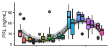
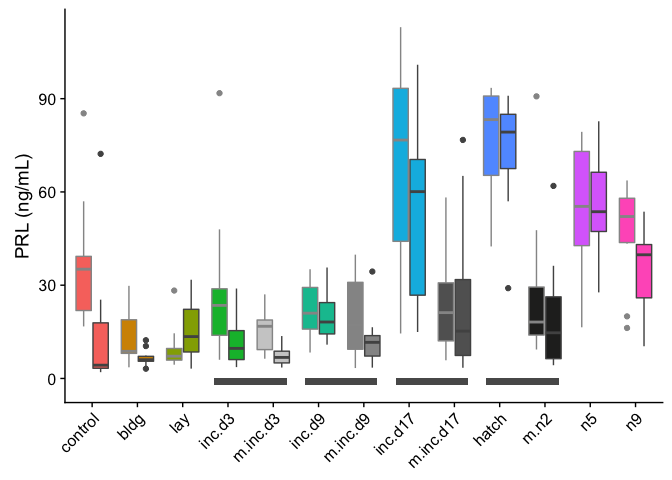
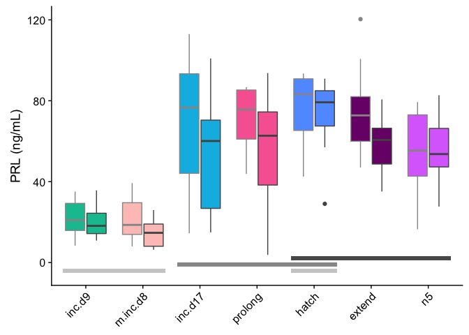

    library(tidyverse)

    ## ── Attaching packages ───────────────────────────────────── tidyverse 1.2.1 ──

    ## ✔ ggplot2 3.2.1     ✔ purrr   0.3.2
    ## ✔ tibble  2.1.3     ✔ dplyr   0.8.1
    ## ✔ tidyr   0.8.3     ✔ stringr 1.4.0
    ## ✔ readr   1.3.1     ✔ forcats 0.4.0

    ## ── Conflicts ──────────────────────────────────────── tidyverse_conflicts() ──
    ## ✖ dplyr::filter() masks stats::filter()
    ## ✖ dplyr::lag()    masks stats::lag()

    library(cowplot)

    ## 
    ## Attaching package: 'cowplot'

    ## The following object is masked from 'package:ggplot2':
    ## 
    ##     ggsave

    library(readxl)
    library(modelr)
    library(lubridate)

    ## 
    ## Attaching package: 'lubridate'

    ## The following object is masked from 'package:base':
    ## 
    ##     date

    source("../R/themes.R")  # load custom themes and color palletes

    knitr::opts_chunk$set(fig.path = '../figures/hormones/',message=F, warning=FALSE)

    prolactin <- read_excel("../results/Pigeon prolactin concentrations juil 2018.xlsx", sheet = 1)

    # keep only samples realated to parental care
    prolactin <- prolactin %>% filter(Study %in% c("Baseline", "ParentalCare"))

    # create lists of factos for characterization and manipluation studies

    # rename some of the treatments levels, store in new columns
    prolactin <- prolactin %>%
        mutate(sex = fct_recode(Sex,
                                "female" = "f",
                                "male" = "m"),
               treatment = fct_recode(Treatment,
                                "hatch" = "Hatch",
                                "inc.d17" = "Inc_d17",
                                "inc.d17" = "inc_d17",
                                "inc.d3" = "Inc_d3",
                                 "inc.d3" = "inc_d3",
                                "inc.d9" = "Inc_d9",
                                 "inc.d9" = "inc_d9",
                                "m.inc.d9" = "M_Inc9",
                                "m.inc.d9" = "M_inc9",
                                "m.inc.d3" = "M_Inc3",
                                "m.inc.d8" = "M_Inc8",
                                "m.inc.d8" = "M_inc8",
                                "m.inc.d17" = "M_Inc17",
                                "m.n2" = "M_hatch",
                                "control" = "baseline",
                                "n5" = "N5", 
                                "n9" = "N9"),
               study = fct_collapse(treatment,
                                     characterization = charlevels,
                                     manipulation = maniplevels1))

    colnames(prolactin)[colnames(prolactin)=="Prolactin ng/mL"] <- "plasma_conc"
    prolactin$hormone <- "prolactin"
    prolactin <- prolactin %>% 
                  select(study, treatment, sex, hormone, plasma_conc)  %>% 
                  drop_na()

    summary(prolactin)

    ##               study       treatment       sex        hormone         
    ##  characterization:189   inc.d9 : 24   female:160   Length:325        
    ##  manipulation    :136   control: 23   male  :165   Class :character  
    ##                         inc.d17: 21                Mode  :character  
    ##                         n5     : 21                                  
    ##                         bldg   : 20                                  
    ##                         extend : 20                                  
    ##                         (Other):196                                  
    ##   plasma_conc    
    ##  Min.   :  2.02  
    ##  1st Qu.: 11.07  
    ##  Median : 23.46  
    ##  Mean   : 34.76  
    ##  3rd Qu.: 56.98  
    ##  Max.   :203.69  
    ## 

    PETC <- read_excel("../results/parental_care_hormone_RIA_data_master.xlsx", sheet = 2)

    PETC <- PETC %>% select(stage, sex, hormone, plasma_conc)  %>%
                    mutate(treatment = fct_recode(stage,
                                "inc.d17" = "inc_d17",
                                "inc.d3" = "inc_d3",
                                "inc.d9" = "inc_d9",
                                "m.inc.d9" = "m_incd9",
                                "m.inc.d3" = "m_incd3",
                                "m.inc.d8" = "m_incd8",
                                "m.inc.d17" = "m_incd17",
                                "m.n2" = "m_hatch",
                                "control" = "stress_hpg")) %>%
                    filter(treatment %in% alllevels2) %>%   
                    mutate(sex = fct_recode(sex,
                                "female" = "f",
                                "male" = "m"),
                           study = fct_collapse(treatment,
                                    characterization = charlevels,
                                    manipulation = maniplevels1)) %>% 
                  drop_na() %>%  droplevels()  %>% 
                  select(study, treatment, sex, hormone, plasma_conc)
    summary(PETC)

    ##               study         treatment       sex        hormone         
    ##  characterization:500   inc.d9   : 88   female:493   Length:887        
    ##  manipulation    :387   inc.d17  : 68   male  :394   Class :character  
    ##                         bldg     : 60                Mode  :character  
    ##                         hatch    : 60                                  
    ##                         extend   : 59                                  
    ##                         m.inc.d17: 58                                  
    ##                         (Other)  :494                                  
    ##   plasma_conc       
    ##  Min.   :  0.03306  
    ##  1st Qu.:  0.23281  
    ##  Median :  0.84151  
    ##  Mean   :  1.39902  
    ##  3rd Qu.:  1.69764  
    ##  Max.   :117.77083  
    ## 

    hormones <- rbind(prolactin, PETC)
    hormones$treatment <- factor(hormones$treatment, levels = alllevels)

    hormones$okay <- ifelse(hormones$hormone == "cort" & hormones$plasma_conc > 30, "bad",
                        ifelse(hormones$hormone == "progesterone" & hormones$plasma_conc > 5, "bad", 
                               ifelse(hormones$hormone == "prolactin" & hormones$plasma_conc > 150, "bad", 
                            ifelse(hormones$hormone == "testosterone" & hormones$sex == "female", "bad",
                                   ifelse(hormones$hormone == "estradiol" & hormones$sex == "male", "bad", "okay")))))
    hormones <- hormones %>% filter(okay == "okay") %>% droplevels()
    summary(hormones)

    ##               study         treatment       sex        hormone         
    ##  characterization:682   inc.d9   :112   female:646   Length:1201       
    ##  manipulation    :519   inc.d17  : 88   male  :555   Class :character  
    ##                         hatch    : 80                Mode  :character  
    ##                         bldg     : 79                                  
    ##                         m.inc.d17: 78                                  
    ##                         extend   : 78                                  
    ##                         (Other)  :686                                  
    ##   plasma_conc            okay          
    ##  Min.   :  0.03306   Length:1201       
    ##  1st Qu.:  0.34371   Class :character  
    ##  Median :  1.38568   Mode  :character  
    ##  Mean   : 10.00584                     
    ##  3rd Qu.:  6.05370                     
    ##  Max.   :120.34989                     
    ## 

    hormonecharplot <- function(myhormone, myylab){

      hormones %>% 
        filter(study == "characterization",
               hormone %in% c(myhormone))  %>% 
        droplevels() %>% 
      ggplot(aes(x = as.numeric(treatment), y = plasma_conc)) +
            geom_smooth(aes(colour = sex)) +
        geom_boxplot(aes(outlier.colour = treatment, fill = treatment, alpha = sex)) +
        mytheme() +
        theme(axis.text.x =  element_blank(),
              legend.position = "none") +
        scale_fill_manual(values = colorscharmaip) +
        scale_color_manual(values = sexcolors) +
        labs(y = myylab, x = NULL) +
        guides(fill = guide_legend(order=1),
             color = guide_legend(order=2)) +
        scale_alpha_manual(values = c(0.75,1)) +
        scale_color_manual(values = c("female" = "#969696", "male" = "#525252")) 
      }

    hormonecharplot("prolactin", "PRL (ng/mL)")

    b <- hormonecharplot("cort", "CORT (ng/mL)")
    c <- hormonecharplot("progesterone", "PROG (ng/mL)") 
    d1 <- hormonecharplot("estradiol", "E (ng/mL)")
    d2 <- hormonecharplot("testosterone", "T (ng/mL)")
    d <- plot_grid(d1,d2, nrow = 1)
    bcd <- plot_grid(b ,c, d, ncol = 1)
    bcd

    prl.char <- hormones %>% filter(hormone == "prolactin", treatment %in% charlevels)   %>%  droplevels()
    test.char <- hormones %>% filter(hormone == "testosterone", treatment %in% charlevels)   %>%  droplevels()
    est.char <- hormones %>% filter(hormone == "estradiol", treatment %in% charlevels)   %>%  droplevels()
    prog.char <- hormones %>% filter(hormone == "progesterone", treatment %in% charlevels)   %>%  droplevels()
    cort.char <- hormones %>% filter(hormone == "cort", treatment %in% charlevels)   %>%  droplevels()

    aovSexTretment <- function(mydata, whichormone){
      aov2 <- aov(data = mydata, plasma_conc ~ treatment * sex)
      print(whichormone)
      print(summary(aov2))
      #print(TukeyHSD(aov2, which = "treatment"))
    }

    aovTretment  <- function(mydata, whichormone){
      aov1 <- aov(data = mydata, plasma_conc ~ treatment )
      print(whichormone)
      print(summary(aov1))
      #print(TukeyHSD(aov1, which = "treatment"))
    }

    aovSexTretment(prl.char, "PRL") # yes, sex difference (p = 0.00256), yes treatment effect (p < 2e-16), no interaction

    ## [1] "PRL"
    ##                Df Sum Sq Mean Sq F value  Pr(>F)    
    ## treatment       8  89185   11148  35.039 < 2e-16 ***
    ## sex             1   2983    2983   9.374 0.00256 ** 
    ## treatment:sex   8   3678     460   1.445 0.18104    
    ## Residuals     170  54087     318                    
    ## ---
    ## Signif. codes:  0 '***' 0.001 '**' 0.01 '*' 0.05 '.' 0.1 ' ' 1

    aovSexTretment(cort.char, "CORT") # no sex difference (p = 0.779 ), small treatment effect (p = 0.0238),  no interaction

    ## [1] "CORT"
    ##                Df Sum Sq Mean Sq F value Pr(>F)  
    ## treatment       8   39.5   4.940   2.290 0.0238 *
    ## sex             1    0.2   0.170   0.079 0.7790  
    ## treatment:sex   8   15.7   1.966   0.911 0.5085  
    ## Residuals     164  353.8   2.157                 
    ## ---
    ## Signif. codes:  0 '***' 0.001 '**' 0.01 '*' 0.05 '.' 0.1 ' ' 1

    aovSexTretment(prog.char, "PROG") # no sex difference or treatment effect, signifiant interacion (p = 0.0107)

    ## [1] "PROG"
    ##                Df Sum Sq Mean Sq F value Pr(>F)  
    ## treatment       8   3.18  0.3970   1.081 0.3783  
    ## sex             1   0.30  0.3026   0.824 0.3652  
    ## treatment:sex   8   7.60  0.9502   2.588 0.0107 *
    ## Residuals     176  64.62  0.3671                 
    ## ---
    ## Signif. codes:  0 '***' 0.001 '**' 0.01 '*' 0.05 '.' 0.1 ' ' 1

    aovTretment(est.char, "E") # p = 0.101

    ## [1] "E"
    ##             Df Sum Sq Mean Sq F value Pr(>F)
    ## treatment    8  0.871 0.10891   1.758  0.101
    ## Residuals   68  4.214 0.06197

    aovTretment(test.char, "T") # p = 0.609

    ## [1] "T"
    ##             Df Sum Sq Mean Sq F value Pr(>F)
    ## treatment    7   7.59   1.084   0.779  0.609
    ## Residuals   33  45.90   1.391

    # prolactin, removal only
    hormones %>% 
        filter( hormone == c("prolactin"))  %>% 
        filter( !treatment %in% c("m.inc.d8", "prolong", "extend"))  %>% 
      ggplot(aes(x = treatment, y = plasma_conc, fill = treatment,  color = sex)) +
        geom_boxplot() + 
        theme(axis.text.x = element_text(angle = 45, hjust = 1),
              legend.position = "none",
              strip.text = element_blank()) +
        scale_fill_manual(values = colorscharmaip) +
        scale_color_manual(values = sexcolors) +
        labs(y = "PRL (ng/mL)", x = NULL) +
        annotate("rect", xmin = 3.7, xmax = 5.3, ymin = -2, ymax = 0, alpha = 1) +
        annotate("rect", xmin = 5.7, xmax = 7.3, ymin = -2, ymax = 0, alpha = 1) +
        annotate("rect", xmin = 7.7, xmax = 9.3, ymin = -2, ymax = 0, alpha = 1) +
        annotate("rect", xmin = 9.7, xmax = 11.3, ymin = -2, ymax = 0, alpha = 1)

    hormones %>% 
        filter( hormone == c("prolactin"))  %>% 
        filter( !treatment %in% c("m.inc.d3", "m.inc.d9", "m.inc.d17","m.n2"))  %>% 
      ggplot(aes(x = treatment, y = plasma_conc, fill = treatment,  color = sex)) +
        geom_boxplot() + 
        theme(axis.text.x = element_text(angle = 45, hjust = 1),
              legend.position = "none",
              strip.text = element_blank()) +
        scale_fill_manual(values = colorscharmaip) +
        scale_color_manual(values = sexcolors) +
        labs(y = "PRL (ng/mL)", x = NULL) +
        annotate("rect", xmin = 4.7, xmax = 6.3, ymin = -2, ymax = 0, alpha = 1, alpha = 1) +
        annotate("rect", xmin = 6.7, xmax = 8.3, ymin = -2, ymax = 0, alpha = 1, alpha = 1) +
        annotate("rect", xmin = 8.7, xmax = 10.3, ymin = -2, ymax = 0, alpha = 1, alpha = 1)

hormonemanipSteroids &lt;- function(myhormone, myylab, myymax){

hormones %&gt;% filter( hormone %in% c(myhormone)) %&gt;% ggplot(aes(x =
treatment, y = plasma\_conc, fill = treatment, color = sex)) +
geom\_boxplot() + mytheme() + theme(axis.text.x = element\_text(angle =
45, hjust = 1), \# legend.position = “none”, strip.text =
element\_blank()) + scale\_fill\_manual(values = colorscharmaip) +
scale\_color\_manual(values = sexcolors) + labs(y = myylab, x = NULL) }

a &lt;- hormonemanipSteroids(“estradiol”, “E (ng/mL)”, 1) b &lt;-
hormonemanipSteroids(“testosterone”, “T (ng/mL)”, 3.5) c &lt;-
hormonemanipSteroids(“cort”, “CORT (ng/mL)”, 10) d &lt;-
hormonemanipSteroids(“progesterone”, “PROG (ng/mL)”,2.5)

a b c d \`\`\`

    write.csv(hormones, "../results/hormones.csv", row.names = F)

do control bird with high prolactin hormone have high PRL expression in the pituitary? yes.
===========================================================================================

    PRLpit <- read_csv("../results/10_PRLpit.csv") %>% 
      filter(treatment == "control") %>% 
      arrange(desc(PRL))
    head(PRLpit,2)

    ## # A tibble: 2 x 4
    ##   sample                                 sex    treatment   PRL
    ##   <chr>                                  <chr>  <chr>     <dbl>
    ## 1 blu.o.x.ATLAS_female_pituitary_control female control    20.9
    ## 2 L.W33_male_pituitary_control           male   control    19.9

    prolactin <- read_excel("../results/Pigeon prolactin concentrations juil 2018.xlsx", sheet = 1)  %>% 
                filter(Treatment == "baseline")  %>% 
                select(ColorBands,BandNo_old, Treatment, Sex, `Prolactin ng/mL`)  %>% 
                arrange(desc(`Prolactin ng/mL`))

    head(prolactin,2)

    ## # A tibble: 2 x 5
    ##   ColorBands BandNo_old Treatment Sex   `Prolactin ng/mL`
    ##   <chr>      <chr>      <chr>     <chr>             <dbl>
    ## 1 blu/o-x    L_Blu/O    baseline  f                  85.3
    ## 2 w33-x      L_W33      baseline  m                  72.3
