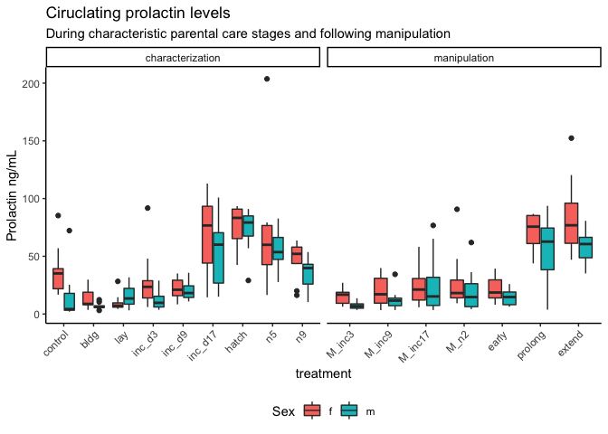
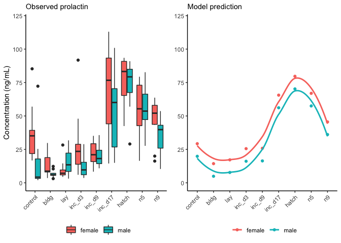
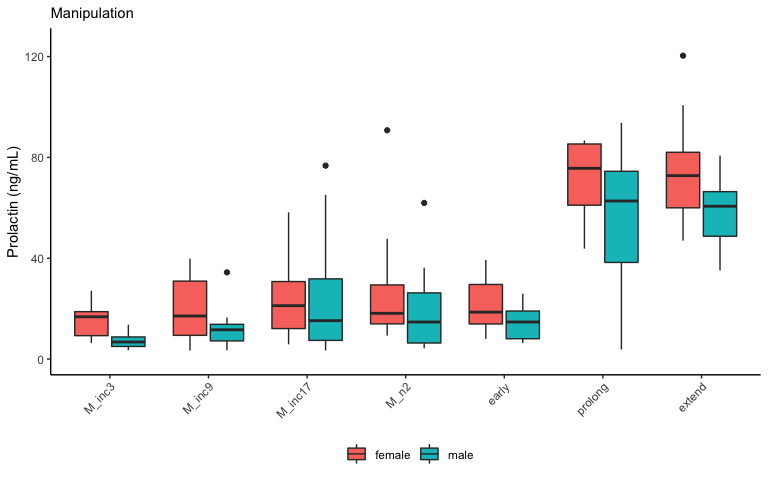
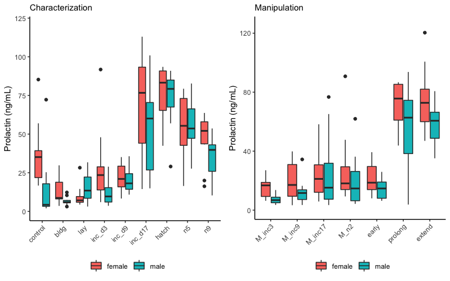
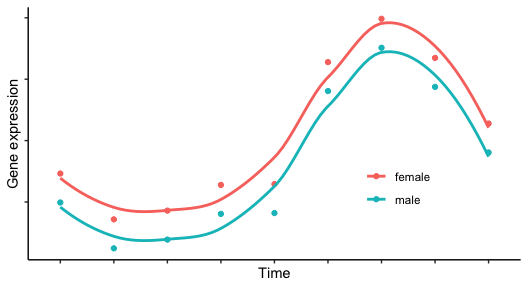

    library(tidyverse)

    ## ── Attaching packages ────────────────────────────────────────── tidyverse 1.2.1 ──

    ## ✔ ggplot2 3.2.1     ✔ purrr   0.3.2
    ## ✔ tibble  2.1.3     ✔ dplyr   0.8.1
    ## ✔ tidyr   0.8.3     ✔ stringr 1.4.0
    ## ✔ readr   1.3.1     ✔ forcats 0.4.0

    ## ── Conflicts ───────────────────────────────────────────── tidyverse_conflicts() ──
    ## ✖ dplyr::filter() masks stats::filter()
    ## ✖ dplyr::lag()    masks stats::lag()

    library(cowplot)

    ## 
    ## Attaching package: 'cowplot'

    ## The following object is masked from 'package:ggplot2':
    ## 
    ##     ggsave

    library(readxl)
    library(modelr)
    library(lubridate)

    ## 
    ## Attaching package: 'lubridate'

    ## The following object is masked from 'package:base':
    ## 
    ##     date

    source("../R/functions.R")  # load custom functions 
    source("../R/themes.R")  # load custom themes and color palletes

    knitr::opts_chunk$set(fig.path = '../figures/hormones/',message=F, warning=FALSE)

    prolactin <- read_excel("../results/Pigeon prolactin concentrations juil 2018.xlsx", sheet = 1)

    # keep only samples realated to parental care
    prolactin <- prolactin %>% filter(Study %in% c("Baseline", "ParentalCare"))

    # create lists of factos for characterization and manipluation studies
    charlevels <- c("control", "bldg", "lay", "inc_d3", "inc_d9", "inc_d17", "hatch", "n5", "n9" )
    maniplevels <- c("M_inc3", "early", "M_inc9", "M_inc17", "M_n2", "prolong", "extend")
    combolevels <- c("control", "bldg", "lay", "inc_d3", "M_inc3",
                      "inc_d9",  "M_inc9",  "inc_d17","M_inc17",  "hatch", "M_n2",
                      "n5", "n9" , "early",  "prolong", "extend")

    # rename some of the treatments levels, store in new columns
    prolactin <- prolactin %>%
        mutate(sex = fct_recode(Sex,
                                "female" = "f",
                                "male" = "m"),
               treatment = fct_recode(Treatment,
                                "hatch" = "Hatch",
                                "inc_d17" = "Inc_d17",
                                "inc_d3" = "Inc_d3",
                                "inc_d9" = "Inc_d9",
                                "M_inc9" = "M_Inc9",
                                "M_inc3" = "M_Inc3",
                                "early" = "M_Inc8",
                                "early" = "M_inc8",
                                "M_inc17" = "M_Inc17",
                                "M_n2" = "M_hatch",
                                "control" = "baseline",
                                "n5" = "N5", 
                                "n9" = "N9"),
               study = fct_collapse(treatment,
                                     characterization = charlevels,
                                     manipulation = maniplevels))

    prolactin$treatment <- factor(prolactin$treatment, levels = combolevels)

    prolactin %>%
      select(treatment, `Prolactin ng/mL`, Sex, study) %>% drop_na() %>%
    ggplot(aes(x = treatment, y = `Prolactin ng/mL`, fill = Sex)) +
      geom_boxplot() + 
      theme(axis.text.x = element_text(angle = 45, hjust = 1),
            legend.position = "bottom") +
      facet_wrap(~study, scales = "free_x") +
      labs(title = "Ciruclating prolactin levels",
           subtitle = "During characteristic parental care stages and following manipulation")

    characterization <- prolactin %>% filter(treatment %in% charlevels)   %>%  droplevels()

    mod_prolactin <-  lm(data = characterization, `Prolactin ng/mL` ~ treatment + sex)
    mod_prolactin

    ## 
    ## Call:
    ## lm(formula = `Prolactin ng/mL` ~ treatment + sex, data = characterization)
    ## 
    ## Coefficients:
    ##      (Intercept)     treatmentbldg      treatmentlay   treatmentinc_d3  
    ##           29.275           -14.931           -12.088            -3.713  
    ##  treatmentinc_d9  treatmentinc_d17    treatmenthatch       treatmentn5  
    ##           -3.441            36.294            50.404            37.655  
    ##      treatmentn9           sexmale  
    ##           16.288            -9.434

    grid <- characterization %>%
      data_grid(treatment, sex) %>%
      add_predictions(mod_prolactin) 

    grid

    ## # A tibble: 18 x 3
    ##    treatment sex     pred
    ##    <fct>     <fct>  <dbl>
    ##  1 control   female 29.3 
    ##  2 control   male   19.8 
    ##  3 bldg      female 14.3 
    ##  4 bldg      male    4.91
    ##  5 lay       female 17.2 
    ##  6 lay       male    7.75
    ##  7 inc_d3    female 25.6 
    ##  8 inc_d3    male   16.1 
    ##  9 inc_d9    female 25.8 
    ## 10 inc_d9    male   16.4 
    ## 11 inc_d17   female 65.6 
    ## 12 inc_d17   male   56.1 
    ## 13 hatch     female 79.7 
    ## 14 hatch     male   70.2 
    ## 15 n5        female 66.9 
    ## 16 n5        male   57.5 
    ## 17 n9        female 45.6 
    ## 18 n9        male   36.1

    df <- data.frame(
      x = c(1,2,3,4,5,6,7,8,9),
      y = c(120,120,120,120,120,120,120,120,120),
      sex = c("female", "female", "female", "female", "female", "female","female", "female", "female"),
      text = c("AB",  "A", "A" , "AB", "AB", "BCD", "D", "CD", "BC")
    )

    a <- ggplot(characterization, aes(x = treatment, y = `Prolactin ng/mL`, fill = sex)) +
      geom_boxplot() + 
      theme(axis.text.x = element_text(angle = 45, hjust = 1),
            legend.position = "bottom",
            legend.title = element_blank()) +
      labs(subtitle = "Observed prolactin",
           y = "Concentration (ng/mL)", x = NULL) +
      #geom_text(data = df, aes(x,y, label = text), color = "darkgrey") +
          ylim(0,120) 

    b <- ggplot(grid, aes(x = treatment, y = pred, color = sex)) +
      geom_point() + 
      theme(axis.text.x = element_text(angle = 45, hjust = 1),
            legend.position = "bottom",
            legend.title = element_blank()) +
      labs(subtitle = "Model prediction ",
           y = NULL, x = NULL) +
      geom_smooth(se = FALSE, aes(x = as.numeric(treatment)))  +
      ylim(0,120)

    plot_grid(a,b)

    aov1 <- aov(data = characterization, `Prolactin ng/mL` ~ treatment + sex)
    aov1

    ## Call:
    ##    aov(formula = `Prolactin ng/mL` ~ treatment + sex, data = characterization)
    ## 
    ## Terms:
    ##                 treatment      sex Residuals
    ## Sum of Squares   96482.01  4194.20  77504.78
    ## Deg. of Freedom         8        1       179
    ## 
    ## Residual standard error: 20.80835
    ## Estimated effects may be unbalanced
    ## 3 observations deleted due to missingness

    summary(aov1)

    ##              Df Sum Sq Mean Sq F value  Pr(>F)    
    ## treatment     8  96482   12060  27.854 < 2e-16 ***
    ## sex           1   4194    4194   9.687 0.00216 ** 
    ## Residuals   179  77505     433                    
    ## ---
    ## Signif. codes:  0 '***' 0.001 '**' 0.01 '*' 0.05 '.' 0.1 ' ' 1
    ## 3 observations deleted due to missingness

    TukeyHSD(aov1, which = "treatment")

    ##   Tukey multiple comparisons of means
    ##     95% family-wise confidence level
    ## 
    ## Fit: aov(formula = `Prolactin ng/mL` ~ treatment + sex, data = characterization)
    ## 
    ## $treatment
    ##                        diff          lwr         upr     p adj
    ## bldg-control    -14.3157248 -34.29331167   5.6618621 0.3782854
    ## lay-control     -11.4731440 -31.45073087   8.5044429 0.6799289
    ## inc_d3-control   -3.0981632 -23.07575007  16.8794237 0.9999148
    ## inc_d9-control   -2.8262413 -21.89257135  16.2400887 0.9999396
    ## inc_d17-control  36.6846004  16.96307564  56.4061251 0.0000009
    ## hatch-control    51.0194912  31.04190433  70.9970781 0.0000000
    ## n5-control       38.4944274  18.77290269  58.2159522 0.0000002
    ## n9-control       16.9028240  -3.07476287  36.8804109 0.1712529
    ## lay-bldg          2.8425808 -17.82014991  23.5053115 0.9999659
    ## inc_d3-bldg      11.2175616  -9.44516911  31.8802923 0.7429333
    ## inc_d9-bldg      11.4894835  -8.29357504  31.2725420 0.6664241
    ## inc_d17-bldg     51.0003252  30.58506125  71.4155891 0.0000000
    ## hatch-bldg       65.3352160  44.67248529  85.9979467 0.0000000
    ## n5-bldg          52.8101522  32.39488830  73.2254162 0.0000000
    ## n9-bldg          31.2185488  10.55581809  51.8812795 0.0001458
    ## inc_d3-lay        8.3749808 -12.28774991  29.0377115 0.9379507
    ## inc_d9-lay        8.6469027 -11.13615584  28.4299612 0.9066995
    ## inc_d17-lay      48.1577444  27.74248045  68.5730083 0.0000000
    ## hatch-lay        62.4926352  41.82990449  83.1553659 0.0000000
    ## n5-lay           49.9675714  29.55230750  70.3828354 0.0000000
    ## n9-lay           28.3759680   7.71323729  49.0386987 0.0008779
    ## inc_d9-inc_d3     0.2719219 -19.51113664  20.0549804 1.0000000
    ## inc_d17-inc_d3   39.7827636  19.36749965  60.1980275 0.0000002
    ## hatch-inc_d3     54.1176544  33.45492369  74.7803851 0.0000000
    ## n5-inc_d3        41.5925906  21.17732670  62.0078546 0.0000000
    ## n9-inc_d3        20.0009872  -0.66174351  40.6637179 0.0661581
    ## inc_d17-inc_d9   39.5108417  19.98639640  59.0352870 0.0000001
    ## hatch-inc_d9     53.8457325  34.06267403  73.6287910 0.0000000
    ## n5-inc_d9        41.3206688  21.79622345  60.8451141 0.0000000
    ## n9-inc_d9        19.7290653  -0.05399317  39.5121238 0.0512313
    ## hatch-inc_d17    14.3348908  -6.08037311  34.7501548 0.4070571
    ## n5-inc_d17        1.8098270 -18.35493336  21.9745875 0.9999988
    ## n9-inc_d17      -19.7817764 -40.19704031   0.6334876 0.0655964
    ## n5-hatch        -12.5250638 -32.94032770   7.8902002 0.5963717
    ## n9-hatch        -34.1166672 -54.77939791 -13.4539365 0.0000203
    ## n9-n5           -21.5916034 -42.00686736  -1.1763395 0.0293367

    manipulation <- prolactin %>% 
      filter(treatment %in% maniplevels) %>%  droplevels() %>% 
      mutate(result = fct_collapse(treatment,
                                    "early hatch" = c("early"),
                                    "offspring removed" = c("M_inc3",  "M_inc9", "M_inc17", "M_n2"),
                                   "late incubation" = c("prolong"),
                                   "late hatch" = c("extend")))

    e <- manipulation %>%
      ggplot( aes(x = treatment, y = `Prolactin ng/mL`)) +
        geom_boxplot(aes(fill = sex, alpha = 0.5)) + 
        theme(axis.text.x = element_text(angle = 45, hjust = 1),
              legend.position = "bottom",
              legend.title = element_blank()) +
        ylim(0,125) +
        labs(subtitle = "Manipulation",
           y = NULL, x = NULL) + 
      scale_alpha(guide = 'none')

    plot_grid(a,b,e, nrow = 1, rel_widths = c(1.1,.75,.8)) 

    f <-  prolactin %>%
      filter(treatment %in% c("control", "bldg", "inc_d3", "M_inc3",
                              "inc_d9",  "M_inc9", "inc_d17","M_inc17",
                              "hatch", "M_n2")) %>%
    ggplot(aes(x = treatment, y = `Prolactin ng/mL`, fill = Sex)) +
      geom_boxplot(aes(alpha = study)) + 
      theme(axis.text.x = element_text(angle = 45, hjust = 1),
            legend.position = "none") +
      labs(subtitle = "Offspring removed",
           x = NULL) +
      facet_wrap(~sex) +
      annotate("rect", xmin = 2.5, xmax = 4.5, ymin = 0, ymax = 120, alpha = .2) +
        #annotate("rect", xmin = 4.5, xmax = 6.5, ymin = 0, ymax = 120, alpha = .3) +
        annotate("rect", xmin = 6.5, xmax = 8.5, ymin = 0, ymax = 120, alpha = .2) +
        #annotate("rect", xmin = 8.5, xmax = 10.5, ymin = 0, ymax = 120, alpha = .3) +
      ylim(0,120) +
      scale_alpha_manual(values = c(1,0.5))

    g <-  prolactin %>%
      filter(treatment %in% c("early","prolong", "extend",
                              "inc_d9","inc_d17","hatch", "n5" )) %>% droplevels() %>%
    ggplot(aes(x = treatment, y = `Prolactin ng/mL`, fill = Sex)) +
      geom_boxplot(aes(alpha = study)) + 
      theme(axis.text.x = element_text(angle = 45, hjust = 1),
            legend.position = "none") +
      labs(subtitle = "Timing of transition altered",
           x = NULL, y = NULL) +
      facet_wrap(~sex) +
        annotate("rect", xmin = 4.5, xmax = 7.5, ymin = 0, ymax = 120, alpha = .3) +
      ylim(0,120) +
      scale_alpha_manual(values = c(1,0.5))

    plot_grid(f,g, nrow=2, rel_widths = c(.625,.375))

    ggplot(grid, aes(x = treatment, y = pred, color = sex)) +
      geom_point() + 
      theme(axis.text.x=element_blank(),
            axis.text.y=element_blank(),
            legend.position = c(0.75,0.3),
            legend.title = element_blank()) +
      labs(y = "Gene expression", x = "Time") +
      geom_smooth(se = FALSE, aes(x = as.numeric(treatment)))  

    write.csv(prolactin, "../results/prolactin.csv", row.names = F)
