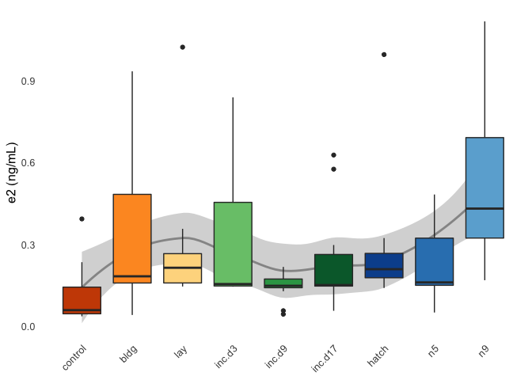
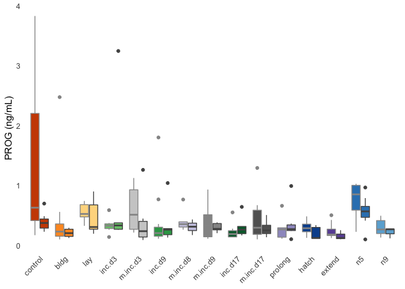
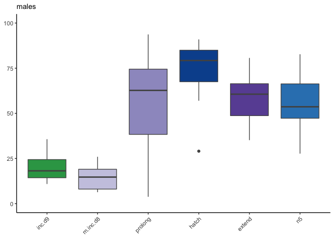
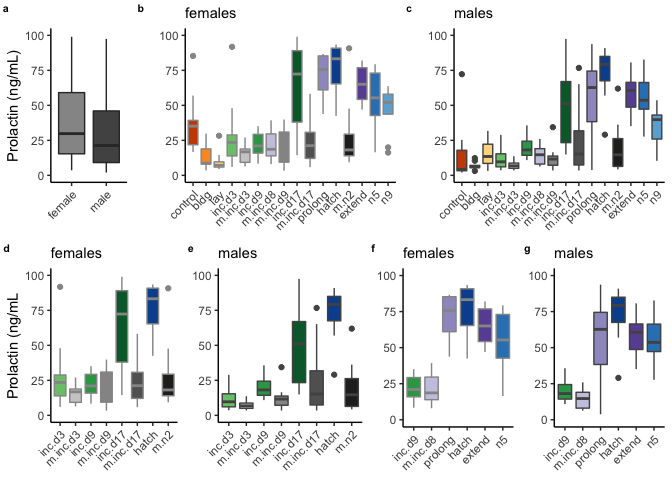
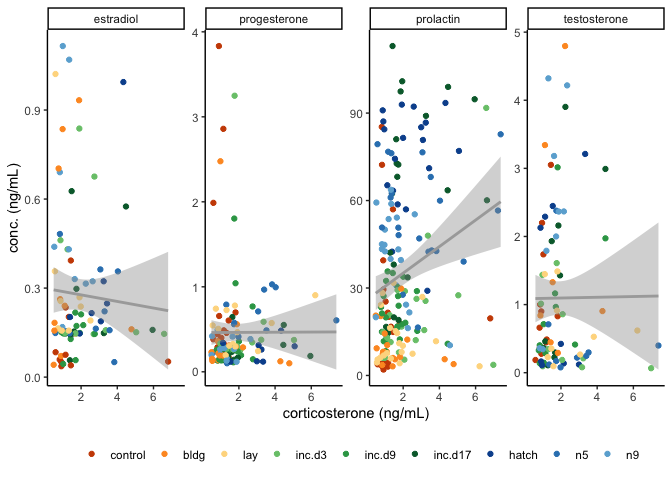
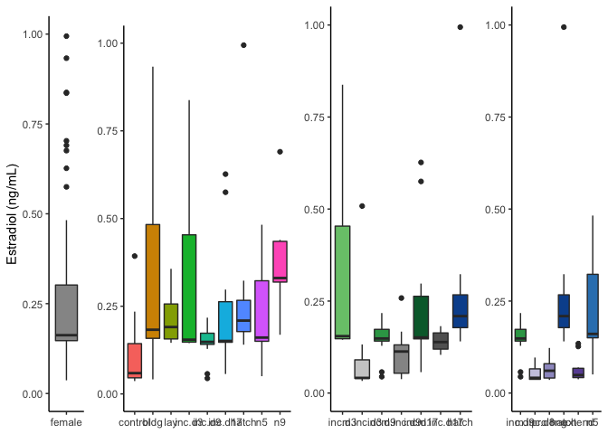
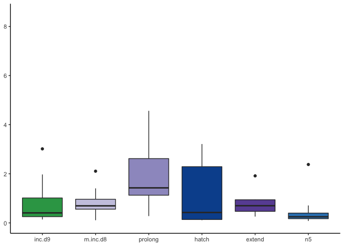
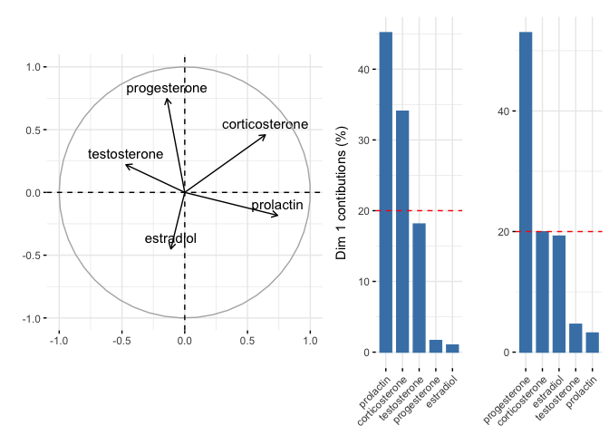

    library(tidyverse)

    ## ── Attaching packages ───────────────────────────────────────────────── tidyverse 1.3.0 ──

    ## ✔ ggplot2 3.2.1     ✔ purrr   0.3.3
    ## ✔ tibble  2.1.3     ✔ dplyr   0.8.3
    ## ✔ tidyr   1.0.0     ✔ stringr 1.4.0
    ## ✔ readr   1.3.1     ✔ forcats 0.4.0

    ## ── Conflicts ──────────────────────────────────────────────────── tidyverse_conflicts() ──
    ## ✖ dplyr::filter() masks stats::filter()
    ## ✖ dplyr::lag()    masks stats::lag()

    library(cowplot)

    ## 
    ## Attaching package: 'cowplot'

    ## The following object is masked from 'package:ggplot2':
    ## 
    ##     ggsave

    library(readxl)
    library(modelr)
    library(lubridate)

    ## 
    ## Attaching package: 'lubridate'

    ## The following object is masked from 'package:base':
    ## 
    ##     date

    library(ggsignif)
    library(apaTables)

    source("../R/themes.R")  # load custom themes and color palletes
    source("../R/icons.R")

    ## Warning: Column `icons` joining factor and character vector, coercing into
    ## character vector

    knitr::opts_chunk$set(fig.path = '../figures/hormones/',message=F, warning=FALSE, cache = T)

    colData  <- read_csv("../metadata/00_birds.csv") %>%
      mutate(RNAseq = "RNAseq",
             bird_id = bird)  %>%
       select(-X1, -bird)
    colData

    ## # A tibble: 334 x 4
    ##    sex    treatment RNAseq bird_id
    ##    <chr>  <chr>     <chr>  <chr>  
    ##  1 male   control   RNAseq L.Blu13
    ##  2 male   control   RNAseq L.G107 
    ##  3 female control   RNAseq L.G118 
    ##  4 male   control   RNAseq L.R3   
    ##  5 male   control   RNAseq L.R8   
    ##  6 male   control   RNAseq L.W33  
    ##  7 male   control   RNAseq L.W3   
    ##  8 male   control   RNAseq L.W4   
    ##  9 female control   RNAseq R.G106 
    ## 10 female control   RNAseq R.R20  
    ## # … with 324 more rows

    prolactin <- read_excel("../results/Pigeon prolactin concentrations juil 2018.xlsx", sheet = 1) %>% 
      filter(Study %in% c("Baseline", "ParentalCare")) %>%
        dplyr::mutate(sex = fct_recode(Sex,
                                "female" = "f",
                                "male" = "m"),
               treatment = fct_recode(Treatment,
                                "hatch" = "Hatch",
                                "inc.d17" = "Inc_d17",
                                "inc.d17" = "inc_d17",
                                "inc.d3" = "Inc_d3",
                                 "inc.d3" = "inc_d3",
                                "inc.d9" = "Inc_d9",
                                 "inc.d9" = "inc_d9",
                                "m.inc.d9" = "M_Inc9",
                                "m.inc.d9" = "M_inc9",
                                "m.inc.d3" = "M_Inc3",
                                "m.inc.d8" = "M_Inc8",
                                "m.inc.d8" = "M_inc8",
                                "m.inc.d17" = "M_Inc17",
                                "m.n2" = "M_hatch",
                                "control" = "baseline",
                                "n5" = "N5", 
                                "n9" = "N9"),
               study = fct_collapse(treatment,
                                     characterization = charlevels,
                                     manipulation = maniplevels1)) %>%
              dplyr::rename("plasma_conc" = "Prolactin ng/mL") %>%
              mutate(bird_id = gsub("[[:punct:]]", "." , ColorBands)) %>% 
              dplyr::mutate(hormone = "prolactin") %>% 
              dplyr::select(study, treatment, sex, bird_id, hormone, plasma_conc)  %>% 
              drop_na()
    head(prolactin)

    ## # A tibble: 6 x 6
    ##   study            treatment sex    bird_id   hormone   plasma_conc
    ##   <fct>            <fct>     <fct>  <chr>     <chr>           <dbl>
    ## 1 characterization control   male   x.g       prolactin        3.83
    ## 2 characterization control   male   x.g.g     prolactin        3.28
    ## 3 characterization control   male   x.blk.blk prolactin        4.15
    ## 4 characterization control   male   x.g.g.g   prolactin       25.3 
    ## 5 characterization control   female x.g.g.f   prolactin       21.5 
    ## 6 characterization control   male   x.blu.o   prolactin       14.9

    PETC <- read_excel("../results/hormones.xlsx", sheet = 1)  %>% 
                  dplyr::rename(corticosterone = cort, progesterone = p4,
                                estradiol = e2,  testosterone = t) %>% 
                   dplyr::mutate(treatment = fct_recode(treatment...3,
                                "inc.d17" = "incd17",
                                "inc.d3" = "incd3",
                                "inc.d9" = "incd9",
                                "m.inc.d9" = "minc9",
                                "m.inc.d3" = "minc3",
                                "m.inc.d8" = "minc8",
                                "m.inc.d17" = "minc17",
                                "m.n2" = "m hatch",
                                "control" = "baseline")) %>%
                    dplyr::filter(treatment %in% alllevels2) %>%   
                    dplyr::mutate(sex = fct_recode(sex,
                                "female" = "f",
                                "male" = "m"),
                           study = fct_collapse(treatment,
                                    characterization = charlevels,
                                    manipulation = maniplevels1)) %>% 
                  dplyr::mutate(bird_id = gsub("[[:punct:]]", "." , id)) %>% 
                  dplyr::select(bird_id, treatment, sex, study, 
                                corticosterone, estradiol, testosterone, progesterone) %>% 
                  pivot_longer(cols = corticosterone:progesterone,
                               names_to = "hormone", values_to = "plasma_conc",
                               values_drop_na = TRUE) %>% 
                  drop_na() %>% droplevels()  
    head(PETC)

    ## # A tibble: 6 x 6
    ##   bird_id    treatment sex    study            hormone        plasma_conc
    ##   <chr>      <fct>     <fct>  <fct>            <chr>                <dbl>
    ## 1 blk.d.g.s  n9        male   characterization corticosterone      1.31  
    ## 2 blk.d.g.s  n9        male   characterization testosterone        4.32  
    ## 3 blk.s.o.g  prolong   male   manipulation     corticosterone      1.75  
    ## 4 blk.s.o.g  prolong   male   manipulation     testosterone        1.10  
    ## 5 blk.s.pu.d prolong   female manipulation     corticosterone      0.943 
    ## 6 blk.s.pu.d prolong   female manipulation     estradiol           0.0555

    hormones <- rbind(prolactin, PETC)

    hormones$okay <- ifelse(hormones$hormone == "corticosterone" & hormones$plasma_conc > 30, "bad",
                        ifelse(hormones$hormone == "progesterone" & hormones$plasma_conc > 5, "bad", 
                               ifelse(hormones$hormone == "prolactin" & hormones$plasma_conc > 150, "bad", 
                            ifelse(hormones$hormone == "testosterone" & hormones$sex == "female", "bad",
                                   ifelse(hormones$hormone == "estradiol" & hormones$sex == "male", "bad", "okay")))))
    hormones <- hormones %>% filter(okay == "okay") %>% droplevels() %>% select(-okay)

    write.csv(hormones, "../results/hormones.csv", row.names = F)

    # make a winder one for correlations
    hormoneswide <- hormones %>% pivot_wider(names_from = "hormone", values_from = "plasma_conc", 
                                             values_fn = list(plasma_conc = mean))
    hormoneswide$treatment <- factor(hormoneswide$treatment, levels = alllevels)
    head(hormoneswide)

    ## # A tibble: 6 x 9
    ##   study treatment sex   bird_id prolactin corticosterone testosterone
    ##   <fct> <fct>     <fct> <chr>       <dbl>          <dbl>        <dbl>
    ## 1 char… control   male  x.g          3.83          0.590        0.187
    ## 2 char… control   male  x.g.g        3.28          0.817        0.661
    ## 3 char… control   male  x.blk.…      4.15          0.850        1.00 
    ## 4 char… control   male  x.g.g.g     25.3           1.03         1.74 
    ## 5 char… control   fema… x.g.g.f     21.5           1.15        NA    
    ## 6 char… control   male  x.blu.o     14.9           1.44         3.05 
    ## # … with 2 more variables: estradiol <dbl>, progesterone <dbl>

    # for facet wrapping
    hormones <- left_join(hormones, birds)

    hormones$treatment <- factor(hormones$treatment, levels = alllevels)

    hormones$hormone <- factor(hormones$hormone, 
                               levels = c("prolactin", "corticosterone", "progesterone", 
                                          "estradiol", "testosterone"))
    hormones$logconc <- log10(hormones$plasma_conc)
    head(hormones)

    ## # A tibble: 6 x 10
    ##   study treatment sex   bird_id hormone plasma_conc icons music iconpath
    ##   <fct> <fct>     <fct> <chr>   <fct>         <dbl> <chr> <chr> <chr>   
    ## 1 char… control   male  x.g     prolac…        3.83 cont… http… ../figu…
    ## 2 char… control   male  x.g.g   prolac…        3.28 cont… http… ../figu…
    ## 3 char… control   male  x.blk.… prolac…        4.15 cont… http… ../figu…
    ## 4 char… control   male  x.g.g.g prolac…       25.3  cont… http… ../figu…
    ## 5 char… control   fema… x.g.g.f prolac…       21.5  cont… http… ../figu…
    ## 6 char… control   male  x.blu.o prolac…       14.9  cont… http… ../figu…
    ## # … with 1 more variable: logconc <dbl>

    hormonecharplot <- function(myhormone, myylab){

      hormones %>% 
        filter(study == "characterization",
               hormone %in% c(myhormone))  %>% 
        droplevels() %>% 
      ggplot(aes(x = as.numeric(treatment), y = plasma_conc)) +
            geom_smooth(aes(colour = sex)) +
        geom_boxplot(aes(fill = treatment)) +
        mytheme() +
        theme(axis.text.x = element_text(angle = 45, hjust = 1, vjust = 1),
              legend.position = "none") +
        scale_fill_manual(values = colorscharmaip) +
        scale_color_manual(values = sexcolors) +
        labs(y = myylab, x = NULL) +
        guides(fill = guide_legend(order=1),
             color = guide_legend(order=2)) +
        scale_x_continuous(breaks = c(1, 2, 3, 4, 5, 6, 7, 8, 9),
                           labels = charlevels)
      }

    hormonecharplot("prolactin", "PRL (ng/mL)")

    hormonecharplot("corticosterone", "CORT (ng/mL)")

    hormonecharplot("estradiol", "e2 (ng/mL)")

    hormonecharplot("testosterone", "t (ng/mL)")

    hormonecharplot("progesterone", "p4 (ng/mL)")

    # prolactin, removal only
    hormones %>% 
        filter( hormone == c("prolactin"))  %>% 
        filter(treatment %in% c("inc.d3", "m.inc.d3", "inc.d9", "m.inc.d9", "inc.d17", "m.inc.d17", "hatch","m.n2"))  %>% 
      ggplot(aes(x = treatment, y = plasma_conc, fill = treatment,  color = sex)) +
        geom_boxplot() + 
      theme_B3()  +
        theme(axis.text.x = element_text(angle = 45, hjust = 1),
              legend.position = "none",
              strip.text = element_blank()) +
        scale_fill_manual(values = colorscharmaip) +
        scale_color_manual(values = sexcolors) +
        labs(y = "PRL (ng/mL)", x = NULL) +
        ylim(c(-16,100)) +
      
       annotation_custom(inc, xmax = 1.6, ymin = -14, ymax = 5) +
       annotation_custom(removeegg, xmax = 3.6, ymin = -14, ymax = 5) +
       annotation_custom(inc, xmax = 5.6, ymin = -14, ymax = 5) +
       annotation_custom(removeegg, xmax = 7.6, ymin = -14, ymax = 5) +
      annotation_custom(hatch, xmax = 9.6, ymin = -14, ymax = 5) +
      annotation_custom(removeegg, xmax = 11.6, ymin = -14, ymax = 5) +
      annotation_custom(nestling, xmax = 13.6, ymin = -14, ymax = 5) +
      annotation_custom(removechick, xmax = 15.6, ymin = -14, ymax = 5) +
        
        annotate("rect", xmin = 0.6, xmax = 2.4, ymin = -16, ymax = -14, alpha = 0.25) +
        annotate("rect", xmin = 2.6, xmax = 4.4, ymin = -16, ymax = -14, alpha = 0.5) +
        annotate("rect", xmin = 4.6, xmax = 6.4, ymin = -16, ymax = -14, alpha = 0.75)  +
        annotate("rect", xmin = 6.6, xmax = 8.4, ymin = -16, ymax = -14, alpha = 1) 

    hormones %>% 
        filter( hormone == c("prolactin"))  %>% 
        filter( treatment %in% c("inc.d9", "m.inc.d8", "inc.d17", "prolong", "hatch", "extend", "n5"))  %>% 
      ggplot(aes(x = treatment, y = plasma_conc, fill = treatment,  color = sex)) +
        geom_boxplot() + 
      theme_B3()  +
        theme(axis.text.x = element_text(angle = 45, hjust = 1),
              legend.position = "none",
              strip.text = element_blank()) +
        scale_fill_manual(values = colorscharmaip) +
        scale_color_manual(values = sexcolors) +
        labs(y = "PRL (ng/mL)", x = NULL) +
      ylim(c(-12,100)) +
       annotation_custom(inc, xmax = 1.6, ymin = -10, ymax = 10) +
       annotation_custom(maniphatch, xmax = 3.6, ymin = -10, ymax = 10) +
       annotation_custom(inc, xmax = 5.6, ymin = -10, ymax = 10) +
       annotation_custom(manipinc, xmax = 7.6, ymin = -10, ymax = 10) +
      annotation_custom(hatch, xmax = 9.6, ymin = -10, ymax = 10) +
      annotation_custom(maniphatch, xmax = 11.6, ymin = -10, ymax = 10) +
      annotation_custom(nestling, xmax = 13.6, ymin = -10, ymax = 10) +
        
      annotate("rect", xmin = 0.6, xmax = 2.4, ymin = -12, ymax = -10, alpha = 0.33) +
        annotate("rect", xmin = 4.6, xmax = 5.4, ymin = -12, ymax = -10, alpha = 0.33) +
        annotate("rect", xmin = 2.6, xmax = 5.4, ymin = -10, ymax = -8, alpha = 0.66) +
        annotate("rect", xmin = 4.6, xmax = 7.4, ymin = -8, ymax = -6, alpha = 1) 

    hormonecharplot("corticosterone", "CORT (ng/mL)")

    hormonecharplot("progesterone", "PROG (ng/mL)") 

    d1 <- hormonecharplot("estradiol", "E (ng/mL)")
    d2 <- hormonecharplot("testosterone", "T (ng/mL)")
    plot_grid(d1,d2, nrow = 1)

    hormonemanipSteroids <- function(myhormone, myylab, myymax){
      
      hormones %>% 
        filter( hormone %in% c(myhormone))  %>% 
      ggplot(aes(x = treatment, y = plasma_conc, fill = treatment, color = sex)) +
        geom_boxplot() + 
        mytheme() +
        theme(axis.text.x = element_text(angle = 45, hjust = 1),
             legend.position = "none",
              strip.text = element_blank()) +
        scale_fill_manual(values = colorscharmaip) +
        scale_color_manual(values = sexcolors) +
        labs(y = myylab, x = NULL) 
    }

    hormonemanipSteroids("corticosterone", "CORT (ng/mL)", 10)

    hormonemanipSteroids("progesterone", "PROG (ng/mL)",2.5)

    a <- hormonemanipSteroids("estradiol", "E (ng/mL)", 1)
    b <- hormonemanipSteroids("testosterone", "T (ng/mL)", 3.5)
    plot_grid(a,b)

    prl.char <- hormones %>% filter(hormone == "prolactin", treatment %in% charlevels)   %>%  droplevels()
    test.char <- hormones %>% filter(hormone == "testosterone", treatment %in% charlevels)   %>%  droplevels()
    est.char <- hormones %>% filter(hormone == "estradiol", treatment %in% charlevels)   %>%  droplevels()
    prog.char <- hormones %>% filter(hormone == "progesterone", treatment %in% charlevels)   %>%  droplevels()
    cort.char <- hormones %>% filter(hormone == "corticosterone", treatment %in% charlevels)   %>%  droplevels()

    aovSexTretment <- function(mydata, whichormone){
      aov2 <- aov(data = mydata, plasma_conc ~ treatment * sex)
      print(whichormone)
      print(summary(aov2))
      #print(TukeyHSD(aov2, which = "treatment"))
    }

    aovTretment  <- function(mydata, whichormone){
      aov1 <- aov(data = mydata, plasma_conc ~ treatment )
      print(whichormone)
      print(summary(aov1))
      #print(TukeyHSD(aov1, which = "treatment"))
    }

    aovSexTretment(prl.char, "PRL") # yes, sex difference (p = 0.00256), yes treatment effect (p < 2e-16), no interaction

    ## [1] "PRL"
    ##                Df Sum Sq Mean Sq F value  Pr(>F)    
    ## treatment       8  89185   11148  35.039 < 2e-16 ***
    ## sex             1   2983    2983   9.374 0.00256 ** 
    ## treatment:sex   8   3678     460   1.445 0.18104    
    ## Residuals     170  54087     318                    
    ## ---
    ## Signif. codes:  0 '***' 0.001 '**' 0.01 '*' 0.05 '.' 0.1 ' ' 1

    aovSexTretment(cort.char, "corticosterone") # no sex difference (p = 0.779 ), small treatment effect (p = 0.0238),  no interaction

    ## [1] "corticosterone"
    ##                Df Sum Sq Mean Sq F value   Pr(>F)    
    ## treatment       8   56.6   7.076   3.740 0.000464 ***
    ## sex             1    0.4   0.441   0.233 0.630069    
    ## treatment:sex   8   12.2   1.528   0.807 0.596877    
    ## Residuals     172  325.5   1.892                     
    ## ---
    ## Signif. codes:  0 '***' 0.001 '**' 0.01 '*' 0.05 '.' 0.1 ' ' 1

    aovSexTretment(prog.char, "PROG") # no sex difference or treatment effect, signifiant interacion (p = 0.0107)

    ## [1] "PROG"
    ##                Df Sum Sq Mean Sq F value Pr(>F)  
    ## treatment       8  3.822  0.4777   1.711 0.1039  
    ## sex             1  1.008  1.0078   3.609 0.0601 .
    ## treatment:sex   8  5.167  0.6458   2.313 0.0249 *
    ## Residuals     108 30.154  0.2792                 
    ## ---
    ## Signif. codes:  0 '***' 0.001 '**' 0.01 '*' 0.05 '.' 0.1 ' ' 1

    aovTretment(est.char, "E") # p = 0.101

    ## [1] "E"
    ##             Df Sum Sq Mean Sq F value  Pr(>F)   
    ## treatment    8  1.250 0.15631   2.901 0.00674 **
    ## Residuals   82  4.419 0.05389                   
    ## ---
    ## Signif. codes:  0 '***' 0.001 '**' 0.01 '*' 0.05 '.' 0.1 ' ' 1

    aovTretment(test.char, "T") # p = 0.609

    ## [1] "T"
    ##             Df Sum Sq Mean Sq F value Pr(>F)  
    ## treatment    8  24.76   3.095   2.718 0.0106 *
    ## Residuals   80  91.08   1.138                 
    ## ---
    ## Signif. codes:  0 '***' 0.001 '**' 0.01 '*' 0.05 '.' 0.1 ' ' 1

do control bird with high prolactin hormone have high PRL expression in the pituitary? yes.
===========================================================================================

    PRLpit <- read_csv("../results/10_PRLpit.csv") %>% 
      filter(treatment == "control") %>% 
      arrange(desc(PRL))
    head(PRLpit,2)

    ## # A tibble: 2 x 5
    ##   bird          sex    treatment tissue      PRL
    ##   <chr>         <chr>  <chr>     <chr>     <dbl>
    ## 1 blu.o.x.ATLAS female control   pituitary  20.9
    ## 2 L.W33         male   control   pituitary  19.9

    hormones %>%
      filter(study == "characterization") %>%
      ggplot(aes(x = sex, y = plasma_conc, fill = sex)) +
      geom_boxplot() +
      theme_B3() +
      facet_wrap(~hormone, nrow = 1, scales = "free") +
      theme(legend.position = "none") +
      labs(y = "concentration (ng/mL")

    printaovtablesex <- function(myhormone, mydescirption){
      
      aov_all = data.frame()
      for(i in alllevels){
        df <- hormones %>% filter(hormone == myhormone,
                                treatment == i) %>% droplevels()
        aovtable <- apa.aov.table(aov(plasma_conc ~ sex, data  = df))
        aovtable <- as.data.frame(aovtable$table_body)
        totaldf <- aovtable[3, 3]
        aovtable$df <- paste(aovtable$df, ", " , totaldf, sep = "")
        aovtable$ANOVA <- mydescirption
        aovtable$stages <- paste(i)
        aovtable$p <- as.numeric(as.character(aovtable$p))
        aov_all <- rbind(aov_all,aovtable)
      }

      aov_all <- aov_all %>%
        filter(Predictor == "sex")  %>%
        select(stages, ANOVA, df, "F", p) %>%
        mutate(sig = ifelse(p < 0.05, "*", " "))
      aov_all
      return(aov_all)
    }

    table1 <- printaovtablesex("prolactin", "PRL ~ sex")
    table1

    ##       stages     ANOVA    df     F     p sig
    ## 1    control PRL ~ sex 1, 21  7.74 0.011   *
    ## 2       bldg PRL ~ sex 1, 18  4.47 0.049   *
    ## 3        lay PRL ~ sex 1, 18  2.10 0.165    
    ## 4     inc.d3 PRL ~ sex 1, 18  3.93 0.063    
    ## 5   m.inc.d3 PRL ~ sex 1, 18 10.39 0.005   *
    ## 6     inc.d9 PRL ~ sex 1, 22  0.31 0.583    
    ## 7   m.inc.d8 PRL ~ sex 1, 17  3.37 0.084    
    ## 8   m.inc.d9 PRL ~ sex 1, 17  2.12 0.164    
    ## 9    inc.d17 PRL ~ sex 1, 19  1.07 0.313    
    ## 10 m.inc.d17 PRL ~ sex 1, 18  0.02 0.901    
    ## 11   prolong PRL ~ sex 1, 18  2.16 0.159    
    ## 12     hatch PRL ~ sex 1, 18  0.20 0.662    
    ## 13      m.n2 PRL ~ sex 1, 16  0.73 0.405    
    ## 14    extend PRL ~ sex 1, 17  3.38 0.084    
    ## 15        n5 PRL ~ sex 1, 18  0.03 0.870    
    ## 16        n9 PRL ~ sex 1, 18  3.00 0.100

    write.csv(table1, "../../parentalhormones/data/table-1.csv", row.names = F)

    hormones %>%
      filter(hormone == "corticosterone") %>%
      group_by(sex) %>%
      summarise(mean = mean(plasma_conc),
                median = median(plasma_conc))

    ## # A tibble: 2 x 3
    ##   sex     mean median
    ##   <fct>  <dbl>  <dbl>
    ## 1 female  1.98   1.54
    ## 2 male    2.11   1.62

    p1 <- hormones %>%
      filter(hormone == "corticosterone",
             study == "characterization") %>%
      ggplot(aes(x = sex, y = plasma_conc, fill = sex)) +
      geom_boxplot() +
      theme_B3() +
      labs(y = "CORT (ng/mL)", subtitle = element_blank() , x = NULL) +
      theme(legend.position = "none") +
      scale_fill_manual(values = sexcolors) +
      scale_fill_manual(values = colorscharmaip)
    p1

    cort <- hormones %>%
      filter(hormone == "corticosterone",
             study == "characterization")

    p2 <-  ggplot(cort, aes(x = treatment, y = plasma_conc, fill = treatment)) +
      geom_boxplot() +
      theme_B3() +
      labs(y = NULL, x = NULL, subtitle = element_blank() ) +
      theme(legend.position = "none")  +
      scale_fill_manual(values = colorscharmaip)
      
    p2

    p12 <- plot_grid(p1,p2, rel_widths = c(0.2,0.8), labels = c("h","i"), label_size = 8)

    p3 <- hormones %>%
      filter(hormone == "corticosterone",
             treatment %in% c(controlsremoval, levelsremoval )) %>% 
    ggplot(aes(x = treatment, y = plasma_conc, fill = treatment)) +
      geom_boxplot() +
      theme_B3() +
      scale_fill_manual(values = colorscharmaip) +
      theme(legend.position = "none") +
      labs( x = NULL, y = "CORT (ng/mL") +
      ylim(c(0,12.5))
    p3

    p4 <- hormones %>%
      filter(hormone == "corticosterone",
             treatment %in% c(controlstiming, levelstiming )) %>% 
    ggplot(aes(x = treatment, y = plasma_conc, fill = treatment)) +
      geom_boxplot() +
      theme_B3() +
      scale_fill_manual(values = colorscharmaip) +
      theme(legend.position = "none") +
      labs(y = NULL, x = NULL) + 
      ylim(c(0,12.5))
    p4

    p34 <- plot_grid(p3,p4, rel_widths = c(0.6,0.4), labels = c("j","k"), label_size = 8 )
    p34

    allcortplots <- plot_grid(p12, p34, nrow = 2, rel_heights = c(0.6,0.4))
    allcortplots

    hormones %>%
      filter(hormone == "prolactin") %>%
      group_by(sex) %>%
      summarise(m = mean(plasma_conc),
                median = median(plasma_conc))

    ## # A tibble: 2 x 3
    ##   sex        m median
    ##   <fct>  <dbl>  <dbl>
    ## 1 female  38.2   29.1
    ## 2 male    29.7   17.9

    p1 <- hormones %>%
      filter(hormone == "prolactin",
             study == "characterization") %>%
      ggplot(aes(x = sex, y = plasma_conc, fill = sex)) +
      geom_boxplot() +
      theme_B3() +
      labs(y = "Prolactin (ng/mL)", subtitle = " " , x = NULL) +
      theme(legend.position = "none",
            axis.text.x = element_text(angle = 45, hjust = 1)) +
      scale_fill_manual(values = sexcolors) +
      scale_y_continuous(limits = c(0,100)) 
    p1

    PRLf <- hormones %>%
      filter(hormone == "prolactin",
             #study == "characterization",
             sex == "female")

    PRLm <- hormones %>%
      filter(hormone == "prolactin",
             #study == "characterization",
             sex == "male")

    p2a <-  ggplot(PRLf, aes(x = treatment, y = plasma_conc, fill = treatment)) +
      geom_boxplot(aes(color = sex)) +
      theme_B3() +
      labs(y = NULL, x = NULL, subtitle = "females") +
      theme(legend.position = "none",
            axis.text.x = element_text(angle = 45, hjust = 1)) +
      scale_color_manual(values = sexcolors) +
      scale_y_continuous(limits = c(0,100))  +
      scale_fill_manual(values = colorscharmaip)
      
    p2b <-  ggplot(PRLm, aes(x = treatment, y = plasma_conc, fill = treatment)) +
      geom_boxplot(aes(color = sex)) +
      theme_B3() +
      labs(y = NULL, x = NULL, subtitle = "males") +
      theme(legend.position = "none",
            axis.text.x = element_text(angle = 45, hjust = 1)) +
      scale_color_manual(values = sexcolors) +
      scale_y_continuous(limits = c(0,100))+
      scale_fill_manual(values = colorscharmaip)
      

    p12 <- plot_grid(p1,p2a,p2b, rel_widths = c(0.25,0.5, 0.5), labels = c("a","b", "c"), label_size = 8, nrow = 1, align = "hv")
    p12

    p3a <- hormones %>%
      filter(hormone == "prolactin",
             sex == "female", 
             treatment %in% c(controlsremoval, levelsremoval )) %>% 
      ggplot(aes(x = treatment, y = plasma_conc, fill = treatment)) +
      geom_boxplot(aes(color = sex)) +
      theme_B3() +
      scale_y_continuous(limits = c(0,100)) +
      scale_fill_manual(values = colorscharmaip) +
      theme(legend.position = "none",
            axis.text.x = element_text(angle = 45, hjust = 1)) +
      labs( x = NULL, y = "Prolactin (ng/mL", subtitle = "females") +
      scale_color_manual(values = sexcolors) 
    p3a

    p3b <- hormones %>%
      filter(hormone == "prolactin",
             sex == "male", 
             treatment %in% c(controlsremoval, levelsremoval )) %>% 
      ggplot(aes(x = treatment, y = plasma_conc, fill = treatment)) +
      geom_boxplot(aes(color = sex)) +
      theme_B3() +
      scale_y_continuous(limits = c(0,100)) +
      scale_fill_manual(values = colorscharmaip) +
      theme(legend.position = "none",
            axis.text.x = element_text(angle = 45, hjust = 1)) +
      labs( x = NULL, y = NULL, subtitle = "males") +
      scale_color_manual(values = sexcolors)
    p3b

    p4a <- hormones %>%
      filter(hormone == "prolactin",
             sex == "female", 
             treatment %in% c(controlstiming, levelstiming )) %>% 
    ggplot(aes(x = treatment, y = plasma_conc, fill = treatment)) +
      geom_boxplot(aes(color = sex)) +
      theme_B3() +
      scale_y_continuous(limits = c(0,100)) +
      scale_fill_manual(values = colorscharmaip) +
      theme(legend.position = "none",
            axis.text.x = element_text(angle = 45, hjust = 1)) +
      labs(y = NULL, x = NULL, subtitle = "females") +
      scale_color_manual(values = sexcolors)
    p4a

    p4b <- hormones %>%
      filter(hormone == "prolactin",
             sex == "male", 
             treatment %in% c(controlstiming, levelstiming )) %>% 
    ggplot(aes(x = treatment, y = plasma_conc, fill = treatment)) +
      geom_boxplot(aes(color = sex)) +
      theme_B3() +
      scale_y_continuous(limits = c(0,100)) +
      scale_fill_manual(values = colorscharmaip) +
      theme(legend.position = "none",
            axis.text.x = element_text(angle = 45, hjust = 1)) +
      labs(y = NULL, x = NULL, subtitle = "males") +
      scale_color_manual(values = sexcolors) 
      
    p4b

    p34 <- plot_grid(p3a , p3b,p4a, p4b, rel_widths = c(0.55,0.55, 0.45,0.45), labels = c("d","e", "f", "g"), label_size = 8, nrow = 1)

    allprolactinplots <- plot_grid(p12, p34, nrow = 2, rel_heights = c(0.5,0.5))
    allprolactinplots

figure 2
--------

    plot_grid(allprolactinplots, allcortplots, nrow = 2)

correlations
------------

    plotcorrelations <- function(i,j, myxlab, mylab, mysubtitle){
          p <- ggplot(hormoneswide, aes(x = i, y = j), na.rm = TRUE) +
           geom_point(aes(color = treatment), na.rm = TRUE) +
           geom_smooth( method = lm, color = "darkgrey", na.rm = TRUE ) +
           theme_B3() +
          #facet_wrap(~sex, scales = "free") +
            labs(x = myxlab, y = mylab, subtitle = mysubtitle) +
            theme(legend.position = "none") +
            scale_color_manual(values = colorscharmaip2)
          
          return(p)
    }

    hormoneswide

    ## # A tibble: 331 x 9
    ##    study treatment sex   bird_id prolactin corticosterone testosterone
    ##    <fct> <fct>     <fct> <chr>       <dbl>          <dbl>        <dbl>
    ##  1 char… control   male  x.g          3.83          0.590        0.187
    ##  2 char… control   male  x.g.g        3.28          0.817        0.661
    ##  3 char… control   male  x.blk.…      4.15          0.850        1.00 
    ##  4 char… control   male  x.g.g.g     25.3           1.03         1.74 
    ##  5 char… control   fema… x.g.g.f     21.5           1.15        NA    
    ##  6 char… control   male  x.blu.o     14.9           1.44         3.05 
    ##  7 char… control   fema… blu.o.x     85.3           0.818       NA    
    ##  8 char… control   fema… r.r.x       29.5           0.910       NA    
    ##  9 char… control   fema… s.x         39.5           0.897       NA    
    ## 10 char… control   fema… x.r9        34.1          NA           NA    
    ## # … with 321 more rows, and 2 more variables: estradiol <dbl>,
    ## #   progesterone <dbl>

    corrPRL <- hormoneswide %>%
      pivot_longer(cols = corticosterone:progesterone, names_to = "hormones", values_to = "conc", values_drop_na = TRUE) %>%
      filter(study == "characterization") %>%
      ggplot(aes(x = prolactin, y = conc)) +
      geom_point(aes(color = treatment)) +
      geom_smooth( color = "darkgrey", method = "lm") +
      facet_wrap(~hormones, nrow = 1, scales = "free_y")  +
      theme_B3() +
      theme(legend.position = "bottom",
            legend.title = element_blank()) +
      scale_color_manual(values = colorscharmaip2) +
      guides(color = guide_legend(nrow = 1)) +
      labs(y = "conc. (ng/mL)", x = "prolactin (ng/mL)")
    corrPRL

    corrCORT <- hormoneswide %>%
      pivot_longer(cols = c(prolactin, estradiol, testosterone, progesterone), names_to = "hormones", values_to = "conc", values_drop_na = TRUE) %>%
      filter(study == "characterization") %>%
      ggplot(aes(x = corticosterone, y = conc)) +
      geom_point(aes(color = treatment)) +
      geom_smooth( color = "darkgrey", method = "lm") +
      facet_wrap(~hormones, nrow = 1, scales = "free_y")  +
      theme_B3() +
      theme(legend.position = "bottom",
            legend.title = element_blank()) +
      scale_color_manual(values = colorscharmaip2) +
      guides(color = guide_legend(nrow = 1)) +
      labs(y = "conc. (ng/mL)", x = "corticosterone (ng/mL)")
    corrCORT

    hormoneswide %>%
      pivot_longer(cols = c(prolactin, estradiol, testosterone, progesterone), names_to = "hormones", values_to = "conc", values_drop_na = TRUE) %>%
      filter(study == "characterization") %>%
      ggplot(aes(x = corticosterone, y = conc)) +
      geom_point(aes(color = treatment)) +
      geom_smooth(color = "darkgrey", method = "lm") +
      facet_grid(hormones ~ treatment, scales = "free_y")  +
      theme_B3() +
      theme(legend.position = "bottom",
            legend.title = element_blank()) +
      scale_color_manual(values = colorscharmaip2) +
      guides(color = guide_legend(nrow = 1)) +
      labs(y = "conc. (ng/mL)", x = "corticosterone (ng/mL)")

    hormoneswide %>%
      pivot_longer(cols = c(corticosterone, estradiol, testosterone, progesterone), names_to = "hormones", values_to = "conc", values_drop_na = TRUE) %>%
      filter(study == "characterization") %>%
      ggplot(aes(x = prolactin, y = conc)) +
      geom_point(aes(color = treatment)) +
      geom_smooth(color = "darkgrey", method = "lm") +
      facet_grid(hormones ~ treatment, scales = "free_y")  +
      theme_B3() +
      theme(legend.position = "bottom",
            legend.title = element_blank()) +
      scale_color_manual(values = colorscharmaip2) +
      guides(color = guide_legend(nrow = 1)) +
      labs(y = "conc. (ng/mL)", x = "prolactin (ng/mL)")

    ggplot(hormoneswide, aes(x = prolactin, y = corticosterone, color = treatment)) +
      geom_point() + geom_smooth(method = "lm") +
      facet_wrap(~treatment) +
      scale_color_manual(values =  colorscharmaip) + theme(legend.position = "none")

    ggplot(hormoneswide, aes(x = prolactin, y = testosterone, color = treatment)) +
      geom_point() + geom_smooth(method = "lm") +
      facet_wrap(~treatment) +
      scale_color_manual(values =  colorscharmaip) + theme(legend.position = "none")

progesterone
------------

    hormones %>%
      filter(hormone == "progesterone") %>%
      group_by(sex) %>%
      summarise(mean = mean(plasma_conc),
                median = median(plasma_conc))

    ## # A tibble: 2 x 3
    ##   sex     mean median
    ##   <fct>  <dbl>  <dbl>
    ## 1 female 0.469  0.296
    ## 2 male   0.378  0.279

    p1 <- hormones %>%
      filter(hormone == "progesterone",
             study == "characterization") %>%
      ggplot(aes(x = sex, y = plasma_conc, fill = sex)) +
      geom_boxplot() +
      theme_B3() +
      labs(y = "Progesterone (ng/mL)", subtitle = element_blank() , x = NULL) +
      theme(legend.position = "none")   +
      scale_y_continuous(limits = c(0,4.5)) +
      scale_fill_manual(values = sexcolors) 

    df <- hormones %>%
      filter(hormone == "progesterone",
             study == "characterization")

    p2 <-  ggplot(df, aes(x = treatment, y = plasma_conc, fill = treatment)) +
      geom_boxplot() +
      theme_B3() +
      labs(y = NULL, x = NULL, subtitle = " ") +
      scale_y_continuous(limits = c(0,4.5)) +
      theme(legend.position = "none") 

    p3 <- hormones %>%
      filter(hormone == "progesterone",
             treatment %in% c(controlsremoval, levelsremoval )) %>% 
    ggplot(aes(x = treatment, y = plasma_conc, fill = treatment)) +
      geom_boxplot() +
      theme_B3() +
      scale_y_continuous(limits = c(0,4.5)) +
      scale_fill_manual(values = colorscharmaip) +
      theme(legend.position = "none") +
      labs( x = NULL, y = "Progesterone (ng/mL")

    p4 <- hormones %>%
      filter(hormone == "progesterone",
             treatment %in% c(controlstiming, levelstiming )) %>% 
    ggplot(aes(x = treatment, y = plasma_conc, fill = treatment)) +
      geom_boxplot() +
      theme_B3() +
      scale_y_continuous(limits = c(0,4.5)) +
      scale_fill_manual(values = colorscharmaip) +
      theme(legend.position = "none") +
      labs(y = NULL, x = NULL)

    progesterone <- plot_grid(p1, p2, p3 + labs(y = NULL), p4, nrow = 1, rel_widths =   c(0.175,0.4,0.35,0.25))
    progesterone

estradiol and testosterone
--------------------------

    hormones %>%
      filter(hormone == "estradiol") %>%
      summarise(mean = mean(plasma_conc),
                median = median(plasma_conc))

    ## # A tibble: 1 x 2
    ##    mean median
    ##   <dbl>  <dbl>
    ## 1 0.206  0.147

    p5 <- hormones %>%
      filter(hormone == "estradiol",
             study == "characterization") %>%
      ggplot(aes(x = sex, y = plasma_conc, fill = sex)) +
      geom_boxplot() +
      theme_B3() +
      labs(y = "Estradiol (ng/mL)", subtitle = element_blank() , x = NULL) +
      theme(legend.position = "none")  +
        scale_y_continuous(limits = c(0,1)) +
      scale_fill_manual(values = sexcolors) 

    df <- hormones %>%
      filter(hormone == "estradiol",
             study == "characterization")

    p6 <-  ggplot(df, aes(x = treatment, y = plasma_conc, fill = treatment)) +
      geom_boxplot() +
      theme_B3() +
      labs(y = NULL, x = NULL, subtitle = " ") +
        scale_y_continuous(limits = c(0,1)) +
      theme(legend.position = "none") 

    p7 <- hormones %>%
      filter(hormone == "estradiol",
             treatment %in% c(controlsremoval, levelsremoval )) %>% 
    ggplot(aes(x = treatment, y = plasma_conc, fill = treatment)) +
      geom_boxplot() +
      theme_B3() +
      scale_y_continuous(limits = c(0,1)) +
      scale_fill_manual(values = colorscharmaip) +
      theme(legend.position = "none") +
      labs( x = NULL, y = "Estradiol (ng/mL")

    p8 <- hormones %>%
      filter(hormone == "estradiol",
             treatment %in% c(controlstiming, levelstiming )) %>% 
    ggplot(aes(x = treatment, y = plasma_conc, fill = treatment)) +
      geom_boxplot() +
      theme_B3() +
      scale_y_continuous(limits = c(0,1)) +
      scale_fill_manual(values = colorscharmaip) +
      theme(legend.position = "none") +
      labs(y = NULL, x = NULL)

    estradiol <- plot_grid(p5, p6, p7 + labs(y = NULL), p8, nrow = 1, rel_widths =   c(0.175,0.4,0.35,0.25))
    estradiol

    hormones %>%
      filter(hormone == "testosterone") %>%
      summarise(mean = mean(plasma_conc),
                median = median(plasma_conc))

    ## # A tibble: 1 x 2
    ##    mean median
    ##   <dbl>  <dbl>
    ## 1  1.39  0.850

    p9 <- hormones %>%
      filter(hormone == "testosterone",
             study == "characterization") %>%
      ggplot(aes(x = sex, y = plasma_conc, fill = sex)) +
      geom_boxplot() +
      theme_B3() +
      labs(y = "Testosterone (ng/mL)", subtitle = element_blank() , x = NULL) +
      theme(legend.position = "none")  +
        scale_y_continuous(limits = c(0,8.5)) +
      scale_fill_manual(values = sexcolors) 

    df <- hormones %>%
      filter(hormone == "testosterone",
             study == "characterization")

    p10 <-  ggplot(df, aes(x = treatment, y = plasma_conc, fill = treatment)) +
      geom_boxplot() +
      theme_B3() +
      labs(y = NULL, x = NULL, subtitle = " ") +
        scale_y_continuous(limits = c(0,8.5)) +
      theme(legend.position = "none") 
      

    p11 <- hormones %>%
      filter(hormone == "testosterone",
             treatment %in% c(controlsremoval, levelsremoval )) %>% 
    ggplot(aes(x = treatment, y = plasma_conc, fill = treatment)) +
      geom_boxplot() +
      theme_B3() +
      scale_y_continuous(limits = c(0,8.5)) +
      scale_fill_manual(values = colorscharmaip) +
      theme(legend.position = "none") +
      labs( x = NULL, y = "concentration (ng/mL")

    p12 <- hormones %>%
      filter(hormone == "testosterone",
             treatment %in% c(controlstiming, levelstiming )) %>% 
    ggplot(aes(x = treatment, y = plasma_conc, fill = treatment)) +
      geom_boxplot() +
      theme_B3() +
      scale_y_continuous(limits = c(0,8.5)) +
      scale_fill_manual(values = colorscharmaip) +
      theme(legend.position = "none") +
      labs(y = NULL, x = NULL)
    p12

    testosterone <- plot_grid(p9, p10, p11 + labs(y = NULL), p12, nrow = 1, rel_widths =   c(0.175,0.4,0.35,0.25))
    testosterone

    sexsteroids <- plot_grid(
           p9 + theme(axis.text.x = element_blank()),  
           p10 + theme(axis.text.x = element_blank()), 
           p11 + labs(y = NULL) + theme(axis.text.x = element_blank()), 
           p12 + theme(axis.text.x = element_blank()),
            p5 + theme(axis.text.x = element_blank()), 
           p6 + theme(axis.text.x = element_blank()), 
           p7 + labs(y = NULL) + theme(axis.text.x = element_blank()), 
           p8 + theme(axis.text.x = element_blank()), 
           p1 , 
           p2 + theme(axis.text.x = element_text(angle = 45, hjust = 1)), 
           p3 + labs(y = NULL)  + theme(axis.text.x = element_text(angle = 45, hjust = 1)), 
           p4  + theme(axis.text.x = element_text(angle = 45, hjust = 1)), 
            nrow = 3, 
            rel_widths =   c(0.175,0.4,0.35,0.25), align = "hv",
              label_size = 8, labels = c("A1", "A2", "A3" , "A4",
                                         "B1", "B2", "B3" , "B4",
                                         "C1", "C2", "C3" , "C3"))
    sexsteroids

pca of hormones
---------------

    library("factoextra")
    library("FactoMineR")

    # char only
    hormoneswidechar <- hormoneswide %>% filter(treatment %in% charlevels)
    df <- hormoneswidechar %>% select(prolactin:progesterone)
    res.pca <- PCA(df)

    a1 <- fviz_pca_var(res.pca, col.var = "black", title = "Charactherization only") 
    # Contributions of variables to PC1

    b1 <- fviz_contrib(res.pca, choice = "var", axes = 1, top = 10) + labs(y = "Dim 1 contibutions (%)",
                                                                          title = element_blank())
    # Contributions of variables to PC2
    c1 <- fviz_contrib(res.pca, choice = "var", axes = 2, top = 10) +
      labs(y = "Dim 2 contibutions (%)") + theme(title = element_blank())

    ones <- plot_grid(a1,b1,c1, nrow = 1, rel_widths = c(1,0.425,0.425), align = "hv")

    # char and manip
    df <- hormoneswide %>% select(prolactin:progesterone)
    res.pca <- PCA(df)

    a2 <- fviz_pca_var(res.pca, col.var = "black", title = "Charactherization & manipluation") 
    # Contributions of variables to PC1

    b2 <- fviz_contrib(res.pca, choice = "var", axes = 1, top = 10) + labs(y = "Dim 1 contibutions (%)",
                                                                          title = element_blank())
    # Contributions of variables to PC2
    c2 <- fviz_contrib(res.pca, choice = "var", axes = 2, top = 10) +
      labs(y = "Dim 2 contibutions (%)") + theme(title = element_blank())

    twos <- plot_grid(a2 + theme(title = element_blank()),b2,c2, nrow = 1, rel_widths = c(1,0.425,0.425), align = "hv")

    plot_grid(ones,twos, nrow = 2)

    twos

    plot_grid(twos,sexsteroids, nrow = 2, rel_heights = c(0.25,0.75), align = "hv")

smooth funciton
===============

    head(hormones)

    ## # A tibble: 6 x 10
    ##   study treatment sex   bird_id hormone plasma_conc icons music iconpath
    ##   <fct> <fct>     <fct> <chr>   <fct>         <dbl> <chr> <chr> <chr>   
    ## 1 char… control   male  x.g     prolac…        3.83 cont… http… ../figu…
    ## 2 char… control   male  x.g.g   prolac…        3.28 cont… http… ../figu…
    ## 3 char… control   male  x.blk.… prolac…        4.15 cont… http… ../figu…
    ## 4 char… control   male  x.g.g.g prolac…       25.3  cont… http… ../figu…
    ## 5 char… control   fema… x.g.g.f prolac…       21.5  cont… http… ../figu…
    ## 6 char… control   male  x.blu.o prolac…       14.9  cont… http… ../figu…
    ## # … with 1 more variable: logconc <dbl>

    ggplot(hormones, aes(x = as.numeric(treatment), y = plasma_conc, color = hormone)) +
      geom_smooth() 

    box <- ggplot(hormones, aes(x = as.numeric(treatment), y = plasma_conc)) +
      geom_boxplot(aes(fill = treatment)) +
      #geom_smooth(aes(color = hormone)) +
      facet_wrap(~hormone, scales = "free_y", nrow = 5) +
      scale_x_continuous(breaks = c(1,2,3,4,5,6,7,8,9,10,11,12,13,14,15,16),
                         labels = alllevels) +
      theme_B3() +
      theme(#strip.text = element_blank(),
            axis.text.x = element_text(angle = 45, hjust = 1),
            legend.position = "none",
            panel.background = element_rect(fill = "transparent",colour = NA),
            plot.background = element_rect(fill = "transparent",colour = NA)) +
      labs(y = "plasma conc. (ng/mL)", x = "parental stage") +
      scale_fill_manual(values = colorscharmaip)

    line <- ggplot(hormones, aes(x = as.numeric(treatment), y = plasma_conc)) +
      #geom_boxplot(aes(fill = treatment)) +
      geom_smooth(aes(color = hormone)) +
      facet_wrap(~hormone, scales = "free_y", nrow = 5) +
      scale_x_continuous(breaks = c(1,2,3,4,5,6,7,8,9,10,11,12,13,14,15,16),
                         labels = alllevels) +
      theme_B3() +
      theme(#strip.text = element_blank(),
            axis.text.x = element_text(angle = 45, hjust = 1),
            legend.position = "none",
            panel.background = element_rect(fill = "transparent",colour = NA),
            plot.background = element_rect(fill = "transparent",colour = NA)) +
      labs(y = "plasma conc. (ng/mL)", x = "parental stage") 
      

    plot_grid(box, line, nrow = 1)

stats
-----

    P3 <- hormones %>% filter(hormone == "progesterone")
    E2 <- hormones %>% filter(hormone == "estradiol")
    T2 <- hormones %>% filter(hormone == "testosterone")

    aov1 <- aov(PRLm$logconc ~ PRLm$treatment)
    res1 <- TukeyHSD(aov1)
    res1 <- as.data.frame(res1$`PRLm$treatment`)
    res1$hormone <- "male PRL"
    res1$sig <- ifelse(res1$`p adj` < 0.001, "***",
                       ifelse(res1$`p adj` < 0.01, "**",
                               ifelse(res1$`p adj` < 0.05, "*", "NS" )))
    res1$comparison <- row.names(res1)
    res1

    ##                           diff          lwr         upr        p adj
    ## bldg-control       -0.08247421 -0.529023214  0.36407479 9.999993e-01
    ## lay-control         0.21275296 -0.233796040  0.65930197 9.535082e-01
    ## inc.d3-control      0.13538447 -0.311164531  0.58193348 9.995469e-01
    ## m.inc.d3-control   -0.03518876 -0.481737762  0.41136025 1.000000e+00
    ## inc.d9-control      0.40202247 -0.022973282  0.82701822 8.566644e-02
    ## m.inc.d8-control    0.23907273 -0.195852380  0.67399785 8.644184e-01
    ## m.inc.d9-control    0.15339872 -0.306958854  0.61375629 9.986465e-01
    ## inc.d17-control     0.77658092  0.341655803  1.21150603 5.524740e-07
    ## m.inc.d17-control   0.32774783 -0.132609745  0.78810540 4.907938e-01
    ## prolong-control     0.70035661  0.253807604  1.14690561 2.168643e-05
    ## hatch-control       0.97535682  0.528807813  1.42190582 3.392555e-10
    ## m.n2-control        0.27153358 -0.175015428  0.71808258 7.496532e-01
    ## extend-control      0.88331271  0.436763704  1.32986171 1.701910e-08
    ## n5-control          0.85964469  0.413095690  1.30619370 4.519728e-08
    ## n9-control          0.63686135  0.190312346  1.08341035 2.006612e-04
    ## lay-bldg            0.29522717 -0.179552240  0.77000659 7.179717e-01
    ## inc.d3-bldg         0.21785868 -0.256920731  0.69263810 9.661647e-01
    ## m.inc.d3-bldg       0.04728545 -0.427493962  0.52206487 1.000000e+00
    ## inc.d9-bldg         0.48449668  0.029929998  0.93906336 2.449746e-02
    ## m.inc.d8-bldg       0.32154694 -0.142316543  0.78541043 5.387481e-01
    ## m.inc.d9-bldg       0.23587293 -0.251916549  0.72366241 9.475103e-01
    ## inc.d17-bldg        0.85905513  0.395191640  1.32291861 1.700078e-07
    ## m.inc.d17-bldg      0.41022204 -0.077567439  0.89801152 2.126682e-01
    ## prolong-bldg        0.78283082  0.308051404  1.25761023 5.768399e-06
    ## hatch-bldg          1.05783103  0.583051612  1.53261044 1.444440e-10
    ## m.n2-bldg           0.35400779 -0.120771629  0.82878720 4.075102e-01
    ## extend-bldg         0.96578692  0.491007503  1.44056633 5.968595e-09
    ## n5-bldg             0.94211890  0.467339490  1.41689832 1.515642e-08
    ## n9-bldg             0.71933556  0.244556146  1.19411498 5.083303e-05
    ## inc.d3-lay         -0.07736849 -0.552147906  0.39741092 9.999999e-01
    ## m.inc.d3-lay       -0.24794172 -0.722721137  0.22683769 9.051548e-01
    ## inc.d9-lay          0.18926951 -0.265297177  0.64383619 9.860448e-01
    ## m.inc.d8-lay        0.02631977 -0.437543717  0.49018326 1.000000e+00
    ## m.inc.d9-lay       -0.05935424 -0.547143724  0.42843523 1.000000e+00
    ## inc.d17-lay         0.56382795  0.099964466  1.02769144 3.936029e-03
    ## m.inc.d17-lay       0.11499486 -0.372794614  0.60278434 9.999804e-01
    ## prolong-lay         0.48760364  0.012824229  0.96238306 3.758814e-02
    ## hatch-lay           0.76260385  0.287824437  1.23738327 1.169486e-05
    ## m.n2-lay            0.05878061 -0.415998804  0.53356003 1.000000e+00
    ## extend-lay          0.67055974  0.195780329  1.14533916 2.469897e-04
    ## n5-lay              0.64689173  0.172112315  1.12167114 5.153144e-04
    ## n9-lay              0.42410839 -0.050671029  0.89888780 1.384361e-01
    ## m.inc.d3-inc.d3    -0.17057323 -0.645352645  0.30420618 9.968944e-01
    ## inc.d9-inc.d3       0.26663800 -0.187928686  0.72120468 7.959753e-01
    ## m.inc.d8-inc.d3     0.10368826 -0.360175226  0.56755175 9.999903e-01
    ## m.inc.d9-inc.d3     0.01801425 -0.469775232  0.50580373 1.000000e+00
    ## inc.d17-inc.d3      0.64119644  0.177332957  1.10505993 3.858660e-04
    ## m.inc.d17-inc.d3    0.19236336 -0.295426123  0.68015284 9.918073e-01
    ## prolong-inc.d3      0.56497214  0.090192721  1.03975155 5.477844e-03
    ## hatch-inc.d3        0.83997234  0.365192929  1.31475176 7.359051e-07
    ## m.n2-inc.d3         0.13614910 -0.338630312  0.61092852 9.997680e-01
    ## extend-inc.d3       0.74792823  0.273148820  1.22270765 1.937900e-05
    ## n5-inc.d3           0.72426022  0.249480806  1.19903964 4.313581e-05
    ## n9-inc.d3           0.50147688  0.026697463  0.97625629 2.728809e-02
    ## inc.d9-m.inc.d3     0.43721123 -0.017355455  0.89177791 7.347803e-02
    ## m.inc.d8-m.inc.d3   0.27426149 -0.189601995  0.73812498 7.862605e-01
    ## m.inc.d9-m.inc.d3   0.18858748 -0.299202002  0.67637696 9.932963e-01
    ## inc.d17-m.inc.d3    0.81176967  0.347906188  1.27563316 1.027485e-06
    ## m.inc.d17-m.inc.d3  0.36293659 -0.124852892  0.85072607 4.113020e-01
    ## prolong-m.inc.d3    0.73554537  0.260765951  1.21032478 2.952039e-05
    ## hatch-m.inc.d3      1.01054557  0.535766159  1.48532499 9.950726e-10
    ## m.n2-m.inc.d3       0.30672233 -0.168057082  0.78150175 6.591607e-01
    ## extend-m.inc.d3     0.91850147  0.443722051  1.39328088 3.797578e-08
    ## n5-m.inc.d3         0.89483345  0.420054037  1.36961287 9.419758e-08
    ## n9-m.inc.d3         0.67205011  0.197270693  1.14682952 2.356432e-04
    ## m.inc.d8-inc.d9    -0.16294974 -0.606102881  0.28020341 9.960206e-01
    ## m.inc.d9-inc.d9    -0.24862375 -0.716762566  0.21951507 8.929895e-01
    ## inc.d17-inc.d9      0.37455845 -0.068594698  0.81771159 2.057855e-01
    ## m.inc.d17-inc.d9   -0.07427464 -0.542413456  0.39386418 9.999999e-01
    ## prolong-inc.d9      0.29833414 -0.156232543  0.75290082 6.333464e-01
    ## hatch-inc.d9        0.57333435  0.118767665  1.02790103 2.138716e-03
    ## m.n2-inc.d9        -0.13048889 -0.585055576  0.32407779 9.997650e-01
    ## extend-inc.d9       0.48129024  0.026723556  0.93585692 2.651903e-02
    ## n5-inc.d9           0.45762222  0.003055543  0.91218891 4.661855e-02
    ## n9-inc.d9           0.23483888 -0.219727801  0.68940556 9.123620e-01
    ## m.inc.d9-m.inc.d8  -0.08567401 -0.562845280  0.39149725 9.999995e-01
    ## inc.d17-m.inc.d8    0.53750818  0.084823773  0.99019259 5.662181e-03
    ## m.inc.d17-m.inc.d8  0.08867510 -0.388496170  0.56584636 9.999992e-01
    ## prolong-m.inc.d8    0.46128387 -0.002579611  0.92514736 5.295563e-02
    ## hatch-m.inc.d8      0.73628408  0.272420597  1.20014757 1.594942e-05
    ## m.n2-m.inc.d8       0.03246084 -0.431402644  0.49632433 1.000000e+00
    ## extend-m.inc.d8     0.64423997  0.180376488  1.10810346 3.503012e-04
    ## n5-m.inc.d8         0.62057196  0.156708474  1.08443545 7.355644e-04
    ## n9-m.inc.d8         0.39778862 -0.066074869  0.86165210 1.866006e-01
    ## inc.d17-m.inc.d9    0.62318220  0.146010931  1.10035346 1.154523e-03
    ## m.inc.d17-m.inc.d9  0.17434911 -0.326112336  0.67481056 9.977782e-01
    ## prolong-m.inc.d9    0.54695789  0.059168410  1.03474737 1.284097e-02
    ## hatch-m.inc.d9      0.82195810  0.334168618  1.30974758 3.132670e-06
    ## m.n2-m.inc.d9       0.11813486 -0.369654623  0.60592433 9.999722e-01
    ## extend-m.inc.d9     0.72991399  0.242124509  1.21770347 6.822871e-05
    ## n5-m.inc.d9         0.70624597  0.218456496  1.19403545 1.444399e-04
    ## n9-m.inc.d9         0.48346263 -0.004326848  0.97125211 5.478479e-02
    ## m.inc.d17-inc.d17  -0.44883309 -0.926004353  0.02833818 9.011796e-02
    ## prolong-inc.d17    -0.07622431 -0.540087794  0.38763918 9.999999e-01
    ## hatch-inc.d17       0.19877590 -0.265087586  0.66263939 9.816936e-01
    ## m.n2-inc.d17       -0.50504734 -0.968910827 -0.04118385 1.884292e-02
    ## extend-inc.d17      0.10673179 -0.357131695  0.57059528 9.999858e-01
    ## n5-inc.d17          0.08306378 -0.380799709  0.54692726 9.999995e-01
    ## n9-inc.d17         -0.13971957 -0.603583052  0.32414392 9.995807e-01
    ## prolong-m.inc.d17   0.37260878 -0.115180700  0.86039826 3.648788e-01
    ## hatch-m.inc.d17     0.64760899  0.159819508  1.13539847 8.506410e-04
    ## m.n2-m.inc.d17     -0.05621425 -0.544003733  0.43157523 1.000000e+00
    ## extend-m.inc.d17    0.55556488  0.067775400  1.04335436 1.037136e-02
    ## n5-m.inc.d17        0.53189686  0.044107386  1.01968634 1.848817e-02
    ## n9-m.inc.d17        0.30911352 -0.178675958  0.79690300 6.895233e-01
    ## hatch-prolong       0.27500021 -0.199779207  0.74977962 8.108110e-01
    ## m.n2-prolong       -0.42882303 -0.903602448  0.04595638 1.269078e-01
    ## extend-prolong      0.18295610 -0.291823315  0.65773551 9.935173e-01
    ## n5-prolong          0.15928809 -0.315491329  0.63406750 9.985383e-01
    ## n9-prolong         -0.06349526 -0.538274673  0.41128416 1.000000e+00
    ## m.n2-hatch         -0.70382324 -1.178602656 -0.22904383 8.480772e-05
    ## extend-hatch       -0.09204411 -0.566823524  0.38273531 9.999986e-01
    ## n5-hatch           -0.11571212 -0.590491537  0.35906729 9.999699e-01
    ## n9-hatch           -0.33849547 -0.813274881  0.13628395 4.882296e-01
    ## extend-m.n2         0.61177913  0.136999717  1.08655855 1.471771e-03
    ## n5-m.n2             0.58811112  0.113331704  1.06289053 2.897239e-03
    ## n9-m.n2             0.36532777 -0.109451640  0.84010719 3.522421e-01
    ## n5-extend          -0.02366801 -0.498447429  0.45111140 1.000000e+00
    ## n9-extend          -0.24645136 -0.721230772  0.22832806 9.092380e-01
    ## n9-n5              -0.22278334 -0.697562758  0.25199607 9.590550e-01
    ##                     hormone sig         comparison
    ## bldg-control       male PRL  NS       bldg-control
    ## lay-control        male PRL  NS        lay-control
    ## inc.d3-control     male PRL  NS     inc.d3-control
    ## m.inc.d3-control   male PRL  NS   m.inc.d3-control
    ## inc.d9-control     male PRL  NS     inc.d9-control
    ## m.inc.d8-control   male PRL  NS   m.inc.d8-control
    ## m.inc.d9-control   male PRL  NS   m.inc.d9-control
    ## inc.d17-control    male PRL ***    inc.d17-control
    ## m.inc.d17-control  male PRL  NS  m.inc.d17-control
    ## prolong-control    male PRL ***    prolong-control
    ## hatch-control      male PRL ***      hatch-control
    ## m.n2-control       male PRL  NS       m.n2-control
    ## extend-control     male PRL ***     extend-control
    ## n5-control         male PRL ***         n5-control
    ## n9-control         male PRL ***         n9-control
    ## lay-bldg           male PRL  NS           lay-bldg
    ## inc.d3-bldg        male PRL  NS        inc.d3-bldg
    ## m.inc.d3-bldg      male PRL  NS      m.inc.d3-bldg
    ## inc.d9-bldg        male PRL   *        inc.d9-bldg
    ## m.inc.d8-bldg      male PRL  NS      m.inc.d8-bldg
    ## m.inc.d9-bldg      male PRL  NS      m.inc.d9-bldg
    ## inc.d17-bldg       male PRL ***       inc.d17-bldg
    ## m.inc.d17-bldg     male PRL  NS     m.inc.d17-bldg
    ## prolong-bldg       male PRL ***       prolong-bldg
    ## hatch-bldg         male PRL ***         hatch-bldg
    ## m.n2-bldg          male PRL  NS          m.n2-bldg
    ## extend-bldg        male PRL ***        extend-bldg
    ## n5-bldg            male PRL ***            n5-bldg
    ## n9-bldg            male PRL ***            n9-bldg
    ## inc.d3-lay         male PRL  NS         inc.d3-lay
    ## m.inc.d3-lay       male PRL  NS       m.inc.d3-lay
    ## inc.d9-lay         male PRL  NS         inc.d9-lay
    ## m.inc.d8-lay       male PRL  NS       m.inc.d8-lay
    ## m.inc.d9-lay       male PRL  NS       m.inc.d9-lay
    ## inc.d17-lay        male PRL  **        inc.d17-lay
    ## m.inc.d17-lay      male PRL  NS      m.inc.d17-lay
    ## prolong-lay        male PRL   *        prolong-lay
    ## hatch-lay          male PRL ***          hatch-lay
    ## m.n2-lay           male PRL  NS           m.n2-lay
    ## extend-lay         male PRL ***         extend-lay
    ## n5-lay             male PRL ***             n5-lay
    ## n9-lay             male PRL  NS             n9-lay
    ## m.inc.d3-inc.d3    male PRL  NS    m.inc.d3-inc.d3
    ## inc.d9-inc.d3      male PRL  NS      inc.d9-inc.d3
    ## m.inc.d8-inc.d3    male PRL  NS    m.inc.d8-inc.d3
    ## m.inc.d9-inc.d3    male PRL  NS    m.inc.d9-inc.d3
    ## inc.d17-inc.d3     male PRL ***     inc.d17-inc.d3
    ## m.inc.d17-inc.d3   male PRL  NS   m.inc.d17-inc.d3
    ## prolong-inc.d3     male PRL  **     prolong-inc.d3
    ## hatch-inc.d3       male PRL ***       hatch-inc.d3
    ## m.n2-inc.d3        male PRL  NS        m.n2-inc.d3
    ## extend-inc.d3      male PRL ***      extend-inc.d3
    ## n5-inc.d3          male PRL ***          n5-inc.d3
    ## n9-inc.d3          male PRL   *          n9-inc.d3
    ## inc.d9-m.inc.d3    male PRL  NS    inc.d9-m.inc.d3
    ## m.inc.d8-m.inc.d3  male PRL  NS  m.inc.d8-m.inc.d3
    ## m.inc.d9-m.inc.d3  male PRL  NS  m.inc.d9-m.inc.d3
    ## inc.d17-m.inc.d3   male PRL ***   inc.d17-m.inc.d3
    ## m.inc.d17-m.inc.d3 male PRL  NS m.inc.d17-m.inc.d3
    ## prolong-m.inc.d3   male PRL ***   prolong-m.inc.d3
    ## hatch-m.inc.d3     male PRL ***     hatch-m.inc.d3
    ## m.n2-m.inc.d3      male PRL  NS      m.n2-m.inc.d3
    ## extend-m.inc.d3    male PRL ***    extend-m.inc.d3
    ## n5-m.inc.d3        male PRL ***        n5-m.inc.d3
    ## n9-m.inc.d3        male PRL ***        n9-m.inc.d3
    ## m.inc.d8-inc.d9    male PRL  NS    m.inc.d8-inc.d9
    ## m.inc.d9-inc.d9    male PRL  NS    m.inc.d9-inc.d9
    ## inc.d17-inc.d9     male PRL  NS     inc.d17-inc.d9
    ## m.inc.d17-inc.d9   male PRL  NS   m.inc.d17-inc.d9
    ## prolong-inc.d9     male PRL  NS     prolong-inc.d9
    ## hatch-inc.d9       male PRL  **       hatch-inc.d9
    ## m.n2-inc.d9        male PRL  NS        m.n2-inc.d9
    ## extend-inc.d9      male PRL   *      extend-inc.d9
    ## n5-inc.d9          male PRL   *          n5-inc.d9
    ## n9-inc.d9          male PRL  NS          n9-inc.d9
    ## m.inc.d9-m.inc.d8  male PRL  NS  m.inc.d9-m.inc.d8
    ## inc.d17-m.inc.d8   male PRL  **   inc.d17-m.inc.d8
    ## m.inc.d17-m.inc.d8 male PRL  NS m.inc.d17-m.inc.d8
    ## prolong-m.inc.d8   male PRL  NS   prolong-m.inc.d8
    ## hatch-m.inc.d8     male PRL ***     hatch-m.inc.d8
    ## m.n2-m.inc.d8      male PRL  NS      m.n2-m.inc.d8
    ## extend-m.inc.d8    male PRL ***    extend-m.inc.d8
    ## n5-m.inc.d8        male PRL ***        n5-m.inc.d8
    ## n9-m.inc.d8        male PRL  NS        n9-m.inc.d8
    ## inc.d17-m.inc.d9   male PRL  **   inc.d17-m.inc.d9
    ## m.inc.d17-m.inc.d9 male PRL  NS m.inc.d17-m.inc.d9
    ## prolong-m.inc.d9   male PRL   *   prolong-m.inc.d9
    ## hatch-m.inc.d9     male PRL ***     hatch-m.inc.d9
    ## m.n2-m.inc.d9      male PRL  NS      m.n2-m.inc.d9
    ## extend-m.inc.d9    male PRL ***    extend-m.inc.d9
    ## n5-m.inc.d9        male PRL ***        n5-m.inc.d9
    ## n9-m.inc.d9        male PRL  NS        n9-m.inc.d9
    ## m.inc.d17-inc.d17  male PRL  NS  m.inc.d17-inc.d17
    ## prolong-inc.d17    male PRL  NS    prolong-inc.d17
    ## hatch-inc.d17      male PRL  NS      hatch-inc.d17
    ## m.n2-inc.d17       male PRL   *       m.n2-inc.d17
    ## extend-inc.d17     male PRL  NS     extend-inc.d17
    ## n5-inc.d17         male PRL  NS         n5-inc.d17
    ## n9-inc.d17         male PRL  NS         n9-inc.d17
    ## prolong-m.inc.d17  male PRL  NS  prolong-m.inc.d17
    ## hatch-m.inc.d17    male PRL ***    hatch-m.inc.d17
    ## m.n2-m.inc.d17     male PRL  NS     m.n2-m.inc.d17
    ## extend-m.inc.d17   male PRL   *   extend-m.inc.d17
    ## n5-m.inc.d17       male PRL   *       n5-m.inc.d17
    ## n9-m.inc.d17       male PRL  NS       n9-m.inc.d17
    ## hatch-prolong      male PRL  NS      hatch-prolong
    ## m.n2-prolong       male PRL  NS       m.n2-prolong
    ## extend-prolong     male PRL  NS     extend-prolong
    ## n5-prolong         male PRL  NS         n5-prolong
    ## n9-prolong         male PRL  NS         n9-prolong
    ## m.n2-hatch         male PRL ***         m.n2-hatch
    ## extend-hatch       male PRL  NS       extend-hatch
    ## n5-hatch           male PRL  NS           n5-hatch
    ## n9-hatch           male PRL  NS           n9-hatch
    ## extend-m.n2        male PRL  **        extend-m.n2
    ## n5-m.n2            male PRL  **            n5-m.n2
    ## n9-m.n2            male PRL  NS            n9-m.n2
    ## n5-extend          male PRL  NS          n5-extend
    ## n9-extend          male PRL  NS          n9-extend
    ## n9-n5              male PRL  NS              n9-n5

    aov2 <- aov(PRLf$logconc ~ PRLf$treatment)
    res2 <- TukeyHSD(aov2)
    res2 <- as.data.frame(res2$`PRLf$treatment`)
    res2$hormone <- "female PRL"
    res2$sig <- ifelse(res2$`p adj` < 0.001, "***",
                       ifelse(res2$`p adj` < 0.01, "**",
                               ifelse(res2$`p adj` < 0.05, "*","NS"  )))
    res2$comparison <- row.names(res2)
    res2

    ##                            diff          lwr          upr        p adj
    ## bldg-control       -0.507383406 -0.896427874 -0.118338938 1.201194e-03
    ## lay-control        -0.599889698 -0.988934166 -0.210845230 3.436917e-05
    ## inc.d3-control     -0.168460514 -0.557504982  0.220583954 9.795892e-01
    ## m.inc.d3-control   -0.383119484 -0.772163952  0.005924984 5.843035e-02
    ## inc.d9-control     -0.210796860 -0.583278579  0.161684860 8.350585e-01
    ## m.inc.d8-control   -0.234293880 -0.646937852  0.178350092 8.316145e-01
    ## m.inc.d9-control   -0.312971227 -0.702015695  0.076073241 2.778442e-01
    ## inc.d17-control     0.238931297 -0.150113171  0.627975765 7.345003e-01
    ## m.inc.d17-control  -0.222095667 -0.602195388  0.158004054 7.994074e-01
    ## prolong-control     0.321320257 -0.067724211  0.710364725 2.378207e-01
    ## hatch-control       0.356429032 -0.032615436  0.745473500 1.128154e-01
    ## m.n2-control       -0.178257828 -0.590901801  0.234386144 9.800278e-01
    ## extend-control      0.340475932 -0.059229262  0.740181126 1.948722e-01
    ## n5-control          0.184964014 -0.204080454  0.574008482 9.538380e-01
    ## n9-control          0.115359837 -0.273684631  0.504404304 9.996456e-01
    ## lay-bldg           -0.092506292 -0.481550760  0.296538176 9.999776e-01
    ## inc.d3-bldg         0.338922892 -0.050121576  0.727967360 1.665945e-01
    ## m.inc.d3-bldg       0.124263922 -0.264780546  0.513308390 9.991503e-01
    ## inc.d9-bldg         0.296586546 -0.075895173  0.669068266 2.942054e-01
    ## m.inc.d8-bldg       0.273089526 -0.139554446  0.685733498 6.179903e-01
    ## m.inc.d9-bldg       0.194412179 -0.194632289  0.583456647 9.312380e-01
    ## inc.d17-bldg        0.746314703  0.357270235  1.135359171 5.599871e-08
    ## m.inc.d17-bldg      0.285287739 -0.094811982  0.665387460 3.946955e-01
    ## prolong-bldg        0.828703663  0.439659195  1.217748131 1.103162e-09
    ## hatch-bldg          0.863812438  0.474767970  1.252856906 1.962969e-10
    ## m.n2-bldg           0.329125577 -0.083518395  0.741769549 2.914642e-01
    ## extend-bldg         0.847859338  0.448154143  1.247564532 1.305585e-09
    ## n5-bldg             0.692347420  0.303302952  1.081391887 6.557106e-07
    ## n9-bldg             0.622743243  0.233698775  1.011787710 1.335970e-05
    ## inc.d3-lay          0.431429184  0.042384716  0.820473652 1.493179e-02
    ## m.inc.d3-lay        0.216770214 -0.172274254  0.605814682 8.507048e-01
    ## inc.d9-lay          0.389092838  0.016611119  0.761574558 3.108276e-02
    ## m.inc.d8-lay        0.365595818 -0.047048154  0.778239790 1.470897e-01
    ## m.inc.d9-lay        0.286918471 -0.102125997  0.675962939 4.259850e-01
    ## inc.d17-lay         0.838820995  0.449776527  1.227865463 6.727533e-10
    ## m.inc.d17-lay       0.377794031 -0.002305690  0.757893752 5.322308e-02
    ## prolong-lay         0.921209955  0.532165487  1.310254423 1.109568e-11
    ## hatch-lay           0.956318730  0.567274262  1.345363198 1.903255e-12
    ## m.n2-lay            0.421631869  0.008987897  0.834275841 3.977901e-02
    ## extend-lay          0.940365630  0.540660435  1.340070824 1.494593e-11
    ## n5-lay              0.784853712  0.395809244  1.173898179 9.132150e-09
    ## n9-lay              0.715249535  0.326205067  1.104294002 2.336066e-07
    ## m.inc.d3-inc.d3    -0.214658970 -0.603703437  0.174385498 8.599800e-01
    ## inc.d9-inc.d3      -0.042336346 -0.414818065  0.330145374 1.000000e+00
    ## m.inc.d8-inc.d3    -0.065833366 -0.478477338  0.346810606 9.999999e-01
    ## m.inc.d9-inc.d3    -0.144510713 -0.533555181  0.244533755 9.955025e-01
    ## inc.d17-inc.d3      0.407391811  0.018347344  0.796436279 3.021929e-02
    ## m.inc.d17-inc.d3   -0.053635153 -0.433734874  0.326464568 1.000000e+00
    ## prolong-inc.d3      0.489780771  0.100736303  0.878825239 2.232729e-03
    ## hatch-inc.d3        0.524889546  0.135845078  0.913934014 6.360476e-04
    ## m.n2-inc.d3        -0.009797314 -0.422441286  0.402846658 1.000000e+00
    ## extend-inc.d3       0.508936446  0.109231252  0.908641640 1.838285e-03
    ## n5-inc.d3           0.353424528 -0.035619940  0.742468996 1.209156e-01
    ## n9-inc.d3           0.283820351 -0.105224117  0.672864819 4.454936e-01
    ## inc.d9-m.inc.d3     0.172322624 -0.200159095  0.544804344 9.632961e-01
    ## m.inc.d8-m.inc.d3   0.148825604 -0.263818369  0.561469576 9.967101e-01
    ## m.inc.d9-m.inc.d3   0.070148257 -0.318896211  0.459192725 9.999995e-01
    ## inc.d17-m.inc.d3    0.622050781  0.233006313  1.011095249 1.375250e-05
    ## m.inc.d17-m.inc.d3  0.161023817 -0.219075904  0.541123538 9.833444e-01
    ## prolong-m.inc.d3    0.704439741  0.315395273  1.093484209 3.811068e-07
    ## hatch-m.inc.d3      0.739548516  0.350504048  1.128592984 7.663723e-08
    ## m.n2-m.inc.d3       0.204861655 -0.207782317  0.617505627 9.346423e-01
    ## extend-m.inc.d3     0.723595416  0.323890221  1.123300610 3.835837e-07
    ## n5-m.inc.d3         0.568083498  0.179039030  0.957127965 1.228284e-04
    ## n9-m.inc.d3         0.498479320  0.109434853  0.887523788 1.647717e-03
    ## m.inc.d8-inc.d9    -0.023497021 -0.420563868  0.373569827 1.000000e+00
    ## m.inc.d9-inc.d9    -0.102174367 -0.474656087  0.270307352 9.998627e-01
    ## inc.d17-inc.d9      0.449728157  0.077246437  0.822209877 4.411904e-03
    ## m.inc.d17-inc.d9   -0.011298807 -0.374428029  0.351830414 1.000000e+00
    ## prolong-inc.d9      0.532117117  0.159635397  0.904598836 1.982869e-04
    ## hatch-inc.d9        0.567225892  0.194744172  0.939707611 4.650672e-05
    ## m.n2-inc.d9         0.032539031 -0.364527816  0.429605878 1.000000e+00
    ## extend-inc.d9       0.551272791  0.167669773  0.934875810 1.744268e-04
    ## n5-inc.d9           0.395760873  0.023279154  0.768242593 2.548581e-02
    ## n9-inc.d9           0.326156696 -0.046325023  0.698638416 1.605251e-01
    ## m.inc.d9-m.inc.d8  -0.078677347 -0.491321319  0.333966625 9.999988e-01
    ## inc.d17-m.inc.d8    0.473225178  0.060581206  0.885869150 9.466931e-03
    ## m.inc.d17-m.inc.d8  0.012198213 -0.392023567  0.416419994 1.000000e+00
    ## prolong-m.inc.d8    0.555614137  0.142970165  0.968258109 6.611536e-04
    ## hatch-m.inc.d8      0.590722912  0.178078940  1.003366884 1.895937e-04
    ## m.n2-m.inc.d8       0.056036052 -0.378928886  0.491000990 1.000000e+00
    ## extend-m.inc.d8     0.574769812  0.152059874  0.997479750 5.465021e-04
    ## n5-m.inc.d8         0.419257894  0.006613922  0.831901866 4.228360e-02
    ## n9-m.inc.d8         0.349653717 -0.062990255  0.762297689 2.018628e-01
    ## inc.d17-m.inc.d9    0.551902524  0.162858057  0.940946992 2.301849e-04
    ## m.inc.d17-m.inc.d9  0.090875560 -0.289224161  0.470975281 9.999760e-01
    ## prolong-m.inc.d9    0.634291484  0.245247016  1.023335952 8.214318e-06
    ## hatch-m.inc.d9      0.669400259  0.280355791  1.058444727 1.809315e-06
    ## m.n2-m.inc.d9       0.134713399 -0.277930573  0.547357371 9.989081e-01
    ## extend-m.inc.d9     0.653447159  0.253741965  1.053152353 7.634197e-06
    ## n5-m.inc.d9         0.497935241  0.108890773  0.886979709 1.679573e-03
    ## n9-m.inc.d9         0.428331064  0.039286596  0.817375531 1.639701e-02
    ## m.inc.d17-inc.d17  -0.461026964 -0.841126686 -0.080927243 4.106676e-03
    ## prolong-inc.d17     0.082388960 -0.306655508  0.471433428 9.999951e-01
    ## hatch-inc.d17       0.117497735 -0.271546733  0.506542203 9.995589e-01
    ## m.n2-inc.d17       -0.417189126 -0.829833098 -0.004545154 4.457737e-02
    ## extend-inc.d17      0.101544634 -0.298160560  0.501249829 9.999476e-01
    ## n5-inc.d17         -0.053967284 -0.443011751  0.335077184 1.000000e+00
    ## n9-inc.d17         -0.123571461 -0.512615928  0.265473007 9.992034e-01
    ## prolong-m.inc.d17   0.543415924  0.163316203  0.923515645 1.950546e-04
    ## hatch-m.inc.d17     0.578524699  0.198424978  0.958624420 4.709215e-05
    ## m.n2-m.inc.d17      0.043837839 -0.360383942  0.448059619 1.000000e+00
    ## extend-m.inc.d17    0.562571599  0.171567197  0.953576001 1.700246e-04
    ## n5-m.inc.d17        0.407059681  0.026959960  0.787159402 2.317658e-02
    ## n9-m.inc.d17        0.337455504 -0.042644217  0.717555225 1.448138e-01
    ## hatch-prolong       0.035108775 -0.353935693  0.424153243 1.000000e+00
    ## m.n2-prolong       -0.499578085 -0.912222058 -0.086934113 4.227618e-03
    ## extend-prolong      0.019155675 -0.380549519  0.418860869 1.000000e+00
    ## n5-prolong         -0.136356243 -0.525400711  0.252688225 9.975864e-01
    ## n9-prolong         -0.205960420 -0.595004888  0.183084047 8.945339e-01
    ## m.n2-hatch         -0.534686861 -0.947330833 -0.122042888 1.350109e-03
    ## extend-hatch       -0.015953100 -0.415658294  0.383752094 1.000000e+00
    ## n5-hatch           -0.171465018 -0.560509486  0.217579450 9.760255e-01
    ## n9-hatch           -0.241069195 -0.630113663  0.147975272 7.217364e-01
    ## extend-m.n2         0.518733760  0.096023822  0.941443699 3.408456e-03
    ## n5-m.n2             0.363221842 -0.049422130  0.775865814 1.544466e-01
    ## n9-m.n2             0.293617665 -0.119026307  0.706261637 4.905101e-01
    ## n5-extend          -0.155511918 -0.555217112  0.244193276 9.927467e-01
    ## n9-extend          -0.225116095 -0.624821289  0.174589099 8.400210e-01
    ## n9-n5              -0.069604177 -0.458648645  0.319440291 9.999995e-01
    ##                       hormone sig         comparison
    ## bldg-control       female PRL  **       bldg-control
    ## lay-control        female PRL ***        lay-control
    ## inc.d3-control     female PRL  NS     inc.d3-control
    ## m.inc.d3-control   female PRL  NS   m.inc.d3-control
    ## inc.d9-control     female PRL  NS     inc.d9-control
    ## m.inc.d8-control   female PRL  NS   m.inc.d8-control
    ## m.inc.d9-control   female PRL  NS   m.inc.d9-control
    ## inc.d17-control    female PRL  NS    inc.d17-control
    ## m.inc.d17-control  female PRL  NS  m.inc.d17-control
    ## prolong-control    female PRL  NS    prolong-control
    ## hatch-control      female PRL  NS      hatch-control
    ## m.n2-control       female PRL  NS       m.n2-control
    ## extend-control     female PRL  NS     extend-control
    ## n5-control         female PRL  NS         n5-control
    ## n9-control         female PRL  NS         n9-control
    ## lay-bldg           female PRL  NS           lay-bldg
    ## inc.d3-bldg        female PRL  NS        inc.d3-bldg
    ## m.inc.d3-bldg      female PRL  NS      m.inc.d3-bldg
    ## inc.d9-bldg        female PRL  NS        inc.d9-bldg
    ## m.inc.d8-bldg      female PRL  NS      m.inc.d8-bldg
    ## m.inc.d9-bldg      female PRL  NS      m.inc.d9-bldg
    ## inc.d17-bldg       female PRL ***       inc.d17-bldg
    ## m.inc.d17-bldg     female PRL  NS     m.inc.d17-bldg
    ## prolong-bldg       female PRL ***       prolong-bldg
    ## hatch-bldg         female PRL ***         hatch-bldg
    ## m.n2-bldg          female PRL  NS          m.n2-bldg
    ## extend-bldg        female PRL ***        extend-bldg
    ## n5-bldg            female PRL ***            n5-bldg
    ## n9-bldg            female PRL ***            n9-bldg
    ## inc.d3-lay         female PRL   *         inc.d3-lay
    ## m.inc.d3-lay       female PRL  NS       m.inc.d3-lay
    ## inc.d9-lay         female PRL   *         inc.d9-lay
    ## m.inc.d8-lay       female PRL  NS       m.inc.d8-lay
    ## m.inc.d9-lay       female PRL  NS       m.inc.d9-lay
    ## inc.d17-lay        female PRL ***        inc.d17-lay
    ## m.inc.d17-lay      female PRL  NS      m.inc.d17-lay
    ## prolong-lay        female PRL ***        prolong-lay
    ## hatch-lay          female PRL ***          hatch-lay
    ## m.n2-lay           female PRL   *           m.n2-lay
    ## extend-lay         female PRL ***         extend-lay
    ## n5-lay             female PRL ***             n5-lay
    ## n9-lay             female PRL ***             n9-lay
    ## m.inc.d3-inc.d3    female PRL  NS    m.inc.d3-inc.d3
    ## inc.d9-inc.d3      female PRL  NS      inc.d9-inc.d3
    ## m.inc.d8-inc.d3    female PRL  NS    m.inc.d8-inc.d3
    ## m.inc.d9-inc.d3    female PRL  NS    m.inc.d9-inc.d3
    ## inc.d17-inc.d3     female PRL   *     inc.d17-inc.d3
    ## m.inc.d17-inc.d3   female PRL  NS   m.inc.d17-inc.d3
    ## prolong-inc.d3     female PRL  **     prolong-inc.d3
    ## hatch-inc.d3       female PRL ***       hatch-inc.d3
    ## m.n2-inc.d3        female PRL  NS        m.n2-inc.d3
    ## extend-inc.d3      female PRL  **      extend-inc.d3
    ## n5-inc.d3          female PRL  NS          n5-inc.d3
    ## n9-inc.d3          female PRL  NS          n9-inc.d3
    ## inc.d9-m.inc.d3    female PRL  NS    inc.d9-m.inc.d3
    ## m.inc.d8-m.inc.d3  female PRL  NS  m.inc.d8-m.inc.d3
    ## m.inc.d9-m.inc.d3  female PRL  NS  m.inc.d9-m.inc.d3
    ## inc.d17-m.inc.d3   female PRL ***   inc.d17-m.inc.d3
    ## m.inc.d17-m.inc.d3 female PRL  NS m.inc.d17-m.inc.d3
    ## prolong-m.inc.d3   female PRL ***   prolong-m.inc.d3
    ## hatch-m.inc.d3     female PRL ***     hatch-m.inc.d3
    ## m.n2-m.inc.d3      female PRL  NS      m.n2-m.inc.d3
    ## extend-m.inc.d3    female PRL ***    extend-m.inc.d3
    ## n5-m.inc.d3        female PRL ***        n5-m.inc.d3
    ## n9-m.inc.d3        female PRL  **        n9-m.inc.d3
    ## m.inc.d8-inc.d9    female PRL  NS    m.inc.d8-inc.d9
    ## m.inc.d9-inc.d9    female PRL  NS    m.inc.d9-inc.d9
    ## inc.d17-inc.d9     female PRL  **     inc.d17-inc.d9
    ## m.inc.d17-inc.d9   female PRL  NS   m.inc.d17-inc.d9
    ## prolong-inc.d9     female PRL ***     prolong-inc.d9
    ## hatch-inc.d9       female PRL ***       hatch-inc.d9
    ## m.n2-inc.d9        female PRL  NS        m.n2-inc.d9
    ## extend-inc.d9      female PRL ***      extend-inc.d9
    ## n5-inc.d9          female PRL   *          n5-inc.d9
    ## n9-inc.d9          female PRL  NS          n9-inc.d9
    ## m.inc.d9-m.inc.d8  female PRL  NS  m.inc.d9-m.inc.d8
    ## inc.d17-m.inc.d8   female PRL  **   inc.d17-m.inc.d8
    ## m.inc.d17-m.inc.d8 female PRL  NS m.inc.d17-m.inc.d8
    ## prolong-m.inc.d8   female PRL ***   prolong-m.inc.d8
    ## hatch-m.inc.d8     female PRL ***     hatch-m.inc.d8
    ## m.n2-m.inc.d8      female PRL  NS      m.n2-m.inc.d8
    ## extend-m.inc.d8    female PRL ***    extend-m.inc.d8
    ## n5-m.inc.d8        female PRL   *        n5-m.inc.d8
    ## n9-m.inc.d8        female PRL  NS        n9-m.inc.d8
    ## inc.d17-m.inc.d9   female PRL ***   inc.d17-m.inc.d9
    ## m.inc.d17-m.inc.d9 female PRL  NS m.inc.d17-m.inc.d9
    ## prolong-m.inc.d9   female PRL ***   prolong-m.inc.d9
    ## hatch-m.inc.d9     female PRL ***     hatch-m.inc.d9
    ## m.n2-m.inc.d9      female PRL  NS      m.n2-m.inc.d9
    ## extend-m.inc.d9    female PRL ***    extend-m.inc.d9
    ## n5-m.inc.d9        female PRL  **        n5-m.inc.d9
    ## n9-m.inc.d9        female PRL   *        n9-m.inc.d9
    ## m.inc.d17-inc.d17  female PRL  **  m.inc.d17-inc.d17
    ## prolong-inc.d17    female PRL  NS    prolong-inc.d17
    ## hatch-inc.d17      female PRL  NS      hatch-inc.d17
    ## m.n2-inc.d17       female PRL   *       m.n2-inc.d17
    ## extend-inc.d17     female PRL  NS     extend-inc.d17
    ## n5-inc.d17         female PRL  NS         n5-inc.d17
    ## n9-inc.d17         female PRL  NS         n9-inc.d17
    ## prolong-m.inc.d17  female PRL ***  prolong-m.inc.d17
    ## hatch-m.inc.d17    female PRL ***    hatch-m.inc.d17
    ## m.n2-m.inc.d17     female PRL  NS     m.n2-m.inc.d17
    ## extend-m.inc.d17   female PRL ***   extend-m.inc.d17
    ## n5-m.inc.d17       female PRL   *       n5-m.inc.d17
    ## n9-m.inc.d17       female PRL  NS       n9-m.inc.d17
    ## hatch-prolong      female PRL  NS      hatch-prolong
    ## m.n2-prolong       female PRL  **       m.n2-prolong
    ## extend-prolong     female PRL  NS     extend-prolong
    ## n5-prolong         female PRL  NS         n5-prolong
    ## n9-prolong         female PRL  NS         n9-prolong
    ## m.n2-hatch         female PRL  **         m.n2-hatch
    ## extend-hatch       female PRL  NS       extend-hatch
    ## n5-hatch           female PRL  NS           n5-hatch
    ## n9-hatch           female PRL  NS           n9-hatch
    ## extend-m.n2        female PRL  **        extend-m.n2
    ## n5-m.n2            female PRL  NS            n5-m.n2
    ## n9-m.n2            female PRL  NS            n9-m.n2
    ## n5-extend          female PRL  NS          n5-extend
    ## n9-extend          female PRL  NS          n9-extend
    ## n9-n5              female PRL  NS              n9-n5

    aov3 <- aov(P3$logconc ~ P3$treatment)
    res3 <- TukeyHSD(aov3)
    res3 <- as.data.frame(res3$`P3$treatment`)
    res3$hormone <- "P3"
    res3$sig <- ifelse(res3$`p adj` < 0.001, "***",
                       ifelse(res3$`p adj` < 0.01, "**",
                               ifelse(res3$`p adj` < 0.05, "*", "NS"  )))
    res3$comparison <- row.names(res3)
    res3

    ##                            diff         lwr         upr      p adj hormone
    ## bldg-control       -0.296655840 -0.63561391  0.04230223 0.16003976      P3
    ## lay-control        -0.028959168 -0.38280015  0.32488182 1.00000000      P3
    ## inc.d3-control     -0.115016028 -0.47784896  0.24781690 0.99892909      P3
    ## m.inc.d3-control   -0.102834828 -0.44179289  0.23612324 0.99934065      P3
    ## inc.d9-control     -0.272098117 -0.58956143  0.04536520 0.18541205      P3
    ## m.inc.d8-control   -0.156910297 -0.54214127  0.22832068 0.98638750      P3
    ## m.inc.d9-control   -0.219156404 -0.60438738  0.16607457 0.82077912      P3
    ## inc.d17-control    -0.321667017 -0.67550800  0.03217397 0.11966841      P3
    ## m.inc.d17-control  -0.218140369 -0.59132092  0.15504018 0.78993357      P3
    ## prolong-control    -0.282952105 -0.62889973  0.06299552 0.24989195      P3
    ## hatch-control      -0.362149114 -0.76161503  0.03731680 0.12233313      P3
    ## extend-control     -0.395467807 -0.75830074 -0.03263487 0.01870256      P3
    ## n5-control          0.034390060 -0.32844287  0.39722299 1.00000000      P3
    ## n9-control         -0.289499270 -0.65233220  0.07333366 0.28784390      P3
    ## lay-bldg            0.267696672 -0.11224043  0.64763378 0.50155866      P3
    ## inc.d3-bldg         0.181639812 -0.20668544  0.56996506 0.95490411      P3
    ## m.inc.d3-bldg       0.193821012 -0.17229554  0.55993757 0.88692606      P3
    ## inc.d9-bldg         0.024557723 -0.32175387  0.37086931 1.00000000      P3
    ## m.inc.d8-bldg       0.139745543 -0.26958521  0.54907630 0.99762822      P3
    ## m.inc.d9-bldg       0.077499436 -0.33183132  0.48683019 0.99999782      P3
    ## inc.d17-bldg       -0.025011177 -0.40494828  0.35492593 1.00000000      P3
    ## m.inc.d17-bldg      0.078515470 -0.31949519  0.47652613 0.99999632      P3
    ## prolong-bldg        0.013703734 -0.35889326  0.38630073 1.00000000      P3
    ## hatch-bldg         -0.065493274 -0.48824826  0.35726171 0.99999984      P3
    ## extend-bldg        -0.098811967 -0.48713722  0.28951328 0.99991399      P3
    ## n5-bldg             0.331045900 -0.05727935  0.71937115 0.19230656      P3
    ## n9-bldg             0.007156570 -0.38116868  0.39548182 1.00000000      P3
    ## inc.d3-lay         -0.086056860 -0.48743869  0.31532497 0.99998945      P3
    ## m.inc.d3-lay       -0.073875660 -0.45381277  0.30606145 0.99999694      P3
    ## inc.d9-lay         -0.243138949 -0.60403033  0.11775243 0.57970564      P3
    ## m.inc.d8-lay       -0.127951129 -0.54968865  0.29378639 0.99934052      P3
    ## m.inc.d9-lay       -0.190197236 -0.61193476  0.23154029 0.96657810      P3
    ## inc.d17-lay        -0.292707849 -0.68598012  0.10056442 0.40452770      P3
    ## m.inc.d17-lay      -0.189181202 -0.59994069  0.22157828 0.96022573      P3
    ## prolong-lay        -0.253992938 -0.64017864  0.13219276 0.62014447      P3
    ## hatch-lay          -0.333189946 -0.76796880  0.10158890 0.35408739      P3
    ## extend-lay         -0.366508639 -0.76789047  0.03487319 0.11543564      P3
    ## n5-lay              0.063349228 -0.33803260  0.46473105 0.99999980      P3
    ## n9-lay             -0.260540102 -0.66192193  0.14084172 0.64157839      P3
    ## m.inc.d3-inc.d3     0.012181200 -0.37614405  0.40050645 1.00000000      P3
    ## inc.d9-inc.d3      -0.157082089 -0.52679398  0.21262981 0.98003462      P3
    ## m.inc.d8-inc.d3    -0.041894269 -0.47120398  0.38741545 1.00000000      P3
    ## m.inc.d9-inc.d3    -0.104140376 -0.53345009  0.32516934 0.99995165      P3
    ## inc.d17-inc.d3     -0.206650989 -0.60803281  0.19473084 0.90680053      P3
    ## m.inc.d17-inc.d3   -0.103124342 -0.52165469  0.31540600 0.99994158      P3
    ## prolong-inc.d3     -0.167936078 -0.56237706  0.22650491 0.97966395      P3
    ## hatch-inc.d3       -0.247133086 -0.68926083  0.19499466 0.83904544      P3
    ## extend-inc.d3      -0.280451779 -0.68978253  0.12887897 0.55069801      P3
    ## n5-inc.d3           0.149406088 -0.25992466  0.55873684 0.99528370      P3
    ## n9-inc.d3          -0.174483242 -0.58381399  0.23484751 0.97944779      P3
    ## inc.d9-m.inc.d3    -0.169263289 -0.51557488  0.17704830 0.93640191      P3
    ## m.inc.d8-m.inc.d3  -0.054075469 -0.46340622  0.35525528 0.99999998      P3
    ## m.inc.d9-m.inc.d3  -0.116321576 -0.52565233  0.29300918 0.99968580      P3
    ## inc.d17-m.inc.d3   -0.218832189 -0.59876929  0.16110492 0.80713978      P3
    ## m.inc.d17-m.inc.d3 -0.115305542 -0.51331620  0.28270512 0.99960827      P3
    ## prolong-m.inc.d3   -0.180117278 -0.55271428  0.19247972 0.94154698      P3
    ## hatch-m.inc.d3     -0.259314286 -0.68206927  0.16344070 0.72718998      P3
    ## extend-m.inc.d3    -0.292632979 -0.68095823  0.09569227 0.38291576      P3
    ## n5-m.inc.d3         0.137224888 -0.25110036  0.52555014 0.99660657      P3
    ## n9-m.inc.d3        -0.186664442 -0.57498969  0.20166081 0.94404655      P3
    ## m.inc.d8-inc.d9     0.115187820 -0.27652898  0.50690462 0.99953592      P3
    ## m.inc.d9-inc.d9     0.052941713 -0.33877509  0.44465851 0.99999997      P3
    ## inc.d17-inc.d9     -0.049568900 -0.41046028  0.31132248 0.99999997      P3
    ## m.inc.d17-inc.d9    0.053957747 -0.32591443  0.43382992 0.99999995      P3
    ## prolong-inc.d9     -0.010853989 -0.36400963  0.34230166 1.00000000      P3
    ## hatch-inc.d9       -0.090050997 -0.49577524  0.31567325 0.99998376      P3
    ## extend-inc.d9      -0.123369690 -0.49308158  0.24634220 0.99813684      P3
    ## n5-inc.d9           0.306488177 -0.06322372  0.67620007 0.23032074      P3
    ## n9-inc.d9          -0.017401153 -0.38711305  0.35231074 1.00000000      P3
    ## m.inc.d9-m.inc.d8  -0.062246107 -0.51064548  0.38615327 0.99999996      P3
    ## inc.d17-m.inc.d8   -0.164756720 -0.58649424  0.25698080 0.99080927      P3
    ## m.inc.d17-m.inc.d8 -0.061230073 -0.49932004  0.37685989 0.99999996      P3
    ## prolong-m.inc.d8   -0.126041809 -0.54117896  0.28909534 0.99933505      P3
    ## hatch-m.inc.d8     -0.205238817 -0.66592538  0.25544775 0.96985024      P3
    ## extend-m.inc.d8    -0.238557510 -0.66786723  0.19075221 0.84485340      P3
    ## n5-m.inc.d8         0.191300357 -0.23800936  0.62061007 0.96979654      P3
    ## n9-m.inc.d8        -0.132588973 -0.56189869  0.29672074 0.99919605      P3
    ## inc.d17-m.inc.d9   -0.102510612 -0.52424813  0.31922691 0.99995044      P3
    ## m.inc.d17-m.inc.d9  0.001016035 -0.43707393  0.43910600 1.00000000      P3
    ## prolong-m.inc.d9   -0.063795701 -0.47893285  0.35134145 0.99999986      P3
    ## hatch-m.inc.d9     -0.142992710 -0.60367927  0.31769385 0.99915033      P3
    ## extend-m.inc.d9    -0.176311403 -0.60562112  0.25299831 0.98531369      P3
    ## n5-m.inc.d9         0.253546464 -0.17576325  0.68285618 0.77737555      P3
    ## n9-m.inc.d9        -0.070342866 -0.49965258  0.35896685 0.99999967      P3
    ## m.inc.d17-inc.d17   0.103526647 -0.30723284  0.51428613 0.99992329      P3
    ## prolong-inc.d17     0.038714911 -0.34747079  0.42490061 1.00000000      P3
    ## hatch-inc.d17      -0.040482098 -0.47526095  0.39429675 1.00000000      P3
    ## extend-inc.d17     -0.073800790 -0.47518262  0.32758104 0.99999851      P3
    ## n5-inc.d17          0.356057077 -0.04532475  0.75743890 0.14485219      P3
    ## n9-inc.d17          0.032167747 -0.36921408  0.43354957 1.00000000      P3
    ## prolong-m.inc.d17  -0.064811736 -0.46879153  0.33916806 0.99999975      P3
    ## hatch-m.inc.d17    -0.144008745 -0.59466707  0.30664958 0.99883096      P3
    ## extend-m.inc.d17   -0.177327437 -0.59585778  0.24120291 0.98052583      P3
    ## n5-m.inc.d17        0.252530429 -0.16599992  0.67106077 0.74975824      P3
    ## n9-m.inc.d17       -0.071358901 -0.48988925  0.34717144 0.99999944      P3
    ## hatch-prolong      -0.079197009 -0.50757647  0.34918246 0.99999840      P3
    ## extend-prolong     -0.112515701 -0.50695668  0.28192528 0.99967183      P3
    ## n5-prolong          0.317342165 -0.07709882  0.71178315 0.27486770      P3
    ## n9-prolong         -0.006547165 -0.40098815  0.38789382 1.00000000      P3
    ## extend-hatch       -0.033318693 -0.47544644  0.40880905 1.00000000      P3
    ## n5-hatch            0.396539174 -0.04558857  0.83866692 0.13315851      P3
    ## n9-hatch            0.072649844 -0.36947790  0.51477759 0.99999965      P3
    ## n5-extend           0.429857867  0.02052711  0.83918862 0.02929921      P3
    ## n9-extend           0.105968537 -0.30336222  0.51529929 0.99989436      P3
    ## n9-n5              -0.323889330 -0.73322008  0.08544142 0.30111550      P3
    ##                    sig         comparison
    ## bldg-control        NS       bldg-control
    ## lay-control         NS        lay-control
    ## inc.d3-control      NS     inc.d3-control
    ## m.inc.d3-control    NS   m.inc.d3-control
    ## inc.d9-control      NS     inc.d9-control
    ## m.inc.d8-control    NS   m.inc.d8-control
    ## m.inc.d9-control    NS   m.inc.d9-control
    ## inc.d17-control     NS    inc.d17-control
    ## m.inc.d17-control   NS  m.inc.d17-control
    ## prolong-control     NS    prolong-control
    ## hatch-control       NS      hatch-control
    ## extend-control       *     extend-control
    ## n5-control          NS         n5-control
    ## n9-control          NS         n9-control
    ## lay-bldg            NS           lay-bldg
    ## inc.d3-bldg         NS        inc.d3-bldg
    ## m.inc.d3-bldg       NS      m.inc.d3-bldg
    ## inc.d9-bldg         NS        inc.d9-bldg
    ## m.inc.d8-bldg       NS      m.inc.d8-bldg
    ## m.inc.d9-bldg       NS      m.inc.d9-bldg
    ## inc.d17-bldg        NS       inc.d17-bldg
    ## m.inc.d17-bldg      NS     m.inc.d17-bldg
    ## prolong-bldg        NS       prolong-bldg
    ## hatch-bldg          NS         hatch-bldg
    ## extend-bldg         NS        extend-bldg
    ## n5-bldg             NS            n5-bldg
    ## n9-bldg             NS            n9-bldg
    ## inc.d3-lay          NS         inc.d3-lay
    ## m.inc.d3-lay        NS       m.inc.d3-lay
    ## inc.d9-lay          NS         inc.d9-lay
    ## m.inc.d8-lay        NS       m.inc.d8-lay
    ## m.inc.d9-lay        NS       m.inc.d9-lay
    ## inc.d17-lay         NS        inc.d17-lay
    ## m.inc.d17-lay       NS      m.inc.d17-lay
    ## prolong-lay         NS        prolong-lay
    ## hatch-lay           NS          hatch-lay
    ## extend-lay          NS         extend-lay
    ## n5-lay              NS             n5-lay
    ## n9-lay              NS             n9-lay
    ## m.inc.d3-inc.d3     NS    m.inc.d3-inc.d3
    ## inc.d9-inc.d3       NS      inc.d9-inc.d3
    ## m.inc.d8-inc.d3     NS    m.inc.d8-inc.d3
    ## m.inc.d9-inc.d3     NS    m.inc.d9-inc.d3
    ## inc.d17-inc.d3      NS     inc.d17-inc.d3
    ## m.inc.d17-inc.d3    NS   m.inc.d17-inc.d3
    ## prolong-inc.d3      NS     prolong-inc.d3
    ## hatch-inc.d3        NS       hatch-inc.d3
    ## extend-inc.d3       NS      extend-inc.d3
    ## n5-inc.d3           NS          n5-inc.d3
    ## n9-inc.d3           NS          n9-inc.d3
    ## inc.d9-m.inc.d3     NS    inc.d9-m.inc.d3
    ## m.inc.d8-m.inc.d3   NS  m.inc.d8-m.inc.d3
    ## m.inc.d9-m.inc.d3   NS  m.inc.d9-m.inc.d3
    ## inc.d17-m.inc.d3    NS   inc.d17-m.inc.d3
    ## m.inc.d17-m.inc.d3  NS m.inc.d17-m.inc.d3
    ## prolong-m.inc.d3    NS   prolong-m.inc.d3
    ## hatch-m.inc.d3      NS     hatch-m.inc.d3
    ## extend-m.inc.d3     NS    extend-m.inc.d3
    ## n5-m.inc.d3         NS        n5-m.inc.d3
    ## n9-m.inc.d3         NS        n9-m.inc.d3
    ## m.inc.d8-inc.d9     NS    m.inc.d8-inc.d9
    ## m.inc.d9-inc.d9     NS    m.inc.d9-inc.d9
    ## inc.d17-inc.d9      NS     inc.d17-inc.d9
    ## m.inc.d17-inc.d9    NS   m.inc.d17-inc.d9
    ## prolong-inc.d9      NS     prolong-inc.d9
    ## hatch-inc.d9        NS       hatch-inc.d9
    ## extend-inc.d9       NS      extend-inc.d9
    ## n5-inc.d9           NS          n5-inc.d9
    ## n9-inc.d9           NS          n9-inc.d9
    ## m.inc.d9-m.inc.d8   NS  m.inc.d9-m.inc.d8
    ## inc.d17-m.inc.d8    NS   inc.d17-m.inc.d8
    ## m.inc.d17-m.inc.d8  NS m.inc.d17-m.inc.d8
    ## prolong-m.inc.d8    NS   prolong-m.inc.d8
    ## hatch-m.inc.d8      NS     hatch-m.inc.d8
    ## extend-m.inc.d8     NS    extend-m.inc.d8
    ## n5-m.inc.d8         NS        n5-m.inc.d8
    ## n9-m.inc.d8         NS        n9-m.inc.d8
    ## inc.d17-m.inc.d9    NS   inc.d17-m.inc.d9
    ## m.inc.d17-m.inc.d9  NS m.inc.d17-m.inc.d9
    ## prolong-m.inc.d9    NS   prolong-m.inc.d9
    ## hatch-m.inc.d9      NS     hatch-m.inc.d9
    ## extend-m.inc.d9     NS    extend-m.inc.d9
    ## n5-m.inc.d9         NS        n5-m.inc.d9
    ## n9-m.inc.d9         NS        n9-m.inc.d9
    ## m.inc.d17-inc.d17   NS  m.inc.d17-inc.d17
    ## prolong-inc.d17     NS    prolong-inc.d17
    ## hatch-inc.d17       NS      hatch-inc.d17
    ## extend-inc.d17      NS     extend-inc.d17
    ## n5-inc.d17          NS         n5-inc.d17
    ## n9-inc.d17          NS         n9-inc.d17
    ## prolong-m.inc.d17   NS  prolong-m.inc.d17
    ## hatch-m.inc.d17     NS    hatch-m.inc.d17
    ## extend-m.inc.d17    NS   extend-m.inc.d17
    ## n5-m.inc.d17        NS       n5-m.inc.d17
    ## n9-m.inc.d17        NS       n9-m.inc.d17
    ## hatch-prolong       NS      hatch-prolong
    ## extend-prolong      NS     extend-prolong
    ## n5-prolong          NS         n5-prolong
    ## n9-prolong          NS         n9-prolong
    ## extend-hatch        NS       extend-hatch
    ## n5-hatch            NS           n5-hatch
    ## n9-hatch            NS           n9-hatch
    ## n5-extend            *          n5-extend
    ## n9-extend           NS          n9-extend
    ## n9-n5               NS              n9-n5

    aov4 <- aov(E2$logconc ~ E2$treatment)
    res4 <- TukeyHSD(aov4)
    res4 <- as.data.frame(res4$`E2$treatment`)
    res4$hormone <- "E2"
    res4$sig <- ifelse(res4$`p adj` < 0.001, "***",
                       ifelse(res4$`p adj` < 0.01, "**",
                               ifelse(res4$`p adj` < 0.05, "*", "NS" )))
    res4$comparison <- row.names(res4)
    res4

    ##                            diff         lwr          upr        p adj
    ## bldg-control        0.441384800  0.02454154  0.858228061 2.688710e-02
    ## lay-control         0.471279465  0.04414223  0.898416702 1.633781e-02
    ## inc.d3-control      0.498089893  0.07095266  0.925227130 7.770805e-03
    ## m.inc.d3-control   -0.091116207 -0.51825344  0.336021030 9.999887e-01
    ## inc.d9-control      0.214345530 -0.19372110  0.622412160 8.875488e-01
    ## m.inc.d8-control   -0.208021819 -0.68067765  0.264634011 9.708691e-01
    ## m.inc.d9-control    0.054657024 -0.37248021  0.481794261 1.000000e+00
    ## inc.d17-control     0.372680815 -0.05445642  0.799818052 1.613689e-01
    ## m.inc.d17-control   0.229095523 -0.19804171  0.656232760 8.708329e-01
    ## prolong-control    -0.116481199 -0.55587258  0.322910178 9.998425e-01
    ## hatch-control       0.479909970  0.02566556  0.934154382 2.759226e-02
    ## extend-control     -0.147908763 -0.57504600  0.279228474 9.969717e-01
    ## n5-control          0.367315157 -0.05982208  0.794452394 1.785937e-01
    ## n9-control          0.749349672  0.30995829  1.188741049 3.022933e-06
    ## lay-bldg            0.029894665 -0.39724257  0.457031902 1.000000e+00
    ## inc.d3-bldg         0.056705093 -0.37043214  0.483842330 1.000000e+00
    ## m.inc.d3-bldg      -0.532501007 -0.95963824 -0.105363770 2.811803e-03
    ## inc.d9-bldg        -0.227039271 -0.63510590  0.181027360 8.370959e-01
    ## m.inc.d8-bldg      -0.649406620 -1.12206245 -0.176750790 4.967883e-04
    ## m.inc.d9-bldg      -0.386727777 -0.81386501  0.040409460 1.222068e-01
    ## inc.d17-bldg       -0.068703986 -0.49584122  0.358433251 9.999997e-01
    ## m.inc.d17-bldg     -0.212289277 -0.63942651  0.214847960 9.238065e-01
    ## prolong-bldg       -0.557865999 -0.99725738 -0.118474622 2.079552e-03
    ## hatch-bldg          0.038525169 -0.41571924  0.492769582 1.000000e+00
    ## extend-bldg        -0.589293563 -1.01643080 -0.162156326 4.582684e-04
    ## n5-bldg            -0.074069643 -0.50120688  0.353067594 9.999992e-01
    ## n9-bldg             0.307964871 -0.13142651  0.747356249 5.028977e-01
    ## inc.d3-lay          0.026810428 -0.41037847  0.463999328 1.000000e+00
    ## m.inc.d3-lay       -0.562395672 -0.99958457 -0.125206772 1.663287e-03
    ## inc.d9-lay         -0.256933935 -0.67551044  0.161642569 7.180059e-01
    ## m.inc.d8-lay       -0.679301285 -1.16105999 -0.197542581 2.962122e-04
    ## m.inc.d9-lay       -0.416622441 -0.85381134  0.020566459 7.929417e-02
    ## inc.d17-lay        -0.098598651 -0.53578755  0.338590250 9.999775e-01
    ## m.inc.d17-lay      -0.242183942 -0.67937284  0.195004958 8.414096e-01
    ## prolong-lay        -0.587760664 -1.03692956 -0.138591768 1.232943e-03
    ## hatch-lay           0.008630505 -0.45507835  0.472339359 1.000000e+00
    ## extend-lay         -0.619188228 -1.05637713 -0.181999328 2.705532e-04
    ## n5-lay             -0.103964308 -0.54115321  0.333224592 9.999570e-01
    ## n9-lay              0.278070207 -0.17109869  0.727239103 7.057864e-01
    ## m.inc.d3-inc.d3    -0.589206100 -1.02639500 -0.152017200 7.185810e-04
    ## inc.d9-inc.d3      -0.283744363 -0.70232087  0.134832141 5.608076e-01
    ## m.inc.d8-inc.d3    -0.706111712 -1.18787042 -0.224353008 1.307900e-04
    ## m.inc.d9-inc.d3    -0.443432869 -0.88062177 -0.006243969 4.319875e-02
    ## inc.d17-inc.d3     -0.125409078 -0.56259798  0.311779822 9.996084e-01
    ## m.inc.d17-inc.d3   -0.268994370 -0.70618327  0.168194530 7.146393e-01
    ## prolong-inc.d3     -0.614571092 -1.06373999 -0.165402195 5.386226e-04
    ## hatch-inc.d3       -0.018179923 -0.48188878  0.445528931 1.000000e+00
    ## extend-inc.d3      -0.645998656 -1.08318756 -0.208809756 1.094420e-04
    ## n5-inc.d3          -0.130774736 -0.56796364  0.306414164 9.993723e-01
    ## n9-inc.d3           0.251259779 -0.19790912  0.700428675 8.316436e-01
    ## inc.d9-m.inc.d3     0.305461737 -0.11311477  0.724038241 4.320566e-01
    ## m.inc.d8-m.inc.d3  -0.116905612 -0.59866432  0.364853092 9.999450e-01
    ## m.inc.d9-m.inc.d3   0.145773231 -0.29141567  0.582962131 9.979585e-01
    ## inc.d17-m.inc.d3    0.463797022  0.02660812  0.900985922 2.630907e-02
    ## m.inc.d17-m.inc.d3  0.320211730 -0.11697717  0.757400630 4.256750e-01
    ## prolong-m.inc.d3   -0.025364992 -0.47453389  0.423803905 1.000000e+00
    ## hatch-m.inc.d3      0.571026177  0.10731732  1.034735031 3.425504e-03
    ## extend-m.inc.d3    -0.056792556 -0.49398146  0.380396344 1.000000e+00
    ## n5-m.inc.d3         0.458431364  0.02124246  0.895620264 3.006423e-02
    ## n9-m.inc.d3         0.840465879  0.39129698  1.289634775 1.838327e-07
    ## m.inc.d8-inc.d9    -0.422367349 -0.88730133  0.042566629 1.189889e-01
    ## m.inc.d9-inc.d9    -0.159688506 -0.57826501  0.258887998 9.920349e-01
    ## inc.d17-inc.d9      0.158335285 -0.26024122  0.576911789 9.926642e-01
    ## m.inc.d17-inc.d9    0.014749993 -0.40382651  0.433326498 1.000000e+00
    ## prolong-inc.d9     -0.330826729 -0.76190080  0.100247340 3.457099e-01
    ## hatch-inc.d9        0.265564440 -0.18063961  0.711768493 7.598770e-01
    ## extend-inc.d9      -0.362254293 -0.78083080  0.056322211 1.708973e-01
    ## n5-inc.d9           0.152969627 -0.26560688  0.571546131 9.947721e-01
    ## n9-inc.d9           0.535004142  0.10393007  0.966078211 3.023309e-03
    ## m.inc.d9-m.inc.d8   0.262678843 -0.21907986  0.744437547 8.563946e-01
    ## inc.d17-m.inc.d8    0.580702634  0.09894393  1.062461338 4.774458e-03
    ## m.inc.d17-m.inc.d8  0.437117343 -0.04464136  0.918876047 1.201509e-01
    ## prolong-m.inc.d8    0.091540621 -0.40111546  0.584196699 9.999980e-01
    ## hatch-m.inc.d8      0.687931789  0.18198395  1.193879628 6.076186e-04
    ## extend-m.inc.d8     0.060113057 -0.42164565  0.541871761 1.000000e+00
    ## n5-m.inc.d8         0.575336976  0.09357827  1.057095681 5.490923e-03
    ## n9-m.inc.d8         0.957371491  0.46471541  1.450027570 5.214603e-08
    ## inc.d17-m.inc.d9    0.318023791 -0.11916511  0.755212691 4.376634e-01
    ## m.inc.d17-m.inc.d9  0.174438499 -0.26275040  0.611627400 9.878215e-01
    ## prolong-m.inc.d9   -0.171138223 -0.62030712  0.278030674 9.921336e-01
    ## hatch-m.inc.d9      0.425252946 -0.03845591  0.888961800 1.102571e-01
    ## extend-m.inc.d9    -0.202565787 -0.63975469  0.234623113 9.554962e-01
    ## n5-m.inc.d9         0.312658133 -0.12453077  0.749847033 4.675255e-01
    ## n9-m.inc.d9         0.694692648  0.24552375  1.143861544 3.825001e-05
    ## m.inc.d17-inc.d17  -0.143585291 -0.58077419  0.293603609 9.982607e-01
    ## prolong-inc.d17    -0.489162014 -0.93833091 -0.039993117 1.922870e-02
    ## hatch-inc.d17       0.107229155 -0.35647970  0.570938009 9.999694e-01
    ## extend-inc.d17     -0.520589578 -0.95777848 -0.083400677 5.734389e-03
    ## n5-inc.d17         -0.005365658 -0.44255456  0.431823243 1.000000e+00
    ## n9-inc.d17          0.376668857 -0.07250004  0.825837754 2.108818e-01
    ## prolong-m.inc.d17  -0.345576722 -0.79474562  0.103592174 3.415492e-01
    ## hatch-m.inc.d17     0.250814447 -0.21289441  0.714523301 8.635839e-01
    ## extend-m.inc.d17   -0.377004286 -0.81419319  0.060184614 1.752157e-01
    ## n5-m.inc.d17        0.138219634 -0.29896927  0.575408534 9.988451e-01
    ## n9-m.inc.d17        0.520254149  0.07108525  0.969423045 8.548718e-03
    ## hatch-prolong       0.596391169  0.12137068  1.071411657 2.505233e-03
    ## extend-prolong     -0.031427564 -0.48059646  0.417741332 1.000000e+00
    ## n5-prolong          0.483796356  0.03462746  0.932965252 2.198872e-02
    ## n9-prolong          0.865830871  0.40499331  1.326668435 1.609815e-07
    ## extend-hatch       -0.627818733 -1.09152759 -0.164109879 6.589806e-04
    ## n5-hatch           -0.112594813 -0.57630367  0.351114041 9.999446e-01
    ## n9-hatch            0.269439702 -0.20558079  0.744460190 8.170148e-01
    ## n5-extend           0.515223920  0.07803502  0.952412820 6.676425e-03
    ## n9-extend           0.897258435  0.44808954  1.346427331 1.989627e-08
    ## n9-n5               0.382034515 -0.06713438  0.831203411 1.923500e-01
    ##                    hormone sig         comparison
    ## bldg-control            E2   *       bldg-control
    ## lay-control             E2   *        lay-control
    ## inc.d3-control          E2  **     inc.d3-control
    ## m.inc.d3-control        E2  NS   m.inc.d3-control
    ## inc.d9-control          E2  NS     inc.d9-control
    ## m.inc.d8-control        E2  NS   m.inc.d8-control
    ## m.inc.d9-control        E2  NS   m.inc.d9-control
    ## inc.d17-control         E2  NS    inc.d17-control
    ## m.inc.d17-control       E2  NS  m.inc.d17-control
    ## prolong-control         E2  NS    prolong-control
    ## hatch-control           E2   *      hatch-control
    ## extend-control          E2  NS     extend-control
    ## n5-control              E2  NS         n5-control
    ## n9-control              E2 ***         n9-control
    ## lay-bldg                E2  NS           lay-bldg
    ## inc.d3-bldg             E2  NS        inc.d3-bldg
    ## m.inc.d3-bldg           E2  **      m.inc.d3-bldg
    ## inc.d9-bldg             E2  NS        inc.d9-bldg
    ## m.inc.d8-bldg           E2 ***      m.inc.d8-bldg
    ## m.inc.d9-bldg           E2  NS      m.inc.d9-bldg
    ## inc.d17-bldg            E2  NS       inc.d17-bldg
    ## m.inc.d17-bldg          E2  NS     m.inc.d17-bldg
    ## prolong-bldg            E2  **       prolong-bldg
    ## hatch-bldg              E2  NS         hatch-bldg
    ## extend-bldg             E2 ***        extend-bldg
    ## n5-bldg                 E2  NS            n5-bldg
    ## n9-bldg                 E2  NS            n9-bldg
    ## inc.d3-lay              E2  NS         inc.d3-lay
    ## m.inc.d3-lay            E2  **       m.inc.d3-lay
    ## inc.d9-lay              E2  NS         inc.d9-lay
    ## m.inc.d8-lay            E2 ***       m.inc.d8-lay
    ## m.inc.d9-lay            E2  NS       m.inc.d9-lay
    ## inc.d17-lay             E2  NS        inc.d17-lay
    ## m.inc.d17-lay           E2  NS      m.inc.d17-lay
    ## prolong-lay             E2  **        prolong-lay
    ## hatch-lay               E2  NS          hatch-lay
    ## extend-lay              E2 ***         extend-lay
    ## n5-lay                  E2  NS             n5-lay
    ## n9-lay                  E2  NS             n9-lay
    ## m.inc.d3-inc.d3         E2 ***    m.inc.d3-inc.d3
    ## inc.d9-inc.d3           E2  NS      inc.d9-inc.d3
    ## m.inc.d8-inc.d3         E2 ***    m.inc.d8-inc.d3
    ## m.inc.d9-inc.d3         E2   *    m.inc.d9-inc.d3
    ## inc.d17-inc.d3          E2  NS     inc.d17-inc.d3
    ## m.inc.d17-inc.d3        E2  NS   m.inc.d17-inc.d3
    ## prolong-inc.d3          E2 ***     prolong-inc.d3
    ## hatch-inc.d3            E2  NS       hatch-inc.d3
    ## extend-inc.d3           E2 ***      extend-inc.d3
    ## n5-inc.d3               E2  NS          n5-inc.d3
    ## n9-inc.d3               E2  NS          n9-inc.d3
    ## inc.d9-m.inc.d3         E2  NS    inc.d9-m.inc.d3
    ## m.inc.d8-m.inc.d3       E2  NS  m.inc.d8-m.inc.d3
    ## m.inc.d9-m.inc.d3       E2  NS  m.inc.d9-m.inc.d3
    ## inc.d17-m.inc.d3        E2   *   inc.d17-m.inc.d3
    ## m.inc.d17-m.inc.d3      E2  NS m.inc.d17-m.inc.d3
    ## prolong-m.inc.d3        E2  NS   prolong-m.inc.d3
    ## hatch-m.inc.d3          E2  **     hatch-m.inc.d3
    ## extend-m.inc.d3         E2  NS    extend-m.inc.d3
    ## n5-m.inc.d3             E2   *        n5-m.inc.d3
    ## n9-m.inc.d3             E2 ***        n9-m.inc.d3
    ## m.inc.d8-inc.d9         E2  NS    m.inc.d8-inc.d9
    ## m.inc.d9-inc.d9         E2  NS    m.inc.d9-inc.d9
    ## inc.d17-inc.d9          E2  NS     inc.d17-inc.d9
    ## m.inc.d17-inc.d9        E2  NS   m.inc.d17-inc.d9
    ## prolong-inc.d9          E2  NS     prolong-inc.d9
    ## hatch-inc.d9            E2  NS       hatch-inc.d9
    ## extend-inc.d9           E2  NS      extend-inc.d9
    ## n5-inc.d9               E2  NS          n5-inc.d9
    ## n9-inc.d9               E2  **          n9-inc.d9
    ## m.inc.d9-m.inc.d8       E2  NS  m.inc.d9-m.inc.d8
    ## inc.d17-m.inc.d8        E2  **   inc.d17-m.inc.d8
    ## m.inc.d17-m.inc.d8      E2  NS m.inc.d17-m.inc.d8
    ## prolong-m.inc.d8        E2  NS   prolong-m.inc.d8
    ## hatch-m.inc.d8          E2 ***     hatch-m.inc.d8
    ## extend-m.inc.d8         E2  NS    extend-m.inc.d8
    ## n5-m.inc.d8             E2  **        n5-m.inc.d8
    ## n9-m.inc.d8             E2 ***        n9-m.inc.d8
    ## inc.d17-m.inc.d9        E2  NS   inc.d17-m.inc.d9
    ## m.inc.d17-m.inc.d9      E2  NS m.inc.d17-m.inc.d9
    ## prolong-m.inc.d9        E2  NS   prolong-m.inc.d9
    ## hatch-m.inc.d9          E2  NS     hatch-m.inc.d9
    ## extend-m.inc.d9         E2  NS    extend-m.inc.d9
    ## n5-m.inc.d9             E2  NS        n5-m.inc.d9
    ## n9-m.inc.d9             E2 ***        n9-m.inc.d9
    ## m.inc.d17-inc.d17       E2  NS  m.inc.d17-inc.d17
    ## prolong-inc.d17         E2   *    prolong-inc.d17
    ## hatch-inc.d17           E2  NS      hatch-inc.d17
    ## extend-inc.d17          E2  **     extend-inc.d17
    ## n5-inc.d17              E2  NS         n5-inc.d17
    ## n9-inc.d17              E2  NS         n9-inc.d17
    ## prolong-m.inc.d17       E2  NS  prolong-m.inc.d17
    ## hatch-m.inc.d17         E2  NS    hatch-m.inc.d17
    ## extend-m.inc.d17        E2  NS   extend-m.inc.d17
    ## n5-m.inc.d17            E2  NS       n5-m.inc.d17
    ## n9-m.inc.d17            E2  **       n9-m.inc.d17
    ## hatch-prolong           E2  **      hatch-prolong
    ## extend-prolong          E2  NS     extend-prolong
    ## n5-prolong              E2   *         n5-prolong
    ## n9-prolong              E2 ***         n9-prolong
    ## extend-hatch            E2 ***       extend-hatch
    ## n5-hatch                E2  NS           n5-hatch
    ## n9-hatch                E2  NS           n9-hatch
    ## n5-extend               E2  **          n5-extend
    ## n9-extend               E2 ***          n9-extend
    ## n9-n5                   E2  NS              n9-n5

    aov5 <- aov(T2$logconc ~ T2$treatment)
    res5 <- TukeyHSD(aov5)
    res5 <- as.data.frame(res5$`T2$treatment`)
    res5$hormone <- "T"
    res5$sig <- ifelse(res5$`p adj` < 0.001, "***",
                       ifelse(res5$`p adj` < 0.01, "**",
                               ifelse(res5$`p adj` < 0.05, "*", "NS"  )))
    res5$comparison <- row.names(res5)
    res5

    ##                            diff         lwr         upr       p adj
    ## bldg-control        0.143861361 -0.55018727  0.83790999 0.999992095
    ## lay-control        -0.158496957 -0.82825099  0.51125707 0.999959285
    ## inc.d3-control     -0.324504703 -0.97416925  0.32515984 0.920860990
    ## m.inc.d3-control    0.123872071 -0.52579248  0.77353662 0.999997257
    ## inc.d9-control     -0.142200433 -0.76050810  0.47610723 0.999971272
    ## m.inc.d8-control   -0.009625350 -0.64237881  0.62312811 1.000000000
    ## m.inc.d9-control    0.595792862 -0.07396117  1.26554689 0.139959447
    ## inc.d17-control     0.053632673 -0.59603187  0.70329722 1.000000000
    ## m.inc.d17-control   0.501099502 -0.19294913  1.19514814 0.450608180
    ## prolong-control     0.295066371 -0.35459818  0.94473092 0.962068405
    ## hatch-control      -0.095940240 -0.76569427  0.57381379 0.999999935
    ## extend-control     -0.007033821 -0.67678785  0.66272021 1.000000000
    ## n5-control         -0.366832009 -1.03658604  0.30292202 0.852072643
    ## n9-control          0.401478508 -0.26827552  1.07123254 0.750299575
    ## lay-bldg           -0.302358318 -1.05286599  0.44814936 0.986653909
    ## inc.d3-bldg        -0.468366064 -1.20100195  0.26426982 0.657054018
    ## m.inc.d3-bldg      -0.019989290 -0.75262517  0.71264659 1.000000000
    ## inc.d9-bldg        -0.286061794 -0.99104100  0.41891741 0.985744271
    ## m.inc.d8-bldg      -0.153486711 -0.87116927  0.56419584 0.999988304
    ## m.inc.d9-bldg       0.451931500 -0.29857618  1.20243918 0.744256254
    ## inc.d17-bldg       -0.090228688 -0.82286457  0.64240719 0.999999991
    ## m.inc.d17-bldg      0.357238141 -0.41502789  1.12950417 0.955996572
    ## prolong-bldg        0.151205010 -0.58143087  0.88384089 0.999992512
    ## hatch-bldg         -0.239801601 -0.99030928  0.51070607 0.998701155
    ## extend-bldg        -0.150895182 -0.90140286  0.59961249 0.999994616
    ## n5-bldg            -0.510693370 -1.26120105  0.23981431 0.554054318
    ## n9-bldg             0.257617147 -0.49289053  1.00812482 0.997226766
    ## inc.d3-lay         -0.166007746 -0.87567125  0.54365576 0.999964640
    ## m.inc.d3-lay        0.282369027 -0.42729448  0.99203253 0.988106776
    ## inc.d9-lay          0.016296524 -0.66477809  0.69737114 1.000000000
    ## m.inc.d8-lay        0.148871607 -0.54534393  0.84308714 0.999987902
    ## m.inc.d9-lay        0.754289818  0.02619043  1.48238921 0.034419955
    ## inc.d17-lay         0.212129630 -0.49753388  0.92179313 0.999375322
    ## m.inc.d17-lay       0.659596459 -0.09091122  1.41010413 0.153081727
    ## prolong-lay         0.453563328 -0.25610018  1.16322683 0.657456691
    ## hatch-lay           0.062556717 -0.66554268  0.79065611 1.000000000
    ## extend-lay          0.151463136 -0.57663626  0.87956253 0.999991729
    ## n5-lay             -0.208335052 -0.93643444  0.51976434 0.999618237
    ## n9-lay              0.559975465 -0.16812393  1.28807486 0.341989037
    ## m.inc.d3-inc.d3     0.448376774 -0.24235896  1.13911251 0.632785204
    ## inc.d9-inc.d3       0.182304270 -0.47902485  0.84363339 0.999751023
    ## m.inc.d8-inc.d3     0.314879353 -0.35997527  0.98973398 0.952865761
    ## m.inc.d9-inc.d3     0.920297564  0.21063406  1.62996107 0.001449016
    ## inc.d17-inc.d3      0.378137376 -0.31259836  1.06887311 0.852531689
    ## m.inc.d17-inc.d3    0.825604205  0.09296832  1.55824009 0.012437063
    ## prolong-inc.d3      0.619571074 -0.07116466  1.31030681 0.131401944
    ## hatch-inc.d3        0.228564463 -0.48109904  0.93822797 0.998584759
    ## extend-inc.d3       0.317470882 -0.39219262  1.02713439 0.966527389
    ## n5-inc.d3          -0.042327306 -0.75199081  0.66733620 1.000000000
    ## n9-inc.d3           0.725983211  0.01631971  1.43564672 0.039461757
    ## inc.d9-m.inc.d3    -0.266072504 -0.92740162  0.39525661 0.986818503
    ## m.inc.d8-m.inc.d3  -0.133497420 -0.80835205  0.54135721 0.999995618
    ## m.inc.d9-m.inc.d3   0.471920791 -0.23774271  1.18158430 0.593091990
    ## inc.d17-m.inc.d3   -0.070239398 -0.76097513  0.62049634 0.999999999
    ## m.inc.d17-m.inc.d3  0.377227431 -0.35540845  1.10986331 0.901793588
    ## prolong-m.inc.d3    0.171194301 -0.51954143  0.86193003 0.999928865
    ## hatch-m.inc.d3     -0.219812311 -0.92947582  0.48985119 0.999073944
    ## extend-m.inc.d3    -0.130905891 -0.84056940  0.57875761 0.999998205
    ## n5-m.inc.d3        -0.490704079 -1.20036758  0.21895943 0.526328363
    ## n9-m.inc.d3         0.277606437 -0.43205707  0.98726994 0.989860942
    ## m.inc.d8-inc.d9     0.132575083 -0.51214898  0.77729914 0.999992850
    ## m.inc.d9-inc.d9     0.737993294  0.05691868  1.41906791 0.020459110
    ## inc.d17-inc.d9      0.195833106 -0.46549601  0.85716222 0.999437630
    ## m.inc.d17-inc.d9    0.643299935 -0.06167927  1.34827914 0.114774522
    ## prolong-inc.d9      0.437266804 -0.22406231  1.09859592 0.602642726
    ## hatch-inc.d9        0.046260193 -0.63481443  0.72733481 1.000000000
    ## extend-inc.d9       0.135166612 -0.54590801  0.81624123 0.999995433
    ## n5-inc.d9          -0.224631576 -0.90570619  0.45644304 0.998175819
    ## n9-inc.d9           0.543678941 -0.13739568  1.22475356 0.282168083
    ## m.inc.d9-m.inc.d8   0.605418211 -0.08879732  1.29963374 0.161860817
    ## inc.d17-m.inc.d8    0.063258022 -0.61159661  0.73811265 1.000000000
    ## m.inc.d17-m.inc.d8  0.510724852 -0.20695770  1.22840741 0.475999736
    ## prolong-m.inc.d8    0.304691721 -0.37016291  0.97954635 0.963874792
    ## hatch-m.inc.d8     -0.086314891 -0.78053042  0.60790064 0.999999990
    ## extend-m.inc.d8     0.002591529 -0.69162400  0.69680706 1.000000000
    ## n5-m.inc.d8        -0.357206659 -1.05142219  0.33700887 0.902248632
    ## n9-m.inc.d8         0.411103857 -0.28311167  1.10531939 0.766095075
    ## inc.d17-m.inc.d9   -0.542160189 -1.25182369  0.16750332 0.353145632
    ## m.inc.d17-m.inc.d9 -0.094693359 -0.84520104  0.65581432 0.999999988
    ## prolong-m.inc.d9   -0.300726490 -1.01038999  0.40893701 0.978954970
    ## hatch-m.inc.d9     -0.691733102 -1.41983249  0.03636629 0.081482313
    ## extend-m.inc.d9    -0.602826682 -1.33092608  0.12527271 0.228310165
    ## n5-m.inc.d9        -0.962624870 -1.69072426 -0.23452548 0.001027004
    ## n9-m.inc.d9        -0.194314354 -0.92241375  0.53378504 0.999829117
    ## m.inc.d17-inc.d17   0.447466829 -0.28516905  1.18010271 0.724834771
    ## prolong-inc.d17     0.241433699 -0.44930203  0.93216943 0.996657616
    ## hatch-inc.d17      -0.149572913 -0.85923642  0.56009059 0.999990254
    ## extend-inc.d17     -0.060666493 -0.77033000  0.64899701 1.000000000
    ## n5-inc.d17         -0.420464681 -1.13012819  0.28919882 0.765451195
    ## n9-inc.d17          0.347845835 -0.36181767  1.05750934 0.931127098
    ## prolong-m.inc.d17  -0.206033131 -0.93866901  0.52660275 0.999686744
    ## hatch-m.inc.d17    -0.597039742 -1.34754742  0.15346793 0.287528437
    ## extend-m.inc.d17   -0.508133323 -1.25864100  0.24237435 0.562668476
    ## n5-m.inc.d17       -0.867931511 -1.61843919 -0.11742384 0.008745124
    ## n9-m.inc.d17       -0.099620994 -0.85012867  0.65088668 0.999999976
    ## hatch-prolong      -0.391006612 -1.10067012  0.31865689 0.846462570
    ## extend-prolong     -0.302100192 -1.01176370  0.40756331 0.978095738
    ## n5-prolong         -0.661898380 -1.37156188  0.04776512 0.095726489
    ## n9-prolong          0.106412136 -0.60325137  0.81607564 0.999999880
    ## extend-hatch        0.088906420 -0.63919297  0.81700581 0.999999992
    ## n5-hatch           -0.270891768 -0.99899116  0.45720762 0.993744992
    ## n9-hatch            0.497418748 -0.23068065  1.22551814 0.547211992
    ## n5-extend          -0.359798188 -1.08789758  0.36830120 0.926843591
    ## n9-extend           0.408512328 -0.31958706  1.13661172 0.828377028
    ## n9-n5               0.768310516  0.04021112  1.49640991 0.027985150
    ##                    hormone sig         comparison
    ## bldg-control             T  NS       bldg-control
    ## lay-control              T  NS        lay-control
    ## inc.d3-control           T  NS     inc.d3-control
    ## m.inc.d3-control         T  NS   m.inc.d3-control
    ## inc.d9-control           T  NS     inc.d9-control
    ## m.inc.d8-control         T  NS   m.inc.d8-control
    ## m.inc.d9-control         T  NS   m.inc.d9-control
    ## inc.d17-control          T  NS    inc.d17-control
    ## m.inc.d17-control        T  NS  m.inc.d17-control
    ## prolong-control          T  NS    prolong-control
    ## hatch-control            T  NS      hatch-control
    ## extend-control           T  NS     extend-control
    ## n5-control               T  NS         n5-control
    ## n9-control               T  NS         n9-control
    ## lay-bldg                 T  NS           lay-bldg
    ## inc.d3-bldg              T  NS        inc.d3-bldg
    ## m.inc.d3-bldg            T  NS      m.inc.d3-bldg
    ## inc.d9-bldg              T  NS        inc.d9-bldg
    ## m.inc.d8-bldg            T  NS      m.inc.d8-bldg
    ## m.inc.d9-bldg            T  NS      m.inc.d9-bldg
    ## inc.d17-bldg             T  NS       inc.d17-bldg
    ## m.inc.d17-bldg           T  NS     m.inc.d17-bldg
    ## prolong-bldg             T  NS       prolong-bldg
    ## hatch-bldg               T  NS         hatch-bldg
    ## extend-bldg              T  NS        extend-bldg
    ## n5-bldg                  T  NS            n5-bldg
    ## n9-bldg                  T  NS            n9-bldg
    ## inc.d3-lay               T  NS         inc.d3-lay
    ## m.inc.d3-lay             T  NS       m.inc.d3-lay
    ## inc.d9-lay               T  NS         inc.d9-lay
    ## m.inc.d8-lay             T  NS       m.inc.d8-lay
    ## m.inc.d9-lay             T   *       m.inc.d9-lay
    ## inc.d17-lay              T  NS        inc.d17-lay
    ## m.inc.d17-lay            T  NS      m.inc.d17-lay
    ## prolong-lay              T  NS        prolong-lay
    ## hatch-lay                T  NS          hatch-lay
    ## extend-lay               T  NS         extend-lay
    ## n5-lay                   T  NS             n5-lay
    ## n9-lay                   T  NS             n9-lay
    ## m.inc.d3-inc.d3          T  NS    m.inc.d3-inc.d3
    ## inc.d9-inc.d3            T  NS      inc.d9-inc.d3
    ## m.inc.d8-inc.d3          T  NS    m.inc.d8-inc.d3
    ## m.inc.d9-inc.d3          T  **    m.inc.d9-inc.d3
    ## inc.d17-inc.d3           T  NS     inc.d17-inc.d3
    ## m.inc.d17-inc.d3         T   *   m.inc.d17-inc.d3
    ## prolong-inc.d3           T  NS     prolong-inc.d3
    ## hatch-inc.d3             T  NS       hatch-inc.d3
    ## extend-inc.d3            T  NS      extend-inc.d3
    ## n5-inc.d3                T  NS          n5-inc.d3
    ## n9-inc.d3                T   *          n9-inc.d3
    ## inc.d9-m.inc.d3          T  NS    inc.d9-m.inc.d3
    ## m.inc.d8-m.inc.d3        T  NS  m.inc.d8-m.inc.d3
    ## m.inc.d9-m.inc.d3        T  NS  m.inc.d9-m.inc.d3
    ## inc.d17-m.inc.d3         T  NS   inc.d17-m.inc.d3
    ## m.inc.d17-m.inc.d3       T  NS m.inc.d17-m.inc.d3
    ## prolong-m.inc.d3         T  NS   prolong-m.inc.d3
    ## hatch-m.inc.d3           T  NS     hatch-m.inc.d3
    ## extend-m.inc.d3          T  NS    extend-m.inc.d3
    ## n5-m.inc.d3              T  NS        n5-m.inc.d3
    ## n9-m.inc.d3              T  NS        n9-m.inc.d3
    ## m.inc.d8-inc.d9          T  NS    m.inc.d8-inc.d9
    ## m.inc.d9-inc.d9          T   *    m.inc.d9-inc.d9
    ## inc.d17-inc.d9           T  NS     inc.d17-inc.d9
    ## m.inc.d17-inc.d9         T  NS   m.inc.d17-inc.d9
    ## prolong-inc.d9           T  NS     prolong-inc.d9
    ## hatch-inc.d9             T  NS       hatch-inc.d9
    ## extend-inc.d9            T  NS      extend-inc.d9
    ## n5-inc.d9                T  NS          n5-inc.d9
    ## n9-inc.d9                T  NS          n9-inc.d9
    ## m.inc.d9-m.inc.d8        T  NS  m.inc.d9-m.inc.d8
    ## inc.d17-m.inc.d8         T  NS   inc.d17-m.inc.d8
    ## m.inc.d17-m.inc.d8       T  NS m.inc.d17-m.inc.d8
    ## prolong-m.inc.d8         T  NS   prolong-m.inc.d8
    ## hatch-m.inc.d8           T  NS     hatch-m.inc.d8
    ## extend-m.inc.d8          T  NS    extend-m.inc.d8
    ## n5-m.inc.d8              T  NS        n5-m.inc.d8
    ## n9-m.inc.d8              T  NS        n9-m.inc.d8
    ## inc.d17-m.inc.d9         T  NS   inc.d17-m.inc.d9
    ## m.inc.d17-m.inc.d9       T  NS m.inc.d17-m.inc.d9
    ## prolong-m.inc.d9         T  NS   prolong-m.inc.d9
    ## hatch-m.inc.d9           T  NS     hatch-m.inc.d9
    ## extend-m.inc.d9          T  NS    extend-m.inc.d9
    ## n5-m.inc.d9              T  **        n5-m.inc.d9
    ## n9-m.inc.d9              T  NS        n9-m.inc.d9
    ## m.inc.d17-inc.d17        T  NS  m.inc.d17-inc.d17
    ## prolong-inc.d17          T  NS    prolong-inc.d17
    ## hatch-inc.d17            T  NS      hatch-inc.d17
    ## extend-inc.d17           T  NS     extend-inc.d17
    ## n5-inc.d17               T  NS         n5-inc.d17
    ## n9-inc.d17               T  NS         n9-inc.d17
    ## prolong-m.inc.d17        T  NS  prolong-m.inc.d17
    ## hatch-m.inc.d17          T  NS    hatch-m.inc.d17
    ## extend-m.inc.d17         T  NS   extend-m.inc.d17
    ## n5-m.inc.d17             T  **       n5-m.inc.d17
    ## n9-m.inc.d17             T  NS       n9-m.inc.d17
    ## hatch-prolong            T  NS      hatch-prolong
    ## extend-prolong           T  NS     extend-prolong
    ## n5-prolong               T  NS         n5-prolong
    ## n9-prolong               T  NS         n9-prolong
    ## extend-hatch             T  NS       extend-hatch
    ## n5-hatch                 T  NS           n5-hatch
    ## n9-hatch                 T  NS           n9-hatch
    ## n5-extend                T  NS          n5-extend
    ## n9-extend                T  NS          n9-extend
    ## n9-n5                    T   *              n9-n5

    resall <- rbind(res3, res5, res4, res2, res1) %>% drop_na()
    resall

    ##                             diff          lwr          upr        p adj
    ## bldg-control        -0.296655840 -0.635613906  0.042302226 1.600398e-01
    ## lay-control         -0.028959168 -0.382800152  0.324881816 1.000000e+00
    ## inc.d3-control      -0.115016028 -0.477848961  0.247816905 9.989291e-01
    ## m.inc.d3-control    -0.102834828 -0.441792894  0.236123238 9.993407e-01
    ## inc.d9-control      -0.272098117 -0.589561432  0.045365198 1.854120e-01
    ## m.inc.d8-control    -0.156910297 -0.542141271  0.228320677 9.863875e-01
    ## m.inc.d9-control    -0.219156404 -0.604387378  0.166074570 8.207791e-01
    ## inc.d17-control     -0.321667017 -0.675508001  0.032173968 1.196684e-01
    ## m.inc.d17-control   -0.218140369 -0.591320918  0.155040179 7.899336e-01
    ## prolong-control     -0.282952105 -0.628899733  0.062995522 2.498920e-01
    ## hatch-control       -0.362149114 -0.761615026  0.037316797 1.223331e-01
    ## extend-control      -0.395467807 -0.758300739 -0.032634874 1.870256e-02
    ## n5-control           0.034390060 -0.328442873  0.397222993 1.000000e+00
    ## n9-control          -0.289499270 -0.652332203  0.073333663 2.878439e-01
    ## lay-bldg             0.267696672 -0.112240433  0.647633777 5.015587e-01
    ## inc.d3-bldg          0.181639812 -0.206685437  0.569965061 9.549041e-01
    ## m.inc.d3-bldg        0.193821012 -0.172295544  0.559937567 8.869261e-01
    ## inc.d9-bldg          0.024557723 -0.321753868  0.370869314 1.000000e+00
    ## m.inc.d8-bldg        0.139745543 -0.269585210  0.549076296 9.976282e-01
    ## m.inc.d9-bldg        0.077499436 -0.331831317  0.486830189 9.999978e-01
    ## inc.d17-bldg        -0.025011177 -0.404948282  0.354925928 1.000000e+00
    ## m.inc.d17-bldg       0.078515470 -0.319495187  0.476526128 9.999963e-01
    ## prolong-bldg         0.013703734 -0.358893263  0.386300732 1.000000e+00
    ## hatch-bldg          -0.065493274 -0.488248258  0.357261709 9.999998e-01
    ## extend-bldg         -0.098811967 -0.487137216  0.289513282 9.999140e-01
    ## n5-bldg              0.331045900 -0.057279349  0.719371149 1.923066e-01
    ## n9-bldg              0.007156570 -0.381168679  0.395481818 1.000000e+00
    ## inc.d3-lay          -0.086056860 -0.487438686  0.315324966 9.999895e-01
    ## m.inc.d3-lay        -0.073875660 -0.453812765  0.306061445 9.999969e-01
    ## inc.d9-lay          -0.243138949 -0.604030332  0.117752434 5.797056e-01
    ## m.inc.d8-lay        -0.127951129 -0.549688650  0.293786392 9.993405e-01
    ## m.inc.d9-lay        -0.190197236 -0.611934758  0.231540285 9.665781e-01
    ## inc.d17-lay         -0.292707849 -0.685980115  0.100564418 4.045277e-01
    ## m.inc.d17-lay       -0.189181202 -0.599940687  0.221578284 9.602257e-01
    ## prolong-lay         -0.253992938 -0.640178637  0.132192762 6.201445e-01
    ## hatch-lay           -0.333189946 -0.767968796  0.101588903 3.540874e-01
    ## extend-lay          -0.366508639 -0.767890465  0.034873187 1.154356e-01
    ## n5-lay               0.063349228 -0.338032598  0.464731054 9.999998e-01
    ## n9-lay              -0.260540102 -0.661921928  0.140841724 6.415784e-01
    ## m.inc.d3-inc.d3      0.012181200 -0.376144049  0.400506449 1.000000e+00
    ## inc.d9-inc.d3       -0.157082089 -0.526793983  0.212629805 9.800346e-01
    ## m.inc.d8-inc.d3     -0.041894269 -0.471203984  0.387415447 1.000000e+00
    ## m.inc.d9-inc.d3     -0.104140376 -0.533450092  0.325169339 9.999516e-01
    ## inc.d17-inc.d3      -0.206650989 -0.608032815  0.194730838 9.068005e-01
    ## m.inc.d17-inc.d3    -0.103124342 -0.521654687  0.315406004 9.999416e-01
    ## prolong-inc.d3      -0.167936078 -0.562377061  0.226504906 9.796640e-01
    ## hatch-inc.d3        -0.247133086 -0.689260831  0.194994659 8.390454e-01
    ## extend-inc.d3       -0.280451779 -0.689782532  0.128878974 5.506980e-01
    ## n5-inc.d3            0.149406088 -0.259924665  0.558736841 9.952837e-01
    ## n9-inc.d3           -0.174483242 -0.583813995  0.234847511 9.794478e-01
    ## inc.d9-m.inc.d3     -0.169263289 -0.515574880  0.177048302 9.364019e-01
    ## m.inc.d8-m.inc.d3   -0.054075469 -0.463406222  0.355255284 1.000000e+00
    ## m.inc.d9-m.inc.d3   -0.116321576 -0.525652329  0.293009177 9.996858e-01
    ## inc.d17-m.inc.d3    -0.218832189 -0.598769294  0.161104916 8.071398e-01
    ## m.inc.d17-m.inc.d3  -0.115305542 -0.513316199  0.282705116 9.996083e-01
    ## prolong-m.inc.d3    -0.180117278 -0.552714275  0.192479720 9.415470e-01
    ## hatch-m.inc.d3      -0.259314286 -0.682069270  0.163440697 7.271900e-01
    ## extend-m.inc.d3     -0.292632979 -0.680958228  0.095692270 3.829158e-01
    ## n5-m.inc.d3          0.137224888 -0.251100361  0.525550137 9.966066e-01
    ## n9-m.inc.d3         -0.186664442 -0.574989691  0.201660807 9.440465e-01
    ## m.inc.d8-inc.d9      0.115187820 -0.276528980  0.506904620 9.995359e-01
    ## m.inc.d9-inc.d9      0.052941713 -0.338775087  0.444658513 1.000000e+00
    ## inc.d17-inc.d9      -0.049568900 -0.410460282  0.311322483 1.000000e+00
    ## m.inc.d17-inc.d9     0.053957747 -0.325914428  0.433829923 9.999999e-01
    ## prolong-inc.d9      -0.010853989 -0.364009632  0.342301655 1.000000e+00
    ## hatch-inc.d9        -0.090050997 -0.495775242  0.315673247 9.999838e-01
    ## extend-inc.d9       -0.123369690 -0.493081584  0.246342204 9.981368e-01
    ## n5-inc.d9            0.306488177 -0.063223718  0.676200071 2.303207e-01
    ## n9-inc.d9           -0.017401153 -0.387113048  0.352310741 1.000000e+00
    ## m.inc.d9-m.inc.d8   -0.062246107 -0.510645481  0.386153266 1.000000e+00
    ## inc.d17-m.inc.d8    -0.164756720 -0.586494241  0.256980802 9.908093e-01
    ## m.inc.d17-m.inc.d8  -0.061230073 -0.499320037  0.376859891 1.000000e+00
    ## prolong-m.inc.d8    -0.126041809 -0.541178961  0.289095344 9.993351e-01
    ## hatch-m.inc.d8      -0.205238817 -0.665925380  0.255447746 9.698502e-01
    ## extend-m.inc.d8     -0.238557510 -0.667867225  0.190752205 8.448534e-01
    ## n5-m.inc.d8          0.191300357 -0.238009359  0.620610072 9.697965e-01
    ## n9-m.inc.d8         -0.132588973 -0.561898689  0.296720742 9.991961e-01
    ## inc.d17-m.inc.d9    -0.102510612 -0.524248134  0.319226909 9.999504e-01
    ## m.inc.d17-m.inc.d9   0.001016035 -0.437073929  0.439105999 1.000000e+00
    ## prolong-m.inc.d9    -0.063795701 -0.478932854  0.351341452 9.999999e-01
    ## hatch-m.inc.d9      -0.142992710 -0.603679273  0.317693853 9.991503e-01
    ## extend-m.inc.d9     -0.176311403 -0.605621118  0.252998313 9.853137e-01
    ## n5-m.inc.d9          0.253546464 -0.175763251  0.682856180 7.773756e-01
    ## n9-m.inc.d9         -0.070342866 -0.499652581  0.358966850 9.999997e-01
    ## m.inc.d17-inc.d17    0.103526647 -0.307232839  0.514286133 9.999233e-01
    ## prolong-inc.d17      0.038714911 -0.347470788  0.424900611 1.000000e+00
    ## hatch-inc.d17       -0.040482098 -0.475260947  0.394296752 1.000000e+00
    ## extend-inc.d17      -0.073800790 -0.475182616  0.327581036 9.999985e-01
    ## n5-inc.d17           0.356057077 -0.045324750  0.757438903 1.448522e-01
    ## n9-inc.d17           0.032167747 -0.369214080  0.433549573 1.000000e+00
    ## prolong-m.inc.d17   -0.064811736 -0.468791530  0.339168058 9.999997e-01
    ## hatch-m.inc.d17     -0.144008745 -0.594667072  0.306649582 9.988310e-01
    ## extend-m.inc.d17    -0.177327437 -0.595857783  0.241202908 9.805258e-01
    ## n5-m.inc.d17         0.252530429 -0.165999916  0.671060775 7.497582e-01
    ## n9-m.inc.d17        -0.071358901 -0.489889246  0.347171445 9.999994e-01
    ## hatch-prolong       -0.079197009 -0.507576475  0.349182457 9.999984e-01
    ## extend-prolong      -0.112515701 -0.506956685  0.281925282 9.996718e-01
    ## n5-prolong           0.317342165 -0.077098818  0.711783149 2.748677e-01
    ## n9-prolong          -0.006547165 -0.400988148  0.387893819 1.000000e+00
    ## extend-hatch        -0.033318693 -0.475446437  0.408809052 1.000000e+00
    ## n5-hatch             0.396539174 -0.045588571  0.838666919 1.331585e-01
    ## n9-hatch             0.072649844 -0.369477901  0.514777589 9.999997e-01
    ## n5-extend            0.429857867  0.020527114  0.839188620 2.929921e-02
    ## n9-extend            0.105968537 -0.303362216  0.515299290 9.998944e-01
    ## n9-n5               -0.323889330 -0.733220083  0.085441423 3.011155e-01
    ## bldg-control1        0.143861361 -0.550187272  0.837909995 9.999921e-01
    ## lay-control1        -0.158496957 -0.828250987  0.511257073 9.999593e-01
    ## inc.d3-control1     -0.324504703 -0.974169250  0.325159845 9.208610e-01
    ## m.inc.d3-control1    0.123872071 -0.525792477  0.773536618 9.999973e-01
    ## inc.d9-control1     -0.142200433 -0.760508099  0.476107233 9.999713e-01
    ## m.inc.d8-control1   -0.009625350 -0.642378809  0.623128109 1.000000e+00
    ## m.inc.d9-control1    0.595792862 -0.073961168  1.265546891 1.399594e-01
    ## inc.d17-control1     0.053632673 -0.596031875  0.703297220 1.000000e+00
    ## m.inc.d17-control1   0.501099502 -0.192949131  1.195148136 4.506082e-01
    ## prolong-control1     0.295066371 -0.354598176  0.944730919 9.620684e-01
    ## hatch-control1      -0.095940240 -0.765694270  0.573813790 9.999999e-01
    ## extend-control1     -0.007033821 -0.676787850  0.662720209 1.000000e+00
    ## n5-control1         -0.366832009 -1.036586038  0.302922021 8.520726e-01
    ## n9-control1          0.401478508 -0.268275522  1.071232538 7.502996e-01
    ## lay-bldg1           -0.302358318 -1.052865994  0.448149358 9.866539e-01
    ## inc.d3-bldg1        -0.468366064 -1.201001946  0.264269818 6.570540e-01
    ## m.inc.d3-bldg1      -0.019989290 -0.752625172  0.712646591 1.000000e+00
    ## inc.d9-bldg1        -0.286061794 -0.991041000  0.418917412 9.857443e-01
    ## m.inc.d8-bldg1      -0.153486711 -0.871169267  0.564195845 9.999883e-01
    ## m.inc.d9-bldg1       0.451931500 -0.298576175  1.202439176 7.442563e-01
    ## inc.d17-bldg1       -0.090228688 -0.822864570  0.642407193 1.000000e+00
    ## m.inc.d17-bldg1      0.357238141 -0.415027886  1.129504168 9.559966e-01
    ## prolong-bldg1        0.151205010 -0.581430871  0.883840892 9.999925e-01
    ## hatch-bldg1         -0.239801601 -0.990309277  0.510706074 9.987012e-01
    ## extend-bldg1        -0.150895182 -0.901402858  0.599612494 9.999946e-01
    ## n5-bldg1            -0.510693370 -1.261201046  0.239814306 5.540543e-01
    ## n9-bldg1             0.257617147 -0.492890529  1.008124822 9.972268e-01
    ## inc.d3-lay1         -0.166007746 -0.875671251  0.543655758 9.999646e-01
    ## m.inc.d3-lay1        0.282369027 -0.427294477  0.992032532 9.881068e-01
    ## inc.d9-lay1          0.016296524 -0.664778094  0.697371142 1.000000e+00
    ## m.inc.d8-lay1        0.148871607 -0.545343925  0.843087140 9.999879e-01
    ## m.inc.d9-lay1        0.754289818  0.026190425  1.482389211 3.441995e-02
    ## inc.d17-lay1         0.212129630 -0.497533875  0.921793134 9.993753e-01
    ## m.inc.d17-lay1       0.659596459 -0.090911217  1.410104135 1.530817e-01
    ## prolong-lay1         0.453563328 -0.256100176  1.163226833 6.574567e-01
    ## hatch-lay1           0.062556717 -0.665542676  0.790656110 1.000000e+00
    ## extend-lay1          0.151463136 -0.576636257  0.879562529 9.999917e-01
    ## n5-lay1             -0.208335052 -0.936434445  0.519764341 9.996182e-01
    ## n9-lay1              0.559975465 -0.168123928  1.288074858 3.419890e-01
    ## m.inc.d3-inc.d31     0.448376774 -0.242358960  1.139112507 6.327852e-01
    ## inc.d9-inc.d31       0.182304270 -0.479024845  0.843633386 9.997510e-01
    ## m.inc.d8-inc.d31     0.314879353 -0.359975275  0.989733981 9.528658e-01
    ## m.inc.d9-inc.d31     0.920297564  0.210634060  1.629961069 1.449016e-03
    ## inc.d17-inc.d31      0.378137376 -0.312598358  1.068873109 8.525317e-01
    ## m.inc.d17-inc.d31    0.825604205  0.092968323  1.558240087 1.243706e-02
    ## prolong-inc.d31      0.619571074 -0.071164659  1.310306808 1.314019e-01
    ## hatch-inc.d31        0.228564463 -0.481099042  0.938227967 9.985848e-01
    ## extend-inc.d31       0.317470882 -0.392192622  1.027134387 9.665274e-01
    ## n5-inc.d31          -0.042327306 -0.751990810  0.667336199 1.000000e+00
    ## n9-inc.d31           0.725983211  0.016319706  1.435646715 3.946176e-02
    ## inc.d9-m.inc.d31    -0.266072504 -0.927401619  0.395256612 9.868185e-01
    ## m.inc.d8-m.inc.d31  -0.133497420 -0.808352049  0.541357208 9.999956e-01
    ## m.inc.d9-m.inc.d31   0.471920791 -0.237742714  1.181584295 5.930920e-01
    ## inc.d17-m.inc.d31   -0.070239398 -0.760975131  0.620496336 1.000000e+00
    ## m.inc.d17-m.inc.d31  0.377227431 -0.355408450  1.109863313 9.017936e-01
    ## prolong-m.inc.d31    0.171194301 -0.519541433  0.861930034 9.999289e-01
    ## hatch-m.inc.d31     -0.219812311 -0.929475815  0.489851194 9.990739e-01
    ## extend-m.inc.d31    -0.130905891 -0.840569396  0.578757613 9.999982e-01
    ## n5-m.inc.d31        -0.490704079 -1.200367584  0.218959425 5.263284e-01
    ## n9-m.inc.d31         0.277606437 -0.432057068  0.987269942 9.898609e-01
    ## m.inc.d8-inc.d91     0.132575083 -0.512148978  0.777299144 9.999928e-01
    ## m.inc.d9-inc.d91     0.737993294  0.056918676  1.419067912 2.045911e-02
    ## inc.d17-inc.d91      0.195833106 -0.465496010  0.857162221 9.994376e-01
    ## m.inc.d17-inc.d91    0.643299935 -0.061679271  1.348279141 1.147745e-01
    ## prolong-inc.d91      0.437266804 -0.224062311  1.098595920 6.026427e-01
    ## hatch-inc.d91        0.046260193 -0.634814425  0.727334811 1.000000e+00
    ## extend-inc.d91       0.135166612 -0.545908006  0.816241230 9.999954e-01
    ## n5-inc.d91          -0.224631576 -0.905706194  0.456443042 9.981758e-01
    ## n9-inc.d91           0.543678941 -0.137395677  1.224753559 2.821681e-01
    ## m.inc.d9-m.inc.d81   0.605418211 -0.088797321  1.299633744 1.618608e-01
    ## inc.d17-m.inc.d81    0.063258022 -0.611596606  0.738112651 1.000000e+00
    ## m.inc.d17-m.inc.d81  0.510724852 -0.206957704  1.228407408 4.759997e-01
    ## prolong-m.inc.d81    0.304691721 -0.370162907  0.979546349 9.638748e-01
    ## hatch-m.inc.d81     -0.086314891 -0.780530423  0.607900642 1.000000e+00
    ## extend-m.inc.d81     0.002591529 -0.691624003  0.696807062 1.000000e+00
    ## n5-m.inc.d81        -0.357206659 -1.051422191  0.337008874 9.022486e-01
    ## n9-m.inc.d81         0.411103857 -0.283111675  1.105319390 7.660951e-01
    ## inc.d17-m.inc.d91   -0.542160189 -1.251823693  0.167503316 3.531456e-01
    ## m.inc.d17-m.inc.d91 -0.094693359 -0.845201035  0.655814316 1.000000e+00
    ## prolong-m.inc.d91   -0.300726490 -1.010389995  0.408937014 9.789550e-01
    ## hatch-m.inc.d91     -0.691733102 -1.419832495  0.036366291 8.148231e-02
    ## extend-m.inc.d91    -0.602826682 -1.330926075  0.125272711 2.283102e-01
    ## n5-m.inc.d91        -0.962624870 -1.690724263 -0.234525477 1.027004e-03
    ## n9-m.inc.d91        -0.194314354 -0.922413747  0.533785039 9.998291e-01
    ## m.inc.d17-inc.d171   0.447466829 -0.285169052  1.180102711 7.248348e-01
    ## prolong-inc.d171     0.241433699 -0.449302035  0.932169432 9.966576e-01
    ## hatch-inc.d171      -0.149572913 -0.859236418  0.560090592 9.999903e-01
    ## extend-inc.d171     -0.060666493 -0.770329998  0.648997011 1.000000e+00
    ## n5-inc.d171         -0.420464681 -1.130128186  0.289198823 7.654512e-01
    ## n9-inc.d171          0.347845835 -0.361817670  1.057509340 9.311271e-01
    ## prolong-m.inc.d171  -0.206033131 -0.938669012  0.526602751 9.996867e-01
    ## hatch-m.inc.d171    -0.597039742 -1.347547418  0.153467933 2.875284e-01
    ## extend-m.inc.d171   -0.508133323 -1.258640999  0.242374353 5.626685e-01
    ## n5-m.inc.d171       -0.867931511 -1.618439187 -0.117423835 8.745124e-03
    ## n9-m.inc.d171       -0.099620994 -0.850128670  0.650886681 1.000000e+00
    ## hatch-prolong1      -0.391006612 -1.100670116  0.318656893 8.464626e-01
    ## extend-prolong1     -0.302100192 -1.011763697  0.407563313 9.780957e-01
    ## n5-prolong1         -0.661898380 -1.371561885  0.047765125 9.572649e-02
    ## n9-prolong1          0.106412136 -0.603251368  0.816075641 9.999999e-01
    ## extend-hatch1        0.088906420 -0.639192973  0.817005813 1.000000e+00
    ## n5-hatch1           -0.270891768 -0.998991161  0.457207625 9.937450e-01
    ## n9-hatch1            0.497418748 -0.230680645  1.225518141 5.472120e-01
    ## n5-extend1          -0.359798188 -1.087897581  0.368301205 9.268436e-01
    ## n9-extend1           0.408512328 -0.319587065  1.136611721 8.283770e-01
    ## n9-n51               0.768310516  0.040211123  1.496409909 2.798515e-02
    ## bldg-control2        0.441384800  0.024541540  0.858228061 2.688710e-02
    ## lay-control2         0.471279465  0.044142228  0.898416702 1.633781e-02
    ## inc.d3-control2      0.498089893  0.070952656  0.925227130 7.770805e-03
    ## m.inc.d3-control2   -0.091116207 -0.518253444  0.336021030 9.999887e-01
    ## inc.d9-control2      0.214345530 -0.193721100  0.622412160 8.875488e-01
    ## m.inc.d8-control2   -0.208021819 -0.680677650  0.264634011 9.708691e-01
    ## m.inc.d9-control2    0.054657024 -0.372480213  0.481794261 1.000000e+00
    ## inc.d17-control2     0.372680815 -0.054456422  0.799818052 1.613689e-01
    ## m.inc.d17-control2   0.229095523 -0.198041714  0.656232760 8.708329e-01
    ## prolong-control2    -0.116481199 -0.555872576  0.322910178 9.998425e-01
    ## hatch-control2       0.479909970  0.025665558  0.934154382 2.759226e-02
    ## extend-control2     -0.147908763 -0.575046000  0.279228474 9.969717e-01
    ## n5-control2          0.367315157 -0.059822080  0.794452394 1.785937e-01
    ## n9-control2          0.749349672  0.309958295  1.188741049 3.022933e-06
    ## lay-bldg2            0.029894665 -0.397242572  0.457031902 1.000000e+00
    ## inc.d3-bldg2         0.056705093 -0.370432144  0.483842330 1.000000e+00
    ## m.inc.d3-bldg2      -0.532501007 -0.959638244 -0.105363770 2.811803e-03
    ## inc.d9-bldg2        -0.227039271 -0.635105901  0.181027360 8.370959e-01
    ## m.inc.d8-bldg2      -0.649406620 -1.122062450 -0.176750790 4.967883e-04
    ## m.inc.d9-bldg2      -0.386727777 -0.813865014  0.040409460 1.222068e-01
    ## inc.d17-bldg2       -0.068703986 -0.495841223  0.358433251 9.999997e-01
    ## m.inc.d17-bldg2     -0.212289277 -0.639426514  0.214847960 9.238065e-01
    ## prolong-bldg2       -0.557865999 -0.997257376 -0.118474622 2.079552e-03
    ## hatch-bldg2          0.038525169 -0.415719243  0.492769582 1.000000e+00
    ## extend-bldg2        -0.589293563 -1.016430800 -0.162156326 4.582684e-04
    ## n5-bldg2            -0.074069643 -0.501206880  0.353067594 9.999992e-01
    ## n9-bldg2             0.307964871 -0.131426506  0.747356249 5.028977e-01
    ## inc.d3-lay2          0.026810428 -0.410378473  0.463999328 1.000000e+00
    ## m.inc.d3-lay2       -0.562395672 -0.999584573 -0.125206772 1.663287e-03
    ## inc.d9-lay2         -0.256933935 -0.675510440  0.161642569 7.180059e-01
    ## m.inc.d8-lay2       -0.679301285 -1.161059989 -0.197542581 2.962122e-04
    ## m.inc.d9-lay2       -0.416622441 -0.853811342  0.020566459 7.929417e-02
    ## inc.d17-lay2        -0.098598651 -0.535787551  0.338590250 9.999775e-01
    ## m.inc.d17-lay2      -0.242183942 -0.679372842  0.195004958 8.414096e-01
    ## prolong-lay2        -0.587760664 -1.036929561 -0.138591768 1.232943e-03
    ## hatch-lay2           0.008630505 -0.455078349  0.472339359 1.000000e+00
    ## extend-lay2         -0.619188228 -1.056377128 -0.181999328 2.705532e-04
    ## n5-lay2             -0.103964308 -0.541153208  0.333224592 9.999570e-01
    ## n9-lay2              0.278070207 -0.171098690  0.727239103 7.057864e-01
    ## m.inc.d3-inc.d32    -0.589206100 -1.026395000 -0.152017200 7.185810e-04
    ## inc.d9-inc.d32      -0.283744363 -0.702320867  0.134832141 5.608076e-01
    ## m.inc.d8-inc.d32    -0.706111712 -1.187870417 -0.224353008 1.307900e-04
    ## m.inc.d9-inc.d32    -0.443432869 -0.880621769 -0.006243969 4.319875e-02
    ## inc.d17-inc.d32     -0.125409078 -0.562597978  0.311779822 9.996084e-01
    ## m.inc.d17-inc.d32   -0.268994370 -0.706183270  0.168194530 7.146393e-01
    ## prolong-inc.d32     -0.614571092 -1.063739988 -0.165402195 5.386226e-04
    ## hatch-inc.d32       -0.018179923 -0.481888777  0.445528931 1.000000e+00
    ## extend-inc.d32      -0.645998656 -1.083187556 -0.208809756 1.094420e-04
    ## n5-inc.d32          -0.130774736 -0.567963636  0.306414164 9.993723e-01
    ## n9-inc.d32           0.251259779 -0.197909118  0.700428675 8.316436e-01
    ## inc.d9-m.inc.d32     0.305461737 -0.113114767  0.724038241 4.320566e-01
    ## m.inc.d8-m.inc.d32  -0.116905612 -0.598664317  0.364853092 9.999450e-01
    ## m.inc.d9-m.inc.d32   0.145773231 -0.291415669  0.582962131 9.979585e-01
    ## inc.d17-m.inc.d32    0.463797022  0.026608122  0.900985922 2.630907e-02
    ## m.inc.d17-m.inc.d32  0.320211730 -0.116977170  0.757400630 4.256750e-01
    ## prolong-m.inc.d32   -0.025364992 -0.474533888  0.423803905 1.000000e+00
    ## hatch-m.inc.d32      0.571026177  0.107317323  1.034735031 3.425504e-03
    ## extend-m.inc.d32    -0.056792556 -0.493981456  0.380396344 1.000000e+00
    ## n5-m.inc.d32         0.458431364  0.021242464  0.895620264 3.006423e-02
    ## n9-m.inc.d32         0.840465879  0.391296982  1.289634775 1.838327e-07
    ## m.inc.d8-inc.d92    -0.422367349 -0.887301328  0.042566629 1.189889e-01
    ## m.inc.d9-inc.d92    -0.159688506 -0.578265010  0.258887998 9.920349e-01
    ## inc.d17-inc.d92      0.158335285 -0.260241219  0.576911789 9.926642e-01
    ## m.inc.d17-inc.d92    0.014749993 -0.403826511  0.433326498 1.000000e+00
    ## prolong-inc.d92     -0.330826729 -0.761900798  0.100247340 3.457099e-01
    ## hatch-inc.d92        0.265564440 -0.180639613  0.711768493 7.598770e-01
    ## extend-inc.d92      -0.362254293 -0.780830797  0.056322211 1.708973e-01
    ## n5-inc.d92           0.152969627 -0.265606877  0.571546131 9.947721e-01
    ## n9-inc.d92           0.535004142  0.103930073  0.966078211 3.023309e-03
    ## m.inc.d9-m.inc.d82   0.262678843 -0.219079861  0.744437547 8.563946e-01
    ## inc.d17-m.inc.d82    0.580702634  0.098943930  1.062461338 4.774458e-03
    ## m.inc.d17-m.inc.d82  0.437117343 -0.044641361  0.918876047 1.201509e-01
    ## prolong-m.inc.d82    0.091540621 -0.401115458  0.584196699 9.999980e-01
    ## hatch-m.inc.d82      0.687931789  0.181983950  1.193879628 6.076186e-04
    ## extend-m.inc.d82     0.060113057 -0.421645648  0.541871761 1.000000e+00
    ## n5-m.inc.d82         0.575336976  0.093578272  1.057095681 5.490923e-03
    ## n9-m.inc.d82         0.957371491  0.464715412  1.450027570 5.214603e-08
    ## inc.d17-m.inc.d92    0.318023791 -0.119165109  0.755212691 4.376634e-01
    ## m.inc.d17-m.inc.d92  0.174438499 -0.262750401  0.611627400 9.878215e-01
    ## prolong-m.inc.d92   -0.171138223 -0.620307119  0.278030674 9.921336e-01
    ## hatch-m.inc.d92      0.425252946 -0.038455908  0.888961800 1.102571e-01
    ## extend-m.inc.d92    -0.202565787 -0.639754687  0.234623113 9.554962e-01
    ## n5-m.inc.d92         0.312658133 -0.124530767  0.749847033 4.675255e-01
    ## n9-m.inc.d92         0.694692648  0.245523752  1.143861544 3.825001e-05
    ## m.inc.d17-inc.d172  -0.143585291 -0.580774192  0.293603609 9.982607e-01
    ## prolong-inc.d172    -0.489162014 -0.938330910 -0.039993117 1.922870e-02
    ## hatch-inc.d172       0.107229155 -0.356479699  0.570938009 9.999694e-01
    ## extend-inc.d172     -0.520589578 -0.957778478 -0.083400677 5.734389e-03
    ## n5-inc.d172         -0.005365658 -0.442554558  0.431823243 1.000000e+00
    ## n9-inc.d172          0.376668857 -0.072500039  0.825837754 2.108818e-01
    ## prolong-m.inc.d172  -0.345576722 -0.794745618  0.103592174 3.415492e-01
    ## hatch-m.inc.d172     0.250814447 -0.212894407  0.714523301 8.635839e-01
    ## extend-m.inc.d172   -0.377004286 -0.814193186  0.060184614 1.752157e-01
    ## n5-m.inc.d172        0.138219634 -0.298969266  0.575408534 9.988451e-01
    ## n9-m.inc.d172        0.520254149  0.071085252  0.969423045 8.548718e-03
    ## hatch-prolong2       0.596391169  0.121370680  1.071411657 2.505233e-03
    ## extend-prolong2     -0.031427564 -0.480596460  0.417741332 1.000000e+00
    ## n5-prolong2          0.483796356  0.034627459  0.932965252 2.198872e-02
    ## n9-prolong2          0.865830871  0.404993307  1.326668435 1.609815e-07
    ## extend-hatch2       -0.627818733 -1.091527587 -0.164109879 6.589806e-04
    ## n5-hatch2           -0.112594813 -0.576303667  0.351114041 9.999446e-01
    ## n9-hatch2            0.269439702 -0.205580786  0.744460190 8.170148e-01
    ## n5-extend2           0.515223920  0.078035020  0.952412820 6.676425e-03
    ## n9-extend2           0.897258435  0.448089538  1.346427331 1.989627e-08
    ## n9-n52               0.382034515 -0.067134382  0.831203411 1.923500e-01
    ## bldg-control3       -0.507383406 -0.896427874 -0.118338938 1.201194e-03
    ## lay-control3        -0.599889698 -0.988934166 -0.210845230 3.436917e-05
    ## inc.d3-control3     -0.168460514 -0.557504982  0.220583954 9.795892e-01
    ## m.inc.d3-control3   -0.383119484 -0.772163952  0.005924984 5.843035e-02
    ## inc.d9-control3     -0.210796860 -0.583278579  0.161684860 8.350585e-01
    ## m.inc.d8-control3   -0.234293880 -0.646937852  0.178350092 8.316145e-01
    ## m.inc.d9-control3   -0.312971227 -0.702015695  0.076073241 2.778442e-01
    ## inc.d17-control3     0.238931297 -0.150113171  0.627975765 7.345003e-01
    ## m.inc.d17-control3  -0.222095667 -0.602195388  0.158004054 7.994074e-01
    ## prolong-control3     0.321320257 -0.067724211  0.710364725 2.378207e-01
    ## hatch-control3       0.356429032 -0.032615436  0.745473500 1.128154e-01
    ## m.n2-control        -0.178257828 -0.590901801  0.234386144 9.800278e-01
    ## extend-control3      0.340475932 -0.059229262  0.740181126 1.948722e-01
    ## n5-control3          0.184964014 -0.204080454  0.574008482 9.538380e-01
    ## n9-control3          0.115359837 -0.273684631  0.504404304 9.996456e-01
    ## lay-bldg3           -0.092506292 -0.481550760  0.296538176 9.999776e-01
    ## inc.d3-bldg3         0.338922892 -0.050121576  0.727967360 1.665945e-01
    ## m.inc.d3-bldg3       0.124263922 -0.264780546  0.513308390 9.991503e-01
    ## inc.d9-bldg3         0.296586546 -0.075895173  0.669068266 2.942054e-01
    ## m.inc.d8-bldg3       0.273089526 -0.139554446  0.685733498 6.179903e-01
    ## m.inc.d9-bldg3       0.194412179 -0.194632289  0.583456647 9.312380e-01
    ## inc.d17-bldg3        0.746314703  0.357270235  1.135359171 5.599871e-08
    ## m.inc.d17-bldg3      0.285287739 -0.094811982  0.665387460 3.946955e-01
    ## prolong-bldg3        0.828703663  0.439659195  1.217748131 1.103162e-09
    ## hatch-bldg3          0.863812438  0.474767970  1.252856906 1.962969e-10
    ## m.n2-bldg            0.329125577 -0.083518395  0.741769549 2.914642e-01
    ## extend-bldg3         0.847859338  0.448154143  1.247564532 1.305585e-09
    ## n5-bldg3             0.692347420  0.303302952  1.081391887 6.557106e-07
    ## n9-bldg3             0.622743243  0.233698775  1.011787710 1.335970e-05
    ## inc.d3-lay3          0.431429184  0.042384716  0.820473652 1.493179e-02
    ## m.inc.d3-lay3        0.216770214 -0.172274254  0.605814682 8.507048e-01
    ## inc.d9-lay3          0.389092838  0.016611119  0.761574558 3.108276e-02
    ## m.inc.d8-lay3        0.365595818 -0.047048154  0.778239790 1.470897e-01
    ## m.inc.d9-lay3        0.286918471 -0.102125997  0.675962939 4.259850e-01
    ## inc.d17-lay3         0.838820995  0.449776527  1.227865463 6.727533e-10
    ## m.inc.d17-lay3       0.377794031 -0.002305690  0.757893752 5.322308e-02
    ## prolong-lay3         0.921209955  0.532165487  1.310254423 1.109568e-11
    ## hatch-lay3           0.956318730  0.567274262  1.345363198 1.903255e-12
    ## m.n2-lay             0.421631869  0.008987897  0.834275841 3.977901e-02
    ## extend-lay3          0.940365630  0.540660435  1.340070824 1.494593e-11
    ## n5-lay3              0.784853712  0.395809244  1.173898179 9.132150e-09
    ## n9-lay3              0.715249535  0.326205067  1.104294002 2.336066e-07
    ## m.inc.d3-inc.d33    -0.214658970 -0.603703437  0.174385498 8.599800e-01
    ## inc.d9-inc.d33      -0.042336346 -0.414818065  0.330145374 1.000000e+00
    ## m.inc.d8-inc.d33    -0.065833366 -0.478477338  0.346810606 9.999999e-01
    ## m.inc.d9-inc.d33    -0.144510713 -0.533555181  0.244533755 9.955025e-01
    ## inc.d17-inc.d33      0.407391811  0.018347344  0.796436279 3.021929e-02
    ## m.inc.d17-inc.d33   -0.053635153 -0.433734874  0.326464568 1.000000e+00
    ## prolong-inc.d33      0.489780771  0.100736303  0.878825239 2.232729e-03
    ## hatch-inc.d33        0.524889546  0.135845078  0.913934014 6.360476e-04
    ## m.n2-inc.d3         -0.009797314 -0.422441286  0.402846658 1.000000e+00
    ## extend-inc.d33       0.508936446  0.109231252  0.908641640 1.838285e-03
    ## n5-inc.d33           0.353424528 -0.035619940  0.742468996 1.209156e-01
    ## n9-inc.d33           0.283820351 -0.105224117  0.672864819 4.454936e-01
    ## inc.d9-m.inc.d33     0.172322624 -0.200159095  0.544804344 9.632961e-01
    ## m.inc.d8-m.inc.d33   0.148825604 -0.263818369  0.561469576 9.967101e-01
    ## m.inc.d9-m.inc.d33   0.070148257 -0.318896211  0.459192725 9.999995e-01
    ## inc.d17-m.inc.d33    0.622050781  0.233006313  1.011095249 1.375250e-05
    ## m.inc.d17-m.inc.d33  0.161023817 -0.219075904  0.541123538 9.833444e-01
    ## prolong-m.inc.d33    0.704439741  0.315395273  1.093484209 3.811068e-07
    ## hatch-m.inc.d33      0.739548516  0.350504048  1.128592984 7.663723e-08
    ## m.n2-m.inc.d3        0.204861655 -0.207782317  0.617505627 9.346423e-01
    ## extend-m.inc.d33     0.723595416  0.323890221  1.123300610 3.835837e-07
    ## n5-m.inc.d33         0.568083498  0.179039030  0.957127965 1.228284e-04
    ## n9-m.inc.d33         0.498479320  0.109434853  0.887523788 1.647717e-03
    ## m.inc.d8-inc.d93    -0.023497021 -0.420563868  0.373569827 1.000000e+00
    ## m.inc.d9-inc.d93    -0.102174367 -0.474656087  0.270307352 9.998627e-01
    ## inc.d17-inc.d93      0.449728157  0.077246437  0.822209877 4.411904e-03
    ## m.inc.d17-inc.d93   -0.011298807 -0.374428029  0.351830414 1.000000e+00
    ## prolong-inc.d93      0.532117117  0.159635397  0.904598836 1.982869e-04
    ## hatch-inc.d93        0.567225892  0.194744172  0.939707611 4.650672e-05
    ## m.n2-inc.d9          0.032539031 -0.364527816  0.429605878 1.000000e+00
    ## extend-inc.d93       0.551272791  0.167669773  0.934875810 1.744268e-04
    ## n5-inc.d93           0.395760873  0.023279154  0.768242593 2.548581e-02
    ## n9-inc.d93           0.326156696 -0.046325023  0.698638416 1.605251e-01
    ## m.inc.d9-m.inc.d83  -0.078677347 -0.491321319  0.333966625 9.999988e-01
    ## inc.d17-m.inc.d83    0.473225178  0.060581206  0.885869150 9.466931e-03
    ## m.inc.d17-m.inc.d83  0.012198213 -0.392023567  0.416419994 1.000000e+00
    ## prolong-m.inc.d83    0.555614137  0.142970165  0.968258109 6.611536e-04
    ## hatch-m.inc.d83      0.590722912  0.178078940  1.003366884 1.895937e-04
    ## m.n2-m.inc.d8        0.056036052 -0.378928886  0.491000990 1.000000e+00
    ## extend-m.inc.d83     0.574769812  0.152059874  0.997479750 5.465021e-04
    ## n5-m.inc.d83         0.419257894  0.006613922  0.831901866 4.228360e-02
    ## n9-m.inc.d83         0.349653717 -0.062990255  0.762297689 2.018628e-01
    ## inc.d17-m.inc.d93    0.551902524  0.162858057  0.940946992 2.301849e-04
    ## m.inc.d17-m.inc.d93  0.090875560 -0.289224161  0.470975281 9.999760e-01
    ## prolong-m.inc.d93    0.634291484  0.245247016  1.023335952 8.214318e-06
    ## hatch-m.inc.d93      0.669400259  0.280355791  1.058444727 1.809315e-06
    ## m.n2-m.inc.d9        0.134713399 -0.277930573  0.547357371 9.989081e-01
    ## extend-m.inc.d93     0.653447159  0.253741965  1.053152353 7.634197e-06
    ## n5-m.inc.d93         0.497935241  0.108890773  0.886979709 1.679573e-03
    ## n9-m.inc.d93         0.428331064  0.039286596  0.817375531 1.639701e-02
    ## m.inc.d17-inc.d173  -0.461026964 -0.841126686 -0.080927243 4.106676e-03
    ## prolong-inc.d173     0.082388960 -0.306655508  0.471433428 9.999951e-01
    ## hatch-inc.d173       0.117497735 -0.271546733  0.506542203 9.995589e-01
    ## m.n2-inc.d17        -0.417189126 -0.829833098 -0.004545154 4.457737e-02
    ## extend-inc.d173      0.101544634 -0.298160560  0.501249829 9.999476e-01
    ## n5-inc.d173         -0.053967284 -0.443011751  0.335077184 1.000000e+00
    ## n9-inc.d173         -0.123571461 -0.512615928  0.265473007 9.992034e-01
    ## prolong-m.inc.d173   0.543415924  0.163316203  0.923515645 1.950546e-04
    ## hatch-m.inc.d173     0.578524699  0.198424978  0.958624420 4.709215e-05
    ## m.n2-m.inc.d17       0.043837839 -0.360383942  0.448059619 1.000000e+00
    ## extend-m.inc.d173    0.562571599  0.171567197  0.953576001 1.700246e-04
    ## n5-m.inc.d173        0.407059681  0.026959960  0.787159402 2.317658e-02
    ## n9-m.inc.d173        0.337455504 -0.042644217  0.717555225 1.448138e-01
    ## hatch-prolong3       0.035108775 -0.353935693  0.424153243 1.000000e+00
    ## m.n2-prolong        -0.499578085 -0.912222058 -0.086934113 4.227618e-03
    ## extend-prolong3      0.019155675 -0.380549519  0.418860869 1.000000e+00
    ## n5-prolong3         -0.136356243 -0.525400711  0.252688225 9.975864e-01
    ## n9-prolong3         -0.205960420 -0.595004888  0.183084047 8.945339e-01
    ## m.n2-hatch          -0.534686861 -0.947330833 -0.122042888 1.350109e-03
    ## extend-hatch3       -0.015953100 -0.415658294  0.383752094 1.000000e+00
    ## n5-hatch3           -0.171465018 -0.560509486  0.217579450 9.760255e-01
    ## n9-hatch3           -0.241069195 -0.630113663  0.147975272 7.217364e-01
    ## extend-m.n2          0.518733760  0.096023822  0.941443699 3.408456e-03
    ## n5-m.n2              0.363221842 -0.049422130  0.775865814 1.544466e-01
    ## n9-m.n2              0.293617665 -0.119026307  0.706261637 4.905101e-01
    ## n5-extend3          -0.155511918 -0.555217112  0.244193276 9.927467e-01
    ## n9-extend3          -0.225116095 -0.624821289  0.174589099 8.400210e-01
    ## n9-n53              -0.069604177 -0.458648645  0.319440291 9.999995e-01
    ## bldg-control4       -0.082474211 -0.529023214  0.364074793 9.999993e-01
    ## lay-control4         0.212752964 -0.233796040  0.659301968 9.535082e-01
    ## inc.d3-control4      0.135384473 -0.311164531  0.581933477 9.995469e-01
    ## m.inc.d3-control4   -0.035188758 -0.481737762  0.411360246 1.000000e+00
    ## inc.d9-control4      0.402022469 -0.022973282  0.827018220 8.566644e-02
    ## m.inc.d8-control4    0.239072733 -0.195852380  0.673997846 8.644184e-01
    ## m.inc.d9-control4    0.153398719 -0.306958854  0.613756293 9.986465e-01
    ## inc.d17-control4     0.776580916  0.341655803  1.211506029 5.524740e-07
    ## m.inc.d17-control4   0.327747829 -0.132609745  0.788105403 4.907938e-01
    ## prolong-control4     0.700356608  0.253807604  1.146905612 2.168643e-05
    ## hatch-control4       0.975356816  0.528807813  1.421905820 3.392555e-10
    ## m.n2-control1        0.271533575 -0.175015428  0.718082579 7.496532e-01
    ## extend-control4      0.883312708  0.436763704  1.329861711 1.701910e-08
    ## n5-control4          0.859644694  0.413095690  1.306193698 4.519728e-08
    ## n9-control4          0.636861350  0.190312346  1.083410354 2.006612e-04
    ## lay-bldg4            0.295227175 -0.179552240  0.770006590 7.179717e-01
    ## inc.d3-bldg4         0.217858683 -0.256920731  0.692638098 9.661647e-01
    ## m.inc.d3-bldg4       0.047285453 -0.427493962  0.522064868 1.000000e+00
    ## inc.d9-bldg4         0.484496680  0.029929998  0.939063362 2.449746e-02
    ## m.inc.d8-bldg4       0.321546944 -0.142316543  0.785410430 5.387481e-01
    ## m.inc.d9-bldg4       0.235872930 -0.251916549  0.723662409 9.475103e-01
    ## inc.d17-bldg4        0.859055127  0.395191640  1.322918613 1.700078e-07
    ## m.inc.d17-bldg4      0.410222040 -0.077567439  0.898011518 2.126682e-01
    ## prolong-bldg4        0.782830819  0.308051404  1.257610234 5.768399e-06
    ## hatch-bldg4          1.057831027  0.583051612  1.532610442 1.444440e-10
    ## m.n2-bldg1           0.354007786 -0.120771629  0.828787201 4.075102e-01
    ## extend-bldg4         0.965786918  0.491007503  1.440566333 5.968595e-09
    ## n5-bldg4             0.942118904  0.467339490  1.416898319 1.515642e-08
    ## n9-bldg4             0.719335561  0.244556146  1.194114976 5.083303e-05
    ## inc.d3-lay4         -0.077368491 -0.552147906  0.397410923 9.999999e-01
    ## m.inc.d3-lay4       -0.247941722 -0.722721137  0.226837693 9.051548e-01
    ## inc.d9-lay4          0.189269505 -0.265297177  0.643836187 9.860448e-01
    ## m.inc.d8-lay4        0.026319769 -0.437543717  0.490183255 1.000000e+00
    ## m.inc.d9-lay4       -0.059354245 -0.547143724  0.428435234 1.000000e+00
    ## inc.d17-lay4         0.563827952  0.099964466  1.027691438 3.936029e-03
    ## m.inc.d17-lay4       0.114994865 -0.372794614  0.602784344 9.999804e-01
    ## prolong-lay4         0.487603644  0.012824229  0.962383059 3.758814e-02
    ## hatch-lay4           0.762603852  0.287824437  1.237383267 1.169486e-05
    ## m.n2-lay1            0.058780611 -0.415998804  0.533560026 1.000000e+00
    ## extend-lay4          0.670559743  0.195780329  1.145339158 2.469897e-04
    ## n5-lay4              0.646891730  0.172112315  1.121671144 5.153144e-04
    ## n9-lay4              0.424108386 -0.050671029  0.898887801 1.384361e-01
    ## m.inc.d3-inc.d34    -0.170573231 -0.645352645  0.304206184 9.968944e-01
    ## inc.d9-inc.d34       0.266637996 -0.187928686  0.721204678 7.959753e-01
    ## m.inc.d8-inc.d34     0.103688260 -0.360175226  0.567551747 9.999903e-01
    ## m.inc.d9-inc.d34     0.018014247 -0.469775232  0.505803725 1.000000e+00
    ## inc.d17-inc.d34      0.641196443  0.177332957  1.105059930 3.858660e-04
    ## m.inc.d17-inc.d34    0.192363356 -0.295426123  0.680152835 9.918073e-01
    ## prolong-inc.d34      0.564972135  0.090192721  1.039751550 5.477844e-03
    ## hatch-inc.d34        0.839972344  0.365192929  1.314751758 7.359051e-07
    ## m.n2-inc.d31         0.136149102 -0.338630312  0.610928517 9.997680e-01
    ## extend-inc.d34       0.747928235  0.273148820  1.222707650 1.937900e-05
    ## n5-inc.d34           0.724260221  0.249480806  1.199039636 4.313581e-05
    ## n9-inc.d34           0.501476877  0.026697463  0.976256292 2.728809e-02
    ## inc.d9-m.inc.d34     0.437211227 -0.017355455  0.891777909 7.347803e-02
    ## m.inc.d8-m.inc.d34   0.274261491 -0.189601995  0.738124977 7.862605e-01
    ## m.inc.d9-m.inc.d34   0.188587477 -0.299202002  0.676376956 9.932963e-01
    ## inc.d17-m.inc.d34    0.811769674  0.347906188  1.275633160 1.027485e-06
    ## m.inc.d17-m.inc.d34  0.362936587 -0.124852892  0.850726066 4.113020e-01
    ## prolong-m.inc.d34    0.735545366  0.260765951  1.210324781 2.952039e-05
    ## hatch-m.inc.d34      1.010545574  0.535766159  1.485324989 9.950726e-10
    ## m.n2-m.inc.d31       0.306722333 -0.168057082  0.781501748 6.591607e-01
    ## extend-m.inc.d34     0.918501465  0.443722051  1.393280880 3.797578e-08
    ## n5-m.inc.d34         0.894833452  0.420054037  1.369612866 9.419758e-08
    ## n9-m.inc.d34         0.672050108  0.197270693  1.146829523 2.356432e-04
    ## m.inc.d8-inc.d94    -0.162949736 -0.606102881  0.280203409 9.960206e-01
    ## m.inc.d9-inc.d94    -0.248623750 -0.716762566  0.219515066 8.929895e-01
    ## inc.d17-inc.d94      0.374558447 -0.068594698  0.817711591 2.057855e-01
    ## m.inc.d17-inc.d94   -0.074274640 -0.542413456  0.393864176 9.999999e-01
    ## prolong-inc.d94      0.298334139 -0.156232543  0.752900821 6.333464e-01
    ## hatch-inc.d94        0.573334347  0.118767665  1.027901029 2.138716e-03
    ## m.n2-inc.d91        -0.130488894 -0.585055576  0.324077788 9.997650e-01
    ## extend-inc.d94       0.481290238  0.026723556  0.935856920 2.651903e-02
    ## n5-inc.d94           0.457622225  0.003055543  0.912188907 4.661855e-02
    ## n9-inc.d94           0.234838881 -0.219727801  0.689405563 9.123620e-01
    ## m.inc.d9-m.inc.d84  -0.085674014 -0.562845280  0.391497252 9.999995e-01
    ## inc.d17-m.inc.d84    0.537508183  0.084823773  0.990192593 5.662181e-03
    ## m.inc.d17-m.inc.d84  0.088675096 -0.388496170  0.565846362 9.999992e-01
    ## prolong-m.inc.d84    0.461283875 -0.002579611  0.925147361 5.295563e-02
    ## hatch-m.inc.d84      0.736284083  0.272420597  1.200147569 1.594942e-05
    ## m.n2-m.inc.d81       0.032460842 -0.431402644  0.496324328 1.000000e+00
    ## extend-m.inc.d84     0.644239974  0.180376488  1.108103461 3.503012e-04
    ## n5-m.inc.d84         0.620571960  0.156708474  1.084435447 7.355644e-04
    ## n9-m.inc.d84         0.397788617 -0.066074869  0.861652103 1.866006e-01
    ## inc.d17-m.inc.d94    0.623182197  0.146010931  1.100353462 1.154523e-03
    ## m.inc.d17-m.inc.d94  0.174349110 -0.326112336  0.674810555 9.977782e-01
    ## prolong-m.inc.d94    0.546957889  0.059168410  1.034747368 1.284097e-02
    ## hatch-m.inc.d94      0.821958097  0.334168618  1.309747576 3.132670e-06
    ## m.n2-m.inc.d91       0.118134856 -0.369654623  0.605924335 9.999722e-01
    ## extend-m.inc.d94     0.729913988  0.242124509  1.217703467 6.822871e-05
    ## n5-m.inc.d94         0.706245974  0.218456496  1.194035453 1.444399e-04
    ## n9-m.inc.d94         0.483462631 -0.004326848  0.971252110 5.478479e-02
    ## m.inc.d17-inc.d174  -0.448833087 -0.926004353  0.028338179 9.011796e-02
    ## prolong-inc.d174    -0.076224308 -0.540087794  0.387639179 9.999999e-01
    ## hatch-inc.d174       0.198775900 -0.265087586  0.662639387 9.816936e-01
    ## m.n2-inc.d171       -0.505047341 -0.968910827 -0.041183854 1.884292e-02
    ## extend-inc.d174      0.106731792 -0.357131695  0.570595278 9.999858e-01
    ## n5-inc.d174          0.083063778 -0.380799709  0.546927264 9.999995e-01
    ## n9-inc.d174         -0.139719566 -0.603583052  0.324143921 9.995807e-01
    ## prolong-m.inc.d174   0.372608779 -0.115180700  0.860398258 3.648788e-01
    ## hatch-m.inc.d174     0.647608987  0.159819508  1.135398466 8.506410e-04
    ## m.n2-m.inc.d171     -0.056214254 -0.544003733  0.431575225 1.000000e+00
    ## extend-m.inc.d174    0.555564878  0.067775400  1.043354357 1.037136e-02
    ## n5-m.inc.d174        0.531896865  0.044107386  1.019686344 1.848817e-02
    ## n9-m.inc.d174        0.309113521 -0.178675958  0.796903000 6.895233e-01
    ## hatch-prolong4       0.275000208 -0.199779207  0.749779623 8.108110e-01
    ## m.n2-prolong1       -0.428823033 -0.903602448  0.045956382 1.269078e-01
    ## extend-prolong4      0.182956099 -0.291823315  0.657735514 9.935173e-01
    ## n5-prolong4          0.159288086 -0.315491329  0.634067500 9.985383e-01
    ## n9-prolong4         -0.063495258 -0.538274673  0.411284157 1.000000e+00
    ## m.n2-hatch1         -0.703823241 -1.178602656 -0.229043826 8.480772e-05
    ## extend-hatch4       -0.092044109 -0.566823524  0.382735306 9.999986e-01
    ## n5-hatch4           -0.115712123 -0.590491537  0.359067292 9.999699e-01
    ## n9-hatch4           -0.338495466 -0.813274881  0.136283949 4.882296e-01
    ## extend-m.n21         0.611779132  0.136999717  1.086558547 1.471771e-03
    ## n5-m.n21             0.588111118  0.113331704  1.062890533 2.897239e-03
    ## n9-m.n21             0.365327775 -0.109451640  0.840107190 3.522421e-01
    ## n5-extend4          -0.023668014 -0.498447429  0.451111401 1.000000e+00
    ## n9-extend4          -0.246451357 -0.721230772  0.228328057 9.092380e-01
    ## n9-n54              -0.222783344 -0.697562758  0.251996071 9.590550e-01
    ##                        hormone sig         comparison
    ## bldg-control                P3  NS       bldg-control
    ## lay-control                 P3  NS        lay-control
    ## inc.d3-control              P3  NS     inc.d3-control
    ## m.inc.d3-control            P3  NS   m.inc.d3-control
    ## inc.d9-control              P3  NS     inc.d9-control
    ## m.inc.d8-control            P3  NS   m.inc.d8-control
    ## m.inc.d9-control            P3  NS   m.inc.d9-control
    ## inc.d17-control             P3  NS    inc.d17-control
    ## m.inc.d17-control           P3  NS  m.inc.d17-control
    ## prolong-control             P3  NS    prolong-control
    ## hatch-control               P3  NS      hatch-control
    ## extend-control              P3   *     extend-control
    ## n5-control                  P3  NS         n5-control
    ## n9-control                  P3  NS         n9-control
    ## lay-bldg                    P3  NS           lay-bldg
    ## inc.d3-bldg                 P3  NS        inc.d3-bldg
    ## m.inc.d3-bldg               P3  NS      m.inc.d3-bldg
    ## inc.d9-bldg                 P3  NS        inc.d9-bldg
    ## m.inc.d8-bldg               P3  NS      m.inc.d8-bldg
    ## m.inc.d9-bldg               P3  NS      m.inc.d9-bldg
    ## inc.d17-bldg                P3  NS       inc.d17-bldg
    ## m.inc.d17-bldg              P3  NS     m.inc.d17-bldg
    ## prolong-bldg                P3  NS       prolong-bldg
    ## hatch-bldg                  P3  NS         hatch-bldg
    ## extend-bldg                 P3  NS        extend-bldg
    ## n5-bldg                     P3  NS            n5-bldg
    ## n9-bldg                     P3  NS            n9-bldg
    ## inc.d3-lay                  P3  NS         inc.d3-lay
    ## m.inc.d3-lay                P3  NS       m.inc.d3-lay
    ## inc.d9-lay                  P3  NS         inc.d9-lay
    ## m.inc.d8-lay                P3  NS       m.inc.d8-lay
    ## m.inc.d9-lay                P3  NS       m.inc.d9-lay
    ## inc.d17-lay                 P3  NS        inc.d17-lay
    ## m.inc.d17-lay               P3  NS      m.inc.d17-lay
    ## prolong-lay                 P3  NS        prolong-lay
    ## hatch-lay                   P3  NS          hatch-lay
    ## extend-lay                  P3  NS         extend-lay
    ## n5-lay                      P3  NS             n5-lay
    ## n9-lay                      P3  NS             n9-lay
    ## m.inc.d3-inc.d3             P3  NS    m.inc.d3-inc.d3
    ## inc.d9-inc.d3               P3  NS      inc.d9-inc.d3
    ## m.inc.d8-inc.d3             P3  NS    m.inc.d8-inc.d3
    ## m.inc.d9-inc.d3             P3  NS    m.inc.d9-inc.d3
    ## inc.d17-inc.d3              P3  NS     inc.d17-inc.d3
    ## m.inc.d17-inc.d3            P3  NS   m.inc.d17-inc.d3
    ## prolong-inc.d3              P3  NS     prolong-inc.d3
    ## hatch-inc.d3                P3  NS       hatch-inc.d3
    ## extend-inc.d3               P3  NS      extend-inc.d3
    ## n5-inc.d3                   P3  NS          n5-inc.d3
    ## n9-inc.d3                   P3  NS          n9-inc.d3
    ## inc.d9-m.inc.d3             P3  NS    inc.d9-m.inc.d3
    ## m.inc.d8-m.inc.d3           P3  NS  m.inc.d8-m.inc.d3
    ## m.inc.d9-m.inc.d3           P3  NS  m.inc.d9-m.inc.d3
    ## inc.d17-m.inc.d3            P3  NS   inc.d17-m.inc.d3
    ## m.inc.d17-m.inc.d3          P3  NS m.inc.d17-m.inc.d3
    ## prolong-m.inc.d3            P3  NS   prolong-m.inc.d3
    ## hatch-m.inc.d3              P3  NS     hatch-m.inc.d3
    ## extend-m.inc.d3             P3  NS    extend-m.inc.d3
    ## n5-m.inc.d3                 P3  NS        n5-m.inc.d3
    ## n9-m.inc.d3                 P3  NS        n9-m.inc.d3
    ## m.inc.d8-inc.d9             P3  NS    m.inc.d8-inc.d9
    ## m.inc.d9-inc.d9             P3  NS    m.inc.d9-inc.d9
    ## inc.d17-inc.d9              P3  NS     inc.d17-inc.d9
    ## m.inc.d17-inc.d9            P3  NS   m.inc.d17-inc.d9
    ## prolong-inc.d9              P3  NS     prolong-inc.d9
    ## hatch-inc.d9                P3  NS       hatch-inc.d9
    ## extend-inc.d9               P3  NS      extend-inc.d9
    ## n5-inc.d9                   P3  NS          n5-inc.d9
    ## n9-inc.d9                   P3  NS          n9-inc.d9
    ## m.inc.d9-m.inc.d8           P3  NS  m.inc.d9-m.inc.d8
    ## inc.d17-m.inc.d8            P3  NS   inc.d17-m.inc.d8
    ## m.inc.d17-m.inc.d8          P3  NS m.inc.d17-m.inc.d8
    ## prolong-m.inc.d8            P3  NS   prolong-m.inc.d8
    ## hatch-m.inc.d8              P3  NS     hatch-m.inc.d8
    ## extend-m.inc.d8             P3  NS    extend-m.inc.d8
    ## n5-m.inc.d8                 P3  NS        n5-m.inc.d8
    ## n9-m.inc.d8                 P3  NS        n9-m.inc.d8
    ## inc.d17-m.inc.d9            P3  NS   inc.d17-m.inc.d9
    ## m.inc.d17-m.inc.d9          P3  NS m.inc.d17-m.inc.d9
    ## prolong-m.inc.d9            P3  NS   prolong-m.inc.d9
    ## hatch-m.inc.d9              P3  NS     hatch-m.inc.d9
    ## extend-m.inc.d9             P3  NS    extend-m.inc.d9
    ## n5-m.inc.d9                 P3  NS        n5-m.inc.d9
    ## n9-m.inc.d9                 P3  NS        n9-m.inc.d9
    ## m.inc.d17-inc.d17           P3  NS  m.inc.d17-inc.d17
    ## prolong-inc.d17             P3  NS    prolong-inc.d17
    ## hatch-inc.d17               P3  NS      hatch-inc.d17
    ## extend-inc.d17              P3  NS     extend-inc.d17
    ## n5-inc.d17                  P3  NS         n5-inc.d17
    ## n9-inc.d17                  P3  NS         n9-inc.d17
    ## prolong-m.inc.d17           P3  NS  prolong-m.inc.d17
    ## hatch-m.inc.d17             P3  NS    hatch-m.inc.d17
    ## extend-m.inc.d17            P3  NS   extend-m.inc.d17
    ## n5-m.inc.d17                P3  NS       n5-m.inc.d17
    ## n9-m.inc.d17                P3  NS       n9-m.inc.d17
    ## hatch-prolong               P3  NS      hatch-prolong
    ## extend-prolong              P3  NS     extend-prolong
    ## n5-prolong                  P3  NS         n5-prolong
    ## n9-prolong                  P3  NS         n9-prolong
    ## extend-hatch                P3  NS       extend-hatch
    ## n5-hatch                    P3  NS           n5-hatch
    ## n9-hatch                    P3  NS           n9-hatch
    ## n5-extend                   P3   *          n5-extend
    ## n9-extend                   P3  NS          n9-extend
    ## n9-n5                       P3  NS              n9-n5
    ## bldg-control1                T  NS       bldg-control
    ## lay-control1                 T  NS        lay-control
    ## inc.d3-control1              T  NS     inc.d3-control
    ## m.inc.d3-control1            T  NS   m.inc.d3-control
    ## inc.d9-control1              T  NS     inc.d9-control
    ## m.inc.d8-control1            T  NS   m.inc.d8-control
    ## m.inc.d9-control1            T  NS   m.inc.d9-control
    ## inc.d17-control1             T  NS    inc.d17-control
    ## m.inc.d17-control1           T  NS  m.inc.d17-control
    ## prolong-control1             T  NS    prolong-control
    ## hatch-control1               T  NS      hatch-control
    ## extend-control1              T  NS     extend-control
    ## n5-control1                  T  NS         n5-control
    ## n9-control1                  T  NS         n9-control
    ## lay-bldg1                    T  NS           lay-bldg
    ## inc.d3-bldg1                 T  NS        inc.d3-bldg
    ## m.inc.d3-bldg1               T  NS      m.inc.d3-bldg
    ## inc.d9-bldg1                 T  NS        inc.d9-bldg
    ## m.inc.d8-bldg1               T  NS      m.inc.d8-bldg
    ## m.inc.d9-bldg1               T  NS      m.inc.d9-bldg
    ## inc.d17-bldg1                T  NS       inc.d17-bldg
    ## m.inc.d17-bldg1              T  NS     m.inc.d17-bldg
    ## prolong-bldg1                T  NS       prolong-bldg
    ## hatch-bldg1                  T  NS         hatch-bldg
    ## extend-bldg1                 T  NS        extend-bldg
    ## n5-bldg1                     T  NS            n5-bldg
    ## n9-bldg1                     T  NS            n9-bldg
    ## inc.d3-lay1                  T  NS         inc.d3-lay
    ## m.inc.d3-lay1                T  NS       m.inc.d3-lay
    ## inc.d9-lay1                  T  NS         inc.d9-lay
    ## m.inc.d8-lay1                T  NS       m.inc.d8-lay
    ## m.inc.d9-lay1                T   *       m.inc.d9-lay
    ## inc.d17-lay1                 T  NS        inc.d17-lay
    ## m.inc.d17-lay1               T  NS      m.inc.d17-lay
    ## prolong-lay1                 T  NS        prolong-lay
    ## hatch-lay1                   T  NS          hatch-lay
    ## extend-lay1                  T  NS         extend-lay
    ## n5-lay1                      T  NS             n5-lay
    ## n9-lay1                      T  NS             n9-lay
    ## m.inc.d3-inc.d31             T  NS    m.inc.d3-inc.d3
    ## inc.d9-inc.d31               T  NS      inc.d9-inc.d3
    ## m.inc.d8-inc.d31             T  NS    m.inc.d8-inc.d3
    ## m.inc.d9-inc.d31             T  **    m.inc.d9-inc.d3
    ## inc.d17-inc.d31              T  NS     inc.d17-inc.d3
    ## m.inc.d17-inc.d31            T   *   m.inc.d17-inc.d3
    ## prolong-inc.d31              T  NS     prolong-inc.d3
    ## hatch-inc.d31                T  NS       hatch-inc.d3
    ## extend-inc.d31               T  NS      extend-inc.d3
    ## n5-inc.d31                   T  NS          n5-inc.d3
    ## n9-inc.d31                   T   *          n9-inc.d3
    ## inc.d9-m.inc.d31             T  NS    inc.d9-m.inc.d3
    ## m.inc.d8-m.inc.d31           T  NS  m.inc.d8-m.inc.d3
    ## m.inc.d9-m.inc.d31           T  NS  m.inc.d9-m.inc.d3
    ## inc.d17-m.inc.d31            T  NS   inc.d17-m.inc.d3
    ## m.inc.d17-m.inc.d31          T  NS m.inc.d17-m.inc.d3
    ## prolong-m.inc.d31            T  NS   prolong-m.inc.d3
    ## hatch-m.inc.d31              T  NS     hatch-m.inc.d3
    ## extend-m.inc.d31             T  NS    extend-m.inc.d3
    ## n5-m.inc.d31                 T  NS        n5-m.inc.d3
    ## n9-m.inc.d31                 T  NS        n9-m.inc.d3
    ## m.inc.d8-inc.d91             T  NS    m.inc.d8-inc.d9
    ## m.inc.d9-inc.d91             T   *    m.inc.d9-inc.d9
    ## inc.d17-inc.d91              T  NS     inc.d17-inc.d9
    ## m.inc.d17-inc.d91            T  NS   m.inc.d17-inc.d9
    ## prolong-inc.d91              T  NS     prolong-inc.d9
    ## hatch-inc.d91                T  NS       hatch-inc.d9
    ## extend-inc.d91               T  NS      extend-inc.d9
    ## n5-inc.d91                   T  NS          n5-inc.d9
    ## n9-inc.d91                   T  NS          n9-inc.d9
    ## m.inc.d9-m.inc.d81           T  NS  m.inc.d9-m.inc.d8
    ## inc.d17-m.inc.d81            T  NS   inc.d17-m.inc.d8
    ## m.inc.d17-m.inc.d81          T  NS m.inc.d17-m.inc.d8
    ## prolong-m.inc.d81            T  NS   prolong-m.inc.d8
    ## hatch-m.inc.d81              T  NS     hatch-m.inc.d8
    ## extend-m.inc.d81             T  NS    extend-m.inc.d8
    ## n5-m.inc.d81                 T  NS        n5-m.inc.d8
    ## n9-m.inc.d81                 T  NS        n9-m.inc.d8
    ## inc.d17-m.inc.d91            T  NS   inc.d17-m.inc.d9
    ## m.inc.d17-m.inc.d91          T  NS m.inc.d17-m.inc.d9
    ## prolong-m.inc.d91            T  NS   prolong-m.inc.d9
    ## hatch-m.inc.d91              T  NS     hatch-m.inc.d9
    ## extend-m.inc.d91             T  NS    extend-m.inc.d9
    ## n5-m.inc.d91                 T  **        n5-m.inc.d9
    ## n9-m.inc.d91                 T  NS        n9-m.inc.d9
    ## m.inc.d17-inc.d171           T  NS  m.inc.d17-inc.d17
    ## prolong-inc.d171             T  NS    prolong-inc.d17
    ## hatch-inc.d171               T  NS      hatch-inc.d17
    ## extend-inc.d171              T  NS     extend-inc.d17
    ## n5-inc.d171                  T  NS         n5-inc.d17
    ## n9-inc.d171                  T  NS         n9-inc.d17
    ## prolong-m.inc.d171           T  NS  prolong-m.inc.d17
    ## hatch-m.inc.d171             T  NS    hatch-m.inc.d17
    ## extend-m.inc.d171            T  NS   extend-m.inc.d17
    ## n5-m.inc.d171                T  **       n5-m.inc.d17
    ## n9-m.inc.d171                T  NS       n9-m.inc.d17
    ## hatch-prolong1               T  NS      hatch-prolong
    ## extend-prolong1              T  NS     extend-prolong
    ## n5-prolong1                  T  NS         n5-prolong
    ## n9-prolong1                  T  NS         n9-prolong
    ## extend-hatch1                T  NS       extend-hatch
    ## n5-hatch1                    T  NS           n5-hatch
    ## n9-hatch1                    T  NS           n9-hatch
    ## n5-extend1                   T  NS          n5-extend
    ## n9-extend1                   T  NS          n9-extend
    ## n9-n51                       T   *              n9-n5
    ## bldg-control2               E2   *       bldg-control
    ## lay-control2                E2   *        lay-control
    ## inc.d3-control2             E2  **     inc.d3-control
    ## m.inc.d3-control2           E2  NS   m.inc.d3-control
    ## inc.d9-control2             E2  NS     inc.d9-control
    ## m.inc.d8-control2           E2  NS   m.inc.d8-control
    ## m.inc.d9-control2           E2  NS   m.inc.d9-control
    ## inc.d17-control2            E2  NS    inc.d17-control
    ## m.inc.d17-control2          E2  NS  m.inc.d17-control
    ## prolong-control2            E2  NS    prolong-control
    ## hatch-control2              E2   *      hatch-control
    ## extend-control2             E2  NS     extend-control
    ## n5-control2                 E2  NS         n5-control
    ## n9-control2                 E2 ***         n9-control
    ## lay-bldg2                   E2  NS           lay-bldg
    ## inc.d3-bldg2                E2  NS        inc.d3-bldg
    ## m.inc.d3-bldg2              E2  **      m.inc.d3-bldg
    ## inc.d9-bldg2                E2  NS        inc.d9-bldg
    ## m.inc.d8-bldg2              E2 ***      m.inc.d8-bldg
    ## m.inc.d9-bldg2              E2  NS      m.inc.d9-bldg
    ## inc.d17-bldg2               E2  NS       inc.d17-bldg
    ## m.inc.d17-bldg2             E2  NS     m.inc.d17-bldg
    ## prolong-bldg2               E2  **       prolong-bldg
    ## hatch-bldg2                 E2  NS         hatch-bldg
    ## extend-bldg2                E2 ***        extend-bldg
    ## n5-bldg2                    E2  NS            n5-bldg
    ## n9-bldg2                    E2  NS            n9-bldg
    ## inc.d3-lay2                 E2  NS         inc.d3-lay
    ## m.inc.d3-lay2               E2  **       m.inc.d3-lay
    ## inc.d9-lay2                 E2  NS         inc.d9-lay
    ## m.inc.d8-lay2               E2 ***       m.inc.d8-lay
    ## m.inc.d9-lay2               E2  NS       m.inc.d9-lay
    ## inc.d17-lay2                E2  NS        inc.d17-lay
    ## m.inc.d17-lay2              E2  NS      m.inc.d17-lay
    ## prolong-lay2                E2  **        prolong-lay
    ## hatch-lay2                  E2  NS          hatch-lay
    ## extend-lay2                 E2 ***         extend-lay
    ## n5-lay2                     E2  NS             n5-lay
    ## n9-lay2                     E2  NS             n9-lay
    ## m.inc.d3-inc.d32            E2 ***    m.inc.d3-inc.d3
    ## inc.d9-inc.d32              E2  NS      inc.d9-inc.d3
    ## m.inc.d8-inc.d32            E2 ***    m.inc.d8-inc.d3
    ## m.inc.d9-inc.d32            E2   *    m.inc.d9-inc.d3
    ## inc.d17-inc.d32             E2  NS     inc.d17-inc.d3
    ## m.inc.d17-inc.d32           E2  NS   m.inc.d17-inc.d3
    ## prolong-inc.d32             E2 ***     prolong-inc.d3
    ## hatch-inc.d32               E2  NS       hatch-inc.d3
    ## extend-inc.d32              E2 ***      extend-inc.d3
    ## n5-inc.d32                  E2  NS          n5-inc.d3
    ## n9-inc.d32                  E2  NS          n9-inc.d3
    ## inc.d9-m.inc.d32            E2  NS    inc.d9-m.inc.d3
    ## m.inc.d8-m.inc.d32          E2  NS  m.inc.d8-m.inc.d3
    ## m.inc.d9-m.inc.d32          E2  NS  m.inc.d9-m.inc.d3
    ## inc.d17-m.inc.d32           E2   *   inc.d17-m.inc.d3
    ## m.inc.d17-m.inc.d32         E2  NS m.inc.d17-m.inc.d3
    ## prolong-m.inc.d32           E2  NS   prolong-m.inc.d3
    ## hatch-m.inc.d32             E2  **     hatch-m.inc.d3
    ## extend-m.inc.d32            E2  NS    extend-m.inc.d3
    ## n5-m.inc.d32                E2   *        n5-m.inc.d3
    ## n9-m.inc.d32                E2 ***        n9-m.inc.d3
    ## m.inc.d8-inc.d92            E2  NS    m.inc.d8-inc.d9
    ## m.inc.d9-inc.d92            E2  NS    m.inc.d9-inc.d9
    ## inc.d17-inc.d92             E2  NS     inc.d17-inc.d9
    ## m.inc.d17-inc.d92           E2  NS   m.inc.d17-inc.d9
    ## prolong-inc.d92             E2  NS     prolong-inc.d9
    ## hatch-inc.d92               E2  NS       hatch-inc.d9
    ## extend-inc.d92              E2  NS      extend-inc.d9
    ## n5-inc.d92                  E2  NS          n5-inc.d9
    ## n9-inc.d92                  E2  **          n9-inc.d9
    ## m.inc.d9-m.inc.d82          E2  NS  m.inc.d9-m.inc.d8
    ## inc.d17-m.inc.d82           E2  **   inc.d17-m.inc.d8
    ## m.inc.d17-m.inc.d82         E2  NS m.inc.d17-m.inc.d8
    ## prolong-m.inc.d82           E2  NS   prolong-m.inc.d8
    ## hatch-m.inc.d82             E2 ***     hatch-m.inc.d8
    ## extend-m.inc.d82            E2  NS    extend-m.inc.d8
    ## n5-m.inc.d82                E2  **        n5-m.inc.d8
    ## n9-m.inc.d82                E2 ***        n9-m.inc.d8
    ## inc.d17-m.inc.d92           E2  NS   inc.d17-m.inc.d9
    ## m.inc.d17-m.inc.d92         E2  NS m.inc.d17-m.inc.d9
    ## prolong-m.inc.d92           E2  NS   prolong-m.inc.d9
    ## hatch-m.inc.d92             E2  NS     hatch-m.inc.d9
    ## extend-m.inc.d92            E2  NS    extend-m.inc.d9
    ## n5-m.inc.d92                E2  NS        n5-m.inc.d9
    ## n9-m.inc.d92                E2 ***        n9-m.inc.d9
    ## m.inc.d17-inc.d172          E2  NS  m.inc.d17-inc.d17
    ## prolong-inc.d172            E2   *    prolong-inc.d17
    ## hatch-inc.d172              E2  NS      hatch-inc.d17
    ## extend-inc.d172             E2  **     extend-inc.d17
    ## n5-inc.d172                 E2  NS         n5-inc.d17
    ## n9-inc.d172                 E2  NS         n9-inc.d17
    ## prolong-m.inc.d172          E2  NS  prolong-m.inc.d17
    ## hatch-m.inc.d172            E2  NS    hatch-m.inc.d17
    ## extend-m.inc.d172           E2  NS   extend-m.inc.d17
    ## n5-m.inc.d172               E2  NS       n5-m.inc.d17
    ## n9-m.inc.d172               E2  **       n9-m.inc.d17
    ## hatch-prolong2              E2  **      hatch-prolong
    ## extend-prolong2             E2  NS     extend-prolong
    ## n5-prolong2                 E2   *         n5-prolong
    ## n9-prolong2                 E2 ***         n9-prolong
    ## extend-hatch2               E2 ***       extend-hatch
    ## n5-hatch2                   E2  NS           n5-hatch
    ## n9-hatch2                   E2  NS           n9-hatch
    ## n5-extend2                  E2  **          n5-extend
    ## n9-extend2                  E2 ***          n9-extend
    ## n9-n52                      E2  NS              n9-n5
    ## bldg-control3       female PRL  **       bldg-control
    ## lay-control3        female PRL ***        lay-control
    ## inc.d3-control3     female PRL  NS     inc.d3-control
    ## m.inc.d3-control3   female PRL  NS   m.inc.d3-control
    ## inc.d9-control3     female PRL  NS     inc.d9-control
    ## m.inc.d8-control3   female PRL  NS   m.inc.d8-control
    ## m.inc.d9-control3   female PRL  NS   m.inc.d9-control
    ## inc.d17-control3    female PRL  NS    inc.d17-control
    ## m.inc.d17-control3  female PRL  NS  m.inc.d17-control
    ## prolong-control3    female PRL  NS    prolong-control
    ## hatch-control3      female PRL  NS      hatch-control
    ## m.n2-control        female PRL  NS       m.n2-control
    ## extend-control3     female PRL  NS     extend-control
    ## n5-control3         female PRL  NS         n5-control
    ## n9-control3         female PRL  NS         n9-control
    ## lay-bldg3           female PRL  NS           lay-bldg
    ## inc.d3-bldg3        female PRL  NS        inc.d3-bldg
    ## m.inc.d3-bldg3      female PRL  NS      m.inc.d3-bldg
    ## inc.d9-bldg3        female PRL  NS        inc.d9-bldg
    ## m.inc.d8-bldg3      female PRL  NS      m.inc.d8-bldg
    ## m.inc.d9-bldg3      female PRL  NS      m.inc.d9-bldg
    ## inc.d17-bldg3       female PRL ***       inc.d17-bldg
    ## m.inc.d17-bldg3     female PRL  NS     m.inc.d17-bldg
    ## prolong-bldg3       female PRL ***       prolong-bldg
    ## hatch-bldg3         female PRL ***         hatch-bldg
    ## m.n2-bldg           female PRL  NS          m.n2-bldg
    ## extend-bldg3        female PRL ***        extend-bldg
    ## n5-bldg3            female PRL ***            n5-bldg
    ## n9-bldg3            female PRL ***            n9-bldg
    ## inc.d3-lay3         female PRL   *         inc.d3-lay
    ## m.inc.d3-lay3       female PRL  NS       m.inc.d3-lay
    ## inc.d9-lay3         female PRL   *         inc.d9-lay
    ## m.inc.d8-lay3       female PRL  NS       m.inc.d8-lay
    ## m.inc.d9-lay3       female PRL  NS       m.inc.d9-lay
    ## inc.d17-lay3        female PRL ***        inc.d17-lay
    ## m.inc.d17-lay3      female PRL  NS      m.inc.d17-lay
    ## prolong-lay3        female PRL ***        prolong-lay
    ## hatch-lay3          female PRL ***          hatch-lay
    ## m.n2-lay            female PRL   *           m.n2-lay
    ## extend-lay3         female PRL ***         extend-lay
    ## n5-lay3             female PRL ***             n5-lay
    ## n9-lay3             female PRL ***             n9-lay
    ## m.inc.d3-inc.d33    female PRL  NS    m.inc.d3-inc.d3
    ## inc.d9-inc.d33      female PRL  NS      inc.d9-inc.d3
    ## m.inc.d8-inc.d33    female PRL  NS    m.inc.d8-inc.d3
    ## m.inc.d9-inc.d33    female PRL  NS    m.inc.d9-inc.d3
    ## inc.d17-inc.d33     female PRL   *     inc.d17-inc.d3
    ## m.inc.d17-inc.d33   female PRL  NS   m.inc.d17-inc.d3
    ## prolong-inc.d33     female PRL  **     prolong-inc.d3
    ## hatch-inc.d33       female PRL ***       hatch-inc.d3
    ## m.n2-inc.d3         female PRL  NS        m.n2-inc.d3
    ## extend-inc.d33      female PRL  **      extend-inc.d3
    ## n5-inc.d33          female PRL  NS          n5-inc.d3
    ## n9-inc.d33          female PRL  NS          n9-inc.d3
    ## inc.d9-m.inc.d33    female PRL  NS    inc.d9-m.inc.d3
    ## m.inc.d8-m.inc.d33  female PRL  NS  m.inc.d8-m.inc.d3
    ## m.inc.d9-m.inc.d33  female PRL  NS  m.inc.d9-m.inc.d3
    ## inc.d17-m.inc.d33   female PRL ***   inc.d17-m.inc.d3
    ## m.inc.d17-m.inc.d33 female PRL  NS m.inc.d17-m.inc.d3
    ## prolong-m.inc.d33   female PRL ***   prolong-m.inc.d3
    ## hatch-m.inc.d33     female PRL ***     hatch-m.inc.d3
    ## m.n2-m.inc.d3       female PRL  NS      m.n2-m.inc.d3
    ## extend-m.inc.d33    female PRL ***    extend-m.inc.d3
    ## n5-m.inc.d33        female PRL ***        n5-m.inc.d3
    ## n9-m.inc.d33        female PRL  **        n9-m.inc.d3
    ## m.inc.d8-inc.d93    female PRL  NS    m.inc.d8-inc.d9
    ## m.inc.d9-inc.d93    female PRL  NS    m.inc.d9-inc.d9
    ## inc.d17-inc.d93     female PRL  **     inc.d17-inc.d9
    ## m.inc.d17-inc.d93   female PRL  NS   m.inc.d17-inc.d9
    ## prolong-inc.d93     female PRL ***     prolong-inc.d9
    ## hatch-inc.d93       female PRL ***       hatch-inc.d9
    ## m.n2-inc.d9         female PRL  NS        m.n2-inc.d9
    ## extend-inc.d93      female PRL ***      extend-inc.d9
    ## n5-inc.d93          female PRL   *          n5-inc.d9
    ## n9-inc.d93          female PRL  NS          n9-inc.d9
    ## m.inc.d9-m.inc.d83  female PRL  NS  m.inc.d9-m.inc.d8
    ## inc.d17-m.inc.d83   female PRL  **   inc.d17-m.inc.d8
    ## m.inc.d17-m.inc.d83 female PRL  NS m.inc.d17-m.inc.d8
    ## prolong-m.inc.d83   female PRL ***   prolong-m.inc.d8
    ## hatch-m.inc.d83     female PRL ***     hatch-m.inc.d8
    ## m.n2-m.inc.d8       female PRL  NS      m.n2-m.inc.d8
    ## extend-m.inc.d83    female PRL ***    extend-m.inc.d8
    ## n5-m.inc.d83        female PRL   *        n5-m.inc.d8
    ## n9-m.inc.d83        female PRL  NS        n9-m.inc.d8
    ## inc.d17-m.inc.d93   female PRL ***   inc.d17-m.inc.d9
    ## m.inc.d17-m.inc.d93 female PRL  NS m.inc.d17-m.inc.d9
    ## prolong-m.inc.d93   female PRL ***   prolong-m.inc.d9
    ## hatch-m.inc.d93     female PRL ***     hatch-m.inc.d9
    ## m.n2-m.inc.d9       female PRL  NS      m.n2-m.inc.d9
    ## extend-m.inc.d93    female PRL ***    extend-m.inc.d9
    ## n5-m.inc.d93        female PRL  **        n5-m.inc.d9
    ## n9-m.inc.d93        female PRL   *        n9-m.inc.d9
    ## m.inc.d17-inc.d173  female PRL  **  m.inc.d17-inc.d17
    ## prolong-inc.d173    female PRL  NS    prolong-inc.d17
    ## hatch-inc.d173      female PRL  NS      hatch-inc.d17
    ## m.n2-inc.d17        female PRL   *       m.n2-inc.d17
    ## extend-inc.d173     female PRL  NS     extend-inc.d17
    ## n5-inc.d173         female PRL  NS         n5-inc.d17
    ## n9-inc.d173         female PRL  NS         n9-inc.d17
    ## prolong-m.inc.d173  female PRL ***  prolong-m.inc.d17
    ## hatch-m.inc.d173    female PRL ***    hatch-m.inc.d17
    ## m.n2-m.inc.d17      female PRL  NS     m.n2-m.inc.d17
    ## extend-m.inc.d173   female PRL ***   extend-m.inc.d17
    ## n5-m.inc.d173       female PRL   *       n5-m.inc.d17
    ## n9-m.inc.d173       female PRL  NS       n9-m.inc.d17
    ## hatch-prolong3      female PRL  NS      hatch-prolong
    ## m.n2-prolong        female PRL  **       m.n2-prolong
    ## extend-prolong3     female PRL  NS     extend-prolong
    ## n5-prolong3         female PRL  NS         n5-prolong
    ## n9-prolong3         female PRL  NS         n9-prolong
    ## m.n2-hatch          female PRL  **         m.n2-hatch
    ## extend-hatch3       female PRL  NS       extend-hatch
    ## n5-hatch3           female PRL  NS           n5-hatch
    ## n9-hatch3           female PRL  NS           n9-hatch
    ## extend-m.n2         female PRL  **        extend-m.n2
    ## n5-m.n2             female PRL  NS            n5-m.n2
    ## n9-m.n2             female PRL  NS            n9-m.n2
    ## n5-extend3          female PRL  NS          n5-extend
    ## n9-extend3          female PRL  NS          n9-extend
    ## n9-n53              female PRL  NS              n9-n5
    ## bldg-control4         male PRL  NS       bldg-control
    ## lay-control4          male PRL  NS        lay-control
    ## inc.d3-control4       male PRL  NS     inc.d3-control
    ## m.inc.d3-control4     male PRL  NS   m.inc.d3-control
    ## inc.d9-control4       male PRL  NS     inc.d9-control
    ## m.inc.d8-control4     male PRL  NS   m.inc.d8-control
    ## m.inc.d9-control4     male PRL  NS   m.inc.d9-control
    ## inc.d17-control4      male PRL ***    inc.d17-control
    ## m.inc.d17-control4    male PRL  NS  m.inc.d17-control
    ## prolong-control4      male PRL ***    prolong-control
    ## hatch-control4        male PRL ***      hatch-control
    ## m.n2-control1         male PRL  NS       m.n2-control
    ## extend-control4       male PRL ***     extend-control
    ## n5-control4           male PRL ***         n5-control
    ## n9-control4           male PRL ***         n9-control
    ## lay-bldg4             male PRL  NS           lay-bldg
    ## inc.d3-bldg4          male PRL  NS        inc.d3-bldg
    ## m.inc.d3-bldg4        male PRL  NS      m.inc.d3-bldg
    ## inc.d9-bldg4          male PRL   *        inc.d9-bldg
    ## m.inc.d8-bldg4        male PRL  NS      m.inc.d8-bldg
    ## m.inc.d9-bldg4        male PRL  NS      m.inc.d9-bldg
    ## inc.d17-bldg4         male PRL ***       inc.d17-bldg
    ## m.inc.d17-bldg4       male PRL  NS     m.inc.d17-bldg
    ## prolong-bldg4         male PRL ***       prolong-bldg
    ## hatch-bldg4           male PRL ***         hatch-bldg
    ## m.n2-bldg1            male PRL  NS          m.n2-bldg
    ## extend-bldg4          male PRL ***        extend-bldg
    ## n5-bldg4              male PRL ***            n5-bldg
    ## n9-bldg4              male PRL ***            n9-bldg
    ## inc.d3-lay4           male PRL  NS         inc.d3-lay
    ## m.inc.d3-lay4         male PRL  NS       m.inc.d3-lay
    ## inc.d9-lay4           male PRL  NS         inc.d9-lay
    ## m.inc.d8-lay4         male PRL  NS       m.inc.d8-lay
    ## m.inc.d9-lay4         male PRL  NS       m.inc.d9-lay
    ## inc.d17-lay4          male PRL  **        inc.d17-lay
    ## m.inc.d17-lay4        male PRL  NS      m.inc.d17-lay
    ## prolong-lay4          male PRL   *        prolong-lay
    ## hatch-lay4            male PRL ***          hatch-lay
    ## m.n2-lay1             male PRL  NS           m.n2-lay
    ## extend-lay4           male PRL ***         extend-lay
    ## n5-lay4               male PRL ***             n5-lay
    ## n9-lay4               male PRL  NS             n9-lay
    ## m.inc.d3-inc.d34      male PRL  NS    m.inc.d3-inc.d3
    ## inc.d9-inc.d34        male PRL  NS      inc.d9-inc.d3
    ## m.inc.d8-inc.d34      male PRL  NS    m.inc.d8-inc.d3
    ## m.inc.d9-inc.d34      male PRL  NS    m.inc.d9-inc.d3
    ## inc.d17-inc.d34       male PRL ***     inc.d17-inc.d3
    ## m.inc.d17-inc.d34     male PRL  NS   m.inc.d17-inc.d3
    ## prolong-inc.d34       male PRL  **     prolong-inc.d3
    ## hatch-inc.d34         male PRL ***       hatch-inc.d3
    ## m.n2-inc.d31          male PRL  NS        m.n2-inc.d3
    ## extend-inc.d34        male PRL ***      extend-inc.d3
    ## n5-inc.d34            male PRL ***          n5-inc.d3
    ## n9-inc.d34            male PRL   *          n9-inc.d3
    ## inc.d9-m.inc.d34      male PRL  NS    inc.d9-m.inc.d3
    ## m.inc.d8-m.inc.d34    male PRL  NS  m.inc.d8-m.inc.d3
    ## m.inc.d9-m.inc.d34    male PRL  NS  m.inc.d9-m.inc.d3
    ## inc.d17-m.inc.d34     male PRL ***   inc.d17-m.inc.d3
    ## m.inc.d17-m.inc.d34   male PRL  NS m.inc.d17-m.inc.d3
    ## prolong-m.inc.d34     male PRL ***   prolong-m.inc.d3
    ## hatch-m.inc.d34       male PRL ***     hatch-m.inc.d3
    ## m.n2-m.inc.d31        male PRL  NS      m.n2-m.inc.d3
    ## extend-m.inc.d34      male PRL ***    extend-m.inc.d3
    ## n5-m.inc.d34          male PRL ***        n5-m.inc.d3
    ## n9-m.inc.d34          male PRL ***        n9-m.inc.d3
    ## m.inc.d8-inc.d94      male PRL  NS    m.inc.d8-inc.d9
    ## m.inc.d9-inc.d94      male PRL  NS    m.inc.d9-inc.d9
    ## inc.d17-inc.d94       male PRL  NS     inc.d17-inc.d9
    ## m.inc.d17-inc.d94     male PRL  NS   m.inc.d17-inc.d9
    ## prolong-inc.d94       male PRL  NS     prolong-inc.d9
    ## hatch-inc.d94         male PRL  **       hatch-inc.d9
    ## m.n2-inc.d91          male PRL  NS        m.n2-inc.d9
    ## extend-inc.d94        male PRL   *      extend-inc.d9
    ## n5-inc.d94            male PRL   *          n5-inc.d9
    ## n9-inc.d94            male PRL  NS          n9-inc.d9
    ## m.inc.d9-m.inc.d84    male PRL  NS  m.inc.d9-m.inc.d8
    ## inc.d17-m.inc.d84     male PRL  **   inc.d17-m.inc.d8
    ## m.inc.d17-m.inc.d84   male PRL  NS m.inc.d17-m.inc.d8
    ## prolong-m.inc.d84     male PRL  NS   prolong-m.inc.d8
    ## hatch-m.inc.d84       male PRL ***     hatch-m.inc.d8
    ## m.n2-m.inc.d81        male PRL  NS      m.n2-m.inc.d8
    ## extend-m.inc.d84      male PRL ***    extend-m.inc.d8
    ## n5-m.inc.d84          male PRL ***        n5-m.inc.d8
    ## n9-m.inc.d84          male PRL  NS        n9-m.inc.d8
    ## inc.d17-m.inc.d94     male PRL  **   inc.d17-m.inc.d9
    ## m.inc.d17-m.inc.d94   male PRL  NS m.inc.d17-m.inc.d9
    ## prolong-m.inc.d94     male PRL   *   prolong-m.inc.d9
    ## hatch-m.inc.d94       male PRL ***     hatch-m.inc.d9
    ## m.n2-m.inc.d91        male PRL  NS      m.n2-m.inc.d9
    ## extend-m.inc.d94      male PRL ***    extend-m.inc.d9
    ## n5-m.inc.d94          male PRL ***        n5-m.inc.d9
    ## n9-m.inc.d94          male PRL  NS        n9-m.inc.d9
    ## m.inc.d17-inc.d174    male PRL  NS  m.inc.d17-inc.d17
    ## prolong-inc.d174      male PRL  NS    prolong-inc.d17
    ## hatch-inc.d174        male PRL  NS      hatch-inc.d17
    ## m.n2-inc.d171         male PRL   *       m.n2-inc.d17
    ## extend-inc.d174       male PRL  NS     extend-inc.d17
    ## n5-inc.d174           male PRL  NS         n5-inc.d17
    ## n9-inc.d174           male PRL  NS         n9-inc.d17
    ## prolong-m.inc.d174    male PRL  NS  prolong-m.inc.d17
    ## hatch-m.inc.d174      male PRL ***    hatch-m.inc.d17
    ## m.n2-m.inc.d171       male PRL  NS     m.n2-m.inc.d17
    ## extend-m.inc.d174     male PRL   *   extend-m.inc.d17
    ## n5-m.inc.d174         male PRL   *       n5-m.inc.d17
    ## n9-m.inc.d174         male PRL  NS       n9-m.inc.d17
    ## hatch-prolong4        male PRL  NS      hatch-prolong
    ## m.n2-prolong1         male PRL  NS       m.n2-prolong
    ## extend-prolong4       male PRL  NS     extend-prolong
    ## n5-prolong4           male PRL  NS         n5-prolong
    ## n9-prolong4           male PRL  NS         n9-prolong
    ## m.n2-hatch1           male PRL ***         m.n2-hatch
    ## extend-hatch4         male PRL  NS       extend-hatch
    ## n5-hatch4             male PRL  NS           n5-hatch
    ## n9-hatch4             male PRL  NS           n9-hatch
    ## extend-m.n21          male PRL  **        extend-m.n2
    ## n5-m.n21              male PRL  **            n5-m.n2
    ## n9-m.n21              male PRL  NS            n9-m.n2
    ## n5-extend4            male PRL  NS          n5-extend
    ## n9-extend4            male PRL  NS          n9-extend
    ## n9-n54                male PRL  NS              n9-n5

    table1 <- resall %>%
      filter(grepl('control', comparison),
             !grepl('prolong|extend|m.', comparison)) %>%
       mutate(diff = round(diff, 2)) %>% 
      mutate(diffsig = paste(diff, sig, sep = ", ")) %>% 
       select(hormone, comparison, diffsig) %>% 
      pivot_wider( names_from = hormone, values_from = diffsig)
    table1

    ## # A tibble: 8 x 6
    ##   comparison      P3        T         E2        `female PRL` `male PRL`
    ##   <chr>           <chr>     <chr>     <chr>     <chr>        <chr>     
    ## 1 bldg-control    -0.3, NS  0.14, NS  0.44, *   -0.51, **    -0.08, NS 
    ## 2 lay-control     -0.03, NS -0.16, NS 0.47, *   -0.6, ***    0.21, NS  
    ## 3 inc.d3-control  -0.12, NS -0.32, NS 0.5, **   -0.17, NS    0.14, NS  
    ## 4 inc.d9-control  -0.27, NS -0.14, NS 0.21, NS  -0.21, NS    0.4, NS   
    ## 5 inc.d17-control -0.32, NS 0.05, NS  0.37, NS  0.24, NS     0.78, *** 
    ## 6 hatch-control   -0.36, NS -0.1, NS  0.48, *   0.36, NS     0.98, *** 
    ## 7 n5-control      0.03, NS  -0.37, NS 0.37, NS  0.18, NS     0.86, *** 
    ## 8 n9-control      -0.29, NS 0.4, NS   0.75, *** 0.12, NS     0.64, ***

    table2 <- resall %>%
      filter(!grepl('control|bldg|lay|n5', comparison),
             grepl('prolong|extend|m.', comparison)) %>%
       mutate(diff = round(diff, 2)) %>% 
      mutate(diffsig = paste(diff, sig, sep = ", ")) %>% 
       select(hormone, comparison, diffsig) %>% 
      pivot_wider( names_from = hormone, values_from = diffsig)
    table2

    ## # A tibble: 56 x 6
    ##    comparison        P3        T         E2         `female PRL` `male PRL`
    ##    <chr>             <chr>     <chr>     <chr>      <chr>        <chr>     
    ##  1 m.inc.d3-inc.d3   0.01, NS  0.45, NS  -0.59, *** -0.21, NS    -0.17, NS 
    ##  2 m.inc.d8-inc.d3   -0.04, NS 0.31, NS  -0.71, *** -0.07, NS    0.1, NS   
    ##  3 m.inc.d9-inc.d3   -0.1, NS  0.92, **  -0.44, *   -0.14, NS    0.02, NS  
    ##  4 m.inc.d17-inc.d3  -0.1, NS  0.83, *   -0.27, NS  -0.05, NS    0.19, NS  
    ##  5 prolong-inc.d3    -0.17, NS 0.62, NS  -0.61, *** 0.49, **     0.56, **  
    ##  6 extend-inc.d3     -0.28, NS 0.32, NS  -0.65, *** 0.51, **     0.75, *** 
    ##  7 inc.d9-m.inc.d3   -0.17, NS -0.27, NS 0.31, NS   0.17, NS     0.44, NS  
    ##  8 m.inc.d8-m.inc.d3 -0.05, NS -0.13, NS -0.12, NS  0.15, NS     0.27, NS  
    ##  9 m.inc.d9-m.inc.d3 -0.12, NS 0.47, NS  0.15, NS   0.07, NS     0.19, NS  
    ## 10 inc.d17-m.inc.d3  -0.22, NS -0.07, NS 0.46, *    0.62, ***    0.81, *** 
    ## # … with 46 more rows

summary for owen
----------------

    meanTE <- hormoneswide %>% 
      dplyr::group_by(treatment) %>%
      dplyr::summarise(meanTestosterone = (mean(testosterone, na.rm = TRUE)), 
                       meanEstradiol = mean(estradiol, na.rm = TRUE)) %>%
      dplyr::mutate(meanTestosterone = round(meanTestosterone,2)) %>%
      dplyr::mutate(meanEstradiol = round(meanEstradiol,2)) %>%
      dplyr::filter(treatment %in% charlevels) %>%
      droplevels() %>%
      dplyr::mutate(timepoint = as.numeric(treatment)) %>%
      select(timepoint, treatment, meanTestosterone, meanEstradiol)
    meanTE

    ## # A tibble: 9 x 4
    ##   timepoint treatment meanTestosterone meanEstradiol
    ##       <dbl> <fct>                <dbl>         <dbl>
    ## 1         1 control               0.96          0.12
    ## 2         2 bldg                  1.54          0.34
    ## 3         3 lay                   0.66          0.3 
    ## 4         4 inc.d3                0.59          0.33
    ## 5         5 inc.d9                0.81          0.15
    ## 6         6 inc.d17               1.39          0.25
    ## 7         7 hatch                 1.23          0.31
    ## 8         8 n5                    0.51          0.22
    ## 9         9 n9                    2.33          0.54

    write.csv(meanTE, "../results/07_meanTE.csv", row.names = F)
    write.csv(hormones, "../results/07_hormones.csv", row.names = F)
    write.csv(hormoneswide, "../results/07_hormoneswide.csv", row.names = F)
