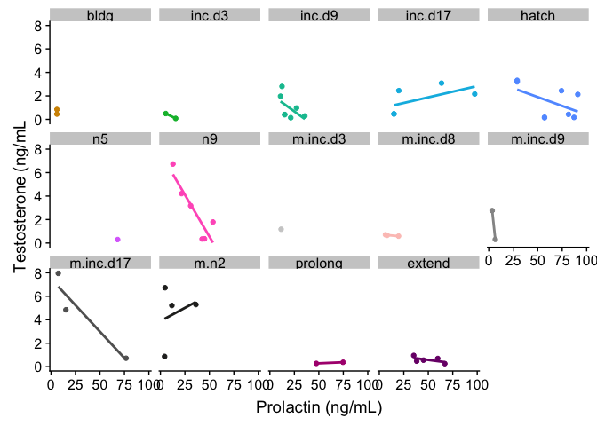
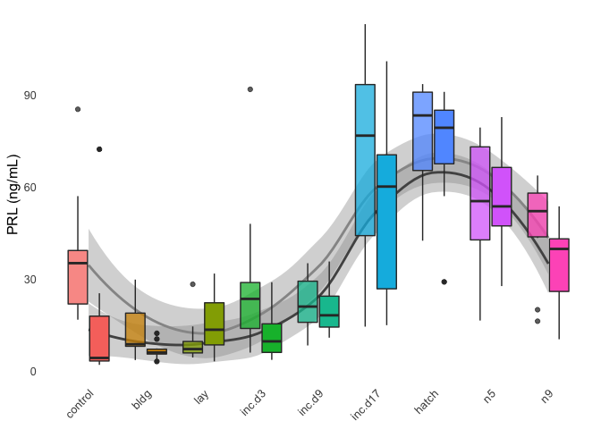
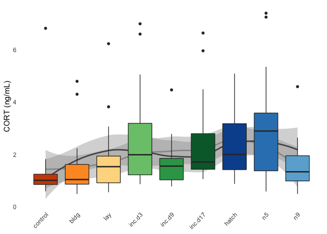
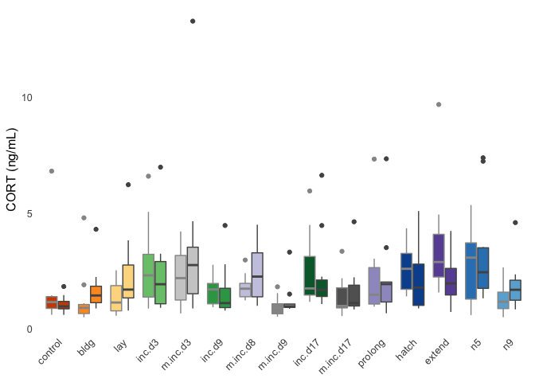
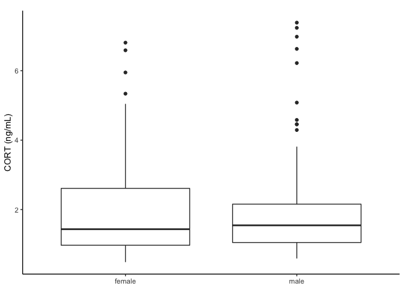
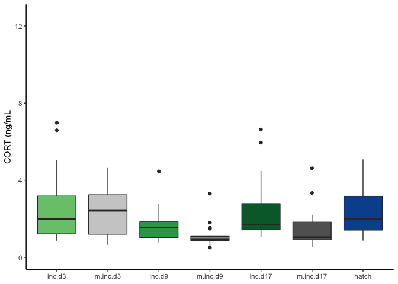

    library(tidyverse)

    ## ── Attaching packages ──────────────────────────────────────────────────────────────────────────────── tidyverse 1.3.0 ──

    ## ✔ ggplot2 3.2.1     ✔ purrr   0.3.3
    ## ✔ tibble  2.1.3     ✔ dplyr   0.8.3
    ## ✔ tidyr   1.0.0     ✔ stringr 1.4.0
    ## ✔ readr   1.3.1     ✔ forcats 0.4.0

    ## ── Conflicts ─────────────────────────────────────────────────────────────────────────────────── tidyverse_conflicts() ──
    ## ✖ dplyr::filter() masks stats::filter()
    ## ✖ dplyr::lag()    masks stats::lag()

    library(cowplot)

    ## 
    ## Attaching package: 'cowplot'

    ## The following object is masked from 'package:ggplot2':
    ## 
    ##     ggsave

    library(readxl)
    library(modelr)
    library(lubridate)

    ## 
    ## Attaching package: 'lubridate'

    ## The following object is masked from 'package:base':
    ## 
    ##     date

    library(ggsignif)
    library(apaTables)

    source("../R/themes.R")  # load custom themes and color palletes
    source("../R/icons.R")

    ## Warning: Column `icons` joining factor and character vector, coercing into
    ## character vector

    knitr::opts_chunk$set(fig.path = '../figures/hormones/',message=F, warning=FALSE)

    colData  <- read_csv("../metadata/00_birds.csv") %>%
      mutate(RNAseq = "RNAseq",
             bird_id = bird)  %>%
       select(-X1, -bird)
    colData

    ## # A tibble: 334 x 4
    ##    sex    treatment RNAseq bird_id
    ##    <chr>  <chr>     <chr>  <chr>  
    ##  1 male   control   RNAseq L.Blu13
    ##  2 male   control   RNAseq L.G107 
    ##  3 female control   RNAseq L.G118 
    ##  4 male   control   RNAseq L.R3   
    ##  5 male   control   RNAseq L.R8   
    ##  6 male   control   RNAseq L.W33  
    ##  7 male   control   RNAseq L.W3   
    ##  8 male   control   RNAseq L.W4   
    ##  9 female control   RNAseq R.G106 
    ## 10 female control   RNAseq R.R20  
    ## # … with 324 more rows

    prolactin <- read_excel("../results/Pigeon prolactin concentrations juil 2018.xlsx", sheet = 1) %>% 
      filter(Study %in% c("Baseline", "ParentalCare")) %>%
        dplyr::mutate(sex = fct_recode(Sex,
                                "female" = "f",
                                "male" = "m"),
               treatment = fct_recode(Treatment,
                                "hatch" = "Hatch",
                                "inc.d17" = "Inc_d17",
                                "inc.d17" = "inc_d17",
                                "inc.d3" = "Inc_d3",
                                 "inc.d3" = "inc_d3",
                                "inc.d9" = "Inc_d9",
                                 "inc.d9" = "inc_d9",
                                "m.inc.d9" = "M_Inc9",
                                "m.inc.d9" = "M_inc9",
                                "m.inc.d3" = "M_Inc3",
                                "m.inc.d8" = "M_Inc8",
                                "m.inc.d8" = "M_inc8",
                                "m.inc.d17" = "M_Inc17",
                                "m.n2" = "M_hatch",
                                "control" = "baseline",
                                "n5" = "N5", 
                                "n9" = "N9"),
               study = fct_collapse(treatment,
                                     characterization = charlevels,
                                     manipulation = maniplevels1)) %>%
              dplyr::rename("plasma_conc" = "Prolactin ng/mL") %>%
              mutate(bird_id = gsub("[[:punct:]]", "." , ColorBands)) %>% 
              dplyr::mutate(hormone = "prolactin") %>% 
              dplyr::select(study, treatment, sex, bird_id, hormone, plasma_conc)  %>% 
              drop_na()
    head(prolactin)

    ## # A tibble: 6 x 6
    ##   study            treatment sex    bird_id   hormone   plasma_conc
    ##   <fct>            <fct>     <fct>  <chr>     <chr>           <dbl>
    ## 1 characterization control   male   x.g       prolactin        3.83
    ## 2 characterization control   male   x.g.g     prolactin        3.28
    ## 3 characterization control   male   x.blk.blk prolactin        4.15
    ## 4 characterization control   male   x.g.g.g   prolactin       25.3 
    ## 5 characterization control   female x.g.g.f   prolactin       21.5 
    ## 6 characterization control   male   x.blu.o   prolactin       14.9

    prolactin2 <- read_csv("../results/prolactin.csv") %>% 
              dplyr::rename("plasma_conc" = "prolactin_ng_mL",
                            "treatment" = "stage") %>% 
               dplyr::mutate(hormone = "prolactin") %>% 
               dplyr::mutate(treatment = fct_recode(treatment,
                                "m.n2" = "m.hatch",
                                "prolong" = "inc.prolong",
                                "extend" = "extend.hatch"),
                              study = fct_collapse(treatment,
                                     characterization = charlevels,
                                     manipulation = maniplevels1)) %>% 
      
              dplyr::mutate(bird_id = gsub(".ATLAS", "" , bird_id)) %>% 
              dplyr::select(study, treatment, sex, bird_id, hormone, plasma_conc) 
    head(prolactin2)

    ## # A tibble: 6 x 6
    ##   study            treatment sex    bird_id       hormone   plasma_conc
    ##   <fct>            <fct>     <chr>  <chr>         <chr>           <dbl>
    ## 1 manipulation     prolong   male   blk.s030.o.g  prolactin        35.3
    ## 2 manipulation     prolong   female blk.s031.pu.d prolactin        43.8
    ## 3 manipulation     m.n2      female blk.s032.g.w  prolactin        90.8
    ## 4 manipulation     m.inc.d3  female blk.s049.y.g  prolactin        27.0
    ## 5 manipulation     m.inc.d3  female blk.s060.pu.w prolactin        19.4
    ## 6 characterization inc.d9    female blk.s061.pu.y prolactin        11.9

    same <- inner_join(prolactin, prolactin2, by = "bird_id")
    ggplot(same, aes(x = plasma_conc.x, y = plasma_conc.y, label = bird_id)) + geom_point() + geom_text()

    all <- full_join(prolactin, prolactin2, by = "bird_id") 
    onlyin1 <- anti_join(prolactin, prolactin2, by = "bird_id") 
    onlyin2 <- anti_join(prolactin2, prolactin, by = "bird_id") 

    dim(prolactin)

    ## [1] 325   6

    dim(prolactin2)

    ## [1] 332   6

    dim(all)

    ## [1] 451  11

    dim(same)

    ## [1] 207  11

    dim(onlyin1)

    ## [1] 118   6

    dim(onlyin2)

    ## [1] 126   6

    print("only in old prolactin dataset") 

    ## [1] "only in old prolactin dataset"

    onlyin1$bird_id

    ##   [1] "x.g.g.f"        "x.r9"           "x.g106"         "g107.x"        
    ##   [5] "g108.x"         "x.y108.w29"     "w3.x"           "x.w44"         
    ##   [9] "w33.x"          "blu13.x"        "r8.x"           "x.r20"         
    ##  [13] "r3.x"           "w4.x"           "o162.w35.x"     "R36.w184.x"    
    ##  [17] "x.y127.w93"     "blu122.r66.x"   "blu114.r38.w78" "x.Y90"         
    ##  [21] "x.Y93.G126"     "R45.X"          "R72.Y83.x"      "w178.x"        
    ##  [25] "r.y.s.blk"      "blk.s.pu.y"     "g19.w36.x"      "D.S.Y.Blk"     
    ##  [29] "x.y94.g133"     "x.y63"          "x.g104.w82"     "s.d.blk.l"     
    ##  [33] "s.l.d.r"        "r.s.g.o"        "s.pu.blk.r"     "r183.o72"      
    ##  [37] "o.d.s"          "blu115.x"       "s.blk.r.o"      "r.s.d.o"       
    ##  [41] "d.s.blk.o"      "l.s.y.blk"      "s.l.d.o"        "r185.x"        
    ##  [45] "blk.s.pu.w"     "s.o.l.y"        "s.pk.pu.g"      "g.blk.s.r"     
    ##  [49] "blk.d.g.s"      "R195.X"         "y18.X"          "s.blk.y.d"     
    ##  [53] "s.pu.g.pk"      "G.S.Blk.O"      "l.s.pk.r"       "o.s.w.blk"     
    ##  [57] "d.s.g.blk"      "d.s.blk.r"      "o.s.r.blk"      "r.s.y.blk"     
    ##  [61] "blk.y.l.s"      "r.s.d.l"        "s.blk.d.r"      "blu110.w26.x"  
    ##  [65] "pu.blk.s.y"     "pk.s.blk.w"     "g.blk.s.pk"     "s.o.r"         
    ##  [69] "s.y.blk.pk"     "r.s.l.blk"      "s.g.blk.y"      "l.s.o.w"       
    ##  [73] "l.s.blk.r"      "blk.s.pu.d"     "blk.s.o.g"      "g.y.blk.s"     
    ##  [77] "pk.w.s.o"       "s.o.pk.pu"      "l.s.y.g"        "pk.s.o.y"      
    ##  [81] "s.l.pk.blk"     "s.g.blk.pk"     "s.g.d.blk"      "s.g.blk.pu"    
    ##  [85] "d.s.blk.w"      "s.blk.pu.pk"    "blk.s.y.g"      "pk.s.d.l"      
    ##  [89] "g.s.r.blk"      "s.y.pk.blk"     "s.l.blk.w"      "blk.s.g.w"     
    ##  [93] "s.blk.pk.w"     "s.blk.r.g"      "g.s.o.pk"       "s.blk.pk.pu"   
    ##  [97] "r.s.g.pk"       "r.s.o.d"        "s.blk.pu.r"     "r.s.blk.pu"    
    ## [101] "s.blk.pk.r"     "r.s.pk.blk"     "s.g.blk.o"      "g.s.pk.r"      
    ## [105] "g.s.pk.pu"      "s.d.w.o"        "g.s.pu.blk"     "s.d.blk.g"     
    ## [109] "s.l.o.pk"       "r.s.l.y"        "s.w.g.blk"      "y.s.o.r"       
    ## [113] "g.s.pk.w"       "g8.w32.y147"    "d.r.blk.s"      "l.s.g.blk"     
    ## [117] "r.s.l.w"        "s.l.o.r"

    print("only in new prolactin dataset") 

    ## [1] "only in new prolactin dataset"

    onlyin2$bird_id

    ##   [1] "blk.s030.o.g"    "blk.s031.pu.d"   "blk.s032.g.w"   
    ##   [4] "blk.s049.y.g"    "blk.s060.pu.w"   "blk.s061.pu.y"  
    ##   [7] "blk.y.l.s109"    "blu10.w26.x"     "blu114.r38.w198"
    ##  [10] "blu115.y150.x"   "d.r.blk.s159"    "d.s008.y.blk"   
    ##  [13] "d.s047.blk.o"    "d.s110.g.blk"    "d.s112.blk.w"   
    ##  [16] "d.s177.blk.r"    "g8.y197"         "g.blk.s004.pk"  
    ##  [19] "g.blk.s041.r"    "g.o.y.s037"      "g.s043.pu.blk"  
    ##  [22] "g.s075.pk.pu"    "g.s076.pk.r"     "g.s078.blk.o"   
    ##  [25] "g.s111.r.blk"    "g.s179.o.pk"     "g.s351.pk.w"    
    ##  [28] "g.s.blk.d"       "g.x"             "g.y.blk.s006"   
    ##  [31] "L.Blu13"         "L.G107"          "L.G118"         
    ##  [34] "L.R3"            "L.R8"            "l.s024.y.g"     
    ##  [37] "l.s052.pk.r"     "l.s080.blk.r"    "l.s120.y.blk"   
    ##  [40] "l.s166.o.w"      "l.s280.g.blk"    "L.W33"          
    ##  [43] "L.W3"            "L.W4"            "o.d.s009"       
    ##  [46] "o.s010.r.blk"    "o.s084.w.blk"    "p.g.blk.s040"   
    ##  [49] "pk.s011.o.y"     "pk.s054.d.g"     "pk.s055.d.l"    
    ##  [52] "pk.s238.blk.w"   "pk.w.s141.o"     "pu.blk.s102.y"  
    ##  [55] "pu.s.o.r"        "r183.o22"        "r195.x"         
    ##  [58] "r36.w184.x"      "r45.X"           "r45.x"          
    ##  [61] "r6.x"            "r72.y83.x"       "r84.x"          
    ##  [64] "R.G106"          "R.R20"           "R.R9"           
    ##  [67] "r.r.x.R2XR"      "r.s005.pk.blk"   "r.s035.y.blk"   
    ##  [70] "r.s056.g.o"      "r.s057.g.pk"     "r.s058.d.l"     
    ##  [73] "r.s059.d.o"      "r.s086.l.blk"    "r.s116.blk.pu"  
    ##  [76] "r.s131.o.d"      "r.s171.l.w"      "r.s172.l.y"     
    ##  [79] "R.W44"           "R.Y108.W29"      "r.y.s007.blk"   
    ##  [82] "s038.g.d.blk"    "s044.blk.d.r"    "s062.d.blk.g"   
    ##  [85] "s063.d.blk.l"    "s064.g.blk.pu"   "s065.l.d.o"     
    ##  [88] "s066.l.d.r"      "s067.o.l.y"      "s069.pk.pu.g"   
    ##  [91] "s071.pu.g.pk"    "s089.blk.pk.pu"  "s090.blk.pk.w"  
    ##  [94] "s091.blk.r.g"    "s092.blk.r.o"    "s093.blk.y.d"   
    ##  [97] "s095.g.blk.o"    "s096.g.blk.pk"   "s100.l.pk.blk"  
    ## [100] "s103.y.pk.blk"   "s136.d.w.o"      "s137.g.blk.y"   
    ## [103] "s139.l.blk.w"    "s142.o.pk.pu"    "s150.w.g.blk"   
    ## [106] "s175.blk.pu.pk"  "s176.blk.pu.r"   "s186.l.o.pk"    
    ## [109] "s187.l.o.r"      "s243.blk.pk.r"   "s333.y.blk.pk"  
    ## [112] "s.pu148.blk.r"   "x.blu116.w107"   "x.y90"          
    ## [115] "x.y93.g126"      "x.y.s"           "y18.x"          
    ## [118] "y.s156.o.r"      "x.w178"          "x.o171.w45"     
    ## [121] "y94.g133.x"      "x.blu122.r66"    "y63.x"          
    ## [124] "g104.w82.x"      "x.r185"          "w191.r1"

    prolctin1rnaseq <- full_join(prolactin, colData)
    prolctin2rnaseq <- full_join(prolactin2, colData)

    prolctin1rnaseq

    ## # A tibble: 465 x 7
    ##    study            treatment sex    bird_id   hormone   plasma_conc RNAseq
    ##    <fct>            <chr>     <chr>  <chr>     <chr>           <dbl> <chr> 
    ##  1 characterization control   male   x.g       prolactin        3.83 <NA>  
    ##  2 characterization control   male   x.g.g     prolactin        3.28 <NA>  
    ##  3 characterization control   male   x.blk.blk prolactin        4.15 <NA>  
    ##  4 characterization control   male   x.g.g.g   prolactin       25.3  <NA>  
    ##  5 characterization control   female x.g.g.f   prolactin       21.5  <NA>  
    ##  6 characterization control   male   x.blu.o   prolactin       14.9  <NA>  
    ##  7 characterization control   female blu.o.x   prolactin       85.3  <NA>  
    ##  8 characterization control   female r.r.x     prolactin       36.2  <NA>  
    ##  9 characterization control   female s.x       prolactin       39.5  <NA>  
    ## 10 characterization control   female r.r.x     prolactin       22.8  <NA>  
    ## # … with 455 more rows

    prolctin2rnaseq

    ## # A tibble: 345 x 7
    ##    study         treatment sex    bird_id       hormone  plasma_conc RNAseq
    ##    <fct>         <chr>     <chr>  <chr>         <chr>          <dbl> <chr> 
    ##  1 manipulation  prolong   male   blk.s030.o.g  prolact…       35.3  RNAseq
    ##  2 manipulation  prolong   female blk.s031.pu.d prolact…       43.8  RNAseq
    ##  3 manipulation  m.n2      female blk.s032.g.w  prolact…       90.8  RNAseq
    ##  4 manipulation  m.inc.d3  female blk.s049.y.g  prolact…       27.0  RNAseq
    ##  5 manipulation  m.inc.d3  female blk.s060.pu.w prolact…       19.4  RNAseq
    ##  6 characteriza… inc.d9    female blk.s061.pu.y prolact…       11.9  RNAseq
    ##  7 manipulation  m.inc.d8  female blk.y.l.s109  prolact…        8    RNAseq
    ##  8 manipulation  m.n2      male   blu10.w26.x   prolact…       18.4  RNAseq
    ##  9 characteriza… bldg      male   blu114.r38.w… prolact…        5.56 RNAseq
    ## 10 manipulation  prolong   female blu115.y150.x prolact…       58.5  RNAseq
    ## # … with 335 more rows

    PETC <- read_excel("../results/parental_care_hormone_RIA_data_master.xlsx", sheet = 2)  %>% 
                    dplyr::mutate(treatment = fct_recode(stage,
                                "inc.d17" = "inc_d17",
                                "inc.d3" = "inc_d3",
                                "inc.d9" = "inc_d9",
                                "m.inc.d9" = "m_incd9",
                                "m.inc.d3" = "m_incd3",
                                "m.inc.d8" = "m_incd8",
                                "m.inc.d17" = "m_incd17",
                                "m.n2" = "m_hatch",
                                "control" = "stress_hpg")) %>%
                    dplyr::filter(treatment %in% alllevels2) %>%   
                    dplyr::mutate(sex = fct_recode(sex,
                                "female" = "f",
                                "male" = "m"),
                           study = fct_collapse(treatment,
                                    characterization = charlevels,
                                    manipulation = maniplevels1)) %>% 
                  dplyr::mutate(bird_id = gsub("[[:punct:]]", "." , band_combo)) %>% 
                  dplyr::select(study, treatment, sex, bird_id, hormone, plasma_conc) %>% 
                 drop_na() %>%  droplevels()  
    head(PETC)

    ## # A tibble: 6 x 6
    ##   study            treatment sex    bird_id       hormone      plasma_conc
    ##   <fct>            <fct>     <fct>  <chr>         <chr>              <dbl>
    ## 1 characterization control   female s.x           cort              0.897 
    ## 2 characterization control   female s.x           estradiol         0.0522
    ## 3 characterization control   female r9.x .RODO14. progesterone      2.86  
    ## 4 characterization control   male   g107.x        cort              1.21  
    ## 5 characterization control   male   g107.x        progesterone      0.225 
    ## 6 characterization control   male   blu13.x       cort              1.15

    PETCP <- left_join(prolactin2, PETC, by = "bird_id") %>% drop_na()
    PETCP$treatment.x <- factor(PETCP$treatment.x, levels = alllevels2)

    plothormonecorrelations <- function(myhormone, myylab){
      PETCP %>% filter(hormone.y == myhormone) %>%
      ggplot(aes(x = plasma_conc.x, y = plasma_conc.y, color = treatment.x )) +
      geom_point() + 
      geom_smooth(method = "lm", se = F) +
      labs(x = "Prolactin (ng/mL)", y = myylab) +
      scale_color_manual(values = colorscharmaip) +
      facet_wrap(~treatment.x, nrow = 3) +
      theme(legend.position = "none")
    }

    plothormonecorrelations("cort", "Corticosterone (ng/mL")

    plothormonecorrelations("estradiol", "Estradiol (ng/mL")

    plothormonecorrelations("progesterone", "Progesterone (ng/mL")

    plothormonecorrelations("testosterone", "Testosterone (ng/mL")

    hormones <- rbind(prolactin, PETC)
    hormones <- left_join(hormones, birds)

    hormones$treatment <- factor(hormones$treatment, levels = alllevels)

    hormones$okay <- ifelse(hormones$hormone == "cort" & hormones$plasma_conc > 30, "bad",
                        ifelse(hormones$hormone == "progesterone" & hormones$plasma_conc > 5, "bad", 
                               ifelse(hormones$hormone == "prolactin" & hormones$plasma_conc > 150, "bad", 
                            ifelse(hormones$hormone == "testosterone" & hormones$sex == "female", "bad",
                                   ifelse(hormones$hormone == "estradiol" & hormones$sex == "male", "bad", "okay")))))
    hormones <- hormones %>% filter(okay == "okay") %>% droplevels()
    summary(hormones)

    ##               study         treatment       sex        bird_id         
    ##  characterization:682   inc.d9   :112   female:646   Length:1201       
    ##  manipulation    :519   inc.d17  : 88   male  :555   Class :character  
    ##                         hatch    : 80                Mode  :character  
    ##                         bldg     : 79                                  
    ##                         m.inc.d17: 78                                  
    ##                         extend   : 78                                  
    ##                         (Other)  :686                                  
    ##    hormone           plasma_conc           icons          
    ##  Length:1201        Min.   :  0.03306   Length:1201       
    ##  Class :character   1st Qu.:  0.34371   Class :character  
    ##  Mode  :character   Median :  1.38568   Mode  :character  
    ##                     Mean   : 10.00584                     
    ##                     3rd Qu.:  6.05370                     
    ##                     Max.   :120.34989                     
    ##                                                           
    ##     music             iconpath             okay          
    ##  Length:1201        Length:1201        Length:1201       
    ##  Class :character   Class :character   Class :character  
    ##  Mode  :character   Mode  :character   Mode  :character  
    ##                                                          
    ##                                                          
    ##                                                          
    ## 

    hormonecharplot <- function(myhormone, myylab){

      hormones %>% 
        filter(study == "characterization",
               hormone %in% c(myhormone))  %>% 
        droplevels() %>% 
      ggplot(aes(x = as.numeric(treatment), y = plasma_conc)) +
            geom_smooth(aes(colour = sex)) +
        geom_boxplot(aes(fill = treatment, alpha = sex)) +
        mytheme() +
        theme(axis.text.x = element_text(angle = 45, hjust = 1, vjust = 1),
              legend.position = "none") +
        scale_fill_manual(values = colorscharmaip) +
        scale_color_manual(values = sexcolors) +
        labs(y = myylab, x = NULL) +
        guides(fill = guide_legend(order=1),
             color = guide_legend(order=2)) +
        scale_alpha_manual(values = c(0.75,1)) +
        scale_x_continuous(breaks = c(1, 2, 3, 4, 5, 6, 7, 8, 9),
                           labels = charlevels)
      }

    hormonecharplot("prolactin", "PRL (ng/mL)")

    # prolactin, removal only
    hormones %>% 
        filter( hormone == c("prolactin"))  %>% 
        filter(treatment %in% c("inc.d3", "m.inc.d3", "inc.d9", "m.inc.d9", "inc.d17", "m.inc.d17", "hatch","m.n2"))  %>% 
      ggplot(aes(x = treatment, y = plasma_conc, fill = treatment,  color = sex)) +
        geom_boxplot() + 
      theme_B3()  +
        theme(axis.text.x = element_text(angle = 45, hjust = 1),
              legend.position = "none",
              strip.text = element_blank()) +
        scale_fill_manual(values = colorscharmaip) +
        scale_color_manual(values = sexcolors) +
        labs(y = "PRL (ng/mL)", x = NULL) +
        ylim(c(-16,100)) +
      
       annotation_custom(inc, xmax = 1.6, ymin = -14, ymax = 5) +
       annotation_custom(removeegg, xmax = 3.6, ymin = -14, ymax = 5) +
       annotation_custom(inc, xmax = 5.6, ymin = -14, ymax = 5) +
       annotation_custom(removeegg, xmax = 7.6, ymin = -14, ymax = 5) +
      annotation_custom(hatch, xmax = 9.6, ymin = -14, ymax = 5) +
      annotation_custom(removeegg, xmax = 11.6, ymin = -14, ymax = 5) +
      annotation_custom(nestling, xmax = 13.6, ymin = -14, ymax = 5) +
      annotation_custom(removechick, xmax = 15.6, ymin = -14, ymax = 5) +
        
        annotate("rect", xmin = 0.6, xmax = 2.4, ymin = -16, ymax = -14, alpha = 0.25) +
        annotate("rect", xmin = 2.6, xmax = 4.4, ymin = -16, ymax = -14, alpha = 0.5) +
        annotate("rect", xmin = 4.6, xmax = 6.4, ymin = -16, ymax = -14, alpha = 0.75)  +
        annotate("rect", xmin = 6.6, xmax = 8.4, ymin = -16, ymax = -14, alpha = 1) 

    hormones %>% 
        filter( hormone == c("prolactin"))  %>% 
        filter( treatment %in% c("inc.d9", "m.inc.d8", "inc.d17", "prolong", "hatch", "extend", "n5"))  %>% 
      ggplot(aes(x = treatment, y = plasma_conc, fill = treatment,  color = sex)) +
        geom_boxplot() + 
      theme_B3()  +
        theme(axis.text.x = element_text(angle = 45, hjust = 1),
              legend.position = "none",
              strip.text = element_blank()) +
        scale_fill_manual(values = colorscharmaip) +
        scale_color_manual(values = sexcolors) +
        labs(y = "PRL (ng/mL)", x = NULL) +
      ylim(c(-12,100)) +
       annotation_custom(inc, xmax = 1.6, ymin = -10, ymax = 10) +
       annotation_custom(maniphatch, xmax = 3.6, ymin = -10, ymax = 10) +
       annotation_custom(inc, xmax = 5.6, ymin = -10, ymax = 10) +
       annotation_custom(manipinc, xmax = 7.6, ymin = -10, ymax = 10) +
      annotation_custom(hatch, xmax = 9.6, ymin = -10, ymax = 10) +
      annotation_custom(maniphatch, xmax = 11.6, ymin = -10, ymax = 10) +
      annotation_custom(nestling, xmax = 13.6, ymin = -10, ymax = 10) +
        
      annotate("rect", xmin = 0.6, xmax = 2.4, ymin = -12, ymax = -10, alpha = 0.33) +
        annotate("rect", xmin = 4.6, xmax = 5.4, ymin = -12, ymax = -10, alpha = 0.33) +
        annotate("rect", xmin = 2.6, xmax = 5.4, ymin = -10, ymax = -8, alpha = 0.66) +
        annotate("rect", xmin = 4.6, xmax = 7.4, ymin = -8, ymax = -6, alpha = 1) 

    hormonecharplot("cort", "CORT (ng/mL)")

    hormonecharplot("progesterone", "PROG (ng/mL)") 

    d1 <- hormonecharplot("estradiol", "E (ng/mL)")
    d2 <- hormonecharplot("testosterone", "T (ng/mL)")
    plot_grid(d1,d2, nrow = 1)

    hormonemanipSteroids <- function(myhormone, myylab, myymax){
      
      hormones %>% 
        filter( hormone %in% c(myhormone))  %>% 
      ggplot(aes(x = treatment, y = plasma_conc, fill = treatment, color = sex)) +
        geom_boxplot() + 
        mytheme() +
        theme(axis.text.x = element_text(angle = 45, hjust = 1),
             legend.position = "none",
              strip.text = element_blank()) +
        scale_fill_manual(values = colorscharmaip) +
        scale_color_manual(values = sexcolors) +
        labs(y = myylab, x = NULL) 
    }

    hormonemanipSteroids("cort", "CORT (ng/mL)", 10)

    hormonemanipSteroids("progesterone", "PROG (ng/mL)",2.5)

    a <- hormonemanipSteroids("estradiol", "E (ng/mL)", 1)
    b <- hormonemanipSteroids("testosterone", "T (ng/mL)", 3.5)
    plot_grid(a,b)

    prl.char <- hormones %>% filter(hormone == "prolactin", treatment %in% charlevels)   %>%  droplevels()
    test.char <- hormones %>% filter(hormone == "testosterone", treatment %in% charlevels)   %>%  droplevels()
    est.char <- hormones %>% filter(hormone == "estradiol", treatment %in% charlevels)   %>%  droplevels()
    prog.char <- hormones %>% filter(hormone == "progesterone", treatment %in% charlevels)   %>%  droplevels()
    cort.char <- hormones %>% filter(hormone == "cort", treatment %in% charlevels)   %>%  droplevels()

    aovSexTretment <- function(mydata, whichormone){
      aov2 <- aov(data = mydata, plasma_conc ~ treatment * sex)
      print(whichormone)
      print(summary(aov2))
      #print(TukeyHSD(aov2, which = "treatment"))
    }

    aovTretment  <- function(mydata, whichormone){
      aov1 <- aov(data = mydata, plasma_conc ~ treatment )
      print(whichormone)
      print(summary(aov1))
      #print(TukeyHSD(aov1, which = "treatment"))
    }

    aovSexTretment(prl.char, "PRL") # yes, sex difference (p = 0.00256), yes treatment effect (p < 2e-16), no interaction

    ## [1] "PRL"
    ##                Df Sum Sq Mean Sq F value  Pr(>F)    
    ## treatment       8  89185   11148  35.039 < 2e-16 ***
    ## sex             1   2983    2983   9.374 0.00256 ** 
    ## treatment:sex   8   3678     460   1.445 0.18104    
    ## Residuals     170  54087     318                    
    ## ---
    ## Signif. codes:  0 '***' 0.001 '**' 0.01 '*' 0.05 '.' 0.1 ' ' 1

    aovSexTretment(cort.char, "CORT") # no sex difference (p = 0.779 ), small treatment effect (p = 0.0238),  no interaction

    ## [1] "CORT"
    ##                Df Sum Sq Mean Sq F value Pr(>F)  
    ## treatment       8   39.5   4.940   2.290 0.0238 *
    ## sex             1    0.2   0.170   0.079 0.7790  
    ## treatment:sex   8   15.7   1.966   0.911 0.5085  
    ## Residuals     164  353.8   2.157                 
    ## ---
    ## Signif. codes:  0 '***' 0.001 '**' 0.01 '*' 0.05 '.' 0.1 ' ' 1

    aovSexTretment(prog.char, "PROG") # no sex difference or treatment effect, signifiant interacion (p = 0.0107)

    ## [1] "PROG"
    ##                Df Sum Sq Mean Sq F value Pr(>F)  
    ## treatment       8   3.18  0.3970   1.081 0.3783  
    ## sex             1   0.30  0.3026   0.824 0.3652  
    ## treatment:sex   8   7.60  0.9502   2.588 0.0107 *
    ## Residuals     176  64.62  0.3671                 
    ## ---
    ## Signif. codes:  0 '***' 0.001 '**' 0.01 '*' 0.05 '.' 0.1 ' ' 1

    aovTretment(est.char, "E") # p = 0.101

    ## [1] "E"
    ##             Df Sum Sq Mean Sq F value Pr(>F)
    ## treatment    8  0.871 0.10891   1.758  0.101
    ## Residuals   68  4.214 0.06197

    aovTretment(test.char, "T") # p = 0.609

    ## [1] "T"
    ##             Df Sum Sq Mean Sq F value Pr(>F)
    ## treatment    7   7.59   1.084   0.779  0.609
    ## Residuals   33  45.90   1.391

do control bird with high prolactin hormone have high PRL expression in the pituitary? yes.
===========================================================================================

    PRLpit <- read_csv("../results/10_PRLpit.csv") %>% 
      filter(treatment == "control") %>% 
      arrange(desc(PRL))
    head(PRLpit,2)

    ## # A tibble: 2 x 5
    ##   bird          sex    treatment tissue      PRL
    ##   <chr>         <chr>  <chr>     <chr>     <dbl>
    ## 1 blu.o.x.ATLAS female control   pituitary  20.9
    ## 2 L.W33         male   control   pituitary  19.9

    write.csv(hormones, "../results/hormones.csv", row.names = F)
    write.csv(prolactin2, "../results/07_prolactin2.csv", row.names = F)

for rechelle
------------

    rechelle <- hormones %>%
      dplyr::filter(hormone %in% c("prolactin", "cort"),
                    treatment %in% c("lay", "inc.d9", "hatch", "n9")) %>%
      dplyr::select(-icons, -music, -iconpath, -okay)
       
    rechelle$hormone <- factor(rechelle$hormone, levels = c("prolactin", "cort"))

    prl.rechelle <- rechelle %>% filter(hormone == "prolactin")   %>%  droplevels()
    cort.rechelle <- rechelle %>% filter(hormone == "cort")   %>%  droplevels()

    TukeyHSD(aov(plasma_conc ~  treatment, data=prl.rechelle))

    ##   Tukey multiple comparisons of means
    ##     95% family-wise confidence level
    ## 
    ## Fit: aov(formula = plasma_conc ~ treatment, data = prl.rechelle)
    ## 
    ## $treatment
    ##                    diff        lwr       upr     p adj
    ## inc.d9-lay     8.646903  -1.704891  18.99870 0.1343466
    ## hatch-lay     62.492635  51.680540  73.30473 0.0000000
    ## n9-lay        28.375968  17.563873  39.18806 0.0000000
    ## hatch-inc.d9  53.845733  43.493939  64.19753 0.0000000
    ## n9-inc.d9     19.729065   9.377272  30.08086 0.0000195
    ## n9-hatch     -34.116667 -44.928763 -23.30457 0.0000000

    TukeyHSD(aov(plasma_conc ~  treatment, data=cort.rechelle))

    ##   Tukey multiple comparisons of means
    ##     95% family-wise confidence level
    ## 
    ## Fit: aov(formula = plasma_conc ~ treatment, data = cort.rechelle)
    ## 
    ## $treatment
    ##                       diff        lwr       upr     p adj
    ## inc.d9-lay    0.3318847747 -0.6465388 1.3103084 0.8112203
    ## hatch-lay     0.3326067238 -0.7997396 1.4649531 0.8683277
    ## n9-lay       -0.4044791498 -1.5535794 0.7446211 0.7935749
    ## hatch-inc.d9  0.0007219491 -1.0245257 1.0259696 1.0000000
    ## n9-inc.d9    -0.7363639244 -1.7800860 0.3073582 0.2586385
    ## n9-hatch     -0.7370858735 -1.9263089 0.4521372 0.3714463

    rechelleplot <- function(mydf, myylab){
      
      p <- ggplot(mydf, aes(x = treatment, y = plasma_conc, fill = sex)) +
      geom_point(aes(color = sex), position = position_dodge(0.9), size = 2)+
      geom_boxplot(alpha = 0.5, outlier.shape = NA) +
      scale_color_manual(name = "Sex", values = c("gray50", "maroon"))+
      scale_fill_manual(name = "Sex", values = c("gray50", "maroon"))+

      theme(axis.text.x = element_text(angle = 45, hjust = 1),
             legend.position = "none",
              strip.text = element_blank()) +
        theme_classic()+
      theme(text = element_text(size= 15)) +
        labs(x = "Stage", y = myylab) 
      return(p)

    }

    #PRL
    rechelleplot(prl.rechelle, "Prolactin (ng/mL)")

    rechelleplot(prl.rechelle, "Prolactin (ng/mL)") + 
      scale_y_continuous(breaks = c(0,25,50,75,100, 125), limits = c(-20,125)) +
      geom_signif(comparisons=list(c("lay", "hatch")), annotations= "p < 0.001", y_position = 100, tip_length = 0.05, vjust = 0, color= "black" , textsize = 5 ) +
      geom_signif(comparisons=list(c("lay", "n9")), annotations= "p < 0.001", y_position = 110, tip_length = 0.05, vjust = 0, color= "black" , textsize = 5 ) +
      geom_signif(comparisons=list(c("hatch", "n9")), annotations= "p < 0.001", y_position = 120, tip_length = 0.05, vjust = 0, color= "black" , textsize = 5 ) +
      geom_signif(comparisons=list(c("inc.d9", "hatch")), annotations= "p < 0.001", y_position = -5, tip_length = -0.05, vjust = 2, color= "black" , textsize = 5 ) +
      geom_signif(comparisons=list(c("inc.d9", "n9")), annotations= "p < 0.001", y_position = -15, tip_length = -0.05, vjust = 2, color= "black" , textsize = 5 )

    #CORT
    rechelleplot(cort.rechelle, "Corticosterone (ng/mL)")

    hormones$hormone <- factor(hormones$hormone, 
                               levels = c("cort", "progesterone", "prolactin", 
                                          "estradiol", "testosterone"))

    hormones %>%
      filter(study == "characterization") %>%
      ggplot(aes(x = sex, y = plasma_conc, fill = sex)) +
      geom_boxplot() +
      theme_B3() +
      facet_wrap(~hormone, nrow = 1, scales = "free") +
      theme(legend.position = "none") +
      labs(y = "concentration (ng/mL")

    printaovtablesex <- function(myhormone, mydescirption){
      
      aov_all = data.frame()
      for(i in alllevels3){
        df <- hormones %>% filter(hormone == myhormone,
                                treatment == i) %>% droplevels()
        aovtable <- apa.aov.table(aov(plasma_conc ~ sex, data  = df))
        aovtable <- as.data.frame(aovtable$table_body)
        totaldf <- aovtable[3, 3]
        aovtable$df <- paste(aovtable$df, ", " , totaldf, sep = "")
        aovtable$ANOVA <- mydescirption
        aovtable$stages <- paste(i)
        aovtable$p <- as.numeric(as.character(aovtable$p))
        aov_all <- rbind(aov_all,aovtable)
      }

      aov_all <- aov_all %>%
        filter(Predictor == "sex")  %>%
        select(stages, ANOVA, df, "F", p) %>%
        mutate(sig = ifelse(p < 0.05, "*", " "))
      aov_all
      return(aov_all)
    }

    printaovtablesex("cort", "CORT ~ sex")

    ##       stages      ANOVA    df    F     p sig
    ## 1    control CORT ~ sex  1, 3 0.63 0.485    
    ## 2       bldg CORT ~ sex 1, 18 0.41 0.528    
    ## 3        lay CORT ~ sex 1, 20 3.21 0.089    
    ## 4     inc.d3 CORT ~ sex 1, 16 0.03 0.870    
    ## 5     inc.d9 CORT ~ sex 1, 34 2.21 0.147    
    ## 6    inc.d17 CORT ~ sex 1, 21 0.09 0.770    
    ## 7      hatch CORT ~ sex 1, 17 0.73 0.405    
    ## 8         n5 CORT ~ sex 1, 19 0.40 0.534    
    ## 9         n9 CORT ~ sex 1, 16 1.14 0.302    
    ## 10  m.inc.d3 CORT ~ sex 1, 19 0.54 0.473    
    ## 11  m.inc.d9 CORT ~ sex 1, 16 0.83 0.376    
    ## 12 m.inc.d17 CORT ~ sex 1, 17 0.50 0.488    
    ## 13      m.n2 CORT ~ sex 1, 17 1.18 0.293    
    ## 14  m.inc.d8 CORT ~ sex 1, 18 1.68 0.212    
    ## 15   prolong CORT ~ sex 1, 16 0.04 0.842    
    ## 16    extend CORT ~ sex 1, 18 1.01 0.328

    printaovtablesex("progesterone", "Prog ~ sex")

    ##       stages      ANOVA    df     F     p sig
    ## 1    control Prog ~ sex  1, 2 72.05 0.014   *
    ## 2       bldg Prog ~ sex 1, 21  0.12 0.730    
    ## 3        lay Prog ~ sex 1, 15  2.71 0.121    
    ## 4     inc.d3 Prog ~ sex 1, 15  0.84 0.375    
    ## 5     inc.d9 Prog ~ sex 1, 30  0.03 0.870    
    ## 6    inc.d17 Prog ~ sex 1, 26  1.72 0.201    
    ## 7      hatch Prog ~ sex 1, 23  0.67 0.420    
    ## 8         n5 Prog ~ sex 1, 22  2.43 0.133    
    ## 9         n9 Prog ~ sex 1, 22  0.56 0.463    
    ## 10  m.inc.d3 Prog ~ sex 1, 16  1.28 0.275    
    ## 11  m.inc.d9 Prog ~ sex 1, 21  0.05 0.830    
    ## 12 m.inc.d17 Prog ~ sex 1, 23  0.14 0.709    
    ## 13      m.n2 Prog ~ sex 1, 19  8.59 0.009   *
    ## 14  m.inc.d8 Prog ~ sex 1, 19  3.27 0.086    
    ## 15   prolong Prog ~ sex 1, 20  0.02 0.885    
    ## 16    extend Prog ~ sex 1, 20  0.14 0.714

    printaovtablesex("prolactin", "PRL ~ sex")

    ##       stages     ANOVA    df     F     p sig
    ## 1    control PRL ~ sex 1, 21  7.74 0.011   *
    ## 2       bldg PRL ~ sex 1, 18  4.47 0.049   *
    ## 3        lay PRL ~ sex 1, 18  2.10 0.165    
    ## 4     inc.d3 PRL ~ sex 1, 18  3.93 0.063    
    ## 5     inc.d9 PRL ~ sex 1, 22  0.31 0.583    
    ## 6    inc.d17 PRL ~ sex 1, 19  1.07 0.313    
    ## 7      hatch PRL ~ sex 1, 18  0.20 0.662    
    ## 8         n5 PRL ~ sex 1, 18  0.03 0.870    
    ## 9         n9 PRL ~ sex 1, 18  3.00 0.100    
    ## 10  m.inc.d3 PRL ~ sex 1, 18 10.39 0.005   *
    ## 11  m.inc.d9 PRL ~ sex 1, 17  2.12 0.164    
    ## 12 m.inc.d17 PRL ~ sex 1, 18  0.02 0.901    
    ## 13      m.n2 PRL ~ sex 1, 16  0.73 0.405    
    ## 14  m.inc.d8 PRL ~ sex 1, 17  3.37 0.084    
    ## 15   prolong PRL ~ sex 1, 18  2.16 0.159    
    ## 16    extend PRL ~ sex 1, 17  3.38 0.084

    TukeyHSD(aov(data = cort.char, plasma_conc ~ treatment), which = "treatment")

    ##   Tukey multiple comparisons of means
    ##     95% family-wise confidence level
    ## 
    ## Fit: aov(formula = plasma_conc ~ treatment, data = cort.char)
    ## 
    ## $treatment
    ##                          diff        lwr        upr     p adj
    ## bldg-control     0.2093902065 -2.0866895 2.50546988 0.9999986
    ## lay-control      0.7971986970 -1.4779118 3.07230916 0.9734607
    ## inc.d3-control   1.0891729855 -1.2322785 3.41062447 0.8661114
    ## inc.d9-control   1.1290834716 -1.0625737 3.32074066 0.7935434
    ## inc.d17-control  1.1807993406 -1.0851336 3.44673224 0.7830206
    ## hatch-control    1.1298054208 -1.1783272 3.43793808 0.8361174
    ## n5-control       1.7842765778 -0.5008432 4.06939638 0.2627173
    ## n9-control       0.3927195472 -1.9287319 2.71417103 0.9998346
    ## lay-bldg         0.5878084905 -0.8309722 2.00658914 0.9297455
    ## inc.d3-bldg      0.8797827790 -0.6121783 2.37174387 0.6470944
    ## inc.d9-bldg      0.9196932651 -0.3609988 2.20038532 0.3748645
    ## inc.d17-bldg     0.9714091341 -0.4326075 2.37542579 0.4276318
    ## hatch-bldg       0.9204152143 -0.5507365 2.39156690 0.5694718
    ## n5-bldg          1.5748863713  0.1401099 3.00966280 0.0198533
    ## n9-bldg          0.1833293407 -1.3086317 1.67529043 0.9999857
    ## inc.d3-lay       0.2919742885 -1.1675098 1.75145833 0.9994239
    ## inc.d9-lay       0.3318847747 -0.9108211 1.57459066 0.9954843
    ## inc.d17-lay      0.3836006436 -0.9858549 1.75305621 0.9937509
    ## hatch-lay        0.3326067238 -1.1055981 1.77081153 0.9983527
    ## n5-lay           0.9870778808 -0.4138965 2.38805225 0.4017680
    ## n9-lay          -0.4044791498 -1.8639632 1.05500489 0.9941865
    ## inc.d9-inc.d3    0.0399104862 -1.2857317 1.36555270 1.0000000
    ## inc.d17-inc.d3   0.0916263551 -1.3535096 1.53676231 0.9999999
    ## hatch-inc.d3     0.0406324353 -1.4698120 1.55107689 1.0000000
    ## n5-inc.d3        0.6951035923 -0.7799349 2.17014208 0.8632148
    ## n9-inc.d3       -0.6964534382 -2.2271732 0.83426634 0.8850290
    ## inc.d17-inc.d9   0.0517158689 -1.1741072 1.27753893 1.0000000
    ## hatch-inc.d9     0.0007219491 -1.3014557 1.30289962 1.0000000
    ## n5-inc.d9        0.6551931061 -0.6057442 1.91613037 0.7857052
    ## n9-inc.d9       -0.7363639244 -2.0620061 0.58927829 0.7177564
    ## hatch-inc.d17   -0.0509939198 -1.4746362 1.37264835 1.0000000
    ## n5-inc.d17       0.6034772372 -0.7825435 1.98949795 0.9083084
    ## n9-inc.d17      -0.7880797933 -2.2332157 0.65705616 0.7377265
    ## n5-hatch         0.6544711570 -0.7995158 2.10845807 0.8911158
    ## n9-hatch        -0.7370858735 -2.2475303 0.77335858 0.8384413
    ## n9-n5           -1.3915570305 -2.8665955 0.08348146 0.0813021

    p1 <- hormones %>%
      filter(hormone == "cort",
             study == "characterization") %>%
      ggplot(aes(x = sex, y = plasma_conc, fill = sex)) +
      geom_boxplot() +
      theme_B3() +
      labs(y = "concentration (ng/mL)", subtitle = "Corticosterone" , x = NULL) +
      theme(legend.position = "none") +
      scale_y_continuous(limits = c(0,8.5))
    p1

    cort <- hormones %>%
      filter(hormone == "cort",
             study == "characterization")

    p2 <-  ggplot(cort, aes(x = treatment, y = plasma_conc, fill = treatment)) +
      geom_boxplot() +
      theme_B3() +
      labs(y = NULL, x = NULL, subtitle = " ") +
      theme(legend.position = "none") +
      geom_signif(comparisons=list(c("control", "inc.d17")), annotations= "p = 0.49", y_position = 7.5, tip_length = 0, vjust = 0, color= "black" , textsize = 3 ) +
      geom_signif(comparisons=list(c("control", "hatch")), annotations= "p = 0.021", y_position = 8, tip_length = 0, vjust = 0, color= "black" , textsize = 3 ) +
      geom_signif(comparisons=list(c("control", "n5")), annotations= "p = 0.004", y_position = 8.5, tip_length = 0, vjust = 0, color= "black" , textsize = 3 ) +
      geom_signif(comparisons=list(c("n5", "n9")), annotations= "p = 0.001", y_position = 8, tip_length = 0, vjust = 0, color= "black" , textsize = 3 ) +
      scale_y_continuous(limits = c(0,8.5))
      
    p2

    p12 <- plot_grid(p1,p2, rel_widths = c(0.2,0.8))

    p3 <- hormones %>%
      filter(hormone == "cort",
             treatment %in% c(controlsremoval, levelsremoval )) %>% 
    ggplot(aes(x = treatment, y = plasma_conc, fill = treatment)) +
      geom_boxplot() +
      theme_B3() +
      scale_y_continuous(limits = c(0,8.5)) +
      scale_fill_manual(values = colorscharmaip) +
      theme(legend.position = "none") +
      labs( x = NULL, y = "concentration (ng/mL")
    p3

    p4 <- hormones %>%
      filter(hormone == "cort",
             treatment %in% c(controlstiming, levelstiming )) %>% 
    ggplot(aes(x = treatment, y = plasma_conc, fill = treatment)) +
      geom_boxplot() +
      theme_B3() +
      scale_y_continuous(limits = c(0,8.5)) +
      scale_fill_manual(values = colorscharmaip) +
      theme(legend.position = "none") +
      labs(y = NULL, x = NULL)
    p4

    p34 <- plot_grid(p3,p4, rel_widths = c(0.6,0.4))

    plot_grid(p12, p34, nrow = 2, rel_heights = c(0.6,0.4))

    p1 <- hormones %>%
      filter(hormone == "prolactin",
             study == "characterization") %>%
      ggplot(aes(x = sex, y = plasma_conc, fill = sex)) +
      geom_boxplot() +
      theme_B3() +
      labs(y = "concentration (ng/mL)", subtitle = "Prolactin" , x = NULL) +
      theme(legend.position = "none",
            axis.text.x = element_text(angle = 45, hjust = 1)) +
      scale_fill_manual(values = sexcolors) +
      scale_y_continuous(limits = c(0,100)) 
    p1

    PRLf <- hormones %>%
      filter(hormone == "prolactin",
             study == "characterization",
             sex == "female")

    PRLm <- hormones %>%
      filter(hormone == "prolactin",
             study == "characterization",
             sex == "male")

    p2a <-  ggplot(PRLf, aes(x = treatment, y = plasma_conc, fill = treatment)) +
      geom_boxplot(aes(color = sex)) +
      theme_B3() +
      labs(y = NULL, x = NULL, subtitle = "females") +
      theme(legend.position = "none",
            axis.text.x = element_text(angle = 45, hjust = 1)) +
      scale_color_manual(values = sexcolors) +
      scale_y_continuous(limits = c(0,100)) +
        geom_text(aes(label = "B", x = 1, y = 100, fontface = "plain"), size = 3) +
       geom_text(aes(label = "A", x = 2, y = 100), size = 3) +
    geom_text(aes(label = "A", x = 3, y = 100), size = 3) +
    geom_text(aes(label = "B", x = 4, y = 100), size = 3) +
      geom_text(aes(label = "C", x = 5, y = 100), size = 3) +
      geom_text(aes(label = "D", x = 6, y = 100), size = 3) +
      geom_text(aes(label = "D", x = 7, y = 100), size = 3) +
      geom_text(aes(label = "D", x = 8, y = 100), size = 3) +
      geom_text(aes(label = "D", x = 9, y = 100), size = 3) 
      
    p2b <-  ggplot(PRLm, aes(x = treatment, y = plasma_conc, fill = treatment)) +
      geom_boxplot(aes(color = sex)) +
      theme_B3() +
      labs(y = NULL, x = NULL, subtitle = "males") +
      theme(legend.position = "none",
            axis.text.x = element_text(angle = 45, hjust = 1)) +
      scale_color_manual(values = sexcolors) +
      scale_y_continuous(limits = c(0,100)) +
      geom_text(aes(label = "A", x = 1, y = 100, fontface = "plain"), size = 3) +
       geom_text(aes(label = "A", x = 2, y = 100), size = 3) +
    geom_text(aes(label = "B", x = 3, y = 100), size = 3) +
    geom_text(aes(label = "B", x = 4, y = 100), size = 3) +
      geom_text(aes(label = "B", x = 5, y = 100), size = 3) +
      geom_text(aes(label = "D", x = 6, y = 100), size = 3) +
      geom_text(aes(label = "D", x = 7, y = 100), size = 3) +
      geom_text(aes(label = "D", x = 8, y = 100), size = 3) +
      geom_text(aes(label = "D", x = 9, y = 100), size = 3) 
      

    p12 <- plot_grid(p1,p2a,p2b, rel_widths = c(0.25,0.5, 0.5), labels = c("a","b", "c"), label_size = 8, nrow = 1, align = "hv")
    p12

    p3a <- hormones %>%
      filter(hormone == "prolactin",
             sex == "female", 
             treatment %in% c(controlsremoval, levelsremoval )) %>% 
      ggplot(aes(x = treatment, y = plasma_conc, fill = treatment)) +
      geom_boxplot(aes(color = sex)) +
      theme_B3() +
      scale_y_continuous(limits = c(0,100)) +
      scale_fill_manual(values = colorscharmaip) +
      theme(legend.position = "none",
            axis.text.x = element_text(angle = 45, hjust = 1)) +
      labs( x = NULL, y = "concentration (ng/mL", subtitle = "females") +
      scale_color_manual(values = sexcolors)
    p3a

    p3b <- hormones %>%
      filter(hormone == "prolactin",
             sex == "male", 
             treatment %in% c(controlsremoval, levelsremoval )) %>% 
      ggplot(aes(x = treatment, y = plasma_conc, fill = treatment)) +
      geom_boxplot(aes(color = sex)) +
      theme_B3() +
      scale_y_continuous(limits = c(0,100)) +
      scale_fill_manual(values = colorscharmaip) +
      theme(legend.position = "none",
            axis.text.x = element_text(angle = 45, hjust = 1)) +
      labs( x = NULL, y = NULL, subtitle = "males") +
      scale_color_manual(values = sexcolors)
    p3b

    p4a <- hormones %>%
      filter(hormone == "prolactin",
             sex == "female", 
             treatment %in% c(controlstiming, levelstiming )) %>% 
    ggplot(aes(x = treatment, y = plasma_conc, fill = treatment)) +
      geom_boxplot(aes(color = sex)) +
      theme_B3() +
      scale_y_continuous(limits = c(0,100)) +
      scale_fill_manual(values = colorscharmaip) +
      theme(legend.position = "none",
            axis.text.x = element_text(angle = 45, hjust = 1)) +
      labs(y = NULL, x = NULL, subtitle = "females") +
      scale_color_manual(values = sexcolors)
    p4a

    p4b <- hormones %>%
      filter(hormone == "prolactin",
             sex == "male", 
             treatment %in% c(controlstiming, levelstiming )) %>% 
    ggplot(aes(x = treatment, y = plasma_conc, fill = treatment)) +
      geom_boxplot(aes(color = sex)) +
      theme_B3() +
      scale_y_continuous(limits = c(0,100)) +
      scale_fill_manual(values = colorscharmaip) +
      theme(legend.position = "none",
            axis.text.x = element_text(angle = 45, hjust = 1)) +
      labs(y = NULL, x = NULL, subtitle = "males") +
      scale_color_manual(values = sexcolors) 
      
    p4b

    p34 <- plot_grid(p3a , p3b,p4a, p4b, rel_widths = c(0.55,0.55, 0.45,0.45), labels = c("d","e", "f", "g"), label_size = 8, nrow = 1)

    plot_grid(p12, p34, nrow = 2, rel_heights = c(0.5,0.5))

