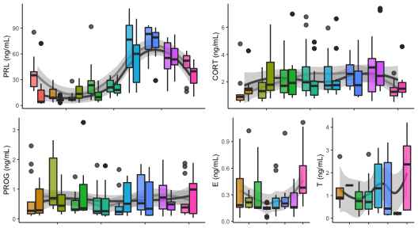

    library(tidyverse)

    ## ── Attaching packages ───────────────────────────────────────────────────────────────────────────────────── tidyverse 1.2.1 ──

    ## ✔ ggplot2 3.2.1     ✔ purrr   0.3.2
    ## ✔ tibble  2.1.3     ✔ dplyr   0.8.1
    ## ✔ tidyr   0.8.3     ✔ stringr 1.4.0
    ## ✔ readr   1.3.1     ✔ forcats 0.4.0

    ## ── Conflicts ──────────────────────────────────────────────────────────────────────────────────────── tidyverse_conflicts() ──
    ## ✖ dplyr::filter() masks stats::filter()
    ## ✖ dplyr::lag()    masks stats::lag()

    library(cowplot)

    ## 
    ## Attaching package: 'cowplot'

    ## The following object is masked from 'package:ggplot2':
    ## 
    ##     ggsave

    library(readxl)
    library(modelr)
    library(lubridate)

    ## 
    ## Attaching package: 'lubridate'

    ## The following object is masked from 'package:base':
    ## 
    ##     date

    source("../R/functions.R")  # load custom functions 
    source("../R/themes.R")  # load custom themes and color palletes

    knitr::opts_chunk$set(fig.path = '../figures/hormones/',message=F, warning=FALSE)

    charlevels <- c("control", "bldg", "lay", "inc_d3", "inc_d9", "inc_d17", "hatch", "n5", "n9" )
    removelevels <- c("M_inc3",  "M_inc9", "M_inc17", "M_n2")
    maniplevels <- c("early", "prolong", "extend")
    combolevels <- c("control", "bldg", "lay", "inc_d3", "M_inc3",
                      "inc_d9",  "M_inc9", "early",  "inc_d17","M_inc17",  "hatch",
                     "prolong", "extend", "M_n2",
                      "n5", "n9" )

    manipchar <- c("early",  "inc_d17", "hatch", "prolong", "extend", "n5")
    removechar <- c("inc_d3", "M_inc3",  "inc_d9", "M_inc9","inc_d17", "M_inc17","hatch", "M_n2")

    sexcolors <- c("female" = "#F8766D", "male" = "#00BFC4")
    charcolors <- c("control" = "#F8766D", "bldg" = "#D39200",
                    "lay" =  "#93AA00", "inc_d3" = "#00BA38" ,"inc_d9" = "#00C19F" , "inc_d17" =  "#00B9E3", 
                    "hatch" = "#619Cff" , "n5" =  "#DB72Fb", "n9" =  "#FF61C3")

    charsexlevels <- c("control female", "control male", "bldg female", "bldg male",  "lay female", "lay male",
                    "inc_d3 female", "inc_d3 male", "inc_d9 female", "inc_d9 male",
                    "inc_d17 female", "inc_d17 male", "hatch female", "hatch male", 
                    "n5 female", "n5 male", "n9 female" , "n9 male")

    prolactin <- read_excel("../results/Pigeon prolactin concentrations juil 2018.xlsx", sheet = 1)

    # keep only samples realated to parental care
    prolactin <- prolactin %>% filter(Study %in% c("Baseline", "ParentalCare"))

    # create lists of factos for characterization and manipluation studies

    # rename some of the treatments levels, store in new columns
    prolactin <- prolactin %>%
        mutate(sex = fct_recode(Sex,
                                "female" = "f",
                                "male" = "m"),
               treatment = fct_recode(Treatment,
                                "hatch" = "Hatch",
                                "inc_d17" = "Inc_d17",
                                "inc_d3" = "Inc_d3",
                                "inc_d9" = "Inc_d9",
                                "M_inc9" = "M_Inc9",
                                "M_inc3" = "M_Inc3",
                                "early" = "M_Inc8",
                                "early" = "M_inc8",
                                "M_inc17" = "M_Inc17",
                                "M_n2" = "M_hatch",
                                "control" = "baseline",
                                "n5" = "N5", 
                                "n9" = "N9"),
               study = fct_collapse(treatment,
                                     characterization = charlevels,
                                     manipulation = maniplevels,
                                    removal = removelevels))

    colnames(prolactin)[colnames(prolactin)=="Prolactin ng/mL"] <- "plasma_conc"
    prolactin$hormone <- "prolactin"
    prolactin <- prolactin %>% select(study, treatment, sex, hormone, plasma_conc)   %>% drop_na()

    summary(prolactin)

    ##               study       treatment       sex        hormone         
    ##  characterization:189   inc_d9 : 24   female:160   Length:325        
    ##  manipulation    : 59   control: 23   male  :165   Class :character  
    ##  removal         : 77   inc_d17: 21                Mode  :character  
    ##                         n5     : 21                                  
    ##                         bldg   : 20                                  
    ##                         extend : 20                                  
    ##                         (Other):196                                  
    ##   plasma_conc    
    ##  Min.   :  2.02  
    ##  1st Qu.: 11.07  
    ##  Median : 23.46  
    ##  Mean   : 34.76  
    ##  3rd Qu.: 56.98  
    ##  Max.   :203.69  
    ## 

    PETC <- read_excel("../results/parental_care_hormone_RIA_data_master.xlsx", sheet = 2)

    PETC <- PETC %>% select(stage, sex, hormone, plasma_conc)  %>%
                    filter(stage %in% combolevels)  %>%
                    droplevels()  
    PETC$stage <- factor(PETC$stage)
    levels(PETC$stage)

    ##  [1] "bldg"    "extend"  "hatch"   "inc_d17" "inc_d3"  "inc_d9"  "lay"    
    ##  [8] "n5"      "n9"      "prolong"

    PETC <- PETC %>%
        mutate(sex = fct_recode(sex,
                                "female" = "f",
                                "male" = "m"),
               study = fct_collapse(stage,
                                    characterization = charlevels,
                                    manipulation = maniplevels)) %>% 
      drop_na()
    colnames(PETC)[colnames(PETC)=="stage"] <- "treatment"
    PETC <- PETC %>% select(study, treatment, sex, hormone, plasma_conc)
    summary(PETC)

    ##               study       treatment       sex        hormone         
    ##  characterization:490   inc_d9 : 88   female:332   Length:603        
    ##  manipulation    :113   inc_d17: 68   male  :271   Class :character  
    ##                         bldg   : 60                Mode  :character  
    ##                         hatch  : 60                                  
    ##                         extend : 59                                  
    ##                         n9     : 58                                  
    ##                         (Other):210                                  
    ##   plasma_conc      
    ##  Min.   :  0.0355  
    ##  1st Qu.:  0.2402  
    ##  Median :  0.8358  
    ##  Mean   :  1.4721  
    ##  3rd Qu.:  1.6961  
    ##  Max.   :117.7708  
    ## 

    hormones <- rbind(prolactin, PETC)
    hormones$treatment <- factor(hormones$treatment, levels = combolevels)

    hormones <- hormones %>%  mutate(treatment.sex = paste(treatment, sex, sep = " ")) 
    hormones$treatment.sex <- factor(hormones$treatment.sex, levels = charsexlevels)

    hormones$okay <- ifelse(hormones$hormone == "cort" & hormones$plasma_conc > 30, "bad",
                        ifelse(hormones$hormone == "progesterone" & hormones$plasma_conc > 5, "bad", 
                               ifelse(hormones$hormone == "prolactin" & hormones$plasma_conc > 150, "bad", 
                            ifelse(hormones$hormone == "testosterone" & hormones$sex == "female", "bad",
                                   ifelse(hormones$hormone == "estradiol" & hormones$sex == "male", "bad", "okay")))))
    hormones <- hormones %>% filter(okay == "okay") %>% droplevels()
    summary(hormones)

    ##               study       treatment       sex        hormone         
    ##  characterization:672   inc_d9 :112   female:485   Length:918        
    ##  manipulation    :169   inc_d17: 88   male  :433   Class :character  
    ##  removal         : 77   hatch  : 80                Mode  :character  
    ##                         bldg   : 79                                  
    ##                         extend : 78                                  
    ##                         n5     : 77                                  
    ##                         (Other):404                                  
    ##   plasma_conc              treatment.sex     okay          
    ##  Min.   :  0.0355   inc_d9 female : 58   Length:918        
    ##  1st Qu.:  0.4409   inc_d9 male   : 54   Class :character  
    ##  Median :  1.7475   bldg female   : 46   Mode  :character  
    ##  Mean   : 12.7057   n5 female     : 46                     
    ##  3rd Qu.: 12.2575   inc_d17 female: 44                     
    ##  Max.   :120.3499   (Other)       :424                     
    ##                     NA's          :246

    prl.char <- hormones %>% filter(hormone == "prolactin", treatment %in% charlevels)   %>%  droplevels()
    test.char <- hormones %>% filter(hormone == "testosterone", treatment %in% charlevels)   %>%  droplevels()
    est.char <- hormones %>% filter(hormone == "estradiol", treatment %in% charlevels)   %>%  droplevels()
    prog.char <- hormones %>% filter(hormone == "progesterone", treatment %in% charlevels)   %>%  droplevels()
    cort.char <- hormones %>% filter(hormone == "cort", treatment %in% charlevels)   %>%  droplevels()

    hormonecharplot <- function(myhormone, myylab){
      
      mycolors <- charcolors
      sexcolors <- c("female" = "#969696", "male" = "#525252")
      
      hormones %>% 
        filter(study == "characterization",
               hormone %in% c(myhormone))  %>% 
      ggplot(aes(x = treatment, y = plasma_conc, fill = treatment, color = sex)) +
        geom_boxplot() + 
        theme(axis.text.x = element_blank(),
              legend.position = "none") +
        scale_fill_manual(values = mycolors) +
        scale_color_manual(values = sexcolors) +
        labs(y = myylab, x = NULL) 
    }

    hormonecharplot("prolactin", "PRL (ng/mL)") 

    a <- hormonecharplot("estradiol", "E (ng/mL)")
    b <- hormonecharplot("testosterone", "T (ng/mL)")

    c <- hormonecharplot("cort", "CORT (ng/mL)")
    d <- hormonecharplot("progesterone", "PROG (ng/mL)")

    e <- hormonecharplot("prolactin", "PRL (ng/mL)") + theme(legend.position = "right", legend.direction = "horizontal")

    cd <- plot_grid(d,c, nrow = 2)
    ab <- plot_grid(a,b, nrow = 2)

    abcd <- plot_grid(cd,ab, rel_widths = c(0.6,0.4))
    plot_grid(e,abcd, ncol = 1)

    aovSexTretment <- function(mydata, whichormone){
      aov2 <- aov(data = mydata, plasma_conc ~ treatment + sex)
      print(whichormone)
      print(summary(aov2))
      #print(TukeyHSD(aov2, which = "treatment"))
    }

    aovTretment  <- function(mydata, whichormone){
      aov1 <- aov(data = mydata, plasma_conc ~ treatment )
      print(whichormone)
      print(summary(aov1))
      #print(TukeyHSD(aov1, which = "treatment"))
    }

    aovSexTretment(prl.char, "PRL")

    ## [1] "PRL"
    ##              Df Sum Sq Mean Sq F value Pr(>F)    
    ## treatment     8  89185   11148   34.35 <2e-16 ***
    ## sex           1   2983    2983    9.19 0.0028 ** 
    ## Residuals   178  57766     325                   
    ## ---
    ## Signif. codes:  0 '***' 0.001 '**' 0.01 '*' 0.05 '.' 0.1 ' ' 1

    aovSexTretment(cort.char, "CORT")

    ## [1] "CORT"
    ##              Df Sum Sq Mean Sq F value Pr(>F)  
    ## treatment     7   34.8   4.965   2.261 0.0318 *
    ## sex           1    0.1   0.139   0.063 0.8015  
    ## Residuals   168  368.9   2.196                 
    ## ---
    ## Signif. codes:  0 '***' 0.001 '**' 0.01 '*' 0.05 '.' 0.1 ' ' 1

    aovSexTretment(prog.char, "PROG")

    ## [1] "PROG"
    ##              Df Sum Sq Mean Sq F value Pr(>F)
    ## treatment     7   2.62  0.3745   0.999  0.434
    ## sex           1   0.08  0.0824   0.220  0.640
    ## Residuals   181  67.87  0.3750

    aovTretment(est.char, "E")

    ## [1] "E"
    ##             Df Sum Sq Mean Sq F value Pr(>F)  
    ## treatment    7  0.812 0.11601   1.872 0.0877 .
    ## Residuals   68  4.214 0.06197                 
    ## ---
    ## Signif. codes:  0 '***' 0.001 '**' 0.01 '*' 0.05 '.' 0.1 ' ' 1

    aovTretment(test.char, "T")

    ## [1] "T"
    ##             Df Sum Sq Mean Sq F value Pr(>F)
    ## treatment    7   7.59   1.084   0.779  0.609
    ## Residuals   33  45.90   1.391

    hormonemanipPRL <- function(myhormone, myylab){
      
      mycolors <- sexcolors
      
      hormones %>% 
        filter(treatment %in% manipchar,
               hormone %in% c(myhormone))  %>% 
      ggplot(aes(x = treatment, y = plasma_conc, fill = sex)) +
        geom_boxplot() + 
        theme(axis.text.x = element_text(angle = 45, hjust = 1),
              legend.position = "none",
              strip.text = element_blank()) +
        scale_fill_manual(values = mycolors) +
        labs(y = myylab, x = NULL) +
        facet_wrap(~sex) +
        annotate("rect", xmin = 0.5, xmax = 1.5, ymin = 0, ymax = 125, alpha = .2) +
        annotate("rect", xmin = 3.5, xmax = 5.5, ymin = 0, ymax = 125, alpha = .2) 
    }

    hormonemanipPRL("prolactin", "PRL (ng/mL)")

    hormonemanipSteroids <- function(myhormone, myylab, myymax){
      
      mycolors <- sexcolors
      
      hormones %>% 
        filter(treatment %in% manipchar,
               hormone %in% c(myhormone))  %>% 
      ggplot(aes(x = treatment, y = plasma_conc, fill = sex)) +
        geom_boxplot() + 
        theme(axis.text.x = element_text(angle = 45, hjust = 1),
              legend.position = "none",
              strip.text = element_blank()) +
        scale_fill_manual(values = mycolors) +
        labs(y = myylab, x = NULL) +
        facet_wrap(~sex) +
        annotate("rect", xmin = 2.5, xmax = 4.5, ymin = 0, ymax = myymax, alpha = .2)
    }

    a <- hormonemanipSteroids("estradiol", "E (ng/mL)", 1)
    b <- hormonemanipSteroids("testosterone", "T (ng/mL)", 3.5)
    c <- hormonemanipSteroids("cort", "CORT (ng/mL)", 10)
    d <- hormonemanipSteroids("progesterone", "PROG (ng/mL)",2.5)

    plot_grid(d,a,c,b, rel_widths = c(0.65,0.35))

    hormoneremoval <- function(myhormone, myylab){
      
      mycolors <- c("female" = "#F8766D", "male" = "#00BFC4")
      
      hormones %>% 
        filter(treatment %in% removechar,
               hormone %in% c(myhormone))  %>% 
      ggplot(aes(x = treatment, y = plasma_conc, fill = sex)) +
        geom_boxplot() + 
        theme(axis.text.x = element_text(angle = 45, hjust = 1),
              legend.position = "none",
              strip.text = element_blank()) +
        scale_fill_manual(values = mycolors) +
        labs(y = myylab, x = NULL) +
        facet_wrap(~sex) +
        annotate("rect", xmin = 1.5, xmax = 2.5, ymin = 0, ymax = 125, alpha = .2) +
        annotate("rect", xmin = 3.5, xmax = 4.5, ymin = 0, ymax = 125, alpha = .2) +
        annotate("rect", xmin = 5.5, xmax = 6.5, ymin = 0, ymax = 125, alpha = .2) + 
        annotate("rect", xmin = 7.5, xmax = 8.5, ymin = 0, ymax = 125, alpha = .2) 
    }

    hormoneremoval("prolactin", "PRL (ng/mL)")

    write.csv(hormones, "../results/hormones.csv", row.names = F)
