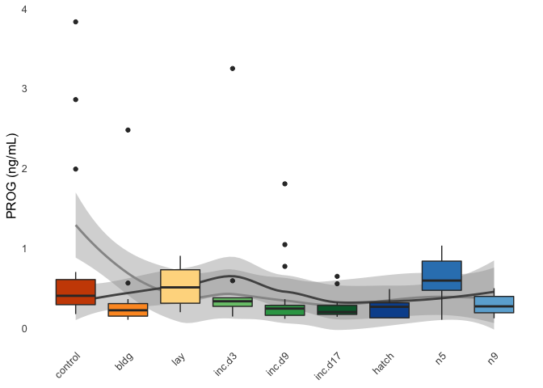
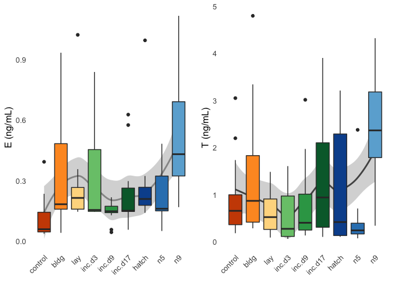
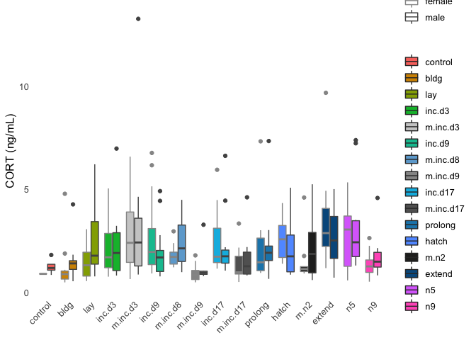

    library(tidyverse)

    ## ── Attaching packages ─────────────────────────────────────────────────────────────────────────────────────────────────── tidyverse 1.3.0 ──

    ## ✔ ggplot2 3.2.1     ✔ purrr   0.3.3
    ## ✔ tibble  2.1.3     ✔ dplyr   0.8.3
    ## ✔ tidyr   1.0.0     ✔ stringr 1.4.0
    ## ✔ readr   1.3.1     ✔ forcats 0.4.0

    ## ── Conflicts ────────────────────────────────────────────────────────────────────────────────────────────────────── tidyverse_conflicts() ──
    ## ✖ dplyr::filter() masks stats::filter()
    ## ✖ dplyr::lag()    masks stats::lag()

    library(cowplot)

    ## 
    ## Attaching package: 'cowplot'

    ## The following object is masked from 'package:ggplot2':
    ## 
    ##     ggsave

    library(readxl)
    library(modelr)
    library(lubridate)

    ## 
    ## Attaching package: 'lubridate'

    ## The following object is masked from 'package:base':
    ## 
    ##     date

    source("../R/themes.R")  # load custom themes and color palletes

    knitr::opts_chunk$set(fig.path = '../figures/hormones/',message=F, warning=FALSE)

    prolactin <- read_excel("../results/Pigeon prolactin concentrations juil 2018.xlsx", sheet = 1) %>% 
      filter(Study %in% c("Baseline", "ParentalCare")) %>%
        dplyr::mutate(sex = fct_recode(Sex,
                                "female" = "f",
                                "male" = "m"),
               treatment = fct_recode(Treatment,
                                "hatch" = "Hatch",
                                "inc.d17" = "Inc_d17",
                                "inc.d17" = "inc_d17",
                                "inc.d3" = "Inc_d3",
                                 "inc.d3" = "inc_d3",
                                "inc.d9" = "Inc_d9",
                                 "inc.d9" = "inc_d9",
                                "m.inc.d9" = "M_Inc9",
                                "m.inc.d9" = "M_inc9",
                                "m.inc.d3" = "M_Inc3",
                                "m.inc.d8" = "M_Inc8",
                                "m.inc.d8" = "M_inc8",
                                "m.inc.d17" = "M_Inc17",
                                "m.n2" = "M_hatch",
                                "control" = "baseline",
                                "n5" = "N5", 
                                "n9" = "N9"),
               study = fct_collapse(treatment,
                                     characterization = charlevels,
                                     manipulation = maniplevels1)) %>%
              dplyr::rename("plasma_conc" = "Prolactin ng/mL") %>%
              mutate(bird_id = gsub("[[:punct:]]", "." , ColorBands)) %>% 
              dplyr::mutate(hormone = "prolactin") %>% 
              dplyr::select(study, treatment, sex, bird_id, hormone, plasma_conc)  %>% 
              drop_na()
    head(prolactin)

    ## # A tibble: 6 x 6
    ##   study            treatment sex    bird_id   hormone   plasma_conc
    ##   <fct>            <fct>     <fct>  <chr>     <chr>           <dbl>
    ## 1 characterization control   male   x.g       prolactin        3.83
    ## 2 characterization control   male   x.g.g     prolactin        3.28
    ## 3 characterization control   male   x.blk.blk prolactin        4.15
    ## 4 characterization control   male   x.g.g.g   prolactin       25.3 
    ## 5 characterization control   female x.g.g.f   prolactin       21.5 
    ## 6 characterization control   male   x.blu.o   prolactin       14.9

    prolactin2 <- read_csv("../results/prolactin.csv") %>% 
              dplyr::rename("plasma_conc" = "prolactin_ng_mL",
                            "treatment" = "stage") %>% 
               dplyr::mutate(hormone = "prolactin") %>% 
               dplyr::mutate(treatment = fct_recode(treatment,
                                "m.n2" = "m.hatch",
                                "prolong" = "inc.prolong",
                                "extend" = "extend.hatch"),
                              study = fct_collapse(treatment,
                                     characterization = charlevels,
                                     manipulation = maniplevels1)) %>% 
              dplyr::select(study, treatment, sex, bird_id, hormone, plasma_conc) 
    head(prolactin2)

    ## # A tibble: 6 x 6
    ##   study            treatment sex    bird_id       hormone   plasma_conc
    ##   <fct>            <fct>     <chr>  <chr>         <chr>           <dbl>
    ## 1 manipulation     prolong   male   blk.s030.o.g  prolactin        35.3
    ## 2 manipulation     prolong   female blk.s031.pu.d prolactin        43.8
    ## 3 manipulation     m.n2      female blk.s032.g.w  prolactin        90.8
    ## 4 manipulation     m.inc.d3  female blk.s049.y.g  prolactin        27.0
    ## 5 manipulation     m.inc.d3  female blk.s060.pu.w prolactin        19.4
    ## 6 characterization inc.d9    female blk.s061.pu.y prolactin        11.9

    same <- inner_join(prolactin2, prolactin, by = "bird_id")

    ggplot(same, aes(x = plasma_conc.x, y = plasma_conc.y, label = bird_id)) + geom_point() + geom_text()

    PETC <- read_excel("../results/parental_care_hormone_RIA_data_master.xlsx", sheet = 2)  %>% 
                    dplyr::mutate(treatment = fct_recode(stage,
                                "inc.d17" = "inc_d17",
                                "inc.d3" = "inc_d3",
                                "inc.d9" = "inc_d9",
                                "m.inc.d9" = "m_incd9",
                                "m.inc.d3" = "m_incd3",
                                "m.inc.d8" = "m_incd8",
                                "m.inc.d17" = "m_incd17",
                                "m.n2" = "m_hatch",
                                "control" = "stress_hpg")) %>%
                    dplyr::filter(treatment %in% alllevels2) %>%   
                    dplyr::mutate(sex = fct_recode(sex,
                                "female" = "f",
                                "male" = "m"),
                           study = fct_collapse(treatment,
                                    characterization = charlevels,
                                    manipulation = maniplevels1)) %>% 
                  dplyr::mutate(bird_id = gsub("[[:punct:]]", "." , band_combo)) %>% 
                  dplyr::select(study, treatment, sex, bird_id, hormone, plasma_conc) %>% 
                 drop_na() %>%  droplevels()  
    head(PETC)

    ## # A tibble: 6 x 6
    ##   study            treatment sex    bird_id       hormone      plasma_conc
    ##   <fct>            <fct>     <fct>  <chr>         <chr>              <dbl>
    ## 1 characterization control   female s.x           cort              0.897 
    ## 2 characterization control   female s.x           estradiol         0.0522
    ## 3 characterization control   female r9.x .RODO14. progesterone      2.86  
    ## 4 characterization control   male   g107.x        cort              1.21  
    ## 5 characterization control   male   g107.x        progesterone      0.225 
    ## 6 characterization control   male   blu13.x       cort              1.15

    PETCP <- left_join(prolactin2, PETC, by = "bird_id") %>% drop_na()
    PETCP$treatment.x <- factor(PETCP$treatment.x, levels = alllevels2)
    PETCP$hormone.y

    ##   [1] "cort"         "cort"         "estradiol"    "progesterone"
    ##   [5] "progesterone" "progesterone" "testosterone" "cort"        
    ##   [9] "cort"         "estradiol"    "progesterone" "cort"        
    ##  [13] "progesterone" "progesterone" "testosterone" "cort"        
    ##  [17] "progesterone" "cort"         "estradiol"    "progesterone"
    ##  [21] "progesterone" "progesterone" "cort"         "estradiol"   
    ##  [25] "progesterone" "cort"         "progesterone" "cort"        
    ##  [29] "estradiol"    "cort"         "estradiol"    "progesterone"
    ##  [33] "progesterone" "cort"         "estradiol"    "cort"        
    ##  [37] "estradiol"    "progesterone" "progesterone" "cort"        
    ##  [41] "cort"         "estradiol"    "progesterone" "cort"        
    ##  [45] "estradiol"    "cort"         "progesterone" "progesterone"
    ##  [49] "testosterone" "cort"         "estradiol"    "cort"        
    ##  [53] "estradiol"    "progesterone" "estradiol"    "progesterone"
    ##  [57] "progesterone" "cort"         "estradiol"    "progesterone"
    ##  [61] "progesterone" "progesterone" "cort"         "progesterone"
    ##  [65] "progesterone" "testosterone" "cort"         "estradiol"   
    ##  [69] "progesterone" "progesterone" "cort"         "progesterone"
    ##  [73] "progesterone" "testosterone" "cort"         "estradiol"   
    ##  [77] "progesterone" "cort"         "estradiol"    "cort"        
    ##  [81] "estradiol"    "progesterone" "cort"         "progesterone"
    ##  [85] "progesterone" "cort"         "progesterone" "cort"        
    ##  [89] "cort"         "estradiol"    "progesterone" "cort"        
    ##  [93] "progesterone" "cort"         "estradiol"    "progesterone"
    ##  [97] "cort"         "progesterone" "testosterone" "cort"        
    ## [101] "estradiol"    "progesterone" "cort"         "estradiol"   
    ## [105] "progesterone" "cort"         "cort"         "estradiol"   
    ## [109] "progesterone" "cort"         "cort"         "estradiol"   
    ## [113] "progesterone" "progesterone" "cort"         "progesterone"
    ## [117] "testosterone" "cort"         "estradiol"    "progesterone"
    ## [121] "cort"         "progesterone" "testosterone" "cort"        
    ## [125] "progesterone" "testosterone" "cort"         "progesterone"
    ## [129] "cort"         "estradiol"    "progesterone" "cort"        
    ## [133] "cort"         "estradiol"    "progesterone" "cort"        
    ## [137] "progesterone" "progesterone" "cort"         "cort"        
    ## [141] "progesterone" "testosterone" "cort"         "progesterone"
    ## [145] "progesterone" "testosterone" "cort"         "progesterone"
    ## [149] "cort"         "progesterone" "testosterone" "cort"        
    ## [153] "estradiol"    "progesterone" "progesterone" "cort"        
    ## [157] "estradiol"    "cort"         "estradiol"    "progesterone"
    ## [161] "cort"         "progesterone" "cort"         "progesterone"
    ## [165] "cort"         "cort"         "estradiol"    "progesterone"
    ## [169] "progesterone" "progesterone" "testosterone" "cort"        
    ## [173] "estradiol"    "progesterone" "cort"         "estradiol"   
    ## [177] "progesterone" "cort"         "cort"         "estradiol"   
    ## [181] "progesterone" "testosterone" "progesterone" "progesterone"
    ## [185] "progesterone" "testosterone" "cort"         "cort"        
    ## [189] "cort"         "estradiol"    "progesterone" "progesterone"
    ## [193] "progesterone" "progesterone" "cort"         "progesterone"
    ## [197] "testosterone" "cort"         "estradiol"    "progesterone"
    ## [201] "progesterone" "progesterone" "cort"         "cort"        
    ## [205] "estradiol"    "progesterone" "cort"         "progesterone"
    ## [209] "cort"         "estradiol"    "progesterone" "cort"        
    ## [213] "progesterone" "progesterone" "testosterone" "cort"        
    ## [217] "estradiol"    "progesterone" "progesterone" "progesterone"
    ## [221] "testosterone" "cort"         "cort"         "progesterone"
    ## [225] "progesterone" "testosterone" "cort"         "estradiol"   
    ## [229] "progesterone" "cort"         "estradiol"    "progesterone"
    ## [233] "cort"         "estradiol"    "progesterone" "cort"        
    ## [237] "estradiol"    "progesterone" "progesterone" "cort"        
    ## [241] "estradiol"    "progesterone" "progesterone" "cort"        
    ## [245] "progesterone" "progesterone" "testosterone" "cort"        
    ## [249] "estradiol"    "cort"         "progesterone" "cort"        
    ## [253] "cort"         "estradiol"    "progesterone" "progesterone"
    ## [257] "cort"         "estradiol"    "progesterone" "progesterone"
    ## [261] "cort"         "estradiol"    "cort"         "progesterone"
    ## [265] "testosterone" "cort"         "progesterone" "cort"        
    ## [269] "cort"         "progesterone" "progesterone" "testosterone"
    ## [273] "cort"         "progesterone" "testosterone" "cort"        
    ## [277] "cort"         "estradiol"    "progesterone" "cort"        
    ## [281] "cort"         "estradiol"    "progesterone" "cort"        
    ## [285] "cort"         "progesterone" "cort"         "cort"        
    ## [289] "estradiol"    "progesterone" "cort"         "progesterone"
    ## [293] "progesterone" "testosterone" "cort"         "cort"        
    ## [297] "estradiol"    "progesterone" "cort"         "estradiol"   
    ## [301] "progesterone" "cort"         "estradiol"    "progesterone"
    ## [305] "cort"         "estradiol"    "progesterone" "cort"        
    ## [309] "progesterone" "progesterone" "testosterone" "testosterone"
    ## [313] "cort"         "cort"         "estradiol"    "progesterone"
    ## [317] "cort"         "progesterone" "cort"         "cort"        
    ## [321] "progesterone" "progesterone" "cort"         "progesterone"
    ## [325] "cort"         "estradiol"    "progesterone" "cort"        
    ## [329] "cort"         "estradiol"    "progesterone" "progesterone"
    ## [333] "cort"         "progesterone" "testosterone" "cort"        
    ## [337] "estradiol"    "progesterone" "cort"         "progesterone"
    ## [341] "cort"         "estradiol"    "progesterone" "cort"        
    ## [345] "cort"         "estradiol"    "progesterone" "cort"        
    ## [349] "progesterone" "progesterone" "testosterone" "cort"        
    ## [353] "estradiol"    "progesterone" "cort"         "estradiol"   
    ## [357] "progesterone" "cort"         "estradiol"    "cort"        
    ## [361] "estradiol"    "progesterone" "progesterone" "cort"        
    ## [365] "estradiol"    "progesterone" "progesterone" "cort"        
    ## [369] "progesterone" "progesterone" "testosterone" "cort"        
    ## [373] "cort"         "cort"         "estradiol"    "progesterone"
    ## [377] "progesterone" "cort"         "progesterone" "progesterone"
    ## [381] "testosterone" "cort"         "estradiol"    "progesterone"
    ## [385] "progesterone" "progesterone" "progesterone" "cort"        
    ## [389] "estradiol"    "progesterone" "cort"         "estradiol"   
    ## [393] "progesterone" "cort"         "cort"         "estradiol"   
    ## [397] "progesterone" "progesterone" "cort"         "estradiol"   
    ## [401] "progesterone" "cort"         "progesterone" "cort"        
    ## [405] "progesterone" "progesterone" "cort"         "estradiol"   
    ## [409] "progesterone" "progesterone" "cort"         "estradiol"   
    ## [413] "progesterone" "progesterone" "cort"         "progesterone"
    ## [417] "testosterone" "cort"         "progesterone" "testosterone"
    ## [421] "cort"         "estradiol"    "cort"         "progesterone"
    ## [425] "progesterone" "testosterone" "cort"         "progesterone"
    ## [429] "testosterone" "progesterone" "progesterone" "progesterone"
    ## [433] "progesterone" "testosterone" "testosterone" "cort"        
    ## [437] "cort"         "estradiol"    "progesterone" "cort"        
    ## [441] "estradiol"    "cort"         "estradiol"    "cort"        
    ## [445] "estradiol"    "progesterone" "progesterone" "cort"        
    ## [449] "estradiol"    "progesterone" "cort"         "cort"        
    ## [453] "estradiol"    "progesterone" "cort"         "estradiol"   
    ## [457] "progesterone" "progesterone" "cort"         "progesterone"
    ## [461] "progesterone" "testosterone" "cort"         "testosterone"
    ## [465] "cort"         "estradiol"    "cort"         "cort"        
    ## [469] "cort"         "progesterone" "cort"         "progesterone"
    ## [473] "progesterone" "testosterone" "progesterone" "progesterone"
    ## [477] "cort"         "progesterone" "cort"         "progesterone"
    ## [481] "testosterone" "cort"         "progesterone" "cort"        
    ## [485] "estradiol"    "cort"         "estradiol"    "progesterone"
    ## [489] "progesterone" "cort"         "cort"         "progesterone"
    ## [493] "progesterone" "testosterone" "cort"         "cort"        
    ## [497] "estradiol"    "progesterone" "cort"         "estradiol"   
    ## [501] "progesterone" "cort"         "estradiol"    "progesterone"
    ## [505] "cort"         "progesterone" "cort"         "estradiol"   
    ## [509] "cort"         "cort"         "progesterone" "cort"        
    ## [513] "estradiol"    "progesterone" "cort"         "estradiol"   
    ## [517] "progesterone" "cort"         "progesterone" "testosterone"
    ## [521] "cort"         "cort"         "progesterone" "progesterone"
    ## [525] "testosterone" "cort"         "progesterone" "cort"        
    ## [529] "progesterone" "progesterone" "testosterone" "cort"        
    ## [533] "progesterone" "cort"         "progesterone" "progesterone"
    ## [537] "testosterone" "cort"         "cort"         "progesterone"
    ## [541] "testosterone" "cort"         "progesterone" "cort"        
    ## [545] "estradiol"    "cort"         "progesterone" "progesterone"
    ## [549] "testosterone" "cort"         "estradiol"    "cort"        
    ## [553] "progesterone" "cort"         "progesterone" "testosterone"
    ## [557] "progesterone" "cort"         "progesterone" "progesterone"
    ## [561] "testosterone" "cort"         "progesterone" "progesterone"
    ## [565] "testosterone" "progesterone" "cort"         "estradiol"   
    ## [569] "cort"         "progesterone" "cort"         "cort"        
    ## [573] "estradiol"    "progesterone" "cort"         "progesterone"
    ## [577] "progesterone" "testosterone" "cort"         "estradiol"   
    ## [581] "progesterone"

    plothormonecorrelations <- function(myhormone, myylab){
      PETCP %>% filter(hormone.y == myhormone) %>%
      ggplot(aes(x = plasma_conc.x, y = plasma_conc.y, color = treatment.x )) +
      geom_point() + 
      geom_smooth(method = "lm", se = F) +
      labs(x = "Prolactin (ng/mL)", y = myylab) +
      scale_color_manual(values = colorscharmaip) +
      facet_wrap(~treatment.x, nrow = 3) +
      theme(legend.position = "none")
    }

    plothormonecorrelations("cort", "Corticosterone (ng/mL")

    plothormonecorrelations("estradiol", "Estradiol (ng/mL")

    plothormonecorrelations("progesterone", "Progesterone (ng/mL")

    plothormonecorrelations("testosterone", "Testosterone (ng/mL")

    hormones <- rbind(prolactin, PETC)
    hormones$treatment <- factor(hormones$treatment, levels = alllevels)

    hormones$okay <- ifelse(hormones$hormone == "cort" & hormones$plasma_conc > 30, "bad",
                        ifelse(hormones$hormone == "progesterone" & hormones$plasma_conc > 5, "bad", 
                               ifelse(hormones$hormone == "prolactin" & hormones$plasma_conc > 150, "bad", 
                            ifelse(hormones$hormone == "testosterone" & hormones$sex == "female", "bad",
                                   ifelse(hormones$hormone == "estradiol" & hormones$sex == "male", "bad", "okay")))))
    hormones <- hormones %>% filter(okay == "okay") %>% droplevels()
    summary(hormones)

    ##               study         treatment       sex        bird_id         
    ##  characterization:682   inc.d9   :112   female:646   Length:1201       
    ##  manipulation    :519   inc.d17  : 88   male  :555   Class :character  
    ##                         hatch    : 80                Mode  :character  
    ##                         bldg     : 79                                  
    ##                         m.inc.d17: 78                                  
    ##                         extend   : 78                                  
    ##                         (Other)  :686                                  
    ##    hormone           plasma_conc            okay          
    ##  Length:1201        Min.   :  0.03306   Length:1201       
    ##  Class :character   1st Qu.:  0.34371   Class :character  
    ##  Mode  :character   Median :  1.38568   Mode  :character  
    ##                     Mean   : 10.00584                     
    ##                     3rd Qu.:  6.05370                     
    ##                     Max.   :120.34989                     
    ## 

    hormonecharplot <- function(myhormone, myylab){

      hormones %>% 
        filter(study == "characterization",
               hormone %in% c(myhormone))  %>% 
        droplevels() %>% 
      ggplot(aes(x = as.numeric(treatment), y = plasma_conc)) +
            geom_smooth(aes(colour = sex)) +
        geom_boxplot(aes(outlier.colour = treatment, fill = treatment, alpha = sex)) +
        mytheme() +
        theme(axis.text.x = element_text(angle = 45, hjust = 1, vjust = 1),
              legend.position = "none") +
        scale_fill_manual(values = colorscharmaip) +
        scale_color_manual(values = sexcolors) +
        labs(y = myylab, x = NULL) +
        guides(fill = guide_legend(order=1),
             color = guide_legend(order=2)) +
        scale_alpha_manual(values = c(0.75,1)) +
        scale_x_continuous(breaks = c(1, 2, 3, 4, 5, 6, 7, 8, 9),
                           labels = charlevels)
      }

    hormonecharplot("prolactin", "PRL (ng/mL)")

    hormonecharplot("cort", "CORT (ng/mL)")

    hormonecharplot("progesterone", "PROG (ng/mL)") 

    d1 <- hormonecharplot("estradiol", "E (ng/mL)")
    d2 <- hormonecharplot("testosterone", "T (ng/mL)")
    plot_grid(d1,d2, nrow = 1)

    prl.char <- hormones %>% filter(hormone == "prolactin", treatment %in% charlevels)   %>%  droplevels()
    test.char <- hormones %>% filter(hormone == "testosterone", treatment %in% charlevels)   %>%  droplevels()
    est.char <- hormones %>% filter(hormone == "estradiol", treatment %in% charlevels)   %>%  droplevels()
    prog.char <- hormones %>% filter(hormone == "progesterone", treatment %in% charlevels)   %>%  droplevels()
    cort.char <- hormones %>% filter(hormone == "cort", treatment %in% charlevels)   %>%  droplevels()

    aovSexTretment <- function(mydata, whichormone){
      aov2 <- aov(data = mydata, plasma_conc ~ treatment * sex)
      print(whichormone)
      print(summary(aov2))
      #print(TukeyHSD(aov2, which = "treatment"))
    }

    aovTretment  <- function(mydata, whichormone){
      aov1 <- aov(data = mydata, plasma_conc ~ treatment )
      print(whichormone)
      print(summary(aov1))
      #print(TukeyHSD(aov1, which = "treatment"))
    }

    aovSexTretment(prl.char, "PRL") # yes, sex difference (p = 0.00256), yes treatment effect (p < 2e-16), no interaction

    ## [1] "PRL"
    ##                Df Sum Sq Mean Sq F value  Pr(>F)    
    ## treatment       8  89185   11148  35.039 < 2e-16 ***
    ## sex             1   2983    2983   9.374 0.00256 ** 
    ## treatment:sex   8   3678     460   1.445 0.18104    
    ## Residuals     170  54087     318                    
    ## ---
    ## Signif. codes:  0 '***' 0.001 '**' 0.01 '*' 0.05 '.' 0.1 ' ' 1

    aovSexTretment(cort.char, "CORT") # no sex difference (p = 0.779 ), small treatment effect (p = 0.0238),  no interaction

    ## [1] "CORT"
    ##                Df Sum Sq Mean Sq F value Pr(>F)  
    ## treatment       8   39.5   4.940   2.290 0.0238 *
    ## sex             1    0.2   0.170   0.079 0.7790  
    ## treatment:sex   8   15.7   1.966   0.911 0.5085  
    ## Residuals     164  353.8   2.157                 
    ## ---
    ## Signif. codes:  0 '***' 0.001 '**' 0.01 '*' 0.05 '.' 0.1 ' ' 1

    aovSexTretment(prog.char, "PROG") # no sex difference or treatment effect, signifiant interacion (p = 0.0107)

    ## [1] "PROG"
    ##                Df Sum Sq Mean Sq F value Pr(>F)  
    ## treatment       8   3.18  0.3970   1.081 0.3783  
    ## sex             1   0.30  0.3026   0.824 0.3652  
    ## treatment:sex   8   7.60  0.9502   2.588 0.0107 *
    ## Residuals     176  64.62  0.3671                 
    ## ---
    ## Signif. codes:  0 '***' 0.001 '**' 0.01 '*' 0.05 '.' 0.1 ' ' 1

    aovTretment(est.char, "E") # p = 0.101

    ## [1] "E"
    ##             Df Sum Sq Mean Sq F value Pr(>F)
    ## treatment    8  0.871 0.10891   1.758  0.101
    ## Residuals   68  4.214 0.06197

    aovTretment(test.char, "T") # p = 0.609

    ## [1] "T"
    ##             Df Sum Sq Mean Sq F value Pr(>F)
    ## treatment    7   7.59   1.084   0.779  0.609
    ## Residuals   33  45.90   1.391

    # prolactin, removal only
    hormones %>% 
        filter( hormone == c("prolactin"))  %>% 
        filter( !treatment %in% c("m.inc.d8", "prolong", "extend"))  %>% 
      ggplot(aes(x = treatment, y = plasma_conc, fill = treatment,  color = sex)) +
        geom_boxplot() + 
        theme(axis.text.x = element_text(angle = 45, hjust = 1),
              legend.position = "none",
              strip.text = element_blank()) +
        scale_fill_manual(values = colorscharmaip) +
        scale_color_manual(values = sexcolors) +
        labs(y = "PRL (ng/mL)", x = NULL) +
        annotate("rect", xmin = 3.7, xmax = 5.3, ymin = -2, ymax = 0, alpha = 1) +
        annotate("rect", xmin = 5.7, xmax = 7.3, ymin = -2, ymax = 0, alpha = 1) +
        annotate("rect", xmin = 7.7, xmax = 9.3, ymin = -2, ymax = 0, alpha = 1) +
        annotate("rect", xmin = 9.7, xmax = 11.3, ymin = -2, ymax = 0, alpha = 1)

    hormones %>% 
        filter( hormone == c("prolactin"))  %>% 
        filter( !treatment %in% c("m.inc.d3", "m.inc.d9", "m.inc.d17","m.n2"))  %>% 
      ggplot(aes(x = treatment, y = plasma_conc, fill = treatment,  color = sex)) +
        geom_boxplot() + 
        theme(axis.text.x = element_text(angle = 45, hjust = 1),
              legend.position = "none",
              strip.text = element_blank()) +
        scale_fill_manual(values = colorscharmaip) +
        scale_color_manual(values = sexcolors) +
        labs(y = "PRL (ng/mL)", x = NULL) +
        annotate("rect", xmin = 4.7, xmax = 6.3, ymin = -2, ymax = 0, alpha = 1, alpha = 1) +
        annotate("rect", xmin = 6.7, xmax = 8.3, ymin = -2, ymax = 0, alpha = 1, alpha = 1) +
        annotate("rect", xmin = 8.7, xmax = 10.3, ymin = -2, ymax = 0, alpha = 1, alpha = 1)

    hormonemanipSteroids <- function(myhormone, myylab, myymax){
      
      hormones %>% 
        filter( hormone %in% c(myhormone))  %>% 
      ggplot(aes(x = treatment, y = plasma_conc, fill = treatment, color = sex)) +
        geom_boxplot() + 
        mytheme() +
        theme(axis.text.x = element_text(angle = 45, hjust = 1),
             # legend.position = "none",
              strip.text = element_blank()) +
        scale_fill_manual(values = colorscharmaip) +
        scale_color_manual(values = sexcolors) +
        labs(y = myylab, x = NULL) 
    }

    a <- hormonemanipSteroids("estradiol", "E (ng/mL)", 1)
    b <- hormonemanipSteroids("testosterone", "T (ng/mL)", 3.5)
    c <- hormonemanipSteroids("cort", "CORT (ng/mL)", 10)
    d <- hormonemanipSteroids("progesterone", "PROG (ng/mL)",2.5)

    a

    b

    c

    d

    write.csv(hormones, "../results/hormones.csv", row.names = F)

do control bird with high prolactin hormone have high PRL expression in the pituitary? yes.
===========================================================================================

    PRLpit <- read_csv("../results/10_PRLpit.csv") %>% 
      filter(treatment == "control") %>% 
      arrange(desc(PRL))
    head(PRLpit,2)

    ## # A tibble: 2 x 4
    ##   sample                                 sex    treatment   PRL
    ##   <chr>                                  <chr>  <chr>     <dbl>
    ## 1 blu.o.x.ATLAS_female_pituitary_control female control    20.9
    ## 2 L.W33_male_pituitary_control           male   control    19.9

    prolactin <- read_excel("../results/Pigeon prolactin concentrations juil 2018.xlsx", sheet = 1)  %>% 
                filter(Treatment == "baseline")  %>% 
                select(ColorBands,BandNo_old, Treatment, Sex, `Prolactin ng/mL`)  %>% 
                arrange(desc(`Prolactin ng/mL`))

    head(prolactin,2)

    ## # A tibble: 2 x 5
    ##   ColorBands BandNo_old Treatment Sex   `Prolactin ng/mL`
    ##   <chr>      <chr>      <chr>     <chr>             <dbl>
    ## 1 blu/o-x    L_Blu/O    baseline  f                  85.3
    ## 2 w33-x      L_W33      baseline  m                  72.3
