    library(tidyverse)

    ## ── Attaching packages ───────────────────────────────────────────────────────────── tidyverse 1.3.0 ──

    ## ✔ ggplot2 3.2.1     ✔ purrr   0.3.3
    ## ✔ tibble  2.1.3     ✔ dplyr   0.8.3
    ## ✔ tidyr   1.0.0     ✔ stringr 1.4.0
    ## ✔ readr   1.3.1     ✔ forcats 0.4.0

    ## ── Conflicts ──────────────────────────────────────────────────────────────── tidyverse_conflicts() ──
    ## ✖ dplyr::filter() masks stats::filter()
    ## ✖ dplyr::lag()    masks stats::lag()

    library(cowplot)

    ## 
    ## Attaching package: 'cowplot'

    ## The following object is masked from 'package:ggplot2':
    ## 
    ##     ggsave

    library(readxl)
    library(modelr)
    library(lubridate)

    ## 
    ## Attaching package: 'lubridate'

    ## The following object is masked from 'package:base':
    ## 
    ##     date

    library(ggsignif)
    library(apaTables)

    source("../R/themes.R")  # load custom themes and color palletes
    source("../R/icons.R")

    ## Warning: Column `icons` joining factor and character vector, coercing into
    ## character vector

    knitr::opts_chunk$set(fig.path = '../figures/hormones/',message=F, warning=FALSE, cache = T)

    colData  <- read_csv("../metadata/00_birds.csv") %>%
      mutate(RNAseq = "RNAseq",
             bird_id = bird)  %>%
       select(-X1, -bird)
    colData

    ## # A tibble: 334 x 4
    ##    sex    treatment RNAseq bird_id
    ##    <chr>  <chr>     <chr>  <chr>  
    ##  1 male   control   RNAseq L.Blu13
    ##  2 male   control   RNAseq L.G107 
    ##  3 female control   RNAseq L.G118 
    ##  4 male   control   RNAseq L.R3   
    ##  5 male   control   RNAseq L.R8   
    ##  6 male   control   RNAseq L.W33  
    ##  7 male   control   RNAseq L.W3   
    ##  8 male   control   RNAseq L.W4   
    ##  9 female control   RNAseq R.G106 
    ## 10 female control   RNAseq R.R20  
    ## # … with 324 more rows

    prolactin <- read_excel("../results/Pigeon prolactin concentrations juil 2018.xlsx", sheet = 1) %>% 
      filter(Study %in% c("Baseline", "ParentalCare")) %>%
        dplyr::mutate(sex = fct_recode(Sex,
                                "female" = "f",
                                "male" = "m"),
               treatment = fct_recode(Treatment,
                                "hatch" = "Hatch",
                                "inc.d17" = "Inc_d17",
                                "inc.d17" = "inc_d17",
                                "inc.d3" = "Inc_d3",
                                 "inc.d3" = "inc_d3",
                                "inc.d9" = "Inc_d9",
                                 "inc.d9" = "inc_d9",
                                "m.inc.d9" = "M_Inc9",
                                "m.inc.d9" = "M_inc9",
                                "m.inc.d3" = "M_Inc3",
                                "m.inc.d8" = "M_Inc8",
                                "m.inc.d8" = "M_inc8",
                                "m.inc.d17" = "M_Inc17",
                                "m.n2" = "M_hatch",
                                "control" = "baseline",
                                "n5" = "N5", 
                                "n9" = "N9"),
               study = fct_collapse(treatment,
                                     characterization = charlevels,
                                     manipulation = maniplevels1)) %>%
              dplyr::rename("plasma_conc" = "Prolactin ng/mL") %>%
              mutate(bird_id = gsub("[[:punct:]]", "." , ColorBands)) %>% 
              dplyr::mutate(hormone = "prolactin") %>% 
              dplyr::select(study, treatment, sex, bird_id, hormone, plasma_conc)  %>% 
              drop_na()
    head(prolactin)

    ## # A tibble: 6 x 6
    ##   study            treatment sex    bird_id   hormone   plasma_conc
    ##   <fct>            <fct>     <fct>  <chr>     <chr>           <dbl>
    ## 1 characterization control   male   x.g       prolactin        3.83
    ## 2 characterization control   male   x.g.g     prolactin        3.28
    ## 3 characterization control   male   x.blk.blk prolactin        4.15
    ## 4 characterization control   male   x.g.g.g   prolactin       25.3 
    ## 5 characterization control   female x.g.g.f   prolactin       21.5 
    ## 6 characterization control   male   x.blu.o   prolactin       14.9

    PETC <- read_excel("../results/hormones.xlsx", sheet = 1)  %>% 
                  dplyr::rename(corticosterone = cort, progesterone = p4,
                                estradiol = e2,  testosterone = t) %>% 
                   dplyr::mutate(treatment = fct_recode(treatment...3,
                                "inc.d17" = "incd17",
                                "inc.d3" = "incd3",
                                "inc.d9" = "incd9",
                                "m.inc.d9" = "minc9",
                                "m.inc.d3" = "minc3",
                                "m.inc.d8" = "minc8",
                                "m.inc.d17" = "minc17",
                                "m.n2" = "m hatch",
                                "control" = "baseline")) %>%
                    dplyr::filter(treatment %in% alllevels2) %>%   
                    dplyr::mutate(sex = fct_recode(sex,
                                "female" = "f",
                                "male" = "m"),
                           study = fct_collapse(treatment,
                                    characterization = charlevels,
                                    manipulation = maniplevels1)) %>% 
                  dplyr::mutate(bird_id = gsub("[[:punct:]]", "." , id)) %>% 
                  dplyr::select(bird_id, treatment, sex, study, 
                                corticosterone, estradiol, testosterone, progesterone) %>% 
                  pivot_longer(cols = corticosterone:progesterone,
                               names_to = "hormone", values_to = "plasma_conc",
                               values_drop_na = TRUE) %>% 
                  drop_na() %>% droplevels()  
    head(PETC)

    ## # A tibble: 6 x 6
    ##   bird_id    treatment sex    study            hormone        plasma_conc
    ##   <chr>      <fct>     <fct>  <fct>            <chr>                <dbl>
    ## 1 blk.d.g.s  n9        male   characterization corticosterone      1.31  
    ## 2 blk.d.g.s  n9        male   characterization testosterone        4.32  
    ## 3 blk.s.o.g  prolong   male   manipulation     corticosterone      1.75  
    ## 4 blk.s.o.g  prolong   male   manipulation     testosterone        1.10  
    ## 5 blk.s.pu.d prolong   female manipulation     corticosterone      0.943 
    ## 6 blk.s.pu.d prolong   female manipulation     estradiol           0.0555

    hormones <- rbind(prolactin, PETC)

    hormones$okay <- ifelse(hormones$hormone == "corticosterone" & hormones$plasma_conc > 30, "bad",
                        ifelse(hormones$hormone == "progesterone" & hormones$plasma_conc > 5, "bad", 
                               ifelse(hormones$hormone == "prolactin" & hormones$plasma_conc > 150, "bad", 
                            ifelse(hormones$hormone == "testosterone" & hormones$sex == "female", "bad",
                                   ifelse(hormones$hormone == "estradiol" & hormones$sex == "male", "bad", "okay")))))
    hormones <- hormones %>% filter(okay == "okay") %>% droplevels() %>% select(-okay)

    write.csv(hormones, "../results/hormones.csv", row.names = F)

    # make a winder one for correlations
    hormoneswide <- hormones %>% pivot_wider(names_from = "hormone", values_from = "plasma_conc", 
                                             values_fn = list(plasma_conc = mean))
    hormoneswide$treatment <- factor(hormoneswide$treatment, levels = alllevels)
    head(hormoneswide)

    ## # A tibble: 6 x 9
    ##   study treatment sex   bird_id prolactin corticosterone testosterone
    ##   <fct> <fct>     <fct> <chr>       <dbl>          <dbl>        <dbl>
    ## 1 char… control   male  x.g          3.83          0.590        0.187
    ## 2 char… control   male  x.g.g        3.28          0.817        0.661
    ## 3 char… control   male  x.blk.…      4.15          0.850        1.00 
    ## 4 char… control   male  x.g.g.g     25.3           1.03         1.74 
    ## 5 char… control   fema… x.g.g.f     21.5           1.15        NA    
    ## 6 char… control   male  x.blu.o     14.9           1.44         3.05 
    ## # … with 2 more variables: estradiol <dbl>, progesterone <dbl>

    # for facet wrapping
    hormones <- left_join(hormones, birds)

    hormones$treatment <- factor(hormones$treatment, levels = alllevels)

    hormones$hormone <- factor(hormones$hormone, 
                               levels = c("prolactin", "corticosterone", "progesterone", 
                                          "estradiol", "testosterone"))
    head(hormones)

    ## # A tibble: 6 x 9
    ##   study  treatment sex   bird_id hormone plasma_conc icons music  iconpath 
    ##   <fct>  <fct>     <fct> <chr>   <fct>         <dbl> <chr> <chr>  <chr>    
    ## 1 chara… control   male  x.g     prolac…        3.83 cont… https… ../figur…
    ## 2 chara… control   male  x.g.g   prolac…        3.28 cont… https… ../figur…
    ## 3 chara… control   male  x.blk.… prolac…        4.15 cont… https… ../figur…
    ## 4 chara… control   male  x.g.g.g prolac…       25.3  cont… https… ../figur…
    ## 5 chara… control   fema… x.g.g.f prolac…       21.5  cont… https… ../figur…
    ## 6 chara… control   male  x.blu.o prolac…       14.9  cont… https… ../figur…

    hormonecharplot <- function(myhormone, myylab){

      hormones %>% 
        filter(study == "characterization",
               hormone %in% c(myhormone))  %>% 
        droplevels() %>% 
      ggplot(aes(x = as.numeric(treatment), y = plasma_conc)) +
            geom_smooth(aes(colour = sex)) +
        geom_boxplot(aes(fill = treatment)) +
        mytheme() +
        theme(axis.text.x = element_text(angle = 45, hjust = 1, vjust = 1),
              legend.position = "none") +
        scale_fill_manual(values = colorscharmaip) +
        scale_color_manual(values = sexcolors) +
        labs(y = myylab, x = NULL) +
        guides(fill = guide_legend(order=1),
             color = guide_legend(order=2)) +
        scale_x_continuous(breaks = c(1, 2, 3, 4, 5, 6, 7, 8, 9),
                           labels = charlevels)
      }

    hormonecharplot("prolactin", "PRL (ng/mL)")

    hormonecharplot("corticosterone", "CORT (ng/mL)")

    hormonecharplot("estradiol", "e2 (ng/mL)")

    hormonecharplot("testosterone", "t (ng/mL)")

    hormonecharplot("progesterone", "p4 (ng/mL)")

    # prolactin, removal only
    hormones %>% 
        filter( hormone == c("prolactin"))  %>% 
        filter(treatment %in% c("inc.d3", "m.inc.d3", "inc.d9", "m.inc.d9", "inc.d17", "m.inc.d17", "hatch","m.n2"))  %>% 
      ggplot(aes(x = treatment, y = plasma_conc, fill = treatment,  color = sex)) +
        geom_boxplot() + 
      theme_B3()  +
        theme(axis.text.x = element_text(angle = 45, hjust = 1),
              legend.position = "none",
              strip.text = element_blank()) +
        scale_fill_manual(values = colorscharmaip) +
        scale_color_manual(values = sexcolors) +
        labs(y = "PRL (ng/mL)", x = NULL) +
        ylim(c(-16,100)) +
      
       annotation_custom(inc, xmax = 1.6, ymin = -14, ymax = 5) +
       annotation_custom(removeegg, xmax = 3.6, ymin = -14, ymax = 5) +
       annotation_custom(inc, xmax = 5.6, ymin = -14, ymax = 5) +
       annotation_custom(removeegg, xmax = 7.6, ymin = -14, ymax = 5) +
      annotation_custom(hatch, xmax = 9.6, ymin = -14, ymax = 5) +
      annotation_custom(removeegg, xmax = 11.6, ymin = -14, ymax = 5) +
      annotation_custom(nestling, xmax = 13.6, ymin = -14, ymax = 5) +
      annotation_custom(removechick, xmax = 15.6, ymin = -14, ymax = 5) +
        
        annotate("rect", xmin = 0.6, xmax = 2.4, ymin = -16, ymax = -14, alpha = 0.25) +
        annotate("rect", xmin = 2.6, xmax = 4.4, ymin = -16, ymax = -14, alpha = 0.5) +
        annotate("rect", xmin = 4.6, xmax = 6.4, ymin = -16, ymax = -14, alpha = 0.75)  +
        annotate("rect", xmin = 6.6, xmax = 8.4, ymin = -16, ymax = -14, alpha = 1) 

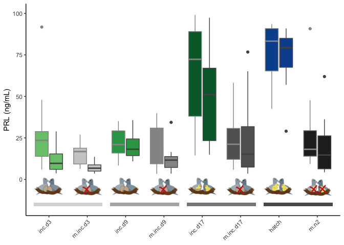

    hormones %>% 
        filter( hormone == c("prolactin"))  %>% 
        filter( treatment %in% c("inc.d9", "m.inc.d8", "inc.d17", "prolong", "hatch", "extend", "n5"))  %>% 
      ggplot(aes(x = treatment, y = plasma_conc, fill = treatment,  color = sex)) +
        geom_boxplot() + 
      theme_B3()  +
        theme(axis.text.x = element_text(angle = 45, hjust = 1),
              legend.position = "none",
              strip.text = element_blank()) +
        scale_fill_manual(values = colorscharmaip) +
        scale_color_manual(values = sexcolors) +
        labs(y = "PRL (ng/mL)", x = NULL) +
      ylim(c(-12,100)) +
       annotation_custom(inc, xmax = 1.6, ymin = -10, ymax = 10) +
       annotation_custom(maniphatch, xmax = 3.6, ymin = -10, ymax = 10) +
       annotation_custom(inc, xmax = 5.6, ymin = -10, ymax = 10) +
       annotation_custom(manipinc, xmax = 7.6, ymin = -10, ymax = 10) +
      annotation_custom(hatch, xmax = 9.6, ymin = -10, ymax = 10) +
      annotation_custom(maniphatch, xmax = 11.6, ymin = -10, ymax = 10) +
      annotation_custom(nestling, xmax = 13.6, ymin = -10, ymax = 10) +
        
      annotate("rect", xmin = 0.6, xmax = 2.4, ymin = -12, ymax = -10, alpha = 0.33) +
        annotate("rect", xmin = 4.6, xmax = 5.4, ymin = -12, ymax = -10, alpha = 0.33) +
        annotate("rect", xmin = 2.6, xmax = 5.4, ymin = -10, ymax = -8, alpha = 0.66) +
        annotate("rect", xmin = 4.6, xmax = 7.4, ymin = -8, ymax = -6, alpha = 1) 

    hormonecharplot("corticosterone", "CORT (ng/mL)")

    hormonecharplot("progesterone", "PROG (ng/mL)") 

    d1 <- hormonecharplot("estradiol", "E (ng/mL)")
    d2 <- hormonecharplot("testosterone", "T (ng/mL)")
    plot_grid(d1,d2, nrow = 1)

    hormonemanipSteroids <- function(myhormone, myylab, myymax){
      
      hormones %>% 
        filter( hormone %in% c(myhormone))  %>% 
      ggplot(aes(x = treatment, y = plasma_conc, fill = treatment, color = sex)) +
        geom_boxplot() + 
        mytheme() +
        theme(axis.text.x = element_text(angle = 45, hjust = 1),
             legend.position = "none",
              strip.text = element_blank()) +
        scale_fill_manual(values = colorscharmaip) +
        scale_color_manual(values = sexcolors) +
        labs(y = myylab, x = NULL) 
    }

    hormonemanipSteroids("corticosterone", "CORT (ng/mL)", 10)

    hormonemanipSteroids("progesterone", "PROG (ng/mL)",2.5)

    a <- hormonemanipSteroids("estradiol", "E (ng/mL)", 1)
    b <- hormonemanipSteroids("testosterone", "T (ng/mL)", 3.5)
    plot_grid(a,b)

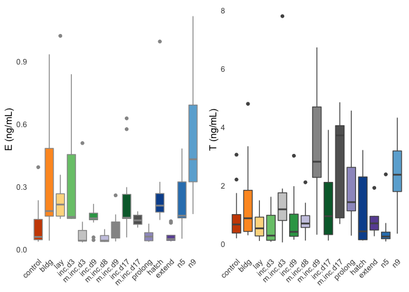

    prl.char <- hormones %>% filter(hormone == "prolactin", treatment %in% charlevels)   %>%  droplevels()
    test.char <- hormones %>% filter(hormone == "testosterone", treatment %in% charlevels)   %>%  droplevels()
    est.char <- hormones %>% filter(hormone == "estradiol", treatment %in% charlevels)   %>%  droplevels()
    prog.char <- hormones %>% filter(hormone == "progesterone", treatment %in% charlevels)   %>%  droplevels()
    cort.char <- hormones %>% filter(hormone == "corticosterone", treatment %in% charlevels)   %>%  droplevels()

    aovSexTretment <- function(mydata, whichormone){
      aov2 <- aov(data = mydata, plasma_conc ~ treatment * sex)
      print(whichormone)
      print(summary(aov2))
      #print(TukeyHSD(aov2, which = "treatment"))
    }

    aovTretment  <- function(mydata, whichormone){
      aov1 <- aov(data = mydata, plasma_conc ~ treatment )
      print(whichormone)
      print(summary(aov1))
      #print(TukeyHSD(aov1, which = "treatment"))
    }

    aovSexTretment(prl.char, "PRL") # yes, sex difference (p = 0.00256), yes treatment effect (p < 2e-16), no interaction

    ## [1] "PRL"
    ##                Df Sum Sq Mean Sq F value  Pr(>F)    
    ## treatment       8  89185   11148  35.039 < 2e-16 ***
    ## sex             1   2983    2983   9.374 0.00256 ** 
    ## treatment:sex   8   3678     460   1.445 0.18104    
    ## Residuals     170  54087     318                    
    ## ---
    ## Signif. codes:  0 '***' 0.001 '**' 0.01 '*' 0.05 '.' 0.1 ' ' 1

    aovSexTretment(cort.char, "corticosterone") # no sex difference (p = 0.779 ), small treatment effect (p = 0.0238),  no interaction

    ## [1] "corticosterone"
    ##                Df Sum Sq Mean Sq F value   Pr(>F)    
    ## treatment       8   56.6   7.076   3.740 0.000464 ***
    ## sex             1    0.4   0.441   0.233 0.630069    
    ## treatment:sex   8   12.2   1.528   0.807 0.596877    
    ## Residuals     172  325.5   1.892                     
    ## ---
    ## Signif. codes:  0 '***' 0.001 '**' 0.01 '*' 0.05 '.' 0.1 ' ' 1

    aovSexTretment(prog.char, "PROG") # no sex difference or treatment effect, signifiant interacion (p = 0.0107)

    ## [1] "PROG"
    ##                Df Sum Sq Mean Sq F value Pr(>F)  
    ## treatment       8  3.822  0.4777   1.711 0.1039  
    ## sex             1  1.008  1.0078   3.609 0.0601 .
    ## treatment:sex   8  5.167  0.6458   2.313 0.0249 *
    ## Residuals     108 30.154  0.2792                 
    ## ---
    ## Signif. codes:  0 '***' 0.001 '**' 0.01 '*' 0.05 '.' 0.1 ' ' 1

    aovTretment(est.char, "E") # p = 0.101

    ## [1] "E"
    ##             Df Sum Sq Mean Sq F value  Pr(>F)   
    ## treatment    8  1.250 0.15631   2.901 0.00674 **
    ## Residuals   82  4.419 0.05389                   
    ## ---
    ## Signif. codes:  0 '***' 0.001 '**' 0.01 '*' 0.05 '.' 0.1 ' ' 1

    aovTretment(test.char, "T") # p = 0.609

    ## [1] "T"
    ##             Df Sum Sq Mean Sq F value Pr(>F)  
    ## treatment    8  24.76   3.095   2.718 0.0106 *
    ## Residuals   80  91.08   1.138                 
    ## ---
    ## Signif. codes:  0 '***' 0.001 '**' 0.01 '*' 0.05 '.' 0.1 ' ' 1

do control bird with high prolactin hormone have high PRL expression in the pituitary? yes.
===========================================================================================

    PRLpit <- read_csv("../results/10_PRLpit.csv") %>% 
      filter(treatment == "control") %>% 
      arrange(desc(PRL))
    head(PRLpit,2)

    ## # A tibble: 2 x 5
    ##   bird          sex    treatment tissue      PRL
    ##   <chr>         <chr>  <chr>     <chr>     <dbl>
    ## 1 blu.o.x.ATLAS female control   pituitary  20.9
    ## 2 L.W33         male   control   pituitary  19.9

    hormones %>%
      filter(study == "characterization") %>%
      ggplot(aes(x = sex, y = plasma_conc, fill = sex)) +
      geom_boxplot() +
      theme_B3() +
      facet_wrap(~hormone, nrow = 1, scales = "free") +
      theme(legend.position = "none") +
      labs(y = "concentration (ng/mL")

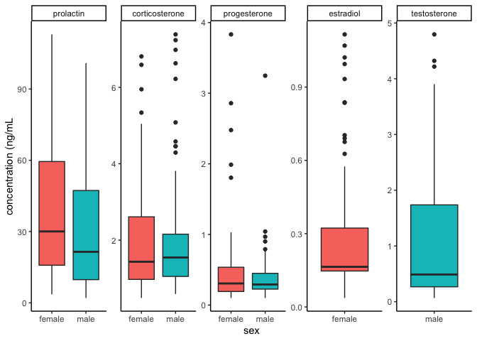

    printaovtablesex <- function(myhormone, mydescirption){
      
      aov_all = data.frame()
      for(i in alllevels){
        df <- hormones %>% filter(hormone == myhormone,
                                treatment == i) %>% droplevels()
        aovtable <- apa.aov.table(aov(plasma_conc ~ sex, data  = df))
        aovtable <- as.data.frame(aovtable$table_body)
        totaldf <- aovtable[3, 3]
        aovtable$df <- paste(aovtable$df, ", " , totaldf, sep = "")
        aovtable$ANOVA <- mydescirption
        aovtable$stages <- paste(i)
        aovtable$p <- as.numeric(as.character(aovtable$p))
        aov_all <- rbind(aov_all,aovtable)
      }

      aov_all <- aov_all %>%
        filter(Predictor == "sex")  %>%
        select(stages, ANOVA, df, "F", p) %>%
        mutate(sig = ifelse(p < 0.05, "*", " "))
      aov_all
      return(aov_all)
    }

    table1 <- printaovtablesex("prolactin", "PRL ~ sex")
    table1

    ##       stages     ANOVA    df     F     p sig
    ## 1    control PRL ~ sex 1, 21  7.74 0.011   *
    ## 2       bldg PRL ~ sex 1, 18  4.47 0.049   *
    ## 3        lay PRL ~ sex 1, 18  2.10 0.165    
    ## 4     inc.d3 PRL ~ sex 1, 18  3.93 0.063    
    ## 5   m.inc.d3 PRL ~ sex 1, 18 10.39 0.005   *
    ## 6     inc.d9 PRL ~ sex 1, 22  0.31 0.583    
    ## 7   m.inc.d8 PRL ~ sex 1, 17  3.37 0.084    
    ## 8   m.inc.d9 PRL ~ sex 1, 17  2.12 0.164    
    ## 9    inc.d17 PRL ~ sex 1, 19  1.07 0.313    
    ## 10 m.inc.d17 PRL ~ sex 1, 18  0.02 0.901    
    ## 11   prolong PRL ~ sex 1, 18  2.16 0.159    
    ## 12     hatch PRL ~ sex 1, 18  0.20 0.662    
    ## 13      m.n2 PRL ~ sex 1, 16  0.73 0.405    
    ## 14    extend PRL ~ sex 1, 17  3.38 0.084    
    ## 15        n5 PRL ~ sex 1, 18  0.03 0.870    
    ## 16        n9 PRL ~ sex 1, 18  3.00 0.100

    write.csv(table1, "../../parentalhormones/data/table-1.csv", row.names = F)

    hormones %>%
      filter(hormone == "corticosterone") %>%
      group_by(sex) %>%
      summarise(mean = mean(plasma_conc),
                median = median(plasma_conc))

    ## # A tibble: 2 x 3
    ##   sex     mean median
    ##   <fct>  <dbl>  <dbl>
    ## 1 female  1.98   1.54
    ## 2 male    2.11   1.62

    p1 <- hormones %>%
      filter(hormone == "corticosterone",
             study == "characterization") %>%
      ggplot(aes(x = sex, y = plasma_conc, fill = sex)) +
      geom_boxplot() +
      theme_B3() +
      labs(y = "CORT (ng/mL)", subtitle = element_blank() , x = NULL) +
      theme(legend.position = "none") +
      scale_fill_manual(values = sexcolors)
    p1

    cort <- hormones %>%
      filter(hormone == "corticosterone",
             study == "characterization")

    p2 <-  ggplot(cort, aes(x = treatment, y = plasma_conc, fill = treatment)) +
      geom_boxplot() +
      theme_B3() +
      labs(y = NULL, x = NULL, subtitle = element_blank() ) +
      theme(legend.position = "none") 
      
    p2

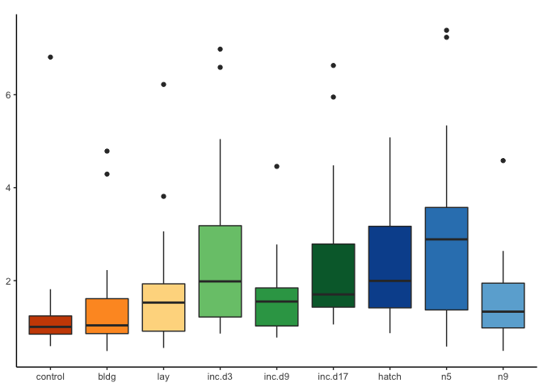

    p12 <- plot_grid(p1,p2, rel_widths = c(0.2,0.8), labels = c("h","i"), label_size = 8)

    p3 <- hormones %>%
      filter(hormone == "corticosterone",
             treatment %in% c(controlsremoval, levelsremoval )) %>% 
    ggplot(aes(x = treatment, y = plasma_conc, fill = treatment)) +
      geom_boxplot() +
      theme_B3() +
      scale_fill_manual(values = colorscharmaip) +
      theme(legend.position = "none") +
      labs( x = NULL, y = "CORT (ng/mL") +
      ylim(c(0,12.5))
    p3

    p4 <- hormones %>%
      filter(hormone == "corticosterone",
             treatment %in% c(controlstiming, levelstiming )) %>% 
    ggplot(aes(x = treatment, y = plasma_conc, fill = treatment)) +
      geom_boxplot() +
      theme_B3() +
      scale_fill_manual(values = colorscharmaip) +
      theme(legend.position = "none") +
      labs(y = NULL, x = NULL) + 
      ylim(c(0,12.5))
    p4

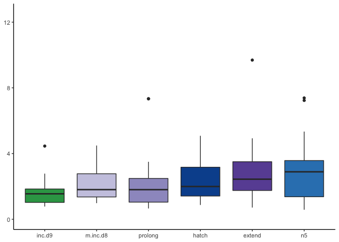

    p34 <- plot_grid(p3,p4, rel_widths = c(0.6,0.4), labels = c("j","k"), label_size = 8 )
    p34

    allcortplots <- plot_grid(p12, p34, nrow = 2, rel_heights = c(0.6,0.4))
    allcortplots

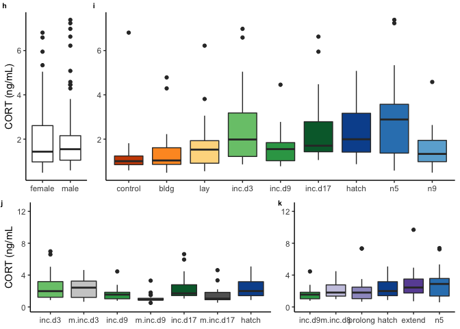

    hormones %>%
      filter(hormone == "prolactin") %>%
      group_by(sex) %>%
      summarise(m = mean(plasma_conc),
                median = median(plasma_conc))

    ## # A tibble: 2 x 3
    ##   sex        m median
    ##   <fct>  <dbl>  <dbl>
    ## 1 female  38.2   29.1
    ## 2 male    29.7   17.9

    p1 <- hormones %>%
      filter(hormone == "prolactin",
             study == "characterization") %>%
      ggplot(aes(x = sex, y = plasma_conc, fill = sex)) +
      geom_boxplot() +
      theme_B3() +
      labs(y = "Prolactin (ng/mL)", subtitle = " " , x = NULL) +
      theme(legend.position = "none",
            axis.text.x = element_text(angle = 45, hjust = 1)) +
      scale_fill_manual(values = sexcolors) +
      scale_y_continuous(limits = c(0,100)) 
    p1

    PRLf <- hormones %>%
      filter(hormone == "prolactin",
             study == "characterization",
             sex == "female")

    PRLm <- hormones %>%
      filter(hormone == "prolactin",
             study == "characterization",
             sex == "male")

    p2a <-  ggplot(PRLf, aes(x = treatment, y = plasma_conc, fill = treatment)) +
      geom_boxplot(aes(color = sex)) +
      theme_B3() +
      labs(y = NULL, x = NULL, subtitle = "females") +
      theme(legend.position = "none",
            axis.text.x = element_text(angle = 45, hjust = 1)) +
      scale_color_manual(values = sexcolors) +
      scale_y_continuous(limits = c(0,100))
      
    p2b <-  ggplot(PRLm, aes(x = treatment, y = plasma_conc, fill = treatment)) +
      geom_boxplot(aes(color = sex)) +
      theme_B3() +
      labs(y = NULL, x = NULL, subtitle = "males") +
      theme(legend.position = "none",
            axis.text.x = element_text(angle = 45, hjust = 1)) +
      scale_color_manual(values = sexcolors) +
      scale_y_continuous(limits = c(0,100))
      

    p12 <- plot_grid(p1,p2a,p2b, rel_widths = c(0.25,0.5, 0.5), labels = c("a","b", "c"), label_size = 8, nrow = 1, align = "hv")
    p12

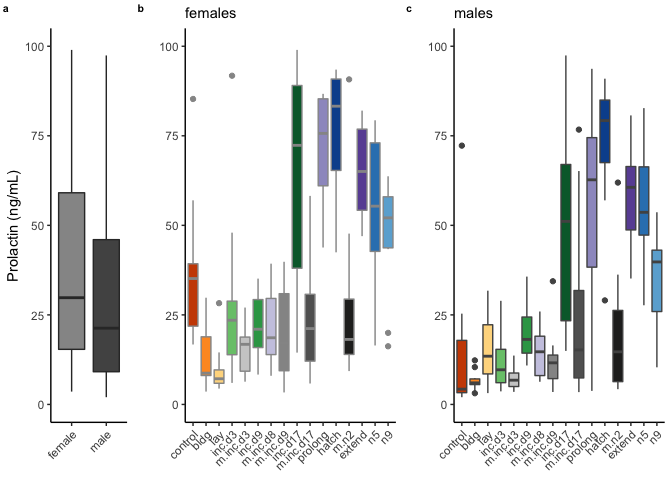

    p3a <- hormones %>%
      filter(hormone == "prolactin",
             sex == "female", 
             treatment %in% c(controlsremoval, levelsremoval )) %>% 
      ggplot(aes(x = treatment, y = plasma_conc, fill = treatment)) +
      geom_boxplot(aes(color = sex)) +
      theme_B3() +
      scale_y_continuous(limits = c(0,100)) +
      scale_fill_manual(values = colorscharmaip) +
      theme(legend.position = "none",
            axis.text.x = element_text(angle = 45, hjust = 1)) +
      labs( x = NULL, y = "Prolactin (ng/mL", subtitle = "females") +
      scale_color_manual(values = sexcolors)
    p3a

    p3b <- hormones %>%
      filter(hormone == "prolactin",
             sex == "male", 
             treatment %in% c(controlsremoval, levelsremoval )) %>% 
      ggplot(aes(x = treatment, y = plasma_conc, fill = treatment)) +
      geom_boxplot(aes(color = sex)) +
      theme_B3() +
      scale_y_continuous(limits = c(0,100)) +
      scale_fill_manual(values = colorscharmaip) +
      theme(legend.position = "none",
            axis.text.x = element_text(angle = 45, hjust = 1)) +
      labs( x = NULL, y = NULL, subtitle = "males") +
      scale_color_manual(values = sexcolors)
    p3b

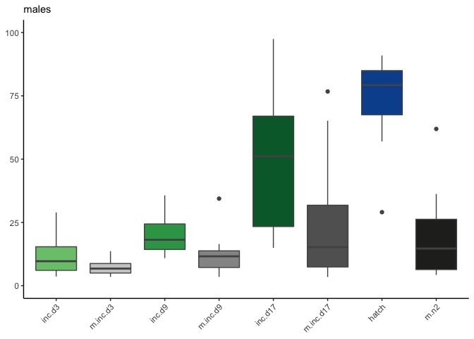

    p4a <- hormones %>%
      filter(hormone == "prolactin",
             sex == "female", 
             treatment %in% c(controlstiming, levelstiming )) %>% 
    ggplot(aes(x = treatment, y = plasma_conc, fill = treatment)) +
      geom_boxplot(aes(color = sex)) +
      theme_B3() +
      scale_y_continuous(limits = c(0,100)) +
      scale_fill_manual(values = colorscharmaip) +
      theme(legend.position = "none",
            axis.text.x = element_text(angle = 45, hjust = 1)) +
      labs(y = NULL, x = NULL, subtitle = "females") +
      scale_color_manual(values = sexcolors)
    p4a

    p4b <- hormones %>%
      filter(hormone == "prolactin",
             sex == "male", 
             treatment %in% c(controlstiming, levelstiming )) %>% 
    ggplot(aes(x = treatment, y = plasma_conc, fill = treatment)) +
      geom_boxplot(aes(color = sex)) +
      theme_B3() +
      scale_y_continuous(limits = c(0,100)) +
      scale_fill_manual(values = colorscharmaip) +
      theme(legend.position = "none",
            axis.text.x = element_text(angle = 45, hjust = 1)) +
      labs(y = NULL, x = NULL, subtitle = "males") +
      scale_color_manual(values = sexcolors) 
      
    p4b

    p34 <- plot_grid(p3a , p3b,p4a, p4b, rel_widths = c(0.55,0.55, 0.45,0.45), labels = c("d","e", "f", "g"), label_size = 8, nrow = 1)

    allprolactinplots <- plot_grid(p12, p34, nrow = 2, rel_heights = c(0.5,0.5))
    allprolactinplots

figure 2
--------

    plot_grid(allprolactinplots, allcortplots, nrow = 2)

correlations
------------

    plotcorrelations <- function(i,j, myxlab, mylab, mysubtitle){
          p <- ggplot(hormoneswide, aes(x = i, y = j), na.rm = TRUE) +
           geom_point(aes(color = treatment), na.rm = TRUE) +
           geom_smooth( method = lm, color = "darkgrey", na.rm = TRUE ) +
           theme_B3() +
          #facet_wrap(~sex, scales = "free") +
            labs(x = myxlab, y = mylab, subtitle = mysubtitle) +
            theme(legend.position = "none") +
            scale_color_manual(values = colorscharmaip2)
          
          return(p)
    }

    hormoneswide

    ## # A tibble: 331 x 9
    ##    study treatment sex   bird_id prolactin corticosterone testosterone
    ##    <fct> <fct>     <fct> <chr>       <dbl>          <dbl>        <dbl>
    ##  1 char… control   male  x.g          3.83          0.590        0.187
    ##  2 char… control   male  x.g.g        3.28          0.817        0.661
    ##  3 char… control   male  x.blk.…      4.15          0.850        1.00 
    ##  4 char… control   male  x.g.g.g     25.3           1.03         1.74 
    ##  5 char… control   fema… x.g.g.f     21.5           1.15        NA    
    ##  6 char… control   male  x.blu.o     14.9           1.44         3.05 
    ##  7 char… control   fema… blu.o.x     85.3           0.818       NA    
    ##  8 char… control   fema… r.r.x       29.5           0.910       NA    
    ##  9 char… control   fema… s.x         39.5           0.897       NA    
    ## 10 char… control   fema… x.r9        34.1          NA           NA    
    ## # … with 321 more rows, and 2 more variables: estradiol <dbl>,
    ## #   progesterone <dbl>

    corrPRL <- hormoneswide %>%
      pivot_longer(cols = corticosterone:progesterone, names_to = "hormones", values_to = "conc", values_drop_na = TRUE) %>%
      filter(study == "characterization") %>%
      ggplot(aes(x = prolactin, y = conc)) +
      geom_point(aes(color = treatment)) +
      geom_smooth( color = "darkgrey", method = "lm") +
      facet_wrap(~hormones, nrow = 1, scales = "free_y")  +
      theme_B3() +
      theme(legend.position = "bottom",
            legend.title = element_blank()) +
      scale_color_manual(values = colorscharmaip2) +
      guides(color = guide_legend(nrow = 1)) +
      labs(y = "conc. (ng/mL)", x = "prolactin (ng/mL)")
    corrPRL

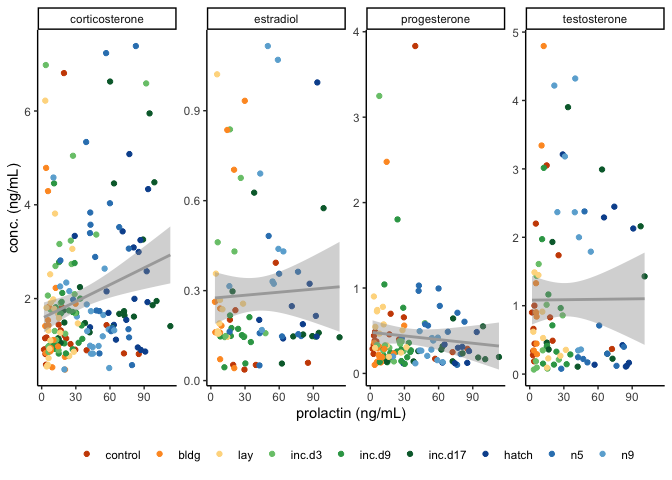

    corrCORT <- hormoneswide %>%
      pivot_longer(cols = c(prolactin, estradiol, testosterone, progesterone), names_to = "hormones", values_to = "conc", values_drop_na = TRUE) %>%
      filter(study == "characterization") %>%
      ggplot(aes(x = corticosterone, y = conc)) +
      geom_point(aes(color = treatment)) +
      geom_smooth( color = "darkgrey", method = "lm") +
      facet_wrap(~hormones, nrow = 1, scales = "free_y")  +
      theme_B3() +
      theme(legend.position = "bottom",
            legend.title = element_blank()) +
      scale_color_manual(values = colorscharmaip2) +
      guides(color = guide_legend(nrow = 1)) +
      labs(y = "conc. (ng/mL)", x = "corticosterone (ng/mL)")
    corrCORT

    hormoneswide %>%
      pivot_longer(cols = c(prolactin, estradiol, testosterone, progesterone), names_to = "hormones", values_to = "conc", values_drop_na = TRUE) %>%
      filter(study == "characterization") %>%
      ggplot(aes(x = corticosterone, y = conc)) +
      geom_point(aes(color = treatment)) +
      geom_smooth(color = "darkgrey", method = "lm") +
      facet_grid(hormones ~ treatment, scales = "free_y")  +
      theme_B3() +
      theme(legend.position = "bottom",
            legend.title = element_blank()) +
      scale_color_manual(values = colorscharmaip2) +
      guides(color = guide_legend(nrow = 1)) +
      labs(y = "conc. (ng/mL)", x = "corticosterone (ng/mL)")

    hormoneswide %>%
      pivot_longer(cols = c(corticosterone, estradiol, testosterone, progesterone), names_to = "hormones", values_to = "conc", values_drop_na = TRUE) %>%
      filter(study == "characterization") %>%
      ggplot(aes(x = prolactin, y = conc)) +
      geom_point(aes(color = treatment)) +
      geom_smooth(color = "darkgrey", method = "lm") +
      facet_grid(hormones ~ treatment, scales = "free_y")  +
      theme_B3() +
      theme(legend.position = "bottom",
            legend.title = element_blank()) +
      scale_color_manual(values = colorscharmaip2) +
      guides(color = guide_legend(nrow = 1)) +
      labs(y = "conc. (ng/mL)", x = "prolactin (ng/mL)")

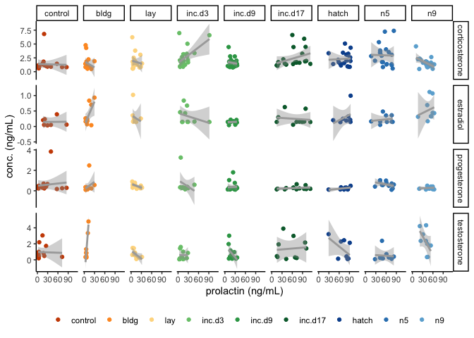

    ggplot(hormoneswide, aes(x = prolactin, y = corticosterone, color = treatment)) +
      geom_point() + geom_smooth(method = "lm") +
      facet_wrap(~treatment) +
      scale_color_manual(values =  colorscharmaip) + theme(legend.position = "none")

    ggplot(hormoneswide, aes(x = prolactin, y = testosterone, color = treatment)) +
      geom_point() + geom_smooth(method = "lm") +
      facet_wrap(~treatment) +
      scale_color_manual(values =  colorscharmaip) + theme(legend.position = "none")

progesterone
------------

    hormones %>%
      filter(hormone == "progesterone") %>%
      group_by(sex) %>%
      summarise(mean = mean(plasma_conc),
                median = median(plasma_conc))

    ## # A tibble: 2 x 3
    ##   sex     mean median
    ##   <fct>  <dbl>  <dbl>
    ## 1 female 0.469  0.296
    ## 2 male   0.378  0.279

    p1 <- hormones %>%
      filter(hormone == "progesterone",
             study == "characterization") %>%
      ggplot(aes(x = sex, y = plasma_conc, fill = sex)) +
      geom_boxplot() +
      theme_B3() +
      labs(y = "Progesterone (ng/mL)", subtitle = element_blank() , x = NULL) +
      theme(legend.position = "none")   +
      scale_y_continuous(limits = c(0,4.5)) +
      scale_fill_manual(values = sexcolors) 

    df <- hormones %>%
      filter(hormone == "progesterone",
             study == "characterization")

    p2 <-  ggplot(df, aes(x = treatment, y = plasma_conc, fill = treatment)) +
      geom_boxplot() +
      theme_B3() +
      labs(y = NULL, x = NULL, subtitle = " ") +
      scale_y_continuous(limits = c(0,4.5)) +
      theme(legend.position = "none") 

    p3 <- hormones %>%
      filter(hormone == "progesterone",
             treatment %in% c(controlsremoval, levelsremoval )) %>% 
    ggplot(aes(x = treatment, y = plasma_conc, fill = treatment)) +
      geom_boxplot() +
      theme_B3() +
      scale_y_continuous(limits = c(0,4.5)) +
      scale_fill_manual(values = colorscharmaip) +
      theme(legend.position = "none") +
      labs( x = NULL, y = "Progesterone (ng/mL")

    p4 <- hormones %>%
      filter(hormone == "progesterone",
             treatment %in% c(controlstiming, levelstiming )) %>% 
    ggplot(aes(x = treatment, y = plasma_conc, fill = treatment)) +
      geom_boxplot() +
      theme_B3() +
      scale_y_continuous(limits = c(0,4.5)) +
      scale_fill_manual(values = colorscharmaip) +
      theme(legend.position = "none") +
      labs(y = NULL, x = NULL)

    progesterone <- plot_grid(p1, p2, p3 + labs(y = NULL), p4, nrow = 1, rel_widths =   c(0.175,0.4,0.35,0.25))
    progesterone

estradiol and testosterone
--------------------------

    hormones %>%
      filter(hormone == "estradiol") %>%
      summarise(mean = mean(plasma_conc),
                median = median(plasma_conc))

    ## # A tibble: 1 x 2
    ##    mean median
    ##   <dbl>  <dbl>
    ## 1 0.206  0.147

    p5 <- hormones %>%
      filter(hormone == "estradiol",
             study == "characterization") %>%
      ggplot(aes(x = sex, y = plasma_conc, fill = sex)) +
      geom_boxplot() +
      theme_B3() +
      labs(y = "Estradiol (ng/mL)", subtitle = element_blank() , x = NULL) +
      theme(legend.position = "none")  +
        scale_y_continuous(limits = c(0,1)) +
      scale_fill_manual(values = sexcolors) 

    df <- hormones %>%
      filter(hormone == "estradiol",
             study == "characterization")

    p6 <-  ggplot(df, aes(x = treatment, y = plasma_conc, fill = treatment)) +
      geom_boxplot() +
      theme_B3() +
      labs(y = NULL, x = NULL, subtitle = " ") +
        scale_y_continuous(limits = c(0,1)) +
      theme(legend.position = "none") 

    p7 <- hormones %>%
      filter(hormone == "estradiol",
             treatment %in% c(controlsremoval, levelsremoval )) %>% 
    ggplot(aes(x = treatment, y = plasma_conc, fill = treatment)) +
      geom_boxplot() +
      theme_B3() +
      scale_y_continuous(limits = c(0,1)) +
      scale_fill_manual(values = colorscharmaip) +
      theme(legend.position = "none") +
      labs( x = NULL, y = "Estradiol (ng/mL")

    p8 <- hormones %>%
      filter(hormone == "estradiol",
             treatment %in% c(controlstiming, levelstiming )) %>% 
    ggplot(aes(x = treatment, y = plasma_conc, fill = treatment)) +
      geom_boxplot() +
      theme_B3() +
      scale_y_continuous(limits = c(0,1)) +
      scale_fill_manual(values = colorscharmaip) +
      theme(legend.position = "none") +
      labs(y = NULL, x = NULL)

    estradiol <- plot_grid(p5, p6, p7 + labs(y = NULL), p8, nrow = 1, rel_widths =   c(0.175,0.4,0.35,0.25))
    estradiol

    hormones %>%
      filter(hormone == "testosterone") %>%
      summarise(mean = mean(plasma_conc),
                median = median(plasma_conc))

    ## # A tibble: 1 x 2
    ##    mean median
    ##   <dbl>  <dbl>
    ## 1  1.39  0.850

    p9 <- hormones %>%
      filter(hormone == "testosterone",
             study == "characterization") %>%
      ggplot(aes(x = sex, y = plasma_conc, fill = sex)) +
      geom_boxplot() +
      theme_B3() +
      labs(y = "Testosterone (ng/mL)", subtitle = element_blank() , x = NULL) +
      theme(legend.position = "none")  +
        scale_y_continuous(limits = c(0,8.5)) +
      scale_fill_manual(values = sexcolors) 

    df <- hormones %>%
      filter(hormone == "testosterone",
             study == "characterization")

    p10 <-  ggplot(df, aes(x = treatment, y = plasma_conc, fill = treatment)) +
      geom_boxplot() +
      theme_B3() +
      labs(y = NULL, x = NULL, subtitle = " ") +
        scale_y_continuous(limits = c(0,8.5)) +
      theme(legend.position = "none") 
      

    p11 <- hormones %>%
      filter(hormone == "testosterone",
             treatment %in% c(controlsremoval, levelsremoval )) %>% 
    ggplot(aes(x = treatment, y = plasma_conc, fill = treatment)) +
      geom_boxplot() +
      theme_B3() +
      scale_y_continuous(limits = c(0,8.5)) +
      scale_fill_manual(values = colorscharmaip) +
      theme(legend.position = "none") +
      labs( x = NULL, y = "concentration (ng/mL")

    p12 <- hormones %>%
      filter(hormone == "testosterone",
             treatment %in% c(controlstiming, levelstiming )) %>% 
    ggplot(aes(x = treatment, y = plasma_conc, fill = treatment)) +
      geom_boxplot() +
      theme_B3() +
      scale_y_continuous(limits = c(0,8.5)) +
      scale_fill_manual(values = colorscharmaip) +
      theme(legend.position = "none") +
      labs(y = NULL, x = NULL)
    p12

    testosterone <- plot_grid(p9, p10, p11 + labs(y = NULL), p12, nrow = 1, rel_widths =   c(0.175,0.4,0.35,0.25))
    testosterone

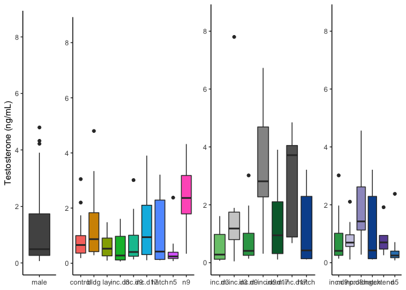

    sexsteroids <- plot_grid(
           p9 + theme(axis.text.x = element_blank()),  
           p10 + theme(axis.text.x = element_blank()), 
           p11 + labs(y = NULL) + theme(axis.text.x = element_blank()), 
           p12 + theme(axis.text.x = element_blank()),
            p5 + theme(axis.text.x = element_blank()), 
           p6 + theme(axis.text.x = element_blank()), 
           p7 + labs(y = NULL) + theme(axis.text.x = element_blank()), 
           p8 + theme(axis.text.x = element_blank()), 
           p1 , 
           p2 + theme(axis.text.x = element_text(angle = 45, hjust = 1)), 
           p3 + labs(y = NULL)  + theme(axis.text.x = element_text(angle = 45, hjust = 1)), 
           p4  + theme(axis.text.x = element_text(angle = 45, hjust = 1)), 
            nrow = 3, 
            rel_widths =   c(0.175,0.4,0.35,0.25), align = "hv",
              label_size = 8, labels = c("A1", "A2", "A3" , "A4",
                                         "B1", "B2", "B3" , "B4",
                                         "C1", "C2", "C3" , "C3"))
    sexsteroids

pca of hormones
---------------

    library("factoextra")
    library("FactoMineR")

    # char only
    hormoneswidechar <- hormoneswide %>% filter(treatment %in% charlevels)
    df <- hormoneswidechar %>% select(prolactin:progesterone)
    res.pca <- PCA(df)

    a1 <- fviz_pca_var(res.pca, col.var = "black", title = "Charactherization only") 
    # Contributions of variables to PC1

    b1 <- fviz_contrib(res.pca, choice = "var", axes = 1, top = 10) + labs(y = "Dim 1 contibutions (%)",
                                                                          title = element_blank())
    # Contributions of variables to PC2
    c1 <- fviz_contrib(res.pca, choice = "var", axes = 2, top = 10) +
      labs(y = "Dim 2 contibutions (%)") + theme(title = element_blank())

    ones <- plot_grid(a1,b1,c1, nrow = 1, rel_widths = c(1,0.425,0.425), align = "hv")

    # char and manip
    df <- hormoneswide %>% select(prolactin:progesterone)
    res.pca <- PCA(df)

    a2 <- fviz_pca_var(res.pca, col.var = "black", title = "Charactherization & manipluation") 
    # Contributions of variables to PC1

    b2 <- fviz_contrib(res.pca, choice = "var", axes = 1, top = 10) + labs(y = "Dim 1 contibutions (%)",
                                                                          title = element_blank())
    # Contributions of variables to PC2
    c2 <- fviz_contrib(res.pca, choice = "var", axes = 2, top = 10) +
      labs(y = "Dim 2 contibutions (%)") + theme(title = element_blank())

    twos <- plot_grid(a2 + theme(title = element_blank()),b2,c2, nrow = 1, rel_widths = c(1,0.425,0.425), align = "hv")

    plot_grid(ones,twos, nrow = 2)

    twos

    plot_grid(twos,sexsteroids, nrow = 2, rel_heights = c(0.25,0.75), align = "hv")

smooth funciton
===============

    head(hormones)

    ## # A tibble: 6 x 9
    ##   study  treatment sex   bird_id hormone plasma_conc icons music  iconpath 
    ##   <fct>  <fct>     <fct> <chr>   <fct>         <dbl> <chr> <chr>  <chr>    
    ## 1 chara… control   male  x.g     prolac…        3.83 cont… https… ../figur…
    ## 2 chara… control   male  x.g.g   prolac…        3.28 cont… https… ../figur…
    ## 3 chara… control   male  x.blk.… prolac…        4.15 cont… https… ../figur…
    ## 4 chara… control   male  x.g.g.g prolac…       25.3  cont… https… ../figur…
    ## 5 chara… control   fema… x.g.g.f prolac…       21.5  cont… https… ../figur…
    ## 6 chara… control   male  x.blu.o prolac…       14.9  cont… https… ../figur…

    ggplot(hormones, aes(x = as.numeric(treatment), y = plasma_conc, color = hormone)) +
      geom_smooth() 

    box <- ggplot(hormones, aes(x = as.numeric(treatment), y = plasma_conc)) +
      geom_boxplot(aes(fill = treatment)) +
      #geom_smooth(aes(color = hormone)) +
      facet_wrap(~hormone, scales = "free_y", nrow = 5) +
      scale_x_continuous(breaks = c(1,2,3,4,5,6,7,8,9,10,11,12,13,14,15,16),
                         labels = alllevels) +
      theme_B3() +
      theme(#strip.text = element_blank(),
            axis.text.x = element_text(angle = 45, hjust = 1),
            legend.position = "none",
            panel.background = element_rect(fill = "transparent",colour = NA),
            plot.background = element_rect(fill = "transparent",colour = NA)) +
      labs(y = "plasma conc. (ng/mL)", x = "parental stage")

    line <- ggplot(hormones, aes(x = as.numeric(treatment), y = plasma_conc)) +
      #geom_boxplot(aes(fill = treatment)) +
      geom_smooth(aes(color = hormone)) +
      facet_wrap(~hormone, scales = "free_y", nrow = 5) +
      scale_x_continuous(breaks = c(1,2,3,4,5,6,7,8,9,10,11,12,13,14,15,16),
                         labels = alllevels) +
      theme_B3() +
      theme(#strip.text = element_blank(),
            axis.text.x = element_text(angle = 45, hjust = 1),
            legend.position = "none",
            panel.background = element_rect(fill = "transparent",colour = NA),
            plot.background = element_rect(fill = "transparent",colour = NA)) +
      labs(y = "plasma conc. (ng/mL)", x = "parental stage") 
      

    plot_grid(box, line, nrow = 1)

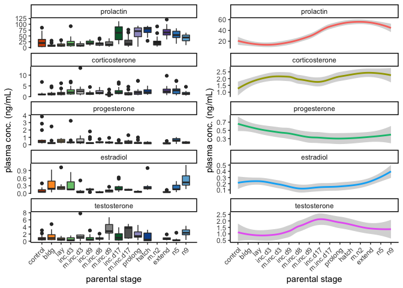
