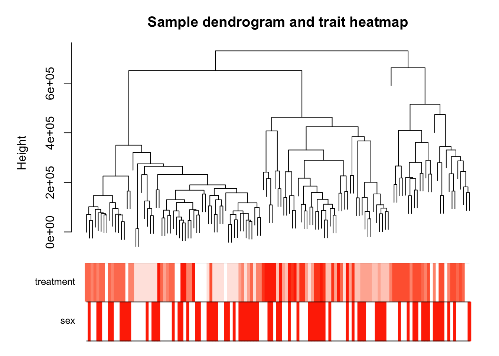

All characterization data
-------------------------

This first image was made using
[`08_WGCNA_1.R`](https://github.com/macmanes-lab/DoveParentsRNAseq/blob/master/analysis/08_WGCNA_1.R),
which was modified from the [first in a series of WGCNA
tutorial](https://horvath.genetics.ucla.edu/html/CoexpressionNetwork/Rpackages/WGCNA/Tutorials/Consensus-DataInput.R).
The first tutorial focuses on data input, cleaning and pre-processing;
outlier removal; clustering of samples by their Euclidean distance; a
comparison of sample cluster to sample meta data.

hypothalamus
------------

pituitary
---------

gonads
------

