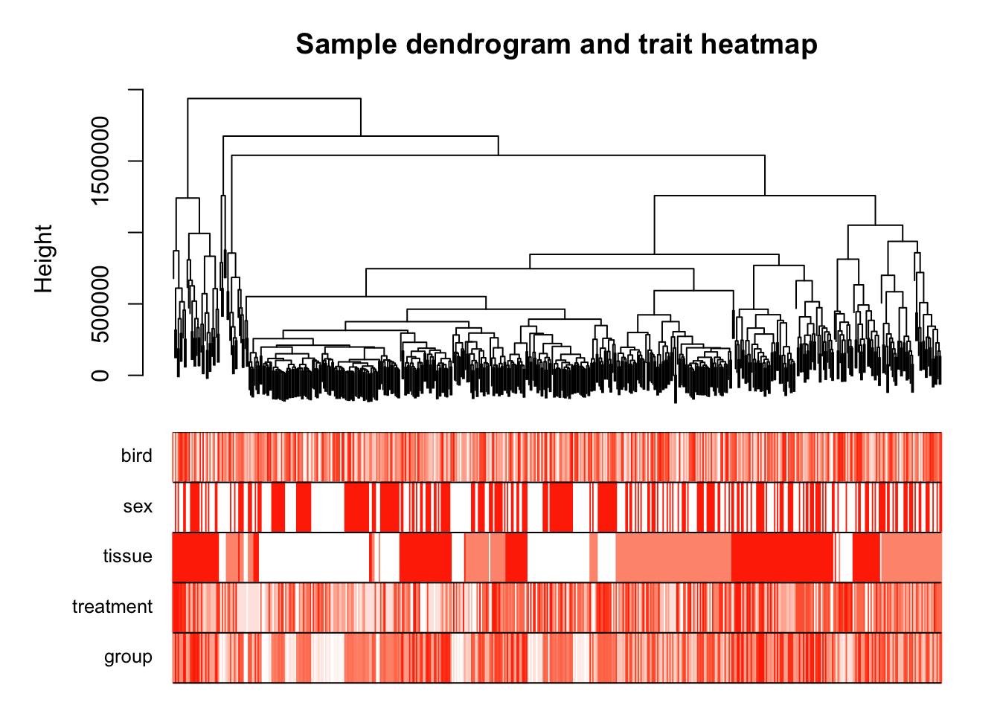
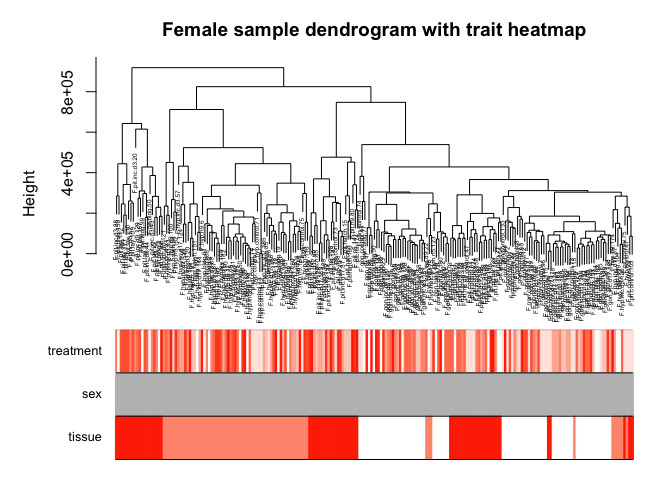
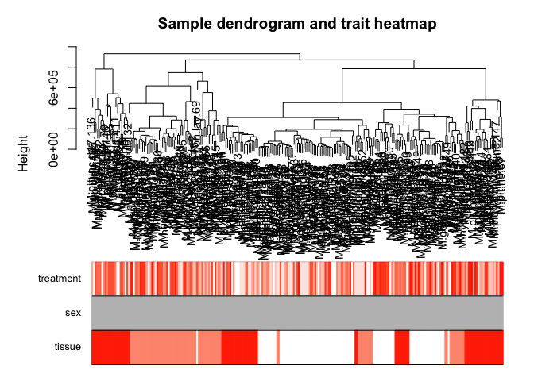
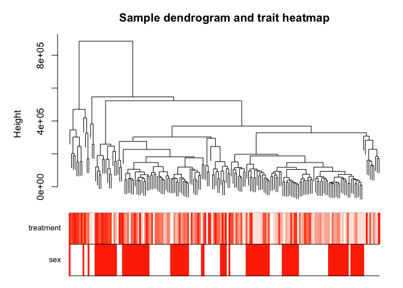
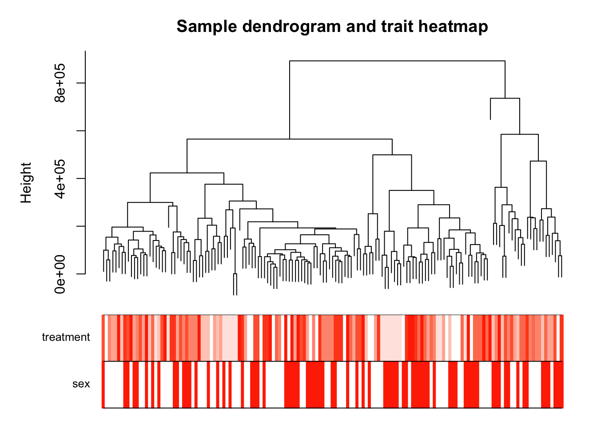

All characterization data
-------------------------

This first image was made using
[`08_WGCNA_1.R`](https://github.com/macmanes-lab/DoveParentsRNAseq/blob/master/analysis/08_WGCNA_1.R),
which was modified from the [first in a series of WGCNA
tutorial](https://horvath.genetics.ucla.edu/html/CoexpressionNetwork/Rpackages/WGCNA/Tutorials/Consensus-DataInput.R).
The first tutorial focuses on data input, cleaning and pre-processing;
outlier removal; clustering of samples by their Euclidean distance; a
comparison of sample cluster to sample meta data.

For the following figures, the top panel is a dendrogram showing
Euclidean distance of sample. Because the labeling of samples is hard to
read, the colored rows can be used to visualize traits. Here, both sex
and tissues are colored in a white to red scaled with the following
pattern:

-   sex: females (white), males (red),
-   tissue: gonad (white), hypothalamus (pink), pituitary (red).

**Fig 1. Characterization dendrogram with trait heatmap.**. Most
hypothalamus and pituitary samples separte form the gonad samples, but
some are clusters contain samples from all tissues.

Females
-------

**Fig 2. Female characterization dendrogram with trait heatmap.**. Most
pituitary samples form a single cluster. More hypothalamus samples
cluster with gonads than with pituitary.

Males
-----

**Fig 3. Male characterization dendrogram with trait heatmap.**. As with
females, most pituitary samples form a single cluster, while more
hypothalamus samples cluster with gonads than with pituitary.

gonads
------

**Fig 3. Gonad characterization dendrogram with trait heatmap.**. Male
and female samples cluster together, but with large, sex-specific
regions…. maybe there is a strong treatment effect here.

hypothalamus
------------

Male and female samples cluster together, but with very small,
sex-specific regions…. maybe there is a small treatment effect here.

pituitary (not working)
-----------------------
