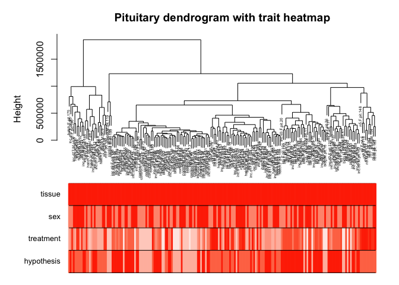

WGCNA analysis, second pass
===========================

The anlayses and image was made by following along with and modifing the
[first in a series of WGCNA
tutorial](https://horvath.genetics.ucla.edu/html/CoexpressionNetwork/Rpackages/WGCNA/Tutorials/Consensus-DataInput.R).
The first tutorial focuses on data input, cleaning and pre-processing;
outlier removal; clustering of samples by their Euclidean distance; a
comparison of sample cluster to sample meta data. I put pretty much the
whole script into a single function that I source with
[`08_WGCNA_1.R`](https://github.com/macmanes-lab/DoveParentsRNAseq/blob/master/analysis/08_WGCNA_1.R).

For the following figures, the top panel is a dendrogram showing
Euclidean distance of sample. Because the labeling of samples is hard to
read, the colored rows can be used to visualize traits. Here, both sex
and tissues are colored in a white to red scaled with the following
pattern:

-   sex: females (white), males (red),
-   tissue: gonad (white), hypothalamus (pink), pituitary (red).

pituitary (not working)
-----------------------

