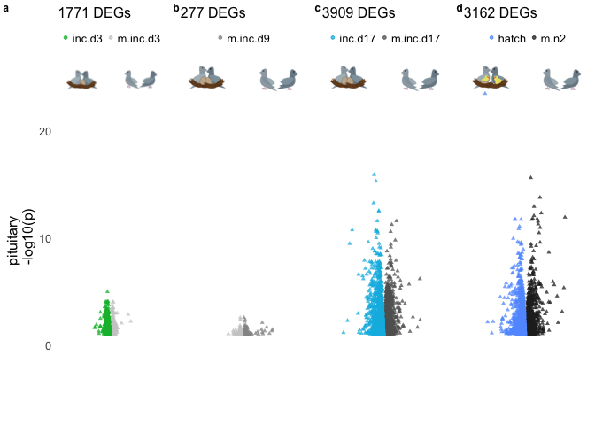
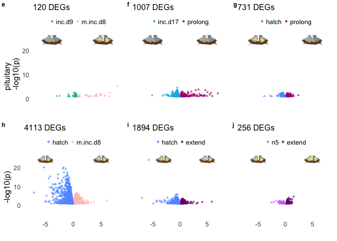

    library(tidyverse)

    ## ── Attaching packages ────────────────────────────────────────────────────────────────────────────────────── tidyverse 1.3.0 ──

    ## ✔ ggplot2 3.2.1     ✔ purrr   0.3.3
    ## ✔ tibble  2.1.3     ✔ dplyr   0.8.3
    ## ✔ tidyr   1.0.0     ✔ stringr 1.4.0
    ## ✔ readr   1.3.1     ✔ forcats 0.4.0

    ## ── Conflicts ───────────────────────────────────────────────────────────────────────────────────────── tidyverse_conflicts() ──
    ## ✖ dplyr::filter() masks stats::filter()
    ## ✖ dplyr::lag()    masks stats::lag()

    library(cowplot)

    ## 
    ## Attaching package: 'cowplot'

    ## The following object is masked from 'package:ggplot2':
    ## 
    ##     ggsave

    source("../R/functions.R")  # load custom functions 
    source("../R/themes.R")  # load custom themes and color palletes
    source("../R/icons.R")  # for images

    ## Warning: Column `icons` joining factor and character vector, coercing into
    ## character vector

    knitr::opts_chunk$set(fig.path = '../figures/manipulation/',message=F, warning=FALSE)

    inc.d3.m.inc.d3 <- read_csv("../results/DESeqAll.pituitary.inc.d3.m.inc.d3.csv")
    inc.d9.m.inc.d9 <- read_csv("../results/04_DEGs.pituitary.m.inc.d3.m.inc.d9.csv")
    inc.d17.m.inc.d17 <- read_csv("../results/DESeqAll.pituitary.inc.d17.m.inc.d17.csv")
    hatch.m.n2 <- read_csv("../results/DESeqAll.pituitary.hatch.m.n2.csv")
    inc.d9.m.inc.d8 <- read_csv("../results/DESeqAll.pituitary.inc.d9.m.inc.d8.csv")
    hatch.m.inc.d8 <- read_csv("../results/DESeqAll.pituitary.hatch.m.inc.d8.csv")
    inc.d17.prolong <- read_csv("../results/DESeqAll.pituitary.inc.d17.prolong.csv")
    hatch.prolong <- read_csv("../results/DESeqAll.pituitary.hatch.prolong.csv")
    hatch.extend <- read_csv("../results/DESeqAll.pituitary.hatch.extend.csv")
    n5.extend <- read_csv("../results/DESeqAll.pituitary.n5.extend.csv")

    a <- plot.volcano(inc.d3.m.inc.d3 , "treatment",   "m.inc.d3", "inc.d3",   colorsvolcano) + 
      annotation_custom(lay, ymin = 20, ymax = 30, xmin = -8, xmax = -2) + 
      annotation_custom(control, ymin = 20, ymax = 30, xmin = 2, xmax = 8) 
    b <- plot.volcano(inc.d9.m.inc.d9, "treatment",  "m.inc.d9", "inc.d9" , colorsvolcano)+ 
      annotation_custom(inc, ymin = 20, ymax = 30, xmin = -8, xmax = -2) + 
      annotation_custom(control, ymin = 20, ymax = 30, xmin = 2, xmax = 8) 
    c <- plot.volcano(inc.d17.m.inc.d17 , "treatment",  "m.inc.d17", "inc.d17" , colorsvolcano) + 
      annotation_custom(inc, ymin = 20, ymax = 30, xmin = -8, xmax = -2) + 
      annotation_custom(control, ymin = 20, ymax = 30, xmin = 2, xmax = 8) 
    d <- plot.volcano(hatch.m.n2 , "treatment",   "m.n2", "hatch", colorsvolcano) + 
      annotation_custom(hatch, ymin = 20, ymax = 30, xmin = -8, xmax = -2) + 
      annotation_custom(control, ymin = 20, ymax = 30, xmin = 2, xmax = 8) 

    e <- plot.volcano(inc.d9.m.inc.d8 , "treatment",   "m.inc.d8", "inc.d9"  , colorsvolcano)  +
      annotation_custom(inc, ymin = 20, ymax = 30, xmin = -8, xmax = -2) + 
      annotation_custom(hatch, ymin = 20, ymax = 30, xmin = 2, xmax = 8) 
    f <- plot.volcano(inc.d17.prolong , "treatment",   "prolong", "inc.d17",  colorsvolcano)  +
      annotation_custom(inc, ymin = 20, ymax = 30, xmin = -8, xmax = -2) + 
      annotation_custom(inc, ymin = 20, ymax = 30, xmin = 2, xmax = 8) 
    g <- plot.volcano(hatch.prolong , "treatment",  "prolong", "hatch", colorsvolcano)  +
      annotation_custom(hatch, ymin = 20, ymax = 30, xmin = -8, xmax = -2) + 
      annotation_custom(inc, ymin = 20, ymax = 30, xmin = 2, xmax = 8) 

    h <- plot.volcano(hatch.m.inc.d8 , "treatment",    "m.inc.d8", "hatch"  , colorsvolcano)  +
      annotation_custom(hatch, ymin = 20, ymax = 30, xmin = -8, xmax = -2) + 
      annotation_custom(hatch, ymin = 20, ymax = 30, xmin = 2, xmax = 8) 
    i <- plot.volcano(hatch.extend , "treatment",  "extend", "hatch" , colorsvolcano)  +
      annotation_custom(hatch, ymin = 20, ymax = 30, xmin = -8, xmax = 2) + 
      annotation_custom(hatch, ymin = 20, ymax = 30, xmin = 2, xmax = 8) 
    j <- plot.volcano(n5.extend , "treatment",  "extend", "n5", colorsvolcano)  +
      annotation_custom(hatch, ymin = 20, ymax = 30, xmin = -8, xmax = -2) + 
      annotation_custom(nestling, ymin = 20, ymax = 30, xmin = 2, xmax = 8) 

    remove <- plot_grid(a +  theme(axis.title.x = element_blank(), axis.text.x = element_blank()) +
                           labs(y = "pituitary \n -log10(p)", subtitle = "1771 DEGs"),
              b + theme(axis.title = element_blank(), axis.text = element_blank()) + labs(subtitle = "277 DEGs"),
              c + theme(axis.title = element_blank(), axis.text = element_blank()) + labs(subtitle = "3909 DEGs"),
              d + theme(axis.title = element_blank(), axis.text = element_blank()) + labs(subtitle = "3162 DEGs"), 
              nrow = 1, rel_widths = c(1.2,1,1,1),
              labels = c("a","b","c","d"), label_size = 9)
    remove

    manipinc <- plot_grid(e +  theme(axis.title.x = element_blank(), axis.text.x = element_blank()) +
                           labs(y = "pituitary \n -log10(p)", subtitle = "120 DEGs"),
              f + theme(axis.title = element_blank(), axis.text = element_blank()) + labs(subtitle = "1007 DEGs"),
              g + theme(axis.title = element_blank(), axis.text = element_blank()) + labs(subtitle = "731 DEGs"),
              nrow = 1, rel_widths = c(1.2,1,1),
              labels = c("e","f","g"," "), label_size = 9)

    maniphatch <- plot_grid( h +  labs(subtitle = "4113 DEGs"), 
              i + theme(axis.title.y = element_blank(), axis.text.y = element_blank()) + labs(subtitle = "1894 DEGs"), 
              j + theme(axis.title.y = element_blank(), axis.text.y = element_blank()) + labs(subtitle = "256 DEGs"), 
              nrow = 1, rel_widths = c(1.2,1,1),
              labels = c("h","i","j"," "), label_size = 9)

    plot_grid(manipinc, maniphatch, nrow = 2)

